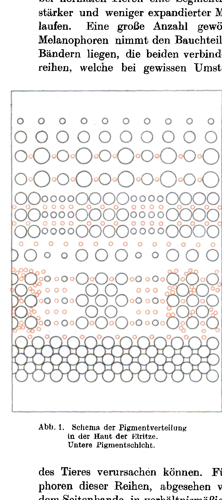
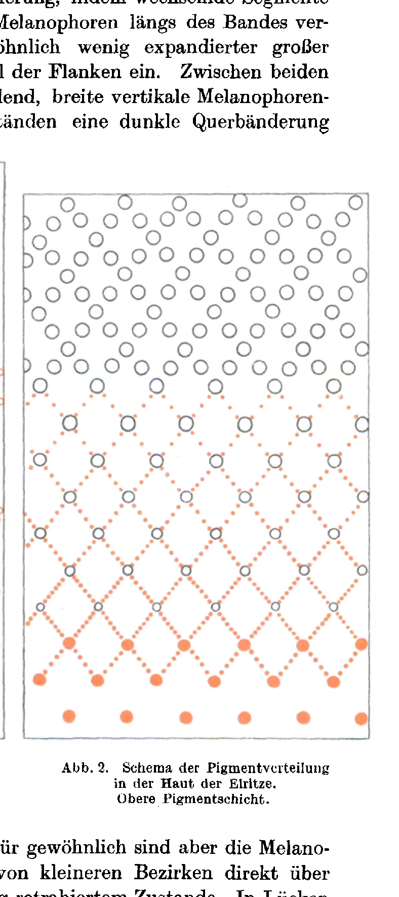
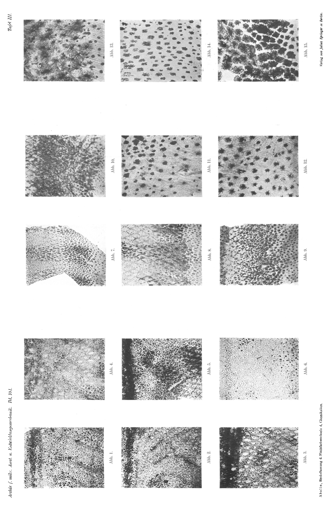
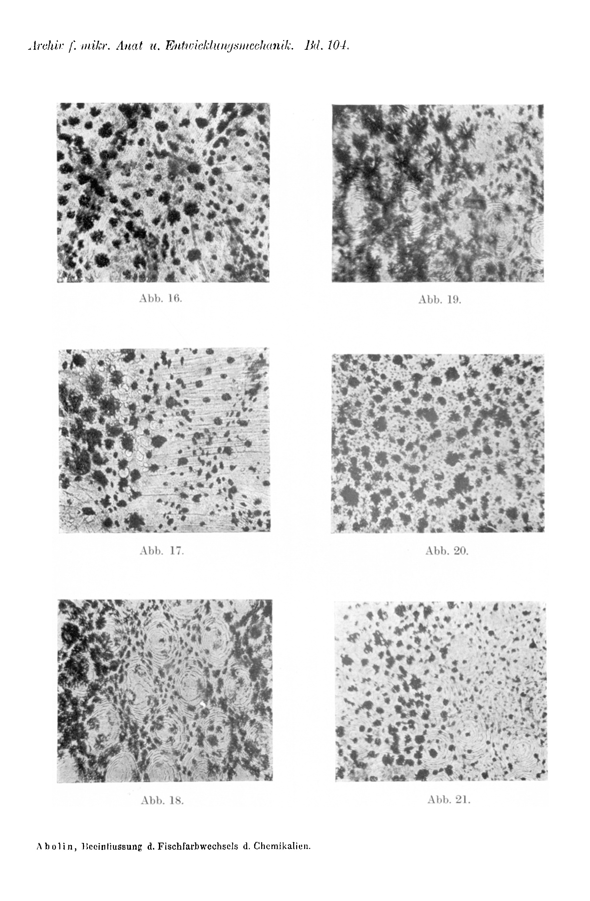
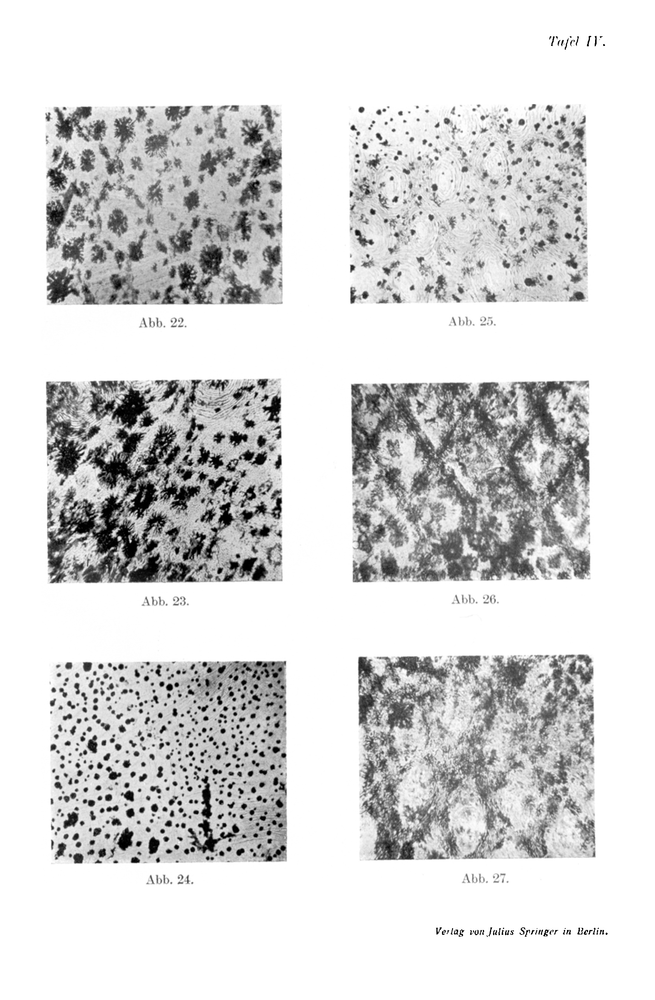
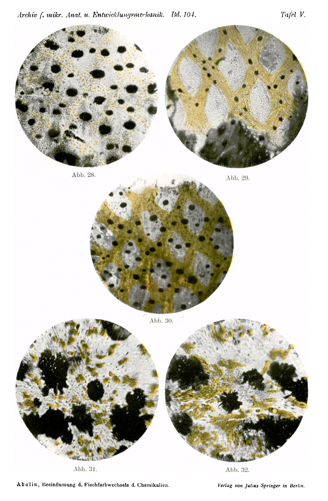
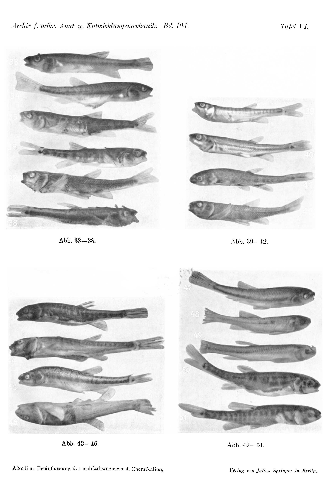

# Influencing the Colour Change of Fishes by Chemicals.

## I. Infundin- and Adrenalin-action and the Melano- and Xanthophores of the Minnow (*Phoxinus laevis* Ag.).

By

**Leo Abolin (Riga).**

*(From the Biological Experimental Institute of the Academy of Sciences in Vienna [Zoological Division].)*¹

With Plates III—VI and 2 Text-figures.

*(Received on 25 October 1924.)*

*Archiv für Entwicklungsmechanik der Organismen*, vol. 104 (1925).

> **Full translation.** A complete English rendering of Abolin's study of how chemicals (adrenalin, pituitrin, pilocarpine, atropine and others) influence the colour change of fishes — the chromatophore responses — with the tables and figure legends.

### Table of Contents.

|  | Page |
|---|---|
| 1. Introduction | 667 |
| 2. Experimental material | 671 |
| 3. Technical part | 672 |
| 4. Preliminary experiments on Amphibians | 674 |
| 5. Experiments on the Minnow | 675 |
| a) Pigment-expansion in the skin | 675 |
| b) Adrenalin-injections | 677 |
| c) Infundin-injections | 681 |
| d) Combined injections | 689 |
| 6. Summary | 693 |
| Literature | 695 |
| Explanation of plates | 696 |

> ¹ An abstract of this work appeared, under the same title, as Communication No. 119 from the Biological Experimental Institute of the Academy of Sciences in Vienna, Zoological Division, Director *H. Przibram*, in the Academy's Sitzungsanzeiger No. 20, 1924.

### 1. Introduction.

Since the ingenious investigations of *Ballowitz* (1, 2) and *v. Frisch* (3, 4), the anatomy as well as the nervous physiology of the fish-colour-change has become a fairly well-known field. We now know that at the beginning of the medulla oblongata of the fishes there is a coloristic centre which uninterruptedly sends out retraction-impulses toward the periphery and in this way keeps the chromatophores in a constant tonus. A second coloristic centre, the inhibition-centre of the diencephalon, can inhibit these impulses. This action of the second centre is influenced by illumination, as *v. Frisch* (3) has proved by experiments. The function of the retraction-centre too is dependent on the light-stimuli; namely, the eyes are natural regulators of the colourchange and the colour-adaptation. This last conception was already long ago advocated by *Hans Przibram* (5) and found in the colour-binding experiments on fishes a brilliant confirmation. In this way the smallest contrast-alterations in the artificial medium of the animals can, through the mediation of the corresponding reactions of the system of the skin-chromatophores, call forth these latter and bring them out of a middle state of accumulation into one of retraction or expansion. The coloristic pathways of the fishes too have been known to us since *v. Frisch* (3), and they run in the *Sympathicus* from the 18th—15th vertebra onward. One must indeed assume that all the cited facts are derived mainly from the behaviour of the melanophores, and, as we shall yet see, the innervation of the xantho- and erythrophores is presumably a different one.

The influence of various physical factors on the colour change of fishes, above all of temperature and of light, has also several times been the object of special investigations.

Much less, however, has the chemistry of the colour change been investigated. According to *Pouchet* (6) and *Lode* (7), *curare* effects a complete subcutaneous darkening of the animal, since the chromatophore-system reacts only to local stimuli, and not centrally. *Chloralhydrat* too (*v. Frisch* [8]), injected locally, paralyses the chromatophores, but, when injected into the depth of the body-cavity, calls forth — through the mediation of the central nervous system — a retraction of the pigment-cells. All these few data, moreover, confine themselves only to single alkaloids and narcotics. For this reason it seemed especially desirable to study the colour change of the fishes once more in regard to chemical substances. As reagents, however, one ought to choose such substances as circulate in the normal organism itself, in order to be able to draw inferences about the chemistry of the colour change.

In the last years a few works have appeared which dealt with the colour change of the amphibians under the influence of such substances. The inferences won over the chemistry of the colour change ought now to be compared with those from other animal groups. Therefore *Adrenalin* and *Infundin* were also chosen, at first hand, as reagents.

Already *Lieben* (6) established the conspicuous action of *Adrenalin* on the melanophores of *Rana temporaria*. The retraction of the pigment-cells, beginning 6 min. after the injection, here reaches its maximum already after 15—20 min. After 45 min. the reaction has subsided. *Lieben* believed he had found, in his experiments, a proof for the peripheral action of the *Adrenalin*. This view was, however, contested by *Fuchs* (6). It showed itself later that the action of the *Adrenalin* rests upon the irritation of the coloristic nerve-endings. As for the influence of the *Adrenalin* on the fish-colour change, only two works from the last years are to be mentioned. *Gibson* (9) has found that on dark-adapted *Fundulus heteroclitus* Linn. (in which the skin-melanophores are expanded, but those of the retina retracted) the intra-abdominal or intramuscular adrenalin-injection acts like a light-stimulus, i.e. the retina-melanophores expand, but the skin-melanophores retract. The light-adapted animals show no *conspicuous* reaction, which is probably to be explained by the strong retraction-state of the skin-melanophores of these fishes in the light. The different behaviour of the skin- and retina-melanophores under light-stimuli as well as under *Adrenalin* is explained by *Wyman* (10) in the following way: in contrast to the skin-melanophores, the retina has no coloristic nerves and accordingly also no tonus. Its activity is a simple protoplasmatic reaction to light. The adrenalin-stimulus is analogous to the skin-melanophore-tonus of the sympathetic nervous system. Also under normal circumstances, circulating in the blood, *Adrenalin* exerts the same action. In the eye, where the melanophores are not innervated, the action of the *Adrenalin* is a different one. The same *Uyeno* (11) has demonstrated for the deep-lying melanophores of the frog, in which the innervation is likewise lacking. By these data essentially everything is exhausted that we know about the adrenalin-action on the chromatophores. The action also appears to be quite simple and clear. As we shall yet see in what follows, my findings too agree with the cited facts. Only the behaviour of the xantho- and erythrophores in regard to this substance also interested me.

Much more complicated, however, are the chromatophore-reactions to *Infundin*. With this substance *Hogben* and *Winton* (12—15) only a few years ago laid out their experiments on *Amphibia*. In these experiments, which have not yet been continued, *Hogben* arrives at the following conclusions: in contrast to *Adrenalin*, *Infundin* calls forth a general darkening of the frogs. The hypophysis-extracts of the mammals, birds, reptiles, amphibians and fishes have a specific action on the skin-melanophores of the frogs, which expresses itself in the expansion of the latter. This action is similar to that of darkness, cold and dampness. Since the resection of the front-lobe of the hypophysis does not disturb the normal colour change, but the extirpation of the whole gland effects a maximal lightening of the whole frog, *Hogben* holds that the chromatophore-irritating substance of the extract is prepared in the *Pars intermedia*, but afterwards also diffuses into the hind-lobes. This substance is likely to have a similarity with the "*uterine stimulant*." When one injects a frog, after the extirpation of the hypophysis, with the extract of the same, the whole animal darkens like a normal light one. That the action of the hypophysis-extracts is specific, the further experiments of *Hogben* (15) with the spleen-, liver-, kidney-, salivary-gland- and brain-extracts show, which could call forth no expansion of the melanophores. The isolated skin-pieces show the same reaction to *Infundin* as the skin on the living animal; and as the cutting-through of the nerves, as well as their treatment with various nerve-ending-poisons, remained ineffective, *Hogben* believes he has found a proof that, in the action of the *Infundin*, a vasomotor and central irritation is excluded. For this speaks, further, the slow character of the colouring-reaction and the circumstance that the deep-lying melanophores too, which have no innervation, react to *Infundin* after all. The discovery of a specific (substance) acting antagonistically to *Adrenalin* lets one conclude that the regulation of the colour change in the amphibians takes place in an *endocrine*, not in a nervous way.

The cited observations of *Hogben* over the chromatophore-expansion-effecting influence of *Infundin* contradict the findings of *Spaeth* (16) on fishes. After this author the *Infundin*-injection calls forth in the fishes not an expansion, but a retraction of the melanophores.

From this fact *Hogben* (15) draws the conclusion that the regulatory mechanism of the colour change in the fishes is diametrically different from that in the amphibians. Also the melanophores of the reptiles, namely of the chameleon, yielded, after the preliminary experiments of *Hogben* (15), no reaction to *Infundin*. One is therefore inclined to assume that in all three groups of the vertebrates quite different mechanisms of the colour change prevail, similarly to the way in which, in one and the same individual, melanophores and xantholeukophores react in opposite ways to many stimuli (after *Biedermann* [17]).

Since my investigations on fishes have led to results other than those of *Spaeth*, I shall in what follows have occasion to take a position on these important theoretical statements of *Hogben*. Also the question of the nervous or local action of the *Infundin* cannot, according to my observations, yet be touched at all. Only from the behaviour of *all three* groups of the chromatophores in regard to *Adrenalin* and *Infundin* will it be possible to draw conclusions about the whole mechanism of the colour change. Accordingly I have to publish the chemical influencing of the fish-colour change in single parts, of which this first part will deal with the morphology of the melano- and xanthophore-reactions.

### 2. Experimental material.

My experiments were begun on 2 June 1923 and continued in the summer of 1923 and 1924. As the tables show, the greatest part of the experiments was carried out on the classical freshwater-fish *Phoxinus laevis* Ag. Besides these, a few specimens of *Nemachilus barbatula*, *Esox lucius* etc. were also subjected to investigation.

The minnow or pfrille, *Phoxinus laevis*, is one of the smallest freshwater-fishes; its body-length reaches at most 14 cm. Its mean body-weight amounts to 3.5—5 g. The body has an almost cylindrical form, its head is strongly blunted. On the belly and along the lateral line there are as good as no scales present in the skin. On all the other body-parts the scales are small, fine, scarcely noticeable. The lateral line vanishes toward the middle of the body. Within the boundaries of the species there can be distinguished, as will be apparent from the following, a number of colour-varieties, whereby the lively body-colouration is especially variable. The back of the fish is on average brownish-greenish, with a darker stripe in the middle and irregularly scattered black spots. The flanks are greenish-yellow with a silvery to golden shimmer. Lengthwise along the two flanks runs the more or less strongly marked "flank-band," consisting of alternating darker and lighter segments. On the belly-side the fish is white, but under certain circumstances it also shows reddish spots. This holds quite especially of the base of the paired fins. The fins are light-grey to yellowish. With rising temperature the colouration of the fish becomes especially luminous; besides, a colour-dimorphism of the sexes can be distinguished, which becomes especially conspicuous at spawning-time.

At my disposal were fishes from three different localities: from brooks in *Wien* (Vienna), from *Lunz*, and from *Baden* near Vienna. The fishes were kept in large aquaria with running water and from there introduced into the experiments as needed. For feeding, *Tubifex* always served. Each experiment was so arranged that to every animal introduced into the experiment there came a corresponding control-specimen, with which the former was compared.

Also within the boundaries of one and the same locality-variety of *Phoxinus laevis* a great individual variability is to be observed, both in respect of the ground-tone and the intensity of the colours on the body itself, and in respect of the strength and rapidity of the reactions of the chromatophores. It was not seldom to observe that two animals which were entirely alike to one another had so altered their body-colour in some few minutes — at one time the one, at another the other — that one had to take strong care over their selection. For the carrying-out of the experiments, the pairs of fish to be injected were chosen with special care. The selected fish of one series were held one pair-wise in single-litre-large round glass-aquaria. The aquaria were held for a definite time-period alternately now on green and black, neutral (grey) and yellow background, and thereby the reactions of the animals were always observed, so that one finally let together only individuals of approximately the same appearance and the same reaction to all light-stimuli. When in this way a series of similar pairs had been selected, all aquaria (1—2 pairs in each) were set on neutral-grey background under the same lighting-conditions. Now one could proceed to the experiment itself.

### 3. Technical part.

Before the injection the animals were brought from the aquaria into round vessels of corresponding size (larger Petri-dishes), one in each. All these vessels were set up pair-wise next to each other in a row on a table overlaid with grey paper. Under such circumstances the reaction of the fish to the injected substances was then observed.

The fish to be injected was wrapped at the head-part lightly into moist filtering-paper or linen cloth, whereby it was mainly to be observed that the gills remained constantly moist. The part of the one (right) flank, on which the injection was to be made, was left free. As injection-tools small, graduated Rekord-syringes with the finest needles always served. At first I injected intra-abdominally, later always intramuscularly at the back, on the right side opposite the back-fin.

For the *Infundin*-injections there was used at first the preparation buyable in trade, "*Vaporole Infundin*," *Pituitary* (*Infundibular*) *Extract*, Burroughs Wellcome & Co., London. In the second summer, as this preparation was not to be had in Vienna, another was taken: "*Liquid Infundin*," *Pituitary* (*Infundibular*) *Extract* of the same firm.

This "*Infundin*" presents a sterile 17%-extract from the hind-lobes of the *Glandula pituitaria cerebri*, in fused-shut containers, physiologically standardized, kept in the dark. Intramuscularly injected, this substance produces in mammals a long-lasting rise of the blood-pressure, an increase of the urine-secretion and a contraction of the uterus.

The normal-dose of the preparation, 0.5—1.0 ccm, was dissolved sterilely in distilled water (1/10—1/1000), and such a solution was used for the injections.

For the adrenalin-injection the clinical preparation buyable in trade of *Heusler*: *Adrenalin* 1/1000 was used.

As soon as the called-forth reaction had been observed and recorded some hours after the injection, experiments were carried out with the fish — till the next experiment —, or it was fixed.

Experiments were carried out both with normal fish and with completely or one-sidedly blinded fish. The extirpation of the eyes interrupts the natural reflex-connection between the eyes and chromatophores and therefore calls forth a moderate expansion of the latter. The expansion depends in this case, as is known, on the strengthened excitement of the inhibition-centre of the diencephalon. It was therefore for the further conclusions over the influencing-mechanism of both extracts (and mainly of the *Infundin*) of great importance to compare the injection-influence with the influence of the extirpation; further, to observe at the same time the combined effect of extirpation and injection. The extirpation of the eyes was carried out in the following manner. The fishes were lightly narcotized by means of ether. In the moment in which the fish could no longer keep its body in equilibrium in the water and began to lay itself on its side, it was lifted out of the water, wrapped into moist filtering-paper or linen cloth and laid on moist cotton-wool. As one now held the body of the fish itself with the small finger of the left hand, one had to attempt, with the forceps held in the same hand, to open the eye-socket. By means of the curved eye-scissors the conjunctiva was then cut through with the other hand, all around the eye-bulb. Thereupon the eye was raised a little upward and the *Opticus* cautiously cut through. When the fish had been narcotized deeply enough and thus did not move during the operation, then, thanks to the narcosis, very little blood flowed out of the eye-socket and even quite small specimens endured the extirpation of both eyes comparatively easily. Had those conditions, however, not been observed, then even the extirpation of one eye could act fatally. On the other hand, too deep a narcosis could also have the death of the fish as a consequence. Injured animals, especially the more strongly injured, are very easily attacked by the parasite *Saprolegnia*. In order now to protect the operated fish from this, for about a week after the operation both the aquaria and the fish themselves were from time to time bathed in a weak (lightly rosa-coloured) *Kalium hypermanganicum*-solution.

As has already been established by *Wyman* (10) and others, ether narcosis (as also chloroform narcosis) calls forth a strong expansion of the chromatophores. One therefore had to abandon the ordinary fixation method. Good results, on the other hand, were shown by the physical method proposed by *K. v. Frisch* (4), so that I fixed the whole material according to it. The method is a very simple one. The fish is taken straight from the experiment and put for a few seconds into boiling water. The high temperature fixes the structure of the chromatophores well. One has only to guard against leaving the fish too long in the water, since otherwise the musculature begins to loosen from the skeleton and the fish threatens to fall apart. Thereupon the fish is brought into ordinary water, where the skin must at once be freed of the mucus, which is easily done with the fingers. The excised pieces of skin can now be enclosed directly out of the water into 50% glycerine and so examined under the microscope, which is the best procedure for the study of the lipophores. One can also put the objects out of the water into a 6% formalin solution and here, protected from the light, preserve them for a fairly long time with quite good success. If only the relations of the melanophores were to be investigated, then the pieces of skin of the material thus preserved in formalin were carried over through alcohol into xylol and then enclosed in balsam. If, on the contrary, the lipophores too were to be examined more closely, it must be borne in mind that alcohol dissolves the lipochromes. In such a case the formalin material is enclosed for examination directly in glycerine. In any case, for the study of the lipophores fresh material, not laid in formol, is to be preferred. In individual cases pieces of skin were also examined alive under the microscope, in that, on the rimming of the cover-glass, they came into physiological saline solution.

## 4. Preliminary Experiments on Amphibia.

In order to convince myself that the *Infundin* preparation I had obtained possesses the properties which *Hogben* observed with respect to the melanophores of frogs, I carried out several preliminary experiments on *Rana temporaria*, which ran their course in the following way.

On 12. VI. at 3ʰ58′ a frog is injected in the back-lymph-sac with 0.3 ccm of 1/1000 *Infundin* solution. After 12 Min., at 4ʰ10′, a strong darkening of the whole body is to be observed, which, beginning laterally, extends caudal- and cranialwards. At 4ʰ30′ the earlier body-colour begins to return.

In another experiment a general darkening began after 8 Min. and reached its maximum after 20 Min.; after 1 Hr.

30 Min., however, the animal had regained its initial coloration. During the maximum a sharp ornamental cross-banding of the hind extremities was to be noticed, which on normal individuals was not, or scarcely, to be seen, and which vanished together with the dying-away of the Infundin action. As regards Adrenalin, a 0.3 ccm (1/1000) dose called forth a strong rush of blood into the skin of the back. This circumstance can probably be explained from the observation of *Wertheimer* (18), that a larger Adrenalin dose acts upon the blood vessels dilatorily, not constrictorily. A special retraction of the melanophores was not to be noticed even under the influence of a weaker Adrenalin dose either: the animals used for the experiments were kept in a well-lit place on a light background, and the chromatophores were already retracted beforehand.

The action of the commercial *Infundin* preparation thus agreed in general with that of the *Hogben* extracts, and one could now proceed to the experiments with the fish.

## 5. Experiments on the Minnow.

### a) Pigment distribution in the skin.

The entire colour-substance of the minnow's skin is, as already established by *v. Frisch* (4), distributed over two layers. The upper layer, corresponding to the upper cutis-boundary, carries smaller melanophores grouped around the scales, on the back separated into several tiers. Roughly from the lateral line ventralwards one finds, in the same direction, very small, droplet-shaped, yellow colour-cells lodged between the melanophores. The nearer to the belly, the fewer melanophores one meets here, and ever more xanthophores, so that in the region of the dark flank-band and below it the entire upper pigment-layer consists almost only of a dense xanthophore-droplet-network, in which only sparsely small melanophores are to be found. The epidermis-pigment-cells described by *v. Frisch* I have found only in small number, varying strongly in number among the various individuals and chiefly among the Viennese fishes.

On the belly, especially at the fin-roots, and on the lips, one finds in the upper pigment-layer also irregularly scattered, globular erythrophores, which on sexually mature male animals are present in greatest number.

The melanophores of the lower pigment-layer, larger on average (corresponding to the lower cutis-boundary), are distributed in another way in the skin of the fish. Along the back there runs a thick, mighty accumulation of cells, which forms a pronounced dorsal stripe; below the lateral line, on the flank, a likewise [accumulation] forming the melanophoreside-band. This latter flank-band shows, for ordinary cases on normal animals, a segmentation, in that alternating segments of more strongly and less strongly expanded melanophores run along the band. A large number of, ordinarily little-expanded, large melanophores occupies the belly-part of the flanks. Between both bands lie, connecting the two, broad vertical melanophore-rows, which under certain circumstances are able to cause a dark cross-banding

**Fig. 1.** Schema of the pigment distribution in the skin of the minnow. Lower pigment-layer.  *(figure not reproduced)*

**Fig. 2.** Schema of the pigment distribution in the skin of the minnow. Upper pigment-layer.  *(figure not reproduced)*

of the animal. For ordinarily, however, the melanophores of these rows are, apart from smaller districts directly above the side-band, in a comparatively retracted condition. In gaps between these vertical bands lie also individual scattered, retracted melanophores. These melanophore-poor places of the lower pigment-layer of the skin correspond to the course of the metamerically arranged blood vessels and nerves. The xanthophores of the lower pigment-layer, in the form of rounded or angular, sparsely branched structures consisting of the smallest droplets, lie in great quantities in the region of the vertical bands, but also everywhere scattered. In contrast to the xanthophore-stock of the upper layer, the number of the yellow colour-cells here diminishes ever more toward the belly. (See the schemata Text-fig. 1 and 2.)

### b) Adrenalin injections.

Adrenalin is, both from the chemical and from the physiological side, far better known than the Infundin. Also the reaction of the chromatophores of the skin to the former is much simpler, and the individuality of the fishes plays no role in this case. An excerpt from the protocols shall illustrate for us the course of the reaction.

10. VI. 1923.

*Phoxinus laevis* (2 smaller normal specimens).

Adrenalin (1/1000) 0.12, 10ʰ5′.

10ʰ7′. Beginning of general blanching of the fish.

10ʰ20′. Maximum.

12ʰ0′. Beginning of gradual darkening.

4ʰ0′. The fish still rather pale, but already marked like a normal one.

> *Incidental observation:* Adrenalin injection calls forth certain disturbances of the swimming function. Often the fish lies bow-like curved upon one flank, etc. After a few minutes this side-effect of the injection has vanished.

In all, 15 fishes were injected, both from the Viennese and from the Lunz basin, among them 3 blinded ones. The dosage fluctuated between 0.075–0.2 ccm, but most frequently it was 0.8–0.1 ccm. All reactions, the blinded fishes included, were unambiguous, and the course depicted in the protocol-excerpt can be regarded as the typical one.

Already 0.7 ccm of the clinical 1/1000 Adrenalin preparation calls forth a general blanching of the fish, caused by the retraction of the melanophores. Its maximum this retraction reaches approximately after 8–15 (10) Min. Then, approximately 2 Hrs. after the injection, the melanophores gradually begin again to expand, yet the animal is still 4–5 Hrs. after the injection rather pale. The fishes become yellowish-pale during the maximum, the segmented flank-band and the dorsal stripe vanish, together therewith the marbled punctation of the back. In isolated fishes, on the other hand, the ground-tone of the body still remains slightly greenish or grey; besides, the dorsal punctation never vanishes completely. In all fishes, moreover, the deep-lying blood vessels of the skin, enclosed by the nerveless chromatophores, shimmer through the skin as dark stripes (Fig. 48 and 49).

As the histological preparations show, the melanophores of both layers are in the state of complete clumping (Fig. 6 and 24). However, in individual cases a part of the melanophores of the upper layer, grouped around the scales in the region of the flank-band, retains its irregularly star-shaped form (Fig. 25). Nevertheless, such cases occur only in isolation and only in the Viennese race. These "remnants" are very small and to the highest degree expanded cells, whose normal innervation has, for whatever reasons, failed. They are able to call forth the grey colour-tone of the fish after the injection, as well as the sparse dorsal punctation.

While the Adrenalin calls forth an energetic general retraction of the melanophores, it does not act upon the yellow chromatophores. In the fishes of the Viennese race with dominating yellow xanthophore-coloration, the same comes into appearance especially vividly after the Adrenalin injection. We shall yet return to this fact, namely in the discussion of the results of combined Infundin–Adrenalin injections.

### c) Infundin injections.

The first experiments with the *Infundin* were carried out on smaller minnows originating from the Lunz basin, and showed the following course of the reaction.

10. VI. 1923.

*Infundin* (1/1000) 0.12 ccm, 10ʰ.

10ʰ4′. The fish begins to become darker.

10ʰ30′. The maximum reached.

11ʰ15′. The fish is again as before the injection, only the ground-tone of the body is greenish-yellow.

11ʰ40′. The fish is somewhat lighter than before the injection, with a greenish-yellow ground-tone.

12. VI. 1923.

*Infundin* (1/1000) 0.07 ccm, 11ʰ35′.

12ʰ10′. The dorsal stripe has become broader. The eye deep-black. On the gill-covers dark spots. On the tail the segmentation of the flank-band has vanished. On the whole, however, the fish has not become so dark as the one of 10. VI.

*Infundin* (1/100) 0.1 ccm, 11ʰ8′.

11ʰ15′. The action of the Infundin is already perceptible after 7 Min.

11ʰ30′. First, the fish becomes generally darker. The subbranchial region, the snout, and the gill-covers become especially dark. In the flank-band the individual segments fuse. At the fin-roots and lips red spots become visible.

11ʰ40′. Finally, on the gill-covers bright yellow spots appear, and the whole ground-tone of the fish becomes yellowish.

Already 0.07–0.1 ccm of a 1/1000 solution calls forth in smaller Lunz individuals after 4–5 Min. a noticeable reaction. The marbled patches on the back become larger and darker, they flow together at some places entirely. The dorsal stripe becomes darker and broader. The flank-band marks itself out more strongly and becomes darker; in it, especially on the tail, the individual segments flow into one another. The iris of the eyes too has darkened. Almost always I could observe an appearance of black spots also at such places where on normal control-animals it was not to be seen: on the subbranchial part of the head, on the upper lip, and on the gill-covers. The general body-tone of the fish after the injection became ever more greenish or, compared with the normal, an intensified greenish-yellow. Often there appeared lively yellow spots on the gill-covers. The fins, after the Infundin injection, became always darker and more yellow. The fin-roots, however, the lips, and sometimes also the whole belly showed larger or smaller red fields.

In general the maximum of the darkening was already reached after 30 Min. The red fields too were at this time already distinctly visible, although not yet at the maximum. 1–1.5 Hrs. after the injection the reaction of the melanophores had subsided. Already beforehand bright-yellow spots were to be observed on the gill-covers, and the whole ground-tone of the fish-body changed from the grey into the greenish. But only after the decrease of the darkening did the yellow colour-tone of the injected fish, pronounced in comparison with the normal, become visible. This yellow or greenish-yellow colour-tone, having set in later than the darkening, yet held on longer and was still noticeable 3 Hrs. after the injection. The 1/100 solution acted in general much more strongly than the 1/1000 solution, both upon the melanophores and upon the xanthophores, especially upon the latter.

The same is to be said of the 1/10 solution. The yellow-coloration of the fish and the emergence of red becomes most intense at this Infundin concentration. In individual cases the former even outweighs the melanophore-darkening and becomes dominating. The reaction of the xanthophores and the maximum of the yellow-coloration also set in more quickly. For the melanophores, however, the increase of the Infundin concentration from 1/100 to 1/10 was unable to call forth any reinforcement of the darkening. In individual cases it even had the appearance that the reaction of the melanophores had gone back both in intensity and in speed. For this the following example is interesting.

30. VI. 1923.

*Infundin* (1/10) 0.1 ccm, 4ʰ34′.

4ʰ38′. The whole fish strongly yellow; red fin-roots, under the eyes red points. No noticeable reinforcement of the black-coloration.

5ʰ22′. Intense black-coloration of the gill-covers, lips, and the surroundings of the injection-site. But the ground-tone of the fish-body also darker-bluish. The yellow colour holds on.

One sees from the protocol that in this fish the reaction of the xanthophores set in very quickly and intensively. The darkening becomes in this case visible only after the reaching of the maximum. Figs. 37, 38, 40, 41, and 42 show various Lunz individuals injected with *Infundin*, which are to be compared with normal fishes (Figs. 33, 34, and 39). In Figs. 37, 41, and 42 the black ornamentation of the body has been completely masked through the strong emergence of yellow. The maximal black-coloration one therefore sees best in Fig. 38.

For the later Infundin experiments there came into my hands larger individuals, whose normal body-tone was more yellowish than that of the former ones from the Lunz basin, and whose origin was unknown to me. What for the Lunz fishes was an isolated case showed itself soon in these as the rule. An excerpt from the protocols will illuminate this.

3. VII. 1923.

*Infundin* (1/100) 0.07 ccm, 6ʰ34′.

6ʰ46′. Local blackenings of the subbranchial region, of the lips, and of the gill-covers. Injected flank bluer. Gill-covers bright-yellow, anal- and belly-fin-roots red.

7ʰ00′. Injected flank still darker, also the back on this side darker. Ground-tone yellow.

29. VI. 1923.

Two individuals.

*Infundin* (1/50) 0.1 ccm, 11ʰ45′.

11ʰ55′. At and before the injection-site the body of both fishes is darker. Behind this site, in one individual the injected, in the other the opposite side is darker. The eye and the snout deep-black (the latter in one), also the subbranchial region in one much darker. The fins darker. At the flank-band the segments emerge more distinctly. Bright-yellow spots on the gill-covers. Ground-tone in one bright-yellow, especially toward the belly. The belly, the fin-roots, and lower lip in red fields.

2ʰ. The red- and black-coloration has receded. In one individual the injected flank is even lighter than normal.

24. VII. 1923.

*Infundin* (1/10) 0.15 ccm, 6ʰ14′.

6ʰ18′. After 4 Min. the first traces of the action.

6ʰ23′. All characteristic symptoms. The fish has become on the whole bright-yellow. Lips and fin-roots red. Subbranchial region and gill-covers darker. The flank before the injection-site becomes darker.

7ʰ. The injected flank has become wholly dark, especially at the border of the belly.

*Infundin* (1/10) 0.08 ccm, 6ʰ7′.

6ʰ12′. Subbranchial region deep-black. Upper lip red, likewise the fin-roots; reddish spots under the eyes. Body-tone yellowish. Local blackenings on the flanks (at the border of the belly).

7ʰ5′. The back becomes ever darker (dorsal stripe torn apart, isolated large dark spots). The flanks ever bluer.

and gill-covers darker. The flank before the injection-site becomes darker.

**7ʰ.** The injected flank has become wholly dark, especially at the border of the belly.

*Infundin* (1/10) 0,08 ccm, 6ʰ7'.

**6ʰ12'.** Subbranchial region deep-black. Upper lip red, likewise the fin-roots; reddish spots under the eyes. Body-tone yellowish. Local blackenings on the flanks (at the border of the belly).

**7ʰ5'.** The back becomes ever darker (dorsal stripe torn apart, isolated large dark spots). The flanks ever bluer.

Many other experiments ran similarly to those cited. The new fishes reacted to Infundin similarly to the Lunzer fishes; yet the rapidity as well as the reaction-scope of the three chromatophore-kinds in these fishes were different from those of the Lunzer fishes. Yet there were also among the latter, as we have already seen, single deviating individuals, in which the main features of this second reaction-type (upon Infundin) were already indicated. For all new fishes, then, after the Infundin injection the dominance of the yellow-colouring over the whole body and the especially intensive and broad red-colouring of single belly-parts was characteristic. The intensified blackening was always present at the most sensitive body-places (gill-covers, subbranchial region, snout), often also at the flank-band, especially in the front part of the flanks. At other body-places, however, scarcely any darkening was to be ascertained, and when such was indeed to be registered at these places too, then always some time after the time-span necessary for the maximal reaction of the melanophores had elapsed (see the Lunzer protocols). Very striking was, in many cases, the strong darkening of the flanks at the boundary of the belly. Although often only the injected flank seemed to darken, or at least went ahead with the reaction, other cases also showed the reverse behaviour, and it was impossible to draw any rule from this. The behaviour of the fishes toward the various concentrations of the Infundin (1/10, 1/50, 1/100, 1/1000) was completely analogous to that of the Lunzer individuals; only the 1/1000 solution seemed to act still more weakly on these fishes and often left, apart from a local blackening of the injection-site, of the gill-covers (and of the subbranchial region), no other influence behind. Abb. 43—46 show various of these fishes after the Infundin injection. In Abb. 43 and 44 one sees two fishes after the injection of a 1/10 solution. In the first fish, alongside an intensive yellow-colouring, a general darkening of the whole body, especially of the flanks at the belly-boundary, has set in. In the second, however, a pronounced intensified blackening is present only at the head and at the belly-boundary; the whole flank, by contrast, is vivid-yellow and gleams golden. Abb. 45 shows an individual after the injection of a 1/100 solution; this individual reacted very simply, similarly to Lunzer No. 38. Finally Abb. 46 shows local blackening of the injection-site and of the subbranchial region after the use of a 1/1000 solution.

On the basis of the described differences in the reaction of both fish-groups upon Infundin, I came to the recognition that one here has to do with two different races within one species with regard to the colour-change. It showed itself later that the second fish-group had been caught in a basin from the Prater region in Vienna. In this way two local *Phoxinus* races were established.¹

Where, then, did the grounds lie for the different behaviour of the Lunzer and the Wiener race toward Infundin? One would have to subject the skin of both races to a closer histological investigation. It was indeed conceivable that the different intensity of the chromatophore-reaction within two races rested upon a different mass of the same. The further stimulus to this investigation was given by a chance. A fish of the Wiener race, which was injected with Infundin, possessed a vivid-yellow colour but showed a more intensive blackening only at the already-mentioned head-places, and, preserved in formalin, came for a time into water. Here the yellow pigment had evidently decomposed, and now the injected fish was much darker than the corresponding control-specimen. Thus the extraordinarily strong reaction of the xanthophores had simply masked that of the melanophores.

The histological investigation showed that, with relatively the same quantity of melanophores, the skin of the Wiener race is far more richly supplied with xantho- and erythrophores. When, therefore, one wishes to have clear conclusions about the behaviour of the melanophores, the Lunzer fishes are to be used in the experiment. For the study of the xanthophores, by contrast, the Wiener fishes fit better. The fishes from Baden bei Wien, which latter I likewise had the opportunity to investigate, seem to stand between these two races, however nearer to the Wiener race.

Nevertheless it was still possible to object that the different behaviour of the Wiener and the Lunzer race toward Infundin could also arise out of the difference of the colour-change reaction of the two

> ¹ Also *Haempel* and *Kolmer* (Biol. Zentralbl. **34**, 1914) as well as *Schnurmann* (Zeitschr. f. Biol. **71**, 1920) found, with regard to the *colour-adaptation*, a different behaviour of the fishes according to their home locality. In this case too the difference of the reactions could be derived from the different mass-relations of the colour-substances at hand.

races in general. To become clear about this, I laid out parallel colour-change experiments on both races on coloured ground.

The following excerpt shows the course of these experiments.

26. VII. 1923, 10ʰ50'.
Two individuals of the *Wiener race* (a, b) placed on yellow ground.
**11ʰ25'.** The fin-roots as well as the lips have become red, the gill-covers bear vivid-yellow spots. The dorsal stripe is entirely light. On the back one still notices scattered small melanophore-groups. On the flanks scarcely visible black dots. One specimen (b) of the two goes onto black ground.

26. VII. 1923, 10ʰ50'.
Two individuals of the *Lunzer race* (c, d) placed on yellow ground.
**11ʰ28'.** Apart from the fin-roots, which show only a sparse red colouring, the changes are the same as those of the Wiener race under the same circumstances; the vivid-yellow gill-cover spots, however, are very small. One specimen of the two (d) goes onto black ground.

| a) Yellow ground. | b) Black ground. | c) Yellow ground. | d) Black ground. |
|---|---|---|---|
| **11ʰ30'.** No change in the degree of expansion of the yellow and red chromatophores. The black colour-elements, especially on the flanks, and the dorsal ornamentation more distinct. | **11ʰ33'.** No change in the yellow-colouring. The dorsal stripe begins to grow dark. | **11ʰ55'.** No change. | **11ʰ55'.** The back dark-greenish. The dorsal stripe black, the dorsal ornamentation very distinct. The segmented flank-band still rather light, but distinct. The fins light-grey. |
| **12ʰ00'.** No change. (Only the melanophore-groups on the back somewhat more distinct.) | **12ʰ00'.** The erythrophores strongly retracted and to be seen only entirely on the fin. The yellow spots on the gill-covers are still rather vivid, likewise the yellow colour-tone of the flanks. The back bears, with a greenish-yellow, dark colour-tone, already a pronounced black dorsal stripe and ornamentation. Also on the flanks the melanophore-[band distinctly visible]. | | |
| 12ʰ9'. The fish from the yellow ground comes onto black, the one from the black onto yellow. ||| 12ʰ00'. From the yellow onto black ground and vice versa. |||
|---|---|---|---|
| **b)** | **a)** | **d)** | **c)** |
| **12ʰ18'.** The flanks distinctly yellower; ornamentation almost vanished. The fin-roots already show a visible red colouring. On the back the ornamentation is not yet vanished, however already more sparse. The dorsal stripe broken up into scattered black dots. | **12ʰ16'.** The dorsal ornamentation already distinct, although still faint. Dorsal stripe not yet present. The colour-tone of the body still strongly yellow. The fin-roots unchanged. | **12ʰ10'.** On the back as well as on the flanks the ornamentation vanished, however the ground-tone still rather dark-greenish. The dorsal stripe dark-yellow with scattered black dots. | **12ʰ12'.** The ground-tone of the back dark-greenish. The dorsal stripe distinctly emerged, however still no uniform dorsal ornament. On the flanks, in the tail-portion, the flank-band present, however the ground-tone still very vivid-yellow. |
| | | **12ʰ30'.** The black ornamentation everywhere present. On yellow ground. | **12ʰ35'.** Ornamentation everywhere vanished, likewise the dorsal stripe. Only on the back is the fish somewhat darker, greenish, like one kept from the beginning on yellow ground. |

**12ʰ25'.** Both Wiener individuals (a, b) into fresh water onto neutral ground.

**12ʰ40'.** Both Lunzer individuals (c, d) into fresh water onto neutral ground.

**1ʰ30'.** In individuals of both races the characteristics last acquired through the influence of the ground still present.

**3ʰ00'.** In the Lunzer race no difference in the colouration of the two individuals to be noticed. In the Wiener race still a red colouring of the fin-roots visible.

Both parallel experiments, just as all the injections, ran under the same circumstances, at a water temperature = room temperature = 20° C.

It became clear from these and other similar experiments that, apart from the differences which were called forth by the different mass of the chromatophores within both races, the Wiener and the Lunzer fishes react upon coloured ground — the most typical colour-change stimulus — in principle entirely the same.

On the basis of all the already-described observations and investigations it was thus possible to draw the conclusion that the deviations in the reaction of the Wiener race toward Infundin are of merely quantitative, not qualitative, character, as a consequence of the different quantity of the colour-substance in the fish-skin itself. The colour-change of both races may well, even under the influence of the Infundin, bear the same general character.

How, then, did the individual colour-substance-cells change under the influence of the Infundin? The skin of more than 30 experimental animals of the Lunzer as well as the Wiener race was histologically investigated. In all cases of darkening, an expansion of the melanophores was present, just as always, with the increase of the yellow-colouring, also an expansion of the xanthophores. The erythrophores from the fin-roots etc. were likewise always expanded. *The Infundin had thus called forth an expansion of the entire chromatophore-system of the Elritze [minnow].* What, however, the *behaviour of the chromatophores of both pigment-layers* in one and the same individual concerns, this is distinctly *different*. The melanophores of the lower pigment-layer are already 10 min. after the Infundin injection always expanded. This is especially striking at those body-places where in the normal condition only a few very small melanophores are present in the upper layer (Abb. 9, 12 und 15). Thus, in the region of the segmented flank-band, 30 min. after the Infundin injection (0,08 ccm, 0,1 percent solution), single melanophores are very distinctly expanded, namely even in normally retracted segments, so that the segmented character of the band has vanished (vgl. Abb. 9 mit Abb. 7).

Equally striking is the expansion of the melanophores of the lower pigment-layer in the skin of the flank at the boundary of the belly (vgl. Abb. 12 und 15 mit Abb. 11). The same picture is shown by the skin from the subbranchial region — the few cases excepted, where melanophores are only sparsely present — and by the gill-covers and lips. At these most sensitive places, at the boundary of the belly and in the region of the flank-band, the expansion-degree of the melanophores of the lower layer is usually the greatest. But also on the upper body-part and everywhere in the body the melanophores are always more or less expanded (vgl. Abb. 1 mit 3, Abb. 18 und 19 mit Abb. 16 und Abb. 20 mit Abb. 22).

If we now cross over to the melanophores of the upper pigment-layer,

> ¹ [running footer:] Archiv f. mikr. Anat. u. Entwicklungsmechanik Bd. 104. 44 the result becomes somewhat complicated. Let us compare e.g. die Abb. 2, 9 und 12, which are prepared from various skin-places of one and the same individual injected with 0,08 ccm of a 0,1 percent Infundin-solution, 30 min. after the injection. Abb. 9 and 12, compared with 7 and 11, showed, as we have already seen, a strong expansion of the melanophores (of the lower layer). When we, however, compare Abb. 2 with that of the corresponding normal animal — 1 — there can scarcely be any talk of such a one. The two last figures are from the upper part of the flank, where, as is well known, the main mass of the melanin (excepting the dorsal stripe and the cross-stripes developed to differing degree in different individuals) is localized in the upper pigment-layer. Even here those places which bear the melanophores also in the lower layer (dorsal stripe and parts of the cross-stripes — entirely on the left and entirely on the right just below the dorsal stripe) show, to be sure, a less striking, but still distinct expansion of them. All the remaining places, however, of this main piece, which bear melanophores mainly only in the upper pigment-layer, show, 30 min. after the Infundin injection (0,1 percent solution), still no expansion of them. Abb. 3 was prepared from the same just-described skin-place and from an animal of the same experimental series. Only, this animal was injected with another (0,01 percent) solution (the same dose) and fixed after 40 min. Beside the powerful expansion of the melanophores of the lower layer (dorsal stripe), there is also such a one of those of the upper layer quite distinct, which manifests itself especially in the pronounced regular grouping of the colour-substance-cells in diagonal rows. If we should wish to take an animal injected with 0,1 percent solution but fixed only 50 min. to 1 hr after the injection, we would find in it a picture similar to the one just described. An animal injected with 0,01 percent solution, however, shows mostly already at 20—30 min. the same picture. One could in this way establish that the melanophores of the upper pigment-layer react upon Infundin much more slowly than those of the lower, but that the reaction increases with time. Upon the use of the 0,1 percent Infundin-solution, this "inhibition-period," conditioned by grounds as yet unknown, is longer than upon the use of the 0,01 percent solution. In the former case this period lasts 30—40 min., in the latter only 10—30 min., and in single individuals it is not present at all. The 0,001 percent solution, however, reaches its maximal effect more slowly, but then calls forth a *gradual, uniform* expansion of *both pigment-layers*.

Also die Abb. 17, 18 und 19 illustrate very distinctly the just-described behaviour of the melanophores of the upper layer. All figures of Plate IV were prepared correspondingly from one and the same skin-place — from the region of the melanophore cross-bands of the lower pigment-layer — at one and the same strength of magnification. In the figures, on the left there is always a part of a cross-band to be seen, in some also on the right a part of a second. The whole remaining field is mainly taken up by the melanophores of the upper layer (in diagonal rows). A Lunzer individual, injected with 0,1 percent solution (Abb. 17), shows, 30 min. after the injection, alongside the strong expansion of the lower layer (left), no such expansion of the upper. When we compare this figure with that of the normal animal (Abb. 16), it even has the appearance that the melanophores of the upper layer had contracted. I have obtained such pictures in several cases. As a rule, however, the melanophores of the upper layer have remained unchanged. One hour after the injection, by contrast (Abb. 18), the melanophores of the upper layer too are considerably expanded. In an individual of the same Lunzer race injected with 0,01 percent solution (Abb. 19), the colour-substance-cells of the upper layer (diagonal rows), as well as those of the lower layer (scattered larger star-shaped formations), are already expanded in 30—40 min.

Abb. 20, 21 und 22 show us the skin of single Wiener individuals. In the individual from Abb. 22 the melanophores of both pigment-layers are typically expanded. When we, however, compare Abb. 21 (30 min. after the injection of a 0,1 percent solution) with that of the normal animal (Abb. 20), a considerable retraction of the upper layer strikes the eye. Among pictures which showed the upper layer unchanged after the Infundin injection, I have, in the Wiener race, also found this retraction more frequently. What thus occurred only seldom in the Lunzer race was to be ascertained rather often in the Wiener race. Since here, as there, various individual gradations of this phenomenon were present, it was to be supposed that, in all those cases where we, in comparison with the normal control-animal, find after the Infundin injection the appearance of a melanophore-retraction, it is a matter only of *individual* differences in the mass and *size* of the colour-substance-cells of the same layer. We know, indeed, from direct observations of the course of the colour-change, that there is scarcely a fish which would react entirely the same as another, and that one can draw secure conclusions only from the behaviour of a larger number of individuals. In this case, however, the reference to the individual variability of the fishes is insufficient. In the Lunzer individuals, which have relatively few xanthophores, the pictures which are to be interpreted as a retraction of the upper layer occur only seldom; in the Wiener fishes,

> ¹ [running footer:] 44* which possess far more of the yellow pigment, much more often. As especially striking, this phenomenon showed itself in the already-described individual (Abb. 21, cf. with 20), which was especially rich in xanthophores (the small *grey* dots on the microphotograph). We have already, in the description of the course of the reaction in the Wiener race, mentioned the inhibiting effect of the intensified yellow-colouring upon the onset of the darkening of the body. Besides this, the 0,1 percent Infundin-solution, which, as we shall still see, calls forth the strongest expansion of the xanthophores, also has the strongest "inhibiting" effect upon the expansion of the melanophores of the upper layer. From all these observations I am inclined to draw the following conclusion: The melanophores and xanthophores of the skin of the Elritze form, with respect to the Infundin-reaction, a connected system. While the melanophores of the *lower* pigment-layer, like the xanthophores, react upon Infundin in all cases with an immediate stepwise expansion, the onsetting expansion of the xanthophores acts "inhibitingly" upon the expansion of the melanophores of the upper layer. This "inhibition-period" lasts, for single individuals of both races, (0)—10—40 min., dependent on the mass of the xanthophores and the concentration of the Infundin-solution. In conclusion, however, the expansion of the melanophores of the upper layer too comes into view. The direct effect of the Infundin upon the entire melanophore-system of the Elritze is thus an expanding one. It is not the Infundin, but rather the strong expansion of the xanthophores, that inhibits the expansion of the melanophores of the upper layer. This last "inhibition" can, in the most extreme cases, even transform itself into a *transient* retraction of the melanophores of the upper layer. What kind of mechanism is at play in this action of the xanthophore-system upon the melanophore-system of the Elritze, is still to be investigated.

The xanthophores of the Elritze have, in my experiments, always reacted upon Infundin with an expansion. This is to be said of the larger xanthophores of the lower pigment-layer (vgl. Abb. 32 mit Abb. 31 und Abb. 21 mit Abb. 20) as well as of the smaller, droplet-shaped ones of the upper pigment-layer (vgl. Abb. 30 mit Abb. 28). The expansion-degree of the xanthophores under the influence of the Infundin is greater than that called forth by the yellow ground. The small xanthophores of the upper layer are densely grouped in diagonal rows. As under the influence of the yellow ground, so also under the influence of the Infundin the small cells show themselves drawn out in the longitudinal direction of the rows. While on yellow ground (Abb. 29) single elements are still to be distinguished, we have, after the action of the Infundin, at the We had already mentioned, in describing the course of the reaction in the Viennese race, the inhibiting effect of the intensified yellow colouration on the onset of the darkening of the body. Moreover, the 0.1 per cent. Infundin solution, which — as we shall yet see — produces the strongest expansion of the xanthophores, also has the strongest "inhibiting" effect on the expansion of the melanophores of the upper layer. From all these observations I am inclined to draw the following conclusion: the melanophores and xanthophores of the skin of the minnow form, with respect to the Infundin reaction, a connected system. Whereas the melanophores of the *lower* pigment layer, like the xanthophores, in all cases react to Infundin with an immediate, stepwise expansion, the supervening expansion of the xanthophores acts "inhibitingly" on the expansion of the melanophores of the upper layer. This "inhibition period" lasts, for individual specimens of both races, (0)—10—40 min., depending on the mass of the xanthophores and the concentration of the Infundin solution. In the end, however, the expansion of the melanophores of the upper layer too comes into view. The direct effect of Infundin on the entire melanophore system of the minnow is therefore an expanding one. It is not the Infundin, but the strong expansion of the xanthophores that inhibits the expansion of the melanophores of the upper layer. In the most extreme cases this last "inhibition" can even transform itself into a temporary retraction of the melanophores of the upper layer. What kind of mechanism is at play in this action of the xanthophore system upon the melanophore system of the minnow remains to be investigated.

The xanthophores of the minnow, in my experiments, have always reacted to Infundin with an expansion. This is true both of the larger xanthophores of the lower pigment layer (cf. Fig. 32 with Fig. 31, and Fig. 21 with Fig. 20) and of the smaller, droplet-shaped ones of the upper pigment layer (cf. Fig. 30 with Fig. 28). The degree of expansion of the xanthophores under the influence of Infundin is greater than that produced by a yellow background. The small xanthophores of the upper layer are densely grouped in diagonal rows. As under the influence of the yellow background, so also under the influence of Infundin the small cells are drawn out in the longitudinal direction of the rows. Whereas on a yellow background (Fig. 29) individual elements can still be distinguished, after the action of Infundin we have, in the place of the individual chromatophores, a dense network of the same. The highest expansion of the xanthophores was able to be produced by the undiluted clinical and by the 0.1 per cent. Infundin solution, a weaker one already by the 0.01 per cent. solution; but the 0.001 per cent. solution, which is still capable of bringing about the expansion of the melanophores, seemed to entail no expansion of the xanthophores.

I was also able to establish previously described similar reactions to Infundin in various individuals used for the experiment of *Nemachilus barbatula*, *Esox lucius*, *Carassius vulgaris* and *Leuciscus rutilus*.

As regards the characteristic expansion of the erythrophores, reference is made to the second part of this work.¹

> ¹ See the preliminary communication in: "Mitteilungen aus der Biol. Versuchsanstalt d. Akademie d. Wissensch. in Wien. Sitzungsanzeiger Nr. 120 of 23 October 1924. Influencing the Colour Change of Fishes by Chemicals. II. Assumption of the male erythrophore colouration by the infundinised female of the minnow. By Leo Abolin."

### d) Combined injections.

Although Adrenalin, as well as Infundin, acted quite specifically on the skin-chromatophore system of the minnow, one nevertheless still needed direct proof that we are here not dealing with the mechanical action of the altered osmotic pressure. For these reasons an injection of *Aqua destillata* was frequently carried out on control individuals.

This injection (0.1 ccm) on average produced the following phenomena. Immediately after the injection the whole animal (especially at the injection site) became paler, but after a few minutes the previous body colour returned, and 10 min. after the injection its influence had completely disappeared. If a larger quantity of water (0.15—0.25 ccm) was injected directly under the skin, the injection site remained for several days after the reaction lighter than its surroundings; it was always enclosed by an irregularly torn dark melanophore arc. Otherwise the *Aqua destillata* injection brought about no changes in the chromatophore system of the minnow. The effect of the altered osmotic pressure therefore showed itself in a temporary retraction of the melanophores. (It is possible that this change of the osmotic pressure too contributed its share to the coming-about of the "inhibition period," or even of the temporary retraction of the melanophores of the upper pigment layer after the Infundin injection.) In those cases where permanent dark chromatophore arcs formed around the injection site, it was simply a matter of a mechanical crowding-together and displacement of the melanophores away from the injection site. The reaction of the chromatophore system to distilled water was fundamentally different from those to Infundin and Adrenalin.

For the sake of illustration, here an example from the protocols:

12. VI. 1923.

*Aqua dest.* 11ʰ8′. 0,15 ccm.

11ʰ10′. The animal becomes somewhat lighter, greenish on the back; flank-band torn apart.

11ʰ15′. The animal becomes darker again.

11ʰ25′. Again as before the reaction, only the torn flank-band unchanged.

PS. On the next day the injection site itself somewhat lighter, with a dark arc around it.

Of other agents, *Aether sulphuricus* had also repeatedly been injected. The result was a most intense expansion of the melanophores, which fully corresponded to Wyman's findings, but none of the xanthophores.

The most frequently carried-out combined injections were those with Infundin and Adrenalin, or Adrenalin and Infundin, one after the other. In the first case the Adrenalin injection was administered to the fish only when the Infundin had already reached its maximal effect. The injection was followed by an immediate paling of the whole animal (latest at those body sites which had reacted most intensely), but no decrease of the yellow colouration. If Infundin was injected after Adrenalin — after all the melanophores had fully retracted — the melanophores reacted to Infundin only weakly and very slowly. In the case of the xanthophores this "Adrenalin after-effect" was not present, and the assumption of an intense yellow colouration by the animal took place as normally. The xanthophores were not attacked by the Adrenalin; they did not react to Adrenalin.

Although I do intend to express myself about the mechanism of the Infundin action upon the chromatophore system of the minnow in a following part of this work, it is nevertheless already possible, on the basis of these experiments, to conclude that the direct action of the substance on the melanophores and xanthophores may be a different one. Whether this is realised only by a diffuse route, or whether the nervous system too is at play, cannot yet be distinguished. The circumstance, however, that strictly localised regions on the head (subbranchial region, gill covers, lips) stand most sensitively over against the Infundin, leads one to suspect — in contrast to Hogben — the participation of the innervation (parasympathicus) in the reaction.

In order to compare the mode of action of the Infundin with that of the other factors that produce expansion, the skin of a) blinded fishes, b) a fish subjected to a sympathicus destruction, and c) fishes taken from a black background was also examined. Completely and unilaterally blinded fishes were likewise infundinised.

2. VII. 1924.

*Infundin* 0.08 ccm, (1/10) 3ʰ30′.

1 Lunz individual, blinded on both sides.

3ʰ38′. The whole body glaringly yellow: as though no blinding were present. Intense expansion of the erythrophores.

4ʰ00′. The flanks become darker again. In places the segmentation of the band has disappeared. The whole flank below the flank-band deep blue, demarcated from the belly by a sharp, curved line. Dorsal line and back already fairly dark. Subbranchial region: a spreading blackening.

In the unilaterally and completely blinded individuals the Infundin injection brought with it a strong expansion of the xantho- and erythrophores. As regards the melanophores, one could in all cases observe their expansion in the subbranchial region, on the gill covers and on the lower lip. Almost always one could also establish the partial confluence of individual segments in the flank-band and the spread of the blackening in the direction of the belly (Fig. 50). The already very dark body tone produced by the blinding (Figs. 36 and 51) tended no longer to darken further. In some cases it even became, temporarily (see protocol), lighter. This again concerned the upper melanophore layer. Those body sites — head, belly part of the flank — which, already in the normal animal, were the most sensitive over against the Infundin, reacted also after the blinding. And it is most interesting that it was precisely on these sites that the blinding had acted least.

I shall yet have the opportunity to draw upon this circumstance for the analysis of the reaction mechanism.

The skin from the body part darkened after the sympathicus severance (Fig. 35) shows a general, uniform, extremely strong expansion of all melanophores of both pigment layers, even on the belly part of the flanks, which recalls a complete paralysis of the whole system (Figs. 10, 13, 26). This is especially clearly to be seen on Fig. 26, from the region of the vertical cross-bands. One sees the uniformly expanded melanophores of the upper layer, grouped in diagonal rows, and beneath them the same kind of the lower. All expanded cells have a regular, star-shaped form (Figs. 13, 26).

The blinded fishes show, at some body sites, no less strong expansion of the melanophores of the lower layer. This is **Table I.** State of reaction of the chromatophores of the minnow 30 min. after the action of the stimulating factor.¹

| Stimulating factor | Melanophores — Upper pigment layer | Melanophores — Lower pigment layer | Xanthophores — Upper pigment layer | Xanthophores — Lower pigment layer | Erythrophores — Upper pigment layer | Erythrophores — Lower pigment layer ²) | Number of individuals examined |
|---|---|---|---|---|---|---|---|
| Adrenalin (0.08 ccm 0.001) | Retraction | Retraction | — | — | — | — | 15 |
| Infundin L. (0.08 ccm 0.001) W. | Expansion | Local expansion | Minimal expansion | Minimal expansion | Minimal expansion | — | 22 |
| Infundin L. (0.08 ccm 0.01) W. | (Inhibition) Inhibition | Maximal expansion | Expansion | Expansion | Expansion | — | 64 |
| Infundin L. (0.08 ccm 0.1) W. | (Inhibition) Inhibition | (Minimal) Expansion | Maximal expansion | Maximal expansion | Maximal expansion | — | 63 |
| Blinded individuals infundinised | (Inhibition) | Expansion (local) | Expansion | Expansion | Expansion | — | 17 |
| Blinded individuals | Expansion (almost like paralysis) | Local expansion | — | — | Expansion | — | 27 |
| Sympathicus severance | General maximal paralysis | General maximal paralysis | — | — | — | — | 7 |
| Black background | (Expansion) (as from Infundin) | (Expansion) (as from Infundin) | — | — | — | — | 16 |
| Yellow background | (Retraction) | (Retraction) | Expansion (weaker than with Infundin) | Expansion (weaker than with Infundin) | Expansion (weaker than with Infundin) | — | 16 |
| Aqua destillata | Retraction subsided | (Retraction) subsided | — | — | — | — | 18 |

> ¹ The brackets mean that the reaction failed to occur entirely or had already subsided. The letters L. and W. denote the Lunz and the Viennese races.
> ²) No erythrophores.

to be said especially of the vertical rows, which circumstance gives rise to the well-known characteristic transverse striping of the blinded minnow (Fig. 51). On all other body parts the melanophores of the lower layer are only moderately expanded. The segmented character of the flank-band too remains preserved, and the belly part of the flanks has reacted only weakly (cf. Figs. 5, 8, 14). The *whole* system of the melanophores of the *upper* layer, however, is expanded uniformly and almost as strongly as in the sympathicus severance. (Cf. Fig. 27 with Fig. 26, and Fig. 8 with Fig. 10.)

Animals taken from the black background show an expansion of the melanophores of the lower layer of a degree of strength which recalls the Infundin expansion; the cells of the upper layer are only weakly expanded (Fig. 23). In this respect, as well as in the rather irregular form of the expanded melanophores, this *normal* reaction of the melanophore system to a background resembles the reaction of the same to the artificially introduced Infundin, whereas the disturbances in the coloratory stimulus mechanism (blinding, sympathicus severance) trigger other reactions. The xanthophores of both layers remained, as after the sympathicus severance, so also after the blinding and the transfer to a black background, unchanged, whereas the erythrophores after the blinding were often expanded. (See Table I.)

## 6. Summary.

1. The yellow and black pigment of the minnow is distributed over two skin layers, which can react differently to different stimuli.

2. With respect to the chromatic skin function, two local *Phoxinus* races could be established. The Viennese race possesses a comparatively much larger mass of the yellow and red pigment, which increases especially with sexual maturity, respectively with size. For this reason it is especially Lunz animals that come into consideration for the study of the melanophore reactions.

3. Already 0.07 ccm of a 0.001 per cent. Adrenalin solution produces a typical melanophore retraction, and the fish becomes pale light-yellow. The action of the injected substance is already noticeable after 2 min. The maximum of the reaction is reached after 8—(10)—15 min. About 2 hours after the injection the melanophores begin to expand again slowly; yet after 4—5 hours the Adrenalin effect is still to be observed. In the course of this reaction the race and the individuality of the fish play a comparatively unimportant role. The histological examination shows the melanophores of both layers to be of a spherical form. The xanthophores show no reaction to Adrenalin, which is especially confirmed by combined Infundin-Adrenalin injections.

4. Injection of 0.07 ccm of a 0.001—0.01 per cent. Infundin solution produces a darkening of the fish. The reaction is slower than that to Adrenalin and sets in after about 4 min. Its maximum is reached only after 20—30 min., but after 1.5—2 hours the darkening has already almost disappeared, only the greenish-yellow colour tone lasts 3—4 hours. The dorsal stripe becomes broader and darker, scattered dark spots emerge on the back. The flank-band becomes especially strikingly dark; the segmentation on it can no longer be recognised. On the subbranchial region of the head, on the gill covers and on the lips, black and glaring-yellow spots emerge. These latter, strictly localised sites are the most sensitive on the whole body to the Infundin injection, and a blackening of them can be regarded as a *symptom* of the entered Infundin effect. The entire ground tone of the fish, which is normally grey, becomes greenish; the normally silvery-shimmering belly becomes golden-yellow. The histological examination shows an intense expansion of the melanophores of the lower layer, especially on the lower part of the flanks. The xanthophores of both layers are also expanded. On the melanophores of the upper layer no expansion is to be established at first, and only after the maximum of the reaction can such a one be noticed. The same dose of a 0.1 per cent. Infundin solution produces a weaker expansion of the melanophores, but a much stronger one of the xanthophores, which latter in individual cases can completely mask the former. With a larger dose of the solution of the same percentage, the expansion of the melanophores of the lower layer, combined with stronger expansion of the xanthophores, is preceded by a temporary retraction of the melanophores of the upper layer. This latter is to be regarded not as a consequence of direct Infundin action, but as an inhibition process produced by extreme expansion of the xanthophores.

5. Infundinisation of the blinded animals produces, besides the expansion of the xanthophores, also a strengthening of the melanophore expansion at the most sensitive body parts.

6. The skin of the fishes after the sympathicus severance shows a general, uniform, extremely strong expansion of the melanophores of both layers, which recalls a complete paralysis of the system. The expanded cells have a very regular, star-shaped form. The blinded fishes exhibit no less strong expansion of the upper layer, but a weaker one — and one mostly localised to individual sites — of the lower layer. The animals taken from a *black background* show the expansion of the melanophores of the lower layer in approximately the same degree of strength as in the Infundin expansion. In this respect, as well as in the rather irregular form of the expanded melanophores, the artificially introduced Infundin in the organism resembles the normal background stimulus. The xanthophores remain unchanged in all three last-named cases.

7. Since infundin in fishes exerts, besides its action on the melanophores (expansion), also one on the xantho- and erythrophores, it is not to be regarded merely as an antagonist of adrenalin.

8. The reaction of the chromatophores to infundin is slower and more rapidly transient (as far as the melanophores are concerned) than their reaction to adrenalin. The reaction of the xanthophores to infundin proceeds more slowly and is more enduring than that of the melanophores.

9. From everything mentioned here it follows that, whereas the adrenalin action upon the chromatophore system of fishes agrees with one already known in other animals, the infundin action upon it is quite peculiar. The difference, however, does not lie in any opposition of the regulatory mechanism of the colour change in fishes and in amphibians, as Hogben, on the basis of Spaeth's experiments, believes he has found, but rather in the presence of some subordinate complications of this mechanism that vary in different cases. Not only do the melanophores, xantho- and erythrophores of the minnow react to infundin quantitatively in exactly the same way, but this reaction in fishes also expresses itself, as in amphibians, in an expansion of the pigment cells, and Spaeth's contrary findings with respect to the fish *Fundulus* could not be confirmed in the minnow (and the other fishes compared).

The localisation of the strongest infundin reaction to narrowly delimited regions on the head and its rapidity at these spots, as well as the greater intensity of the reaction toward the belly in general, speaks for the participation of the nervous system in this reaction. From all my experiments one can already now conclude that, in the normal colour change of fishes too, it is always a matter of a regulatory mechanism which is composed of the functions of the nervous system and those of the chemical substances (incretes) in their reciprocal relations. This complex of inner factors of the colour change is always to be placed in the foreground in explaining it. A closer analysis will only be possible on the basis of further experiments.

Finally, I take the liberty here of expressing my warmest and most cordial thanks to Herr Prof. Dr. Hans Przibram for the stimulus to this work, his constant interest and valuable advice, as well as for the granting of a workplace.

## Literature.

1. *Ballowitz, E.*: Die Innervation der Chromatophoren. Verhandl. d. Anat. Ges. Vers. 1893. — 2. *Derselbe*: Die Nervenendigungen der Pigmentzellen, ein Beitrag usw. Zeitschr. f. wiss. Zool. **56**, 1893. — 3. *v. Frisch, K.*: Über die Beziehungen der Pigmentzellen in der Fischhaut zum sympath. Nervensystem. Festschr. f. Hertwig **3**, 1910. — 4. *Derselbe*: Über farbige Anpassung bei Fischen. Zool. Jahrb., Abt. f. Zool. u. Physiol. **32**, 1912. — 5. *Hans Przibram*: Ursachen tierischer Farbkleidung II. Theorie. Arch. f. Entwicklungsmech. d. Organismen **45**, 1919. — 6. *R. F. Fuchs*: Der Farbenwechsel und die chromatische Hautfunktion der Tiere; in Wintersteins Handb. d. vergl. Physiol. **3**, 1914. — 7. *Lode, Alois*: Beiträge zur Anatomie und Physiologie des Farbenwechsels der Fische. Sitzungsber. d. Akad. Wien, Mathem.-naturw. Kl. III, IIb I 99, Abt. 3, 1890. — 8. *v. Frisch, K.*: Beiträge zur Physiologie der Pigmentzellen in der Fischhaut. Arch. f. d. ges. Physiol. **138**, 1911. — 9. *Gilson jr., A. S.*: The diverse effects of adrenalin upon the migration of the scale pigment and the retinal pigment in the fish *Fundulus heteroclitus* Linn. Proc. of the nat. acad. of sciences (U. S. A.) **8**, no. 6, 1922. — 10. *Wyman, Leland C.*: The effect of ether upon the migration of the pigment in the fish *Fundulus heteroclitus* Z. Proc. of the nat. acad. of sciences (U. S. A.) **8**, no. 6, 1922. — 11. *Uyeno, K.*: Observations on the melanophores of the frog. Journ. of physiol. **56**, no. 5, 1922. — 12. *Hogben, Lancelot* and *Frank R. Winton*: The pigmentary effector system. 1. Reaction of frog's melanophores to pituitary extracts. Proc. of the roy. soc., Ser. B. **93**, no. 653, 1922. — 13. *Hogben* and *Winton*: The pigmentary Effector System. 3. Colour Response in the Hypophysectomised Frog. Ebenda **95**, 1923. — 14. *Dieselben*: Studies of the pituitary I. The melanophore stimulant in posterior lobe extracts. Journ. of biochem. **16**, no. 5, 1922. — 15. *Hogben, L.*: The pigmentary Effector System. IV. A further contribution to the role of pituitary secretion in amphibian colour response. Brit. journ. of exp. biol. **1**, no. 2, 1924. — 16. *Spaeth* and *Barbour*: The Action of Epinephrin on Single Physiologically Isolated Cells. Journ. of pharmacol. a. exp. therapeut. **9**, 1917. — 17. *Biedermann, W.*: Über den Farbenwechsel der Frösche. Arch. f. d. ges. Physiol. **133**, 1910. — 18. *Wertheimer, E.*: Sur l'action vaso-dilatatrice de l'adrénaline. Arch. néerland. de physiol. de l'homme et des anim. **7**, 1922. — 19. *Mayerhofer, Franz*: Farbwechselversuche am Hechte. Arch. f. Entwicklungsmech. d. Organismen **28**, 1909. — 20. *Mürisier, P.*: Le pigment mélanique de la Truite. Rev. suisse de Zoologie **28**, no. 3, 9, 13, 1920. — 21. *Przibram, Hans*: Experimentalzoologie. 5. Funktion. Wien: F. Deuticke, 1914. — 22. *Secerov, S.*: Farbenwechselversuche an der Bartgrundel. Arch. f. Entwicklungsmech. **28**, 1909.

## Explanation of the Plates.

All figures refer to the minnow, *Phoxinus laevis* Ag. [modern *Phoxinus phoxinus*]

### Plate III.

**Fig. 1.** Normal Vienna animal on neutral background. Surface preparation of the skin from the back and the flank up to the lateral band. Microphotograph. Magnification: Mikropolar 1 × Ocul. I (Reichert).  *(figure not reproduced)* **Fig. 2.** Infundinised Vienna animal (0.08 ccm 0.1% solution) 30 min. after the injection. The same skin region. Microphotograph. The same magnification.  *(figure not reproduced)*

**Fig. 3.** Infundinised Vienna animal (0.08 ccm 0.01% solution) 40 min. after the injection. The same skin region. Microphotograph. The same magnification.  *(figure not reproduced)*

**Fig. 4.** Normal Vienna animal on yellow background. The same skin region. Microphotograph. The same magnification.  *(figure not reproduced)*

**Fig. 5.** Blinded animal. The same skin region. Microphotograph. The same magnification.  *(figure not reproduced)*

**Fig. 6.** Adrenalised animal (0.08 ccm 0.001% solution). The same skin region. Microphotograph. The same magnification.  *(figure not reproduced)*

**Fig. 7.** Normal Vienna animal on neutral background. Surface preparation of the skin from the flank with the segmented flank band. Microphotograph. The same magnification.  *(figure not reproduced)*

**Fig. 8.** Blinded Vienna animal. Surface preparation from the flank with the flank band. Microphotograph. The same magnification.  *(figure not reproduced)*

**Fig. 9.** Infundinised Vienna animal (as Fig. 2). Surface preparation from the flank with the flank band. Microphotograph. The same magnification.  *(figure not reproduced)*

**Fig. 10.** A Vienna animal after sympathetic destruction. Surface preparation from the flank with the flank band. Microphotograph. The same magnification.  *(figure not reproduced)*

**Fig. 11.** Normal Vienna animal on neutral background. Surface preparation of the skin from the flank at the boundary of the belly. Microphotograph. Magnification: Obj. 3 × Ocul. I (Reichert).  *(figure not reproduced)*

**Fig. 12.** Infundinised Vienna animal (0.08 ccm of a 0.1% solution) 30 min. after the injection. The same skin spot and magnification.  *(figure not reproduced)*

**Fig. 13.** The same. After sympathetic destruction. The same skin spot and magnification.  *(figure not reproduced)*

**Fig. 14.** Blinded Vienna animal. The same skin spot and magnification.  *(figure not reproduced)*

**Fig. 15.** Infundinised Vienna animal (0.08 ccm of a 0.1% solution), 1 hour after the injection. The same skin spot and magnification.  *(figure not reproduced)*

### Plate IV.

**Fig. 16.** Normal Lunz animal on neutral background. Surface preparation of the skin from the region of the melanophore transverse bands of the lower pigment layer. Microphotograph. Magnification: Obj. 3 × Ocul. I (Reichert).  *(figure not reproduced)*

**Fig. 17.** Infundinised Lunz animal (0.08 ccm of a 0.1% solution) 30 min. after the injection. The same skin spot and magnification.  *(figure not reproduced)*

**Fig. 18.** Infundinised Lunz animal (as Fig. 17). One hour after the injection. The same skin spot and magnification.  *(figure not reproduced)*

**Fig. 19.** Infundinised Lunz animal (0.08 ccm of a 0.01% solution) 40 min. after the injection. The same skin spot and magnification.  *(figure not reproduced)*

**Fig. 20.** Normal Vienna animal on yellow background. The same skin spot and magnification.  *(figure not reproduced)*

**Fig. 21.** Infundinised Vienna animal (0.1 ccm of a 0.1% solution) 30 min. after the injection. The same skin spot and magnification.  *(figure not reproduced)*

**Fig. 22.** The same kind (0.1 ccm 0.01% solution) 50 min. after the injection. The same skin spot and magnification.  *(figure not reproduced)*

**Fig. 23.** Normal Vienna animal on black background. The same skin spot and magnification.  *(figure not reproduced)* **Fig. 24.** Adrenalised Vienna animal (0.08 ccm 0.001% solution). The same skin spot and magnification.  *(figure not reproduced)*

**Fig. 25.** The same kind. The same skin spot and magnification.  *(figure not reproduced)*

**Fig. 26.** A Vienna animal after sympathetic destruction. The same skin spot and magnification.  *(figure not reproduced)*

**Fig. 27.** Blinded Vienna animal. The same skin spot and magnification.  *(figure not reproduced)*

### Plate V.

**Fig. 28.** Normal Vienna animal on neutral background. Surface preparation of the skin from the flank at the boundary of the belly. Xanthophores of the upper layer. After the microphotograph. Magnification: Obj. 3 × Ocul. I (Reichert).  *(figure not reproduced)*

**Fig. 29.** Normal Vienna animal on yellow background. The same skin spot, only the greater part of the cutis has been removed. The same magnification.  *(figure not reproduced)*

**Fig. 30.** Infundinised Vienna animal (0.08 ccm of a 0.1% solution), 20 min. after the injection. The same skin spot and magnification.  *(figure not reproduced)*

**Fig. 31.** Normal Vienna animal on neutral background. Surface preparation from the flank from the region of the melanophores of the lower layer. Xanthophores of the lower layer. After the microphotograph. Magnification: Obj. 8a × Ocul. I (Reichert).  *(figure not reproduced)*

**Fig. 32.** Infundinised Vienna animal (0.08 ccm of a 0.1% solution) 30 min. after the injection. The same skin spot and magnification.  *(figure not reproduced)*

### Plate VI.

**Fig. 33.** Normal Lunz animals on neutral background.  *(figure not reproduced)*

**Fig. 34.** " " " " " " " " "  *(figure not reproduced)*

**Fig. 35.** After sympathetic destruction.  *(figure not reproduced)*

**Fig. 36.** Blinded animal.  *(figure not reproduced)*

**Fig. 37.** Infundinised (0.08 ccm 0.1% solution).  *(figure not reproduced)*

**Fig. 38.** " (0.08 ccm 0.01% solution).  *(figure not reproduced)*

(Figs. 33–38 natural size.)

**Fig. 39.** Normal Lunz animal on neutral background.  *(figure not reproduced)*

**Fig. 40.** Infundinised (0.1 ccm 0.01% solution).  *(figure not reproduced)*

**Fig. 41.** " (0.08 ccm 0.1 " " ).  *(figure not reproduced)*

**Fig. 42.** " (0.08 ccm 0.1 " " ).  *(figure not reproduced)*

(Figs. 39–42 ⅞ natural size.)

**Fig. 43.** Infundinised Vienna animal (0.12 ccm 0.1% solution).  *(figure not reproduced)*

**Fig. 44.** " " " (0.1 ccm 0.1% solution).  *(figure not reproduced)*

**Fig. 45.** " " " (0.08 ccm 0.01% solution).  *(figure not reproduced)*

**Fig. 46.** " " " (0.1 ccm 0.001 " " ).  *(figure not reproduced)*

(Figs. 43–46 natural size.)

**Fig. 47.** Dark normal Lunz individual.  *(figure not reproduced)*

**Fig. 48.** Normal adrenalised " "  *(figure not reproduced)*

**Fig. 49.** Blinded adrenalised " "  *(figure not reproduced)*

**Fig. 50.** " infundinised " "  *(figure not reproduced)*

**Fig. 51.** " normal " "  *(figure not reproduced)*

(Figs. 47–51 ⅞ natural size.)

### Plate III

*(Plate of microphotographs — Figs. 1–15 of the minnow skin preparations; figures not reproduced.)*

Plate caption (printed running line): *Archiv f. mikr. Anat. u. Entwicklungsmechanik.* Bd. 101.
Plate footer: Abolin, Beeinflussung d. Fischfarbwechsels d. Chemikalien.
Publisher line: Druck und Verlag Julius Springer in Berlin.

### Plate IV

*(Plate of microphotographs — Figs. 16–21 of the minnow skin preparations; figures not reproduced.)*

Plate caption (printed running line): *Archiv f. mikr. Anat. u. Entwicklungsmechanik.* Bd. 101.
Figure labels as printed: Abb. 16, Abb. 19, Abb. 17, Abb. 20, Abb. 18, Abb. 21.
Plate footer: Abolin, Beeinflussung d. Fischfarbwechsels d. Chemikalien.

### Plate IV (continued)

*(Plate of microphotographs — Figs. 22–27 of the minnow skin preparations; figures not reproduced.)*

Plate caption (printed running line, upper right): *Tafel IV.*
Figure labels as printed: Abb. 22, Abb. 25, Abb. 23, Abb. 26, Abb. 24, Abb. 27.
Publisher line: Verlag von Julius Springer in Berlin.

### Plate V

*(Plate of colour microphotographs — Figs. 28–32 of the minnow skin preparations; figures not reproduced.)*

Plate caption (printed running line, upper left): *Archiv f. mikr. Anat. u. Entwicklungsmechanik.* Bd. 101.
Plate caption (upper right): *Tafel V.*
Figure labels as printed: Abb. 28, Abb. 29, Abb. 30, Abb. 31, Abb. 32.
Plate footer (left): Abolin, Beeinflussung d. Fischfarbwechsels d. Chemikalien.
Publisher line (right): Verlag von Julius Springer in Berlin.

### Plate VI

*(Plate of photographs of whole minnows — Figs. 33–51; figures not reproduced.)*

Plate caption (printed running line, upper left): *Archiv f. mikr. Anat. u. Entwicklungsmechanik.* Bd. 101.
Plate caption (upper right): *Tafel VI.*
Figure labels as printed: Abb. 33–38, Abb. 39–42, Abb. 43–46, Abb. 47–51.
Plate footer (left): Abolin, Beeinflussung d. Fischfarbwechsels d. Chemikalien.
Publisher line (right): Verlag von Julius Springer in Berlin.

## Figures

**Fig. 1.**

**Fig. 2.**

**Plate III.**

**Plate III.**

**Plate IV.**

**Plate V.**

**Plate VI.**

---

*Translator's note.* An experimental study of the chemical control of fish chromatophores.
