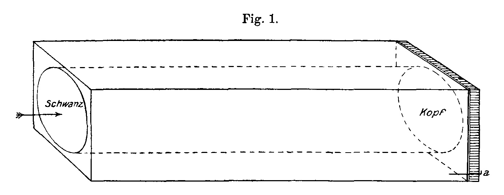
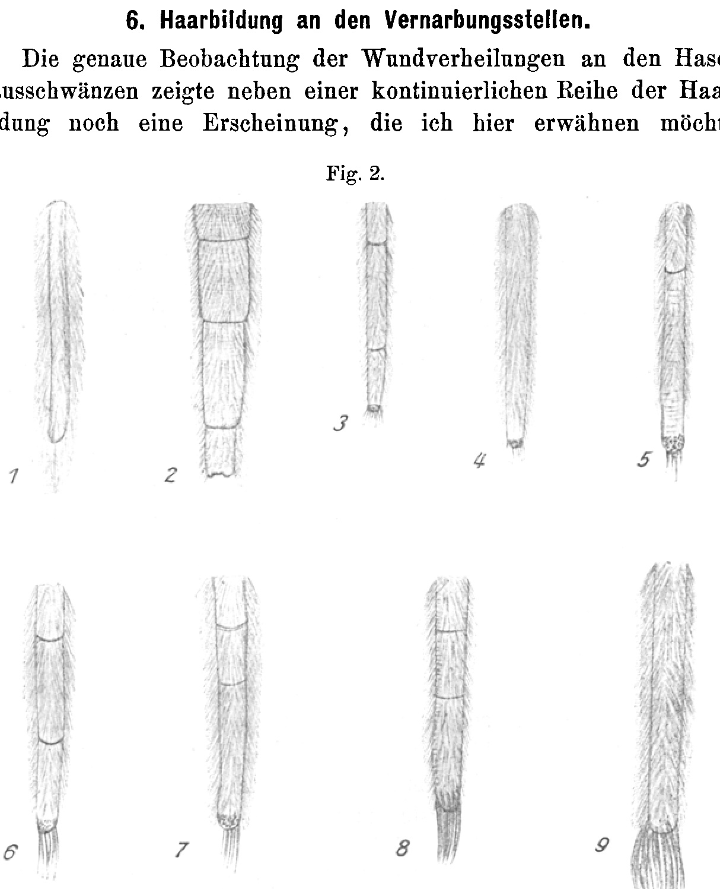
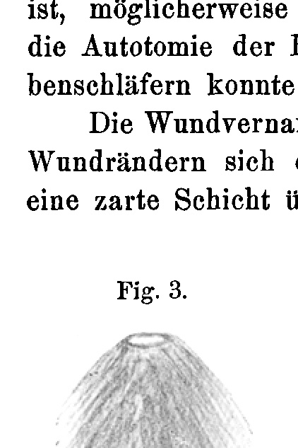
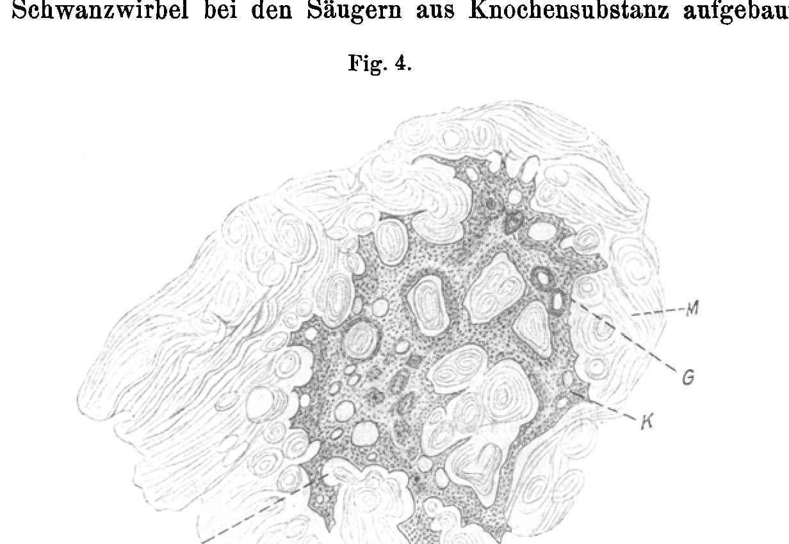
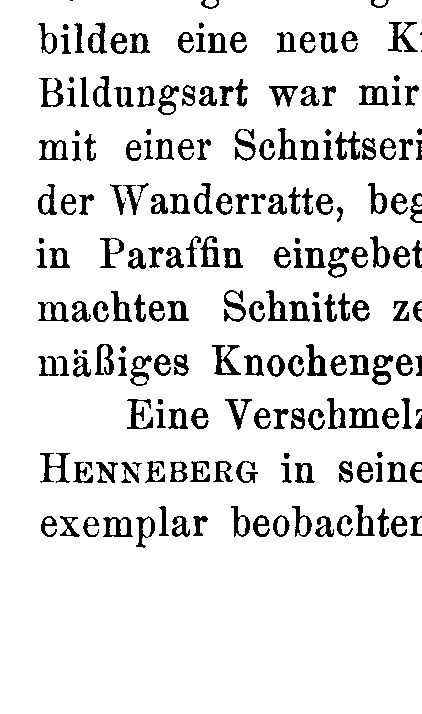
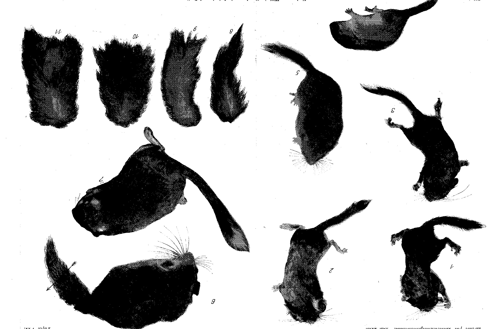
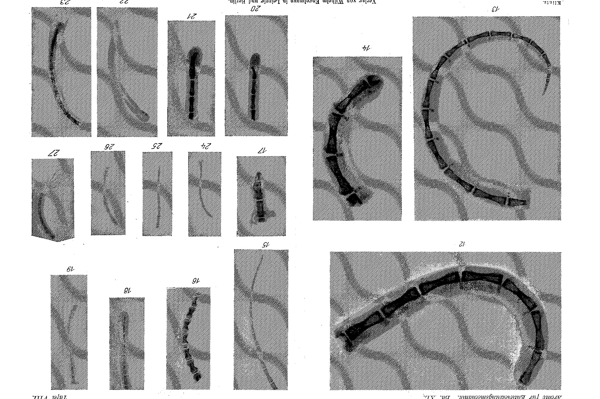

# Experimental Tail Regeneration in Dormice (Myoxidae) and Some Other Mammals.

By

Josef H. Klintz.

(From the Biological Experimental Institute of the Imperial Academy of Sciences, Vienna, Zoological Division¹).)

With 4 figures in the text and Plates VII and VIII.

Received on 5 April 1914.

*Archiv für Entwicklungsmechanik der Organismen*, vol. 40 (1914).

> **Full translation.** A complete English rendering of the running text of “Experimental Tail Regeneration in [Lizards]” (Klintz, 1914), including all tables, figure and plate legends, and footnotes. Numbers and table cells were transcribed from the page images, not the noisy OCR.

### Contents.

| | Page |
|---|---|
| 1. Introduction | 344 |
| 2. The experimental animals, their housing and breeding | 346 |
| 3. Operative methods and experiments | 349 |
| &nbsp;&nbsp;&nbsp;&nbsp;a) Hazel mouse (*Muscardinus avellanarius* L.) | 349 |
| &nbsp;&nbsp;&nbsp;&nbsp;b) Garden dormouse (*Eliomys quercinus* L.) | 351 |
| &nbsp;&nbsp;&nbsp;&nbsp;c) Edible dormouse (*Myoxus glis* L.) | 352 |
| &nbsp;&nbsp;&nbsp;&nbsp;d) Opossum rat (*Didelphys azarae*) | 353 |
| &nbsp;&nbsp;&nbsp;&nbsp;e) Kangaroo (*Onychogale frenata* Gould) | 354 |
| &nbsp;&nbsp;&nbsp;&nbsp;f) Brown rat (*Mus decumanus* Pall.) | 354 |
| 4. Autotomy of the skin | 354 |
| 5. Pigment change | 356 |
| 6. Hair formation at the scarring sites | 357 |
| 7. The behavior of the last vertebra | 359 |
| 8. Histological results | 360 |
| 9. Summary | 361 |
| 10. Bibliography | 361 |
| 11. Operation tables | 363 |
| 12. Explanation of the figures | 367 |

> ¹) A preliminary communication of this work appeared under the title: Mitteilungen aus der Biologischen Versuchsanstalt der kaiserlichen Akademie der Wissenschaften, Zoologische Abteilung, Director H. Przibram. 2. Experimentelle Schwanzregeneration bei Bilchen (Myoxidae) und einigen andern Säugern, by J. H. Klintz, in the Akademischer Anzeiger der kaiserl. Akademie d. Wiss. in Wien. No. VIII. 1914.

Archiv f. Entwicklungsmechanik. XL. &nbsp;&nbsp;&nbsp;&nbsp;23 344 &nbsp;&nbsp;&nbsp;&nbsp; Josef H. Klintz

## 1. Introduction.

The results of experimental investigations on the most diverse parts of the body of the lower animals raised, of their own accord, the question of how the regenerative capacity behaves in mammals, and whether these animals too are able to replace lost parts of their body. The regeneration of the skin and its formations was, until recently, the principal relevant phenomenon in this field. However, there are data to be found in the most recent literature which report on the regenerative capacity of the tail vertebrae of mammals after operative removal of the posterior portion of the tail. One of the most recent works on this subject is Henneberg's: Schwanzautotomie und Regeneration bei Säugern [tail autotomy and regeneration in mammals]. These, and some further older data, prompted me to enter into the matter somewhat more closely. These older data prompted me, since the matter seemed to me to promise a more favorable outcome, to take up a larger number of investigations in the rooms of the Biological Experimental Institute. I began this work in the autumn of 1908, and obtained, although not in all the experimental animals, nevertheless in some the confirmation of previously held views, namely positive results of the regeneration of merely the respectively remaining last tail vertebra upon occurring loss. Macroscopic, X-ray, and microscopic investigations of the findings furnished assurance of the regrowth of the injured vertebra upon amputation of a portion of the tail. Besides these results, there further appeared, as accompanying phenomena of skin autotomy and especially strikingly, pigment changes in the hairs of the regrown tuft of hair at the regeneration site. Differences in the result arose in connection with the manner of the operation.

The treatment of the individual results presupposes a number of investigations. To insert these at this point I do not consider advisable; rather I think I will let the scattered existing literature data follow one after another, so as to be able to use them better in the discussion of the individual facts.

The data in the literature relate, however, for the most part only to chance observations made during the keeping of rodents, and in these cases were published only in the more popular journals. They confine themselves mostly to the autotomy of the tail skin and to the shedding of the laid-bare tail Experimental Tail Regeneration in Dormice (Myoxidae) etc. &nbsp;&nbsp;&nbsp;&nbsp; 345

vertebral column. Thus Coester established in general that the tail skin tears easily; Frenzel, on the other hand, maintains, and at the same time joins the view of Dr. Handmann, that the tail skin does indeed autotomize, but that this never occurs at a definite spot. He says: »I can, with the best will, perceive in these processes no voluntary act, but rather find their explanation, as does Dr. Handmann, in the delicate constitution of the tail skin.« Noll observed the autotomy of the tail skin by chance when a trap snapped shut, in which the tail of a dormouse had become pinched. He speaks, however, of the skin. He further states that the naked vertebral column was not shed. This last datum may rest on chance circumstances. The experiences I have made in the most recent period of my investigations all speak against this. The findings of Helm and Fatio I cannot confirm in the garden dormouse; they explain that the scarred-over spot grows over with hairs that match the former end-tuft in color, so that the tail again receives a normal appearance, although it always loses about ⅓ of its original length.

In order to be able to establish exactly these differences in length of the mutilated and of the again regenerated tail, a careful measuring method is needed, which, however, because of the natural constitution of the object to be measured, can never be carried through entirely cleanly. The tail was measured before the operation, from the root of the tail to the tip of the skin and to the end of the tuft of hair; in like manner the stripped-off tail skin and also the laid-bare tail vertebral column. The tail stump again requires an exact measurement of its length, namely from the root of the tail to the torn edge of the skin, in order later to establish the normal length-growth of the tail, this however to be elucidated on the grown animals. If the wound heals as usual at the site of the severed skin, then a quite slight lengthening of the tail shows itself upon renewed measurement.

Thomas found, in one species of garden dormouse (*Eliomys*), the formation of a bony stub on shortened tail vertebrae, which he explained by the loss of the tail vertebra. He found the same in specimens of *Clavigia crassicaudata* (cf. also Jentink). He first put forward the supposition that a similar capacity probably belongs to all species of dormouse. His voucher specimens showed at the tail stump club-shaped

> 25* 346 &nbsp;&nbsp;&nbsp;&nbsp; Josef H. Klintz

swellings, covered on the outside with long hairs, on the inside supported by a bony rod which grew backward from the vertebra remaining at the rear. The use of this new formation Thomas sees in the renewed employment of the tail as a steering organ. The histological investigation of these tail stumps showed, according to Riedewood, the structure as radially-concentrically arranged bony substance, traversed by the central canal.

Cuénot and Lataste speak further of a similar autotomy of the tail skin in the wood mouse (*Mus sylvaticus*); the latter observed it also in the house rat (*Mus rattus*) and in the brown rat (*Mus decumanus*). Cuénot sought it in vain in the house mouse (*Mus musculus*).

I succeeded in establishing one case of autotomy of the skin in a white house mouse.

Henneberg found, in *Myoxus glis*, 1½ years after the operation, despite the autotomy no lengthening of the tail; namely through a fusion of the three last remaining tail vertebrae.

Data by Haacke relate to the color and the pigment change in the hairs of the regrown tuft of hair.

Archangelsky, Barth, Legros, Peyrand, Marchand and Sieveking touch merely upon purely histological records concerning bone and cartilage regeneration in mammals, which, however, have no further significance for our objects.

## 2. The experimental animals, their housing and breeding.

In order to obtain, if possible, generally valid results, I took the most diverse animals from the class of the rodents and procured some sample animals. The available experimental animals were the following:

| | | |
|---|---|---|
| Hazel mouse (*Muscardinus avellanarius* L.) | 9 | head |
| Garden dormouse (*Eliomys quercinus* L.) | 8 | - |
| Edible dormouse (*Myoxus glis* L.) | 9 | - |
| Brown rat (*Mus decumanus* Pall.) | 4 | - |
| Opossum rat (*Didelphys* L.) | 3 | - |
| Kangaroo (*Onychogale frenata* Gould) | 2 | - |

The hazel mice, edible dormice and garden dormice were ordered from Austrian animal dealers, or also caught by myself; the rats were taken from the Institute's breeding stock. One garden dormouse damaged by chance at the tail I obtained through special kind- Experimental Tail Regeneration in Dormice (Myoxidae) etc. &nbsp;&nbsp;&nbsp;&nbsp; 347

ness from the imperial-royal Menagerie in Schönbrunn, for which I express my most obliging thanks at this point to Herr i. r. Menagerie inspector Kraus. The opossum rats were supplied by the animal-trade firm August Fockelmann in Hamburg-Großborstel; the kangaroos were procured by the animal-trade firm C. Reiche in Alfeld an der Leine.

For exact orientation and the avoidance of any species-confusion of the animals to be examined, I followed the identification handbook of Lenis, Part II. The diagnoses of the dormouse species used follow:

Hazel mouse (*Muscardinus avellanarius* L.). The fur on the back and belly ocher-yellow, on the throat and breast yellowish-white, the tail uniformly colored, brown-red above, somewhat more lightly colored. Feet and ears reddish-white, bare. Body length 7.5—8 cm, tail length 7—8.1 cm.

Garden dormouse (*Eliomys quercinus* L.). Back reddish-gray, brownish-gray, on the sides somewhat whiter, belly white. On the eyes black rings, which extend into the neck region inside the ears. Further, in front of and behind the ears there is one white ring each, and at the shoulders one black ring each. Feet white. Body length 15 cm, tail length 10 cm. The tail is, at the root, haired short and close-lying. Toward the tip the hairs become ever longer. The hairiness is at the root reddish-gray, at the tip black, more toward the tip white.

Edible dormouse (*Myoxus glis* L.). Dorsal side ash-gray, in some specimens with a brownish streak, belly white, around the eyes a dark-brown ring, the front feet gray-white, hind feet whitish with dark-brown longitudinal stripes on the upper side, tail pale brownish-gray, somewhat lighter below. Body length 16 cm, tail length 13 cm.

The housing and the breeding of the experimental animals left me not the slightest worry. The roomy cages 1 m × 1 m × 0.75 m of iron sheet, on top provided with wire grating, in front with a glass door, formed the dwelling of the hazel mice and garden dormice. In order to offer the animals in captivity, as far as possible, natural living conditions, I covered the bottom of these cages with garden earth, in which the moss with which the cages were furnished took root well; further, I disguised stones, dug small hollows, masked them with moss and stones; wooden boxes filled inside with hay served as much-beloved hiding places 348 &nbsp;&nbsp;&nbsp;&nbsp; Josef H. Klintz

and winter living-quarters for the animals; besides, in each cage branched tree-boughs were fastened for romping about. The edible dormice received, corresponding to their body size, more spacious dwellings. These animals were housed in the stable compartments which border the north wall of the Institute grounds. In these heatable and airy rooms, large tree trunks, set up by the imperial-royal Prater Inspectorate, hollowed out in a natural way or at least, inside, in a state of rotting, served as dwellings. A shallow bore was made with a central drill, in order to make it easier for the animals to lay out a natural entrance-opening into their dwelling. The stumps and trunks were set up upright, closed off on top with a small board, and during the daytime formed exclusively the abode of the animals.

Natural as this housing also was, soon enough a new series of difficulties showed itself. After measurement and operation had been carried out, the animals had to spend the first period in sterilized glass tanks, in order to prevent infections, but were then transferred again into the other containers. Getting the animals out of the tree trunks then often turned into a real test of patience. Catching the animals climbing around freely in the cage was also not very easy, cost time and many a bitten finger.

Less demanding were the opossum rats, which were housed in crates resembling dog-kennels, lined with wood-wool. The animals left these kennels only at night, in order to wander about in their stable compartment.

The kangaroos, like the edible dormice, inhabited one of the stable compartments; they were at first exceedingly shy, so that we had to let many weeks pass before we proceeded to the operation. Judging by their food intake, however, the animals felt quite well.

The hazel mice, garden and edible dormice were fed with hazelnuts and walnuts, sunflower seeds and fruit. The water offered to the animals was as a rule disdained. The opossum rats and kangaroos received a feed recommended by the Schönbrunn Menagerie. In the first proper winter, heating in the dormouse cages was omitted, the feed quantities were also reduced and finally stopped entirely. The animals fell into hibernation, and the result was — they did not wake Experimental Tail Regeneration in Dormice (Myoxidae) etc. &nbsp;&nbsp;&nbsp;&nbsp; 349

again. Here the hazel mice proved themselves far less resistant than the dormice. The loss of some hazel mice was especially painful, since the deceased animals already showed the beginnings of tail-tuft regeneration. In the next winter the cages were moderately heated, the animals were also given feed, and a dying-off of the animals was no longer to be recorded. A propagation of the hazel mice could not be achieved; on the other hand, a propagation among edible dormice.

The animals eliminated from the experimental series were, when they showed fine results, conserved; the others were, after conclusion of the work, assigned to other investigations.

## 3. Operative methods and experiments.

To devise particular operative methods, the literature spared me in these experiments. Noll, Coester, Frenzel and others already mentioned in their data the simplest method, which I likewise handled with good success in the hazel mice. For their simplicity these appear already very promising; for their actuality they offer the experimental animals the hope of a gapless experimental series, through the avoidance of deaths. Some improvements, which became unavoidably necessary for the operation of larger animals, are given below one after another. Operated animals were kept for a few days in distilled-water glass tanks, in order to forestall any danger of infection, and indeed not a single animal perished as a result of an external infection.

### a. Experiments at the hazel mouse.

The animals were kept for a longer time before the operation in a common cage, so that there, since they had been freshly caught, they could adapt to their new abode as well as to a particular diet. After a few days easily recognizable identification marks were applied to them. Although the animals were kept isolated for some weeks after the operation, and each animal had to be tended separately, I was nevertheless compelled, once the wound had healed, to bring them together again under natural conditions. A numbering of the animals proved impracticable because of the danger of losing the number, and so I decided to apply identification marks to the animals, in that, at various places on the body, [I notched out] a tuft of hair ...

During the operation the hazel mice were gripped at the tail with thumb and forefinger and lifted head-downward into the air. This unnatural and uncomfortable position triggered violent movements of the pair of [hind] limbs and of the whole body, which in all cases sufficed to tear off the tail-skin and to free the body. The hazel mouse fell into a disinfected glass-tub placed below and at once busied itself with its injured tail. The piece of tail laid bare of the body-skin was held with the forefeet, diligently licked, and after a short time also bitten off. Never did more than one vertebra remain outside the rupture-site. The tail-skin tore off some millimeters from the clamping-site of the tail, nearer to the body. The vertebral column slipped out. After a short time the hazel mice had to be caught again. On them the measurements of the naked vertebral column and of the tail-stump described above were carried out.

The immediately following days gave the most abundant work. The exactly kept protocols on the individual animals show everything essential, and I should like to take out only some of it, in order to illuminate the course of the wound-scarring somewhat further. Animal No. 3 had not yet bitten off the naked tail-vertebral column on the following day, but on the third-following day it fell off down to the last exposed vertebra. In 3 weeks the fracture-site of the tail was completely scarred over. The phenomenon that some animals still showed naked tail-vertebrae for a few days, while the others apparently also removed the last tail-vertebra, was at first somewhat unclear to me. Only from the results of the further investigations could I form a clear picture of it for myself.

If the tail-skin tore exactly at the connection-site of two vertebrae, then later the following possibility showed itself: 1) The naked vertebral column dried up and fell off at the connection-site of two vertebrae. The skin of the tail-stump grew together over this site, and the last vertebra, now enclosed, showed a regenerative lengthening rarely or never. 2) The skin of the tail-stump contracted somewhat and still laid bare the enclosed vertebra in one third of its length. This vertebra now remained for a longer time uncovered, dried up, and showed later no lengthening, or it was bitten off by the animal and thereby a stylet-shaped lengthening was called forth in the regeneration.

If the tail-skin was severed in the middle of two vertebrae, then the rearward part of the tail fell off down to the last vertebra. If the skin of the tail-stump quickly formed a scarring-dome, then the last vertebra was wholly enclosed and lengthened itself rarely. If, however, it was bitten off by the animal just before the scarring, then in this case it formed a distinct process. The formation of a vertebral lengthening is therefore, in my opinion, dependent either on the circumstance that the last vertebra reached the skin-closure broken or bitten off. In all cases a rapid wound-scarring is the most important precondition of a sure success. On 30. IX., after scarcely 4 weeks, I could already establish the complete wound-scarring in all the animals. The further records of the operation-protocols treat mostly appearances which I intend to discuss later in the treatment of the hair-growth, of the pigment-change in the hairs. The animals were therefore, after 4 weeks, put together in a common cage, where some, without taking harm, overwintered in deep sleep.

### b. Experiments on the garden dormouse [*Eliomys quercinus*].

Somewhat more circumstantial turned out to be the operations on the garden-dormouse tails. The catching of the animals, which climbed about freely in the large cages whose walls were covered with wire-grating, demanded ever a considerable time, care and

**Fig. 1.**  *(figure not reproduced)*

trouble. The operation in the same manner as in the hazel dormice presented difficulties, since the wire could not be set firmly enough. The catching-up of the animal by the clamped-in tail I here avoided, since I had presupposed beforehand that the tearing of the skin, as a consequence of the more considerable strength of the skin etc., would not set in. In order to call forth the autotomy of the tail-skin more easily, I used for the operation the wooden box pictured in Fig. 1. A cuboid little box, of the body-size of a garden dormouse, provided inwardly with a round hollow space, which can be closed off on both sides, each by a little board rotatable on a pin and lockable with a bolt. The caught animals crept not unwillingly into the hollow space, but could not get back, since the rearward little board, provided with a cut-out for the tail, was likewise pushed shut.

The tail could now be measured easily, both before and after the operation, since the animal could not get out of the little box by itself. The autotomy itself proceeded in a similar manner as mentioned above. Of particular appearances after the operation, in all animals only a slight bleeding and the autotomizing of the tail-skin before the clamping-site could be named. The animals were kept isolated for some days, until the scarring, but then, provided with particular marks, held free in a large cage. A direct dying as a consequence of the operation could in no case be observed.

### c. Experiments on the fat dormouse [*Glis glis*].

The body-size and particular biting-readiness of these animals induced me to use the operation-little-box pictured above — adapted to the body-size of these animals — with great advantage. The fat dormice climbing about freely in the cage were caught with cloths or thick leather gloves and pushed, without great trouble, into the little box, whose forward opening was closed with the little board. The long, uniformly bearded tail remained outside and was carefully measured. Then, at some arbitrary site, the animal was clamped in with thumb and forefinger and the animal lifted head-downward into the air. After the autotomy of the tail-skin, both the naked vertebral column and the tail-stump were measured. Only now did I open the forward closure, and the animal crept out of the box without showing any particular discomfort. A gnawing-off of the naked vertebral column could never be observed in these animals; rather it usually fell off already on the day of the laying-bare itself. The bleeding that set in at the amputation was in all animals very slight, and hemostatic agents therefore came quite out of consideration. Up to complete scarring of the autotomy-site the animals were housed, however individually, in glass-tubs — later, provided with particular marks, again released free into the large cage.

The young — fat dormice thrown in captivity by the operated animals — were likewise taken up into the experimental series. One animal already had a mutilated tail when I first observed it. The wound-site had already healed club-shaped, but without a hair-tuft. The three remaining young still present were put into the box, and the tail cut off, at a site determined by measurement, with bone-shears. The bleeding that set in was somewhat stronger and had to be stilled. This severing was felt by the animals as definitely more unpleasant than autotomy, as the behavior of the animals after the operation allowed one to conclude. Nevertheless the wound-site scarred over soon; there arose in all three cases a club-shaped closure of the tail-stump, which later, through its hairing, differed typically from the normal one and also from that called forth after natural autotomy. These animals were, after the operation, kept particularly long in disinfected glass-tubs and only after several weeks released free in the cage.

### d. Experiments with the opossum-rat [*Didelphys azarae*].

The operations on the opossum-rat and kangaroo tails were undertaken jointly by Dr. HANS PRZIBRAM, Dr. OSKAR KURZ and me. The animals were, after an exact measurement of their tail-lengths, set into a weak narcosis by means of a muzzle, manufactured of a wire-frame and lined with cotton-wool which was soaked with ether. From the 317 mm long tail of the first example a 182 mm long piece was severed with the bone-shears. The second animal — a male — with a 330 mm long tail, lost through the operation a 144 mm long tail-piece. The third animal we did not wish to operate on, since we recognized it as pregnant. The fairly strong bleeding was suppressed with iron-oxide cotton-wool, the wound bound up with a properly applied bandage. The latter had to be renewed almost daily in the first period, since it was torn off by the animal, being felt as unpleasant. The second animal obtained a complete scarring of the wound-site, but died after 80 days.

### e. Experiments with the kangaroo [*Onychogale frenata*].

By far more difficult, and unfortunately also without success, remained our efforts with the kangaroo-pair. After advice had been obtained regarding the kind and strength of the narcosis, these animals too were fitted with specially manufactured muzzles, soaked with ether; the tail was measured, and in the male was severed at its half-length with the bone-shears by a cut. The strong bleeding was stilled in the same manner as in the opossum-rats, and a bandage applied. The animal awoke only a long time after the narcosis and freed itself at once of the bandage, so that a fresh one had to be applied. The loss of this for the animal so important body-part, the strong loss of blood, and also the inhibition of free body-movement that had set in, were also presumably the reasons for the all-too-rapid perishing of the experimental animal, which survived the operation only 18 days. The 18 days, however, sufficed completely to bring about the complete scarring of the wound (Pl. VIII Fig. 14).

### f. Findings on rats.

In the large rat-breeding of the Biological Experimental Institution there was many an example with mutilated tail. These animals were taken from the experimental series, to which they had once belonged, and used for the investigation of their tail-vertebral column. Besides this, four animals were operated under narcosis by H. PRZIBRAM and O. KURZ, in that the tail-vertebral column was severed with bone-shears.

The X-ray images in Fig. 15, 16, 17 on Pl. VIII show the appearances of the behavior of the last vertebra, as well as those which set in at the rupture of the tail-vertebral column.

## 4. Autotomy of the skin.

The observations of earlier times, as those of COESTER, FRENZEL, HANDMANN, still give us no clear picture about the autotomy of the tail-skin. While the first speaks of the mere tearing of the skin, the two following ones do indeed designate it with the word "autotomy", but see "in these processes .... no arbitrary act." NOLL observed the autotomy at the snapping-shut of the trap and explained the appearance to himself purely mechanically.

More decidedly does HANDMANN pronounce himself against a true autotomy of the tail-skin in the hazel mice. He sewed the pulled-off tail-skin back onto the animal and observed the death of the animal (probably through infection). What he wished to achieve with the re-sewing of the tail-skin is not clear to me.

In order, according to my own opinion, to have the foundation of numerous self-conducted observations, I should like to mention the following:

1) The tearing and stripping-off of the tail-skin I observed in hazel mice, garden dormice, fat dormice and house mice.

2) The tearing of the tail-skin always took place at a tail-site which was moved nearer to the body by some millimeters from the clamping-site.

3) The tearing of the tail-skin always proceeded in a line that returned circularly into itself, without there ever having been indentations or jaggings at the rupture-line to be observed.

4) The tearing of the tail-skin proceeded in the whole circumference of the clamped-in site simultaneously.

5) At the tearing of the tail-skin no loss of blood could be observed, neither in the house- and hazel mice nor in the garden- and fat dormice. The animal probably lost a few droplets of lymphatic-vessel lymph. But blood was not at all present, when the tearing of the tail-skin was called forth by mere clamping.

6) The subcutaneous connective tissue lying under the leather-skin and connecting it with the musculature of the vertebral column is exceedingly loose. It permitted the tail-vertebral column to slip out smoothly, so that in no single case here at the tearing of the tail-skin was a tearing of the tail-vertebral column to be observed.

7) The slight, apparently painless loss of the tail-end, then the rapid scarring and the formation of a long hair-tuft, and also the lengthening of the last vertebra that sometimes appears — all these appearances adduced here permit one to conclude a natural arrangement, which forms a parallel in the fullest sense with similar appearances of lower-standing animals (*Arthropoda*).

Although the circumstances that call forth the autotomy are different ones, I must nevertheless therefore pronounce myself for an actual autotomy of the tail-skin in the animals mentioned under 1).

## 5. Pigment-change.

While the hairing at the end of the tail in the fat dormouse and the hazel mouse normally appears single-colored, the garden dormouse possesses at the tail-tuft a two-coloredness, in that the tail-tuft is black above, white below.

Already the earlier authors, who had busied themselves with the regeneration of the tail of the dormice, even if not experimentally, found the renewed appearance of white (HAACKE) or black and white hairs (FATIO) at the shortened end of the garden-dormouse tail.

HAACKE believed himself able to descry in this a partial albinism conditioned by the deficient nourishment of the hairs growing at the injury-site; FATIO, on the other hand, recognized that it was a matter of the restoration of the coloring normally present at the end of the tail. The restoration of the two-coloredness was also observed in our experiments, if the garden dormouse had remained alive over the winter.

Very distinctly the two-fold coloring of the tail-end can be recognized in the photograph Fig. 7 Pl. VII, which in this respect could just as well be the reproduction of a normal tail of the garden dormouse. Quite otherwise it stands with the color of the renewed-grown hair-tuft at the tail-end of the hazel mice. The otherwise yellow-brown color-tone of the whole hair-dress of these animals does not appear again at the renewed-formed hair-tuft of the tail; rather the color of these hairs is one passing over into brown-black. It appeared in all experimental animals, and indeed even then, when the renewed-formed hair-tuft consisted only of a few hairs.

The observations that I made at the tail-ends in the fat dormice are opposed to those which HAACKE — and also I — made in the garden dormice. The renewed-formed hair-tuft in the fat dormouse is likewise always somewhat darker than the normal one. More distinctly than at the autotomized tails does this difference appear at the cut-off ones. These observations contradict the statements of HAACKE.

## 6. Hair-formation at the scarring-sites.

The exact observation of the wound-healings at the hazel-mouse tails showed, besides a continuous series of the hair-formation, yet an appearance that I should like to mention here.

**Fig. 2.**  *(figure not reproduced)*

> Stages of the hair-formation on the autotomized tail of the hazel mouse: 1 normal, non-autotomized tail. 2 Skin-constrictions and deepened wound-site of Protocol No. 3, 4 days after the operation. 3 Hair-loss and double tail-skin-constriction, at the tail-end a scarring-dome with small hairs, Protocol No. 6, drawn on 23. III. 1909. 4 distinct scarring-cone with small, black hair-tuft, Protocol No. 1, drawn on 23. III. 1909. 5 patchy appearance of longer hairs, strong hair-loss at the end, Protocol No. 7, drawn on 23. X. 1909. 6 double skin-constriction with sparse, but long hair-tuft of strikingly dark color, Protocol No. 8, drawn on 23. III. 1909. 7 the same appearance in Protocol No. 9, drawn at the same time. 8 taut hair-tuft at the tail-end of dark color, Protocol No. 9, drawn at the same time. 9 completed hair-tuft, dark-colored, Protocol No. 4.

A few days after the autotomy had set in, or also in cases where the animal was bitten in the tail by others, I observed a single, double, up to triple notching of the tail-skin running all the way around. The single sections were in the first time bul...

## 6. Hair formation at the scarring sites.

The exact observation of the wound-healings on the hazel-dormouse tails revealed, alongside a continuous series of hair formation, yet another phenomenon, which I should like to mention here.

**Fig. 2.** Stages of hair formation at the autotomized tail-end of the hazel dormouse: 1 normal, non-autotomized tail. 2 skin constrictions and deepened wound site, from Protocol No. 3, 4 days after the operation. 3 hair loss and twofold tail-skin constriction, at the tail-end a scarring dome with small hairs, Protocol No. 6, drawn on 23 March 1909. 4 distinct scarring cone with a small, black hair tuft, Protocol No. 1, drawn on 23 March 1909. 5 appearance in places of longer hairs, strong hair loss at the end, Protocol No. 7, drawn on 23 October 1909. 6 twofold skin constriction with a sparse but long hair tuft of strikingly dark colour, Protocol No. 8, drawn on 23 March 1909. 7 the same phenomenon in Protocol No. 9, drawn at the same time. 8 taut hair tuft at the tail-end, of dark colour. 9 completed hair tuft, dark-coloured, Protocol No. 4.  *(figure not reproduced)*

A few days after autotomy had occurred, or also in cases where the animal had been bitten in the tail by others, I observed a single, twofold, to threefold circumferential notching of the tail skin. The individual segments were at first bulging, but later no longer distinguishable. It would certainly not be uninteresting to investigate the cause of this phenomenon, as the illustrations 2, 3, 5, 6, 7, 8 in Fig. 2 show. It is not out of the question that this phenomenon is to be attributed to an infection, but possibly one would thereby also gain insight into the autotomy of the skin. Neither in garden dormice nor in fat dormice could I perceive a similar phenomenon.

The scarring of the wound always proceeded in the manner that, from the margins of the wound, a bulge formed, which grew centripetally and thus formed a delicate layer over the vertebral end (Fig. 2 Abb. 2). When the wound site was completely covered, one already observed the growing of the delicate little hairs out of a darker dome (Fig. 2 Abb. 3, 4, 5).

The already-mentioned difference in the pigment of the hair tuft, the length of the hairs, and their stiffness typically distinguish the re-formation from the normal development of the hair tuft at the tail-end.

This difference showed itself yet more distinctly in the results at the garden dormice. Fig. 3 shows schematically the tassel drawn out lengthwise at the tail-end. The newly formed hairs are lighter, longer, and form a tassel becoming narrower at the end; whereas in the normal animal they are uniformly long and close off the tail roundly. Yet more distinctly one observes this phenomenon at the photographed animal, Plate VII Fig. 6 and Fig. 5.

The behaviour of the hairs in the tail-tuft in the fat dormice yielded two different phenomena, which were conditioned by the kind of the operation. The hair tuft at the autotomized tail-end is formed by longer, somewhat darker-coloured and straight-running hairs (Plate VII Fig. 10). The hair tuft of those animals whose tail-end was produced through severing by means of bone scissors strikingly shows the difference both from the normal and from the tail-tufts newly formed through autotomy. It is darker-coloured and formed of extremely densely standing and wavy hairs (Plate VII Fig. 11).

## 7. The behaviour of the last vertebra.

In the animals, the tail-stumps were cut off — either already after the wound-healing or only after their death — and used for the preparation of X-ray photographs. Fig. 24 on Plate VIII shows the tail-end of a hazel dormouse after about 1 year of the experiment-duration. In the club-shaped thickening is found the broken-off or bitten-through last vertebra; an elongation of the same seems improbable. The last vertebra in Fig. 25 on the same Plate behaves likewise. Fig. 26 shows no elongation at all, since the fracture occurred at the connecting site of two vertebrae. Fig. 27 shows a typical elongation of the tail from the fracture site. By all appearances this concerns an elongation in a small piece of the remained-standing last vertebra. Although the elongation appears indistinct in the picture itself, probably as a result of the loosely arranged cartilage elements which form the elongation, the same is more clearly perceptible on the plate. An explanation of the over-normal scarring-dome without inner support would not be readily possible. The experiment-duration in this animal, from the day of the operation up to the day of death, amounted to a few days over 1 year.

More distinctly than in the hazel dormice, the vertebral elongations are to be ascertained on the tail-stumps of the fat dormice. The X-ray photographs Fig. 20 and 21 on Plate VIII show the tail-stumps of two fat dormice. — Fig. 20 experiment-duration 13 months 7 days. Powerful elongation of the scarring-cone. The last vertebra was broken off in the middle and elongated atypically toward one side. Judging by the X-ray photograph, this concerns a re-formation of genuine bone. Fig. 21 shows the elongation of the last vertebra in a downright abnormal manner. In the amputation of the tail carried out with bone scissors, the last vertebra visible in the picture was cut through in the middle. The elongation of this vertebra amounts to 10 mm and is again, judging by the tone of the picture, of bony nature. The remained-standing vertebral half is, so to speak, embedded in the new formation. The newly formed tail-end shows, besides an elongation amounting to 15 mm, also an enlargement of its diameter unequal to the normal tail-end. The experiment-duration in this animal was 14 months.

The most distinct elongation of the last vertebra is shown by Fig. 17

> *Archiv f. Entwicklungsmechanik. XL.* 24 on Plate VIII. The vertebra cut through just before the end shows an up to 7 mm long, cone-shaped elongation bent over at the tip. A distinct evidence for the possibility of a new formation is also given in Fig. 15. Here it concerns an oblique fracture of the vertebra, such as is so frequently to be observed on rat-tails, caused by a bite. The lower vertebral half shows just as distinctly the beginning of a bony or cartilaginous mass as the upper, only the latter is concealed by its position.

Also the X-ray photograph of the tail-stump of a kangaroo (Fig. 14), taken after 18 days, allows one to conclude a cone-shaped elongation of the cut-through vertebra.

## 8. Histological results.

It is certainly of significance to learn to what kind of tissue the elongation of the last vertebra can be attributed. The tail-vertebrae of the dormice are built up of bone-substance

**Fig. 4.** *M* muscle-bundle, *G* blood-vessels, *K* bone-framework, *B* bone-recesses with deposition of osteoblasts.  *(figure not reproduced)*

so it is to be assumed that the new formation too belongs to this tissue.

As the cartilage, according to Sieveking, Archangelsky, Barth, Legros, Peyrand and also Marchand, comes about from the perichondrium, so comes also the bone about from periosteum and from marrow. With the blood-vessels the osteoblasts reach the formation-site and form a new bone-mass. A more exact observation of the manner of formation unfortunately did not succeed for me. I must for the time being content myself with a series of sections, prepared from the elongated tail-end of the brown rat. The tail-end was decalcified and embedded in paraffin. The sections made up to the middle of the elongation show at the tip (Fig. 4) a quite irregular bone-framework.

A fusion of remained-standing tail-vertebrae, as Henneberg states in his work, I could observe in no experimental specimen.

## 9. Summary.

Starting out from the known malformations on dormouse tails, their origination through regeneration was experimentally investigated.

The regeneration consists merely in the growing-out of the vertebral fracture-piece still remained-standing at the tearing-off or severing site into a last vertebra, and the re-growth of the skin, as well as in the formation of the hair-covering, which becomes similar to the normal end-tuft.

Differences in the hair-covering arise, however, according to the species employed, in that, e.g., the hazel dormouse exhibits a strikingly darker colouring of the regenerated end-tuft than corresponds to the normal one, and according to the kind of the injury. Broadened end-tufts arise only after injury by cutting-off.

## 10. Literature index.

Archangelsky, 1868, On the regeneration of hyaline cartilage. (Prelim. communic.) Med. Zentralbl. 6th year. No. 42.

Barth, L., 1869, On the regeneration of hyaline cartilage. Med. Zentralbl. 7th year.

Coester, C., 1888, The fat dormouse in captivity, in: Zoologischer Garten.

Cuénot, L., 1907, L'autotomie caudale chez quelques rongeurs. Arch. d. Zool. exp. et gén. (4.) Tom. 6. Notes et revue LXXII–LXXVIII.

> *24\** Fatio, V., 1869, Faune des Vertébrés de la Suisse. I.

Haacke, W., 1895, On the essence, causes and inheritance of albinism and piebaldness and on their significance for heredity-theoretical and developmental-mechanical questions. Biolog. Zentralbl. Bd. 15.

Handmann, 1905, On the question of self-amputation in the hazel dormouse. Naturwiss. Wochenschr. Bd. 4.

Helm, 1887, Some matters on the garden dormouse (Myoxus quercinus). Zoologischer Garten. Bd. 28.

Henneberg, 1908, Tail-autotomy and regeneration in mammals. Anatom. Anzeiger. Bd. 32. Supplementary issue.

Jentink, 1887, Notes Leyden Museum. Vol. 10. p. 41.

Lataste, F., 1887–89, Documents pour l'éthologie des Mammifères; notes prises sur differents rongeurs. Actes Soc. Linnéenne Bordeaux. Vol. 41. p. 201.

Legros, Ch., 1869. Cicatrisation des cartilages; régénération animale. C. R. et Mém. Soc. Biol. Paris. (4.) Tom. 4.

Lunel, G., 1867, Sur deux cas de polymélie, membres supranuméraires, obs. chez le Rana viridis seu esculenta. Mém. Soc. Phys. et d'Hist. nat. Genève. Tom. 19. Part I. p. 305.

Morgan, W. H., 1903, Regeneration.

Noll, F. C., 1891, The garden dormouse (Myoxus nitela) in the Rhine valley. Zoologischer Garten. Bd. 32.

Przibram, H., 1909, Experimentalzoologie. 2nd part. Regeneration. Vienna.

Peyrand, H., 1877, Études expérim. sur la régénération des tissus cartilagineux et osseux. (Extr.) C. R. Tom. 84. p. 1308.

Riedewood, W. G., 1905, Exhibition of microscopic sections. Proc. Zool. Soc. London. Vol. II. p. 494.

Schacht, H., 1872, From the life of our rodents. Zoolog. Garten. Bd. 13.

Sieveking, H., 1892, Contributions to the knowledge of the growth and the regeneration of cartilage after observations on rabbit- and mouse-ear. Morphol. Arb. v. G. Schwalbe. Bd. 1. S. 121–135. Tab. VIII, IX.

Thesing, C., Autotomy or self-mutilation in animals. Naturwissenschaftl. Wochenschr. Neue Folge. Bd. 4. S. 321.

Thomas, O., 1905, Exhibition of, and remarks upon, tails of Dormice showing regeneration of the vertebral. Proc. Zool. Soc. London. Vol. 2. p. 491–494.

Zimmermann, R., 1906, The fat dormouse (Myoxus glis) in the Kingdom of Saxony. Zoologischer Garten. Bd. 47.

## 11. Operation tables.

All measurements are given in millimetres.

### Hazel dormouse (Muscardinus avellanarius)

| No. | Sex | Operation date | Length of the drawn-off skin — with the hairs | Length of the drawn-off skin — without the hairs | Length of the bare vertebral column | Length of the tail after one year | Length of the tail before the operation | The animal died on | Remarks |
|---|---|---|---|---|---|---|---|---|---|
| 1 | ♂ | 30. VIII. 1908 | 35 | 31 | 30 | with hairs 40 / without the hairs 11 | 63 | 26. IX. 1909 | The 280 mm long tail-stump reached a length — the hair-length not reckoned in — of 390 mm. At the end a black hair tuft (Plate VII Fig. 1 and Plate VIII Fig. 24). |
| 2 | ♂ | 1. IX. 1908 | 45 | 42 | 39 | — | 73 | 12. IX. 1908 | The animal escaped from the isolation-cage and died. |
| 3 | ♀ | 4. IX. 1908 | 30 | 20 | 18 | — | 70 | 15. XII. 1908 | Tail-skin constrictions (Plate VIII Fig. 25). |
| 4 | ♀ | 4. IX. 1908 | 41 | 33 | 31 | with hairs 50 / without the hairs 38 | 76 | 9. IX. 1909 | The 350 mm long tail-stump reached, after conclusion of the experiment, a length of 380 mm, the hair-length not reckoned in. At the end a black hair tuft (Plate VII Fig. 4). |
| 5 | ♀ | 4. IX. 1908 | 52 | 42 | 40 | with H. 47 / without H. 36 | 76 | 26. IX. 1909 | Stump-growth 1 mm. Black hair tuft. |
| 6 | ♀ | 4. IX. 1908 | 42 | 32 | 27 | — | 81 | 26. VII. 1909 | 23. IX. 1908 strong hair loss at the tail, skin constrictions. Escaped from the cage (Plate VII Fig. 4). |
| 7 | ♂ | 5. IX. 1908 | 49 | 39 | 39 | — | 77 | 9. IV. 1909 | Hair loss, black hair tuft at the tail-end. |
| 8 | ♂ | 5. IX. 1908 | 43 | 34 | 33 | with H. 44 / without H. 30 | 70 | 26. IX. 1909 | Tail-elongation by 3 mm, black, vigorous hair tuft at the tail-end. |
| 9 | ♂ | 5. IX. 1908 | — | — | — | with H. 42 / without H. 31 | 32 (with the hairs 39 / without the hairs 30) | 8. IX. 1909 | The animal was injured with visibly torn-off tail. Length-growth 1 mm. A few long black hairs (Plate VII Fig. 3 and Plate VIII Fig. 27). |

### Garden dormouse (Eliomys quercinus) [continuation]

| No. | Sex | Operation date | Length of the drawn-off skin — with the hairs | Length of the drawn-off skin — without the hairs | Length of the bare vertebral column | Length of the tail after one year | Length of the tail before the operation | The animal died on | Remarks |
|---|---|---|---|---|---|---|---|---|---|
| 1 | ♂ | 10. IX. 1908 | 40 | 20 | 17 | — | 77 | 21. XII. 1908 | 23. X. 1908 complete scarring of the operation-site. After 2 months died. No distinct re-growth of a hair tuft. |
| 2 | ♂ | 10. IX. 1908 | 76 | 53 | 52 | — | 99 | 21. XII. 1908 | 23. X. 1908 complete scarring of the operation-site. Died during winter sleep. |
| 3 | ♀ | 11. IX. 1908 | 44 | 28 | 26 | — | 90 | 21. XII. 1908 | 14. IX. 1908 operation-site completely scarred. |
| 4 | ♀ | 11. IX. 1908 | 75 | 56 | 51 | — | 99 | 21. XII. 1908 | Here the tail-skin tore 2 mm from the clamping site nearer the body. 30. IX. the last vertebra not yet enclosed by the regenerating tail-skin. Died before the hair-tuft formation. |
| 5 | ♀ | 11. IX. 1908 | 70 | 52 | 50 | with H. 67 / without H. 31 | 90 | 9. IX. 1909 | Autotomy-site shifted nearer the body. Died and photographed (Plate VII Fig. 6). Re-growth of a white hair tuft at the tail-end. |
| 6 | ♀ | 11. IX. 1908 | 50 | 32 | 30 | — | 83 | 21. XII. 1908 | Died in the first winter, shows scarred operation-site. |
| 7 | ♂ | 11. IX. 1908 | 72 | 49 | 47 | with H. 55 / without H. 29 | 94 | 5. VII. 1909 | Complete scarring. Formation of a lighter hair tuft. |
| 8 | ♀ | 11. IX. 1908 | 64 | 40 | 39 | — | 82 | 15. IX. 1908 | Died after the operation. |
| Name of the animals | No. | Sex | Date of operation | Length of the drawn-off skin, with the hairs | Length of the drawn-off skin, without the hairs | Length of the bare vertebral column | Length of the tail after one year | Length of the tail before the operation | The animal died on | Remarks |
|---|---|---|---|---|---|---|---|---|---|---|
| Gartenschläfer [garden dormouse] (*Eliomys quercinus*) | 1 | ♂ | 10. IX. 1908 | 40 | 20 | 17 | — | 77 | 21. XII. 1908 | On 23. X. 1908 complete scarring-over of the operation site. Died after 2 months. No distinct regrowth of a hair tuft. |
| | 2 | ♂ | 10. IX. 1908 | 76 | 53 | 52 | — | 99 | 21. XII. 1908 | On 23. X. 1908 complete scarring-over of the operation site. Died in winter sleep [hibernation]. |
| | 3 | ♀ | 11. IX. 1908 | 44 | 28 | 26 | — | 90 | 21. XII. 1908 | On 14. IX. 1908 operation site completely scarred over. |
| | 4 | ♀ | 11. IX. 1908 | 75 | 56 | 51 | — | 99 | 21. XII. 1908 | Here the tail skin tore off 2 mm from the clamp site closer to the body. On 30. IX. the last vertebra still not enclosed by the regenerating tail skin. Died before the formation of the hair tuft. |
| | 5 | ♀ | 11. IX. 1908 | 70 | 52 | 50 | with h. 67 / without h. 31 | 90 | 9. IX. 1909 | Autotomy site shifted closer to the body. Died and photographed (Pl. VII Fig. 6). Regrowth of a white hair tuft at the tail end. |
| | 6 | ♀ | 11. IX. 1908 | 50 | 32 | 30 | — | 83 | 21. XII. 1908 | Died in the first winter, shows scarred-over operation site. |
| | 7 | ♂ | 11. IX. 1908 | 72 | 49 | 47 | with h. 55 / without h. 29 | 94 | 5. VIII. 1909 | Complete scarring-over. Formation of a lighter hair tuft. |
| | 8 | ♀ | 11. IX. 1908 | 64 | 40 | 39 | — | 82 | 15. IX. 1908 | Died after the operation. |
| Name of the animals | No. | Sex | Date of operation | Length of the drawn-off skin, with the hairs | Length of the drawn-off skin, without the hairs | Length of the bare vertebral column | Length of the tail after one year | Length of the tail before the operation | The animal died on | Remarks |
|---|---|---|---|---|---|---|---|---|---|---|
| Siebenschläfer [edible/fat dormouse] (*Myoxus glis*) | 1 | ♂ | 11. IX. 1908 | 90 | 68 | 61 | 107 with the hairs | 125 without h. / 148 with h. | — | Heavy bleeding during the operation. Autotomy site 10 mm closer to the body. On 7. X. 1908 completely scarred over, not yet covered with hair (Pl. VIII Fig. 18). |
| | 2 | ♂ | 11. IX. 1908 | 84 | 63 | 58 | 75 without the hairs | 150 with h. / 132 without h. | — | On 2. X. the wound was completely scarred over, but not yet covered with hair. On 24. VIII. 1909 the animal showed a dense, bushy tail. |
| | 3 | ♂ | 23. X. 1908 | 80 | 60 | 59 | 124 without the hairs / 144 with the hairs | 146 with h. / 126 without h. | 14. I. 1909 | The tail skin tore off 25 mm before the clamp site. The hair covering after the conclusion of the experiment was very sparse (Pl. VIII Fig. 23). |
| | 4 | ♂ | 11. IX. 1908 | 69 | 55 | 40 | 90 with the hairs / 76 without the hairs | 120 with h. / 106 without h. | — | The tail skin tore off 10 mm closer to the body. On 30. IX. 1908 the wound not yet healed. On 21. X. the last vertebra still stands out. After a year the animal showed a short and somewhat darker hair tuft. |
| | 5 | ♀ | 23. X. 1908 | 57 | 55 | 54 | 108 with the hairs / 86 without the hairs | 110 with h. / 108 without h. | — | The same phenomena as in the preceding animal. On 24. VIII. 1910 the animal showed a brownish-grey-coloured hair tuft 22 mm long. |

The animals No. 6, 7, 8, 9 were born in captivity and taken into the experimental series very young.

| | 6 | ♂ | — | — | — | — | 83 without the hairs / 108 with the hairs | — | — | The animal already had a blunted tail when it came out of the tree stump. The site was already quite scarred over and yet without hair. On 28. VIII. 1909 the animal showed a long, somewhat darker-coloured hair tuft at the tail end (Pl. VII Fig. 10). |
| | 7 | ♀ | 21. VII. 1909 | 60 | 38 | 36 | 71 with the hairs / 46 without the hairs | 88 with h. / 71 without h. | 16. IX. 1909 | The tail tip was cut off the animal with scissors. Heavy bleeding, which soon crusted over as a result of clotting at the cut site. On 30. X. club-shaped thickening. Densely haired, bushy tail tuft after the conclusion of the experiment (Pl. VII Fig. 11). |
| | 8 | ♂ | 21. VII. 1909 | 62 | 42 | 40 | 62 with the hairs / 50 without the hairs | 110 with h. / 90 without h. | — | Operated like No. 7. Similar. Behaviour like No. 7. On 28. VIII. 1909 it showed a thick tail stump without particular hair covering. Later a bushy tail tassel (Pl. VIII Fig. 18). |
| | 9 | ♂ | 21. VII. 1909 | 59 | 50 | 48 | — | 87 with h. / 78 without h. | 28. VIII. 1909 | The animal was operated on just like the two preceding animals, but soon died (Pl. VIII Fig. 20). |
| Name of the animals | No. | Sex | Date of operation | Length of the whole tail before the operation | Length of the cut-off tail piece | Length of the tail piece that remained behind | Length of the tail after the conclusion of the experiment | Died on | Remarks |
|---|---|---|---|---|---|---|---|---|---|
| Wanderratte [brown rat] (*Mus decumanus*) | 1 | ♂ | 26. III. 1909 | 196 | 126 | 70 | 71 | 19. VII. 1909 | Black-and-white piebald. Amputation by means of the bone scissors. |
| | 2 | ♂ | 29. III. 1909 | 172 | 112 | 60 | — | — | Grey-and-white piebald. Tail almost entirely white. |
| | 3 | ♂ | 29. III. 1909 | 142 | 92 | 50 | 57 | — | Black-and-white piebald. Distinct lengthening of the tail stump. |
| | 4 | ♂ | 29. III. 1909 | 152 | 97 | 55 | 57 | 31. III. 1909 | Grey-and-white piebald. The animal had been bitten in many places. Tail vertebral column broken, distinct lengthening of the two broken vertebral pieces (Pl. VIII Fig. 15). |
| Opossum (*Didelphys azarae*) | 1 | ♀ | 24. III. 1909 | 317 | 182 | 135 | 139 | — | The animal was operated on under narcosis. Photographed. Died, X-rayed (Pl. VIII Fig. 12 and 13). |
| | 2 | ♂ | 25. III. 1909 | 330 | 186 | 144 | 148 | 15. VI. 1909 | Amputated by means of bone scissors. As a result of short lifespan no regeneration. |
| | 3 | ♀ | — | — | — | — | — | — | Was not operated on, since probably pregnant. |
| Känguruh [kangaroo] (*Onychogale frenata*) | 1 | ♂ | 26. III. 1909 | 446 | 223 | 223 | 223 | 13. IV. 1909 | Ether narcosis. Bone scissors. Pl. VIII Fig. 14. |
| | 2 | ♀ | — | 340 | — | — | — | 26. III. 1909 | Died under narcosis. |

## 12. Explanation of the Figures.

### Plate VII.

**Fig. 1.** Haselmaus [hazel dormouse] (*Muscardinus avellanarius*), Protocol No. 1, with distinctly, darker-coloured hair tassel at the end of the tail. Duration of the experiment 13 months.  *(figure not reproduced)*

**Fig. 2.** Haselmaus (*Muscardinus avellanarius*), Protocol No. 4, with not very distinct hair tuft at the tail end. Duration of the experiment 12 months 5 days.  *(figure not reproduced)*

**Fig. 3.** Haselmaus (*Muscardinus avellanarius*), Protocol No. 9, with few, but long hairs of black colour at the tail end.  *(figure not reproduced)*

**Fig. 4.** Haselmaus (*Muscardinus avellanarius*). Beginning of the formation of a hair tuft. Duration of the formation 9 months 11 days. Protocol No. 6.  *(figure not reproduced)*

**Fig. 5.** Haselmaus (*Muscardinus avellanarius*). Operated on 4. IX. 1908. Photographed on 15. VI. 1909. Duration of the regeneration of the hair tuft 9 months 11 days.  *(figure not reproduced)*

**Fig. 6.** Gartenschläfer [garden dormouse] (*Eliomys quercinus*) with regenerating hair tuft at the tail end. The arrow indicates the autotomy site and the place from where the regeneration took place. Protocol No. 5. Operated on 11. IX. 1908, photographed on 13. VI. 1909. Duration of the formation of the tail tuft 9 months.  *(figure not reproduced)*

**Fig. 7.** Gartenschläfer (*Eliomys quercinus*) with regenerated hair tuft at the tail end.  *(figure not reproduced)*

**Fig. 8.** Normal tail end of a young Siebenschläfer [edible dormouse].  *(figure not reproduced)*

**Fig. 9.** Tail stump of a young Siebenschläfer a few days after the autotomy.  *(figure not reproduced)*

**Fig. 10.** Regenerated tail end of a young Siebenschläfer. Protocol No. 6. Long, somewhat darker-coloured tail hairs, of smooth shape.  *(figure not reproduced)*

**Fig. 11.** Regenerated tail end of a young Siebenschläfer. Protocol No. 7. Lightly coloured, crinkled and very dense hair tuft. The tail end was removed with a bone scissors.  *(figure not reproduced)*

### Plate VIII.

**Fig. 12.** Opossum rat (*Didelphys azarae*). Tail stump X-rayed after 75 days. No attachment formation [no formation of an attachment].  *(figure not reproduced)*

**Fig. 13.** Opossum rat (*Didelphys azarae*). Normal tail end. Roentgenogram.  *(figure not reproduced)*

**Fig. 14.** Känguruh [kangaroo] (*Onychogale frenata*). End of the tail stump that remained behind. Protocol No. 14. Probable beginnings of a vertebral lengthening. Duration of formation 18 days.  *(figure not reproduced)*

**Fig. 15.** Wanderratte [brown rat] (*Mus decumanus*). Oblique fracture of the tail vertebra with distinct lengthenings of both parts. Protocol No. 4.  *(figure not reproduced)*

**Fig. 16.** Wanderratte (*Mus decumanus*). Probable lengthening of the last broken tail vertebra. Duration of formation 113 days.  *(figure not reproduced)*

**Fig. 17.** Wanderratte (*Mus decumanus*). Distinct lengthening of the broken tail vertebra. Tail lengthening by 7 mm. Protocol No. 3.  *(figure not reproduced)*

**Fig. 18.** Siebenschläfer (*Myoxus glis*). Roentgenogram of a young tail end a short time after the scarring-over. No regeneration, since no broken vertebra remained standing. Protocol No. 1.  *(figure not reproduced)* **Fig. 19.** Siebenschläfer (*Myoxus glis*). Roentgenogram of a normal young tail end.  *(figure not reproduced)*

**Fig. 20.** Siebenschläfer (*Myoxus glis*). Roentgenogram of a scarred-over tail end, with a lengthening of the last vertebra. This tail had been autotomized. Protocol No. 9. Operated on 21. VIII. 1909, photographed on 16. IX. 1909.  *(figure not reproduced)*

**Fig. 21.** Siebenschläfer (*Myoxus glis*). Roentgenogram of a scarred-over tail end with powerful lengthening of the last vertebra. For this animal the tail end was removed with a bone scissors. Protocol No. 7. Operated on 21. VIII. 1909, photographed on 16. IX. 1909.  *(figure not reproduced)*

**Fig. 22.** Roentgenogram of an autotomized tail skin of a normal Siebenschläfer (*Myoxus glis*).  *(figure not reproduced)*

**Fig. 23.** Roentgenogram of a tail end of the Siebenschläfer only just scarred over, without distinct lengthening of the last vertebra. Protocol No. 3. Operated on 23. X. 1908, died on 14. I. 1909.  *(figure not reproduced)*

**Fig. 24.** Haselmaus (*Muscardinus avellanarius*). Tail stump with club-shaped thickening and indistinct lengthening of the last vertebra. Protocol No. 1.  *(figure not reproduced)*

**Fig. 25.** Haselmaus (*Muscardinus avellanarius*). Scarred-over tail end without regeneration as a result of short lifespan.  *(figure not reproduced)*

**Fig. 26.** Roentgenogram of a scarred-over tail end of the Haselmaus. No regenerate, since the fracture site lay between two vertebrae.  *(figure not reproduced)*

**Fig. 27.** Roentgenogram of a regenerated Haselmaus tail with stiff, long hair tuft. Protocol No. 9.  *(figure not reproduced)*

## Figures

**Fig. 1.**

**Fig. 2.**

**Fig. 3.**

**Fig. 4.**

**Fig. 5.**

**Taf. VII.**

**Taf. VIII.**

---

*Translator's note.* One of the Biologische Versuchsanstalt (Vienna Vivarium) papers flagged on the project site as a modern rediscovery target. Claims are rendered as stated in the original, not endorsed.
