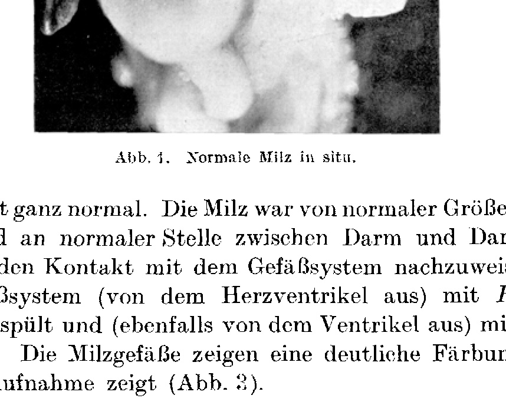
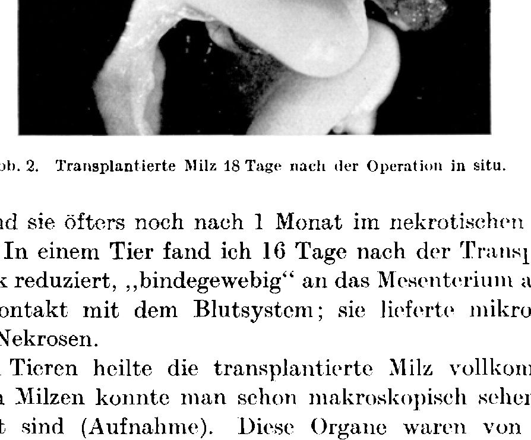
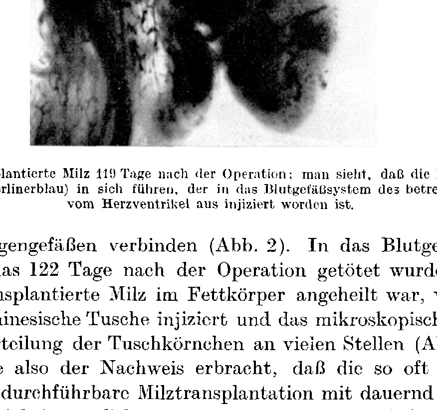
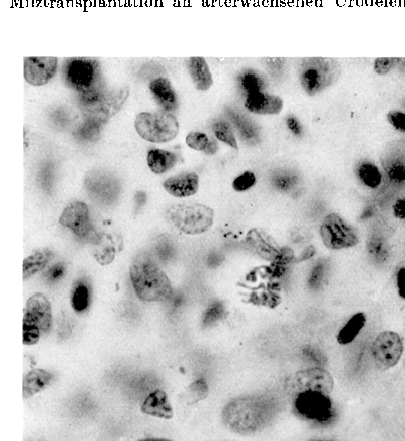
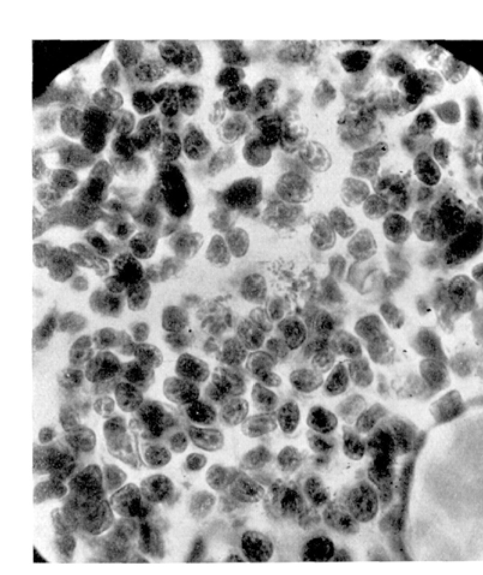
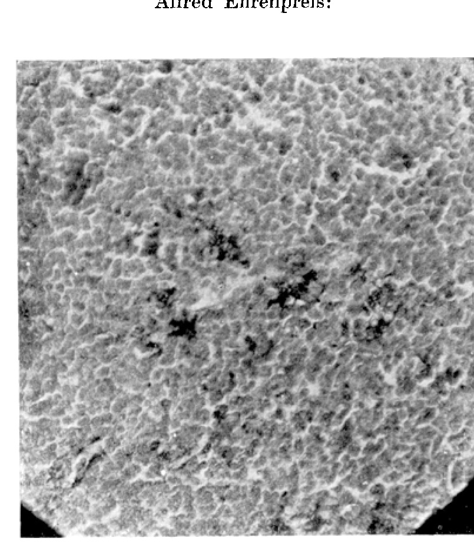
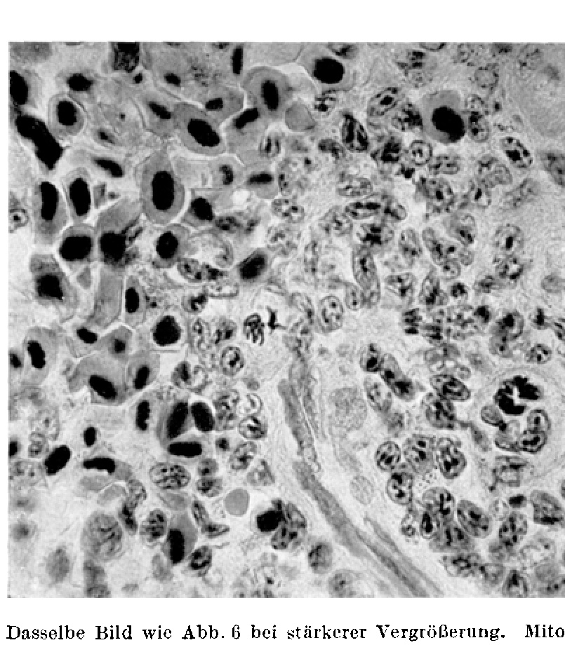

# Spleen Transplantation in Adult Urodeles

By

**Alfred Ehrenpreis.**

(From the Biological Experimental Institute of the Academy of Sciences in Vienna [Zoological Department].)¹

With 7 text figures.

(Received on 5 October 1923.)

*Archiv für mikroskopische Anatomie und Entwicklungsmechanik*, vol. 102 (1924).

> **Full translation.** A complete English rendering of the running text of “Spleen Transplantation in Adult [Amphibians]” (Ehrenpreis, 1924), including all tables, figure and plate legends, and footnotes. Numbers and table cells were transcribed from the page images, not the noisy OCR.

### Table of Contents.

| | Page |
|---|---|
| 1. Introduction | 573 |
| 2. Material and Care | 574 |
| 3. Technique | 575 |
| 4. Experimental Results | 576 |
| 5. Summary | 583 |
| 6. Literature | 583 |

## I. Introduction.

The animal spleen has often been used as an implantation site for other tissues (Ottolenghi, Alessandrini, Payr²). The exceedingly sparse experiments to transplant the spleen itself yielded negative results. Let me be permitted to discuss the relevant work of Lüdke somewhat more thoroughly, because it actually constitutes the only serious attempt that deals with our problems *sensu stricto*.

Lüdke expressly emphasizes that in his spleen experiments it was "only a matter of *partial* organ transplantation." Thus, in my opinion, regenerative processes (to which the organ injury could all too easily give the impetus) are not excluded thereby, which considerably reduces the clarity of the findings.

Lüdke wanted "to obtain clarification about the spleen as a suitable site for transplantation, and to find an experimentally founded explanation for the gradual resorption of the transplanted tissues, both foreign and own." Lüdke and Flörcken attempted to unite a dog's spleen with the splenic vessels of the goat and those of the wether, but "the vascular suture failed." Further, pieces of rabbit and dog spleen were sutured into the abdominal cavity of the rabbit, the dog, the goat, and the wether, namely between fascia, musculature, and peritoneum, on the stomach wall, or finally onto the stomach covering of the host animal. All these spleen fragments were resorbed after 4–5 weeks. Later

> ¹ An abstract of this work appeared under the same title as Communication No. 105 from the Biological Experimental Institute of the Academy of Sciences, Zoological Department (Director: Prof. H. *Przibram*), in the Akad. Anz. Wien, No. 17. 1923.

> ² Cited after *Lüdke*.

> Archiv f. mikr. Anat. u. Entwicklungsmechanik Bd. 102. 38a — pieces of rabbit spleen were pushed into (incision-formed) spleen pockets of monkeys and dogs and sutured shut with button sutures; the result was as follows: "... in almost all cases a small part of the transplanted spleen had remained preserved after 4, more rarely after 8 weeks — and was still adequately supplied with blood. Thereafter a healing-in of the spleen, which after 3 and 4 months could no longer be demonstrated, had at first taken place." Further it states: "... it is therefore to be assumed that artificially foreign spleen tissue implanted in dog or monkey spleen mostly remains preserved up to 4 weeks, but that after 2 and 3 months in the majority of cases remnants of the implanted spleen can no longer be demonstrated." We see, then, that there can be no talk of a permanent transplantation of the spleen in *Lüdke's* experiments.

The problem of the present work may be formulated as follows: Is the spleen replaceable, i.e. is it possible to exchange the spleen *in toto* between two animals and at the same time to maintain the functional capacity of this organ — that is, in the body of another animal — to preserve it!

It is clear that in order to achieve this purpose, one must bring the transplanted spleen into contact with the blood vessels — at least with the capillaries — of the host animal. *Lüdke's* findings show that it does not suffice to maintain the transplanted organs alive in the host body for 2 weeks, because they can still always be resorbed later. We now know from more recent experiments, e.g. on testicle transplantation, that transplanted organs which 3–4 months after the operation exhibit no necrotic phenomena (of resorption there can naturally be no question) guarantee a permanent healing-in. Finally, in order to convince oneself of the functional possibility of the transplanted organ, one must be able to compare microscopic preparations of such an organ with those of a normal organ; if one notices no necrotic places (which readily stand out through pyknotic nuclei) but instead mitoses, then one has a functioning organ before one. If one further succeeds, through injection of a dye (from the heart ventricle), in also staining the vessels of the transplanted spleen, then the sure proof is furnished that the latter has found the connection to the blood-vessel system of the host animal.

## II. Material and Care.

As experimental objects, Urodeles were chosen. The reasons for this were various. Firstly, because the author was experienced in this manner of animal-keeping. Secondly, because the Amphibian and especially the Urodele is known as very plastic material.

Since the genus *Salamandra* proved very sensitive to narcosis, exclusively animals of the genus *Triton* were operated upon. One cannot emphasize enough the postoperative animal care. Let me be permitted to mention what my experience in this respect has taught me. The animals should not be fed during the course of the first week after the operation. The "patients" are to be kept individually in small vessels with moist gravel disinfected in potassium permanganate [Kal. hypermang.]. 10 days after the operation, when the wound shows no infection, one can grant the animals a 2 cm deep layer of water, but must always give them the possibility of being able to hold the head above the water surface without exertion. 20–30 days after the operation one gives so much water (with water plants, for the purpose of oxygen supply) that the animals are able to swim comfortably, but always with arrangements that permit leaving the water (stone scaffoldings, ornamental cork). Faeces and food remnants are to be removed as quickly as possible! When an animal is afflicted by *Saprolegnia*, then it is almost always hopelessly lost. Baths in potassium permanganate do not help. Possibly a scraping-off (in an early stage) of the *Saprolegnia* islands may provide help — though only rarely. Often the animals will not eat. One should only not attempt force-feeding! I have lost a number of animals through this. If the food is merely stuck into the pharynx, then it is spat out; if one wants to convey it further into the intestinal tract, then often the wound bursts, an intestinal prolapse follows, and the animal perishes. As long as the animals are weak, I fed them with *Tubifex*, but in a separate vessel, in order to avoid the contamination with *Tubifex* remnants. Later I always threw tadpoles into the containers; they were caught by the *Tritons* and greedily devoured. Containers are to be set up in a light place, but not exposed to the sun.

## III. Technique.

Since most of the spleen transplantations hitherto, where vascular sutures were applied, failed¹, I made use of the "autophoric" transplantation (*H. Przibram*). I endeavored to bring the transplanted spleen as much as possible to its normal place and left it to find the contact with the blood vessels without the help of the experimenter. The animals were narcotized (sulfuric ether) in vessels that permitted anaesthesia without bringing the narcosis fluid into contact with the skin sur-

> ¹ Only subsequently did I become acquainted with a recently published work, in which a successful spleen transplantation in the dog by means of vascular suture is reported (*Totsuka Bunkei*, Sur la greffe autoplastique de la rate à l'aide de la suture vasculaire. Etudes histologiques. Trab. del laborat. de investig. biol. de la univ. de Madrid, Bd. 20, H. 3/4, S. 93. 1923).

> 38* face into contact. (That is to say, the animal finds itself on a gridwork, under which lies a wad of cotton soaked in ether.) When the movements of the animal ceased, it was taken out of the narcosis vessel and the white glandular secretion wiped off with moist cotton; then the animal comes to lie on its right side and, on the left, 1 cm caudalwards from the left anterior extremity, parallel to the vertebral column, a 1 cm long incision is made through the entire body wall. When a lobe of the liver, a lung, or an egg-ball comes into view, it is pushed aside, and then one sees the pale stomach wall clearly shimmer through. The stomach with the duodenum is carefully drawn out with the pincers, and thereby the red spleen attached to the intestinal net [mesentery] is brought out along with it. In the same way a second animal is treated; the spleen is carefully (easily injurable!) lifted off and the four branches of the vena lienalis are cut through. Both spleens are exchanged, brought into their normal position, the stomach is pushed back into the abdominal cavity, and the body wall is sewn together with three to four sutures. One can leave the animals here with gravel (see above: animal care!). After 2–3 weeks the sutures fall out.

## IV. Experimental Results.

Four experimental series were undertaken:

a) Spleen extirpation; to find out about the eventual regeneration of the spleen.

b) Spleen replantation; the normal spleen was left in the animal and re-implanted at the same place.

c) Autoplastic spleen replantation; the spleen was extirpated and re-implanted at the same place in the same individuals.

d) Homoioplastic spleen transplantation; the spleen was transplanted between two artificially foreign *Triton* of the same species.

Object: *Triton cristatus* Laur.

### a) Spleen extirpation.

In order, to forestall possible objections that the permanent success in spleen transplantation could be feigned through spleen regeneration, I extirpated the entire spleen in the *Triton*. I want hereby expressly to emphasize that there can be no talk of any spleen regeneration at all in the operated animals, all the more so as the probability of regeneration was *a priori* very slight.

Concerning spleen regeneration in Urodeles, numerous older observations exist. It was first observed by *Griffini* and *Tizzoni*.

*Griffini* and *Tizzoni* observed a new formation of spleen nodules in the intestinal mesentery and peritoneum of the dog after spleen extirpation: "Le péritoine et le tissu conjonctif en générale, ont, soit en partie, soit en totalité, une très grande affinité anatomique et fonctionelle avec la rate, de façon qu'ils peuvent servir, dans des circonstances déterminées, de matrice à cet organ." The authors further assure: "Nous allons voir qu'en ce qui concerne les Poissons et les Amphibiens on arrive à des résultats identiques." In spite of this assurance they admit (*Phisalix*): "La splénectomie ne réussit pas dans la plupart des Poissons." Better placed was he with the *Triton*: "La splénectomie, chez le *triton*, réussit . . . bien, et, au bout de deux mois, on peut déjà s'assurer de la reproduction de nodules spléniques." Unfortunately, in all the cited cases all the data on the age of the operated animals are lacking, and it is even doubtful whether a total spleen extirpation was ever carried out. But even granting the latter, only a new formation of spleen nodules (nodules spléniques) is reported, and that only 2 months after the splenectomy. Finally, *Daiber* experimented with 2 mm long axolotl larvae and observed — even 2–3 days after the operation — regenerative processes in the remaining spleen-mesentery remnant after total spleen extirpation. Three of the animals operated by me perished, namely 6, 16, and 46 days after the spleen extirpation. (The causes of death were in two cases *Saprolegnia*, in one a loss of intestine during force-feeding.) The fourth animal was killed 3 weeks after the operation. In all four cases a total extirpation had been carried out, and in none of these four animals could I perceive even the smallest spleen regeneration. All became (in contrast to those with transplanted or replanted spleens) quite weak animals that only rarely wanted to eat and that kept themselves predominantly outside the water. By this, however, it is not to be said that a *Triton* deprived of its spleen is doomed to death. In the animal series up to man, cases with congenital absence of the spleen have already been described (*Lean, Stafford and Craig*). I myself found an otherwise normal male *Triton cristatus* that exhibited no trace of a spleen. In any case, these experiments show that in cases where, 18 days after the operation, the transplanted spleen had healed in splendidly, there can be no talk of a feigning of the transplantation success through spleen regeneration.

### b) Spleen replantation.

The implantation of one's own spleen was also undertaken in four animals. All remained quite lively, showed a great voracity on the day [of operation], and were killed 77 days after the implantation.

Finding: The normal own spleen remained normal, the implanted one was completely necrotic, shrunk to ⅓ of the original size, lying loose in the abdominal cavity.

### c) Autoplastic spleen replantation.

In three animals the spleen was completely extirpated, brought for 1 minute into physiological saline solution, and brought again into its normal position in the same individuals. One specimen perished in 11 days as a result of accidental injury. The second died of *Saprolegnia*. The third was killed 119 days (4 months) after the operation. This animal (♀) was the entire time lively, ate much, and behaved

**Abb. 1.** Normal spleen *in situ*.  *(figure not reproduced)*

altogether quite normally. The spleen was of normal size, gorged with blood, and healed in at the normal place between intestine and intestinal net [mesentery]. In order to demonstrate the contact with the vascular system, the blood-vessel system (from the heart ventricle) was flushed through with Ringer's solution and (likewise from the ventricle) injected with Berlin blue. The splenic vessels show a distinct coloration, as the relevant photograph shows (Abb. 3).

### d) Homoioplastic spleen transplantation.

The spleen transplantation was carried out on 23 specimens of *Triton cristatus* and two *Triton alpestris*. Of these animals, three died so quickly after the operation that they permitted no conclusions whatsoever to be drawn. In seven animals the transplanted spleen fell down into the kidney region and lay there loose, without connection with other organs. Such spleens, which represent a kind of explant in a favorable nutrient solution, contained living host tissue at their periphery, but in the interior exhibited nothing but necrotic places, which in microscopic sections are characterized by pyknotic nuclei. These necrotic organs were much smaller and paler than in the original state and remained in the animal's body for 15, 16, 22, 26, 31, and 32 days after the operation respectively. In three cases, namely 15, 20, and 78 days after the operation, the spleen was completely resorbed, so that upon opening the animals no trace of the transplanted organ was to be found. It is remarkable that in many cases the transplanted spleen, already resorbed after 15 days,

**Abb. 2.** Transplanted spleen 18 days after the operation *in situ*.  *(figure not reproduced)*

is, while it often still maintains itself in a necrotic condition for 1 month longer. In one animal I found, 16 days after the transplantation, the spleen strongly reduced, "connective-tissue-like" grown onto the mesentery, without contact with the blood system; it yielded microscopic images of necroses.

In nine animals the transplanted spleen healed in completely. In some spleens one could already see macroscopically that they were vascularized (photograph). These organs were of normal size and color or somewhat smaller. Never could I observe a healing-in at the normal place. The transplanted spleens nested themselves between stomach and pancreas, in intestinal windings, on the stomach wall (Abb. 2) or body-wall musculature, or in the fat body in the region of the gonads. All of them bore a normal microscopic spleen-image, with mitoses in adenoid tissue

--- (Fig. 5), without a trace of nuclear pyknosis, neither at the periphery nor in the interior of the spleen pulp; they also exhibit a quantity of red and colourless blood corpuscles.

The complete healing-in of the transplanted spleen was confirmed at 18, 24, 26, 30, 32, 85, and 122 days (4 months!) after the operation. The animal (♂, with a spleen from a ♀) that was opened 18 days after the transplantation shows macroscopically vessels which connect the spleen with the gastric vessels (Fig. 2). Into the blood-vessel system of the animal that was killed 122 days after the operation, and in which the transplanted spleen had healed into the fat body, finely ground Chinese ink was injected, and the microscopic image of the spleen shows the distribution of the ink granules in many places (Figs. 6 and 7).

**Fig. 3.** A replanted spleen 119 days after the operation: one sees that the splenic blood vessels carry within them the dye (Berlin blue), which was injected into the blood-vessel system of the animal in question from the heart ventricle.  *(figure not reproduced)*

Thus the proof was furnished that the so often attempted, hitherto unrealizable spleen transplantation with permanently preserved capacity for function is possible, and indeed without the complicated technique of vascular sutures etc., but rather by means of the simple autophorous method of Przibram.

**Fig. 4.** Microscopic image of a normal spleen, with mitosis.  *(figure not reproduced)*

**Fig. 5.** Microscopic image of a transplanted spleen which had remained 30 days in the animal's body, with mitosis.  *(figure not reproduced)* **Fig. 6.** Microscopic image (weak magnification) of a transplanted spleen which had remained 122 days (after the operation) in the animal's body; in this animal Chinese ink was injected into the blood system from the heart ventricle; one sees the distribution of the ink granules in the spleen, which had come to heal in between the lobes of the fat body.  *(figure not reproduced)*

**Fig. 7.** The same image as in Fig. 6, but at stronger magnification. Mitosis visible.  *(figure not reproduced)* It is a pleasant duty for me to express my most obliging thanks to my highly esteemed teacher, Professor Hans Przibram, for the stimulus to this work. But my thanks go quite especially to Professor W. Kolmer (Physiological Institute in Vienna), who spared no effort to make possible for me the preparation of the microscopic and injection specimens and the photographs.

## V. Summary.

It proved possible to transplant the spleen in *Triton cristatus* Laur. *in toto* by the autophorous method of Przibram. The healing-in already takes place 18 days after the operation. Both macroscopically and by means of dye injections, the contact of the transplanted organ with the blood vessels of the body was confirmed. In microscopic preparations of the transplanted spleen (which in nothing differ from those of the normal one), mitoses are to be seen in the adenoid tissue, even when the transplanted spleen in question only came into the fixing fluid 4 months after the operation.

## VI. Literature.

*Bizozzero, G.* and *Salvioli, G.*: Die Milz als Bildungsstätte roter Blutkörperchen. Zentralbl. f. d. med. Wiss. Bd. 17. 1879. — *Carrel* and *Guthrie* see *Jeger*. — *Daiber, M.*: Zur Frage nach der Entstehung und Regenerationsfähigkeit der Milz. Jenaische Zeitschr. f. Naturwiss. Bd. 42. 1907. — *Fürth, O. v.*: Probleme der physiologischen und pathologischen Chemie. 1. Bd.: Gewebechemie, XXII. Vorles. 1912. — *Griffini et Tizzoni*: Étude expérimentelle sur la reproduction partielle de la rate. Arch. ital. de biol. Vol. 1, 4. fasc. 3. 1883. — *Jeger, E.*: Die Chirurgie der Blutgefäße und des Herzens. 1913. S. 226. — *McLean, Stafford and Howard R. Craig*: Congenital abscence of the spleen. Americ. journ. of the med. sciences Vol. 164, Nr. 5, p. 703–712. 1922. — *Little, C. C. and B. W. Johnson*: The inheritance of susceptibility to implants of splenic tissue in mice. Proc. of the soc. f. exp. biol. a. med. Vol. 19, Nr. 4, p. 163–167. 1922. — *Lüdke, H.*: Über Milztransplantationen. Münch. med. Wochenschr. 1909. S. 1469 u. 1532. — *Marine, David and O. T. Manley*: Homeotransplantation and autotransplantation of the spleen in rabbits. Journ. of exp. med. Vol. 32, Nr. 1, p. 113–133. 1920. — *Phisalix, C.*: L'anatomie et la Physiologie de la rate chez les Sethyopsidés. Arch. de zool. exp. Série II, T. 3. 1885. — *Pouchet, M.*: Évolution des globules du sang chez le triton. Journ. de l'anat. et de la physiol. 1879. — *Przibram, H.*: Die Methode autophorer Transplantation. Arch. f. mikroskop. Anat. u. Entwicklungsmech. Bd. 99. 1923.

## Figures

**Fig. 1.**

**Fig. 2.**

**Fig. 3.**

**Fig. 4.**

**Fig. 5.**

**Fig. 6.**

**Fig. 7.**

---

*Translator's note.* One of the Biologische Versuchsanstalt (Vienna Vivarium) papers flagged on the project site as a modern rediscovery target. Claims are rendered as stated in the original, not endorsed.
