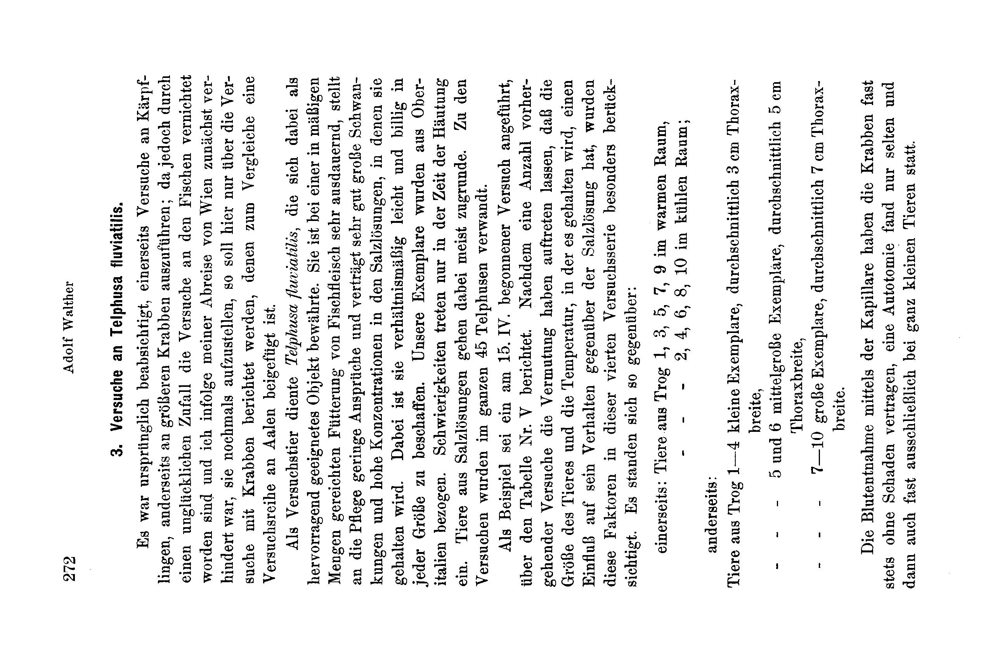

# The Environment of the Germ-Plasm.

## V. The Penetration of Magnesium into the Blood of the Freshwater Crab (*Telphusa fluviatilis* Belon.).

By

### Adolf Walther (Gießen).

*(From the Biological Experimental Institute in Vienna.)*

With Plate XVIII.

Received on 8 December 1912.

*Archiv für Entwicklungsmechanik der Organismen*, vol. 36 (1913).

> **Full translation.** A complete English rendering of the running text of “The Environment of the Germ-Plasm (Walther)” (Walther, 1913), including all tables, figure and plate legends, and footnotes. Numbers and table cells were transcribed from the page images, not the noisy OCR.

### Table of Contents

|  | Page |
|---|---|
| 1. Introduction: On the Permeability of the Soma to Chemical Agents | 262 |
| 2. Method of the Author's Own Experiments: The Microchemical Detection of Magnesium in Animal Fluids | 266 |
| 3. Experiments on *Telphusa fluviatilis* | 272 |
| 4. The Susceptibility of the Germ-Plasm to Influence by Chemical Agents | 277 |
| 5. Summary | 283 |
| 6. List of References | 284 |
| 7. Explanation of the Microphotographs (Plate XVIII) | 286 |

## 1. Introduction.

### On the Permeability of the Soma to Chemical Agents.

The purpose of this work is, within the framework of a series of investigations¹ initiated by H. Przibram concerning the "Environment of the Germ-Plasm," to make a contribution to the knowledge of the relationships

> ¹ The Environment of the Germ-Plasm. I: H. Przibram, The Research Programme. Arch. f. Entw.-Mech. Vol. 33. 1912. pp. 666—681. II: S. Sečerov, The Enjoyment of Light in the *Salamandra* Body. Ibid. pp. 682—702. III: E. D. Congdon, The internal temperature of warm-blooded animals (*Mus decumanus, M. musculus, Myoxus glis*) in artificial climates. Ibid. pp. 703—715. IV: S. Sečerov, The Enjoyment of Light in the *Lacerta* Body. Ibid. Vol. 34. 1912. p. 742.

of chemical nature which can connect the animal germ during development within the interior of its producer with the latter. Besides the communication of a series of the author's own experiments, the question shall then also be examined, on the basis of the literature available up to now, whether and which reliable knowledge gained in experiment is at our disposal for answering the question of the influenceability of the germ-plasm by way of the indirect path through the soma.

Here we have to distinguish between the possibility of influencing the germ-plasm chemically by a shifting of the conditions in the chemical composition of the body itself, by an alteration of the bodily susceptibility under otherwise normal conditions of the environment, on the one hand, and the penetration of substances foreign to the body, on the other. As regards the first-mentioned point, it is quite certain that the body of the higher animals, especially that of the warm-blooded animals, with the toughness of its "normal" composition allows itself only reluctantly to be altered. We will demonstrate this by the example of various experiments by Abderhalden and Samuely (1905). They fed a horse — gliadin from wheat — which contains scarcely any glutamic acid. Nevertheless, this animal still contained these [protein bodies], even after one day, although the glutamic acid, the normal component of these protein bodies, was — just as before this feeding — no longer available; for through the preceding starvation period of one week and the subsequent renewed feeding the muscle material had built up a large part of its serum-protein anew.

A slight influencing of the constancy of its status — quite apart from the substances foreign to the body, especially in the warm-blooded animals — against the influences that run counter to it, namely a slight withdrawal of normal constituents, nonetheless remains conceivable. A certain influencing of the germ-plasm is conceivable through the withdrawal of substances available in the normal body. Thus Roseman (1911) found, in chlorine-hunger, even a considerable reduction of the chloride content very pronounced; it succeeded in not letting the organism withdraw a larger quantity of Cl.

Under certain physiological and pathological conditions there are now admittedly the possibilities that substances are taken up into the body — substances which under ordinary conditions are taken up neither in penetrating quantities, in which therefore at the very least a time-disparity exists, in which the truly present possibility of the passage of substances foreign to the body across the soma is determined. As an example for the occurrence of certain **physiological periods** with altered permeability, the observations of Gänghofner and Langer (1904), which provided the proof, by the demonstration of the formation of precipitins, that with larger doses of genuine protein bodies, in young animals in the first days of life (for about a week long), the passage of the unchanged protein into the blood is possible. And the observation of Riddle (1910), who found in turtles (*Emydoidea blandingii*) that with the feeding of Sudan III, a fat-soluble dye, which otherwise very easily passes the intestinal wall, this one in certain winter months does not reach into the body of the animals. A practically greater significance for our question, however, has the alteration of the permeability — to be observed as a partial manifestation of pathological processes — of the tissues that separate the circulating juices from the outer world. Thus Möllmann (1910) observed the occurrence of opium constituents in the milk of a cow with enteritis, while in healthy ruminants a passage of the constituents of fed opium was never to be observed.

There can be no doubt any longer that to such substances foreign to the body, taken up into the body unchanged or at least only inessentially changed, an important role here can fall. Poulton (1893) demonstrated this for the chlorophyll taken up with the food in the caterpillars of *Tryphaena pronuba*, in which, besides genuine pigment, a dye occurs that is nonetheless not derived from the chlorophyll of the food-plants.

There are above all two special questions which, because they offer especially favorable objects for experimental investigation, have undergone a more extensive treatment: the uptake of substances foreign to the body, fats, without alteration in higher animals on the one hand, and the permeability of the bodily walls for salts in the lower marine animals on the other.

On the first-mentioned point we have to go into more detail later. The question of the dependence of the quantity and composition of the ash-constituents of the blood of lower marine animals on the composition of the salts dissolved in the surrounding water shall by contrast already be discussed more closely here.

These investigations went out from determinations of the osmotic pressure of the blood of lower marine animals. Works by Frédéricq (1903), Botazzi (1908) and others showed that, up to and including the plagiostomes, all lower marine animals find themselves with their blood in osmotic equilibrium with the surrounding seawater, and that they let themselves be experimentally influenced in this respect by an alteration in the concentration of the seawater. Chemical investigations, however, as well as measurements of the electrical conductivity, soon showed that only the invertebrates find themselves, also with regard to the chemical composition, in a similar relationship of dependence on their environment; that by contrast the lower fishes show a smaller salt content of the blood than the seawater, and attain the osmotic pressure of the seawater by an in some circumstances very high content of non-electrolytes, above all urea (v. Schröder, 1890). The procedures applied in these investigations, the determination of the freezing-point depression on the one hand and that of the electrical conductivity on the other, can however by their nature yield only very summary results. About the behavior of the various salts in the individual case we can derive directly nothing at all from them, so that for our question not much is gained with these investigations. We have, on the contrary, points of reference for the fact that the re-establishment of the disturbed osmotic equilibrium is achieved not only by the passage of water or by the passage of the salt occurring on the one side in too high a concentration, but that thereby, under certain circumstances, the salts can substitute for one another reciprocally in a quite complicated manner in the equalization of the osmotic pressure. Thus, for example, Durig (1901) found that frogs easily take up this salt from a ferric-chloride solution. If, however, they are then brought back into pure water, then the body does indeed very soon give off again the excess of taken-up salts, but not as ferric chloride. There is found indeed chlorine, but no iron, in the water surrounding the frog. Accordingly, together with the chlorine, "another metal must, in a certain manner vicariously for Fe₂Cl₆, have passed over into the bath." Closer investigations of the behavior of the animal body towards the individual salts are, however, found only very sparingly. Thus Frédéricq makes a few statements about the penetration of salts added to seawater in *Carcinus maenas*. At a 5‰ addition of sodium ferrocyanide to the seawater, this salt could be detected in the blood only after 23 hours. At a 1% sodium-nitrate addition the osmotic pressure was soon equalized, without however the nitrate content having undergone even an approximately corresponding equalization; yet the salt could nonetheless be detected in the blood.

A more thorough following of the processes which are to be observed at the passage of salts into the blood of lower animals appeared to us expedient. When it succeeded in working out a method of magnesium detection, which permitted this metal to be detected also on a much simpler path requiring less material than the chemical analysis, a very favorable opportunity for this was given, which could be seized all the more readily since Stockard (1907, 1909) had brought about an altering effect on the animal germ (cyclopia formation in *Fundulus*) with magnesium-containing solutions of a certain concentration.

## 2. Method of the Author's Own Experiments.

### The Microchemical Detection of Magnesium in Animal Fluids.

On the occasion of investigations which I undertook at the instigation of Przibram at the Biological Experimental Institute in Vienna for other purposes, I made the observation that on the addition of a concentrated solution of di-sodium phosphate to seawater, or to the blood of invertebrates living in seawater, peculiar crystal formations regularly appeared, which we want here to designate briefly as radiating tufts. Mostly they are microscopically small, but can in favorable cases reach a length of even over a millimeter.

Their morphological properties emerge most clearly from the attached microphotographs. In their most characteristic form they consist of two ostrich-like bundles of crystal-rods, which all go out from a common middle point, so that the whole obtains the form of an hourglass. Yet such an ostrich-like tuft can also stand alone, without the counterpart going out from the same middle point toward the other side. The crystal-rods composing the tufts also occur very frequently singly, in some preparations even in very great number. They appear as slender, mostly even very fine prisms, which end in quite blunt points. For these it is characteristic that, with microscopic observation from above, they appear with rare exceptions obliquely cut off, so that the two edges of the point show an unequal length.

As concerns the regularity with which these radiating tufts occur in seawater, I have, on the whole, in the course of the investigations, according to the technique to be described more closely below, tested 14 samples of seawater of various origin for this appearance. Without exception with the same success of the occurrence of the radiating tufts in typical form and great number. The success remained the same when the seawater had previously been heated to boiling, evaporated almost to dryness, and then brought back to its earlier volume by the addition of distilled water. By contrast, the reaction turned out less abundant, but always still distinctly positive, when the seawater had, after drying down, additionally been ignited, and the solid constituents, then dissolving only with a considerable residue, were dissolved in the original quantity of water.

For the investigation of the blood of lower marine animals and for the comparison of freshwater and land animals with them, I had at my disposal above all a number of Crustacea. The marine animals were investigated partly directly at the Zoological Station in Trieste, partly they were animals which, obtained from there, had previously been kept for a shorter or longer time in natural seawater of the same origin at the Biological Experimental Institute. *Astacus* and *Porcellio* came partly from the surroundings of Vienna, partly from Gießen; the Telphusas were obtained from Upper Italy; the *Helleria* were taken from a culture already existing for a longer time at the Biological Experimental Institute, whose starting material we owe to V. Ebner. The following table reports on the result of the investigation of the blood of these Crustacea:

### Table I.

| Animal | The reaction was | |
|---|---|---|
| | positive | negative |
| **a) Seawater-Crustacea:** | | |
| *Carcinus mænas* | 3 | — |
| *Dromia vulgaris* | 2 | — |
| *Eriphia spinifrons* | 4 | — |
| *Eupagurus bernhardus* | 1 | — |
| *Maja squinado* | 1 | — |
| **b) Freshwater- and Land-Crustacea:** | | |
| *Astacus fluviatilis* | — | 6 |
| *Helleria brevicornis* | — | 2 |
| *Porcellio scaber* | — | 8 |
| *Telphusa fluviatilis* | — | 44 | It was now further to investigate, with regard to the blood of the lower marine animals, whether this reaction of the seawater was tied to a particular constituent of the same. To this end, under various conditions a series of salts was tested, namely:

NaCl, FeCl₃, K₂CO₃ and MgSO₄.

While the investigation of the three first-named salts in no way led to the occurrence of the typical crystallizations, the magnesium sulfate yielded the same typical radiating tufts and single crystals as the seawater. With further investigation it then showed itself that all magnesium salts, regardless with which anions this metal forms the salt, give this reaction. About this, as well as about the result of the testing of the other alkaline-earth metals, the following Table No. II reports.

On mixing equal parts of the indicated salt solution and a concentrated solution of Na₂HPO₄ on the object-slide, the following resulted:

### Table II.

| Experiment of | Solution | | |
|---|---|---|---|
| 22. I. 11 | Mg-Acetate | 5 % | very many radiating tufts |
| | Mg-Acetate | 1 % | moderately numerous radiating tufts |
| | Mg-Acetate | 0.2 % | very many radiating tufts |
| | Mg-Chloride | 10 % | |
| | Mg-Chloride | 1 % | a few small radiating tufts |
| | Mg-Chloride | 0.2 % | |
| 23. I. 11 | Calcium acetate | 1 % | |
| | Calcium nitrate | 1 % | |
| | Strontium acetate | 1 % | radiating tufts completely absent |
| | Strontium nitrate | 1 % | |
| | Barium acetate | 1 % | |
| | Barium nitrate | 1 % | |

After it thus stood established that the reaction is conditioned by the presence of magnesium compounds, it was attempted to determine which is the smallest quantity in which this metal can still be detected in this way.

A number of MgCl₂-solutions were investigated in graduated concentrations, which brought the following result:

### Table III.

| No. | Solution | |
|---|---|---|
| I | 5%-strength MgCl₂-solution | all three preparations show already after one hour a great number of very typical and beautifully formed radiating tufts |
| II | 2.5%-strength MgCl₂-solution | |
| III | 1.25%-strength MgCl₂-solution | |
| IV | 0.625%-strength MgCl₂-solution | after one hour a great number of typical radiating tufts, however less distinctly formed than at I—III |
| V | 0.3125%-strength MgCl₂-solution | after one hour only a few, poorly developed radiating tufts; well-formed ones appear only on the next day |
| VI | 0.15625%-strength MgCl₂-solution | the preparation shows neither after one hour, nor on any one of the three days following the preparation, a reaction |

Since in biological experiments, for which this procedure of magnesium-detection, with regard to the very small quantities of the substance to be investigated needed for the detection, appeared especially suitable, one must always reckon with the simultaneous occurrence of protein bodies and of other salts, the influence of these admixtures too had to be tested.

For the investigation of the influence of protein bodies the following experiments were set up:

I. Solutions of chlormagnesium were prepared in three different concentrations: 0.8%, 0.4% and 0.2%. For the one series the solutions were prepared with distilled water, for the other with cattle-serum pre-treated in the physical-chemical division of the institute, which after six weeks' dialyzing against flowing distilled water contained salts no longer in chemically detectable quantities, but protein on the other hand to 1.61%. From both rows of solutions preparations were made, on which however a difference in the strength of the reaction could not be demonstrated.

II. The blood of a control animal, which had never been in a magnesium solution, was mixed in the ratio of 3 blood : 1 salt solution (measured in small capillaries) with a magnesium solution, which contained in the liter 6.4 g MgCl₂, 5.2 g MgSO₄ and 6.4 g NaCl; blood and salt solution were rubbed together on the object-slide and then the concentrated sodium phosphate solution was added. The preparations of the solutions diluted with blood showed no change in the **Tabelle III.**

| No. | Solution | |
|---|---|---|
| I | 5% MgCl₂ solution | all three preparations already show, after one hour, a large number of very typical and beautifully formed ray-bundles |
| II | 2.5% MgCl₂ solution | |
| III | 1.25% MgCl₂ solution | |
| IV | 0.625% MgCl₂ solution | after one hour a large number of typical ray-bundles, but less distinctly formed than in I–III |
| V | 0.3125% MgCl₂ solution | after one hour only a few, poorly developed ray-bundles; well-formed ones appear only on the next day |
| VI | 0.15625% MgCl₂ solution | the preparation shows no reaction either after one hour or on any of the three days following its preparation |

Since in biological experiments — for which this procedure of magnesium detection seemed especially suitable in view of the very small quantities of the substance under investigation needed for detection — one must always reckon with the simultaneous presence of protein bodies and of other salts, the influence of these admixtures also had to be tested.

For the investigation of the influence of protein bodies the following experiments were carried out:

I. Solutions of magnesium chloride were prepared in three different concentrations: 0.8%, 0.4%, and 0.2%. For one series the solutions were prepared with distilled water, for the other with bovine serum prepared in the physico-chemical division of the Institute, which, after six weeks of dialysis against running distilled water, no longer contained salts in chemically detectable quantities, but did contain protein at 1.61%. From both series of solutions preparations were made, in which, however, no difference in the strength of the reaction could be detected.

II. The blood of a control animal that had never been in a magnesium solution was mixed, in the ratio of 3 blood : 1 salt solution (measured in small capillaries), with a magnesium solution that contained per liter 6.4 g MgCl₂, 5.2 g MgSO₄, and 6.4 g NaCl; blood and salt solution were rubbed together on the object-slide and then the concentrated sodium phosphate solution was added. The preparations of the blood-diluted solutions showed no change in the strength of the reaction compared with those diluted with distilled water in the same ratio.

In conclusion, the influence that the proportion between the liquid to be tested for magnesium and the concentrated sodium phosphate solution has on the strength of the ray-bundle formation still had to be determined. For this purpose, measured quantities of a 0.2% solution of MgCl₂ were mixed in fine capillaries with measured quantities of the concentrated sodium phosphate solution, and the ray-bundle formation occurring therein was established. The result was as follows:

**Tabelle IV.**

| Solution | Reaction |
|---|---|
| 5 parts MgCl₂ : 1 part Na₂HPO₄ | positive |
| 4 " : 2 parts " | positive |
| 3 " : 3 " " | positive |
| 2 " : 4 " " | indicated |
| 1 part " : 5 " " | completely lacking |

From the described experiments and a number of further experiments there resulted, for overcoming the various difficulties, the following experimental technique for the investigation of magnesium-salt occurrence (the one applied in the experiments described below):

The blood to be investigated was withdrawn from the animal by means of a capillary: in crabs and crayfish by puncture at one of the membranous spots that connect the two segments of a leg, in fish by withdrawal directly from the heart. Animals that had been taken from salt solutions were beforehand kept a few minutes in fresh water and then carefully rubbed dry at the puncture site. Of each individual animal, two preparations were made. In the first, the quantity of blood was greater than that of the sodium phosphate solution; in the second, the ratio between the quantities was reversed, the quantities in both cases being so measured that the ratio of the two liquids did not exceed 2 : 1.

The two drops were then mixed together by smearing with the cover-glass, and the cover-glass laid on. This should not be too small — I mostly used the size 21 : 26 mm — and the quantity of liquid should be so chosen that it does not pass beyond the edge of the cover-glass. The preparations were placed immediately into a moist chamber on small frames laid ready, in order to prevent too rapid drying out, and on each of the three days following preparation were examined microscopically. Five minutes proved sufficient, as has already been mentioned, to allow the preparation to be searched through thoroughly. It was examined under Objective 3 and Ocular 4 of Leitz, which at the normal tube length give a 103-fold magnification. Everything that could not be recognized at this magnification as a ray-bundle was disregarded, since a sharper magnification proved not suited to this purpose.

The reaction is counted as positive if at least one well-formed ray-bundle can be detected, or if smaller ray-bundles and ones with few rods are to be found in at least 3–4 examples. From there down to the absence of any trace of a reaction there are, naturally, also transitional forms, which under certain circumstances may give rise to doubt whether the reaction is still to be addressed as positive or not. Frequently only a few small rods occur, which compose the ray-bundles. In all these cases the reaction must be designated as "doubtful." If one of the two preparations from one and the same animal showed such a doubtful reaction, while in the other it was completely negative, then — with very few exceptions, among the large number of preparations produced in the course of the investigations — the former was that preparation which had been made with more blood than sodium phosphate solution, which can be regarded as an indication of the reliability of the procedure. (See also Table No. V.)

As regards the smallest quantity of magnesium detectable by this procedure, it lies about at a solution that contains 0.03% magnesium as salt, probably still somewhat below that. Thus magnesium chloride (with about 25% Mg) still gives, in a 0.2% solution, a quite distinct reaction (see Tables III and IV), whereas with MgJ₂ at 0.25% the lower limit is already reached. The former would correspond to a content of about 0.05% Mg, the latter to one of 0.02% in the solution.

A confusion of the ray-bundles characteristic of the magnesium reaction with other crystallizations should hardly be possible. At least, in several hundred preparations of the most varied kinds — apart from the very first experiments — I have never seen crystallizations that, with some attention, could have led to errors.

### 3. Versuche an Telphusa fluviatilis.
### 3. Experiments on Telphusa fluviatilis.

It was originally intended to carry out experiments partly on small fish (Kärpflinge), and on the other hand on larger crabs; since, however, through an unfortunate accident the experiments on the fish were destroyed, and since, owing to my departure from Vienna, I was at first prevented from taking them up again, only the experiments with crabs will be reported here, to which, for comparison, a series of experiments on eels is appended.

As experimental animal *Telphusa fluviatilis* [river crab] served, which proved outstandingly suitable for the purpose. It is, when fed flesh in moderate amounts, very enduring, makes little demand on care, and tolerates very well large fluctuations and high concentrations in the salt solutions in which it is kept. Moreover, it is comparatively easy and cheap to obtain in every size. Our specimens were obtained from northern Italy. Difficulties arise only at the time of molting. Animals from salt solutions then mostly perish. For the experiments, 45 Telphusae in all were used.

As an example, an experiment begun on 15. IV. may be cited, on which Table No. V reports. After a number of preliminary experiments had given rise to the supposition that the size of the animal and the temperature at which it is kept have an influence on its behavior toward the salt solution, these factors were especially taken into account in this fourth experimental series. There were thus set against one another:

on the one hand: animals in troughs 1, 3, 5, 7, 9 in the warm room,
" " " 2, 4, 6, 8, 10 in the cool room;

on the other hand:
animals in troughs I–4 small specimens, on average 3 cm thorax breadth,
" " " 5 and 6 medium-sized specimens, on average 5 cm thorax breadth,
" " " 7–10 large specimens, on average 7 cm thorax breadth.

The withdrawal of blood by means of the capillary the crabs almost always tolerated without harm; an autotomy occurred only rarely, and then too almost exclusively in quite small animals.

**Tabelle V.**

Material: *Telphusa*; consignment from Italy of 6. IV. 12.

| Examined on | Control small animals | | Mg-solution small animals | | Mg-solution medium-sized animals | | Mg-solution large animals | | Control large animals | |
|---|---|---|---|---|---|---|---|---|---|---|
| | warm | cold | warm | cold | warm | cold | warm | cold | warm | cold |
| | I | II | III | IV | V | VI | VII | VIII | IX | X |
| 22. IV. | —/— | —/— | ?/— | ?/? | ?/— | ?/— | ?/? | —/— | —/— | —/— |
| 27. IV. | —/— | —/— | —/— | —/? | ?/— | ?/? | ?/— | ?/— | —/— | —/— |
| 2. V. | —/— | —/— | —/— | ?/— | ?/— | ?/— | —/— | ?/— | —/— | —/— |
| 7. V. | —/— | —/— | +/— | +/? | —/— | +/— | +/— | +/— | —/— | —/— |
| 11. V. | —/— | —/— | —/— | —/— | —/— | —/— | —/— | +/? | —/— | —/— |
| 16. V. | —/? | —/— | +/+ | +/+ | +/+ | +/— | ?/— | ?/— | —/— | —/— |

(Beginning of the experiment: 15. IV. 12. On this day into a solution with 3.2 g MgCl₂, 2.6 g MgSO₄, and 3.2 g NaCl per 1 l of tap water. On 23. IV. into solutions with double the salt content. All animals appear thoroughly healthy and take the food greedily throughout the whole experiment. The average air temperature in the warm room was 24.5° C with slight fluctuations of at most 1°; the average temperature in the cool room about 18° C with fluctuations between 15 and 20° C.)

In Table V (see above), **+** denotes distinct reactions, **?** reaction indicated, **—** absence of the reaction. For each case two signs are given. The upper denotes the reaction in a mixture of blood > sodium phosphate solution, the lower the result with the reversed ratio. The concentration of the magnesium salts in the weaker solution I chose such that it corresponds to their occurrence in sea water (analysis of Mediterranean water according to FORCHHAMMER). Sodium chloride was then added in such a quantity that this salt had, in the solution, a concentration equimolecular to the two magnesium salts.

From this table it clearly emerges:

1. In the first period of residence in the magnesium-salt solution, only traces of these salts pass over into the body of the animals. After 17 days (15. IV. to 2. V.) only traces of them are detectable in the blood.

> Archiv f. Entwicklungsmechanik. XXXVI. 18 2. After 22 days, distinctly detectable quantities are found for the first time in 5 out of 6 animals.

3. An effect of temperature is not to be discerned.

4. It is, on the other hand, confirmed again that smaller animals take up the magnesium salts more easily than large ones, which also expressed itself clearly in the strength of the reaction, which unfortunately is not to be grasped numerically.

Striking is the appearance of negative results after the magnesium had already previously been distinctly detectable in the blood. One might, despite the improbability of this assumption, given the simultaneous occurrence of the phenomenon in 5 out of 6 cases, think of an experimental error, if quite similar phenomena had not also shown themselves in other cases. One has the impression as if the body once more makes energetic attempts to remove the foreign salts, before the then always soon-following strong irruption of the magnesium salts into the blood occurs.

This irruption is then, however, so far as can be judged from the strength of the reaction, a complete one, and occurs also under circumstances that leave no doubt that what is involved is not, say, seriously ill animals. Thus I have kept a crab of 2.7 cm thorax breadth from 9. I. to 13. V. 1912, that is over 4 months, in the weaker of the two solutions given at Table No. V, the concentration being frequently very much stronger through evaporation. The animal was at times very weak (in this, however, it did not differ essentially from its control in tap water), but always took food, in the last period even very greedily. The experiment had to be broken off only because of my departure. The blood of the crab gave, on 24. I., on 31. I., on 31. III., on 16. IV., and on 13. V., always distinctly positive reaction, which in the last period even reached the strength of reaction that the surrounding water also showed. There is no doubt that the animal was nevertheless fully viable.

Similar results were also obtained with large animals. One should suppose that the body now seizes at once every opportunity that offers itself to it to remove the foreign salts from its blood. But this is not at all the case, as emerged from the following experiment. The two large animals No. VII and VIII, which had already served for the experiment in Table No. V, were after the conclusion of the same, from 22. V. onward, brought into the stronger magnesium-salt solution, and both showed, on examination of their blood on 18 and 24 VI, a pronounced positive reaction. They were then both brought back simultaneously, on 27 VI, into fresh water (tap water); the one animal was then kept at an average temperature of 22° C, the other at 16° C. Their blood showed the following reactions:

**Tabelle VI.**

| | Animal I, kept warm | Animal II, kept cold |
|---|---|---|
| 28. VI. | +/+ | +/+ |
| 29. VI. | +/+ | +/+ |
| 3. VII. | ?/— | +/? |
| 8. VII. | —/— | —/— |

After 48 hours, therefore, quite considerable quantities of magnesium salts were still detectable in the blood of the crabs; and even after 6 days the blood in one case still showed a distinct reaction, in the other traces of the foreign salts, which then after a further 5 days had completely disappeared. A clear indication that even these salts, when present in the blood in a concentration wholly unaccustomed to the body, on their re-excretion from the body — even in lower animals — emerge with a slowness that makes the assumption of simple osmotic processes appear excluded.

The following experiment shows that the presence of other salts besides magnesium compounds is of essential influence on their penetration into the bloodstream. The two animals No. IX and X, used as controls in the experiments reproduced in Table V, were brought on 25. VI. 1912, at 10 a.m., into two different salt solutions with high magnesium content. Both solutions contained 10 g each of MgCl₂ and MgSO₄ per liter, and differed only in that the one solution additionally contained 10 g NaCl. The result of the blood examination of the two animals on the various days yielded the following: From this experiment it follows, first of all, that even with this extraordinarily high content of magnesium salts in the solution, after 24 hours not the slightest trace of magnesium is yet detectable in the blood; that after 5 days in the one case no reaction yet sets in, while in the other case it is indeed quite faintly positive; and that even after 2 weeks in neither of the two cases is a reaction detectable that even approximately equals in strength the reaction of the blood of seawater crustaceans. In this, the animals exhibit an essentially different behavior under the various experimental arrangements. Quite unquestionably the magnesium has passed over more rapidly (see the result of 30. VI.) and above all more abundantly into the blood from the solution without sodium chloride than from the solution with common salt. And this although the latter has a higher osmotic pressure and although the magnesium content was the same in both solutions! This difference was sharply pronounced. While the blood of animal No. I, drawn on 8. VII., gave only a barely still positive reaction, the blood of animal No. II showed a whole number of beautifully developed ray-bundles.

For comparison with these experiments on *Telphusa*, experiments may be drawn upon which I carried out with eels [*Anguilla*]. Three animals, 12–15 cm long, which for months before the experiment had been kept in fresh water at the institute, were placed on 5. XII. 1910 into a mixture of 1 part seawater and 3 parts fresh water, and from then on gradually into ever-increasing concentrations:

| 5. XII. 1910 | 25% seawater |
| 9. XII. | 40% " |
| 13. XII. | 50% " |
| 17. XII. 1910 | 66% seawater |
| 20. XII. | 75% " |
| 10. I. 1911 | pure " |

These animals were then examined on 6. IV., after they had thus spent almost 4 months in the pure seawater and during this time had taken unchanged food (*Tubifex rivulorum*). The blood obtained by piercing the heart with a capillary allowed no trace of a magnesium reaction to be recognized. (The question whether the eel, with its osmotic pressure, is dependent on changes in the fluid surrounding it must remain open. BACKMAN and RUNSTRÖM claim to have demonstrated such a dependence [upon transfer from seawater into fresh water, a decrease of the osmotic pressure of the blood by 30–40%]. NEUDÖRFER, on the other hand, was unable in experiments at our institute to attain experimentally such a change of the osmotic pressure by transfer from fresh water into seawater. Perhaps the contradiction is explained by the difference of the experimental conditions and their premature generalization!)

## 4. The Susceptibility of the Germ-Plasm to Influence by Chemical Agents.

BOTTAZZI says in his work on "The Cytoplasm and the Body Fluids," p. 38: "The chemical composition of the circulating fluid, e.g. of the higher animals, is constant, and constant too is the chemical composition of the various tissues, so that the difference between cytoplasms and fluids, of which we are here speaking, represents a difference between two constant chemical compositions."

If in the foregoing section we have seen that this constant composition of the circulating fluids is variable, even if only to a limited degree and under quite definite conditions, mostly still entirely unknown to us, then we must now turn to the question whether with the alteration in the constancy of the body fluids there is necessarily bound up a simultaneous alteration in the normal composition of the cytoplasm of the germ-cells, whether such an alteration has been demonstrated at all.

That the germ-plasm, within the body of its producer, possesses a far-reaching independent metabolism, of this there can be no doubt. This has stood beyond doubt since the classical investigations of MIESCHER (1881) and later works (PATON 1898), also for very early stages of development (see also BURIAN 1906). Through these works the fact has been established that the salmon, during its ascent of the rivers without any intake of food, is able to build up the entire mass of its sperm, which increases enormously during this time, for which purpose the great lateral trunk muscle stands at its disposal exclusively as material. But the nucleoproteids of the sperm contain, in the salmon, as protein-partner of the nucleic acid, protamines, which are distinguished by their richness in diamino acids (70–80% of the total nitrogen is contained in this form), whereas the musculature is relatively poor in them. Whether we now picture to ourselves, with KOSSEL, that these diamino acids derive directly from the musculature of the father-animal and are selectively accumulated in the sperm, while the monoamino acids are subject to consumption, or whether we believe in a building-up of the diamino acids themselves, for our considerations the result will always remain the same. About a far-reaching independence of the metabolism even of the most lowly developed stages of the germ-cells there can be no doubt. It will be of value for our further investigations if we already now emphasize that this independence of the metabolism of the germ-plasm exists not only with respect to the actual constituents of the parent-animal, but also relates to the behavior of the germ-plasm with respect to those substances which are given along to it by its producer as nourishment. The investigations relate mostly to the most favorable object for such experiments, the hen's egg. Thus, according to ADERS PLIMMER and SCOTT (1909), the phosphorus in the yolk is contained entirely in the form of organic compounds, and is then during development for the greatest part converted into the form of inorganic salts, a process which runs its course exclusively in the developing germ, since the chemical composition of the remaining yolk proves not essentially altered when one interrupts the process of incubation of the eggs and examines separately the undeveloped chick and the rest of the yolk. Quite similar conditions have been demonstrated by KOSSEL (1886) and TICHOMIROFF (1885) for the building-up of the nuclein in hen's embryos and in insect eggs. A selective uptake of certain substances out of the egg-white was shown in the hen by EMRYS-ROBERTS (1908). Here there are at first withdrawn from the egg-white ash and salts, while the percentage content of protein substances rises.

Now the proof that chemical agents are able to penetrate these protective walls of the germ against its surroundings can be furnished in two ways:

1) By the proof for the altering action of the substance being furnished through its action on the germ itself.

2) By the proof for the presence of the substance in question in the germ-plasm being furnished through chemical reactions.

In both directions compelling proofs are as good as entirely lacking to us.

For the answering of the first point we had carried out experiments on the action of magnesium on the germ in live-bearing toothed-carps, which PRZIBRAM had already briefly indicated in the "Working Program." The experimental animal, *Girardinus Guppyi*, accustomed itself very well, in the course of gradual adaptation experiments lasting several months, to a very high magnesium solution with only slight additions of other salts. Unfortunately the experiment came, however, as mentioned, through no fault of ours, by an accident, to a premature end.

For this question there remain provisionally as material only the experiments of HOUSSAY on the consequences of meat-feeding in hens, to which, however, a compelling proof in the sense demanded by PRZIBRAM does not attach, inasmuch as the proof of the appearance of poisonous excretion-products as consequences of the meat-feeding has not been furnished, while the phenomena of degeneration can also be explained otherwise. To this would be added, further, the cases in which the transmission of immunity through the father is supposed to be proven. As experiments of this kind with a positive result, the only ones known to me are those of CHARRIN and GLEY (1893, 1894), which, however, with regard to the only very meager successes (the establishment of the immunity transmitted from the father relates only to a few cases) and the peculiarity of the experimental object (immunity of rabbits against *Bac. pyocyaneus*) can hardly decide this important question¹).

> ¹ But even if the proof given by CHARRIN and GLEY were to prove valid, then from such experiments it must not be concluded, as e.g. GOLDSCHMIDT (p. 196) does, that the immune substances produced by the parent-animal pass over onto the germ (the quantities which the latter can carry mechanically are naturally far too small to immunize an adult animal passively), but it could only be a matter of a direct action of the poison-substances on the germ; thus a case of parallel-induction would be present.

As proving with certainty, one has hitherto also explained only a few experiments which assert the passage of fat-soluble dyes (SITOWSKI, RIDDLE) and of urotropin (hexamethylenetetramine), through RIDDLE (1911), onto the germ-plasm, without taking into account that through these works the passage of these substances onto the egg is indeed proven, but not onto the germ-plasm. On page 278 I have already pointed to the significance of the difference. With regard to the differing assessment which these experiments have found, it will be useful to enter somewhat more fully into their results.

The first work bearing on this is that of SITOWSKI (1905). He fed to caterpillars of *Tineola biselliella* animal wool which had been dyed with Sudan III. All the fat of the caterpillar and of the butterfly developing from it was then dyed red, whereas water-soluble dyes were not detectable in the interior of the caterpillar after feeding. "Small fat-globules, which are dyed red with Sudan, we noticed in the interior of the egg, where besides these there are also visible small fat-droplets, which are distinctly dyed red and in our opinion have arisen through confluence of small globules." The deposited eggs too showed the red dye in this form. From them there developed, according to the first communication, a "quite normal caterpillar generation." The second communication of the same author then brings, in the form of a preliminary communication, the news that from these red-dyed eggs larvae were raised "which possess its special tinge of red." A statement which likewise has nothing to say for our investigations. It is very well possible, even probable, that it is a matter of the same phenomenon as in GAGE (1908). These [authors] have, in connection with the experiments of RIDDLE, fed hens with Sudan III and incubated the eggs so obtained with intensely red-dyed yolk. It is very instructive to follow, by the data of these authors, the passage of the dye onto the chick:

First period: "For the first ten days the transparent embryo showed no sign of the color."

Second period: As soon as the chick begins to lay down fat-depots, the dye appears also in these. By contrast, e.g. the nerves show no trace of red dye.

The authors now hold this passage of fat from the yolk into the chick, which in reality is nothing but a process of fat-storage, to be "one of the processes of nutrition." This rests upon a complete misapprehension of the physiological significance of the fat-depots. Experiments by ABDERHALDEN and BRAHM (1910) show beyond objection that the fat in the fat-depots of the body is very easily influenced by the feeding, but that it is not possible to attain alterations, by however one-sided a feeding, in the fat found in the body-cells of the same animal. The yolk, however, must — this is moreover to be expected a priori with regard to the often astonishing rapidity with which it is formed — according to experiments by HENRIQUES and HANSEN (1903) be regarded as such a fat-depot, influenceable in its composition through feeding of foreign fats, which stands to the body-cells belonging to it, the germ, in the same relation as, say, the fat stored in the subcutis stands to the body-cells. That this view hits upon the right [interpretation] follows from the fact that, according to investigations by LIEBERMANN (1888), in the first period of its development the hen's embryo is extraordinarily poor in fat, to which it is also to be attributed that, in the experiments of GAGE, in the first 10 days it did not take up the fat-soluble dye.

We have, then, in these fat-soluble dyes, to do with substances which by their nature are wholly unsuited to demonstrations in our question. For these fats stored in the body have surely still to undergo essential transformations before they are actually assimilated; what then happens with the dye, "which is bound to the fatty constituents, cannot loosen from them, and is dragged with them mechanically, so to speak, wherever they may go" (RIDDLE, 1910, p. 167), is wholly unknown; whereby it is further to be noted that, according to RIDDLE's own statement, the assimilation of the Sudan-dyed fat is impeded compared with the undyed fat.

The experiments with hexamethylenetetramine are in no way better suited to a demonstration in our question. For through them it is not made clear which constituent of the eggs, egg-white or yolk, takes up this compound. The author's data, which are meant to prove that both constituents of the egg take up this compound, are wholly and entirely unsuited to such a proof. The proof of the passage of urotropin namely followed through the investigation for formaldehyde, which is split off in the tissues from hexamethylenetetramine. Now this compound has, however, according to the author's data, even passed over from eggs which contained it onto such eggs as were quite free of it and were merely kept in the same container. Thus the time required for the formation of the egg-white and the eggshell quite certainly suffices fully to make possible this passage from the egg-white to the yolk or vice versa, provided only one of these two egg-constituents takes up this compound. An excretion of hexamethylenetetramine alone through the egg-white glands of the uterus, corresponding to the excretion, as we know it of a whole number of other compounds through the salivary gland, the mammary gland, etc., is quite well possible and would be one of the possibilities through which a penetration of chemical agents into the germ-plasm could be mediated. At all events, according to the nature of the chemical body here in question, in contrast to the fat-soluble dyes, an action on the germ is rather more to be expected; yet the proof is lacking.

We should like in conclusion to point out further under what extraordinarily varied circumstances an action of chemical agents on the germ in the course of its development can take place. If we wish to place these investigations upon a broader basis, then we may indeed not content ourselves with following only the possibility of the susceptibility of the germ to influence at the site of its development up to the finished egg, respectively spermatozoon. It is even probable that the egg, after ovulation, can be reached much more easily by chemical bodies than during its development in the egg-follicle. In this period, in mammals, the nutrition of the egg takes place through the uterine glands, whose significance has in more recent times again come more into the foreground (EMRYS-ROBERTS, 1910; DRIESSEN, 1911). Temporally this process is very extended; thus, e.g., according to SPEE there lies between fertilization and the beginning of the implantation of the egg in the uterine wall, in the guinea-pig, a span of 6 days. In birds and reptiles to this period corresponds the secretion of the egg-white. Even in some viviparous insects we can establish an analogous nutrition through uterine glands (see HOLMGREN). Here it is further to be noted that, according to McCLENDON, with the fertilization of the egg and with its first cleavages essential alterations in its permeability to chemical agents set in. A corresponding period we find in the spermatozoa in the time in which they stand under the influence of the products of the accessory sexual glands. For all these glands of the male and female genital tract we may well assume, by analogy with a whole series of processes known to us in other glands, to which it was already pointed above, that an alteration of their secretions through the simultaneous outpassing of body-foreign substances that have entered the body, and thereby an influence of chemical bodies on the germ, is possible.

With the appearance of closer relations between mother and germ, there then arises once again in mammals a new period of the possibility of chemical influenceability.

The embryo, which—to use an image employed by Spee—then penetrates first as a parasite into the uterine wall, destroying it, enters ever more into the relations of mutual symbiosis with its mother and develops ever more an almost complete chemical autonomy. Here too, in its ontogeny, it thereby repeats the phenomena of phylogeny, inasmuch as this chemical autonomy runs far ahead of the dependence in osmotic pressure. This can go so far that the germ withdraws from the mother animal substances vital to it, such as the calcium of the bones (see Dibbelt). And it shows itself most pronouncedly in phenomena such as those found by Kraus and his co-workers, who by means of ingenious immune reactions have demonstrated a markedly different behavior between fetal serum and fetal cells on the one hand, and the cells and serum of the mother animal on the other.

## 5. Summary.

I. Magnesium salts can be detected, even in very small quantities, through the formation of characteristic microcrystals with sodium phosphate.

II. Magnesium salts penetrate only very slowly into the body of *Telphusa fluviatilis*, more rapidly in smaller animals than in large ones. Once taken up, however, they are again given off only comparatively slowly. In a pure magnesium solution the passage of Mg occurs more rapidly than in the simultaneous presence of NaCl.

(III. Proof that body-foreign substances experimentally introduced into the body have penetrated as far as the germ-plasm has not been furnished by the experiments hitherto available.)

## 6. Bibliography.

Abderhalden, E., and Brahm, C., Is the fat involved in the building-up of the body cells dependent in its composition on the kind of dietary fat taken up? Zeitschr. f. physiolog. Chemie. Bd. 65. 1910. S. 330–335.

Abderhalden, E., and Samuely, Fr., Contribution to the question of the assimilation of dietary protein in the animal organism. Zeitschr. f. physiolog. Chemie. Bd. 46. 1905. S. 193.

Aders Plimmer, R. H., and Scott, F. H., The transformations in the phosphorous compounds in the hen's egg during development. Journ. of Physiolog. Vol. 38. 1909. p. 247–253.

Backman, E. L., and Runnström, J., Physical-chemical factors in embryonic development. The osmotic pressure in the development of *Rana temporaria*. Biochemische Zeitschr. Bd. 22. 1909. S. 290–298.

Botazzi, Fil., Osmotic pressure and electrical conductivity of unicellular, plant, and animal organisms. Ergebn. d. Physiolog. 7. Jahrg. 1908. S. 160–402.

—— The cytoplasm and the body fluids. Handbuch d. vergl. Physiolog. Jena, Fischer, 1911–12. S. 1–460.

Burian, R., Chemistry of the spermatozoa. Ergebn. d. Physiolog. 3. Jahrg. 1904. S. 48–106. 5. Jahrg. 1906. S. 768–846.

Charrin et Gley, Recherches sur la transmission héréditaire de l'immunité. Arch. de Physiolog. Tom. 25. No. 1. 1893.

—— Nouvelles recherches expérimentales sur la transmission héréditaire de l'immunité. Daselbst. Tom. 26. No. 1. 1894.

Dibbelt, W., The significance of the calcium salts for the pregnancy and lactation period and the influence of a negative calcium balance on the maternal and the infant organism. Beiträge zur pathol. Anat. u. allgem. Pathol. Bd. 48. 1910. S. 147–169.

Driessen, L. F., Glycogen production, a physiological function of the uterine glands. Zentralbl. f. Gynäk. Bd. 35. 1911. S. 1308–1313.

Durig, A., Water content and organ function. Pflügers Arch. Bd. 85. 1901. S. 401–504.

Ehrlich, P., On immunity through inheritance and suckling. Zeitschr. f. Hygiene u. Infektionskrankh. Bd. 12. 1892. S. 183.

Emrys-Roberts, E., A further note on the nutrition of the early embryo, with special reference to the chick. Proceed. Roy. Society of London. Ser. B. Vol. 80. 1908. p. 332–338.

—— The embedding of the embryo guinea-pig in the uterine wall and its nutrition at that stage of development. Journ. of Anat. and Physiol. Vol. 44. 1910. p. 192–203.

Frédéricq, L., Sur la concentration moléculaire du sang et des tissus chez les animaux aquatiques. Arch. de Biologie. Tom. 20. 1903. p. 709–730.

Gage, S. H. and S. P., Sudan III deposited in the egg and transmitted to the chick. Science. Vol. 28. 1908. p. 494–495.

Ganghofner und Langer, On the resorption of genuine protein bodies in the gastrointestinal tract of newborn animals and infants. Münch. med. Wochenschr. 51. Jahrg. 1904. S. 1497–1502.

Goldmann, Ed. E., The external and internal secretion of the healthy and diseased organism in the light of "vital staining". Beitr. z. klin. Chirurgie. Bd. 64. 1909. S. 192–265.

—— On a new method of examining normal and diseased tissues by means of intravital staining. Proceed. Roy. Society of London. Ser. B. Vol. 85. 1912. p. 146–156.

Goldschmidt, R., Introduction to the theory of inheritance. Leipzig, Engelmann, 1911. 502 S.

Henriques, V., und Hansen, C., On the passage of dietary fat into the hen's egg and on the fatty acids of the lecithin. Skandin. Arch. f. Physiologie. Bd. 14. 1903. S. 390–397.

Holmgren, Nils, On viviparous insects. Zool. Jahrbücher. Bd. 19. 1903. S. 431–468.

Houssay, F., Variations expérimentales. Études sur six générations de poules carnivores. Arch. zool. expér. et gén. Sér. 4. Tom. 6. p. 137–332.

Kossel, A., Further contributions to the chemistry of the cell nucleus. I. On the nuclein in the yolk of the hen's egg. Zeitschr. f. physiolog. Chemie. Bd. 10. 1886. S. 248–250.

Kraus, R., Yshiwara, K., und Winternitz, J., On the behavior of embryonic cells toward umbilical-cord blood and retroplacental serum. Deutsche med. Wochenschr. 38. Jahrg. 1912. S. 303–305.

Liebermann, Leo, Embryochemical investigations. Pflügers Arch. Bd. 43. 1888. S. 71–151.

Lustig, A., Is the immunity acquired against poisons transmissible from parents to the offspring? Zentralbl. f. allgem. Patholog. u. pathol. Anatomie. Bd. 15. 1904.

McClendon, J. F., The Relation of Permeability Change to Cleavage in the Frog's Egg. Science. N. S. Vol. 33. 1911. p. 629–630.

Miescher, F., On the life of the Rhine salmon in fresh water. Arch. f. Anat. u. Physiolog. Anat. Abteil. 1881. S. 193–218.

Moellmann, H., Investigations on the passage of opium constituents into the milk of our domestic animals, as well as on the changes in the milk caused by the administration of opium. Inaug.-Diss. Zürich 1910.

Neudörfer, A., Experiments on the adaptation of freshwater fishes to salt water. Arch. f. Entw.-Mech. Bd. 33. 1907. S. 566.

Paton, D. N., The physiology of the salmon in fresh water. Journ. of Physiol. Vol. 22. 1898. p. 333–356.

Poulton, E. B., The Experimental Proof that the Colours of Certain Lepidopterous Larvae are Largely Due to Modified Plant Pigments Derived from Food. Proceed. Roy. Soc. of London. Vol. 54. 1893. p. 417–430.

Riddle, Oscar, Studies with Sudan III in metabolism and inheritance. Journ. of Experiment. Zoology. Vol. 8. No. 2. 1910. p. 163–184.

—— The Permeability of the Ovarian Egg-Membranes of the Fowl. Science. Vol. 34. 1911. p. 887–889.

Rosemann, R., Contributions to the physiology of digestion. III. Communication. The secretion of gastric juice on diminution of the chlorine reserve of the body. Pflügers Arch. Bd. 142. 1911. S. 208–234.

Schröder, W. v., On the urea formation of the sharks. Zeitschr. f. physiol. Chemie. Bd. 14. 1890. S. 576–598.

Sitowski, M. L., Biological observations on moths. Anzeiger d. Akad. d. Wissensch. in Krakau. 1905. S. 534–548.

—— On the Inheritance of Aniline Dye. Science. Vol. 30. 1909. p. 308.

Staeubli, C., On the formation of the typhoid agglutinins and their passage from the mother to the descendants. Experimental investigations on guinea pigs. Zentralbl. f. Bakteriol. Bd. 36. 1904. S. 291–300, 441–454.

Stockard, C. R., The Artificial Production of a Single Median Cyclopean Eye in the Fish Embryo by Means of Sea-water Solutions of Magnesium Chlorid. Arch. f. Entw.-Mech. Bd. 23. 1907. S. 249–258.

—— The Development of artificially produced Cyclopean Fish. "The Magnesium Embryo." Journ. of Experiment. Zoology. Vol. 6. 1909. p. 285–338.

Tichomiroff, A., Chemical studies on the development of the insect eggs. Zeitschr. f. physiolog. Chemie. Bd. 9. 1885. S. 518–532.

Zuntz, L., The exchange of substances between mother and fetus. Ergebnisse d. Physiologie. 7. Jahrg. 1908. S. 403–443.

## 7. Explanation of the Photomicrographs.

### Plate XVIII.

**Fig. 1.** Especially fine bundle of rays from a preparation made from blood of *Eriphia spinifrons* with concentrated Na₂HPO₄ in equal parts. Prepared 9. XI. 1910, photographed 11. XI. 1910.

**Fig. 2.** A crystal from a preparation of 6. XII. 1910. Mixture of two parts seawater, evaporated almost to dryness and then diluted again to the original volume, + one part concentrated Na₂HPO₄. Photographed 7. XII.

**Fig. 3.** Preparation made on 28. II. 1912, photographed on 29. II. Blood of a *Telphusa* of 2.8 cm thoracic width, which had been kept in magnesium solution since 3. I. Taken with ocular Leitz 4 and objective Zeiss aa with the tube fully inserted. Ratio of blood to sodium phosphate solution 2 : 1.

**Fig. 4.** Preparation made on 30. VI. 1912, photographed on 1. VII. Blood of a *Telphusa* of 3.7 cm thoracic width, which after the conclusion of the experiment described in Table V had been kept from 22. V. on in Giessen in a salt solution of the concentration described for that experiment (especially large crystal). Ratio of blood to sodium phosphate solution 2 : 1.

**Fig. 5.** Blood of the same crab. Preparation made on 30. VI. 1912, photographed on 2. VII. Ratio of blood to sodium phosphate 1 : 2.

The photographs for Fig. 4 and 5 with the Leitz apparatus for photomicrography, Fig. 4 with ocular 1, objective 2 (magnification 29×), Fig. 5 with ocular 4, objective 2 (magnification 58×).

*(figure plate not reproduced)*

**Plate XVIII** — *Archiv für Entwicklungsmechanik. Bd. XXXVI.* — Fig. 1, Fig. 2, Fig. 3, Fig. 4, Fig. 5. Walther. Verlag von Wilhelm Engelmann in Leipzig. *(figure plate not reproduced)*

## Figures

**Taf. XVIII.**

---

*Translator's note.* One of the Biologische Versuchsanstalt (Vienna Vivarium) papers flagged on the project site as a modern rediscovery target. Claims are rendered as stated in the original, not endorsed.
