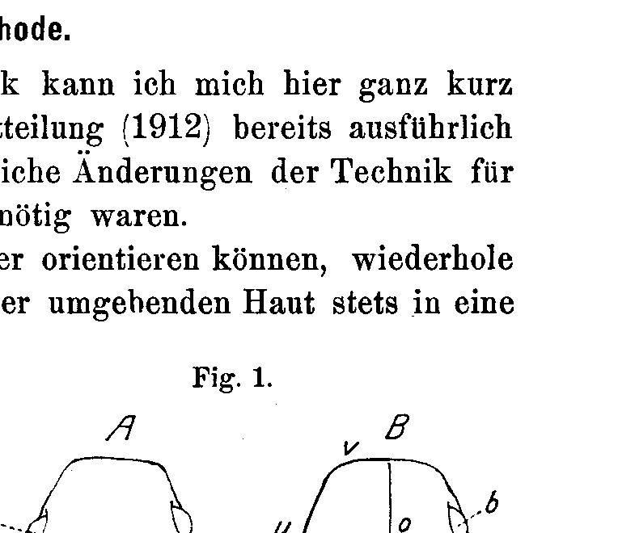
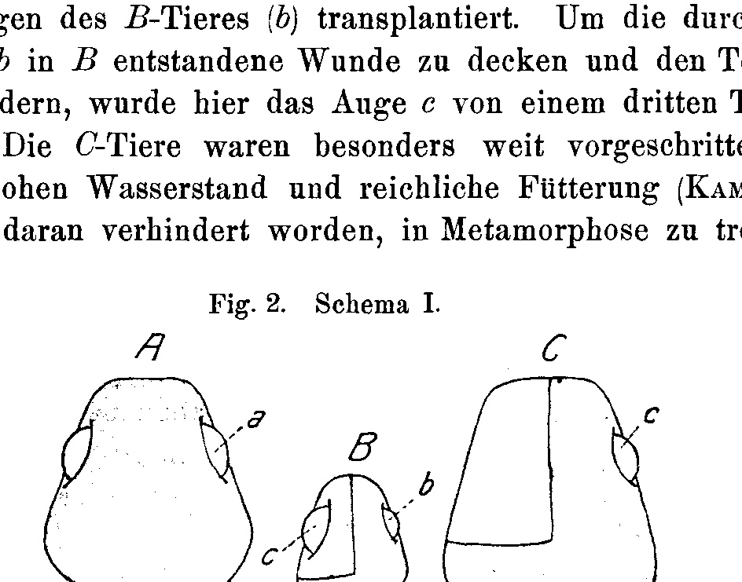
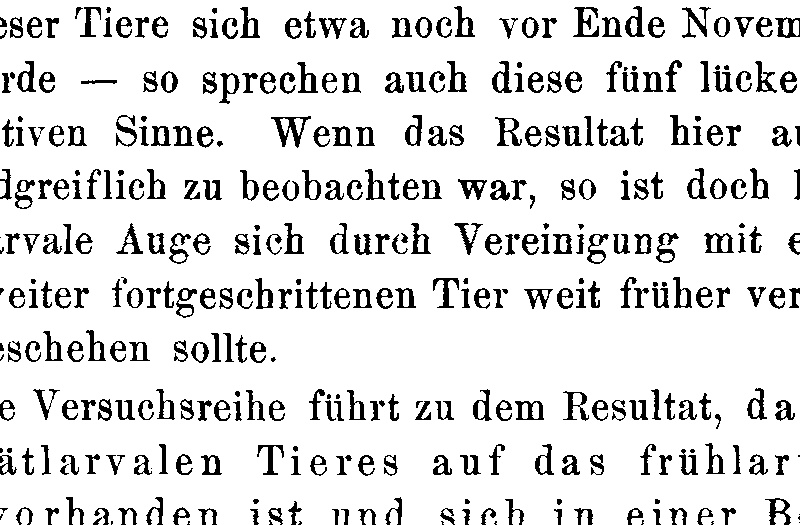
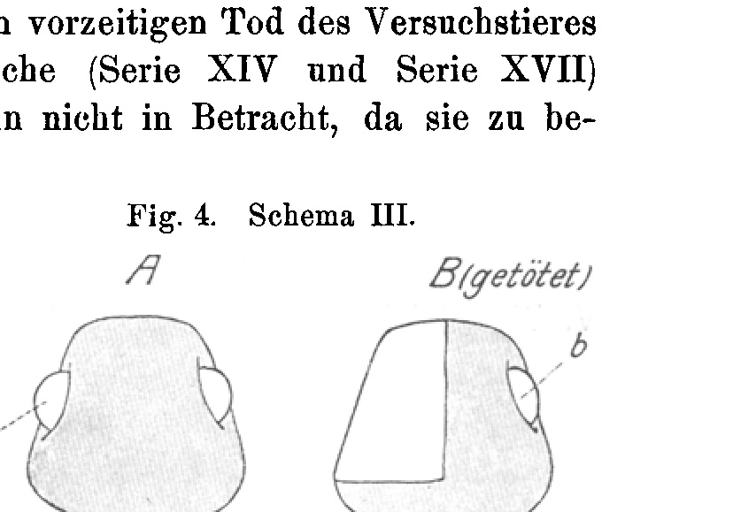
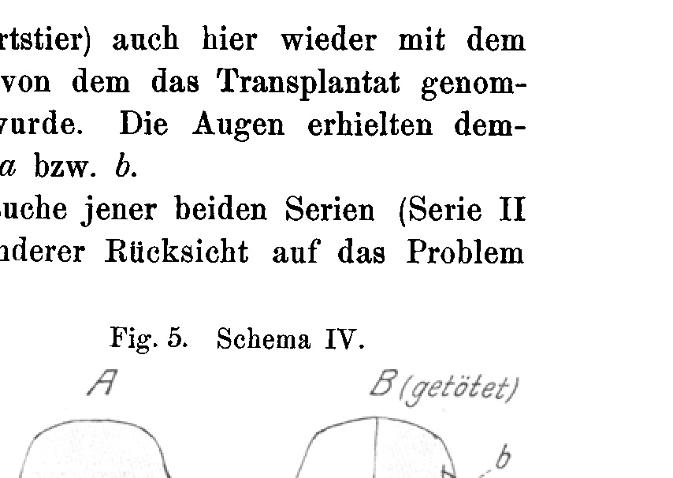
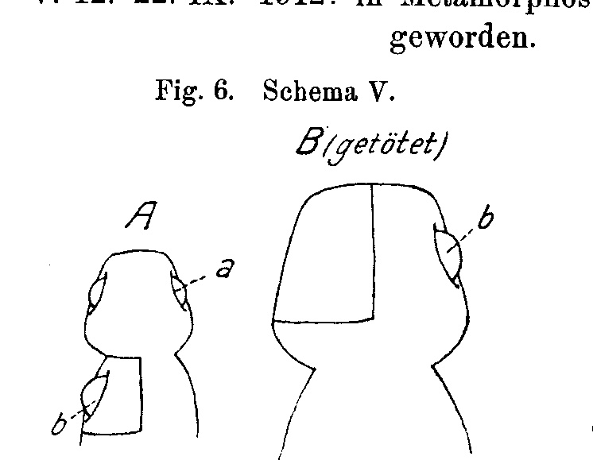
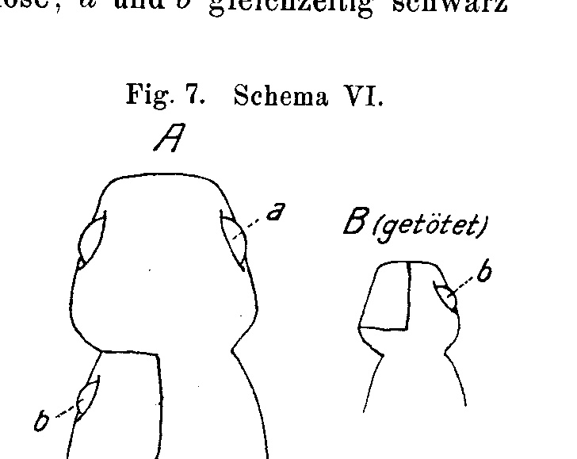
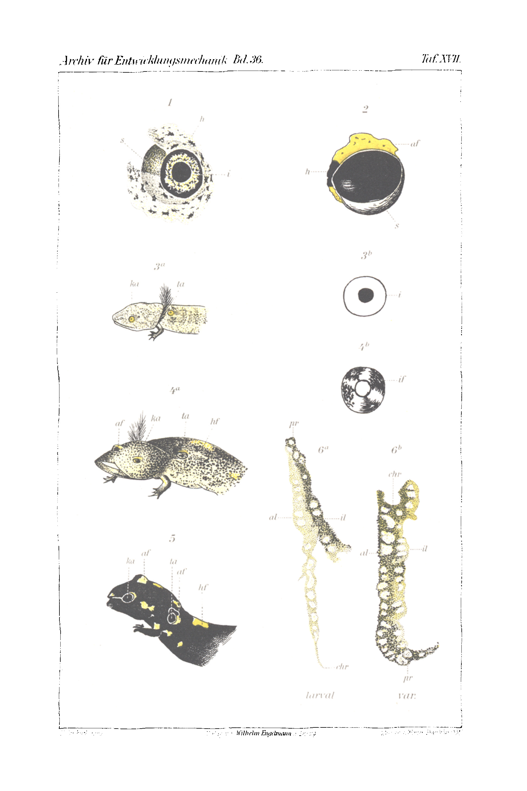

# Die synchrone Metamorphose transplantierter Salamanderaugen
## The Synchronous Metamorphosis of Transplanted Salamander Eyes

*(At the same time: The Transplantation of the Amphibian Eye. II. Communication.)*

By

Dr. Eduard Uhlenhuth.

*(From the Biological Research Institute [Biologische Versuchsanstalt] in Vienna.)*

With 7 figures in the text and Plate XVII.

Received on 8 December 1912.

*Archiv für Entwicklungsmechanik der Organismen*, vol. 36 (1913).

> **Full translation.** A complete English rendering of Uhlenhuth's study of the synchronous metamorphosis of transplanted salamander eyes — the grafted eye metamorphosing in step with its host — with the figure legends.

### Table of Contents

| | Page |
|---|---|
| I. Introduction | 211 |
| II. Method | 217 |
| III. Experimental results | 218 |
| &nbsp;&nbsp;&nbsp;&nbsp;A. Acceleration and retardation of iris pigmentation. Dissociation of the metamorphosis | 219 |
| &nbsp;&nbsp;&nbsp;&nbsp;B. Temporal coincidence of the iris pigmentation in the transplanted and the host's own eye (synchronous metamorphosis) | 225 |
| &nbsp;&nbsp;&nbsp;&nbsp;C. Limitation of the influence by induction of the iris pigmentation already accomplished (heterochronous metamorphosis) | 234 |
| IV. Conclusions | 239 |
| V. Historical overview | 245 |
| VI. Summary | 252 |
| VII. Tables | 253 |
| VIII. Bibliography | 259 |
| IX. Explanation of the figures | 260 |

## I. Introduction.

When C. M. Child (1911b) has recently emphasized in particular that we can withdraw individual body parts from the influence of the whole by morphological and physiological isolation and compel them to independent vital activity, the question arises conversely whether we, in the reverse direction, can compel isolated body parts, by union with a whole, to subordinate themselves to the influence of the whole and place themselves under its influence and control, as in fact does some part of this whole. The simplest method to approach this problem more closely, to test it, is transplantation, and as it lies in the nature of the matter, several examples offer themselves of how such an influence on the part of the total organism upon a transplanted tissue or organ takes place. The authors, however, directed no special attention to this object, and therefore observed it little, perhaps less than would correspond to its high importance; for it is precisely for the understanding of the interrelationship-relations between morphological and physiological processes in the normal organism that it is significant.

A discussion of some works that come close to my experiments in this respect shall, however, be reserved until later, so as not to anticipate our actual theme here.

In the present treatise I have set myself the task of showing that the transplanted larval eye of the salamander (*Salamandra maculosa*), with respect to the course of a determined, periodic process, namely the metamorphosis, can completely come under the influence of the host animal, if it is brought into a suitable developmental stage on a salamander larva. As we shall see, herein lies above all the actual gain of this question. First we shall arrive, by way of eye transplantation, at important results concerning the relation between host and host's own tissue, and we then advance into the consideration of the metamorphosis, which gives us important disclosures about the metamorphosis of the amphibians from the host organism.

Before I enter into the experiments themselves, I must still say a few introductory words about the metamorphosis of the amphibians.

It is well known that during metamorphosis the most diverse organs of the amphibian undergo a complex of transformations, which all the organs of the body suffer in a more or less profound manner. The causes that bring about these transformations, we still do not know, although several authors have occupied themselves with this question, e.g. D. Barfurth (1887a, 1887b) and P. Kammerer (1906, 1910), who place the chief part in the metamorphosis in nutrition-factors and metamorphosis-factors, and P. Wintrebert, who with regard to the importance of the nervous system in this process arrived at negative results (1905, 1906, 1911).

With regard to the temporal course of the metamorphosis it is indeed well known that it extends over a series of months (or, in some amphibians and under certain circumstances, of years) and is a gradual and continuous one, until towards the end an abrupt acceleration of all processes occurs. The loss of the external gills in the salamander can, as I have often had occasion to observe, take place in the course of a few days, and this suddenly so rapid progress is often enough the cause that one loses an animal through suffocation, if one has by chance failed to look after it for 1 or 2 days and to bring it onto land.

One can, however, foresee the onset of this event already a fairly long time before the larva must unconditionally leave the water, if it is not to perish, since, as already mentioned, it announces itself through a series of striking phenomena. Above all, the tail loses its flattened shape and the fin-seam; it approaches more the rounded form that it later permanently possesses. The black-yellow marking [Zeichnung] suddenly emerges with much greater sharpness than was hitherto the case, and the animals hover, when the water-level in the vessels is high, almost constantly immediately beneath the surface of the water.

I must indeed remark, however, that despite this it is by no means easy to determine in advance, even approximately, the point in time when the animal will climb onto land, and therewith, how far the processes have already advanced. In the last 2 years I have kept about 500 salamander larvae, each in a separate vessel, under individual control, and have most often taken quite a special interest in determining which stage the process has entered. Despite my great experience, I have unfortunately deceived myself, not just once but very frequently, with regard to the above-named moments. Animals in which one scarcely noticed that the metamorphosis was nearing its end were suddenly transformed; in others, which I had long considered ripe to be transferred (from water to land), the change of milieu proved premature.

Although I am convinced that, in the complex of processes that we summarize as metamorphosis, those that temporally immediately precede the leaving of the water constitute a special period in the life of the animal and, together with those that immediately follow the climbing onto land, would have to be combined under a larger epoch, I am nevertheless unable, given the indeterminacy of the entire temporal course, as well as given the scant knowledge that stands at our disposal concerning the essence of all these processes, to undertake this evidently necessary delimitation. I must therefore, for the time being, until a really necessary external moment is available as an anchor-point, combine the period of the "preparation" with the preceding one, whereby, however, I reserve for myself, in the course of my treatise concerning the metamorphosis still to be carried out, any alterations of this classification that may perhaps become necessary.

In order at first to have a short and serviceable terminus as a means of communication, I designate the period up to the leaving of the water as the "larval" period, whose end, for the same reasons, [I designate] as the "larval-end-stage [Larvenendstadium]," although it is not possible for me to indicate, specifically for the beginning of this latter, any determinate mark whatsoever.

At the moment in which the animal climbs out of the water onto land, the metamorphosis is by no means concluded, and we must apprehend the period after the leaving of the water up to the moment when — the former being the case at the fall [i.e., the marked event] — it constitutes a special epoch of life; as long as the animal finds itself in the state about to be discussed, we say it is "in metamorphosis." In this period traces of the gills are still often to be seen, and the gill-slits are not yet entirely closed. Although the gray larval pigmentation has long since yielded to the black-yellow coloring, the whole body surface nevertheless appears at first matt and lustreless; for the body is then covered by a skin under which the otherwise glistening black and gold only dully shines through. Only when this is shed do the animals possess the beautiful mirroring luster and begin, even after prolonged hunger, to take food again. Since at the same moment they moreover, from this point on, mostly unfold a greater mobility than [they did] after the leaving of the water up to the fall [i.e., the event] — the histolytic processes proceeding especially rapidly in this period may produce a discomfort in the animal — one may therefore well, from this moment on, regard the metamorphosis as concluded and designate the animal as "transformed."

Our present investigation now occupies itself with the changes of a special organ, the eye, which we single out from the whole complex of the metamorphosis. The eye experiences, just as the other organs, a transformation. It is especially beautiful to observe. During larval life the sclera is at first something of a darker gray than the rest of the body. But soon it becomes likewise so dark that it appears nearly black. Only the iris (namely the lamella turned toward the anterior eye-chamber) is filled with a yellow pigment (Fig. 1). Since the pupil, just like the sclera, appears black, the iris stands out during the entire larval life as a yellow ring from the black ground. We designate this ring, for the sake of brevity, in future as the "larval iris-ring." In quite young larvae the iris-ring is light yellow, almost lemon-yellow, but later becomes darker and finally orange-yellow.

As already mentioned, the iris-ring persists as long as the animal remains a larva. As soon as it exchanges the water for the land, however, the iris too, like the greatest part of the body surface, becomes coal-black and is then macroscopically no longer distinguishable as such (Fig. 1 and 2).

The disappearance of the iris-ring is relatively a rather rapid one, but can nevertheless require up to 10 days (about), whereby the presence of larger yellow patches can form a kind of transition to complete blackness. Indeed, tiny little yellow dots are often still to be found 14 days to 3 weeks after the beginning of the process.

Although the moment of complete blackening of the iris need not coincide with the shedding of the larval skin, but most often occurs somewhat earlier, we will for practical reasons designate an eye as "transformed" when the iris (apart from the above-mentioned tiny dots) has disappeared. With regard to the brevity of the expression, I have believed myself permitted to be guilty of this inaccuracy, and thus understand by a transformed eye one without iris-ring.

It would now still remain to say a few words about the manner of the process of the iris-blackening. Without doubt it is a matter of the appearance of black, respectively very dark and densely heaped, pigment, as the macroscopic examination of the larval and imaginal eye teaches (Fig. 1, 2). On microscopic sections, admittedly, I have not yet succeeded in finding appreciable differences between the larval and imaginal iris (Fig. 6a, 6b). The question further arises whence the pigment comes. Quite apart from the fact that the answer to this, as interesting and desirable as it would be, does not stand in direct relation to our theme, it moreover shapes itself so difficult and would require so much more time than stood at my disposal for the execution of my work, that I unfortunately had to renounce the solution of this problem here. It remains undetermined whether the pigment of the iris is supplied from elsewhere (chorioidea or sites lying outside the eye), or whether it is produced on the spot¹).

With regard to the fact that we do not know whether it is, in the blackening of the iris, a matter of a mere increase of pigment or of the appearance of a new, differently colored pigment, and in consideration of the fact that we have no knowledge whatsoever of whether the pigment arises on the spot or is supplied from elsewhere, from the chorioidea or from sites lying still further away, located outside the eye, of the body — there are several such "pigment-magazines" in the salamander body — migrates into the iris, I must for the time being restrict myself to using the indifferent expression "iris-pigmentation" for the above-named phenomenon, which prejudices nothing about the manner of the pigment-arising.

From our previous explanations it follows that we can be exactly informed about the time-point at which the eye of the salamander is transformed, as soon as we accept as the external mark for the conclusion of the metamorphosis of the eye the complete blackening of the latter, and in our experiments concerning the transformation of the eye make use of the iris-ring as a distinguishing mark between larval and imaginal eye.

In the present work I have started from the question of whether an influence of the host animal upon the (con-specific) transplant is noticeable. The method used for this, above all the object employed, was now however of such a kind that a rich abundance of problems arose during the work and invited [me] to study, and even if it was not possible everywhere to give conclusive answers, I can nonetheless regard it as a gratifying result to raise new questions at all and may well also entertain the thought of a later answering of them²).

> ¹ Individual details that could orient us about the processes of iris pigmentation in a morphological respect, I intend to work through in more detail later.

> ² In an essay titled "Aims and Tasks of Experimental Zoology" (appeared in "Aus der Natur." 1911, p. 691), Pax — probably on the basis of a quite superficial inspection of my experimental animals — lamented that "this activity, bordering on dabbling [Spielerei], of certain experimentally working zoologists," namely [their] occupying themselves with the establishment of the fact that salamander eyes [Molchaugen] sewn into the back-skin of a newt [Molch] heal in there, still stands in bloom even now. Had Pax awaited my first publication, which at that time was just going to press, and not — to put it mildly — somewhat "preemptively" in this manner anticipated its appearance, then he would probably, on the basis of a program sketched out there, have been able to convince himself of the superfluousness of his remarks; experimental works require more time than the drafting of essays in Pax's manner.

As method I made use of the homoplastic transplantation of the salamander eye (*Salamandra maculosa*) of various stages onto animals of developmental levels especially selected for this purpose, and I thereby succeeded in showing in an irreproachable manner that the transplanted organ, through union with the host organism, is placed under the influence of the same, in that the time of the elapsing of certain physiological processes (the iris pigmentation as a single process in the complex of processes that we summarize as the metamorphosis of the eye) is determined in the transplant by the host animal and is altered in relation to the norm.

## II. Method.

With regard to the operative technique I can here be quite brief, since I have already reported in detail about it in my first communication (1912) and substantial changes of the technique for these new investigations were not necessary.

In order that my readers may orient themselves more easily, I here only repeat that the eye, together with the surrounding skin, was always transferred into a previously prepared depression of the *Musculus longissimus dorsi*, immediately behind the head, into the nape-region [Nackengegend] of a con-specific animal.

Further it is to be noted that the eye was always oriented at the mentioned site corresponding to its normal position; the left eye, for instance, was always transplanted onto the left side of the host animal, and so positioned that above, below, front and back remained the same in relation to the normal orientation. The adjacent drawing (text-fig. 1) serves for the illustration of these relations.

**Fig. 1.** *(figure not reproduced)*

All animals with an even experiment-number were operated on the right side, all with an odd [number] on the left side (apart from Series II and III, which are to be looked up in Communication I). *A* designates that eye of the host animal (normal organ), *B* that individual from which the eye was taken, the latter accordingly bears the corresponding designation.

The arrangement of the individual experimental series will be discussed in the discussion of these latter, whereby [I draw] upon the pertinent data from the protocols summarized. Tables of all series with birth-, death-, operation- and eventual transformation-data were placed at the conclusion of this work, for Series II and III at the conclusions of Communication I (1912).

We now go over to the discussion of the experiments themselves.

…of Series II and III, which are to be looked up in Communication I). *A* always designates the host animal and *a* its (normal) eyes, *B* that individual from which the eye was taken; the latter bears correspondingly the designation *b*.

The arrangement of the individual experimental series will be discussed in the discussion of these latter, where also the relevant data from the protocols are compiled. Tables of all the series with birth, death, operation, and possibly metamorphosis dates are placed at the end of this paper; for Series II and III at the end of Communication I (1912).

We now proceed to the discussion of the experiments themselves.

## III. Experimental Results.

The arrangement of the experiments was essentially determined by three points of view. First it was namely necessary to establish whether a displacement of the metamorphosis of the transplanted eye is at all possible. In pregnant formulation the first question therefore reads: Can the process of iris pigmentation in the transplanted eye be accelerated or delayed by suitable choice of the host animal? In the second place it was to be determined to what extent the time-point of the metamorphosis of the transplanted eye coincides with the time-point of the same process in the normal eye of the host. The second question thus reads: Does the iris pigmentation in the transplanted eye coincide in time with the same process in the normal eye of the host? A third, very important moment seemed given through the necessity of determining the influence that the stage of the animal supplying the transplant has upon the fate of the transplanted eye in its new environment. This problem culminates in essence in the question, whether, upon transplantation of an eye, besides the factors lying in the host animal, still other factors are demonstrable as effective for determining the time-point of the iris pigmentation — factors that do not proceed from the host, but were as it were brought over together with the transplanted eye from its earlier place of residence. In precise formulation, with regard to the experiments conducted thereupon, the third question has to read: Are there stages whose use as a component of the transplantation does not result in a temporal coincidence of the iris pigmentation in both components?

The question, whether an influence of the host animal upon the (con-specific) transplant is possible, must count as answered in the affirmative sense if the two first detail-questions must be answered in the affirmative. The third question will, in the case of affirmation, uncover one of the possible restrictions of this influence.

We now turn to the discussion of the individual experiments, which we will settle in three sections according to the viewpoints set forth above. In order to make possible a sharper overview, I here once more recall, in their connection, the questions occupying us:

A. Can the process of iris pigmentation in the transplanted eye be accelerated or delayed by suitable choice of the host animal? (= Acceleration and delay of the iris pigmentation) S. 219.

B. Does the iris pigmentation in the transplanted eye coincide in time with the same process in the normal eye of the host? (= Temporal coincidence of the iris pigmentation in the transplanted and the body-own eye) S. 225.

C. Are there stages which, used as a component of the transplantation, exclude a temporal coincidence of the iris pigmentation in the transplanted eye with the same process in the body-own eye? (= Restriction of the influencing through already accomplished induction of the iris pigmentation) S. 234.

## A. Acceleration and Delay of the Iris Pigmentation. Dissociation of the Metamorphosis.

In order to decide whether one can, through transplantation, accelerate the process of iris pigmentation, I transferred, in a series of 12 experiments, an eye from a quite young larva onto such a larva as presumably no longer stood all too far from metamorphosis. If an influence upon the transplanted eye was exerted by the new organism, then the iris pigmentation in the overplanted eye had to occur earlier than it would have occurred had one left it at its normal place. In order to be able to prove this quite unobjectionably, it was not only necessary to transplant the eye, but the other eye, remaining at its normal place, had moreover to be given the possibility of undergoing its metamorphosis normally, in order to have a measure for the normal time-point of the metamorphosis.

For this purpose the following method was chosen. For each experiment three animals were necessary; the *B* animal, from which the eye was taken and which in the present case had been taken from the uterus of a female *Salamandra maculosa* about 1 month before the operation; furthermore an animal *A*, the recipient animal or host animal, which was already in a far advanced stage, near the beginning of land-life. Onto this animal one of the eyes of the *B* animal (*b*) was transplanted. In order to cover the wound arising in *B* through the removal of *b* and to prevent the death of *B*, here the eye *c* of a third animal *C* was set in. The *C* animals were especially far advanced and had been prevented from entering metamorphosis only by high water level and abundant feeding (KAMMERER 1909, 1910).

**Fig. 2. Schema I.**  *(figure not reproduced)*

In this way, in the acceleration series (Series XIII), *A* was thus the actual experimental animal; besides the two normal eyes (*a*) in the nape region, it had also an early-larval eye *b*, on which the influence of the foster-mother was to be studied. The animal *B* was the control animal; it was distinguished by the fact that its normal eyes *b*, though both present, were isolated. For the one was reared by *A*, the other was located at its usual place on *B*. The control animal *B* thus possessed only one of its own eyes; on the other side of the head it bore a late-larval eye from *C*, which will perhaps occupy us later, but at present does not come into consideration for us. For a better understanding of the experimental arrangement, see Scheme I (Textfig. 2).

If we now scrutinize the «acceleration experiments» themselves, then we want always to bear in mind that we are dealing with an experiment in which two eyes of one and the same animal, isolated from each other, are reared on two different nutrient soils.

Of the experiments, let V. (= experiment) 2, 9, and 12 be discussed first. These are those three experiments in which experimental animal (*A*) and control animal (*B*) both lived as long as was necessary for the comparison.

### Series XIII.

V. 2. A 45 mm 2. VII. 1911: Metamorphosed; a and b without ring.
B 36 mm 2. VII. 1911: Larval; b with ring.
9. IX. 1911: Larval; b with ring.
2. I. 1912: †; larval; eyes?

Even if we had only this single experiment, the possibility of an influencing would thereby no longer be dismissible. The result is too striking. In this case one could hold both animals side by side in the hand and convince oneself that one had in fact artificially forced the two eyes of one animal to transform at different times. The one *b*-eye still had the larval iris ring at a time when the other had already lost it for over 2 months. Insofar as the right and left eye of a salamander larva also manifest themselves as homotypic organs in that they normally always transform simultaneously, we can here speak of an artificially enforced «dissociation» of the metamorphosis.

Exactly so it stands with V. 9 and 12. I present here the excerpt from the protocol.

### Series XIII.

V. 9. A 44 mm 9. VII. 1911: In metamorphosis, a and b with weak ring.
26. VII. 1911: Metamorphosed, a and b without ring.
B 38 mm 9. VII. 1911: Larval; b with ring.
30. XI. 1911: Larval; b with ring.
13. I. 1912: In metamorphosis: b without ring.
V. 12. A 48 mm 9. VII. 1911: Metamorphosed; a without ring, b with yellow dots.
26. VII. 1911: Metamorphosed; a and b without ring.
B 36 mm 9. VII. 1911: Larval; b with ring.
30. XI. 1911: Larval; b with ring.

In V. 9, thus, the one eye of *B* still had the ring, when the other had already lost it for nearly 7 months; in V. 12 the one *b*-eye left in its original place and position bore the iris ring at least 4½ months longer than the other transplanted onto *A*. Here too, thus, through acceleration of the iris pigmentation of the transplanted eye, complete dissociation of the metamorphosis was achieved.

In the other nine experiments one of the animals, mostly the control animal, perished prematurely; the latter because the operative intervention, the removal of the eye together with the skin covering the one half of the head and often also with parts of the upper jaw and of the skull roof, is naturally not all too easily tolerated. But since we know, in the three experiments that ran entirely as desired, the time of the metamorphosis of the *B* animal — we know indeed that it occurred in no case before the end of November — so also the experiments in which only the experimental animal *A* survived are usable; for the conclusion is probably justified that in these experiments *B* would have transformed at approximately — which suffices given a time-difference of the transformation of *A* and *B* of 4½–7 months — the same time as in the three others, since indeed all *B* animals originated from the same litter and were treated alike. Under these circumstances the results of V. 3, 4, 6, 7, and 11 can also be utilized (concerning V. 1, 5, 8, and 10 see Table Series XIII at the end).

### Series XIII.

V. 3. A 45 mm: 2. VII. 1911 transformed; a and b without ring.
B 32 mm: 30. XI. 1911 transformed?
V. 4. A 42 mm: 2. VII. 1911 transformed; a and b without ring.
B 35 mm: 30. XI. 1911 transformed?
V. 6. A 47 mm: 26. VII. 1911 transformed; a without ring, b with yellow dots.
B 34 mm: 30. XI. 1911 transformed?
V. 7. A 47 mm: 9. VII. 1911 transformed; a and b without ring.
B 30 mm: 30. XI. 1911 transformed?
V. 11. A 48 mm: 9. VII. 1911 transformed; a and b without ring.
B 36 mm: 30. XI. 1911 transformed?

If we assume as the transformation date of the prematurely perished *B* animals in V. 3, 4, 6, 7, and 11 the 30. XI. 1911 — and thereby we still remain far below the actual transformation time of the surviving *B* animals, so that it can count as completely assured that none of these animals would have transformed perhaps even before the end of November — then these five gappy experiments too speak in the positive sense. Even if the result here was not so beautifully and palpably to be observed, there is yet no doubt that the early-larval eye, through union with an animal further advanced in development, transforms far earlier than this should normally happen.

This first experimental series leads to the result that an influence of the late-larval animal upon the early-larval eye is actually present and documents itself in an acceleration of the metamorphosis.

The second experimental series (Series XV) had, conversely, the purpose of demonstrating whether the early-larval animal is able to influence a late-larval transplant

**Fig. 3. Schema II.**  *(figure not reproduced)*

and whether the metamorphosis would be delayed through such a union.

The method was a similar one to that in the preceding experiment, only this time the younger stage functioned as experimental animal *A* (from the same litter as the *B* animals in Series XIII), and the older one as control animal *B* (from the same litter as the *A* animals in Series XIII); here too the control animals were kept alive by covering the wound arising upon removal of the *b*-eye with the eye *c* of a third, very far advanced *C* animal (see Scheme II, Textfig. 3).

But since in this series the recipient animal was much smaller than the *B* animals, the wound for the implantation of the large *b*-eye had to be made not only relatively but also absolutely much larger than in the *A* animals of Series XIII, and consequently here not only the heavily strained *B* animals perished, but in addition many of the experimental animals, before they had yet [reached] the desired results. Only a single one of twelve experiments remained complete up to the decisive moment, that is, up to the transformation of the older experimental animal; all others show gaps. One of them, however, is usable under application of the same correction that we had to undertake above in Series XIII.

### Series XV.

V. 3. A 35 mm: 26. VII. 1911 larval, a and b with ring.
29. VII. 1911 dead.
B 41 mm: 26. VII. 1911 transformed, b without ring.

From this experiment it is clearly to be seen that the effect of the transplanting of the late-larval eye onto young larvae is a delay of the metamorphosis of the transplant. For at a time when the normal eye has already lost the iris ring, the transplanted eye finds itself still in the larval state.

Concerning V. 2 we can, since the larvae *B* originated from the same litter as in Series XIII the *A* larvae, make the assumption that they too transformed at approximately the same time, thus about in the month of July, as we can indeed also observe in Series XV V. 3. But the *b*-eye transplanted onto *A* still had the iris ring on 9. IX. 1911, as emerges from the experimental protocol:

### Series XV.

V. 2. A 37 mm: 9. VII. 1911 larval, a and b with ring.
9. IX. 1911 larval, a and b with ring.
B 41 mm: 9. VII. 1911 larval, b with ring.
31. VII. 1911 in metamorphosis, dead.

What we have gained through these two experimental series is first of all the certain insight that the organism chosen as nutrient soil for the transplant exerts a noticeable influence upon the transplanted organ. In our special case this influence consists in a displacement of the metamorphosis; for the time-point when it sets in depends on the choice of the host animal. **Through transfer of the larval eye onto a suitable nutrient soil we can artificially accelerate or delay the metamorphosis of the eye; the influence of a host animal that is further advanced in its development than the transplanted eye consists in an acceleration of the metamorphosis, the influence of an animal whose developmental stage is a younger one than** **that of the transplant, in a delay of the metamorphosis.** And indeed the displacement can, as we saw, amount to up to 7 months, thus being a sufficiently striking one.

that of the transplant, in a **delay** of metamorphosis. And indeed the shift, as we have seen, can amount to as much as 7 months, hence be a sufficiently striking one.

We close this section with the result that an influencing of the transplant by the nutrient bed [host] is possible, and we now turn to a second series of experiments.

## B. The temporal coincidence of the iris pigmentation in the transplanted and in the body's-own eye (synchronous metamorphosis).

If in the preceding chapter we learned that metamorphosis is accelerated in those eyes which are transplanted from young onto older animals, and conversely delayed in those which are transplanted from older onto younger animals, then the question now arises how far this approximation of the physiological state in the transplant to that of the whole organism goes — whether the incorporation of the newly inserted part by the whole organism is perhaps so complete that the periodically running processes of metamorphosis in the two [eyes] coincide in time, in which case we shall in future speak of a **synchronous course** of metamorphosis in the body's-own and the transplanted eye, or simply of **synchronous metamorphosis**.

In order to be able to answer this question, we have simply to examine as large a number of transplantations as possible with regard to whether the iris ring in the transplanted eye disappears at the same time as in the body's-own. Naturally those experiments will render us the greatest service in which transplant and host were of different ages, regardless of whether the recipient animal was older or younger than the transplant. But those experiments too are by no means worthless in which the two experimental animals were of the same age. For, firstly, among the animals of different broods of the same age by no means all enter metamorphosis at the same time; secondly, among the animals of one and the same brood, even with entirely uniform treatment — nutrition, temperature, oxygen supply, water level, etc. — considerable individual fluctuations with respect to the time-point of metamorphosis can be observed; and thirdly, it has been shown by Kammerer and others that external factors have a quite enormous influence on the rapidity of the development of amphibians. With respect to this last point I can add that I know from my own experience how great the differences can be even among such animals as one tried to keep at least approximately equal, and by how much greater they become when one applied no special care, specifically directed to that end, to a uniform husbandry.

Finally, through the transplantation the eye comes into completely altered, and indeed without exception worsened, conditions. As proof of this the experiences set down in my first communication (Uhlenhuth 1912) on this subject may serve us. I showed there that immediately after the transplantation a series of far-reaching disturbances, in part perhaps nutritional disturbances, appear in the retina and in the whole bulbus, which manifest themselves above all in a violent degeneration of the retina.

From all this it follows that even in transplantations between animals of the same age, indeed even between individuals which at the moment of the operation actually stand at the same developmental stage, the process of metamorphosis from the outset by no means needs to take place at the same time. In particular, however, a course agreeing in time down to the finest detail, into all particulars, is — precisely because of the individual fluctuations — by no means to be understood as resulting from the use of animals of the same age taken for the operation mostly at random, even of the same brood.

If now, in spite of all the cited circumstances, and even when very divergent developmental stages were united, such an agreement should nonetheless take place, then this would be an incontrovertible proof that this temporal coincidence of metamorphosis cannot be explained by external circumstances, but rests solely on the operation of internal factors. In this case we should be compelled to postulate so complete an incorporation of the part by the whole that it could explain this fine snapping-together of a process which under normal conditions — that is, if the two components had remained separate — would play out at quite different times: a synchronous metamorphosis, as we have called it.

Equipped with such experiences, we can now proceed to the discussion of the experiments. I use here experiments from the most diverse series; among them are several which were carried out at a time when my attention was still so greatly taken up by other processes that I unfortunately, in a few cases, overlooked recording all those data which here come into consideration for us. These experiments are naturally not usable. While the number of experiments rendered unusable in this way scarcely reaches the number 5, those operations which drop out through the premature death of the experimental animal amount to about 100. Nearly 150 experiments (Series XIV and Series XVII) do not come into consideration at all from the outset, since, set up for special purposes in the dark, they withdrew themselves from control; they will occupy us again in a later communication. Protocols of Series II and III are to be found in the tables in Communication I.

Concerning the naming of our experimental animals I mention only further that here too the actual experimental animal (host animal) was again designated with the letter **A**, the other animal, from which the transplant was taken, with **B**. The eyes accordingly received the designations **a** and **b** respectively.

**Fig. 4.** Schema III. *A* / *B (killed)*  *(figure not reproduced)*

First I cite the experiments of those two series (Series II and III) which were carried out without special regard to the problem of influencing, and in which the iris pigmentation was considered only as a by-result. The first series (Series II) consists of operations between animals of the same or different age according to the usual scheme "*b* into the nape region of *A*" (see Schema III, text-fig. 4). The second series (Series III) is divergent insofar as here the *A*-animal was blind in both eyes, and in the host animal we have, as a point of reference for the comparison of the time-points of the iris pigmentation, only the metamorphosis of the host animal as a whole (see Schema IV, text-fig. 5). But since this latter is not a uniform process, but consists of vari-

**Fig. 5.** Schema IV. *A* / *B (killed)*  *(figure not reproduced)* ous, often somewhat temporally separated processes, the experiments of this series, taken by themselves alone, are not to be assigned any particular weight. In connection with the remaining experiments, however, they can here claim a place.

Especially important as proofs for the under-all-circumstances simultaneous entry of the iris pigmentation are the following experiments:

V. 19. Same age.
V. 22. Same age.
V. 25. Same age.
V. 32. Different age.
V. 52. *B* younger.
V. 53. *B* younger.

### Series II.

| | | |
|---|---|---|
| V. 19. Same age. | 18. VII. 1910¹). | Larval; *a* and *b* with ring. |
| | 28. VII. 1910. | Larval; *a* and *b* with vanishing ring. |
| | 10. VIII. 1910. | In metamorphosis; *a* and *b* without ring. |
| V. 22. Same age. | 24. VIII. 1910. | Larval; *a* and *b* with ring. |
| | 29. VIII. 1910. | Larval; beginning to leave the water; *a* and *b* with weak ring. |
| | | Further data lacking. |
| V. 25. Same age. | 10. VIII. 1910. | In metamorphosis; *a* and *b* with vanishing ring. |
| | 24. VIII. 1910. | Transformed; *a* and *b* without ring. |
| V. 32. Different age. | 18. VIII. 1910. | In metamorphosis; *a* and *b* without ring. |
| V. 52. *B* younger. | 18. VII. 1910. | Larval; *a* and *b* with vanishing ring. |
| | 28. VII. 1910. | In metamorphosis; *a* and *b* almost without ring. |
| | 10. VIII. 1910. | Transformed; *a* and *b* without ring. |
| V. 53. *B* younger. | 10. VIII. 1910. | Larval; *a* and *b* with ring. |
| | 24. VIII. 1910. | Larval; *a* and *b* with vanishing ring. |
| | 29. XI. 1910. | In metamorphosis; *a* and *b* with very weak ring. |
| | | Further data lacking. |

> ¹) All data in Series II and III refer to *A*.

### Series II. *(continued)*

| | | |
|---|---|---|
| V. 56. *B* younger. | 10. VIII. 1910. | In metamorphosis; *a* and *b* with vanishing ring. |
| | 24. VIII. 1910. | Transformed; *a* and *b* without ring. |
| V. 58. Same age. | 18. VII. 1910. | Transformed; *a* and *b* without ring. |

Among the experiments cited here there are six (V. 19, 25, 32, 52, 56 and 58), from which it emerges with unambiguous certainty that the metamorphosis in the transplanted eye coincides exactly with that in the body's-own eye, hence is "synchronous." The experiments were controlled almost daily, and it could thus be observed quite precisely that the disappearance of the ring in all the eyes of one animal is a completely uniform one (Fig. 3, 4, 5). The individual stages, to be sure, were not always recorded in the protocols, and sometimes, as for example in V. 58, the animal at the time when the protocolling took place had already been transformed for several days; the recording always took place on particular days, so long as no exceptional case was present. Only when a deviation from the rule arose (see V. 16 and 37 in the immediately following section, p. 236) was this, if necessary, at once put down on paper. Hence not in all cases does the protocol express the truly astonishing uniformity with which the disappearance of the ring takes place in the transplant and in the body's-own eye. The protocols of V. 19, 52, 53 and 56, however, render the congruence very well. We see at the same time also that it is quite immaterial whether the components are of the same or of different age; the loss of the iris ring takes place always at the same time. V. 22 and 53 allow a simultaneity of metamorphosis to be recognized only for the beginning of metamorphosis; for the end, not only data but unfortunately also observations are lacking.

In Series III there are only two experiments which can serve our purpose, namely V. 13 and 18.

### Series III.

| | | |
|---|---|---|
| V. 13. On the left, same age. | 11. VIII. 1910. | Larval; *b* with ring. |
| | 29. VIII. 1910. | Transformed; *b* without ring. |
| On the right, *B* younger. | 11. VIII. 1910. | Larval; *b* with ring. |
| | 29. VIII. 1910. | Transformed; *b* still with a tiny yellow dot. |
| V. 18. Same age. | 24. V. 1910. | Larval; *b* with ring. |
| | 20. XI. 1910. | In metamorphosis; *b* with ring. | Here, since the experimental animals had no eyes, we can compare the state of the transplanted (*b*-)eye only with the state of the whole body of the experimental animal. In V. 13 the animal received two eyes transplanted, on the left and on the right one each. Although they were implanted at different times and were of different age, they nonetheless both lost the iris ring simultaneously, with the moment of the metamorphosis of the whole animal. That in the right eye there was found afterward still a yellow dot is, insofar, not striking, since it occurs occasionally also in body's-own eyes and can even persist several weeks after the metamorphosis; an explanation for it I cannot, to be sure, find. In our special case it would have been of interest [to know] whether also in the normal eye of *A* the pigment dot persisted and whether it was present in the other *b*-eye remaining on *B*. Both could, owing to the chosen experimental conditions, not be ascertained (*A* was blinded, *B* not kept alive).

V. 18 is only of very slight importance, since precisely here the comparison eye would have been needed; we give it no further attention.

Especially with regard to the question whether, in the case of the union of components of different age, synchronous metamorphosis takes place in *a* and *b*, the experiments of Series XIII and XV — already cited on p. 221 ff. — were carried out, which in the preceding section we were able to invoke as proof for the more general fact that an influencing occurs at all.

These two series furnish us in all 10 documents [pieces of evidence] for the fact that a temporal coincidence of the metamorphosis of the *a*- and *b*-eye, a synchronous metamorphosis, also takes place when the two components are of very different age. For both when the host animal was further advanced in development than the *B*-animal, as was the case in Series XIII (V. 2, 3, 4, 6, 7, 9, 11 and 12), and also when conversely *A* was less far developed than *B*, as in Series XV (V. 1, 3), the iris pigmentation took in all its stages a completely uniform course, so that in the same moment the transplanted and the body's-own eye were transformed.

In V. 6 and 12 of Series XIII, to be sure, after the one (*a*-)eye was already completely black, in the other (*b*-)eye still a tiny, yellow-shimmering dot could be observed. Here I can, as I have already done above, only refer to the fact that also in the normal animal the longer persistence of a yellow dot in one of the two body's-own eyes was observed a few times, and in one instance was still present when the other eye had already been black for 3 weeks.

In V. 1 and 3 of Series XV it was not the experimental animals which furnished us evidence for the synchronous metamorphosis — for they all perished prematurely — but the control animals 2, into which, as already mentioned (see Schema II, text-fig. 3, p. 223), the eye of a third animal *C* was implanted in place of their own. *B* was fairly far advanced in development, but yet somewhat behind *C*; *b* and *c* lost the ring quite simultaneously in

### Series XV.

| | | |
|---|---|---|
| V. 1. *B*: | 9. VII. 1911. | Transformed; *b* and *c* without ring. |
| V. 3. *B*: | 26. VII. 1911. | Transformed; *b* and *c* without ring. |

For the conclusion of this chapter I have saved up a series of experiments whose testimony I regard as especially decisive, because the purpose for the attainment of which they were carried out was just the opposite of that actually attained. I wished, namely, to gain evidence for the phenomenon — discussed further below — that with the choice of suitable experimental animals a coincidence of metamorphosis does not take place. Instead of such a proof I attained — owing to an incorrect choice of the stages used — just the opposite. The experiments confirmed, namely, in striking fashion that even with the union of very divergent components the metamorphosis is always sharply synchronous.

In all the experiments of the series in question (Series XVIII) there were used as the older stages animals which I had taken from the uterus in September and December 1911 — the operations were carried out in the period from 28. III. to 22. V. 1912 —; at the time of the operation they were already so far developed that I held them to be immediately before metamorphosis. Control animals, to be sure, showed that until the entry of this event a considerable time was still lacking. The younger animals had been taken from the uterus on 16. III. 1912 and were thus at the moment of the operation still quite young.

### Series XVIII. Part *B* (see Schema V).

*A* of 16. III. 1912.
*B* of IX. 1912.

> *(continued — this page opens with the table rows of the entry whose header, “Series XVIII. Part B (see Schema V),” stands at the foot of the preceding page (p.21): A of 16. III. 1912, B of IX. 1912. The running prose belonging to the owned pages begins below the figures.)*

| | | |
|---|---|---|
| V. 7. | 9. IX. 1912 | in metamorphosis; *a* and *b* have lost the ring entirely uniformly; they still bear a small, yellow spot in the iris. |
| | 22. IX. 1912 | transformed; *a* and *b* turned black simultaneously. |
| V. 9. | 9. IX. 1912 | larval, *a* and *b* with ring. |
| | 8. X. 1912 | just transformed; *a* and *b* turned black simultaneously. |
| V. 10. | 17. VIII. 1912 | in metamorphosis; ring disappears uniformly in *a* and *b*. |
| | 22. IX. 1912 | transformed; *a* and *b* lost ring simultaneously. |
| V. 12. | 22. IX. 1912 | in metamorphosis; *a* and *b* turned black simultaneously. |

**Fig. 6.** Schema V.  *(figure not reproduced)*

**Fig. 7.** Schema VI.  *(figure not reproduced)*

### Series XVIII. Part A' (see Schema VI, text-fig. 7).

*A* of 4. XI. 1911 and 15. XII. 1911.
*B* of 16. III. 1912.

| | | |
|---|---|---|
| V. 14. | 8. VII. 1912 | dead; *a* and *b* with ring. |
| V. 15. | 6. VIII. 1912 | dead; the day before, *a* and *b* with ring. |
| V. 16. | 2. VII. 1912 | larval, still in the water; *a* and *b* without ring. |

### Series XVIII. Part B' (see Schema V, text-fig. 6).

*A* of 16. III. 1912.
*B* of 4. XI. and 15. XII. 1911.

| | | |
|---|---|---|
| V. 19. | 2. VII. 1912 | transformed; *a* and *b* without ring. |
| V. 20. | 2. VII. 1912 | transformed; *a* and *b* without ring. |

Each individual experimental animal was kept under the strictest control, and almost daily — especially when metamorphosis was approaching — I assured myself of the condition of the *a*-eye and the *b*-eye. With an almost astonishing fineness both eyes agree, the normal one and the transplanted one, in all phases of metamorphosis. The disappearance of the ring was always so uniform in both eyes that even tiny yellow dots, when they remained in the one eye as a remnant of the iris-ring, were also visible in the other eye (Fig. 3, 4, 5).

Since I hoped I would succeed in achieving an advance-running of the older transplant by keeping the animals artificially as larvae for as long as possible, I extended the larval period over the longest possible time in V. 7, 9, 10, and 12 (through fattening and a high water level, and also withholding any opportunity to climb onto land); but it was of no use — the coincidence of the metamorphosis in all the eyes agreed down to a hair. — The V. 14 and 15, which belong to that part of Series XVIII in which synchronous metamorphosis was achieved through acceleration (of the younger transplant), unfortunately withdrew themselves, through the premature death of the experimental animals, from further observation; but as long as they were kept under control, both eyes agreed in their developmental state, so that these two experiments too, in connection with the others that are quite unambiguous, deserve to be mentioned here.

Supported by nearly 30 experiments, I arrive at the close of this chapter at the following result: In eye-transplantations between variously far-developed larval stages of *Salamandra maculosa* [modern *S. salamandra*], there takes place not only an influencing of the transplant in the sense of an acceleration or, respectively, a delay of the metamorphosis of the transplanted eye; rather, the transformation of the latter occurs at exactly the same time as that of the body's own eye of the host — the metamorphosis is synchronous. In the individual stages of the metamorphosis, whose external mark is the gradual disappearance of the iris-ring, one observes the most complete temporal agreement of the transplanted eye and the normal eye of the host down to the smallest details. The transplanted eye can, through transplantation onto another, con-specific organism — regardless of whether the latter stands in the same period of its physiological processes or in one differing therefrom — be so completely subjected to the influence of this new organism, used as nutrient soil, that, with respect to the course of its physiological processes, it is not in the least distinguished from the same body's own organs.

### C. Restriction of the influencing through already accomplished induction of the iris-pigmentation (heterochronous metamorphosis).

In the two preceding chapters I succeeded, as I believe, in showing that, although the metamorphosis of the transplant is delayed through transplantation onto early-larval stages, and although through transplantation onto late-larval stages it is accelerated, this displacement nevertheless stands so completely under the influence of the host-animal that the course of the process in the transplanted and the body's own eye is synchronous.

Now that we have first recognized the phenomenon of the influencing as a fact, we turn to a problem through whose treatment we hope to penetrate more deeply into the causal contexts of what has hitherto been considered, and which makes it possible for us to portray the whole event — provisionally grasped only in the roughest outlines — in sharper contours. The proof of a certain restriction of the influencing-possibility will first really show us the way that we must go in order to grasp the inner lawfulness of the process.

In what follows it falls to me to set forth whether, in certain cases of the influencing, one can demonstrate a restriction of the influence exerted by the total organism upon the transplant, and which these cases are.

In the course of my experiments there soon emerged several cases in which the hitherto described coincidence of the iris-pigmentation in the transplanted and the body's own eye did not occur; rather, the iris-ring in the younger eye still persisted for a time when it had already disappeared in the older one — a phenomenon that I will call, in contrast to the synchronous metamorphosis, »heterochronous metamorphosis«. When I looked through my notes, I found that this was always the case when the older of the two components stood at a particularly far-advanced stage. Later I set up, expressly for the purpose of artificially evoking this phenomenon, a series of experiments, as I already mentioned in the preceding chapter; to my surprise, however, a large part of the experiments yielded entirely contrary results; for the synchronous course of the metamorphosis in the *a*- and *b*-eye was just as sharply to be observed [in them] as in the other experiments set up for the demonstration of this latter phenomenon [was the case]. Several control animals, which I had set up alongside the actual experiment, brought the explanation; some of them, namely, proved by no means so far advanced as I had thought, and transformed only a considerable time after I had worked up their siblings for the operations. Others of them, of which some also outwardly already imposed as further developed, nevertheless entered metamorphosis immediately thereafter. Thus, then, the differing outcome of the results was comprehensible.

To be answered first was the question whether the metamorphosis of an entirely young eye coincides with the metamorphosis of the body's own eye of a larva as old as possible, in case the former is transplanted onto the latter. The experiments set up for this purpose, of Series XVIII, yielded throughout a negative result as soon as animals of IX. 1911 were used (Part A); for always the young *b*-eye still showed the ring when the *a*-eye had already lost it, and the metamorphosis was therefore heterochronous. In a second part of the same series (Part B'), which was carried out later and whose older animals were of 4. XI. and 15. XII. 1911, only a single experiment out of four yielded heterochronous metamorphosis; in three experiments the iris-pigmentation took place in *a* and *b* synchronously.

### Series XVIII. Part A (see Schema VI, text-fig. 7, p. 232).

*A* of IX. 1911, *B* of 16. III. 1912.

| | | |
|---|---|---|
| V. 1. | 13. IV. 1912 | *a* almost ringless, *b* with distinct iris-ring. |
| V. 2. | 13. IV. 1912 | larval; *a* without, *b* with ring. |
| V. 5. | 22. IV. 1912 | in metamorphosis; *a* without, *b* with ring. |
| | 14. V. 1912 | transformed; *a* and *b* without ring. |
| V. 6. | 13. IV. 1912 | in metamorphosis; *a* without, *b* with ring. |
| | 14. V. 1912 | transformed; *a* and *b* without ring. |

### Series XVIII. Part A' (see Schema VI, text-fig. 7, p. 232).

*A* of 4. XI. and 15. XII. 1911.
*B* of 16. III. 1912.

| | | |
|---|---|---|
| V. 13. | 8. VI. 1912 | in metamorphosis, *a* without, *b* with ring. |
| | 20. VI. 1912 | transformed; *a* and *b* without ring. |

It is not difficult to form the correct judgment about the outcome of these experiments. The experiments 1, 2, 5, and 6 were the first that were carried out with the animals of IX. 1911, and in accordance with the desired result (heterochronous metamorphosis) I naturally took first, in turn, the oldest ones that were among them.

Secondly, this material was indeed of substantially older date than that of Series XVIII, Part A'; the age-difference amounted to 2–3 months. The former circumstance is probably to blame for the fact that the experiments answered at all in the intended sense; the second, that they gave percentually better results than those of Series XVIII, Part A'.

To these five experiments two further ones attach themselves, which, considered by themselves alone, would indeed not be of full value, since the experiments were undertaken at a time when I was not yet going sufficiently into the detail of the present question; there is lacking, namely, a sufficiently orienting statement about the developmental state of the animal. Placed alongside the cases already enumerated, however, they render us in any case services not to be underestimated, all the more since the fact as such, apart from its relation to the developmental state of the animals, was from the outset to be regarded as secured.

### Series II.

| | | |
|---|---|---|
| V. 16. | 10. VIII. 1910 | in metamorphosis; *a* almost without, *b* with distinct iris-ring. |
| | 24. VIII. 1910 | transformed; *a* without, *b* with disappearing ring. |
| V. 37. | 23. VII. 1910 | in metamorphosis; *a* with disappearing, *b* with ring. |
| | 10. VIII. 1910 | transformed; *a* without, *b* almost without ring. |
| | 24. VIII. 1910 | *b* still with small, yellow dot. |

What we perceive from the five experiments of Series XVIII is that, when a young one is transplanted onto an especially far-developed stage, the iris-pigmentation takes place somewhat later in the transplant than in the body's own eye of the host. The second question is now this: whether, conversely, the metamorphosis in the transplant takes place earlier than in the host-animal when the latter is very young but the former stands, at the time of the operation, near the end of its larval period. For the answering of this we have to use very young animals as host, very far-developed ones as transplant. Among the experiments set up specifically with consideration of this problem, only one has let a heterochronous metamorphosis be recognized.

### Series XVIII. Part B.

*A* of 16. III. 1912.
*B* of IX. 1911.

| | | |
|---|---|---|
| V. 11. | 20. VII. 1912 | in metamorphosis; *a* with, *b* without ring. |
| | 15. VIII. 1912 | transformed; *a* and *b* black. | This very isolated case might, upon superficial consideration, make the judgment appear justified that we ought after all to orient our conclusions by the outcome of the majority of the experiments, which yielded the temporal equality of the metamorphosis, and that V. 11 represented merely an exceptional case resting perhaps on observational errors; but, as I have already mentioned above, those larvae which seemed to be the most far developed were taken first out of the tank, so that for all the following experiments the chances of obtaining a sufficiently far-advanced stage became ever smaller; furthermore, one is more or less dependent on guessing in the choice of the animals, since, according to the experiences laid down in the introduction, the onset of metamorphosis cannot be exactly determined from the outside, and one can very easily deceive oneself with respect to it. Some animals which I held to be further developed than others transformed later than these. Owing to the complete lack of works which would have made it their task to delimit precisely the individual stages and to fix more reliable marks than, for example, the »climbing onto land« is, I can here unfortunately move only in very general expressions, whereby my expositions must acquire something inexact.

To the above-adduced reasons, which speak for it that this single case is not to be regarded as a mere external accident, there is added the further one that the phenomenon was to be observed with the fullest distinctness and was followed by me with the greatest interest, specially directed to that end; precisely this circumstance does not let me doubt that we here have to do, to be sure, with an exceptional case, but with one conditioned by an inner lawfulness.

The most important ground for this latter assertion, however, is now this: that this single case represents an exceptional case only in the row of experiments undertaken expressly for the purpose of clarifying this phenomenon; for in other experimental series there are found several more such cases, and indeed under conditions that exclude every doubt of their lawfulness.

In Series XIII and XV, in which each experiment is composed of three animals (*A*, *B*, and *C*) (see Chapter A, p. 219), the *C*-animals, whose eyes were transplanted onto the head-side of the *B*-animals, were larvae in a very far-advanced stage; indeed, they were the most far-developed larvae of all that I ever used, and in my protocols I find several times the note: »*C* out of the water, but still with a distinct iris-ring«, a proof thereof that in these animals the metamorphosis was probably throughout already in progress. As an absolutely sure proof of this — as I already now premise and will later more closely justify — we can, however, take precisely the fact that in this series the appearance of the heterochronous metamorphosis arose.

In Series XIII only four *B*-animals lived longer than 14 days, and all four had, at the time of their larval period, received a completely black *c*-eye. This concordant appearance of the heterochronous metamorphosis in all the experiments in which the most far-developed animals from all experimental series supplied the transplant probably leaves no further doubt that we here in fact have to do with a completely lawful phenomenon, conditioned by inner causes. This lawfulness must rest in the relation between developmental stage and heterochronous metamorphosis.

In Series XV (see Section A, p. 219), which was carried out later than Series XIII and with animals from the same litters, the *C*-animals were no longer so far developed as in Series XIII; for I had a lack of material and now had to use already younger stages too — which I had originally destined for use as control animals — to cover the wound of the control animal. So it is to be explained that of the three surviving *B*-animals only one showed heterochronous, the two others synchronous metamorphosis.

### Series XIII.

| | | |
|---|---|---|
| V. 2. | *B* | 2. VII. 1911: larval; *b* with distinct, *c* with weak ring. |
| | | 9. IX. 1911: larval; *b* with, *c* without ring. |
| V. 9. | *B* | 9. VII. 1911: larval; *b* with, *c* without ring. |
| | | 30. XI. 1911: larval; *b* with, *c* without ring. |
| | | 13. I. 1912: in metamorphosis; *b* and *c* without ring. |
| V. 10. | *B* | 9. VII. 1911: larval; *b* with, *c* without ring. |
| | | 26. VII. 1911: larval; *b* with, *c* without ring. |
| V. 12. | *B* | 9. VII. 1911: larval; *b* with, *c* without ring. |
| | | 30. XI. 1911: larval; *b* with, *c* without ring. |

### Series XV.

| | | |
|---|---|---|
| V. 2. | *B* | 9. VII. 1911: larval; *b* with, *c* without ring. | After all this I hold the fact to be secured that, toward the end of the larval period, just before the becoming-visible of the iris-pigmentation, a stage enters in which differs from the earlier old larval stages in one important point: namely, the iris-pigmentation can no longer be held back, even when one transplants the eye onto quite early larval stages, and the metamorphosis in the body's own eye of the host and in the transplanted eye is then not synchronous, but heterochronous.

From the experiments which were the subject of this chapter, we have gained the following facts as a result:

1) If one transplants eyes of young larvae onto larvae standing immediately before or in metamorphosis, which still possess the iris-ring, then the transformation of the host-animal takes place so quickly that, despite the influence exerted upon the transplant, the iris-pigmentation in the transplanted eye can no longer take place at the same time as in the body's own eye of the host; it is heterochronous, in that it accomplishes itself somewhat later in the transplant.

2) If one transplants eyes of very far-advanced stages, which stand immediately before or in metamorphosis but still have the iris-ring, onto younger larval stages, then the metamorphosis of the transplanted eye can no longer be held back; the iris-pigmentation in the transplant proceeds without the host-animal transforming at the same time. The latter transforms (often by several months) later; the metamorphosis in the transplanted and body's own eye is a heterochronous one.

## IV. Conclusions.

### 1. Influencing.

That individual body-parts, transferred onto a suitable host-organism and there implanted at a suitable place, can be kept alive, is a long-known fact. But how the relations between the two components shape themselves — whether the transferred part uses the host-animal merely as nutrient soil and here leads a more or less independent life, or whether the transplanted part, through the union with a new whole, is so brought under the influence of the latter that the processes running [continues onto next page] After all this, I hold the fact to be established that toward the end of the larval period, just before the appearance of iris pigmentation, a stage sets in which differs from the earlier old larval stages in one important point: namely, the iris pigmentation can no longer be held back, even if one transplants the eye onto very early larval stages, and the metamorphosis in the host's own eye and in the transplanted eye is then not synchronous, but heterochronous.

From the experiments that were the subject of this chapter, we have gained the following facts as a result:

1) **If one transplants eyes of young larvae onto larvae standing immediately before or in metamorphosis, which still possess the iris ring, then the transformation of the host animal proceeds so rapidly that, despite the influence exerted upon the transplant, the iris pigmentation in the transplanted eye can no longer take place at the same time as in the host's own eye; it is heterochronous, in that it is accomplished somewhat later in the transplant.**

2) **If one transplants eyes of very far-advanced stages, which stand immediately before or in metamorphosis but still have the iris ring, onto younger larval stages, then the metamorphosis of the transplanted eye can no longer be held back; the iris pigmentation in the transplant proceeds without the host animal also transforming simultaneously. The latter transforms (often by several months) later; the metamorphosis in the transplanted and the host's own eye is a heterochronous one.**

## IV. Conclusions.

### 1. Influence.

That individual body parts, transferred onto a suitable host organism and there implanted at a suitable site, can be kept alive, is a fact long known. But how the relations between the two components take shape — whether the transferred part uses the host animal merely as a nutrient substrate and leads here a more or less independent life, or whether the transplanted part, through its union with a new whole, is brought so far under the influence of the latter that the life processes running in it are regulated quite completely by the total organism, as if it were itself a constituent component drawn into this total organism by the transfer of individual organs — that is, whether out of the various parts thrown together there is reconstituted a totality with itself remoulded subordinate component pieces, or whether on the contrary there persists for itself a juxtaposed patchwork, in which the newly added pieces, while nourishing themselves at the cost of the totality, nevertheless preserve their original qualities and quantities with greater or lesser self-maintenance and continued development: this question has hitherto only seldom been considered with full deliberation, although precisely its answer would bring us nearer to the goal. Comparatively most deliberately, this question has been worked through in tumour science, and with respect to tumours one has arrived at the result that they nourish themselves and develop completely independently at a new site. Admittedly, it has indeed been demonstrated by Ehrlich and Apolant (1906) in tumour transplantations that, in the course of repeated transplantation, the mouse carcinoma gradually transforms into a sarcoma, which the authors trace back to unknown relations between host and transplant.

But these findings of tumour science are not decisive for our present consideration, since we have to direct our attention to normal organs, whereas the tumours are pathological structures, which also in the mother organism itself live on their own account, isolated from the influence of the whole (Child, 1911 b). With regard to the relation between total organism and transplanted normal organs, however, the data are only very sparse, and the available facts, mostly mentioned only as incidental findings, have in no way been investigated with penetrating methods.

I have therefore undertaken in the foregoing the attempt to apply suitable methods to the understanding of these relations between host and transplant, and in this way arrived at the following results:

1) The transplanted eye lives further at the new site; for it develops and transforms with the metamorphosis of the host animal in the manner characteristic of the normal salamander eye through the blackening of the iris rings (iris pigmentation).

2) Through the transplantation of the eye, the time at which the iris pigmentation occurs is displaced.

3) That this displacement is to be ascribed to the influence of the host upon the transplant must, however, be especially brought out, since it is not conceivable a priori that the iris pigmentation of the transplant should take place exactly in the direction of and in temporal accordance with the corresponding changes of the host. For: a) Through the transplantation onto an older animal, the metamorphosis is accelerated; through the transfer onto a younger animal, it is retarded.

b) The acceleration or retardation occurs to such a degree that the iris pigmentation in the transplanted eye temporally coincides with that in the host's own eye. The course of the iris pigmentation in both eyes coincides at all its phases most precisely (synchronous metamorphosis).

Of this, however, there are (lawfully conditioned) exceptions; for:

4) The eyes transferred from the oldest stages that came into use at all onto younger stages develop earlier than the eyes of the host animal (heterochronous metamorphosis).

5) The eyes of young stages transferred onto the oldest stages transform somewhat later than the eyes of the host (heterochronous metamorphosis).

Out of the complex of morphological characteristics which compose the eye, we have brought out only a single character. Our whole investigation had to confine itself to the consideration of this one characteristic, the pigmentation of the iris. We have here before us a characteristic that is not present as a permanent one from the very beginning, but rather only later, through the metamorphosis, becomes a permanent one, in that in place of the yellow pigment black pigment appears, which process we have designated as iris pigmentation. The black pigmentation of the salamander iris is, moreover, a generic characteristic, since the iris in many amphibians (*Triton vulgaris* [modern *Lissotriton vulgaris*], *Tr. cristatus* [modern *Triturus cristatus*], *Tr. alpestris* [modern *Ichthyosaura alpestris*]) is yellow for life.¹

First of all, it is already noteworthy that a metamorphosis of the transplant takes place at all. This fact is not to be compared with the known phenomenon of the continued growth of a transplanted organ, which can readily be attributed to a sufficient supply of suitable nutriment. Metamorphosis is a process entirely different from ordinary growth, which to a certain degree, as is well known, plays out without regard to the factor of nutrition. The transplanted eye not only grows, but also develops at the new site.

We were able to show not only that a metamorphosis takes place at all, but also that the temporal course of the metamorphosis falls under the influence

> ¹ On the physiological significance of such generic characteristics I will go into greater detail in a later communication, in which I will report on the heteroplastic transplantation between *Triton* and *Salamandra*.

*[Archiv f. Entwicklungsmechanik XXXVI.   16]* of the host organism; for the onset of the iris pigmentation is fully dependent on the beginning of the same process in the eye of the host animal. If the eye was transferred onto an older stage, then the metamorphosis began earlier than it would normally have happened; if the eye was transferred onto a younger stage, then the metamorphosis began later than normal. We gain thereby the impression that the fusion of the two components is not merely an external one, but rather was also accomplished inwardly.

The metamorphosis of the transplanted eye undergoes, however, not merely a temporal displacement, but rather there is found a temporal coincidence of the onset of the iris pigmentation in the transplanted and the host's own eye. This temporal coincidence of the metamorphosis down into the smallest details of the individual phases goes so far that the metamorphosis can occur at all only when it also occurs in the host's own eye. If the host animal is artificially prevented from metamorphosis by the action of external factors, then the transplanted eye also does not transform, but retains its iris ring for as long as it takes the host animal finally to transform. Through these phenomena the impression of the fusion is driven so far that it presents itself to us virtually as a complete incorporation of the body-foreign part by the total body. The transplanted organ is, with respect to its development, in no way to be distinguished from a normal organ; for it stands so completely under the influence of the new whole and shows all the correlations to the total organism peculiar to the normal organ in such a complete degree, that we gain the impression of having, through the unification of the eye »with the whole«, to a certain extent created a »new whole«.

### 2. Metamorphosis.

Something obscure clings to the concept »metamorphosis« for as long as we use it to designate a periodically occurring change of the total organism. It would only become comprehensible to us if we could grasp it as the summarizing designation for a complex of physiological processes decomposable into its components, whose correlate are the morphological changes going hand in hand therewith. We would thus have to demonstrate the morphological characteristics arising through metamorphosis as a consequence of definite physiological processes, to point out their properties, and to decompose the total complex of metamorphosis into individual physiological partial processes, through whose interaction that which we call metamorphosis arises.

I. We have seen that, with transfer of the eye from very far-advanced individuals, which nevertheless still have a clearly distinct iris ring, the iris pigmentation occurs at the new site regardless of the developmental stage of the host. The eye of the larval end-stage, as we call these oldest of the larval stages used by us, transforms without the host animal also transforming at the same time.

From this we must conclude that the capacity to transform itself is already retained in the mother organism. On the other hand, however, we have seen that the transformation of the eye does not belong to those processes that rest upon self-differentiation; for eyes of less old stages, transplanted onto early stages, transform strictly under the influence of the total body. We must therefore further conclude that the capacity for iris pigmentation in the eyes of the larval end-stage already arose under the influence of the mother organism, although outwardly nothing of the iris pigmentation was yet to be seen. Thus the entry of an inner physiological state must have preceded the iris pigmentation, and the iris pigmentation must be only the outer, morphological correlate of this inner physiological process. Ordinarily we notice nothing of the onset of the physiological processes; only the transplantation teaches us whether the physiological processes that trigger the metamorphosis have already begun or not.

Just as Child (1911 a) could demonstrate that the second zooid of *Planaria dorotocephala* is already physiologically present before it is yet morphologically differentiated, so can we likewise assert that the metamorphosis of the eye has already set in physiologically before it comes to expression in morphological differentiation.

We have now peeled out a single one from the complex of morphological changes, for which we had to assume as cause a physiological process, whose first property was recognized to be that its activity begins in the eye before the morphological differentiation corresponding to it becomes visible.

II. Since the iris pigmentation in the transplanted eye cannot be accomplished without it also taking place simultaneously in the host's own eyes, since it consequently occurs entirely under the influence of the

*[16*]* total organism, it is a second property of this physiological process that the iris pigmentation is triggered by a factor that lies not in the eye, but elsewhere in the body.

III. Since eyes of larval end-stages pigment independently of the host animal, it is established that the physiological process whose effect is iris pigmentation, once it has been induced in the eye, runs off independently of external, i.e. factors not lying in the eye. This would be a third property.

IV. That the early-larval eye, transplanted onto larval end-stages, transforms somewhat later than the host eye now becomes comprehensible; for whereas in the host organism the physiological process has already begun, here it must first be initiated, which must require a certain time. And this time corresponds precisely to the temporal difference between the metamorphosis of the host eye and that of the transplant.

We have recognized the iris pigmentation, which we have singled out as an individual component from the complex »metamorphosis«, as the morphological correlate of a physiological process that we were able to determine more closely through three properties. Firstly, it begins in the eye before the morphological differentiation is yet visible; secondly, it runs off independently of external factors not lying in the eye, once it has been induced in the eye; and thirdly, it is triggered by a factor lying not in the eye, but elsewhere in the body.

Now that we have begun the decomposition of the metamorphosis into physiological partial processes, our next task would be to take up a series of further morphological components and to investigate whether physiological processes perhaps underlie them, equipped with similar properties as the one above.¹ Then it would become apparent whether the factor that triggers all these processes — which together yield what we call metamorphosis — is perhaps the same for all. In this way one could arrive at finding a common centre that regulates all the partial processes of the metamorphosis. It would then further not be inconceivable to learn to comprehend the character and the location of this centre. That the nervous system could even be involved at all is hard to imagine,

> ¹ Mr. Kornfeld at our institute has already begun to apply this procedure to the gill.

since J. Loeb (1896) found that in larvae of *Amblystoma* the hind part transforms at the same time as the front part, even when the spinal cord between the two is severed, and Wintrebert (1905a and b, 1906a and b) established that neither spinal cord nor spinal ganglia are involved in the metamorphosis of the organs, and recently (1911), in the metamorphosis of the larva of *Alytes obstetricans*, for the tail resorption could show that also an influence of the lateral nervous system is not present.

## V. Historical Overview.

I now turn to the discussion of a few experiments of other authors which stand in relation to the problems treated in the foregoing, without wishing to lay any claim to completeness of this overview.

Especially frequent are the reports of influence of the transplant by the substrate in skin transplantations. For example, N. E. Makewinn (1911) transplanted in humans the skin of the scrotum onto the penis and observed after a year complete loss of the hairs on the overplanted skin piece. Since in transplantations of the skin to other localities the hairs remain preserved, one may assume that here a transfer of local peculiarities onto the overplanted skin piece is present, not, say, a degeneration phenomenon as a consequence of poor execution of the operation. How this influence comes about, about that, admittedly, no reports are available. Characteristic it is that an influencing of the hair-streak was not possible when G. Schöne (1912) in mice reimplanted skin pieces autoplastically in such a way that the hair-streak ran reversed; even after very long observation duration, a restoration of the normal hair course did not take place. Here, then, it was not possible for the organism to bring its influence to bear.

Purely external is the influence which the host animal exerts upon the transplanted part through the spatial conditions prevailing at the reception site of the transplant. This holds, for example, for the experiments of Kopeć on Lepidoptera. If one transplants, namely, in butterfly caterpillars the testis into a castrated female, then there stands so much room available for the growth of the testis that it even hypertrophies. Conversely, ovaries transplanted into males must, on account of lack of room, stand behind the normal ovaries in size.

A quite particular kind of influence is involved in the countless cases of bone transplantation, in which, in place of a bone or bone part that has been damaged in some way, a piece deviating in form from the original bone was implanted. There then occurs the remarkable phenomenon that after some time a partial or complete approximation of the inserted piece of bone to the normal form takes place (e.g. C. Thiems, 1902). The factor that brings about this change is, according to Roux (1895), function. But since it was made probable by Axhausen (1911) and other authors that the originally implanted piece of bone is in the process entirely resorbed and a new one regenerated, one cannot here speak of an influencing of the transplant; this example would rather be reckoned among functional regeneration.

The influencing of transplanted gonads by the host, as well as the effect of polarity upon a transplanted tissue or organ — these are problems which it is not the place to discuss here, where we were dealing with factors of a quite different kind, and for which reason I must forgo a critical examination of individual examples.

By contrast, of the highest importance for us is a series of experiments which display a certain similarity to the present theme, the influencing of metamorphosis by the host animal. These are transplantations of such organs in which definite physiological processes run their course, processes that are distinguished by a certain periodicity. Similarly to the case "iris pigmentation," it was possible, by transferring such organs at a suitable stage onto a host animal in which the physiological condition was at a stage differing from it, to influence the course of these physiological processes in a definite way. The consequence of this is a displacement of the time of onset of these processes.

Of particular importance are the uterus transplantations which L. Loeb (1911) carried out on guinea pigs in order to establish the cause of decidua formation. If one transplants pieces of uterus auto- or homoplastically into the subcutaneous tissue, then decidua formation occurs here under the same circumstances under which it would also have occurred in situ. Decidua formation on the transplant is, namely, to be observed only when, in that animal from which the pieces originate, the substance triggering decidua formation, the sensitizing substance, was present in sufficient quantity. If, however, it was lacking, or there was not enough of it present, then no decidua is formed.

The anlage for decidua formation is thus already brought along by the transplant. But an influencing of the transplant by the host does nonetheless take place. For decidua formation finds the best conditions for its development in such host animals as stand at the high point with respect to the production of sensitizing substance. In pregnant females, and in such with insufficient quantities of this substance, it is only very slight; in males and castrated females no decidua develops at all.

Whereas in uterus transplantation the physiological process which leads to decidua formation must already have begun in the mother animal, if decidua formation is to be possible at the site of transplantation, we were able to show that the iris pigmentation can be triggered in the host animal just as in the mother animal. The course of the iris pigmentation stands much more completely under the influence of the host than does that of decidua formation. On the other hand we were able to demonstrate that, precisely the reverse of decidua formation, the iris pigmentation, once it has been initiated, runs its course under all circumstances, unconcerned about the condition of the host. This difference is probably to be explained from the quite peculiar conditions of bisexuality, with which one has to reckon in the case of decidua formation. For the case of iris pigmentation, sexual difference indeed does not come into consideration. Loeb takes refuge in a sensitizing substance. Whether the physiological process that brings about iris pigmentation is likewise conditioned by the appearance of any substances, we must, as already mentioned, for the moment still leave undecided.

In the plant kingdom too, examples of the influencing of physiological processes, especially of the temporal displacement of the same through transplantation, have been known for a long time. Vöchting reports that the lifespan of a plant that is in itself short-lived can be prolonged by grafting it onto an enduring stock. Thus the onset of aging is delayed. G. Schöne (1912, p. 83) is of the opinion that this might easily be explained by nutritional influences, and Childs's (1911c) experiments on the aging and rejuvenation of planarians, as well as Carrel's (1911) rejuvenation experiments on connective tissue from various organs of the chick embryo transplanted onto blood plasma, really do speak in favor of it.

In our experiments too one might possibly think of a rejuvenation, insofar as, in the transfer of older components onto younger ones, the metamorphosis — which, after all, indubitably corresponds, in comparison with the larval stage, to an older period of life — sets in belatedly. But a precise answer to this question will be given only by my experiments on the construction of an "everlasting larval eye."

Of particular interest are Vöchting's well-known experiments with a scion [Reis] of the beetroot bearing as yet undifferentiated buds, which, according to whether one sets it onto a young or an old beet, becomes either a vegetative or a flower-bearing shoot. Through transplantation onto various stages the onset of sexual maturity can thus be determined at will by the experimenter.

A certain similarity of these experiments with our own is striking, even though of course the process of sexual maturity is not without further ado comparable with that of metamorphosis. That, nevertheless, some relations between the two may exist would at all events be conceivable, as becomes apparent from Kopeć's experiments to be discussed presently, and would indeed be investigable precisely on the basis of such experiments as my present treatise contains.

For the conclusion I have reserved the experiments of a few authors who, in their investigations, came upon the same problem that occupied us in the present communication.

Kopeć (1911) was able to transplant gonads from arbitrary stages into larvae of arbitrary developmental stage, even into pupae standing shortly before hatching, and the butterfly always hatched with a quite normal, imaginal gonad. The tempo of development must therefore have been influenced by the new host; the development must have been shortened when an early stage of the gonad was transferred onto a far-advanced larval stage or even onto a pupal stage; it must have been delayed when, conversely, older gonads were transplanted onto younger larval stages.

The phenomenon of synchronous metamorphosis was first recognized in its full significance, though not investigated more closely, by Born (1896). By means of the transplantation method he brought larvae of anurans, or parts of them, to union at very early stages. That the compositions produced in this way, provided they lived long enough, always underwent a quite uniform metamorphosis, is — for the reasons given above (pp. 225 ff.) for the salamander larvae — by no means to be attributed to the fact that Born always used such larvae as were, at the moment of their union, of the same age and equally far developed. For, for the metamorphosis of all animals — insofar as they have been investigated in this respect —, indeed for all developmental processes in general, the proposition holds that the sequence of the individual successive processes which transform the germ into the adult individual is, to be sure, firmly fixed; the time of onset of each of the successive partial processes can be displaced through variation of the external factors. We must accordingly regard all those compositions in which the metamorphosis of the individual parts, originating from different larvae, took place at such a point in time that the metamorphosis of the whole animal presented a temporally uniform character, as examples of the synchrony of metamorphosis observed by us.

I now let a few examples from Born's work follow here. Among the unions of a whole larva (principal larva) with the hind body, bearing tail and limb anlagen, of another larva (accessory larva) — both components belonged to the species *Rana esculenta* — two are especially demonstrative of a synchronous course of metamorphosis. In both components, in the first of the two cases (p. 437), the hind extremities of the principal and accessory larvae differentiated at the same time. Those of the transplant were indeed somewhat smaller than those of the host, but the one was nonetheless developed exactly as far as that of the principal larva. The other, which in development was not quite so far advanced, was hindered therein by hemorrhages or stases (not precisely ascertainable). The tails, of which that of the accessory larva [Nebenlarve] was somewhat shorter, were both, when the animal died after almost completed metamorphosis, resorbed up to ⅓ of their original length. A second specimen (p. 438) showed, with respect to the differentiation of the hind legs, complete synchrony, although those of the accessory larva were more massive than those of the principal larva. The tails, which were both equally well developed, did not undergo reduction up to the death of the animal.

On the occasion of an artificially produced Janus formation (union of two larvae at the crown), Born (p. 545) observed that both larvae had hind legs developed completely equally far, although the one of the two was, as a consequence of insufficient nutrition, far behind the other in growth. This observation prompted Born to the following remark (which shows us that the problem of synchronous metamorphosis already hovered before this researcher's eyes in its full significance): "This is the characteristic example of the following, generally valid proposition: When, in animals grown together, in which the blood-vessel system communicates, the one partner remains, through any circumstances (here e.g. through poor nutrition), behind in growth and smaller, then its organs nevertheless stand at the same stage of formation as those of the larger and better-thriving partner. — A separately living larva of the same age, which has likewise remained behind in size from lack of nourishment, never shows the hind extremities developed as far as the small partner of our double animal." Born holds this acceleration of development to be a consequence of the communication of the blood of both larvae and is of the opinion that, through the blood, stimuli are conveyed from the large to the small component which trigger the advance of cell differentiation even when cell multiplication has come to a standstill as a consequence of lack of nourishment. My own experiments do not permit me to take any position on this assumption; only further experiments, directed specifically at this point, can bring clarification here.

Finally, I must adduce yet one such from Born's experiments which at the first moment seems to contradict the lawfulness of the synchrony of metamorphosis. One specimen (p. 436), which consisted of a principal larva (*Rana esculenta*) and the posterior part (anus and tail) of another larva (likewise *Rana esculenta*), was distinguished by the fact that the tail of the accessory larva was already resorbed while that of the principal larva was still growing vigorously. When the host animal went into metamorphosis, of the attached tail there was present only a quite insignificant appendage on the belly of the host. Here, then, a heterochronous metamorphosis (despite the equal age of both components) had taken place. But on closer inspection this is not so. The resorption of the tail was, namely, not one conditioned by metamorphosis; for already 4 weeks after the union "the attached tail was not only shorter, but its fin-seams also appeared as if shrunken; its axis was twisted in a dorsoventral direction (as if shriveled up)." Since the attached tail moreover remained behind in growth from the very beginning, it presumably was here a matter of an atrophy which is to be ascribed to quite other causes than metamorphosis; Born designates (p. 603) the functionlessness of the transplanted organ as this cause.

Harrison (1898) also worked with Born's method, though without attending to the temporal relation of metamorphosis in the two components, so that one cannot indeed count on data usable for us in his work. Only one specimen, which as the sole one survived the metamorphosis, received a more precise account with respect to its transformation (p. 474). The head and a small piece of the foremost part of the trunk originated from a *Rana virescens* larva, all the rest from *Rana palustris*. Both components had thus been united into one individual. Whether differences of age and development existed at the time of the operation is not to be seen with full clarity from the data, but it seems, judging by the whole manner of the method practiced by Harrison, that the larvae were of the same age. At all events the metamorphosis of this hermaphrodite animal is likely to have proceeded perfectly normally, that is, synchronously in both partners, insofar as the available notes inform us about this event; an irregularity would moreover certainly have involuntarily drawn the author's attention to this phenomenon and compelled him to precise records. Since the latter are lacking, it is in this case too undoubtedly a matter of synchrony of metamorphosis. What cannot be determined is at whose expense it took place; whether the head or whether the posterior portion temporally regulated the metamorphosis, whether an equilibrium between the two partial components was established, must for the time being remain undecided. Experiments directed at this point, such as I shall hopefully be able to undertake in the spring, must help to decide this question.

The union of two body regions originating from different individuals into a single animal was also undertaken by Crampton (1899) with lepidopteran pupae. However, intentions quite different from ours guided him in his experiments, and so it is only too understandable that precisely those data are lacking which would interest us the most; notes on the age of the components at the moment of their union are entirely missing. Nevertheless it is established that several specimens hatched; the pieces composing them must therefore have transformed simultaneously. With this, to be sure, it is not proved that here a synchronous metamorphosis in our sense is present; it is conceivable that both components developed completely independently of one another and transformed only by chance at the same time. Since only very few specimens hatched, it would even be possible (without knowledge of the age data) to entertain the thought that only such animals could leave the pupal envelope as were composed of two components developing in a temporally quite parallel manner, while specimens composed of components reaching transformation at different points in time did not thrive, precisely for this reason. It is to be hoped that future experimenters will devote more attention to the problem of synchronous metamorphosis, whereby I would see my efforts concerning this question richly rewarded.

## VI. Summary.

1) The larval eye of *Salamandra maculosa* [modern *S. salamandra*] differs externally from the uniformly black eye of the developed salamander through the possession of a yellow iris (= larval iris-ring).

2) If we set the color of the iris as the representative characteristic of the eye, then we can say that the metamorphosis of the salamander eye consists in the replacement of the yellow pigment of the iris by black pigment (= iris pigmentation).

3) The transplanted eye lives on at the new site; it not only grows, but also develops and undergoes the metamorphosis characteristic of the body's own eye.

4) Through transplantation the time of the onset of iris pigmentation is displaced.

5) The temporal displacement of the metamorphosis of the transplanted eye is to be ascribed to the influence of the host upon the transplant; for it corresponds temporally with the same process in the host's eye.

&nbsp;&nbsp;&nbsp;a) Through transplantation onto a more highly developed animal the metamorphosis is accelerated, through transfer onto a less far developed one it is delayed.

&nbsp;&nbsp;&nbsp;b) The acceleration or delay, respectively, takes place to such a degree that the iris pigmentation in the transplanted eye coincides with that in the body's own eye. The course of the iris pigmentation in the two eyes agrees temporally in all its phases in the most precise manner (= synchronous metamorphosis).

&nbsp;&nbsp;&nbsp;6) When very old stages are used, the oldest that were employed at all (larval end-stages), we come to the limit of the possibility of influence; for in that case the metamorphosis does not coincide temporally in the body's own eye and in the transplanted eye (= heterochronous metamorphosis).

&nbsp;&nbsp;&nbsp;a) Eyes transferred from larval end-stages onto younger stages develop earlier than the host's eyes.

&nbsp;&nbsp;&nbsp;b) Eyes of younger stages transferred onto larval end-stages transform somewhat later than the host's eyes.

&nbsp;&nbsp;&nbsp;7) The physiological process whose morphological correlate is the iris pigmentation can be more closely defined by three properties:

&nbsp;&nbsp;&nbsp;a) Its action in the eye begins before the morphological differentiation corresponding to it begins.

&nbsp;&nbsp;&nbsp;b) It is triggered by a factor that does not lie in the eye, but at other sites of the body remote from it.

&nbsp;&nbsp;&nbsp;c) It runs independently of external factors, i.e. factors not located in the eye, once it has been initiated in the eye.

## VII. Tables.

The abbreviations used in the tables mean the following:

| Abbreviation | Meaning |
|---|---|
| Mmph. | = Metamorphose [metamorphosis], |
| m. R. | = mit Irisring [with iris ring], |
| larv. | = larval, |
| o. R. | = ohne Irisring [without iris ring], |
| Vers. | = Versuchsnummer [experiment number], |
| Verw. | = verwandelt [transformed]. |

### Series XIII.

*Salamandra maculosa* [modern *S. salamandra*]. Transplantation of the eye from younger (B) onto older (A) animals. The defect in animal B covered by eyes from very far-developed larvae (C). The purpose of the experiment is to demonstrate the acceleration of metamorphosis. On this see Scheme I (text-fig. 2, p. 220).

*(This is a wide table spanning printed pages 254–255. Experiments 1–5 are printed on p. 254 and experiments 6–12 on p. 255. Column structure: Experiment no.; row A/B/C; Operation date; Developmental state at the time of operation; Date of death; then up to three "Results" blocks, each a Date / Developmental state pair. A tilde "~" in the date-of-death column denotes that the C component, being only the eye used to cover the defect in B, has no separate date of death.)*

| Exp. | | Operation date | Developmental state at time of operation | Date of death | Results — Date | Results — Developmental state | Results 2 — Date | Results 2 — Developmental state | Results 3 — Date | Results 3 — Developmental state |
|---|---|---|---|---|---|---|---|---|---|---|
| 1 | A | 13. VI. 11 | nahe d. Mmph. [near the Mmph.] | 19. VI. 11 | 2. VII. 11 | Verw.; a u. b o. R. | | | | |
| | B | 13. VI. 11 | frühlarval [early-larval] | 14. VI. 11 | | | | | | |
| | C | | aus dem Wasser [out of the water] | ~ | | | | | | |
| 2 | A | 13. VI. 11 | nahe d. Mmph. | 4. VI. 12 | 2. VII. 11 | Verw.; a u. b o. R. | | | | |
| | B | 13. VI. 11 | frühlarval | 2. I. 12 | 2. VII. 11 | larv.; b m. deutl. R. | 9. IX. 11 | larv.; b m., c o. R. | 2. I. 12 | larv.; Augen? [eyes?] |
| | C | | fast aus dem Wasser [almost out of the water] | ~ | | a m. schwach. R. | | | | |
| 3 | A | 14. VI. 11 | spätlarval [late-larval] | 21. V. 12 | 2. VII. 11 | verw.; a u. b o. R. | | | | |
| | B | 14. VI. 11 | frühlarval | 15. VI. 11 | | | | | | |
| | C | | fast aus dem Wasser [almost out of the water] | ~ | | | | | | |
| 4 | A | 14. VI. 11 | spätlarval | 27. II. 12 | 2. VII. 11 | verw.; a u. b o. R. | | | | |
| | B | 14. VI. 11 | frühlarval | 15. VI. 11 | | | | | | |
| | C | | sehr spätes Stadium [very late stage] | ~ | | | | | | |
| 5 | A | 22. VI. 11 | spätlarval | 22. VI. 11 | | | | | | |
| | B | 22. VI. 11 | frühlarval | 1. VII. 11 | | | | | | |
| | C | | nahe der Metamph. [near the metamorphosis] | ~ | | | | | | | *(Series XIII, continued — experiments 6–12, on printed p. 255.)*

| Exp. | | Operation date | Developmental state at time of operation | Date of death | Results — Date | Results — Developmental state | Results 2 — Date | Results 2 — Developmental state | Results 3 — Date | Results 3 — Developmental state |
|---|---|---|---|---|---|---|---|---|---|---|
| 6 | A | | spätlarval | lebt noch [lives still] | 26. VII. 11 | verw.; a o. R. | | | | |
| | B | 22. VI. 11 | frühlarval | 23. VI. 11 | | b m. gelb. Punkt [b with yellow dot] | | | | |
| | C | | nahe der Metamph. | ~ | | | | | | |
| 7 | A | | spätlarval | lebt noch | 9. VII. 11 | verw.; a u. b o. R. | | | | |
| | B | 22. VI. 11 | frühlarval | 22. VI. 11 | | | | | | |
| | C | | steigt aus dem Wasser [rises out of the water] | ~ | | | | | | |
| 8 | A | | spätlarval | 29. VI. 11 | | | | | | |
| | B | 22. VI. 11 | frühlarval | 23. VI. 11 | | | | | | |
| | C | | sehr weit entwickelt [very far developed] | ~ | | | | | | |
| 9 | A | | nahe der Mmph. | lebt noch | 9. VII. 11 | in Mmph.; a u. b m. schwach. R. | 26. VII. 11 | verw.; a u. b o. R. | | |
| | B | 26. VI. 11 | frühlarval | 4. VI. 12 | 9. VII. 11 | larv.; b m. R., c o. R. | 30. XI. 11 | larv.; b m., c o. R. | 13. I. 12 | i. Mmph. b u. c o. R. |
| | C | | beg. a. d. Wasser zu steigen [beg. to rise from the water] | ~ | | | | | | |
| 10 | A | | spätlarval | 29. VI. 11 | 9. VII. 11 | larv.; b m. R., c o. R. | 26. VII. 11 | larv.; b m. R., c o. R. | | |
| | B | 26. VI. 11 | frühlarval | 25. VIII. 11 | | | | | | |
| | C | | beg. a. d. Wasser zu steigen [beg. to rise from the water] | ~ | | | | | | |
| 11 | A | | spätlarval | 29. VII. 11 | 9. VII. 11 | verw.; a u. b o. R. | | | | |
| | B | 26. VI. 11 | frühlarval | 9. VI. 11 | | | | | | |
| | C | | spätlarval | ~ | | | | | | |
| 12 | A | | spätlarval | 12. II. 12 | 9. VII. 11 | verw.; a o. R., b m. gelb. Punkt | 26. VII. 11 | verw.; a u. b o. R. | | |
| | B | 26. VI. 11 | frühlarval | 9. I. 12 | 9. VII. 11 | larv.; b m. R., c o. R. | 30. XI. 11 | larv.; b m. R., c o. R. | | |
| | C | | geht aus dem Wasser [goes out of the water] | ~ | | | | | | |

### Series XV.

*Salamandra maculosa.* Transplantation of the eye from older (B) onto younger (A) animals. The defect in animal B covered by the eye of a very far-advanced animal (C). The purpose of the experiment is to demonstrate the delay of metamorphosis. On this see Scheme II (text-fig. 3, p. 223).

*(Wide table spanning printed pages 256–257. Experiments 1–5 printed on p. 256, experiments 6–12 on p. 257. Column structure: Experiment no.; row A/B/C; Operation date; Developmental state at the time of operation; Date of death; then up to three "Results" blocks, each a Date / Developmental state pair.)*

| Exp. | | Operation date | Developmental state at time of operation | Date of death | Results — Date | Results — Developmental state | Results 2 — Date | Results 2 — Developmental state |
|---|---|---|---|---|---|---|---|---|
| 1 | A | 26. VI. 11 | frühlarval | 28. VI. 11 | 9. VII. 11 | verw.; b u. c o. R. | | |
| | B | | spätlarval | 22. IX. 11 | | | | |
| | C | | weit entwickelt [far developed] | ~ | | | | |
| 2 | A | 26. VI. 11 | frühlarval | 16. X. 11 | 9. VII. 11 | larv.; b m. R. | | |
| | B | | spätlarval | 31. VII. 11 | | c o. R. | | |
| | C | | in Metamph.; mit Irisring [in metamorphosis; with iris ring] | ~ | | | | |
| 3 | A | 26. VI. 11 | frühlarval | 29. VII. 11 | 26. VII. 11 | larv.; a u. b m. R. | | |
| | B | | spätlarval | | 26. VII. 11 | verw.; b u. c o. R. | | |
| | C | | weit vorgerücktes Stadium [far-advanced stage] | ~ | | | | |
| 4 | A | 26. VI. 11 | frühlarval | 28. VI. 11 | | | | |
| | B | | spätlarval | 28. VI. 11 | | | | |
| | C | | weit vorgerücktes Stadium [far-advanced stage] | ~ | | | | |
| 5 | A | 2. VII. 11 | frühlarval | 3. VII. 11 | | | | |
| | B | | spätlarval | 3. VII. 11 | | | | |
| | C | | verw.; o. R. | ~ | | | | | *(Series XV, continued — experiments 6–12, on printed p. 257.)*

| Exp. | | Operation date | Developmental state at time of operation | Date of death | Results — Date | Results — Developmental state |
|---|---|---|---|---|---|---|
| 6 | A | 2. VII. 11 | frühlarval | 3. VII. 11 | | |
| | B | | spätlarval | 3. VII. 11 | | |
| | C | | Kiemen in Rückbildung; R. schwach [gills in reduction; ring weak] | ~ | | |
| 7 | A | 2. VII. 11 | frühlarval | 3. VII. 11 | | |
| | B | | spätlarval | 3. VII. 11 | | |
| | C | | Kiemen stark reduziert; o. R. [gills strongly reduced; o. R.] | ~ | | |
| 8 | A | 2. VII. 11 | frühlarval | 3. VII. 11 | 9. VII. 11 | in Mmph.; b und c o. R. |
| | B | | spätlarval | 22. IX. 11 | | |
| | C | | in Mmph.; o. R. | ~ | | |
| 9 | A | 2. VII. 11 | frühlarval | 3. VII. 11 | | |
| | B | | spätlarval | 3. VII. 11 | | |
| | C | | in Mmph.; o. R. | ~ | | |
| 10 | A | 2. VII. 11 | frühlarval | 3. VII. 11 | | |
| | B | | spätlarval | 3. VII. 11 | | |
| | C | | in Mmph.; o. R. | ~ | | |
| 11 | A | 2. VII. 11 | frühlarval | 3. VII. 11 | | |
| | B | | spätlarval | 3. VII. 11 | | |
| | C | | in Mmph.; m. R. | ~ | | |
| 12 | A | 2. VII. 11 | frühlarval | 3. VII. 11 | | |
| | B | | spätlarval | 4. VII. 11 | | |
| | C | | knapp vor der Mmph.; m. R. [just before the Mmph.; m. R.] | ~ | | |

*(At the foot of printed p. 257: "Archiv f. Entwicklungsmechanik. XXXVI." and the signature "17".)*

### Series XVIII.

*Salamandra maculosa.* Transplantation of the eye from younger (B) onto old (A) larvae (in Parts A and A′ of the series) and from old (B) onto young (A) larvae (Parts B and B′ of the series). Purpose of the experiment: to demonstrate the heterochronous metamorphosis (on the results and their cause see pp. 231 and 232, further pp. 235 ff.). On this see also Scheme V and VI (text-fig. 6 and 7, p. 232).

*(Wide table on printed p. 258. Column structure: Experiment no. and part of the series; Birth date of the animal — A, B; Operation date; Date of death of animal A; then two "Results" blocks, each a Date / Developmental state pair. "lebt noch" = lives still.)*

| Vers. u. Teil der Serie [Exp. no. & part of series] | Birth date — A | Birth date — B | Operation date | Date of death of animal A | Results — Date | Results — Developmental state | Results 2 — Date | Results 2 — Developmental state |
|---|---|---|---|---|---|---|---|---|
| 1 A | IX. 11 | 16. III. 12 | 28. III. 12 | 13. IV. 12 | 13. IV. 12 | in Mmph.; a fast o. R., b m. R. | | |
| 2 A | IX. 11 | 16. III. 12 | 28. III. 12 | 23. V. 12 | 13. IV. 12 | larv.; a o. R., b m. R. | | |
| 3 A | IX. 11 | 16. III. 12 | 28. III. 12 | 24. IV. 12 | | | | |
| 4 A | IX. 11 | 16. III. 12 | 28. III. 12 | 8. VI. 12 | 8. VI. 12 | in Mmph.; a und b m. R. | | |
| 5 A | IX. 11 | 16. III. 12 | 30. III. 12 | 8. X. 12 | 22. IV. 12 | in Mmph.; a o. R., b m. R. | 14. V. 12 | verw.; a u. b o. R. |
| 6 A | IX. 11 | 16. III. 12 | 30. III. 12 | 30. V. 12 | 13. IV. 12 | in Mmph.; a o. R., b m. R. | 14. V. 12 | verw.; a u. b o. R. |
| 7 B | 16. III. 12 | IX. 11 | 30. III. 12 | 6. X. 12 | 9. IX. 12 | in Mmph.; a und b mit gelbem Punkte in d. Iris. | 22. IX. 12 | verw.; a u. b o. R. |
| 8 B | 16. III. 12 | IX. 11 | 30. III. 12 | 10. IV. 12 | | | | |
| 9 B | 16. III. 12 | 4. XI. 11 | 20. IV. 12 | lebt noch [lives still] | 9. IX. 12 | larv.; a und b m. R. | 8. X. 12 | verw.; a u. b o. R. |
| 10 B | 16. III. 12 | 4. XI. 11 | 20. IV. 12 | lebt noch | 17. VIII. 12 | in Mmph.; a u. b m. schwachem R. | 22. IX. 12 | verw.; a u. b o. R. |
| 11 B | 16. III. 12 | 4. XI. 11 | 20. IV. 12 | lebt noch | 20. VII. 12 | in Mmph.; a m. R., b o. R. | 15. VIII. 12 | verw.; a u. b m. R. |
| 12 B | 16. III. 12 | 4. XI. 11 | 20. IV. 12 | lebt noch | 22. IX. 12 | in Mmph.; a und b o. R. | | |
| 13 A′ | 4. XI. 12 od. 15. XII. 12 | 16. III. 12 | 22. V. 12 | lebt noch | 8. VI. 12 | in Mmph.; a o. R., b m. R. | 20. VI. 12 | verw.; a u. b o. R. |
| 14 A′ | 4. XI. 12 od. 15. XII. 12 | 16. III. 12 | 22. V. 12 | 8. VII. 12 | 8. VII. 12 | a und b m. R. | | |
| 15 A′ | 4. XI. 12 od. 15. XII. 12 | 16. III. 12 | 22. V. 12 | 6. VIII. 12 | 5. VIII. 12 | a und b m. R. | | |
| 16 A′ | 4. XI. 12 od. 15. XII. 12 | 16. III. 12 | 22. V. 12 | lebt noch | 2. VII. 12 | larv.; noch im Wasser; weit vorgeschritten; a und b o. R. | | |
| 17 A′ | 4. XI. 12 od. 15. XII. 12 | 16. III. 12 | 22. V. 12 | 19. VII. 12 | 19. VII. 12 | in Mmph. | | |
| 18 A′ | 4. XI. 12 od. 15. XII. 12 | 16. III. 12 | 22. V. 12 | 19. VI. 12 | | | | |
| 19 B′ | 16. III. 12 | 4. XI. 11 | 24. V. 12 | lebt noch | 2. VII. 12 | verw.; a und b o. R. | | |
| 20 B′ | 16. III. 12 | 4. XI. 11 | 24. V. 12 | 19. X. 12 | 2. VII. 12 | verw.; a und b o. R. | | |

## VIII. Literature index.

1911. AXHAUSEN, G., Arbeiten aus dem Gebiete der Knochenpathologie und Knochenchirurgie. Arch. f. klin. Chir. Bd. 94.

1887a. BARFURTH, D., Versuche über die Verwandlung der Froschlarven. SCHULTZES Arch. f. mikr. Anat. u. Entwicklungsgesch. Bd. 29.

1887b. —— Der Hunger als förderndes Prinzip in der Natur. Ebenda. Bd. 29.

1896. BORN, G., Über Verwachsungsversuche mit Amphibienlarven. Arch. f. Entw.-Mech. Bd. 4. 1896/97. S. 349.

1911. CARREL, A., La rajeunissement artificiel des cultures de tissus. Compt. rend. soc. biol. Paris. Tom. 71. Nov.

1911a. CHILD, C. M., Studies on the dynamics of morphogenesis and inheritance in experimental reproduction. I. The axial gradient in Planaria dorotocephala as a limiting factor in regulation. Journ. of experim. Zool. Vol. 10. No. 3. April.

1911b. —— Die physiologische Isolation von Teilen des Organismus. Vortr. u. Aufs. üb. Entwicklungsmech. Hft. 11.

1911c. —— A study of senescence and rejuvenescence, based on experiments with Planarians. Arch. f. Entw.-Mech. Bd. 31.

1899. CRAMPTON, H. E., An experimental study upon Lepidoptera. Arch. f. Entw.-Mech. Bd. 9. S. 293.

1906. EHRLICH und APOLANT, Zur Kenntnis der Sarcomentwicklung bei Carcinomtransplantationen. Zentralbl. f. Pathologie. Nr. 13.

1898. HARRISON, R. G., The Growth and Regeneration of the Tail of the Frog Larva. Studied with the Aid of BORN's Method of Grafting. Arch. f. Entw.-Mech. Bd. 7. S. 430.

1906. KAMMERER, P., Experimentelle Veränderung der Fortpflanzungstätigkeit bei Geburtshelferkröte (Alytes obstetricans) und Laubfrosch (Hyla arborea). Arch. f. Entw.-Mech. Bd. 22. S. 48.

1909. —— Vererbung erzwungener Fortpflanzungsanpassungen. III. Die Nachkommen der nicht brutpflegenden Alytes obstetricans. Arch. f. Entw.-Mech. Bd. 28. S. 447.

1910. —— Das Beibehalten jugendlich unreifer Formzustände (Neotenie und Progenese). Ergebnisse d. wiss. Med. S. 406.

1911. KOPEĆ, ST., Untersuchungen über Kastration und Transplantation bei Schmetterlingen. Arch. f. Entw.-Mech. Bd. 33. Hft. 1/2. Dez.

1896. LOEB, J., Hat das Zentralnervensystem einen Einfluß auf die Vorgänge der Larvenmetamorphose? Arch. f. Entw.-Mech. Bd. 4. S. 502.

1911. LOEB, L., Beiträge zur Analyse des Gewebewachstums. IV. Über den Einfluß von Kombinationsreizen auf das Wachstum des transplantierten Uterus des Meerschweinchens. Arch. f. Entw.-Mech. Bd. 31.

1911. MAKEWINN, N. E., Ein Fall von Plastik der Penishaut. Wratschebnaja Gazeta. No. 40.

1895. ROUX, W., Der züchtende Kampf der Teile usw. Ges. Abhandl. Bd. 1.

1912. SCHÖNE, G., Die heteroplastische und homoeoplastische Transplantation. Berlin, J. Springer.

1902. TIMANN, C., Die Behandlung der Spina ventosa mittels freier Autoplastik. Beitr. z. klin. Chir. Bd. 36. S. 189.

*(At the foot of printed p. 259: the signature "17*".)* 1912. Uhlenhuth, E., Die Transplantation des Amphibienauges. Arch. f. Entw.-Mech. Bd. 33. S. 723.

1892. Vöchting, H., Über Transplantation am Pflanzenkörper. Tübingen.

1908. — Untersuchungen zur experimentellen Anatomie und Pathologie. Tübingen.

1905a. Wintrebert, P., Sur la métamorphose de *Salamandra maculosa* Laur. dans les régions privées du système nerveux médullaire. Compt. rend. Soc. biol. Paris. Année 1905. Tom. 2. p. 407.

1905b. — Sur la régression de la queue en l'absence des centres médullaires chez *Rana viridis*. Ebenda. Année 1905. Tom. 2. p. 578.

1906a. — Sur l'accomplissement régulier des fonctions de nutrition, des processus d'ontogénèse, de régénération et de métamorphose chez des larves d'*Alytes*, en l'absence d'une grande étendue de la moelle. Ebenda. Année 1906. Tom. 1. p. 70.

1906b. — La métamorphose de *Salamandra maculosa* Laur. en dehors de la moelle et des ganglions spinaux. Étude histologique. Ebenda. Année 1906. Tom. 1. p. 73.

1911. — Sur le déterminisme de la métamorphose chez les amphibiens. XX. La régression de la queue en dehors du système nerveux latéral, chez *Alytes obstetricans*. Ebenda. Bd. 71. Juli.

## IX. Explanation of the figures.

### Lettering key.

| | |
|---|---|
| *af* | Eye-spot (= glandular spot above the eye), |
| *al* | outer lamella of the iris, |
| *chr* | chorioidal margin of the iris, |
| *h* | skin, |
| *hf* | glandular spots of the skin, |
| *i* | iris, |
| *if* | black pigment spots of the iris of the eye undergoing metamorphosis, |
| *il* | inner lamella of the iris, |
| *ka* | the animal's own eye [body-own eye], |
| *pr* | pupillary margin of the iris, |
| *s* | sclera, |
| *ta* | transplanted eye. |

### Plate XVII.

**Fig. 1.** Early-larval eye (at magnification: C. Zeiss, objective *a₃*, compensating ocular 4); shows the yellow iris-ring (*i*). The eye has been enucleated together with a piece of the surrounding body-skin. At one spot (upper left) the skin (*h*) has been cut away in order to show the underlying bulbus, or rather the sclera (*s*) of the same.  *(figure not reproduced)*

**Fig. 2.** Eye of a metamorphosed salamander (magnification: C. Zeiss, objective *a₃*, compensating ocular 4); the iris is coal-black, the papilla does not stand out. A small piece of the body-skin (*h*) has been cut out together with the eye; it shows the glandular spot lying above the eye (eye-spot, *af*), which in metamorphosed animals is always found at this spot.  *(figure not reproduced)*

**Fig. 3a.** Salamander larva (early-larval stage) with the transplanted eye (*ta*) in the nape region. Shows the agreement between the animal's own (*ka*) and the transplanted (*ta*) eye with respect to the iris pigmentation. This figure, just like 4a and 5, is not drawn after a particular **Plate XVII** *(figure/plate not reproduced)* experimental animal, but was obtained, after completion of the work, by combination of different animals.

**Fig. 3b.** The iris of an eye from Fig. 3a, drawn at larger scale, in order to show that at this stage, with the naked eye at least, no black pigment spots are yet to be seen in the iris (schematic).  *(figure not reproduced)*

**Fig. 4a.** Salamander larva (late-larval stage, in metamorphosis) with the transplanted eye (*ta*) in the nape region, which has been made visible by cutting away the gills, which are in any case already strongly reduced. Shows the agreement between the animal's own (*ka*) and transplanted eye with respect to the pigmentation of the metamorphosing iris. In both eyes black pigment spots can already be recognized in the iris with the naked eye.  *(figure not reproduced)*

**Fig. 4b.** Iris of an eye from Fig. 4a, drawn at larger scale; illustrates the beginning of pigmentation (*if*).  *(figure not reproduced)*

**Fig. 5.** *Salamandra maculosa*, an animal just metamorphosed, with transplanted eye (*ta*) in the nape region. Demonstrates the synchronous metamorphosis of the animal's own and the transplanted eye, both of which are completely black.  *(figure not reproduced)*

**Fig. 6a and b.** Histological cross-section (magnification: C. Zeiss, objective: apochromat 8.0 mm, Apert. 0.65; compensating ocular 4) through the iris of a larval (Fig. 6a) and of a metamorphosed (Fig. 6b) animal; in the pigmentation no differences can be discerned on the thin sections of 4 μ, except that in Fig. 6a the inner, in Fig. 6b the outer lamella is more strongly pigmented; this is, however, not a constant feature, and quite the reverse can also often occur.  *(figure not reproduced)*

## Figures

**Fig. 1.**

**Fig. 2.**

**Fig. 3.**

**Fig. 4.**

**Fig. 5.**

**Fig. 6.**

**Fig. 7.**

**Plate XVII.**

---

*Translator's note.* On the systemic (hormonal) control of metamorphosis, demonstrated by eye transplantation.
