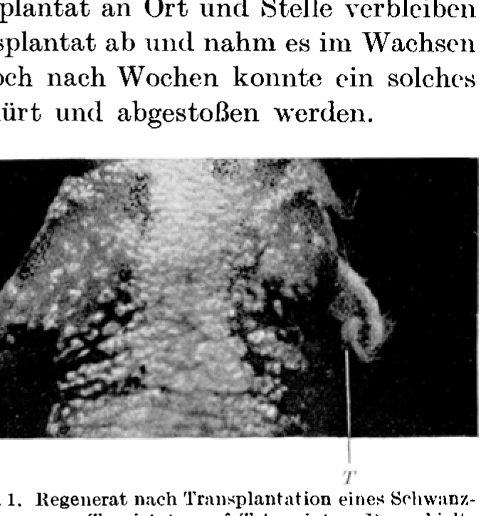
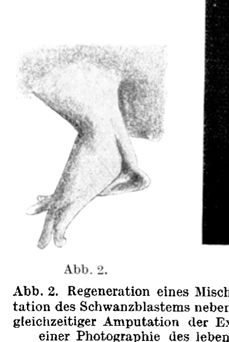
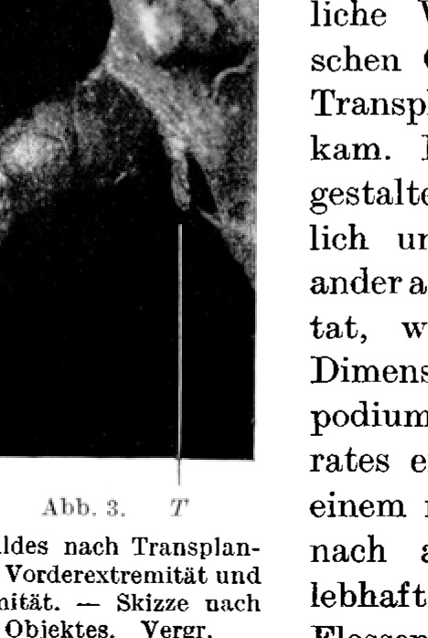
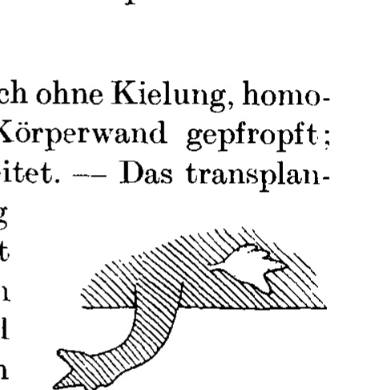
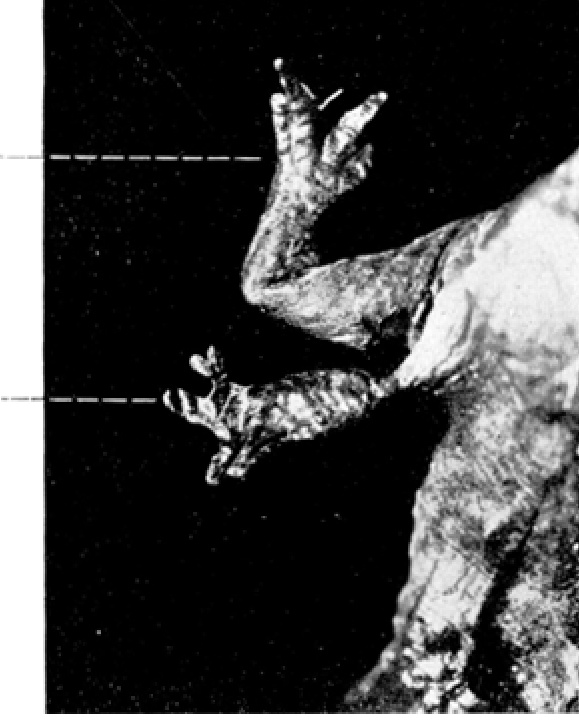
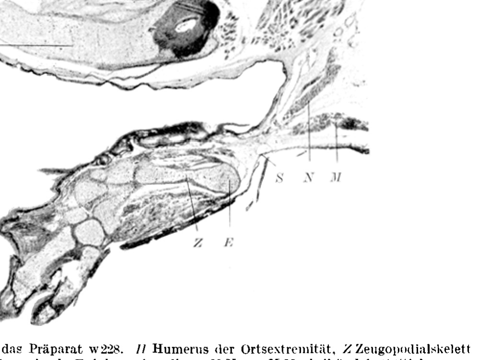
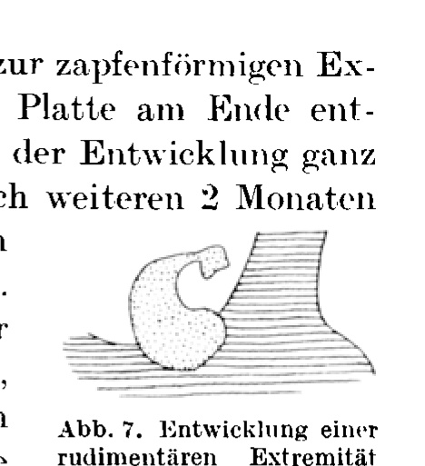
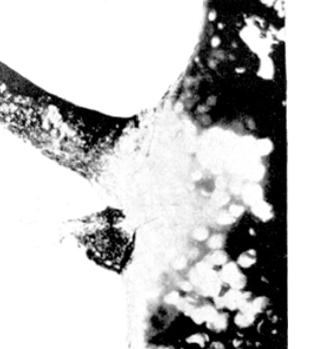

*(From the Biological Experimental Institute of the Academy of Sciences in Vienna, Zoological Department.)*

## POTENCY-TESTING ON THE REGENERATION BLASTEMA:
## I. LIMB-FORMATION FROM TAIL-BLASTEMA IN THE LIMB-FIELD IN TRITON.¹

By

PAUL WEISS

With 8 text-figures.

*(Received on 8 June 1927.)*

*Archiv für Entwicklungsmechanik der Organismen*, vol. 111 (1927).

> **Full translation.** A complete English rendering of Weiss's potency-testing on the regeneration blastema in *Triton* — what the blastema can and cannot form — bearing on the determination field, with the figure legends.

### Contents

| | Page |
|---|---|
| Statement of the problem | 316 |
| Setting up of the experiment | 321 |
| Course of the experiment | 324 |
| Orthotopic transplantation | 324 |
| Heterotopic transplantation | 327 |
| Discussion of the results | 334 |
| Summary | 339 |
| Bibliography | 340 |

The regeneration process at a tail or a limb in a urodele amphibian begins, after a thin epithelium from the epidermis has covered the wound, with a considerable accumulation of mesenchymal material over the wound surface. This material we call the *Regenerationsblastem* [regeneration blastema]; it is the actual formative material of the regenerate, for we can observe its stepwise transformation up to the finished organ. It piles up as a soft, plastic mass without form of its own beneath the wound-closure and gives the impression of complete homogeneity. Its provenance is by no means yet fully clarified; the cellular constituents may equally well have arisen from de- or re-differentiated tissue cells as have immigrated from indifferent cell-reserves. For a few cases it is at least shown from where the material does *not* come, or, better said, *need* not come: both without the presence of *skeleton* (10) and without the presence of *corium* (15) in the stump, the

> ¹ A preliminary communication of the results of this work appeared under the title "Die gestaltliche Nullipotenz des Regenerationsmaterials. Extremitätenbildung aus Schwanzmaterial" [The morphological nullipotency of the regeneration material. Limb-formation from tail-material] as Communication No. 127 from the Biological Experimental Institute of the Academy of Sciences in Vienna, Zoological Department (Director H. Przibram), in Akad. Anz. No. 21/22. 1925.

blastema, and from it finally a regenerate, which contains both skeleton and corium [cutis] anew, forms. Observations in an earlier work lead me to suppose that the cellular constituents of the blastema have wandered to the wound from all sorts of connective-tissue formations (muscular, dermal, neural, periosteal, or whatever else); an occasional observation by Guyénot and Schotté (2) made the perineural connective tissue appear to them as the source of the blastema material. — Epidermis, nerve cells, and nerve fibers of the regenerate do not proceed from the blastema, but grow over from the stump.

The appearance of like-ness [Gleichartigkeit] which the blastema elements afford is already proof enough that each of them has to undergo a genuine differentiation process toward its end-state in the finished regenerate. Thus some become chondroblasts, others myoblasts, still others corioblasts, etc.; growth and multiplication are added, and at the end stands the full differentiation into the functioning tissue cell.

But differentiation and growth processes at the individual elements now take place in a definite spatial and temporal *order*; this order brings it about that out of the host of blastema cells lying side by side there arises not a heap jumbled in colorful confusion, but a typically formed, functioning organ: according to the particularity of the arrangement, the one time a limb, the other time a tail.

The question is, how does this order get into the blastema. *Is* the blastema organized, or *does* it *become* organized?

Either the organization is already somehow in the blastema elements from the start, is therefore already brought along by them to the site of the elaboration — by each one the whole, or by each one a different fragment. Or else the organization spreads only from the locality of formation out over the blastema.

Now, that the individual blastema elements do not each carry "a piece of form," like stagehands carrying scenery flats, which are then assembled at the spot regularly into the finished scenery, is self-evident, unless one wishes to grant the cells insight and overview of the situation at hand. For: not only that each individual case in its accidental particularity means each time different conditions for the meeting-together of the elements in the blastema, but above all it is experimental experiences that teach us that, notwithstanding the most manifold interventions on the already accumulated blastema material, nevertheless form-correct regenerates arise; from the fusion of two blastemas there can arise (P. Weiss [11]) a single limb, just as from a blastema constricted in two there can arise two limbs (Milojević [7]). That the blastema elements therefore assemble themselves according to a fixed pattern, whose parts they themselves would represent — this idea is entirely to be dismissed.

Another kind of *Präformation* [preformation] in the blastema material would nevertheless have to be considered: it could be that the individual cells which immigrate there are each, as it were, a germ of the whole organ, to whose construction they come together, just as the egg is the germ of the whole individual; and from their union in the blastema there would then result, in an enormously enlarged scale, a unified organ-germ, exactly as from the fusion of several eggs a unified embryonic germ may come about. The organization problem is, on such an assumption, not touched at all, or rather rests content with the reference to the analogy in ontogenetic development; but what would at any rate be explained thereby is why precisely a *leg* always regenerates at a leg-stump and precisely a *tail* at a tail-stump. The explanation of regeneration as the activation of reserve-determinants in the Weismannian and also the Rouxian sense has such an assumption as its foundation. That in reality regeneration in the special case never delivers the *whole* organ, but always only the part of the organ approximately equivalent to the loss — for this one would have to account by assuming that the developmental course of those regeneration-germs would be arrested at the moment from which its further progress would merely create repetitions of the existing (namely the parts that had been preserved) organ portions. Such an, as it were, merely *quantitative* regulation of the regeneration process through site-influences has indeed been adduced by Roux in some written communications to me.

The essential thing in this view is that one thinks of the regeneration material as having, *from the start*, a certain morphogenetic potency inherent in it in the preformistic sense; what is inessential is whether one lets it rest content with only *one* such potency or perhaps attributes to the material two or even still more.

Now, in recent years experiments have already been carried out whose results considerably restrict the possibilities at hand. Such experiments were already cursorily mentioned by Schaxel in 1921, but were carried out on a larger scale, and independently of the former, first by Milojević on *Triton* (6): regeneration-blastemas were exchanged by transplantation between different limbs — between right and left and between anterior and posterior. The blastemas healed in at the new site and differentiated out; but for the quality of their morphogenesis an age of about 12 days proved critical, inasmuch as *older* blastemas differentiated further in the sense of the place of their *provenance* [Herkunft], without harmony with the new site, whereas *younger* blastemas differentiated out completely in the sense of their new site — and this when the old and new sites differed both with respect to a) axial height, — b) laterality, — c) limb-quality. For example:

a) *Provenance-site*: forearm. — *New site*: upper arm. — *Regenerate*: upper arm, elbow, forearm, hand.

b) *Provenance-site*: right limb. — *New site*: left limb. — *Regenerate*: left limb.

c) *Provenance-site*: anterior limb. — *New site*: posterior limb. — *Regenerate*: posterior limb.

If we now seek, in the first place, to maintain the standpoint of the *preformist* in the face of these three kinds of result, then — not entirely without constraint:

ad a) one would have to assume that the elaboration of the (preformed) organs proceeds for just so long until the missing parts have been laid down (laid down, not formed out!); see above;

ad b) one would have to assume that the asymmetry of the (preformed) organ-form would be able to be flipped over in mirror-image through unspecific influences of the site, as Harrison assumes for the embryonic limb-bud;

ad c) one would have to assume that the limb-blastema were not uni-potent but *bipotent* — that it contained, say, only the *general* limb-quality preformed; but that it owed the particularity, whether anterior or posterior limb, to *unspecific* site-influences. In favor of this assumption one will recall that within the realm of regeneration phenomena it is a quite widespread occurrence that even at the normal site an organ of a different quality from the removed one occasionally regenerates (heteromorphosis, but especially homoeosis), and indeed mostly an organ that is morphologically related to the substituted one (e.g., in arthropods antenna instead of eye, leg instead of antenna, hind-wing instead of fore-wing). And even in *Triton*, after an ordinary transverse section, there often appears, in place of a five-toed leg, a four-toed one, hence something arm-like, and — though more rarely — in place of a four-fingered arm a five-toed leg. The twofold developmental possibility of the regeneration material, which thus reveals itself occasionally even at the normal site, could accordingly be evaluated in the sense of a twofold preformation, whereby influences of the site would come into play only in the sense of a favoring of the one or the other possibility. To assume such a preformed bipotency will fall the more easily to many, since "pluripotency phenomena" have recently been brought into the foreground in a wider biological field (Haecker [4]).

As one sees, the Milojević results do let themselves, admittedly not entirely without constraint, be arranged into the preformistic trains of thought. An *experimentum crucis* against the assumption of a preformed morphogenetic potency in the regeneration material one would in any case need, if one did not wish to perceive [such potency] in them — even though, of course, the interpretation that the blastema receives its morphological determination only from the site in the first place must, as the less constrained one, appear from the outset also the more plausible.

In order that such an *experimentum crucis* might be furnished, however, it lay near at hand to modify the Milojević experiment in the direction of exchanging the regeneration-blastemas not between *two morphologically closely related* organs, but between *completely different* organs. Such a pair of organs is *limb* and *tail*; between the former, the lateral paired body-appendage, and the latter, the unpaired segmented axial organ, there exists neither morphologically nor developmentally any kinship, although the structural elements, apart from the nervous system, are pretty much the same in both: epidermis with glands, cutis with melanin and lipochrome, striated musculature, cartilaginous and bony skeleton, and connective tissue.

While now the differentiation-achievements that can be demanded of the individual cell are the same for both organs, their *arrangement* in the organ is a fundamentally different one; but even the most decided adherent of the preformation hypothesis will not seriously wish to assume that in the limb a *tail-reserve* and in the tail a *limb-reserve* is contained. It came down, therefore, merely to establishing how *limb-blastema would behave after transplantation onto the tail*, and how *tail-blastema would behave after transplantation onto the limb*. Were the general limb- or tail-quality somehow *preformed* in the blastema material, then it was duly to be expected of it that, in a completely foreign environment, it would either display its preformed developmental direction or else at best prove at a loss and attain no typical morphogenesis at all. If, on the other hand, the material were able, despite its foreign provenance, to develop into a form such as would be appropriate to the new site, then it was surely more than made probable that the blastema not only contained nothing of form preformed, but was first determined to its morphogenesis on the spot. And that the experiments reported on in the following have indeed shown.

Only the *transplantation of tail-blastema into the territory of the limb* have I been able to carry out. The reciprocal experiment has up to now always failed for me because the small limb-blastema, on

> W. Roux's Archiv für Entwicklungsmechanik, Vol. 111. 21 the by far more extensive tail-cross-section, could be adapted only with difficulty, and when [it was], was soon overgrown by a new tail-regenerate. By contrast, tail-blastema could be transplanted into the limb-region with good success.

For the case that the transplanted blastema were to take on the morphogenesis of the new site, provision had to be made to meet the objection that not the *transplanted* material itself, but material of the *site* pressing in from behind, had accomplished the construction of the regenerate. Milojević counters this objection by pointing out that the differentiation of the transplant, compared with a control regeneration set going at the same time as the transplantation on the opposite limb, would possess and retain a temporal head start; for the time that the control limb would need to accumulate regeneration material over the wound would, after all, be gained for the transplant. Nevertheless, by this argumentation that objection is only apparently invalidated; for one could also explain the temporal head start of the regenerate on the transplantation side thus: that the very undertaking of the transplantation had already had as its consequence an intensification of proliferative activity, and thereby of growth velocity, on the stump in question — as, e.g., v. Ubisch indicated for worms at the time (9); then, of course, even after rejection or resorption of the transplanted material, the stock-regenerate pressing in from behind could develop faster than an unstimulated control regenerate.

In renewed experiments one therefore had, after all, to proceed more strictly and to endeavor to mark the transplanted material permanently, in order to make its unambiguous identification possible at any time. Toward this goal there stood open, theoretically, the three kinds of way that are also chosen with the same intent in the embryological experiment:

*Vital staining* of the transplanted material (Goodale, Detwiler, Vogt, and others).

Use of conspecific material of *differing nuclear size* (G. Hertwig).

Use of *heterospecific* material (Spemann).

The first method (with Nile blue sulphate) proved to me not suitable, since the staining did not hold long enough. The method of transplanting haploid-nucleated material onto a diploid substratum, which G. Hertwig himself has already applied with success to regeneration experiments, I did not draw upon. There remained, finally, the method of heteroplastic transplantation, tail-blastema of one species onto the limb-cross-section of another species.

Transplantation was done from *Triton taeniatus* [modern *Lissotriton vulgaris*] onto *T. cristatus* [modern *Triturus cristatus*] and vice versa, and from *Triton cristatus* onto *T. alpestris* [modern *Ichthyosaura alpestris*]. The transplantation-bed for the tail-blastema was thereby always an amputation cross-section of the limb itself, and indeed the limb was severed right at its base at the height of the body-wall. The successes with this procedure were in general not very satisfactory, since the blastemas in the majority of cases were rejected or resorbed (see below). So in the end I chose a fourth way as a way out:

During my work, experiments by Piera Locatelli became known to me, who had observed in *Triton*, under certain conditions, the regeneration of a limb heterotopically *beside* the actual limb on the body-wall (5). Quite without it being necessary to enter into the incorrect interpretation which Locatelli had given to her results (cf. on this point P. Weiss [12], p. 104 ff.; Guyénot and Schotté [3]), the finding came very opportunely for my experiments. For it was thereby shown that not only in the limb itself, but also still in its neighborhood — hence in the shoulder or pelvic region — factors are present which can bring about limb-formation; a result which, moreover, had long since found its embryological parallel in experiments by Harrison, from which it emerged that, after removal of the center of the limb-anlage (in the *Amblystoma* embryo), the neighborhood takes over the limb-formation.

The advantage that this fact afforded for our experiment lay in this, that one no longer needed to transplant onto the amputation site of a limb and thereby simultaneously to initiate a regeneration process from the stump, but could now set the transplant *beside* the *untouched* limb on the body-wall and yet still have it in a zone — by experience — capable of limb-regeneration. Under such conditions it was then not only an easy matter to keep the blastema itself continuously in view; there appeared, moreover, in the experiment yet another, unexpected phenomenon, which facilitated the identification of the material still further. But of this there will be talk only in connection with the experimental results.

The experiments which were now undertaken on the basis of this consideration were, in detail, constituted as follows:

In the main, *Triton cristatus* was used, namely sexually mature full newts of 2 years and over in age. The tails were severed transversely at varying heights by a snip of the scissors; particular attention was thereby paid to the evenness of the cut surface. Already in the course of about a week there then formed over the wound, under a rather mighty epithelial covering, the blastema; at the end of the second week there was usually already pronounced the *lateral flattening*, characteristic of the tail-anlage, with the *keeling* [Kielung] running dorsoventrally.

The first regeneration blastema appeared between the 7th and 15th day after amputation. The detachment of the newly formed material from the old stump can be carried out very easily with the sharp lancet, in that the blade — if one applies no force — follows of its own accord the boundary between the two zones.

The transplantation bed was prepared as follows: dorso-caudally from the base of the left forelimb, but rather close to it, on average at a distance of 1–2 mm, a small oval piece of skin was excised, smaller than the area of the blastema to be transplanted. With consideration for the necessity of the nervous system for the regeneration of the extremity in *Triton* [modern *Triturus*] (SCHOTTÉ, P. WEISS), an arbitrary nerve of the brachial plexus, which is readily accessible at the relevant site, was caught up, drawn out of the extremity, and led to the wound site. A noteworthy injury of the musculature at the grafting site was avoided in all cases. Finally, the skin margins of the oval hole were bluntly dissected free all around from the underlying fascia.

The blastema to be transplanted was lifted off the tail and inserted into the prepared transplantation bed in such a way that the margin of the oval skin opening covered over the perimeter of the likewise oval but larger transplant on all sides and pressed it against the underlying fascia. In this way not only was the holding-in-place ensured, but also a corresponding sealing-off against the penetration of external injurious influences. In the case of bleeding, which occasionally occurred through carelessness during the nerve dislocation, the transplantation was deferred until the blood had come to a standstill and the thrombi had been removed.

In some cases an amputation of the adjacent extremity was undertaken simultaneously with the transplantation.

For anesthesia, ether or chloretone was used. The animals were kept singly after the operation, for the first while on moist gravel, later in water; feeding with *Tubifex*. The experiments were carried out in the years 1924–1925.

## Experimental course.

### Orthotopic Transplantation.

Almost always, when transplantation was to be carried out directly at the amputation site of the forelimb, foreign-species material [*artfremdes*] was used as transplant. Mostly, as already mentioned above, the fate of these transplants was not a favorable one: either they were cast off in the first days after the operation together with the first post-operative molting, without yet having healed in, or else they did indeed heal in but were soon resorbed. Nevertheless, in a number of animals the transplant was preserved even beyond the first period of healing-in.

In all cases a *local regenerate* [*Ortsregenerat*] formed beneath the transplant. This later either forced its way through laterally beside the transplant, while the transplant could remain in place, or else it lifted the transplant off and carried it along with it distally in growing; even after weeks such a transplant could then still be constricted off and shed.

Well-healed-in transplants could be unmistakably recognized again, up to several weeks after the transplantation, by their form and deviating pigmentation. Gradually, however, the situation changed, and two things could then occur: In the one set of animals the transplant passed, little by little, into the local regenerate, so that its further fate could no longer be followed. In the remaining animals the transplant differentiated further in such a way that a lasting identification was possible.

**Fig. 1.** Regenerate after transplantation of a tail blastema from *T. cristatus* [modern *Triturus cristatus*] onto *T. taeniatus*. The keeled transplant (T) sits distally upon the local regenerate, which represents an extremity rudiment. — Photograph under magnification.  *(figure not reproduced)*

Everywhere that the transplant had not been taken up into the local regenerate, it formed characteristic *tail features* [*Schwanzmerkmale*]. With this the matter stood as follows:

Right from the very first beginning, the transplants had to suffer greatly under the development of the local regenerates. The end was always that transplant and blastema of the local regenerate grew together into a single regeneration bud; in this, however, the participation of two different components stood out clearly: the boundary remained marked by a strong constriction and by a sudden change of pigmentation. The form of the two parts, too, was from the earliest stages already a thoroughly different one: the part of the rudiment which is local regenerate has a spherical form and sits upon the body with a broad base; the part that has proceeded from the transplant, by contrast, soon assumes a flat form with a sharp keel at the margin — precisely the rudiment-form characteristic of a tail regenerate. These characters become even more sharply pronounced in the later course, in that the seam of the transplant becomes yellow-pigmented as on the normal tail.

Meanwhile the locally-belonging part of the rudiment differentiates into a regular extremity. Thus in the end there proceeds from the whole regeneration process a structure which represents an extremity with a rather sharply demarcable, tail-like appendage. Such a case is reproduced at an earlier stage in Fig. 1 — seven animals have furnished a result of this kind.

The results just described are perfectly clear: The transplant has developed further, after a fashion, in the same direction in which it would have developed at the place of its origin, and, despite its incorporation beside an extremity, has formed a kind of tail, as the tail blastema which it was. Pigmentation and the formation of a fin-seam could here be valued as unmistakable distinguishing marks. Admittedly it must be emphasized that, with all the tail-resemblance, the regenerates nevertheless did not become regular tails after all. Whether the certain incapacity which expresses itself in the latter fact is to be ascribed merely to the absence of the normal site-conditions, or to a contrary influence of the *foreign* site — about this these experiments can as yet give no information; we shall have to speak of it later.

According to the results of the heteroplastic experiments, one could thus easily arrive at the view that the tail blastema does indeed possess the capacity, if at all, then only for tail-formation. Whether that, however, was correct or not, could not be decided so long as the unwanted local regeneration interfered with the development of the transplant, and indeed for the following reason: As mentioned above, in a series of animals the transplant, without having been cast off, was gradually drawn into the local regenerate and was absorbed into it without trace. From the microscopic picture no information can be obtained about the fate of the material, since the differences between the developed cells of the two related species, to which donor and host belong, are not marked enough for one to be able to diagnose the affiliation of individual cells with certainty. It was accordingly not excluded that the transplanted material had found use in the construction of the local regenerate itself, and had thus, despite its origin from the tail, participated in the formation of an extremity. Undetermined material would have been worked up in the construction of the local regenerate. But just as little as this was to be excluded was anything of the kind proved. A pure result would here only be obtainable if the local regeneration could be suppressed; I also believe that, among a very large number of animals, this would have to occur one time or another; only in my experiments it simply did not succeed, and for that reason I have gone over to that other method, which keeps the developmental course of the transplant free from disturbances by local regeneration.

### Heterotopic Transplantation.

The operative procedure has been described above (p. 324). The tail blastema for the transplantation was taken either from the same animal or from another individual of the same species.

The blastema was, not as in heteroplastic transplantation, transplanted *to the place* of the extremity, but *beside* it; hence "heterotopic" (after HARRISON's terminology).

The healing-in of the transplant proceeded in general much more smoothly than after heteroplasty; above all, only in few cases did a casting-off of the *whole* transplant occur. More frequently it happened that, although the mesenchymal part of the transplant, the actual *blastema*, healed in firmly, the co-transplanted epithelial cap was cast off and replaced by epithelium of the wound margin. A regular occurrence was that the blastema, after transplantation, spread out more strongly at the expense of its height, thus became flatter, which corresponds not to a diminution of volume or — what would be the same — to a resorption, but merely to a change of form. This, to be sure, went so far in some cases that the blastema sank down to the level of the body wall. Usually, however, the cone-shaped protrusion of the blastema remained distinctly pronounced.

In the majority of cases, however, despite the healing-in of the blastema, no further development of it occurred. It is to be assumed that the supplied nerve withdrew again and thereby deprived the material of a necessary developmental condition. The skin margins of the wound then grew together over the blastema, formed a tough scar, and after some months the transplantation site could in general only be recognized any more by the strong adhesion between skin and musculature. Perhaps in many cases this scar-formation itself was also to blame for the further regeneration having failed to occur, for, as is well known, premature epithelialization is able to suppress a regeneration process already in progress.

Only in eleven animals did the development of the transplant proceed further. In one of these animals (No. 193), in which, simultaneously with the transplantation, the local extremity had also been amputated, a fusion came about between the transplant and the local regenerate arising beside it. This animal died too early (6 weeks post operationem); while the local regenerate was already clearly recognizable as an extremity, the form of the transplant could not yet be clearly defined.

Yet another, second animal died prematurely (No. 127; 3 weeks post operationem), but in it the transplant had already assumed a very conspicuous keeling, so that there can be no doubt that in the further course it would have shaped itself into a tail-like structure.

The remaining nine animals, however, stayed alive long enough to furnish clear results. These final results showed, briefly stated:

a) in two animals, *tail type* [*Schwanztypus*],
b) in three animals, *no type whatever*,
c) in three animals, *extremity type* [*Extremitätentypus*],
d) in one animal, *mixed character* [*Mischcharakter*].

#### Group a.

The tail-like formations can be dealt with briefly. In the one animal, the local extremity had been amputated simultaneously with the transplantation, so that again, similarly as in the orthotopic transplantations, a gradual fusion between local regenerate and transplant came about. The two parts, however, took shape rather independently of one another: The transplant, which scarcely attained the dimensions of the stylopodium of the local regenerate, bore on a more massive trunk, outward-facing, a vividly yellow-colored fin-seam, so that its tail-character is beyond question (Fig. 2).

In the second animal the transplant had furnished a small spade-shaped structure, which was bounded by a sharp-edged fin-seam, thus

**Fig. 2.** Regeneration of a mixed structure after transplantation of the tail blastema beside the forelimb and simultaneous amputation of the extremity. — Sketch from a photograph of the living object. Magnification.  *(figure not reproduced)*

**Fig. 3.** Regeneration after transplantation of a tail blastema beside the left forelimb in *T. cristatus*. *O* local extremity, *T* transplant with tail-character. — Photograph under magnification.  *(figure not reproduced)* also clearly bore *tail features*. Yet the regenerate remained, throughout its life, minutely small (Fig. 3).

#### Group b.

The three regenerates of this group proceeded from blastemas which had been removed from the tail 11 and 12 days respectively after amputation (June!). The final structures were small tissue-knobs projecting beyond the body wall; they are of a tough and hard constitution, unorganized, but bear the yellow pigment which is characteristic both of the tail-edge and of the toe-tips.

#### Group c.

Most interesting of all, naturally, are the three regenerates which show *extremity form* [*Extremitätengestalt*]. They shall therefore be discussed more thoroughly:

##### No. 213.

Tail blastema, 11 days old (9th–20th July), still without keeling, grafted homoplastically onto the body wall near the extremity base; the nervus brachialis inferior led into the wound surface. — The transplanted blastema, which like all of them had at first sunk in a little, was raised again 14 days later with strong protrusion above the body wall, and 2 months after the operation was extensively differentiated. Although the differentiation was not yet entirely completed when the animal enigmatically escaped, the character of the regenerate could nonetheless be established with all desirable distinctness: it was the *autopodium* of a left forelimb in normal dimensions. It did not, however, sit upon the body wall with a broad base, but was connected with it only by a *thin stalk*. From the local extremity, in whose vicinity it was situated, it was completely independent. The last sketch that had been made of it is reproduced in Fig. 4.

**Fig. 4.** Development of an autopodium after transplantation of the tail blastema beside the left forelimb in *T. cristatus*. — Sketch from the living object. Transplant dotted.  *(figure not reproduced)*

The developmental course of the regenerate was that typical for the distal part of an extremity: two-lobed rudiment; from the ventrally-situated lobe then the formation of the first (radial) finger, from the dorsal one the three remaining (ulnar) fingers; this mode of origin still comes to expression quite well even at the depicted stage. The regenerate is thus characterized not merely by its final form but also by its development as a genuine extremity-part. So far as can now be judged externally from form and proportions, the regenerate consists not only chiefly, but exactly, of an autopodium — of no less and no more.

##### No. 228.

Tail blastema, 6 days old (18th–24th July), small, still without any sign of keeling, transplanted dorso-caudally from the base of the left forelimb onto the body wall (homoplastically); a nerve of the brachial plexus led into the wound surface. — This transplant too followed the developmental course typical for an extremity regenerate. After 4½ months, when it was completely differentiated out, it was preserved (Fig. 5).

The regenerate consists of an autopodium and a trunk-piece to be valued, according to its length, as *zeugopodium*. The third finger is split into a double formation, but otherwise the structure makes a completely normal impression. Its dimensions are, as emerges from the comparison with the normal extremity, the typical ones.

In this case too the regenerate again does not sit broadly upon the body like a normal extremity; rather, its insertion is again, quite as in the preceding case, a thoroughly peculiar one: the rigid trunk-part of the regenerate ceases proximally almost abruptly, that is, it tapers all at once to about a quarter of its diameter. From there on, what leads to the body as a bridge is a quite thin, soft stalk, not stiffened by any skeletal piece. Correspondingly, the regenerate hangs limply down from the body wall as if in a sack. (That the transplant nonetheless appears in the illustration as standing away from the body has its ground merely in the fact that, for the sake of clarity, it was fixed in this position during preservation.)

**Fig. 5.** Development of an extremity-section after transplantation of the tail blastema beside the left forelimb. — *O* local extremity, *T* transplant. The transplant has been drawn a little away from the body during fixation, in order to make the stalk distinct. — Photograph of the preserved animal under magnification.  *(figure not reproduced)*

The shoulder region of this animal was cut into sections and submitted to microscopic examination (preservation in HEIDENHAIN's "Susa," after-decalcification in 3% nitric acid, staining in hemalum, after-staining in picrofuchsin). In three respects the microscopic picture (Fig. 6) gives valuable elucidations and supplements to the external findings: 1. with regard to the *form of the re-* *generate*; 2. with regard to its *communication with the body*; 3. with regard to the *site of origin*.

ad 1. As regards first the **structure** of the regenerate, it turned out that all the typically appurtenant tissue types are present in normal development, as in any other limb regenerate. The morphology can be defined more precisely on the basis of the skeletal elements contained therein than from the outside: onto the autopodium there attaches, by way of a wrist, a zeugopodium, in which, however, only the one skeletal rod (Z) is developed. This skeletal rod bears as its proximal end a well-marked epiphysis (E); with this the whole regenerate at the same time terminates proximally: of any piece of stylopodium there is not a trace present. Thus the regenerate consists — as could already have been surmised from its external appearance — exactly of autopodium and zeugopodium, no less and no more.

**Fig. 6.** Section through the preparation w228. *H* humerus of the host limb, *Z* zeugopodial skeleton in the regenerate, *E* proximal epiphysis of the same, *N* nerve, *M* muscle bundle, *S* stalk.  *(figure not reproduced)*

ad 2. The bridge to the body is a skin tube (S), through whose lumen there run in the main some connective tissue, a strong nerve (N) and blood vessels. At one place a muscle bundle (M) also draws into it, which runs out from the most superficial layer of the trunk musculature, the one directly underlying the integument. The main mass of this little muscle spans, in a dorsoventral direction of course, the proximal, funnel-shaped section of the stalk, and only isolated fascicles reach laterally through the narrows of the stalk across to the regenerate, inserting on the capsule of the proximal epiphysis. The stalk in any case — this is beyond doubt — does not belong to the regenerate, in the way it has issued from the transplant; it is rather nothing further than a communication tube for the nerve and blood pathways between body and regenerate.

ad 3. **In the body itself** no trace of transplanted material or of its descendants is to be found; the place which at the operation was assigned to the transplant, and from which it had strayed away and outward, is completely taken up by wide-meshed tracts of connective tissue. This connective tissue is developed in rich measure and contains, interwoven into it, the dislocated nerve bundles of the plexus — now leading into the regenerate — and the blood vessels. The distance between the integument and the trunk musculature is, owing to the interposition of the abundant connective tissue, considerable. The insertion site of the regenerate likewise has, apart from the cutaneous one, no direct tissue connection even with the neighbouring extremity. Accordingly, the regenerate proves to be, through an organization-poor space, completely isolated from the organized tissue formations of the body interior.

Thus we see, then, that the regenerate, up to its final stage — apart from the insignificant muscular offshoot — has remained morphologically completely closed off from and independent of the rest of the body. Since, on the other hand, normal limb regeneration from the body always creates an organ inserted with a broad base and firmly anchored in the girdle zone by skeleton and musculature, the peculiar development in our case is downright proof that the regenerate here was *not* produced from the body, but really was differentiated out of the transplanted material. Case w213 too had led to this result.

When the regenerate is firmly and broadly incorporated into the body, one may nevertheless be in doubt whether, after all, following the casting-off of the transplanted blastema, it did not owe its origin to a heterotopic regeneration process from the body, as in the experiments of Locatelli. But with a broad base sits the third of the extremities that arose in my experiments:

##### No. 284.

Tail blastema, 10 days old (2nd–12th December), autoplastically grafted in dorso-caudally from the insertion site of the left forelimb; a nerve of the brachial plexus led into the wound surface; blastema small.

Three weeks after the operation the blastema is strongly bulged out over the body wall; one still recognizes clearly the boundary of the transplant and notices a faint longitudinal keeling. Whether this keeling indicates the original beginning of a tail-formation or represents an accidental formation cannot be said, since it soon receded. Already after a further 9 days the blastema has been raised into a cone, and after yet another 7 days has developed into a peg-shaped limb anlage with the typical trapezoidal plate at the end. From then on the tempo of development slows down quite markedly and in an unusual way, and after a further 2 months it has arrived at a condition which in the sequel showed no further changes (Fig. 7).

A broad, sturdy stalk sits firmly on the body, tapers more and more toward distal, passes over into a thin little stalk and bears at its end a tiny little trapezoidal plate in the proportions of an autopodium anlage; the whole structure is strongly curved inward radially, with two sharper kinks at the level of the presumed wrist- and elbow-joints. The dimensions of the regenerate are, in contrast to the previous two, far below normal value. The appearance of the structure is that of a tiny **rudimentary extremity with all three segments**. A further elaboration has, although time stood amply at its disposal, no longer ensued.

**Fig. 7.** Development of a rudimentary extremity after transplantation of the tail blastema beside the left forelimb in *T. cristatus* [modern *Triturus cristatus*]. — Sketch from the living object. Transplant dotted.  *(figure not reproduced)*

The fact that the regenerate has remained standing in so wretched a condition, without ever yet finding the means to a more perfect elaboration, seems to me indeed to speak against its having been an in-situ regenerate; for such a one, one would think, would surely — being able to draw sufficiently on body material — have developed fully into normal dimensions, whereas the transplant seems thrown upon itself, without receiving supplements from the body.

A particular significance, however, does not attach to the distinction in this point,

**Fig. 8.** Mixed regenerate from a tail blastema transplanted beside the left forelimb. — Photograph under magnification. *Triton cristatus* [modern *Triturus cristatus*].  *(figure not reproduced)*

since indeed the two previously mentioned cases, with their stalk-wise inserted extremities, are in any case more unobjectionable as proofs and also suffice.

#### Group d.

##### No. 321 (Fig. 8).

A tail blastema transplanted at the age of 10 days yielded, in the course of 8 months, a regenerate which consisted of two portions: a strongly keeled section provided at the edge with yellow pigment, thus distinctly displaying tail characters, and a spherical, undifferentiated one. The whole hangs again only loosely by means of a thin little stalk on the body, so that probably **both** portions stem from the transplanted material; yet the spherical appendage arose only later. As to its interpretation one could make so many conjectures, between which one could in any case not decide with certainty, that we will do best to refrain from it altogether.

## Discussion of the results.

The regenerates which came under observation at the transplantation site were of three kinds: either they possessed no pronounced character at all, or a tail character, or a limb character. Let us take the last as the most interesting in the first place:

Before all further discussion, the question arises whether the heterotopic limb regenerates of our experiments really did arise from the transplanted material; in any case, the results of Locatelli (5), confirmed by Guyénot and Schotté (3), counsel caution here, in that they show that under certain circumstances the body carries material to the sites used by us as transplantation bed for a limb regeneration too. Is it then, perhaps, after all the case that the transplant itself was cast off and replaced by a heterotopic in-situ regenerate?

A very distinct temporal head start over the control regeneration process of the opposite side I have as a rule not been able to observe; nor would such a one, as already set out above, be unconditionally probative. Equally uncertain is the observation of the transplant itself. To be sure, I had kept the blastema continuously before my eyes and ascertained its changes day by day; but this continuous control and observation could bring me only the full certainty that the blastemas were not cast off; were they not, perhaps, quite gradually and imperceptibly penetrated and replaced by site-appurtenant material? Concerning this, as one sees, not even the strictest control can give any information.

The only proofs that the limb regenerates really had differentiated out of the transplanted material I derive rather from their final form itself: it has been described above that the regenerates in question were found in a complete morphological **closedness**, both in themselves and toward the body. This closedness had come to expression in the fact that no firm anchorage of the structures in the substratum existed, that on the contrary they are, through a little-differentiated space and then through the atypical communication tube, isolated against the body organs, connected with the body altogether only in the most makeshift way. But a regenerate which from the site in question were produced by the latter's own means would be and remain, so far as we know, always in the most intimate, organized connection with the substratum, over which it shapes itself and of which it simply formed the steady continuation. This so conspicuous difference of behaviour makes it, in our case, doubtless beyond question that what is present is *not* a regenerate out of material of the locality. The insignificant insertion of a muscle bundle is doubtless to be traced back to an independent growth process of the muscle in question, which was after all injured at the operation; this muscle, too, has no connection with the musculature of the regenerate.

What the locality nevertheless did supply to the transplant, however, is nothing visible, no material, but rather the **shaping-quality**, the directive for its developmental course, how in the particular case it has to run, in order precisely to deliver **extremity** — in short, the **organization**. This is just what the experiments had aimed at: to investigate whether a separation were possible by experiment between factors which determine organization and those which put it into practice — that is, between organization-potency on the one hand and inherent capacities of the material itself on the other. Here we now have the separation: the site provided the directive for limb formation, the material — limb-alien material — was artificially placed at its disposal; the two together then accomplished the building-up of a limb. But this means at the same time: **young regeneration material contains no kind of definite shaping-quality preformed within itself; into which kind of organ it is to differentiate is determined by influences of the site.** In short: the material is not from the outset morphologically determined, but becomes so only in the course of its existence at the site.

With this result, now, at the same time all the theoretical conclusions with respect to morphogenesis which I discussed in an earlier work (10) under the presupposition of such an experimental outcome gain their verification. To avoid repetitions, let reference be made to that work, but in particular to my later comprehensive writing "Morphodynamik" (13).

The result of the theoretical evaluation, as it is carried out in those places, leads to a dividing-up of the concept of "potency" into: on the one hand "**differentiation-potency**", which is proper to every material part, let us say to every cell, and comprehends its total reaction possibilities; on the other hand "**organization-potency**" (or "**shaping-potency**"), which belongs only to a material whole as such and which signifies the determination-capacity for the subordinate or to-be-subordinated material parts; as dynamic bearer of an "organization-potency" there appears an "**organization-field**".

A similar dualism within the concept of potency was already introduced by Driesch, and so it fits excellently that, precisely in a Festschrift dedicated to Driesch, such a conception can be sealed by an experiment.

The young regeneration material we have to designate, in a consistent carrying-through of the bipartition of the concept of potency, as "**morphologically nullipotent**". Whether it is "**differentiation-omnipotent**", i.e. whether it would still be in a position to accomplish all differentiations that could anywhere on the body be demanded of it, only further experiments can teach. For our experiments communicated here are, namely, not called upon to a decision in this question, because the differentiations which the individual blastema elements have to accomplish in the limb field are in essence the same as for the tail. The next thing to do, accordingly, will be to make the experiment whether the tail blastema would be capable not only of a shaping that works with the elementary differentiations customary at the tail, but also of formations whose elements were of an essentially different, e.g. epithelial, nature. Such experiments, which consisted in the tail blastema or the limb blastema being induced to differentiate in the "eye field", I had in progress simultaneously with the present investigations, without, however, having so far arrived at tangible results.

Yet one peculiarity of the limb regenerates from tail material calls for clarification. It is striking that in two cases out of the three not whole extremities but merely definite distal **fragments** of such arose from the transplant: in one case an autopodium, in the other autopodium + zeugopodium. How is this fact to be explained? So far as I see, one can put forward two interpretations, between which only further experiments can decide and which accordingly need not be carried out any further in detail:

1. one could assume the following: the quantity of building material available for the regeneration is determined solely by the quantity of transplanted material; no supplement from the body is contributed. This restricted material now receives determination to **extremity** and begins to determine the further details of the development within its own sphere of action; if, as one may perhaps further assume for limb formation (cf. 12, p. 101), this part-determination of the limb segments were to proceed in a disto-proximal direction, so that the distal parts were laid down first and all the more proximal ones successively later, it could be that, given the limitation of the quantity of material, the advancing process with a limitation of the material no longer found any seizable material at its disposal. Hence then the formation of further proximal sections would have to fail to appear. If, on the other hand, the part-determination and the distribution of the material proceeded with regard to the whole of an extremity, then even with a restricted quantity of material all parts would be produced, each however in **reduced** dimensions. According to the former mode two (213, 228), according to the latter one case (284) of our experiments ran their course. It almost looks, then, as if one had to do with an alternative: part-formation in **normal** dimensions or whole-formation in **reduced** dimensions. When the one or the other occurs, for that there is as yet no clue whatever, yet the same alternative has already met me in other regeneration experiments on the same object (11), only with the difference that there the part-formations were **lateral** pieces of the extremity, here however **distal** pieces appeared.

2. one has the possibility of assuming that the shaping-potency for "extremity" at the body wall decreases from the actual limb region onward toward caudal in such a way that the **proximo-distal** direction of the extremity would be represented by the **cranio-caudal** direction of the body axis; i.e., the farther away from the base of the normal extremity the shaping of the material were drawn, the less would proximal parts be provided for in it. A noteworthy parallel to this behaviour, indeed perhaps a direct connection with it, one might discern in the fact established by Detwiler (1) that, with increasing distance of a limb transplant from the actual limb segments, the function in proximo-distal direction is extinguished. In fact the three limb regenerates of our experiments can be brought into a series in such a way that the one provided with all three segments is inserted nearest, the one consisting only of autopodium farthest, and the one consisting of two segments at a middle distance from the normal limb base.

Between the two assumptions, however, as has been said, a decision will easily be reached in further experiments.

Further noteworthy is the fact that, in those cases where only a distal fragment of the extremity is regenerated, this corresponded exactly to a morphologically delimited section; in other words, the proximal end of the regenerate does not lie at any arbitrary level of a normal extremity, but the boundary runs either through the wrist- or through the elbow-joint, hence then the skeleton too ends with an epiphysis. The same phenomenon has now also been found by Murray (8) in the self-differentiation of explanted chick limb anlagen; for the explanation of the phenomenon he has drawn upon my conception of the developmental processes as order-of-magnitude-wise descending processes from higher to lower "spheres of action". The same will doubtless apply here too: if autopodium, zeugopodium, stylopodium each issue as an independent sphere of action from the determinate "extremity", morphologically well-delimited parts will arise there too even where, for some reason or other, the working-out of the whole superordinate sphere of action "extremity" was no longer attained.

The non-limb-like regenerates of our experiments are less significant. When the tail blastema, after transplantation, has developed into a kind of tail, it is clear that it had already received the determination toward tail at its old site. Nevertheless, at the foreign site there was never formed a tail of even approximately regular shape, but rather always only a form that could just barely still be diagnosed as "tail-like" from its flattened form, its keeled border, and its yellow pigmentation, yet without ever attaining considerable dimensions or even a proper segmented structure.

To understand this, we must assume either that the material, at the time of transplantation, was not yet firmly enough determined to carry out, on its own, its further development in a perfect manner — though under this "not firmly enough" one will at first not exactly be able to picture very much; or else that, in the incapacity of the determined tail blastema to undergo typical formation within the active limb field, an *inhibitory effect* of the latter would find expression. The field is present and certainly reaches the determined elements just as it reaches the undetermined ones; the determined ones, however, owing to their prior history, though no longer in a position to yield *specifically* to the new field influence, could nonetheless be impaired and disturbed by it in a *non-specific* manner in their further development. In favor of the latter sense the fact speaks decidedly that in the lizard, which is not capable of limb regeneration, the tail blastema transplanted to the limb site develops visibly without inhibition into a perfect tail (P. Weiss [14]).

The undifferentiated tissue knobs that arose from the transplant in three animals can again be explained in two ways: either material had come to transplantation that was already determined so far that it was no longer capable of limb formation, yet not far enough to be able to accomplish tail formation even in rudimentary fashion; or else it had lacked some other condition for formation, so that only unorganized growth could continue.

A blastema taken especially early (6 days old) (228) yielded a limb; but 10-day-old tail blastemas too are still capable of limb regeneration. In other cases, by contrast, 10-day-old blastemas have already yielded tails. Individual differences lie behind this. In any event, it is around 10 days that the critical point is to be sought, at which the determination of the tail blastema has advanced irrevocably so far that a site-appropriate use of the material in the limb field is no longer possible. This figure agrees, by and large, with the one established by MILOJEVIĆ for the limb. According to the present results there can now surely be no further doubt that the MILOJEVIĆ experimental results, just as he himself maintained, are to be regarded as proof of the undetermined state of the young regeneration material.

## Summary

In full-grown newts of *Triton* (*cristatus*, *alpestris*, *taeniatus*) [modern *Triturus*] the development of the regeneration blastema from the tail was investigated in the limb field. The blastemas were excised within the first two weeks after amputation of the tail and transplanted either to the amputation site of a limb or to the body wall beside the limb base.

The final form of the further-developed transplants could be of four kinds:

a) Tail-like structure: flattened, strong keeling, fin seam with yellow pigment.

b) Unorganized tissue knob.

c) Limb: typical tissue composition, articulated skeleton.

d) Indistinct mixed form.

Among the three regenerates that differentiated a limb type, all three limb segments — stylopodium, zeugopodium, and autopodium — are present in only one; these, however, in rudimentary formation and size.

In the two remaining animals the regenerate consists, in the one, of autopodium and zeugopodium, and in the other merely of an autopodium; all of these in normal formation and dimension.

The regenerated limb fragments do not sit on the body with a broad base like normal limb regenerates, but are connected with the rest of the organism only through a thin skin tube containing nerves and blood vessels. This morphological self-containedness of the regenerates, both within themselves and over against the body, proves that they are not in fact local regenerates [*Ortsregenerate*], but rather differentiations of the transplanted material.

The tail-like regenerates have arisen from material that, at the time of transplantation, was already determined to tail. The regenerates developed into limb, by contrast, received their formative determination only at the new site and through it. The regeneration material accumulated at the tail is accordingly capable, under appropriate guidance, of producing a typical limb, and the limb field is capable of guiding limb formation in the tail material foreign to it.

From the experimental outcome a division within the concept of potency can be derived: into "organization potency" (capacity for determination) and "differentiation potency" (capacity for determination-appropriate reaction). The young regeneration material is "formatively nullipotent." A preformation of the formative quality in the blastema does not exist.

## References

1. **Detwiler, S. R.:** Experiments on the transplantation of limbs in *Amblystoma*. Journ. of Exp. Zool. 31, 117. 1920 and 35, 115. 1922. — 2. **Guyénot, E. et Schotté, O.:** Le rôle du système nerveux dans l'édification des régénérats de pattes chez les Urodèles. Cpt. rend. de la soc. de phys. et d'hist. nat. de Genève 43, 32. 1926. — 3. **The same authors:** Démonstration de l'existence de territoires spécifiques de régénération par la méthode de la déviation des troncs nerveux. Cpt. rend. des séances de la soc. de biol. 94, 1050. 1926. — 4. **Haecker, Val.:** Pluripotenzerscheinungen. Jena 1926. — 5. **Locatelli, Piera:** La produzione degli arti soprannumerari. Boll. d. soc. med. chirurg. di Pavia 36, H. 4, 1. 1924. — 6. **Milojević, Bor. D.:** Beiträge zur Frage über die Determination der Regenerate. Arch. f. mikroskop. Anat. u. Entwicklungsmech. 103, 80. 1924. — 7. **Milojević, Bor. D. et Vlatković, B.:** Doubles pattes produites chez les *Tritons* par régénération expérimentale. Cpt. rend. des séances de la soc. de biol. 94, 685. 1926. — 8. **Murray, P. D. F.:** An experimental study of the development of the limbs of the chick. Proc. of the Linnean soc., New South Wales 51, 187. 1926. — 9. **v. Ubisch, Leop.:** Über die Aktivierung regenerativer Potenzen. Arch. f. Entwicklungsmech. d. Organismen 51, 33. 1922. — 10. **Weiss, Paul:** Unabhängigkeit der Extremitätenregeneration vom Skelett. Arch. f. mikroskop. Anat. u. Entwicklungsmech. 104, 359. 1925. — 11. **The same author:** Ganzregenerate aus halbem Extremitätenquerschnitt. Roux' Arch. f. Entwicklungsmech. d. Organismen 107, 1. 1926. — 12. **The same author:** Physiologie der Formbildung (Entwicklung und Regeneration). Übersichtsreferat im Jahresber. f. d. ges. Physiol. f. d. Jahr 1924. — 13. **The same author:** Morphodynamik. Abh. z. theor. Biol., hrsg. v. Schaxel, Heft 23. 1926. — 14. **The same author:** Potenzprüfung am Regenerationsblastem der Eidechsen. Akad. Anz. d. Akad. d. Wiss. Wien, Nr. 9. 1927. — 15. **The same author:** Die Herkunft der Haut im Extremitätenregenerat. Roux' Arch. f. Entwicklungsmech. d. Organismen 109, 584. 1927.

## Figures

**Fig. 1.**

**Fig. 2.**

**Fig. 3.**

**Fig. 3.**

**Fig. 5.**

**Fig. 6.**

**Fig. 7.**

**Fig. 8.**

---

*Translator's note.* Continues Weiss's regeneration / morphogenetic-field programme.
