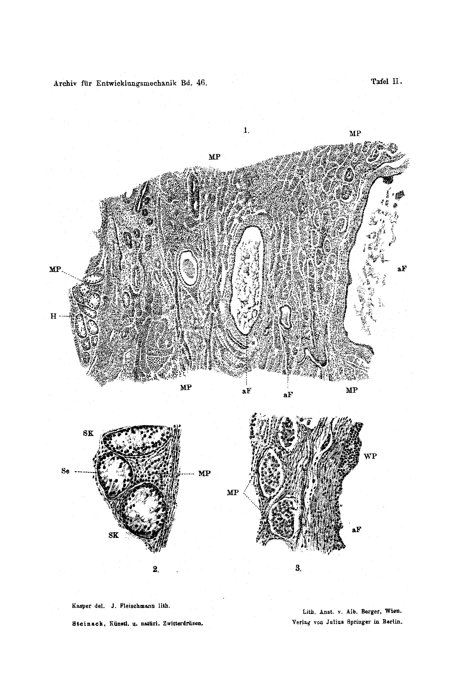

*(Biological Experimental Institute [Vivarium] of the Academy of Sciences in Vienna. Physiological Department. Director E. Steinach.)*

# Artificial and Natural Hermaphrodite Glands and Their Analogous Effects

### Three Communications

#### by

#### E. Steinach.

With Plate II.

*(Received on 18 April 1919.)*

*Archiv für Entwicklungsmechanik der Organismen*, vol. 46 (1920).

> **Full translation.** A complete English rendering of Steinach's study of artificial and natural hermaphrodite glands and their analogous effects on the secondary sex characters, with the figure legends.

*(Carried out with a grant from the Treitl Foundation.)*

## Table of Contents

| | Page |
|---|---|
| **First Communication: The antagonistic-sex-specific effect of the sex hormones before and after puberty** | 12 |
| Effect of the sex hormones in the development of the sex characters before puberty. Transplantations onto infantile early-castrates. | |
| Feminisation and Masculinisation. | |
| Effect of the sex hormones after puberty. Re-feminisation and re-masculinisation through transplantations onto full-grown or older late-castrates. | |
| Re-masculinisation of men of various ages after complete castration as a consequence of trauma or testicular disease. | |
| Masculinisation of abnormally disposed men. | |
| The antagonistic effect of the sex hormones is confirmed by injection experiments. | |
| **Second Communication: Artificial hermaphrodite glands in mammals and birds** | 19 |
| **Third Communication: Experimental and histological proofs for the causal connection between homosexuality and the hermaphrodite gland** | 23 |
| Genetic equivalence of the hermaphrodite phenomena. | |
| Periodic and constant homosexuality in experimental hermaphrodisation. | |
| Operative successes following exchange of the puberty glands in man. | |
| Homosexuality in goats. | |
| The hermaphrodite gland of the homosexual goat. | |

## First Communication.

## The antagonistic-sex-specific effect of the sex hormones before and after puberty.

As the "antagonism of the sex hormones" I have designated the fact that the secretions of the male and female puberty gland not only combat one another in their regions of origin, but moreover oppose one another far more sharply in their effects.

This struggle of the gonads had already struck me years ago¹), when I had undertaken my first experiments to ascertain the influence of the puberty glands on the somatic and psychic sex characters, and when, by way of the arbitrary feminisation²) of males and masculinisation³) of females, I had arrived at the establishment of the sex-specific function of the sex hormones.

The antagonism manifests itself, first of all, in the fact that the transformation of the sex character through the implantation of a heterologous gonad succeeds only after preceding complete castration. If the homologous gland remains intact in the individual, then the implanted gland is not even able to take root; it is not vascularised and soon falls victim to degeneration; all its tissues deteriorate, and the process of dissolution and resorption proceeds so thoroughly and rapidly that within a few weeks the implant has disappeared down to the last remnant.

The antagonism⁴) in the effect upon the sex characters comes into play even in the presence of a single gonad, and in every individual case, through sex-specificity. Sex-specificity means that the hormone of the male puberty gland brings to development, unfolding and full elaboration solely the rudiments of the male characters, the hormone of the female puberty gland solely the rudiments of the female characters; that, furthermore, together with this fostering influence upon the dependent homologous characters there goes an inhibiting influence upon the dependent heterologous characters, which prevents the growth of the latter or, in the case of already advanced elaboration, forces their regression. Both kinds of influence extend to the somatic as well as to the functional characters [body temperature (Lipschütz)⁵), erotisation, etc.]. To this sex-specificity of the hormones we owe nothing less than the so-called separation of the sexes; it is decisive in the arising of the sex characters. Were the

> ¹) Steinach, Sexual drive and genuinely secondary sex characters as a consequence of the inner-secretory function of the germ glands. (Three Communications.) Zentralbl. f. Physiol. Bd. 24. 1910.

> ²) Steinach, Arbitrary transformation of male mammals into animals with pronounced female sex characters and female psyche. Pflügers Arch. Bd. 144. 1912.

> ³) Steinach, Feminisation of males and masculinisation of females. Zentralbl. f. Physiol. Bd. 27. 1913.

> ⁴) Steinach, Puberty glands and hermaphrodite formation. Arch. f. Entw.-Mech. Bd. 42. 1916. S. 307.

> ⁵) A. Lipschütz, On the dependence of the body temperature on the puberty glands. Pflügers Arch. Bd. 148. 1917; further, the same author: The genetic system of the sex characters. Arch. f. Entw.-Mech. Bd. 44. 1918. S. 403.

fostering effect of the puberty glands not specifically-homologous, then in embryonic life, after the early differentiation of the germ-stock, development would proceed in both directions; the derivatives of the Wolffian as well as of the Müllerian duct would attain elaboration, and there would then, without exception, arise hermaphrodites.

The sex-specific-antagonistic effects of the puberty glands therefore appear in their consequences as something quite self-evident; but they are first elucidated, made evident and experimentally demonstrated through the results of arbitrary feminisation, masculinisation and hermaphrodisation.

The ovaries implanted into a newborn or wholly juvenile, castrated male become, through obliteration and dissolution of the follicles, proliferating female puberty glands; they give further development a new direction, they feminise the animal. Hitherto uninfluenced female characters take shape, the areolae and teats grow into fully mature organs, and there ensues mamma-hyperplasia and milk secretion. The brain is erotised in the female direction, the female sexual drive and excitability arise, female defence and bearing. The whole psychic behaviour becomes feminine and maternal; the animal suckles and tends the young; the blood temperature is, as in females, elevated. By contrast, characters already influenced in the male direction are inhibited in their further growth or wholly forced back, such as the seminal vesicles, prostate, corpora cavernosa penis. The penis transforms into a clitoris-like rudiment, and the long spine-organs of the penis serving for voluptuousness (guinea pig) do not attain elaboration at all. Outwardly the most noticeable are the inhibiting influences upon body growth, skeleton and hair. The feminised animals lag behind in growth, the skeleton becomes on the whole still smaller, finer-boned, the pelt still softer than in the normal female. The more delicate, daintier, more supple bodily forms of the female sex turn out to be a consequence and expression of the inhibiting function on the part of the female puberty gland.

The testes transplanted into a female early-castrate condense soon, through atrophy of the seminiferous tubules and proliferation of the interstitial tissue, into isolated male puberty glands and masculinise the animal. On juxtaposing the feminised male and the masculinised female, the antagonistic effect emerges especially sharply⁶). In the former, the re-

> ⁶) Steinach and Holzknecht, Increased effects of the inner secretion in hypertrophy of the puberty glands. Arch. f. Entw.-Mech. Bd. 42. 1916.

duction of the penis to the small clitoris-like [organ], in the second the unfolding of the clitoris into the large penis-like organ (Lipschütz)¹), further growth of the skeleton and of the musculature to a size and power that even surpasses that of the normal male. There fine, supple, here coarse, thick, shaggy hair; there the psychosexual properties of the female, here the pronounced voice, expression of drive and temperature of the male. Accordingly, feminisation and masculinisation present themselves as an artificial and belated imitation of the natural embryonic sex-formation; for both cases the essential event is of like kind and grounded in the interlocking of the specifically fostering — and inhibiting influences of the respectively active puberty-gland hormones.

Hitherto we have always pursued and taken into consideration the inner-secretory effects with respect to the sex characters in the process of development. That they continue to exist up to the limit of old age, we conclude from the experiences of castration or gonad-disease in the adult animal or human. But one can also furnish positive experimental proofs for the organ- and function-preserving significance of the puberty glands during the period of full maturity. In experiments not yet communicated (1912–15) I succeeded in carrying out, with success, transplantations on fully-grown animals in which I had performed the castration several months beforehand, and in which therefore individual sex characters were already in the process of atrophy. I must emphasise that the healing-in is somewhat more difficult, and on average also not so durable, as in infantile animals.

Female guinea pigs that had just littered were castrated. Already after a few days the milk secretion, which under normal circumstances lasts 4–5 weeks, became weak and abnormal. After 8–10 days the secretion of milk ceased; only a watery fluid could still be pressed out. The bulgings of the mammae disappeared; the teats became small and atrophic. 6 weeks after the castration, in several of the experimental animals one piece each of a mamma was excised. The microscopic examination yielded general degeneration, considerable reduction of the gland-tubules, diminution of the acini — already widely separated from one another, displaced by connective tissue, in part

> ¹) A. Lipschütz, Development of a penis-like organ in the masculinised female. Anzeig. d. Akad. d. Wissensch. in Wien 1916 and Arch. f. Entw.-Mech. Bd. 44. 1918.

obturated — in short, all the symptoms of advanced regression. Despite the various severe interventions the animals remained healthy and fond of feeding, but never displayed sexual inclination; they vigorously fended off the pursuing male and showed no noticeable traces of oestrus. About 16 days after subcutaneous implantation of two ovaries of a primipara, the teats began to extend again, to become thicker and swelling; the mammae again bulged out strongly, and soon thereafter the milk secretion set in, which persisted undiminished for two weeks. The animals came into heat and let themselves be mounted. The autopsy yielded a powerfully developed uterus of a size corresponding roughly to the initial stage of pregnancy in the normal female. A comparison experiment taught that, at the time of the ovary-implantation, the castration-atrophy of the uterus had already far advanced. The same was thus not merely remedied, but new growth had also set in once more. The fully mature, indeed maternal state of the sex characters had, despite the long-lasting loss of the germ gland, been newly evoked through the implantation.

In 1¼-year-old, that is likewise full-grown, male rats, 3 months after the castration the seminal vesicles, otherwise turgidly filled with secretion, were found empty, flaccid, diminished; the prostate lobes pale and strongly shrunken. The potency, after careful tests with females in heat, proved partly wholly vanished, partly much weakened. Through implantation of juvenile testes onto the abdominal muscles I was able to reawaken the potency to its accustomed vehemence, and, as a consequence of renewed growth, to restore the form, size, appearance as well as the function of the already atrophic secondary characters, in particular of the prostate and seminal vesicles. In agreement with this renewal of the entire bodily and psychic normal state in the late-castrate stand masculinisation experiments on half-year-old or somewhat older females, which I undertook for this reason: that the testis-implantation performed on them in the infantile state had remained ineffective as a consequence of resorption of the implant. The late-masculinisation had pronounced success both with respect to the growth of the skeleton (head) and quite especially with respect to erotisation (voice become male, libido, expression of drive, jealousy). It was, in particular, these results on the full-grown animal that gave occasion to bring the transplantation procedure here tested into application also in man, in cases of loss, disease or weakening of the puberty glands.

Lichtenstern¹) in 1915 operated on a war-casualty, in whom, as a consequence of shattering by an explosive shell, both testes had to be removed, and in whom, in the course of a few months, the most striking phenomena of total castration had set in — such as strong fat deposition, considerable diminution of the body hair, namely of the moustache and at the linea alba, complete vanishing of libido and potency, general apathy and debilitation. After implantation of the two halves of a cryptorchid testis — thus one rich in puberty-gland substance — the deficiency-effects of that traumatic castration were not merely brought to a standstill, but the normal bodily as well as psychic sex characters were gradually restored (the fat pads have been lost, the musculature, especially that of the arms, has visibly increased; moustache, chest, linea-alba and thigh hairs are newly and strongly grown; the entire psychic behaviour has turned to the good; sexual desire, erection- and copulation-capacity have newly arisen. The man has married and enjoys this bodily and functional revival in undiminished duration already for 3¾ years. Lichtenstern has since had to record two further cases of such re-masculinisations²) through implantation of cryptorchid testes. The one case concerns a young person who, like the one above, suffered a total traumatic castration. The second concerns a 32-year-old, from whom, ten years previously, the testes had to be removed on account of bilateral tuberculosis. Despite this many-years' castrate-condition, the implantation of the foreign puberty gland was extraordinarily effective both as regards hair and muscle-development and as regards potency and psychic constitution, and thus fully confirmed the success of the experiments described above on full-grown older animals. Lichtenstern has also recently succeeded in masculinising an infantile [patient] through testis-implantation; the deeper voice and the erection-capacity developed.

Following on from these results we then brought the principle of the antagonistic effect into application in its full extent, namely for the operative treatment of homosexuality³). Through castration the hermaphroditic, or rather the

> ¹) R. Lichtenstern, Successfully carried-out testis-transplantation in man. Münchn. med. Wochenschrift. Nr. 19. 1916.

> ²) Wiener klin. Wochenschr. Nr. 45 (Minutes of the Society of Physicians in Vienna). 1918.

> ³) Steinach and Lichtenstern, Re-tuning of homosexuality through exchange of the puberty glands. Münchn. med. Wochenschr. Nr. 6. S. 145. 1918.

puberty glands causing the hermaphrodite formation, of the individual concerned were removed, and demonstrably unisexually-acting puberty-gland substance was implanted. The result was, on the one hand, displacement or inhibition of the abnormal, homosexual erotisation and of the related expression of drive, further regression of the female sex characters present, of the well-developed arched bosom and of the projection of the hips, both of which gradually disappeared after the castration; on the other hand, the male hormone produced pronounced heterosexual erotisation and thereby normally elicitable potency. Finally, through the fostering influence, there came about the elaboration of hitherto lacking male sex characters, namely the stronger growth of the musculature and the male body hair. Since then Lichtenstern has operated on further cases of homosexuality under the same point of view and procedure, and has observed concordant effects. The biological principle has accordingly gained quite considerable significance also for human therapy.

Such lasting improvements and renewals of nature through the formative and preserving function of the puberty glands could hardly be achieved by any other path than through the implantation of suitable gonads. From the implant, even if ultimately only the cell-proliferations remain behind, hormone seeps unceasingly into the bloodstream as from a normal healthy gland and bathes the influenceable peripheral and central apparatuses. Injection or internal administration of extracts or gland-preparations is capable of eliciting similar reactions; but the sustained efficacy is denied to them. This is the weakness of organ-therapy. As regards the puberty gland it is already beyond question that extracts from the same evoke both the fostering and the inhibiting effects. E. Herrmann undertook very graphic, as yet too little heeded injection experiments⁶) with a lipoid isolated by him from the corpus luteum, and produced the same growth-phenomena and configurations of the female sex characters in infantile animals as have been described by me after ovary-implantation or after ovary-irradiation; as a consequence of the concentration and with suitable repetition of the injections, the growth-processes here proceed extraordinarily rapidly. The same [author] has also thoroughly tested the inhibiting function of this stimulus-substance, leading to degeneration of the male germ glands and secondary characters, and has thereby, quite unintentionally, furnished a new confirmation of the antagonistic-sex-specific effect of the puberty glands.

> ⁶) E. Herrmann, On an effective substance in the ovary and in the placenta. Monatsschr. f. Geburtsh. u. Gynäk. Bd. 41. 1915. Herrmann and Stein, Wiener klin. Wochenschr. Nr. 6. 1916.

sex-specific effect of the puberty glands.

Recently Lipschütz,¹ after a thorough exposition of the whole question, has compiled the overall result of the castrations and transplantations in mammals and birds into a genetic system of the sex characters, and has thereby sketched a most impressive picture of this formative mechanism so decisive for individual development.

## II. Communication.
## Artificial Hermaphrodite Glands in Mammals and Birds.

In my work "Puberty Glands and Hermaphrodite Formation" (1916) I demonstrated² that one can attenuate the antagonism of the puberty glands up to a certain limit if gonads of both sexes are transplanted simultaneously into an organism previously "neutralised" by castration, and there placed under identical conditions of life and growth. The attenuation consists in the fact that the gonads take root and maintain themselves for a fairly long time at their new location as proliferating puberty glands, and that from here they send out promoting impulses for the characters homologous to them, while the inhibiting impulses for the characters heterologous to them fail to appear. As a consequence of this limitation of the antagonism, individuals arise with male and female sex characters — that is to say, hermaphrodites.

The experiments on feminisation and masculinisation have, as is well known, been verified and confirmed at widely separated research stations and on the most diverse animals; by Athias on guinea-pigs, by Brandes on stags, by Goodale in especially vivid experiments on hens and ducks. Science is greatly indebted to these investigators³ for their meritorious work and for the further illumination of this fundamental question of sexual biology. Gratifyingly, "experimental hermaphrodite formation" too has in most recent times found original treatment and high-grade corroboration. Already Pezard⁴ in his extensive investigations on the sex characters of birds carried out, among others, the following experiment: cockerels were castrated at the age of 4 months and

> ¹ A. Lipschütz, *Die Gestaltung der Geschlechtsmerkmale durch die Pubertätsdrüsen* [The formation of the sex characters by the puberty glands]. Arch. f. Entw.-Mech. Vol. 44. 1918.

> ² Arch. f. Entw.-Mech. Vol. 42. 1916.

> ³ Citations in A. Lipschütz, Arch. f. Entw.-Mech. Vol. 44, pp. 396–410. 1918.

> ⁴ Pezard, *Le conditionnement physiologique de charactères second. chez les oiseaux*. Bullet. Biolog. 1918.

the same testis fragments sunk into the abdominal cavity. At the autopsy there were found, besides the implanted testes, also ovarian remnants which had been left behind at the castration. As a consequence of the implantation, growth of the comb was observed as in the normal cock, which points to the action of the male puberty gland. By contrast, the plumage had remained female and the spurs had not grown, which is explained by the influence of the female puberty-gland cells left behind. Thus there had arisen — quite unexpectedly — experimental hermaphrodites. It is merely the expression of historical justice when I add that such chance hermaphrodites had already lain before Foges¹ in the year 1902. On the occasion of his fine studies on the influence of the inner secretion of the testis on the cock character, Foges had transplanted cock testes onto four cockerels. In two of them, combs and wattles developed as in normal cockerels, whereas with regard to plumage and spur rudiment the hen type remained unchanged. Since the testis implants did not hold up in the hen's body, Foges regarded the operation as a failure and drew no conclusions from the experiment. According to our present knowledge of the affiliation of the cutaneous head ornament to the sex marks dependent on the puberty gland, and further according to the general experiences regarding the difficulty of complete removal of the ovary in the hen, we may well assume that in Foges' experiments too it was a matter of "experimental hermaphrodisation": the persistence of the hen plumage and of the spurlessness would here be interpreted as an inhibitory effect on the part of the ovary left behind, and the growth of comb and wattles as a promoting effect on the part of the transplanted testis.

An outstanding and successful treatment of the problem has in most recent times been provided by Knud Sand.² He was able, first, on the same experimental material (rats and guinea-pigs) as I, to confirm and reproduce the arbitrary feminisation of males and masculinisation of females; the masculinisation even up to the transformation of the clitoris into a "Peniculus" protrusible upon sexual excitation, such as was observed and exactly investigated by Lipschütz³ on one of my experimental animals. Thereafter Sand — following a similar train of thought, but in-

> ¹ Foges, Pflügers Arch. Vol. 93. 1902.

> ² Knud Sand, *Experimenteller Hermaphroditismus*. Pflügers Arch. Vol. 173, Part 1/3. 1919; in full in book form: *Experimentelle Studier over Kønskaraktererne Hos Pattedyr*. Kjøbenhavn, Steen Hasselbalchs Forlag.

> ³ Anzeig. d. Akad. d. Wissensch. in Wien 1916. Arch. f. Entw.-Mech. Vol. 44. 1918.

dependent of my experiments — proceeded to the production of artificial hermaphrodites, and indeed likewise by simultaneous implantation of gonads differing in sex into infantile castrated males.

Sand has enriched and improved the method for the creation of artificial ovotestes by succeeding in bringing the ovary to healing-in and fusion within the testis (intratesticular ovary transplantation). From this it follows that the antagonism of the gonads can, through early introduction of uniform growth conditions, be attenuated still further than has been done by my experiments, and that this reciprocal influencing of the puberty glands does not at all attain that sharp and unalterably strict expression which their antagonism attains in regard to the effect upon the individual sex characters.

Sand observed in his hermaphrodites a permanently bisexual erotisation, in contrast to my findings, which yielded a periodic alternation of the erotisation going hand in hand with the respective proliferation of the female puberty gland. On this I have the following to remark: I too found, among the artificially produced hermaphrodites, specimens which, on simultaneous testing with several objects, betrayed expression of drive in both directions in the manner of pursuing, sniffing and mounting. But, as against this result, I did not attribute sufficient evidential force to the tests carried out on various days singly with a rutting female or a castrate or a normal male, so as to assume an unobjectionable permanent bisexuality in these animals; and indeed, firstly, because even in these animals the erotisation in the homologous or heterologous direction was periodically pronouncedly more strongly emphasised, and secondly, because long years of experience taught me that even normal males, when once put into stormy excitement and when several objects are gathered in their compartment, proceed fairly indiscriminately in the satisfaction of their sexual fury.

The decisive thing was almost always the periodic appearance of the one or the other erotisation. Nevertheless, after the observations of Sand, as well as after isolated cases of my operations, I should not wish to doubt that in experimental hermaphrodite formation too states of permanent bisexuality can be produced.

I grasp this opportunity in order once more and once again emphatic-

> ¹ Sand, to whom the healing-in of the heterologous gonad on non-castrated animals likewise never succeeded, surmises that in this counter-action it might be a matter less of an actual antagonism than of a kind of "immunity" of the normal organism toward the heterologous puberty gland.

ally to point to the great variability¹ of the phenomena in "experimental hermaphrodisation." The same extends not only to the formation of the individual bodily sex marks and to the fine differences of the erotisation, but also to the relationship between the degree of the somatic and the psychic phenomena. From entering into this region careful collaboration and continuation of these experiments could draw a rich harvest. If I compare the demonstrative model examples of artificial hermaphrodite formation — in which a deflection equal in both somatic and psychic respect toward both sexes has taken place — with the less successful or, so to speak, miscarried cases (this comparison is just as instructive as it is important), and alongside this pursue the fate of the implants, that is, take into consideration the microscopic findings, then two principal causes for the arising of the varieties emerge:

In the first line lies the differing quantity of the respectively proliferating puberty-gland substance, or, since under ordinary circumstances the hormone quantity also fluctuates with the quantity of the substance — the differing activity of the puberty glands. With the preponderance of the one substance, the original double action of the puberty gland comes again to breakthrough; it does not merely foster the homologous characters, but again also inhibits the heterologous characters.

> Example. With the preponderance of the female implant, penis growth ceases, while teats and mammae thrive to full ripeness. Only after reinforcement of the male puberty gland by means of renewed testis implantation is this inhibition overcome, and the corpora cavernosa penis also unfold.

In the second line lies the respective disposition of the individual sex characters toward growth.

> Example. The mighty growth of the male skeleton, namely of the head-skeleton, sets in, in the guinea-pig, in the fourth month, at which time the remaining male marks (penis, penis-spines, seminal vesicles, prostate etc.) are already formed; the further completion of the skeleton growth occurs only in the following months. If in this period the male implant recedes, then the skeleton growth comes under the inhibiting influence of the proliferating female implant, and there arises a milk-secreting hermaphrodite in which, indeed, the male sex organs are developed from before, whereas skeleton and head-form exhibit female direction.

> ¹ Arch. f. Entw.-Mech. Vol. 42. p. 325. 1916.

These and similar insights may quite well be transferred to "natural hermaphrodite formation," where, through incomplete or abnormal differentiation of the germ-stock, sex-differing puberty glands appear on the scene and from the outset struggle in both directions over the formation of the individual. According as the special growth-tendency of the individual rudiments of the sex characters during the embryonal and pubertal development temporally coincides with the higher activity of the one or the other puberty-gland substance, there arise male and female characters of the most diverse gradation. The riddle of the infinite manifoldness of the hermaphrodite formations is likely to have found its solution through such insights.

## III. Communication.
## Experimental and Histological Proofs for the Causal Connection between Homosexuality and Hermaphrodite Gland.
*(Plate II.)*

From the results of my experimental investigations — according to which it is possible, through introduction of sex-differing puberty-gland cells into one and the same individual, to produce a hermaphrodite formation of such a kind that somatic as well as psychic sex marks of both sexes unfold — it could also be deduced that all the manifold phenomena of hermaphroditism in animal and man are genetically equivalent and traceable to the arising of a hermaphrodite puberty gland.

Since in these researches the homosexual inclination and expression presented itself as a partial phenomenon of the psychic hermaphroditism, the way of objective explanation was now opened up also for the hitherto dark domain of human homosexuality.

The astonishingly great mass of homosexual human beings can, according to the clinical course of their condition, be distinguished into two principal groups. The first group comprises those individuals in whom, at their pubertal period, the normal heterosexual mood indeed awakens, but does not hold firm, instead turning over into the homosexual mood. This change of mood is felt like a pathological attack, lasts a shorter or longer time, and recurs with irresistible force at intervals now regular, now irregular. These cases of "periodic homosexuality," as they are described by Krafft-Ebing, Moll, Hirschfeld, Bloch, most recently by Markuse and others, have found their explanation in the above experiments.

To the second, allegedly predominant group belongs the great number of cases in which the homosexual drive, be it already before maturity, be it at puberty time or after it, breaks through, persists from the moment of its arising onward, and without further change of mood governs the sexual life of the individual. This "constant homosexuality" too I have brought into connection with the hermaphroditism of the puberty glands and made comprehensible: "Within the hermaphrodite puberty gland formed by incomplete differentiation — let us take the case of a male individual with apparently normal testicles — the male puberty-gland cells, preponderant in mass, inhibit the effectiveness of the interspersed female puberty-gland cells, and there first develops the thoroughly male sex character with all its bodily marks. If now, sooner or later, from any cause the male cells decline in their vitality and cease their internal-secretory function, then the female puberty-gland cells present become 'activated' through the slackening of the inhibition, and begin to proliferate. Just as thereby one or another female somatic sex character can be called forth and a mamma, say, arises, so the influence can extend also to the central nervous system or also to this alone, and now the urnish inclination steps into appearance with all its consequences and expressions."

Apart from the developmental-mechanical interest, it seemed to me of importance for the medical, psychiatric and sociological conception of homosexuality to furnish proofs for the correctness of this explanation, already utilised in manifold ways by clinical pathology.

1. Already in my first treatise on this subject I drew attention to the fact that the artificial hermaphrodite formation on the average shows differences in degree and expression, namely in the respect that the phenomenon expresses itself one time more sharply in the unfolding of the bodily, the other time in that of the psychic sex marks. One can therefore from the outset, despite equality of the animal material and despite all uniformity of the operative conditions, never expect a quite congruent result. The sexual behaviour of the hermaphrodites I had hitherto followed for many months on such specimens in which the two sex-differing implants — judging first after inspection and palpation, later after the unfolding of the bodily marks — could be assumed to take an approximately concordant developmental course, and in them I had found that more or less periodically appearing change in the erotisation.

After continuation of these experimental series on infantile guinea-pig males I have this time carried out new lasting observations, and indeed also in the so-to-speak miscarried cases, in which the one implant, despite the neutralisation of the carrier and despite the same conditions, gradually succumbed to the antagonistic influences of the other, stronger one. Thus I obtained, among others, animals too in which the female puberty gland healed in firmly and, with arching-out of the skin, grew up distinctly in full form, while the male gland, after it had called forth the externally visible male sex marks such as the corpora cavernosa and the spine-organs of the penis, gradually disappeared. In these animals the expressions of the sexual drive appeared belatedly, but they were of female nature from the outset. Never did a trace of normal-male sexual desire make itself felt — even under the sharpest stimuli, namely in the presence of strongly rutting females. There was shown, then, a permanently homosexual behaviour in male-formed animals. The typical cases of "constant homosexuality" of man are here experimentally reproduced, and these reproductions have arisen through the functional slackening or elimination of the male share in the hermaphroditically laid-out system of the puberty gland.

2. The next proof arose from the practical application of these experimental results to the human being, as it was described above (pp. 16/18).

The reversal in the erotisation extends, after the operation, not only to the sexual region, but also to the whole bearing and conduct, which decidedly gains male expression. The possible objection of suggestive influencing is refuted by the bodily-shaping effects of the implanted male puberty gland. Through the castration the female elements of the hermaphrodite gonad were also removed, and in consequence the female marks present, such as bosom and hip-projection, were brought to vanishing. Through the implantation of the foreign testis, lacking male characters, such as hair-growth of the chest and of the abdomen, growth of the arm-musculature, have newly appeared; in short — as in experimental masculinisation — the fundamental phenomena of re-masculinisation have come to breakthrough through fostering of the male psychic as well as bodily sex marks.

The present cases compel one to the assumption that the homosexuality of these men is connected with the hermaphroditism of their puberty gland and comes about thereby, that the male elements of the same forfeit the internal-secretory force already at puberty time, while the female elements are "activated" and the nervous apparatuses — reacting extremely finely to the influx of the sexual hormones — are erotised, as in the corresponding animal experiment, in the female direction.

## 3.

To close the chain of evidence, the **natural experiment** was desirable, that is, the discovery of the **natural hermaphrodite gland** in a homosexually predisposed individual. Such an opportunity was offered by the examination of goats, in which hermaphroditism is no rarity. Within a single year, two young — and indeed female — animals came under consideration. The one was a hermaphrodite already recognizable externally. The clitoris anlage was strikingly enlarged and reshaped into a penis-like organ, which recalled the corresponding configuration in the masculinized female guinea-pig. At 6 months this hermaphrodite surpassed a same-aged normal female by a considerable margin with respect to the size and massiveness of the entire skeleton. Female drive was absent; the male drive expressed itself in mounting leaps [Bocksprüngen].

The second goat was a case of pure, constant **homosexuality** and therefore seemed very suitable for a thorough examination. In the 6th month the following findings emerged: vagina, clitoris anlage, teats, mammary bulging exactly in agreement with the same-aged comparison animal stemming from the same buck, that is, exhibiting the normal, age-appropriate virginal condition. Likewise no difference was discernible with respect to the size of the skeleton, the length and strength of the limbs, the breadth of the head. At the time when the comparison animal came into heat and "bucked," the goat gave not a trace of female signs of estrus, fended off vigorously, and went at the buck. By contrast, a pronouncedly male sexual drive was developed. She made proper mounting leaps, sniffed at the other goats of the stall, mounted one after another and in doing so made coitus-like movements. In the next three months nothing changed in the bodily characters; they remained at the virginal stage; only the head became broader and more massive than in the comparison animal. Of bleating after the buck nothing was ever to be heard; nor was any indication of other symptoms of female erotisation to be ascertained despite repeated attempts; on the contrary, the male libido intensified to an insatiable passion; she mounted the inmates incessantly, so that she always had to be kept tied up. It was, expressed clinically, a case of severe homosexuality of the female individual. At the age of about 10 months she was killed. The external normal findings on the genital characters corresponded to the internal; uterus and tubes were of virginal form and size, the ovaries sat in their normal place.

The microscopic examination has uncovered the hermaphroditic constitution of both ovaries (Plate II). Essentially similar pictures present themselves in each ovary. In the one zone there lies in the ovarian stroma a piece of testicular substance (Fig. 1 H) with all the constituents of the male gland, excepting the seminal cells [Samenzellen]; it looks like a piece of a cryptorchid or transplanted testis — atrophic seminiferous tubules [Samenkanälchen] (Fig. 2 SK) with thickened wall and with partly well-preserved Sertoli cells (Fig. 2 Se); in the interstitial tissue (Fig. 2 MP) proliferations of beautifully developed Leydig cells with distinct boundaries and healthy nuclei. Such proliferations of Leydig cells are also seen in many places singly, without neighborhood of seminiferous tubules, in the ovarian stroma, or in the form of islands or mighty heaps (Figs. 1 and 3 MP), which, standing around the follicles in a dense row, here and there press them in. The numerous follicles are of the most varied size, but all atresizing (Fig. 1 aF). The covering of theca cells is, to be sure, still multilayered in many places (Fig. 3 WP), but the cells are throughout smaller than in the normal and freshly obliterated follicle, with small nuclei, retarded in growth or already involuted.

The second picture differs from the first only in the circumstance that the obliterated seminiferous tubules are lacking. The male puberty gland has isolated itself still more strictly and has assumed the form of whole clumps, islands, or strands of proliferated cells, which surround and constrict the atretic follicles. The elements of these masses correspond exactly to the Leydig cells of the testicular interstitial tissue.

What is therefore common and peculiar to all the pictures of this hermaphrodite gland is the **destruction of the generative tissues** and the great superiority — both quantitative and qualitative — of the male over the female puberty-gland cells.

If one takes into consideration on the one hand the microscopic findings, and on the other the state of the sex-signs and the psychosexual behavior, the history of this hermaphroditic sexual development can be derived without further ado: before puberty the female puberty gland within the hermaphrodite gland was so strongly developed and had such a preponderance over the male puberty gland that the female characters such as vagina, clitoris, uterus, mamma could unfold at the proper time and in normal form. The skeletal growth was correspondingly inhibited and at first took on the pronouncedly female form. Little by little the elements of the female gland deteriorated and diminished and ceased their internal-secretory activity. The male puberty gland was thereby "activated," began to proliferate more strongly, and at the time of puberty asserted its male-erotising effect upon the brain and in part also a promoting influence upon the skeletal growth, which indeed even under normal conditions only reaches completion after maturity. Thus arose the violent, persistently homosexual drive, and thus the mighty head developed.

With the new experiments described above, and in particular with the discovery of the hermaphroditic puberty gland in a pronounced case of contrary sexual feeling [konträrer Geschlechtsempfindung], the question of the **biological basis of homosexuality** may be regarded as solved.

It remains, in the medical, forensic, and social interest, to extend the investigations to the germ glands [Keimdrüsen] of homosexual human beings and to inquire whether here too the trace of an antagonistic effect might be ascertained, perhaps even hermaphroditic puberty-gland cells be characterized. The result of this work shall be briefly reported in the next communication.

## Explanation of the Plate.

### Plate II.

**Fig. 1.** Section through an ovotestis of the homosexual goat. Hematoxylin-eosin staining. Zeiss Oc. 0, Obj. 3.

*H:* Testicular tissue of the constitution of the cryptorchid testis — with atrophic seminiferous tubules and well-preserved male puberty-gland cells in the interstitial tissue (*MP*). In other sections the share of testicular tissue in the ovotestis appears much larger. This spot was chosen only so as not to draw the figure unnecessarily into breadth.

*aF:* Atresizing and already wholly atretic follicles.

*MP:* Proliferating male puberty-gland cells, which, united into masses, clumps, or islands, are arranged around the follicles and constrict them in part (to be perceived especially in the small atretic follicles).

**Fig. 2.** Spot of the testicular tissue from Fig. 1 enlarged. Zeiss Oc. 0, Obj. 5.

*SK:* Completely atrophied seminiferous tubules. Only the Sertoli cells (*Se*) preserved.

*MP:* Male puberty-gland cells of various growth stages in the interstitial tissue.

**Fig. 3.** Spot of the ovarian stroma from Fig. 1 enlarged. Zeiss Oc. 0, Obj. 5.

*aF:* Atresizing follicle.

*WP:* Female puberty-gland cells (theca-lutein cells) in the process of involution.

*MP:* Massive proliferations of male puberty-gland cells, which, united into clumps or islands, surround the follicle. The elements of these proliferations are fresh, succulent, and also agree in size and structure with the Leydig cells of the testicular interstitial tissue (*MP* Fig. 2).

*(Plate II — figure not reproduced)*

**Plate II caption block:** Archiv für Entwicklungsmechanik Bd. 46. — Plate II.

Figure labels on the plate: **Fig. 1.** (MP, MP, MP, H, aF, MP, aF, aF, MP); **Fig. 2.** (SK, Se, MP, SK); **Fig. 3.** (WP, MP, aF).

Kupfer del. — J. Fleischmann lith. — Steinach, Künstl. u. natürl. Zwitterdrüsen. — Lith. Anst. v. Alb. Berger, Wien. — Verlag von Julius Springer in Berlin.

## Figures

**Plate II.**

---

*Translator's note.* Part of Steinach's experimental endocrinology of sex (cf. his 1916 puberty-glands paper).
