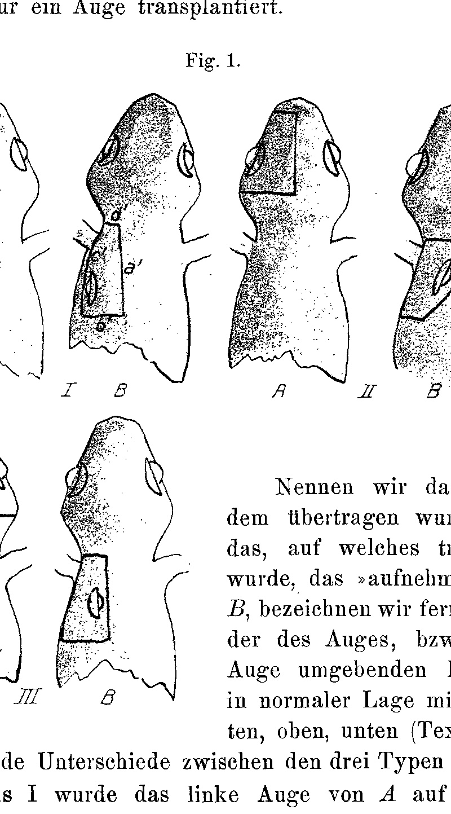
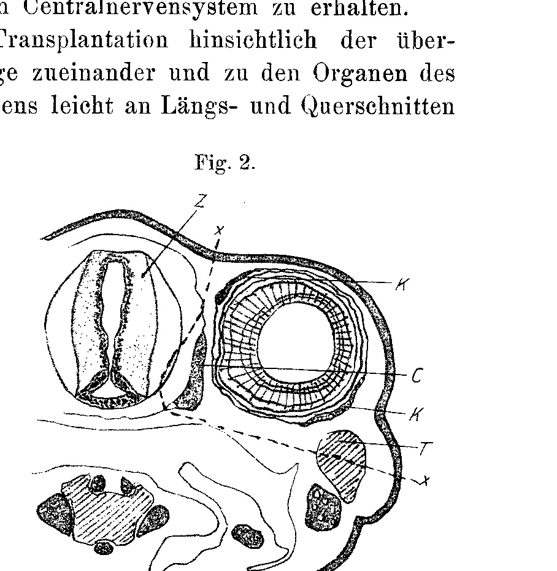
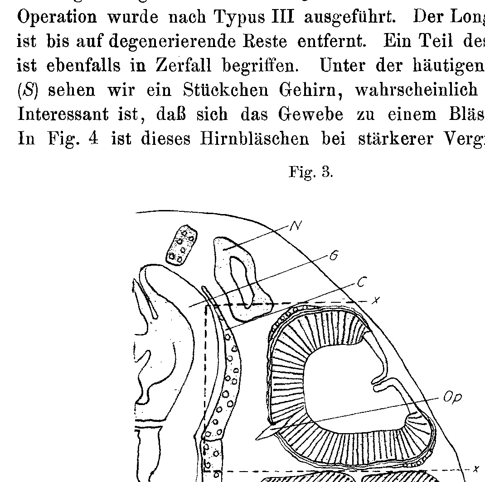
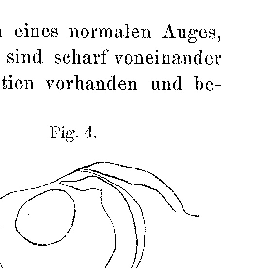

## Die Transplantation des Amphibienauges
### The Transplantation of the Amphibian Eye

By

Dr. Eduard Uhlenhuth.

*(From the Biologische Versuchsanstalt in Vienna.)*

With 4 Figures in the text and Plates XXXI and XXXII.

Received on 23 September 1911.

*Archiv für Entwicklungsmechanik der Organismen*, vol. 33 (1912).

> **Full translation.** A complete English rendering of Uhlenhuth's study of the transplantation of the amphibian eye, with the figure legends.

### Introduction.

Most authors who have worked on transplantation incline more to the view that the implanted organ either keeps itself free from the influence of its new substrate (Unterlage), but is indeed dependent in its further development on other (functional) stimuli. The majority of the experiments teaches that, upon the transplanting of a part, the relevant whole plays the role of a nursing mother and is able, through spatial relations and the quantity of the supply of material, to alter directly the size of the inserted part. For the latter, however, only few examples are at hand, and these are not to be interpreted with certainty as such. The transmitted organ maintains itself as an independent part, which acts according to functional functions (blood vessels, bones). Of the possibility that a transplanted organ with active function — as, e.g., the muscles — would be able to exercise it after the transplantation, we have no examples.

Accordingly, Roux set up the proposition in 1895: organs which carry a "functional stimulus field" can only be brought to incorporation and be preserved if one provides not merely for the rapid establishment of nourishment, but also for rapid connection to the functional stimuli. Of this, for non-...[host?] only the first [stimulus] has hitherto been recognized in full extent as legally existing. Whether, however, the implant frees itself fully and completely, or whether — to put it more sharply — it only becomes an organ of higher order, with all kinds of constitutional relations, alone or together with the passive functions (host: blood vessels, bones), all this remains to be examined and is of the greatest significance.

These investigations were undertaken in order to clarify, on the example of the transplanted amphibian eye, in how far the transmitted parts win new substrate, win functional relations, and what general significance attaches to this — a question whose answer is of fundamental significance for the doctrine of correlations.

The eye was therefore investigated on account of its arbitrary transmissibility. For this purpose the eye is taken from one animal and brought into the neck region of another. Here a histological picture is obtained, which we shall consider, and which is afforded us by a longitudinal section carried through a two-day-old transplant (Fig. 1).

The work is divided into the following sections:

1) Method.
2) External picture of the transplant and histology.
3) Function.
4) Influence of the color of the transplant by the host.

5) Influence on the metamorphosis of the transplant by the host.
6) Influence on growth.
7) Lens extirpation.

In a domain which encompasses problems lying so far apart, much still remains to be done, including the production of the olfactorius–opticus connection and of the acusticus–opticus connection, which I plan for the nearest future.

The present first communication concerns itself only with the first two points.

### Method.

As I gather from the inquiries directed to me from various sides, the kind and manner in which I carried out the transplantations finds a more general interest. For this reason I have treated this section in greater detail than perhaps otherwise would have corresponded to the remaining parts of the work.

As to the material I used, it should be remarked that in the first line *Salamandra maculosa* [modern *S. salamandra*] was used for the operation. Alongside it, a few experiments with *Triton alpestris* [modern *Ichthyosaura alpestris*] were carried out. The latter form proved to be less resistant than the salamander, which, however, may also have other grounds, as will become apparent later, and need not, as one might at first be inclined to assume, lie in the form itself being unsuitable for my experiments.

Almost all transplantations were carried out on larvae, but some also on freshly developed animals. The larvae qualify best, and the younger they are, the better the experiments succeed; with increasing age the mortality figure also grows, and the purity of the healing is mostly not the desired one once the animals are developed. These are indeed well-known matters, and these statements rest not on numerical records, but only on general estimates.

The few operations undertaken on sexually mature animals too I carried out only for the completion of this chapter; since they all failed, despite my letting the same precautionary measures prevail as with the larvae, it follows in any case that adult individuals are less suited for this transplantation than young ones. Yet I do not doubt that, with continued experiments and application of the utmost care, positive results would be achievable.

With respect to the place from which the eye is taken, and to which it is transplanted, the following is to be said. In the experiments considered in this communication, one proceeded according to three types. All three have this in common, that transplantation was always carried out from one animal onto another, never onto the same one, and that as the place of transplantation the region immediately behind the ear, that is, roughly the neck region, was chosen. Furthermore, only one eye was ever transplanted.

**Fig. 1.** *(figure not reproduced)*

[Caption text accompanying Fig. 1, right of the figure:] Let us call the animal from which transmission took place *A*, and the one onto which transplantation took place, the "receiving" animal, *B*; let us further designate the margins of the eye, that is, of the undamaged skin piece, in its normal position as front, rear, top, bottom (Textfig. 1, *I A*),

so that the following three distinctions between the three types result (Textfig. 1):

In Type I the left eye of *A* was set onto the left side of *B*, or the right onto the right side, and indeed in such a way that top, bottom, front and rear were not interchanged.

In Type II the left (right) eye of *A* was transmitted onto the left (right) side of *B*, where the eye was set in so that the top came to the bottom (Textfig. 1, *II*); front and rear remained unchanged, top and bottom were interchanged.

In Type III the right (left) eye of *A* was transplanted onto the left (right)

side of *B*; rear and front remained unchanged, top and bottom were interchanged.

These three kinds of transplantation were carried out not only on normal, seeing animals, but also on such as I had blinded 8–14 days beforehand. They showed themselves to be just as resistant as normal animals. To be sure, nourishment is made more difficult by the blinding; some of the blind specimens have had to be artificially fed up to today, by introducing the food with forceps into the oesophagus. Once this has happened, the swallowing movements begin. They never snap spontaneously at the food, not even then when one brings it close up to touching the snout. Apart from these three animals, all the other blinded ones begin to snap at once when they perceive the noise of the glass cover with which the containers are closed. The three artificially fed ones are today, after the lapse of a year, scarcely of the size of a normal larva that stands near, just before the transformation. With regard to the preservation of the transplant, there is no difference between seeing and blind animals.

I continue in the description of the method. It was not the eyeball alone that was cut out, but together with it the skin lying in its surroundings, along with various muscles and cartilages. The form of the removed skin piece was about a rectangular one, as can be seen from Textfig. 1. To the size of the transplanted piece corresponded the skin piece removed in the neck region. The delimitation of the transplant results from the method of cutting, which again has convenience and the greatest possible speed as its cause. One lays the animal *A*, wrapped in moist filter paper, on a glass plate. With a small scissors one makes, by a quick thrust, a cut immediately in front of the ear (Textfig. 1 *b*). This cut should go up to the middle of the skull roof above, and up to the height of the quadratum below. In doing so, cartilages should if possible not be cut into, if one wishes to transplant the skin only with the underlying muscle layer without cartilage. The second cut one carries in the direction of the long axis in the median line (*a*), the third perpendicular to it immediately behind the nose (*d*), and the fourth parallel with the upper jaw and above it (*c*). Thus one obtains an approximately rectangular piece.

There now follows the detachment of the skin from rear and top [begun]. One grasps it with the forceps and, by drawing it forward and lifting it, cuts through the musculature with a very small, bent scissors until one comes to the eye. Since this is fastened to the skin by its outer side, it is, by lifting the skin, strongly lifted out of the orbit; and it succeeds, despite the violent movements of the animal, which now begin, easily to sever the eye-muscles, vessels and opticus, if one works only with as few but for that all the more rapid and ample cuts. Once the eyeball is levered out of the orbit, it is then easy work to detach the whole piece.

Since the peeling-off from the *taenia tecti medialis*, or rather from the frontoparietale in older stages, in view of the great speed which the operation requires, does not easily succeed, as soon as one has cut through the named parts along with it, they mostly remain on the skin and are then transplanted along too. The same holds of the brain, of which, on account of its softness, thin layers are as a rule removed together with the cartilaginous and membranous cranial roof (frontal fontanelle). To be sure, these parts heal in just as well as the skin, and so on this point there would be no difficulties at all to overcome. Possible disadvantages will be cited later.

The bed [Grube] destined for the reception of the transplant was produced in the following manner. One first leads a strong cut immediately behind the ear (Textfig. 1 *a*). Upward this cut should go up to above the vertebral column; downward it should not cut through the parietal peritoneum. For [if] one opens the body cavity, intestine and in particular lung step outward, and the healing-in fails. The second cut is led toward the rear, above the vertebral column or somewhat to the side of it (toward the operated side), parallel to the long axis (*d*). The two following cuts, which are to close the rectangle, should likewise not penetrate inward up to the peritoneum. The lower longitudinal cut (*c*) for the most part cuts off the upper part of the scapula (suprascapula).

When one has led these four cuts, one grasps the skin at the rear upper corner with the forceps and cuts it loose with the curved scissors under simultaneous drawing and lifting of the musculature, as far as possible, however without opening the body cavity. One comes thus up to the vertebral column. In order now to bring the N.

opticus of the transplanted eye as far as possible into the vicinity of the spinal ganglia, one cuts away the ribs and vertebral processes, so far as they are at all already present. Now the spinal ganglia lie free. If one sets the eye into the depression so arising, one may hope to have brought the stump of the optic nerve still remaining on the eye into the immediate neighborhood of a ganglion. This position was chosen in order to obtain an eventual connection of the opticus with the central nervous system.

Of the success of the transplantation with respect to the transmitted parts and their position to one another and to the organs of animal *B*, one may, by the way, convince oneself easily on longitudinal and cross sections through the neck region of an animal operated upon some hours or days before. For this purpose we wish to consider the histological picture, which a longitudinal section carried through a two-day-old transplant affords us (Fig. 1).

**Fig. 2.** *(figure not reproduced)*

The eye was here set in according to Type I, and indeed an eye of the left side was transmitted onto the left side. The wound extends over four segments, from the 3rd to the 7th vertebra. The back musculature (M. longissimus dorsi) is removed up to the vertebral column, and the spinal ganglia lie open. The still remaining portions of the longissimus are completely in dissolution. The scapular muscles (Latissimus dorsi, Rhomboideus posterior, etc.) are removed along with a little piece of the scapula (suprascapula). The ribs too are not present.

Of transplanted parts we see first of all the skin, which is united with the skin of the surroundings only on one side, namely rearward. The eye shows at its front side a part of the membranous nasal and skull side wall. The latter continues rearward into the membranous wall of the primordial cranium (Fig. 2). The head of the pterygoideus, which lies behind the eye in the orbita, has likewise been cut off in the drawing-off of the skin, while the temporalis, which does not reach up so high, but rather already bends rearward further down, has remained covered.

Fig. 3 shows us a similar picture in a cross-section. The operation was carried out according to Type III. The longissimus dorsi has been removed except for degenerating remnants. A part of the pterygoideus is likewise in dissolution. Beneath the membranous wall of the skull (*S*) we see a little piece of brain, probably the diencephalon [Zwischenhirn]. It is interesting that the tissue here closes up into a little vesicle. In Fig. 4 this brain-vesicle is depicted at higher magnification.

**Fig. 3.** *(figure not reproduced)*

In the parts of the wound lying farther forward, the bony vertebral arch of the right side has, in this specimen, been torn through by the operation. The spinal cord is likewise severely injured and has emerged outward from the foramen vertebrale [vertebral foramen].

In order to give an overview picture of the operation, namely of the direction of the cuts, I prepared two schematic figures, Textfig. 2 and 3. Both may be referred roughly to the cross-section Fig. 3. Only, in Textfig. 2, a schematic cross-section in the eye region, the temporalis is cut through, whereas in Textfig. 3, a schematic longitudinal section through the skull, the pterygoideus is not met.

In order to keep as many animals as possible alive and to promote the healing-in of the transplant, various precautionary measures must be observed. Above all, the greatest speed in all parts of the operation is necessary. The sequence in which one must proceed is the following: First the removal of the organs of animal *B* must take place; thereby the time during which the eye is separated from its substrate is greatly shortened, so that in the meantime it does not easily die off. Eyes no longer fresh-living, if one inserts them, rot and bring on death. Once the longissimus dorsi is removed, one must, as a rule, additionally cut out still smaller scraps of muscle adhering to the vertebral column, in order to make the wound sufficiently deep and to lay the spinal ganglia free. Dying-off fibres, such as arise from remaining small muscle portions, are very harmful to the healing. In order to wash them away, one sprays thoroughly with potassium permanganate, which is at the same time necessary for disinfection. Then one lays the animal on a glass plate, which one has previously covered with filter paper dipped in potassium permanganate, and covers the whole over with a likewise well-disinfected glass dish.

One now proceeds quickly to the cutting-out of the eye, which one then immediately lays into the wound of animal *B*. Here one has above all to pay attention that the skin margins of the transplant touch closely those of the wound. The more exactly the piece fits, the more rapidly and surely it heals in. The remaining-free of musculature, on the other hand, is very bad, and infections then mostly ensue. For this reason it is also not good to transplant, besides the skin, still cartilages and muscles, since the wound for their reception mostly cannot be made large enough.

One now best lets the animals lie quietly for a while on the glass plate, until the wound margins have healed, and then brings them into wide dishes lined fold-free with wet filter paper; in this way one most easily prevents the stripping-off of the eye.

In very young larvae the skin is already healed in in 10 minutes, in older ones in ½–1½ hours.

I should also like to mention that the narcotizing is not advantageous, since it strongly weakens, which, with the great loss of blood, is very disadvantageous. Without narcotics the larvae remain much fresher.

## Morphology¹

Externally examined, the transplant resembles a wholly normal eye. Since, after the course of one year, of about 50 animals 25 are still alive today — the rest were partly preserved [for sectioning], partly succumbed, just like non-operated ones, to various diseases —, one may assume that the inserted eye maintains itself not merely "for a while," but durably, without atrophying. Of these 25 specimens, to be sure, only 19 — in so far as it is macroscopically ascertainable — possess a wholly faultless eye.

How the healing-in is accomplished was already briefly mentioned in the last section. After the eye, together with the surrounding skin, was laid into the muscle groove, there followed shortly thereafter, first of all, a fusion of the skin margins. In younger animals one can no longer distinguish the wound margins with the naked eye already after 10–15 minutes, provided that the transplant was well joined to the skin margins of the surroundings. In older larvae and freshly developed animals this lasts several hours. One can then distinguish the implanted skin from the rest only through differences in brightness in consequence of the differently strong pigmentation of the two animals used.

A proof of this rapid fusion was found in the moulting [Häutung]. If one uses for the reception of the eye animals which stand quite immediately before the transformation, it often happens that some of them leave the water a day later. If this happens, the old skin is stripped off, just as in normal animals. This is easily possible at all body sites; only at the place of the healed-in part does it seem bound up with greater difficulties; here the old skin persists for a longer time and forms a collar-like ring around the body. If one investigates it, one finds that the stripped-off skin of the transplant is firmly united with the remaining parts of the ring. More about this in a later chapter.

In contrast to other authors who, in the case of skin-transplantation,

> ¹ Special thanks I owe to Messrs. Prof. K. C. Schneider and Prof. H. Joseph, who supported me in manifold ways in carrying out the histological part of the work and placed at my disposal a great number of serial sections through normal salamander skulls. Through this kind accommodation much time and trouble was spared me.

could establish that the surrounding skin regenerates and gradually, under resorption of the transplant, takes its place, the inserted skin piece preserved itself in all cases. In the larvae one can, as already mentioned, distinguish it for a longer time from the rest of the skin through its differing coloration. After 8 days that is, however, no longer possible. Yet the metamorphosis later comes to our aid in the assessment of the state of affairs. Transformed animals have, namely, above the eye a yellow gland-fleck [Drüsenfleck], which I wish to call the eye-fleck [Augenfleck]. Just as on the normal eye, it appears also on the transplanted one, above or below it, according as the latter was inserted in normal or reversed position. Since something similar was not to be observed when the skin flap was cut out in such a way that the place of the eye-fleck did not come into its region, it follows from this that the eye-fleck above the inserted eye does not derive from the receiving animal. The corresponding skin site must therefore have remained preserved; which evidently happens durably, since all my animals still possess the eye-fleck today. In newts [Tritonen], which lack this criterion, one cannot decide macroscopically about the result.

The bulbus permits no shrinkages to be recognized and shows the same shape as in a normal orbit. The cornea is, immediately after the operation, completely transparent. In one case a hemorrhage [Bluterguß] had occurred in the cornea. "Operated 25 June; on 7 July a red fleck still visible; on 18 July cornea quite bright." As one sees from the protocol-excerpt, the turbidity disappeared again after some time, and the cornea was now glassy-clear everywhere. Also with regard to its arching it never showed changes (Figs. 6 and 7).

The iris is distinctly visible as a yellow ring in the larvae (Figs. 6 and 7). Later, when the transformation enters, and sometimes also still for a time beyond that (Fig. 8), the iris-ring disappears in consequence of pigment migration. In newts [Tritonen] (Figs. 9 and 10) the iris is durably yellowish colored, as is also the case in normal specimens.

The lens shows, with good execution of the operation, no turbidities, but is glassy-clear in the still-living animals. In two cases, however, a turbidity set in several days after the transplantation. A short time thereafter it appeared wholly normal.

S. II. V. 39. Operated 25 June; 7 July lens turbid; 18 July lens clear.
S. III. V. 24. Operated 16 June; 7 July lens turbid; 18 July lens clear.

Both the lens and also the cornea can, after the transplantation, show turbidities; yet these defects are equalized again in a short time. This result seems to me important in so far — as I will now only briefly indicate — because here an organ which is not functional and has lost its nervous connection is nevertheless in a position to equalize defects which, in the normal exercise of its function, would have a disturbing effect. This fact shall occupy us still more later.

The named facts find their confirmation, explanation and supplementation upon a perusal of the material in sections. But before I pass over to the discussion of the histology, I should still like — more for the sake of completeness — to mention a couple of occurrences which concern the scapula.

In most cases (Figs. 1, 3) the hind margin of the scapula was cut off at the receiving animal by the anterior cut, and the upper tip by the dorsal one. In place of the missing piece, in one case a foot with four toes was regenerated, corresponding to the normal toe-number of the fore-extremity. In the other cases one finds a stump-shaped outgrowth in place of the foot (Fig. 7).

I now describe the section-pictures. I have laid special weight only upon retina and opticus, which for later considerations are in the first line decisive. The other parts I will discuss briefly right now.

Fig. 11 shows the section through a transplant one day after the operation. The lens is completely normal, only displaced in its position in consequence of the deformation of the optic cup. In all objects of which I prepared sections, the lens had remained intact with regard to its form, regardless of whether a shorter or longer time had elapsed. Less resistant proved already the iris. In young transplants it is mostly strongly folded; sometimes its two layers have been separated from one another (Figs. 1, 11). If one investigates somewhat older objects (8 days), then the stronger damages, such as tears, degeneration of tissue, are already healed over again. At a 43-day-old transplant the normal behaviour was already completely [restored] (Textfig. 4). Smaller foldings, which one also gets in the histological pictures at uninjured bulbi, derive from the conservation. The same holds, moreover, also of the cornea, which as a rule shows a beautifully rounded arching and, as is evident from Fig. 16, has remained quite unaltered. Even from animals operated only a very short time before (Fig. 3) one obtains such preparations.

Of the objects which served for the study of the nerve and the retina, I have depicted three in Figs. 11, 12 and 13, each in one section, and in Figs. 14 and 15 one in two sections each.

One day after the eye was transplanted (Fig. 11), the fibres of the optic stump, which has remained on the eye, converge toward the cut surface, and the distal nerve-end thereby looks somewhat drawn in. The retina is here strongly folded and has thereby drawn back from the chorioidea. The rod-and-cone layer is, however, still distinctly to be recognized; only the chromatin is pressed together into a more compact mass and stains itself very intensively. The rods and cones show the usual shape. Similar is it with the inner granular layer and the ganglion-cell layer, whose cells indeed still have the normal size (in the drawing turned out somewhat too large), while the chromatin has become compact. All retinal elements are loosely arranged, while in normal eyes they stand so densely that they leave no interspaces.

This behaviour is found to a still higher degree at a 2-day-old transplant (Fig. 12). The retina looks as though it were about to fall completely apart. Wide interspaces are between the cells, and all have the appearance of intensively black points. Thereby, moreover, still further regressive-formation appearances [degenerative changes] have arisen. In all layers the cells have become much smaller (in Fig. 12 drawn with the drawing-apparatus), and the cones and rods have, except for a few, entirely disappeared. The still remaining ones have strongly altered their shape. The outer reticular layer is not to be recognized.

Fischel, who has occasionally described regressive-formation changes [degenerative changes] in the retina in connection with lens-extirpation, gives vacuole-formation as a characteristic feature. The cells then look glassy and are similar to the lens-cells. He holds this state to be an embryonal, more indifferent stage. Something similar I have never been able to observe. It may be that there it is a matter of a returning to embryonal levels, whereas here we should have to do with true degeneration-appearances.

On the same section the optic nerve [Sehnerv] is also met. I have chosen that section in which it appears in its longest extension. The growth has not yet begun; the distal end is still rounded. A thick layer of firm connective tissue with embedded pigment cells surrounds the stump, which has bent over toward the sclera, perhaps in consequence of the strong proliferation of the connective tissue on the convex side (in the figure on the left).

After 13 days (Fig. 13) further changes have taken place. The retina has assumed a more regular form, but is yet still rather strongly folded, most strongly at the exit-place of the nerve. Here the retina forms a single layer, constituted of many cell-layers, in which the outer and inner reticular layer is not developed. The latter begins soon on both sides of the nerve, and still farther to the side the outer one too is already present (in Fig. 13 no longer visible). It is expressly to be emphasized that on the same section the normal eye of the animal is also cut. Both on this and on the other sections it is evident that the retina was well conserved and sectioned, since it shows no shrinkages. It is not probable that the conservation-means applied should have acted differently upon the transplanted eye than upon the normal one. The foldings are a consequence of the transplantation.

In the elements of the retina there shows itself, as against the 2-day stage, an approximately normal size (drawn with the drawing-apparatus), and the chromatin-grains are well to be distinguished in most of the nuclei. In the greatest complex of the retina, rods and cones are not present; only in the more peripheral portions are elements visible which distinguish themselves through a considerable length from those lying over them. At single places cells of distinctly cone-shaped form are present. Everywhere the cells stand closer than in the previously discussed retina, although the customary arrangement is still not quite restored.

The opticus has grown out into a nerve-strand, whose distal ends look as if frayed through a slight diverging-apart of the fibres. For a stretch it runs in an approximately straight direction and then strikes against the longissimus dorsi. Here a dichotomous splitting ensues. The one branch grows toward a transplanted piece of the side wall of the cartilaginous cranium and divides here again into two branches. All three branches run in the abundantly present connective tissue.

We now consider a 43-day-old transplant in Fig. 14 and 15. The drawings were combined from two sections and drawn at the same magnification as Fig. 11, 12 and 13 by means of the drawing apparatus.

The pigment epithelium of the lens and that of the retina are intimately connected and lie smoothly against the chorioidea. The shape of the eye is normal, foldings of the layers are entirely absent (Textfig. 4). All layers are also well developed.

The cells have, compared with those of a normal eye, the correct size, and the chromatin grains [Chromatinkörner] are sharply separated from one another. The Sehzellen [visual cells] are present in all regions and possess normal form. All elements lie close against one another, without leaving intervening spaces.

**Fig. 4.** *(figure not reproduced)*

The opticus has become a long strand which is everywhere of connective-tissue nature. We follow its course. Immediately after the eye breaks through the dorsal longitudinal sinus or the part still present there, it grows up against the cartilaginous Wirbel [vertebra]. There, having reached it, the connective tissue is in lively proliferation. At the spot where the body of the vertebra rests upon the cartilaginous arch (Fig. 14. W. k. Querschnitt [transverse section]). On the next transverse sections, where the animal had been sectioned from front to back rather than back to front, one sees the continuation of the strand. It is here much thinner than at its emergence from the eye. Moreover, at its emergence it gives off at about 35° to its branching a small lateral branch which here lies between the course of the main strand and the rib lying laterally from it; this is described as an S-shaped curve, which passes from the rib cartilage on, finally with a few fibres attaching itself to the thin lateral spinal ganglion. Following this further forward, one finds the parallel-running spinal ganglion, into which it [the opticus] grows or which it penetrates (Fig. 15). Its fibres radiate into the ventral part of the ganglion.

Of course this ingrowth of the opticus can be documented only through a single preparation. But this leaves no doubt about the possibility of such a ganglionic penetration. I therefore stress at once that, even if in the course of my further investigations no second preparation of this kind should be found, I must regard this single case precisely as a possible case. So even if for the time being I cannot build any general conclusions upon it, one will nevertheless in future have to reckon with this one case as a possibility.

I now briefly summarize the results, ordering the processes into two epochs:

## A. Epoch of Backward Differentiation [Rückdifferenzierung]

1) All layers of the retina, including the Sehzellen [visual cells], are formed back [degenerate] (a few days after the transplantation).
2) The bulbus shrinks, sometimes the lens becomes turbid and the cornea shows blood spots [Blutflecke] (a short time after the transplantation).

## B. Epoch of Forward Differentiation [Aufdifferenzierung]

3) The opticus begins to grow out.
4) The retinal portions lying toward the iris restitute themselves including the Sehzellen [visual cells], those lying around the optic nerve [Sehnerv] excluding the visual cells (after 2—3 weeks).
5) Lens and cornea brighten again (after 3—4 weeks), when they had been turbid.
6) Iris, cornea and retina retain their normal form.
7) The opticus can grow into the spinal ganglion.

Now that I have briefly described the facts, I should like to add a few words about their meaning, in so far as this now seems possible. I begin with the nerve and once more bring out the most important moments here.

A few days after the transplantation [Überpflanzung], no particular changes are to be observed at the still-present opticus stump, except that the fibres close together more toward the cut surface. Then, on the contrary, a loosening of the fibres ensues, and they begin to grow out. The growth occurs in a straight direction, normal to the retina. Soon, however, obstacles set themselves against the growth, and the nerve splits dichotomously into two fibre bundles. These grow on in a straight direction, until through a new obstacle once again a splitting is effected. According to Fig. 14 it indeed seems possible that such hindrances simply lead through to the connective-tissue masses, then the opticus glides smoothly in between the longitudinal sinus. Now one might think that the surrounding muscle masses, in that they always lay closely against the strand, exert a strong proliferation upon both sides of the connective tissue. Therefore one would have to seek the cause of the splitting of the fibres in this; one might also otherwise expect that the opticus, like the other preparations, would draw the lens and cornea to it; that, however, the muscle growth does not occur with the irrepressible hindrance, that it folds up, that one — yes, perhaps even cartilage — could give the impetus for its emergence.

The same holds for the cartilage. If the opticus strikes against such, it splits up, as in Fig. 13. The ventral branch of the opticus (Fig. 15) bores in a straight direction or grows through with several fibres. The Rippenknorpel [rib cartilage], to which it strikes against, then gives the impetus for the new emergence.

Against the spinal ganglion the opticus bores directly. The opticus can indeed grow through a spinal ganglion, but neither muscle nor cartilage can grow through it.

The question now reads:

1) Where lies the cause for the growth of the opticus?
2) Where lies the cause for the growth direction?

In order to answer the first question, the place must first be ascertained from which, with which the cause of the growth process [Wachstumsvorgang] proves to be released. We have to decide here between transplant and substrate.

It is hardly doubtful that the substrate undoubtedly takes over the role of a nourishing mother. By virtue of the supply from outside the nerve grows; whether the substrate here itself takes over the regeneration process, or whether the conditions which bring about the renewed [growth], which are guaranteed only by the presence of the retina. Was it regenerated anew, however, it grows out anew on the three-fold quadrupling [Vierfache] of the originally present. Then the new Sehnerv [optic nerve] is considerably longer than the normal.

The growth direction qualifies itself however clearly as a substrate phenomenon. Were a regeneration possible, so the opticus would gradually become a straight strand. As long as ungehindert [unhindered] growth proves possible, it grows in a straight direction. Only spatial hindrances bring about a change. First spatial hindrances effect a change.

The phenomenon of the increase in length of the opticus of a transplanted eye thus does not rest on regeneration, but on a Lebensbeschreibung [process of development conditioned by life] of the transplant. The growth direction is determined by the substrate.

That the nerve in its outgrowth keeps perpendicular to the retina of the straight growth direction, it has, to reach the next or only slight chances, present, to reach the spinal ganglion. These become however very considerably increased by the supply from outside to a direction change in several axes and many connected direction changes (i.e. the supply from outside considerably increases the chance of a directional change in several axes). The investigation of a real material would have to throw light on this question.

It is therefore remarkable that the ability of the opticus, to grow into the ganglion, into a ganglion is to seek — and is also demonstrable. Provisionally the number of observations is too small, around to be able to give a definite conclusion; further experiments will hopefully bring us closer to this goal.

I now come to the result. What teach us the experiments here, briefly said, an initial degeneration and a thereupon-following restitution.

The mangelhafte [defective] structure of the retina at first shows no change at the various nutritional conditions whatever, in spite of the very different nutritional conditions present (i.e., despite the very different nutritional conditions, the defective retinal structure shows no change at first). A short time after the operation the transplant lay only sparsely reddened, since it was still partly isolated from the substrate. This defective supply with nutritive substances conditions naturally the degeneration of the structures. Only later, when the nutritional stream again completely guaranteed is locked open [erschlossen], can the restitution take place.

Quite undoubtedly the facts here seem not to allow the application of the principle of functional adaptation to this case. Wanted we to let the same hold, so the function in this case would have to draw nourishment, around an eye that is connected with no centres to function. Since its function however hardly exists, the organism through the light-processes can fully inform itself in its surroundings, so it is clear, that the transplanted eye is functionally incapable; sobald [as soon as] it stands with none in connection (i.e., it is functionally incapable, since it stands in connection with no centre).

Self of course one would assume, that the function of the eye limits itself only to the transformation of external stimuli through the light-sensitive substances into chemical energy, so it would damage not further to come, the at-least eight days after the transplantation no Sehzellen [visual cells] present (i.e., even if one assumed that the eye's function is limited to converting external stimuli into chemical energy via the light-sensitive substances, this would not help, since for at least eight days after the transplantation no visual cells are present). Also in this case would function-incapability resultieren [result], and indeed during a comparatively long span of time.

Finally one could now seek with that to defend himself, already the stimuli to a as a consequence of the latter to apprehend. Of course the stimuli act from first moment on, yet around the initial degeneration-period to be able to hinder. Possibly the trophic effect of the optic stimuli refer to (i.e., possibly the trophic effect can refer to the optic stimuli), but the organ remains for the time, idle, the nutritional supply to refer to. But isolation remains this power without effect; only later does it set in, when the nutritional state more or less normal has become. Inwiefern [to what extent] the effect of the stimuli on the result is involved, here can the absolutely final decision not be made.

In conclusion I come yet briefly to the Zweckmäßigkeitstheorien [theories of purposiveness/teleology] to speak. Yes, the organism creates, what it carries, nothing benefits, but goes round through its parasitic life — when it so says darf [may] — nourishment entzieht [withdraws], and is purposeless. I hold thus the healing-in of the eye for a doubtful hindrance, if one wished to explain such processes in the future with purposiveness.

## Zusammenfassung [Summary]

1) Eyes cut out together with the surrounding skin, of *Salamandra maculosa* (and *Triton alpestris* [modern *Ichthyosaura alpestris*]) are transplanted into the neck region of a second animal of the same species.

2) The transplanted eye undergoes a degeneration process, in which the Sehzellen [visual cells] entirely disappear.

3) After several weeks, however, restitution of the typical retinal structure occurs and the upper [outer] parts of the eye fall.

(Note: 3) After several weeks, however, restitution of the typical retinal structure occurs and the outer parts of the eye fall in.)

4) Thereby the opticus grows as a long nerve strand out, which under circumstances can grow into the spinal ganglion.

5) For the growth of the nerve, transplant and substrate are involved; the former as cause for the growth-process as such, the latter as decisive for the direction.

6) The initial degeneration and thereupon-following restitution of the functionless eye without nerve connection rests upon the nutritional supply through the substrate.

In conclusion I append yet a passage from the protocols in tabular form, in which I have arranged together the most important data of the most important experiments. Each series receives its own separate table, which as heading bears the number of the series, the species of the animal, the two [layers; the explanatory text continues from the previous paragraph] experiments used, furthermore the developmental state of the animals at the time of the operation and possible more general remarks. The table itself divides into five columns. The first column shows the experiment number (Vers. [Versuch]); the second, according to which of the three types listed on p. 726 the operation was performed; the third shows the side from which the eye was taken and onto which it was transplanted; e.g. "l. A. r." means: the left eye of an animal was grafted onto a second animal on the right side. The fourth and fifth columns give the operation date and the point in time at which the experimental animal leaves the experiment (†, if it died; k, if it was conserved). The series missing here, I, IV, V, VI, contain experiments which stand in no relation to the results communicated here and could therefore not be cited.

## Serie II.

*Salamandra maculosa.* Larvae; only in Vers. 45—50 were the animals in transformation [metamorphosis] at the time of the operation.

| Vers. | Typus | Seitenangabe [Side] | Operationsdatum [Operation date] | Todesdatum [Date of death] |
|---|---|---|---|---|
| 1 | I | l. A. l. | 20. IV. 10 | 25. IV. 10 † |
| 2 | I | r. A. r. | 20. IV. 10 | 21. IV. 10 † |
| 3 | I | r. A. r. | 20. IV. 10 | 20. IV. 10 † |
| 4 | I | l. A. l. | 20. IV. 10 | 21. IV. 10 † |
| 5 | I | r. A. r. | 20. IV. 10 | 21. IV. 10 † |
| 6 | I | r. A. r. | 20. IV. 10 | 21. IV. 10 † |
| 7 | III | r. A. l. | 22. IV. 10 | 25. IV. 10 † |
| 8 | III | r. A. l. | 22. IV. 10 | 2. V. 10 † |
| 9 | I | l. A. l. | 22. IV. 10 | 19. V. 10 † |
| 10 | III | r. A. l. | 22. IV. 10 | 2. V. 10 † |
| 11 | I | l. A. l. | 22. IV. 10 | 29. IV. 10 † |
| 12 | I | l. A. l. | 23. IV. 10 | 26. IV. 10 † |
| 13 | I | l. A. l. | 23. IV. 10 | 25. IV. 10 † |
| 14 | I | l. A. l. | 23. IV. 10 | 6. VII. 10 † |
| 15 | III | l. A. l. | 29. IV. 10 | 7. V. 10 † |
| 16 | I | l. A. l. | 29. IV. 10 | lebt noch [still alive] |
| 17 | III | r. A. l. | 29. IV. 10 | 10. V. 10 † |
| 18 | I | l. A. l. | 29. IV. 10 | 26. V. 10 † |
| 19 | III | l. A. l. | 29. IV. 10 | 31. V. 11 k |
| 20 | I | l. A. l. | 2. V. 10 | 6. V. 10 † |
| 21 | I | r. A. r. | 2. V. 10 | 6. V. 10 † |
| 22 | I | l. A. l. | 3. V. 10 | lebt noch [still alive] |
| 23 | I | r. A. r. | 3. V. 10 | 13. V. 10 † |
| 24 | III | r. A. l. | 26. V. 10 | einige Tage nach d. Op. † [a few days after the operation †] |
| 25 | III | r. A. l. | 26. V. 10 | lebt noch [still alive] |
| 26 | I | l. A. l. | 22. VI. 10 | 23. VI. 10 † |
| 27 | I | l. A. l. | 22. VI. 10 | 23. VI. 10 † |
| 28 | II | l. A. l. | 22. VI. 10 | 29. VI. 10 k |
| 29 | III | r. A. l. | 22. VI. 10 | 23. VI. 10 † |
| 30 | II | l. A. l. | 22. VI. 10 | 23. VI. 10 † |
| 31 | I | l. A. l. | 23. VI. 10 | 6. VII. 10 k |
| 32 | III | r. A. l. | 23. VI. 10 | lebt noch [still alive] |
| 33 | I | l. A. l. | 23. VI. 10 | 9. VIII. 10 k |
| 34 | III | r. A. l. | 23. VI. 10 | 24. VI. 10 † |
| 35 | I | l. A. l. | 23. VI. 10 | 24. VI. 10 † |
| 36 | I | l. A. l. | 24. VI. 10 | lebt noch [still alive] |
| 37 | II | l. A. l. | 24. VI. 10 | ? |
| 38 | III | l. A. l. | 24. VI. 10 | 6. VII. 10 k |
| 39 | I | r. A. l. | 25. VI. 10 | 20. VIII. 10 † |
| 40 | III | r. A. l. | 25. VI. 10 | lebt noch [still alive] |
| 41 | I | l. A. l. | 25. VI. 10 | 30. VI. 10 k |
| 42 | III | r. A. l. | 25. VI. 10 | lebt noch [still alive] |
| 43 | III | r. A. l. | 25. VI. 10 | 6. VII. 10 k |
| 44 | I | l. A. l. | 25. VI. 10 | lebt noch [still alive] |
| 45 | I | l. A. l. | 1. VII. 10 | 6. VII. 10 k |
| Vers. | Typus | Seitenangabe [Side] | Operationsdatum [Operation date] | Todesdatum [Date of death] |
|---|---|---|---|---|
| 46 | I | r. A. r. | 1. VII. 10 | lebt noch [still alive] |
| 47 | I | l. A. l. | 1. VII. 10 | 4. VII. 10 † |
| 48 | I | r. A. r. | 1. VII. 10 | 2. VII. 10 † |
| 49 | I | l. A. l. | 1. VII. 10 | 4. VII. 10 † |
| 50 | III | r. A. l. | 1. VII. 10 | 4. VII. 10 † |
| 51 | I | l. A. l. | 6. VII. 10 | 8. VII. 10 k |
| 52 | I | r. A. r. | 6. VII. 10 | lebt noch [still alive] |
| 53 | I | l. A. l. | 6. VII. 10 | 12. XII. 10 † |
| 54 | I | r. A. r. | 6. VII. 10 | ? |
| 55 | I | l. A. l. | 6. VII. 10 | 6. VII. 10 k |
| 56 | I | r. A. r. | 6. VII. 10 | lebt noch [still alive] |
| 57 | I | l. A. l. | 7. VII. 10 | ? |
| 58 | I | r. A. r. | 7. VII. 10 | lebt noch [still alive] |
| 59 | I | l. A. l. | 7. VII. 10 | 19. VII. 10 † |
| 60 | I | r. A. r. | 7. VII. 10 | lebt noch [still alive] |

## Serie III.

*Salamandra maculosa.* Larvae, which were blinded on both sides some time before the transplantation. Vers. 1—10, which were blinded with a hot needle (on 11. V. 1910), all died on 13. V. 1910. Vers. 11—20 were blinded on 13. V. 1910, Vers. 21—30 on 16. VI. 1910, Vers. 31—34 on 17. VI. 1910, by peeling the bulbus out of the orbita with a curved scissors. Animals which died already before the actual operation, the transplantation, are recognizable in the table by the omission-strokes [dashes] in the relevant columns.

| Vers. | Typus | Seitenangabe [Side] | Operationsdatum [Operation date] | Todesdatum [Date of death] |
|---|---|---|---|---|
| 1 | — | — | — | 13. V. 10 † |
| 2 | — | — | — | 13. V. 10 † |
| 3 | — | — | — | 13. V. 10 † |
| 4 | — | — | — | 13. V. 10 † |
| 5 | — | — | — | 13. V. 10 † |
| 6 | — | — | — | 13. V. 10 † |
| 7 | — | — | — | 13. V. 10 † |
| 8 | — | — | — | 13. V. 10 † |
| 9 | — | — | — | 13. V. 10 † |
| 10 | — | — | — | 13. V. 10 † |
| 11 | I | l. A. l. | 24. V. 10 | 6. VII. 10 k |
| 12 | III | r. A. l. | 24. V. 10 | 6. VII. 10 k |
| 13 | III | r. A. l. | 24. V. 10 | 17. X. 10 entkommen [escaped] |
|  | I | r. A. r. | 27. VI. 10 | [17. X. 10 ent]kommen [escaped] |
| 14 | III | r. A. l. | 24. V. 10 | 25. V. 10 † |
| 15 | I | l. A. l. | 24. V. 10 | 24. VIII. 10 k |
| 16 | I | l. A. l. | 24. V. 10 | 4. VII. 10 † |
| 17 | I | l. A. l. | 26. V. 10 | 15. VII. 10 † |
| 18 | III | r. A. l. | 26. V. 10 | lebt noch [still alive] |
| 19 | I | l. A. l. | 26. V. 10 | 11. VIII. 10 † |
| 20 | — | — | — | 20. VIII. 10 † |
| 21 | — | — | — | 17. VI. 10 † |
| 22 | I | l. A. l. | 27. VI. 10 | lebt noch [still alive] |
| 23 | III | r. A. l. | 27. VI. 10 | 4. VII. 10 † |
| 24 | II | l. A. l. | 27. VI. 10 | lebt noch [still alive] |
| 25 | I | r. A. r. | 27. VI. 10 | lebt noch [still alive] |
| 26 | — | — | — | 17. VI. 10 † |
| 27 | — | — | — | 27. VI. 10 † |
| 28 | — | — | — | 17. VI. 10 † |
| 29 | — | — | — | 17. VI. 10 † |
| 30 | I | l. A. l. | 27. VI. 10 | 21. V. 11 k |
| 31 | III | r. A. l. | 27. VI. 10 | 6. VII. 10 k |
| 32 | I | l. A. l. | 27. VI. 10 | lebt noch [still alive] |
| 33 | III | r. A. l. | 27. VI. 10 | ? |
| 34 | I | r. A. r. | 27. VI. 10 | lebt noch [still alive] |

## Series VII.

Larvae of *Salamandra maculosa*, which shortly before their metamorphosis were blinded on both sides by excision of the eye and operated upon soon afterward. The blinding was carried out on 25 June 1910. Animals that died before the actual operation are indicated by dashes in the columns concerned.

| Experiment | Type | Side indication | Date of operation | Date of death |
|---|---|---|---|---|
| 1 | — | — | — | 26. VI. 10 † |
| 2 | — | — | — | 26. VI. 10 † |
| 3 | I | l. A. l. | 5. VII. 10 | 6. VII. 10 k |
| 4 | I | r. A. r. | 5. VII. 10 | 6. VII. 10 † |
| 5 | I | l. A. l. | 5. VII. 10 | 6. VII. 10 † |
| 6 | — | — | — | 4. VII. 10 † |
| 7 | I | r. A. r. | 5. VII. 10 | 12. III. 11 † |
| 8 | I | l. A. l. | 7. VII. 10 | ? |
| 9 | I | r. A. r. | 7. VII. 10 | ? |
| 10 | — | — | — | 26. VII. 10 † |

## Series VIII.

*Triton alpestris.* Larvae.

| Experiment | Type | Side indication | Date of operation | Date of death |
|---|---|---|---|---|
| 1 | III | r. A. l. | 7. VII. 10 | 8. VII. 10 k |
| 2 | III | l. A. r. | 7. VII. 10 | lebt noch [still living] |
| 3 | III | r. A. l. | 8. VII. 10 | lebt noch |
| 4 | III | l. A. r. | 8. VII. 10 | lebt noch |
| 5 | III | r. A. l. | 8. VII. 10 | 30. VIII. 10 † |
| 6 | III | l. A. r. | 8. VII. 10 | lebt noch |
| 7 | III | r. A. l. | 8. VII. 10 | lebt noch |
| 8 | III | l. A. r. | 8. VII. 10 | 10. VII. 10 † |

## Series XII.

*Salamandra maculosa.* Adult, sexually mature animals.

| Experiment | Type | Side indication | Date of operation | Date of death |
|---|---|---|---|---|
| 1 | III | l. A. r. | 16. IX. 10 | 19. IX. 10 † |
| 2 | III | l. A. r. | 16. IX. 10 | 23. IX. 10 † |
| 3 | III | r. A. l. | 16. IX. 10 | 19. IX. 10 † |
| 4 | III | r. A. l. | 16. IX. 10 | 23. IX. 10 † |
| 5 | III | l. A. r. | 16. IX. 10 | 19. IX. 10 † |
| 6 | III | r. A. l. | 16. IX. 10 | 17. IX. 10 † | It remains to determine the percentage ratio of the animals still living today, that is after about 1 year, to the total number of experimental animals. Those that perished as a result of blinding, which were not used for transplantation, do not count as experimental animals. It then turns out that about 25 % are still living today, while 75 % dropped out of the experiment in one way or another; 58 % died.

Since in one of my next communications I intend to draw on the mortality in the series presented here for comparison, I will calculate the relevant figures right now from the tables. We obtain a correct picture of the actual mortality only if we do not count into the experiment-number the artificially interrupted experiments, that is the animals preserved for the purpose of histological examination. There then remain 80 experiments.

The results are as follows:

Of all experiments: { living 30 % / dead 70 % }

Of the experiments on salamander larvae: { living 28.3 % / dead 71.7 % }

Of the experiments on adult salamanders: { living 0 % / dead 100 % }

Of the experiments on sighted salamander larvae: { living 25 % / dead 75 % }

Of the experiments on blinded salamander larvae: { living 33.3 % / dead 66.7 % }

Of the experiments on Triton larvae: { living 71.4 % / dead 28.6 % }.

## Bibliography.

Herbst, Formative Reize. 1901.

Kurz, Regeneration of transplanted and completely removed limbs of developed vertebrates. In: Verh. d. Ges. deutsch. Naturf. u. Ärzte. 81st Meeting at Salzburg. 1909. Part II, 1st Half. Natural-Science Section.

Roux, a) Ges. Abh. I. p. 404, 348 ff.

— — b) On the functional adaptation of the muscular stomach of the goose. Arch. f. Entw.-Mech. Vol. 21. p. 467 ff. 1906.

## Explanation of the Figures.

Explanation of the abbreviations used in all the figures.

| | | | |
|---|---|---|---|
| *C* | Cornea, | *Pig* | Pigment epithelium of the retina, |
| *C.b* | Conjunctiva bulbi, | *R* | Spinal cord, |
| *F* | Optic fibers, | *Ri* | Rib, |
| *G* | Brain, | *R.d* | Ramus dorsalis, |
| *Gl* | Vitreous body, | *S* | Lateral wall of the membranous primordial cranium, |
| *G.N* | Mixed nerve, | | |
| *H.N* | Bony sheath of the neural tube, | *Sk* | Scapula, |
| *J* | Iris, | *Sp.G* | Spinal ganglion, |
| *Kn* | Sclera (cartilaginous layer), | *Skl* | Sclera, |
| *L* | Lens, | *v.W* | Anterior root, |
| *L.d* | Longissimus dorsi, | *W* | Vertebral arch with rib, |
| *N* | Cartilaginous wall of the nasal capsule, | *W.k* | Vertebral body, |
| *Op* | Opticus, | *Z.Seh* | Visual-cell layer. |
| *P* | Pterygoideus, | | |

### Plate XXXI and XXXII.

**Fig. 1.** Longitudinal section. Transplant 2 days old; shows what was removed, what was transplanted.  *(figure not reproduced)*

**Fig. 2.** Longitudinal section of the same transplant as in Fig. 1. Shows the transplanted wall of the membranous primordial cranium.  *(figure not reproduced)*

**Fig. 3.** Cross section. Transplant 1 day old. Shows what was removed, what was transplanted.  *(figure not reproduced)*

**Fig. 4.** The brain vesicle from Fig. 3 at higher magnification.  *(figure not reproduced)*

**Fig. 5.** From a cross section of the same series as Fig. 3. Shows the injury of the spinal cord.  *(figure not reproduced)*

**Fig. 6.** Larva of *Salamandra maculosa* with eye transplanted on the left side according to Type I. Left-side gills cut away.  *(figure not reproduced)*

**Fig. 7.** Blinded larva of *Salamandra maculosa* with eye transplanted according to Type III. Iris ring visible at the eye.  *(figure not reproduced)*

**Fig. 8.** Metamorphosed animal of *Salamandra maculosa* with eye transplanted according to Type I. Blinded before the transplantation.  *(figure not reproduced)*

**Fig. 9.** Larva of *Triton alpestris* with transplant.  *(figure not reproduced)*

**Fig. 10.** Developed specimen of *Triton alpestris* with transplant.  *(figure not reproduced)* **Fig. 11.** Transplanted eye from the cross section Fig. 3. Folding of the retina. Loosening of the retinal cells.  *(figure not reproduced)*

**Fig. 12.** Eye from a longitudinal section of *Salamandra maculosa* with a 2-day-old transplant. Degeneration of the retina.  *(figure not reproduced)*

**Fig. 13.** Eye from a longitudinal section, transplanted 13 days before. Restitution of the retina. Outgrowth of the opticus.  *(figure not reproduced)*

**Fig. 14.** Eye from a cross section through a *Salamandra maculosa* with a 43-day-old transplant. Combined from two sections. Retina that has become normal. Opticus grown out.  *(figure not reproduced)*

**Fig. 15.** Eye from a cross section lying farther back of the same series as Fig. 14, combined from two sections. Opticus grown into the spinal ganglion. (Partly schematized.)  *(figure not reproduced)*

**Fig. 16.** Half-schematic; section through the cornea of the same eye as Fig. 14.  *(figure not reproduced)*

## Figures

**Fig. 1.**

**Fig. 2.**

**Fig. 3.**

**Fig. 4.**

---

*Translator's note.* Foundational eye-transplantation work, continued in his 1913 metamorphosis study.
