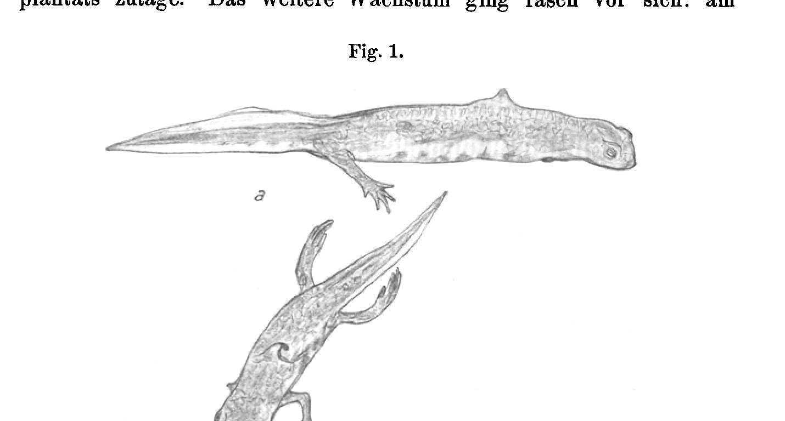
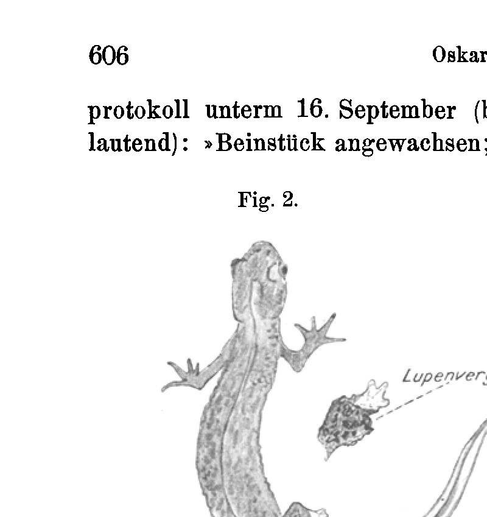
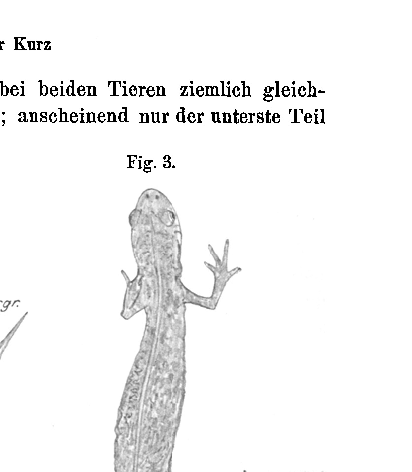

# Die beinbildenden Potenzen entwickelter Tritonen.
## The Leg-Forming Potencies of Developed Newts (Triton).

*(Experimental Studies.)*

By

Dr. med. Oskar Kurz.

*(From the Biological Experimental Institute in Vienna.)*

With 3 figures in the text and Plate XXII.

Received on 18 March 1912.

*Archiv für Entwicklungsmechanik der Organismen*, vol. 34 (1912).

> **Full translation.** A complete English rendering of Kurz's study of the leg-forming potencies of developed newts (*Triton*) — the regenerative capacities of the adult limb — with the figure legends.

### Table of Contents

| | Page |
|---|---|
| I. Preliminary Remark | 588 |
| II. Delimitation of the Tasks Set | 589 |
| III. General Remarks on Material and Working Methods | 590 |
| IV. Experimental Part | 592 |
| &nbsp;&nbsp;&nbsp;&nbsp;A. Leg and Pelvic Regeneration | 592 |
| &nbsp;&nbsp;&nbsp;&nbsp;&nbsp;&nbsp;&nbsp;&nbsp;a. Total Leg Extirpation | 592 |
| &nbsp;&nbsp;&nbsp;&nbsp;&nbsp;&nbsp;&nbsp;&nbsp;b. Unilateral and Bilateral Pelvic-(Shoulder-)Removal | 593 |
| &nbsp;&nbsp;&nbsp;&nbsp;&nbsp;&nbsp;&nbsp;&nbsp;c. Partial Resection of the Vertebral Column | 596 |
| &nbsp;&nbsp;&nbsp;&nbsp;B. Transplantation Experiments | 597 |
| &nbsp;&nbsp;&nbsp;&nbsp;&nbsp;&nbsp;&nbsp;&nbsp;a. Autoplastic Transplantation | 598 |
| &nbsp;&nbsp;&nbsp;&nbsp;&nbsp;&nbsp;&nbsp;&nbsp;b. Homoplastic Transplantation | 603 |
| &nbsp;&nbsp;&nbsp;&nbsp;&nbsp;&nbsp;&nbsp;&nbsp;c. Heteroplastic Transplantation | 604 |
| &nbsp;&nbsp;&nbsp;&nbsp;C. Experiments on Polarity Reversal | 604 |
| V. Results and Conclusions | 606 |
| Explanation of the Figures | 608 |
| Experimental Protocols | 609 |

## I. Preliminary Remark.

The experiments presented in the following were carried out chiefly in the years 1908 and 1909. Their most important results were already published in those years in two preliminary communications.¹ Other professional occupations prevented

> ¹ Oskar Kurz, On the regeneration of entire limbs from transplanted limb parts of fully developed animals. Centralbl. f. Physiol. Bd. 22. No. 12. 1908. — Regeneration of transplanted and completely removed limbs of developed vertebrates. Verhandl. d. Gesellsch. Deutsch. Naturforsch. u. Ärzte. 81st Assembly. Salzburg 1909. Part II. First half. p. 176. Leipzig, published by F. C. W. Vogel, 1910.

me, unfortunately, up to now from publishing a more detailed account of my working methods, the experimental protocols, as well as the photographic, roentgenological and other supporting documents. This is herewith made up for. To undertake the histological examination of my experimental animals, which would surely afford many an interesting insight, I have so far not been in a position to do, on the one hand owing to a vexing lack of time, but on the other hand also because of the, in a few of my more important experiments, only small number of experimental animals that showed positive results. It is understandable that I wished to preserve these animals as documentary specimens.

I should also like to take the opportunity here to express my sincerest thanks to Herr Doz. Dr. Hans Przibram for the manifold suggestions and pieces of advice which he afforded me in the course of my investigations, as well as for the drawing of the text-figures.

## II. Delimitation of the Tasks Set.

A. That the leg of the tailed amphibians regenerates is a fact long known. Hitherto, however, it was generally assumed that some part of the leg, however small, must remain if the regeneration was to take place. I now set myself the task of investigating how far the basis for the regeneration processes taking place at the leg can be shifted toward the centre of the body.

B. The transplantation of embryonic organ rudiments is a biological method that in recent times has been practised ever more frequently and with the best results (cf. Born, Braus, Spemann among others). By contrast, the transplantation of fully developed tissue of higher animals — if we leave aside that undertaken by surgeons with very highly developed tissues — has hitherto not often been drawn upon for the solution of biological problems (Joest), and for the solution of the regeneration problems in vertebrates not at all. And yet it is precisely this method that promises us to bring more closely under investigation a whole series of important problems: the laws that govern regeneration, the distribution of the forces that release it, the share of the nerves in the regeneration process and many others. My experiments were provisionally directed at establishing whether a transplanted fully developed piece of an organ is able, at the foreign site, to regenerate into the whole organ; at observing the circumstances under which this would be possible; and finally at ascertaining whether, besides the successful transplantation of organ-parts belonging to the same individual, that of organ-parts of the same species and of a foreign species (homo- and heteroplastic transplantation) is also possible.

C. Already from the transplantation experiments (discussed under B) much, as one may assume from the outset, should be ascertainable regarding the question of how far laws of polarity come into consideration in the regeneration processes. But the determination of whether, and how far, the triple-formations frequently appearing in regeneration are to be traced back to these laws of polarity was the aim of a further one of my experimental series.

## III. General Remarks on Material and Working Methods.

The animals used by me, chiefly *Triton cristatus* [modern *Triturus cristatus*], next to them also *Triton vulgaris* [modern *Lissotriton vulgaris*], *Salamandra maculosa* [modern *S. salamandra*] and *Rana esculenta* [modern *Pelophylax esculentus*], were taken from the animal material of the Biological Experimental Institute. Like all the material-animals, they lived before the operation in terraria adapted to their natural conditions. Also after the operation the animals — the very first days excepted (see below) — were kept under conditions as natural as possible: salamanders and *Rana* in terraria, the newts in glass tanks with sand bottom, algae-containing water and a cork piece floating on it; only for those newts in which the vertebral column was partially excised did aquarium-terraria have to be set up (see below: IV A c, p. 597). It proved advantageous to keep the operated animals singly, in order to avoid mutual infections and injuries. *Salamandra* and *Rana* were fed with mealworms, the newts with earthworms, in particular cases (especially delicate or weak animals) with *Tubifex*. In order to avoid a fouling of the water and a more frequent change of water thereby necessitated, the earthworms were always held into the water with the forceps, but never thrown into it. The glass vessels were closed off at the top by means of an organza-net, either bound over them or held in a stone-weighted frame.

All operations were carried out under ether narcosis. For this purpose the animal to be operated upon was placed in a preparation-glass furnished with a ground-in glass stopper, in which there lay cotton wool soaked with ether. When the excitation stage was over, the animal was, by shaking the glass, repeatedly thrown onto its back, in order to observe the progress of the narcosis. When the animal, thrown onto its back, lay motionless in this position, it was at once taken out of the glass. It was then in the condition that experience had shown to be the most favourable for the operation: in deep narcosis lasting a sufficient time even in the open air. To the careful observation of this process I may well ascribe it that, although I operated upon over two hundred of the above-mentioned animals, and naturally of various kinds: small and large, young and old, I yet had as good as no fatality of narcosis to record.

On account of the strong skin secretion evoked by the narcotising, the animals were, before the beginning of the operation, washed with warm, previously boiled water. Only in a few animals was an ether-washing added to this washing. In this case a shorter sojourn in the narcotising vessel was of course sufficient, since with the strong skin respiration of these animals the ether-washing acts strongly narcotising, as I had occasion to convince myself.

The instruments coming into use were boiled out in a weak soda solution, with the exception of the scalpels, which, in order to avoid a rapid blunting, were cleaned by alcohol-washing. The cleaned vessels destined for the reception of the freshly operated animals during the first two to (at most) four days following the operation were rinsed out with boiling water and lined with hydrophile paper that had been dipped in boiled water. With boiling water too the thick glass plate serving as operating-table was rinsed out. Were also the hands of the operator thoroughly cleaned and the suturing-silk laid ready, then the preparations for the operation were in the main completed.

It is self-evident that the greater part of these preparations had to be completed before the narcosis of the animal to be operated upon was begun.

## IV. Experimental Part.

### A. Leg and Pelvic Regeneration.

How far can the basis for the regeneration processes proceeding at the newt-leg be shifted toward the centre of the body? This question lies at the root of the experiments here described. Can the leg, even when it has been completely extirpated, be regenerated? (Experimental series a.) Can it also be regenerated when the pelvis belonging to it is co-extirpated? (Experimental series b.) And if this is the case, can the regeneration also take place when, besides leg and pelvis, the part of the vertebral column belonging to the pelvis is also removed? (Experimental series c.)

#### a. Total Leg Extirpation.

Operated upon were 12 animals: 11 *Triton cristatus*, 1 *Triton vulgaris*. It is to be noted that 11 of these animals were operated upon for other purposes (mostly transplantation experiments), the leg-extirpation being carried out only incidentally, in part merely as support for the other operations (which in this respect one may look up under B, a).

The operation consisted in a cutting-around of the leg-skin at the place of attachment, fairly close to the body-level, and the subsequent extirpation. In the preponderant majority of the cases (8) the skin was thereupon closed over the wound by one or even two sutures. In 4 animals (II, VII, IX, XII) the wound was not sutured.

A single animal (Nr. VIII) died 2 days after the operation, the others survived and showed positive results. In these 11 cases the matter concerned, nine times, the regeneration of the hind-leg, twice that of the fore-leg. In one animal (Nr. II) it was conditioned by the kind of operation (only the upper part of the femur was disarticulated from the hind-leg that had been brought to grow onto the trunk by a pre-operation) that muscle-tissue belonging to the upper part of the thigh remained behind; the femur, however, was completely removed. This experimental animal may be regarded as not fully conclusive. Concerning all further data relating to the experimental animals I refer to Experimental Protocol I. The experimental protocols are appended at the end of the work. One may further regard Fig. 5 and 6 on Plate XXII.

Result of the experimental series: Also the completely extirpated leg of *Triton cristatus* and *Triton vulgaris* is regenerated again, be it now a matter of the hind-leg or the fore-leg. Although I carried out the extirpation on only a single specimen of *Triton vulgaris*, and indeed only that of the hind-leg, I yet believe I may assume that also the fore-leg, just as otherwise, so too after complete removal, is supplemented in the same way as the hind-leg. *Triton vulgaris* regenerates indeed, according to my admittedly not great experience with this animal, mostly even better than *Triton cristatus*.

#### b. Unilateral and Bilateral Pelvic-(Shoulder-)Removal.

Operated upon were in all 28 animals: 20 *Triton cristatus*, 2 *Triton vulgaris*, 6 *Salamandra maculosa*. The latter all perished within the first month following the operation, so that on these comparatively slowly regenerating animals no result could be obtained. I shall therefore exclude these animals from the discussion and also not append the protocol relating to them.

The remaining 22 animals (20 *Triton cristatus* and 2 *Triton vulgaris*) I should like to divide into three groups: α) into those (3) animals in which only a part of one pelvic-half was removed, β) into those (15) in which one pelvic-half completely and possibly still (in 2 animals) a part of the adjoining pelvic-half [was removed], and γ) finally into those (4) from which the whole pelvis was removed.

[In a greater number (9) of these animals the pelvic- (or shoulder-)removal was undertaken only as the smaller operation alongside the greater operation (transplantation) (see protocol).]

The operation took in essence the following course: On one leg a circular skin-cut was made at the trunk and the leg was thereupon disarticulated. Then the pelvic- or shoulder-bones, respectively, were fetched out with the forceps and the wound was closed with one to three skin-sutures, in a few cases with Michel clamps (which, however, unfortunately — since, as is comprehensible, no special ones, but those used in surgery had to be employed — proved in many cases too large and too heavy for the delicate animals). It showed itself that the unilateral removal of the shoulder, since the fixation is a lesser one and also no fusion with the other shoulder is present, is far more easily carried out than that of a pelvic-half. In the bilateral pelvic-removal the whole pelvis was removed either from one side — in one case (XII) the leg of the other side was even drawn through under the belly-skin — or the operation was approached from both sides. In a shoulder-removal (animal XX) there was, besides the circular-cut at the fore-leg, also a cut emanating from this and running toward the shoulder made, and the shoulder with the leg hanging on it was removed in one piece.

Somewhat (but not essentially) different from what is described above proceeded the operation of animal X, in which the hind-leg had been brought to grow onto the trunk by a pre-operation. Here a cross-section through the knee-joint was made and thereupon thigh and pelvis removed, whereby also the leg-soft-parts grown onto the trunk were most carefully removed.

In one case (animal XI) there occurred during the operation, since the animal was not sufficiently deeply narcotised and in consequence "pressed", a protrusion of viscera and also lung through the operation-wound, without however this complication having impaired the success of the operation.

##### Group α.

3 animals: I, VII, IX (all *Triton cristatus*).

Of these animals, from which only a small piece of one pelvic-half each was removed, one (Nr. VII) perished already after 10 days, in a second (Nr. I) it came to suppuration and subsequently thereto to a large defect at the leg-attachment-place, the third (Nr. IX) showed positive result; in this animal toe-cleft-formation of the regenerated leg occurred.

##### Group β.

15 animals: 13 *Triton cristatus*, 2 *Triton vulgaris*.

Shoulder-removal: 6 animals (all *Triton cristatus*): II, V, XV, XVIII, XIX, XX. One animal (Nr. V) perished after 1 day, another (II) after 6 weeks. Already this one showed positive result, as did the remaining 4 animals, which remained alive 84–275 days.

Unilateral pelvic-removal: 9 animals: 7 *Triton cristatus*: III, IV, VI, VIII, X, XI, XIII; 2 *Triton vulgaris*: XXI, XXII. 2 animals (Nr. III and VI) perished after 1 and 2 days respectively; all the remaining showed positive results. To be highlighted are the animals Nr. VIII and XIII, in which the regenerate was not 
able to break through, but the regenerated leg was perceptible under the skin and was also moved under the skin. Experimental animal Nr. XI regenerated a three-toed foot, and the two *Triton vulgaris* (Nr. XXI and XXII) showed abnormalities: the one animal a double-formation, the other a peculiar toe-formation. (For this see Plate XXII Fig. 1, further also Fig. 8 and 9.)

...was able to break through, but the regenerated leg was perceptible under the skin and was also moved under the skin. Experimental animal No. XI regenerated a three-toed foot, and the two *Triton vulgaris* (Nos. XXI and XXII) showed abnormalities: the one animal a double-formation, the other a peculiar toe-formation. (On this see Plate XXII Fig. 1, further also Figs. 8 and 9.)

## Gruppe γ.

4 animals (all *Triton cristatus*): XII, XIV, XVI, XVII.

In these animals both hindlegs and the entire pelvis were removed; in one (No. XIV), however, it could not be established with full certainty whether a small piece of bone belonging to the right pelvic half had not remained behind. One animal (No. XVI) died after 1 month. The other animals showed pelvic and leg regeneration. Animal No. XIV (the animal in which perhaps a small piece of bone of the right pelvic half had remained behind), which stayed alive only 2 months, showed beginning regeneration of the left leg. The experimental animals No. XII and No. XVII, which lived a long time, produced perfect five-toed leg regenerates on both sides. The regenerate of the left hindleg appeared earlier and, as against that of the other leg, was in advance throughout the entire duration of the regeneration process. It therefore seems that not only at the breakthrough of the regenerate, but also in the further course of the regeneration process in *Triton cristatus*, there exists a pronounced preponderance of the left side of the body, which stands in contrast to the experiences obtained by Barfurth¹⁾ on frogs and by Kammerer²⁾ on amphibian larvae. On this see Plate XXII Fig. 2. Compare also Experimental Protocol No. II at the end of the work.

> ¹⁾ D. Barfurth, Sind die Extremitäten der Frösche regenerationsfähig? [Are the extremities of frogs capable of regeneration?] Arch. f. Entw.-Mech. Vol. 1. 1894/95. pp. 117–123.
>
> ²⁾ P. Kammerer, Über die Abhängigkeit des Regenerationsvermögens der Amphibienlarven von Alter, Entwicklungsstadium und spezifischer Größe. [On the dependence of the regenerative capacity of amphibian larvae on age, developmental stage, and specific size.] Arch. f. Entw.-Mech. Vol. 19. 1905. pp. 148–180.

**Result of the experimental series:** *Triton cristatus* is accordingly capable of regenerating even a leg removed together with its associated pelvis (respectively shoulder). In *Triton vulgaris* this proof was furnished (owing to lack of material) only for the hindleg and pelvis. That this regeneration process does not depend on the other pelvic half, but proceeds from the vertebral column, is shown by those experimental animals in which both hindlegs and the entire pelvis were removed. In these cases too, pelvic and leg regeneration occurred. In isolated cases the leg regenerate was unable to break through the skin, probably because the preceding pelvic regeneration had taken up too much time and in the meantime the wound closure had become too solid. In these cases subcutaneous regeneration could be observed. This subcutaneous regeneration already shows [as Przibram¹⁾ believed he could likewise infer from my transplantation experiments] that direct access of oxygen does not seem to be necessary for the regeneration process, even though one might perhaps object that, given the strong skin respiration of the animals used, an adequate supply of oxygen is ensured.

> ¹⁾ H. Przibram, Experimentalzoologie. Vol. 2. Vienna 1909. p. 222.

Further, there seems to emerge from these experiments, as mentioned above, a pronounced preponderance of the left side of the body in *Triton cristatus*.

My observation that *Triton vulgaris* regenerates better, but also inclines more readily to abnormal formations than *Triton cristatus*, I would not, given my too scanty experiences with this animal, wish to present as established.

### c. Partial Resection of the Vertebral Column.

8 animals were operated on (all *Triton cristatus*). 6 died in the first days after the operation; only 2 remained alive for a longer time (over 1 year) (Nos. II and VII).

**Description of the operation:** With the scalpel, in the vicinity of the hindlegs or somewhat higher, a skin-muscle incision running transversely across the back was made; this incision was extended to both hindlegs, on which, further, near the trunk, a circular skin incision was made. Thereupon, in the majority of cases, the legs were first disarticulated and the pelvic bones drawn out with the forceps, and afterwards the part of the vertebral column belonging to the pelvis (over a length of 5–7 mm) was detached by two scissor cuts and pulled out with the forceps. In a few cases the detachment of the vertebral-column piece preceded the removal of the pelvis. The abdominal wall was spared as much as possible; only in the first operation (animal No. I) was it cut through, which resulted in a protrusion of the viscera through the chafed abdominal wound. When now legs, pelvis, and the determined vertebral-column piece had been removed, the circular wound was closed by five to six skin sutures.

The animals thus operated on could of course not be placed in water after 2 to 4 days (like the other newts, see General Remarks on Material), unless one wished to expose them to certain death by drowning. Therefore special aquarium-terraria were set up for them: larger rectangular glass tubs, covered with sand and small pebbles, which on one side had a water level of the height of the animal, while the sandy bottom, gradually rising, reached on the other side double the height. Thus the animals could easily get into the water, but could also without difficulty reach the safe "land" again. In these aquaria the two surviving animals were kept all those months through, only that the water level was gradually raised somewhat. On this, the Experimental Protocol No. III.

While in animal No. II the wound healing proceeded smoothly, in animal No. VII the wound was torn open, whereby a larger defect appeared; but this too healed. 2 months after the operation there appeared in this animal, at the left leg-insertion site, a small protrusion, which for a while I believed I might address as a regeneration bud. But since the process made no further progress, and the X-ray pictures of the animal, which were taken 5½ months after the operation (cf. Plate XXII Figs. 3 and 4), show no regenerated pelvis, I must assume that it was a matter of a mere skin protrusion.

**Result of the experimental series:** Since up to now it has not succeeded, after removal of the part of the vertebral column belonging to the pelvis, to obtain pelvic and leg regenerates, the placing of the wound at the pelvic part must provisionally be designated as the outermost limit from which the new formation of the newt leg can take place. From the histological investigation, insights into the regeneration processes proceeding at the vertebral column are to be expected.

## B. Transplantation Experiments.

Can the excised piece of a salamander leg, transplanted to another, foreign body site, complete itself here into a whole leg? (Experimental series a.) Is this regeneration process also possible upon transplantation onto another conspecific individual?

(Experimental series b.) Or could it perhaps even take place upon transplantation onto an individual of a different species? (Experimental series c.) And further: Does the transplanted leg piece regenerate distalward and proximalward, or only from one pole?¹⁾

### a. Autoplastic Transplantation.

(Transplantation of the limb part onto the same animal from which it was taken.)

In the experiment there were 31 *Triton cristatus*, 1 *Triton vulgaris*, 1 *Salamandra maculosa* [modern *S. salamandra*].

In the great majority of cases (23) a piece of the hindleg was chosen for transplantation, but besides this also foreleg (2), shoulder (3), pelvis (5) (see Protocol No. IV).

> ¹⁾ The designations used in the following: "autoplastic," "homoplastic," and "heteroplastic" transplantation derive from Giard (A. Giard, Y a-t-il antagonisme entre la « greffe » et la « régénération » ? In: Comptes rendus des séances de la Soc. de Biologie. 1896).

**α) Single-stage operation** (all animals with the exception of No. XXIV and No. XXVIII).

The operation was carried out in the majority of cases as follows: An incision running longitudinally, of about half a leg's length, was made through skin and musculature approximately in the middle between foreleg and hindleg on one side of the body, over the lower part of the ribs. Thereupon the severed layers were bluntly undermined toward both sides with the back of the scalpel. Then the leg chosen for implantation was either cut off near the trunk with the scissors, or, after making a circular skin incision near the insertion site, disarticulated. If pelvic (or shoulder) bones too were to come to transplantation, these were drawn out with the forceps (in the same manner as described above for the pelvic extirpations). The removed leg was carefully skinned, cut in two in the middle of the lower leg and of the upper leg by one rapid cut each, and the middle (knee) piece thus obtained was pushed with the forceps into the pre-prepared skin fold; in the majority of cases in such a way that the extensor side faced the body and the distal (lower-leg) end faced the head. In a considerable number of cases the flexor side lay bodyward, as also in a series of cases the proximal (upper-leg) end came to lie headward. Over the implant the skin was closed by two to four sutures, in individual cases by a Michel clamp, while at the leg-insertion site mostly a single skin suture sufficed. The operation did not proceed essentially differently when, in place of the leg piece, pelvic or shoulder bones came to transplantation.

Some particular modifications, which were undertaken by way of experiment, may be appended here: In the experimental animals Nos. XXI and XXII not a longitudinally running, but a small transverse skin-muscle incision was made, from which the skin was undermined forward and backward. The implant was to be introduced through an external opening as small as possible. In these two cases the skin closure too was effected not in the usual way, but by laying on a tuft of cotton dipped in collodion. The latter did not, in my judgment, prove itself.

In the animals Nos. XXVI and XXXIII the undermining of the severed layers was carried out from the lateral skin-muscle incision across the spine over to the other side of the body, and the implant pushed along by the same route, so that implant and operation wound were located on different sides of the body. I believe that these two operation methods — but especially the latter — will yield many good results in future similar experiments, even though it will probably prove necessary, when applying these methods, to facilitate the passage of the regenerate through the skin by later cutting open the layers lying above it.

Twice a leg regenerate was used for transplantation, without anything being able to be stated about the advantages of this procedure.

**β) Two-stage operation** (animals Nos. XXIV and XXVIII).

The operation method described above presents, as is easily understandable, a number of difficulties: in many cases, despite careful observation of asepsis, the implant suppurates out; in other cases it seems, against the operator's will, to assume an unfavorable position, so that the regeneration process is impeded; and again in other cases the regenerate is unable to penetrate the skin covering. (In this case, however, one obtains subcutaneous regenerates.) To meet all these difficulties, I have also practiced the following two-stage operation method, which is relatively easily carried out and yields thoroughly good results:

In a preliminary operation the leg is "freshened" on the flexor side as far as the region of the tarsal bones; likewise a correspondingly large lateral piece of the trunk from the leg-insertion site tailward. The two freshened surfaces are laid upon each other and the leg then sutured to the trunk, for which three sutures, two above, one below, usually suffice. The toes remain freely movable. — After a few weeks the leg has grown firmly onto the trunk. Now the main operation can be carried out: the leg that has grown on is severed at the upper leg (thigh), the upper leg (femur) portion is completely extirpated, and the associated pelvic half too is removed. Finally the foot too is removed by an incision made above the tarsal bones. If one does not do the latter, then the toes — which after the operation, before direct bloodways have formed from the body wall, are only poorly nourished — fall off by themselves. If one does not also remove the pelvis simultaneously with the disarticulated leg, then the rapidly regenerating leg easily seeks and finds the connection with the transplanted leg piece, whereby the origin of the regeneration processes appearing at the distal (lower-leg) end becomes unclear. But if the pelvis is removed as well, then at the lower end of the leg the regeneration of the distal leg parts appears, long before the normal leg regenerate shows itself, which now also does not grow together with the transplant, but develops on into an independent, complete leg.

We now let follow the more exact description of some of the more noteworthy cases, in order then to append the results of the experimental series in summary form. (Compare for this Protocol No. IV.)

Of the altogether 33 operated animals, not fewer than 17 perished already in the first 10 days following the operation. And in the case of the others too, a falling-out (No. XXIII) or suppurating-out of the implant, or its apparent resorption, or particular circumstances which impeded the regeneration process at the well-healed-in body piece, rendered the operation unsuccessful.

There remain accordingly only a few cases which led to clear results and which here, in their particularities, are to be subjected to special discussion.

**α) Single-stage operation:**

The best success I achieved in experimental animal No. II, which, operated on 15 June 1908, remained alive for 2 years after the operation. The operation was carried out in the usual way (see above); the knee piece of the left hindleg was transplanted into the left side of the body with the flexor side toward the trunk and the distal (lower-leg) end directed headward. After 4 weeks the extirpated hindleg began to regenerate, and after a further 2 weeks the regenerate of the transplant too came to light. The further growth proceeded rapidly: on the

**Fig. 1.**  *(figure not reproduced)*

> Hook-shaped, unsegmented regenerate (2 mm long) from the autoplastically transplanted shoulder; later reduced. a side view; b view from the front. Experimental animal No. XIV (106). Operated on 12 VIII 1908, drawn on 3 IX 1908.

11 August, the regenerated fifth leg already showed all five toes. To be noted is that the regenerated leg piece and the foot were directed with the dorsal side downward. The leg was not moved along and also did not seem to react to tactile stimuli; it had apparently found neither motor nor sensory innervation. (This animal I exhibited alive on the occasion of my lecture at the Naturalists' Congress of 1909.) (Plate XXII Figs. 5 and 6.)

In experimental animal No. XIV, in which on 12 August 1908 the right shoulder was transplanted into the left side of the body, on 27 August the regeneration bud, a [protrusion] on the back of the animal clearly standing out from the trunk, appeared. On 3 September there was already to be seen a distinct, though unsegmented, hook-shaped regenerate of about 2 mm length. Soon thereafter the animal apparently fell ill, would take no food to itself; during this time the regenerate too completely receded, so that already some days before the death that ensued on 26 September it was no longer to be seen. It is understandable that, in a poor bodily condition of the experimental animal, primarily the implanted foreign body (which here the animal's own body tissue too represents) is affected. (Cf. Text-fig. 1.)

---

Translator's notes on this chunk: This is a continuation chunk covering printed pages 595–601 (assignment pages 8–14), with the final paragraph carried over to its completion on printed page 602 per the page-ownership rule. Page anchors are inserted as HTML comments. The leading partial paragraph at the top of printed 595 ("…was able to break through, but the regenerated leg…") continues a sentence that began on printed 594 (animals Nos. VIII and XIII of the one-sided pelvis-removal series); it is rendered here only from its owned mid-sentence beginning. The one text-figure, "Fig. 1" (Text-fig. 1), is not reproduced; its caption is translated in full and placed exactly where it interrupts the No. II case description, as in the original. The running header in the source reads "Oskar Kurz." All content belonging to printed page 602 beyond the completed No. XIV paragraph belongs to the next chunk and is not translated here.

Test animal No. XXV, into the right side of whose body the knee-piece of its hind leg was transplanted — with the extensor surface bodyward and with the proximal (femoral) end headward — regenerated subcutaneously: through the skin there shone a fully formed hand, which even stood out plastically from the trunk.

Several animals showed implants that still stood out clearly beneath the skin even after months, but in which, however, through the skin no larger regeneration process could be ascertained; thus No. XIX and No. XXVI. Of the former (No. XIX) it should further be mentioned that here the skin-muscle incision was laid transversely across the back; the foreleg destined for transplantation was sewn in with the popliteal hollow on the vertebral column, as it were riding upon it. In animal No. XXVI the roentgenological investigation showed the subcutaneous regeneration of the distal lower-leg part. (Cf. Plate XXII Fig. 7.)

### β) Two-stage operation:

In test animal No. XXIV the two-stage operation described above was carried out. The foot was not removed, but it became necrotic and dropped off already after 3 days. The transplanted leg-piece showed regeneration toward both sides: distally the toes were newly formed, proximally there appeared an indeterminable, unformed regenerate, which is separated by a furrow from the newly formed hind leg. It is to be emphasized that the toes of this fifth leg — in contrast to those produced by the one-stage operation in the middle of the body — were moved. At this site, near the natural leg-attachment site, the regenerate seems to find the nerve connection more easily.

From the roentgen image of this animal I believe I can infer that from the newly formed pelvis a double femur regeneration took place, the one directed against the hind leg, the other against the transplant (Plate XXII Fig. 8 and 9).

**Result of the test series:** Transplanted leg-pieces of *Triton cristatus* supplemented their distal parts completely — in many cases subcutaneously —, while at the central wound surface only unformed regeneration was observed. The supplemented hands showed the complete toe-count of the normal leg (hind leg five toes). Here too a transplanted shoulder was won as a regenerate. With disease of the test animal, the already present regenerate could itself regress again. Leg-regenerates from transplants, when they find themselves in the vicinity of the natural leg-attachment site, are moved and are sensitive. This is not the case with those leg-regenerates that are located roughly in the middle of the body; here apparently neither a motor nor a sensible nerve connection sufficient for function is found.

## b. Homoplastic transplantation.

(Transplantation of the limb part onto an animal of the same species.)

In the experiments stood 14 *Triton cristatus*, 1 *Salamandra maculosa* [modern *S. salamandra*]; for transplantation there came exclusively leg-pieces (fore- and hind leg).

We applied the same operation method as in the one-stage autoplastic transplantation (see above). Cf. for this Operation protocol No. V.

Of the 15 test animals, 4 perished within the first days after the operation; a number of others ejected the implant.

A distinct success was shown by a single animal (No. VI), in which a double transplantation was carried out. The skinned foreleg chosen for the overgrafting was, after removal of the humerus-head and the hand, cut in two at the elbow joint. The upper (humerus-)part was implanted in the usual manner into the right side, the lower part into the left side of the body. While the right implant was ejected after 10 days, on the left, out of the lower end of the lower leg, the missing distal leg-parts with the toes were regenerated (Plate XXII Fig. 10).

In a few isolated other cases the implant remained preserved, without its having come to any noteworthy, i.e. macroscopically visible, regeneration process (animals No. VIII and XI).

In animal No. XIV, in which (as in test animal No. XIX in the autoplastic transplantations) the transplanted leg was laid transversely across the back, on the left side a "regeneration beginning" was ascertained, which probably, since it was a matter of the proximal (upper-thigh-)leg-end, restricted itself to a quite insignificant unformed regeneration (see above with the autoplastic transplantation); on the right it came to suppuration.

**Result of the test series:** The foreleg-piece of *Triton cristatus* transplanted onto an animal of the same species was able to regenerate the distal leg-parts.

## c. Heteroplastic transplantation.

There were carried out chiefly reciprocal leg transplantations between *Triton cristatus* and *Salamandra maculosa*, further the overgrafting of a leg-piece of *Triton vulgaris*, *Rana agilis* and *Rana esculenta* onto *Triton cristatus*; also a transplantation of *Triton cristatus* onto *Rana esculenta* was attempted.

Concerning the operation method, the same as with the single autoplastic transplantation (see above) is to be referred to here as well.

None of the 15 animals that had undergone the experiment showed a success. I therefore also refrain from reproducing the experimental protocols.

Although the result of the test series was thus far a negative one, I nevertheless believe that in future it might well be possible to keep the regeneration-capable body parts of the Tritons alive even upon overgrafting onto foreign-species bodies, and to bring them to regeneration. For when I think back on the many preliminary experiments that I undertook before I found the operation methods described above; and when I further consider that only very few animals operated on by these methods showed successes: I believe I may attribute to the negative result of the 15 operations carried out here no greater, but rather only a transitory significance; as in other cases, so surely in this one too the future will beat the past.

## C. Experiments on polarity reversal.

In the years 1908 and 1909 already, even before I had proceeded to the experiments described above, and while I worked on them, my interest was occupied with the experimental production of triple formations on the developed Triton-leg. A depiction of the operation methods that I carried out with this intention I will refrain from, since my experiments at that time remained without result. And yet I believed I could take from those experiments the path that could lead to the goal. Two of my animals, namely (*Triton cristatus*), in which I had cut off the hind leg roughly in the middle of the upper-leg, in order — after removal of the lower part of the lower leg and of the foot — to fix it again, reversed, with the distal (lower-leg-)end back onto the upper femur part, brought forth complete five-toed leg regenerates; but, remarkably, the plantar surfaces of the feet looked, shovel-shaped, upward. This circumstance, as well as my observation that even roughly 2 years after the operation — although the sewn-on leg-piece had dropped off, at least partially, soon after the operation! — in the middle of the femur, thus corresponding roughly to the operation cut, a bone-callus was to be felt — in one case even a slight bending of the leg was also to be ascertained — brought me to the supposition that the operation had not, as I had earlier assumed, been without success, but rather that the attached leg-piece had remained preserved at least in small part and had caused the abnormalities.

This caused me to set up a new test series in August 1910. I subjected 7 *Triton cristatus* to the following operation:

With the scalpel a circular skin incision was laid above the ankle joint, and the skin was then loosened from the leg all around as far upward as possible with the forceps. When in this way the skin-sheath of the leg had become movable, it was pushed upward as far as it would go, and the leg beneath it, roughly in the middle of the upper-leg, was severed with a stroke of the scissors; through a further cut the lowest part of the lower leg with the foot was removed. The remaining leg-remnant was thereupon pushed into the skin-sheath with the distal (lower-leg-)end foremost, and this was then closed over the now distally lying femur-end by one or two sutures. In those cases where the skin-pocket tore laterally during the pushing-up, it had to be sutured there too.

Of the 7 operated animals, 3 perished in the first days following the operation; in a further 2, as the operation protocol states, the attached leg-piece dropped off. With the two remaining animals, however, my operation protocol notes under 16 September (with both animals reading roughly identically): "Leg-piece grown on; apparently only the lowest part

**Fig. 2.** *Triton cristatus.* From a leg-piece brought to healing with the distal pole, a double-hand was regenerated. *a* animal in natural size; *b* the double-hand alone. (Drawn by Dr. Hans Przibram on 3. XI. 1910.)  *(figure not reproduced)*

**Fig. 3.** *Triton cristatus.* Double-hand, regenerated from a leg-piece brought to healing with the distal pole. *a* animal in natural size; *b* the double-hand in magnifying-glass enlargement. (Drawn by Dr. Hans Przibram on 3. XI. 1910.)  *(figure not reproduced)*

dropped off, since a grown-on lower-leg-piece (two bones) is to be seen."

A few weeks later there had, in both animals, a fully formed double-hand (see Text-fig. 2 and 3) been regenerated. On the basis of my experiences made on roughly 200 *Triton cristatus*, I believe I can exclude a chance occurrence.

## V. Results and conclusions.

In the following the most important results of my investigations shall be briefly summarized:

1) The completely extirpated Triton-leg is regenerated again. It is not necessary that any leg-part whatever be left behind, in order for this regeneration process to take place.

2) If not only the leg is removed, but also the pelvis (or shoulder, respectively) belonging to it is co-extirpated, then pelvis (or shoulder, respectively) and leg are formed again. This process does not proceed from the other pelvic half, but rather from the vertebral column, for it also proceeds even when the whole pelvis and both hind legs are removed.

3) Pelvis and leg were, however, no longer regenerated when the portion of the vertebral column belonging to the pelvis was also co-extirpated. The wounding at the vertebral column must therefore provisionally be designated as the outermost boundary from which the new-formation of the Triton-leg can ensue.

4) Autoplastically and homoplastically transplanted leg-pieces of *Triton cristatus* regenerate the distal leg-parts. At the central wound surface only unformed regeneration could be observed. The hands or feet supplemented through regeneration show the normal toe-count of the arm or leg used.

5) Leg-regenerates that have developed roughly in the middle of the body out of a transplanted leg-piece (knee) do not react to stimuli and are not moved.

6) If, in contrast, the leg is first fixed to the body wall and only then severed at the upper-leg (two-stage transplantation), then the leg-transplant left in the vicinity of its place of origin finds the sensible and motor nerve connection again.

7) Heteroplastic transplantations within the Urodele group, just as such of Urodeles onto Anurans, have had until now no positive success.

8) In individual cases the regenerate, which is formed after pelvis-removal or out of a transplant, cannot break through the skin. In this case one obtains subcutaneous regenerates. This subcutaneous regeneration shows that — insofar as a direct supply of oxygen is at all necessary for the regeneration process — the oxygen supplied through skin-respiration suffices for the course of the process.

9) Tritons, in which after amputation of the leg a small leg-piece was brought to re-healing in reversed direction, regenerated a double-hand, which thus grows out from an originally proximal cut-surface. It thus seems possible, in some cases — and indeed probably there where it is a matter of only a small leg-piece — that a reversal of polarity is possible.

## Explanation of the figures.

### Plate XXII.

**Fig. 1.** *Triton cristatus.* Regeneration of the left pelvis and hind leg after complete extirpation of the same. Dorso-ventral roentgen image [cf. Protocol II, animal No. IV (110)].

**Fig. 2.** *Triton cristatus.* Regeneration of both pelvic halves and both hind legs after total pelvis-extirpation. Dorso-ventral roentgen image [Protocol II, animal No. XII (139)].

**Fig. 3.** *Triton cristatus.* From the animal the whole pelvis and a roughly 6 mm long piece of the vertebral column (pelvic portion) were extirpated. Dorso-ventral roentgen image, 5½ months after the operation [Protocol III, animal No. VII (175)].

**Fig. 4.** The same animal as in Fig. 3. Ventro-dorsal roentgen image.

**Fig. 5.** *Triton cristatus.* Regeneration of a fifth limb out of an autoplastically transplanted piece of the left hind extremity. Regeneration of the left hind leg after total extirpation of the same. Substantially reduced image [Protocol IV, animal No. II (81) and Protocol I, animal No. I (81)].

**Fig. 6.** The same animal as in Fig. 5, photographed some time later. Nearly life-size image.

**Fig. 7.** *Triton cristatus.* Subcutaneous regeneration of the distal part of the lower leg out of an autoplastically transplanted leg-piece. Dorso-ventral roentgen image [Protocol IV, animal No. XXVI (137)].

**Fig. 8.** *Triton cristatus.* Two-stage transplantation of a piece of the left hind leg. One sees the foot regenerated from the transplanted leg-piece and the left hind leg regenerated after extirpation of the left pelvic half. Nearly life-size image. [Protocol IV, animal No. XXIV (135) and Protocol II, animal No. X (135)].

**Fig. 9.** The same animal as in Fig. 8. Ventro-dorsal roentgen image.

**Fig. 10.** *Triton cristatus.* Regeneration of a fifth limb out of a transplanted foreleg-piece of an animal of the same species (homoplastic transplantation). Dorso-ventral roentgen image [Protocol V, animal No. VI (114)].

The images reproduced in Fig. 5, 6 and 8 were made by Herr Dr. Josef H. Klintz in the Biological Experimental Station. The roentgen images come from the Radiological Institute of the General Polyclinic in Vienna (Director Doz. Dr. R. Kienböck); they were prepared by Herren Dr. Alfred Selka and Dr. H. Algyogyi. I take the liberty of expressing to the named gentlemen my best thanks at this place.

## Experimental Protocol I: Total Leg Extirpation (A, a).

| Seq. No. | No. of my oper. protocol | Species / sex | Operated on | What was removed | Further operations performed on the animal | Died on | Duration of observation | Result |
|---|---|---|---|---|---|---|---|---|
| I | 81 | *Trit. crist.* ♂ | 15. VI. 08 | L. h. B. | Autopl. Transpl. Preliminary operation on 22. VII. 08: L. h. B. sutured to the trunk | Summer 1910 | 2 years | Complete 5-toed reg. |
| II | 91 | *Trit. crist.* ♀ | 2. IX. 08 | Upper part of the 1st femur (the soft parts that had grown on were left in place) | — | — | — | On 19. X. the regenerate already fuses with the distal leg part |
| III | 113 | *Trit. crist.* ♂ | 20. VIII. 08 | L. v. B. | None | 21. X. 08 | 62 days | On 29. IX. already a regenerate to be seen. 21. X. 1½ mm long regen. |
| IV | 126 | *Trit. crist.* ♂ | 2. IX. 08 | R. v. B. | Autoplastic transplantation | 22. VI. 09 | 293 days | Complete regenerate! On 29. IX. already regen. to be seen |
| V | 136 | *Trit. crist.* ♂ | 1. X. 08 | R. h. B. | Autoplastic transplantation | 20. V. 09 | 231 days | 9. XI.: Regen. to be seen. 28. XII.: Complete regen., about 9 mm long |
| VI | 162 | *Trit. crist.* ♂ | 5. I. 09 | L. h. B. | Autoplastic transplantation | — | — | 25. IV.: 9 mm long, 5-toed regenerate |
| VII | 166 | *Trit. crist.* ♀ | 12. VII. 09 | Upper part of the 1st femur | Preliminary operation on 21. II. 09: L. h. B. sutured to the trunk | — | — | — |
| VIII | 172 | *Trit. crist.* ♀ | 1. IV. 09 | R. h. B. | Autopl. Transpl. | 3. IV. 09 | 2 days | — |
| IX | 193 | *Trit. crist.* ♀ | 29. VIII. 09 | R. h. B. | Heteropl. Transpl. | — | — | — |
| X | 196 | *Trit. crist.* ♀ | 7. VIII. 10 | R. h. B. | Autopl. Transpl. | — | — | — |
| XI | 137 | *Trit. crist.* ♂ | 1. X. 08 | R. h. B. | Autoplastic transplantation | 18. III. 09 | 169 days | 9. XI.: Regen. to be seen. 28. XI.: 1 cm long Reg. |
| XII | 156 | *Trit. vulg.* | 20. XII. 08 | L. h. B. | Autopl. Transpl. | 17. VII. 09 | 209 days | Not conserved in time |

## Experimental Protocol II: One-sided and Two-sided Pelvis-(Shoulder-)Removal (A, b).

| Seq. No. | No. of my oper. protocol | Species / sex | Operated on | What was removed | Further operations performed on the animal | Died on | Duration of observation | Result |
|---|---|---|---|---|---|---|---|---|
| I | 104 | *Trit. crist.* ♂ | 11. VIII. 08 | L. B. partly | Autoplastic transplantation | 30. IX. 08 | 50 days | Suppuration at the leg-insertion site. Large defect there |
| II | 106 | *Trit. crist.* | 12. VIII. 08 | R. Sch. | Autoplastic transplantation | 26. IX. 08 | 45 days | About 1 mm long leg regenerate with beginning toe differentiation |
| III | 108 | *Trit. crist.* | 13. VIII. 08 | L. B. | Autopl. Transpl. | 14. VIII. 08 | 1 day | None |
| IV | 110 | *Trit. crist.* | 17. VIII. 08 | L. B. | Autopl. Transpl. | 23. XII. 08 | 128 days | 27. IX.: Beginning regen. 23. XII.: 1 cm long Reg. |
| V | 112 | *Trit. crist.* ♂ | 19. VIII. 08 | L. Sch. | Autopl. Transpl. | 20. VIII. 08 | 1 day | None |
| VI | 118 | *Trit. crist.* | 23. VIII. 08 | L. B. | Autopl. Transpl. | 25. VIII. 08 | 2 days | None |
| VII | 123 | *Trit. crist.* ♂ | 29. VIII. 08 | Ventral part of the pelvis | Autopl. Transpl. | 8. IX. 08 | 10 days | None |
| VIII | 125 | *Trit. crist.* ♂ | 2. IX. 08 | L. B. | Autoplastic transplantation | 9. VII. 09 | 310 days | 27. IV.: Regen. beneath the skin, is moved |
| IX | 129 | *Trit. crist.* ♂ | 11. IX. 08 | L. B. partly | Autoplastic transplantation | 16. VII. 09 | 308 days | 11. XI. 08: 1.5 mm long Reg. 27. IV. 09: 12 mm long Reg., toe-cleft formation |
| X | 135 | *Trit. crist.* | 4. I. 09 | L. B. completely, R. B. partly | 23. IX. 08 preliminary operation: L. h. B. sutured to the trunk. Two-stage autoplast. transpl. | 14. VII. 09 | 294 days | 5-toed leg regenerate |
| XI | 138 | *Trit. crist.* ♀ | 2. X. 08 | R. B. | — | 10. VI. 09 | 151 days | 28. XII. 08: Beg. leg regen. 27. IV. 09: 5 mm long Reg. with abnormal toe formation |
| Seq. No. | No. of my oper. protocol | Species / sex | Operated on | What was removed | Further operations performed on the animal | Died on | Duration of observation | Result |
|---|---|---|---|---|---|---|---|---|
| XII | 139 | *Trit. crist.* ♂ | 2. X. 08 | Whole B. | — | 25. VI. 09 | 266 days | 9. XI.: Beg. regen. left. 26. XI.: Beg. regen. r. 7. IV. 09: Regen. left 14 mm, right 10 mm long |
| XIII | 142 | *Trit. crist.* ♂ | 15. X. 08 | R. B. and ventral part of the 1st B. | — | — | — | 27. IV. 09: Regen. beneath the skin; is moved |
| XIV | 144 | *Trit. crist.* ♀ | 19. X. 08 | Whole B. (right completely?) | — | 26. XII. 08 | 68 days | 13. XII.: Beginning leg regen. on the left (!) |
| XV | 146 | *Trit. crist.* | 24. X. 08 | L. Sch. | — | 16. I. 09 | 84 days | 1.5 mm long regen. of the left forelimb |
| XVI | 150 | *Trit. crist.* | 26. XI. 08 | Whole B. | — | 28. XII. 08 | 32 days | 17. I.: Bilateral reg. beginning. 14. III.: r. 3 mm 4-toed; l. 4 mm 5-toed regen. (!) 27. IV.: Bilaterally 5 toes |
| XVII | 151 | *Trit. crist.* | 13. XII. 08 | Whole B. | — | 28. IV. 09 | 136 days | 14. III.: 2 mm long Reg. 27. IV.: 4 mm long, 4-toed |
| XVIII | 155 | *Trit. crist.* | 20. XII. 08 | R. Sch. | — | 21. XI. 09 | 275 days | 14. III.: Reg. 3 mm, 3 toes. 25. IV.: 5 mm, 4 toes |
| XIX | 159 | *Trit. crist.* | 4. I. 09 | L. Sch. | — | 25. IV. 09 | 111 days | 14. III.: Reg. 3 mm, 3 toes. 25. IV.: 5 mm, 4 toes |
| XX | 176 | *Trit. crist.* ♀ | 4. IV. 09 | L. Sch. | Autoplastic transplantation | 22. VII. 09 | 109 days | 29. V.: Regenerate-beginning. 22. VII.: Regen. 4 mm, 4 toes. (4th toe: cleft formation) |
| XXI | 148 | *Trit. vulg.* | 15. XI. 08 | L. B. | — | — | — | 17. I.: Regenerate 1 mm. 27. IV.: Regen. 5 mm. VIII. 09: Double formation! |
| XXII | 158 | *Trit. vulg.* | 26. XII. 08 | R. B. | — | 30. IV. 09 | 125 days | 27. IV. 09: Reg. 2.5 mm. Abnorm. toe formation. (Double formation!) |

## Experimental Protocol III: Partial Resection of the Vertebral Column (A, c).

| Seq. No. | No. of my oper. protocol | Species / sex | Operated on | Removed was the pelvis; further, of the vertebral column: | Check | Died on | Duration of observation | Result |
|---|---|---|---|---|---|---|---|---|
| I | 168 | *Trit. crist.* ♀ | 7. III. 09 | 5 mm | — | 9. III. 09 | 2 days | — |
| II | 169 | *Trit. crist.* ♂ | 7. III. 09 | 6 mm | 25. IV. 09: Wound healed | — | — | — |
| III | 170 | *Trit. crist.* ♂ | 8. III. 09 | 5 mm | — | 15. III. 09 | 7 days | — |
| IV | 171 | *Trit. crist.* ♂ | 8. III. 09 | 5 mm | — | 12. III. 09 | 4 days | — |
| V | 173 | *Trit. crist.* ♀ | 2. IV. 09 | 5–6 mm | — | 3. IV. 09 | 1 day | — |
| VI | 174 | *Trit. crist.* ♂ | 2. IV. 09 | 5–6 mm | — | 3. IV. 09 | 1 day | — |
| VII | 175 | *Trit. crist.* ♂ | 4. IV. 09 | 6 mm | 25. IV. 09: Wound torn open, large defect. 6. VI. 09: Defect healed | 29. IV. 10. | 1 year and 25 days | 6. VI. 09: Beginning regeneration on the left? |
| VIII | 177 | *Trit. crist.* ♀ | 7. IV. 09 | 7 mm | — | 8. IV. 09 | 1 day | — |

## Experimental Protocol IV: Autoplastic Transplantation (B, a).

| Seq. No. | No. of my oper. protocol | Species / sex | Operated on | Type of operation | Check | Died on | Duration of observation | Result |
|---|---|---|---|---|---|---|---|---|
| I | 80 | *Trit. crist.* ♂ | 11. VI. 08 | R. h. B. transpl. into the r. body side | Implant apparently suppurated out | 20. VI. | 9 days | — |
| II | 81 | *Trit. crist.* ♂ | 15. VI. 08 | L. h. B. transpl. into the l. body side | — | Summer 1910 | 2 years | Complete leg regenerate. Drawings! Photographs! |
| III | 90 | *Trit. crist.* ♂ | 21. VII. 08 | L. h. B. impl. into the l. body side | — | 23. VII. | 2 days | — |
| IV | 92 | *Trit. crist.* ♀ | 26. VII. 08 | L. h. B. impl. into the l. body side | 2. VIII.: Implant. necrotic | 3. VIII. | 8 days | — |
| V | 93 | *Trit. crist.* ♂ | 26. VII. 08 | R. h. B. impl. into the r. body side | — | 29. VII. | 3 days | — |
| VI | 95 | *Trit. crist.* ♀ | 28. VII. 08 | L. h. B. impl. into the l. body side | — | 31. VII. | 3 days | — |
| VII | 96 | *Trit. crist.* ♀ | 28. VII. 08 | L. h. B. impl. into the l. body side | — | 1. VIII. | 4 days | — |
| VIII | 97 | *Trit. crist.* ♂ | 30. VII. 08 | R. h. B. impl. into the r. body side | — | 4. VIII. | 5 days | — |
| IX | 98 | *Trit. crist.* ♀ | 30. VII. 08 | L. h. B. impl. into the l. body side | 5. VIII.: Suppuration at the impl. site | 6. VIII. | 7 days | — |
| X | 99 | *Trit. crist.* ♂ | 30. VII. 08 | R. h. B. impl. into the r. body side | 5. VIII.: Impl. somewhat necrotic; grown on? | 7. VIII. | 8 days | — |
| XI | 100 | *Trit. crist.* ♂ | 3. VIII. 08 | L. h. B. impl. into the l. body side | — | 6. VIII. | 3 days | — |
| XII | 101 | *Trit. crist.* ♂ | 4. VIII. 08 | R. h. B. impl. into the r. body side | — | 7. VIII. | 3 days | — |

## Experimental Protocol IV (Continuation).

| Seq. No. | No. of my oper. protocol | Species / sex | Operated on | Type of operation | Check | Died on | Duration of observation | Result |
|---|---|---|---|---|---|---|---|---|
| XIII | 104 | *Trit. crist.* ♂ | 11. VIII. 08 | Small piece of bone from the l. pelvis impl. into the l. body side | 29. VIII.: Suppuration at the leg-insertion site | 30. IX. | 50 days | Small little piece of bone from the implant preserved |
| XIV | 106 | *Trit. crist.* | 12. VIII. 08 | R. Sch. implanted into the l. body side | 27. VIII.: Bulging. Regen.-beg.? | 26. IX. | 45 days | Regen. that regressed. Defect at the impl. site; bony parts of the implant still present |
| XV | 112 | *Trit. crist.* ♂ | 19. VIII. 08 | L. Sch. implanted into the l. body side | — | 20. VIII. | 1 day | — |
| XVI | 118 | *Trit. crist.* | 23. VIII. 08 | Large part of the l. pelvis implanted into the l. body side | — | 25. VIII. | 2 days | — |
| XVII | 123 | *Trit. crist.* ♂ | 29. VIII. 08 | Piece of pelvis impl. into the r. body side | 5. IX.: Large suppurating wounds | 8. IX. | 10 days | — |
| XVIII | 125 | *Trit. crist.* ♂ | 2. IX. 08 | Piece of the l. pelvis impl. into the l. body side | — | 9. VII. 09 | 310 days | — |
| XIX | 126 | *Trit. crist.* ♂ | 2. IX. 08 | R. v. B. impl. across the back | — | 22. VI. 09 | 293 days | Impl. stands out clearly beneath the skin; it is also clearly to be seen in the X-ray image |
| XX | 129 | *Trit. crist.* ♂ | 11. IX. 08 | Piece of the l. pelvis impl. into the l. body side | 27. IV.: Implanted piece of pelvis not to be ascertained | 16. VII. 09 | 308 days | — |
| XXI | 131 | *Trit. crist.* ♀ | 12. IX. 08 | R. h. B. impl. into the l. body side | — | 13. IX. | 1 day | — |
| XXII | 132 | *Trit. crist.* ♂ | 12. IX. 08 | R. v. B. impl. into the r. body side | — | 16. IX. | 4 days | — |
| Seq. No. | No. of my oper. protocol | Species / sex | Operated on | Type of operation | Check | Died on | Duration of observation | Result |
|---|---|---|---|---|---|---|---|---|
| XXIII | 133 | *Trit. crist.* ♂ | 4. I. 09 | L. h. B. (regenerate!) impl. into the r. body side | 7. I. 09: The implant falls out. The dead animal rotted in the tub. | 29. VI. 09 | 177 days | — |
| XXIV | 135 | *Trit. crist.* ♂ | 23. IX. 08 / 4. I. 09 | Two-stage operation: I.: L. h. B. sutured to the trunk. II.: Femur disarticulated, l. pelvis and partly r. pelvis removed. | 8. I.: Toes of the transpl. necr. | 14. VII. 09 | 294 and 191 days | Transpl. leg piece regenerates toward both sides: distally the toes, proximally macroscopically undifferentiated tissue |
| XXV | 136 | *Trit. crist.* ♂ | 1. X. 08 | R. h. B. impl. into the r. body side | IV. 09: Beneath the skin a regen. foot stands out. Died animal disintegrated. | 20. V. 09 | 232 days | Subcutaneous regenerate |
| XXVI | 137 | *Trit. crist.* ♂ | 1. X. 08 | R. h. B. impl. into the l. body side | — | 18. III. 09 | 169 days | Impl. present beneath the skin. X-ray. |
| XXVII | 162 | *Trit. crist.* | 5. I. 09 | L. h. B. (regenerate!) impl. into the l. body side | — | 25. IV. 09 | 110 days | Implant present |
| XXVIII | 166 | *Trit. crist.* ♀ | 21. II. 09 / 12. VII. 09 | Two-stage operation: I.: L. h. B. sutured to the trunk. II.: Toes cut off, femur disarticulated. | 30. VII.: Beginning toe regen. 3. VIII.: 4-toed regen. | — | — | Regenerate. Drawing! |
| XXIX | 172 | *Trit. crist.* ♀ | 1. IV. 09 | R. h. B. impl. into the r. body side | — | 3. IV. | 2 days | — |
| XXX | 176 | *Trit. crist.* ♀ | 4. IV. 09 | L. Sch. (together with l. v. B.) impl. into the l. body side | 25. IV.: L. v. B. fallen off. 29. V.: Reg.-beg. at the impl.? | 22. VII. | 109 days | Transplant apparently healed on |
| XXXI | 196 | *Trit. crist.* ♀ | 7. VIII. 10 | R. lower leg impl. into the l. body side | — | — | — | — |
| XXXII | 156 | *Trit. vulg.* | 20. XII. 08 | L. h. B. impl. into the l. body side | — | 17. VII. 09 | 209 days | — |
| XXXIII | 147 | *Salam. mac.* | 15. XI. 08 | L. h. B. impl. into the l. body side | — | — | — | — |

## Experimental Protocol V: Homoplastic Transplantation (B, b).

| Seq. No. | No. of my oper. protocol | Species / sex | Operated on | Type of operation | Check | Died on | Duration of observation (days) | Result |
|---|---|---|---|---|---|---|---|---|
| I | 103 | *Trit. crist.* ♂ | 11. VIII. 08 | H. B. impl. into the r. body side | 26. IX.: Implantat necrotic, expelled | — | — | — |
| II | 105 | *Trit. crist.* ♂ | 12. VIII. 08 | V. B. impl. into the l. body side | Wound site gangrenous | 20. VIII. | 8 | — |
| III | 107 | *Trit. crist.* | 13. VIII. 08 | H. B. impl. into the r. body side | Wound site suppurated, implant expelled | 29. IX. | 47 | — |
| IV | 109 | *Trit. crist.* ♂ | 17. VIII. 08 | H. B. impl. into the l. body side | 22. VIII.: Wound site gangrenous | 24. VIII. | 7 | — |
| V | 111 | *Trit. crist.* | 19. VIII. 08 | V. B. impl. into the r. body side | 29. IX.: Implant apparently expelled | 16. III. 09 | 209 | — |
| VI | 114 | *Trit. crist.* ♂ | 20. VIII. 08 | V. B. — namely upper arm into the r., lower arm into the l. body side, impl. | 2. IX.: Implant r. expelled. 10. X.: Beginning regen. left | 15. VI. 09 | 299 | Leg regenerate with toes from the l. implant |
| VII | 115 | *Trit. crist.* ♀ | 23. VIII. 08 | V. B. impl. into the l. body side | — | 27. VIII. | 4 | — |
| VIII | 117 | *Trit. crist.* | 23. VIII. 08 | H. B. impl. into the r. body side | 29. IV. 10: Lentil-sized implant to be felt and seen | — | — | Implant to be seen after 1¾ years |
| IX | 120 | *Trit. crist.* ♂ | 25. VIII. 08 | V. B. impl. into the l. body side | — | — | — | — |
| Seq. No. | No. of my oper. protocol | Species / sex | Operated on | Type of operation | Check | Died on | Duration of observation (days) | Result |
|---|---|---|---|---|---|---|---|---|
| X | 121 | *Trit. crist.* ♂ | 25. VIII. 08 | H. B. impl. into the r. body side | 4. IX. 08: Impl. bony parts exposed. In expulsion? In the tub the skeletal parts of the animal found! | 10. VII. 09 | 319 | — |
| XI | 122 | *Trit. crist.* ♀ | 29. VIII. 08 | H. B. impl. into the l. body side | 29. IX.: Impl. partly expelled (?) | 16. VIII. 09 | 342 | At the impl. site a small tumor felt- and visible |
| XII | 124 | *Trit. crist.* ♂ | 2. IX. 08 | H. B. impl. into the r. body side | 29. IX.: Impl. protrudes somewhat out of the wound | 3. VII. 09 | 304 | Apparently a small part of the impl. remained preserved |
| XIII | 128 | *Trit. crist.* ♀ | 11. IX. 08 | H. B. impl. into the r. body side | Wound closure with collodion-cotton! Poor result | 17. IX. 08 | 6 | — |
| XIV | 134 | *Trit. crist.* ♀ | 23. IX. 08 | H. B. transpl. across the back | 29. IX.: Right suppuration. 19. X.: Beginning regen. left? | 9. VIII. 09 | 288 | No visible regeneration |
| XV | 188 | *Salam. mac.* | 31. VII. 09 | H. B. impl. into the r. body side | — | 10. VIII. 09 | 10 | — |

## Figures

**Fig. 1.**

**Fig. 2.**

**Fig. 3.**

---

*Translator's note.* On the regenerative potencies of the adult urodele limb.
