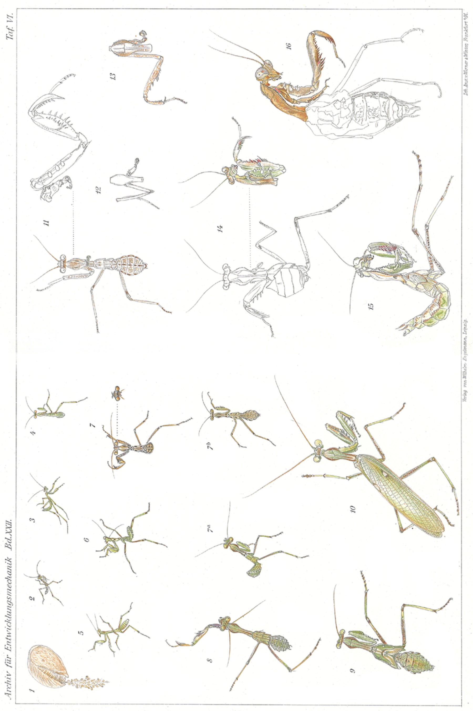
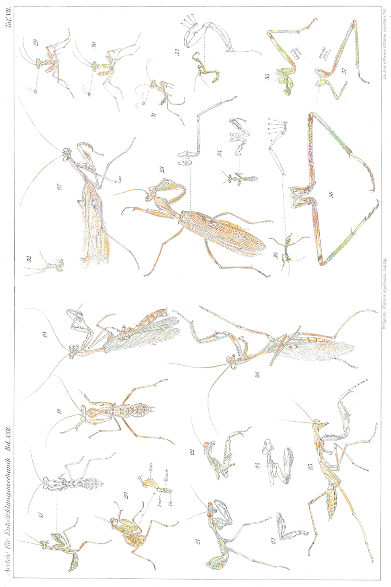
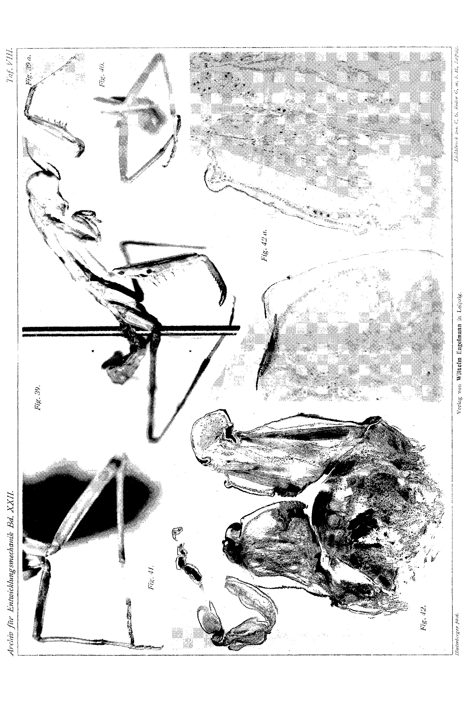
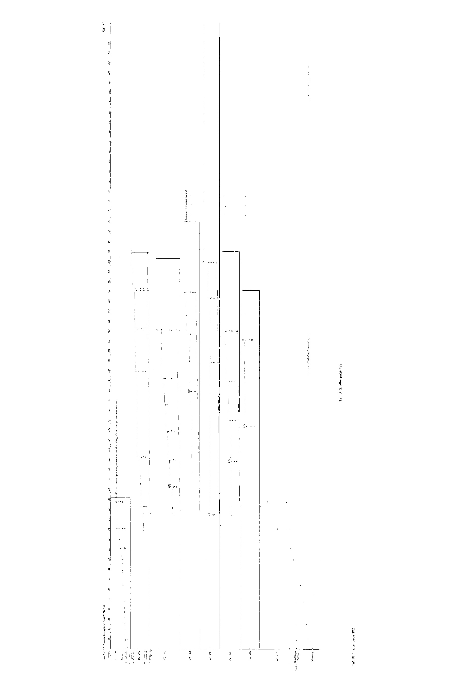

# Rearing, Colour Change and Regeneration of an Egyptian Praying Mantis (*Sphodromantis bioculata* Burm.).

By

**Hans Przibram,**

Privatdozent at the University of Vienna

(including some regeneration experiments by stud. phil. Isaak Werber).

(From the Biological Experimental Institute in Vienna.)

With Plates VI—IX

Received on 24 May 1906.

*Archiv für Entwicklungsmechanik der Organismen*, vol. 22 (1906).

> **Full translation.** A complete English rendering of Przibram's study of the rearing, colour change and regeneration of an Egyptian praying mantis (*Sphodromantis bioculata*), with the tables and figure legends.

### Table of Contents:

|  |  | Page |
|---|---|---|
| I. | Procurement of Material and Statement of the Problem | 149 |
| II. | Rearing | 152 |
| III. | Experiments on the Causes of Colouration | 161 |
| IV. | Regeneration Experiments | 170 |
| V. | Morphallactic Processes and their Histology | 177 |
| VI. | Measurements on Growth Rate and Regeneration Rate | 181 |
| VII. | A Case of Partial Neoteny? | 187 |
| VIII. | Summary of the Principal Results | 190 |
| IX. | List of Literature | 191 |
| X. | Explanation of the Figures | 193 |

## I. Procurement of Material and Statement of the Problem.

In the winter of 1903/4 several members of the Biological Experimental Institute in Vienna undertook a journey to Egypt and the Sudan, whose chief purpose lay in the procurement of living animal and plant material which, otherwise difficult to obtain, could prove advantageous for experiments.¹

> ¹ Whoever is interested in the results of this journey, possibly as preparation for an excursion into these regions, will find them compiled in P. Kammerer, *Eine Naturforscherfahrt durch Ägypten und den Sudan* [A Naturalist's Expedition through Egypt and the Sudan]. Braunschweig, Zickfeldt, 1906.

Through the support of the Imperial-Royal Austro-Hungarian Ministry of Foreign Affairs, of the Imperial-Royal Austrian Ministry of Education, of the Imperial-and-Royal Austro-Hungarian Consular authorities, as well as of a series of other corporations and private persons, the enumeration of whom would be too long, but to whom all I should like on this occasion to express our warmest thanks, we succeeded in bringing a series of interesting experimental objects alive into our Institute and in further cultivating them there.

Among the animals (we had directed our attention only to invertebrates and the lower vertebrates) there proved to be, principally, a mantid, the two-spotted praying mantis, a fortunate catch for biological experiments. Undemanding in its nourishment and accustomed to the great temperature fluctuations of the desert region, it lays its eggs easily even in captivity, and the eggs, kept safe in their dense cocoon, are even less sensitive than those of our native *Mantis religiosa*. Now, the possibility of rearing a foreign mantid¹ already held in and of itself a considerable interest, which was further heightened by surprises concerning the number of moults; yet there were really two questions of a particular kind which made this object appear valuable to me.

> ¹ About the complete rearing of the native *Mantis religiosa* too nothing appears to have been published. Since the writing-down of this section I have, however, with Herr Dubuisson, in the entomological laboratory of the Natural History Museum in Paris, seen the rearing of the same, and in the present winter I have myself carried out such experiments, on which I shall report in a later publication. On the embryonic development literature exists, which will then have to be taken into consideration.

Firstly, the praying mantis mentioned belongs to those forms which are caught now in green, now in brown specimens, which colourations have long been brought into relation, as "protective colouration," with the prevailing colours of nature: the green of the vegetation and the brown of the earth and of the wood. Long had I resolved to test experimentally whether the green colouration in many orthopterans is thoroughly peculiarly fixed in the animal plasma, or whether it can be induced by external factors such as, for example, light, chlorophyll-nourishment, etc.

It is indeed well known that a great number of hypotheses on the coming-about of the useful protective colouration have been put forward; now it was supposed to be a colour-photographic process (Wiener, 1895), now the colouring substances of the food (Poulton, 1885, 1893, Maria Gräfin Linden, 1899), now "natural selection," which in Darwin's sense leads to the "survival of the fittest" (Weismann, 1876), indeed even a functional adaptation of Lamarckian kind (Piepers, 1903) was supposed to provide the cause, in that the habit of seeing particular colours, hence a kind of "looking-oneself-into-it," would be decisive.

The second question, which engaged my interest in a general respect, was that concerning the regeneration of the first (front) or "raptorial leg." Bordage (1899) was able, namely, in two African *Mantis* species (*Mantis prasina* and *pustulata*) to establish only the regeneration of the tarsus on this extremity, whereas further proximally no replacement was effected, but rather all the animals perished. He believes that this is unavoidable, because the animals could catch nothing. According to his views one would then have to assume that the more far-reaching regeneration is not developed at all, since it could not have been reared from surviving injured individuals.¹ The regeneration experiments I had entrusted to Herr stud. phil. Isaak Werber, who took them in hand with commendable patience, but was later prevented, by absence from Vienna precisely in the critical time, from completing them. So I have then myself carried these experiments further too, in order not to forfeit the most interesting results, and have also preferred to incorporate the results already achieved by Werber, with his agreement, into the present report, so as not to disturb the logical construction of the work.

> ¹ Against the extreme views of Bordage, Weismann himself turns, in his "Tatsachen und Auslegungen der Regeneration" [Facts and Interpretations of Regeneration]. Anat. Anz. XV. 1899. Not in every species has regeneration arisen anew in connection with autotomy, but rather it is often inherited from ancestors, autotomy being the secondary phenomenon.

The naming of our species is, according to Werner (p. 52), *Sphodromantis* (Stål) *bioculata* Burm. The genus is also called *Hierodula*.

In December and January this mantid still roamed about on tamarisks and on acacias overgrown with climbing plants.²

> ² Werner (1905) writes on p. 10: "In Egypt only few species seem to have a particular time in the year in which imagines occur without larvae. Of most I found, e.g. in July and August, larvae of various ages alongside the imagines, and only of few indeed larvae but no imagines, or vice versa. The simultaneity is most striking in: *Lapidura riparia* (simultaneously eggs, larvae of various stages, imagines), *Sphodromantis* (simultaneously freshly hatched as well as older larvae up to the last moult, imagines)."

Both green and also brown specimens were captured, in both sexes, often on the same day. A predominance of the one colour on a correspondingly coloured locality, or a preference of the animals to keep themselves on objects coloured in agreement [with themselves] or to flee toward such, could not be perceived.¹ The first pair captured consisted of a green female and a brown male, which was chasing after the former.

> ¹ Werner (1905) writes on p. 53: "The assumption that the brown specimens of *Hierodula* or of any other mantid occurring in green and brown form are supposed to occur on dry, withered [plants], the green ones on the contrary on fresh, green plants, I have found, after many years of observation, to be completely unjustified. Both forms occur side by side, under exactly the same conditions of life, in all mantids of the palaearctic region that I was able to observe living freely."

Repeatedly egg-packets were found deposited on twigs, as also such [packets] deposited by the captured females during the journey on the lid of the zinc-sheet cages in which they were kept isolated.

## II. Rearing.

Five egg-packets, whose deposition had taken place at the end of December until the beginning of February, hatched in Vienna between the 16 April and 11 May 1904, by no means in the sequence of the deposition (cf. Table 1).

In spring (and in the following winter) the rooms in which the praying mantises were housed were heated to about 25° C.; in summer no heating was done, so that now a somewhat lower, now a somewhat higher temperature prevailed.

Necessary for getting on well is a certain measure of dampness, which they receive in their homeland through the nocturnal dew — very strong, as we were able to convince ourselves — and which must be replaced for them as well as for their egg-cocoons in the room by daily (single) spraying with a fine water-atomizer. As nourishment, mealworms (which we had brought along from Europe) had been used on the journey for the old animals. For the hatching little animals these are not usable on account of their size and hardness; aphids, on the other hand, provide a suitable food (probably the natural one).²

> ² As Burmeister used this [mealworm] for the Argentine mantid, and as it is often depicted for our native *Mantis*.

Since the metamorphosis of *Sphodromantis bioculata* is probably not described, the first of the hatching packets was at first used for a control culture. In how far the same later still served for other experiments is to be seen from Table 2. The remaining packets were from the outset put into the service of experiments, about which Tables 1 and 2 give clarification.

### 1. Stage.

All egg-packets were found hatched in the early morning, and it seems that the light-stimulus acts, in the normal case, as the trigger for the moment of hatching. As a rule, namely, all the young had already crept out by the time of the inspection; only once did it succeed in surprising the first little animals at their creeping-out (cf. Egg-packet III, Table 1). It was now done, when only three little animals had left the eggs, that the cage with the whole packet was put into the dark. This had the consequence that only on the second-next day a further specimen hatched, on the 4th day thereafter two more, on the 6th day twelve more, and then still seven at various intervals from the 9th–14th day.

Thereby some may have dried up without hatching, since the number of 25 young ones is a disproportionately small one: up to 160 eggs were counted in one packet (data cf. Table 1). At once on hatching the larvae cast off their first skin, so that the same is still found, mostly on a long thread, the rachis of the egg-packet, hanging on the cocoon (Fig. 1 Pl. VI). The first larval stage therefore actually lasts only a moment, provided the larvae are not artificially (through darkness) hindered from leaving the cocoon. The colouration of the first skin is almost the same light brown as that of the cocoon. Its actual length is difficult to give in the shrunken state after the moulting of the larvae. An egg-shell is about 7 mm long, 1–1½ mm wide (measured after the hatching of the little animals).

### 2. Stage.

(Fig. 2 Pl. VI.)

The larva that has hatched out of its first larval skin, which finds itself in the second, locomotive¹ stage, is an exceedingly

> ¹ The first stage is admittedly locomotive only in so far as it is brought out of the cocoon (as a skin) together with the developing second stage.

nimble creature of about 7 mm total length (reckoned from the frontal line connecting the eyes to the tip of the abdomen), of which about 3 mm fall to the neck-shield (thorax).

Except for wings, sexual characters and colouration, it already shows approximately the characteristics of the imago.

The general colour (which for us, on account of the experiments coming into question, is of particular importance) was, in all the hatched larvae (also of the remaining egg-packets),¹ a light sienna-brown: only the eyes, the vicinity of the femora, tibiae and of the first tarsal segment on the middle and hind leg-pair are pale-yellow-green.

The little animals at once show negative geotaxis, which drives them up to the ceiling of the cage or onto flower-pots or twigs placed in [the cage]. If these are infested with aphids, the larvae at once fall upon the aphids, in that they seize them with the blow of a front or raptorial leg and, clamped between the teeth of the femur and the tibia, carry them to the mouth. Any wings [of the prey] are not eaten along with it.

As soon as the animals had begun to feed, a gradual green-colouration ensued, whereby first the forehead and front legs came in for it.

That it is not, say, the mere lapse of time, but rather the intake of nourishment, that is decisive for this colour-change, was shown by a later experiment (Egg-packet III, Partie γ on Table 1): if, of larvae of the same egg-packet, the one [group] was fed, the others left without nourishment under otherwise like conditions (notably spraying!), then the latter did not take on the green-colouration up to their death (which possibly occurred only on the 25th day after entry into the first stage) (Fig. 29); whereas the nourished ones, on the same day, exhibited an almost complete green-colouration (Fig. 30 Pl. VII).

Thereby these animals all had an extraordinarily prolonged 1st stage, since they belonged to the dark-culture discussed: all the more clearly is the coinciding of the greening with the intake of nourishment to be seen. With the control culture, hatched in the light, the second (plus the first!) stage lasted only nine days in the most rapidly developing individual; with the dark-cultures (with nourishment, Partie β) the first stage (with the

> ¹ Of those [packets] collected by us and deposited by our *Sphodromantis*-females. Nevertheless there are also *Sph. bioculata* that hatch out green.

egg retained!) [lasted] 6 [days], the second 39 days, and only during the second stage (after the light-animals had already begun the next moult) did the complete greening set in.

That, on the other hand, the kind of nourishment is a matter of indifference will only emerge from the experiments on the colour-change.

Our larva of the 2nd stage grows under stretching of its skin and finally hangs itself, with the head downward, on a horizontal leaf or on the cage-ceiling (if the same does not consist of smooth material), spread out with the two hind leg-pairs, and awaits the onset of the 2nd moult (Fig. 32 Pl. VII).

### 3. Stage.

(Fig. 3 Pl. VI.)

The skin finally bursts along the median suture of the thoracic shield, and the animal, clinging on with the two hind leg-pairs, first draws the head and the raptorial legs out of the skin-sheaths; then it hooks itself with the front legs either onto the skin (or, notably with the later moults, onto the leaf or the cage-ceiling), and frees the abdomen, which at first hangs down limply, and finally the two hind leg-pairs out of their sheaths.

The total length of the cast-off skin amounts to about 8 mm, that of the hatched animal of the 3rd stage to about 10½ mm, of which about 4½ fall to the neck-shield.

The form is not strongly altered; in the colouration the green has come forward still more strongly, so that only a stripe between the eyes, most of the joints and a marking on the thorax have remained brown; but to this there now comes a spreading of the brownish colour onto the upper half of the eye, which can already begin to make its appearance in the preceding stage (cf. Fig. 30 Pl. VII).

The third stage probably always lasts somewhat longer than the second normally does, about 14–16 days at the minimum.

### 4.—6. Stage.

(Fig. 4—6 Pl. VI.)

About the 3rd–5th moult, which lead to the 4th–6th stage, there is nothing new to remark. These stages are all very similar in form and colour, and at most the gradual sharpening of the brown thoracic marking — similar to a knobshaped, thickened multiplication-sign at the bar-ends — may call for mention. Each of these stages lasts about 3–4 weeks and brings the total length an increase of 2½–3 each, the thorax one of about 1 mm.¹

> ¹ As will be shown later, the number of moults is not constant, and therefore the measurements too do not always agree.

### 7. Stage.

(Fig. 7 a and b Pl. VI.)

The 7th stage of the control culture brought the first surprise: a specimen which had escaped and was caught again at the window, striving upward, in the size and form of the 7th stage, had a brown colouration! The larvae remaining in the control culture at the same time were, by contrast — although some had likewise entered the 7th stage — remained green. The sameness of the stages was recognizable not only by the size (about 25½ mm total length, 8½ mm thorax length) and the general habitus, but notably also by this, that in this stage there had first become visible the wing-rudiments of the two wing-pairs, projecting somewhat, one behind the other, over the sides of the respective body-segments. Incidentally, the colouration of the brown individual copied all the markings that the green rust-brown exhibited, in a dark grey: these are the lateral borders of the thorax, the frontal stripe and the upper half of the eye, the femora — a narrow ring before the tibia-joint excepted — [and] some markings on the raptorial leg and on the abdomen.

From the 7th stage onward, brown specimens have later appeared in various cultures; this phenomenon can only be approached at all, and an interpretation attempted, after the carrying-out of the experiments on light, nourishment, etc. The 7th stage lasted sometimes only 11 days, and reached a total length of 25½ mm (thorax 8½ mm).

### 8. Stage.

(Fig. 8 Pl. VI.)

After the 7th moult had been gone through, the said specimen that had become brown showed again a back-colour-change to green tones; the remaining specimens (of the control culture) had also in the 8th stage remained green. Yet individual body-regions exhibited a number of various colours, which, with their great varia- I consider it idle to enumerate; in the figure the colouration of the individual which had been brown, and is now becoming green again, is reproduced.

The 8th stage lasted in this case about a month, reached a length of 28½ mm, the thorax one of 12½ mm; the wing-rudiments covered the body-segments concerned, without however yet overlapping one another; the cerci stood out distinctly as forceps-shaped curved little pins (these can already be visible even in the 7th stage).

### 9. Stage.

(Fig. 9 Pl. VI.)

The 9th stage of those control-culture animals that first completed their metamorphosis must be addressed as the nymph, or mobile pupa, of the same. The wing-rudiments no longer lie merely one behind the other, but the first pair projects backward over the second, drawn out at the sides into a long lobe. The colour of the wing-covers is, in contrast to the translucent light-green wings, dark green, and the eye-spot responsible for the species designation appears in white colour, bordered with dark toward the front.

For the rest, the colouration behaves, as against the preceding and the following imago-stage, not strongly differently.

The total length of the 9th stage was about 42 mm, the length of the thorax 13½ mm. The animal remained in it about 17 days; in the last period it ceased to feed — as food, flies were predominantly used for the later stages, which the praying mantises know how to seize, just as they do the aphids, by a stroke of the raptorial leg.

### 10. Stage.

(Fig. 10 Pl. VI.)

On 11 September 1904 the first imago appeared, a male. Whereas the abdomen in the earlier stages had a broad rhombic shape, it had now assumed the long-cylindrical form characteristic of the male of the Mantids. The male copulatory apparatus, with the copulatory spine¹ curved from right to left, was well developed. The attempt

> ¹ The copulation, egg-laying, and other biological observations on *Sphodromantis* and our native *Mantis religiosa* will be described in a later work.

to use the male for impregnating a female of our *Mantis religiosa* unfortunately failed owing to the wildness of the latter.

A secondary sexual character is also afforded by the greater length of the male antennae and the generally more slender habitus. The wings are rolled up shortly after hatching, and only gradually (similarly as in the butterflies) are they stretched out under rocking movements, finally crossed and folded together over the abdomen. They then projected (in the case described) 16 mm beyond the abdomen; the total length of the animal (this overhang deducted) was 52 mm, the length of the pronotal shield 15½ mm. The colours present, through the opalescent tones of the wings and the multicoloured and serpentine-marked ornamentation of the raptorial legs, a splendid impression. The colouration was in general a bluish green, the eyes, coxae and tibiae of the raptorial legs yellowish-green, the other extremities likewise, but the tarsi, beginning from the end-part of the basal segment, brown, the tibia-femur joint with brown rings, the femur speckled with brown; reddish-brown besides the edging and median line of the pronotal shield, paler the antennae with the exception of the base, the forehead between the eyes, the bordering of the outer wing-cover margin; almost white are the tarsi of the raptorial legs (at their ends, however, each with a dark spot), three raised pustules on the front margin of the coxae, and the darkly-bordered eye-spot, lying laterally at the end of the first third of the wing-covers; the inner seam of the raptorial-leg femur is orange-coloured, interrupted by a blue band-spot in the direction of the longest grasping teeth.

While the specimen described already succumbed, 4 days after hatching from the nymph, to the injuries inflicted by the female *Mantis religiosa*, other animals of the same egg-packet lived as imago up to 80 days (♂, cf. Table 2, experimental animals Nos. 23, 25, 26). Despite the great longevity it did not, however, prove possible to obtain a copulation of the Hierodulae, and there seems to have been present in the males a degeneration of the sexual glands. They showed altogether no copulatory drive. The females behaved in this respect differently, but since, at the time of their hatching, no males of our *Mantis religiosa* were any longer alive, no hybridization could be attempted either. Thus for this time the hope vanished of rearing a second generation in captivity.

### More Stages.

One might have believed that, with the successful rearing of the Egyptian praying mantis up to the first hatching imago-stages, the number of moults would have been established and that the further animals would display the same number of stages. Here, however, came the second surprise¹): those animals which had not completed their metamorphosis before the winter of 1904/5 — whatever the reasons for this might have been, of diverse nature — entered over the winter upon an extraordinarily slowed growth-tempo, moulted at much longer, sometimes 2-month-long intervals, and hatched only in the spring or summer months of the year 1905, inserting in the process new (1–2) moults before reaching the imago-state! (cf. the Tables). It may yet be mentioned that the size of the late-hatched imagos did not exceed that of the early-hatched ones.

As regards first of all the retardation of growth in the winter months, this is indeed a phenomenon very well known for our latitudes, which appears to stand in connection with the cold. In the Hierodulae, however, the temperature was rather higher than in summer (on account of the heating). One might think of a "mnemic" phenomenon in the sense of Semon; but for the home of the Hierodulae this "recollection" does not apply, since it is precisely in the winter months that the sexually mature imagos disport themselves there. Nor can the retardation, according to the experiments to be discussed later with dark cultures and cultures in variously-coloured light, well be ascribed to the direct influence of the weaker winter light²).

Probably the strong retardation of growth, as well as the increase of the moult-number, is connected with the operations,

> ¹) Since the writing of this section, data on the variability of the moult-number in caterpillars have become known to me; cf. Pictet, 1905, p. 103, and Kellogg, 1903, p. 747. In other insect groups with a long larval period, not very strong fluctuations have been ascertained, according to F. Henneguy (1904, p. 497).

> ²) Here it might also be mentioned that caterpillars raised from eggs of the same *Arctia caja* (Tiger-moth) grew and developed considerably faster in the dark than in the light. In the same butterfly there occur in one clutch eggs which, cultivated in a warm room, develop into imagos still before the winter, while the others overwinter as caterpillars: unfortunately I neglected to check the moult-number in both, so that new experiments are necessary.

which were undertaken for the purpose of regeneration-experiments, and for which in September all the not-yet-transformed specimens had to be drawn upon, since only a small number were still alive. Should this interpretation be confirmed, it would reconcile the seemingly contradictory statements of Newport, that caterpillars after severe operative interventions carry out the usual transformations more slowly, and of Dewitz and Godelmann, that operations bring about an acceleration of the moults (in *Ephemera*- and *Bacillus*-larvae respectively): in that, although one moult may indeed set in faster than normal, the transformation might nevertheless be retarded through the insertion of further moults or of longer pauses.

In the Crustacea (Decapods), Zeleny has unambiguously demonstrated that operated crayfish moult faster than non-operated ones, and that the moulting-speed increases further with the degree of amputation of limbs, with which a correspondingly faster regeneration goes hand in hand¹). Since, however, in the Crustacea no such sharply determined final stage occurs as the imago of the insects, they on the contrary continuing to moult long beyond sexual maturity, it could not hitherto be determined whether the moults that follow the operations are ones inserted into the normal number, or merely faster-attained ones. In the insects the means are given us to decide this, and it would certainly be a rewarding task to subject the findings made on the Hierodula — only incidentally, and therefore without the necessary controls — to a re-examination. Until then I should wish the interpretations given to be taken only with caution.

From the more incidental findings of the rearing we may now turn to the deliberately conducted experiments, which were meant to ascertain the causes of the green or brown colouration of the praying mantis.

> ¹) Contrary to my earlier, negative findings on *Mysis* (Erg. der Physiol. p. 111), I can now, according to records made occasionally from as-yet-unpublished regeneration experiments on *Callianassa* and *Alpheus*, confirm Zeleny's findings! With this, however, it is by no means said that this must behave so in all animals and under all conditions.

## III. Experiments on the Causes of Colouration.

The arrangement of the experimental series for deciding the question whether the green colouration is inducible by external factors can be seen from Table 1. The following factors were expressly examined: light and darkness, colour of the incident light (egg-packet II), chlorophyll-free (egg-packet III) and etiolin-containing nutrition (egg-packet IV), colour of the reflected light ("surroundings", egg-packet V). The selection of these factors had been made according to definite lines of questioning, whereas with other factors (temperature, humidity, mechanical agents) no experimental series specially directed thereto were set up; a few experiments on electrical stimulation were carried out on animals of the control culture. The results of the experiments will nevertheless permit us to give an account of all these factors.

The first question ran: "Is the appearance of the green colouration in the praying mantises bound to the presence of light, as is mostly the case with the plant-chlorophyll?"

For the examination of this question, the larvae of the II. egg-packet were, shortly after hatching, distributed into eight equal portions, each upon a small sheet-metal cage, and fed with aphids. These were given to the one portion (β) without plant-parts, to all the others (α) on the infested green plants. Portion α and portion β were exposed to the normal daylight, while the remaining portions were covered with cardboard hoods. Into the upper and front (light-facing) side there was set, in the following portions, a red, or yellow, green, blue or violet glass pane respectively, while the last portion was kept entirely darkened.

The comparison of portions α and β was meant to dispel the — admittedly from the outset, on account of the body-structure of the hatching larvae, improbable — misgiving, that these might perhaps nourish themselves at first also on plant-food, and that chlorophyll-grains might directly condition their colouration. I nevertheless did not consider it useless to conduct this experiment as well, because statements of initial plant-nutrition in *Mantis* had come to my ears. The rearing in the small metal cages turned out unfavourably. The individuals kept under yellow and green light, as well as those exposed to daylight without plant-parts (portion β), did not get as far as the 1st moult; of the animals exposed to daylight with plant-parts, and of those in the red light, several got past the 1st moult, which was however strongly retarded, of those kept in the dark past the 2nd moult, of those kept in the violet light past the 3rd, and finally the last specimen of the blue ones past the 4th moult (and developed up to the imago). All individuals had, as soon as they had at all reached the stage in question which normally becomes green, assumed the green colouration, so namely also those in the dark. The direct uptake of chlorophyll-grains could not yet be refuted by this experimental series, because all the animals of the portion exposed to daylight without plant-protection had perished before reaching the stage in question.

The later experiments, in which all precautions against the uptake of chlorophyll were taken, are to be discussed in connection with the influence of nutrition; they make, however, the assumption of initial plant-nutrition and its influence on the green colouration appear wholly untenable. The perishing of the various portions in the sheet-metal cages I attribute to the effect of too great overheating: this explains the premature death where plants were lacking, behind which the larvae could protect themselves from the direct heat-rays, in the yellow and green light, as well as in the red (the somewhat more favourable result here, despite the predominance of the heat-rays, may have rested on the lesser permeability of the red panes used to light-intensity), whereas the more favourable effect in the heat-ray-blocking violet and blue light, as well as in the dark, where however the stronger total heating of the interior may have co-operated unfavourably. That darkness in and of itself (the already-discussed retardation of hatching deducted) exerts no destructive influence in rearing, will be shown by the experiments, to be discussed later, of successful dark cultures (from egg-packet III and V).

The answer to the first question can therefore be formulated: "The appearance of the green colouration in the praying mantises is not bound to the presence of light."

Second question: "Is the appearance of the green colouration in the praying mantises bound to the uptake of chlorophyll-containing nutrition?"

The responsibility of chlorophyll for the green colouration, already taken into consideration by Poulton for certain caterpillars, has in more recent times been extended by Maria Countess Linden, as a consequence of chemical investigations, not only to the green colours of the Orthoptera, but even also to the differently-coloured wing-tones of the butterfly (*Vanessa urticae*) arising from chlorophyll-eating caterpillars. It had therefore to be worth while to examine experimentally to what extent the nutrition was of influence on the green colouration of the brown-born praying mantises.

Apparently the setting-up of the experiment is made easier for us with our object by the fact that it does not take plant food but animal food.

It is now of course certain that no directly fresh, unaltered chlorophyll granules are taken up. Since, however, one could think not only of the unaltered utilisation, but in particular of the reconstruction of chlorophyll assumed by Countess Linden out of the breakdown stages formed during its digestion and resorption, the ordinary meat diet, namely aphids [plant lice], was suspect, since these animals belong precisely to those that are supposed to use the chlorophyll of plants for their coloration [cf. Macchiati¹ on *Siphonophora malvae* Morley and *S. rosae* Koch], and a reconstruction after passage through the gut tract of the aphids, as also of the mantis, could be asserted.

> ¹ Macchiati seeks to meet the objection that this is not a matter of animal chlorophyll but of ingested plant chlorophyll by pointing to the presence of the same also in those aphids which live on coloured flower petals.

I therefore directed my attention to finding an unsuspect diet, and tried out a series of foodstuffs which, without containing chlorophyll, could be taken by the larvae. First I tried liquid food, which was offered on little pieces of sponge, since I had observed that the young larvae eagerly sucked up water from such. Meat extract, however, given in this form, was nevertheless spurned, and the larvae used all preferred to die rather than touch the sponges. Cane-sugar solution, on the other hand, was successful in so far as it was readily sucked up by the larvae and, as was shown by the starvation experiment carried out on larvae of the same egg-packet (III), rescued these from death by starvation. Yet the little animals became feeble, so that further speedy remedy had to be sought. Fly maggots, reared from carrion, were spurned, probably on account of their penetrating smell (or taste?), for the larvae turned directly away from them; at small Entomostraca (little mussel-shrimps and the like), which still wriggled on wet filter paper, the larvae did snap, but were unable to grasp them. Finally, in the utmost need, a suitable food was found in the moth-midge (*Psychoda*), whose larvae live in mud and carrion and which, even when caught in a cellar, were unlikely to take any green plant food, nor do they possess any green-coloured parts. Like the aphids, these midges were caught by the mantises themselves even in the dark and devoured, with the exception of the wings.

The larvae of the III. egg-packet used were divided into three batches for the experiments; the first (α) was kept in the light, the two others were left in the dark. Batch β was otherwise reared analogously to the light culture, while γ was drawn upon for the starvation experiment already discussed. The renewed parallel experiment with the dark culture was intended to serve the purpose that, if despite all precaution chlorophyll should appear in the light, this could be demonstrated, by its absence in the dark culture, to be a substance behaving analogously to chlorophyll. This precaution proved justified in so far as, still during the pure cane-sugar feeding, the animals of the light culture α first began to turn greenish on the forehead, and the greening, after receipt of the midge diet, increased steadily, and indeed first on the forelegs; even before the 2nd moult the hind body too had become green, after the 2nd moult the animals were a beautiful blue-green and retained this colour through four further moults (the 6th moult was survived by only a single specimen). But now exactly the same happened with the dark culture β as well: here too there appeared a, ultimately equally complete, greening as in the individuals kept in light or on normal diet.

We thus arrive at the answer to the second question: "The appearance of the green coloration in the mantises is not bound to the uptake of chlorophyll-containing food."

Third question: "Can the use of etiolin in place of chlorophyll modify the greening of the mantises?"

Poulton (1893) achieved, on caterpillars of *Tryphaena pronuba*, which he reared (in the dark) in place of cabbage leaves on the chlorophyll- and etiolin-free midribs of this leaf, an absence of the ground coloration, which on feeding with green or etiolated cabbage leaves can be brown or green. Although, given the dispensability of all plant food for the mantises, the dispensability of etiolin was thereby established, the substitution of chlorophyll by etiolin was nevertheless also tested, in order that complete parallels to Poulton's experiments would be obtained. If it is already difficult to obtain really chlorophyll-free food from plants, this difficulty was further increased by the fact that the mantises took only animal food (apart from the insufficient and etiolin-free cane-sugar solution). The substitution of chlorophyll by etiolin could therefore be carried out only in such a way that aphids were reared on etiolated plants; such were found on plants which had been raised from bulbs in a dark cistern of the Biological Experimental Institute for botanical purposes. Their coloration, in contrast to the green of the aphids kept in the light, was a pale yellow, apparently corresponding to etiolin. Since, however, these "etiolated" aphids could be obtained only in relatively small quantity, the mantises nourished on them and, naturally, cultivated in the dark in order to prevent later chlorophyll formation (egg-packet IV), eked out a meagre existence. None was able to survive the 2nd moult; nevertheless the greening did begin on the forehead in the longest-surviving individuals (Fig. 31 Pl. VII).

Now, however, it must not be concealed that later, fully green aphids too were found on etiolated plants, and that it is therefore quite doubtful whether the pale colour has anything to do with etiolin, or even whether the green colour has anything to do with chlorophyll. The decision must first be reserved for the chemical investigation.

But since, after all, only that which was chlorophyll or etiolin could be altered under our experimental conditions, there results as a cautious answer to our third question: "The use of etiolin in place of chlorophyll is not able to prevent the greening of the mantises."

Fourth question: "Can the colour of the surroundings (the kind of light reflected by the surroundings) exert an altering influence on the normal coloration of the mantises?"

The inmates of the last egg-packet (V) were, for the answering of this question, brought into the dark immediately after hatching, in order to heighten as far as possible any sensitivity to reflected light. After in all of them the 2nd moult had taken place with the assumption of the thoroughly green coloration, the half of the specimens (20) were reared on further in the dark as a control, while the others were brought, two by two each, into coloured cages. These consisted of little wooden boxes which were lined inside, with the exception of two sides and the upper surface, with coloured paper. The one side was spanned with colourless organtine, which took care of the ventilation; the side facing the light and the upper surface were provided with colourless glass panes. Onto the upper surface there was furthermore set a board inclined at 45°, which, lined from below with the same colour as the box in question, could also reflect the light falling in through the upper surface, coloured, into the box. In order not to disturb the uniform colour of the surroundings, the green leaves were for the most part removed from the plants offered together with the aphids, and as climbing aids for the young larvae little wooden sticks coloured the same as the box-colour were used, which latter were admittedly hardly necessary, since the animals soon learned to climb upward on the organtine and even on the smooth paper.

Ten different colours of the paper were used: red, brown, orange, yellow, green, blue, violet, white, grey, and black. Although in many boxes two further moults were observed (the animals were then preserved for other purposes), nowhere could any deviation from the green coloration be noticed, which in all inmates of the egg-packet in question had a somewhat yellowish tinge.

The assumption of the colours of their natural surroundings has, apart from in some caterpillars themselves, been observed in particular in the pupation of the same (Lit.: Poulton). One might therefore be inclined to believe that, despite the lacking influence by the surrounding colours during the larval stage, yet perhaps the nymph stage or the hatching imago of the Hierodulae directs its garb according to the surroundings.

But this too may, in consequence of the successful rearings up to the imago in the dark, in blue transmitted light, and in light in various surroundings (now with, now without plants), be regarded as highly improbable, since no corresponding regularity in the colour could be discerned.

"The colour of the surroundings is thus not able to exert an altering influence on the normal coloration of the mantises."

Fifth question: "Are electrical or tactile stimuli able to call forth in the mantises a rapidly running colour change?"

The failure of all attempts to induce a coloration artificially in the mantises, on the one hand, and the spontaneous appearance of a colour change, on the other, prompted me to take into consideration whether perhaps, as is known for reptiles, amphibians, fishes and cephalopods, the colour change might be a physiological function and not a morphological alteration. To test this, green and brown specimens of the larvae were stimulated by means of the Steinach induction apparatus. The electrodes were thereby applied to various places, and the strength of the stimulation was carried on up to immobility or even to the death of the animals, but without the slightest change in the coloration being able to be noticed.

Since, according to Steinach, for tree frogs tactile stimuli of the surroundings are supposed to be decisive for the brown or green coloration, in that they assume the former colour on rough surfaces (hence also earth, bark, etc.), while they are green on smooth surfaces (hence also on green leaves, sticking to glass, etc.), it may here be pointed out that no such correspondence could be observed in the Hierodulae, although the housing of the various batches in cages of the most diverse material, etc. (cf. Table 1) would have allowed this to be ascertained (the phenomenon, incidentally, by no means occurs regularly in the tree frog).

"Electrical or tactile stimuli are not able to call forth in the mantises a rapidly running colour change."

Sixth question: "Can the various colorations of the mantises be derived from one of the hitherto known rules of heredity?"

If, with the various colours of the mantises, we are dealing neither with a morphological alteration inducible by external factors, nor yet with a physiological reflex act setting in rapidly upon stimulation, then the alternative remains open that it is a matter of a series of coloration stages fixed from the outset for each individual, which has been received through "heredity."

The adherents of the neo-Darwinian school in particular will have from the outset regarded this as the most probable. But if we follow the course of the colour transformations in individual specimens, then quite considerable difficulties arise in the application of the rules of heredity known to us.

In the first place, this is not a case such as, for example, in the hawk-moth caterpillars investigated by Weismann, where from a certain stage on either a brown coloration sets in or the green coloration is retained, but rather a second back-transformation of the colour too can occur; furthermore, the later complete rearing of mantises (continued on the occasion of the regeneration experiments, cf. Table 2) has yielded the remarkable fact that such an alteration of the colour can still take place even in the imago (experiments Nos. 23, 26). Here, then, we are dealing not only with differently coloured stages, but also with alterations after the attainment of the definitive form.

Can we derive these modes of the colour change according to the hitherto known rules of heredity? Let us assume that originally green and brown mantises are present and that these cross with one another. If we apply the Galtonian rule of heredity, then in the offspring there will be produced either a uniform mixture (such as, say, olive-brown specimens) ("regression", Pearson¹), or each descendant receives in some parts of the body characters of the one, in others of the other ancestor (thus, say, green and brown "pied" ones), or finally each descendant looks "exclusively similar" to only one ancestor ("exclusive or alternative heredity"). In the latter case there would always again arise green and brown individuals, such as are predominantly encountered in nature. In none of these cases, however, can our colour change be fitted in! If we consider further the special Mendelian rules of heredity, which admittedly would probably not be applicable at all to individuals of the same race, then these would yield all the more a falling-apart into purely brown and purely green specimens (possibly after the predominance of a hybrid generation).

To the assumption of a "mutation," finally, the whole nature of the colour change is contrary, which, as may here be expressly emphasised, mostly proceeds quite gradually: for it is indeed

> ¹ A brief compilation of the hitherto known rules of heredity I have attempted in my "Einleitung in die Experimentelle Morphologie" [Introduction to Experimental Morphology]. Vienna, Deuticke, 1904 (12th chapter).

discernible neither in the hatching larvae nor in any way how often they will later change colour, nor does any other character appear to be altered along with it at the same time.

If we wish to hold fast to the heritability of the phenomenon, then we must either make the supposition that there were always, besides green and brown ones, also such individuals as are, one after another, green and brown in varying alternation, or else that there is a mode of heredity in which the young, at various times (and indeed not, say, bound to definite stages), "appear similar" now to one ancestor, now to the other.

While an exclusion of the first alternative cannot strictly be given without extensive, almost impossible heredity experiments, the assumption of which, however, amounts to a complete renunciation of any clarification, I am in a position, for the second alternative, to draw upon an analogous case, where likewise a "successive" heredity of characters of the parents took place, namely in the eye colour of young cats¹. Hitherto, however, to my knowledge such an "alternation of the heredity characters" has not yet been taken into consideration as a modality of heredity, wherefore as the answer to our sixth question I must give the answer: "The various colorations of the mantises cannot be derived from one of the hitherto known rules of heredity."

> ¹ The results are not yet published, since further generations are to be awaited.

Seventh question: "Does the colour change observed in the mantises offer advantages for the action of a 'natural selection'?"

By Cesnola a preliminary report on experiments on *Mantis religiosa* in Naples has been published, which establishes experimentally the favourable effect of the green or brown colour, according to the predominant colour of the background. If green and brown *Mantis* were tied up on green or brown bushes, then those that sat on differently coloured ground were spied out and snapped up by birds, while those on similarly coloured [ground] remained over.

If, however, we now wish to transfer these results to the conditions in nature, in order to demonstrate the survival through natural selection, then we run up against the following difficulties: 1) The individuals of a particular colour do not remain sitting on the background in question.

2) They show no endeavour whatever to seek out the like-coloured surroundings on the approach of danger (as I too was able to convince myself for *Mantis* in the Vienna region).

3) In a locality distinguished predominantly by a particular colour, the animals of that same colouration are not always more frequent than the differently-coloured ones.

4) Hence a free intermixing of the two forms will always take place, and therefore the loss of animals caught "on differently-coloured ground" can make no difference in any direction.

To all these difficulties there is now added the colour change observed in the Hierodulae, which, proceeding without any connection to the coloured surroundings, can make the animal in the stage in question now conspicuous, now less conspicuous.

Even were the animals to live at first in a like-coloured locality and not to leave it, they could nonetheless, at a later stage — having become differently coloured — fall victim to their enemies; still more: animals which as the imago were protected in like-coloured surroundings can, while remaining there, within a short time become unprotected. Now there are added to all these complications also the conditions of heredity: were a green pair, which escaped its enemies on green surroundings, to have offspring which at a certain stage turned brown, without the green surroundings having changed, then their descent from the green imagos would be of no use to them — imagos which had perhaps themselves likewise once passed through a brown stage, but in brown surroundings!

"**The colour change observed in the praying mantises offers no advantage whatever for the operation of a 'natural selection.'**"

## IV. Regeneration Experiments.

### (Cf. especially Tables 2, 3 b–f.)

Our regeneration experiments were begun by I. Werber on animals of the 2nd, 3rd and 4th stages (the 1st stage, which is concluded almost simultaneously with hatching by a moult, could for this reason not be operated upon).

First the extirpation of one eye was attempted, namely on 6 larvae of the 2nd stage; yet all died within 2 days, in that they could not survive the severe injury.¹ The operating technique for the small larvae was the following: Since the animals in their juvenile stages showed a very great nimbleness, and therefore, without being crushed, could be held neither with the hand nor with the finest forceps, I. Werber picked them up with the tip of a wet brush and brought them therewith onto a cork plate, where they were deprived of their freedom of movement by a very narrow strip of paper laid crosswise over the back, which he had pinned fast at both ends with needles. Hereupon the operation could be proceeded with using a small pair of scissors. The operations on the three pairs of legs were very well tolerated. With the middle and hind pairs of legs this is little to be wondered at, since the extremities cut into in the femur were always thrown off at an oblique seam in front of the femur–trochanter joint, where therefore a preformed breaking-point exists, as in so many other arthropods (Figs. 40 and 41). The foreleg, on whose regeneration we were most eager because of Bordage's reports, was in most series of experiments cut through in the middle of the very long coxa, which, in the relative length of the severed portion, corresponds roughly to the autotomy in the femur of the other pairs of legs. In order, for the comparison of the regenerative capacity of the foreleg with the two hind legs, to be able to determine the value of the severed members in an entirely analogous manner, in later series of experiments (Przibram, Egg-packet V and No. 22) on the one hand the coxa was cut through on a middle or hind extremity (that is, proximal to the preformed breaking-point), and on the other hand a foreleg was cut through in the femur (Fig. 39a). In the latter case the cut surface, coming to lie roughly in the middle of the femur, did not indeed correspond exactly to the preformed breaking-point on the other legs; but with the raptorial legs there is no autotomy (which is in agreement with the older reports).

> ¹ In the meantime I. Werber has succeeded in demonstrating the regenerative capacity of the insect eye on another object; cf. Regeneration of the extirpated antenna and eye in the flour beetle (*Tenebrio molitor*). Archiv f. Entw.-Mech. XIX. 1905. p. 259.

On the tibia and tarsus operations were not carried out, in order not to fragment the experimental material still further than was in any case entailed by the many other experiments. Since the regeneration of the tarsus alone was observed by Bordage also in the raptorial legs of mantids, nothing essentially new could well have come of it, except perhaps the unwelcome discovery that, on account of the readily occurring autotomy in the two hind pairs of legs, the experiments would only have repeated those following loss at the preformed breaking-point.

Only a few animals succumbed to the consequences of the operations. Those deprived of a raptorial leg too showed only slight bleeding. They could snatch their prey as before, by making use of the second raptorial leg that remained. This is not surprising, since even under normal conditions they often do not strike with both raptorial legs at once, but snatch the prey between femur and tibia by means of a single raptorial leg.

The regeneration process took in all cases the course typical for the Hexapoda: first the dark wound-scab formed at the amputation site, with which the visible process had reached its end until the next moult. Only with the shedding of the old skin did the regenerate come to light.

In all cases, both with the middle (Fig. 40) and hind (Fig. 41) legs, as well as with the fore (Fig. 39) legs, a proper new formation of the severed part had come about (whether the same had extended up over a part of the femur or still further into the coxa).

"**The young larvae of the praying mantises are capable of regenerating the raptorial leg.**"

Bordage had, in all those cases where regeneration occurred in his experiments, almost always found in the regenerated legs a number deviating from the normal tarsus-number 5, and indeed mostly the lesser number 4 — a behaviour which holds equally for the other Orthoptera examined for this purpose.² All our regenerates in the *Hierodula* too showed the tarsus-number 4, whereas this praying mantis normally likewise possesses a five-jointed tarsus on all legs. It must here be anticipated that regenerates obtained at all later stages as well always exhibited this "hypotypy" (Giard; or even fewer joints), and that specimens reared to the imago bearing regenerates no longer restored the normal number five, al-

> ² Literature compilation: Erg. der Physiol. I. 1902. H. Przibram, Regeneration [pp. 97, 98, 115, 116 discussed].

though the regenerate could grow up to almost the size of the opposite side (cf. e.g. Fig. 38, in agreement with the experiments of Brindley on the Blattidae). Apart from the deviating tarsus-number, the shape of the regenerated limbs showed no great deviations from the normal; naturally the newly-formed parts were, like all regenerates, softer and more turgescent, hence of a more rounded shape than the old ones, the armament with thorns, knobs, etc. also less pronounced. Striking was, however, the colouration of the regenerates, in that they mostly displayed not the colour which happens to predominate on the limb in question at the time of the visible appearance of the newly-formed parts, but that of an earlier stage passed through: thus the regenerates of larvae operated upon at the original brown stage (2), but which had meanwhile turned green, showed yellow-brown tones (Figs. 33, 36), whereas the regenerates of larvae operated upon later, but which had then secondarily turned brown, showed green tones (Figs. 11, 17, 18); the various shadings of green too followed the ups and downs of the stages passed through (cf. Figs. 14, 20, 34, 35, 37). At last, however — always once the imaginal state had been reached — the colour of the regenerate had caught up with that of the opposite side (which harmonized with the overall colouration of the animal), even when it had by far not been able to reach the latter's size (Figs. 13, 16, 19, 22, 26—38). The majority of the cases of the latter observations relate already to the larvae operated upon at far later times, which are now to be discussed.

For the testing of the question whether a gradual decline of regenerative force with advancing development could lead, even before the imaginal state, to the complete failure of regenerates on the foreleg, I undertook amputations in the middle of the coxa of the raptorial leg on exemplars in the 6th—8th stage.¹ Unfortunately, in September, when the stages in question were present simultaneously, so that operations could be undertaken for comparison, only a small number had remained alive, owing to the many experiments already conducted; of the 5th stage none were present any longer at the same time, so that the regenerative quality of this stage could only be specified by interpolation, which is admittedly of no great importance, because, as we shall see, even later stages still regenerated well.

> ¹ An operation carried out in the ninth stage yielded, in consequence of the premature death of the exemplar (No. 27), no result.

Four larvae of the 6th and 7th stage (Nos. 21, 22, 24, 25) were robbed of the right raptorial leg by a shear-cut in the middle of the coxa on 7 September. After the first following moult, in no case was a regenerate visible; the amputation stump had, however, not remained standing with the unchanged cut surface, but had rounded itself off into a cone. Only after a two- to fourfold moult did a distinctly recognizable regenerate appear, which, however, did not yet display that formation which in the early stages already occurs after the first moult following the amputation. The lesser differentiation expressed itself in the stunted shape of all the parts present, in their lacking armament, and in the deficient segmentation of the tarsal joints: only 1—3 joints and mostly no claws were recognizable. In contrast to the constancy of the four-jointed regeneration-tarsus once it had appeared, the number of joints did, however, increase with the following moults and finally reached — if a sufficient number of moults could still be completed — the number four. In one case (No. 25) the imaginal moult followed as the next after the regeneration-moult, and the tarsus brought it only to two rudimentary joints (Fig. 26).

One exemplar, which was operated upon in the 8th stage and became the imago after two further moults, no longer regenerated the foreleg (No. 26, Fig. 27); rather, the cone-shaped healing-over of the coxa-stump persisted for life (the animal lived on as an imago for another 80 days). Although the cited cases are sparse, nonetheless in the whole course of regeneration the gradual decline of regenerative quality with progressive approach to the regeneration-incapable imaginal stage is clearly expressed.

It is of interest to point out here that with the praying mantises it is not the absolute age that determines the regenerative quality, for specimens of the same age as the larvae still in the 6th and 7th stage in September had long since developed into the totally regeneration-incapable imagos by the time the former were only just beginning to prepare the regenerate.

It might cause surprise that here the exact opposite came out of what P. Kammerer (p. 174) ascertained for anuran larvae, namely: "neotenic (two- or several-summer) anuran larvae, still at the same stage at which normal (single-summer) larvae completely regenerate the hind extremities, are no longer able to renew these," and "neotenic urodele larvae, still at the same stage at which normal larvae regenerate very rapidly, show just as slight a regeneration-speed as equal-aged, metamorphosed exemplars." Upon closer investigation the two cases admittedly prove to be entirely different: whereas the neotenic amphibian larvae had grown beyond the growth-measure usually associated with metamorphosis and had probably entered a stage of lesser growth-energy, the "over"-summer *Hierodula* larvae are individuals which have expended their growth-energy more slowly than those which had already completed their metamorphosis by the end of summer, and there still remains available to them that growth-energy which they require to attain the "fixed" imaginal size: as already mentioned earlier, the individuals with the longer metamorphosis nonetheless ultimately show no more substantial imaginal size than those with the short one.¹

In the decline of the regenerative capacity of the foreleg of the praying mantises I see the explanation of Bordage's findings — unless the dying-off of his larvae occurred so early that there was no time at all for regeneration: he probably operated upon stages too late² to obtain more than regeneration of the tarsus.

If less is cut off, the regeneration can the more readily still accomplish the part in question than with larger portions. A larva whose right foreleg had been amputated in the 7th stage in the middle of the femur (No. 23) regenerated, after two moults, all the distal parts already just as differentiated as those individuals which had been operated upon in the coxa in the very earliest stages (Figs. 17—19).

The regenerate displayed at once spination and four well-formed tarsal joints, and, when after two further moults the imago hatched, had already almost reached the length of the opposite side, whereas the forelegs operated upon in the coxa at similar stages

> ¹ Cf. the subsequently added Section VII (Neoteny)!
> ² One could of course object that the mantids investigated by Bordage (*Mantis prasina* and *pustulosa*) perhaps behave differently from our *Hierodula*: whoever raises this objection is obliged to show that the larvae of the two *Mantis* species hatching from the eggs show no regeneration of the foreleg. These species are not available to me, but I shall endeavour to repeat the experiments on *Mantis religiosa* as well.

always lagged very considerably behind the opposite side in the imago.

Also the amputation, occurring in one case, of a left middle leg by autotomy in the 7th stage was regenerated in a similar manner, namely already after the next moult (No. 26, Fig. 27). That on the walking legs too the regeneration gradually dies out was proved by a nymph robbed in the 9th stage of a middle leg in the middle of the coxa, which in the imago replaced nothing more (No. 28, Fig. 28). Perhaps it is not entirely superfluous to mention once again expressly that the imagos, despite their often months-long lifespan, never made good torn-off pieces, even merely tarsi, and also did not develop further any amputation-stumps or regeneration-beginnings already present.

By contrast, in one individual (No. 23) a middle leg autotomized during the 9th moult had been regenerated at roughly half its size after the 10th (imaginal) moult. Better regeneration after autotomy than after other losses has been observed more often, also by Bordage and by Godelmann on *Bacillus*. Hierodula larvae operated upon in the coxa on the middle or hind leg in the 3rd or 4th stage also regenerated more slowly than those which had been robbed by autotomy of an analogous leg on the same days (cf. my experiments Nos. 11—17, Figs. 35—38). In part this behaviour is certainly, by analogy with the autotomy-less foreleg, to be put down to the account of the deeper cutting-site in the non-autotomized legs; if the phenomenon had besides directly to do with adaptation to autotomy, then distally cut-off parts too would have to regenerate more imperfectly than autotomized ones; but this is contradicted by the easy regenerative capacity of the tarsi, which indeed even up to the nymphal stage, even on the forelegs too, regenerate according to Bordage's own reports.

Bordage was unable to observe, in *Mantis prasina* and *pustulata*, either a regeneration of the foreleg (apart from the tarsus), or one of the other legs, when these had been amputated proximal to the autotomy-site. This is said to be traceable to the law of Lessona, according to which only such parts are capable of regeneration whose easy loss made their replacement necessary for the preservation of the species (after the scheme of natural selection). Bordage is now of the opinion that, after the loss of the forelegs, the animals must perish from lack of nourishment, and that therefore no regeneration could be "acquired." This is incomprehensible, since one cannot see why precisely both forelegs should always be lost at once; but if only one is lost, then, as we have seen, the animal is very well able to snatch prey: and in fact regeneration can indeed set in, when the animal's stage permits it. On the hind legs, according to Bordage, no regeneration is supposed to take place after cuts that do not trigger autotomy, since this always comes about with the natural injuries. This too is refuted by our findings.

## V. Morphallactic Processes and their Histology.

Whereas, after autotomy, the remaining members of the autotomized leg apparently continue to grow at a similar¹ tempo with the corresponding members of the opposite side, and bring about the regeneration through a sprouting-process confined to the distal end of the stump, on transection of the coxal member [Hüftglied] more deep-reaching reorganizations take place.

In this case there must first occur a completion of the coxal member and thereupon a new formation of all the other (distal) members of the extremity.

In those cases in which the miniature-regeneration of the whole leg did not come to light at once after the next moult, but only after further moults (or such a one was altogether omitted), a temporal separation of these two processes can be demonstrated.

The completion of the coxal member now, for the most part, does not present itself

> ¹ Yet not quite the same, but somewhat retarded; cf. especially Fig. 41.

as a genuine sprouting-regeneration. Instead of the outgrowth of the distal half, a peg-shaped rounding-off of the stump and a general transformation of the same into a reduced whole coxa is observed. This process is, as it were, a "morphallaxis" playing itself out on a single member alone, as Morgan terms the phenomenon of the transformation of a small piece into a whole (reduced) animal.

The further growth and the differentiation of the coxal member, too, keep to the proportions of a uniformly-reduced coxa, so that often that spot which corresponds to the transection is no longer recognizable at all.

These relations hold in like manner for both the (hinder) walking-leg pairs as for the (anterior) raptorial leg. In the latter case the accommodation to the new conditions is especially distinct. The coxa of the foreleg possesses, namely, at its front margin three larger teeth, which continue onto the inner surface each into a roundish white spot. If now the coxa is transected, then for the most part one of these teeth with the appertaining spot remains behind. Were now a true sprouting regeneration to take place, then a strong difference of size and differentiation between this first tooth and spot, as against the further ones, would be to be expected, as soon as the member had gained its completion. This, however, is usually not the case: either the first tooth and spot too decrease in distinctness, or several equally distinct teeth and spots appear (Fig. 34).

For the transformation of the whole member there speaks also the colouration of the same. As we have seen, the regenerate often has the colour of an earlier stage of the individual concerned. This colour, deviating from the otherwise prevailing body-colour, now extends, in the "morphallactic" cases, also to those parts of the coxa which had not been removed at all (Fig. 33, 35, 37). In one case (Fig. 11), in which the distal part was distinctly set off, the colouration of the regenerate too extended only as far as this dividing-line; likewise the regenerate of the foreleg amputated in the middle of the femur behaved at first (Fig. 17).

In order to be able to ascertain the changes that had taken place in the interior of the morphallactic coxa, sections were prepared¹.

> ¹ For the pains expended on this I am indebted to Dr. phil. Franz Megušar. The animals, killed by ether, were [placed] for 8 hours in Perényi fluid, fixed and stained with iron-haematoxylin after Heidenhain.

The chitinous covering renders the preparation of the same difficult, as in most insects, in high degree. Yet it was at least possible to obtain a few very serviceable section-series. In the best section-series the matter is one of a regeneration of the right middle-leg amputated proximal to the autotomy-site, roughly in the middle of the coxa (Fig. 42, 42a).

The section runs transversely through the second metathoracic segment and meets the coxa of the right and of the left side lengthwise; from the right side the further regenerate too has been met lengthwise, whereas from the normal left side only the trochanter has been included in the section, since the remaining members could no longer be brought into the same plane, and besides do not come into consideration for our question.

Let us compare the inner anatomy of the normal (left) coxa with that of the regenerate (the right):

In the normal coxa, well-developed muscle-bundles run from the proximal articulation of the coxa up to its distal end and to the trochanteral joint (Fig. 42). Apart from these, only little mesoderm is present in the interior. Along the strong cuticle the epithelium of the epidermis runs, distinctly set off towards the inside.

In the coxa of the regenerate nothing is to be seen of the sharply-formed muscle-bundles (Fig. 42). The slight muscle-rudiments are covered by much indifferent mesoderm and here and there by epithelial proliferations. Of a sharp cessation of remnants of the old muscles that have remained behind, nothing at all is to be seen. The epithelium of the epidermis is not set off towards the inside in that sharp manner as in the normal coxa.

Under stronger magnification (150 linear, Fig. 42a), in the sections of the normal coxa the cross-striation of the muscle-fibres and a here-and-there two-layered epithelial arrangement are distinctly to be recognized. By contrast, in the yellowish mesoderm-masses of the other coxa no cross-striation is to be recognized, and the epithelial arrangement does not appear to be separated into two layers. The darkly-stained cell-nuclei are, in this coxa, on the same surface-area, much more frequent than in the normal coxa. A size-difference of the individual nuclei is, however, on the average not to be ascertained.

The same histological characteristics which distinguish the morphallactic coxa are found also in the further regenerated members, so that in this respect too the unity of the whole process comes to expression.

A distinct separation of the epidermal epithelium and the muscle-rudiments is almost everywhere to be observed. Whether, originally, the new muscle-rudiment arises out of the epidermis, as Reed and Morgan have lately maintained for the hermit-crab leg, cannot indeed be directly refuted.

Later, in the coxa of the regenerate too, muscle-bundles form again, which re-establish the normal arrangement. The section-series concerned derives from a regeneration of the right hindleg amputated in the middle of the coxa. I refrain from giving illustrations of this, since the almost complete symmetry offers nothing new as against the middle-leg. That it is not, say, the case that the hinder extremity differs at the outset from the middle one by an immediate development of muscle-bundles or the like, is proved by a third section-series, which contains longitudinal sections through a hinder extremity and the opposite-side regenerate. Here that earlier stage too has been met, where in the regenerate no developed muscle-bundles are yet distinct.

I should wish to lay weight on the utilization of the histological material only in so far as it serves as proof of the reorganization-processes already made probable by the form-relations, also in those portions which had not been left over proximal to the section-site. The combination of this "morphallactic" process with the further sprouting of the remaining members permits the inference of the essential identity of both kinds of regeneration.

The second point which seems to me worth mentioning is the occurrence of the "morphallactic" processes in a so highly-placed animal as an insect is. Hereby a more general significance will be able to be ascribed to the phenomenon hitherto observed only in lower animals.

Finally, it is still of interest that in those cases where morphallaxis was to set in, a longer time elapses up to the appearance of the regenerate and the attainment of a definite length of the same, than in the remaining cases (after autotomy or after cutting-off of the foreleg at an analogous place). To this I shall return in the following section.

## VI. Measurements on Growth- and Regeneration-Velocity.

*(Herewith Table 3a—g and Diagrams Fig. 43: A—H.)*

In order to be able to approach the growth- and regeneration-problem more closely in a quantitative way, the hierodules are in several respects a suitable material: their easy rearing, the considerable size, the distinct demarcation of their individual parts, and the casting-off of the skin in a single piece that remains spread out, are advantages for measuring experiments. If I therefore attempt, by means of measurements on seven specimens, to give a picture of the growth-relations and of the regeneration-quality closely bound up therewith, it is the named advantages alone which have permitted even so scanty a material to be turned to account with sufficient precision.

The measurements were taken off with a pair of compasses and read off on a scale; throughout, the measuring was done only with the naked eye and only to the half millimetre exactly¹. As a rule the cast-off skins and the pinned imagos served as object of measurement (in the diagrams the points marked without circle-enclosure); only there, where either the skin could not be used owing to fragmentation during the moult, or — in the case of regenerates — an unstretchable in-rolling had occurred, were figures taken off directly from the living animals with the compasses, or ascertained from the drawings traced with the measuring-compasses. The measurements were carried out on the seven specimens for length of the thorax, of the femur, of the tibia, and of the tarsi on the left and right raptorial leg; for the first individual, a specimen of the control-rearing, there are also entered in the table measures for the length of the whole body, reckoned from the middle of the forehead between the eyes to the tip of the abdomen. These figures cannot, however, be used with the reliability of the values for the individual members, since the state of extension of the abdomen, dependent on the momentary state of nutrition and of excitation of the living animal, fluctuates to a fairly considerable degree, whereas in the empty skin, pushed together, it cannot be measured properly at all. Therefore in the remaining cases this measurement was dispensed with. Besides, in the setting-up of the diagram for the

> ¹ If, therefore, in the case of the derived figures, several decimal places are often given, this happened only in order that the provenance of the figures might be checked, which would be much hampered by the giving of the rounded figures.

total length (*H*) of the control specimen, it has emerged how extraordinarily unequally the total length increases in relation to the thoracic length alone — which is to be set down to the account of the abdomen, disproportionately small at the beginning (before food-uptake) and disproportionately long later (owing to ripening of the sexual products): only the relationship of total length to thoracic length yields approximately a uniformly ascending straight line.

If we designate as growth-velocity the quotient of the size-increase attained at the end of a growth-period, divided by the growth-period, then we can measure it if we ascertain the growth-period in days and form, as the size-increase, the difference of the length measured at the end of the growth-period (in mm), minus the length of the same part measured at the beginning of the growth-period concerned (in mm). The control specimen needed, from the day of hatching to the day of transformation, 148 days, had at the end of the metamorphosis (= growth-period!)¹ 52 mm total length, with an initial total length of about 7 mm, hence the size-increase is 45 mm, and the growth-velocity for the total length: 45 : 148 = 0.304 (mm per day). In an analogous way, there results for the neck-shield [Halsschild = pronotum] alone only a growth-velocity of 0.085, for the femur of the right or left raptorial leg 0.074, for the analogous tibiae 0.044 (mm per day). This is the mathematical expression of the fact that the extremities, which on the young larva appear spider-like long, later lag behind more and more in growth, and the tibia comes out too short as against the imposing raptorial thigh [femur] of the imago. Let there here be recalled the variously rapid growth of individual organs in different species, studied by Meinert in embryos ("Cänogenesis"). That the relations measured on the control animal are not, say, accidental, is proven by the analogous figures for the remaining specimens examined.

These are the praying mantises cited in Table 2 under the experiment-numbers 21—26, on which the right raptorial leg had been severed either in the coxa or (only Nr. 23) in the femur.

However variously large the growth-velocity also turns out to be, owing to the so greatly fluctuating duration of the metamorphosis (cf. the corresponding column on Tables 3a—g), the

> ¹ The embryonic growth is here nowhere counted in.

relative growth-velocities of the individual parts of a specimen keep constant relative to one another within narrow limits. The following little compilation illustrates this:

| Specimen: | 0 | 21 | 22 | 23 | 24¹ | 25 | 26 |
|---|---|---|---|---|---|---|---|
| Growth-velocity of the **Thorax** : Growth-velocity of the **Femur** of the left foreleg = | 1.1 | 1.2 | 1.1 | 1.2 | (0.9) | 1.2 | 1.2 |
| Growth-velocity of the **Thorax** : Growth-velocity of the **Tibia** of the left foreleg = | 1.9 | 2.0 | 2.3 | 2.4 | (2.3) | 2.2 | 2.1 |
| Growth-velocity of the **Femur** : Growth-velocity of the **Tibia** of the left foreleg = | 1.7 | 1.7 | 2.2 | 2.1 | (2.6) | 1.9 | 1.8 |

It would be interesting to ascertain, through further extended experiments, whether the lagging-behind — slight though it be — of the growth-velocity of the left, non-operated foreleg (namely of the tibia) in the right-operated cases 21—26, behind that of the normal case, might be connected with the replacement-work (hypertrophy) to be performed on the homologous extremity of the opposite side ("compensatory hypotrophy"?), or whether merely an accidental result (few cases!) is present.

In general, it follows from the diagrams *B—F* that the growth of each of the well-measurable pieces, i.e. thoracic length, femur and tibia (the latter measured up to the articulation of the tarsi), is a quite uniform one, only naturally broken in step-form at the moulting-dates: neither is, say, a slackening of the general growth-velocity (best measured by the thoracic length), nor an increase of the same after the operations, to be ascertained. Rather, all the points measured on the living animals or on the skins lie approximately each on a straight line (similarly the matter stands with tibia and femur; in the latter case, however, with the exception of Nr. 22, which during the last stages experienced a disproportionately large increase of the femoral growth, and which, moreover, was also not able to undergo the moults in proper order).

The larvae of the praying mantises, which take a long time to metamorphosis, thus increase in size at a certain (set since their

> ¹ Concerning this specimen, whose last moult yielded no imago, cf. further below Section VII (Neoteny)!

hatching?) tempo, and lay back [accomplish], within a certain time-segment of the metamorphosis, the aliquot part of the length-increase (of their thorax, their tibia, and so forth).

[The single complete paragraph carried over from p.35 ends here; the remainder of p.36 belongs to paragraphs beginning on p.36 and is outside the assigned range.] In doing so, the moults need to set in neither after the lapse of a definite absolute time, nor of a definite time-segment relative to the variable total duration of the metamorphosis, nor after the attainment of a definite absolute size (the relative size, according to these findings and on the assumption of uniform growth velocity, is already excluded of itself). From this there emerges the assuredly remarkable fact that the moults do not influence the growth tempo (apart from occasioning step-form intervals); this admittedly contributes to an understanding of the possibility of an alteration of the number of moults (as well as of the occurrence of a premature moult after amputations). The rapidly developing individuals behave differently, in that the compressed course of the metamorphosis expresses itself in a steep rise of the developmental velocity toward the end of the same.

For our control animal (Diagram A) the growth velocities are, for example, in the nymphal stage 0.129 (mm per day) for the thorax, 0.149 for the femur, 0.055 for the tibia; in the preceding larval stage 0.075, respectively 0.100 and 0.025, as against the average of 0.085, respectively 0.074 and 0.044. A slight rise of the growth velocity at the imaginal moult is, moreover, to be noted in the others as well.

While the values for the left foreleg of all the praying mantises measured could be determined for the growth velocity according to the scheme indicated, for the right foreleg of those specimens in which the limb was amputated and began to regenerate, the values for determining the regeneration velocity must take their place.

Let us first consider the simpler case, the regeneration after section in the middle of the femur (No. 23, *d*, *D*). Here we obtain the increment of the femur that came about through regeneration if we reduce the regenerated member measured on the imago by the residual stump that remained at the time (2 mm) and divide this difference by the "regeneration" time elapsed from the operation up to the imaginal moult. We obtain 8.5 : 213 = 0.040 (mm per day).

For the tibia of the same raptorial leg we have no residual stump: we must therefore content ourselves with dividing the regenerate length attained at the imaginal stage by the duration during which the tibia grew at all: this is, at maximum, the time from the entry into that stage whose conclusion, with the moult, reveals the emergence of the regenerate. In our case we obtain 6 : 167 = 0.036 (mm per day); since the denominator gives the maximum of a probable value, we must bear in mind that the quotient is probably still given too small (since the growth velocity during the nymphal stage, 1.5 : 42, is likewise equal to 0.036, no great error is likely to have been made in the concrete case).

The same consideration as for the tibia in the first case must be applied, in determining the initial zero-point, to the others, where it is in every instance a matter of members appearing only later, without a residual stump. We saw, on the occasion of discussing the morphallactic processes in the coxa, that a remodelling of the coxal remnant precedes the regeneration of the remaining members, and it is this period which, up to the first appearance

| Specimen: | 21 | 22 | 23 | 24² | 25 | 26 |
|---|---|---|---|---|---|---|
| avg. growth vel. of the right (reg.) ant. femur — from the operation day on | 0.013 | 0.050 | 0.040 | 0.021 | 0.023 | 0 |
| avg. growth vel. of the right (reg.) ant. femur — from the laying-down of the member on | 0.018¹ | 0.089 | — | 0.054 | 0.044 | 0 |
| avg. growth vel. of the right (reg.) ant. tibia — from the operation day on | 0.011 | 0.017 | 0.028 | 0.011 | 0.011 | 0 |
| avg. growth vel. of the right (reg.) ant. tibia — from the laying-down of the member on | 0.015¹ | 0.029 | 0.036 | 0.029 | 0.022 | 0 |
| avg. growth vel. of the (left) non-operated ant. femur | 0.074 | 0.035 | 0.059 | 0.029 | 0.036 | 0.038 | 0.037 |
| — — tibia | 0.045 | 0.021 | 0.027 | 0.014 | 0.014 | 0.020 | 0.021 |
| growth acceleration of the regenerating femur, relative to the corresponding member of the other side | —¹ | 1.7 | 1.4 | 1.5 | 1.2 | |
| of the regenerating tibia, relative to the corresponding member of the other side | —¹ | 1.1 | 2.5 | 2.1 | 1.1 | |

> ¹ The animal No. 21, which died before the attainment of the imaginal state, and indeed from unknown causes, shows a considerably lower regeneration velocity than the other, healthy animals. It appears to have been a matter of a pathological condition.

> ² Compare regarding this animal further below, Section VII (Neoteny).

of the further member-anlagen must have elapsed. Were we to include this period in our regeneration duration, we would obtain quite incorrect values, namely far too small ones (compare the compilation on the preceding page).

If we compare the growth velocity of the non-operated side with the velocities of the analogous regenerates, then the regeneration growth presents itself to us, in the cases observed (save for one?), as an—albeit slight—acceleration of the (approximately normal) growth of the opposite side (there is scarcely any ground for regarding these slight accelerations as fortuitous, since, as set out above, we are already dealing, in the case of the regeneration velocities, with minimal figures).

In order to see whether the slightness of the acceleration is perhaps dependent on the late stage at the time of operation, I have determined the corresponding figure for one of the regeneration experiments carried out by Werber at the 2nd stage (Table 2, Catalogue No. 1), for which the photographs taken at the same magnification subsequently permitted good measurements. There resulted for the femur 1.4, for the tibia 1.6, hence no figures deviating strongly in a definite direction from those for the animals operated upon later. If this result could be generalized by further experiments, it would mean that the weaker regeneration at later stages would not rest, in the praying mantis, on a decrease of the regeneration acceleration, but rather on this, that no sufficient time can elapse up to the end of the metamorphosis (the conclusion of growth) for the (normal) size of the opposite side to be attained. This time is still further reduced in the case of those operations after which the morphallactic rearrangement of a member lying further back must first take place; and so is explained the (disproportionately?) lesser regeneration after section of the coxa than after section of the femur (or after autotomy in the analogous cases of the middle and hind extremity).

Hitherto I have spoken of the absolute growth increment and its velocity. But in fact, in comparing specimens of different size, this growth increment must be divided by the (initial) size, in order to obtain comparable relative growth increments and their velocities. Since the absolute increment velocity remains approximately constant during larval development, but the size steadily increases, the quotient, that is to say the relative growth velocity, must continually decrease with advancing age of the equally constituted relative regeneration velocity.¹ Should we obtain, in spite of this, a constant regeneration acceleration, then this points to the fact that an essential, precisely proportional, temporal linkage of the respective growth velocity and the regeneration velocity exists.

Concerning the relations expressible in general, by formulae, which doubtless still find application here, I do not wish to enter into the connection in this place, but rather present it later, in connection with my other regeneration-theoretical works.

The extension of the experiments to the colour change and chemical investigation of the pigments on other objects as well will form the content of a further treatise.

New experiments on inheritance and bastardization are in progress.

> ¹ Cf. the footnote in Zeleny, p. 14.

## VII. A Case of Partial Neoteny?

When all the other *Sphodromantis* had already transformed, and the work described in the preceding had already been written down, one specimen remained alive up to the 6th of January 1906, namely No. 24 of the tables. This animal originated from the dark-culture III β and, after the 6th moult, on the 7th of September 1904, had been deprived of its right raptorial leg by means of a scissors-cut through the half of the coxa, and had regenerated the same at the 8th moult, which took place on the 18th of February 1905 (Fig. 20). Two further moults followed, attended by simultaneous growth of the regenerate, on the 24th of April and the 30th of May of the same year. Apparently the nymphal stage had been reached, in that wing-anlagen were present, and I expected to see the imago hatch within about a month's time. But the summer and autumn of 1905 went by without the animal having altered itself further, although it was of good appetite and constantly devoured the offered mealworms. Thus the animal survived the new year 1906 as well and was then found dead in its container on the 7th of January of this year, alas already strongly gnawed at by the mealworms offered as fodder. The specimen had, since its hatching, lived 610 days, and while during the first 389 days it underwent 10 moults, hence on average needed ³⁸⁹⁄₉ = 43²⁄₃ days¹ for one moult, it persisted through the remaining 270 days without ever reaching one, and died seemingly of a natural death, without having attained the imaginal stage.

Although the specimen, as mentioned, had been severely damaged by the fodder-animals that had got at it after its death, fortunately those proof-pieces that were to be used for measurement had been preserved complete. An exception was formed by the regenerate of the right raptorial leg, of which only the coxa is preserved. For the rest, the tarsus of the regenerate had once again been lost during the summer of 1905 (the exact date I cannot give, owing to my holiday absence) and, in the first days of the year 1906, when the specimen was checked alive for the last time, had in no way been replaced. The measurement of the thoracic length, of the components of the left normal raptorial leg, as well as of the coxa of the right regenerate now yielded, on the day after the death (7./I. 06), exactly the same values as had been measured on the living animal after the last moult (30./V. 1905) and held fast in Fig. 22. No growth whatever had therefore taken place during the moultless time. This cannot be regarded as an unconditional consequence of the moultlessness, since the praying mantises, as cited above, also grow noticeably between the moults through stretching. Hence it expresses itself in the unaltered size that, to a certain degree, there was no inclination whatever to a further growth and thus also none to a transformation. For this, numerous other grounds are still to be adduced: the size already attained at the 10th moult falls already within the values occurring for the imagos; it is, at the last (10th) moult, attained through a jump considerable as against the earlier increments, as the last (hence usually the imaginal) moult is characterized. Further, the renewed loss of the tarsus would have had to draw a moult after it the sooner, had such a one been at all possible. On the other hand, the failure of the regeneration of the tarsus confirms that the growth capacity had altogether expired.

The animal had, then, reached an end-state, without that for it

> ¹ Since the first moult coincides with the hatching from the cocoon, only nine moulting-intervals are to be counted, hence to divide by 9 instead of by 10.

characteristic transformation of the imago of this kind having been undergone. The persistence in a larval state at a time when the metamorphosis is otherwise concluded was termed by Kollmann neoteny. The same is, however, complete only when, on the larval stage, sexual maturity sets in. Whether this can be the case in the praying mantis cannot be decided from our case, for, firstly, the abdomen is almost completely eaten away, and secondly the metamorphosed *Sphodromantis* reared in captivity have hitherto proved infertile. If, say, from the form of the hind-body an inference as to sexual maturity were to be drawn, then, judging by its rhomboid, flat appearance, no sexual maturity would have been present in the neotenic specimen (in any case a female). Yet this form of the hind-body corresponds to that of the larva, and for the latter, even with sexual maturity, just as with the other characters in the neotenic state, no alteration at the abdomen needed to occur.

The particular interest of this case of—albeit only partial—neoteny lies in this, that many related genera possess wingless imaginal stages, or such with rudimentary wings, and that in the stick-insects the wingless forms even for the most part propagate parthenogenetically, hence behave like sexually-mature larvae that no longer enjoy the imaginal sexual drive at all.

As regards now the causes of the neoteny in our *Sphodromantis*, these are naturally not to be judged with certainty from the one case. The specimen had, the whole of its life, been kept completely in the dark and in a relatively small tin cage (20 cm length, 12 cm each in height and breadth), and had besides been deprived of its right raptorial leg. (The temperature was never far from 25° C.)

Although these conditions, unfavourable for growth, may bear a certain share of the blame, it is on the other hand to be pointed out that the food-uptake was not unfavourable and that the minimum measure of a *Sphodromantis* imago had already been exceeded. The specimen had transformed its colour, brownish after the 8th moult, with the 9th moult into a light green, and had retained a very pale green up to its death. I cite these colourations here particularly because they confirm that the assumption and maintenance of the green colour proceeds independently of the light-exclusion, of the offered food (mealworms, which are fed with bran, wood-mould, citric-acid pieces, contain no chlorophyll!). It will perhaps be possible to set the lightness of the colour down to the pigment-formation-hindering darkness, for which, however, still further experiments are necessary. This lighter colouration would then have to be conceived not in the sense of the chlorophyll-etiolement in green plants, but rather as a bleaching-phenomenon, as e.g. in the cave-animals (*Proteus*, *Niphargus*).

In conclusion, let reference still be made to the confirmation, by our neoteny case, of the remarks made (p. 174) concerning the behaviour of the regeneration in relation to the absolute age on the one hand, and to the developmental stage on the other hand. I there stated that the apparent contradiction in the behaviour of the *Sphodromantis* and of the Amphibia with respect to the regeneration in the case of delayed transformation is to be traced back to this, that the former owe the delay to a slower expenditure of the growth energy, but thereby remain capable of regeneration, whereas the latter have already attained the normal measure of growth and therefore also regenerate correspondingly less readily. In the neotenic *Sphodromantis* we now in fact see, just as in the neotenic Amphibia, no regeneration set in any longer: it has, precisely with the attainment of the growth-limit, also forfeited the regeneration-capacity in corresponding measure.

## VIII. Summary.

1) *Sphodromantis bioculata* Burm. occurs in green and brown specimens at one and the same locality.

2) The number of moults can be different in different specimens; the colour of one and the same specimen can in the course of time vary several times between green and brown.

3) The appearance of the green colouration in the larvae that hatch brown¹ is bound neither to light (dark-cultures) or to chlorophyll- or etiolin-containing food (cane-sugar and *Psychoda* feeding), nor to the colour of the surroundings (coloured little boxes); the colour change is, however, also not²

> ¹ There are also young that hatch green (Addendum 1906).

> ² Through experiments on *Mantis religiosa* a certain restriction of this word to "not always" may result.

## VIII. Summary *(continued)*

4) The "raptorial leg" (1st pair of legs) of the praying mantis is just as capable of regeneration as the remaining legs, and indeed all legs regenerate more quickly when they are amputated at the site marked out by autotomy in the case of the two hind pairs of legs than when the hip [coxa] has been severed further proximally.

5) For after severance of the hip [coxa] there first occurs, namely, a reshaping of the remainder into a reduced whole-formation ("morphallactic" process), whereby the already-developed muscle remnants are replaced by less differentiated tissue and the colouration of the regenerate — repeating an earlier stage of the particular specimen — extends over the entire hip [coxa].

6) The absolute growth velocity of the thorax, of the femur and of the tibia appears, during postembryonic development, to be a constant for each specimen, which however may vary among different specimens by more than twofold; the absolute regeneration velocity appears to run parallel to the absolute growth velocity, so that the acceleration of the latter through regeneration again yields a constant. These two constants imply that the relative growth velocities and regeneration velocities decrease uniformly up to the attainment of the imaginal state, since the size of the animal increases uniformly, but the size-increment per unit time stays the same.

7) In one case an animal remained for its whole life at a stage of development preceding the imaginal state (partial neoteny), although of all the specimens it had by far attained the greatest age.

---

## IX. Bibliography

Bordage, E., Régénération des membres chez les Mantides. Compt. Rend. Acad. Paris. Vol. 128. p. 1593–1596. 1899. [Also: Annals and Mag. Nat. Hist. London. (7.) 4.]

— Recherches anatomiques et biologiques sur l'Autotomie et la Régénération chez divers Arthropodes. Thèses Fac. Sciences Paris. Sér. A. No. 494. No. ordre 1207. 1905.

Brindley, H. H., On the regeneration of legs in Blattidae. Proceed. Zoolog. Soc. London. 1897. p. 903.

— On certain characters etc. Ibid. 1898. p. 924.

Burmeister, H., Handbuch der Entomologie. Vol. II. Berlin 1838. [cited by Werner, p. 17.]

Cesnola, A. P., Preliminary note on the protective value of colour in Mantis religiosa. Biometrika. III. 1904. p. 58.

Dewitz, H., Einige Beobachtungen betr. d. geschloss. Tracheensystems bei Insektenlarven [Some observations concerning the closed tracheal system in insect larvae]. Zoöl. Anz. XIII. 1890. p. 500–525.

Giard, A., Sur les régénérations hypotypiques. C. R. Soc. Biol. Paris. Vol. 4. (10.) 1897. p. 315–317.

Godelmann, R., Beitrag zur Kenntnis v. Bacillus Rossii [Contribution to the knowledge of Bacillus Rossii]. Arch. f. Entw.-Mech. XII. 1901. p. 265–301.

Henneguy, L. F., Les Insectes. Morphologie, Reproduction, Embryogénie. Paris, Masson, 1904. [p. 497.]

Kammerer, P., Über die Abhängigkeit des Regenerationsvermögens der Amphibienlarven von Alter, Entwicklungsstadium und spezifischer Größe [On the dependence of the regenerative capacity of amphibian larvae on age, developmental stage and specific size]. Arch. f. Entw.-Mech. XIX. 1905. p. 148.

Kellogg, V. L., Variations induced in Larval, Pupal and Imaginal Stages of Bombyx mori by controlled varying food supply. Science. 11. XII. 1903. p. 741–748.

Kollmann, J., Das Überwintern von europäischen Frosch- und Tritonlarven und die Umwandlung des mexikanischen Axolotl [The overwintering of European frog and newt larvae and the transformation of the Mexican axolotl]. Verhandl. d. naturforsch. Gesellsch. in Basel. 7th Vol. (1883.) p. 387 ff.

Linden, M. v., Farben und Farbenverteilung im Tierreich [Colours and colour distribution in the animal kingdom]. Die Woche. Berlin. 11 Nov. 1899. [Green grasshopper colour.]

— Die Flügelzeichnung der Insekten [The wing markings of insects]. Biol. Centralbl. XXI. 1901. p. 623, 657, 753.

— Die gelben und roten Farbstoffe der Vanessen [The yellow and red pigments of the Vanessae]. Biol. Centralbl. XXIII. 1903. p. 777, 821.

Macchiati, L., La Clorofilla negli Afidi. Bullet. Soc. entomol. Ital. XV. 1883. p. 163–164.

Mehnert, E., Kainogenesis. Jena, Fischer, 1897.

Morgan, T. H., Experimental studies of the Regeneration of Planaria maculata. Arch. f. Entw.-Mech. VII. 1898. p. 364.

— Growth and Regeneration in Planaria lugubris. Arch. f. Entw.-Mech. XIII. 1902. p. 179. [p. 181.]

Newport, On the reproduction of lost parts in the Articulata. Ann. and Mag. Nat. hist. Lond. (1.) XIX. 1847. p. 145.

Pictet, A., Influence de l'Alimentation et de l'Humidité sur la variation des Papillons. Mém. Soc. de Physique et d'histoire naturelle de Genève. Vol. XXXV. Fasc. 1. 1. VI. 1905.

Piepers, M. C., Mimikry, Selektion, Darwinismus. Leyden, Brill, 1903.

Poulton, E. B., The essential nature of the colouring of Phytophagous Larvae etc. Proceed. Roy. Soc. Lond. XXXVIII. 1885. p. 269. [Tb.: Spectra.]

— An enquiry into the cause and extent of a special colour-relation between certain exposed Lepidopt. pupae etc. Phil. Trans. Vol. 178. 1887. p. 310.

— The colours of animals. Internat. sc. Ser. LXVIII. 1890.

— The experimental proof that the colours of certain Lepidopt. larvae are largly due to modified Plant Pigments, derived from food. Proceed. Roy. Soc. Lond. LIV. 1893. p. 41.

Przibram, H., Regeneration. Ergebnisse d. Physiologie. I. 1902.

Semon, R., Die Mneme. Leipzig, Engelmann, 1904.

Steinach, E., cf. the relevant lit. in: Ecker-Wiedersheim, Anatomie des Frosches. 3rd ed. 1896.

Weismann, A., Studien zur Deszendenztheorie. II. Über die letzten Ursachen der Transmutationen [Studies on descent theory. II. On the ultimate causes of transmutations]. Leipzig, Engelmann, 1876. [Sphingid caterpillars: p. 83–86.]

— Tatsachen und Auslegungen in bezug auf Regeneration [Facts and interpretations with respect to regeneration]. Anatom. Anz. XV. 1899.

Werber, I., Regeneration des exstirpierten Fühlers und Auges beim Mehlkäfer [Regeneration of the extirpated antenna and eye in the meal-beetle]. Arch. f. Entw.-Mech. XIX. 1905. p. 259.

Werner, F., Orthopterenfauna Ägyptens [Orthopteran fauna of Egypt]. Sitzber. Ak. Wiss. Wien. CXIV. Sect. 1. 1. V. 1905. p. 1.

Wiener, O., Farbenphotographie durch Körperfarben u. mechan. Farbenanpassung [Colour photography by body colours and mechanical colour adaptation]. Ann. d. Physik u. Chem. N. F. LV. p. 225. 1895.

Zeleny, Ch., Compensatory Regulation. Journ. of Experim. Zoöl. II. 1905. p. 1.

— The Relation of the Degree of Injury to the Rate of Regeneration. Ibid. p. 347. [Preliminary communication on this: Science, 2 June 1905.]

---

## X. Explanation of the Figures

### Plate VI–IX

*(All figures refer to Sphodromantis bioculata Burm.)*

The figure plates themselves are not reproduced here. The plates bear the running margin labels **Archiv für Entwicklungsmechanik. Bd. XXII.**, the plate numbers **Taf. VI**, **Taf. VII**, **Taf. VIII**, **Taf. IX** [Plate VI–IX], and the publisher's imprint **Verlag von Wilhelm Engelmann, Leipzig** *(figures not reproduced)*. The descriptive legend of every figure is given in the table below.

**Plate VI–IX legend table.** Columns: Plate | Fig. | [Description] | Catalogue No. of the animal | cf. Table | cf. Page | Magnification.

| Plate | Fig. | Description | Cat. No. of animal | cf. Table | cf. Page | Magnification |
|---|---|---|---|---|---|---|
| VI | 1 | Egg-cocoon with adhering "first" skins | — | — | 153 | 1 |
|  | 2 | Larva, 2nd stage (control culture) | — | 3a | 153, 154 | – |
|  | 3 | 3rd. | — | – | 155 | – |
|  | 4 | 4th. | — | – | 155, 156 | – |
|  | 5 | 5th. | — | – | – | – |
|  | 6 | 6th. | — | – | – | – |
|  | 7 | 7th. — brown | 0 | – | 156 | – |
|  | 7a | — green | — | – | – | – |
|  | 7b | — transitional colouration | — | – | – | – |
|  | 8 | 8th. (control culture) | 0 | – | 156, 157 | – |
|  | 9 | 9th. = nymph | – | – | 157 | – |
|  | 10 | 10th. = imago, ♂ | – | – | 157, 158 | – |
|  | 11 | Larva, 9th stage, regeneration raptorial leg r. | 21 | 3b | 173, 179 |  |
|  | 12 | the same, 10th. | – | – | 173, 179 |  |
|  | 13 | 11th. (= nymph?), regeneration raptorial leg r. | – | – | 173 |  |
|  | 14 | Larva, 10th stage, regeneration raptorial leg r. | 22 | 3c | – |  |
|  | 15 | the same, 11th stage = nymph, regeneration raptorial leg r. | – | – | 173 |  |
|  | 16 | the same, 12th stage = imago, ♀, regeneration raptorial leg r. | – | – | 174 |  |
| Plate | Fig. | Description | Cat. No. of animal | cf. Table | cf. Page | Magnification |
|---|---|---|---|---|---|---|
| VII | 17 | Larva, 9th stage, regeneration of right raptorial leg, femur | 23 | 3d | 173, 179 |  |
|  | 18 | the same, 10th stage = nymph, regeneration of right raptorial leg, femur | – | – | 173, 175 |  |
|  | 19 | the same, 11th stage = imago, ♂, regeneration of right raptorial leg, femur | – | – | 174, 175 |  |
|  | 20 | Larva, 9th stage, regeneration raptorial leg r. | 24 | 3e | 173 |  |
|  | 21 | the same, 10th stage, — — | – | – | 173 |  |
|  | 22 | the same, 11th, drawn 30./V. 05, regeneration raptorial leg r. | – | – | 174 |  |
|  | 23 | the same, 11th stage, drawn 30./V. 05, regeneration raptorial leg r. | – | – | 174 | 2 |
|  | 24 | the same, 11th stage, drawn 7./I. 06, (no regeneration raptorial leg r.) | – | – | 174 | 1 |
|  | 25 | Larva, 10th stage = nymph, regeneration raptorial leg r. | 25 | 3f | 174 | – |
|  | 26 | the same, 11th stage = imago, ♂, regeneration raptorial leg r. | – | – | 174 | – |
|  | 27 | the same, 12th stage = imago, ♂, raptorial leg r. not regenerated | 26 | 3g | 174, 175 | – |
|  | 28 | Larva, 9th stage = imago, ♂, middle leg r. not regenerated | 28 | 2 | 176 | – |
|  | 29 | Larva surviving without food 14 days after hatching | – | 1 (IIIγ) | 154 | – |
|  | 30 | Larva fed with cane sugar and Psychoda (14 days) | – | 1 (IIIα) | 154 | – |
|  | 31 | Larva fed with etiolated aphids (in the dark) (23 days) | – | 1 (IV) | 165 | – |
|  | 32 | Larva during the 2nd moult (2nd/3rd stage) | – | — | 154, 155 | – |
| VIII | 33 | Larva, 4th stage, regeneration raptorial leg r. | 4 | 2 (I) | 173, 178 |  |
|  | 34 | Larva, 5th (6th?) stage, — — | 4a | – | 173, 178 |  |
|  | 35 | Larva, 5th stage, regeneration of right middle leg cut off proximal to the autotomy site | 14 | 2 (V) | 178 |  |
|  | 36 | the same, 5th stage, regeneration hind leg r. | 16 | – | 173, 176 |  |
|  | 37 | Larva, 5th stage, regeneration of right hind leg cut off proximal to the autotomy site | 12 | – | 173, 178 |  |
|  | 38 | the same, 6th stage, regeneration hind leg r. | 17 | – | 173, 176 |  |
|  |  | (Photographs:) |  |  |  |  |
|  | 39 | Larva, 3rd stage, regeneration raptorial leg r. | 1 | 2 (I) | 172 | 14 |
|  | 39a | the same, 2nd stage, the amputated right raptorial leg | – | – | 171 | – |
| Plate | Fig. | | Catalog No. of the animal | Cf. Table | Cf. page | Magnification |
|---|---|---|---|---|---|---|
| **IX** | 40 | Larva, 3rd stage, regenerate of middle leg r. | 2 | 2 (I) | 171 | 14 |
| | 41 | – – – hind leg – | 3 | – | 171, 178 | – |
| | 42 | Section through the larva of Fig. 35 (cross-section through the trunk and longitudinal section through the coxae and the regenerate) | 14 | 2 (V) | 179 | 45 |
| | 42 a | the same section, only the inner part of the coxae | – | – | 179 | 150 |
| | 43 | Growth diagrams: | | | | |
| | A | | 0 | 3 a | 181 ff. | |
| | B | | 21 | 3 b | – | |
| | C | | 22 | 3 c | – | |
| | D | | 23 | 3 d | – | |
| | E | | 24 | 3 e | – | |
| | F | | 25 | 3 f | – | |
| | G | | 26 | 3 g | – | |
| | H | | 0 | 3 a | – | |

## Table 1.

*(All figures refer to* Sphodromantis bioculata *Burm. — entries reproduced as printed; the running heads "(Rearing.)" appear on the continuation page 197.)*

The table spans two facing pages (196–197); the columns of page 196 are given here, those of page 197 immediately below. Empty cells printed with a centred dot are rendered "·"; a dash "–" is reproduced as "–".

**Page 196 columns** — Egg-packet No. | Provenance | Mother ♀ colour | captured | Egg-laying | Number of young | Illumination | Surroundings | Cage (Material | Height cm | Length cm | Width cm) | Food | hatched and / 1.[¹]

| Egg-packet No. | Provenance | Mother ♀ colour | captured | Egg-laying | No. of young | Illumination | Surroundings | Cage: Material | Height cm | Length cm | Width cm | Food | hatched and 1st |
|---|---|---|---|---|---|---|---|---|---|---|---|---|---|
| I. | Kawa | · | 31./XII. 1903 | before 4./II. 1904 | over 50 | Daylight | Green plants | Glass terrarium | 80 | 100 | 60 | Aphids, later flies, mealworms | 16./IV. 04 |
| II. | Kawa | · | · | before 31./XII. 1903 | about 20 each | – | – | Zinc sheet | 10 | 15 | 10 | – | 20./IV. 04 |
| | α | | | | – | · | · | – | – | – | – | – | 20./IV. 04 |
| | β | | | | – | – | Without plants | – | – | – | – | – | 20./IV. 04 |
| | γ | | | | – | transmitted red | Green plants | – | – | – | – | – | 20./IV. 04 |
| | δ | | | | – | – yellow | – | – | – | – | – | – | 20./IV. 04 |
| | ε | | | | – | – green | – | – | – | – | – | – | 20./IV. 04 |
| | ϑ | | | | – | – blue | – | – | – | – | – | – | 20./IV. 04 |
| | η | | | | – | – violet | – | – | – | – | – | – | 20./IV. 04 |
| | ζ | | | | – | completely dark | – | – | – | – | – | – | 20./IV. 04 |
| III. | Duem | · | 30./I. 1904 | 30./IV. 1904 | 3 | Daylight, hatched (then the egg-packet placed in the dark) | Without plants | Wood with wire | 28 | 12 | 12 | Cane sugar, later dipterans (from 20./V. flies) | 30./IV. 04 |
| | α | | | | 1 | hatched in the dark / Daylight | – | – | · | · | · | · | 2./V. 04 |
| | | | | | 2 | | – | – | · | · | · | · | 4./V. 04 |
| | β | | | | 6 / 6 | completely dark | – | Zinc sheet | 12 | 20 | 12 | – | 6./V. 04 |
| | γ | | | | 7 | – | – | – | 10 | 8 | 8 | Without food | 9.–(14.)/V. 1904 |
| IV. | Kawa | green | · | 31./XII. 1903 | 21[¹]/20 | – | – | – | 26 | 20 | 14 | Etiolated aphids | 11./V. 04 |
| | | | | | 20 | – | – | – | 26 | 20 | 14 | – | 11./V. 04 |
| V. | Möris | – | 19./I. 1904 | 5./II. 1905 | about 20 | – | Green plants | Wood with wire and glass | 30 | 24 | 20 | Aphids, later flies, worms, etc. | 24./IV. 04 |
| | α | | | | | · | · | – | – | – | – | – | – |
| | β | | | | 2 | hatched in the dark, from 4./VI. reflected. Light red | Plants (with leaves cut off) | Wood with wire and organtine | 50 | 30 | 20 | – | – |
| | γ | | | | 2 | – brown | – | – | – | – | – | – | – |
| | δ | | | | 2 | – orange | – | – | – | – | – | – | – |
| | ε | | | | 2 | – yellow | – | – | – | – | – | – | – |
| | ϑ | | | | 2 | – green | – | – | – | – | – | – | – |
| | η | | | | 2 | – blue | – | – | – | – | – | – | – |
| | ζ | | | | 2 | – violet | – | – | – | – | – | – | – |
| | ι | | | | 2 | – white | – | – | – | – | – | – | – |
| | κ | | | | 2 | – grey | – | – | – | – | – | – | – |
| | λ | | | | 2 | – black | – | – | – | – | – | – | – |

> ¹ Used for I. Werber's regeneration experiments, housed in cages bedded out with moss, of wood and wire- or organtine-mesh; food: aphids.

*(Rearing.)*

**Page 197 columns** — Observed beginning of the moults [columns 2.–11.] | First imago, date (colour) | Last specimen died.

(Column "1." of the moult sequence is the "hatched and 1st" column of page 196.)

| Exp. (row) | 2. | 3. | 4. | 5. | 6. | 7. | 8. | 9. | 10. | 11. | First imago, date (colour) | Last specimen died |
|---|---|---|---|---|---|---|---|---|---|---|---|---|
| I. Kawa | 25./IV. | 11./V. | 3./VI. | 19./VI. | 23./VI. | 26./VII. | 12./VIII. | 11./IX. | = | · | 11./IX. (green) | 21. VI. 05 |
| II. Kawa | 1./VI. | Θ | · | · | · | · | · | · | · | · | – | 1./VI. 04 |
| α | Θ | · | · | · | · | · | · | · | · | · | – | 4./V. 04 |
| β | 27./V. | Θ | · | · | · | · | · | · | · | · | – | 27./V. 04 |
| γ | Θ | · | · | · | · | · | · | · | · | · | · | 2./V. 04 |
| δ | Θ | · | · | · | · | · | · | · | · | · | · | 21./V. 04 |
| ε | 6./V. | 27./V. | 2./VII. | 3./IX. | 30./IX. | 27./X. | 25./XI. | 22./XII. | 17./I. 1905 | 7./III. = 7./III. (brown) | 7./III. (brown) | 18./V. 05 |
| III. Duem | 6./V. | 1./VI. | 26./VII. | Θ | · | · | · | · | · | · | · | 15./VII. 04 |
| | 6./V. | 1./VI. | Θ | · | 6./VIII. | 18./VIII. | 15./IX. | | | | | 22./VI. 04 |
| | 3./VI. | 21./VI. | 6./VII. | 1./VIII. | 6./VIII. | 18./VIII. | 15./IX. | 30./X. | = | 30./X. (greenish-brown) | 30./X. (greenish-brown) | 22./I. 05 |
| α | · | · | · | · | · | · | · | · | · | · | · | · |
| β | 14./VI. | 2./VII. | 15./VII. | 5./VIII. | 18./VIII. | 15./IX. | 18./II. 1905 | 24./IV. | 30./V. | (no further moult, green) | (green) | 6./I. 06 |
| | Θ | · | · | · | · | · | · | · | · | · | · | 25./V. 04 |
| γ | Θ | · | · | · | · | · | · | · | · | · | · | 6./VI. 04 |
| | Θ | · | · | · | · | · | · | · | · | · | · | 13./VI. 04 |
| IV. Kawa green | 27./V. | 22./VI. | 4./VIII. | 21./VIII. | 14./IX. | 3./XI. | 28./I. 1905 | 12./III. | 22./IV. | Θ | Θ | 28./V. 05 |
| | 27./V. | 27./VI. | Θ | · | · | · | · | · | · | · | · | 15./VII. 04 |
| V. Möris | · | 11./VI. | … | · | · | · | · | · | · | · | · | 15./VII. 04 |
| α | 27./V. | 24./VIII. | Θ | · | · | · | · | · | · | · | · | 3./IX. 04 (cons.) |
| β | 11./VI. | 8./IX. | Θ | · | · | · | · | · | · | · | · | 9./IX. 04 (planted) |
| γ | 27./VI. | 31./VIII. | Θ | · | · | · | · | · | · | · | · | 3./IX. 04 (cons.) |
| δ | 11./VI. | 21./VIII. | Θ | · | · | · | · | · | · | · | · | 9./IX. 04 (planted) |
| ε | 15./VII. | 21./VIII. | Θ | · | · | · | · | · | · | · | · | 31./IX. 04 (cons.) |
| ϑ | 27./VI. | 0 | · | · | · | · | · | · | · | · | · | 15./VII. 04 (before) |
| η | 11./VI. | Θ | · | · | · | · | · | · | · | · | · | 15./VII. 04 |

*(Θ in the moult columns denotes that the animal died; "0" = no [moult].)*

> ¹ [Footnote ¹ to Table 1, continued from page 196:] … housed in wood and wire- or organtine-mesh; food: aphids.

## Table 2.

**Columns** — Egg-packet No. | Number of those used | Observer | Catalog No. of the experiment | Moult | Time of operation 1904 | Operated leg | Side | Segment | Type of operation | After [moult No.]: 2. | 3. | 4. (continued on page 199)

| Egg-packet No. | No. used | Observer | Cat. No. of expt. | Moult | Time of op. 1904 | Operated leg | Side | Segment | Type of operation | After 2. | After 3. | After 4. |
|---|---|---|---|---|---|---|---|---|---|---|---|---|
| IV. | 7 | W. | 1 | after 1. | 16./V. | 1. | r. | Coxa | ½ scissor-cut | 11./VI. R. | · | · |
| – | – | – | 2 | – | – | 2. | – | · | Autotomy | – | · | · |
| – | – | – | 3 | – | – | 3. | – | · | – | – | · | · |
| I. | 7 | { | 4 | 2. | 30./IV. | 1. | – | Coxa | ½ scissor-cut | · | 30./V. R. | · |
| – | – | | 4a | – | – | – | – | · | – | · | 1./VI. R. | · |
| – | – | | 5 | – | – | 2. | – | · | Autotomy | · | 27./V. R. | · |
| – | – | – | 6 | – | – | 3. | – | · | – | · | · | · |
| – | 5 | – | 7 | 3. | 6./VI. | 1. | – | Femur | ½ scissor-cut | · | · | · |
| – | – | – | 8 | – | 21./V. | – | – | Coxa | – | · | · | 19./VI. R. |
| – | – | – | 9 | – | – | 2. | – | · | Autotomy | · | · | – |
| – | 7 | – | 10 | – | – | 3. | – | · | proximal autot.-pt. amp. | · | · | 11./VI. R. |
| V. | 1 | P. | 11 | 2. | 27./VI. | 2. | – | Coxa | ½ scissor-cut | · | · | · |
| – | – | – | 12 | – | 2./VII. | 3. | – | – | proximal autot.-pt. amp. | · | 15./VII. 0 | 21./VIII. R. |
| – | 2 | – | 13 | 3. | 2./VII. | 1. | – | Femur | Autotomy | · | · | · |
| – | 1 | – | 14 | – | – | 2. | – | Coxa | proximal autot.-pt. amp. | · | · | 24./VIII. R. |
| – | – | – | 15 | – | – | – | – | · | – | · | · | 8./IX. R. |
| – | – | – | 16 | – | – | 3. | – | Coxa | ½ scissor-cut | · | · | 31./VIII. R. |
| – | 2 | – | 17 | – | – | – | – | Femur | – | · | · | 31./VII. R. |
| – | 1 | – | 18 | – | 27./V. | 2. | – | Coxa | – | · | · | · |
| – | – | – | 19 | – | – | 3. | – | · | – | · | · | · |
| – | – | – | 20 | – | – | – | – | · | – | · | · | · |
| – | – | – | 21 A | 5. | 7./IX. | 1. | – | Coxa | – | · | · | · |
| II. | – | – | 22 C | – | – | – | – | – | – | · | · | · |
| I. | – | – | 23 F | 6. | 9./IX. | – | – | Femur | – | · | · | · |
| III. | – | – | 24 B | 7. | 7./IX. | – | – | Coxa | – | · | · | · |
| I. | – | – | 25 D | – | – | – | – | – | – | · | · | · |
| – | – | – | 26 E | – / 7. | 17./VIII. / 7./IX. | 2. / 1. | l. / r. | · / Coxa | Autotomy / ½ scissor-cut | · | · | · |
| – | – | – | 27 G | 8. | 9./IX. | – | – | – | – | · | · | · |
| III. α. | – | – | 28 F | – | 17./IX. | 2. | – | – | – | · | · | · | *(Regeneration.)*

**Continuation of Table 2** — After [moult No.] — Moult No.: 5. | 6. | 7. | 8. | 9. | 10. | 11. — [R denotes regenerate, 0 – no –] | Imago | Death

| Cat. No. | 5. | 6. | 7. | 8. | 9. | 10. | 11. | Imago | Death |
|---|---|---|---|---|---|---|---|---|---|
| 1 | · | · | · | · | · | · | · | · | cons. 11./VI. |
| 2 | · | · | · | · | · | · | · | · | – |
| 3 | · | · | · | · | · | · | · | · | – |
| 4 | · | · | · | · | · | · | · | · | · |
| 4a | · | · | · | · | · | · | · | · | · |
| 5 | · | · | · | · | · | · | · | · | (P. cons. 8./VIII.) |
| 6 | · | · | · | · | · | · | · | · | further see Experiment 23. |
| 7 | · | · | · | · | · | · | · | · | before 4th moult (15./VII.) |
| 8 | · | · | · | · | · | · | · | · | · |
| 9 | · | · | · | · | · | · | · | · | · |
| 10 | · | · | · | · | · | · | · | · | further see Experiment 10. |
| 11 | · | · | · | · | · | · | · | · | without moult 15./VII. |
| 12 | 21./VIII. R. | · | · | · | · | · | · | · | cons. 3./IX. |
| 13 | · | · | · | · | · | · | · | · | without moult 15./VII. |
| 14 | · | · | · | · | · | · | · | · | cons. 3./IX. |
| 15 | · | · | · | · | · | · | · | · | · |
| 16 | · | · | · | · | · | · | · | · | planted 9./IX. |
| 17 | · | · | · | · | · | · | · | · | cons. 3./IX. |
| 18 | · | · | · | · | · | · | · | · | planted 9./IX. |
| 19 | · | · | · | · | · | · | · | · | without moult 15./VII. |
| 20 | · | · | · | · | · | · | · | · | – |
| 21 A | 21./VIII. | 14./IX. 0 | 3./XI. 0 | 28./I. R. | 12./III. R. | 22./IV. R. | · | · | before im. moult 28./V. |
| | 3./IX. | 30./IX. 0 | 27./X. 0 | 25./XI. 0 | 22./XII. R. | 17./I. R. | 7./III. R. = Imago | | 18./V. |
| | · | · | 25./X. 0 | 1./I. R. | 28./II. R. | 11./IV. R. | – | | 21./VI. |
| | · | · | 18./IX. 0 | 18./II. R. | 24./IV. R. | 30./V. R. | without further moult | | 6./I. 06 |
| 22 C | · | 28./VIII. | 21./X. 0 | 2./XII. 0 | 20./I. R. | 12./III. | = | Imago | 31./V. |
| | · | · | before 3./IX. R. | · | · | · | · | · | · |
| 23 F | · | · | · | 26./XI. 0 | 21./II. 0 | · | = | Imago | 12./V. |
| 24 B | · | · | · | 30./XII. 0 | · | · | = | Imago | before moult 22./I. |
| 25 D | · | · | · | · | · | · | · | · | · |
| 26 E | · | · | · | · | · | · | · | · | · |
| 27 G | · | · | · | · | · | · | · | · | · |
| 28 F | · | · | · | · | · | · | · | · | · |

## Table 3a.

### Measurements before the moults
*(Column with h.: measurements of the shed skins.)*

Leftmost columns: Egg-packet No. = **I.**; Sex = **♂**; Catalog No. of the experimental specimen = **0 (control animal)**.

This animal corresponds to growth diagrams Fig. 43 A and 43 H (Figures 1–10).

| Row | 1. | 1h. | 2. | 2h. | 3. | 3h. | 4. | 4h. | 5. | 5h. | 6. | 6h. | 7. | 7h. | 8. | 8h. | 9. | 9h. | 10. | 10h. | 11. | 11h. | Imago | Duration of transformation in days & growth rates³⁾ | Day of death, lifespan |
|---|---|---|---|---|---|---|---|---|---|---|---|---|---|---|---|---|---|---|---|---|---|---|---|---|---|
| Date of moult | 16./IV. | | 25./IV. | | 11./V. | | 3./VI. | | 19./VI. | | 15./VII. | | 26./VII. | | 15./VIII. | | 11./IX. | | · | | · | | = – | 148 | 15./IX. 1905 |
| Total length about mm | ? | ? | 7 | 8 | 10½ | 9 | 13 | 11 | 16 | 15 | 18½ | 19 | 25½ | 24 | 28½ | 36 | 42 | 43 | · | | · | | 52+16¹⁾ | 0,304 | 152 |
| Length of the pronotum, mm | · | | 3 | 3½ | 4½ | | 5½ | | | | 6½ | | 7½ | | 8½ | 8 | 11 | 10½ | 13½ | 12 | · | | 15½ | 0,085 | · |
| **1st (fore or raptorial) leg, right** — Coxa | · | | · | | · | | · | | · | | · | | · | | ? | · | · | | · | | · | | 11 | · | · |
| Femur | · | | 3 | | · | | · | | · | | · | | · | | 5½ | 8 | 10 | | · | | · | | 14 | 0,074 | · |
| Tibia | · | | 1½ | | · | | · | | · | | · | | · | | 5 | 6 | 6½ | | · | | · | | 8 | 0,044 | · |
| Tarsus | · | | · | | · | | · | | · | | · | | · | | 6 | 8 | 10 | | · | | · | | 12 | · | · |
| – Segment 1 | · | | · | | · | | · | | · | | · | | · | | 3 | 4 | 5 | | · | | · | | 6 | · | · |
| – – 2 | · | | · | | · | | · | | · | | · | | · | | {3 | {4 | 1½ | | · | | · | | 2− | · | · |
| – – 3 | · | | · | | · | | · | | · | | · | | · | | | | 1 | | · | | · | | 1+ | · | · |
| – – 4 | · | | · | | · | | · | | · | | · | | · | | | | 1 | | · | | · | | 1+ | · | · |
| – – 5 | · | | · | | · | | · | | · | | · | | · | | | | 1½ | | · | | · | | 2− | · | · |
| **1st (fore or raptorial) leg, left** — Coxa | · | | · | | · | | · | | · | | · | | · | | ? | · | · | | · | | · | | 11 | · | · |
| Femur | · | | 3 | | · | | · | | · | | · | | · | | 5½ | 8 | 10 | | · | | · | | 14 | 0,074 | · |
| Tibia | · | | 1½ | | · | | · | | · | | · | | · | | 5 | 6 | 6½ | | · | | · | | 8 | 0,045 | · |
| Tarsus | · | | · | | · | | · | | · | | · | | · | | 6 | 8 | 10 | | · | | · | | 10²⁾ | · | · |
| – Segment 1 | · | | · | | · | | · | | · | | · | | · | | 3 | 4 | 5 | | · | | · | | 6 | · | · |
| – – 2 | · | | · | | · | | · | | · | | · | | · | | {3 | {4 | 1½ | | · | | · | | {4²⁾ | · | · |
| – – 3 | · | | · | | · | | · | | · | | · | | · | | | | 1 | | · | | · | | | · | · |
| – – 4 | · | | · | | · | | · | | · | | · | | · | | | | 1 | | · | | · | | | · | · |
| – – 5 | · | | · | | · | | · | | · | | · | | · | | | | 1½ | | · | | · | | | · | · |
| Colour in general | · | | brown | | green | | green | | green | | green | | brown | | green | | green | | · | | · | | green | | |
| Figure no. | 1. | | 2. | | 3. | | 4. | | 5. | | 6. | | 7. | | 8. | | 9. | | · | | · | | 10. | | |

> ¹ Wing overhang.
> ² Did not moult well.
> ³ Quotient from the difference of the final length (column Imago) minus the initial length (column »2«) divided by the transformation time.

I have read every page carefully. Here is the faithful English translation of pages 57–62. These pages consist entirely of six measurement tables (Tabelle 3b through Tabelle 3g), each a continuation of the table series begun on page 56 (Tabelle 3a). Each table is rotated 90° in the original and presents one specimen.

--- **Tabelle 3b.** [Table 3b]

Eierpaket [Egg packet]: V. α. — Geschlecht [Sex]: ♀ — Katalog-Nr. [Catalogue no.]: 21

### Maße vor den Häutungen [Measurements before the moults]
*(Column with h.: Measurements of the cast-off skins)*

| Row | 1. 1h. | 2. 2h. | 3. 3h. | 4. 4h. | 5. 5h. | 6. 6h. | 7. 7h. | 8. 8h. | 9. 9h. | 10. 10h. | 11. 11h. | Imago | Dauer der Verwandlung u. Wachst. [Duration of metamorphosis and growth] | Todestag, Lebensdauer [Day of death, lifespan] |
|---|---|---|---|---|---|---|---|---|---|---|---|---|---|---|
| **Datum der Häutung** [Date of the moult]: | 24./IV. | . | . | . | 21./VIII. | 14./IX. | 3./XI. | 28./I. | 12./III. | 20./IV. | . | . | . | 28./V. 1905 |
| **Totallänge etwa mm** [Total length, approx. mm]: | . | . | . | . | . | . | . | . | . | . | . | (vor Im. Htg. †)¹ [(before the imaginal moult †)¹] | 361]²) | 399 |
| **Länge des Halsschildes mm** [Length of the pronotum, mm]: | . | . | . | . | . | 6+ | 8½— | 11 | 12 | —¹) | 18½— | . | 0,043 | . |
| **rechtes Vorder- (oder Fang-)Bein** [right fore- (or raptorial) leg] — Coxa (½ amput. 7./IX.): | . | . | . | . | . | (3+) | — | — | — | . | 7 | . | . | . |
| Femur: | . | . | . | . | . | 6 | 0 | 0 | 2 | . | 3 | . | 0,037³) | . |
| Tibia: | . | . | . | . | . | 3½ | 0 | 0 | 2 | . | 2½ | . | 0,030³) | . |
| Tarsus — Glied 1 [segment 1]: | . | . | . | . | . | 4½+ | 0 | 0 | 2½+ | . | 2? | . | . | . |
| Glied 2: | . | . | . | . | . | 2½ | . | . | 1½— | . | 1½— | . | . | . |
| Glied 3: | . | . | . | . | . | . | . | . | . | . | (1. etwas länger als die übrigen) [(no. 1 somewhat longer than the rest)] | . | . | . |
| Glied 4: | . | . | . | . | . | . | . | . | . | . | . | . | . | . |
| Glied 5: | . | . | . | . | . | (2+ | . | . | {1+ | . | {1+ | . | . | . |
| **linkes Vorder- (oder Fang-)Bein** [left fore- (or raptorial) leg] — Coxa: | . | . | . | . | . | 5½— | 6½— | 7½ | 9 | . | 12½ | . | 0,035 | . |
| Femur: | . | . | . | . | . | 3½ | 4½ | 5 | 6 | . | 15½ | . | 0,021 | . |
| Tibia: | . | . | . | . | . | 4½ | 6½ | 7½ | 9½ | . | 9 | . | . | . |
| Tarsus — Glied 1: | . | . | . | . | . | 2½ | 3½ | 4 | 5 | . | . | . | . | . |
| Glied 2: | . | . | . | . | . | . | 1½ | 2 | 2 | . | 6 | . | . | . |
| Glied 3: | . | . | . | . | . | . | . | . | 1 | . | 2 | . | . | . |
| Glied 4: | . | . | . | . | . | }2 | }1½ | }1½ | 1½ | . | 2+— | . | . | . |
| Glied 5: | . | . | . | . | . | . | . | . | 0 | . | (?¹) | . | . | . |
| **Färbung im allg.** [General colouration]: | braun | braun, dann grün [brown, then green] | . | graugrün [grey-green] | graugrün [grey-green] | . | grün | grau u. rosa [grey and pink] | blaugrün, grün [blue-green, green] | . | blaugrün [blue-green] | fleischfarben, bräunl. gespren­kelt [flesh-coloured, brownish speckled] | . | . |
| **Abbildung Fig.** [Figure]: | . | . | . | . | . | . | . | . | 11. | 12. | 13. | . | . | . |

> ¹ The moult failed, torn off piece by piece.

> ²) Up to the tenth moult; the data of this column reckoned for the rate of growth.

> ³) Rate of regeneration: size of regenerate divided by the difference between the duration of metamorphosis (in days) minus the age at the beginning of that moulting period at whose end the regenerate first became visible. Since in this particular case the imaginal moult was not reached, the tenth moult is taken as the closing date; the figures therefore also lack the regularity of the following cases.

--- **Tabelle 3c.** [Table 3c]

Eierpaket [Egg packet]: II. 9. — Geschlecht [Sex]: ♀ — Katalog-Nr. [Catalogue no.]: 22

### Maße vor den Häutungen [Measurements before the moults]
*(Column with h.: Measurements of the cast-off skins)*

| Row | 1. 1h. | 2. 2h. | 3. 3h. | 4. 4h. | 5. 5h. | 6. 6h. | 7. 7h. | 8. 8h. | 9. 9h. | 10. 10h. | 11. 11h. | Imago | Dauer der Verwandlung u. Wachst. [Duration of metamorphosis and growth] | Todestag, Lebensdauer [Day of death, lifespan] |
|---|---|---|---|---|---|---|---|---|---|---|---|---|---|---|
| **Datum der Häutung** [Date of the moult]: | 20./IV. | . | . | . | 3./IX. | 30./IX. | 27./X. | 25./XI. | 22./XII. | 17./I. | 7./III. | . | . | 18./V. 1905 |
| **Totallänge etwa mm** [Total length, approx. mm]: | . | . | . | . | . | . | . | . | . | . | . | 23 | . | 393 |
| **Länge des Halsschildes mm** [Length of the pronotum, mm]: | . | . | . | . | . | 7 | 9½ | 11½ | ? | 14½ | ? | 23 | 321 | . |
| **rechtes Vorder- (oder Fang-)Bein** [right fore- (or raptorial) leg] — Coxa (½ amput. 7./IX.): | . | . | . | . | . | (4) | 0 | 0 | (Häutg. nicht erhalten) [(moult not preserved)] | 0 | (unvollst. gehäut., nicht erhalten) [(incompletely moulted, not preserved)] | 8 | 0,062 | . |
| Femur: | . | . | . | . | . | 6 | 0 | 0 | . | 0 | . | 9 | 0,120 | . |
| Tibia: | . | . | . | . | . | 3½ | 0 | 0 | . | 0 | . | 3 | 0,040 | . |
| Tarsus — Glied 1: | . | . | . | . | . | 4½— | 0 | 0 | . | 0 | . | 5½? | . | . |
| Glied 2: | . | . | . | . | . | 2½ | . | . | . | . | . | 3 | . | . |
| Glied 3: | . | . | . | . | . | . | . | . | . | . | . | (abge­brochen Maß nach Zeichnung 21/2) [(broken off; measurement according to the drawing 2½)] | . | . |
| Glied 4: | . | . | . | . | . | {2 | . | . | . | . | . | . | . | . |
| Glied 5: | . | . | . | . | . | . | . | . | . | . | . | . | . | . |
| **linkes Vorder- (oder Fang-)Bein** [left fore- (or raptorial) leg] — Coxa: | . | . | . | . | . | 6 | 7 | 9 | . | 15 | . | 16 | 0,059 | . |
| Femur: | . | . | . | . | . | 3½ | 5 | 5½ | . | 8½ | . | 19 | 0,027 | . |
| Tibia: | . | . | . | . | . | 4½ | 6½ | 4 | . | etwa 12 [approx. 12] | . | 10 | . | . |
| Tarsus — Glied 1: | . | . | . | . | . | 2½ | 3½ | 8 | . | 6½ | . | 8 | . | . |
| Glied 2: | . | . | . | . | . | . | . | . | . | 2— | . | 2 | . | . |
| Glied 3: | . | . | . | . | . | . | . | . | . | 1½— | . | (desgl. abge­brochen 5) [(likewise broken off 5)] | . | . |
| Glied 4: | . | . | . | . | . | {2 | {3 | {3½ | . | 1— | . | . | . | . |
| Glied 5: | . | . | . | . | . | . | . | . | . | 1½— | . | . | . | . |
| **Färbung im allg.** [General colouration]: | . | . | . | . | grün | lauchgrün [leek-green] | do. [ditto] | blaugrün [blue-green] | . | blaugrün [blue-green] | blaugrün [blue-green] | 21./I. gelbbraun, 7./III. sienabraun [21./I. yellow-brown, 7./III. sienna-brown] | . | . |
| Glied: | . | . | . | . | . | . | . | . | . | gelbgrün [yellow-green] | hellgrün [light green] | . | . | . |
| **Abbildung Fig.** [Figure]: | . | . | . | . | . | . | . | . | . | 14. | 15. | 16. | . | . |

--- **Tabelle 3d.** [Table 3d]

Eierpaket [Egg packet]: I. [w.] — Geschlecht [Sex]: ♂ — Katalog-Nr. [Catalogue no.]: 23

### Maße vor den Häutungen [Measurements before the moults]
*(Column with h.: Measurements of the cast-off skins)*

| Row | 1. 1h. | 2. 2h. | 3. 3h. | 4. 4h. | 5. 5h. | 6. 6h. | 7. 7h. | 8. 8h. | 9. 9h. | 10. 10h. | 11. 11h. | Imago | Dauer der Verwandlung u. Wachst. [Duration of metamorphosis and growth] | Todestag, Lebensdauer [Day of death, lifespan] |
|---|---|---|---|---|---|---|---|---|---|---|---|---|---|---|
| **Datum der Häutung** [Date of the moult]: | 16./IV. | . | . | . | . | . | 25./X. | 1./I. | 28./II. | 11./IV. | . | . | . | 21./VI. 1905 |
| **Totallänge etwa mm** [Total length, approx. mm]: | . | . | . | . | . | . | . | . | . | . | . | 15 | . | 430 |
| **Länge des Halsschildes mm** [Length of the pronotum, mm]: | . | . | . | . | . | . | . | 8½— | 9½— | 13 | . | 15 | 0,034 | . |
| **rechtes Vorder- (oder Fang-)Bein** [right fore- (or raptorial) leg] — Coxa: | . | . | . | . | (Häutungen nicht erhalten) [(moults not preserved)] | (Häutungen nicht erhalten) | (4) | 0 | 3 | 5 | . | 10½ | 0,040¹) | . |
| Femur (½ amput. 9./XI.): | . | . | . | . | . | . | 3½ | 0 | 3 | 4½— | . | 10 | 0,036²) | . |
| Tibia: | . | . | . | . | . | . | 5½— | 0 | 4 | 5½— | . | 6 | . | . |
| Tarsus — Glied 1: | . | . | . | . | . | . | 2½ | 0 | 2 | 2— | . | 5 | . | . |
| Glied 2: | . | . | . | . | . | . | (3 z. ungef. gleich. Teilen) [(3 in roughly equal parts)] | . | (2 z. umg. gl. Teil.) [(2 in roughly equal parts)] | (2½ z. ann. gl. Teil.) [(2½ in approximately equal parts)] | . | (abge­brochen) [(broken off)] | . | . |
| Glied 3: | . | . | . | . | . | . | . | . | . | . | . | . | . | . |
| Glied 4: | . | . | . | . | . | . | . | . | . | . | . | . | . | . |
| Glied 5: | . | . | . | . | . | . | . | . | . | . | . | . | . | . |
| **linkes Vorder- (oder Fang-)Bein** [left fore- (or raptorial) leg] — Coxa: | . | . | . | . | . | . | 5½— | 8 | 10 | . | . | 10½ | 0,029 | . |
| Femur: | . | . | . | . | . | . | 4½— | 5 | 6½ | . | . | 13½— | 0,014 | . |
| Tibia: | . | . | . | . | . | . | 8½— | 10— | 11— | . | . | 6½ | . | . |
| Tarsus — Glied 1: | . | . | . | . | . | . | 1½ | 3½ | 4½ | . | . | . | . | . |
| Glied 2: | . | . | . | . | . | . | 1 | 2— | 2 | . | . | (abge­brochen) [(broken off)] | . | . |
| Glied 3: | . | . | . | . | . | . | 1 | 1½ | 1½ | . | . | . | . | . |
| Glied 4: | . | . | . | . | . | . | 1½ | 1½— | 1½ | . | . | . | . | . |
| Glied 5: | . | . | . | . | . | . | . | . | . | . | . | . | . | . |
| **Färbung im allg.** [General colouration]: | braun | braun, dann grün [brown, then green] | . | . | . | ab 3./IX. braun, 2./XI. grün [from 3./IX. brown, 2./XI. green] | 19./X. grünl. [19./X. greenish] | . | hellbraun [light brown] | . | . | hellbraun ohne grün [light brown without green] | 20./V. m. grünen Flügeln und Augen [20./V. with green wings and eyes] | . |
| **des Regenerates** [of the regenerate]: | . | . | . | . | . | . | . | brl.-grün [brownish-green] | gelbl.-grünl. [yellowish-greenish] | . | . | . | . | . |
| **Abbildung Fig.** [Figure]: | . | . | . | . | . | . | . | 17. | 18. | . | . | 19. | . | . |

> ¹) Rate of regeneration: difference of the final size of the regenerate minus the residual initial size of the segments (4/ = 2 mm) divided by the duration of regeneration (213 days).

> ²) Rate of regeneration, to be determined as in the preceding cases, since no part of the tibia came to light right at the 1st moult.

--- **Tabelle 3e.** [Table 3e]

Eierpaket [Egg packet]: III. (β.) — Geschlecht [Sex]: (β.) — Katalog-Nr. [Catalogue no.]: 24

### Maße vor den Häutungen [Measurements before the moults]
*(Column with h.: Measurements of the cast-off skins)*

| Row | 1. 1h. | 2. 2h. | 3. 3h. | 4. 4h. | 5. 5h. | 6. 6h. | 7. 7h. | 8. 8h. | 9. 9h. | 10. 10h. | 11. 11h. | Imago | Dauer der Verwandlung u. Wachst. [Duration of metamorphosis and growth] | Todestag, Maße [Day of death, measurements] |
|---|---|---|---|---|---|---|---|---|---|---|---|---|---|---|
| **Datum der Häutung** [Date of the moult]: | 6./V. | . | . | . | . | . | 18./IX. | 18./II. | 24./IV. | 30./V. | . | ohne weitere Häutung [without further moult] | . | 6./I. 06 (weißlich-grün) [(whitish-green)] |
| **Totallänge etwa mm** [Total length, approx. mm]: | . | . | . | . | . | . | 7 | 8½ | 9½ (Maß n. Abb.) [(measurement acc. to fig.)] | 10½ (Maß n. Abb.) | 15½ (Maß n. Abb.) | . | . | 15½ |
| **Länge des Halsschildes mm** [Length of the pronotum, mm]: | . | . | . | . | . | . | 3½— | . | 2½ | 5½ | 7½ | . | . | 7½ |
| **rechtes Vorder- (oder Fang-)Bein** [right fore- (or raptorial) leg] — Coxa (½ amput. 7./IX.): | . | . | . | . | . | . | 6 | . | 2½ | 4 | 5½ | . | . | (zw. 30./V. u. 5./IX. Tarsus wieder verloren und nicht mehr erneuert) [(between 30./V. and 5./IX. the tarsus was lost again and not renewed any more)] |
| Femur: | . | . | . | . | . | . | 4 | . | 1½— | 2 | 3 | . | . | . |
| Tibia: | . | . | . | . | . | . | 6 | . | 1/3— | 1— | 1½+ | . | . | . |
| Tarsus — Glied 1: | . | . | . | . | . | . | 3 | . | (Glieder nicht ausgebildet) [(segments not formed)] | (Glieder nicht ausgebildet) | ungef. gleich groß [roughly equal in size] | . | . | . |
| Glied 2: | . | . | . | . | . | . | . | . | . | . | ? | . | . | . |
| Glied 3: | . | . | . | . | . | . | {3 | . | . | . | 0 | . | . | . |
| Glied 4: | . | . | . | . | . | . | . | . | . | . | . | . | . | . |
| Glied 5: | . | . | . | . | . | . | . | . | . | . | . | . | . | . |
| **linkes Vorder- (oder Fang-)Bein** [left fore- (or raptorial) leg] — Coxa: | . | . | . | . | . | . | 6 | 6½— | 9½ | 12½(?)9 | 11½ | . | . | 11½ |
| Femur: | . | . | . | . | . | . | 4 | 5 | 9½(?)8 | 9 | 17—(?) | . | . | 17 |
| Tibia: | . | . | . | . | . | . | 6 | 6½ | 5 | 6 | 7— | . | . | 7 |
| Tarsus — Glied 1: | . | . | . | . | . | . | 3 | 3½ | 3½ | 8+— | 8 | . | . | 8 |
| Glied 2: | . | . | . | . | . | . | . | . | 3½ | 4+— | 4 | . | . | . |
| Glied 3: | . | . | . | . | . | . | . | . | . | 1+ | 1 | . | . | . |
| Glied 4: | . | . | . | . | . | . | {3 | {3 | {3½ | {4 | 1 | . | . | {4 |
| Glied 5: | . | . | . | . | . | . | . | . | . | . | 1+ | . | . | . |
| **Färbung im allg.** [General colouration]: | braun, ab 24./V. Stirn grünl., 8./VI. grün, 2./VII. bläul.-grün, 7./IX. gelbgrün [brown, from 24./V. forehead greenish, 8./VI. green, 2./VII. bluish-green, 7./IX. yellow-green] | . | . | . | . | . | . | bläul. [bluish] | oliv | bläul.-grün [bluish-green] | do. [ditto] | . | . | . |
| Glied: | . | . | . | . | . | . | . | . | gelbl.-grün [yellowish-green] | . | . | . | . | . |
| **Abbildung Fig.** [Figure]: | . | . | . | . | . | . | . | . | 20. | 21. | 22 (u. 23) [22 (and 23)] | . | . | 24 |

--- **Tabelle 3f.** [Table 3f]

Eierpaket [Egg packet]: I. — Geschlecht [Sex]: ♂ — Katalog-Nr. [Catalogue no.]: 25

### Maße vor den Häutungen [Measurements before the moults]
*(Column with h.: Measurements of the cast-off skins)*

| Row | 1. 1h. | 2. 2h. | 3. 3h. | 4. 4h. | 5. 5h. | 6. 6h. | 7. 7h. | 8. 8h. | 9. 9h. | 10. 10h. | 11. 11h. | Imago | Dauer der Verwandlung u. Wachst. [Duration of metamorphosis and growth] | Todestag, Lebensdauer [Day of death, lifespan] |
|---|---|---|---|---|---|---|---|---|---|---|---|---|---|---|
| **Datum der Häutung** [Date of the moult]: | 16./IV. | . | . | . | . | 28./VIII. | 21./X. | 2./XII. | 20./I. | 12./III. | . | . | . | 31./V. 1905 |
| **Totallänge etwa mm** [Total length, approx. mm]: | . | . | . | . | . | . | . | . | . | . | . | Imago | . | 400 |
| **Länge des Halsschildes mm** [Length of the pronotum, mm]: | . | . | . | . | . | . | 8 | 9½ | 10½ | 14½— | 13½— | 17 | 320 | . |
| **rechtes Vorder- (oder Fang-)Bein** [right fore- (or raptorial) leg] — Coxa (½ amput. 7./IX.): | . | . | . | . | . | . | (4) | — | — | 6½— | (Reg. nicht meßbar) [(regenerate not measurable)] | 8 | 0,044 | . |
| Femur: | . | . | . | . | . | . | 7½ | 0 | 0 | 4½ | . | 4 | 0,078 | . |
| Tibia: | . | . | . | . | . | . | 4 | 0 | 0 | 2— | . | 2 | 0,039 | . |
| Tarsus — Glied 1: | . | . | . | . | . | . | 3 | 0 | 0 | 1— | . | 1— | . | . |
| Glied 2: | . | . | . | . | . | . | . | . | . | (Glieder noch nicht ausgebildet) [(segments not yet formed)] | . | zwei Glieder [two segments] | . | . |
| Glied 3: | . | . | . | . | . | . | {3 | . | . | . | . | 0 | . | . |
| Glied 4: | . | . | . | . | . | . | . | . | . | . | . | 0 | . | . |
| Glied 5: | . | . | . | . | . | . | . | . | . | . | . | 0 | . | . |
| **linkes Vorder- (oder Fang-)Bein** [left fore- (or raptorial) leg] — Coxa: | . | . | . | . | . | . | 6 | 7½— | 8 | 14 | . | 11 | 0,038 | . |
| Femur: | . | . | . | . | . | . | 3½ | 5 | 5½— | 14 | 10½— | 15 | 0,020 | . |
| Tibia: | . | . | . | . | . | . | 6+ | 8 | 10+ | 10 | 7 | 15— | . | . |
| Tarsus — Glied 1: | . | . | . | . | . | . | 3 | 4— | 4½— | 10½ | 13+— | 6 | . | . |
| Glied 2: | . | . | . | . | . | . | . | . | 2— | 4 | 5½— | 2½ | . | . |
| Glied 3: | . | . | . | . | . | . | . | . | 1+ | . | 2+ | 2 | . | . |
| Glied 4: | . | . | . | . | . | . | {3+ | {4+ | 1+ | 6½— | 2— | 2 | . | . |
| Glied 5: | . | . | . | . | . | . | . | . | 1½— | . | 2— | 2+ | . | . |
| **Färbung im allg.** [General colouration]: | braun, dann grün; später blaugrün, ab 10./I. gelb und grau, 20./I. grünl.-gelb und bräunl., ab 11./III. Flügeldecken grün [brown, then green; later blue-green, from 10./I. yellow and grey, 20./I. greenish-yellow and brownish, from 11./III. wing-covers green] | . | . | . | . | . | . | . | . | gelb und grau [yellow and grey] | . | grünl.-gelb u. bräunl. [greenish-yellow and brownish] | . | . |
| **Abbildung Fig.** [Figure]: | . | . | . | . | . | . | . | . | . | 25. | . | 26. | . | . |

--- **Tabelle 3g.** [Table 3g]

Eierpaket [Egg packet]: I. — Geschlecht [Sex]: ♂ — Katalog-Nr. [Catalogue no.]: 26

### Maße vor den Häutungen [Measurements before the moults]
*(Column with h.: Measurements of the cast-off skins)*

| Row | 1. 1h. | 2. 2h. | 3. 3h. | 4. 4h. | 5. 5h. | 6. 6h. | 7. 7h. | 8. 8h. | 9. 9h. | 10. 10h. | 11. 11h. | Imago | Dauer der Verwandlung u. Wachst. [Duration of metamorphosis and growth] | Todestag, Maße [Day of death, measurements] |
|---|---|---|---|---|---|---|---|---|---|---|---|---|---|---|
| **Datum der Häutung** [Date of the moult]: | 16./IV. 1904 | . | . | . | . | . | . | 26./XI. | 21./II. | . | . | . | . | 12./V. 1905 |
| **Totallänge etwa mm** [Total length, approx. mm]: | . | . | . | . | . | . | . | . | . | . | . | Imago | . | 361 |
| **Länge des Halsschildes mm** [Length of the pronotum, mm]: | . | . | . | . | . | . | . | 13 | 14½ | . | . | 16½ | 311 | . |
| **rechtes Vorder- (oder Fang-)Bein** [right fore- (or raptorial) leg] — Coxa (½ amput. 7./IX.): | . | . | . | . | . | . | . | (5½)— | — | . | . | 6½ | 0,044 | . |
| Femur: | . | . | . | . | . | . | . | 11¹) | 0 | . | . | 0 | — | . |
| Tibia: | . | . | . | . | . | . | . | 6 | 0 | . | . | 0 | — | . |
| Tarsus — Glied 1: | . | . | . | . | . | . | . | 4 | 0 | . | . | 0 | . | . |
| Glied 2: | . | . | . | . | . | . | . | . | . | . | . | . | . | . |
| Glied 3: | . | . | . | . | . | . | . | . | . | . | . | . | . | . |
| Glied 4: | . | . | . | . | . | . | . | . | . | . | . | . | . | . |
| Glied 5: | . | . | . | . | . | . | . | . | . | . | . | . | . | . |
| **linkes Vorder- (oder Fang-)Bein** [left fore- (or raptorial) leg] — Coxa: | . | . | . | . | . | . | . | 9¹) | 10¹) | . | . | 12 | . | . |
| Femur: | . | . | . | . | . | . | . | 6 | 7 | . | . | 14½ | 0,037 | . |
| Tibia: | . | . | . | . | . | . | . | 8 | 11 | . | . | 8 | 0,021 | . |
| Tarsus — Glied 1: | . | . | . | . | . | . | . | 4 | 5 | . | . | 12½ | . | . |
| Glied 2: | . | . | . | . | . | . | . | 2— | 2 | . | . | 6 | . | . |
| Glied 3: | . | . | . | . | . | . | . | 2— | 2½ | . | . | 2 | . | . |
| Glied 4: | . | . | . | . | . | . | . | 1— | 1 | . | . | 2 | . | . |
| Glied 5: | . | . | . | . | . | . | . | 1½— | 1½ | . | . | {2½ | . | . |
| **Färbung im allg.** [General colouration]: | braun, dann grün [brown, then green] | . | . | . | . | . | . | 21./XI. noch schön grün; brl. oliv; ab 22.XII. hell-rostbraun, do. Flügel grünl.; 12./V. vorherrsch. hellgrün [21./XI. still beautifully green; brownish olive; from 22.XII. light rust-brown, ditto wings greenish; 12./V. predominantly light green] | . | . | . | . | . | . | . |
| **Abbildung Fig.** [Figure]: | . | . | . | . | . | . | . | . | . | . | . | 27. | . | . |

> ¹) Femur of the moult drawn back at the base, hence measured too small.

---

All six tables (Tabelle 3b–3g) on the assigned pages 57–62 have been translated in full. Source page images: `/Users/eranhorowitz/Documents/Claude/Projects/BVA/translations_full/_work/img/22_Przibram_1906_Mantis-rearing/p057.png` through `p062.png` (rotated 90°; read upright via crops in `/tmp/mantis/`).

Notes on the source for the reviewer:
- These pages contain ONLY tables — no running prose paragraphs begin on pages 57–62, so the paragraph-ownership rule yields only the tables, their column/row headers, and their footnotes.
- Page 56 (Tabelle 3a, control specimen I) is the lead-in template and is outside the assigned range; its footnote 3 continues onto p57 but begins on p56, so it is not included here.
- Many cells are genuinely empty in the original (printed as a centred dot "."); these are preserved as "." in the Markdown.
- Fractions are rendered as ½, ⅓, etc.; the author's "+" and "—" suffixes on measurements (indicating slightly more/less) are preserved exactly. Brace marks "{" / "}" in the original group several Tarsus segments under one bracketed value; preserved inline.
- Specimen identifiers (Eierpaket / Geschlecht / Katalog-Nr.) are given above each table since they occupy a merged vertical cell in the original.
- In Tabelle 3b (p.57) the right raptorial leg, amputated on 7./IX., shows the regenerate first becoming measurable at the 9th moult (Femur 2, Tibia 2, Tarsus 2½+); the left leg carries continuous measurements through the 8th and 9th moults; the figures 11, 12, 13 belong to the 9th, 10th and 11th moults (cf. the Plate VI legend on p.193, Cat. No. 21).
- In Tabelle 3d (p.59) the amputation note "(½ amput. 9./XI.)" stands on the Femur line, not the Coxa line (mid-femur amputation).
- In Tabelle 3g (p.62) all leg measurements stand in the 8th- and 9th-moult columns; the 7th-moult column is empty.

## Figures

**Plate 17.**

**Plate 18.**

**Plate VIII.**

**Plate IX.**

---

*Translator's note.* An early Vivarium study of the mantis that became one of the institute's signature organisms.
