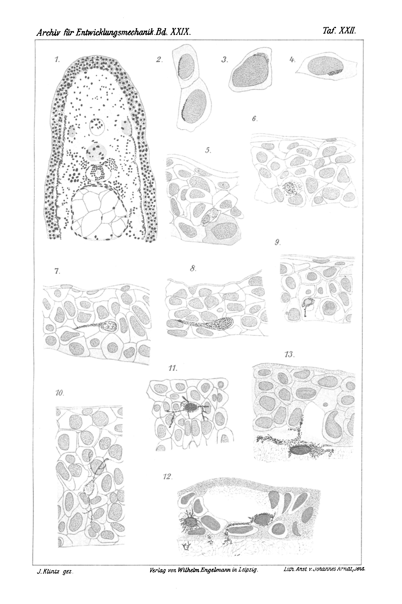
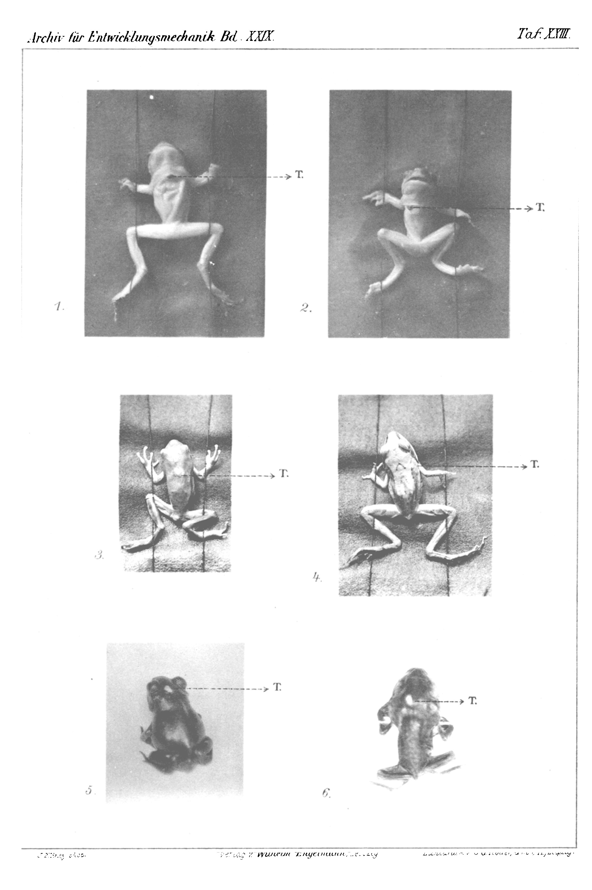
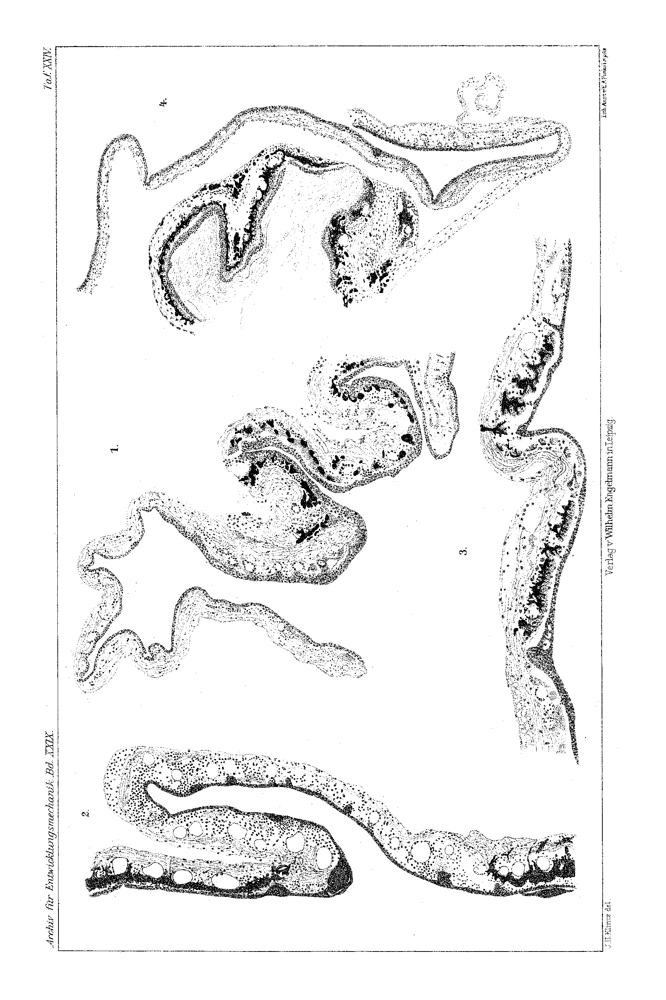
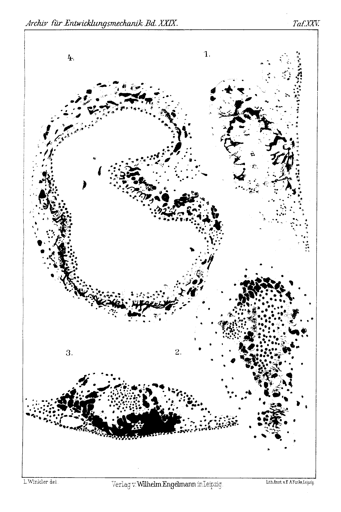

# Studies on Pigment Formation

## I. The Formation of the Branched Pigment Cells in the Regenerate of the Amphibian Tail.

## II. Transplantation Experiments on Pigmented Skin.

By

Dr. med. et phil. Ferdinand Winkler.

*(From the Biological Experimental Institute in Vienna.)*

With Plates XXII–XXV.

Received 4 April 1910.

*Archiv für Entwicklungsmechanik der Organismen*, vol. 29 (1910).

> **Full translation.** A complete English rendering of Winkler's studies on pigment formation, with the figure legends.

## I. The Formation of the Branched Pigment Cells in the Regenerate of the Amphibian Tail.

The study of pigment formation in the skin has, through the works of Grund and of Meirowsky, again been moved into the foreground of interest; from these works it emerges that the epidermal cells are capable of forming pigment, and Meirowsky set up quite decidedly the thesis that the skin pigment is a product of the epidermal cells. With this, the old contested question, whether the epidermal pigment in its entirety originates from the cutis or whether it is of epithelial nature, was again raised.

On the first side stand Kölliker, Ehrmann, Riehl, Aeby, Karg, Unna, Halpern, Giovanni; on the other side Kerbert, Retterer, Garcia, Schwalbe, Blaschko, Kaposi, Kodis, Pluschkow, Mertsching, Prowazek, Post, Rosenstadt, Loeb and Strong, Rabl, Wieting and Hamdi, Grund, Meirowsky, Hellmich. The dispute was conducted with great expenditure of effort, both with regard to human skin and also with regard to the skin of animals, and to this day the views still stand, unsettled, opposed to one another.

This holds not merely for pigment formation in general, but in particular for the chromatophores; and it was precisely these branched pigment cells that gave rise to the most manifold interpretations with regard to their morphological and physiological character and with regard to their origin.

While Ehrmann explained it as assured that the typical melanoblasts of the epidermis develop out of mesodermal embedded cells, according to Kodis, Jarisch, Post, Grund and Meirowsky they develop out of epithelial cells.

The investigations are based partly on embryological material, partly on experimentally produced pigment formations. The embryological studies were here applied only to lower animals; thus Kerbert worked on embryos of adders, Jarisch on *Rana*, Riehl on *Axolotl*, *Triton*, *Salamandra* and *Rana*, Kodis and Rosenstadt on *Rana*, Prowazek on *Salamandra*. Despite the equivalence of the objects, however, the investigation yielded very different views, so that even today the question is by no means decided in favour, either, of the development of the pigment from one and the same animal species or according to identical views. Perhaps the difficulty lies precisely in the variability of nature itself, which is again brought to light in the comparison of the individual embryological stages. The most convenient way, that of regeneration, was — as far as I can see — not yet trodden; only Kodis makes occasional reference to a remark bearing on this.

The study of regenerates is in any case excellently suited to provide information about the processes in the development of the pigments. The ease with which the consecutive stages of the regeneration process can be distinguished from one another, and the convenient kind of examination of these stages, have been recognized by many authors. There one is not, as in partial amputation of a limb — where indeed a half-sided amputation of the tail, in the position lying alongside, offers exposed pigment that is yet present everywhere — referred to comparison with one's developing animal tissue; rather, in the same animal one can quietly let the same processes play out side by side.

The experiments which are to be reported in the following are concerned with the regenerate of the tail of grown newts and of salamander larvae (*Salamandra maculosa*). They proved especially suitable for the study of pigments, because the regeneration processes show, few hours after the amputation, distinctly recognizable stages, and because one can determine with certainty on this material the relationships of the pigment cells to the surrounding cells. The use of the regenerating animals here has, however, on the other hand a not to be underestimated advantage, namely that one does not bind oneself to a particular season, and that the material is therefore available in sufficient quantity at any time.

Fig. 1 gives a cross-section through the tail of a salamander larva, which had regenerated 40 hours after the removal of the tail. The amputated portion is, from the section, amputated to a quite small piece; one sees on such preparations easily the relationships at the cut surface. Man also sees here, on such preparations, how the pigment-cell network is built up and what relationships the pigment cells lying in the epidermis bear to the pigment cells lying in the cutis.

From the rich material which the consideration of such preparations supplies, certain remarkable facts emerge already in the first epidermal cells.

Ehrmann has rightly emphasized that in amphibian embryos and amphibian larvae the pigment is not, as is found built up in the cutis, encountered and found, and that the assumption of pigment formation in the tissue interstices of the developing animal tissue is to be rejected. Also in the regenerated tail tissue of the amphibian the pigment formation is to be found neither by itself — that is, in the cells lying outside the pigment cells — nor in the cell interstices; rather one is of the opinion that the pigment is brought into the cells from outside.

The pigment occurs — separated from one another, but yet shows itself, first, in the surface-most kernless cell-layer filled richly with pigment granules — in the epidermal cells lying beneath it, but in the disproportionately broad-nucleus-provided epidermal cells at the edge of the nucleus; only seldom can one perceive it even at the unusually broad nucleus, partly at the nucleus-edge (Fig. 2), partly seated upon the nucleus quite like a cap (Fig. 3 and 4).

In the first stages of regenerate formation one finds nowhere a trace of branched cells or pigment cells with processes; but soon, in the regenerate, as it then forms itself, one finds them very abundantly branched. Initially the pigment process presses itself between the neighbouring cells through, while the nucleus moves away from the main mass of the pigment cells (Fig. 7); then one beholds at the nucleus itself the pigment forming, and the whole cell takes on the wandering character (Fig. 8 and 9). One encounters, however, also still such repeatedly branched cells, which still lie in the original cell-cavity (Fig. 10 and 11); in most cases, however, when the cell first appears branched, this cell has already raised itself out of the cell-cavity, with which the one and the other small part of its body has fallen into the neighbouring cells.

The direction in which the cell processes stretch out appears irregular; one sees on individual preparations manifold cells which lie with their processes parallel to the cutis surface, and these appear to apply especially to the early stages of regeneration; in the later stages such cells, with surface-parallel processes, lie beside others, whose processes interweave in remarkable direction into the epidermis.

Also the position of the cells at the various places of the epidermis appears not shifted; soon they step forth in the upper, soon in the middle layer; in the earlier stages of regeneration the lowermost layer of the epidermis is at any rate free of branched pigment cells, and only gradually do the cells themselves move down with their processes and their nuclei; only seldom can one not draw the cell processes down below the cell itself. Finally the cells stretch their processes out over the epidermal boundary (Fig. 12), soon the cell-bodies themselves move back and one beholds sub-epidermoidal branched cells, soon one only individual of their processes ask up into the epidermis (Fig. 13). In the same way arise also the images, which Ehrmann (l. c. Pl. VIII/IX Fig. 14—18; Pl. XII Fig. 12 and 13) regards with certainty as the in-growth of the amphibian skin, only that here too the melanoblasts grow up out of the epidermis into the deeper-lying connective tissue, namely through the displacement of the branched pigment cells and the displacement of the pigment cells from the dense web of the epidermal cells into the sub-epidermoidal web, in which the pigment cells, which have emerged from the cell-pressure of the cells, link up with their processes and the pigment-cell network arises.

Of not to be underestimated importance for the whole question of the wandering of the pigment cells is the observation that in the first stages of regeneration, in which the branched pigment cells descend into the sub-epidermoidal layer, no division-image is to be found in the web of the branched pigment cells descending into the sub-epidermoidal layer. One finds indeed in deeper layers of the corium still divisions of the branched pigment cells, but precisely in the regenerate one beholds, at the various stages of the wandering, certainly never a division of the pigment cells. With this the question of the wandering of the pigment cells, which was already several times touched upon, also comes to a closer settlement. One perceives indeed already at first glance the coarse character of the granulations on the one hand, and the cells of the epidermis filled with fine granules on the other.

It is hence undeniable, certain, that even in the regenerate of the amphibian tail the pigment formation takes place in the epidermis. With this also agrees the remark of Barfurth (l. c. p. 93) that all regenerations proceed only from pre-existing assured elements, with which it is expressly remarked that the regeneration of the pigments does not arise from pre-existing pigment, but that the pigment represents a newly arisen formation from epidermal cells.

## II. On Transplantation Experiments on Pigmented Skin.

The transplantation regeneration of pigmented and unpigmented skin sites in amphibians promised disclosure about the fate of the chromatophores and a clarification about the relationships under which the transplantation experiments of coloured human skin offer difficulties to prepare.

F. v. Recklinghausen states that in his investigations Reverdin and Johnson-Smith set off white skin grafted onto negro-skin, and that Troup Maxwell, at the transmission of white skin onto the cheek of a negro, himself saw the black colouring of the white skin.

E. Maurel concluded from his observations that pigmented transplantation is then only to be achieved if one transplants small patches of pigmented individuals onto unpigmented individuals; transplants one, on the other hand, white skin sites, then they retain their white colour, even if the scar gradually becomes pigmented; small patches which one transplants from pigmented persons onto Europeans remain white for sometimes shorter, sometimes longer time, in many cases for a longer time; only in individual cases could one observe the pigmentation only after several months.

Karg saw at the transmission of white human skin onto a negro the transplanted skin become black, and at the transmission of negro-skin onto a white the transplanted skin become white, and believed that branched cells of the cutis, or cells comparable to the fibroblasts, transfer the pigment from the connective tissue through transplantation of white skin and, at the in-growth into the white skin, over-lead the pigment from the cutis into the epithelium.

P. Carnot and Cl. Deflandre transferred small skin-pieces in guinea pigs onto an otherwise differently pigmented skin site of the same animal; further they undertook the colour-transmission from white guinea pigs onto a black, and conversely, as well as at rabbits and dogs. The transplantations at the same animal, as well as on related animals, succeeded always, as long as it dealt itself with the transmission from black skin onto a white site; the transplantations from guinea pigs onto rabbits and reversed made greater difficulties, while the over-growth experiments at the dog always failed. The over-grown white small patches stayed white in most cases; only in the few cases in which the transplantation succeeded did it show itself that the small patch in the first days had some weak pigment cells and that at last the difference vanished.

While, according to Carnot and Deflandre, the white small patch on the black scar-tissue became gradually grey, the black small patch on the other hand, at investigations, retained on white its black pigment and stayed so even at the over-growth, which already followed eight months after the operation.

Also Bryant (cited at Carnot and Deflandre) shares that he made in a few cases transplantation from negroes onto white skin, and that the transplanted patches showed a tendency to spread over ten weeks.

On the other hand Carnot and Deflandre made, in the middle of a broad wound set by a blister-plaster, a small naevus-pigmentary transplant; the small patches at first kept their brown colour, but showed already after the end of the first month a gradual fading-out.

Leo Loeb came, on the basis of his investigations on guineapig ear, to the conclusion that pigmented skin remains preserved on the foreign soil, white skin however not. His procedure corresponded to the Thiersch method; he carried off with the razor an about ¼ cm large skin-piece and covered the wound by means of a small skin-patch carried off in a similar way at another site; for the fastening of the small piece he used iodoform-collodion.

In his experiments to transplant white skin onto black ears, he noticed that usually in the course of the first 14 days all transplanted small pieces went off again, although they often already in the first days seemed to heal in; among many experiments it indeed succeeded for him more often to bring the small patches to complete healing-in, so that he could clearly perceive their transition into the neighbouring black epithelium. If the small patches still stayed lying on the former defect on the 14th day after the operation, then he could still follow them a while further and convince himself that the black pigment advances from the side here in zigzags into the white transplanted skin; the further observation is however disturbed through the strong desquamation, which now seizes the edge and now the middle of the transplanted white small patch and leads to the casting-off of the transferred skin-piece, so that the covering of the defect follows from the neighbouring black epithelium.

The microscopic investigation showed Loeb that in a number of cases the black regenerated epithelium pushes itself under the transplanted skin and lifts it off; thus a connection with the underlying tissue is impossible, and necrosis sets in. Something similar can also occur at partial contact between the white epithelium and the laterally approaching black epithelium, in that the white epithelium abuts only at the upper rows of the black epithelium and the lower layers of the black epithelium push themselves forwards under the white. Also when the white epithelium really is grown-on, an infiltration of the same with cells takes place and it loosens itself off. Loeb refers, at the discussion of these phenomena, to analogous processes in plants, in which transplantations under certain circumstances at first seem to succeed, while later both organ-parts die off, and to dissolution-phenomena at transplantation-experiments on *Hydra*.

At the transplantation of black skin onto white ears the transplanted piece usually dissolved itself off at the edge in great extent; yet there showed itself, at the middle of the transplanted black epithelium, necrotic rind-cells which had gone off, and white epithelium at the site of the cast-off black; the black epithelium that remained cohering began to over-push itself into the white skin only then, when it came to a transformation of the black rind-epithelium into white epithelium.

---

**Translator's note on the apparatus:** The eight source pages 1–8 (journal pagination 616–623) of this chunk contain **no printed/numbered footnotes** in the body. The page images carry no separate footnote lines, no table, and no figure caption within the running text other than the in-text figure and plate references (Fig. 1–18; Pl. VIII/IX, Pl. XII; Plates XXII–XXV), which are reproduced inline above. Per the OMIT-NOTHING rule every sentence of the running text has been rendered.

The data thus agree, those of Loeb with those of Carnot and Deflandre.

It follows from the experiments of Carnot-Deflandre and of Loeb that the black flap retains its pigment, and that a pigmentation of the neighbouring tissue comes about, whereas, in the transfer onto unpigmented skin, the transplanted flap does not heal fast on the pigmented ground; both sets of data stand in contradiction with the results of Karg, against which, to be sure, the objection was raised by Schwalbe that in Karg's experiments it was not at all a matter of the transplanted skin-piece, but rather of regenerated epithelium.

In analogy with the experiments of Carnot-Deflandre and of Loeb, I set up a larger experimental series with mice (*Mus musculus*); there were at my disposal pure white, pure black and pure yellow mice. The experiments were carried out in such a way that small skin-defects on the back were covered with differently-constituted skin and the transplanted flap was fixed with a little Collodium. Unfortunately the results did not correspond to the expectations entertained.

Among fifty animals it succeeded only four times in bringing about an attachment; in the remaining animals the transplanted flaps were sloughed off already after a few days, and it thereby played no role whether the transfer was of pigmented skin onto unpigmented ground or vice versa, or from the yellow onto the black mouse. It was also indifferent whether the transplanted flaps were large or small, and whether the animals were young or grown-up.

On repeated occasions I was able, in similar manner as Loeb, to establish that flaps which already appeared grown-on sloughed off, and that this sloughing-off came about through a regeneration of the original tissue beneath the transplanted piece.

On the unsatisfactory result of these experiments nothing was changed even by the favourable success in four animals; in the one it was a matter of transfer of black skin onto a white animal, in the second of transplantation of white skin onto a black, in the third of transplantation of black skin onto a yellow and in the fourth animal of transfer of yellow skin onto a black. Were these favourable experiments not so isolated, one could have drawn from them the conclusion, in the sense of Maurel, that for the coming-about of a pigmented transplantation both individuals must be pigmented.

The skin of the white animal, in which the transplantation of the black flap succeeded, was subjected to the microscopic investigation; it showed an infiltration of the transplanted skin with cells, that is, a picture such as Loeb has described in his experiments of transferring white epithelium onto a black ground, and which to him counts as a preliminary stage of the later sloughing-off. This experiment is therefore not to be regarded as a successful transplantation. The three other animals stand at present, eight months since the operation, under observation and show no change in the pigmentation conditions set in by the transplantation. What circumstances may have played a part in this, so as to bring about a success precisely in these three animals, is unknown to me; in any case this favourable success, with regard to the over-abundance of the failures, is to be utilised only with caution; it shows, however, that precisely in these animals a change of the pigmentation conditions has not entered in, and that an encroachment of the pigmentation — be it from the transplanted small piece onto the neighbouring tissue (in the sense of Loeb and of Carnot-Deflandre), be it from the neighbouring tissue onto the transplanted flap (in the sense of Karg) — has not entered in.

Much better did my experiments on lower animals turn out.

A small piece of back-skin of a tree-frog (*Hyla arborea*) lets itself be easily transferred onto a wound of the epiglottis-region, so that with some practice an attachment of the transplanted piece is easily achieved (Pl. XXIII Fig. 1 and 2); likewise succeeds the reverse transplantation, in that one transfers a piece of the belly-skin onto an equally large wound of the back-skin (Pl. XXIII Fig. 3 and 4). The attachment follows within a week. The success of the operation depends on the animals not mechanically loosening the grafted-on skin piece during their movements in the glass container; for this reason very much depends on the choice of the operation-site; transplantations on the extremities succeed only with great difficulty, likewise transplantations on the convex part of the belly; on the other hand, the transplanted small pieces heal on very well on the back, because there they are protected against mechanical lesion by a correspondingly large glass container; self-evidently each animal must be kept singly, since otherwise the animals strip off one another's transferred skin pieces mutually. The throat-region too is very well suited for the operation; at every other place of the underside the small pieces became loosened, during the crawling-movements of the animals, on the glass wall, whereas at the drawn-in place in the throat-region this danger is essentially diminished. Self-evidently, in the care of the operated animals one must take quite especially careful watch that, during the water-renewal and the food-renewal, no contact of the operation-sites takes place.

The attempt to secure the holding-fast of the transferred skin place with dressing-means of any kind failed me; even the gold-beater's-skin [Goldschlägerhäutchen], otherwise very well suited for small dressings, did not prove itself; it happened to me on repeated occasions that, on removal of the thin dressing, the transplanted skin clung to the gold-beater's-skin. The use of Collodium too did not lead to success; the places treated with Collodium came only with difficulty to healing, perhaps in consequence of the pressure exerted by the little skin.

It proved most advantageous to attempt no dressing whatsoever, but rather to make use of the natural conditions to such an extent that the small piece to be transferred was cut square and transferred into the corresponding wound in such a way that the one border was pushed under the skin, whereas the three other borders were laid as exactly as possible against the sides of the wound; the quickly ensuing gluing-together of the under-pushed border with the skin lying over it secured the attachment, with observance of the above-named precautionary measures.

Much more difficult did the conditions become in those animals which, like *Triton*, *Salamandra* and *Pelobates*, are rich in skin-glands; here it is very difficult to achieve a holding-fast of the transplanted skin pieces; in order to come to success one must renounce transplantation sensu strictiori and choose the piece to be transferred so large that it can be pushed under the skin on all four borders; yet even with this experimental method the success is not certain, since frequently, through the muscle-contractions of the animal, the skin piece is pushed away from the wound or under the skin is displaced; most easily of all succeeds the transfer of yellow crest-skin of the *Triton* onto a wound of the black flank-skin.

Strikingly easily succeeds the transplantation in scale-bearing animals, especially in *Lacerta*; here too the throat-region is especially well suited for the transfer.

It thereby plays no role whether the skin pieces used for the transplantation originate from the same animal, or whether the skin of another animal is used; it seems, however, to be of importance that it be a matter of animals of the same species; thus I did not succeed in healing in skin of *Rana agilis* onto a *Hyla*.

On the other hand, the healing-in of skin in abnormal position, with the upper side downward, did succeed.

In similar manner as in *Triton*, the transplantation must be carried out in the gill-breathers; I succeeded several times, in tadpoles, in carrying out transplantations of the light underside-skin onto the back-side and in following the fate of the transplanted skin during the metamorphosis; one such example is given by Fig. 5 and 6 on Pl. XXIII, which represent the healing-in of a skin-piece — transplanted while in the tadpole stage — into the head-skin of *Pelobates fuscus*.

Relatively great difficulties I found in the experiments on the Axolotl (*Amblystoma mexicanum*). Here too it did not succeed to carry out an epidermoidal transplantation from the black onto the albinotic animal; I had to content myself with a sub-epidermoidal transplantation.

The transfer-experiments in the olm (*Proteus anguineus*) have so far not succeeded; they would have been of especial interest, because the question whether the transplanted dark skin-pieces on a white animal change their colour in the darkness is of great theoretical interest.

The best pictures are given by the experiments on *Hyla*. I will here take into account only those animals which survived a year after the operation. The green back-skin consists of a pigmentless layer and of the pigmented cell-stratum, in which two superficial layers of Xanthophores and Leucophores and a deep-lying layer of Melanophores are to be found; the white throat-region skin likewise has a pigment-free uppermost layer and, in the tissue lying beneath it, abundant guanine-cells, but only very few Melanophores. At the transplanted places there now shows itself

that the two parts are completely separated from one another; sometimes the transplantation-line is characterised by a group of newly-formed connective-tissue cells, but sometimes this boundary is lacking. Already with weak magnification it becomes clear that the Melanophores remain restricted to the green skin, and that they do not pass over into the white skin, indifferent whether the green skin is transferred onto the underside (Pl. XXIV Fig. 1) or whether the white skin is transferred onto the back-side (Pl. XXIV Fig. 2). There ensues neither an in-growing of the Melanophores nor an in-growing of the Xantholeucophores.

If one chooses for the transfer an animal not of pure green colour, but rather an animal that bears violet patches on the green back-side, then one can convince oneself, in the microscopic investigation of the same, that the network of the Melanophores does not form a continuous chain as in the purely green skin; one sees heaps of black Chromatophores in a large quantity of Chromatophores strongly filled with brighter pigment-granules. In the transplantation one can now very sharply demarcate the skin-portion with the little heaps of Melanophores from the melanophore-free skin.

If the skin-place to be transferred is turned over, so that the Epidermis looks downward, then the conditions change only in the transfer of the melanophore-containing skin. The transfer of the white skin onto the larger surface lets no essential differences be recognised as against the normal transfer; the Epidermis cells directed downward vanish and there remain behind the xantholeucophores, which, despite the lack of the Epidermis-protection, do not change; one can also, in these experimental animals, sharply determine under the microscope the boundary between the transplanted and the original skin; the relation is the more striking as the Epidermis regenerates itself; in consequence of the inverted position of the Corium-layer it is quite impossible that the new Epidermis cells are formed in situ; one may well assume with certainty that the new-formation of the Epidermis proceeds from those places which belong to the original skin.

Quite otherwise lie the things in the transfer of the green skin in inverted state, that is, in which the Melanophore-layer looks upward; already in the observation of the living animal one sees, a few days after the operation, the coloured layer slough itself off; this sloughing-off ensues, however, not uniformly over the whole portion, but only place by place, so that after a time of fourteen days the Melanophore-layer is removed; there remains behind only the Xantholeucophore-layer; self-evidently the originally green colour is lacking at this place, but the place does not look white, similar to a scar, but rather light-grey. In the microscopic investigation one sees that the Epidermis cells turned downward vanish and that the Melanophores clump together and are sloughed off.

Analogous conditions to those in the microscopic investigation of the transplanted skin of *Hyla* are yielded by the investigation in *Triton cristatus*. Fig. 3 (Pl. XXIV) represents a section through the transplantation of a black skin-place into a yellow patch; one sees here too clearly how the transplanted skin-place stands out from the surroundings.

In a further experimental series the fate of the pigment was studied that was pushed under the skin. So far as is known to me, somewhat similar experiments exist only from Leo Loeb, who placed a flap of the epidermis of an almost full-term guinea-pig fœtus into a piece of coagulated blood-serum or into a piece of Agar and brought this into a pocket on the ear of another guinea-pig; thus the animal was used as a living incubator, which afforded uniform temperature and lymph-influx.

I have, through a skin-slit of the white belly-skin in *Hyla*, pushed through a small piece of green skin with the Melanophore-layer downward, and followed the fate of the skin-piece thus introduced; it showed itself at first that the piece introduced spread-out did not glue together, neither with the upper side nor with the under side, but rather that the borders of the skin-piece curved inward against one another (Pl. XXV Fig. 1) and that they showed the tendency to grow against one another (Pl. XXV Fig. 2). The Melanophore-layers thereby came to lie against one another; they glue and clump together with one another. The remaining pigment-epithelium lying over it is sloughed off, and there appears beneath the skin a Melanophore-mass (Pl. XXV Fig. 3), which gradually dissolves itself. In other cases there arise in this way cystic formations (Pl. XXV Fig. 4), which are to be placed alongside the experimentally inducible epithelial- and dermoid-cysts.

Schweninger incised, in rabbits and dogs, a piece of skin and united the incision-wounds, in the middle of which lay the circumscribed piece, over the latter by suture. In individual cases the over-sutured skin-piece turned, so that the connective-tissue layers of the over-sutured and the underlying skin were turned toward one another; after some time a piece of tissue was exfoliated, out of which differently long hairs emerged above and below. In the majority of cases the over-sutured skin-piece became roundish, in that it rolled in at the borders; thereby the hair-bearing epithelial layers were laid inward and opposite one another, whereas they were everywhere enclosed on the outside by a connective-tissue capsule, which was formed out of the cutis-tissue and the subcutaneous cellular tissue. There was present only a complete cyst formed out of skin, which found itself in intimate connection with the surrounding tissue and in the best living conditions.

Finally, in my experiments too a connective-tissue connection between the skin and the transplanted part can enter in, which hinders the growing-against-one-another (Pl. XXIV Fig. 4); here too there comes about a sloughing-off of the Melanophores toward the lymph-spaces.

## Literaturverzeichnis [Literature index]

> Barfurth, D., *Die Erscheinungen der Regeneration* [The phenomena of regeneration] in Osc. Hertwig's Handbuch der vergleich. und experim. Entwicklungslehre der Wirbeltiere. Vol. III. Part 3. 1903.
>
> Carnot, P., and Deflandre, Cl., *Persistance de la pigmentation dans les greffes épidermiques.* Compt. rend. de la soc. de biol. p. 178. 1896.
>
> — *Greffe et pigmentation.* Compt. rend. de la soc. de biol. p. 430. 1896.
>
> Ehrmann, S., *Das melanotische Pigment und die pigmentbildenden Zellen des Menschen und der Wirbeltiere in ihrer Entwicklung* [The melanotic pigment and the pigment-forming cells of man and of the vertebrates in their development]. Bibliotheca medica. Verlag von Th. G. Fischer. Cassel 1896.
>
> Grund, G., *Experim. Beiträge zur Genese des Epidermispigments* [Experimental contributions to the genesis of the epidermal pigment]. Beitr. zur path. Anat. und allg. Pathol. VII. Suppl. Festschr. f. Arnold. p. 294. 1905.
>
> Karg, *Studien über transplantierte Haut* [Studies on transplanted skin]. Arch. f. Anat. und Phys. p. 369. 1888.
>
> Kodis, Th., *Epithel und Wanderzelle in der Haut des Froschlarvenschwanzes* [Epithelium and wandering cell in the skin of the frog-larva tail]. Arch. f. Anat. und Physiol. Suppl. zur physiol. Abteil. p. 1. 1889.
>
> Loeb, L., *Über Transplantation von weißer Haut auf einen Defekt in schwarzer Haut und umgekehrt am Ohre des Meerschweinchens* [On the transplantation of white skin onto a defect in black skin and vice versa on the ear of the guinea-pig]. Arch. f. Entw.-Mech. VI. p. 1. 1898.
>
> — *Über das Wachstum des Epithels* [On the growth of the epithelium]. Arch. f. Entw.-Mech. XIII. p. 491. 1901.
>
> Maurel, E., *Note sur les greffes épidermiques dans les différentes races humaines.* Compt. rend. de la soc. de biol. p. 255. 1878.
>
> — *De la persistance et de la disparition de la pigmentation dans les greffes dermoépidermiques.* Compt. rend. de la soc. de biol. p. 390. 1896.
>
> Meirowsky, E., *Über den Ursprung des melanotischen Pigments der Haut und des Auges* [On the origin of the melanotic pigment of the skin and of the eye]. Leipzig 1908, Verlag von Werner Klinkhardt. (Therein a rich literature-survey.)

> Recklinghausen, F. v., *Handbuch der allg. Pathologie* [Handbook of General Pathology]. Deutsche Chirurgie, edited by Billroth and Lücke. Instalments 2 and 3. p. 305. Stuttgart 1883.
>
> Schwalbe, G., *Über den Farbenwechsel winterweißer Tiere* [On the colour change of winter-white animals]. Morphol. Arbeiten. Vol. II. p. 483. 1893.
>
> Schweninger, E., *Beitrag zur oper. Erzeugung von Hautgeschwülsten durch subcutan verlagerte, mit dem Mutterboden in Verbindung gelassene Hautstücke* [Contribution on the operative production of skin tumours by means of subcutaneously displaced pieces of skin left in connection with the maternal bed]. Charité-Annalen. XI. p. 642. 1886.

## Erklärung der Abbildungen [Explanation of the Figures]

### Tafel XXII [Plate XXII]

**Fig. 1.** Section through the regenerating tail of a salamander larva. 40 hours after the half-sided amputation of the tail. Oc. 3, Obj. 3.  *(figure not reproduced)*

**Fig. 2.** Border-like pigment deposit on the nucleus of an epidermis cell. Oc. 3, Obj. 8.  *(figure not reproduced)*

**Fig. 3 and 4.** Cap-like pigment deposits on the nucleus. Oc. 3, Obj. 8.  *(figure not reproduced)*

**Fig. 5.** Pigment-filled cells which detach themselves from the cell association. Oc. 3, Obj. 5.  *(figure not reproduced)*

**Fig. 6.** Spherical pigment cell in a cell cavity. Oc. 3, Obj. 5.  *(figure not reproduced)*

**Fig. 7.** Pigment cell with process, beginning its migration. Oc. 4, Obj. 5.  *(figure not reproduced)*

**Fig. 8.** Pigment cell with process on its migration. Oc. 3, Obj. 5.  *(figure not reproduced)*

**Fig. 9.** Pigment cell with process emerging from the cell cavity, partly overlying the neighbouring cell. Oc. 3, Obj. 5.  *(figure not reproduced)*

**Fig. 10 and 11.** Multiply branched cells in the cell cavities. Fig. 10 Oc. 4, Obj. 5. Fig. 11 Oc. 3, Obj. 5.  *(figure not reproduced)*

**Fig. 12.** Pigment cells reaching with their processes beyond the epidermal boundary. Oc. 3, Obj. 8.  *(figure not reproduced)*

**Fig. 13.** Pigment cell, already passed over into the subepidermoidal region, with one process still stuck in the epidermis. Oc. 3, Obj. 8.  *(figure not reproduced)*

### Tafel XXIII [Plate XXIII]

**Fig. 1 and 2.** Transplantation (T) of green dorsal skin of a *Hyla arborea* onto the white underside of the same animal.  *(figure not reproduced)*

**Fig. 3.** Transplantation (T) of white ventral skin of a *Hyla arborea* onto the green dorsal surface of the same animal.  *(figure not reproduced)*

**Fig. 4.** Transplantation (T) of white ventral skin of a *Rana agilis* onto the brown dorsal surface of the same animal.  *(figure not reproduced)*

**Fig. 5 and 6.** *Pelobates fuscus*, with transplantation (T) of a piece of light ventral skin onto the head; the transplantation had been carried out while still in the larval stage.  *(figure not reproduced)*

### Tafel XXIV [Plate XXIV]

**Fig. 1.** Transplantation of green dorsal skin of a *Hyla arborea* onto the white underside of the same animal, cross-section through the transplanted site. Oc. 3, Obj. 3.  *(figure not reproduced)* *Tafel XXII [Plate XXII]. (Plate image — not reproduced.) Banner text: "Archiv für Entwicklungsmechanik Bd. XXIX. — Taf. XXII. — J. Klintz gez. — Verlag von Wilhelm Engelmann in Leipzig. — Lith. Anst. v. Johannes Arndt, Jena."* *Tafel XXIII [Plate XXIII]. (Plate image — not reproduced.) Banner text: "Archiv für Entwicklungsmechanik Bd. XXIX. — Taf. XXIII." (Lower credit line faintly present: artist "… gez. — Verlag v. Wilhelm Engelmann, Leipzig — Lith. Anst. …", largely illegible.)* *Tafel XXIV [Plate XXIV]. (Plate image — not reproduced; landscape orientation.) Banner text: "Archiv für Entwicklungsmechanik Bd. XXIX. — Taf. XXIV. — J. Klintz del. — Verlag von Wilhelm Engelmann in Leipzig."* *Tafel XXV [Plate XXV]. (Plate image — not reproduced.) Banner text: "Archiv für Entwicklungsmechanik Bd. XXIX. — Taf. XXV. — L. Winkler del. — Verlag von Wilhelm Engelmann in Leipzig. — Lith. Anst. v. E. A. Funke, Leipzig."* **Fig. 2.** Transplantation of white ventral skin of a *Hyla arborea* onto the green dorsal side of the same animal, cross-section through the transplanted site. Oc. 3, Obj. 3.  *(figure not reproduced)*

**Fig. 3.** Transplantation of black skin of a *Triton cristatus* onto the yellow skin of the same animal, cross-section through the transplanted site. Oc. 3. Obj. 3.  *(figure not reproduced)*

**Fig. 4.** Transfer of green dorsal skin of a *Hyla arborea* beneath the white ventral skin of the same animal, cross-section at the transfer site. Oc. 3, Obj. 5.  *(figure not reproduced)*

### Tafel XXV [Plate XXV]

**Fig. 1.** Transfer of green dorsal skin of a *Hyla arborea* beneath the white ventral skin of the same animal; cross-section through the transplantation site. Growing-towards-one-another of the melanophores. Oc. 3, Obj. 3.  *(figure not reproduced)*

**Fig. 2.** Beginning cyst formation in the piece of green dorsal skin of *Hyla arborea* transferred beneath the ventral skin. Oc. 3. Obj. 5.  *(figure not reproduced)*

**Fig. 3.** Clumped melanophore mass beneath the white skin of a *Hyla arborea* after the transfer of green dorsal skin beneath the white ventral skin. Oc. 4, Obj. 3.  *(figure not reproduced)*

**Fig. 4.** Fully formed cyst, arisen through the transfer of green dorsal skin beneath the white ventral skin of a *Hyla arborea*. Oc. 3, Obj. 5.  *(figure not reproduced)*

## Figures

**Plate XXII.**

**Plate XXIII.**

**Plate XXIV.**

**Plate XXV.**

---

*Translator's note.* Part of the institute's pigment-chemistry line of work.
