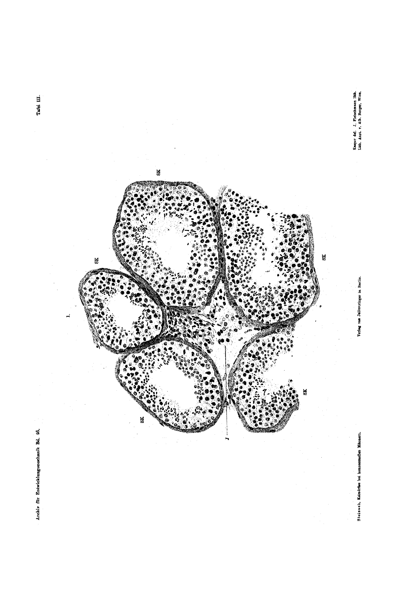
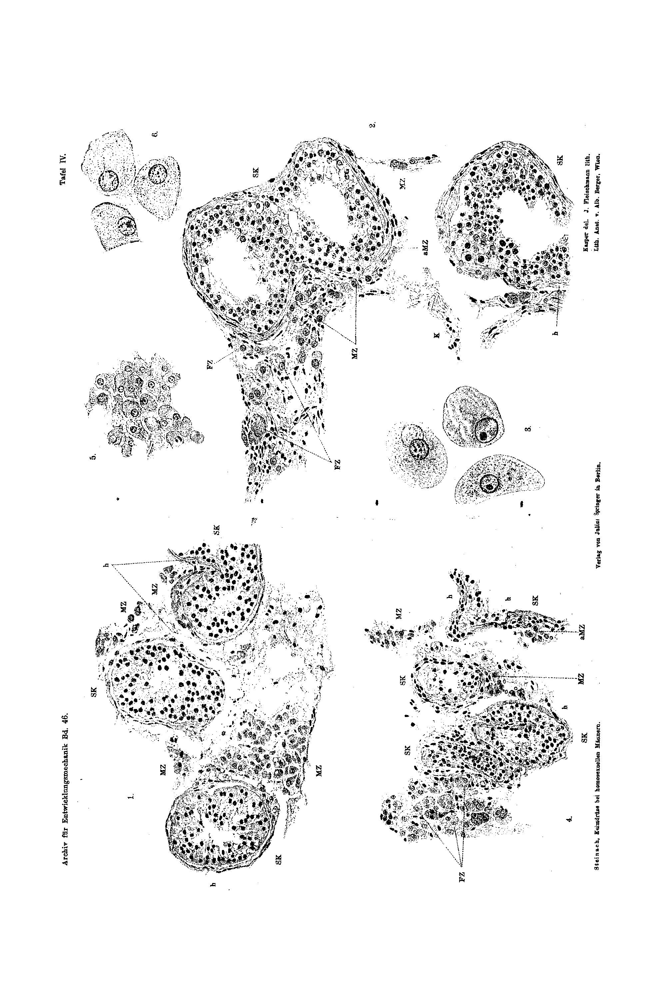
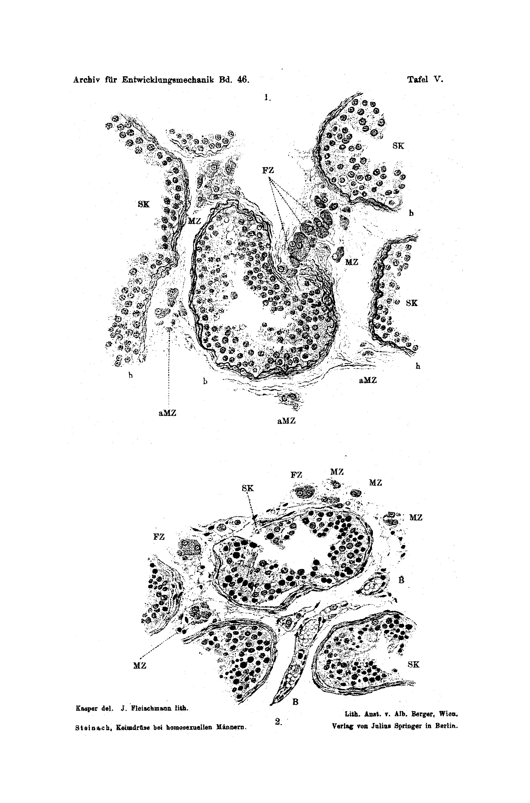

*(Biological Experimental Institute of the Academy of Sciences in Vienna. Physiological Division. Director E. Steinach.)*

# Histological Constitution of the Germ Gland in Homosexual Men

## By
## E. Steinach.

*With Plates III to V.*

*(Received 18 April 1919.)*

*Archiv für Entwicklungsmechanik der Organismen*, vol. 46 (1920).

> **Full translation.** A complete English rendering of Steinach's histological study of the germ gland in homosexual men, with the figure legends. The 1920 text is rendered faithfully and as written; it is a historical document of its period.

*(Carried out with a grant from the Treitl Foundation.)*

The experimental hermaphrodite formation, which was able to reproduce the phenomena of the periodically occurring as well as of the permanent homosexuality¹, the operative cure of these conditions in man², and finally the discovery³ of the hermaphrodite gland in the homosexual animal, have furnished the proof that same-sexedness, like every other kind of hermaphroditism, rests upon the hermaphroditic anlage of the puberty gland conditioned by an abnormal differentiation of the germ stock.

From this new point of view the germ glands of homosexual people also had to be examined. The material for this was provided by the testes which, in persons with contrary sexual inclination, were removed and, for the purpose of re-tuning the erotization, were replaced by cryptorchid, normally acting testicles. Thanks to Lichtenstern's operations, I have at my disposal the testes of six homosexuals.

On the first operated case we reported in the *Münch. med. Wochenschr.*⁴ (1918). Already there the microscopic treatment had revealed peculiarities of the puberty gland which recur in the new material. But that puberty gland constituted merely the well-preserved remnant of a suppurating, tuberculously destroyed testis, and the objection could not be dismissed that

> ¹ Steinach, *Pubertätsdrüsen und Zwitterbildung.* Arch. f. Entw.-Mech. Vol. 42. 1916. — ditto. *Experimentelle und histologische Beweise für den ursächlichen Zusammenhang von Homosexualität und Zwitterdrüse.* Arch. f. Entw.-Mech. Vol. 46. 1919.
> ² Steinach and Lichtenstern, *Münchn. med. Wochenschr.* No. 6. 1918.
> ³ Steinach, *Künstliche und natürliche Zwitterdrüsen und ihre analogen Wirkungen.* III. Communication. Arch. f. Entw.-Mech. Vol. 46. 1919.
> ⁴ cited ibid.

the changes, namely the productive tissues, were not produced by the antagonistic action of the differently-sexed elements, but had arisen simply and directly through the severe inflammatory process. I therefore set this testis aside and now base my investigation on new objects — derived from thoroughly healthy, vigorous homosexual men aged 22 to 43 years.

The testes were cut up immediately after the extirpation, piece by piece, fixed in Zenker's fluid, in alcohol acidified by a drop of acetic acid, embedded in paraffin, and stained with haematoxylin-eosin as well as with Mallory. As comparison objects there served the testicular preparations of normal, healthy people, namely the surgically obtained testes of cryptorchids, which were interposed in the operated men. Of special significance proved to be the comparison preparations of the latter, since they emerge from the same pieces of tissue, which I will describe shortly only as far as the present findings are concerned.

### Seminal gland.

In all five testes, unmistakable signs of degeneration, progressing with the increasing age of the testis, lead to complete atrophy of the seminiferous tissue. Already the very first impression shows the strong alteration. The seminal canals do not stand close one against another as in the normal organ (Plate III), but rather at now small, now large distances (Plate IV and V). The cross sections are, in comparison with the normal testis, narrowed and shortened, with thickened walls (Mallory preparation, Plate III), to which is added, with increasing age of the testis, the knobby course (Plate IV Fig. 4) of the walls. This image deviates conspicuously by its Mallory staining behavior, particularly in regard to the relative wall thickness, in the cryptorchid versus the transplanted testes.

The degree of the regression corresponds essentially to the age of the individual. Even the seminal canals of younger individuals make recognizable differences, and in addition an individuality lying more superficially and deeper distinguishes itself.

In the testes (Plate IV Fig. 2, Plate V Fig. 2) one sees here and there, between the marginal Sertoli cells, individual spermatogonia lying singly. A larger number of the same lie in a single or multiple layer toward the center. The nuclei or nuclear figures are sharply demarcated. Between the spermatogonia are found nucleus-free cells and cell-remnants, on the other side large tissue-gaps. In the seminal canals of the more superficial layers, the layer near the albuginea covers the more numerous Sertoli cells and spermatic heads. In the deeper layers of the testis the seminal cells are wholly absent, and there appears the regression of the seminal cells, advanced as a whole, still further advanced. The spermatogonia are still only sparingly present and not without being affected by signs of degeneration. The lumina of the canals show no gaping spaces, but here and there a more convoluted, finely-granular mass undeterminable as to kind.

In older testes (Plate IV Fig. 4) the regression of the seminal cells stands forth even more completely, while the elements of the seminal gland make their way into the empty Sertoli canals. The Sertoli cells atrophy and decay. One sees here and there at the wall of the canal still individual cells, which one would like to interpret as stunted spermatogonia. The aspect of the general dwindling here vanishes the more puzzlingly. One believes, however, to be able to recognize at many a one a cryptorchid testis. And indeed, when one places the pieces of the testis side by side and carefully examines them, one finds even in the more superficial portions scattered narrowed canals interspersed with all stages of the seminal cells, the same as in the pieces of the wastes [Hodenstückchen]. One sees there an exceptional resistance against the destructive forces. Here it concerns either a regeneration, which remains undecided. The persistent impression of the scattered occurrence of stunted atrophic spermatic canals is disturbed by this circumstance, that in the ejaculate of the patients investigated by us, examined before the operation, living spermatozoa, present in greater or lesser number, could be found, and made it thoroughly comprehensible that even severe homosexuals in their youth could possess reproductive capacity.

### Puberty gland.

As concordant as the changes of the seminal gland in the cryptorchid and the homosexual are, so differently the behavior of their puberty glands proves itself.

The principal mass of the cryptorchid testis is formed, alongside the atrophy of the seminal gland, by the proliferation of the Leydig cells. The cells stand together in larger islands and dense heaps, which appear in the intervening space of the shrunken seminal canals. The cells are of fairly uniform size; the smaller of the heaps possess the beautiful nucleus and are likewise to be regarded as growing stages of the proliferation; one has in the case of the young cryptorchids too a usually richly equipped, succulent puberty gland before oneself¹).

Otherwise in the testes of the homosexuals. Here the Leydig cells are not multiplied, but rather diminished. They stand united together in groups or scattered in sparse intervening tissue. A part of the same exhibits a normal and healthy appearance. The greater part is altered, the cells more or less poor in protoplasm, the nuclei small; they are very unevenly formed and exhibit a vacuolized appearance; the cell nuclei stain unevenly and the nuclear demarcation is partly indistinctly pressed out and unclear; it concerns here in part nuclei with juvenile aspect, in part atrophying Leydig cells (*mMZ* Plate IV Fig. 2 and 4; Plate V Fig. 1).

In addition, there are found in the testes of the homosexuals, united into groups or singly mingled among the other elements, still other cells which, above all through their size, are conspicuous and, compared with the average of the puberty-gland cells in the normal and cryptorchid human testis, exhibit the following peculiarities:

They are largest in shape and rich in protoplasm, so that the greater part of them attain the doubled or threefold extent of the others.

They are very weakly stainable.

They possess large nuclei, which on account of the smaller chromatin-content stain more lightly. Distinctly granular.

They are often two- or twin-nucleate, individual ones three-nucleate.

The protoplasm is more strongly and more coarsely granulated, which is especially conspicuous in Mallory staining.

They contain exceptionally crystals, while such are frequently encountered in the smaller, that is, in the typical Leydig cells.

I have in the plate explanation quite generally designated these large turgid [strotzende] elements as F-cells, in order not to anticipate the description; for, to judge the matter not immediately according to the much-investigated cases, it comes to this, that these F-cells, altogether absent in the cryptorchid testis, here transfer over into the M-cells as well, the typical cells of the male puberty gland, here also in like manner among the massive form-elements, so also in fact throughout doubled as large as the customary M-cells.

The F-cells and twin-cells are unmistakably uniform structures and stand neither connected with the conglomerates, as in the like-built cryptorchid testis they were just so united, but rather

> ¹) There are unmistakable signs even of young cryptorchid testes which are not to be regarded as healthy, but rather denote not islands of seminal glands but rather puberty-gland cells succumbing to the regression; such objects may not be drawn in for comparison.

are also to be observed in the seminal gland; the immense size, the diversity, the turgid [strotzende] size, the indication of cell boundaries within which it concerns penetratingly, points to this, that one, with the dwindling of the seminal-cell tissue, here has to do with a new product, which concerns a special cell group.

While now the F-cells also differentiate themselves considerably from the typical Leydig cells, they nonetheless still remind one so vividly of these as of the lutein cells. The comparison is formed by effective means when one frees such lutein cells of the next-standing M-cells (Plate IV Fig. 1, 3 and 4 single-row, Fig. 5 and 6 multi-row). Here one finds the like simply equipped peculiarities again, and one will not unwillingly find in them an expression of the hermaphroditic appearances, similar to the cells, that they assume an akin character and thus a feminine-acting weakness.

In short summary one can say of the testis of the homosexuals: Degeneration or atrophy of the seminal glands; diminution and partial degeneration of the male puberty-gland cells; presence of large cells, which come close to those in the not-yet-distinguishable and even in the female puberty glands.

The section reproduced in Plate V Fig. 1 stems from a homosexual, on whom at the same time, under local anaesthesia, the test-extirpation [biopsy] of a testis-piece was undertaken, and indeed before the operation, in order to establish microscopically and demonstrably justify the proof of the actually present homosexuality. In fact the finding obtained fully agrees with the others at the wall-thinning of the testis of the other operated cases. The microscopic images — quite apart from the degeneration appearances — are so striking that the criteria of inborn homosexuality the practiced doctor can put to use also from the histological side, not solely for the decision of the operative treatment, but also for any forensic assessment.

We leave it for now to bring out the findings outstanding, as also from the physiological and clinical behavior! Before everything is to be pointed out that the once decided, and indeed at the special opportunity, of the sex-tuning — on the one side at the homosexual, atrophy phenomena, and on the other side at the puberty gland large turgid [strotzende] cells — closed. Against the play of chance there nonetheless speaks the circumstance, that the regression process in the seminal gland deepens with the increasing age of the individual. Moreover there speaks for the preponderance the complete comparison between the homosexual testes and the cryptorchids, which presents the regression of the typical seminal-gland cells and the appearance, in the intervening tissue, of richly-blossomed accompanying phenomena, as represents each degenerative process in the testis.

It is rather likely demanded and confirmed on the basis of the described findings, to come to the following interpretation of the actually established conditions on closest reorganization [conversion]: The large F-cells will become active, that is to say the reorganization. Probably the rebuilding of the male productive tissues, which leads to the seminal glands, the antagonistic effect, which the seminal glands, here weakens the [activity] to degeneration of the male puberty gland. Secondly indeed these female elements make valid the cellular acting work, that one otherwise also cannot influence the apparatus. Considered an influence on the inner-secretory swings of the particularly impressionable central organ, so there arises blindly the female, but at the man stirred erotization — also the entire homosexuality. Conversely, if now the female influence goes further, so there arise the feminizing female sexual signs, like bosom, hip formation, female form of the head-hair, of the body-hair etc.

That now the experimental hermaphrodite formation with its sex-tuning-results and clinical examination at man too confirms and suggests, that here at the present findings on the [grounds of] the possibilities of nature, to produce, on the analysis of the puberty gland into differently-sexed cells and through tuning the activity of the same, the sexual transitions and intervening stages, is undoubted.

I have established the large F-cells also as a special hallmark for the testis of the homosexuals. There one places greater weight on them. From the circumstance that I have not found them in the so-few preparations of normal human testes available to me for examination, it shall not be concluded that they are at all or always lacking in the normal testis. I hold it even for probable that such F-cells now, since the attention is directed upon them, on searching through a larger material, even if as sporadic beings, will also be encountered in the normal testis. Perhaps the differentiation of the germ stock is never absolutely complete and thoroughgoing, but rather merely predominantly male or predominantly female; perhaps then every puberty gland has an admixture toward bisexuality. In that case the normal heterosexual erotization and the completed expression of manliness would depend solely upon this, that the always-predominating male puberty-gland cells permanently remain active, and that thereby the interspersed female cells are permanently held in inhibition and forced to inactivity.

### Plate explanation.

#### Plate III.

**Fig. 1.** Section through the testis of the normal sexually-mature man. General comparison preparation. Sublimate-iron-haematoxylin staining. Zeiss Comp.-Oc. 6, Apochrom. 8 mm, Tube 145 mm.

*SK:* Cross sections through seminal canals of normal size. Walls running smooth or delicately wavy. Content consisting of Sertoli cells, spermatogonia and spermatids of normal constitution. The seminal glands in full spermatogenesis. The seminal canals of the normal testis abut with a part of their walls close to one another and form with the other free part of the same the relatively small interstitia.

*I:* Interstitium with the elements of the male puberty gland (Leydig cells of manifold form and expression and of the most varied degree of growth).

#### Plate IV.

**Fig. 1.** Section through a cryptorchid testis. Comparison preparation to Plate IV Fig. 2 and 4; Plate V Fig. 1 and 2. Haematoxylin-eosin staining, Zeiss Comp.-Oc. 6, Apochrom. 8 mm, Tube 145 mm.

*SK:* Cross sections through seminal canals which, in comparison to the normal testis, are essentially smaller. The individual canals standing far apart from one another. Walls shrunken. Content — spermatogonia, in part also the Sertoli cells — completely atrophic.

*h:* Knobby, hump-shaped contour of the shrunken seminal-canal wall.

*MZ:* Large proliferations or smaller groups of male puberty-gland cells. The same are in form and size as well as in regard to staining and granulation throughout in agreement with the typical elements of the puberty gland in the normal testis.

The image is intended to illustrate the fact that the developmental inhibition or the regression process, which in the cryptorchid leads to atrophy of the seminal glands, does not hang together with an incomplete differentiation of the germ anlage, that also still the puberty gland of the cryptorchid testis is thoroughly equipped with typical male puberty-gland cells.

**Fig. 2.** Section through the testis of a homosexual (28-year-old). Haematoxylin-eosin staining. Zeiss Comp.-Oc. 6, Apochrom. 8 mm, Tube 145 mm.

*SK:* Two seminal canals standing far apart. Walls partly shrunken, partly thickened (*h*). Content partly in degeneration or in disintegration of the degenerated spermatogonia, in between are seminal cells and seminal heads (*MZ*) of stronger expression. At another place in the section the degeneration is much more strongly expressed.

*MZ:* Group of male puberty-gland cells (Leydig cells) of typical form, size and structure.

*mMZ:* Atrophying puberty-gland cells.

*FZ:* Group of F-cells, large, protoplasm-rich, throughout coinciding with the typical Leydig cells, with coarse-grained elements with chromatin-poor nuclei.

**Fig. 3.** F-cells from the *FZ*-group from Fig. 2.

[remainder belongs to pages 8 ff., outside this assignment]

---

**Translator's note on text quality:** Pages 4–6 of the German original are typographically dense and contain compressed, partly elliptical scientific prose; the renderings of those passages follow the German clause-by-clause as printed and preserve the author's terminology (F-cells, M-cells, "strotzende" = turgid/distended, Leydig cells, puberty gland) without smoothing. Relevant files read: the eight page images at `/Users/eranhorowitz/Documents/Claude/Projects/BVA/translations_full/_work/img/24_Steinach_1920_Homosexual-gonad/p001.png` through `p008.png`.

...zation of the germ anlage goes hand in hand, that therefore the puberty gland of the cryptorchid testis too is throughout composed of typical male cells.

**Abb. 2.** Section through the testis of a homosexual (32 years old). Hematoxylin-eosin staining. Zeiß Comp.-Oc. 6, Apochrom. 8 mm, Tube 145 mm.

*SK:* Two seminiferous tubules standing far apart from one another. Walls partly shrunken, notched, or running with a knobby (humped) course (*h*). Contents partly in degeneration or disintegration (degenerating spermatogonia; between them nucleus-less cells and large tissue gaps; spermatids or sperm absent). Another part of the spermatogonia still well preserved. At other places in the section the degeneration is even more strongly pronounced.

*MZ:* Group of male puberty-gland cells (Leydig cells of typical form, size, and structure).

*aMZ:* Atrophying puberty-gland cells.

*FZ:* Group of F-cells (large, protoplasm-rich, strongly granulated elements far surpassing the typical Leydig cells, with large chromatin-poor nuclei).

**Abb. 3.** Three F-cells from the FZ-group of Abb. 2, enlarged. Zeiß Comp.-Oc. 18, Apochrom. 8 mm, Tube 145 mm. One of the cells two-nucleated. At this magnification the strong granulation stands out clearly.

**Abb. 4.** Section through the testis of a homosexual (43 years old). Hematoxylin-eosin staining. Zeiß Comp.-Oc. 6, Apochrom. 8 mm, Tube 145 mm.

*SK:* Seminiferous tubules strikingly reduced in size, shrunken, in complete atrophy. Walls correspondingly notched or knobby (*h*). Contents of the seminiferous tubules wholly atrophic, even within the region of the Sertoli cells. This degeneration of the seminal gland is expressed uniformly throughout the whole section.

*MZ:* Groups of male puberty-gland cells (typical Leydig cells fully agreeing with the Leydig cells of the normal or cryptorchid testis).

*aMZ:* Atrophying puberty-gland cells.

*FZ:* Group of F-cells (large, in part two-nucleated, strongly granulated elements).

**Abb. 5.** Section through the corpus luteum of a woman. Comparison preparation. Hematoxylin-eosin staining. Zeiß Comp.-Oc. 6, Apochrom. 8 mm, Tube 145 mm. Lutein cells from a somewhat looser, i.e. less clumped-together, portion of the yellow body.

**Abb. 6.** Three lutein cells from the preparation of Abb. 5, enlarged. Comparison preparation to Abb. 3. Zeiß Comp.-Oc. 18, Apochrom. 8 mm, Tube 145 mm.

## Tafel V.

**Abb. 1.** Section through the testis of a homosexual (36 years old), obtained by trial excision of a small little piece. Mallory staining. Zeiß Comp.-Oc. 6, Apochrom. 8 mm, Tube 145 mm.

*SK:* Seminiferous tubules standing far apart from one another, shrunken. Seminal cells in the process of far-reaching degeneration. Spermatids and sperm wholly absent.

*h:* The knobby, zigzag-like contour of the shrunken seminal-gland wall stands out especially sharply through the blue staining of the connective tissue.

*aMZ:* Atrophic male puberty-gland cells.

*MZ:* Normal male puberty-gland cell.

*FZ:* Group of F-cells (large, very strongly granulated elements with light (pale) nuclei; the largest two-nucleated; the protoplasm of the nearest-lying ones somewhat fissured).

**Abb. 2.** Section through the testis of a homosexual (23 years old). Hematoxylin-eosin staining. Zeiß Comp.-Oc. 6, Apochrom. 8 mm, Tube 145 mm.

*SK:* Seminiferous tubules considerably shrunken, reduced in size; standing in larger interspaces. Contents degenerated, in part already strongly atrophic.

*B:* Blood vessel.

*MZ:* Groups of male puberty-gland cells (typical Leydig cells of normal constitution).

*FZ:* F-cells, two-nucleated.

**Remark:** The figures were indeed taken at the stated weak magnification (Zeiß Comp.-Oc. 6, Apochrom. 8 mm), but all finer details such as granulation or fissuring of the protoplasm, chromatin distribution, cell boundaries, and the like were exactly checked and drawn in with Comp.-Oc. 18.

**Tafel III** *(plate; figure not reproduced)*

Printed marginal text on the plate: "Archiv für Entwicklungsmechanik Bd. 46." (top left) — "Tafel III." (top right) — "Steinach, Keimdrüse bei homosexuellen Männern." (Steinach, Germ gland in homosexual men.) (bottom left) — "Verlag von Julius Springer in Berlin." (Published by Julius Springer in Berlin.) (bottom center) — "Lith. Anst. v. Alb. Berger, Wien." (Lithographic Institute of Alb. Berger, Vienna.) (bottom right).

Lettering within the figure: *MZ*, *FZ*, *J* (and the corresponding cell groups). This plate belongs to the legend of **Abb. 1, Tafel III** (Section through the testes of the normal sexually mature man).

**Tafel IV** *(plate; figure not reproduced)*

Printed marginal text on the plate: "Archiv für Entwicklungsmechanik Bd. 46." (top left) — "Tafel IV." (top right) — "Steinach, Keimdrüse bei homosexuellen Männern." (Steinach, Germ gland in homosexual men.) (bottom left) — "Verlag von Julius Springer in Berlin." (Published by Julius Springer in Berlin.) (bottom center) — "Kasper del. J. Fleischmann lith." (Kasper drew it; J. Fleischmann lithographed it.) and "Lith. Anst. v. Alb. Berger, Wien." (Lithographic Institute of Alb. Berger, Vienna.) (bottom right, two lines).

Lettering within the figures: *SK*, *MZ*, *aMZ*, *FZ*, *h*, *B* (corresponding to Abb. 1–4 and the comparison preparations Abb. 5–6). Figure numbers 1, 2, 3, 4, 5, 6 are printed beside the individual images.

**Tafel V** *(plate; figure not reproduced)*

Printed marginal text on the plate: "Archiv für Entwicklungsmechanik Bd. 46." (top left) — "Tafel V." (top right).

Figure 1 (upper image) lettering: *SK*, *FZ*, *MZ*, *aMZ*, *h*.
Figure 2 (lower image, marked "2.") lettering: *SK*, *FZ*, *MZ*, *S*, *B*.

Lower marginal credits: "Kasper del. J. Fleischmann lith." (Kasper drew it; J. Fleischmann lithographed it.) — "Steinach, Keimdrüse bei homosexuellen Männern." (Steinach, Germ gland in homosexual men.) — "Lith. Anst. v. Alb. Berger, Wien." (Lithographic Institute of Alb. Berger, Vienna.) — "Verlag von Julius Springer in Berlin." (Published by Julius Springer in Berlin.)

## Figures

**Plate III.**

**Plate IV.**

**Plate V.**

---

*Translator's note.* A historically significant — and now contested — paper from Steinach's endocrinology of sex; translated faithfully as a period document, without endorsement of its framework.
