# Regeneration on Transplanted Limbs of Developed Amphibians¹⁾

By

**Paul Weiss.**

(From the Biological Experimental Institute of the Academy of Sciences in Vienna [Zoological Division].)

With 25 text-figures.

*(Received 12 October 1923.)*

*Archiv für mikroskopische Anatomie und Entwicklungsmechanik*, vol. 102 (1924).

> **Full translation.** A complete English rendering of Weiss's study of regeneration on transplanted limbs of developed amphibians, with the figure legends.

> ¹⁾ A preliminary communication of the results of this work was published, under the identical title, as "Communication from the Biological Experimental Institute of the Academy of Sciences in Vienna (Zoological Division; Director: *H. Przibram*) No. 81" in the *Akad. Anz.* [Academic Bulletin] No. 22/23 of 1922.

### Table of Contents

| | Page |
|---|---|
| 1. Introduction | 673 |
| 2. Experimental material and method | 677 |
| 3. Experiments | 679 |
| 4. Quality of the regenerates | 693 |
| 5. Orientation and size relations of the regenerates | 701 |
| 6. Skin marking of the regenerates | 703 |
| 7. Summary | 705 |
| 8. List of literature | 706 |

## Is the regeneration of a structure dependent on its location in the organism?

Reparative regeneration leads, by and large, to the restoration of the disturbed overall form of the organism. What wonder, then, that one at first took it to be an effect of influences which the whole organism would in fact be capable of supplying. The experiment too was consulted, and in many a case it seemed to assent quite well to such a conception.

Especially striking here seemed the experiments of *Wetzel* (1895), *Peebles* (1900), *Rand* (1899), *King* (1901, 1903); they let regeneration run its course under, *sit venia verbo* [if the expression be permitted], "abnormal" conditions, whereby it was bound to become apparent whether plasticity distinguished the regenerative event. The experiments consisted, briefly, of the following: From the stems of two *Hydra*s two pieces were cut out, and indeed from approximately the same level in both animals — pieces which, in isolation, would each form a head again at the oral cut surface and a foot at the aboral one. But the two pieces were grafted onto one another with cut surfaces of the same name, that is, oral onto oral or aboral onto aboral, so that the polar orientation of the one component was set against that of the other. If union and healing succeeded, then the combination now still had two free cut surfaces, both originally of the same name. Quite generally the said authors now found that, despite the like kind of the two cut surfaces, it was not from both that the same structures had to regenerate, but rather that, if the one graft-piece was only sufficiently small, the combination regenerated into the polar non-equivalent total-Gestalt of a normal animal. Had, say, the two components been united by their oral cut surfaces, then the larger regenerated at its free aboral cut surface what it would otherwise also have formed there: a new foot; the smaller, on the other hand, developed at its free, formerly likewise *aboral* cut surface that structure which the combination as a whole lacked: a *head* with a crown of tentacles.

This plainly speaks for an influencing of the regeneration-process in the smaller part-piece by the needs of the larger or of the whole. One may take up two attitudes toward this case: Either one assumes that the smaller graft-piece merely supplies the form-material and that, out of this, the differentiation-influence exerted by the larger could then produce whatever it pleased. Or else the graft-material is by no means plastic enough, as against influences lying outside it, in the sense that, without its own contribution, something different could be formed out of it, but rather there lay within it itself determinate, yet *several* developmental possibilities, and the outer influence exerted from the substratum would only determine which of these developmental directions was struck out. Much speaks for the latter conception. A cut surface laid somewhere in the middle of a *Hydra* does in fact, even under normal conditions, let different structures issue from it, according to whether it is the posterior cut surface of the anterior piece or the anterior of the posterior, and we designate this fact, without being able as yet to form any more precise notions, as polarity. The interesting thing about the said experiments is now that the polarity of the larger component can communicate itself through a (not too large) reversely polarized graft-piece to the regenerate arising on the latter.

*Morgan* (1907) held that the influence of the larger component had effected a transformation [Umstimmung] of the smaller graft-piece into the opposite polarity, that there was thus an influencing of the *old* parts and not, say, only of the parts newly arising in the course of regeneration. As against this, however, the following possibility is on the other hand still to be considered: Both graft-pieces, hence also the smaller and ever-so-small one, are parts of a finished organism, completely differentiated out; perhaps, although in the smaller graft-piece itself — as a finished structure — a transformation was, despite all influences of the larger, no longer possible, yet these influences were mighty enough to reach, through the graft-piece, the regenerate arising at its end, and to work themselves out upon this young material, not yet definitively fixed in its differentiation-direction and hence still in some degree plastic. That would mean that the larger graft-piece could somehow bring it about that its own developmental polarity, in so far as it is at all contained *potentia* in the new structure, was preferred by the latter before all other possibilities and brought to expression in the final structure; over against this mighty influence, the one belonging by provenance to the regeneration-material of the smaller graft-piece would then have to succumb as too weak.

There still lie before us far too few experiments to be able to attach any especial weight to a decision between the two conceptions, whether it be offered in the one or the other direction. Many a one, in leaning upon experimental-embryological findings, will be the rather inclined to assume the former view, that is, the transformation of the whole graft-piece, and thereby no further influencing of the regenerate itself.

But the findings of plasticity in the first development may not without more ado be expected also in regeneration; the relations do not lie alike in both cases. In the former development we are concerned with a progressive differentiating-apart of originally potentially equivalent — let us say "parent"-stages — into site-appropriately different "daughter"-stages. In the known embryonal "transformations" found through transplantation-experiments, it is now always a matter of the striking-out of the site-appropriate developmental direction at the foreign place already from the "parent-stage" on, but never was a transformation from one daughter-stage into another demonstrated; if, then, a developmental direction has once been struck out, it is only so far plastic as it itself still possesses various possibilities of splitting into further *daughter-branches*; by no means, however, does a return take place to the point at which it itself had branched off from its sibling direction, with a now striking-out of this sibling direction — at least nothing is known to this day that would compel such an assumption.

Let us make the relations clear to ourselves by a schema (Fig. 1): A developing structure *A* possesses the developmental possibilities *a₁* and *a₂*, that is, at place *1* it develops itself into *a₁*, at place *2* into *a₂*; *a₁* has further the developmental possibilities *a₁′*, *a₁″*, *a₁‴*, that is, *a₁* develops itself differently according to its presence at place *1′*, *1″* or *1‴*; an analogous thing holds for *a₂*. If now *A* has once arrived at a definite developmental direction, say into *a₁*, then it can no longer return out of *a₁* to the already overstepped point of the beginning differentiating-apart of *A* into *a₁* and *a₂*, and consequently *a₁* too can never again turn into the sibling developmental direction *a₂*. But with respect to its daughter-stages *a₁′*, *a₁″*, *a₁‴* it is indeed still plastic. If the branching-point of *a₁* into these various *a* has been overstepped, if these have turned from the hitherto common developmental track into the various directions corresponding to now more narrowly delimited places, then thereby the plasticity of *a₁* too is extinguished: *a₁′* can no longer become an *a₁″*, it is again only influenceable with respect to its own daughter-stages, and so on. The boundaries become ever narrower, and in the finished organism we have at last before us a field of more or less equivalent final structures, which all have behind them the branching-points at which they had separated one from another, and which therefore will no longer be in a position to replace one another, at least not with respect to the typical morphological characters. With this, a *diffuse*, atypical influencing of an also

**Fig. 1.** Schema of the differentiation-course. *(figure not reproduced)*

completely differentiated-out structure in a foreign environment is of course not excluded; the quality and quantities of the altered nutritional relations and other chemical peculiarities at the new place will under certain circumstances be able to make themselves recognizable on the replacement-structure, even outwardly, say in the coloration; but of a turning-over into another *typical* developmental direction one will thereby notice nothing¹⁾.

This is the general objection that one must raise against the assumption of a "transformation" of wholly finished, differentiated-out graft-pieces. Less rich in contradiction, after all this, seems the view that the regenerate, which itself again passes through a developmental and differentiation-process from "parent"- to "daughter"-stages, could somehow be influenced site-appropriately, than that an eventual influencing should affect the old, finished, differentiated-out piece out of which the regenerate proceeds.

> ¹⁾ Metaplasia, too, is not "redifferentiation," but heterogeneous new-differentiation: old material does not thereby *alter* itself, but rather only lets something of a different kind issue from it.

*Taube*, to be sure, lately (1921) set himself, through experiments which he had instituted expressly for this purpose, to affirm definitely the question of the transformability of a graft; yet his experimental results, as I shall discuss more fully in another work, are capable of a quite different interpretation and cannot here count as full-valued proofs.

To furnish a contribution toward the clarification of the question-complex briefly unrolled above, I now instituted experiments which should be able to show an eventual influencing of regeneration by the location in the case of foreign provenance of the regeneration-material. One needed only to exchange against one another two homologous structures — that is, structures arising out of formerly potentially equivalent starting-material — which in their final state exhibited site-appropriate differences, and to let them come to regeneration; it was conceivable that the earliest, still undifferentiated regeneration-stage in both still contained both the original developmental possibilities and would let itself, provided only a sufficiently strong influence of the location were present, in each case be led to the site-appropriate development corresponding to the other.

### Experimental material and method.

As experimental object I chose the urodele limb; what all spoke in favor of this choice need not here be enumerated; above all, the slight difference between fore- and hind-limb, such as still distinguishes this group of animals, seemed a favorable basis for the experiment. Fore- and hind-limb were, in the finished, fully developed state, to be exchanged against one another, and their regeneration at the new location investigated. Against the possibility of an influencing, one might perhaps from the very outset have brought two findings into the field: the experiments of *Braus* and of *Kurz*.

*Braus* (1904) had, to be sure, investigated the *first development* and not the regeneration out of finished structures; thereby he had found a pure self-differentiation of the transplanted material without site-appropriate influencing, and yet one could object to him that the structures brought by him to transplantation had already been at too far advanced a differentiation-stage to be still accessible to an influencing by the surroundings; for even though he had used for transplantation the outwardly still quite undifferentiated anlage-material of the leg-bud, hence one of the earliest experimentally graspable stages, it could nonetheless not be said how far differentiation-processes might not already have been imperceptibly set going within. With *Braus*, and likewise with the numerous authors who after him undertook transplantations of embryonal limb-material, the transplanted piece had thus passed through its earliest formative processes still at the *old* place. If, on the other hand, the new formation, as in my experiments, was already initiated at the *new* location, if it found itself from its very first beginnings under the altered relations, then it would possibly still be accessible to a site-appropriate influencing.

In another sense the experiments of *Kurz* (1912) seemed to anticipate the result. *Kurz* had cut pieces out of the limb, skinned them, pushed them in between the dorsal skin and the musculature, and let them regenerate here; the pieces formed here too, detached from their normal connection, a proper distal-regenerate. Now, these results could only say that a regenerate is, under *indifferent* conditions, in a position to preserve the quality of its provenance; but they could teach nothing as to whether a site-appropriate transformation is possible or not, for the regenerates arose precisely not at places from which one would ever have expected a limb-differentiation-influence; they lay, after all, somewhere on the back, embedded between skin and soft parts.

One had, in order to solve the question, to let the regenerate arise at a location of which one could expect that it was in a position to exert a strong differentiation-influence, closely related to the normal developmental course of the transplant, but yet differing from it by some amount. If in such manner the turning-over into the related developmental direction was made as easy as possible for the regenerate proceeding from the transplant, then this influencing, if it was at all possible, was bound to make itself clearly recognizable. For this reason a limb was to be transferred under the conditions as nearly as possible exactly the same as those of the other limb of the same side, and, after it had become naturalized at the new location, to be brought to regeneration.

In order that the transplant should find itself under the same relations as a normal limb, the transplantation had to be sought to be carried out in such a way that the transplanted limb stood out from the body like a normal one. Since, furthermore, when I began the experiments, the manner of the nerve-influence on regeneration was still by no means clarified, the transplanted limb was, in order to take into account an eventual influenceability from this side too, to be innervated also from the nerve-centres of the other limb, at whose place it now stood. And in order that, finally, regeneration could not set in earlier, before the transplant had been completely taken up into the new environment, no free distal cut surface was permitted to be present, hence the limbs had to be transplanted as a whole. Since regeneration-phenomena were to be investigated, naturally only already entirely fully-developed limbs could come into consideration for the transplantation.

This free transplantation of developed extremities *in toto* — arm into the inguinal region, or leg into the axillary region respectively — succeeded for me in *Salamandra maculosa larv.* [larval] and in the Axolotl. Only *Salamandra* will be dealt with in the following.

The report on operation, healing-in, and the further fates of the transplant I have already published earlier (1923). Let it be briefly repeated: The healing-in of the transplants proceeds smoothly; the renewed supply with nerves takes place from the underlying tissue, and the function re-establishes itself. Restrictions and all further details are laid down in the detailed report and cannot be reproduced here again; wherever I must refer to it in the following, it is done by my appending to the word "Report" (Ber.) the page-number in the work mentioned.

The operation-types were the following (Ber. p. 156):

O 1 ... Amputation of the left arm and implantation close beside the left leg.

O 28 ... Amputation of the left leg and implantation beside the left arm.

O 65 ... Amputation of the left arm and leg, implantation of the leg at the amputation-site of the arm.

O 71 ... Amputation of the left arm and leg, implantation of the arm at the amputation-site of the leg.

The one extremity had thus been transferred either to the place of the other extremity of the same side, or else placed close beside it. In the latter cases there then stood one arm and one leg on one side, the one immediately beside the other (Ber. Fig. 2, p. 163).

A portion of the animals with transplanted extremities was now drawn upon for the regeneration-experiments, and I wish, before a general discussion of the results, to describe the experimental course in each individual animal in accordance with the experimental protocol:

### Experiments.

*Abbreviations:* I = transplant, O = site-extremity, Ri = regenerate on the transplant, Ro = regenerate on the site-extremity, v = front [anterior], h = back [posterior].

#### Animal S 5:

13 Jan. 1922: Operation-type O 1, not in correct position. — 27 Feb.: I shrunken (see Ber. p. 159). — 3 May: Distal part of I fallen off¹⁾, upper arm present and healed-in, amputation of I and O in the upper arm and thigh respectively, two separate cut surfaces. — 1 June: Ri already has 3 differentiated fingers, the 4th is just beginning to emerge; Ro only in the rudiment-stage. — 12 June: Position and orientation of Ri are the same as on I before the amputation. Ri is 4-fingered, Ro is 5-toed. — 9 Aug.: On the ulnar margin of Ri, beside the 4th finger, an outgrowth arises. — 31 Aug.: The outgrowth proves to be not, say, a 5th finger, but a small lateral teratoma.

The *experimental course* teaches: Upon simultaneous amputation of I and O at equal height, the transplanted arm outran the site-leg in regeneration. Ri is a four-fingered hand and shows the same position and orientation that the transplant had assumed before the amputation. An influencing through the location is thus in no way to be observed.

> ¹⁾ It will perhaps be conspicuous that in these experiments several animals were used in which the transplant had been preserved flawlessly only in its proximal parts. This comes about because I had to save up the majority of the animals in which the transplanted extremity had healed-in in its entirety for the investigation of the function (see previous work). But since the distal parts were amputated anyway, and the cut surface was, of course, always laid only within the flawlessly preserved proximal parts, this is of no importance for the experiments.

#### Animal S 6:

13 Jan. 1922: O 1 — 30 Jan.: Distal part of I fallen off. — 27 Feb.: at v (the site at which the arm had stood before transplantation) a mobile regenerate. — I fused with the thigh of O (see Ber. p. 165), hence strong thickening in the basal segment. — 3 May: amputation of I and O in the common, heavily thickened basal portion. — 15 May: Three-lobed regeneration anlage. — 1 June: On a common trunk there stand, in two parallel planes, two many-lobed regenerates. — 12 June: Common trunk; from its ventral half a normal 5-toed foot (Ro), from the dorsal side an anomalous, apparently 3-rayed regenerate (Ri). — 14 Aug.: The regenerate consists (Fig. 2) clearly of: a common stalk, which represents the stylopodium and zeugopodium of Ri and Ro; from this there arise distalward two autopodia, which articulate with it by a wrist or ankle joint respectively; the ventral one of the two is a normal 5-toed foot (Ro), the dorsal one a hypotypic 2-fingered Ri; both face each other with their dorsal surfaces (speaking in the sense of the original character before the amputation) and are even fused with each other along part of these surfaces; yet, despite the fusion, the independence of form of the two autopodia is clear. In the common trunk, as far as can be ascertained by gross anatomy, a joint corresponding to the knee or elbow has not come to development at all. Function of both fans always simultaneous and mirror-image-like.

**Fig. 2.** S 6. *(figure not reproduced)*

**Experimental result:** As a consequence of peculiar operative conditions during the transplantation (Ber. p. 165), a lateral fusion of the two stylopodia had come about, such that these were ultimately united in a common cylindrical trunk. After amputation within this trunk portion, since in limb regeneration the distal parts always appear first, there had first been laid down the two autopodium-regenerates that belonged to each of the two components contained in the cut surface, and, as the end-structures show, each again entirely in the orientation that corresponded to the respective component in the common stump. The one of the autopodia is hypotypic, which is to be traced back to a disturbance in the anlage of the form-building material (see further below). The newly formed zeugopodia lying between the distal parts that are separated from one another and the old trunk portion are both, like the basal portion, fused into a single, externally completely uniform, cylindrical stalk, which passes *without an articulated connection* into the basal piece arising from the union of the stylopodia. Since here — as can be unambiguously seen from the position, pigmentation distribution, and function of the two freely regenerated autopodia — we are evidently dealing with a "mirror-image" implantation (Ber. p. 156), in which the dorsal side of I joins onto the dorsal side of O, while the plantar sides of both face outward, one might perhaps think of bringing the failure of formation of a knee joint into connection with the impossibility of a knee function in such a combination; for, since the composite stalk has on its outer aspect only flexor sides (the extensor sides are after all fused with one another), a joint inserted into it would always have to function toward both sides simultaneously (see previous work), which is of course an absurdity, and the function of such a joint is impossible from the outset. Cases of failure of the development of a structure when the functional stimuli do not occur are indeed familiar; yet precisely for the joints surgical experience has taught us, and *Bier* has recently (1923) again emphasized with insistence, that they can be laid down even without any functional demand, and therefore some restraint in the interpretation of the finding is still advisable for the time being.

#### Animal S 10:

12 Jan. 1922: O 1, not in correct position. — 27 Feb.: I shrunken, upper arm intact. — 3 May: amputation of I in the upper arm. — 12 June: Ri with 3 distinct fingers, a 4th appears to be laid down on the ulnar side (Fig. 3). — 16 Aug.: Ri has not yet developed the 4th finger. Basal part of I and O fused; renewed amputation of I and O in the common trunk. — 7 Sept.: died. Uniform regeneration cone at the cut surface.

**Fig. 3.** S 10. *(figure not reproduced)*

**Experimental result:** Even though the 4th finger, the anlage of which is to be noted, could not be well differentiated, there can nevertheless be no doubt as to the identity of the regenerated structure with a hand.

#### Animal S 15:

31 Jan. 1922: O 1 — 14 Feb.: I edematous, perfused (Ber. p. 158), healed in as a whole, amputation of I above the elbow. — 27 Feb.: stump thickened. — 23 May: sick. — 1 June: recovered. Ri 4-fingered. — 20 June: On the ulnar margin of Ri a 5th finger appears. — 16 Aug.: The 5th finger stands off laterally from the others and stands outside the tension-bond of the hand (Fig. 4).

**Experimental result:** Here, after completion of the four-fingered Ri, a 5th finger has been added at the ulnar margin. The finding was bound to be striking; one might perhaps be tempted to see in the regenerate a regulation toward the site-appropriate five-rayed extremity, a result which I myself had originally believed I might expect. Yet a more thorough examination of the regenerate teaches at once that the structure newly arisen at the ulnar margin does not bear the characters of a toe or finger at all; it shows neither articulated demarcation against the metacarpus, nor articulated subdivision within itself, nor the form — characteristic of fingers or toes — of an end-phalanx tapering toward the distal end, and it moreover stands outside the tension-bond which lets the remaining fingers be recognized as belonging together to a hand. Both by the time-point of its origin and by its form and direction, the ulnar accessory structure, superficially interpreted as a fifth ray, must undoubtedly be addressed as an outgrowth following a small lateral injury to the regenerate, and has not the least to do with a regulatory development of a site-appropriate five-rayed type.

**Fig. 4.** S 15. *(figure not reproduced)*

#### Animal S 20:

2 Feb. 1922: O 1 — 27 Feb.: I completely healed in. — 5 May: I shriveled, amputation of I and O in the upper arm and thigh respectively, two separate cut surfaces. — 15 May: On both stumps a regeneration cone, Ri larger than Ro. — 1 June: Ri already a fully differentiated 4-fingered hand, Ro still in the anlage stage. — 12 June: Ri is still ahead of Ro. — 23 June: Ro has overtaken Ri in size, but is still somewhat behind in differentiation. — 9 Oct.: Fig. 5.

**Fig. 5.** S 20. *(figure not reproduced)*

**Experimental result:** The quality and orientation relations of Ri proved to be entirely uninfluenced by any possible effect of the new location; from the amputation stump of the transplanted arm there has proceeded, as a regenerate, a typical four-fingered hand. Noteworthy again are the velocity relations in regeneration after simultaneous amputation at the same level of O and I. As in animal S 5, the transplanted arm at first precedes the host's leg in regeneration, and only at the very end is the mutual size-relationship again assumed between O and I in which the two had stood before the amputation.

#### Animal S 23:

2 Feb. 1922: O 1 — 14 Feb.: I amputated above the elbow. — 27 Feb.: stump normal. — 15 May: Three-lobed stage of the regenerate. — 1 June: Ri is a 4-fingered hand.

**Experimental result:** The transplant has, in regeneration, fully preserved its original quality, corresponding to its provenance, as a four-rayed extremity.

#### Animal S 33:

17 Jan. 1922: O 28 (leg transplanted next to arm). — 27 Feb.: I very well preserved. — 15 May: I lies with its plantar surface against the body; amputation of I and O hard against the body, separate cut surfaces. — 12 June: Ri and Ro each three-lobed; their size- and direction-relations to one another the same as in the state before the amputation. — 7 July: died.

**Experimental result:** Nothing can be stated here about the quality of Ri, since the animal died before the full final differentiation of the regenerates. With regard to size and orientation, Ri has in any case been touched by no influences of the location.

#### Animal S 36:

7 Jan. 1922: O 28. — 13 Jan.: I amputated near the body. — 27 Feb.: I still without regenerate. — 28 March: died.

**Experimental result:** In this experiment, by way of exception, amputation was carried out as early as 6 days after the transplantation, that is, the healing-in was not first awaited. That no regeneration shows itself even after 45 days is probably to be traced back to the fact that the nerve pathways are not yet restored (cf. *Weiss*, 1922).

#### Animal S 37:

17 Jan. 1922: O 28. — 30 Jan.: amputation of I and O near the body in the thigh and upper arm respectively, separate cut surfaces. — 27 Feb.: Both amputation stumps of equal length, I pigmented, O pale. — 4 May: Both stumps fused with each other, a regenerate about 4 mm high sits on the common trunk segment. — 15 May: Regenerate many-toed and still hard to resolve, but quite sharply separated areas can be distinguished within it. — 12 June: Regenerate 6-toed. — 15 Sept.: died. Finding: Stylopodium and zeugopodium externally uniform, much thicker than on the normal side, especially in the zeugopodium. A joint corresponding to the elbow has been developed, yet the components united in the interior of the common trunk seem each to have formed its own joint, for at the flexor side of the combination the newly formed middle joint lies somewhat more proximal than the corresponding one at the extensor side. The skin consists of fields, sharply demarcated against one another, of differing degrees of pigmentation. These fields — strongly pigmented ones, such as are characteristic of the upper side, and pigment-poor ones, such as are characteristic of the under side of the normal extremity — run in general in the direction of the limb axis, yet single isolated districts also occur. The autopodium formed jointly from both components consists of a five-rayed fan lying in one plane, which can well be addressed as a foot, and of a one-toed structure standing off laterally outside the five-toed bond. The skin of the autopodium again consists of separate stripes, which represent the immediate continuation of the corresponding districts of the stalk (Fig. 6).

**Fig. 6.** S 37. *(figure not reproduced)*

**Experimental result:** After an initially separate onset of regeneration on I and O, a subsequent fusion and, from then on, a common further development had come about. The common regenerated stalk (stylopodium and zeugopodium) is formed of parts of both fused components, which in this case, in contrast to animal S 6, stood "site-correctly" to one another; hence here too a knee or elbow joint could develop. Although the common stalk is externally thickened fairly uniformly throughout to a roughly cylindrical shape, the two components do not lie independently side by side in its interior, but rather a mutual interpenetration, somewhat as in two crystals, has taken place. The provenance of the material appearing at the surface is accordingly also different stripe by stripe. The skin coloration points us to the genetic character of the parts lying beneath and can offer us a guidepost to insight into the intermingling and dicing in the interior. Over material from the former under side of the extremity the skin remains pigment-poor, over original upper-side material it is dark. The different material that was used here in the construction of the new extremity has further retained its chemical peculiarities, at least with regard to pigment-forming capacity; on the other hand the various morphogenetic capacities have nevertheless joined together to bring forth a roughly uniform structure: here the five-rayed autopodium is probably to be taken as the part corresponding to Ri, while the formation of an autopodium belonging to Ro will have been suppressed, with the exception of the lateral one-toed formation. On the whole we may set the regenerate in developmental-mechanical analogy with the chimera-regenerates recently produced by *Schaxel* (1922) in the axolotl.

#### Animal S 38:

7 Feb. 1922: O 28. — 27 Feb.: I healed in as a whole. — 23 June: amputation only of O as a control. — 7 Oct.: Ro a 4-fingered hand.

#### Animal S 39:

7 Feb. 1922: O 28. — 14 Feb.: I edematous (Ber. p. 158). — 5 May: I is fused with O in its proximal segment. — 15 May: Direction of the foot of I with the plantar surface looking downward, forward, and medialward; amputation of I and O at the same level in the thigh and upper arm respectively, separate cut surfaces. — 1 June: On each of the stumps a regeneration cone, Ri smaller than Ro. — 12 June: Ri and Ro each possess a 4-rayed autopodium; position and direction relations to one another the same as before the amputation. — 23 June: On Ri the 5th toe too is now finished differentiating.

**Experimental result:** From the leg standing at the shoulder a normal five-rayed foot has regenerated, whose orientation corresponds to that of the transplant before the amputation. No site-appropriate regulation whatsoever. Ro has regenerated faster than Ri.

#### Animal S 40:

7 Feb. 1922: O 28. — 27 Feb.: I preserved as a whole. — 15 May: I directed with the plantar side against the body. Amputation of I and O in the thigh and upper arm respectively, separate cut surfaces. — 1 June: On each stump a regeneration cone, Ro larger than Ri. — 12 June: Fig. 7. — 21 Aug.: died. Ri and Ro 4-rayed.

**Fig. 7.** S 40. *(figure not reproduced)*

**Experimental result:** Again, as in the previous case, Ro has regenerated more rapidly and more energetically than Ri. Ri is this time four-rayed. Of a 5th toe nothing is to be noted. One could, were not the majority of the other findings to speak against it, regard the structure equally well as a site-appropriate regulation toward the type of the four-fingered hand as it could be regarded as a hypotypic foot. Since four-toed regenerates from leg stumps are no rarity even at the normal location (in contrast to five-fingered regenerates from arm stumps), one will not need to see in this case an exception worthy of consideration. The hypotypy will be conditioned by factors lying in the developmental course of the structure itself, but not by any site-appropriate influence acting on the transplant from outside.

#### Animal S 41:

7 Feb. 1922: O 28. — 27 Feb.: I healed in as a whole. — 5 May: I lies with the plantar side toward cranial. — 15 May: amputation of I hard against the body. — 1 June: Regeneration bud. — 16 Aug.: Ri is 5-toed, position is the same as before the amputation.

**Experimental result:** No location-appropriate influencing whatsoever of the course of regeneration.

#### Animal S 42:

7 Feb. 1922: O 28. — 27 Feb.: I healed in as a whole. — 15 May: I lies with the plantar side directed toward the body. Amputation entirely hard against the body. — 9 Oct.: Ri differentiated into a normal 5-toed foot (Fig. 19, p. 704), plantar side again toward the body.

**Experimental result:** Although only a quite small remnant of I — namely the one sunk into the interior during transplantation (Ber. p. 154) — had been left at the body by the amputation cut, nevertheless no site-appropriate retuning whatsoever took place; a typical five-toed foot regenerated.

#### Animal S 45:

7 Feb. 1922: O 28. — 27 Feb.: I completely healed in. — 5 May: I sits on the upper arm of O (cf. Ber. p. 164). — 15 May: I directed with the plantar side toward the upper arm of O, that is, toward the front. Amputation of I and O hard at the site of fusion, separate cut surfaces. — 1 June: Both stumps have united with each other, common regeneration cone over the cut surface. — 12 June: Ri and Ro grow into one another. — 4 July: died. Finding: The common regenerate is a uniform extremity-stalk with elbow joint, which distally bears a common, not yet entirely finished differentiated autopodium. This shows, at first in transmitted light, a typical 4-rayed hand skeleton; volar from the 2nd finger, partly fused with it, a 5th finger formation has further been developed in a plane that stands perpendicular to the plane of the regenerated hand.

**Experimental result:** The spatial neighborhood of the two cut surfaces had as a consequence a fusion of the regeneration buds arising from both. Accordingly, the regenerate of O and I is again one common to both, as in animals S 6 and S 37. Yet the two components are not demonstrable in equal strength in the end-structure. Ro, the four-rayed hand proceeding from O, has asserted itself considerably more strongly than the component to be reckoned to Ri. From Ri there has proceeded, apart from parts of the common trunk, in any case only the one toe standing at the volar surface of Ro.

**Fig. 8.** S 46. *(figure not reproduced)*

#### Animal S 46:

7 Feb. 1922: O 28. — 27 Feb.: I preserved as a whole, proximally fused with the upper arm of O. — 15 May: amputation of I and O within the common trunk segment, common cut surface. — 1 June: Common regenerate in the anlage stage. — 12 June: On the common trunk a multiple regenerate. — 1 Aug.: died. Finding: Regenerate with a stalk formed from both components, in it a joint corresponding to the elbow; at the end of the stalk the two components separate into two distinct autopodia, which are oriented site-correctly to one another. Namely, the one situated at the extensor side of the combination is a well-developed 4-fingered hand (at the 2nd toe a small double formation), thus corresponds to Ro, while Ri sits on the stalk on the flexor side in a plane parallel to Ro, but has developed only 2 toes. The volar surface of Ro and the dorsal surface of Ri are turned toward each other (Fig. 8).

The dorsal surface raised onto Ro, on which Ri sits in its parallel plane, bends in sharply, however; nevertheless it bears 2 toes laid out there. The volar surface raised onto Ro and Ri did not unite with one another (Fig. 8).

*Experimental result:* Similar to the finding obtained in animal S 6. From the uniform stump formed through the fusion of I and O, the Stylopodium and Zeugopodium regenerate further uniformly, with participation of both components; the autopodia, on the other hand, are formed by each of the components separately. The original orientation is thereby retained; in its quality, however, Ri is hypotypical.

### Animal S 47.

7. II. 1922: O 28. — 27. II.: I somewhat thickened up to the tarsus, otherwise well healed in. — 15. V.: *Amputation* of I and O with separate cut surfaces in the thigh and upper arm respectively. — 1. VI.: Two separate regenerates on the stumps, anlage stage. — 9. X.: Ri five-toed foot.

*Experimental result:* Provenance-appropriate at the regeneration retained.

### Animal S 48.

7. II. 1922: O 28. — 14. II.: Oedema and hematoma on I. — 27. II.: I knottily grown together. — 4. V.: I sits with the autopodium upward. — 15. V.: *Amputation* of I and O hard on the body, separate cut surfaces. — 12. VI.: On the stumps a tiny regeneration-anlage. The animal remained behind in development, abnormally.

Course not further followed.

### Animal S 49.

7. II. 1922: O 28. — 27. II.: I well grown together. — 15. V.: *Amputation* of I. — 1. IX.: healed in. Finding: Ri typical five-toed foot.

*Experimental result:* The regenerate again has the quality corresponding to its provenance.

### Animal S 50.

7. II. 1922: O 28. — 27. II.: I as a whole retained and well grown together. — 15. V.: *Amputation* of I and O hard on the body, cut surfaces touching one another. — 12. VI.: Two separate regenerates, anlage stage. — 16. VIII.: Ri four-toed. — 5. IX.: healed in (Fig. 9).

*Experimental result:* With respect to direction and size, the regenerate finds itself in the same condition as the I before the amputation; on the other hand, its quality is hypotypical. While, however, in animal S 40 the regenerate was not at all to be recognized without more ado as hypotypy, in the present case the hypotypy becomes clear through the approach to the formation of a 5th toe at the fibular margin; it is here beyond question that it is not a matter of a turning-over into the four-rayed type; already the size-relations of the existing toes 1–4 are those characteristic of the five-rayed foot.

### Animal S 52.

11. II. 1922: O 28. — 27. II.: I as a whole retained, well healed in. — 5. V.: *Amputation* of I and O in the upper arm, gangrenous cut surfaces respectively, stumps somewhat zigzag. — 12. VI.: Ro and Ri at anlage stage. — 23. VI.: Ri further only four-toed. — 9. X.: Fig. 10.

*Experimental result:* The same as in animal S 40; only that out of the transplanted leg a four-rayed autopodium regenerated, without there having shown even the approach to the formation of a 5th toe. Only here, on account of the partial findings discussed in S 40, may we conclude that it is not a matter of the rarer fourfold-hypotypy, but of a potentially five-toed leg.

### Animal S 55.

7. II. 1922: O 28. — 27. II.: I wholly grown together, well healed in. — 5. V.: *Amputation* of O. — 23. VI.: small regeneration-knobs. — 9. X.: Ri four-toed. Before the autopodial formation a small bulge on the metatarsus; the spatial arrangement makes a five-toed foot probable; toe 2 toward the dorsum, plantar surface of Ri turned toward the body (Fig. 11).

*Experimental result:* Similar to S 40. Here too the regenerate of the one provenance-appropriate component is to be addressed as again four-rayed, while under circumstances which would speak for the formation of a hand the regenerate of the other component is five-toed. It speaks against the conception of the regenerate of toes as a hand, that in the cases of animals S 40 and S 52, in which the same approaches are present, a regular five-rayed regenerate is laid out, while in further course it is a matter of the development of the 5th retarded regenerate. Direction-relations to the body as with amputation.

### Animal S 59.

15. II. 1922: O 28. — 27. II.: Distal toe-joint 1 up to the knee-joint cut off (Ber. p. 159), trunk grown together. — 1. V.: *Amputation* of I lengthwise into the distal split halves of the thigh. — 1. V.: Ri five-toed, its base grown together with the double-formation. — 23. V.: nothing further. — 31. VIII.: healed in. Fracture-double-formation.

*Experimental result:* The actually present provenance-appropriate Ri sits in a typical five-toed foot. That at an inner base, possibly as a consequence of the fracture-injury or as a consequence of denser ingrowth, a double-formation arose, so that the whole structure presents itself as a fracture-threefold-formation, comes for our present investigation no further into consideration.

### Animal S 61.

16. II. 1922: O 1 right. — 27. II.: Hematoma and oedema on I. — 14. III.: I shrunken. *Amputation* of I in the upper arm. — 1. VI.: Ri four-fingered (Fig. 22 on p. 704).

*Experimental result:* As with the majority of the animals operated with O 1; the arm-stump delivered a normal four-fingered hand.

### Animal S 67.

21. II. 1922: O 65. — 3. V.: I somewhat dorsally directed, beside it there arose a site-regenerate, fairly variable. — 15. V.: I lies with the plantar surface against the body and toward above—backward. *Amputation* of I hard before its junction with the upper arm. — 12. VI.: Ri four-toed stage. Direction as with the amputation (plantar surface toward the body, dorsum backward). — 23. VI.: Ri normal six-toed foot.

*Experimental result:* As with most of the animals operated after O 28, here too the leg transplanted to the shoulder has delivered, as regenerate, the six-toed foot belonging to it by provenance.

### Animal S 68.

21. II. 1922: O 65. — 27. II.: I thickened up to the region of the carpal bone, otherwise grown together. — 3. V.: Beside I a feeble site-regenerate has formed, on whose upper arm I sits. — 6. V.: The site-regenerate is two-fingered. In order to investigate whether the I etc. an improvement of the grossly hypotypical form of the Ro could result, *amputation* of I. — 12. VI.: Ri has remained further two-fingered, the stump of I has delivered a normal five-toed Ri (Fig. 12).

*Experimental result:* The fates of the site-regenerates and the causes of their form-defects I have already described in the second part of the Report (Ber. II) (1923). The Ri has again, unconcerned about local influences, shaped itself into the five-toed foot.

### Animal S 71.

21. II. 1922: O 71. — 15. V.: Beside I a Ro has formed from the body. — *Amputation* of I hard on the body. — 12. VI.: Ri normal four-fingered hand. — 7. X.: Fig. 25, p. 705.

*Experimental result:* Regeneration uninfluenced by the locality of a typical four-fingered hand from the stump of the transplanted arm.

### Animal S 72.

21. II. 1922: O 71. — 3. V.: From I distal parts have fallen off, the upper arm well retained, healed in, formation of a site-regenerate under it (Ber. II p. 179). — 12. VI.: From the upper-arm stump Ri has formed as a normal four-fingered hand (Fig. 1).

*Experimental result:* Even in this case, where the transplanted arm was put in the place of the leg so exactly that every site-regeneration was suppressed, where, further, the arm also functionally fully substituted for the leg (see the cited work p. 638), every provenance-appropriate alteration of the regeneration-course is absent.

### Animal S 74.

21. II. 1922: O 71. — 27. II.: I with oedema. — 3. V.: Beside I a site-regenerate has fought its way through, very small. — 15. V.: The site-regenerate is two-fingered and has remained behind in size in the course of regeneration. In the largest part of its course it has grown together with the I. *Amputation* of I without injury of Ro distal to the place of fusion. — 1. VI.: Ro has remained two-fingered and small, grows vigorously and regenerates energetically. — 12. VI.: Ro is further two-fingered and weak, Ri has regenerated a normal, vigorous, four-fingered hand. — 1. VIII.: healed in. Ro weak and two-fingered, Ri vigorous and four-fingered. — Fig. 13.

*Experimental result:* That in this animal the gross hypotypy of the site-regenerate is not perhaps conditioned by the I taking away its nutritive substances from it, but rather that an alteration of the formative material must lie before us — on this I have already earlier (Ber. II p. 175) more emphatically pointed. Ri, on the other hand, regenerated into the four-fingered hand belonging to it.

### Animal S 76.

21. II. 1922: O 71. — 3. V.: At I the hand has fallen off. Formation of a site-regenerate beside I has not set in. — 15. V.: At the stump of I a three-fingered regeneration-anlage. — 23. VI.: Ri six-fingered and crippled, malformed. — 6. VII.: healed in; Ri has remained further only three-toed.

*Experimental result:* On the arm-stump of I a not quite hypotypical Ri has formed. To blame for this is doubtless the fact that, unlike with the other animals, a smooth wound-surface was not present, for it had indeed not been amputated; from a folded, fissured wound-surface, however, such as has presumably here remained behind as a consequence of the slow necrotic shedding of the hand, all manner of malformations readily form. The case can naturally say nothing for our problem.

### Animal S 77.

Although with this animal no site-exchange of the extremities was carried out, I nevertheless adduce it here on account of a very interesting functional finding which stands in connection with the regeneration.

This animal had been operated upon from the very beginning with a view to the later investigation of the function of a transplant. On 11. V. its left arm was amputated hard on the body and replanted at the same place in strong twisting. Beside the replant there now regenerated, moreover, a new arm, so that on 17. VII. two arms stood beside one another, which, by their position twisted with respect to one another, showed with wonderful clarity the phenomenon of "analogous" function (see Weiss 1924, p. 636); but unfortunately only in the elbow-joint, for the wrist-joint of the replanted arm was paralyzed in strong volar flexion. Since it was to be assumed that the nerve-fibers growing in for the reinnervation of the replant were hindered by some obstacles from reaching the dorsal flexors of the hand, while under new conditions they could without more ado accomplish a faultless neurotization of the hand-musculature, I now amputated at the elbow and let a new forearm with hand regenerate. And lo and behold, the blemish was removed, the new wrist-joint functioned faultlessly. — For the rest, the case naturally has nothing to do with the problem of this work.

Since for the completion of the hitherto results I still held it necessary to carry out a few operations in which the time between transplantation and amputation should be only short, and to investigate the regeneration, I append the following experiments:

### Animal S 97.

4. VII. 1922: O 1. — 9. VII.: I supplied with blood. *Amputation* of I hard on the base. — 17. VII.: Ri four-toed.

### Animal S 99.

4. VII. 1922: O 1. — 9. VII.: *Amputation* of I on the base. — 17. VII.: I sits as a stump with rounded tip. — 18. IX.: healed in. Finding: Ri sits well, however well differentiated out; consists distinctly of all the extremity-segments with two joints. Autopodium four-toed, under the microscope cartilage-skeleton well visible (Fig. 14).

### Animal S 102.

26. VI. 1922: O 1. — 9. VII.: Of I and of O only a common stump present. — 17. VII.: Common regenerate; it appears, lying toward the back, normal four-fingered hand, perpendicular to its plane; from its dorsal side the plane of the foot raises itself toward the front and contains a large toe and one such still undifferentiated tip; yet the relations are, given the smallness of this regenerate, hard to judge with certainty.

### Animal S 110.

26. VI. 1922: O 1 and simultaneous *amputation* of I. — 9. VII.: outwardly nothing is to be seen of I. — 17. VII.: Ri sits upon the thigh of O and grows out perpendicularly at the half-height of the thigh. Its autopodium is distinctly four-toed.

The experimental results in these four animals coincide completely with those obtained earlier. The implants regenerated always provenance-appropriately and not site-appropriately.

### Animal S 116.

4. VII. 1922: *Amputation* of the left arm at the shoulder, amputation in the wrist-joint, then *polarity-reversed* transplantation of the arm-fragment so obtained beside the left leg; that is, the originally distal cut surface in the wrist-joint is sunk into the body, the formerly proximal one in the upper arm remains free. — 17. VIII.: The part of I that projected out of the body has presumably fallen off. From the remainder a remarkable regenerate has arisen: on a thin little stalk stand beside one another, like the teeth of a comb, 4 fingers, the second of them with a small double-formation, and thus they offer quite well the appearance of an isolated hand (Fig. 15).

I had here begun an experimental series on regeneration from polarity-reversed transplants, yet I had at the time too little animal material to carry the experiments further; since some similar experiments by *Kurz* (1922) are already described, and moreover in the meantime the exact investigations of *Gräper* (1922) on the same theme (to be sure on much younger developmental stages) have been published, I have undertaken no further experiments of my own. The one case described here teaches in any event that, even in reversed orientation, the transplant at the regeneration carries through its provenance-quality. How, for the rest, the peculiar position of the hand here came about, I cannot say.

**Fig. 15. S 116.** *(figure not reproduced)*

### I. Regeneration from the stump of an *arm* in the *pelvic*-region [Beckengegend].

| Animal | Operation type [Operationsart] | Ri typical (number of toes) [Ri typisch (Zahl der Zehen)] | hypotypical [hypotypisch] | Ri and Ro common [Ri u. Ro gemeinsam] |
|---|---|---|---|---|
| S 5 | O 1 | (4 + ulnar teratoma) [4 + ulnares Teratom] | | |
| S 6 | O 1 | (4) | | 2 + 5 |
| S 10 | O 1 | (4) | | |
| S 15 | O 1 | (4 + ulnar teratoma) [4 + ulnares Teratom] | | |
| S 20 | O 1 | (4) | | |
| S 23 | O 1 | (4) | | |
| S 61 | O 1 | (4) | | |
| S 71 | O 71 | (4) | | |
| S 72 | O 71 | (4) | | |
| S 74 | O 71 | (4) | | |
| S 76 | O 71 | | (3) | |
| S 97 | O 1 | (4) | | |
| S 99 | O 1 | (4) | | |
| S 102 | O 1 | | | 4 + 2? |
| S 110 | O 1 | (4) | | |
| S 116 | polarity-reversed [polaritätsverkehrt] | (4) | | |
| **16** | | **13** | **1** | **2** |

### II. Regeneration from the stump of a *leg* [Bein] in the *shoulder*-region [Schultergegend].

| Animal | Operation type [Operationsart] | Ri typical (number of toes) [Ri typisch (Zahl der Zehen)] | hypotypical [hypotypisch] | Ri and Ro common [Ri u. Ro gemeinsam] |
|---|---|---|---|---|
| S 33 | O 28 | | (3) | |
| S 37 | O 28 | | | (5 + 1) |
| S 39 | O 28 | (5) | | |
| S 40 | O 28 | | (4) | |
| S 41 | O 28 | (5) | | |
| S 42 | O 28 | (5) | | |
| S 45 | O 28 | | | (1 + 4) |
| S 46 | O 28 | | | (2 + 4) |
| S 47 | O 28 | (5) | | |
| S 49 | O 28 | (5) | | |
| S 50 | O 28 | | (4 + 1?) | |
| S 52 | O 28 | | (4) | |
| S 55 | O 28 | | (4 + 1?) | |
| S 59 | O 28 | (5) | | |
| S 67 | O 65 | (5) | | |
| S 68 | O 65 | (5) | | |
| **16** | | **8** | **5** | **3** |

The two tables present the experimental results together, in so far as they relate to the *quality* of the regenerates which had proceeded from transplants.

## Quality of the Regenerates. [Qualität der Regenerate.]

As the surest criterion for the distinction of arm and leg there must surely be drawn upon the structure of their autopodia, which is different for the two: the typical hand is four-rayed, the foot five-rayed; and indeed the difference lies at the ulnar margin — there is thus lacking, on the hand, counted from radial, the toe 5, which the foot possesses.

The first differentiation-processes at the regeneration, which begin precisely at the autopodium as the most distal part, express themselves in the appearance of two tips in the flattened anlage (Fig. 16). Of these two, the radial one later delivers only the 1st toe (the 1st finger), while out of the second, the ulnar one, all the remaining toes (fingers) proceed, and indeed each single one the later, the further toward the ulnar margin it lies; the youngest toe is always the outermost ulnar one. The growth-energy too diminishes toward the ulnar margin. Here, therefore, opposing growth-hindrances too will be able to be overcome least easily.

And such growth-hindrances (*Przibram* 1909) work quite certainly, quite generally, against the differentiating-out of the ray-form: the regeneration-knob, still built up of more or less homogeneous material, soft and small, is in its form still almost exclusively determined by the diffuse physical properties of the undifferentiated material, in particular tissue-elasticity and surface-tension.

> *Archiv f. mikr. Anat. u. Entwicklungsmechanik Bd. 102. [Archive for Microscopic Anatomy and Developmental Mechanics, Vol. 102.]* 45 A glance at the differentiation-series, which is represented in the adjacent schema (Fig. 16), makes it literally leap to the eye how the inner differentiation must only gradually fight its way through to outer configuration. If we wish to bring the relationships clearly before our minds by means of a comparison, then we best perhaps imagine a stretched sheet of rubber, which we attempt to stretch still further by means of our spread-out fingers; only that in regeneration we are not dealing, as with the fingers, with finished material parts that press forward against the stretched surface, but only with processes that play themselves out in the relevant direction and are only meant to have, as their consequence, the formation of such firm structures in this direction.

**Fig. 16.** Schema of the course of regeneration on the autopodium of the left forelimb. *(figure not reproduced)*

It is clear that the weaker the differentiation- and growth-tendency from within is, the more difficult it will be for the striven-for direction of differentiation to assert itself. One now sees at once how, in this manner, despite a completely typical anlage, all possible defects in the form of the end-structure can arise, when either the resisting inhibitory factors fluctuate or when the general growth-energy is reduced.

In the course of my continued regeneration-studies, extending over many hundreds of Tritons, I have quite generally found the correctness of this view confirmed: the smaller the inner growth-energy, the more frequent the hypotypies. So, for instance, in sick animals, or especially strikingly in the winter months, when regeneration in general proceeds extremely slowly; from the same ground, the hypotypies on regenerates are also the more frequent the more distally one has amputated on the limb, since the velocity, hence also the energy, of the regeneration-process is the smaller the smaller the magnitude-of-loss (*Przibram* 1919). It appears that in this dependence of the configuration-process on the velocity of its centrifugal onward-progressing of the (always in like manner laid-down) form a general morphological principle may be found again, the one which the physicist *Karl Przibram*, guided by observations on "form and velocity" in inorganic processes, has gone after. Perhaps I shall at a later point in time take occasion once to bring together the facts pertaining hereto under a unified point of view; here only the reference to the hypotypies on urodele-limbs should be borne in mind.

One finds all gradations of defects in the end-structure that can be explained without forcing in this manner:

The one time, over against the named physical forces, which oppose themselves to the configuration of the typical form and which act in the sense of the maintenance of the smallest-possible surface, that is, in the sense of the holding-together of formation-processes striving apart, the energy of the inner spatial differentiation-process has not been strong enough; then a remaining-together, a fusing, a growing-through, and a common further-development of originally separately laid-down structures is forced. Such a mode of action, we must assume, has had as its consequence the union of the regeneration-blastemas laid down from two neighboring section-surfaces into a single, uniform one, as it has shown itself in the animals S 6, S 37, S 45, S 46 and S 102 and has led to a regenerate *common* to both stumps.

Another similar kind of defective configuration lies before us when the superficial layers form themselves out somewhat more rapidly than the deeper-lying ones and so become unelastic and incapable of multiplication earlier, [and] can no longer yield to the urging of the deeper layers that are still differentiating and growing; so they become the occasion of external fusions in the end-structure. Not seldom does one find in the regenerate of a triton-limb two toes stuck, almost up to the tips, in a common skin-sheath.

The selfsame factors which we have just become acquainted with in their inhibiting effectiveness will now finally be able to hold up the configuration of an already laid-down, yet not sufficiently vigorously advancing structure at such early stages that it almost does not come to outer appearance at all. Even through experimentally set-up mechanical hindrance or through "lack of space" (*Schaxel* 1921) similar effects can be called forth; what must be held fast is that here in any case it is not a question of an impairment of the *anlage*-process, but only of an inhibition of the *configuration* of that which was laid down.

In the experiments described above there were three cases of the kind just mentioned to be observed of inhibition of out-formation: in the animals S 10, S 50 and S 55. All three times the failure concerned the outermost *ulnar* (*fibular*) structures, that is, the 4th finger or the 5th toe respectively. It is self-evident that, when a toe cannot come to configuration because of generally opposing hindrances, it will be precisely the in each case weakest one, and that is, as we have seen above, always the one lying farthest ulnar (fibular). Its anlage is plainly recognizable in the three animals at the ulnar- (fibular-)side of the hand (of the foot) as a small protrusion. Were one to object that, with such mighty resistances as would be able completely to suppress the one toe, the others too would have to exhibit an, even if weaker, inhibition-formation, then I oppose to this the consideration that the very lagging-behind of the one toe lets precisely its neighborhood profit by all the nourishing- and formation-materials which otherwise it itself would have consumed, and that this compensatory improvement of the developmental conditions of the remaining toes could well lend them the heightened force which they would need for the overcoming of the heightened resistances.

Now if the hypotypie in these cases is recognized and proven as an "epigenetic" one, that is, a defect arising only in the course of the configuration of something typically laid down, then such regenerates count, in so far as the question raised in this work comes into consideration, exactly as if the toes in question had actually been formed out; for the point for us is indeed to establish, regarding the *anlage* of the regenerate: Does it take place in the type of the locus of its provenance or of its respective standing? In Table II there would thus have to be added, to the eight typical five-toed regenerates, the two just discussed of the animals S 50 and S 55.

Quite otherwise does the matter stand with the regenerates on the animals S 40 and S 52: Here, from the stump of a hind-limb, an autopodium in four-rayed type has regenerated. Nothing in the size- and tension-relationships or in the arrangement of the four toes speaks for it that they could belong to a five-numbered assemblage of which one structure would be suppressed; and were they on a five-rayed laid-down structure, the configuration of one ray would have remained absent, but it is evidently *from the very beginning* only a four-rayed structure that has been laid down.

Hypotypies of such a kind are irreparable. We can imagine to ourselves that, with those hypotypies that are in the process of establishing themselves through the hindering of the configuration of something already laid down, it can be brought about, through timely raising of the inner growth-energy or through removal or at least weakening of the inhibiting factors, that the structure, for which the danger of suppression had existed, is yet still put into the position to assert itself. But we cannot achieve, through however favorable growth- and nutrition-conditions which we grant to an *atypically laid-down* structure, that it could now make good its form-deficiency. A structure becoming hypotypic only during configuration is precisely not changed in itself, [it] still has fully and completely the capacity also for outer restoration of the normal form; one laid down hypotypically, by contrast, is from the very beginning something foreign to the normal type, in a certain sense a new type.

How such anlage-atypies probably come about? Given the scantiness of the present experimental material, it is by no means yet possible today to give an exhaustive answer to this question; the answer will, indeed, not be a single one, but probably there are several ways that can lead to such defects. For the present, two groups can be distinguished: according to whether the atypie is conditioned by factors situated *outside* or *within* the anlage-material.

To the first belongs above all the *localized*, coarsely mechanical damaging of the formation-process at a point in time where it no longer possesses the plasticity to make good the damage. With *Schaxel* (loc. cit.) it occurred in cases where a regenerate had had to fight its way through a scar; in my experiments, there where a transplantation had been carried out at a regeneration-site and where nevertheless, beside the transplant, a regenerate was able to force its way through; the anlage had there come badly mishandled out of the throng, and had to remain permanently a malformation, so for instance in the animals S 68 and S 74 (Fig. 13).

Such an explanation cannot be brought to bear for the animals S 40 and S 52. For if here the hypotypie were caused by external action upon the formation-material, then there would have to be found, indeed, in the end-structure of the regenerate, a localized defect corresponding to the locus of alteration. Quite on the contrary, however, it possesses a pretty uniform form, in which one without further ado sees the inner in-itself-closedness. We probably go not amiss with the assumption, that the anlage-material was not damaged at all, but that, from the very beginning, in the new-formation, instead of the five-numbered type, a four-numbered type was already laid down. We have a kind of homoeosis before us.

Such a switching-over of the five-rayed type into the four-rayed type is, in the regeneration of the urodele-limb, no rarity. As an example may serve me the regenerate formed out at the animal S 70 from the free amputation-site of the *leg* (in its surroundings no further operation had been undertaken) (Fig. 24, p. 705). The comparatively frequent occurrence of such cases points with certainty to a certain lability of the five-rayed hind-leg-type, which makes the switching-over to the four-rayed [type] possible. Which factor here decides the striking-in of the one or the other direction, that cannot for now be said at all; it is scarcely to be sought outside the regenerating organ, in no case, however — according to what the experiments have shown — in the "body-totality."

We see that it was very justified to expect from the limb that it would readily comply with a qualitative influence of the locus; for we find indeed in the lability of the five-rayed type [passing over] to the four-rayed [type] the two-fold developmental possibility of the limb clearly enough expressed. The body, then, did not even once need to force its own foreign [type] upon the limb; it needed only to decide that of the two developmental possibilities contained *in it* [the limb] potentially the one in each case site-appropriate one should strike in; more easily could one already no longer make it to the organism, supposing that it were at all capable of such an influence-taking. And since, in the remaining 23 animals coming into consideration here as evidence, it was able to bring about nothing of the kind, one may also logically interpret the striking-in of the four-numbered type in the animals S 40 and S 52 as an influence-taking of the new locus, to which this type is indeed actually appropriate; the limbs in question would probably yield the same hypotypies at their normal locus too.

As regards now the regenerates arising from transplanted *arms*: here the occurrence of the five-rayed type would have proved itself a site-appropriate convertibility. But there did appear here such "hyper-typies." The two teratomas on the regenerates of the animals S 5 and S 15 are to be recognized as outgrowths, and even though *Barfurth* (1895) on arm-stumps of urodeles described the occurrence of five-fingered regenerates, which perhaps are not throughout to be addressed as malformations (in my material no fault of such a kind has so far arisen), so we have here nothing to do with such; the over-numbered structures there have, apart perhaps from some superficial similarity with toes or fingers, nothing in common with them. They are probably to be interpreted thus: At the relevant places a small injury may have occurred, too slight for an in any way well-formed regenerate to have been able to arise out of the small wound-surface; in the narrow space everything possible grows together there and forms out a stump, which looks more similar to a tissue-proliferation than to an organ-regenerate. The autopodium, however, on which the thing arose, is in both cases a beautiful four-rayed hand.

So there remains for us no further wavering in the question raised at the outset, if we for now restrict ourselves to the investigated object: For this it must count as established that the transplanted organ (limb) would, in the regeneration, have been most readily suited even at a [new] site to direct the regenerate, in its developmental course, somewhat into its provenance-appropriate course and to drive it from this into the site-appropriate form; yet the quality which the transplant possessed before the amputation, the quality, then, as it had formed itself out in the course of the "first" development at the limb in question, was fully preserved. Neither was the transplant re-tuned, nor was any directive given to the regenerate arising from it from the body, to turn itself into this or that direction of development. No "leg-formation-influence" which perhaps reigns at the site of a leg could mishandle the regenerate which laid itself down on an arm-stump, so as to let it become a foot.

The independence of the result from the particulars of the experimental conditions was guaranteed by their manifold variation, both as regards the time-span between transplantation and the initiating of the regeneration-process and as regards the height at which the amputation was undertaken. With most animals the complete healing-in was awaited before the amputation, the time-point at which the faultless function of the majority of the transplants could give certain proof for their orderly nerve-supply; the transplant was thus, at the time of the switching-on of the regeneration, already, if one may so say, "settled-in" at its new site. Yet with some animals amputation was carried out earlier too, either soon after the firm healing-in (S 61) or also immediately or only a few days after the transplantation (S 15, 23, 97, 99, 110, 116). The regeneration-process is, in so far as it cannot, owing to absence of nerves, come to setting-in at all (S 36), as has been shown, independent of the time-point of amputation.

The amputation-section was for the most part carried out within the stylopodium, because more distal section-surfaces yielded hypotypies more readily; yet an influencing of the regeneration-quality from the body itself did not come about even when the piece remaining behind as a stump was as small as only possible. Thus with the animals S 41, 42, 50, 67, 71, 97, 99 the amputation of the transplant was carried out hard at the body, i.e. of the transplant there remained back only the small piece which, at the transplantation, had been sunk in for fastening into the musculature of the new site, and from it there formed itself, indeed, again the same regenerate as in the cases where the stump had been more considerable. To this finding must be pointed expressly, because indeed with the *Hydra*-experiments the stated re-tuning succeeded only at not-too-large grafting-pieces. With me it now also did not go forward at the smallest obtainable [pieces] of a limb; perhaps were these still always too large? It will, to be sure, be difficult to remove the transplant down to still smaller remnants without losing the certainty that in the section-surface really only material from the transplant is present and not perhaps also the site-own tissues already cut into. With animal S 67 there is certainly no more remaining behind from the transplant than a ring whose height is at most equal to half the limb-diameter, and to still smaller measures one will scarcely be able to go down.

The five animals which from a fused I and O formed one regenerate (S 6, 37, 45, 46, 102) are noteworthy not only as curiosities. How we probably have to conceive of the conditions of their coming-about was already mentioned above (p. 695). The autopodia, which as distal parts were laid down first, have retained their independence still most of all, while the later inserted-between parts, grown into length, could no longer [be distinguished] from one another. Yet it is quite strange that even the autopodia were in no case both typically restored, but rather always the one took on almost normal shape, while the other got no further than to the configuration of one or two toes. One will here, indeed, have to assume that formation-material of both components has attempted to come together for the formation of a uniform structure, similarly as with development out of fused eggs. Thereby only the *morphological* arrangement in the new structure takes place uniformly, while certain chemical peculiarities, so for instance the differences of the pigment-formation-capacity, are also further on stubbornly retained from the starting-material and let the diversely-composed-ness of the end-structure be plainly recognized.

## Orientation and size relationships of the regenerates.

Since the general *quality* of the regenerate is determined by the residual organ-portion that has remained behind, it is moreover not surprising that the *position* and *direction* too are determined solely and exclusively by the axial relationships of the stump, as we were indeed able to establish in the experiments. Even out of a cut surface laid close against the body, the regenerate does not grow out in the direction that the normal limb at this site would take, but rather in that direction in which the principal axis of the stump runs, however small it may be.

Even during the period of functional development, an accommodation to the needs of the organism is not possible, although the regenerate may function quite excellently in the process; for the investigation of function on transplanted limbs (see the previous paper) has indeed taught that this function always proceeds in an "organ-appropriate" and not "body-appropriate" manner, so that the regenerate, for lack of a demand entering into relation with the body, is given neither occasion nor even the possibility for an "adaptation" to the conditions of the host organism.

As regards the *size relationships* of the regenerates, a few words are still to be said about them: the further development of the transplantate after the implantation had, following the rapid healing-in, always proceeded without permanent stronger lagging-behind in size (Ber. I, p. 162). Thus, in the further course of the animal's growth too, the size relationship between O and I remained fairly constant. This original relationship was, even after amputation, always re-attained through the regenerates, regardless of whether now only I, or I and O, had been amputated.

In this connection one thing is striking: an *arm*, whether it be O or I, always lays down the regenerate, in time, before the adjacent leg does, and often retains this lead for quite a long while; only later does it enter into the correct size relationship to the neighboring limb. That is a quite unambiguous indication that the regeneration tendency in *Salamandra*, at least for the first stages, is stronger in the arm than in the leg, when both are cut off at the same height from the body surface; one will probably not go astray in seeing in this, too, the expression of the parallelism of magnitude-of-loss and speed-of-regeneration (Przibram 1919); the arm is, namely, a stretch longer than the leg, and therefore it regenerates faster.

v. Ubisch (1923) has recently expressed a contrary view. Since my own findings do not stem from experiments that were undertaken specifically from the standpoint of establishing growth-measurements, one will perhaps have to defer the decision still further. Yet of all the experiments suited to judging the question, the circumstances are surely most favorable in mine: I do not believe that a better possibility of comparing two processes will be found than here, where I always have the ones to be compared immediately side by side, where both stand under the same conditions and can be investigated jointly at two different sites; and at both sites the result was the same: the arm went ahead. It would indeed be possible that the whole pair — that both — regenerate faster from the rear than from the front, and only that is, after all, what would matter to v. Ubisch within the framework of his views on differentiation-gradients. If the arm in front regenerates with the velocity v · A, and the leg from the rear with the velocity r · B, then v · A < r · B may well hold, even if A > B, while v < r. But then, for a leg regenerating in front, v · A > v · B, and for an arm regenerating from the rear, r · A > r · B, will hold; that is, while a leg at the pelvis may indeed regenerate absolutely faster than an arm at the shoulder, nevertheless the regeneration tendency of the arm (in accordance with the larger magnitude-of-loss) is always stronger than that of the leg.

Incidentally, when two limbs come to regenerate at one site, the process proceeds more slowly than with one alone; two will probably be able to be supplied with the necessary nourishing-material with more difficulty — and a new formation does after all require it in quantity — than one. Thus, with regard to the maintenance-factors and their general, non-localized capacity for action, we see the regenerate to be indeed to some extent dependent on its surroundings; nourishment and stimulus are, after all, supplied to it from the substrate. The form-determining factors, on the other hand, which determine the quality and axial directions of the regenerate, we find contained solely in the *remainder of the organ* that has remained behind after the amputation, without it being of any influence where this remainder is incorporated into the superordinate organism. This, then, is the general result of the investigations.

In the most recent time, Schaxel too has occupied himself on a large scale with questions similar to the one treated in the foregoing; unfortunately, owing to the great extent of the material investigated, only summary presentations of the results, without details, are so far available. Among these experiments there are now also some involving the transplantation of regeneration-stages of the limbs of the Axolotl. Regeneration was allowed to get under way at the normal site, and then the regeneration-buds or -rudiments that were forming were removed and brought to heal in at another site of the body. In the first paper (1921) there is found about this a brief general statement with the following conclusion (p. 91): "As the general result it emerges that the final structure of the bud-implantate corresponds to the implantation-site, that of the rudiment-implantate to the predisposition-site; thus, in the main, in bud-formation a differentiation of the formative agents dependent on the constitution of the formation-site prevails, in rudiment-differentiation a self-differentiation of that which was predisposed."

One might think that there is here a contradiction to my results. But there is no question of that, and indeed for the following reason:

The two experimental series are not comparable with one another. For whereas at the new site I always had standing the transplanted stump, that is, *old* organ-portions, Schaxel transplanted only after the onset of regeneration, and indeed only the *newly formed* material situated distalward from the amputation surface; that is, with him the new formation was altogether withdrawn from the influence of its *mother soil*, the organ-remainder. A young regeneration-bud, laid down at the amputation surface of an arm, then lifted off and brought onto a leg-stump, would here be determined into a true leg-regenerate with a five-toed foot. Since, from Schaxel's paper itself, nothing more precise about the experiments could at first be gathered, the possibility of such a *re-directing* had still always to be kept in mind; perhaps that, even if a capacity for action *through* a remainder of stump, as my experiments had shown, was not present, nevertheless, upon immediate contact of the newly differentiating structure with the new surroundings, an influencing might be possible.¹

> ¹ *Addition in proof:* In the meantime Milojević (Verhandl. d. dtsch. zool. Ges. 28, 36. 1923) has indeed demonstrated that a young regeneration-blastema laid down on an arm-stump develops, after transplantation onto a leg-stump, site-appropriately into a leg, and analogously a leg-bud on an arm-stump into an arm.

### Skin-marking of the regenerates.

My experimental animals afforded me yet a further opportunity to observe a phenomenon which, while it has nothing to do with the question for whose solution the experiments were undertaken, is nonetheless of importance for another regeneration-problem. The theoretical treatment I shall let follow at a later time, and here I bring only the facts:

It is a matter of the marking-pattern of regenerates; as is well known, the fire-salamander, after the metamorphosis, exhibits a garment beautifully spotted yellow on a black ground. Kammerer (1913) investigated the skin-regeneration after excision of small pieces of the back-skin and found that, in regeneration (on a neutral ground), the marking-pattern was strictly preserved. "On neutral ground the rule holds that the state before the operation

**Fig. 17.** S 30. *(figure not reproduced)*  
*[labels: Rih · Rov]*

**Fig. 18.** S 38. *(figure not reproduced)*  
*[labels: Roh · Iv]*

**Fig. 19.** S 42. *(figure not reproduced)*  
*[labels: Riv · Roh · Ov]*

is faithfully restored: yellow skin thus regenerates yellow, black [regenerates] black. If the removed piece belongs to a border-region between black ground-color and yellow spot, then the contours of the latter are, apart from minimal deviations, faithfully maintained. Even an entirely removed spot regenerates in its original shape" (op. cit., p. 101).

So matters stand when one allows skin alone to regenerate. It is otherwise when a whole limb is reformed and one now

**Fig. 20.** S 54. *(figure not reproduced)*  
*[labels: Iv · Roh · Ov]*

**Fig. 21.** S 55. *(figure not reproduced)*  
*[labels: Roh · Ov · Ri see Fig. 11]*

compares the marking-pattern of the skin on the regenerate with that of the removed limb. The two are not alike to one another, nor do they show any kinship whatever.

The objects of comparison in the experiments were, on the one hand, the transplanted limb, on the other hand the regenerate that had developed at that site from which the transplantate had been taken — thus a limb and its replacement-formation. Both structures metamor-

**Fig. 22.** S 61. *(figure not reproduced)*  
*[Upper side / Under side — labels (under side): Rih · Rov]*

**Fig. 23.** S 65. *(figure not reproduced)*  
*[labels: Rov · Roh · Iv]*

phose at the same time and in doing so take on the black-yellow marking. On p. 704 and 705 I give, set side by side, for a number of animals, drawings of the transplantate (or rather of its regenerate Ri), of the regenerate that has arisen at the old amputation-site of I, and of the site-limb (or rather of its regenerate), beside which the I is implanted, once again (Figs. 17–25). For abbreviations see p. 679!

**Fig. 24.** S 70. *(figure not reproduced)*  
*[labels: Rov · Iv · Roh]*

**Fig. 25.** S 71. *(figure not reproduced)*  
*[labels: Rov · Rih · Roh]*

One sees that the skin-marking of the regenerate deviates quite considerably from that of the structure that arose in first development at the same site, and that, on the other hand, the marking of the transplantate can likewise in no way whatever count as a site-appropriate accommodation to the pattern of the site-limb, beside which I stands. In contrast to the quite faithful restoration of the pattern in the case of mere tissue-regeneration, a limb regenerating *as a whole* forms itself with a new pattern, one that stands in no relation to the old. It is, after all, a different process, whether a tissue or an organ regenerates (cf. Weiss, 1923). When an organ is replaced again, the anlage-material is given, from the regenerating trunk, only the general quality, the "type"; the particulars, however, the organ forms for itself "within its own sphere of action."

## Summary.

Interchange of the developed fore- and hind-limb in *Salamandra maculosa larv.* by transplantation; amputation on the transplantate and investigation of the course and success of regeneration.

1. An arm-stump on the pelvis always regenerates a four-fingered hand.

2. A leg-stump on the shoulder regenerates, in general, a five-toed foot. Hypotypies, in so far as they are at all already conditioned in the anlage and not only later through external factors, are thereby no more frequent than otherwise in the regeneration of a leg at its normal site.

3. The regeneration on a transplanted stump accordingly takes place in the quality that is given by the stump and its provenance, without any site-appropriate regulation.

4. The position- and direction-relationships of the regenerate are determined exclusively by the stump.

## Bibliography.

*Barfurth, Dietrich*: Die experimentelle Regeneration überschüssiger Gliedmaßenteile (Polydaktylie) bei den Amphibien [The experimental regeneration of supernumerary limb-parts (polydactyly) in the amphibians]. Arch. f. Entwicklungsmech. d. Organismen Bd. 1. 1895. — *Bier, August*: Über Regeneration, insbesondere beim Menschen [On regeneration, in particular in man]. Verhandl. d. Ges. dtsch. Naturforsch. u. Ärzte, Jahrhundertfeier 1922. Leipzig 1923. — *Braus, Hermann*: Einige Ergebnisse der Transplantation von Organanlagen bei Bombinator-Larven [Some results of the transplantation of organ-anlagen in Bombinator-larvae]. Verhandl. d. anat. Ges., 18. Vers. Jena 1904. — *Gräper, Ludw.*: Extremitätentransplantationen an Anuren, II. Mitt. [Limb transplantations in Anura, IInd communication]. Arch. f. Entwicklungsmech. d. Organismen Bd. 51, H. 3–4. 1922. — *Kammerer, Paul*: Vererbung erzwungener Farbveränderungen. IV. Mitt. Das Farbkleid des Feuersalamanders (*Salamandra mac.*) in seiner Abhängigkeit von der Umwelt [Inheritance of forced color-changes. IVth communication. The color-garment of the fire-salamander (*Salamandra mac.*) in its dependence on the environment]. Ebenda. Bd. 36. 1913. — *King, Helen D.*: Observations and Experiments on Regeneration in Hydra viridis. Ebenda. Bd. 13. 1901. — *Ders.* [The same]: Further Studies on Regeneration in Hydra viridis. Ebenda. Bd. 16. 1903. — *Kurz, O.*: Die beinbildenden Potenzen entwickelter Tritonen [The leg-forming potencies of developed newts]. Ebenda. Bd. 34 (588). 1912. — *Morgan, Th. H.*: Regeneration. Deutsche Übers. von Moszkowski [German translation by Moszkowski], 2. Aufl. Leipzig 1907. — *Peebles, Florence*: Experiments in Regeneration and in grafting of Hydrozoa. Arch. f. Entwicklungsmech. d. Organismen Bd. 10. 1900. — *Przibram, Hans*: Experimentalzoologie. II. Bd.: Regeneration [Experimental zoology. Vol. II: Regeneration]. Wien u. Leipzig 1909. — *Ders.* [The same]: Tierische Regeneration als Wachstumsbeschleunigung [Animal regeneration as growth-acceleration]. Arch. f. Entwicklungsmech. d. Organismen Bd. 45. 1919. — *Rand, H. W.*: Regeneration and Regulation in Hydra viridis. Ebenda. Bd. 8. 1899. — *Schaxel, Julius*: Untersuchungen über die Formbildung der Tiere. I. Teil: Auffassungen und Erscheinungen der Regeneration [Investigations on the form-formation of animals. Part I: Conceptions and appearances of regeneration]. Arb. a. d. Geb. d. exp. Biol. H. 1. Berlin 1921. — *Ders.* [The same]: Über die Herstellung tierischer Chimären durch Kombination von Regenerationsstadien und durch Pfropfsymbiose [On the production of animal chimeras through combination of regeneration-stages and through graft-symbiosis]. Genetica. Teil IV, Lief. 3 u. 4 (339). 1922. — *Taube, Erwin*: Regeneration mit Beteiligung ortsfremder Haut bei Tritonen [Regeneration with participation of out-of-place skin in newts]. Arch. f. Entwicklungsmech. d. Organismen. Bd. 49. 1921. — *Ubisch, Leopold v.*: Ebenda. Bd. 52. 1923. — *Weiss, Paul*: Abhängigkeit der Regeneration entwickelter Amphibienextremitäten vom Nervensystem [Dependence of the regeneration of developed amphibian limbs on the nervous system]. Akad. Anz. d. Akad. d. Wissensch. in Wien Nr. 22–23. 1922. — *Ders.* [The same]: Die Regeneration der Urodelenextremität als Selbstdifferenzierung des Organrestes [The regeneration of the urodele limb as self-differentiation of the organ-remnant]. Naturwissenschaften Jahrg. 11, S. 669. 1923. — *Ders.* [The same]: Die Transplantation von entwickelten Extremitäten bei Amphibien. I. Morphologie der Einheilung. (Ber. I.) [The transplantation of developed limbs in amphibians. I. Morphology of the healing-in. (Report I.)] Arch. f. mikroskop. Anat. u. Entwicklungsmech. Bd. 99, S. 150. 1923. — *Ders.* [The same]: Die Transplantation von entwickelten Extremitäten bei Amphibien. II. Transplantation und Regeneration. (Ber. II.) [The transplantation of developed limbs in amphibians. II. Transplantation and regeneration. (Report II.)] Ebenda Bd. 99, S. 168. 1923. — *Wetzel, G.*: Transplantationsversuche mit Hydra [Transplantation experiments with Hydra]. Arch. f. mikroskop. Anat. Bd. 45. 1895.

## Figures

**Fig. 1.**

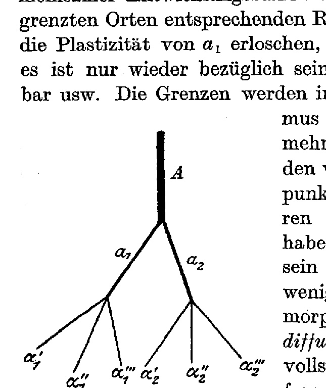

**Fig. 2.**

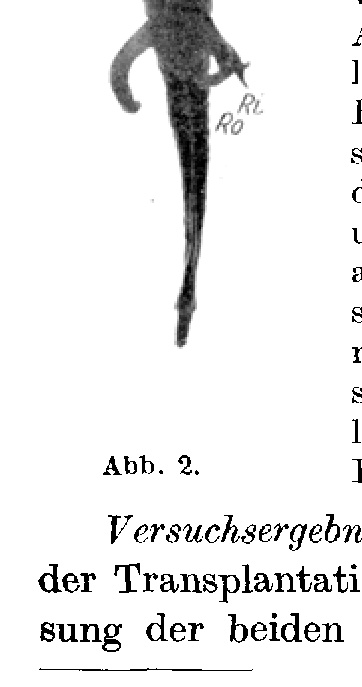

**Fig. 3.**

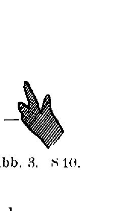

**Fig. 4.**

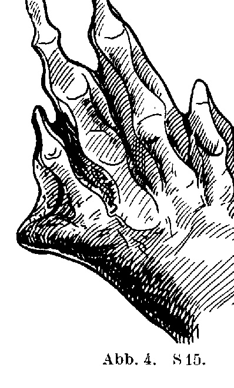

**Fig. 5.**

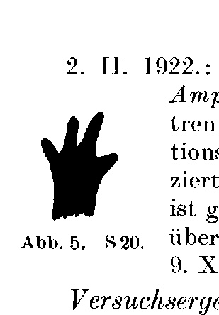

**Fig. 6.**

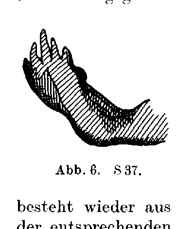

**Fig. 8.**

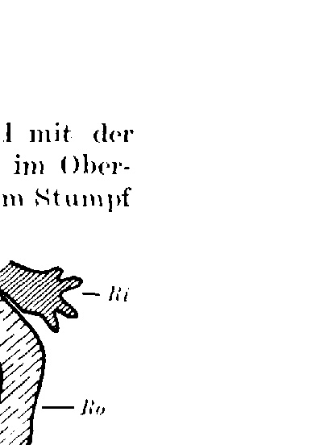

**Fig. 8.**

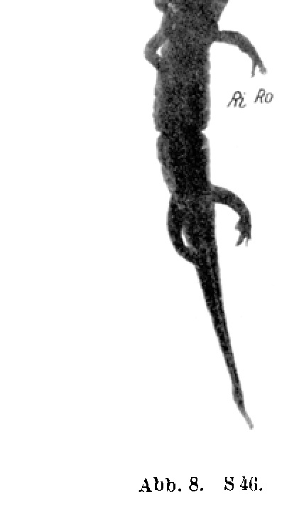

**Fig. 8.**

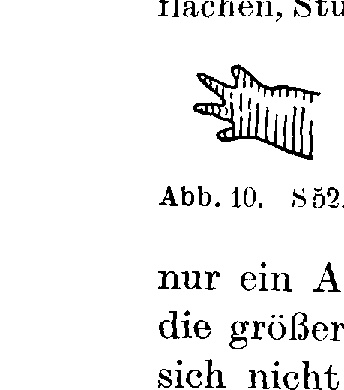

**Fig. 9.**

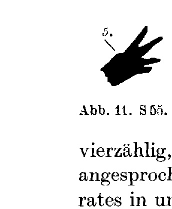

**Fig. 8.**

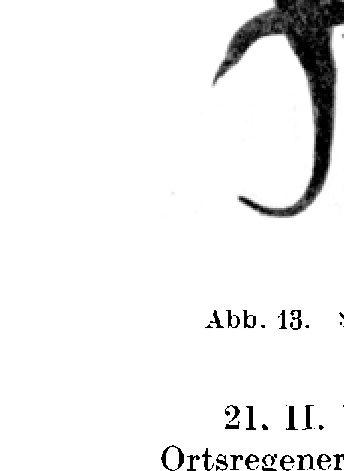

**Fig. 14.**

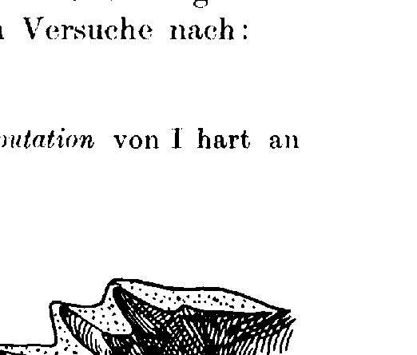

**Fig. 15.**

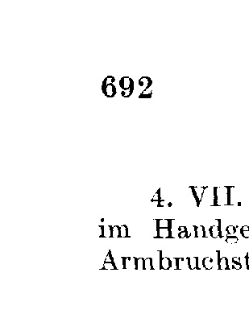

**Fig. 16.**

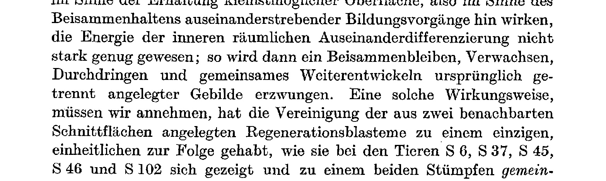

**Fig. 17.**

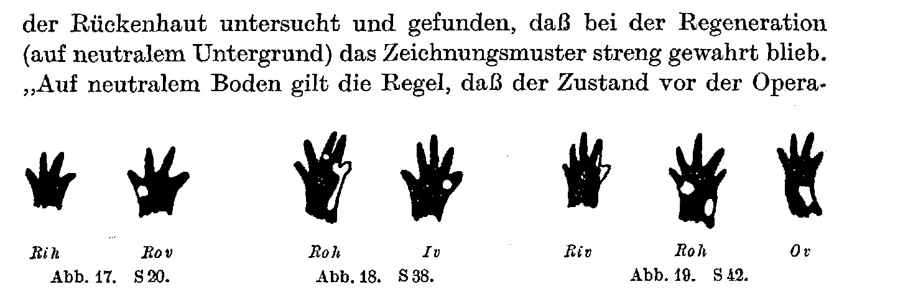

**Fig. 23.**

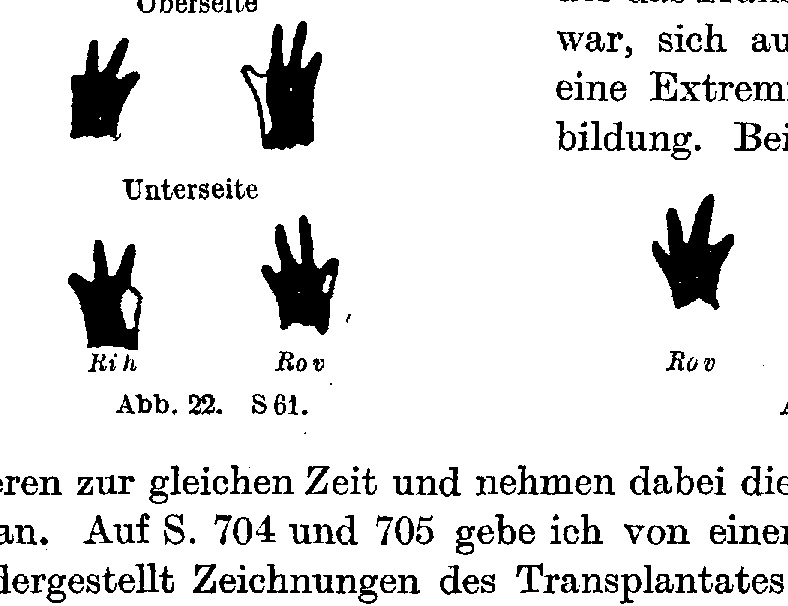

**Fig. 25.**

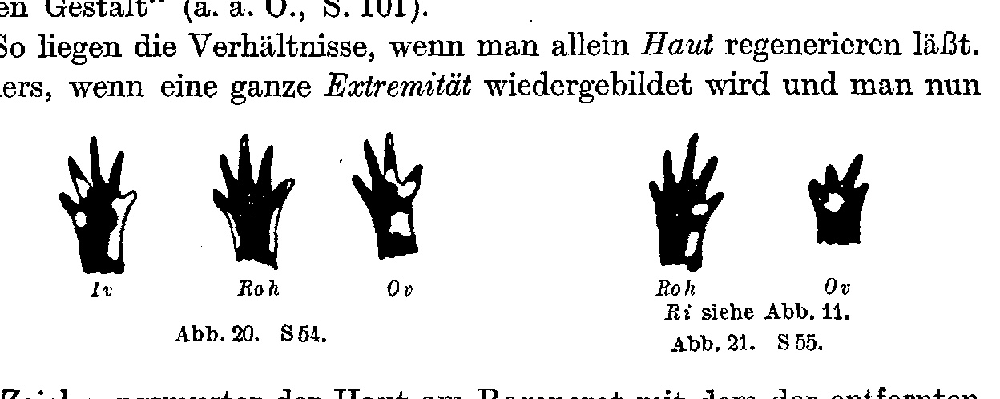

**Fig. 26.**

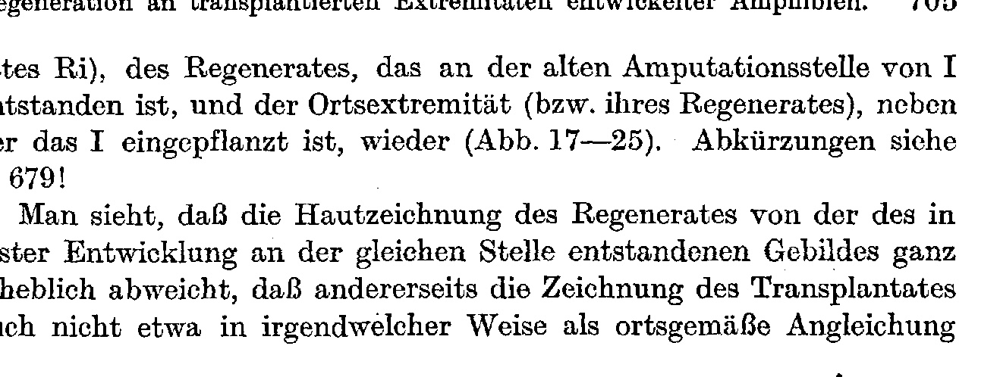

---

*Translator's note.* Part of Weiss's series on the regeneration of adult amphibian limbs.
