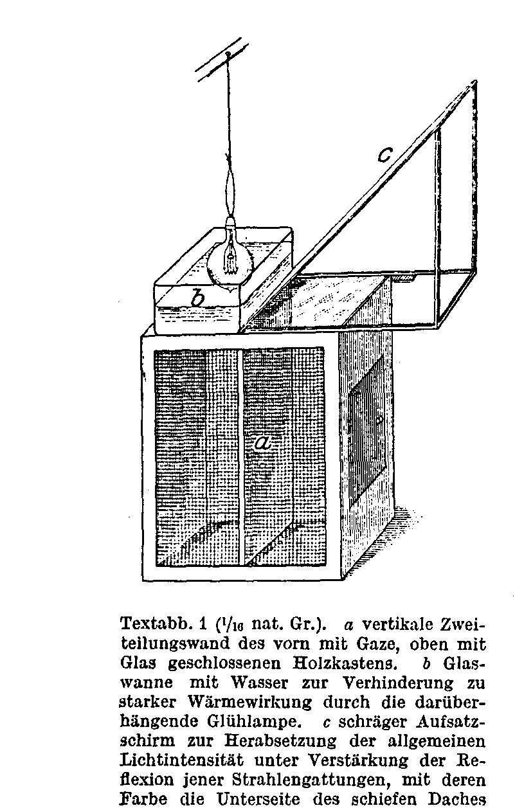
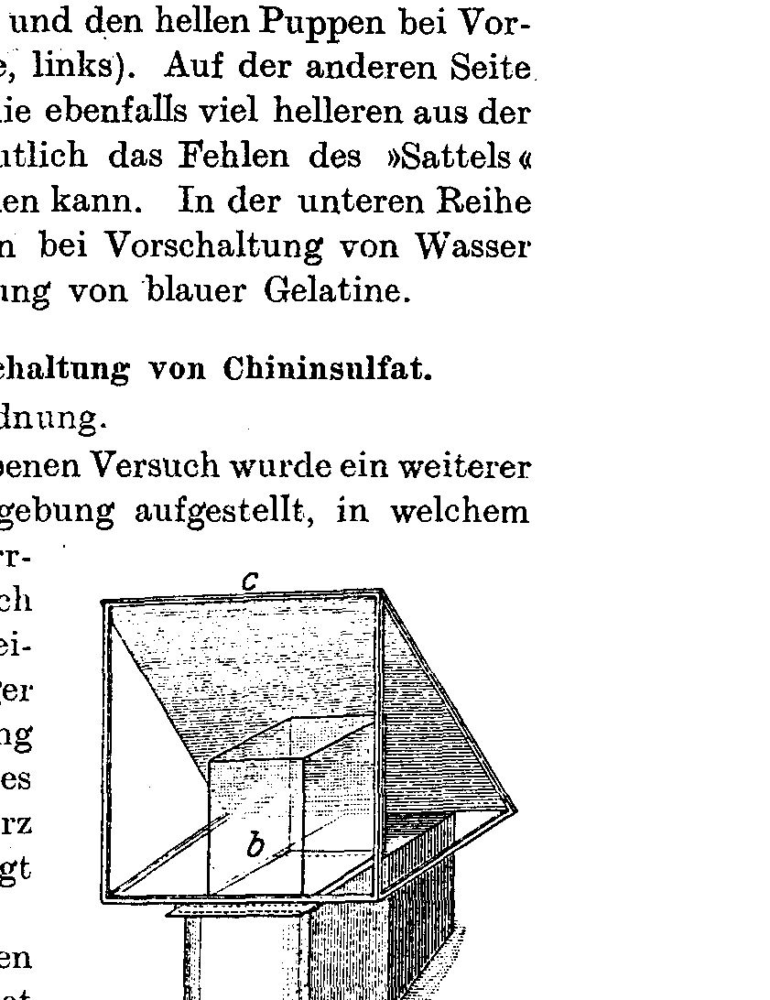
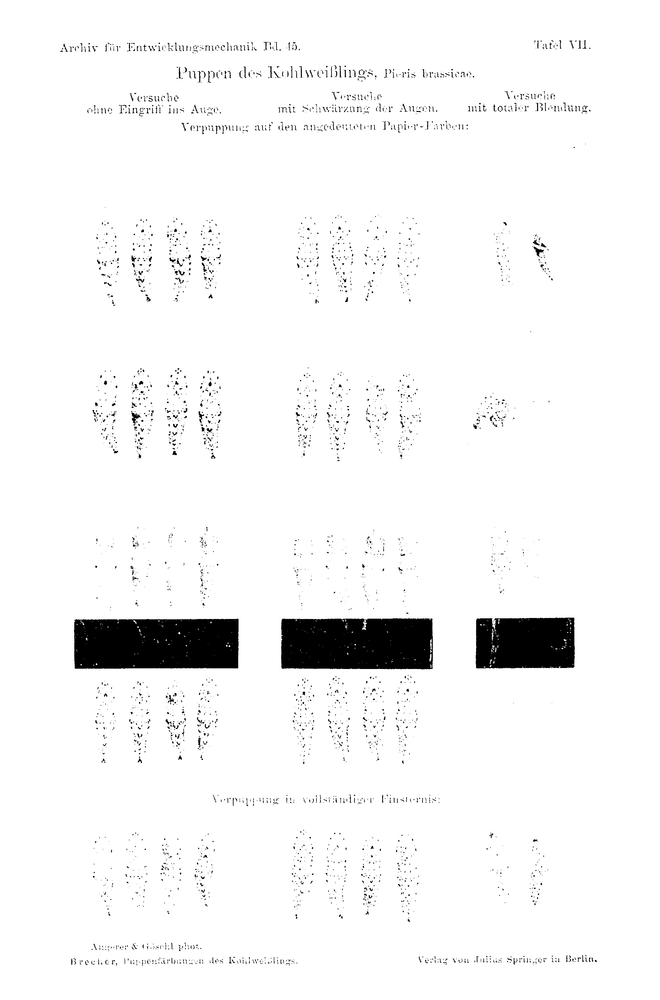
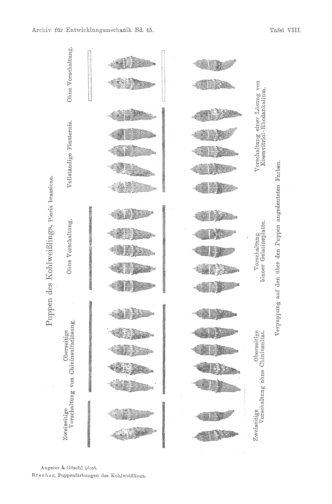
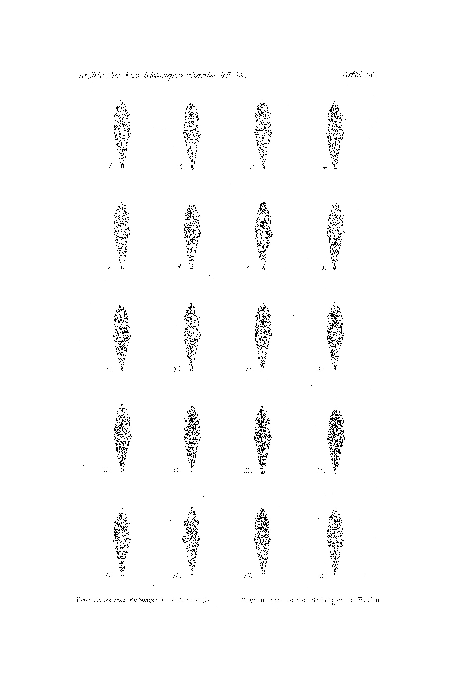

# The Pupal Colourations of the Cabbage White, Pieris brassicae L.

## Part Four: The Action of Visible and Invisible Rays.

By

Leonore Brecher.

(From the Biologische Versuchsanstalt of the Imperial Academy of Sciences in Vienna [Zoological Department].)¹

With Plates VII–IX and 2 text-figures.

(Received on 23 July 1918.)

*Archiv für Entwicklungsmechanik der Organismen*, vol. 45 (1919).

> **Full translation.** A complete English rendering of Brecher's 1919 study of the pupal colourations of the cabbage white (*Pieris brassicae* L.), with the tables and figure legends.

> ¹ An abstract of this work appeared, under the same title, as Communication No. 34 from the Biologische Versuchsanstalt of the Imperial Academy of Sciences, Zoological Department, Director H. Przibram, in the Academy's *Sitzungsanzeiger* (Proceedings Bulletin) No. 17, 1918.

### Table of Contents.

| | Page |
|---|---|
| 1. Introduction | 273 |
| 2. Maximal action of black (chamber experiment) | 275 |
| 3. Contrast effect | 277 |
| &nbsp;&nbsp;&nbsp;&nbsp;a) Lacquering experiments | 278 |
| &nbsp;&nbsp;&nbsp;&nbsp;b) Extirpation experiments | 279 |
| 4. Addition experiments (yellow and blue illumination) | 283 |
| 5. Subtraction experiments: Experiments on the role of the | |
| &nbsp;&nbsp;&nbsp;&nbsp;a) ultraviolet rays (elimination by means of quinine sulphate) | 292 |
| &nbsp;&nbsp;&nbsp;&nbsp;b) ultrared rays (elimination by means of ferrous sulphate–potassium thiocyanate) | 300 |
| 6. Positive action of the invisible rays (repetition of the spectral experiment) | 304 |
| 7. Scheme of factors | 305 |
| 8. Summary | 309 |
| 9. List of tables | 310 |
| 10. List of references | 319 |
| 11. List of plates | 320 |

### 1. Introduction.

Three years ago I began to analyse the influence of light and colour on the pupal colourations of the cabbage white² (Brecher, 1917). I should like to recapitulate very briefly: with respect to colouration, four types can be distinguished — light, intermediate, dark, and green — whereby the lightest arise in white-reflecting surroundings, the

> ² The continuation of the investigations on the colouration of the butterfly pupae in the year 1918 was made possible for me through the granting of a subvention for the year 1918 by the Imperial Academy of Sciences out of the Strohmayer bequest, for which I take the liberty here of expressing my thanks to the high mathematical-natural-scientific Class.

*Archiv für Entwicklungsmechanik, Bd. 45.* 18 darkest in black surroundings, the green pupae on yellow, and the intermediate and grey ones in complete darkness.

Already at that time, in investigating the action of black and of darkness, it had struck me, and I made it my task to analyse this problem. If we consider the series of so-called toneless colours — white, grey, black — and the pupae arising on them — the lightest on white, intermediate ones on grey, and the darkest on black — it seems as though there existed a connection between decrease of light and increase of the black pigment. But if we consider alongside this the action of complete darkness, then we see that here still darker pupae do not arise, but rather once again intermediate pupae (thus, with regard to the formation of the black pigment, similar to the pupae from grey surroundings).

Black therefore has a positive action on the colouration of the pupae. This distinction in the action of darkness and of black has been emphasised as striking by other authors as well.

Were the decrease in the intensity of the light the cause of the dark colouration of the pupae in black, then a proportionality between intensity and pigmentation could not exist; rather, a maximum of pigmentation would have to be present at a particular low light intensity. To find this boundary point, where the action of black reaches its high point and the action of darkness then begins, experiments of a kind similar to those of two years ago — for the elimination of the intensity action on yellow and white, in which a gradual decrease of light down to almost complete darkness can be achieved — may serve.

According to the data of other authors and according to my own experience, black surroundings in stronger light even bring forth darker pupae than less well-illuminated black.

One could at first think here of a contrast sensation perceived through the eye, such as has been assumed for physiological colour change. It would then have to be tested whether, by eliminating the visual sensation in caterpillars that are in the sensitive period, we would obtain a difference in colouration.

Should the blinding experiment turn out negative, then as possible causes of the differing action of black and of darkness only those would come into consideration which must lie in the physiological differences of the darkness and of the black background itself, that is, either:

the *intensity*, according to which the action of black surroundings would be that of a particular low light intensity. It would then have to be the case that, with all other background colours, a reduction of intensity leads to dark pupae, such as occur in illuminated black. On the other hand, an increase of light intensity would have to yield lighter pupae with all background colours, and indeed it would have to be entirely a matter of indifference whether in this the intensity of yellow or of blue rays were raised.

Should, however, the results differ according to the acting kinds of rays, then only the second alternative would remain, whereby the differences would have their cause in the *quality* of the light; and since black can be defined by the absence of all visible rays, there remains to be thought of only the rays not visible to our eye — the ultraviolet on the one hand and the ultrared on the other — and that it is some of these which cause the efficacy of black in contrast to darkness. And here it is in fact the ultraviolet rays that come into consideration; for together with the blue and violet they form the chemically most effective part of the spectrum, as we know (one example being that the ultraviolet part of the spectrum blackens photographic paper).

Should it then be the ultraviolet rays that condition the efficacy of black, then under otherwise equal conditions lighter pupae would have to arise in black where the elimination of the ultraviolet rays is provided for.

It then lies near, should these experiments turn out positive, to investigate whether perhaps in the action of white surroundings — as in the white colouration of the pupae — the other end of the spectrum, the ultrared rays, might not play a role. The fact, already mentioned by other authors and likewise rediscovered by me, that the pupae take on a white colouration when they pupate at an elevated temperature, suggests that possibly in the action of white surroundings we are dealing with an action of the heat rays.

Finally, the positive action of the invisible rays would have to be tested directly through their action while eliminating the visible rays.

The considerations set out here yielded the programme of the present investigations.

### 2. Maximal action of black (chamber experiment).

For the determination of the boundary point between the action of black and of darkness, the influence of black surroundings at various light intensities, up to complete darkness, was tested.

This was done by an experimental arrangement similar to the one described in the first part (Brecher, 1917, p. 131) for the elimination of the intensity action on yellow and white. It consisted in this, that in a long prismatic cardboard box ("chamber"), closed on all sides, a gradual decrease of the light is provided for by an inclination of the upper wall. The inclination angle of the chamber-box was, as in the earlier experiment for white, 4°20'.

Besides this box, No. 1, the boxes were so set up that No. 1 served as the front box owing to its rear wall (whereby the marked-off space was surrounded with paper), and, with simple darkness-covered boxes (No. 0), the production of complete darkness was provided for.

The pupating caterpillars used in these experiments all came from a single clutch.

#### Experimental results.

When one considers the pupae arising in this experimental arrangement and compares them with one another (see Table A on this), one finds, both in the front box of the chamber (No. 11) — that is, in the highest light-intensity grade of our experimental arrangement — dark pupae arising. These dark pupae, which in their colouration-type stand close to the dark-grey pupae (*d/f*, Tab. IX, Abb. 13, where the plate renders the dark colouration once more), also did not, however, turn out so dark as otherwise in black-surroundings caterpillars; since here a still greater light intensity prevails, intermediate pupae would have to appear.

With decreasing light intensity, and indeed in the second box of the chamber (No. 10) up to complete darkness, one notices an ever-increasing belonging of the pupae to the intermediate type, as one already perceives from the appearance of some greenish ones — an analogous course of the experimental results as with [grey] surroundings, as is also known from earlier experiments.

We know that the action of black surroundings comes to expression only when one passes over to lighter surroundings — that is, where the greatest light intensity prevails — and limits itself to that. With box (No. 10) the dark-action begins; here pupae appear such as are characteristic of darkness.

When, now, owing to the unfavourable experimental arrangement — namely owing to the small opening of the angle under which the light fell in, and the rear panel of the chamber-box, which brought about total reflection on the bright glass-boxes and so contributed to a sudden reduction of the light intensity — these results were obtained (I shall come back later to the explanation of the results conditioned by the experimental arrangement), so one can from these, just as from a quite dark type, also conclude this. We have, from earlier experiments, where it was always the case that dark pupae are obtained from very dark boxes, recognised that a reduction of light intensity in black does not bring forth lighter pupae. This is in agreement with the data of other authors (Poulton, 1887), according to which a stronger illumination of black surroundings raises [the action], so that a weaker illumination of black would lower it.

### 3. Contrast effect.

It strikes us first of all that black, which according to the usual definition absorbs light, nevertheless acts otherwise than darkness; indeed it even brings forth darker pupae than weaker or illuminated black.

This appearance has also been observed in other forms; in animals with physiological colour change one observes, both in crabs and in fishes, according to the light influence and the state of the chromatophores, a varied, indirect dark colouration of the eye (here the lacquered-over eyes are where this reaction is seen), as is conceived by the relevant authors (compare on this Keeble and Gamble, 1904; Bauer, 1905; v. Frisch, 1912) as a contrast effect. This action of black light, and of the black rays, would, on the grounds that the darkening of the animal could be brought about through partial lacquering of the eyes, have to come about (here the crabs, in particular *Idothea tricuspidata*, showed equally that the eyes themselves were located over the other halves of the lacquered-over glass wall, where, as with v. Frisch in trout, the action of the lacquering of the lower eye-halves set in).

It lay near to seek, even in the pupae, the cause of the positive action in a contrast effect.

In order first of all to test this question — whether the light influence on the pupating caterpillars comes about through the eye, in which case the characteristic action of the various background colours would have to fail to appear upon elimination of the perception — the pupae, such as are characteristic of darkness, would arise.

Poulton (1887) had already, with vanessids, raised the question of the way in which the light influence acts, by lacquering the eyes; yet he did not show that even thereby the colour modification with respect to the colouration of the pupae fails to appear; he only thereby proved that the green colouration of the pupae arises from him through the influence of the colour modification, since the colour modification through the eyes did not occur, as he did not test the elimination of the perception in the green-surroundings caterpillars he was considering.

In order to analyse the action of black in all directions, it appeared to me doubly important, since in my own experiments I not only lacquered, but also took care once again, in a natural manner, to bring about the complete suppression of the eye. For the elimination of the perception, both lacquering experiments and extirpation experiments were carried out.

#### a) Lacquering experiments.

The lacquering was done by painting over the eyes of the pupating caterpillars with a very fine, quite thin black lacquer (Brunschwig) by means of a brush. The eye was painted over under a magnifying glass; the painted-over part of the caterpillar eyes then appeared glossy black.

The caterpillars thus treated reacted very strongly to light at first: when an electric incandescent lamp was brought near in the evening, they made very lively movements, while the normal caterpillar at rest made searching back-and-forth movements and thereby moved itself away from the strong light source.

So that the eyes painted over with this lacquer — as had already been proven here in the blinding experiments in the second part (1917, p. 106) — high-standing, large, prismatic wooden boxes, lined inside with coloured paper, were used, the various parts of which (whereby the Müller-gauze wall) such as out of glass plates were painted over [...]. These boxes, lined both inside and outside with coloured glass plates and coloured paper over the glass-wall part, [were divided] into two equally large divisions. The greenish wooden cloth, formerly variously overpainted with coloured paper, for reinforcing the reflected light, was left out for these experimental rows.

The boxes were set up on a surface in surroundings overlit [from above]. Of various kinds — white, yellow, blue, grey and black paint-boxes — were used. Further, coloured boxes were set up for complete darkness, which were placed in a closed experimental room in large, light-tight, closed boxes.

In one lacquering experiment, pupae stemming from a single breeding stock were used.

As a control experiment, the same number of non-lacquered caterpillars were set up under the analogous light conditions.

#### Experimental results.

The pupae arising from the caterpillars with lacquered-over eyes show exactly the same influence of the surroundings-colours as those arising from seeing caterpillars; both in the control experiment of the "lacquered-over" and in the control experiment of the seeing caterpillars, the lightest pupae arose on white, and bluish, grey and green pupae arose on blue, grey and green. (See Table B, 1st experiment; compare also on Plate VII, in the two first columns, the pupae conveyed per horizontal row: one will notice that between the "lacquered" and the "non-lacquered" under the same plate-pair no difference is to be noted.)

This experimental result proves to us — in agreement with the finding of Poulton — that even upon elimination of the eyes by painting them over, the influence of the surroundings-colours on the colouration of the pupae does not fail to appear; that, in particular, the influence on the colouration of the pupae had clearly come to expression; that the colour modification comes about as the consequence of the colour modification through the eyes, independently of the perception.

When one would now assume that even a slight amount of light is forced into the eyes — although by far less light passes through the lacquered-over eyes — then, nevertheless, even at this undiminished intensity, upon elimination [of perception], the various background colours would bring about the various colouration of the pupae; only such caterpillars, in which no greater light intensity prevails, would have to bring about the colour modification through the eyes, and indeed in any case the colourations typical of darkness, the middle colourations, would then have to appear on the head.

A weighty argument against the view that light is nevertheless forced into the eyes — where, backwards through the eyes, by means of book-movements [bowing movements] before discovery, light could penetrate forwards into the eyes — was that, even in the previous experiments, no [reaction occurred to it]; where, however, it proceeds from the lacquered eyes, [it would only do so] where the intensity of the incident light oversteps the perception threshold.

(Nonetheless, even there a remote possibility of an action of the eye-perception through the radiation forwards is not turned off in further experiments.)

#### b) Extirpation experiments.

It is desirable to learn the action of light and of the pupal colouration in such pupating caterpillars on which a more radical intervention has been carried out. For this purpose a series of experiments was set up, in which caterpillars in the pupation-ready stage were blinded by electro-cauterisation and so— In the first of these series of experiments, which was set up parallel with the lacquering experiment, and indeed with the caterpillars from the same rearing, the surrounding boxes White, Yellow, Blue, Grey, Black, and furthermore Darkness were applied, in that the one compartment of each box was used for the blinded ones, the other for the lacquered caterpillars.

As control experiment the same one served as for the lacquering experiment.

In the second series of blinding experiments only White and Yellow were used as surrounding colours, and in addition complete Darkness, but for these several boxes were set up, in order to be able to bring as large a number of caterpillars as possible to pupation simultaneously, which were sorted, on the one hand according to their origin (two rearings were used for this experiment), and on the other hand also according to a further criterion, [namely] to which the experimental conditions were applied. There were namely separated the caterpillars of each rearing, which were fully ready for pupation and were already preparing to fix themselves, by setting aside [those] with reddened faeces¹ (cf. v. Linden, 1903¹), from such ones, which were not yet so far [advanced], which still excreted green faeces. The distinguishing of these stages has no significance at all for the colouration of the pupa of the cabbage white, as has been shown repeatedly in the experiments. I have only made the experience in the course of the experiments, that it is far more favourable to let the caterpillars enter the fixation [stage] with reddened faeces, since these, when they fix themselves within 2–3 days, yield large, fine pupae, whereas those brought in in the green-faeces-excreting stage wander about restlessly in the boxes for days and finally yield much smaller pupae — starvation forms — which, however, show no difference from the assumed colouration as against the first ones. I have therefore in the further experiments always used only caterpillars, as soon as they had entered the »red« stage. With the blinding experiments, through this sorting of the

> ¹ The data of Countess Linden refer to the dark-gut content of the *Vanessa* caterpillars, which in the still-feeding caterpillars is green, but in those preparing for pupation is red.

stages, the finding of the pupation stage favourable for the operation course and the pupation capacity connected with it was aimed at.

For each experimental variation the corresponding number of operated caterpillars was set up as »control animals« from the same rearings under the analogous light conditions.

### Experimental results.

With the electrocautery-blinded caterpillars one has to reckon with a large mortality figure. With the operation step now and then a certain blood loss set in, then [the pupae] could also fix themselves only inadequately, and so not pupate sufficiently. Those to whom it succeeds in pupating have had to struggle with difficulties in the stripping-off of the caterpillar skin, because this is stuck to the eyes, and so most of them curl up in the bodily movements which they make in order to slip out of the caterpillar skin (cf. Tab. VII, as well as the painted pupa Tab. IX, Fig. 7; one also sees clearly, that the eyes are missing in the blinded ones). One can judge their colouration just as well as that of the normal ones.

Therefore very much material was laid out for the blinding experiments (for both blinding experiments 82 caterpillars were used, and just as large a number for the control experiments), yet only few pupae arose. They therefore require repetition with much more material, which in this year could no longer be done.

The this-time experimental results are therefore unfortunately, in contrast to the other experiments, drawn merely from a smaller number of pupae:

It showed itself hereby, that with total removal of the eyes through electrocautery blinding the pupae that arose, in contrast to the normal ones and the »lacquered ones«, no longer let the effect of the differently coloured underground be recognised, but all behave as in the Darkness (middle pupae c/d, as Fig. 7, Tab. IX), in that they namely produce no green pigmentless pupae on Yellow. [Cf. Table B 1.¹) and 2.; cf. also Tab. VII, which presents the blinded pupae in the third column.] With the blinded pupae from Yellow it can also be quite clearly judged, that they are likewise pigmented, in contrast to the lack of spot marking in the pupae from the same horizontal row, [namely] the normal ones and

> ¹) With the references to the tables, for easier orientation, alongside the designation of the table also the ordinal number of the described experiment is given.

the »lacquered ones«, which had pupated on yellow underground. That otherwise in Yellow only green unpigmented pupae arise, is, even with all caution against over-hasty conclusions, nevertheless noteworthy, that the blinded pupae from Yellow are pigmented. There did indeed once also arise among the totally blinded ones a green one, admittedly not typical, but opaque whitish-green, which, however, came about precisely not in the yellow, but in the white box.

### Experiments with one-sided (right-sided) blinding.

In order to see, whether the differing behaviour of the through electrocauterisation totally blinded caterpillars as against the normal ones [is to be ascribed] to the consequence of the operation step undertaken on them and not to the absence of the eyes, a control experiment with only one-sided blinding was undertaken.

There were used for this purpose ten grown, not yet quite pupation-ripe caterpillars (»green« faeces stage) from the II. rearing, which had also delivered the caterpillars for the second blinding experiment, [which were] right-sided blinded by Herr Prof. Przibram, and the needle of the electrocautor was applied so far, that the right eye and the first segment lying behind it (in which a black spot is likewise found) was burnt out, up to the second segment (likewise with a black spot). The left side was left intact. This one-sided more-far-extended injury was carried out for the purpose, in order to call forth an injury size analogous to that with the bilateral blinding.

The caterpillars operated on in this manner were placed, five each, into one compartment of a yellow and a white box, with the same setting-up of the boxes as in the blinding experiment.

#### Experimental results. (Cf. Table B 3rd experiment.)

In Yellow only one [caterpillar] pupated: it shows the lack of black pigmentation as [in] the green ones, and also the ground colour is green. This pupa is clearly different from the bilaterally blinded ones from Yellow, which are typically middle [pupae]. In White [one] has pupated middle.

From one pupa naturally no conclusions can be drawn.

Only the repetition of the one-sided and bilateral blinding will yield, whether the absence of the colour adaptation with the totally blinded caterpillars is to be regarded as a measure of the operation as such or of the removal of the eyes thereby achieved.

These experiments have thus shown, that:

a) the switching-out of the visual sensation through lacquering of the eyes with the pupation-ripe caterpillars makes no difference in the effect of the surrounding colour, that thus the light action follows independently of the visual sensation of the caterpillar; b) the switching-out of the eyes, on the contrary, through total electrocautery blinding cancels out the action of the colours, and lets all pupae appear as those arising out of the Darkness (middle ones), which namely in Yellow comes to expression, [in] that there likewise pupae with middle spot marking arise and not green ones.

Although we now also cannot yet know exactly, what kind of role the presence of the eye plays, yet it can in no way be drawn upon as a contrast sensation for the explanation of the positive effectiveness of the Black, since the lacquering of the eye must cancel every contrast action of the same, [while] the action of the underground colours, however, remains upheld.

### 4. Addition experiments.

#### (Yellow and blue lighting.)

If we therefore cannot recognise in the visual sensation the differing effect of Black and Darkness, then we must look for it in the physical differences of the Darkness and of the black underground themselves: thus either in intensity differences or in quality differences.

Let us first take into the eye the first alternative, according to which the action of the Black would be [the action] of a particular small light intensity. (That we here have a threshold downwards towards the Darkness, has been shown by the »Schlucht« experiment.)

For the action of the Yellow upon the arising of green pupae it was proven through a »Schlucht« experiment (1917, p. 130), that here it is not a matter of the action of a particular intensity, since White in none, [but] Yellow in all such effective intensity gradations had yielded green pupae.

Furthermore it had already become apparent, in the consideration of the pupae arisen on the various underground colours (cf. work 1917: 1st series of experiments, as well as Tab. VII), that these, with the exception of the pupae from the White-Black row, do not let themselves be brought into agreement with the brightness degrees of the colours; rather the effect of the action [had become apparent] on the one hand of the yellow-reflecting and on the other hand of the blue-reflecting, as well as of the toneless colours, through the occurrence of green ones in the former and the absence of the same and the appearance of the non-green, black-pigmented types in the latter. This suggested the presumption, that with the formation of the pupal pigments we, similarly as with some other chemical reactions (Wo. Ostwald, 1908; Stobbe, 1908), would have to do with an opposed action of the yellow and the blue (resp. violet) part of the spectrum.

Further experiments were therefore made with regard to this question — which forms the object of a lively controversy among the researchers, [namely] whether we have to do with actions of the intensity or of the quality of the light — under variation of the experimental arrangement both for yellow- as well as for blue-, respectively violet-reflecting surfaces, likewise also for Black. 1. Through application of colour papers of various brightness degrees, under ordinary light conditions; 2. on the one hand through raising of the intensity of yellow and blue rays (addition experiments), on the other hand through reduction of the light intensity.

### Experiments with Yellow and Violet of various brightnesses.

There were used for this purpose light whitish Yellow and Brown, Lilac and Dark violet, and the large boxes lined therewith [were] set up with the inclined attachments in the diffuse light of the overhead-light passage. For Light-yellow and Lilac the caterpillars of one rearing were used, for Brown and Dark violet likewise.

#### Experimental results (cf. Table C, 1st experiment).

Light white-yellow yielded not a single typically green pupa, such as had always appeared in the otherwise used saturated Yellow. They are rather light pupae with spot marking, similar to the pupae from White. Nevertheless they do also show a decidedly greenish tone.

Brown yielded middle pupae, except for one, which shows the type of the green ones, but is quite dark green (i/g).

Lilac yielded middle pupae, such as arise also in Blue and Pearl-grey, and

Dark violet much darker pupae.

The experimental results, not quite sufficient according to the cherished expectations, especially concerning the row of the Yellow, which seem to speak in favour of an intensity action, are so to be explained, that the colours Light-yellow and Brown actually do not represent any saturated Yellow, but show a strong admixture of White, respectively Black, and this White-valence is probably to be held responsible for the fact, that the pure Yellow action could not come to expression, because the absence of the same led, with Light-yellow, to the lighter pupae, with Brown to the arising of the middle pupae. (For this side-by-side action of both components upon the colouration of the pupae, the dark green pupa in Brown is an instructive example: one sees here side by side the influence of the yellow component, which documents itself in the absence of the spot marking, in the strong formation of the green pigment and in the transparency, on the other hand yet also the influence of Black through the strong formation of black pigment in the ground colour, which together yields the dark green tone.)

Likewise Lilac had a significant White-valence, there arose therefore here only middle pupae.

If this consideration was correct, then a raising of the intensity of yellow rays in the light-yellow box would have to lead to the arising of green pupae, such as occur in the saturated Yellow even under weak illumination, [whereas] a raising of the intensity of blue rays, on the contrary, in this latter box, [would] cancel the action of the Yellow in part and let the results converge towards those of the Light-yellow; a raising of the blue intensity in Lilac, on the other hand, [would] lead to darker pupae.

This gave occasion for the addition experiments described in the following.

The principle of these experiments consisted (analogous to those carried out by v. Frisch and Kuppelwieser for the testing of the colour sense of the Daphnia in 1913) in adding, to the colour boxes set up in the natural diffuse light, to the rays reflected from the coloured walls, yellow respectively blue rays, so that thereby simultaneously a raising of the light intensity set in.

Such experiments were carried out in two series of experiments; in the first, the addition of coloured rays was achieved through switching-in of coloured metal-filament lamps, in the second series of experiments through white light and the prefixing of coloured gelatine plates.

#### a) Experiments with addition of yellow and blue light by means of coloured metal-filament lamps.

In the colour boxes set up in the diffuse daylight — light White-yellow, saturated Yellow, and Light-lilac — through the addition of coloured light from above by means of, in each case, one 160-candle Osram metal-filament lamp coloured with transparent lacquer, which was attached in the middle of one compartment of each box at a distance of 8 cm from the glass cover (Text-fig. 1), a raising of the intensity of the one colour component was achieved: with Light-yellow through an intensely yellow-coloured lamp (colour of potassium bichromate) the intensity of yellow rays was raised, with the saturated Yellow and Lilac through blue lamps, which raised [the intensity of] the blue rays. In order to prevent a temperature rise in the box as a consequence of the heat radiated from the lamp, a glass trough with a 1 cm high water layer was placed in front, above the glass cover, and this [was] often renewed, as soon as it exceeded room temperature.

As control experiment the other compartment of each box was left under the natural light conditions. By setting up the inclined attachment with the back side towards the lamp of the illuminated compartment, the penetration of light from this side was prevented.

Through this experimental arrangement it was achieved, that Light-yellow + yellow light, as a consequence of the raising of the Yellow-valence, came in tone close to that arisen from the saturated Yellow, yet with a much higher light intensity than this; saturated Yellow + blue light, on the contrary, appeared whitish-yellow and thereby approached in tone the unchanged Light-yellow, likewise under a considerable difference of the light strength. Lilac + blue light showed a deepening of the tone towards Blue, under simultaneous raising of the intensity in comparison to the compartment left unchanged.

However these conditions were not quite perfectly achieved: the illuminated compartments did not appear uniformly luminous in all parts; only in the upper half of the walls and at the floor did the added coloured light mingle uniformly with the natural white light, and the reflecting surface reached the above-mentioned tone. The lower side of the walls took on the tone less and approached that of the unchanged [compartment].

In order to prevent an over-predominance of the influence of the artificial coloured light as against that of the natural white light — since indeed only an addition of coloured rays to the incident rays of mixed light was intended — and in order to obtain no difference in the illumination duration between the illuminated and not-artificially-illuminated compartments, since constant illumination may act differently than periodic [illumination], the periodicity of the natural light was taken into account, [in] that the lamps were switched off (turned down) at the onset of dusk and switched on again (turned up) in the early [morning].

In the following the illumination times during the whole course of the experiment are given.

**Text-fig. 1** (¹/₁₆ nat. size). *a* vertical bipartition wall of the wooden box closed in front with gauze, above with glass. *b* glass trough with water for the prevention of too strong heat action through the incandescent lamp hanging above it. *c* inclined attachment screen for the reduction of the general light intensity under reinforcement of the reflection of those classes of rays, with whose colour the underside of the slanting roof is clothed.  *(figure not reproduced)* The lamps burned from the
start of the experiment: 21. IX. from 10ʰ a.m. —5ʰ p.m.
22. IX. from 9ʰ15 a.m.—6ʰ30 p.m.
23. IX. from 9ʰ15 a.m.—5ʰ45 p.m.
24. IX. from 7ʰ30 a.m.—7ʰ p.m. (already dark)
25. IX. from 7ʰ30 a.m.—5ʰ45 p.m.
26. IX. from 8ʰ30 a.m.—6ʰ p.m.
27. IX. from 8ʰ45 a.m.—6ʰ p.m.
28. IX. from 8ʰ30 a.m.—6ʰ p.m.
29. IX. from 8ʰ30 a.m.—6ʰ p.m.
30. IX. from 8ʰ30 a.m.—6ʰ p.m.
1. X. from 8ʰ a.m. —5ʰ30 p.m.*
until the end of the experiment 2. X. from 8ʰ30 a.m.—5ʰ p.m.*

> (* Time shifted by one hour, from summer time to winter time.)

At the end of the experiment, the light intensity prevailing in the various compartments and at various places within them was measured by means of the blackening of photographic paper (celloidin paper). Here the considerable increase of the light intensity in the compartments with switched-in lamps, as compared with the others, shows clearly.

For this experiment, caterpillars of the same brood were used as for Violet and for Brown.

### Experimental results (see Table C, 2 for this).

The addition of yellow rays to the bright whitish Yellow had, despite the increase in intensity, an increase of Green among the pupae as its consequence. (One of them is even a typical yellow-green; this one had pupated on the floor, where the action of the reflected yellow light was strongest.)

The addition of blue rays to the saturated Yellow that is characteristic of the formation of the typical green pupae brought about a partial cancellation of its action, in that pupae with black spot-marking appeared.

In the one case (yellow rays), then, the increase of intensity led from the bright to the green pupal type; in the other case (blue rays), however, away from this type, to the bright black-pigmented pupae. According to this, the appearance of bright pupae in Bright-yellow (cf. control experiment, as well as the 1st experimental series) cannot be connected with an increase of intensity, but must be ascribed to a preponderance of the white-valence over the Yellow.

As regards the results for the Lila box, Lila + blue light gave brighter pupae than the control compartment. There the caterpillars had, however, fixed themselves there directly to the upper glass cover, thus not at all under the influence of the irradiating surface, whereas at analogous pupation sites in Lila, unchanged, they received the rays reflected from the inclined attachment.

### b) Experiments with addition of yellow and blue light by means of white lamps and coloured gelatine.

For the repetition of the addition experiments, the experimental arrangement was varied in such a way that the addition of coloured rays was effected by switching in white light, in that the same was sent through coloured gelatine plates that completely covered the upper glass cover. So that the total intensity should suffer no reduction compared with the previous experimental arrangement, in consequence of the complete covering with the gelatine plate, a 200-candlepower Azo-Osram lamp was used in each case. By stretching out a ceiling of Müllergauze in the box at a suitable height, the caterpillars were prevented from fixing themselves directly under the coloured gelatine.

In the second compartment of each box, a lowering of the light intensity, in comparison with the control experiments of the first addition experiment, was effected by upper-side covering.

As colours, besides those also used in the first experiment, Black too came into use, and indeed with this latter both the action of the intensity-increase of blue and of yellow rays (by means of 160-candlepower Osram lamps and pre-switching of coloured gelatine), and further the intensity-increase of white light (by means of a 160-candlepower Osram lamp without pre-switching of gelatine), were tested. Besides this, a black box was set up under the ordinary natural light conditions (two-sidedly illuminated by diffuse light) and another covered on the upper side. A completely darkened Black had unfortunately to be excluded from this experimental series for lack of caterpillars. But we do indeed know the influence of darkness from other experiments.

With this experimental arrangement a much more uniform illumination of the box was achieved; only at the lower ⅕ of the walls did the influence of the added light decrease; on the other hand, the desired colour-tone had been better attained in the first experimental series. To our eye, in the second experiment, the compartments Bright-yellow + orange-yellow light (through two layers of orange-yellow gelatine) appeared more reddish-yellow in comparison with our usual Yellow; Yellow + green-blue light (through two layers of green-blue gelatine) appeared green-yellow. Lila + blue light (blue gelatine) showed a wonderfully beautiful deepening into blue-violet.

As in the previous experiment, here too the artificial light was used only during the day. Below are listed its illumination times during the entire course of the experiment, that is, from the bringing-in of the caterpillars into the experimental conditions until two days after their pupation.

Illuminated:
1. Day 4. X. from 9ʰ a.m.—6ʰ p.m.
2. Day 5. X. from 6ʰ30 a.m.—5ʰ p.m.
3. Day 6. X. from 6ʰ45 a.m.—5ʰ p.m.
4. Day 7. X. from 6ʰ30 a.m.—5ʰ30 p.m.
5. Day 8. X. from 7ʰ a.m.—5ʰ15 p.m.
6. Day 9. X. from 7ʰ a.m.—5ʰ p.m.

At the end of the experiment, intensity measurements in the various compartments were carried out by means of the blackening of photographic paper. Unfortunately this method allows us no estimation of the total intensity, but only that of the chemically active rays. Therefore (with an exposure of two hours around midday) the photographic paper from the compartments with switched-in yellow light shows no blackening at all, while that from the compartments with predominant blue light has undergone a strong blackening. Interesting is the observation that in the covered compartments, Bright-yellow, Yellow and Lila, the paper remained completely unblackened, whereas in Black, where the total intensity is indeed even further reduced, it shows a distinct blackening.

The caterpillars used for this experiment came from one brood, except for those from Black-covered and Black-unaltered, which were of diverse origin.

### Experimental results.

The results of this experimental series connect with those of the previous one:

The increase of the intensity of yellow rays had on all ground-colours a stronger greening and reduction of the black pigment as its consequence; the increase of the intensity of blue rays, on the contrary, had a deepening of the blackish tone.

In order to show how this behaviour expressed itself in detail, I will discuss in turn the results for the various ground-colours somewhat more fully. (Cf. also Table C, 3 for this.)

As regards the two Yellows, in this experimental arrangement no complete reversal of their actions was indeed achieved by the switching-in of orange-yellow light to Bright-yellow and of green-blue light to the saturated Yellow; yet in the former, greenish pupae which form a transitional type (half-green, ⅓ green) arose, and in the latter not a single typical green one occurred, but rather medium (d/e) and half-green ones. Thus the switching-in of yellow light to the bright-yellow box brought about an approximation to the green type through an increase of the Green and a decrease of the spot-marking, the switching-in of green-blue light to Yellow prevented the formation of the typically green pupae through the development of the black marking; which in both experiments led to similar pupae.

In the compartments with upper-side covering, too strong a lowering of the light intensity had been brought about by it, so that here the colour-action could not come fully into effect; thus in Bright-yellow, upper-side covered, no bright, somewhat greenish ones, as in the earlier experiments, but pupae which stand between the medium and the half-green ones arose; that is, they are actually rather similar to the pupae from Bright-yellow + orange-yellow light. In Yellow covered there arose, with a few exceptions (pupae which were fixed at better-illuminated places), no typically green ones. One sees again from this that a certain threshold of the light intensity, at which the colours can still act as such, must not be fallen below.

In Lila, an increase of the intensity of blue rays had a strong darkening of the pupae as its consequence: even if on the average not all are quite so dark as those, to be discussed further on, from Black + blue light, they are nonetheless the darkest in the series of experiments with Lila (cf. these from all three experiments, Table C). Besides the stronger degree of melanisation, they are also distinguished from the others by the absence of the greenish tone.

Lowering of the light intensity through the upper-side covering, on the contrary, gave much brighter pupae.

In Black, the increase of the intensity of blue rays gave the very darkest pupae of all. They also lack every trace of a green tone.

Increase of the intensity of yellow rays had not quite such dark pupae as its consequence. But what distinguishes them from the others is the appearance of a green tone in the ground-colour. Even a typical blue-green pupa arose here.

Simultaneous increase of both kinds of rays by means of white light had the formation of brighter pupae as its consequence.

Unfortunately this time the control experiment with the black box under the ordinary light conditions (two-sided illumination by diffuse daylight) had not given sufficient results, so that they are not usable for comparison with the others.

On lowering of the light intensity by upper-side covering, dark pupae (f) arose throughout, which are however brighter than those from Black + blue light (g) and have a greenish tone.

At first, on considering the results of the experimental variations with Black, it might seem as though the increase of blackening were in fact connected with the decrease of intensity: at the highest intensity, in Black + white light, are the brightest pupae of the Black-series; at decreasing intensity, through pre-switching of the yellow gelatine before the switched-in light source, darker pupae; at still lower intensity, in consequence of the pre-switching of the dark-blue gelatine before the lamp, the darkest pupae arose¹). At a further stage of intensity-reduction through the upper-side covering, the maximum of the efficacy for the dark-colouring of the pupae had in any case already been exceeded; the brightening of them occurs again, and at complete darkness (an experiment which is unfortunately lacking in this series, but whose results we know from other experiments) would give a further brightening up to the medium type. This agreement would speak for the view that a certain low light intensity (perhaps precisely the intensity such as it was in Black with switching-in of blue light, or in the neighbourhood of it) is responsible for the maximum of blackening in the pupae.

But if we now turn again to the results for Lila, we see that in Lila and blue light, despite the increase of intensity (compared with the Lila unchanged of the first experiments), the darkest pupae arise, which are only a shade brighter than those from Black + Blue: so far it also agrees with the decrease of intensity, since in Black + Blue a lower intensity prevailed in any case than in Lila + Blue; but in Lila covered, at the lowest intensity of Lila, there arise much brighter, that is, the brightest pupae of the series. If the origin of the dark pupae is to be traced back to an action of the intensity alone, then it would be to be expected that in Lila darker pupae would arise rather on decrease of the light intensity, since it thereby approaches the brightness-conditions prevailing in Black, and not the reverse, on increase of the light intensity through the switching-in of blue rays.

It cannot, then, be an action of the intensity alone that produces the dark colouration of the pupae in Black.

Rather it emerges from all experiments with addition of yellow and blue light that, in the influence of the various ground-colours on the pupal colouration, it is not a matter of intensity-actions, but that the quality of the light is here decisive, in that a specific action of the visible rays is

> ¹) But this also only when we take into consideration the optical intensity for our eye; with regard to chemically active rays, a greater brightness prevails in the blue-covered box than in the yellow-covered one.

present, namely on the one hand of the yellow in the suppression of the black and the favouring of the green pigment, on the other hand of the blue (and violet) in the furtherance of the black and the suppression of the green pigment.

Accordingly, after these experiments, the intensity alone cannot here be decisive for the action of black surroundings either, but the quality of the light must here too condition the action of the Black.

## 5. Subtraction experiments.

### a) Experiments on the role of the ultraviolet rays. (Cutting-out by quinine sulphate.)

There still remained the other alternative for the explanation of the positive efficacy of black surroundings on the dark colouration of the pupae, namely that it must act as a quality, not however as a particular low light intensity. The previous experimental series could not, however, explain to us in what this quality of the Black actually consisted, and set us a new puzzle; for if it is the blue rays that cause the increase of the black pigment, how then does it come about that precisely in Black, which lets itself be defined by the absence of all visible rays, the darkest pupae, still darker than in Blue, arise?

We had therefore to turn from the visible rays to those of the spectrum not visible to our eye.

Wiener (1895) had found, in body-colour photography, that the ultraviolet rays bring about the blackening necessary for the rendering of the Black, and he set up an experiment with Poitevin's colour-sensitive platelets: it became brighter when the ultraviolet rays were held back by a quinine solution from the illuminating, undecomposed electric light, but darker when these were allowed to enter unhindered. He also expresses the conjecture that "the stronger development of the dark pigment in the pupal skin in dark surroundings in strong light, in comparison with complete darkness, might perhaps be connected with the action of the darker violet and ultraviolet rays."

If, then, the ultraviolet rays should be those that condition the efficacy of the Black, brighter pupae must arise in Black under otherwise equal conditions if the cutting-out of the ultraviolet rays were provided for. This happened in my experiments through pre-switching of a quinine sulphate solution.

A saturated quinine sulphate solution in water (1 g in 800 cm³ of cold water) receives, with the addition of a few drops of concentrated sulphuric acid (I have added one drop of concentrated sulphuric acid to each 15 cm³ of the solution), without losing its water-clarity, a beautiful blue fluorescence in incident light, and has acquired the capacity to absorb the ultraviolet rays, as one can easily convince oneself by means of photographic paper: this remains scarcely blackened under the quinine sulphate layer, whereas it blackens at once under a pan with water of the same layer-thickness or under a glass plate.

Such experiments for testing the role of the ultraviolet rays by means of pre-switching of the quinine sulphate solution were carried out in several experimental series.

### α) Large boxes with upper-side pre-switching only.

#### Experimental arrangement.

For this purpose the large prismatic boxes were used, in the colours Black, Lila, Yellow and White, with upper-side pre-switching of a glass pan with a 4 cm high layer of quinine sulphate solution before the one compartment of each box. As control, a pan with an equally high water layer was pre-switched before the other compartment. From the front, however, undiminished mixed light penetrated into both compartments through the Müllergauze wall.

#### Experimental results.

This first experiment was, in regard to the question of the role of the ultraviolet rays on the pupal colouration, completely without result. The pupae of the two compartments of each box are completely alike in their colouration, which corresponds to the known mode of action of the colours used (cf. Table D, 1), except for a quite small difference in the pupae from Yellow, which show a somewhat paler Green with the pre-switching. The experimental arrangement had to be altered to the effect that a complete cutting-out of the ultraviolet rays was provided for. This happened in all the following experiments.

### β) Small boxes with one-sided (upper-side) light-entry and pre-switching.

#### Experimental arrangement.

In these experiments the pupation-ready caterpillars were placed in small wooden boxes of 25 cm length, 10 cm width, 17 cm height, lined inside with coloured paper, also used in the irradiation of the ferment extracts (cf. Przibram-Brecher, in this present number), into which light fell only from above. There were such boxes: 1., with pre-switching of a glass pan with a 4 cm high layer of the quinine sulphate solution; 2., with pre-switching of a glass pan with an equally high water layer; 3., were set up without pre-switching (only covered with a thin glass plate). As colours, Black, Blue and Red were tested, each with each of the three kinds of pre-switching. Furthermore, by way of comparison, one box each with white, yellow and yellow-green lining "without pre-switching" was used. The boxes were set up in a row next to one another on a table in the upper-light passage under an overhead light.

In a repetition of the experiment for Black and Red, in order to forestall a possible objection—that the reason for the appearance of brighter pupae in Black with pre-switching of quinine sulphate might be that of an intensity-reduction through the pre-switching of so high a liquid layer—a fourth box was set up with a suitable pre-switching which should lower the light intensity prevailing in it by a considerable amount and yet, according to our previous experiences, should give darker pupae. This was achieved by pre-switching a blue, respectively violet, gelatine before the black, respectively red, box. The light intensity visible to us was quite considerably reduced by this pre-switching.

As control experiment, a box was set up in complete darkness. For this purpose a black-lined box was covered with a cap of opaque black paper (such as is used in photography) and besides with a darkening-cover, and set up on the table next to the other boxes.

of the quinine sulfate solution, 2. with the interposition of a glass tank with an equally high water layer, 3. without interposition (only covered with a thin glass plate). As colours, black, blue and red were tested in each of the three kinds of interposition. Furthermore, for comparison, only a single box each with white, yellow and yellow-green lining without interposition was used. The boxes were set up in a row next to one another on a table in the overhead-light passage under an overhead light.

In the repetition of the experiments for Schwarz [black] and Rot [red] it again turned out that the ground for the appearance of lighter pupae lay in the interposition of quinine sulfate, or in the more powerful intensity-reduction through the interposition of the thinner glass plate, when covered. Here it was, despite the absence of the ultraviolet rays in the case of black and red, in each case the lighter pupae that arose with the corresponding interposition, just as the darker boxes [arose] without interposition. According to our earlier experiences, here too green pupae arose. This was effected through forces which the violet [glass], or rather the black or red box, achieves. The visible light intensity is indeed reduced through these interpositions, but this drawback is to be regarded as far less significant.

As a control experiment a box was set up in complete darkness. To this end an unilluminated box, lined with black, was set up; for this purpose the cap (Kappe) of a light-impervious black box (from the photographic-plate set) was covered with paper and additionally with a dark-black box, and placed over the other box.

### Experimental results.

The results of these experiments are thoroughly unambiguous. In all cases, indeed, the interposition of quinine sulfate already brought about a significant brightening of the pupae; with the two-sided interposition, an even stronger brightening, and likewise a complete elimination of the ultraviolet rays produced in black surroundings, just as the lightest pupae arise, as it occurs in white too (yes, even somewhat lighter than this year came about in white; cf. Pl. VIII upper row, outermost left group of pupae and the black with two-sided interposition).

We can therefore observe here especially the gradual decrease of the black pigmentation through the elimination of the ultraviolet rays.

In the boxes without interposition the darkest pupae arose. Corresponding to the experiences with the interposed surroundings, here too the influences of the various employed ground colours come to expression; black has, as opposed to white, the strongest blackening effect (here too, in contrast, the pupae are not quite so deeply dark, but on the whole still much lighter, with interposition of water and somewhat dark, yet still light; cf. Pl. VIII, the outermost left group of the lower row).

With the interposition of water the pupae are somewhat lighter than the ones without interposition, because glass and water absorb the ultraviolet rays somewhat.

With the interposition of quinine sulfate, that is, with exclusion of the ultraviolet rays, the pupae arising in black became lighter throughout; the black or blackish tone in the ground colour vanished, so that here even the lighter middle tone appeared. So too the absence of the ultraviolet rays in the case of black brings about a brightening. In agreement with this, the lightest pupae arose. Here, indeed, despite the absence of visible light intensity—since in the case of black surroundings one nevertheless arises a darker, middle pupa without interposition—cf. Plate VIII; an addition-experiment described in one chapter. In contrast, in the case of black surroundings (cf. the red and violet gelatine), where the appearance of a bluer or rather paler gelatine takes a part of the light away, and through which here likewise the reduction of the intensity is absent, the rays effective for the melanin-formation—the blue, violet and ultraviolet rays—remained left over. Striking in this experiment, and indeed chiefly with the red and violet gelatine, was the appearance of dark-green pupae, in which actually no black pigment at all is formed (here, indeed, the strong formation of green pigment and the diffusion of the peculiar pigments distributed in the ground colour)—then they mark themselves chiefly through the absence of white (the opacity) in the ground colour. I have therefore attempted to indicate the dark-green colouring with the bluer or rather very minor formation of the same chiefly through the absence of white in the ground colour (the opacity). The white in the cover (the opacity) is the explanation of this appearance, to be thought of, whereas, conversely, here it might be connected with the appearance, in part, chiefly through the absence of the white in the ground colour. The dark-green pupae arise from the absence of white in the cover; they stand out and hang together.

Complete darkness brings forth pupae still lighter than black does, and indeed without interposition rather than with interposition of water. As a result, with the interposition of water (analogous in degree of melanisation to the pupae with interposition of quinine sulfate), during the appearance of the pupae out of the darkness the same colouring shows itself, and in contrast indeed to the others the absence of the darkness [Finsternis] shows the customary variability in tone of the greenish, so-called half-green, or rather light-green ground colour. It is uncertain whether the inheritance-tendencies from outwardly-acting influences would be present, as in the darkness [Finsternis] some sort of other action exists.¹

> ¹ Experiments on this have been in progress since 1918.

I should like, on this occasion, to point to a difference between the pupae which arise in darkness and all those arising in light: namely, to draw attention to the warmer (more greenish or yellowish) tone of the ground colour in the case of the pupae arising in darkness, as opposed to the colder (whitish, chalky) tone of the pupae arising in light. However, no significance is to be assigned to this difference in regard to the assignment of the pupal type. According to this, the types belong, after the grade of formation of the black pigment, as well as after [the grade of formation of] the green, [to which] the darkness pupae [belong] too. So too the placement of the types lies merely after the grade of formation of the black pigment, as well as after the grade of formation, [for] the gray or rather neutral surroundings, [the same] as the darkness pupae likewise. Only the comparison with the middle quinine-sulfate experiment—through comparison with the dark, blue darkening tone of the pupae arising through interposition of quinine sulfate, so too the other pale darkening tone of the pupae—lets the green appear, yet [it is the green] from which the pale-formed pupae [arise]. Only now do I have, with the characteristic of the green pupae arising in darkness, to distinguish the [other] arising pupae: in the case of the green pupae arising in darkness, the ground colour shows a whitish chalky tone, a stronger opacity, and at this position not particularly distinguished; here it is the transverse line between the thoracic and the abdominal half [that] here, both with the dark and with the middle and pale pupa, stands out from the rest of the green pupae, whereas the green pupae of the darkness show only a lesser formation of white in the ground colour (because the shimmering-through of the green from the inside is present too), although the pupa shows a uniform ground colour. The presumable cause of the formation of white in the cover will, however, not be dealt with at the next position.

If we now provisionally set this difference aside, then—as it stands in tight connection with the ultraviolet rays, as it also lets [itself] clearly be recognized through the elimination of the pupae [in] the white surroundings with interposition of black, or rather the white "saddle"—we can now, after the results of these experiments, recognize that the positive effectiveness of black surroundings on the dark colouring of the pupae, in contrast to white surroundings, is conditioned by the ultraviolet rays: the ultraviolet rays taken away, the same surroundings reflect the black. With the elimination of the same through quinine sulfate, the black surroundings vanish into white surroundings.

The analogous results before the interposition of quinine sulfate before red and white surroundings let the effectiveness of the ultraviolet rays before these two surroundings and the melanisation be more clearly recognized. Here the elimination of the pupae before interposition of quinine sulfate before white surroundings conceivably [has] a smaller [effect], as also through the presence of the blue rays, which could pass through unhindered, the melanin-formation was favoured.

For the judgement of the individual experiments I should like to refer further to Table D, 2 and 3. Furthermore, for the illustration of these experimental results, Plate VIII is appended, which represents the pupae of the second of the experiments with black surroundings. One sees here very beautifully the contrast between the wholly dark pupae from black without interposition (upper row, middle) and the light pupae with interposition of quinine sulfate (upper row, left). On the other side of the pupae "without interposition" are the likewise much lighter ones from the darkness, in which one also clearly perceives the absence of the "saddle" in contrast to the others. In the lower row one sees the rather dark pupae with interposition of water, and the still darker ones with interposition of blue gelatine.

### γ) Experiment with two-sided interposition of quinine sulfate.

#### Experimental arrangement.

Simultaneously with the experiment just described, a further experiment for the testing of black surroundings was set up, in which—for the purpose of increasing the light-intensity prevailing in the box and consequently also the effectiveness of black—two-sided light-entry with two-sided interposition was provided for, and, for a strengthening of the reflected ultraviolet light, the upper-side setting-up of a black-covered inclined attachment.

For this purpose the small boxes with black lining were used and set up by analogy with the otherwise always used large prismatic wooden boxes, into which the light falls both from the front and from above. For this purpose the open side was, to this end, turned away from the front one, closed off through a glass plate (25 × 10 cm), and a second (small) opening was made through a 7½ cm wide, 13½ cm long cut-out, and the box, with the elongated glass wall directed to the front and the cut-out side directed upward, set up, and a forward-directed, black-lined, inclined attachment given over it.

The interposition consisted, for the front, of a 5½ cm wide, 15 cm

**Textabb. 2 (⅒ nat. size).** a Cuvette in front of the upper box-side; b Glass tank over the upper box-side; c oblique, leaning backward onto a second, otherwise unused box, black screen.  *(figure not reproduced)* high, [cuvette] filled with the quinine-sulfate solution, a glass cuvette set up directly in front of the glass wall; the glass tank over the upper-side opening (Textabb. 2).

With this experimental arrangement, therefore, an intensity-increase resulted despite the two-sided interposition, through complete exclusion of the ultraviolet rays from both entries, and likewise the complete brightening through [exclusion of] the ultraviolet rays. The two-sided interposition resulted, as proved through the testing by means of photographic paper, in fact thereby. For the control experiment a cuvette and a glass tank without quinine-sulfate solution (empty) were interposed.

#### Experimental results.

#### (Cf. on this Table D, 4.)

If the effect of black through exclusion of the ultraviolet rays still needs proof, then it is in fact provided, as the results of the last experiments proved completely. With one-sided interposition of quinine sulfate we had already achieved a significant brightening of the pupae; with two-sided interposition, an even stronger brightening, and likewise the complete elimination of the ultraviolet rays produced in black surroundings, just as the lightest pupae arise, as they come about in white (yes, even still somewhat lighter than had occurred this year in white; cf. Pl. VIII upper row, outermost left group of pupae from white without interposition). Conversely, with two-sided interposition without quinine-sulfate brightening—where the quinine sulfate revealed itself, namely at analogous positions [where] the strongest light is taken away—dark pupae arise, just as in the previous experiment, [and the] white in the ground colour (therefore the shimmering-through of green from the inside) vanishes, although the pupa, [through] the threefold glass interposition, absorbs a part of the ultraviolet rays. So there show themselves, after the light-conditions, in each case the relations of the conditions: with two-sided interposition, the upper-side interposition of water [is] somewhat darker, about as somewhat dark as the front-side one (cf. Pl. VIII, the other lower group of the lower row).

Furthermore it is interesting that with the blackening (the pupae arising in the box from black at analogous positions, under the interposition of quinine sulfate at analogous positions) the quinine sulfate likewise shows itself in the same brightening, opposite the others, and analogous to the pupae out of the darkness (here, indeed, here without "saddle"). The two interpositions of quinine sulfate take away less of the light, and dark, just as the others, take away less of the light in the same [way] and likewise reach the middle type. So here too both extreme types, the light and the dark one, converge to a middle type as effect of the darkness.

In the interposition-experiments described in the previously discussed chapter, one sees everywhere with the interposition of quinine sulfate, that is, with elimination of the ultraviolet rays, the brightening of the pupae.

The complete uniform result with all these experiments lets the positive effectiveness of black surroundings on the dark colouring of the pupae, in contrast to the darkness, be conditioned: the ultraviolet rays are it [that] the black reflects, just as the positive effectiveness of the same in contrast to white surroundings is conditioned by the same in contrast to the white surroundings.

Now, with the greater effectiveness of black, a greater light-intensity appears (which at first appears thereby paradoxical, so long as one considers the effect of the black as the [same as] for the others, light-intensity)—[this] explains itself more clearly: it is, just as also the effect of the ultraviolet rays, strengthened.

Also the result of the earlier reported experiments now appears comprehensible too: through the back-and-forth reflection between the glass boxes there resulted everywhere a still more increasing absorption of the ultraviolet rays, so that, just as with a second glass box at our middle-light surroundings analogous to them, the darkness could arise.

The greater difference between the effect of the darkness and the black surroundings, the relatively low effect—just as long as the one presumed for the intensity-effect, the middle [type], with the effect-strength of black (the equation-finding)—now appears, since the experiments reported up to now play no role before the colouring of the pupae (as it actually appears), now indeed before a certain low light-intensity, as opposed to the absolute darkness, [it] explains [itself], but became known, namely thereby, that the absence of any rays, also of the ultraviolet ones, is distinguished.¹

The explanation thereby proved, of the positive effectiveness of black through exclusion of the ultraviolet rays, however nevertheless lets this question open, indeed yet now from neither the physical nor the sense-psychological standpoint of the black surroundings. It is namely the black, before all other colour-surroundings, unenlightened; so it is now nevertheless visible light-rays [that are] absorbed, [such] that it also reflects the ultraviolet rays?¹

> ¹ As we subsequently came to know, there lies on this a not-insignificant physical positive investigation: that ultraviolet rays become reflected from black surfaces.

Comparative measurements of the blackening of photographic paper with all colours, with and without interposition of quinine sulfate, ought to permit this question to be cleared up, [namely] whether black reflects the most ultraviolet rays.

### b) Experiments on the role of the ultrared rays.

We have now fairly thoroughly analysed the effects of all background-colours and traced them back to specific effects of individual kinds of light-ray, and have thereby thus attributed to each spectral region its mode of effect in the out-colouring of the pupae: yellow and yellow-reflecting surroundings act through the yellow rays, namely green-increasing and melanin-exhausting, so that green pupae with very minor melanin-formation arise. Blue and blue-reflecting surroundings act through the blue rays toward an increase of the dark pigment and a retreat of the green, so that dark pupae arise. Black acts still more blackeningly through the chemically more active ultraviolet rays. The middle type, distinguished by a middle green-colouring and middle degree of melanisation, arises there where all these factors act in equal measure, that is in neutral surroundings, in gray, or where altogether no light-factor whatsoever can act, that is in complete darkness.

It remains to us only still to explain the arising of the white¹ pupae in white surroundings, and to see whether we could not make a kind of ray responsible for it too; and there remains to us only still one spectral region which we have until now not yet drawn in, namely the other end of the spectrum, the ultrared rays, which are characterized through their heat-effect. The supposition lay near, whether these had not a role in the arising of the white pupae in white surroundings.

This assumption was supported through some facts, both from own experiences and also through some literature-statements regarding the effect of the heat on the pupal colouration.

> ¹ The white appearance is conditioned: 1. through the very minor formation, remaining standing only at a preliminary stage, of a melanin-formation in the ground colour; 2. through the disappearance of the green; and 3. through the strong formation of white in the cover, which gives it the white opaque appearance, especially at the "saddle".

1. The same-directed change of the tyrosinase into the tyrosinrosa-discolouring tyrosinase through the action of higher temperatures, as also through the action of white-reflecting surroundings in strong light (tyrosinase of the brightest pupae; cf. work 1917), which could rest on a same-directed effect both of the temperature- and also of the light-factor, as soon as these have overstepped the optimum, or rather could bring [it] into connection with a predominance of the ultrared rays in white surroundings.

2. The statements of some authors:

Standfuß (1896) lets caterpillars of *Vanessa cardui* and *Vanessa urticae* pupate at the temperatures of 40° C or, respectively, 37° C on white background, and obtained nearly without exception white pupae. Against this, the same temperature-increase had no influence on caterpillars which pupated under blue, yellow or red glass panes: here arose the natural colouring (18–23°), no white pupae as result.

Gräfin Linden (1905) obtained, in the keeping of the pupating caterpillars at higher temperature, on *Vanessa urticae* and *Vanessa cardui* pupae white pupae through the temperature of from 32–35° C—pupae which are otherwise distinguished through complete absence of darker pigmentation.

I could unfortunately for now set up no genuine experiment on the keeping of the pupating caterpillars at increased temperature, in the absence of constant-temperature chambers as a result of the war (in consequence of the war). This experiment, to be supplied subsequently, would however doubtless have given a same-directed result, whereby it would doubtless have brought the proof, [namely] that the question—the tyrosinase acting in white, that namely [the white acting tyrosinase]—would have to be answered: provided also for the elimination of the warmth-factor in white.

This [is to happen] in the same and indeed twofold [way]:

α) through keeping of the pupating caterpillars at lower temperatures in white surroundings.

β) through exclusion of the warmth-rays by means of interposition of an ultrared-absorbing fluid.

#### α) Testing of the effect of white surroundings at the various temperatures.

#### Experimental arrangement.

For this purpose, in one of these white-clad large boxes with the corresponding attachments, an arrangement-set-up was brought about in the following manner: as control experiment, the box was set up at a position [with a] cool-chamber installation not in operation, at which the temperature stays at over 10°. The temperature-course during the whole experiment was subsequently registered by means of a tone-thermograph. The temperature-course showed the minima over 10°, the maxima over 20°, and indeed so that a middle day-temperature over 15° resulted. At low temperature, the same window, but [a box] outside the building. Here the temperature-course shows the minima over 10°, approximately about 2°, also nearly over 0°, and the maxima over 20°; [it] was a

## 2. The statements of several authors.

**Standfuß** (1896) had caterpillars of *Vanessa cardui* and *Vanessa urticae* pupate at temperatures of 40° C and 37° C respectively on a white background, and obtained nearly white pupae. By contrast, the same temperature elevation had no influence on caterpillars that pupated under blue, yellow, or red panes: they retained their natural colouration. Likewise, white surroundings at room temperature (18–23°) did not result in white pupae either.

**Gräfin Linden** (1905), by keeping the pupation-ripe caterpillars of *Vanessa urticae* at an elevated temperature of 32–35°, obtained pupae that were distinguished by a complete absence of dark pigmentation.

Unfortunately, up to now I have been unable to carry out exact experiments on the keeping of pupation-ripe caterpillars at elevated temperature, since the constant-temperature chambers of the Institute are out of operation as a result of the war. This experiment, still to be supplied, would no doubt undoubtedly have yielded white pupae, but this would still not have furnished proof that the factor acting in white must be the same one. Rather, the question would only be answerable if provision were made for the elimination of the warmth factor in white.

This was done in two ways:

α) by keeping the pupation-ripe caterpillars at lower temperature in white surroundings.

β) By eliminating the warmth rays by means of interposing an ultrared-absorbing liquid.

### α) Examination of the effect of white surroundings at various temperatures.

#### Experimental arrangement.

For this purpose, one each of the white-lined large boxes with the inclined tops was set up in the following way:

As a control experiment at ordinary room temperature, in the room of the now non-operating cold-chamber installation, in front of a window. The temperature was registered throughout the entire course of the experiment by means of a thermograph. The temperature curve shows the minima above 10°, the maxima above 20°, and indeed in such a way that a mean daily temperature of 15° results from it.

At lower temperature, on the same window, but outside the building. The temperature curve here shows the minima below 10°, approximately at 2°, hence almost at 0°, and the maxima at 20°, which gives a mean daily temperature of 10°, hence one 5° lower than that in the room.

Both cultures enjoyed the same daylight, which fell in from the east.

#### Experimental results.

If one now considers the pupae of both experimental conditions side by side (cf. on this Table D, 6), then in any case all the lighter pupae, which appear under "white" in the room, are opaque, white, light, showing in this respect not yet any trace of green tone. The white "saddle" in particular stands out quite distinctly here, while the pupae of lower temperature show a slight greenish tone (cf. the description of the basic colour); the "saddle" is absent here too, white, as is also the case with the pupae of darkness.

### β) Experiment with elimination of the ultrared rays.

#### Experimental arrangement.

As the ultrared-absorbing medium, the solution of one drop of rhodalin and ferrous vitriol in 100 cm³ of water was used. This liquid has a faintly yellowish colouration.

The experimental arrangement was quite analogous to the experiments with elimination of the ultraviolet rays: they were carried out in the small boxes with our oversized light-tight covers, over which a layer of the ferrous-vitriol–rhodalin solution at a height of 1 cm was interposed.

As colours, white, red, and black were here tested (cf. Table E, 5).

#### Experimental results (cf. Table E, 5).

The elimination of the ultrared rays produces in white the same effect as the lowering of the temperature, in that here too the pupae appear greener in tone than under white without elimination. The green tone (Pl. VIII, lower row, last pupa to the right) shows the disappearance of the saddle particularly distinctly. It is, as in darkness, similar, but not entirely white.

Here too, with elimination of the warmth rays, exactly the same difference can be seen in white in comparison to white without elimination as appears in the green pupae in comparison to the white saddle.

As far as the other colours (red and black) are concerned, the interposition of the ferrous-vitriol–rhodalin solution causes no change either, just as in the interposition of water, so that the ultrared rays in any case do not seem to exert any blackening effect on the pupae. Worthy of mention is the disappearance of the white saddle, which here too stands out particularly distinctly in some cases (cf. Pl. VIII).

In all experiments with elimination of the warmth rays, the pupae are darker in tone, less white, and are distinguished by the absence of the white saddle through a darker tone.

Unfortunately, when these experimental series for the examination of the role of the ultrared rays in pupal colouration were being set up, the heating was no longer in operation; very much raw caterpillar material was needed for the interposition, so that the experiments could not be repeated very often, and the cited results form the basis for this. Nevertheless it is still possible, by accomplishing the present main task — namely, to subject these green pupae in white surroundings to a closer examination — to say something more definite about the role of the ultrared rays in the origin of the white pupae in white surroundings. Yet the lack of the white saddle alone already tells me enough, and somewhat more emphatically the differences in the appearance of these green pupae in white compared to white without elimination. For if white plays the role I attribute to it here as a function of the lowering of the temperature, one must then, also with elimination of the ultrared rays, likewise fail to obtain it — namely, that white in the basic colour is no longer formed, and not in the middle part (saddle) either, the saddle remaining absent here as in darkness; that is, that the ultrared rays would here be just as absent as in darkness, hence the above-mentioned difference between the pupae in white and the pupae of darkness, and all the light contrast between the pupae, except with elimination of the ultrared rays in white surroundings. With the effect of the white surroundings, the surplus of the ultrared rays would be responsible for the origin of the white saddle; and where the white in the basic colour is lacking, where no surplus of ultrared rays is available, white remains absent here too (yellowish-green), and white is not formed; here it could perhaps stand in connection with the appearance of the green as a result of the lack of the ultrared rays.

Incidentally, these results find a beautiful confirmation: **Dürken** (1917) checked, in two years' work, in his own experiments, the dependence of the colouration of the cabbage-white pupae on the temperature, in that he set up parallel experiments in the room and outside the room in winter. His temperature curve shows a similar dependence as the room-temperature curve; he finds the mean daily temperature there to be approximately 15°, outside the room 10°, hence 5° lower than that in the room; this thus stands in connection with both temperatures, likewise yielding 5°. In white he obtained, on the appearance in the room, his "main variant" *b*, his colouration variant *b*, while our lighter (6) pupae represent it, and, with elimination, *b* in the open air the main variant in his colouration class *a*. Thus he too had tacitly the same in his colouration class *a*. Now Dürken takes the difference of class *a* and *b*, whereas our two colouration factors do not coincide with the difference; he obtained from his white culture of class *a* rather *a*, and indeed with his version with white in the open air not at all. Dürken himself thus concludes from this experimental result that the temperature factor exerts no influence here, and assumes a variation breadth for the white culture of class *a* and *b*, while in our experiment tactically class *b* predominates in his experiment with white in the open air.

### 6. Positive effect of the invisible rays.

(Repetition of the spectral experiments.)

Finally I wished to subject the white pupae once more to the positive effect of the invisible rays directly through the irradiation. This was done with the spectral experiments which I had already carried out and described above (see this section of the work [1917, p. 122] arranged and described — see there) with the same experimental arrangement as in the earlier year, repeated. In the dark chamber I projected the spectrum, brought the caterpillars to pupation, and set up small boxes lined with spectral-coloured paper in the spectral districts, one above the other, corresponding to the colours of the projected spectrum. As far as the ultrared is concerned, this was here, in both spectral experiments, not quite possible, so that one had to assume that the ultrared rays formed into the whole breadth of the latter small boxes so as to bring about more an effect of darkness, so that these green pupae could actually, from the effect of the ultrared rays, show the direct effect of the ultraviolet rays.

#### Experimental results.

The results of the irradiation are evident in Table E. The upper small-box row stands fully under the lack of ultrared, where one finds greenish bases; so even lighter pupae would lie nearer.

This experiment had yielded exactly the same as the spectral experiments of the first small boxes:

That the caterpillars hereby choose the direct positive effect of the ultraviolet rays, in that the very darkest pupae originated in ultraviolet; they agree in their colouration with the very darkest pupae in white and the black caterpillars stand in.

From the gradual succession of violet and blue, which are still always dark, green has no particular effect at all, only that they are already somewhat greenish, whereas yellow yielded the green pupae, of which already weaker dark ones in orange and red come; also they, somewhat middling greenish in orange, become light pupae; indeed yellow alone shows the blue-green typical and characteristic of orange, whereas the very violet and ultraviolet exhibit no trace of green.

We thus see again the effect of the spectral rays through yellow on the one side, in the production of green pupae with little black pigment, and on the blue, violet, and ultraviolet spectral districts on the other side, in the suppression of the green colouration and in the promotion of the black pigments.

## 7. Theory of factors.

All the experiments hitherto have shown that the various surrounding-colours, through their distinct kinds of light rays, condition the colouration of the cabbage-white pupae.

The intensity of the light plays a role insofar as a certain threshold must not be undershot, in order that the dark colour be sufficiently formed, so as to produce the characteristic effect.

The exact analysis of the ray effects allows each of the factors that compose the colouration of the cabbage-white pupa, the colouration of the cabbage-white pupae, now to be brought into causal connection with the individual light factors.

The colouration of the cabbage-white pupae is brought about through the formation, the quantity, and the distribution of the following factors, which confer a characteristic appearance on each type:

I. The distribution of the basic colour.

I₀. The basic colour is uniformly distributed over the entire pupa. (Pupae from the darkness and those without ultrared.)

I₁. The basic colour of the front half shows itself distinctly formed in contrast to the middle and rear part; the rear appears (yellowish) and opaque. (Half-green pupae occur in the darkness, in green and ultrared with interposition of the violet gelatin.)

I₂. The basic colour is interrupted, as with green and ultrared; with green pupae the rear half appears, through the middle part, through the emergence of a white saddle. (All occur as light, white pupae, as originated without ultrared.)

II. The formation of the spot-marking.

II₀. The spot-marking is not present at all. (Green pupae — influence of the yellow rays.)

> *Archiv für Entwicklungsmechanik Bd. 45.* 20 II₁. A finer formation of the spot-marking. (Thereby the light, middle, and the front part of the dark pupae are also pronounced, even up to the entirely green ones; — originated, and all underground-colours as far as yellow.)

II₂. The spot-marking appears more strongly reinforced. (All dark pupae, produced through blue, violet, and ultraviolet rays.)

III. The quantity of the black pigment present in the basic colour.

III₀. The quantity of the black-grey pigment present in the basic colour shows itself conditioned in the lighter tone or the darker tone of the basic colour.

It is, at the formation with greener but always still present; at observation under the microscope one finds it formed only as a fine or brownish precursor stage, and indeed:

in a light-green or brownish precursor stage (with the lightest pupae — effect of the white, red, and dark rays with ultrared rays!), or dark-brown (with the green pupae — suppression of the pigment through the yellow rays).

III₁. The increase of the black pigment in the basic colour makes this appear greenish-grey to grey. (Middle pupae — at uniform effect of all factors, grey, neutral surroundings or darkness.)

III₂. The black pigment covers the basic colour entirely, except for the white saddle, so that the same appears dark-grey, almost black. (Dark pupae in black — effect of the blue, violet, and ultraviolet rays.)

IV. The formation of the green at the emergence of the green.

IV₀. The basic colour shows itself not at all greenish or red-brownish coloured. This occurs sporadically, but even with the entirely dark pupae the green has not yet disappeared at all. (Effect of mauve and ultraviolet rays.)

IV₁. The basic colour has a yellowish-green colouration. (Almost all pupae from the lightest to the dark, with the exception of those belonging to the upper category.)

IV₂. The formation of an abundantly green basic colour goes hand in hand with lack of black pigment and transparency. (Green pupae — effect of the yellow rays.)

V. The formation of white in the basic colour, which is distinguished from the formation of an opaque, chalky appearance, whose nature is not yet investigated, steps forth.

V₀. There is no white formed in the cover (except for the very white "saddle"); nature is not present. (At the green pupae — effect of the ultrared rays!)

V₁. The white in the front part predominates or is not formed at all, this part itself green and translucent; the saddle and the lower part have white or yellowish opaque tone.

(Pupae are partly light-grey-green boxes, where to the yellow also the effect of the white rays is added, or also half-green pupae, which originate there, where on the one side yellow rays act, on the other side white acts in, e.g. in green surroundings, but also in darkness, perhaps as a hereditarily transmitted variant. Or the whole pupa lets little whitish tones be recognized, whereby it however appears more opaque through diffuse pigment. These pupae have here a warmer, greener or yellower tone than the following. (Pupae from the darkness and without ultrared.)

V₂. The whole pupa has a whitish-opaque appearance.

(All pupae from the light, with the exception of those already cited above, typical however for the entirely white ones. — Effect of the white surroundings, with elimination of the ultrared rays.)

If one now wishes to summarize the positive effects of the rays, then it is:

1. the white in the basic colour, that is, the factors I and V, through the ultrared rays!

2. the formation of the dark pigments, also the factors II and III, through the blue, violet, especially the ultraviolet rays! and

3. the further formation of the dark pigments and the emergence of the green (cf. work 1917, p. 164), also factor IV, through the yellow rays! — conditioned.

If one now wishes, according to my analysis, to trace these results back to nearly each colouration factor onto certain ray supports, in order to be able to clarify and to explain the variability of the colouration and the origin of the colouration types under the various surrounding-colours, and the relationship of the ray components of the light to the influencing surrounding-colours.

If we wish to consider here, for the series, according to the spectral colours, then it is:

perhaps the ultrared, to be made responsible for the dark white in the basic colour.

> 20* Red has no particular influence. There acts here on the one side the ultraviolet on the formation of the dark colourants, on the other the yellow on the formation of the green. (Greenish-dark pupae.)

Orange. Here the yellow rays act on the promotion of the green, so that there reigns the lower intensity of the ultraviolet rays predominantly, so that no white is formed, hence the origin of lighter-green pupae. On the other side, the slight intensity yields also an influence on the formation of the green colourants — green pupae. On the other side, here even the greater intensity of the white valence reigns, hence the appearance also of white specimens.

Yellow-green works approximately as orange.

Bluish-green has a specific effect. A combination of yellow and blue rays yields here greenish and middle pupae.

Blue, violet, and especially ultraviolet act on the formation of the dark colourants and on the suppression of the green colourants. From this results the effect of the individual surrounding-colours: white acts, through the ultrared rays, on the white-colouring of the pupae. This must yet be confirmed through further experiments. Yellow and the yellow-reflecting surfaces act, through the predominance of the yellow rays, on the origin of green (greenish) pupae. Blue and blue-reflecting surfaces act on the origin of dark, non-green, hence middle pupae. Black acts, through the reflection of the ultraviolet rays, on the strong blackening of the pupae;

The question, then, of where these colourations come about in the caterpillar through the influence of the various ray-kinds, what processes take place under their influence in the caterpillar (pupa), which finally leads to a certain agreement with the surroundings, and that this effect can occur precisely in the period just before pupation — that will be the subject of a next part, dealing with the photochemical processes in the caterpillar and pupa.

**Red** has no special effect. Here it is, on the one hand, the ultraviolet rays that act on the formation of the dark pigment, and on the other hand the yellow rays that act on the formation of the green. (Greenish dark pupae.)

**Orange.** Here the yellow rays act to promote the green; but there also prevails a low intensity of the white valence, so that no white is formed, hence the appearance of blue-green pupae. On the other hand, the low intensity, without the action of the yellow rays, yields the middle pupae.

**Yellow** prevents the formation of melanin and favours the formation of the green pigment — green pupae. On the other hand, here too the greatest intensity of the white valence prevails, hence the appearance of white specimens as well.

**Yellow-green** acts quite similarly to orange.

**Bluish-green** has no specific effect. A joint action of yellow and blue rays here yields greenish and middle pupae, and

**Blue, violet and especially ultraviolet** act on the formation of the dark pigment and on the suppression of the green pigment.

From this follows the action of the individual environmental colours: white acts, through the ultrared rays, on the white colouration of the pupae. This must still be confirmed by further experiments. Yellow and the yellow-reflecting surfaces, through the predominance of the yellow rays, act on the production of green (greenish) pupae; blue and the blue-reflecting [surfaces] act on the production of non-green, that is, middle to dark pupae. Black, through the reflection of ultraviolet rays, acts on the strong blackening of the pupae; whereas grey, where all light factors act equally, and darkness, where no light acts at all, bring about an equal formation of all colour factors. In darkness the absence of the ultrared rays brings about the uniform colouration without a "saddle" and the more vivid greenish tone. Moreover, a greater variability in the ground colour is also present here, which might perhaps be put down to inheritance tendencies that would come to expression in darkness, where all the influenceable light factors are absent. But this question is still under investigation.

The question of how these colourations come about in the pupa through the influence of the various kinds of rays, what processes take place under their influence in the caterpillar (pupa) that finally lead to a certain agreement with the environment, and how this action can take place precisely in the period just before pupation, will be the subject of a next part, dealing with the photochemical processes in the caterpillar and pupa.

## 8. Summary.

1. A black environment produces much darker pupae than complete darkness.

2. An increase of the light intensity increases the effectiveness of a black environment.

3. This positive effectiveness of a black environment, in contrast to darkness, cannot be explained as a contrast effect, since the influence of the environmental colour on the caterpillars ripe for pupation appears to be independent of the visual sensation: the colour types of the pupae characteristic of the various background colours appeared even when the eyes of the caterpillars ripe for pupation had been painted over with black lacquer. The elimination of the eyes, on the other hand, by electrocaustic blinding, abolishes the effect of the colours: pupae appear in all colours such as are characteristic of darkness. Yet the question of what role the presence of the eye plays for the colouration of the pupa is not yet quite clarified.

4. But the action of black also cannot be that of a particular low light intensity, since an increase of the intensity of yellow rays on every background brought about a stronger turning-green and a diminution of the black pigment, whereas an increase of the intensity of blue rays brought about an increase of the black pigment. The quality of the light must therefore be decisive for the colouration of the pupae.

5. It is the ultraviolet rays which, reflected from the black environment, bring about the positive effectiveness of black in contrast to darkness: upon their elimination, pale pupae arose in black.

6. It would be natural to assume, but is not yet sufficiently proven, that the other end of the spectrum, the ultrared rays, would play a role in the production of the white pupae in a white environment.

7. The positive effectiveness of the invisible ultraviolet rays on the pupae could also be demonstrated by their direct action, with elimination of the visible rays, in the spectrum.

Finally, may it be permitted to me at this place to express my warmest thanks to my highly esteemed teacher, Professor Dr. Hans Przibram, for his kind support and furtherance in the work.

## 9. List of the Tables.

| | |
|---|---|
| Table A. | Maximum effect of black. (Ravine experiment with black lining.) |
| »  B. | Lacquering and extirpation experiments. |
| »  C. | Addition experiments. (Yellow and blue illumination.) |
| »  D. | Subtraction experiments: Results of the experiments to test the role of the invisible rays ultraviolet and ultrared by elimination of the same. |
| »  E. | Direct positive action of the invisible rays. (Repetition of the spectral experiment.) |

### Table A. Ravine experiment with black lining.

Column key for the "Colour types of the pupae": **A. Light pupae** — a = palest, b = pale, c = pale with slight spotting; b/d; c/d. **B. Middle pupae** — d = ground colour grey, d/e, d/k, e = ground colour green, d/f. **C. Dark p.** — f = dark, f/g, g = very dark. **D. Green pupae** — h = yellow-green, i = blue-green, i/g = dark-green, j = yellow-green with beginning pigment, k = half-green, g/k = dark half-green.

Common columns: Ordinal number of the experiment | Date of the setting-up and course of the experiment | Type of experiment boxes used | Experimental conditions (Influencing environmental colour; Number of the box) | Designation of the caterpillar brood used | Number of caterpillars put in | Total number of pupae | followed by the colour-type columns a … g/k.

For all rows of this table: Date = 1917, 21.–29. VIII.; Type of boxes used = small glass boxes; Influencing environmental colour = ravine with black lining; Designation of the caterpillar brood used = H; Number of caterpillars put in = (blank).

| Number of the box | Total no. | a | b | c | b/d | c/d | d | d/e | d/k | e | d/f | f | f/g | g | h | i | i/g | j | k | g/k |
|---|---|---|---|---|---|---|---|---|---|---|---|---|---|---|---|---|---|---|---|---|
| 11 (foremost box) | je 5 = 5 | | | | | | 1 | | | 1 | 3 | | | | | | | | 1 | |
| 10 | 5 | | | | | | 4 | | | | | | | | | | | | 4 | |
| 9 | 5 | | | | | | 1 | | | | | | | | | | | | | |
| 8 | 5 | | | | | | 5 | | | | | | | | | | | | | |
| 7 | 5 | | | | | | 5 | | | | | | | | | | | | | |
| 6 | 5 | | | | | | 5 | | | | | | | | | | | | | |
| 5 | 5 | | | | | | 5 | | | | | | | | | | | | | |
| 4 | 5 | | | | | | 5 etwas dunkler [somewhat darker] | | | | | | | | | | | | | |
| 3 | 4 | | 2 | 1 grünlich [greenish]; 1 gelbl. opak [yellowish opaque] | 1 | | | | | | | | | | | | | | | |
| 2 | 1 | | | | | | | | | | | | | | | | | | 1 | |
| 1 | 4 | | | | | | 3 (eine etwas dunkler) [one somewhat darker] | | | | | | | | | | | | | | 1 |
| 0 (darkness) | 4 | | | | | | 2 | | | | | | | | | | | | | 1, 1* |

> ¹) The designation of the colour types by small letters refers to the types described in the first part (1917).

> * Without saddle.

### Table B. Lacquering and extirpation experiments.

Columns: Ordinal number of the experiment | Date of the setting-up and course of the experiment | Type of experiment boxes used | Experimental conditions (Influencing environmental colour; Eyes of the caterpillars) | Designation of the caterpillar brood used | Number of caterpillars put in | Total number of pupae | colour-type columns a … g/k (as in Table A).

| Ord. | Date | Box type | Environm. colour | Eyes | Brood | No. put in | Total | a | b | c | b/d | c/d | d | d/e | d/k | e | d/f | f | f/g | g | h | i | i/g | j | k | g/k |
|---|---|---|---|---|---|---|---|---|---|---|---|---|---|---|---|---|---|---|---|---|---|---|---|---|---|---|
| 1. Vers. | 1917, 17.–22. VIII.; 22. VIII.; » | gr. K. [large boxes] | Weiß [White] | normal | E | je 6 | 5 | 5 | | | | | | | | | | | | | | | | | | |
| | 22. VIII. | » | Weiß | lacquered | J | » | 6 | | 4 | 1 grünlich | | | 1 | | | | | | | | | | | | | |
| | » | » | Weiß | blinded | J | » | 1 | | | | | | 1 | | | | | | | | | | | | | |
| 17.–22. VIII.; 22. VIII.; » | » | » | Gelb [Yellow] | normal | E | » | 5 | | | | | | | | | | | | | | 5 | | | | | |
| | | » | Gelb | lacquered | J | » | 6 | | | | | | | | | | | | | | 6 | | | | | |
| | | » | Gelb | blinded | J | » | 1 | | | | | | 1 | | | | | | | | | | | | | |
| 22. VIII.; »; » | » | » | Blau [Blue] | normal | J | » | 3 | | | | | | 3 | | | | | | | | | | | | | |
| | | » | Blau | lacquered | J | » | 3 | | | | | | 2 | | | | | | | | | | | | | |
| | | » | Blau | blinded | J | » | 0 | | | | | | | | | | | | | | | | | | | 1 |
| 17.–22. VIII.; 22. VIII.; » | » | » | Grau [Grey] | normal | E | » | 6 | | | | | 1 | 4 | | | | | 1 | | | | | | | | |
| | | » | Grau | lacquered | J | » | 6 | | | | | 1 | 4 | | | | | 1 | | | | | | | | |
| | | » | Grau | blinded | J | » | 1 | | | | | | 1 | | | | | | | | | | | | | |
| 17.–22. VIII.; 22. VIII.; » | » | » | Schwarz [Black] | normal | E | » | 5 | | | | | | 1 | | | | | | 4 | | | | | | | |
| | | » | Schwarz | lacquered | J | » | 6 | | | | | | | | | | | 5 | | | | | | | | 1 |
| | | » | Schwarz | blinded | J | » | 0 | | | | | | | | | | | | | | | | | | | | (continuation of Table B)

| Ord. | Date | Box type | Environm. colour | Eyes | Brood | No. put in | Total | a | b | c | b/d | c/d | d | d/e | d/k | e | d/f | f | f/g | g | h | i | i/g | j | k | g/k |
|---|---|---|---|---|---|---|---|---|---|---|---|---|---|---|---|---|---|---|---|---|---|---|---|---|---|---|
| | 22. VIII.; »; » | » | Finsternis [Darkness] | normal | J | je 12 | 6 | | | | | 2 | 4 | | | | | | 1* | | | | | | | 2 |
| | | » | Finsternis | lacquered | J | » | 12 | | | | | | 8 | | | | | | | | | | | | | 1 |
| | | » | Finsternis | blinded | J | » | 0 | | | | | | | | | | | | | | | | | | | |
| 2. Vers. | 27. VIII. bis 3. IX. | » | Gelb, sehr vorgeschr. Raupen (rot defäkierend) [Yellow, very advanced caterpillars (red-defecating)] | blinded | I | 5 | 1 | | | | | | 1 | | | | | | | | | | | | | |
| | | » | (do.) | blinded | II | 5 | 0 | | | | | | | | | | | | | | | | | | | |
| | » | » | Gelb, noch nicht ganz verpuppungsreif (grün defäk.) [Yellow, not yet quite ripe for pupation (green-defecating)] | normal | I | 5 | 2 | | | | | | 2 | | | | | | | | | | | | | |
| | | » | (do.) | blinded | I | 5 | 0 | | | | | | | | | | | | | | | | | | | |
| | | » | (do.) | normal | II | 4 | 2 | | | | | | | | | | | | | | | 2 | | | | |
| | | » | (do.) | blinded | II | 5 | 1 | | | | | | | | | | | | | | | | | 1 | | |
| | » | » | Weiß, noch nicht ganz verpuppungsreif (grün defäk.) [White, not yet quite ripe for pupation (green-defecating)] | normal | I | 5 | 5 | | | | 1 | 4 eine etwas grünlich [4, one somewhat greenish] | | | | | | | | | | | | | |
| | | » | (do.) | blinded | I | 5 | 1 | | | | | | | | | | | | | | | | | | | 1 aber opak [1 but opaque] |
| | | » | (do.) | normal | II | 4 | 4 | | | | | 4 | | | | | | | | | | | | | | |
| | | » | (do.) | blinded | II | 5 | 0 | | | | | | | | | | | | | | | | | | | |
| | » | » | Finsternis, noch nicht ganz verpuppungsreif (grün defäk.) [Darkness, not yet quite ripe for pupation (green-defecating)] | normal | I | 5 | 5 | | | | | | 2 | | | | | | 1* | | | | | | | 2 |
| | | » | (do.) | blinded | I | 5 | 3 | | | | | 3 | | | | | | | | | | | | | | |
| | | » | (do.) | normal | II | 4 | 2 | | | | | | 1 | | | | | | | | | | | | | 1 |
| | | » | (do.) | blinded | II | 5 | 0 | | | | | | | | | | | | | | | | | | | |
| 3. Vers. | 1.–7. IX. | » | Gelb/Weiß (grün defäk.) [Yellow/White (green-defecating)] | one-sided (right-side) blinded | II | je 5 | 1 | | | | | | | | | | | | | | | | | | 1 | |
| | | » | (do.) | (do.) | II | » | 0 | | | | | | | | | | | | | | | | | | | |

> * Without saddle.

### Table C. Addition experiments.

Columns: Ordinal number of the experiment | Date of the setting-up and course of the experiment | Type of experiment boxes used | Experimental conditions (Influencing environmental colour; Illumination) | Designation of the caterpillar brood used | Number of caterpillars put in | Total number of pupae | colour-type columns a … g/k (as in Table A).

| Ord. | Date | Box type | Environm. colour | Illumination | Brood | No. put in | Total | a | b | c | b/d | c/d | d | d/e | d/k | e | d/f | f | f/g | g | h | i | i/g | j | k | g/k |
|---|---|---|---|---|---|---|---|---|---|---|---|---|---|---|---|---|---|---|---|---|---|---|---|---|---|---|
| 1. Vers. | 1916, 7. IX.; 8. IX.; 21. IX. | gr. K. | Hellgelb [Light yellow] | set up in diffuse light | A | 11 | 11 | | 4 | 5 | | | 1 | | | | | | | | | | | 1 | | |
| | | | Lila [Lilac] | (do.) | A | 10 | 10 | | | | | | 9 | | | | | 1 | | | | | | | | |
| | | | Braun [Brown] | (do.) | C | 10 | 6 | | | | | | 5 | | | | | | | | | | 1 | | | |
| | | | Dunkelviolett [Dark violet] | (do.) | C | 10 | 5 | | | | | | 1 | | | | | 3 | | 1 | | | | | | |
| 2. Vers. | 21. IX. bis 2. X. | » | Hellgelb | Addition experiments: Upper-side switching-on of coloured light (coloured lamps) — + yellow light (160 K.) | C | je 10 | 7 | 2, 3 grünlich [2, 3 greenish] | 1 | | | | | | | | | | | | | | | | 1 | |
| | | » | Hellgelb | unchanged | C | » | 8 | 1, 1 grünlich | 4 | | | | 2 | | | | | | | | | | | | |
| | | » | Gelb [Yellow] | + blue light (160 K.) | C | » | 6 | 3 grünlich | 2 | | | | | | | | | | | | | 1 | | | | |
| | | » | Gelb | unchanged | C | » | 8 | grünlich | | | | | | | | | 1 | | | | | 3 | 2 | | | 1 | 1 | (continuation of Table C)

| Ord. | Date | Box type | Environm. colour | Illumination | Brood | No. put in | Total | a | b | c | b/d | c/d | d | d/e | d/k | e | d/f | f | f/g | g | h | i | i/g | j | k | g/k |
|---|---|---|---|---|---|---|---|---|---|---|---|---|---|---|---|---|---|---|---|---|---|---|---|---|---|---|
| | | » | Lila [Lilac] | + blue light | C | » | 6 | 3 grünlich | | | | | | | | | | 3 | | | | | | | | |
| | | » | Lila | unchanged | C | | 7 | | | | | | 5 | | | | | | 2 | | | | | | | |
| b. 3 | 4.–9. X. | » | Hellgelb [Light yellow] | Addition by white lamps and coloured gelatine — + yellow light (200 K. yellow G.) | D | je 5 | 5 | | | | | | | | | | | 1 | | | | | | | | 4 |
| | | » | Hellgelb | covered | D | | 5 | | | | 1 | 2 | | | | | | | | | | | 2 | | | |
| | | » | Gelb [Yellow] | + green-blue light | D | » | 5 | | | | | | | | | | | 1 | | | | | | | 2 | 4 |
| | | » | Gelb | covered | D | | 5 | | | | | | 1 | | | | | 1 | | | | | 2 | | | |
| | | » | Lila [Lilac] | + blue light | D | » | 5 | | | | | | 4 | | | | | | | | 1 | | | | | |
| | | » | Lila | covered | D | | 5 | | | | | | 1 | | | | | | | | | | | | | |
| | | » | Schwarz [Black] | + yellow light (160 K.) | D | » | 5 | | | | | | 1 | | | | | 3 mit Grün [3 with green] | | | | 1 | | | | |
| | | » | Schwarz | + blue light | D | | | | | | | | | | | | | 2 ohne Grün [2 without green] | | 3 | | | | | |
| | | » | Schwarz | + white light | D | | 4 | | | | | | 2 | | 1 | 1 | | | | | | | | | | |
| | | » | Schwarz | unchanged | x | | 3 | | 1 | | | | | | | | | | | 1 | | | 1 | | | |
| | | » | Schwarz | covered | x | | 4 | | | | | | | | | | | 2, 1 mit Grün [2, 1 with green] | | 1 | | | | | | |

> * Without saddle.

(continuation of Table C — right-hand portion on printed p. 315)

Column key for the "Colour types of the pupae" [Färbungstypen der Puppen]: **A. Light pupae [Helle P.]** — a = palest [hellste], b = pale [helle], c = pale with slight spotting [helle m. geringer Fleckenzeichn.]; b/d. **B. Middle pupae [Mittlere Puppen]** — c/d, d = ground colour grey [Grundfarbe grau], d/e, d/k, e = ground colour green [Grundfarbe grün], d/f. **C. Dark p. [Dunkle P.]** — f = dark [dunkle], f/g, g = very dark [sehr dunkle]. **D. Green pupae [Grüne Puppen]** — h = yellow-green [gelbgrüne], i = blue-green [blaugrüne], i/g = dark-green [dunkelgrüne], j = yellow-green with beginning pigmentation [gelbgrüne m. beginnender Pigm.], k = half-green [halbgrüne], g/k = dark half-green [dunkle halbgrüne].

Columns: Ordinal number of the experiment | Date of the setting-up and course of the experiment | Type of experiment boxes used | Experimental conditions (Influencing environmental colour [influenzierende Umgebungsfarbe]; Illumination [Beleuchtung]) | Designation of the caterpillar brood used | Number of caterpillars put in | Total number of pupae | colour-type columns a … g/k.

> The table runs across printed pp. 314–315; the rows of the **2. Vers.** (addition experiments) continue here on p. 315.

| Ord. | Date | Box type | Environm. colour | Illumination | Brood | No. put in | Total | a | b | c | b/d | c/d | d | d/e | d/k | e | d/f | f | f/g | g | h | i | i/g | j | k | g/k |
|---|---|---|---|---|---|---|---|---|---|---|---|---|---|---|---|---|---|---|---|---|---|---|---|---|---|---|
| | | » | Lila [Lilac] | + blue light [+ blaues Licht] | C | » | 6 | | 3 grünlich [greenish] | | | | | | | 3 | | | | | | | | | | |
| | | » | Lila | unchanged [unverändert] | C | | 7 | | | | | | 5 | | | | | 2 | | | | | | | | |
| **b. 3** | 4.–9. X. | » | Hellgelb [Light yellow] | Addition by white lamps and coloured gelatine [Addition durch weiße Lampen u. farbiger Gelatine] — + yellow light 200 K. yellow G. [+ gelbes Licht 200 K. gelb. G.] | D | je 5 | 5 | | | | | | | | | 1 | | | | | | | | | 4 | |
| | | » | Hellgelb | covered [bedeckt] | D | | *5 front [wing-cases] missing [5 vordere Fl. fehlen]* | | | | | | | | | | | | | | | | | | | |
| | | » | Gelb [Yellow] | + green-blue light [+ grünblaues Licht] | D | » | 5 | | | | | | 1 | | | | | | | | | | | | 4 | |
| | | » | Gelb | covered [bedeckt] | D | | 5 | | | | | | 1 | | 2 | | | | | | | | | 2 | | |
| | | » | Lila [Lilac] | + blue light [+ blaues Licht] | D | » | 5 | | | | | | | | | | | 4 | | 1 | | | | | | |
| | | » | Lila | covered [bedeckt] | D | | 5 | | | | | | 4 | | | | | 1 | | | | | | | | |
| | | » | Schwarz [Black] | + yellow light (160 K.) [+ gelbes Licht (160 K.)] | D | » | 5 | | | | | | 1 | | | | | 3 mit Grün [3 with green] | | | | 1 | | | | |
| | | » | Schwarz | + blue light [+ blaues Licht] | D | | | | | | | | | | | | | 2 ohne Grün [2 without green] | | 3 | | | | | | |
| | | » | Schwarz | + white light [+ weißes Licht] | D | | 4 | | | | | | 2 | | 1 | 1 | | | | | | | | | | |
| | | » | Schwarz | unchanged [unverändert] | x | | 3 | | | 1 | | | | | | | | | | 1 | | | 1 | | | |
| | | » | Schwarz | covered [bedeckt] | x | | 4 | | | | | | | | | | | 2,1 mit Grün [2, 1 with green] | | 1 | | | | | | |

> \* Without saddle. [Ohne Sattel.]

---

## Table D. Subtraction Experiments [Tabelle D. Subtraktionsversuche]

> Column groups and letter codes are identical to Table C (A. Light pupae: a, b, c; b/d. B. Middle pupae: c/d, d, d/e, d/k, e, d/f. C. Dark p.: f, f/g, g. D. Green pupae: h, i, i/g, j, k, g/k). The table runs across printed pp. 316–317; the page break to p. 317 is marked within the table.

Columns: Ordinal number of the experiment | Date of the setting-up and course | Type of experiment boxes used | Experimental conditions (Influencing environmental colour [influenzierende Umgebungsfarbe]; Pre-interposition of [Vorschaltung von]) | Designation of the caterpillar brood used | Number of caterpillars put in | Total number of pupae | colour-type columns a … g/k.

| Ord. | Date | Box type | Environm. colour | Pre-interposition of | Brood | No. put in | Total | a | b | c | b/d | c/d | d | d/e | d/k | e | d/f | f | f/g | g | h | i | i/g | j | k | g/k |
|---|---|---|---|---|---|---|---|---|---|---|---|---|---|---|---|---|---|---|---|---|---|---|---|---|---|---|
| **α 1.** | 1917, 20.–26. VIII. | gr. K. [large boxes] | Weiß [White] | Water [Wasser] | F | je 10 | 10 | | 10 | | | | | | | | | | | | | | | | | |
| | | | | Quinine-sulphate solution [Chininsulfatlösung] | F | | 10 | | 10 | | | | | | | | | | | | | | | | | | |
| » | » | » | Gelb [Yellow] | Water [Wasser] | F | | 10 | | | | | | | | | | | | | | 10 | | | | | |
| | | | | Quinine-sulphate solution [Chininsulfatlösung] | F | | 10 | | | | | | | | | | | | | | 10 etwas blasser [10 somewhat paler] | | | | | |
| » | » | » | Lila [Lilac] | Water [Wasser] | G | » | 8 | | | | | | 8 | | | | | | | | | | | | | |
| | | | | Quinine-sulphate solution [Chininsulfatlösung] | G | | 7 | | | | | | 7 | | | | | | | | | | | | | |
| » | » | » | Schwarz [Black] | Water [Wasser] | G | | 10 | | | | | | | | | | 10 | | | | | | | | | |
| | | | | Quinine-sulphate solution [Chininsulfatlösung] | G | | 10 | | | | | | | | | 1 | 9 | | | | | | | | | |
| **β 2.** | 25.–29. VIII. | kl. K. [small boxes] | Weiß [White] | *One-sided (upper-side) light admission and pre-interposition of:* [Einseitiger (oberseitiger) Lichtzutritt und Vorschaltung von:] Glass plate [Glasplatte] | II | je 6 | 5 | | 5 | | | | | | | | | | | | | | | | | |
| » | » | » | Rot [Red] | Tank with 4 cm high layer of quinine-sulphate solution [Wanne mit 4 cm hoher Schicht Chininsulfatlösung] | F | » | 3 | | 3 | | | | | | | | | | | | | | | | | |
| | | | | Tank with 4 cm high water layer [Wanne m. 4 cm h. Wasserschicht] | F | | 6 | | | | | | 1 | | | 5 | | | | | | | | | | |
| | | | | Glass plate [Glasplatte] | F | | 5 | | | | | | | | | | | 5 | | | | | | | | |
| » | » | » | Gelb [Yellow] | Glass plate [Glasplatte] | II | » | 5 | | 1 | | | | | | | | | | | | 3 | 1 | | | | |
| » | » | » | Gelbgrün [Yellow-green] | Glass plate [Glasplatte] | II | » | 5 | | | | | 1 | 1 | | | | | | | | | | | 2 | 1 | | (continuation of Table D)

| Ord. | Date | Box type | Environm. colour | Pre-interposition of | Brood | No. put in | Total | a | b | c | b/d | c/d | d | d/e | d/k | e | d/f | f | f/g | g | h | i | i/g | j | k | g/k |
|---|---|---|---|---|---|---|---|---|---|---|---|---|---|---|---|---|---|---|---|---|---|---|---|---|---|---|
| » | » | » | Blau [Blue] | Quinine-sulphate solution [Chininsulfatlösung] | F | | 6 | | | | 6 | | | | | | | | | | | | | | | |
| | | | | Water [Wasser] | F | | 5 | | | | | | 5 | | | | | | | | | | | | | |
| | | | | Glass plate [Glasplatte] | F | | 6 | | | 1 | | | | | | | | 4 | 1 | | | | | | | |
| » | » | » | Schwarz [Black] | Quinine-sulphate solution [Chininsulfatlösung] | F | | 6 | | | | 4 | | | | | | | | | | 1 | | | | | | *1 pupated behind the wall [1 hinter d. Wand verpuppt]* |
| | | | | Water [Wasser] | F | | 5 | | | | 1 | | 3 | | | | | | | | | | | | | |
| | | | | Glass plate [Glasplatte] | F | | 5 | | 1 | 1 | | | | 1 | | | 2 | | | | | | | | | |
| **β 3.** | 28. IX. to 3. X. | » | Rot [Red] | *Upper-side pre-interposition of* [Oberseitige Vorschaltung von] Quinine-sulphate solution (3 cm high layer) [Chininsulfatlösung (3 cm hohe Schicht)] | M | je 5 | 5 | | | | | | 5 | | | | | | | | | | | | | |
| | | | | Water [Wasser] | M | | 5 | | | | | | | | | 1 e/f | | 4 | | | | | | | | |
| | | | | Glass plate [Glasplatte] | M | | 5 | | | | | | | | | | | | 5 | | | | | | | |
| | | | | violet gelatine [violette Gelatine] | M | | 5 | | | | | | | | | | | | 1 | | | | 1 | | | 3 |
| » | » | » | Schwarz [Black] | Quinine-sulphate solution [Chininsulfatlösung] | M | | 5 | | 1 | | | | 4 | | | | | | | | | | | | | |
| | | | | Water [Wasser] | M | | 5 | | | | | | | | | | | 5 | | | | | | | | |
| | | | | Glass plate [Glasplatte] | M | | 5 | | | | | | | | | | | | 1 | 4 | | | | | | |
| | | | | blue gelatine [blaue Gelatine] | M | | 5 | | | | | | | | | | | 1 | 2 | 1 | | | 1 | | | |
| **γ 4.** | » | » | Schwarz [Black] | *Two-sided pre-interposition of glass tanks* [Zweiseitige Vorschaltung von Glaswannen] with quinine-sulphate [mit Chininsulfat] | | » | 3 | 2 | | | | | 1 | | | | | | | | | | | | | |
| | | | | without quinine-sulphate [ohne Chininsulfat] | | | 4 | | | | | | 1,1\* | | | | 1 | 1 | | | | | | | | |
| » | 5.–12. X. | » | Schwarz [Black] | complete darkness [vollständige Finsternis] | M | | 5 | | | | | | 4\* | | | 1\* | | | | | | | | | | |
| **β 5.** | 6.–15. X. | » | *Experiments with exclusion of the ultrared:* [Versuche mit Ausschluß des Ultrarot:] Rot [Red] | upper-side pre-interposition of a solution of iron-vitriol–rhodankalium [oberseitige Vorschaltung einer Lösung von Eisenvitriol-Rhodankalium] | | | 5 | | | | | | | | | | | 3\* | 1,1\* | | | | | | | |
| | | | Schwarz [Black] | » | | | 5 | | | | | | 1 | | | | | 1,2\* | 1 | | | | | | | |
| | | | Weiß [White] | » | | | 2 | | 1,1\* | | | | | | | | | | | | | | | | | |
| **α 6.** | » | » | Weiß [White] | *Without pre-interposition* [Ohne Vorschaltung] in the open (mean temperature 10°) [im Freien (mittl. Temperatur 10°)] | | | 5 | | 4\*,1\* with large spots [mit gr. Flecken] | | | | | | | | | | | | | | | | | |
| | | | | in the room (mean temperature 15°) [im Zimmer (mittl. Temperatur 15°)] | | | 5 | 1 | 4 | | | | | | | | | | | | | | | | | |

> \* Without saddle. [Ohne Sattel.]

---

## Table E. Positive Action of the Invisible Rays (Spectral Experiment) [Tabelle E. Positive Wirkung der unsichtbaren Strahlen (Spektralversuch)]

> Column groups and letter codes are identical to Table C. The symbol ⊖ denotes "none / zero." The two rows per spectral colour are the upper [obere] and lower [untere] box-rows [Kästchenreihe].

Columns: Ordinal number of the experiment | Date of the setting-up and course | Type of experiment boxes used | Experimental conditions (Spectral colours [Spektralfarben]; Box-row [Kästchenreihe]) | Designation of the caterpillar brood used | Number of caterpillars put in | Total number of pupae | colour-type columns a … g/k.

| Date | Box type | Spectral colour | Box-row | Brood | No. put in | Total | a | b | c | b/d | c/d | d | d/e | d/k | e | d/f | f | f/g | g | h | i | i/g | j | k | g/k |
|---|---|---|---|---|---|---|---|---|---|---|---|---|---|---|---|---|---|---|---|---|---|---|---|---|---|
| **IX. 1916** | small glass boxes [kleine Glaskästchen] | Ultrarot [Ultra-red] | upper [obere] | B | ⊖ | 1 | | | | | | | | | | | | | | | | | | 1 | |
| | | | lower [untere] | B | je 2 | | | | | | | | | | | | | | | | | | | | |
| | | Rot [Red] | upper [obere] | B | | 2 | | | | | | | | | 2 | | | | | | | | | | |
| | | | lower [untere] | B | | 1 | | | | | | 1 | | | | | | | | | | | | | |
| | | Orange [Orange] | upper [obere] | B | | 2 | | | | | | | | | 2 | | | | | | | | | | |
| | | | lower [untere] | B | | 2 | | | | | | | | | 1 | | | | | | 1 | | | | |
| | | Gelb [Yellow] | upper [obere] | B | | 2 | | | | | | | | | 1 | | | | | | | | 1 | | |
| | | | lower [untere] | B | | 2 | | | | | | | | | | | | | | 1 | | | 1 | | |
| | | Grün [Green] | upper [obere] | B | | 2 | | 1 grünlich [greenish] | | | | 1 grünlich [greenish] | | | | | | | | | | | | |
| | | | lower [untere] | B | | 2 | | | | | | 1 » [greenish, ditto] | | | | | | | | | | 1 | | |
| | | Blau [Blue] | upper [obere] | B | | 2 | | | | | | 2 | | | | | | | | | | | | |
| | | | lower [untere] | B | | 2 | | | | | | 1 | | | | | | | | | | | 1 | |
| | | Violett [Violet] | upper [obere] | B | | 2 | | | | | | | | | | | 2 | | | | | | | |
| | | | lower [untere] | B | | 1 | | | | | | 1 | | | | | | | | | | | | |
| | | Ultraviolett [Ultra-violet] | upper [obere] | B | | 2 | | | | | | | | | | | | | 2 | | | | | |
| | | | lower [untere] | B | | ⊖ | | | | | | | | | | | | | | | | | | |

---

## 10. Bibliography [Literaturverzeichnis]

Bauer, Viktor, Über einen objektiven Nachweis des Simultankontrastes bei Tieren. Zentralblatt f. Physiologie. XIX. 453. **1905.**

Brecher, Leonore, Die Puppenfärbungen des Kohlweißlings, *Pieris brassicae* L. I.—III. Teil. Arch. f. Entw.-Mech. der Organismen. XLIII. 88. **1917.**

Dürken, Bernhard, Über die Wirkung verschiedenfarbiger Umgebung auf die Variation von Schmetterlingspuppen. Versuche an *Pieris brassicae*. Zeitschr. f. wissensch. Zool. CXVI. 587. **1916.**

v. Frisch, Karl, Beiträge zur Physiologie der Pigmentzellen in der Fischhaut. Pflügers Archiv f. Physiologie. CXXXVIII. 319. **1911.**

— und Kupelwieser, Hans, Über den Einfluß der Lichtfarbe auf die phototaktischen Reaktionen niederer Krebse. Biol. Zentralblatt. XXXIII. 517. **1913.**

Keeble and Gamble, The colour-physiology of higher Crustacea. Philosophical Transactions of the royal Society of London. Series B. Vol. 196. 295. **1904.**

v. Linden, Gräfin, Die gelben und roten Farbstoffe der Vanessen. Biologisches Zentralblatt. XXIII. 774. **1903.**

— Physiologische Untersuchungen an Schmetterlingen. Zeitschrift f. wissensch. Zoologie. LXXXII. 411. **1905.**

Ostwald, Wo., Über die Lichtempfindlichkeit tierischer Oxydasen und über die Beziehungen dieser Eigenschaft zu den Erscheinungen der tierischen Phototropismen. Biochemische Zeitschr. X. 1. **1908.**

Poulton, E. B., An enquiry into the cause and extent of a special colour-relation between certain exposed Lepidopterous pupae and the surfaces which immediately surround them. Philosophical Transaction. CLXXVIII. 311. **1887.**

Przibram, H., und Brecher, L., Ursachen tierischer Farbkleidung. I. Versuche an Extrakten. Arch. f. Entw.-Mech. XLV. 83. **1919.**

Standfuß, M., Handbuch der paläarktischen Großschmetterlinge. II. Aufl. Jena **1896.**

Stobbe, H., Phototropie-Erscheinungen bei Fulgiden und anderen Stoffen. Liebigs Annalen der Chemie. CCLIX. 1. **1908.**

Wiener, O., Farbenphotographie durch Körperfarben und mechanische Farbenanpassung in der Natur. Annalen der Physik und Chemie. Neue Folge. LV. 225. **1895.**

---

## 11. List of Plates [Verzeichnis der Tafeln]

### Plate VII. [Tafel VII.]

Coloured orthochrome photograph. [Kolorierte orthochrome Photographie.]

Pupae from the lacquering and extirpation experiment.¹) [Puppen aus dem Lackierungs- und Exstirpierungsversuch.¹)]

The first column presents the pupae from caterpillars without any intervention upon the eye.

The second column, pupae from caterpillars whose eyes had been lacquered over.

The third column presents the pupae from caterpillars that were totally blinded by means of an electrocautery.

In each horizontal row the pupae from the same surrounding colour, designated by the colour-mark placed above them, are depicted.

1. Row [Reihe]: Pupae pupated on a white background.
2. Row [Reihe]: Pupae pupated on a grey background.
3. Row [Reihe]: Pupae pupated on a yellow background.
4. Row [Reihe]: Pupae pupated on a black background.
5. Row [Reihe]: Pupae pupated in complete darkness.

### Plate VIII. [Tafel VIII.]

Coloured orthochrome photograph. [Kolorierte orthochrome Photographie.]

Pupae from the experiments for testing the role of the invisible rays: the ultraviolet and ultrared in black and white surroundings upon the pupal colouration (subtraction experiments). [Puppen aus den Versuchen zur Prüfung der Rolle der unsichtbaren Strahlen: der ultravioletten und ultraroten in schwarzer und weißer Umgebung auf die Puppenfärbung (Subtraktionsversuche).]

The plate presents the pupae of an experiment with black [surroundings] with various pre-interpositions (second quinine-sulphate experiment with upper-side pre-interposition, and experiment with two-sided pre-interposition) and white.¹)

In the upper row, from left to right:

1. Group [Gruppe]: two palest pupae from black with two-sided pre-interposition of quinine-sulphate.
2. Group [Gruppe]: five pale to medium pupae from black with upper-side pre-interposition of quinine-sulphate.
3. Group [Gruppe]: five very dark pupae from black without pre-interposition.
4. Group [Gruppe]: five medium pupae from the darkness. (The absence of the saddle can be noted.) [Man kann das Fehlen des Sattels bemerken.]
5. Group [Gruppe]: two palest pupae from white, without pre-interposition.

Lower row: [Untere Reihe:]

1. Group [Gruppe]: two dark pupae from black with two-sided pre-interposition of glass tanks.
2. Group [Gruppe]: five dark pupae from black with upper-side pre-interposition of water.

> ¹) The originals serving as templates for these photographs, consisting of living pupae, were prepared in such a way that the pupae, by analogy to their natural mode of attachment, were mounted by means of a silk thread onto a white card backing. [Die aus den lebenden Puppen bestehenden Originalvorlagen für diese Photographien wurden in der Weise hergestellt, daß die Puppen nach Analogie ihrer natürlichen Anheftungsart mittels eines Seidenfadens auf einer weißen Kartonunterlage aufgezogen wurden.] — In the same form in which the appended reproductions Pl. VII and VIII present them, the living pupae mounted on two cards were demonstrated in the Zoological-Botanical Society in Vienna on 14 December 1917. [Vgl. Abhandlungen der zoologisch-botanischen Gesellschaft Wien. 68. Bd. S. (8). 1918. Bericht der Sektion für Zoologie.]

--- 3. Group [Gruppe]: five dark pupae from black with pre-interposition of a blue gelatine plate. [fünf dunkle Puppen aus Schwarz mit Vorschaltung blauer Gelatineplatte.]
4. Group [Gruppe]: five dark pupae from black with pre-interposition of iron-vitriol–rhodankalium. [fünf dunkle Puppen aus Schwarz mit Vorschaltung von Eisenvitriol-Rhodankalium.]
5. Group [Gruppe]: two pale pupae from white with pre-interposition of iron-vitriol–rhodankalium. [zwei helle Puppen aus Weiß mit Vorschaltung von Eisenvitriol-Rhodankalium.]

### Plate IX. [Tafel IX.]

Pupal-colour types painted from nature, as they appeared in the various experiments.

Their designation is twofold: 1. the designation by letters, which refers to the pupal-colour types described in the first part of the work (1917), as they are also given in the tables of the present work, and 2. the designation of each pupal-colour type by means of five numerals, according to the degree of development of the five factors which condition its colouration, as set out in the concluding remarks [Schlußfolgerungen].

Fig. 1. *A a* palest pupa, $\dfrac{\text{I II III IV V}}{2\ 1\ 0\ 1\ 2}$, from White [aus Weiß].

Fig. 2. *A a* palest pupa, $\dfrac{\text{I II III IV V}}{2\ 1\ 0\ 1\ 2}$, from Black with two-sided pre-interposition of quinine-sulphate. (On Pl. VIII¹) it is the second pupa of the corresponding group.) (The saddle ought to stand out somewhat more.) (The ground colour appears here also as greenish; in fact the pupa was actually quite similar to the type depicted in Fig. 1.)

Fig. 3. *A b* pale pupa, $\dfrac{\text{I II III IV V}}{2\ 1\ (0\!-\!1)\ 1\ 2}$, from Black with upper-side pre-interposition of quinine-sulphate. (On Pl. VIII, 1st pupa of this group.)

Fig. 4. *A b\** pale pupa, $\dfrac{\text{I II III IV V}}{0\ 1\ (0\!-\!1)\ 1\ 1}$, from White with pre-interposition of rhodankalium–iron-vitriol. Here, the more vivid greenish tone is to be noted, and further, that the »saddle« does not stand out at all, similarly as in pupae from the darkness. (The pupa here turned out somewhat too dark; in reality it was somewhat paler.) (On Pl. VIII it is the second pupa of this group.)

Fig. 5. *A c* pale pupa with sparser spot-marking, $\dfrac{\text{I II III IV V}}{2\ 0\ 0\ 1\ 2}$, from Black, ravine experiment box No. 2 [Schwarz, Schluchtversuch Kästchen Nr. 2]. This pupa forms a transition between the yellow-green and pale [pupae] through the becoming-opaque of the envelope. The thoracic half is greenish. This type has only a weak pigmentation.

Fig. 6. *B c/d*, transition to the medium type, $\dfrac{\text{I II III IV V}}{0\ 1\ 1\ 0\ 2}$, pupa from complete darkness. (Pl. VIII, first pupa at the left of the corresponding group.)

Fig. 7. *B c/d\**, transition to the medium type, with disappearing saddle, $\dfrac{\text{I II III IV V}}{0\ (1\!-\!0)\ 1\ 1\ 2}$, blinded pupa from complete darkness. (Pl. VII, first pupa from the left.)

> ¹) The pupae which had served as templates are also depicted on the other plates; reference is therefore made to them here. [Die Puppen, die als Vorlage gedient hatten, sind auch auf den anderen Tafeln dargestellt, daher wird hier darauf verwiesen.]

*Archiv für Entwicklungsmechanik Bd. 45.* — 21 **322** Leonore Brecher: The Pupal Colourations of the Cabbage White, etc. IV.

Fig. 8. *Bd*, medium pupa, $\dfrac{\text{I II III IV V}}{2\ 1\ 1\ 1\ 2}$, from Grey. (Pl. VII, third pupa.)

Fig. 9. *Bd\**, medium pupa without saddle, $\dfrac{\text{I II III IV V}}{0\ 1\ 1\ 0\ 2}$, from the darkness. (Pl. VII, complete darkness, from caterpillars with lacquered eyes, second pupa from the left.)

Fig. 10. *Bd/e\**, greenish medium pupa, $\dfrac{\text{I II III IV V}}{0\ 1\ 1\ 1\ 2}$, from the darkness. (Pl. VII, darkness—lacquered, first pupa from the left.)

Fig. 11. *Be\**, medium pupa with green ground colour, $\dfrac{\text{I II III IV V}}{0\ 1\ 1\ 2\ (0-1)}$, from the darkness. (The pupa turned out somewhat too dark.) (Pl. VIII, darkness, counted as the fourth pupa from the left.)

Fig. 12. *(C)d/f*, transition to the dark type, $\dfrac{\text{I II III IV V}}{2\ 1\ 1-2\ 1\ 2}$, from Black with upper-side pre-interposition without quinine sulphate.

Fig. 13. *Cf*, dark pupa, $\dfrac{\text{I II III IV V}}{2\ 1\ 2\ 1\ 2}$, from Black. (On Pl. VII one of the pupae from Black "without intervention into the eye.")

Fig. 14. *Cf\**, dark pupa without protruding "saddle," $\dfrac{\text{I II III IV V}}{0\ 1\ 2\ 0\ 2}$, from Black with pre-interposition of a solution of ferrous sulphate–potassium rhodanide. (Pl. VIII, second pupa from the left from this group.)

Fig. 15. *(C)f/g*, still darker pupa, $\dfrac{\text{I II III IV V}}{2\ 1-2\ 2\ 0\ 2}$, from Black with pre-interposition of blue gelatine. (Pl. VIII, fourth pupa from the left.)

Fig. 16. *Cg*, entirely dark pupa, $\dfrac{\text{I II III IV V}}{2\ 2\ 2\ 0\ 2}$, such as arise on Black under good illumination. From Black without pre-interposition. (Pl. VIII, first pupa from the left.) (As a consequence of a deficiency in the reproduction, here, as also in Fig. 15, the white saddle does not stand out, as it in reality, and also in the original, is the case. Also the colour tone of the whole pupa ought not to be so brown, but rather more blackish.)

Fig. 17. *Dh*, yellowish-green pupa, $\dfrac{\text{I II III IV V}}{2\ 0\ 0\ 2\ 1}$, from Yellow. (On Pl. VII. Pupation on Yellow with blackening of the eyes, counted as the second pupa from the left.)

Fig. 18. *Di*, blue-green pupa, $\dfrac{\text{I II III IV V}}{2\ 0\ 0\ 2\ 0}$, from Yellow (with lacquering of the eyes, counted on Pl. VII as the fourth pupa from the left).

Fig. 19. *(D)g/k* or *g/i*, dark-green pupa, $\dfrac{\text{I II III IV V}}{1\ 0\ 2\ 2\ 1}$, from Black with pre-interposition of blue gelatine. (Pl. VIII.)

Fig. 20. *Dk*, half-green pupa, $\dfrac{\text{I II III IV V}}{1\ 1\ 0\ 2\ 1}$, from complete darkness. (Pl. VII, darkness without intervention into the eye, third pupa from the left.)

**Fig. (Tafel VII).** Pupae of the Cabbage White, *Pieris brassicae*. — *Experiments without intervention into the eye.* / *Experiments with blackening of the eyes.* / *Experiments with total blinding.* — Pupation on the indicated paper colours. — *Pupation in complete darkness.* — (Augerer & Göschl phot. — Brecher, Pupal Colourations of the Cabbage White. — Published by Julius Springer in Berlin.) — *Archiv für Entwicklungsmechanik. Bd. 45.* *(figure not reproduced)* **Fig. (Tafel VIII).** Pupae of the Cabbage White, *Pieris brassicae*. — Upper row of group labels: *Two-sided pre-interposition of quinine-sulphate solution.* / *Upper-side pre-interposition of quinine-sulphate solution.* / *Without pre-interposition.* / *Complete darkness.* / *Without pre-interposition.* — Lower row of group labels: *Two-sided pre-interposition without quinine sulphate.* / *Upper-side, without quinine sulphate.* / *Pre-interposition of blue gelatine plate.* / *Pre-interposition of a solution of ferrous sulphate–potassium rhodanide.* — Pupation on the colours indicated above the pupae. — (Augerer & Göschl phot. — Brecher, Pupal Colourations of the Cabbage White.) — *Archiv für Entwicklungsmechanik. Bd. 45.* *(figure not reproduced)* **Fig. (Tafel IX).** [Pupae of the Cabbage White, *Pieris brassicae*, painted from nature; the twenty numbered figures 1.–20. correspond to Figs. 1–20 of the text.] — (Brecher, The Pupal Colourations of the Cabbage White. — Published by Julius Springer in Berlin.) — *Archiv für Entwicklungsmechanik. Bd. 45.* *(figure not reproduced)*

## Figures

**Fig. 1.**

**Fig. 2.**

**Plate VII.**

**Plate VIII.**

**Plate IX.**

---

*Translator's note.* One of Leonore Brecher's series on pupal-colour determination.
