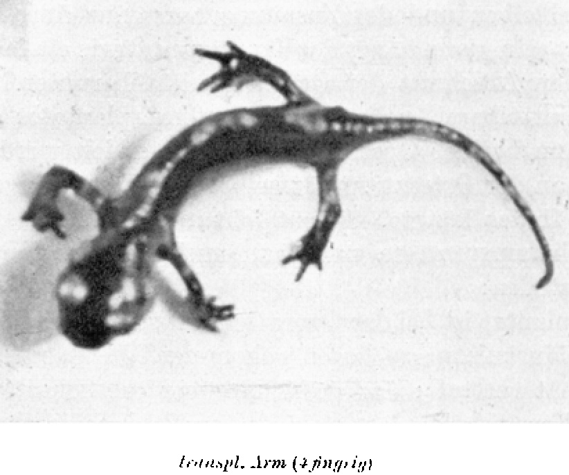
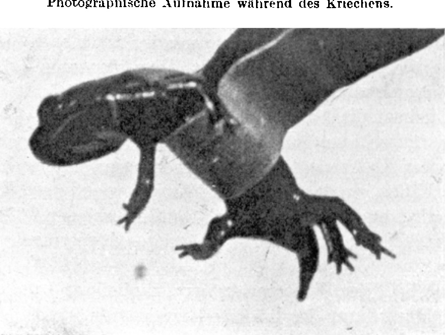

# The Transplantation of Developed Limbs in Amphibians.
## I. Morphology of the Healing-In.

By

Paul Weiss.

*(From the Biological Research Institute [Biologische Versuchsanstalt] of the Academy of Sciences in Vienna [Zoological Division]¹.)*

With 2 text figures.

*(Received on 25 January 1923.)*

*Archiv für Entwicklungsmechanik der Organismen*, vol. 99 (1923).

> **Full translation.** A complete English rendering of Weiss's study of the transplantation of developed limbs in amphibians, with the figure legends.

### Table of Contents.

| | Page |
|---|---|
| Introduction | 150 |
| Material | 152 |
| Operation | 153 |
| Healing-In of the Transplants | 157 |
| Further Development | 162 |
| Summary | 167 |
| Bibliography | 167 |

> ¹ An abstract of this work appeared, with an identically worded title, as Communication No. 79 from the Biological Research Institute of the Academy of Sciences, Zoological Division, Director: *Hans Przibram*, in the Akad. Anz. No. 22–23. 1922.

## Introduction.

In the normal course of life, in development and in function, two things are for us indissolubly bound up together: that which runs off in it rigidly, as something unalterably fixed, and, on the other hand, that which each time newly establishes its equilibrium afresh with its conditions. Here only the experiment, with its removal from the normal conditions, can help us. What is plastic will be able to alter itself in accordance with the abnormal demand placed upon it; what, on the contrary, is too firmly set, rigidly fixed upon its old "normal" circle of conditions, will retain its peculiar character entirely, often to the point of the most senseless inexpediency; and in this way a sharp distinction between the two kinds of reaction is made possible for us. Such methods of varying the conditions are as old as experimentation itself, indeed they constitute its very essence; but into the realm of the organic, the experiment, and hence too its methods, has found entry only in quite recent times. One transposes the whole organism into 

altered conditions when one wishes to investigate its behaviour as a whole. One transposes the smaller individuals within the organism, the organs, into new conditions when one wishes to put their capacities and incapacities to the test. The two methods are: the removal of the organism, or of the organ, into a foreign environment (Explantation), and the transposition into another environment within the body (Implantation).

*Explantation* brings to the organ concerned changes to its normal conditions of life that are too deep-reaching for it to be as generally usable as *Transplantation* — the organic healing-in, the re-incorporation of an organ into an organism, which then takes over the care for the preservation of the organ.

What of value has been found with these methods in the past years, and what a fullness of problems could be tackled with them, is too well known for me to need to enumerate names; and of which possibilities still lay unexploited within them, the works here preceding do indeed give a picture. For what purpose I myself have employed Transplantation, I shall report at another place (*Weiss* 1922b); in the following only that which is immediately connected with the method itself shall be brought forward.

The organism of the higher animals, which is so well protected against the perilous outer world precisely because, in the development of its life-important organs, it follows a principle of surface-enlargement, differentiation, and complication directed inward, thus offers comparatively few outer organs to investigation. Since now these few are, moreover, easily accessible and hence already, for purely operation-technical reasons, favoured, and since they also possess, in advance of the inner organs, a much more strongly pronounced form of their own, it is no wonder that the majority of experimental-morphological investigations have occupied themselves with these outer organs, and among them above all again with the *limbs* [Extremitäten].

At first it was problems of *normal* development and differentiation that one here sought to come to grips with by means of the transplantation method; the striving of the researchers was therefore admittedly directed toward transplanting *the earliest possible* stages, undifferentiated buds [Knospen] or even merely the rudiment-material [Anlagenmaterial] (*Braus, Banchi, Gemelli, Harrison, Dürken, Detwiler, Gräper*). In all these cases healing-in and further-differentiation of the transplant has been achieved, even if the end-products at times proved, in the foreign surroundings, to be stunted atypisms. Statements about a spontaneous mobility appearing in the course of time are also at hand.

To the degree that one recognized the advantages which the investigation of *Regeneration*, as a kind of second development on a fully-formed organism, could offer for research into form-building occurrences, in that same measure one now also had to draw upon the *Transplantation of developed* organs, here in particular of the limbs. The only successful experiments of this kind stem from *Kurz* (1912).

He cut off a piece of a limb of *Triton cristatus*, removed its skin, and pushed it through an incision in the dorsal skin, between the latter and the musculature. Here the piece healed in and regenerated under the skin — at all events proof enough that at the new site the satisfaction of its metabolic needs was guaranteed. We must likewise probably assume that some of the injured nerve-fibres found their way into the transplant; for, as a fresh re-examination of the old vexed question of the nerve-dependence of regeneration has convinced me (1922c), the presence of intact nerves is indeed necessary for regeneration — though not exactly of particular nerves, nor of a particular number or distribution of them. Thus the two conditions to which, according to *Roux* (1895, I.), a successful transplantation is tied — the connection to nutrition and to stimulus (whether functional or merely trophic still remains open) — are fulfilled. But what was aimed at in the experiments of *Kurz* was only the elimination of the influences of the normal surroundings — indeed, properly speaking, a removal into an environment as *indifferent* as possible, from which one need fear no specific influences whatever; and if the organism's own body was chosen as this environment, this was done because the further-culture of so large an organ was otherwise not feasible; for the rest, the method here already closely resembles Explantation.

Now what mattered to me was precisely this: to bring the member, withdrawn from its natural conditions, under new conditions which would not differ so greatly from the normal as in the experiments of *Kurz*, but which on the other hand, being in some points specifically different from the normal, would allow the supposition of the possibility that, given only sufficiently strong plasticity and receptivity of the transplant, a specific influencing of the latter might take place.

Such conditions seemed to me to be fulfilled in the *exchange of arm and leg* [Vertauschung von Arm und Bein]; and indeed the transplant was then to project just as *freely* from the body as a limb otherwise does at its normal site.

## Material.

The transplantations of undifferentiated limb-buds were carried out by the authors on *anurans* [Anuren]; in these the limbs first differentiate themselves only in the course of post-embryonal development. For me, on the other hand, only an animal with early-completed, fully-formed limbs was of use, and I therefore chose as my experimental animal *Salamandra maculosa*. The viviparous females deposit gill-bearing larvae, which are furnished with *two pairs of fully differentiated and functioning limbs*. The fore ones are *four-fingered* and can be designated roughly as a hand, the hind ones, *five-toed*, as a foot.

In accordance with the primitive condition of the amphibians, a true antagonism between arm and leg is not yet developed. The stylopodia [Stylopodien] stand off almost perpendicularly from the body, the upper arm admittedly less so than the thigh, probably in connection with the torsion of the humerus (cf. *Bütschli* 1910). Hence the elbow-projection too is distinctly directed somewhat to the rear, while the opening of the knee-angle looks almost exactly downward. The articulation of the femur at the pelvis lies deeper beneath the body-surface than the articulation of the upper arm in the shoulder-joint. The arm is also longer than the leg, and especially the proximal section is drawn out long. Upon these relations consideration must be taken in the operation.

The animals needed for the experiments I took directly from the mother (*Ektomie*). The uterus is opened, the larvae, closely squeezed together, are taken out and thrown into fresh water. Upon the stimulus they stretch themselves out of their strange contortions and at once begin to swim about briskly. From a single pregnant mother one can obtain over 40 vigorous young. From the first moment they show themselves, although the whole yolk is not yet resorbed, very voracious. But since I always operated upon them already in the first days after the artificial birth, and since during the operation they readily vomit, I have never given them food beforehand.

Under all circumstances the animals must be kept *singly*, for otherwise they will quite wildly bite at, indeed even devour, one another. The size of the larvae amounted, at the time of the operation, measured from the snout to the tail-root, on average to 2 cm. After the operation they were reared singly over sand at a not too high water-level (feeding with *Tubifex*), passed through *metamorphosis*, and a part is alive even today (after 1 year). Closer details about the manner of keeping and rearing one finds in *Kammerer* (1907).

## Operation.

Narcosis is, with such young animals, difficult to carry out, bound up with great losses, and quite unnecessary; one must merely work *very quickly*. For the rest, the operations are to be carried out very simply and without technical expenditure.

Any kind of fastening of the animals would take up far too long a time; I therefore work only in the free hand. I press out a little piece of wet cotton-wool [Watte] well, catch an animal out of the water, and press the cotton-wool lightly onto its back and sides; it sucks up the adhering water, and the now sticky skin prevents a slipping-out of the animal from the cotton-wool-hull. Now I take the animal together with the cotton-wool between the fingertips of the left hand, so that its ventral side is turned toward me. In this overturned position the little animal at once shows lively strivings to correct its posture, and one must prevent the movements by gentle pressure on the flank; how much pressure the animal can still endure without injury one soon comes to feel — strong it must not be.

In this position of the animal I now carry out the intended operations. If, say, an *arm is to be transplanted beside the leg*, then a hole is driven into the inguinal region, caudal of the insertion-place of the leg, obliquely inward through skin and musculature with a thick needle; the gauge of the needle is to be so chosen that the diameter of the hole is smaller than the cross-section of the arm to be transplanted. Then the arm of the same side is cut off hard at the body, grasped at the upper arm with bent forceps, and the small piece is pushed energetically a little way by its proximal end into the hole. Only this small piece then sticks in the body, *the greater part of the limb remains projecting freely*. The direction of implantation must always be as oblique or perpendicular as possible to the body-surface, that is, the cut surface of the graft-piece must be able to be sunk soundly *into the musculature*. Flat implantations bring the skin to tearing and are otherwise too of little use.

After the implant has now been stuck in, one can impart to it, as to a crank, all possible rotations, whereby the direction of the longitudinal axis of the upper arm remains unaltered.

Such young animals as stood here in the experiment do not endure a longer stay in the air without sufficient moisture, and therefore the whole operation must be completed in 10, at most 20, seconds. Afterward one slowly brings the animal, together with the cotton-wool, into stale water; the cotton-wool comes loose, and one recognizes at once whether the animal has survived the operation or whether it will perish: for it will survive a longer time only if, immediately on being brought into the water, it again takes up its swimming-activity and shows no disturbance of the static functions. Once one has the animal that far, then one can designate the operation as successful; for a stripping-off or falling-out of the transplant occurs only very seldom.

Indeed the conditions for the holding-fast are very favourable: Through the use of a conical needle instead of a cutting tool the muscles are not so much torn apart as pushed apart [auseinandergedrängt]; the implant then sticks in the musculature like a wedge in a tree-trunk and is well clamped fast through the all-around muscle-pressure; thereby is also the body-interior well sealed against the intrusion of infection-germs. Hence it is here a matter of a kind of *autophoric* Transplantation in the sense of *Przibram*.

After the implantation the "*Ortsextremität*" (thus I name, for the sake of shorter understanding, the normal limb beside which a transplantation was carried out) is more or less disturbed in its mobility: Firstly the transplant forms for the movement of the stylopodium a mechanical hindrance; then indeed also some of the muscles leading from the girdle to the free limb have been switched off through the injury at the operation; but above all the movements show themselves in the distal joints soon more, soon less restricted, and this failure can only be caused through the interruption of certain nerve-pathways leading to the muscle-groups concerned. It is however important to point out, that a complete failure of the spontaneous mobility in the distal joints, that is, a total paralysis of the *Ortsextremität*, could never be observed, from which one can see that always a part of the *Ortsnerven* [local nerves] remains intact at the transplantation.

The operation-manner [Operationsart] and also the position of the transplant after the operation are somewhat different, according to whether one uses an arm or a leg for the transplantation, different also, whether one transplants *beside* a limb or *onto the amputation-place* [Amputationsstelle] of such a one. These particularities are roughly the following:

The upper arm is comparatively long and moreover lies the shoulder-joint near the body-surface; a cut led hard at the body will thus be able to separate off the whole and quite considerable upper arm, so that after sinking-in [Versenkung] of the proximal piece into the amputation-place a good part of the upper arm (over ⅔) projects free and the elbow then is just as far removed from the body as the knee of the local leg [Ortsbein].

Quite otherwise lie the things at transplantation of a leg: The already in and for itself shorter femur sticks, in consequence of the deep-lying hip-joint, partly in the body, so that a cut led quite hard at the body-wall yet leaves only a quite compact piece of thigh at the amputat [Amputat]. This piece now goes, at the implantation, almost entirely to the for sinking-in necessary stretch [Strecke], so that the knee then in nearest proximity of shoulder and 

body-wall comes to lie. Also is the direction of an implant in the shoulder almost always cranio-caudal, since an arm, as already mentioned above, more frequently and more strongly approaches the body and thereby also presses the implant against it; whereas, against the thigh, which always projects from the body, an implanted arm can be oriented nicely projecting to the side.

The *implantation-place* [Implantationsstelle] itself can also be *varied*, admittedly not within too wide limits without thereby making the conditions for the holding-fast more unfavourable. In the inguinal region there is fairly much play-room: possible here as implantation-places are all points of a circular arc which, conceived as laid around close about the insertion-place of the leg, begins exactly ventral of it and over the caudal still leads a little piece dorsally.

For the rest, a sufficient variation of the orientation of the implant is indeed achieved through the rotations about the humerus-axis [Drehungen um die Humerusachse] already described above. A transplantation in which the transplant was inserted shifted parallel to its normal position I shall designate as "*lagerichtig*" [position-correct]; whereas one in which a rotation in the upper arm through 180° was undertaken after the implantation I shall designate as "*spiegelbildlich*" [mirror-image].

Besides the one described, yet another manner of operation was carried out: transplantation is made *not beside* a limb, but *onto the place* of such a one. Both limbs of the one side are amputated, and then the graft-opening for the one is bored not, as before, beside the insertion-place of the other, but as nearly as possible exactly at the amputation-place; for this, the amputation must indeed be carried out at such a place quite hard at the body.

For the simpler designation of the various manners of operation I shall in what follows name them with the letters of my protocol. They are:

01 ... Amputation of the *arm* [Armes] and implantation in the *inguinal region* [Inguinalgegend] of the same-sided leg.

028 ... Amputation of the *leg* [Beines] and implantation in the *axillary region* [Axillargegend] of the same-sided arm.

065 ... Amputation of the arm and leg, implantation of the *leg* [Beines] at the *amputation-place of the arm* [Amputationsstelle des Armes].

071 ... Amputation of the arm and leg, implantation of the *arm* [Armes] at the *amputation-place of the leg* [Amputationsstelle des Beines].

077 ... Amputation of the *arm* [Armes] and *Replantation* at its own amputation-place.

*[The section "Einheilung der Transplantate" (Healing-In of the Transplants), its table, and the surrounding text begin on p.8 and belong to the next chunk. The enumerated list of operation-codes (01/028/065/071/077) above closes the text that begins on pp.1–7.]*

### Healing-In of the Transplants.

| Manner of operation | Number of operated animals | died before healing-in | not healed-in | Permanent healings-in |
|---|---|---|---|---|
| 01 | 35 | 2 | 4 | 29 |
| 028 | 31 | 1 | 2 | 28 |
| 065 | 7 | — | 1 | 6 |
| 071 | 7 | — | 1 | 6 |
| 077 | 1 | — | — | 1 |
|  | 81 | 3 | 8 | 70 |

A basic precondition for a successful healing-in is the complete *immobilization (Ruhigstellung) of the cut surface (Schnittfläche)* of the transplant. At this surface the connection of the transplant-tissues with the normal surrounding tissue must come about; if the cut surface, instead of lying quietly against the surface of incision, is shifted to and fro in the most varied directions, then the connection of the tissues cannot become firm, and a healing-in of the transplant cannot take place. I have illuminated this point in the chapter on the technique of the operation by various examples. The transplant's own tissues display here too that proneness to spinning out interwoven blood-capillaries, connective-tissue and nerve-fibres which we have already met with everywhere in regeneration; only it must not constantly be torn apart again by the movement at the seat of operation. Through the clamping-fast (Festklemmen) in the musculature, such a relative immobilization of the transplants against their surroundings could be attained, and thus, with the favourable conditions for the holding-fast, the most favourable conditions for the healing-in are at the same time established.

In seven of the eight cases listed in column 4 of the table the transplant was torn out, in consequence of the violent movements of the animal, within the first 14 days. Otherwise, however, with proper holding-fast, a *smooth healing-in (glatte Einheilung)* always follows (70 cases). Only in the eighth animal of column 4 had no healing-in come about, despite a longer holding-fast of the transplant; rather, a gradual decay (Verfall) of the transplant took place. This exceptional case is, however, explained: the animal in question belongs, namely, to the few stunted animals (Kümmertiere) of my material; it remained tiny-small and undeveloped all its life and was already, through its quite unusually strong black pigmentation in the larval stage, recognizable as an abnormality.

The findings about the manner of the healing-in are only external; for it was only a matter for me of having well-healed-in transplants available for further experiments, not of studying the processes at the transplantation itself; therefore no systematic investigation of the healing-in processes was undertaken, and what can nevertheless be brought forward summarily in the following about these processes— 

—results from a larger number of occasional observations on the 70 animals.

Quite regularly, in the first period after the operation, certain remarkable alterations appear on the transplant. Already after a few days the proximal part of it appears quite rosy-red. Under stronger magnification one then recognizes the cause of this colouration: a network of fine, well-filled blood-vessels draws under the skin from the body into the transplant. For the most part the whole limb is coloured rosy; sometimes, however, the colouration becomes distinct only in the distal part, and in some other cases the vessels lead only as far as the region of the elbow or of the wrist (Handwurzel).

On a normal limb only a single shimmer of reddish colour is to be noticed at most, and so the red colouration of the transplant is the clearest measure for its whole excessive blood-supply (Hyperämie). It is possible that the functional system of the blood-pressure regulation has not yet been established, that not yet enough sympathetic fibres have grown in, or that their connections with the vessels are not yet completed, so that a contraction of the vessels cannot be carried out and the organ could not save itself from the over-flooding with blood. To me, however, it seems probable that it is here a question of a venous congestion-hyperaemia (venöse Stauungshyperämie), which comes about through the fact that between the vessels sprouted out from the trunk into the transplant not yet enough anastomoses are formed; blood is then continually pumped into the organ without a corresponding outflow being possible. For this view there speaks above all also the following phenomenon: one often sees, in the first period, whole extensive districts on the transplants coloured blackish-red; these are accumulations of coagulated blood which proceed from haemorrhages out of the just-now excessively strained vessels, and precisely such haemorrhages are indeed known as a frequent consequence of congestion-hyperaemias.

After about 3 weeks the rosy colouration of the transplant has always disappeared and the blood-masses that may have escaped are resorbed.

Besides the violent hyperaemia, and probably in connection with it, there shows itself yet another, very characteristic phenomenon: several days after the operation one finds the transplant in a peculiar state which can be designated as typically *oedematous (ödematös)*. The limb is considerably swollen in thickness, and under the skin masses of watery fluid are found dammed up, so that the skin appears tightly stretched and lifted off blister-like from the substrate.

Now it is well known from pathology that, with longer-lasting— —venous congestions, in consequence of the heightened intravascular pressure and the damaging of the vessel-endothelia, oedema sets in as a consequential phenomenon (Folgeerscheinung) (cf. *Ribbert* 1921), and so the appearance of oedema too explains itself here from the assumption of a congestion-hyperaemia.

The pathological phenomena disappear after a short time, and the transplant takes on again its earlier appearance of a normal limb. Sometimes, however, thickenings in the proximal section remain behind, which are perhaps to be traced back to a better development of the part at the time of the hyperaemia, in consequence of the then over-abundantly available nutritive material.

Not always is the *whole* organ taken up by the host into its nutrition-provision; sometimes only the stylopodium and zeugopodium, or also at all only the stylopodium. This fate of the transplant can then mostly be predicted during the period of the hyperaemia; for if the vessels have grown in, say, only as far as the knee, then the piece up to there too appears perfused rosy-red with blood, [while] all the parts distal from it look pale (fahl). Such not-supplied parts have fallen prey to destruction (Untergang): they wilt, become overgrown by fungi (Pilzen), and finally *fall off* at the next joint, if I have not amputated them beforehand.

It is now easily comprehensible that a not arbitrarily large supply-region (Versorgungsgebiet) can be taken on additionally; that it is actually the *size* of the new region which determines a certain boundary-limit of the capacity for taking up, one recognizes from the following:

As I have already stated above, a transplanted arm is much longer than a transplanted leg and consequently also represents a much larger supply-region; and indeed the falling-away of the distal parts occurs in fact much more *frequently* at transplanted *arms* (nine cases) than at transplanted *legs* (three cases, of these the one on a not-vigorous animal), given an equal number of healings-in.

The boundary between the well-supplied proximal section and the degenerating distal [parts] is usually drawn quite sharply. It almost looks as if the holding-capable piece had, as it were, encapsulated itself against the necrotizing [one]; I have also noticed an encroaching of degeneration-processes proceeding from distal onto the proximal stump (Stamm).

Besides a falling-away of distal parts, there makes itself noticeable, in some cases, the deficient holding-capability of the whole transplant, namely through a *shrinking of the transplant in toto (Schrumpfen des Transplantates in toto)*. Thereby the longitudinal dimensions diminish, the skin becomes wrinkly, the trunk knotty-thickened, and in this state remains— 

—the transplant for its lifetime; it grows indeed later on together with the remaining body further, but does not reach a normal size-relation to the other limbs. Such shrinkings have occurred in seven cases; of these, again, the majority (five cases) fall to the longer, less easily holding-capable arm.

It comes about, namely, that the organism cannot maintain the whole transplanted organ at the new site, because the organ as a whole consumes more than can be supplied to it. But we now also see that here an equilibrium (Gleichgewicht) between supply (Angebot) and demand (Nachfrage) must be found: with which the organ must somehow once come to terms is the fact that not enough nutritive material is supplied to it to allow it to go on living just as it had lived under its earlier normal conditions. There are then two ways out:

Either the individual parts cannot restrict themselves, nourish themselves undiminished and consume each just as much as had come to it under normal conditions; then the material flowing in over the nutrition-street will be used up before all the parts are supplied; the [parts] more distant from the nutrition-centre will simply starve, because those ranged at the street in front of them leave nothing over for them.

Or else the whole organ will restrict its household; then all the parts will have [enough] to live on, only more sparsely than before, because they indeed have to make do with smaller quantities. This restricted way of life will then naturally also soon express itself outwardly in the bad nutritive state of the whole organ.

Actually both ways of behaviour of the organ occur: Once the lavish further-thriving of the proximal part at the cost of the distal, which are abandoned to destruction, starve, fall away; the proper-form (Eigenform) of the organ is once again given up. On the other side, the more uniform setting of the whole organ to smaller consumption, which follows through shrinking, diminishing of all parts under half-way proportionate retaining of the typical form.

The double capability of coming to terms with altered conditions, which here a developed organ in its striving for preservation lets us recognize once, is better known to us from the realm of developmental phenomena. There the organism often stands, with an artificial restriction or shortening of its normal developmental conditions (for example, in analogy with our case: diminution of the building-material [Baumaterial]), before the alternative: retaining the part-dimensions under abandonment of the proper-form (Eigenform), or else retaining the proper-form and correspondingly altering the part-dimensions! And there too then both ways are possible, and now the one, now the other is trodden. There suggest themselves here two examples, in order to illustrate the relations: The one is from *Embryogeny (Embryogenese)*: After switching-out of the one blastomere of the two-cell stage in the frog, there can develop from the one either a half-embryo with normal part-dimensions, or a form-correct whole embryo, but with correspondingly diminished part-dimensions (*Roux* 1892, *Morgan* 1895).

The other example is from *Regeneration*: If one cuts out of the trunk of a *Tubularia* a piece smaller than the hydranth-forming zone in normal regeneration, then there is regenerated either an incomplete hydranth with well-formed elements, or — after the detachment of the cönosark from the perisarc — a whole-formation, a complete hydranth, but on a reduced scale (*Morgan* 1907).

The phenomena depicted in these two examples are, it seems to me, fully analogous to the processes that run their course in the preservation of a too-large transplant.

The agreement becomes still clearer if we reflect somewhat more closely on the process in the healing-in of the transplants: above, mention was simply made of an insufficiency of the nutritive materials, without going into whereby this is conditioned. That we now wish to grasp a little more clearly:

It is naturally not to be assumed that the organism were not in a position to produce the quantity of nutritive materials which the organ needs. For the organ has not really been newly added, but only transposed from one place to another. The bad supply at the new site has quite another cause: namely, not enough, or not quickly enough, or not everywhere, *supply-streets (Zufuhrstraßen)* are formed; thus it was indeed reported that the vessels sometimes grow in only as far as the knee. Thus not too little nutritive material is produced; rather, in consequence of operating-difficulties, the quantity required in the unit of time simply cannot be delivered; that is, the deficiency of nutritive material in the transplant goes back to a *deficiency of conduction-pathways (Leitungsbahnen)*. This deficiency of conduction-pathways, however, may well be founded — and here we meet with the same relations as in the above examples — in the fact that at a determined place, for the formation of these conduction-pathways, the vessels, only a limited quantity of *building-material (Baumaterial)* stands at disposal. There is, admittedly, an objection against this assumption: one could say that, all the same, arbitrarily many vessels can grow in, but that they meet with obstacles in their advance and are thereby held back from a complete growing-through of the transplant. Against this, however, there speaks, firstly, the excellent capability of the vessels to grow around obstacles, and then, above all, the fact that with larger pieces (arm) the insufficient vessel-supply occurs so much more frequently than with smaller [ones]; so one may yet not— 

—declare the restricted formation-possibility of vessels to be the probable, [though] also still scarcely sufficient, explanation-attempt, out of which then secondarily the nutritional scarcity in the transplant, with its consequences described above — the falling-away or the shrinking — would explain itself. The whole question could of course also be cleared up through a systematic investigation, and it is not advisable, before such an investigation, to attach too great weight to expositions such as the one here brought forward by me after merely occasional findings.

So much could be ascertained, purely externally, about the connection of the transplant with the nutrition-floor (Nährboden); about the processes in the gradual reinstatement of the tissue-continuity in the interior, especially about the nerve-supply of the transplant, only section-images (Schnittbilder) can give information, and I will bring forward the findings bearing thereupon at another place, in connection with the functional reinstatement.

### Further development (Weiterentwicklung).

During the healing-in, the transplant has remained somewhat behind in size, over against the remaining limbs, which have quietly continued their growth; the difference is not considerable, because the healing-in takes up only a comparatively short time. Noteworthy is, that beside the transplant the *Ortsextremität* [local limb] too sometimes remains a little behind in size relative to the like-named one of the opposite side. After the healing-in, the transplant grows on in the same measure as the remaining limbs (except for the shrinkings mentioned above).

After a row of weeks one can clearly perceive *active movements (aktive Bewegungen)* on the transplants, and after a short time the mobility of the transplant is again *completely (vollständig)* restored; it functions again just as briskly as it once did at its old site. The interesting particulars of this manner of functioning will be described in detail at another place (cf. forthcoming *Weiss* 1922a). For the compilation here undertaken of the chiefly *morphological* results, only this much is important about it: that thereby the excellent reinstatement of the *nerve-pathways (Nervenbahnen)* between bearer and implant is proved to us.

So we see, finally, with the full re-entry-into-function of the transplant at the new site, the chain of processes closed which were necessary, after the removal from the normal conditions, for the fresh taking-up and organic incorporation into the new surroundings. From then on the transplant belongs again wholly to the organism from which it had been withdrawn by the amputation. It grows up together with it, undergoes the *Metamorphosis (Metamorphose)* simultaneously with it — in short,— —it is again an organ like every other one at the normal place (Fig. 1 and 2).

Thereby it preserves fully and entirely its character; it does not, say, approach in form and proportions the *Ortsbein* [local leg]; at the metamorphosis itself there forms upon it—

**Fig. 1.** *Salamandra mac.* No. 72. Animal, to which the left arm was transplanted in correct position (lagerichtig) at the place of the left leg. At the implantation-site no regenerate has arisen. Photographic exposure during crawling. *(figure not reproduced; in-figure label: "transpl. Arm (4-fingered)")*

**Fig. 2.** *Salamandra mac.* No. 25. Animal, to which the left arm is transplanted beside the left leg. Exposure of the living, clamped-in animal. *(figure not reproduced; in-figure label: "transplant. Arm")*

—its black-yellow spot-marking (Fleckenzeichnung), which often, breaking off unmediatedly enough at the basis, can border (angrenzen) upon the entirely differently distributed marking-pattern of the body-skin in the surroundings.

In a series of animals one finds, after a longer time of growth, that the transplant is no longer stuck in the body, but rather sits *directly upon* the local bone [Ortsbein] somewhere in the proximal part. The stylopodia of the local limb [Ortsextremität] and of the transplant can then be bonily intergrown with one another and enclose between them a right or even an obtuse angle. But a connection of the two skeletons can also fail to occur, and the coherence be mediated only through the soft parts; then the transplant hangs like a sack somewhere down from the proximal section of the local limb.

Such an immediate annexation of the transplant onto the local limb can never be attained at the operation itself, because the transplant could nowhere be applied to the local limb itself and find a hold. It arises always only in the later course of the growth-processes, and one must picture the proceedings therein as follows:

The transplant has, at the operation, come to lie with its proximal wound-surface in the musculature that runs from the trunk into the free limb; the cartilage-rod of the amputated stylopodium, which projects somewhat proximally beyond the cut surface, must have come into the vicinity of the part of the skeletal rod of the local limb that lies within the body-interior, and have fused with it. Since now the growth of the stylopodium-skeleton is maintained chiefly from the proximal epiphysis, everything situated further distally is pushed ever more away outward from the centre; thus too the place of intergrowth of the transplant with the local limb, lying within the body, is soon thrust outward, so that the transplant now no longer stands in any direct coherence with the body. Where the transplant sits upon the local limb not bonily, but softly, it will have wandered out together with the limb-muscles, while in all those cases where the transplant remains fastened to the body itself as before — and that is the by far overwhelming majority of cases — the healing-in into the locally-stationary body-musculature has taken place.

But even with this latter kind of healing-in there can — although skeleton and musculature of the two limbs preserve their independence from one another — yet a closer coherence of the two form itself, and indeed through the *skin*, in the following manner:

Under the skin of the amphibians there extend widely spread-out lymph-spaces, and even where the skin lies directly upon its substratum the intergrowth is at least only a very loose one. The consequences of this constitution make themselves felt in the further development of the transplants always whenever the transplant stands very near to the local limb; for then either the skin at the base of the local limb [Ortsextremität] intergrows directly with the skin of the transplant in the wound-rim, or else only a quite small skin-bridge [Hautbrücke] will remain standing between the insertion-place of the local limb and the implantation-place of the transplant; in any case the small skin-area between the two limbs at the body will not be able to find any hold when some factor or other attempts a lifting-off from the substratum. Such a factor, however, is the further-growth of the limbs: the narrow skin-bridge situated between them, if such a one was present at all, is lifted off from the body and, with the ever-further-advancing length-growth of the limb-stalks [Extremitätenstiele], shifted ever further distalward; it is as when a child outgrows its gloves. In this way the basal parts of the two stylopodia are finally connected by a *skin-fold* [Hautfalte], which represents a new lymph-space. If no stronger, mutually opposed movements of the two proximal sections are carried out, the fold remains small; but if it is often and strongly stretched through opposed mobility of the two limbs, e.g. after mirror-image implantation, then it broadens out in the direction of strain and soon gains the appearance of a mighty swimming-membrane [Schwimmhaut], which can lead from the insertion-place of the limb to the knee.

As an extreme case of such a union of transplant and local limb under a more or less common skin, the following phenomenon, occurring in six animals, must be regarded: one finds in these cases, namely, the two limb-portions situated side by side stuck in a *single skin*, so that outwardly the structure presents the appearance of a quite unitary, only thickened, limb.

These fusions we must picture as having arisen thus, that a lateral freshening [Anfrischung] of the insertion-cone [Ansatzkegel] of the local limb at the operation forms the starting-point of a lateral healing-together of the skin-margins with the transplant, whereby then the intimate parallel-storage [Parallellagerung] of the two portions is enforced. It is now very interesting that, after such a production of a unitary outer form, after the union of the two stalks into a single common one, despite the from then on outwardly unitary further-development of the structure, throughout life the individual portions remain recognizable on the common skin-envelope [Hauthülle], according to which one they belonged to: if the two components are turned, say, with their ventral sides toward one another, then the ventral side of the common trunk, which is thus formed by the dorsal side of the one component, is beautifully black-pigmented; this, however, otherwise never occurs at the ventral side of a limb, so that, as one sees, the effect of the one component has quite distinctly carried itself through, and of any re-influencing [Umbeeinflussung] in accordance with the 

new positional-relations [Lageverhältnisse] there is nothing to be noticed. The skin-portions belonging to the two components are quite sharply delimited from one another in the pigmentation, without the skin therefore exhibiting any other delimiting-features such as unevennesses or seam-formation [Nahtbildung]. It forms, rather, a beautifully smooth covering over the common trunk, and only the line-wise pigmentation-anomalies point to the preservation of the original character of the individual constituents.

Through these results it is at the same time made probable that the normal pigment-lessness of the ventral surface at the limbs may not be traced back to the absence of the *exogenous* pigmentation-factors, say to too slight light-access [Lichtzutritt]; for otherwise the ventral side of the common stalk in our case too would have to remain unpigmented, whereas this pigment-lessness is rather conditioned thereby, that to all tissues arising on the original ventral side of a limb the *inner conditions for pigment-formation* [inneren Bedingungen zur Pigmentbildung] are lacking; it simply has not the capacity for it.

Dependent on the chance-circumstances of the operation-course, as we had seen in the foregoing, is the manifoldness of position and orientation of the transplant after the healing-in, a quite great one. This has now also its significance for the function. For whereas, with the *distal* members [Gliedern], the anatomical foundations of their movement-capacity have remained untouched by the operation, and their re-entry-into-function [Wiederinfunktiontreten] depends only on a corresponding new supply with nerves, for the *proximal* sections quite novel relations have been created through the operation and healing-in. It is therefore not surprising if we, corresponding to the morphological types which present themselves to us in all transitions from the wholly free- and independently healed-in transplant up to the one that is basally intergrown with the local limb or sits at an angle upon it, also find all possible grades of anatomical-mechanical hindrance of the mobility of the proximal section of the transplanted limb, from unrestricted free mobility up to total fixation [Feststellung] and movement-incapacity [Bewegungsunfähigkeit]. If transplant and local limb are intergrown with one another only through a skin-fold, then the two create for themselves, as was already mentioned above, soon a free play-room through the stretching and enlargement of the fold; if, on the contrary, the transplant is directly intergrown with the local limb, so that it sits upon it bonily or in the soft parts, then it is carried along passively at the movements of the local limb.

A stylopodium healed-in freely in the trunk-musculature attains, often even without proximal skeletal-connection [Skelettanschluß], again a tolerable mobility, a circumstance such as is already known to me similarly from skeleton-less Triton-legs [Tritonenbeinen]. In general, however, for the movements of the transplant its upper arm [Oberarm] or thigh [Oberschenkel] respectively comes little into consideration, because, through the mostly stiff [ungelenke] intergrowth with the substratum, anatomically it no longer rightly possesses at all the properties of a "*member*" [Gliedes].

### Summary. [Zusammenfassung.]

A fully developed limb of the larva of *Salamandra maculosa* can be transplanted beside the other limb of the same side or onto the amputation-place of the latter in such a way that only a small piece is sunk into the body, the principal part of the limb, however, projecting freely from the body as in the normal state.

The transplants heal in, grow, and undergo metamorphosis along with the rest of the body.

The transplants become, after some time, again fully function-capable and carry out active movements.

### Bibliography. [Literaturverzeichnis.]

*Bütschli, Otto:* Vorlesungen über vergleichende Anatomie. 1. Lief. Leipzig 1910. — *Kammerer, Paul:* Vererbung erzwungener Fortpflanzungsanpassungen, I. u. II. Mitteilung. Arch. f. Entwicklungsmech. d. Organismen. Bd. 25. 1907. — *Kurz, O.:* Die beinbildenden Potenzen entwickelter Tritonen. Ibid. Bd. 35. 1912. — *Morgan, T. H.:* Half-Embryos and Whole-Embryos from one of the first two Blastomeres of the Frogs Egg. Anat. Anz. 10. 1895. — Ders.: Regeneration, deutsche Übers. v. *Moszkowski.* Leipzig 1907. — *Ribbert:* Lehrbuch der allgemeinen Pathologie und der pathologischen Anatomie, herausgeg. v. *Mönckeberg.* 8. Aufl. Leipzig 1921. — *Roux, Wilhelm:* Gesammelte Abhandlungen über Entwicklungsmechanik der Organismen. Leipzig 1895. — Ders.: Der züchtende Kampf der Teile. Ges. Abh. über Entwicklungsmech. d. Organismen. Bd. 1. Nr. 4. 1881. — Über das entwicklungsmechanische Vermögen jeder der beiden ersten Furchungszellen des Eies. Ges. Abh. über Entwicklungsmech. d. Organismen. Bd. 2. Nr. 26. 1892. — *Weiss, Paul:* a) Die Funktion transplantierter Amphibienextremitäten. b) Regeneration an transplantierten Extremitäten entwickelter Amphibien. c) Abhängigkeit der Regeneration entwickelter Amphibienextremitäten vom Nervensystem. Alle drei Mitteilungen im Akad. Anz. d. Akad. d. Wiss. in Wien, Nr. 22—23. 1922.

## Figures

**Fig. 1.**

**Fig. 2.**

---

*Translator's note.* An early step in Weiss's transplantation/regeneration programme.
