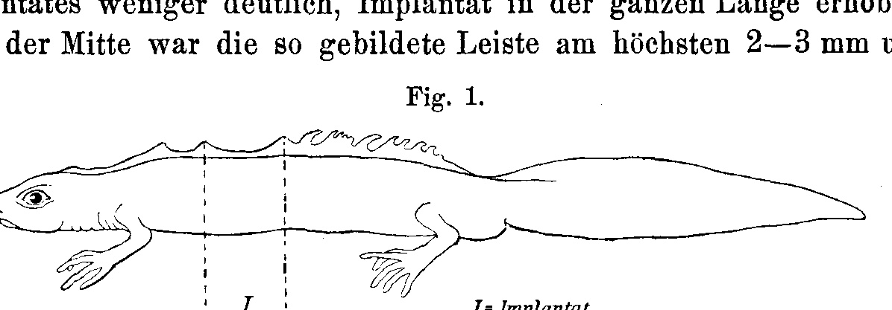
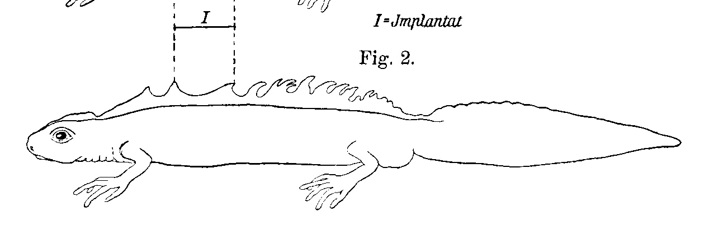
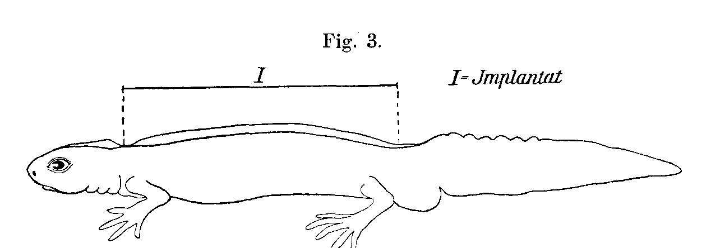
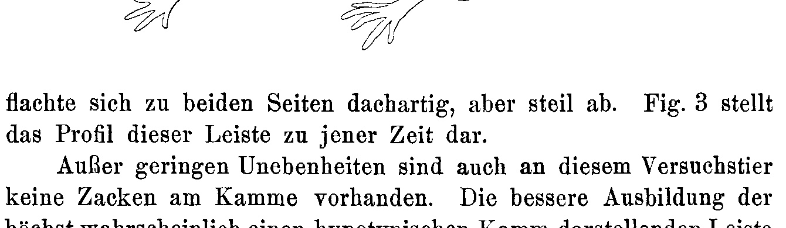

# Experimental Investigations on the Secondary Sex Characters of the Newts

By

Giovanni Bresca.

(From the Biological Experimental Institute in Vienna.)

With 3 figures in the text.

Received on 4 April 1910.

*Archiv für Entwicklungsmechanik der Organismen*, vol. 29 (1910).

> **Full translation.** A complete English rendering of Brescia's experimental investigations on the secondary sex characters, with the tables and figure legends.

### Table of Contents

| | Page |
|---|---|
| I. Introduction | 403 |
| II. Plan of the Work. Material | 404, 405 |
| III. The Sex Characters of the Newts | 406 |
| IV. The Regeneration of the Secondary Sex Characters of the Male Newts (Crest, Tail-Stripe, Lower Tail-Edge) | 410 |
| V. Influence of Castration on the Secondary Sex Characters of the Newts | 412 |
| &nbsp;&nbsp;&nbsp;&nbsp;a. Operative Technique. Age of the Experimental Animals | 412 |
| &nbsp;&nbsp;&nbsp;&nbsp;b. Female Castrates | 414 |
| &nbsp;&nbsp;&nbsp;&nbsp;c. Male Castrates | 415 |
| VI. On the Significance of the Gonad for the: | |
| &nbsp;&nbsp;&nbsp;&nbsp;a. Physiological Regeneration of Secondary Sex Characters | 416 |
| &nbsp;&nbsp;&nbsp;&nbsp;b. Reparative Regeneration of Secondary Sex Characters (Crest, Tail-Stripe, Lower Tail-Edge) | 417 |
| VII. Transplantation Experiments | 419 |
| &nbsp;&nbsp;&nbsp;&nbsp;a. Transplantation of Gonads | 420 |
| &nbsp;&nbsp;&nbsp;&nbsp;b. Transplantation of Secondary Sex Characters (Dorsal Crest, Tail-Stripe, Female Dorsal Line) | 420 |
| VIII. Summary | 428 |
| IX. List of Literature | 429 |

## I. Introduction.

It was Darwin who first illuminated the sex characters of animals from the biological side and, in the study of sexual breeding, believed he had found the starting point for their origin; although the criticism of later years cast doubt on this theory in its essential point, the many facts that he had collected, or had at all brought together, nonetheless remained valuable for the further investigations within this field.

The physiology of the sex characters has, however, only in the last 30 years made essential progress; for, alongside the study of the pathological material and in connection with it, experimental investigations too began to be carried on to an ever greater degree.

At first such experiments were cultivated by physiologists in the narrower sense and by gynaecologists; in the last years it has been undertaken also on the part of the zoologists to subject the questions of sexual dimorphism to investigation by means of the experimental method with lively interest.

A great advance in the present day signifies the drawing-in of the lower animals into the circle of these investigations. Here, indeed, it showed itself how the physiology of the sex characters, which in particular concerns those of the higher animals, met with great difficulties. In the Lepidoptera one came, for example, to the result that the regeneration of the gonad has no influence on the formation of the other sex characters of an individual, whereas a regeneration of the normal coloration nonetheless takes place completely, namely after removal of the wings (Kořer, Experimental Investigations; Meisenheimer, Results; Brescia, Wing-regeneration, Oudemans, Falter).

It now turned out, comprehensibly enough, the need to investigate the relations of dependence between the secondary sex characters and the primary ones in those animal classes that, by their organization, appeared better suited to this than the higher ones.

The present work, into which the newts were drawn, may serve to show that here too, in the lower vertebrates, fundamental relations between the gonad and the secondary sex characters hold good. On the suggestion of Eugen Steinach, the secondary sex characters of the male newts were later cast into the field of investigation.

## II. Plan of the Work.

For the understanding of the experiments presented, a description of the sex characters coming into consideration here and of their regenerative capacity is set forth in advance.

Thereupon the effects of castration on sexually mature newts are treated, however only insofar as they concern its secondary sex characters. Subsequently the regenerative capacity of these same is tested on castrated animals.

A further part of the work comprises transplantation experiments with gonads and secondary sex characters.

### Material.

As the experimental object there served *Triton cristatus*, a species which, by its very strongly pronounced secondary sex characters, proved more advantageous also in technical respect than the other species coming into consideration here.

Alongside the *forma typica*, used here, there can also be employed the species *Triton cristatus* var. *carnifex*, whose secondary sex characters deviate from the former in unessential measure.

The majority of the animals came from the surroundings of Vienna, a few from Brozzi near Florence, from Verona, and from Görz.

The southern animals, throughout belonging to the subspecies *carnifex*, were lighter in the general body color; the height-period (perhaps the cause) was distinctly more strongly pronounced in them than in the native ones here. The skin-appendages, however, were, in comparison with our region, less strongly developed.

The animals were kept in glass vessels, either singly or two in a single vessel of about 2 l content.

Animals of the same experimental kind found themselves in the same equipment; whenever a microscopic preparation was made, however, and various kinds of treatment were undertaken, the animals were separated. For the winter period the possibility was to be offered to the animals to bring about the winter-sleep. So that the winter-sleep does not proceed to a too-deep degree and bring danger to the animal, both with respect to the choice and to the experiment which served them, the utmost possible observance of the conditions appearing in nature was striven for. They were brought into terraria, which were located in a frost-free space, mostly in the first half of February.

For comparison, control animals were at the same time kept under unconstrained conditions; even though these did not endure as well in this respect — it was always shown to me — they always developed their sex characters better than the ones tended by me.

The animals were fed with earthworms, more seldom with chopped horse-flesh.

## III. The Sex Characters of the Newts.

After the hitherto-existing findings, it allows itself to be asserted with no quite complete certainty that in the group of the Urodela the sexual dimorphism is more sharply pronounced than in the Anura. True hermaphrodites are with the frogs and toads not at all rare; among the latter, now and then, metamorphosed and intersexual forms are likewise to be found; these individuals shall develop either later into males (Pflüger, Sex-determination). It lies, however, in this case far off [to speak of] a "rudimentary protogynaecie" (R. Hertwig, Investigations. II.).

Leuckart (Procreation) gives, indeed, also for the newts, namely for the gonad as the original stage of the sexual difference, an indifferent half-transitional-over [stage], which the height-coloration shows, making valid the lively development of large, individualized elements in the peripheral layer of the gonad.

Among the adult newts there has, however, hitherto no real intersexual form been found. A. v. La Valette St. George has described the latter (intersexual formation). It belongs to the species *Triton taeniatus*; the habitus of the animal in itself and the tail-fin show themselves developed and weakly stunted. In the interior, beside the testis, on each side lies an ovary with real testis-string, as testis of the oviduct. Spengel (intersexual formation) has, of the 100 adult male *Triton cristatus* examined by him, found the genital-string only once, on the one side, of this intersexual formation he encountered.

On all newts, however, which in the course of these investigations came under [my] eyes, whatever their sex, it would externally hardly have been [to determine] their sex. Of these I could investigate the genitalia of 100; on these almost without exception female gonads found themselves. Also with regard to the other primary sex characters I found, in the formation of the *Triton cristatus*, the color of the skin-surface as characteristic, that is, the female coloration-mark deviating from *Triton cristatus*, in particular even with such [animals] of other sex-marks, where, with lighter intensity, anomaly with weaker development [occurred]; this disturbance of the dimorphism corresponds with that lighter kind of the pseudohermaphroditismus secundarius (Halban, Origin), which Hegar (Correlations) designates with respect to the human as "frequent". Over the primary sex characters the necessary will now be expounded in the discussion of the castration.

The secondary sex characters may, however, now be discussed more in detail, insofar as they are dealt with by hand in this work.

If we consider the above-mentioned metamorphosed animal after its exterior, then there is no sex difference visible, [until] we, after closer examination, find the secondary sex differences present at hand. All animals carry along the back-middle a yellow-greenish line, which extends both along the upper tail-edge up to the back, [and] from the tail-base up to the belly, but in the male orange-colored. The sexually shy females then glow likewise in the same habitus; in the animal kingdom frequent ratios. The back-line in the *forma typica* still remains, only a few years later changed into the further-existing sex-stripe, while in the subsp. *carnifex* it can persist still less distinctly.

The lower tail-edge of the female animal, which as a rule is orange-yellow, is in the male *Triton cristatus* pigmented; it is, however, here only come over [partly developed], or the dark part has overweighed.

The cloacal swelling is at the female yellow-greenish colored. It comes about thereby that in its middle some dark spots are found; the largest part of the swelling is, however, in all cases distinctly yellow. It carries on the outer side a rich tubercle-(papilla-)formation.

A further secondary sex character of the female animal is the [skin-]folding with white points, which stretches over the neck, the trunk- and tail-side and is found on the surface of the legs. This character is also present at the male, but in weaker development at the male animal.

Of the secondary sex characters of the male, the back- and tail-crest is the most conspicuous one.

The crest, a skin-duplication with gelatinous binding-tissue as a supporting-lamella in the interior, is at the rear edge normally jagged, serrated. After an interruption at the pelvic region it continues also at the tail-back, jagged in the same height as before, but only scattered. It is only in the rut-period brought to full development, the height even 1.5 cm, indeed in many cases for that time; in the winter period it goes back to 2—3 mm height, in many cases nonetheless still narrower; in some animals it may also in winter be shrunken to unrecognizability. My experimental animals were throughout of middle age; only a few were, after the more significant length, to be considered as such [i.e. old], ultimately doubtful.

In these animals there is also a complete shrinkage of the crest in the winter period to be expected. The crest is in this kind no longer of such length as in the *carnifex*, but distinctly less. These [animals] are present several years after formation of the crest, [the crest] being able to be received [retained]. The female animals, however — all females wear no crest whatever; old females wear, however, no crest; in the middle [aged ones] they wear the crest no longer in such kind as the younger animals.

The white tail-stripe of the male is likewise narrower [for that period], beginning only at the upper edge of the cloaca-region, in the male of the upper tail-tip, then at the back-line, after the back, on the outermost tail-tip yellowish-white.

Younger animals have a weaker-developed tail-stripe than older [ones]; likewise the tail-stripe is weaker and simply jagged at the younger [animals] than in the middle [aged ones]. That this appearance stands in direct connection with the maximum-development enlarging of the testis (multiplication of the testicle-lobes), is not ascertained, but does not allow itself to be definitively asserted.

These sex characters are, however, even at the same-aged animals not equally strongly pronounced; the peculiarity sets in, in the variability not only with respect to the individual variation-breadth of the secondary sex characters in the formation itself to vary. For the individual differences in the formation of the sex characters, the marbling of the upper-head and the belly-coloration are found, with most authors, as the secondary sex characters, especially as coloration-marks, awarded in respect.

The crest, when it itself in such kind in the variability of the secondary sex characters stands out prominently, in the formation itself to vary. For the variation-marks awarded.

These sex characters are strongly variable; the ground-coloration of the belly is at the male strongly orange or ochre-colored, indeed seldom orange to ochre-yellow; from this rule there are, however, very many exceptions; the animals of the subspecies *carnifex*, however with distinct yellowing, show in both sexes a paler belly-coloration.

Stripe of whitish-yellow color, which the marbling of the upper-head shows at the rut-stage at the male animal, would be to ascribe to the same pigment.

Standing out [prominently] at the white tail-stripe, at animals of middle size, it also remains for the winter-period still always distinctly recognizable.

Further secondary sex characters of the male are the coloration of the lower tail-edge and the cloacal swelling. Both these regions are brown-black colored or black; not seldom, however, exceptions are found in respect of the tail-edge; for the yellow part lying at the tail-tip, however, could no formation [of it] only loosely be found in respect of the male. Very seldom, however, does it let itself [be the case] at the male animal that its cloacal swelling gives itself yellowish.

From [the] male cloacal swelling it can also occur that it is strongly swollen and that the outer-side is smooth.

The upper-surface seasons itself now, however, also in this animal as presenting a male attribute. I have, however, even at female animals, namely in rut-ready males, found it in such-formed formation as at the rutting males. The edge of this skin-lobe was, however, indeed so strongly pigmented in the male animals. In any case is this character, of the foregoing mentioned, not equally strongly pronounced.

Similarly it behaves itself with the coloration of the belly: the ground-color of the belly is at the male strongly orange or yellow-red, even at the female weaker. From this rule there are, however, very many exceptions; the animals of the subspecies *carnifex*, however with distinct yellowing, show in both sexes a paler belly-coloration.

Also the marbling of the upper-head, as well as the female [marbling], lets itself be found, but only in various-strong formation to be encountered. Outside the rut-period the character is either indistinct.

Thus, as one is now experienced, in the foregoing the secondary sex characters [have been treated]; from the castration onto the regeneration of the secondary sex characters [it is] investigated, with which the analogous regeneration-processes at the normal animals (at the control-animals) are discussed. In order to be able to gain as much insight as possible into the relations, easier indications were guided, and these, insofar as it corresponded for these purposes to the work, expanded.

*(continues on page 410, outside this assignment: Section IV. The Regeneration of Secondary Sex Characters of Male Newts.)*

## IV. Regeneration of secondary sex characters in male newts.

In his paper "Regeneration of secondary sex characters in amphibians," Kammerer also tested our experimental animal, *Triton cristatus*, for the regenerative capacity of its secondary sex characters.

Here I let the facts ascertained by him follow, insofar as they come into consideration for our purpose, set in spaced type; alongside, let my divergent or new findings be mentioned.

The jagged, saw-toothed dorsal crest of the male regenerates upon amputation "as close to the trunk as possible," in the former color, namely brown, but in the manner of a notched saw. The repetition of this experiment yielded me the same result. In the 8th month after the crest amputation the regenerate was still notched-saw-toothed; but since my experimental animals died soon afterward, I could not determine whether this hypotypy is a definitive one.

The blue-white tail stripe of the male regenerates, according to Kammerer, upon mere removal of the skin of the tail sides only with the onset of the next breeding period, if the operation had taken place in April. In animals from which I had removed the tail stripe in October and November, I was able to determine the presence of a distinct regenerate already in May of the following year. (Reference animals: Nos. 61, 71.)

From this experiment it follows that the regeneration of the white pigment of the tail sides takes place for the most part in spring.

The statement of Kammerer¹, that upon tail amputation the white band fails to appear on the regenerate, I must contradict: I repeatedly obtained tail regenerates with an unmistakable white stripe.

(Reference animal a) 1907. 20. V. Tail amputated to ²⁄₃.
No. 60. } 24. XI. Tail regenerate 2 cm long; tail band distinct.
No. 63. 1908. 24. X. Tail amputated to ½.
1909. 27. IV. White band on the regenerate.

> ¹ Whose experiments, however, were carried out on older specimens. — Hans Przibram.

Following below are the results of my experiments on the regeneration of the lower tail edge, which, as already mentioned, is black in the male.

a. Upon mere amputation of the lower tail edge by means of scissors, the scar that is thereupon formed is colorless; then a very distinct sulfur-yellow coloration of it sets in.

No. 67. 1908. 2. XI. Lower tail edge amputated.
1909. 20. II. Scar colorless, partly yellow.
14. V. Bright sulfur-yellow.
Died 1. VI. —

No. 69. 1908. 6. XI. Lower tail edge amputated.
1909. 1. IV. Scar yellow,
15. VI. dark,
only the proximal third bears a sulfur-yellow line.

b. Upon amputation of the tail (mostly to the half), the lower edge of the regenerate is colorless at first, then dark; in some cases entirely black (Nos. 60, 63). After the 4th month, however, yellow pigment begins to displace the black, first at the distal part of the regenerate, but gradually also toward the base of the regenerate. The stump of the former tail has remained unchanged as regards the coloration of the lower edge.

The pertinent reference animals are:

No. 60. } ♂ 1908. 24. X. Tail amputated to ½.
No. 63.

The coloration of the lower edge of the tail regenerate was in:

|        | In February 1909 | April | June |
|--------|------------------|-------|------|
| No. 60 | black            | partly yellow | partly yellow |
| No. 63 |                  |               | sulfur-yellow, still dark basally |

In July the animals died and were preserved. The lower edge of the regenerate of No. 60 is black; of No. 63 the greatest part of the regenerate is missing; the part of it present is black at the lower edge.

Ten other males with tail regenerates, of which the age of the regenerate (in some only approximately) is established, were tested as to the coloration of the lower tail edge. This was, in most cases, yellow — corresponding to the age of the regenerate (5- to 8-month-old regenerate) — black in the animals with a small regenerate.

I believe that the present regeneration process represents an exact repetition of the corresponding ontogenetic developmental process: in fact the tail fin of the *Triton* larva, and also the part of it corresponding to the lower tail edge, looks not colorless, but, owing to present black pigment, fairly dark. Let this state be designated stage I.

"As soon as the tail fin begins to dwindle, a yellowish longitudinal band appears on the underside of the tail . . ." (De Bedriaga, *Lurchfauna*). Stage II.

Only at the time of sexual maturity does the yellow pigment disappear in the male at the lower tail edge, and black takes its place; first at the tail base, only later or not at all at the tail end. Stage III.

In experimental animal No. 60, and probably also in No. 63, all three stages could be observed, through which finally the typical regenerate is achieved.

## V. Influence of castration on the sex characters.

Tornier was the first to castrate newts, but only such of female sex. He wished to investigate whether the regeneration of body parts (extremities) depends on the presence of the germ gland; the experiments showed that this is not the case. Male newts he did not castrate, because he believed that the complete removal of the germ cells is possible only with simultaneous amputation of those kidney parts through which the vasa efferentia of the testes pass.

From my experimental results, however, it emerges that in male newts too a complete castration is possible without injuring the kidneys.

In the castration I followed almost the same technique as Tornier.

### a. Operative technique. Age of the experimental animals.

The animals are narcotized by means of sulfuric ether and then fastened onto a small board in the dorsal position. The course of the operation is the following: The skin of the ventral side is disinfected with a little potassium permanganate or Lysoform, and thereupon a cut about 2 cm or somewhat longer is made in the median plane down to the abdominal wall. In order that the underlying peritoneum not draw the vena abdominalis running beneath it toward the injured side, the skin can be displaced somewhat sideways from the median plane before the median plane is opened. The edges of the resulting wound are then drawn apart toward both sides, the abdominal cavity being thereby opened. To the right and left, behind the intestines, lie the ovaries. They are drawn out as far as possible and the mesenteries, with which they are connected, are severed with sterilized scissors; these are then together with the ovaries drawn out; thereby also the vessels of the testis, which lie in the mesentery, are clamped off.

Now the testis is severed by a cut transverse to the constriction, but with avoidance of loss of blood, because the loss of blood would render the operation more difficult on account of the obscured field of view, since one bleeds for a fairly long time at this point.

Once both testes have been removed in this way, the intestines that may have protruded are pushed back into the abdominal cavity and the wound of the abdominal skin is sutured.

The animal then comes onto wet filter paper under a glass bell jar. Naturally it is to be recommended that these objects be sterilized.

As has already been established in other animal species, the operation brings about an acceleration of the moltings, several of which follow in a short time.

I mostly refrained from removing the sutures of the abdominal wound, since this easily leads to tearing of the delicate wound skin; that the silk thread left in place would have caused an infection, I was never able to establish. After a month the thread often falls away by itself, or can now be removed without danger.

One week after the operation, or somewhat earlier, the animals are placed back into the water; one should do this as soon as possible, for the reason that the shed skins separate completely from the animal by themselves in the water, whereas otherwise, as I believed I could recognize, upon their disintegration they can lead to infection of the wound and further of the peritoneum.

Since over-fattening is even more detrimental than hunger to the development of the secondary sex characters, I also paid some attention to the nutrition of the animals. All animals were fed in a similar manner; every second or third day with smaller earthworms; the animals that did not keep winter dormancy were fed less at this time, corresponding to their lesser nutritional need.

I confined myself this time to the castration of sexually mature animals; for I wished above all to investigate the influence of castration on the developed secondary sex characters and on their regeneration.

The age of the operated animals varied between the 3rd and 5th year of life (estimated according to the body length and the appearance of the animal).

I began these experiments in May 1907. Of twelve males castrated in this month, five remained alive through the summer; in these I observed the effects of castration in the autumn. Three of them were still alive in the spring of 1908 and yielded further results; the last of these animals died in the summer.

A further series of animals was castrated before the breeding period, in December and January 1907/8. Of 25, 15 of these males remained alive for a longer time; only one is still alive now.

In only a couple of animals were merely the germ glands removed; most were used sooner or later for regeneration experiments.

### b. Female castrates.

I castrated female animals too; of eight animals castrated, partly before, partly after the breeding period, four lived for a longer time and served my investigations.

Since the female adult newts are characterized, compared to the males, by a slight further development of the juvenile form as regards the secondary sex characters, it will not surprise us that castration does not change them in their habitus.

The dorsal line of castrated females appears, one year after the operation, changed neither in the hue nor in the intensity. The cloacal swelling and the lower tail edge remain yellow. The cloacal swelling, if it was somewhat distended — as is to be noticed in the animals during the breeding period — sinks back again. The dotting of the body sides and extremities likewise remains unchanged.

### c. Male castrates.

Different are the secondary sex characters of the male; the amputation of the testes brings about a far-reaching reduction of them. This involution process is naturally more conspicuous if the castration took place during the breeding period. After 4–7 weeks such animals looked as normal males do in winter; from then on the further reduction of the secondary sex characters proceeded just as slowly as in the animals castrated before the breeding period.

Let us now go into these involution phenomena somewhat more closely:

The dorsal crest and the white tail stripe disappear down to traces. The dorsal crest of normal males is 2–2.5 mm high in December into January, but in our experimental animals often still lower. Animals castrated at this time had, three months later, a crest a little over 1 mm high; in the 13th month most animals showed only elevations corresponding to the notches of the crest, of less than 1 mm height. In some, at this time, there is no elevation at all anymore, and the dorsum is straight at this place; these are precisely the very old animals. It is probable that even in older animals, some years after the castration, no trace of the dorsal crest is any longer demonstrable.

The upper tail seam undergoes, in animals castrated during the spawning period, a distinct reduction; if, however, it was weakly developed, the latter is less conspicuous.

The reduction of the white tail stripe is analogous to that of the crest. Depending on its intensity, the reduction reaches a definite degree sooner or later.

In the animals operated on in December and January, the tail stripe in the 4th month was recognizable only as a bluish tinge on the posterior half of the tail; in older animals, or in animals castrated during the breeding period, it persisted somewhat longer. After a definite time, however, in a well-castrated male the tail stripe is completely reduced, or a very weak band remains, such as can also occur in female animals.

The marbling of the top of the head disappears in castrated males within one year.

The upper-lip seams of castrated males are not different from those of normal animals; in several cases I even find them strongly developed. This fact, however, does not directly argue against their nature as a sex character, for in the following, secondary sex characters are dealt with that do not change despite the castration of their bearer. The cloacal swelling of the males becomes flatter after castration, but remains, like the lower tail edge, black.

The ventral color of the castrated males is sulfur-yellow or faintly orange; as already mentioned on p. 409, however, this is also mostly the case in normal *cornifex* of the south.

In their behavior, in appetite, and otherwise, the castrated animals of both sexes do not differ from the normal animals. They are no more sluggish and no less shy than these.

The conclusions that can be drawn from the consideration of the effects of castration are:

The secondary sex characters of the adult newts can be separated into two categories; the one comprises those whose existence is bound to the presence of the germ gland, the other those that can persist even without the protective influence of the germ gland.

To the first group belong: the dorsal crest, the tail seam, the tail band, the marbling of the top of the head, and the red coloration of the belly in the male.

To the second group are to be counted: all secondary sex characters of the female and the black coloration of the cloacal swelling and of the lower tail edge in the male.

## VI. On the significance of the germ gland.

### a. Physiological regeneration of secondary sex characters.

The yearly up- and back-differentiation of the secondary sex characters of the first group represents a regeneration, respectively an involution process, whose normal course — as the consideration of the castrated animals teaches — is bound to the presence of a germ gland that is active in the first case and quiescent in the second. It is indeed justified, in this connection, to think of the internal secretion of the germ gland and to assume an annual maximum and minimum in the intensity of this function.

### b. Reparative regeneration of secondary sex characters.

If one wishes to investigate whether the reparative (accidental) regeneration of secondary sex characters depends on the presence of the corresponding germ gland, then the investigation must concern the sex characters of the second group, since indeed only these remain unchanged despite a preceding castration. From what has been said above it is indeed clear, concerning the sex characters of the first group, that for their development, for their preservation, and therefore also for the fully typical formation of a regenerate, they cannot do without the germ gland.

The following experiments, however, are meant to show that within the time needed for a sex character of the first group to be reduced to unrecognizability after castration of its bearer, a regenerative capacity is nevertheless still to be ascertained in that part.

Of the five animals in which, besides the testes, the dorsal crest — and in some also the tail crest — had been amputated almost or entirely simultaneously, only one animal remained alive longer than 6 months. Of the others, the following show:

B 12 castrated
Crest amputated. } 17. I. 1908. Died 25. IV. 1908.
Dorsal midline the same color as the rest of the dorsum, no trace of a crest.

B 11 castrated
Crest amputated. } 17. I. 1908. Died 4. VI. 1908.

In this animal we have, compared to the previous one, an older regenerate before us: it consists of very slight elevations in the dorsal midline; here too a dotted yellow line is present. D 21 and D 22, which had undergone the same operations as the earlier animals and had lived almost as long as B 11, showed at the time of their death here and there protruding points, and on these yellow pigment.

Much more clearly does animal No. 1 show this phenomenon. Castrated 5. I. 1908. Dorsal and tail crest amputated 21. I.

One year after the crest amputation, at the place of the crest a ²⁄₃ mm high and equally narrow ridge is to be seen, which is only slightly interrupted and is colored yellow along its course. The animal is still alive now; the yellow line seems to me to have become more intense, but the elevation unchanged.

### b. Reparative Regeneration of secondary sex characters.

If one wishes to investigate whether the reparative (accidental) regeneration of secondary sex characters is dependent on the presence of the corresponding gonad, then the investigation must concern the sex characters of the second group, since indeed only these remain unchanged in spite of a previously performed castration. As for the sex characters of the first group, it is clear from what has been said above that they cannot do without a regenerate of the gonad for their development, for their maintenance, and therefore also for the fully typical formation.

The following experiments are, however, intended to show that within the time that is necessary for a sex character of the first group to regress beyond recognition after castration of its bearer, a regenerative capacity is nevertheless still to be established in that part.

Of the five animals in which, besides the testes, also the dorsal crest — and in some also the tail crest — had been amputated almost or entirely simultaneously, only one animal remained alive longer than 6 months.

Of the others, the following is shown:

B 12 castrated, crest amputated 17. I. 1908. Died 25. IV. 1908. Middle of the back uniformly colored with the rest of the back, no trace of a crest.

B 11 castrated, crest amputated 17. I. 1908. Died 4. VI. 1908. In this animal we have before us, in comparison with the previous one, an older regenerate: it consists of quite slight elevations in the middle of the back; here too a dotted yellow line is present.

D 21 and D 22, which underwent the same operations as the earlier animals and had lived almost as long as B 11, showed, at the time of their death, here and there protruding points, and on these yellow pigment.

This phenomenon is shown much more clearly by the animal No. 1. Castrated 5. I. 1908. Dorsal crest and tail crest amputated 21. I. One year after the amputation of the crest, in place of the crest a ridge ²⁄₃ mm high and equally narrow is to be seen, which is only slightly interrupted and is colored yellow along its course. The animal is still alive now; the yellow line seems to me to have become more intense, but the elevation unchanged.

I believe that the yellow line in the middle of the back of these animals corresponds to the one that we observe in young animals; we therefore must not see in it the identical-looking sex character of the female. The following speaks in favor of this: the raised scar in the middle of the back of A 1 and the weak notches of B 11, D 21, and D 22 were to be noticed only after 5 months or even later, and thus had grown slowly. But that, with reduced growth of a regenerating part, otherwise suppressed ontogenetic stages can reappear, is a generally known fact. In this case the yellow dorsal line, which was present in these males in their youth, before the formation of the crest, has reappeared. Under normal circumstances, by contrast, the insertion of the intermediate stage, the yellow line, does not occur — perhaps because the presence of the gonad permits from the outset a more vigorous regeneration; but this would still have to be proved by further experiments. Let us now consider the animals in which, at castration, also the tail had been amputated, in order to establish a possible regeneration of the tail stripe. Of these males three lived for a longer time: No. 1, 2, 3. Castrated and tail amputated to ²⁄₃ on 20. V. 1907. On the regenerated tail the tail stripe was present in indications in all three on 25. X. 1907, but in the 5th and 6th month of the following year no longer demonstrable.

On the basis of these experiments it can now be stated, with respect both to the crest and to the tail stripe: Although these secondary sex characters were in the process of regression after the castration of their bearer, they nevertheless proved capable of regeneration to a slight degree. The regenerate is, however, in this case reduced approximately as far as the same part would be reduced in the case of non-amputation.

It is to be assumed that, through the activity of the gonad, a condition is induced in the body which continues for some time after the removal of the same; consequently the crest and tail stripe remain preserved for some time even after the castration of their bearer. During this time a regeneration of these sex characters is also still possible in the absence of the gonad.

In the animals No. 1, 2, 4, and A 1 the course of the regeneration of the lower tail edge could also be observed. On this sex character it could be investigated whether the regeneration of the secondary sex characters of the second group, which appear to stand in no relation of dependence on the gonad, also proceeds normally in the absence of the latter. In the experimental animals 1, 2, 4, B 15, C 18 the tail was amputated to ²⁄₃, in the animal GK 9 to ¹⁄₃. In A 1 only the lower tail edge was cut off.

I was able to establish the coloration of the lower tail edge soon after the operation in only one animal: in the 2-month-old regenerate of GK 9 this was dark. It is, however, probable that this condition, which corresponds to the 1st stage of the regeneration process in normal animals, had occurred in all the experimental animals. Regenerates 4 months old and all older ones show a yellow-colored lower tail edge. The 22-month-old regenerate of A 1 is likewise colored yellow. It thus appears very probable that this hypotypy will also continue to persist further.

The regeneration process of the lower tail edge in castrated animals therefore differs from that in normal animals in that the darkening of the regenerate which appears last (3rd stage) fails to occur. For the attainment of a typical regenerate of this secondary sex character (and perhaps also of others) the presence of the gonad is therefore necessary.

An analogical inference leads us further to surmise that in ontogeny too the same relation of dependence exists between these two body parts.

## VII. Transplantation experiments.

Proceeding from the consideration of cases in which fully developed secondary sex characters of the other sex are found in one individual, HALBAN (Origin of the Sex Characters, p. 81) discusses the possibility "whether perhaps the heterologous gonad too possesses a promoting influence on the full development of the secondary sex characters, so that perhaps it ultimately depends only on an individual's possessing some gonad, that is, a male or a female one, in order that the rudiment of the secondary sex characters, to whichever sex they belong, may develop further at puberty."

In the following, some experiments are now reported by means of which I wished to test the legitimacy of this assumption. I transplanted:

> Archiv f. Entwicklungsmechanik. XXIX.  28 1) into animals whose own gonads had been amputated, the gonad of an animal of the other sex,
2) secondary sex characters onto animals of the other sex.

The experiments were mostly carried out in the winter season. The animals were of medium size.

### a. Transplantation of gonads.

With respect to the first experimental series I obtained no positive results. For it has hitherto not been possible, in the Tritons, to transplant the gonad, with preservation of its character and its function, from one animal into another. HERLITZKA found that the transplanted testis is, within two months, entirely replaced by ingrown connective tissue, even when it possesses good vascular connection with the body. According to this author, the atrophy of the transplanted testis is conditioned by the lack of the nervous trophic stimulus. I myself carried out some testis transplantations; into a male that had previously been castrated, a testis or some pieces of testis were implanted between the intestines or between the peritoneum and the abdominal skin. After some months these animals looked like the castrated males, and the dissection showed that the implanted testis had transformed itself into a fairly hard little lump, whose volume amounted to less than half of the original.

The experimental animals with implanted ovaries all died; it turned out that the ovary had disintegrated and passed into maceration. Since these experiments were carried out in January, the ripe eggs were probably the cause of the failure.

### b. Transplantation of secondary sex characters.

The second experimental series comprised, as said, transplantations of secondary sex characters onto animals of the other sex; in this case, if the assumption of HALBAN is correct, the transplanted sex character should be preserved, indeed perhaps, if it is still capable of growth, also develop further. Above all, however, for control, the sex character to be transplanted had to be transferred onto another animal of the same sex; only if it maintained itself well on the new bearer could it be used for transplantation onto an animal of the other sex. In this way possible sources of error were excluded from the outset.

The dorsal crest proved unsuitable for this experiment; transplanted onto another male into the middle of the back, it indeed healed in, but reduced itself after months to fractions of a millimeter. At the rutting season no re-differentiation is noticeable on it. Let the protocol of No. 71 be cited here.

8. XI. 1908. Own crest in its entire length, together with a 3 mm wide skin strip on which it rises, amputated; onto the wound site the crest of another animal, of 3 mm height, implanted.

19 XII. 08. Implant 2.5 mm high, without teeth.

3. I. 09. Paler, further reduced.

6. II. 09.

14. IV. 09. Dark, 1 mm high.

14. VI. 09. Locally absent.

If smaller pieces of crest were transplanted, the reduction proceeded more slowly, but was nevertheless recognizable and as far-reaching as in the earlier case.

I thereupon investigated whether the white tail stripe could be transferred from one male onto another. The experiment showed that a piece of tail skin with the tail stripe, transplanted in place of a like flap onto the tail flanks of another male, maintains itself there so well that the tail side in question does not differ in appearance from the side that has remained uninjured.

This sex character thereby proved itself suitable for answering the question whether the ovaries, just as the testes, are able to maintain a sex character dependent on them. In several normal females the skin was removed on one side of the tail, and at this site one or more small pieces of skin with the tail stripe, which had been removed in the same manner from the tail of a male, were implanted.

After one month the implant was gray-colored; subsequently it darkened still further and became just as dark as the rest of the tail skin.

No. 117 ♀ normal. 8. III. 1908. Two small pieces from the tail stripe of a male animal grafted on the right side of the tail.

> 28* 24. IV. 08. Implant healed in. The white flap bears black points and spots, in consequence of which it is gray-colored.

2. V. 08. Of the white pigment no trace any more.

Likewise No. 128 and 129: ♀ normal. 20.–23. III. 1908. Tail stripe implanted. 15. V. 1908. Implant without trace of white pigment.

It thus emerges from this experiment that only the testes possess the capacity to maintain the white tail band with its characteristic peculiarities, that therefore the ovaries exert no protective influence on the secondary sex characters of a male animal.

Let there still be reported on a transplantation experiment which concerns the female dorsal line.

This juvenile character is preserved in the female even at the time of sexual maturity and for some years later still; it now at the same time also represents a secondary sex character, which, as already mentioned, is at this time entirely independent of the gonad. It is, however, an obvious assumption that in Tritons of the male sex becoming sexually mature, the regression of this juvenile character takes place in consequence of the action of the testes. Castration experiments on animals at an early age could directly corroborate this assumption through facts, or render it untenable. In the lack of these, I hoped, however, to attain the same thing through the following experiment.

I transplanted a more or less long skin strip from the middle of the back of a female, in such a way that the dorsal line was upon it, onto a male in place of the crest. Here it could now be shown whether the testes bring about the regression of the dorsal line, or not.

Naturally, much that was incidental had to be observed in order to render possible a faultless result.

Let first the technical side of the experiment be discussed: I removed from a male the dorsal crest together with 2 mm of dorsal skin to the right and left of it, so that also the connective tissue lying under the crest was in part removed. The strip with the crest had, in cross-section, the form of an inverted T. In the middle of the back of the animal a sagittally running groove, 1 mm deep and 4 mm wide, had thus been formed; into this there was now laid a suitable skin strip, which had been taken from the middle of the back of a female, that is, together with the yellow dorsal line.

The experimental animal was kept for some days in a moist chamber and then came, when the strip had grown on well, into an aquarium.

Only three animals from this experimental series lived through this year's rutting period and lived sufficiently long to be usable for our purposes. The experimental animal No. 86 behaved differently from No. 90 and 182, as emerges from the comparison of the protocols:

No. 86 ♂ 19. XII. 1908. A 1 cm long piece of crest of the thoracic region exchanged with an equally long piece of a female dorsal line.

9. I. 09. Yellow pigment of the dorsal line still noticeable.

6. II. 09. No yellow pigment present.

2. III. 09. Implant whitish-gray, without yellow pigment.

24. IV. 09. Implant darker than the back. The unoperated crest is 2–3 mm high, at the site of the implant no elevation.

The animals No. 90 and No. 182, by contrast, formed also at the site of the implant a piece of crest (No. 182), respectively a crest-like ridge (No. 90):

No. 182. ♂ May 1908 operated in the same way as No. 86.

15. XI. 08. Yellow pigment of the dorsal line still distinct. Implant raised into a low ridge.

When then in January the elevation of the crest took its beginning, the simultaneous ridge-formation of the implant was to be seen ever more distinctly.

On 20. II. 09 yellow pigment was still present. The crest had the following appearance, as represented in Fig. 1 (p. 424):

On 3. IV. 09 it had reached the high point of its development (Fig. 2).

The line under the profile of the dorsal crest indicates the extent and the position of the implant. The ridge that has arisen from it has only two teeth (spines) at both end points of the implant and is lower than the crest, but otherwise not different from it.

14. VI. 09. Crest much collapsed. Yellow pigment on the implant still recognizable in traces.

Nr. 90 ♂ 13. II. 09. Crest along the entire back, together with the skin, amputated at the base. In its place a strip of equal length bearing the yellow dorsal line of a female brought to healing-in.

14. IV. 09. Yellow pigment in the posterior half of the implant less distinct, implant raised along its entire length. In the middle the ridge thus formed was at most 2–3 mm high and

**Fig. 1.** *(newt profile; the implant region marked, with the label "I — Implantat" [I = implant])* *(figure not reproduced)*

**Fig. 2.** *(newt profile) (figure not reproduced)*

**Fig. 3.** *(newt profile; the implant region marked, with the label "I — Implantat" [I = implant]) (figure not reproduced)*

sloped off roof-like on both sides, but steeply. Fig. 3 represents the profile of this ridge at that time.

Apart from slight unevennesses, no teeth (Zacken) on the crest are present on this experimental animal either. The better development of the ridge—most probably representing a hypotypical crest—in Nr. 182 is to be explained by the smallness of the implant and by the greater size of the experimental animal.

Before we continue with the discussion of these phenomena, let it be emphasized right here that the question underlying this experiment—namely whether the testes possess the capacity to cause the female dorsal line to regress—cannot be answered, for the following reason: The control experiment has in fact shown that the transplantation of this part onto another female animal likewise leads to the regression of the yellow pigment.

Nr. 85. Dorsal line together with skin partly amp.; dorsal line of 87 implanted.
Nr. 87.   — . . . . . —   v. 85   —

The operation had been carried out on 19. XII. 1908; Nr. 87 died soon afterwards. Nr. 85 showed on 9. I. 1909 sparse yellow pigment; by 6. II. 09 this had entirely disappeared. The regression of the yellow pigment in Nr. 86, 90, and 182 may probably rest on the same cause; nothing can therefore be stated about the action of the testes.

For the explanation of the formation of a crest from the implanted skin piece observed in Nr. 90 and 182, one might assume that the skin strip from the middle of the back of tritons of both sexes contains, alongside the yellow line, also the anlage of the crest. In female animals the development of this is suppressed owing to the lack of the corresponding gonad. The negative behavior of Nr. 86 does not speak against this conclusion; for the failure of crest formation may have been caused by some incidental circumstance, for example by abnormal nutritional conditions.

Nevertheless the above proposition would not be entirely justified. Above all, the possibility must be refuted that in the present cases the crest arose, instead of from the implanted tissue material, from the connective tissue lying beneath it belonging to the experimental animal itself.

That the latter is not the case I believe I may conclude with certainty from the following findings:

I extirpated in several animals the dorsal crest together with the skin on which it rises, just as had been done in the experimental animals Nr. 86, 90, and 182. The skin strip was 3–4 mm wide and had a thickness of over 1 mm. The wound was a corresponding depression in the middle of the back.

A few days after the operation these animals came back into the water and were fed just like the other experimental animals.

After some time a transparent scar had formed, which later took on the color of the back. The wound edges had approached one another, in some cases by half the distance they previously had. Later, in a depression of the back which is found in place of the crest, a fine light-brown line becomes noticeable; it has an entirely different color tone than the yellow dorsal line. In Nr. 67, however, traces of yellow pigment (lipochrome) could be established, about whose provenance I can state nothing certain.

The experimental animals had been operated on in November 1908. Of these, two still live: Nr. 67 and 69.

Although these two animals went through a breeding period, they had nevertheless not regenerated the crest even in traces. Whether this state, existing now (June 1909), will continue to persist further on is uncertain, but is of no concern for our purposes. It suffices to have established that in the eighth month after such a crest extirpation no crest regenerate is yet demonstrable on the experimental animal.

The assumption that the crest-like ridge of the experimental animals Nr. 90 and 182 arose from tissues of the host (Träger) is therefore not permissible; rather it must be assumed that it was formed from the tissue material of the implant.

The last word in this question will probably only be spoken after a repetition of this experiment, when, for the investigation of the origin of the crest tissue, histological analysis is consulted.

Against the bisexuality of the female dorsal skin strip carrying the yellow dorsal line, which we assumed for the explanation of the phenomena observed in Nr. 90 and 182, and by virtue of which it was possible that in these cases a crest arose from it, it might be objected that perhaps a skin strip taken from any body site whatsoever, implanted on a male in place of the crest, might likewise furnish this animal the material for the formation of a crest—that is, in other words, that the development of the crest would have to be ascribed solely to the action of the male gonad, and not also to a latent property of the female dorsal strip. I believed I could invalidate this objection by the following finding:

In a male the dorsal crest and a skin strip at its base were amputated as in the earlier experiments. In place of the skin strip with the dorsal line, I this time transplanted into the wound some skin pieces which had been taken from the tail of a male and bore the white pigment of the tail band. As long as this persisted, I could also clearly recognize the boundaries of the implant.

Nr. 70. Operated 8. XI. 1908.
5. I. 09. Anterior half of the implant darkened.
13. II. 09. White pigment also disappeared on the posterior half; no raising of the implant noticeable.
14. IV. 09: Implant dark, like the rest of the back.
24. IV. 09. Implant not raised, boundaries no longer recognizable.

Although the implanted skin pieces had healed in and persisted, nevertheless no crest developed from them.

It thus seems that only the skin part which carries the dorsal line also offers the possibility of crest formation, but not any arbitrary skin piece.

Nevertheless we cannot from this conclude with certainty a bisexual anlage of the female dorsal skin strip, since the skin pieces used possibly also did not let any female dorsal strips arise from themselves either—that is, are altogether unsuited for dorsal skin formation.

On the last-mentioned experimental animal a regression of the white pigment could be established. The cause of this is not readily to be understood, but does not interest us further in this connection.

Another interpretation of the processes observed in Nr. 80 and 182 would be the following:

The raising of the implant could be a mechanically easily explicable consequence of the already mentioned fact that after such crest amputations the wound edges approach one another rather widely. The implant lying in between would be displaced toward the free side by the oppositely acting forces, and would thus, in this case, be raised.

Against this, however, speaks the fact that in the leveling of the defect with a skin piece of another provenance an approach of the wound edges fails to occur. This was shown with great clarity by Nr. 70, 86, 90. The width of the implant was, in all these cases at the time of crest formation, not different from the original, as the measurement showed.

In the case of a simple passive raising of the implant, that of Nr. 70 and 86 would also have had to be raised.

If, then, we adopt the explanation first given, it can be stated that the skin part distinguished by the yellow line in the middle of the back of young tritons, under the influence of the testis, develops into a crest, and this even when using the dorsal part of sexually mature females.

These experiments too confirm the result already obtained earlier, that ovaries and testes act differently on secondary sex characters (contrary to Halban), inasmuch as in this case an exchange of a secondary sex character takes place in a sexually mature animal.

## VIII. Summary.

### A. Results of the main theme.

1) The castration of sexually mature tritons of the male sex has the consequence that those secondary sex characters of the same which undergo a yearly evolution and involution—these are the dorsal and tail crest, the white tail band, and the marbling of the upper head—are, within one year, regressed to traces or entirely.

2) The secondary sex characters of female animals are not altered by their castration.

3) From the consideration of the effects of castration it follows that the above-mentioned sex characters of the male require the influence of the testes for the yearly evolution (periodic or physiological regeneration) and for the reparative regeneration; experiments show, however, that this is not extinguished immediately after the castration of the animal, but rather that within one year after the castration a slight regenerative power with respect to these sex characters is still demonstrable.

4) A coloration mark of the male, the lower tail edge, remains black even on the castrated animal, and thus appears in its persistence independent of the gonad. After amputation it regenerates typically in the normal male, but in castrated animals hypotypically, namely it does not go beyond a stage of yellow coloration.

5) Transplantations. Secondary sex characters of one animal, implanted onto an animal of the other sex, regress (experiment by means of the white skin strip) or are used for the construction of the sex character belonging to the new host. Female dorsal skin strip becomes the crest. This skin part of the female can therefore also be used for the development of the male crest, whereas other skin parts did not show that capacity.

6) The view, which Halban in particular expresses, that the heterologous gonad too can exert a protective influence on the sex characters of an individual, finds no confirmation in the experiments on Triton.

### B. Results obtained incidentally.

7) The white tail strip of the male tritons regenerates upon tail amputation (contrary to Kammerer¹) typically within a few months.

8) The lower tail edge of the male likewise regenerates typically; in doing so it passes through the three stages of coloration noticeable in ontogenesis. It is at first dark, then yellow, and lastly black pigmented.

9) The upper-lip seams (Oberlippensäume) are not to be regarded as exclusively secondary sex characters of the male tritons, since they are very often to be encountered in equally good development in female animals.

> ¹ Cf. footnote p. 410.

## IX. List of literature.

Bedriaga, Jacques de, Die Lurchfauna Europas. II. Urodela. Bull. Soc. Imp. Nat. Moscou. XLIV. 1897.

Darwin, Charles, Gesammelte Werke. Übers. v. J. V. Carus. Stuttgart. Bd. V. Die Abstammung des Menschen. 1875.

Dürigen, Bruno, Deutschlands Amphibien und Reptilien. Magdeburg, Creutzsche Verlagshandlung. 1897.

Ehrmann, S., Beitrag zur Physiologie der Pigmentzellen. Centralbl. f. Physiol. Bd. V. 1891.

Foges, Arthur, Zur Lehre von den sekundären Geschlechtscharakteren. Arch. Gesamt. Phys. Bd. XCIII. 1902.

Gerhartz, Heinrich, Anatomie und Physiologie der samenableitenden Wege der Batrachier. Arch. f. mikr. Anat. Bd. LXV. 1905.

— Rudimentärer Hermaphroditismus bei Rana esculenta. Ibid.

Halban, Joseph, Die Entstehung der Geschlechtscharaktere. Arch. f. Gynäk. Bd. LXX. 1903.

Hegar, A., Correlationen der Keimdrüsen und Geschlechtsbestimmung. Beiträge zur Geburtsh. u. Gynäk. Bd. VII. 1903.

Herbst, Curt, Formative Reize in der tierischen Ontogenese. Leipzig, Georgi. 1901.

Herlitzka, Amadeo, Sul trapiantamento dei testicoli. Arch. f. Entw.-Mech. Bd. IX. 1900.

Hertwig, Richard, Untersuchungen über das Sexualitätsproblem. II. Verhandl. d. Deutsch. Zool. Ges. 1906.

Kammerer, Paul, Regeneration sekundärer Sexualcharaktere bei Amphibien. Arch. f. Entw.-Mech. Bd. XXV. 1908.

Kopeć, Stephan, Experimentaluntersuchungen über die Entwicklung der Geschlechtscharaktere bei Schmetterlingen. Bull. Acad. d. sciences Cracovie. Classe Sciences mat. et nat. 1908.

Korschelt, E., Regeneration und Transplantation. Jena, Fischers Verlag. 1907.

Leuckart, R., Artikel „Zeugung" im IV. Band v. Wagners Handwörterbuch der Physiologie. 1853.

Leydig, Fr., Molche der Württembergischen Fauna. Arch. f. Naturgesch. 1, 2. 1867.

— Über die allgemeinen Bedeckungen der Amphibien. Arch. f. mikr. Anat. Bd. XII. 1875.

Loewy, A., Neuere Untersuchungen zur Physiologie der Geschlechtsorgane. Ergebn. d. Physiologie. II. Jahrg. I. Abt. Biochemie. 1903.

Maas, Otto, Einführung in die Entwicklungsmechanik. Wiesbaden, Bergmanns Verlag. 1903.

Meisenheimer, Johann, Ergebnisse einiger Versuchsreihen über Exstirpation und Transplantation von Geschlechtsdrüsen bei Schmetterlingen. Zool. Anz. Bd. XXXII. 1907.

— Über Flügelregeneration bei Schmetterlingen. Zool. Anz. Bd. XXXIII. 1908.

Moebius, Karl, Über die Wirkungen der Kastration. Beiträge zur Lehre von den Geschlechtsunterschieden. Heft 3/4. 1908.

Nussbaum, M., Experimentelle Bestätigung der Lehre von der Regeneration im Hoden einheimischer Urodelen. Pflügers Arch. f. Phys. Bd. XI. 1907.

— Innere Secretion und Nerveneinfluß. Anat. Anz. Bd. XXIX. 1906.

— Über den Einfluß der Jahreszeiten, des Alters und der Ernährung auf die Form des Hodens und der Hodenzellen der Batrachier. Arch. f. mikr. Anat. Bd. LXVIII. 1906.

Oudemans, J. Th., Falter aus kastrierten Raupen. Zool. Jahrb. Abt. f. System. Bd. XII. 1899.

Pflüger, E., Über die das Geschlecht bestimmenden Ursachen und die Geschlechtsverhältnisse an Fröschen. Arch. f. Physiol. Bd. XXIX. 1882.

Przibram, Hans, Experimentalzoologie. Bd. II. Regeneration. Wien 1909.

Ribbert, H., Transplantation von Ovarium, Hoden und Mammae. Arch. f. Entw.-Mech. Bd. VI. 1896.

Sellheim, H., Zur Lehre von den sekundären Sexualcharakteren. Beiträge z. Geburtsh. u. Gynäk. 1898.

— Kastration und sekundäre Geschlechtscharaktere. Beiträge z. Geburtsh. u. Gynäk. Bd. V. 1901.

Spengel, Urogenitalsystem der Amphibien. Arbeit. d. Zool. Inst. Würzburg. Bd. III. 1876.

— Zwitterbildung bei Amphibien. Biol. Centralbl. Bd. IV. 1885.

— Hermaphroditismus bei Amphibien. Biol. Centralbl. Bd. IV. 1885.

Tornier, G., Über Hyperdaktylie, Regeneration und Vererbung mit Experimenten. Arch. f. Entw.-Mech. III. 1896.

La Valette St. George, A., Zwitterbildung beim kleinen Wassermolch (*Triton taeniatus* Schneid). Arch. f. mikr. Anat. Bd. LXV. 1895.

Weismann, A., Tatsachen und Auslegungen in bezug auf Regeneration. Anat. Anz. Bd. XV. 1899.

— Versuche über Regeneration bei Tritonen. Anat. Anz. Bd. XXII. 1903.

Zeller, E. v., Untersuchungen über die Samenträger und den Cloakenwulst der Tritonen. Zeitschr. f. wissensch. Zoologie. Bd. LXXIX. 1909.

## Figures

**Fig. 1.**

**Fig. 2.**

**Fig. 3.**

**Fig. 4.**

---

*Translator's note.* An experimental study of gonadal control of secondary sex characters.
