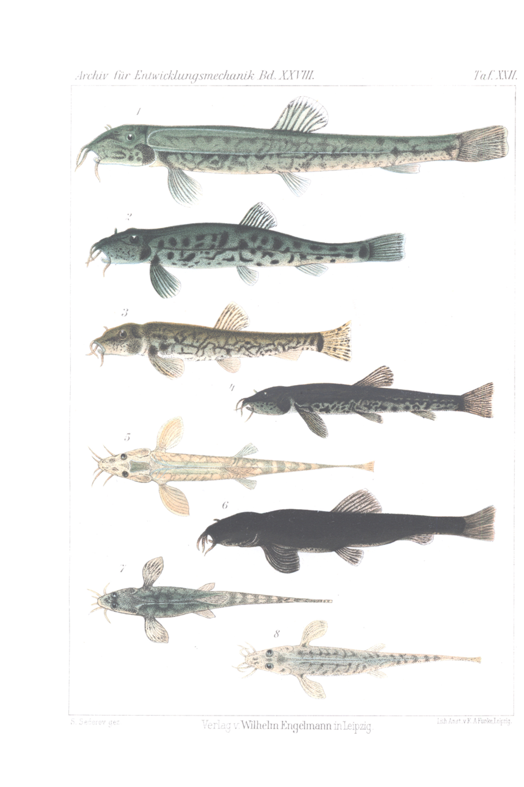
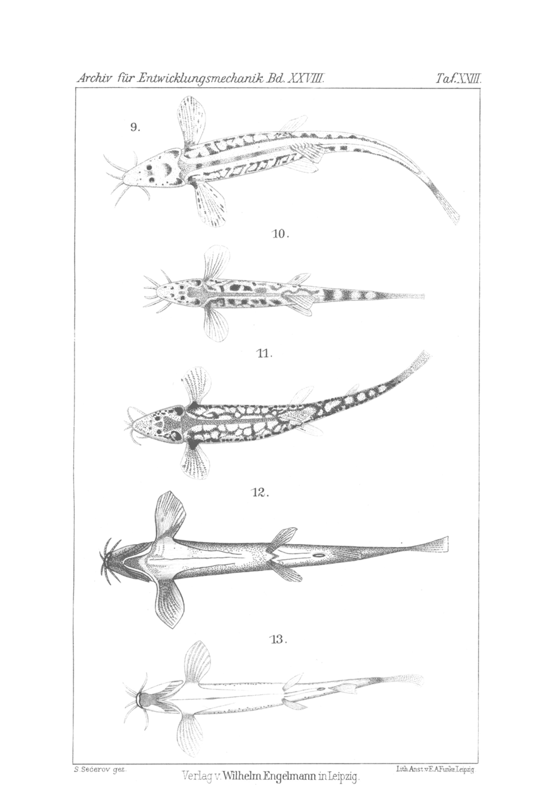

# Colour-Change Experiments on the Stone Loach (Nemachilus barbatula L.)

By

**Slavko Sečerov.**

(From the Biological Experimental Institute in Vienna.)

With Plates XXII and XXIII.

Received on 13 July 1909.

*Archiv für Entwicklungsmechanik der Organismen*, vol. 28 (1909).

> **Full translation.** A complete English rendering of Sečerov's colour-change experiments on the stone loach (*Nemachilus barbatula* L.), with the tables and figure legends.

### Table of Contents

|  | Page |
|---|---|
| I. Introduction | 629 |
| II. Arrangement of the Experiments | 630 |
| III. Macroscopic Observations | 633 |
| IV. Microscopic Observations | 651 |
| V. Experiments on Excised Pieces of Skin | 653 |
| VI. Summary | 656 |
| VII. Bibliography | 658 |
| VIII. Explanation of the Figures | 659 |

## I. Introduction.

The present experiments aim to test the influence of the background in light and in darkness, the direction of the light rays, the temperature and the food quantity, then [the influence] of blinding and of monochromatic light on the colour change. As experimental animal there served only a single fish species, *Nemachilus barbatula* L., the stone loach, on which J. Stark already in the year 1830 set up some experiments on the influence of the background. Other experiments on the same species are unknown to me. Owing to the inaccessibility of Stark's treatise, both in the original and in German translation, I was not in a position to verify his experiments.

The experiments were divided into two experimental series: the first experimental series ran from 10 XI 1907 to 20 VI 1908, the second from 9 X 1908 to May 1909. The duration of the individual experiments will be given. The size of the animals fluctuated around the mean value of 5 to 9 cm, the room temperature from 14¼ to 28° C., the water temperature from 10½ to 24° C.

## II. Arrangement of the Experiments.

The experiments were set up as follows:

**1st Experiment.** Onto six glass tanks 30 animals of medium colour type (the description follows later) were distributed. Into one glass tank go five animals. Each two glass tanks are of the same background. As background there served white quartz sand, hornblende granite, and gravel of mixed colour (mostly red, then white, yellowish-white, grey, bluish-grey, ochre-yellow). The hornblende granite gives, seen at a glance, the impression of a black colour; observed more closely, however, it is in the water of a dark-green colour with large black and white speckles. Of the six glass tanks, three remained in the light, three were placed in the dark. The dark was at first produced by bell-covers [cover jars] pasted over inside and outside with black paper. Later, when the animals in these glass tanks showed differences, the glass tanks were placed into the dark chamber, because we were of the opinion that the animals had, through the incompleteness of the covering, nevertheless received something of the daylight and had consequently shown these colour differences, which later turned out to be correct. Through this experimental arrangement six combinations arose: light and white background (1 A. l.), light and dark background (1 B. l.), light and mixed-colour background (1 C. l.), then darkness and white background (1 A. f.), darkness and dark background (1 B. f.), as well as darkness and mixed-colour background (1 C. f.). The abbreviated designations we shall need later. The experiment lasted from 10 XI 1907 to 20 VI 1908.

**2nd Experiment.** In this experiment the animals were of the same colour condition as in the first. Two glass tanks with three and four animals were set onto a glass plate firmly fixed 2 m high above the floor, and one glass tank was covered over from above, so that here the light could come only from below, reflected in more energetically from a mirror besides, while the light to the other glass tank was kept off laterally, through the bell-cover, from below, by black paper, so that the light could come only from above, diffusely scattered from the walls. There thus arose two combinations: light from below (2 l. u.) and light from above (2 l. o.). — Compare the more exact description of the apparatus used for this in Přibram, "Die Biologische Versuchsanstalt in Wien 1903—1907" (Zeitschr. f. biologische Technik und Methodik. Bd. I, Heft 3, S. 263, picture S. 262).

**3rd Experiment.** In this experiment, which I should like to designate as the convergence experiment, one proceeded the entirely opposite way. Three animals with the greatest possible colour differences were taken and kept under like conditions. As background there served at first a mixed-colour gravel (from 2 XII 1907 to 23 I 1908); then, when the animals showed no pronounced colour approximation, they were kept without background, namely so that the bright wood-colour of the tabletop was visible through the uncovered glass floor (23 I to 29 I). But in order to bring about a more distinct and more rapid reaction, I took a monochromatic background, yellow paper (29 I to 20 VI). This experiment was to show whether a colour approximation arises as a convergence appearance through the keeping of differently coloured animals under like conditions.

**4th Experiment.** This experiment is very similar to the first experiment. The difference consists in that as background there served paper, namely glossy-white (w.), matt-black (sch.), and orange-coloured glossy paper (or.). Also in this experiment there were three glass tanks in the light, three in the dark. The experiments in the dark were, however, broken off very early (after 14 days), because, as the foregoing [experiment] had established with certainty, the animals in the dark on different backgrounds show no colour differences, even though they do change colour in the dark. The colour change [in the dark] was here brought about solely by the [factor of] darkness, while in the foregoing [first] experiment it could also act together through reflex stimuli (Biedermann). Through such an experimental arrangement the light, as a [factor] acting alone, could be tested. Here two animals were taken of various colour type (one predominantly green, the other reddish), and the difference of the initial colour condition yielded an interesting relation between the elapsed time of the colour adaptation and the position of the colours of the animal and of the backgrounds in the spectrum. The corresponding combinations: l. w., l. or., l. sch., f. w., f. or., f. sch. The last three we shall, for the reason given above, not consider further.

**5th Experiment.** Blinding experiments. Twelve animals I blinded with the warmed scalpel. From the one half the right eye was removed, from the other half both eyes were taken out. Of the six unilaterally blinded animals, three were in the light, three in the dark. Likewise with the bilaterally blinded ones, in which the second eye was removed three days after the first. The animals were kept at first (6 II to 1 III 1908) on a black, later (1 III to 20 VI) on a white background. Because the animals kept in the dark died off very quickly, so that only two animals (one unilaterally, one bilaterally blinded) had remained alive, I placed these animals on 2 March, together with the relevant glass tanks, into the light, whereupon some ambiguities later arose in the result. For that reason, and because also the results on belly-pigmentation were not clear enough, I set up new blinding experiments in the second experimental series. Ten animals were in the same way blinded on both sides and kept partly in the dark and partly in the light. Normal animals served as control animals. The four combinations that arose were the following: normal animals in the light (l.), blinded animals in the light (l. b.), normal in the dark (f.), blinded animals in the dark (f. b.). This experiment lasted from 9 X 1908 until May 1909. Later, ten new animals were additionally blinded on both sides and kept in the dark (from 3 XI 1908).

**6th Experiment.** Starvation experiments. Of the four uniformly coloured animals, two were strongly fed, two received no food at all (12 III 1908 to 25 III 1908). When I then had to leave Vienna on 25 III, the institution attendant fed the animals in the ratio 2:1. When I returned to Vienna on 24 IV, the animals were fed as at first; of the starving animals, one specimen lived 41 days, the other 56 days.

**7th Experiment.** Experiments with monochromatic light. These experiments were set up for the purpose of seeing how the animals behave towards each individual colour and whether they are able to adapt themselves to each colour. Red, orange-coloured, green, blue and violet colour was applied in the experiment. The colours were produced by boxes which were provided above and in front with coloured glass plates, but for the rest were impermeable to light. This experiment differs from the third (convergence) experiment in that the light was not reflected, but rather let to pass through. In each of the five glasses two differently coloured animals (red and green) were accommodated. The experiment was begun on 2 XI 1908 and lasted until May 1909. It is to be noted that all the glass plates were dark-coloured, especially with the red, so that the sensation of the colour in incident light almost resembled that of a black surface.

## III. Macroscopic Observations.

To exclude as far as possible every deception, all the experimental animals were at first observed in glass tanks on a white background (paper). This observation method made it possible to perceive some differences in the experimental animals which one otherwise could not perceive in the animals on the later, actual experimental background, such as, e.g., for 1 l. or., the distinct orange-coloured tone. On the other hand, against the white background many a striking, almost astonishing resemblance between the colours of the animal and that of the background loses its strong effect, so that, e.g., the animals at 1 l. sch., which showed a striking agreement with the background and thereby exercised the greatest impression on the observer, and of which one might consequently think that the adaptation was the greatest and that the animals had undergone the greatest colour change — actually completed the smallest colour change.

For the sake of clarity the body of the fish was divided into several regions. These regions are: 1) Back, 2) upper side-half up to the lateral line, 3) lower side-half, 4) Belly, 5) Dorsal, pectoral and tail fin, 6) Ventral and anal fin. For the back, and also the upper and lower side-half, it should be remarked that the tail region frequently, from the dorsal fin onward, deviates in colour from the front parts. Dorsal, pectoral and tail fins agree mostly in their colour; nevertheless the tail fin sometimes deviates from the dorsal and pectoral fins. These deviations of the tail region and of the tail fin consist usually only in the prominence of a more reddish tone. The head was, in most observations, left out of account, because it shows no striking differences and its colour adjoins that of the back. Anal and ventral fins usually have no black pigments.

After these introductory remarks we can pass on to the description of the initial and final states of the colours in the individual experiments. The findings we shall report in the form of tables. The animals kept in the dark and in the light on the same background appear placed side by side in the tables.

**1st Experiment.** The initial state of all the animals was as follows:

### Table I.

| Region | Colour |
|---|---|
| Back | dark green to green |
| upper side-half | green |
| lower side-half | bright green to greenish-white and yellowish-white |
| Belly | bright green |
| Dorsal, pectoral and tail fin | greenish to yellowish |
| Anal, ventral fins | yellowish-white |
| Speckles; speckle-pattern | black; no regularity |

The final state of the animals kept on the white background in the light (l.) (Fig. 1) and in the darkness (f.) is shown in the following table.

### Table II.

| Region | 1 A. l. | 1 A. f. |
|---|---|---|
| Back | bright green to greenish-white | yellow-brown into the reddish |
| upper side-half | bright green to greenish-white | greenish or reddish |
| lower side-half | greenish-white to reddish-white | greenish-white to reddish-white |
| Belly | white | bright green |
| Dorsal, pectoral and tail fin | greenish-white to reddish-white | reddish-white to reddish-yellow |
| Anal, ventral fins | white | white |
| Speckles; speckle-pattern | brown, dot-shaped; no large speckles | dark black; dense | If one compares for 1 A. f. the initial state with the final state, then one sees that a darkening (browning) has set in, while the general colour as a whole remains unchanged. The back becomes yellow-brown and so strongly pigmented that one cannot perceive isolated speckles, whereas usually the speckles on the back stand out strongly. Another characteristic is the appearance of the reddish colour.

The third table shows the final state of the animals kept on the black (hornblende-granite) background in the light (Fig. 2) and in the dark.

### Table III.

| Region | 1 B. l. | 1 B. f. |
|---|---|---|
| Back | dark green to green | yellow-brown into the reddish |
| upper side-half | green | green |
| lower side-half | bright green to yellow | greenish-white to reddish-white |
| Belly | bright green | bright green |
| Dorsal, pectoral and tail fin | greenish or reddish | reddish or greenish-yellow |
| Anal, ventral fins | white speckled | reddish-white |
| Speckles; speckle-pattern | dark black; large speckles (Fig. 10) | dark black; dense |

From the comparison of the first and third table it emerges that the animals of 1 B. l. show almost no change in the colours. Only, instead of a yellowish tone, there appears again a more reddish one on the fins. 1 B. f. is distinguished by the same characteristics as 1 A. f.

In the following fourth table are shown the conditions in the animals kept on the mixed-colour background. From the table it emerges that the colour of the animals at 1 C. l., in comparison to the initial state, has in general gone over into the reddish, which comes to expression through the predominance of the reddish colour in the background (Fig. 3). At 1 C. f. the same effect shows itself as at 1 A. f. and 1 B. f. The sameness of the effect of the darkness [will become still more clearly apparent from the following comparative table (Fig. 4)].

The sameness of the effect of the dark will become still clearer from the following comparative table (Fig. 4).

## Tabelle IV. [Table IV]

| Bezirke [Regions] | 1 C. l. | 1 C. f. |
|---|---|---|
| Rücken [Back] | rötlichgrün, ins Olivengrüne [reddish-green, into olive-green] | gelbbraun ins Rötliche [yellow-brown into reddish] |
| obere Seitenhälfte [upper half of the side] | hellgrün bis rötlich [light green to reddish] | grünlich bis rötlich [greenish to reddish] |
| untere Seitenhälfte [lower half of the side] | rötlichweiß bis grünlichweiß [reddish-white to greenish-white] | grünlichweiß bis rötlichweiß [greenish-white to reddish-white] |
| Bauch [Belly] | grünlichweiß, ins Rötlichweiße [greenish-white, into reddish-white] | hellgrün (rötlich) [light green (reddish)] |
| Rücken-, Brust- und Schwanzflosse [Dorsal, pectoral and caudal fin] | rötlich bis grünlichgelb [reddish to greenish-yellow] | grünlichweiß [greenish-white] |
| After-, Bauchflossen [Anal, ventral fins] | rötlichweiß [reddish-white] | rötlichweiß [reddish-white] |
| Flecken; Fleckenzeichnung [Spots; spot-markings] | braunrot (ähnl. der Farbe des Rückens, nur bedeutend dunkler) [brown-red (similar to the colour of the back, only considerably darker)] | dunkelschwarz; dicht [dark black; dense] |

## Tabelle V. [Table V]

| Bezirke [Regions] | 1 A. f. | 1 B. f. | 1 C. f. |
|---|---|---|---|
| Rücken [Back] | gelbbraun, ins Rötliche [yellow-brown, into reddish] | gelbbraun, ins Rötliche [yellow-brown, into reddish] | gelbbraun, ins Rötliche [yellow-brown, into reddish] |
| obere Seitenhälfte [upper half of the side] | grün oder rötlich [green or reddish] | grün [green] | grünlich, rötlich [greenish, reddish] |
| untere Seitenhälfte [lower half of the side] | grünlichweiß bis rötlichweiß [greenish-white to reddish-white] | grünlichweiß bis rötlichweiß [greenish-white to reddish-white] | grünlichweiß bis rötlichweiß [greenish-white to reddish-white] |
| Bauch [Belly] | hellgrün [light green] | hellgrün [light green] | hellgrün, rötlich [light green, reddish] |
| Rücken-, Brust und Schwanzflosse [Dorsal, pectoral and caudal fin] | rötlichweiß bis rötlichgelb [reddish-white to reddish-yellow] | rötlich oder grünlichgelb [reddish or greenish-yellow] | grünlichweiß [greenish-white] |
| After-, Bauchflossen [Anal, ventral fins] | weiß [white] | rötlichweiß [reddish-white] | rötlichweiß [reddish-white] |
| Flecken; Fleckenzeichnung [Spots; spot-markings] | dunkelschwarz; dicht [dark black; dense] | dunkelschwarz; dicht [dark black; dense] | dunkelschwarz; dicht [dark black; dense] |

From the table it follows, then, that the dark as such has an effect, but that the colour of the background exerts no influence there, and that all the smaller differences present rest on the initial difference which already existed individually before the experiment, or which could be attributed to the darkening that was still inadequate at the beginning.

If one examines all these tables more closely, one will establish the following regularity: If one goes from the back to the upper half of the side and from there to the lower half of the side, one notices a continuous weakening, fading of the colour-tone. Thus, for example, the dark green colour of the back passes into the green of the upper half of the side, this into the greenish-white of the lower half of the side, or the reddish into the reddish-white.

It is expedient to insert one more table at this point. Namely, all the observations cited above concerning the final state of the animals kept in the dark were carried out on 30. I. 1908. Then, when I had noticed the negative result concerning the influence of the background in the dark, I broke off these experiments and kept only a few more animals on a mixed-coloured background. This negative proof of the absence of adaptation in the dark is necessary because there are statements in the literature (SCHÖNDORFF) which, on the basis of such experiments in the dark, would deny adaptation to the background altogether. The colour-state of the animals in the dark on a mixed-coloured background on 10. VI. 1908 was as follows:

## Tabelle VI. [Table VI]

| Bezirke [Regions] | Farbe [Colour] |
|---|---|
| Rücken [Back] | dunkelgelbbraun [dark yellow-brown] |
| obere Seitenhälfte [upper half of the side] | dunkelgelbbraun [dark yellow-brown] |
| untere Seitenhälfte [lower half of the side] | grünlich bis rötlich [greenish to reddish] |
| Bauch [Belly] | hellgrün [light green] |
| Rücken-, Brust- und Schwanzflosse [Dorsal, pectoral and caudal fin] | gelbbraun [yellow-brown] |
| After-, Bauchflossen [Anal, ventral fins] | grünlich [greenish] |
| Flecken; Fleckenzeichnung [Spots; spot-markings] | isolierte, auf untere Seitenhälfte; große Flecken [isolated, on the lower half of the side; large spots] |

From this table one sees the progression of the browning. The upper half of the side, the dorsal, pectoral, caudal fins also become yellow-brown. In one animal the underside is pigmented, particularly on the ventral fins and the lower mouth- and head-parts.

**2. Versuch [2nd Experiment].** The initial state of the animals used in the second experiment was the same as for the animals in the first experiment (see Table I). The final state is presented in the following table.

From the comparison of the final state with the initial state it emerges that a general lightening occurred in the 2 l. o., while in the 2 l. u. the initial colour-state remained almost the same, i.e. the animals illuminated from above become lighter, those illuminated from below retain their initial colour,

## Tabelle VII. [Table VII]

| Bezirke [Regions] | 2 l. o. | 2 l. u. |
|---|---|---|
| Rücken [Back] | hellgrün bis gelblich [light green to yellowish] | dunkelgrün [dark green] |
| obere Seitenhälfte [upper half of the side] | hellgrün bis rötlichgelb [light green to reddish-yellow] | grün bis rötlich [green to reddish] |
| untere Seitenhälfte [lower half of the side] | grünlichweiß bis rötlichweiß [greenish-white to reddish-white] | grünlichweiß bis rötlichweiß [greenish-white to reddish-white] |
| Bauch [Belly] | hellgrün [light green] | hellgrün [light green] |
| Rücken-, Brust-, Schwanzflosse [Dorsal, pectoral, caudal fin] | grünlichgelb [greenish-yellow] | hellgrün bis rötlich [light green to reddish] |
| After-, Bauchflossen [Anal, ventral fins] | weiß [white] | weiß [white] |
| Flecken; Fleckenzeichnung [Spots; spot-markings] | braun, untere Seitenhälfte schwarz [brown, lower half of the side black] | schwarz [black] |

even though the light effect (brightness) ought to have been greater in 2 l. u. than in 2 l. o., because that was a directly reflected light, whereas the light in 2 l. o. was diffusely scattered and a part of it was absorbed by the walls.

**3. Versuch [3rd Experiment].** In the convergence experiment several backgrounds were used, as already mentioned earlier, not simultaneously but one after another. In the following table, a represents the initial state, b the influence of the mixed-coloured background, c the influence of a background that was not strongly coloured at all (wood-colour of the table), d the effect of the yellow background; a was observed on 2. XII., b on 22. I., c on 29. I., d on 2. VI. The dates are represented by the same letters in the table.

## Tabelle VIII. [Table VIII]

| Bezirke [Regions] | Daten [Dates] | Exemplar 1 [Specimen 1] | Exemplar 2 [Specimen 2] | Exemplar 3 [Specimen 3] |
|---|---|---|---|---|
| Rücken [Back] | a | gelbbraun [yellow-brown] | grünlichgelb [greenish-yellow] | rötlichbraun [reddish-brown] |
| Rücken [Back] | b | gelbbraun [yellow-brown] | grau [grey] | rötlich [reddish] |
| Rücken [Back] | c | gelbbraun [yellow-brown] | hellgrün [light green] | rötlichgrau [reddish-grey] |
| Rücken [Back] | d | braungelb [brown-yellow] | gelb [yellow] | rötlichgrau [reddish-grey] |
| obere Seitenhälfte [upper half of the side] | a | wie Rücken und grün [like back and green] | gelblichgrün [yellowish-green] | rötlich [reddish] |
| obere Seitenhälfte [upper half of the side] | b | wie Rücken und grün [like back and green] | gelblich [yellowish] | rötlich [reddish] |
| obere Seitenhälfte [upper half of the side] | c | wie Rücken und grün [like back and green] | gelblich [yellowish] | rötlich [reddish] |
| obere Seitenhälfte [upper half of the side] | d | wie Rücken und grün in gelblich [like back and green into yellowish] | gelblich [yellowish] | rötlich, grauweiß [reddish, grey-white] |
| untere Seitenhälfte [lower half of the side] | a | hellgrün, gelblich [light green, yellowish] | gelblichweiß [yellowish-white] | grünlichweiß [greenish-white] |
| untere Seitenhälfte [lower half of the side] | b | gelblich [yellowish] | gelblichweiß [yellowish-white] | gelblichweiß [yellowish-white] |
| untere Seitenhälfte [lower half of the side] | c | gelblich [yellowish] | gelblichweiß [yellowish-white] | rötlichweiß [reddish-white] |
| untere Seitenhälfte [lower half of the side] | d | gelblich [yellowish] | gelblichweiß [yellowish-white] | rötlich bis gelblichweiß [reddish to yellowish-white] |
| Bezirke [Regions] | Daten [Dates] | Exemplar 1 [Specimen 1] | Exemplar 2 [Specimen 2] | Exemplar 3 [Specimen 3] |
|---|---|---|---|---|
| Bauch [Belly] | a | gelblichweiß [yellowish-white] | hellgrün [light green] | hellgrün [light green] |
| Bauch [Belly] | b | gelblichweiß [yellowish-white] | hellgrün [light green] | hellgrün bis rötlichweiß [light green to reddish-white] |
| Bauch [Belly] | c | gelblichweiß [yellowish-white] | hellgrün [light green] | hellgrün bis rötlichweiß [light green to reddish-white] |
| Bauch [Belly] | d | gelblich [yellowish] | grünlichweiß [greenish-white] | grünlichweiß [greenish-white] |
| Rücken-, Brust- und Schwanzflosse [Dorsal, pectoral and caudal fin] | a | gelblichweiß bis rötlich [yellowish-white to reddish] | gelblich [yellowish] | grünlichweiß, rötlich [greenish-white, reddish] |
| Rücken-, Brust- und Schwanzflosse [Dorsal, pectoral and caudal fin] | b | grünlichweiß [greenish-white] | gelblichweiß [yellowish-white] | rötlichweiß [reddish-white] |
| Rücken-, Brust- und Schwanzflosse [Dorsal, pectoral and caudal fin] | c | grünlichweiß [greenish-white] | gelblich [yellowish] | rötlichweiß [reddish-white] |
| Rücken-, Brust- und Schwanzflosse [Dorsal, pectoral and caudal fin] | d | grünlichgelb [greenish-yellow] | gelblichweiß [yellowish-white] | rötlichweiß bis gelblichweiß [reddish-white to yellowish-white] |
| After-, Bauchflossen [Anal, ventral fins] | a | gelblich [yellowish] | gelblich [yellowish] | gelblich [yellowish] |
| After-, Bauchflossen [Anal, ventral fins] | b | grünlichweiß [greenish-white] | weiß [white] | weiß [white] |
| After-, Bauchflossen [Anal, ventral fins] | c | grünlichweiß [greenish-white] | weiß [white] | weiß [white] |
| After-, Bauchflossen [Anal, ventral fins] | d | grünlichgelb [greenish-yellow] | weiß [white] | gelblich [yellowish] |
| Flecken; Fleckenzeichnung [Spots; spot-markings] | a | groß, dunkelschwarz [large, dark black] | braun, undeutlich [brown, indistinct] | braun [brown] |
| Flecken; Fleckenzeichnung [Spots; spot-markings] | b | dunkelschwarz [dark black] | braun, undeutlich [brown, indistinct] | braun [brown] |
| Flecken; Fleckenzeichnung [Spots; spot-markings] | c | dunkelschwarz [dark black] | braun, undeutlich [brown, indistinct] | braun [brown] |
| Flecken; Fleckenzeichnung [Spots; spot-markings] | d | groß, dunkelschwarz [large, dark black] | braun [brown] | untere Seitenhälfte schwarz, deutlich [lower half of the side black, distinct] |

When one looks at this table cursorily, one notices almost no regularity in the adaptation, which however only comes from the fact that here one is dealing with a very complicated case. Let it first be mentioned that the mixed-coloured background consisted predominantly of red and yellow. The animals have in general an inclination toward the colours already present in them, they prefer, if one may say so, these colours and consequently it is understandable that a reddish animal remains reddish on a mixed-coloured background, a yellow-brown one remains yellow-brown. That is one point of view which one has to take into account; the second is time. All these adaptations, namely, do not proceed as rapidly as one is inclined to believe according to some statements in the literature which take only the physiological colour change into account. Here, on the contrary, we are dealing with a morphological colour change, which is indeed to be distinguished from the former, but in the literature is often only insufficiently distinguished from it. The interlocking of morphological and physiological colour change conditions many apparent irregularities. Thus, for example, animals 2 and 3 changed their colour very easily and rapidly upon being touched or taken out of the water.

The magnificent light-green colour thereby very easily passes into the bluish, almost grey colour. The grey colour originates from the iridocytes when the black pigment is contracted (POUCHET). Thereby the presence of the grey colour in animals 2 and 3 becomes understandable. The adaptation is, moreover, distinct in animal 1, only it proceeds slowly. The yellow-brown of the back remains yellow-brown, with the exception of d, for reasons already mentioned; in d the yellow already predominates. On the upper half of the side it is the same process, on the lower half of the side the light green disappears. On the belly the process also proceeds fairly regularly. The origin of the green colour on the fins of animal 1 in b and on the back of 2 seems to be an irregular adaptation. The adaptation is otherwise regular in animals 2 and 3. Why the reddish colour persists in 3 on the back and on the upper half of the side will become clear from the following experiments. Between white and yellowish-white there exist no very great differences, so that one can easily confuse the tones depending on the light conditions. At the end I will yet cite the following places in d, at which a yellowish colour appears and which most strikingly prove the convergence and the adaptation: on the back in 1 and 2, on the lower half of the side in 1, 2, 3, on the upper in 1, 2, on the dorsal, pectoral and caudal fin in 1, 2, 3, on the ventral and anal fin in 1, 2, on the belly in 1, 13 places against 5 earlier in c.

**4. Versuch [4th Experiment].** In this experiment we will consider only the animals kept in the light. Their initial state (A) and final state (E) is presented in Table IX. A was observed on 23. I., E on 8. VI. 1908.

## Tabelle IX. [Table IX]

| Bezirke [Regions] | | l. w. | l. or. | l. sch. |
|---|---|---|---|---|
| Rücken [Back] | A | hellgrün bis rötlich [light green to reddish] | hellgrün bis rötlich [light green to reddish] | hellgrün bis rötlich [light green to reddish] |
| Rücken [Back] | E | hellgrün bis grünlichgrau [light green to greenish-grey] | orangegelb bis grünlich [orange-yellow to greenish] | grünlichbraun bis rötlichbraun [greenish-brown to reddish-brown] |
| obere Seitenhälfte [upper half of the side] | A | wie Rücken [like back] | wie Rücken [like back] | wie Rücken [like back] |
| obere Seitenhälfte [upper half of the side] | E | wie Rücken bis rötlich [like back to reddish] | orange bis grünlich [orange to greenish] | wie Rücken bis glänzend grün [like back to glossy green] |
| untere Seitenhälfte [lower half of the side] | A | grünlichweiß bis rötlichweiß [greenish-white to reddish-white] | grünlichweiß bis rötlichweiß [greenish-white to reddish-white] | grünlichweiß bis rötlichweiß [greenish-white to reddish-white] |
| untere Seitenhälfte [lower half of the side] | E | grünlichweiß bis rötlichweiß [greenish-white to reddish-white] | orangerötlichweiß bis grünlichweiß [orange-reddish-white to greenish-white] | grünlichweiß bis rötlichweiß [greenish-white to reddish-white] |
| Bezirke [Regions] | | l. w. | l. or. | l. sch. |
|---|---|---|---|---|
| Bauch [Belly] | A | hellgrün bis grünlichweiß [light green to greenish-white] | hellgrün bis grünlichweiß [light green to greenish-white] | hellgrün bis grünlichweiß [light green to greenish-white] |
| Bauch [Belly] | E | grünlichweiß [greenish-white] | hellgrün bis grünlichweiß [light green to greenish-white] | hellgrün bis grünlichweiß [light green to greenish-white] |
| Rücken-, Brust-, Schwanzfl. [Dorsal, pectoral, caudal fin] | A | gelblich ins Rötliche [yellowish into reddish] | rötlichgelb bis gelb [reddish-yellow to yellow] | hellgrün bis rötlich [light green to reddish] |
| Rücken-, Brust-, Schwanzfl. [Dorsal, pectoral, caudal fin] | E | weiß in rötlich und grünlich [white into reddish and greenish] | orangeweiß bis grünlich [orange-white to greenish] | rötlichweiß [reddish-white] |
| After-, Bauchflossen [Anal, ventral fins] | A | gelblichweiß [yellowish-white] | gelblichweiß [yellowish-white] | gelblichweiß [yellowish-white] |
| After-, Bauchflossen [Anal, ventral fins] | E | weiß [white] | weiß [white] | weiß [white] |
| Flecken; Fleckenzeichnung [Spots; spot-markings] | A | klein; braunschwarz [small; brown-black] | klein, dicht; braunschwarz [small, dense; brown-black] | groß; schwarz [large; black] |
| Flecken; Fleckenzeichnung [Spots; spot-markings] | E | schwarz; dicht [black; dense] | undeutlich; netzartig [indistinct; net-like] | Auftreten von Streifen [appearance of stripes] |

From the table one sees that a small lightening occurred on the fins and on the belly in l. or., but otherwise the colour-state has remained almost unchanged. In the animals on the orange-coloured background one of the most beautiful adaptations shows itself, particularly in one specimen. The orange-coloured tone shows itself on the back, on the upper and lower half of the side, on the dorsal and caudal fin as well as on the pectoral fin (Fig. 5). As I already mentioned earlier, in this experiment always two differently-coloured animals (1 generally green, 1 generally red or reddish) were taken. When one now compares the reaction-time of the differently-coloured animals on the same background, one notices the following regularity: The closer the colour of the animal lies to the colour of the background in the spectrum, the sooner the reaction, the adaptation to the background, occurs. Thus, for example, in l. or. the red colour disappears sooner than the green, because red and orange lie closer to one another in the spectrum than orange and green. By this is explained the state of affairs in the convergence experiment. There the reaction of the light-green specimen to the yellow background also occurred sooner than that of the reddish one, because the green and yellow in question lie closer to one another in the spectrum than the red and yellow in question. This regular relationship one cannot, of course, prove in the animals on black and white background. In the l. sch. animals the pigmentation has in general become stronger and consequently a browning shows itself on the back and on the upper half of the side, but otherwise the colours have not changed. On the back one can perceive indications of the formation of regular stripes (Fig. 9). It is still worth mentioning that in l. sch. a total reflection was noticeable in the glass trough; whether the total reflection here also had an effect on stripe-formation I cannot answer with certainty. In any case this case is noteworthy for possible later experiments.

**5. Blendungsversuche [5th Blinding Experiments].** In the blinding experiments I obtained contradictory results in the first series of experiments. Namely, I had observed only four animals in the light over a longer time (from 5. II. to 20. VI.). Of these animals two were blinded on both sides, two on one side. All the other animals perished sooner or later. Of these four animals two were in the dark from 5. II. to 2. III., that is, almost a month. Of these two, one was blinded on one side, one on both sides. They were then placed in the light for reasons already mentioned. For that reason the animals did not show an unambiguous effect on the same background.

Because of this inequality in the adaptation of the animals kept in the dark and in the light on the same background in light, we will present these animals in separate tables. In Table X the colour-state of the animals that were in the light from the beginning is described; in Table XI we will describe the animals that were first in the dark, then placed in the light on the white background. In both tables three phases of the colour-state are presented, namely in Table X the initial state a (up to 5. II.), the state b brought about by the black background (up to 22. II.) and the state c brought about by the white background (up to 11. VI.); in Table XI the initial state a (up to 5. II.), the state b produced by the dark (up to 20. II.) and the state c brought about by the white background in the light. In both tables the animals blinded on one side (e. b.) and on both sides (b. b.) are presented side by side.

## Tabelle X. [Table X]

| Bezirke [Regions] | Daten [Dates] | e. b. | b. b. |
|---|---|---|---|
| Rücken [Back] | a | grünlich bis rötlich [greenish to reddish] | rötlich bis gelblich [reddish to yellowish] |
| Rücken [Back] | b | dunkelgrün [dark green] | rotbraun [red-brown] |
| Rücken [Back] | c | hellgrün [light green] | rötlichbraun [reddish-brown] |
| Bezirke [Regions] | Daten [Dates] | e. b. | b. b. |
|---|---|---|---|
| obere Seitenhälfte [upper half of the side] | a | grünlich bis rötlich [greenish to reddish] | rötlich bis grünlich [reddish to greenish] |
| obere Seitenhälfte [upper half of the side] | b | grün bis rötlich [green to reddish] | grün, rötlich [green, reddish] |
| obere Seitenhälfte [upper half of the side] | c | hellgrün [light green] | rotbraun [red-brown] |
| untere Seitenhälfte [lower half of the side] | a | grünlichweiß [greenish-white] | grünlichweiß [greenish-white] |
| untere Seitenhälfte [lower half of the side] | b | grünlichweiß bis rötlichweiß [greenish-white to reddish-white] | rötlichweiß bis grünlichweiß [reddish-white to greenish-white] |
| untere Seitenhälfte [lower half of the side] | c | grünlichweiß bis rötlichweiß [greenish-white to reddish-white] | grünlichweiß bis rötlichweiß [greenish-white to reddish-white] |
| Bauch [Belly] | a | hellgrün [light green] | hellgrün [light green] |
| Bauch [Belly] | b | hellgrün [light green] | hellgrün [light green] |
| Bauch [Belly] | c | grünlichweiß [greenish-white] | grünlichweiß [greenish-white] |
| Rücken-, Brust-, Schwanzflosse [Dorsal, pectoral, caudal fin] | a | grünlichgelb bis rötlich [greenish-yellow to reddish] | grünlichgelb bis rötlich [greenish-yellow to reddish] |
| Rücken-, Brust-, Schwanzflosse [Dorsal, pectoral, caudal fin] | b | grünlichgelb bis rötlich [greenish-yellow to reddish] | grünlich bis rötlich [greenish to reddish] |
| Rücken-, Brust-, Schwanzflosse [Dorsal, pectoral, caudal fin] | c | grünlich bis rötlich [greenish to reddish] | grünlich bis rötlichweiß [greenish to reddish-white] |
| After-, Bauchflossen [Anal, ventral fins] | a | weiß, ins Grünliche [white, into greenish] | weiß, ins Grünliche [white, into greenish] |
| After-, Bauchflossen [Anal, ventral fins] | b | weiß, ins Grünliche [white, into greenish] | grünlichweiß [greenish-white] |
| After-, Bauchflossen [Anal, ventral fins] | c | weiß [white] | weiß [white] |
| Flecken; Fleckenzeichnung [Spots; spot-markings] | a | schwarz [black] | schwarz [black] |
| Flecken; Fleckenzeichnung [Spots; spot-markings] | b | schwarz [black] | schwarz [black] |
| Flecken; Fleckenzeichnung [Spots; spot-markings] | c | braun [brown] | schwarz [black] |

### Table X.

The column headed **Dates** carries the three observation phases as defined on the preceding page: **a** = initial state (up to 5 Feb.); **b** = the state effected by the black background (up to 22 Feb.); **c** = the state effected by the white background (up to 11 June).

| Districts | Dates | e.b. | b.b. |
|---|---|---|---|
| **Back** | a | greenish to reddish | reddish to yellowish |
| **Back** | b | dark green | red-brown |
| **Back** | c | light green | reddish-brown |
| **upper lateral half** | a | greenish to reddish | reddish to greenish |
| **upper lateral half** | b | green to reddish | green, reddish |
| **upper lateral half** | c | light green | red-brown |
| **lower lateral half** | a | greenish-white | greenish-white |
| **lower lateral half** | b | greenish-white to reddish-white | reddish-white to greenish-white |
| **lower lateral half** | c | greenish-white to reddish-white | greenish-white to reddish-white |
| **Belly** | a | light green | light green |
| **Belly** | b | light green | light green |
| **Belly** | c | greenish-white | greenish-white |
| **Back, breast, caudal fin** | a | greenish-yellow to reddish | greenish-yellow to reddish |
| **Back, breast, caudal fin** | b | greenish-yellow to reddish | greenish to reddish |
| **Back, breast, caudal fin** | c | greenish to reddish | greenish to reddish-white |
| **Anal, belly fins** | a | white, tending to greenish | white, tending to greenish |
| **Anal, belly fins** | b | white, tending to greenish | greenish-white |
| **Anal, belly fins** | c | white | white |
| **Spots, spot-marking** | a | black | black |
| **Spots, spot-marking** | b | black | black |
| **Spots, spot-marking** | c | brown | black |

> **[Translator's note]** The image-page corresponding to this draft segment begins partway through Table X (at the *upper lateral half* group). Table X is a single unit whose header (columns *Bezirke / Daten / e. b. / b. b.*) and the *Back* rows begin on the preceding source page (p. 14/642); the full table is reproduced here for completeness. Abbreviations: **e.b.** = one-sidedly blinded (*einseitig geblendet*); **b.b.** = blinded on both sides (*beiderseits geblendet*).

From this table one sees that the e.b. animals react like the normal ones; thus on the back the dark green colour passes into the light green, on the upper lateral half the green into the light green, on the belly the light green into the greenish-white, and on the belly fin and anal fin the greenish-white into the white colour. In the case of the animal blinded on both sides a brightening likewise appears: the red-brown colour of the back passes into the reddish-brown, the green of the upper lateral half into the light green, the greenish-white of the anal and belly fins into the white. I originally was of the opinion that the blinded animals can react and become light on the white background, and that the brightening is not a reflex process triggered through the eyes — all the more so since F. Gamble and Fr. Keeble had also made the statement that blinded animals react in the opposite direction from normal ones, and furthermore that, according to Biedermann, the stimulus triggered through the eye is not absolutely necessary for the adaptation. This whole consideration, however, has been refuted by the later experiments.

### Table XI.

The **Dates** column again carries the three phases: **a** = initial state (up to 5 Feb.); **b** = the state produced by the dark (up to 20 Feb.); **c** = the state produced by the white background in the light (up to 11 June).

| Districts | Dates | e.b. | b.b. |
|---|---|---|---|
| **Back** | a | yellow-brown to reddish | yellow-brown to reddish |
| **Back** | b | red-brown | red-brown |
| **Back** | c | faintly red-brown | dark red-brown |
| **upper lateral half** | a | green | green |
| **upper lateral half** | b | green | red-brown to green |
| **upper lateral half** | c | light green | green to red-brown |
| **lower lateral half** | a | greenish-white to reddish-white | greenish-white to reddish-white |
| **lower lateral half** | b | greenish-white to reddish-white | greenish-white to reddish-white |
| **lower lateral half** | c | greenish-white to reddish-white | greenish-white to reddish-white |
| **Belly** | a | greenish-white | greenish-white |
| **Belly** | b | light green | light green |
| **Belly** | c | greenish-white | greenish-white |
| **Back, breast, caudal fin** | a | greenish to reddish | greenish to reddish |
| **Back, breast, caudal fin** | b | reddish | greenish to reddish |
| **Back, breast, caudal fin** | c | reddish-white | greenish to reddish |
| **Belly, anal fins** | a | reddish | reddish |
| **Belly, anal fins** | b | white | white, tending to reddish |
| **Belly, anal fins** | c | white | white, tending to reddish |
| **Spots, spot-marking** | a | dark-black, large | dark-black, large |
| **Spots, spot-marking** | b | black, large | black, large |
| **Spots, spot-marking** | c | black | dark-black |

From this table one sees that in the e.b. case the adaptation proceeds normally, whereas the browning in the b.b. case, which begins to progress in the dark, continues to progress on the white background even after the interruption of the experiment in the dark (Fig. 6). The e.b. animals, placed into the light and onto the white background, show a faint brightening on the belly and on the fins as well as on the upper lateral half; the colour of the remaining parts stays unchanged. The b.b. animals also show a very faint brightening on the belly fins and the anal fin. One sees, further, that the animal blinded on both sides does not react on the white background, whereas the other animal, which was in the light from the start, does react. But because the result, owing to the too-small number of animals, was not convincing, I later repeated these experiments.

In the blinding experiments I observed a peculiarity in an animal blinded on both sides, which from the start was in the light, namely, that it was pigmented on the belly. Such a belly-pigmentation had also been observed by Mayerhofer in blinded pike (*Esox*) (Fig. 12). This pigmentation showed itself especially clearly between the belly fins and somewhat above them, then on the lower mouth- and head-parts. I was originally of the opinion that the blinding is not the cause of the pigmentation, and indeed for the following reasons: 1) the pigmentation did not appear in a second animal blinded on both sides; 2) it appears also in unblinded animals in the dark; 3) animal 1 of the convergence experiment likewise possessed a pigmented belly, only with the difference that the pigmentation here was less distinct. All these animals showed a common colour: red-brown to yellow-brown, which is characteristic of the animals kept in the dark. Consequently I held it to be much more probable that that pigmentation of the belly is a consequence of the sojourn in the dark.

Only in order to attain greater certainty, I set up in the autumn of 1908 new experiments in the manner described above. The animals were first kept on a mixed-coloured, then on a white background. The result was that the animals showed the states already described in the earlier experiments. The unblinded animals were light in the light on the white background, dark in the dark and coloured as in Experiment 1. The blinded animals became dark red-brown in the light, red-brown in the dark. A continuous series of colour-transitions had arisen. The lightest animals were the normal ones in the light; then came the normal ones in the dark, the blinded ones in the dark, and finally the blinded ones in the light. One could represent this relation through a proportion (l. : f. = l.b. : f.b.). Of all these animals only blinded animals in the light showed belly-pigmentation. None — neither the blinded nor the normal animals (Fig. 13) — showed a belly-pigmentation in the dark. I subsequently blinded a further ten animals, kept them in the dark and waited to see whether the pigmentation might perhaps appear in one of these animals after all. With these animals too the result was the same, although the experiments lasted more than 6 months, whereas the belly-pigmentation in the animals in the light was already distinct after 15 days. The following table shows the relations of the end state. The abbreviated designations mean: l. normal animals in the light, l.b. blinded in the light, f. normal in the dark and f.b. blinded in the dark. The initial state was green and reddish.

### Table XII.

| Districts | l. | f. | f.b. | l.b. |
|---|---|---|---|---|
| **Back** | light green to reddish | greenish-brown to reddish-brown | red-brown to green-brown | dark red-brown to black |
| **upper lateral half** | light green to reddish | green to reddish | green to reddish | dark red-brown to green-brown |
| **lower lateral half** | greenish-white to reddish-white | greenish-white to reddish-white | greenish-white to reddish-white | reddish to greenish-white |
| **Belly** | light green, unpigment. | light green, unpigment. | light green, unpigment. | light green, pigment. |
| **Back, breast, caudal fin** | reddish to greenish | light green to reddish | light green to reddish | reddish, strongly pigment. |
| **Anal, belly fins** | reddish-white | whitish-reddish | reddish-white | reddish, pigment. |
| **Spots, spot-marking** | strongly pigment. | strongly pigment. | — | large on the lower lateral half |

> **[Translator's note]** "unpigment." = unpigmentiert (unpigmented); "pigment." = pigmentiert (pigmented). The f.b. cell of the "Spots" row is blank in the original.

From this experiment and from earlier observations it follows, then, that this belly-pigmentation can arise in two different ways. From the last-described experiment it is certain that the pigmentation appears as a consequence of the blinding in the light, whereas in the unblinded animals it is a consequence of the sojourn in the dark, of the increasing size and of the age of the animals. The belly was not pigmented in the present experiment in the normal animals in the dark, because the animals during their sojourn in the dark had not yet reached a sufficiently high age.

From the experiment it follows, further, that the animals which were in the light from the start did not react on the white background, and the earlier observation probably arose from the fact that in the operation I had not entirely removed the eyes of the animal, but something of the retina had remained behind, and thereby a regeneration of the eyes set in. I had previously already observed such animals with regenerating eyes among the secondarily-growing animals.

A further question would be whether the animals which were in the dark from the start and possessed no pigmented belly, placed into the light, would show a belly-pigmentation. Three animals blinded on both sides, which had been 6 months in the dark, were placed into the light on 13 April 1909. After 15 days the animals showed, first, an approximation overall (a general darkening) to the colour-state of the blinded animals which had been in the light from the start; secondly, a pigmented belly and pigmented anal and belly fins. In Table XIII the initial state (A) and end state (E) of these animals are described.

### Table XIII.

| Districts | A | E |
|---|---|---|
| **Back** | red-brown to brown-green | dark red-brown to green-brown |
| **upper lateral half** | green to reddish | dark red-brown to red-brown |
| **lower lateral half** | reddish-white to greenish-white | reddish to greenish |
| **Belly** | light green, no pigmentation | light green, pigment. |
| **Back, breast, caudal fin** | reddish to greenish | reddish-brown to greenish |
| **Anal, belly fins** | reddish-white | reddish, pigment. |
| **Spots, spot-state** | large, dense | large, dense |

**6. Starvation experiments.** In this experiment the strongly-nourished animals were in general distinguished by darker colours. These dark colours could arise only through the increase of black pigments, for the conditions were otherwise alike (background, lighting conditions, etc.); thus there was otherwise no occasion for an expansion of the chromatophores. In superficial black pigments these animals were very rich, so that one could at once notice the difference between the strongly-nourished and the starving animals. In the starving animals an appearance arose which looks very similar to the process when one puts a piece of skin into alcohol and the yellow pigments begin to dissolve. In the microscopic observation of the skin one could find few yellow Brocken (lumps), where with the normal animals a large area would have been filled with yellow pigment. On account of this experiment one must also designate as doubtful the statement of Knauthe, according to which the fish take on a black colouration as a consequence of poor nourishment.

In the following table the initial state (6 March), when the animals had begun to starve, and the end state (16 June) are taken into account. But because the animals did not starve continuously, but received some nourishment, the table is not entirely exact.

### Table XIV.

| Districts | Dates | Well-nourished | Starving |
|---|---|---|---|
| **Back** | A | reddish | reddish |
| **Back** | E | red-brown to reddish | greenish |
| **upper lateral half** | A | reddish to yellowish | reddish to yellowish |
| **upper lateral half** | E | reddish-green | greenish |
| **lower lateral half** | A | yellowish-white | yellowish-white |
| **lower lateral half** | E | reddish | greenish-white to reddish-white |
| **Belly** | A | light green | light green |
| **Belly** | E | light green to greenish-white | white |
| **Back, breast, caudal fin** | A | reddish | reddish |
| **Back, breast, caudal fin** | E | reddish | greenish-white |
| **Anal, belly fins** | A | yellowish | yellowish |
| **Anal, belly fins** | E | reddish-white | greenish-white |
| **Spots** | A | distinct | distinct |
| **Spots** | E | strongly pigment. | faint, brown |

After this table, then, the initial reddish colour passed over in the starving animals into the greenish, while in the strongly-fed animals it remained of a somewhat darker tone. According to the experiment in question, the process would thus be entirely the reverse of what it should be according to Knauthe's statement: namely the strongly-fed, not the weakly-fed, animals take on a black colouration. It is not without interest to adduce yet an intermediate stage of the colour-state in the starving animals. After 6 days, from the beginning of the experiment, the reddish state had transformed into the yellowish. The colour-state was as follows: on the back yellowish (faintly reddish), on the upper lateral half yellowish, on the lower lateral half yellowish, on the belly light green, on the back, breast and caudal fin yellowish, on the belly and anal fin yellowish-white. This is of interest precisely because, through this intermediate stage, almost a spectral sequence of the colours has come about: namely red, yellow, green.

Special experiments on the effect of temperature I have not set up. Nevertheless I can adduce a few observations on the animals which were kept as a stock supply for the experiments in the aquarium in a cool corridor, where the temperature is on average about 3–5 degrees lower than at the experiment sites. The general feature of these animals, immediately striking to the eye, was the reddish colour, and each time at the beginning of any experiment the animals from outside had been distinguished by reddish colour, so that one may with justification regard the reddish colour as a consequence of the lower temperature. As a background they had a mixed-coloured gravel, but no direct sunlight, and this red colour is not identical with the colour arising in the case of 1 e.l., which is impure, whereas the red here seems to come out pure, without mixture.

**7. Experiments with monochromatic light.** These experiments are set up for the purpose of obtaining closer details about the colour adaptation of the animals. As already mentioned earlier, in each box two differently coloured animals were kept. The initial state of these animals was the following:

### Table XV.

| Districts | Type I | Type II |
|---|---|---|
| **Back** | green to light green | reddish |
| **upper lateral half** | green to light green | reddish |
| **lower lateral half** | greenish-white to reddish-white | reddish-white |
| **Belly** | light green | light green |
| **Back, breast, caudal fin** | yellowish-green to reddish | reddish to yellowish |
| **Belly, anal fins** | white, tending to reddish | white, tending to reddish |
| **Spots; spot-marking** | finely distributed on the back, on the lower lateral half coarse, large | on the back, on the upper lateral half large; otherwise faint |

Unfortunately I could not, for every colour, follow the adaptation of the two types for a longer time, because some animals died off.

---

> **[Translator's note]** The sentence beginning at the foot of p. 21 ("Unfortunately I could not...") is completed by its continuation at the top of p. 22 and is given above. The remaining text and Table XVI on p. 22 (p. 650) lie wholly on the following source page and are outside the owned range, so they are not translated here.

…both types for a longer time, because some animals died off. Thus the green-coloured animal perished on 20. III. 08 under red, on 5. XII. 08 the one under orange, on 8. XII. 08 the one under green, on 22. XII. 08 the one under blue colour, the red-coloured animals on 5. XII. 08 under violet and blue colour. I subsequently inserted new animals, thus under violet colour a red-coloured specimen from 25. I. 09. The end result of the adaptation one sees from the following table. The data refer, with red (r), green (g), orange-coloured (o) culture, to the red-coloured animal; with blue (b) culture, to the green-coloured animal; and with the violet (v) culture, to both different types.

**Table XVI.**

| Regions | r | o | g | b | v (I. Type) | v (II. Type) |
|---|---|---|---|---|---|---|
| Back | reddish | orange | green (reddish) | blue-green to reddish | green (dirty) | reddish, towards violet (faint) |
| upper lateral half | reddish | orange-coloured | green | blue-green | green to violet | violet to reddish |
| lower lateral half | reddish-white | orange-white | greenish-white | bluish to reddish | light-green to violet | violet |
| Belly | light-green | light-green | light-green | light-green | light-green | light-green |
| dorsal, pectoral, caudal fin | reddish | orange | greenish | reddish | greenish to reddish | green to reddish |
| anal, ventral fins | white, towards reddish | white | white, towards greenish | white | white | white |
| Spots; spot-marking | normal | weakly developed | weak | weak | weak | weak |

As one sees from this table, all the animals exhibit a certain capacity for adaptation to the colour with which they were illuminated. They assume, up to a certain degree, a coloured tone of the colour concerned. With the red animal the colour-adaptation, that is, the assumption of a tone approaching the colour concerned, began under the red [illumination]. In the red Kasten [box/tank] the gradual development of the red colour in the differently-coloured animals could be observed directly and regularly. The red colour developed most conspicuously on the back, breast, and tail. The orange Kasten first turned to the red colour those Hautstücke [pieces of skin] which had themselves already previously been red, that is, on the back, breast, and tail; this colour-conversion is colour-photographically the most conspicuous adaptation. The conversion and re-formation took place very intensively. On the orange Kasten the red colour appeared first of all on the back, on the other parts of the lateral half, by contrast, only later, but on the fins again earlier. With v and b the original colour [remained] ever more noticeable, but it acquires a blue and violet tone. With v the colour-tone is insofar difficult to distinguish, because it recalls the red colour (Fig. 8); however, in comparison with the illumination colour and with the ordinary reddish tone which the stone loaches have, the tone recalls more the violet illumination colour than the red.

The green-coloured animal I was able to observe in the red Kasten only until 20. III.; this animal exhibited insofar a change as, alongside the green colour, the red could also be perceived. The green colour was noticeable on the back, on the upper and lower lateral halves, and on all the fins. The green-coloured animal lived in the orange-coloured Kasten until 5. XII.; the time was too short for a more distinct change to be perceived. On account of the short time, the green animal in the green Kasten too exhibited no change, although no change is to be expected either; at most the animals could alter the green colour in tone. In the blue Kasten the other animal likewise lived too short a time for one to be able to draw a sure conclusion regarding colour-adaptation. In the violet Kasten the red-coloured animal lived until 5. XII.; in consequence the adaptation was not pronounced; the colour-state described in Table XIV refers to the animal subsequently inserted.

### IV. Microscopic Observations.

All the microscopic observations were made on Hautstücke [pieces of skin] of living, killed, or freshly dead specimens. These Hautstücke or whole fins were embedded in glycerine and enclosed, or smeared on with a paraffin surround as well. The colour of these preparations keeps for months entirely well.

Of the Pigmente the most frequent, and the ones determining the colour, are the black and the colour-bearing Pigmente. Besides these, the red, red-brown, green, greenish, greenish-yellow and orange-coloured Pigmente. The purity of the colours is proved by the position of the colour-bearing Hautstücke, which are throughout so chosen that all around no black or differently-coloured Pigmente are perceptible and that, neither through the sinking nor through the raising — it is conditioned by the like-coloured microscopic Pigmente and the black Pigment, which is everywhere present — neither the darker or lighter Tönung [shading] of the same colour [comes about].

For the correctness of this same proposition let the following examples be adduced: I. pectoral fin, macroscopic colour green to greenish-yellow, microscopic Pigmente green, yellow and black; II. back-skin, macroscopic colour (M.) yellowish-green, microscopic Pigmente (m.) yellow, green, black; III. back-skin: M. reddish-brown, greenish-yellow, m. yellow, red-brown, green, black; IV. caudal fin: M. green, reddish at the margin, m. black, green, red-brown to red; V. back (caudal region): M. red-brown, m. red-brown, black; VI. caudal fin: M. reddish-greenish, m. red, green, greenish, black; VII. caudal fin (of 1 C. l.): M. reddish, m. red, black; back of the same animal: M. reddish, green, m. black, reddish, green; VIII. caudal fin and back of 1 C. f.: M. dark-red-brown, m. black, red (the colour of the other Pigmente being indistinct in consequence of the quantity of the black Pigmente); IX. back-skin: M. green-greenish-yellow, m. black, green, yellow; X. pectoral fin: M. orange, m. black, green.

An exception lies in some cases in the back with green and red colour; these colours originate in most cases through the great damage to their sensitivity that remained behind. It has shown itself that the later it gets, the more slowly the process proceeds. After 24, in the control-experiments 48, hours I took the skin out of the alcohol and carried it into a glass dish covered on the outside with yellow paper, well closable, which was filled with water for protection against drying-out, into the bright daylight. On the third day I observed yellow-browning in some cells; after 7 days the yellow-browning was very distinct; after 12 days the yellow-browning, and also a pronouncedly yellow colour, is present in some places, almost everywhere; after 16 days the disintegration of the skin and of the Pigmente sets in. It may further be noted that this process appears to be bound to the star cells, for on the Pigment-granules I could not observe the yellow-browning. The coloured granules derive from the disintegrated star cells.

Parallel-experiments were set up with black and yellow Untergrund [background]. The Hautstücke [pieces of skin] lying on the black underlay exhibit, after 2–3 days, decline, separation of the Pigmente from the skin, no colour-change; thereby a pulpy mass arose. I therefore placed the still remaining Pigmente in fresh water; here too no colour-change showed itself later. With the Hautstücke lying on the yellow underlay the origin of the coloured adaptation is identical with the question of the origin of the Pigment-own-colours. In the answering of this question a fact shows the way by which the origin of the own-colours, of the Pigmente, and thereby also of the coloured adaptation, is possible. This fact is, that the black Pigmente are everywhere present, while the coloured Pigmente vary in colour at different places. Thus in *Nemachilus* red, orange, green, yellow Pigmente were observed with various colour-transitions and nuances.

From the data of the various researchers (Siebold, Pouchet, Heincke, Schöndorff, and others) one sees that the black Pigmente are, at least in fishes, everywhere present. In consequence the question presses itself forward of its own accord, whether the origin of the coloured Pigmente out of the black ones is possible, and whether the coloured adaptation does not thereby rest on the origin of the coloured Pigmente. In the answering of the above question the Wiener principle of colour-photography comes very opportunely.

The Wiener principle requires a black, absorptively light-sensitive substance, in which the absorbed light brings about a chemical process, whereby a body of the same colour as the illumination colour arises. According to the Wiener principle the chief question would be whether the black Pigmente are absorptively light-sensitive, that is, whether such an origin of the coloured Pigmente out of the black is then actually possible.

Through such a train of thought I was led to the experiments on cut-out Hautstücke. I started from the assumption that the Chromatophoren are directly excitable through light, which Hertel's and Steinach's experiments too prove, and that the black Pigmente are absorptively light-sensitive, that is, if the origin of coloured Pigmente out of the black is possible, the living animal and the observation of the Pigment on the animal itself are not necessary for this process. In other words: one need only somehow isolate the black Pigment, set it on a coloured underlay, and the rays issuing from the coloured surroundings or from the Untergrund [background] (illumination colour) will bring about a chemical process, whereby a body coloured identically with the Untergrund is to arise. This I achieved by setting a piece of skin in 75%, later 95%, alcohol, whereby the yellow Pigmente, which were already present, were dissolved out, the black ones, however, without great damage to their sensitivity, remaining behind. It later showed itself, however, that the longer the Pigmente remain in the alcohol, the more slowly the process proceeds. After 24, in the control-experiments 48, hours I took the skin out of the alcohol and carried it into a glass dish covered on the outside with yellow paper, well closable, which was filled with water for protection against drying-out, into the bright daylight. On the third day I observed yellow-browning in some cells; after 7 days the yellow-browning was very distinct; after 12 days the yellow-browning is present at some places, and also a pronouncedly yellow colour, almost everywhere; after 16 days the disintegration of the skin and of the Pigmente sets in. It may further be noted that this process appears to be bound to the star cells, for on the Pigment-granules I could not observe the yellow-browning. The coloured granules derive from the disintegrated star cells.

Parallel-experiments were set up with black and yellow Untergrund [background]. The Hautstücke lying on the black underlay show, after 2–3 days, decline, separation of the Pigmente from the skin, no colour-change; thereby a pulpy mass arose. I therefore placed the still remaining Pigmente in fresh water; here too no colour-change showed itself later. With the Hautstücke lying on the yellow underlay the process at the colour-change appears somewhat slower than in the first case. Yet the yellow-browning sets in after 5 days; after 10 days it was fairly intensive; after 16–17 days the disintegration sets in again.

Another method for the examination of light-sensitivity consists in enclosing a piece of skin with all its Pigmente in glycerine, marking some places, and so observing. It has only the disadvantage that the coloured Pigmente present impair the clarity of the finding, because they occur almost everywhere under the black ones. After 8 days, in such a preparation I could observe a dark-orange-red colour, because in this case the Untergrund was orange-coloured paper. The orange-red colour showed itself at some places fairly distinctly: on the separated pieces of the disintegrated star cells and on the processes of the Pigment-cells.

For this method, control-experiments are set up as follows: there were likewise taken such Hautstücke enclosed in glycerine. The preparation was kept in a glass

vessel without underlay, so that the light could act as such. The experiment yielded the result that the black Pigmente in this case too alter the colour somewhat. The Pigmente take on a very dark, red tone.

From all these experiments the following emerge as facts: that the light acts decomposingly upon the black Pigmente, and that the coloured light acts according to the Wiener principle.

Through the adduced experiments it is therefore very probable that the origin of the coloured Pigmente out of the black is also possible in the living animal. Granted that this be the case, the colour of the animal will nonetheless not become the same as that of the surroundings, that is, the adaptation will never be so complete that the animal is coloured identically with the surroundings. There will always arise a colour which holds the middle between the previously present one and that of the surroundings (1 c. l.-experiment, also in IV l. or.).

If the decomposition of the Pigmente proceeds continuously, and if the number of the black Pigmente thereby becomes ever smaller, then all the Pigmente are nonetheless not decomposed, because all the Pigmente are metabolic products and consequently renew themselves continually. The more active the metabolism is, the greater the quantity of Pigment must be. The laws formulated by Graff I was able to confirm quite well. The first law reads: »The more metabolism, the more Pigment«; the second: »The number of the excretophores increases with age, as does the intensity of the colouring«. The first law is confirmed by the starvation-experiments; the strongly nourished animals were darker for this reason, because the metabolism and consequently the formation of the Melanophoren was very lively, whereas with the starving animals the metabolism was lowered, hence also the Pigment-formation; besides which the yellow Pigmente were resorbed as fat-like reserve materials. In the second law one may exchange the word »excretophores« with »Melanophoren« and may then apply it to the case of the belly-pigmentation in the normal un-blinded animals.

### VI. Summary.

1) The stone loach, *Nemachilus barbatula* L., has a great capacity for adaptation to the colouring and shading of the Untergrund [background] and of the rest of the surroundings. The adaptation consists, on the one hand, in lightening or darkening on a light, that is, dark Untergrund [background] in light, on the other hand in colouring to the colour of the surroundings, that is, on a mixed-coloured Untergrund. The animals kept in the dark show no colour-differences on differently-coloured Untergrund; they become, without distinction, generally coloured dark-red-brown.

---

**Translator's note on ownership boundaries:** The text at the very top of p.22 (the continuation of the experiment chronology that began on p.21, listing the dates on which the various animals died and introducing Table XVI) physically occupies the owned page p.22 and is therefore translated and included here, beginning mid-sentence at the page break. Table XVI (which sits physically on p.22) is included. The summary paragraph (1) that begins on p.28 is finished onto p.29; the remaining summary points (2–6), which begin and continue on p.29, lie outside the owned range and are not translated here.

**Source/printed page mapping** (file page → printed page number): p022→650, p023→651, p024→652, p025→653, p026→654, p027→655, p028→656, p029→657. The `` markers above use the assignment's file-page numbering (22–29). Note: the prose runs continuously across these printed pages and does not align cleanly with the file-page markers in every case; markers are placed at the actual physical page breaks of the source images.

**Verified table cells (Table XVI)** were read directly from the magnified image; key uncertain readings confirmed: "v" first-type back cell = "grün (schmutzig)" [green (dirty)]; second-type back cell = "rötlich, ins Violette (schwach)" [reddish, towards violet (faint)]; anal/ventral-fin "r" cell = "weiß, ins Rötliche" [white, towards reddish]; "Flecken" "o" cell = "schwach ausgebld." [weakly developed].

> ¹ *(Note on continuity: the running text at the top of this page — "...brightening or darkening on a light or dark background respectively, at the light; on the other hand in copying of the surrounding colour on a mixed-coloured background. The animals kept in the dark show no colour-differences on a differently coloured background; they become, without distinction, generally dark reddish-brown..." — is the continuation of point 1) of the Summary, which began on the preceding page (printed 656) and is therefore not reproduced here.)*

2) The animals illuminated from above become light; those illuminated from below retain their initial colours.

3) The experiments with differently coloured paper as background show that the skin sensations or contact stimuli need play no role in the physiological colour change and the morphological coloured adaptation; even in this case the animals show adaptation to the colour and colour-tone of the background: on a white background they become light, on a black one dark, on the orange-coloured one they become generally orange-coloured, and so forth.

4) The unilaterally blinded animals which were at the light from the beginning react like the normal, unblinded ones; they become light on the white background and conversely. The unilaterally blinded animals kept in the dark and then placed at the light likewise show normal adaptation of the colour-tone to the background.

The bilaterally blinded animals kept at the light from the beginning show no brightening on the white background; a few days after the blinding they become generally dark reddish-brown and retain this colour permanently. The bilaterally blinded animals kept in the dark show a reddish-brown colouration; placed at the light, they become dark reddish-brown like the animals which were at the light from the beginning. Belly-pigmentation appears in those bilaterally blinded animals which were kept at the light from the beginning; the bilaterally blinded animals kept in the dark show no belly-pigmentation — only when they are placed at the light does it likewise appear.

5) Three animals coloured differently from one another show, each time on the successively changed background, a converging approximation of their own colour-state to that of the background.

6) The fattening and starvation experiments yield a darkening of the colours and an increase of the black pigments in the heavily fed animals; in the starving ones there occurs resorption of the yellow pigments and a diminution in the formation of the black pigments.

7) From the experiments with monochromatic light one sees that *Nemachilus* is able to adapt itself to all five (red, orange, green, blue, violet) colours of the spectrum: it takes on the same tone as the respective illumination-colour.

8) The microscopic examination proves that the colour visible to the naked eye is in most cases conditioned by like-coloured pigments.

9) The experiments on excised fresh pieces of skin show, first, decomposition of the black pigments under natural illumination; second, decomposition of the black isolated pigments according to the WIENER principle. The experiments with glycerine skin-preparations confirm the same.

## VII. List of Literature.

1) W. BIEDERMANN, Über den Farbenwechsel der Frösche. PFLÜGERS Archiv f. g. Physiologie. Bd. 51. H. 9.

2) BLANCHÈRE, DE LA, Sur les changements de coloration produits chez les Poissons par les conditions d'habitat. C. R. de l'Acad. des Sciences. T. LXXV. 1872.

3) J. T. CUNNINGHAM, An experiment concerning the absence of color from the lower of Flat-fishes. Zool. Anzeiger (CARUS). S. 27. 1891.

4) F. W. GAMBLE and FR. KEEBLE, The Colour Physiology of Higher Crustacea. Phil. Transactions of the Royal Society of London. S. B. Vol. 196. p. 295–388. 1904.

5) A. GRAFF, Über den Ursprung des Pigments und der Zeichnung bei den Hirudineen. Zool. Anzeiger (CARUS). Jahrg. 18. S. 65. 1895.

6) E. HERTEL, Einiges über die Bedeutung des Pigments für die physiologische Wirkung der Lichtstrahlen. Zeitschr. f. allg. Physiol. (VERWORN). Bd. 6. S. 44. 1907.

7) K. KNAUTHE, Über Melanismus bei Fischen. Zool. Anzeiger (CARUS). S. 25. 1892.

8) —— Meine Erfahrungen über das Verhalten von Amphibien und Fischen gegenüber der Kälte. Zool. Anzeiger. Bd. 14.

9) H. MANDOUL, Sur la cause des colorations changeants des tegumentes. C. R. de l'Acad. des Sc. T. 135. p. 65. 1902.

10) —— Recherches sur les colorations tegumentaires. Annal. d. Scienc. natur. Zoologie et Paléontologie (PERRIER). S. 8. T. 18. p. 225–465. 1902.

11) F. MAYERHOFER, Farbwechselreaktionen bei Esox. (Vortrag.) Verhandlungen d. Morphologisch-Physiologischen Gesellschaft in Wien. Sitz. 6. Juni. Jahrg. 1905/06.

12) PROVAZEK, Beitrag zur Pigmentfrage. Zool. Anz. (CARUS). Bd. 23. 1900.

13) E. B. POULTON, The Colour of Animals. Intern. Scienc. series. London.

14) H. RABL, Pigment und Pigmentzellen in der Haut der Wirbeltiere. Anat. Hefte von MERKEL-BONNET. Bd. 6. S. 449.

15) J. RITZEMA BOS, Einige Bemerkungen über Pleuronectiden. Biol. Centralblatt. 1886.

16) VAN RYNBERK, Über den durch Chromatophoren bedingten Farbenwechsel der Tiere (sog. chromatische Funktion). Ergebnisse der Physiologie von ASHER und SPIRO. Jahrg. 5. S. 347–571. 1905. (In dieser Abhandlung findet man auch ein ausführliches Literaturverzeichnis.)

17) A. SCHÖNDORFF, Über den Farbenwechsel bei Forellen. Archiv f. Naturgeschichte. Jahrg. 69. Bd. I. H. 3. 1903.

18) H. SIMROTH, Über die einfachen Farben im Tierreiche. Biol. Centralblatt. S. 33–51. 1896.

19) J. STARK, On changes observed in the colour of fishes. Edinburgh. new Phil. Journ. von JAMESON. T. 23. No. 18. 1830 (nach v. RYNBERK).

20) E. STEINACH, Über den Farbenwechsel bei niederen Wirbeltieren, bedingt durch direkte Wirkung des Lichtes auf die Pigmentzellen. Centralblatt f. Phys. (EXNER). Bd. 5. S. 326–330. 1891.

21) —— Studien über die Hautfärbung und über den Farbenwechsel der Cephalopoden. PFLÜGERS Archiv f. g. Phys. Bd. 87. 1901.

22) F. URECH, Chemisch-analytische Untersuchungen an lebenden Raupen, Puppen und Schmetterlingen und an ihren Secreten. Zool. Anzeiger. 1895.

23) O. WIENER, Farbenphotographie und mechanische Farbenanpassung in der Natur. Annalen d. Physik u. Chemie (WIEDEMANN). Bd. 55. S. 225–281. 1895.

## VIII. Explanation of the Figures.

Figures 1–8 (Pl. XXII) are painted in watercolours and represent a few cases of different colouration; Figures 9–13 (Pl. XXIII) are intended to represent a few cases of different arrangement of the black pigments (spot-marking) on the upper parts of the body and on the belly. All the figures are drawn at natural size after the living animals; only Fig. 1 represents the animal in question somewhat larger.

### Plate XXII.

**Fig. 1.** An animal kept on the white background (glass sand). Drawn 30. V. 1908.  *(figure not reproduced)*

**Fig. 2.** An animal from the dark (hornblende-granite) background. Drawn 24. V. 1908.  *(figure not reproduced)*

**Fig. 3.** An animal kept on a mixed-coloured background (predominantly red). Drawn 25. V. 1908.  *(figure not reproduced)*

**Fig. 4.** The animal was kept in the dark on a mixed-coloured background from 10. XI. 1907 to 20. VI. 1908. The initial colour was the same as that of the animals represented in Figs. 1, 2, 3. Drawn 12. V. 1908.  *(figure not reproduced)*

**Fig. 5.** An animal from an orange-coloured background (paper). Drawn 15. VI. 1908.  *(figure not reproduced)*

**Fig. 6.** A bilaterally blinded animal. Drawn 20. IV. 1909.  *(figure not reproduced)*

**Fig. 7.** An animal originally coloured red, which became green through the action of the green illumination (box). Drawn 25. IV. 1909.  *(figure not reproduced)*

**Fig. 8.** An animal kept under the violet box, originally coloured red, which took on a violet tinge. Drawn 10. V. 1909.  *(figure not reproduced)*

### Plate XXIII.

**Fig. 9.** The animal was kept on a black paper background. The pigments show a tendency toward the formation of stripes.  *(figure not reproduced)*

**Fig. 10.** This animal was kept on a dark (hornblende-granite) background. The pigments show an arrangement in large spots and chunks.  *(figure not reproduced)*

**Fig. 11.** An animal illuminated from above. The arrangement of the pigments (spot-marking) is net-like. In addition the animal shows two kinds of pigments; the one kind is light and the other dark.  *(figure not reproduced)*

**Fig. 12.** A bilaterally blinded animal. The originally unpigmented belly becomes pigmented.  *(figure not reproduced)*

**Fig. 13.** A normal animal with unpigmented belly.  *(figure not reproduced)* *(Plate XXII — chromolithographic plate. Header: "Archiv für Entwicklungsmechanik Bd. XXVIII." Plate designation: "Taf. XXII." The plate shows eight figures of the stone loach (Figs. 1–8) in colour. Bottom credits: "S. Sečerov gez." [S. Sečerov drew it]; "Verlag v. Wilhelm Engelmann in Leipzig" [Published by Wilhelm Engelmann in Leipzig]; "Lith. Anst. v. E. A. Funke, Leipzig" [Lithographic establishment of E. A. Funke, Leipzig].)*  *(figure not reproduced)* *(Plate XXIII — lithographic plate. Header: "Archiv für Entwicklungsmechanik Bd. XXVIII." Plate designation: "Taf. XXIII." The plate shows five figures of the stone loach (Figs. 9–13). Bottom credits: "S. Sečerov gez." [S. Sečerov drew it]; "Verlag v. Wilhelm Engelmann in Leipzig" [Published by Wilhelm Engelmann in Leipzig]; "Lith. Anst. v. E. A. Funke, Leipzig" [Lithographic establishment of E. A. Funke, Leipzig].)*  *(figure not reproduced)*

## Figures

**Plate XXII.**

**Plate XXIII.**

---

*Translator's note.* A study of background-driven colour change and chromatophore physiology in a fish.
