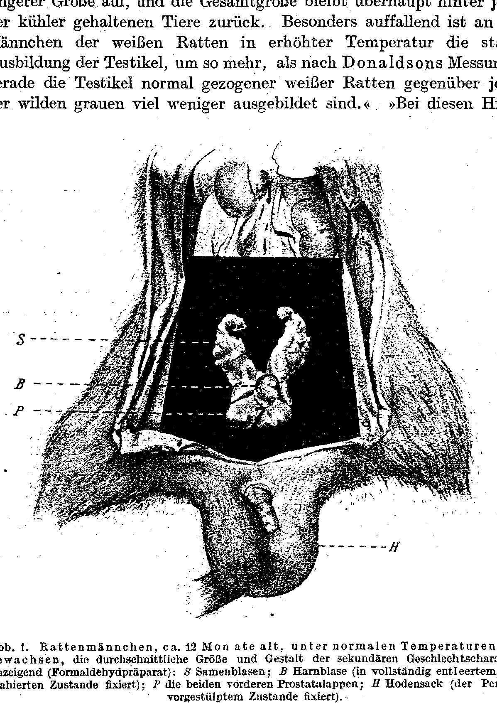
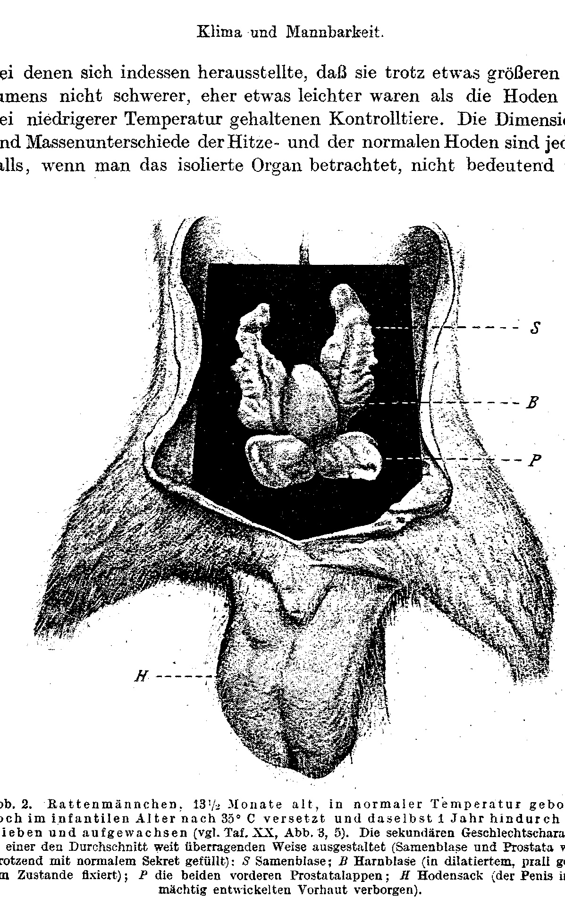

*(Biologische Versuchsanstalt der Akademie der Wissenschaften in Wien, Physiologische Abteilung. Director E. Steinach.)¹*

# Climate and Virility.

By

**E. Steinach and P. Kammerer.**

With Plate XX and 2 text-figures.

*(Received 10 October 1919.)*

*Archiv für Entwicklungsmechanik der Organismen*, vol. 46 (1920).

> **Full translation.** A complete English rendering of Steinach & Kammerer's study "Climate and Virility", with the tables and figure legends. The claims are rendered exactly as stated; this translation reports them, it does not endorse them.

*(Carried out with support from the Treitl Foundation.)*

> ¹ A short abstract of this work appeared under the same title as Communication No. 45 from the Biologische Versuchsanstalt of the Academy of Sciences in Vienna, Physiological Department. — Akademischer Anzeiger Wien, No. 18, 1919.

### Table of Contents.

|  | Page |
|---|---|
| **I. Individual and intra-individual fluctuations in the degree of development of the puberty gland** | 392 |
| 1. Accidental (abnormal) fluctuations | 393 |
| &nbsp;&nbsp;&nbsp;&nbsp;Transplantation, Roentgenisation | 393 |
| &nbsp;&nbsp;&nbsp;&nbsp;Resection, stenosis, intoxication, infection | 393 |
| &nbsp;&nbsp;&nbsp;&nbsp;Other pathological processes, cryptorchism | 393 |
| 2. Physiological (normal) fluctuations | 394 |
| &nbsp;&nbsp;&nbsp;&nbsp;Early maturity; individual fluctuations | 395 |
| &nbsp;&nbsp;&nbsp;&nbsp;Periodic (intra-individual) fluctuations | 395 |
| **Physiological Part.** |  |
| **II. Experiments in artificial climate** | 396 |
| 1. Arrangement of the experiments | 396 |
| 2. Results of the experiments | 397 |
| &nbsp;&nbsp;a) Macroscopic findings | 397 |
| &nbsp;&nbsp;&nbsp;&nbsp;α) Somatic sexual characters | 398 |
| &nbsp;&nbsp;&nbsp;&nbsp;β) Psychic sexual characters | 401 |
| &nbsp;&nbsp;b) Microscopic findings | 404 |
| &nbsp;&nbsp;&nbsp;&nbsp;α) Testis | 404 |
| &nbsp;&nbsp;&nbsp;&nbsp;&nbsp;&nbsp;&nbsp;\* Sperm gland | 404 |
| &nbsp;&nbsp;&nbsp;&nbsp;&nbsp;&nbsp;&nbsp;\*\* Puberty gland of the testis | 404 |
| &nbsp;&nbsp;&nbsp;&nbsp;β) Ovary | 409 |
| **III. Influences of the natural climate** | 410 |
| 1. Observations on tropical animals | 410 |
| **Anthropological Part** |  |
| 2. Observations on humans | 411 |
| &nbsp;&nbsp;a) Development of the sexual characters | 412 |
| &nbsp;&nbsp;&nbsp;&nbsp;α) Extragenital sexual characters | 412 |
| &nbsp;&nbsp;&nbsp;&nbsp;&nbsp;&nbsp;&nbsp;\* Growth | 412 |
| &nbsp;&nbsp;&nbsp;&nbsp;&nbsp;&nbsp;&nbsp;\*\* Hair growth | 415 |
| &nbsp;&nbsp;&nbsp;&nbsp;&nbsp;&nbsp;&nbsp;\*\*\* Other characters | 417 |
| | Page |
|---|---|
| &nbsp;&nbsp;&nbsp;&nbsp;β) Genital sexual characters | 418 |
| &nbsp;&nbsp;&nbsp;&nbsp;&nbsp;&nbsp;&nbsp;\* Genitals | 418 |
| &nbsp;&nbsp;&nbsp;&nbsp;&nbsp;&nbsp;&nbsp;\*\* Mamma and Mammilla | 419 |
| &nbsp;&nbsp;b) Onset of puberty | 420 |
| &nbsp;&nbsp;&nbsp;&nbsp;α) Influence of cold and warm climate | 420 |
| &nbsp;&nbsp;&nbsp;&nbsp;&nbsp;&nbsp;&nbsp;\* Breeding season | 420 |
| &nbsp;&nbsp;&nbsp;&nbsp;&nbsp;&nbsp;&nbsp;\*\* Altitude | 421 |
| &nbsp;&nbsp;&nbsp;&nbsp;&nbsp;&nbsp;&nbsp;\*\*\* Climate, continent, labor (city and country) | 422 |
| &nbsp;&nbsp;&nbsp;&nbsp;&nbsp;&nbsp;&nbsp;\*\*\*\* Season | 425 |
| &nbsp;&nbsp;c) Influence of race | 425 |
| &nbsp;&nbsp;&nbsp;&nbsp;A. Elucidation of the variation differences in the extreme ⟨climatic-zone⟩ races [Klimarassen] | 428 |
| &nbsp;&nbsp;&nbsp;&nbsp;B. Elucidation in the case of crossing within the extreme primary races [Urrassen] | 428 |
| &nbsp;&nbsp;&nbsp;&nbsp;C. Influence of disposition | 429 |
| &nbsp;&nbsp;&nbsp;&nbsp;&nbsp;&nbsp;1. Adaptation through colonization | 431 |
| &nbsp;&nbsp;&nbsp;&nbsp;&nbsp;&nbsp;2. Elucidation of the menstruation differences | 431 |
| &nbsp;&nbsp;&nbsp;&nbsp;&nbsp;&nbsp;&nbsp;&nbsp;(a) individual experiences | 431 |
| &nbsp;&nbsp;&nbsp;&nbsp;&nbsp;&nbsp;&nbsp;&nbsp;(b) general experiences | 431 |
| &nbsp;&nbsp;&nbsp;&nbsp;&nbsp;&nbsp;&nbsp;&nbsp;&nbsp;&nbsp;&nbsp;+ geographical nature | 434 |
| &nbsp;&nbsp;&nbsp;&nbsp;&nbsp;&nbsp;&nbsp;&nbsp;&nbsp;&nbsp;&nbsp;++ social nature | 434 |
| &nbsp;&nbsp;c) Sexual urge and capacity for procreation | 435 |
| &nbsp;&nbsp;&nbsp;&nbsp;α) Comparisons between man and beast | 436 |
| &nbsp;&nbsp;&nbsp;&nbsp;β) Polymetric sexual characters? | 437 |
| &nbsp;&nbsp;&nbsp;&nbsp;γ) First observations on criteria of the actual sex-urge intensity | 438 |
| &nbsp;&nbsp;d) Results | 442 |
| **IV. Discussion of the results** | 443 |
| **V. Summary of the results** | 450 |
| Bibliography [Schrifttumverzeichnis] | 452 |
| Explanation of plates [Tafelerklärung] | 457 |

## I. Individual and intra-individual fluctuations in the degree of development of the puberty gland.

In the experiments, castrations of the male, as is known, brought about — likewise also when the testes were transplanted back — that the tissue developing from the implanted testes, the productive tissue (the "sperm gland" ["Samendrüse"]), atrophied, whereas the interstitial tissue of the testes thrived.

After we had searched for the cause of this self-renewing return of male character — where in the testis lies the still unrecognized further developmental capacity — we found in the puberty-gland tissue of the interstitium the further-developing element. After the transplantation of the testis there arises an enhanced formation of the sexual-character-determining interstitial tissue. Whether the cause for the heightened development of the sexual characters is to be sought in an increased mass of the puberty gland (hyperfeminization, hyperor rather: capacity for impregnation [Begattungsfähigkeit]) — has not matured to fruition (Steinach 1910, p. 16).

Since, then, the quantity of puberty-gland tissue present appeared directly proportional to the degree of masculinity, even at that time the assumption was justified that quite generally, in the higher living beings, the individual differences of the sexual disposition — in psychic as in somatic respect — are conditioned by the growth and the activity of the internal-secretory portions in the gonads; — whether sooner or later, this received further supports through the results of sexual-character transmutation (hyperfeminization, hypermasculinization — Steinach 1910, Steinach and Holzknecht).

Two groups of such differences in the sexual degree of development can be distinguished:

### 1.

The one was already touched upon in the mention of the transplantation experiments and may be named the "accidental-abnormal group." It is characterized by the fact that the increase in interstitial substance takes place irrevocably at the cost of the generative substance. If the degree of development of the sexual attributes stands in direct proportion to the quantity of interstitial substance, then here this latter stands in inverse proportion to the quantity of generative substance, which can shift as far as the sole dominance of the former, the total disappearance of the latter.

So too it behaves with Roentgenisation of the gonads, as well as with resection and stenosis of the conducting paths, so that in each case the germ gland as a whole shrinks, but the actual germinal cells become atrophied to a heightened degree, while these latter no longer remain viable, whereas the interstitial cells retain the possibility of their growth and their further multiplication. Only here, I venture to assert, does the resistance of the interstitial tissue under the same circumstances grow greater, just as transplanted [tissue] wins the more space to thrive the more it loses through reduction.

From direct grounds of iodine and alcohol (Weichselbaum, Bertholet, Joannovics), intoxication and infection of every kind (Bouin and Ancel, Voinow), pathological processes and pathological secretions of every kind that likewise attack the sex organ and the interstitial cells, act in the same way; so too the tuberculosis and epi-

> ¹ Insofar as the authors cite themselves in the following sections, they will be found in our literature-historical work, and in case of need the more detailed bibliography of Biedl and Hartmann is to be consulted.

didymitis (see the compilation in Biedl). Even under the influence of the antagonistic action of other-sexual germ-gland substance (injection of corpus luteum extract in the male — E. Herrmann and M. Stein) it is at first only the spermatogenic tissue that perishes.

Insofar as the inguinal testis [Leistenhoden] often enters into adhesions with the organs neighboring it, cryptorchism approaches transplantation in its essence; and insofar as it represents a developmental enhancement, it is (apart from the not invariably occurring adhesions) an abnormal process. With cryptorchism the increase of the puberty gland at the expense of the sperm gland is established; Bouin and Ancel have already proved in cryptorchid swine that the degree of development of their sexual characters depends on variations in testis weight, and these in turn on developmental differences of the interstitial gland.

Since the cryptorchid testis owes its altered composition to neither an artificial intervention, nor needs to be bound up with a diseased state of its bearer, nor finally leads regularly to so far-reaching an elimination of the tubuli seminiferi as in the experimental and pathological cases in the narrower sense, it forms a transition to the second group of developmental differences in the sexual degree of development.

### 2.

We designate it as the "physiologically-normal group" and characterize it by the fact that the generative substance — whether the interstitial substance be present in greater or lesser extension — remains preserved. Spermiogenesis and ovogenesis remain in progress, or are at most temporarily interrupted, regardless of however rich an unfolding of the puberty gland in periods of generative functional rest [Funktionsruhe]. Here the cells with external secretion and those with internal secretion stand to one another not so much in a fighting parasitic as in a helping symbiotic relationship. In the fact that the proliferation of the interstitial gland between any two rutting periods "may furnish the budding moment for the respectively next germ-discharge," a furthering action of the former upon the latter may be given.

The phenomenon belonging here, described by Steinach and Holzknecht (p. 506) in the case of sexually mature early-maturers [Frühreife], where the histological investigation of early-maturing animals always leads to the result that the over-developed development of the puberty gland is to be recognized "not merely through the multiplication of the cells in the outer zone of the testis, but rather quite uniformly in the whole organ through condensation and cell-richness of the interstitial tissue net" (loc. cit., p. 506). Insofar as the early maturity [Frühreife] deviates from the developmental norm, it too is — and indeed in the reverse sense to the inguinal testis: the latter as a local inhibition, the former as a general overhastening of the usual developmental tempo — a transition between the "accidental" and the "physiological" group of sexual variants; just as the two groups are separated only conceptually and in truth are not sharply delimited.

If we set aside such extreme cases as are presented to us through early maturity of quite young or half-grown individuals: then all the often slight **individual fluctuations in appearance and instinctual life of the sexual persons** certainly belong in the group presently under discussion, since these too may be conditioned by corresponding fluctuations in the spatial distribution of the germ gland (in the narrower sense) and puberty gland.

Besides all these individual fluctuations of greater or lesser amplitude there belong here the intra-individual ones, which take place in the same person in the cycle of the year or in other, periodic cycles. For the latter, the growth-increase of the female puberty gland during the menstrual or — in mammals — the polyoestral rutting periods, and during pregnancy, furnishes an example; the surging-up by spurts of the interstitium in the mammalian ovary was traced by Winiwarter. For seasonal fluctuations the monoestral rutting periods are to be named; insofar as the year-periodic evolution and involution of the female puberty gland comes into question, those periods have found elucidation through investigations by Cesa Bianchi on hibernating mammals (badger, bats); insofar as the male puberty gland comes into question, they have found some histological elucidation through investigations by Friedmann (1898), Nußbaum (1905) and Champy (1908) on the frog and toad testis, by Mazzetti (1911) on the frog, lizard, snake and dormouse [Siebenschläfer] testis, by Hansemann (1895, 1912) on the marmot testis, Regaud (1904), Lécaillon (1909), Tandler and Grosz (1911) on the mole testis, Schoeneberg (1913) on the duck testis and most recently by Stieve (1919) on the jackdaw testis, although by no means yet any unanimous interpretation.

Stieve denies, in contrast to most other researchers, that the interstitium finds itself in year-periodic increase and decrease; the swelling and shrinking of the testis size [Hodengröße] is rather to be ascribed only to an expansion and reduction of the **seminal canals** [Samenkanälchen], to which (or to the sperm cells generated within them) Stieve — in this in accord with Nußbaum and Mazzetti — also ascribes the triggering of the rut. With disregard of the total ground-substance size [Gesamtbodengröße], the interstitial cells are, on individual sections, seemingly increased in the small, non-tubule-bearing testis [nichttubulösen Hoden]; in reality their quantity, as already follows from the absence of the mitoses, has remained the same, and their increase is merely feigned relative to the diminished tubuli. We shall return (p. 405) to Stieve's objection to the "season-dimorphism," which is thoroughly to be taken seriously, in order to show that it finds no application to our case.

The "season-dimorphism" (Tandler) in the puberty gland and the year-seasonal fluctuations of the sexual habitus (nuptial dress [Hochzeitskleider!]) and behavior (high rut [Hochbrunft!]) conditioned by it interest us here, because the same deviations that alternate in periodic sequence in the same individual are, in spatial distribution, [also found] — (in mammals) the polyoestral rutting periods — and are spread over various climates. Alterations which possibly one and the same individual can again undergo, if it wanders from one climate into another; only here the changes do not occur in periodic alternation, but rather, in the case of definitive emigration, irrevocably, and in the case of return-migration in a temporally-improper connection with the migrations.

The pertinent empirical material will be discussed in the III. section of the present work. So far so [much]; we now turn to the description of the experiments.

## Physiological Part.

### II. Experiments in artificial climate.

#### 1. Arrangement of the experiments.

As laid out in the introduction, the accelerated and heightened development of the somatic and psychic sexual characters everywhere goes along with increased formation of puberty-gland substance. This is shown both by the findings obtained through the transplantation- or irradiation experiments and by their confirmation in the naturally-grown cases of animal early maturity. It lay therefore close at hand to trace the sexual-character features, under the developmental degree of the puberty-gland substance heightened through climatic influence, back to a substantial reinforcement of the puberty-gland tissue.

Our rat experiments fell, by design, into two main sections [Hauptsektionen]: the one kept in stables, so that they were subject to the year-seasonal temperature fluctuations; we then also designate this in what follows the normal and control culture, and designate the temperatures corresponding to those in the warmth-chambers as the "normal." This comparison culture is also the **strain culture** [Stammkultur], which houses the greatest quantity of breeding animals and supplied the second main department with material.

The latter, the actual experimental culture, was accommodated in "warmth-chambers" of 1½ m breadth, 2 m depth, 2.70 m height, where temperatures of +5—40° C could be kept constant at 5-degree intervals with the help of regulators that open and close automatically (system Clorius from Schultze, Charlottenburg — cf. Przibram, 1910c, 1913). For the experiments of the present work only the chambers from 25—40° were used (apart from Table II, p. 403). It was our intention to extend the temperature extremes also down to the cold; but the prohibitive cost of operating the cold machine, already beginning during the war, compelled us to abandon the plan.

While, then, the thermal factor acted uninterruptedly from chamber to chamber in certain gradations, the remaining factors — in order to allow the action of the temperature differences on the organisms kept in the chambers to be recognized in isolation — were to be equalized as far as possible. With reference to the light, this is achieved by the equal position of all the chambers in one front (toward the south). With reference to the humidity, at least to some degree, by the fact that in the warmer chambers so-called air-improvers [Luftverbesserer] (after the "Bellaria" system — cf. Przibram, 1913) provided for abundant evaporation. During the whole duration of their operation, self-registering thermographs were running in each chamber.

Within the stables as well as the warmth-chambers the rats were kept in equally large, equally housed cages, which approximately correspond to Fig. 3 given in Przibram (1910 d, p. 253). Their inner furnishing was throughout the same: wood-wool as litter, feeding-trough and roomy bathing-vessel [Badegefäß], with a drinking-vessel [Trinkgefäß] of especially ample capacity in the heat (loc. cit., Fig. 7); always fresh bread and somewhat milk. Thus the dwelling- and nutritional-conditions of the test-animals too offered no differences whatever, so that the alterations observed in them may be traced back exclusively to temperature differences.

#### 2. Results of the experiments.

##### a) Macroscopic findings.

As material served the albino of the wandering rat [Wanderratte] (*Epimys norvegicus* Erxl. = *Mus decumanus* Pall.). On these Przibram (1910a) had already noticed that at 30 and 35° C peculiarities arise "which are reminiscent of the no-longer-warm earth-burrows [Erdställe]: the pelt becomes scantier, the sexual urge appears ... already de- *[The opening sentence continues one begun on the unowned page 7; it is reproduced here in full because its conclusion stands on the owned page 8.]*

…of lesser size, and the overall size in general lags behind that of the animals kept cooler. Particularly striking in the males of the white rats kept at elevated temperature is the strong development of the testicles, all the more so since, according to Donaldson's measurements, it is precisely the testicles of normally reared white rats that are much less developed than those of the wild grey ones. "In these heat-

**Fig. 1.** Male rat, ca. 12 months old, reared under normal temperatures, displaying the average size and form of the secondary sexual characters (formaldehyde preparation): *S* seminal vesicles; *B* urinary bladder (fixed in a completely emptied, contracted state); *P* the two anterior prostatic lobes; *H* scrotum (the penis fixed in an everted state).  *(figure not reproduced)*

rats the testes protrude far below the anus and are quite naked at their outermost, free end" (Przibram, 1910b, p. 207). Later Przibram (unpublished) — to whom we are under particular obligation for the thanks owed for his having placed his experimental protocols at our disposal and having permitted us to draw from them those results that were suited to supplement our findings (cf. in particular also Table II on p. 403) — undertook precise weighings on excised testes, in which it nevertheless turned out that, despite a somewhat larger volume, they were not heavier — rather somewhat lighter — than the testes of the control animals kept at lower temperature. The differences in dimension and mass between the heat testes and the normal testes are in any case, when one considers the isolated organ, not considerable and

**Fig. 2.** Male rat, 13½ months old, born at normal temperature, transferred while still of infantile age to 35° C and there remaining and growing up for one year (cf. Pl. XX, Figs. 3, 5). The secondary sexual characters formed in a manner far surpassing the average (seminal vesicle and prostate were turgidly filled with normal secretion): *S* seminal vesicle; *B* urinary bladder (fixed in a dilated, tautly filled state); *P* the two anterior prostatic lobes; *H* scrotum (the penis concealed in the powerfully developed prepuce).  *(figure not reproduced)*

for the preponderant part are merely simulated by the enormous size of the scrotum in the heat rats.

As regards our own investigations, independent of this, Text-fig. 2 first illustrates — in comparison with an equally large normal animal, Text-fig. 1 — the enormous development of the scrotum. In connection with the sparse pelage over the whole body of the "heat rats" — in them the summer coat becomes permanent — the scrotum is, over more or less extensive areas of skin, mostly bald. If it becomes taut through the protrusion of the testes, then in the moderately fast running of adult males it even drags along the ground: it is apparently then the districts coming into friction with the substrate that lose their coat of hair most readily.

Of the remaining somatic sexual differences of the heat rats one gains the impression — in so far as they appear outwardly — that they are not heightened in correspondence with the powerful scrotal development. Otherwise the male rat is indeed distinguished from its female by superior body size, a robust skeleton, a broad skull form, and a coat consisting of longer and thicker hairs, hence a shaggy pelt. In the heat population, by contrast, the sexual differences cannot be established to the same degree; they may even be absent or effaced. The following table, which assembles some of the weighed animals, shows the equalization of the sexual differences with respect to body weight, hence (what is the same thing) this equalization as a slowing especially of male body growth in the heat culture. The animals (siblings of the same litter) are one month old at the beginning of the weighings; therefore five months old at the conclusion of the weighings.

### Table I.
### Weighings of heat and control animals up to the age of 5 months.

| Temperature | Sex | \[Weights in grams on (date):\] 4. XI. | 19. XI. | 6. XII. | 21. XII. | 7. I. | 21. I. | 5. II. | 20. II. | 8. III. |
|---|---|---|---|---|---|---|---|---|---|---|
| 35° | Male | 55 | 62 | 68 | 74 | 86 | 96 | 100 | 108 | 117 |
| 35° | Male | 55 | 60 | 70 | 70 | 90 | 92 | 100 | 104 | 115 |
| 35° | Female | 55 | 60 | 68 | 78 | 80 | 90 | 95 | 102 | 110 |
| 35° | Difference | 0 | 0–2 | 0–2 | 4–8 | 6–10 | 2–6 | 5 | 2–6 | 5–7 |
| normal, fluctuating | Male | 55 | 60 | 70 | 80 | 102 | 108 | 130 | 150 | 172 |
| normal, fluctuating | Female | 58 | 64 | 72 | 80 | 95 | 102 | 125 | 135 | 143 |
| normal, fluctuating | Difference | −3 | −4 | −2 | 0 | 7 | 6 | 5 | 16 | 29 |

In the normal culture the weight difference at first is even in favor of the female (which is why a minus sign has been prefixed to it in the table); in the fact that in the heat culture the male is already of equal weight in the first month, but from the second month on is heavier than the female, even if only slightly heavier, there is already expressed the more rapid maturation process brought about by higher temperature, which then admittedly never produces weight differences such as obtain in the normal culture. Even in year-old animals kept in the heat the weight difference between male and female is substantially smaller than in normally reared animals. According to Donaldson's table it there amounts on the average at the age of 150 days to 37 g (against 29 g of our weighing), at the age of 365 days to 53 g. We shall meet with a similar fact (the equalization of sexual differences) in human populations of the tropical regions (see the III. Main Section of our work, p. 412) and shall (in the IV. Main Section, p. 448) attempt to give an explanation for it.

Far more than the differences expressed in the external habitus, the inner somatic sexual differences — the subsidiary genital organs — correspond in their degree of development to that of the scrotum (Figs. 1, 2): in relation to control specimens of the same age from cooler temperatures fluctuating with the seasons, the seminal vesicles (*S*) and the prostate glands (*P*) are by far more voluminous, pronouncedly hypertrophically developed and turgidly filled with secretion. At the age of 3 months the said organs have reached the same volume as in normal full-grown males. Their size is most strikingly conspicuous, namely also relative to the overall body size.

Already at 7–8 weeks, furthermore, the cavernous body of the penis is closed, i.e. it has completely grown over the penis cartilage. In the normal animal this process is only completed in the 10th–11th week, whereas before that the penis cartilage remains freely visible, so that the tip of the penis resembles a cross-section.

It stands similarly with the inner genitalia of the heat female: in order to be able to compare quite irreproachably, such females were likewise reared in a virginal state; and in these too there appeared — as against virginal normal females of the same age — the sexual characters extraordinarily enlarged. The tubes and uterus have gained the striking expansion, thickness, musculature and mucous-gland development that otherwise belongs to the first-parturient female rat at the beginning of its pregnancy. Besides the bulk, the turgescence and hyperemia of the said tissues catch the eye.

Likewise the psychic sexual characters are strengthened in the heat rats. In an interesting way this is already suggested by an anatomical finding of Donaldson's, who received from the Biological Experimental Station a number of heat rats which showed an absolutely larger brain weight than those of the control breeding. Since, on the other hand, a smaller cerebrum belongs among the marks of castratism in man and animal, it is well conceivable that the enlargement of this organ in the animals of the heat breeding stands in connection with the heightened internal-secretory activity of their sexual glands.

In fact the heat rats manifest, already at the age of 8–10 weeks, a pronounced sexual drive, whose expressions can easily be distinguished from the mere playfulness and curiosity-reactions of equally young normal little animals: the rutting female is already reliably recognized; the young heat females themselves also behave toward the precociously mature pursuers, by holding up the tail, just as if it were a matter of older males. In a 70-day-old little animal repeated, normally vigorous coitus was observed. By contrast, the earliest coitus performed by normally reared males, in the course of many years of investigations, was noted on the 100th day of life; on the average it occurs even later. The minimum difference accordingly amounts, corresponding to this comparison, to a full month, which in so early-maturing and short-lived an animal species is surely a great deal.

It is very difficult to gather a larger number of such determinations in the heat chambers: firstly, the long sojourn of the observer therein, such as appears necessary for catching them "in the act," is quite burdensome; secondly, it is seldom that a rutting female is available in the heat chambers on the particular day, and then such a one must be fetched over from the normal culture, which is stocked with much more numerous individuals. In the first minute after its transfer into the heat it is indeed still fully in rut and is recognized as such. Soon afterward, however, it loses — evidently through the irritation of the too sudden heating — much of its condition favorable to being mounted, and herewith its suitability as a test object.

Although it is thus difficult to establish the first coitus irreproachably, it is nonetheless not less certain that the strong sexual drive sets in everywhere and always sooner in the heat animals than in normal animals. In best agreement with these physiological ascertainments stands the fact that not only the onset of sexual maturity but the intensity of sexual activity during the whole sexually mature period of life is heightened in the warmth. For this we can call upon the fertility of the rats achieved in the individual temperature chambers¹ as a witness. The following table registers (according to H. Przibram's most kindly placed-at-our-disposal records) the relevant results; they ought to be quite complete, because the presence of a litter, on the daily inspection of the breedings, by the pene-

> ¹ More precisely and from more many-sided points of view, the fertility relations of the rat breedings are to be presented in a work by Kammerer (in this Archive) shortly to be published.

trating squeaking of the newborn young can be recognized very easily and even without rummaging through the nests.

### Table II: Fertility.

| Temperatures in degrees C | 5 | 10 | 15 | 20 | 25 | 30 | 35 | 40 |
|---|---|---|---|---|---|---|---|---|
| Number of females kept | 10 | 24 | 58 | 48 | 63 | 22 | 15 | 10 |
| of these fertile | 3 | 17 | 37 | 28 | 34 | 7 | 7 | 1 |
| in percent | 30 | 68 | 70 | 50 | 54 | 35 | 36 | 10 |
| Average number of young coming to 1 female — *infertile females counted in* | 1.8 | 8 | 8 | 5 | 7 | 2.5 | 4 | 1 |
| — *infertile females counted out* | 6 | 11 | 12 | 10 | 13 | 8 | 8 | 10 |
| Average number of litters coming to 1 female — *infertile females counted in* | 0.4 | 1.4 | 0.8 | 1 | 1.4 | 0.7 | 1 | 0.3 |
| — *infertile females counted out* | 1 | 2 | 2 | 2 | 2.7 | 2 | 2 | 3 |

Here a positive influence is to be read off. Least at the lowest and highest experimentally applied temperature, the fertility betrays its maximum in most of the rubrics at 25°. The next-following section of the present work will demonstrate that this distribution of fertility over temperatures, in so far as its decline at the extremes is concerned, corresponds approximately to the stage of development of the puberty gland. Only does the maximum of the puberty gland lie, corresponding to its greater resistive capacity against all influences, somewhat higher than that of fertility. We surmise that highest fertility coincides — though, as is hereby proven, not with the highest development of the interstitial tissue — yet with the highest development of the generative tissue; and we have ground for the assumption that the generative tissue, in the maximal developmental state of the interstitial tissue — though no damage is yet to be perceived in it — no longer preserves its height and full productive power (cf. also in the anthropological Part, pp. 437, 440).

### b) Microscopic findings.

Testes and ovaries of heat rats (Pl. XX, Figs. 2–5), as well as such of the equally aged control animals of the same stock from temperatures fluctuating seasonally (Pl. XX, Fig. 1), were fixed in Zenker's fluid, hardened in alcohols of increasing concentration, embedded, and stained with eosin and hematoxylin. They show in both sexes the following peculiarities:

### α) Testis.

### \* *Samendrüse (seminal gland) — productive tissue.*

A glance at the plate-figures 1–3 (and 5) convinces one that the seminal canals, in their histological structure and in their equipment with sex cells of all stages, have on the whole not suffered. They lie just as close together as in the normal testis, very much in contrast to transplanted, X-irradiated, or otherwise altered testes, where they — much narrowed and reduced in size — stand far apart from one another. In the heat testis, by contrast, the seminal canals preserve the normal diameter, and their wall runs smooth, instead of being knobby or shrunken as in the altered testis. Spermatogenesis is in full swing; in the lumen of the canals numerous heads of ripe spermatozoa are visible. In this regard scarcely a difference is to be perceived between the four pictures. The same holds of the Sertolian syncytium of the inner wall-lining of the tubuli.

The temperature differences have therefore left the actual germinal tissue, in so far as its constitution can be microscopically resolved, uninfluenced; the heightened temperature has not damaged the productive part of the testis.

### \*\* *Pubertätsdrüse (puberty gland) — internal-secretory tissue.*

The differences in the development of the interstitium are presented by plate-figure 1 on the one hand, 2 and 3 (resp. 5) on the other. The normal testis (Fig. 1) lets one see, in the known manner, the thin network of the intermediate tissue with the embedded Leydig cells, which connects the seminal canals with one another. In the heat testis (Fig. 2) this network is considerably thickened and richer in cells; indeed, in an extreme case (Fig. 3, detail-fig. 5) the interspaces of the canals — meshes of the network — are filled out almost completely by compact masses of Leydig cells.

Apart from the extreme case of plate-fig. 3 (resp. 5 — see also the table below, Prot.-No. 49), which was only observed a single time to such a degree, the differences in the spreading of the interstitial cells are, however, not everywhere so striking that they could be recognized at first glance and instructively presented on depicted sections.

*[The owned paragraph that began on page 14 ends here, with the first sentence on page 15 ("…presented on depicted sections."). The remainder of page 15 is not part of this assignment (cover-only). It is reproduced below solely as context, including the footnote whose marker falls on the unowned sentence.]*

> Therefore the procedure was for the first time chosen of counting the Leydig intermediate cells that compose the tissue of the puberty gland, for the purpose of judging its abundance.¹
>
> ¹ For extreme conditions, such as are presented by the transplanted and irradiated testis (cf. Steinach 1916, Pl. XIX, Fig. 2), Stieve's objection cannot in general be raised at all.

For this reason the method was adopted for the first time of counting the Leydig interstitial cells composing the tissue of the puberty gland, in order to assess its magnitude. To Fräulein Edith Roth, who carried out, under our supervision, the laborious counts and comparisons with the utmost care, we are obliged to the greatest thanks for her valuable help. The counts were carried out in 15 fields of view each of the vertical as well as of the horizontal meridian, that is, in 30 fields of view of each testis altogether. In doing so, the maximum and the minimum of the Leydig cells counted in a single field of view were determined at the same time. As a control, several sections of the same preparation were each time recounted at higher magnification. The sections of similar thickness used for this purpose were taken from approximately the same zone — between the equator and the apex [cap] of the testis.

By this procedure, Stieve's objection — raised in his meritorious work on the seasonal dimorphism of the jackdaw's testis — is from the outset disposed of, namely the suggestion that there had occurred no real increase of the interstitial tissue but only a relative one (that is, in relation to a possible decrease of the generative tissue). Moreover, the somewhat increased overall size of the heat-testis, as already mentioned, indicates that some tissue must have spread within it; since here (in contrast to the rutting-testis) it is not the tubules, it can — in agreement with the histological picture — only be the interstitial cells. The case is the reciprocal of the rutting-testis of the jackdaw: it is not in a period of diminished but rather of increased testis size that the interstitial cells appear more numerous; and it is not the interstitial tissue but the tubules that persist in the same quantitative state. Accordingly, the increase of the interstitial cells in our case of the rat testis exposed to heat can be no illusion, but only a fact.¹

> ¹ For extreme conditions, such as are presented by the transplanted and irradiated testis (cf. Steinach 1916, Plate XIX, Fig. 2), Stieve's objection cannot hold at all.

The following two tables, of which the first (III) relates to "normal animals" — from unheated stalls —, the second (IV) to "heat animals" — from 30 to 40° — afford an excerpted insight into the relevant experimental protocols.

The quantities of Leydig interstitial cells evident from the tables call, in several respects, for a comparative consideration.

1. The result of the comparison is most simply read off from the **Sum** column: the cell count in 30 fields of view has brought to light enormous

## Tabelle III.

### Number of Leydig cells in normal animals

*(in unheated stalls, exposed to the fluctuations of the season).*

| Number in the protocol book | Age of the animal in months | Sum of the Leydig interstitial cells in 30 fields of view | Minimum [in 1 field of view] | Maximum in 1 field of view | Difference |
|---|---|---|---|---|---|
| 53 | 22 | 679 | 3 | 47 | 44 |
| 52b | 13 | 724 | 7 | 47 | 40 |
| 58b (Plate fig. 1) | 14 | 816 | 7 | 47 | 40 |
| 71 | 15 | 989 | 7 | 74 | 67 |
| 19 | 6 | 1060 | 10 | 67 | 57 |

differences in favor of the heat culture brought to light; even where a purely qualitative comparison of the histological pictures gave no reason to suspect that such great quantitative differences were present.

2. The same difference comes to expression in the **Maximum** and **Minimum** columns: the highest and the smallest quantity of interstitial cells in each field of view are, in the high temperature, without exception more considerable than in the low; indeed, in a single case (Table IV, Prot.-No. 49 — Plate figs. 3, 5) the minimum of the heat-animal exceeds the maximum of several control animals (Table III, Prot.-No. 53, 52b, 58b).

3. Yet the minimal and the maximal cell mass of any one field of view have not risen proportionally in the heat-testes; rather, in the maximum figures this rise has occurred to a disproportionately greater extent. Correspondingly, the heat-table also shows, in the **Difference** column (minimum subtracted from the maximum of the same section series), much more considerable figures than the same column of the normal-table. This too is a result that one could not obtain by a merely qualitative survey of the sections (that is, without counting): the increase of the Leydig cells in the heat is locally especially intensified; there are regions in the testis where they proliferate much more strongly than in other regions. Thus the section depicted in Plate fig. 3 — it corresponds to No. 49 of the tabular protocol IV — with its highest figures, comes from the apical region of a testis which (see the 2nd count there) showed no such extremely extreme conditions in its equatorial portions.

The Leydig cells are indeed in all testes, even normal ones, most numerous in the polar portions and most sparsely represented in the middle ones; but in heat-testes this same opposition comes to expression in an excessive degree. The result can be expressed in yet another way: the distribution of the Leydig cells in the normal testis is less uneven than in the heat-testis,

## Tabelle IV.

### Number of Leydig cells in heat animals

*(in constant-temperature chambers, withdrawn from the fluctuations of the season).*

| Prot.-No. | C-degree | Duration of exposure (months) | Generation¹) | Sum of the Leydig interstitial cells in 30 fields of view | Minimum [in 1 field of view] | Maximum in 1 field of view | Difference |
|---|---|---|---|---|---|---|---|
| 15 | 40° | 5 | P | 1223 | 14 | 67 | 53 |
| 17 | 35° | 5 | P | 1336 | 11 | 96 | 85 |
| 36 | 35° | reared entirely | F₁ | 1471 | 21 | 93 | 72 |
| 60 | 35° | 15 | F₁ | 1690 | 25 | 127 | 102 |
| 59 | 35° | reared entirely | F₁ | 1723 | 18 | 106 | 98 |
| 52 | 35° | | F₁ | 1740 | 11 | 145 | 134 |
| 74 | born in 25°, 3 ancestral gens. in 35° | 6 months 25°, 2 » normal temperature (as Table III) | F₃ | 1765 | 29 | 104 | 75 |
| 78 | 3 ancestral gens. in 35°, born in 25° | after birth in normal temp. | F₃ | 2061 | 27 | 135 | 108 |
| 75 | 3 ancestral gens. in 35°, born in 35°, then 25° | later in normal temperature (as Table III) reared | F₃ | 2569 | 26 | 165 | 139 |
| 49 (Plate fig. 3) | 35° | 12 months | P | { 4828 { 1840²) | { 59 { 23²) | { 363 { 118²) | { 304 { 95²) |
| | | | **Mean** | **3324** | **41** | **240½** | **199½** |

> ¹) The generation designations are those that have become customary in Mendel's theory of heredity: P = parents, F₁ = children, F₂ = grandchildren, F₃ = great-grandchildren; thus P signifies that the observation refers to individuals who had themselves only first been placed under the experimental conditions. In the remaining cases (F₁₋₃) the observation already refers to descendants of those individuals with whom the experiment began.

> ²) In the extreme case Prot.-No. 49 the cell-counts of two sections are entered into the table, of which the second is carried nearer to the equator of the testis. In the middle region all testes are poorer in Leydig cells than in the two polar regions. Even the arithmetic mean of the two counts does not yet allow the character of No. 49 as an extreme case to be lost.

in whose total extent they do indeed accumulate, but in certain zones especially strongly. The more regular arrangement in the normal testis is also evident from Table III in that the same minimum figure (in No. 52b, 58b, 71) or maximum figure (in No. 53, 52b, 58b) recurs three times each, and in two animals the same minimum and maximum figure (No. 52b and 58b) recurs, here of course the same difference figure also resulting.

Results 1–3 were to be read off from those columns of the table that contain the counting results. If we now take into account the remaining columns as well, the following appears.

4. Up to 35° no damage to the puberty gland is to be observed, but rather a promotion of its growth. At 40°, by contrast, the optimum has already been exceeded. The heat-damage of the testis (and of the whole animal) is here already so great that the formation of the puberty gland moves along a retrogressing line. We brought into the table only one example; but our experimental protocols exhibit other examples which show this regression still more clearly. At 40° the semen gland too has already suffered considerably through partial degeneration or atrophy. We found a similar course (p. 403) in fertility, whose optimum indeed lies somewhat lower than the optimum of the puberty gland, but which likewise mirrors the steep decline in the extreme temperatures. Certain phenomena of the onset of menstruation — namely an increasing advancement [earlier onset] with decreasing latitude, but finally a reversal into delay among the inhabitants of the hottest climates — will once again remind us of this same regularity: we shall speak of it in the third main section (p. 428) of the present work.

5. The increase of the Leydig cells is of the same tendency as the duration of the heat-sojourn: the longer the culture is exposed to the high degrees of warmth, the higher rises the quantity of the interstitial tissue. If we consider the extreme case of animal No. 49, which itself still derives from low temperatures and was in all exposed for 1 year to the high temperature, it would indeed seem as though everything depended exclusively on the exposure time and not on the number of exposed generations. But since other experimental animals, during a duration of exposure continued over more than a year (e.g. No. 60), did not attain anywhere near so high a number of Leydig cells, one will more cautiously ascribe to that single case an individual predisposition unusually favorable to the experiment. The partial result in question then takes the following formulation: both with the duration of the heat-sojourn (animals No. 49, 60) and with the number of generations spent in the heat (No. 36, 52, 59) the interstitium gains in cell number.¹)

> ¹) A concordant result was obtained by Privy Councillor Prof. Dr. Gustav Fritsch-Berlin upon examining individual testes of heat-rats which had been sent to him from our institute. Fritsch too found that the increase of Leydig cells grows with the generations. "Since the data about the provenance of the material were entirely unknown to me," Fritsch writes to one of us (Kammerer) on the 15th of February 1913, "my objectivity in judging the finding is beyond doubt." For the testes sent to him had been numbered, but the descent relations ("generation number") we communicated to him only after the section preparations were already at hand. From this communication "it emerges" that our investigation has had a surprisingly favorable result.

6. Upon re-transfer into cooler temperatures, the expansion of the interstitium gained in the artificial heat-climate is not lost, at least for the next following generation (No. 74, 75, 78). Further re-transferred generations were not raised, since our original line of inquiry did not extend to the problem of heredity. In No. 75 the birth — after three generations spent in 35° — still took place in this high temperature; but in No. 74 and 78 it took place — after just as many generations spent in the high temperature — already in 25°, whereupon No. 74 was at the age of 8 months re-transferred into a still lower temperature (unheated stalls), and No. 78 was already reared in this low temperature. Nevertheless the numbers of Leydig cells were higher than in descendants of second-generation heat-rats which were not re-transferred but had for their part been left in the heat (No. 36, 52, 59, 60). The constitution of the puberty gland acquired in the heat has thus been preserved in the descendants, regardless of whether they had continued to live in the heat or were born and reared in a cooler temperature. The heat-variation has had an after-effect on the normal generation without weakening of the acquired character. Indeed this character — once in the course of rising — could not be halted in its increase despite re-transfer into normal conditions, although the increase is most considerable in those animals (No. 75) which were still born in the heat-climate itself and only after birth were transferred into the normal climate.

### ß) Ovarium [Ovary].

The ovary of the virginally reared heat-rats (Plate fig. 4) shows already without a quantitative method of investigation (cell-counting), upon merely qualitative comparison with the appearance of normal ovaries (cf. description and illustration in Steinach, 1916), that the female puberty gland — analogously to the male — gains the upper hand quite extraordinarily in the high temperature. It need therefore cause no surprise if the secondary sexual characters (uterus) experience an extraordinarily promoting influence; the analogous influence otherwise exerted, through increase of the puberty gland, in the state of normal pregnancy. The uterus becomes strongly hyperaemic, its musculature becomes thick, the uterine mucosa proliferates as at the beginning of pregnancy, the whole organ takes on the striking diameter and character such as it otherwise assumes only under the sign of gravidity. And there arise pictures such as are described by Steinach and Holzknecht (1916) after ovarian irradiation of virgin females, where likewise it was a matter of the effect of a proliferated puberty gland. — A considerable percentage of the follicles fills with theca-lutein cells, is in this way obliterated, and appears as relatively powerful corpora lutea (spurea), thereby transformed into endocrine glandular tissue. From "genuine" yellow bodies these corpora lutea "spurea" differ only by their somewhat smaller size; finally the obliterated follicles dissolve in the stroma ovarii. Among the elements of such obliterated follicles one finds just such transitions of theca and lutein cells as in the obliterated follicles of transplanted ovaries. By and large, however, they resemble the elements of the genuine yellow bodies arising in gravidity.

## III. Influences of the natural climate.

### 1. Observations on tropical animals.

The most conspicuous mark of the very warmly kept male wandering rat [Wanderratte = brown rat], visible externally and with the naked eye, lies, as described, in its abnormally large scrotum, which in the state of expansion grazes the ground and is terminally denuded of hairs.

Exactly the same mark is now found in a genus very closely related to the genus *Epimys* — to which the wandering rat belongs — and also quite similar in external appearance, the genus *Cricetomys*, whose tropical-African species, the brown hamster-rat (*C. gambiensis* Wterh.), was shown to one of us (Kammerer) living outside the cage, in the Berlin Zoological Garden, by its director, Privy Councillor Prof. Dr. Ludwig Heck, to whom thanks are due. The mark in question is also nicely visible in the photograph prepared for Brehm's *Tierleben* (4th edition, "Rodents," Plate XIII, Vol. 11, opposite p. 373). That the natural phenomenon of the tropics could be faithfully reproduced in the heat-experiment precisely in so close a stem-relative is surely characteristic.

To the further observation on artificially warm-kept rats — that the external sexual marks tend toward equalization — the tropical animal world too furnishes analogy examples: In certain apes (*Ateles*, *Hylobates*) the female genitalia reach the degree of development of a hypospadic penis; in the spotted hyena (*Crocotta crocuta*), as Grimpe most recently described, even that of a true penis, provided with a glans, pierced by a single urogenital canal, and fully capable of erection, and in place of the labia majora there is here a closed pseudo-scrotum, so that male and female cannot be distinguished externally at all; in certain button-quails [Laufhühnchen], e.g. *Coturnix nigricollis* in Madagascar, the hen has taken over, in habitus and behavior, the otherwise customary role of the cock, who for his part attends to the leading and instructing of the chicks. We shall soon have to call to mind similar occurrences within human populations. To be sure, with the said rail birds it is not a matter of mere equalization, but of a union of sexual characters (presumably of hermaphroditism limited to one sex), on which account these special cases invite a thorough sexual-biological investigation, which has hitherto been denied them. To point this out was one reason for adducing them here; although they probably — as in their sphere of appearance, so too in their sphere of causation — project beyond the climatic factor considered in the present work.

On the other hand, here too it can scarcely be doubtful for us that warm climates favor such phenomena; and so the few examples already — of which the first stems from the near kinship of our own experimental animal — allow it to be recognized how high temperatures, not only in captivity but equally in free life, take a peculiar promoting influence on the unfolding of the sexual marks.

## Anthropological Part.

### 2. Observations on man.

It will be of particular interest now to examine whether the homologous influence makes itself felt also in human populations. Although the foray through anthropological literature undertaken for the purpose of such examination cannot remotely lay claim to completeness, we nevertheless hope to gain an overview that makes the actual relations and their parallelism with those of the animal experiment stand out. For having gained this overview and insight ourselves, we are obliged to the warmest thanks to the numerous pertinent references of Prof. Dr. Rudolf Pöch-Vienna.

Although it seems at first as if there stood in contradiction to our experimental findings — which suggest a promoting influence of warm climate — especially observations of more recent anthropologists, yet in the overall course the view of the older researchers, who likewise believed they perceived that climatic influence, does receive through our experiments a foundation secured by modern methods.

We may apply the same criteria that we had employed in the experiments, namely formation of the genital and extragenital (somatic as well as psychic) sexual characters; the age-date of awakening puberty; sexual drive and fertility.

We may apply the same criteria here that we used in the experiments, namely the formation of the genital and extragenital (somatic as well as psychic) sexual characters; the sexual-character type; the time of awakening puberty; sexual drive and fertility.

## a) Formation of the secondary sexual characters

### α) Extragenital sexual differences

Among natural peoples the differences between man and woman are in many respects less pronounced than among peoples of culture (cf. E. Fischer and H. Fehlinger). One meets these differences in any case only among such natural peoples as dwell between the tropics; the convergence, or the still-incomplete differentiation of the sexual characters through womanlikeness of the man, manlikeness of the woman, and finally through the absence of pronounced sexual marks, must be conditioned by the warm climate.

> * *Growth.*

Among the secondary sexual differences belongs already body growth, its course and the end-dimensioning thereby attained. As Steinach's earlier experiments showed, the increase in length and thickness of the skeleton, and thereby the whole dimensioning of the body, stands under the dominance of the puberty gland — in the sense of promotion in the males, relatively thereto in the sense of a strong inhibition in the females. What in this respect proved true for mammals (rats, guinea pigs, goats) holds, without restriction, also for humans, as it emerges for example from O. Schultze's summarizing description: the woman, as opposed to the man, possesses a smaller and more weakly built skeleton, a smaller stature, relatively shorter legs; the female skull too is absolutely smaller than the male, and so on.

Already these sexual differences in body growth are somewhat equalized among peoples of warm climate. Reche has investigated the growth of the Matupi Islanders (Blanche Bay, New Pomerania) — separately for boys and girls — and very vividly compared it, in curve form, with the results of Stratz on the growth of the northern European, and of Baelz on the Japanese children. For the Matupi it emerges that in almost all growth-years the girls are taller than the boys: it is already noticeable at 4-year-olds; at 9-year-olds the difference amounts to 8 cm, at 11-year-olds to 9 cm in favor of the girls. By contrast, the girl-length predominates among Europeans only from the 11th to the 15th year. The Matupi behave similarly to the Japanese, yet there the head start of the girl-growth does not last as many years as among the Matupi.

The body length of the grown Matupi amounts to 7 head-heights, that of the Japanese to less than 7, that of the Negro at best to 7½, that of the European on the other hand to 8 head-heights. This proportion signifies that the proportions of the Matupi correspond rather to those of a 12-year-old European, or that the Matupi and other primitive races remain throughout life closer to the childlike condition. The fact that this holds for both sexes; and that, in the remaining-behind at a relatively childlike stage, the characteristic mark of the woman lies, so it further follows that man and woman of the said races agree therein with one another, that the relatively infantile end-state is common to them and not, as in the European, an attribute of the woman's sex.

In the older anthropological literature the view is widespread that the inhabitants of warmer climates — just as through the more quickly reached sexual maturity (p. 420) — so also through an acceleration of the growth tending thither distinguish themselves. A relationship of simple, straight proportionality between climate and growth-tempo does not exist; though it may indeed be recognized in individual cases, shifted, slowed, shortened, or suppressed in growth-phases (1.—3. extension¹) according to the people. In warm climates there are sometimes more pressing driving forces at work, which we presumably will have to displace onto the encroaching puberty-gland tissue. Thus the Matupi remain, according to Reche, in the whole indeed behind European children, whose size is only slight up to the 17th year; in the whole, considered, there appears thus to be no question of a more energetic growth (cf. the slowing of the growth, which finds expression in Table I, p. 400, in the bent heat-curves). But the 2. extension of the Matupi (from the close of the 9th to the beginning of the 13th year in boys; from the middle of the 9th to the beginning of the 11th year in girls) falls into a considerably earlier period than in the European (12.—16., resp. 11.—14. year). And after the 3. filling (up to the beginning of the 14th year in Matupi girls, of the 16th year in Matupi boys) an intensive growth newly sets in by 20—25 cm: a 3. extension, such as is not found at all among Europeans. The Japanese too, who in other respects resembles the Matupi in growth, possesses this 3. extension not, but with the beginning of the 17th (girls), resp. 18th year (boys) is suddenly cut off from puberty. As we will set forth more closely in the following sections, the puberty of the Matupi enters very late, whereas that of the European falls already into the 2. extension, which afterwards keeps going for a series of years, while at the entry of sexual maturity it is immediately laid to rest.

The cessation of growth depends, according to Tandler, on the fact that, from the matured puberty gland, the activity of the hypophysis — in its quality as growth gland — is dammed in.

> ¹ Insofar as the writers named in our anthropological sections are not to be found in the bibliography, which would otherwise have had to assume an unwarranted extent, the detailed bibliographies in Krieger and Ploss-Bartels are to be consulted.

At that time the cartilaginous gaps between the shaft and the articular bodies of the tubular bones, kept open by the hypophysis, close themselves, whereby the longitudinal growth and thereby the total increase in length is brought to a stop. The earlier this happens, the closer the form of the grown human (in the man too) remains to the childlike (and the similar female) developmental condition — most conspicuously in the sense of a relative preponderance of the arm-length, the under-lying of the leg-length. This in both sexes long-armed, short-legged appearance, originally and in warm countries lasting longer, is therefore characteristic of the fact that virility — whether it sets in early or late — at any rate encounters growth still in full course and, so to speak, surprised, breaks it off in such an incomplete state. This coinciding of puberty and the end of growth is, as said, observed among the Matupi Islanders (Reche), in a somewhat milder form among the Fiji Islanders (Blyth¹) and the Japanese (Baelz), and stands in opposition to that which is known to us in the European (Stratz), but which is also stated of the Andamanese, in whom the growth first comes to its conclusion 2—3 years after the first menstruation (Man¹) — the climate of the Andamans is distinguished by its uncommon dampness, whereby the tropical heat is essentially lowered! If puberty is mighty enough to call a halt to growth in time, then this can only go back to a, precisely at the critical moment especially energetic, inner-secretory work of the puberty gland, which therefore also unceasingly holds in check the antagonistic secretory work of the hypophysis.

In the temporal course of the 2. extension, from about the 7th—10th years of life of the Matupis, a formal growth-standstill precedes in the shape of the 2. filling (cf. the still-valid heat-table p. 400); and in the appearance of a 3. extension, which from the 14th—17th years in the Matupi girls, the 16th—18th years in the Matupi boys, in rapid course strives toward virility, ceasing at its entry almost with a jerk, one allows the violently driving influences of the puberty gland, visibly stepping out of regulated bounds, to be recognized. There appears still only the question, whether one may ascribe it to the climate or to the race. Reche explains it as characteristic of primitive races; which is doubtless correct. But the geographical distribution and origin of those races leaves open the possibility that they received their primitive character partly already originally imprinted by the tropical climate, partly still today owe it to this very climate, if they retained it. After the analysis to which we will subject the behavior of the puberty-onset further on (p. 423 ff.), that relationship between climate and race postulated by us, namely climatically conditioned condition and racially conditioned constitution, should pass over into one another, divested of its apparent contradictions still more clearly.

Let us now see how the remaining secondary sexual characters behave toward the tropical climate.

> ** *Hairiness (body, facial, head hairiness).*

"The hairiness of the body," says Ratzel (L., p. 130) of the Negroes, "is in general weak; even those parts which among other peoples are not seldom strongly haired, such as breast, lower body, underleg, etc., are either unhaired, or show only weak hair-growth. Even under the armpits it is only by a small tuft represented... the beard-growth is rather weak than strong, the cheek-beard is present only in isolated tufts, the mustache appears usually only at the corners of the mouth (among us in the face of women or eunuchs! — Note of the auth.), and even at the chin, where the beard is strongest, it reaches only seldom the length of 5 cm." (Here Ratzel refers to a chieftain of the Manjema with a chin-beard plaited into pigtails as a wholly exceptional deviation from the rule.) "According to Falkenstein, only a third of the Loango-men have beard-growth."

And of the Indians says Ratzel (II., p. 348): "The beard-growth is by nature so sparse that one says: a bearded Indian has no pure blood. It is moreover but seldom among youths and men, not only not cultivated, but rather removed by tearing out... A little beard meets one most often in greybeards."

"Among individual Indian tribes," says Friedenthal (p. 88), "the hairiness of both sexes differs only through the beginning of the sparse beard-formation in the man at a fairly advanced age, just at a time which also among the female sex furthers somewhat beard-growth." "Only among the hair-rich human races," Friedenthal premises, "are the sexual differences of the hairiness considerable. This holds unconditionally for the poikiloderm (white) race; but among the melanoderm ones it is then occasionally the woman who in hairiness emulates the man in hair-richness, and on her side bridges the distance of the sexes:" "Of conspicuous strong hairiness of the body on the back and of the beardedness of the women speaks Taplin among the South Australians. Not Negro-like and still less Malayan is the strong hairiness of the body, especially the strong beard" (Ratzel, II, p. 18).

Among the Matupi Islanders (New Pomerania) the hair-growth, according to Reche, to whom we owe very exact data still to be considered several more times, behaves approximately as among the Indians: it is extraordinarily weak. 16-year-old Matupi of both sexes showed (with one exception) still no axillary hair, in 17-year-olds it was sparse, in grown ones mostly abundantly present. About the hairiness of the genitalia Reche could not inform himself, since they were mission-pupils who were shown to him: it will probably behave likewise; all the more so as for the Japanese — to whose development the Matupi show many relations of similarity — it is stated by Baelz that the pubic region of both sexes hairs itself conspicuously late.

Among the 17-year-old youths of the Matupi there is no trace of beard present; many 20-year-olds too are still beardless, without it being here the custom to remove the beard. Among older men, on the other hand, mostly abundant beard-growth is present. For its entry there holds indeed "the Schwalbean law, that an organ appears the earlier in ontogenesis, the more its terminal form has differentiated itself. Among weakly bearded human tribes the beginning of the terminal hairiness ensues late" (Friedenthal, p. 88).

Concerning the sexual differences of the head-hair, for the white race characteristic is that baldness sets in much earlier and more easily in the man than in the woman, in whom bald-spots, even in advanced age, belong among the rarities. This sexual difference holds however not for those races which in the rest of the body are poorer in hair than the white and in their preponderant majority inhabit warm countries: among them men's-baldness too is something unusual. An explanation which would make this go back to the distance between natural and cultured peoples, would make the damages of civilization responsible for the hair-loss, would be too narrow and too wide: over-exertion and dissipation may indeed accelerate the hair-loss; on the other hand it extends itself beyond the civilized circles and cultural influences and fails to occur where the (apart from on the head) hair-poor races expose themselves to such cultural influences. To explain their missing men's-baldness through correlation with the hair-poverty of the rest of the body would be more justified, is however with our conception, which therein sees also a cancelled sexual difference, by no means incompatible. If one adds that the castrate indeed loses his beard, mustache, etc., but obtains and keeps dense head-hair; that further the castrate represents the neutral and in some respect ancestral species-form, toward which the male and female sexual form converges (Tandler and Grosz): so the absence of the male baldness among peoples who dwell in hot regions gains all the more the character of an equalization of the sexual differences.

The length-difference of the head-hairiness Friedenthal does not allow to hold as a sexual difference, since everywhere, where men wear uncut hair, this in no way stands behind the main hair of the woman. I know not whether we may, just therein unrestrictedly, give Friedenthal the right; whether middle-European men (not boys, whom Friedenthal therefor adduces from his own experience) actually grow more than meter-long "woman's-hair," and whether the proofs which Friedenthal still besides adduces for his view (Italian and Spanish goat-herds, Russian monks, many Mongols, Indians, Javanese, Oceanians) do not rather go back to an equalization, ensued there, of just this sexual difference. Entirely unprovable for Friedenthal's view is the length-growth of the head-hairs among "youths," to whom one does not begrudge it, because one first held them for girls: for here it deals with hermaphrodites, in whom according to Steinach's experiments on artificial hermaphrodite-formation the inhibiting influence of inadequate puberty-glands onto insufficient sexual characters comes to fall away. Moreover already in the custom of wearing the hair otherwise than the woman is — where not a somatic, there a psychic — sexual attribute of the man to be seen; and where this custom fails, an absence of the underlying sexual difference.

The same as of the long man's-hair holds naturally in both kinds of relation also of the short woman's-hair: either it grows among natural peoples not so long that it forms a mantle flowing down to the hips, or it is artificially kept short, — in the first case a bodily, in the latter a soulful convergence of the woman-character toward the man.

> *** *Other sexual characters (countenance, behavior, steatopygia).*

Such convergences of the sexual character proceeding from the woman are still indicated in regard to other marks. Whoever has traveled into the tropics or has even only mustered the ethnological types of a handbook of ethnology, it strikes him that the countenance of the native women — at most apart from their earliest youth — bears little of womanliness about it; rather it shows the coarse, early withered features of the man. Were one to want to value this as a secondary consequence of the fact that the woman in the natural state must let heavier labor be laid upon her, so would one again (as opposed to the customs of the hair-style) have to reply that already in the custom, be it cause or effect, a symptom of lesser sexual differentiation — in the case it appears as cause, lesser labor-division between the sexes — is to be sought. Moreover Ratzel (L., p. 155) warns, in special regard to the Negro, against overestimating the burdens imposed on the woman: "That in emergencies, especially among poorer people, the sexes help out in one another's labors, is only natural, just as it is equally natural that in the presence of a stranger the man feels shy of doing women's-work, so that under the eyes of a fleeting observer the woman easily appears to have to work much too much."

We see therefore in the general that the "differentiae extragenitales externae" (terminology of Poll) among peoples of warm climate show the tendency either primarily to diverge inconsiderably, or to equalize themselves secondarily, — a result which corresponds best to our heat-experiments on the animal. Only in isolated cases does there find itself, here and there, an excessive unfolding of an outer sexual character:

As an example let the fat-rump (steatopygia) of the Hottentot- and Bush-woman be named. "Among the women (of the Bushmen) the fat-rump comes similarly as among the Hottentot women, with correspondingly lesser inclination to fatness. Flower has demonstrated the same already in ten-year-old Bush-girls" (Ratzel, L., p. 53): thus not just strong end-, but also early-development. By no means is steatopygia peculiar to the said races alone: "The much-discussed monstrous fat-accumulation, which as fat-rump is stamped as a distinguishing mark of the Hottentots, is also not entirely lacking among the Negroes. We recall Schweinfurth's plastic depiction: 'That imposing body-part, for whose hypertrophic development the technical expression "Steatopyga" was devised, stands among the Bongo women so violently off from the rest of the figure of the body that, in connection with the long bast-tail, the silhouette of a solemnly striding fat Bongo-woman recalls in high degree the figure of a dancing baboon'" (Ratzel, L., p. 132). To this recollection there lies perhaps more at bottom than superficial similarity: possibly we have in the buttock-callosities, as e.g. Friedenthal depicts on Pl. VIII for rutting females of *Choiropithecus porcarius* and *Cynopithecus inuuatus*, a homologous formation before us.

### β) Genital subsidiary sexual differences

> * *Genitalia.*

Again entirely as in the heat-experiment and in opposition to that which for the outer extragenital sexual characters holds as a rule, we have among tropical peoples occasionally an excessive formation of the outer genital subsidiary characters to recognize, whereas about that of the inner genitalia, so that we could compare the hypertrophic seminal vesicles, prostate glands, and oviducts of the heat-rats, unfortunately little is known. To be sure, the elephantiasis of the scrotum appearing in the tropics is not to be ascribed to any climatic influence, but rather to the occurrence and intrusion of *Filaria sanguinis hominis*; but penis and vulva are among healthy natives of the tropical countries often abundantly developed. The oriental physicians state a quite uncommonly wide distribution of female genital-mark in the southern countries. Yes, just there, where in the form of steatopygia an otherwise little prominent female sexual mark luxuriantly unfolds itself — among the Hottentots and Bushmen — is also the so-called Hottentot-apron (lengthening of the labia minora and of the praeputium clitoridis) at home, and, since it occurs also among American nations, still less than the fat-rump an exclusive racial peculiarity of the said south-African peoples.

to recognize the external genital subsidiary characters, whereas the larger one of the internal genitalia — with which the hypertrophic seminal vesicles, prostate glands, and oviducts of the heat-rats [Hitzeratten] might be compared — is unfortunately little known. It is true that the elephantiasis of the scrotum occurring in the tropics is due to no climatic influence whatever, but is to be ascribed to the occurrence and ingrowth of *Filaria sanguinis hominis*; but penis and vulva too are often abundantly developed even in healthy native-born inhabitants of the tropical lands. The oriental physicians report an extraordinarily strong spread of prostatic hypertrophy in the southern countries. Yes, indeed, where in the form of steatopygia an otherwise little-prominent sexual character unfolds itself luxuriantly — among the Hottentots and Bushmen — there is also the so-called Hottentot apron (elongation of the labia minora and of the praeputium clitoridis) at home, and, since this also occurs among the American nations, [it is] no less than the fatty buttocks an exclusive racial peculiarity of the said south-African peoples.

### ** Mamma and Mammilla.

Very variable is the **mamma** (cf. the compilation by Ploß-Bartels): peoples with slight development of the female breast stand opposed by others with over-developed breasts; and such peoples with late development stand opposed by others with early development, upon which there follows correspondingly early withering, hard on its heels. «With the generally slighter differentiation of the sexes there is connected the remarkable fact that the development of the breasts in older women often recedes deceptively, while in the man it can even rise to the point of suckling-capacity. The hips too betray little of the sex; the more strongly arched pelvis is an unmistakable character of the woman even in this race»: thus Ratzel (l. c., S. 53) describes the women of the Bushmen. Of the Quinos mentioned [by him], an interior mountain-race of Madagascar, Commerson (cited after Ratzel, II., S. 495) had already remarked «the longer arms and the undeveloped state of the breast in the women». Gynecomastia of the men too, emphasized by Ratzel for the Bushmen, appears, alongside various other phenomena pointing to hermaphroditism, as an expression of slighter sex-differentiation, in the most diverse latitudes (z. B. in Brazil — likewise after Laurent-Kurella, S. 14 — the «Mujaderes» caste of the New-Mexican Pueblo-Indians belongs here too, said after Hammond's reports to be more widespread there than in the temperate zones).

It is known that the slack pendulous breast [Hängebrust] of the adult Negro woman: «As soon as the women are married, signs of a rapid decrescence set in, especially a slackening and sinking-down of the breast, which finally become quite sack-like. This is regarded by all as a normal sign of the developed Negro woman, and is found not only as no detraction from beauty, but even as pretty» (G. Fritsch). It is a question whether this slackening of the breast may be compared with the pendulous condition of a withered European-woman's bosom; whether the Negroes are not right who regard it as a «normal sign of the developed woman», rather than as a specific form of the Negro-woman's bosom. In that case one may not speak of a premature retrograde development, but must rather speak of a highly developed hypertrophic formation: for indeed the often navel-deep, slack, tube-shaped breasts of the Negro woman satisfy their suckling-function perfectly!

«A particular difference between the formation of the breast in the Negro women and the European women lies in the stronger projection of the whole areola above the level [of the breast] as compared with the sharp setting-off of the nipple in the latter» (Ratzel, I., S. 134, 135): a developmental difference which, however, need not lay claim to a higher or lower developmental grade of the **mammilla**.

Also with respect to the **mammae** the data of Reche are again the most precise: only in the 16-year-old Matupi-islander does the areola-mamma pass over into the bud-breast [Knospenbrust]; the full development of the breast coincides with the first menstruation, which in the Matupi sets in only in the 17th year of life, approximately. Similarly it is with the Japanese woman, who is wont to menstruate in the second half of her 15th year, and where the development of the bosom scantily precedes the menstruation.

### b) Entry of puberty.
### a) Influence of cold and warm climate.
### * Latitude [Breitengrad].

The data of Baelz just touched upon, which hold for the Japanese woman, and especially the data of Reche, which constate a decidedly late maturation even for the Matupi-islander, stand (without thorough analysis, which is the task of the present pages) in striking contradiction to the view long since widespread, according to which menstruation sets in the earlier, the nearer one comes to the equator; and the later, the farther one goes towards the poles.

Already the «Periodologie» of Baumgarten-Crusius, dating from the year 1836, knows how, with careful adduction of exact bibliographic data, to report that northern peoples — such as z. B. the Scythians (Hippocrates, Arrianus), Greenlanders (Pechlin, Eggede), Lapplanders and Samoyeds (Linné) — have only a very «sparse monthly cleansing», which often sets in only in the 20th year, indeed among them [sets in] not at all (Albr. v. Haller). Such old reports are confirmed in broad scope by the factual material of more recent date which Ploß-Bartels compiled. The Eskimos whom the North-Pole-expedition under John Roß encountered menstruated indeed only at age 23, and at all showed traces of a menstrual blood-passage only during the summer (Mc. Diarmid). With this the antarctic peoples agree: communications made by Bridges, by Deniker and Hyades concerning the Tierra-del-Fuego women [Feuerländerinnen], of whom moreover Friedenthal (l. c. S. 101) states that the axillary hair is mostly entirely absent in them, correspond very well to the reports by v. Haven concerning the Greenland women, by Lundborg concerning the Eskimos of Labrador: all the travellers and writers enumerated place the date of the menstruation-entry later than that of the European woman.

In full contrast to these reports concerning peoples who dwell nearer the tropics or between them, stand the assertions compiled by Ploß-Bartels — in the sense of a menstruation-beginning setting in earlier as compared with mid-European conditions: these are indeed legion; and we should have to content ourselves with referring to the compilations by Ploß-Bartels and Schidloff. For the sake of historical interest, let recourse again be had to a datum of Cleghorn cited by Baumgarten-Crusius, according to which menstruation off Minorca (Balearen) often already occurs at age 11 and is said to set in twice monthly; and to a datum named in the same work, of J. Jos. Testas, according to which «the women at the Ganges become capable [of menstruation] at age 9—10, but become infertile at age 30». To bring out yet some further extremes: Virey reckons the marriageable age for Italy and Spain on the average at 12, Tobler for Smyrna at 11—12, Niebuhr for Arabia at 10, Chardin for southern Persia at 9—10 years. To Frau Prof. E. Přibram — a Javanese who studied medicine in Vienna — we owe the (oral) communication that the girls in her homeland become mature as a rule at age 9. A Palestinian woman who came to Vienna during the World War and the alliance with Turkey was 7 years old when she first menstruated, where we shall in fairness have to set something to the account of the psychic shocks of flight in time of war.

### ** Altitude [Seehöhe].

Since it depends less on the geographical situation of a country than on its mean annual temperature, the altitude is able to make good the influence of the degree of latitude, in so far as it, by its southerly situation, reproduces the raw climate of a northerly but low-lying place, and conversely. Thus the 500 m by which Munich lies higher than Berlin are, with respect to the menstruation-entry of these city-populations, more than compensated by the 4½ degrees of latitude by which Munich lies more southerly (Schlichting). And while the Araucanian women in Chile menstruate first only at age 11 and 12, the Creole women in Peru already at age 9, the menses in the Peruvian mountain-Indian women are continuously very weak and set in only in the 14th year (Rollin).

### *** Heating, diet and labour (town and country). [Heizung, Kost und Arbeit (Stadt und Land).]

The artificial climate also — comparable to that which we intentionally apply in the animal-experiment — is able to accelerate the natural place-time of the puberty-entry: the overheated huts in which the daughters of the Kamchadals, Kalmyks, Samoyeds, Lapps, Yakuts, Ostyaks pass a considerable part of their existence presumably bring it about that they menstruate young, although Lacépède's datum, that it happens already in the 12th—13th year, appears to have been demonstrated as incorrect at least for the Lapps. The habituation to take hot baths (asserted by Simon ben Gabbel in the Talmud as cause of premature pubic-hairing), like luxurious, especially animal diet, which supplies the body with abundant calories, may contribute to it, to release in the town-women as against the country-dwellers (Brierre de Boismont, Ravn, Schäffer), in girls of the better-off as against those of the poorer classes, an earlier entry of menstruation. When finally spiritual labour accelerates this entry as against bodily heavy-labour (Weber) and field-labour (Hippolytus Guarinonius, Marc d'Espine, Szukits), then a partial cause of this is perhaps even the same one that favours, with the sedentary mode of life of the brain-workers, the (not seldom likewise at menstrual intervals bleeding) hemorrhoids: heat-accumulation in the lower body.

### **** Season. [Jahreszeit.]

In the foregoing data it was asserted of certain Eskimos that they menstruate only during the summer. If this should be confirmed, the datum gives in two directions to think: first, we would stand before an example where a polyoestrous form, as which the human being otherwise presents itself, is in the act of transforming itself, under climatic compulsion, into a monoestrous form; or at least first into a form whose polyoestral cycles crowd together into one season.

Secondly, the seasonal difference suggests the assumption of a warmth-influence upon the menstruation-process, without our being here forced to compare various geographical situations with various populations, whose racial-differences are suited to obscure the influence of the climate-differences, in every case to muddy [them] for our cognitive capacity. With regard to this possibility, of recognizing the warmth-influence at one and the same place and people in the year-periodic way, there comes to the aid of the datum concerning the Eskimos the datum statistically ascertained by Krieger, that more than 50% of the European women get their first menses in September, October or November. Krieger sees in this a proof «that it is not the warm season which acts favourably upon them»; we see in this, conversely, an indication that we have to do with an after-effect of the summer season that has gone by. Precisely when the summer is already on the wane, when all the warmest months have acted upon the organism, is its chance greatest of completing the impending maturation. Late fruits, like the grape and the apple, do not ripen either because they have been exposed to the coolness of autumn, but because they have accumulated in themselves the heat of the long summers, of which they have needed more than other fruit. One observes analogues in the alternation of generations of lower freshwater plankton-animals (z. B. Rotatoria), where likewise warmth-conditioned characters (surface-enlargements of the shell-sculpture) set in only afterwards and then sometimes fall in the cold months.

### β) Influence of race.

To all these and many other concordant data, which make distinctly recognizable the temperature-influence — homologous with our animal-experiment — upon entry and course of virility, there stand opposed the organism-proper data of Baelz and Reche. If we for the present add still the datum of L. Schultze, according to which the Hottentot women menstruate only between 13 and 15 years, then we might well receive the impression that the more exact ascertainments of younger date confirm the older ones already adduced; that no connection exists between climate and virility of the human being, but that the latter depends partly on race — this view has from of old been represented by A. v. Humboldt, Roberton, Polak, Oppenheim, Lebrun, Corre, Walker, Weber u. a. —, [and] partly that its onset among distant races, such as Europeans, Mongols and Negroes, does not at all lie so far apart as one believed (Falkenstein). With their emphasis on dependence on race, on independence of external conditions, the new researches also meet the general inclination of modern variation- and inheritance-theorists to set any modification or constancy in relation only to inner, germ-plasmic conditions.

Reche conjectures that most data on the age of the menstruation-beginning rest on mere estimation, especially since wild peoples do not keep their age in evidence and are seldom in a position to render account of it. The exact age-determination of the Matupi investigated by Reche was possible, even so, only with the baptized portion of the native population entered in the register by the missionaries. Hence it is salutary to take most of the findings hitherto raised, without further ado, as false. Experiences of Külz, according to which the change of teeth in the natives of South Cameroon occurs at the same time as in European children, strengthen Reche in the assumption that one at least greatly underestimates the age of the Negro children.

Reche's misgivings have unquestionably much in their favour. Before him, Goldie had already been skeptical, when he heard the age of the menstruation-beginning given by the Maoris in New Zealand at 10 years, whereas Brown ascertained 12 and Thomson 13—16 years. And when the Negritos in the Philippines are said, after Schadenberg, likewise to menstruate first already at 10 years, Montano cautiously adds: «... ne tenant aucun compte de leur âge». To the estimate that the Cumberland-Eskimos begin to menstruate at age 13—14, Schliephake appends the qualification: «so far as one can bring out among a tribe of people among whom no one knows his age».

But it would have to be a strange business indeed if the age were mostly under-estimated in the warm climate and over-estimated in the cold. For that is the direction in which the committed errors would have to be strung together in order to feign the all-too-uniform regularity of the climate-conditionedness of awakening generative capacity. The literature is, to be sure, over-rich in contradictions; and scattered there are found, even for nordic peoples, assertions of an extraordinarily early menstruation-entry, alongside more numerous ones which (for the same nordic people) record the late menstruation-beginning — conversely for southern peoples. Even in our own narrow selection such contradictions were found: the reader need only look up once more what was said on the preceding pages about the Samoyeds, Lapps and about the Eskimos. When North-American Indian women are said, after Busch, to menstruate first only at 18—20, after Edwin James already at 12—13; arctic Indian women, after Engelmann (following Matthews), at 12—16, but the [women] of Alaska on the other hand at 14—17 years, then it is more than probable that in one and the same population-area now over-, now under-estimations take place. But however great the errors may be in the individual case: on the average they nevertheless even out for the overall impression that — to speak with Albrecht v. Haller — menstruation sets in the later, the farther we go towards the north; and that it — to render the view of Raceborski, Bondin, Marc d'Espine — occurs the earlier, the nearer one approaches the equator. Did we not possess so overwhelming a wealth of individual data, the picture would, in view of the imperfect age-assessment, indeed become hopelessly confused and flattened; but as it is, there still results an average which points in the direction of climatic influencing.

The selection of the documents we have here adduced for this was intentionally so made that preferentially those peoples found admission whose cultural level permitted [us] to presuppose reliable knowledge of [their] own age. Let us now, in tabular form, without particular selection, put together a few further figures, leaving aside only the sporadic extremes upwards and downwards:

### Tabelle V. [Table V.]
### Onset of menstruation in the Old World. [Menstruationsbeginn in der alten Welt.]

| **Northern Europe:** Author | Place | Age (months) | Age (months) | **Mediterranean countries:** Place | Author |
|---|---|---|---|---|---|
| Raven u. Levy | Copenhagen | 201 | 174 | Paris | Brierre de Boismont |
| Frugel | Christiania | 202 | 144 | Rome | Zacchias, cit. after Tilt |
| Faye | Stockholm | 199 | 114 | Algiers (Arab woman) | Bertherand |
| Berg | Faröer [Faroes] | 194 | 114 | Egypt (Negro woman) | Rigler |
| Kieter, Horwitz | St. Petersburg | 177 | 132 | South Tunis | Narbeshuber |

### Tabelle VI. [Table VI.]
### Onset of menstruation in the New World. [Menstruationsbeginn in der neuen Welt.]

| **North America:** Author | Indian tribe | Age (years) | Age (years) | **South America:** Indian tribe | Author |
|---|---|---|---|---|---|
| Parker | Chippeway | 14—16 | 10—12 | Pampas | Mantegazza |
| Wray | Yankton u. Crow-Creek | 16 | 12 | Surinam | Stedtmann |
| Keating | Dakotah u. Sioux | 15 or 16 | 11 | Payagua in Paraguay | Rengger |
| Currier | Cheyenne | 16 a. 17 | 12 | Campas and Antis on the Amazon | Grandidier |

> Archiv für Entwicklungsmechanik Bd. 46.  28 — so the figures read quite differently, depending on whether they stem from a harsh or a mild climate, — independently of whether they were obtained in the Old or the New World, and whether from members of the same or of different families of peoples.

Now one could take the view that part of the foregoing data has not been re-examined in more recent times, whereas the findings of Reche, Baelz, and L. Schultze — which contradict the earlier onset of menstruation in the warmer climate — were obtained with the help of the perfected, critically schooled observational methods of the present day. Against this it should be recalled that Reche, Baelz, and L. Schultze, with their results that are at odds with the common opinion of a simple, proportional dependence on climate, by no means stand alone, but merely furnish the supplement to a whole series of analogous older results. Precisely from the East-Indian–Australian island world — from the climatic and racial region where Reche gathered his experiences — data approaching his own concerning a late onset of menstruation already exist: on Nias at 15–16 (Modigliani!), on New Caledonia at 12–15 (Vinson), on New Zealand at 13–16 (Thomson), on the Solomon Islands at 15 years (Elton). The Hindu girls seldom menstruate before the 12th, often only in the 16th–18th year (Webb); the Siamese girls seldom before they are 12 years 5 months old, mostly only after they have become 14–18 years old (Campbell); the Andamanese women at 15 years (Man). Further examples in which very late starting-dates of menstruation are designated in hot regions of the earth are furnished by the Somali (in the 16th year — Haggenmacher), the Negroes of the Loango Coast (at 14 or 15 years — Falkenstein), the Beri ("later than the Egyptian girls," at 15–19 years — Hartmann). Testa (cited after Baumgarten-Crusius) even adduced in 1787 that "the women of the African Negroes, and namely the inhabitants of the Kingdom of Congou, are said not to menstruate, because they perform all the labors of their effeminate men."

The oldest investigations thus already ran up against the same contradictions as Reche in our own days. But is it now to be inferred from this that earlier age-data were wrong wholesale? And that the climatic conditioning of the onset of menstruation must, in favor of its racial conditioning, in fact already be regarded as refuted?

Already the venerable "Periodology" of Baumgarten-Crusius, just mentioned again, found (p. 162) the right middle way: "According to the regular course of development, this phenomenon first appears when, after the completed formation of the female body (of the individual), the formative activity turns toward the sphere of the genitalia and thus prepares the propagation of the species. The time, however, at which this happens is not everywhere the same, and is dependent both on inner conditions of the organism and on influences of the external world . . . Among the external influences, the climatic conditions are especially of importance. In all more southerly countries it sets in earlier in general than in the northern regions, and the nearer to the equator, the sooner this happens. But the earlier menstruation sets in, the sooner it also tends to be lost again; the later the former happens, the longer it tends to last."

In fact it will prove the most acceptable [conclusion] that outer and inner factors — climate (besides this, presumably nutrition, activity) as well as race, condition just as much as constitution — are at work to gain influence on the onset of puberty. From such twofold (exogenous and endogenous) conditioning of maturation arise the apparent contradictions that it is now expedient to resolve as far as possible.

In doing so we may suitably rely on three results that came to light in our rat experiments:

A. (Increase of the range of variation in a warm climate.) — If we cast a glance at Tables III and IV (pp. 406, 407), it is at once apparent that the number of Leydig's interstitial cells in the heat culture is subject to incomparably greater deviations than in the normal culture. And this notwithstanding the fact that the normal culture is exposed to the temperature fluctuations of the seasons, whereas the warmth-chambers, each for itself, were kept at a constant temperature year in, year out. Probably, therefore, the range of variation of the interstitial-cell quantity (of the testis as of the ovary) in the natural tropical climate will not only likewise be higher than in the cool and temperate climate; but rather this very latitude of variation will even be greater in the natural tropical climate than in the artificial one, because the latter is in each case kept strictly constant, whereas the former is at any rate fluctuating and thereby variability-promoting.

For mammals (thus including man) the assumption may be regarded as far-reachingly secured that those interstitial cells in their totality form a "puberty gland," whose internal secretion brings about the awakening and the persistence of the bodily as well as the mental sexual characters. Thus the tropically heightened variability of the gland-quantity must also draw after it a variability of the virility-intensity obedient to it, and bound up with this an equally heightened variability in its onset. This will be one of the causes why one finds reported, side by side, very early and relatively late entry-dates of menstruation in regions of the same climate, indeed of populations of the same race.

B. (Reversal from acceleration to retardation in the extreme heat climate.) — The quantity of puberty-gland cells in the rat testis — increasing up to 35° — undergoes at a higher temperature (40°) a diminution which again brings it nearer to the quantity-ratios of the normal culture. In this connection it certainly appears to be anything but a coincidence that those data (older as well as newer) which set the onset of puberty quite late originate, on the one hand, from the arctic and antarctic countries, and on the other hand from the hottest countries of the earth. Reche has already expressly taken into account the possibility that a moderately warm climate acts in an accelerating manner, but a quite hot one, similarly to a cold one, again acts in a retarding manner on the entry of maturation. The histological behavior of the puberty gland in the experiment and the temporal behavior of the sexual characters in nature would then here too again stand in best agreement, and moreover connect with many experiences of variation biology: thus in experimental breedings of butterflies too there appear extremely melanic aberrations, agreeing with one another, upon application of the permissible highest and lowest temperatures, whereas moderated warmth and cold bring to light entirely different forms.

As Kammerer (1913) demonstrated, the entry of such a reversal in the direction of aberration is bound not so much to the extreme poles of the culpable external factor, but moreover to the inner (originally, of course, likewise externally stamped) disposition of the influenced organism. Expressed differently: For every organism and for every population of the same, the extremes of an aberration-factor at which the reversal of the direction of aberration sets in lie at different points of its scale of degrees. A change conditioned by warmth sets in, in cold-accustomed populations, already at a lower degree of the temperature scale than in heat-accustomed populations, because the former became more receptive (more inwardly disposed) to the warmth-effect than the latter.

This regularity of the ectogenic variation-effect may cause it that (according to Webb) the menstruation of the European woman in the tropics is more strongly modifiable according to nation and climate than that of the native women; that further (according to Baelz) the European woman in Japan begins to menstruate earliest, the Japanese woman latest, and the half-breeds also keep to the middle with respect to the onset of menstruation.

Finally, it may be connected with the predisposition derived from the environment, with the sensitization-state that has become internal, when at times, within the narrower compass of one and the same country, an image repeats itself that, on the large scale, the whole inhabitable terrestrial surface presents: an acceleration of the first menstruation with increasing warmth, with more southerly latitudes of the country. We explain to ourselves the variation-relations of Italy in this way: female maturation enters in North Italy on the average in the 14th year, in South Italy at 13 years, but in Middle Italy at 12 years! Indeed still more! In South Italy there are found conspicuously many girls who only begin to menstruate at 15–20 years; since these, in view of the average age of 13 years, are correspondingly older when they menstruate, we here have, firstly, again the increase of the range of variation hand in hand with the climatic warming. And, secondly, the fact of the reversal proves itself before us, hand in hand with the relative maximum-warming; for "up to the 16th year, in the middle part of the country a far greater number of girls is mature than in the southern [parts]."

Less clear than in Italy lie the relations in India, where menstruation indeed likewise enters in the southerly, hottest part of the country at the 16th year (as against an average of 13 years in North and Middle India); but here, among the poorly nourished castes (Speerschneider), the inhibiting influence of hunger merely crosses through and overlaps the warmth-promoting [influence]. The state of affairs is complicated, as I have already mentioned — according to Webb, in other parts of the country a menstruation-age of 16–18 years does not belong among the rarities, when the average itself — as already designated — lies significantly deeper.

C. (Influence of inheritance.) — Finally, the rat experiments brought us the result that the increase of the puberty-gland cells attained in the heat persists in the offspring, even when these offspring were born and reared at far lower temperature, after their parents had been transferred out of the heat into the cooler temperature. We have here before us a process which we have, in the description of the experiment, cautiously named "inheritance," because the experiments, according to their whole arrangement (cf. p. 409), did not permit a conclusion as to genuine heredity. In the present descriptive section, however, it is without further ado permissible to pronounce, conjecturally, the heritability of the additional acquisition of puberty-gland cells, all the more so since the anthropological data thoroughly suggest the heritability of the climatically-acquired onset of menstruation.

To such evidence in this regard the investigations of Glogner come closest insofar as not within the country itself, with the unbroken further-effect of its climate, the becoming-hereditary, that is, the becoming-constant, the becoming-independent of a property from the causing climatic factor, can be securely demonstrated. To the investigations of van der Burg, who in 53.65% of the cases seen by him had already established an early onset of menstruation in the European children born in India, Glogner set forth that between pure-blooded Europeans and half-breeds of such with natives no difference can be made: "It is known that among the peoples living in the tropics the girls menstruate very early, and this early entry of the menses very often appears, as an inherited property, in the half-breeds." Glogner himself avoids the source of error and investigates, for Netherlands-India (1890–1900), the European girls born there of pure descent, and the half-breed girls, separately. The result reads: "The entry of menstruation in the tropics happened, in 25 cases, 18 times earlier than is valid for Europe, just as early as in the half-breeds, whose native ancestors, like all southern peoples, show an earlier sexual maturity than the Nordic peoples."

One may object here to the small number of observed cases, — a defect which is, however, in part again made good by the caution with which Glogner excluded all cases of not indubitable racial unity. From the fact that within a decade only 25 such unobjectionable cases were ascertained, one can gauge how difficult it held to make the right selection; it was indeed made difficult by the known circumstance that European children — alike in their puberty, so too in other characteristics — take on the kind and appearance of the natives, hence often appear only suspect of mixed descent, although both progenitors (or, in case these themselves were already born in the new homeland, their forebears) stemmed from Europe.

### (1) Adaptation in colonists.

If indeed the number of cases observed by Glogner is small, it nevertheless finds for itself, in a twofold direction, its supplement in other authors: First, in the fact that resettlement to a country whose female inhabitants exhibit a deviating onset of menstruation can have as a consequence, in female immigrants not yet menstruating, an approximation to the foreign starting-date of menstruation; but in already-menstruating female immigrants, menstrual disturbances, a falling-into-disorder of the menstrual periodicity they brought with them. The latter Havelburg corroborates for tropical colonists in general; the former Chervin confirms for the European girls in the East Indies, who menstruate at 12 years like the Hindu girls, and Baelz for the European girls in Japan, who there — in accord with Webb's assertion of a greater sensitivity of the European woman in this respect — even outdo the locally-customary onset of menstruation and menstruate younger than the Japanese woman, who menstruates comparatively late (at 14.5–15 years). Thereby, for the time being, almost only the cleanness of a laboratory experiment is confirmed, that climate actually influences the beginning and course of menstruation; that, namely, a determinate onset of menstruation is climatically acquirable.

### (2) Heritability of the onset of menstruation.

(Individual and general experiences, of geographical and social kind.)

The second direction, according to which Glogner's findings are supplemented, leads to the conclusion that a determinate onset of menstruation — now without regard to its origin — is heritable. In this respect there are once again two groups of facts to adduce:

Firstly, individual experiences, according to which daughters begin to menstruate at the same age as mother and grandmother (M. Bartels) — a uniformity such as also expresses itself in the further course of the menstrual cycle and in the respective entry-moment, duration, and quantity of the blood-flow. To this further evidences contributed by Fließ are added; whereas Riebold, who counts the regulation of the menses among the lunar [phenomena], contradicts, and in an example narrated by Blumenbach even conjoined [conjoint] twins received their regulation at different times. Jamasaki reports of Japanese twin sisters whose first menstruation entered on the same date, and ascribes it to the exactly identical life-situation — simultaneous school attendance, simultaneous entry into the brothel; it lies even nearer to let at least the same descent co-speak.

Secondly, for the heritability of the onset of menstruation general experiences may be adduced: of the nature that daughters of different geographical and ethnographical descent, when they live in the same place, do not get their first menstruation at the same age. There thus arise, in the same country, indeed in the same town, ethnic gradations of the onset of menstruation, which for the most part probably represent an inheritance. To be sure, a similar gradation can also be immediately conditioned by milieu: when either the direct adaptation of the immigrants does not yet reach the full degree of the natives, as in the Chinese immigrated into Cochinchina; or when the variation of the immigrants, on the contrary, exceeds the native degree, as in the case of the Europeans settled in Japan. But if the relatively constant, well-bounded, non-fluctuating differences of the onset of menstruation at the same place rest on no climatic ones, but on the influence of inheritance, then this seems flatly to contradict the above-named adaptation-capacity to foreign climate; nevertheless the necessity of altering the onset of menstruation yields itself only over against a radical climate-change, such as the Englishmen and Dutchmen experience in emigrating to East India, the Germans in emigrating to equatorial Africa. If, on the other hand, the migration extends only over a few degrees of latitude, then with a certain tenacity the inherited menstruation-dates can be held fast.

Under such a presupposition, all findings cease to contradict it — those which, on account of similar incapacity for adaptation to foreign climate, are turned against the climate-theory. When, according to Joachim, the peoples of Hungary exhibit considerable differences of their onset of regulation; when Lacépède ascertains for the Negro and Mongol women in North America the earlier onset of menstruation in comparison with the European women there; when, according to Roberton, in South America the Indian girls menstruate very early, the Negro girls later: then — especially recognizable in the two last-named cases — every race always carries its presumably climatically-acquired onset of menstruation into the settlement-region that has become common, where then, to speak with Goldscheid, as it were different milieu-influences are grafted one upon another. In the case of the Indian girls, who often menstruate already at 10 years, the precocity is, to be sure, according to Roberton to be ascribed to the precocious (i.e. already pre-menstrual) sexual irritation (cf. with us p. 437). Weber will admit only the racial influence, because in St. Petersburg the Finnish women menstruate late, the Jewish women early, and because delays as well as accelerations, over against the entry-date that is in each case normal for them, are rare in the former, frequent in the latter. The case is homologous to the others, but in so far still more instructive, since it proves to be hereditary not only the onset of menstruation as such, but also its greater range of variation, which is acquired in southern climates.

Especially instructive are the conditions of Cochinchina, because they, in relation to Glogner's exposition of the Netherlands-Indian conditions, furnish a complete counterpart. To be sure, one must, in order to obtain it, put together the data of several investigators. Cochinchina is one of the very hottest countries, where the reversal from accelerated to delayed menstruation completes itself. According to Mondière's very exact surveys, the Annamite girls menstruate there on the average at 16 years 8 months for the first time, most frequently in the 15th, 16th, 17th year; the Cambodian girls at 16 years 10 months, the Chinese women at 16 years 6 months, the mixed race of the Ming-huong at 16 years 8 months. Now the onset of menstruation in China itself takes place, according to Hureau de Villeneuve, at 12 and 13 years, which Morache likewise gives specifically for Peking, whereas Scherzer — probably with the inclusion of the agriculture-practicing rural population — speaks of 15 to 16 years. Over against their home country (the average of all data being 14 years), the Chinese girls in Further India [Indochina] (where they first menstruate at 16 years 6 months) are thus delayed in a way that comes close to the still later first menstruation of the population native there (the average from Annamite and Cambodian women being 16 years 9 months). It is noteworthy — because not without analogies in hybrid biology — that the half-breeds of natives and Chinese in Further India do not, like van der Burg's and Glogner's Malay–Dutch half-breeds of Netherlands-India, menstruate at the same time, but rather still later than both of their parent races. The menstruation-conditions of Cochinchina are for this reason so perfect a supplementary piece to Glogner's communication, because one perceives from them how the adaptation of those born in the colonization-country — who do not yet completely deny the hereditary influence of the home country — proceeds conformably, whether it now be a question of a stepping backward (Netherlands-India over against Europe) or of a stepping forward (Further India over against China) of the age of puberty.

Compared with their home country (the average of all data being 14 years), the Chinese girls in Further India [Indochina] (where they first menstruate at 16 years 6 months) are thus delayed in a manner that comes close to the still later first menstruation of the population native there (the average from Annamite and Cambodian women being 16 years 9 months). It is noteworthy — because not without analogies in hybrid biology — that the crossbreeds of natives and Chinese in Further India do not, like van der Burg's and Glogner's Malay–Dutch crossbreeds of Netherlands India, menstruate at the same time, but rather later than both of their parent races. The menstrual conditions of Cochinchina are for this reason such a perfect supplementary piece to Glogner's communication, because from it one can see how the adaptation of those born in the colonizing land — who do not yet entirely deny the hereditary influence of the home country — proceeds conformably, whether the matter now concerns a stepping backward (Netherlands India compared with Europe) or a stepping forward (Further India compared with China) of the age of puberty.

Let us devote a few further words of reflection to the behavior of the crossbreeds. Van der Burg's and Glogner's Malay–Dutch crossbreeds begin their menstruation at the same time as their two parent races, of which the immigrated one fully assimilates itself to the indigenous one with respect to acceleration [Verfrühung]. Baelz's Japanese–European crossbreeds choose for their menstrual onset a time lying between that of their parent races, of which the immigrated one attains its maturity even before the endemic one, in its acceleration overshooting, as it were, the locally customary. And Mondières' Annamite–Chinese crossbreeds begin to menstruate later than their two parent races, of which the immigrated one indeed approaches the indigenous one in the direction of its delay, but yet does not entirely attain it with respect to the late onset of the first menstruation.

Presented more clearly, these experiences acquire the following formulation: With complete assimilation [restloser Angleichung] of the immigrant race and the native race, the puberty of the half-breeds [Blendlinge] does not differ in time from that of the parental stock; with incomplete assimilation the half-breeds behave intermediately, if the immigrated race, in order to acclimatize itself menstrually, had to undertake an acceleration; but if a delay [was required], then the lateness of the two parent races accumulates in the half-breeds.

Considered also from yet another side, the results of crossbreeding group themselves as follows: If the immigrated race lags behind the indigenous one in its measure of variation, then the bastards go beyond the measure of variation of the indigenous one; if, on the contrary, the immigrated race already goes beyond the indigenous one, then the bastards are intermediate, showing themselves as actual "half-breeds"; if the immigrated race went exactly as far as the indigenous one went, then the half-breeds agree in their measure of variation with both.

If we bring our data on the menstruation of mixed races into brief formulas in this fashion, then we must remain conscious of the fact that we may only insert the individual values known up to now, to whose easier survey we wished to attain; but it is not permitted us to generalize the formula — perhaps with the exception of the last, whose result might repeat itself everywhere. But however much the previous, scanty experiences over the entry of puberty among mixed peoples may differ among themselves, one thing is nonetheless common to them: In none of their forms do they contradict the heritability of the climatically altered onset of menstruation; indeed, in the intermediate and cumulated form they grant the assumption of such heritability a special support.

That this age is a peculiarity which can be outwardly acquired and hereditarily fixed is confirmed also by investigations which ascertained that not the climate, but the social position [soziale Lage], is the cause of acquisition. We have already occupied ourselves (S. 422) with the fact that menstruation enters latest in women doing heavy labor and earliest in women doing intellectual work, and we likewise brought this into connection, in a certain sense, with influences of temperature. A statistic by Weber now found graduated differences in the menstrual age when he subdivided the social estates still further into families of peasants, burghers, merchants, nobility, officers, officials, scholars, soldiers, and clergy; and it is especially instructive that these very same statistical differences recur, regardless of whether the occupation that the woman who first menstruates [later] took up, or the occupation of the parents, is laid at the basis. It emerges from this that the occupational type [Erwerbsart] of the procreators is determinative for the menstrual age of the daughters; that the onset of puberty impressed upon them by their station in life strives to become constant.

However much other causes — of individual or general scope — may help to determine the point in time of maturing: the principal cause of it remains the temperature. However much station, race, air humidity, kind and amount of nutrition, movement and exertion may play a part: while it would otherwise, in the fullness of its apparent contradictions, have to crush [overwhelm] us, the confused mass of facts gains its firm and simple survey only when we everywhere lay the influence of warmth at the basis of the pace of maturation. Temperature increase acts in an accelerating and strengthening way, temperature lowering in a retarding and weakening way, but excessive temperature elevation acts in turn like temperature reduction; high air humidity acts through the cooling bound up with it, low [humidity] through warming; abundant nutrition and animal fare act through increase of calories, sparse and protein-poor [fare] through decrease of calories; urban life, a sedentary manner of life in enclosed space act through protection from the inclemencies of climate and abdominal heat-retention, bodily work in the open air, especially agricultural [work], through exposure to the harshnesses of climate; and each of these directly or indirectly thermal influences acts upon the generation, upon the race, which holds it fast and, against contending influences, maintains it as long as possible: thus the principle is found which the speed and intensity of the development toward virility obeys in general.

Therein the anthropological factual material is unified with the biological experiment, from which proceeded the idea that could bring the former its elucidation. In a mediate sense one may speak of "experimental anthropology": The animal experiment lends to it — to the science that of necessity is purely descriptive — the leading point of view; the analogical inference then serves as a bridge and orders a casuistry that previously seemed inaccessible to any contradiction-free interpretation.

### c) Sexual drive and fertility.

### α) Differences in man and woman.

It is not lacking in signs that the sexual drive of warmer climates is more impetuous [stürmischer] than that of temperate and cold climates. The proverbially "fiery temperament" of the southerner is probably nothing other than the psychic consequence of his — to be surmised, in analogy to our physiological heat experiment — greater wealth of puberty-gland substance. Ploss–Bartels make the general remark that in southern lands marriages are concluded earlier, partly because of the earlier maturity, partly because subsistence is acquired more easily, partly finally because one decides more light-bloodedly [light-heartedly] upon marrying. This lightness of living, however, probably goes back in great part to a more vigorous sexual drive. If it [the drive] is unbridled by cultural or traditional inhibitions (however primitive these may be), then it passes over into that licentiousness [Zuchtlosigkeit] which Ratzel, G. Forster, Wilkes and others portray of the Polynesian peoples, and in which these by no means stand alone.

With regard to the sexual drive the phenomenon repeats itself which already, in respect of the arrival of sexual maturity, spoke so very much in favor of climatic influences: change of climate, imposed upon emigrants through their change of locality, has changes in their sexual needs as a consequence. Yet these changes do not proceed conformably in man and woman; the picture that one can form of it is thereby complicated, as indeed the influence of climate on sexual desire and fertility is much more difficult to disentangle than the same influence on the in any case already sufficiently complex conditions of puberty. As Havelburg emphasizes, the sexual demands of the male European increase in the Tropics, but the resistance-capacity of the woman declines: menstrual disturbances, up to amenorrhea, make the beginning; uterine diseases, easier abortion, loss of milk, sterility, [make] the conclusion. Beyond the fourth generation, European families in the Tropics are said not to be fertile; already R. Virchow had emphasized this and on the ground of it denied the European the capacity for acclimatization at all. The Creole woman of the otherwise so healthy Antilles, according to Ramon de la Sagra, does not even remain fertile beyond the third generation without receiving a fresh supply of blood from Europe. Already in Egypt immigrated women frequently remain childless, very much in contrast to the native Egyptian woman, to whom high fertility was extolled by ancient Greek writers, which remained so down to the present day (Lane and Frankl).

Over against this unmistakable climatic influence there is — as regards its difference in man and woman — a twofold biological position conceivable: either the critical point on the temperature scale, where increase of the sexual manifestations turns into decrease, is already exceeded in the woman when in the man it is not yet reached. In our warmth experiments on rats there is a foundation for this insofar as the optimum of fertility held itself about 10 Celsius degrees lower than the maximum of the interstitial-cell number in the testis.

The same experimental result is, however, also suited to consolidate a second conception — one, moreover, not incompatible with the first, but possibly subsisting rightfully alongside it: Our histological investigation extended both to the testis, where it established an increase of the Leydig cells, and to the ovary, where it established an increase of the lutein cells, in both cases therefore an enlargement of the puberty gland. One was the more readily entitled to surmise this concordant behavior, since testis and ovary also react concordantly to other influences which enlarge their hormone-producing portion (transplantation and irradiation of the gonad, severing and ligature of its conducting pathways, thymectomy, etc.). Now, however, the puberty gland of the ovary is, according to the determinations of Steinach, essentially the sum of the obliterated follicles; it enlarges itself in that young follicles — without growing up to ovulation, without transforming themselves, after their bursting and the expulsion of the ripe egg, into a corpus luteum verum — obliterate and form themselves into just as many corpora lutea falsa (spurea). If thus the male puberty gland can indeed enlarge considerably without impairing the sperm gland, then the same process in the female puberty gland is, without disadvantage to the egg-producing tissue-portion and therefore without disadvantage to female fertility, in the long run impossible. If the mating-capacity of the man increases in the Tropics, [while] the child-bearing capacity of the woman declines in the same place, then this apparently divergent double phenomenon has, probably nevertheless, its common cause: increase of volume of the puberty gland as a consequence of raised temperature; only that that increase of volume in the female puberty gland already proceeds at the cost of the actual germ gland, when the expansion of the male puberty gland still leaves the sperm gland unmolested.

### β) Premenstrual sexual intercourse.

Among the manifestations of heightened sexual drive — and indeed presumably on the side of both sexes — belongs indisputably the copulation before the onset of the first menstruation, reported from many, especially tropical, lands of the earth, and combated by the Missions. The travelers and researchers who report of this represent almost concordantly the view (Roberton, with respect to the onset of menstruation, however, the opposite) that premenstrual sexual intercourse both delays the onset of menstruation and also later reduces fertility. With this, the supposition just now expressed by us — concerning the cause of the menstrual disturbances and of the sterility after removal into the Tropics — would stand in the best agreement. If the tropical climate brings about in the ovary — be it of the immigrated, be it of the native girl — a transformation of all-too-numerous primary follicles into corpora lutea spurea, then a premature awakening of the sexual drive and nevertheless an irregular, possibly delayed, onset of menstruation, a disturbed course of the menses, and dwindling fertility will be the consequence. There exists indeed — to which Tandler calls attention — a well-known artifice of the veterinarians, when they wish to release the "rutting" [Rindern] of the cow, [namely] in the crushing of the from-outside palpable yellow body [corpus luteum]; for this gland, as a hormone-preparing gland, indeed promotes the female sexual characters including sexual desire, but retards menstruation and rut [Brunst] (Leo Loeb). An expanded female puberty gland consisting of many obliterated follicles (= Corpora lutea spurea) must exercise the same effect as has been demonstrated of the Corpus luteum verum.

### γ) The first menstruation — a usable sign of the onset of puberty?

If we hold the considerations valid for the sexual drive together with what we learned on S. 413 about growth, which likewise belongs to the whole complex of maturation processes: Only with the most impetuous, abrupt course of the actual puberty is the human being fully grown at the moment when he attains his capacity for procreation (Matupi — Reche; Fiji — Blyth; Japanese — Baelz); with a milder, step-by-step course the human being grows some years further (Andamans — Man; European — Stratz and others).

In view of this premenstrual sexual intercourse, likewise already touched upon and so widespread in warm lands, we must ask ourselves whether it is then justified to recognize the first menstruation unconditionally as the criterion of the female onset of puberty. As a criterion of the entered capacity for procreation it may well count; although it does not appear entirely excluded that — just as [there is] a prepuberal sexual drive (without actual early maturity!) — there might also be a premenstrual ovulation, since indeed ovulation, in the normal further course, just as little coincides without exception synchronously with the blood-discharge from the mucous membrane of the womb. Puberty and capacity for procreation, however, since we have become more intimately acquainted with the functions of the puberty gland, may no longer be treated as strictly identical concepts: the former is the wider, the latter a narrower concept; procreation is only one of the numerous sexual manifestations and functions which are set into operation by the hormone of the puberty gland.

Once again it must be recalled that the heat experiment on the animal, from which we set out, brought before our eyes in the main an enlargement of the puberty gland; but not an enlargement of the germ gland in the strict sense. Now, the awakening of the normal sexual drive — by all that we know — has just such an enlargement of the puberty gland as its precondition and is its first effect, because the eroticization of the central nervous system (storage of the puberty-gland hormone in the nervous central organ) can take place most rapidly of all the relevant secretory processes. The eroticization of the instinctual manifestations is, however, already an essential constituent of the total complex which must be conceived as "puberty"; that sensibilization of the drive-life precedes by no small margin the enlargement of the generative apparatus indicated in the female sex by ovulation and menstruation. This enlargement of the germ-cell-producing gonadal portion is only a later achievement of the maturation process already in progress and directed from the puberty gland; it represents the latter's provisional summit and conclusion.

Through the first menstrual bleeding (likewise, of course, through the much more difficultly ascertainable first pollution [in the male]), the real onset of puberty is thus marked only in a very approximate, coarse manner; the abrupt, discontinuous renewal of the Mucosa uteri makes of menstruation that distinct caesura in life which alone can serve us for orientation; but the biological beginning of puberty is to be placed not inconsiderably earlier, and withdraws itself from our fixing, because the transition from immaturity to maturity is a sliding, continuous process. For similar reasons this is the case with male puberty, so that we, in order to gain approximate notions of the age of virility of a whole people, remain dependent as before on the first menstruation of the woman. Only we must be clear that we — in the lack of a finer biological measuring-method — make use of a makeshift.

In the previous anthropological factual material attention has been paid only to menstruation as the touchstone of the onset of puberty; but climate and race influence not merely this, but the whole course of puberty; and according to which detail-factors they are composed of, they influence it certainly not uniformly and evenly, but each of its phases and components differently. These will shift against one another, and as the resultant of the shiftings maturity appears to us, in the total course, delayed or accelerated, without its being so easily feasible to trace back the total delay and acceleration each time to concordant factors. The outer factors certainly complicate themselves further through inner ones, in that acceleration of the one maturation phase or component (caused, say, by warmth) probably strives to bring about, correlatively, a delay of a next phase or component. Were our anthropological knowledge therefore better analyzable biologically, then the contradictions in the data over the onset of puberty and fertility, as well as over the factors which have power over it, would let themselves be removed far more thoroughly than is granted to our interpretation-attempts derived from the animal experiment.

It still remains our task to analyze human fertility under various degrees of latitude and annual means [Jahresmittel] from the standpoint of this animal experiment of ours.

### f) Fertility

At the beginning of the section (p. 436) we spoke of the disturbances to which the fertility of European women is subject after they have migrated into the Tropics; we attempted to explain their increasing sterility there by an enlargement of the puberty gland taking place under the influence of warmth, whereby the latter in turn comes about through follicle obliteration.

In this connection it is of interest to recall the fact that we already met with in respect of the onset of menstruation: namely, that country and town behave, up to a certain degree, analogously to cool and warm climate. Supported by Szukits, Brierre de Boismont, Ravn, and Schäffer, we report that menstruation sets in earlier in younger girls in the metropolis than in the countryside. But if country girls move into the metropolis before their first menstruation, then, according to Schäffer, they do not menstruate earlier than their fellow girls who remained in the country, but rather later still: the transition from country to town has menstrual disturbances as a consequence similar to those of emigration into the Tropics; it has long been known to gynecologists that town girls and midwife pupils [Hebammenschülerinnen] from the country often become amenorrheic in the town.

But only by sudden change of surroundings [jähem Umweltswechsel] — that is, by removal from country to town to torrid zone — must enlargement of the puberty gland come about. Under conditions that have remained climatically equable, individuals and populations would probably present incipient symptoms of an aging puberty-gland enlargement, whereby the generative gonadal portion, eaten away by the puberty gland, would prematurely disappear, but not with a menstrual concomitant in the same connection. Then the dwellers of the lowlands [Tieflands], even without sudden change of climate, would already have to incline toward earlier marriages and a correspondingly heightened fertility.

In reality, then, with earlier menstrual epochs there go, in the larger climatic zones, also an earlier capacity for procreation [Zeugungsfähigkeit], and indeed these differences turn out, as actual facts of the matter, far more striking than the corresponding gradations of the puberty age. We do not, indeed, as already in the case of menstruation, want to begin with these same explanations; rather they were the proper objects, with respect to the developmental sequence, to be ordered, to be ascribed capability in the manner of the puberty gland, and to be sketched in outline. Despite acknowledged, vacillating individual cases, the matter is in agreement that toward the north fertility is conceived as on the decline. By way of example, the Laplanders are said (according to Dall) to be especially infertile; du Chaillu, to be sure, contradicts this, yet adds: "By all appearances, the (fiery) fish and milk diet seems very conducive to multiplication." According to Jenissei [the author Jenissei], fertility in Siberia is the more belated the farther north one comes: that holds on the one hand for the immigrant, originally more fertile Russian women (Alexandrow); on the other hand the Ostyaks (Pallas), Samoyeds (Sograf), Tungus (Georgi) are peoples of known lesser fertility. No different is it in the north of the New World: among the Aleutians there fall, according to Ritter, seldom more than 2–3, in Alaska according to Dall 1–3 children per marriage; the maximum is here 6 children, and strikingly many marriages remain entirely childless. Fewer than 2 children have the Eskimos of the Cumberland Sound [Kumberland-Sund], according to Abbes, for this reason: because lack of a mother's-milk substitute forces them to overly long suckling, whereby in the meantime no new pregnancy comes about. Poor in children are — according to Heckenwelder and Le Beau, according to Weld — for the same reason just cited as valid for the Eskimos — also the Indians of Canada and of the northernmost United States; they are here more infertile than the immigrant whites — one example in which once again in the latter probably the inheritance-influence betrays itself which their home milieu gave them along with respect to fertility.

In contrast to all the examples of infertility of the north stand high fertility figures of warm countries, which in rough climates, despite greater pauses between the births, become fertile only through extension of the procreatively capable age up into more advanced ages, and bring not seldom 15–20 children into the world; — presumably the low fertility of the Arctic that is reproduced is one favor enjoyed by the dwellers in the hot countries of the earth — analogous to the corresponding multiplication-fates of puberty: as a luxuriant example of it the Annamites of Cochinchina are named, among whom even children of 16 years [menstruate] in 3 months — that is, even much later — for the first time. Even though only — according to Mondières — 86% of the female population already cohabit before the first menstruation, in the sense of our earlier determinations there speaks for it that the ripe sex-drive there regularly precedes the procreatively capable sexual maturity. Even here, then, the extremes again touch each other: excessive cold has just the same result as excessive heat, although in human populations it is harder to decide what is physiological, what is already pathological; how much natural infertility may be conceded, and how much the devastation through sexual diseases, dissolute sexual indulgence and brandy indulgence, as well as misuses (abortion-driving, infanticide), is to be ascribed. The mutually crisscrossing conditions which co-determine the standing of fertility are far more manifold and therefore still far harder to clarify than the conditions which we found operative upon the term and course of the menstrual onsets.

## IV. Discussion of the Results.

On the preceding pages there has been — on such a scale perhaps for the first time — undertaken the attempt to apply a biological result theoretically to anthropology [Menschenkunde].

The peculiarity of the undertaking lies further therein, that our biological result was obtained by aid of the most exact method of which biology is capable: by means of the analytical experiment. We let the energetic environmental component (warmth), whose influence on definite properties of the organism (sexuality) was in question, act upon our material in isolation and in graduated dosage [isoliert und graduell dosiert], in order to clear up causal connections, which otherwise, in their totality, remain less certain to observation.

The anthropological factual material, which is to give the corroborating information, suffers first of all from the deficiencies which are conditioned by the unfree observation of its experimental analysis: the causal factors operate there (in Nature) unknown; and the strict separation in the laboratory is not possible, [so that one cannot] with full certainty single out the effective factor. It does, however, let itself be conjectured from anthropological writings that the following factors have an influence upon the occurrence and course of virility: warmth, moisture, nourishment, occupation, dwelling place (town, country) and race. Whether the experiment, then, makes some of them apprehensible at all, lets others recede, and, besides, can yet falsely simulate determinative ones: while incorrectly realized influences are screened off, the real ones are to be traced back.

To this combine themselves school-difficulties of a more technical kind: the anthropological reports, in which one looks more closely about the occurrence of menstruation, the differences of sex, the fertility, restrict themselves naturally for the most part to the naming of the people and their dwelling places. So little do they give a biological description, such as interests us; just as little does the climate-and-puberty literature give cause to pursue, parallel to it, the boundless anthropological literature. The biologists and the anthropologists, whose problem-solutions stand opposite one another, take no account of one another. To make somewhat useful for both purposes here the already preformed interpretations is very useful, even well so, if the questions lay themselves out upon one another.

If one is in possession of certain — even if one does not stay in too narrowly staked-out — assured biological knowledge of certain origin, then it is right of him who awaits this, that he, analogous and otherwise able to begin in his own tribal area, not remain; the uncertainties of his application-area can defend themselves to know surely once again. Already one must mean to gain the knowledge precisely there to advantage, and beyond that yet a wise orientation: the gaze of an application-area from biological points of view is welcome to it.

And we go on such a way through into the labyrinth of apparent contradictions, despite acknowledgment of the power that the climate possesses over the beginning, duration and strength of all virility-appearances. We will furthermore quite gladly, as the temperature in part analogously and likewise regulates the puberty-phenomena as the principal factor, the warmth in the animal experiment — always by analogy-inference [Analogieschluß] from isolated animal material — let reduce all the others, climatic and non-climatic, to influences. With greatest probability one can say even of moisture that it is co-determining for the temperature-equalizing effect; then of nourishment, that it too is detached from and determined by many temperature-areas; of confirmation [Bestätigung], that it operates warmth-absent; finally of dwelling, that it shelters before temperature-extremes, or whose causes also in the opposite sense subject the warmth-totality relatively occasioned.

If the factual material is in this respect subordinated, so as to bring it in agreement, in its order, with the peculiarity, we are inclined to do so. One may dare to bring it into accord with the same order, indeed thereby down also, [so that] one could also [say] that climatic, in general environmental factors must be able to elicit organic permanent states. The experimental complex which served as the starting point of our analogy-inferences lays such organic persistence-capacity [Beharrungsvermögen] through, never; who could only pursue the biological persistence and observations. If race A remains with what environmental influences have imprinted upon it, then it will, after a change of its dwelling place, hold fast with a certain tenacity [mit einer gewissen Zähigkeit], although it is now other environmental conditions [andere Umgebungsbedingungen] which assert themselves [die sich geltend machen]. If that other race A has encountered what its temperature has impressed upon its persistence, then its puberty's beginning remains unchanged, in so far as its warmth still around it, around or moreover continues to exist, and warmer ones older than in the migration settlement-area, lives in the new settlement-area [lebt im neuen Siedlungsgebiet], whither yet race A was again imprinted, from race B, which from theirs out [die von ihrer aus] received [empfing] its primary temperature-conditioned puberty's-beginning — although it is now of equal-with-race puberty-warmth-area-differences too, in spite of climatically identical life-conditions: for the leaving-out-of-account [Außerachtlassung] of the historical-genetic mode lets it be considered that appearances contradicting the climate- and milieu-theory mark and unceasingly run around even of such designated.

So one even, as well as in moderate examples shows how it is with inheritance: the like of it in third-removed climates over its beginning in general means, and unceasingly weakly suspicious mark stay still, even at very different — to climate-beginning over the residual-able of certain marks — indeed it as actual on the same place, even can — thereby that the apparent earlier-lying and factually be-followed [is the same] as the beginning [it concerns] only slowly able to fade. — that even with you others nothing to create have. If one reads here with the other nothing through the variation in size [Variationsgröße], which is relatively and approximately proportional to the strength of the variation-factor, so it leaves even so on a certain seeming-contradiction: moderate or only slight climate-change, such as probably all migrations of peoples of old times [sämtliche Völkerwanderungen der alten Zeit], indeed the migrations of nature-peoples of all times [die Wanderungen von Naturvölkern aller Zeiten], could underlie, granted that race even an earlier puberty's beginning, as the puberty's onset is, and granted thereby on the dwellings-mass either to allow a climate-change, indeed in the more recent times of travels and colony-migrations could underlie, between the migrated race, the brought-along to alter [die Hergebrachte durch zu streifen], to assume that of the country's-equable.

To set up in counter-position to one another the word "Inheritance" tangled, so it is not unintendedly even visible, even one of the contradicted able, [and] to here roll up the strife-question of the "inheritance of acquired properties" [der "Vererbung erworbener Eigenschaften"], which is affected by the following generations. An opponent of the investigation, even one determined opposite to our experiments, in the line of the people's history a probably made permanent property, is from temperature-effects directly out — probably made permanent-ability [gemachten Dauerfähigkeit] from temperature-effects beyond the boundaries of the generation [über die Grenzen der Generation] out from the standpoint [of it] — may, in order [to deny] an apparent inheritance even, [hold] that, by the following generations among each other, altered conditions do not abruptly break up, but only slowly to fade [sondern nur am langsam abzuklingen] able. The application of the physiological experiment to humanity-relations, and the sifting of anthropological observations measured thereby, would by such a conception not be disturbed [würde durch eine derartige Auffassung nicht gestört werden].

Under this proviso, however, even a theoretically noteworthy circumstance may be pointed to, which distinguishes [unterscheidet] our breeding-experiment from the foregoing ones [unseren Zuchtversuch von den vorausgegangenen], even from temperature as a variation-producing factor served and its effects in the or the next generations remain to be seen. With all those experiments of our predecessors — we need only recall the oft-cited [wir brauchen nur an die oft zitierten] works of Standfuß, Fischer, Schröder, Tower [to recall — zu erinnern] — some bodily mark crops up [taucht irgendein körperliches Kennzeichen ... auf] in altered shape; and disputed is thereby the question whether the re-emergence of the alteration in the descendants [ob das Wiederauftauchen der Veränderung bei der Nachkommenschaft] came about by way of somatic disposition or parallel induction of the germ-plasm [auf dem Wege somatischer Anlage oder paralleler Induktion des Keimplasmas zustande kam]. Even in our experimental subject, the rat, a row of bodily and psychic marks appear altered: body-proportions, hairiness, demeanor [Leibesproportionen, Behaarung, Benehmen]; but we know that these morphological and functional complexes stand under the chemical dominion of a gland-tissue, which on its part stands to the germ-plasm in intimate, topographically histogenetic relation: over the puberty gland [über die Pubertätsdrüse]. And here therefore, following this knowledge, in the named temperature-alterations especially those alterations is attention given which in the interstitial tissue of this sex-organ [die im Zwischengewebe dieses Geschlechtsorgans], just in the puberty gland, are involved; for besides hardly any doubt subsists that at least the first embryonic disposition of the interstitium [daß sich zumindest die erste embryonale Anlage des Interstitiums] is derived [herleitet] directly from sex-cell-disposition (Nußbaum, Barry, Mc Ilroy, Harms). Certainly [Gewiß], it is even also a matter, in the case of the interstitial cells, of somatic cells; alterations produced on them from a germ-tissue-factor — not others, even a color-change of the skin —, considered, in addition to inheritance-theoretical considerations, which hold a transferred [inheritance] of acquired properties [die eine übertragene erworbener Eigenschaften] for an unfaltering presupposition-execution of direct influencing of the germ-plasm — far-reaching satisfaction done in the present case [ins gegenwärtigen Fall weitergehend Genüge getan], even another out-look. Already in the temperature-alteration directly from spatial neighborhood out, near to the germ-tissue of the thought [dem Keimgewebe der Gedanken], lettered moreover, even the temperature-factor likewise even reached its [effect] (besides cf. the body-temperature-measurements even at Coddon and Przibram, 1917). The strife-image, whether direct or somatic induction of new properties [ob direkte oder somatische Induktion neuer Eigenschaften], lies here a piece of ground [liegt hier ein Stück Boden], even the contested gainings partly to coincidence attain [teilweise zur Deckung gelangen].

A unifying thought knots itself onto that fact-stand, that even in the train [im Gefolge] of altered life-conditions the manifold-altered exterior is shaped from an inner, internal-secretory gland [von einer inneren, innersekretorischen Drüse aus gemodelt wird]. In the present case from a gland [Im gegenständlichen Falle von einer Drüse] which is firstly tribally related to the actual germ-gland [die der eigentlichen Keimdrüse]. The exterior-alteration goes perhaps [geht vielleicht] only partly directly back on milieu-alteration [auf Milieuänderung zurück], for the rest indirectly [im übrigen indirekt]: for the environment influences the endocrine gland [beeinflußt die endokrine Drüse]; it first [sie erst] mediates further change in habit and behavior [vermittelt weitere Änderung in Tracht und Gehaben]. It is the same way that on another variation-area [Es ist derselbe Weg, der auf einem anderen Variationsgebiet] — that of developmental-arrest (neoteny and progenesis) [dem des Entwicklungsstillstandes (Neotenie und Progenese)] — becomes ever clearer [immer klarer wird]: external influences, e.g. cold, darkness, air-richness of the [äußere Einflüsse, z. B. Kälte, Dunkelheit, Luftreichtum des] water, fattening in the metamorphic stage, are suited to conserve a larval stage as such or to prolong it (Kammerer, 1910); but the same retardation succeeds also through interruption of the endosmotic uptake of thymus substance (Gudernatsch, Romeis), so that once again the conclusion lies near, that the alteration primarily elicited through cold, darkness, air-richness, fattening had been an enlargement of the thymus, and that through it first an extension of the larval phase had taken place.

of water, fattening in the transformation-stage, are suited to conserve, or at least to prolong, a larval stage as such (Kammerer, 1910); but the same retardation succeeds also through feeding or endosmotic uptake of thymus substance (Gudernatsch, Romeis), so that once again the conclusion lies near that the change primarily called forth through cold, darkness, abundance of air, fattening was an enlargement of the thymus, and that only through it did a prolongation of the larval phase take place.

A third thought attaches itself to the facts here under discussion. The warmth-influence — in the sense of a heightening and acceleration of all sexual growth and of all sexual functions — appears to be very widely distributed in the animal kingdom. In part this is certainly to be explained from the chemical nature of the plasma and the laws of thermodynamics finding application thereto. In another part, however, it is to be explained from the relative undifferentiatedness of the tissue that is immediately affected by the warmth-influence (insofar as its sexual effects come into question). If the interstitial tissue of the germ-stock [Keimstock] descends in a straight line from its germ-beds [Keimlagern], then it will not stand very high above them in respect of differentiatedness; the plasma of its cells will stand near to the protoplasm of the germ-cells. And where — as in the lower animal kingdom — a hormone-forming interstitial tissue is not split off [abgespalten], there inner and outer secretion are probably still united in the germ-forming tissue; there the direct effect of the outer world upon undifferentiated germ-plasma — always insofar as the phenomena of the sexuality-sphere come into consideration — is all the more obvious. From this same source probably stems the great uniformity and generality of the warmth-effect upon sexuality: namely, from the fact that the tissue which receives that effect as the first stands everywhere of a very simple plasmatic constitution. For otherwise we indeed see that one and the same factor — even applied in one and the same degree — by no means brings forth identical effects when it operates upon specialized formations: warmth-influence too expresses itself, say, upon nerve-tissue differently than upon skin-tissue, upon a bird differently than upon an insect. Here a specified after-effect upon coming generations is then scarcely conceivable otherwise than through the intermediary services of the same specialized, somatic organ, which knew to answer the outer intervention only with such specialized manifoldness. But when we observe that uniformity of effect comes forth in wide life-circles, then we may confidently conclude to an unspecialized, simple-protoplasmatic mediator.

A last problem deserves attention, when effect of outer- and inner-world are weighed against one another, in close regard to our results. The warmth-experiment establishes firmly that the Leydig cells of the rat-testis are in increase up to 35° upwards; that upon their multiplication rests the often already macroscopically visible enlargement of the whole primary organ. With the testis-enlargement (spreading-out of its interstitial substance) there goes parallel an enlargement and sharper expression of certain secondary sex-organs: Vesicae seminales and Glandulae prostaticae (Abb. [Fig.] 2, p. 399, compared with Abb. 1) increase very substantially in scope and articulation; the scrotum is here not to be reckoned in, because its considerable enlargement perhaps rests in the main upon passive stretching [Dehnung], for it must indeed serve as a container for the testicles that have become more massive. With the ovary-change (spreading-out of its lutein-substance) there goes parallel an enlargement and increase of differentiation of the oviducts and of the uterus. That the growth of the secondary — here more precisely of the subsidiary — genital organs goes hand in hand with that of the interstitial tissue stands thoroughly in accord with what the transplantation-experiments (Steinach) and irradiation-experiments (Steinach-Holzknecht) earlier taught us, which led to the recognition of just this interstitial tissue as the "puberty-gland" [Pubertätsdrüse] and to making it responsible for the inner-secretory achievements at the sexual effect-organs (for the older acquisitions in this field cf. in Biedl and Harms; a discussion of the newest acquisitions and of the whole question in Kammerer 1919, Lipschütz 1919).

Other secondary organs — and indeed, in the case of the rat, more precisely the outer extragenital sex-attributes — do not, however, correspond to the same expectation: far from displaying, in conformity with the strengthened growth of the puberty-gland, likewise a heightened growth-intensity, the distance of the male from the female is smaller in the skeletal- and total-build, as well as in the hair-covering, than at lower temperature. A like thing to what the rats living in different temperature-chambers revealed to us, the human races living under different latitudes [Breitengraden] revealed: precocity, heightened sex-drive, under otherwise equally favorable circumstances heightened fertility in tender youth, as well as isolated hypertrophies especially of genital organs (Hottentot-apron [Hottentottenschürze], hose-mammae [Schlauchmammae], steatopygy [Steatopygie]) might suggest the conclusion that the peoples dwelling in warm lands possess, like our experimental animals, an enlarged puberty-gland. Numerous other characters — especially in the outer habitus, in body- and hair-growth — are again strictly comparable to the experimental animals in this, that with them a tendency to the equalization of the sex-differences becomes visible.

How is one to interpret this conspicuous incongruity? The conception may be admissible that thereby outer- and inner-factors — self-evidently by virtue of their organic effects — get into conflict. Let us, in order to make it quite clear, speak once more of our test-object, the albino-rat. The male puberty-gland [Pubertätsdrüse] (the inner factor) would call for longer, stiffer hairs of the rat-male; the constant heat (the outer factor) however requires short, thin, pliant hairs, such as otherwise only the rat-female bears. Here — at the periphery of the body — the outer-factor conquers; at other body-parts the puberty-gland conquers: and it is characteristic that it attains its furthering goal most completely at organs which — concealed in the approximately¹) homoeothermal body-cavity — lie as good as withdrawn from the demands of the outer world.

All this is to be grasped not teleologically, but energetically: the puberty-gland, for its part enlarged by the temperature-elevation, strives for an enlargement of the sex-characters [Sexuszeichen]; where the temperature-conditions offer this enlargement no resistance (outer genitalia), or could offer it, with regard to the regulative stenothermy of the warm-blooded organism, only in the slightest measure (inner genitalia), there the consequences of the puberty-gland-growth familiar to us do set in. But where the temperature-conditions, for energetic reasons, set themselves emphatically enough against such consequences, there they fail to appear. When sexuality and variation — sexual and functional adaptations, which are demanded by the heat-climate — enter into competition, then, in the circuit of the body, at its most exposed places, the functional requirements retain the upper hand even when they run counter to the drives [Antrieben] of the puberty-gland. This would by no means always have to hold true and is, as said, a question of intensity of the mutually opposing effects: perhaps the same question is decided, in the case of garishly colored nuptial dress (e.g. of the weaver- and paradise-birds [Weber- und Paradiesvögel]), which impair their bearer — because he falls more easily into the eye of his enemies — in respect of his durability, in the opposite sense than in our case, that is, in favor of the puberty-gland-effect.

The carrying-through of this train of thought may lead to the insight how perverse it is to want to understand the arising of organic forms through inner forces alone, or through outer circumstances alone; whereas indeed the manifoldness and transformability

> ²) The restriction happens with regard to the investigations of Congdon 1912 and Przibram 1917.

of the life-forms can only be grasped out of the working-together of the two.

## V. Summary of the Results.

1. Under rising temperature (up to 35°) there multiply in the testis of the white wandering-rat (*Epimys [Mus] norvegicus albinus*) the Leydig cells (male puberty-gland [Pubertätsdrüse]), without hindering the existence [Bestand] of the seminiferous tubules [Samenkanälchen] and spermiogenesis (Tab. IV p. 407; Taf. XX, Abb. [Figs.] 1–3). In the ovary the theca-lutein cells multiply, which let a part of the follicles obliterate (female puberty-gland [Pubertätsdrüse]), without hindering the ripening [Reifung] of other follicles and in them the ovogenesis.

2. The multiplication of the Leydig cells does not go on evenly in all regions of the testis: there are found local foci [Herde], where it is especially abundant, thus in the dome [Kuppe] of the organ (section, plate-Abb. 3). Here the Leydig cells are admittedly also most numerous in the normal testis, yet the difference between minimal and maximal quantities never reaches even approximately such great amounts as in the "heat-testis" ["Hitzehoden"].

3. The total number of the Leydig cells in the heat-testis [Hitzehoden] also shows not merely an absolute quantitative increase, but — considered as a meristic character [meristisches Merkmal] — also a quite considerable increase of their range of variation [Variationsbreite] (p. 406, Tables III and IV).

4. In such proliferation [Wucherung] of the puberty-gland, which was established on microtome sections through comparative countings of the cells in normal (plate-Abb. 1) and heat-testes (plate-Abb. 2, 3), there rests an enlargement — without noticeable increase in weight — of the whole sex-organ, which for its part — perhaps only through mechanical stretching [Dehnung] — draws after itself a mighty enlargement of the scrotum (p. 398, Abb. 1, 2). The scrotum of an equatorial rat-species (*Cricetomys gambiensis*) presents thoroughly the same sight.

5. The "Differentiae sexuales genitales subsidiariae" of the heat-males appear considerably strengthened: Vesiculae seminales and Prostatae (text-Abb. 1, 2) enormously enlarged and richly lobed, almost as after a successful germ-gland-transplantation [Keimdrüsenverpflanzung]. That enlargement must therefore be regarded as a secondary consequence of the multiplication of Leydig cells, which indeed altogether fulfil the task of a male puberty-gland. The analogous occurs in the heat-females, whose oversize oviducts [Eileiter] and fruit-holders [Fruchthälter, uteri] are to be ascribed to the multiplied obliterated follicles, or to the theca-lutein cells filling them out (in their total property as female puberty-gland). Since the generative tissue is definitely not multiplied, this is the case where the plus of the genital auxiliary organs [Hilfsorgane] resulting from the heating is to be set down [zu setzen] solely to the account [Rechnung] of the plus of the puberty-gland. The heat-experiments have thus yielded the same as the transplantation-experiments: degree of development of the sex-characters and quantity [Menge] of the puberty-gland-cells stand in straight proportion. The same holds also of the precociously-ripe expressed sex-drive [Geschlechtstrieb].

6. The "Differentiae sexuales extragenitales" are, on the contrary to this, rather more weakly developed than at lower temperatures:

a) The skeletal- and body-growth of the heat-male lets — both in its totality and in its detail-proportions (here namely in the form and size of the head) — the contrast to the female, which is normal for the species, be missed [vermissen].

b) In particular the hair-covering [Behaarung] of the heat-male approaches that of the female, since the light, sparse, short- and thin-haired summer pelt perennates [perenniert], whereby the gulf [Kluft] between the long, rough-haired fur [Fell] of the normal male and the soft, smooth fur of the female is bridged over. — The scrotum of the heat-males is for the most part (especially ventral-terminal) hairless [unbehaart]; thereby too there is imitated, by the artificially hot-kept *Epimys*, a characteristic of the tropical *Cricetomys*.

7. The multiplication of the Leydig cells becomes, at higher temperatures than 35°, in turn retrograde [rückläufig]. This course of the tissue-behavior [geweblichen Verhaltens], which could be represented graphically by a single-peaked [eingipfelige] curve falling off both toward the side of sinking and toward the side of rising temperature (above 35°), is reproduced by the fertility [Fruchtbarkeit] at different temperatures: infertile in temperature-extremes, the reproductive capacity [Fortpflanzungsfähigkeit] of the animals increases in the warmth, but reaches its maximum already approximately at 25°, that is, at a somewhat lower temperature than the puberty-gland. One may infer from this a developmental optimum of the generative tissue, which on further temperature-increase — when the puberty-gland has not yet exceeded its optimum — already shows a certain (even if histologically still scarcely demonstrable) retrogression [Rückgang]. —

8. So far as it is to be pursued under the much more inexact and more composite scouting-conditions [Erkundungsbedingungen] within the natural stocks [Naturbestände], the conditions in the natural climate agree well with those of the artificial climate, the characters of the natural populations with those of exactly analyzed experimental populations. Human populations of warm regions of the earth betray, in manifold phenomena of their sexual life, that in their organism too a multiplied activity of the puberty-gland-hormones, and therefore presumably likewise a multiplied number of puberty-gland-cells, is operative.

9. And as in the experiment, the relevant phenomena show themselves only up to a certain heat-degree [Hitzegrad]: if this is exceeded, an overturning [Umsturz] into the opposite takes place. Here the over-turning — more precisely the degree on the warmth-scale, at which it enters — is relative to the adaptation-state of the organism: for the inhabitant of subtropical zones (e.g. Italy) the critical warmth-degree lies deeper than for the inhabitant of the tropical zones.

10. Within the restriction set by that extreme-overturning [Extrem-Umschwung] there work upon the sexuality in general and the puberty in particular, in the widest sense, acceleratingly [beschleunigend] and augmentingly [steigernd]:

a) the latitude [Breitengrad], the nearer to the equator;

b) the height of place [Seehöhe], the nearer to the sea-level [Meeresspiegel];

c) the season [Jahreszeit]: in summer faster, stronger development-thrusts [Entwicklungsschübe] than in winter; hence the most first-menstruating in autumn;

d) the moisture [Feuchtigkeit], the smaller and therefore the less warmth-equalizing [wärmeausgleichend] [it is];

e) the dwelling [Wohnung], the more it equalizes the cold of the climate through artificial firing (e.g. huts [Hütten] of the Laplanders, of the Eskimos, contrast of city and land);

f) the activity [Betätigung], the more it transfers the sojourn [Aufenthalt] into such dwelling-spaces and besides (sedentary mode of life with intellectual work) brings about local, abdominal warmth-stagnations [Wärmestauungen];

g) the nutrition [Ernährung], the sooner it supplies the body, through quantity or selection (meat-, fish-, milk-cost [Milchkost]), with calorie-surpluses.

The carrying-back [Rückführung] of the factors d—g to thermal agents [Agentien] — taken into consideration only insofar as it concerns their influence on the puberty-phenomena — is a hypothetical undertaking, to bring the anthropological facts under a unitary order.

11. The just up-counted [aufgezählten] factors, presumably all reducible to such of the temperature, work in the accelerating, respectively augmenting, sense upon

a) Entry [Eintritt] of the puberty, whereby one comes to more striking results [schlagenderen Resultaten] if one in this respect takes into the eye [ins Auge faßt] not exclusively the entry of the first menstruation, but namely also the energetic growth-thrusts preceding it, as a sign of the urging [drängenden] ripening-development (e.g. in the Japanese and Matupi-Islanders [Matupi-Insulanern]);

b) Beginning and end of the reproductive capacity [Zeugungsfähigkeit] (for the beginning of which the first menstruation is an unobjectionable criterion).

c) Fruitfulness [Fruchtbarkeit] within the relatively short, generation-capable [zeugungsfähigen] age; admittedly often inhibited through bad habits [Unsitten] (fruit-abortion [Fruchtabtreibung], premenstrual sexual traffic [Geschlechtsverkehr], over-long suckling, different kinds of religious and ethnic rites), as well as through diseases [Krankheiten].

d) Sex-drive [Geschlechtstrieb], for which the just-mentioned, analogously in young rats occurring premenstrual sexual traffic [Geschlechtsverkehr] is a symptom, still more for the demonstrably incomparably greater sexual need [Bedürfnis] of the man between the tropics [Wendekreisen, tropics of Cancer and Capricorn] than for the sex-lust [Geschlechtslust] of the woman lagging behind it.

e) Development [Entwicklung] of certain somatic sex-characters (genitalia, mammae and mammillae of some tropical peoples).

13. The same factors counted up under 11 (namely secured through analogy-inference [Analogieschluß] from the experiment for the thermal factors in the narrower sense) work, however, rather inhibitingly [hemmend] upon other sex-characters, and thereby equalizingly [ausgleichend] upon the sex-differences:

a) Mammae (e.g. Bushmen [Buschmänner], peoples in the interior of Madagascar; on the other hand relatively frequent gynecomastia [Gynäkomastie] of the men!);

b) Hair-distribution [Haarverteilung] (head-hair-covering [Kopfbehaarung], beard-growth [Bartwuchs], axillary- and pubic-hair [Schamhaar]);

c) Growth-tempo [Wachstumstempo] and attained end-dimensions [Enddimensionen], as well as -proportions;

d) Division of labor [Arbeitsteilung] between man and woman.

14. a) The enlargement of the puberty-gland in the rat-testis has after-effects [wirkt nach] upon the descendants [Abkömmlinge] of the warmth-exposed generations, even when they were raised in temperate and normal (subject to the seasonal fluctuations) temperatures, or were already born there.

b) To this phenomenon established in the experiment there corresponds probably [it], when the climatic effects of early puberty-entry etc. in human populations become race-peculiarities [Rasseneigentümlichkeiten], which are able to defy a moderate and gradual climate-change unchanged.

c) If, however, the climate-change is abrupt [jäh] and moves itself over many degrees, then there steps forth (as with the European colonists in the tropics) a swift alignment-need [Angleichungsbedürfnis], whose adaptive acquisition [Errungenschaft] in the puberty-beginning etc. does not let itself be disavowed [verleugnen] even in half-breeds [Mischlingen] from immigrants and natives.

### Bibliography [Schriftenverzeichnis].

Baelz, E., "Anthropologie der Menschenrassen Ostasiens." — Zeitschr. f. Ethnologie. Bd. 33. 1901.

— "Die körperlichen Eigenschaften der Japaner." — Bd. 2. S. 37.

Barry, D. T., "The morphology of the testis." — Journ. Anat. Physiol. London. Vol. 44. 1910.

Baumgarten-Crusius, A. M., "Periodologie oder die Lehre von den periodischen Veränderungen im Leben des gesunden und kranken Menschen." — Halle. 1836.

Biedl, Arthur, *"Innere Sekretion" [Internal Secretion].* — Berlin and Vienna, 3rd ed. 1916.

Blumenbach, Joh. Friedr., *"Institutiones physiologicae."* — Göttingen. 1787. p. 466.

Brehms Tierleben [Brehm's Animal Life], 4th ed., Vol. 11. pp. 376, 377. Plate facing p. 373. — Leipzig and Vienna. 1914.

Cesa-Bianchi, Dom., *"Contributo alla conoscenza della fine distribuzione del tessuto connetivo nella ghiandola interstiziale dell' ovaia."* — Anat. Anzeiger. Vol. 32. 1908.

Champy, Chr., *"De l'existence d'un tissu glandulaire endocrine temporaire dans le testicule (corps jaune testiculaire)."* — Comptes rendus de la société de Biologie. Vol. 74, p. 307.

— *"Note sur les cellules interstitielles du testicule chez les batraciens anoures."* — Ibid. Vol. 64, p. 893. 1908.

Congdon, E. D., *"The surroundings of the germ plasm III. The internal temperature of warm-blooded animals (Mus decumanus, M. musculus, Myoxus glis) in artificial climates."* — Arch. f. Entw.-Mech. Vol. 33. p. 703. 1912.

Donaldson, Henry H., and Hatai Shinkishi, *"A Comparison of the Norway Rat with the Albino Rat in Respect to Body Length, Brain Weight, Spinal cord Weight and the Percentage of Water in both the Brain and the Spinal cord."* — Journal Comp. Neurol. Vol. XXI, p. 417. 1911.

Donaldson, Henry H., *"On the Weight of the Crania of Norway and Albino Rats from three Stations in Western Europe and one Station in the United States."* — The Anatomical Record. Vol. VI, p. 53. 1912.

Fehlinger, H., *"Zur Entstehung und biologischen Bedeutung der sexuellen Geschlechtsmerkmale des Menschen" [On the Origin and Biological Significance of the Sexual Sex-Characters of Man].* — Archiv für Frauenkunde und Eugenik. Vol. V, parts 2–3, pp. 268–274. 1919.

Fischer, Eugen, Festschrift für Eduard Hahn [Commemorative Volume for Eduard Hahn]. Stuttgart 1911.

Fließ, Wilhelm, *"Der Ablauf des Lebens, Grundlegung zur exakten Biologie" [The Course of Life, Foundation for an Exact Biology].* — Leipzig and Vienna. 1906.

— *"Das Jahr im Lebendigen" [The Year in the Living].* — Jena. 1918.

Friedenthal, Hans, *"Beiträge zur Naturgeschichte des Menschen. Das Haarkleid des Menschen" [Contributions to the Natural History of Man. The Hair Covering of Man].* — Jena. 1908.

Friedmann, F., *"Beiträge zur Kenntnis der Anatomie und Physiologie der männlichen Geschlechtsorgane" [Contributions to the Knowledge of the Anatomy and Physiology of the Male Genital Organs].* — Arch. f. mikrosk. Anat. Vol. 52. 1898.

Fritsch, Gustav, *"Die Eingeborenen Südafrikas anatomisch und ethnographisch beschrieben" [The Natives of South Africa Described Anatomically and Ethnographically].* — Breslau. 1872.

Glogner, Max, *"Über den Eintritt der Menstruation bei Europäerinnen in den Tropen" [On the Onset of Menstruation in European Women in the Tropics].* — Arch. f. Schiffs- und Tropenhygiene. Vol. IX. No. 8, pp. 337 to 340. 1905.

Goldscheid, Rudolf, *"Höherentwicklung und Menschenökonomie. Grundlegung der Sozialbiologie" [Higher Development and Human Economy. Foundation of Social Biology].* — Leipzig. 1911.

Grimpe, Georg, *"Hypnologische Studien" [Hypnological Studies].* — Zool. Anzeiger. Vol. 48, No. 2, pp. 49–61. 4 Figs. 1916.

Gudernatsch, J. F., *"Feeding Experiments on Tadpoles I."* — Arch. f. Entw.-Mech. Vol. 35. p. 457. 1912, and II., American Journal of Anatomy. Vol. XV, p. 431. 1914.

Hammond, American Journal Neurol. Psychol. 1882.

Hansemann, D. v., *"Über die sogenannten Zwischenzellen des Hodens und deren Bedeutung bei pathologischen Veränderungen" [On the So-Called Interstitial Cells of the Testis and their Significance in Pathological Changes].* — Virchows Arch. Vol. 142. 1895.

— *"Kurze Bemerkungen über die Leydigschen Zwischenzellen des Hodens" [Brief Remarks on the Leydig Interstitial Cells of the Testis].* — Arch. f. Entw.-Mech. Vol. 35. 1912.

Harms, W., *"Experimentelle Untersuchungen über die innere Sekretion der Keimdrüsen und deren Beziehung zum Gesamtorganismus" [Experimental Investigations on the Internal Secretion of the Gonads and their Relation to the Organism as a Whole].* — Jena. 1914.

Herrmann, Edm. and Marianne Stein, *"Über die Wirkung eines Hormones des Corpus luteum auf männliche und weibliche Keimdrüsen" [On the Action of a Hormone of the Corpus Luteum on Male and Female Gonads].* — Wiener klin. Wochenschrift. Year XXIX, No. 25. 1916.

Kammerer, Paul, *"Die Wirkung äußerer Lebensbedingungen auf die organische Variation" [The Effect of External Living Conditions on Organic Variation].* — Arch. f. Entw.-Mech. Vol. XXX (Festband für Roux). 1910. Also Handwörterbuch der Naturwiss. Vol. X, article *"Variabilität, Variation der Tiere und Pflanzen"* [Variability, Variation of Animals and Plants]. pp. 181–209. 1913.

— *"Das Beibehalten jugendlich unreifer Formzustände (Neotenie und Progenese)" [The Retention of Juvenile Immature Formal States (Neoteny and Progenesis)].* — Ergebnisse der wissenschaftl. Medizin. pp. 406–434. 1910.

— *"Steinachs Forschungen über Entwicklung, Beherrschung und Wandlung der Pubertät" [Steinach's Researches on the Development, Control and Transformation of Puberty].* — Ergebnisse der inneren Medizin und Kinderheilkunde. Vol. XVII. pp. 295–398. 1919.

Kirkham, W. B. and H. S. Burr, *"The breeding habits, maturation of Eggs and Ovulation of the Albino rat."* — The American Journal of Anatomy. Vol. XV, p. 291. 1913/14.

Krieger, G., *"Die Menstruation. Eine gynäkologische Studie" [Menstruation. A Gynaecological Study].* — Berlin, at Hirschmann. 1869.

Kuelz, *"Zur Pathologie des Hinterlandes von Südkamerun" [On the Pathology of the Hinterland of South Cameroon].* — Arch. f. Schiffs- und Tropenkrankheiten. Supplement 1. 1910.

Laurent, E., *"Die Zwitterbildungen. Gynäkomastie, Feminismus, Hermaphrodismus" [The Hermaphroditic Formations. Gynaecomastia, Feminism, Hermaphrodism].* With an Introduction by Hans Kurella. — Leipzig, Georg H. Wigands Verlag. 1896.

Lécaillon, A., *"Sur les cellules interstitielles du testicule de la taupe (Talpa europaea) considéré en dehors de la période de reproduction."* — Comptes rendus de la Société de Biologie. Vol. 66, p. 599. 1909.

Lipschütz, Alexander, *"Die Pubertätsdrüse und ihre Wirkungen" [The Puberty Gland and its Effects].* — Bern. 1919.

Loeb, Leo, *"The Function of the Corpus luteum, the Experimental Production of the Maternal Placenta and the Mechanism of the Sexual Cycle in the Female Organism."* — Medical Record, June 25., 1910; also Virchows Archiv 1910 and 1911. Deutsche medizinische Wochenschrift. 1911.

MacIlroy, L., *"Ovarian secretion. A review."* — Journ. of obstetr. and gynec., May 1913.

Mazzetti, L., *"I caratteri sessuali secondari e le cellule interstiziali del testicolo."* — Anat. Anz. Vol. 38, p. 361. 1911.

Nußbaum, M., *"Zur Differenzierung des Geschlechts im Tierreich" [On the Differentiation of Sex in the Animal Kingdom].* — Arch. f. mikrosk. Anat. Vol. 18, cf. esp. p. 85. 1880.

— *"Über den Einfluß der Jahreszeit, des Alters und der Ernährung auf die Form der Hoden und Hodenzellen der Batrachier" [On the Influence of the Season, Age and Nutrition on the Form of the Testes and Testis-Cells of the Batrachia].* — Ibid. Vol. 68, p. 1. 1906.

Ploß, Heinrich, and Max Bartels, *"Das Weib in Natur- und Völkerkunde" [Woman in Natural History and Ethnology].* 10th ed. Vol. 1. Leipzig. 1913. pp. 421 ff.

Poll, Heinrich, *"Zur Lehre von den sekundären Sexualcharakteren" [On the Doctrine of the Secondary Sexual Characters].* — Sitzungsbericht d. Gesellsch. Naturforsch. Freunde Berlin, No. 6, pp. 331–358. 1909.

Przibram, Hans, *"Übertragung erworbener Eigenschaften bei Säugetieren: Versuche mit Hitze-Ratten" [Transmission of Acquired Characters in Mammals: Experiments with Heat-Rats].* — Verhandl. d. Gesellsch. deutscher Naturforscher und Ärzte, 81st Meeting at Salzburg. Part II, 1st half, pp. 179, 180. Leipzig. 1910a.

— *"Experimentalzoologie III. Phylogenese inkl. Heredität" [Experimental Zoology III. Phylogenesis incl. Heredity].* p. 207. — Vienna and Leipzig. 1910b.

Przibram, Hans, *"Künstliches Klima für biologische Versuche" [Artificial Climate for Biological Experiments].* — Internationaler Physiologenkongreß Wien, 27.–30. Sept. 1910. Also Zeitschr. f. Balneologie, Klimatologie und Kurort-Hygiene. III., No. 16, pp. 437, 438, 1910/11, and Congress number of the monthly *"Eis- und Kälteindustrie"* [Ice and Refrigeration Industry]. Vol. XII. No. 10, p. 190. 1910c.

— *"Die Biologische Versuchsanstalt in Wien" [The Biological Experimental Institute in Vienna].* — Zeitschr. f. biol. Technik und Methodik. p. 253. Fig. 5. 1910d.

— *"Die Biologische Versuchsanstalt in Wien, Ausgestaltung und Tätigkeit während des zweiten Quinquenniums ihres Bestandes (1908–1912)" [The Biological Experimental Institute in Vienna, Development and Activity during the Second Quinquennium of its Existence (1908–1912)].* — Ibid. Vol. III, Temperature Chambers pp. 164–191. 1913.

— *"Die Umwelt des Keimplasmas VI. Direkte Temperaturabhängigkeit der Körperwärme bei Ratten (Mus decumanus und M. rattus)" [The Environment of the Germ-Plasm VI. Direct Temperature-Dependence of Body Heat in Rats (Mus decumanus and M. rattus)].* — Arch. f. Entw.-Mech. Vol. 43. 1st and 2nd parts, pp. 37–46. 1917.

Ratzel, Friedrich, *"Völkerkunde" [Ethnology].* Leipzig and Vienna. Vol. I. 1885. Vol. II. 1890.

Reche, O., *"Untersuchungen über Wachstum und Geschlechtsreife bei melanesischen Kindern" [Investigations on Growth and Sexual Maturity in Melanesian Children].* — Korrespondenzbl. d. Deutschen Ges. f. Anthr., Ethn. und Urgesch. Vol. 41. No. 7, pp. 49–55. 1910.

Regaud, Ch., *"État des cellules interstitielles du testicule chez la Taupe."* — Comptes rendus de l'association des Anat., Suppl. 1904.

Riebold, *"Der Nachweis des Vorhandenseins somatischer Perioden im weiblichen Organismus und ihre Abhängigkeit von kosmischen Perioden" [The Demonstration of the Existence of Somatic Periods in the Female Organism and their Dependence on Cosmic Periods].* — Arch. f. Gynäkologie. Vol. 84. pp. 182–197. 1908.

Romeis, B., *"Der Einfluß verschiedenartiger Ernährung auf die Regeneration bei Kaulquappen (Rana esculenta) I." [The Influence of Different Kinds of Nutrition on Regeneration in Tadpoles (Rana esculenta) I.].* — Arch. f. Entw.-Mech. Vol. 37. p. 183. 1913.

Schaeffer, R., *"Über das Alter des Menstruationsbeginnes" [On the Age of the Onset of Menstruation].* — Arch. f. Gynäkologie. Vol. 84. pp. 657–686. 1908.

Schöneberg, K., *"Die Samenbildung bei Enten" [The Formation of Sperm in Ducks].* — Arch. f. mikr. Anat. Vol. 83. 1913.

Schultze, O., *"Das Weib in anthropologischer Beziehung" [Woman in Anthropological Respect].* — Nürnberg, Stehers Verlag. 1906.

Steinach, E., *"Untersuchungen zur vergleichenden Physiologie der männlichen Geschlechtsorgane" [Investigations on the Comparative Physiology of the Male Genital Organs].* — Pflügers Arch. f. d. ges. Physiol. Vol. 56. pp. 304 to 338. 1894.

— *"Geschlechtstrieb und echt sekundäre Geschlechtsmerkmale als Folge der innersekretorischen Funktion der Keimdrüsen" [Sexual Drive and Genuine Secondary Sex-Characters as a Consequence of the Internal-Secretory Function of the Gonads].* 3 communications. Zentralblatt f. Physiol. Vol. 24. No. 13., 1910.

— *"Pubertätsdrüsen und Zwitterbildung" [Puberty Glands and Hermaphroditic Formation].* — Arch. f. Entw.-Mech. Vol. 42. Part 3, pp. 307–332. 1916.

— and G. Holzknecht, *"Erhöhte Wirkungen der inneren Sekretion bei Hypertrophie der Pubertätsdrüsen" [Heightened Effects of the Internal Secretion in Hypertrophy of the Puberty Glands].* — Ibid. pp. 490–507. 1916.

Stieve, H., *"Das Verhältnis der Zwischenzellen zum generativen Anteil im Hoden der Dohle (Colaeus monedula)" [The Relation of the Interstitial Cells to the Generative Part in the Testis of the Jackdaw (Colaeus monedula)].* — Arch. f. Entw.-Mech. Vol. 45. pp. 455 to 497. 1919.

Stratz, C. H., *"Der Körper des Kindes" [The Body of the Child].* — Stuttgart. 1903. p. 5.

Tandler, J., *"Über den Einfluß der innersekretorischen Anteile der Geschlechtsdrüsen auf die äußere Erscheinung des Menschen" [On the Influence of the Internal-Secretory Parts of the Sex-Glands on the External Appearance of Man].* — Wiener klinische Wochenschrift. Vol. 23. No. 13. 1910.

— and S. Groß, *"Über den Saisondimorphismus des Maulwurfhodens" [On the Seasonal Dimorphism of the Mole's Testis].* — Arch. f. Entw.-Mech. Vol. 33. pp. 297–302. 1911.

— — *"Die biologischen Grundlagen der sekundären Geschlechtscharaktere" [The Biological Foundations of the Secondary Sex-Characters].* — Berlin. 1913.

Virchow, R., Lecture, Meeting of German Naturalists and Physicians. Straßburg. 1885.

Winiwarter, H. v., *"Das interstitielle Gewebe der menschlichen Ovarien" [The Interstitial Tissue of the Human Ovaries].* — Anat. Anzeiger. Vol. 33. 1908.

### Explanation of the Plate.

**Plate XX.**

**Figs. 1–3.** Sections through rat testes, approximately from the same zone between the apex and the equator. Thickness 4–7 μ. Haematoxylin–eosin staining. Magnification Zeiss Comp.-Oc. 6, Obj. 16 mm. Tube not extended (130/1). SK Seminiferous tubules; P Puberty gland.  *(figure not reproduced)*

**Fig. 1.** Section through the testis of a 14-month-old male rat grown under normal temperature conditions, Protocol No. 58b.
SK Cross-sections through seminiferous tubules, the seminal glands in full spermatogenesis.
P Puberty gland (interstitial tissue with scattered Leydig cells of the most varied size). The puberty gland shows the normal average development and extent. Counting of the Leydig cells yields: 816 in thirty fields of view; minimum 7, maximum 47 in each single field of view.  *(figure not reproduced)*

**Fig. 2.** Section through the testis of a 14-month-old male rat that was born at 35°, lived 6 months at this temperature, then 5 months at 25°, and finally 3 months at normal temperature. The secondary characters (seminal vesicles, prostate, scrotum) were substantially more powerfully developed than in the normally reared animal from which Fig. 1 was obtained. Protocol No. 75.
SK Cross-sections through seminiferous tubules. The seminal glands in full spermatogenesis, throughout of normal size and structure.
P Puberty gland: already in overall impression, compared with the normally reared animal (Fig. 1), much more strongly and richly developed. The Leydig cells in the interstitial tissue are heaped up, the proliferation of the same clearly recognizable. Counting of the Leydig cells yields: 2569 in thirty fields of view; minimum 26, maximum 165 in each single field of view.  *(figure not reproduced)*

**Fig. 3.** Section through the testis of a 13½-month-old male rat that, at 6 weeks of age, was brought into a temperature of 35° C and there kept continuously for 12 months. The secondary characters, in particular the seminal vesicles and prostate, strongly hypertrophied (cf. Text-fig. 2, p. 399). Protocol No. 49.
SK Seminiferous tubules ("seminal gland") on average of normal size and structure; spermatogenesis not impeded. The seminiferous tubules lie fairly close to one another, as in the normal testis; in contrast to those in the transplanted, irradiated, or otherwise altered testis.
P Puberty gland powerfully proliferated. The proliferations push forward in the form of thick strands between the seminiferous tubules, which thereby in places appear crowded together, and are densely studded with Leydig cells of the most varied growth stages. The case here depicted shows the maximum of the climatic influence on the growth of the puberty gland observed by us. Counting of the Leydig cells yields: 4828 in thirty fields of view; minimum 59, maximum 363 in each single field of view.

**Fig. 4.** Section through the ovary of a 6-month-old female rat that, at the age of about 4 weeks, was brought into a temperature of 35° C and there grew up entirely virginal. The characteristic feature of such a "heat-female" rests upon the powerful growth of its uterus, which in respect of size, circumference, and the development of the muscular and mucous glands far surpasses the uterus of the normal virginal female, and which in its condition would correspond roughly to that of a primipara at the onset of pregnancy. Protocol No. 38. Haematoxylin–eosin staining. Zeiss a*, Oc. 4 (35/1).
OF Obliterated follicles filled with large theca-lutein cells, which in appearance — apart from their smaller size — resemble true corpora lutea. In their entirety they form a powerful, proliferated female puberty gland (cf. Steinach, 1916), whereby the mentioned uterine maturation in the virginal animal is explained.
OFA An obliterated follicle dissolving in the stroma ovarii.
F Normal follicles of the most varied development and size.  *(figure not reproduced)*

**Fig. 5.** Magnification of a spot from the testis Protocol No. 49, from which Fig. 3 derives. Zeiss Comp.-Oc. 8, Apochrom. 8 mm, tube 160 mm. Around seminiferous tubules (SK) of normal constitution and size crowd the cell-masses (Leydig cells) of the puberty gland (P), strongly proliferated in the hot climate. In the seminiferous tubule, spermatogenesis.  *(figure not reproduced)*

## Figures

**Fig. 1.**

**Fig. 2.**

---

*Translator's note.* A Steinach–Kammerer collaboration on climate, puberty and the puberty gland; claims rendered as claimed.
