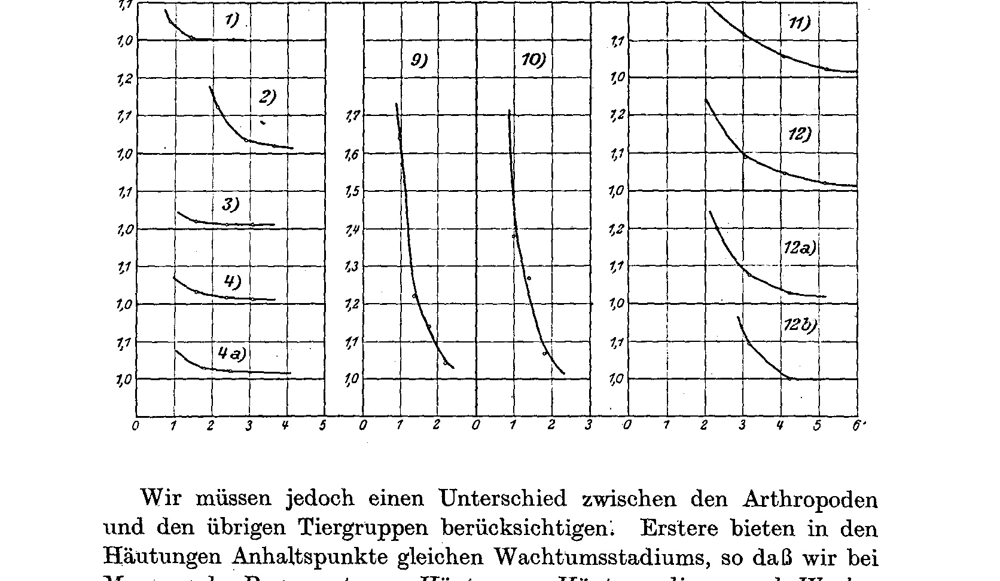
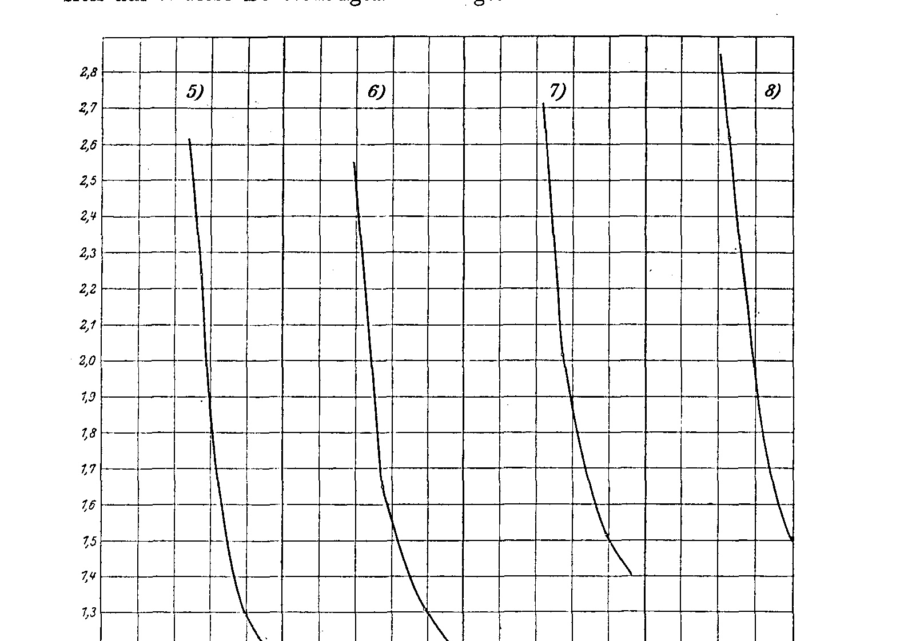
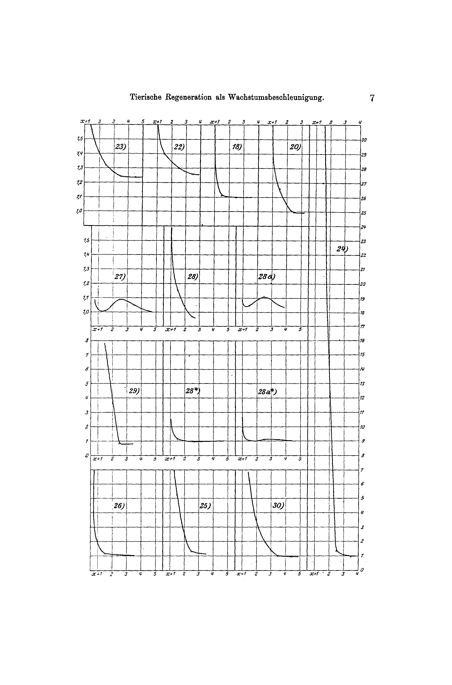
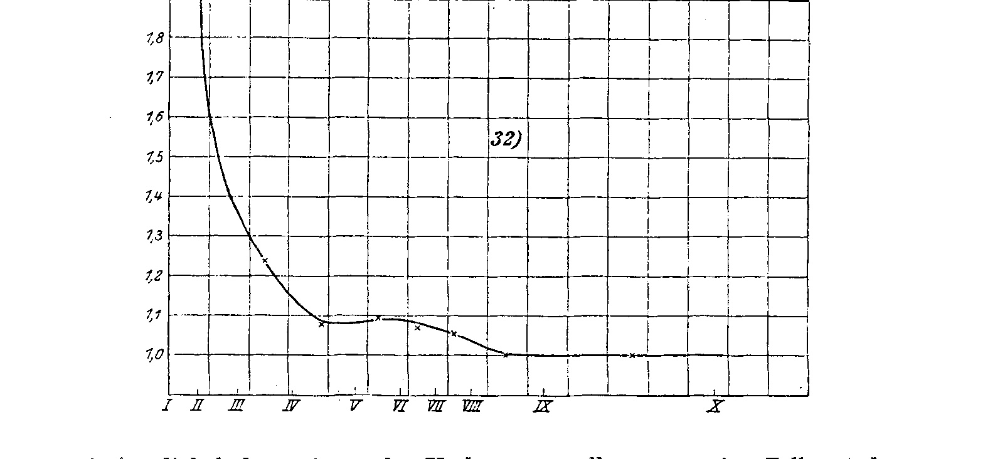
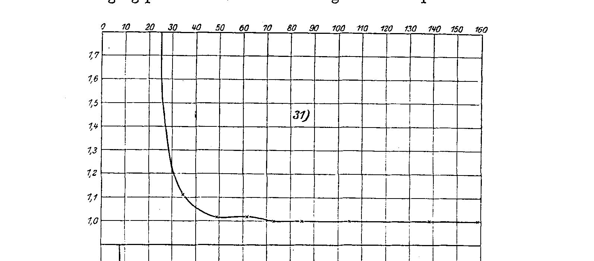
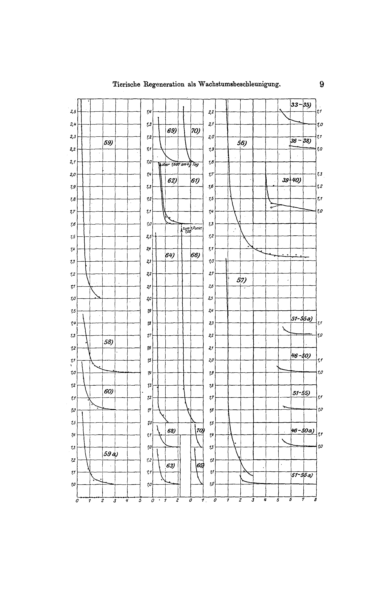

# Animal Regeneration as Growth-Acceleration.

By

**Hans Przibram.**

(From the Biological Experimental Institute of the Imperial Academy of Sciences in Vienna [Zoological Division]¹).)

With 55 curves in the text.

(Received on 23 July 1918.)

*Archiv für Entwicklungsmechanik der Organismen*, vol. 45 (1919).

> **Full translation.** A complete English rendering of Przibram's "Animal Regeneration as Growth-Acceleration", with the tables and figure legends.

> ¹ An abstract of this work appeared, with an identically worded title, as Communication No. 27 from the Biological Experimental Institute of the Imperial Academy of Sciences, Zoological Division, in the *Akademischer Anzeiger* No. 17, 1918.

### Table of Contents.

|  | Page |
|---|---|
| A. Comparison of the regeneration curves of different animal species | 1 |
| B. Summary of the results | 11 |
| C. Postscript (critique of J. Křiženecky's regeneration work) | 11 |
| D. List of literature | 14 |
| E. Tables (at the same time explanation of the curves) | 16 |

## A. Comparison of the regeneration curves of different animal species.

In all my pertinent writings I have, since 1896 (cf. List of literature 1909, as well as 1911), sought to establish the theory that the form of restitution most common in the animal kingdom does not rest upon the awakening of dormant reserve-germs, but upon an acceleration of the growth-replacement that is in any case continually proceeding. Whereas in plants there frequently arise from a site, after injury, "adventitious formations" that are not confined to the formation of the lost part, in animals as a rule only that is re-formed which is necessary for the restoration of the morphological unit, i.e. the part situated distal to the site of loss. This actual "regeneration" comes to a halt, in its qualitative and quantitative development, precisely when the whole has thereby been restored in its normal proportions. The appearance of a teleological special law-likeness finds, however, in my view a satisfying resolution if we regard the living organism as a state of equilibrium which, after a disturbance, automatically experiences an acceleration in the direction of the loss, because precisely through the loss a greater gradient sets in within the material and energy streams than corresponds to the normal life-stream. In a treatise most recently presented (1915)

on the length of regenerating and normal walking-legs of praying mantises, it was shown, by an example experimentally treated by myself, that the course of the regeneration curve actually agrees with the running-off of a material or energy quantity in the case of a suddenly arisen "gradient" from a higher to a lower level, with respect to the relative velocities in the successive times of the process.

The chief points of comparison lie, besides in the acceleration in general, in the greater velocity at the beginning of the process, decreasing more and more toward its end, and in the differences of these velocities likewise decreasing more and more toward its end.

To demonstrate the validity of the rules ascertained on one object for the regeneration of other forms had been reserved for a later communication, and is precisely the purpose of the present work.

From the whole of the literature accessible to me, all the quantitative data relating to the regeneration of animals were collected, and tables for the course of the regeneration-velocity of the different animal species and animal parts were drawn up according to that pattern which the experiments on praying mantises had furnished.

Usable data were found in the following experiments:

| Animal species | | Author | Year | Page |
|---|---|---|---|---|
| **A. Coelenterata** ¹) | | | | |
| a) *Cassiopea xamachana* | 1) Disc-umbrella | Stockard | 1907 | 67 |
| | 2) 1–7 tentacles | " | 1907 | 88 |
| | 3) 5 tentacles | " | 1910 | 29 |
| | 4) 5 tentacles and part of the umbrella margin | " | 1910 | 29 |
| **B. Echinodermata** | | | | |
| b) *Ophyoglypha lacertosa* | 5) 1 arm in regeneration | Zeleny | 1905 | 9 |
| | 6) 2 arms in " | " | " | " |
| | 7) 3 " " " | " | " | " |
| | 8) 4 " " " | " | " | " |
| **C. Vermes** | | | | |
| c) *Podarke obscura* | 9) 2/3 of the worm removed from the rear | Morgulis | 1909 | 604 |
| | 10) 1/3 of the worm removed from the rear | " | " | 606 |
| **D. Arthropoda** | | | | |
| d) *Homarus americanus* | 11) Claws | Emmel | 1904 | 95, 112 |
| | 12) Legs | " | " | " |
| | 13) Abnormal claws | " | 1907 | 113 |
| | 14) Abnormal leg | " | " | 114 |

> ¹ The data on tentacle-lengths in regeneration from different distances of the oral end in *Harenactis attenuata*, a sea-anemone, (Child 1909) are too imprecise for a quantitative representation of the course of regeneration.

| Animal species | | Author | Year | Page |
|---|---|---|---|---|
| e) *Cambarus propinquus* | 15) One claw | Zeleny | 1905 | 352, 353 |
| | 16) Both claws | " | " | 354, 355 |
| f) *Alpheus dentipes* | 17) Pincer-claw | " | " | 92 |
| g) *A. laevimanus* | 18) " | Przibram | 1907 | 319 |
| h) *Typton spongicola* | 19) Snapping-claw (also both claws) | " | " | 320 |
| i) *Calianassa subterranea* | 20) Snapping-claw (also both claws) | " | " | 327, 326–328 |
| j) *Platycarcinus pagurus* | 21) Both claws | " | " | 334 |
| k) *Portunus corrugatus* | 22) Snapping-claw | " | " | " |
| l) *Carcinus maenas* | 23) " | " | " | 332 |
| m) *Gelasimus pugnax* | 24) ♂ Snapping-claw — total extirpation | " | (1915 resp.) 1917 | 58–62 |
| | 25) ♂ Snapping-claw — autotomy | " | " | " |
| | 26) ♂ both claws autotomy | " | " | " |
| | 27) ♂ pincer-claw — autotomy | " | " | " |
| | 28) ♂ snapping-claw — extirpation and pincer-claw — autotomy | " | " | " |
| | 29) ♀ claw — extirpation | " | " | " |
| | 30) ♀ claw — autotomy | " | " | " |
| n) *Sphodromantis bioculata* | 31) Middle leg | " | " | 14 |
| | 32) Hind leg | " | " | " |
| **E. Vertebrata** | | | | |
| o) *Fundulus majalis* | 33) Tail fin, cut off basally | Morgan | 1906 | 477 |
| | 34) " distal " | " | " | " |
| | 35) " oblique " | " | " | " |
| p) *Fundulus heteroclitus* | 36) " basal " | " | " | 479, 480 |
| | 37) " distal " | " | " | 480 |
| | 38) " in the middle " | " | " | " |
| q) *Carassius auratus* | 39) " basal " | " | " | 484 |
| | 40) " terminal " | " | " | " |
| r) *Diemyctylus (viridescens?)* | 41) Tail, cut off basally | " | " | 461 |
| | 42) " distal " | " | " | " |
| | 43) " basal, strongly fed | " | " | " |
| | 44) " cut off basally, not fed | " | " | " |
| | 45) " cut off distally, strongly fed | " | " | " |
| Animal species | | Author | Year | Page |
|---|---|---|---|---|
| *Diemyctylus viridescens* | 46) left foreleg and 1/3 tail | Stockard | 1910 | 18 |
| | 47) do. in MgCl₂ | " | " | " |
| | 48) " " CaCl₂ | " | " | " |
| | 49) " " KCl | " | " | " |
| | 50) " " MgCl₂+CaCl₂ | " | " | " |
| | 51) r. foreleg and, for the second time, 1/3 tail | " | " | 21 |
| | 52) do. in KCl (formerly MgCl₂) | " | " | " |
| | 53) " " " ( " CaCl₂) | " | " | " |
| | 54) " " CaCl₂ ( " MgCl₂) | " | " | " |
| | 55) " " MgCl₂ (formerly MgCl₂ + CaCl₂) | " | " | " |
| s) *Triton cristatus* | 56) Tail; fed | Morgulis | 1912 | 653–655 |
| | 57) " starving | " | " | 658–660 |
| t) *Rana clamitans* | 58) Tadpole-tail, 15.1 mm removed | Durban | 1909 | 402 |
| | 59) " 14.8 " " | " | " | 405, 406 |
| | 60) " 11.5 " " | " | " | 405 |
| | 61) " 14.8 " " | Ellis | " | 452 |
| | 62) " 10.4 " " | " | " | 451 |
| | 63) " 10.2 " " | " | " | 455 |
| | 64) " 9.9 " " | " | " | 454 |
| | 65) " 5.6 " " | " | " | 453 |
| | 66) " 5.3 " " | " | " | 454 |
| | 67) " 5.2 " " | " | " | 450 |
| | 68) " 5.1 " " | " | " | 455 |
| | 69) " 3.2 " " | " | " | 449 |
| | 70) " 2.6 " " | " | " | 453 |

The tables record 20 animal species with 70 different experimental series, whereby I have not separately enumerated otherwise identical experimental series which concerned only other specimens. Of the larger animal groups I could not find data on Protozoa, Mollusks and Tunicates that related to the quantitative course of regeneration: the Protozoa are, on account of their small size as well as the rapidity of their change of form, little suited to such experiments; in the Mollusks the lack of sharp segmentation would in most cases likewise be an obstacle to an exact measurement; and in the Tunicates there is added besides their capacity of letting whole formations arise from themselves again in a way other than by the re-growth of the lost part, in which they, just like the polyps, recall the plants. Since therefore no especially important supplements for our question were to be expected from drawing in these circles, we may regard the data hitherto available as the most suitable for deriving from them a confirmation or refutation of our thesis.

If we now go through the figures of our tables, we find, with few exceptions — which, as we shall demonstrate, precisely confirm the rule — a repetition of the course ascertained in the praying mantis, insofar as enough figures are available in an experimental series to be able to construct a curve from them. I have in fact drawn a number of these curves, and from the character of the same one can most quickly form a picture of their agreement with, or deviation from, the curves of the course of regeneration in the legs of *Sphodromantis*.

**Figs. 1)–12b).** [Series of regeneration curves, arranged in a grid; panels labelled 1), 2), 3), 4), 4a) in the left column, 9), 10) in the middle, and 11), 12), 12a), 12b) in the right column. Each panel shows the regeneration-velocity values on the vertical axis and successive intervals on the horizontal axis.]  *(figure not reproduced)*

We must, however, take into account a difference between the Arthropoda and the remaining animal groups. The former offer, in the moults, reference-points of equal growth-stage, so that in measuring the regenerates from moult to moult we do not have especially to take into account the normal growth-increase, since its increment-quotient from moult to moult remains the same (as a rule = ⁴√2 = 1.26). Matters stand otherwise with the other animal groups: here conspicuous moult-stages are not the rule, and we must therefore call to our aid other criteria for the assessment of equal normal growth-increase. Over small stretches of the growth-path, the taking into account of equal times will, even at the present state of our knowledge of growth, yield the most reliable approximation, although we know that the entire growth-curve possesses not a steady but an S-shaped curved course. For the time being I therefore had to content myself with converting the regeneration-increases given by the authors for other animals as Arthropoda to equal times, in order to obtain comparable curves at all. As a matter of course we can also convert the Arthropod data to equal times; the curve obtained in this way for the middle leg of *Sphodromantis* (No. 31) lets it be recognized that the character of the curve has not changed through this manner of representation.

**Figs. 5)–8).** [Regeneration curves arranged in a grid, the panels labelled 5) through 8), vertical axis showing regeneration-velocity values from about 1.0 to about 2.4, horizontal axis showing successive intervals.]  *(figure not reproduced)*

Our curves begin with high values, which fall off steeply, then bend over quite abruptly, and now tend to approach a horizontal more and more and ever more gradually. It will not be superfluous to recall that by regeneration-velocity I do not wish to understand the absolute increase in size of the regenerate from moult to moult or during an equal time, but the quotient of the later size divided by the earlier. It is solely to this that it is to be attributed that my representation of the course of regeneration **Figs. 11)–31).** [A large grid of regeneration curves; the panels labelled 21), 22), 18), 20), 24), 27), 28), 28a), 23), 23*), 28a*), 26), 31), 30) and further series numbers. The horizontal axis of each panel is marked with the moult-intervals x+1, 2, 3, 4, 5, etc., the vertical axis showing the regeneration-velocity values.]  *(figure not reproduced)*

> Note: The translation continues onto page 8, beyond the assigned range. The paragraph beginning at the foot of page 6/7 ("It is solely to this that it is to be attributed that my representation of the course of regeneration …") completes on page 8 as: "… deviates from that of earlier authors, who (cf. e.g. Durban) give first a small regeneration-velocity, then a rapid rise to the culmination point, finally an almost horizontal course. I believe that my new conception corresponds much better to the character of living growth, in which indeed every newly formed part itself again becomes the starting-point of further development and mass-production." — *Page 8 lies outside the assigned pages (1–7) and is included here only to close the running paragraph; it should be translated in full by the owner of page 8.* […continuation from p.7:] …which differs from earlier authors, who (cf. e.g. Durban) at first indicate a slight regeneration-velocity, then a rapid rise toward the culmination-point, and finally an almost horizontal course. I believe that my new conception corresponds much better to the character of living growth, in which indeed every newly-formed part itself again becomes the starting-point of further development and mass-production.

**31)** *(curve; figure not reproduced)*

**32)** *(curve; figure not reproduced)*

Initially, at the site of injury, we have only few cells (or other parts) that cooperate in the growth-current; therefore the produced mass, in spite of a great regeneration-velocity, is in absolute terms smaller than later, when many cells (or other parts), at a lesser regeneration-velocity, will be capable of bringing forth absolutely more. Since the cells (or parts) that initially produce the regenerate will lie below the limit of measurability, I have set the size 0 as the starting-point of the regenerate, which indeed formally coincides with the size of the regenerate at the loss of the body-part¹⁾ *(Page 9 is a plate of regeneration-curves, bearing only the running header "Tierische Regeneration als Wachstumsbeschleunigung — 9" and the curve-numbers; no body text.)* …coincides, but actually requires a correction which at present lies outside the range of our knowledge. As a consequence of this substitution, the first quotient of the regeneration-velocity then always becomes infinite (since every finite number divided by zero gives infinity), which value of course requires a considerable correction, but in any case corresponds to a number very much larger in relation to the next quotient. Several authors were evidently not satisfied with the appearance of a period of slight regeneration-velocity at the beginning of the process, and have sought to explain this by a shock-effect or by injury to the cells at the wound-site; the necessity for such explanations falls away on the assumption of my conception, although I myself will emphasize that in some cases a retardation of growth at the beginning of the restitution-processes can in fact occur. I have observed this in the case of especially deep-going operations, namely the extirpation of the legs of *Sphodromantis*, and have sought to account for it by the necessity of a regrouping that precedes the actual regeneration-processes (1906). This restitution-process, however, is properly no longer pure regeneration, but morpholaxis, in which even more distant parts are drawn into the establishment of a new state of equilibrium.

Very instructive now are the exceptions which I had to ascertain in the merely sketched quantitative regeneration-courses in the experiments on the claws of the fiddler-crab, *Gelasimus*. The male of this crab-species possesses one large and one small claw. If the large claw alone is removed by autotomy (Nos. 25, 26) or even totally extirpated (No. 24, 3 Ex.), then the regeneration-curve follows the normal course. If, on the other hand, the small claw alone is autotomized, or the large one is removed at the same time, then a rise of the regeneration-velocity in the middle of the regeneration-process of the small claw is observed (Abb. 27; 6 Ex.). For at the beginning of the process the large claw lays claim to the most material for itself. The following cases speak for the correctness of this interpretation. First, after total extirpation of the large claw it once came to a rise of the regeneration-velocity in the middle of the process, and in this same case a normal curve-course was present for the small claw regenerating simultaneously after autotomy (No. 28). Second, the claw regenerating after autotomy of the female fiddler-crab, which possesses two equal small claws, likewise shows a normal course (Abb. 29). The initially lesser regeneration-velocity in the small claws is thus found only in correlation with a large claw of the opposite side growing at greater velocity.

### B. Zusammenfassung der Ergebnisse [Summary of the Results].

1. If the increase-quotients are calculated from the regenerates in the successive time- (or moulting-) periods, then it is shown that, even where the periods drag out, a later accelerating tempo of this regeneration-velocity makes its appearance.

2. Since the calculations of similarly quantitatively usable experiments by various authors extend over 20 animals in 70 series of experiments, we must regard the result as one valid in general for animal regeneration.

3. Therewith one regards animal regeneration as accelerating growth and not, as has been done hitherto, as energy-currents suddenly setting in upon a heightening of the gradient.

### C. Nachschrift [Postscript].

#### (Kritik an Křiženecký's Regenerationsarbeit [Critique of Křiženecký's Regeneration-work].)

After the conclusion of my work there appeared an "Attempt at a statistical-graphical investigation and analysis of the temporal properties of the regeneration-processes" by J. Křiženecký in the Archiv für Entwicklungsmechanik (XLII, 1917, S. 622).

The author had therein set himself the goal of taking up my theory of regeneration as accelerated growth and arriving, through experiments on the meal-beetle, *Tenebrio molitor*, at similar curves and results, such as I had reached through experiments on crabs (1908) and praying-mantises (1915, 1917).

This new confirmation of the theory I greeted joyfully, and should like to take the suitable opportunity to add a few words for the appreciation of the *Tenebrio*-experiments.

As Křiženecký himself adduces (S. 628): "*Tenebrio molitor* is not the fitting object for such investigations, since here too the dimensions of the feet in the pupa, especially of the regenerated ones, are too small, which naturally holds in still higher measure of their individual components. Suitable would have been e.g. *Odonata*, *Mantidae*, etc."

While I, in the mantids just as earlier in the crabs, could measure the course of the regeneration-curve directly on the same individual, Křiženecký made use of an indirect method, which was conditioned precisely by the all-too-slight size of the regenerating legs of the meal-beetle larvae. "He cut larvae of various ages (S. 626) "the leg¹⁾ off close to the body" and had "the regenerate…

> ¹⁾ It should read "leg" [Bein], since according to the figure on S. 628 and according to other text-passages the femur, tibia, and tarsus were cut off.

…first, once the larvae had transformed into the pupa, measured and compared with the normal foot of the same, and therewith determined the regeneration-quotient, "whereby the time which has elapsed between the operation and the pupation of the operated larvae is regarded as the so-called 'regeneration-time'." The said investigator thus, in order to obtain the regeneration-curve, compares larvae of various ages. Now, however, older larvae, on account of their more advanced age, will show larger regeneration-quotients (according to Křiženecký's terminology, normal-size divided by regenerate-size used) than younger ones (cf. the calculations on the praying-mantises, 1917). If one plots the magnitude of the regeneration-coefficient on the *y*-axis — which according to my terminology gives the reciprocal of regenerate divided by starting-size — and the regeneration-time on the *x*-axis of a rectangular coordinate-system, then, by Křiženecký's procedure, the values (*y*) for the oldest larvae, which thus have passed through the shortest regeneration-time (*x*), must be too large in comparison with the younger larvae, to which the longer regeneration-times correspond. From this it is explained that Křiženecký (S. 634, Anm.) tried in vain to calculate "these curves according to the asymptotic equation of the hyperbola (for our case: *x · y* = Konst.)." "The value *x · y* never yielded a constant, but rather decreased steadily with increasing *x*."

Křiženecký, on the basis of his data, ascribes to the hind leg of the mealworm a greater regeneration-velocity than to the middle one. He relies in this chiefly on the curve-course of his Taf. XXXVII. Whether essential significance attaches to the slight differences, given the shakiness and the strong scatter of the curve-points, would first have to be shown by richer material. In my praying-mantises an analogous difference of the corresponding regeneration-quotients for hind and middle leg, under analogous treatment of the figures, is not to be recognized, inasmuch as the horizontal of both legs, given a sufficiently long regeneration-duration, is always reached or even at times undercut.

The table¹⁾ given by me (1917, S. 18) would, according to Křiženecký's…

> ¹⁾ In this table E there are, by the way, two printing-errors: at the head of column e it should read: quotient from column c by d (not the reverse as given there). In place of 4*aβ* it should read 8*aβ*. Further printing-errors in the same work may find correction on this occasion: in the table A facing page 14, it should read, for the specimens 1*eβ*, 4*aα*, 4*sβ*, 4*b*, 4*d*, hind leg left (instead of right), and for the five last-named also fore leg right (instead of left), as follows from the original regeneration-protocols of these animals (published 1909, S. 624, Tab. VI). On page 19, moulting VIII of specimen 4*hα* took place on the 18th of May (not on the 8th, which is to be recognized as incorrect already because the earlier moulting would then have taken place on the 7th of May, i.e. the day before).

…manner of calculation reworked, would read as follows (column e would be Křiženecký's "regeneration-quotient" d):

| a) | b) Hinterbein [hind leg] — verloren [lost] | b) gemessen [measured] | c) Regenerat 1/100 mm | d) normale Größe der Gegenseite [normal size of the opposite side] | e) d : c | f) Durchschn. spezifischen Regenerat.-Zuwachses [average specific regenerate-increment] |
|---|---|---|---|---|---|---|
| 1*eβ* | in IX. Htg. | nach XI. Htg. (Imago) | 1740 | 2435 | 1,382 | 0,727 |
| 4k | nach VII. » | » X. » » | 1710 | 2105 | 1,407 | 0,882 |
| 4e | » IV. » | » X. » » | 1880 | 2075 | 1,104 | 1,12 |
| 4*ma* | vor IV. » | » XI. » » | 2390 | 2390 | 1,000 |  |
| 3*ga* | nach III. » | an IX. » —*) | 1430 | 1550 | 1,084 |  |
| 4*mγ* | » » » | » XI. » —*) | 2155 | 2170 | 1,007 | 1,145 |
| 3*gβ* | » II. » | nach X. » (Imago) | 2065 | 2080 | 1,008 |  |
| 4*hα* | in II. » | an X. » —*) | 2120 | 2050 | 0,967 | 1,23 |
| | | **Mittelbein** [middle leg] | | | | |
| 4*iα* | in V. Htg. | nach X. Htg. (Imago) | 1395 | 1395 | 1,000 | 0,893 |
| 8*aβ* | » III. » | an X. » (+vor XI.)*) | 1170 | 1160 | 0,992 |  |
| 4*hε* | vor III. » | » X. » —*) | 1610 | 1500 | 0,932 |  |
| 4*hγ* | » III. » | nach X. » (Imago) | 1860 | 1795 | 0,965 | 0,945 |
| 4*hβ* | » III. » | » IX. » » | 1670 | 1670 | 1,000 |  |

> *) Not at the imago, but at the cast-off last skin measured.

If, however, one starts from the size of the opposite side at the time of leg-loss, and calculates by division of the regenerate-size attained after two moults by that size the "specific regeneration-velocity," then the values repeated in column f from my earlier table show that the regenerates of the hind legs have increased more rapidly, relative to the earlier leg-size, as against the middle legs autotomized at similar developmental stages — which thus supports Křiženecký's finding.

[Finally I should like to concede to Křiženecký to this extent, that the curve drawn in my "Anwendung elementarer Mathematik" [Application of Elementary Mathematics] (S. 38) would, formally, be better drawn without cutting the *y*-axis, as I, in the works that have appeared since, have designated the first regeneration-quotient by ∞ and accordingly let the curve-branch begin parallel to the *y*-axis. In reality, however, this velocity is not infinite, since the regenerate after all does not start from a null-size but from cells of finite size, whose vanishingly small values for the present elude our calculation and therefore cannot be taken into account.] Since the hind leg in the meal-beetle and praying-mantis is longer than the middle leg, the more rapid regeneration of the former can, in the sense of the discussion given by me (1915–17), be regarded as a consequence of the greater distance of the injury-site from the end-point of the normally growing limbs, hence of the more severe injury and the greater form-potential-gradient. Possibly there is present here a result such as Křiženecký (S. 629–630) wished to obtain by the intentional removal of two legs, whereby, however, the strong loss of blood appears to have hindered the more rapid regeneration after these more severe injuries.

In contrast to our results, v. Ubisch claims to have observed a decreasing regeneration-velocity from the first to the last leg-pair in mayflies. But since his experimental animals were at various developmental stages, since they measured 3.4 to 7.5 mm, only one moulting-interval was observed, and the original data are not given, but only averages of percentage-figures of the normal left fore leg, it cannot be judged whether his values have any significance. In order to bring about agreement with Child's idea of the better regeneration of more oval pieces, v. Ubisch reduced the regenerate-lengths of the 3 leg-pairs to specific regenerate-increments by division with the normal growth-length of the leg-pair concerned — which Child, however, did not do, and could not do, with his sea-anemones.

### D. Literaturverzeichnis [Bibliography].

**Child, C. M.,** Factors of form regulation in *Harenactis attenuata*. I. Journal of Experimental Zoology. VI. 471. **1909.**

**Durban, Marion L.,** An Analysis of the Rate of Regeneration throughout the Regenerative Process. Journal of Experimental Zoology. VII. 397. **1909.**

**Ellis, M. M.,** The Relation of the amount of Tail regenerated to the amount of amount removed in Tadpoles of *Rana clamitans*. Journal of Experimental Zoology. VII. 421. **1909.**

**Emmel, V.,** The Regeneration of lost parts in the Lobster (Preliminary Report). XXXV. Report of the Commissioners of Inland Fisheries of Rhode Island. **1904.**

— Regenerated and Abnormal Appendages in the Lobster. (No. 31.) XXXVII. Report of the Commissioners of Inland Fisheries of Rhode Island. **1907.**

**Křiženecký, J.,** Ein Versuch zur statistisch-graphischen Untersuchung und Analyse der zeitlichen Eigenschaften der Regenerationsvorgänge. Arch. f. Entw.-Mech. XLII. 621. **1917.**

**Morgan, T. H.,** The Physiology of Regeneration. Journal of Experimental Zoology. III. 457. **1906.**

**Morgulis, S.,** Contributions of the Physiology of Regeneration. I. Experiments on *Podarke obscura*. Journal of Experimental Zoology. VII. 595. **1909.**

— Studien über Inanition in ihrer Bedeutung für das Wachstumsproblem. II. Experimente an *Triton cristatus*. Arch. f. Entw.-Mech. XXXIV. 617. **1912.** **Przibram, Hans,** Aufzucht, Farbwechsel und Regeneration einer ägyptischen Gottesanbeterin, *Sphodromantis bioculata* Burm. Arch. f. Entw.-Mech. XX. 149. **1906.**

— Anwendung elementarer Mathematik auf biologische Probleme. Roux' Vorträge und Aufsätze über Entwicklungsmechanik. Heft 3. Leipzig. Engelmann. **1908.**

— Experimental-Zoologie. 2. Band: Regeneration. Wien und Leipzig. Deuticke. **1909.**

— Aufzucht, Farbwechsel und Regeneration. III. Arch. f. Entw.-Mech. XXVIII. 561. **1909.**

— Das innere Gleichgewicht der Lebewesen. 42. Bericht der Senckenbergischen naturforschenden Gesellschaft. Frankfurt a. Main. Heft 3. 129. **1911.**

— Wachstumsmessungen an *Sphodromantis bioculata*. III. Länge regenerierender und normaler Schreitbeine. Arch. f. Entw.-Mech. XLIII. 1. [Auszug im Sitzungsanzeiger. Akad. Wiss. Wien. XIII. 1915.] **1917.**

— Transitäre Sklerodermen der Wirbeltiere, *Gelasimus*. Arch. f. Entw.-Mech. XLIII. 47. [Auszug im Sitzungsanzeiger. Akad. Wiss. Wien. XXVI. 1915.] **1917.**

**Stockard, Ch. F.,** Studies on Tissue Growth. I. An Experimental Study of the Rate of Regeneration in *Cassiopea xamachana*. Carnegie Institution of Washington. Publication No. 103. 61. **1907.**

— Studies on Tissue Growth. III. The Rates of Regenerative Growth in different Salt Solutions. Arch. f. Entw.-Mech. XXIX. 15. **1910.**

— Studies on Tissue Growth. IV. The Influence of Regenerating Tissue on the Animal Body. Arch. f. Entw.-Mech. XXIX. 24. [Auch in: Carnegie Institution Publications. No. 132.] **1910.**

**Ubisch, Leopold v.,** Über den Einfluß der Gleichgewichtsstörungen auf die Regenerationsgeschwindigkeit (Versuche an *Cloëdiptera*). Arch. f. Entw.-Mech. XLI. 237. **1915.**

**Zeleny, Ch.,** Compensatory Regulation. Journal of Experimental Zoology. II. 1. **1905.**

— The Relation of the Degree of Injury to the Rate of Regeneration. Journal of Experimental Zoology. II. 347. **1905.**

— The Relation between Degree of Injury and Rate of Regeneration. Additional Observations and General Discussion. Journal of Experimental Zoology. VII. 313. **1909.** Przibram, Hans, *Aufzucht, Farbwechsel und Regeneration einer ägyptischen Gottesanbeterin, Sphodromantis bioculata* Burm. Arch. f. Entw.-Mech. XX. 149. **1906.**

— *Anwendung elementarer Mathematik auf biologische Probleme.* Roux's Vorträge und Aufsätze über Entwicklungsmechanik. Heft 3. Leipzig. Engelmann. **1908.**

— *Experimental-Zoologie. 2. Band: Regeneration.* Wien und Leipzig. Deuticke. **1909.**

— *Aufzucht, Farbwechsel und Regeneration. III.* Arch. f. Entw.-Mech. XXVIII. 561. **1909.**

— *Das innere Gleichgewicht der Lebewesen.* 42. Bericht der Senckenbergischen naturforschenden Gesellschaft. Frankfurt a. Main. Heft 2. 139. **1911.**

— *Wachstumsmessungen an Sphodromantis bioculata. III. Länge regenerierender und normaler Schreitbeine.* Arch. f. Entw.-Mech. XLIII. 1. [Auszug im Sitzungsanzeiger. Akad. Wiss. Wien. XIII. 1915.] **1917.**

— *Transitäre Scherenformen der Winkerkrabbe, Gelasimus.* Arch. f. Entw.-Mech. XLIII. 47. [Auszug im Sitzungsanzeiger. Akad. Wiss. Wien. XXVI. 1915.] **1917.**

Stockard, Ch. P., *Studies on Tissue Growth. I. An Experimental Study of the Rate of Regeneration in Cassiopea xamachana.* Carnegie Institution of Washington. Publication No. 103. 61. **1907.**

— *Studies on Tissue Growth. III. The Rates of Regenerative Growth in different Salt Solutions.* Arch. f. Entw.-Mech. XXIX. 15. **1910.**

— *Studies on Tissue Growth. IV. The Influence of Regenerating Tissue on the Animal Body.* Arch. f. Entw.-Mech. XXIX. 24. (Auch in: Carnegie Institution Publications No. 132.) **1910.**

Ubisch, Leopold v., *Über den Einfluß der Gleichgewichtsstörungen auf die Regenerationsgeschwindigkeit (Versuche an Cloëdiptera).* Arch. f. Entw.-Mech. XLI. 237. **1915.**

Zeleny, Ch., *Compensatory Regulation.* Journal of Experimental Zoology. II. 1. **1905.**

— *The Relation of the Degree of Injury to the Rate of Regeneration.* Journal of Experimental Zoology. II. 347. **1905.**

— *The Relation between Degree of Injury and Rate of Regeneration. Additional Observations and General Discussion.* Journal of Experimental Zoology. VII. 513. **1909.**

---

## E. Tabellen.

[The numbers of the curves refer to the numbers of these tables.]

### 1) *Cassiopea Xamachana.*

Disc-umbrella cut off all the way around (Tab. I. Exp. 1, 1a; the rest unsuitable on account of unfavourable growth.) Diameter before operation: 86.7 mm, of which 10 mm regeneration-time. Breadth of the regenerate:

Increase-quotient = regenerate-size later day *b* divided by earlier day *a*:

» calculated for an equal number of days *t* between later and earlier day

[according to the formula x = ᵗ√(b/a), since b = xᵗ · a and therefore xᵗ = b/a; the later *italic* numbers rest on the same calculation].

| Days: | 0 | 6 | 12 | 17 | 29 |
|---|---|---|---|---|---|
| mm | 0 | 3.3 | 4.5 | 4.7 | 5.0 |
| | | ∞ | 1.36 | 1.05 | 1.07 |
| | | | *1.053* | *1.010* | *1.006* |

### 2) Section 1 to 7 tentacles; average specific regenerate-lengths = absolute regenerate-length divided by disc-diameter. 16 specimens; 64 cut-off arms, where the average length of several arms of the same specimen is counted only as 1 specimen.

a) Calculation from the respective disc-diameter (Tab. 2).

| Days: | 0 | 20 | 26 | 38 | 41 |
|---|---|---|---|---|---|
| mm | 0 | 0.0433 | 0.0620 | 0.0919 | 0.1009 |
| | | ∞ | 1.432 | 1.497 | 1.098 |
| | | | *1.127* | *1.034* | *1.032* |

b) Calculation from the initial disc-diameter, as Stockard S. 87 Anm. 1 proposes.

| Days: | 0 | 20 | 26 | 38 | 41 |
|---|---|---|---|---|---|

### 3) A. Regeneration of 5 oral arms, 20 specimens.

| Days: | 0 | 12 | 20 | 28 | 34 |
|---|---|---|---|---|---|
| mm | 0 | 4.7 | 5.5 | 6.3 | 6.9 |
| | | ∞ | 1.17 | 1.14 | 1.10 |
| | | | *1.020* | *1.017* | *1.016* |

| Disc-diameter mm | 81.5 | 67.5 | 59.3 | 53.5 | 49.7 |
|---|---|---|---|---|---|
| Decrease-quotient: | | 0.8282 | 0.8785 | 0.7166 | 0.9290 |
| » divided by days: | | 0.8125 | 0.9838 | 0.9872 | 0.9878 |
| Arm-length divided by disc-diameter: | ? | 0.06963 | 0.09275 | 0.1178 | 0.1388 |
| | | | 1.332 | 1.270 | 1.179 |
| | | | *1.037* | *1.030* | *1.028* |

### 4) B. Regeneration of 5 oral arms and part of the umbrella-margin, 20 specimens.

| Days: | 0 | 12 | 20 | 28 | 34 |
|---|---|---|---|---|---|
| mm | 0 | 4.1 | 5.4 | 6.25 | 6.9 |
| | | ∞ | 1.32 | 1.16 | 1.10 |
| | | | *1.035* | *1.019* | *1.016* |

| Disc-diameter mm | 81.5 | 64.3 | 57.6 | 52.3 | 48.3 |
|---|---|---|---|---|---|
| Decrease-quotient: | | 0.7890 | 0.8958 | 0.9080 | 0.9235 |
| » divided by days: | | 0.8958 | 0.9863 | 0.9880 | 0.9868 |
| Arm-length divided by disc-diameter: | ? | 0.06376 | 0.09375 | 0.1195 | 0.1429 |
| | | | 1.470 | 1.275 | 1.195 |
| | | | *1.050* | *1.031* | *1.030* |

--- C. II. Series (page 30) operated as B, 14 specimens:

| Days: | 0 | 14 | 22 | 28 |
|---|---|---|---|---|
| mm | 0 | 4.1 | 5.2 | 6 |
| | | ∞ | 1.26 | 1.15 |
| | | | *1.029* | *1.024* |

| Disc-diameter: mm | 88 | 69 | 63 | 59 |
|---|---|---|---|---|
| Decrease-quotient: | | 0.7841 | 0.9130 | 0.9365 |
| » divided by days: | | 0.9828 | 0.9887 | 0.9891 |
| Arm-length divided by disc-diameter: | ? | 0.05942 | 0.08254 | 0.1017 |
| | | | 1.389 | 1.232 |
| | | | *1.042* | *1.035* |

### 5) *Ophyoglypha lacertosa.*

Series I: One arm in regeneration; 4 specimens (Nr. 3—6).

| Days: | 0 | 22 | 33 | 46 |
|---|---|---|---|---|
| mm | 0 | 1.05 | 2.35 | 3.02 |
| | | ∞ | 2.24 | 1.29 |

### 6) Series II: Two arms in regeneration, 4 specimens (Nr. 3, 6—8).

| Days: | 0 | 22 | 33 | 46 |
|---|---|---|---|---|
| mm | 0 | 1.49 | 2.45 | 3.21 |
| | | ∞ | 1.65 | 1.31 |

### 7) Series III: Two arms in regeneration, 6 specimens (Nr. 4—9).

| Days: | 0 | 22 | 33 | 46 |
|---|---|---|---|---|
| mm | 0 | 1.17 | 2.30 | 3.49 |
| | | ∞ | 2.02 | 1.52 |

### 8) Series IV: Four arms in regeneration, 8 specimens (Nr. 2—9).

| Days: | 0 | 22 | 33 | 46 |
|---|---|---|---|---|
| mm | 0 | 1.54 | 3.03 | 4.58 |
| | | ∞ | 2.62 | 1.51 |

### 9) *Podarke obscura.*

Tab. III. ²/₃ of the tail removed.

| Days: | 0 | 8 | 12 | 16 | 20 | 24 |
|---|---|---|---|---|---|---|
| mm | 0 | 0.42 | 0.69 | 0.84 | 0.96 | 1.00 |
| | | ∞ | 1.64 | 1.22 | 1.14 | 1.04 |

### 10) [The values marked with * are too large according to Morgulis.]

Tab. V. ¹/₃ of the tail removed.

| Days: | 0 | 8 | 12 | 16 | 20 | 24 | 28 | 32 |
|---|---|---|---|---|---|---|---|---|
| mm | 0 | 0.32 | 0.44 | 0.56 | 0.60 | 0.76* | 0.88* | — |
| | | ∞ | 1.38 | 1.27 | 1.07 | (1.26 | 1.16) | |

---

### 11—12) *Homarus americanus.*

Claws and other legs of the lobster. Total length. Regenerates. Days: [/] Moulting.

S. 95, Nr. 34. ♂ 7¹³/₁₆ inch. 3 autotomized legs, mm

[*At Emmel a misprint, cf. ditto S. 113.]

| Days: | 0 | 18 | 26 | 35 | 47 | 57 | (56*) | Moulting |
|---|---|---|---|---|---|---|---|---|
| mm | 0 | 2.0 | 6.7 | 13.5 | 20.2 | — | 56.0 | |
| | | ∞ | 3.35 | 2.01 | 1.50 | | | |
| | | | *1.163* | *1.081* | *1.034* | | | |

Nr. 28. ♀ 6⁸/₁₆ inch. autot. cheliped.

[? = papilla below the measurement unit.]

| | 0 | ?<0.5 | 3.0 | 9.5 | 23.5 | 32 | 81.0 |
|---|---|---|---|---|---|---|---|
| | | ∞ | >6 | 3.16 | 2.42 | 1.36 | (58th day.) |
| | | | *>1.251* | *1.136* | *1.076* | *1.031* | |

dasselbe [the same] 2 autotomized legs

| | 0 | 2.75 | 6.75 | 13.25 | 21.00 | 24.25 | 57.0 |
|---|---|---|---|---|---|---|---|
| | | ∞ | 2.46 | 1.96 | 1.59 | 1.15 | (58th day.) |
| | | | *1.119* | *1.078* | *1.039* | *1.014* | |

Nr. 30. ♂ 7¹⁵/₁₆ inch. autot. cheliped.

[*At Emmel misprint 87.5, cf. ditto S. 113.]

| | 0 | 1.5 | 4.0 | 8.0 | 15.5 | 26.5 | 97.0* |
|---|---|---|---|---|---|---|---|
| | | ∞ | 2.67 | 2.00 | 1.94 | 1.71 | (88th day.) |
| | | | *1.131* | *1.077* | *1.057* | *1.055* | |

dasselbe [the same] 2 autotomized legs

| | 0 | ?<0.5 | 2.5 | 5.75 | 12.25 | 21 | 83.75 |
|---|---|---|---|---|---|---|---|
| | | ∞ | >5 | 2.10 | 2.12 | 1.71 | (88th day.) |
| | | | *>1.223* | *1.086* | *1.065* | *1.055* | |

S. 112, Nr. 34. ♂ 7¹³/₁₆ inch. autot. both chelipeds.

| | 0 | 3 | 7.25 | 19 | 27.55 | 30.25 | 97.0 |
|---|---|---|---|---|---|---|---|
| | | ∞ | 2.42 | 2.62 | 1.45 | 1.10 | (56th day.) |
| | | | *1.117* | *1.113* | *1.031* | *1.014* | |

dasselbe [the same] 2 autotomized legs

| | 0 | 2.25 | 7.5 | 15.25 | 20.75 | 22 | 54.5 |
|---|---|---|---|---|---|---|---|
| | | ∞ | 3.37 | 2.03 | 1.36 | 1.06 | (56th day.) |
| | | | *1.171* | *1.082* | *1.026* | *1.008* | |

Nr. 44. ♂ ⁸/₁₆ inch. autot. both chelipeds.

| | 0 | ? | 3 | 8 | 17.75 | 26.5 | (103rd day, not yet.) |
|---|---|---|---|---|---|---|---|
| | | | | 2.67 | 2.22 | 1.49 | |
| | | | | *1.115* | *1.069* | *1.016* | |

dasselbe [the same] 2 autotomized legs

| | 0 | ?<0.5 | 3 | 8.25 | 17 | 23.5 | » |
|---|---|---|---|---|---|---|---|
| | | ∞ | >6 | 2.75 | 2.06 | 1.38 | |
| | | | *1.251* | *1.119* | *1.062* | *1.015* | |

Right-hand column (egg-onset series):

From egg onward: V. VI. VII. VIII. Htg. [moult]

Date: 24./7. 5./8. 19./8. 27./8.

S. 102. Nr. 10.

| norm. left cheliped mm | 12 | 15 | 18 |
|---|---|---|---|
| | | 1.25 | 1.20 |

Reg. r. Ch. (25./7.)

| mm | 0 | 10 | 13.5 | 18 |
|---|---|---|---|---|
| | | ∞ | 1.35 | 1.33 |

[Not stated which cheliped develops into the snapping-claw [Knackschere], nor in the following.]

S. 104. From moult to moult, right cheliped autotomized.

| Nr. I. left normal. mm | 18 | 21.5 | 26 |
|---|---|---|---|
| | | 1.19 | 1.21 |
| r. Regen. » | 14 | 17 | 15 |
| | | 1.21 | 0.88 |
| II. l. normal » | 14 | 18 | |
| | | 1.28 | |
| r. Regen. » | 11 | 13 | |
| | | 1.18 | |
| III. l. normal » | 22 | 27 | |
| | | 1.23 | |
| r. Regen. » | 17 | 19 | |
| | | 1.12 | |
| IV. l. normal » | 16.5 | 19 | 23.5 |
| | | 1.15 | 1.24 |
| r. Regen. » | 13 | 14 | 17.5 |
| | | 1.08 | 1.25 |
| V. l. normal » | 17 | 23 | |
| | | 1.35 | |
| r. Regen. » | 15.5 | 17 | |
| | | 1.10 | |

---

| VI. l. normal » | 13.5 | 15.5 | 20 |
|---|---|---|---|
| | | 1.15 | 1.29 |
| r. Regen. » | ?0 | 13 | 15 |
| | | | 1.16 |

[The average for the growth-quotient of the normal left claw amounts to 1.232, that of the right regenerate 1.157; the lagging-behind of the regenerate has probably to do with the development of the claw-asymmetry.]

Continuation of the right-column row-labels (Homarus, S. 95):

Nr. 82. ♂ 7¹³/₁₆ inch. autot. both chelipeds. »

| | 0 | ? | 3.75 | 11.25 | 24.25 | 95.0 |
|---|---|---|---|---|---|---|
| | | | | 3.00 | 2.15 | (58th day.) |
| | | | | *1.130* | *1.066* | |

S. 95.

Nr. 100. ♀ 7 inch. 2nd r. leg previously autotomized. mm

| Days: | 0 | 20 | 26 | 38 | 48 | (78.) |
|---|---|---|---|---|---|---|
| mm | 0 | 4.5 | 9.5 | 12.5 | 15.5 | 60.0 |
| | | ∞ | 2.11 | 1.32 | 1.24 | |
| | | | *1.133* | *1.023* | *1.024!* | |

dasselbe [the same] 3rd right leg

| | 0 | 1.5* | 4.5 | 11.0 | 14.0 | 62.5 |
|---|---|---|---|---|---|---|
| | | ∞ | 3.00 | 2.44 | 1.27 | |
| | | | *1.201* | *1.077* | *1.027* | |

[*At Emmel a misprint 15 mm.]

dasselbe [the same] 1st r. swimmeret [Schwimmbein]

| | 0 | ? | <0.5 | 1.5 | 1.5 | 17.0 |
|---|---|---|---|---|---|---|
| | | | | >3 | 1 | |
| | | | | *1.096* | *1.000* | |

### 11) Cumulative treatment of the cited [Nr. 28, 30, 34, 44, 82] for the curves of claw-regeneration.

| Day after autotomy: | 0 | 22 | 30½ | 41 | 52 |
|---|---|---|---|---|---|
| 5 specimens with 8 measurements: | | *>1.154* | *1.116* | *1.058* | *1.024* |

### 12) Cumulative treatment of the same for [leg-]regeneration.

| Day after autotomy: | 0 | 22 | 30½ | 41 | 52 |
|---|---|---|---|---|---|
| 4 specimens with 9 measurements: | | *>1.186* | *1.090* | *1.048* | *1.023* |

### 13) Both pincer-claws [Zwickscheren] of an equal-clawed lobster (original claw-length 155 mm).

| Days: | 0 | 14 | 37 | 47 | 50 | 57 | 83 |
|---|---|---|---|---|---|---|---|
| Regenerates, average length: mm | ? | <1 | 13.5 | 18 | 21 | 25 | 129 |
| | | >13.5 | 1.33 | 1.17 | 1.19 | | |
| | | *1.120* | *1.029* | *1.054!* | *1.025* | | |

Total length of the specimen: » 217 (increase-quotient of the total length from moult to moult 1.05) 227 mm.

### 14) Abnormal walking-leg with bud (originally normal, 196 mm long).

| Days: | 0 | 23 | 34 | 45 | 46 | 74 |
|---|---|---|---|---|---|---|
| Regenerate-length: mm | 0 | 3 | 9 | 19 | 21 | 62 |
| | | ∞ | 3.00 | 2.11 | 1.11 | |
| | | | *1.105* | *1.070* | *1.110!* | |

Total length of the specimen: » 215 (increase-quotient of the total length from moult to moult 1.06) 207 mm.

---

### 15) *Cambarus propinquus.*

S. 352. Tab. I. Series A, Regeneration of the right claw alone. [*Thoracic lengths decreasing as a consequence of regeneration.] S. 353. Tab. II.

5 ♂♂ (Nr. 806, 797, 744, 736, 762).

| | Op. | 1. | 2. | 3. Htg. n. Op. [moult after op.] |
|---|---|---|---|---|
| Right claw regenerate mm | 0 | 5.81 | 6.48 | |
| | | ∞ | 1.115 | |
| Left » not operated » | 8.05 | 8.34 | 8.36 | |
| [Only 2 specimens: 744, 762.] | | 1.036 | | |
| Thorax » | 13.35 | 13.28 | 13.44 | |
| [likewise] | | 0.995* | 1.013 | |

### 16) S. 353. Tab. II.

2 ♀♀ (Nr. 785, 743).

| | Op. | 1. | 2. | 3. Htg. n. Op. |
|---|---|---|---|---|
| Right claw regenerate mm | 0 | 6.35 | 6.70 | |
| | | ∞ | 1.055 | |
| Left » not operated » | 8.00 | 8.70 | 9.00 | |
| | | 1.088 | 1.034 | |
| Thorax » | ? | 14.80 | 14.70 | |
| | | | 0.995* | |

1 ♀ (Nr. 786 moulted on the first day after operation.)

| | Op. | 1. | 2. | 3. Htg. n. Op. |
|---|---|---|---|---|
| Right claw regenerate mm | 0 .... 0 | 6.2 | 6.9 | |
| | | ∞ | 1.113 | |
| Left » not operated » | 8.8 | 9.2 | 9.2 | |
| | | 1.046 | 1.000 | |
| Thorax » | ? | 14.8 | 15.3 | |
| | | | 1.037 | |

### 16) [recte, second column] S. 354. Tab. III. Series B Regeneration of both claws (and 4 legs).

7 ♂♂ (Nr. 739, 803, 740, 764, 780, 752, 773).

| | 1. | 2. | 3. Htg. n. Op. |
|---|---|---|---|
| Right claw regenerate mm | 0 | 6.59 | 7.81 |
| | | ∞ | 1.186 |
| Left » » » | 0 | 6.39 | 7.76 |
| | | ∞ | 1.215 |
| Thorax » | ? | 14.76 | 15.17 |
| | | | 1.029 |

1 ♂ (Nr. 803 has completed three moults.)

| | 1. | 2. | 3. |
|---|---|---|---|
| Right claw regenerate mm | 0 | 5.6 | 6.6 | 6.9 |
| | | ∞ | 1.18 | 1.05 |
| Left » » » | 0 | 5.0 | 6.4 | 6.6 |
| | | ∞ | 1.28 | 1.03 |
| Thorax » | ? | 13.5 | 13.9 | 14.5 |
| | | | 1.03 | 1.05 |

### 17) S. 355. Tab. IV. (Nr. 734, 794, 747, 795, 787, 800, 772, 793, 779, 769, 731, 749, 763, 755, 757, 781, 771, 750.)

18 ♀♀

| | Op. | 1. | 2. | 3. Htg. n. Op. |
|---|---|---|---|---|
| Right claw regenerate mm | 0 | 6.19 | 7.36 | |
| | | ∞ | 1.190 | |
| Left » » » | 0 | 6.06 | 7.35 | |
| | | ∞ | 1.213 | |
| Thorax » | (15.53—16.53) | 15.92 | 16.00 | |
| (only 6 specimens | | 1.065 | 1.005 | |
| Nr. 721, 779, 731, 755, 771, 750.) | | | | |

1 ♀ Nr. 788 moulted on the 1st day after op.

| | Op. | 1. | 2. | 3. Htg. n. Op. |
|---|---|---|---|---|
| Right claw regenerate mm | 0 .... 0 | 5.5 | 6.4 | |
| | | ∞ | 1.163 | |
| Left » » » | 0 .... 0 | 5.8 | 6.4 | |
| | | ∞ | 1.103 | |
| Thorax » | ? | 14.2 | 14.7 | |
| | | | 1.037 | |

---

### 17) [recte] *Alpheus dentipes.*

S. 92. Tab. XIII. Regeneration of the pincer-claw [Zwickschere] after autotomy of the same. S. 92. Tab. XIV. in place of the autotomized snapping-claw [Knackschere].

2 specimens (Nr. 573, 576).

| | before Op. | 1. | 2. Htg. |
|---|---|---|---|
| Greatest propodite-length mm | (8.40) 0 | 5.05 | 6.30 |
| | | ∞ | 1.25 |

4 specimens (Nr. 561, 563, 575, 578) before Op.

| | 1. | 2. Htg. |
|---|---|---|
| Greatest propodite-length mm | (8.37) 0 | 5.60 | 6.32 |
| | | ∞ | 1.13 |

### 18) *Alpheus laevimanus.*

S. 93. Tab. XV. after bilateral claw-loss. 6 specimens (Nr. 566, 567, 574, 577, 583, 584).

| | before Op. | 1. | 2. Htg. |
|---|---|---|---|
| Greatest claw-length mm | (6.07) 0 | 4.53 | 5.08 |
| | | ∞ | 1.12 |

Specimen Nr. 7. Claw-regeneration.

| Z. r. nat. course Aut. before operation. | | 1. Htg. | 2. Htg. | 3. Htg. n. Op. |
|---|---|---|---|---|
| Day: | 25.II.06 | 8.IV. | 8.V. | 25.V.06. |
| Pincer-claw Reg. mm | 0 | 4.5 | 5 | 5.5 |
| a) | | ∞ | 1.11 | 1.10 |
| Propodite-l. Reg. of the same » | 0 | 2 | 2.5 | 3 |
| b) | | ∞ | 1.25 | 1.20 |
| Snapping-claw l. aut. » | (11) 0 | 0 | <1 | 3.5 |
| c) | | 0 | ∞ | >3.5 |
| Thoracic length » | 6 | 6.5 | 5.5 | 5 |
| d) | | 1.08 | 0.85 | 0.90 |

| | | |
|---|---|---|
| a : d | 1.30 | 1.22 |
| b : d | 1.47 | 1.33 |
| c : d | ∞ | >3.8 |

### 19) *Typton spongicola.*

Specimen Nr. 2. Claw-regeneration. Snapping-claw r. autotomy.

| | | Operation. | 1. Htg. | 2. Htg. n. Op. |
|---|---|---|---|---|
| Day: | | 20.II.06 | 31.III. | 13.V.06 |
| Snapping-claw Regen. mm | (24.5) 0 | <0.5 | 8 — | |
| | | ∞ | >16 | |
| Propodite-length » | (15.5) 0 | <0.5 | 5 | |
| | | ∞ | >10 | |
| Z. l. not removed, transformation to K. » | 9.5 | 9.5 | 9 | |
| | | 1.00 | 0.95 | |
| Propodite-l. of the same » | 7 | 8 | 8.5 | |
| | | 1.14 | 1.06 | |
| Thoracic length » | 9.5 | 9.5 | 9 | |
| | | 1.00 | 0.95 | |

Specimen Nr. 33.

| K. l. Aut. before Op. | | Operation. | 1. Htg. | 2. Htg. n. Op. |
|---|---|---|---|---|
| Day: | | 20.II.06 | 8.IV. | 1.V.06 |
| Snapping-claw length mm | 0 | <0.5 | 5.75 | |
| | | ∞ | >1.15 | |
| Z. r. aut. » | (12) 0 | <0.5 | 6.25 | |
| | | ∞ | >12.1 | |
| Thoracic length » | 6.75 | 6.75 | 6 | |
| | | 1.00 | 1.89 | |

Specimen Nr. 56.

| K. l. Aut. | | Operation. | 1. Htg. | 2. Htg. n. Op. |
|---|---|---|---|---|
| Day: | | 2.III.06 | 6.IV. | 24.IV.06 |
| Snapping-claw length mm | (21) 0 | 10 | 10.5 | |
| | | ∞ | 1.05 | |
| Z. r. Aut. after nerve-section. » | (12.75) 0 | <0.5 | 5.75 | |
| | | ∞ | >11.5 | |
| Thoracic length » | 7.75 | 7.5 | 7.25 | |
| | | 0.97 | 0.97 | |

---

*(End of the tables-section content beginning on pages 15–21; item 20) Calianassa subterranea begins on p. 22 and is not part of this chunk.)*

**Translation note (provenance):** The above renders every paragraph and table beginning on source pages 15–21 of Przibram (1919). Source pages 16–22 are printed in rotated landscape and arranged in two or three side-by-side sub-columns; I have transcribed each numbered entry in its printed order and reproduced all numeric values, including the infinity symbols (∞), the "?" entries ("? = papilla below the measurement unit"), the asterisked values, the exclamation-marked italic quotients (e.g. *1.024!*), and the bracketed editorial/footnote remarks exactly as printed. In this revision the four Homarus tables on p. 19 (Nr. 82, Nr. 100, the 3rd right leg, and the 1st right swimmeret) have been re-aligned to their correct row-labels per the source page; a spurious "4. Htg." column header on the Alpheus dentipes 2-specimen table (p. 21) and a spurious ">" prefix on one italic quotient (Nr. 44, second leg-table, p. 18) have been removed. Authoritative page images: `/Users/eranhorowitz/Documents/Claude/Projects/BVA/translations_full/_work/img/36_Przibram_1919_Regeneration-as-growth/p015.png`–`p022.png`.

### 20) *Calianassa subterranea.*¹

**S. 327. Nr. 42. Regeneration of the chela (Scherenregen.).**

| | | Op. | 1. | 2. | 3. Htg. |
|---|---|---|---|---|---|
| | | 11.XII.05 | 13.V.06 | 2.II.07 | |
| Right snapping-claw, autot. (Rechte Knackschere aut.) | mm | (31)0 | ·16· | 20 | |
| *ratio* | | ∞ | [1,15]² | 1,25 | |
| Left pincer-claw, not op., in transformation into snapping-claw (Linke Zwicksch., nicht op., in Umwandl. zur Knacksch.) | » | 20 | 8,2· | 2· | |
| *ratio* | | | 1,22 | 0,92 | |
| Thoracic length (Thorakallänge) | » | 12,5 | 12,5 | 13,5 | |
| *ratio* | | | 1,00 | 1,08 | |

> ¹ The genus name is printed "Calianassa" (with a single l) in the original.
> ² This sub-table is damaged in the original (ink blot) and carries a handwritten annotation ("1.15"); the printed value of the middle measurement and of the first ratio cannot be read with certainty.

**S. 327. Nr. 44.**

| | | 11.XII.05 | 11.IV.06 | 2.VIII.06 | 11.XI.06 |
|---|---|---|---|---|---|
| Left snapping-claw, autot. (Linke Knackschere, aut.) | mm | (45,5)0 | 19 | 22 | 21,75 |
| *ratio* | | ∞ | 1,16 | 0,96 | |
| Propodite length of same (Propoditenlänge ders.) | » | (19)0 | 5,75 | 6,5 | 6,5 |
| *ratio* | | ∞ | 1,13 | 1,00 | |
| R. pincer-claw not op., in transformation into snapping-claw (R. Zwicksch. nicht oper., in Umwandl. zur Knacksch.) | » | 25 | 25,5 | 31,5 | 30,75 |
| *ratio* | | 1,02 | 1,24 | 0,99 | |
| Propodite length of same (Propoditenlänge ders.) | » | 8,75 | 9 | 10 | 10 |
| *ratio* | | 1,03 | 1,11 | 1,00 | |
| Thoracic length (Thorakallänge) | » | 15 | 13,75 | 13,75 | 14,25 |
| *ratio* | | 0,91 | 1,00 | 1,04 | |

**S. 326. Nr. 11. Both claws reg. (Beide Scheren reg.)**

| | | Op. | 1. | 2. Htg. |
|---|---|---|---|---|
| | | 11.IV.05 | 30.V.05 | 30.VII.05 |
| Left snapping-claw, autot. (Linke Knackschere aut.) | mm | (35)0 | 18 | 18 |
| *ratio* | | ∞ | 1,00 | |
| Right pincer-claw (Rechte Zwickschere) | » | (26)0 | 18 | 22 |
| *ratio* | | ∞ | 1,22 | |
| Thoracic length (Thorakallänge) | » | 13 | 13 | 14 |
| *ratio* | | 1,00 | 1,08 | |

**S. 328. Nr. 53.**

| | | 11.XII.05 | 24.VI.06 | 10.IX.06 |
|---|---|---|---|---|
| Right snapping-claw autot. (Rechte Knackschere aut.) | mm | (31,5)0 | 19,75 | 23,5 |
| *ratio* | | ∞ | 1,19 | |
| Left pincer-claw (Linke Zwickschere) | » | (23)0 | 18 | 19 |
| *ratio* | | ∞ | 1,06 | |
| Thoracic length (Thorakallänge) | » | 15 | ? | 12,5 |
| *ratio* | | | (0,83) | |

### 21) *Platycarcinus pagurus.*

**Regeneration of both claws after autotomy, Nr. 6. (Regeneration beider Scheren nach Autotomie, Nr. 6.)**

| | | Op. 6.VIII.05. | 1. Htg: 13.X.05. | 2. Htg. 7.VI.06. |
|---|---|---|---|---|
| Right claw (was already a regenerate before the operation) (Rechte Schere [war bereits vor Operation Regenerat]) | mm | (13,5)0 | 10 | 11 |
| *ratio* | | ∞ | 1,10 | |
| Propodite length of same (Propoditlänge derselben) | » | (7,5)0 | 5,5 | 7 |
| *ratio* | | ∞ | 1,28 | |
| Left claw (before operation normal) (Linke Schere [vor Operation normal]) | » | (15)0 | 10 | 11 |
| *ratio* | | ∞ | 1,10 | |
| Propodite length of same (Propoditlänge derselben) | » | (7,75)0 | 5,5 | 7 |
| *ratio* | | ∞ | 1,28 | |
| Thoracic length (Thorakallänge) | » | 12,5 | 14 | 15,5 |
| *ratio* | | 1,12 | 1,11 | |

---

### 22) *Portunus corrugatus.*  [* Correction of a misprint, in place of 10.]¹

**Regeneration of the claw (Scherenregeneration), Nr. 10.**

| | | Op. | 1. | 2. Htg. |
|---|---|---|---|---|
| | | 31.VIII.05 | 16.IX | 10.X.05 |
| Right snapping-claw, autot. (R.Knsch.Aut.) | mm | (11,5)0 | 11,5 | 18,25 |
| *ratio* | | ∞ | 1,58 | |
| L.Z. not op., in transform. into K. (L.Z. nicht op., in Umw. zu K.) | » | 9,5 | 14 | 20,5 |
| *ratio* | | 1,47 | 1,47 | |
| Thoracic length (Thorakallänge) | » | 9,25 | 13 | 16,25 |
| *ratio* | | 1,40 | 1,25 | |

**Nr. 12.**

| | | Op. | 1. | 2. Htg. |
|---|---|---|---|---|
| | | 31.VIII.05 | 19.IX. | 23.X.05 |
| | mm | (13,5)0 | 14,5 | 20,5 |
| *ratio* | | ∞ | 1,42 | |
| | » | 13 | 18,5 | 24 |
| *ratio* | | 1,43 | 1,30 | |
| | » | 10,5 | 14,5 | 17,75 |
| *ratio* | | 1,38 | 1,23 | |

**Nr. 17.**

| | | Op. | 1. | 2. Htg. |
|---|---|---|---|---|
| | | 31.VIII.05 | 18.IX | 7.XI.05 |
| | mm | (12)0 | 11,75 | 14,5 |
| *ratio* | | ∞ | 1,24 | |
| | » | 10 | 14 | 16 |
| *ratio* | | 1,40 | 1,14 | |
| | » | 10 | 12 | 14,5 |
| *ratio* | | 1,20 | 1,21 | |

**Nr. 18.**

| | | Op. | 1. | 2. Htg. |
|---|---|---|---|---|
| | | 31.VIII.05 | 21.IX. | 20.X.05 |
| | mm | (13)0 | 11,5 | 16 |
| *ratio* | | ∞ | 1,40 | |
| | » | 11 | 15,5 | 20* |
| *ratio* | | 1,41 | 1,30 | |
| | » | 10 | 12,5 | 14,25 |
| *ratio* | | 1,25 | 1,14 | |

> ¹ The asterisk on "20*" (Nr. 18) refers to the editorial note printed beside the section heading: "[* Correction of a misprint, in place of 10.]" (* Korrektur eines Druckfehlers an Stelle von 10.)

### 23) *Carcinus maenas.*  [* Correction of a misprint, in place of VIII.]¹

**Regeneration of the claw (Scherenregeneration), Nr. 3.**

| | | Op. | 1. | 2. | 3. Htg. |
|---|---|---|---|---|---|
| | | 20.VII.05 | 3.VIII. | 29.VIII. | 23.X.05 |
| Right snapping-claw autot. (Rechte Knackschere aut.) | mm | (10,5)0 | 7,75 | 12,5 | 16,5 |
| *ratio* | | ∞ | 1,61 | 1,32 | |
| Left pincer-claw, not op., in transformation into snapping-claw (Linke Zwicksch. nicht oper., in Umwandlung zur Knacksch.) | » | 10,5 | 12,25 | 15 | 18 |
| *ratio* | | 1,17 | 1,23 | 1,20 | |
| Thoracic length (Thorakallänge) | » | 10 | 12,5 | 14,75 | 17,5 |
| *ratio* | | 1,25 | 1,18 | 1,12 | |

**Nr. 5.**

| | | Op. | 1. | 2. Htg. |
|---|---|---|---|---|
| | | 20.VII.05 | 24.VII.* | 14.VIII.05 |
| K.l. aut. before Op. (K. l. aut. vor Op.) | | (9)0 | 6 | 9 |
| *ratio* | | ∞ | 1,50 | |

**Nr. 6.**

| | | Op. | 1. | 2. Htg. |
|---|---|---|---|---|
| | | 20.VII.05 | 24.VII. | 14.VIII.05 |
| | | (10)0 | 6,5 | 11,5 |
| *ratio* | | ∞ | 1,76 | |

> ¹ The asterisk on the date "24.VII.*" (Nr. 5) refers to the editorial note printed beside the section heading: "[* Correction of a misprint, in place of VIII.]" (* Korrektur eines Druckfehlers an Stelle von VIII.)

**Nr. 10.**

| | | Op. | 1. | 2. Htg. |
|---|---|---|---|---|
| | | 20.VII.05 | 24.VII. | 17.VIII.05 |
| R.Knsch.Aut. | mm | (11,25)0 | 6,5 | 14 |
| *ratio* | | ∞ | 2,15 | |
| L.Z. not op., in transform. into K. (L.Z. nicht op., in Umw. zu K.) | » | 9 | 11,25 | 15 |
| *ratio* | | 1,25 | 1,33 | |
| Thoracic length (Thorakallänge) | » | 10,5 | 13,5 | 14 |
| *ratio* | | 1,29 | 1,04 | |

**Nr. 11.**

| | | Op. | 1. | 2. Htg. |
|---|---|---|---|---|
| | | 20.VII.05 | 11.VIII. | 5.IX.05 |
| | mm | (9,5)0 | 7,5 | 10,5 |
| *ratio* | | ∞ | 1,40 | |
| | » | 8 | 9,5 | 10,75 |
| *ratio* | | 1,19 | | |
| | » | 8,5 | — | [smudged]³ |
| *ratio* | | | — | |

**Nr. 15.**

| | | Op. | 1. | 2. Htg. |
|---|---|---|---|---|
| | | 20.VII.05 | 5.VIII. | 27.IX.05 |
| | | (10)0 | 10 | 11,75 |
| *ratio* | | ∞ | 1,17 | |
| | » | 9,5 | 10,75 | 13 |
| *ratio* | | 1,13 | 1,21 | |
| | » | 10 | 12 | 13,5 |
| *ratio* | | 1,20 | 1,13 | |

**Nr. 16.**

| | | Op. | 1. | 2. Htg. |
|---|---|---|---|---|
| | | 20.VII.05 | 26.VII. | 19.VIII.05 |
| | | (10,5)0 | 8,5 | 11,5 |
| *ratio* | | ∞ | 1,35 | |
| | » | 10,25 | 11,5 | 16 |
| *ratio* | | 1,12 | 1,39 | |
| | » | 10 | 12,5 | 15,5 |
| *ratio* | | 1,25 | 1,24 | |

> ³ Nr. 11, third row, 2. Htg.: the figure is smudged/illegible in the original; only the Op.-column value "8,5" is clearly readable.

---

### 24) *Gelasimus pugnax.*  Operation. 1. 3. 5. Häutung nach Op.

**Total extirpation of the right snapping-claw, ♂ Nr. 4 (normal pincer-claw left). (Totalexstirpation der Knackschere rechts ♂ Nr. 4 [normale Knackschere links].)**¹

| | | Op. 18.X.07 | 1. 7.VI.08 | 3. 22.… | 5. 16.VI.09 | | † 18.IX. |
|---|---|---|---|---|---|---|---|
| K.r. Reg. measured from autotomy site (K.r.Reg. von Aut.stelle an gem.) | mm: | (21)0 | <0,5 | 15 | 20 | | |
| *ratio* | | ∞ | >30 | 1,33 | | | |

**25) Autot. of right snapping-claw. Reg. (Aut. Ksch. r. Reg.)**

| | | | Op. 18.X.07 | 1. 12.VI.08 | 3. 29.V.09 | 5. 2.Op.*) 22.V.10 | 24.VIII.10 | *) Total extirpation K.r. |
|---|---|---|---|---|---|---|---|---|
| Nr. 6. ♂ | mm | (38)0 | 2,6 | 30,5 | 30.III.10 <0,5 | 7 | |
| *ratio* | | ∞ | 1,17 | ∞ >14 | | | |
| Nr. 9. ♂ 18.X.07 9.VI.08 2.Op.*) 22.VIII.08 | mm | (25,5)0 | 19,25 | 9.VI.08 18,75 | | | *) Autotomy K.r. |
| *ratio* | | ∞ | ∞ | | | |
| Nr. 10. ♂ 18.X.07 1.VII.08 22.IX. 1.IX.09 2.Op.*) | mm | (48,75)0 | 4 | 21 | 21,75 30.III.10 | | *) Total extirpation K.r. |
| *ratio* | | ∞ | 5,25 | 1,32 | | | |

**26) Autot. K.r. and Z.l. (Aut.K.r. und Z.l.) Nr. 17. ♂ 19.X.07 11.V.08 15.VIII. 20.VI.09 2.Op.*)**  *) Total extirpation K.r. **)Molt irregular, lost one back-segment.²

| | | Op. … | … | … | … 26,5 30.III.10 | |
|---|---|---|---|---|---|---|
| a) Reg. K.r. (Reg. K. r.) | mm | (34)0 | 24 | 23 oder 25**) | 26,5 | |
| *ratio* | | ∞ | 1,04 | 1,06 | | |
| b) Z.l. | » | (15)0 | 17 | 16,5**) | 18,5 | |
| *ratio* | | ∞ | 0,97 | 1,13 | | |
| c) Thoracic breadth (Thorakalbreite) | » | 15,5 | 16 | 15,75 | 16,25 | |
| *ratio* | | 1,03 | 0,98 | 1,03 | | |
| a:c = | | ∞ | 1,06 | 1,03 | | |
| b:c = | | ∞ | 0,99 | 1,10 | | |

**Nr. 18. ♂ 19.X.07 2.VI.08 6.X. 18.VI.09**

| | | Op. … | … | … | … 31,25 | |
|---|---|---|---|---|---|---|
| a) Reg. K.r. (Reg. K. r.) | mm | (40)0 | 23,75 | 28 | 31,25 | |
| *ratio* | | ∞ | 1,19 | 1,11 | | |
| b) Z.l. | » | (15,75)0 | 13,5 | 13,5 | 14 | |
| *ratio* | | ∞ | 1,00 | 1,04 | | |
| c) Thoracic breadth (Thorakalbreite) | » | 17,5 | 17 | 16,75 | 15,75 | |
| *ratio* | | 0,97 | 0,99 | 0,94 | | |
| a:c = | | ∞ | 1,20 | 1,17 | | |
| b:c = | | ∞ | 1,01 | 1,10 | | |

| | | Op. | 1. | 2. | 3. Htg. |
|---|---|---|---|---|---|
| Propodite (Propodit) | | (27,5)0 | 15 | 16 | 22 |
| *ratio* | | ∞ | 1,07 | 1,38 | |
| » | | (8)0 | 6,5 | 7 | 7 |
| *ratio* | | ∞ | 1,07 | 1,00 | |

> ¹ The caption is overwritten in the original with a handwritten annotation over the word "normale"; the printed text reads "(normale Knackschere links)."
> ² **) Footnote text: "Htg. unregelm., ein Hb. verloren." = "Molt irregular, one back-segment (Hinterleib?) lost."

---

### 27) Autot. Z.l. (normal K.r.). (Aut.Z.l.[nrm.K.r.])

**Nr. 25. ♂ 19.X.07 10.VI.08 23.IX. 18.VI.09 2.Op.*)** [/14,75 30.III.10]   *) Autotomy K.r. (Autot. K.r.)

| | | Op. | 1. | 2. | … 2.Op.*) | |
|---|---|---|---|---|---|---|
| b) Reg. Z.l. | mm | (14)0 | 13,5 | 14 | 14,75 30.III.10 | |
| *ratio* | | ∞ | 1,04 | 1,05 | | |
| c) Thoracic breadth (Thorakalbreite) | » | 15,25 | 15,5 | 15,75 | 16,5 | |
| *ratio* | | 1,02 | 1,02 | 1,05 | | |
| b:c = | | ∞ | 1,02 | 1,00 | | |

### 28) Total extirpation K.l. and autotomy Z.r. (Totalexstirpation K.l. und Autotomie Z.r.)  K.l. Reg. measured from autotomy site. (K.l. Reg. von Autotomiestelle an gemessen.)

**Nr. 26. ♂ 19.X.07 1.VI.08 31.VIII.**   † 2.III.09

| | | … | … | … |
|---|---|---|---|---|
| a) Reg. aut. Z.r. (Reg. aut. Z. r.) | mm | (12)0 | 11,75 | 12,25 |
| *ratio* | | ∞ | 1,04 | |
| b) (K.l.) | » | (27)0 | 2 | 18,5 |
| *ratio* | | ∞ | 9,25 | |

**Nr. 27. ♂ 19.X.07 4.VI.08 10.VIII. 14.VI.09 25.IX.09 2.Op.*) 5.VIII.10**   *) Z.l. aut.

| | | Op. | 1. | 2. | 3. | 4. | 5. Htg. |
|---|---|---|---|---|---|---|---|
| a) Reg. aut. Z.r. (Reg. aut. Z. r.) | mm | (13,5)0 | 13,5 | 14,5 | 16 | 15,5 30.III.10 | 16 |
| *ratio* | | ∞ | 1,08 | 1,10 | 0,97 | 1,03 | |
| b) R. totex. K.l. as Z. reg.! (R.totex.K.l.als Z.reg.!) | » | (32,75)0 | <0,5 | 13,5 | 16,25 | 15,5 | 16,5 |
| *ratio* | | ∞ | >27 | 1,20 | 0,95 | | |
| c) Thoracic breadth (Thorakalbreite) | » | 15,5 | 15,75 | 16 | 16,75 | 16,75 | |
| *ratio* | | 1,02 | 1,02 | 1,05 | 1,00 | | |

**Nr. 28. ♂ 19.X.07 24.V.08 29.V. 11.X.09**   † 8.XI.09

| | | Op. | 1. | 2. | 3. Htg. |
|---|---|---|---|---|---|
| a) Reg. aut. Z.r. (Reg. aut. Z. r.) | mm | (15,75)0 | 12 | 13,75 | 13,25 |
| *ratio* | | ∞ | 1,15 | 0,97 | |
| b) R. totex. K.l. as K. reg. (R.totex.K.l.als K.reg.) | » | (34,5)0 | 16,75 | 17,5 | 19,5 |
| *ratio* | | ∞ | 1,05 | 1,11 | |
| c) Thoracic breadth (Thorakalbreite) | » | 17 | 16,75 | 17,75 | 17,75 |
| *ratio* | | 0,98 | 1,10 | 1,00 | |
| a:c = | | ∞ | 1,05 | 0,97 | |
| b:c = | | ∞ | 0,95 | 1,11 | |

*(Nr. 37 ♂, after total extirpation of K.r., produced only a small regeneration-bud in 7 molts.) (Nr. 37 ♂ hat nach Totalext. K.r. in 7 Htgn. bloß kleine Regenerationsknospe.)*

---

| | | Operation. | 1. | 2. | 3. | 4. | 5. Häutung nach Op. |
|---|---|---|---|---|---|---|---|
| | | | | | | | |

**Nr. 38. ♂ 22.XI.07 7.VI.08 31.VIII. 16.VI.09 9.X.09 2.Op.*) 24.VIII.10**   *) Total extirpation K.l. (Totalexst. K. l.)

| | | Op. | 1. | 2. | 3. | 4. | 5. |
|---|---|---|---|---|---|---|---|
| a) Reg. aut. Z.r. (Reg. aut. Z. r.) | mm | (14,25)0 | 11 | 12 | 13,25 | 14,75 30.III.10 | 15 |
| *ratio* | | ∞ | 1,09 | 1,10 | 1,11 | 1,02 | |
| b) R. totex. K.l. as K. reg. (R.totex.K.l. als K.reg.) | » | (31)0 | <0,5 | 12 | 18,75 | 19,25 | 0 |
| *ratio* | | ∞ | >24 | 1,56 | 1,03 | | |
| c) Thoracic breadth (Thorakalbreite) | » | 14,5 | 15 | 15,5 | 16,25 | 16,75 | 17,25 |
| *ratio* | | 1,04 | 1,03 | 1,05 | 1,03 | 1,03 | |
| a:c = | | ∞ | 1,06 | 1,05 | 1,03 | | |
| b:c = | | ∞ | >23,94 | 1,51 | 1,00 | | |

**Nr. 39. ♂ 22.XI.07 20.V.08 28.VIII. 6.VI.09 11.VIII. 18.X.**   † 22.XI.09

| | | Op. | 1. | 2. | 3. | 4. | 5. |
|---|---|---|---|---|---|---|---|
| a) Reg. aut. Z.r. (Reg. aut. Z. r.) | mm | (14,25)0 | 13,25 | 12 | 13,5 | 14,25 | 14 |
| *ratio* | | ∞ | 0,90 | 1,12 | 1,06 | 0,98 | |
| b) R. totex. K.l. as K. reg. (R.totex.K.l. als K.reg.) | » | (31,75)0 | 1,75 | 11 | 23,75 | 23,75 | 22,75 |
| *ratio* | | ∞ | 6,30 | 2,16 | 1,00 | 0,96 | |
| c) Thoracic breadth (Thorakalbreite) | » | 14,75 | 15 | 14,75 | 16,75 | 16 | 15,75 |
| *ratio* | | 1,02 | 0,98 | 1,14 | 0,90 | 0,98 | |
| a:c = | | ∞ | 0,92 | 0,98 | 1,16 | 1,00 | |
| b:c = | | ∞ | 6,32 | 2,02 | 1,10 | 0,98 | |

### 29) Total extirpation of Z.r. (Totalexst. der Z.r.) Nr. 41. ♀ 22.XI.07 28.V.08 17.IX. 18.VIII.   † 9.X.09

| | | Op. | 1. | 2. | 3. |
|---|---|---|---|---|---|
| a) Reg. Z.r. (Reg. Z. r.) | mm | (11,5)0 | 2 | 15? | 12,5 |
| *ratio* | | ∞ | 7,5 | 0,83 | |
| b) Normal Z.l. (Normale Z. l.) | » | 11,5 | 16,5 | 16 | 14,5 |
| *ratio* | | 1,44 | 0,91 | 0,90 | |
| c) Thoracic breadth (Thorakalbreite) | » | 15,5 | 16 | 16,75 | 16,5 |
| *ratio* | | 1,03 | 1,05 | 0,99 | |
| a:c = | | ∞ | 7,45 | 0,84 | |
| b:c = | | 1,41 | 1,14 | 0,91 | |

---

### 30) Autot. of Z.l. (Autot. der Z.l.) Nr. 43. ♀ vor 22.XI. 6.VII.08 6.VI.09 vor 15.III.10 2.Op.*) 27.VI.10   † 23.II.11.   *) Total extirpation Z.l. (Totalexst. Z. l.)

| | | | 6.VII.08 | 6.VI.09 | vor 15.III.10 | 2.Op.*) 27.VI.10 | |
|---|---|---|---|---|---|---|---|
| a) Normal Z.r. (Normale Z. r.) | mm | 10 | 12 | 12,5 | 12 30.III.10 | 13 | |
| *ratio* | | 1,20 | 1,04 | 0,91 | 1,08 | | |
| b) Reg. Z.l. (Reg. Z. l.) | » | (?)0 | 11,25 | 0**) | 11,5 | 0 | |
| *ratio* | | ∞ | | ∞ | | | |
| c) Thoracic breadth (Thorakalbreite) | » | 13,5 | 14 | 15 | 15,5 | 15,75 | |
| *ratio* | | 1,04 | 1,07 | 1,03 | 1,02 | | |
| a:c = | | 1,16 | 0,97 | 0,88 | 1,06 | | |
| b:c = | | ∞ | | ∞ | | | |

> **) Aut. without operation. (Aut. ohne Op.)

### 24–30) Cumulative treatment for the construction of the curves: (Kumulative Behandlung für die Aufstellung der Kurven:)

| Group | Nr. | | | | | | | | | Fig. (Abb.) |
|---|---|---|---|---|---|---|---|---|---|---|
| ♂♂ Autotomy of the large snapping-claw (♂♂ Autotomie der großen Knackschere) | Nr. 6 | ∞ | 1,17 | — | | | | | | keine (none) |
| | » 9 | ∞ | — | | | | | | | » (ditto) |
| | » 10 | ∞ | 5,25 | 1,32 | — | | | | | 25) |
| | » 18 | ∞ | 1,19 | 1,11 | — | | | | | 26) |
| ♂♂ Total extirpation (♂♂ Totalexstirp.) | » 4 | ∞ | >30 | 1,33 | — | | | | | ⎫ |
| | » 27 | ∞ | >27 | 1,20 | 0,95 | ∞ >27 1,36 0,99 | | | | ⎬ 24) |
| | » 38 | ∞ | >24 | 1,56 | 1,03 | | | | | ⎭ |
| | » 26 | ∞ | 9,25 | | | | | | | keine (none) |
| | » 28 | ∞ | 1,05 | 1,11 | | | | | | 28a) |
| | » 39 | ∞ | 6,30 | 2,16 | 1,00 | 0,96 | | | | 30) |
| ♂♂ Autotomy of the small pincer-claw (♂♂ Autotomie der kleinen Zwickschere) | » 17 | ∞ | 0,97 | 1,13 | — | | | | | ⎫ |
| | » 18 | ∞ | 1,00 | 1,04 | — | ∞ 1,01 1,09 | | | | ⎪ |
| | » 25 | ∞ | 1,04 | 1,05 | — | | | | | ⎬ 27) |
| | » 27 | ∞ | 1,08 | 1,10 | 0,97 | 1,03 | | | | ⎪ |
| | » 38 | ∞ | 1,09 | 1,10 | 1,11 | 1,02 | » » 1,05, 1,01 | | | ⎪ |
| | » 39 | ∞ | 0,90 | 1,12 | 1,06 | 0,98 | | | | ⎭ |
| | » 26 | ∞ | 1,04 | — | — | | | | | keine (none) |
| | » 28 | ∞ | 1,15 | 0,97 | — | | | | | 28) |
| ♀♀ Total extirpation (♀♀ Totalexstirp.) | » » » » 41 | ∞ | 7,50 | 0,83 | — | | | | | 29) |
| » Autotomy (» Autotomie) | » » » » 43 | ∞ | — | — | | | | | | keine (none) |

---

### 31) *Sphodromantis bioculata.*

**Regeneration of the middle legs, measurements of the tibiae after autotomy of the whole leg, in 1/100 mm. (Regeneration der Mittelbeine, Maße der Tibien nach Autotomie des ganzen Beines in 1/100 mm.)**

| Specimen (Exempl.) | Autotomy (Autotomie) before third molt (vor dritter Häutung) | I. | II. | III. | IV. | V. | VI. | VII. | VIII. | IX. | X. | XI. | XII.Htg. |
|---|---|---|---|---|---|---|---|---|---|---|---|---|---|
| 4hα ♀ right (rechts) | | | | 0 | <50 | 245 | 430 | 650 | 905 | 1215 | 1610 | | |
| 4hβ ♀ » | | | | 0 | <50 | 265 | 405 | 655 | 960 | 1320 | 1670 | | |
| 4hγ ♀ » | | | | 0 | <50 | 255 | 380 | 545 | 700 | 970 | 1360 | 1860 | |
| Mean 4hα–γ (Durchschnitt 4hα–γ) | | | | 0 | <50 | 255 | 405 | 617 | 855 | 1168 | 1553 | (1860) | |
| Growth-increase quotient (Zunahmequotient) | | | | ∞ | >5,100 | 1,588 | 1,524 | 1,386 | 1,366 | 1,330 | 1,196 | | |
| 4hα Increase-square divided by growth-square of the leg of the opposite side (Zunahmsqu. div. d. Wachstumsqu. d. Beines d. Gegenseite) | | | | ∞ | >4,567 | 1,527 | 1,218 | 1,112 | 0,984 | 1,060 | | | |
| 4hβ » » » » » » » » | | | | ∞ | >5,075 | 1,305 | 1,212 | 0,927 | 1,049 | 0,959 | | | |
| 4hγ » » » » » » » » | | | | ∞ | >5,020 | 1,147 | 1,235 | 0,944 | 0,989 | 1,098 | 1,014 | | |
| Mean 4hα–γ » (Durchschn. 4hα–γ ») | | | | ∞ | >4,887 | 1,326 | 1,222 | 0,994 | 1,007 | 1,039 | 1,014 | | |
| rounded to 1 decimal place (abgerundet auf 1 Dezimalstelle) | | | | ∞ | >4,9 | 1,3 | 1,2 | 1,0 | 1,0 | 1,0 | 1,0 | | |
| Ex. 8aβ ♀ left (links), before fourth molt (vor vierter Häutung) | | | | 0 | 95 | 210 | 360 | 530 | 690 | 895 | 1170 | † | |
| Growth-increase quotient (Zunahmequotient) | | | | ∞ | 2,210 | 1,715 | 1,473 | 1,302 | 1,297 | 1,307! | | | |
| » div. d. Wachstumsqu. d. Beines d. Gegenseite | | | | ∞ | 2,060 | 1,422 | 1,121 | 1,050 | 1,042 | 1,046! | | | |
| Ex. 4iα ♂ left (links), in fifth molt (in fünfter Häutung) | | | | 0 | <50 | 335 | 600 | 800 | 1145 | 1395 | | | |
| Growth-increase quotient (Zunahmequotient) | | | | ∞ | >6,700 | 1,790 | 1,333 | 1,431! | 1,218 | | | | |
| » div. d. Wachstumsqu. d. Beines d. Gegenseite | | | | ∞ | >6,540 | 1,474 | 1,023 | 1,086! | 1,045 | | | | |
| rounded to 1 decimal place (abgerundet auf 1 Dezimalstelle) | | | | ∞ | >6,5 | 1,5 | 1,0 | 1,1! | 1,0 | | | | |

### 32) Regeneration of the hind legs, measurements of the tibiae after autotomy of the whole leg, in 1/100 mm. (Regeneration der Hinterbeine, Maße der Tibien nach Autotomie des ganzen Beines in 1/100 mm.)

| Specimen | | | | | | | | | | | | | |
|---|---|---|---|---|---|---|---|---|---|---|---|---|---|
| Ex. 4hα ♀ left (links), before second molt (vor zweiter Häutung) | | | 0 | 245 | 370 | 510 | 695 | 930 | 1245 | 1670 | 2120 | | |
| Growth-increase quotient (Zunahmequotient) | | | ∞ | 1,510 | 1,379 | 1,362 | 1,338 | 1,328 | 1,340 | 1,269 | | | |
| » div. d. Wachstumsqu. d. Beines d. Gegenseite | | | ∞ | 1,240 | 1,099 | 1,098 | 1,066 | 1,055 | 0,994 | 0,960 | | | |
| rounded to 1 decimal place (abgerundet auf 1 Dezimalstelle) | | | ∞ | 1,2 | 1,1 | 1,1 | 1,1 | 1,1 | 1,0 | 1,0 | | | |
| Ex. 4mγ ♀ right (rechts), after third molt (nach dritter Häutung) | | | 0 | 245 | 390 | 530 | 710 | 955 | 1205 | 1655 | 2155 | | |
| Growth-increase quotient (Zunahmequotient) | | | ∞ | 1,590 | 1,360 | 1,340 | 1,346 | 1,366! | 1,373 | 1,302 | | | |
| » div. d. Wachstumsqu. d. Beines d. Gegenseite | | | ∞ | 1,445 | 1,166 | 1,103 | 1,056 | 1,090! | 1,029 | 1,010 | | | |
| rounded to 1 decimal place (abgerundet auf 1 Dezimalstelle) | | | ∞ | 1,4 | 1,2 | 1,1 | 1,1 | 1,1 | 1,0 | 1,0 | | | |
| 3gα ♂ right (rechts), shortly before or in fourth molt (kurz vor oder in vierter Häutung) | | | 0 | 285 | 520 | 785 | 1085 | 1430 | ? | | | | |
| 3gβ ♀ » | | | 0 | 320 | 565 | 825 | 1080 | 1535 | 2065 | 2665 | | | |
| 4mα ♀ » | | | 0 | 300 | 490 | 620 | 770 | 1040 | 1345 | 1885 | 2390 | | |
| Mean of these 3 Ex. (Durchschnitt dieser 3 Ex.) | | | 0 | 302 | 525 | 743 | 978 | 1335 | 1705 | 2275 | (2390) | | |

--- *(table 32 continued)*

| | | | | | | | | | | | | |
|---|---|---|---|---|---|---|---|---|---|---|---|---|
| Growth-increase quotient of these 3 Ex. (Zunahmsquotient dieser 3 Ex.) | | | ∞ | 1,738 | 1,415 | 1,316 | 1,365! | 1,277 | 1,334! | 1,051 | | |
| 3gα Increase-square div. by growth-square of the leg of the opposite side (Zunahmsqu. div. d. Wachstumsqu. d. Beines d. Gegenseite) | | | ∞ | 1,560 | 1,280 | 1,054 | 0,999 | | | | | |
| 3gβ » » » » » » » » | | | ∞ | 1,539 | 1,211 | 0,946 | 1,129 | 1,001 | 1,005 | | | |
| 4mα » » » » » » » » | | | ∞ | 1,493 | 1,070 | 1,119 | 1,136 | 0,906 | 1,036 | (1,000) | | |
| Mean (Durchschnitt) | | | ∞ | 1,531 | 1,187 | 1,040 | 1,088! | 0,953 | 1,020! | 1,000 | | |
| rounded to 1 decimal place (abgerundet auf 1 Dezimalstelle) | | | ∞ | 1,5 | 1,2 | 1,0 | 1,1! | 1,0 | 1,0 | 1,0 | | |
| Ex. 4e ♂ right (rechts), 42 days after fourth molt (42 Tage nach vierter Häutung) | | | 0 | <50 | 620 | 885 | 1145 | 1580 | 1880 | | | |
| Growth-increase quotient (Zunahmequotient) | | | ∞ | >12,400 | 1,428 | 1,295 | 1,380! | 1,190 | | | | |
| » div. d. Wachstumsqu. d. Beines d. Gegenseite | | | ∞ | >12,094 | 1,161 | 1,071 | 1,035 | 0,987 | | | | |
| rounded to 1 decimal place (abgerundet auf 1 Dezimalstelle) | | | ∞ | >12,1 | 1,2 | 1,1 | 1,0 | 1,0 | | | | |
| Ex. 4k ♀ left (links), 8 days after seventh molt (8 Tage nach siebenter Häutung) | | | 0 | <50 | 970 | 1710 | | | | | | |
| Growth-increase quotient (Zunahmequotient) | | | ∞ | >19,40 | 1,763 | | | | | | | |
| » div. d. Wachstumsqu. d. Beines d. Gegenseite | | | ∞ | >19,096 | 1,477 | | | | | | | |
| rounded to 1 decimal place (abgerundet auf 1 Dezimalstelle) | | | ∞ | >19,1 | 1,5 | | | | | | | |
| Ex. 1eβ ♀ right (rechts), in ninth molt (in neunter Häutung) | | | 0 | <50 | 1060 | 1740 | | | | | | |
| Growth-increase quotient (Zunahmequotient) | | | ∞ | >21,50 | 1,642 | | | | | | | |
| » div. d. Wachstumsqu. d. Beines d. Gegenseite | | | ∞ | >21,185 | 1,374 | | | | | | | |
| rounded to 1 decimal place (abgerundet auf 1 Dezimalstelle) | | | ∞ | >21,2 | 1,4 | | | | | | | |

*(Here ends the table belonging to §§ 31–32; §§ 33 ff. — "33) Fundulus majalis." etc. — begin on p. 29 and lie outside this assignment.)*

---

**Translator's notes on the transcription (pages 22–28, table continued onto 29):**

- These pages consist almost entirely of large landscape data-tables (printed sideways). Within each specimen block the original prints the measured series on one line and, on the line below, the **growth-acceleration ratios** of successive measurements connected by braces; I have reproduced these ratios as a separate "*ratio*" sub-row, with each ratio placed between the two measurements it links.
- Period abbreviations preserved throughout: **K.** = Knackschere (snapping-claw), **Z.** = Zwickschere (pincer-claw), **r.** = rechts (right), **l.** = links (left), **aut.** = autotomiert, **Reg.** = Regenerat/Regeneration, **Htg./Häutung** = molt, **Op.** = Operation, **totex./totalext.** = Totalexstirpation (total extirpation), **a:c, b:c** = ratios of rows a and b to row c (thoracic length/breadth), **»** = ditto mark.
- Files used (authoritative page images), absolute paths: `/Users/eranhorowitz/Documents/Claude/Projects/BVA/translations_full/_work/img/36_Przibram_1919_Regeneration-as-growth/p022.png` through `p029.png`. The OCR text files were garbled and not usable.
- **Uncertain/damaged readings**, flagged inline above: (1) p.22, S.327 Nr.42 (*Calianassa subterranea*) — the upper sub-table is ink-damaged and carries a handwritten "1.15" annotation; the middle measurement and first ratio are not fully recoverable. (2) p.24, the caption of §24 has a handwritten correction over the word "normale". (3) Several values carry a printed "!" emphasis mark in the original (e.g. 1,307!, 1,431!, 1,366!, 1,088!) which I have retained, and ">" / "<" comparison signs are copied exactly. (4) p.23 *Carcinus* Nr.11, third row / 2. Htg.: the figure is smudged and not recoverable.

*(Continuation of §32, "Regeneration of the hind legs…", whose table began on p. 28 (a non-owned page). The remaining rows of that table are physically printed at the top of owned p. 29 and are reproduced here, faithfully labeled, as a clearly-marked continuation block. The p. 28 translator may already have reproduced these rows — confirm to avoid duplication.)*

| Label | | | | | | | | | |
|---|---|---|---|---|---|---|---|---|---|
| Growth-increase quotient of these 3 ex. | ∞ | 1,738 | 1,415 | 1,316 | 1,365! | 1,277 | 1,334! | 1,051 | |
| &nbsp;&nbsp;3g α &nbsp;&nbsp;Growth-incr.-quot. div. by the growth-quot. of the leg of the opposite side | ∞ | 1,560 | 1,280 | 1,054 | 0,999 | | | | |
| &nbsp;&nbsp;3g β &nbsp;&nbsp;» | ∞ | 1,539 | 1,211 | 0,946 | 1,129 | 1,001 | 1,005 | | |
| &nbsp;&nbsp;4m α &nbsp;&nbsp;» | ∞ | 1,493 | 1,070 | 1,119 | 1,136 | 0,906 | 1,036 | (1,000) | |
| Average | ∞ | 1,531 | 1,187 | 1,040 | 1,088! | 0,953 | 1,020! | 1,000 | |
| &nbsp;&nbsp;rounded to 1 decimal place | ∞ | 1,5 | 1,2 | 1,0 | 1,1! | 1,0 | 1,0 | 1,0 | |
| **Ex. 4e ♂ &nbsp;right &nbsp;42 days after fourth molt** &nbsp;Growth-increase quotient | 0 | <50 | 620 | 885 | 1145 | 1580 | 1880 | | |
| &nbsp;&nbsp;» div. by the growth-quot. of the leg of the opposite side | ∞ | >12,400 | 1,428 | 1,295 | 1,380! | 1,190 | | | |
| &nbsp;&nbsp;» (further division) | ∞ | >12,094 | 1,161 | 1,071 | 1,035 | 0,987 | | | |
| &nbsp;&nbsp;rounded to 1 decimal place | ∞ | >12,1 | 1,2 | 1,1 | 1,0 | 1,0 | | | |
| **Ex. 4k ♀ &nbsp;left &nbsp;8 days after seventh molt** &nbsp;Growth-increase quotient | 0 | <50 | 970 | 1710 | | | | | |
| &nbsp;&nbsp;» div. by the growth-quot. of the leg of the opposite side | ∞ | >19,40 | 1,763 | | | | | | |
| &nbsp;&nbsp;» (further division) | ∞ | >19,096 | 1,477 | | | | | | |
| &nbsp;&nbsp;rounded to 1 decimal place | ∞ | >19,1 | 1,5 | | | | | | |
| **Ex. 1e β ♀ &nbsp;right &nbsp;in ninth molt** &nbsp;Growth-increase quotient | 0 | <50 | 1060 | 1740 | | | | | |
| &nbsp;&nbsp;» div. by the growth-quot. of the leg of the opposite side | ∞ | >21,50 | 1,642 | | | | | | |
| &nbsp;&nbsp;» (further division) | ∞ | >21,185 | 1,374 | | | | | | |
| &nbsp;&nbsp;rounded to 1 decimal place | ∞ | >21,2 | 1,4 | | | | | | |

*(End of the §32 continuation. The text owned on pages 29–35 begins here:)*

## 33) *Fundulus majalis.*

Basal section of the caudal fin. (* Standstill of growth as a consequence of unfavorable nutrition.)

Operation resp. measurement &nbsp;&nbsp;Day: 0 &nbsp; 19 &nbsp; 25 &nbsp; 33 &nbsp; 41 &nbsp; 52

Reg. 9 specimens [on the 1st measuring day: 8; on the 3rd: 10] &nbsp;&nbsp;mm 0 &nbsp; 2,38 &nbsp; 3,72 &nbsp; 6,12 &nbsp; 6,78 &nbsp; 6,78*

&nbsp;&nbsp;&nbsp;&nbsp;∞ &nbsp; 1,56 &nbsp; 1,64 &nbsp; 1,10 &nbsp; 1,00

&nbsp;&nbsp;&nbsp;&nbsp;*1,09 &nbsp; 1,06 &nbsp; 1,01 &nbsp; 1,00*

## 34) Distal section of the caudal fin.

Reg. 6 specimens &nbsp;&nbsp;mm 0 &nbsp; 1,92 &nbsp; 3,50 &nbsp; 4,34 &nbsp; 4,92 &nbsp; 4,92*

&nbsp;&nbsp;&nbsp;&nbsp;∞ &nbsp; 1,82 &nbsp; 1,24 &nbsp; 1,13 &nbsp; 1,00

&nbsp;&nbsp;&nbsp;&nbsp;*1,13 &nbsp; 1,03 &nbsp; 1,02 &nbsp; 1,00*

## 35) Oblique tail section.

a) Measurements of the distal end. (* Standstill of growth as a consequence of unfavorable nutrition.)

&nbsp;&nbsp;&nbsp;&nbsp;Day: 0 &nbsp; 19 &nbsp; 25 &nbsp; 33 &nbsp; 41 &nbsp; 52

Reg. 5 specimens [on the 1st measuring day only 4 ex.] &nbsp;&nbsp;mm 0 &nbsp; 1,00 &nbsp; 1,84 &nbsp; 2,40 &nbsp; 3,00 &nbsp; 3,00*

&nbsp;&nbsp;&nbsp;&nbsp;∞ &nbsp; 1,84 &nbsp; 1,30 &nbsp; 1,25 &nbsp; 1,00

&nbsp;&nbsp;&nbsp;&nbsp;*1,13 &nbsp; 1,03 &nbsp; 1,03 &nbsp; 1,00*

Oblique tail section. b) Measurements of the basal end.

Reg. 5 specimens [on the 1st measuring day only 4 ex.] &nbsp;&nbsp;mm 0 &nbsp; 2,38 &nbsp; 4,18 &nbsp; 5,20 &nbsp; 6,80 &nbsp; 6,80*

&nbsp;&nbsp;&nbsp;&nbsp;∞ &nbsp; 1,76 &nbsp; 1,25 &nbsp; 1,31 &nbsp; 1,00

&nbsp;&nbsp;&nbsp;&nbsp;*1,12 &nbsp; 1,03 &nbsp; 1,03 &nbsp; 1,00*

## 36) *Fundulus heteroclitus.*

p. 479. Basal section of the caudal fin.

Op. resp. measurement &nbsp;&nbsp;Day: 0 &nbsp; 21 &nbsp; 38 &nbsp; 53

Reg. [9, 4, 4 and. 5 Ex.] &nbsp;&nbsp;mm (9,18)0 &nbsp; 3,12 &nbsp; 5,00 &nbsp; 5,50

&nbsp;&nbsp;&nbsp;&nbsp;∞ &nbsp; 1,60 &nbsp; 1,10

&nbsp;&nbsp;&nbsp;&nbsp;*1,03 &nbsp; 1,006*

&nbsp;&nbsp;&nbsp;&nbsp;p. 480. (? absolute size-decrease probably due to measurement of different ex.)

&nbsp;&nbsp;&nbsp;&nbsp;Day: 0 &nbsp; 15 &nbsp; 29 &nbsp; 43 &nbsp; 59 &nbsp; 74 &nbsp; 85

[4, 3, 2, 3, 3, 4 Ex.] &nbsp;&nbsp;mm (7,72)0 &nbsp; 2,12 &nbsp; 3,32 &nbsp; 4,50 &nbsp; 4,42? &nbsp; 3,74? &nbsp; 3,78?

&nbsp;&nbsp;&nbsp;&nbsp;∞ &nbsp; 1,57 &nbsp; 1,36

&nbsp;&nbsp;&nbsp;&nbsp;*1,03 &nbsp; 1,02*

## 37) Distal section of the caudal fin.

Reg. [7, 4, 5 and. Ex.] &nbsp;&nbsp;mm (5,06)0 &nbsp; 2,94 &nbsp; 3,74 &nbsp; 3,24?

&nbsp;&nbsp;&nbsp;&nbsp;∞ &nbsp; 1,28 &nbsp; 0,87!

&nbsp;&nbsp;&nbsp;&nbsp;*1,02 &nbsp; 0,99!*

[10, 3, 3, 3, 6, 5, 4 Ex.] &nbsp;» &nbsp;(3,52)0 &nbsp; 1,50 &nbsp; 1,66 &nbsp; 2,08 &nbsp; 1,78? &nbsp; 2,06? &nbsp; 1,86?

&nbsp;&nbsp;&nbsp;&nbsp;∞ &nbsp; 1,11 &nbsp; 1,26! &nbsp; (Accuracy of measurement for

&nbsp;&nbsp;&nbsp;&nbsp;*1,01 &nbsp; 1,02!* &nbsp; 2nd decimal place insufficient.)

## 38) Middle section of the caudal fin.

[2, 2, 2, 2, 1, 1 Ex. &nbsp;» &nbsp;(4,00)0 &nbsp; 1,86 &nbsp; 3,24 &nbsp; — &nbsp; 3,50? &nbsp; 2,74? &nbsp; 3,00?

&nbsp;&nbsp;&nbsp;&nbsp;∞ &nbsp; 1,74 &nbsp; 1,08

&nbsp;&nbsp;&nbsp;&nbsp;*1,04 &nbsp; 1,003*

## 39) *Carassius auratus.*

Basal section of the caudal fin: a) measurements at the corners; b) in the re-entrant angle.

1 specimen; &nbsp;&nbsp;Day: 0 &nbsp; ? &nbsp; ?+9 &nbsp; ?+18 &nbsp; ?+27 &nbsp;&nbsp;|&nbsp;&nbsp; 0 &nbsp; ? &nbsp; ?+9 &nbsp; ?+18 &nbsp; ?+27

a) &nbsp;&nbsp;0 &nbsp; 2* &nbsp; 3 &nbsp; 6 &nbsp; 11 &nbsp;&nbsp;|&nbsp;&nbsp; b) &nbsp; 0 &nbsp; 2* &nbsp; 2,5 &nbsp; 4 &nbsp; 7 &nbsp;&nbsp;&nbsp;&nbsp;* much too large,

&nbsp;&nbsp;&nbsp;&nbsp;∞ &nbsp; 1,5! &nbsp; 2,00 &nbsp; 1,83 &nbsp;&nbsp;|&nbsp;&nbsp; ∞ &nbsp; 1,25! &nbsp; 1,60 &nbsp; 1,75 &nbsp;&nbsp;&nbsp;&nbsp;since no re-

&nbsp;&nbsp;&nbsp;&nbsp;*1,05! &nbsp; 1,08 &nbsp; 1,04* &nbsp;&nbsp;|&nbsp;&nbsp; *1,03! &nbsp; 1,05 &nbsp; 1,04* &nbsp;&nbsp;&nbsp;&nbsp;entrant angle yet.

## 40) Terminal section of the caudal fin, 2 specimens, measurements a) and b) analogous to 39.

&nbsp;&nbsp;&nbsp;&nbsp;* much too large, since no re-entrant angle yet.

&nbsp;&nbsp;a) &nbsp; 0 &nbsp; 1,87* &nbsp; 3,25 &nbsp; 5 &nbsp; 7,5 &nbsp;&nbsp;|&nbsp;&nbsp; b) &nbsp; 0 &nbsp; 1,88* &nbsp; 1,75 &nbsp; 2 &nbsp; 3

&nbsp;&nbsp;&nbsp;&nbsp;∞ &nbsp; 1,74 &nbsp; 1,54 &nbsp; 1,50 &nbsp;&nbsp;|&nbsp;&nbsp; ∞ &nbsp; 0,97! &nbsp; 1,15 &nbsp; 1,50 &nbsp;&nbsp;&nbsp;(Accuracy of

&nbsp;&nbsp;&nbsp;&nbsp;*1,06 &nbsp; 1,05 &nbsp; 1,03* &nbsp;&nbsp;|&nbsp;&nbsp; *0,97! &nbsp; 1,02 &nbsp; 1,03!* &nbsp;&nbsp;&nbsp;measurement insufficient.)

## 33—40) Cumulative treatment of the caudal-fin regenerations in fishes.

&nbsp;&nbsp;&nbsp;&nbsp;Curve

&nbsp;&nbsp;&nbsp;&nbsp;Day: 22 &nbsp; 29 &nbsp; 37 &nbsp; 44½ &nbsp;&nbsp;&nbsp;&nbsp;33—35)

*Fundulus majalis* &nbsp;&nbsp;» &nbsp; 1,12 &nbsp; 1,04 &nbsp; 1,02 &nbsp; 1,00

" *heteroclitus* &nbsp;&nbsp;» &nbsp; 22 &nbsp; 29½ &nbsp; 36 &nbsp; 45½ &nbsp; 59 and above &nbsp;&nbsp;&nbsp;&nbsp;36—38)

&nbsp;&nbsp;&nbsp;&nbsp;» &nbsp; ?1,03 &nbsp; 1,03 &nbsp; 1,02 &nbsp; 1,00

*Carassius auratus* &nbsp;&nbsp;» &nbsp; ?+4½* &nbsp; ?+13½ &nbsp; ?+22½ &nbsp;&nbsp;&nbsp;&nbsp;39—40j)

(× curve-point for 40a) &nbsp;&nbsp;*1,03! &nbsp; 1,05 &nbsp; 1,03*

## 41) *Diemyctylus (viridescens?).*

Basal section of the tail. (* Absolute reg.-decrease; general decrease as a consequence of starvation?)

Operation resp. measurement &nbsp;&nbsp;Day: 0 &nbsp; 33 &nbsp; 40 &nbsp; 47 &nbsp; 54 &nbsp; 61 &nbsp; 68 &nbsp; 75 &nbsp; 82 &nbsp; 89

Reg. 3 Ex. &nbsp;&nbsp;mm 0 &nbsp; 8 &nbsp; 7* &nbsp; 10,2 &nbsp; 11 &nbsp; 11,6 &nbsp; 11,6 &nbsp; 12 &nbsp; — &nbsp; 13,4

&nbsp;&nbsp;&nbsp;&nbsp;∞ &nbsp; 0,87! &nbsp; 1,46 &nbsp; 1,08 &nbsp; 1,05 &nbsp; 1,00 &nbsp; 1,04 &nbsp;&nbsp;&nbsp;&nbsp;(1,12) &nbsp; 1,06 per week

## 42) Section of the tail near the tip.

Reg. 2 Ex. [from 75th day only 1 Ex.] &nbsp;&nbsp;mm 0 &nbsp; 3 &nbsp; 2,8* &nbsp; 5 &nbsp; 6 &nbsp; 6 &nbsp; 6 &nbsp; 6 [8] &nbsp; — &nbsp; 8,5

&nbsp;&nbsp;&nbsp;&nbsp;∞ &nbsp; 0,93! &nbsp; 1,62 &nbsp; 1,20 &nbsp; 1,00 &nbsp; 1,00 &nbsp; 1,00 &nbsp;&nbsp;&nbsp;&nbsp;(1,06) &nbsp; 1,03 per week

## 43) Basal section of the tail; fed (but probably insufficiently!).

Reg. 1 Ex. &nbsp;&nbsp;mm 0 &nbsp; 3 &nbsp; 4 &nbsp; 5,5 &nbsp; 6 &nbsp; 7 &nbsp; 7,5

&nbsp;&nbsp;&nbsp;&nbsp;∞ &nbsp; 1,33! &nbsp; 1,37 &nbsp; 1,09 &nbsp; 1,17! &nbsp; 1,07 &nbsp; 1,03 per week

## 44) Basal section of the tail; not fed after the 36th day (! also insufficient before?).

Reg. 1 Ex. &nbsp;&nbsp;mm 0 &nbsp; 4 &nbsp; 5 &nbsp; 7 &nbsp; 8 &nbsp; 8 &nbsp; 8 &nbsp; 7,5 &nbsp; — &nbsp; 7,5

&nbsp;&nbsp;&nbsp;&nbsp;∞ &nbsp; 1,25! &nbsp; 1,40 &nbsp; 1,14 &nbsp; 1,00 &nbsp; 1,00 &nbsp; 0,94 &nbsp;&nbsp;&nbsp;&nbsp;(1,00) &nbsp; 1,00 per week

## 45) Section of the tail near the tip; fed (but probably insufficient!).

Reg. 1 Ex. &nbsp;&nbsp;mm 0 &nbsp; 1 &nbsp; 1 &nbsp; 1,75 &nbsp; 2 &nbsp; 2,25 &nbsp; 2,25 &nbsp; 2,25 &nbsp; — &nbsp; 3

&nbsp;&nbsp;&nbsp;&nbsp;∞ &nbsp; 1,00! &nbsp; 1,50 &nbsp; 1,33 &nbsp; 1,12 &nbsp; 1,00 &nbsp; 1,00 &nbsp;&nbsp;&nbsp;&nbsp;(1,34) &nbsp; 1,16! per week

## 46—50) *Diemyctylus viridescens.*

Growth. p. 22: measurement &nbsp;&nbsp;Day: 9.X. &nbsp; 13.XI. &nbsp; 30.XI. &nbsp; 22.XII. &nbsp; 13.I. &nbsp; 28.IV.

15 Ex. [from 22.XII. 14 Ex.] &nbsp;Body weight g &nbsp; 39 &nbsp; — &nbsp; — &nbsp; 41,4 &nbsp; — &nbsp; 46,50

Average for 1 Ex. &nbsp;&nbsp;» &nbsp; 2,60 &nbsp; 2,96 &nbsp; 3,32

Cube root of preceding &nbsp;&nbsp;» &nbsp; 1,375 &nbsp; 1,436 &nbsp; 1,458

Body length from 46 I) &nbsp;&nbsp;mm &nbsp; 73 &nbsp; 199

Body length div. by the cube root of weight &nbsp;&nbsp; 32,32 &nbsp; 32,85

&nbsp;&nbsp;&nbsp;&nbsp;(Deviation < 1%.)

### 46) I. Regeneration of the left front leg from the elbow and ⅓ of the tail. (p. 18 Tab. I).

A) Control water 15 Ex. &nbsp;&nbsp;Day: 0 &nbsp; 35 &nbsp; 42 &nbsp; 73 &nbsp; 97 &nbsp; 199

Body length &nbsp;&nbsp;mm ? &nbsp; 42,8 &nbsp; 45,4 &nbsp; 46,4 &nbsp; 47 &nbsp; 49

Growth-velocity (Quotient measurement to measurement.) &nbsp;&nbsp; 1,06 &nbsp; 1,02 &nbsp; 1,01 &nbsp; 1,04

c) converted to 1 day &nbsp;&nbsp; *1,003 &nbsp; 1,001 &nbsp; 1,000 &nbsp; 1,000*

Front-leg regenerate &nbsp;&nbsp;mm 0 &nbsp; 3 &nbsp; 4,2 &nbsp; 5,3 &nbsp; 6 &nbsp; 7,4

&nbsp;&nbsp;&nbsp;&nbsp;∞ &nbsp; 1,30 &nbsp; 1,26 &nbsp; 1,13 &nbsp; 1,23

a) &nbsp;&nbsp;&nbsp;&nbsp;*1,016 &nbsp; 1,011 &nbsp; 1,005 &nbsp; 1,002*

a : c = &nbsp;&nbsp;&nbsp;&nbsp;*1,012 &nbsp; 1,010 &nbsp; 1,005 &nbsp; 1,002*

Tail regenerate &nbsp;&nbsp;mm 0 &nbsp; 4,9 &nbsp; 6,8 &nbsp; 9,2 &nbsp; 10,6

&nbsp;&nbsp;&nbsp;&nbsp;∞ &nbsp; 1,43 &nbsp; 1,35 &nbsp; 1,15

b) &nbsp;&nbsp;&nbsp;&nbsp;*1,021 &nbsp; 1,015 &nbsp; 1,006*

b : c = &nbsp;&nbsp;&nbsp;&nbsp;*1,018 &nbsp; 1,014 &nbsp; 1,006*

### 47) I.

B) In MgCl₂ 2/125 m from 9.X. to 22.XII., then KCl 2/125 m.

Body length &nbsp;&nbsp;mm ? &nbsp; 43,9 &nbsp; 46,4 &nbsp; 48 &nbsp; 47 &nbsp; 49,3

&nbsp;&nbsp;&nbsp;&nbsp;1,06 &nbsp; 1,04 &nbsp; 0,98 &nbsp; 1,04

c) &nbsp;&nbsp;&nbsp;&nbsp;*1,003 &nbsp; 1,002 &nbsp; 0,9991 &nbsp; 1,000*

Front-leg regenerate &nbsp;&nbsp;mm 0 &nbsp; 2,2 &nbsp; 3,7 &nbsp; 4,9 &nbsp; 5,3 &nbsp; 6,9

&nbsp;&nbsp;&nbsp;&nbsp;∞ &nbsp; 1,68 &nbsp; 1,33 &nbsp; 1,08 &nbsp; 1,30

a) &nbsp;&nbsp;&nbsp;&nbsp;*1,031 &nbsp; 1,014 &nbsp; 1,003 &nbsp; 1,003*

a : c = &nbsp;&nbsp;&nbsp;&nbsp;*1,028 &nbsp; 1,012 &nbsp; 1,004 &nbsp; 1,002*

Tail regenerate &nbsp;&nbsp;mm 0 &nbsp; 4,2 &nbsp; 6,2 &nbsp; 8,2 &nbsp; 9,5

&nbsp;&nbsp;&nbsp;&nbsp;∞ &nbsp; 1,48 &nbsp; 1,32 &nbsp; 1,16

b) &nbsp;&nbsp;&nbsp;&nbsp;*1,023 &nbsp; 1,013 &nbsp; 1,006*

b : c = &nbsp;&nbsp;&nbsp;&nbsp;*1,020 &nbsp; 1,011 &nbsp; 1,007*

*(Right print column of p. 32 — cumulative-curve block and the "II." series:)*

Cumulative treatment for curves

&nbsp;&nbsp;&nbsp;&nbsp;Day: 43,5 &nbsp; 62,5 &nbsp; 85

I. Tail reg. &nbsp;*1,023 &nbsp; 1,013 &nbsp; 1,007* &nbsp;&nbsp;&nbsp;&nbsp;46—50)

&nbsp;&nbsp;&nbsp;&nbsp;Day: 50 &nbsp; 69,5 &nbsp; 89

II. Tail reg. &nbsp;*1,020 &nbsp; 1,010 &nbsp; 1,009* &nbsp;&nbsp;&nbsp;&nbsp;51—55)

&nbsp;&nbsp;&nbsp;&nbsp;Day: 43,5 &nbsp; 62,5 &nbsp; 85 &nbsp; 148

l. Front leg &nbsp;*1,031 &nbsp; 1,011 &nbsp; 1,005 &nbsp; 1,002* &nbsp;46—50a)

&nbsp;&nbsp;&nbsp;&nbsp;Day: 50 &nbsp; 69,5 &nbsp; 89

r. Front leg &nbsp;*1,045 &nbsp; 1,011 &nbsp; 1,010* &nbsp;&nbsp;&nbsp;&nbsp;51—55a)

### 51) II. Reg. of the r. F. of the l. elbow and for the 2nd time ⅓ of the tail. (p. 21 Tab. II.)

A) Control water 14 Ex. &nbsp;&nbsp;0 &nbsp; 39 &nbsp; 61 &nbsp; 78 &nbsp; 100

&nbsp;&nbsp;&nbsp;&nbsp;? &nbsp; 47,1 &nbsp; 47,4 &nbsp; 48,3 &nbsp; 49

&nbsp;&nbsp;&nbsp;&nbsp;1,006 &nbsp; 1,019 &nbsp; 1,014

c) &nbsp;&nbsp;&nbsp;&nbsp;*1,000 &nbsp; 1,001 &nbsp; 1,001*

&nbsp;&nbsp;&nbsp;&nbsp;0 &nbsp; 1,6 &nbsp; 4 &nbsp; 5,5 &nbsp; 6,5

&nbsp;&nbsp;&nbsp;&nbsp;∞ &nbsp; 2,50 &nbsp; 1,37 &nbsp; 1,18

a) &nbsp;&nbsp;&nbsp;&nbsp;*1,043 &nbsp; 1,019 &nbsp; 1,007*

a : c = &nbsp;&nbsp;&nbsp;&nbsp;*1,043 &nbsp; 1,019 &nbsp; 1,007*

&nbsp;&nbsp;&nbsp;&nbsp;0 &nbsp; 4 &nbsp; 6,4 &nbsp; 7,2 &nbsp; 8,7

&nbsp;&nbsp;&nbsp;&nbsp;∞ &nbsp; 1,60 &nbsp; 1,13 &nbsp; 1,20

b) &nbsp;&nbsp;&nbsp;&nbsp;*1,022 &nbsp; 1,007 &nbsp; 1,008!*

b : c = &nbsp;&nbsp;&nbsp;&nbsp;*1,021 &nbsp; 1,006 &nbsp; 1,007!*

### 52) II.

B) KCl 2/125 m.

&nbsp;&nbsp;&nbsp;&nbsp;? &nbsp; 47,7 &nbsp; 47,5 &nbsp; 48,5 &nbsp; 49,3

&nbsp;&nbsp;&nbsp;&nbsp;0,999 &nbsp; 1,02 &nbsp; 1,02

c) &nbsp;&nbsp;&nbsp;&nbsp;*0,9999 &nbsp; 1,001 &nbsp; <1,001*

&nbsp;&nbsp;&nbsp;&nbsp;0 &nbsp; 1,2 &nbsp; 3,5 &nbsp; 4,2 &nbsp; 4,8

&nbsp;&nbsp;&nbsp;&nbsp;∞ &nbsp; 2,92 &nbsp; 1,20 &nbsp; 1,14

a) &nbsp;&nbsp;&nbsp;&nbsp;*1,050 &nbsp; 1,011 &nbsp; 1,006*

a : c = &nbsp;&nbsp;&nbsp;&nbsp;*1,050 &nbsp; 1,010 &nbsp; 1,005*

&nbsp;&nbsp;&nbsp;&nbsp;0 &nbsp; 3,4 &nbsp; 5,1 &nbsp; 6,1 &nbsp; 7,3

&nbsp;&nbsp;&nbsp;&nbsp;∞ &nbsp; 1,50 &nbsp; 1,19 &nbsp; 1,20

b) &nbsp;&nbsp;&nbsp;&nbsp;*1,019 &nbsp; 1,010 &nbsp; 1,008*

b : c = &nbsp;&nbsp;&nbsp;&nbsp;*1,019 &nbsp; 1,009 &nbsp; 1,007* *(p. 33 is printed in two columns. Left column = the "I." series (§§48–50); right column = the "II." series (§§53–55). Reproduced here in printed reading order, left column first.)*

### 48) I.

C) In CaCl₂ 2/125 m from 9.X. to 22.XII., then KCl 2/125 m.

Body length &nbsp;&nbsp;mm ? &nbsp; 44,2 &nbsp; 46 &nbsp; 47,4 &nbsp; 47,4 &nbsp; 49,8

&nbsp;&nbsp;&nbsp;&nbsp;1,04 &nbsp; 1,03 &nbsp; 1,00 &nbsp; 1,05

c) &nbsp;&nbsp;&nbsp;&nbsp;*1,002 &nbsp; 1,001 &nbsp; 1,000 &nbsp; 1,000*

Front-leg regenerate &nbsp;&nbsp; 0 &nbsp; 1,9 &nbsp; 3,4 &nbsp; 4,6 &nbsp; 5,1 &nbsp; 6,7

&nbsp;&nbsp;&nbsp;&nbsp;∞ &nbsp; 1,79 &nbsp; 1,36 &nbsp; 1,11 &nbsp; 1,31

a) &nbsp;&nbsp;&nbsp;&nbsp;*1,035 &nbsp; 1,015 &nbsp; 1,004 &nbsp; 1,003*

a : c = &nbsp;&nbsp;&nbsp;&nbsp;*1,032 &nbsp; 1,013 &nbsp; 1,004 &nbsp; 1,003*

Tail regenerate &nbsp;&nbsp;mm 0 &nbsp; 3,6 &nbsp; 5 &nbsp; 6,7 &nbsp; 8,4

&nbsp;&nbsp;&nbsp;&nbsp;∞ &nbsp; 1,39 &nbsp; 1,34 &nbsp; 1,25

b) &nbsp;&nbsp;&nbsp;&nbsp;*1,020 &nbsp; 1,014 &nbsp; 1,009*

b : c = &nbsp;&nbsp;&nbsp;&nbsp;*1,017 &nbsp; 1,013 &nbsp; 1,009*

### 49) I.

D) In KCl 2/125 m from 9.X. to 22.XII., then CaCl₂ 2/125 m.

Body length &nbsp;&nbsp;mm ? &nbsp; 45 &nbsp; 47 &nbsp; 48 &nbsp; 47,9 &nbsp; 49,7

&nbsp;&nbsp;&nbsp;&nbsp;1,04 &nbsp; 1,02 &nbsp; 0,99 &nbsp; 1,04

c) &nbsp;&nbsp;&nbsp;&nbsp;*1,002 &nbsp; 1,001 &nbsp; 0,9996 &nbsp; >1,000*

Front-leg regenerate &nbsp;&nbsp;» &nbsp;0 &nbsp; 2,8 &nbsp; 5,1 &nbsp; 5,7 &nbsp; 6,7 &nbsp; 8,2

&nbsp;&nbsp;&nbsp;&nbsp;∞ &nbsp; 1,82 &nbsp; 1,12 &nbsp; 1,17 &nbsp; 1,22

a) &nbsp;&nbsp;&nbsp;&nbsp;*1,036 &nbsp; 1,005 &nbsp; 1,006! &nbsp; 1,002*

a : c = &nbsp;&nbsp;&nbsp;&nbsp;*1,033 &nbsp; 1,005 &nbsp; 1,007! &nbsp; 1,001*

Tail regenerate &nbsp;&nbsp;mm 0 &nbsp; 4,3 &nbsp; 6,8 &nbsp; 8,3 &nbsp; 10

&nbsp;&nbsp;&nbsp;&nbsp;∞ &nbsp; 1,58 &nbsp; 1,22 &nbsp; 1,20

b) &nbsp;&nbsp;&nbsp;&nbsp;*1,027 &nbsp; 1,010 &nbsp; 1,008*

b : c = &nbsp;&nbsp;&nbsp;&nbsp;*1,025 &nbsp; 1,009 &nbsp; 1,008*

### 50) I.

E) In MgCl₂ 1/125 m + CaCl₂ 1/125 m from 9.X. to 22.XII., then MgCl₂ 2/125 m.

Body length &nbsp;&nbsp;mm ? &nbsp; 45 &nbsp; 47 &nbsp; 47,4 &nbsp; 48,4 &nbsp; 50

&nbsp;&nbsp;&nbsp;&nbsp;1,05 &nbsp; 1,01 &nbsp; 1,02 &nbsp; 1,03

c) &nbsp;&nbsp;&nbsp;&nbsp;*1,003 &nbsp; >1,000 &nbsp; 1,001 &nbsp; >1,000*

Front-leg regenerate &nbsp;&nbsp;» &nbsp; 0 &nbsp; 2,5 &nbsp; 4,7 &nbsp; 5,7 &nbsp; 6,6 &nbsp; 7,8

&nbsp;&nbsp;&nbsp;&nbsp;∞ &nbsp; 1,88 &nbsp; 1,21 &nbsp; 1,19 &nbsp; 1,18

a) &nbsp;&nbsp;&nbsp;&nbsp;*1,038 &nbsp; 1,009 &nbsp; 1,007 &nbsp; 1,002*

a : c = &nbsp;&nbsp;&nbsp;&nbsp;*1,035 &nbsp; 1,009 &nbsp; 1,006 &nbsp; 1,002*

Tail regenerate &nbsp;&nbsp;mm 0 &nbsp; 4,6 &nbsp; 6,9 &nbsp; 8,8 &nbsp; 10,1

&nbsp;&nbsp;&nbsp;&nbsp;∞ &nbsp; 1,50 &nbsp; 1,28 &nbsp; 1,15

b) &nbsp;&nbsp;&nbsp;&nbsp;*1,024 &nbsp; 1,012 &nbsp; 1,006*

b : c = &nbsp;&nbsp;&nbsp;&nbsp;*1,021 &nbsp; 1,011 &nbsp; 1,005*

*(Right print column of p. 33 — the "II." series:)*

### 53) II.

C) KCl 2/125 m.

&nbsp;&nbsp;&nbsp;&nbsp;? &nbsp; 47,9 &nbsp; 47,7 &nbsp; 48,7 &nbsp; 49,8

&nbsp;&nbsp;&nbsp;&nbsp;0,996 &nbsp; 1,02 &nbsp; 1,02

c) &nbsp;&nbsp;&nbsp;&nbsp;*0,9998 &nbsp; 1,001 &nbsp; 1,001*

&nbsp;&nbsp;&nbsp;&nbsp;0 &nbsp; 1,7 &nbsp; 3,8 &nbsp; 4,5 &nbsp; 5,6

&nbsp;&nbsp;&nbsp;&nbsp;∞ &nbsp; 2,24 &nbsp; 1,19 &nbsp; 1,24

a) &nbsp;&nbsp;&nbsp;&nbsp;*1,037 &nbsp; 1,010 &nbsp; <1,010*

a : c = &nbsp;&nbsp;&nbsp;&nbsp;*1,037 &nbsp; >1,009 &nbsp; 1,009*

&nbsp;&nbsp;&nbsp;&nbsp;0 &nbsp; 3,8 &nbsp; 6,1 &nbsp; 7,5 &nbsp; 9,3

&nbsp;&nbsp;&nbsp;&nbsp;∞ &nbsp; 1,61 &nbsp; 1,23 &nbsp; 1,24

b) &nbsp;&nbsp;&nbsp;&nbsp;*1,022 &nbsp; 1,012 &nbsp; 1,010*

b : c = &nbsp;&nbsp;&nbsp;&nbsp;*1,022 &nbsp; 1,011 &nbsp; 1,009*

### 54) II.

D) CaCl₂ 2/125 m.

&nbsp;&nbsp;&nbsp;&nbsp;? &nbsp; 48,8 &nbsp; 49,2 &nbsp; 49,7 &nbsp; 49,7

&nbsp;&nbsp;&nbsp;&nbsp;1,01 &nbsp; 1,01 &nbsp; 1,00

c) &nbsp;&nbsp;&nbsp;&nbsp;*>1,000 &nbsp; <1,001 &nbsp; 1,000*

&nbsp;&nbsp;&nbsp;&nbsp;0 &nbsp; 1,4 &nbsp; 3,9 &nbsp; 4,5 &nbsp; 6,2

&nbsp;&nbsp;&nbsp;&nbsp;∞ &nbsp; 2,79 &nbsp; 1,16 &nbsp; 1,38

a) &nbsp;&nbsp;&nbsp;&nbsp;*1,048 &nbsp; 1,009 &nbsp; 1,015!*

a : c = &nbsp;&nbsp;&nbsp;&nbsp;*1,047 &nbsp; 1,008 &nbsp; 1,015*

&nbsp;&nbsp;&nbsp;&nbsp;0 &nbsp; 4,2 &nbsp; 6,6 &nbsp; 8 &nbsp; 10

&nbsp;&nbsp;&nbsp;&nbsp;∞ &nbsp; 1,57 &nbsp; 1,21 &nbsp; 1,25

b) &nbsp;&nbsp;&nbsp;&nbsp;*1,019 &nbsp; 1,011 &nbsp; 1,010*

b : c = &nbsp;&nbsp;&nbsp;&nbsp;*1,018 &nbsp; 1,011 &nbsp; 1,010*

### 55) II.

E) MgCl₂ 2/125 m.

&nbsp;&nbsp;&nbsp;&nbsp;? &nbsp; 48,9 &nbsp; 49 &nbsp; 49,4 &nbsp; 50

&nbsp;&nbsp;&nbsp;&nbsp;1,00 &nbsp; 1,01 &nbsp; 1,01

c) &nbsp;&nbsp;&nbsp;&nbsp;*>1,000 &nbsp; >1,000 &nbsp; >1,000*

&nbsp;&nbsp;&nbsp;&nbsp;0 &nbsp; 1,6 &nbsp; 4,4 &nbsp; 4,7 &nbsp; 6,3

&nbsp;&nbsp;&nbsp;&nbsp;∞ &nbsp; 2,75 &nbsp; 1,07 &nbsp; 1,34

a) &nbsp;&nbsp;&nbsp;&nbsp;*1,047 &nbsp; 1,004 &nbsp; 1,013!*

a : c = &nbsp;&nbsp;&nbsp;&nbsp;*1,047 &nbsp; 1,002 &nbsp; 1,013!*

&nbsp;&nbsp;&nbsp;&nbsp;0 &nbsp; 4,7 &nbsp; 7,1 &nbsp; 8,5 &nbsp; 10,2

&nbsp;&nbsp;&nbsp;&nbsp;∞ &nbsp; 1,51 &nbsp; 1,20 &nbsp; 1,20

b) &nbsp;&nbsp;&nbsp;&nbsp;*1,019 &nbsp; 1,011 &nbsp; 1,008*

b : c = &nbsp;&nbsp;&nbsp;&nbsp;*1,019 &nbsp; 1,010 &nbsp; 1,008*

## 56) *Triton cristatus.*

| | weeks → | 0 | 1 | 2 | 3 | 4 | 5 | 6 | 7 | 8 | 9 | 10 | 11 | 12 | 13 | 14 | 15 | 16 | 17 | 18 | 19 | 20 | 21 | 22 |
|---|---|---|---|---|---|---|---|---|---|---|---|---|---|---|---|---|---|---|---|---|---|---|---|---|

**Control: Ser. A.** &nbsp;week / **Ex. 1–4. (p. 624.) Tail mm** 25,6 [...] 32,4 (wk 10) [...] 32,8 (wk 14) 33,5 33,8 34,3 34,8 35,3 36,0 36,5 (wks 16–22)

Growth-quotient » : &nbsp; 1,27 (wk 5) &nbsp; 1,01 (wk 11) &nbsp; 1,02 (wk 15) &nbsp; 1,01 &nbsp; 1,01 &nbsp; 1,01 &nbsp; 1,01 &nbsp; 1,01 &nbsp; 1,01

» per W. : &nbsp; *1,024 &nbsp; 1,002 &nbsp; 1,010 &nbsp; 1,01 &nbsp; 1,01 &nbsp; 1,01 &nbsp; 1,01 &nbsp; 1,01 &nbsp; 1,01*

**Regenerate Series D.** &nbsp;week 25,1 / **Ex. 1–4. (p. 652.) Tail mm** 0 &nbsp; 4,9 &nbsp; 7,0 &nbsp; 9,7 &nbsp; 13,5 &nbsp; 15,3 &nbsp; 17,0 &nbsp; 18,5 &nbsp; 19,8 &nbsp; 21,0 &nbsp; 22,5 &nbsp; 23,3 &nbsp; 24,0 &nbsp; 25,3 &nbsp; 27,0 &nbsp; 27,3 &nbsp; 27,8 &nbsp; 29,0 &nbsp; 30,0

Increase-quotient per week : ∞ &nbsp; 1,42 &nbsp; 1,39 &nbsp; 1,39 &nbsp; 1,13 &nbsp; 1,12 &nbsp; 1,09 &nbsp; 1,07 &nbsp; 1,07 &nbsp; 1,07 &nbsp; 1,04 &nbsp; 1,02 &nbsp; 1,05 &nbsp; 1,07 &nbsp; 1,01 &nbsp; 1,01 &nbsp; 1,04 &nbsp; 1,03

**Control: Ser. A.** &nbsp;week / **Ex. 5–8. (p. 626.) Tail mm** 26,3 &nbsp; 32 &nbsp; 33,5 &nbsp; 36,5 &nbsp; 38,0 &nbsp; 38,5

Growth-quotient » : &nbsp; 1,21 &nbsp; 1,05 &nbsp; 1,09 &nbsp; 1,04 &nbsp; 1,01

» per W. : &nbsp; *1,019 &nbsp; 1,012 &nbsp; 1,022 &nbsp; 1,010 &nbsp; 1,01*

**Regenerate Series D.** &nbsp;week 24,7 / **Ex. 5–8. (p. 653.) Tail mm** 0 &nbsp; 5,0 &nbsp; 6,8 &nbsp; 9,7 &nbsp; 11,0 &nbsp; 12,3 &nbsp; 13,8 &nbsp; 15,8 &nbsp; 16,8 &nbsp; 17,5 &nbsp; 18,5 &nbsp; 19,0 &nbsp; 20,5 &nbsp; 21,5 &nbsp; 23,0 &nbsp; 24,0 &nbsp; 25,3 &nbsp; 26,3 &nbsp; 27,0

Increase-quotient per week : ∞ &nbsp; 1,36! &nbsp; 1,43 &nbsp; 1,13 &nbsp; 1,12 &nbsp; 1,12 &nbsp; 1,15 &nbsp; 1,07 &nbsp; 1,05 &nbsp; 1,06 &nbsp; 1,03 &nbsp; 1,08 &nbsp; 1,05 &nbsp; 1,07 &nbsp; 1,05 &nbsp; 1,09 &nbsp; 1,04 &nbsp; 1,03

**No. 7 individually: Tail mm** 0 &nbsp; 5,5 &nbsp; 8 &nbsp; 10 &nbsp; 11

Increase-quotient per week : ∞ &nbsp; 1,46 &nbsp; 1,25 &nbsp; 1,10

**Control: Ser. A.** &nbsp;week / **Ex. 9–12. (p. 627.) Tail mm** 24,5 &nbsp; 31,3 &nbsp; 32,3 &nbsp; 33,3 &nbsp; 34 &nbsp; 34,7 &nbsp; 35,3

Growth-quotient » : &nbsp; 1,28 &nbsp; 1,03 &nbsp; 1,03 &nbsp; 1,02 &nbsp; 1,02 &nbsp; 1,02

» per W. : &nbsp; *1,025 &nbsp; 1,015 &nbsp; 1,015 &nbsp; 1,010 &nbsp; 1,010 &nbsp; 1,02*

**Regenerate Series D.** &nbsp;week 24,7 / **Ex. 9–12. (p. 654.) Tail mm** 0 &nbsp; 3,7 &nbsp; 6,5 &nbsp; 9,7 &nbsp; 12,3 &nbsp; 13,7 &nbsp; 15,3 &nbsp; 17,3 &nbsp; 18,7 &nbsp; 20,2 &nbsp; 20,8 &nbsp; 22,0 &nbsp; 23,5 &nbsp; 23,7 &nbsp; 25,0 &nbsp; 26,3 &nbsp; 28,0 &nbsp; 28,7 &nbsp; 29,3

Increase-quotient per week : ∞ &nbsp; 1,76 &nbsp; 1,50 &nbsp; 1,27 &nbsp; 1,12 &nbsp; 1,12 &nbsp; 1,13 &nbsp; 1,08 &nbsp; 1,08 &nbsp; 1,03 &nbsp; 1,06 &nbsp; 1,07 &nbsp; 1,01 &nbsp; 1,06 &nbsp; 1,05 &nbsp; 1,07 &nbsp; 1,03 &nbsp; 1,02

**Control: Ser. A.** &nbsp;week / **Ex. 13. (p. 628.) Tail mm** 23 &nbsp; 30 &nbsp; 31 &nbsp; 32 &nbsp; 34 &nbsp; 34 &nbsp; 35

Growth-quotient » : &nbsp; 1,22 &nbsp; 1,03 &nbsp; 1,03 &nbsp; 1,06 &nbsp; 1,00 &nbsp; 1,03

» per W. : &nbsp; *1,20 &nbsp; 1,015 &nbsp; 1,015 &nbsp; 1,029 &nbsp; 1,00 &nbsp; 1,03*

**Regenerate Series D.** &nbsp;week 24,5 / **Ex. 13–16 (p. 655) Tail mm** 0 &nbsp; 2,3 &nbsp; 5,1 &nbsp; ? &nbsp; 9,3 &nbsp; 11,5 &nbsp; 12,6 &nbsp; 14,1 &nbsp; 15,3 &nbsp; 16,9 &nbsp; 17,9 &nbsp; 19,1 &nbsp; ? &nbsp; 20,9 &nbsp; 21,5 &nbsp; 21,5 &nbsp; 22,8 &nbsp; 23,8

Increase-quotient per week : ∞ &nbsp; 2,22 &nbsp; (1,82) &nbsp; *1,349* &nbsp; 1,23 &nbsp; 1,10 &nbsp; 1,12 &nbsp; 1,09 &nbsp; 1,10 &nbsp; 1,07 &nbsp; 1,07 &nbsp; (1,09) &nbsp; *1,04* &nbsp; 1,03 &nbsp; 1,00 &nbsp; 1,06 &nbsp; 1,04

## 57)

**Starved: Series B.** &nbsp;week / **1 Ex. (from 1—3); p. 635.) Tail mm** 26 &nbsp; 24 &nbsp; 25,5 &nbsp;&nbsp;&nbsp;&nbsp;*fed from the 7th week on.*

Growth-quotient : &nbsp; 0,91 &nbsp; 1,63

» per W. : &nbsp; *0,9866 &nbsp; 1,177*

**Reg. starved: Ser. E.** &nbsp;week 24,8 / **Ex. 1–3. (p. 658.) Tail mm** 0 &nbsp; 4,2 &nbsp; 5,2 &nbsp; 6,3 &nbsp; 7,7 &nbsp; 8,3 &nbsp; 9,2 &nbsp; 10,5 &nbsp;&nbsp;&nbsp;&nbsp;*fed from the 8th week on.*

Increase-quotient per week : ∞ &nbsp; 1,24 &nbsp; 1,21 &nbsp; 1,21 &nbsp; 1,08 &nbsp; 1,11 &nbsp; 1,14

**Starved: Series B.** &nbsp;week / **Ex. 5–8. (p. 636.) Tail mm** 25 &nbsp; 24,1 &nbsp; 24,7 &nbsp;&nbsp;&nbsp;&nbsp;*fed from the 8th week on.*

Growth-quotient » : &nbsp; 0,96 &nbsp; 1,03

» per W. : &nbsp; *0,9942 &nbsp; 1,015*

**Reg. starved: Ser. E.** &nbsp;week 26 / **Ex. 5–8. (p. 659.) Tail mm** 0 &nbsp; 5,3 &nbsp; 7,2 &nbsp; 7,7 &nbsp; 8,5 &nbsp; 10,3 &nbsp;&nbsp;&nbsp;&nbsp;*fed from the 8th week on.*

Increase-quotient per week : ∞ &nbsp; 1,36 &nbsp; 1,07! &nbsp; 1,10 &nbsp; 1,21

**Starved: Series B.** &nbsp;week / **Ex. 9–11. (p. 637.) Tail mm** 26,3 &nbsp; 25,7 &nbsp; 27,0 &nbsp;&nbsp;&nbsp;&nbsp;*fed from the 7th week on.*

Growth-quotient » : &nbsp; 0,98 &nbsp; 1,05

» per W. : &nbsp; *0,9971 &nbsp; 1,025*

**Reg. starved: Ser. E.** &nbsp;week 25 / **Ex. 10–11 (p. 660) Tail mm** 0 &nbsp; 2,8 &nbsp; 4,5 &nbsp; 7,0 &nbsp; ? &nbsp; 8,0 &nbsp; 9,5 &nbsp; 10,5 &nbsp;&nbsp;&nbsp;&nbsp;*fed from the 7th week on.*

Increase-quotient per week : ∞ &nbsp; 1,61 &nbsp; 1,54 &nbsp; (1,14) &nbsp; *1,068* &nbsp; 1,19 &nbsp; 1,10

**Starved: Series B.** &nbsp;week / **Ex. 13–16 (p. 638,) Tail mm** 26,5 &nbsp; 26 &nbsp; 26,5 &nbsp;&nbsp;&nbsp;&nbsp;*fed from the 7th week on.*

Growth-quotient » : &nbsp; 0,98 &nbsp; 1,01

» per W. : &nbsp; *0,9971 &nbsp; 1,01*

**Reg. starved: Ser. E.** &nbsp;week 26,3 / **Ex. 13–15 (p. 661) Tail mm** 0 &nbsp; 1,5 &nbsp; 4,2 &nbsp; ? &nbsp; 6,7 &nbsp; 8,0 &nbsp; 8,5 &nbsp; 9,5 &nbsp;&nbsp;&nbsp;&nbsp;*fed from the 7th week on.*

Increase-quotient per week : ∞ &nbsp; 2,80 &nbsp; (1,60) &nbsp; *1,265* &nbsp; 1,20 &nbsp; 1,06 &nbsp; 1,11

---

**Notes on this translation (file paths, for the reviewing/parent agent):**

- Source page images (authoritative): `/Users/eranhorowitz/Documents/Claude/Projects/BVA/translations_full/_work/img/36_Przibram_1919_Regeneration-as-growth/p029.png` … `p035.png` (plus `p028.png`, `p036.png` for continuity).
- Pages 29–35 are an entirely **landscape (90°-rotated) numerical protocol appendix**; the page content was read by rotating each page clockwise and upscaling it in strips.
- **Ownership decision:** the top table of p. 29 is the spill-over continuation of **§32** (which begins on non-owned p. 28). It is reproduced here with its correct German labels (3g α / 3g β / 4m α / Average / rounded to 1 decimal place; and per-Ex. Growth-increase quotient / division / rounded rows) as a clearly-marked continuation block. Confirm whether the p. 28 translator already reproduced these rows to avoid duplication.
- Sections fully owned and translated: **§§33–57** (pp. 29–35). The §35 heading is **"Schiefer Schwanzabschnitt" (Oblique tail section)** with subsections a) distal end and b) basal end — *Fundulus heteroclitus* is §36, not §35. §40 is **"Terminaler Abschnitt der Schwanzflosse" (Terminal section of the caudal fin)**. §56 (*Triton cristatus*) begins on p. 34; §57 begins on p. 35; both end within the owned range. The §56—57 cumulative-treatment block begins on non-owned p. 36 and is therefore excluded.
- **Layout caveat:** pp. 32–33 are printed in **two columns** (left = the "I." series §§46–50; right = the "II." series §§51–55), linearized here in printed reading order. On p. 33, the left column begins at §48 and the right column at §53; §48 is "then KCl" and §49 is "then CaCl₂" (these were swapped in the draft and are corrected here).
- Faithful-transcription flags preserved exactly as printed: "!", "?", parenthesized bracket-values, "<"/">" before figures (incl. the "<1,001" in §52 c) and the "*" footnote markers with their captions. Taxonomic names kept exactly as printed (incl. *Diemyctylus (viridescens?)*, *Fundulus majalis/heteroclitus*, *Carassius auratus*, *Triton cristatus*).

> ⁵⁶⁻⁵⁷⁾ Cumulative treatment of Series D, or E, respectively, for the curve, taking into account the number of specimens present in each group.

**Time-point in Weeks**

Not starving. Series D.

| | 2½ | 3½ | 4½ | 5½ | 6½ | 7½ | 8½ | 9½ | 10½ | 11½ | 12½ | 13½ | 14½ | 15½ | 16½ | 17½ | 18½ | 19½ | |
|---|---|---|---|---|---|---|---|---|---|---|---|---|---|---|---|---|---|---|---|
| Tail-reg. increase-quotient | 2,22 | 1,52 | 1,40 | 1,32 | 1,19 | 1,12 | 1,12 | 1,10 | 1,08 | 1,06 | 1,06 | 1,04 | 1,04 | 1,05 | 1,05 | 1,03 | 1,05 | 1,04 | ⁵⁶⁾ |

Starving. Series E. *then fed, therefore not continuable on the same curve.* ⁵⁷⁾

| | | | | | | |
|---|---|---|---|---|---|---|
| Tail-reg. increase-quotient | 2,80 | 2,41 | 1,33 | 1,22 | 1,11 | 1,09 |

## 58) *Rana clamitans.*

**Tab. I. 1st Experiment:** 19 tadpoles, 15.1 mm of the tail removed. *(\* Corrected printing- or calculation-errors.)*

| Day after the operation: | 0 | 3 | 7 | 10 | 14 | 17 | 29 | 33 | 37 | 41 | 51 |
|---|---|---|---|---|---|---|---|---|---|---|---|
| a) Length of the regenerate | mm 0 | 0,68 | 2,95 | 5,00 | 6,60 | 7,60 | 9,68 | 10,20\* | 10,30\* | 10,60\* | 10,80\* |
| α) Length-increment per Day | » | 0,227 | 0,568 | 0,683 | 0,400 | 0,333 | 0,174 | 0,130 | 0,025 | 0,075 | 0,020 |
| b) Calc. length on the previous day a—α = | 0,453 | 2,382 | 4,317 | 6,200 | 7,267 | 9,506 | 10,070 | 10,275 | 10,525 | 10,780 | |
| a : b [Curve × × ×] = | 1,52 | 1,24 | 1,16 | 1,06 | 1,05 | 1,02 | 1,01 | 1,002 | 1,007! | 1,002 | |
| Increase-quotient for a) | ∞ | 4,338 | 1,695 | 1,320 | 1,152 | 1,294 | 1,054 | 1,010 | 1,029 | 1,019 | |
| » per Day [Curve ○ ○ ○] | | *1,443* | *1,192* | *1,072* | *1,048* | *1,020* | *1,013* | *1,002* | *1,007!* | *1,002* | |

12 control animals — tail-growth during the experiment-duration insignificant.

**59) Tab. IV. 3rd Experiment:** 10 tadpoles, 14.8 mm of the tail removed.

| Day after the operation: | 0 | 2 | 4 | 6 | 8 | 11 | 14 | 17 | 20 |
|---|---|---|---|---|---|---|---|---|---|
| a) Length of the regenerate | mm 0 | 0,23 | 1,31 | 3,34 | 5,35 | 7,55 | 9,07 | 9,17 | 9,60 |
| α) Length-increment per Day | » | 0,12 | 0,54 | 1,02 | 1,01\* | 0,73 | 0,76 | 0,03 | 0,14 |
| b) a—α = | 0,11 | 0,77 | 2,32 | 4,34 | 6,82 | 8,31 | 9,14 | 9,46 | |
| a : b = | 2,09 | 1,70 | 1,49 | 1,24 | 1,11 | 1,09 | 1,003 | 1,015 | |
| Increase-quotient for a) | ∞ | 5,698 | 2,550 | 1,602 | 1,411 | 1,201 | 1,011 | 1,047 | |
| » per Day | | *2,387* | *1,597* | *1,266* | *1,122* | *1,096* | *1,004* | *1,015!* | | **59A) Tab. V. 4th Experiment:** 35 tadpoles, 14.8 mm of the tail removed. *(5 control animals as in 58.)*

| Day after the operation: | 0 | 3 | 5 | 7 | 10 | 12 | 14 | 17 | 21 | 25 | 29 |
|---|---|---|---|---|---|---|---|---|---|---|---|
| a) Length of the regenerate | mm 0 | 0,86 | 2,15 | 3,66 | 5,20 | 5,95 | 6,38 | 7,10 | 7,60 | 8,20 | 8,40 |
| α) Length-increment per Day | » | 0,287\* | 0,645 | 0,755 | 0,513\* | 0,375\* | 0,215 | 0,207\* | 0,125 | 0,150 | 0,050 |
| b) a—α = | 0,57 | 1,50 | 2,905 | 4,687 | 5,575 | 6,165 | 6,893 | 7,475 | 8,050 | 8,350 | |
| a : b = | 1,50 | 1,44 | 1,26 | 1,11 | 1,07 | 1,03 | 1,03 | 1,02 | 1,02 | 1,006 | |
| Increase-quotient for a) | ∞ | 2,500 | 1,702 | 1,421 | 1,144 | 1,072 | 1,113 | 1,070 | 1,079 | 1,024 | |
| » per Day | | *1,581* | *1,305* | *1,124* | *1,070* | *1,035* | *1,036* | *1,042!* | *1,019* | *1,006* | |

**60) Tab. III. 2nd Experiment:** 23 tadpoles, 11.5 mm of the tail removed. *(12 controls during experiment-time 21 mm tail-length.)*

| Day after the operation: | 0 | 3 | 7 | 10 | 14 | 17 | 23 | 29 |
|---|---|---|---|---|---|---|---|---|
| a) Length of the regenerate | mm 0 | 1,4 | 3,4 | 4,3 | 5,2 | 5,5 | 6,2 | 6,5 |
| α) Length-increment per Day | » | 0,46 | 0,50 | 0,30 | 0,22\* | 0,07 | 0,12 | 0,05 |
| b) a—α = | 0,94 | 2,90 | 4,00 | 4,98 | 5,43 | 6,08 | 6,45 | |
| a : b = | 1,50 | 1,17 | 1,07 | 1,05 | 1,01 | 1,02 | 1,01 | |
| Increase-quotient for a) | ∞ | 3,849 | 1,265 | 1,209 | 1,058 | 1,027 | 1,048 | |
| » per Day | | *1,254* | *1,081* | *1,049* | *1,014* | *1,020!* | *1,008* | |

> ⁶¹⁻⁷⁰⁾ Tadpoles, regeneration of the tail, all replaced only 44—55 % of the loss.

**61) Tab. 12.** Series S: 20 tadpoles, body-length at beginning of the experiment 37—42 mm, tail-length 26 mm, of which 14.8 mm removed.

Day after operation: 0 1 2 3 4 5 6 7 8 9 10 11 12 13 14 15 16 17 18…21…32

| Regenerate | mm 0 | ?<0,5 | 2,4 | 4,9 | 5,8 | 6,7 | 7,2 | 7,2 |
|---|---|---|---|---|---|---|---|---|
| Increase-quotient | ∞ | >4,80 | 2,04 | 1,18 | 1,16 | 1,07 | 1,00 | |
| » per Day | | *>1,687* | *1,268* | *1,057* | *1,051* | *1,023* | *1,000* | |

**62) Tab. 11.** Series R: 20 tadpoles, body-length at beginning of the experiment 37—42 mm, tail-length 26 mm, of which 10.4 mm removed.

| Regenerate | mm 0 | 0,6 | 2,0 | 3,2 | 4,0 | 5,0 | 5,0 |
|---|---|---|---|---|---|---|---|
| Increase-quotient | ∞ | 3,33 | 1,60 | 1,25 | 1,25 | 1,00 | |
| » per Day | | *1,493* | *1,170* | *1,077* | *1,077* | *1,00* | |

**63) Tab. 18.** Series FF: 20 tadpoles, body-length at beginning of the experiment 45 mm. *(Tail-length approx. after Durbin 29 mm)*, 10.2 mm removed.

| Regenerate | mm 0 | 1,9 | 2,9 | 3,3 | 3,8 | 4,0 | 4,3 | 4,4 | 4,4 |
|---|---|---|---|---|---|---|---|---|---|
| Increase-quotient | ∞ | 1,53 | 1,14 | 1,09 | 1,11 | 1,07 | 1,02 | 1,00 | |
| » per Day | | *1,24* | *1,14* | *1,04* | *1,03* | *1,02* | *1,01* | *1,00* | | **64) Tab. 16.** Series DD: 9 tadpoles, body-length at beginning of the experiment 29 mm, tail-length 19 mm, of which 9.9 mm removed.

Day after operation: 0 1 2 3 4 5 6 7 8 9 10 11 12 13 14 15 16 17 18…21…32

| Regenerate | mm 0 | ?<0,5 | 1,0 | 2,5 | 3,2 | 3,6 | 4,2 | 5,0 | 5,0 |
|---|---|---|---|---|---|---|---|---|---|
| Increase-quotient | ∞ | >2 | 2,50 | 1,28 | 1,13 | 1,17 | 1,19 | 1,00 | |
| » per Day | | *>2* | *2,50* | *1,28* | *1,13* | *1,08* | *1,06* | *1,00* | |

**65) Tab. 14.** Series BB: 12 tadpoles, body-length at beginning of the experiment 19 mm, tail-length 11 mm, of which 5.6 mm removed.

| Regenerate | mm 0 | 1,2 | 2,5 | 2,8 | 2,9 |
|---|---|---|---|---|---|
| Increase-quotient | ∞ | 2,08 | 1,12 | 1,04 | |
| » per Day | | *1,28* | *1,06* | *1,01* | |

**66) Tab. 15.** Series CC: 9 tadpoles, body-length at beginning of the experiment 29 mm, tail-length 19 mm, of which 5.3 mm removed.

| Regenerate | mm 0 | 0,1 | 0,7 | 1,5 | 1,9\* | 2,2 | 2,7 | 2,7 |
|---|---|---|---|---|---|---|---|---|
| Increase-quotient | ∞ | 7,00 | 2,14 | 1,27 | 1,16 | 1,23 | 1,00 | |
| » per Day | | *7,00* | *2,14* | *1,27* | *1,16* | *1,11* | *1,00* | |

> \*) Corrected value after Ellis Tab. 17 p. 455.

**67) Tab. 10.** Series P: 20 tadpoles, body-length at beginning of the experiment 37—42 mm, tail-length 26 mm, of which 5.2 mm removed.

| Regenerate | mm 0 | 0,5 | 1,5 | 2,0 | 2,3 | 2,3 |
|---|---|---|---|---|---|---|
| Increase-quotient | ∞ | 3,00 | 1,33 | 1,15 | 1,00 | |
| » per Day | | *1,442* | *1,100* | *1,048* | *1,000* | |

**68) Tab. 18.** Series EE: 20 tadpoles, body-length at beginning of the experiment 45 mm, tail-length *(after Durban approx. 29 mm)*, of which 5.1 mm removed.

| Regenerate | mm 0 | 1,3 | 1,7 | 1,9 | 2,3 | 2,3 | 2,3 |
|---|---|---|---|---|---|---|---|
| Increase-quotient | ∞ | 1,31 | 1,12 | 1,21 | 1,00 | 1,00 | |
| » per Day | | *1,14* | *1,12* | *1,10* | *1,00* | *1,00* | |

**69) Tab. 9.** Series O: 20 tadpoles, body-length at beginning of the experiment 37—42 mm, tail-length 26 mm, of which 3.2 mm removed.

| Regenerate | mm 0 | 0,4 | 1,0 | 1,4 | 1,4 |
|---|---|---|---|---|---|
| Increase-quotient | ∞ | 2,50 | 1,40 | 1,00 | |
| » per Day | | *1,357* | *1,119* | *1,00* | |

**70) Tab. 14.** Series AA: 12 tadpoles, body-length at beginning of the experiment 19 mm, tail-length 11 mm, of which 2.6 mm removed.

| Regenerate | mm 0 | 0,8 | 1,3 | 1,4 | 1,4 |
|---|---|---|---|---|---|
| Increase-quotient | ∞ | 1,62 | 1,08 | 1,00 | |
| » per Day | | *1,17* | *1,04* | *1,00* | |

## Figures

**Figure 1.**

**Figure 2.**

**Figure 3.**

**22).**

**29).**

**Figure 6.**

---

*Translator's note.* Przibram's argument relating regeneration to accelerated growth.
