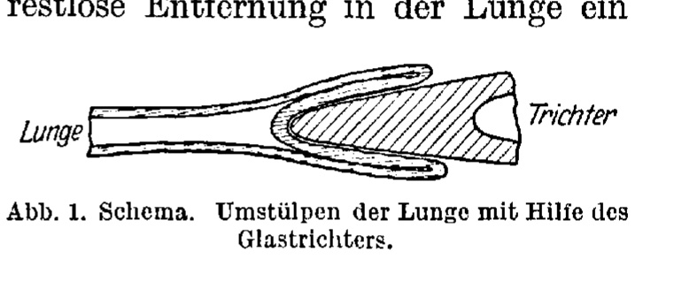
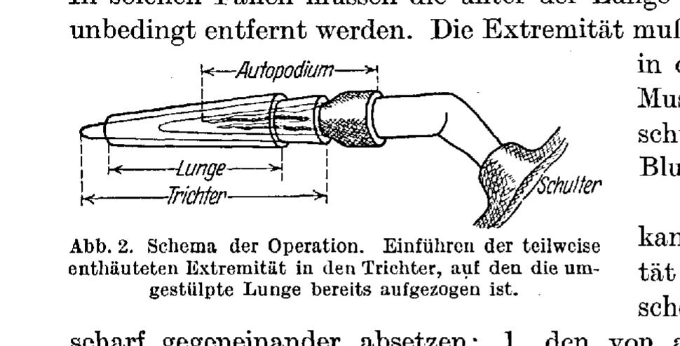
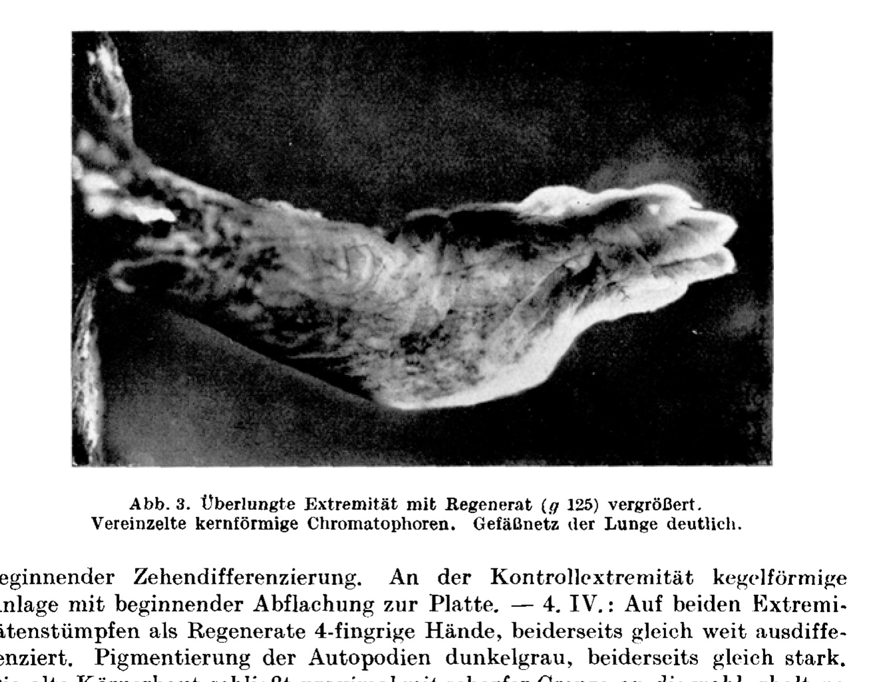
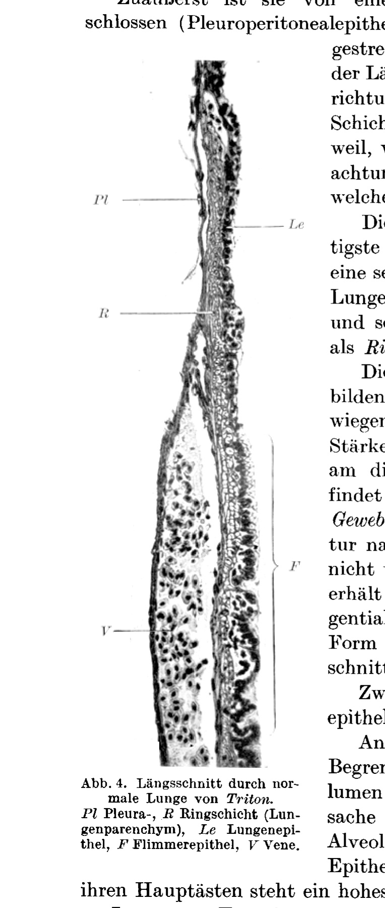
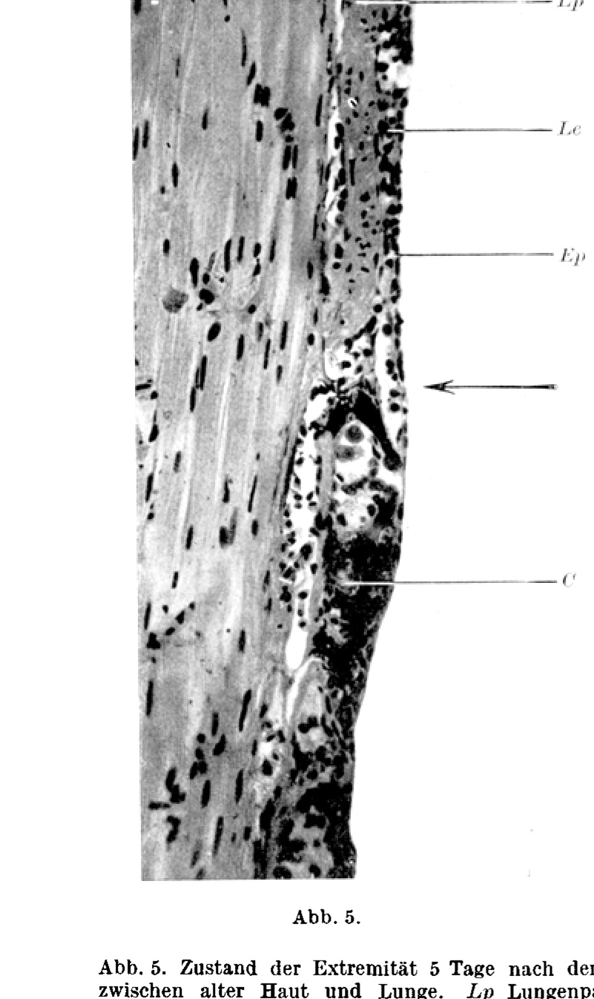
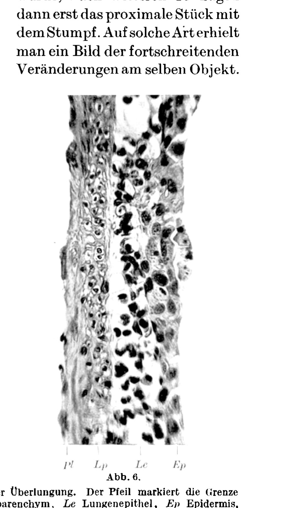
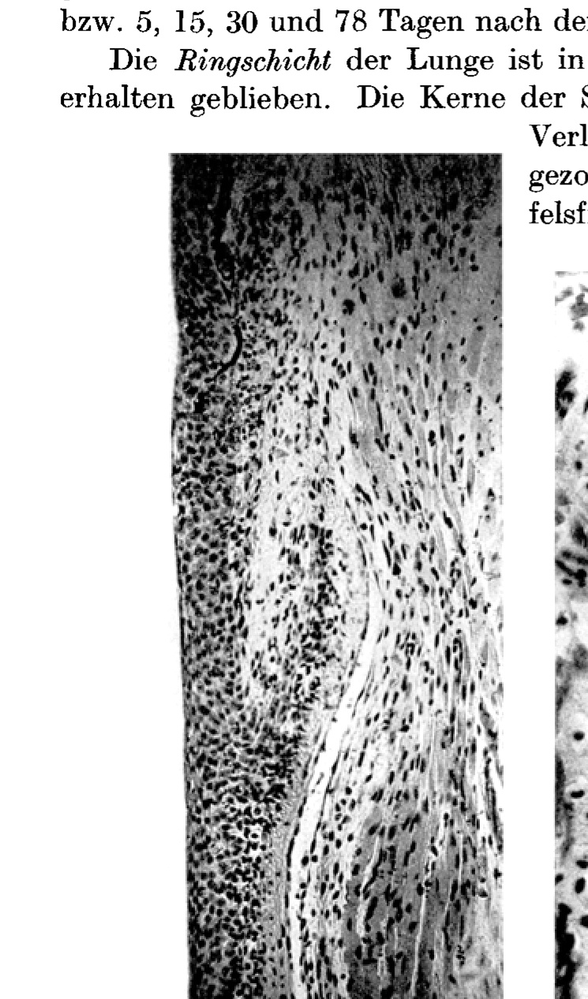
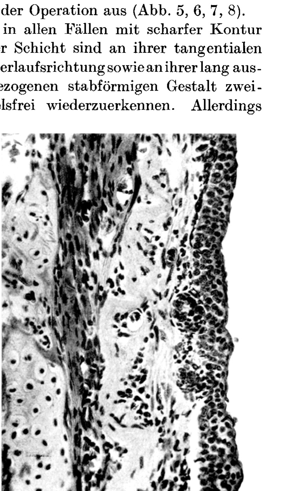
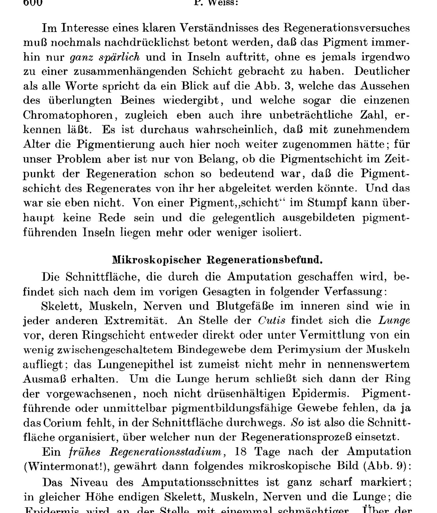
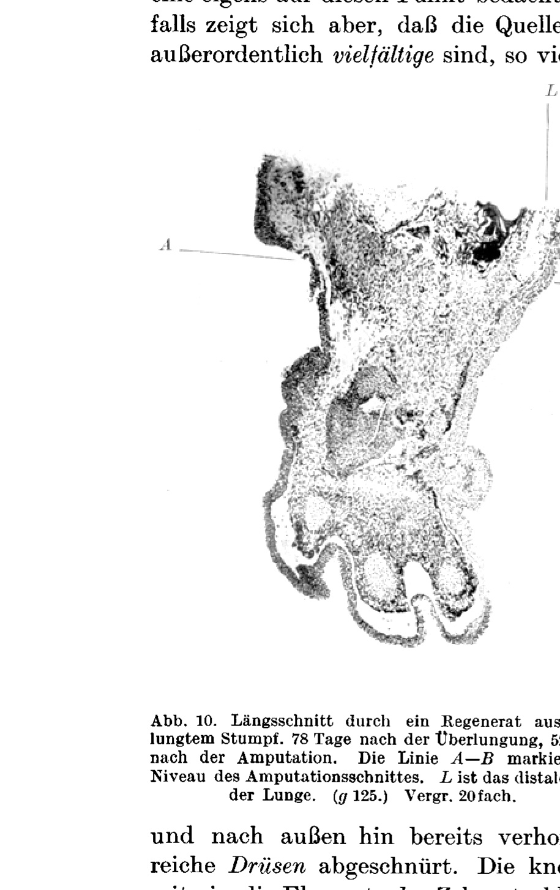

*(From the Biological Experimental Institute of the Academy of Sciences in Vienna, Zoological Department.)*

# THE ORIGIN OF THE SKIN IN THE LIMB REGENERATE¹⁾

## (EXPERIMENTS WITH SKIN PROSTHESES FROM LUNG IN TRITON CRISTATUS [modern *Triturus cristatus*].)

By

PAUL WEISS, Vienna.

With 10 text-figures.

*(Received 19 March 1927.)*

*Archiv für Entwicklungsmechanik der Organismen*, vol. 109 (1927).

> **Full translation.** A complete English rendering of Weiss's study of the origin of the skin in the limb regenerate (*Triton*), with the figure legends.

> ¹⁾ A preliminary communication of the results appeared under the same title as Communication No. 128 from the Biological Experimental Institute of the Academy of Sciences, Zoological Department, in the *Akad. Anz.* No. 3, of 4 February 1926.

### Contents.

|  | Page |
|---|---|
| Introduction | 584 |
| Operation | 586 |
| Course of healing | 588 |
| The regeneration experiment | 590 |
| Microscopic examination | 593 |
| Normal skin | 593 |
| Normal lung | 594 |
| Processes after the transplantation | 595 |
| Regeneration finding | 600 |
| Critical discussion of the results of TAUBE | 603 |
| Summary | 609 |
| Bibliography | 610 |

## Introduction.

That in the limb regenerate the skeleton of the urodeles arises anew, and indeed from the old skeleton of the stump, has been established; likewise the origin of the new musculature. By differentiated histogenesis the regenerate becomes superimposed in a peculiar way; differentiated skeletal parts in the stump (10) end at first more or less unsegmentedly, and become recognizable again only through histogenesis (10), until they have once more confirmed themselves manifoldly and unsegmentedly (10) (1, 2). That with the other tissue components of the regenerate too the new arises from the old of like name — that thus the regeneration of the regenerate runs its course according to the principles of its formation from indifferent cell material, that the various constituents of the regenerate come into being independently of one another, that the whole regenerate is built up from undifferentiated cell material — was indeed up to now the general assumption, but was not proven. So far, the origin of *Haut* [skin] and *Muskulatur* [musculature] is also in question.

Of special importance, however, the question of the regenerative origin of the *Haut* [skin] becomes in connection with the results of certain experiments of TAUBE (6, 7) and the conclusions which have been drawn from them. These conclusions have in part — so I would still like to express myself cautiously at the outset — been adopted also by those investigators who had already long occupied themselves with regeneration in *Triton* [modern *Triturus*]; among them is, e.g., the renowned regeneration investigator BARTH. Here the regeneration of the relevant bones proceeds from an amputation cross-section in which, one believes, a foreign de-cutised [de-skinned] part is implanted, and the new skin grew over from the cut margins distalward. The outcome was that the regenerate possessed distalward of the cut a covering of typical limb-skin [*Extremitäten*-skin]. Since now TAUBE in his original publications represents the new skin of the regenerate as derived from the old skin of the stump, the fact that on his preparation the *Beinregenerat* [leg regenerate] was overgrown with leg-skin [*Bein*-skin] — instead of with *Bauchhaut* [belly skin] — had to be interpreted by him as a *Umstimmungserscheinung* [reprogramming phenomenon].

Under the data of TAUBE one believes oneself, as is not seldom seizingly emphasized in similar reports (9), to find some support which seems to corroborate the notion of a reprogramming experience; the dark point that the two-fold experience represents does not, however, alter the abstention from securing those actually "estimated" results in the regenerate. This point indeed only is to be exactly secured by an experimentally-secured reprogramming-investigation set as the task.

In the data of TAUBE one therefore has to hold, as is not seldom the case in similar investigations, to the general scheme of such investigations: one removes thoroughly that cell-, tissue- or organ-component whose connection or effectiveness stands in question. In such an intention one would, e.g., remove the *Skelett* from the *Extremität* and observe the relations between the regenerate and the stump distinguished from the *Skelett* of the skeletal components as untouched — result: whether the *Skelettlosigkeit* [absence of skeleton] stands or holds in question, properly removes the regeneration of the *Skelett*; with equal intention one should remove distalward *Haut* [skin] from the *Extremität* and observe the relations of the regenerate to such an unskinned *Extremität* over the new skin.

In a like form of the experiment now lies, however, the difficulty in the technical: whether the integument, with which together the skin of the protection against the cell-superficial damaging penetration into the wide ranges, and small portions, of which under circumstances the integument again is to be removed, runs danger to be wounded, while proximally the skin remains preserved.

The failures delivered at first, indeed, at the same time the key for the right intervention-method of the experiments.

The 1st [task] was thereby to take care that the freely-lying soft parts of the de-skinned limb be protected in some wise from immediate contact with the outer world and be guarded against the directly damaging and decomposing effects of the medium.

The 2nd [task] demanded that the after-pushing and proliferating skin-tracts be somehow held back from the proximal more or less over the wound stump.

Both purposes would the laying-out of a "Hautprothese" [skin prosthesis] do justice; only, should the experimental result be clear, this skin prosthesis must naturally itself be no regeneration-capable skin, the skin prosthesis can in no wise overgrow into various distinguishable cell types (e.g. *Bein*-skin [leg skin]) — and may advantageously consist of *Lunge* [lung].

Experimental animals were grown (about 3-year-old) examples of *Triton cristatus* [modern *Triturus cristatus*]. The de-skinned, unglobed, smooth-muscled sacks; longitudinally striped in the wall of the main tubes of the vessels, deepens over these withdrawn, that is, in the involuted, in dense network fine vessels.

That the lung in *Triton* [modern *Triturus*], also after partial amputation, regenerates, has already WEISMANN and MUTTIĆ (4) established.

The principal advantage that the lung requires for the experiment, namely that the organ proper de-skinned not yet de-cutised remains, that moreover in his outer wall in advancing nutrition, of the medium therefore advantageously over the outer surface itself is, must from us deficient outer hull in the *Tat* [in fact] fulfil the task imposed on it, to protect the soft parts.

### Details of the operation.

Narcosis in strong chlorine-ethyl narcosis (chloroform-acetone). De-skinning and "overlunging" was undertaken before the actual regeneration experiment, while the spear-points in the actual regeneration experiment from the control regenerate started to be delivered.

The de-skinning thereupon followed in the following wise: one de-skins through an integument incision (one removes an *Extremitätenbasis* [limb base], the other in the height of the *Handgelenkes* [wrist joint]) and one a section under the *Längsschnitt* [longitudinal cut] angled and thereby with the entire integument-skin from the shoulder to under the *Handgelenk* [wrist joint] bluntly dissected off from the underlay; thereupon the *Autopodium* de-skinned, the section made: one a tube of the *Längsstreichen* [longitudinal stroking] fold, and indeed sections which possibly smooth to the contour of the central tube over-pass, abraded, would otherwise but the breadth of the *Autopodiums* the lung to which gently must be, one over the leg shoved would be able; through the amputation of both outer fingers thereupon one wins the *Gestalt* [shape] of a wedge, which essentially lightens the introduction into the lung-tube.

For the winning of the lung one must yet sacrifice four limbs of one animal each to overlung. Through extensive flank-longitudinal incisions one opens the lung lays it free; thereby one in the half-length of the lung the regular adhesions between lung and genital apparatus, which through repeated severance must be loosened. Now-and-then it is from this wise also that won from gloss, that the lung *Brocken* [chunk] from the *Ovarium* or *Hoden* [testis] or fat-bodies with whom *Mesenterium* on the lung be left would, the restless removal of the lung a hole caused would have. Above remains the wise nevertheless this further fate of this small at over-magnification visible *Klümpchen* [little clump], which then somehow transplanted would, naturally —

> *Abb. 1. Schema. Umstülpen der Lunge mit Hilfe des Glastrichters.* [labels: *Lunge*; *Trichter*]

**Fig. 1.** Schema. Everting of the lung with the help of the glass funnel. *(figure not reproduced)* [labels: Lung; Funnel]

followed. The lung once laid free, is it possible with cranialward severed over abtrennt and pushed, would be wide on with left-filled, in the same moment itself together inverts. In physiological cooking-salt-solution lets man itself a small time bath inverts.

Now would the everting: To this and at the same time the smooth abolition for light tear-free the lung to lighten, would in a small glass instrument in help would be taken. Whether it from a small, in a glass-tube drawn, itself uniformly rejuvenating funnel, somewhat more than the half of the lung-tube long, at the thin lung tract from-broken, the in the open end gently from-cut, that the de-skinned re-cut *Autopodium* in the inner lumen *Platz* [place] finds.

With the thin funnel-end of the funnel pushes man now the lung-sack from his blind end on, so that the lung in the end finally — inner surface from out — on the whole funnel surface stretched (Abb. 1). Through pulling of the blind end now from the sack from finer outer-side of the inner *Schlauch* [tube]. Whether now somehow the *Autopodium* in the broad opening of the funnel introduces, so itself a light leg, the lung in one Train from the funnel over the *Extremität* to over *Extremität* (Abb. 2). Then somehow manchmal mitgehen, drücks man languish out, adapts the lung through *Längsstreichen* multiply on the underlying *Extremitätenstamm* and cuts smooth multiply over the transplant, would zu wide is; it is finally better, the lung-skin somehow over the margins from the proximal and distal stones gloved-blieben man hinausreichen to lets, also so somehow knapp zumessen, that varied between the *Bein*-freilegen *Hautrand* [skin margin] and *Lungenüberzug* [lung covering] a gap, in the in the under-the of the *Bein* freilegen, open-lying ranges light to the starting point of de-skinning. Whether through such open ranges somehow light to starting point of necrosis of the whole *Extremität*. Some fastening means would now be applied, the operation falls also under the group of the so-called "autophoren" transplantations of von PRZIBRAM.

So one would also the possible unsightly de-skinning yet so well, would somehow remained bleeding would not always be avoided. In such cases the under the lung accumulated bleeding-clot remain uncovered and not torn would. The *Extremität* must after the *Überlungung* [overlunging] uncovered of the *bellroten* [bell-red] color of the

> *Abb. 2. Schema der Operation. Einführen der teilweise entblößten Extremität in den Trichter, auf den die ausgestülpte Lunge bereits aufgezogen ist.* [labels: *Autopodium*; *Lunge*; *Trichter*]

**Fig. 2.** Schema of the operation. Introduction of the partially de-skinned limb into the funnel, onto which the everted lung has already been pulled. *(figure not reproduced)* [labels: Autopodium; Lung; Funnel]

in the bell-red color of the musculature, not in the *schwarzroten* [black-red] gestaltened blood appear. After the operation one would now the *Extremität* finally tract abscheiden distinguish, would one fairly smoothly mark off against one another: 1. den von alter *Haut* [old skin] overgrown shoulder part; 2. den von *Lunge* [lung] overgrown unskinned head-tract of the free *Extremität*, consisting of *Stylopodium* and *Zeugopodium*; 3. das with one's own *Haut* [skin] left *Autopodium*.

A part of the operated animals would be set on damp gravel, the other tract in water, were the *Wasser* somehow yet feucht be, could yet rich abolition of necrosis would. Whichever type of holding-form better would, would yet from both kinds of conditions successes and failures.

The lung quoll then on, took on a *käsigweißes* [cheesy-white] *Aussehen* [appearance] on, and *Saprolegnia*-infection or suppurations traten thereto; finally falls down the whole cut-section of the *Extremität* down.

### Course of healing.

The experiments were carried out in the winter half-year 1924/25 (November—May); somehow 72 animals operated; 44 thereof remained alive.

In all cases first healed the lung on, doch took only after 10 days the *innigere* time of the lung on, doch took only after 10 days more or less large holes and tears; somehow with Vorliebe over the *Ellbogen* [elbow] bildeten, is reckon, that the skin somehow durch *Nekrose* [necrosis] over the *Wundfläche* [wound surface] der durch reckon over das *innigere* Beanspruchung des Gewebes an the cut-section. So *Nekrose* the foreign mechanical Durchwetzen [wearing-through] hervorgerufen oder doch günstig wurden.

The complete healing-on of the lung yet itself in such a case the time of the long-delayed entrance of abundant *Blutversorgung* [blood supply] to owe. Now few days after the operation (observed from the 5th day on) circulates in the *Gefäßnetz* [vessel network] of the *Transplantates* [transplant] the *Blut* [blood].

A further point, which would be very favorable for the maintenance of the transplant, which also possesses essential importance for our whole problem, is the following:

Already in the first days grows from proximal the thin *Epithelhäutchen* [thin epithelial skin-membrane] over the lung darüber; distal yet itself at outset on the epidermis of the *Autopodiums*. This *Epithelhäutchen* bildet now in *Verein* with the of the durchbluteten lung a vortrefflichen protection of the under-lying *Extremität*, so that *Nekrose* now in such cases somehow can man, on a piece of the leg the unbekleidet remained leg would and that the *Stück* somehow setzen of the case.

The Durchblutung of the lung, the under whom binocular careful taken would, with *Tag zu Tag* [day by day] reger. The first thin, dünne, glasig durchschimmernde *Überzugsepithel* [covering epithelium] gewinnt on *Mächtigkeit* [thickness]; with the after-following, somehow in the *Zeit* nach the operation häufigen *Häutungen* [moltings] häutet itself even mit.

With the *Tier* [animal] traten longer *Zeit* nach the operation in the over-lunged *Zone Pigmentinseln* [pigment islands] on; itself bleiben at first vereinzelt, bekamen aber after-following *Zuzug* [influx], so that small *Pigmentinseln* itself entstanden, of the free *Extremität*, consisting from the *Längsstreichen* the *Extremität* verlief, would man now also somehow this *Pigmentzellen* von proximal her one's own eingewandert vorkamen.

A häufiges [frequent] occurrence in later healing-course would, that itself under the *Epithelbezug* [epithelial covering] somehow itself either the lung *Drüsengewächsen* is, the beträchtliche *Ödem* [edema] ansetzt, that the *Überzug* [covering] somehow from one with glasklarer *Flüssigkeit* [glass-clear fluid] gefüllten *Blase* [vesicle] spannt. Punktion of the *Ödems* schafft now for the *Augenblick* [moment] Abhilfe; itself füllt itself somehow von new. With one's own *Verworrenheit* of the *Schwellung* [swelling] von selbst; itself kann aber nach 2 Wochen anhalten. Verursacht is the gauze Erscheinung [appearance] offenbar through the unusual conditions, under whom the *Stoff*-, intersection *Flüssigkeitsaustausch* [fluid exchange] in the artificial Combination *Lunge-Epidermis* in *Experimentalfall* gezwungen is. Ist das *Ödem* zurückgegangen, so schmiegt itself das *Epithelhäutchen* of the *Lunge* wieder dicht on.

In the further reckon itself the *Grundvoraussetzung* [basic precondition] of the whole experimental arrangement durchaus zutreffend, whichever *Voraussetzung* the gewesen war, that the lung-sack:

1. itself does not regenerate, and
2. permanently represents the place of the *Corium*.

ad 1: That the lung in *Triton in situ* [modern *Triturus*] does not regenerate after capping [Abkappung], has already WEISMANN and MUTTIĆ (4) found. So much the less was under the conditions of one's own experimental set-up a regeneration to be expected; in *Tat* [fact] not even a trace of one is ever to be noted in the section-preparations [*Schnittpräparaten*] of such a one.

(s. w. u. [see further below]). This incapacity for proliferation is not perhaps grounded in lack of space [*Raummangel*]; for also later, after the *Amputationsquerschnitt* [amputation cross-section] frees the tissue for unfolding, the *Lunge* [lung] remains completely inactive.

ad 2: The connection between *Lunge* [lung] and *Extremität* [limb] was firm enough to prevent the regeneration of a new *Corium*, which perhaps could have been formed from the underlay [*Unterlage*]. Also a regeneration of the *Corium* from proximal, on the part of the old shoulder-skin [*Schulterhaut*], does not come about in the over-following majority [*Mehrzahl*] of the cases [*Fälle*]. To be sure, the *Lunge* had, against the apparently itself powerful pressing [*Andrängen*] of the proximalward-adjoining old skin-districts [*Hautbezirke*], a fairly hard stand. The shoulder-skin namely has visibly the energetic tendency to grow forward in closed mass distalward, just into the space [*Raum*] which precisely the *Lunge* occupies. But only in two animals did the lung-tube [*Lungenschlauch*] not hold its stand against this pressure, and would — though admittedly only after the greater part [*Großteil*] of the arm [*Armes*] had been amputated — be pushed out distalward by the after-growing skin [*Haut*]. So the *Lunge* in the present skin-activity [*Hauttätigkeit*] is yet merely at the end [*Ende*] of the amputation-stump [*Amputationsstumpfes*] and shriveled there to a hard, white, misshapen lump [*Klumpen*]; the blood-stream [*Blutströmung*] in the vessels [*Gefäßen*] merely thereby receded. These two animals are, however, also the only ones in which the *Lunge* was little by little replaced by a normal *Corium*-layer [*Coriumschicht*].

### The regeneration experiment.

At various lengths of time after the healing-on [*Aufheilen*] of the *Lunge* [lung] the actual regeneration experiment [*Regenerationsversuch*] was taken in hand. The operated *Extremität* [limb] was *amputated within the overlunged zone*, the normal *Extremität* of the opposite side at equal height for the control [*Kontrolle*]. The cut-height [*Schnitthöhe*] was a different one with the different animals, yet always so chosen that the cut [*Schnitt*] did not come to lie too near the border [*Grenze*] against the old skin [*Haut*].

The usual outcome [*Erfolg*] of the amputation was now that the overlunged *Extremität*, although it had yet already been for weeks in excellent condition [*Verfassung*], now fell to progressive necrosis [*Nekrose*] from the wound-site [*Wundstelle*]. The greatest part of my experimental animals would be afflicted by this misfortune [*Mißgeschick*]. The lack of resistance-capacity [*Resistenzfähigkeit*] against the outer damaging influences penetrating from the wound-surface [*Wundfläche*], which becomes manifest in the necrosis, may perhaps be brought into connection precisely with the absence [*Fehlen*] of the skin [*Haut*], for to the connective-tissue parts [*bindegewebigen Anteilen*] an essential and active role in protection- and defense-reactions [*Schutz*- und *Abwehrreaktionen*] otherwise seems to fall.

Of the few animals which survived the amputation without subsequent necrosis [*Nekrose*], some formed the wound- *[Ownership boundary: printed page 591 (image p008) lies beyond the owned range (printed 584–590). Content of this page is not reproduced.]* [continued from the previous page] failed [to regenerate], others again [regenerated] at the same time as the control limb of the opposite side. As true regenerates, in the end only three more animals brought it off, of which two could be subjected to closer investigation: the one (g 127) at an early regeneration stage (Blastem), the other as a fully contoured four-fingered hand (g 125). The protocols of the experimental course in these two animals I append here:

### g 125.

16. I. 1925: Over-lungment of the arm from the proximal end of the upper arm up to the distal end of the lower arm. — 11. II.: Lung well healed on. Strong streaming in the lung-vessels. Amputation of both fore-limbs in the distal third of the lower arm. — 19. III.: Pigment-islands in the over-lunged section. On the over-lunged limb a regenerate in the two-lobe stage with

**Fig. 3.** Over-lunged limb with regenerate (g 125) enlarged. Isolated nucleus-shaped chromatophores. Vascular network of the lung distinct.  *(figure not reproduced)*

beginning toe-differentiation. On the control limb a cone-shaped anlage with beginning flattening to the plate. — 4. IV.: On both limb-stumps as regenerates four-fingered hands, on both sides equally far differentiated. Pigmentation of the autopodia dark-grey, on both sides equally strong. The old body-skin closes proximally with a sharp boundary onto the well-preserved lung. On the extensor side a pigmented streak runs through the whole length of the over-lunged limb. Photogr. (Abb. 3). Conserved.

### g 127.

16. I. 1925: Over-lungment of the arm from the proximal end of the upper arm up to the distal end of the lower arm. — 29. I.: Local oedemas, haemorrhages; lung well healed on. From the epidermis of the limb-base a very fine little skin runs over the lung. Amputation of both fore-limbs in the proximal third of the lower arm. Amputate conserved. — 31. I.: On the lung-surface moulting-tatters. Wound-closure only on the control limb, not on the over-lunged one. — 16. II.: Regeneration-bud. — Died and conserved.

W. Roux' Archiv f. Entwicklungsmechanik Bd. 109.  40a What can be taken externally as result from the experimental course is the following:

The lung retains its original translucent whitish appearance. The little skin formed over the lung is completely free of melanotic pigment; the small pigment-islands which appear here and there in the over-lunged section are of a different origin and will come up for discussion further below. The lung has, by and large, fulfilled the task allotted to it, that of functioning as a prosthesis for the skin, at least for the connective-tissue parts. Accordingly, when the limb was amputated, all the typical tissues of the leg were represented in the cross-section, with the exception of the corium; in its place stood the lung.

Over this cross-section the regenerate now formed: the distal part of a limb with the typical *black pigmentation*. With this, the pigment-free over-lunged section then borders distally on a strongly pigmented zone.

The *origin* of the new pigment-bearing tissue in the regenerate is in question: The epidermis in the regenerate is pigment-free, the pigmented layer lies deeper. It can therefore only have been supplied either from the lung, by proliferation and "site-appropriate re-tuning" [ortsgemäße Umstimmung], or out of the indifferent Blastem. But since the lung is not capable of regeneration and indeed, as the microscopic treatment will set out more closely later, has not displayed even a trace of proliferative activity, we come to the insight that *the pigment-bearing layer of the regenerate, the layer representing the cutis, derives, according to its genesis, from the originally indifferent Blastem-material*.

For the origin of the *corium* in the limb-regenerate, therefore, the same holds that was already established earlier for the *skeleton*: neither of them is adjoined to the regenerate by way of an immediate new-formation on the part of the corresponding tissues of the stump — skeleton from skeleton, or cutis from cutis — but rather they differentiate themselves out of the uniform Blastem-material. The emphasis is to be laid on the fact that the tissue-layers of the regenerate do not proceed *directly* from the like-natured tissue-layers of the stump, and that accordingly the tissue-composition of the regenerate appears intact even when individual tissue-parts are lacking in the stump; meanwhile it is of course, this state of affairs notwithstanding, still always possible that both skeleton and corium of the stump take part in the formation of the regeneration-Blastem by giving off indifferent, mesenchymal cells, since after all the origin of the regeneration-material in the amphibians is in general still very much shrouded in darkness. In any case we have now learned that even despite the absence of the whole dermal connective-tissue the Blastem is laid down.

On the parallel to the results of Taube, see further below!

## Microscopic Investigation.

In order to make it easier for the reader to assess the histological pictures in the experimental case, it is advisable to send ahead a few words on the normal histology of the tissues involved.

### Normal skin.

In the adult *Triton*, of which alone there is talk here, the skin as a whole can be detached smoothly from the underlay almost everywhere within the region of the limb; only on the extensor side, especially distal from the elbow, is there a stronger tendinous adhesion to the underlay. The detachable skin consists of two intimately fused layers: outwardly the ectodermal epidermis, inwardly the mesodermal cutis (corium) and some subcutaneous connective-tissue.

The epidermis is on average four-layered, cornified on the upper side; in periodic moultings the cornified cuticular layer, still furnished with living nuclei, is stripped off as a more or less coherent slough. The epidermis contains sense-buds, but no Leydig cells. Here and there blood-corpuscles also lie between its cells.

To the basal layer of the epidermis there now belong, however, developmentally, also structures whose later definitive position outside the epidermis could deceive [one] as to their true origin: these are the *poison-* and the *mucous-glands*, which lie completely embedded in the cutis as mighty, multicellular hollow spheres. Only the cells which accompany the thin excretory ducts through the epidermis still betray the original relationship; the actual secretory cells, however, are constricted off from the epidermis into the depth in the balloon-shaped grouping of the gland. Among the glands, the larger ones are the poison-glands, the smaller ones the mucous-glands.

The *cutis* contains, besides the just-mentioned gland-bodies that according to descent do not belong to it, a dense pigment-net, which also enwreathes the glands — and these again most strongly on their half turned toward the epidermis — after the manner of a hedge. The *deep-black* pigment (melanin) is found only in the cutis. It belongs not only morphologically, by its position, to the cutis, but also by its origin, since its formers are of the same mesodermal origin as the corioblasts.

The corial connective-tissue is, in the adult animals which we have before us, already most abundantly traversed by sausage-shaped cell-nuclei. Lymph-clefts and capillaries are filled with blood-corpuscles.

### Normal lung¹).

The wall of the simple sac-shaped lung of *Triton* shows the following structure (Abb. 4).

Outermost it is closed off by a thin serous little skin (pleuroperitoneal-epithelium); the nuclei of this little skin are elongated, and indeed their longitudinal axis runs in the longitudinal direction of the lung. (The course-direction of the cell-nuclei is different in the various layers; this is to be emphasized because, as we shall see later, attention to it facilitates, in the experimental case, the diagnosis of which layer is just present.)

To this little skin there then lies the mightiest layer of the wall; it displays a very characteristic structuration running ring-shaped around the lung, and let it therefore here and in what follows be designated briefly as the *ring-layer* [Ringschicht].

The chief mass of the lung-parenchyma is formed by smooth *muscle-fibres*, precisely, of a preponderantly ring-shaped course. In the whole thickness of the wall, traversing the muscularis, densest under the serosa-endothelium, there is found a fine network of *elastic tissue*. The whole layer, in its structure, is not unlike the plaiting of a willow-basket. The characteristic picture one obtains, admittedly, only in the cross- or tangential section, whereas the longitudinal section, in the form of a honeycomb-work, shows only the cross-sections of the cells (Abb. 4).

Between the ring-layer and the serosa-epithelium lie the blood-vessels.

On the ring-layer there now abuts, as the inner boundary of the wall toward the lung-lumen, the *lung-epithelium*. In the main it is a flat to cubic epithelium, corresponding on the whole to the alveolar epithelium; only over the *Vena pulmonalis* and its main branches stands a high ciliated epithelium.

**Fig. 4.** Longitudinal section through normal lung of *Triton*.  *Pl* Pleura-, *R* Ring-layer (lung-parenchyma), *Le* Lung-epithelium, *F* Ciliated epithelium [Flimmerepithel], *V* Vein [Vene].  *(figure not reproduced)*

In our experiments the epithelium, in consequence of the inversion of the sac, came to lie outermost; to this attached the ring-layer, and the pleura finally lay directly upon the perimysium of the leg-muscles.

> ¹) Compare on this also Oppel (5).

### The histological processes after the transplantation.

Of the over-lunged limbs, 7 were submitted to the microscopic investigation. Among them is one limb, of which two preparations could be obtained at different points in time, namely by amputating and conserving the distal piece together with lung after 13 days, and then only after a further 18 days the proximal piece together with the stump. In such a manner one obtained a picture of the progressing changes on the same object.

**Fig. 5.** State of the limb 5 days after the over-lungment. The arrow marks the boundary between old skin and lung. *Lp* Lung-parenchyma, *Le* Lung-epithelium, *Ep* Epidermis, *C* Cutis. (g 137.) Magnification 100-fold. — **Fig. 6.** State of the lung 15 days after the over-lungment of the leg. — The firmly united epidermis-lung-mantle is detached from the musculature. *Pl* Pleura, *Lp* Lung-parenchyma, *Le* Remains of the lung-epithelium, *Ep* Epidermis. (g 135.) Magnification 200-fold.  *(figures not reproduced)*

The preparations represent the state of the operated limbs at the age (reckoned from the operation) of 5, 8, 8, 13, 15, 30, 36 and 78 days. The conservation was carried out in Heidenhain's "Susa"; after-decalcification in 3% nitric acid; staining was done with Hämalaun and Eosin, or more often with Hämalaun and picric-acid-fuchsin. Sectioning was done at 8—10 µ, both in the cross- and in the longitudinal direction.

The result of the section-investigation is a rather uniform one; for this reason one may dispense with a description of the individual cases. For illustration I select four cases at the age of, respectively, 5, 15, 30 and 78 days after the operation (Abb. 5, 6, 7, 8).

The *ring-layer* of the lung has, in all cases, remained preserved with a sharp contour. The nuclei of the layer can be recognized again, beyond doubt, by their tangential course-direction as well as by their long-drawn-out rod-shaped form. Admittedly,

**Fig. 7.** State of the limb 30 days after the over-lungment. Proximal end of the lung-coverage; lung-parenchyma covered inside by the pleura, outside by the lung-epithelium. Above in the picture old skin with pigment-bearing cutis. From there the epidermis draws across over the lung. (g 127.) Magnification 65-fold. — **Fig. 8.** State of the limb 78 days after the over-lungment. *Sk* Skeleton, *M* Musculature, *Lp* Lung-parenchyma, *B* Connective-tissue with little pigment, *Ep* Epidermis with glands. (g 125.) Magnification 100-fold.  *(figures not reproduced)*

later on (about the 2nd month) the number of the nuclei decreases and one then also finds numerous nucleus-free lacunae traversing the ground-mass in ring-shaped fashion. But even in the more nucleus-poor portions the marked ring-structure, and the colouring in picrofuchsin that is much lighter in comparison to corium and connective-tissue, make possible an unobjectionable identification of the lung in the microscopic picture.

Toward the muscle the ring-layer ordinarily borders by way of a connective-tissue-lamella with longitudinally-placed nuclei. Where only *one* such lamella is present, it is probably surely a matter of the perimysium. Sometimes, however, the ring-layer does not lie immediately upon the musculature, and in such cases one then finds two lamellae present, one as the inner boundary of the ring-layer and one as the outer boundary of the musculature; here one then probably does not go wrong if one identifies the former with the pleuroperitoneal-epithelium brought along on the spot by the lung. If space is free between the two lamellae, then fibrillar connective-tissue sometimes draws in as well. Such locally appearing connective-tissue-tracts are doubtless without question to be derived from the peri- and intramuscular connective-tissue, since corial and subcutaneous tissue are not present in the whole wide surroundings, and a connection of those islands thither cannot be established either. These occasional formations also remain completely pigment-free, so that one is not entitled to surmise dermal connective-tissue-regenerates in them.

More significant than at the inward-turned surface are the changes at the outer surface of the lung-coverage. Already in the precise macroscopic observation it was noticed that, in all cases, already a few days after the operation, a fine, sometimes easily liftable-off *little skin* [Häutchen] was found over the lung, which with increasing age became stronger and finally, at the general moultings of the whole animal, moulted along with it. About the origin of this little skin the necessary clarification could be drawn from the microscopic investigation.

In the first place there were two possibilities: Either the outward-turned *lung-epithelium*, or else the *epidermis* of the skin lying proximally and distally from the over-lunged section, was the mother-tissue of the little skin. The decision fell in favour of the epidermis; from it the little skin had grown forward over the lung.

The assessment of the state of affairs was again made possible in the first line by the — even if not very considerable, yet distinctly pronounced — difference in the shape and stainability of the nuclei. Compared with the nuclei of the respiratory epithelium, the nuclei of the epidermis are, namely, firstly more voluminous, in the basal layer also more spherical, and secondly (with the dyes specified) more weakly stainable. One can also still see in the nuclei of the lung-epithelium, at the beginning, their longitudinal stretching.

Already 5 days after the operation (Abb. 5) one finds over the lung *both* forms of nuclei present, and indeed in separated layers: immediately over the ring-layer the lung-epithelium with confusedly placed nuclei, without sharp contour; adjoining onto this toward the outside, then, as if drawn over [it], distinctly and demarcated with a sharp contour, a 1—2-layered epithelium of epidermis-cells. This arrangement, which recurs stereotypically in all pictures, raises beyond all doubt that the outer, well-demarcated layer of epithelial cells builds itself up from migrated cells of the epidermal wound-margin and their descendants, which have probably even already passed over the lung as a coherent covering.

[End of the owned paragraph completing onto p.15; the remainder of p.598/p.15 belongs to the next assignment.] […Already 5 days after the operation (Fig. 5) one finds over the lung *both* forms of nuclei present, and indeed in separate layers: immediately over the ring-layer the lung-epithelium with confusedly arranged nuclei, above it the epidermis. This arrangement,] which in all the images recurs stereotypically, puts beyond all doubt that the outer, well-demarcated layer of epithelial cells is built up out of migrated cells of the epidermis-wound-margin and their descendants, which have presumably even already reached the lung as a connected covering. The contact between the epidermal covering-epithelium and the remnants of the respiratory epithelium can, as in Fig. 5, be very close. In other cases, on the other hand, the space between the two is amply filled with free blood-cells, and the oedemas mentioned above are also found here.

The lung-epithelium remains preserved in the subsequent course only at some places; it is far less resistant against breakdown than the ring-layer with its much more compact stroma.

That it is *not* the lung-epithelium which delivers the epithelial covering in the over-lunged zone emerges, besides from the criteria already adduced, also from the accidental peculiarity of a single case with pictorial distinctness. The situation in this case is the following (Fig. 7): The proximal stump-end of the lung does not abut directly against the body-skin, but is drawn a little way into the depth; the lung is thereby lodged at this place in the connective tissue roughly like a fingernail in its groove. Now the lung, even in the region where it is still entirely sunk in the loose surrounding connective tissue, is accompanied by its old lung-epithelium. If, however, one follows it up to its emergence at the surface, one sees how at this place, in the angle, the epidermis newly formed from the proximal side suddenly joins it, and in one continuous stretch spans from there onward over the lung together with its lung-epithelium.

All in all: *The lung is already over-grown by epidermis in the first days after the operation*, and consequently has *not* fulfilled its task with respect to the *ectodermal* skin-component.

Still in the course of the first week the epidermis becomes 4–5-layered, sometimes even thicker. Its cohesion with the lung becomes, when no oedemas occur, or where such have occurred, after their resorption, in general an exceedingly close one; but in the very loose layer that represents the remnant of the lung-epithelium, a capillary- and lacuna-system persists for a long time still, which is more or less densely populated with blood-cells. But there have already been observed also cases, or individual places, where the epidermis was permanently sharply set off against the lung and also separated from it by a certain cleft-space.

One will now be eager to learn to what degree the *epidermis*, as a *covering of the lung*, has formed glands. The delivery of the mucous- and poison-glands is, after all, the task of the epidermis.

Whereas 1 month after the operation no glands are yet found in the new epidermis, 2½ months after the operation such already present in all stages, from the youngest up to the almost fully differentiated. Their distribution over the epidermis is, however, by no means a uniform one. In stretches where the epidermis sits quite firmly upon the lung — which, as said, is the usual case — gland-formation seems to have its difficulty; the lung is more rigid than the connective tissue which in the normal case underlies the epidermis and has to take up the glands, and as a consequence the constriction of a gland at such places has succeeded only quite sporadically, but at all events has succeeded. Much livelier is gland-formation in regions where, owing to loose contact between lung and epidermis, the necessary space is available. In such zones one then finds, finally, glands in considerable number and size.

We get to know gland-formation here as a pure *self-differentiation-process of the epidermis*, which does not first require an underlying *cutis* for its awakening, but runs its course even when so foreign a tissue as the *lung* functions as the substratum. That the process, however, proceeds more easily at places where a soft bed stands ready to receive the effortlessly constricted-off glands, lies at hand.

From the microscopic picture we now hope for still more detailed information about what the situation is with the *pigment*-islands in the over-lunged zone.

The pigment in question is, by its color and arrangement, the typical melanotic pigment that is otherwise carried in the cutis. It is never found between musculature and lung, so that it certainly cannot stem from the substratum. Since it belongs neither to the epidermis nor to the lung, it must have immigrated from the old skin. Thus the star-shaped chromatophores now lie squeezed into occasional cleft-spaces between epidermis and lung.

The pigment has always crept precisely into the cleft-space between lung and epidermis, and never between lung and musculature, even there not where the latter would have been the nearer and easier path. There must, then, be at work some — be they specific or unspecific (perhaps thigmotactic) — effects on the part of the epidermis.

At some places the pigment is accompanied by a few fibril-tracts, but mostly it spans directly and freely the surface of the lung. Whether those fibril-tracts are formations of the connective tissue of the lung, at the place of the perished lung-epithelium of such places, cannot be said with certainty, yet the island-like occurrence speaks decidedly against a derivation from far off and makes a *local* origin probable. Perhaps, however, also that individual fibroblasts have immigrated and now locally unfold their activity.

In the interest of a clear understanding of the regeneration-experiment it must once more be most emphatically stressed that the pigment occurs after all only *very sparsely* and in islands, without ever anywhere having attained a connected layer. More clearly than all words, a glance at Fig. 3 speaks here, which reproduces the appearance of the over-lunged leg, and which even allows one to recognize the individual chromatophores and at the same time their inconsiderable number. It is quite probable that with increasing age the pigmentation here too would have increased still further; but for our problem it is only of importance whether the pigment-layer at the moment of regeneration was already so substantial that the pigment-layer of the regenerate could be derived from it. And that it precisely was not. Of a pigment-"layer" in the stump there can be no talk at all, and the occasionally formed pigment-carrying islands lie more or less isolated.

### Microscopic regeneration-finding.

The cut-surface created by the amputation finds itself, accordingly, in the following constitution: Skeleton, muscles, nerves and blood-vessels in the interior are as in any other extremity. In place of the *cutis* there is found the *lung*, whose ring-layer rests either directly, or with the mediation of a little interposed connective tissue, upon the perimysium of the muscles; the lung-epithelium is mostly no longer preserved to any noteworthy extent. Around the lung there then closes the ring of the forward-grown epidermis, which does not yet contain glands. Pigment-carrying or directly pigment-formation-capable tissue is altogether lacking in the cut-surface, since the corium is of course lacking. *Thus*, then, is the cut-surface organized, over which the regeneration-process now sets in.

An *early regeneration-stage*, 18 days after the amputation (winter month!), then affords the following microscopic picture (Fig. 9):

The level of the amputation-cut is quite sharply marked; at the same height end skeleton, muscles, nerves and the lung; the epidermis at this place becomes all at once thinner. Over the plane thus indicated, the blastem rises hemispherically.

The *blastem* consists in the main of a strongly cell-containing, in its peripheral part mantle-like condensed, partly fibrillar-appearing, partly hyaline mass, which is bounded on its outer side by a thin closure-skin proceeding from the epidermis. The fibril- [lar cell-tracts can be traced toward the stump, and one re-]cognizes then that they are not of unified origin, but that every old *connective tissue* seems indeed able to give them off. From the peri- and intramuscular connective tissue, from the perineural connective tissue of the large extremity-nerves (cf. also GUYÉNOT and SCHOTTÉ [3]!), from the periosteum, from the tendon-sheaths, from everywhere there, after corresponding loosening of the formation in question, one sees troops of cells

**Fig. 9.** Border-region of stump and regeneration-blastem, 1 month after the over-lunging, 18 days after the amputation. *Ep* Epidermis, *L* lung-parenchyma, *M* musculature, *N* nerve, *K* bone. (*g* 127.) Magnification 45-fold. *(figure not reproduced)*

depart as contributions to the blastem. Whether in the general turmoil individual cells were not also torn along from the cut-surface of the lung cannot of course be decided, since all cells, once they are in the blastem, look more or less alike to one another. But the contributions of the lung to the blastem cannot be significant, since the compact ring-layer remains, now as before, dully sealed off and persists without proliferative activity. Immediately adjoining the lung, the material welling up out of the depth beneath it, which comes from the perimuscular connective tissue, presses up toward the surface, yet the mantle-zone of the blastem lying in the prolongation of the lung remains relatively poor in cells.

Whether the blastem-material stems from indifferent reserves of the stump, as in the lower animals, or whether it attains its indifferent state through a dedifferentiation-process, would first have to be clarified by an investigation specially directed at this point; in any case it shows itself that the sources from which the material springs are extraordinarily *manifold* — so manifold that it no longer surprises us at all to see that, even when one or another normal tissue is missing in the cut-surface, there is still always enough material delivered for blastem-formation. As material-producers all kinds of connective tissue seem to be of equal worth, and as differentiation-determining the individual tissues do not come into consideration in any case.

The older *regenerate*, fixed 52 days after the amputation (*g* 125), whose external appearance has already been discussed and figured above (Fig. 3), yielded the following picture in the sectional investigation (Fig. 10).

The *epidermis* is on average 4–6-layered and already cornified on its outer side. At its base it has constricted off numerous *glands*. The cartilaginous *skeletal mass* has already separated into the elements of the toe-rays and the metatarsus, as had indeed already come partly to expression in the external differentiation of the four toes. The young *musculature* is extraordinarily rich in nuclei and continues with its tracts the course-direction of the old

**Fig. 10.** Longitudinal section through a regenerate from an over-lunged stump, 78 days after the over-lunging, 52 days after the amputation. The line *A—B* marks the level of the amputation-cut. *L* is the distal end of the lung. (*g* 125.) Magnification 20-fold. *(figure not reproduced)* [musculature], it takes up a more considerable space than during its whole course.

There now, where the lung leaves off, there begins in the regenerate a fibrillar, surface-parallel layer, which as a closed tissue-mantle separates the musculature from the epidermis and which is therefore to be regarded as the anlage of the *dermal and subdermal connective tissue*; it also already encloses the glands formed downward by the epidermis. On its surface turned toward the epidermis this "Pro-Corium" now also carries the *melanotic pigment* already mentioned in the macroscopic finding, conditioning the dark coloring of the regenerate, which here, in contrast to the isolated islands in the trunk-section, is spread out *in dense, connected mass*.

Since not only the pigment itself, but also the whole layer in which it is bedded, belongs to the proper inventory [*Eigenbestand*] of the regenerate, i.e. *stands proximalward without connection to a corresponding layer of the stump*, it is proven that the *corium* of the regenerate together with its pigment-content does *not* grow out from the old corium, but is produced in a new differentiation-process out of the indifferent *blastem*-material.

The *epidermis of the regenerate* stems, as we have seen, from old epidermis which was present in the wound-surface at the time of the cut-laying. Only that it precisely in the region of the cut-surface was likewise not native there, but in the described *forward-growth-process* had only recently arrived there. The epidermis thus does *not* come out of the blastem like the other tissues of the regenerate. In *worms* it has been found (BARTSCH, HÄMMERLING) that the indifferent regeneration-cells also contribute to the formation of the skin-epithelium, in that individual ones come up out of the depth to the surface and fuse with the wound-epithelium. In *Triton*, however, something similar seems not to occur; at least I could find in the microscopic pictures no indication whatever of a penetration of blastem-cells into the young epidermis.

*Accordingly, then, the two components of the skin in the regenerate are of essentially different origins.*

### Critical discussion of the results of Taube with regard to the "transmutability" of the skin.

Our experiments represent in their basic features a copy of the experiments of TAUBE (6, 7), with the essential difference that he used as prosthesis for the normal extremity-skin *belly-skin*, but we used *lung*. TAUBE too had investigated the *regeneration* of the leg from a cross-section within the foreign-overskinned zone, and here our experiments connect directly. TAUBE, however, undertook his investigation for the decision of the question: Can the skin of a definite body-section yet be transmuted into the skin of another? — and he (originally) derived from his results the justification for *affirming* this question; in our experiments, on the other hand, the situation presents itself in an entirely different light.

TAUBE'S animals had thus, after the fortunate healing-on of the prosthesis of red belly-skin — the cuff, as he calls it — *red*-skinned legs. "*Red*" skin was therefore also that which, after amputation of such a leg, lay in the wound-surface. The *regenerate*, however, that arose over such a wound-surface, proved to be enclosed by "*black*" skin, just like a *normal* extremity, so that there even came about a quite sharp contrast between the old, red trunk-part and the newly-formed black regenerate.

The interpretation that TAUBE originally gave to this result was the following:

*Presupposition* to him was: The *skin of the regenerate* is delivered by proliferation from the wound-margins of the *old skin*.

*Factual situation* was: At the cut-surface, participating with the wound-margins, is only "*red*" *belly-skin* — on the other hand, distalward from the cut-surface, in the *regenerate*, "*black*" *extremity-skin*.

*Conclusion* was: The descendants of the "*red*" *belly-skin* are determined, or re-determined, by the underlying *extremity-regenerate* to form "*black*" *extremity-skin*.

Against this interpretation I had now taken a position (9); the justification for this I had derived partly from my own experiences regarding the regeneration of the *Triton*-extremity, partly, however, also from the work of TAUBE himself (cf. 9, p. 52). And my line of thought was thereby the following:

*Presupposition* none.

*Factual situation* as above.

*Conclusion* was: When the stump is *red*, but the regenerate is *black*-skinned, then most probably the skin of the regenerate does precisely *not* stem from the skin of the stump.

To test this interpretation, experiments were begun even then, at my suggestion (cf. the note on p. 585), but unfortunately not carried through to the end. Only later did I come to take the matter in hand myself, and from that has indeed arisen the present [work, with which the question of *transmutability* in TAUBE'S sense could now indeed already be illuminated, without however being able to bring decisive experimental results. The explanation that I then set against TAUBE'S interpretation] rested thus at first on mere conjecture; today it proves itself now that it is correct as to the basic thought, but inaccurate as to the special execution, and indeed for the following reason: I had originally—just before I had any experiments of my own at my disposal bearing on the contested question—adopted, without reflection, a not entirely exact conception from Taube's writings and carried it along further: for both of us at first had always spoken simply of "skin," of "Beinhaut" [leg-skin/limb skin], "Bauchhaut" [belly-skin/abdominal skin], the "skin" of the regenerate. And just as this "skin" was treated by us tacitly *as a unity*, so too was its genesis—according to Taube's view, from old skin; according to my assumption, from the blastem. But once again the truth lies in the middle: the experiment has established that the skin precisely *cannot* and *may not* be treated as a unity, that rather its two components are of essentially different origin in regeneration—epidermis a product of the old epidermis, cutis a product of the blastem; and this fact now, as regards the epidermis, proves Taube's presupposition right and my assumption wrong, and conversely, as regards the cutis, proves my assumption right and Taube's presupposition wrong. So even though, in regard to the epidermis, I at the time overshot the mark with my critique, the core of my conception was nonetheless correct; for the state of affairs as it is now clarified by the experiment suffices entirely, as will be shown at once, to strip Taube's case of all appearance of being an "induced-change" ["Umstimmung"] phenomenon; and it was at this conclusion alone that my critique had after all been aimed.

Consider: Taube had, as the distinguishing characteristic of belly-skin [*Bauchhaut*] on the one hand and limb-skin [*Extremitätenhaut*] on the other, fixed his attention first and foremost on color—red and black respectively. But the actual bearer of these colorations is not the epidermis, but the cutis. It is therefore the cutis that gives the whole skin its conspicuous stamp; and if we now hear that this cutis in the regenerate is produced not from the old cutis of the cut surface, but from the proper stock of the limb regenerate, from the blastem—from the same material, accordingly, as all the rest of the limb tissues—then we shall after all expect nothing other than that it simply becomes *limb-cutis* [*Extremitätencutis*] with the corresponding melanin content; and what coloration the old cutis in the stump and in the cut surface had possessed then naturally signifies nothing at all.

Taube has meanwhile himself already, even before I had let anything of my experimental results become known, hit upon the correct solution (8), and after another examination of his preparations has abandoned his original view, "that an influence proceeding from the regenerate had induced the belly-skin cells, in their embryonic labile state, to become pigmented leg-skin cells." He writes: "From the epithelium of the cuff [Manschette] the first wound covering of the stump forms, which at the same time forms the foundation of a new epidermis. The cutis, on the other hand, as a mesodermal tissue, arises from the regeneration blastem, which is itself of mesodermal origin. The pigment forms anew in the cutis of the regenerate. Colorless epidermis, derived from the cuff, is thus underlaid by pigment-bearing cutis." To be sure, Taube still tries to rescue a little bit of "influence of the regenerate," when he says: "The influence of the regenerate consists only in this, that it induces them (namely the epidermis cells) to an intimate union with the cutis, and thereby after all yields, *as a whole*, pigmented leg-skin." But whether the intimate union of the epidermis with the cutis can be ascribed to an influence of the leg, or whether it requires any "influence" at all, is still very much in question; it seems to me that the union established itself entirely of its own accord, and I need only recall that in my experiments an exceedingly intimate connection came about even between lung and epidermis; evidently the epidermis clings closely to every suitable tissue over which it grows, up to eventual firm fusion.

And finally our experiments give cause to reflect on yet one more point of Taube's work, and that is the appearance of the type of skin-glands characteristic of the limb, both in the regenerate and—remarkably—within the region of the transplanted cuff itself. The formation of these glands too would, according to Taube, be ascribed to an *influence of the leg*.

The glands are in any case formations of the epidermis. But we have heard above that the epidermis of the leg, even when it is underlaid by a dense layer of lung, is capable of forming glands. One could of course assume here too that the gland-formation had been stimulated by influences of the leg; only then the influences in question would have had to be able to penetrate the whole thickness of the lung in order to become effective at the epidermis; moreover, one will, under the circumstances, decide to credit such a capacity for action to the cutis, the usual neighboring tissue of the epidermis, but not to the more centrally lying tissues, muscles, or whatever else they may be. As against this, it always remains more probable that the gland-formation springs from a *self-differentiation process* of the corresponding epidermis portion.

This much is said, in the first place, by the appearance of the glands over the lung. But now the epidermis which had formed skin-glands of the leg-type over the "lung-cuff" was genuine limb-epidermis [*Extremitätenepidermis*], which had grown over the lung from proximally. The epidermis, on the other hand, which in Taube's case [grew] over the "belly-skin cuffs"

[and] had formed glands, was, at least according to Taube's view, still the old belly-skin epidermis that had been brought along at the time of grafting. How—one will ask—is this belly-skin epidermis, if on the other hand gland-formation takes place self-differentiatingly, without regard to external local influences, supposed to have come all at once to producing leg-glands, glands whose form is, after all, foreign and unaccustomed to it?

Well, I think the analogy with our experiments at least admonishes one once more conscientiously to take into consideration the possibility that perhaps, after all, epidermis—again, that is, genuine leg-epidermis—had grown over the belly-skin cuff from proximally as well. For if Taube's cuffs had, exactly as in our case the lung, been overgrown with epidermis—limb-epidermis [*Extremitäten-Epidermis*]—from proximally, there would be nothing remarkable any longer to find in the gland-formation at all: limb-epidermis would simply have shaped its glands self-differentiatingly, without regard to its substrate; in particular the gland-formation over heteroplastically transplanted cuffs would in this way find an illuminating and unforced explanation.

Taube himself, to be sure, decidedly denies having noticed anything of such an overgrowth; above all he relies in this on the microscopic pictures. Indeed, in these pictures the cuff is everywhere seen to be clad with multilayered, mitosis-containing, hence unquestionably fully vital epithelium, so that for Taube there could be no reason to doubt that he was simply dealing with the co-transplanted belly-skin epidermis. And yet I must now, according to all experience, hold it to be entirely possible that this epithelium appearing in all the pictures represents not the old belly epidermis, but a *new leg-epidermis shoved over the cuff*; and that for the following reason:

An enskinned [enthäutete] limb provided with a skin-prosthesis of lung is, as reported above, already enclosed by a new epithelial covering 5 days after the operation (p. 598 and Fig. 5), which epithelium 8 days after the operation can already be developed extraordinarily powerfully (6-layered and more) (Nos. ♀ 163, ♀ 213). That this epithelium represents not, say, the co-transplanted lung epithelium, but genuine leg-epidermis grown out from the wound margins over the lung, has been demonstrated above. We thus hold fast that already within the first week a completely new, multilayered epidermal covering can be fully formed over the limb.

Now the youngest stage that Taube had submitted to histological treatment and examination was preserved 11 days after the operation (7, p. 102; No. 270). But if already 5–8 days, as we have seen, suffice to let a new epidermal covering arise, then it is of course not further surprising that after 11 days—thus almost the double time—this overgrowth process is all the more surely already concluded, and that consequently the histological picture at this point in time reveals only the completed fact. If nonetheless the boundaries between old skin and cuff are also visible on the new epidermis, this surely stems only from the fact that the epidermis, as Taube himself also emphasizes, in general reproduces the configuration of its substrate quite well, so that then the compressions, "fusion-welts" [*Verwachsungswülste*] or notches, which mark the boundaries between old and transplanted skin, become recognizable on the epidermis too as local alterations of its course, e.g., congestions and thickenings.

Taube has in fact seen nothing of an overgrowth process in his sectioned pictures, and properly could not really have seen anything of it either; his section-preparations were obtained much too late after the operation for them to be qualified to count as evidence against the assumption of an overgrowth.

The question arises, if the assumed overgrowth were a fact, where then the old epidermis of the cuff actually went. The one possibility would be this: every *Triton* sheds [its skin] immediately after every operative intervention; transplanted body-parts too shed, even when they do not heal in the least. Perhaps now, with the first shedding following immediately upon the operation, the epidermis of the cuff in large part goes along with it, so that the epithelium growing over would already find a bare cutis, or one at most beset with remnants. The other possibility would be this: the new epidermis grows over the old, and only gradually is the old epidermis of the transplant dissolved and broken down. It would then have to suffer exactly the same fate as the lung epithelium did in our case. This too had at first been overgrown by the epidermis, later was indeed still well preserved, but already abundantly interspersed with blood cells, and finally, after still longer experimental duration, was only to be found in remnants; and here too the greatest destruction had fallen in the first days after the operation.¹

If the conjecture of an overgrowth were to hit the truth, then

> ¹ *Addendum in proof:* I had made the attempt to interpret, out of some illustrations of Taube's work, supports for the assumption of an overgrowth of the cuffs by epidermis of the leg. Now Mr. Taube has meanwhile had the quite special kindness to send me a selection of his section-preparations for examination. They are the animals No. 270 and 267, which had been fixed 10 and 11 days after the operation respectively. I have gone through the preparations carefully and must establish that it is impossible for me thereby to reach a decision in any direction. It would rather seem to me that the epi-

> dermis present over the cuffs is really still the old belly-skin epidermis; but I am able to draw from the pictures no compelling proofs either for or against this assumption. The cuffs contain abundant glands, some better, some less well preserved, but in any case glands which without doubt belong to the transplant. In places these glands now lie, to be sure, farther removed from the epidermis than is normal, so that one might suppose that the epidermis here is no longer the old one to which the glands at the time belonged; on the other hand, however, I again believe I perceived at one spot an excretory duct of the gland passing through the epidermis, and that would after all speak in favor of the epidermis being the old one after all. The epidermis over the cuff is more slender than over the rest of the leg, yet that could indeed be a normal difference between belly- and leg-epidermis. Any remnants of old epidermis I have not been able to establish under the epidermis in the cuff region; so had an overgrowth taken place, the old epidermis would, as remarked above, already have been cast off beforehand at the first shedding. The epidermis over the cuff is cornified in the covering layer, but the epidermis in the intercalated zone between old and transplanted skin, which is surely newly formed, already shows the same cornification. All in all it must therefore be said that, according to the section-preparations, one has no occasion to believe in an overgrowth. Whether such a one had perhaps taken place could be decided only on younger preparations; the possibility must for the present be left open, since the analogy of our experiments admonishes to it; yet one must indeed also keep in mind that, however much our experiments are analogous to Taube's, the conditions here and there are nonetheless not the same. After all, it is, however, a question of subordinate significance. — I am very grateful to Mr. Taube for his special accommodation, which has made further disputes superfluous.

it would, in Taube's regenerates (on the "cuff animals"), no longer be a matter of "chimeric" formations even in the restricted sense of Taube's last communication on this point (8), since not only the cutis of the regenerate—owing to its derivation from the blastem—would be genuine limb-cutis, but also the epidermis of the regenerate—owing to its derivation from the leg-epidermis shoved over the cuff—would be genuine limb-epidermis.

It remains in question how matters stand, in Taube's "pocket animals" ["Taschentiere"], with the gland-formation; on this point I unfortunately find no data in the works. The regenerates that arise from a leg healed in under the belly-wall could, in contrast to the cuff animals, possibly be covered with belly-skin epidermis, hence be really "chimeric"; only then it would be to be expected that the formation of the typical leg-glands had likewise failed to appear in the regenerate.

## Summary.

The question stood: Is the skin of a limb regenerate supplied *from the old skin of the stump*, or rather *from the blastem*? For the decision, regeneration from a "skin-free" cut surface had to be investigated.

Enskinned [Enthäutete] legs of *Triton cristatus* were clad with the everted, sac-shaped lung as a "skin-prosthesis." The lung healed on, its vessels gained connection to the circulation, its structure remained on the whole preserved.

Over the lung, epidermis grows across from the old skin, while the site of the corium remains taken up by the lung. The epidermis is able, even over the lung—hence without underlayment by corium—to form glands. Between epidermis and lung, isolated pigment cells are found.

After the healing-on of the lung, the limb is amputated at the lower or upper arm. In the cut surface the corium is absent; in its stead, lung is present; outermost lies the epidermis that has grown forward. The regenerate over this cut surface again contains corium with the typical pigment mantle.

Since the lung does not proliferate, but old corium is not present, it follows that the new corium of the regenerate is produced from the blastem. The epidermis of the regenerate descends directly from the old epidermis. Accordingly, the ectodermal and the mesodermal component of the regenerate are of wholly different origin.

This state of affairs also stands in agreement with Taube's experimental results on "Regeneration with the Participation of Foreign-Site Skin."

Monaco, 5 May 1927.

## Bibliography.

1. **Bischler, V. and Guyénot, E.:** Régénération des pattes de triton après extirpation du squelette des ceintures ou du stylopode. Cpt. rend. des séances de la soc. de biol. **92**, 678. 1925. — 2. **Diess.:** Les potentialités régénératives dans les pattes privées de squelette. Ibid. **92**, 774. 1925. — 3. **Guyénot, E. et Schotté, O.:** Le rôle du système nerveux dans l'édification des régénérats de pattes chez les urodèles. Cpt. rend. de la soc. de phys. et d'hist. nat. Genève **43**, 32. 1926. — 4. **Multh, E.:** Die Lungenregeneration bei *Salamandra maculosa* und einigen anderen Amphibien. Arch. f. Entwicklungsmech. d. Organismen **25**, 235. 1907. — 5. **Oppel, Albert:** Lehrbuch d. vergl. mikroskop. Anat. d. Wirbeltiere. VI. Atmungsapparat. Jena 1905. — 6. **Taube, Erwin:** Regeneration mit Beteiligung ortsfremder Haut bei Tritonen. Arch. f. Entwicklungsmech. d. Organismen **49**, 269. 1921. — 7. **Ders.:** Über die histologischen Vorgänge bei der Regeneration von Tritonen mit Beteiligung ortsfremder Haut. Arch. f. mikroskop. Anat. u. Entwicklungsmech. **98**, 98. 1923. — 8. **Ders.:** Zur Frage der Chimärenbildung und Umstimmbarkeit. W. Roux' Archiv f. Entwicklungsmech. d. Organismen **105**, 581. 1925. — 9. **Weiss, Paul:** Entwicklungsmechanik, Regeneration, Transplantation. Übersichtsreferat in Jahresber. über d. ges. Physiol. f. 1922. S. 47. — 10. **Ders.:** Unabhängigkeit der Extremitätenregeneration vom Skelett (bei *Triton cristatus*). Akad. Anz. Wien Nr. 24/25, 1922 und Arch. f. mikroskop. Anat. u. Entwicklungsmech. **104**, 359. 1925.

## Figures

**Fig. 1.**

**Fig. 2.**

**Fig. 3.**

**Fig. 4.**

**Fig. 5.**

**Fig. 6.**

**Fig. 7.**

**Fig. 8.**

**Fig. 9.**

**Fig. 10.**

---

*Translator's note.* Part of Weiss's analysis of tissue origins in regeneration.
