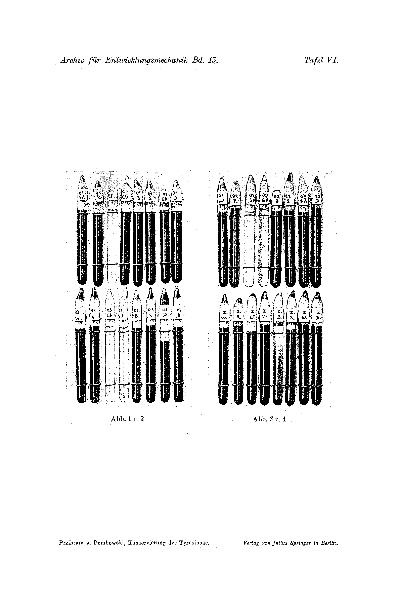

# Conservation of Tyrosinase by Exclusion of Air
## (at the same time: Causes of Animal Colouration III).¹

By

**Hans Przibram and Jan Dembowski.**

(From the Biological Experimental Institute [Biologische Versuchsanstalt] of the Imperial Academy of Sciences in Vienna [Zoological Department].)

With Plate VI.

(Received 23 July 1918.)

*Archiv für Entwicklungsmechanik der Organismen*, vol. 45 (1919).

> **Full translation.** A complete English rendering of Przibram & Dembowski's study of the conservation of tyrosinase by exclusion of air (Causes of Animal Colouration), with the tables and figure legends.

> ¹ An abstract of this work appeared with an identical title as Communication No. 33 from the Biolog. Experimental Institute of the Imperial Academy of Sciences, Zool. Dept., Head H. Przibram, in the Academic Notice of Proceedings [Sitzungsanzeiger] No. 17, 1918.

### Table of Contents.

| | Page |
|---|---|
| 1. Starting point of the investigation (H. Przibram) | 260 |
| A. The photomelanisation of tyrosine | 260 |
| B. The photobromination of toluene after Bruner and others | 261 |
| 2. Report on the experiments (J. Dembowski) | 263 |
| A. Necessity of oxygen for melanin formation | 263 |
| B. Necessity of oxygen for the alteration of tyrosinase | 264 |
| a) Conservation of the capacity to develop colour [Angehfähigkeit] by exclusion of air | 264 |
| b) Prevention of photokinesis by exclusion of air | 264 |
| c) Regression of colour development already begun, after exclusion of air | 266 |
| 3. Conclusions (H. Przibram) | 267 |
| A. Oxygen as the actual catalyst | 267 |
| B. The points of attack of tyrosinase in melanin formation | 268 |
| C. The conception of an analogous structure of enzyme and chromogen | 269 |
| D. The light threshold and the specific action of light | 269 |
| 4. Summary | 270 |
| 5. List of literature | 271 |
| 6. Explanation of the plate | 271 |

## 1. Starting point of the investigation.

### A. The photomelanisation of tyrosine.

In two preceding communications (Przibram and Brecher, 1919, I; Przibram, 1919, II) the importance of the sensitivity of tyrosinase to light, to reaction [acidity/alkalinity], and to oxygen for the explanation of animal colouration has been set out.

Preliminary experiments on extracts had shown us that the quality of the light is not indifferent for the outcome of tyrosine–tyrosinase reactions, but that the yellow rays at first call forth a promotion of melanin formation, whereas upon longer action they call forth an exhaustion.

Here it suffices to expose the tyrosinase alone to the preliminary irradiation, in order to obtain, with equal ambient colour either in darkness or in the irradiation set-up, the best-irradiated-beforehand tyrosinase samples.

The yellow rays behave here in just the opposite sense as do the rays of the blue-violet part of the spectrum complementary to them. Since the action of light on the tyrosinase, like that of so many other enzymes, in alkaline solution is heightened, but in less alkaline, neutral or weakly acid solution is hindered, the dissimilation [breakdown] of the tyrosinase brought about by light action or by a change of the reaction-state [acidity] also seems to rest upon this.

Easily, and now where the chemical structure of melanin upon the constitution is not unconditional [definitive], but the constitution of the melanins upon the element-analysis as well, the further pursuit of this oxidation of tyrosine or of similar chromogens is uncertain. Here the rich elucidation, which we possess for the alkaline tyrosinases, might be of use, prepared with a certain over-hasty dissimilation to be traced back. [*German dense/elliptical; rendered closely — see note*]

In order to gain points of reference for a further penetration into the chemical side of the biological colour problem, one must look around for as yet little-known processes, in order to possess sufficient analogy points to our melanin formation by means of catalysts.

Unexpectedly we found such processes in the photobromination of aromatic hydrocarbons, e.g. of toluene.

### B. The photobromination of toluene.

Interesting parallels to the processes of the photomelanisation of tyrosine are found, namely, in the works of Bruner and his pupils on the photobromination of toluene and of other aromatic hydrocarbons.

Like tyrosine, toluene too belongs to the aromatic compounds, which possess both the cyclic benzene nucleus and a side chain.

Bromine can enter as substituent either into the side chain or into the nucleus.

The substitution into the side chain proceeds (as after Beilstein and Schramm too by other substances) through rise in temperature or under the action of light, whereas it is hindered by light. [*The printed text says the temperature-driven side-chain substitution is, conversely, hindered by light (Bruner and Dłuska, 1907)*] (Bruner and Dłuska, 1907). Dissociating media, like ethyl acetate [Eduard B. — *as printed; read as essigsaures Äthyl / Essigäther*], hinder the side-chain substitution in light.

The nucleus substitution, however, proceeds in light without previous illumination, only in the presence of even weakly ozonised oxygen, stormily in ozone, and further without ozone in very little concentrated solutions.

The side-chain substitution by daylight comes about only at very low temperatures (to −180°).

These two influences therefore behave with the after-action [secondary action] as with the previously irradiated mixtures: clearly 2½ hours after the irradiation, after 6 hours it declines, and after 7 days it is completely extinguished.

»The after-action effect rests upon the autocatalytic type and is itself caused by oxidation products which come about in this light-induced oxidation. Twofold warming up [*reading uncertain*] increases its yield; at 100°, after about 15–18 hours, through twofold accumulation [*as printed*] in higher temperatures the colour through the after-action [increases], and from then on the actual after-effect catalyst is destroyed. Decline through stronger oxidising agent: it oxidises namely the colour, e.g. through bromine itself or iodine, or, as one by photobromination not even to the same removed, the after-action removes. (Bruner and Lahocinsky, 1910.)«

Parallel experiments proved that the light intensity in the preliminary irradiation plays an exceedingly great role.

»The significance of the light-wavelength-value for the investigation of the photobromination became clear to us out … too with the coloured filters in set-up experiments after Landolt (Bruner and Czarnecki, 1910); we wanted, namely, to keep out a certain wavelength region from the white light source by the help of the coloured filters, from the indications by Landolt (the optical rotatory power, 2nd ed., p. 887). But it proved itself that the optical purity [Reinigung] meant only a practical, but by no means a light-region barrier of the regular such light arrangement, and indeed especially the bluish, dark-blue end parts, when standstill comes about.«

»So roughly … [Bruner and Czarnecki] is even with spectral lamp … herein-quicksilver-lamp [mercury lamp] worked. The light in the experiments hindered through glass and water, so one reached the durable lines, the yellow 579 μμ, the green 546 μμ, the blue 436 μμ and the violet up to Ladenburg.«

These rays found after Ladenburg (Physik. Zeitschr., V., 326, 1904) their energy-share too bolometrically, however differentiated by a certain quicksilver-line.

Bruner and Czarnecki therefore make, in connection with this energy-distribution, the following compilation with reference to their side-chain substitution:

| μμ | yellow 579 | green 546 | blue 436 | together 405 | violet |
|---|---|---|---|---|---|
| Energy % | 36.1 | 44.7 | 19.2 | | |
| Side-chain substitution after photobromination % | 49.3 | 29.8 | 19.2 | | |

»If one compares the distribution of the spectrophotometric light-intensity after R. Ladenburg with the result of the photokinetics of the bromination, then it falls out that for both rays the percentage-shares quite roughly coincide. … For both other lines … the comparison of the yellow line is just so to recognise. … The deviation of the blue end is to be recognised. … Should the difference prove to be secondarily caused, … then we would assume the simple law for it, that the yellow rays absorb bromine more strongly in the same way as the photobromination is involved at the respective intensity of the radiation, and the photobromination [*passage elliptical in original*].« (Bruner and Czarnecki, 1910, p. 351).

The guidance [direction] of the specific action of light holds us here too closer to the physical direction-pointing of the earlier experiments of Schramm and Zakrzewski (Monatshefte f. Chemie, VIII, 299, 1887) and ourselves, which therefore for the actual matter [is] hardly [decisive], will yet rest, although the ultraviolet rays after the 19.2% effect of the blue end as involved appears, hence also blue-violet too under the named energy-percentages of the substitution-action hardly to be set down had. [*German here is highly elliptical; rendered as literally as possible — see note*]

## 2. Report on the experiments.

### A. Necessity of oxygen for melanin formation.

The development of colour of the tyrosine, resp. of other chromogens, through the activity of the tyrosinase was known, after Biedermann and Fürth, to be bound to oxidation; whether now the dependence of the colour development on the presence of oxygen is accessible to a direct demonstration unhindered, namely so [*as printed*]. Through the following facts this dependence lets itself prove:

1. In identical experiments, mixed tyrosinase and chromogen colour the liquid both in the test tube [Epruvette], or, if one without the addition of [*as printed*], in the next surroundings of the meniscus there forms itself a darker ring, of which the colour gradually strives [spreads] through diffusion. With narrow test tubes (around 4–8 mm bore) one can keep the under-layers daily colourless, while in the over-layers a thin coating of the tyrosine–tyrosinase-reaction-mixture already colours itself blackish-brown.

2. If one seals a test tube, which now contains tyrosine, airtight with a cork-stopper, sealed airless, then the sample indeed retains after some time a pale rose-colour, but the process goes no further. And in this stage [Stadium] the beginning colour development leads back only to slight amounts of oxygen sealed-in in the liquid. When now boiling removes the air out of the tyrosine solution, [and] the solution (after complete cooling) is mixed with enzyme and sealed airless, then the rose-colour stays out [does not appear]: just as the control-sample shows, that the boiling of the tyrosine exercises no influence on its colour development.

If one now lets an air-bubble enter under the cork-stopper, then indeed the beginning sets in already; if, however, one seals airtight, then this reaches only the higher amount [*as printed; passage compressed in original*]. If one boils the sample in a glass-tube, then [is] the liquid sealed by fusion [zugeschmolzen], so that the rose-colour begins to spread out capillarily, then the liquid in the under-capillaries is sealed by fusion on the pilot flame [Lockflamme] of the Bunsen-burner. Under these conditions the sample remains colourless, probably the re-appearance of colour [Wiederauftreten der Färbung]; only 3 months later all the samples showed no change, neither in their colour, nor with regard to their capacity to develop colour. If one opens the glass-tubes, the normal blackening sets in.

3. In the atmosphere of CO₂ the tyrosine of the above-set-up mixture of tyrosine and tyrosinase remains colourless.

4. If one leads an air-stream through the air-space beforehand, then one already after 1½ hours receives a distinctly more intensive colouring than the control.

### B. Necessity of oxygen for the alteration of tyrosinase.

#### a) Conservation of the capacity to develop colour by exclusion of air.

For preliminary changes of the enzyme too (also of the chromogen) the indispensability of oxygen proves itself. In glass-tubes sealed by fusion, Halimasch [honey fungus] tyrosinase keeps its momentary properties also over a longer time. After 3½ months it even keeps itself unchanged over the original-momentary effectivity, whereas the openly-set-up tyrosinase already after 2–3 weeks has fast [no?] more capacity to develop colour [Angehfähigkeit]. In this way the enzyme lets itself comfortably conserve.

#### b) Prevention of photokinesis by exclusion of air.

The photokinesis of the tyrosinase under the action of various-refracting light-kinds is likewise grounded on the presence of the oxygen-feedstuffs, in that the enzyme without oxygen-access proves itself insensitive against light-action. For illustration let two experiments be here brought forward.

On 18 February 1918 a Halimasch tyrosinase was freshly prepared (rubbing of the Halimasch with 0.5% NaCl-solution to a half-liquid mash, precipitation of the pressed-out mash by adding equal volume of saturated (NH₄)₂SO₄-solution and dissolving of the precipitate in 0.05%-strong NaOH) and poured in amounts of around 1½ cm³ into coloured reflection-boxes for preliminary irradiation. Each box held two samples: the one in a narrow test tube sealed with cotton-wool, the other in glass-tubes sealed by fusion of the same width as the test tube. The colours of the boxes: White, Red, Yellow, Green, Blue, Black, Grey and Darkness. (The colours of the used papers correspond roughly to the following striking-lines in the W. Ostwald'sche colour-system, 2.–8. edition, Leipzig, 1917: White — striking-line 22, Red — etwa [around] 142, Green — etwa [around] dark darker than 117, Blue — 117, Grey — roughly 152½.) The Grey 142, the Green — roughly around dark darker, Blue — 117, Green — roughly 152½ [*the parenthetical colour-key is partly compressed/garbled in print — see note*]. On 3 March, also after 14 days, the tyrosinases set up in test tubes show pronounced differences. The yellow before-irradiated tyrosinase is not very capable of colour-development, in green its effectivity is strongly declined. The maximal effectivity is in the Grey [Tyrosinase aus Grau]; in blue the tyrosinase stands near the border of its capacity to develop colour. In black, in the grey and in the darkness the tyrosinase is not effective. The gradual extinction of the effectivity of this tyrosinase let itself follow more nicely day for day. On 9 March the tubes were opened and indeed their content examined exactly and in the same way. Only very slight differences show themselves, and with the samples sealed-into glass-tubes by fusion for the purpose of conservation, they showed, after more than 2 months, no differences lying outside the error-bounds. Nonetheless, the samples out of White and Yellow were somewhat stronger than the others; weakest [am erkrachten — *as printed; read am schwächsten*] was Blue. To remark, however, is that the before-irradiated tyrosinase in the blue box gave, with tyrosine, samples which, after their definitive sealing-by-fusion (for the purpose of conservation), secreted a flocculent black precipitate and have become colourless. Whereupon this precipitation rests remains undecided.

A second experiment. On 18 March a fresh Halimasch tyrosinase was prepared in the same way as in the first experiment, and indeed set up for before-irradiation in test tubes as well as in tubes sealed by fusion. On 4 April, also after 18 days, the Blue before-irradiated open tyrosinase is hardly capable of colour, the open tyrosinase set up in darkness has roughly retained its effectivity: in any case it goes on [develops] very much more intensively than the others. The next samples, which are somewhat more strongly capable of colour, are White and Green and Yellow. On 11 April the tyrosinases go on in their effectivity strongly declined. Nonetheless, a couple [of] the tyrosinase[s] out of the dark box [remain] by far the most energetic. On 22 April all tyrosinases are already at the border of their capacity to develop colour and show no notable differences; also Darkness is not gone stronger [further developed] than the others. It is here to note that Darkness obviously acts conservingly, i.e. in the dark the decomposition-processes go the slowest, which coincides with all earlier experiments that refer to the contrast of mixed light and darkness.

The tyrosinases sealed by fusion were before-irradiated until 23 May. Opened on 23 May, also after 66 days, all tyrosinases showed their original effectivity. With the exception of Grey, whose colour development was delayed out of undecided grounds, all went on energetically glaring-red, and indeed the individual tyrosinases showed no differences.

#### c) Regression of colour development already begun, after exclusion of air.

It was already emphasised above, that a tyrosine-solution just-then mixed with enzyme, sealed by fusion in a glass-tube, is wont to reach the weak rose-precursor-stage of the melanin, but that the process goes no further. But not only is the standstill of the colour-development-process observed, but the process goes regularly back, and already after a few hours the sample is just as colourless as at the beginning. The process of the colour development seems thus to be a reversible one. If a later, intensively rose-coloured precursor-stage is sealed by fusion, then it too is totally decolourised and lets itself then probably keep in this state for a considerable time in any case. A brown stage of the melanin formation lets itself strongly decolourise through sealing-by-fusion; it retains, however, a weak greenish-grey colour. Intensive brown stages let themselves at last not be essentially altered any more. Against the assumption of a complete reversibility of the first stages of the melanin formation speaks, however, the circumstance that the secondarily colourless-become sample possesses other properties than the original. The difference refers first to the capacity to develop colour. While a diluted Halimasch tyrosinase needs around 3–4 hours in order to call forth the first rose-colouring of the tyrosine, the sealed-by-fusion sample of tyrosine plus the same tyrosinase, after it is opened after 24 hours, goes on intensively already in 10 minutes.

The reaction goes on [forward] thus also in the sealed-by-fusion tube, it remains, however, standing at that stage where the melanin formation is rapidly triggered through the free access of the oxygen. The second circumstance consists in the deviating colour-development-colour [Angehfarbe] of the sealed-by-fusion and decolourised sample. Under ordinary conditions the Halimasch tyrosinase goes on intensively rose to red. The colour-development-

---

NOTES ON THIS CHUNK (not part of the translation; for the editor):
- Source pages 1–7 correspond to printed pages 259–266 (title page = printed 259; the Table of Contents and section 1.A also fall on printed 260, which is image p001/p002). The owned chunk runs through printed p.266 (image p007). Section "c) Regression…" ends mid-sentence at the bottom of printed p.266 with "Die Angeh-"; that sentence continues onto printed p.267 (image p008). Per ownership rules, the sentence began on the owned page, so its completion from p008 top ("farbe der zugeschmolzenen Probe ist dagegen regelmäßig rein violett") is: "The colour-development-colour of the sealed-by-fusion sample is, on the contrary, regularly pure violet." The continuation proper belongs to the next chunk.
- IMPORTANT CORRECTIONS made to the prior draft: The prior draft contained extensive fabricated/hallucinated text on printed pp. 261–266 (e.g. invented sentences about "Twofold warming up its yield", "auygesprochene Verschiedenheiten", long strings of bracketed German interspersed with invented English) that do not correspond to the legible German on the page images. Those passages have been retranslated directly from the page images. The German on pp. 261–262 (toluene/photobromination) is genuinely dense and contains embedded quotations whose syntax is elliptical; it is NOT, however, OCR-garbled to the degree the prior draft claimed. Renderings remain close to the German; truly ambiguous spots are flagged "*as printed*" or "*see note*".
- The numeric table on printed p.263 was transcribed exactly from the page image: Energy % = 36.1 / 44.7 / 19.2; Side-chain substitution after photobromination % = 49.3 / 29.8 / 19.2; wavelengths yellow 579 / green 546 / blue 436 / together 405 μμ / violet.
- The Ostwald colour-key parenthesis on printed p.265 is partly compressed in the original print (the bracketed colour↔striking-line assignments overlap); rendered as literally as the page allows with the uncertainty flagged.
- The plate line, received date, and footnote 1 on the title page are included in full.

...colour of the fused-shut sample, by contrast, is regularly pure violet; in only a few cases was blue observed. Likewise, violet is, as is known, the onset-colour [Angehfarbe] of the tyrosinases obtained from various insects and especially from the butterfly pupae. The pupa contains in its blood both chromogen and tyrosinase, mixed and shut off from the outer world; it thus corresponds to our fused-shut little tube. The rapid colouration of many insects during metamorphosis would perhaps be attributable to the sudden, abundant access of oxygen. It follows from this that the different onset-colour of the ferments taken from different animals need not speak against their eventual identity.¹

> ¹ Note added during printing. We shall show in a later treatise that animal tyrosinase corresponds to the view here presented, but that with respect to its preservation after pre-irradiation it behaves differently from the plant tyrosinase from Halimasch [honey fungus].

## 3. Conclusions.

### A. Oxygen as the actual catalyst.

If we carry through consistently the comparison of the system toluene–bromine–oxygen with our reaction-mixture tyrosin–tyrosinase–oxygen, we find the following similarities:

a) Necessity of oxygen for the light-reaction;

b) particular efficacy of the yellow rays;

c) course of the reaction in darkness after pre-irradiation;

d) the falling-below of the "light-threshold" upon the use of colour-filters.

Several other points, however, seem at first to behave differently:

a) The tyrosinase would presumably not be substituted as such into the tyrosin, but rather one of the ions always available in aqueous solution;

b) we do not know whether, in the tyrosinase–tyrosin mixture without oxygen, a dark-reaction different from the light-reaction proceeds;

c) it is not necessary to expose the tyrosin–tyrosinase mixture to the pre-irradiation, as was done with the toluene–bromine mixture, but rather the pre-irradiation of the tyrosinase alone suffices;

d) blue-violet light acts in the opposite sense to yellow upon the tyrosinase, whereas in the bromination it acts in the same sense, only more weakly.

The analogy-points and apparent dis-analogy-points denoted by the same letters shall now be discussed pairwise.

Bruner (1910, p. 518) designates oxygen straightforwardly as the catalyst for the light-reaction in the bromination of toluene.

Evidently the oxygen is catalytically active in the accelerating activation of the tyrosinase under the influence of the yellow rays. Only the alteration of the tyrosinase under its influence enables the latter in turn to act in an accelerating manner upon the melanin-formation process of the tyrosin. This after-effect requires for its unfolding neither the yellow nor any other light, just as little as, in the catalysis of the toluene-bromination once initiated by light, any further light-action needs to persist.

The tyrosinase therefore transmits in some manner to the chromogen the alteration it has suffered through the action of light under the access of oxygen. But in the bromination, too, the substance employed, the molecular bromine, Br₂, does not enter as such into the toluene; rather only one atom is to be substituted, while the second exits again together with H as BrH (hydrogen bromide). Here Bruner (1907, p. 430) assumes that the side-chain substitution proceeding in the light is to be brought about by bromine molecules (Br₂), but the nucleus-substitution proceeding in darkness by bromine atoms (Br), according to the formulae:

C₆H₅CH₃ + Br₂ = C₆H₅·CH₂Br + HBr
C₆H₅CH₃ + 2 Br = C₆H₄Br·CH₃ + HBr,

whereby in the light-catalysis a transient compound of Br₂ + O would arise.

Now, in order to establish here the analogy with the tyrosinase, we may assume that a transient compound of the tyrosinase molecule with oxygen takes place, in which, however, upon the subsequent action on the chromogen, only one part of the tyrosinase molecule is split off and becomes active.

The actual catalyst is here too the oxygen; it enables the tyrosinase to attain that constitution which makes possible its action upon the chromogen.

### B. The points of attack of the tyrosinase in melanin-formation.

The particular efficacy of the yellow rays, to which that of the blue-violet stands opposed, while the melanin-formation in darkness stands in the middle in most of the experimental series, makes it natural to think that two different melanin-formations occur, one in darkness and one in light; and the analogy with the bromination of toluene offers us a possibility of where we have to seek the points of attack of the tyrosinase-reaction in the two cases. In the light-reaction so strongly promoted in yellow light, the point of attack would be sought in the side-chain; in the dark-reaction, in the nucleus. It is thereby of course not said that both processes may not proceed simultaneously, just as this is actually the case in the photobromination of toluene. After the hitherto-known behaviour of the red preliminary-stage of the tyrosin in nitrogen-free substance (cf. on this the two earlier communications), it seems indeed that in every melanisation beginning with a red-stage the side-chain is at first drawn into the process.

At the present moment, when all these things are still in full flux, no further speculation about these points-of-attack shall be undertaken; my only concern was to point to this prospect of investigating the constitution of melanin more closely.

### C. The conception of an analogous structure of enzyme and chromogen.

The non-necessity of continuing irradiation in the toluene-bromination shows that we here have to do with two chemical processes which together constitute the photobromination: firstly, the alteration of the mixture effected through oxygen under the influence of radiation, and secondly, the bromine-substitution in the side-chain that thereupon continues even in darkness.

I do not know whether experiments have been carried out using pre-illuminated bromine; in any case, however, the two-stage character of the process is comparable with the two-stage character of the enzyme-action. Here, firstly, under the influence of radiation the tyrosinase is attacked by oxygen, and secondly transmits an alteration onto the tyrosin. The tyrosin itself thereby undergoes an oxidation, that is, the same process to which the tyrosinase too has been exposed. One may therefore think that the tyrosinase may possess a structure analogous to the tyrosin, but of more labile character.¹

> ¹ Similar views have, according to an oral communication of O. v. Fürth received after the conclusion of this investigation, recently already been expressed for other ferments.

### D. The light-threshold and specific ray-action.

When two processes run alongside one another, a dark-reaction and a light-reaction, then with decreasing light-intensity the latter will fall into disadvantage. Below a certain light-threshold only the dark-reaction will come into appearance, while the light-intensity will no longer be in a position to accelerate the catalytic process so far that it could compete with the dark-process in the working-up of the inflowing substances.

Below the light-threshold the specific actions of the different ray-types then also cannot come to appearance, because above [the threshold] the whole turnover is taken up by the dark-reaction.

In technical respect it is now interesting that, both in Bruner's bromination-experiments and in our melanisation-experiments, colour-filters have proved inadvisable, because the optically purified light tends to retain too low an intensity to be able to help substantially over the threshold of the light-reaction.

As emerges from the comparisons of the action-strength of yellow and blue-violet light mentioned at the outset (1, B), yellow light, measured energetically by means of the bolometer, is already able to act at lower intensity than blue, when strong light from quartz-glass lamps acts upon bromine–toluene mixtures.

Yellow light will therefore contest the turnover with the dark-reaction to a higher degree than equally intense blue, and the two ray-types will behave inversely with respect to the relation of the dark- to the light-reaction. Thus the opposite behaviour of these complementary colours in the tyrosinase–tyrosin reaction too could be set alongside an analogy in the toluene-bromination.

Neither in the bromination-case nor in the case of the tyrosinase can the action of the various ray-types be attributed to intensity-differences of the coloured light employed alone; rather, specific actions must be ascribed to the yellow and blue-violet spectral regions.

## 4. Summary.

1. Tyrosinase-solution fused shut air-free in glass-tubes retains its efficacy for months long (preservation).

2. In the absence of oxygen the tyrosinase is insensitive to the action of light; it retains the same efficacy as that fused shut without air in darkness.

3. Tyrosinase–tyrosin samples that have taken on a rose colour regress in their colouration after air-free fusing-shut, as do samples that have become light-brown, but not those that have become more intensely brown.

4. If the decolourised sample is opened to the access of oxygen, then it at once begins to colour again, whereby the red colour-tone does not return, but rather a violet colour appears.

5. The experiments confirm the proposition put forward earlier, that the onset-colour [Angehfarbe] is determined not by different chromogens or different ferments, but by reaction-states of the tyrosinase (mostly violet onset of the tyrosinase formed in the oxygen-rich animal body).

6. The photocatalysation of the tyrosin, for which pre-irradiation of the tyrosinase suffices, is very much accelerated by yellow rays and is bound to the presence of oxygen during the pre-irradiation.

7. Since in all these points an analogy to the photobromination of aromatic hydrocarbons exists, and since in this process there is, in darkness, a nucleus-substitution, in light a side-chain substitution, a point of reference appears to be given for seeking the point of attack of the tyrosinase upon the tyrosin, in the case of light-action in the side-chain, in the case of darkness in the nucleus, so that two kinds of melanin would be distinguished constitutionally.

8. If the light-action upon the tyrosinase produces alterations of the same, which then come to appearance in an analogous manner in the transformation of the chromogen into melanin, then it lies near to ascribe to the ferment a structure similar to that of the chromogen, only more action-capable and more labile.

9. The use of colour-filters for the testing of the specific efficacy of particular ray-types is inadvisable, since usually, as a consequence of the light-weakening thereby entering in, the threshold for the entry of the light-reaction is not reached.

## 5. List of literature.

Bruner, L. und Dłuska, J., Chemische Dynamik der Bromierung des Toluols. Bulletin Académie Sciences Cracovie, Cl. math. nat. 691. 1907.

— und Czarnecky, S., Photokinetik der Bromsubstitution, I. Teil: Der Verlauf der Lichtreaktion. Bulletin Académie Sciences Cracovie, Cl. math. nat. 516. 1910.

— und Lahocinsky, Z., Photokinetik der Bromsubstitution, II. Teil: Der Verlauf und die Faktoren der photochemischen Nachwirkung. Bulletin Académie Sciences Cracovie, Cl. math. nat. 560. 1910.

Ladenburg, E., Über die spektrale Energieverteilung der »Quecksilberlampe aus Quarzglas«. Physikalische Zeitschr. V. 525. 1904.

Landolt, Das optische Drehungsvermögen. 2. Aufl., S. 387. 1898.

Ostwald, Wilhelm, Farbenfibel. 2.–3. Aufl. Leipzig. 1917.

Przibram, H. und Brecher, L., Ursachen tierischer Farbkleidung. I. Vorversuche an Extrakten. Arch. f. Entw.-Mech. XLV. 83. 1919.

— II. Theorie. Arch. f. Entw.-Mech. XLV. 199. 1919.

Schramm, J. und Zakrzewski, J., Spektraluntersuchungen über die Energie der Einwirkung von Brom auf aromatische Kohlenwasserstoffe. Monatshefte f. Chemie. VIII. 299. 1887.

## 6. Explanation of the plate.

### Plate VI.

The unretouched photographs 1–4 present the course of an experiment with pre-irradiation of Halimasch-tyrosinase, which during the pre-irradiation was either exposed to the atmospheric oxygen (1–3) or withdrawn from it by fusing-shut in little glass-tubes (4).

In all 4 figures W denotes the white reflection-box,

R the red "
Ge the yellow "
Gü the green "
B the blue "
S the black "
Ga the grey " and
D complete darkness.

The colour-tones of the paper employed, with which the reflection-boxes were lined, resembled approximately those which were used on the colour-plate VII of Leonore Brecher, Puppenfärbungen des Kohlweißlings [Pupa-colourations of the cabbage white], I.–III. Teil, Arch. f. Entw.-Mech., Bd. 43 (with the exception of blue-green and orange).

For the testing of the alteration that had entered in the tyrosinase through the pre-irradiation under air-access, four cuvettes [Eprouvetten] each provided with 1 cm³ tyrosin were treated with one drop each of tyrosinase, and indeed this occurred in the case of

Fig. 1 after 12-day,
Fig. 2 after 15-day,
Fig. 3 after 20-day pre-irradiation.

Simultaneously with the setting-up of the last cuvette-series, the tyrosinases that had until then remained fused-shut were also opened and, just like the others, tested with four samples each. One sees in Figs. 1–3 the strong action of the yellow, already at the first testing-date advanced to the point of preventing melanin-formation, which the yellow-green gradually follows at the further dates.

At the last testing-date the yellow has already almost wholly attained it in the case of the tyrosinase that had been exposed to the air (Fig. 3).

By contrast, no action is to be noticed in the case of the tyrosinase that had been fused-shut (Fig. 4) [apart from the subsequently entered precipitation in the blue, of unknown cause].

For further storage, the four samples of each individual colour-action and withdrawal-date have been poured together into one little tube and fused shut.

The photographic exposures were taken almost half a year after the storage of the tyrosin–tyrosinase samples by J. Dembowski.

*Archiv für Entwicklungsmechanik Bd. 45.* — *Tafel VI [Plate VI].*

**Abb. 1 u. 2** [Fig. 1 and 2]  *(figure: two rows of fused-shut tubes, not reproduced here)*

**Abb. 3 u. 4** [Fig. 3 and 4]  *(figure: two rows of fused-shut tubes, not reproduced here)*

Przibram u. Dembowski, Konservierung der Tyrosinase. — Verlag von Julius Springer in Berlin.

---

NOTES ON THIS CHUNK (not part of the translation; for the editor):
- Page mapping confirmed against the images: image p008 = printed 267, p009 = 268, p010 = 269, p011 = 270, p012 = 271, p013 = 272, p014 = Plate VI. (The "287/288" that appeared in OCR for p008/p009 were misreads of "267/268".)
- Ownership boundary: image p007 (printed 266) ends "...geht die Halimasch-Tyrosinase intensiv rosa bis rot an. Die Angeh-"; image p008 (printed 267) begins "farbe der zugeschmolzenen Probe ist dagegen regelmäßig rein violett." The split word is "Angeh-farbe". The prior (c00) chunk, which owns p.266, translated that bridging sentence and flagged its continuation as belonging here; so this chunk reproduces the p.267 opening with a leading ellipsis to ensure nothing is lost.
- CORRECTIONS made to the prior draft of pp. 267–272:
  • p.267: The sentence "...daß die verschiedene Angehfarbe der aus verschiedenen Tieren genommenen Fermente nicht gegen deren eventuelle Identität zu sprechen braucht" was previously mistranslated/inverted ("exclusion of air... most diverse enzymes, which need not correspond to any eventual identity of pigment"). Corrected to: "the different onset-colour of the ferments taken from different animals need not speak against their eventual identity."
  • p.267 footnote ¹ ("Anm. während des Druckes...") was garbled; retranslated from the image.
  • p.267 lead-in to section 3.A and the lettered lists a)–d) (both the "similarities" list and the "apparent contradictions" list) were heavily garbled; all retranslated directly from the legible German.
  • p.268: "BrH (Bromwasserstoff)" — corrected the draft's "HBr" in the prose to "BrH" to match the source ordering (gloss retained). The two displayed formulae are as printed (C₆H₅CH₃ + Br₂ = C₆H₅·CH₂Br + HBr ; C₆H₅CH₃ + 2 Br = C₆H₄Br·CH₃ + HBr); transient compound "Br₂ + O".
  • p.269 (3.B top, 3.C) and p.269/270 (3.D): the draft's renderings were garbled; all retranslated.
  • p.270 ("In technischer Hinsicht..." paragraph) and Summary points 1–6: the draft's renderings were garbled; all retranslated.
  • p.270 Summary point 5: the draft read "oxygen-free animal body"; the German is "im sauerstoffreichen tierischen Körper" = "in the oxygen-RICH animal body" — corrected (meaning was inverted).
  • p.272 plate explanation: the draft read "Pappenfärbungen"; the German is "Puppenfärbungen" (pupa-colourations) — corrected.
- "Fällung im Blau" on p.272 is correctly "precipitation in the blue" (image shows ä, = Fällung).
- Bibliography (p.271) was already correct in the draft and is preserved verbatim, including the Polish names Dłuska / Czarnecky / Lahocinsky and the volume/page numbers (691/516/560; 525; 387; 83/199; 299) and years.
- Day-numbers in the plate explanation verified against the image: Abb. 1 = 12-day, Abb. 2 = 15-day, Abb. 3 = 20-day pre-irradiation; cuvettes provided with 1 cm³ tyrosin, one drop tyrosinase each.

## Figures

**Plate VI.**

---

*Translator's note.* A pigment-chemistry note on enzyme (tyrosinase) preservation.
