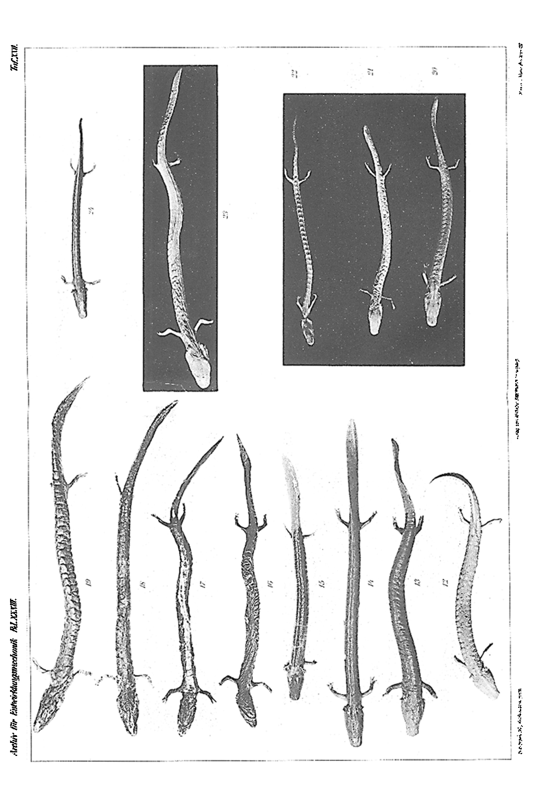
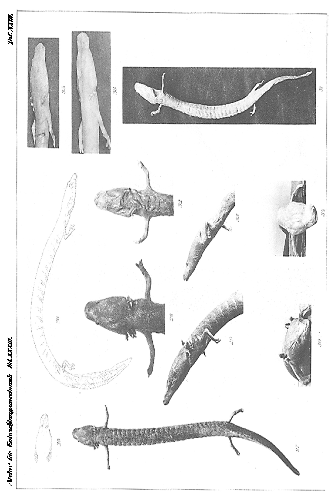
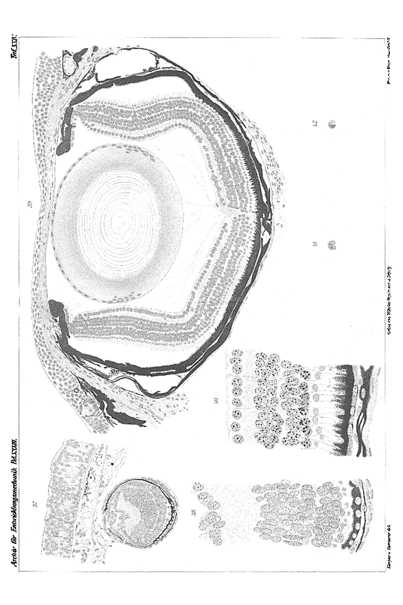
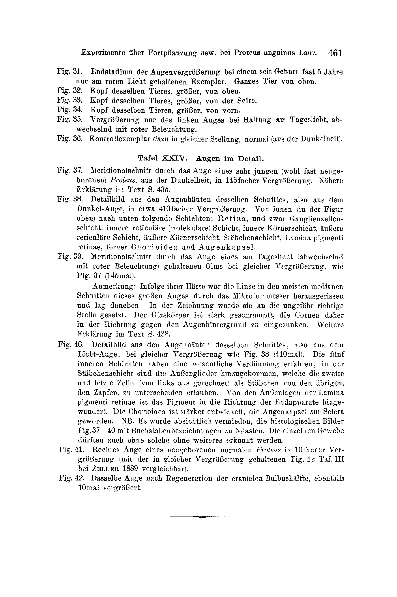

# Experiments on Reproduction, Colour, Eyes and Body-Reduction in *Proteus anguinus* Laur.

(at the same time:
Inheritance of Forced Colour-Changes, III. Communication).

By

**Paul Kammerer.**

(From the Biological Experimental Institute in Vienna.)

With Plates XXI–XXIV.

Received on 13 September 1911.

*Archiv für Entwicklungsmechanik der Organismen*, vol. 33 (1912).

> **Full translation.** A complete English rendering of Kammerer's monograph of experiments on reproduction, colour, eyes and body-reduction in the cave salamander (*Proteus anguinus*), with the tables and figure legends. **Kammerer's claims are rendered exactly as he states them; this translation reports them, it does not endorse them** (later disputed).

### Table of Contents

| | Page |
|---|---|
| I. Introduction: Report on the previous literature | 350 |
| II. New reports on the free life of *Proteus* | 362 |
| III. Technique | 365 |
| IV. Live-bearing | 375 |
| Reproductive period | 379 |
| Courtship play and sperm-transfer | 381 |
| Sex differences | 385 |
| Control experiments | 385 |
| V. Egg-laying | 388 |
| Discussion of the results | 396 |
| VI. The inheritance of acquired black-colouration | 411 |
| The black-colouration | 411 |
| The inheritance | 419 |
| VII. Enlargement of the eyes of the olms kept in the light | 425 |
| Regeneration experiment with the eyes | 440 |
| VIII. Starvation-reduction | 444 |
| IX. Summary | 452 |
| A. Reproduction | 452 |
| B. Colour | 453 |
| C. Growth of the eyes | 454 |
| D. Retrogressive growth of the whole body | 455 |
| X. List of literature | 455 |
| XI. Explanation of the figures | 459 |

## I. Introduction: Report on the previous literature.

One may, like the river-eel, *Anguilla anguilla*, designate the Proteus [olm] as an animal which has set biology the greatest problems. Whether it be the one wonderful animal of the open sea, or the other, serpent-shaped grotto-olm (*Proteus anguinus*, Laurenti) — in this respect the eel-fish [eel] may calmly stand at their side.

Among the many riddles which the *Proteus* presents for solution, one most stubbornly demanded its solution from the natural scientists from the time of its discovery; and this stood, in the foremost rank of, that riddle of reproductive-history.

The first who occupied himself in detail with this question was v. Schreibers. In three treatises (1801, 1818, 1819) — of which not one was published as a single report, while the third, however, is only cited word for word [later] — he has treated the whole natural history, geographical distribution and ecology of the olm, only in the reproductive-history allowed himself to be misled, in that, over the description of the ripe ovary (1801) he did not get any further. Through two full years he believed himself to be on the way to arriving at *Proteus*, and indeed he came to *Proteus* at two different Carniolan find-sites, from Vir and from the Magdalena grotto, and yet [examined] the not-once anatomically investigated sex-organs of these animals. Among hundreds of females he found or saw just as few with higher-developed ovaries, just as little ever ripe afterbirth-eggs or embryos in the oviducts themselves. The only correct way here indicated, to obtain certainty about this, "was indeed the only correct way," as he himself now believed to recognize it; "but the most promising way, the keeping of *Proteus* in captivity, gave however hardly any prospect, since one would have to be content with too few animals to be able to attain a soon-exhausting knowledge of the reproduction of *Proteus*!"

The failure, namely, struck 1817 an anonymous author, who in Oken's "Isis" anonymously made known the unpublished results of v. Schreibers referred to, and reproved [him] very strongly (column 463): "Mr. v. Schreibers had, several years ago, as I have heard, several hundred animals held in dark rooms in water-basins, in order to observe their reproduction; but he has, since no result has come, in that he could neither feed them nor get them to breed, still see them bring forth young. That this might rather lie elsewhere, [namely] that these animals should perhaps languish year-long in long abstinence, did not at all occur to him; and thus also the entirely well-preserved molts, did one indeed obtain by chance through the underlying water-vessels, then one saw a lack of nourishment and thereby the lengths of time changed in such a way as one had hitherto thought, in which case one would easily, willingly, under the "no perfect" animals understand not larval forms; under "crippled newts" not at all wish to understand water-newts (Tritonen) pathologically reduced through deficient life-conditions; and under "length of the time" not still a year-thousand, or year-thousands, which led to the transformation of one kind into another, which suffices neither for [one] year, nor in one and the same generation, for bringing forth crippled changes. Nevertheless, the things lie, by the described mishandling, [such that] he, not once one of the most striking chapters in the origin-history of the development-thought [Darwinism], placed an obstacle. Although already 8 years before Lamarck's "Philosophie zoologique" originated and indeed the [thought] scarcely belonging to it, that neither these nor those other steps of the then natural-philosophy remained untouched right up to the most recent day, [it] sticks here, with one — with one inadequate beginning of transformation of kinds here nearly enclosed thereby, however by the described mishandling — wrong, and indeed in late, mechanistic times.

Not luckier than v. Schreibers was Rusconi, in his large-format monograph published in common with Configliachi (1819), in which he in one later article (1826), or rather yet again, could describe and depict ripe ovaries among the many. Fitzinger speaks, with hindsight on Rusconi, of this "impregnation," to which on the other hand also several females of Fitzinger's [collection] / Rusconi's specimen certainly had: his (and Rusconi's) specimens are however empty, like all of the remaining anatomically investigated *Proteus*.

The grotto-olm-keepers [grotto guides] insist always and again, even today — that I myself convinced [myself] of in Adelsberg [and] St. Kanzian, even today still — that the olms in part bring the young into the world; approximately in this sense did themselves also [express] the [witnesses], from whom the first positive report concerning *Proteus* in general was printed: that is, the protocol of the peasant Stratil, drawn up by the parish-reporter J. Geck from Verch, which Michahelles bequeathed to the public in the year 1831. There it comes forth that a fresh-caught olm "of the smaller genus" on 17 June 1825 brought into the world, in a flask, three young 1½ inches long.

"This little-fish, now born before all eyes," so it reads in Stratil's protocol, "[one] felt at its whole rear part by its enwrapping and envelopment forthwith after its appearance. When one finally had caught a little-fish, then one saw, hanging from such a web of veins and a gallant-shaped net, about 100 millet-grain-sized, double-sided, water-clear little-globes, which hung close to one another by means of blood-red threads or little-bodies," from the motherly cloaca. The trunk of the female described, during the birth-act, a curvature coiled throughout. Since the young in one of the cases familiar to Michahelles did not lay off the eggs from the olm, even since here no eggs [were laid before] live-bearing, rather one must assume an "ovoviviparity," [as] glimpsed through outlets of abortives (a kind of afterbirth . . . of about 100 millet-grain-large little-globes), as this in principle frequently occurs with our fire-salamander (*Salamandra maculosa* Laur.).

In his lecture before the imperial Academy of Sciences in Vienna, Fitzinger (1850) discussed before the Academy a particular investigation for the purpose of researching the reproductive-business of *Proteus*. "It is indeed known" (p. 302), "that about the reproduction of the olm [we] still know nothing at all . . ." (there follows the already settled citation of v. Schreibers' activity): "The only correct way to obtain information about this would be that which court-councillor v. Schreibers has taken." Although the outstanding lecture of Fitzinger's, which became famous, in which he dissolves the previous *Proteus anguinus* into seven different independent species, renews about the reproductive-history only the confession of complete ignorance, he has, in consequence of a short discussion-remark, which Hyrtl, then present in the same session, made, steered further reports into a new track. Hyrtl namely added "to this the remark that, on the specimen of which Mr. Fitzinger had convinced him, which only had developed ovaries, he had found at the end of the oviduct a gland which only occurs in egg-laying naked amphibians (and some fishes). It is from this to be assumed with great probability that the *Proteus* is an egg-laying, not a live-bearing animal."

The existence of the Hyrtl gland passes from now on into the textbooks and handbooks. Essentially it is, as well, what robbed the olm of its prestige as a viviparous animal and procured for it the reputation of an oviparous creature. So in Schreibers' (not to be interchanged with v. Schreibers!) "Herpetologia Europaea," 1875, p. 14. In works which in part mention this Hyrtl gland, the transformation of the views [is] especially striking. Thus Leukis [Leunis] of 1860 still writes indeed not yet decidedly (p. 342): "bears living young and has its metamorphosis, wherefore Merrem changed the name into *Proteus*." On the contrary, Leunis of 1883 (perhaps only earlier, yet this 3rd edition is not exactly to hand), p. 630: "the reproduction is still rather puzzling, yet it is certainly egg-laying." In what connection both these passages stand to one another, [whether] it is for one quite to assume that we [had] two further passages — [whether] in the case of *Proteus* [Hyrtl] was justified, from a purely anatomical finding, to draw physiological conclusions (a manner of conclusion downright typical in certain literature-epochs) — will indeed show itself later.

In any case the matter was here, [with] *Proteus*, uncommonly entangled; for even the now-following physiological observations were not able to clear it up finally. Even if [supposing] we reject the conclusion from the morphological constitution to the function of the individual organ-system, because — [what] better method could one think out than precisely to observe that function directly, on the living, healthy animal in captivity? And yet this way too brought at first only prejudices and not an exhaustive knowledge of the reproduction of *Proteus*!

The next communication, footed on self-reliant and positive observations, stems from F. E. Schulze (1870); at the end of April 1875 head-grotto-guide Prelesnik had set two Proteans into a "hemp-trap," whereupon on 7 May 42, on 12 May 12, on 15 May 2 eggs, total 56, were laid. That it was a matter of eggs was established not so much by Prelesnik, but rather first by Schulze, who, present no less than Prelesnik, [established] no young, by means of comparison with the ovarial-eggs of a 250 mm long female sent to him at the same time. At the beginning all the eggs lay on the bottom; after 3 weeks ascent [buoyancy] took place, after a further week shrinkage [took place], [and] only after a further 2 weeks did they disintegrate. Schulze further emphasizes the similarity of the olm-egg with that of the axolotl (*Amblystoma*); only that the latter [is] pigmented, the former unpigmented.

The Schulze communication must have called forth Wiedersheim's highest interest; for in his own communication (1877), setting out from it, he recalls the meanwhile forgotten Stratil protocol issued by Michahelles. Yet Wiedersheim's attempt to snatch this remarkable document from oblivion was unfortunately unsuccessful: it contributes little to being a guiding or warning thought for the following investigations, with the sole exception of Zeller's exemplary investigation.

Evidently it is again the same case communicated by Schulze, which is treated once more in the 2nd edition of Brehm's Tierleben (1878) [in the 3rd edition, 1892, only more briefly touched on], but not after F. E. Schulze, rather after an original letter of Prelesnik's, dated 9 May 1875, to Brehm, wherein the state of affairs is presented somewhat divergently. Thereafter, in all, 58 eggs were laid, of which some were sent to Vienna. About the rest Prelesnik learned (written after Prelesnik and Brelesnik) that they enlarged themselves somewhat with time, but soon after passed into decay. "They had," Brehm adds, "evidently not been fertilized and were tended under conditions which prevented their development." From Prelesnik's remark that "small nets, like spider-webs, form around the eggs, and between the eggs and this net something like the white in the ordinary egg," I would conclude that they were fungus-infested by Saprolegniaceae, a phenomenon which one perceives especially frequently with unfertilized eggs of amphibians and fishes.

To Stratil's protocol, likewise cited by Brehm in the 2nd edition of the "Tierleben" [left out by the editor of the 3rd edition], it is remarked: "notwithstanding the stamp of probability which this narrative bears in itself, the peasant's statement later proved itself to be erroneous. Wherein the error was established, I do not indeed know how to say; in any case, however, it stands fast that at present no researcher any longer believes this story."

Much more cautiously, even in connection with the thorough observation of Schulze, does Knauer, muchexperienced in amphibian-ecology, express himself (1883, p. 273): "Even if this communication also makes [it] very probable that the grotto-olm lays eggs, so are nevertheless probably further observations to be awaited; so much the more as, e.g., with the as-a-rule live-bearing fire-salamander, it was observed 'that it lays eggs occasionally.'" Here only quite incidentally remarked: the widespread literature-statements about the "egg-laying" of the fire-salamander mean, in my view, never actual oviparity, but only that the finished, soon-to-hatch larvae can still be surrounded by the egg-membrane at the moment of their birth.

The detailed treatise of Miss von Chauvin (1883), appearing in the same year as Knauer's amphibiology, likewise her preliminary communication (1882), Knauer did not yet know, otherwise he would surely have made use of it.

Setting out from the experience that the native amphibians reproduce most easily in captivity when they are caught in an already mating-eager state, M. v. Chauvin attempted to procure rutting olms. But her suppliers were unable to comply with this wish, nor even to deliver sure pairs, so that the observer found herself compelled in 1877 and 1878 to acquire as many specimens as possible indiscriminately, in order to be able to presuppose the presence of both sexes among them. In fact one of the animals procured in 1877, which was 257.5 mm long, revealed itself in May 1878 as a male, in that the cloacal region swelled up hillock-shaped, the skin-colour, gone grey through the action of light, became more vivid, on the tail-sides two rows of bright, round spots came to view, and the tail-fin widened through a crimped skin-seam. This time, however, the wedding-dress [nuptial-dress] disappeared still without result. Yet in the spring of 1879 a 230 mm long animal made itself known as a female, by the swelling of its hinder body-part in the dorso-ventral direction, where now, in increasing distinctness, the eggs were to be seen through the scarcely pigmented, moreover stretched skin: it got a narrower skin-seam, lower cloacal hillock than the male, and a reddish skin-colour, "as it seemed, in consequence of increased blood-flow," but no pigment-spots, no ornamental-colouration. The animals thus recognized as a pair were put together into a special aquarium and withdrew, after longer courtship-plays at first proceeding only from the side of the female, into a hole of the artificial grotto inaccessible to observation, where the fertilization took place, since it had to take place; for already in the night from the 16th to the 17th April [the female] laid a first egg, in the following night two further [eggs]; the smooth cloaca then dropped each egg singly into small depressions on the ceiling of the cave. The injury and inflammation through the egg-laying brought about a premature cessation of laying on the 12th, on which [day] two eggs later still followed. After the just-described reproductive process there could no longer be any doubt that *Proteus* lays eggs and cares for its brood, since it conceals them in hidden and protected places, [which] indeed clearly speaks for the reproduction natural-to-its-kind; also the begun embryonic-development in the eggs points thereto that the same [development] in them, before the full ripeness [is] reached, and the development arrives in the natural course in the water — [eggs which] go away. — Eggs: the egg was taken among the 58 eggs in all; from this unfolded a 6 mm long inner egg, likewise enclosed by a colourless, many-pointed gelatin-layer. The egg-string [was] still completely unpigmented; then the gelatin did not change itself in water, in distinction from the spawn of the frog-pond-frog [as well as] from the axolotl, since [it] swells up and becomes loose. On 14 September 1882 there were in all 3 [larvae] in captivity: the eldest, a 202 mm long male; at the end of October the eldest of the previous year, a 4-year-old, conceived, a 255 mm long male, rutting; only that in a weakened laying-act it was not [successful], and the eggs after the laying did not develop on the 8th day, since by the sticking-on at the stone [they] returned again: this, the rather pressing water, brought the development to a standstill. The technical guidance which M. v. Chauvin gives, in order to enable the further keeping of the olms, I will first bring to language [discuss] in the second-next chapter.

For the development-result M. v. Chauvin had luck, as did Zeller (1888, 1889), since, according to his assumption, [the olm] pointed away, for four whole years, to endure, in the winter-uninterrupted residence of a carefully covered-over garden-basin. Despite years-long inflows and outflows of water, under-watery the temperature [ranged] from under 4 to 14.5 degrees R. The main weight Zeller laid on the detailed observation-results, on the undisturbed laid [eggs]. On 14 April 1888 Zeller found the first

---

**Translator's note on coverage:** The title-page front matter (p.1) and every paragraph beginning on pages 2–7 (pp. 350–355) have been rendered in full; the paragraph beginning on p.7 that runs onto p.8 (p.356) is completed above. There are no printed footnotes at the foot of p.350; the dates "1801, 1818, 1819" in the text are publication years, not footnote markers. Several passages on pp. 353–356 are syntactically difficult in the original (long run-on sentences with elliptical constructions); the translation stays as close to the German as the sense allows while preserving every clause.

…must have proceeded, for in the night of 16–17 April the female laid its first egg, in the following night a further 11 eggs. It pressed the cloaca against the dripstone and attached each egg singly into small depressions on the ceiling of the cave. Injury and inflammation of the cloacal margins brought about a premature cessation of laying after the 12th egg, upon which only two more eggs followed later. "After the processes just described, there can no longer be any doubt that *Proteus* belongs among the egg-laying gilled amphibians [Kiemenlurche]. The unmistakable care of the female for its brood, which betrayed itself in that it deposited the eggs in concealed and protected places, speaks plainly for the view that this mode of reproduction is the one conforming to nature [naturgemäße]; the begun embryonic development in the eggs likewise pointed to the fact that these had attained their complete ripeness before laying, and that the development must proceed in its natural course in water" (p. 678). — Each egg measures 11 mm in total diameter; of this, 4 mm fell to the yolk, 6 mm to the inner, fairly firm, crystal-clear envelope, which on the outside was enclosed by yet a second, likewise colourless transparent gelatinous layer. The eggs are completely unpigmented, and their gelatine does not change in water, very much in contrast to the spawn of the frog-amphibians [Froschlurche] and of the Axolotl, where it swells up and becomes loose. On 14 September 1882 a female 262 mm long, which had been in captivity for 5 years, became gravid [brünstig], and at the end of October of the same year a male 255 mm long that had been tended for 4 years; but it did not come to any further egg-laying, and the eggs of the first laying developed only for 8 days, because in sticking to the stone they had all been injured: the water penetrating into the egg brought the development to a standstill. — The technical instruction which v. Chauvin gives, in order to enable her successors to keep olms, I shall not bring up until the next-but-one chapter.

More fortunate than M. v. Chauvin with respect to the developmental result was Zeller (1888, 1889), who assigned eight olms — by his assumption four genuine pairs — to a carefully covered garden basin for permanent residence, not interrupted even in winter. Despite the constant inflow and outflow of water, the temperature fluctuated from below 4 to 14.5 degrees R. The chief emphasis was placed, even at the sacrifice of detailed observational results, upon undisturbedness. On 14 April 1888 Zeller found the first eggs, whose number in the course of the two following days grew to 76. But it is not certain whether one or several females took part in the laying. All the eggs adhered to the underside of the tufa layered one above another in the basin; they had up to 12 mm in diameter and "consist of a soft, gelatinous, colourless mass, which encloses, in a coarser but likewise colourless envelope, the yolk measuring about 4 mm." The yolk was milk-white "with a just-recognisable touch of pale grey in the upper half." The great mortality of the developing embryos brought it about that only two larvae thrived as far as hatching and beyond. The embryonic development lasted, quite unusually long for Urodeles, 90 days, since the hatching took place on 12 July. The larva measured 22 mm, its tail 5 mm; its form was similar to that of the adult animal, but neither head nor trunk was elongated to the degree it is in the latter. A larval tail- and dorsal-fin seam is considerably developed. There are three-toed (in the 12th embryonic week still only two-toed) forelegs, and bud-shaped hindlegs just bent at the knee. The three pairs of gill-tufts Zeller calls short and in no way more developed than in the adult animal; against this, however, according to his figure they must after all be called relatively longer. The eyes appear as distinct, round, black points with a cleft open ventrally and advancing dorsally to the middle; this relatively good development of the eye Zeller takes — after he has weighed, and (1889) rejected, the eventuality that it was brought about by the action of light — as a normal transitional stage and reminiscence of seeing ancestors; whereas he ascribes to the influence of light a fairly considerable skin-pigmentation, which already becomes noticeable in eggs kept in the light, but is absent in the eggs left in darkness. Without doubt Zeller was, with this conception of his case, as we shall see, entirely in the right. In the second week after hatching the two toes of the hind extremity come into view, which for a further two weeks remain lying immovably against the tail. On 9 August the two larvae were conserved, since they had been injured — apparently by the *Cyclops* given to them as food — and had to be regarded as candidates for death. "It is now quite certain," concludes Zeller (1889, p. 137), "that the reproduction of *Proteus* takes place through egg-laying," and it would in itself well occur to no one to raise the question whether perhaps live-bearing might not possibly also occur alongside it, were it not for the … Stratil protocol of 26 June 1825 … and were it not that the statements of the witness, in content and wording, make far too greatly the impression of credibility for one to be allowed to declare them, without further ado, invented or not worthy of attention at all … Nevertheless, if the possibility of a live-birth cannot be rejected, this will have to be regarded only as an exception …"

From his conserved embryonic material, which he himself found no time to work up, Zeller gave portions to various other investigators, and in this way made possible several further important detailed investigations. Wiedersheim (1890), who tended in vain 22 olms in a deeply buried basin of his garden under quite the same conditions that Zeller had demonstrated to him, examined several eggs of various developmental stages *in toto* and in sections. Germ-embryos [Keimlinge] 12–13 mm long from the 6th to 8th embryonic week still have quite salamander- or triton-like head- and trunk-forms; only beginning from a 16 mm-long stage do they begin to stretch out lengthwise. This 16 mm embryo had two-toed forelegs, knob-shaped hindlegs; the tail already bore a lightly pigmented fin-seam; an eye was not to be seen, which however may be attributed to the conservation. In the summary it is said (p. 140): "The development of the small eye-vesicles takes place exactly in the manner usual in the remaining Vertebrates." — "The strong development of the olfactory sacs and of the auditory apparatus is to be set to the account of the rudimentary eye (compensatory relation)."

The work of Schlampp (1892) on the eye of the cave-olm, of which we shall still have to speak in the VII. Chapter, was likewise made possible in essential parts through Zeller's material.

v. Bedriaga (1897) used signs of gravidity [Brünstigkeit] which his olms showed, in order to establish in them not only the transient extragenital sexual characters already described by Chauvin, but also those persisting beyond the rutting period: the most distal quarter of the male's tail is almost as high as the rest of the tail, with a high seam-fin broadly rounded at the end; in the female the last quarter of the tail is lower than the proximal three quarters, and the lower seam-fin ends in a narrow rounding. The cloacal cleft of the male is markedly, that of the female only a little, longer than the middle finger measured at its inner margin. The cloacal swelling [Cloakenwulst] projects in the male more strongly in its cranial half than in its caudal, while in the female it is everywhere uniform and indeed flatly vaulted. Of these characters I myself have been able to make good use, especially of those that concern the cloacal cleft and cloacal swelling, whereas the tail-end is not seldom somewhat tattered — and indeed naturally as a rule in just those animals where one most urgently needs it in faultless condition. But I have also convinced myself in this respect (Fig. 3 ♀ and 4 ♂) that the characters given by v. Bedriaga hold good. With v. Bedriaga's olms it did not come to reproduction, but it did come to love-play [Liebesspielen], as appears not yet in his book "Die Lurchfauna Europas," but only from a letter addressed to me of 12 November 1907: "They are exceedingly graceful during the rut."

Whereas the experiences of Hyrtl, Schulze, Chauvin, and Zeller had, as far as scientific possibility of judgement reaches, made egg-laying appear as the sure norm, now new experiences broke into the biology of the olms, which brought live-bearing — and with it the almost-forgotten communication of Michahelles — back into honour. Nusbaum had in September 1903 transported five living olms from Adelsberg to Lemberg and there kept them in an empty glass aquarium. The animals, since they were destined for anatomical-histological purposes, were not fed, but received only once or twice weekly fresh tap-water. After two months two specimens were dissected, whereupon it turned out that one of them was of male sex. Of the remaining three specimens, two grew visibly leaner and remained lively; the third became, despite the long period of fasting, steadily fatter and more sluggish. In the night of 11–12 October 1904, that is, after a captivity of 13 months, the last-mentioned specimen gave birth to a strikingly large — namely 12.6 cm long — exceedingly lean, feebly mobile young one. Whereas the old olms, as a consequence of the action of light to which they were exposed in their dwelling-container, had gradually taken on a brownish-black colouring, the young olm showed itself quite pale and translucent. Its extremities exhibit various anomalies: the left foreleg has only two instead of three toes, the right hindleg is completely lacking. Nusbaum interprets this live-birth observed by him as a rare exceptional case, whose cause is to be sought in the unfavourable conditions under which the animals were kept: "The action of the bright light, the absence of corresponding hollows and of a natural floor, the complete lack of nourishment, and perhaps also abnormal temperature conditions — all these conditions have very probably caused the female in question not to lay outward the fertilised eggs that had entered the oviduct. Only one egg, and indeed probably the outermost, came to development, while the remaining eggs served as nourishment for the larva. Had a young animal developed not in one but in both oviducts, the case would be quite analogous to that which normally occurs in the Alpine salamander (*Salamandra atra*)." The abnormal formations on the extremities Nusbaum explains by one-sided developmental inhibition and the excessive pressure which the uterine wall, in consequence of its unaccustomed distension, must have exerted upon the embryo.

In October 1905 I noticed (Kammerer 1907b) in our cistern-basin — which is to be more closely described in the III. Chapter, and where since December 1903 40 selected large Proteus had been living — some very small olms, in which, however, I was not certain whether they were young animals, since the suspicion of a hunger-reduction (cf. Chap. VIII) was not far off. A census in the olm-basin, May 1906, when again very small ones appeared among the very large ones, yielded, however, an increase of four head, which by their large eyes gave themselves to be recognised as young animals. Meanwhile there was no ground to doubt the overlooking of an egg-laying, for the olm-colony, on account of the failure lasting for years, had no longer been properly controlled and tended. The remaining eggs and young could after all have been eaten, for the rescued ones exhibited, in the form of leg-regenerates (often with hyperdactyly), distinct traces of injuries that could only have been inflicted on them by the old olms, and Zeller too had observed cannibalism, a habit especially favoured among amphibians. On 4 October 1907, however, I isolated a 305 mm long, apparently gravid female, which in the night of 18–19 October gave birth to two young, 9.9 and 11.4 cm long respectively. On the evening of 18 October I had still observed a posture in the female that was quite analogous to that in which the Stratil protocol describes it: the body hung bent upward in the water, the middle of the trunk touched the surface. Of egg-envelopes nothing was to be seen. At the same time there were found in the common olm-basin again two young, equally large down to millimetre differences. In analogy with my experiments on the normally ovoviviparous *Salamandra maculosa* and *Lacerta vivipara* — both of which, the amphibian as well as the reptile, become oviparous on raising the temperature, whereas *Salamandra maculosa* on lowering the temperature can be induced to a prolongation of the gestation period, and indeed to the bearing of more advanced larval stages, and finally from other de-differentiations [Entdifferenzierungen] of generative functions on raising the temperature (experimentally achieved abandonment of brood-care in *Alytes*, more negligent brood-care of certain desert-dwellers) — I drew the following conclusion: live-bearing of *Proteus* is the norm in its subterranean homeland; the egg-laying observed in the aquarium was occasioned by the fluctuating temperature, often rising far above the coolness prevailing in the grotto. One sees, every observer holds that mode of reproduction which he himself had occasion to see to be the regular one; only Nusbaum makes here a laudable exception, in that he regards his experience itself as an "exception." How I, for my part, subordinated the contradictory results of the other observers to the hypothesis that egg-laying is only a consequence of abnormal warmth of the water, I shall not discuss until the end of the V. Chapter, when we shall also survey the results newly gained by me in the meantime.

From Nusbaum's and my results, finally, Wunderer drew the conclusion that there might be two races of *Proteus*: an egg-laying and a viviparous one, which are perhaps connected with one another by transitions. The distribution-areas of the olms of different regions evidently do not, after all, hang together, so local differences could thus form. For this assumption, however, a sufficient ground seems to be lacking,¹ for, firstly, the conditions in the caves are uniform, un-

> ¹ Just as for Wunderer's quite arbitrary assumption that my *Salamandra atra*, which bear up to nine larvae instead of two fully-formed salamanders [Vollmolche], should have brought this about through multiple-birth eggs [Mehrlingseier] in consequence of ovarian atrophy and damage to the oviducts. With Wunderer's finding that *S. atra* possesses two kinds of eggs — firstly unfertilised, development-incapable embryotroph-eggs [Embryotropheier], secondly fertilisation- and development-capable embryonic eggs, of which each ovulation brings only one into each oviduct — my breeding successes agree not at all; but my larva-bearing *Salamandra atra* females, fertile far beyond the norm, are nonetheless not pathological, but sound to the core, and likewise their offspring.

at any rate more uniform than at the surface of the earth; this, however, would still settle nothing, for there have indeed also formed morphological differences that are not insignificant, as Fitzinger's lecture teaches. But, secondly, all the material on which breeding-results came about — as far as the source of supply is found indicated — came from Adelsberg: Schulze's, Chauvin's, Nusbaum's, and my material! The find-spots will thus hardly lie very far apart from one another: the olms supplied from Adelsberg probably come without exception from the Magdalen Grotto, one of the most productive, and now already heavily exploited, catching-places of *Proteus*.

## II. New reports on the free life of *Proteus*.

On one occasion each, my colleague Dr. Franz Megušar — to whose oral communication I owe the following data for the greater part — and I myself have had occasion to see olms at their natural places of residence; but these fleeting glimpses into the dwelling-waters of *Proteus* have sufficed to bring into the foreground, in agreement, one factor which seems to me not to have been appreciated in previous descriptions of its conditions of existence.

The find-spot at which I myself had occasion to see olms in September 1897 — among others a giant specimen of, by estimate, quite rare dimensions (the catch failed) — has long been known: the grotto of St. Kanzian near Divača, in the surroundings of Trieste. About two hours' walk deep in the main grotto there was a residual pool of the Reka. It did not lack the direct connection with this river and was altogether only a few steps distant from the actual, swiftly flowing river-bed, but itself contained almost standing water. Its bottom consisted of tough yellow clay, in which larger stones were stuck. The olms lay, as the grotto-guide and I approached with light, in the shallow shore-water and burrowed themselves before our eyes into the loamy mud.

The find-spot at which Dr. Megušar caught olms in August 1909 is new: the cave Crna jama not far from Adelsberg (Krain), which receives its water from the river Poik. Here too the animals were in standing arms of the said river, and indeed, as long as they believed themselves undisturbed, likewise near the shore.

In both cases we are surely dealing with permanent dwelling-places. It is not a matter of bodies of water in which cast-out or strayed olms are found only at times or by chance, but rather of such [waters] where one can be certain the whole year through of encountering them (that is, at least younger, not sexually mature animals, — why, we shall hear in Chapter V), provided that high water does not render the spots quite inaccessible.

And for this reason the burrowing mode of life claims heightened interest, since it furnishes a hitherto unconsidered explanatory factor for the eel- or loach-like elongated form of the trunk and the spatulate, elongated shape of the snout, which so strikingly distinguish the olm from the other European Urodela. As a mere consequence of the dark-dwelling life one may regard the absence of pigment and of eyes, but not the two other morphological features just named. That an attempt was nevertheless made to bring at least the cylindrical, elongated bodily form of the animal into relation therewith is shown by the diverting publication of an Anonymous author, which I have unearthed and have already cited in the Introduction. The passage now concerning us attaches itself to the assertion of v. Schreibers that the olms are "crippled newts," which assertion is rightly contested by the anonymous author with regard to the greater number of vertebrae. On p. 644 it then continues further: "Meanwhile, the endeavour of the by us much-esteemed Schreibers to make experiments on this matter as well is all the more to be valued, since they are far-reaching and demand untold patience and tedium. He has namely also brought water-newts into dark water and observed that they bleached out, became leaner and more sluggish, stretched themselves, — and someone told us — he is said to have observed that the number of the vertebrae began to increase. We beg Schreibers, for the sake of science, to make known on what this account is based."

I strove in vain to find these results in the writings of Schreibers, which occupy themselves very diligently with Proteus. As the naïve interpolated remark, "someone told us," already betrays, it is rather a matter of a non-authentic communication, not published with the foreknowledge of Schreibers, for which therefore only that Anonymous author has to bear the responsibility. The answer has therefore remained owing on the part of v. Schreibers, so far as I know, and was indeed bound to remain owing, for the bodily formations of the olm can hardly well appear as a direct adaptation to the darkness. The becoming-lean, indeed even the bleaching, of captive water-newts (Tritons) is a very common phenomenon; in order to bring it about one need not set them in the dark, but only simply feed them badly, or tend them in such a way that they refuse food-intake of their own accord. An increase of the vertebrae will certainly not occur thereby.

If, then, the form of Proteus is unintelligible in the sense of direct adaptation, it nevertheless at once becomes plausible as a functional adaptation, if it turns out that they regularly lead a mode of life burrowing in the mud. For, as is well known, there are indeed also above-ground-living and correspondingly fully-pigmented, seeing amphibians, which call their own the cylindrical, slender shape and approximately even the peculiarly elongated head-form of Proteus: Siren and, not quite so perfectly, also Necturus, as well as the blind-caecilians (Apoda), — and they are likewise animals burrowing in yielding mud, or in the earth. The weak or absent legs cannot be of help to them in this, but only the trunk-musculature with the aid of the head as the actual point of attack of the whole boring-machine. But one need not at all draw in the ordinal relatives, whereby the clarity of the phenomenon is only clouded on account of the phyletic kinship; in order to characterize it clearly as a convergence-phenomenon, the reference to burrowing fishes, such as Anguilla [eel] and Misgurnus or Cobitis, indeed suffices. For the fishes of the Nile I have (Kammerer and Köhler, 1906) described the adaptation to the burrowing mode of life in a special work on the ground of direct observations. The rudimentation of the limbs too, which are little needed and used for going, not at all for swimming, but which only through their smallness appear suited for the forward-pushing of the worm-like body in the self-bored passages, might well be set to the account of the burrowing-movements and might find its analogon perhaps in the leg-atrophy of certain insect-larvae, namely beetle-larvae, which live in narrow tubes of the soil or of wood and push themselves to and fro therein with chief employment of their trunk-musculature and with subsidiary, but not to be underestimated, assistance of their leg-stumps.

## III. Technique.

In the chapter now to be treated, only the husbandry-technique shall be the subject of discussion: the operation-technique, which was followed in the regeneration-experiment, as indeed every special technical experimental arrangement, will better find its place only in the discussion of the experiment concerned itself.

Of the premises of the Biological Experimental Institute in Vienna, one is as if created for the keeping of cave-animals: a 5 m deep shaft widens out into the subterranean hall, which formerly served as a cistern, but was emptied out for the purpose mentioned. The seepage-water, however, which drips from above through the masonry ceiling and leaves sinter-formations behind on it, which have already brought it to considerable stalactites, — the ground-water, which penetrates from below through the cement floor, defective in places, — keep effecting continually the accumulation of small quantities of water on the somewhat vaulted-in floor of the hall. While the water on three quarters of the floor-area must be bailed out from time to time, in order to permit the unhindered entering of the room, one quarter of the floor (about 12 sq. m) is separated off from the rest of the room by a 30 cm high concrete wall and, by filling up with high-spring-water, fitted out as a basin. In this cistern the physical conditions of the Carniolan karst-caves prevail completely; I may designate the olm-colony living here since December 1903, originally stocked with 40 selected large specimens, since then grown through new procurements, and in the whole period of 8 years diminished only by three deaths, as the normal- and control-breeding [stock]. That the evaporation of the seepage- and ground-water keeps the air constantly in a moisture-saturated condition comes scarcely into consideration for the in any case submersedly-living proteans; well, however, [does] the temperature of 12, at most 14 degrees C., withdrawn from the influence of the seasons, and the complete exclusion of light, which experiences an interruption only through the brief revision, undertaken seldom more than once a week, in which the individual experimental-vessels and the large breeding-tank are illuminated by means of an electric incandescent lamp. That this manipulation has no influence whatever upon the morphe of the animals is proved by their poverty of pigment, which has maintained itself quite in the original condition. The free-living olms are indeed not wholly without pigment either, as is often believed, and there are in particular animals with indistinct yellowish spots; but of the dark pigment, which is wont to colour illuminated proteans so rapidly grey, black, or dark-violet, no trace was here to be seen.

In the behaviour of movement of the animals, however, a change has occurred insofar as they no longer, as at first, flee from the light of the search-lamp and fall into agitation, but remain quietly in their fairly regularly diffuse distribution in the tank. Indeed, several animals have even grown accustomed, on the appearance of the lamp, to swim straight toward it, that is, to react positively phototactically: since with the illumination the throwing-in of a food-supply is associated, this is in any case to be traced back to association with the act of feeding. The same was experienced by v. Bedriaga (p. 226), and also the begging for food, combined with the vertical positioning of the body, the protruding of the snout out of the water and the smacking with the jaws, as v. Bedriaga (p. 226, 227) related of his tamest olms, a few animals have "learned," which naturally also eat out of the hand, indeed even in the absence of food creep without any shyness into the hollow hand. Yet the latter, the pronounced becoming-tame, occurred, with one exception, only in small tanks in the upper world; in the grotto most remained shy, as on the first day of their captivity, and only laid aside the fear of the lamp. The laying-aside of their negative phototaxis, or even the conversion into positive phototaxis, recalls, however, the statements of Franz, according to which phototaxis represents no original reaction, but always only a secondary behaviour of animals that got outside their accustomed milieu, [and] thus is exercised only in flight-reflexes, in confinement to an unduly small space, and the like. By this it is not meant to be said that I assent to the generalization of this view.

That the animals in the normal-breeding [stock], on the one hand, do not become all too tame, on the other hand are no longer thrown by light into senseless terror, I hold to be desirable in the sense of a good experimental course. A final circumstance, which contributes besides to making the "normal-culture" deserve its name, rests in the lack of ground-vibrations. Although the whole building of the Experimental Institute is favourably situated in this respect, since no freight-vehicles travel in its surroundings, yet, in the rooms situated above ground, already the to- and fro-going of people — Fräulein v. Chauvin entered (1883, p. 682) her protean-chamber only on tiptoe — and the working of some machines (air-pump, sea-water-pump, refrigerating-machine) condition a certain ground-vibration, against which the animals are in fact most sensitive and to which they are not accustomed in the free life. In the deep cistern such disturbances fall away entirely, but the above-ground cultures too are so placed that they stand in corridors which do not serve the traffic in the Institute and are scarcely entered by anyone other than the observer and the keeper.

The feeding now takes place exclusively with brook-tube-worms (Tubifex tubifex Müll.), which are simply thrown into the tank in a quantity given by experience as sufficient, so that it is left to the animals to find them out. On account of its lumpwise occurrence Tubifex is easily procurable, and indeed both summer and winter, in sufficient quantity. Over against the earthworms they possess the following advantages: 1) they are more delicate, more digestible; whereas many olms accustom themselves only with difficulty to the coarse earthworm-fare, they take Tubifex without exception at once very gladly; 2) they are evidently also more palatable than that earthworm-species which is wont to be most easily accessible as animal-fodder, namely Eisenia foetida, whose foul-smelling coelom-fluid renders it, by experience, unacceptable for any somewhat sensitive animals; 3) Tubifex are suited, on account of their small size, in particular of their thickness not exceeding 1 mm, for all age-stages, so that a uniformity in the food-quality, important for certain experimental purposes, only quantitatively variable and controllable, is made possible; 4) over against the Entomostraca, Tubifex have the advantage that they can never inflict on the olms injuries on the jaws, gills, and in the gut, in which respect, for example, Zeller (1889, p. 136), who fed his olm-larvae with Cyclops, had to make bad experiences. The last-enumerated advantage holds also in the comparison of the Tubifex-food with tadpole- and fish-food, which is indeed taken quite gladly, but brings danger to the gills. Especially against a swarm of food-fishes (Leuciscus, Alburnus, Rhodeus and the like, thus not, say, predatory fishes!) an olm can often not defend itself at all; they pluck at the gills and toes, gnaw the slime away from the skin, and one day the gill-tufts are eaten down to stumps. To be sure, they regenerate easily, but it is nevertheless, in the interest of a normal experimental course, no [acceptable] condition that one — already on account of the infection-danger threatening from the continual small woundings — lets become permanent for animals that are to reproduce. All these grounds determined me to forgo variety in the olm-fare and to offer Tubifex exclusively. A need for change of food does indeed seem also in the case of Proteus, which in this respect is surely not pampered, to be smaller than in inhabitants of the upper world. How greatly it has learned to prefer the effortlessly obtainable Tubifex emerges, among other things, from the following occurrence: into one of the favoured experimental-tanks Cyclops, into another Daphnia, had been introduced through water-plants. Although now the very voracious olms living therein must without further ado have sufficed to exterminate the scanty, chance crustacean-invasion, the little crustaceans remained alive and even multiplied, for the olms did not trouble themselves about them. Finally I preferred to remove them through a thorough cleaning of the tank, its floor, and its plants.

I have still to add how the floor of my olm-tanks is constituted. In order to fashion it quite in accordance with nature, it would have lain near at hand to make a mud- or loam-floor, in which the animals can burrow, the more so since even the natural reddish weathering-residue was at my disposal in the original, of which colleague Mégušar had dragged along a sufficient supply. For other cave-animals which live on land, such as woodlice, millipedes, beetles, this crumbly clayey earth has indeed also done good service; in the water, however, it brings about too great a turbidity. But if one covers it, after the pattern of the aquarium-amateurs, with gravel or even only with clean-washed river-sand of the finest grain, then the olms disdain to bore themselves into it and behave entirely as on pure stony floor, that is, they remain upon, not in, the bottom-layer. Since, moreover, the boring-in could have become a means for the olms kept in the light to withdraw themselves from the light nonetheless, the mud-floor was to be avoided in these and consequently, in the interest of uniform experimental conditions, in all cultures. The results did indeed show afterward that the experimental course was not affected by the lack of a natural bottom-layer. Nevertheless I tried for a while to install at least a loam-bed in the large cistern-basin, which was kept by boards from spreading into the rest of the tank and was accessible to the olms through lateral gaps in the board-wall. But only few made use of it, and the water-turbidity, although it set in more slowly, finally did not fail to appear either. Thus I today restrict myself irrevocably, in all olm-tanks, to bare stony floor, which is made up of gravel-surfaces and of large stones pushed together in groups and laid one upon another. The stone-groups, consisting of ordinary quartz and limestone, are not cemented together, and in particular I avoided the artificial drip- and tufa-stone grottoes, such as M. v. Chauvin (1883, p. 674 footnote) and Zeller (1889, p. 132) have used. Various passages, as well as larger and smaller caves, arise in sufficiency also in loose stone-heaps, and with some care they can be so layered that no danger of collapse exists, — for this reason one must also not make them high. They then offer the great advantage that the animals cannot withdraw uncontrollably into the most hidden lurking-corners, but one is always in a position to open up the hiding-place to the eye by carefully lifting off one or a few stone-slabs.

The aquaria exposed to the light are besides in part planted, mostly with floating, not rooted-in growths such as Lemna and Ceratophyllum, only here and there also with Myriophyllum, Cyperus, and Vallisneria anchored in the ground.

Upon three points earlier olm-keepers laid great weight, especially the extremely anxious M. v. Chauvin: 1) Low temperature of the water, which they, as I will at once remark, nevertheless could not maintain at the degree prevailing in caves, so that the endeavours to cool the water led only to all the greater and then really harmful temperature-fluctuations, mostly in the upward direction. — 2) Air-richness of the water, insofar as it is identical with the foregoing point, [in] that cold water is able to retain more air in solution than warm.

identical with that point, since cold water is able to hold more air in solution than warm. — 3) The exclusion of light, since the penetrating light has an effect and hinders the animals from becoming at home, this latter being the precondition of reproduction.

Chauvin had the experience that a temperature below 8 degrees C. (the Réaumur temperatures given by her and others I convert into Centigrade) harms the Olms only indirectly in the long run, in that they eat too little. Already at 12.5 degrees, however, the animals went limp, so that, when taken out of the water, they hung slackly over the hand and felt soft to the touch, that is, a slackening of the muscle-tone. By this, and by a longer-lasting fading of the gills, Chauvin (1883) could always judge when her charges felt unwell. In order, then, to keep the water always between 8 and 11 degrees, the room in question was heated in winter, in summer the water was often changed, at least morning and evening, and, when even that no longer sufficed, a constant inflow and outflow was set up. The continual changing of the water did not please the animals; their appetite for food declined. So the actual Olm-aquarium was placed into a larger vessel, and in this the renewal of the water was carried out, while the aquarium-water itself remained the old water and experienced cooling only through the surrounding outer water-layer. When at last even the fresh well-water rose above the permissible temperature-limit, the aquarium was moved into the cellar. A temperature-fluctuation up to 18 degrees that occurred even here, Chauvin holds responsible for the cessation of the spawning-business. — Zeller too kept his Olms in a garden-basin with weak but constant inflow and outflow, prevented the warming of the water by the sun's rays by means of a wooden covering, provided for ventilation by leaving slits open in the side-wall of this covering, and prevented freezing in winter by heaped-up straw and foliage.

Regarding the air-content, Chauvin prescribes, in keeping with the conditions prevailing underground, the utmost purity and clarity, since the animals in turbid water soon grow weary. Furthermore, stagnant, air-poor water compels the animals to frequent air-gulping at the surface "and thereby puts them into an unrest contrary to their accustomed nature." With the gill-tuft, especially at a great air-content in it, the gill-tufts overfill themselves very easily with blood, especially at a high temperature of the water, and this sometimes causes a bursting of the blood-vessels, which, apart from the weakening loss of blood, causes a dying-off of the injured parts, which can result in lethal pleura-injuries. In some such cases she therefore let the water be drawn off, in order to free a part of the animals from the air. So, just as much air is harmful to them, so too is too little air. With regard to the natural conditions, the grotto-water [cave-water] is poor in carbonic acid, and therefore the well-known cool temperature too is favourable to them, since for the existence of the well-known [animals] a sufficient supply of air can be held in solution in the water. Very rarely can one prove this matter directly.

Although it is indeed not at all easy to protect the Olm from light — Zeller achieves it through his blackened basin, Chauvin through setting up the aquarium in darkened rooms and the cellar —, both nevertheless complain, conversely, of the observation: that it is never so easy to bring the animals, so that one would have [been able] to observe them more exactly ... — possibly quickly in their actions. To the necessary measuring-rule of the exclusion of light the author held firmly, already in a sentence of his preliminary communication (1882) [emphasizing]: "For many years now I have made it a practice to cut off completely from the light all vessels in which Olms were kept." And in his more detailed work (1883, p. 681): "such grounds work upon this, that in the animals raised, and indeed exposed to the light through the daily renewal of the water, it has shown in 1 to 2 years that in all specimens or fewer through colouration the kept made; in some, however, the originally bright flesh-colour turned into a brownish-grey, and certain individual dark patches [showed], while these, taken in their entirety, remained in the original colour."

Finally, Chauvin warns urgently against subjecting the Olm-basins to any disturbances. I myself have indeed at no time noticed anything on this point, at any rate absolutely did not have to struggle with it. Of the reaction of the Olms against suddenly occurring disturbances I had, however, convinced myself in the actually grown-together adaptations to the cistern-cellars. And this, namely found cheaply, that any feelable ground-vibrations were excluded, I had no idea. I know only that the eggs require no particular precautions, indeed I scarcely had become accustomed to take them, as one in the given case from this exactly counts the life-changes. That it did not at all come to an artificial illumination by the reversal of its originally negative phototaxis, the corresponding positive reaction accustomed, became significantly [emphasized], and so the assurance remains to me that one such permanent stay-duration in the daylight in no way hindered actual nutrition-purposes or reproduction. The Olm would, however, always perceive things in manifold manner and never come to hear, namely in the direction of the pigmentation occurring at earlier nutrition-purposes, but yet this meant no reduction of the health and life-capacity, probably even the opposite, namely direct and functional adaptations, in which changes are completed. So great a sun-radiation might finally exert no more effect.

As far as temperature and air-content are concerned, the grotto-Olm accustomed to uniform conditions is indeed sensitive to a higher degree than other animals against any sudden change of these conditioning factors, and indeed equally whether it occurs in a positive or negative direction. This [shows itself] with all clarity when one puts the Olm in water which is exactly 2 or 3 degrees warmer or colder than the previous one in which the animals were already located. The animals then strive with all their power to escape from this water and spring high above the surface. In the beginning I lost some specimens through this, that the conditions were not carefully enough equalized and the animals snapped over the aquarium-edge and to the floor-bottom, where they miserably dried up. The same reaction occurs almost equally promptly in air-poor water, while the more careful [provision] for ventilation [is achieved] in that one leaves slits open in the side-wall of this covering and ventilates in winter through heaped-up straw and foliage.

[Newly-arriving] Olms might also be located in the 12-degree water of the cistern-floor, while the 25-degree Olms [were located] in a heated corridor. Hour-wise warming through the sun worked somewhat calming in the beginning, now, however, probably as a consequence of the regular periodicity, no more. The oxygen-requirement increased, increased for me too, in some Olm-basin which received daylight, [it was] covered by chlorophyll-rich plants, hence one in their thread-algae, because they easily entangle themselves into the gills and thus endanger these so easily, can prevent, avoid, respectively, when they had crept in by themselves, with the help of snails [not from else more capable tadpoles or daphnia, which the gills (not as one might) could]; finally, however, there remains, against this plague that fortunately appeared seldom in the Olm-basins, only a means [namely] a fundamental cleaning, disinfection through alcohol, and re-establishing. One finds, however, that one can also come quite without plants, and I have, since the darkness-cultures of course had to remain unplanted, always left some illuminated basins plant-poor as well, in order not to disturb the parallelism of the experimental conditions. The connection of an Olm-basin to our air-line and the constant flow of low-grade high-spring-water I carried out for the purpose of a definite monthly duration, and felt the following disadvantageous effects on the health-condition and reproduction-willingness of the experimental animals, only that the reproduction-form directed itself according to the temperature and only according to it, which to describe remains reserved to the two following chapters.

The Olm is thus a very resistant creature. And pretty much the worst that one can do to it is frequent change in any form, of any factor. As every aquarium-owner who has overcome the stage of the round goldfish-bowl knows, there is nothing more harmful than frequent water-change. I would not be immodest opposite the fine successes of Frl. v. Chauvin, then she committed an error, in that she often renewed the water, thus also her results, opposite those of Zeller, remained behind, which latter [Zeller] at least did not change the water through scooping-out and scooping-in, but handled this through slow, weak out- and in-flow. Therefore I give Frl. v. Chauvin right in another sense than the one meant by her, when she (1883, p. 681) writes: "as a fortunate chance I must consider it — although the observations can be called too gap-laden —, that it nevertheless succeeded for me, despite such intricate conditions, to ascertain the behaviour of the animals during the rutting-time the behaviour of the female at the spawning and attachment of the eggs and the manifold bodily changes of the Proteus in the course of the mating-time so far." In view of the soundness of the otherwise [care], in their line the good feeding helped the animals over the harmfulness of the water-change. It was certainly no direct consequence of the warmth if Chauvin's Olms at 12 degrees possessed no proper tonus any more, but evidently a high-grade air-deficiency had set in rather suddenly. In unplanted aquaria under the darkness-curtain, at scanty water-quantity and, in relation thereto, plentiful population, the air-poverty can indeed, as I too experienced, make itself badly perceptible in the indicated symptom of partial asphyxia (that Chauvin's darkly-standing aquaria contained water-plants, mossy stones and the like could reduce the oxygen only still more strongly, since they indeed split no carbonic acid in darkness): but just as the deprecated water-change is easily avoided through inserting a ventilation-tube with a fine-pored outflow-body [pumice-stone], which indeed at that time, when Chauvin experimented, was perhaps not yet invented at all, since the upswing in aquarium-technique only came about into the nineties of the past century. For ventilation-purposes it is by no means necessary to possess a central air-line, such as is to be had only in actual research-laboratories; rather, for single-operation a far simpler construction suffices, a hand- or water-pump. Finally, I cannot make any proper sense of Chauvin's statement when she speaks of an air-superabundance at raised temperature and the blood-congestion thereby brought about; I suspect it concerned a superabundance of carbon dioxide.

Although I might assign to Olms quite great differences in regard to light, air and temperature, they nevertheless showed themselves sensitive in two other relations, which I found mentioned nowhere: firstly, they downright possess an abhorrence of water which is deeper than at the very most ½ m. Compelled to remain in such deep water, they work themselves upward at the basin-edges, until complete exhaustion compels them to give up the fruitless undertaking, and they finally perish from overstrain. If, in the deep basin, stones and plants give them opportunity to raise themselves higher, they make immediate use thereof, and most seldom and only for the purpose of quite transient worm-hunting glide down to the bottom and hold themselves if possible so close beneath the surface that every lifting of the head brings a piece of skin into contact with the air. Secondly, the Olms are sensitive against metallic and other admixtures of the water, least still against iron-rust, since indeed the muddy residue in the caves is likewise rich in iron-oxides. But in frame-aquaria, whose skeleton consists of metal, usually zinc-sheet, I could not keep them healthy in the long run, despite the good coat of paint of that metal-skeleton. Also the red-lead-putty used for sealing the aquaria, though harmless, seemed to be disadvantageous. Lime-content does no harm at all, corresponding to the natural conditions, if it concerns carbonate of lime, such as the Vienna high-spring-water contains; phosphate of lime, however, which the ground-water of the Vienna Basin contains, becomes very troublesome to them, likewise also traces of sodium chloride. One does well to keep the water-level of an aquarium always at the same height through refilling with distilled or rain-water, so that the concentration of the mineral substances dissolved in the water in question is not raised through evaporation. As dwelling-containers I use, taking account of the indicated need, quite flat cement-basins of the cistern or glass-tubs as well as some frame-aquaria, in which the floor and two walls are made of stone and into which the glass-panes are not puttied but cemented.

My introductory chapters have once again become quite long, for which reason reproaches have already once been made to me in a review. I do not doubt, however, that the technical instruction is necessary in its extent: for the care-technique, this most important precondition of experimental biological work, is indeed even at present still in its very first children's-shoes! And only its most exact recognition, following, and general development — now it is the exclusive property of quite few biologists — puts eventual re-examiners into the position to repeat the experiments with equal results.

## IV. Das Lebendiggebären. [The Live-birth.]

Besides the births already communicated in 1907b (see Chapter I), the following have since then also occurred in the "normal-culture" of our darkness-cistern:

| Chronol. fortlfd. Nr. [Chronol. consecutive No.] | Datum der Geburt [Date of birth] | Zahl der Jungen [Number of young] | Totallänge (cm) des größeren [Total length (cm) of the larger] | Totallänge (cm) des kleineren [Total length (cm) of the smaller] | Totallänge (cm) der Mutter [Total length (cm) of the mother] | Totalgewicht (g) der Mutter [Total weight (g) of the mother] | Totalgewicht (g) des größeren [Total weight (g) of the larger] | Totalgewicht (g) des kleineren [Total weight (g) of the smaller] | Anmerkung [Note] |
|---|---|---|---|---|---|---|---|---|---|
| 1 | 2. V. 08 | 2 | 9,9 | 9,8 | 27,4 | 25 | 8 | 8,5 | |
| 2 | 30. X. 08 | 2 | 11,7 | 10,5 | 30,6 | 29 | 8,5 | 9,5 | dasselbe ♀ wie 18./19. X. 07 [same ♀ as 18./19. X. 07] |
| 3 | 10. XI. 09 | 2 | 12,3 | 12,1 | 30,5 | 31 | 10 | 10 | dto. [ditto] |
| 4 | 28. IV. 09 | 1 | 9,7 (r. Ovid.) [right oviduct] (l. Ovid. leer) [left oviduct empty] | — | 24,9 | 24,5 | — | 7 | Sektionsbefund [autopsy finding] |
| 5 | 19. IV. 10 | 2 | 10,6 (r. Ovid.) [right oviduct] | 10,4 (l. Ovid.) [left oviduct] | 25,2 | 26 | 9 | 10 | Sektionsbefund [autopsy finding] |
| 6 | 13. X. 10 | 2 | 10,3 | 10,0 | 27,7 | 28,5 | 9 | 9,3 | dasselbe ♀ wie Nr. 1, 2. V. 08 [same ♀ as No. 1, 2. V. 08] |

If we add to these the cases observed earlier: with them the giving-birth female had indeed once been isolated, but from the regularity which, with the exception of No. 4, let all separated [females] bring forth twins, one may conclude that it must have concerned six births of one [pair] of young each. That would thus yield 12 births with altogether 23 young. Each female brings two young into the world at each birth, on whose gigantic size and heaviness, in comparison to the mother, let it again be pointed out (Fig. 1, 2). They are four-legged and possess — very much in contrast to the vegetative toe-number — three in front, two behind. What makes them, apart from the size, different from the old animals are merely the distinct, black eyes, of which more shall be spoken in the VII. Chapter. The weight- and length-measures were always taken immediately after ascertained birth, and indeed both with the young as with their mother-animal.

In the Nusbaum case it is also [probable] earlier than [thought], that a young one was born. In this [case] this female, before it came to the birth, was subjected to a Caesarean-section; the right oviduct, however, respectively its caudal section enlarged into a fruit-holder, was gravid with an almost ripe, large foetus. Both gills, which in comparison with this almost ripe [foetus, were] of blossom-tender [structure, ...] breath was necessary, thus a 12-degree water, analogous as with Salamandra atra, where, however, this adaptation assumed much stronger dimensions

> ¹ [No footnote present on these pages.] Around the foetus there was, in the uterus, some yolk-mush, which evidently represented the remainder of the eggs that had coalesced — eggs that had occasionally, at ovulation, passed over from the ovary into the oviduct — but which had already for the most part been swallowed by the foetus. Through its colourless ventral wall one could clearly see the pale-yellow yolk shimmering in the gut. This mode of nutrition of the foetus, too, is analogous to that found in *Salamandra atra*, and it is noteworthy that the same foetal nutritional system has developed when the task was, in a purely terrestrial animal (*Salamandra atra*) as in a purely aquatic animal (*Proteus*), to provide food and room for a few, favoured embryos destined to be carried to full term within the maternal body. Thereby the surmise already expressed by Nusbaum (p. 375) is confirmed: "Only one egg, and indeed probably the outermost, came to development, while the remaining eggs served as nourishment for the larva. Had a young animal developed not in one, but in both oviducts, one in each, then the case would be entirely analogous to that which occurs normally in the alpine salamander (*Salamandra atra*)."

Now the cases are in reality completely analogous, since in *Proteus*, too, the bearing of two young, one from each oviduct, appears to be the rule, the bearing of only one young the exception, just as it also occurs occasionally in *Salamandra atra*. What was to blame, in the *Proteus* female dissected by me, for the left oviduct remaining empty, I am unable to say. It made an entirely untouched impression, was much coiled, thin and quite white, no longer — in its caudal portion — distended, expanded and reddish or violet, as a gravid or puerperal oviduct is.

That, in a normal twin-birth, each of the two oviducts contains a foetus, I gathered from Case 5, where I likewise did not await the birth but dissected the female beforehand. Only, as it turned out, unfortunately all too shortly beforehand, for the foetuses were visibly already fully ready for birth and had not left over a trace of yolk. Their gills, too, were already reduced to the dimension normal for newborn olms (somewhat larger in proportion to adult animals). Thus this dissection had brought nothing new, except the confirmation of my conjecture concerning the distribution of the embryos selected for development: they do not, say, both lie in one uterus, but each uterus harbours one embryo, exactly as in the alpine salamander. Although I — taking account of the preciousness and rarity of the material — have not in any further case procured myself that insight, I believe that the conclusion just drawn, especially if one also holds beside it our exact knowledge of the repeatedly adduced analogous case, namely the alpine salamander, is not too rash, but sufficiently supported and warranted.

The foetuses operated out let themselves be reared in water without difficulty, at once accepted *Tubifex* food, and after a few days could no longer be distinguished from other small olms.

Births 2 and 3 derive from the same female that had already delivered, in isolation, the earlier birth of 18–19 October 1907: it thus gave birth on 18–19 October 1907, on 30 October 1908, on 10 November 1910. This rhythm seems to demonstrate that the gestation period amounts to about 1 year. For since simultaneously there always also occurred (love-play, to be described forthwith), the assumption is near at hand that the birth was each time soon followed by a new conception. This would then also fit the Nusbaum case, where the birth had taken place after a captivity of 13 months; it is improbable that, under the conditions which Nusbaum provided for his animals (round glass aquarium with clean water changed once or twice a week, in the light, no bottom-ground, no feeding), the conception should have taken place in his container, although males were present; and one would therefore have to place its time-point still shortly before the capture. Not excluded with certainty is it that sperm-storage and repeated births without renewed uptake of spermatophores occur, although I could find no indication of this in the gland-ducts of the cloacal wall in *Proteus*. From *Salamandra* and *Triton*, however, we know that, given the presence of a sperm-supply in the Sieboldian sacs, fertilizations and births follow one another at the shortest-possible intervals, provided the conditions of life keep the female's state of health at least tolerably at the normal level.

The same olm-female (Births No. 2 and 3 of the table) and another (No. 1 and 6 of the table) teach us, moreover, yet a further fact: the former bore, at intervals of about 12 months each, three times, the latter, at a longer interval, twice, two young each, and the twins of each later birth are always somewhat larger and heavier than those of the preceding. There thus lies before us a new confirmation of the rule communicated by Halban. The increase in length and weight of the fruits during the 2-year interval is smaller than that during the one-year intervals, yet this may derive from the fact that the female which made the 2-year pause is smaller and therefore perhaps younger than the one which has so far given birth every year, and so these figures are not really comparable. The presumptive age-difference of the mothers is also expressed in the fact that the one giving birth every year has grown no further, whereas the other has, in 2 years, nonetheless still grown 3 mm in length. In weight both have increased, namely the larger and probably older by 2 g, the smaller and probably younger by 1½ g. Since the increase in length and weight of the young carried to term, from one pregnancy to the next, must be called relatively considerable, the thought obtrudes itself, whether the yolk-mush which they consume in the uterus does not have its share in this? If, according to Halban, the increase in size of the newborn derives from the fact that already the eggs from which they arise have grown with the age of the mother-animal, then larger (and probably also more numerous: see Halban's Table III, p. 449) eggs must have been used for the nutritive mush of a later brood, and the developing embryos must therefore have been more abundantly nourished. Whether this interpretation comes appreciably into consideration for the end-result or not, in any case it proves once again that the later children show at birth a greater weight or greater length than the earlier ones.

In observation of the pairing and sperm-transfer I have not got much further than the earlier observers. Before I describe what I have seen of the love-play of the olm, I must preface a few words about the periodicity of the reproductive business, especially in *Proteus* and in comparison with the other batrachians.

As mentioned, that time in which births were wont to take place, that is April–May (likewise Schulze, Chauvin and Zeller; Bedriaga says, p. 228: "The reproductive activity of the olm begins about the middle of February and extends into April"), and October–November (likewise Nusbaum), is always at the same time the rutting-period for the males and the mating-time, as we are indeed accustomed to see this also in the remaining amphibians. It is highly singular with what tenacity here a fairly regular period was adhered to, notwithstanding the uniform conditions, notwithstanding especially the absence of cold and warm season. This adherence stands in contrast to the earth-salamanders, in which the period, under the levelling circumstances of captive life, shifts retrogressively and finally is almost effaced. In *Proteus*, however, approximately the same reproductive periods as are proper to the above-ground amphibians remained preserved also in the subterranean regions. One might think that the seepage-water, or those river-courses which, before their entry into the grottoes, have already covered a stretch above ground, impart to the dwelling-pools of the olms, in an attenuated manner, something of the temperature-differences of the earth's surface; but by all that we know about the temperature of the grotto-brooks and cave-basins, it does not sink in winter below 6.25 degrees C. and does not rise in summer above 8.75 degrees. Megušar (oral communication) did, to be sure, at the find-site discovered by him and communicated in Chapter II, measure in August only 5 degrees C. The individual caves, in particular also those of Dalmatia in comparison with those of Central Carniola, would probably also behave somewhat differently. At all events there results a seasonal difference of only 2.5 degrees. For the perpetual fresh evocation of the period this cannot suffice, but possibly indeed for the mnemic ecphory of an already highly engraphically fixed period in Semon's sense, where for the evocation of a mnemic excitation a fraction of that stimulus would suffice which was necessary for the production of the original excitation.

In only one point — one, moreover, not fully clarified either for the one or for the other — does the reproductive period of the Protei differ from that of their above-ground living relatives: in the latter, every fully mature female is able actually to give off, twice in the year, in spring and in autumn, developmentally capable reproductive products in the form of eggs or young, only that the autumn period in our latitudes is, in consequence of the unfavourableness of the weather, mostly secondarily suppressed, while in the south and in the heated room, in warm years also with us in the open, it regularly comes into effect. In *Proteus*, however, the half-year period has indeed been very nicely preserved, but it holds only insofar as that, on the whole, twice in the year, spring and autumn, matings and births take place; one and the same female, however, seems able to give birth only once in the year, at all events in consequence of the longer time which is claimed for the formation of young that have to remain in the uterus until they reach proportionately so enormous a size. If we use, in order to test the last-named assumption as to its tenability, once again the so much better studied *Salamandra* species as an analogue, then there seems to us, to be sure, at first the necessity that a more advanced stage requires more time until birth than an earlier one — not entirely clear: for the full-salamander-bearing *Salamandra atra* carries its young, ripening in the uterus until metamorphosis, no longer than *Salamandra maculosa*, which delivers them already at an early larval stage, namely likewise only half a year (Kammerer 1907a — counter to Wunder, whose statistical results must, however, yield to the results obtained through systematic breeding, fertilization of virgin females, and birth following 6 months thereafter). And if we, in the experiment, make a larva-bearing *Salamandra maculosa* into a full-salamander-bearer, then this transformation is at first, to be sure, equivalent to a prolongation of the gestation by many weeks; yet this difference becomes equalized in the course of the following births, in that the intra-uterine development strikes an ever faster tempo than the development in water, so that finally the entire developmental time up to the birth of finished, lung-breathing earth-salamanders lasts no longer than that up to the birth of small, gill-breathing larvae. But this capacity for equalization evidently has its limits, which in the case of *Proteus* must already be considerably exceeded: a newborn young olm possesses, after all, ⅓ of the length of the mother-animal and more — indeed the one obtained by Nusbaum was 12.6 [cm] and its mother, according to written communication, only 19.5 cm long! The newborn cave-olm therefore occupies a far more advanced stage than even the young full-salamanders which are born of *Salamandra atra* and, in the experimental case, also of *Salamandra maculosa*; that it still bears gills naturally changes nothing in this, for *Proteus* persists, after all, lifelong in the form of a urodele larva. If, accordingly, in *Proteus*, exactly as in its relatives living above ground and thereby under correspondingly favourable climatic conditions, birth-acts proceed twice in the year, then in autumn it is other females than in the immediately preceding spring etc. that take part in this. On the other hand, it can quite definitely be each time the same males. The male cave-olm possesses the original periodicity of the earth's surface in entirely unaltered form, and I see several males, easily recognizable again by size and colour-marks, become rutting with the greatest regularity twice in the year. It was mentioned in Chapter III that the olms, in the undisturbed state, are distributed diffusely in the large cistern-basin, in such a way that each is separated from its neighbours by a fairly even distance. During the rut this picture is totally altered; for now the olms keep together in pairs, as can be seen at a glance, and find themselves, even without the disturbing intervention of an observer, not at rest, but in continual locomotion, so that the little pairs frequently collide with one another. Collisions also arise from the fact that sometimes a female has several suitors; yet in general monogamy seems to prevail.

Whereas, in the love-activity seen by Chauvin, the female had first become rutting and, toward the male, took the initiative with the caresses (rubbing with the snout), I saw the females behave fairly passively and only toward the close of the pairing carry out several thrusts against the cloacal region of the male, as well as move the tail back and forth, but not waving, as is to be described forthwith of the male, but only slowly pendulating or striking by jerks. The males each time first showed the characteristics of the rut (more blood-rich skin, swelling of the cloacal mound, broadening of the tail-fin, but no special ornamental coloration) and swarmed around the females, whereby they sought with their snouts to reach especially the ventral side of the latter and, in case the females did not at once comply, did not shrink back from violent buffets. They like to wriggle ahead of the female, bar her way unswervingly if she seeks to evade, parade before her with their broadened, bent-up tail held in constant graceful undulating motion, similar to how courting newt-males do. Yet the tail-waving is not so fast as in these, and more restricted to the curling fringe, while the muscular part of the tail undulates in slower windings. The faster wave-motion of the fringe, the slower, independent [motion] of the actual tail-surface, unite into a play pleasing to the eye, but must either have the significance of a stimulus for the tactile nerves of the female, since they produce a certain water-current, or are sunk to a meaningless ceremony, a mere reminiscence of life in the light, when the female could still see the gracefulness of her wooer. In the same manner the love-play lasts many hours, without any rule being able to be given in this respect.

An amplexus, as in *Salamandra*, *Euproctus*, *Diemictylus*, *Pleurodeles*, etc., does not take place: in the moment of the male orgasm, announced by convulsive twitching, the animals are entirely separate, only with the heads approached to the point of touching, often covering one another (the male head pushed under the female), with the bodies forming an acute angle, more strongly divergent in the tail-region than in the trunk-region. Especially the tail of the male is, in these closing moments, strongly bent outward and only still vibrating by jerks, no longer regularly undulating as in the play. Immediately thereafter the male swims off, mostly quite suddenly, as in a quick rousing, with an energetic swimming-thrust, while the female remains on the spot, pushes itself sideways and apparently in cautious feeling-out movement over the bottom, and at last lies for minutes quite still. This represents, at all events, the time-point at which the spermatophore deposited on the bottom by the male during its orgasm, or at least the sperm-mass fastened on it, is sucked into the cloaca. Had I interrupted the process at this moment, pushed the female aside and searched the bottom, then I would in all probability have come into possession of the spermatophore, whose form — indeed whose existence, although certainly to be assumed in analogy with the remaining urodeles — is still unknown. But I did not dare to disturb the procreative business: the sight is too rare for one not to wish to follow it through to the end, and its success — the reproduction of *Proteus* — is, from the scientific standpoint, to be esteemed much more highly than the discovery of the sperm-carrier and the proof, properly furnished only thereby in exact terms, that the sperm-transfer proceeds in the same manner as in *Triton* and *Salamandra*. That this is so, in particular that no actual mating — neither embrace nor union of the genital parts — takes place, has in any case become clear, in a manner scarcely still to be doubted, from the observations just communicated. Thereby the conjecture of Zeller (1889, p. 133 footnote) is confirmed, [and] that of Chauvin — in case Zeller's interpretation of the relevant passage (1883, p. 675) is correct and she really assumed a mating — refuted.

On the day after the observed mating I checked whether spermatophores had not perhaps remained behind — such as are indeed deposited in abundance by the Tritons (by the salamanders, admittedly, no longer) — an expectation that seemed all the more justified since at least the Tritons leave the gelatinous part of the sperm-carrier lying and take in through the opened cloacal mouth only the sperm-mass sitting upon the tip of the spermatophore, only the so-called sperm-cartridge. But I found nothing, neither when searching with the lamp nor when stripping off the bottom with a net that was afterwards emptied into a glass. The gelatine indeed swells up and dissolves very rapidly in water.

In females that have given birth, the renewed fertilization takes place soon afterwards. The puerperal cloaca is at once ready again for conception. And about 12 months later there ensues, as said, the renewed birth.

I must not presume to have clarified the mating process of *Proteus* in even a halfway satisfactory manner by the foregoing description, all the less so since I am compelled to claim for myself too the words of v. Chauvin (1883): »It was indeed necessary that the mental eye, sharpened by years of observation of the animals in their breeding behaviour and their bodily condition, in their nutrition and development, etc., should come to the aid of the bodily eye, in order to be able to accomplish this work.« Since, as v. Chauvin too found, even such olms as otherwise already swim trustingly up toward the light become, in the rutting state, extremely shy of light, and indeed very excitable in general, I made my observations under the most meagre illumination: I let a glow-lamp burn only from quite far off, or I made use of a system of indirect illumination, in that I screened the lamp with a white shade and strongly illuminated the ceiling with it, from which diffuse light then fell back into the olm-tank. But since the ceiling is not white, this could only be a twilight.

I believe I am able to add two further distinguishing marks of the sexes to those already discussed in the Introduction (pp. 358, 359), set up by v. Bedriaga, which concerned the tail-end and the outer cloaca — marks which relate to the head-form and to the median line: the male (cf. e.g. Fig. 4) possesses a broad head, often projecting in a swelling-like manner especially in the occipital region and therefore sharply set off from the neck; the snout is likewise broadened, short, flat, somewhat bulged at the edges, deeply notched in the region of the eyes. On the whole the head shows an approximately pear-shaped form, as Fitzinger describes it for his olm-forms *Hypochthon Zoisii*, *Schreibersii* and *Freyeri*. In the female, by contrast (e.g. Fig. 3), the head has more the form of an equilateral triangle, as Fitzinger gives it for his *Hypochthon xanthostictus*, *Haidingeri*, *Laurentii* and *Carrarae*; for here the region of the eyes runs in a gentle arc almost without notch, the snout is narrow, long, at the edges only imperceptibly bulged, the occipital region only slightly projecting, scarcely broader than the neck. It is not the first time that distinguishing marks which Fitzinger claimed for his varieties of *Proteus* are also established in animals from one and the same locality, and indeed as sexual characters. Bedriaga has emphasized this (p. 218, footnote) for the mark of the tail-end found by him, high and rounded in the male, low, running more to a point, in the female.

The midline of the back is in no way marked in the male; only the tail-fin-seam now and then still continues in the form of a raised ridge onto the trunk-region situated beyond the hind legs. In the female, on the other hand, there is to be seen, along the whole midline of the body, beginning already on the snout between the eyes, a faint depression, especially when the animals are well nourished and their somites are padded with fat. This last-mentioned sexual difference in particular can readily be identified with the analogous one which the above-ground-living Tritons too show, only in a far stronger degree.

Moreover, the males seem always to be distinguished from the females by a considerably greater body-size. This finds expression, among other things, already in the pair measured by Bedriaga (p. 215), and I regularly saw that, when a pair had come together, the male was the larger.

My next step, in order to advance the reproductive history of *Proteus*, had to be the answering of the question: How does it come about that the olms in our cistern were live-bearing, whereas at their home locality they propagate in such a way — as we shall hear — that with us too, in aquaria set up above ground, they have shown themselves to be egg-layers? Since our cistern, as is set out more fully in the III. Chapter, reproduces almost perfectly the physical conditions of their natural places of abode, where the animals always laid eggs whenever they were offered these natural conditions — to go into this more nearly is reserved for the III. Chapter of the present account, namely the fuller setting-out of the physical conditions under which my animals always laid eggs whenever I offered them these natural conditions of existence. Here it may suffice, with respect to the question of the original mode of reproduction, to recall that I had concluded to the original oviparity already in my preliminary communication (referred to in the I. Chapter), Mitteilung 1907b, although at that time I had not yet myself seen any egg-laying of the olm. Concerning the actual responsible factor too, which indeed brings about poikilogony, I had already expressed myself in 1907b, and had made the temperature responsible for it. In order now, in this respect, to pass from the stage of hypothesis into that of proof, there stood open to me — so far as concerns first of all the live-bearing of *Proteus* — two ways:

It is easy to grasp how the experimenter who wishes to clarify the question can have the animals bear living young again, or lay eggs again, respectively. Both roads were pursued with success. Either it was possible to keep the animals in conditions under which the eggs underwent their entire development inside the maternal container, the maternal body, at a constant temperature of the water. — Or the second way consisted in this, that olms which in the cistern had at first laid eggs were transferred into the open and so induced to bear living young there.

Both roads have, as will be described below, been crowned with success. As a container for the pair that gives birth above ground, which was to remain above ground, the following served. A tank with an iron frame, 300 cm long, 170 cm broad, 100 cm deep, was sunk into the ground, just as in the cistern, so that the water of the tank was kept uniformly cool by the surrounding earth-masses. In summer its temperature amounted to 10 degrees, in winter 7 degrees C., that is to say, no higher than in the cistern, where the temperature varied between 12—13 degrees, where, however, the fluctuations were somewhat stronger than in the open, namely 2 degrees C. The bottom was again provided with gravel and individual larger stones, strewn over it. The basin received overhead light, which was not exactly strong, but sufficed at the brighter spots, weak as it was, to let aquatic plants (*Ceratophyllum*, *Myriophyllum*, *Fontinalis*) thrive, and which documented its action upon the put-in olm-pair, moreover, in this, that in a short time it became grey (the female) up to greyish-black (the male). Incidentally there resulted besides yet another particular constellation, which induced the animals to hold themselves by preference at the lightest spot: here, above the basin, stands a trough with Tubifex, which was likewise let into the absolute supply and discharge of the waterworks. The water flowing off from the trough falls into the stone-basin situated beneath it and frequently washes down with it a number of Tubifex, which are eagerly eaten by the olms. They positively waited for this and fattened themselves, in contrast to those left in the cistern, whose nutritional state must indeed be called a meagre one.

On 1 December 1907 an olm-pair had transferred itself from the cistern into the basin just described, in which I had earlier noticed signs of rut, without its having come to reproduction. The female was 223, the male 240 mm long. In April 1908 it became once more in rut, and indeed more distinctly than ever before, since the rutting-marks are now accentuated by the more pigment-rich coloured dress and, in the male, more than in the female, show on the tail-side the figured double rows of pale ocelli. Yet still a full year passed before the birth ensued: exceptionally, with the first, above-ground-observed rut (just in April 1908) the fertilization had taken place, whose result had ripened to maturity by 3 April 1909. Two young, the one 110, the other 103 mm long, both completely white, transparent, without a trace of the pigment that had been accumulated by the parents as dark pigment. The case was thus, in this respect, like that of Nußbaum, who likewise (p. 376) had obtained, from secretively-blackened animals after a 13-month captive life in daylight, a wholly perfectly pale young.

Essentially different, in this respect, was the course of the second control-experiment. A pair of cave-olms (male 279 [Fig. 4], female 223 mm long [Fig. 3]), which in a well-lit and planted aquarium of the upper world, at a fluctuating, at times warm temperature (16—25 degrees), had laid eggs — of which the fuller account is given in the following chapter — was on 15 September 1908 placed over into an empty glass-tank lined with gravel (49 × 28 × 57 cm), this being set into the cistern next to the great olm-basin. At first, for a longer time, every disposition toward the sexual drive seemed to lapse. But since I had then, in the autumn of 1909, perceived distinct love-plays and believed I might assume that a fertilization had taken place, I now left only the female alone in the glass-tank, which offered somewhat little room for two such large animals, and brought the male back again into its above-ground aquarium. In accordance with the assumed gestation period, the next reproduction did not ensue until 15 October 1910: it was, however, a live-birth, and brought two young, the one 9.8 [Fig. 5], the other 10.1 mm long [Fig. 6], of dove-grey colour.

An appreciation of the heredity-result, which is contained in the two last-discussed breedings, shall be undertaken only in the VI. Chapter. Here it may at least find its place — since the two experiments stand, for once, surveyably side by side — to point out at once that the producers of those young which came into the world grey had been exposed to daylight incomparably longer and more strongly than those parents which, for their part, although likewise already quite darkly pigmented, had nevertheless still brought forth pigmentless young.

One could now, in order to draw the chain of evidence still tighter, leave olms that had shown themselves to be oviparous in the upper world, but transfer them into the temperature-conditions of the through-streamed stone-basin, and conversely keep olms that had borne living young here on in warm water, in order to see whether they then lay eggs. From lack of material I have had to omit both these control-experiments, believe, however, that they can fittingly be dispensed with if one takes into account the results communicated in the next chapter.

### V. The Egg-laying

In my publication of the year 1907 I was not yet able to report anything about self-observed oviparity of *Proteus*, and thereby remained in default of the most important proof for my conjectures, concerning a different mode of reproduction in the cave-olm according to the reception of light. On the basis of my earlier lecture (December 1907), then in the press, my olms had made good what had until then been neglected: on 3 April 1908 their first egg-laying ensued, and indeed under the following circumstances: An aquarium of 112 cm length, 45 cm breadth, 50 cm height, bottom and narrow sides of slate, long sides of glass, had been set up under moderate over- and side-light in a room where the temperature — since it is heated there — even in winter rarely sinks below ordinary living-room warmth (16 degrees C.), but in summer amounts to 20—25 degrees C. The aquarium was provided with a gravel bottom and several larger, overhanging stones, as well as planted with *Ceratophyllum*, *Vallisneria* and *Cyperus*. Into it came on 1 September 1905 an olm-pair, the male 279 (Fig. 4), the female 223 mm long (Fig. 3) — of this very pair there was already mention at the close of the foregoing chapter. The animals were very old and were no longer growing; they came from the estate of the zealous, too-early-deceased breeder and aquarium-amateur, engineer Pallisch in Pitten (near Wiener Neustadt, Lower Austria), who had obtained them more than 20 years ago at that time from Adelsberg and had since then kept them in a dark mine-gallery. In 1904 they had passed into my possession and had lived in the cistern. Now they came into the light, and their coloration, which until then had been completely the original one and was therefore determined only by the rose-red of the blood-vessels shimmering through the almost pigmentless skin, began to change. This, however, took place in a quite characteristic manner, which is directly connected with the considerable age of the animals. If one brings young, roughly half-grown olms into the light, then in the final stage of the recolouring — as already the oldest authors knew and as is to be discussed more precisely in the next chapter — they finally become blue-black, with the exception of a small spot in the region of the epiphysis and a narrow line on the underside, the region of least light-exposure. The older the animal becomes, the more its capacity to produce pigment in the skin diminishes; in the female it is extinguished sooner than in the male, which after all, with most animals, is more inclined to variation, as among other things the butterfly-experiments of Standfuss, Fischer etc. proved.

Here we had now a very old olm-pair before us; and only the male pigmented itself to a noticeable degree, taking on a cloudy spot-marking of grey-brown colour, which indeed extended over all regions of the upper side but in no way overlaid the entire skin-surface with pigment, was far from forming a continuous pigment-cover, as we see this in younger specimens. The female appeared to the unarmed eye as before as pigmentless; its rosy flesh-colour had not yet lost its sheen, — only under the lens did certain efflorescences show themselves.

On 3 April 1908 there lay before me (Fig. 7), as the close examination of the egg-clutch yielded, the following three points: 1) They were somewhat smaller, measured namely only 10 mm (instead of 11 mm in Chauvin, 12 in Zeller) in overall diameter, of which 3 (instead of 4) mm fell upon the actual egg itself. — 2) They were throughout dark-grey, instead of blackish-grey (Chauvin) or whitish at one half (Zeller). One saw indeed, however, that they were nevertheless darker at the lighter half than the rest, and that namely just there, right up to the hatching of the young, of which at all events a part — close to the hatching out — grew not only paler but anew darker. But upon this colouring too I shall enter more closely only in the next chapter. — 3) The eggs were fastened neither on the underside of overhanging stones nor on the surrounding water-plants, namely *Ceratophyllum*, but had only loosely fallen to the bottom. The individual eggs were then indeed separately laid down and fastened, but thereby fairly readily detachable, so that the relevant plant, when one wished to lift it out, appeared hung with egg-grapes.

All three marks — slight size, stronger pigmentation, and the laying-off — betrayed in their entirety a striking similarity with those of *Amblystoma mexicanum* Cope, — a resemblance, however, which F. E. Schulze emphasizes, and indeed for the unpigmented little eggs.

The above-mentioned pair, of which the present chapter reports, mated already on 15 September 1908, and thus barely ½ year after the first egg-laying, of which one in this pair, in the cistern, after a further interval of 2 years had expected egg-laying. — Yet another, considerably younger pair, however (the male alone in the aquarium dark-coloured in the dark glass-jar, although it had laid in the cistern, in the dark water-mirror, under a thick layer of duckweed (*Lemna*) covered, whereby the side-light was shaded), laid on 31 March 1909 49 and on 2 April 1910 52 eggs. Here, at the first-mentioned, they over-agreed in the respect that, with the colour at the first run-through egg-laying period — since the eggs become coloured at all — here, however, in 1910 one could not yet speak again of grey, but of completely […black eggs.] In order to test whether really only the temperature and not perhaps the light plays a decisive role, when the olms go over from live-bearing to egg-laying or vice versa, I brought at the same time (1 September 1905) a third olm-pair ("Münchner 211," female 190 mm long — measured only at the time of the egg-laying) into an Aquarium set up in the same room, of 115 cm length, 45 cm width, 43 cm height, which was covered by a "Dunkelsturz" [dark-cover]: by a wooden box, externally painted black and lined inside with dull-black paper, which was tipped over the Aquarium. In order to achieve a better exclusion of light, one heaps up a sand-rampart all around the Aquarium, into which the edges of the box are let down. On 10 April 1908 there were 20, on 13 April of the same year a further 33 eggs, evidently all 53 belonging to the same clutch, which were again attached to plants (*Ceratophyllum*), although the plants had naturally etiolated in the darkness and finally even decayed. The freshly laid eggs were so large and looked so much [alike], that one must combine the descriptions of Chauvin and Zeller in order to characterize them correctly: yellowish-white (Chauvin), "with a just recognizable trace of light grey" (Zeller) on the animal pole, which is directed upward in consequence of its lesser weight.

Yet in the same month (April 1908) I nonetheless placed the Aquarium together with the olms into the actual dark-chamber, because the not-entirely-pigmentless eggs gave me the thought that the exclusion of light under the dark-cover had not been exact enough. To be sure it is somewhat cooler in the dark-chamber, 15—20 degrees C., but it has nonetheless always — the coldest winter-months excepted — hence always still signified more than in the cistern. On 17 and 19 April 1909 there were laid together 58 eggs — eggs of 10 mm total diameter and of the colour given by Zeller, but without the grey point, hence all around quite milkwhite.

A further egg-laying was valuable in that it stemmed from a female which in the cistern had demonstrably three times — the last time 1 year before — already given birth to living young: the 305 mm long, 29 and 31 respectively, now just after the deposition 32 g heavy female, [which is the parent] of our births 2 and 3 (Table p. 376), and besides of an earlier birth of 18.—19. October 1907, paired with a 248 mm long male, laid on 2 November 1910 60 eggs of a total weight of 22 g, — pigmentless eggs, since it had again taken place in the dark-chamber. In this case, as in the previous one, the eggs were finally — since I had to remove plants in the darkness on account of the spoilage of the water — no longer attached, as in the cases reported by Chauvin and Zeller they had been attached to stones, most of them on the under-side, where one stone had been laid across two others, so as to form a small tunnel; not a few [were attached] also on the bottom and on the upper side of the stones, partly stuck to the substrate, partly to one another.

The last egg-laying was made by the pair already mentioned earlier, which had already laid eggs in an Aquarium of the upper world on 31 March 1909 and on 2 April 1910. It laid a third time, namely on 4 April 1911, but under somewhat altered circumstances: I transferred the animals on 14 April 1910 into a heatable glass-Aquarium of only 35 cm length, 25 cm width, 30 cm height; this Aquarium (System "Thermocon" of A. Glaschker in Leipzig) possesses in the middle of the bottom a heating-cone, under which a small lamp can be lit. The setting-up took place in the cistern, close beside the large breeding-tank, where the other olms remained live-bearing; in order not to let the gleam of the lamp penetrate into the dark space, the glass-Aquarium was covered with a dark-cover, — but in order to weaken the lamp-gleam as much as possible also for the two olms themselves living in the glass-Aquarium, the heating-cone was sooted over copiously. By means of this simple device the water of the glass-Aquarium could be kept constantly at 24—26 degrees C., while in the rest [of the tank] there prevailed all the conditions of the cistern-space, whose water, however, as already at several places stated, never warmed itself above 14 degrees C. It could thus probably be only the consequence of that detail-heating, when the female laid 55 eggs on 4 April. The parent-animals were coloured dark blue-grey, the eggs of the first laying-period were grey, those of the second black, and those of the present, third [laying], likewise black, despite the almost year-long stay in the dark-cistern. The pigmentation of the parents had remained unchanged. It is at any rate possible that the lamp-light, which through the sooting of the heating-cone was after all not entirely capable of being held off, contributed its part to this, for pigmented olms which in complete darkness are held, gradually forfeit a great part of their accumulated store of pigment, of which the next chapter will report to us more.

In all the experiments fertilization of the eggs had taken place; for everywhere most of the egg-developmental processes were to be seen (Fig. 8). A certain percentage, to be sure, perished, and this need not always have been due to the spermia, but rather may, in any clutch, have failed to occur; in any clutch there nonetheless remained over enough eggs which delivered proper embryos.

The first change that one notices on the eggs is a slight swelling of the gelatinous envelope (Fig. 8); it grows to 11 up to 12 mm in diameter and lets the spawn-grain appear somewhat larger, since it acts like a magnifying-lens, although in reality it is not. Chauvin states (1883, p. 678) that the gelatin, in contrast to that of the axolotl, frog and toad egg, becomes ever looser and spreads out considerably, until finally it retains its original size and firmness. I suppose, however, that the eggs, when Fräulein von Chauvin first inspected them, had already completed the slight swelling of which they are capable — and which after all lags behind that of other amphibian eggs — all the more so since, by that means, the olm-eggs deposited in my experiments, at least as regards the gelatinous envelope, and through an optical illusion, to which one easily succumbs, even as regards the egg-grain itself, had grown to the size given by Chauvin. The same can hold for Zeller — here too there is no guarantee that the eggs were measured immediately after deposition; here too lie equally well real size-differences of eggs of one and the same animal-species within the bounds of possibility. I establish only that the gelatin of the *Proteus*-eggs forms no exception to the swellability of other egg-kinds, [that it] at most swells somewhat more weakly, but precisely thereby arrives at agreement with the size-statements of the authors.

The eggs developed themselves, as said, then further, until well-developed embryos were to be seen (Fig. 9). I take it that most of them were finally, after the lapse of 16—23 days, in the stage of hatching, for many became passive, swam about freely through disintegration of the envelope and dissolution of the gelatin, [or] more correctly threw themselves in awkward, *Amphioxus*-like windings about on the bottom of the vessel. Of extremities there is as yet no trace, of the later eel-shaped elongation of the body just as good as nothing, is yet to be seen of the definitive spatula-shaped elongation of the head. The laterally pressed-together tail already possesses a fin-seam and is itself of fairly proportionate length (total length 9—11, tail-length 3—3.5 mm). The gills are in the ratio larger than in the more developed animal. The colouring of the embryos that had become free was white (Fig. 9, 10), when they came from yellowish-white or milkwhite eggs, with or without a granule-dusted pole, — light-grey, when [they came] from such pigmentless or almost pigmentless eggs that had afterwards been given into the light, — grey, when [they came] from the dark, gloomy-held [eggs] (Fig. 11), — dark-grey with blackish spots, when they came from the dark, brightly-held eggs.

It was in no way possible to keep these embryos alive. Most of them died already in the egg-shell, the rest a few hours after becoming free. A particularly conspicuous failure, when one considers how easily the rearing of newt- and axolotl-larvae from the egg succeeds, indeed that even from eggs which abnormally stem from *Salamandra maculosa* — be it that these salamanders were made artificially oviparous, be it that the fertilized eggs were taken from the oviduct — finally a certain percentage of viable larvae can be obtained. Here, however, nothing at all availed: shallow water, deep water; darkness, light; coolness, warmth; plants or, instead of these, aeration or through-flow; copious infusorian-food and at first still no food at all, in order to keep the water properly pure — within the shortest time all the little animals were dead-rigid.

If one compares these embryos and freshly hatched larvae (Fig. 9, 10, 11) with those of Zeller and with the embryonal stages investigated from Zeller's material by Wiedersheim (1890), it then results that we in my case have before us a much earlier hatching-time. Zeller's larvae needed 90 days in order to come out of the egg, and were then twice as long as mine (22 mm), they also already possessed three-toed fore-legs and bud-shaped hind-legs. Two embryos from the 6th to 8th week, which Wiedersheim depicts on Plate VI Fig. 1 and 2 of his work (1890), measured 12 and 13 mm respectively, and a still older, 16 mm long embryo, depicted in Fig. 7, was already provided with two-toed fore-legs and knob-shaped hind-leg-rudiments. It would indeed be conceivable that in my cases the envelope-disintegration and the thereby conditioned becoming-free of the larvae was pathological, [and] not equivalent to a real hatching, — that the slipping-out [creatures], which had remained behind, would have crept, had they had a sound culture to deal with. But if the reproductive-form, with sinking temperature, shifts ever more in the direction of the onset of later stages, which leads to viviparity, then we shall not be surprised that the eggs in Zeller's garden-basin, whose highest temperature he states at 14½ degrees C., required a longer after-ripening than in my much warmer basins, — and with a longer after-ripening, slower, inhibited development is in no way to be equated. It is only the act of hatching that is delayed, but the development in the egg takes its course. It may besides be somewhat retarded, but the developmental-delay is over-compensated by the hatching-delay, and the young that finally comes to the light finds itself at a more advanced stage. The oviparity of my warmth-rearing is therefore [oviparity] of a higher grade, in so far as it is a reproductive-form at all, than the more primitive grade, while in Zeller's [case] a still more differentiated grade of the reproductive-form (oviparity) remained in existence.

Only tail-fin and gills are remarkably further developed precisely in my *Proteus*-embryos (Fig. 10, 11). In the embryo which Wiedersheim (1890) depicts on Plate VI Fig. 7, there exists precisely a disproportion between tail and trunk, to the disadvantage of the former, and also in Zeller's freshly-hatched larva the tail-length amounts to barely a quarter of the total length, while in my just-become-free little animals it already makes up a third. The growth of the individual organs and body-parts is precisely here, as Kellicott has lately shown, to a certain degree independent of one another: and is the developmental-tempo somehow altered by external factors, then the acceleration or retardation concerns not perhaps all body-parts uniformly, but rather there result shiftings of the otherwise "normal" beside- and after-one-another in the processes of size-increase and differentiation. And once again it shows itself that the "constancy" of any organic processes or states is a purely fictitious one; in truth there everywhere prevails only a change finely graduated according to the action of the external factors.

Agreeing features, on the other hand, are it, when the rest of the body-proportions, even according to Wiedersheim's (1890) statements and illustrations, [resemble] just as little those of the grown-up Proteans [do], further that the influence of the light already on the embryos made itself perceptible in the form of pigment, [so that] finally the embryos possess distinct, black eyes, without any difference with regard to the pre-treatment of the parent-animals and eggs. Also the larvae of parent-animals held in pitch darkness for years, whose eggs had likewise been displayed in the dark-chamber, have these eyes (Fig. 9), and indeed, I repeat it, black eyes, even then, when otherwise nowhere a trace of pigment is to be remarked. My embryos have, if anything, even larger eyes than the larvae which Zeller depicts on Plate III Fig. 2 and 3, so that to those organs are to be reckoned which, like tail-fin and gills, in my larvae preceded the stage despite the otherwise backward state.

Wiedersheim (1890) was not able to recognize anything of eyes on the Zeller-ish embryos investigated by him; they appeared to him to be eyeless, but he says himself (footnote p. 127): "It is not impossible that the conservation-method, whereby the animals took on a brownish colouring, was to blame for this." In the summary Wiedersheim says (1890, p. 140): "The development of the small eye-vesicles takes place exactly in the manner and way usual in the rest of the vertebrates," as well as: "The strong development of the olfactory-sac and of the auditory-apparatus are to be set on account of the rudimentary eye (compensatory relationship)."

Thus far reach the actual observations hitherto. I assemble the egg-layings in the form of a table once more and clearly together (p. 397).

If one holds these results of the egg-laying together with the results of live-bearing reported in the previous chapter, then there allow themselves to be drawn (only as far as concerns reproduction, the colouring remaining for the time being unconsidered) the following conclusions:

1) The reproductive-form of the *Proteus* is independent of inner factors:

a) the size of the animals plays no role, for very large and very small animals could both lay eggs as well as bear living young; one and the same individual could go over from live-bearing to egg-laying, just as well also conversely.

b) From this it becomes probable from the outset that also the age plays no role, in that significant size-differences within one and the same sex may well be identified with age-differences. But even if one, in consideration of the strong individual growth-differences which occur precisely in amphibians, were to harbour doubt about identifying size with age, the non-influence of age would nonetheless be proved, in that a female which demonstrably had lived roughly a quarter-century in captivity at once fell into that form of reproduction which was demanded by the external factor recognized as the culprit. Furthermore again, in that a change of the reproductive-form in either direction could take place, which would hardly be possible if, with growing older, a natural transition were bound up merely from the one to the other, e.g. from egg-laying to live-bearing.

**Table (p. 397).**

| Consecutive serial No. | Date of laying | Number of eggs | Colour of the eggs | Total length (cm) of the mother | Colour of the mother | Total length (cm) of the father | Colour of the father | Other conditions | Remark |
|---|---|---|---|---|---|---|---|---|---|
| I | 3. IV. 08 | 57 | dark grey | 22.3 | yellowish ivory-coloured | 27.9 | flesh-coloured, grey-brown clouded | brightly standing, planted Aquarium at 16—25° C. | — |
| II | 10. and 13. IV. 08 | 20 + 33 | yellowish-white with grey trace at the animal pole | 19.0 | whitish flesh-coloured | 21.1 | reddish flesh-coloured | dto., covered by a dark-cover | — |
| III | 31. III. 09 | 49 | grey | 18.6 | dark blue-grey | 20.1 | dark blue-grey | like I, hence without dark-cover, bright | — |
| IV | 17. and 19. IV. 09 | 58 | milkwhite | 20.9 | whitish flesh-coloured | 23.2 | reddish flesh-coloured | Aquar. in dark-chamber without plants, at 15—20° C. | same pair as No. II, 10./13. IV. 08 |
| V | 2. IV. 10 | 52 | blackish | 20.6 | dark blue-grey | 21.9 | dark blue-grey | like I | same pair as No. III, 31. III. 09 |
| VI | 2. XI. 10 | 60 | white | 30.5 | flesh-coloured | 24.8 | flesh-coloured | like IV | same ♀ as in No. 2, 3 of the Table p. 376 |
| VII | 4. IV. 11 | 55 | black | 22.2 | blue-grey | 23.1 | blue-grey | dark-cistern (air-temp. 12—13°), Thermocon-Aquar. heated to 24—26° C. | same pair as No. III, V | c) Equally irrelevant — leaving aside extremes on the negative side — is the condition of strength and nutrition: for both oviparous and viviparous females were in this respect quite different from one another; nor have I any point of support for [the idea] that the transitions from oviparity to viviparity, or vice versa, were accomplished, say, with more difficulty in weaker animals than in stronger ones, provided only that they were in general healthy. In sick or wholly exhausted animals, however, no reproduction whatever is to be achieved from the outset — unless a female were already gravid (cf. discussion of the NUSBAUM case, further below). In general the state of nutrition of the animals living underground had to be called a poorer one in comparison with those kept in daylight: this has its cause not only in the fact that they had really been fed scantily for a while, but also in the fact that the animals tended above took the proffered food more greedily, probably as a consequence of the mostly higher temperature here.

2) As regards the external factors, then — since the remaining ones (mechanical and chemical agents, density, gravity, electricity, and, since the olms live exclusively in water, also moisture) were probably everywhere the same — only light and warmth come into consideration.

a) The reproductive form of *Proteus* is independent of light: for both in daylight and in complete darkness eggs can be laid, but living young can also be born. The same result, also still with respect to the gradations of live-bearing from larva-bearing to full-newt-bearing, I had already found earlier for *Salamandra*.

b) The reproductive form of *Proteus* is therefore determined by temperature. If this conclusion is already suggested *per exclusionem* by the foregoing compilation of the results, then it is rendered compelling by the outcome of the experiments themselves, which show that on every occasion when the temperature rises above a certain height (about 15 degrees C.) and on average remains so high, eggs are laid — whereas on every occasion when the temperature remains below this point, living young are born, whatever the other attendant circumstances may be.

And since in the karst caves, which form the natural home of the cave-olm, that low temperature necessary for live-bearing always prevails, live-bearing must also represent its natural, normal reproductive form, but the egg-laying observed in the aquaria of CHAUVIN and ZELLER an artificial product as a consequence of the higher aquarium temperature.

Now, my experiments are admittedly carried out on a material which to me myself — who am otherwise accustomed to set up every experimental series with at least 40–50 specimens — appears in numerical respect very small; but I must on the other hand say that I scarcely feel this deficiency in the present case, because the positive results are really striking. Also the uniformity of the material weighs favourably, for all the specimens come from Adelsberg, and are thus probably members of one and the same population.

A few supplementary experiments would indeed be desirable: besides those indicated at the end of the previous chapter, I should still like to carry out crossings, in which the one sex was kept at low temperature — that is, under the factor conditioning viviparity — the other at high temperature — that is, under the factor causing oviparity — in order to corroborate the results. Here the lack of material made itself felt more keenly than in the clarity of the results themselves, for I had to forgo for the time being the said control experiments.

But do not, then, the results of the other authors, reported fairly fully in the Introduction, present insurmountable difficulties to my view that live-bearing is the normal reproductive act of *Proteus* under the influence of the low cave temperature? Let us once more pass in review the data present in the literature with this in mind: In the case of PRELESNIK communicated by SCHULZE and BREHM, freshly caught animals had laid eggs, that is, within so small an interval of time that any acclimatization to the warmer water in PRELESNIK's bowl that had meanwhile taken place cannot be thought of. But it was evidently a question of an abortion of unfertilized or at any rate far too young eggs, perhaps in consequence of violent capture, in which [view] one is confirmed by the disproportionate smallness of the eggs (5 as against 10–12 mm), their unchangedness during three weeks, their floating up, their final becoming mouldy and shrivelling.

Premature abortion of the fruit in consequence of rough handling may also have been at play in the ovoviviparity communicated by MICHAHELLES. From the words of the description, "little chorion-membranes" and "blood-red threads or little veins," one might even infer a discharge of blood, which, however, does not otherwise occur in amphibians. At all events, ovoviviparity might occur alongside completed viviparity in free life. From the egg-laying hitherto assumed as the norm, this case — where three young, quite similar to the mother, thus probably already quite fully developed, four-legged, came to light — departs in any case very far; the authors who cite it have always simply regarded it already as a live-birth. That without external impulse a birth of a less differentiated kind than it appeared in the viviparities seen by NUSBAUM and me had here taken place, follows from the production of three instead of two or even only one young, which, since they were not yet out of the egg-membrane, had not yet eaten the abortive (embryotroph) eggs. It is just again as with the land-salamanders, where likewise the more young develop, the earlier the stages at which the mother-animal in question is wont to give birth.

v. CHAUVIN and ZELLER had, to be sure, done everything possible to maintain a really low water temperature for their olms, and nevertheless with the result that eggs were laid. But it is indeed clearly to be gathered from the publications in question that neither of the two observers succeeded in maintaining the desired coolness. With CHAUVIN the water-warmth rose to 15–16, with ZELLER to 18 degrees C., whereby the boundary-point found by me, at which viviparity ceases and oviparity begins, appears to be exceeded. Besides the impracticability of making a low temperature into a constant one, there may further, specially in CHAUVIN's case, the frequent change of water, and the continual change of temperature conditioned thereby as well as by her other manipulations, have given occasion for the deposition of eggs instead of the birth of young. The role of temperature fluctuations at an average temperature higher than necessary for the maintenance of viviparity becomes especially probable to me through experiences with *Salamandra maculosa*, in which animal it is not seldom possible, through sudden stimulus-action of ice-cold water, to release birth-pangs and to obtain premature births (KAMMERER 1907a). This is no contradiction of the assertion that high temperature brings about premature onset of the birth-stages; the cold here does not act as such — it is, when we lay a previously warm-kept salamander abruptly into icy water, no specific temperature reaction, but only a general physiological releasing factor, which plays no other role than, say, a mechanical insult or an electrical stimulus. If now CHAUVIN makes the experience that the olms, to which she supplies quite fresh tap-water after it had previously warmed up alarmingly, begin to lay eggs, then the cold setting in all at once may quite well have mediated the releasing nerve-stimulus. Cold water will in this case lead the more surely to the discharge of the fruit, the higher the water temperature was beforehand, the greater the temperature-drop that the inflowing signifies.

The other grounds which CHAUVIN adduces in support of the contention that egg-laying in *Proteus* is something normal are likewise no longer acceptable today. The solicitude of the female for her brood, emphasized by CHAUVIN, must, so far as it is a matter of the seeking out of protected places, remain the same as soon as the urge sets in to convey the fruit of the body outward, whether it now be a matter of the bearing of eggs or of young. The adhesion of the eggs is explained, in connection with the natural stickiness of fresh jelly, purely thigmotactically from the drive innate in many animals, especially also amphibians, to press out the contents of the oviducts more easily by self-massage against firm objects. Thus the female tritons grasp leaves or stalks of water-plants with their hind-legs, clasp them formally therewith and press them against their body; through the clasping there is here exerted that pressure which, in distinction from the yielding plants, is to be achieved on the hard rock already through mere pressing of the body itself, and the result is in both cases that the egg now emerging from the cloaca is fastened by that very pressure on the support in question. The giving-birth salamander female too is fond of winding its body between stones, only that the living young or eggs here coming to light, [being] without jelly, do not thereby remain stuck.

But it must nevertheless appear as a particular act of premeditated maternal brood-care when the eggs, as CHAUVIN, ZELLER and likewise I in agreement experienced, are by preference glued to the underside of the rock, to the roof of cavities? But even that is explained in a purely mechanical way. As we heard, the body of the gravid female undergoes, immediately before the birth or egg-deposition, a powerful expansion, a dilatation, to which, since it proceeds only from a single organ, there does not correspond a rise of the specific gravity keeping pace with it. Thus the increase in volume will be accompanied by increased buoyancy, and indeed I saw, and it is described by MICHAHELLES — who rescued the STRATIL protocol from oblivion — that the giving-birth female describes a curvature with its trunk upward, that it cannot properly swim, but hangs helplessly in a curved position at the water-surface. To this it of course comes only in empty vessels. But if rock-caves stand at the female's disposal, into which she indeed beforehand withdraws as deeply as possible, then she arrives through the buoyancy merely at the ceiling of the cave, where she can stretch out and begin her spawning-business. This appearance too is quite the same, whether it now be a matter of a spawning-out of eggs or of a bearing of mobile young, only in the latter case it strikes no one, because the young swim away, but the eggs remain stuck at the birth-place. If, instead of the rock-caves, there are plants in the water, then the animal driven up to the water-surface seeks, in order to attain its equilibrium, to hold fast to the plants; it clasps them thereby in the manner described just now, valid quite likewise for tritons, with its extremities — the triton females too, bursting with ripe eggs, are subject to increased buoyancy — and if the external factors brought it about that such an olm female has become oviparous, then there results as the closing picture the plant-tendril covered with eggs hanging densely one against another in grape-like fashion.

That the eggs were each time bedded, with the appearance of methodical care, into small depressions of the rock (CHAUVIN 1883, p. 676) likewise becomes mechanically intelligible, in that for the egg, with the close pressing of the body, and in particular of the cloaca, against the rock, emergence is impossible so long as the rock remains flat or gently convex. Only a concavity creates free space between body and support, and here now the egg slips out as a consequence of the momentarily diminished resistance.

One might further see, in the presence of a thick jelly-layer which surrounds the *Proteus* egg, a proof of its being destined to be laid as such, before begun embryonic development. In fact this objection was made to me discussion-wise after my lecture (1907b). The existence of the gland found by HYRTL in the oviduct, which is said to occur only in egg-laying amphibians and some fishes, is probably identical with this objection; it is probably a matter of the gland which secretes the jelly for the egg, although this does not emerge from HYRTL's quite brief communication. Of what use should a protective covering against temperature fluctuations, predation by animals, and the drying-up of the waters be to the egg of a live-bearing animal? — Apart from the fact that the teleological standpoint is not justified, and that a protection against temperature fluctuations even in the interior of the body of a poikilothermal animal perhaps does not appear inappropriate — quite apart from these weaker arguments, we see that even the eggs of a viviparous animal like *Salamandra atra* can, according to WUNDERER's thorough investigations, possess a jelly-covering of varying thickness — he distinguishes embryonic-eggs with strong, embryotroph-eggs with thin or absent jelly — in any case as a reminiscence of egg-laying ancestors, in which this covering still had a "sense"; but we see further that live-bearing animals, whose eggs ordinarily lack the protective coverings, are able to form such anew when one artificially leads them back to oviparity. Thus I saw the eggs of habitually oviparous-made *Salamandra maculosa* surround themselves with a jelly becoming thicker from deposition to deposition; thus *Lacerta vivipara*, whose first eggs, laid under the influence of high temperatures, are still shell-less, regains already at the second deposition the capacity to surround the eggs with parchment-like shells (KAMMERER 1911a). In *Proteus* the jelly-covering is present in definitive strength already at the very first egg-deposition; here the oviduct has simply never lost the capacity for it; eggs too, which are destined to be developed in the maternal body, are enveloped therewith, just as on the whole much speaks for [the view] that the viviparity of *Proteus* is a relatively new acquisition and that it descends directly from egg-laying, upper-world Urodeles.

The begun embryonic development, finally, which CHAUVIN regards as a proof that one is dealing with normally ripened reproductive products, cannot hold good, because we now already know so many cases of poecilogony, in which embryogenesis begins, or even runs its whole course, under conditions quite other than those in which it most frequently occurs in nature.

Conversely, however, the failures of all observers in the rearing of young from laid olm-eggs — with CHAUVIN it did not even come to the hatching; with me all the freshly hatched perished beyond rescue, while many died already in the egg-membrane; with ZELLER only two of 76 eggs produced larvae, and these did not survive the 4th week of their free larval existence — can be interpreted in favour of the conception that oviparity in the olm is not the normal [condition]. ZELLER, to be sure, assumes for the perishing of his two larvae quite secondary circumstances, namely injuries through the *Cyclops* serving as food, but firstly this is only a conjecture, and secondly it does not explain why of 76 eggs only two could be brought to maturity. As regards those remaining in the basin, ZELLER assumes that the embryos, already mobile in the membranes, were eaten out by the old animals, and that is indeed quite possible; the olms are certainly, as I too experienced, just as cannibalistic as their above-ground-living order-relatives; but ZELLER had taken 26 eggs, among which were the two only ones treated further with relatively better success, out of the basin and to himself into the room in a special vessel, and two larvae out of 26 fertilized eggs, in which the embryos developed, is yet far too small a percentage for things to be going on rightly, especially with so experienced a keeper as ZELLER was.

Some accompanying phenomena of egg-laying, as CHAUVIN describes them in detail, might likewise be apt to awaken doubts as to the normal nature of this process: the injury and inflammation of the cloaca-margins, caused by the pressing against the sharp-edged rock (in the emergence of fully-carried young the contact precisely between rock and cloaca-region would not have been so violent despite the self-massage), as well as the circumstance that "the female injured all the eggs more or less in laying; a circumstance which was the more regrettable, as in this way the embryonic development could only progress until the 8th day, since the water that had gradually penetrated into the egg brought it to a standstill" (1883, p. 677).

There remains, therefore, only the Nusbaumian case of a viviparity, which is the most difficult to reconcile with the supposition of a causal connection between mode of reproduction and temperature. For according to a kind communication by letter, in the workroom of Professor Nusbaum, where he had set up his olms, there always prevailed "a somewhat elevated room temperature, of about 18 degrees C., thus a temperature at which otherwise, according to our findings, eggs are laid." The female in question had lived for 13 months under these warmth-conditions, hence a span of time which suffices for the transition from the one mode of reproduction to the other — some of my breeding-animals did not even require so long. The assumption to which I was at first inclined, that it had perhaps been a matter of a very old animal no longer capable of adaptation, is rendered untenable by the communication by letter that it was only 19.5 cm long, only 6.9 cm longer than the young one newly born from it! However much the mother may have lagged behind in her natural growth, or been reduced through want of nourishment (see Chap. VII!), a very old animal she cannot be, for these have without exception exceeded 25 cm and cannot in 13 months become 5½ cm smaller. "Given the small number of positive cases of observation hitherto available," I wrote in 1907b, "it is of course naturally not really feasible to set up one of them as an exceptional case. This would only then be permissible when the cases of reproduction of *Proteus* shall have increased considerably and shall have turned out in favour of the temperature-effect." This demand of mine at that time has indeed meanwhile been satisfied, but in spite of that I must confess that it satisfies me today as little as it did then to reckon with "exceptional cases." The most plausible to me still appears one of the three following possibilities of explanation:

1) Nusbaum's olms lived for 13 months without any nourishment whatever in an empty glass vessel. These are very unfavourable conditions, under which assuredly no fertilization could any longer have taken place; this rather in any case took place before the capture, and the embryonic development was already under way when the animals arrived in Lemberg. Now the duration of gravidity, according to my experiences, indeed amounts to only about 12 months, but the unfavourable conditions could well have brought about a prolongation by 1 month or somewhat more — slight, after all, for amphibian relations. That one indeed sees also in actual fact from the towering size of the young one, which leaves all those born in my breeding behind it. This towering size cannot come from the fact that here only one young one came into the world as against the otherwise customary number of two, for when two young are carried, only one is located in each uterus; they are thus independent of one another and do not mutually contest each other's space and nourishment. To these same unfavourable conditions I further ascribe it that no adaptation to the higher temperature, and therefore no earlier delivery of the foetus, took place.

Nusbaum himself seeks the cause of the viviparity observed by him, which he regards as an exceptional case, in the unfavourable conditions; in spite of that his conception, which after all according to the then state of things was the only possible one, is fundamentally different from my present one. The unfavourable conditions namely did not, say, themselves call forth the live-birth, nor is it an exceptional case; rather they only prevented the realization of the reversal to egg-laying which otherwise would necessarily have set in. The activating factor (I make use of Rouxian terms), in our case the warmth, ought to have effected oviparity; but the realizing factors were lacking. Under the latter, by the way, only the nutrition-factor would have come into question; the light and the absence of a natural ground, which Nusbaum besides holds under suspicion, play, according to my experiences, no role; the "abnormal temperature-conditions," which Nusbaum likewise by way of supposition makes responsible, would indeed, as we now know for certain, have played a great role, but precisely the reverse one — they would have brought the normally live-bearing animal to egg-laying.

2) To the fertilization of the Nusbaumian olm-female in free nature, which we had to suppose in the first explanation-possibility just expressed, there ties also the second explanation-possibility. In my experiments both sexes originated always from the same experimental conditions. For the fertilization of the females kept in warmth, males likewise kept in warmth were used. The father of the Nusbaumian olm-young, however, must have been a normal animal from the cool grottoes of the home locality. Its developmental tendency may have dominated over that of the female, which was in the act of accommodating itself to higher aquarium-temperature. That different reproductive forms represent allelomorphic characters, of which the one can be dominant in Mendel's sense, especially when the father carries it, on this I have after all concrete experiences with *Alytes* before me (Kammerer 1911b).

3) The simplest explanation, which does not require the auxiliary assumptions of a copulation already having taken place in the open and of a birth displaced through unfavourable conditions, lies in the measure of the applied factors themselves. We know that *Proteus* as a rule is live-bearing up to 15 degrees C., from there upward egg-laying. In our cistern there prevail 12 to at most 14 degrees. That is more than in the Karst caves, whose water possesses only about 6–9 degrees. The Nusbaumian olms, which came directly out of this colder water into water of room-warmth, were less prepared for the transition than mine, which came out of the somewhat warmer cistern-water into the heated rooms. Olms directly imported, or previously kept in correspondingly cool water, will perhaps always require longer before they pass over to egg-laying; and their first reproductive period in higher temperature may still run its course analogously to the normal one. — —

But why — if all this is so — has one still never found embryos in the uterus of dissected *Proteus*-specimens? Year by year so and so many olms come to the institutes for anatomical purposes, but never was there a gravid female among them. To this it is first to be replied: there has after all also never yet been found a female with eggs in the oviducts either, such that one might perhaps have concluded their immediate deposition. Bedriaga (1897, p. 224) says, it is true: "On gravid females one seems in general to have first come upon only 20 years ago," but evidently means thereby the Prelesnik case communicated by Schulze (1876), and concerning later finds of this kind, to which v. Bedriaga's statement could refer, I have been able to find no original communications whatsoever. The two only times when olms which stood shortly before reproduction were captured are precisely the cases of Prelesnik (Schulze) and Stratil (Michahelles), but in the first it is a matter of eggs, in the latter of living young, and the probability that one has to do with abortion is present in both cases, but there (in the Prelesnik case) particularly great. Proper dissection-findings always show only females with more or less mature ovarial eggs — they thus allow a conclusion neither after the one nor after the other side. In view of the many olms which have been examined, on the other hand, a conclusion of a quite differently constituted kind has been suggested: the find-spots of the *Proteus* are by no means its breeding-places; the olms which we get to see are, according to v. Bedriaga, only erring wanderers, which through high water come so near against their will to the mouths of the caves that we can lay hold of them; their true home, however, lies without doubt in subterranean regions into which we have hitherto not been able to penetrate. The analogous example, made more closely known through Banta and MacAtee, of a North American cave-salamander, *Spelerpes maculicaudus* Cope, which ordinarily inhabits the mouths of the caves but at spawning-time wanders into their interior, makes it still more probable that the olm too, for the carrying out of its business of reproduction, withdraws itself still further than usual into the depths of the earth's crust.

Now it has been objected to me, likewise in the discussion of my repeatedly cited lecture of the year 1907b, that *Spelerpes maculicaudus* is a land animal which deposits its brood into the water and is only for that reason compelled to withdraw into the cave-interior, namely in order to seek water. Positive hydrotaxis, however, is not the sole migratory tendency of the amphibians seeking out their spawning-places; to it is joined, as one can clearly observe and try out among us every spring, positive geotaxis, which causes the mountain-dwelling frogs, toads and salamanders unfailingly to seek out, on every terrain at their disposal, the lowest-lying spot. Naturally this mostly leads them to the water. Sometimes, however, they get into a hollow that contains no water, and remain sitting there for a long time, because their tactisms do not permit them to climb over the walls of the hollow. Only the need for water compels them again to seek further. Probably with olms, besides, rheotactic impulses play a role. I have found that *Proteus* is pronouncedly negatively rheotactic, i.e. likes to swim with the current, which brings it to the depth. Only on the sudden inflowing of a strong current does it brace itself against it, like other water-dwellers too, sets its head in the direction whence the current comes, thus reacts then positively rheotactically (tendency of movement toward the stimulus-source). By a gentle current, however, it lets itself be willingly drifted. That other aquatic amphibians, e.g. neotenic Amblystomas, by preference deposit their eggs at shallow places, does not speak against it at all; we know after all that in this respect among fishes too sharp contrasts prevail: many wander against the current and seek out flat shore-portions, not a few, however, conversely with the current, and betake themselves into the depths of the sea — as precisely the eel, whose history of investigation I brought into parallel with that of the olm in my first introductory words. And just as the eel-montée, so too the newborn olms might wander upward again with the current, toward the upper world; for small olms of the size of those which were born alive in Nusbaum's and my breeding come comparatively quite often into our hands. I have repeatedly obtained them from Adelsberg and could get them practically to order, which, as we shall see, became of importance for my regeneration-experiments, namely on the eyes. Schlampp used animals 10–12 cm, Kohl 15 cm long for his eye-investigations, and Schmarda (error or misprint?) even speaks of a 3 cm long specimen, which had been caught in a well near Monfalcone (or did high water-temperature prevail here, and are the olms there egg-laying?).

In conclusion one could still name a few analogous cases which support the outcome of the experiments with *Proteus*. That low temperature favours late delivery of the foetus, and in general heightens the differentiation of the entire process of generation, is a biological rule of a very general character. The majority of true cave-animals, further the high-mountain animals, are viviparous, even such whose nearest relatives in the upper world or in the plains remain oviparous. Conversely, in the desert many animals otherwise caring for their offspring leave this care to the scorching rays of the sun. The live-bearing mountain-lizard (*Lacerta vivipara* Jacqu.) becomes egg-laying at 25 degrees, and whereas the eggs in the first period lie enclosed only by the egg-membrane, they receive in later laying-periods already parchment-skinned shells. The after-ripening time and the number of the eggs are therein in the process of increase (Kammerer 1911a).

The ovoviviparous or larva-bearing fire-salamander (*Salamandra maculosa*) becomes oviparous at 20 degrees, indeed in such a way that the eggs now laid require an after-ripening of 9–16 days and the larvae then hatching out still have always not yet reached the stage of those born alive. Also, gradually, in the course of several gravidity-periods, more eggs are each time laid, in the end a number which considerably surpasses the maximum of larvae capable of development at live-birth. Conversely, in fire-salamander breedings at quite low temperature (12 degrees C. in summer, 2–4 degrees in winter) the endeavour comes to light to let the larvae pass through as great a part as possible of their post-embryonic development in the uterus, whereby the number of larvae attaining to delivery becomes ever smaller from one pregnancy to the next (Kammerer 1907a). — The midwife-toad (*Alytes obstetricans* Laur.) loses, from 25 degrees C. onward, its complicated brood-care and reverts to the primitive spawn-habits of the non-brood-caring frog-amphibians (Kammerer 1909).

To be sure, the temperature is not the sole factor which is capable of calling forth, in various animals, transformations of the act of generation from the more complicated to the simpler or conversely; and in particular, with land-dwelling animals — thus not coming into consideration for our purposes, for the purely aquatic *Proteus* — the moisture-relations play a great role: dryness promotes the height of differentiation, wetness, richness of water, lowers it. The moisture-effect can then conflict with the temperature-effect, so e.g. in tropical regions, where larger regular accumulations of water are lacking, [it] makes frogs and toads brood-caring or even live-bearing, whereas according to the temperature-relations one ought to expect changes of the mode of multiplication precisely in the reverse direction. The mode of action of the external factors upon organic variation is, after all, an extraordinarily complicated one, and we stand only in the very first beginnings of its cognition. Surely to be asserted is only: the external life-circumstances take a tremendous influence upon the changes of living beings and therefore upon their tribal history! The interworking of the individual factors, however, still remains to be investigated more closely!

## VI. The Inheritance of Acquired Black-colouration.

The first author who published a communication to the effect that olms kept at the light become dark seems to have been Schreiber:

"The colour of the animal is in general very variable and is connected partly with the location, partly also with accidental external influences; in particular the light acts darkeningly, and pieces which when freshly caught show a quite light flesh-colour often become, after a comparatively short stay in the open, quite dark-violet or black-blue" (p. 11).

One could with right raise the question whether, then, this holds only of captured olms. So often, after all, olms are cast by the current of subterranean waters out into pools situated above ground — some of these are regular find-spots of the *Proteus*, which are searched off methodically by the catchers, at times following a high water. Certainly on such an occasion not always all the washed-out animals are noticed, and they are then for months or years exposed, even in free nature, to the action of the light. Has one there never caught a dark-coloured olm?

Statements which directly assert such occurrences I have not been able to find in the literature; I believe, however, that some colour-descriptions which Fitzinger gives go back to such above-ground-caught animals which here first set on pigment. So e.g. when Fitzinger ascribes to his "*Hypochthon xanthostictus*" a dirty-violet-flesh-coloured ground, "from the tip of the snout to the eye on each side an indistinct, blackish-grey band." Or when he lets *H. Haidingeri* be "greyishly clouded," *H. Laurentii* "densely strewn with very small greyish points," and again provided with the snout-eye band. To be sure, even *Proteus* living in the dark, fetched up from the depth (Fig. 12), are not absolutely pigmentless. But it is a matter only of pale-yellowish spots or reddish points, never of dark colours, grey, brown, black, which would presuppose the presence of a melanin. On superficial inspection an olm which has not lived in the light will always make a pigmentless impression, i.e. appear reddish or whitish or at most yellowish-flesh-coloured, whereas darker tints fall into the eye at once, even without closer scrutiny.

[...] immediately, even without closer inspection, strike the eye. I have, in any case, always seen them arise only under the influence of daylight, never even under that of an artificial light source. Excepted from this is only a faint bluish tint, which in interference with the blood-colour yields violet and which, in the form of a delicate wash that leaves the serially-arranged ocelli uncovered, covers the tail-sides of the highly-rutting male.

There is admittedly required only a minimal or short-lasting light exposure in order to let the dark pigments likewise arise. M. v. Chauvin, who anxiously protected her *Olme* from light because she held it to be harmful, nevertheless saw their skin-colour pass over into a light grey; the short illumination during the care-procedures, "which must take place as rapidly as possible," had sufficed for this. Similar experiences I too have made. In aquaria, where the animals have abundant opportunity to hide themselves beneath stones, where, moreover, the plant-growth, namely the floating swamp-plants (*Lemna*, *Riccia*), which darken the whole surface, lets in only subdued light, the pigmentation of younger or half-grown animals nevertheless becomes, in the course of the year, nearly just as intense as, with admittedly much shorter time, that of *Olme* in brightly illuminated tanks without hiding-opportunity.

Regarding the velocity with which younger *Olme* attain the final stage of their transformation (Fig. 16) — deepest blue-black, in many specimens with interspersed yellow flecks, such as occur in so many, namely black-coloured, urodele species — I have indeed assembled some material on time-data; but I find today that it is worthless, since one did not at the same time determine the light-intensities quantitatively. I therefore refrain from reporting the data in detail — individual cases, which afford a sufficient picture of the colouring-velocity, will be cited further below upon discussing yet another pigmentation-phenomenon — and content myself with the following general remarks:

1) The duration of illumination is in direct ratio to the degree of dark-colouring: the longer the *Olme* live in daylight, the darker they become.

2) The intensity of the illumination is likewise in direct ratio to the degree of dark-colouring: under direct solar radiation the animals become blacker, with rich hiding-opportunity, in equal times, less black.

3) The age (the size) of the test animals is in inverse ratio to the achievable degree of dark-colouring: the older (larger) the *Olme*, the more slowly and incompletely do they form pigment. At a certain middle age (15—22 cm) the transformation proceeds at first relatively briskly, but then becomes rapidly slower, and finally comes to a halt entirely, so that the animal does not reach the highest-possible degree. Quite old females (22—30 cm) no longer bring it at all to the arising of dark pigment, but only to a feeble increase of yellow pigment.

4) There exists, as Chauvin already found and Weindl confirmed, a great difference between the two sexes (Fig. 3 ♀, 4 ♂) in respect of pigmentation-capacity. In the animals which are scarcely 1 year old (11—15 cm long) it is, so far as the accuracy of observation reaches, the same; later only the males become quite black, whereas the females remain grey or take on more fleck-markings, between which the original skin-colour, namely rosy, is preserved at most "discoloured into a more rust-red tone with a lighter nuance" (Weindl). Finally the male, too, loses the capacity for the formation of an unbroken pigment-cover, and becomes only so flecked or clouded as has just been described for females of middle age. The age-limit at which the male no longer takes on dark pigment at all I have not yet found; probably the male does not lose his capacity for the production of dark pigment lifelong, whereas the old female is able only to increase pigment already present.

5) As regards the action of other factors, none seems capable, without the co-operation of light, of calling forth pigment.

a) **Quantity of nourishment:** As long as *Olme* live in the dark, they take on no pigment, however fat they may become. Conversely, starving *Olme* (see on this Chapter VIII) become paler and more transparent; but this comes not from a regression of the skin-pigment that may be present, but rather from the dwindling of the blood-colouring-matter and of the on-the-whole weaker circulation, which lets the blood enter the skin-capillaries with no longer so great a force — also perhaps from the dwindling of the fat. Quite otherwise in the light: here, between well- and badly-nourished animals, there is a clear difference to be noted: the former pigment themselves more rapidly and completely; specimens of the actual hunger-culture, however, according to their age either do not advance beyond a weak cloud-marking (Fig. 19), or even take on, in spite of the light, no pigment at all. If the hunger-experiment begins with already strongly pigmented specimens, then a partial resorption of the pigment as a consequence of the lack of nourishment can set in. The result is thus in agreement with that which Tornier asserted of *Pelobates*-larvae.

b) **Temperature** acts in exactly the same way as nourishment: in the dark it has no colour-producing influence. Young *Olme* were kept for more than a year at about 30 degrees C. under a darkening-cover (noted in passing, a pretty example of the resistance-capacity of the animal, which supposedly should not tolerate higher temperatures), but they remained colourless as at the beginning. In the light, on the other hand, warmth acts somewhat acceleratingly upon the process. — In combination with hunger there results the following mode of action of the temperature: in the hunger-culture situated in the light, one can, by means of warmth, cancel or retard the regression of already-present pigment — probably not because less is resorbed, but because ever-new pigment is continually being formed and replaces the resorbed; but in the dark it reaches, in starving animals which one keeps warm, the point of resorption more quickly than in such which one keeps cool.

The phenomenon now to be discussed in the pigmentation-experiments claims more general interest with regard to the so-called "law of irreversibility" of the palaeontologists, which asserts the non-reversibility of organic developmental processes: the pigmentation-process of *Proteus* is namely reversible. Already H. Wagner observed this, though he did not advance to a complete restoration of the original state. It does not need for this the co-operation of a foreign factor, in our case thus not even the already-considered case of the lack of nourishment; but rather it is the very same factor, which on its positive side brings about pigmentation, that on its negative side calls forth de-pigmentation again. *Olme* that have become black in the light (Fig. 13—16) become, when transferred back into darkness, pale again (Fig. 18), and this can proceed onward to the original colourlessness. Indeed, one can expose such secondarily colourless-become individuals to the light once more and observe a renewed pigmentation-epoch.

This far I now hold it: I do not doubt that the de-pigmentation should also succeed repeatedly several times; provided that the age, in the meantime become all-too-far advanced, does not call a halt to this transformation-capacity. Yet the regressive processes seem, although they — as we shall presently gather from the following table — proceed more slowly than the progressive ones, in compensation for that not to have to stand still up to a higher age.

| Beginning of experiment (animals colourless) | Length of the test animal (mm) | Black-colouring completed in darkness | Re-transfer into darkness | Length of the animal on this day (mm) | Bleaching completed | Renewed transfer into light | Length on this day (mm) | Rich pigment again present |
|---|---|---|---|---|---|---|---|---|
| 25. V. 05 | 151 | 3. IV. 06 | 1. V. 06 | 175 | 8. X. 08 | 1. XI. 08 | 210 | Spring 1909 |
| 25. V. 05 | 160 | 10. VI. 06 | 15. VI. 06 | 182 | 20. I. 09 | 1. II. 09 | 238 | Late summer 09 |
| 25. V. 05 | 205 | 30. IX. 06 | 1. X. 06 | 226 | 16. XII. 09 | 2. I. 10 | 277 | Summer 1910 |
| 1. V. 06 | 225 | 12. XII. 08 | 22. XII. 08 | 253 | 13. VII. 11 still incomplete, but advanced to light-grey, underside entirely white | | 290 | — |

The animal recorded in the table at the last place finds itself at an age at which pigmentation-processes usually no longer take place, or take place in no noteworthy way; the reverse process, however, found itself at the time of the conclusion of the present work still in full course.

Care was taken that in the four test animals which are assembled in the above table the influence of nourishment was eliminated. They were therefore fed as uniformly as possible. Although this happened not strictly quantitatively, by weighing out the proffered food-quantities, still the approximately uniform growth — which only in larger (older) animals always becomes somewhat slower — does let it be recognized that the measures were on the whole sufficient.

I believe one need not, in order to draw attention to reversibility, specifically of discolourations, even call in *Proteus*; the human skin with its browning, newly appearing at every holiday in the mountains or at the sea, which thereupon just as often, after return to town and bureau, gives way to the former bleaching, is proof enough thereof. And it will hardly be possible to hold fast to the view that the pigment newly appearing in each sunning-period is each time a qualitatively different one, perhaps chemically different one, as Viré claimed in respect of his cave-dwelling Crustaceans, which take on pigment in the light.

Reversals lie indeed also rooted in the reproductive-behaviour of the *Olme*, as is set forth in the two preceding chapters: in the passing-over of one and the same specimen either from live-bearing to egg-laying, or, on the other side, from egg-laying to live-bearing. Likewise in my earlier works, as in the transition from larva-bearing of *Salamandra maculosa* on the one hand to egg-laying, on the other hand to full salamander-bearing [Kammerer 1907a]; from full salamander-bearing of *Salamandra atra* to larva-bearing [Kammerer 1907a]; from live-bearing of *Lacerta vivipara* to egg-laying [Kammerer 1911a]; from brood-care of *Alytes* to the originally simpler spawning-form of other Anura [Kammerer 1909]; in the return from artificial or natural melanism of several *Lacerta*-species to the colouring of the stem-form [Kammerer 1911a]. In so far as many of these changes become hereditary, they arrange themselves as phylogenetic cases beside those which E. Schultz (1908) has adduced from ontogenesis. But nowhere thus far is the reversal so beautiful to observe as in the pigmentation of *Proteus*, which in one and the same animal can first appear, again disappear, and once more appear. That biological developmental processes do not exactly often reverse themselves may remain undisputed; but that they are for that reason not *able* to reverse themselves was a fallacy: the irreversibility-law must give way to a rule of reversal [*Irreversionsregel*].

Hitherto I have spoken only of the pigmentation and de-pigmentation of the *Olm*-body in general. Both processes extend, however, not over all body-regions uniformly.

In the first stage there is at all present only a fleck- or cloud-marking, which especially in the upper parts seizes and in old animals, as we have emphasized, already represents the final stage. In rarer cases the initial stage can already exhibit in the pigmenting juveniles a uniform grey tint — but only apparently, only for the unarmed eye, because in the young animal the islands of pigment-arising lie nearer together, since the interstices that remain at first still pigment-free are perceived only under strong lens-magnification, simulating an unbroken pigment-cover.

The following parts remain quite especially long free of pigment: the epiphysis-region of the upper head and, proceeding from there, a broad mid-stripe to the snout-tip (whereby chiefly the picture of a snout-eye-stripe is produced, such as Fitzinger described in two of his *Olm*-"species"); the lip-edges, the surroundings of the gill-slits, the extremities, the whole underside. Later there then remains still a small fleck, now more upon the crown, now more upon the forehead-region; the toe-tips, the cloacal-edges, and a narrow band in the middle of the throat, breast and belly remain unpigmented, but only this last-named ventral-band (Fig. 17) have I never seen turn black at all; all the other parts can, at least in young animals, by means of year-long illumination be finally forced to darken.

It is noteworthy that just these places, which longest withstand the illumination and therefore set on the heaviest pigment latest, in the end also lose the deposited colouring-matter the very soonest — probably only because, where the pigment-deposition was less dense, the formed pigment is more easily resorbed again as well. In *Olme* that have been blackened and are then brought back into darkness, decolourization sets in such that the persisting narrow median-band spreads out on both sides — first the whole ventral-side (see Table p. 415, last animal!); then come the forehead- or temple-flecks and at about the same time the limbs, the latter proceeding onward from the distal toward the proximal joints; hereupon the mid-field of the upper head, the snout- and gill-slit-edges; finally there occurs everywhere a disintegration of the connected pigment-garb into the well-known marble-, cloud- and fleck-marking. The isolated flecks come fully to resorption. In this sequence there are indeed small individual variations, in that, e.g., in many animals the head-parts become light before the limbs, — but always the phases of progression correspond, down to the finest detail, with those of regression, and these with those of renewed progression; so that, to hold fast to the example we have just adduced, an animal in which the head-parts became light not simultaneously with the limbs, but already earlier, had also deposited pigment earlier upon the same head-parts than upon the limbs already dark. An analogue, not yet published elsewhere, has held good for me here also in *Salamandra maculosa*: here it is the yellow flecks upon the eyelids, the parotoid-glands and the attachment-pieces of the extremities, which become visible upon the larva first, before the metamorphosis; if one now, by combination of definite factors (keeping on black ground; thus dry, as a *Salamander* tolerates; development is then forced after the manner of that of *Salamandra atra*), brings it about that the yellow pigment is everywhere replaced by black, then it is once more the flecks upon the lids, parotoids, thigh- and upper-arm-attachment, which remain longest preserved. Singular it is, too — and one hint of the wholly different character of an albino from the bleaching-form, such as *Proteus* presents — that the white larval-form of the axolotl (*Amblystoma mexicanum alb.*) develops at most, and indeed deepest-black, pigment at just those places which come most strongly into contact with the surroundings: above all at the finger- and toe-tips, the lip-edges, between the eyes, at the cloacal-hillock and at the rim of the fin-seams. Precisely these, however, are the places which in the *Olm* still remain white at an advanced pigmentation-stage.

Some particular words are required by the pigmentation-process at the gills. *Olme* living in the dark have, as is well known, beautifully coral- or ruby-red gill-tufts, on account of the rich blood-content of the unpigmented respiratory-organs showing through unhindered. The first change of the gills upon transferring the *Olm* to the light consists now, as M. v. Chauvin already saw, in a slow fading of this intense blood-colour. This comes, however, at first not from pigment having been formed which it can no longer penetrate; on the contrary, the gills pigment themselves, just as previously the edges of the gill-slits were emphasized, relatively late. But the number of the capillary vessels becomes reduced, some vessels become excluded from the blood-stream — i.e. an adaptation to the oxygen-uptake perhaps heightened in the light, which makes so great a respiratory surface no longer necessary, and also becomes perceptible in a reduction in size of the gills themselves, especially of the gill-filaments. Only much later do the gills become grey or blue pigmented; in the former case there results from the impure rosy, in the latter, a beautiful violet, which stands in effectful contrast to the dove-grey or black-brown of head and trunk. The gill-stems colour themselves more rapidly and more deeply than the gill-filaments, which often remain reddish for a long time, while there the shimmering-through of the blood in time becomes almost entirely prevented.

Nothing is changed in the described pigmentation-processes when one extirpates [surgically removes] the *Olme*'s rudimentary eyes. Those cases in which pigmented *Olme* of my [pure] cultures bore young are contained in Chapter IV, and those in which they laid eggs in Chapter V, though admittedly only with predominant consideration of the reproductive-process itself. Here I need only assemble them once more briefly and appraise the significance of the inheritance-phenomena that came to light in connection with it, whereby I also take in those that have been reported in the literature before me:

1) M. v. Chauvin obtained, from a male that had become grey through the action of light, and from a barely pigmented female, yellowish-white, non-pigmented eggs. Since Chauvin kept her *Olme* in the dark, and the colour-change of the male animal stemmed only from the temporary illumination during the care-handling, the total duration of the exposure cannot be calculated; it was in any case a relatively very slight one.

2) Zeller obtained milk-white eggs, with a just-perceptible grey wash at the upper pole, from animals which were indeed kept in a covered garden-basin, but which, to judge from the description, need not have been absolutely light-tight. The breeding-*Olme*, about whose pigmentation-state Zeller gives no information, had lived in it from summer 1887 until April 1888 before the egg-laying. The eggs remained so [milk-white] if left in the basin; they pigmented themselves more strongly — as did embryos and larvae likewise — when brought into the light.

3) Nußbaum obtained, from a female that had become brownish-black through light in 13 months of captivity, a quite light, translucent young in the light.

4) I myself obtained, from a pair which after 16 months of light-exposure had become fairly dark in both sexes, two completely white, translucent young.

5) I obtained, furthermore, from another little pair, which was very old and therefore, after a light-exposure of 2 years 7 months, had pigmented dark only in the male, in the form of cloudy fleck-marking, all-around dark-grey coloured eggs (Fig. 7), which remain so even when they are incubated in the dark, only that the embryos lightened somewhat up to hatching-maturity. If one leaves the eggs in the light, then the embryos and freshly-hatched larvae too are entirely dark.

6) I obtained, furthermore, from the same little pair (Fig. 3 and 4), when it had lived a further 3 years and 2 weeks, but in the meantime had no longer altered its pigmentation-state, two dove-grey young (Fig. 5 and 6). 1 year and 1 month before this birth, transposition back into darkness had taken place. The two young remained in the darkness and there became, in the course of the next months, somewhat lighter, but more slowly than would have been the case with *Olme* of the same age that had themselves already been exposed to the light.

7) From a pair that had become blue-grey in both sexes I obtained three egg-layings, the first 3 years 7 months, the second 4 years 7 months after transfer to the light (in the meantime, however, only side-light, no overhead-light). The first clutch was grey, the second black, in which little changed upon storage under the dark-cover. The third egg-laying took place in the darkness, with shaded, very weak (for pigmentation little effective) lamplight, after preceding daylight-exposure of 4 years, 7 months and 2 weeks, with subsequent dark-keeping (lamplight aside) lasting 1 year less 10 days; it again yielded black eggs. The pigmentation-state of the parents had in the meantime remained unchanged; there had occurred — probably on account of the artificial light, however slight — no lightening.

8) Finally I obtained an egg-laying from parents whose pigment-deficiency had remained entirely the original one, under a dark-cover whose exclusion of light was perhaps not entirely reliable: the clutch consisted of yellowish-white eggs with a light-grey wash at the upper pole. In the reliably lightless darkroom, further eggs of the same little pair — as before, primarily light-coloured — turned out uniformly milk-white.

*Olme* which through the action of light have taken on a dark colour thus, for the most part, give life to a likewise dark-coloured progeny, whether this now consists of eggs or of already fully developed young; and in connection with this the question is to be raised whether one may interpret these facts in the sense of an inheritance of acquired characters.

In the first enthusiasm I myself was inclined to do this, when such results lay freshly before me. But one of the most decided adherents of the doctrine that acquired characters are inherited, Richard Semon, admonished caution by letter; if, in an animal such as *Proteus*, pigment forms in the skin, then it would be quite possible that this also takes place in the underlying organs, mesenteries, and so forth — why then not also in the germ-glands?

It would thus first be necessary to investigate whether the same light-rays which colour the *Proteus*-skin black penetrate through the body-layers and are also able to colour dark the eggs or fetuses lying still deeper. Such an investigation could be conceived along a threefold path: 1) through simple anatomical finding [examination], whether inner organs are pigmentless in uncoloured *Olme* but likewise coloured in coloured ones; 2) through physical testing of the permeability of the body for light; 3) through the experiment [to determine] whether parental *Olme*, which themselves remained still uncoloured or nearly uncoloured, bear dark-coloured offspring in the light in the form of eggs or larvae.

Ad 1: The animals No. I of the table on p. 397, which first had produced dark-grey eggs and later, in the cistern, dove-grey young, were dissected, likewise some other blackened animals which had not reproduced, and likewise several uncoloured ones: in all of them the inner parts proved to be unpigmented. The liver shows, in both categories (coloured and uncoloured), its characteristic reddish-brown colouring, but everything else looks white or colourless, including the ovaries and testicles together with their suspensory bands. Microscopically too, in cut-out pieces of these and other organs, as well as of the mesovaria, mesorchia and mesenteries, I can just as little discover even a trace of pigment.

Ad 2: In the present same issue of the *Archiv für Entwicklungsmechanik*, Secerov has shown that even in the fire-salamander, at least the yellow skin-portions do not prevent photographic paper laid beneath them from blackening, and that light-sensitive paper brought into the interior of the salamander-body, enclosed in glass-capillaries, becomes blackened. For *Proteus* it was from the outset probable that its integument — almost entirely unpigmented in its original condition, indeed downright translucent (although chiefly on the underside, the region of weakest illumination) — would offer the light no obstacle. For caution's sake I confirmed it once more with the help of the same method that Secerov used: I cleared out of the body-cavity of some fresh and conserved, colourless and coloured *Olme* the entrails, and laid the thus eviscerated animal, whose trunk-wall now consisted essentially only of skin and musculature, spread out flat upon a larger piece of Bunsen-Eder paper protruding on all sides beyond the boundaries of the animal-body, naturally in the darkroom by red light. The objects so prepared were thereupon exposed for 2 hours to diffuse daylight (overhead light), whereupon the Bunsen-Eder paper became black in the entire surroundings of the *Olm*-body lying upon it, but under the *Olm*-body was likewise very dark-grey, darkest at the two lateral margins (where, after the spreading-out, the thinner skin of the ventral region came to lie). Only in the region of the vertebral column did the paper show a light stripe. The pigmented *Olm*-cadavers also yielded the same picture, only the blackening of the paper was here less intense. Between conserved and fresh material no clear difference was found. — Our question is therefore to be answered first to this effect: that the light can indeed penetrate almost everywhere in the *Olm*-body, but nevertheless, at the inner organs, in contrast to the outer integument, has produced no pigment-coating whatsoever — at least not within the observed exposure-times, which however have sufficed for the production of an identically altered, namely re-coloured, progeny.

Ad 3: The question whether uncoloured *Olme* can bring forth coloured eggs or young, or whether weakly coloured parent-animals can bring forth a progeny of more advanced pigmentation-state, is to be answered in the affirmative. Repeatedly, moreover, colourless eggs with a light-grey wash at the animal pole appear from uncoloured parents. With Zeller we learn nothing, it is true, about the colouring of the parent-animals, but it may well be presupposed that it would have struck so exact an observer if they had possessed pigment in any more considerable measure; Zeller's breeding-*Olme* were therefore probably unaltered. Certainly mine were so, which laid such eggs. That the same specimens, after they had been brought into an absolutely light-tight space, laid eggs that lacked the grey wash, suggests the thought that we should seek, in that weakly pigmented animal pole, the effect of an extremely slight light-intensity. Still, the situation here is not completely clarified.

Quite clear, on the other hand, is that a female which, in spite of longer illumination, had taken on no dark pigment at all, but only somewhat yellow pigment, bore the one time dark-grey eggs and the other time, after transposition back into the dark, grey young. One would perhaps at first be tempted to regard this as a case analogous to Tower's *Leptinotarsa*, which in the definitively coloured state — when external factors have no power over the cuticle — nevertheless produce altered offspring. Therewith, at least again for *Proteus* with its incomparably-longer-influenceable skin, a direct light-effect on the germ-plasma would have become more probable. But this case too has again something that does not let us be satisfied with such a simple interpretation: the fertilization indeed took place on the part of a male that was, to be sure, not completely, but nevertheless richly pigmented! And now a case of Mendelian prevalence [prepotency] could be present: according to the Batesonian presence-absence theory, the black of the father dominant over the colourlessness, precisely over the absence of the black in the mother! Here many crossing-experiments must still be set in, roughly analogous to those that were developed as a work-program at the end of Chapter IV for the reproduction-relations. Unfortunately, at present, little prospect exists of obtaining the necessary material for this.

We see pigmented offspring descend from an unpigmented mother; nor is the reverse result lacking, unpigmented young from pigmented parents. This always occurs when the parents had lived a substantially shorter time under the influence of daylight than those parents which had coloured offspring. Of such a nature is indeed also the Nußbaum case.

One gains the impression as if here the poor nutrition-state were partly to blame for the coming-about of the colourless young from a black-brown mother. Hunger, as we already reported, substantially lowers the pigmentation-capacity, indeed is able to partly break down already-formed pigment. Something else is added in the Nußbaum case: the father was most probably unpigmented, since the fertilization, as was set forth toward the end of Chapter V, may well have still taken place in the wild; but should I have deceived myself in this supposition, then the fertilization must have taken place quite at the beginning of the captivity and the simultaneously-commencing illumination, when all animals were still scarcely pigmented. If pigment-ation, as I previously put forward as possible, is Mendelianly dominant over lacking pigmentation, then indeed the fatherhood of a colourless animal would make no difference; it would suffice if only one of the parent-animals was properly pigmented. But be that as it may, the possibility that the reproductive-products of strongly pigmented *Olme* come into the world unpigmented speaks decidedly against [the idea] that the penetrating light directly produces in the body-interior and in the gonads the same alterations as in the outer skin — it speaks against it, with exact consideration of all the concrete details — the illumination-duration, pigmentation-strength, and so forth — even when one does justice to the almost self-evident eventuality that the light simply needs a longer time for analogous alterations in the interior than outside, because inside it cannot after all be as intense as outside, and because the pigment-coating forming on the outside attenuates it the more rapidly and extensively, the greater the light-intensity striking the animal is, the more vigorously therefore the pigmentation-process proceeds in the skin, and that therefore the outer and inner alterations can only proceed non-simultaneously, namely the latter later than the former. To this possible objection I refer once again to the absolute pigmentlessness of all inner organs at a time when the specimens in question had already long had pigmented offspring. One possibility, indeed probability, remains untouched by all these considerations: the light penetrating into the *Olm*-body is, to be sure, unable to produce a pigment-coating at the inner organs, evidently because these organs themselves are unable to do so — but the light can there, and especially in the gonads, produce or activate a ferment, perhaps a tyrosinase, which then in turn produces pigment in the developing organism.

I should therefore wish to conclude my breeding-results now in the following form: An "inheritance of acquired characters" in the general, widest sense is in any case to be recorded, and that is the most essential thing for the explanation of phylogenetic processes. Whether the acquired character in the strict Weismannian sense may at the same time be called a "somatogenic" one remains undecided. The breeding-results are compatible with this; but the investigation of the *Olm*-body, which demonstrates its high-grade permeability for light-radiation, lets, precisely at this object, favourable opportunities be recognized for the external factor to achieve, by direct action on the germ-plasma, **blastogenic** characters concordant [in the same direction] with those of the body-surface.

And therefore I myself attribute to my *Proteus*-experiments, as far as the problem of the inheritance of acquired characters is concerned, provisionally less evidential force than to my *Salamander*- and *Alytes*-experiments.

## VII. Eye-enlargement of the *Olme* kept in the light. Regeneration-experiment with the eyes.

The eye of *Proteus* has from of old been set forth as a paradigm of the atrophy [*Verkümmerung*] of an organ through disuse [*Nichtgebrauch*] (compare e.g. Semper). And this view could only gain in probability when one made the experience that the *Olme* brought into the world in captivity — indeed all those that came in a very youthful state into the hands of the investigators — possessed clearer, relatively larger, better-developed eyes. The Stratil protocol (made public by Michahelles) states that in the newborn "at the place of the eyes two black points in the form of a poppy-seed let themselves be very clearly perceived, whereas the eyes of the mother are grown over and not perceptible, and thus free eyes were found." Of the eye of his larvae raised from the egg, Zeller (1883) gives the following description (p. 134): "Very remarkable is the development of the eyes, which immediately strike the gaze and present themselves as small, sharply drawn and circular, perfectly black points with a narrow but well recognizable slit proceeding from the lower circumference and penetrating to the middle. My earlier assumption that this striking development of the eye had come about under the influence of the light has subsequently become to me entirely improbable." (p. 137:) "Very early there began in my embryos, under the influence of the light, a pigmentation of the skin, but only toward the end of the 12th week did the first rudiment of the eyes let itself be found, in the form of a thin and still as-if-washed-out-appearing line of light-grey colour forming a half-circle open below. This line becomes in the sequel sharper and darker, and its ends grow further downward and toward each other, while at the same time also a progression of the pigment-deposition toward the interior takes place, so that finally the rounding appears closed and filled in, except for the just-mentioned narrow slit proceeding from the lower circumference and penetrating to the middle."

(The text continuing on page 78 — "Auch Nußbaum hebt …" onward — begins on page 78, outside the owned range, and is not translated here.)

Zeller then further surmised (1883, footnote p. 135) "that even with complete exclusion of light the embryonic development of the eye might be the same, and that the further regression and atrophy would occur only in the later life of the animal and only gradually. Certainty about this must be furnished by further rearing experiments." The general assumption likewise speaks of a diminution and atrophy of the eye with advancing age; and relatively, referred to the other body dimensions, that is indeed correct. One would, however, be mistaken in assuming that the eye, which appears proportionally so large in the young *Proteus*, displays no further growth in its later life. According to the measurements given by Schlampp (1892) the larval eyeball is 0.27 mm long, 0.24–0.26 mm wide; in the adult animal, however, these same dimensions amount to 0.46 and 0.38 mm respectively. Indeed, even further differentiations take place after the conclusion of the embryonic and larval development in the course of the growth in size: according to Kohl (1891) it is only in older specimens that the sclera is distinctly distinguished from the chorioidea, the two separated by a lamina fusca. Furthermore: "the formation of a membrana limitans externa has not come about. A membrana limitans interna I was able to establish only in the larger of the specimens I examined; in small animals there is found in its place at most a distinct margo limitans as the optical expression of the intermediate substance." Finally, there belongs here also the formation of cartilage tissue in the eye-capsule. Its occurrence was established by Leydig (1857, p. 230) and Desfosses, and confirmed by Schlampp in the following manner (p. 542): "In younger specimens the cartilage tissue appears in the form of only a few cartilage cells; in older individuals it becomes more abundant and is interspersed, in the form of small cartilage plates, into the tissue elements of the eye-capsule."

That the eye in older olms is no longer distinctly visible, or is almost invisible, therefore does not stem from its having become absolutely smaller, but rather from the skin layer over it having become much thicker and more opaque. As to whether the thickening at this spot keeps pace with that of the remaining body-skin, there is no complete clarity. Leydig (1853) says that the skin together with its glands passes over the eye, "at most it thins itself somewhat in the process"; in his first communication (1889) Kohl found that the epithelial layer over the eye in a 15 cm long animal was only 0.134 thick, but at some distance away from it quickly thickened to 0.172, whereas larger animals are said to show almost or no thinning over the eye (e.g. 0.188 mm over the eye, 0.189 mm somewhat distant from it; in other cases everywhere constantly 0.230 mm). In his second communication, by contrast (1891), Kohl says: "The covering layer over the eye has a very fluctuating thickness; in younger animals it is always thicker, in older ones sometimes thinner than the ordinary head-skin, from which it does not differ in the least with regard to its histological structure." If both of Kohl's statements are correct, then either no regularity whatever would prevail, or the corium and the subcutaneous connective tissue grow at a different rate than the epidermis. What is certain, then, for the present is only — as Schlampp (1892) already emphasized — that the eye in juvenile individuals stands out more distinctly through its more intense colour than in old animals, not because it is reduced in the latter, but "because in the latter the skin becomes thicker and its tissue more opaque."

By this means Schlampp arrives at the conclusion that the olm's eye is not, as Leydig assumed, a degenerate organ comparable to the rudimentary visual organ of the mole, of the blind caecilians [Blindwühlen], of *Amblyopsis*, and of *Myxine*, but only an organ that has remained at a subordinate stage. This view we find expressed, for example, with full sharpness also in v. Bedriaga (p. 225): "Only recently does one seem to have found new facts from which it is concluded that the eye of *Proteus* has remained, in its development, at the stage of a secondary optic vesicle, hence is not degenerate but rudimentarily developed."

We must not, however, forget in this connection that, alongside the increase in size and some of the differentiations enumerated above, regressions are simultaneously taking place in other parts of the eye, and that thus both views, the older as well as the newer, are correct. The reduction process concerns above all the lens: "The lens is laid down simultaneously with the invagination of the primary optic vesicle, grows into the secondary optic cup, where in the larva it is still to be found in the region of the anterior pole of the eye. It does not, however, advance beyond the cellular structure of the embryonic lens; rather, through disuse, it soon undergoes a regression, so that already in quite young animals it is considerably reduced in size and cell-mass, while in later life it is resorbed and disappears without a trace" (Schlampp 1892, p. 555). The empty space that arises through its disappearance is filled out by cellular growth and the advance of the stratum ciliare retinae, until its two margins meet there where the lens had been (compare on this point Fig. 207, p. 96 in Semper).

The thought which guided me in my experiments now to be described was whether this regression process might not be arrested, or perhaps even reversed into the reciprocal, progressive process, if one exposes quite young olms to vigorous daylight. I must gratefully acknowledge that this thought, or the resolve to venture upon the experiment in question, did not originate with me, but with Herr Privatdozent Dr. Hans Przibram, for I would have considered it hopeless. Half-grown and adult olms have indeed already so often been kept in the light for years, and its influence showed itself distinctly enough in the form of pigment formation — but no one had ever noticed any change in the eyes. To be sure, certain parts of the eye are by then already in regression, and it is perhaps asking too much that the regressive processes, once they have already set in, should still transform themselves into progressive ones. Success, if it was to occur at all, was only then to be expected if one could make use of a stage which still represents a complete "secondary optic vesicle" and has not already, in many of its parts, embarked upon the retrograde development. A chance of this kind, unfortunately only too rare, was afforded by my exposing a portion of the olms born alive in our establishment, as soon as possible after their birth, to strong overhead light with intermittent direct insolation. This was done in glass tanks of 31 cm length, 25 cm width, 17½ cm height, with a bottom layer of fine gravel, a few submerged plants (*Vallisneria*), **no** floating plants, and even the submerged ones were trimmed in such a way that, although they produced sufficient oxygen, they could not serve the animals as a hiding-place and shade-provider. The vessels were covered with glass plates in order to prevent the springing out, to which the animals were occasionally inclined. There were used, of the six births of two young each given in my lecture of 1907, one young from each, and likewise from births 1–3 of the table on p. 376; the respective sibling-young was retained as a control. This therefore yields nine experimental specimens kept in glaring light, and nine sibling-aged control specimens kept in complete darkness.

A welcome supplement to this not especially rich material was afforded by 20 olms which, although they had been imported from Adelsberg, must — to judge by their small size of 11–13 cm — have been little older than newborn. Indeed, even larger individuals, 15 cm long, were still drawn upon with a certain success, to be detailed more closely at once.

Whereas in my experiments on other animals I had always made the experience that animals which stand under the same conditions, are of the same age, the same sex, and healthy, one and all show the same changes, and indeed approximately to the same degree, here I had to establish a very uneven behaviour: it is true that the control specimens, of which we need not speak further, all showed the normal phenomena, well investigated by several authors (Desfosses, Krause, Hess, Kohl, Schlampp), and in advanced stages the eyes had in all of them become quite indistinct, as in old specimens imported directly from their homeland. But by no means all the experimental olms — including siblings and those which later proved to be of one and the same sex as the positively altered ones — obtained larger eyes. For our physical thinking it is self-evident that here too like conditions had to evoke like results; but it is presumably a much greater achievement on the part of the organism to accomplish a change of form, such as was here demanded, than to modify a physiological process, an expression of instinct, or even coloration and marking. And so a much smaller difference, imperceptible to us, in the external and internal conditions — above all of the latter, of the constitution of the animal itself — may suffice to call forth a far greater diversity in the reactions. At first the rapid pigmentation of the skin seemed as though it would constitute an insurmountable difficulty, in that it withdrew the eye of the animal kept in daylight from the brightness once more, since it spread over it a protecting black cover. Such specimens, which had quickly turned black, accordingly also showed nothing; with respect to the eye they resembled, so far as macroscopic examination teaches, the control animals.

Two others showed, in the region of the eye and somewhat behind it, strong, cartilaginous-feeling swellings, so that I already believed the matter won; but the eye remained concealed deep beneath the pigmented skin and in the end did, after all, regress. Since I did not preserve these two animals at the stage of that tumour-formation which, on cursory inspection, lent them the appearance of a salamander with eyeballs that were strongly bulging forward but not quite symmetrically placed, I do not even know whether the phenomenon really had anything to do with enlargement of the eye; it did, to be sure, as said, give the impression as though the bulbus had become monstrously enlarged but was not able to overcome the pressure-resistance of the thick and dark skin lying above it. But it may also have been a matter of something quite independent of this, for example sarcomas or teratomas, which also arose occasionally on other body-parts of some olms and here may have originated only by chance in the region of the eye.

A further animal, however, undoubtedly showed eyes becoming large and distinct, which moved close to the surface of the now very thin, though strongly pigmented skin, and even with the naked eye allowed a convex cornea — such as *Proteus* otherwise does not possess — to be recognized. Thereby, at any rate, the proof was furnished that the eyes, despite the epidermoidal pigment formation darkening them, can continue to develop in the light. But this result too was lost to me as regards its permanent fixation, since in the single specimen exhibiting the phenomenon I wished to breed an extreme and kept putting off the preservation longer and longer. One day, however — I had not looked at the animal for several weeks — the eyes were in full regression, which now rapidly proceeded and brought the eyes back, in not quite 1 month, to the normal rudimentary condition. To be sure, at a substantially higher age than usually happens.

Quite interesting are the experiences which I made with four imported animals, no longer quite young but 14.5–15.5 cm long. Two of them, the smallest and the largest, showed only the pigment formation corresponding to their age — still rather abundant and, in the final stage, gap-free — but the eye remained normal and became invisible owing to thickening and blackening of the skin layer lying over it. The two middle animals, however (15 and 15.3 cm long), showed the following deviations from the normal behaviour: the 15 cm long animal assumed a fairly uniform, brownish-violet colouring, which was not so dark but that the deep-black eye-points could be distinctly seen. They did, it is true, remain stuck beneath the skin, did not transform themselves into a superficial eye with cornea, but nevertheless they must have grown larger than is otherwise the case, for they appeared permanently just as in newborn *Proteus*, in the same size-relation to the total dimensions of the head. Only after 2 years, at an age at which in normal animals one has long since perceived nothing more of the eye, or at most a barely perceptible blurred little point, did the eyes here seem, as it were, to sink into the depths, whereupon I preserved the specimen, with eye-spots still quite distinct at any rate. The other, 15.3 cm long animal differed from the foregoing one only in that the skin pigmentation, precisely within a circle of 1 mm around the pitch-black eye, lagged strongly behind that of the wider surroundings, so that a spectacle-shaped marking arose — better said, two lens-shaped, almost uncoloured spots on a dark brownish-violet ground. It was as though from the eye there radiated a banned zone which did not permit pigment-formation, or as though the pigment-forming potencies of this district were claimed for the eye-membranes alone. In the end, however, after almost 2 years, the eye "blurred away" and the pigment cover of the skin closed over it. — Several specimens of equal and greater size, however long they might live in the light, never showed even the indication of any change concerning the eye; in this respect they behaved entirely like dark-animals.

In the end I found a procedure which, in most cases, is able after all to eliminate and inhibit the really very troublesome pigment formation over the eye, so far as is desirable, while nevertheless permitting the eye to continue developing permanently. A few methods which had additionally occurred to me I have hitherto not applied, because I wished to let the action of the light operate in pure form. I cite them here so that perhaps someone else may undertake an experiment with them: light, regularly repeated massage of the skin over the eye; scraping off of this skin by means of a fine, sharp scalpel until the eye lies free or nearly free; application of pigment-destroying chemicals (e.g. ricin).

The procedure which I tested as for the present the best consisted in bringing the previously described glass vessels with the light-olms into the dark-chamber as soon as dangerously much pigment began to form, and there letting the red lamp burn. The red light is, as already mentioned in the previous chapter, ineffective for pigment-genesis; the pigmentation was therefore arrested, but not the enlargement of the eye. The latter, rather, proceeds under red light just as well as under white, only somewhat more slowly on account of the lesser intensity. Incidentally, the intensity was exploited as far as possible by hanging the incandescent bulb directly into the olm-basin — the cover-plate was here omitted — so that it came to burn close above the water surface. After 1 week the vessels could come once more into the sunlight and remain there for 2 weeks, in order then to exchange their location once more for 1 week with the red-illuminated dark-chamber, and so on. This needed only to be continued through the first 18 months of the conduct of the experiment, after which the capacity for pigmentation has in any case so diminished that the animals may remain in daylight. In this way I obtained large-eyed olms whose eyes display a blackish-brown colour, but whose skin, even if richly pigmented, has by no means become so dark as it would otherwise have had to be with the same duration of illumination. And evidently precisely thereby it had become possible for the light-radiation to penetrate unhindered to the eye and to bring about the enormous changes in it. Probably the same effect would also have been attainable in a less costly manner by permanent keeping of the experimental animals in a very brightly placed vessel of ruby-red glass, covered with a disk of the same kind.

The procedure extended to five specimens, two male and three female ones. The males have the largest eyes; one female, however, [obtained] considerably smaller ones, also apparently more pigment-poor [i.e. less pigmented] than one of the two other females, although all were exposed to the experimental conditions at the same age.

Here, too, the limit of the variability is not yet reached: for the third female developed only the left eye further (Fig. 35 and comparison image Fig. 36), while the right one regressed like a normal darkness-eye.

From the day the experiment was set up until the preservation of the large-eyed olms, almost 5 years passed (18 May 1906 to April 1911). In the first year no change is to be seen; the deviant behaviour at this time consists precisely in the fact that no change, namely no regression, shows itself, but rather the juvenile condition of the eye, its distinct visibility as in the newborn, persists. Only in the second year does one see the still skin-covered eye decidedly enlarge (Fig. 25); in the third it has reached the surface, has flatly, watch-glass-shaped, vaulted out the now very thin epidermis. In the fourth year this vaulting has progressed so far that one can speak of protruding eyes, almost as in an earth-salamander [terrestrial salamander] or frog. At the same time an unmistakable cornea has arisen. Thereby these eyes make a monstrous, uncoordinated impression; their ocular axis is not quite symmetrically directed, it looks as though the animal had twisted the eyeballs independently of one another (Fig. 26). But this is a deception, for the bulbi, being fixed on all sides exactly as the normal rudimentary eye by connective tissue to their base, are completely immobile. In the fifth year not much more has changed; yet the aspect, probably precisely for this reason — because the eyes ceased their growth while the head, however, still grew further — has lost the monstrous quality; the eyes now appear smaller again in comparison with the other dimensions, in more reasonable proportions, no longer like a salamander- or even a frog-eye, but more like that of a *Triton* [newt] (Fig. 27–30). That they have now also regressed entirely, I do not believe, for the animals have meanwhile entered an age of life in which their growth and the other morphological processes (e.g. pigmentation), though indeed not entirely at a standstill, nevertheless proceed only with the greatest slowness. Nonetheless I preserved the animals as a precaution, made wiser by earlier experiences. One is still alive; but that it could help to found a second generation, even if only in crossing with a blind specimen, I must declare almost hopeless, for it has never shown any sign of rut.

Before I describe the finer structure of the perfected *Proteus*-eye, I must mention a parallel experiment which, though conducted with only a single specimen, yielded a noteworthy positive result. One olm, namely, was never at all brought into the daylight, but lived from its birth in the red-illuminated darkroom. In order not to let the cost of the electric lighting become too high, it was switched off at 8 o'clock in the evening and only switched on again early in the morning; the animal was thus exposed to the red light scarcely less than the other experimental animals were to the daylight in the ordinary cycle of day and night. This olm formed no skin-pigment at all; its eyes too, which have reached a considerable size (Fig. 31–34), are nearly unpigmented, appeared rose-coloured in the living animal, as in an albino; in the dead one they are white. The pigment originally present in the eye — the rudimentary eyes of *Proteus* do indeed appear black — evidently did not increase further with the enlargement of the bulbus and of its pigment-bearing coats, and had thereby become inadequate to form a coherent pigment-layer actually colouring the eye. About this case there will be something more to say at the end of the present chapter, on the occasion of the discussion of the regeneration-experiment and of the conclusions that its result may allow as to the functioning of the eye.

Of the five olms which had been exposed in two-week phases to the daylight, interrupted by one-week phases of the red darkroom-illumination, and which, with moderate skin-pigmentation, had obtained large eyes with a convex cornea, one was decapitated in the spring of 1911, the head fixed in potassium-bichromate–formol–glacial-acetic-acid; after removal from the fixing fluid it was, by means of a razor, cut transversely fairly close before and behind the eyes, and the part thus left over together with the eyes was washed out and then transferred into alcohols of rising concentration. Herr Preparator Carl Bergmann of the Zoological Institute dissected the piece into a series of sections of 0.010 mm thickness, which was stained with Delafield's haematoxylin, orange and fuchsin.

Some years before, approximately at the beginning of my experiments, an olm caught at Adelsberg, which, judging by its small size, could not be much older than newborn, was, as a comparison specimen, treated exactly like the experimental animal described just above; only that — which is, however, an incidental matter — the staining with fuchsin had been omitted. I describe first, after our illustration (Pl. XXIV Fig. 37), the meridional section through the eye of this normal animal, which may serve as the stage at the beginning of the experiment, and at the same time compile the data of the earlier investigations, namely those of the two most recent (Schlampp, Kohl 1889–1895), insofar as they are important for us.

The outer skin lies in a thickness of 0.187 mm over the eye; of this about one half falls to the epidermis, more than a quarter to the cutis [dermis], less than the remaining quarter to the sparse subcutaneous connective tissue. In the epidermis, namely between the epithelial cells of its middle layer, we behold the numerous large, clear Leydig cells, which Schlampp, on account of their transparency, their strong light-refracting power, and their crowding-together precisely above the eye — while in the rest of the skin they stand much more scattered — named "accessory cornea of the epidermis", and to which he ascribed a change of function, namely from otherwise exclusive excretion to an organ which favours the passage of the light-rays and thus in some measure makes up for the absence of the light-refracting media in the eye itself. In the cutis there is some black pigment, heightening its opacity, possibly already arisen under the influence of the light to which the animal was exposed during its transport from our dark cistern into the Zoological Institute, where the histological working-up took place, and for a very short time after the transport. The subcutaneous connective tissue fastens the skin to the eye-capsule, which happens through the mediation of the (in the figure omitted) connective tissue all around in all directions, so that the bulbus, which moreover also lacks all muscles, is immobile. On the depicted section no glands have by chance been struck, which, however, were de facto present in the skin also over the eye and are already visible everywhere on the next and the preceding sections.

The longitudinal measure of the normal young olm-eye is 0.275 mm, its equatorial measure on the depicted section 0.260 mm, which agrees most faithfully with the measurements given by Schlampp. The bulbus is, as already Rud. Wagner saw, provided "with the usual coats" which otherwise too envelop the inner space of the eyeball in the vertebrates: outside a connective-tissue coat, the eye-capsule — "a differentiation of this enveloping membrane, derived from the mesoderm, into sclera and cornea never occurs; the connective-tissue lamella retains its histological structure, without distinction, also in the region of the anterior pole of the eye" (Schlampp 1891). On the other hand Kohl (1889) says: A sclera is always present; "at the anterior pole a somewhat denser arrangement of the elements can be discerned, and one may therefore conceive of this part as cornea." On the eye depicted by us nothing of this is in any case to be discerned, and the view of Schlampp holds rightly; yet in this regard too individual and age differences may prevail, which one would first have to clarify on larger material. — There then follows the indication of a chorioidea with pigment-tapetum and capillary vessel; concerning its history of discovery let it be remarked that Leydig already speaks expressly of it: "Enclosed by the sclerotica is a cell-layer which contains more or less brown-granular pigment and thereby represents a kind of chorioidea" — while Schlampp ascribes its first discovery to Desfosses, and Hess denies its existence as a separate membrane, Kohl (1891, p. 94) on the other hand ascribes at least the establishment of its content of hair-vessels [capillaries] to himself and Desfosses, and disputes with Schlampp the priority which the latter had claimed for himself in his preliminary communication (1891).

Finally there follows, as the third coat, on the inside — the seven-layered retina. Since the vitreous body is lacking, it fills the whole spherical hollow space so far that only quite distally has space remained over for the lens. Here, at the rim of the optic cup, the retina forms a ring-shaped bulge, which Semper named "corpus ciliare retinae", Schlampp "stratum ciliare retinae". A formation of ciliary body and iris at this place, however, has not come about. The retina (cf. Fig. 38) is 0.210 mm thick, thus in the present eye thicker than in the one investigated by Krause, who gives the thickness of the retina as 0.15 mm. In its development it stands, apart from the terminal apparatus, scarcely behind that of other amphibians. From the inside (in the figure, above) to the outside (in the figure, below) we distinguish the following layers: 1) the ganglion-cell layer, 2) the inner reticular or molecular layer, 3) the inner granular layer, 4) the outer molecular layer, 5) the outer granular layer, 6) the rod- and 7) the pigment-layer. Upon this then follows again capillary vessel and tapetum of the chorioidea, as well as quite on the outside the connective-tissue "sclerotica". The clear cells of the rod-layer, with their mostly peripherally situated nuclei, lack the outer limbs; Krause made the attempt to find out on them the differences between rods and cones, and also depicted the differences seen by him (in his work Pl. XXXIII Fig. 5 A–C); Kohl says (1889): "The visual cells … show exceedingly manifold forms; now quite flat, now nearly circular. Now and then I found fully developed cones, but never even approximately rod-like structures" — and (1891): "To make a distinction between rods and cones is, in my judgment, not possible."

Besides the three eye-coats, of which, to be sure, the retina, instead of being spread out areally, is rolled together spherically and fills out almost everything, the content of the eyeball consists only further of the lens, and this too is present only in very juvenile individuals, is later entirely resorbed, the space which it occupied being occupied by the stratum ciliare retinae. This has led several investigators, who had seen only the eyes of adult olms, to deny its presence at all; nevertheless — and this literature-reference Schlampp has evidently overlooked — the first observer who investigated the olm-eye histologically, Rud. Wagner, says (p. 172) expressly: "In *Proteus* the eye is very small, yet provided with the lens and the usual coats." Leydig refers (1853) to this, but saw only a single time, swimming in the eye-fluid, a body measuring 0.028 lines, which was "round, clear, completely homogeneous like firm albumen-mass"; whether it corresponded to the lens is not certain. Leydig tells us nothing about the body-size of the olm on which he made this finding; but it is to be assumed that he would certainly not have omitted this, had it been a matter of a somewhat noticeably smaller specimen than were the others which made up his investigation-material. Perhaps, then, it was a matter of a lens immediately before its complete dissolution.

So long as it is present, the lens possesses an embryonic character, has in our case in the proximal-distal direction a diameter of 0.031, in the equatorial direction one of 0.062 mm, and is composed of epithelial cells. Its proximal wall is somewhat thickened; between the proximal and the distal wall a slit-shaped lumen, corresponding to the character as lens-vesicle, is to be noticed.

Extraordinarily great are the advances which, in contrast, the eye of a *Proteus* exposed for 5 years to the light has made (Pl. XXIV Fig. 39). The outer, fairly pigment-rich skin has become quite thin over the eye, so that the eye has moved almost entirely to the surface. A conjunctival sac and eyelids have, however, not developed, while three other animals, which were merely preserved in 2-per-cent formol and not investigated microscopically, make macroscopically the impression as though these parts too could already be found. Glands (one struck on the right in the figure) and cutaneous sense-organs (one struck on the left in the figure) are entirely absent from that thinned place, on all sections, and likewise the Leydig cells have entirely vanished therein. With age this cannot be connected, for Schlampp emphatically assures (1892, p. 553): "They are lacking neither from the larval stage of *Proteus* nor from the full-grown animal, and can be found at every age of life." The longitudinal diameter of the eyeball — whereby, however, it is to be noted that it has greatly shrunk through shrinkage — amounts to 0.860 mm, more than threefold that of the larval eye; in the fresh state it would probably have amounted to a good fourfold; the transverse diameter, measured from the middle of the two large gaps situated to the left and right, 1.180 mm, thus four-and-a-half-fold compared with that at the beginning of the experiment. Now a real cornea is present, which one could recognise as distinctly convex both in the living and also still in the fixed object before the cutting; its concavity on the section is therefore an artefact. Once the cornea is there, one can now also speak of the indication of a sclera; the differentiation of the eye-capsule thus appears accomplished. Distally it forms a connective-tissue ring, for the support of the chorioidea, which now, at the place in question, before its termination, forms itself into a distinct iris, thereby leaving free a pupil, and let an anterior eye-chamber come about between cornea and iris — which is, to be sure, much shrunken on the sections. A posterior eye-chamber too, between iris and lens, is developed.

What perhaps strikes one most of all in the picture is the giant lens, which is 0.560 mm long (18 times as long as at the beginning of the experiment), 0.780 mm broad (12½ times as broad as at the beginning of the experiment) and has entirely given up its embryonic constitution: only distally does there sit upon it a cap of epithelial cells reaching somewhat below its equator; the proximal calotte and the whole interior already possess fibrous structure. This strong contrast between lens-epithelium and lens-fibre-mass is a sign of full development. By zonula-fibres the lens is fastened to the corpus ciliare, which has become more perfect, no longer formed by the stratum retinae alone, but with participation of the chorioidea.

If the light-refracting apparatus appears greatly enriched through differentiation of the distal eye-capsule section into the cornea and through further development of the lens, this is carried out to a still higher degree through the entirely new formation of a vitreous body, of which one had not received even a single indication in the embryonic *Proteus*-eye; vitreous-body-fibres one can perceive well on the depicted section, although the vitreous-body space, which in the fresh state was certainly nearly globular, is greatly shrunken in consequence of the fixation.

The retina (Fig. 40), pierced by the optic nerve with a distinct optic-papilla, has experienced an essential enrichment of its differentiation only in its rod-layer; it is thinner than in the young animal preserved at the beginning of the experiment (0.191 mm; in the latter we had measured 0.210 mm); inner reticular and inner granular layer are weaker than in the initial stage — have, besides absolute increase of mass, experienced a strong spreading-apart of their elements, which is to be attributed partly to the stronger radius of curvature in the embryonic eye, partly however only to the mechanical consequence of the now areal spreading-out. A real difference, on the other hand, lies in the development of the visual cells: the loss of thickness of the retina would have to be a far more violent one, were it not that these are really only now added; whereas formerly the outer limbs were lacking, such are now throughout developed; on the slender inner limbs the rods are to be distinguished from the cones, two of which we see on the enlargedly drawn-out piece of the retina (Fig. 40), the second and last counting from the left. As a light-eye our object characterises itself especially by the fact that the outer plasma-layers of the lamina pigmenti have become free of the colouring-matter, because this migrated towards the rods and cones and lets their outer limbs partly dip into it. Finally the chorioid too, with its capillary vessels, is more distinctly pronounced.

On the whole we may well say that the *Proteus*-eye exposed for years to the light has given up its embryonic character, namely that of a secondary optic vesicle, in favour of a larval character; the eye has now reached the stage at which the whole animal stands: that of a urodele larva. Hand in hand with this out-differentiation went a mighty increase in size, which makes the eye now appear, in its dimensions, proportioned to those of its bearer.

It would naturally be very desirable to follow histologically, through several developmental stages, the changes which have played themselves out in the illuminated olm-eye as against the embryonic unilluminated one; an undertaking which, however, I cannot carry out for the time being, for want of newborn *Proteus*.

There was earlier mention of the means which, besides the pure light-action, could be tried out in order to achieve the eye-enlargement. In this connection I have not yet made mention of a method which I applied — to be sure, in vain for the intended purpose — because the secondary result attained with its help is better discussed in a separate place. I imagined, namely, that one might perhaps incite the embryonic eye of *Proteus* to hypertrophic growth through injury and the regeneration following thereupon. This expectation was not fulfilled, but a positive regeneration-result did ensue.

Unfortunately I could subject only two newborn olms (No. 6 of the table p. 376) to the experiment in question, after the operation had not succeeded with me in the planned manner on two others. Of those two specimens, the one was left in the dark, the other exposed to strong overhead-light with direct insolation, as had served for the experiment on eye-enlargement without mechanical intervention. In the operation the narrow cleft described by Zeller, penetrating from the lower circumference (Fig. 41), served as an excellent means of orientation, in order, just about In the whole, we may probably say that the *Proteus* eye exposed for years to the light has surrendered its embryonic character — namely that of a secondary optic vesicle — in favour of a larval character; the eye has now attained the stage upon which the whole animal stands: that of a Urodele larva. Hand in hand with this differentiating-out there went a mighty increase in size, which now lets the eye appear, in its dimensions, proportioned to those of its bearer.

It would in any case be highly desirable to pursue histologically, through several developmental stages, the changes which have here played out in the illuminated olm-eye as against the embryonic, unilluminated one; an endeavour which, however, I cannot for the time being carry out, owing to the lack of newborn *Proteus*.

There was earlier talk of the means which, apart from the pure light-effect, could be tried out in order to achieve the eye-enlargement. In this connection I have not yet made mention of a method which I applied — albeit, for the intended purpose, in vain — because the secondary result attained with its help is better discussed in a separate place. I told myself, namely, that one might perhaps incite the embryonic eye of *Proteus*, through injury and consequent regeneration, to hypertrophic growth. This expectation was not fulfilled, but there resulted a positive regeneration-result.

Unfortunately I could supply to the experiment here under discussion only two newborn olms (No. 6 of the Table p. 376), after the operation had failed to succeed in the planned manner on two others. Of those two specimens, the one was left in the dark, the other given over to strong overhead-light with direct insolation, as had served the experiment on eye-enlargement without mechanical intervention.

In the operation, the narrow slit (Fig. 41) penetrating from the lower circumference, described by ZELLER, came in handy as an excellent means of orientation, in order to be able to remove just about half of the bulb. The animal is weakly anaesthetised with the aid of a little ether added to the water, then (outside the water) fixed on a wax-plate by means of paper-strips around the neck, mid-trunk and pelvis, whereupon the actual operation follows under a stand-magnifier.

First a flat, horizontal incision is made with a scalpel over the eye into the skin, the wound-edge is grasped with a not-too-pointed locking-forceps and folded back, then finally the bulb is cut through with a fine, straight eye-scissors in the direction of the eye-axis along the mentioned slit, the cranially-lying part is plucked out by means of a second, very pointed forceps (the first holds the lifted-off skin-piece fast in fixed position). Then the first forceps lets go, the skin-piece lays itself back of its own accord into its former position, where it quickly sticks fast and heals up. Should it remain folded over, one helps along with a drop of collodion. This operation was carried out on both specimens, soon one after the other, on both sides, whereupon they came at once into fresh water.

The specimen held in the dark regenerated nothing. Indeed, it even seems that the eye-remnant left behind has degenerated, so that even at strong magnifying-glass enlargement I can see and find nothing more.

The specimen held in the light, however, replaced within 5 months and 3 weeks (20 October 1910 to 12 April 1911) the lacking half of the bulbi, and now again possesses fully rounded, only somewhat asymmetrical eyeballs, in that the regenerated parts remained somewhat smaller and stand out by their lighter colour (Fig. 42), having thus evidently developed less pigment in chorioidea and lamina pigmenti retinae. The colour of the primary part is black, as ZELLER [describes] it from the eye of larvae already hatched out of the egg, that of the newly-grown part light brownish-grey, as ZELLER describes it from the embryos still lying in the egg from the 12th week.

I am now, in consideration of the too scanty experimental material — which does not exclude a chance — far from interpreting the result as though the positive outcome in the light, the negative one in the dark, were to be ascribed to the influence of the light, — all the less so since we indeed know through HESSE that with worms, through HERBST that with crabs, the regeneration of the eye can take place in the dark just as well as in the light. That the light, under circumstances, favours, indeed conditions, the regeneration, has admittedly been demonstrated by J. LOEB, PEEBLES, GOLDFARB and others on hydroid-polyps. One will therefore, until the carrying-out of further experiments, have to take a waiting standpoint.

The same holds of a possible **influence of function**. Should it confirm itself that the *Proteus* eye regenerates only in the light, then, besides the supposition of a direct influence of the named outer factor, the thought also lies near that this happens because the animals see only in the light, use and exercise their sense of sight only there.

Let us tarry yet a moment by this thought and remember that olm which, in the dark-chamber, by the light of a red glow-lamp, acquired large eyes, although its skin had laid down no pigment and likewise the eye had remained white. The influence of daylight upon *Proteus* expresses itself before all things in the abundantly increasing pigment; if we entirely miss this so striking phenomenon in the case drawn upon, then the assumption forces itself upon us that we have here switched off the direct influence of the light, in similar manner as we need not fear it either in working with light-sensitive paper and photographic plates in a red-illuminated dark-chamber, — and that we accordingly have to thank for the eye-enlargement that has taken place not that immediate influence, but, mediately, the function of the visual organ.

In order to come nearer here to a decision, it would naturally be important to know whether the animals with their enlarged eyes also really see. Precisely here, however, we already strike against great difficulties. The unprejudiced observer, say a layman, an aquarium-lover, who does not know how difficult it is to come into the clear about the sense-activity of an animal, of what complicated cautions it requires to investigate it, — such an unbiased observer would, judging by the behaviour of the animals, unconditionally presuppose that they see quite well. For example when one feeds them: how the olm "regards" the earthworm curling itself a few centimetres before its snout, or the swarming little clump of mud-worms (*Tubifex*), how he, now from the one, now from the other side, or raising himself as high as possible upon the outstretched forelegs, bracing himself, "takes aim" rather from above, before he snaps with rather purposeful aim — all this at first lets a doubt scarcely arise at all. It becomes more awkward already when one considers that the blind olm living in the dark behaves really not very much differently. "The senses of the olm", says BREHM (1892, S. 791), "may on the average be weak; but precisely those which we hold to be entirely stunted manifest a surprising capability. Thus the animals notice it at once when one throws food-stuffs into their dwelling-tank, swim straight at them and seize them with almost infallible certainty, so that one becomes inclined to believe in a considerable development of their smell or feeling, since one may surely scarcely credit the point-sized, hidden eyes with a discrimination-capability going beyond light or dark." The coming-on toward the keeper and the begging for food described in the III. Chapter, also related by DE BEDRIAGA, belongs likewise here, and lets the olm equipped only with rudimentary eyes often appear more accurate in its aim than the newts and axolotls provided with small but fully differentiated eyes, which at every food-acquisition, in blind greed, snap beside the mark numerous times before they seize the prey with their jaws.

I must therefore, until further notice, still take the sceptical standpoint that the red light, although it does not bring forth the other striking effects of white daylight, could nevertheless have exercised, on a direct path, without the interposition of functional reflexes, quite other effects, consisting in a heightened development of the photoreceptors. And similarly it stands with the regeneration, even should the negative result with the one specimen in the dark not after all turn out to be chance. To caution there admonish in particular also the developmental-mechanical (ontogenetic) and regeneration-experiments, which for the majority do not sound favourable to the assumption of a co-operation of function in developmental- and growth-processes. One thing, however, has through my regeneration-experiment, even if it was positive only in a single case, been irrefutably proven: the eye of the cave-olm is regeneration-capable! Therewith a new case is again added to those, whose number is now already scarcely surveyable without further ado, in which rudimentary organs regenerate just as well as those which possess for the animal a high degree of importance for life. The abdominalappendages of the hermit-crabs (MORGAN 1898), the leg-stumps of wood-dwelling beetle-larvae (MEGUSAR), the stunted legs of the Urodeles standing in nearest relationship to our object — *Amphiuma* (MORGAN 1903, TOWLE 1901) and Siren, as well as of the *Proteus* itself (KAMMERER 1908) —, finally, as nearest analogy-example, the entirely rudimentary eyes of the blind cave-crab, *Cambarus pellucidus* (PUTNAM 1876): to these there now ranks itself, with respect to its regenerative potencies, also the eye of the Grotto-olm retarded at the embryonic stage.

Whether, in the case of grown-up olms too, replacement takes place, after it has long since struck out upon regressive paths? To investigate that as well would be very much worth the trouble. Admittedly the experiments would have to do justice to a far more difficult operation-technique.

## VIII. Hunger-reduction.

When, in October of the year 1905, I suddenly noticed, in the midst of a company of selected large olms, some much smaller ones, I could not at once believe in a reproduction that had taken place, could not dismiss the suspicion "that the in part quite meagre-looking animals could have passed through a reduction, such as occurs with certain invertebrate animals (*Hydra, Planaria, Clavellina*), — that we were dealing, with the small olms, not with young olms, but with old animals which, preserving their body-proportions, had strongly reduced themselves through the consuming-up of dispensable tissue." Such reduction-appearances had namely come to observation, in a really striking measure — a reduction by some centimetres — with simultaneously above-ground-held *Proteus* which served an experiment of Herr WEINDL on pigment-formation (KAMMERER 1907, S. 278).

"It lasted, however, only until May 1906," I then wrote further (S. 279), "when once again very small olms were to be seen in the cistern, with which the assumption of a hunger-reduction seemed all the more excluded, since they proved themselves clearly, through the size of their eyes, to be young animals." Had I then already known that even this gives no sure criterion to distinguish a young olm from a reduced one, then I would perhaps never have come to rid myself of my doubt and to recognise the small, relatively large-eyed olms really as young animals, which they indeed also actually were. We have already heard in the previous chapter that the stunting of the eyes does not extend to their absolute growth, but that their size still grows, with the increase in length of the animal, by about 1.7-fold. Their becoming indistinct comes only from the thickening of the skin lying over them. With the hunger-reduction the whole integument now becomes thinner and therefore more translucent. No wonder, then, that the eye-points already become almost invisible come anew to the fore, indeed even somewhat sharper than in the newborn, because they have in the meantime decidedly increased in size, while the other body-dimensions have decreased. Just as the eyeball, with the advancing age of its bearer, still grows, but does not keep step with the growth of the remaining head-parts, and at last appears proportionally smaller than at the larval period, so its involution too, with hunger, lags behind that of the surroundings.

Another reduction-phenomenon, the most striking next to the renewed becoming-distinct of the eyes, was likewise already touched on in one of the previous chapters (VI): the inhibition or abolition of pigment-formation in the skin of olms held in the light. If, of medium-sized animals, on average 18–20 cm long, the one party is fed, the other not, then the former becomes dark-coloured, the second remains nearly white. If one carries out the same experiment on very young, 12–15 cm long specimens, then the fed one becomes black, the hungering one obtains only a gappy, grey marble-marking.

A further party of olms — and indeed of such as were already dark-coloured — is left to hunger, whereby the culture remains standing in the light; after some months they too are only any more, like the aforementioned ones, dark-clouded; there has thus, of the already-formed pigment-store, despite uninterrupted light-action, rather much been resorbed.

Even in the darkness do fed olms distinguish themselves in colour from hungering ones: the former are rose-coloured or pale-yellowish flesh-coloured, the latter entirely white. The rosy colour of the well-nourished ones comes from the rich supply of the skin with blood-vessels, their yellowish colour from a pigment; the skin of the hungering one contains exceedingly little blood, the little blood moreover strikingly few erythrocytes, and no pigment at all.

As we set forth more closely in the IV. Chapter, the pigmentation-process called forth through the light is reversible, so that the animals, brought back into the dark, become colourless again within a considerably longer time than the positive process required. If such coloured animals, set back into the dark, are besides not fed, then the de-pigmentation is accelerated; if one moreover exposes them to a higher water-warmth of 20 to 25 degrees C., then it is accelerated still more. What happens with coloured animals left in the light which are not fed has just been mentioned: they lose much colour, the formerly gapless pigment-cover becomes incoherent. But if they are held just as warm as the analogous dark-culture just designated, then the pigment-loss takes place much more slowly, the original pigment-store even remains fairly long constant. I do not interpret this as though now really less pigment were

> *[The Table referred to on p. 446 is printed sideways in the original; it is reproduced below as it falls at this point.]*

**Table (p. 446).** Pigment-condition of normal, fed animals and of non-fed (hungered) animals, under four conditions (dark-cool, light-cool, dark-warm, light-warm), at three points in time.

| Kultur (Culture) | Pigment-condition at experiment-beginning (5. XII. 1906) | Pigment-condition at an intermediate stage (observed end of May 1907) — dunkel-kühl (dark-cool) | licht-kühl (light-cool) | dunkel-warm (dark-warm) | licht-warm (light-warm) | Pigment-condition at experiment-conclusion (10. XII. 1909) — dunkel-kühl (dark-cool) | licht-kühl (light-cool) | dunkel-warm (dark-warm) | licht-warm (light-warm) |
|---|---|---|---|---|---|---|---|---|---|
| **normale, gefütterte Tiere** (normal, fed animals) | weiß-(fleischfarben) | weiß-fleischfarben | fast lückenl. braungrau | fleischfarben | lückenlos violettgrau | weiß-fleischfarben | braun-schwarz | rosig-fleischfarben | blau-schwarz |
| | schwarz-grau | lückenlos hell blaugrau | schwarz-braun | grau gewölkt | blau-schwarz | weiß-schmutzig-fleischfarben | schwarz | weiß-gelblich-fleischfarben | tief-schwarz |
| **nicht gefütterte Tiere** (non-fed animals) | weiß-fleischfarben | bleich-weiß | spurenweise grau bestäubt | bleich-weiß | wenig bräunlich-grau gefleckt | bleich-weiß | wenig grau gefleckt | bleich-weiß | graubraun marmoriert |
| | schwarz-grau | grau, schon etwas lückenhaft | dunkelgrau marmoriert | graue isolierte Flecken | noch lückenlos dunkelgrau | bleich-weiß | dunkelgraue isolierte Flecken | bleich-weiß | dunkelgrau marmoriert |

*English gloss of cell terms:* weiß-(fleischfarben) = white-(flesh-coloured); weiß-fleischfarben = white-flesh-coloured; fast lückenl. braungrau = almost gapless brown-grey; fleischfarben = flesh-coloured; lückenlos violettgrau = gapless violet-grey; braun-schwarz = brown-black; rosig-fleischfarben = rosy-flesh-coloured; blau-schwarz = blue-black; schwarz-grau = black-grey; lückenlos hell blaugrau = gapless light blue-grey; schwarz-braun = black-brown; grau gewölkt = grey-clouded; weiß-schmutzig-fleischfarben = white-dirty-flesh-coloured; schwarz = black; weiß-gelblich-fleischfarben = white-yellowish-flesh-coloured; tief-schwarz = deep-black; bleich-weiß = pale-white; spurenweise grau bestäubt = trace-wise dusted grey; wenig bräunlich-grau gefleckt = slightly brownish-grey spotted; wenig grau gefleckt = slightly grey spotted; graubraun marmoriert = grey-brown marbled; grau, schon etwas lückenhaft = grey, already somewhat gappy; dunkelgrau marmoriert = dark-grey marbled; graue isolierte Flecken = grey isolated spots; noch lückenlos dunkelgrau = still gapless dark-grey; dunkelgraue isolierte Flecken = dark-grey isolated spots.

*Note on table layout:* The "Pigment-condition at experiment-beginning (5. XII. 1906)" group has a single column (the animals' state at the start), whereas the "intermediate stage" and "experiment-conclusion" groups are each subdivided into the four conditions dark-cool, light-cool, dark-warm, light-warm. Each culture-category ("normal, fed" and "non-fed") comprises two sub-rows.

resorbed; on the contrary, here too a reaction-acceleration must in any case set in through temperature-increase. But, under the influence of the daylight heightened by precisely this high temperature, so much pigment should still continually arise anew that the losses are at first always made good. *(sentence continues p. 99)* The Table on p. 446 illustrates the pigmentation-result of a series of young hunger-specimens, in comparison with approximately equally large (12–15 cm) fed animals.

To the reduction-appearances which concern the renewed becoming-visible of the eye and the fading of the blood- and pigment-colour, there now joins itself still the size-decrease of the whole body. If what was said at the close of the last paragraph is correct, then the pigment continually generated anew, at high temperature in the light, to replace that which is being lost, must have as a consequence an all the greater deficit in other parts; this production, still always remaining at a considerable level, must run off at the cost of the remaining tissue. And indeed we see that the size-loss nowhere proceeds so quickly as in the light-warmth-hunger-culture (Fig. 24). Thereby, however, the dimensional relation of the individual body-parts to one another (with the exception of the tail, which shortens at a faster tempo) is preserved in remarkable manner: the animals only become quickly smaller, but one cannot really say that they become lean, or that, apart from the exception just designated, certain body-stretches shorten and narrow themselves essentially more than others. That is surely a hint with what energy, in the light-warmth-culture, the rearrangement of the substances goes on. Only in the last stage of the hungering does rapid emaciation set in, but then the animal is already a death-candidate, whereas before, at any time, through renewed feeding it could be induced to resume progressive growth. The involution through hunger is therefore also reversible. — Without the experience that brightly and warmly held *Proteus* also thrive very well and can reproduce, provided only they have enough to eat, and without the insight that it is merely physical influences which, with hungering olms, must accelerate the final decay under the named conditions, someone might easily again advocate the view that it is the not-nature-conform, hence for the animal unfavourable, conditions *(continues beyond p. 99)* The table on p. 446 illustrates the pigmentation-result of a series of young starvation-specimens, in comparison with fed animals of approximately the same size (12–15 cm).

To the reduction-phenomena which concern the renewed becoming-visible of the eye and the fading of the blood- and pigment-colour, there is now added also the **decrease in size of the whole body**. If what was said at the close of the last paragraph is correct, then the pigment continuously newly produced at high temperature in the light, in order to replace what is being lost, must entail a correspondingly greater deficit in other parts; this production, still remaining always at a considerable level, must proceed at the expense of the remaining tissues. And indeed we see that the loss of size nowhere proceeds so quickly as in the light-warmth-starvation culture (Fig. 24). In this, however, the dimensional ratio of the individual body-parts to one another (with the exception of the tail, which becomes shorter at a more rapid tempo) is preserved in a remarkable way: the animals only become rapidly smaller, but one cannot really say that they become lean, or that, apart from the just-designated exception, certain stretches of the body shorten and narrow substantially more than others. This is surely an indication of the energy with which, in the light-warmth culture, the rearrangement of the materials proceeds. Only in the last stage of starvation does rapid emaciation set in, but then the animal is already a candidate for death, whereas before that it could at any time, through feeding newly setting in, be induced to resume progressive growth. Thus the involution through hunger too is reversible. — Without the experience that brightly and warmly kept Proteus also thrive very well and can reproduce, provided only that they have enough to eat, and without the insight that it is merely physical influences which must, in starving olms, accelerate the eventual decline under the said conditions, someone might again easily hold the view that it was the un-natural conditions, hence those unfavourable to the animal, that were to blame.

"Unfavourable," however, are always only such conditions as make more difficult for the animal the management of its metabolism; "favourable," those which, out of the corresponding physico-chemical causes, shape precisely that biological economy into a more profitable one — entirely independently of whether or not they agree with the circumstances under which the organism had lived in free nature; conditions other than the much-vaunted "natural" ones can at times signify a worsening, but equally great are the chances that they bring with them an improvement — solely and simply according to what effect they produce, in physico-chemical respect, upon its protoplasm.

Quite differently from the way it runs in warmth and light, the starvation-experiment proceeds in the **normal culture**, in our cistern with exclusion of light and constant low temperature of 12–14 degrees C. Here too, to be sure, it lasts a long time before an emaciation becomes noticeable; but once it has reached that point, then disproportions of the body-structure have already set in (Fig. 23). Notably striking are the relative size of the head, the length of the extremities, the shortness of the tail. The tail, after all, in general participates very strongly in the resorption-processes of the amphibians (metamorphosis of the frog-larvae!). The decrease of the total length, on the other hand — herein lies the main difference as against the light-warmth culture — is slight, amounts to only a few millimeters.

The "dark-warmth culture" (exclusion of light, 20–25 degrees C., Fig. 21) and the "light-cool culture" (daylight falling in from above, unheated, Fig. 20) are, in their reduction-behaviour — apart from the pigmentation-processes already described in the latter — approximately alike one another, and stand midway between the results of the "light-warmth culture" and the "dark-cool culture." That at higher water-warmth, although the animals thereby live in darkness, the consumption is a stronger one and the rearrangement of the materials a more intensive one than in the normal "dark-cool culture," appears comprehensible. But why is the pure light-culture, despite its rather low temperatures, not the same as the latter, but rather calls forth rapid reduction, swift decrease of size with longer preservation of the body-proportions? Here we run up again against the participation of pigmentation and of the quantity of energy expended upon this process.

I have not yet said that olms kept in the light, engaged in pig- **Tabelle.** *(Table, p. 449)*

The table is divided into two main blocks of columns: **Normale, gefütterte Tiere** [Normal, fed animals] and **Nicht gefütterte Tiere** [Non-fed animals]. For each block: the first column gives the mm-measurements at the start of the experiment (5. XII. 1906), and the following four columns the mm-measurements at the close of the experiment (10. XII. 1909) under the four culture-conditions dunkel-kühl [dark-cool], licht-kühl [light-cool], dunkel-warm [dark-warm], licht-warm [light-warm].

| Körper-Dimensionen [Body-dimensions] | **FED** Versuchsbeginn 5.XII.1906 | **FED** dunkel-kühl | **FED** licht-kühl | **FED** dunkel-warm | **FED** licht-warm | **NON-FED** Versuchsbeginn 5.XII.1906 | **NON-FED** dunkel-kühl | **NON-FED** licht-kühl | **NON-FED** dunkel-warm | **NON-FED** licht-warm |
|---|---|---|---|---|---|---|---|---|---|---|
| Totallänge von Schnauze zur Schwanzspitze [Total length from snout to tail-tip] | 176—192 | 229—233 | 224—229 | 250—258 | 236—242 | 180—208 | 177—202 | 159—171 | 156—175 | 137—140 |
| Kopflänge von Spitze zur Kiemenspalte [Head length from tip to gill-slit] | 19—21 | 23 | 22—22,5 | 32—34 | 23—25 | 21—24 | 22—24 | 21 | 22—22,5 | 19—20 |
| Kopfbreite in Kiemengegend [Head breadth in the gill-region] | 15—16,5 | 17,5 | 17 | 19—20 | 18—18,5 | 15—17 | 15—16 | 12—14,5 | 12—15 | 6—7 |
| Rumpflänge von Kiemenspalte bis Anfang Cloakenspalte [Trunk length from gill-slit to beginning of the cloacal slit] | 96—108 | 134—135 | 133—135 | 154—160 | 135—141 | 97—110 | 95—99 | 89—90 | 88—90 | 81 |
| Rumpfumfang in der Mitte [Trunk circumference at the middle] | 30—31 | 34 | 32—34 | 49—51 | 37—38 | 40—42 | 25—29 | 24—25 | 23—26 | 22 |
| Schwanzlänge von Anfang Cloakenspalte zur Spitze [Tail length from beginning of the cloacal slit to the tip] | 61—64 | 71—71,5 | 70—72 | 77—80 | 74—76,5 | 63—68 | 58—60 | 46—47,5 | 46—47,5 | 35 |
| größte Schwanzhöhe [greatest tail height] | 9—9,5 | 11,5—12 | 10—11 | 15,5—17 | 13—15 | 10—11 | 9 | 8 | 7,5—8 | 7—8 |
| Vorderbein [Foreleg] | 15—16 | 19—20 | 18,5—19 | 25—27 | 23—24,5 | 16,5—18 | 16 | 14 | 14—15 | 13 |
| Hinterbein [Hindleg] | 13—15 | 17 | 16—16,5 | 21—23,5 | 18—19 | 15—17 | 15 | 13 | 13,5—14 | 12 | -mentation, become thinner than those raised in the dark, when both cultures (according to the keeper's visual estimate) receive equal nourishment-quantities. The light-olms must eat more, and as a rule also do so, in order to retain the same degree of well-fed condition as their comrades who, in the darkness, remain free of pigment.

The table on p. 449 illustrates numerically in what ratio the most marked body-dimensions decrease in the various cultures, and compares these reduction-results with the normal increase of feeding animals. Among the body-measurements to be controlled for this purpose, I have chosen most of those which DE BEDRIAGA too laid as the basis of the size-description of the *Proteus* in his Urodelen-work [work on the Urodela].

For this table there is still need of some elucidations: 1) One sees that the greater variability always prevails in the warmth-cultures, and that thereby, within the starvation-experiment, the rows "Light-Cool" and "Dark-Warm" too — which are otherwise so similar to one another — are clearly to be distinguished. The least variability, and therefore the most uniform growth — which even equalizes formerly existing size-differences — is found in the "dark-cool culture." The growth in the light, always somewhat smaller and more uneven, is to be traced back to the energy-consumption through pigment-formation. — 2) At the start of the experiment, and with the fed animals, the minimal measurements almost always refer to females, the maximal measurements to males. In the starvation-culture, however, this is not the case, for there the measurements of the two sexes cross over, in that the reduction-process with the males often takes a more rapid tempo. — 3) "Experiment-close" is not to mean that the animals were from then on no longer observed, but only denotes the date of the last measurement. There follows upon it, indeed, the period of rapid emaciation (Fig. 22), which leads to collapse of strength and death, but to no further macroscopically recognizable reduction-phenomena. At the time of the "experiment-close" the animals are still strikingly lean and still completely mobile.

Only when the lack of nourishment has first called forth a certain weakening and emaciation of the animals do they take up no food at all any more. One can offer them more Tubifex or lively wriggling small Crustaceans — they pay all of these no attention any more. In this respect there are among themselves all cultures alike, only that this behaviour, depending on the culture-conditions, sets in at unequal times. Despite this, freely starving olms remain alive a long time, under circumstances even years long, presupposing that the water does not become too warm. While this water-warmth, higher than the native one — as we have indeed sufficiently experienced — does no harm at all, it becomes pernicious to them in the state of starvation, because it accelerates the collapse of strength. To such animals, which came already weakened into the hands of the observers, the opinion is presumably to be traced back that the olm must have cold water; to such animals evidently also the old assertion, ever recurring and even penetrated into new textbooks for middle schools: "It can be kept for years in dark places in the aquarium without visible nourishment" (NALÉPA). "Single olms stubbornly disdain all nourishment, yet, if one only ever gives them fresh water, hold out nevertheless several years, without one really comprehending what they live on" (BREHM). Such individuals are always stunted-forms, already reduced through a preceding involuntary fasting-period, which is now followed by the voluntary one. The stereotyped expression "without visible nourishment" is, however, so misleading because it contains the intimation of an invisible nourishment and has already given rise to two erroneous conjectures in this regard, namely firstly an osmotic nourishment-uptake and secondly an assimilable nutrition from microbes.

I have finally still to remark that the described reduction-phenomena also show differences according to the age (the already-attained body-size) of the experimental animals. The younger the animal, the greater its capacity for the preservation of the body-proportions with considerable and rapid decrease in size. The older the animal, the more distinct the inhibition, abolition, or reversal of pigment-formation, the more extensive the disproportions entering as a consequence of hunger.

Histologically I have not pursued the reduction in *Proteus*, and I leave this to more competent hands. Perhaps *Proteus* provides a suitable object for masterly reduction-studies like that of E. SCHULTZ (1904–1907): the "large and clear form-relations of the ordinary elements," praised by WIEDERSHEIM (1890), would at least allow one to suppose so with some probability.

In any case I believed I had to regard it as worth the effort to communicate my reduction-experiments, which stand in only

> Archiv f. Entwicklungsmechanik XXXIII. 30 looser connection [with them], because reduced Proteus, with their distinct eyes, their transparency and smallness, their short little tail, so strikingly resemble the young specimens. Admittedly this is only a pseudo-rejuvenation. All the more sharply do the analogies draw themselves to the reduction-refreshment of the *Clavellina*-colonies and to the apparent return of the fully-developed polyp into the planula.

## IX. Zusammenfassung [Summary]

### A. Fortpflanzung [Reproduction]

1a) *Proteus anguinus* Laur. brings, at any temperature that is cooler than 15 degrees C., independently of other external and inner factors, living young into the world. As the water-temperature in the caves of its homeland never reaches this height, it must be assumed that viviparity (live-bearing) represents the normal reproduction-form of the *Proteus*.

1b) At 12–14 degrees C. two young were born from each female at each birth, one from each oviduct. The young are 9,8–12,2 cm long, 8–10 g heavy, have distinct black eye-points and already four legs, the front ones three-toed, the rear ones two-toed, as in the adult animals. In proportion somewhat shorter than in adults is the tail. The remaining eggs which enter the oviduct besides those destined for development dissolve into a yolk-mush, which, as in *Salamandra atra*, serves the favoured embryos as nourishment.

2a) *Proteus anguinus* lays eggs at any temperature that is warmer than 15 degrees C., independently of other factors, such as light, age and nutritional condition. As the water-temperature in the aquaria of earlier observers repeatedly exceeded this height, it must be assumed that the oviparity reported by them was an artifact of aquarium-keeping. One and the same female can go over from live-bearing to egg-laying, or vice versa.

2b) The eggs are 49–60 in number; the weight of a clutch of 60 eggs was determined to be 22 g. Each egg has 10 mm in diameter, of which 8 mm fall to the gelatin-envelope (which later swells by a further 2 mm). In consequence of the pressure that the body of the mother-animal exerts upon its respective substrate, the sticky gelatin remains adhering to it; in consequence of the buoyancy which the pregnant female experiences, this happens on the underside of overhanging rock or onto swimming, floating water-plants. A conscious choice of the deposition-site is not exercised.

2c) The eggs develop into 9–11 mm long, still footless embryos, equipped with a well-finned oar-tail measuring 3–3,5 mm, which became passively free through decay of the envelope, but did not prove themselves capable of life and capable of development.

### B. Farbe [Colour]

3) *Proteus anguinus* is in the dark nearly pigmentless and appears flesh-coloured in consequence of the content of its clear skin in blood-vessels. Only one yellow and one reddish pigment come to formation even in the dark. With hungering specimens this pigment, as well as the blood-richness and its content of red blood-cells, regresses, so that such animals look pale pure-white.

4) In daylight brown and blue-black colours form, and indeed the more abundantly, the longer and more strongly the animal was illuminated, the younger and better-nourished it was, the more degrees the water-warmth amounted to. Males pigment themselves more quickly and more completely than females and retain the pigmentation-capacity to a higher age than the latter. Red light is for pigmentation ineffective.

5a) The pigmentation-process is reversible: coloured animals can be de-coloured, de-coloured ones coloured anew. Yet the regressive process lasts longer than the progressive one. Depigmentation can be effected through back-transfer into darkness, and here accelerated through warmth or hunger, most strongly through warmth and hunger [together]. Hunger entirely alone likewise effects depigmentation, although less completely than darkness.

5b) Body-regions which during pigmentation take on colour-substance most sparsely and latest — such as the upper head, the lip- and gill-slit-edges, the extremities, the underside — lose the colour-substance first, and indeed in reverse order, thus: ventral side, limbs, surroundings of the gill-slits, snout, upper side of the head.

6) The progeny of pigmented animals — be it that it consists of eggs or of already-mobile young, be it that it comes into the world and develops in the light or after another long sojourn in darkness — is again pigmented (provided that the pigmentation in the parents did not exist for too short a time). Eggs and (later, from the same pair) young were grey even then, when only the father alone had taken on this pigment.

> 30* 7) The body covering of *Proteus* is permeable to light-rays, but pigment is laid down only on the skin and only in the skin, thus not in the internal organs. In particular, the mesenteries and mesovaria remain entirely free of it.

## C. Growth of the Eyes [Wachstum der Augen]

8a) The eye of the newborn (born alive or hatched from the egg) *Proteus anguinus* stands at the stage of the secondary eye-vesicle [sekundäre Augenblase]. While the animal grows up in the dark, the eye does indeed still increase in size by about 1.6-fold, but does not keep pace with the growth of the neighbouring parts, and thus appears relatively small in adult animals. It becomes almost invisible through thickening of the overlying skin, which contains glands, sense-organs and especially numerous, densely crowded LEYDIG mucous-cells.

8b) In general the secondary eye-vesicle persists. Some further differentiations do indeed still take place (chorioidea, membrana limitans externa, cartilage-tissue [Knorpelgewebe] in the eye-capsule); but also regressions [Rückbildungen], as the development of the individual parts and their position in the eye for the most part [show]: the lens disappears and its place is filled in by the further-proliferating, abutting stratum ciliare retinae.

9a) In strong daylight (since the simultaneous pigmentation of the skin acts disturbingly, it is forestalled by means of periods of red artificial illumination) the growth and full differentiation of the eye is powerfully promoted, and the becoming-rudimentary [Rudimentärwerden] is for the most part forestalled. In order to bring about this effect, the experiment must begin with quite young, almost newborn specimens.

9b) The skin over the light-eye [Lichtauge] undergoes an extraordinary thinning — glands, skin sense-organs and LEYDIG cells are driven out of it, [increasing] the size of this eye-capsule, so that with the thinned skin the lens of the eye, which has itself increased by 12½-fold; the eye-capsule has differentiated into sclera [Selera] and cornea, and the anterior and posterior eye-chambers and the vitreous body have formed; the lens is no longer of epithelial cells, but almost entirely of lens-fibres, and is fastened by means of the zonula to the fully-developed corpus ciliare.

9c) The retina is, as a result of its strong areal [flächenhaften] expansion, thinned; in the visual cells [Sehzellen], which formerly consisted only of inner segments [Innengliedern], outer segments (well-distinguished rods and cones) have been added, which breathe in [einhauchen] the pigment that has migrated in from the outer layer of the lamina pigmenti. The embryonic dark-eye [Dunkelauge] has become a well-developed larval light-eye [Lichtauge].

10) Under exclusively red illumination a *Proteus* specimen developed large but colourless-appearing eyes. The skin also remained white.

11) The rudimentary eye of *Proteus* is capable of regeneration: in one case, and indeed (by chance?) only in daylight, regeneration of a removed half of the bulb [Bulbushälfte] was observed. The regenerate is smaller (the symmetry of the eyeball appears thereby displaced), more palely pigmented, and thus resembles an early embryonic stage.

## D. Retrograde Growth of the Whole Body [Rückläufiges Wachstum des Gesamtkörpers]

12a) *Proteus anguinus* is, on the other hand, in a position to diminish its total body-length, while preserving the proportions, by some centimetres, when the food-supply is completely cut off. This phenomenon — most striking in a vertebrate — appears most strongly at elevated temperature in the light; at cooler temperature in the dark the involution is restricted to millimetre-differences and is accompanied by disproportions, which express themselves especially in too large a head, too long limbs, too short a tail. By a certain shortening of the tail even those animals are affected which otherwise remain proportioned.

12b) Since in this hunger-reduction the skin becomes thin, any pigment present regresses, and through both changes the transparency appears heightened, so that the now-invisible eyes again clearly come forth, and since furthermore the size of all parts is strongly reduced and especially the tail has become shorter, even old olms, after they have reduced themselves, resemble in a deceptive manner the young, almost newborn specimens.

## X. Literature-Index [Literaturverzeichnis]

*(Contains also some little-known writings about the life of *Proteus* not cited in the text.)*

ANONYMUS, Olm (Proteus anguinus, hierher Taf. 5). Isis oder encyclopädische Zeitung. Bd. I. Hft. 5. Spalte 641—645. **1817.**

BANTA, A. M., and W. L. MCATEE, The Life History of the Cave Salamander, Spelerpes maculicandus (Cope). Proc. U. S. Nat. Mus. XXX. p. 67—83. Pl. VIII—X. **1906.** BATESON, W., MENDEL's Principles of Heredity. Cambridge, University Press. **1909.**

BEDRIAGA, JACQUES DE, Die Lurchfauna Europas. II. Urodela, Schwanzlurche. Bull. Soc. Imp. Nat. Moscou. p. 187—760. Proteus p. 215—224. **1897.**

BREHMS Tierleben. Bd. VII. 2. Aufl. S. 648—653. **1878.**

—— 3. Aufl. S. 788—792. Bild S. 789. **1892.**

CHAUVIN, MARIE VON, Vorläufige Mitteilung über die Fortpflanzung des Proteus anguineus. Zoolog. Anzeiger. V. S. 330—332. **1882.**

—— Die Art der Fortpflanzung des Proteus anguineus. Zeitschr. f. wissensch. Zoologie. XXXVIII. S. 671—685. Taf. 38. **1883.**

CONFIGLIACHI, PIETRO, e MAURO RUSCONI, Del Proteo Anguino di Laurenti. Monografia. Pavia 1819.

DESFOSSES, Du l'œil du Protée. Comptes rendus. Tome XCIV. p. 1729—1731. *Janvier—Juin* 1882.

FISCHER, E., Lepidopterologische Experimentalforschungen. I—III. Allgemeine Zeitschr. f. Entomologie. 1 Fig. u. ab. 5 Tafelabb. Bd. V, VI, VIII. **1900, 1901, 1903.**

FITZINGER, Über den Proteus anguinus der Autoren. Sitzungsberichte d. kais. Akad. d. Wiss., math.-naturw. Klasse. Bd. V. S. 291—303. Oktoberheft 1850.

FRAAS, V., Über die Bedingungen der Phototaxis bei freibeweglichen Tieren. Centralbl. f. Physiol. XXIV. Nr. 18. S. 833—837. **1910.**

GOLDFARB, A. J., Experimental Study of Light as a Factor in the Regeneration of Hydroids. Journ. of Experim. Zoology. Vol. VIII. No. 2. p. 133—142. **1910.**

—— Light as a Factor in the Regeneration of Hydroids. Second Study. Journ. of Experim. Zoology. Vol. VIII. No. 2. p. 133—142. **1910.**

HALBAN, JOSEF, Die Größenzunahme der Eier und Neugeborenen mit dem fortschreitenden Alter der Mutter. Arch. f. Entw.-Mech. XXIX. Heft 3/4. S. 439—455. **1910.**

HERBST, CURT, Über die Regeneration von antennenähnlichen Organen an Stelle von Augen. 1. Mitteilung. Arch. f. Entw.-Mech. II. Heft 4. S. 544—558. Taf. XXXI. **1896.**

HESS, Beschreibung des Auges von Talpa europaea und von Proteus anguineus. Arch. f. Ophthalmologie. XXXV. **1.**

HESS, W., Der Olm. Natur u. Haus. VIII. S. 146—148. Bild S. 147. **1900.**

HESSE, R., Das Sehen der niederen Tiere. Erweiterte Bearbeitung eines auf der 72. Versamml. Deutscher Naturforscher u. Ärzte gehalt. Vortrags. Jena, G. Fischer. **1908.**

HONIGMANN, HANS, Die Fortpflanzung des Grottenolms. Wochenschr. f. Aquarien- u. Terrarienkunde. Beilage »Lacerta«. V. Nr. 9. S. 36. **1908.**

HYRTL, Bemerkung über den Proteus anguinus. Zeitschr. f. wissensch. Zoologie. Bd. V. S. 303. **1848.**

KAMMERER, P., und W. KÖLLER, Beiträge zur Ökologie, Anatomie und Phylogenie der elektrischen Fische. Mit zahlreichen Textfiguren (insbesondere Originalfigur. Bemerkungen über die Anpassungserscheinungen der Nilhecht an den Aufenthalt im Bodenschlamm. Blätter f. Aquarien- u. Terr.-Kunde. XVII. **1906.**

KAMMERER, PAUL, Vererbung erzwungener Fortpflanzungsanpassungen. I. u. II. Mitt.: Die Nachkommen der spätgeborenen Salamandra maculosa und der frühgeborenen Salamandra atra. Arch. f. Entw.-Mech. XXV. Heft 1/2. S. 7—51. Taf. I. **1907a.** KAMMERER, PAUL, Die Fortpflanzung des Grottenolmes (Proteus anguinus Laur.). Verhandl. k. k. zoolog.-botan. Ges. Wien. LXI. S. 277—292. **1907b.**

—— Versuche an Amphibien und Reptilien. Centralbl. f. Physiol. XXII. Heft 9. Verhandl. d. morph.-physiol. Ges. Wien. Juni **1908.**

—— Vererbung erzwungener Farbveränderungen. III. Mitt.: Die Nachkommen der zuletzt brutpflegenden Alytes-immutabilis-Eltern. Arch. f. Entw.-Mech. XXVIII. Heft 4. S. 447—545. Taf. XVI, XVII. **1909.**

—— Vererbung künstlicher Zeugungs- und Farbveränderungen bei Reptilien. Vortrag. VIII. Internat. Physiologenkongreß Wien. Auszug im Centralbl. f. Physiol. XXIV. Nr. 17. S. 802—803. **1910.** Vollständ. Abdruck in »Umschau«. XV. Nr. 7. S. 135—136. 4 Fig. **1911a.**

—— MENDELsche Regeln und Vererbung erworbener Eigenschaften. Verhandl. Naturforsch. Ver. in Brünn. XLIX. [MENDEL-Festband] **1911b.**

KELLICOTT, W. E., A Constitution to the Theory of Growth. Vortrag. VIII. Internat. Zoologenkongreß in Graz. **1910.**

KNAUER, FRIEDRICH K., Naturgeschichte der Lurche [Amphibiologie]. S. 270—274. Wien **1883.**

KOHL, C., Einige Beiträge zur Anatomie von Talpa europaea und Proteus anguinus. Zool. Anzeiger. XII. S. 383—386. (Proteus) S. 405—408. **1889.**

—— Vorläufige Mitteilung über das Auge von Proteus anguineus. Zool. Anzeiger. XIV. Nr. 360. S. 91—96. **1891.**

—— Rudimentäre Wirbeltieraugen. Bibl. Zool. Bd. IV. Heft 13. S. 66—99. Taf. V, VI. Bd. V. Heft 14. S. 267—291. **1892.** Inw. **1893—95.**

KRAUSE, W., Die Nervenendigung in der Retina. Arch. f. mikrosk. Anatomie. XII. S. 742—790. Proteus S. 758—761. Taf. XXXIII Fig. 5. A—C. **1876.**

LEUCKART, JOHANNES, Synopsis der Naturgeschichte des Tierreichs. 2. Aufl. S. 341 u. 542. Hannover **1840.**

—— 3. von H. LUDWIG besorgte Aufl. Bd. I. S. 630. Hannover **1886.**

LEYDIG, FRANZ VON, Anatomisch-histologische Untersuchungen über Fische und Reptilien. S. 88, 99. Berlin **1853.**

—— Lehrbuch der Histologie des Menschen und der Tiere. S. 238, 241. Frankfurt a. M. **1857.**

LOEB, J., The Influence of Light on the Development of Organs in Animals. PFLÜGERs Arch. f. d. ges. Physiol. LXIII. **1896.**

MÉGUSAR, FRANZ, Die Regeneration der Coleopteren. Arch. f. Entw.-Mech. XXV. Heft 1/2. S. 148—254. Taf. f—VIII. **1907.**

MICHAHELLES, Beyträge zur Naturgeschichte des Proteus anguinus. Isis v. OKEN. S. 499—510. S. 506 das STRATILsche Protokoll. **1831.**

MORGAN, TH. H., Regeneration and liability to injury. Zool. Bull. Boston. I. p. 287—295. **1898.**

—— Regeneration of the Appendages of the Hermit-Crab and Crayfish. Anat. Anz. XV. S. 598—605. 17 Fig. **1902.**

—— Regeneration of the Leg of Amphiuma means. Biolog. Bulletin. V. **1903.**

NALEPA, ALFRED, Grundriß d. Naturgeschichte d. Vierteilers. S. 112. Wien **1902.**

NEUTSCHEL, [Jan] der Kinderstube des Grottenolmes (Proteus anguineus). Wochenschrift f. Aquarien- u. Terrarienkunde. VII. Nr. 3. S. 37, im Sitzungsber. des Brennaer Vereins »Proteus«. **1910.**

NUSBAUM, JÓZEF, Ein Fall einer Viviparität beim Proteus anguineus. Biolog. Centralbl. XXVII. Nr. 12. 1 Abb. S. 370—375. **1907.**

PERILLES, FL., Further Experiments in Regeneration and Grafting of Hydroids. Arch. f. Entw.-Mech. XIV. S. 489—64. 36 Fig. **1902.** POENICKE, KURT, Der Olm eierlegend oder lebendgebärend? Blätter f. Aquarien- u. Terrarienkunde. XIX. S. 153. **1908.** (Ist Referat von KAMMERER 1907a, bringt S. 152 die Photographie eines lebendigen, pigmentierten Proteus.)

PREISSNER, siehe BREHM und F. SCHULZE.

PUTNAM, F. W., On some of the Habits of the Blind Crawfish Cambarus pellucidus and the Reproduction of Lost Parts. Proc. Boston Soc. nat. Hist. XVIII. p. 16—19. **1876.**

ROUX, WILHELM, Kritisches Referat über SPITZER, Beiträge zur Descendenzlehre und zur Methodologie der Naturwissenschaft. Arch. f. Entw.-Mech. XXVI. S. 498. Gesammelte Abhandl. S. 438—457, bes. S. 445. **1895.**

RUSCONI, siehe CONFIGLIACHI, 1819.

SCHLAMPP, K. W., Die Augenläuse des Proteus anguinus. Biolog. Centralbl. XI. Nr. 2. S. 40—42. **1891.**

—— Das Auge des Grottenolms (Proteus anguineus). Zeitschr. f. wiss. Zoolog. LIII. Heft 4. S. 537—557. Taf. XXI. **1892.**

SCHRADER, LUDWIG K., Zoologie. Bd. II. S. 433, 434. **1878.**

SCHREIBER, EGID, Herpetologia Europaea. S. 35—75. **1875.**

SCHREIBERS, CHARLES W., A Historical and Anatomical Description of a doubtful Amphibious Animal of Germany, called, by LAURENTI, Proteus anguinus. Philosophical Transactions of the Royal Society of London. Part II. p. 241—264. Pl. XVI, XVII. **1801.**

SCHULTZE, EUGEN, Über Reductionen. I. Über Hungererscheinungen bei Planaria lactea. Arch. f. Entw.-Mech. XVIII. S. 555—577. Taf. XXXIV. **1904.**

—— Über Reductionen. II. Über Hungererscheinungen bei Hydra fusca L. Arch. f. Entw.-Mech. XXI. Heft 4. S. 703—726. Taf. 13. **1906.**

—— Über Reductionen. III. Die Reduction und Regeneration des abgeschnittenen Kiemenkorbes von Clavellina leophadiformula. Arch. f. Entw.-Mech. XXIV. Heft 3. S. 503—523. Taf XVIII. **1907.**

—— Über mikrbkare Entwicklungsprozesse und ihre Bedeutung für eine Theorie der Vererbung. Vorträge u. Aufs. über Entwicklungsmech. Heft XII. **1908.**

SCHULZE, F. E., Zur Fortpflanzungsgeschichte des Proteus anguinus. Zeitschr. f. wiss. Zool. XLVI. S. 350—354. Taf. XXII. **1876.**

SÉRÉREF, SLAVKO, Die Umwelt des Krimplasmas. II. Der Lichtgenuß im Salamanderkörper. Arch. f. Entw.-Mech., im vorliegenden Heft.

SEMON, RICHARD, Die Mneme. 3. Aufl. Leipzig, W. Engelmann. **1911.**

SEMPER, KARL, Die natürlichen Existenzbedingungen der Tiere. Erster Teil. S. 95—97. Figuren S. 96. Internat. wiss. Bibl. XXX. Leipzig **1880.**

SIEBOLD, CARL VON, Über das Receptaculum seminis der weiblichen Urodelen. Zeitschr. f. wiss. Zoologie. IX. S. 405—484. Taf. XVII. **1858.**

STANDFUSS, M., Experimentelle zoologische Studien an Lepidopteren. Denkschr. d. Schweizer Naturforsch. Gesellsch. XXXVI. Heft 1. Basel **1898.**

STRATILscher Protokoll, siehe MICHAHELLES.

TOLLER, GUSTAV, Experimentelles über Erythrose und Albinismus der Kriechtierhaut. Sitzungsber. d. Gesellsch. Naturforschender Freunde Berlin. Nr. 4. S. 81—89. **1907.**

TOWER, W. L., An Investigation of Evolution in Chrysomelid Beetles of the Genus Leptinotarsa. Carnegie Institution of Washington Publ. nr. 48. **1906.** TOWLE, E. W., On Muscle Regeneration in the Limbs of Plethodon. Biol. Bull. Mar. Biol. Lab. Woods Holl Mass. II. No. V. p. 389—299. **1901.**

TROPTYZ, Vortrag über Schwanzlurche in »Sagittaria«, Gesellschaft Rheinischer Aquarien- u. Terrarienfreunde Köln. Wochenschr. f. Aqu.- u. Terr.-Kunde. III. S. 9. **1906.**

VIRÉ, A., Sur quelques expériences effectués au Muséum d'Histoire naturelle. C. R. Paris. CXXXVIII. p. 706—708. **1904.**

—— Faune souterraine de la France. **1905.**

WAGNER, II, Meine Olme. Natur und Haus. XIV. S. 278, 279. **1906.**

WAGNER, RUDOLF, Lehrbuch der Zootomie. I. Teil. Anatomie der Wirbeltiere (2. Aufl. d. Lehrbuches der vergleichenden Anatomie). S. 172. Leipzig **1843.**

WEINLAND, THEODOR, Pigmententstehung auf Grund vergehender Tyrosinasen. Arch. f. Entw.-Mech. XXIII. Heft 4. S. 632—642. **1907.**

WIEDERSHEIM, R. V., Zur Fortpflanzungsgeschichte des Proteus anguinus. GEGENBAURS Morpholog. Jahrbuch. III. S. 632. **1877.**

—— Beiträge zur Entwicklungsgeschichte von Proteus anguinus. Arch. f. mikr. Anat. u. Entwickelungsgesch. XXXV. S. 121—140. Taf. VI, VII. **1890.**

WUNDERER, HANS, Beiträge zur Biologie und Entwicklungsgeschichte des Alpensalamanders (Salamandra atra Laur.). Zoolog. Jahrbücher, Abt. f. Syst., Geogr. u. Biol. d. Tiere. XXVII. Heft 3. S. 23—80. **1909.**

ZELLER, ERNST, Über die Larve des Proteus anguineus. Zool. Anzeiger. XI. S. 569—572. **1888.**

—— Über die Fortpflanzung des Proteus anguineus und seine Larve. Jahreshefte des Vereins f. Vaterländ. Naturkunde in Württemberg. S. 131—138. Taf. III. **1889.**

## XI. Explanation of the Figures [Erklärung der Abbildungen].

Die Fig. 1, 2, 7—11, 25, 26, 37—42 sind Zeichnungen, die übrigen sind Photographien — die Fig. 1, 2, 7, 25, 26 von Herrn Privatdozent Dr. H. PRZIBRAM, 37—40 von Herrn ADOLF KESZLER, Lektor an der Wiener Universität und Zeichner des II. Zoologischen Instituts in Wien. Fig. 3—7 und 41, 42 habe ich selbst gezeichnet. Die Photos stammen aus dem Atelier für Projektionsphotographie des Herrn BRUNO REIFFENSTEIN in Wien, mit Ausnahme der Fig. 35, 36, die Herr Dr. JOSEPH H. KLINTZ für mich hergestellt hat. Originale und Vorlagen im Besitze der entwicklungsmechanischen Sammlung der Biologischen Versuchsanstalt in Wien.

### Tafel XXI: Fortpflanzung [Plate XXI: Reproduction]

Fig. 1. Neugeborener Olm (38./19. X. 07) von der Seite. Natürliche Größe.

Fig. 2. Neugeborener Olm, das zweite Exemplar desselben Wurfes, von oben. Natürl. Größe.

Fig. 3. Mutter der in Fig. 5, 6 dargestellten Jungtiere, schwach (im Leben nur gelb) pigmentiert. Verkleinert.

Fig. 4. Vater der in Fig. 5, 6 dargestellten Jungtiere, lückenhaft, doch reichlich dunkel schwärzlich-grau pigmentiert. Verkleinert (alle Figuren der nämlichen Größe wie Fig. 3, 5, 6 (alle vier Figuren auf derselben Platte aufgenommen)

Fig. 5. Fast neugeborenes Junge des Pärchens 3, 4, hellgrau.

Fig. 6. Das zweite Exemplar desselben Wurfes wie Fig. 5, hellgrau.

Fig. 7. Frisch abgelegtes *Proteus*-Ei, vom Pärchen Fig. 3, 4. Natürl. Größe.

Fig. 8. Ei mit gequollener Gallerthülle und Embryonalbildung (trotz Entwicklung unter dem Dunkelstern). Natürl. Größe.

Fig. 9. Ei vor dem Ausschlüpfen der Larve, von unpigmentierten Eltern im Finstern abgelegt und obenhier gezeitigt. Schwache Lupenvergrößerung.

Fig. 10. Frisch aus dem Ei geschlüpfte *Proteus*-Larve, von unpigmentierten Eltern bei Entwicklung im Finstern. Natürl. Größe.

Fig. 11. Frisch aus dem Ei geschlüpfte *Proteus*-Larve, von unpigmentierten Eltern bei Entwicklung im Finstern. Dreimal vergrößert. (NB. Gerade diese Vergrößerung wurde gewählt, weil die eben ausgeschlüpfte Larve Fig. 3 Taf. III bei ZELLER 1889 ebenfalls dreifach vergrößert ist und dadurch mit vorliegender Figur am besten vergleichbar wird.)

### Tafel XXII: Pigmentierung und Hungerreduktion [Plate XXII: Pigmentation and Hunger-Reduction]

Fig. 12. Normaler, unpigmentierter *Proteus* (Vergleichstier zu den Pigment- und Hungertieren).

Fig. 13—16. Pigmentstadium des *Proteus* nach Bestrahlung mit Sonne im Schwarz:

Fig. 13. Grau, nach 6 Monaten der Belichtung.

Fig. 14. Granviolett, nach 12 Monaten der Belichtung.

Fig. 15. Bläulich dunkelgrau nach 24 Monaten der Belichtung.

Fig. 16. Tiefschwarz, nach 24 Monaten der Belichtung.

Fig. 17. Das oberseits ganz schwarze Exemplar der Fig. 16 von unten.

Fig. 18. Infolge Haltung im Dunkeln wieder teilweise depigmentiertes Exemplar, war so schwarz wie Fig. 16. (Links Hinterbein regeneriert.)

Fig. 19. Infolge Hunger trotz zweijähriger Lichthaltung Pigmentierung unvollständig (infolge vorgeschritten Alters unvollständig geblichene Pigmentierungen und das diesbezüglichen Geschlechtsunterschied siehe an den Fig. 3, 4).

Fig. 20. Anfangsstadium eines Hungerversuches nach den ersten Wochen, aus der »Kühl-Hell«-Kultur. (Zum Vergleich mit ganz normalen Proportionen diene ein beliebiges der andern abgebildeten Olmexemplare, mit Ausnahme der Fig. 21—24.)

Fig. 21. Hungerform einer »Warm-Dunkel«-Kultur. (Zur Beurteilung der Anfangsgröße von 21, 22, 24 diene Fig. 12.)

Fig. 22. Endstadium eines Hungerversuches, wenige Wochen vor dem Tode des Versuchstieres nach etwa dreijährigem Nahrungsmangel.

Fig. 23. Hungerform aus »Kühl-Dunkel«-Kultur.

Fig. 24. Hungerform aus »Warm-Hell«-Kultur.

### Tafel XXIII: Augenvergrößerung in situ [Plate XXIII: Eye-Enlargement in situ]

Fig. 25. Anfangsstadium der Augenvergrößerung, Kopf von oben.

Fig. 26. Junges Exemplar mit großen, vorquellenden, leicht ganz symmetrisch gerichteten Augen. Natürl. Größe.

Fig. 27. Endstadium der Augenvergrößerung bei einem seit Geburt fast 5 Jahre am Tageslicht (18 Monate lang abwechselnd mit roter Beleuchtung) gehaltenen Exemplar. Ganzes Tier von oben.

Fig. 28. Kopf desselben Tieres, etwas vergrößert, von oben.

Fig. 29. Kopf desselben Tieres, etwas vergrößert, von der Seite.

Fig. 30. Kopf desselben Tieres, etwas vergrößert, von vorn.

Pages 113, 114 and 115 are full-page photographic plates. The OCR layer for them contains only garbled halftone noise plus the sideways-printed plate header ("Archiv für Entwicklungsmechanik XXXIII") and the publisher line in the margins; the plates carry no body text or captions on the page itself. Per the figures rule, the figures are not reproduced; each plate is noted with a placeholder. The figure captions belonging to these plates live in the running "Erklärung der Figuren" (Explanation of Figures), which on the owned page 116 (printed p. 461) runs from Fig. 31 through Fig. 42 and includes the "Tafel XXIV. Augen im Detail." sub-header.

Here is the faithful translation of the text on pages 113–116.

*(Full-page photographic plate of whole-animal habitus photographs; margin header "Archiv für Entwicklungsmechanik XXXIII" and publisher line printed sideways. No body text or captions on the page itself. Figures not reproduced.)* *(Full-page photographic plate of whole-animal and head photographs; margin header "Archiv für Entwicklungsmechanik XXXIII" and publisher line printed sideways. No body text or captions on the page itself. Figures not reproduced.)* *(Full-page photographic plate of histological eye sections — the meridional eye sections and eye-coat detail figures belonging to "Tafel XXIV. Augen im Detail."; margin header "Archiv für Entwicklungsmechanik XXXIII" and publisher line printed sideways. No body text or captions on the page itself. Figures not reproduced.)* *(Running head: "Experimente über Fortpflanzung usw. bei Proteus anguinus Laur. — 461". Continuation of the Explanation of Figures; the captions below accompany the photographic plates and are printed as running text on this page — printed page 461.)*

**Fig. 31.** End-stage of the eye-enlargement in a specimen kept since birth for almost 5 years in red light only. Whole animal from above.  *(figure not reproduced)*

**Fig. 32.** Head of the same animal, larger, from above.  *(figure not reproduced)*

**Fig. 33.** Head of the same animal, larger, from the side.  *(figure not reproduced)*

**Fig. 34.** Head of the same animal, larger, from the front.  *(figure not reproduced)*

**Fig. 35.** Enlargement of the left eye only, under keeping in daylight, alternating with red illumination.  *(figure not reproduced)*

**Fig. 36.** Control specimen for it in the same position, normal (from the darkness).  *(figure not reproduced)*

### Plate XXIV. Eyes in detail.

**Fig. 37.** Meridional section through the eye of a very young (probably almost newborn) *Proteus* [olm / cave salamander], from the darkness, at 145-fold magnification. Fuller explanation in the text, p. 435.  *(figure not reproduced)*

**Fig. 38.** Detail picture from the eye-coats of the same section, that is, from the dark-eye, at about 410-fold magnification. From within (in the figure, above) downward the following layers: retina, namely ganglion-cell layer, inner reticular (molecular) layer, inner granular layer, outer reticular layer, outer granular layer, rod layer, lamina pigmenti retinae, further the chorioidea and the eye-capsule.  *(figure not reproduced)*

**Fig. 39.** Meridional section through the eye of an olm kept in daylight (alternating with red illumination), at the same magnification as Fig. 37 (145-fold).

Note: Owing to its hardness, the lens was in most median sections of this large eye torn out by the microtome knife and lay beside it. In the drawing it was placed back at the approximately correct position. The vitreous body is strongly shrunken, the cornea therefore sunk in the direction toward the back of the eye. Further explanation in the text, p. 438.  *(figure not reproduced)*

**Fig. 40.** Detail picture from the eye-coats of the same section, that is, from the light-eye, at the same magnification as Fig. 38 (410-fold). The five inner layers have undergone a substantial thinning; in the rod layer the outer members have been added, which allow the second and last cell (counted from the left) to be distinguished as a rod from the others, the cones. From the outer strata of the lamina pigmenti retinae the pigment has migrated into the direction of the terminal apparatuses. The chorioidea is more strongly developed, the eye-capsule has become the sclera. NB. It was deliberately avoided to burden the histological pictures Figs. 37–40 with letter designations. The individual tissues should be recognizable readily even without such.  *(figure not reproduced)*

**Fig. 41.** Right eye of a newborn normal *Proteus* at 10-fold magnification (comparable with Fig. 4c, Plate III in ZELLER 1889, kept at the same magnification).  *(figure not reproduced)*

**Fig. 42.** The same eye after regeneration of the cranial half of the bulb, likewise magnified 10-fold.  *(figure not reproduced)*

---

NOTES FOR THE EDITOR (not part of the translation):
- Pages 113, 114, 115 are **full-page photographic plates** containing only embedded figures plus the sideways-printed plate header "Archiv für Entwicklungsmechanik XXXIII" and the publisher line. They carry **no body text or captions on the page itself**. Per the figures rule, figures are not reproduced; each plate is noted with a placeholder. The rotated plate numbers in the top-right margins are only partly legible in the scan, so I have described each plate by its visible content (whole animals; heads; histological eye sections) rather than asserting a plate number that cannot be confirmed from the image. From the captions, the figure plates correspond to **Tafel XXII** (Pigmentierung und Hungerreduktion, Figs. 1–24), **Tafel XXIII** (Augenvergrößerung in situ, Figs. 25–36) and **Tafel XXIV** (Augen im Detail, Figs. 37–42).
- The figure captions ("Erklärung der Figuren") are printed as continuous running text. On the owned page **116 (printed p. 461)**, the captions that BEGIN there are **Fig. 31 through Fig. 42**, plus the **"Tafel XXIV. Augen im Detail." / "Plate XXIV. Eyes in detail."** sub-header (which appears between Fig. 36 and Fig. 37, not before Fig. 31) — all translated in full above.
- Captions Fig. 25–30 and the "Tafel XXIII" header begin on p. 112 (printed p. 460), which is outside the owned range (a leading partial that began earlier). Fig. 31 begins fresh at the top of p. 461, so the explanation text owned here starts cleanly there. Nothing runs onto p. 117 from these pages.
- Correction applied vs. the prior draft: in **Fig. 38** the closing layer "Augenkapsel" had been mistranslated as "the outer capsule"; corrected to "the eye-capsule" (consistent with Fig. 40, where the same word "Augenkapsel" is rendered "eye-capsule"). In **Figs. 32–34**, "größer" is rendered "larger" (literal) rather than "enlarged".

## Figures

**Plate XXI.**

**Plate XXII.**

**Plate XXIII.**

**Plate XXIV.**

---

*Translator's note.* Kammerer's well-known Proteus (olm) experiments; claims rendered as claimed.
