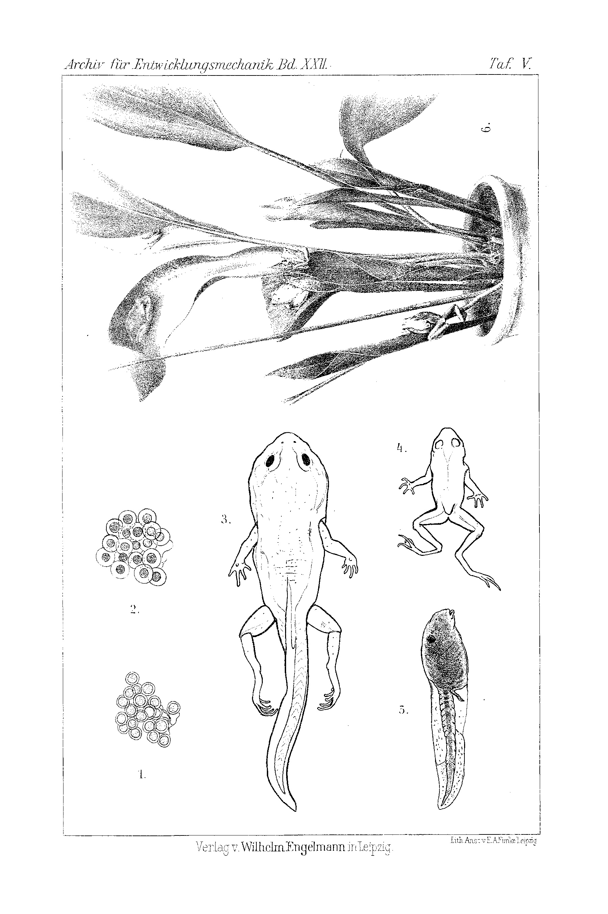

# Experimental Alteration of the Reproductive Activity in the Midwife Toad (*Alytes obstetricans*) and Tree Frog (*Hyla arborea*).

By

Dr. phil. **Paul Kammerer.**

(From the Biological Experimental Institute in Vienna.)

With Plate V.

Received on 24 May 1905.

*Archiv für Entwicklungsmechanik der Organismen*, vol. 22 (1906).

> **Full translation.** A complete English rendering of Kammerer's study of the experimental alteration of reproductive activity in the midwife toad (*Alytes obstetricans*) and tree frog (*Hyla arborea*), with the tables and figure legends. **Kammerer's claims are rendered exactly as he states them; this translation reports them, it does not endorse them** (the disputed midwife-toad work).

## Contents.

|  | Page |
|---|---|
| Introduction | 49 |
| **I. Part: *Alytes obstetricans*** | 53 |
| A. Maturation of the eggs | 53 |
| 1) With brood-care of the father | 53 |
| a) On land | 53 |
| b) In water | 58 |
| 2) Without brood-care of the father | 60 |
| a) On land | 60 |
| b) In water | 69 |
| B. Rearing of the larvae | 75 |
| 1) In water (normal medium), prolongation and shortening of the larval state | 75 |
| 2) On land. Regenerative capacity of the "land-larvae" | 85 |
| **II. Part: *Hyla arborea*** | 101 |
| A. The reproductive act | 101 |
| 1) In the water-basin | 101 |
| 2) In water-accumulations on land-plants | 103 |
| B. Maturation of the eggs on land | 114 |
| C. Rearing of the larvae | 120 |
| 1) In water (normal medium), prolongation and shortening of the larval state | 120 |
| 2) On land | 124 |
| Summary | 128 |
| Index of the cited literature | 135 |
| Explanation of the figures | 139 |

> Experimental Alteration of the Reproductive Activity, etc.   49

## Introduction.

On the possibility of broadening our knowledge of the transmutation of species [Artenwandel] with the help of exact means. The difficulty of the immediate alteration of morphological species-characters. The ease of altering physiological-ecological characters. A roundabout way [Umweg] toward alteration of the bodily form leads by way of an alteration of the mode of life. This roundabout way is rendered possible, in the briefest terms, through an influencing of the mode of reproduction. Two special parallel cases: *Salamandra maculosa* and *Sal. atra* on the one hand, *Hyla arborea* and *Alytes obstetricans* on the other. Normal mode of reproduction of the two last-named batrachians.

"... For, since immense spans of time stood at the disposal of nature for the ultimate development of the now-living species, whereas we, by contrast, during the short time of our researches encounter the constancy of specificity to a much higher degree than the variability of form, it might appear as though the experiment were the most opportune of all means for having a say in the questions of the variability and descent of species" (57, p. 118 ¹).

Certain it is, that the number of those treatises which undertake to penetrate, with exact means, into the secrets of transformism must be designated a far smaller one than on the other domains of experimental biology; and one gains the impression as though, in actual fact, the equilibrium in the chemism is, in the case of the relatively few organisms, sufficiently weakly labile [hinlänglich labil] for them to react—already in the course of individual existence, or in the course of the first generations—to deliberately applied external factors with distinctly perceptible alterations of character.

The cause of this relatively limited accessibility of the species-transformation through the experiment seems to me, however, to lie therein, that almost all the relevant works aim at calling forth morphological alterations at once [sofort]. Apart from hybridization, which yields those morphological alterations with desirable rapidity—a wide field of work that opens up, which, however, for the theory-formation in the animal realm can have been of only subordinate significance—, apart, then, also from bastard-formation [Bastardbildung], there might indeed remain, even among lowly organized living beings, not all too many forms left over [übrig] in which deep-going alterations of the form can be brought about [Platz greifen] already within a short period; and these are then mostly forms which, even at present,

> ¹) The figures enclosed in square brackets are references [Hinweise] to the literature-index!

*Archiv f. Entwickelungsmechanik. XXII.*   4

> 50   Paul Kammerer

in nature display a more or less pronounced polymorphism, and it lay near at hand, among the phenomena of polymorphism, to take precisely those of seasonal dimorphism [Saisondimorphismus] as the most easily attainable for the experiment, because for the speculating mind the temperature, as a simple external factor, virtually forced itself forward [aufdrängte] as the cause of that same phenomenon. —

Much more easily and more generally, however, than the various morphological characters of an animal, do its physiological-ecological characters let themselves be influenced; its movements, its sojourn, its nourishment and reproduction let themselves be altered. These life-functions [Lebensverrichtungen], manifesting themselves in a definite manner, are just as little to be designated as "characters of the species" [Eigenschaften der Species] as, say, the shaping and coloring of the animal-body; therefore alterations in the conduct of life [Lebensführung] belong just as little to the process of species-transformation [Artwandlung] as alterations in the bodily build [im Bau]. It will of course occur to no one to construe such animal-specimens, which display a complete agreement of their morphological characters, as separate species, even if they should behave essentially differently in physiological respect; their specific separation, however, may properly remain in abeyance only under the tacit, conventional presupposition that life-differences [Lebensverschiedenheiten] must ultimately also have bodily-differences as a consequence, and conversely. As a rule, however, with the normal course of things, the former are to be conceived as having arisen as the primary, the latter as the secondary alterations.

Corresponding to this natural process, the experiment too acquires a much broader operational-basis when it at first sets itself only to alter the physiological-ecological peculiarities of a species; the morphological consequences of these alterations will then likewise set in, in the course of the same or at least of the next generations, with great probability. The method is indeed to be designated as a roundabout way [Umweg] in so far as, as remarked, a sum of animal-specimens appears specifically fixed, according to the prevailing view, only when it is delimited not merely through characters of the mode of life, but also through such [characters] of the bodily build, from other individual-complexes [Individuenkomplexe]; thus the bringing-about of morphological alterations, which to the eye present themselves much more sharply delimited, more distinct and more constant in comparison to the physiological-ecological alterations, nevertheless remains the final goal of all transformistic research.

> Experimental Alteration of the Reproductive Activity, etc.   51

In the product of all physiological-ecological characters, which together first determine the character of an animal, the reproduction is the factor touching the animal-body in its innermost essence, upon which the following events might from the outset be expected to ensue [eintreten]: alterations of the reproductive-business [Fortpflanzungsgeschäft] would necessarily have to bring about the most rapid morphological alterations in procreation and development; they would accordingly be the most promising means, were they in a position to influence the mode of life [Lebensweise], so as to lead by indirect path, as far as possible, also to those alterations of the form [Morphe]. As the continuation of the experiments carried out on the salamanders, the spotted and the black earth-salamander (*Salamandra maculosa* Laurenti, and *atra* Laur.), in which it had succeeded in driving the adaptation—playing an essential role in the reproductive-history—toward water-spawning on the one hand, toward arid land on the other, and secondly in making both reproduction-types thereby approach each other [42], — with great success in these two urodele species, that is, indeed it appeared similar elsewhere too. Experiments which likewise aim at a mutual approximation of the two reproductive-modes [Fortpflanzungsmodi], an analogous one familiar with not yet a second anuran genus, I undertook with two anuran species, namely with the fetter- or midwife-toad [Fessel- oder Geburtshelferkröte] (*Alytes obstetricans* Laurenti) and the common tree frog [gemeiner Laubfrosch] (*Hyla arborea* Linné).

My experiments on the salamanders were admittedly favored by some circumstances which, in my experiments on the said frog-amphibians, I could scarcely count upon. The two salamander-species are, on the one hand, already closely related to one another, in that they belong to one and the same genus of tailed amphibians; most probably, however, the one has even arisen directly out of the other, or at least both species have sprung from a common basic form. On the other hand, of the various reproductive-forms of those species, certainly the one has arisen out of the other, so that even at present there are to be found in nature, there where the geographical distribution-zones of the species abut on or interlock with one another, approximations, indeed even downright transitions between the reproductive-forms. Therefore it was easier to attain, by means of the experiment—although it concerns itself with approximations and transitions, rather that the one species completely assumes the

> 52   Paul Kammerer

reproductive manner [Fortpflanzungsweise] of the other and conversely—than under less favorable conditions, where nature herself had not so well prepared the ground [wohlgeackerten Boden].

Otherwise are *Alytes obstetricans* and *Hyla arborea*, tail-less amphibians, the two belonging to very different families with respect to phylogenetic age and degree of differentiation: *Alytes* indeed is counted by G. A. BOULENGER—in a system resting upon extensive morphological and physiological investigations, which seems to stand in proper agreement with the trunk-development [Stammentwicklung] of the anurans—among the Discoglossidae [4], placed in the family of the disc-tongues [Scheibenzüngler (Discoglossidae)], *Hyla* in the family of the tree frogs [Baumfrösche] (Hylidae). Yet there are within these two anuran families single representatives which, through convergent adaptation, have acquired the common inclination [Neigung] to lessen the dependence of their eggs and larvae upon the water-sojourn [Wasseraufenthalt], which is attained through resistance-capacity of the same against the air-medium [Luftmedium], sometimes in connection with brood-care.

Corresponding, however, to the slight kinship, corresponding to the lack of immediate connection of the animal- and there of the reproductive-forms, it did not, even in the case of *Alytes* and *Hyla*, succeed for me to achieve a complete exchange [vollkommenen Austausch] of the reproduction-modi [Fortpflanzungsmodi] and step-wise transitions in between; exact enough such [transitions], to lead them into one another [42] — in the eye enough these two reproductive-types [carried out] hand in hand, has been brought about merely through the experiment so artificially upon those in nature [adapted] to the water-sojourn on the one hand, to the land-sojourn on the other, whereby admittedly certain approximations of both reproductive-manners already result, the qualitative difference, however, remaining preserved.

The reproduction of the frog-amphibian species under discussion is accomplished, according to the norm, as follows:

1) *Hyla arborea* seeks out standing waters at reproduction-time. The male springs upon the back of the chosen female, grasps it in the axillary hollow [Achselgrube] and presses out of it the spawn-mass [Laichmasse], which according to HÉRON-ROYER [31] consists of 800–1000 small eggs and, after the semen [Same] has been poured over it, either sinks freely to the bottom or is fastened to underwater plants. — Hereby the tree frog follows that reproduction-type which, among the frog-amphibians, forms the rule, which in all European genera, *Alytes* excepted, is custom [Brauch] and, in all its activities,

> Experimental Alteration of the Reproductive Activity, etc.   53

pairing, copulation [Begattung], egg-laying and development, immediately upon the water-sojourn is dependent.

2) *Alytes obstetricans* (and the *Alytes Cisternasi* Boscá occurring in the interior of the Iberian Peninsula) remains on land at reproduction-time. The male embraces its female about the loins and presses out of it the spawn-mass [Laichmasse], which according to HÉRON-ROYER [31] consists of 22–86, according to MELSHEIMER [51] of 18–54 strikingly large eggs, whereby it assists with its hind legs, in that they reach into the spawn-mass and draw it out of the female cloaca by alternate pulling-in and stretching-out. The spawn [Laich], by virtue of its sticky envelope, remains adhering round about the thighs of the male and is dragged about by the latter so long, until the embryos are ready for hatching and are forthwith emptied by their father into a standing water. Here they pass through, just like other frog-tadpoles, only within considerably longer time, the rest of their development. — Not so much through the act of midwifery [Geburtshilfe] rendered during copulation by the male with the help of its hind legs, as rather through the care [Fürsorge] which it thereupon devotes to the eggs entrusted to it by it, does the fetter- or egg-carrying toad assume a special position, which on the one hand distinguishes it before [vor] all the other frog-amphibians inhabiting Europe, on the other hand brings it near to brood-tending frog-amphibians [of] exotic [lands], although the exactly same kind of brood-care has not yet become known in any second anuran genus. Hand in hand with the exercise of brood-care goes the becoming-independent of water, which in the case of *Alytes* extends over the phases of pairing, copulation, egg-laying and embryonal development, thus appears already carried out up to that moment in which the larvae leave the egg and begin their post-embryonal development.

## I. Part: *Alytes obstetricans*.

### 1. Experiment: Maturation of the *Alytes*-eggs with brood-care of the father, on dry land.

The breeding-experiments described for the present work reach back to 1894, in which year a summer sojourn at Weißbad near Appenzell (Switzerland) had first given me the opportunity to come to know the midwife-toad in free life and, by collecting with my own hands, to win the material for my investigations. Since that time, the remarkable frog-

> 54   Paul Kammerer

amphibian [Froschlurch] has, with quite slight interruptions, always been represented among my various charges [Pfleglinge].

The males necessary for the normal maturation of the eggs—which carry their egg-clumps [Eierballen] wound around the upper-thighs of the hind legs—I procured for myself in two ways: firstly, through the capture of such males, just then exercising brood-care, during the pairing-season; secondly, through the fact that my midwife-toads proceeded to reproduction in captivity, whereby the males loaded themselves with spawn [Laich] in a natural manner.

The hunt for egg-carrying males can, since *Alytes* is a true nocturnal animal, take place by day only through searching them out from their hiding-places. These hiding-places are found, in the region of Appenzell and St. Gallen (my chief collecting-grounds during the summer sojourns of 1903 and 1905), partly between the stones of all the walls which run along the highways, serve the road-embankments as support and at the same time lean on one side against the soil, — partly the hideouts consist of deep passages dug into the earth, which at reproduction-time are frequently forked [gegabelt], and in which case the male, the pairing being accomplished, always sits in the one, the female in the other branch-passage of the structure. I shall return to these interesting ecological relations once more in a special treatise. By night, however, the midwife-toads roam about, go after their food and seek out the water for the moistening of their skin; from this, as a rule, even the males loaded with eggs make no exception, as I—contrary to the statements of DEMOURS [15], AGASSIZ [9], VOGT [65], KOCH [45], FATIO [20], SCHREIBER [60] and HÉRON-ROYER [32], who all assert that the egg-carrying father withdraws into the earth, into rock- and wall-clefts, and only shortly before the hatching of the young seeks out the water for the releasing of the larvae, — yet in agreement with DE L'ISLE [38, 39], LATASTE [47], DÜRIGEN [18] and BOULENGER [8]—established; never are these, by moonshine or with the help of a lantern, in spite of their nimble leaps, easy to catch.

It is not difficult to move the fetter-toad to reproduction in captive life. I keep the animals, in order to breed them, latterly always in the large box-terrarium, as I have described it in my salamander-work [42, page 174 ff.]. Yet I must make brief mention of an improvement which has since taken place with respect to the soil-drainage [Bodenentwässerung (Drainage)]. The floor-surface, namely, I no longer have made, as formerly, in the form of a flat funnel, so that the drain-pipe [Ablaufrohr] is situated in the middle of the terrarium, at the deepest point; for the container can in this case be placed only upon a table-top reaching to the edges, from which the periphery of the terrarium projects, by which arrangement much stability is forfeited. Now I employ the floor of such breeding-containers in the form of an inclined plane, i.e. it sinks from the rear to the front wall at an angle of 20 degrees, and in order to set the terrarium up straight, it stands of course at the rear on higher, at the front on quite low feet. Beneath the terrarium-floor there arises in this way a space increasing in height obliquely, from the front to the rear wall, at an angle of 20 degrees, which

> Experimental Alteration of the Reproductive Activity, etc.   55

with the keeping of very warmth-requiring animals can be heated by electric incandescent lamps placed within, or [by] a simple heating-device, indeed even where, in the cases of the present work, no such [device] comes into the reckoning. The drain-pipe is situated, with this improved system, in the rear lower corner.

The interior fitting-out of these terraria, the soil-filling, the planting, in part also the same as in my salamander-work [42] indicated in detail under the section "Technique." Indeed one will not assert that the toads can be bred exclusively in such terraria, offering all conceivable comforts. In contrast to the much more sensitive salamanders, one can occasionally also, in far simpler prisons—as I, in my salamander-work [42], merely for the keeping of material destined for anatomical purposes, or for transport, recommend [42, p. 175, 176; 40, p. 297]—record successes. Nevertheless, the rearing offers security only [in] those containers which are fitted out and tended expressly for the breeding-purpose and with the greatest care and knowledge of the natural conditions.

Quite simply does the feeding of the toads turn out. It is only important that some variety be provided for. Small earthworms, small naked snails [Nacktschnecken], as well as various flying and crawling insects—as houseflies, kitchen-roaches [Küchenschaben], soft-beetles [Weichkäfer], of which a number is set free in the terrarium—finally meal-beetle larvae [Mehlkäferlarven], which are set up in small, flat porcelain dishes (so-called sugar-tongs [Zuckerzangen]) in the terrarium, suffice for their modest requirements.

The method which consists in this, that one first lets the males load themselves with eggs in captivity, deserves, over against that of seeking out egg-carrying males in the open, two quite estimable advantages: 1) Freshly-caught males not infrequently strip off their burden [Bürde]—as VOGT [65, p. 5] and HARTMANN [26, p. 281] too state—during capture or transport, and then heed it no further. Only through the application of extreme caution can that premature stripping-off be avoided. The brood-care-instinct is thus here not so highly developed as, for example, in the sac-spider (*Pardosa* [*Lycosa*] *saccata* Linné), which, even with grave disturbances, hastily seizes again its egg-cocon [Eikokon] carried on its hind-body, [and] never abandons it [literally: leaves it in the lurch]. LEYDIG [50] indeed observed an egg-carrying male of the midwife-toad which showed itself very anxious about its brood, made anxious defensive movements and uttered cries of complaint when one wished cautiously to cut through the attachment-threads of its burden [Bürde]. I believe, however, nevertheless to gather from LEYDIG's account that the anxiety of the animal in question applied not to its progeny, but to its own danger; especially against tickling-sensations [Kitzelempfindungen], when [it was taken from it and after] The interior fitting-out of these terraria — the substrate filling, planting, etc. — is exactly the same as given in detail in my Salamander work [42] under the section "Technique." To be sure, I do not wish to claim that the toads can be bred *exclusively* in such terraria, which offer every conceivable convenience. In contrast to the much more sensitive salamanders, one can occasionally record successes even in far simpler prisons, such as I was able to recommend in my Salamander work merely for the keeping of material destined for anatomical purposes, or for transport [42, pp. 175, 176; 40, p. 297]. Nevertheless, in this respect only those containers afford security which are set up and tended specially for the purpose of breeding and with the greatest care and knowledge of the natural conditions.

Quite simple is the feeding of the toads. The important thing for me is only that some variety be provided. Small earthworms, small slugs, as well as various flying and crawling insects, such as houseflies, cockroaches, soft beetles, of which a number are released into the terrarium from time to time, and finally mealworm larvae, which are set out in the terrarium in small, flat porcelain dishes (so-called sugar-cups), suffice for their modest needs.

The method, which consists in first letting the males load themselves with eggs in captivity, presents, in comparison with that of seeking out egg-bearing males in the open, two quite valuable advantages: 1) Freshly caught males, namely — as Vogt [65, p. 5] and Hartmann [26, p. 281] also state — frequently strip off their burden during capture or transport and then pay it no further heed. Only by application of the utmost caution can this premature stripping-off be avoided. The brood-care instinct is therefore here not so highly developed as, for example, in the sack-spider (*Pardosa* [*Lycosa*] *saccata* Linné), which does not abandon the egg-cocoon carried on its abdomen even under severe disturbances, but rather, when it is taken from her and given back to her after a while, hastily seizes it again. Leydig [50] did indeed observe an egg-bearing male of the midwife toad which showed itself very solicitous about its brood, made anxious defensive movements and uttered cries of distress when one wished cautiously to cut through the attachment threads of its burden. I believe, however, that I may nonetheless gather from Leydig's account that the fear of the animal in question concerned not its offspring but its own danger; specifically, against tickling sensations, such as were probably elicited by the cautious touching with the cutting-instrument, the frog-amphibians are sensitive in a high degree, and they react vigorously to it, even when they otherwise show themselves of an ever-so-placid temperament. Males that have for a couple of years become accustomed to captivity and that here proceed to reproduce are now far less sensitive to disturbances than freshly caught ones; rather, those become so tame that they remain sitting calmly on the hand while one examines the eggs with the magnifying glass, detaches individual ones by means of pointed scissors, etc., without seeing themselves prompted to kick off the burden. 2) The other advantage of breeding in captivity consists in the fact that one is able to expose the eggs to the desired influences from the moment of laying onward, whereas with captured males one must, of course, also accept more advanced stages into the bargain.

With regard to Lataste's [47] and my own observations on free-living as well as on captive midwife toads, which — notwithstanding their brood-business — not only roam about freely but also regularly seek out the water, I posed myself, in the arrangement of my first experiment, first of all the question whether those frequent baths, which the male lets fall to itself and to the eggs at the same time, are necessary for the development of the embryos, or at any rate of significance. Simultaneously with the withdrawal of the bathing-opportunity, I set out to grant the eggs as little moisture as is at all possible — that is, as is bearable to them and to their protectors — whereby at the same time, for the following experiment (No. 2), the desired contrast of conditions appears to be established. By the supposition that the temporary immersion of the eggs is an indispensable factor for their development, Lataste too had been guided in his experiment — to be described more exactly later — of bringing the eggs to maturity without the assistance of the paternal animal, in that he placed the spawn-balls, kept by day in moist moss, into the water for a couple of minutes each evening.

Corresponding to this question, I therefore withdrew the water-basin from the males chosen for the experiment and provided — and not content with that — only by means of comparatively weak sprinkling the moisture indispensably necessary for the maintenance of their life. This was not even permitted to be present so abundantly that larger water-drops could remain hanging anywhere, e.g. on moss or stones, and perhaps fall onto the eggs when the animals brushed past. Soon I convinced myself that the development proceeded despite the lack of water. After 37–42 days, counted from the day of laying, the hatching of the tadpoles began, likewise without water: the egg-membranes, which had become hard and brittle, burst and showed cracks, which were gnawed open by the tadpoles with the help of their horny jaws and thus widened until they offered space sufficient for slipping through. After a further 10–14 days all the eggs, insofar as they had been fertilized, were empty. Héron-Royer is therefore wrong when he asserts [31, p. 284] that the larvae are not able to escape from their egg-capsules without the dissolving influence of the water, but must perish within them. His error is the more surprising as it was precisely he who first observed exactly the gnawing-activity of the hatching larvae — which makes them independent of a softening of the shell — [33, pp. 428–430], after Koch [45] had earlier surmised such an active intervention of the larvae from the circumstance that the eggs always open at just that spot where the mouth of the larva happened to lie. Héron-Royer does, to be sure, add that the stimulus of the water penetrating the membrane is necessary in order to trigger the onset of the gnawing; but if this stimulus — certainly very effective — remains absent too long, while the larvae nonetheless remain alive, then they understandably do, after all, finally proceed to their liberation, even without a special impetus.

Many of the tadpoles that had crawled out in the dry I was able to find wriggling on the earthen floor of the container, and I carefully conveyed them into a water-vessel, where their further development proceeded in normal fashion. A portion of the tadpoles that had come into the world in the dry I used at once for Experiment No. 6.

In comparison with simultaneously cultivated control-broods, in which the fathers, as in free nature, had the opportunity to go into the water, the developmental process that had taken place in the experiment just described showed the following differences: 1) The point in time up to the beginning of hatching was somewhat delayed: those eggs which had been carried by regularly bathing males released the tadpoles contained in them already after 29–37 days, whereas here, as mentioned, 37–42 days had been required. 2) The hatching of the individual young took place within longer time-intervals. In the water, on the other hand, the hatching of all the larvae is accomplished almost simultaneously, and there it occurs only very rarely that a male, on an evening in the bath, gets rid of only a part of its offspring and harbors the rest still until the following, in the most extreme case even until the next-following evening. 3) Under relative dryness of the surroundings, the males could not so easily get rid of their burden, but rather carried it still 6–11 days after its complete emptying upon their thighs. For the slimy gelatinous mass, which envelops both the individual eggs and also binds them to one another into a cord, namely shrinks strongly in the air, becomes tough on drying and at first even stickier than at the beginning, but finally acquires a hard quality, which was called by Vogt [65, p. 5] "caoutchouc-like," by Bauch [11] "leather-like." Thus the spawn-cords wind tightly, like a fetter in the true sense of the word, around the limbs, and often even leave behind distinct weals, strangulation-grooves, on the thighs — as Vogt [65, p. 6] and Héron-Royer [33, p. 427] too have noted. Soon after the laying of the eggs and the taking up of the load, it can still easily be stripped off; later this becomes more difficult, and the drier the surroundings, the more snugly the fetter sits. Thus it came about that the males in my dry culture still dragged the emptied egg-cases about with them for a while, whereas in my control culture with water-basins — just as in free life — the stripping-off of the egg-ball took place without exception simultaneously with the emergence of the young that takes place in the water. The continued carrying of the packet beyond the moment of birth might perhaps also be explained in the way that the father, because he is prevented from casting off the burden in the accustomed manner in the water, at first does not notice at all that the brood has already outgrown his guardianship. I believe, however, that this interpretation, even though it lies close at hand, would still not be justified in view of the certainly present, purely mechanical cause.

Apparently the positive result of the experiment described above affords a support to the view expressed by De l'Isle [38, 39], which lets the eggs and embryos receive the necessary moisture through the mediation of the paternal body. But that this view nonetheless does not hold true is to be proved by the 3rd experiment.

### 2. Experiment: Maturation of the *Alytes* eggs with brood-care of the father, in the water. —

The next step was now to lead the eggs back to the primary form of anuran reproduction, by causing those [eggs] to be handed over again to the element originally native to them, the water. Yet I did not at first wish to withdraw them from the male's guardianship. Therefore I set the egg-laden males into an aquarium that was filled with water to a height of 1 cm over a layer of clean-washed sand. The eggs were in this way for the most part entirely submerged, but at the very least continuously washed around by the water, while their bearers, on account of the shallow water-level, saw themselves nowhere compelled to swim, everywhere found firm ground and bottom, and were therefore not hindered in comfortable breathing. In order to let them — to whom a permanent stay in the water is quite unaccustomed — become as little restless as possible, I made dark caves for them out of stones.

Nevertheless the experiment did not succeed: to be sure, the males, set into the water immediately after the completion of their midwife-act, soon resigned themselves to their fate, took up their hiding-places and behaved tolerably calmly therein. Only the wet surroundings allowed no drying-up of the egg-coating to come about; this remained constantly soft and elastic, so that all the males had already, after 1–2 days, lost their egg-balls without any convulsive or even merely seemingly intentional exertion. In this way this second experiment passed directly over into Experiment No. 4.

In an analogous way to that in which, in the preceding experiment, the abnormally long carrying of the burden [might be construed], in the case now described the premature, unconstrained letting-fall of it could be construed as an **instinct- or intelligence-action** on the part of the male: the brooding animal sees itself surrounded by water, ergo it believes the point in time of ripeness for the young to have arrived and strips off the fetter in the accustomed manner. This interpretation once asserted, those observers too — who set in contrast a brooding-time spent in concealment on land with the stay in the water that follows it for the purpose of releasing the ripe larvae — might feel themselves confirmed in their view. As against this, however, I should like once more expressly to emphasize my standpoint, according to which I hold the physical constitution of the egg-envelope to be the sole decisive factor responsible for the adhering, respectively for the falling-down, of the burden. Apart from that constitution itself, what already speaks for this is precisely the fact, particularly emphasized by Lataste — of which I made mention just before — namely, that the males during their "brooding-time" maintain absolutely no altered mode of life, that it thus need not be a special instinct or the sensing of the wriggling movements of their embryos striving toward freedom that drives the animals into the water, but merely everyday habit.

### 3. Experiment: Maturation of the *Alytes* eggs without brood-care of the father, on land. —

"The males of the midwife toad," so writes Hartmann [26, p. 281], "do not always carry the egg-balls until their development. Sudden disturbances, which so alarm the animal that it is compelled to swift flight, cause it to strip off the burdensome fetter." But mechanical causes too — for instance, according to Hartmann's experiences, caves that are too narrow, violent exertions of the male to squeeze itself through between stones and roots — bring about the same. Despite the egg-load, the male climbs up the steepest walls, digs out its cave, jumps after food [28, p. 309], indeed in given cases even renders midwife-service to one or several further females, thus doubling or multiplying the first burden [38, 39]. All these excesses make it appear sufficiently explicable when one occasionally finds in the open ownerless egg-balls. Furthermore, one encounters male specimens onto whose lower legs, indeed onto whose ankle-joints, the egg-balls have slipped, and such in which those still hang from only one foot. Such losses occur, according to Vogt [65, p. 5] and Hartmann [26, p. 281], more easily at the beginning of the "brooding-time" (when the egg-membranes have not yet dried on so strongly!) than later, from which it follows that younger embryos, which supposedly would still more urgently require the paternal protection, are more frequently affected by it than more advanced ones.

What now happens to such orphaned eggs? Hartmann [26] gives the following answer to this question: "In the lost egg-balls the larvae develop just as well as in those which are dragged along by the frog-amphibian. The larvae leave the egg-membrane at the right time, but since they catch sight of the light of the world in a wrong element, they also perish at once, immediately after they have caught sight of it." To what extent the latter experience must always hold true shall remain reserved for my 6th experiment to establish. The experiment now to be discussed has at first only the task of determining: in what manner the embryos in orphaned eggs attain development.

De l'Isle [38] had not succeeded in bringing to maturity spawn-balls that had got lost from the male midwife. He draws the conclusion that the brood-care exercised by the paternal animal is indispensable for the development of the eggs, in that the latter conveys to the eggs of its own body-moisture.

Fischer-Sigwart [21, p. 27] too had carried out experiments of this kind without success: "Attempts to bring to development unripe eggs that had been detached from egg-bearing males of the midwife toad before their ripeness always failed. Both in the water, on moist moss or other moist objects, and also in the dry under the most favorable circumstances possible, they soon died off and passed into putrefaction or dried up. They must accordingly be carried about by the male until ripeness and are hatched out by the, even if slight, body-warmth of their bearer."

In opposition to this, Lataste [47] found that the development of the embryos in detached egg-balls, which he kept by day in the dark, under moist moss, and dipped of an evening for a few minutes into the water, proceeded just as well as in those that were left to their father.

Héron-Royer [33, pp. 418–420] constructed for himself out of two watch-glasses a little brooding-trough, in order to have the eggs, in the course of his investigations on the embryonic development of *Alytes*, in surroundings always accessible to observation: the one watch-glass he used as a base, the other as a lid; in both he bored, on opposite sides, a small hole each, in order to make possible a weak air-circulation. Into the base comes a fourfold-folded little patch of white linen, which at the beginning of the experiment is lightly soaked with water, then morning and evening, by the pouring-in of one to two drops, is also kept uniformly moist further on. Before Héron-Royer lays the egg into the middle of this brooding-trough upon the moist linen, he robs it of its outer covering, the gelatinous envelope, which on account of its sticky constitution easily lets particles of dirt adhere and thereby becomes a hindrance to observation: in order to remove this envelope, first a narrow strip of it is cut out by means of fine scissors, then the edge of the cleft thus arising is grasped and from it the little skin is folded back; frequently it tears after the first incision and the folding-back of the edge-portion without further effort, that is, without its being necessary to peel off the little skin all the way around, but rather it falls off suddenly in one piece. The skinned egg, under the same moisture-conditions, increased in volume much more quickly than the eggs not so treated and also overtook the latter, with respect to the moment of hatching, by several days.

treated eggs and, with regard to the moment of hatching, even surpassed the former by several days. Héron-Royer teaches us to recognize warmth, light, and moisture as accelerating factors of development, the moisture, however, only up to a certain, limited degree, which represents the optimum and beyond which, upward, it becomes harmful, indeed pernicious, to the eggs. As we shall soon see, my experiences coincide unconditionally with those of Héron-Royer as regards warmth and light, whereas as regards moisture, although they likewise hold true for the majority of the eggs, they attain no validity for an "atavistically disposed" minority which, under constant immersion, reaches the most rapid ripening.

With the two experiments last described, the older conjecture of De l'Isle and the later one of Fischer-Sigwart, which had evidently escaped the notice of Lataste and Héron-Royer, were thus at any rate refuted. It had been established that hatching out — be it by means of the paternal bodily moisture, be it by means of its slight blood-warmth — is dispensable, at least to the offspring, and that it entails no retardations or stuntings whatever in the course of development if the protection ordinarily accorded to the eggs falls away prematurely.

Ingenious experiments on this subject have further been carried out by Hartmann [26, 28]. Orphaned egg-strings, which the said author had found in nature and in his terrarium, he buried in the kind of soil that had been present at the find-spot, and kept them under the same moisture conditions as prevailed outside in the open. Egg-strings wrapped in moist moss also came out. "Make a hole in moist — not wet — earth with the finger, lay the egg-string into it, and cover it over with the same earth. I usually lay a little moist moss over the string, in order to be able conveniently to observe it with a view to its later development, without having to touch it. According as needed, I wet the moss and wring it out." This mode of keeping the spawn undergoes a change as soon as the embryos have become ready to hatch. The latter stage Hartmann recognizes by the following marks: the yolk is, as is easily ascertainable by means of a magnifying glass, nearly or wholly consumed, the yolk-sac described by Leydig [50] is in process of being resorbed; on turning the eggs, the embryos always orient themselves so that the eyes look upward; otherwise too they move already at the most delicate touches, indeed even at strong blowing-upon. Once the eggs have thus far progressed, the string is bound fast in the middle of a piece of thread. To both ends of the thread stones are fastened, and the cord is then laid over a water-dish in such a way that the lowermost egg just touches the water-surface. Thus all the eggs remain moist, and upon hatching the larvae fall into the water. It sometimes takes 48 hours for the complete emptying of a string thus suspended, whereas the emptying of all the egg-envelopes of a string carried by a batrachian occurs with lightning speed. A few vigorous swimming-thrusts of the animal cause the envelopes to burst and the "little folk," "like a harried flock of sheep," to scatter apart in the aquarium. "Had I moved the string (which had become ripe for hatching, ripened without a male) strongly to and fro in the water, it would have been possible for all the larvae to hatch out at once. But I did not know the right moment, and supposed, rather, that the larvae would have perished if I had simply thrown the string into the water, since after all, in natural rearing too, they only come into the water when it is time." Later [28, p. 309] Hartmann further convinced himself that to eggs which exhibit the ripeness-marks enumerated above, nothing more is harmful if they are thrown directly into the water. But of this the next experiment shall treat.

My own experiments, to ripen *Alytes* eggs without the assistance of the male — and indeed, at first, still in their normal medium, that is, on land — constitute merely a repetition and extension of the Lataste, Héron-Royer, and Hartmann experiments with respect to various light and moisture conditions. What mattered to me thereby was not so much the mere re-examination of the reported experiments as chiefly the comparison with one another of the developmental velocities which would result, on the one hand, between the cultures with and without paternal brood-care, and, on the other hand, with cultures under various degrees of moisture and illumination. The adjoining table illustrates the results obtained with regard to that line of inquiry.

Quite generally expressed, then, moisture and light, each by itself just as in combination with one another, act acceleratingly, and dryness and darkness likewise retardingly, upon the development of the embryos. Therewith at the same time

| Culture conditions of the eggs | A. Eggs without male — Duration in days (from the day of fertilization): up to the beginning of hatching | A. Eggs without male — Duration in days (from the day of fertilization): up to the emptying of all the eggs | B. Eggs carried by the male — Duration in days (from the day of fertilization): up to the beginning of hatching | B. Eggs carried by the male — Duration in days (from the day of fertilization): up to the emptying of all the eggs |
|---|---|---|---|---|
| dark; moist, bathed 5 minutes daily | 34–37 | 39–42 | 33–37 | 33–37 |
| dark; in vapour-saturated room | 38–39 | 45–47 | 38–39 | 39 |
| dark; in relative dryness | 41–42 | 55–58 | 40–42 | 44 |
| bright; moist, bathed 5 minutes daily | 29–31 | 33 | 29–30 | 29–30 |
| bright; in vapour-saturated room | 32 | 39–41 | 31–32 | 32–33 |
| bright; in relative dryness | 37–39 | 49–51 | 37–38 | 40–41 |

it is proved that Lataste, who shielded the eggs from light in order to establish the natural conditions, did not do this to the benefit of the eggs; and that, furthermore, Hartmann — to whom the Héron-Royer experiments seem to be unknown, and who expressly remarks that light is harmful to the eggs — erred in this assumption. It makes, further, for the developmental velocity no difference whether the eggs are carried by the male or are left to themselves: constant time-differences in this respect do not exist. More rapidly there is accomplished only the complete emptying of the egg-string already ripe for hatching, when this is carried by a male — yet not, say, because in such a one a more rapid development has taken place, but merely in consequence of the energetic movements which the male executes in the water: if one shakes an egg-string that has become ripe for hatching without brood-care vigorously to and fro in the water, one attains the same effect, namely the nearly simultaneous emergence of all the larvae contained therein.

The freshly hatched larvae all found themselves — indifferent under which external factors the eggs had been kept, indifferent also whether they had enjoyed the brood-care of the male or not — at the same developmental stage, that is, they were of equal size (namely, without constant size-differences, 16–18 mm long from snout to tail-tip)

and of equal external form. The external gills had everywhere already disappeared, as this has been established by various authors for the *Alytes* tadpoles as a deviation, in general, from those of all other European frog-batrachians. — It is possible that a histological investigation, which I did not undertake, might nevertheless have brought to light slight differences in the developmental stage of the *Alytes* eggs that had reached ripeness in various ways.

Thoroughly unequal, however, was the pigmentation of the freshly hatched larvae, whereby again light and moisture acted promotingly, darkness and dryness hinderingly, with regard to its intensity. Those larvae which came from egg-strings kept bright and moist and bathed daily were, at their birth, deep black, from which ground-colour the golden-shimmering little flecks stood out sharply. Larvae, on the contrary, which came out of eggs cultivated dark and relatively dry (that is, always under the granting of a minimal moisture-content quite indispensable for the maintenance of their life) were, after their hatching, grey-brown, and the metallic points showed themselves about equal in number and size, but less conspicuous, of duller lustre. Only in the further course of growth do these rather abrupt disparities gradually equalize themselves — provided equal conditions — and indeed completely, so that one, once the larvae have first acquired hind-legs, can no longer distinguish the one from the other. They then agree with the description given by De Bedriaga [3, pp. 351 and 352 of the offprint]. Apparently my finding stands in contradiction to the experimental results of Héron-Royer [30, p. 63], which investigator saw *Alytes* larvae — which came from pools situated at various heights and otherwise also exhibiting various conditions of existence, and which were correspondingly variously coloured — retain their original nuancing even thereafter, although he subjected them in captivity to levelling conditions: the cause of this lies surely in the fact that the larvae collected in the open by Héron-Royer belonged already to more advanced stages than my experimental animals, which after all remained exposed to the experimental factors from the moment of their hatching; and that consequently the pigmentation of the Héron-Royer larvae was already too strongly fixed, on account of their natural place of sojourn, to be still sensitive to external influences thereafter.

This is the place to discuss the practicability of an experiment proposed by Jourdain [37], namely, to force upon the midwife toad, through suitable interventions, the direct course of development that runs off without larval stage, without metamorphosis, as it has been discovered in the Antilles frog or Coqui (*Hylodes martinicensis* Tschudi). Jourdain says about this the following: "Experimentally, the adaptability of the amphibians allows one, in the specially differentiated forms, to bring the larva nearer to that fish-like state which one may with good right call the ancestral state, or to remove it from that state. The experiences of Mlle. de Chauvin show this for *Salamandra atra*. Experiments which I undertook several years ago on *Alytes*, and which a lack of material compelled me to leave unfinished, have furnished me the proof that it is possible to act upon the larva of the said anuran in that twofold sense. I have succeeded in considerably accelerating and retarding the moment at which the larva leaves the egg and accommodates itself to the liquid element. I am convinced that, with the help of corresponding measures, one would arrive at transferring that batrachian into the remarkable conditions of *Hylodes*, or at least at bringing it strongly nearer to them." Héron-Royer raises [31, pp. 284 and 285] against this possibility the following objections: 1) Among the European anurans it would be, in *Alytes*, the most hopeless to wish to eliminate the larval state, because precisely this frog-batrachian requires the longest in order to surmount the tadpole stage. 2) The transferral of the entire development, up to the completion of the imago, into the egg would demand a complete reshaping of the respiratory organs, indeed of all physiological processes whatever — a demand which even the much-praised adaptability of the batrachians could not fulfil.

The first objection I shall refute later, on occasion of my experiment No. 11 (on *Hyla arborea*). — In considering the second objection, the reader asks himself how Héron-Royer might indeed conceive the coming-about of the direct development in *Hylodes*, if not precisely through the high-grade adaptability of the batrachians? Héron-Royer does not express himself about this, but gives us only insofar some clarification about his views, in that he [31, p. 284] says that *Hylodes* is not related to our native batrachians, and that their eggs are not subjected to the same conditions as those of *Hylodes*; further [loc. cit., p. 283], nature has regulated the phases of embryonic life in accordance with the circumstances, and he therefore wonders that nowadays one still always seeks to demonstrate how those natural rules might, in the anurans of our region, be modified or reshaped in consequence of this or that cause.

The argument concerning the lacking kinship of our batrachians with the leaf-frog of Martinique, a cystignathid, is rendered untenable by the later discovery of a series of other frog-batrachians likewise attaining development without a free-living larval state, from the most diverse families and the most diverse countries — thus *Rana opisthodon* Boulenger from the Solomon Islands, of the family of the true frogs (Ranidae) [5], *Hyla goeldii* Boulgr., Brazil, of the family of the tree-frogs (Hylidae) [7, 25], *Pseudophryne vivipara* Tornier, German East Africa, of the family of the toads (Bufonidae) [64], etc. As regards the other argument, Héron-Royer holds it to be excluded that those external conditions which have stamped upon the eggs of *Hylodes* their peculiar developmental course can be artificially imitated to such an extent that they bring forth an identical end-result; he may, with this sceptical view, retain the right up to a certain degree — but why, then, does he hold the reverse path, of bringing *Hylodes* to the developmental conditions of *Alytes*, that is, of taking the embryo of *Hylodes* out of the egg before the attainment of its definitive form and letting it develop freely, to be rather more practicable? Because for such a regressive reshaping of the developmental conditions an experimentally well-established fact already lay before us, namely in the form of the experiments of M. von Chauvin, of forcing upon the embryo of *Salamandra atra*, by operating it out of the uterus and inserting it into water, the developmental course of the phyletically older *Salamandra maculosa* [13] — "a unique case, standing alone, which, as its originatrix confesses, could not since be repeated again" [31, p. 285]. Probably Héron-Royer would have judged the whole state of affairs quite otherwise, had he known that one can not only re-establish that "unicum" with ease as often as one pleases — can even, without operation, induce the mother animal to give birth to its young voluntarily already in the larval state, instead, as otherwise, in the developed form-state — but that, conversely too, the females of *Salamandra maculosa* sometimes retain their larvae so long in the uterus until they have become finished, lung-breathing land-salamanders [42].

Why should a developmental alteration which, in the one direction, the experimenter has succeeded in bringing about, not also be able to be forced in the other direction? I see in Jourdain's suggestion nothing impossible, and shall endeavour to follow it. The method to be pursued lies fairly clearly before my eyes: in the experiment described above, only the influence of light and moisture upon the development of the *Alytes* eggs has been investigated; a third, very important factor, temperature, has not been taken into consideration at all thereby; rather, in all these experimental arrangements only light and moisture were varied, whereas the temperature always remained the same, namely the mean room temperature of about 18° C. But Vogt [65, p. 7] and Héron-Royer [32, 33, p. 418] have already experienced what great acceleration the egg-development partakes of under the influence of raised temperature: if I now, through the granting of a higher temperature — so far as it remains at all bearable to amphibian eggs — promote the development of the embryos, and, through darkness and scant moisture, simultaneously draw out the moment of hatching, then approximately the preconditions would be given under which it must succeed to let the tadpoles of *Alytes* behold the light of the world in at least a still far more advanced stage than is, under the present conditions, the case anyway. Some preliminary experiments undertaken in the most recent time, aimed at this — the presentation of which I do not include in the present work, because they are not yet ripe for publication, but rather are still in full progress — seem already to speak very strongly for a later success. I should therefore like the last lines to be understood as a "preliminary communication" of the indicated experiment, namely, to bring the egg-carrying toad nearer to that direct mode of development as it first became known in *Hylodes martinicensis*.

Before I turn to the description of my next experiment, it remains for me still to make a few technical remarks, which are to serve as a guide to the correct keeping of the eggs destined for development without brood-care. I lay the egg-strings in glass dishes upon fine river-sand, which is to be scrupulously washed clean before use and, for the purpose of destroying fungus-germs, to be calcined. The sand is kept moist by sprinkling, more strongly or more weakly moist according to the kind of experiment. For keeping in a vapour-saturated space, the glass dish is closed with a well-fitting glass plate. For keeping in the dark, the egg-string is covered with sterilized blotting-paper, in which case the latter, instead of the sand, is to be sprinkled. Moss and earth, the really natural media, I avoid, because with this mode of keeping I saw the majority of the eggs attacked by mold. Those egg-balls which are to receive day-periodic baths are, once every 24 hours, at an arbitrary time of day (yet always at the same, once-chosen one), taken out of the sand-filled dish with a horn-spoon and laid for the duration of 5 minutes into a water-filled dish. In the case of the eggs to be kept dark, this manipulation is carried out in the dark-room. Nonetheless, however, one always loses, despite all precautions, a fairly considerable percentage of the eggs, which on the one hand dry up, on the other hand are killed by overgrowths of mold-fungi, so that one, in order to be able to bring the experiments to a conclusion at all, must be provided with very abundant material. To a still higher degree this holds for the

## 4. Experiment: Incubation of the *Alytes* eggs without brood-care by the father, in water.

— It was now a matter of completing the return of the *Alytes* eggs into the typical existence-conditions of the Anuran spawn, in that one not merely withdrew them from the paternal brood-care, but in addition let them traverse the whole developmental course from fertilization up to metamorphosis in the water. For this purpose the egg-balls were taken away from the male, immediately after they had been laid and inseminated, and thrown into the water.

It must be remarked that in this manipulation, here forcibly undertaken, there does not lie so unconditionally an unnatural process as it has the appearance of. I found near Appenzell repeatedly, in roadside ditches and puddles, loose egg-balls that had been prematurely stripped off by the male concerned, perhaps because it had one evening stayed somewhat longer than usual in the water, and the jelly had on this occasion become soft; perhaps also because, in flight from an enemy, it had forcibly stripped off the burden that hindered it. In such egg-balls lost under water there were sometimes still all the embryos present and by no means yet ripe for immediate hatching.

Further — this is a second digression from the description of my experiment — there showed itself, in a Serie [series] of 35 midwife-toads, which I had received on April 18, 1905 from Mr. Dentist C. Hartmann ¹) [cited as author 26, 27, 28] from Münster in Westphalia, the following remarkable phenomenon: the animals began, after they had recovered from the transport, on April 21, with the spawning. But only two males burdened themselves with the eggs. The remaining ones contented themselves with rendering their females midwife-assistance

> ¹) Through the kind agency of the "Nymphaea," Association for Aquarium- and Terrarium-keeping in Leipzig, to whom I am for this obligated with best thanks.

[midwife-assistance], in that they tugged about with the toes of the hind legs at the two egg-strings emerging simultaneously from the female cloaca, and actually also drew them forth out of the cloaca — an act of midwifery which, as already fleetingly touched upon in the introduction, by no means represents a characteristic property of *Alytes*, but can also, perhaps in an ever more perfect degree, be observed occasionally during the copulation of other frog-amphibians, for example according to Héron-Royer [32, p. 410] in *Bufo*, *Pelobates* and *Pelodytes*. The egg-strings brought forth then lay about everywhere in the container: on the earth, on and under the moss, glued onto stones, and — last not least — in the water-basin. I also surprised the animals several times, while they were carrying out the copulation here.

The water-basin was filled with only three centimeters of water, so that they did not, as for example the frogs in nature do voluntarily, need to swim during copulation. The process agreed, as far as positions and movements are concerned, well with the precise description of De L'Isle [38, 39], only just, as remarked, with the essential deviation that here no loading-up of the eggs onto the part of the male took place, but rather that the thick spawn-mass, arisen from two strings melted together with one another, simply remained lying.

Wherein lies, in the case of the Westphalian midwife-toads, the cause of this deviant spawning behavior? One can name two attempts at explanation for it: 1) *Alytes obstetricans* is a very migration-loving form; according to my experiences it is not unthinkable that a sojourn of decades in regions where it was originally not native, and which perhaps offer especially favorable hydrographic conditions for the depositing of the spawn into the water, gradually makes the acquired independence of reproduction from the water revert again — which may be assumed, without prejudice to the fact that, conversely, lack of water does not prove to be the actual cause of brood-care in *Alytes*. Quite energetic beginnings of the return to the primary Anuran reproduction were now to be discerned in the behavior of the toads originating from Münster, more modest beginnings also in my numerous finds of egg-balls fallen prematurely from the thighs of the males in the Appenzell region. — 2) Another, obvious supposition can, alongside the first assumption, still hold full validity: namely that that spawning procedure of the Westphalian toads described above is a consequence of the captivity, where [the captivity], without one being always able to find the causes for this in definite changes of the **conditions of life**, the **vital manifestations** nevertheless often reshape themselves in an astonishingly rapid and incomprehensibly thorough manner; examples could be enumerated where changes, toward which in free life — although one had as yet noticed very little of it — the **tendency** was already present, attain in captive life a sudden, unhindered and unsuspected outbreak. The midwife-toads from Appenzell, St. Gallen, Bregenz and Freiburg in Breisgau showed, meanwhile, the outbreak of changed vital manifestations interesting us here not at all, but rather conducted themselves entirely according to the rule, in that the males punctually took charge of the egg-balls fertilized by them.

In connection with this, the following is still to be considered: How may the brood-care in *Alytes* have arisen at all? Just now I asserted that lack of water as such could scarcely be made responsible for it. That in the regions inhabited today by *Alytes* no want prevails at standing waters might not yet speak strongly enough against it; for it would indeed be possible that *Alytes* — in which, as remarked, we have before us an animal-form somewhat prone to wandering — had been compelled, through a lack of water prevailing in the regions originally inhabited by it, to make itself more independent of the water with respect to reproduction than other frog-amphibians. But this is just what cannot be proved, indeed cannot even be surmised. Most authors are agreed that *Alytes obstetricans* represents a specifically West-European species; from the West an immigration into the East and North of Europe has taken place, one not even at present come to a standstill and therefore especially clearly demonstrable, where *Alytes* is even now engaged in steadily further spreading. One feels tempted to regard France as the original homeland of the midwife-toad, since this is the only land where it occurs not merely absolutely, but also relatively most frequently, in that it populates it in closed masses, whereas in its remaining distribution-districts it occurs more sporadically, often follows only a few river-courses, naturalizes itself only in isolated valleys. France, however, is neither now, nor ever was, a water-poor land; on the contrary, it emerges sufficiently from the accounts of observers there, namely Héron-Royer, that in the regions populated en masse by *Alytes* there is no lack at all of opportunity to deposit the spawn at once into the water. Besides the conception that *Alytes* is an initially purely West-European form, there is found in the literature yet a second one [28, p. 310], which holds that *Alytes* is a species originally peculiar to the South of Europe; as a support of this view the fact of the frequent overwintering of the *Alytes*-larvae is adduced: the larvae, accustomed to develop in a warmer climate, require in the rougher Central Europe a whole year or more up to the metamorphosis, whereas the other frog-amphibians, grown up from of old in the colder climate, as a rule traverse the same developmental path already in the course of a single summer. According to this conception the original homeland of the toad — since it is not found on the Balkan and Apennine peninsula (on the latter at most with the exception of a few districts of Upper Italy) — would have to be sought only on the Pyrenean peninsula, and here it could indeed have been compelled, through the drought prevailing at times in many tracts of land, to emancipation from the water and thereby simultaneously to brood-care. But for the transfer of the original homeland to Spain and Portugal no cogent ground at all can be brought forward: on the one hand the long larval life of *Alytes*, as we shall already see in the following experiment, owes its origin to quite other driving forces than to low temperature; also nothing is known to the effect that in the South of the distribution-area it consistently requires a shorter time than in the North, whereas from everywhere reports of the overwintering of the larvae are at hand. On the other hand, it can in no way be made probable that the *Alytes*-forms living on the Iberian peninsula, *Alytes obstetricans* var. *Boscae* Lataste and *Alytes cisternasi* Boscá, form the parent-forms out of which the Central-European *Alytes obstetricans* "*typica*" took its origin; *Alytes cisternasi* approaches, on the contrary, rather the more highly differentiated toad-frogs (Pelobatidae).

Lack of water as primary cause of origin of the brood-care in the special case of *Alytes* is thus, as far as our present knowledge reaches, unconditionally to be rejected. To me it seems that a quite other factor played the main role in it, and that is the following:

With the otherwise prevailing repose, indeed laziness, of most amphibians, the anxious, indeed downright feverish craving for water — by which both sexes, first the males, then the females, are seized at reproduction-time — stands in crass contradiction.

This holds most of all, naturally, of the terrestrial species, to which indeed *Alytes* too belongs, but among which the others — thus the spadefoot-toad (*Pelobates*), the true toads (*Bufo*), the fire-salamander (*Salamandra maculosa*) and others — are in their reproductive act still immediately dependent on the waters. Outside the rutting-season they live often far away from any accumulation of water; for the moistening of their skin, dew and rain suffice. But as soon as the sexual drive stirs in them, it is inseparably bound up with an almost equally vehement drive toward the water, if it is to be satisfied to the use and benefit of the preservation of the species. Positive hydrotaxis and positive geotaxis — the latter of which makes the otherwise so sense-dull, in part very movement-averse animals always seek out the deepest places of the respective terrain, and thus finally indirectly drive them upon water-filled depressions of the ground — guide those [animals] with after all such astonishing certainty that the spectator can simply not ward off a feeling of the enigmatic, the mysterious.

And yet it comes sometimes to a missing of the spawning-water, to strayings that cannot be favorable to the preservation of the species. Moreover the need for rest of the amphibians stands in sharp contrast to the unheard-of exertions of the mating-period. It is thus very comprehensible that there dwells in the sluggish animals the endeavor gradually to give up the exhausting tracking-down of ponds and swamps; a region by no means needs to be at all water-poor in order to support this endeavor: if only there are not to be found at literally every step small and large pools, ditches, puddles, marshes and the like — so that the **necessity** of seeking does not yet entirely cease — then this already suffices to make a change, an interruption of their in summer and autumn so contemplative living-habits, appear in spring too not desirable to the land-dwelling species, which moreover gladly avoid such exceedingly water-rich tracts and leave them to other species. Roughly along this path — here and there perhaps furthered incidentally by real, spatial (in some find-regions) or temporal (in some summers) accessorily supervening dryness — do I imagine to myself the brood-business of *Alytes* to have arisen, and in analogous manner certain peculiar spawning-habits of *Hyla arborea*, resembling those of its tropical relatives, of which there will be discussion in the second part of the present work.

The spawn that had reached the water from the moment of its insemination behaved — whether it had now been deposited there by the animals themselves, or been brought thither by me — in the following manner: the next phenomenon that was to be observed in it consisted in a strong swelling of the jelly-envelope (Pl. V, Fig. 2), exactly as is the case with other Anuran eggs, which are normally always deposited into the water. Whereas, then, the jelly of the *Alytes*-eggs, when these remain in the air, shrinks, becomes tough and very sticky, in order finally to dry up entirely and to harden (Fig. 1), in the water it not only remains just as soft, extensible — a spawn-string of *Alytes* can, according to Mehlsheimer [51], be stretched to twice its length without tearing — and elastic, but it also acquires, through abundant uptake of water, a much greater extent than was present immediately after the laying. Further, the *Alytes*-spawn agrees in the construction of its jelly-envelope out of three layers with that of other frog-amphibians: how these layers are constituted in the dry state, Héron-Royer [33, p. 420] has well described; in the spawn lying in the water the layer-construction takes on more the character as O. Schultze [61, p. 212 and 213] has characterized it. Only the structure of the layers shows essentially more numerous and thicker fibers than in other Anura, to which O. Schultze's description applies, and this concerns again namely the innermost layer, firmly connected with the yolk-membrane. This last finding was to become of special significance on the occasion of my experiments with the spawn of the tree frog (Experiment No. 9 in the second part). Bauch [11] is in error with his statement that the outer envelope of the *Alytes*-egg is structureless and not capable of swelling in water; at most in quite old eggs, already ripe for hatching, does no more swelling take place, whereas freshly-laid as well as half-ripe eggs readily and abundantly take up water into themselves.

In spite of this strong swelling, buoyancy seldom occurs: usually the eggs remain lying on the bottom, seldom they hover in the middle of the water, still more seldom they swim at the surface. When this happens, air-bubbles are always to blame for it, which form in the bright sunlight through the fact that the spawn becomes overgrown with green algae, which excrete oxygen. The spawn-grains depicted in Figure 2 have, moreover — since they lay within the range of direct sun-rays — taken on an intense pigmentation.

Already after 13 to 15 days, reckoned from the day of the insemination, the larvae swarm forth out of the *Alytes*-eggs lying in the water. Hence here the embryonic development proceeds far more briefly than on land, where it requires at least 3, but often also up to 8 weeks, and no longer much more slowly than in other frog-amphibians which lay their spawn into the water: thus, for example, the spawn of the tree frog (*Hyla arborea*) is, at the same temperature — ordinary room-warmth, 17 to 18° C. — ripe for hatching after 11 to 12 [days], that of the spadefoot-toad (*Pelobates fuscus*) after 6 to 7, that of the fire-bellied toads (*Bombinator*) after 7 to 9 days.

The freshly-hatched *Alytes*-larvae which proceed from water-cultures are, further, in correspondence with their rapid hatching, far less far developed than such [larvae] from land-cultures. They still carry long-fringed external gills and are thus only a little ahead of other frog-tadpoles when these are at the moment of hatching! A further deviation consists in the manner of hatching: the horn-lips can here, since still undeveloped, contribute nothing to the liberation, wherefore this takes place only through the activity of the trunk-musculature. The envelope is torn open when the larva striving outward strongly curves itself and suddenly snaps back again into its full length. The process then corresponds roughly to that which is to be found in *Rana*, *Hyla* and *Bombinator*.

The result of Experiment No. 4 can thus be summarized in the sentence: the embryonic development of the *Alytes*-eggs ripened in the water appears considerably abbreviated in favor of the postembryonic development, whereby a far-reaching approximation to the typical developmental conditions of the Anura is brought about.

## 5. Experiment: Rearing of the *Alytes*-larvae in water (in the normal medium); experimental prolongation and shortening of the larval life.

— As soon as the larvae of the midwife-toad have reached the water after the crawling-out from the egg, their further development differs in nothing more from that of other frog-tadpoles ¹). Only with respect to the length of time which their development

> ¹) On keeping and care, namely feeding of tadpoles, see my work "Über die Abhängigkeit des Regenerationsvermögens der Amphibienlarven von Alter, Entwicklungsstadium und spezifischer Größe" [On the dependence of the regeneration-capacity of the amphibian-larvae on age, developmental stage and specific size], [43], Section C, "Technik" [Technique], pages 151 and 152.

requires up to the entry of the metamorphosis, there results a deviation from the rule: the other Anura complete their whole larval development in the course of a single spring and summer, but *Alytes* mostly requires for this a whole year, thus overwinters once in the tadpole-state.

Suitable external factors — at times probably also a certain individual disposition — can occasionally bring about, in all amphibian-species, that the larval state finds its end either before the normal time of transformation through the metamorphosis, or that, on the other hand, it is maintained far beyond the normal time of transformation. The latter phenomenon, the delaying of the transformation, Kollmann [46] has named "neoteny"; whereas very many Urodela become totally neotenic, i.e. persist lifelong in the larval state and can attain sexual maturity at this stage, in Anura with certainty hitherto only partial neoteny has become known, that is, indeed an abnormally long retention of the larval form, but in the end nevertheless an entry of the metamorphosis, still before the functional maturity of the sexual organs.

Among all European Anura, that genus which, as remarked, also normally possesses the longest larval period — namely *Alytes* — inclines most to neoteny [12, 27, 28, 31, 68, 70]. The *Alytes*-tadpoles already normally attain, in proportion to the size of the imagines, considerable dimensions, namely 40 to 55 mm, which appears much especially in comparison with other Anuran species of the same specific size (*Hyla*, *Bombinator*) and is comprehensible in view of the long duration of their larval life; for the growth does not, just because the metamorphosis takes place later, in the meantime proceed more slowly, and only in winter does a standstill set in with respect to the increase of size. Still more striking is the size of the neotenic *Alytes*-tadpoles: Boulenger [6] has measured such of 80 mm, Héron-Royer and van Bambeke [36] of 85 mm, Fischer-Sigwart [23] even of 90 mm total length.

But the larval specimen of *Alytes obstetricans* which is depicted on Pl. V, Fig. 3 represents probably, within the Anuran order, the most extreme of all known cases of neoteny, both absolutely, as regards the duration of the larval period, as also relatively (i.e. in proportion to the otherwise usual larval size of *Alytes*), as concerns the body-size attained in the course of the larval period. The developmental course of this remarkable specimen is the following: On May 16, 1898, I received from the animal-dealer Jul. Reichelt-Berlin a pair of midwife- Suitable external factors — occasionally, no doubt, also a certain individual predisposition — can, in all amphibian species, occasionally bring it about that the larval state either finds its end through metamorphosis before the normal time of transformation, or that, on the other hand, it is maintained far beyond the normal time of transformation. The latter phenomenon, the delay of the transformation, KOLLMANN [46] has called "neoteny"; while very many urodeles become **totally** neotenic, i.e. remain lifelong in the larval state and can attain sexual maturity at this stage, in anurans hitherto only **partial** neoteny has been established with certainty, that is, indeed an abnormally long retention of the larval form, but ultimately, after all, the onset of metamorphosis, still before the functional maturity of the sexual organs.

Among all European anurans, that genus which, as noted, also normally possesses the longest larval period, namely *Alytes*, inclines most to neoteny [12, 27, 28, 31, 68, 70]. The *Alytes* tadpoles already normally attain, in relation to the size of the imagines, considerable dimensions, namely 40 to 55 mm, which appears especially large in comparison with other anuran species of the same specific size (*Hyla*, *Bombinator* [*Bombina*]) and is understandable in view of the long duration of their larval life; for the growth does not, on that account, in the meantime proceed any more slowly because the metamorphosis takes place later, and only in winter does a standstill occur with respect to the increase in size. Still more striking to the eye is the size of the neotenic *Alytes* tadpoles: BOULENGER [6] has measured such of 80 mm, HÉRON-ROYER and VAN BAMBEKE [36] of 85 mm, FISCHER-SIGWART [23] even of 90 mm total length. But the larval specimen of *Alytes obstetricans* which is depicted on Pl. V, Fig. 3 represents, no doubt, within the anuran order the most extreme of all known cases of neoteny, both absolutely, as regards duration of the larval period, and relatively (i.e. in relation to the otherwise usual larval size of *Alytes*), as regards the body size attained in the course of the larval period. The developmental course of this remarkable specimen is the following: On 16 May 1898 I received from the animal dealer JUL. REICHELT-Berlin a pair of midwife toads which had been captured in the same spring near Freiburg im Breisgau. On 18 May I already saw the female being delivered by its male of a spawn-set consisting of 33 eggs, which I at first left to the latter for care. Before, however, the embryos had become ripe for hatching, at a stage which is distinguished by the possession of stately outer gills, I freed them from the egg by cutting open and detaching the envelope carefully with the aid of fine, pointed and sharp scissors. This took place on 1 and 2 June. In this way the neotenic specimen of which I now wish to report, and which derived from this very spawn-set, was given the opportunity, from earliest youth onward, of adapting itself quite especially well to the aquatic mode of life. Only 5 of the 33 larvae obtained operatively proved viable; the others perished.

Although the long, delicately branched gills, of which one is situated on each side of the head, function only for a very short time and after but few days give way to the inner gills, I observed a transformation of the **outer foetal gill into the outer larval gill**, an adaptation of the former, which serves for respiration within the egg, to respiration in the water. This adaptation took place under exactly the same processes as I have described in my experiments of removing embryos of *Salamandra atra* from the uterus and rearing them in water [42, p. 202 ff.]: first there was to be noted a strong shortening of the foetal gill, which was brought about either by pure resorption, or, in addition, by its rolling inward from the tip, becoming brittle, and crumbling away piece by piece. This "gangrenous", as it were, falling-off in connection with resorption VOGT [65, p. 91] has also observed in the regular development of the *Alytes* embryos, as soon as in the egg the outer gills make way for the inner ones; but whereas here, at that point in time, the entire outer gills die off — at least according to VOGT; HÉRON-ROYER [32, p. 414] states that they persist and become inner gills only by withdrawing beneath the skin —, in the water it happens at first only with the distal ends. The pieces that remain standing acquire a thicker epithelium, which makes the whole gill stronger, more robust, further a more abundant pigment, which makes them appear dark brown-grey instead of, as before, rosy or almost colorless. Further, the richness in blood vessels decreases: the wall of numerous capillary vessels bursts, the blood corpuscles emerge in droves and disintegrate; upon the re-closure of the bloodstream those capillary vessels are switched out. Finally the larval gills of *Alytes* that thus come into being resemble entirely those of other young frog-tadpoles. From the 10th to the 12th of June the outer gills disappeared again; from the 3rd to the 14th of October the hind legs, with differentiation into thigh and lower leg, foot and phalanges, developed completely; the fore legs broke through, in four larvae, on the 8th and 20th of April 1900, but in the specimen chiefly under discussion only as late as 6 May 1902, at a time when its siblings had already become terrestrially living full toads; their metamorphosis had, namely, taken place on the 21st and 30th of September, the 12th of October, and the 29th of November 1900, after a total length of 83 to 90 mm had previously been attained by them: by reason of this considerable body size — normal larvae attain only 40 to 55 mm — and on account of their 2¼- to 2½-year larval period, the conclusion of which was delayed by at least 1 year compared with the norm, those four larvae too are already to be counted among the neotenic ones; in the fifth specimen, however, neoteny went much further. I undertook measurements on it several more times: on 1 October 1900 the animal had attained 88, on 1 April 1901 93, on 1 April 1902 104 mm total length. From then on no further growth showed itself, on the contrary, a slow shortening, in that the mighty rudder-tail, on 1 April 1902 59 mm long, 24 mm broad, gradually underwent resorption. On the occasion of a molt, which took place on 17 May 1902, the horny tadpole-beak was thrown off and made way for the broadly cleft frog-mouth. Surprisingly, however, the skin glands of the developed animal still did not yet emerge: the skin was at this time everywhere smooth and slimy, only sporadically warty, whereas the skin in all neotenic amphibian larvae that I had hitherto come to know assumes, at a more advanced stage, the constitution of the imaginal skin in structure and color [70, p. 334; 42, p. 216]. The skin color was here likewise still, for a longer time, that which DE BEDRIAGA [3, p. 352] describes for *Alytes* larvae ready for transformation: on the upper side dark ash-grey with irregularly scattered dark dots, on the underside whitish-grey with metallically gleaming, yellowish-white speckles, which appear densely crowded together toward the median line. On 15 June I found the spiraculum closed, so that I now conceived a hope of the imminent transformation of the animal into the full toad. But up to about the end of June there ensued no further sign thereof; there occurred only a change in the demeanor of the animal, which, after closure of the spiraculum being directed to lung-breathing alone, came more often than before to the surface of the water in order to snap for air. In this it nonetheless at first still displayed no inclination whatever to leave the water altogether.

Without, as in other amphibians apprehended in metamorphosis, a strong negative hydrotaxis having set in some days beforehand, the animal, on 24 July 1902, contrary to expectation, suddenly betook itself onto land, although the tail still possessed a considerable length and broad fin-seam; its further resorption, however, now proceeded quickly: by 30 July only a short cone-shaped stump of it was to be perceived.

It is to be expressly remarked that no kind of external factors were applied (at least not in conscious intention) in order to evoke neoteny in all the larvae that came into the world from the spawn of 18 May 1898. Even in that especially described specimen, which survived its siblings in the larval form by about 2¼ years, outlasted its species-companions herein by about 3 years, and altogether spent 4 years and 2 months as a tadpole, this was not the case. One may therefore ascribe the conspicuous phenomenon solely and alone to the circumstance that the larvae, instead of reaching the water only at a relatively advanced stage of post-maturity, got into the water considerably earlier through an operative intervention; and this will be the correct assumption all the more, since my experience extends, after all, to several further larvae that got out of the egg prematurely from other spawn-balls of other parents, which larvae likewise without exception became partially neotenic, even if in not a single case any longer to such a degree as in this specimen whose post-embryonic development up to metamorphosis I have described. We thus have here before us the analogous experience as I have already earlier had with land salamanders: prematurely born young of the Alpine salamander still provided with gills are best suited for neoteny experiments [42, p. 216]; likewise fire-salamander larvae from eggs which were ripened earliest within the maternal body [l. c., p. 240].

HÉRON-ROYER had bad experiences when he took *Alytes* larvae that still bore the outer gills out of the egg: "If one places one of these larvae into the water, one will see them die almost instantly; in continuation of this experiment one can convince oneself that they are only able to live in the fluid once the gill-cover has formed" [33, p. 425]. It is true that the artificially freed tadpoles of the gill-bearing stage are very tender and that many do not survive this operation; many also perished, as mentioned above, but this does not preclude that the experiment ultimately does succeed with a small percentage and yields remarkable results. If I now correctly understand the words of WIEDERSHEIM [68] and BRUNK [12], who report that ECKER had the *Alytes* larvae sent to him "freed from the egg", then the experiment just described had been happily carried through before by ECKER, and the cases of neoteny described by WIEDERSHEIM and BRUNK at the cited passages thereby acquire all at once a quite new explanation; for the larvae lying before the two observers were kept under conditions which were in no way hindrances to the timely onset of the metamorphosis: they received sufficient warmth and even opportunity to betake themselves out of the water. The circumstance that the BRUNKian larvae were fed only with algae, regarded by BRUNK as the cause of their neoteny, would, according to my experience, in and of itself not have sufficed to hold the animals back from transformation for 2½ years, but can at most have contributed thereto in second line.

If we have not evoked in the larvae, by the fact that we let them mature in the water from an early stage, a **predisposition** to neoteny, then simple **external factors** too can compel them to remain a long time in the larval state.

Among these factors I have of late come to know **darkness** as one of the most effective. Larvae kept quite in the dark (this holds generally, not only of *Alytes*, not only of amphibian larvae) as well as such as do indeed receive top-light, but are kept in dark-walled vessels, on a dark ground, incline in an extraordinary degree to the prolongation of their tadpole-life.

Incidentally, there confirmed itself in *Alytes* too the earlier experiences with land-salamander larvae, namely that richness in air and low temperature of the water contribute much to the conservation of the larval state. Therefore there is to be recommended, for the technical arrangement of neoteny experiments, a constant through-flow of fresh tap-water together with simultaneous aeration. The effect of these means, to keep the water cool and saturated with air, however turns, as far as neoteny is concerned, easily into its opposite if the air- and water-supply become so strong that a noticeable current, against which the tadpoles have to struggle¹), or even a vortex arises. Through this then newly supervening **mechanical agent** the metamorphosis is brought about in accelerated fashion, a finding which, by the way, extends not so much to amphibian larvae as also to insect larvae. It stands in best accord with the observations of POWERS on larvae of *Amblystoma tigrinum*, according to which strong disturbance of the animals triggers an early onset of metamorphosis [56, p. 390 top, p. 401]; the said researcher interprets this hitherto little appreciated phenomenon, at any rate with justice, in this way: that the anabolic state, in consequence of the disturbance, passes over into the catabolic, which in further consequence brings about the resorption of the larval skin-appendages, of the fin-seams, of the gills. The contradiction in the findings of POWERS and mine with the findings of BARFURTH [1, p. 22] and PFLÜGER [55, p. 144]: "Rest shortens the transformation," is probably only an apparent one; I have, namely, noted that the actual transformation-process of an animal already ripe for metamorphosis, that is, the transformation in the narrower sense, does indeed proceed somewhat more rapidly when the animal finds itself in quiet surroundings, whereas positive mechanical agents bring the beginning of the process considerably nearer and thereby bring the whole development in everything more quickly to completion.

In comparison with all these factors, it plays, with respect to the metamorphosis, no role whatever whether the **water-level** be high or low, the bank flat or steep, and whether the animals, in further consequence of this, at the time of transformation-ripeness, can readily get out of the water or not. They transform themselves, if no other factor hinders them thereat, without regard to water-

> ¹) Tadpoles always show the striving to swim upstream, and therefore set themselves with the head against the current. I have addressed this movement-tendency in my previous, larger work [43, p. 152 and 157] as "Negative Rheotaxis". It might be more correct, however, to name the phenomenon "Positive Rheotaxis", since, after DAVENPORT [14, p. 108], under positive taxis the movement-direction toward the stimulus-source is understood.

depth and possibility of escape at the regular time, although they are not able to betake themselves onto dry land, and they then in fact suffer death by drowning; the transformation-impulse, however, remains uninhibited. This appears contrary to reliable observations from the open [free-living state] [66, 70], where neotenic amphibian larvae have been found especially frequently in deep, steep-banked waters. But I am very much inclined not to regard the depth and steepness of bank here as really decisive, but rather, on the basis of my own observations, have cogent ground for the assumption that the experimentally found factors are also, at the natural abodes of neotenic larvae, the in-truth responsible causes for the delay: darkness, uniformly cool temperature almost without all fluctuations, ever-continuing rigid rest of the medium, uniform nourishment, since the other, such uniform conditions diminish the periodic changes of the plankton, and also a crowding-together and consequent massive dying-off of small animals upon drying-out cannot occur — these are nothing but properties which must be ascribed to standing waters of considerable depth as characteristics. Narrow wells and cisterns, accessible only at times to sparse top-light, when the human hand removes the cover, — woodland pools with a ground that decayed leaves and the like darken, finally swamps on black moor-ground — they need by no means be deep, the darkness suffices! — are therefore the surest and most productive find-spots of neotenic amphibian larvae.

If one has it in one's hand, by means of darkness, cold, and high air-content, to prolong the larval period considerably, then it is understood almost of itself that one must also be able to succeed in shortening it through application of the oppositely-set factors, namely light, warmth, and air-poverty. Further accelerating: abundant feeding (fattening) in the first age of life and the following sudden starving in the already four-legged stage [1, 2, 70, 56, 42, 43]; more or less extensive injuries, e.g. amputations occasionally in the course of regeneration-experiments [43, p. 175, 176 ff.]; finally, as remarked above, restless water, a strong air- or water-stream, that arouses a kind of vortex.

Through the most highly increased combined action of all the enumerated accelerating factors I have, in the case of *Alytes* larvae², compressed their whole post-embryonic development from the crawling-out of the egg

> ²) Larvae of *Alytes obstetricans* are meant. Note of the author.

up to the metamorphosis into the full toad — for which there is otherwise needed a whole year, but at the very least a half-year — seen completed already within six weeks!

That the cause of the rapid development in Hartmann's warm-water larvae is to be regarded as the elevated temperature, no doubt can attach to it; for in southern lands things may indeed be as Hartmann describes them. Already in Vol. 30, No. 4, p. 72 I noted — there more from a systematic and zoogeographical standpoint — the impossibility of representing southern Europe as the place of origin and point of departure for the proper anuran fauna; in any case it can be shown by the example of this very ungewänzten ["untailed," i.e. tailless/anuran] Lurch [amphibian] that in the free life [it deviates] from all other anuran genera; and even if Hartmann's view were correct, then the cause of the elevated temperature of the larval period would have to be sought not in itself, but in the oppositely directed factors, namely warmth and air.

Through possible heightened cooperation of all the above-enumerated factors, all the anuran larvae hasten their entire postembryonic development from the egg.¹

> ¹ These are larvae of *Alytes obstetricans*. Note of the author.

before all else, as is to be expected, that all the other Anura, whose distribution-area lies for the most part in temperate to cold climates, behave similarly; especially since their developmental velocity also exhibits temperature-oscillations almost without exception, indeed is approximately to the same measure as *Alytes* sensitive and variable. Nonetheless there subsists in free life a deep cleft between this [the midwife toad] and the *Alytes* of the south: while in the south, in well-nigh all times of year, the larvae creep out, and the few months until [the appearance of] their final form — leaving aside in single, exceptional cases overwintering [Überwinterung] — leave the [period needed for] running through all the systematic stages, indeed in all the geographical latitudes of the temperate zone; only the midwife toad takes another way: its larvae first run, in the course of various manifold ordering-circumstances [Ordnungsmomente], the protracted developmental period, and indeed only after the lapse of, mostly considerably more than, twelve months is the ready Imago to be seen. Overall it can be held that overwintering [is] the rule, the more timely continuation of development [Fortpflanzung] thereof the exception.

Through the influence of which larvae, stemming from the previous volume (No. 4), I hope to fasten the clarity over that, wherefore the larvae of *Alytes* do not so soon leave the water together with the other anuran larvae. All *Alytes*-larvae namely, without a single exception — those that crept out from the other timely-developed eggs, for the most part 348 pieces from various broods of various years, from various parents of various find-spots [von verschiedener Brut verschiedener Jahre, von verschiedenen Eltern verschiedener Fundorte] — accomplished their first postembryonic development already in the course of the immediately following summer, and indeed without the use of any external factors whatever applied to them that would be reckoned as development-accelerating. On the contrary: indeed, having become attentive to all these phenomena, I took pains to hold the larvae in question under as normal circumstances as possible: in moderate measure I set them in small cement basins of the garden, at places where cool shade of trees keeps off the sun's rays and thus prevented a "raw" heating and intensive illumination of the water; on the other side, one allowed even development-delaying factors to act in suitable measure. The result, however, was always the same: the larvae that crept out from eggs in the course of May became, in the course of August, at the latest in the early half of September, young toads. Hereby the larval-development is, in respect to [hinsichtlich] duration and time of year, brought pretty exactly to that ratio, as it is given especially for the free life of the tree frog (*Hyla arborea*).

Also, when the typical existence-conditions of the anuran spawn are kept according to nature, here, that of the primary-medium of the amphibian spawn would be given back; before all, the larva taking back to its origin vanishes against the developmental-deviation; no characteristic difference [remains]. Therefore it is probably the reverse of the case: that the embryonic-development brought longer (*Alytes* sets later [than] on the land), in the case of the anuran-larvae first secondarily acquired development, while the long postembryonic-development of the *Alytes*-larva is the originally to be estimated. So there sets in for us, with the surface of the water-life with the *Alytes*-larva, to a certain degree a compensation thereof, that the *Alytes*-egg must endure in a dry surroundings, the in danger thereby its actual property in the case of Batrachier [batrachians] atypically is. The rightness of one such conjecture [Vermutung] would indeed however no more than the previous truth, as it through the influence of No. 19 the experience near-borne, that the midwife toad, on land, that shows at overwintering, larvae circumferences, that need a whole year over thereover to first development into the frog.

### 6. Versuch: Aufzucht der Alytes-Larven außerhalb des Wassers, auf feuchtem Boden; Regenerationsversuch an solchen Larven. —
[6th Experiment: Rearing of the Alytes-larvae outside of the water, on moist ground; regeneration experiment on such larvae. —]

With my Vol. No. 3 (Timely-development [Zeitigung] of the eggs of the midwife toad on the father, and on the land) it was explained that, as also in the free-life now and then happens, the males prematurely lose their egg-balls. We have followed the fate of the orphaned eggs up to the slipping-out of the larvae, and seen, firstly, that the embryos develop indeed, regardless of the fact that they are no longer protected by their begetters; secondly, that the egg-skins [Eihüllen] are able to be slipped; thirdly, that the latter are beforehand softened in the water.

In the most cases this will indeed so come to pass in actuality. Only the male "at once," in the earliest set-time, must on the ground its volume use. The larvae withstand, as I will indeed at once say in advance, a quite long time the water-lack [if] they have at their disposal a ground-moisture. It is indeed not unthinkable that even in many cases they reach the water and can bring the development to a thriving end, when the loss of the egg-balls took place at the right time, at a suitable place.

Already Fischer-Sigwart [21, p. 28] published thereto experiences. "On the 7th of June, in the evening, there found themselves in the container of the midwife toads, in an only moist plate, still living, a further tadpole of the latter brood, which had also brought over 24 hours without water, in the dry. The raw, whirling movements that it carried out, which looked similar to when a drop of water whirls about on a glowing iron plate, had drawn my attention to it. It thence appears that this tadpole needed yet little water for its existence, that they do not so quickly perish even in temporary complete water-lack, so long as the weakest trace of moisture is present." Indeed later, when the larvae had become considerably larger and were accustomed to the water-basin, there occurred more often than in earlier time the same thing, when one caught the animal's resemblance, that the insensitivity against dryness had become barely lesser: "The tadpoles of the midwife toad showed themselves yet resistant and can not [take] damage in the water as great as within its water [they] live, but rather are even pretty insensible to injuries. On the 16th of November (1883) the water in the dry-bowl had quite vanished, wherefore [it] had to be filled up again, and this filling-up not even to repeated have, the bowl was filled up to the rim, whereby of course the contents thereby became turbid. The animals in the inhabitants, as it seems, did not please; for in the following night they all escaped. They had been able to work themselves out over the rim, and not a single one was any more to be found in the bowl. Only at midday did one find by chance one on the bowl on [the] ground, and further searching brought even two more again [to it], indeed lying far from the bowl, indeed indeed they had fallen down 1½ to 2 m deep onto stone, and indeed they afterward yet for hours on the dry, or at one indeed very weakly moist place, had to lie. The remaining had, following indeed moist places and even weak folds of the terrarium, been able to work up to water-leaving; indeed [at the] place where the larvae remained behind, water even flowed [and] led the drainage even through the roof-gutter into a straight brook. Their flight may even have completely succeeded. The three living [and] the dead were put back into the bowl, the latter indeed to serve as food. Those recovered indeed quickly [and] completely and soon nibbled merrily about on their dead companion."

To these chance observations of Fischer-Sigwart's I now attach the setting-up of systematic experiments:

As technical foundation let me serve any flat vessel, e.g. an earthen germinating-dish or a dissecting-bowl, which is filled up to near the upper rim with moist earth. Best suited is coarse, loamy meadow-earth, which one can most conveniently fetch away from molehills; it indeed contains not so many rotting and sliming substances, [and] develops also indeed not so much acid as black garden- and forest-earth. The earth is firmly-edged into the vessel, the surface shaped into a flat, circular hollow and cleanly smoothed-on. The larvae destined for rearing in this earth-hollow now get in either thereby, that one lays a few of the egg-balls in [it] — and in addition shaped in a flat, circular hollow — whereof the inner skins [are removed] at the right time; or that one carefully transfers into [it], with the help of a horn- or wood-spoon, the larvae fallen out in the other rearings, into the middle of the hollow. Here they are then covered over with a moss-plate. Earth-floor and moss-cover are to be sprayed thoroughly once daily, mornings and evenings; also over the tadpoles even the fine spray-rain, the atomizing, may now and then be taken away, [whereby] one lifts the moss-cover a little for this purpose. It is on this occasion that the two demanding care-handgrips to be expedited are at once dispatched, namely either the feeding and secondly the bringing-up of eternal cadavers.

The feeding caused me at first not even some embarrassment, because I believed I had to undertake even according to the principle then handled at the explanation of the larvae bound in the water: I lay from time to time something fresh, green filamentous algae or chopped-up sweet-water [plants], especially *Spirogyra* and *Cladophora*; furthermore little pieces of raw liver or raw flesh, which latter is to be knocked through thoroughly before use, between the tadpoles. Only, flesh and liver all quickly went over into putrefaction, and even though I let [them] lie indeed even some finger more than 24 hours, it nevertheless did not succeed to remove all completely from the surface, [such] that a smell, and yet a further consequence soon-after [of] uncleanliness, a mass dying-off of the tadpoles, would have been avoided; the sweet-water-algae on the other hand all quickly withered, which became unpleasant, [so that] even at favorable opportunity even the slime-algae [*Nostoc*] thriving outside the water on moist ground, set out from the [substrate], yet did not suffice with them, [since] the tadpoles even with vegetable fare alone did not content themselves. Accordingly I had to make artificial food, of course, and fell upon wafers [Oblaten] and egg-white beaten into foam, which foodstuff, administered in sparing quantities, proved itself even as thoroughly satisfying. Whether dead ones of the tadpoles are present, of that one convinces oneself even most readily then in the garden through the sense of smell, since perished frog-larvae, as they are wont to harbor disproportionately much intestinal-content and have even some quite consistent body-constitution, go over even quickly into decay. The bringing-up of the dead succeeds [thereby], that one nudges the individual little animals gently with a little rod, in so far as they just lie there motionless, [to] which contact the living ones react through lively wriggling. After the attainment of some practice one recognizes even the tadpoles even in the midst of a great heap of yet quite small siblings even further by the change of form, which, hand in hand with the dissolution of the small corpse, react yet plainly [and] falls indeed to the eye.

The greatest danger to which the tadpole-brood reared outside the water is exposed consists in the following: at those body-parts which come most into contact with the air, and which therefore most readily are subject to drying-out (thus namely indeed on the upper side), the even tender skin easily becomes brittle and cracks indeed. The slightest uncleanliness suffices then to infect the wounds thus standing-open; in older larvae, in whose integument glands already function, there comes in addition the mutual poisonous influence of the copiously secreted skin-gland-secretion upon the open places, so that an indeed unstoppable epidemic seizes hold even. Many of the affected animals die in short time. — In view of their frail body-constitution there is, with counter-holding such as one can successfully apply at similar diseases of grown-up larvae [41, page 247; 42, page 185], nothing to be achieved. The best preventive-means, however, consists therein, [that one keeps] the whole even uniformly moist — the earth even, the moss-plate over the animals. Thereby, that the whole heap of tadpoles continually holds densely together and even presses apart, there is afterward [thereby] maintained a constantly considerable degree of moisture. One recognizes this most simply at the lifting-up of the cover, because then the slightest [touch] of the tadpole-clump teems violently to and fro and apart, and even grants insight into the constitution of the center. If every food-remnant is carefully removed, and the moss-cover, when even not its original fresh-green coloration preserved, is exchanged against a new one, then one will certainly get a percentage of the larvae sufficient for the success of the experiment large [i.e. raised].

It is now a series of developmental-moments, morphological and physiological phenomena, to be mentioned, wherein the *Alytes*-larvae reared outside the water differ from their conspecifics growing up in the water. I will, for the shorter expression's sake, always designate the former as land-larvae, the latter as water-larvae.

The land-larvae possess an even somewhat narrower tail than the simultaneously tended water-larvae; for there develops, namely, the fin-seam, the for-the-rowing important [seam], not even so broad on the dry. Already the water-larvae possessed, as Héron-Royer and van Bambeke [36, p. 288] emphasize, in proportion to other tadpoles even narrow skin-seamings of the tail; and [if] one is to conclude from the figures of Boulenger [6, pl. XLVII, fig. 7; 8, pl. I, fig. 5, 6], this holds even for the larvae of *Alytes obstetricans* var. *Boscai* and *A. Cisternasi* more than for the *Alytes obstetricans* forma typica; still better does this trait come forward in the land-larvae.

The muscle-part of the tail lets, in the land-larvae, the laterally compressed rowing-form come less to expression than in the water-larvae. Also this characteristic is, up to a certain degree, in the difference of the *Alytes*-larva [from other anuran larvae], present already in the water-larvae of *Alytes* (Héron-Royer and van Bambeke [36, p. 288]: "Queue assez épaisse" ["fairly thick tail"]), and is even, once again, to be heightened somewhat further in the land-larvae; in the latter the tail reminds, in its angular parallelepiped-form, even of the like in certain Urodela, e.g. some *Amblystoma*-species, where the tail has not yet completely assumed the cylindrical [drehrunde] shape as in many a land-newt, e.g. *Salamandra*, but has also already given up the decided rower-shape as in the water-newts.

Much earlier than in the water-larvae do, in the land-larvae, the skin-glands come to development and to the exercise of a lively secretory activity. The richness in glands is even principally [that which] puts the land-larvae in the position to contribute, through copious slime-secretion, to the maintenance of the moisture.

The integument of the *Alytes*-larvae is even already presumably somewhat thicker than that of other anuran-larvae; Fischer-Sigwart [21] has emphasized this fact for the belly-side of the larvae. In the land-larvae, indeed, the epithelium of the entire epidermis undergoes an even repeated thickening, as is already to be plainly perceived under the microscope on the fresh tissue, on cross-sections led simply with the razor through the whole larval-trunk. Furthermore it is to be emphasized that the lungs are, even in the land-larvae, much sooner laid down, increase in even circumference, and get, through their honeycombed architecture, agreement with the lung of the fully-formed animal, than in the water-larvae; yet the gill-respiration in the land-larvae [is] by no means even abolished; the intestinal-respiration to endure, anyhow enough moisture remaining over. Under the skin which covers the inner gills, there are even a couple of water-drops present, which the gentle pressure against the It was possible for me to rear the larvae on land up to a total length of 51 mm and up to the distinct emergence of small hindlegs. Such a larva, at the age of 29 days, is depicted on Pl. V, Fig. 5. Beyond this time the rearing did not succeed, since the great mortality which prevails — despite the most careful treatment — among the larvae of that stage makes any further keeping of them on land impossible. If they are to remain alive, they must, at the latest upon attaining the developmental stage depicted, be transferred into the water.

Here, in the regained normal medium of the larvae, there finally appears yet another, remarkable developmental phenomenon, which may be traced back to an after-effect of the preceding dry life. The metamorphosis sets in very much accelerated: tadpoles which, after their hatching from the egg, have spent some time out of water, always complete their post-embryonic development in a shorter span than water-larvae kept otherwise under the same conditions. The time of the dry life is inversely proportional to the duration of the whole larval life: the longer a larva had held out away from the water after leaving the egg, the more rapidly its metamorphosis sets in thereafter. Such larvae as in Figure 5, which had lived 4 weeks out of water, are already metamorphosed a further 4 weeks afterwards. Midwife toads transformed so prematurely are always smaller than those developed at the normal time — that is, for *Alytes* about one year. The latter measure 22 to 25 mm (see Fig. 4), the former only 19 to 20 mm in length from the tip of the snout to the rump.

The acceleration of the whole development manifests itself in a particularly striking manner — indeed one may say monstrously — through the exceedingly premature casting-off of the horny jaws and the simultaneous appearance of the broad-slit frog-mouth. Whereas this precursor of an imminently setting-in metamorphosis otherwise appears in the frog-larvae only when they have already acquired the four extremities, in the present case it occurs already before the breakthrough of the anterior extremities. Corresponding to the premature appearance of the definitive jaw-structure, a precocious change in the mode of nutrition is also to be observed. The food of the larvae consists, after the casting-off of the horny jaws, no longer — as in regular tadpoles of the same age — of carrion and algae, but, as in fully-formed frog-amphibians, of living insects and worms; like beasts of prey they cautiously stalk the prey under water, in order then to seize it suddenly with a violent lunge and to gulp it down greedily. Since the jaws are still very weak, the larvae, before the appearance of the forelimbs, help themselves by bracing the head against some firm object, a stone or the glass wall; after the appearance of the forelimbs they stuff larger morsels into the gullet with the aid of the latter — alternately with the left and with the right — exactly as the fully-grown toads later do. The whole creature thus has, as is evident from this single observation, no longer the slightest resemblance to the conduct of a tadpole, although the larval life may then still last for a few weeks more, indeed may even be considerably prolonged through the application of suitable external factors, such as are discussed in the 5th experiment, the spiraculum remaining open during this time and the rudder-tail, which had become rather narrow in the course of the dry life, broadening out amply.

Through all these observations it is shown that the land-larvae of *Alytes obstetricans* have, to an extraordinary degree, approached that manner and mode of tadpole-development which Hensel [29, p. 129] described with respect to a frog living in Brazil and Paraguay, the mustache-piper (*Leptodactylus mystacinus* Burmeister = *Cystignathus mystaceus* Spix): »It never goes into the water…, hence it also does not spawn in the puddles themselves, but, near them, yet still within the limits up to which the water can rise after violent downpours of rain, makes, under stones, rotting tree-trunks, etc., a cavity about as large as an ordinary teacup. This it fills with a white tough foam, which has the greatest resemblance to really firm foam of beaten egg-white. Near this foam-mass lie the pale-yellow eggs. The young larvae have at first the colour of the eggs and show external gills, but soon become darker on the upper side and later greenish-brown, beneath grey-white, almost silver-white, so that in their habitus they are not unlike the larvae of *Rana esculenta*, only the tail-fin in them does not seem to be quite so strongly developed. If the water of the puddle rises up to the nest, they betake themselves into it, and further differ in their mode of life not at all from the larvae of other batrachians; only one already notices in them now a more abundant secretion of mucus and a probably therewith connected greater tenacity of life. If, namely, the shallow puddles dry up completely as a consequence of a lack of rain, then the larvae of the remaining batrachians die, only those of *C. mystaceus* withdraw under protecting objects, boards, tree-trunks, etc., and remain lying clumped together in masses, in order to await the return of the rain. If one lifts the sheltering object up into the air, then the whole heap swarms about in confusion, and one sees that it still enjoyed a fair degree of moisture. The larger the larvae become in the nests, the more the foam — which serves them as food — vanishes. Whether, however, they can ever, without having got into the water, complete a full metamorphosis in their nests or later, after the drying-up of the puddles, in their places of refuge, I have not observed; yet it is hardly to be assumed, since the young animals are still provided, up to a not inconsiderable size, with the rudiments of the tail¹.«

By the hand of this citation the reader may easily find out, point for point, in how far, according to the experimental arrangement, the existence-conditions of the *Alytes obstetricans* land-larvae have, from the very outset, been deliberately made similar to those into which the *Leptodactylus mystacinus* progeny is brought by its progenitors; further, wherein the developmental phenomena and life-manifestations resulting from those existence-conditions converge, on the one hand in *Alytes*, on the other hand in *Leptodactylus*. We can transfer from Hensel's account onto *Alytes*: firstly the deposition of the eggs and the embryonic development outside water in hollows of the earth under a protecting cover; secondly the post-embryonic development, which in the absence of water is likewise carried on only on moist ground; thirdly the narrower tail-fin as a consequence of disuse; fourthly the abundant secretion of mucus; fifthly the motor life-manifestations of the larvae, their frightened milling-about in confusion at a disturbance, and their clumping-

> ¹ All the passages printed in letter-spacing in the citation of the Hensel work are not printed in letter-spacing in the original.

together in rest, through which last — precisely in connection with the mucus-production in the middle of the living heap — so strikingly abundant moisture can persist; sixthly and finally the nutrition from a foam, which in the case of *Leptodactylus* is, according to Hensel's words, merely very similar to beaten egg-white, but which in the case of *Alytes* is artificially replaced by foamed hen's egg-white. I conjecture that the foam in which the eggs and larvae of *Leptodactylus* are enwrapped, and which serves them as food, is likewise nothing other than egg-white — only, naturally, frog egg-white, which perhaps, through the beating and thrusting movements of the hindlegs of the copulating animals (as is also to be observed in native species), attains that peculiar constitution. Only for the durability of the foamy structure would the co-operation of a glandular secretion separated off in the oviduct or in the cloaca still have to be assumed.

*Alytes*-larvae which one exposes to the conditions described after they have already spent a while in the water are by far not so resistant as those which were reared as land-larvae from the moment of hatching. And the longer they had already lived in the water, the more rapidly they perish upon a later dry-keeping. Nevertheless, even older larvae with strong hindlegs still possess the capacity to defy water-distress on a moist medium for up to 14 days.

It now remained still to extend the experiment, successful in *Alytes* up to a certain degree, comparatively to other frog-larvae. At once it showed itself that not a single Central European species calls even approximately the same capacity to exist out of water its own. The difficulty already begins with the fact that only that spawn is capable of development which has been laid and inseminated in the water — from which rule, as we shall see in experiment No. 10, only the spawn of the tree frog still makes an exception. Once the insemination has taken place in the water, then indeed the further embryonic development — apart from the spawn of *Rana esculenta* in all its forms, in which this is quite impossible — can be accomplished out of water, provided that the eggs are either bathed several times daily or kept in a vapour-saturated space; thus Héron-Royer [31, p. 281] too obtained larvae from spawn-clumps of *Rana temporaria* = *fusca* which, gathered in the open, in a swamp, and afterwards brought without water into a cellar. But the larvae hatched from such spawn — lying only moist, not directly in the water — must now very soon get into their native, liquid element, otherwise within a short time they lose their viability. The larvae of the lake frog (*Rana esculenta* L., subsp. *ridibunda* Pallas) croak [die] the most quickly, holding out not even 1 hour through; not much longer, namely in the extreme case 2 hours, the larvae of the common pond frog (*R. esculenta* L., forma *typica*) withstand, about 4 hours those of Lataste's frog (*Rana latastii* Blgr.) and the moor frog (*R. arvalis* Nilss.). Likewise only 4 to 5 hours do the larvae of the red-bellied fire-bellied toad (*Bombinator igneus* Laur.) remain alive, up to 6 hours those of the Italian water frog (*R. esculenta* L., var. *lessonae* Blgr.): the agile frog (*Rana agilis* Thom.) and the grass frog (*R. temporaria* L.) produce larvae which can do without water for 7 to 10 hours without harm. Already 10 to 14 hours do the tadpoles of the common earth-toad [common toad] (*Bufo vulgaris* Laur.) hold out, 24 to 48 hours those of the changeable toad [green toad] (*Bufo viridis* Laur.), of the natterjack toad (*Bufo calamita* Laur.) and of the yellow-bellied fire-bellied toad (*Bombinator pachypus* Bonap.). The larvae of the tree frog (*Hyla arborea* L.) do indeed as a rule die on the dry land within a few hours, but under certain conditions attain a comparatively considerable power of resistance, which then makes them surpass even the toads just named and the yellow-bellied fire-bellied toad; of this, however, more exact report shall not be made until the second part of my work. Finally it is the tadpoles of the garlic-toad [common spadefoot] (*Pelobates fuscus* Laur.) which bring it furthest next to *Alytes*, in that they maintain their life on moist ground for up to 2 weeks, and indeed even older, two-legged specimens. For the rest, all the enumerated species behave not strictly uniformly intra-specifically either; the survival-time is subject to fluctuations according to the constitution of the natural localities.

Whoever knows the mode of life of all these species will not for a moment be in doubt that the capacity of the spawn and of the larvae to spend a certain, limited time on the dry land represents a phenomenon of functional adaptation to the periodical drying-up of the spawning-waters. That capacity is more or less pronounced according to the spawning-habits of the reproducing animals: some spawn in larger water-accumulations, which probably never, or at least only in quite hot summers, dry up, or at a still very cool season of the year; others spawn in small, periodically vanishing puddles, or in late spring, when the sun has already gained drying-out power. The larvae of the latter category now obviously have great advantage from it if they can defy the hardships of water-shortage at least for a little while; the longer the duration over which they have acquired this capacity, the greater becomes the probability that a redeeming rain will still fall in good time after all, which will fill the drying-up pools anew. Of the three native forms of the water frog, two — the lake frog and the typical pond frog — live and spawn always at large or at least permanent bodies of water, especially the lake frog, which, as its name already says, prefers the shores of lakes and dead river-arms; not even the sea-coast frightens it. The typical pond frog inhabits ditches, ponds [pools] and brooks, of which, according to their wealth of water, it is almost always to be assumed that they hardly ever seep dry entirely. By contrast, the Italian water frog already often makes use of the very smallest pools and is occasionally encountered on wide forced migrations across land. Among the four brown land-frogs, the moor frog and Lataste's frog come least into the situation of having to use small spawning-waters: the former always stays in water-rich swampy regions, and the latter too does not, at least in the areas where I have encountered it, remove itself far from the water. Much more does this happen on the part of the agile frog, which selects dry-warm sites, and of the grass frog, which colonises the mountains up to the highest regions. Yet all the brown land-frogs spawn for this very reason at so early a season of the year that even the tiniest pools are protected from drying up, all the more so as they mostly still receive abundant inflow from the snow-melt. Furthermore the development of all *Rana*-species is a relatively rapid one. — The true toads, more than the frogs emancipated from the sojourn in water, often proceed quite frivolously in depositing their spawn-strings: they entrust them to any chance water-accumulations whatever which they find on their way, indifferent as to whether the latter promise to suffice with their supply of liquid until the metamorphosis of the larvae or not. Nonetheless the larvae of the earth-toad [common toad] mostly remain spared from the fate of being dried out, because they begin their development already in early spring; all the more often does the lack of circumspection with which their parents discharged the business of reproduction redound to the ruin of the young of the late-spawning changeable toad [green toad] and natterjack toad. The green tree frog does indeed mostly spawn in sufficiently large or deep water-reservoirs, but here and there falls into such remarkable deviations from its otherwise usual procedure — to be discussed more closely in the second part of the work (experiment No. 8) — that its tadpoles can in many places very well come into the position of acquiring a respectable power of resistance. Of the fire-bellied toads or fire-toads, the red-bellied or lowland fire-bellied toad always populates more extensive, vegetation-rich ponds and marshes, the yellow-bellied or mountain fire-bellied toad, on the other hand, rain-puddles, stagnant places in forest brooks, liquid-manure ditches in the vicinity of dung-heaps and the like, whence the so very different degree of adaptation of the fire-bellied-toad larvae is sufficiently explained. Of the garlic-toad [common spadefoot], however, it is known that, according to Leydig [50], it »almost regularly chooses precisely such spawning-places as dry up toward June, before the completion of the animal has so far advanced as to be able to leave the water. It is a sad sight, how in the ditches and pools becoming devoid of water and then drying up entirely, the larvae perish, crowded together in masses.« The same was observed by Dürigen [16, p. 513; 18, p. 534]: »In the choice of spawning-places the garlic-toad proceeds quite carelessly; it even seems with predilection to seek out the shallow pools, puddles and rivulets formed by ground-water and snow-water on meadow and field; but since these now dry up toward June or July, before the larvae have accomplished their transformation, so every year thousands upon thousands of the tadpoles must perish, which is precisely what partly conditions the sporadic occurrence of this batrachian according to place and year.« That the garlic-toad holds its spawning-business already in March or in the first half of April, at a time when in our climate the waters are usually not even wont to be quite freed of ice, helps this species little, since its larvae claim a particularly long time for the completion of their post-embryonic development. If then such a little body of water contains no plants, no mud, indeed not even soft earthy or loamy ground, then it is of course all over with the larvae as soon as the last remnant of a water-surface wetting the bottom has disappeared; to be given up, without protection, to the scorching rays of the sun — which must indeed always be present in order to bring about that total evaporation and seepage — is a condition which no amphibian, let alone a tender tadpole, is capable of enduring. But if there are quite abundant slimy algae or some other soft sediment in the drying-up basin, then the tadpoles, simultaneously with the sinking of the water-level, sink ever deeper and deeper into the mud, are enclosed by it on all sides, lie motionless in dense clumps, well-sheltered, embedded in it, until a downpour of rain — which only must not let itself be awaited all too long — awakens them from their dry-sleep to new life.

---

**Translator's notes (not part of the translation):**

- The leading partial paragraph at the top of printed p.90 ("…Spiraculum hin herausquellen. Die Kiemenhöhle der Kaulquappen besitzt also…") is the tail of a sentence that began on the previous sheet (printed p.89), which is outside the owned range (43–49); per the ownership rule it was correctly skipped.
- The final paragraph owned within pages 43–49 begins on printed p.96 ("Daß die Knoblauchkröte schon im März…" = "That the garlic-toad holds its spawning-business already in March…") and runs onto printed p.97, ending "…awakens them from their dry-sleep to new life." Because it begins on an owned page it is translated in full, even though it spills onto p.97.
- The German verb rendered "croak [die]" (p.94) is *krepieren* — a coarse/colloquial word for "to die," used here of the lake-frog larvae.
- Source page images: `translations_full/_work/img/40_Kammerer_1906_Midwife-toad-reproduction/p043.png` through `p050.png` (printed pages 90–97).

…no amphibian, let alone a tender tadpole, is capable of enduring. But if quite abundant slimy algae or another soft bottom-sediment are present in the drying-out basin, then the tadpoles, simultaneously with the sinking of the water-level, sink ever deeper and deeper into the mud; they become enclosed by it on all sides; in dense clumps they lie motionless and well-sheltered, [awaiting] the rain-shower—which only must not let itself be waited for all too long—that wakes them out of their dry-sleep to new life.

What finally concerns us most here—the species of greatest interest to us, the midwife toad, whose astonishing resistance-capacity in the larval stage we have tested experimentally—is, on the one hand, indeed: the inclination of the egg-bearing males to shake off their egg-packets into standing and deeper waters (which is important precisely because of the overwintering, that is, of the freezing-over not quite to the bottom) is unmistakable, and in this the observers who make mention of that inclination perceive a sign of praiseworthy circumspection and a final, but by no means insignificant, act of the whole brood-care process; thus Koch [45]: »Whereas now the other frogs and toads, which are far more dependent than *Alytes* upon a temporary stay in the water and which always spawn in the water, are not very particular in the choice of such spawning-puddles, and therefore through the drying-out of such ditches and puddles much spawn and still more tadpoles are lost: one never sees the cautious male of *Alytes obstetricans* carry its tadpoles into 'emergency puddles'; this land-animal, in its other relations dependent only on the moist earth, always brings its brood into deep, permanent water, even then, when such water is far removed from the territory it inhabits and it encounters on the way thither such impermanent rain-puddles and the like.« But on the other hand the larvae very often do reach quite small accumulations of water, in many cases probably only by accident, in that they free themselves from the egg when their carrier happens to be taking a bath (cf. p. 69).

Both can be observed very beautifully in the environs of Appenzell, St. Gallen, and Bregenz: alongside the so-called »fire-cistern ponds« [»Teuchelrosen«]—these are small ponds dug out in the neighborhood of many farmhouses, in order to serve in cases of fire-danger as a fire-fighting reserve, and which are as a rule fed by an inflow from the drinking-water well of the house in question—alongside these, breeding-sites granting fullest security to the *Alytes* tadpoles are in many cases also the narrowest road-ditches, in which a barely finger-deep little thread of water trickles; further, rain-pools; puddles in sandstone-quarries filled only temporarily after violent thunderstorms; as well as cattle drinking-troughs taken out of use, occasionally containing somewhat algae-grown water—where the males rid themselves of their egg-burdens, and where the larvae run through their entire, at least one-year-long developmental period. How matters may stand with the overwintering in such small waters, which in any case freeze to the bottom, I could not witness, but could only establish through the experiment, namely that the tadpoles endure the freezing of their entire body for at most 4 days long, without perishing; but how the larvae withstand the drying-out, I have seen repeatedly: there always plays out the same process of sinking into the muddy bottom and summer-sleep, as was presented more in detail above for the garlic toad [*Pelobates*, the spadefoot], but as also possesses validity for the other batrachians coming into the same situation, indeed for all water-animals whatever that pass through a dry period. The probability that it is precisely the *Alytes* tadpoles that occasionally suffer a drying-up of their dwelling-water is, naturally, in view of their long larval period, a very heightened one; in some particularly hot summers it happens that even the most extensive ponds, the pools enriched by inflow, and even the slowly flowing ditches and brooks dry up to the last drop.

And then there is also, as already indicated on page 60, in the *Alytes* spawning on land, yet another quite different eventuality forcing the larvae into a temporary stay on land: namely in those cases where the male prematurely loses its burden, and indeed on the dry ground. If the loss occurred in an earth-hollow or other depression, then it can come about in fortunate cases that the latter is filled at the next rain-shower (which in the mountains is never wont to keep one waiting long) and then remains filled for a sufficient time, especially since *Alytes* gives preference precisely to those kinds of earth and rock which are only slightly permeable to water, such as loam and marl. But even in apparently still more difficult situations the orphaned brood can still be saved, if the possibility is offered that a rain-shower washes it into a nearby water—a possibility which is essentially heightened by the extraordinary mobility of the *Alytes* tadpoles, namely by their skill in flinging themselves far forward on dry land—Fischer-Sigwart, cf. the quotation pp. 86, 87. It may be owing to this briskness that at sites such as I will describe presently the helpful rain is perhaps not even always needed. In Appenzell I convinced myself of the actual occurrence of what has been said through direct observation: the egg-bearing toads there inhabit especially the walls which run along the highways and are intended to support the road-embankments, and which therefore on the one side, the side turned away from the highway, lean directly against the earth. Along these walls there now run, for long stretches, small water-carrying ditches. Now and then one finds, among the humus-permeated, moss-cushioned wall-crevices, single egg-balls or a densely clustered little heap of already hatched larvae lying. I marked exactly for myself the places in question, made sure at the approach of a thunderstorm that the brood was still present; inspecting again after the thunderstorm, I found the »nest« empty, but in return there were swimming, in the road-ditch situated below the rock-crevice, several tadpoles which had not previously been there. Once I even saw how quite young tadpoles, during a cloudburst-like rain, glided down along the smooth, wet-gleaming stones of a high wall and safely into the ditch, where they at once hid themselves in the mud. This sliding-down is of particular interest, since, in *Alytes* at present probably practiced only in rare exceptional cases, it has become habitual in the larvae of the South American narrow-frog (*Hylodes abbreviatus* Steindachner—now *Borborocoetes miliaris* Spix) and has led to the differentiation of a kind of sucking-disc on the belly [29, pp. 153 and 154].

After this longer excursion into geological territory, I turn once more, before the close of the first part of the present work, to the discussion of a morphological fact: namely the regeneration-conditions of such larvae of *Alytes* as have spent a span of several weeks, either at the beginning or in the middle of their post-embryonic development, out of water. It is first to be recalled that *Alytes obstetricans*, so far as our knowledge reaches, represents the best regenerator among the ecaudate batrachians; to be sure, it is to be expected that, once the still lower-standing tongueless ecaudates, *Pipa* and *Xenopus*, become obtainable as experimental material, we shall come to know in them still better regenerators; but for the time being the regenerative potency of the midwife toad corresponds fully to the circumstance that it, together with its family relatives *Discoglossus* and *Bombinator*, decidedly represents the phyletically oldest anuran-form that could hitherto be investigated in this respect. Has not Ridewood [58] indeed instructed us that their hind extremities attain to new formation even after the metamorphosis, if they were amputated immediately before the metamorphosis. I have repeatedly re-examined these findings on »water-larvae« of *Alytes* and found them confirmed.

Quite otherwise, however, behave »land-larvae« treated at the same time: inasmuch as these relatively always require double the time to complete the regenerate of a hind-leg or of the tail—that is, to make the former grow to the form and approximately the size of the unsevered leg of the opposite side, and to give the latter likewise approximately the primary appearance—I found confirmed the proposition I had already expressed earlier [43, p. 174]: »The speed of regeneration is dependent on the respective abode of one and the same specimen; it regenerates considerably more rapidly while it is in the water than while it is on dry land.« As explanation of this phenomenon I proposed, at the cited place (pp. 171 and 172), in the first place to consider the importance of the water-imbibition for cell-multiplication; in the second place the greater originality of the functions in the water as against those on land as a later-acquired abode—in other words the totipotency of the tissue functioning primarily because located in the fluid element, in contrast to the more complicated operations of the organs, such as are required by the stay in the air-medium.

If one brings *Alytes* larvae, which have lived in the water up to the attainment of strong hind-legs, while still at this advanced stage forcibly onto moist earth—which older larvae, as has been reported, endure at most 14 days long, and after the lapse of which they must again reach the water—and if one amputates the hind-limbs of those late land-larvae, then afterwards, even after the regaining of the fluid element and after the accomplished transformation into the full toad, only an imperfect replacement takes place. So long as such already well-developed larvae remain on the land, I have, as a consequence of the severing of their thick thighs (in the middle between knee and attachment), seen nothing else at all set in than wound-closure (formation of a wound-scab out of thrombocytes) and wound-healing (formation of a fresh, thin epithelial covering, in the best case with cone-shaped proliferation of the tissue from the wound-surface). Only in the water did then the actual regeneration-activity come to light, together with a considerable—one might say jerk-wise—increase of growth. The regenerates nevertheless remained disproportionately smaller than the side that had remained intact, and most of the time it did not come to the distinct differentiation of the new formation into upper- and lower-leg, foot and phalanges, but the former remains stunted in some part or other—be it that the toes do not separate, which represents the commonest malformation, be it that no upper-leg is to be recognized.

Both in the twice-as-long regeneration-process of the young land-larvae and in the incomplete regeneration-process of the larvae kept temporarily dry at an advanced stage, the blame is not to be ascribed, say, to a bad state of health, defective nourishment, and the like: on the one hand only such land-larvae were already from the outset deliberately selected for the regeneration-experiment as were thoroughly vigorous and lively; so, on the other hand, I now, at the writing-down of the results, let only those cases contained in my experiment-journal come into consideration in which food-intake and growth proceeded entirely normally during the whole experiment and no interruptions whatever in this took place.

## Part II: Hyla arborea.

### 7. Experiment: The reproductive act in the water-basin, under normal conditions. — No second frog-amphibian occurring in Europe lets itself be kept and bred in the room so easily as the green tree frog. The first property, great durability, made it, together with its trim exterior, a beloved room-companion in the widest circles, long before the second property, its easy breeding—which makes it a study-object worthy of esteem—found proper appreciation in the circles of the genuine nature-observers. For the mere keeping in captivity of the tree frog the smallest cage suffices—a so-called froglittle-house or a hermit-glass with the traditional ladder; but for breeding-purposes it does indeed demand, though always still within quite modest limits, larger containers with a convenient water-basin and fresh vegetation.

In the rooms of the Biological Experimental Institute in Vienna several compartments of a large terrarium-chest are reserved for tree frogs. With a length of only 70 cm and a breadth of 45 cm, these compartments have the proportionately considerable height of 110 cm; for a climbing animal like the tree frog the height-dimension is by far the most important. The bottom and side-walls of the container are of wood, only the front wall of glass; above, a wire-grating forms the closure. Let into the wooden bottom are water-basins of zinc sheet, 25 cm long, 25 cm broad, and 10 cm deep. The remaining part of the floor-surface is covered with gravel, upon which a layer of moss also comes to lie. Branchy leaf-plants strive upward from the floor to the roof; climbing-plants wind themselves down from the roof, where they are set in hanging-baskets, to the floor.

On 25 May 1903, 59 tree frogs originating from Greifenstein on the Danube (Lower Austria) took up this home. The spawning-time, which with us is wont after the middle of May to be already finally over, had this time been somewhat postponed in consequence of rough weather, so that the freshly caught tree frogs found themselves just in full rut and at once began with the egg-laying. The copulating pairs crowded into the water-basin, which did not offer sufficient room for all. Repeatedly it had to be emptied and freshly supplied again with water, and yet, in spite of this repeated removal of already deposited spawn-clumps, it was at last once more full to the brim with spawn, which—transferred, according to the simultaneously deposited portions, into glass-tubs standing in the light—developed as follows: Deposition of the eggs on 26 May in the early morning; the embryos already fairly elongated on 31 May; they move briskly within the envelopes on 2 June; they hatch out, as gill-less tadpoles, on the evening of 5 June; on 9 and 10 June the outer gills sprout forth, which remain visible until the 20th and 21st of June; from the 6th to the 8th of July the hind-legs grow out; from the 4th to the 7th of August the fore-legs. The young tree frogs betake themselves onto the dry land in the period from the 8th to the 12th of August; on 15 August no remnant of the larval tail is any longer to be noticed in any of the freshly transformed little animals. They had completed a normal development, which—even though in detail, with respect to the total developmental period and the intervals between the various, externally most distinctly marked developmental phases, not quite exactly in agreement with the relevant records of Rösel [59], Bruch [10], and Knauer [44]—yet ran its course entirely so as the observers of the spawning-business of *Hyla arborea*, forma typica, give it as the average rule. Fluctuations with regard to the growth-duration from stage to stage and from egg to metamorphosis are always present, as a testimony of the exceedingly easy influenceability of the frog-eggs and frog-tadpoles by external factors, namely nourishment, temperature, and light; and it would hardly succeed to see a company of tadpoles of any ecaudate species whatever—even siblings stemming from one and the same spawn-mass—grow up quite uniformly.

### 8. Experiment: The reproductive act in accumulations of water on plants. — Some beloved garden- and room-plants, for example the Indian flower-reed (*Canna indica* L.) and the common basket-stalk (*Aspidistra* [*Plectogyne*] *variegata* Link), possess the property that their youthful leaves appear rolled together, in the form of a firm and withal fairly roomy cornet. If water gets into it, be it through the agency of the rain, be it of the flower-sprinkler, it does at first indeed at once flow off again; but if rain or watering-can diligently repeat their activity, then it finally comes to the point that the cornets hold the water within themselves and thus represent a small reservoir: the inrolled inner and outer leaf-surfaces have meanwhile, namely, laid themselves firmly against one another. This happened firstly through the adhesion to the leaf of the moisture welling in between them, secondly through the outward-directed pressure of the quantity of water contained in the cornet and replenished from time to time. The leaf-cornets do, to be sure, never become entirely water-tight, but at all events it can be attained that they do not yet let the water trickle to the earth down to the last remnant from one day to the next, so that, in protracted land-rains, or in the house as a consequence of an experiment undertaken for definite purposes and the regular refilling therefore attended to, they constantly carry some water.

To this is added the following observation, interesting also for the plant-physiologist: a young, cornet-shaped leaf, whose inner and outer surface are uninterruptedly pressed strongly against one another by a fluid content, requires much more time for its unrolling than another leaf which does not have to endure such a pressure. I have, with respect to this relation also, kept an experiment-protocol, which I will perhaps bring to publication on some occasion at another place.

Such a reservoir is in fact durable enough to permit the colonization of small animals that are bound to water only during a rapidly passing epoch of their existence. Although the leaves — especially of *Canna* — are even to a high degree superabundantly ombrophilous, that is, do not perish despite continuous strong wetting, but remain fresh and merely retain for weeks their peculiar, rolled-up youthful position, it does of course nevertheless happen now and then that a leaf dies off when called upon for a longer time by the water: still more perhaps as a consequence of the lack of light prevailing in the interior of the funnel. This, however, scarcely detracts from the durability of the reservoir: the leaf tissue — especially of *Aspidistra* — is sufficiently tough to resist complete decomposition even then; and any products of putrefaction on the inner side of the funnel seem rather to promote than to harm the settlement of animals, e.g. tadpoles, since the decaying plant parts serve them as valuable nourishment.

In the midst of other leafy plants it was likewise *Canna* and *Aspidistra* that were brought in for the purpose of improving the air and creating a natural environment when, on 25 May 1903, I fitted up a suitable home for the 59 tree frogs from Greifenstein already mentioned in the first experiment. The spawning had at that time taken place in the aquarium portion located at the bottom of the container, and the process of egg-laying is therefore to be called a normal one, because in freedom too, so far at least as has hitherto been known, the European tree frogs always descend from their other places of abode in the crowns of the trees and from the bushes, in order to carry out egg-deposition and insemination together in the nearest pond.

Quite otherwise did the said frogs behave at the next recurrence of their rutting period, in the spring of 1904: although the water basin stood ready as before, they did not use it to rid themselves of their egg-masses, but rather the far smaller water supplies in the leaf-funnels of *Canna indica* and *Aspidistra variegata*. In the arrangement of the container there was, compared with the preceding year, not the slightest difference: then as now, the water content in the funnels — of which at the somewhat vigorous, leaf-rich stands of the said plants there are always several present — had been fed (with water). It thus seems that the frogs, which in the previous year had still remained faithful to their natural spawning habits, had taken advantage of the opportunity — more agreeable to them for reasons not more precisely known — to deposit their eggs into the leaf-funnels, after they had, during a year-round captive life, come to know precisely and learned to exploit all the conditions of existence of their dwelling-house (see the picture on Plate V, Fig. 6). Perhaps it was the convenience of no longer having to descend from the plants to the floor that had induced them to adopt the new spawning habit, or, expressed more scientifically, a negative geotaxis. This much is certain: whereas the tree frogs, despite regular sprinkling of the leaves, had previously climbed down daily into the water basin in order to bathe, this practice had in the course of the year gradually become rarer; at first I had taken only little notice of this, but now it was all at once very striking to me that the water basin had remained almost always clean, and that a frog too was seldom to be seen in it. To the production of that negative geotaxis the complete omission of the winter sleep may have contributed much, which in free life compels the tree frogs of our latitudes every autumn to leave their elevated station and to creep into earth-holes, under stones, into the mud and the like, from which frost-secure hiding-places they betake themselves in the immediately following spring directly to the spawning waters.

The temperature in the tree-frog cages amounts the whole winter through to 14–16° C.; somewhat more still, when the sun's rays penetrate as far as them. Favored by this warmth, very considerable in comparison with free nature, the mating urge had this time awakened far earlier, and already on 13 April the first little spawn-clumps were to be seen in the funnels. Copulation and egg-deposition had taken place in the water supply of the leaf-funnels, which was at any rate very meager for this act; soon the latter were bursting with eggs, which were indeed surrounded all around by water, but yet, in comparison with their enormous number, had really little of the liquid element at their disposal. During a short time it also happened that the uppermost-lying layers of the egg-clumps, owing to the fact that the water surface in the funnel had sunk somewhat in consequence of slow draining-out, came into contact with the air. In the evenings and mornings, however, the funnel was each time again filled up so far that all the eggs were under water.

The egg-laying lasted until the morning of 20 April. The course of development of an egg-clump laid in the night from the 19th to the 20th of April, which was isolated in a funnel, was as follows: the embryos already fairly elongated on 26 April; they move briskly within the membranes on 30 April; as gill-less tadpoles they creep out on the afternoons of the 6th and 7th of May. The embryonic development thus appears considerably retarded in comparison with that in Experiment No. 7: there it lasted only 11 days, but here 17 to 18 days. Probably the lack of light in the funnels is to blame for this. The tadpoles receive external gills on the 11th and 12th of May and retain these until the 23rd and 24th of May; from the 25th to the 27th of June the hind legs sprout forth, from the 19th to the 23rd of July the fore legs; the young tree frogs all betake themselves to dry land in the course of 23 July; on 25 July none of the freshly transformed little frogs has any tail-stump left. The postembryonic development has thus, like the embryonic, likewise proceeded more slowly than in Experiment No. 7: there the tadpole had needed 31 to 35 days to reach the two-legged stage, here 50 to 51 days, whereby once again the blame is presumably to be assigned to the darkness, to which surely there also contribute the narrowness of the space and the massed communal living within it as conditions known by experience to be unfavorable for growth. Once the two-legged stage has begun, however, the postembryonic development in the leaf-funnels receives all at once an energetic impetus, so that from here on it accomplishes itself suddenly much more quickly than under the normal conditions of Experiment No. 7 (there 35 to 36 days, here only 27 to 29 days from the growing-out of the hind extremities to the leaving of the water). Lack of space and of light have here evidently exerted the same influence upon the speed of development as is, as is well known, also brought about by hunger: retardation in the early stages, acceleration in the late stages, when the animals are already approaching metamorphosis and through it are able forthwith to flee the hitherto unfavorable conditions of existence [42, p. 216; 43, p. 177]. The whole duration of development from the fertilized egg to the finished frog had, in the leaf-funnels, taken up 97 days, in the aquarium (Experiment No. 1) 82 days, and so in the end was after all, in the small, dark space, a somewhat longer one.

On 25 April 1905 I received, through the friendly mediation of Herr Professor Dr. C. J. Cori of Trieste, 136 tree frogs from Corfu. They were placed in the terrarium compartment located next to the Lower Austrian tree frogs, which was fitted up entirely analogously to that one, that is, likewise contained a water basin and a manifold vegetation, among which once again *Canna* and *Aspidistra*. The newly arrived tree frogs at once continued their spawning business, which — to judge from some spawn-remnants found dried up in the transport box — must already have begun before their departure from Corfu and had suffered only an undesired interruption through the dispatch. Isolated spawn-clumps reached the water basin; but by far the most were deposited in leaf-funnels of the flowering reed [*Canna*] and of the basket-stalk [*Aspidistra*]. The remarkable deviation from the spawning habits of *Hyla arborea* hitherto known, for the acquisition of which the native exemplars had needed a year, which they had therefore appropriated to themselves only on the occasion of their second spawning period in captivity — this deviation appeared in the Greek tree frogs at once. Egg- and larval development in the funnels proceeded with them just as I described it before for the brood of the Austrian *Hyla*: retardation of the hatching-out from the egg (in the Corfu frogs even up to 21 days), retardation of the larval development until the sprouting-forth of the hind limbs (51 to 55 days), then sudden acceleration of the metamorphosis (in a further 22 to 25 days in the imported tree frogs). Consequently the features which distinguish the development of the spawn and of the tadpoles in the leaf-funnels from those in the water basin came to light in heightened degree in the Corfu frogs. So far as the retardation of the early stages is concerned, one might interpret this somewhat to the effect that the temperature conditions of the captive life as against the free life had perhaps become just as unfavorable for the *Hyla* that had been at home on the Greek island as they had to be called favorable for the exemplars caught on the Danube; but the acceleration of the late stages speaks against this conception. Since the Corfu *Hyla* spawned into the leaf-funnels already at the very first time, the assumption lies nearer that they, already from the outset, brought along for this peculiar alteration — in comparison with what otherwise had hitherto come under observation in the reproduction of *Hyla* — a greater suitability, a stronger inclination, which they might already have acquired in their homeland. With the explanation attempted before, concerning the absence of the winter sleep and the negative geotaxis thereby achieved, this would agree well, because the winter sleep on Corfu must be an irregular and shortened one.

Concerning the conditions of life of *Hyla arborea* on Corfu and on the Hellenic mainland we learn the following from Lorenz Müller: ›I turned off into a dusty field-path bordered on the right-hand side by mighty agaves, and steered toward the spot whence the love-song of the frogs sounded longingly to heaven. Something yellow, sitting on a dust-covered agave-leaf, caused me to interrupt my forced march. It was a male of the tree frog (*Hyla arborea* L.), which here in the full sun sat on the dusty agave and had taken on a coloration that would have done honor to a canary-bird, but in a tree frog astonished. Yet withal the fellow was by no means sick, but full of life. In the course of my journey I still had opportunity often to observe *Hyla arborea* in entirely dry localities, in the strongest sun-glow, on agaves or small shrubs. As one of the most remarkable cases I recall the catching of a tree frog near Kryoneri, where, at half the height of the steep, bare Varassova (917 m), in the midst of a chaos of rock-blocks, on a scanty resinous plant, I discovered a mighty tree frog, which, despite the glowing sun-glow and the absolute dryness of the place — to the nearest water it was a good half-hour — seemed to feel itself exceedingly well.‹ [52, p. 79].

From the drastic mode of expression of L. Müller it emerges sufficiently that this seasoned connoisseur of the mode of life of very many reptiles and amphibians was not a little surprised to find the widespread tree frog, in the regions of Greece traveled by him, under such deviating conditions of existence. Now if even the places of abode, which understandably always present themselves first of all to the eyes of the observer — and moreover the places of abode of so frequent and apparently long-since in all details known an animal-species — can offer such surprises, how much more are not such [surprises] to be expected of the remaining habits of life? Why not also of the reproductive activity? It must not be presupposed that so far-reaching an emancipation from the otherwise existing water-requirement of the amphibians, as is established by the observations of L. Müller on *Hyla arborea*, should have remained entirely without influence upon the spawning business of this batrachian in the localities concerned.

To be sure, it has become known that the tree frogs from some regions of the European south, namely the southwest, differ in nothing as regards their reproduction from their Central European conspecifics: I myself have in earlier years repeatedly obtained progeny from several southern tree-frog varieties, namely from var. *meridionalis* Böttger from the French Riviera, from var. *intermedia* Boulenger from Upper Italy, and from var. *Savignyi* Audouin from Sardinia, but the eggs had always been deposited in the water basin. Admittedly I no longer recall whether there were, among the vegetation of my *Hyla*-pavilions of that time, plants capable of harboring water supplies; deliberately such had in any case not been induced and fed, since it was after all not a matter of a planned experiment.

Héron-Royer has, with regard to his ›*Hyla barytonus*‹ (= *Hyla arborea* var. *meridionalis* Böttger), maintained that it differs, among other things, also in this from the typical form dominant in Central Europe, that it deposits its spawn on water plants, whereas the latter [form] simply lets it fall into the water [34] — which might at any rate already, in view of the relation to the plant kingdom thereby gained, be conceived as an approximation to the spawning mode on land plants observed by me in the terrarium, if, namely, the phenomenon were constant and really represented a deviation of the southern tree frog from its parent form. But, on the one hand, Franke [24] has seen that the spawn-clumps of the parent form are sometimes wound spirally around reed-stalks under water; on the other hand, de Bedriaga [3, p. 228, footnote] has had occasion to observe that the var. *meridionalis* near Nice now uses water plants, now however simply lets the spawn sink to the bottom of the mostly plant-empty cisterns. There can accordingly be no question whatever of a fundamental difference in the spawning habits of the two forms, and in any case all the statements present in the literature agree in this, that the entire reproductive act of the tree frog always plays itself out in larger accumulations of water. Wherever I found opportunity to study the spawning of the tree frogs in the open — thus everywhere in the mountains and in the plain of Central Europe, among other places also most exactly at Greifenstein, whence the exemplars came that spawned on land plants in the second year of their captivity, furthermore in Upper Italy in the var. *intermedia* — everywhere I was able to convince myself that the reproduction really takes place exactly as it is described by all hitherto-existing authors: the *Hyla* seek out standing waters at mating time and lay their eggs here; in the same place their larvae develop, where they remain until the metamorphosis drives them out of the water and onto the trees and bushes where their forebears dwell.

After all this, I had already almost again rejected the thought that forced itself upon me as a consequence of my observations and experiments on captive tree frogs and on the occasion of the reading of the cited observations of L. Müller on the mode of life of *Hyla* in Greece. That my experimental frogs deposited their spawn in the leaves of certain pot-plants, I had already begun to interpret as a spontaneous instinct-variation occurring only under the influence of captivity; — although it was indeed at any rate still not entirely refuted that possibly, even in the very same regions where one sees the tree frogs make their pilgrimage en masse to the ponds for the purpose of egg-laying, the beginnings of another, later-acquired form of reproduction are already being exercised alongside, which by its nature must very easily elude observation and could therefore in many cases be overlooked despite the most exact investigations.

So much the more welcome was it to me when, through an extremely interesting observation, which I owe to the oral and written communication of Herr Privatdozent Dr. Franz Werner of Vienna, my first conjecture was nevertheless quite recently confirmed. Werner saw, on the afternoon of 12 April 1894, on the way from the mountain Skopós to Zante (on Zante), spawn of *Hyla arborea* forma *typica* in the leaf-axils of the agaves. The Greek island of Zante is very poor in water, and Werner cannot recall having seen there a pond or pool, whereas the leaf-axils of the said succulent plant always, even during longer drought, contain some water. To this circumstance, then, it is also certainly to be ascribed that the tree frog, which is to be found in masses on Zante, chooses exclusively the agaves for its permanent quarters.

The observation just communicated by Werner gains still further in significance if we take the following three facts into view in addition: first, the agaves come from America, the actual homeland of the frogs that spawn on, and practice brood-care upon, land-plants. Secondly, the agave is reckoned by some plant-systematists among the Bromeliaceae [49, p. 777], by others among the Amaryllidaceae [69, p. 265]: but both plant-families are also, quite preferentially, sought out in South America too by the frogs as dwelling- and spawning-places, for there live and spawn *Hyla luteola* Wied in *Bromelia* [67], *Hyla Goeldii* Boulenger in *Billbergia* and related genera [25], *Hylodes martinicensis* Tschudi in an Amaryllidee [53]. Thirdly, finally, the great wonder-agave or tree-aloe (*Agave americana* L.), which around the Mediterranean basin is nowadays found so massively in cultivated and run-wild state, and indeed forms a chief constituent of the vegetation on the island of Zante, was introduced into Europe only about the year 1561 [49, p. 777]; the tree-frogs of Zante (and probably also of many other islands and coastal stretches) must accordingly have acquired their habit of spawning in the leaf-angle of that plant within not quite 3½ centuries, which time-span — in itself already very short according to our conceptions [Vorstellungen] for the bringing-about of a thoroughgoing variation — will have to be assumed considerably shorter still when one considers that it must after all also have taken a fairly long time before the agaves, after their import, could have attained a frequency sufficient for the spawning-purposes of the leaf-frog. In any case, however, in this one case we have an instinct-variation before us, the origin of which lies within the most recent historic times. — Just as in the case of the famous example of the New-Zealand nestor-parrot, the Kea (*Nestor notabilis* Gould), which since the introduction of the sheep-herds has been transformed from a peaceable plant-eater into an audacious bird of prey, [and which] does not stand back in worth and interest. Both cases have, be it noted in passing, this further in common, that the instinct-variations concerned were brought about through the mediation of man, namely through the naturalization of organisms — in the case of the Kea of an animal organism, in the case of the *Hyla* of a plant organism. — A few centuries more perhaps, and the tree-frogs on Zante will have attained that stage of anuran reproduction in which the free-living larval state has disappeared, because the entire development up to the young, completed frog accomplishes itself in the egg, a reproductiveform whose discovery, as with *Hylodes martinicensis* Tsch. [53], *Hyla Goeldii* Blgr. [25, 7], *Rana opisthodon* Blgr. [5] and *Pseudophryne vivipara* Tornier [64], called forth such great and justified sensation.

As already indicated, I hold it to be more than probable that the observation made by Werner on Zante is repeated in many other places, and that one's attention has only now once first been directed upon it. And with this I should like to have directed the eye of the collecting zoologists expressly upon the phenomenon discussed! Presumably broad-leaved plants of every kind, and water-conducting tree-hollows, will be uncovered as the leaf-frog's spawning-places. Beside many other plants, whose leaves in youth or constantly form a funnel- or gutter-shape and so allow sufficient quantities of fluid to gather, the banana-trees (*Musa* div. spec.) in particular come under suspicion, first because I myself saw these spawned-upon in park- and garden-plants, indeed even repeatedly in greenhouses, secondly because I saw the same also in their tropical homeland dwelt-upon and spawned-upon by leaf-frogs. Goeldi reports [25, p. 96] that *Hyla nebulosa* Spix [= *Hyla luteola* Günther and Burmeister] lives concealed in the leaf-axil, behind the older, wilting leaves of the banana-tree, while it fastens its egg-clumps to the inner side of such a wilting leaf. For nutrition, the worn-out, useless-become funnels of *Canna* and *Aspidistra* play just as great a role for leaf-frogs, as I have observed; for the larvae hang upon the leaf-walls and graze diligently, so that they cannot be loosened.

Let us recall to ourselves once more from the reproductive history of some other tropical frog-species, which more or less perfectly furnish an analogy to the behavior of our leaf-frogs; it was observed by Werner on Zante on captive examples, and by me on free-living ones: the Brazilian Aderfrosch or Konobo-Aru (*Hyla venulosa* Laurenti) lives and develops itself, according to Schomburgk's description, the way Brehm [9, II. ed., p. 551; III. ed., p. 653] refers to it, in hollow, water-conducting trunks of the Lindengewächse (Tiliacee), the *Bodelschwingia* namely; likewise also in Brazil the yellow leaf-frog or Sapo (*Hyla luteola* Wied — probably identical with the *Amphodus Wuchereri* Peters belonging to the family of the Hemiphractidae [4, p. 455]) spawns according to Prince Maximilian von Wied [67, referred to by Knauer, 44, p. 197] in hollow trees and in the crannies of the leaf-crown of pineapple-growths (Bromeliaceae), being content with a small water-supply for eggs as for larvae. With full right Simroth names [63, p. 360] this spawning-procedure a transition from those, in which, as with *Alytes*, the pairing and the laying-down of the eggs take place quite without water, to those in which a minimum of water occurs.

The number of the cited examples — it could be increased still in many ways — suffices well already in order to show that to very many frog-species, and indeed to members of different families, there dwells inherently the tendency to make the reproductive business proceed just as independently as the rest of life otherwise proceeds, that is, to avoid the change of residence which the migrations of terrestrial-living amphibians make necessary when, at the approach of the spawning-time, larger waters must be sought out. In many cases, as with *Hyla arborea* on Zante, water-want of the earth-soil, in opposition to constant, modest water-supply upon the plants, may essentially further that tendency; in other cases, however, even with truly tropical anurans, despite the immediate vicinity of a spawning-occasion apparently fully suited for the egg, the captive leaf-frogs, despite the presence of one of these, again betook themselves to the nearest funnels of *Canna* and *Aspidistra* fastened upon the trees, in order to fill them with the egg-clumps; it is patently evident that the customary residence even during the breeding-time was retained, where water-want in no way moved them to give it up. It expresses itself (when one will so designate it) with tree-dwellers like *Hyla* in negative geotaxis, with the dwellers of the earth-soil like *Alytes* in negative hydrotaxis [14]. Where — especially with tree-dwellers — the compulsion to hold the winter-sleep falls away, there accordingly a transformation of the geotaxis through positive thermotaxis need never be overcome and given up, and the conditions of the relationships described are especially favorable. One will probably therefore reckon it in the row of those transformistic tendencies which Eimer summarized under the expression "orthogenesis" [19, p. 1 ff.].

## 9. Experiment (Parallel-experiment to the 3. Experiment): Ripening of the *Hyla*-eggs upon the land.

In the laying-down of the eggs upon *Canna* and *Aspidistra* it had several times occurred that single egg-clumps, from oversight or from want-of-space on the part of the copulating animals, had not been laid into the water of the funnel, but rather remained adhering above the water-level upon the leaf-surface, where they within at most 24 hours completely dried up. In most such cases the besemination of the egg-clump had also taken place outside the water.

Although I now held such clumps to be incapable of development, on the one hand because they had totally dried up, and on the other because the male's semen-fluid had not, through the mediation of the water, reached the eggs upon the leaf, which mediation has indeed proven indispensable with other native anurans, *Alytes* excepted, — I nevertheless brought those clumps, in that I detached them from their adhering-surfaces or cut off the leaf-part concerned, three full days after the laying-down, in part into the water (Versuchsreihe a), another part into dunst-saturated space (Versuchsreihe b), a third part into open vessels upon moist soil, in which last-named case they were besides besprinkled twice daily (Versuchsreihe c). Against expectation, the embryos developed themselves in all three set-ups: the gelatine, in consequence of the drying-up almost vanished for the eye, swelled up anew (most strongly, naturally, in the regained normal-medium, the water; most weakly in the open vessels); the germs stretched themselves, moved themselves in the husks, in order finally to burst them.

This moment, however, let itself wait long: the embryonic development of the upon the dry laid-down and besof-fertilized eggs took up 18 to 20 days when they 72 hours after leaving the maternal body were kept in the water (a), 22 to 23 days when they were kept in dunst-saturated space (b), 21 to 27 days when they were kept upon moist soil in open vessels (c). Thus an essentially later slipping-out as against normal relationships, under which the time-span amounts to within 11 to 12 days! In the last experimental-series there is already reached that time-span which in the most favorable case must elapse in order to bring to after-ripening normally-treated eggs of *Alytes*, which are indeed known for their long embryonic development and on that account hold a special position among the European anurans! One sees further, that in the third experimental-series, with respect to the slipping-out time, the greatest fluctuations prevailed, corresponding to the circumstance that here the most unequal conditions reign: namely, the besemination of the egg-clump lying upon moist ground is in its lower parts a more ample one, since these are able constantly to take up new moisture, while the upper parts, through the evaporation that in the open-kept vessels can freely take place, must constantly give off such.

The described retardation of the slipping-out is, however, to be ascribed only to the most slight degree (and probably only in the beginning, when the eggs lay quite dry upon the leaf) to a slowing-down or to a temporary stand-still of the development; rather it falls much more into the weight that the embryo, even when it has already reached that stage upon which the *Hyla*-larvae otherwise leave the egg, still always lingers within the protecting husk and here further perfects itself for the fight for existence.

If this circumstance could already be perceived through the egg-skin, so it became yet apparent in its full bearing only after the slipping-out: series a yielded larvae with already stately-developed external gills, while the leaf-frog larvae, according to my observations — which to be sure diverge from other accounts [8, p. 259] —, normally, when they just emerge from the egg, are still gilless. Series b yielded larvae with external gills that were already strongly reduced, only still stump-form: series c finally yielded partly such larvae with gill-remnants, partly but larvae in which already the inner gills had stepped in the place of the outer, that is, small tadpoles which, simultaneously with the completion of the spiraculum, had already reached that advanced stage upon which also the *Alytes*-tadpoles catch sight of the light of the world.

The stage furnished with external gills was passed through, accordingly, in one part of the material in experimental-series c, while the germs were still enclosed in the egg; the same gills, which otherwise belonged to a larva living free in the water, had now become the property of an embryo. Self-evidently embryonic gills have quantitatively, perhaps in part also qualitatively, other capacities to fulfill than larval gills; just as self-evidently differences of function condition such of structure. These differences will, apart from possible qualitative functionchanges remaining here uninvestigated (thus to the embryonic-gill of the *Salamandra atra*-fetus a nutritive activity is, as is known, ascribed [62]), be done justice already through the quantitative heightening of the demands placed upon their capacity. In a closely shut-off medium, poorer in air and moisture, the gills must augment their respiratory organs, the blood-vessels, enlarge their respiring surface, the gill-threads, diminish their epithelial-thickness which hinders the gas-exchange. We see already in oxygen-poor water that the gills of larvae of the fire-salamander (*Salamandra maculosa* Laur.) [22, p. 474] and of the Mexican axolotl (*Amblystoma mexicanum* Cope = *tigrinum* Laur.) [56, p. 393], but probably the gills of all amphibian-larvae, take on a far larger and more richly branched shape and that their vessel-richness increases; with the embryonic gills of *Salamandra atra*, of the *Salamandra maculosa* artificially held back in the uterus [42, p. 227 ff.], as well as of the corresponding stage of *Alytes*, we see besides that the thickness of the epidermis, not necessary in the protecting egg-husk and moreover hindering to endosmosis, is given up, so that long, thin-fringed, tenderly befrilled structures arise, which in their dark surroundings finally forfeit yet the greatest part of their pigment. Beginnings of quite analogous transformations carry themselves out upon the gills of *Hyla arborea* as soon as that stage equipped with external gills, instead of disporting itself normally in the water, remains, in consequence of dryness, shut up in the egg: only the pigment-want here comes less to the fore, because the almost glass-clear husk of the leaf-frog-egg grants the light a rather unhindered entry. — The histological transformations restrict themselves naturally not to the gill-tissue: the entire integument and probably also inner organs take part in it, only the transformations upon the gills are the most distinct. Next to them, however, it is namely the body-skin which, according to whether a larva lives already free or still surrounded by the egg-husk (with *Salamandra* in the uterus), is of different thickness and shows a different kind and direction of the ciliary-movement. In the absence of more exact investigation, I may not enter further upon the last-indicated details. —

By way of trial I now let also the eggs of the other native anurans undergo that drying-up-process which the *Hyla*-eggs had so well survived. It showed itself at once that no single one survived the entire drying-up of the gelatine. The eggs can indeed, as described already in the first part of the present treatise on p. 93, be brought to ripening outside water in a very moist medium, the larvae even brought somewhat late to the slipping-out, presuming that besemination and laying-down took place in water, but against complete dryness the eggs offer the highest resistance, so long namely as the gelatine has not lost its entire water-content, the drying-up-process thus has not yet penetrated up to its actual interior. Yet there exist, with respect to the hours-number within which single eggs of the frog-creatures, despite water-want, still remain alive, differences gradated somewhat weakly between the spawn of various species, which evidently just as well as in the case of the greater or lesser resistance-capacity of the larvae against the dry-laying (first part p. 94) represent an expression of the adaptation to greater or lesser probability of the drying-out of the waters. Thus there lets itself accordingly for the resistance-capacity of the spawn-sorts establish exactly the same gradation-ladder as for that of the larvae, only with the principially not important difference that the maximal time-span, within which the perishing ensues, is with eggs in general shorter than with larvae, on which account also the differences in the resistance-power of various spawn-sorts become essentially smaller. And indeed the eggs die, those of

| *Rana esculenta* | within | 1½ hours |
| *Rana latastii* | - | 2 - |
| *Rana arvalis* | - | 2 to 2½ hours |
| *Bombinator igneus* | - | 2½ - |
| *Rana agilis* | - | 3 - |
| *Rana temporaria* | - | 3 - |
| *Bufo vulgaris* | - | 4 - |
| *Bufo viridis* | - | 5 to 6 - |
| *Bufo calamita* | - | 5 - 6 - |
| *Bombinator pachypus* | - | 8 - 9 - |
| *Pelobates fuscus* | - | 12 - 14 - | By contrast, with *Hyla arborea*, as we have heard, the greatest part of the eggs is, after 72 hours, just as viable as before, and still longer with *Alytes obstetricans*. The eggs of *Hyla* are thus, beside those of *Alytes*, the only ones among the native anurans which can endure a several-day absolute dry-period. They are further — and this appears for transformism still more important — the only ones with which the besemination does not need to take place in the water. As also emerged from Héron-Royer's experiments with *Bufo vulgaris* and *Rana temporaria* [31, p. 282], the semen-fluid must, with the remaining species, in order to exert its enlivening influence, unconditionally be mediated through the water. Outside water the semen remains unfruitful, likewise the eggs over which it was sprinkled without the water having passed as intermediary-carrier.

That the eggs of *Alytes* occupy a special position with regard to insemination and viability in the dry state is not to be wondered at: the manner in which they are treated by the animal that guards them makes it understandable that they should have acquired that far-reaching adaptation to a dry environment, and leads us to expect from the outset that they should at the same time possess a special structure supporting their resistance (the fibrous elements of the gelatinous envelope, which on drying out becomes hard and elastic, india-rubber-like!). But that the eggs of *Hyla* should share these remarkable properties cannot at first be inferred from the manner in which they are treated by the parent animals, nor from their remaining conditions of existence; for the rule is, after all, that the spawn of the tree frog is brought into the water by its progenitors, and indeed into a great deal of water. Almost still more astonishing than the resistant capacity of the tree-frog spawn in itself is the fact that the egg-envelope of *Hyla* contains quite similar strengthening elements, indeed displays altogether a similar constitution, to that of *Alytes*. The egg of *Hyla* therefore brings with it from the start its suitability for lying dry, its relative independence of water, without our being able, as in the case of *Alytes*, to explain that suitability as the consequence of a gradual direct adaptation. At least in the case of the central-European tree frogs no such explanation is admissible, so far as our frequently made observations reach.

At first glance nothing could look more different than, on the one hand, the walnut-sized clump of tree-frog spawn, which contains 800 to 1000 eggs of only 1 to 1½ mm in diameter, each egg surrounded by a 4-mm-thick gelatinous sphere; and, on the other hand, the spawn-string of *Alytes*, which when disentangled is 70 to 200 cm long and connects together merely 18 to 36 eggs, in which the individual eggs, measuring 3 to 5 mm in diameter, lie embedded at intervals of 4 to 7 mm, eggs at which normally no gelatinous envelope is perceptible. Only on closer examination do certain common properties show themselves, properties resting more in the finer structure. On p. 74 I emphasized that the gelatinous substance of the *Alytes* egg, which swells up in water and is invisible before this swelling, permits the differentiation into layers to be recognized just as well as does that of other anuran eggs, but that these layers, namely the innermost, are distinguished by a particular richness and strength of their fibrillar elements. Exactly the same is the case in the tree-frog egg, and it is obvious to recognize in that fibrous structure of the jelly a strengthening constituent of it. That the gelatinous envelope of the tree-frog egg is not homogeneous is stated also by De Bedriaga [3, p. 229]; it consists, according to him, of a rather firm, oval-round substance, which surrounds the yolk and is itself in turn enclosed by another mucous mass. According to Bruch [10] the egg-envelope of the tree frog is much firmer than in other anurans and "consists of three distinct layers, whereas in *Rana* and *Bufo* only two are to be distinguished." A further point of contact between the egg of *Hyla* and *Alytes* lies in the coloration: both possess a predominantly yellow tone; the *Alytes* egg is called by the authors yolk-yellow, ochre-yellow, straw-yellow, quince-yellow, amber-yellow, brown-yellow, and lustrous yellow; the spawn-grains of *Hyla*, apart from their brownish or brownish-grey vital pole, sulphur-yellow, yellowish-white, and yellowish, whereby it is emphasized that the eggs and young tadpoles of the tree frog can be distinguished with ease from all other spawn- and larval forms of native batrachians precisely by that yellow coloration. As I have convinced myself, the yellow coloration here as there is essentially to be traced back to the fact that the eggs are distinguished by a considerable excess of nutritive substance over germinal substance. It is this richness in yolk that then also makes it possible for the embryo of *Hyla* to grow further within the egg-envelope, when under the influence of a dry medium it is prevented from hatching at the proper time. Under such circumstances the egg-envelope, enabled to do so by virtue of its firm and elastic constitution, stretches strongly enough to grant sufficient room to the embryo, which has grown beyond the normal measure. Then there also disappears the striking difference in size between the *Alytes* and the *Hyla* egg: the latter becomes, the jelly of course deducted, in the extreme case 4 mm long and 3 mm broad (the *Alytes* egg 5 mm long and 3½ mm broad); in the course of its development it has, as may be seen from this double dimension, given up its originally spherical shape, like the grown *Alytes* egg, and has become an ellipsoid.

Last of all we find yet one more harmonizing relation between the *Alytes* and *Hyla* egg: as is well known, the *Alytes* embryo attains, among all European anurans, the most advanced stage of development before it leaves the egg; but next after it — a point to which Bruch [10] too draws attention — is the embryo of *Hyla*, which attains the most considerable size in the egg. That this is equivalent to advanced development follows from the formation of the tail, which is long and fish-like, and which gives the hatching larvae — although as a rule they still bear no gills — a more highly differentiated appearance in comparison with the very imperfect, planarian-like larvae of other anurans in the freshly hatched state.

### 10th Experiment (parallel experiment to the 5th experiment): Rearing of the *Hyla* larvae in the water; prolongation and shortening of larval life.
[10. Versuch (Parallelversuch zum 5. Versuch): Aufzucht der Hyla-Larven im Wasser; Verlängerung und Verkürzung des Larvenlebens.]

To the common properties which the eggs of *Alytes* and *Hyla* display from the very outset — properties which, however, as set forth in the previous sections, were still further increased when one had subjected both kinds of egg with respect to moisture or dryness to the same mode of treatment — there is added as a further correspondence the manner in which the young leave the egg-envelopes.

As regards the becoming-free of the European anuran larvae in general, we have to distinguish three gradations, which depend on the greater or lesser resistance that the consistency of the envelopes opposes to the penetration on the part of the larvae, and which accordingly attach themselves closely to the developmental stage reached by the larvae immediately before hatching. — 1) In the simplest case the egg-envelopes (egg-membrane and gelatinous layers), as soon as the eggs have completed their after-ripening, soften, dissolve under the decomposing influence of the water, so that they fall apart in shreds, and the young larva sees itself rid of its fetters without any action of its own. This kind of becoming-free is found especially typically in *Pelobates* and *Bufo*, whose larvae hatch both early in time and at a very low stage. 2) The next complication consists in this, that the embryos, which have already become very active, contribute to their liberation through frequent turning-movements, through contracting-together and rapid re-stretching of the body; here too the envelopes are subject to a decomposition process, but it sets in somewhat later and acts more slowly, while the grown embryos already strive forth, eager for action, so that the decomposition alone no longer suffices to set them free. This kind of becoming-free is found in *Rana* and *Bombinator*, and furthermore, in a sharpened and somewhat modified development, in *Hyla*, where Bruch [10] describes it with the following words: "The egg-membrane stretches markedly with the growth of the embryos and at the same time thins itself somewhat, but does not pass away as in the other tail-less amphibians; rather the outer layer springs open suddenly, like a fruit-capsule, with a transverse rip, so as to gape wide apart and to let the embryos emerge through the inner layers of the egg-membrane, which do not tear. The latter then pass away imperceptibly, as in the other batrachians, without rip and split, whereupon the embryos, which have already moved briskly in the egg, become free." 3) The most difficult case is that in which the egg-envelopes have, or acquire, such a consistent constitution that, even after week-long softening in the water, they are destroyed, and likewise yield just as little to the exertions of the embryos winding themselves convulsively to and fro, thus appearing untearable. In such eggs the larvae remain until their horny jaws have developed, and then they bite through the enclosing wall and finally with energetic backward thrust enlarge the resulting opening, for full hatching. By Nature this latter kind of liberation is permitted only to *Alytes* (see p. 9, Experiment 9); but under the abnormal conditions of the experiment, however, the same came into force also with the tree frog, when the eggs of *Hyla* in Experiment No. 9, Series b, were brought into play. On the other hand, in the breeding-series (eggs after the 72-hour drying process equal to the eggs transferred into the water) approximately natural conditions prevail, only with the precision that, after the development of the horny jaws, the liberation that thereupon follows is owing solely to their own muscular activity; the softening and dissolving of the egg-membrane and gelatinous layers come to their aid thereby.

For the normally treated, i.e. first reared on moderately moist ground, egg of *Alytes obstetricans* protected up to completed ripeness, Héron-Royer described the process of hatching in graphic terms [33, p. 427–430]; I can repeat his account, by transferring it to the eggs of *Hyla arborea* that have after-ripened according to Experiment No. 9, Series b (vapour-saturated space) and c (moist ground, open vessel, regular pouring), almost word for word: the larva, which intends to hatch, begins to gnaw at the egg-membrane by means of its already developed horny jaws. As soon as it has completed a small slit, it shoots violently out, in that it braces its broad and long, repeatedly bent-together tail against the part of the wall lying opposite the slit and then darts out with a sudden thrust. — Here it likewise comes at times to cases of misfortune: many larvae gnaw a larger, others a smaller hole; if the hole was still too small, then the larva remains stuck in the shooting-out and perishes, unless it can yet free itself through violent exertions — whereby, however, it does not always come off without inflicting scratches or even larger wounds on itself — or is freed artificially in good time. Many a time again the larva turns, after it has already gnawed the wall on the one side thin or has even already gnawed a small opening into it, impatiently to and fro, and gnaws further on the opposite side; in this case too it can become wedged-in, for the tail gets into difficulties, if it braces itself after the turning, [and] easily gets into the first-formed fissure, out of which it can no longer be drawn. In the former case, when only one hole, but too small a one, had been gnawed, the head gets jammed; in the latter case, where two holes have been gnawed, the tail gets jammed in the smaller one. These unfortunate turnings and the double-perforation of the egg-membrane happen, namely, very frequently in the breeding-series (open vessel, moist ground, twice-daily sprinkling). If an egg is struck by a drop of water at the spraying, then the water swells the envelopes, exercises a softening stimulus on the larva; also the egg-membrane blisters and gives the larva turning- and stretching-freedom. At the time of the development of the horny jaws the spawn-grain is now indeed often double- and double-bent; many larvae, however, slip likewise, when the stimulus of the water dripping onto the egg or penetrating to the nose-tip ceases, the medium after the seeping-away and evaporation of the excess moisture having become relatively dry again, [and] cease their activity often provisionally: although they were already far advanced with their work, they cower together once more and seem, until further notice, namely until the next-following pouring, to have forgotten their wish to break through into the open. The opening that may already have arisen in the elastic envelope closes again, like holes that one pricks with a fine needle into india-rubber or gum.

In Series b and c of Experiment No. 9 the hatching of the *Hyla* larvae thus combines, exactly like that of the normally treated *Alytes* larvae, out of two stages together: the gnawing and the shooting-out. The empty egg-envelope left behind remains, likewise as in the *Alytes* egg, still a longer time unchanged in place, until then it finally falls victim to the decomposition process and crumbles and decays.

As is well known, in *Alytes* the embryonic development, which proceeds on the dry land, stands in a certain contrast to the postembryonic development, which not only, as also in the other European anurans, proceeds in the water, but in addition, with its as a rule more than full-year duration, lasts about the double of the sixfold time that it is wont to occupy in the others. It follows therefore that, corresponding to the during the first, into the egg brought, lifetime taking place withholding from water, there sets in to a certain extent as a compensatory all the longer period of full water-life. The larvae of *Hyla arborea* too are from the outset particularly well equipped for the water, wherein once again the convergence-character between *Hyla* and *Alytes* manifests itself; they possess a swimming-tool par excellence in the form of the long and broad, into a fine, thread-like point running-out tail, whose fine, strong, convergent fin-seams reach right up to the median-lines of the trunk and there even cross over, the upper fin-seam almost up to the middle of the body, the lower beyond the place of the anus (cf. Fig. 1, 2, 3 in Boulenger [6, Pl. XLVI] and 6, 7, 8 in the same author [8, Pl. II]). Corresponding to the swimming-apparatus is the behaviour of the *Hyla* larvae; Boulenger [8, p. 258] describes their behaviour as follows: deep swamps or ponds with clear water, more or less richly furnished with vegetation, as well as a manifold over-grown stone-trough, are the dwellings of the graceful larvae, which one may see in the early summer, how they like fishes swim about in all directions, very unlike most others, who hold themselves more in the nearness of the bottom and now and then come up in order to fetch air, but otherwise rest, rather lazily sitting, in the shallow places. — Meanwhile the tree-frog larvae transform themselves in the open, and likewise some still rather earlier than in the natural captive life (Experiment No. 7), already in the course of high summer, and indeed, as far as is to my knowledge, only a single case of over-wintering of the *Hyla* larva in the open has become known, of which Lessona [48, p. 322] makes mention in passing.

If one now lets the spawn of *Hyla*, apart from the for-the-time-being and in artificial way not producible brood-care procedure, undergo the same development by which it is normally accomplished in *Alytes*, that is, lets it [develop] on land, and lets the larvae enter the water immediately on hatching, then the larvae show a strong tendency to prolongation of their aquatic existence. Such tree-frog larvae over-winter almost regularly and let themselves even through moderate application of the factors favouring an accelerated metamorphosis — such as are abundant nourishment, light, warmth, little, air-poor and moved water — hardly hold back from over-wintering. Their post-embryonic development then lasts about 1 year or thereunder, with one half-year, in a word, exactly as in that of *Alytes*. After in the previous year they have reached the considerable size of 55 to 62 mm (instead of 45 to 49 mm), one can no longer prevent their metamorphosis, and the freshly transformed little frog inevitably begins the tree-climbing air-life of its forefathers.

Again in contrast hereto, one reaches real neoteny — decided inclination, in the unwillingness to go onto land, obstinate, multi-yearly retention of the larval characters in the tree-frog larvae (as in the midwife-toad larvae) — again, when one, as in the remaining handlings (delaying factors are sudden fattening after preceding hunger-letting, darkness, cold, very air-rich and quiet water), through potentiated together-action has promoted the pushing-out of the metamorphosis as far as possible.

### 11th Experiment (parallel experiment to the 6th experiment): Rearing of the *Hyla* larvae on land. — The last experiment, of which
[11. Versuch (Parallelversuch zum 6. Versuch): Aufzucht der Hyla-Larven auf dem Lande. — Das letzte Experiment, von dem]

I still have to report to you, consists in the further rearing of tree-frog tadpoles outside the water,

> The experimental arrangement here is exactly the same as in the corresponding experiment (No. 6) of the first part, p. 87 ff.: a shallow vessel is filled up to near the upper edge with moist loam-earth, this is kneaded firm, [and] its surface shaped into a flat, smooth trough. The larvae come to lie in the trough and are covered over by means of a moss-cushion. Moss-cushion and earth-floor, and the larvae themselves as well, are to be moistened mornings and evenings with the aid of the atomizer; as food one then offers them now and again a little egg-white beaten to a foam.

I have already made mention above of the paradoxical phenomenon that the tadpoles precisely of those of our frog-amphibians which, in their fully formed state, have removed themselves most from the water, like *Alytes*, or at least show a strong tendency toward this emancipation, like *Hyla*, are in some one relation of their normal condition still most narrowly bound to aquatic life, as it were by way of compensation: as a substitute for the almost exclusively terrestrial life of their begetters. In *Alytes* this expresses itself, as has been emphasized repeatedly, in the unusually long larval life, which mostly extends for more than 1 year beyond birth; in *Hyla* through the presence of the large, finely-finned rowing-tail. Despite this strong adaptation to life under water, it is again these same larvae which most readily tolerate water-lack and forcible dry-keeping. In this *Alytes*, as we have heard, surpasses all native Anura and approaches certain tropical species; *Hyla* competes with it, provided that the spawn already matured under special circumstances favorable to aerial life; it does not, to be sure, ever reach *Alytes* with respect to this power of resistance, but for that it comes very close to another, the batrachian next most resistant after *Alytes*, namely *Pelobates* (cf. the compilation on p. 94).

After this finding it is no longer justified when Héron-Royer [31, p. 284], against the ingenious conjecture of Jourdain [37] — that one might perhaps experimentally bring *Alytes obstetricans* close to the direct development of *Hylodes martinicensis* — objects, among other things, that precisely the long-lasting larval period of *Alytes*, in contrast to the complete absence of the same in *Hylodes*, makes that experiment impossible: If one brings a number of *Hyla* larvae which, like for example the larvae from Experiment No. 7, owe their origin to an egg-clump that has been normally in the water from the moment of laying on, they perish, as already mentioned on p. 94, within a few (3 to 7) hours. But if one takes for this experiment the same number of larvae which descend from an egg-clump that had to endure a drying-out process before it reached the water (Experiment No. 9, Series a), the result already turns out somewhat better; better still, if the egg-clump in question never came directly into the water at all, but rather (Series b) accomplished its development in a vapor-saturated space; best of all, finally, if it spent the time of its after-ripening (Series c) in an open vessel, on moist soil.

Larvae from the 9th experiment, Series a, brought onto land immediately after their hatching, hold out 2 to 3 days; from Series b, 5 to 8 days; from Series c, 7 to 11 days without water, and reveal for the most part the same biological properties as I described in detail in Experiment No. 6 for the dry-lying tadpoles of the midwife toad.

The stated number of days holds, as said, for young larvae that had been made into "land-larvae" without having come into the water between their hatching and the beginning of the experiment. Within the maximum time during which they are able to live out of the water (i.e., therefore, 11 days), they attain a total body-length of 28 to 31 mm; they have therefore — since the larvae hatching in experimental Series c were 14 to 16 mm long at the moment of hatching — covered a growth-stretch of on average 14½ mm, or, expressed otherwise, increased in length by about double their initial measurement.

Older larvae, which are forced to eke out their existence on moist soil, out of water, after they had already previously spent some time in their native element, are always very frail and listless, no matter which dryness-conditions their parental spawn went through; since they die within at most 25 hours after their transfer to dry conditions, they are of no further use for the described experiment.

By contrast, the young land-larvae of *Hyla*, drawn upon for the experiment immediately after the conclusion of their embryonic development, repeat, as already superficially mentioned, most and the most important developmental phenomena through which the landlarvae of *Alytes* distinguish themselves so greatly, which are namely these: firstly, the early development of the skin-glands and their strong slime-secretion for the purpose of increasing the moisture; secondly, thickening of the integument, namely on the ventral side; thirdly, the abnormally early laying-down of the lungs and the attainment of their definitive honeycombed structure for the purpose of exercising air-breathing; fourthly, the function of the gill-cavity as a small water-reservoir, in order not to have to set the gill-respiration too quite out of operation; fifthly, purposeful motor manifestations aimed at the preservation of the moisture, namely the close, lumpwise crowding-together of all specimens; sixthly, the accelerated entry of the metamorphosis after re-winning of the normal medium; seventhly, the slight body-size (10 to 12, instead of 13 to 18 mm from the snout-tip to the rump) of the so prematurely metamorphosed young; eighthly, the slower and more incomplete regeneration of the parts cut off from the land-larvae.

In part, these developmental phenomena fall no longer into the time of the dryness, but rather already again into the time of the water-life, as for example those adduced under thirdly and, as a matter of course, those under sixthly and seventhly, since for these, in order to enter fully, there does not remain even enough time during the not-even-quite-two-week-long land-life; their distinctness has nonetheless scarcely at all to suffer thereby; the once given impetus suffices to bring them, even under altered conditions, to release.

For the regeneration-experiment, only tail-amputations could be drawn upon here, since the limbs, as long as the larvae find themselves on land, are not yet present.

There still remain three developmental phenomena which had struck me in the land-larvae of *Alytes*, but which I have never noticed in those of *Hyla*: firstly, their tail-fin-seam was, in contrast to that of the water-larvae, not really narrowed, but only — since, in order to unfold itself fully, it absolutely requires the specifically heavier water — folded over, as well as somewhat shrivelled at the edges, the threadlike tip dried up; secondly, at the muscle-part of the tail no lateral thickening whatever was to be noticed; thirdly, that monstrously precocious regression of the horny jaws and appearance of the broad-cleft frog-mouth, connected with the radical reversal of the mode of nutrition from omnivore to carnivore, likewise failed to occur: the larvae retained their larval jaw-apparatus right up to near their transformation — which takes place, to be sure, already in 30 to 40 days, counted from the conclusion of an 11-day dry-life — but at least until after the appearance of both limb-pairs. Although there does indeed show itself, in the case named quite last, a certain prematureness of the jaw-remodeling, it is nevertheless little distinct: the dry-life of the land-larvae of the tree frog, much shorter in comparison to *Alytes*, simply does not reach, in its effects, far enough to put through such monstrous body-variations, which already fall into a period running off a goodly while after the close of the dry-sojourn.

I have reached the end of my considerations. Although the results and hypotheses gained from the experiments may still be in manifold respect incomplete and in need of after-examination — so much has at least succeeded for me: to bring about, in two species of tailless Amphibia, an extreme adaptation of the eggs and larvae to the water-sojourn on the one hand, to the land-sojourn on the other, whereby certain approximations of the reproductive-acts also resulted. In the train of these ecological species-variations, however, there have moreover already gone forward quite deep-going morphological variations, and indeed still within the life-course of one and the same specimen, without the collaboration of heredity. I may therefore conclude with the words, now demonstrated, from the Introduction: alterations of the reproductive-business must necessarily draw bodily changes after themselves most swiftly; artificial fluctuations in the begetting and development are the most prospect-rich means of shaping as short as possible the detour which leads, by way of the change of the mode of life, to the change of formation!

### Zusammenfassung.
[Summary.]

When we once more survey all the experiments which we took occasion to set up on *Alytes* and *Hyla*, and which — although eggs and larvae of the two named anuran genera had been exposed to the most diverse external factors — nonetheless one and all aim at bringing the same into definite relations to a single factor, moisture, in a positive or negative direction — when we let all the made observations pass in review, there results, then, a complicated series of developmental phenomena, which I here reproduce as bare facts, without undertaking a theoretical explanation.

First we bring *Alytes*-spawn to ripeness in its normal medium, that is, on land, and follow, in the hatching larvae pressing toward the water, a developmental course many times longer in comparison to that of the other Anura; at the same time we also bring *Hyla*-spawn to ripeness on land and obtain larvae which likewise require 1 year, instead of only several weeks, for their formation. Then we bring *Hyla*-spawn to maturity in its normal medium, that is, in the water, and the larvae born from it in May already transform in August of the same year; likewise when *Alytes*-spawn develops abnormally in the water: out of the larvae arise the young toads in an equally short time.

Now a second juxtaposition of complementary experiments. We bring *Alytes*-spawn to ripeness once again on land, but do not let the just-hatching larvae go at once into the water, but rather only after several weeks of forced land-life; having afterwards nevertheless reached their native element, they strive thereupon to leave it again as soon as ever possible, in that they accelerate their metamorphosis to an extraordinary degree under the mustering-up of urgent, in part monstrously precocious developmental phenomena; *Hyla*-spawn matured on land likewise produces tolerably enduring land-larvae, which, after the regaining of the normal medium, hasten exceedingly rapidly toward the transformation. If, on the other hand, the *Hyla*-spawn is kept submerged, then the larvae are not capable of existence on land; the same frailty also makes the larvae issuing from submerged-matured *Alytes*-spawn unsuitable for the designated experiment, and restricts their possibility of existence, throughout the entire duration of their postembryonic development, to the water.

Let us grasp the résumé in yet another way, whereby we range into it some findings not taken into account in the preceding compilation:

1) The most extreme adaptation to the land enters, both in *Alytes* and in *Hyla*, when the spawn already found itself on land and when the freshly hatched larvae were at first deprived of the opportunity to glide into the water; if this opportunity may indeed not be withheld from them for the then still remaining epoch of the postembryonic development, then a prematurely entering metamorphosis nonetheless sees to it that the air-medium soon again enters into its rights. The water-life is in this case restricted to a quite short, rapidly passing intermediate period. — Acceleration of the metamorphosis, and in consequence thereof a rapid transition into the terrestrial medium, can moreover be attained through a series of simple external factors: brightness, high temperature, poverty of air, slight quantity and unrest of the water, sudden starving after preceding fattening — and indeed both when only one of these factors alone, and also in stronger and strongest degree, when several and when all act together.

2) a. The most extreme adaptation to the water (neoteny of the larvae) enters, in *Alytes*, when the embryos are operated out of the egg at an abnormally early stage, and indeed so long as they still bear external gills, and are transferred into the water; besides this, neoteny is to be attained by application of a series of simple external (to those of the previous point opposed) factors: darkness, low temperature, richness of air, large quantity and rest of the water, sudden fattening after preceding hunger.

2) b. The most extreme adaptation to the water (neoteny of the larvae) enters, in *Hyla*, only when the larval condition is maintained as long as possible through the artificially heightened cooperation of all the aforenamed factors hindering the metamorphosis.

3) Between these two, mutually contrary extremes there are, in *Alytes* as in *Hyla*, two reciprocally complementing middle-ways each:

> a. Relatively long larval life, in *Alytes* normal, in *Hyla* abnormal (but no actual neoteny), in those tadpoles which owe their origin to terrestrially reared spawn, but were able to reach the water without delay after the crawling-out.
> b. Relatively short larval life, in *Hyla* normal, in *Alytes* abnormal (but without monstrous precocity), in those tadpoles which were born from submerged-reared spawn; To these experimental results, which may pass as the main content of the work, are appended the following results, more tightly or more loosely linked with them¹):

1) The eggs of *Alytes obstetricans* develop just as well and rapidly without the brood-care of the fatherly animal that normally falls to them as with that brood-care.

2) The hatching-out of the individual larvae from an egg-ball not carried by the male takes more time, yet not because the development in such eggs proceeds more slowly, but only because the larvae are dependent on self-liberation through their jaw- and muscle-activity and are not supported by the swimming-movements of the male.

3) Moisture, brightness and higher temperature — each of these three factors for itself alone just as much as combined with the other two — act acceleratingly; dryness, darkness and low temperature in like manner very retardingly upon the development of the *Alytes*-embryos.

4) The freshly hatched-out *Alytes*-larvae find themselves, independently of the light- and moisture-conditions to which the eggs were exposed, and independently of the exercise or the absence of paternal brood-care, approximately on one and the same developmental stage.

5) They differ only through their pigmentation, whereby spawn kept moist and in the light yields dark-colored larvae, [and] spawn kept dry and in the dark yields light-colored larvae. Already the egg itself displays, according as it was brought to ripeness under these or those conditions, weaker or stronger pigmentation.

6) Nevertheless it is possible, with the calling-in of elevated temperature in combination with a dry environment, to hold the *Alytes*-embryos in the egg up to more advanced grades of formation.

7) In a very dry medium the *Alytes*-males carry their egg-cords beyond the moment of complete emptying, because the here-hardened outer encasing detaches itself with difficulty; in a very moist medium the cords slide off the thighs of the males at the crawling-out time, because the soft-remained gelatin-encasing here does not firmly adhere.

> ¹) The results inferred along speculative paths appear bracketed in the enumeration; the others rest upon experiment or upon direct observation.

---

**Translator's notes on this chunk (pages 78–84, printed 125–131; point 7 finished onto p.85, printed 132):**

- The chunk begins with the small-print *Versuchsanordnung* (experimental arrangement) paragraph that opens p.78 (rendered as a blockquote per the small-print convention); the running paragraph from the leading partial on p.77 (printed 124) is excluded, as it belongs to the preceding chunk.
- Pages 82–83 (printed 129–130) contain the *Zusammenfassung* / résumé. The German on those pages is in fact perfectly well-formed, coherent scholarly prose; it has been translated as continuous, parsable English following the source closely. (An earlier draft mistook these pages for a garbled scan and rendered them as fragmentary word-salad; that was incorrect and has been fully retranslated.)
- p.80: the German lists eight numbered developmental phenomena (erstens–achtens). The second paragraph refers to "those adduced under thirdly and, self-evidently, those under sixthly and seventhly" (drittens; sechstens und siebentes) — not "third and fourth … sixth and seventh."
- p.80–81: the German states there remain **three** developmental phenomena (erstens / zweitens / drittens), not two. The second point ("at the muscle-part of the tail no lateral thickening whatever was to be noticed") was restored; the numbering was corrected from the draft's mislabeled "firstly … thirdly."
- p.84 footnote ¹) is placed after the paragraph that carries the footnote marker, per the footnote convention.
- p.85 (printed 132) numbered points 8) through 15) lie on the context-only page and beyond the owned range (78–84); only point 7), which begins on p.84, is finished onto p.85 and included here. They are therefore intentionally not translated in this chunk.

**Relevant file paths (absolute):**
- `/Users/eranhorowitz/Documents/Claude/Projects/BVA/translations_full/_work/img/40_Kammerer_1906_Midwife-toad-reproduction/p078.png` … `p085.png` (authoritative page images)
- `/Users/eranhorowitz/Documents/Claude/Projects/BVA/translations_full/_work/ocr/40_Kammerer_1906_Midwife-toad-reproduction/p078.txt` … `p085.txt` (OCR consulted)

8) Sometimes captive midwife toads [Geburtshelferkröten] lay their egg-strings in the water; these are drawn out of the cloaca of the females by their males (obstetric assistance [Geburtshilfe]) and fertilized, but the winding around the male's thighs does not take place (no brood-care).

[9) The principle of brood-care, as it is found in *Alytes*, was probably caused by the need for rest of the batrachians, that is, by the striving to avoid, even at spawning-time, so extensive a change of residence as the search for spawning-waters necessitates.]

10) Individual, atavistically predisposed *Alytes* eggs also come to development under water; their gelatinous envelope swells up just as does that of other *Anuren* [anuran] eggs, and in the freshly swollen state allows three layers to be distinguished.

11) These gelatinous layers, most of all the innermost, are in the eggs of *Alytes* and *Hyla* not structureless, but are distinguished by their richness in fibrillar elements, which seem to form a strengthening constituent of these envelopes.

12) *Alytes* eggs situated in the water release their larvae at a relatively low stage, namely so long as they still bear external gills. Their liberation takes place, since they do not yet possess horn-teeth, merely by curling-together and re-stretching-out of the trunk, in consequence of which movement the envelopes burst apart.

13) On the other hand, the self-liberation of the larvae from the *Alytes* and *Hyla* egg matured on land takes place in such a way that the larvae, already provided with horny lips, gnaw holes in the envelopes and only then burst the latter by bracing the tail against the wall and powerfully stretching out the previously curled-together trunk.

14) The *Alytes* embryo can, at that stage provided with external gills, also be transformed by operative intervention into a larva living freely in the water. All specimens treated in this way grow up into partially neotenic animals.

15) In these larvae prematurely taken from the egg, the external gills, the integument, and other parts of the body are subject to adaptive alterations which are conditioned by life in the water.

16) The most distinct of these alterations concern the **gills**, which adapt themselves to water-respiration in the following manner: a. Through shortening, and indeed pure resorption or accompanying falling-off of the tips (diminution of the respiring surface).

b. Through formation of a stronger epithelium.

c. Through formation of richer pigment.

d. Through restriction of the capillary blood-vessels.

17) Retardation of the metamorphosis can moreover still be achieved through the following external factors: darkness, low temperature, richness of air, large quantity and rest of the water, intensive food-supply following preceding scanty nourishment; acceleration of the metamorphosis through brightness, high temperature, small quantity and mechanical movement of the water (air- and water-currents, whirl, undulation), as well as through woundings and scanty food-supply following preceding intensive nourishment.

18) As against this, the water-depth as such and the constitution of the shores (flat or steep: comfortable or uncomfortable opportunity for leaving the water) play no role for the keeping or postponement of the transformation date.

19) The eggs of most *Anuren* are able to withstand a desiccation process, whose duration is dependent on the degree of probability of the drying-up of the spawning-waters preferred by the individual *Anuren* species. With regard to this resistive capacity, the eggs of *Alytes* and *Hyla* (72 hours in the latter genus) stand by far at the first place among those of the other Central European *Anuren*.

20) The eggs of *Alytes* and *Hyla* are furthermore the only ones in which the insemination is effective even outside the water.

21) From *Hyla* eggs that have been fertilized outside the water, the larvae hatch only at a more advanced stage than if the fertilization had taken place under water, and indeed:

a. If the spawn, after the fertilization effected in the air, is laid into the water, the larvae hatch when their external gills stand at the high-point of development.

b. If the spawn fertilized in the air matures in a vapor-saturated space, the larvae hatch with external gills already in the process of regression.

c. If such spawn matures in open vessels, on moist ground, they hatch mostly without external gills, with finished spiraculum.

22) In these *Hyla* larvae remaining belatedly in the egg, the external gills, the integument, and other body-parts are subject to adaptive alterations which are conditioned by life in the egg.

23) The most distinct of these alterations concern the gills, which adapt themselves to respiration in the egg in the following manner:

a. Through stretching (enlargement of the respiratory surface).

b. Through formation of a thinner epithelium.

c. Through increase of the capillary vessels.

24) The larvae of most *Anuren* are able to stay alive for some time outside the water, on merely moist ground, which represents a functional adaptation to the drying-up of the spawning-waters. For the gradual differences of the same among the individual *Anuren* species, the same gradational scale can be set up as for the desiccation-capacity of the eggs.

25) Among the Central European *Anuren*, the larvae of *Alytes* (4 weeks), *Pelobates* (2 weeks), and *Hyla* (11 days) linger longest without harm on the land, and indeed under conditions which bring about an approximation to the developmental relations of certain tropical *Anuren*, especially of *Leptodactylus mystacinus*.

26) The land-larvae are distinguished as against the water-larvae by the following morphological and physiological phenomena:

a. Thickening of the entire integument, namely of the ventral [integument], which comes into friction with the ground.

b. Early development of the skin-glands and lively mucus-secretion of the same.

c. Timely development of the lungs and formation of their definitive honeycombed architecture.

d. Function of the gill-cavity as water-reservoir.

e. Purposive motor expressions, namely lump-wise pressing-together of all specimens against one another for the purpose of preserving moisture.

To these there are still added, in the longest-enduring *Alytes* land-larvae: f. Narrowing of the tail-fin-seam.

g. Lateral thickening of the muscle-portion of the tail.

27) The regenerative potency in the land-larvae is lesser than in the water-larvae: amputated tails and extremities require, in order to renew themselves, in the former double the time as in the latter; also the regeneration-process in land-larvae of advanced stage remains incomplete.

28) Like several tropical frogs living on trees, *Hyla arborea* too, deviating from its otherwise customary spawning-procedure, sometimes uses — in the wild as in captivity — small accumulations of water on plants (in funnel- and gutter-shaped leaves, in leaf-axils, perhaps also hollow tree-trunks) in order to deposit its eggs therein.

29) In these scanty water-quantities, accessible to meager light, the embryonal development is a retarded one, likewise the post-embryonal development up to the stage with hind legs, from which on a strong acceleration sets in. Finally, however, the total duration of development up to the imago is yet a little longer than under normal circumstances.

[30) The tendency to accomplish the act of reproduction in the very place where the rest of life plays out (thus avoidance of the change of residence at pairing-time, cf. point 9) is probably causal for that instinct-variation of the spawning tree-frog. It is supported by the temporal or local absence of the winter-sleep (equivalent in meaning to the absence of the compulsion to seek protection from cold in the earth-ground and on this occasion to climb down from the trees), as well as by the local or temporal water-shortage of the ground in contrast to small but regular water-reservoirs on and in plants.]

### List of the Cited Literature

1) BARFURTH, DIETRICH, Versuche über die Verwandlung der Froschlarven. SCHULTZES Archiv f. mikr. Anatomie u. Entwicklungsgesch. Bd. 29. Bonn 1887. S. 1—28.

2) — Der Hunger als förderndes Prinzip in der Natur. SCHULTZES Archiv f. mikr. Anatomie u. Entwicklungsgesch. Bd. 29. Bonn 1887. S. 28—34. Taf. I Fig. 1—5.

3) BEDRIAGA, JAQUES DE, Die Lurchfauna Europas. I. Band: Anura, Froschlurche. Bull. Soc. Nat. Moscou 1889. S. 210—422, 466—622. Auch separat erschienen, Moskau 1891: Alytes S. 343—369, Hyla S. 213—240.

4) BOULENGER, GEORGE ALBERT, Catalogue of the Batrachia Salientia s. Ecaudata in the Collection of the British Museum. London 1882.

5) — Remarks in Connexion with the preceding Note (i. e. On the Oviposition in Phyllomedusa Iheringii by Dr. H. von IHERING). Annals and Magazine of Natural History. V. series. Vol. XVII. London 1886. p. 463—464.

6) — A Synopsis of the Tadpoles of the European Batrachians. Proceedings of the Zoological Society of London 1891. Hyla p. 610—611; Pl. XLVI fig. 1, 2, 3. Alytes p. 622—624. Pl. XLVII fig. 6, 7, 8.

7) — On the Nursing-habits of two South-American Frogs. Proc. Zool. Soc. London 1895. p. 209, 210. Pl. X.

8) — The Tailless Batrachians of Europe. London 1897/98. Alytes Part I. p. 163—178. Pl. VII, VIII and Pl. I Fig. 4, 5, 6; Hyla Part II, p. 247—261. Pl. XIV, XV and Pl. II in Part I Fig. 6, 7, 8.

9) BREHM, ALFRED EDMUND, Tierleben. VII. Band: Kriechtiere und Lurche. 2. Aufl. 1878. Hyla S. 556—560, Alytes 586—589; 3. Aufl. 1892, Hyla S. 713—718, Alytes S. 731—734.

10) BRUCH, CARL, Neue Beobachtungen zur Naturgeschichte der einheimischen Batrachier. Würzburger Naturwissenschaftliche Zeitschr. IV. Band. 1863. S. 92—151.

11) — Über die Geburtshelferkröte (Alytes obstetricans). Fünfter Bericht des Offenbacher Vereins für Naturkunde. 1864. S. 51—54. 1 Figur.

12) BRUNK, ALBERT, Ein neuer Fall von Entwicklungshemmung bei der Geburtshelferkröte. Der zoologische Anzeiger. V. Jahrg. Leipzig 1882. Nr. 104. S. 92—94.

13) CHAUVIN, MARIE VON, Über das Anpassungsvermögen der Larven von Salamandra atra. Zeitschr. f. wiss. Zool. 29. Band. Leipzig 1879. S. 324—352. Taf. XXII.

14) DAVENPORT, CHARLES BENEDICT, Experimental Morphology. Part I. New-York 1897. Hydrotaxis p. 66, Rheotaxis p. 108, Geotaxis p. 114, Thermotaxis p. 258 ff.

15) DEMOURS, J., Le petit Crapaud terrestre, accoucheur de sa femelle. Histoire de l'Académie Royale des sciences. Paris 1741. p. 28.

16) DÜRIGEN, BRUNO, Zur Fortpflanzung und Entwicklung der Knoblauchskröte. Blätter f. Aquarien- u. Terrarienk. VI. Jahrg. Magdeburg 1895. p. 51—53.

17) — Zur Kenntnis der Geburtshelferkröte. Blätter f. Aquarien- u. Terrarienk. VI. Jahrg. Magdeburg 1895. p. 140—142, 152—153, 174—176.

18) — Deutschlands Amphibien und Reptilien. Magdeburg 1897.

19) EIMER, G. H. THEODOR, Orthogenesis der Schmetterlinge. Leipzig 1897. S. 1 ff.

20) FATIO, VICTOR, Faune des Vertébrés de la Suisse. Vol. III. Genève et Bâle. 1872. Alytes p. 358—365, Hyla p. 423—431.

21) FISCHER-SIGWART, H., Die Geburtshelferkröte (Alytes obstetricans), nach Beobachtungen im Terrarium, mit besonderer Berücksichtigung ihrer Entwicklung und Verwandlung. Die Natur. 34. (N. F. 11.) Band. Halle a. S. 1885. S. 1—3, 27—30. 7 Fig.

22) — Salamandra maculosa. Die Natur. 34. (N. F. 11.) Band. Halle a. S. 1885. S. 486—487, 493—495. 35. (N. F. 12.) Band. 1886. S. 462—465, 472—475.

23) — Das Tierleben im Terrarium. Zofingen 1889. S. 61.

24) FRANK, AD. Die Reptilien und Amphibien Deutschlands. Leipzig 1881.

25) GOELDI, EMIL AUGUST, Contribution to the Knowledge of the Breeding-habits of some Treefrogs (Hylidae) of the Serra dos Orgãos. Rio de Janeiro, Brazil. Proc. of the Zool. Soc. London 1895. p. 89—97. 2 Fig.

26) HARTMANN, C., Die Geburtshelferkröte. Natur und Haus. VI. Band. Berlin 1897/98. Heft 18. S. 281—282.

27) — Geburtshelferkröte (Alytes). Natur und Haus. VIII. Bd. Berlin 1899/1900. Heft 14. S. 251—252.

28) — Alytes obstetricans. Natur und Haus. XIII. Band. Berlin 1904/05. Heft 20. S. 309—310.

29) HENSEL, REINHOLD. Beiträge zur Kenntnis der Wirbeltiere Südbrasiliens. TROSCHELS Archiv f. Naturgesch. 33. Jahrg. I. Band. Berlin 1867. S. 120—162.

30) HÉRON-ROYER, Des Nuances diverses des Têtards de Batraciens Anoures et des causes qui les produisent. Bulletin de la Société Zoologique de France. III. vol. Paris 1878. p. 62—65.

31) — Recherches sur la Fécondité des Batraciens Anoures Alytes obstetricans, Hyla viridis et sur la Fécondation des Oefs du Bufo vulgaris dans l'Obscurité. Bull. Soc. Zool. France. III. vol. Paris 1878. p. 278—285.

32) — Note sur l'Hybridation des Batraciens Anoures et ses Produits congénères et binégères. Bull. Soc. Zool. France. VIII. vol. Paris 1883. S. 397—416. 3 Fig.

33) — Recherches sur les Caractères embryonnaires externes de l'Alyte accoucheur (Alytes obstetricans) à partir de la ponte jusqu'à l'éclosion de la larve. Bull. Soc. Zool. France. VIII. vol. Paris 1883. p. 417—436. Planche XIII.

34) — Note sur un forme de Rainette nouvelle pour la faune française (Hyla barytonus). Bull. Soc. Zool. France. IX. vol. Paris 1884. p. 221—237. 1 Fig. Planche IX.

35) — Sur la reproduction de l'Albinisme par voie héréditaire chez l'Alyte accoucheur et sur l'Accouplement de ce Batracien. Bull. Soc. Zool. France. XI. vol. Paris 1886. p. 671—679.

36) — et VAN BAMBEKE, CHARLES, Le Vestibule de la Bouche chez les Têtards des Batraciens Anoures d'Europe; sa Structure, ses Caractères chez les diverses espèces. Archives de Biologie de VAN BENEDEN et VAN BAMBEKE. Tome IX. Paris et Leipzig 1889. Alytes p. 258—291. Pl. XXII Fig. 1; Hyla p. 245—250. Pl. XV Fig. 1.

37) JOURDAIN in der Revue internationale des sciences. 1878. Nr. 7.

38) DE L'ISLE DU DRÉNEUF, ARTHUR, Memoire sur l'Alyte accoucheur. Annales des sciences naturelles. 1873.

39) — Note sur l'Accouplement de l'Alytes obstetricans. Actes de la Société Linnéenne de Bordeaux. XXX. 1875. p. 450—454.

40) KAMMERER, PAUL, Beobachtungen an ausländischen Amphibien in Gefangenschaft. Natur und Haus. VIII. Band. Berlin 1899/1900. S. 294—297.

41) — Neuere Erfahrungen in der Lurchpflege. Blätter f. Aquarien- u. Terrarienk. XII. Jahrg. Magdeburg 1901. S. 247, 248.

42) — Beitrag zur Erkenntnis der Verwandtschaftsverhältnisse von Salamandra atra und maculosa. Rouxs Archiv f. Entw.-Mech. d. Organismen. XVII. Band. Leipzig 1904. 2. Heft. S. 165—264. Taf. XIII.

43) — Über die Abhängigkeit des Regenerationsvermögens der Amphibienlarven von Alter, Entwicklungsstadium und spezifischer Größe. Rouxs Archiv f. Entw.-Mech. XIX. Band. Leipzig 1904. 2. Heft. S. 148—180. Taf. VII.

44) KNAUER, FRIEDRICH K., Naturgeschichte der Lurche. Wien 1877.

45) KOCH, CARL, Formen und Wandlungen der ecaudaten Batrachier des Untermain- und Lahngebietes. Bericht über d. SENCKENBERGsche naturforschende Gesellschaft. Frankfurt a. M. 1871/1872. S. 122—183, Alytes S. 155—162, Hyla S. 131—134.

46) KOLLMANN, J., Das Überwintern von europäischen Frosch- und Tritonlarven und die Umwandlung des mexikanischen Axolotl. Verhandlungen d. Naturforschenden Gesellschaft in Basel. VII. Band. 2. Heft. 1884. S. 387—398.

47) LATASTE, FERNAND, Quelque Observations sur les Têtards des Batraciens Anoures. Bull. Soc. Zool. France. II. vol. Paris 1877. p. 281—286.

*48) LESSONA, M., Studi sugli Anfibi anuri del Piemonte. Atti della Accademia di Torino. 1877. p. 322.

49) LEUNIS, JOHANN, Synopsis der Pflanzenkunde. 3. Aufl. von A. B. FRANK. II. Band. S. 777.

50) LEYDIG, FRANZ, Die anuren Batrachier der deutschen Fauna. Bonn 1877.

51) MELSHEIMER, M., Verzeichnis der bei Linz am Rhein und Umgebung vorkommenden Amphibien und Reptilien. Korrespondenzblatt des Naturhistorischen Vereins für Rheinland und Westfalen. 33. Jahrg. Bonn 1876. S. 87—92.

52) MÜLLER-MAINZ, LORENZ, Eine Exkursion auf Korfu. Nerthus. VII. Jahrg. 1905. Heft 5. S. 77—81 (Hyla S. 79). Heft 6. S. 102—104. Heft 7. S. 112—114.

53) PETERS, WILHELM, Über eine von KRUG und GUNDLACH auf der Insel Puertorico gemachte Sammlung von Säugetieren und Amphibien, sowie über die Entwicklung eines Batrachiers, Hylodes martinicensis Dum. Bibr., ohne Metamorphose. Monatsberichte d. Kgl. preuß. Akademie d. Wissenschaften, Berlin November 1876. S. 703—714 (Hylodes S. 709—714. Tab. I, II).

54) PFLÜGER, E., Zur Entwicklungsgeschichte der Geburtshelferkröte (Alytes obstetricans). PFLÜGERS Archiv f. d. ges. Phys. 29. Band. Bonn 1882. S. 78—88.

55) — Das Überwintern der Kaulquappen der Knoblauchkröte. PFLÜGERS Archiv f. d. ges. Phys. 31. Band. Bonn 1884. S. 144.

56) POWERS, J. H., The Causes of Acceleration and Ritardation in the Metamorphosis of Amblystoma tigrinum: a preliminary Report. The American Naturalist. Vol. XXXVII. Boston 1903. p. 385—410.

57) PRZIBRAM, HANS, Einleitung in die experimentelle Morphologie der Tiere. Wien und Leipzig 1904. S. 118.

58) RIDEWOOD, W. G., On the Skeleton of Regenerated Limbs of the Midwife Toad (Alytes obstetricans). Proc. Zool. Soc. London. 1898. p. 101—106. 9 Fig.

*59) RÖSEL VON ROSENHOF, AUGUST, Historia Naturalis Ranarum nostratium in qua omnes earum proprietates, praesertim quae ad generationem earum pertinent, fusius enarrantur. Nürnberg 1758.

60) SCHREIBER, EGID, Herpetologia Europaea. Braunschweig 1875. Alytes p. 101—104, Hyla p. 105—109.

61) SCHULTZE, O., Untersuchungen über die Reifung und Befruchtung des Amphibieneies. Zeitschr. f. wiss. Zool. 45. Band. Leipzig 1887. S. 177—226. Taf. XI—XIII.

62) SCHWALBE, GUSTAV ALBERT, Zur Biologie und Entwicklungsgeschichte von Salamandra atra und maculosa. Zeitschr. für Biologie. 34. (N. F. 16.) Band. München und Leipzig 1896. S. 340—396. 3 Fig.

63) SIMROTH, HEINRICH, Die Entstehung der Landtiere. Leipzig 1891.

64) TORNIER, GUSTAV, Pseudophryne vivipara n. sp., ein lebendig gebärender Frosch. Sitzungsberichte der Königl. Preußischen Akademie der Wissenschaften. XXXIX, 1905. S. 855—857.

65) VOGT, CAROL, Untersuchungen über die Entwicklungsgeschichte der Geburtshelferkröte (Alytes obstetricans). Mit drei lithographischen Tafeln. Solothurn 1842.

66) WEISMANN, AUGUST, Über die Umwandlung des mexikanischen Axolotl in ein Amblystoma. Studien zur Deszendenztheorie. II. Bd. Leipzig 1876. S. 263.

*67) WIED, Prinz MAXIMILIAN VON, Reise nach Brasilien. Zwei Bände. Frankfurt a. M. 1820.

68) WIEDERSHEIM, ROBERT, Zweijährige Alytes-Larven. Zoologischer Anzeiger. I. Jahrgang. Leipzig 1878. Nr. 5. S. 104 u. 105.

69) WIESNER, JULIUS, Elemente der wissenschaftlichen Botanik: II. Band. Organographie und Systematik der Pflanzen. 2. Aufl. Wien 1891. S. 265.

70) WOLTERSTORFF, WILLY, Über die Neotenie der Batrachier. Der zoologische Garten. 37. Jahrgang. Frankfurt a. M. 1896. S. 327—337. (Hier zahlreiche weitere Literaturangaben über Neotenie.)

64) Tornier, Gustav, *Pseudophryne vivipara* n. sp., a live-bearing frog. Sitzungsberichte der Königl. Preußischen Akademie der Wissenschaften. XXXIX, 1905. pp. 855–857.

65) Vogt, Carl, Investigations on the developmental history of the midwife toad (*Alytes obstetricans*). With three lithographic plates. Solothurn 1842.

66) Weismann, August, On the transformation of the Mexican axolotl into an *Amblystoma*. Studies on descent theory. Vol. II. Leipzig 1876. p. 263.

*67) Wied, Prince Maximilian von, Journey to Brazil. Two volumes. Frankfurt a. M. 1820.

68) Wiedersheim, Robert, Two-year-old *Alytes* larvae. Zoologischer Anzeiger. 1st year. Leipzig 1878. No. 5. pp. 104 and 105.

69) Wiesner, Julius, Elements of scientific botany: Vol. II. Organography and systematics of plants. 2nd ed. Vienna 1891. p. 265.

70) Wolterstorff, Willy, On the neoteny of the Batrachia. Der zoologische Garten. 37th year. Frankfurt a. M. 1896. pp. 327–337. (Here numerous further references to the literature on neoteny.)

The writings marked with * have become known to me only from referring mentions.

I take this opportunity to correct a few citations which, in the course of the literature study necessary for the present work, have proved to be erroneous:

In de Bedriaga, The amphibian fauna of Europe I [2], on p. 343 of the separate edition the second work by Demours is provided with an incorrect year: the year of the second work must read 1778, instead of 1781. — In Simroth, The origin of land animals [63], on p. 360, in connection with the mention of the brood-business of *Hyla luteola*, Wied, reference is made to a work by Boulenger on brood-care, which, according to the statement in the bibliography, p. 469, No. 261, is said to be contained in the Proceedings of the Zoological Society London 1888, but is not found at that place. Perhaps what is meant are the works of the named author which appeared in 1888 in the Annals and Magazine of Natural History. VI. series. Vol. I. p. 454–455 and Vol. II. p. 122–123 (On the Nursing-habits of Dendrobates). — In Werner, On brood-care in amphibians (Verhandlungen der k. k. zoologisch-botanischen Gesellschaft in Wien, vol. 48. 1898. pp. 111–114), at the end, among "other, easily accessible literature on brood-care", reference is also made to an article by Boulenger, which according to the statement is said to be contained in the Proc. Zool. Soc. London 1894; what is meant is the communication "On the Nursing-habits of two South-American Frogs" [7], which appeared in those Proceedings, 1895, p. 209–210, Plate X. — In Héron-Royer [32] the appearance of the first publication by Demours [15] is given with the year 1841, instead of 1741.

## Explanation of the Figures.

### Plate V.

**Fig. 1.** A spawn "ball" (tangled egg-string) of *Alytes obstetricans* in the process of development on land. The gelatinous envelope is not swollen and lies against the actual egg.  *(figure not reproduced)* **Fig. 2.** A spawn-ball of *Alytes obstetricans*, in the process of development under water. The gelatinous envelope is swollen and therefore lifts away from the actual egg; the latter is, as a result of the action of direct sunlight, darkly pigmented.  *(figure not reproduced)*

**Fig. 3.** Partially neotenic larva of *Alytes obstetricans*, 4 years old, 2 months before the metamorphosis.  *(figure not reproduced)*

**Fig. 4.** Freshly transformed imago of *Alytes obstetricans*, reared under normal conditions (in order to show the dimensions with which *Alytes* has usually already completed its metamorphosis).  *(figure not reproduced)*

**Fig. 5.** "Land larva" of *Alytes obstetricans*, kept for 4 weeks, since the hatching from the egg, out of water, on moist soil.  *(figure not reproduced)*

**Fig. 6.** A stock of the basket-stem [cast-iron plant] (*Aspidistra variegata*) enlivened by *Hyla arborea*, with the youthful, funnel-shaped leaves into which the tree frogs deposit their egg-clumps.  *(figure not reproduced)*

Figs. 1–5 are drawings executed at natural size by Fräulein Carola Nahowská in Vienna; Fig. 6 is a photograph taken at about 1/4 of natural size, produced by Herr Adolf Cerný in Vienna.

The supporting material is located in the developmental-mechanics collection of the Biologische Versuchsanstalt in Vienna, with the exception of the original of Fig. 3, whose transformation into the imago was awaited in order to be able to determine the temporal delimitation of this case of partial neoteny.

*Archiv für Entwicklungsmechanik. Bd. XXII.*  Taf. V.

[Plate V — lithographic plate bearing the figure numbers 1, 2, 3, 4, 5, 6 as described in the Explanation of the Figures above]  *(figure not reproduced)*

Verlag v. Wilhelm Engelmann in Leipzig.

Lith. Anst. v. E. A. Funke, Leipzig.

## Figures

**Plate V.**

---

*Translator's note.* The foundational paper of Kammerer's midwife-toad programme; claims rendered as claimed.
