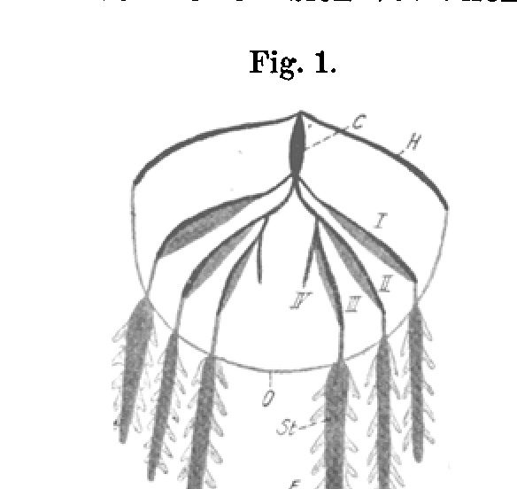
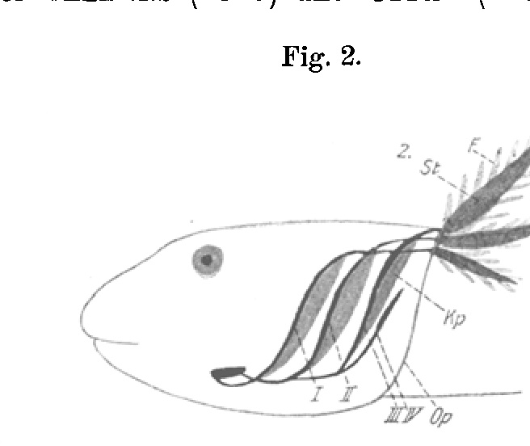
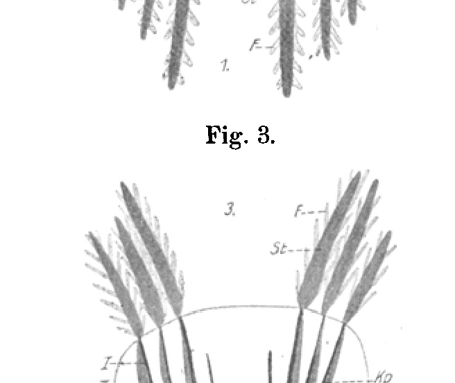
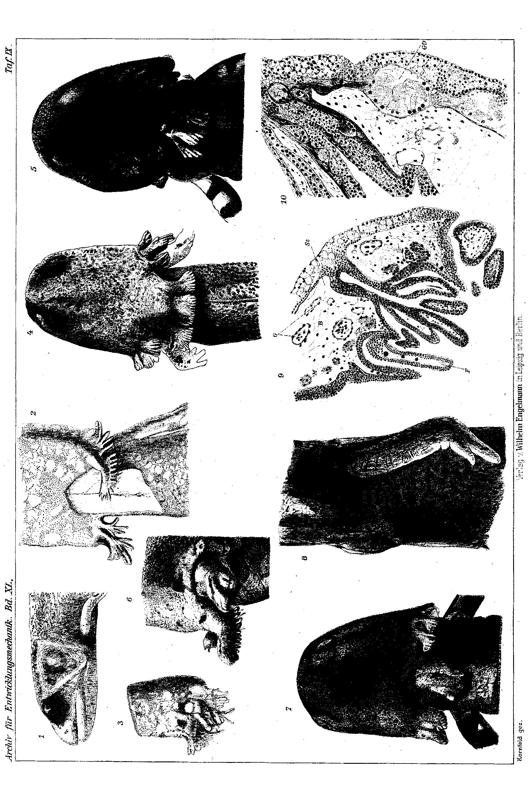
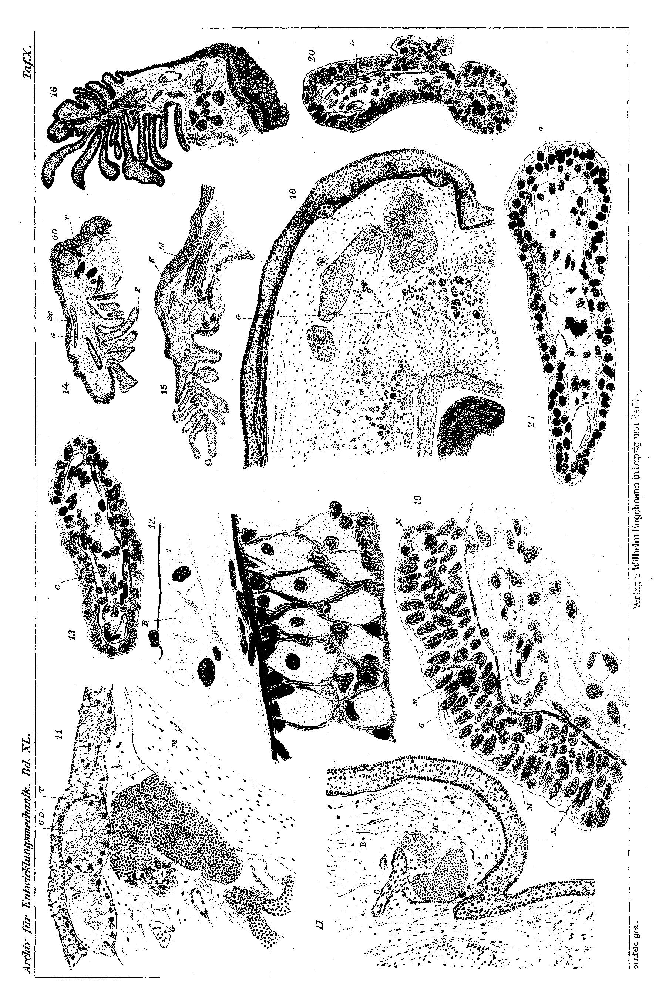

# Dependence of the Metamorphic Gill-Resorption on the Whole Organism in *Salamandra maculosa*.

By

Werner Kornfeld.

(From the Biological Experimental Institute of the Imperial Academy of Sciences in Vienna, Zoological Division ¹).)

With 3 figures in the text and Plates IX and X.

Received on 5 April 1914.

*Archiv für Entwicklungsmechanik der Organismen*, vol. 40 (1914).

> **Full translation.** A complete English rendering of Kornfeld's study of the dependence of the metamorphic gill-resorption on the whole organism, with the tables and figure legends.

In a preliminary communication (1913) I reported on the results of experiments on gill-transplantations in salamander larvae. At that time I hoped that it would soon be possible for me to carry out a few supplementary experimental series and histological investigations and then to offer an exact account of the entire complex of phenomena. Unfortunately, however, other work makes a completion of the experiments in the intended sense impossible for me for the time being. Now, in order not to delay unnecessarily long the communication of the more detailed proofs for the assertions put forward at that time, I see myself compelled to bring forward my findings already now, although I am well aware of the circumstance that, for a causal working-through of the questions taken up, a number of important investigations are still lacking.

The experiments were carried out in the zoological division of the Biological Experimental Institute in Vienna in the period from September 1912

> ¹) This work was announced under the title: Communications from the Biological Experimental Institute of the Imperial Academy of Sciences, Zoological Division, Director H. Przibram. 3. Dependence of the metamorphic gill-resorption on the whole organism in *Salamandra maculosa*, by Werner Kornfeld, in the Academic Gazette No. VIII (a preliminary communication was already published in the Biolog. Zentralblatt. Vol. 33. 1913).

370 &nbsp;&nbsp;&nbsp; Werner Kornfeld

until December 1913. May I be permitted, on this occasion, to express my heartfelt thanks for the manifold advice and suggestions of the head of the division, Herr Prof. Dr. Hans Przibram. For the transfer of work-space I owe heartfelt thanks furthermore to Herr Prof. Dr. Eduard Uhlenhuth, whose works on the transplantation of the amphibian eye gave the impetus for the present investigations, and who furthered my work continually through extraordinarily valuable practical and theoretical hints.

## I. The literature on the experimentally demonstrated dependence of the organs on the whole organism.

The manifold reciprocal relations between the whole organism and its parts offer experimental biology equally manifold problems, whose solving brings particular success with the aid of the transplantation method. It has succeeded, in this way, in producing a series of influences, in which the organism behaved differently after its excision than it had to be presumed from its normal behavior, in which with certainty additional dependences could be demonstrated that had hitherto remained unrecognized. In other cases one has again obtained negative results of the experiment, made it probable that an organ, under the natural conditions of the whole organism unrecognizable, behaves — uninfluenceable — entirely in the sense of the remaining organs.

Such cases lie before us above all where systematically characterizing properties are present. I remind here of the relations of the gardener-developed forms of grafting, which in most cases (apparent exceptions are to be discussed later) preserve their systematic nature unchanged (cf. especially Vöchting 1892). The same is shown by the numerous experiments from the zoological field. Unions of pieces from differently various regenerating-buds show no change in the species- or race-character in the part-pieces, e.g. the unitings of pieces from feather-stars, of differently varying varieties of hair-stars, of differently various species from frogs etc. The regeneration too proceeds completely self-supportingly independent of one another. (A compilation of such experiments and detailed literature references are found e.g. in Korschelt 1907 and in Schöne 1912.)

Abhängigkeit der metamorphotischen Kiemenrückbildung usw. &nbsp;&nbsp;&nbsp; 371

Within the same species and race too, tissues that come from different regions of the body retain in part the same individual character and behavior, e.g. transplanted human skin retains its original positional-characteristic peculiarity. Thus, according to Marchand (1901, cited according to Schöne 1912), nose-skin transplanted in place of cheek-skin does not change its character. The eyebrow of hairy people, transplanted in place of belly-skin, does not change its character either (Schöne 1912). In these experiments too, in which the dependence of the hair-growth on the regions of the receiver was studied, the transplanted piece, set up on a hairless place, retained its hair-character. Also locally limited formative-potencies of young tissue remain in the general framework unchanged after transplantation.

Deviating, some statements about the pigmentation of transplanted graft-skin sound. While in single cases it remains a matter of unchangeability (thus Winkler 1910, Weigl 1913), in other cases changes in the coloring of the transplants according to the receiver-races are given. (Such findings are for example compiled in Weigl 1913.) It is, however, not expressly to be doubted, even when such an influencing in particular cases is with certainty to be demonstrated, whether one stands as if in a contradiction here. For we know such phenomena here only as a change of the essential proper character of the transferred tissue, but it is not a matter of an in-migration or some other passage-over of elements. That such a thing occurs, numerous findings show. The pregnant example is well also here the so-called chimaeras, the explainable graft-bastards; there, however, an apparent influencing of the dye-color comes about, in which one is dealing with a graft and a stock reciprocally interpenetrating. Thus the graft-rice can, in respect to coloring, form etc., take on the apparent character of the stock, and the stock that of the graft-rice.

Likewise it behaves here too when one, as Harrison (1904) described it, has an overgrowing of the dark side-line from a front-body of a *Rana silvatica* onto the rear-body of a *Rana palustris*.

Also findings of Crampton (1897, 1898, cited according to Crampton 1899) about union of caterpillar-pupae of various 372 &nbsp;&nbsp;&nbsp; Werner Kornfeld

kind — about an assumption, occurring in exceptional cases, of the coloring of the larger component by the smaller — would in such a kind of passage-through of elements at the union-place find their explanation. Finally, also in the functional influencings of the transplant still to be discussed later, in many cases overgrowths seem to play a role.

Besides formed elements, solutions too migrate from the one component into the other. The solutions of the nutrient-salts are transferred from the stock into the graft-rice, the assimilates from the graft-rice enter into the stock. Likewise, in animal objects, a passage-over of the substances nourishing the transplant takes place out of the host-organism. A passage-over of not "plastic" substances has repeatedly been given in the plant kingdom. Thus Guignard (1907) described a migration of the hydrocyanic-acid-yielding glycosides out of hydrocyanic-acid-containing into hydrocyanic-acid-free *Phaseolus*-species. The evidential force of his investigations is, however, now doubted. Lindemuth (1877) gave in one case a migration of a dye-color in the union of differently colored potato-races. Yet it appears in this case doubtful whether it is not after all a matter of a dye-production taking place in the apparently influenced component itself, which even without influencing by the other component might possibly occur. Vöchting too describes a similar case, which he himself, however, explains as not from influencing through the other component, but as explainable through dye-production upon the wound-stimulus. Finally there are found statements about migration of alkaloids in Moens (1882), Leemsui (1900), Strasburger (1885 and 1906), Grafe and Linsbauer (1906) and in a detailed and, as it seems, very critical work by Meyer and Schmidt (1910).

Such a passage-over of substances we can naturally also not yet designate as an influencing of the one component by the other. Yet from the migrated-in substances an influence may now go out, which calls forth a change in the tissue of the component concerned itself. By Grafe and Linsbauer it was for example assumed that in their results it was not a matter of a simple passage-over of the alkaloid, but rather that in the one component an alkaloid-forming-capacity originally foreign to it was called forth under the influence of the other component. Strasburger again ascribed to the passing-over atropin an influencing of the tuber-formation. Yet there were Abhängigkeit der metamorphotischen Kiemenrückbildung usw. &nbsp;&nbsp;&nbsp; 373

the results of these two works not generally regarded as proven.

The simplest case of a real influencing of one component by the other is the influencing of the growth of one component by the other through the nourishment carried out by the one or the other. Through this, however, an influence by the duration of the maintenance of a transplant and its growth also appears in many of the above-named cases, an influence on its habitus in single cases perhaps not to be excluded. As an example for this may again the experience of the gardener serve, that a graft-rice can after years take on an altered shape, even with otherwise unchangedness of the kind. These differences would well rest on the qualitative and quantitative differentness of the substances flowing to it. The nourishment plays in general also here a role, in that not two reciprocally completely differentiated, but only in size-relations differing tissues lie before us — later not yet through the discussed phenomenon, that one designates the part-pieces although the unitings reciprocally completely differentiated. Yet just here the forces standing at disposal for the substance-transport, or for the feeding, are held back. The nourishment plays in general also here a role, in that not two reciprocally completely differentiated, but only in the size-relations differing tissues — through the discussed phenomenon, that one designates the part-pieces as not even through the unitings reciprocally completely differentiated, it is proven that the one influences the quantitative differentiation of the part-pieces through more favorable or more unfavorable nourishment of the part-piece-stock, at least co-conditions it, demonstrably; the developmental-stages of the discussed "synchrony" of the development being such that other factors must be responsible.)

Nourishment through the host-stock could also, after the fact established by Kopeć (1911) that with caterpillar-pupae testicles transplanted in females hypertrophy, ovaries transplanted in males undergo an unusual differentiation. (Kopeć himself explains the appearance through the variously large space in male and in female that stands at availability for the development of the gonad; mechanical factors could thereby have been effective.)

It appears extraordinarily interesting that own-kindnesses of the growth, as far as it holds itself within the systematic frame, can be transplanted and thereby carried — the systematic unit being characteristic, but maintained with the transplantation. Thus grows, according to Weigl (1913), Axolotl-skin on sala- 374 &nbsp;&nbsp;&nbsp; Werner Kornfeld

mander-larvae corresponding to their species-peculiarity faster than the host's-own salamander-larva-skin, which showed itself firstly through an overgrowing of the same and secondly also through measurements was established. Since now the nourishment-conditions, as far as it depended on the host-organism, were for the transplant after all certainly rather more unfavorable than for the host's-own skin, we must herein actually behold a holding-fast of a systematic peculiarity, which to us from the outset could appear easily influenceable.

To the influences of the nutriment-supply would be appended those of other specific substances, and indeed let here above all be reminded of the effectiveness of the inner secretion. This plays probably a greater role in the question of the influencing of the whole organism by its parts, respectively of the host by the transplant. Yet at least one group of such influences was demonstrated as also passed-on from the whole organism to the part, from the host-organism to the transplant. In the transplantation of organs that exhibit secondary sexual characters, it could be established that these are influenced by the sexual character of the receiver. Through the gonad-transplantations (see for example especially Steinach 1912 and 1913) it has on the other hand been made highly probable that such influencings have their cause in an inner secretion from the interstitial tissue of the gonad. There can in this way both permanent sexual characters be influenced through the sex of the receiver — thus develops according to Breska (1910) the back-skin-stripe of the female of *Triton cristatus*, transplanted onto the male, into the comb characteristic for the latter — as also periodically appearing characters through the momentary sexual developmental-state of the receiver. Thus is according to L. Loeb (1911), in uterus-transplantations in the guinea-pig, the decidua-formation, besides on the sexual state of the donating female, also dependent on the sex and on the sexual state of the receiver. According to Harms (1912), resorbed thumb-pads of castrated male frogs, transplanted onto normal rutting males, show complete up-differentiation, while normal thumb-pads, transplanted onto castrates, resorb. Other cases lead over to the temporal influencings of developmental-processes to be discussed later. Thus the fact described by Ribbert (1897), that in the transplantation of the still unformed mamma of a guinea-pig onto the ear, the Abhängigkeit der metamorphotischen Kiemenrückbildung usw. &nbsp;&nbsp;&nbsp; 375

mamma there develops into an admittedly quite normal but nonetheless functioning organ, after the transplanted animal had become capable of functioning. These two cases of experiments show that the influencing through the secondary sexual characters normally appears at developmental-processes: Harms transplanted the thumb-pads of the frog onto the dorsal-side of the head, L. Loeb the uterus-pieces into subcutaneous tissue, Ribbert the mammary-pieces into the tissue of the ear, and nevertheless the discussed influencings entered.

Two groups of phenomena should here once briefly be mentioned, which both mostly likewise (so also according to Korschelt 1907 and according to Schöne 1912) are treated as influencings of the transplantates by the host-organism. The one concerns the alleged turning-around of the polarity at developmental-stages of the transplantate under the influence of the counter-set polarity of the receiver. In reality there appears here only an in-part influencing of the transplantates through the host, namely so, according to the result-yielding phenomenon, then, if a holding-fast of the original polarity in spite of contrary regeneration-capacity took place. Here speaks above all the fact that such "polarity-turning-arounds" also occur not simply — not prevented through transplantation — through regeneration, which were certainly lawfully-bound regeneration-stages then, if the elements lay reciprocally with regard to the normal regeneration-appearings. Although it were possible that single cases do not fit into this way of explanation. (More detailed about phenomena from this complicated complex of phenomena, see especially Przibram 1909 and 1913.)

The second group of phenomena belongs to the functional remodelings of the transplantate, especially in over-planting of bony parts. Notably falls here so to discuss to be, that the veins transplanted in the place of arterial-tubes, in respect to the structure of the same, lend an artery-similar appearance. Bones, transplanted at the place, break the structure that is characteristic for the place concerned. Thereby it shows itself in single cases that here not an own remodeling of the transferred tissue itself, but rather a displacement of the same through a function-correspondingly structured regenerated tissue of the host-organism takes place. In other cases, however, an own remodeling is allegedly 376 &nbsp;&nbsp;&nbsp; Werner Kornfeld

excluded through host-tissue, so for example when in the bone-transplantations the original host's-own bone-skin (periosteum) is completely emptied out. Through such cases would now in this case the over-planting, through the inducement by the host-stock, of structures of the transplant itself — in regard to the up-construction of the existing structures of the transplant — the remodeling of parts of the same (the actual bone), with co-transplanted periosteum, be a follow-bound regeneration with establishment of function-corresponding structures. Here appears it as a factually physiological own-share of the transplantate, the specific remodeling only indirectly influenced through the host-organism, however nevertheless certainly brought about through the specific own-action of the transplant through its position in the host-organism, an only passive function. (Contradiction against pressure- and pull-stimuli.)

We come now to the discussion of the territory on which the present work intends to furnish a modest contribution. Now it is one twofold case to differentiate: such, with which the principal developmental-course at unification then becomes carried out, and such, with which only the temporal course of this developmental-process becomes a transplant influenced through the host-organism. This question, which from her connection with the question after the possibility of somatic inducement of the germ-cells appears of greatest general weightiness, is well also there to consider. The positive results of Guthrie (1907) become manifoldly designated; likewise later experiments carried out on imperfect result. In a recent time appears likewise expected from Kammerer (1913) given in *Salamandra maculosa*, however with her artificially on the trunk-membrane induced characters.

From the second group lies a greater number of findings before. The meaning of this group lies therein, that just here a series of questions, that for the descriptive biology are insufficient, could become proven through an existence-justification by the experiment, its solvability nearer brought.

## TRANSLATION HALTED — SOURCE MISMATCH (fidelity check confirmed)

**Assigned paper:** "Abhängigkeit der metamorphotischen Kiemenrückbildung vom Gesamtorganismus" — *Walter* Kornfeld (1914).

**Finding:** The page scans supplied in
`translations_full/_work/img/42_Kornfeld_1914_Gill-resorption-metamorphosis/` (p007–p015)
do **not** contain the body of the assigned paper. They are pages **375–383** of a
**different** paper whose verso running-header reads **"Werner Kornfeld,"** on the subject of
**transplantation / developmental mechanics**. The fidelity checker independently confirmed the
draft's halt-report against the authoritative page images. No English translation can be produced
from these pages without emitting the wrong paper's text.

## Evidence (from the authoritative page images, all verified)

- **Verso (even) page running-headers give the AUTHOR:** "Werner Kornfeld"
  - p008 → printed p. 376 — "Werner Kornfeld"
  - p010 → printed p. 378 — "Werner Kornfeld"
  - p012 → printed p. 380 — "Werner Kornfeld"
  - p014 → printed p. 382 — "Werner Kornfeld"
- **Recto (odd) page running-headers give the journal RUNNING TITLE only:** "Abhängigkeit der metamorphotischen Kiemenrückbildung usw."
  - p007 → printed p. 375
  - p009 → printed p. 377
  - p011 → printed p. 379
  - p013 → printed p. 381
  - p015 → printed p. 383
- **Subject matter of the actual body text:** transplantation and developmental mechanics —
  induction of structures in transplants; synchrony vs. heterochrony of development
  (*Synchronie / Heterochronie der Entwicklung*); determination of sex cells / germ cells;
  transplanted gonads; bone and blood-vessel remodeling; heteroplastic skin transplants
  (*Salamandra maculosa*, *Triton*, *Amblystoma* / Axolotl). Authorities cited include
  Korschelt, Schöne, Lewis, Ekman, Guthrie, Kammerer, Gurwitsch, Sorokina, Uhlenhuth,
  Vöchting, Child, Born, Wintrebert, Kopeć, Meisenheimer, Rein & Wakabayashi, Herbst,
  Ribbert, Meyns, Weigl. This is **not** a tadpole gill-resorption study.
- **Printed page numbers** run 375–383 (Archiv für Entwicklungsmechanik, vol. XL).
- The string **"Kiemenrückbildung"** occurs **only** in the recto running-title header and
  **never** in the body text. No tadpole gill resorption, no thyroid feeding, no metamorphosis
  experiments of the assigned paper appear anywhere on pages 7–15.
- The cover/first page (title page) of *Walter* Kornfeld's 1914 gill-resorption paper is
  **absent** from the set.

## Conclusion

The scans p007–p015 are mis-filed: they are pages 375–383 of **Werner Kornfeld's**
transplantation paper, **not** Walter Kornfeld's 1914
"Abhängigkeit der metamorphotischen Kiemenrückbildung vom Gesamtorganismus."
Producing an English translation of these pages would not be a translation of the assigned
paper, and so none has been produced.

## Required action before translation can proceed

Replace the contents of
`translations_full/_work/img/42_Kornfeld_1914_Gill-resorption-metamorphosis/`
(and the parallel `ocr/` folder) with the correct page scans of **Walter Kornfeld's**
gill-resorption paper, then re-issue the assignment.

*No translation output was fabricated, to avoid silently emitting the wrong paper's text.* Of particular interest to me is the further finding of Weigl, that the stimulus toward metamorphosis proceeding from the host animal can be effective even beyond the boundaries of the species and indeed of the genus, that is, also in heteroplastic transplantation. Salamander-larva skin transplanted onto Triton larvae transformed, a short time after the metamorphosis of the recipient, in the manner typical of *Salamandra*. The slight difference in time can probably be explained by the fact that the impulse toward metamorphosis exerted by the host organism at the same time upon its own skin and upon the transplanted skin could only assert itself more difficultly and more slowly on the foreign transplant. Even more important was the fact that the skin of axolotls, too, transplanted onto salamander larvae, metamorphosed a short time after the metamorphosis of the recipient in the manner characteristic of *Amblystoma*. Here a considerable acceleration of the metamorphosis of the transplant occurs, since the axolotls would only have been brought to metamorphosis much later and only through special external influences. The results show that the influence proceeding from the host organism is not specific to the species, but has a more general efficacy. For the influencing of sexual characters through internal secretion, too, a similar efficacy beyond the boundaries of the systematic unit has been demonstrated.

I have discussed the findings mentioned in the literature with greater thoroughness and in wider scope than seemed to correspond to my own results. Yet I hope thereby to have rendered a service to colleagues who might wish to work on a similar theme, since the relevant statements are in part rather scattered and difficult of access.

## II. Statement of the Problem

The question coming up for investigation arose from the Uhlenhuth works. According to the results concerning the metamorphosis of the amphibian eye, another characteristic developmental process out of the complex of metamorphic phenomena was to be singled out and analyzed in a similar way. In this connection the process of gill-resorption appeared from the outset extraordinarily favorable. In the course of the investigations, however, certain technical and methodological difficulties arose which had not been foreseeable.

The questions coming up for investigation can be made precise as follows:

1) Does a process take place on transplanted amphibian gills which we may regard as metamorphic gill-resorption?

2) Does this metamorphic gill-resorption show an influencing by the host organism, or does it proceed independently, dependent only on the age and other properties of the donor?

3) Does the eventual influencing by the host organism here too lead to a synchronous metamorphosis, that is, to a simultaneous transformation of the transplanted organ together with the host's own, independent of the age of the transplant?

4) Does heterochronous metamorphosis also occur in gill-transplantations when especially far-developed larvae are used?

## III. The Gills of the Salamander Larva and their Metamorphic Resorption

The resorption of the gills is one of the most striking processes in the metamorphosis of the Urodeles. As the basis of an experimental investigation of its course, an exact knowledge of the morphological, anatomical, and histological individual processes occurring in it is indispensably necessary. But, however strange this may sound, an acquisition of this knowledge from the existing literature does not seem to me possible to a sufficient degree. Above all, in the literature accessible to me and that has become known to me, I could find no sufficient statements concerning the histological processes in the resorption that could serve as a criterion for the onset of metamorphosis. (That such characteristically proceeding processes exist is doubtless beyond question.) Furthermore, in all the more detailed data on the temporal relationships of the individual metamorphic phenomena I miss the precise indication of the boundaries of the fluctuations [Schwankungen] of normal individual development. For at the same time as the gills, processes of considerable extent take place; that is precisely why one would have to determine very exactly the gaps which, even at equal age, may nevertheless be present in the development of individual organs. So far as it concerns the temporal relationships, this is doubtless difficult, since with individually differing course of the total metamorphosis the homologous stages can often only with difficulty be identified.

Closer descriptions of the external gills of the amphibian larvae are given above all by Clemens (1895) and Oppel (1905),

**Fig. 1.** *(figure not reproduced)*

**Fig. 2.** *(figure not reproduced)*

**Fig. 3.** *(figure not reproduced)*

**Fig. 1—3.** Schematic representation of the gill apparatus of the Urodele larvae.  *I, II, III, IV*: 1st—4th gill arch [Kiemenbogen], *Kp* gill plates [Kiemenplättchen], *St* gill stems [Kiemenstämme], *Fi* gill feathers [Kiemenfiedern], *O* opercular fold [Opercularfalte], *C* Copula.  1 Projection onto the horizontal plane; 2 Projection onto the sagittal plane; 3 Projection onto the transverse plane.  *(figure not reproduced)*

individual important data especially in Boas (1882 and 1883) and Maurer (1888a and 1888b).

The gill apparatus of *Salamandra maculosa* (text-figure 1—3) consists chiefly of four parts: the gill plates [Kiemenplättchen], the gill stems [Kiemenstämme], the gill feathers [Kiemenfiedern], and the gill cover [Kiemendeckel]. The gill plates form the actual external attachment points. The gill stems connect the [base] of the actual external gill anlage with the body skin; they project out from the small, elongated copula lying anteriorly, below, and medially, toward the rear, above and laterally, and bear [the gill plates], on each side in fourfold number and of varying length. Rearward the gill plates hang down from them, thin skin-lamellae with one- to two-layered epithelium, sparse connective tissue, and relatively rich blood-vessel supply, obviously also with respiratory function. This whole complex is overgrown by a ventral skin-fold proceeding from the hyoid arch, the opercular fold.

At the rearward (that is, upper and lateral) free ends of the first three gill arches the gill stems attach, at the spot where the opercular fold reaches the dorsal body wall. Their dorsal surface is at first only slightly arched and appears as a direct continuation of the body wall, with which it also in part exhibits the same histological structure. From the lateral lower edges of the stems the feathers issue on both sides. The form- and size-relationships of stems and feathers fluctuate extraordinarily. After birth, but especially upon artificial removal from the uterus, the especially long and slender feathers, still adapted to respiration in the uterus, become shorter and stouter. Then, proceeding in parallel with the growth of the whole larva, a growth of the gills with increase of the feathers sets in again, which can continue until shortly before metamorphosis. Besides this, however, there still occur individually extraordinarily changing form- and size-changes.

The histological picture of the external gills (see Figs. 9—13) is in no way a simple one. One part of the dorsal surface of the gill stems is covered with an epithelium very similar to the normal body-epithelium and appearing as a direct continuation of it. It consists chiefly of a basal and a distal layer of small, cytoplasm-poor cover-cells and of a layer of Leydig cells lying between these two, almost continuous and only here and there receding—the known large, cytoplasm-rich gland-cells with granular-appearing secretion and small, mostly round nuclei. The nuclei of the cover-cells are relatively round, mostly elongated, but of very changeable outline, which apparently adapt themselves entirely to the changeable form of the gill stems and feathers. Against the connective tissue filling the gill stems and feathers, this epithelium is bordered by a strong, fibrous basal lamella, demarcated outward by a medium-strong border-seam appearing granulated in the preparations. At this attachment-place of the gill stems there lie under this epithelium extraordinarily large poison-glands, various mucous glands, and the various gland-anlagen in the various developmental stages. These glands show here the same structure of build as in the rest of the body skin. The poison-glands show here a special size and accumulation and pass over at this place, in metamorphosis probably directly, into the giant glands of the parotid-field. The poison-glands otherwise scattered over the body are sparser and much smaller; only on both sides of the dorsal midline do they reach dimensions similar to those at the attachment-place of the gill stems.

A quite different picture, connected with the one just discussed, admittedly, by continuous transitions, is offered by the remaining parts of the gill epithelium: the epithelia of the feathers, of the ventral surface, and of the distal part of the dorsal surface of the gill stems. Here there are no, or only isolated, Leydig cells present, glands are almost entirely lacking, and the epithelium consists, according to the proximal position of the part and the size of the whole gill, of about one to seven layers of large-nucleated cover-cells, which are probably also cytoplasm-poor, but which nevertheless exhibit a somewhat more considerable cell-body than the cover-cells of the rest of the body epithelium. Their shape is cubic to plate-form. The basal lamella is lacking here, obviously so that every separation hindering the respiratory processes between the water washing about the gills and the blood-vessels lying subepithelially might as far as possible be avoided.

The connective tissue filling the stems and feathers shows fibrous structures. The vessels lie in the feathers densely subepithelial, often even, in places, forcing themselves in between the basal parts of the epithelial cells. In the stem the artery lies ventrally, enveloped by connective tissue, the vein dorsally near the epithelium. Both are mostly accompanied by pigment, which, however, is also found elsewhere in the connective tissue, in the epithelium of the stems, and in places also in the epithelium of the feathers. The distinction of arteries and veins, which later often became very important to me, is not always easy, but often succeeds quite well according to the ratio of the thickness of the vessel-wall to the lumen and according to the appearance of the intima.

In the stems there lies, further, a rather powerful musculature and, near the end of the gill arch, just at the attachment-place therefore, the thymus (Fig. 11).

The gills mostly remain preserved until the later stages of metamorphosis. Then only a slow, mostly insignificant resorption sets in, and only in the last 1—3 days of aquatic life does there then take place a rapid resorption of the by far greatest part of the entire external gill-appendages. More seldom one sees a more or less pronounced resorption begin already in early larval life. Animals of the latter case mostly show very irregular relationships in their metamorphosis, for example abnormally long lingering in one stage, in which the animal is now in the water, now on land—a stage which otherwise, when it occurs at all, mostly hardly lasts a single day. After the rapid resorption of the greatest part of the external gill-appendages immediately preceding the going-onto-land, on the other hand, mostly small warts or jags are still to be seen as gill-remnants, which then only more slowly vanish completely in the course of the following 2—14 days.

At the same time as the chief gill-resorption, that is, mostly in the last 1—3 days of aquatic life, there almost always also takes place a sudden acceleration in the resorption of the rudder-seam [Rudersaum] on the tail. Yet here it is even more clearly a matter only of a change of tempo than of a process already begun earlier and, at the going-onto-land, mostly already completed. For at the rudder-seam too a slow resorption of smaller pieces begins already some time before the rapid resorption of the greatest part, and of the rudder-seam too there are, after the going-onto-land—that is, after the rapid resorption of the greatest part of gills and rudder-seam—often still small remnants present, which only more slowly vanish completely again.

While the animals, on the last day before the going-onto-land, often snap vigorously after food, after the going-onto-land they become strikingly sluggish and take no food for a longer time.

With the three processes that, as it seems, are temporally always closely connected—rapid resorption of the greatest part of the gills and of the rudder-tail and the going-onto-land—I found yet a fourth process, I believe, always temporally closely linked: a complete stoppage [Stillegung] of the rudder-surface, which always occurs on the last day before the going-onto-land. Yet I believe that the four processes are not connected in such a way that during this molt the greatest part of the gills and of the rudder-seam is cast off along with it. For I believe I can establish with certainty that at least gross temporal differences between the molt and the resorption-processes occur, that especially the gill-resorption takes place long before the molt.

While these connections rendered valuable services for the exceedingly important assessment of the stage in which an experimental animal at the moment finds itself, I found other metamorphic phenomena, such as the "iris-pigmentation" and especially also the various color-change-steps, independent in the widest extent of the discussed complex of phenomena. An investigation of these relationships, especially with the drawing-in also of the histological changes underlying the processes, would probably bring yet many an important result and offer valuable stimuli both to descriptive and to experimental biology.

## IV. Working Method

In the operative technique I was able to attach myself almost completely to that of the Uhlenhuth eye-transplantations. Larvae of *Salamandra maculosa* in the most diverse age-stages were used. In Series I, which contained chiefly technically orienting preliminary experiments, larvae which had been taken from the uterus of the mother at the beginning of September were operated upon after 3—4 weeks; in Series II, such as had been taken from the uterus on October 21, after 8—10 weeks. This series was intended especially to treat a possible influence of a cutting-off of the animal's own and of the transplanted gills, but in this respect led to no definitive result. The animals of both series showed at the operation still only early-larval characters. Of them, the first transformed themselves—herein both the operated and the control animals are taken into account—6 months after the removal, that is, 5 and 4 months respectively after the operation-time, while, on the other hand, 9 and 7½ months respectively after the operations individual animals were still larval. Series III served the chief question: the behavior of the transplant with the use of larvae of different ages. Here three different age-classes were used: 1) Larvae which had been taken from the uterus 5—6 months before the operation and of which the first transformed themselves about at the time of the operations (March 17 to April 29), the last about 2½ months after the operations. 2) Larvae which came to operation 2—7 weeks after the uterus-removal (March 17—April 29). Of these the first transformed themselves about one month after the time of the operations; many were, at the breaking-off of the respective experiments (2½—4 months after the operation), still larval. 3) Larvae which 10—15 days before the operations taking place between April 24 and 29 had been born. Of this litter the first larva transformed itself 2½ months after the operation (see Table I).

The data given, as do also the individual notes of the protocols, show that — as is indeed to be expected, but is sometimes disputed in the literature — the autumn material develops on average much more slowly than the spring material. It also appears less resistant than the latter. Of the spring material, in turn, the larvae taken from the uterus at the beginning of March transformed themselves more quickly than those born in April. Whether here too a lawfulness underlies this, or whether it was mere chance, I cannot decide with the material at my disposal, which is too scanty for such purposes.

In the operation, the right and left gills of one animal (the donor) were always transplanted onto two different host animals (the recipients). All three animals were narcotized with ether vapor. The donor was operated upon in the water, since outside the water the gills, which then lie smoothly against the body and are thereby poorly visible, are easily injured. The recipients were operated upon on moist filter paper, which had the advantage that one did not have to narcotize them so strongly (since the animals wake from the narcosis more quickly in the water than in the air) and that they thus more easily survived the harms of the narcosis. Only seldom did it happen that, despite this, a recipient succumbed to the consequences of too strong a narcosis in conjunction with those of the operation. In the experiments of Series II I made the observation that animals with their own gills cut off [gestutzten] tolerate the narcosis much less well than those with uninjured gills. Whether this is to be traced back to the fact that the weakening through the cutting-off makes the animals altogether less resistant, or whether it rests on the fact that gill-respiration plays an important role in the recovery from the narcosis, I cannot yet decide; yet I hold the latter to be the more probable for several reasons. — The donor, which was not to be observed further, mostly perished, during or after the operation, of the consequences of the intervention, which injures it much more strongly than the recipient.

The gills were cut off with a fairly large piece of the skin lying in front of them (Fig. 1 and 3), and the cut-off adjoining tissue parts — connective tissue, musculature, parts of the gill-arches and the gill-platelets, etc. — were trimmed away. Thus the transplant now became freed of all large adhering tissue-shreds [Gewebefetzen] and was then cut to the form and size of a wound created beforehand in the nape-region of the recipient by the removal [Abtragung] of skin and skin-wound-surfaces [Hautwundflächen]. It offered the following advantages: for this wound the nape-region was always chosen, after various orienting preliminary trials. It permits, within the widest limits, the wound to be made arbitrarily small or large without one thereby striking upon a fundamentally different substrate. The high muscle-layer at this place makes possible a strong arching-out [Ausböhlung] of the wound without special injury to the recipient, which mostly very much promotes the growing-together [Verwachsen] of the transplant. Finally, this place is, even with the liveliest movement of the animal, scarcely exposed to knocks, and even through the curvatures [Krümmungen] of the body itself it is scarcely affected. One may therefore hope there for a fairly undisturbed healing-on. Since the whole skin of the larva is respiratorily active, the blood-supply at this place too — an extremely important factor, as shall be shown more closely later — should not be unfavorable.

In the transferring [Übertragen] of the transplant, care had to be taken, especially through small artifices [Kunstgriffe], that the soft skin-flap [Hautlappen] does not roll up or fold over, as happens easily especially upon removal from the water. The transplant was always laid on in such a way that the freely projecting gill-stems were directed backward, so that, in the forward movement of the animal, just as at their normal seat, they are not lifted up but pressed against the body. In the operation, a pale-rose solution of potassium permanganate was used for the disinfection of the wound, of the instruments, and of the vessels.

After the operation the animals lay 24 hours in a moist chamber. In this time, mostly already after a few hours, the transplant is so firmly grown together with the underlay that the animals could be brought back into the water. They were kept at first in preserving-jars [Einsiedegläser] holding 3 liters, which were filled with water to half their height and covered over with glass plates. In the first week after the operation the water was changed daily, later about every 3—7 days. Each animal usually received, every 2nd or 3rd day, a small portion of *Tubifex*. In the case of older larvae, opportunity to leave the water was given by the addition of gravel, which at one spot projected above the water-surface. When this happened, and in critical times also when feeding was done, was noted for each animal, and likewise for each group of similarly treated animals, so that eventual influencings of the metamorphic processes could be ascertained. Each experimental animal was looked at daily in critical times, otherwise every 2—5 days, and the observations were noted as exactly and objectively as possible, without regard to the foregoing ones. Through this there came, admittedly, into the protocols sometimes, especially in the descriptions of quantitative relationships, small contradictions, which the difficulty of the assessment brings with it.

Of all characteristic stages, firstly voucher-specimens were preserved in formol [formalin] (such ones were also made for Figs. 4, 5, 6, 7, 8), and secondly transplants together with their surroundings were investigated anatomically and histologically. The investigation was directed above all at the morphological transplantation-results, and further especially at the histological degenerative and metamorphic changes. Precisely this histological part of the work is to be designated as the one still outstanding.

For fixation there was used above all the mixture potassium-bichromate–formol–glacial acetic acid (7:2:1) and triple-staining with Delafield's hematoxylin–acid fuchsin–orange-alcohol. Very abundant material treated with sublimate–glacial acetic acid, with Flemming's and with Zenker's fluid has so far not yet come to investigation.

Side-experiments [Zweigversuche] on the effect of keeping in a moist room instead of in the water, upon normal and transplanted gills, were begun especially in a separate, IVth experimental series, but so far led to no probative result.

## V. Results of the Transplantations.

The results of the four series into which the experimental investigation fell apart shall here be discussed jointly.

The direct operation-result is to be seen from Figs. 3, 4, 14, 15, 16, which represent the transplants shortly after the operation. They show the constituent parts already indicated in the section "Working Method": on external examination, gill-stems and feathers and the skin lying in front of them that was co-transferred; on sections, moreover, the inner parts, remnants of the gill-arch cartilage, thymus, connective tissue, musculature, and blood-vessels.

After the operation, there now sets in at the transplant a slow resorption [Rückbildung] of the gill-feathers and partly also of the gill-stems as well. This resorption now proceeds very variously far and reaches its high-point after about 4—6 weeks. After this time, or also already somewhat earlier, a standstill sets in and in many cases probably also a slight re-differentiation [Wiederaufdifferenzierung]. In general, however, one can after this time distinguish a clear durable-stage [Dauerstadium], during which the transplant maintains itself essentially unchanged. In this stage it mostly offers the following, in detail admittedly extraordinarily variable, picture: In the nape-region a hump [Höcker] rises up, whose outline is somewhat ellipse-shaped. Its length amounts mostly to 2—7 mm, its width 2—5 mm, its height ½ to 1½ mm. The coloration of its skin mostly diverges from that of the surroundings, and the interruption of the markings of the host's own skin can almost always be recognized without difficulty. At the hind edge of the hump there project, free, three different gill-stems, which still bear remnants of the feathers in the form of short threads or variously shaped jags [Zacken] (see Fig. 5, 6, 7).

The anatomical investigation shows the following relationships: In the hump there lie, under normal-appearing integument, the co-transferred parts of the gill-arch, whose inner cartilage appears preserved, and the thymus, which likewise scarcely lets any pathological changes be recognized, enveloped in connective tissue that is traversed by fairly strong vessels richly filled with blood-corpuscles (Fig. 17). Downward, the connective tissue of the transplant passes directly over into the connective tissue of the host enveloping the musculature.

The blood-vessels can be followed easily at the transplant still fairly far into the tissue of the host-animal (Fig. 18), yet it was so far not possible for me to see from which main vessel-stems of the host they stem. They appear mostly to draw through the connective-tissue strip that separates the two sides of the back-trunk muscle [Rückenrumpfmuskel]. Some of them appear to end blindly in the hump; in others, filled blood-vessels are to be seen in it (Fig. 19 and 20).

The stems and feather-remnants projecting from the body show, just like the parts of the transplant lying in the hump, for the most part a healthy, normal appearance. Blood-vessels can be demonstrated almost as numerously as in normal gills, only they do not appear to run so smoothly and regularly as there. One also encounters, especially in the feather-remnants, beside normal-appearing filled vessels (Fig. 20), empty ones, which make a degenerated impression (Fig. 21). The pictures appear actually to say that — at least in the peripheral parts — the newly formed vessels become obliterated [veröden] and the complete neo-vascularization proceeds from the host-organism. In the feathers the new vessels appear not yet to lie so closely nestled against the epithelium as the normal gill-feather vessels (Fig. 20 and 13).

The epithelia show the properties characteristic of the respective parts. At most it would be possible that the Leydig cells in the dorsal gill-stem epithelium recede abnormally strongly. The large girdle-cells [Gürtelzellen] are completely preserved and show various stages of secretion-production. In the epithelium of the transplant there are also found mitoses, however in no considerable frequency, which likewise speaks for a normal continued living of the tissue (Fig. 19).

That a morphological re-differentiation of the transplanted gills does not take place, or only in an extraordinarily slight measure, seemed to me surprising in the beginning. For in Uhlenhuth's eye-transplantations there did indeed also occur, initially, a back-differentiation [Rückdifferenzierung] of the finer histological elements, but after a short time a complete restoration of the normal anatomical and histological relationships followed. There it is a matter of a much more complicated organ, which yet apparently places much greater demands on its surroundings than the much simpler-appearing gills; if, upon transposition of the eye onto an in some sense unnatural place, a re-differentiation follows, then one would surely have to assume that the same would be the case with the gills, especially since the already mentioned facts prove that the transplant remains alive at the new place and also preserves its peculiarity — that the operations are therefore to be regarded as successful.

Against this argumentation, however, a suspicion soon arose. It is, namely, conceivable that the gills, corresponding to their function, place yet greater demands on their surroundings than the morphologically and anatomically so much more complicated eyes. Roux set up two main conditions for the complete preservability of a transplant: functional stimuli and sufficient nutrition. The necessity of the first condition is recently variously doubted. In the transplanted eyes a functioning is probably excluded, and the simple action of the light-stimulus appears, according to Uhlenhuth's newer results communicated at the Natural-Scientists' Congress [Naturforschertag] of 1913, to have no influence on the behavior of the transplant. Against this, all experiments on transplantations prove the extraordinary influencing of the nutrition upon the transplant. One could now imagine that the gills, at the normal place, in consequence of the functional, exceptionally rich blood-supply, are also accustomed to the usability of exceptionally large quantities of blood for their nutrition, such as do not stand at their disposal in such a measure at the transplantation-site. (The quality of the blood, too, could perhaps play a role in this case.)

A confirmation of the importance of the characteristic blood-supply for the morphological development of the gills lies in some results of the already cited work of Ekman (1913a), who, in anuran embryos, upon transplantation of the ectoderm which normally yields the external gills, before the beginning of gill-formation, did indeed see a gill-formation begin, but had to establish that the gill-rudiments formed received no blood-circulation and were soon resorbed. He traces this back to the absence of the gill-artery; for when the ectoderm in question is set on in the region still accessible to the gill-vessels — even if in an abnormal position — then blood-circulation and normal further development of abnormally situated gills set in. Ekman therefore regards the gill-vessel as a necessary "executive factor" ["Ausführungsfaktor"] for the development of the external gills.

It now lay near to the apprehension that the transplant, which in consequence of the unfavorable relationships was not capable of a re-differentiation, would also not show the metamorphic phenomena with the necessary distinctness. This apprehension, however, proved unjustified.

The durable-stage, or rather the slow, continuous, partial resorption directly following the operation that precedes it on the transplant, lasted so long until the host-animal entered into that critical stage of metamorphosis in which the thereby mostly very strong acceleration in the resorption of the host's own gills and of the rudder-seam [Rudersaum] takes place, and in the mostly following 1—3 days the going-onto-land [Landsteigen] of the animal. In this stage there also occurred a sudden resorption of almost all that was still present, of the stems and feathers of the transferred gills, according to the momentary resorption- or durable-stage of the transplant. That here another process lay before than the initial resorptionformation on the transplant, a whole series of facts proves. Before I, however, discuss these comprehensively, I should like to bring some examples for the separability of the two processes. To this end I reproduce some notes from the protocols:

> »Operation on 1. X. 1912.«
>
> »7. XII.: Transplant two-stemmed with short thick feathers, in front of it a hand-covered up-arching ..«
>
> »20. III. 1913. Transplant two weakly serrated stems (behind the up-arching) ..«
>
> »30. III. Transplant as up-arching ..«

Two gill-stems are thus found still preserved over 5½ months; as feather-remnants they were last to be seen as weak jags. And then, suddenly, in a time-span of at longest 10 days, a sudden, complete resorption of the gill-stems follows.

### II, 2. Operation on 24. XII. 1912.

> »14. I. 1913. All three stems well preserved, ends black, with small white feathers ..«
>
> »10. III. Three short speckled, serrated stems ..«
>
> »31. III. Three beautiful stems without feathers ..«
>
> »23. IV. Three large stems with a few small jags ..«
>
> »1. V. Transplant three beautiful, large stems ..«
>
> »6. V. Transplant three distinct, middle-length stems ..«
>
> »8. V. Transplant two distinct jags ..«
>
> »10. V. Transplant only any more a weak up-arching ..«

Here all three stems had kept themselves well over 4 months; then the complete resorption set in very rapidly, thus, in barely 14 days.

### II, 4. Operation on 19. XII. 1912.

> »10. III. 1913. Transplant short stems with white, serrated seam ..«
>
> »17. IV. Transplant three short, serrated stems with white seam ..«
>
> »23. IV. Free part of the transplant large, three-lobed ..« There now follow only notes about the constancy of the transplant, thus still on 5 May an explicit remark about it. On 6 May the remark stands over the transplant: "Bulging with quite short stumps." On 8 May: "Transplant only a small bulge any more." Here, then, the sudden resorption of the greater part had occurred within 24 hours, after considerable stem-remnants had persisted for 4½ months.

### II, 6.

**Operation on 19 December 1912.**

"17 April 1913. At the transplant three fine smooth stems.."
"23 April. Transplant unchanged.."
"26 April. unchanged (!).."
"1 May. Transplant only as a bulge."

After three fine stems had persisted for over 4 months, sudden complete resorption in at most 4 days.

### III, 9.

**Operation on 5 April 1913.**

"8 April. Three variously large stems with feathering.."
"12 April. At the transplant three feathered stems.."
"16 April. Transplant with feathering.."
"23 April. Feathering still distinct, but short.."
"25 April. At the transplant still distinct serrations.."
"26 April. At the transplant distinct serrations.."
"29 April. At the transplant distinctly faintly serrated stems.."
"1 May. unchanged.."
"3 May. unchanged.."
"5 May. At the transplant three distinctly serrated stems.."
"6 May. Transplant faintly serrated.."
"9 May. unchanged.."
"10 May. At the transplant three fine, quite faintly serrated stems.."
"11 May. unchanged.."
"14 May. At the transplant three large, serrated stems.."
"17 May. At the transplant three fine, distinctly serrated stems.."
"19 May. unchanged.."
"20 May. unchanged.."
"26 May. Transplant with three unequally long, in places still faintly serrated stems.."
"3 June. At the transplant fine smooth, medium-long stems.."
"5 June. Transplant with medium-long free stems.."

"7 June. At the transplant fine medium-long, free stems.."
"9 June. At the transplant behind the bulge short warts.."
"10 June. Transplant only a smooth bulge any more.."

In this example I have reproduced all the explicit remarks of the protocol relating to the transplant, in order to show, at least in one case, the individual steps of the first resorption and the sharply contrasting second resorption. Here too it was a matter of a case in which the second, sudden resorption process already falls into a stage in which the initial degenerative resorption has already come to a standstill and the new process sets in quite independently.

A further example shall now show that this by no means must always be so, but that the second resorption process can also set in even before the onset of the permanent stage, that is, still during the continuance of the first resorption, and that even then it can nevertheless be recognized with certainty as a sudden change of tempo, in a sense entirely unmotivated from the side of the transplant.

Let, by way of example, some notes be reproduced which concern the animal "III, 5,". The operation had taken place on 26 March 1913. On 12 April the transplant still showed three stems, of which two were large and bushily feathered. With an undisturbed course of the first resorption, since the transplant behaved so extraordinarily favorably more than two weeks after the operation, the feathering would, in the course of perhaps a further 4 weeks, have been more or less slowly resorbed, the stems would have slowly diminished somewhat, until in about the 6th to 8th week after the operation the usual permanent stage would presumably have appeared, with about the picture: At the transplant three distinct, faintly serrated stems of differing length, etc. Instead of this, however, on 16 April, that is 4 days after the cited description, only two small stumps were any longer to be seen at the transplant behind the bulge, which now resorbed further again somewhat more slowly, became wart-like, and on 23 April had entirely disappeared. Here, then, the slow first resorption was overtaken by the second resorption process, but the separation of the two is nevertheless, as clearly emerges from what has been said, easily possible. Important too appears the fact that here, more distinctly than otherwise, after the rapid resorption of the greater part of the transferred gills representing the second process, the small serration-like remnants only later resorbed completely more slowly. The significance of this appearance will be entered into later.

These examples, which were arbitrarily picked out from a larger number of like cases, may suffice to prove the separability of the two resorption processes and the good characterizability of the second process. These circumstances, which in all cases in which the transplant maintained itself in usable quality always showed more or less distinct agreement, permit us the following statements:

In connection with the operation there occurs in all cases a slow, continuous resorption, of variously far-reaching extent, at the transferred gills, which affects in the first place the gill-feathering, but to a lesser degree also the gill-stems. Its course appears entirely independent of the age and developmental state of the animals used for the operation as donor and as recipient, and conditioned solely by the operation. The resorption is probably in causal connection with the tissue-resorptions occurring in organ injuries, of which above all a desolation [Veröddung] of the blood vessels, at least in the peripheral parts of the transplant, is histologically demonstrable. Its standstill, or even a certain re-differentiation, is probably connected with the revascularization of the transplant from the host animal, likewise made probable by histological pictures. It is evidently a matter of a pathological appearance called forth by the operation. I therefore call the process of this first resorption the degenerative resorption process.

Besides this degenerative resorption, a second process takes place at the transplant, which is entirely independent of the time-point of the operation and of the behavior of the transplant conditioned by the operation — precisely the degenerative resorption. We must seek the basis for the explanation of this second process in the peculiarity of the transplant, or rather in the peculiarity of the system: host organism + transplant.

The next logical question therefore runs: Is there, in the normal behavior of the transferred organs, that is, in their behavior under the natural conditions, a process capable of explaining the second resorption process occurring at the transplant — since this not only cannot be explained from the direct consequences of the operation, that is, from the alteration of the natural conditions, but even in principle seems to have nothing to do with them? The answer to this question is self-evident. In the metamorphic resorption of the gills under normal circumstances we know a process that runs exactly like the second resorption process at the transplant. There too, in the same period of 1–3 days, a rapid resorption of the greater part of the external gill-appendages mostly takes place, while serration- or wart-like remnants possibly still present afterward only then disappear completely again somewhat more slowly. This latter behavior in particular too shows striking agreement with the behavior of the transplant, as numerous cases show. Among the cited experiments too this appearance is found, namely in the cases "III, 5,"; "III, 9,"; "II, 4," and "II, 2,".

It therefore appears to me completely justified to conceive the rapid resorption of the greater part of the transferred gills, hitherto designated as the "second resorption process," as a metamorphic process, and indeed, since the gills do form the main part of the transplant, also directly as the expression of the metamorphosis of the transplant.

Now we know that under natural conditions the gill-resorption takes place in temporal connection with other alterations of the organism. The gill-resorption process runs not only exactly synchronously in the gills of the two sides, but there also exists, as has already been emphasized several times, normally a synchrony between it and other metamorphic appearances. The resorption of the greater part of the external gill-appendages occurs normally simultaneously with a molt and with a strong, momentary acceleration in the resorption of the rudder-tail [tail-fin] shortly before the animal's climbing onto land.

If the second resorption process is in fact a metamorphic one, then these circumstances must manifest themselves in its course. This is indeed actually the case, a further proof of the correctness of the interpretation. From the manner of this manifestation, however, we can then on the other hand draw conclusions about the causes of these circumstances. For from the outset, as was already set forth in the discussion of the literature, two possibilities would be conceivable. The synchrony under normal conditions could either be regulated simply by the fact that, of the processes running at the same time under the same conditions, corresponding to these within the individual under identical conditions, definite stages in the organ-development always correspond to one another and appear temporally connected with one another; and indeed in that case, naturally, in the like organs which are present in the body in plurality — for instance right and left — the stages "corresponding" to one another would also be alike one another. Or else the synchrony could be regulated by a specific influence transmitted to the individual organ from the totality of the remaining organs by some path. It was shown in the discussion of the literature that the transplantation method has decided such questions in a number of cases, and indeed in the sense that there a specific influencing of the individual organ by the totality of the remaining organs must in fact take place.

In the present case too the transplantation results must make possible a decision of the question. For if the synchrony is conditioned only by the like age and the like past of the organs, then at the transferred gills a metamorphic resorption would have to take place at the time at which it would also normally have taken place if the gills had been left on the donor. The gills of the two sides of an animal, transplanted onto two different other animals, would always have to transform at approximately the same time, independently of the age and developmental state of the recipient. If, on the other hand, the metamorphic gill-resorption is regulated by a specific action from the totality of the remaining organs, then, if the operation is carried out at a time-point at which the influencing has not yet taken place in the two animals, a metamorphosis must occur at the transplant which, independently of the age and developmental state of the donor, occurs exactly synchronously with the metamorphosis of the host organism.

Somewhat more complicated do matters lie if the operations take place at a time at which in one of the participating animals the influencing has already taken place. Yet the results of Uhlenhuth have shown that with correct working methods the heterochronous metamorphoses then occurring can render very valuable services precisely for the interpretation of the circumstances.

In the gill transplantations, now, the metamorphic gill-resorption at the transplant always occurred exactly synchronously with the metamorphic appearances at the host organism. As proof of this, verbatim statements of the protocols shall again serve, whereby, however, I now lay weight above all on the relation of the appearances at the transplant to those at the host organism.

Let us consider above all the behavior of the host organism in the examples already adduced as proofs of the separability of the two resorption processes.

In the animal I, 12 the metamorphic resorption of the gill-stems at the transplant had been ascertained on 30 March. On the same day we find the statement concerning the host animal: "just before the transformation, own gills resorbed." At the latest on 5 April the animal had definitively left the water.

The transplant of the animal II, 2 shows the metamorphic resorption on 8 May. The host animal showed on 5 May "beginning resorption of the rudder-seam [tail-fin border]," on 6 May "the own gills very short," on 8 May the own gills were almost entirely resorbed, the rudder-seam not yet completely disappeared, but the animal had already left the water. On 10 May, at the same time at which also the last serration-like remnants of the transplanted gill-stems had disappeared, the transformation of the host animal too was completed. (Insofar as it is constituted by the temporally interconnected appearance-complex here always alone considered: molt, resorption of gills and rudder-seam, climbing onto land.)

The transplant of II, 4 metamorphosed on 6 May; on the same day the host animal had climbed onto land, the own gills completely resorbed, of the rudder-seam still remnants present.

The transplant of II, 6 had completed its metamorphosis in the period from 26 April to 1 May. In the same period the animal had climbed onto land.

The transplant of III, 9 showed a metamorphic resorption on 9 June, the resorption of the wart-like remnants on 10 June. The host animal had strongly resorbed the rudder-seam from 6 June to 9 June and on that day already left the water at times; on 10 June it had definitively climbed onto land. To be sure, on that day the own gills still had short stems and feathering, and still on 12 June remnants of them were present in the form of short serrations. This case therefore appears especially interesting because it shows — and other examples could still be appended to it — that the metamorphosis of the transplant, even when, in consequence of an influencing by the host organism, it occurs strikingly clearly synchronously with the latter's total metamorphosis, need not occur in detail, perhaps in some cases not exactly synchronously with the resorption of the host's own gills, but, as here, an even stricter synchrony with other processes of the complex (rudder-seam resorption, leaving of the water) may be present. This appears to us understandable if we consider that in the system host organism + transplant the own and the transplanted gills certainly may not be conceived as identical organs in the sense in which, say, right and left host-own gills are. There occurs a synchrony between the metamorphosis of the transplant and the appearance-complex which is here always considered as unitary, but just as the individual processes of this complex can be shifted against one another to a certain, even if very slight, degree, so too the metamorphosis of the transplant, which thereby proves itself placed on equal footing with the remaining individual complexes, but not more closely bound to one of them than to the other.

The onset of the metamorphic gill-resorption, which, on the sole reproduction of the notes concerning the transplant, appears entirely unmotivated, thus shows, as emerges from these data, a distinct agreement in its course with the course of a definite appearance-complex in the metamorphosis of the host organism. It remains only to be proven that, firstly, it is not here a matter of some mechanical influencing of the transplant by the processes of the metamorphosis, and secondly, that the synchrony could not perhaps come about through accidental agreement in the developmental velocity of transplant and host organism.

Regarding the question of whether it might perhaps after all be a matter of a more external action in the case of the second resorption process, the following may be said: An influencing through the conditions altered after the climbing onto land — thus, say, a drying-out or abrasion of the freely projecting gill-stems of the transplant — is excluded, since the metamorphic resorption always occurs before the climbing onto land. An influencing through more external processes before the climbing onto land would, to my knowledge, only still possibly be conceivable through the animal's casting off the external parts of the transplant along with [the skin] during the molt. But that too seems to me excluded, namely for the following reasons: Firstly, the molt occurs through a single unitary casting-off of a whole skin-layer, so that one sees this afterward still coherent and often still in the form of the animal beside it in the water.

whole skin layer, so that one afterwards still sees these connected and often still in the shape of the animal, beside it in the water.

The disappearance of the gill-stems on the transplant, by contrast, takes place — although very rapidly — yet not all at once, but step by step, as emerges from numerous observations. Secondly, between the metamorphosis of the transplant and the moulting of the whole animal there seems to exist no more intimate temporal connection than among the other metamorphotic phenomena of the same complex, and this connection is, as already emphasized, displaceable, though only within narrow limits. Finally, however, in my opinion the anatomical behavior of the transplant too convinces one of the improbability of the assumption that during moulting the whole free stems of the transplant should detach themselves from its remaining parts, say for some mechanical reasons. For the connective tissue filling the stems passes without separation directly into the connective tissue of the hump, and this directly into that of the host animal. Between the inner parts of the free stems and the parts remaining on the host animal during the metamorphosis there therefore exists, through the fusion, a connection that in purely mechanical respect is probably far firmer than that between the gill-stems of the transplant — which disappear during the metamorphotic resorption — and the layer of the host animal cast off during moulting.

For all these reasons I consider it ruled out that some externally acting mechanical factor could after all be to blame for the metamorphotic gill-resorption process on the transplant. Rather, I consider it proven that we must in fact be dealing with a genuine metamorphotic developmental process of the transplant.

Finally, the unambiguous proof for this is still to be furnished: that the metamorphotic gill-resorption on the transplant really takes place dependent only on the metamorphosis of the host organism, but completely independent of the age and developmental state of the donor; that it therefore cannot be, say, a matter of chance agreement in the developmental velocity of transplant and host animal.

As was already noted in the discussion of the experiments of Born, the synchronous transformation when using animals of equal age can already serve as proof of probability for this, since even animals of equal age, even from one litter and even under conditions kept as equal as possible, always transform at quite different times. The certain proof of this, however, lies in the results obtained in the III. series of experiments, in which differently aged animals were used as donor and as recipient.

Let, for example, the already mentioned case III, 5 be named here. The transformation of the transplant took place exactly synchronously with that of the host animal in the period: 16. IV.–20. IV. The host animal was at this time 6 months old. The transplant came from a donor that had been taken from the uterus on 6. III., and thus transformed after a period of 6 weeks! Self-evidently, at this time none of the donor's sibling animals was yet in metamorphosis. The first transformed itself on 22. V., thus 2½ months after the removal from the uterus. This was already to be regarded as an exceptional case. For by far the most animals of this litter only transformed several weeks later (see also Table I). The transformation of the transplant thus took place 5 weeks earlier than the earliest among the donor's sibling animals. Here, therefore, there certainly took place an acceleration of the transformation of the transplant, which under the influence of the host animal led to exact synchrony.

Similar too were the cases III, 12; III, 18; III, 22. In all three, the transformation of the transplant — which had been taken from animals of the same litter as in III, 5 — took place earlier than in the further-reared animals of the same litter, namely on the 25. to 28. IV.; on 9.–10. V. and on 10.–14. V. Here too, then, there certainly was present an accelerated metamorphosis of the transplant, brought about by the greater age of the recipients, which likewise came from the same litter as the recipient III, 5.

The conditions were likewise the same with the use, as donors, of larvae that had been littered on 14. IV. 1913. In case III, 28 the gills of such an animal had been transplanted onto one littered on 21. X. 1912. The transformation of the transplant took place in the period from 17.–22. V. exactly synchronously with the transformation of the host animal. The first sibling animal of the donor transformed itself on 10. VII., thus almost 3 months after the littering, more than 1½ months later than the mentioned transplant; the other animals of the litter were also still purely larval at this time. Also with the use of this litter as donor and of the larvae taken from the uterus on 6. III. as recipients, there still occurred a certain, demonstrable acceleration. The transplant of III, 26 transformed itself synchronously on 22. V., thus more than 1½ months before the first sibling animal of the donor. Similar still was the transplant of III, 27 on 17. VI.

Just as in all these examples a certain acceleration was present, so in the converse cases there took place a certainly demonstrable retardation, which admittedly is not so striking, because far less narrow limits are set to the longer remaining in the larval state than to the early metamorphosis. As an example, the following case may serve:

The transformation of the larvae taken out on 21. X. 1912 took place in the period between 10. IV. and 20. VI. 1913, that of most larvae about the end of May. If these larvae were used as donors, and the larvae taken from the uterus on 6. III. 1913 as recipients, then the retardation of the transformation was sometimes clearly ascertainable. Thus the transplant of III, 13 transformed itself between 26. VI. and 29. VI., thus later than the latest siblings of the donor.

Especially convincing to me appears the juxtaposition of the behavior of transplants in which the gills of the two sides of one donor were each transplanted onto two differently aged recipients. In these cases one sees how the right and left gills of one individual transform themselves at different times, according to the age of the recipient. These conditions emerge most clearly from Table II, in which such cases are compiled.

Only one such example shall here still be discussed more closely, because it is at the same time so far the only case that yields somewhat usable results for the question raised chiefly in the IV. series of experiments: for the question how far the keeping in the moist chamber instead of in the water influences the behavior of transplanted and of the host's own gills. In the other such experiments, that is, especially in those of the IV. series, the larvae perished too quickly for a clear result to have been discernible.

From an animal taken from the uterus on 6. III. 1913, the gills of the one side were on 9. IV. transferred onto an equally aged one, those of the other side onto an animal taken from the uterus on 21. X. 1912 (III, 11 and III, 12). The two transplants behaved somewhat differently, in that on the older recipient the degenerative resorption progressed somewhat more quickly than on the younger. Whether this was chance or goes back to grounds of more general significance, I cannot decide with certainty. One could think that the stages preceding the metamorphosis of the recipient also favor the degenerative resorption of the transplant, or that the phenomenon is to be placed in parallel with the slow, slight diminution of the gills that normally proceeds before the sudden resorption of the greatest part of the gills. According to my other observations, however, it seems to me still more probable that the simple circumstance is to blame for it: that equal age, like every other equality of recipient and donor, represents more favorable, and unequal age, like every other inequality, less favorable conditions for the transplantation. At any rate, the behavior of the transplant on the older animal (III, 12) sufficed completely to demonstrate the synchronous metamorphosis taking place soon thereafter. For on 22. IV. there were still on this transplant »2 stems with irregular contours and serrations«, on 23. IV. »2 shapeless, serrated little stems«, on 24. IV. on these »still distinct medium-long pinnae« to be seen. On the host organism, on the gills already engaged in slow resorption, on 23. IV. only short serrations were still present as pinnae-remnants; the swimming-fin border was almost wholly resorbed. On 25. IV. the host animal had moulted; of its gills only the stems were still preserved. The transplant still showed »distinctly serrated stumps«, on 26. IV. »only quite small jagged stumps«. On 28. IV. the animal went up onto land; the transplant showed no more remnants of the gill-appendages and was, as usual, recognizable only as a smooth bulging.

Let us now compare with this the behavior of the younger animal (III, 11). Its transplant still showed on 22. IV. beautiful long pinnae. On this day it was now taken out of the water and kept further in a dish with moist filter paper. Nevertheless, only quite slow and gradual changes played out both on its own and on the transplanted gills. On 28. IV. it still showed purely larval characters; the transplant had on this day — the day on which the transplant of III, 12, in synchronous metamorphosis, had resorbed the last gill-remnants — still three beautiful, jagged stems. On 1. V. there were still preserved on the transplant three beautiful smooth (that is, without pinnae-remnants)

stems; on 10. V. still »three distinct, smooth medium-long stems«. The host's own gills indeed still had long pinnae, but yet also already showed resorption-phenomena. On 17. V. of them only medium-long stems with short pinnae and large serrations were still to be seen. The transplant had on this day »three distinct but very short stems«, which on 22. V. were scarcely any longer to be seen, on 26. V. apparently quite disappeared, on 5. VI. on closer examination were yet still demonstrable as small remnants. The host's own gills had on 22. V. »medium-long stems with serrations of varying length«; on 26. V. here too the serrations had almost disappeared, yet on 5. VI., on closer examination, weak pinnae-remnants were still demonstrable. On 7. VI. the animal died.

It thus shows itself that the keeping in the moist chamber, and the resulting damage to the whole organism, calls forth rather similar effects on the host's own and on the transplanted gills. On the transplant one gets the impression that the degenerative resorption progresses in a somewhat heightened measure and does not come to a standstill, but thereby in no way becomes more similar to the metamorphotic resorption. On the host's own gills there plays out a process which resembles in the highest degree the degenerative resorption on the transplant, above all brings the pinnae to resorption, but also strongly attacks the stems. From this we may infer that the degenerative resorption is a phenomenon with which the gills always react in the same way to the most varied damages. Perhaps the initial slow resorption of normal gills before the metamorphosis could also be reckoned here. To grounds fundamentally different from this are evidently to be traced back the actual metamorphotic gill-resorptions, whose course also shows a quite different character.

A heterochronous gill-resorption corresponding to the results of Uhlenhuth and possibly also to those of Weigl, with the use of especially old larvae, could so far in no single case be demonstrated beyond doubt. This may be either a chance, in that the right stages did not come into use, or it could also have its ground in the fact that the influence exerted by the whole organism upon the individual metamorphosing organs takes place at different times, perhaps even in different ways — with the gills, for example, only very late, only after the influencing of the eyes and of the skin. In favor of this speaks, at any rate, the in my opinion ascertainable, relatively great independence of the eye- and the skin-metamorphosis from the complex: moulting, swimming-fin-border resorption, leaving of the water, gill-resorption — alongside the relatively great dependence of the phenomena comprised in this complex upon one another. It is to be hoped that further experiments, especially combined transplantations, will bring clarification regarding these and similar interesting questions.

## VI. Summary of the Results.

On larvae of *Salamandra maculosa* homoeoplastic gill-transplantations were carried out, which yielded the following results:

1) On the transplant there plays out first a slow, continuous degenerative resorption setting in right after the operation, which, however, after some time comes to a standstill.

2) From this degenerative resorption another resorption process is sharply to be distinguished, which leads to a complete resorption of all still-present free gill-appendages of the transplant within a very short period of time. It is, in contrast to the degenerative resorption, completely independent of the point in time of the operation and of the behavior of the transplant after it, and can set in at any stage of the degenerative resorption, as also of the persisting stage following upon it. It is to be conceived of as metamorphotic gill-resorption, at the same time also as expression of the metamorphosis of the transplant in general.

3) This metamorphotic gill-resorption always takes place exactly synchronously with the metamorphosis of the host animal, and thus proves that evidently, under normal circumstances too, the gill-resorption is, in its temporal course, determined by the whole organism.

4) Heterochronous metamorphosis of the gills with the use of especially far-developed larval stages could so far not be observed.

## Tabelle I.
### The synchronous metamorphoses of the transplants of the III. Series.

The table shows the displacement of the point in time of the metamorphosis according to the age of the recipient.

| Birth of the donor | | Birth of the recipient | | |
|---|---|---|---|---|
| | | 21. X. 1912 | 6. III. 1913 | 14. IV. 1913 |
| | *synchronous metamorphosis of the recipients and transplants 1913* | | | |
| **21. X. 1912** | 11. IV. — 20. IV. | | | |
| | 21. IV. — 30. IV. | ● | | |
| | 1. V. — 10. V. | ● | | |
| | 11. V. — 20. V. | ● | | |
| | 21. V. — 30. V. | ● | | |
| | 1. VI. — 10. VI. | | ● ● | |
| | 11. VI. — 20. VI. | | | |
| | 21. VI. — 30. VI. | | ● ● | |
| | 1. VII. — 10. VII. | | | |
| | on 11. VII. still larval | | | |
| **6. III. 1913** | 11. IV. — 20. IV. | ● | | |
| | 21. IV. — 30. IV. | ● | | |
| | 1. V. — 10. V. | ● | | |
| | 11. V. — 20. V. | ● | | |
| | 21. V. — 30. V. | ● ● | | |
| | 1. VI. — 10. VI. | ● ● ● | ● | |
| | 11. VI. — 20. VI. | ● ● | | |
| | 21. VI. — 30. VI. | | | |
| | 1. VII. — 10. VII. | | | |
| | on 11. VII. still larval | | ● ● ● | |
| **14. IV. 1913** | 11. IV. — 20. IV. | | | |
| | 21. IV. — 30. IV. | | | |
| | 1. V. — 10. V. | | | |
| | 11. V. — 20. V. | | | |
| | 21. V. — 30. V. | ● | ● | |
| | 1. VI. — 10. VI. | | | |
| | 11. VI. — 20. VI. | | ● | |
| | 21. VI. — 30. VI. | | | |
| | 1. VII. — 10. VII. | | | ● |
| | on 11. VII. still larval | | | ● |

## Table II.

### Synchronous transformation of transplants, in which in each case the bilateral gills of one donor were transferred onto two recipients of different ages. 1912/13.

| | Recipient I | Donor | Recipient II | |
|---|---|---|---|---|
| Birth | 6. III. | 6. III. | 21. X. | Birth |
| Metamorphosis | until 7. VI. larval | of the siblings: after 21. V. | 28. IV.! | Metamorphosis |
| Birth | 6. III. | 21. X. | 21. X. | Birth |
| Metamorphosis | 29. VI.! | of the siblings: 10. IV. — 20. VI. | 22. IV. | Metamorphosis |
| Birth | 6. III. | 21. X. | 21. X. | Birth |
| Metamorphosis | 5. VI. | of the siblings: 10. IV. — 20. VI. | 10. V. | Metamorphosis |
| Birth | 6. III. | 6. III. | 21. X. | Birth |
| Metamorphosis | until 9. VII. larval | of the siblings: after 21. V. | 11. V.! | Metamorphosis |
| Birth | 6. III. | 6. III. | 21. X. | Birth |
| Metamorphosis | until 9. VII. larval | of the siblings: after 21. V. | 5. VI. | Metamorphosis |
| Birth | 6. III. | 6. III. | 21. X. | Birth |
| Metamorphosis | 21. VI. | of the siblings: after 21. V. | 14. V.! | Metamorphosis |
| Birth | 6. III. | 14. IV. | 21. X. | Birth |
| Metamorphosis | 17. VI.! | of the siblings: after 10. VII. | 25. V.! | Metamorphosis |

## Bibliography.

Boas, J. E. V., Über den Conus arteriosus und die Arterienbogen der Amphibien. Morph. Jahrb. Bd. 7. 1882.

—— Beiträge zur Angiologie der Amphibien. Morph. Jahrb. Bd. 8. 1883.

Born, G., Über Verwachsungsversuche mit Amphibienlarven. Arch. f. Entw.-Mech. Bd. 4. 1897.

Bresca, G., Experimentelle Untersuchungen über die sekundären Sexualcharaktere der Tritonen. Arch. f. Entw.-Mech. Bd. 29. 1910.

Child, C. M., A study of senescence and rejuvenescence, based on experiments with Planarians. Arch. f. Entw.-Mech. Bd. 31. 1911.

Clemens, P., Die äußeren Kiemen der Wirbeltiere. Anat. Hefte. I. Abt. Bd. 5. 1895.

Crampton, H. E., jun., Coalescence Experiments upon Lepidoptera. Woods Hall Biolog. Lectures for 1896/97. Boston 1897.

Crampton, H. E., jun., An Important Instance of Insect Coalescence. Annals New York Acad. Science. Vol. 11. p. 219. Lancaster P. A. 1898.

—— An Experimental Study upon Lepidoptera. Arch. f. Entw.-Mech. Bd. 9. 1899.

Ekman, G., Experimentelle Untersuchungen über die Entwicklung der Kiemenregion usw. Morph. Jahrb. Bd. 47. 1913a.

—— Über die Entstehung von Kiemenfäden und Kiemenspalten aus transplantiertem ortsfremden Ektoderm bei Bombinator. Morph. Jahrb. Bd. 47. 1913b.

Grafe, V., und Linsbauer, K., Über die wechselseitige Beeinflussung von Nicotiana. Ber. d. Deutsch. bot. Ges. Bd. 24. 1906.

Guignard, Recherches physiologiques sur la greffe des plantes à acide cyanhydrique. Annales des Sciences Naturelle Botanique. 9e Série. Tom. 6. 1907. Cited after Meyer u. Schmidt, 1910.

Gurwitsch, A., Untersuchungen über den zeitlichen Faktor der Zellteilungen. 2. Mitteilung: Über das Wesen und das Vorkommen der Determination der Zellteilung. Arch. f. Entw.-Mech. Bd. 32. 1911.

Guthrie, C. C., Further Results of Transplantation of Ovaries in Chickens. Journ. of Exp. Zool. Vol. V. 1907.

Harrison, R. G., Experimentelle Untersuchungen über die Entwicklung der Sinnesorgane und der Seitenlinie der Amphibien. Arch. f. mikr. Anat. Bd. 43. 1904.

Harms, W., Beeinflussung der Daumenballen des Kastraten durch Transplantation auf normale Rana fusca. Zool. Anz. Bd. 39. 1912.

Herbst, C., Vererbungsstudien. VII. Die cytologischen Grundlagen der Verschiebung der Vererbungsrichtung nach der mütterlichen Seite. 2. Mitteil. Arch. f. Entw.-Mech. Bd. 34. 1912.

Kammerer, P., Vererbung erzwungener Farbanpassungen. IV. Arch. f. Entw.-Mech. Bd. 36. 1913.

Kopeč, St., Untersuchungen über Kastration und Transplantation bei Schmetterlingen. Arch. f. Entw.-Mech. Bd. 33. 1911.

Kornfeld, W., Über Kiementransplantationen an Salamanderlarven. Biolog. Zentralbl. Bd. 33. 1913.

Korschelt, E., Regeneration und Transplantation. Jena 1907.

van Leersum, Over den invloed de Cinchona etc. Natuurkundig Tijdschr. van Ned. Ind. Deel 59. 1900. Cited after Meyer u. Schmidt, 1910.

Lewis, G. H., Experimental studies on the development of the eye in Amphibia. Americ. Journ. of Anat. Vol. 3. 1904. Cited after Schöne, 1912.

Lindemuth, H., Über vegetative Bastardierung durch Impfung. Landwirtschaftl. Jahrbücher. Bd. 7. 1877. Cited after Korschelt, 1907.

Loeb, J., Hat das Zentralnervensystem einen Einfluß auf die Vorgänge der Larvenmetamorphose? Arch. f. Entw.-Mech. Bd. 4. 1896.

Loeb, L., Beiträge zur Analyse des Gewebewachstums. IV. Über den Einfluß von Kombinationsreizen auf das Wachstum des transplantierten Uterus des Meerschweinchens. Arch. f. Entw.-Mech. Bd. 31. 1911.

Marchand, F., Der Prozeß der Wundheilung. Deutsche Chirurgie. 1901. Cited after Schöne, 1912.

Maurer, F., Schilddrüse, Thymus und Kiemenreste der Amphibien. Morphol. Jahrb. Bd. 13. 1888a.

—— Die Kiemen und ihre Gefäße bei anuren und urodelen Amphibien usw. Morph. Jahrb. Bd. 14. 1888b.

Meisenheimer, Ergebnisse einiger Versuchsreihen über Exstirpation und Transplantation der Geschlechtsdrüsen bei Schmetterlingen. Zool. Anz. Bd. 32. 1907.

—— Über den Zusammenhang von Geschlechtsdrüsen und sekundären Geschlechtsmerkmalen bei Arthropoden. Verh. d. Deutsch. Zool. Ges. 1908.

Meyer, A., und Schmidt, E., Über die gegenseitige Beeinflussung der Symbionten heteroplastischer Transplantationen, mit besonderer Berücksichtigung der Wanderung der Alkaloide durch die Pfropfstellen. Flora. Bd. 100. 1910.

Meyns, R., Transplantation embryonaler und jugendlicher Keimdrüsen auf erwachsene Individuen bei Anuren, nebst einem Beitrag über Transplantationen geschlechtsreifer Froschhoden. Arch. f. mikr. Anat. Bd. 79. 1912.

Moens, J. C. B., De Kinacultuur in Azië. Batavia, Ernst u. Cie. 1882. Cited after Meyer und Schmidt, 1910.

Oppel, A., Lehrbuch der vergl. mikrosk. Anatomie d. Wirbeltiere. VI. Atmungsapparat. Jena 1905.

Przibram, H., Experimentalzoologie. II. Regeneration. Leipzig und Wien 1909.

—— —— III. Phylogenese. 1910. S. 18.

—— —— IV. Vitalität. 1913.

Rehn, E., und Wakabayaschi, Die homöoplastische Transplantation im Tierexperiment. Arch. f. klin. Chirurgie. Bd. 97. 1912.

Ribbert, H., Über Transplantation von Ovarium, Hoden und Mamma. Arch. f. Entw.-Mech. Bd. 6. 1897.

Schöne, G., Die heteroplastische und homöoplastische Transplantation im Tierexperiment. Berlin 1912.

Sorokina, M., Über Synchronismus der Zellteilungen. Arch. f. Entw.-Mech. Bd. 35. 1912.

Steinach, E., Willkürliche Umwandlung von Säugetier-Männchen in Tiere mit ausgeprägt weiblichen Geschlechtscharakteren usw. Pflügers Arch. Bd. 144. 1912.

—— Feminierung von Männchen und Maskulierung von Weibchen. Zentralblatt f. Physiologie. Bd. 27. 1913.

Strasburger, E., Über Verwachsung und deren Folgen. Ber. d. Deutsch. bot. Ges. 1885.

—— Zu dem Atropinnachweis in den Kartoffelknollen. Ber. d. Deutsch. bot. Ges. 1906.

Uhlenhuth, E., Die Transplantation des Amphibienauges. Arch. f. Entw.-Mech. Bd. 33. 1912.

—— Die synchrone Metamorphose transplantierter Salamanderaugen. Arch. f. Entw.-Mech. Bd. 36. 1913a.

—— Der Einfluß des Wirtes auf das transplantierte Amphibienauge. Arch. f. vgl. Ophthalmologie. Bd. III. 1913b.

Vöchting, H., Über Transplantation am Pflanzenkörper. Tübingen 1892.

Weigl, R., Über homöoplastische und heteroplastische Hauttransplantation bei Amphibien mit besonderer Berücksichtigung der Metamorphose. Arch. f. Entw.-Mech. Bd. 36. 1913.

Winkler, F., Studien über Pigmentbildung. II. Transplantationsversuche an pigmentierter Haut. Arch. f. Entw.-Mech. Bd. 29. 1910.

Wintrebert, P., Sur la métamorphose de Salamandra maculosa Laur. dans les régions privées du système nerveuse médullaire. Compt. rend. Soc. biol. Paris. II. Année. 1905.

Wintrebert, P., Sur la régression de la queue en l'absence des centres médullaires chez Rana viridis. Compt. rend. Soc. biol. Paris. 1905. II.

—— Sur l'accomplissement régulier des fonctions de nutrition, des processus d'ontogenèse, de régénération et de métamorphose chez des larves d'Alytes, en l'absence d'une grande étendue de la moelle. Ibid. 1906. I.

—— La métamorphose de Salamandra maculosa Laur. en dehors de la moelle et des ganglions spinaux. Étude histologique. Ibid. 1906. I.

—— Sur le déterminisme de la métamorphose chez les amphibiens. XX. La régression de la queue en dehors du système nerveux latéral, chez Alytes obstetricans. Ibid. 1911.

## Explanation of the Figures.

### Abbreviations.

| | | | |
|---|---|---|---|
| *St* | Stamm [stem], | *G. D* | Giftdrüsen [poison glands], |
| *F* | Fiedern [pinnae/barbs], | *T* | Thymus, |
| *G* | Blutgefäß [blood vessel], | *K* | Kiemenbogenknorpel [gill-arch cartilage], |
| *M* | Muskeln [muscles], | *M* | Mitosen [mitoses]. |
| *B* | Bindegewebe [connective tissue], | | |

Figures 1–8 illustrate the morphological behavior of the transplant.

The figures were drawn using the Abbe drawing apparatus and the dissecting magnifier at approximately eightfold magnification.

### Plate IX and X.

**Fig. 1.** Donor after removal of the transplant. (Forebody in lateral view.)  *(figure not reproduced)*

**Fig. 2.** Recipient with the wound destined to receive the transplant (neck region in dorsal view).  *(figure not reproduced)*

**Fig. 3.** A just-detached transplant.  *(figure not reproduced)*

**Fig. 4.** Animal with a 2-day-old transplant. The transplanted gills still show completely normal appearance. (Forebody in dorsal view.)  *(figure not reproduced)*

**Fig. 5.** Experiment III, 30. Operation 24. IV.; between larvae of the same age (6 weeks old), on 9. VII. the transplant, after completed degenerative resorption, shows in the permanent stage three fine stems with pinna-remnants. (Forebody in dorsal view.)  *(figure not reproduced)*

**Fig. 6.** Experiment II, 14. Transplant in the permanent stage, 4½ months after the transplantation. The host's own gills are cropped. (Neck region, left half in dorsal view.)  *(figure not reproduced)*

**Fig. 7.** Experiment I, 1. Over 9-month-old transplant in the permanent stage. (Forebody in dorsal view.)  *(figure not reproduced)*

**Fig. 8.** Transformed animal. Gills of the transplant resorbed synchronously. (Neck region in lateral view.)  *(figure not reproduced)*

Figures 9–21 show, after sections, the histological behavior of normal and transplanted gills.

*(Plate IX: full-page engraving of figures — Archiv für Entwicklungsmechanik. Bd. XL. Taf. IX. — bearing figure numbers and the imprint "Kornfeld gez. / Verlag v. Wilhelm Engelmann in Leipzig und Berlin." Figures not reproduced.)* *(Plate X: full-page engraving of figures — Archiv für Entwicklungsmechanik. Bd. XL. Taf. X. — bearing figure numbers and the imprint "Kornfeld gez. / Verlag v. Wilhelm Engelmann in Leipzig und Berlin." Figures not reproduced.)* The objects were fixed with potassium bichromate–formol–glacial acetic acid, stained with Delafield's haematoxylin–acid-fuchsin–orange–alcohol.

### Fig. 9–13. Normal Gills.

**Fig. 9.** Overview image (stem, pinnae, blood vessels, muscles, connective tissue, structure of the epithelia).  *(figure not reproduced)*

**Fig. 10.** Attachment site, poison glands.  *(figure not reproduced)*

**Fig. 11.** Attachment site, poison glands, thymus, muscles, blood vessels.  *(figure not reproduced)*

**Fig. 12.** Gill stem, dorsal epithelium.  *(figure not reproduced)*

**Fig. 13.** Pinna cross-section with filled blood vessels.  *(figure not reproduced)*

### Fig. 14–21. Transplants.

**Fig. 14.** Overview image. Section through a just-detached transplant. (Stem, pinnae, poison glands, blood vessels, thymus sections.) Magnif. approx. 18 ×.  *(figure not reproduced)*

**Fig. 15.** Likewise. (Muscles, gill-arch cartilage.) Magnif. approx. 16 ×.  *(figure not reproduced)*

**Fig. 16.** Likewise.  *(figure not reproduced)*

**Fig. 17.** Section through the hump of a transplant remaining in the permanent stage. (Connective tissue, cartilage, thymus, blood vessels.)  *(figure not reproduced)*

**Fig. 18.** Likewise. Penetration of a blood vessel from the host animal into the transplant!  *(figure not reproduced)*

**Fig. 19.** Epithelium of a transplanted gill stem in the permanent stage, 4 mitoses! Filled blood vessel.  *(figure not reproduced)*

**Fig. 20.** Cross-section through a proximal part of a pinna; filled blood vessels!  *(figure not reproduced)*

**Fig. 21.** Cross-section through a distal part of a pinna (degenerating blood vessels?).  *(figure not reproduced)*

## Figures

**Fig. 1.**

**Fig. 2.**

**Fig. 3.**

**Plate IX.**

**Plate X.**

---

*Translator's note.* On the systemic control of metamorphic gill regression.
