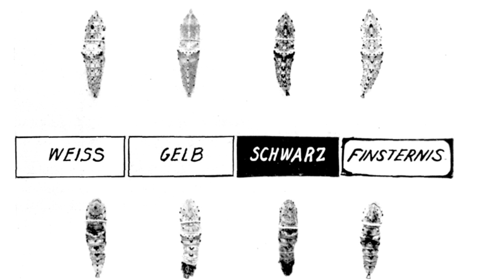
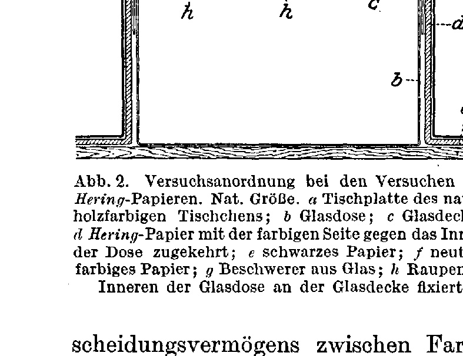
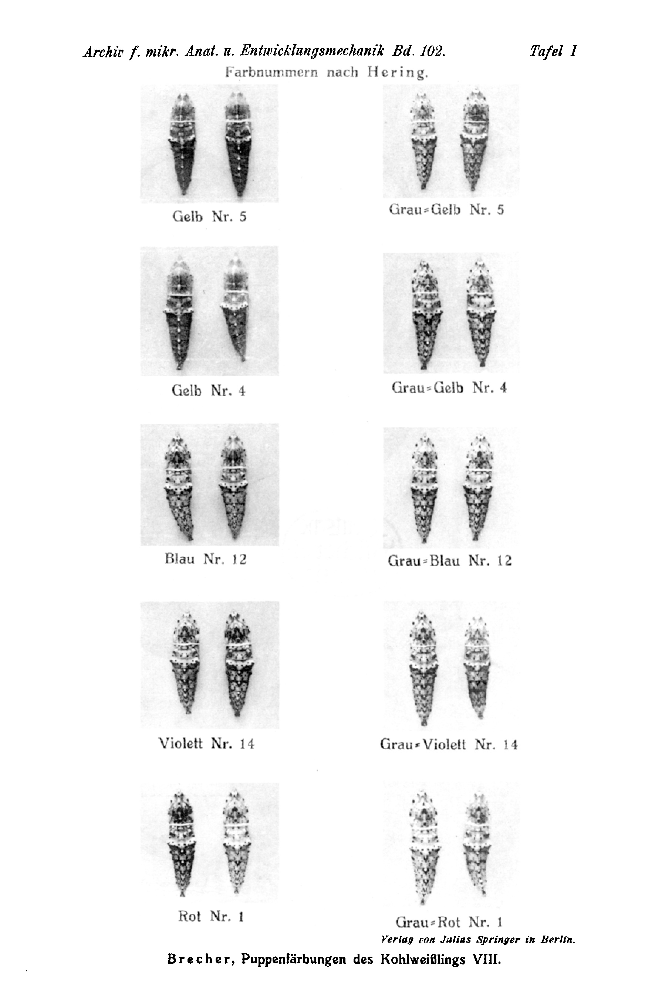

# The Pupal Colourations of the Cabbage White, Pieris brassicae L.

## Eighth Part:
## The Colour-Adaptation of the Pupae through the Larval Eye.

By

**Leonore Brecher.**

(From the Biological Experimental Institute of the Academy of Sciences in Vienna [Zoological Division].)¹⁾

With Plate I and 2 text-figures.

*(Received on 5 October 1923.)*

*Archiv für mikroskopische Anatomie und Entwicklungsmechanik*, vol. 102 (1924).

> **Full translation.** A complete English rendering of Brecher's 1924 study of the pupal colourations of the cabbage white (*Pieris brassicae* L.), with the tables and figure legends.

### Table of Contents.

| | Page |
|---|---|
| I. Demonstration that the light-influence determining the pupal colour passes through the larval eye, by positive colour-adaptation under coloured lacquering of the eyes | 501 |
| II. Examination of the question whether the surrounding colour acts upon the pupation-ripe larva through its specific colour-quality or its brightness, by means of precisely tested papers (after Hering) | 506 |
| III. Summary | 511 |
| IV. Tables A–B | 513 |
| V. List of literature | 515 |
| VI. Explanation of the plate | 515 |

## I. Demonstration that the light-influence determining the pupal colour passes through the larval eye, by positive colour-adaptation under coloured lacquering of the eyes.

The question whether the influence of light on the colour-adaptation of the pupa passes through the larval eye, Poulton (1887, 1892) believed he had decided — by painting over the larval eyes with black colour and keeping these larvae in coloured boxes in daylight (*Vanessa urticae*), and further by his "conflicting colours experiments" — in the sense that the colour-adaptation of the pupae to their surroundings comes about independently of the larval eye.

In an analysis of the colour-adaptation process of the butterfly pupae to their surroundings, which I had begun to carry out in 1915 first on *Pieris brassicae*, this question too had to be investigated.

The repetition of Poulton's experiments, namely the painting-over of the larval eyes with black oil-colour and the keeping of the

> ¹⁾ An abstract of this work appeared, with the same title, as Communication No. 67 from the Biological Experimental Institute of the Academy of Sciences, Zoological Division, Director: H. Przibram, in the Akad. Sitzungsanz. [Academic Session-Bulletin] No. 2–3. 1922.

*Archiv f. mikr. Anat. u. Entwicklungsmechanik Bd. 102.* 33a larvae in coloured boxes in daylight, yielded, in agreement with the results of Poulton, that the lacquering of the eyes with black colour did not abolish the action of the surrounding colours; namely, in a yellow surrounding the larvae with eyes painted black yielded the typically green pupae, just as did the larvae with eyes not painted over (cf. Plate VII in *Brecher*, 1919).

In the case of larvae with eyes painted black, however, the painting-over could indeed altogether — and that by drawing the incandescent lamp closer after the onset of greater perspiration — be made to act more strongly, in that they made repeated head-movements; nevertheless, in these same cases too, the possibility was never excluded that the larvae might not after all have received light through the eye painted over (cf. *Brecher*, 1919, p. 279).

Prof. *Przibram* indicated a more radical method for the elimination of the eyes, namely electrocaustic blinding. He himself carried out this operation only once (in *Brecher*, 1919). Although here, because of the great loss of blood, only a small percentage of the larvae attained pupation, the result, remarkable in itself, emerged from these experiments — that from the larvae blinded electrocaustically, pupae of a colouration not characteristic of the surrounding arose; namely, in yellow light there arose neither green pupae without black flecks, nor dark pupae as in the darkness, but middle pupae arose, as in twilight.

These experimental results admit also the interpretation that the influence of the surrounding colours on the larvae ripe for pupation is independent of the visual perception, in that the various coloured surroundings let the various colour-types of pupae arise even when the eyes are painted over, just as the larvae with eyes painted black perceive the colour-action of the surrounding; and that for the coming-about of the colour-adaptation the *presence* of the eyes is necessary, in that the electrocaustic blinding abolished the action of the colours (*Brecher* IV, 1919).

These experiments, set out above, leave open in addition the doubt whether the abolition of the colour-adaptation by the cutting-out of the larval eyes did not perhaps depend on the loss of blood and not on the electrocaustic blinding; for the larvae bled by the cutting-off of an abdominal segment showed, despite the absence of the electrocaustic blinding, the colour-adaptation suspended, in that the bled larvae no longer let the characteristic colouration produced by the surrounding be recognized (Control-experiment).

Later, *Przibram* (1922) communicated a more favourable method for the removal of the larval eyes, which on the one hand avoided the loss of blood in the operated larvae, whereby a greater percentage of pupations would be guaranteed, and on the other took account of an objection of *Dürken* (Naturwissenschaften 1918), that in the results of the electrocaustic blinding it might perhaps after all be a matter of a heat-action. This method (cf. *Przibram*, Pupation of headless larvae, 1922) consisted in a constriction of the larval head by means of a silk

**Fig. 1.** Orthochromatic photograph. Upper row from left to right: a light pupa from a white surrounding; a green pupa without black fleck-marking, from a yellow surrounding; a dark pupa from a black surrounding; a middle pupa from darkness. Lower row: pupae from larvae whose head had, before fixation, been constricted off and then removed by a scissor-cut, and which were then kept in white, yellow, black surrounding and in complete darkness (from the experiments of *Przibram*, which are described by him in the same work "Pupation of headless larvae" 1922). One sees that the decapitated larvae yielded, in all surroundings, the same pupae of middle marking-type, namely in particular in Yellow no green ones without black flecks, such as arise from seeing larvae. The original model, consisting of living pupae, for this photograph was demonstrated by H. Przibram at his lecture "Pupation of headless larvae" in the session of the Section for Zoology of the Zoological-Botanical Society of 10 Dec. 1920. The uniformly dark parts emerging in the pupae of the lower row are death-phenomena [phenomena of dying-off].  *(figure not reproduced)*

*[Within the figure, the labels:]* **WEISS** [WHITE] · **GELB** [YELLOW] · **SCHWARZ** [BLACK] · **FINSTERNIS** [DARKNESS]

ligature, after which then the eyes or the whole head were removed by a scissor-cut. For the rest, the cutting-off proved indifferent for the outcome of the experiments; the constriction alone already sufficed. With this method too, in which half of all cabbage-white larvae pupated, the same result showed itself as with the electrocaustic blinding: There arose in White, Black, Yellow, Grey, Darkness middle pupae with a middle formation of the black fleck-marking. For the illustration of this result

33* I refer to the text-figure appended to the present work, which presents the pupae of the decapitated larvae from the experiments of *Przibram*. The elimination of the eyes thus undoubtedly established that the eye is necessarily to be ascribed a role in the colour-adaptation.

The difference of the outcome of the experiments with painting-over of the larval eyes with black colour, which seemed not to abolish the colour-adaptation, from the total removal of the eyes, which suspended the colour-adaptation, allowed two possibilities to emerge: For the coming-about of the colour-adaptation, as I have set forth in detail, merely the *presence* of the eyes is necessary, by way of a quite definite chemism (the eye as tyrosinase-sink, cf. *Przibram*, 1919, II Theory, p. 247 ff.); or else the influence of the light does after all proceed by way of a perception through the eye. In that case the results of the lacquering-experiments of *Poulton*, as well as of my own, would have to be explained by the fact that, despite the black colour-layer, still enough light penetrated into the eye to bring about the colour-adaptation.

The experiments arranged by me on *Vanessen* [Vanessa species] (*Brecher*, Io, 1922, urticae, see this Issue) in regard to this latter question now appear to me to have justified this suspicion: It namely turned out that, with the setting-up of larvae with eyes painted black and such with eyes not painted over in coloured boxes in the dark-chamber, at various distances from a 16-candle[-power] incandescent lamp, the action of the surrounding colour on the pupal colouration is extinguished for the lacquered ones at an intensity of the light at which the non-lacquered ones still let the characteristic colour-action be recognized.

In the year 1921 I found a method by means of which the question whether the light-influence that determines the colour-adaptation of the pupae goes *through* the larval eye could be unambiguously decided, namely:

For the larvae ripe for pupation, "wandering" out of the same rearing of cabbage-white larvae, I took an equal number of larvae with yellow lacquer, and likewise lacquered an equal number with blue oil-colour, and set these "lacquered" larvae in a Müller glass-bowl on the surface, on a green smear, at a fairly even distance from the white wall, in mixed-coloured surrounding [neutral light].

Out of the larvae with yellow lacquering there arose in the majority of cases — as out of a yellow surrounding — characteristically intensively green pupae without fleck-marking, but never white opacity, as in neutral surrounding, and in a small number from these deviating middle pupae, such as occur usually in neutral surrounding.

Out of the larvae with blue smearing-over there arose throughout middle pupae, no single green one (cf. herewith Table A 1).

This experiment shows unequivocally that the light-influence which determines the pupal colour goes *through* the larval eye. The occurring also of some uninfluenced pupae from larvae with yellow-lacquered eyes is probably to be traced back to the fact that the colour-layer might not always remain adhering. For the larva indeed wanders about for a longer time after the painting-over of the eyes, and strips with her head against the walls of the box, also before the colour-layer has become quite dry, so that it is a happy chance if nevertheless the greater percentage of the pupae let, in their colouration, the action of the coloured rays let through by the lacquer-layer of the eyes be recognized.

A repetition of this experiment yielded not such good results, in that of the pupae arisen from the larvae with yellow-lacquered eyes only a part let the characteristic yellow-action be recognized, while the others are middle pupae (cf. herewith Table A 2). The failure of this second experiment might be connected with the reason adduced earlier, of the deficient lacquering, but perhaps with the fact that for this experiment larvae already rather far advanced had been used.

I could however dispense with the further repetition of such experiments on *Pieris brassicae* and content myself with the positive result of the first experiment, since the earlier, similar and far more numerous experiments carried out in early summer and summer of this year on *Vanessa Io* and *urticae* (cf. *Brecher*, The Pupal Colourations of the Vanessids II, Arch. f. mikroskop. Anat. u. Entwicklungsmech., this Issue) decide the question of the path of the light-influence unambiguously in the same sense as with *Pieris brassicae*.

The light-influence which brings about the colour-adaptation of the pupae proceeds *through the larval eye*.

This result of the positive colour-adaptation by coloured lacquering of the eyes forms the counterpart to the earlier experiments of the extinction of the colour-adaptation by total removal of the eyes (*Brecher*, 1919, *Przibram*, 1922).

By contrast, the retaining of the colour-adaptation despite the painting-over of the eyes with black colour and the keeping in coloured boxes in daylight, in the experiments of *Poulton* and in my repetition of the experiments of *Poulton* (*Brecher*, 1919), is probably to be traced back to the penetrating of light into the eye painted over.

How the colour-influence through the eye thereupon, with the change of the

*Archiv f. mikr. Anat. u. Entwicklungsmechanik Bd. 102.* 33b chemism of the animal, hangs together with the change of the colour-sensitive tyrosinase, which leads to the colour-adaptation of the pupae (*Brecher*, *Pieris* VI, 1921), would have to be the object of further investigations (cf. hereon *Brecher*, The Pupal Colourations of the Vanessids 1922, p. 269 ff.).

## II. Examination of the question whether the surrounding colour acts upon the pupation-ripe larva through its specific colour-quality or its brightness, by means of precisely tested papers (after Hering).

The fact that the light-influence of the colour-adaptation of the pupae is conditioned not directly through the skin of the colour-ripe larvae, but through the eyes, and that thus the colour-adaptation of the pupae is linked with the visual perception of the larvae, lets a connection — which in my hitherto-existing analysis of the light-influences on the pupal colouration remained ungrasped, and to which various methods led repeatedly — be grasped more precisely, and pushes it into the foreground of the interest: whether the surrounding colours determine the pupal colour through their specific colour-quality or through their brightness.

With regard to the colour-sense of the lower animals, this question — whether the colours are distinguished as specific colour-qualities or through various brightnesses — has, with manifold discussions in the literature, given great occasion.

Against the view of *Hess* (1912), who assumes that upon the lower animals the colours act, exactly as upon the totally colour-blind human, only through their brightness as various gradations of grey, speak the experiments of *v. Frisch* (1914), who showed in particular on bees that they distinguish Yellow and Blue from one another and also from all gradations of grey, thus through their specific colour-quality. By contrast, they are not capable of recognizing a particular grey again. They do, however, confuse Red with Black and Blue-green with Grey, thus behaving similarly to a red-green-blind human.

Likewise the experiments of *Knoll* (1921) on hoverflies and hummingbird hawk-moths yielded that these animals too distinguish Yellow and Blue, and indeed not as various brightness-grades, but as colours, whereas they do not distinguish Red and Blue-green.

Recently *Kühn* (Naturwissenschaften, 1921, Heft 29) was even able to demonstrate the appearance of simultaneous colour-contrast for the colour-pair Blue-Yellow on bees.

Further, *Kühn* and *Pohl* (1921) were able to train bees to various spectral-lines. They then distinguish the spectral-region of the ultra-violet, violet and blue on the one hand from the spectral-region green on the other hand. For Ultraviolet they have besides a specific sensitivity, in that bees trained on the line 365 flew only to this line, but never also to Blue and Violet; just as little do they have a specific sensitivity for the line 492 (Blue-green), which they confuse with no other.

In my hitherto-existing experiments on the influence of the light on the colouration of the pupae, I have, for each of the surrounding colours that let a characteristic action on the pupal colouration be recognized, examined this question, whether it here had to do with a specific action of the quality and not merely of the intensity of the light. The various methods applied for this — namely: use of various gradations of the single-coloured light-intensity (brightness-experiment with Yellow and White [*Brecher*, 1917, p. 131 ff.]), use of the colours in various degrees of saturation [*Brecher*, 1919, p. 284], addition or, as the case may be, switching-out of definite kinds of rays [*Brecher*, 1919, 1921 IV, 1922 VII] — have led to the result that the colours determine the pupal colouration through their specific colour-quality and not through various brightnesses. It could thereby be established: the specific action of the yellow rays on the arising of the green pupae without black pigment, and of the blue, violet, but especially the ultraviolet rays, as they are also reflected from black and red surfaces, on the dark-colouring of the pupae; further the action of the ultrared rays, as they are reflected from white surfaces, on the formation of the light pupae through the hindrance of the formation of the black pigment and the furtherance of the white opacity.

A specific action for Red and Green could hitherto not be demonstrated in my experiments. Rather, it was in the hitherto-existing experiments always the admixture of blue or ultraviolet rays which could be made responsible for the formation of the middle pupae in green, of the dark ones in red; the absence of the short-wave rays and the admixture of yellow and orange-coloured rays, which could be made responsible for the formation of the green pupae in red and green light (*Brecher* 1922, VII).

It is besides worth mentioning that it is the same kinds of rays which, according to the investigations of *v. Frisch* and *Knoll*, the insects they investigated distinguish as colour-qualities — thus Yellow on the one hand, Blue to Ultraviolet on the other hand — which also in my pupal-colouration exert a specific and counteracting influence.

As regards the sensitivity of the visual sense of the insects for ultra-violet rays, it is also a long-since known (*Lubbock*, cited after *Hess*) and also by *Hess* (1920) acknowledged fact.

However, he traces this likewise back to brightness-sensation.

According to Heß, there exists in the spectrum for insects, as for the colour-blind human, the brightness maximum in yellow-green. The ultraviolet rays, according to Heß, evoke in the insect eye a yellow-green fluorescence, whereby a second brightness maximum for the insects would lie in the ultraviolet spectral region.

When we take into consideration the effect of light on the pupal colouration, then, according to this conception, ultraviolet light (and thus also black surfaces, cf. *Brecher*, 1919) and yellow-green light would have to have the same effect. That this is now indeed not the case is shown by the fact that the former produces dark blackish, the latter green pupae without black pigment.

Through the establishment of a connection between the colour adaptation of the pupae and the seeing of the caterpillars, it seemed appropriate to add to the methods hitherto applied for deciding the question — whether, in the effect of colours on pupal colouration, it is a matter of the action of specific colour qualities or of different brightnesses — a method which has been widely applied by the above-named researchers who have occupied themselves with the colour sense of animals: it is a matter here of the demonstration of a discriminatory capacity between Hering colour and grey papers, which to their total-colour-blind human eye fully [correspond in brightness].

The discriminatory capacity between colour and grey papers that fully correspond in brightness for the total-colour-blind human eye suffices for this.

**Fig. 2.** Experimental arrangement in the experiments with Hering papers. Natural size. *a* tabletop of the natural-wood-coloured little table; *b* glass dish; *c* glass lid; *d* Hering paper with the coloured side turned towards the interior of the dish; *e* black paper; *f* neutral-coloured paper; *g* glass weight; *h* caterpillars fixed in the interior of the glass dish at the glass lid. *(figure not reproduced)*

Such precisely tested *Hering* colour and grey papers were kindly placed at my disposal for the intended pupal experiments by Herr Dr. *Knoll*. I used a light whitish yellow (*Gelb Hering* No. 5), a more saturated yellow (*Gelb Hering* No. 4), blue (*Blau Hering* No. 12), violet (*Violett Hering* No. 14), red (*Rot Hering* No. 1), as well as, for each of these colours, the grey that exactly corresponds to it in brightness for the total-colour-blind human eye.

Round glass dishes of 10 cm diameter and 6 cm height, with an overlapping glass lid, in order to avoid mutual influence, were placed at a sufficiently wide distance from one another, each on a natural-wood-coloured little table; they were covered with one of the *Hering* colour or grey papers each, and likewise surrounded laterally on the right and left. The remaining two sides were left free for the entrance of the diffuse daylight. The floor allowed the same natural-wood colour of the little table to show through in all of them.

The pupation-ready caterpillars present in the glass dishes thus received, from the lid and from two sides, the coloured light reflected from the colour paper.

In order in the experiment to have only the reflected coloured light, exactly determined as to its brightness value, and not also transmitted coloured light, each colour or grey paper was additionally covered with a neutral-coloured paper and, over that, with a black paper (Text-fig. 2).

It is self-evident that caterpillars of the same brood, in equal numbers and simultaneously, were placed for pupation into the various light conditions, but at least into the colour-grey papers of equal brightness. (Cf. Table B.)¹

> ¹ The colour designations given for the pupal types refer to *Brecher* 1917, pp. 95 and 96.

### Excerpt from the protocol (cf. Table B).

#### First experiment:

*Gelb Hering* No. 5: The pupae that arose here are all of the typically green pupal-colour type.

*Grau = Gelb Hering* No. 5: Except for one, with lesser spotting but opaque and only slightly greenish (halfgreen *k*), all are of the black-spotted opaque type, namely middle pupae *d/e*.

*Gelb Hering* No. 4: All are typical, intensely green, translucent pupae (*h*).

*Grau = Gelb Hering* No. 4: The pupae that arose here are throughout different from the pupae from yellow, namely: 2 with lesser spotting, whitish opaque and somewhat greenish (halfgreen *k*), 3 with pronounced spotting, whitish opaque without green, middle (*d*) and dark (*f*).

#### Second experiment:

*Gelb Hering* No. 5: Throughout intensely typical green pupae entirely without spotting (blue-green *i* and yellow-green *h*).

*Grau = Gelb Hering* No. 5: Typical middle ones with whitish ground colour entirely without green, with strongly developed spotting.

*Gelb Hering* No. 4: Throughout typically green translucent (i.e. without white opacity of the envelope) pupae entirely without spotting (blue-green *i* and yellow-green *h*).

*Grau = Gelb Hering* No. 4: Of these, throughout typical middle pupae, quite different, with very strongly developed spotting and white opacity.

*Blau Hering* No. 12: In general the pupae here make a rather greenish impression. Among 5 pupae there are: 1 typically green one without black spots *h* or *i*, 3 rather greenish ones of the type of the halfgreen *k*, that is, the front half greenish, transparent without spotting, the abdominal segments whitish opaque; 1 middle pupa with typical spotting and the greenish tone normal for middle ones.

*Grau = Blau Nr. 12*: Ordinary middle pupae almost without green, with pronounced spotting (*d*), 1 somewhat greener middle one likewise with spotting *d/e*.

*Violett Hering Nr. 14*: Middle ones with the typical strong spotting, 1 halfgreen.

*Grau = Violett Nr. 14*: In general rather greenish pupae, 1 middle *d*, 2 greener middle *d/e*, 1 green with spotting, 1 dark-green without spotting.

*Rot Hering Nr. 1*: 2 green, however not those characteristic of yellow, but somewhat more opaque, with spotting (*j*), 2 middle with developed spotting, 1 very dark (*g*).

*Grau = Rot Hering Nr. 1 (Schwarz)*: 2 typically dark-green entirely without spotting, 1 pale-green *c/h*, 1 greenish middle *d/e*, 1 ordinary typical middle with well-developed spotting.

It is evident, then, that in these experiments the two yellows throughout yielded the typical green pupae, whereas the corresponding greys yielded middle, opaque pupae quite different from these, with strong spotting.

There exists a distinct, very great contrast between the effect of yellow and that of the grey corresponding to it in brightness: the yellows, unequal in brightness — that is, both the more intense *Gelb Hering* No. 4 and the much paler *Gelb Hering* No. 5 — both yielded throughout the same typical green translucent pupae without black spotting; the greys corresponding to them in brightness, however, Grey = Yellow No. 4 and light grey = Yellow No. 5, [yielded] pupae quite different from these, middle pupae with white opacity and strong spotting (cf. Plate I, the two groups in the first and second horizontal rows).

There can therefore be no further doubt, even after this experiment, that the quality of the yellow light produces the effect and not the brightness.

For the effect of the other colours, blue, violet, red, black, the experimental arrangement chosen for the purpose of sparing the papers was unfortunately quite unfavourable. The light had, besides the double panes of the skylight, before it fell upon the coloured paper, to pass through three layers of glass, and the coloured light reflected from there had to pass a fourth time through a layer of glass before it reached the eye of the caterpillar, and was thus already very poor in short-wavelength rays. (The effect of the yellow was probably not yet impaired by this, cf. however *Brecher* 1921 V.) It explains, however, why in this experiment the pupae that arose in blue, violet, red and black lack the characteristic effect that, for these environmental colours, rests on the effect of the short-wavelength rays, namely the dark colouration. The frequently appearing greenish tone in these pupae, which however can by no means be equated with the typically green pupae from yellow, may be connected with a predominance of long-wavelength rays, perhaps also evoked by the yellowish colour of the floor. For the rest, greenish pupae occur even in darkness alongside non-green ones, and it would be possible that, with these colour papers — blue, violet, red and black, which act through the short-wavelength rays reflected from them — the specific effect on the pupae is lacking owing to the absorption of the short-wavelength rays by the glass, and that thus the variability comes to expression, similar to the way it also occurs in darkness.

In this experiment it would principally have been a matter of establishing, as has been observed for the colour sense of insects (*v. Frisch, Knoll*), whether a difference exists in the effect between blue and the grey of equal brightness, between violet and the corresponding grey — which cannot be judged from the present results. As regards red, no specific effect could be demonstrated for it up to now: with unimpeded access of the white light, red surfaces act like black ones upon the dark colouration of the pupae, owing to the ultraviolet rays reflected from them (*Brecher, Pieris* VII, 1922).

That the blue, violet, red and black surfaces too owe their efficacy on the pupal colouration to specific quality-effects and not quantity-effects of the light, had moreover been proven by my earlier experiments (*Brecher* IV, 1919, VII, 1922).

As regards the results of the present experiment with *Hering* papers, they confirm those found earlier by other ways, namely that the effect of yellow on the green colouration of the pupae is not the effect of brightness, but that of the specific colour quality. Now that it has been proven that the light-influence which determines the pupal colouration passes through the caterpillar's eyes, this experimental result can also be regarded as an expression of the fact that the caterpillars distinguish yellow from a grey of equal brightness value as a colour sensation.

### III. Summary.

When the eyes of pupation-ready caterpillars were coated with yellow lacquer and the animals were set up in a neutral environment, there arose predominantly the green pupae characteristic of a yellow environment. Coating of the eyes with blue colour had as its consequence the production throughout of middle pupae, such as also arise in a blue environment.

Thus, through the positive success of the adaptation, the proof is also furnished that the light-influence which determines the pupal colouration occurs *through* the caterpillar's eye. The counterpart to this result is formed by the earlier experiments, according to which, in the absence of the eye, the colour-influence is abolished.

The persistence of the colour adaptation in the earlier experiments, when the eyes were coated with yellow colour and the animals were kept in coloured boxes in daylight, is to be attributed to the penetration of light through the lacquer layer (cf. Communication No. 59, L. Brecher: Die Puppenfärbungen der Vanessiden, Akad. Anz. No. 7 and 8, 1921).

Papers of completely equal brightness value for the total-colour-blind human eye (according to *Hering*) yielded, as pupation background, fundamentally different pupae as to colour type: thus on yellow (*Hering* No. 4) there arose throughout the typical green translucent pupae without black spotting, whereas on grey of the same brightness for the total-colour-blind human eye (Grey = Yellow No. 4) there arose no green ones, but rather the greenish-grey-white opaque pupae corresponding to neutral conditions, with pronounced black spotting — middle pupae. On the other hand, yellow papers of different brightness value had the same effect on the pupal colouration: thus a quite light yellow (*Hering* Yellow No. 5) also yielded the equally intensely green pupae as the Yellow No. 4, while the light grey of equal brightness value for the total-colour-blind human eye (Grey = *Gelb Hering* No. 5) yielded non-green middle pupae with black spotting.

These experimental results confirm those found earlier by other ways, namely that the environmental colours which influence the pupal colouration exert this influence through their specific colour quality, not through particular brightnesses.

Now that it has been proven that the light-influence occurs through the caterpillar's eye, these experimental results could also be an expression of the fact that the caterpillars distinguish yellow from a grey of equal brightness value as a colour sensation.

## IV. Tables A, B.

### Table A. Positive colour adaptation through coloured lacquering of the eyes.

| Designation of the section in the text | Serial number of the experiment | Species | Date of setting up the experiment until removal from the conditions | Type of experimental container used | Environment colour | Coating of the *eyes* with *coloured* lacquer | Number of caterpillars put in | Number of pupae | a lightest (white) | b lighter | c very light with lesser spotting | d middle | e middle with greenish ground colour | f dark | g very dark | h yellow-green without black pigment | i blue-green without pigment | j yellow-green with weak spotting | k halfgreen |
|---|---|---|---|---|---|---|---|---|---|---|---|---|---|---|---|---|---|---|---|
| | | | | | | | | | **A. Light** | | | **B. Middle** | | **C. Dark** | | **D. Green** | | | |
| 1. | 1 | *Pieris brassicae* | 1921 ?–22. VII. | Müller-gauze cages | Neutral environment | Eyes — yellow | 9 | 9 | | | | 3 | 1 | | | | | 5 | |
| | | | | | | Eyes — blue | 9 | 9 | | | | 8 | 1 | | | | | | |
| 1. | 2 | „ | „ | „ | „ | Eyes — yellow | 2 + 8 | 10 | | | | 8 | | | | | | 2 | |
| | | | | | | Eyes — blue | 9 | 9 | | | | 9 | | | | | | | |

### Table B. Pupation on precisely tested *Hering* papers.

| Designation of the section in the text | Serial number of the experiment | Species | Date of setting up the experiment until removal from the conditions | Type of experimental container used | Experimental conditions (Numbers according to *Hering*) | Number of caterpillars put in | Number of pupae | a lightest (white) | b lighter | c very light with lesser spotting | d middle | e middle with greenish ground colour | f dark | g very dark | h yellow-green without black pigment | i blue-green without pigment | j yellow-green with weak spotting | k halfgreen |
|---|---|---|---|---|---|---|---|---|---|---|---|---|---|---|---|---|---|---|
| | | | | | | | | **A. Light** | | | **B. Middle** | | **C. Dark** | | **D. Green** | | | |
| 2. | 1 | *Pieris brassicae* | 1921 3.–10. IX. | Round glass dishes of 10 cm dia., 6 cm height | Gelb (hell) Nr. 5 | 5 | 3 | | | | | | | | 3 | | | |
| | | | | | Grau = Gelb (hell) Nr. 5 | 5 | 5 | | | | 4 | | | | | | | 1 |
| | | | | | Gelb Nr. 4 | 5 | 3 | | | | | | | | 3 | | | |
| | | | 7.–14. IX. | | Grau = Gelb Nr. 4 | 5 | 5 | | | | 2 | | 1 | | | | | 2 |
| | | | | | Blau Nr. 12 | 5 | 1 | | | | | | | | | | | 1 |
| | | | | | Kontr.: Graues Terrarium | 12 | 12 | | | | 12 | | | | | | | |
| 2. | 2 | „ | 14.–22. IX. | „ | Blau Nr. 12 | 5 | 5 | | | | 1 | | | | 1 | | | 3 |
| | | | | | Gelb (hell) Nr. 5 | 5 | 5 | | | | | | | | 2 | 3 | | |
| | | | | | Grau = Gelb (hell) Nr. 5 | 5 | 2 | | | | 2 | | | | | | | |
| | | | | | Violett Nr. 14 | 5 | 4 | | | | 3 | | | | | | | 1 |
| | | | | | Grau = Violett Nr. 14 | 5 | 5 | | | | 1 | 2 | | | | 1 (dark-green) | 1 | |
| | | | | | Finsternis | 5 | none pupated | | | | | | | | | | | |
| 2. | | „ | 15.–22. IX. | „ | Gelb Nr. 4 | 5 | 5 | | | | | | | | 1 | 4 | | |
| | | | | | Grau = Gelb Nr. 4 | 5 | 5 | | | | 3 | 2 | | | | | | |
| | | | | | Rot Nr. 1 | 5 | 5 | | | | 2 | | | 1 | | | 2 | |
| | | | | | Grau = Rot Nr. 1 (schwarz) | 5 | 5 | | | | 1 | 1 | | | 1 pale-green *c/h* | 2 dark-green | | |
| | | | | | Grau = Blau Nr. 12 | 5 | 5 | | | | 4 | 1 | | | | | | |

## V. List of References

**Brecher, Leonore:** Die Puppenfärbungen des Kohlweißlings Pieris brassicae L. [The Pupal Colourations of the Cabbage White Pieris brassicae L.] Part 1: Description of the polymorphism. Part 2: Examination of the influence of light. Part 3: Chemistry of the colour types. Arch. f. Entwicklungsmech. d. Organismen [Archive for Developmental Mechanics of Organisms]. Vol. 43, p. 88. 1917. — *Eadem:* Die Puppenfärbungen des Kohlweißlings Pieris brassicae L. Part 4: Effect of visible and invisible rays. Ibid. Vol. 45, p. 273. 1919. — *Eadem:* Die Puppenfärbungen des Kohlweißlings Pieris brassicae L. Part 5: Control experiments on the specific effect of the spectral regions together with other factors. Ibid. Vol. 48, p. 1. 1921. — *Eadem:* Die Puppenfärbungen des Kohlweißlings Pieris brassicae L. Part 6: Chemism of colour adaptation. Ibid. Vol. 48, p. 46. 1921. — *Eadem:* Die Puppenfärbungen des Kohlweißlings Pieris brassicae L. Part 7: Efficacy of reflected and transmitted light. Ibid. Vol. 50, p. 41. 1922. — *Eadem:* Die Puppenfärbungen des Kohlweißlings, Pieris brassicae L. Part 8: The colour adaptation of the pupae through the caterpillar eye. Akad. Anz. Wien [Academy Bulletin, Vienna]. No. 2–3. 1922. — *Eadem:* Die Puppenfärbungen der Vanessiden [The Pupal Colourations of the Vanessids]. Arch. f. Entwicklungsmech. d. Organismen. Vol. 50, p. 209. 1922. — *Eadem:* Die Puppenfärbungen der Vanessiden. II. Ibid., this same issue. — *Eadem:* Die Puppenfärbungen der Vanessiden. II. Akad. Anz. Wien. No. 2–3. 1922. — *Eadem:* Die Farbanpassung der Schmetterlingspuppen durch das Raupenauge [The Colour Adaptation of Butterfly Pupae through the Caterpillar Eye]. Verhandl. d. zool.-bot. Ges. Wien [Proceedings of the Zoological-Botanical Society, Vienna]. Vol. 72. Report of the Section for Zoology, session of 9 December 1921, p. (35), year 1922. — **Dürken, Bernhard:** Die Wirkung des Lichtes auf die Schmetterlingspuppe [The Effect of Light on the Butterfly Pupa]. Naturwissenschaften [Natural Sciences]. Year 7, No. 24, p. 421. 1919. — **Frisch, Karl v.:** Der Farbensinn und Formensinn der Biene [The Colour Sense and Form Sense of the Bee]. Zool. Jahrb., Abt. f. Zool. u. Physiol. [Zoological Yearbook, Section for Zoology and Physiology]. Vol. 35, p. 1. 1914. — **Hess, Karl:** Gesichtssinn [Sense of Sight] in Wintersteins Handbuch d. vergl. Physiol. [Winterstein's Handbook of Comparative Physiology]. Vol. 4, p. 555. 1912. — *Idem:* Die Grenzen der Sichtbarkeit des Spektrums in der Tierreihe [The Limits of the Visibility of the Spectrum across the Animal Series]. Naturwissenschaften. Year 8, No. 11, p. 197. 1920. — **Knoll, Fritz:** Insekten und Blumen [Insects and Flowers]. Part 1. Abhandl. d. zool.-bot. Ges. Wien [Treatises of the Zoological-Botanical Society, Vienna]. 1921. — **Kühn, A.:** Nachweis des simultanen Farbenkontrastes bei Insekten [Demonstration of Simultaneous Colour Contrast in Insects]. Naturwissenschaften. Year 9, No. 20. 1921. — *Idem and R. Pohl:* Dressurfähigkeit der Bienen auf Spektrallinien [The Trainability of Bees to Spectral Lines]. Naturwissenschaften. Year 9, No. 37, p. 738. 1921. — **Poulton, E. B.:** An enquiry into the cause and extent of a special colour-relation between certain exposed Lepidopterous pupae and the surfaces which immediately surround them. Philos. Transact. Vol. 178, B, p. 311. 1887. — *Idem:* Further experiments upon the colour-relation between certain Lepidopterous larvae, pupae, cocoons, and imagines and their surroundings. Transact. of the entomol. soc. London. 293. 1892. — **Przibram, Hans:** Ursachen tierischer Farbkleidung [Causes of Animal Colour Garb]. II. Theory. Arch. f. Entwicklungsmech. d. Organismen. Vol. 45, p. 199. 1919. — *Idem:* Verpuppung kopfloser Raupen [Pupation of Headless Caterpillars]. Ibid. Vol. 50, p. 203. 1922.

## VI. Explanation of the Plates

### Plate I.

*Orthochromatic photograph.*

The plate presents pupae from the experiment for testing the question whether the surrounding colour acts upon the pupation-ripe caterpillar through its specific colour quality or through its brightness, by means of precisely tested papers (Hering papers)¹).

1. Horizontal row: on the left, 2 green pupae from the surroundings Yellow *Hering* No. 5; on the right, 2 medium pupae from the grey corresponding in brightness, for the totally colour-blind human eye, to the Yellow No. 5.
2. Horizontal row: on the left, 2 green pupae from Yellow *Hering* No. 4; on the right, 2 medium pupae from the grey corresponding in brightness, for the totally colour-blind human eye, to the Yellow No. 4.
3. Horizontal row: on the left, 1 medium and 1 somewhat greener medium pupa from Blue *Hering* No. 12; on the right, 2 medium pupae from the grey corresponding in brightness to the Blue No. 12, for the totally colour-blind human eye.
4. Horizontal row: on the left, 2 medium pupae from Violet *Hering* No. 14; on the right, 2 medium pupae from the grey corresponding in brightness to the Violet No. 14, for the totally colour-blind human eye.
5. Horizontal row: on the left, 1 dark and 1 medium pupa from Red *Hering* No. 1; on the right, 2 medium pupae from the grey corresponding in brightness, for the totally colour-blind human eye, to the Red *Hering* No. 1 (Black).

---

> ¹) The original master copy serving as the model for this photograph, consisting of living pupae, was produced by mounting the pupae, in analogy to their natural attachment, by means of a white silk thread on a white cardboard backing. In the same form as the accompanying reproduction, Plate I, presents it, the living pupae mounted on cardboard were demonstrated by me at the Zoological-Botanical Society in Vienna on 9 December 1921 (cf. Verhandl. d. zool.-bot. Ges. Wien. Vol. 72, p. (35). 1922, Report of the Section for Zoology, Leonore Brecher: Die Farbanpassung der Schmetterlingspuppen durch das Raupenauge [The Colour Adaptation of Butterfly Pupae through the Caterpillar Eye]).

*Archive for Microscopic Anatomy and Developmental Mechanics, Vol. 102.* — Plate I

**Plate I — Colour numbers after Hering.**

*(figure not reproduced)*

Left column (top to bottom): Yellow No. 5 — Yellow No. 4 — Blue No. 12 — Violet No. 14 — Red No. 1.

Right column (top to bottom): Grey-Yellow No. 5 — Grey-Yellow No. 4 — Grey-Blue No. 12 — Grey-Violet No. 14 — Grey-Red No. 1.

*Verlag von Julius Springer in Berlin [Published by Julius Springer in Berlin].*

Brecher, The Pupal Colourations of the Cabbage White VIII.

## Figures

**Fig. 1.**

**Fig. 2.**

**Plate I.**

---

*Translator's note.* A later instalment of Leonore Brecher's pupal-colour series.
