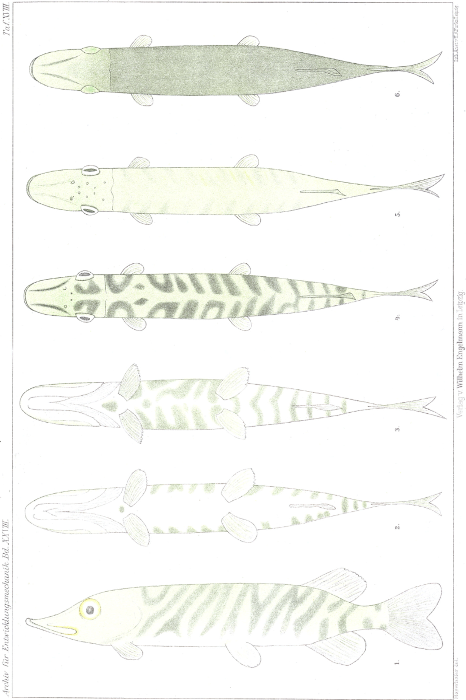

# Colour-Change Experiments on the Pike
## (Esox lucius L.).

By

### Dr. Franz Mayerhofer.

(From the Biological Experimental Institute in Vienna.)

With Plate XVIII.

Received on 13 July 1909.

*Archiv für Entwicklungsmechanik der Organismen*, vol. 28 (1909).

> **Full translation.** A complete English rendering of Mayerhofer's colour-change experiments on the pike (*Esox lucius* L.), with the tables and figure legends.

In order to approach more closely the physiological foundations of the colour change of fishes, and in particular the relations of the same to the optical apparatus, the author carried out, in the winter of 1905/6 at the Biological Experimental Institute in Vienna, a series of investigations whose results form the content of the present work. A preliminary communication concerning the results obtained was already given at the meeting of the Morphological-Physiological Society in Vienna on 26 June 1906, whereupon a corresponding report appeared in the *Centralblatt für Physiologie*, Vol. XX, No. 9 (1906).

Of the works in the relevant literature, let there be mentioned above all the statements of Pouchet (8–13), who was the first to establish, through experimental investigations on trout, the connection between skin colouration and the organ of sight. After complete extirpation of both eyes, or by mere removal of the cornea, he observed an intense dark colouration of the fish as a consequence of an extreme expansion of the chromatophores, whereupon the capacity for colour change appeared thenceforth to be lost. One-sided blinding produced merely a permanent dark colouration of the opposite half of the body. Pouchet concluded from this that the light stimuli act upon the chromatophores indirectly, through the mediation of the eye, after whose elimination a paralysis of the former ensues.

Later experiments on *Rhombus* confirmed this and showed that the stimuli taken up by the eye are conducted to the chromatophores by way of the sympathetic nervous system, since severings of the central nervous system were without effect, whereas severings of the sympathetic — exceptionally also of the Nerv. trigeminus — peripherally called forth a strong dark colouration.

The thorough investigations of Lodes (7) led in general to the same results, but corrected the assertions of Pouchet, in so far as they yielded that, even with the nervous system put out of function — be it as a consequence of blinding or of severance of the motor nerves — the chromatophores answer to certain stimuli (electricity, pressure), whence it follows that such stimuli act directly upon the chromatophores and that a paralysis of the same as a consequence of blinding is not to be assumed. Lodes observed also that, by natural means, through disease of the eye (cataract of the lens), a permanent dark colouration of the fishes can set in — an observation which was later confirmed by Poulton (14) with respect to the trout.

A direct influencing of the chromatophores by the light, Steinach (21) claims to have observed in eels, trout and salmon. Moreover, he believes that the dark colouration after enucleation of both eyes is not to be ascribed exclusively to the failure of the retinal sensations, since the blinding in certain forms (*Platessa*) yields no result at all, whereas the dark colouration in other cases is prevented by certain accompanying circumstances (injection of argentum nitricum, withholding of the light), and thus by means other than blinding.

A persistent dark colouration of the skin, brought about by one-sided blinding, is recorded by Semper (18) in macropods; bilaterally blinded telescope-fishes showed only a transient dark colouration, in that this disappeared again with increasing age. His observations on a melanotic colouration of the tail in seeing brook-trout (Bachsaiblinge) and rainbow-trout, as well as the strong variation of the colouration in goldfishes, led Semper to doubt the chromatic function of the chromatophores.

Knauthe (6) found in cyprinids, pikes, sculpins (Groppen) etc., which he kept in overcrowded, nutrient-poor ponds, a strong dark colouration of the skin, which he regards as a consequence of the deficient nutrition.

Regnard (15) studied the colour change in *Cyprinus* and *Tinca* and found the chromatic adaptation theory confirmed. Of particular interest appears the statement that *Cyprinus*, kept in absolute darkness, had become almost black after a year.

Schöndorff's work (17) deals with the influence of various qualities of light upon the colouration of trout and arrives at the following results: yellow light brings about a conspicuous dark colouration of the fish, whereas, conversely, light reflected from tinfoil (Stanniol) makes the fish strongly pale; blue, red and green light call forth no particular effects. In containers which were surrounded on all sides by black paper, the animals coloured themselves deep-black on the back and on the side faces, whereas on the belly they became pure white — a finding which, according to Schöndorff, completely contradicts the chromatic adaptation theory. All colour changes the author explains through a migration of the chromatophores out of the depth of the cutis towards the epidermis and conversely, which migration proceeds under the influence of the nervous system. —

I myself employed as objects of investigation various freshwater fishes, namely: sculpins (*Cottus gobio*), pikes (*Esox lucius*) and perches (*Perca fluviatilis*); of all of them, however, I obtained the most excellent results on the young, about 15–18 mm long, so-called grass-pike (Grashechte), to which the greater part of the findings here recorded relate. For orientation I should like to premise a few statements about the colouration of the said pikes and about the chromatophores that condition it, and I confine myself to the depiction of that state of colouration as it is to be observed under not too strong overhead illumination and a moderately reflecting underground, that is, under exclusion of all unusual conditions of illumination. First of all there strike one, on the animals, the more or less dark-green coloured cross-bands which, proceeding from the midline of the back, run down somewhat obliquely forwards on the side faces, without, however, continuing onto the belly. On the back and the side faces, up to about the height of the lateral line, one observes between the cross-bands a light-green ground colour (Fig. 1). On the belly there is found, as a rule, no trace of a pigmentation, so that it appears wholly white (Fig. 2); only exceptionally does one meet with specimens which show a few small dark spots on the belly. The chromatophores of the pike are, after Solger, thin, sheet-like spread-out cells of roundish outline, embedded in the subcutaneous connective tissue, which send out radially numerous short, lobed offshoots. Each cell, which is enwrapped by a fine net of nervous fibres (Ballowitz 1, 2), contains in its interior numerous black-brown pigment-grains (melanin), which are either arranged in radial rows, distributed over the whole cell, or appear concentrated towards one point (attraction-sphere). It shows itself that the latter circumstance is brought about through irritation of the conducting nerves (state of irritation), whereby the skin-spot in question takes on a pale-green colour. The spreading-out of the pigment-grains in the cell, on the other hand, represents the state of relaxation (Erschlaffungszustand), to which a strong dark colouration of the skin corresponds, whereby the individual chromatophores are distinguishable, already macroscopically, as little black dots. Between these two extremes the most varied gradations are possible. The histological investigation showed, further, a wholly uniform distribution of the chromatophores on the back and on the side faces, without an arrangement in cross-bands etc. On the belly side, on the contrary, one finds, as a rule, no chromatophores. Vital stainings of the skin, which would indicate to us the possible presence of pigment-less chromatophores on the belly, likewise yielded a negative result.

My experiments aim above all at testing the effect of complete blinding upon the chromatophores; the blinding I effected, in the first instance, through an enucleation of both eyeballs, which I removed one after the other at an interval of a few days. The operation presents, precisely in the case of the pike, with its large and protruding eyes, little technical difficulty. After the loss of one eye there appeared a disturbance in the orientation of the fish, in that it inclined somewhat downwards that side of the body on which the operation had been carried out, and moved about for some hours in this inclined position in the water, whereupon the righting-up followed again. A change in the colouration, or in its behaviour towards the most varied stimuli, I could not observe in the one-sidedly blinded animals. After the removal of the second eye an orientation-disturbance of the fish failed to appear; after the fish had, however, recovered from the over-irritation conditioned by the operation, which brought about a transient pallor of the skin, a striking change of colour of the same set in. The skin-colour increased visibly in intensity, the earlier band-formation became ever more indistinct, until at last the whole animal, with the exception of the white belly, was uniformly deep-green coloured, without showing any trace whatever of a band-formation (Fig. 6). Corresponding to the earlier bands, one saw merely a few projections (Zacken) running towards the white belly surface. Already on macroscopic observation, back and side faces appeared uniformly studded with a countless number of little black dots, the wholly relaxed chromatophores. This remarkable finding is an extension and corroboration of what Pouchet found with respect to the trout, and Semper with respect to macropods and telescope-fishes. Whereas, however, Pouchet in one-sidedly blinded trout observed a change of colour of the opposite half of the body, and Semper in one-sidedly blinded macropods a change of colour of the whole animal, a similar thing I could, despite careful experiments, perceive neither in pikes nor in perches and sculpins. Should the nervous connections be different in different species?

I observed the blinded animals for a longer time and was able, after the lapse of 3–10 weeks following the blinding — the time depends upon circumstances to be discussed later — to establish a surprising change in the fishes: the colouration, normally restricted merely to the back and the side faces of the body, began gradually to appear also on the otherwise unpigmented, white belly side. The process took place, as a rule, in such a way that, in direct continuation of the projections (Zacken) discussed earlier, which run towards the belly side, a gradual band-shaped advance of the pigment took place. After the lapse of 2–3 weeks these bands had reached the midline of the belly and had eventually united with those of the opposite side. The transverse band-formation of the belly side thus arising is shown by Fig. 3 (Plate XVIII) with particular clarity. I should also like to emphasize that the band-formation of the belly side represents a continuation of the transverse band-formation of the side faces observed in seeing fishes, as is evident from the direct continuation of the new pigment onto the projections discussed. The pigment did not always appear with such regularity. Sometimes there appeared on the belly side, alongside the bands, also small isolated groups of black points (pigment-cells), which later develop into independent spots that gain no connection with the said bands. In one case I observed that the pigment appeared on the belly side wholly irregularly, in the form of stripes and spots scattered without order. I repeated the experiments at different seasons of the year and found that the temperature, conditioned by the season, exerts a great influence upon the rapidity of the process. In summer the process ran most quickly; there the first signs of the pigmentation appeared already after 3 weeks, while the animals were completely coloured up after 4 weeks at the latest. In winter, where the animals were situated in a heated room, I could establish the beginning of the process only after 5–6 weeks, and in running water (5–6 degrees C.) the formation of the pigment failed to occur at all until the warmer season began. In all cases there were kept, alongside the blinded fishes and under the same conditions, also seeing control-animals, which let no trace whatever of a colouration of the belly side be recognised.

The histological investigation of the normal belly-skin could demonstrate there no pigment-bearing chromatophores; the presence, too, of separate pigment-less chromatophores, in which pigment might have been formed after the blinding, is excluded, since the vital treatment with neutral red remained without result. The question now arises: whence come the chromatophores that appeared on the belly side after the blinding? I do not hold their immigration from the side faces of the body to be probable, although Schöndorff (17) wishes the colour change of fishes to be explained in a similar way; I think rather of a new-formation of the chromatophores on the spot, for which the duration of the whole process and the dependence upon the temperature would speak.

It lies near, in the case of every pigment-formation, to assume also a participation of the light; an investigation concerning the influence of the light upon the colouring-up of the belly side of the blinded fishes therefore seemed especially desirable. For this purpose I excluded the effect of the light completely, in that I brought the animals into the dark-room immediately after the blinding. The animals remained for several months in the dark-chamber, but otherwise under conditions which did not otherwise seem hindering to a pigment-formation. Nevertheless I could observe on none of the animals a pigmentation of the belly side. On the contrary, it struck me approximately after 3–4 weeks that the skin discoloured peculiarly; its colour began gradually to decrease in intensity, whereby, however, there appeared not that light-green colour such as is brought about by contraction of the chromatophores, but rather the colouration passed over into a pale green. The decrease of the colouration was especially clearly to be observed on the side faces of the body towards the belly side, where the skin became downright dirty-white. In order to investigate whether that appearance was not perhaps brought about by a temporary contraction of the chromatophores, I again let light act upon the animal for a short time; but in spite of illumination of different kinds no change in the colouration could be perceived. By this, as well as by the whole nature of the colouration, it becomes fairly certain that in that paling of the animal an actual regression of the pigment is concerned, which was also confirmed by the microscopic investigation of the skin.

Alongside the radical method of complete extirpation of both eyes, I also investigated, in a few specimens, the effect of the mere removal of the lenses. The loss of the lenses does not make the animal insensitive to light; the behaviour of the animals so operated upon towards the most varied conditions of illumination was wholly in agreement with that of normal fishes. Likewise, no trace whatever of a dark colouration of the belly side is to be observed. Only in a single case could I, after extirpation of both lenses, see a complete dark colouration set in, as after the removal of both eyeballs. The closer investigation of this fish taught that here, in connection with the operation, a subsequent clouding of the cornea, through proliferation of a grey, non-transparent tissue, had set in, which proliferation therefore probably brought about an actual blinding of the fish. This finding stands in agreement with the observations of Poulton and Lodes with respect to the trout blinded through clouding of the lens, and likewise the statement of Pouchet, that the mere removal of the cornea suffices to call forth a lasting dark colouration of the fish, is presumably to be explained in a similar way.

It seemed of particular interest to investigate thoroughly the physiological behaviour of the chromatophores in the blinded fishes, and in so doing in particular to draw comparisons with seeing fishes. For this purpose I subjected both seeing and blinded fishes to a series of stimulus-experiments, which also, with respect to the seeing animals, yielded some noteworthy results; therefore the latter, too, shall be communicated in the following.

### 1) Light stimuli.

The sensitivity of fishes to light stimuli, and especially the capacity to adapt to the colouring of their surroundings, has long been established scientifically (Stark, 20) and has been made the object of thorough investigations. When I placed seeing experimental animals over a dark background of water plants, dark mud, black paper, etc., I was able to observe the following change in colouring: the green cross-bands increased intensely in darkness, while the main areas lying between them blanched strongly, so that the banding stood out still more markedly (Fig. 4). The reaction sets in the more quickly, and the banding stands out the more strongly, the greater the contrast between the upper-side illumination and the dark background. Since the dark ground for the most part absorbs the light rays falling from above and reflects only little light upward, here it is solely the action of the light rays falling from above that is responsible.

The matter now is to establish the anatomical bases of these colourings. In the microscopic examination of the stripped-off skin we see that the chromatophores are distributed quite uniformly over the back and the lateral surfaces of the body, and that nothing of an arrangement into bands is to be noticed. The latter can therefore come about only through a relaxation of the chromatophores in band-shaped skin districts and a contraction of the same in the regions lying between them, just as one already sees macroscopically that the cross-bands are composed of an immense number of small points, the expanded pigment cells. Of a change in the distribution of the chromatophores there is surely no thought to be entertained. As the result of the latter experiment it is now to be established that the upper light brings about partly a contraction, partly a relaxation of the chromatophores, and hence is to be regarded as a quite specific stimulus. We will now see how the animals behave when one reverses the direction of the incident light. For this purpose I brought the animals into glass tubs, set these upon glass plates, through which I let daylight reflected from below by means of mirrors fall upon the animals, while I completely darkened the animals above and at the sides. An exact illustration of the apparatus used in this is to be found in Przibram's report: "The Biological Experimental Institute in Vienna 1903–1907," Gildemeister's Journal for Biological Technique and Methodics. Vol. I, Part 3 (p. 262).

Under these conditions the fishes blanched strongly, the banding became very indistinct, and the skin took on a more uniformly light-green colour (Fig. 5). The action of the light falling in from below thus consists in a quite uniform contraction of all the chromatophores. I further placed the animals, under sufficient upper-side illumination, over a bright background of light sand, white paper, and the like, and observed the same result as in the previous experiment: disappearance of the banding, appearance of a quite light-green colouring as in Fig. 5. The reaction sets in here the more quickly, the greater the intensity of the incident light. Thus the animals react in direct sunlight already after ½–1 minute, with lower intensity only after a longer time. By means of the bright background it is brought about that the light falling in from above is for the most part reflected back again, whereby a fairly uniformly strong illumination from all sides arises.

If we compare the results of these experiments, it follows first of all that the actions of the upper light and the under light are essentially different from one another, indeed are directly opposed to one another. Upon the simultaneous action of both, as in the last experiment with all-sided illumination, we obtain the same result as with mere under-side illumination; we must therefore assume that in this case the action of the upper-side light is paralysed, outweighed, by that of the under-side light, and that the latter is consequently to be regarded as the stronger stimulus.

It remains for me, as a fourth experiment, to exclude the action of the light completely. For this purpose I brought the fishes into the dark room, and was able to establish, already after a short stay there, a blanching of the colour, which increased after a few days to such a degree that the fishes acquired a downright ghostly appearance (Fig. 5). This phenomenon is, as one may easily convince oneself, brought about merely through an extreme contraction of the chromatophores; for if one brings the animals back to the light, the normal colouring soon appears. A reduction of the pigment in the dark room I was unable to establish in seeing fishes, despite a three-month stay in the dark room.

We thus arrive at the surprising result that absolute darkness in seeing fishes does not act in a relaxing manner upon the chromatophores, as one might perhaps expect, but on the contrary is to be regarded as a strong stimulus. The remarkable action of complete darkness is also noted briefly by Schöndorff (17); it is unclear in what relation a later statement of the same author is supposed to stand to this, which states that trout in basins surrounded with black paper became deep-black on the back, but conspicuously white on the belly. Since the author speaks of "black light rays," it seems that in the experiment no complete exclusion of the light was intended, and the colouring obtained would thus be merely the action of weak upper-side light over a dark ground. In stark contrast to my findings stand the statements of Regnard (15), that carp became deep-black after a one-year stay in absolute darkness. This remarkable contradiction makes a re-examination in the carp desirable. As is evident from the experiments of Schöndorff discussed at the outset, the quality of the light too is of essential influence upon the colouring. Heincke (4) even gives, with respect to the variously coloured *Gobius Ruthensparri*, an adaptation to differently coloured light. In the pikes I was unable to perceive any conspicuous colour changes under differently coloured light.

Blinded specimens now showed not the least receptivity to light stimuli. Whether they were exposed to direct sunlight or brought into complete darkness (dark room), their dark colour did not change, ceteris paribus.

### 2) Electrical stimuli.

If the skin of a fish is locally stimulated by weak induction currents, there enters a contraction of the chromatophores of a larger skin district, which occurs the more rapidly the greater the strength of the applied current. Usually I saw it set in after 20–30 seconds. After the cessation of the stimulus the original colouring soon reappears. The sensitivity of the chromatophores, however, was to be established also in the blinded specimens in undiminished measure.

### 3) Thermal stimuli.

I observed that strong momentary temperature differences too act as a stimulus upon the chromatophores. When I brought a fish from eleven-degree water into 30 degrees, or vice versa, I was able to establish in both cases a transient blanching of the colouring, which lasted only so long until the fish had become accustomed to the new temperature, whereupon the earlier colour appeared again. Here too the experiments with blinded specimens yielded the same positive results.

### 4) There also shows itself a dependence upon general states of excitation of the nervous system.

When the fishes are strongly agitated through pursuit, capture, etc., they blanch, whereby the blinded specimens proved much more sensitive and more nervous than the normal ones; likewise I was able to establish a strong diminution of the colouring after every operation. Fishes weakened through hunger, oxygen-need, or sickness are always easily to be recognized by a peculiarly pale skin colour, which also always appears before dying. In contradiction with these findings stands the conjecture of Knauthe, that his cyprinids, pikes, and bullheads kept in overcrowded ponds became wholly dark from lack of sufficient nourishment. It is only questionable whether this dark-colouring did not have another cause.

Finally, I have still the following observation to communicate. When, for the purpose of the preparation of the skin, I had killed the animals and laid them on the preparation table, I was able after a short time to see an intensely green colouring of the skin set in, such as in life can be brought about only through blinding. I conjectured therein at first an effect of the dryness, but it turned out that in living animals which, with the exception of the gill region, were exposed to dryness, this colouring failed to appear. It must therefore be regarded as a post-mortal phenomenon. This circumstance brings with it the difficulty of preserving and examining the skin in a definite state of colouring; for after killing of the animals, respectively severance of the skin nerves, there at once enters a uniform dark-colouring of the skin.

Finally, I should still like to remark that the chromatophores newly arisen on the belly side of blinded animals behave, in physiological respect, quite in agreement with the already existing ones. Electrical and thermal stimuli, as well as psychic excitations, here too bring about a diverse contraction of the pigment, which corresponds to a blanching, respectively complete disappearance, of the banding on the belly side.

If we compare the results of all these stimulus-experiments with respect to the seeing and the blinded specimens, it follows that through the blinding no paralysis of the chromatophores is brought about, as was assumed by Pouchet, since a sensitivity of the same to various stimuli remains preserved even after the blinding. Only against light stimuli do they become completely insensitive, whereby the assertion is confirmed, that the light acts upon the chromatophores not directly, but by means of the eye, and that the eye is thus the regulator for the remarkable phenomenon of colour-adaptation. The statements of Steinach about a direct influence of the light upon the chromatophores find little credence among the authors. The question now presses itself forward, how that uniform dark-colouring is to be explained, which we saw set in after the blinding of the fish. Since the extirpation of the lens mostly calls forth no change in the function of the chromatophores, the conjecture would be obvious that the elimination of the retina is the decisive factor herein; but it has turned out that this phenomenon appears also with the retina uninjured. My experiments with respect to the extirpation of the lenses, as well as the observations on the pathologically blinded fishes, allow us to conclude that it is a matter not so much of the removal of any part of the optical apparatus as rather of the complete insensitivity to light, such as also enters, for example, through clouding of one of the light-refracting media of the eye. The conjecture would now be obvious that the blind animals, under the impression of absolute darkness, let their chromatophores relax. This assumption is contradicted by the remarkable fact that seeing fishes, upon exclusion of all external light stimuli, contract their chromatophores extremely. In general it does not succeed in attaining, by any action however constituted, in normal living animals a colour-state similar to that which sets in after the blinding on the upper side; I have explained that the former is only still to be observed as a post-mortal phenomenon. The remarkable, almost mutually contradictory results of the experiments concerned do not permit us even an approximate conception of the interesting connection between the organ of sight and the chromatophores. We meet with no lesser difficulties in the interpretation of the colouring of the belly side that sets in after the blinding. The fact that this colouring represents a new formation of pigment as a continuation, onto the belly side, of the banding encompassing the back and the lateral surfaces, supports the following conception, to which Professor Ehrmann too pointed on the occasion of a discussion attached to the lecture I cited at the outset. The entire pigment arises embryonally in the surroundings of the chorda and spreads from there round about over the whole body, whereby, however, a spreading of the same over the belly side does not take place. The characteristic banding of the latter that sets in after the blinding would thus be conceived as a later, abnormal continuation of that embryonal developmental process, which normally, under the influence of the eye, suffers as it were an interruption. Interesting results were yielded, further, by the experiments on the action of darkness. We have seen that seeing fishes are very sensitive to absolute darkness, in that their chromatophores contract strongly. A reduction of the pigment, by contrast, could not be established. In blind fishes now the chromatophores show no sensitivity whatever to the darkness; nevertheless there did show itself a distinct reduction of the pigment in the chromatophores. Conversely, the process of the new formation of the pigment on the belly side is in blind fishes too essentially dependent upon the light, although the latter exhibit no sensitivity whatever toward manifold light stimuli. The reduction of the pigment in the darkness in the blind fishes gives us a hint for the assessment of the complete pigmentlessness of the cave-dwellers; the latter would accordingly be regarded as a phenomenon brought about no doubt through the darkness, but released only through the loss of the visual capacity, which precisely for that reason is to be established only in blind cave-dwellers.

If we now summarize our results obtained specifically in the pike, it follows:

1) The confirmation of the assertion that light stimuli indirectly, by means of the eye and nervous system, influence the chromatophores.

2) The action of the light stimuli depends not only on the intensity and quality, but also especially on the direction of the incident light.

3) Absolute darkness in seeing fishes brings about, as a strong stimulus, an extreme contraction of the chromatophores.

4) In blind fishes, by contrast, the chromatophores relax completely, and there enters

5) under normal illumination a quite typical spreading of the pigment over the formerly uncoloured belly side, while

6) this process fails to occur upon exclusion of the light, and on the contrary a reduction of the pigment is to be recorded.

## Literature Index.

1) Ballowitz, E., The Nerve Endings in the Pigment Cells. Zeitschr. f. wissenschaftl. Zoologie. Vol. 56.

2) ⸺ Movement Centres of the Pigment Cells. Biolog. Centralbl. 1893.

3) Carlton, Frank C., The colour changes of some Fishes. Science. Vol. 19. 1904.

4) Heincke, Fr., Remarks on the colour change of some fishes. Schriften d. naturwissenschaftl. Vereins f. Schleswig-Holst. XIX. 1. 1875.

5) Klunzinger, C. B., On Melanism. Jahreshefte d. Vereins f. Vaterländ. Naturkunde. Stuttgart. 59th year.

6) Knauthe, On Melanism in Fishes. Zoolog. Anzeiger. Vol. 15. 1892.

7) Lode, A., Contributions to the Anatomy and Physiology of the Colour Change of Fishes. Sitzungsber. d. mathem.-naturw. Klasse d. k. Akad. d. Wissensch. Wien. XCIX. III. 1891.

8) Pouchet, Sur les rapides changements de coloration provoqués expérimentalement chez les poissons. Comptes rendues des séances et mém. de la soc. de biol. T. 72. 1871.

9) ⸺ Changement de la coloration chez certains poissons et certains crustacées. Ibidem. T. 74. 1872.

10) ⸺ Du rôle des nerfs dans les changements de coloration des poissons. Journal de l'anatomie et de la physiol. 8. année. 1872.

11) ⸺ L'influence des nerfs sur le changement de coloration des poissons. Mémoires de l'Acad. des Sciences de l'institut de France. 1874.

12) ⸺ On the Reciprocal Action between the Retina and the Skin Colour of some Animals. Wiener mediz. Jahrb. I. 1874.

13) ⸺ Nouvelle note sur le changement unilatérale de couleur produit par l'oblation d'un oeil chez la truite. Comptes rendues des séances etc. T. 27. 1878.

14) Poulton, Edw. Bagnall, The Colours of Animals. London 1890.

15) Regnard, P., De l'action des Chromoblastes chez la Coupe et la Tanche. Comptes rendues de Société Biol. Tome 5. Paris 1893.

16) Schnee, On the Colour Change of the Sucking-fish. Zoologischer Garten. 43rd year.

17) Schöndorff, A., On the Colour Change in Trout. Archiv f. Naturgeschichte. 69th year. 1903.

18) Semper, Observations from the Aquaria of the New Zoological Institute. Arb. aus d. zoolog. Inst. Würzburg. Vol. 10. 1892.

19) v. Siebold, The Freshwater Fishes of Central Europe. 1863.

20) Stark, J., On the Colour Change in Fishes. Isis von Oken. 1832.

21) Steinach, E., Investigations on the Comparative Physiology of the Iris. II. Communication. Archiv f. d. gesamte Physiologie. Vol. LII. 1892.

> Archiv f. Entwicklungsmechanik. XXVIII.  37

## Explanation of the Figures.

### Plate XVIII.

All figures refer to young specimens of *Esox lucius*, about 16 cm long.

**Fig. 1.** Normal animal from the side, under upper-side illumination and a moderately reflecting background.  *(figure not reproduced)*

**Fig. 2.** Normal animal from the belly side.  *(figure not reproduced)*

**Fig. 3.** Blinded animal with coloured-out belly side.  *(figure not reproduced)*

**Fig. 4.** Seeing animal from the back, under upper-side illumination over a black ground.  *(figure not reproduced)*

**Fig. 5.** Seeing animal from the back, under under-side illumination or upon exclusion of any illumination.  *(figure not reproduced)*

**Fig. 6.** Blinded animal from the back.  *(figure not reproduced)* **Plate XVIII.**  *(figure plate, not reproduced)*

> Six coloured figures of *Esox lucius* corresponding to Figs. 1–6 of the preceding "Explanation of the Figures." Plate caption at left margin: Archiv für Entwicklungsmechanik, Vol. XXVIII. Engraving/printing credits: Wilhelm Engelmann.

## Figures

**Plate XVIII.**

---

*Translator's note.* A study of background-driven colour change in a fish.
