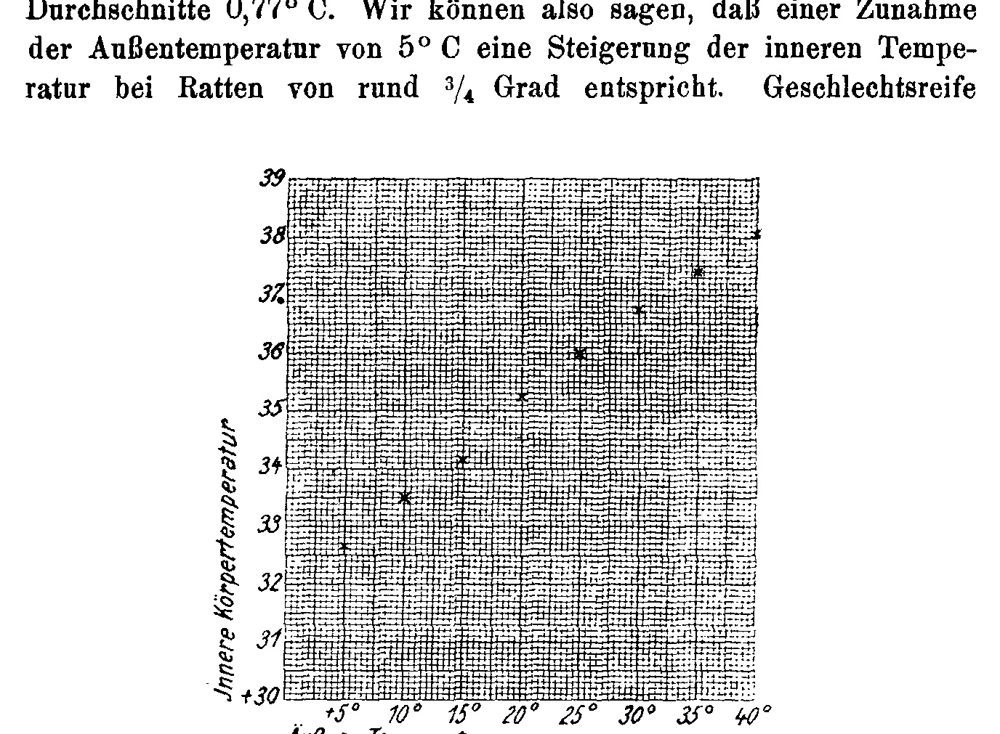

# Die Umwelt des Keimplasmas.
## The Environment of the Germ-Plasm.

### VI. Direct Temperature-Dependence of Body Heat in Rats (*Mus decumanus* and *M. rattus*).

By

**Hans Przibram.**

(From the Biological Experimental Institute of the Imperial Academy of Sciences in Vienna [Zoological Department].)¹

With 1 figure (curve) in the text.

Received on 3 July 1916.

*Archiv für Entwicklungsmechanik der Organismen*, vol. 43 (1917).

> **Full translation.** A complete English rendering of Przibram's "The Environment of the Germ-Plasm", with the figure legends.

> ¹ An abstract of this work appeared under the same title as Communication No. 16 from the Biological Experimental Institute of the Imperial Academy of Sciences, Zoological Department, in the *Akademischer Anzeiger* No. XXVI, 1915.

## I. Experimental Arrangement.

The thermal environment of the germ-plasm in rodents has, in the present series of works, already been treated as No. III, "The Inner Temperature of Warm-Blooded Animals (*Mus decumanus*, *M. musculus*, *Myoxus glis*)" by E. D. Congdon (1911).

But since in the meantime our temperature chambers (cf. Przibram 1913) had made it possible to apply systematically different, constant temperatures rising by 5 degrees at a time, I had fresh measurements of the body heat of rats (*Mus decumanus* and *M. rattus*) carried out in them by our assistants of that time, Dr. Uhlenhuth and Privatdozent Dr. Paul Kammerer, which served my experiments on the variability of their characters under maintenance at different temperatures.

Besides the greater precision in maintaining the external temperatures, the chief interest of the renewed measurements lies in whether the previously observed increase of the body temperature upon raising the external temperature, and the decrease upon lowering the external temperature, [continued on next page] could likewise be traced back merely to extreme influences, or whether even with smaller leaps a stepwise increase of the body temperature can be demonstrated.

In order to eliminate from the outset the daily fluctuations of the body temperature, all readings were taken between 5 and 6 o'clock in the afternoon; the small quicksilver thermometers used were introduced with the whole "bulb" (which, to be sure, was not spherical in shape, but drawn out into a length) into the anus of the animal, where, with the help of a second person holding the animal, they remained for some time. We have here assumed the values obtained from the treatment described as the body temperature properly so called. Although the temperatures recorded in this way were of course always somewhat lower than the true internal temperature, the figures arrived at by the procedure described have here been accepted as the body temperature in the proper sense.

The age and sex of the experimental animals were furthermore taken into account. As a rule, only those rats were to be measured which had already been reared at the external temperature in question, or had at least spent the greatest part of their life there; where this was not possible, a corresponding remark was added, that the animals had been brought into the temperature in question only a short time before the body measurement, and in which temperature they had previously lived. To disregard this circumstance would have brought some confusion into the otherwise quite uniform experimental results; a further source of error is formed by the periodic condition of the adult females, since these, as is moreover long known for other mammals too, undergo a temperature increase during heat (estrus) or in the advanced state of pregnancy.

The results of the more recent measurements of the body temperature are compiled in Table A. Where nothing else is remarked, the average over three readings on 10 successive days from the same specimens appears.

## II. Experimental Results.

A glance at the last line of Table A, which gives the general average of the readings used, shows for the temperature range from + 5° to + 40° C a continuous, steady increase of the values for the body temperature with rising external temperature. In order, however, to obtain more reliable values,

### Table A.
### Body-temperature measurements carried out by Uhlenhuth (U.) and Kammerer (K.) 1912–1914.

| Beob. [Observer] | Art [Species] | Geschl. [Sex] | Alter Tage [Age days] | 5° | 10° | 15° | 20° | 25° | 30° | 35° | 40° C Außentemp. [external temp.] |
|---|---|---|---|---|---|---|---|---|---|---|---|
| U. | *Mus rattus* | ♂ | 426–503 | Ex. Nr. (9) 32,10 | (61) 33,10 | (5) 33,15 | (81) (33,80)¹⁾ | (19) 35,80 | (11) (35,40)¹⁾ | (13) (37,45)¹⁾ | (63) (36,5)²⁾ |
| U. | *Mus rattus* | ♀ | — | Ex. Nr. — | — | (6) (35,90)³⁾ | (64) 35,05 | (12) 36,25 | (14) 37,55 | (16) 38,10 | (18) 38,05 |
| U. | *Mus decumanus albino* | ♂ | 115–162 | Ex. Nr. (141) 32,40 | (163) 33,90 | (133) 34,55 | (157) 35,10 | (143) 35,95 | (123) 36,10 | (145) 36,60 | |
| K. | " | | 282 | Ex. Nr. | | | | | | | (173)⁴⁾ 36,40 |
| U. | " | | 80 | Ex. Nr. | | (265) (33,17)⁶⁾ | (277) (35,5)⁵⁾ | (267) (35)⁵⁾ | | (271) (37)⁵⁾ | |
| K. | *Mus decumanus albino* | ♀ | 92–242 | Ex. Nr. (274) 33,45 | (258) (35,90)³⁾ | (286) 34,75 | (290) 35,60 | (244) 36,05 | (272) 36,50 | (266) 37,50 | |
| K. | " | | 282 | Ex. Nr. | | (278) (32,63)⁶⁾ | (290) (34,5) | | | | (186) (37,85)⁴⁾ |
| U. | " | | 80 | Ex. Nr. | | | | (280) (35,6)⁵⁾ | | (284) (37,2)⁵⁾ | (276) 40⁵⁾ |
| **Durchschnitt aus allen Versuchsreihen:** [Average from all experimental series:] | | | | 32,65 | 34,00 | 34,59 | 34,89 | 35,38 | 35,99 | 37,79 | 38,16 |
| **der gut verwendbaren Versuche (exkl. eckig eingeklammerter):** [of the well-usable experiments (excl. those bracketed in square brackets):] | | | | 32,65 | 33,50 | 34,15 | 35,25 | 36,01 | 36,72 | 37,40 | 38,05 |

> ¹⁾ Only recently brought from a temperature 5° lower.
> ²⁾ Only 2 measurements, since it then died.
> ³⁾ Pregnant or in heat.
> ⁴⁾ Reared at 35°.
> ⁵⁾ Only 1 measurement each.
> ⁶⁾ Only 3 measurements each.

all somehow suspect figures were left out, e.g. those of pregnant females, of animals recently transferred from lower temperatures, of specimens not older than 80 days; the remaining values are written down as averages in the last line. Curve Fig. 1 gives a graphical representation of this. The increase of the body temperature for an increase of 1 Celsius degree at a time amounts to 0.85, 0.65, 1.10, 0.76, 0.71, 0.68 and 0.65° C, on average 0.77° C. We can therefore say that to an increase of the external temperature by 5° C corresponds, in rats, a body temperature increase of about ¾ degree. Sexually mature males show, as compared with the corresponding females, on average a body temperature lower by 0.51° C; the mutual relation of the inner temperatures to one another therefore corresponds, despite the absolute difference of the body temperature, to the five-degree difference of the external temperature. Young animals not yet sexually mature show, in their relation of inner temperature to external temperature, body temperatures similar to those of the sexually mature rats. For the substantiation of this point only few data are at present available, since I was unable, owing to the war, to obtain the experimental data on this matter specially gathered for us in our institution by Herr Dr. Bierens de Haan. The two rat species used, namely the migratory rat (*Mus decumanus*) and the

**Fig. 1.** [Curve. Vertical axis "Innere Körpertemperatur" (Inner body temperature) marked 30, 31, 32, 33, 34, 35, 36, 37, 38, 39; horizontal axis "Äußere Temperatur" (External temperature) marked +5°, 10°, 15°, 20°, 25°, 30°, 35°, 40°.]  *(figure not reproduced)*

### Table B.
### Body-temperature measurements on rodents by earlier authors Congdon (C.), Edwards (E.), Finkler (F.), Macleod (M.), Pembrey (P.) and Sumner (S.).

| Beob. [Observer] | Art [Species] | Geschl. [Sex] | Alter [Age] | −4° | −3,3° | 0°-5° | 5° | 6° | 7° | 13° | 14° | 16° | 15-18° | 21,2° | 23° | 25° | 25-27° | 28,3° | 31° | 33° | 35° | 36-39° | 4° Steigerung¹⁾/Senkung¹⁾ [increase/decrease] |
|---|---|---|---|---|---|---|---|---|---|---|---|---|---|---|---|---|---|---|---|---|---|---|---|
| M. | *M. decumanus* | ? | ? | | | | | | | | | | | | | | | | | | | | 4° Steigerung¹⁾ [increase] |
| C. | *Mus decumanus albino* | ♂ ♀ | reif [mature] | | | | 34,4 | | | | 36,2 | | | | | | | | | 37,2 | | | |
| C. | *Myoxus glis* | - | - | | | | | | | 35,1 | | | | 35,9 | | | | | | | | | |
| C. | *Mus musculus* | - | - | | | | | 31,2 | | 34,2 | | | | | | | | | | | | 35,7 (im »Nest« 32) [in the "nest" 32] | |
| P. | *Mus musculus* | ? | unter 10 Tag. [under 10 days] | | | | | | | | | | (23 n. 40') | | | | | | | | | | |
| S. (S. 335) | *Mus musculus* | ♂ | reif [mature] | | 36,19 | | | | | | | | | 36,24 | | | | | | | | | |
| (S. 332) | - | - | - | | | | | | | (34,75)²⁾ | | | (»norm.« 35,50)²⁾ | | | | | | | | | | |
| (S. 355) | - | - | - | | | | | | | | 36,54 | | | | | | | | | 36,83 | 38,18 | | |
| S. (S. 336) | *Mus musculus* | ♀ | - | | | 36,52 | | | | | | | | | | | | 37,28 | | | | | |
| (S. 332) | - | - | - | | | | | | | (36,35)²⁾ | 36,82 | | (37,37)²⁾ | | | | | | | | | | |
| (S. 355) | - | - | - | | | | | | | | | 36,82 | | | | | | | | | | | |
| (S. 347) | *Mus musculus* | ? | 18 Tage [18 days] | | | | | | | 23,3 | | | | | | | | (36,3 Warmzim. [warm room]) | 37,50 | | 38,50 | | |
| F. | *Cavia cobaja* | ? | reif [mature] | | | | 36,10 | | | | | | | | | 36,45 | 36,60 | | | | | | |
| F. | 2½ cm Thermometerinsert. [thermometer insertion] | | | | | | | | (38,75) | | | | | | | | | | | | | |
| F. | 9 cm Thermometerinsert. [thermometer insertion] | | | | | | | | | | | (38,96) | | | | | | (39,06) | | | | |
| E. | *Cavia cobaja* | ? | - | | | 2 bis 3° [2 to 3°] | | | | | | | | | | | | | | | | | Senkung¹⁾ [decrease] |

> ¹⁾ Only briefly brought in from another temperature; absolute values not given.
> ²⁾ Recently brought in from other temperatures; the "normal" temperature is not exactly defined.

house rat (*Mus rattus*) behave so similarly with respect to the inner body temperature that for the discussion no separation according to these species need be undertaken.

## III. Earlier Experiments.

With our new experimental results, the earlier experiments carried out by various researchers on rodents also agree, in that inner temperatures are measured as different at the various external temperatures and in animals of different sex or of young age. In order to avoid a tedious presentation of the literature, I have compiled them in Table B, in which the better-known and more influential data are noted; here I have to make only the following remarks:

a) The observation made by Macleod on *Mus decumanus*, that the inner temperature rose, at an external maximal temperature, from 39° to 42°, agrees with our measurements when the "normal" body temperature is measured at the usual room temperature (about 15° C).

b) The values determined by Congdon for *Mus decumanus* are not too high, and indeed because they were not taken in really constantly tempered rooms, but at the more roughly characterized external temperatures, which were often exceeded and frequently fallen below (as is moreover already evident from the relevant publication itself).

c) The same holds for the *Myoxus glis* of his [Congdon's]; the species-difference would therefore hardly bring along an inner temperature differing from that of the rat.

d) The absolute values determined by Congdon for *Mus musculus* are remarkably low; this may lie in the thermometric reading, be it that the thermometer used for mice was not sufficiently exactly calibrated, be it that Sumner's (p. 341) criticism of a hot-water-bath calibration is correct. In the experiments on rats, no great source of error is to be feared, on account of the slighter influence of the thermometer and the more vigorous closure of the sphincter.

e) The measurements of Pembrey and Sumner on young mice confirm the far-reaching temperature-dependence also for young *Mus musculus*.

f) Although Sumner admitted only slight differences of the body temperature at the changed external temperatures, yet on the whole his own values for *Mus musculus* agree with a straight dependence of the inner temperature increase on the external temperature increase. The smaller differences are probably above all to be blamed on the lack of constantly tempered external rooms, since in practically all of Sumner's measurements the mice had been in the external temperature in question only for a short time. But we have seen in our rat measurements (and the same Congdon had indeed found in his mice) that it is by no means a matter of indifference for the body temperature whether the animals had recently been brought into a definite external temperature or had lived in it permanently.

g) The same holds for Finkler's experiments on guinea-pigs; here too one can see in them that the various deep insertions of the thermometer-bulb do indeed alter the absolute values, but leave the relative differences unremoved.

h) From Edwards's observation on *Cavia cobaja*, that the inner temperature sinks at an external minimal temperature of 0° to 2° to 3°, it would again agree with our differences obtained on rats, if the room temperature of 15° is taken as the normal initial temperature.

(Statements about the fluctuation of the inner body temperature of rodents in relation to the external temperature are also to be found in Davy 1845, and further compiled in Lefèvre 1911. In Lyth 1913 and Schmitz 1911, which by their titles led one to expect usable statements, I have found nothing usable.)

## IV. Refutation of Objections.

Confronted with these data confirming our experiments, I still have to refute some objections which might be raised against the cogency of my deduction.

First of all it could seem as though the increase, observed at various external temperatures, of the body temperatures measured in the rats would, only as a consequence of the insufficiently deep insertion of the thermometer, exhibit essential differences. This objection too can be set aside in several ways: for this reading-error would have to be the same whether the rats have been in a definite temperature for a short or for a long time, which however is not the case. Then, too, the differences would have to increase with the extreme external temperatures, which just as little applies. On the contrary, it is to be seen from text-Fig. 1 that the average temperatures show, on average, values that diverge more from one another for a 5° external difference than do the lowest or the highest. The almost complete agreement of the absolute body temperatures of our rats with the rodents measured by other researchers also speaks for the correctness of the values. Finally, the temperature difference, found for the sexes and turning out throughout in favour of the females, is a proof that our measurements really show differences of the inner body temperature, and not perhaps merely the external influencing of the quicksilver column.

The higher body temperature of females is given for mice by Sumner as 0.76° C, for the human by Roger as 0.09° (namely 37.2 for girls, 37.11° for boys), for ducks by Martins as 0.31° (42.26 against 41.95).

The second objection, which might already have been raised earlier, refers to the not entirely equal degree of humidity which prevailed at the constant temperatures. Whereas in the higher temperatures medium air-humidity was registered throughout, the experiments below 25° at times showed a higher humidity. In fact, a very wet air-current would, according to the experiments of Hill and Macleod, have the effect of robbing mice almost entirely of their heat-losses, so that, exactly as with far-reaching differences of the body temperature, this would come about upon application of different external degrees of warmth. But in our experiments nothing of importance in this respect was present; nor, here, can there be any question of a loss of heat-regulation in the case of the differences observed in the sexually mature rats. It is certainly, however, not a matter of the influence of air-humidity, because the degrees of humidity for the chambers above 25° among one another, and likewise those for the chambers below 25° among one another, differed only very slightly, while the body temperatures form a row continually increasing with the external temperature.

external temperatures, the body temperatures measured in the rats would show significant differences only as a consequence of the insufficiently deep insertion of the thermometer. This objection can be removed in several ways: for this reading-error it would have to be indifferent whether the rats had been in a particular temperature for a short time or for a long time, which however is not the case. Furthermore, the differences would have to increase with the extreme external temperatures, which is just as little true. On the contrary, it can be seen from Text-figure 1 that the mean temperatures on average show values diverging more from one another for a 5° external-difference at the lowest and highest temperatures than [in the middle range]. Also the almost complete agreement of the absolute body temperatures of our rats with those of the rodents measured by other researchers speaks for the correctness of the values. Finally, the temperature-difference turning out consistently in favor of the females, which was found for the sexes, is a proof that our measurements really indicate differences of the inner body temperature and not perhaps merely the external influencing of the mercury-column.

The higher body temperature of females is given for mice by Sumner as 0.76° C., for humans by Roger as 0.09° (namely 37.2 in girls, 37.11 in boys), for ducks by Martins as 0.31° (42.26 against 41.95).

The second objection that could be raised concerns the not quite identical degree of humidity that prevailed at the constant temperatures. Whereas in the higher temperatures a medium air-humidity was registered throughout, the experiments below 25° exhibited an at times far higher humidity. In fact, a very wet airstream would, according to the experiments of Hill and Macleod on its effect, rob mice almost constantly of their heat-regulation capacity, so that then very far-reaching differences of body temperature would come about when various external warmth-degrees were applied. But in our experiments completely calm air was always present, and moreover, with the observed differences in sexually mature rats, there can be no question of a loss of heat-regulation. But it is certainly not a matter of the influence of air-humidity, because the humidity-degrees for the chambers above 25° among one another, and likewise those for the chambers below 20° among one another, diverged only very slightly, whereas the body temperatures form a series steadily increasing with the external temperature.

I therefore hold the following summary of the results to be fully proven.

### V. Summary.

1) If house-rats (*Mus rattus*) or wander-rats (*Mus decumanus*) are reared at constant temperatures, then, under otherwise equal conditions, they also show—after attaining sexual maturity—different body temperatures at the various external warmth-degrees, measured in the rectum (measurements by Uhlenhuth and Kammerer).

2) Between +5 and +40° C this difference amounts, for every 5 Celsius-degrees of external temperature, to on average ³/₄° of body temperature.

3) This relative figure is the same for the two rat-species and for each sex, whereby, however, the females exhibit on average a ¹/₂° higher body temperature than the corresponding males.

4) The results are in agreement with the hitherto known relevant measurements—relating only to isolated temperatures—on closely related and other warm-blooded animals.

5) The gradually smaller deviations in most earlier experiments are to be attributed to the merely brief action of the observed external temperature.

6) Air-humidity played no decisive role in the rat-experiments, since it was approximately the same in all experiments above 25°, and likewise again in all below 20°, whereas the body temperatures increased step by step with the external temperatures rising by 5° at a time.

### VI. Bibliography.

| | |
|---|---|
| Congdon, E. D., The surroundings of the germ plasm. III. The internal temperature of warm-blooded animals (Mus decumanus, M. musculus, Myoxus glis) in artificial climates. Archiv f. Entw.-Mech. XXXIII, 703, | **1912.** |
| Davy, J., On the Temperature of Man. Philosophical Transactions Royal Society London, 319, | **1845.** |
| Edwards, W. F., On the influence of physical agents on life. London, | **1832.** |
| Finkler, Pflügers Archiv für gesamte Physiologie, XXIX, 98, | **1882.** |
| Hill und Macleod, Journal of Physiology, XXIX, 492, | **1903.** |
| Lefèvre, J., Chaleur animale et Bioénergétique. Paris, Masson et Cie. (p. 346—347), | **1911.** |
| | |
|---|---|
| Lyth, E. R., Studies on the Influence of Thermal Environment on the Circulation and the Body-Heat. London, Bale Sons & Danielsson, | **1913.** |
| Macleod, American Journal of Physiology, XVIII, 1, | **1907.** |
| Martins, Mémoire sur la température des oiseaux palmipèdes du nord de l'Europe. Journal de la physiologie de l'homme et des animaux, | **1858.** |
| Pembrey, M. S., Journal of Physiology, XVIII, 363, | **1895.** |
| —— Animal Heat, Schäfers textbook of Physiology, I. Edinburg und London, | **1898.** |
| Przibram, H., Die Umwelt des Keimplasmas. I. Das Arbeitsprogramm. Archiv f. Entw.-Mech., XXXIII, | **1912.** |
| —— Die biologische Versuchsanstalt in Wien. Zweiter Fünfjahresbericht. Zeitschrift für biologische Technik und Methodik, III, 163, | **1913.** |
| Roger, Archives générales de médecine, | **1845.** |
| Schmitz, K. L., Biothermographie I. Grundlagen und Probleme. Bonn, Georgi, | **1911.** |
| Sumner, F. B., The Effects of Atmospheric Temperature upon the Body Temperature of Mice, Journal of Experimental Zoology, XV, 315, | **1913.** |

## Figures

**Fig. 1.**

---

*Translator's note.* Part of Przibram's series questioning the isolation of Weismann's germ-plasm.
