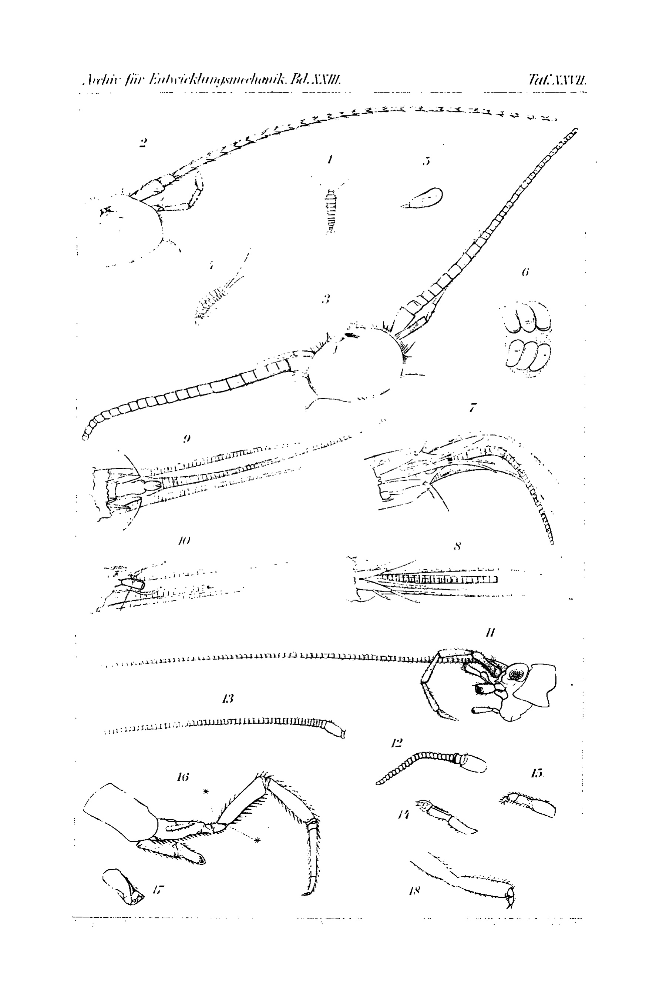

# Regeneration Experiments of More General Significance in Bristletails (Lepismatidae).

By

**Hans Przibram and Ernst Isaak Werber.**

[From the Biological Experimental Station in Vienna.]

With Plate XXVII.

Received on 23 February 1907.

*Archiv für Entwicklungsmechanik der Organismen*, vol. 23 (1907).

> **Full translation.** A complete English rendering of Przibram's regeneration experiments of more general significance in bristletails (Lepismatidae), with the figure legends.

### Table of Contents
&nbsp;&nbsp;&nbsp;&nbsp;&nbsp;&nbsp;&nbsp;&nbsp;&nbsp;&nbsp;&nbsp;&nbsp;&nbsp;&nbsp;&nbsp;&nbsp;Page

1. Regeneration experiments on *Lepisma* (Werber) . . . . . . . . . . . . . 615
2. Regeneration experiments on *Machilis* (Przibram) . . . . . . . . . . . 616
3. Theoretical significance of the findings (Przibram) . . . . . . . . . . 620
4. Summary . . . . . . . . . . . . . . . . . . . . . . . . . . . . . . . . 628
5. Bibliography . . . . . . . . . . . . . . . . . . . . . . . . . . . . . . 629
6. Explanation of the figures . . . . . . . . . . . . . . . . . . . . . . . 630

## 1. Experiments on *Lepisma saccharina* L.

The sugar-guest or silverfish (*Lepisma saccharina* L.) is found in the Station itself, in the cracks of the window- and door-frames. It is most easily caught by laying out damp rags, in which the little animals like to nestle.

For the experiments, the *Lepismae* were placed in well-fitted hermit-jars [Einsiedegläser] tightly covered and tied off with dense organdy [Organtin], in which sugar-strewn bran [Kleie] was provided as food. This was kept moderately moist by spraying.

For the purpose of carrying out the operation, the little animals were placed in flat glass dishes, and the cuts were made with a fine little scalpel either freehand or by fixing the animal with a moist brush.

In this form, which had not yet been investigated as to its regenerative capacity, the first attempt was to see whether it can regenerate larger body sections, e.g. a segment. First, the last abdominal segment, bearing three bristles, was cut off on 14 May (1904) in 8 specimens. However, within 2 days all the animals had died. Then experiments were undertaken on antennae and on the bristles of the last segment, which led to positive results. On 16 May (1904) both antennae were cut off at the base in 6 specimens.

On 28 May three of these specimens were still alive and had regenerated both antennae; the remaining three were found dead in the jar. Two shed skins [Häute] were also found. While searching through the jar, the regenerated antennae of one specimen were broken off. The animal was placed in a jar of its own for further observation (to see whether it would once more regenerate the antennae). The two remaining animals were preserved (glycerine preparations). On 7 June the animal which had lost its antennae for a second time was checked and showed both antennae regenerated once again.

The regenerated antennae were always somewhat shorter and thicker than the primary ones (Plate XXVII, Fig. 3).

The cutting off of the longest, middle bristle of the abdominal tip, carried out on 21 May, led to no clear result, since only one of the animals operated on in this way was found still alive on 28 May. While taking it out of the jar, the middle bristle broke off, so that it could not be determined how far regeneration had taken place.

## 2. Experiments on *Machilis cylindrica* Geof.

Whereas the rock-hoppers [Steinhüpfer] (*Machilis* Latr.) occurring in the vicinity of Vienna rarely reach a size favourable for carrying out operations, there occurs on the coast of Brittany a species which often attains a total body length (excluding the tail-bristles [Schwanzborsten]) of 10½–11 mm. On the occasion of a stay in Roscoff, this species could be drawn upon for supplementary observations on the regenerative capacity of the Lepismatidae.

The species *Machilis cylindrica* Geof. (identified after Lubbock, 1873) lives under stones and boards near the beach and was also found rather often in the Station itself. It is caught by knocking [the substrate] into a broad test-tube [Epruvette] held underneath, and this requires some practice, since the rock-hoppers strive to make off into the distance by springing away from the surface. The largest specimens, however, make (owing to their greater sluggishness because of the sexual products?) less ready use of this means of escape.

The keeping of the springtails [Springschwänze] is very easy: each animal was isolated singly in a 10 cm long glass test-tube of 2 cm diameter. This test-tube can be completely closed by means of a cork stopper without any lack of air arising. As food, a little crumb of bread spread with sugar was attached to the stopper from the inside by means of a pin. This arrangement makes it possible, when the animal is sitting on the bread-crumb, to draw it out easily and undamaged along with it, and on the other hand, when the animal is at the bottom of the test-tube, to change and moisten the food. The latter incidentally proved superfluous after some time, since mould fungi (*Pennicillium glaucum*) settled in abundantly and kept the space moist. They did not seem to be harmful to the animals; on the contrary, I believe I observed that the animals fed on them. In order to make it easier for the animals to walk and to prevent the accumulation of carbonic acid at the bottom of the vessel, the test-tubes were kept lying down, with the stopper turned toward the window, so that the animals could always find shade. The operations extended to the removal of a (measured) part of the antenna and of the middle tail-bristle; furthermore, one leg was autotomized or otherwise amputated and the large palp [Taster] was cut off; but on these latter appendages the complete course of regeneration could not be observed, since after the 1st moult [Häutung] it set in only in the antennae and tail-bristles, while all the animals died before the 2nd moult. Under magnification with a hand-lens, however, regeneration buds [Regenerationsknospen] were perceptible in some cases on the leg and palp as well, which let the characteristic terminal tip of the segment be recognized. For the experiments, animals of various sizes were used, from 4–10.5 mm total length (reckoned from the tip of the head to the insertion of the middle tail-bristle); while the smallest specimens did not yet let a full development of the copulatory organs be recognized, those of the largest were completely developed, and the emergence of eggs¹) and sperm masses could be ascertained. These sexually

> ¹) The eggs are elongate, not regularly outlined, thus similar to those of *Lepisma* according to Heymons. The size amounts to about 1 mm in the longest diameter, the colour is wax-yellow. Some appeared to possess a short stalk, but their attachment could not be observed [cf. Plate XXVII, Fig. 5].

40*

### *Machilis.* a. Experimental animals.

| Specimen No. | Date of set-up | Length from head to insertion of tail-bristle, mm | Length of the amputated part in mm — left antenna | left maxillary palp | 3rd leg right | middle tail-bristle | Remainder of appendage after amputation (mm) — left antenna | left maxillary palp | 3rd leg right | middle tail-bristle | next moult | Length of the animal after moulting | Length of the regenerated segment (mm) — left antenna | left maxillary palp | 3rd leg right | middle tail-bristle | Death of the specimen | No. |
|---|---|---|---|---|---|---|---|---|---|---|---|---|---|---|---|---|---|---|
| 1 ♀ | 18.VII. | 10,5 | 11,0 | 4,5 | 5,0 autotom. | 11,0 | 3,0 | 1,0 | 2 basal segments | 2,0 | 21.VII | 9,5 | 6,0 | 0 | 0 ? | 4,5 | 7.VIII. | 1 |
| 2 ♂ | - | 10,5 | 15,0 | 4,0 | 4,5 autotom. | 9,0 | 1,0 | 1,5 | 2 basal segments | 7,0 | 0 | — | — | — | — | — | 8.VIII. | 2 |
| 3 ♀ | - | 10,5 | 9,0 | natural loss | 3,0 autotom. | 13,0 | 2,0 | 1,5 | 1,5 | 3,0 | 24.VII | 10,0 | 4,0 | 0 | Regen.-bud | 8,0 | 3.VIII. | 3 |
| 4 ♀ | - | 10,5 | natural loss | 5,0 | 4,5 autotom.? | 13,5 | 4,5 | 0,0 | 2 basal segments | 1,5 | 0 | — | — | — | — | — | 18.VII | 4 |
| 5 ♂ | - | 9,0 | 7,5 | 3,0 | 4,0 autotom. | 5,0 | 3,0 | 2,0 | 2 basal segments | 3,0 | 20.VII | 9,0 | 6,0 | Regen.-bud | Regen.-bud | 6,0 | 31.VII | 5 |
| 6 ♂ | - | 10,5 | 8,0 | 3,5 | natural loss (not autotom.) | natural loss | 1,5 | 2,0 | 2,5 | 5,0 | 20.VII | not extended | 0 | Regen.-bud | Regen.-bud | 6,0 | 21.VII | 6 |
| 7 ♀ | - | 6,0 | 4,0 | 1 ? | 2,5 autotom. | 2,5 | 3,0 | 1,0 | 2 basal segments | 2,5 | 23.VII | 6,0 | 4,5 | - (?) | - (?) | 5,5 | 5.VIII. | 7 |
| 8 ? | - | 4,0 | 2,0 | right¹) antenna 3,5 | 1,5 autotom. | 3,5 | 3,0 | right¹) antenna 1,5 | 2 basal segments | 2,0 | 21.VII | 5,0 | 4,5 | right¹) antenna 3,0 | - (?) | 4,5 | 3.VIII. | 8 |
| 9 ? | - | 4,0 | 4,0 | natural loss | 1,0 autotom. | 3,5 | 1 (?) | 3,0 | 2 basal segments | 1,5 | 20.VII | 5,0 | 4,0 | 4,5 | Regen.-bud | 3,0 | 24.VII | 9 |

> ¹) On these smallest specimens an operation on the palp could not be carried out.

mature specimens moulted after the operations and showed regeneration. In order to see when the moulting capacity ceases, further unoperated animals of sizes 9–11 mm were isolated; of the latter, only one animal moulted during the observation period, but this was precisely one of size 11 mm, so that moults can therefore still occur even at such a size-stage. The course of the experiments can be seen from the preceding tabular overview.

The operations were carried out with a small scalpel; the autotomy of the legs sometimes already followed upon the seizing with forceps.

The measurement was carried out with an ordinary pair of compasses [Zirkel] and is accurate only to within half a millimetre.

### *Machilis.* b. Control animals.

| No. of specimen | Date of set-up | Length from head to insertion of tail-bristle mm | Antenna mm | Middle tail-bristle mm | next moult | Death of specimen | No. of specimen |
|---|---|---|---|---|---|---|---|
| 10¹) | 20.VII. | 9,0 | 12,0 | ? | 0 | ? | 10 |
| 11¹) | - | 11,0 | 16,5 | 11,5 (somewhat broken off?) | 0 | 28.VII. | 11 |
| 12 ♀ | - | 11,0 | 17,0 | 13,0 | 30.VII. | 7.VIII. | 12 |
| 13 ♂ | - | 11,0 | 14,0 | 12,0 | 0 | 28.VII. | 13 |
| 14¹) | - | 11,0 | 15,0 | 12,0 (somewhat broken off) | 0 | 30.VII. | 14 |
| 15 ♂ | - | 10,5 | 15,0 | 12,0 (somewhat broken off?) | 0 | 29.VII. | 15 |

> ¹) [These] were not preserved, so that the sex determination could not be carried out.

The regeneration of the limbs in *Machilis* nowhere deviates in its details from that of the other arthropods. Just as I already emphasized in 1899 for the lower crustaceans, the distal tip of the regenerate is laid down first, so that regeneration does not proceed in the manner of an unfolding of the segments lying from the base toward the tip. If regeneration stops at this stage, then limbs with a sub-normal number of segments can definitively arise (cf. e.g. Plate XXVII, Fig. 18, a leg with one segment too few; Fig. 15, a palp of the same kind; cf. also Lubbock with regard to the antennae of the Collembola, which normally exhibit a definite number of segments. In the Thysanura, the very large number of segments on the antennae appears not to be constant). That in the regeneration of the antennae and the middle tail-bristle it is not merely a matter of a shortening and a stretching of the parts that have remained standing basally, is clearly to be seen from the tapering of the terminal part (in the drawings).

Although none of the experimental animals experienced a second moult, nevertheless the preparation for such is clearly to be seen in the regeneration buds [Regenerationsknospen] that are at the same time enclosed by the skin of a segment that has remained standing (Fig. 14 palp, Fig. 17 leg).

I refrain from a description of the regenerates in the individual cases, with reference to the table opposite and to the plate, since it would yield nothing of general importance.

## 3. Theoretical Significance of the Findings.

The bristletails (Lepismatidae) form a small family of the *Insecta Thysanura*, a concept under which Latreille had subsumed all the originally wingless insects. Lubbock separated off from this group the springtails (Poduridae) under the name *Collembola* and showed in his monograph of the Collembola and Thysanura that the original asymmetry of the antennae asserted by De Geer and Bourlet in many specimens of many species of Collembola is to be traced back to incomplete regeneration. He experimented himself on *Orchesella cincta* (p. 62, Pl. 62, Fig. 1–7), and indeed not on quite young specimens; he holds it possible, but not probable, that such [young specimens] would exhibit quite complete regeneration. His specimens moulted several times, and after the moults the regenerates emerged at ever greater length, but not with an increase in the number of segments up to the normal.

This note by Lubbock is the only experimental statement on regeneration in the Apterygogenean insects, a subclass of the Eutracheata, which corresponds to the old order *Thysanura* Latreille (cf. Claus-Grobben).

Although our experiments on *Lepisma* and *Machilis* are thus likely to have furnished only the first proof of the regenerative capacity also for the 2nd order, the *Thysanura Ectognatha*, this result would scarcely repay the effort expended, were it not that that animal group had already for a long time aroused special interest in a phylogenetic respect. Thus Lubbock, in two different writings, goes into the significance of the Apterygogeneans as the most primitive group of insects, and their manifold similarities with the Myriapods (millipedes [Tausendfüßler]) — such as the occurrence of leg rudiments on the abdominal segments with coxal vesicles [Coxalbläschen], the lack of wings and of a true metamorphosis, which remove them from the other insects — have indeed earned them the rank of a subclass of their own (cf. Claus-Grobben).

This position as a stem-group of an animal class for which numerous positive regeneration experiments are available had to lead one to conclude on at least an equally high regenerative capacity of its members, if, as we believe (cf. Przibram, 1899, 1906, and Werber, 1905, 1906), the regenerative capacity is a primary property of animals, lost only through particular circumstances in some highly differentiated forms. We were therefore not surprised by the positive outcome of the experiments. Even someone who had proceeded from the assumption of the dependence of the quality of regeneration on the probability of loss would have been able to find a confirmation of his presupposition in the antennae and tail-bristles of these animals, for these do in fact break off very easily and grow back rapidly. With regard to the palps and legs, he would already have to place the greatest weight on the lesser speed of regeneration, since these limbs are not easily lost.

Yet it was not these problems either that prompted me to undertake the experiments, but rather a peculiarity in the postembryonic development which seemed called upon to throw new light on the connection between growth, moulting, sexual maturity, and age, on the one hand, and the regenerative capacity, on the other.

Whereas the other insects reach the sexually mature state, by way of a nymph- or pupa-state, after an imaginal moult, the stages of the Apterygogeneans resemble one another so closely that one cannot speak of larvae, nymphs, and imago. One finds in all treatises dealing with the development of these animals the statement that they attain their complete, adult, or sexually mature state without metamorphosis.

But as to when this state is reached, how many moults pass until then, at what size sexual maturity is reached — on this I could not find any statements. Already before the beginning of the experiments I harboured the suspicion that such a state of maturity closed off by a definite moult does not exist, just as little as the pupal stage does in the other insects, but rather— It is unfortunately customary to speak of a complete, adult, or sexually mature condition, as though these expressions would as a rule express one and the same thing, and as though only in a few special cases (viviparous larvae, dissogony) exceptions to this were present. In reality, however, these expressions denote conditions which need not be connected so intimately as it had seemed.

If one understands

1) by the "complete" [vollkommen] condition, as is mostly customary, the attainment of an outer form which experiences no more significant changes in the further life of the animal,

2) by the "adult" [erwachsen] condition the attainment of a size which can no longer be increased by further growth,

3) by the "sexually mature" [geschlechtsreif] condition the attainment of the capacity for the deposition of the sexual products,

then there result, for the great metazoan groups, the following sequences of the entry of the three conditions:

| | | |
|---|---|---|
| Cnidaria | . . . . . . complete cond. . . | Geschlechtsreife [sexual maturity] . . erw. Z. [adult cond.] |
| Ctenophora | . . . . Geschlechtsreife I | { complete cond. } / { Geschlechtsreife II } . . erw. Z. |
| Echinodermata | . . . . complete cond. . . | Geschlechtsreife . . erw. Z. |
| Vermes | . . . . . . complete cond. . . | Geschlechtsreife . . erw. Z. |
| Mollusca | . . . . . complete cond. . . | Geschlechtsreife . . erw. Z. |
| Crustacea ¹) | . . . complete cond. . . | Geschlechtsreife . . erw. Z. |
| exklusive Copepoda ²) [Copepoda excepted] | } . . . . complete cond. . . | { Geschlechtsreife } / { erwachsener Zust. [adult cond.] } |
| Myriapoda | . . . . complete cond. . . | { Geschlechtsreife } / { erwachsener Zust. } |
| Arachnoidea | . . . . complete cond. . . | { Geschlechtsreife } / { erwachsener Zust. } |
| Apterygogenea | . . . . complete cond. . . | Geschlechtsreife . . erw. Z. |

> ¹) Cf. Gerstaecker, S. 519 (Cirripedia; 689 Branchiopoda); Przibram, 1899, S. 10 (Cladocera).
> ²) Cf. Gerstaecker, S. 197—684, 691 (Copepoda).

| | | |
|---|---|---|
| Pterygota (z. B. Ortho-/Hexapoda u. Coleopt.) | { complete cond. } / { adult cond. } | Geschlechtsreife . . . . . . . . |
| – – | { z. B. Lepi-/do- u./Diptera } | { complete cond. } / { Geschlechtsreife } / { adult cond. } |
| Tunicata | . . . complete cond., | Geschlechtsreife . . erw. Z. |
| Leptocardii | . . . complete cond., | Geschlechtsreife . . erw. Z. |
| Cyclostomata | . . . | { complete cond., } / { Geschlechtsreife? . erwachsener Z.? } |
| Pisces (Gnathostomata) | complete cond. . | Geschlechtsreife . . erw. Z. |
| Amphibia ¹) | . . . . complete cond., | Geschlechtsreife . . erw. Z. |
| (exkl. neoten. Larven) | Geschlechtsreife . | (complete cond.) . . erw. Z. |
| Reptilia | . . . . complete cond., | Geschlechtsreife . . erw. Z. |
| Aves | . . . . . . complete cond., | { Geschlechtsreife } / { erwachsener Z.? } |
| Mammalia | . . . . . complete cond. . | Geschlechtsreife, erw. Z. . |

Soon after sexual maturity is reached, the mammals (and birds) cease to grow and remain at a size that for each species is approximately constant up to their death. In contrast to this, cold-blooded vertebrates continue to grow even after attainment of the size characteristic of the species in question (as one indeed finds it given, e.g., in systematic representations), and indeed often for a long time, as is shown, e.g., by the giant old fishes and crocodiles, which are now and then—ever more rarely—caught. In the course of the works of Paul Kammerer (1905) the necessity emerges to distinguish between such "adult" examples which exhibit the size characteristic of the species and usually reached, and those which exhibit the end-size at all possible for the species (but seldom realized): with Paul Kammerer I therefore propose to call the former examples species-adult [arterwachsen] (idiometric), the latter end-adult [enderwachsen] (teleometric).

If we now turn once more to the group of the Arthropoda, we find in the Crustacea (with the exception of the Copepoda) a similar condition to that in the lower vertebrates: namely a continued growth after sexual maturity to a considerable degree, so that teleometric examples of the lobster become over a meter long, while the idiometric size is given as 30—40 cm.

> ¹) The statement of Miall, that the growth of the adult Amphibia ceases with the metamorphosis, is entirely erroneous.

The increase in size takes place through moults, which in later years of life set in ever more sparsely and, as Rathbun has observed for the American swimming crab *Callinectes sapidus* (♂), cease entirely several years before death.

The moults are an expression of general growth processes¹) and play here too a very large role in the regeneration processes. Although in many forms the regeneration knots become visible even without a moult, the complete formation of the regenerate, in forms which are at all subject to a periodic moult, is nevertheless attached to the latter. I have repeatedly pointed out that the possibility of being able still to moult constitutes one of the most essential factors for regeneration, of the Arthropods in particular. Those Arthropods which by a last moult attain sexual maturity, such as the Copepods among the Crustacea, most spiders, the millipedes according to Verhoeff, and the (winged) insects, appear to have reached, at the same time as the "idiometric," also their "teleometric" condition, and are not in a position to reproduce limbs in the latter, in so far as they have no more moult to expect.

In recent years, however, some interesting facts have become known, which prove that even in these forms the teleometric condition need not be reached at the same time as the idiometric one.

In various groups of the Arthropoda it was observed that, in response to operative interventions, a moult often set in earlier than was normally to be expected (cf. Dewitz, Godelmann, Zeleny, Emmel, and others). Remarkably, an analogous phenomenon has shown itself in the imago too, in the following cases:

a) *Copepoden.* When in the years 1896—1898 I undertook regeneration experiments on lower Crustacea, the diversity between the Copepoden and the other examined orders struck me. While, for example, Cladoceren too were in a position to regenerate the antennae in the sexually mature condition, with *Cyclops*

> ¹) Cf. Przibram, 1906, where it is also pointed out that no positive increase in size need set in with growth; indeed, with larger regenerations and hunger a diminution of the total length can set in, as is again shown here in the examples of the Table on S. 618, Nr. 1 and 3. On the other hand the stretching of the hind-body in gravid females is not to be regarded as a growth process of the individual (but merely of the eggs). Perhaps the statement of Lubbock (1874, S. 63), that the Aphids too continue to grow after attainment of sexual maturity, refers to this.

(and *Diaptomus*) I could obtain no antenna-regeneration in sexually mature animals. I already at that time brought the cessation of the regenerative capacity into connection with the more complete metamorphosis of the Cyclopiden, which after attainment of sexual maturity are no longer accustomed to moult (cf. also Gerstaecker, S. 684, 691). How very right I was with this conjecture emerged from the later works of Hübner and Ost. Both, with the Cyclopiden, despite the long lifespan of their sexually mature experimental animals, obtained no regeneration of the antennae: but neither did any moults ensue. On the other hand Hübner found an old statement of Jurine, according to which in a *Cyclops*-female deprived of ⅔ of an antenna, after it had laid eggs twice, regeneration did nevertheless occur—but at a renewed moult! While Hübner attempted the regeneration of the Furca in vain, since all his experimental animals could survive this operation only briefly, Ost was so fortunate as to keep alive for a longer time half of his animals amputated in the last segment: these finally all regenerated the Furca, and indeed the regeneration went hand in hand with a moult!

Unfortunately Ost does not state expressly whether these animals were sexually mature at the time of the operation. Jurine (S. 40) had been able to keep alive only a single example deprived of the Furca: it indeed set eggs several times, but died after 2 months without moulting and without replacing the lost part.

From the observations on the Cyclopiden it appears to emerge that these Crustacea are exceptionally able to complete a moult even after attainment of sexual maturity (according to Jurine S. 57 usually before each egg-laying?). These cases often stand in relation to losses which the animals have suffered.

In comparatively easy operations (antenna) this moult appears to set in only seldom (Jurine's case), on the other hand more frequently or even regularly in the severe amputation in the last abdominal segment (Ost). After the section of a Furca-ramus, an injury which in its degree can be compared to the antenna-amputation, I too had never observed regeneration or moulting, so that not, say, the site of the injury, but rather the degree of loss comes into consideration¹). One finds here a parallel to Zeleny's findings on American crayfish (*Cambarus*), which like all

> ¹) Regeneration of Furca-rami in Phyllopoden goes hand in hand with the moults, cf. F. Meier on *Apus cancriformis*.

Decapoda continue to moult even after attainment of the complete condition (which does not exactly coincide with sexual maturity), but after losses of limbs accelerate the next moult, and indeed the more so, the greater the loss was.

In another place (1905) I pointed out a possibility by which, just through the size of the loss, the moulting-velocity could be automatically accelerated. Sometimes an acceleration of the regeneration is achieved at the same time (Zeleny); not, however, as it seems, always (Emmel).

In order to forestall erroneous interpretations of the proposition that with the Arthropoda regeneration is bound to moulting, I should like to emphasize that slight repairs (reparation of the Daphnid antenna-bristles, Przibram, 1899, S. 172), indeed even attempts at the regeneration of the antenna of *Cyclops* (ibid. S. 173, Taf. III Fig. 23) and of individual tail-threads in *Diaptomus*? (Jurine S. 73) occur, and that in the Isopoda and Decapoda limbs sprout forth above the cut surface even before the moult; but the same are covered with a little skin and only become free at the next moult.

b) Concerning a case in a spider (*Tegenaria*?) Paul Friedrich reports: "From a very large and vigorous male I cut off the right palp shortly before the last moult. The last moult took place 12 days after the operation. On the uninjured left palp the copulation-organ had formed, on the right not. After 29 days, remarkably, yet another moult took place, as though an attempt should yet be made to replace the missing right palp. But even now the copulation-organ had not formed. It is the only case in which I have observed yet another moult in a sexually mature animal.

That the male palps are in general not regenerated, one can best prove by removing, together with the palp, also a leg. After the next moult the leg is then regenerated, the palp not.

I must therefore, according to my results, set up the assertion that the palps of the males are not regenerated."

So here too an exceptional renewed moult of the idiometric male after a loss: admittedly no regenerate materialized, which however may well be conditioned by a secondary circumstance (perhaps the palp-regenerate in question was stuck in the skin and was stripped off with it, cf. Przibram, 1907), since the negative statements of Friedrichs and Wagners stand opposed not only to the more recent positive results of Schultz, but also to the older results of Blackwalls, obtained on many species, who makes precise statements as to how long before the entry of sexual maturity the palps of the males must be cut off in order still to be able to regenerate (cf. Przibram, 1902, S. 96, 97).

c) As to whether the moults in the millipedes (Myriapoden) continue even after the entry of sexual maturity, no agreement of opinion appears to have been reached: "While E. Haase maintained for *Scutigera* and L. Koch for *Lithobius* that 'thoroughly developed' animals still undergo moults, Verhoeff holds this, for all Chilopoden provided with 15 leg-bearing pairs, to be excluded, in that a confusion with Pseudo-maturus is present, a stage which has not previously been observed, but with *Scutigera* can likewise be expected and is in fact demonstrated below. Only with injured adult individuals can a renewed moult be thought of." The last sentence stems, like the whole quotation, from Verhoeff himself (1905, S. 143) and would mean that here too the idiometric sexual-animal, prompted by an injury to a renewed moult, is in a position to attain a new, teleometric condition.

d) In the insects (Hexapoden), in which the moult-accelerating effect of organ-losses was first observed by Dewitz on Ephemerid larvae, no statements in the previous literature about a renewed moult following a loss in the imago have come to my notice. Yet a similar case has arisen in experiments by Werber on an insect¹) with complete metamorphosis, which he will publish only in a later communication, since the investigation is not yet concluded; there appeared thereby regenerations on the imago (but not of the limbs).

After these expositions there now results the significance of the group of the apterygogenean insects in relation to the general regeneration problem.

These animals possess no metamorphosis in the sense of the other insects; they thus enter the complete condition before they

> ¹) Herewith falls the hypothesis of Boas, that a further moult of the winged insects is impossible precisely on account of the wings.

complete their growth; in the course of this growth, proceeding under continuous moults, sexual maturity sets in at a stage which, so far as I can see from the literature, is hitherto not yet known. Even after sexual maturity is reached (deposition of the sexual products) further moults can ensue, which admittedly in a non-operated animal were observed by me only once (Table Nr. 12).

It is now shown, in agreement with the similar conditions in the sexually mature Crustacea (Copepoda excepted), that the regenerative capacity of the limbs of the sexually mature stage, which here too need not be a teleometric one, is retained.

In this it is admittedly also possible that just the operations undertaken, which after all affected several limbs at once, have provoked moults in the sexually mature animals which otherwise would have set in only much later, or with large (idiometric?) animals would not have set in at all. In order to decide this, an investigation of the whole biology of the Apterygogenea will be necessary.

Already now, however, this much can be said: that they, by their position as lowest insects with transitions to the millipedes and Crustacea, remain true also as regards moulting-, growth- and regeneration-conditions.

It may also be pointed out that the higher-standing Apterygogenea, the Collembola, according to Lubbock's experiments are at least at late age-stages no longer in a position to fully re-form the limbs, whereas our lower Thysanura can do this. (Sommer saw moults occur regularly in "adult" Collembola, namely *Macrotoma plumbea*, but unfortunately does not state whether those were certainly sexually mature.)

## 4. Summary.

1) The bristletails (*Lepisma* and *Machilis*) show a considerable regenerative capacity, in that antennae (*Lepisma*, *Machilis*), tail-bristles (*Machilis*) were fully, and jaw-palps and legs (*Machilis*) to a lesser degree, re-produced.

2) These regenerations also occurred on sexually mature examples, after the same had moulted once more.

3) Also a non-operated sexually mature example of *Machilis* completed yet another moult, so that probably also

[continues onto p.629, outside owned pages] normally, in this animal group, the moults are continued after the attainment of sexual maturity.

4) In all these phenomena there is expressed the position of the Apterygogenea as the lowest stem of the insects, which still exhibits manifold relations to the millipedes (lowest Tracheata) and to the Crustacea (lowest Arthropoda of all).

## 5. Bibliography

Blackwall, J., Report on some researches into the Structure, Functions and Oeconomy of the Araneïda etc. British Association Report. XIV. Meeting f. 1844. (York.) p. 62–79. 1845.

Boas, J. E. V., Einige Bemerkungen über die Metamorphose der Insekten. Spengels Zoologische Jahrbücher. Syst. Abt. XII. 1899.

Bourlet, l'Abbé, Mémoire sur les Podures. Mémoires de la Société Royale des Sciences, de l'Agriculture et des Arts de Lille. 1839.

Claus-Grobben, Lehrbuch der Zoologie. Marburg i. H., Engelwert. 1905.

De Geer, Experimenta et Observationes de parvulis insectis, agili saltu corpuscula sua in altum levantibus, quibus Podurae nomen est, exhibitae. Acta Soc. Reg. Sci. Upsaliensis. 48. 1740.

Dewitz, H., Einige Beobachtungen betreffend das geschlossene Tracheensystem bei Insektenlarven. Zoologischer Anzeiger. XIII. S. 500–525. 1890.

Emmel, V., The Relation of Regeneration to the molting Process in the Lobster. Annual Report of the Commissioners of Inland Fisheries of Rhode Island. XXXVI. No. 27. p. 258–313. 1906.

Friedrich, P., Regeneration der Beine und Autotomie bei Spinnen. Archiv f. Entw.-Mech. XX. S. 469–506. 1906.

Gerstaecker, A., Die Klassen und Ordnungen der Arthropoden. Bronns Klassen und Ordnungen des Tierreichs. V/1. Crustacea. I. 1866–79.

Godelmann, R., Beitrag zur Kenntnis von Bacillus Rossii mit besonderer Berücksichtigung der Autotomie und Regeneration. Archiv f. Entw.-Mech. XII. S. 265–301. 1901.

Graber, V., Zur Entwicklungsgeschichte und Reproduktionsfähigkeit der Orthopteren. Sitzungsberichte Wiener Akademie, math.-naturw. Kl. LV/1. S. 307, 321–322. 1867.

Heymons, R., Entwicklungsgeschichtliche Untersuchungen an Lepisma saccharina. Zeitschrift f. wissenschaftl. Zoologie. LXII. S. 583–631. 1897.

Hübner, O., Neue Versuche aus dem Gebiete der Regeneration und ihre Beziehungen zu Anpassungserscheinungen. Inaug.-Diss. Jena, Fischer. 1902.

Jurine, L., Histoire des Monocles. Genève-Paris, J. J. Paschoud, 1820.

Kammerer, P., Über die Abhängigkeit des Regenerationsvermögens der Amphibienlarven von Alter, Entwicklungsstadium und spezifischer Größe. Archiv f. Entw.-Mech. XIX. S. 148–180. 1905.

— Die angeblichen Ausnahmen von der Regenerationsfähigkeit bei den Amphibien. Centralblatt f. Physiologie. XIX, 3. XII. 1905.

Lubbock, J., Monograph of the Collembola and Thysanura. London 1873.

— On the Origin and Metamorphoses of Insects. Nature Series. London, Macmillan. 2. ed. 1874.

Meier, R. F., Regenerationsversuche mit Apus cancriformis. Wochenschrift für Aquarien- u. Terrarienkunde. Braunschweig, Zickfeldt. III. S. 603. 1906.

Miall, L. C., Transformations of Insects. Nature. 1895.

Ost, F., Zur Kenntnis der Regeneration der Extremitäten bei den Arthropoden. Archiv f. Entw.-Mech. XXII. S. 289–324. 1906.

Przibram, H., Regeneration bei den niederen Crustaceen. Vorl. Mitt. Zoolog. Anzeiger. Nr. 514. 1896.

— Die Regeneration bei den Crustaceen. Arbeiten Zoolog. Institut Wien. XI. S. 163–191. 1899.

— Regeneration. Ergebnisse der Physiologie. I. S. 43–119. 1902.

— Quantitative Wachstumstheorie der Regeneration. Centralbl. f. Physiologie. XIX. Nr. 18. 1905.

— Die Regeneration als allgemeine Erscheinung in den drei Reichen. Vortrag Stuttgarter Naturforscherversammlung. Naturwissensch. Rundschau. XXI. Nr. 47–49. 1906.

— Automatischer Abwurf mißbildeter Regenerate. Archiv f. Entw.-Mech. XXIII. Dieses Heft. 1907.

Rathbun, M. J., The genus Callinectes. Proceedings U. S. National Museum. XVIII. p. 349. 1896.

Schultz, E., Über Regeneration von Spinnenfüßen. Travaux Société Imp. Naturalistes St. Pétersbourg. XXIX. p. 94. 1898.

Sommer, Albert, Über Macrotoma plumbea. Beiträge zur Anatomie der Poduriden. Zeitschr. f. wissensch. Zoologie. XLI. S. 683–718 [bes. 712]. 1885.

Tornier, G., Bein- und Fühlerregeneration bei Käfern und ihre Begleiterscheinungen. Zoolog. Anzeiger. XXIV. S. 634–648, 649–664. 1901.

Uzel, H., Studien über die Entwicklung der apterygoten Insekten. Berlin 1898.

Verhoeff, C., Bronns Klassen und Ordnungen. V/2. Gliederfüßler: Arthropoda. 72.–74. Lieferung. 1905.

Wagner, F. v., La régénération des organes perdus chez les Araignées. Bulletin Société Naturalistes Moscou. 2., I. p. 871. 1887.

Werber, E. I., Regeneration der Kiefer bei der Eidechse Lacerta agilis. Archiv f. Entw.-Mech. XIX. S. 248–258. 1905.

— Regeneration der Kiefer bei Reptilien und Amphibien. Ebenda. XXII. S. 1–14. 1906.

Zeleny, Ch., The Relation of the Degree of Injury to the Rate of Regeneration. Journal of Experimental Zoölogy. II. p. 347–369. 1905.

## 6. Explanation of the Figures

### Plate XXVII.

| Figure | Genus | Species | Experiment cf. Table I, p. 618 | Part depicted | Phenomenon | Magnification |
|---|---|---|---|---|---|---|
| 1 | *Lepisma saccharina* L. | | — | whole animal | normal | nat. size |
| 2 | | | — | antenna of the same | | enlarged |
| 3 | | | — | head from below | Regeneration of the antenna; of the same animal | Enlrgmt. |
| Figure | Genus | Species | Experiment cf. Table I, p. 618 | Part depicted | Phenomenon | Magnification |
|---|---|---|---|---|---|---|
| 4 | *Machilis cylindrica* Geoffr. | | — | whole animal, ♀ | normal. Egg-laying | nat. size |
| 5 | | | — | egg | during the laying | enlarged ¹⁾ |
| 6 | | | — | segment with ripe eggs | sexual maturity | — ¹⁾ |
| 7 | | | No. 3 | last segments from below, ♀ | Regeneration of the cercus | — ¹⁾ |
| 8 | | | | shed skin of the same animal | | |
| 9 | | | No. 5 | — — , ♂ | Regeneration of the cercus | — ¹⁾ |
| 10 | | | | shed skin of the same animal | | — ¹⁾ |
| 11 | | | No. 2 | head (and first thoracic segment) from the left side | Amputation of the left antenna and maxillary palp | — ¹⁾ |
| 12 | | | No. 3 | left antenna | Regeneration of the antenna | — ¹⁾ |
| 13 | | | No. 5 | — — | — further stage | — ¹⁾ |
| 14 | | | No. 5 | left maxillary palp | Regeneration of the palp | — ¹⁾ |
| 15 | | | No. 6 | — — | — further stage | — ¹⁾ |
| 16 | | | No. 2 | third thoracic segment from the left side | Autotomy of the right third leg (** break-point on the left) | — ¹⁾ |
| 17 | | | No. 3 | coxal segment of the right third leg | Regeneration-bud | — ¹⁾ |
| 18 | | | No. 6 | third leg right | Regeneration (without autotomy) | — ¹⁾ |

> ¹⁾ For dimensions cf. Table!

Archiv f. Entwicklungsmechanik. XXIII.    41 **Plate XXVII.**  *(figure not reproduced)*

(Plate showing Figs. 1–18: regeneration of antennae, maxillary palps, cerci, and legs in *Lepisma saccharina* and *Machilis cylindrica*, with associated shed skins and regeneration-buds, as listed in the explanation of the figures above.)

## Figures

**Plate XXVII.**

---

*Translator's note.* An early Vivarium regeneration study in apterygote insects.
