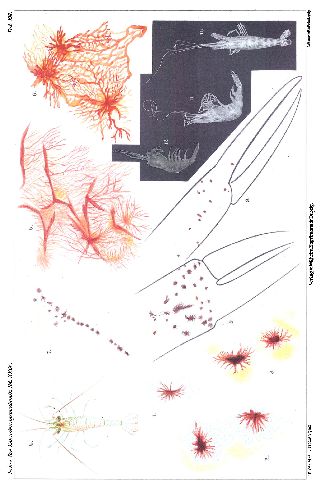

# Colour-Change Reactions in Palaemon.

By

Privatdozent Dr. **Alfred Fröhlich**,
Assistant at the Pharmacological Institute of the University of Vienna.

*(From the Biological Experimental Institute [Biologische Versuchsanstalt] in Vienna.)*

With Plate XIII.

Received 4 April 1910.

*Archiv für Entwicklungsmechanik der Organismen*, vol. 29 (1910).

> **Full translation.** A complete English rendering of Fröhlich's study of colour-change reactions in *Palaemon*, with the figure legends.

In what follows, a brief account is given of a series of experiments which I had the opportunity to begin in the summer of the year 1905 (July, August), thanks to the kind permission of Professor Yves Delage at the Zoological Station at Roscoff in Brittany, for which I should like to express my most cordial thanks to Professor Delage. Privatdozent Dr. Hans Przibram graciously permitted me to complete my experiments in Vienna at the Biological Experimental Institute, and supported me with various pieces of advice. A part of my results was communicated and demonstrated provisionally at a meeting of the Morphological-Physiological Society held in the Biol. Exper. Institute in Vienna (cf. Centralbl. f. Physiol. Vol. XX, No. 9, p. 326, 1907).

Even now it is not my intention to treat the subject of colour change exhaustively. In the thorough studies of Gamble and Keeble ¹) everything pertinent to it is described in detail, as well as the relevant literature.

> ¹) Gamble and Keeble, The colour Physiology of higher Crustacea. Phil. Transact. of the Royal Society of London. Ser. B. Vol. 196. 1904.

## I.

My investigations were carried out in Roscoff on *Palaemon treillianus*, Risso and Desmarest [a prawn], which one can readily procure there in any desired sizes and age stages.

The substances which determine its colouration and marking are contained, as in the other Decapods, in a special organ system, the chromatophore system (Pl. XIII Figs. 1–9), the study of which we owe especially to the above-mentioned English authors Gamble and Keeble.

In *Palaemon*, and particularly in *treillianus*, the pigment is not diffusely arranged, but rather occurs only at definite sites, namely on the chelae (Pl. XIII Fig. 8), at the joints of the legs, on the trunk rings (Pl. XIII Fig. 7), and in symmetrical arrangement on the tail.

Through this distribution of the pigments the characteristic marking of the animals arises.

It is not difficult to show that this colouration is not a constant one; on the contrary, it is very easily modified by external influences. The most effective factor in this respect is light, and by variations of illumination the following states can be evoked in *Palaemon*:

1) **the night position of the pigment.** Periodically, with day and night, the overall colouration of the animal changes. (This change is very striking in pigment-less Decapods, as in *Hippolyte varians*, which at night produce a blue pigment that is consumed again during the day and disappears. Less striking is the change in the more darkly pigmented *Palaemon*. In *Palaemon*, when one completely shuts it off from light for hours on end, a red-brown change of colour appears, brought about by a change in the contraction state of its chromatophores. A chromatophore or pigment cell consists, in *Palaemon*, of a circumscribed accumulation of pigment which is dark-red under the microscope and which appears to lie within a homogeneous yellow zone (Pl. XIII Figs. 1–3), and which is capable of an extensive change of form and size. Maximally contracted, it appears as a small red round dot; spread out, as a spider-cell-like structure (Pl. XIII Fig. 9). The chromatophores are put into maximal contraction by the stimulus of intense illumination; in the dark, as well as at night, they pass over into the state of expansion (Pl. XIII Fig. 3) and then stretch their spider-like processes far out (Pl. XIII Fig. 6). The processes then form an extended network, the branches of which fuse with one another.

The microscopic examination shows that there, where in the expansion phase the offshoots of the spider-cell-like chromatophores had been situated, there now appears a canal system which appears beset with blue dots and which evidently corresponds to the branched hollow spaces into which, during the expansion phase, the offshoots of the chromatophores creep, as it were. In the phase of maximal contraction a young *Palaemon* appears macroscopically blue, or rather green, coloured — the latter probably through the mixing of the blue pigment granules with the aforementioned yellow homogeneous substance.

2) **The behaviour of the animals after bilateral blinding.** Here two phases are to be distinguished:

a. immediately after the blinding. Such animals behave like normal ones that have been completely shut off from light for hours: they show a diffuse speckling, extending over the whole animal, with red-brown spots, the chromatophores having entered into maximal expansion. Seen from some distance, the impression is thereby evoked as if the whole animal were coloured rust-brown. Adult animals are richer in pigment and show the phenomenon better;

b. some time after bilateral extirpation of the eyes. The rust-brown colouration of the blinded animals can, after a few weeks, recede entirely and give way to a whitish colouration, which gradually — especially after moults — can pass over into a pure white (Pl. XIII Figs. 10, 11). Such pigment-less animals stand out strangely from normal (Pl. XIII Fig. 12) individuals, compared with whom they take on a ghostly appearance. For the development of this state, 2–4 weeks are required.

The state is to be interpreted as a pigment loss, brought about by the failure of the normal retinal excitations. The outermost distal ends of the chelae remain reddish.

3) If one places a normal *Palaemon* in a white porcelain dish and leaves it therein for ½–1 hour, it appears — having previously been quite transparent in the water — whitish-opaque, like milk-glass. The chromatophores have contracted as a result of the stimulus exerted by the white substrate, and in addition there has appeared in the carapax *Palaemon.* Roscoff 1905.

| Specimen | Operation, 1st eye | Operation, 2nd eye | Moult (Häutung) | Colouration afterward | Regenerate | Died (Gestorben) | Final colouration |
|---|---|---|---|---|---|---|---|
| 1. | 22. VII. | 22. VII. | 1. VIII. | braun | r. kleine Augenanlage / l. unbestimmte Anlage | 20. VIII. | |
| 2. | 22. VII. | 22. VII. | 4. VIII. | braun | beiderseits undifferenzierte Knospe auf langem Stiele | 8. IX. | weiß |
| 3. | 22. VII. | 22. VII. | 8. VIII. | braun | r. rudimentäre Augenanlage / l. etwas stärker entwickelt | — | — |
| 4. | 1. VIII. | 4. VIII. | — | 17. VIII. braun | — | 10. IX. | weiß |
| 5. | 1. VIII. | 4. VIII. | — | — | — | 15. VIII. | weißlich |
| 6. | 1. VIII. | 4. VIII. | 15. VIII. | bräunlich | r. sehr kurzer Augenstiel / l. etwas pigmentiertes Augenstielrudiment | 18. VIII. | weiß |
| 7. | 8. VIII. | 11. VIII. | 17. VIII. | braungrau | beiderseits ziemlich kleine Knospe, r. etwas pigmentiert | 19. VIII. | — |
| 8. | 8. VIII. | 11. VIII. | — | bräunlich | — | 19. VIII. | — |
| 9. | 8. VIII. | 11. VIII. | 14. IX. | weiß | l. Augenknospe / r. — | 14. IX. | weiß |
| 10. | 8. VIII. | 11. VIII. | — | — | — | 15. VIII. | weißlich |

*[Translation of the table headers and German cell contents.* Headers: **Specimen** | **Operation, 1st eye** | **Operation, 2nd eye** | **Moult** | **Colouration afterward** | **Regenerate** | **Died** | **Final colouration**. Cell terms: braun = brown; bräunlich = brownish; braungrau = brown-grey; weiß = white; weißlich = whitish; r. = rechts (right); l. = links (left); r. kleine Augenanlage = right, small eye primordium; l. unbestimmte Anlage = left, indeterminate primordium; beiderseits undifferenzierte Knospe auf langem Stiele = on both sides an undifferentiated bud on a long stalk; r. rudimentäre Augenanlage = right, rudimentary eye primordium; l. etwas stärker entwickelt = left, somewhat more strongly developed; r. sehr kurzer Augenstiel = right, very short eye-stalk; l. etwas pigmentiertes Augenstielrudiment = left, somewhat pigmented eye-stalk rudiment; beiderseits ziemlich kleine Knospe, r. etwas pigmentiert = on both sides a fairly small bud, right somewhat pigmented; l. Augenknospe / r. — = left, eye-bud / right, none. A dash (—) marks a cell with no entry; several cells (e.g. specimen 1, Final colouration) are left blank in the original.]*

a peculiar whitish colouration and turbidity, the cause of which I was unable to uncover.

The following is therefore to be assumed:

Light exerts a continuous influence upon the photoreceptors of the eye. The stimuli which these photoreceptors receive pass to the central nervous system and further on, reflexly, along the pathways of the centrifugal peripheral nerves, to the — nervously-influenced — chromatophores. Under the influence of light the chromatophores are thus held in a tonic excitation, which expresses itself in a certain contraction state of the same. If the stimulus which the light exerts increases, then a reflex increase of tone of the chromatophores results: their contraction state increases. That this is so can be demonstrated as follows:

> *Archiv f. Entwicklungsmechanik. XXIX.* 29 If one keeps the animals under more intense illumination coming from all sides, by letting them stand in a glass vessel upon a mirror, then the chromatophores enter into the strongest contraction (Pl. XIII Fig. 9). Only tiny red dots remain. The effect is transparency of the animal and a green or blue colouration. It is clear that in this state the animal most closely resembles its natural medium, which surrounds it on all sides, and can be detected most with difficulty.

The opposite case is the absence of all light stimuli (night, blinding). The centripetal impulses from the eyes to the central nervous system fall away; the tonic excitation state of the chromatophores slackens; the processes are stretched out further and further; they creep into the canals beset with blue dots, and the result is a dark colouration of the whole animal.

For this too the experimental proof can be furnished: If one cuts, as centrally as possible, the peripheral nerves leading to a leg, then the reflex-tonic contraction state of the chromatophores is abolished: they enter into expansion (Pl. XIII Figs. 5, 6), and thereby the distal parts of the individual leg segments appear banded dark-red, with a still further peripherally situated homogeneous yellow zone (Pl. XIII Fig. 4).

4) Finally, let a further observation be mentioned here which has nothing to do with the chromatophores: If one stimulates *Palaemones* to vigorous leaping movements, then they lose their transparency; they look whitishly cloudy-turbid. This cloudy turbidity has its seat not in the carapax, but in the musculature of the tail.

## II.

For the continuation of the experiments in Vienna, *Palaemon* was obtained in the year 1906 from the I.R. [Imperial-Royal] Zoological Station at Trieste. Strikingly, the results deviated considerably from those obtained at Roscoff, namely with respect to the blinded crabs, even though the direction of the phenomena remained the same. For after bilateral blinding the red expansion phase did indeed appear at first, which — especially after a completed moult — faded into a light lemon-yellow, but the ghostly white colour would not establish itself even after half a year of observation. To be sure, numerous white dots could be discerned, especially also on the moults [moulted skins], such as — closely pressed together — make up the ghost-colour of the Roscoff specimens; but the full development was not attained.

This differing behaviour suggested to me the conjecture that it was a matter of another species of *Palaemon*. My conjecture was confirmed by the determination of the Trieste species, undertaken by H. Przibram, as *Palaemon rectirostris* Zaddach.

One specimen of the bilaterally blinded *Palaemon rectirostris* died only a few days before the completion of a whole year, reckoned from the operation. It had not become white even in the second half-year. On the other hand, at its last moult, completed two months before its death, it regenerated both eyes and now once again displayed the normal colouration of *Palaemon rectirostris*.

*Palaemon rectirostris* Zaddach (Trieste). Vienna 1906(–1907).

| Specimens | Operation 1906, 1st eye right | Operation 1906, 2nd eye left | Observed moult | Colouration afterward | Regenerate | Last specimen died | Final colouration |
|---|---|---|---|---|---|---|---|
| 10 | 22. V. | 26. V. | erste 29. VI. 06 | rötlich-gelblich | rechts Rudiment | 29. VI. 06 | gelblich |
| 2 | 26. V. | 26. V. | — | — | — | 1. VII. 06 | — |
| 4 | 30. V. | 8. VI. | — | — | — | 30. VIII. 06 | — |
| 3 | 8. VI. | 11. VI. | letzte 6. IV. 07 | normal | beiderseits gut entwickelt | 2. VI. 07 | normal |

*[Translation of the table headers and German cell contents.* Headers: **Specimens** | **Operation 1906, 1st eye right** | **Operation 1906, 2nd eye left** | **Observed moult** | **Colouration afterward** | **Regenerate** | **Last specimen died** | **Final colouration**. Cell terms: erste = first; letzte = last; rötlich-gelblich = reddish-yellowish; gelblich = yellowish; normal = normal; rechts Rudiment = right, rudiment; beiderseits gut entwickelt = on both sides well developed. A dash (—) marks a cell with no entry.]*

### Summary.

1) After bilateral blinding there appears at first in *Palaemon* the red "night" colouration, based upon the expansion of the chromatophores.

2) The same passed over, in the course of a few weeks, into a chalk-white (*P. treillianus*) or at least light-yellow (*P. rectirostris*) colouration. One specimen of *P. rectirostris*, which had regenerated both eyes, took on the normal colouration again.

3) A transient white colouration comes about when *Palaemon* is kept on a white substrate, through the appearance of a whitish substance in the carapax, while at the same time the red chromatophores contract.

When kept on mirrors in strong light, this contraction becomes maximal and *Palaemon* transparent.

> 29* 4) Another, cloudy, white turbidity arises in *Palaemon* when stimulated to vigorous leaping movements, and has its seat in the musculature of the tail.

### Explanation of the Figures.

#### Plate XIII.

*Palaemon treillianus.*

**Fig. 1 and 2.** Chromatophores in a moderate contraction phase, strongly magnified.  *(figure not reproduced)*

**Fig. 3.** [Chromatophores in] expansion phase.  *(figure not reproduced)*

**Fig. 4.** Appearance of distinct banding on the leg marked with a little cross, the nerve of which has been cut, natural size.  *(figure not reproduced)*

**Fig. 5 and 6.** Chromatophores from the red part of the same leg.  *(figure not reproduced)*

**Fig. 7.** Drawing along a trunk segment (transverse band), impression of green colour, strongly magnified.  *(figure not reproduced)*

**Fig. 8.** Chela, impression of blue colour, strongly magnified.  *(figure not reproduced)*

**Fig. 9.** [Chela] with chromatophores in maximal contraction as a consequence of all-sided illumination (mirror). Impression bluish, perfectly transparent, strongly magnified.  *(figure not reproduced)*

**Fig. 10.** "Ghostly" white animal after bilateral blinding, from above, natural size.  *(figure not reproduced)*

**Fig. 11.** "Ghostly" white animal, after bilateral blinding, from the right side, natural size.  *(figure not reproduced)*

**Fig. 12.** Normal, sighted comparison animal, from the right side, natural size.  *(figure not reproduced)*

Figs. 1–9 painted by Mrs. Jenny Fröhlich, Figs. 10–12 photographed by Dr. Josef Klintz.

*(Plate XIII: the colour plate, bearing Figs. 1–12 described above; figures not reproduced here. Plate margins read: top-left "Archiv für Entwicklungsmechanik Bd. XXIX.", top-right "Taf. XIII."; bottom "Verlag v. Wilhelm Engelmann in Leipzig", with the lithographer's imprint "Fröhlich pinx.")*

## Figures

**Plate XIII.**

---

*Translator's note.* A short study of chromatophore reflexes in a prawn.
