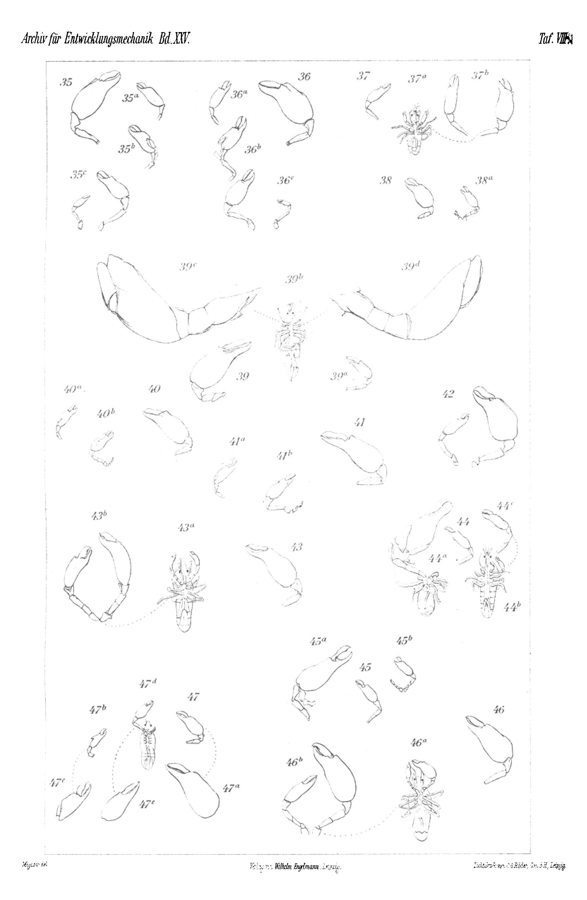

# The Regeneration of the Coleoptera.

By

**Dr. Franz Megušar.**

(From the Biological Experimental Institute in Vienna.)

With Plates V–VIII.

Received on 31 August 1907.

*Archiv für Entwicklungsmechanik der Organismen*, vol. 25 (1907).

> **Full translation.** A complete English rendering of Megušar's study of the regeneration of the Coleoptera (beetles), with the tables and figure legends.

## Outline.

|  | Page |
|---|---|
| **I. Purpose of the experiments** | 150 |
| **II. Description of the experiments** | 153 |
| 1. *Rhagium indagator* | 153 |
| &nbsp;&nbsp;a. Mandible regeneration | 156 |
| &nbsp;&nbsp;&nbsp;&nbsp;α. Near the base | 156 |
| &nbsp;&nbsp;&nbsp;&nbsp;β. Amputation of a small piece of the mandible | 156 |
| &nbsp;&nbsp;b. Leg regeneration | 157 |
| &nbsp;&nbsp;&nbsp;&nbsp;α. Right and left foreleg | 159 |
| &nbsp;&nbsp;&nbsp;&nbsp;β. Right hindleg | 160 |
| &nbsp;&nbsp;&nbsp;&nbsp;γ. Amputation of all the right legs | 161 |
| 2. *Tenebrio molitor* | 161 |
| &nbsp;&nbsp;a. Last segment | 161 |
| &nbsp;&nbsp;&nbsp;&nbsp;α. Regeneration experiment on the last segment | 161 |
| &nbsp;&nbsp;&nbsp;&nbsp;β. A case of the transfer of larval bodily defects to the beetle | 165 |
| &nbsp;&nbsp;b. Leg regeneration | 166 |
| &nbsp;&nbsp;&nbsp;&nbsp;α. Extirpation | 166 |
| &nbsp;&nbsp;&nbsp;&nbsp;&nbsp;&nbsp;\* Older larvae | 166 |
| &nbsp;&nbsp;&nbsp;&nbsp;&nbsp;&nbsp;\*\* Younger larvae | 169 |
| &nbsp;&nbsp;&nbsp;&nbsp;β. Amputation near the base | 170 |
| &nbsp;&nbsp;&nbsp;&nbsp;γ. Amputation near the base and extirpation on one and the same individual | 171 |
| &nbsp;&nbsp;c. Wing regeneration | 172 |
| 3. *Lampyris noctiluca* | 176 |
| &nbsp;&nbsp;Last two segments | 176 |
| 4. *Platycerus caraboides* | 177 |
| &nbsp;&nbsp;Leg regeneration | 177 |
| 5. *Oryctes nasicornis* | 179 |
| &nbsp;&nbsp;Leg regeneration after extirpation and amputation | 179 |
| &nbsp;&nbsp;&nbsp;&nbsp;α. Older larvae | 179 |
| &nbsp;&nbsp;&nbsp;&nbsp;&nbsp;&nbsp;\* Extirpation of the right and left middle leg | 179 |
| &nbsp;&nbsp;&nbsp;&nbsp;&nbsp;&nbsp;\*\* Amputation of the left middle leg and left hindleg | 180 |
|  | Page |
|---|---|
| &nbsp;&nbsp;&nbsp;&nbsp;β. Younger larvae | 181 |
| &nbsp;&nbsp;&nbsp;&nbsp;&nbsp;&nbsp;\* Amputation of the tibia and tarsus of the left foreleg | 182 |
| &nbsp;&nbsp;&nbsp;&nbsp;&nbsp;&nbsp;\*\* Amputation of the left foreleg directly at the body skin | 182 |
| &nbsp;&nbsp;&nbsp;&nbsp;&nbsp;&nbsp;\*\*\* Amputation of the left middle leg directly at the body skin | 183 |
| &nbsp;&nbsp;&nbsp;&nbsp;&nbsp;&nbsp;\*\*\*\* Amputation of the tibia and tarsus of the left hindleg | 183 |
| 6. *Cetonia aurata* | 185 |
| &nbsp;&nbsp;Leg regeneration on older larvae | 185 |
| 7. *Hydrocharis caraboides* | 186 |
| &nbsp;&nbsp;a. Mandible regeneration | 186 |
| &nbsp;&nbsp;&nbsp;&nbsp;α. Amputation at the base of the right mandible | 187 |
| &nbsp;&nbsp;&nbsp;&nbsp;β. Amputation of the mandible between its two inner processes | 188 |
| &nbsp;&nbsp;b. Leg regeneration | 189 |
| &nbsp;&nbsp;&nbsp;&nbsp;α. Operation on just-hatched larvae | 189 |
| &nbsp;&nbsp;&nbsp;&nbsp;β. Operation on older larvae | 189 |
| &nbsp;&nbsp;&nbsp;&nbsp;&nbsp;&nbsp;\* Amputation of the right foreleg | 190 |
| &nbsp;&nbsp;&nbsp;&nbsp;&nbsp;&nbsp;\*\* Amputation of the right middle leg | 191 |
| &nbsp;&nbsp;&nbsp;&nbsp;&nbsp;&nbsp;\*\*\* Amputation of the right hindleg | 191 |
| 8. *Hydrophilus aterrimus* | 192 |
| &nbsp;&nbsp;a. Mandible regeneration | 192 |
| &nbsp;&nbsp;b. Leg regeneration | 194 |
| 9. *Hydrophilus piceus* | 195 |
| &nbsp;&nbsp;a. Mandible regeneration | 195 |
| &nbsp;&nbsp;&nbsp;&nbsp;α. Older larvae | 195 |
| &nbsp;&nbsp;&nbsp;&nbsp;β. Quite young larvae | 196 |
| &nbsp;&nbsp;&nbsp;&nbsp;&nbsp;&nbsp;\* Amputation of the whole mandible | 196 |
| &nbsp;&nbsp;&nbsp;&nbsp;&nbsp;&nbsp;\*\* Amputation through the first third of the mandible | 196 |
| &nbsp;&nbsp;b. Leg regeneration | 197 |
| &nbsp;&nbsp;&nbsp;&nbsp;α. Larvae a longer time after the second moult | 197 |
| &nbsp;&nbsp;&nbsp;&nbsp;&nbsp;&nbsp;\* Foreleg | 197 |
| &nbsp;&nbsp;&nbsp;&nbsp;&nbsp;&nbsp;\*\* Hindleg | 199 |
| &nbsp;&nbsp;&nbsp;&nbsp;β. Larvae shortly after the second moult | 200 |
| &nbsp;&nbsp;&nbsp;&nbsp;γ. Larvae after the first moult | 201 |
| &nbsp;&nbsp;&nbsp;&nbsp;δ. Freshly hatched larvae | 202 |
| &nbsp;&nbsp;&nbsp;&nbsp;&nbsp;&nbsp;\* Experiment with complete withdrawal of water | 204 |
| &nbsp;&nbsp;&nbsp;&nbsp;&nbsp;&nbsp;\*\* Experiment with temporary withdrawal of water | 206 |
| &nbsp;&nbsp;&nbsp;&nbsp;&nbsp;&nbsp;\*\*\* Experiment under high temperature and otherwise also very favourable conditions of life | 208 |
| &nbsp;&nbsp;&nbsp;&nbsp;&nbsp;&nbsp;\*\*\*\* Experiment under fluctuating temperature conditions (in the open) | 212 |
| 10. *Cybister Roeseli* | 218 |
| &nbsp;&nbsp;Leg regeneration with particular regard to the secondary sexual character of the ♂ at the foreleg | 218 |
| 11. *Dytiscus marginalis* | 220 |
| &nbsp;&nbsp;Leg regeneration with particular regard to the secondary sexual character of the ♂ | 220 |
|  | Page |
|---|---|
| **III. Theoretical remarks** | 222 |
| **IV. Overview of the findings, arranged by body parts (at the same time General Summary)** | 225 |
| &nbsp;&nbsp;a. Regeneration of trunk parts | 225 |
| &nbsp;&nbsp;b. Regeneration of wings | 226 |
| &nbsp;&nbsp;c. Regeneration of mandibles | 227 |
| &nbsp;&nbsp;d. Regeneration of legs | 227 |
| &nbsp;&nbsp;&nbsp;&nbsp;α. On the larva itself | 227 |
| &nbsp;&nbsp;&nbsp;&nbsp;β. Regeneration of amputated larval legs in pupa and full beetle | 228 |
| **V. List of literature** | 229 |
| **VI. Explanation of the figures** | 230 |

## I. Purpose of the experiments.

So manifold as is, in the beetles, in view of their wonderful capacity for adaptation — by virtue of which they have, as it were, conquered the whole surface of the earth — the specialization of the body and especially of its external appendages that has been attained, they have nonetheless been little investigated experimentally and hence have also been little drawn upon for the solution of the most important biological problems. The biological significance of the individual organs, the running-off of the life-processes and their determining and modifying causes, one studied for not long enough either on impaled, decaying specimens or on specimens preserved in spirits, without letting these "life-machines" themselves go [live], and without proceeding, on the basis of results obtained on the living animal through planned experiments, to the solution of those questions. Regeneration and its accompanying phenomena have been tested only on a few representatives and mostly only on one and the same organ. The oldest observations in this regard originate from Hope (1846), who observed in *Colymbetes* the repair of perforated wings. He is followed by Gadeau de Kerville (1890): he set up regeneration experiments on the larval legs of *Coccinella septempunctata*, *Galeruca tanaceti*, *Tenebrio molitor* and *Diaperis boleti* and established their regeneration in the pupa and in the full beetle. Hereupon came the reports of Verhoeff (1896), who had perceived the healing of chitinous parts on the abdomen. In most recent time Tornier (1901) subjected the experimental results obtained by Gadeau de Kerville on *Tenebrio molitor* to a re-examination and at the same time investigated the regenerative capacity of the antennae after amputation had taken place, during — some years later (1905) Werber [investigated], on the same species, the antennae together with the eye, and most recently (1907) the forewings, after preceding extirpation, on the finished imago with respect to their regeneration-potencies.

There thus remained still various open questions, the answering of which I set myself as my task through the experiments conducted by me over several years.

In view of the multiplicity of the conditions of life of the beetles, which multiplicity called into being the most divergent and most complicated forms of external appendages, it was obvious to suppose that the regenerative capacity too, despite the genetic uniformity of the said insect order, would have to undergo a far-reaching modification. It now occurred to me first of all to investigate:

1) how one and the same organ behaves in different adaptations, e.g. the hindleg (swimming leg) and foreleg of the water- and swimming beetle — the latter being distinguished in the male by a secondary sexual character — the rudimentary legs of the stag beetle [*Bockkäfer*], the variously differentiated larval legs, in regard to their regenerative capacity.

The carrying-out of the experiments concerning the regeneration-process of the organs with secondary sexual differences I held to be valuable already for the reason that here a hypotypy [hypotypia], if such a one should appear in the regeneration-processes, would relatively most easily be to be expected.

The experiments on the rudimentary legs of the stag beetle seemed to me suited to establish in what relation biological significance and regenerative capacity stand to one another.

2) Further I wished to investigate how the regeneration on different developmental states and on the different degrees of the injury proceeds. These questions appeared to me of importance with regard to Kellogg's (1904) findings, which seemingly throw new light on the previous facts concerning the regeneration of insects with complete metamorphosis. The main matter for me was first to decide whether after an extirpation a regeneration can take place at all; for Kellogg recently asserted the body of the insects to be not in a position to replace again a wholly lost leg. At the same time this kind of operation could, so I thought, contribute to the solution of the question after the relation between possibility of loss and regeneration, and thereby examine the determinant-theory as to its tenability.

3) The question pressed itself upon me, what consequences the extirpation could have for the symmetry-relations of the beetle. The occasion for the setting-up of the experiments in this direction was given me by observations on the kitchen cockroach [*Stylopyga = Periplaneta orientalis*]. More deeply-penetrating operations on the legs (amputation near the body) had here the uncovering of a lawful relation between the development of leg and wing of the operated body-side and a symmetry-disturbance of the abdomen together with the wings as a consequence, whereby the latter always sank toward the side opposite to the operation.

The disturbance of the body-symmetry consists in the deflection of the longitudinal axis of the abdomen toward the operation-side. Besides this bending in the frontal plane, the standing and creeping beetle lets be recognized a sinking of the abdomen together with the wing-pairs in the vertical direction toward the opposite side. Since the mealworm beetle (*Tenebrio molitor*), as we shall see, behaves in this respect no differently than the kitchen cockroach — without the wings thereby having undergone a curling — the proof is moreover furnished that, contrary to Tornier's conjecture (1901), the hindleg as support of the wing is not indispensable for the wing's normal development.

4) Further I purposed to establish in what dependency the imago-legs stand to those of the larvae. Kellogg, namely, asserted in his cited work that the imago-legs develop themselves wholly independently of the larval legs and that one must, in the insects with complete metamorphosis, take into consideration the circumstance that the definitive extremities arise not through transformation of the larval legs, but from the so-called imaginal discs.

Defects artificially produced on young larvae would be of no detrimental effect for the imago-legs. Therefore regeneration-phenomena could be studied only on older larvae which stand near the pupation.

5) Finally it was of further interest to me how far the regeneration-power on insect-larvae can reach at all; for some years ago Brindley (1898) asserted that arthropods can restitute only abdominal appendages, but not trunk parts — which incorrect assertion was later refuted by the experiments of Godelmann (1901), who, after the cutting-off of a part of the last segment of the *Bacillus*-larva, observed the replacement of that formation. With regard to the regeneration of the whole last segment I set up corresponding experiments on mealworm-beetle larvae [*Mehlkäferlarven*], with regard to the two last segments on glow-worm-beetle larvae [*Leuchtkäferlarven*].

The suggestion to use precisely the latter as material was given me by the finding of luminous-organ-less specimens by means of Przibram, since one could surmise, as the cause of this variation, a preceding injury and a subsequent re-growing in hypotypical form.

To the Gentlemen Senior teacher Gottfried Lesković and Stud. Adolf Černy in Vienna, who in unselfish manner expended much trouble on the preparation of the photographic figures, do I here also express my warmest thanks.

## II. Description of the experiments.

### 1. *Rhagium indagator* L.

(Pl. V Fig. 1 to Fig. 6.)

This longhorn-beetle species [*Bockkäfer* species] awakened my interest insofar as it seemed to me suited to bring nearer the answering of the question — recently rolled out [posed] by Morgan (1898) and Przibram (1899) over their become-known [well-known] experimental results on crabs — after the relation of the loss-frequency and importance of the organ to its regenerative capacity.

The larva of *Rhagium* possesses, namely, in correspondence with its mining [burrowing] way of life, a strictly specialized, developed body-build. Its triangular head is flattened and bears uncommonly strong mandibles. The remaining body is somewhat more weakly dorso-ventrally flattened and very muscular. The legs by contrast have undergone a far-reaching reduction and present tiny stumps, scarcely distinguishable with the unarmed [naked] eye, which consist of a small number of segments. They are membranous, apart from a sparse bristling without pronounced chitin-covering. The claws are weakly developed and hard to distinguish from the bristles inserting beside them.

The locomotion is accomplished mainly by worm-like movements of the whole contractile skin-muscle-tube, under not-seldom recourse to the mandibles.

The experimental material originates from the surroundings of Aspang (Lower Austria), where I undertook collecting excursions thither from mid August 1905 and the beginning of February 1906.

On a sunny slope in the small clearing near Aspang, where in earlier years there still stood mighty fir and spruce trees and at present rotting trunks lie strewn about, the material found extraordinarily favourable [conditions] for its breeding-grounds in their decay which readily falls apart. From both seasons originated the different developmental states of the longhorn beetles, whereby indeed in winter I harvested beetles and pupae far more numerously than in summer, where I found present in fewer numbers only the larvae in different stages and in great quantities.

They are to be found most frequently between the bark and the splintwood, as well as in the bark itself of the still rather sappy fir-trunks, more rarely in relatively few [places] in the woody parts of the trunk itself. Throughout, in the formation of the winding passages of their existence, I found hard-sticking pieces of bark, at which one easily damages the leg of individual little animals.

In general I found my observations to agree with the statements of Ratzeburg (1837), Perris (1863) and others over the way of life and the dwelling-place of these larvae.

In order to get hold of them at all, I had mostly to cut through, by means of a thumb-thick, in addition with bark and splintwood very hard, bow-shape-bent iron piece, the bark itself to mealy fragments, whereby the freshly cut-off sappy bark-pieces fell apart. Owing to the soft chitin-covering of the larva, the little animals become readily diseased.

The bulk of the harvested material I accommodated provisionally for house-transport in tin boxes furnished with wire-grid sides, which I at once filled out with the mealy fragments and bark-pieces. For easier withdrawal I availed myself of wire pieces. In appropriately arranged pupal-cradles [pupal cells] the material then over-wintered here definitively in airy containers of the biological experimental institute. The wood was covered on the bottom some centimeters high with light moist wood-soil [woodland earth], the few larvae by contrast were laid against the bottom of the container and lightly covered with wood-soil. The bark-pieces stuck themselves in the mealy fragments, accordingly lengthwise in the mealy fragments, or I filled out the empty gaps with mealy fragments. Topmost lay great mosscushions, in order to prevent the rapid drying-out of the food-wood. Hereupon I set the captured animals, sorted by approximately equal size, into the breeding-arrangements equipped in the manner mentioned above. These were daily — mostly early in the morning — moistened, under lifting-up of the moss-cushions, with a small atomizer.

The larvae in general did not prove especially tough; for, despite an accommodation answering as far as possible to their natural conditions, a great percentage perished in the shortest time. The cause may lie, on the one hand, in the fluctuating moisture-conditions; for that constant moisture which a stock [tree] rooting in the earth offers to the larvae I could not let them enjoy through the arrangement mentioned; on the other hand, however, it may also be sought in the too-dense being-together of the larvae; for repeatedly I got to see larvae which exhibited injuries on the sides, which they dealt out to one another by means of their strong mandibles. A not-small number was attacked by the so-called Wasserkalb [water-calf] (*Gordius*) and brought to ruin. Larvae afflicted with this parasitic nematode kept themselves alive a longer time and showed outwardly no special diseased states; only their body was somewhat puffed out.

In passing I should here point to an interesting phenomenon in regard to the behaviour of the larvae toward moisture and dryness. A uniform middling moisture always suited them. The majority strove toward the moderately moist places of the container. They bore a sustained strong drought more easily than too great a moisture. The effect of these two factors was a very different one. Larvae which kept themselves in the depth of the container, where a stronger moisture prevailed, showed always a full appearance and a nearly milk-white coloration with the exception of the head; those few larvae by contrast, which inhabited the uppermost bark-layers, where, despite daily supplied moisture, the bark-pieces dried out completely in consequence of the hot sunbeams, showed after a longer time an exceptionally strongly flattened shape, a shortening of the body and a slightly yellowish tinge of the skin. I held this change originally to be a temporary one and brought it into connection with the moulting-states, at which time, namely, the larvae exhibited similar changes of shape. But since such states were maintained for months and the larvae [continued] to take nourishment...

 The larvae proved, in general, not especially tough; for despite accommodation corresponding as closely as possible to the natural conditions, a large percentage perished in the shortest time. The cause may lie, on the one hand, in the fluctuating moisture conditions; for that constant moisture which a stock rooted in the earth offers the larvae I could not bestow upon them through the arrangement mentioned; but on the other hand it may also be sought in the too-dense crowding-together of the larvae; for repeatedly I got to see larvae which showed injuries on the sides, which they had dealt to one another by means of their strong mandibles. A not inconsiderable number were attacked by the so-called water-calf (*Gordius*) [horsehair worm] and destroyed. Larvae afflicted with this parasitic nematode kept themselves alive for a longer time and outwardly showed no particular diseased conditions, only their body was somewhat bloated.

In passing I should like here to point to an interesting phenomenon with respect to the behaviour of the larvae toward moisture and dryness. A uniform middling moisture always agreed with them. The majority strove toward the moderately moist spots of the container. They bore a sustained strong drought more easily than too great a moisture. The action of these two factors was a very different one. Larvae which kept themselves in the depth of the container, where a stronger moisture prevailed, always showed a full appearance and an almost milk-white colouration with the exception of the head; those few larvae, on the contrary, which inhabited the uppermost bark-layers, where in spite of the daily supplied moisture the bark-pieces dried out completely as a result of the hot sun-rays, showed after a longer time an exceptionally strongly flattened shape, a shortening of the body, and a slightly yellowish tinge of the skin. I originally took this change to be a temporary one and brought it into connection with the moulting states, at which time, namely, the larvae showed similar changes of shape. But since such states were maintained for months on end, and the larvae took nourishment, which is not the case with such [larvae] engaged in moulting states; and since I had, furthermore, subsequently, through systematic experiments on *Hydrophilus piceus* and *Hydrocharis caraboides*, upon application of dryness and moisture, observed similar phenomena (about which I shall report more fully in a treatise on the biology of those beetles), I can ascribe the change of shape and colour that appeared only to the action of the dryness.

Since even unoperated larvae had proved especially frail, and the animals operated upon soon after the introduction of the material all perished, I had to give up the experiment for some time and await the opportunity until a greater number of suitable larvae had become accustomed to the new conditions of life.

## a. Mandible regeneration.

### α. Close to the base.

*(Experiment set up on 22. VI. 06.)*

For experimental purposes I chose ten medium-sized specimens. The operation was carried out with a small, white-heated [annealed] pair of scissors on the left mandible. From the wound emerged a rather large drop of almost colourless blood.

The operated animals were in general accorded the same conditions of life as the normal ones housed in the breeding installations. Only, in consideration of the acquisition of nourishment impeded by the operation, they were fed in such a way that into a cavity prepared by means of a knife in a thicker bark-piece — whither I had transferred them after the closure of the wound had taken place — pine-wood, finely comminuted in a mortar and almost daily fresh, was placed. The animals refused the intake of nourishment and within 2 weeks all died off, without having previously cast a moult.

### β. Amputation of a small piece of the mandible.

In order to come to know halfway the regeneration phenomena on the mandible, I resolved to undertake on them a less endangering operation, and removed on two larvae of medium size the end-tip of about ½ mm in length. The injury inflicted was bound up with a very slight loss of blood. The one specimen remained after the operation always outside the bark-pieces and perished after 23 days, [being] attacked by a nematode (*Gordius*); the other bored itself shortly afterwards into a larger bark-piece. After 58 days I found in the galleries of the bark-piece in question a moult, which seemed to me to be the second one cast off after the operation, since on the skin itself the operated mandible showed at its end a small rounding, which pointed to regenerative processes already gone forward. The first moult following the amputation, which would have had to show the scab at the operation site, was not found. The regenerating mandible had at this time grown forth but insignificantly (Pl. V Fig. 2). For the perfecting of the regenerate I kept the animal still further alive. On 11. X. 06 I found it, alas, already as a beetle, which possessed both mandibles formed out to the normal size. The larval skin stripped off at pupation I could not, despite much effort, find, so that there remained to me, as a clear proof for the fact of the regenerative capacity of the mandible, only the earlier-mentioned second moult, which I preserved. The loss I suffered as a consequence of the more rarely undertaken inspection, which, however, I postponed for longer intervals only because I had at my disposal but a single specimen of this operation-type and was constantly in danger of crushing the animals during the search. Now, in order to catch sight of one animal, I often had to break up several bark-pieces at random, since I could never know with certainty in which piece and at what point of it the animal was just then to be found. To set up a new experimental series was, alas, impossible for me, since I had already exhausted the available, acclimatized material for the regeneration experiments on the legs. Nor did I deem this absolutely necessary, since I had in any case convinced myself of the regenerative capacity of the mandible. Incidentally, I shall return to the regeneration phenomena of this organ in the beetles on the occasion of the discussion of the regeneration in the Hydrophilidae, where I succeeded in making more complete observations in this regard.

## b. Leg regeneration.

For this operation, larvae of various sizes were obtained. The intervention had to be undertaken with the aid of the magnifying lens, since the little legs, owing to their slight size and their colouration deviating little from the body, are only with difficulty to be distinguished with the naked eye. The amputation was in most cases carried out at the base. The loss of blood was, with younger animals, rather strong, with older ones somewhat weaker.

The inspection was, in consideration of the circumstances under which the larvae lived, exercised only at longer intervals, [and] the animals were housed isolated according to the type of operation. The individual specimens that had moulted after the operation were kept entirely isolated. The larvae engaged in moulting and the pupae already formed I set into the natural pupal chambers, several of which I had taken along on the occasion of the collecting. The splint-wall of the structure was replaced by a bark-wall, both parts bound together by means of twine, and mostly set up in the same position in which the pupal chamber occurs in nature (Pl. V Fig. 1).

The experimental animals were kept in mutually similar, suitable containers and enjoyed the same care as the animals of the parent culture. Only exceptionally were a few animals left, even after the operation performed on them, in a cigar-box into which they had been placed at the collecting, since this evidently suited them very well. This primitive container contained at the bottom pine-wood meal and was filled up to the rim alternately with small and larger bark-pieces; the gaps arising between the bark-pieces were filled out with wood-meal. Here, although the occupation was rather strong with regard to the small space, a larger number kept themselves alive, and several made ready for pupation.

One larva, whose instinct for the construction of the structure customary in nature was especially powerful, fashioned its pupal cradle at the bottom of the mentioned box, in that it hollowed out the bark-piece lying above it, threw up the cavity all around with wood-meal, and took the fibrous splint from the bottom of the box for the fashioning of the oval wreath. In this way it brought about a structure which in principle equalled the pupal chamber to be found in nature. Other larvae ripe for pupation arranged their pupal cradles again in an entirely different manner. Some of them hollowed out at the end of a larval gallery a larger portion of the bark-wood and produced a flat, rather roomy cavity of oval form, without the exit-hole of the developed beetle characteristic of the normal structure — which in the normal pupal chamber runs in an oblique direction toward the outside and ends blindly before reaching the outer world — and without fashioning the cradle-wreath. Some larvae remained, once again, at pupation time outside the bark-pieces and awaited, lying free, the bursting of their skin.

Given the great adaptability of these larvae to changing conditions of life and their variations of instinct, it would be rewarding to raise the animals on through several generations, in order to see whether the offspring will produce their pupal chambers in similar fashion, and whether a heritability of the acquired characters will prove true, as Schröder (1903) already succeeded in establishing with various insects and Kammerer (1907 a) with various amphibians; however, it was at that time not possible for me, for several reasons, to continue the experiments in this direction. The beetles reared up did indeed copulate (Pl. V Fig. 1) and probably laid eggs, but the larvae that developed could not nourish themselves well, since the available wood dried out almost completely down to the inner portions, and I was at that time not in a position to provide the containers with fresh nutritive material from the all-too-distant find-spot of the larvae, and to make the necessary and time-consuming arrangements for the mentioned experiment. I had at the same time set up several other experiments with the beetles, which might have suffered essentially through those measures.

### α. Right and left foreleg.

The regeneration experiment I initiated on 20. VI. 06 with the removal of the right foreleg. I used for this 20 larvae of various sizes and cut off the leg in question rather close to the point of origin.

On 22. VII. 06 I obtained from the experimental container a larva which had already passed through a moult since the operation. It possesses, in place of the operated leg, a small, delicate stump-leg with a sparse bristling.

On 2. IX. 06 there developed from it the pupa. This brought forth both forelegs apparently in normal formation. On closer macroscopic examination, however, it turned out that the pupal leg corresponding to the operated larval leg lacks the arcuately running bristle-set that normally appears at the anterior end of the femur (Pl. V Fig. 4).

On 17. IX. 06 the pupa developed into the beetle, which no longer permitted a noticeable difference between the two extremities to be recognized. The beetle was preserved on 25. IX. 06 On 3. VIII. 06 I came again, at the inspection, upon a larva which possessed the left foreleg as a regenerate (Pl. V Fig. 3). The regrown little leg was rather large and showed a strong resemblance to the normal leg of the opposite side, only it bears more delicate, shorter and less numerous bristles. The larva was preserved at this time on account of the stage.

The last specimen of this operation-type to remain alive I encountered on 3. IX. 06, on the occasion of a thorough examination of the parent-experiment container, already as a pupa, whose regenerate agreed in essentials with that of the earlier-mentioned pupa. I preserved it, since up to this time I did not yet possess such a stage. The remaining animals of this operation-type gradually perished, without having completed a moult, hence also without showing a regenerate.

On 9. VIII. 06 I found, on the occasion of the clearing-out of the breeding containers with normal larvae, three larvae of middling size. On two specimens I amputated the left foreleg, but on the third, three legs of the right side of the body, of which latter experiment the account will be given later. Of the two operated larvae from which I removed the left foreleg, I encountered one on 2. X. 06 with the miniature little leg at the operated spot. The little leg showed a similar appearance to the larval regenerates hitherto described. The second operated larva I never found again.

### β. Right hindleg.

For this operation-type I likewise used 20 larvae of various sizes.

On 5. IX. 06 I found a pupa whose hindlegs were of equal size. The difference between the two came to light only in the bristling of the end-part of the femur on the normal leg. The bristle-set is here too lacking on the right hindleg. The pupa was preserved after a few days (Pl. V Fig. 5).

A second pupa I obtained on 7. IX. 06. It showed the same distinguishing marks on the hindlegs as the previous one. On 21. IX. 06 there came out of this pupa the beetle, whose hindlegs let no noticeable difference between one another be recognized. A regenerate of the right hindleg on the larva I could not obtain in this experiment, since the other experimental animals, without moulting after the operation, gradually perished.

### γ. Amputation of all the right legs.

On 9. VIII. 06 I operated upon that one of the three larvae found by chance in the parent-breeding container, of which I have already made mention under *a*, [removing] all three legs of the right side of the body. The experiment was to show whether a difference exists between the individual legs with respect to their regenerative power.

On 11. X. 06 the larva possessed regenerates on the right middle leg and the right hindleg (Pl. V Fig. 6), while the spot from which the foreleg should have risen was entirely levelled. The middle leg is conical, somewhat constricted at the anterior end. The distal, set-off part is spherical and bears about three to four little brushes. The remaining little leg, however, is entirely naked. The hindleg is, in comparison with the regenerated middle leg, considerably smaller and lets no bristling be recognized.

Through the experiment I could establish no more than the regeneration of the middle leg and the hindleg, since it turned out subsequently, on a more exact examination of the cast-off larval skin, that at the operation I had not removed all the legs at the same height, but more of the one leg, less of the other, so that in the assessment of these various sizes of the regenerates present, different degrees of the regenerative capacity cannot be made responsible.

### Summary of the results concerning Rhagium.

1) In younger *Rhagium* larvae, parts of the mandible are replaced, in reduced size, already on the larvae themselves. If such larvae moult several more times after the operation, the mandible regenerates completely.

2) Legs of younger larvae also replace themselves already in the larval stage; those, initially proportioned miniature formations, attain normal size in the imago.

3) The growth of the legs is more rapid than that of the mandibles.

## 2. Tenebrio molitor L.

*(Pl. V and VI Fig. 7 to Fig. 18.)*

### a. Regeneration of the last segment.

### α. Regeneration experiment on the last segment.

A replacement of segments has hitherto been observed in insects only by Godelmann (1901) in the stick-insect (*Bacillus Rossii*). He cut off, on 40 young larvae, a part of the last segment together with the cerci. The regenerate appeared in relatively short time (within 8 days) after a preceding moult, and showed after its appearance an exceedingly rapid growth. In place of the amputated part there arose, as is evident from Godelmann's figures, two distinctly set-off body-rings (an express mention of this is not present in the text). The unexpected death of the animal made the further examination of the interesting formation impossible.

In my experiments I used at first, for the most part, medium-sized mealworm-beetle larvae, of about 15 mm length, which I took from the breeding-boxes that are laid out in the Biological Experimental Station expressly for the raising of larger quantities of mealworms.

---

**Translator's notes (not part of the source body text):**

- The running header on source p.158 is misprinted as "Paul Megušar" (the author is Franz Megušar); the headers on the surrounding even pages (156, 160) read correctly "Franz Megušar". Running headers are not part of the body text and are not reproduced inline.
- Figure references occur inline only (Pl. V Fig. 1–6; Pl. V Fig. 4; Pl. V and VI Fig. 7 to Fig. 18). No standalone figure captions/legends and no footnotes appear within the body text of source pages 155–162.

**Source file paths (authoritative images):**
- /Users/eranhorowitz/Documents/Claude/Projects/BVA/translations_full/_work/img/49_Megusar_1907_Coleoptera-regeneration/p008.png (p.155)
- /Users/eranhorowitz/Documents/Claude/Projects/BVA/translations_full/_work/img/49_Megusar_1907_Coleoptera-regeneration/p009.png (p.156)
- /Users/eranhorowitz/Documents/Claude/Projects/BVA/translations_full/_work/img/49_Megusar_1907_Coleoptera-regeneration/p010.png (p.157)
- /Users/eranhorowitz/Documents/Claude/Projects/BVA/translations_full/_work/img/49_Megusar_1907_Coleoptera-regeneration/p011.png (p.158)
- /Users/eranhorowitz/Documents/Claude/Projects/BVA/translations_full/_work/img/49_Megusar_1907_Coleoptera-regeneration/p012.png (p.159)
- /Users/eranhorowitz/Documents/Claude/Projects/BVA/translations_full/_work/img/49_Megusar_1907_Coleoptera-regeneration/p013.png (p.160)
- /Users/eranhorowitz/Documents/Claude/Projects/BVA/translations_full/_work/img/49_Megusar_1907_Coleoptera-regeneration/p014.png (p.161)
- /Users/eranhorowitz/Documents/Claude/Projects/BVA/translations_full/_work/img/49_Megusar_1907_Coleoptera-regeneration/p015.png (p.162, continuation)

In my experiments I at first used for the most part medium-sized mealworm-beetle larvae, of about 15 mm in length, which I took from the breeding boxes that have been laid out in the Biological Experimental Station specially for the rearing of larger quantities of mealworms. As easy as the execution of the operation appears at first glance, it is just as difficult to keep the animals alive after so severe an injury. Before I attained the desired success, two series of experiments were required.

### First series of experiments

I carried out the operation on 32 specimens by means of a sharply ground little pair of scissors, previously sterilized in the spirit flame. In the left hand I held the animal firmly by the forepart of the body and waited for the moment until it kept perfectly still, for violent movements always cause a great loss of body substance and bring on its speedy death. Then I cut through, as quickly as possible, the connecting little skin [membrane] at the boundary of the last and the next-to-last segment.

Immediately after the operation the animals remained motionless; after a couple of seconds, however, they crawled restlessly to and fro, which unfortunately greatly promoted the escape of blood and tissue. After a few minutes they came to rest again. In order to protect them against infection, I placed them all, immediately after the operation, into a clean glass vessel until the bleeding had subsided somewhat, which took about 2 hours. Thereupon I transferred them into a small four-cornered mealworm box made of wood, which possesses a little organdy window set into the closing lid. The bottom was covered to a height of a few centimeters with fresh bran, which, together with little pieces of bread thrown in from time to time, served as food. The check [inspection] was carried out daily.

One day after the operation most of the larvae showed a large, black wound scab, betrayed great languor, and — except for a few specimens that retained the original plump appearance — assumed a flattened-down shape. Food only the larvae that had remained plump took up, but they discharged the excrement under apparently great difficulties. These [excrements] were deposited at the tip of the body through the newly formed anal opening and often remained hanging on the body for days. Almost daily a greater number of larvae died off. The cause of death was either the all too great loss of blood and tissue, or the impossibility of moulting. Soon after the operation many fell into a state of rest, which showed a great similarity to the rigor preceding a moult and is probably also identical with it, since indeed through operations the next moult usually sets in accelerated. Longest of all there kept alive one specimen, which, however, later died of moulting distress.

The first series of experiments had as yet yielded no clear result, but had at least demonstrated the one [thing], that some specimens are able to withstand the operation.

### Second series of experiments

After the failure of the previous experiment I renewed it a short time afterward; on 6 March 1905 I set up a second series of experiments with 100 animals of similar stage, and in doing so applied an operative method that essentially counteracted the bleeding to death.

In the middle of the body I exerted a slight pressure, so that the often strongly drawn-in last segment stepped forth more distinctly; I placed a previously prepared thread-loop between the last and the next-to-last segment and quickly drew [it] together. The next day I severed the last segment at the constriction site by means of a glowed-out [annealed] pair of scissors. This method was attended with success, although here too the mortality was an enormous one.

Soon after the operation several larvae took on the moulting state, but only few succeeded in stripping off the skin successfully. Most died in this state. On 28 March 1905 I was able to find, in two specimens, the first moults following the operation in the general experimental container. The two moulted larvae belonged to the smallest [ones] that I had operated on. They were easily to be distinguished from the others by the light coloration. Of a regenerate not a trace was as yet to be noticed. During the moult, which apparently proceeded under great exertions, a new wounding had occurred through detachment of the old wound scab. Out of the wound there emerged some small drops of blood, but it healed up again within a day with the formation of a thin wound scab (Plate V Fig. 7). One specimen of this I conserved; the other I kept alive. After the next moult, which took place on 15 May 1905, there came into view a white structure about 1½ mm long, on which, immediately after the stripping-off of the skin, no distinct articulation could be perceived. After about 3 days I was able to notice on the same a segmentation into three sections. It thus appears that in the regenerate a multiplication of the abdominal rings has taken place. Of the apparently newly appeared segments, the third-from-last — which, on account of the two small tubercle-anlagen, may correspond to the last segment of the normal larva — is the least developed. The last segment bears small, backward-directed pincer-pushers [Fortschieber] (in the normal larva they are situated ventrally), and the anal opening situated between these latter is placed terminally, whereas in the normal larva it lies ventrally (Plate V Fig. 8). The hairiness of the regenerate is finer and lighter than that of the normal larva. The larva here in question was, on account of the small number of surviving experimental animals, conserved at once.

On 30 March 1905 I encountered a further moult, which, however, originated from a fairly fully grown specimen. The accompanying phenomena were the same as in the previously mentioned larvae. On 25 May 1905 the animal again fell into the moulting state and successfully rid itself of the old skin in 2 days. The light regenerate, which appeared after this moult, was essentially different from the one I described on the small larva. The abdominal end showed only one segment, which resembled the severed [one] in many respects, but deviated in another respect. The small backward-bent normal caudal horns have appeared in the form of still smaller, widely apart standing tubercles. The anal opening and the pincer-pushers [Fortschieber], which here are reduced to two small stumps, assume, instead of the normal ventral, a terminal position. Some days afterward the regenerate took on the brown coloration of the rest of the larval body. The animal was likewise conserved (Plate V Fig. 9).

### Control experiment

Of the five control animals, which stood beside the operated ones and equaled them in size, all moulted between 29 March 1905 and 1 April 1905 after the setting-up of the experiment for the first time. The next moult took place between 25 April 1905 and 27 April 1905.

If one compares the moulting dates of the operated animals with those of the normal [ones], it turns out that the first moult following the operation is accelerated, whereas the later [one] undergoes a delay.

### Summary of the results on segment regeneration in *Tenebrio*.

1) The last abdominal segment of the mealworm-beetle larva, together with its appendages, is capable of regeneration, and indeed the more strongly so the younger the larva is.

2) In regeneration a multiplication of the segments can apparently take place.

3) In this case, as also there where no segmentation occurs, a displacement of the anus and of the pincer-pushers [Fortschieber] to the body-end takes place, whereas in normal larvae they lie on the ventral side. Anus and pincer-pushers thus assume in the regenerate a terminal position, primarily still prevailing among the lower insects.

### β. A case of the transference of larval body-defects onto the beetle.

About 3 years ago I found, on the occasion of the search for mealworm-beetle larvae, one specimen among them that showed an interesting **malformation** on the abdomen, which had probably been brought about by an injury (Plate V Fig. 10). Of the first five abdominal segments all were arranged completely normal, parallel one behind the other; the sixth and seventh segments, by contrast, showed the following arrangement: the sixth segment runs obliquely across the body from the fifth to the eighth segment; the seventh segment is divided into two triangular sections, of which each embraces the body laterally and touches the sixth segment with its tip. There is, as it were, a crossing of the segments under an oblique angle present. The eighth and ninth segments are again developed in the normal manner [normrecht]. The larva was, when I found it, still fairly young and underwent before its development into the imago four more moults (three larval and one pupal moult). The defect remained unaltered at all the larval moults and passed over onto the body of the imago (Fig. 11).

Here too the irregular formation of the segments is likewise restricted to the last segments of the abdomen. The terminal section of the abdomen is turned in the direction from right to left. From the sixth abdominal segment inclusive onward, that irregularity in the placement of the last segments also appears in the imago. Of the sixth segment only a remnant on the right body-side is present. The left part of the sixth segment and the whole seventh segment are folded over one another and strongly displaced toward the left.

## b. Regeneration of the legs.

TORNIER (1901), who studied the regeneration of the legs in the mealworm beetle more thoroughly, operated on larvae of differing age (9–78 days before pupation) and found the following:

1) Larvae "only a few days before pupation" show, after the transformation into pupa and beetle, no regeneration.

2) Larvae "a long time before pupation" already furnish regenerates on the larva. Pupae and beetles proceeding from such larvae possess, if they stood at least 45 days before pupation, "normally large" [normrecht große] regenerates.

3) Larvae "a longer time before pupation," which, however, at the time of the transformation into the pupa are afflicted with a wound scab, yielded regenerates whose size decreases proportionally with the increasing age of the larvae.

Alongside these statements of TORNIER's I place a detailed description of my experimental results.

### α. Extirpation of the legs.

#### \* Older larvae.

The experiment was undertaken on 18 March 1905 with twelve larvae that stood near pupation. All had already fallen into the moulting state, which one can easily recognize by the following accompanying phenomena. Such larvae lay themselves easily, bent in a bow-shape, onto one side of the body. Their legs are stretched somewhat forward and, according to the degree of differentiation of the pupal organs, more or less mobile. From such larvae the right or left foreleg, together with the surrounding body skin, was extirpated with a sterilized pair of scissors. The operation caused an enormous blood loss, which in some specimens was essentially promoted by rhythmic contractions. Most threw themselves restlessly to and fro after the operation, but after a short time came to lie at one and the same spot; three animals, on the other hand, began to crawl about and took up larval life anew (partial **neoteny**), which remarkable occurrence I had occasion to observe repeatedly in my regeneration experiments with beetles at these stages. It is not improbable that here — as I was able to establish experimentally on the fully grown larvae of another species (*Hydrophilus piceus*) — the excessive blood loss has called forth a considerable delay of the development. The next day I separated the larvae, awakened from the pupal sleep by the injury, from the resting [ones].

All operated animals I housed in small tin cages provided with bran, which on all sides except the bottom possessed finely latticed walls. The experimental cages stood in a room of about 17° C.

Up to 30 July 1905 those that continued resting perished under gradual blackening. From the larvae that had become active after the operation I obtained on 14 April 1905 two pupae, and 3 days afterward a third, of which the two first show no new formations at the operated site, but the third bears the right foreleg as a miniature little leg. On 5 May 1905 I obtained from the two first-developed pupae imagines that bear, in place of the left leg operated on at the larva, an about 1½ mm long, white stump, which apparently falls into three parts. Longest is the section springing from the body. It is round, somewhat tapered distalward, and bears in the anterior part on the sides some quite small little tubercles. By its whole appearance it may correspond to the femur. To this are articulated two inconspicuous and less distinctly demarcated structures, of which the first, bordering on the supposed femur, possesses laterally in front a small outgrowth, which lets one surmise the section of the regenerate in question to be the anlage of the tibia. The last section of the regenerate is likewise exceedingly short and lets two tubercles standing side by side be recognized, which probably represent the laid-down [angelegt] claws. The opposite normal leg possesses the following dimensions: femur 2½ mm, tibia 2 mm, tarsus 1½ mm (Plate V Fig. 12a).

A particular attention the course of the coloration process at the regenerate claimed [for itself], and for this reason I kept the two animals alive a few weeks more. As I have convinced myself on various beetle species, the coloration process does not proceed at the same time at all organs, but rather some organs color earlier, the others later. Also the individual organs are not subject in their whole extent simultaneously to the coloration, but rather the same advances in a quite definite, lawful manner. The coloration of the extremities is already initiated at the pupa, and indeed it proceeds centripetally, in that it always begins with the coloring of the last tarsal joint and advances toward the base of the leg.

The regenerates here in question retained, notwithstanding that the remaining organs of the beetle had during the mentioned period received their pigment specific to the species — with the exception of one specimen, which up to this time kept the left wing-cover light — still a lighter coloration (Plate V Fig. 12b). In general they showed a yellowish tone, only the distal end with the two claw-anlagen already betrays a brownish tinge.

Accordingly, if the animals had lived longer, the coloration process would certainly also have run on further in that lawful manner in which it is wont to proceed at the legs in normal animals, and thus there would lie before [us] a copying of the postembryonic developmental states.

The third pupa, which I still possessed of the same kind of operation, transformed itself on 9 May 1905 into the beetle. This [beetle] bears at the operated site an exceedingly delicate, brownish-tinted little leg with distinct articulation of an insect leg (Plate V Fig. 13a, c). Only the tarsus is, in comparison with the normal one, very deviating in respect of the number of the joints and the formation of the same. The regenerated tarsus possesses three joints, of which, however, only the terminal joint is well developed, while the two preceding [ones] appear only as anlagen of the joints. The claws are stretched almost straight, somewhat twisted at the anterior end, and run out by far not so pointed as in the normal tarsus. The normal tarsus of the foreleg counts five distinctly demarcated joints, of which the distal joint bears two long, hook-shaped bent and pointed claws (Plate V Fig. 13b). After 14 days the whole regenerate, except for the two first tarsal joints, which remained light, took on the same color-tone as the rest of the legs of the animal. The coloration took place in a quite similar manner as in the normal leg. The dimensions of the regenerate and of the opposite leg are:

|  | Femur | Tibia | Tarsus |
|---|---|---|---|
| Normal leg | 2½ mm | 2 mm | 1½ mm |
| Regenerate | 1½ mm | 1 mm | ½ mm | On the three regenerates one can clearly recognize **that the formation of the tarsal segments proceeds in that same sequence as in the ontogenetic development**. Furthermore there is here present a strong **reduction of the tarsal segments**, a phenomenon which among the insects has hitherto been known only in the Orthoptera and Lepidoptera, whereas in the beetles [Käfer] the normal number of segments was always established. Such cases have rarely come my way, and only in animals in which I had carried out the extirpation, or [when] I operated on animals in more advanced stages.

### \*\* Younger larvae.

On 3 April 1907 I selected for myself out of the mealworm boxes ten younger larvae, which, judging by their size, were in a stage equal to one another, [and] which still moulted [häuteten] that very same day.

On five specimens I cut out the left hind leg [Hinterbein] all the way round from the larval body with a very fine pair of scissors, after first glowing the tips. The bleeding was uncommonly heavy, and there welled out of the wound an abundance of fatty tissue intermixed with tracheae. The animals thus operated upon I placed first into a clean glass vessel, where I left them for about an hour, until the formation of the wound scab took place. Thereupon I placed them into a small metal box and tended them just as was indicated on the occasion of the account of the segment regeneration.

The temperature during the experimental period [Versuchsstand] averaged 25° C.

After 10 days all but one piece were dead.

On 5 May 1907 the surviving larva moulted [häutete], yet nothing of regeneration was to be noted. The spot where formerly the little leg had inserted was completely levelled off.

On 19 May 1907 the larva transformed into a pupa [Puppe]. Now a small miniature little leg appeared.

On 31 May 1907 the metamorphosis into the beetle [Käfer] took place. It [the beetle] showed a strongly asymmetrical structure of the hind body [abdomen] (Pl. VI Fig. 14a). The whole abdomen together with the wings [Flügeln] is strongly lowered toward the right — that is, that side on which no operation had been carried out — and at first bent off toward the opposite side, but in the end-piece curved back again, concerning which already in the first section of this treatise it was spoken. The left wing [Flügel] is narrower, indistinctly veined and strongly thrown over toward the right side, so that a great part of the dorsal surface of the abdomen lies exposed. Most interesting, however, is a further phenomenon, namely the non-development [Unterbleiben der Ausbildung] of the left hind wing [Hinterflügel]. Only after some days did one notice, on careful inspection, that at the place of the hind wing a brownish formation, at first glance not unlike a small, stunted leg, which represents the little wing [Flügelchen] that has remained behind in growth, grows forth (Pl. VI Fig. 14b).

The same phenomenon I observed afterward also on another specimen, where I operated on several legs on one and the same animal.

The regenerate and the opposite normal leg show approximately the following dimensions:

|  | Femur | Tibia | Tarsus |
|---|---|---|---|
| Normal leg | 4 mm | 3 mm | 2½ mm |
| Regenerate | 3 - | 1 - | ½ - |

The tarsus of the regenerate has the normal number of segments (4 segments). The beetle [Käfer] was conserved on 3 VI 07.

### β. Amputation of the left hind leg [Hinterbein] near the base.

This type of operation I carried out on three specimens of the same stage as in the extirpation. The approximately simultaneous transformation shows how exactly the same stages were determined.

On 6 May 1907 the larva freed itself of the skin. An unarticulated regenerate appeared.

On 22 May 1907 the larva came to pupation and showed a miniature little leg [Miniaturbeinchen] (Pl. VI Fig. 15b). The dimensions of the leg are considerably greater than in the previously discussed case [in the extirpation].

On 29 May 1907 the pupa became the beetle [Käfer], which likewise exhibited the left hind leg [Hinterbein] as a small formation [Kleinbildung]. Its tarsus shows the normal number of segments. The size relations of the regenerated and the normal leg of the opposite side are:

|  | Femur | Tibia | Tarsus |
|---|---|---|---|
| Normal leg | 4 mm | 3 mm | 2½ mm |
| Regenerate | 3½ - | 2½ - | 1½ - | The wings [Flügel] were not essentially impaired by the operation. It is a weak lowering of the hind body [abdomen] together with the

[*The above is the continuation of the paragraph that began at the bottom of p.23; the wing-related portion runs over onto p.24. The first complete sentence as printed continues:*]

wings [Flügeln] toward the right (that is, once again toward the side opposite to the operation) to be noted.

### γ. Amputation and extirpation of the legs on one and the same specimen.

On 2 June 1907 I removed from ten larvae of the similar stage, as in the previous cases, three legs. On the left side of the body I amputated the mid leg [Mittelbein] and hind leg [Hinterbein] entirely at the body skin, on the right side I carried out the extirpation of the hind leg [Hinterbein].

Of the operated animals one piece remained alive; this on 20 June 1907 stripped off the first skin. On the right side of the body no regenerate was to be noted, the spot completely levelled off. On the left side, on the contrary, both amputated little legs appeared in the form of an unarticulated regeneration stump (Pl. VI Fig. 16a and b).

On 7 July 1907 the larva transformed into a pupa [Puppe]. On the left side both little legs are distinctly to be seen as proportional dwarf formations [Zwergbildungen]. On the right side the fore wing [Vorderflügel] is considerably longer, strongly nestled against the side of the body. There, where the distal half covers the ventral side [Bauchseite], a larval-skin residue [Larvenhautrückstand] is to be noted. After the removal of this larval-skin piece and the lifting of the fore wing I could establish the hind wing [Hinterflügel] as a delicate and strongly reduced little wing [Flügelchen]. At the place where the right hind leg [Hinterbein] was extirpated there grows forth an uncommonly delicate structure [Gebilde], about 1 mm long, which on account of its slight size does not permit a distinct articulation. The imaginal stage [Imaginalstadium] was unfortunately not attained [erzielt], since I had to conserve the pupa — on account of a wound infection which I had inflicted upon it by means of the forceps, occasionally on the loosening of the larval-skin residue, through a slight injury to the ventral side of the abdomen — still before the complete blackening-through [Ausschwärzen], which appearance the pupae are wont to assume after the infection before dying.

With respect to the dimensions, the regenerated and normal legs of the opposite side behave as follows:

|  | Tibia | Tarsus |
|---|---|---|
| Normal mid leg [Mittelbein] | 3 mm | 2½ mm |
| Regenerate | 2⅓ - | 1⅔ - |
| Regenerated left hind leg [Hinterbein] | 2½ - | 1⅔ - | Regenerated right hind leg [Hinterbein]: measurement of the leg parts impossible.

The re-replaced left mid leg [Mittelbein] and hind leg [Hinterbein] show the normal number of tarsal segments (5 on the mid leg, 4 on the hind leg).

### Summary of the results on leg regeneration in *Tenebrio*.

1) The extirpated leg, and [the leg] amputated near the base, is capable of regeneration.

2) The size of the regenerate depends not only on the age of the animal (Tornier), but also on the severity of the intervention (Pl. VI Fig. 15a and b).

3) On total loss of a hind leg [Hinterbein] there sets in a curvature [Verbiegung] of the abdomen toward the side of the injury and a lowering of the same toward the opposite side.

4) The complete removal of the leg and the regeneration process following thereupon have as a consequence a reduction of the wing [Flügel] of the operated body side (compensatory regulation).

5) An independence between the larval and the imago legs does not exist.

### c. Wing regeneration.

That in the wings [Flügeln] of insects too regulatory potencies repose is spoken for, partly by the multiple and double formations found in various orders of this animal class, partly however also by the investigations conducted in this direction.

Graber (1867) obtained, in the Orthoptera (*Decticus verrucivorus*), after the cutting out of a marginal portion of the wing rudiment [Flügelanlage] on the larva, a diminished wing [Flügel]. Whether this little wing [Flügelchen] however came into existence by a purely regenerative route or through a rearrangement of the existing cell material must be left undecided, since concerning the mode of its origin no further observations were made, and since both kinds of processes usually lead to the same end effect, to the formation of organs of equal worth.

The proceeding of purely regenerative processes on the wings [Flügeln] has been demonstrated by Hope (1846) in beetles [Käfern] (*Colymbetes*), where a filling-in of the bored-through holes took place.

Far more far-reaching findings have however in most recent times been made by Werber (1907) in *Tenebrio molitor* and Kammerer (1907 b) in *Musca domestica* and *Musca vomitoria*, in that in these animals not the regeneration of single pieces of the wings, but the new formation of whole wings [Flügeln], and what is of even more interest, was achieved [erzielt] in sexually mature animals without preceding (Kammerer) or after only partially occurring (Werber) moult [Häutung].

The regeneration ensued only upon extirpation, never upon amputation, the cause for which would be to be perceived in the rigid consistency and the relatively weak metabolism in the wings [Flügeln], which circumstances I also attempted to make responsible for the slow tempo of the regeneration process in the mandibles [Mandibeln] in beetles [Käfern].

Especially surprising acts the mode of formation of the new wings [Flügel] in *Musca*, where the regenerate gradually comes into being through a mechanical inflating of the little skin [Häutchen] formed beneath the wound scab and only later through a differentiation of the characteristic wing characters, which mode of formation has a great similarity with the ontogenetic origin of the normal insect wing [Insektenflügel]. Admittedly, in the identification of these two processes the circumstance acts somewhat disturbingly, that the little wing [Flügelchen] laid down as the initial stage of the regeneration takes part as a whole in the formation of the wing in the form of a club-shaped, inflated little sac [Säckchen], and not — as one would expect — [that] an outer envelope [Hülle] is present, as in the wings [Flügeln] laid down in the pupal stage, which envelope is only lost at the moult [Häutung].

Experiments on the regeneration potencies of the insect wing [Insektenflügel] I already set up a couple of years ago in *Hydrophilus*, in that I removed from the fairly grown larvae the corresponding parts from which the pupal wings [Puppenflügel] were later to arise; however, in consequence of the all-too-deep incision I could observe no regeneration, since the operated animals perished before the moult [Häutung]. Later I took up the experiments on *Tenebrio molitor* anew — although a regeneration of the insect wing [Insektenflügel] had subsequently become known to me, even on sexually mature insects, through the experimental results of Werber and Kammerer, and therefore a doubt of a regeneration of the wing [Flügel] no longer existed in my experimental procedure — which [experiments] had mainly to decide the question whether a reciprocal relation exists between the wings [Flügeln] and extremities, since I, as is to be seen from my preceding presentations on the regeneration of the legs after successful extirpation, established a regular reduction of the hind wing [Hinterflügels].

The first experiment I set up on 20 June 1907 with 20 fairly full-grown *Tenebrio* larvae of approximately the same stage. From these I removed, with the greatest possible prevention of infection, the lateral margins of the meso- and metathorax. Out of the gaping wound there issued a white, pulpy mass which consisted of blood and fatty tissue. On 23 June 1907 one specimen, which apparently had suffered the slightest injury, succeeded in stripping off the skin. At the spot of the wound scab a light-colored, elongated little skin [Häutchen] was to be seen. The remaining operated animals soon afterward succumbed either to the severe operation or to the moulting distress [Häutungsnot]. On 14 July 1907 the surviving animal moulted [häutete] again and yielded a pupa [Puppe] with a regenerate of the wing [Flügels] of the operated body side. The new formations grew about 1 mm shorter than the normal wings [Flügel] of the opposite side.

On 24 July 1907 the pupa [Puppe] developed into the beetle [Käfer], which likewise showed diminished wings [Flügel] of the right flank. The size differences are to be recognized directly at the bared spot of the dorsal side of the abdominal end.

The regenerate possesses in length about 10 mm, the normal counter-wing [Gegenflügel] about 11 mm (measurement of the elytra from the scutellum to the tip). In the breadth there is no really measurable difference present, yet the normal wing [Flügel] nevertheless appears to the eye broader by a trifle. The size ratio remained constant up to the development of the pupa [Puppe] into the beetle [Käfer] (Pl. VI Fig. 17).

The right hind leg [Hinterbein] has been impaired in its growth by the amputation of the wing rudiments [Flügelanlagen]. The diminution expresses itself especially on the tarsus.

Because I had obtained only a single voucher specimen, it impelled me to the setting up of a fresh experimental series, and I operated on 23 June 1907, by the same method, anew on 20 specimens of similar size.

In about 14 days all but three specimens died off. Of those remaining over, one piece laid aside the moult [Häutung] on 14 July 1907 and a pupa [Puppe] appeared. On the same day two more specimens moulted [häuteten], which however after the moult [Häutung] still presented themselves as larvae [Larven].

The now-obtained pupa [Puppe] shows, in contrast to the one obtained in the first experimental series, a still more far-reaching diminution of the wings [Flügel] on the operated flank (Pl. VI Fig. 18). The fore wing [Vorderflügel] is extraordinarily small and somewhat bent outward, [curved]. The extremities have here undergone a displacement. For whereas namely in normal pupae [Puppen] the fore and mid legs [Vorder- und Mittelbeine] rest upon the wings [Flügeln] and the hind leg [Hinterbein] is covered by the same, in this case the mid leg [Mittelbein] is pushed in under them, the hind leg [Hinterbein] however laid over the terminal tip of the hind wing [Hinterflügels].

The size ratios here are the following: regenerated wing [Flügel] 4 mm, normal fore wing [Vorderflügel] 6 mm.

The regenerate appears in the form typical for the beetle species [Käferart] concerned; a difference between the normal and regenerated wing [Flügel] lies solely in the size.

The hind leg [Hinterbein] of the corresponding body side has been strongly influenced in its size by the operation of the wing [Flügel]. It is, in comparison to that of the opposite side, considerably shorter. The dimensions of the two hind legs are the following:

|  | Tibia | Tarsus |
|---|---|---|
| Right hind leg [Hinterbein] | 2½ mm | 1½ mm |
| Left | 3 - | 2 - |

The size difference of the hind legs is, as also in the specimen with wing regeneration obtained in the first experimental series, as already mentioned, to be perceived, admittedly not in the [same] measure as in the present case, since here a much younger animal was presented to the experiment and the section of the lateral margins on the meso- and metathorax was a much weaker one.

The pupa [Puppe] was conserved on 25 July 1907, just before the development into the beetle [Käfer].

The two moulted larvae [Larven] regenerated the cut-off parts of the meso- and metathorax almost completely, so that at first glance it is difficult to distinguish on which body side the operation was carried out.

On 2 August 1907 one of these larvae became a pupa [Puppe], which on 17 August 1907 transformed into the beetle [Käfer]. The right fore wing [Vorderflügel] is about ⅔ mm shorter than the normal. Herewith there has also, through this experiment, besides the fact of the wing regeneration, the **reciprocal relation of the wings [Flügel] to the legs** been established, just as in one of the previous experiments. Here reduction of the leg in wing regeneration, there reduction of the wing [Flügels] in leg regeneration.

If one compares the experimental results of Werber and Kammerer after successful extirpation on sexually mature animals, then these set themselves to mine, both with respect to the origin of the re-

[End of owned pages 22–28. The next word "[re]generate" and the paragraph continuing "...as also with respect to the constitution of the end products..." carry over onto p.29 and are not owned by this chunk.] While there the substitution proceeds gradually, the regenerated wing in my experiments always appears all at once, and indeed only after the moult, in its shape typical for the species in question. Furthermore, in my regenerates any appreciable growth is absent from the moment of appearance, for an equalization of the size differences came about neither during the pupal stage nor during the imago's life; rather, the size ratio established at the pupa recurred in the beetle. As the end product of the regeneration process I obtained a proportionally diminished formation with arrested growth, whereas in the cited experiments of WERBER and KAMMERER the wings continue to grow, without being accompanied by moults, and apparently in most cases yield a malformed end product.

## 3. Lampyris noctiluca L.
### (Pl. VI Fig. 19.)
### Amputation of the last two segments.

On 29 VII 03 PRZIBRAM succeeded in catching, on the Semmering, a ♂ of *Lampyris noctiluca* and a larva of *Lampyris splendidula* without a light organ.

Since it did not seem impossible to me beforehand that the absence of the light organ in these two species was conditioned by a loss having taken place at early stages of development and a subsequent replacement of the last body rings with failure of the regeneration of the light organ, on 10 VI 06 I amputated from three larvae of *Lampyris noctiluca* the last two segments and waited to see whether these would regenerate the light organ along with them, or whether they would appear in an atavistic form without light capacity.

I kept the operated animals in a small breeding-jar [Einsiedeglas], the bottom of which was filled with earth into which a small cushion of grass was planted. Small shelled land snails served them as food. The average temperature during the experimental period was about 20–23° C.

Two larvae perished before the next moult. One larva moulted on 24 VI 06 and became a pupa. Even after the moult it was still afflicted with a small wound scab at the end of the abdomen, because, during the difficult stripping-off of the skin, at the spot which by this time had already healed up to some extent, a fresh small injury occurred. On 15 VII 06 the pupa developed into the beetle. To the operated abdominal end there had attached itself a new, somewhat shrivelled segment, which, like the preceding one, retained the light capacity (Pl. VI Fig. 19).

## 4. Platycerus caraboides L.
### (Plate VI Fig. 20.)
### Leg regeneration.

On the occasion of an excursion undertaken in the second half of April 1906 with a subvention from the Biological Experimental Institute into the cave regions of Carniola [Krain] (which excursion had as its purpose the reconnaissance of the most productive collecting sites and the testing of certain search methods, in order later to procure abundant material for the projected biological experiments), in the region of Steinbüchel, on the left bank of the Lipnica brook, I came upon a half-decayed poplar stump hanging out over the surface of the water, which yielded a rich booty of *Platycerus caraboides*, both in beetle and in larval form. I reached the animals by means of a heavy axe, with which I split off smaller and larger portions of the trunk, which had become almost as hard as stone. The beetles and large larvae I found mostly just beneath the bark, overwintering in the sapwood, in the elongated-oval pupal cradles, while the smaller larvae mostly gnawed at the middle portions of the stump, producing rounded, irregularly branched passages. It is worth mentioning that I found beetles of different colours, both blue- and green-metallically lustrous, in one and the same stump. I took with me a larger number of the freshly broken-off pieces of wood, but chiefly the pupal chambers found, in order to be able to transport the animals more easily.

First of all it was my concern to increase my knowledge of the life habits of these animals and to follow the course of the colouring process; I set up the regeneration experiment only afterwards, once I had been more or less satisfied in that respect.

Experimental setup on 9 VIII 06.

In the first place, the present experiment was concerned with what course the regeneration would take in advanced larvae upon removal of the leg near the trunk. For this purpose I operated on three larvae standing close before pupation, by cutting off from them the right hind leg in the first half of the femur. The blood loss was not a significant one.

I provided the animals with similar living conditions as were offered to the *Oryctes* larvae mentioned hereafter. They were housed in a larger, airy tin cage, the bottom of which was filled to a height of several centimetres with earth mixed with sawdust and the wood-flour [Holzmehl] of those food materials I had brought along for them. On the one hand the wood-flour was to serve the weak larvae as food, and on the other hand to maintain the necessary moisture in the cage. Onto this layer there came larger and smaller fresh poplar-wood pieces, and over these again moss, in order to prevent the drying-out of the wood.

Since the checking [Kontrolle] in the normal rearing experiments was each time bound up with considerable losses — inasmuch as I had to wrench apart the stone-hard wood with great force, whereby unfortunately many animals perished through crushing — I contented myself, in the regeneration experiment, on account of the small number of experimental animals, with carrying out that checking only at fairly long intervals.

On 2 IX 06, in the course of searching, I obtained a beetle in the pupal store [Puppenlager], which, however, had not yet assumed the definitive colouring; rather, the wings still appear quite white. The right hind leg presents itself, from the tibia onward, by reason of its small size and delicate constitution, as a pronounced regenerate (Pl. VI Fig. 20 a, b). The cut had indeed apparently been carried through the proximal section of the larval femur, but it is probable that nevertheless only the tibia was struck, because the leg, at the moment of the operation, may have already retracted itself far back out of the larval skin.

The size ratio of the regenerated and normal leg is as follows:

|  | Femur | Tibia | Tarsus |
|---|---|---|---|
| Normal hind leg | 3½ mm | 3 mm | 2 mm |
| Regenerate | 3⅓ - | 2½ - | 1½ - |

The number of the tarsal segments on the regenerate (5) is normal.

## 5. Oryctes nasicornis L.
### (Pl. VI and VII Fig. 21 to Fig. 28 b.)
### Leg regeneration after extirpation and amputation.

### α. Experiments with older larvae.

#### \* Extirpation of the right fore leg and the left middle leg.

On 7 VII 05 I operated on ten larvae; from five larvae I removed the right fore leg, from the remaining five the left middle leg, by cutting out the legs in question all around, together with the surrounding body skin, by means of a small sterilized scissors. The loss of body substance was a very great one. I kept the operated animals for one day in clean glass vessels and, after the formation of the wound scab, placed them — sorted according to the individual operation types — into larger, airy tin cages, which I had previously filled to the brim with earth, horse manure, and tan-bark [Gerberlohe]. The food materials were, when they had been transformed by the larvae into a mealy state, replaced by fresh ones. The experimental cages stood in a cool room. Daily the contents were superficially moistened with a small water-atomizer, so that a moderate moisture was always maintained. Of each operation type one piece survived and transformed after a few months into the pupa, which at the spots corresponding to the operation showed a diminished formation.

#### Description of the pupa with the regenerated right fore leg.

The larva I found on 27 VII 05 as a pupa, whose right fore leg was very small (Pl. VI Fig. 21). The tarsus of the regenerate showed a particularly deviant structure compared with that of the normal leg. It allows only two distinct sections to be distinguished, of which the proximal one was rather thick and short, while the distal one appeared somewhat thinner and longer. The terminal tip of the last section is strongly chitinized and probably represents the rudiment of the last tarsal segment. The size ratio of the regenerated and normal leg is as follows:

|  | Tibia | Tarsus |
|---|---|---|
| Regenerated leg | 4 mm + | 2 mm |
| Leg of the opposite side | 6 - | 4 - |

The pupa was preserved in this stage.

#### Pupa and beetle with regenerated left middle leg.

The operated larva that had remained alive I found on 4 VIII 05 in the pupal cradle. In the earth it had fashioned for itself a fairly large, oval hole, in which it lay curled up, almost motionless. On 9 VIII 05 it transformed into the pupa, whose left middle leg proved to be a pronounced regenerate. On 12 IX 05 it became the beetle (Pl. VI Fig. 22 a), whose regenerate had the following appearance: Tibia and tarsus are formed uncommonly small. The tibia shows the shape of that of the normal leg. The difference lies only in the lack of the hairing and the blunt formation of the distally directed processes. Most interesting, however, is the differentiation of the tarsus. This bears not, as is the case in the normal leg, five segments, but four, of which the distal segment (claw segment) appears the most fully differentiated. It is strongly chitinized, has attained that degree of colouring as the normal claw segment, and possesses all the characteristic components of such. The two following sections are recognizable as rudiments of the segments in question and lack the hairing. The first segment (basal segment) is again differentiated as such; it possesses all the marks that characterize a normal basal segment of the tarsus (Pl. VI Fig. 22 b).

The size ratio of the normal and regenerated leg is approximately as follows:

|  | Femur | Tibia | Tarsus |
|---|---|---|---|
| Regenerated leg | 5 mm | 2⅔ mm | 1⅔ mm |
| Normal leg | 8 - | 7 - | 8 - |

#### \*\* Amputation of the left middle leg approximately through the middle of the femur and of the left hind leg at the distal end of the femur.

At the very same time as I carried out the extirpation of the legs on those larvae, I amputated from ten larvae the left middle and left hind leg. The blood loss was here considerably slighter. The larvae were reared on further under the same conditions as those with the extirpated legs. Of the first operation type two, of the second one larva remained alive, and yielded regenerates at the pupa and imago of the following appearance.

#### Regenerates of the left middle leg.

Larva 1 transformed on 19 VII 05 into the pupa. The regenerated leg is, from the tibia onward, smaller and more delicate than the normal leg. The tarsus is five-segmented.

The dimensions of the regenerate and of the leg of the opposite side are approximately as follows:

|  | Tibia | Tarsus |
|---|---|---|
| Normal leg | 7 mm | 5½ mm |
| Regenerated leg | 6½ - | 4½ - |

The pupa was preserved on 19 VII 07.

Larva 2 became a pupa on 20 VII 05. The regenerated leg is here too, from the tibia onward, substantially too small and more slenderly built. The tarsus is five-segmented. On 6 VIII 05 the beetle appeared (Pl. VI Fig. 23).

The measurement of the two middle legs yielded:

|  | Femur | Tibia | Tarsus |
|---|---|---|---|
| Normal leg | 6½ mm | 5 mm | 6 mm |
| Regenerate | 6 - | 4½ - | 4½ - |

#### Regenerate of the left hind leg.

The operated larva became a pupa on 25 VII 05. The diminution of the regenerated leg extends chiefly to the five-segmented tarsus (Pl. VII Fig. 24).

The size ratio of the two hind legs is shown by:

|  | Tibia | Tarsus |
|---|---|---|
| Normal leg | 7 mm | 5⅔ mm |
| Regenerated leg | 6⅔ - | 4 - |

### β. Experiments with younger larvae.

At the beginning of June 1905 I found in the breeding containers for rhinoceros beetles several smaller larvae which, judging by their size, must have hatched a few days earlier from the eggs deposited there. At the end of August of the same year I collected for myself from the breeding installation in question several specimens and put them into the service of my regeneration experiments, in order to become acquainted with the course of the regeneration process on the larva itself as well. The mentioned larvae grew uncommonly rapidly from the first day of observation up to the day of the experimental setup, and reached by then a length of about 30 mm.

The amputation was carried out on various legs and various places of the same.

I tended the experimental animals in a similar manner as the older experimental larvae discussed earlier.

Experimental setup on 23 VIII 05:

#### \* Amputation of the tibia and tarsus of the left fore leg.

For this operation type I chose three larvae. On 17 VII 06 I found a larva which had already undergone a moult after the operation. At the end of the remaining stump there was to be seen a round, about 1⅓ mm long, strongly chitinized regeneration bud, which besides a few bristles at the base displayed no further differentiations. The femur of the operated leg has become only somewhat shorter than that of the opposite leg. The larva fell on 25 VI 07 into the moulting state, from which on 3 VII 07 it passed into the pupal stage. The pupal leg corresponding to the amputated larval leg had attained the size of the non-operated leg of the opposite side.

#### \*\* Amputation of the left fore leg immediately at the body skin.

The number of operated animals was four. On 16 VII 06 two were still alive, of which both bore regenerates, but of different size and deviant formation. The larva with the largest regenerate (Pl. VII Fig. 25 a) was preserved at once. It shows at the operated spot a formation about 2½ mm long sprouting out of the coxa, which appears divided into two sections. The basal segment, springing directly from the coxa, possesses a length of about 1½ mm and bears at the base long bristles, which, however, become ever shorter toward the distal end. From this segment there proceeds a strongly chitinized, rounded formation, which, apart from a few small, wrinkled elevations and a few irregularly scattered little bristles, has undergone no further differentiation. At the front end there seems to be present a larger such elevation, which would correspond to the rudiment of the terminal claw (Pl. VII Fig. 25 b). The normal leg (Pl. VII Fig. 25 b) of the opposite body side possesses a length of about 8⅓ mm, of which 3½ mm fall to the femur, 4⅔ mm to the tibia and tarsus.

The other larva at present still living shows a strongly differently formed regenerate (Pl. VII Fig. 26). Here from the operated spot there springs an about 1½ mm long stump, which likewise allows two distinct segments to be distinguished. Both are uncommonly strongly chitinized, yet the chitinization is somewhat stronger at the terminal segment. The latter is cone-shaped and is set with small wartshaped elevations. A bristling is to be noticed on no section of the regenerate. The opposite normal leg possesses a length of about 7 mm (femur 3 mm, tibia + tarsus 4 mm). The animal in question has, up to the writing down of these lines, not yet experienced any further moult.

#### \*\*\* Amputation of the left middle leg immediately at the body skin.

For this operation type I designated three larvae, of which one specimen moulted on 25 VIII 06. There regenerated a small stump-shaped formation, which consisted of two segments and approximately equalled, with respect to its formation, the regenerate of the left fore leg discussed earlier. The regenerate I cut off again at the base on 25 VIII 06. The operated larva came to pupation on 16 VII 07 and brought with it a distinct miniature leg. On 18 VII 07 it developed into the beetle, whose middle legs show the following size ratio:

|  | Coxa + Femur | Tibia | Tarsus |
|---|---|---|---|
| Normal middle leg | 6⅔ mm | 5 mm | 6 mm |
| Regenerated middle leg | 6 - | 4⅔ - | 3⅓ - |

The regenerated leg is recognizable, besides by its small size, also by the more delicate formation of the individual limb segments. The beetle was preserved after 10 days, without, however, having attained the full colouring on some organs. Particularly striking is that the left fore leg (Pl. VII Fig. 27), which was not operated upon, is pigmented. While femur and tibia have already attained their definitive pigmentation specific to this beetle species, the tarsus is still quite light, although in normal animals, according to the colouring law, it is supposed to be the first to be coloured. Furthermore, the left fore wing is somewhat shorter, crippled, and likewise retarded in colouring (correlation). The regenerate, by contrast, shows at this time already a pigmentation which the other limbs have also assumed.

#### \*\*\*\* Amputation of the tibia and tarsus of the left hind leg.

This operation type was carried out on three larvae. On 17 VII 06 I found among them two larvae which a few days earlier had shed their moult. Each of these produced a differently differentiated regenerate. One larva I preserved on that day, the other I kept further alive.

### *** Amputation of the left middle leg directly at the body skin.

For this type of operation I designated three larvae, of which one moulted on 25 VIII 06. It regenerated a small stump-shaped formation that consisted of two segments and that, with respect to its development, was approximately equal to the previously discussed regenerate of the left foreleg. I cut the regenerate off again at the base on 25 VIII 06. The operated larva pupated on 16 VI 07 and produced together with the same a distinct miniature little leg. On 18 VII 07 it developed into the beetle, whose middle legs show the following size relationship:

|  | Coxa + Femur | Tibia | Tarsus |
|---|---|---|---|
| Normal middle leg | 6⅔ mm | 5 mm | 6 mm |
| Regenerated middle leg | 6 - | 4⅔ - | 3⅓ - |

The regenerated leg is recognizable, besides by its slight size, also by the more delicate development of the individual extremity-segments.

The beetle was preserved after 10 days, without however having attained full colouration in some organs. Especially striking is that the left foreleg (Pl. VII Fig. 27), which was not operated upon, is pigmented. Whereas the femur and tibia have already attained their definitive pigmentation specific to this beetle species, the tarsus is still quite pale, which however in normal animals, according to the colouration-law, should be the first to become coloured. Furthermore the left forewing is somewhat shorter, crippled, and likewise retarded in colouration (correlation). The regenerate, on the other hand, shows at this time already a pigmentation, which the other limbs too have assumed.

### **** Amputation of tibia and tarsus of the left hind leg.

This type of operation was carried out on three larvae. On 17 VII 06 I encountered two of them, larvae that had cast off their moult a few days before. Each of these produced a differently differentiated regenerate. One larva I preserved on that day, the other I kept further alive.

The regenerate (Pl. VII Fig. 28a) of the preserved larva has the following appearance. From the femur left over at the operation there arises a cone-shaped formation, which allows a division into three sections to be recognized. The first section, joined directly onto the femur, is fairly long, beset at the base with long, toward the end with short, bristles. The second section is considerably smaller, cap-shaped, and bears close to the front end a few small little bristles. The third section presents itself as a small cone, which according to its construction corresponds to the simple terminal claw of the normal larval leg and, in comparison to the other sections of the regenerate, appears the most strongly chitinized. The size relationships of the normal and regenerated leg are as follows:

|  | Femur | Tibia + Tarsus |
|---|---|---|
| Normal leg | 4 mm | 5 mm |
| Regenerated leg | 4 - | 1½ - |

The still-living specimen bears at the end of the femur a globular formation, which is very chitinized and, apart from the wrinkled surface, shows no further differentiation (Pl. VII Fig. 28b). The size relationships of the normal and regenerated leg are as follows:

|  | Femur | Tibia + Tarsus |
|---|---|---|
| Normal leg | 4 mm | 6 mm |
| Regenerated leg | 4 - | ½ - |

### Summary of the results on leg regeneration in Oryctes.

1) The legs of *Oryctes nasicornis* are capable of regeneration in the larva.

2) The capacity for regeneration decreases with the age of the operated animals.

3) The size of the regenerate is dependent not only on the age of the animal (Tornier), but also on the severity of the intervention.

4) Judging by the not-yet-fully-differentiated legs, the segmentation of the individual tarsal segments takes place in such a way that first the claw-segment is laid down and indeed at once fully differentiated; thereupon the remaining segments arise, whose differentiation however proceeds centrifugally, i.e. first the basal segment is provided with its appendages and only then the following segments.

5) The leg amputated on the larvae is — if a sufficiently early operation-stage be presupposed — still regenerated before the animal has emerged from the larval stage. The regeneration here too proceeds in such a way that either first an approximate, naked [segment] or several segments arise at once, or that two or several segments arise at once, whose more advanced differentiation of the formed segments shows itself first at the base.

## 6. Cetonia aurata L.

*(Pl. VII Fig. 29 to Fig. 31.)*

### Leg regeneration on older larvae.

In the rose-chafer [*Cetonia aurata*] I tested the regenerative capacity of the legs only on older larvae, which stood near the metamorphosis. The severance of the leg I carried out either through the first third of the femur or close to the trunk. The experimental animals I set, after the operation, into very large pots, which had previously been filled with earth and fresh horse-dung up to the rim. These pots stood during the experimental period in a cool, unheated space. Their content was almost daily moistened, and thereby kept at a constant, moderate dampness. When the horse-dung had become strongly worked through, it was replaced by fresh. Incidentally it is to be remarked that as the abode of the *Cetonia*-larvae the literature gives ant-heaps (Verhoeff, 1891), tan-bark and hollow tree-trunks (Leunis, 1886); my animals were caught in dung-heaps and were therefore accommodated correspondingly.

#### Experimental arrangement of 7 VII 05.

##### Amputation of the left foreleg through the first third of the femur.

The number of experimental animals amounted to five. On 13 VI 06 two specimens (1 and 2) reached pupation, after they had previously eaten themselves in, around the horse-dung pot, into the dung-ball in the usual manner.

The regenerated little foreleg (Pl. VII Fig. 29) is in both pupae rather smaller than the corresponding normal leg. The reduction however affects in both chiefly the tarsus. The measurement amounted with respect to the size-difference of the tarsi to ½ mm; the other leg-parts show no measurable difference. The size relationships of the forelegs are in both specimens as follows:

|  |  | Tibia | Tarsus |
|---|---|---|---|
| Pupa 1: | Regenerate | 5½ mm | 4½ mm |
|  | Normal leg | 5½ - | 5 - |
| Pupa 2: | Regenerate | 5 mm | 5 mm |
|  | Normal leg | 5 - | 5½ - |

The tarsus is in both cases of normal segmentation (5 segments).

##### Amputation of the left middle leg through the first third of the femur.

Operated in this way were three larvae. On 13 VI 05 I found one larva in a previously described pupal chamber as a finished pupa. Here too the reduction of the middle leg (Pl. VII Fig. 30) was confined predominantly to the tarsus. The measurement on the two middle legs yielded:

|  | Tibia | Tarsus |
|---|---|---|
| Normal leg | 5½ + mm | 6 mm |
| Regenerate | 5½ - - | 5 - |

The tarsus is of normal segmentation (5 segments).

##### Amputation of the right hind leg close to the trunk.

This type of operation was undertaken on five specimens. On 17 VII 05 I found, of one specimen which at the operation had already been at a fairly advanced stage, the pupa, which bore a miniature little leg (Pl. VII Fig. 31). The reduction is pronounced on all parts of the leg, namely in the following ratio:

|  | Coxa + Femur | Tibia | Tarsus |
|---|---|---|---|
| Regenerate | 4 mm | 4½ mm | 4½ mm |
| Normal leg | 4½ - | 5 - | 5 - |

The individual parts of the regenerated leg are thinner than those of the normal one. The tarsus possesses the normal number of segments (5).

The regeneration of the legs took place in full-grown larvae of *Cetonia* in quite a similar manner as in *Oryctes*-larvae of the same stage. Here too the leg was regenerated, in accordance with the type of operation, either as a pronounced miniature little leg, where all parts undergo a proportional reduction, or as a little leg where only certain parts are impaired in size.

## 7. Hydrocharis caraboides L.

*(Pl. VII Fig. 32 to 36 b.)*

### a) Mandible regeneration.

On 29 VI 06 a ♀ of the black-legged spiny water-beetle (*Hydrocharis caraboides*) spun for me, in the breeding aquaria specially set up for breeding, its third cocoon, out of which after 4 days 45 small little larvae of about 7 mm crept. On 25 larvae I removed, still on the same day, the right mandible close at the base, whereby however such a characteristic little hook arose at the place of the cut that the operated character of the animal remained recognizable. The operation was carried out by means of a sterilized fine pair of scissors under the magnifying glass.

The experimental animals I set after a few hours into smaller little glass vessels, which I filled with water only a few centimeters high, the bottom of which I covered with fine sand and provided with green algae. On the ground there germinated fine plant-shoots, which served the larvae as a possibility, in the manner of the natural conditions, to seize their booty. The larvae take their nourishment — in contrast to those of the large water-beetles (*Hydrophilus piceus* and *Hydrophilus aterrimus*), which feed under water — in such a way that, after seizing their prey, they raise themselves, supported on an object floating on the water-surface or protruding out of it, with the head together with the prey above the surface and, in an upright position of the front body, under alternating crosswise overlapping of the mandibles, deprive it of its body-fluids. The feeding was rendered uncommonly difficult by the type of operation. Daily I provided for the larvae finely chopped fish-flesh, which I smeared in small little morsels onto the cut-margin of the mouth. The majority refused the food-intake and died off still before the first moult. From both types of operation there remained together only two specimens alive.

#### α. Amputation at the base of the right mandible.

The surviving animal of this type of operation moulted on 9 VII 06 for the first time. At the operated place there grew a jointed, at the distal end slightly curved, blunt formation (Pl. VII Fig. 32 a), which possesses not the slightest similarity with the normal mandible of the larva. Remarkably this first moult too does not effect the normal differentiation of the mandible, but rather forms back, of the same, the basal little hooks. This small mandible, newly grown after this moult, was at the cut margin not regenerated as far as the normal mandible (Pl. VII Fig. 32 b).

On 18 VII 06 the larva prepared itself anew for moulting. The peculiar regenerate (Pl. VII Fig. 32 c) had at this time grown considerably and become more pointed, but had not yet taken on the typical development of the normal mandible. The uninjured mandible of the opposite side made, after this moult, only slight progress in growth and lost the last remnant of the basal little hooks, which had earlier still been present. The regenerate reached only on the day on which the larva was preserved (27 VII 06) a length of about 2 mm, whereas the normal mandible of the male larval stage possesses but a length of about 3 mm.

#### β. Amputation of the right mandible between its two inner offshoots.

The operation was carried out on 20 larvae. Of these it succeeded for me only with one specimen to obtain it alive. This specimen moulted on 7 VII 06 for the first time and produced at the amputated place an about ½ mm long, slightly inward-curved formation, which at the distal end is provided with two roughly equally long, blunt projections (Pl. VII Fig. 33). The interpretation of these projections is difficult. Perhaps the outer, somewhat longer projection represents the end-tip, the inner one the long, tooth-like process of the normal mandible that runs out into a sharp point. It is however also not improbable that here a matter of a double-formation of the regenerated mandible-tip is involved, since the two projections namely stand next to one another at the same height and appear alike in habitus.

#### Summary of the results on mandible regeneration of Hydrocharis.

1) The mandible of *Hydrocharis caraboides* possesses a capacity for regeneration.

2) Upon the complete removal, the mandible was not restituted in the species-typical shape, but appeared in a simpler form, without differentiation of the characteristic inner offshoots.

3) The regeneration-process proceeded under heterogradic, compensatory regulation, in such a way that the normal mandible of the opposite side was not only impeded in growth, but that also the species-constant features gradually became effaced; of the two offshoots on the inner side of the mandible the proximal one, the smaller one, came to wasting away.

### b) Leg regeneration.

#### α. Operation of just-hatched larvae.

The experiments in this direction I already took up occasionally on the occasion of my first breeding-experiments with *Hydrocharis caraboides*, which I conducted at the beginning of May 1905, on the young larvae. Since however at that time I obtained only few cocoons and I designated the hatched larvae chiefly for the further breeding, in order to attain the whole developmental series and to get to know more closely the mode of life of this beetle, I operated only incidentally on a few just-hatched little larvae the right foreleg close to the place of origin. The operated animals, however, were not able during their whole larval life to replace the lost legs, but rather they retained the cone-shaped regeneration-stump, which they had formed after the first moult, until the third moult, which already yielded the pupa. The pupae as well as the beetles which proceeded from the operated larvae possessed completely equally large forelegs, so that thus the leg now regenerated was no longer distinguished from the normal one of the opposite side.

Further experiments on equally young stages I have afterwards not undertaken anymore, since in the meantime the experiments on other water-beetles (*Hydrophilus piceus* and *Hydrophilus aterrimus*) and swimming-beetles [diving-beetles] (*Dytiscus marginalis* and *Cybister Roeselii*) had brought me a similar result.

#### β. Operation of older larvae.

The experimental results coming up for discussion in what follows refer only to larvae which had already had their second moult behind themselves and were to reach the pupal stage with the next, third, moult. They originated from a cocoon, which had been laid by a female that one day had crept by chance into a large stone trough in the garden of the Biological Experimental Station and found the conditions there favourable for the securing of its progeny. This stone trough represents an aquarium which, during the warm seasons, harbours an immense number of various water-animals, chiefly *Cypris*, Daphnids, *Culex*- and *Chironomus*-larvae, for whose mass-feeding and propagation nature itself provides through the accumulation of rainwater, the falling-down of tree-leaves and the perishing of birds itself provides.

On 2 VII 06 I caught twelve grown larvae, which, however, remarkably exhibited a light-green coloration, which coloration was probably brought about by an intracellular symbiosis with algae.¹⁾

> ¹⁾ I shall come back to this phenomenon in another treatise, on the occasion of the discussion of biological experiments with Hydrophilidae.

These larvae I placed, four at a time, in large, rectangular earthenware vessels [Tongefäße], which I provided with a gravel bottom, filled about halfway with water and stocked with various water plants such as *Elodea*, *Ceratophyllum* and algae. I fed them with *Tubifex* and *Chironomus*-larvae, which they devoured with great relish.

On 6 VII 06 I carried out the operation on the larvae and removed from four of them the right fore-, middle- and hind-leg close to the base. Since some larvae, as often as I observed them, swam restlessly about continually at the surface, namely at the edge, and tried to crawl out, I set up for them — in the belief that the larvae wished to go onto land in order to pupate — a land-compartment in the vessel concerned at once. I filled somewhat more than half of the space of this earthenware vessel rather high with gravel, upon this I poured earth about 3 cm high and laid over it a larger grass-cushion. In front of the land-compartment I laid larger stones, in order to prevent its sliding down into the water. The remaining part of the earthenware vessel I arranged in a similar manner as previously the aquarium.

Most larvae left the water a few days after the operation, bored their way into the earth by means of the mandible by throwing it up, and after about 2 days fashioned for themselves a round chamber, where they awaited their transformation.

### \* Amputation of the right foreleg.

Three larvae of this manner of operation left the water on 8 VII 06 and transformed into pupae. One became a pupa on 21 VII 06, the second on 23 VII 06 and the third on 23 VII 06. The pupa of 21 VII 06 was preserved. Its forelegs are unequally large; it is chiefly the tarsus of the right (regenerated) foreleg that appears too small. The measurement of the normal and regenerated leg yielded:

|  | Tibia | Tarsus |
|---|---|---|
| Normal leg | 3+ mm | 2⅔ mm |
| Regenerate | 3 - | 2⅓ - |

Of the two other pupae, one developed into a beetle on 28 VII 06, the other on 30 VII 06. In both specimens the right foreleg (Pl. VII Fig. 34 *a, b*) is smaller from the tibia onward than the normal leg of the opposite side. In addition, the regenerated parts show a more slender build. The number of the tarsal segments (5) is normal.

### \*\* Amputation of the right middle leg.

One larva went into the earth on 9 VII 06 and pupated on 27 VII 06. The right middle leg is regenerated, but only from the tibia onward essentially smaller than the normal leg. The size-relation of the two middle legs is the following:

|  | Tibia | Tarsus |
|---|---|---|
| Normal leg | 3½+ mm | 4 mm |
| Regenerate | 3½ - | 3 - |

The pupa was preserved on 29 VII 06.

On 15 VII 06 a second specimen left the water and became a pupa on 31 VII 06, which bore a miniature little leg (Pl. VII Fig. 35). The beetle arising from it on 6 VII 06 likewise shows the whole right middle leg reduced. The size-relation of the regenerated and normal leg in the beetle is the following:

|  | Coxa + Femur | Tibia | Tarsus |
|---|---|---|---|
| Normal leg | 4 mm | 3 mm | 4 mm |
| Regenerate | 3⅔ - | 2⅔ - | 3 - |

The tarsus of the regenerated leg is of normal segment-number (5 segments). The whole leg is, in comparison with the normal one of the opposite side, of much more delicate build.

### \*\*\* Amputation of the right hind leg.

On 10 VII 06 the first larva betook itself onto land and reached pupation on 25 VII 06. The pupa possessed an extraordinarily small tarsus (Pl. VII Fig. 36 *a*). On 19 VII 06 the beetle crept out of the pupa, whose hind legs possess the following measurements:

|  | Coxa + Femur | Tibia | Tarsus |
|---|---|---|---|
| Normal leg | 3⅔ mm | 3⅔ mm | 4 mm |
| Regenerate | 3⅔ - | 3⅔ - | 1⅔ - | The small tarsus is, although the remaining legs of the animal are fully colored, of light coloration. Its segment-number (5) is normal. The claws are not fully developed.

On 16 VII 06 two specimens left the water, which on 1 VIII 06 presented themselves as pupae (1 and 2). Both bore distinct miniature little legs (Pl. VII Fig. 36 *b*). On 7 VIII 06 I found them as beetles.

The size-relations of the hind legs in both specimens are:

|  | Coxa + Femur | Tibia | Tarsus |
|---|---|---|---|
| Beetle 1: Normal leg | 4½ mm | 3½ mm | 4 mm |
| Regenerate | 4 - | 3½ - | 2⅔ - |
| Beetle 2: Normal leg | 4½ - | 3⅓ - | 4⅓ - |
| Regenerate | 4 - | 3 - | 3⅔ - |

The tarsi of both regenerates are of normal segment-number (5), the new formations built much more slenderly than the corresponding normal legs.

### Summary of the results on the leg-regeneration of *Hydrocharis*.

1) The larva of *Hydrocharis caraboides* cannot bring forth a new leg before pupation. The regeneration-process here restricts itself only to wound-healing.

2) The legs amputated on the larvae, however, regenerate on the pupa and on the beetle the more completely, the younger the larva was on which the amputation was undertaken.

3) If the legs are removed shortly before the third moult (pupation), then the cut strikes only distal parts, since the proximal ones have by this time already retracted somewhat into the interior of the trunk; therefore one obtains on the pupa and on the beetle only regenerates of the distal parts concerned, to which then also the diminution is restricted.

### 8. *Hydrophilus aterrimus* Eschsch. (Pl. VII Fig. 37 to 38 *b*.)

### a. Mandible-regeneration.

On 8 VIII 05 I captured from the surroundings of Mannswörth (Lower Austria) a larger number of water-beetle larvae which, judged by their size and brown coloration, had already cast off the second larval moult. From among these I picked out seven smaller specimens and amputated from them the left mandible at the root. Since they — robbed of the one mandible — could mutually do nothing to one another, while otherwise they liked to fall upon and bite each other to death, I held them the first days after the operation in a larger glazed earthenware vessel, provided inside with gravel-ground about 2 cm high, with water and all sorts of water plants, all together. I fed them with snail-mash, which I prepared from the half-starved mud-snails (*Limnaea*) by means of a mincing-knife [Wiegemesser], in that I held a larger lump of the mash before the mouth. The first day after the operation they wished to take no nourishment. The next day I was already more fortunate with this method of feeding. Three specimens took, apparently recovered from the severe operation, the offered mash greedily to themselves, in that they pressed and sucked it on the left mandible and the mouth. Four animals died soon thereafter. As the operated larvae seemed to me ripe for pupation, I isolated them, brought them into three identical earthenware vessels and set up for them in the vessels concerned a land-installation in the manner already described with *Hydrocharis caraboides*. On 23 VIII 05 I missed two larvae in the water. After a further 2 days I found them in the round cavities already fashioned by them. On 1 IX 05 they transformed into pupae, of both of which the left mandible was newly formed, but, in comparison with the normal one, somewhat diminished, possessed. One pupa I preserved after 2 days; the second I let develop into a beetle.

On 16 IX 05 the second pupa became a beetle, which exhibited the left mandible as a distinct small-formation [Kleinbildung] (Pl. VII Fig. 37). It is about smaller by half than the normal mandible. At the inner side it possesses only a three-tubercled tooth, while the normal mandible is distinguished by three little teeth standing in a row at the distal end, simply divided. Also the distal end of the regenerated mandible is built deviantly compared with the normal one. The normal mandible ends in a strong, tooth-like structure, which distalward appears furrowed into three blunt processes; the stretch corresponding to that tooth on the regenerate, by contrast, is strongly pointed at the end and possesses only at the base a small incision, whereby that stretch is split by way of indication into two little teeth. At the outer side, about in the middle of the mandible, sits a white, knob-shaped structure, whose meaning is unknown to me.

The third larva reached pupation on 2 IX and transformed thereby. In the case of the artificially undertaken moult here the left mandible presented itself in stunted form.

### b. Leg-regeneration.

Although I had already become acquainted with the slow regeneration-process of the larval organs in *Hydrocharis caraboides* and would later get to know more precisely the *Hydrophilus piceus* discussed below, I nevertheless did not omit, in order to be able to compare more closely, to undertake the same experiments at least on the legs of the larva of *Hydrophilus aterrimus* as well.

In the present experiment I used larvae which originated from the second cocoon laid on 20 VI 07 by a female of *Hydrophilus aterrimus* and which crept out on 29 VI 07. Of the 64 little larvae I operated on 40; the majority I preserved, a few I bred on normally in order to use them at the same time as control-animals.

From 20 little larvae I removed the right foreleg, from ten the right middle leg and from another ten the right hind leg at various sections (sometimes at the base, sometimes through the femur, sometimes through the tibia).

I housed the little larvae, five at a time, in smaller glass vessels, which I filled with water and abundantly provided with water plants, in order to prevent the mutual murdering. They were fed with quite small *Limnaea*, *Physa* and *Cypris*.

By 7 VII 07 most of the nine operated test-animals that had remained alive until then had cast off the first moult. Of the three control-animals obtained up to this time, two moulted on 7 VII 07 and one specimen on 8 VII 07.

A new formation of the amputated little leg did not occur in any manner of operation. The leftover leg-stumps bore at their tip a chitinous cap (Pl. VII Fig. 38 *a*).

On 22 VII 07 three animals moulted for the second time. Their leg-stumps have indeed grown larger, but again received no differentiation; it remained at the chitinous cap-formation (Pl. VII Fig. 38 *b*).

Since the larvae as such have already cast off the last moult and with the next (third) moult already reach the pupal stage, it is almost entirely excluded that they will still replace the operated legs as larvae. With the pupal stage, which, while I write these lines (7 VIII), has not yet set in, regenerates would then in any case, analogous to the results in other beetle-species, come to appearance.

### Summary of the results on regeneration in *Hydrophilus aterrimus*.

1) The mandibles amputated from the older *Hydrophilus aterrimus*-larvae after the second moult are replaced in the beetle in a diminished and reduced state.

2) In just-hatched larvae, at whatever places amputated legs may be, they no longer regenerate on the larvae themselves; rather, at the amputation-site there arises first a membranous, then a chitinous cap-shaped wound-closure, from which no further differentiation of the leg proceeds.

### 9. *Hydrophilus piceus* L.

### (Pl. VII Fig. 39 to Fig. 46 *b*.)

### a. Mandible-regeneration.

### α. Amputation of older larvae.

On 13 VIII 05 I operated on eight fairly grown larvae of *Hydrophilus piceus* on the right mandible close to the base. After the operation carried out, I set them into two larger earthenware vessels, which I arranged in a similar manner as in the analogous experiment discussed earlier. The disposition too was in essence the same.

On 31 VIII 05 a pupa appeared, which exhibited the right mandible as a diminished formation. The same was preserved after 2 days.

On the following day two pupae came to appearance. Both bore the right mandibles as regenerates. The one pupa became black after a few days and perished. It was, as I afterwards established, eaten away by a large number of small nematodes. On 15 IX 05 the last pupa, which had remained alive for me, developed into a beetle (Pl. VII Fig. 39). The right mandible is recognizable as a regenerate by its small size and imperfect execution. Furthermore it is not, like the normal one, evenly curved, but possesses at the outer side a saddle-shaped depression, whereby two small protuberances arose. The distal end bears, in place of the two little teeth which are present in the normal mandible, three; between the larger upper one and the somewhat smaller lower one, a third little tooth besides has formed itself at the inner side of the upper little tooth.

### β. Amputation of young larvae.

In order to be able to follow the course of the regeneration-process at the larval stages of this beetle-species, I operated on 16 V 06 on 20 young little larvae, which had left the cocoon the day before. From ten specimens I amputated the right mandible at the base, the remaining ten I severed about in the first third. For about one hour I left the operated animals in quite clean water, until the bleeding ceased. Thereupon I set them together, ten at a time, into larger, internally glazed earthenware vessels, which I arranged naturally. The feeding consisted partly of crushed *Cypris*, partly of skinned small water-snails, which I crush with the tweezers.

### \* Amputation of the whole mandible.

This manner of operation was survived by only one animal, which moulted for the first time on 27 V 06. It produced by this time an about ⅔ mm long, tubercle-less, in the moment of the moult-completion completely white, cone-shaped structure, which on the following day strongly chitinized and colored itself brownish (Pl. VII Fig. 40 *a b*). The specimen was preserved on 28 V 06.

### \*\* Amputation through the first third of the mandible.

Of the ten operated animals three remained alive. Two of them moulted on 28 V 06. Both replaced the removed part by the formation of cone-shaped, on them slightly curved, little mandibles (Pl. VII Fig. 41 *a*). The differentiation of the little tubercles occurring on the inner side near the middle of the normal mandible was absent. The one specimen was preserved the next day, the second died two days after the moult. On 29 V 06 the third surviving animal moulted. After the moult there appeared at the amputated place a nearly straight-stretched stump, which at the end showed a slight depression (Pl. VII Fig. 41 *b α*). After the next (second) moult, which took place on 9 VI 06, the animal bore in place of the right mandible (Pl. VII Fig. 41 *b β*) an about 2½ mm long, mighty stump, which ended in two about equally long blunt processes (double-formation).

## Summary of the results on mandible regeneration in *Hydrophilus piceus*.

1) The mandible amputated on full-grown larvae is replaced in reduced form on the pupa and the imago.

2) Mandibles severed on the young larvae do not attain the form characteristic of the species, but instead appear in a simplified form, and thus behave similarly to the mandible in *Hydrocharis caraboides*. In comparison with the latter species, *Hydrophilus piceus* possesses, with respect to this organ, a lesser regenerative capacity, for despite the longer time it needed in order to produce the regenerate, it could not even copy the general form of the original mandible.

### b. Leg regeneration.

#### α. Amputation of the legs on larvae that had undergone the second moult a longer time previously.

##### \* Foreleg.

On 9 July 05 I cut off the foreleg, directly at the body skin, on six such larvae, which I had obtained the previous day from Jedlesee (Lower Austria). On five specimens I amputated the right foreleg; on the sixth I severed, quite unintentionally, the left foreleg. The loss of blood was rather considerable. After 2 days a strong, black wound-scab was to be noticed at the amputation site on all the operated animals.

I housed the larvae isolated in earthen, rectangular clay vessels with an arrangement similar to that for the *Hydrophilus aterrimus* larvae. Daily I supplied them with large mud-snails (*Limnaea stagnalis*), which suited them best as food.

On 12 August 05 I missed the larvae in two of the containers. On 22 August 05 I found them, in round cavities, toppled head-downward and bored with their abdominal tips into the earth, as pupae. The one pupa, which proved to be a male pupa by the broadening of the last tarsal segment on the forelegs, I conserved after 2 days. Its right foreleg can be recognized as a true miniature leg (Pl. VII Fig. 42).

The measurement of the two forelegs yielded:

|  | Tibia | Tarsus |
|---|---|---|
| Normal leg | 7 mm | 7 mm |
| Regenerate | 6 — | 6 — |

The number of tarsal segments is normal on the regenerate (5). The secondary sexual character is, on the regenerated leg, normally formed in its typical, only reduced shape.

To the second pupa I devoted further attention; it proved to be a female pupa. On 9 IX. 05 I conserved the crippled beetle, before, however, the causes of the crippling came nearer to my view. Only on 7 VIII. 07, that is during the present writing, did I examine the so worthy-of-conservation material more closely, and found that the treated beetle bore an interesting double-formation on the left foreleg (Pl. VII Fig. 43). I first subjected the cast-off larval skin to a closer examination and found that the wound-scab in the longitudinal direction is divided into roughly two equally large sections. This formation of the wound-scab took place in such a way that the moulting fluid penetrated into the deep incision and there did not at once sever off the whole leg, but at first severed the one and then the other half, whereby in the middle of the leg-root a gaping wound arose. This gaping wound, then, remained the underlying base for the transformation of the severed leg-remnant, and each [half] for itself allowed a healed-over piece to let a new leg grow forth.

From the rounded articular fossa there rises, in the perpendicular direction toward the prothorax, a mighty, chitinous and leftward-curved stump, which represents the fused coxae of the two twin-leglets. At the distal end the stump shows a small saddle-shaped depression, from which the two leglets of the twin-leglets, the left and the remaining parts of the twin-leglets, branch off. The right leglet is more stunted and curved in a widderhorn [ram's-horn] manner. Obviously it is in consequence of the lack of space that the right operated leg, with its coxa, came to lie against the middle of the thorax, but the unfolding was hindered by the puppal envelope. There was, therefore, at the time of the examination no longer complete opportunity for unfolding of the puppal envelope.

In order to gain a view of the differentiation of the leglet, many attempts at artificial moulting of the same were necessary. After many efforts I succeeded in removing this envelope by means of the pincers, in such a way that the preparation came forth more easily, yet still remained in connection. The leglet is articulated by means of the trochanter to the common base-piece, which would mark out a foreleg, only the individual sections are built somewhat deviatingly. This deviating differentiation affects all the constituent parts of the leglet. The trochanter has, probably owing to the pressure that the whole leg exerted on the opposing leg, become rounded. The tibia is strongly bent and bears at its outermost end longitudinally-running bristle-rows, which, instead of being composed — as in the normal leg — of densely-packed scales standing next to one another, are formed of irregularly scattered, bristle-tufts springing apart far from one another. The tarsus is five-jointed and bears at the last segment two long, weakly curved claws, [and] two further, smaller claws; chitinous knobs are indicated.

The left twin-sibling-leglet, the one turned toward the outer world, is somewhat stronger and unfolds up to the distal end of the tibia. The latter bears at the end two unequally mightily formed, strongly reduced antler-shaped thorns, which correspond to the characteristic thorns of the normal tibia. On the underside of the tibia the bristle-rows are present in that formation as on the normal leg. Onto the tibia there joins an indistinctly differentiated little structure, whose anterior end possesses two small knobs. Originally I was, when this little structure was differentiated, of the opinion that it was the tarsus, [a tarsus] perhaps come to development only belatedly and then having fallen into disorder; yet it is probable that the last parts of the leg in consequence of the insufficiency of building material could not be completed, since the distal end of the leglet is not to be seen and the tibia has experienced a reduction.

The right foreleg lying opposite the double-formation of the animal is, in comparison with the body-size, disproportionately small failed (compensatory reduction).

From this experiment there developed three further larvae into pupae, which, however, remained stuck in the moult. All [three] showed the regenerated right forelegs, in the same proportion reduced as the regenerated foreleg described at the outset on the pupa obtained first. Also with regard to the structural characteristics those three regenerates agree with the one first won.

##### \*\* Hindleg.

In order to see in what manner the leg transformed into a swimming-leg is replaced, I amputated on 12 VII. 05 eight older larvae, which likewise had already, a longer time previously, undergone the second moult, the right hindleg directly at the base. Of the eight operated larvae only one specimen remained preserved; the others escaped me, since the land-arrangement in the respective vessels, in which I housed them, was too low. Only after some days did I succeed, in the room where the containers stood, in finding several dead in a half-dried-out condition.

On 4 VIII. 05 the still-preserved animal went into the earth and became, on 17 VIII. 05, a pupa, which bore a distinct miniature leglet. The tarsus of the regenerated leg was bent somewhat outward.

On 29 VIII. 05 the beetle emerged, which likewise possessed the right hindleg proportionally reduced (Pl. VII Fig. 44). The whole leg is wound in the manner of a ram's horn.

The measurements of the two hindlegs are:

|  | Coxa + Femur | Tibia | Tarsus |
|---|---|---|---|
| Normal leg | 10 mm | 8 mm | 12 mm |
| Regenerate | 9 — | 7 — | 10 — |

The regenerate is, in comparison with that of the opposite side, much slenderer, but possesses the same number of tarsal segments (5) and the pilosity that distinguishes the swimming-legs. The beetle, at this time still not completely coloured out, was at once conserved.

#### β. Amputation of the legs on larvae that had undergone the second moult the previous day.

On 21 VII. 05 I obtained, in my breeding experiments, four larvae which had changed their moult for the second time after creeping out of the cocoon. I amputated the left foreleg on all four and set them isolated into the correspondingly arranged clay vessels.

As food, medium-sized mud-snails served them. On 29 VIII. 05 one larva went into the earth and became, on 10 IX. 05, a pupa.

In general the two forelegs showed no especially striking difference in size. Only the broadening of the regenerated leg was somewhat narrower. On 9 X. 05 the pupa became the beetle. The regenerated foreleg is delicately built. Its tarsus possesses the normal number of segments (5). The last segment of the latter bears an elongated adhesive disc, which in the manner of a withered treeleaf appears incompletely rolled up. At the inner margin sit a simple, continuous row of long little bristles. The terminal claws are strongly reduced.

On 30 VIII. 05 the second larva went into the earth and turned into the pupa. The forelegs show no especially striking difference in size. Here too the broadening of the male tarsus has become somewhat smaller.

On 5 X. 05 the pupa became the beetle, in which a peculiar modification of the adhesive disc of the regenerated leg presented itself. This adhesive disc remained narrow; it is provided with bristles in the manner of a normal adhesive disc, but the bristling is restricted exclusively to the margins. While the bristling on the normal adhesive disc deviates from the inner part of the surface, here it is restricted exclusively to the margins.

#### γ. Amputation of the legs on larvae after the first moult.

On 12 VII. 05 I found in the common breeding-vessel for *Hydrophilus piceus* an egg-cocoon. Since the wall-cells of the cocoon remained unknown to me up to 18 VII. 05, the larvae that hatched from it could not be used by me for any further breeding experiments.

On 30 larvae I removed the left foreleg; 16 served me as control animals. The operated animals after the first moult all died; of the control animals there remained to me only nine specimens, which moulted between 24. VII. and 25. VII. 05 for the first time.

On 25 VII. 05 I removed, on five specimens which on this day had undergone the first moult, the left foreleg; four served me as control animals. All [of them] I held in large glass jars, which I filled to half with water and provided with water-plants. *Physa fontinalis* and species of *Limnaea* served them as food.

On 2 VIII. 05 the operated larvae threw off their second moult (the first moult after the operation). On the same day two of them died, before, however, they had stripped off the [skin]. Probably they could not detach themselves from their skin.

Of the control animals [some] moulted on the same day; the rest changed their old skin only after 3 days.

In place of the wound-scab formed after the operation there appeared after the moult an originally whitish and lightly-coloured bud, that later hardened into a brownish pigmented, conical-shaped stump-leglet.

Not unmentioned may an interesting accompanying-phenomenon remain, which already encountered me here at the operation of the mandible. Although the operated and control animals after the first moult exhibited the same length, the former became, in comparison with the latter, much smaller after the second moult.

After the second moult I transferred the animals into larger clay vessels. Toward 27 VIII. 05 I conserved a specimen of the operated animals, on which the wound-scab now appeared to me rather weak, and which up to this time had remained in the water, although the control animals as well as the operated ones had already, 2 days before, gone onto the land.

On 3 IX. 05 the second operated larva became a pupa. Its forelegs were so equally alike that I could not distinguish, without protocol, on which leg the larval skin had remained stuck. The day after, the second operated larva became a pupa, and in the control-experiment containers [there were] two pupae.

The experiment yielded [the result] that larvae, on which the legs are amputated immediately after the first moult, are not in a position to restitute them during larval life. A re-formation of the removed legs followed only in the pupal stage, and indeed the regenerate here reaches approximately that size which the normal leg possessed. Furthermore it appears that, through the operative intervention, the moult following the operation is accelerated, while the moult occurring after the operation already accomplished falls approximately into that point of time as in the normally developing animals.

#### δ. Amputation of the legs on just-hatched larvae.

On larvae of this stage I set up, on 29 VI. 05 with 20 specimens, the experiment. The day before they had crept out of the egg; the experiment ran. Equally many animals were determined for the control experiment. On all 20 specimens I removed, with a sterilized pair of scissors, the left foreleg near the base. From the wound trickled yellowish-coloured blood. After the operation I set them into small glass vessels with about 4 cm high water-level, which, for the prevention of infections, I provided only after an hour with gravel-base and green algae.

Some larvae were visibly exhausted through the operation and threatened to perish; they swam in the water about, the most of them swam in a diagonal direction at the back, under strong beating of the tail-end, soon to the bottom of the vessel, soon to the water-surface.

Within two days, of the operated animals, 12 died. Also of the control [animals] up to this time a considerable number perished.

On 28 VI. 05 I found the first moult take place on the operated animals. On the following day three more moulted. The rest went up only on the same day.

Of the control animals [some] moulted on the same day; the further five, however, which up to this time still remained alive, threw off their first moult between the 30 VI. 05 and 1 VII. 05.

After the first moult there appeared, in place of the wound-scab that had arisen after the operation, a white, soft cone, which in a couple of days sprouted and hardened.

On 6 VII. 05 two of the operated animals and one specimen of the control animals went up. The cause of death was probably a moult-trouble, since the day after two specimens of the operated larvae, and one day later one specimen, moulted for the first time.

The control animals stripped off their second moult between the 7 VII. 05 and 9 VII. 05.

The regeneration-bud formed on the operated larvae, which indeed had already indicated itself at the surface of the regenerated leg, however, took on form again after the second moult [only with hesitation] and did not supply, [as] one would have expected after the previous experiences, a differentiated leglet.

On 11 VIII. there developed, of the operated larvae, [some] into pupae, on which, however, the stripping-off of the larval moult failed. I let on the same day yet one control-larva become a pupa, which moulted normally. The day after there arrived yet a further larva of this stage.

In the meantime I renewed on 28 VII. 05 the experiment with 30 larvae, which, however, all perished, and indeed mostly shortly before the second moult.

In the following year I repeated the experiment once more with two experiment-series, which, however, [ended] with the same result, with the omission of the regeneration of the larval legs and an almost complete re-replacement of the same on the pupa, but ended as full-beetle.

I now took up the experiment once more on a larger scale. I was led to this especially through the positive results obtained by Weiss (1907) on the water-spider regarding the regeneration of the removed legs, where the regeneration of the removed legs failed in animals that were kept in the water, but occurred in the animals that were transferred outside the water, onto foreign ground. Besides the low moult-number which the water-beetles exhibit in comparison with the other beetle-species, and the short time-spans that elapse between the first and the second moult, I conjectured that there is, of a similar cause as that which also resolves the non-regeneration-capability of the legs of the larvae, a hindering of the regeneration of the leg in a medium not suited for the regeneration-process.

The experiments I carried out this time under the most-possible prevention of infection, and I brought into application all those factors that have hitherto become known as regeneration-promoting means, such as higher temperature, abundant nutrition, change of the medium, prolongation of the moult-intervals, etc.

##### \* Experiment with the complete withdrawal of water.

I carried out the experiment in the manner that, on the 18 VI. 07, I transferred a *Hydrophilus piceus* cocoon deposited in water, immediately after the readying of the moist ground, by bringing it into a clean glass vessel, which I had papered on the inside with thick filter-paper still projecting over the surface, [and] afterward sprinkled the filter-paper with water. The one half of the 64 larvae that hatched on the 28 VI. 07 under these altered conditions had the left foreleg removed by means of a fine scissors near the base. Of the operated larvae I now placed the one half under the previously prevailing conditions; the other party, however, an hour after the operation, [I] entrusted to their normal element, the water, [keeping] in each case two specimens together. The not-operated 32 larvae were likewise distributed in equal parties between water and land.

The larvae raised on land required in their care special carefulness. Above all, the paper might never dry out completely, which, owing to the higher temperature prevailing at this time, This year I took up the experiment again on a larger scale. I was prompted to do so especially by the positive results obtained by Weiss (1907) on the water spider, where the regeneration of the removed legs failed to occur in animals which were held in the water, but did occur in animals which were reared outside the water, on moist ground. Besides the small number of moults which the water beetles exhibit in comparison with the other beetle species, and the short interval of time which elapses between the first and the second moult [Häutung], I conjectured that we are here dealing with a similar cause for the non-regeneration of the legs in the larvae as such, namely the keeping in a medium not suited to the regeneration process.

This time I carried out the experiments with the greatest possible prevention of infection, and I brought into application all those factors which have hitherto become known as regeneration-promoting agents, such as higher temperature, copious nutrition, change of the medium, prolongation of the moulting interval, etc.

### \* Experiment under complete withdrawal of water.

I carried out the experiment in such a way that I transferred the cocoon of *Hydrophilus piceus* deposited in the water on 18. VI. 07, immediately after its completion, onto moist ground, by placing it in a small glass vessel which on the inside I had lined with thick filter-paper that had been sprayed with water either before or afterward. To one half of the 64 small larvae [Lärvchen] which hatched on 28. VI. 07 under these altered conditions, the left fore-leg was removed by means of a fine, glowed-out (sterilized) scissors close to the base. Of the 32 operated small larvae, again the one half was reared further under the conditions already present, while the other portion, one hour after the operation, was entrusted to its normal element, water, two specimens together at a time. The non-operated 32 small larvae were likewise distributed into equal portions on water and on land.

The larvae adapted to the land required particular care in their tending. Above all, the paper was not allowed ever to dry out completely, which, at the higher temperature then prevailing, was not easy to avoid. The filter-paper therefore had to be freshly moistened at least twice daily.

Also the feeding was difficult in the case of these animals, since not all the larvae took up the small water snails offered to them from the bottom. I therefore felt compelled to set crushed snails upon their mandibles, in order thus to preserve the larvae from death by starvation.

### Operated larvae.

**Larvae outside the water.** On the first day after the operation only two specimens died, but 9 days after the operation all were dead. Up to this time they had grown vigorously, and for a couple of days before dying they lay almost motionless on the bottom. Only upon being touched did they respond with a vigorous blow of the mandibles and of the tail-end in the upward direction. The cause of death was probably moulting distress [Häutungsnot], for the larvae had previously in general been very well; they always took up the food offered eagerly and abundantly, and crawled about briskly, worm-like.

**Larvae in the water.** On 7. VII. 07 two animals, of the six specimens that had remained alive up to then, stripped off the first moult [Häutung]. On the following day three more moulted. One specimen perished on this day.

The regeneration process restricted itself in all the moulted larvae to the formation of the regeneration bud [Regenerationsknospe] known from the earlier experiments.

On 16. VII. 07 one larva moulted, the day after a second one for the second time. The larval leg was not produced even now, but rather the previously laid-down bud had gained in extent without having taken on a segmentation [Gliederung].

### Control larvae.

**Larvae in the water.** Of the 16 larvae only four remained alive until 8. VII. 07, of which three stripped off their skin for the first time on this day. The fourth larva first cast off the first larval skin on 11. VII. 07. On 17. VII. 07, of the three larvae just mentioned two specimens moulted, the third on 18. VII. 07 for the second time. The fourth, which threw off the first moult [Häutung] so late, died on 19. VII. 07.

**Larvae outside the water.** Five larvae died in the first 2 days after the setting up of the experiment. The others all perished between 7. VII. and 8. VII. 07. The cause of death is probably to be found here too in the inability to strip off the skin [Hautabstreifung].

### \*\* Experiment under temporary withdrawal of water.

After this relative failure with the adaptation of the larvae from land, I set up the further experiments, in order to circumvent the moulting distress, in such a way that I reared the operated larvae the first 6 or 7 days after hatching on the land, and then again, in order to facilitate the moult [Häutung], set them into the water shortly before the moult to be expected. However ingenious this idea seemed to be, it could nevertheless not bring about the desired success; for the larvae treated by this method reacted to the amputation of the legs in the hitherto usual way.

For the present experiment I used 44 larvae, which originated from the second cocoon of an isolated *Hydrophilus piceus* female.

The cocoon deposited on 10. VII. 07 was again, on the day of deposition, set on moist ground, on which the said number of larvae hatched on 18. VII. 07.

On 30 small larvae of this cocoon I amputated the left fore-leg, the others I used as control animals.

The operated animals I set up in two portions under similar living conditions to those I had employed in the previous experiment. The control animals I placed by threes into smaller glass vessels with corresponding arrangement.

### Operated larvae.

On 23. VII. 07 I transferred one portion, of which 13 specimens had kept alive up to this time, with gradual acclimatization into the water, and set them by threes into small glass vessels with water and green algae. Three days after the transfer the first moult [Häutung] took place in two containers. The moulted animals here too showed that degree of regenerative capacity as in all the experiments set up hitherto: the regeneration process ended with the formation of the characteristic regeneration bud. After a further 2 days yet another specimen moulted, which repaired the suffered defect in similar fashion. The other specimens all died off on 28. VII. 07, without being able to moult.

The moulted animals were, as soon as they had attained over the whole body their drab pigmentation characteristic of this stage — which happens within a relatively short time (within 2 to 3 hours), for the greater part of the larval body usually changes color already beneath the old skin — brought back again onto moist ground. The color of the large water-beetle larvae is different in every developmental stage; indeed it changes even within one and the same developmental condition. At the time of hatching it is grayish-brown and turns brown by the first moult [Häutung]. After the first moult the larva puts on a variously and beautifully regularly marked drab garb, which fades strongly before the second moult and later (after the second moult) gives place to an at first gray-black, later black pigment. Toward the end of the larva's growth period it again turns brown.

The coloring process restricts itself in the moulted larva almost exclusively to the head with its appendages and to the dorsal shields of the three thoracic segments [Thoracalsegmente] with their extremities, while the remaining body skin often already undergoes its pigmentation earlier, beneath the old skin. I had repeated occasion to observe the moult [Häutung] of *Hydrophilus* larvae in various developmental conditions, but relatively seldom did I succeed in encountering specimens which at the moment of the stripping off of the skin still appeared wholly white.

The course of the coloring process is in the larva an essentially different one in comparison with the beetle. In the beetle it begins with the coloring of the head and of the extremities; here [in the larva] there first changes color (already before the stripping off of the moult in question) the rest of the body, and only then the strongly chitinized body parts. I shall go into these processes and into the causes of the different sequence in the coloring of the individual body parts in the beetle and in the larva more exactly in a special work.

On 3. VIII. 07 the three surviving larvae were again slowly accustomed to life in water. After 5 days the second moult [Häutung] occurred in one larva, 2 days thereafter the second specimen moulted. The regeneration process here too stopped at the formation of the regeneration bud. The last specimen perished on the same day.

Since any hope of replacement of an amputated larval leg vanished with the second moult [Häutung] attained, I broke off the experiment; for with so constant a number of moults as occurs in the *Hydrophilus* larvae, an interpolation of a moult was hardly to be reckoned upon.

### Control larvae.

The twelve larvae left over from the cocoon I placed in equal parts on moist ground and into the water. The larvae to be adapted to land were all set together in one container, the water animals, on the other hand, I distributed into two glass vessels.

**Larvae on land.** Three larvae which remained preserved to me from this experiment I transferred at the same time as the operated animals of the same mode of housing into the water. Already 2 days after the transfer I lost two specimens through death. The last moulted on 28. VII. 07 for the first time. After the coloring it was again set on moist ground, where it perished after 3 days.

**Larvae in the water.** In both glass vessels one specimen each remained alive until 27. VII. 07. Both stripped off the first moult [Häutung] on this day. On 4. VIII. 07 the one moulted, on 5. VIII. 07 the other again.

### \*\*\* Experiment under higher temperature and otherwise also very favorable living conditions.

In the two large basin stone-troughs of our plant-houses there occurred this year especially an abundant increase of the water snails. I took advantage of the opportunity and placed my *Hydrophilus* larvae in the two stone-troughs, which was all the more readily granted to me since the getting out of hand of such guests, as the voracious snails are, gave the gentlemen botanists no all too great pleasure.

The stone-trough in the cold-house I used for my acclimatization experiments of the larvae to iron-oxide-rich water, the corresponding trough in the warm-house, where on the average a constant temperature of 28 degrees prevails, for the regeneration experiment to be described.

On 30. V. 07 an isolated *Hydrophilus piceus* female deposited the first cocoon, which on 8. VI. 07 brought forth 56 small larvae. On 30 larvae I amputated the left fore-leg at various places and placed them, together with the ten normal larvae, in the said stone-trough.

Daily the animals were inspected, and the snails, which had fled from the water in consequence of the indefatigable pursuit on the part of the larvae and which consisted chiefly of *Physa fontinalis*, were stripped by hand back into the water from the inner walls of the stone-troughs.

It is quite astonishing how quickly the snails recognized their fearful enemy. Scarcely a few hours after the populating of this stone-trough with *Hydrophilus* larvae, the snails, which until then had lived along quietly and free of care, sat — now scattered, now in larger groups together — on the inner walls at a greater distance from the water surface, and remained firmly adhering there. By way of experiment I once let a smaller portion of these snails sit quietly on the walls, and saw after a few days that they preferred death by drying out to falling prey to the jaw-pincers of the voracious pursuer.

As soon as the supply of snails ran low, I daily collected a larger number of such snails in large freshwater-fish basins, by laying larger pieces of wood, on which the snails gather in heaps, onto the water surface. As soon as a considerable number of snails adhered to them, I stripped them off into a vessel filled with water and threw them before the larvae as food.

A control of the moults [Häutungen] was, despite the great extent and the abundant stocking with plants, easy to carry out, since the larvae at moulting time always kept near the water surface, and the stripped-off skins were to be found either swimming on the water surface or not deep below it in the algal weave.

On 13. VI. 07 I saw in the said basin the first moult [Häutung] lying on the water surface. In the immediate vicinity I came upon, hidden in an algal thicket, a larva which, except for the head, its appendages and extremities, had already taken on the typical coloring of the second stage and showed no traces of operation on the legs. The moult thereupon examined also did not allow the slightest defect to be recognized on the legs. It was therefore one of the normal larvae which had outstripped the operated larvae in growth.

This is the only case observed by me where for once the normal larva had thrown off the first moult [Häutung] earlier than the operated one.

I isolated the animal and placed it in a larger glass tub with abundant algal vegetation and a large supply of snails.

On 28. VI. 07 this normal larva moulted again, this time already at a later date than the operated larvae, whose moulting tempo will be given at once.

The said normal larva I preserved while still in an incompletely colored condition, since for the experiment it had no further value.

Of the operated larvae three moulted on 14. VI. 07. I subjected the three found moults [Häutungen] to an examination and found that in the one the left fore-leg was missing from the first third of the tibia onward, in the second from the femur, and in the third from the first third (Pl. VIII Fig. 45a) of the femur onward. I then searched for the moulted larvae and found three in which the fore-legs were lacking from those same regions as in the previously mentioned moults. In all of them the regeneration process closed with that typical regeneration bud which I had hitherto encountered in all experiments at this stage.

The larvae I let live on further under the described living conditions and waited for the second moult [Häutung] (the last moult, out of which yet one larval form is wont to proceed).

Between 21. and 22. VI. 07 the second moult took place in the stone-trough in question. The examination of the moulted larvae showed that the regeneration process had made no greater progress since the first moult. The operated little legs had not reappeared, but rather the laid-down regeneration bud had enlarged and retained the same shape (Pl. VIII Fig. 45b).

On 25. VI. 07 I came upon yet another larva, which I had hitherto overlooked. It had by this time already undergone the second moult [Häutung] and showed at the place of the cut-off left fore-leg a chitinous, cone-shaped regeneration bud.

All four larvae I placed, after a few days, isolated, into larger glass tubs which I had previously fitted out with a water and land installation in the hitherto usual manner, and set the containers in a large room where the ordinary summer temperature (20 to 25 degrees) prevailed.

On 12 VII 07 three larvae went into the earth in order to pupate.

On 26 VII 07 that larva, whose leg had been severed off in the first third of the femur, reached the pupal stage. Both forelegs have become equally large on the pupa (Pl. VIII Fig. 45 c).

On 7 VIII 07 the beetle developed, which now too possessed both forelegs developed equally large. Remarkably, however, this same beetle has the femur of the left middle leg substantially reduced in size, whereas the remaining parts of the leg in question correspond to the normal size. I examined both larval moults, but neither shows the slightest damage to the corresponding middle leg.

Worth mentioning is a further phenomenon that I observed in this beetle. One day, when I was checking the development of the pupa, I quite unintentionally pierced approximately the middle of the left forewing with the forceps. According to the findings hitherto on wing regeneration in beetles, I expected that the pupa would repair so slight an injury with ease. But this was by no means the case. To the present day (13 VIII 07) the developed beetle still shows the defect inflicted on the pupa, in the form of a small round hole and a larger elongated hole, although it has already attained nearly its definitive coloration.

Since Hove (1846) had, even in the imago of a water beetle (*Colymbetes*), still obtained the repair of perforated elytra, only further experiments would have to show whether this incapacity is to be attributed to the beetle genus or to some secondary factor.

The larva, whose left foreleg had been removed in the first third of the tibia after hatching, prepared itself for pupation on 27 VII 07. I recognized this by the extraordinarily great shortening and broadening of the body, as well as by the restless tossing to and fro of the larva. In order to see whether, through a strong intervention, the moult in this stage would be delayed or accelerated, and in what manner the regeneration would proceed, I amputated, on the larva just in the act of pupating, the right foreleg in the second third of the tibia and the right hind leg right at the base. The loss of blood in the latter operation type was so great that I feared the larva would bleed to death. I placed it after the operation, wrapped in cotton wool, back into the burrow. On the second day after the operation I removed the cotton wool. On both operated legs a large wound-scab had formed. On 29 VII 07 the larva came to pupation, and it succeeded in stripping off the larval skin successfully. The left foreleg is completely normally developed and has attained those dimensions as on the pupae of the same size. The right foreleg, which was removed during pupation, bears at the distal end of the femur a large wound-scab. — The right hind leg, which had likewise been amputated in this stage right at the base, shows at the articulation site of the femur a large black wound-scab. The pupa was visibly healthy at the moment of moulting, but after 2 days took on a dark coloration over the whole body, which led me to conclude an infection, and I therefore conserved the pupa on 2 VIII 07 in order to preserve it from disintegration.

The third larva, which since hatching had lacked the left foreleg from the femur onward, was likewise operated on in the pupation stage. I cut out its right foreleg at the base. On 31 VII 07 it died, still as a larva.

The last larva, which I subsequently found in the stone trough of the warm-house, died on 1 VIII 07, without having proceeded to pupation up to then.

#### \*\*\*\* Experiment (in the open) under fluctuating temperature conditions.

The present experiment was intended to lengthen the short intervals of time between the first two moults of the larvae, and thus to offer the operated animals that interval of time within which the regeneration of a larval leg — judging by other beetle species — could be considered possible.

I hoped to be able to achieve this delay in the development of the operated larvae by housing them under fluctuating temperature conditions — in the open — and let those larvae out, about an hour after the operation, into one of the large free-air basins of our Institute, where, through the luxuriant plant growth, especially through the extraordinarily rich annual increase of the filamentous algae, the existence of a countless multitude of *Limnaea* is assured, and thus also the most favourable ground was offered to my experimental larvae for their further development; although in the basins concerned there was no lack of amphibians and various insects, such as water bugs and dragonfly larvae, which can be counted among the most ferocious enemies of the water-beetle larvae, I nevertheless hoped to be able to follow, on a part of the larvae, the process to be observed through to the end.

The greatest misgivings for the survival of my experimental larvae were aroused in me by the appearance of the nimble backswimmers (*Notonecta*), which carry out their attacks on these larvae in a particularly unfavourable manner; for they fall upon them on the underside and tap off their blood by means of their sucking-proboscis. The larvae of the large water beetles stand powerless against such enemies, since they can carry out their counter-attacks only in a dorsal direction, on account of their head, together with mouthparts, being strictly adapted for snail-catching, and must fight through their existence more by cunning than by force. As the most important and, for a longer time, well-known protective means of those larvae, there is to be emphasized the capacity to feign death upon contact and to take on the form of an empty, collapsed sack, which condition of the body is achieved through a complete slackening of the strong skin-muscle-tube. To this there is added, further, the peculiar life-habit of the larvae, observed more closely by me for some years, that they, as soon as they have crammed their stomach full, creep away either into the mud or under the leaves, very often into empty snail-shells or into hollow reed-stems.

On 27 VII 07 I operated on 54 larvae, which had hatched from the second cocoon of a registered little pair. Since, in this experiment, it was solely a matter for me of establishing the regeneration or non-regeneration of the larval legs, I did not set up beside it any actual control experiment, but rather carried out the most varied operations on all the larvae of the cocoon.

On ten larvae I severed the right foreleg entirely at the base, together with the surrounding body-skin. On five I removed the right foreleg near the base and at the same time the left foreleg approximately in the first third of the femur. On 20 larvae I amputated the right foreleg and right middle leg in various regions; on five specimens I cut both off in the first third of the femur, on five the right foreleg right at the base and the right middle leg near the base, on fifteen I removed both legs, and on five the right foreleg near the base with simultaneous amputation of the right middle leg entirely at the base. On five larvae I extirpated the right hind leg with simultaneous removal of the right middle leg near the base. On 14 little larvae I removed all three legs of the right body-side near the base.

Of the last operation type, four specimens were weak, and I therefore excluded them from the experiment. The remaining 50 operated larvae I set free in the basin at four different spots; this measure for the reason that, with all-too-massive accumulation of the larvae at one spot, these endanger one another and also become more endangered by foreign, previously named enemies. I undertook the housing toward midday, at which time of day the water possessed approximately the same temperature as that in which the animals had previously found themselves. I remained a short while at the basin and observed the behaviour of the larvae in their new home. Soon I saw one of the just-released larvae holding a small snail fast with the mandibles at the tip of its shell, and, with its tidbit, under straining, jerking movements — which the larva accomplishes by the temporary back-beating of the tail-end — attempting to reach the surface of the water, in order, while simultaneously drawing in air by means of the tracheal openings situated at the abdominal tip, to devour its hard-won prey.

Repeatedly I afterward visited the basin, but for a longer time I did not succeed in catching sight of a larva.

On 12 VII 07 one of our servants was washing the algae intended for *Hydrophilus* beetles, which he had fetched for himself from the basin in question, and saw that he was holding, in the midst of a large clump of algae, a black *Hydrophilus* larva. It had shortly before shed its second moult, as one could easily see, since its chitinous head-parts were still quite soft. The operation-traces were distinctly recognizable on the right hind leg and the right middle leg. I brought it into a larger glass tub and reared it from then on further in the room.

Toward the end of July 1907 I received eleven larvae from the experimental basin, which had already reached their full size for pupation and were located at the rim of the basin. They were striving in vain to get out of the basin, since the circular surround is made of cement and its inner wall is fairly smooth, falls steeply, and in addition bears all around on the inner side a projecting ledge, so that the surmounting of such a barrier with their swimming-feet could not succeed for them. I brought all of them, isolated, into smaller glass tubs, where I offered them, by the establishment of a land-arrangement, the opportunity for pupation. After a few days all were to be found in their pupation-cradles. I examined the obtained larvae with regard to the injuries which they had suffered at the time of the experimental setup, and found among them the following operation types represented.

##### 1. Right foreleg removed entirely at the base.

Of this operation type I possess four specimens (a, b, c, d).

Larva a: This one became, on 11 VIII 07, a female pupa. The right foreleg has not appeared on the pupa. The larval skin shows at the amputation site a small roundish chitinized little lid.

On 26 VIII 07 the pupa transformed into the beetle, which shows at the operated site a stunting of the right foreleg (Pl. VIII Fig. 46 a α). The regenerated structure consists of the normally developed coxa and trochanter, while all the remaining parts of the leg are represented by a short, rounded-off stump. This peculiar regenerate has already attained that light chestnut-brown tone as the opposite leg. This exceptional case, that, after the complete removal of a larval leg on such young larvae, the development of the little leg on the pupa has failed to occur, has astonished me all the more, since up to now I had obtained, both on other beetle species and also on *Periplaneta*¹⁾, a regeneration after extirpation of the leg on young larvae.

Larva b: The larva transformed itself on 13 VIII 07 into a male pupa. The tarsus of the right foreleg is smaller than that of the normal counterpart-leg. The reduction is to be recognized especially distinctly by the broadening that has reappeared. Its larval skin bears a somewhat raised, chitinized little lid at the amputation site. The pupa was conserved on 15 VIII 1907.

Larva c: This specimen reached the pupal stage on 12 VIII 07. The tarsus of the right foreleg is considerably shorter and, except for the claw-joint, thicker than that of the normal leg of the opposite side (Pl. VIII Fig. 46 a β).

Larva d: To the larva there was, on 11 VIII 07, at which time it still lay as a larva in the pupation-burrow, the left hind leg, at the outer

> ¹⁾ The results pertaining to this matter will reach publication in a later work on the regeneration of the Phasmids and Blattids.

side in the vicinity of the coxa, newly incised and bent off inward. The animal, however, soon died.

##### 2. Right foreleg and right middle leg removed at various places.

This operation type is represented by four specimens (a₁, b₁, c₁, d₁).

Larva a₁: The larva showed, on 14 VIII 07, still lying as a larva in the pupation-bed, two small chitinous, cone-shaped structures at the amputated sites. As the regenerates show, both legs were severed through on the larva in the first third of the femur. On 11 VIII 07 its left foreleg and left middle leg were removed up to the femur.

This voucher specimen was, on 25 VIII 07, still as a larva, devoured by a mouse.

Larva b₁: The larva became, on 12 VIII 07, a female pupa. The cast-off last larval skin allows, at the site of the right foreleg, a small chitinized, somewhat domed little lid, [and] at the site of the amputated middle leg a cone-shaped chitinous stump, to be recognized. The pupa developed from the larva possesses the right foreleg scarcely noticeably reduced, but the right middle leg is of normal size. The pupa was conserved on 15 VIII 07.

Larva c₁: This larva transformed itself on 13 VIII 07 into a pupa. It possesses, on the right foreleg, the tarsus scarcely recognizably weaker than the normal left foreleg. The right middle leg has reached the size of the normal counterpart-leg. The larval skin in question bears, at the site of the right foreleg, a small chitinous elevation, but the right middle leg, at the corresponding site, a short conical, chitinous stump. The pupa was conserved on 24 VIII 07.

Larva d₁: The larva possesses, at the site of the operated legs, small chitinous elevations. On 11 VIII 07 its left hind leg was taken off entirely at the base. On 15 VIII 07 it perished as a larva.

##### 3. Right foreleg and left foreleg removed.

Among the found specimens there was, of this operation type, only one specimen (a₂). This one allows, at the site of the right foreleg, a small conical elevation, [and] at the left foreleg a larger chitinous cone, to be recognized. The larva was, on 15 VIII 07, conserved dead.

##### 4. Right foreleg removed near the base, right middle leg extirpated.

One specimen (a₃) is in my possession. It shows, at the operated site of the right foreleg, a small chitinous elevation, [and] at the site of the right middle leg a thin, white little skin. A pupation has, up to now (27 VIII 07), not yet taken place.

##### 5. Right middle leg and right hind leg removed at the base.

This larva (a₄) was found on 12 VI 07 and from then on reared further in the room. On 10 VIII 07 it left the water and came to pupation on 16 VIII 07. The right middle leg and right hind leg are, in comparison to the normal legs, a little smaller. The palp of the left maxilla is, compared to the right, considerably smaller. The pupal skin shows, at the operated site of the right middle leg, a small chitinous elevation; at that of the right hind leg the skin is faded, without formation of a stump or other chitinous structures. The larval maxilla belonging to the reduced palp is, on the larval skin, completely normal. From this it follows that it did not perhaps get lost through an unintended accident and then regenerate, and the smallness of the left maxillary palp on the pupa is therefore to be interpreted as compensation. On 30 VIII 07 it reached the imaginal stage (Pl. VIII Fig. 46 b). The beetle was, on the same day still uncoloured, conserved in 5% formol, in which solution it subsequently pigmented out irregularly and thereby became spotted.

##### 6. All three legs of the right body-side removed.

Of this I likewise possess only one animal (a₅). It came to grief on 11 VIII 07 at pupation. At the site of the operated larval legs one sees small chitinous elevations, which on the right hind leg have taken on a larger extent, which leads one to conclude a somewhat too slight removal of the leg at the operation, not a stronger degree of regeneration. The pupa, which had remained stuck in the larval skin, was artificially moulted. The legs were rather crippled, so that it cannot be claimed with certainty that the legs of the operated body-side turned out smaller, after their re-formation, than those of the opposite side. In fact, the tarsi of the former (operated) body-side are, on the specimen, considerably smaller, yet they may occasionally, on account of the difficult pupation, have been hindered in their unfolding by pressure.

> *(The page opens with the paragraph "Obwohl dieser Versuch …", which began on the preceding page and is owned there; it is skipped here.)*

### Summary of the results on leg regeneration in Hydrophilus piceus.

1) The legs amputated and extirpated at the larvae do not replace themselves at larvae, even though they may have been operated upon at the youngest stages; regeneration first occurs at the pupa and beetle [Käfer].

2) The lengthwise division of the coxal stump and separate growth of the two stump halves yielded a duplication.

3) The completely pupa-winged [fully pupated] one was not repaired at the beetle [Käfer].

## 10. Cybister Roeselii Fuessly.

(Plate VIII, Fig. 47 and 48.)

### Leg regeneration.

(Setting up of the experiment on 12. VIII. 05.)

Around the middle of August of last year I obtained from Klosterneuburg (Lower Austria) several grown larvae and a few half-grown larvae of the diving beetle [Gaucklerschwimmkäfer] (*Cybister Roeselii*). On 15 specimens I amputated the left forelegs, in order to see in which form the foreleg would re-form in the male and which sex-character differences the regenerated foreleg might exhibit. The amputation of the foreleg was performed at the base.

I kept the operated animals individually in small glass-covered crystallizing dishes, the bottom of which was lined with fine gravel and a few water plants. In one corner I built up a small land patch, in order to offer the larvae about to pupate a place. As food I gave the larvae small fish and Daphnia [Kümmelkrebse], which were always provided alive, since they only fall upon and suck out living animals.

Four days after the operation the smallest of them moulted [häutete]. At the amputation site there appeared a small, originally white and soft, later hardening, bud-like structure. After 20 days the larva [Larve] moulted again. The regeneration bud [Regenerationsknospe] formed after the first moult did indeed enlarge, but received no articulation (Plate VIII, Fig. 47). After a few days the animal perished. Thus in *Cybister* too the regeneration of a leg seems to be able to take place no longer at the larva itself, but only at the pupa. Since I did not operate on quite young diving-beetle larvae, and the number of moults [Häutungen] of these larvae is unknown to me, I do not wish my negative result to be taken as final. For after all a regeneration could still take place at the larva, if the number of moults is greater than in the water beetles [Wasserkäfern] and longer intervals of time elapse between the individual moults.

On 17. IX. 05 a larva bored itself into the earth, where it fashioned for itself a round cavity as a pupal chamber [Puppenlager]. I found it after 2 days in the middle of the burrow, strongly curved toward the ventral side and lying quietly on its back.

On 29. IX. 05 it became a pupa [Puppe], which possessed the left foreleg regenerated and somewhat reduced [in size]. The reduction is mainly to be noticed on the tibia and tarsus. The two forelegs show the following **dimensions**:

|  | Tibia | Tarsus |
|---|---|---|
| Normal leg | 2⅔ mm | 3 mm |
| Regenerate | 3⅓ - | 2⅔ - |

The tarsus of the regenerate has the normal number of segments (5).

Besides this regenerate, the pupa also showed a regenerate on the left midleg [Mittelbein]. I examined the larval skin [Larvenhaut] cast off at pupation and saw that the leg corresponding to the regenerate here possessed only the femur, but that the remaining components had obviously been lost through an accidental (unintended) mishap. The regeneration process in this case extends to the tarsus (Plate VIII, Fig. 48). The midlegs of the pupa have the following size relation:

|  | Tibia | Tarsus |
|---|---|---|
| Normal leg | 3⅓ mm | 4⅔ mm |
| Regenerate | 3⅓ - | 5⅓ - |

The tarsus has the normal number of segments (5).

This pupa was the only one which remained alive of the material lying before me, and moreover possessed only female genitalia, so that thereby, actually against my wish, the regeneration of the male leglet at a male animal failed to come about.

### Summary of the results on regeneration in Cybister.

1) The larvae of *Cybister Roeselii*, which find themselves in the growth stages before the last larval moult and need a longer time until pupation, do not regenerate the removed foreleg completely at the larva, but rather remain — at the regeneration process — standing at the formation of the regeneration bud.

2) Only at the pupa does the leg show itself regenerated.

## 11. Dytiscus marginalis L.

(Plate VIII, Fig. 49 to Fig. 51 *a* & *b*.)

### Leg regeneration.

I had more success here with the operation on the *Dytiscus* larvae, although here too, before I arrived at a result, I had to set up two series of experiments.

### First series of experiments.

I began on 30. VII. 05 in the surroundings of Klosterneuburg (Lower Austria) on six larvae rather far advanced in growth, and removed the forelegs from these. Four of them perished in the foreleg [i.e. as a result of the foreleg operation]. The larvae were treated in similar manner as the *Cybister* larvae and given similar care.

Of the operated animals, two remained alive. One larva, which had regenerated the foreleg posteriorly, dug itself into the earth on 7. VIII. 05 and fashioned for itself a round burrow. Around 16. VIII. 05 it became a pupa [Puppe], which possessed the right foreleg regenerated. On 29. VIII. 05 there arose from the male pupa likewise the male beetle [Käfer], in which, in place of the foreleg, a club-shaped, about 3 mm long structure appeared, which betrays two little bristles (Plate VIII, Fig. 51 *a* & *b*).

The second larva, whose foreleg had been amputated, perished on 25. VIII. 05 as a pupa, namely as a male pupa, which around 10. IX. 05 had provided itself with its abdominal tips and had gone into the earth for metamorphosis.

It possessed both forelegs regenerated **with secondary sex character**, although in reduced form (Plate VIII, Fig. 49). The first three segments, which in the normal tarsus together form a broad disk, are here each for itself more strongly rounded off and thereby more distinctly separated from one another. The number of tarsal segments is normal. The pupa was preserved on 13. IX. 05.

### Second series of experiments.

In order to be able to study more precisely the differentiation of the regenerated foreleg in the male of the yellow-margined diving beetle [Gelbrand] (*Dytiscus marginalis*), I set up a new series of experiments on 11. VII. 06. On that day I obtained six rather grown larvae from the Lobau (Danube island near Vienna).

From all six specimens I removed the left forelegs entirely at the base.

On 18. VII. 06 one larva buried itself in the earth and on 26. VII. 06 became a pupa. With pupation it brought forth a very small, regenerated foreleglet on the left side of the body (Plate VIII, Fig. 50 *a b*). On 4. VIII. 06 it became the male imago [Imago], which likewise bears a strongly reduced foreleglet. The reduction relates to all parts. Especially interesting about this regenerate is the manner of differentiation. Above all, the reduction of the tarsal segments is striking. Instead of five segments, which compose the normal tarsus, there are present at the regenerate only three segments, namely the last tarsal segment and two broadened segments, which articulate onto the tibia. The first segment joined with the tibia is only sparsely haired and possesses only a few adhesive papillae [Haftpapillen], the following segment is likewise bristle-poor and lacks the adhesive papillae. Most distinctly and at the same time furthest, the end segment with the claws [Klauen] is differentiated out. The whole leglet, although I kept the animal alive for a longer time, has remained, except for the bristles and the end segment, rather pale [light]. For an exact pictorial representation of the regenerate see Plate VIII, Fig. 50 *b*. The size relation of the two forelegs is the following:

|  | Femur | Tibia | Tarsus |
|---|---|---|---|
| Normal leg | 6⅔ mm | 5 mm | 6 mm |
| Regenerate | 5½ - | 3 - | 3 - |

The second larva went into the earth on 26. VII. 06 and became the male pupa on 1. VIII. 06. It likewise possessed the right foreleg reduced, but whose tarsus showed the normal number of segments.

### Summary of the results on regeneration in Dytiscus.

1) The forelegs of the larvae standing for a longer time before pupation are, in *Dytiscus marginalis*, replaced by completely reduced regenerates at the pupa.

2) The development of the individual segments is in each case deviating from the norm. Namely, in the male forelegs the development is the less perfect, the boundaries between the segments are still more distinctly visible than in the normal adhesive disk [Haftscheibe].

3) If, on the other hand, grown larvae are amputated shortly before pupation, then the differentiation of the tarsal segments deviates very far from the norm; it is difficult to recognize and consists indeed of segments, but their number is reduced — here three instead of five — and the most distinct differentiation succeeds at the end of the tarsus, and indeed at the tip. In the same sequence the differentiation of the papillae and bristles too seems to take place.

## III. Theoretical Remarks.

The experimental results speak above all for the fact that the regenerative capacity in the beetles [Käfern], in this animal group examined more closely in this respect, is generally widespread. My experimental animals stem precisely from various, in part phyletically strongly diverging families; three families of them, the Lamellicornia, Hydrophilidae and Dyticidae [Dytiscidae], are even represented each with several species — and yet I nowhere came up against a lack of regenerative capacity.

That, however, this capacity is on the other hand by no means everywhere developed to equal height [degree]. In agreement with the phenomenon recognized by me in [other] investigators, that the regenerative potencies stand in inverse proportion to the differentiation height, there is found, first of all, at the phyletically oldest of the beetle families investigated by me, the relatively strongest capacity to replace lost body parts, and conversely [at the most highly differentiated, the weakest]. Likewise the more simply built mandible is still replaceable in the larval [stage], [whereas] the more highly differentiated leg is able to be replaced only at the pupal stage, even when it had been lost at a still so early larval stage. Conversely, the small, primitively built leg in *Rhagium* regenerates much more easily and rapidly than the large mandible. Besides the phylogenetic age and differentiation state of the organ, the regeneration depends, furthermore, in inverse proportion on the ontogenetic age (Tornier, 1901, and Kammerer, 1905) and on the strength of the intervention [Eingriffs].

The incapacity of the Hydrophilid larva, as such, to regenerate a removed leg, presents a support for Przibram's growth theory of regeneration (1905), in that the constant and equal number of moults [Häutungen], through which these larvae are led to the pupal stage, does not permit the entry of the regenerate within the larval period, and [in that] the moults run parallel with the growth phenomena.

Process and sequence in the arising and out-differentiation of the regenerating Coleoptera segments are, as opposed to the Asellus antenna [Asselantenne], at which Zeleny (1907) investigated those phenomena more precisely, modified somewhat [differently]: there, namely, the articulation begins at the base and proceeds centrifugally; the out-differentiation runs centripetally; here the distal-most [claw-] segment [Klauen-Glied] is first laid down and at the same time also completely out-differentiated; hereupon the remaining segments arise, whose differentiation proceeds centrifugally, that is, first the basal segment [Grundglied] is provided with its appendages (bristles, thorns) and only then, in sequence, the segments following further distally.

Already the two facts: firstly "general distribution" and secondly "inverse proportionality to differentiation height," are decisive for [the conclusion] that the regeneration has not come about through selection and special adaptation, and consequently also that no adaptive considerations need have hindered it there [either]. For this the *Rhagium* larva is a striking example. These larvae are well protected already by the fact that they mine in hard wood. To the surplus, their extremities [Extremitäten] have furthermore also lost their functional importance, since the forward-movement is accomplished through contractions of the dermo-muscular tube [Hautmuskelschlauch] under not seldom calling-to-aid of the mandible. And yet the rudimentary leg stump of the *Rhagium* larva regenerates! Weismann (1899) will, to be sure, just as he has done over against Morgan's positive findings on Pagurid legs [Paguridenbeine], object that these and those bearers of rudimentary legs may have been able to inherit their regenerative capacity for the same from ancestors in whom it was not yet rudimentary. We, however, can only hold to the fact that precisely rudimentary organs are capable of re-growth in no lesser degree than well-developed ones, and that therefore no well-founded relation between their importance and vulnerability on the one hand, and replaceability on the other, can be established. That, furthermore, no localized regeneration determinants [Regenerationsdeterminanten] are present which could trigger the renewed growth of a lost-gone segment, is shown by those cases where I totally extirpated the extremities, that is, dissolved [them] out of the trunk together with the surrounding body-skin, and nevertheless obtained regenerates.

Just as against the adaptation theory in the doctrine of regeneration, I must also turn against the view advocated by Kellogg, that the imaginal organs of the insects have nothing to do with the larval organs, but arise from their own anlagen, completely new centres, the so-called imaginal disks [Imaginalscheiben]; damage to the larval extremities could then still show some consequence-phenomenon at the imago only if it occurred at older larvae and then already at the same time affected the imaginal disks. In contrast to this, however, it emerges from several of my experiments that, after injuries inflicted on quite young larvae, provided they were only deep-reaching enough, [the consequences] are perceptible at the imago in the form of pronounced regenerative formations. Thus from the experiment concerning regeneration of the legs at quite young *Tenebrio* and *Hydrophilus* larvae, and from the case, found in nature, of an abnormal malformation [Abnormalverbildung] at a quite young *Tenebrio* larva, which was further observed up to metamorphosis, [the malformation] repeated [itself] as an analogous malformation at pupa and imago. Besides my own [findings], findings of Tornier still contradict the view of Kellogg. Although Tornier himself does not always state expressly at which places he amputated the extremities of his experimental animals (*Tenebrio* larvae), the figures nevertheless allow [one] to conclude amputation through the coxa or trochanter. And the beetles [Käfer] arising from such larvae show distinctly how the characteristic reduction of the existing extremity extends to the parts that had been amputated.

> *(The following paragraph — "Unter den zahlreichen Regeneraten …" — begins on this page and runs onto p.78; it is owned and translated below.)*

Among the numerous regenerates, which in their shape deviate more or less from the primary organ concerned and are formed either hypotypically or hypertypically, it is especially that of the last segment in the *Tenebrio* larvae which, through the terminal displacement of the anus (as in the lower Insecta), does indeed suggest near at hand the interpretation of an atavistic regeneration (with repetition of a phyletically older form), yet can rather be of mechanical origin.

> *(The text continues on p.78 with "Die Dreigliedrigkeit dieses selben Regenerates …", which begins a new paragraph on p.78 and is not owned here.)* By contrast, I should decidedly like to regard the number of tarsal segments appearing reduced in the regenerate after the amputation of older animals as everywhere merely an inhibitory formation [Hemmungsbildung], since the regenerated tarsus by no means always shows the same number, but on the contrary, according to the stronger or weaker preceding injury, exhibits a smaller or larger number of segments.

Among the accompanying phenomena of regeneration there is — besides several compensations, which have already been sufficiently taken into account in the experimental part — notably that of partial neoteny worthy of note. For if an injury had occurred with very great loss of substance, which above all else had to be made good for the purpose of preserving life, then *Tenebrio*-, *Oryctes*- and *Hydrophilus*-larvae already engaged in pupation did not complete their transformation into the nymphal stage, but for a while took up larval life once again. Injuries as the cause of the inhibition of development have also been observed by KAMMERER (1905) in urodele larvae.

## IV. Survey of the findings arranged according to body parts (at the same time a general summary).

### a. Regeneration of trunk parts.

1) The larvae of *Tenebrio molitor* and *Lampyris noctiluca* are capable of producing anew the severed last abdominal segments.

2) The actual regeneration process is preceded by the formation of a large wound scab [Wundschorf], turning black in the air, beneath which a thin little skin [Häutchen] is soon laid down. At the same time, as a result of the strong pressure of the half-solid excrements, a breaking-through of the wound scab occurs at one spot, whereby a provisional anal opening for the regulation of metabolism arises.

3) An approximately similar form of the removed segment is not attained immediately after the first moult [Häutung] following the operation, but for this at least two moults are necessary.

4) The regeneration products are different according to the age of the animal. Thus, for example, a younger larva brought about at the amputation site a formation which, apparently in place of the one segment that had been lost, consists of three unequally strongly differentiated segments. The last segment of the regenerate bears the pushers [Fortschieber], between which the anal opening [opens] terminally, whereas in the normal larva it opens ventrally. With regard to the indistinct development of the penultimate two segments on the regenerate, it appears that in the regenerative origin of the segments that mode is observed which confronts us in the developmental history, namely that the last segment runs ahead of the preceding ones in development. In older larvae the regeneration process is shortened and is restricted only to the production of the last segment, and indeed in a form deviating rather considerably from the normal, as one can see, although on the new segment the characteristic formations do not come to clear expression.

5) Whereas, in agreement with the previous results, I observed in less endangering operations on younger beetle-larvae, phasmids and blattids an acceleration of the moults occurring after the operation, after the removal of the last segment in the meal-beetle larvae — which experiment was accompanied by a control experiment — I was able to establish a delay of the same.

### b. Regeneration of wings.

6) The wings in the process of being laid down are replaced, after amputation on the larva of *Tenebrio molitor*, in the pupa and the beetle as miniature wings.

7) The size of the regenerated wing is inversely proportional to the age of the animal and to the severity of the intervention.

8) The amputation of the hind wings of one side of the body has as its consequence a disturbance in the development of the hind-leg of the same flank. And conversely, the hind wing experiences a reduction after the extirpation of the hind-leg. There thus exists a lawful reciprocal relation between the legs and wings.

9) A fore-wing of *Hydrophilus piceus* injured on the pupa was repaired neither on the latter nor later on the imago.

### c. Regeneration of mandibles.

10) The mandible of the investigated beetle-larvae (*Rhagium indagator*, *Hydrophilus piceus*, *Hydrophilus aterrimus*, *Hydrocharis caraboides*) is regeneration-capable.

11) The larvae as such are not able to replace the amputated mandibles in their original form. Their mandible-regenerates are simplified forms of the normal mandibles, on which the tubercle-formation [Behöckerung] fails to appear.

12) The amputation of the one mandible can substantially influence the normal mandible in its development, so that a formal equalization of the two mandibles comes about (compensatory regulation, observed in *Hydrocharis caraboides*).

13) Mandibles amputated in younger larvae appear at the pupa and the full beetle [Vollkäfer] in approximately normal size and in the form characteristic of the species, whereas, when operated on older larvae, they can reappear in a substantially deviating form (observed in *Hydrophilus aterrimus*).

14) Despite the relatively simple structure, the mandible possesses a fairly slow growth and correspondingly slow regrowth, the reason for which would be sought in its rigid consistency.

### d. Regeneration of legs.

#### α. Regeneration on the larvae themselves.

15) With respect to the legs the beetle-larvae show quite different behavior. Whereas the larvae of the land beetles [Landkäfer] exhibit different degrees of regeneration capacity, the water-beetle larvae and perhaps also the swimming-beetle larvae [Schwimmkäferlarven] are not in a position to form anew legs and parts of the same, even if these are taken from them in the youngest developmental states.

16) Among the land-beetle larvae the *Tenebrio*- and *Rhagium*-larvae, corresponding to their greater growth velocity in comparison to the *Oryctes*-larvae, possess a much greater regeneration capacity. The former two species are in a position to bring forth again, already within a month, the amputated little leg as a homomorphic formation; the latter, on the other hand, are able to form neither the leg nor individual parts of the same in a similarly perfect manner, even should a whole year have elapsed since the loss.

#### β. Regeneration of the amputated larval legs at the pupa and full beetle [Vollkäfer].

17) All the species I investigated are in a position to produce anew at the pupa and the beetle the legs amputated on the larva and parts of the same.

18) The kind of the regeneration products is here again inversely proportional to the age of the operated larva and to the size of the inflicted injury.

19) Larvae of the same stage produce, after the amputation of the legs at the base and after their extirpation, regenerates of different size. In both cases, when the time before pupation is a longer one, a miniature little leg [Miniaturbeinchen] appears: the one that arose after the extirpation is much smaller than the one after amputation at the base.

20) When larval legs are amputated at the base shortly before pupation, then there arises either a miniature little leg with proportional development of all parts, or, when the amputation occurred quite shortly before pupation, a small little leg with diminution of the tarsal segments and incomplete differentiation of the same. Thus, for example, instead of five segments, two (*Oryctes*-larvae) or three (*Tenebrio*, *Dytiscus*) or four (*Oryctes*) can arise, of which the last is laid down first and runs ahead of all the others in differentiation. The segmentation of the remaining segments seems to proceed from the base toward the tip, and in the same sequence the differentiation of the individual further segments takes place. When in such stages the legs are removed somewhat farther distally, the diminution likewise extends only to the corresponding distalmost parts of the leg. Most clearly, however, the diminution is still to be noticed at the tarsus.

21) Defects caused in younger larvae usually have as their consequence an initial acceleration of the moults [Häutungen], which is subsequently equalized to some degree. As a consequence of operations on larvae which are facing pupation, the moult following the operation, from which the pupa is to come forth, is usually delayed (particularly clearly in *Tenebrio*, segment-regeneration; *Hydrophilus*, leg-amputation).

22) The injuries suffered by the larvae in whatever stage return, if they were sufficiently far-reaching, in their consequent phenomena (diminished regenerative formations or mere wound-healing) at the full beetle [Vollkäfer] again.

23) In a *Hydrophilus piceus*-imago, in which, in the larval state, after the second moult, the left fore-leg had been amputated at the base, I achieved a double formation of this leg. From the cast-off skin it emerges that the stump that had remained behind had been split at the operation, and thus had received two separate wound surfaces, from each of which a complete leg-regenerate grew up.

## V. List of literature.

BRINDLEY, H. H., On certain Characters of Reproduced Appendages in Arthropoda, part. in th. Blattidae. Proc. Zool. Soc. p. 924—958. Pl. LVIII. London, Dec. 13. 1898.

GADEAU DE KERVILLE, H., Expériences tératogéniques sur différentes espèces d'insectes. Le Naturaliste. p. 115. 1890.

GODELMANN, R., Beiträge zur Kenntnis von Bacillus Rossii Fabr. usw. Arch. f. Entw.-Mech. Bd. XII. S. 277—278. 1901.

GRABER, V., Zur Entwicklungsgeschichte und Reproductionsfähigkeit der Orthopteren. Sitzungsber. d. math.-naturw. Kl. d. Kais. Akad. Wiss. Bd. LV. I. Abt. 1867.

HOPE, F. W., Entomol. Soc. Febr. 1840—May 1845. Ann. Mag. Nat. hist. XVIII. p. 353. 1846.

KAMMERER, P., Die angeblichen Ausnahmen von der Regenerationsfähigkeit bei den Amphibien. Vortrag geh. in d. Morph.-Physiol. Gesellsch. zu Wien. Centralbl. f. Physiol. Bd. XIX. Heft 18. S. 684—687. 1905.

— Vererbung der erworbenen Eigenschaft habituellen Spätgebärens bei Salamandra maculosa. Centralbl. f. Physiol. Bd. XXI. Nr. 4. S. 99—102. 1907a.

— Regeneration des Dipterenflügels beim Imago. Arch. f. Entw.-Mech. Bd. XXV. Heft 1/2. 1907b.

KELLOGG, V. L., Regeneration in Larval Legs of Silkworms. Journ. of Experimental Zoology. Vol. I. 1904.

LEUNIS, JOH., Synopsis der Tierkunde. 3. Aufl. Bd. II. S. 117. § 905a. 1886.

MORGAN, T. H., Regeneration and Liability to Injury. Zoolog. Bull. Vol. I. No. 6. Boston 1898.

PERRIS, E., Histoire des Insectes du Pin Maritime. Annal. Soc. Ent. de France. 1852—62. Tom. I. Coléoptères. Paris 1863.

PRZIBRAM, H., Die Regeneration bei den Crustaceen. Arbeiten d. Zoologischen Institute, Wien. Tom. XI. Heft 2. 4 Taf. S. 163—194. 1899.

— Quantitative Wachstumstheorie der Regeneration. Vortrag gehalt. in der Morph.-Physiol. Ges. zu Wien. Centralbl. f. Physiol. Bd. XIX. Heft 18. S. 682—684. 1905.

RATZEBURG, J. TH. CH., Die Forstinsekten, oder Abbildung und Beschreibung der in den Wäldern Preußens und der Nachbarstaaten als schädlich oder nützlich bekannt gewordenen Insekten. I. Teil. Die Käfer. 1837.

SCHROEDER, CHR., Über experimentell erzielte Instinktvariationen. Verhandl. d. Deutsch. Zoolog. Gesellsch. S. 158—166. 1903.

TORNIER, G., Bein- und Fühlerregeneration bei Käfern und ihre Begleiterscheinungen. Zool. Anz. Bd. XXIV. Nr. 655 v. 28. Okt. u. Nr. 656 v. 4. Nov. S. 634—664. 1901.

VERHOEFF, C., Physiologische Notizen. Entom. Nachrichten. Bd. XVII. S. 125—128. Berlin 1891.

— Über Wundheilung bei Carabus. Zoolog. Anz. Bd. XIX. S. 72—74. 1896.

WEISMANN, A., Das Keimplasma, eine Theorie der Vererbung. S. 124—179. Jena 1898.

— Tatsachen und Auslegungen in bezug auf Regeneration. Anat. Anzeiger. S. 3—31 d. Sep.-Abdr. Jena 1899.

WEISS, O., Regeneration und Autotomie bei der Wasserspinne (Argyroneta aquatica Cl.). Arch. f. Entw.-Mech. Bd. XXIII. Heft 4. S. 643—645. 1907.

WERBER, J., Regeneration des exstirpierten Fühlers und Auges beim Mehlkäfer (Tenebrio molitor). Arch. f. Entw.-Mech. Bd. XIX. Heft 2. S. 259—260. 1905.

— Regeneration der exstirpierten Flügel beim Mehlkäfer (Tenebrio molitor). Archiv f. Entw.-Mech. Bd. XXV. Heft 1/2. 1907.

ZELENY, CH., The direction of differentiation in development. I. The antennule of Mancasellus macrourus. Arch. f. Entw.-Mech. Bd. XXIII. Heft 2. S. 324—343. 1907.

## VI. Explanation of the figures¹.

### Plate V.

#### 1. *Rhagium indagator*.

**Fig. 1.** Manner of accommodation of the larvae found in the moulting state. After phot. photograph by AD. ČERNÝ. Somewhat reduced. The protective covering-barks [Deckrinden] and the grass-cushions resting upon the latter were removed at the time of the photograph, in order to make the accommodated animals visible. One sees, besides an experimental larva and pupa, a pair just copulating.  *(figure not reproduced)*

**Fig. 2.** Head of a full-grown larva with the mandible-regenerate (right) after amputation of a smaller distal portion on the larva. State of the regenerate after the second moult (reckoned from the date of operation). Drawn somewhat enlarged after the phot. photograph (G. LESKOVIC).  *(figure not reproduced)*

**Fig. 3.** Regeneration of the left fore-leg on the larva after the first moult following the operation. Drawn strongly enlarged with the aid of the phot. photograph (G. LESKOVIC).  *(figure not reproduced)*

**Fig. 4.** Pupa with the right fore-leg-regenerate. Drawn strongly enlarged after phot. photograph (G. LESKOVIC).  *(figure not reproduced)*

> ¹ The drawings not prepared by the author himself are made recognizable by the naming of their originators at the relevant places.

**Archiv für Entwicklungsmechanik. Bd. XXV.**  Taf. V.

*(Plate V — a lithographic plate bearing numerous numbered regenerate drawings, with the artist's signature [Megušar del.] at lower left and the lithographic-establishment credit at the bottom. Figures not reproduced.)*

## Figures

**Plate V.**

---

*Translator's note.* A comparative regeneration study in beetles.
