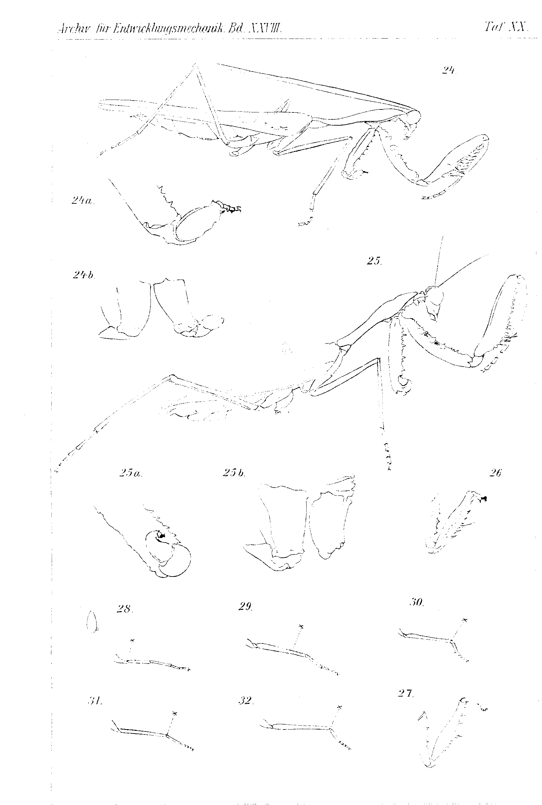
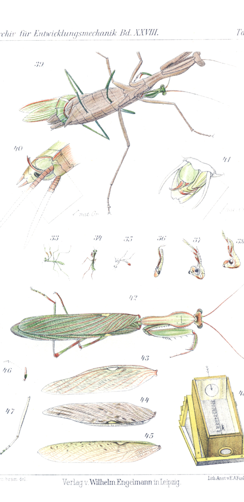

# Rearing, Colour Change and Regeneration of the Praying Mantises (Mantidae).

## III. Temperature and Heredity Experiments.

By

**Hans Przibram,**

Privatdozent at the University of Vienna.

*(From the Biological Experimental Institute in Vienna.)*

With Plates XIX–XXI.

Received 13 July 1909.

*Archiv für Entwicklungsmechanik der Organismen*, vol. 50 (1909).

> **Full translation.** A complete English rendering of the 1909 study of rearing, colour change and regeneration in mantids, with the tables and figure legends.

### Contents.

|  | Page |
|---|---|
| I. Procurement of Material and Statement of the Problem | 562 |
| II. Rearing of Several Generations | 564 |
| &nbsp;&nbsp;&nbsp;&nbsp;a) Parental generation (*P*) | 564 |
| &nbsp;&nbsp;&nbsp;&nbsp;b) First filial generation (*F₁*) | 567 |
| &nbsp;&nbsp;&nbsp;&nbsp;c) Second filial generation (*F₂*) | 569 |
| III. Experiments on the Heritability of the Colourations | 569 |
| IV. Regeneration and Autotomy | 576 |
| &nbsp;&nbsp;&nbsp;&nbsp;α) Regeneration of the raptorial leg | 576 |
| &nbsp;&nbsp;&nbsp;&nbsp;β) Regeneration of raptorial and walking legs | 576 |
| &nbsp;&nbsp;&nbsp;&nbsp;γ) Regeneration distal to the autotomy site | 577 |
| V. Regeneration and Heritability | 583 |
| &nbsp;&nbsp;&nbsp;&nbsp;A. Parents with one regenerate | 584 |
| &nbsp;&nbsp;&nbsp;&nbsp;B. Parents with two defective regenerates | 584 |
| &nbsp;&nbsp;&nbsp;&nbsp;C. Parents with regenerates on all six legs | 585 |
| VI. Regeneration, Moult, Growth, Movement and Temperature Quotients | 586 |
| &nbsp;&nbsp;&nbsp;&nbsp;a) Number of moults | 586 |
| &nbsp;&nbsp;&nbsp;&nbsp;b) Measurement of growth (of the pronotum) | 590 |
| &nbsp;&nbsp;&nbsp;&nbsp;α) Increase in size | 590 |
| &nbsp;&nbsp;&nbsp;&nbsp;β) Duration of growth | 592 |
| &nbsp;&nbsp;&nbsp;&nbsp;γ) Rate of growth | 593 |
| &nbsp;&nbsp;&nbsp;&nbsp;c) Moult intervals | 593 |
| &nbsp;&nbsp;&nbsp;&nbsp;α) Increment | 594 |
| &nbsp;&nbsp;&nbsp;&nbsp;β) Duration | 594 |
| &nbsp;&nbsp;&nbsp;&nbsp;γ) Rate | 594 |

37* 562 &nbsp;&nbsp; Hans Przibram

|  | Page |
|---|---|
| &nbsp;&nbsp;&nbsp;&nbsp;d) Temperature quotients of growth | 595 |
| &nbsp;&nbsp;&nbsp;&nbsp;e) Temperature quotients of the rate of development | 596 |
| &nbsp;&nbsp;&nbsp;&nbsp;f) Temperature quotients of the rate of movement | 597 |
| VII. Experiments on Bastardization (a "pseudogamy"?) | 602 |
| VIII. Summary of the Most Important Results | 609 |
| IX. Bibliography | 612 |
| X. Explanation of the Figures | 613 |
| &nbsp;&nbsp;&nbsp;&nbsp;Tables I–XI | 614 |

## I. Procurement of Material and Statement of the Problem.

In my first work on the rearing, colour change and regeneration of the praying mantises (Przibram 1906 *Sphodromantis*) I had furnished the proof that the colour change of *Sphodromantis* is, at least to a high degree, independent of external factors, such as light, nourishment, and the colour of the surroundings; and in a second work (Przibram 1907 *Mantis*) it was added that in the brown-hatching larvae of *Mantis*, neither through a change of the surroundings nor of the temperature- or colour-conditions could the appearance of a green colouration be achieved, even among descendants of green females.

Since all these European *Mantis* reared in winter represent the more rarely occurring stages in nature, I conjectured here an effect of "captivity," in particular of an oxygen deficiency. However, experiments subsequently carried out in this latter direction yielded no clear result.

In the winter of 1905/6 the kindness of Herr H. Guyot in Hélouan near Cairo had an egg-packet of *Sphodromantis bioculata* sent to me, which reached our institute in an almost frozen condition. On 21 February 1906 about 170 larvae hatched out, all leek-green, with yellow-green hind-body and, on the inside, reddish fore-body (Fig. 33). These siblings provided the starting material for all the *Sphodromantis* experiments cited in the present third Mantid work.

Among the egg-packets of *Sphodromantis* laid in captivity there had, as will be recalled, emerged both brown and green imagos, whereby in the course of the development of individual specimens — indeed even after the metamorphosis — the brown and green colours could alternate in an irregular manner.

563 &nbsp;&nbsp; Rearing, Colour Change and Regeneration of the Praying Mantises. III.

At that time, a pursuit of the heritability of the colourations of the various stages seemed to me so hopeless that I let myself be led to the statement: "The various colourations of the praying mantises thus cannot be derived according to the hitherto known laws of inheritance" (1906 *Sphodromantis* p. 169). It seemed to me at that time most probable that there was a temporal back-and-forth fluctuation of the children between the parental colours.

In the meantime, however, I had decided to carry out heredity experiments by means of the crossing of selected colours. Since in the Mantids the number of moults and the developmental time also fluctuate very considerably, there are only two moments at which one can with certainty infer analogous stages: the hatching from the cocoon, which is bound up with the first moult, and the emergence of the imago at the last moult.

The intermediate stages were registered more regularly according to their colouration; on the other hand, in the case of the specimens used for breeding, the colouration was noted at the time of the mating.

After death the colouration changes only little, so that on the pinned specimens one can still subsequently determine the colours that the animals possessed at the time of their dying.

All these facts seemed to demand two statements of the problem: firstly, whether the temperature acting upon the various stages (egg-cocoon [oötheca], larvae, imago) was of influence on the colouration of the following stages and on the developmental as well as the growth rate; secondly, whether, taking into account stages that surely correspond to one another (colouration of the larvae hatched from the cocoon; colouration of the imagos emerged from the nymph), regularities would emerge in the numerical distribution of the various colourations across several, successive generations.

After the earlier works on the independence of the colouration from injuries, the breeding animals could at the same time be used for regeneration experiments. In particular, I posed myself here the question of whether regeneration after autotomy is promoted as compared with that after the amputation of non-autotomizing limbs.

The rearing of several generations furthermore permitted the test of whether, in place of the normal five-segmentedness, four-segmented tarsi acquired by the regenerative path would be inherited.

564 &nbsp;&nbsp; Hans Przibram

The two experimental series — concerning temperature and operation — permitted, furthermore, the study, by measurement, of the influence of these factors on the developmental and growth rate. We here pursued on the one hand the question of whether van 't Hoff's¹) law for temperature elevation possesses validity for the developmental and growth rate. It was natural to include the influence of temperature also on the rate of movement.

On the other hand, new insights could be expected concerning the connection between magnitude of injury, moulting-, growth- and regeneration-rate.

Again the question arose whether the changes brought about in the developmental course by thermal or operative means would pass over to the descendants.

Finally, the attempt to bastardize the two species of praying mantises hitherto employed, *Sphodromantis bioculata* Burm. and *Mantis religiosa* L., led to a series of new questions: whether it is possible artificially to remove spermatophores from the males of the one species and to introduce them into the female of the other species; what characters the descendants thus obtained might exhibit; whether one must reckon with the possibility of a natural parthenogenesis; or whether the introduced semen falls merely the role of a "developmental stimulus." The required *Mantis religiosa* ♀♀ were reared from nymphs collected near Vienna; the ♂♂ had been collected at various localities as imagos or sent in.

## II. Rearing of Several Generations of Sphodromantis bioculata Burm.

### a) Parental generation (*P*).

It would be an unnecessary repetition of the descriptions, published in 1906, of the stages of *Sphodromantis* to describe in equally detailed manner the rearing of the larvae sprung from the aforementioned Hélouan egg-packet.

All the phenomena reappeared which had occurred in the control culture, laid down in captivity, of the first rearing (cf. 1906 *Sphodromantis* pp. 153–160).

Noteworthy is the appearance of green and brown stages

> ¹) cf. Przibram 1908 *Anwendung* [Application].

565 &nbsp;&nbsp; Rearing, Colour Change and Regeneration of the Praying Mantises. III.

in individual cases, which proves the irrelevance of the hatching-colour (here green, in 1904 brown!) for this fluctuation.

Since for breeding purposes a greater number of larvae had to be reared up to the imaginal state, an isolation of the individual animals had to be undertaken, given the strong cannibalistic tendency of the Mantids. But because the setting up and tending of 170 cages would have exceeded our powers, at first seven batches were kept separate, and only later were those animals that had moulted on the same day in each batch brought into a cage of their own. This procedure was repeated at the following moult, until each specimen had a cage of its own. In the meantime some animals had died off or been devoured by their stronger cage-mates, and a greater number of simple cages had been manufactured in the institute, so that the supply also proved sufficient.

The cages consist of wire frames over which Mueller-gauze is stretched and which are set up in the rabbet [groove] of a square wooden board. This arrangement makes it possible to accommodate flower-pots with aphid-infested plants, while a hole closable with a round cork at half the height of the cage facilitates the introduction of flies and the spraying with water (cf. Przibram 1908 *Biologische* [Biological], p. 251, Fig. 4; in the concluding part of this publication a plan of the institute will be found, from which the location of the rooms cited in Table I can be taken).

The feeding was begun similarly to 1904, but gradually small pieces were preferred more and more in place of the aphids. The imagos soon learned to devour pieces of raw beef cut into strips, which freshly caught ones refuse.

It proved possible to rear 57 specimens of the parental generation up to the imago; before these, 11 were kept from the hatching out of the cocoon at about 37°, 2 at 32°, 15 at 27°, 28 at 25°; one specimen 1 month at 17°, then at 27°. This latter transfer from 17° to a higher temperature took place because it turned out that at 17° no moults could be completed, just as had been the case with *Mantis religiosa* (1907 *Mantis*).

More precise data on the rearing of the parental generation are to be taken from Table I. The various temperatures — although reaching to the applicable extremes — again had no influence on the distribution of green (Fig. 42) and brown (Fig. 44) imagos: 566 &nbsp;&nbsp; Hans Przibram

|  | 37° C. | 32° C. | 27° C. | 25° C. | 17°, later 27° C. |
|---|---|---|---|---|---|
| green | 7 | 2 | 6 | 18 | 0 |
| oliv. [olive] | 0 | 0 | 1 | 0 | 1 |
| greenish-brown | 2 | 0 | 5 | 2 | 0 |
| brown | 2 | 0 | 0 | 8 | 0 |

By oliv. [olive] is to be understood a pale, little-saturated grey-green (Fig. 43); by greenish-brown a piebald-brown marking on a grey-green ground (Fig. 45).

Among the 57 imagos there were 25 males and 32 females; most of them well developed, justifying the best hopes for further breeding.

In view of the bad experiences one had had with female Mantids — namely, that they very readily devour their males — I did not without further ado pen the two sexes together, but considered rendering the female harmless.

For this purpose I first tried binding the forelegs, proceeding from the view that it is these, and not the jaws alone, that are capable of getting at the male. The method of binding, which has proven itself excellently, is the following: from an ordinary weaving thread, a not too stiff band, a piece about 2 dm long (Fig. 1) is cut off, made more pliable by crumpling (Fig. 2), and twisted from it into a simple loop (Fig. 3).

Now one grasps the female to be bound, by means of thumb and middle finger of one hand, by the thorax and on the outer side of the raptorial legs, pressing these together, while the index finger holds down the head of the animal (Fig. 4). The second hand now takes hold of the end of the prepared band-loop between index and middle finger, the end of it between thumb and ring finger (Fig. 5). In this manner one experimenter can, without assistance, lay the loop around the forelegs of the *Sphodromantis* and draw it tight around femur and tibia (Fig. 6). The two loop-ends are then slung around the coxal segments [hip joints] (Fig. 7) and knotted with the second loop-end (Fig. 8, 9). The females thus bound are able to move about freely to a sufficient degree, and were rarely able to free themselves from the bonds or to do any harm to the male.

567 &nbsp;&nbsp; Rearing, Colour Change and Regeneration of the Praying Mantises. III.

With *Mantis religiosa* it sufficed to supply the female abundantly with flies in order to keep it from pursuing the male.

About copula and egg-laying I have reported in two preliminary communications (1907 *Paarungsversuche* [Mating experiments], 1907 *Lebensgeschichte* [Life history]) and reserve the more detailed account here until the VII. Chapter: "Experiments on Bastardization," because there the comparative consideration of *Sphodromantis* and *Mantis* appears necessary.

Copulation and egg-laying of the *Sphodromantis* reared in 1906 are registered in Table II. Only those matings are listed which yielded fertilized eggs. The stated colours are those observed during the copulation; where these deviate from the colour of the imago immediately after leaving the nymphal skin, this is specially indicated: thus "g.br. after green" means that, at the time of the copula, the animal in question was greenish-brown, but shortly after leaving the nymphal skin had been green.

### b) First filial generation (*F₁*) or children of the parental generation.

The egg-packets which the parental generation — itself already reared at various temperatures — had yielded were again attempted to be reared at various temperatures. Once more 17° turned out to be the temperature that no longer led to development. A prolonged stay at winter temperatures below 0°, at 0°, or even at +10° and +17°, abolished the developmental capacity even on transfer back to a higher temperature.

All the larvae that hatched out belonged to those packets which had been kept permanently at 25° or 30° (cf. Table II). All larvae of one and the same egg-packet always showed, on leaving the egg-shell, the same colour, in whatever colour combination their parents may have been selected. The hatching-colour is thus independent of the colour which the parents had exhibited as imagos and in particular also during the copulation.

One might now have expected that the hatching-colour, at least of some packets, would be the same as that which the animals of the parental generation had in turn one and all exhibited. But in place of the beautiful leek-green colour of those animals reared in 1906, there appeared in their children in autumn 1906 and spring 1907 throughout a more weakened green with a strong brown marking on head, thorax, hind-body back and joints (Fig. 34), so that the young larvae resembled far more those which had hatched in 1904 from egg-packets of various provenance, but which had the common feature of having been laid in captivity, or at least of having gone through the greatest part of their development in Vienna.

---

**Translator's note on attribution:** The title page (p. 1) prints the author as **Hans Przibram**, *Privatdozent at the University of Vienna*, and the running heads on all pages read "Hans Przibram." The species treated is *Sphodromantis bioculata* Burm. (the assignment's stated author "Thomsen" does not appear on these pages; what is printed has been transcribed exactly).

Incidentally, a few observations may be mentioned which happened to be made on packets of the offspring: on one occasion, animals of a packet kept at 25° were observed precisely at the moment of hatching; they were then whitish with yellowish hind body, similar to *Mantis* at the same moment (cf. 1907 *Mantis*, p. 604, Fig. 35); these larvae, which soon coloured themselves greenish, were descendants of an olive-coloured female (3 g β ♀ of the catalogue). Another egg-packet, descended from brown parents (1 k β ♀ × 1 c ♂), had been laid on 1 August 1906 and brought into a cold glasshouse on 25 September; the already far-advanced embryos nevertheless hatched on 9 October, despite the temperature exceeding 10° only during the midday hours, but extraordinarily slowly, so that the individual acts of hatching and of the first moult could be followed well (Figs. 36–38). In particular, the transformation of the shape of the head — which within the egg-membrane is conically elongated — into the broad, triangular shape of the bare head proceeded slowly during the breaking-through of the embryonic skin and the squeezing of the head out of the slit at the thoracic vertebrae. The antennae were initially still attached to the body during the change of shape of the head, became free only gradually, and the whole transformation up to the bare moult had taken about three quarters of an hour, when at last the hind pairs of legs were drawn out of the skin (Figs. 36–38).

All larvae of the offspring generation were brought, after leaving the egg-cocoon, into the same room at 25° C. and there kept for life. 123 larvae (*F₁*) reached the imaginal stage; they were descendants of 19 egg-packets which 11 females of the parent generation had laid. Since the females require only a single mating in order to lay continuously viable egg-packets, each individual female had always been copulated with only a single male. The children stemming from different egg-packets of one and the same female are thus equivalent siblings. In Table III the children reared up to the imago are recorded separately by families and egg-packets.

Although the imagos obtained by inbreeding showed externally no degeneration of the sexual characteristics, and also exercised the sexual drive, their reproduction nevertheless remained strongly behind that of their parents. They laid on average fewer and smaller cocoons, from which in turn only few hatched. Since I was at the same time compelled, for various reasons, to devote less attention to the broods than before, unfortunately only very meagre progeny were obtained. The copulation and egg-laying of the *Sphodromantis* reared in 1907 is illustrated by Table IV, in which again only successful pairings are taken into account.

It was striking that the imagos presented a far greater tameness towards humans: while freshly captured animals, and also the animals of our parent generation, at once set themselves on the defensive with raptorial legs and jaws and sought to flee as soon as one made to seize them, their children let themselves be seized without further ado and carried about on the finger, provided only that no pressure was exerted upon them. The inclination to cannibalism too had diminished, so that the larvae could be kept together for a longer time in one cage, and even copulations came about without fettering. Yet I paid for the growing trust in the tameness of my males in the end with the loss of one of them, so that I returned again to fettering.

### c) Second offspring generation (*F₂*) or grandchildren of the parent generation.

About the parent generation little of a general nature is to be said. Again the colour of the producers showed itself to be without influence on the hatching-colour, which was the same for all larvae of one packet and nowhere deviated much from that of the offspring generation. Many grandchildren came to grief in the last moult; Table V gives the more precise information about the rearings. Only few copulations were successful and yielded still fewer and smaller cocoons than the earlier generation. (Yet some of these have hatched and are at present in development as an *F₃*-generation; the copulation-record for 1908 and its results can therefore only be communicated later, in a IV. work.)

## III. Experiments on the heredity of the colourings.

Before I go into the positive results of the colour-crossings, as they emerge from Tables I–V, I should like once more to point to the hitherto obtained negative results with regard to the hatching-colour of *Sphodromantis*: this is evidently independent of the colour of the parents not only as regards the imaginal or copulation time, but also as regards their hatching-colour, and it seems that a complex of causes operating in captivity, hitherto not more closely analysed, is decisive for the more green or more brown colour, which always affects all inmates of one egg-packet uniformly. We are reminded of the «captivity-colour» in *Mantis* (1907 *Mantis* p. 610), which in this species, however, also influences the imaginal stage. There thus remain for us, for the study of heredity, only three stages which can be directly analogised with one another in different specimens, namely the colour at the stripping-off of the nymph-skin, the colour at the time of copulation, or the colour at the natural end of life.

If we consider the three generations pinned up in the insect-case, which offers the approximate appearance of the death-colours, then we can recognise no decisive regularity: among the offspring of two green animals there may again be animals of all shades, just as among the offspring of two brown animals, or of one brown and one green specimen, etc. The colours at the time of the copula mostly deviate greatly from those at the time of the just-completed metamorphosis, but are little suited to a comparative consideration, because indeed only comparatively few matings were carried out in the further generations. The best basis for comparison is offered by the colour, noted in a considerable number of animals, at the leaving of the nymph-skin.

The parent generation *P*, sprung from one egg-packet, had delivered 33 green, 2 olive-coloured, 9 greenish-brown and 13 brown imagos; the colour of the producer is not known, since the experiments on the colour-crossing only begin from the copulations of 1906 on (Table II). There would be 10 combinations possible (without repetition), if one regards it as a matter of indifference from the outset whether the one colour is contributed by ♂ or ♀, namely:

| | | | |
|---|---|---|---|
| 1) green × green, | 5) green × olive, | 6) green × greenish-brown, | 8) green × brown, |
| 2) olive × olive, | | | 9) olive × brown, |
| 3) greenish-brown × greenish-brown, | | 7) olive × greenish-brown, | 10) greenish-brown × brown. |
| 4) brown × brown, | | | | Of these I sought first to carry out those with like-coloured producers; this succeeded for 1, 3 and 4, but not for 2, because at the time when the covering of the single olive-coloured female (3 g β ♀) had to be contemplated, the single olive-coloured male (6 b ♂) was not yet transformed or recognisable as such. In place of olive × olive the combination green × olive was therefore set up. Of combinations of different colours only 6 were otherwise tested, while the combinations 7–10 had to be reserved for later experiments.

### 1) Children (*F₁*) of two green siblings (green ♂ × green ♀).

From Table III we gather that the experiment *F₁* I belonging here delivered 7 green, 2 greenish-brown, no brown specimens; also that the specimen obtained from experiment *F₁* X, unfortunately a single one, was green.

### 3) Children (*F₁*) of two greenish-brown siblings (g.br. ♂ × g.br. ♀).

Experiment *F₁* III delivers 3 green, 1 greenish-brown imago, experiment *F₁* IV 1 green, 3 greenish-brown, 7 brown imago, experiment *F₁* VII 2 green, 4 greenish-brown, 3 brown imago, experiment *F₁* IX 4 green, 2 greenish-brown, 3 brown imago. In all there have thus been raised from the *F₁* from greenish-brown parents 10 green, 10 greenish-brown, 13 brown imago.

### 4) Children (*F₁*) of two brown siblings (brown ♂ × brown ♀).

Experiment *F₁* II delivers 5 green, 3 greenish-brown, 9 brown imago.

### 5) Children (*F₁*) of siblings, of which one was green, the other olive (green ♂ × olive ♀).

Experiment *F₁* VI delivers 47 green, 4 greenish-brown and a single brown imago that came to grief in the imaginal moult (II. egg-packet 3 g β f).

### 6) Children (*F₁*) of siblings, of which one was green, the other greenish-brown (g.br. ♂ × green ♀).

Experiment *F₁* V delivers 1 green, 1 brown imago, *F₁* VIII 3 green, 2 greenish-brown, 1 brown imago.

The meagre results of the grandchild generation (*F₂*) are, ordered by the same combinations (1–10), the following:

### 1) *F₂* green ♂ × green ♀ (grandchildren of green ♂ × olive ♀).

Experiment *F₂*VI¹) delivered 7 green, 2 olive-coloured, 2 greenish-brown imago, experiment *F₂*VI²) 4 green imago.

### 8) *F₂* brown ♂ × green ♀ (grandchildren of greenish-brown ♂ × green ♀ and green ♂ × olive ♀).

Experiment *F₂*VIII delivered 1 green, 3 greenish-brown, 1 rather brown imago.

### 10) *F₂* greenish-brown ♂ × brown ♀ (grandchildren of greenish-brown ♂ × green ♀).

Experiment *F₂*II delivered 2 green, 1 olive-coloured, 3 greenish-brown, 1 brown imago.

If we group the products of the same combinations without regard to the generation to which they belong, we arrive at the following result:

### 1) green × green

| Experiment | green | oliv | g.br. | brown |
|---|---|---|---|---|
| *F₁* I | 7 | 0 | 2 | 0 |
| *F₁* X | 1 | 0 | 0 | 0 |
| *F₂* VI¹) | 7 | 2 | 2 | 0 |
| *F₂* VI²) | 11 | 0 | 1 | 0 |
| | 26 | 2 | 5 | 0 |

to this there comes still, from the later-discussed bastardisation-experiments:

| Experiment | green | oliv | g.br. | brown |
|---|---|---|---|---|
| *F₂* XI | 17 | 3 | 3 | 0 |
| | 43 | 5 | 8 | 0 |

### 2) olive × olive (no pairing obtained).

### 3) g.br. × g.br.

| Experiment | green | oliv | g.br. | brown |
|---|---|---|---|---|
| *F₁* III | 3 | 0 | 1 | 0 |
| *F₁* IV | 1 | 0 | 3 | 7 |
| *F₁* VII | 2 | 0 | 4 | 3 |
| *F₁* IX | 4 | 0 | 2 | 3 |
| | 10 | 0 | 10 | 13 |

### 4) brown × brown

| Experiment | green | oliv | g.br. | brown |
|---|---|---|---|---|
| *F₁* II | 5 | 0 | 3 | 9 |

Evidently green on the one side, greenish-brown and brown on the other side, behave differently when they are crossed in like colour: from green there emerges, in the far predominant amount (43 : 13), again green, in the remainder olive-coloured and greenish-brown (5 : 8), but no brown imagos at the leaving of the nymph-skin.

From greenish-brown there emerge, on the other hand, in almost equal parts green, greenish-brown and brown imagos; from brown likewise these three colours, whereby however brown are just as many as of both other colours taken together (olive-coloured are absent).

If we now turn to the crossing of different colours, then we find:

| | Experiment | green | oliv | g.br. | brown |
|---|---|---|---|---|---|
| 5) green × olive | *F₁* VI | 47 | 0 | 4 | (1) |
| 6) g.br. × green | *F₁* V | 1 ⎫ | 0 | 0 | 1 ⎫ |
| | *F₁* VIII | 3 ⎭ 4 | 0 | 2 | 1 ⎭ 2 |
| 8) brown × green | *F₂* VIII | 1 | 0 | 3 | 1 |
| 10) g.br. × brown | *F₂* II | 2 | 1 | 3 | 1 |

The crossing green × olive shows, besides a predominant amount of green imagos (47 : 5), only 4 greenish-brown and one brown imago; the latter, however, came to grief in the moult, and it is not improbable that, had it moulted at the right time, it might still have possessed another colour, just as the young *Sphodromantis* hatching slowly in the cold turned out already entirely coloured-out, whereas with rapid hatching they at first appear pale.

If accordingly the appearance of a brown imago from this crossing seems not normal, then on the other hand from the crossings between green, greenish-brown and brown *Sphodromantis* all colours can emerge.

We have thus struck upon a rule given by heredity: from the green (and pale-green or olive-coloured) broods arose no brown ones, from the brown ones, however, still green imagos.

Let us now see how this lets itself be brought into agreement with the GALTON–PEARSON law of heredity or with the MENDELIAN rules of heredity¹).

Among our *P*-animals about ¼ were brown, which according to GALTON would be compatible with the brown colour in one of their parents; in the *F₁*-animals inbred from green *P*-animals, this brown animal would have to act twice as grandparent, so that 2 × ¹⁄₁₆ = ⅛ brown animals were to be expected. In reality there has, under 62 from

> ¹) On the content of these laws cf. PRZIBRAM 1904 *Einleitung* [Introduction], pp. 109 to 112.

green (and olive) drawn *F₁*-animals, only the above-mentioned doubtful brown piece shown itself, which thus at best could be regarded as about ¹⁄₆₄ (share of a great-grandparent).

For the *F₂* obtained again from green *F₁* by inbreeding, the hypothetical brown ancestor would have had to act four times as great-grandparent, thus 4 × ¹⁄₆₄ = ¹⁄₁₆ brown imagos would have had to be produced: again the actual result, under 34 animals no brown one, does not agree at all with such an assumption.

On the other hand, we scarcely find in the disappearance of the brown imagos from the green broods a foothold for the interpretation of the experiments in the sense of MENDEL. In the *P*-packets we have indeed a mixed brood before us. It is therefore very possible that among the appearing colours one is dominant, which could also conceal others.

It is characteristic of two recessives in the MENDELIAN sense that they cannot let the dominants arise; whereas the dominants among themselves, crossed of both characters, can produce the recessives — in the latter case in the proportion 3 D : 1 R, in the former in the proportion 1 D : 1 R.

There remains thus, also for the connection between green and brown, only the determination of green as recessive.

The crossings *F₁* green × green have given among 10 animals no brown ones, *F₂* green × green among 44 animals delivered no brown ones. Here too we see *F₁* green × oliv appear under 52 animals no brown one, two doubtful brown ones.

At the same time we see also at this crossing oliv vanish, as though we, incorrectly, were not to assume this colour therein at all; so it behaves in *F₂* (experiment VI!) at the same ¼ for imagos that are other.

The results brown × brown are, however, more scanty than that we could lift much from them; we have indeed established some greenish-brown ones. This «greenish-brown» can, however, be a transition-point to the colours, since the MENDELIAN rules let themselves apply to the *Sphodromantis*. On the one side greenish-brown imagos appear, when scanty, also as recessive-broods: from green (experiment *F₁* I), *F₂* green × green (experiment *F₂* VI¹ and *F₂* XI), *F₁* green × oliv (experiment *F₁* VI); on the other side, those produced only among greenish-brown give us not merely greenish-brown, but also green and even brown specimens in approximately From the outset one might, especially in consideration of their origin from brown × green (experiment F₂ VIII), think of seeing in the "greenish-brown" colouration a mixture of green and brown, such as has been observed in insects almost universally in race-crossing alongside the externally pure-appearing forms¹). But their origin from the recessive breeds would make it necessary to assume the hypothesis that such hybrids are subordinate [recessive] to every pure colour.

> ¹) Cf. Przibram, *Phylogenese*. (In press.)

However these relationships may behave in the individual case, we now have the possibility, from the cross of green and brown breeds, of testing whether a pure-bred brown can be found that always beats green in F₁ and then, on inbreeding, yields in F₂ the typical segregation into 3 D : 1 R.

If it can be confirmed that the colours brown, green, olive are in this sequence superior to one another in such a way that the preceding member beats the following, then there would lie therein an interesting parallel to the behaviour of other Mendelian cases, namely that the types distinguished by the *absence* of a character are subordinate to those with the *presence* of the same character.

The green colour, namely, comes about through a yellow-green pigment present (cf. 1906 *Heuschreckengrün* [grasshopper-green]), which is deposited subcutaneously; the bluish tone occurring rather often may be due to the supervening of a structural colour.

The brown colour, on the contrary, comes about through a deposition of dark pigments in the cuticle, as can be seen very clearly during the larval moults, because the skin cast off from a dark stage appears smoke-grey, whereas one cast off from a green stage appears greenish waxy-yellow. Brown-coloured *Sphodromantis*, however, also display in their interior the yellowish-brown colouring matter extractable with ether or alcohol. They are thus distinguished from the green mantis by the presence of the pigment covering, in a similar manner as, say, a blood-variety [Blutvarietät, i.e. red-leaved variety] is distinguished from a green-leaved plant. The olive-coloured animals do not lack the pigment, but yield a more weakly coloured extract and are presumably to be compared with the albinos among the vertebrates [Wirbeltieren]. These, too, or merely weakly coloured races, behave, as is well known, as recessives in the cross with the more strongly coloured ones¹).

> ¹) Cf. Przibram, *Phylogenese*.

From this point of view too we should expect to see the "greenish-brown" ones always superior to the green and always inferior to the brown, since they exhibit a pigmentation that is, though only in places and weaker; but, as mentioned, these hybrids occupy a still-unexplained special position.

The rearing of further generations of *Sphodromantis* from known colour-crosses is under way, but, given the strongly diminishing fertility of the inbred animals, it is questionable whether I shall still be able to reach definitive results with the descendants of the Hélouan egg-packet.

## IV. Regeneration and Autotomy.

From the positive outcome of regeneration experiments on the front or raptorial legs of the praying mantises [Gottesanbeterinnen] (1906 *Sphodromantis*, 1907 *Mantis*) I had drawn the conclusion that the regeneration capacity of the two other pairs of legs might be connected with their easy loss through autotomy, since indeed no autotomy is proper to the first pair of legs.

Against the logical consistency of this conclusion, however, three objections could be raised which would rest precisely on my own earlier experiments:

α) "Only some specimens are able to regenerate the foreleg; this capacity is therefore in the process of dying out and only comes to appearance exceptionally (atavistically) and now and then."

Among 32 foreleg operations on the Egyptian species, only eight (cf. 1906 *Sphodromantis*, Table 2, pp. 198—199) had yielded a positive result; of the European species, only a single foreleg-regenerate (cf. 1907 *Mantis* p. 611) had been obtained.

β) "The regeneration of the raptorial leg, when operated on at the middle stages, requires more moults than when operated on at the late stages; this capacity is therefore less well developed than in the two hinder pairs of legs."

Four larvae of the 6th and 7th stadium had the raptorial leg cut off in the middle of the coxa (cf. 1906 *Sphodromantis* p. 174)

regenerated it only after 2—4 further moults, while one operated on in the 8th stadium had brought about only a cone-shaped rounding-off.

γ) "The regeneration of the autotomy-capable legs proceeds more rapidly when it follows upon autotomy than when it follows upon amputation from some other site; autotomy therefore does after all essentially promote regeneration."

*Sphodromantis* operated on in the 3rd or 4th stadium at the middle or hinder leg in the coxa had regenerated more slowly than those that had lost the same leg through autotomy; and whereas a middle leg lost through autotomy in the 9th stadium was still replaced at the next moult, this no longer happened after amputation in the coxa (cf. 1906 *Sphodromantis* p. 176).

For the refutation of these three objections new series of experiments with *Sphodromantis* were begun, which not only proved the untenability of the objections but also uncovered new relationships.

The experiments are compiled in Table VI (P-generation) and Table VIII (F₁-generation).

IV α) "Does the foreleg regenerate only exceptionally or regularly, provided the praying mantis remains alive at all?"

Since in our earlier experiments a rather large percentage of the *Sphodromantis* deprived of a foreleg had perished, not indeed at once after the operation, but before completing the next moult, so that only the surviving quarter had produced regenerates, it could not be concluded with certainty therefrom whether merely the perishing of the animals was to blame for the unfavourable outcome, or whether, just the other way round, those very specimens which were not capable of regeneration had perished.

Since, in common keeping in a single cage, weaker animals fall victim to the cannibalism of their companions, a stricter isolation of the individual experimental animals than had taken place in the first experimental series seemed suited to keep a larger percentage alive.

In fact, of 18 *Sphodromantis* of the P-generation that were kept isolated and deprived of a raptorial leg at various sites (cf. Table VII), only a single one perished without having regenerated. This one (4 m β) had at the same time been deprived of a hind leg and died as early as 3 days after the operation. All the remaining 17 specimens showed regeneration.

On a series of specimens of the F₁-generation, operations on one fore leg and one middle leg were carried out on the very day after leaving the egg-cocoon [Eikokon]: of 20 specimens only 6 survived, but these all regenerated (cf. Table VIII 3 b β, 1st cocoon). In a similar but more complicated experimental series, of nine specimens 5 regenerated, 4 having died too early (3 g β, 3rd cocoon). The high mortality in the F₁-experiments is doubtless to be traced back to the multiple operations.

On the whole, then, in the new experiments all of 29 survivors regenerated, and even if we include the multiply operated ones, only 17 died without having had time for regeneration.

There can therefore be no question of regeneration occurring only exceptionally; rather, it occurs regularly when the experimental animals survive, provided the operation was not performed too late. With this we come to speak of the second objection.

IV β) "Does the foreleg regenerate, in and of itself, worse than the other legs of the praying mantis, or does it depend merely on the closer circumstances?"

For the decision of this question two ways were taken: a) on some specimens only a front, on others only a middle or a hind leg was amputated; b) on yet other specimens both a fore and a hind leg were amputated at the same time (cf. Table VI).

a) On 5 specimens (4 b α—ε) the right foreleg had been cut off in the middle of the femur 7 days after the 2nd moult, completed on the same day; only after two further moults was a regenerate to be ascertained.

On 4 specimens (4 h α—δ), on the same date, 6 days after the 2nd moult completed on the same day, the right middle leg had likewise been severed in the thigh [Schenkel], which, however, later led to autotomy. Here too the regenerates appeared only after two further moults. The same holds for 2 specimens with respect to the right hind leg removed 5 days after the 2nd moult (3 g α—β).

Through exuvial autotomy a right middle leg had been lost by one animal (1 f) at the 6th moult; it appeared replaced at the next moult; a left hind leg lost in the same way at the 9th moult regenerated only at the 11th moult (1 e β); a right hind leg removed three days after the 3rd moult regenerated already at the next, the 4th, moult (4 m γ).

Fractures of the right foreleg knee, the patella¹), after the 5th moult (3 j, Fig. 26), the 6th moult (6 b, Fig. 27) or the 7th moult (3 i β) led, after gangrenous dropping-off of the tibia together with the tarsus, to the beginning of regeneration only at the third moult thereafter — the 8th, the 9th, and the 10th moult respectively, counting overall.

> ¹) The patella is a jointless intermediate piece between femur and tibia (cf. Przibram 1907 *Kosmos* p. 231, Fig. III).

b) On 4 specimens, on one and the same day, the left foreleg in the middle of the femur and at the same time, at an analogous site, the right hind leg had been amputated. The latter autotomized. Of the three surviving larvae, the one (4 q) was operated on 2 days *before* the 3rd moult and, after the 4th moult, showed both legs regenerated in equal quality. The two remaining larvae (4, 4 n) were operated on a few (4 and 3, respectively) days *after* the 3rd moult and, at the 4th moult, showed the regenerate of the right hind leg better developed than that of the foreleg.

On 6 specimens, within two consecutive days, the left hind leg at the autotomy site and the right foreleg at the analogous suture between trochanter and femur had each been removed at the same time by scissor-cut. The one animal standing, at the time of operation, after the 4th moult (4 e) regenerated, at the 6th moult, the hind leg better than the foreleg; the others, operated on after the 7th (4 a β, 4 b, 4 d, 4 k) or 8th moult (4 a α), however, all regenerated the *foreleg* at the next (4 k) or next-but-one moult (4 a α, 4 a β, 4 b, 4 d), whereas the *hind leg* appeared only extremely rudimentary (4 b, Fig. 24; 4 d), or only later (4 k), or not at all any more (4 a α, Fig. 25; 4 a β).

This failure [of the hind leg to appear] is in one case (4 a β) all the more striking in that yet a further moult had taken place after the appearance of the foreleg regenerate.

The experiments adduced may suffice to account, by means of attendant circumstances, for the inferiority of foreleg regeneration that had apparently appeared in the earlier experiments.

What proves decisive for the speed of regeneration is not the position of the limb in and of itself. Rather, the regenerate appears the more quickly, the younger the operated stadium was, the longer the time that elapsed until the next moult, the more smoothly the healing process could proceed.

An inexplicable correlation is the failure of the regeneration of the left hind leg when the right foreleg had at the same time been amputated at the analogous site after the 7th or 8th moult — at the same time the best proof against the inferiority of foreleg regeneration.

What circumstances may be decisive here?

One might think (A) of the side of the body to which the removed limbs belonged, B) of the stadium, or C) of the amputation site of the foreleg, finally D) of the manner of amputation of the hind leg.

A) The promotion [Förderung] of the right foreleg might find a counterpart in other phenomena of a correlative kind; the promotion of the right hind leg in the larvae operated on at earlier stadia simultaneously in the thigh of the foreleg (4 m α, 4 n) would also accord with this. But the one experimental animal standing, at the time of operation, after the 4th moult (4 e) had regenerated the left hind leg ahead of the right, analogously amputated foreleg.

B) If we take into account the operatively treated stadium, it appears that the more advanced this was, the more the foreleg was promoted relative to the hind leg. The animals operated on after the 3rd moult (4 m α, 4 n) and the one operated on after the 4th moult (4 e) had indeed regenerated the hind leg better than the foreleg, whereas in those operated on after the 7th or 8th moult (4 a α, 4 a β, 4 b, 4 d, 4 k) it had behaved just the other way round.

C) Now, the cut-site in the larva operated on after the 4th moult (4 e) had been the same as in those operated on after the 7th or 8th moult, but different from those operated on after the 3rd moult. It is therefore not the cut through the trochanter-femur suture that is to be held responsible for the promotion of the foreleg. Indeed, precisely this site corresponds to the autotomy site on the hind legs, so that in this very experiment the most similar conditions for the regeneration of fore- and hind leg were given. How little difference it makes whether the amputation occurs at the trochanter-femur suture or in the femur itself will be shown by the experiments still to be discussed under IV³, which relate to such cut-placements on the autotomy-capable legs.

D) On the contrary, it may have played a role that the amputation at the hind leg had been carried out not through autotomy but through a scissor-cut along the autotomy site.

IV γ) "Is the slower regeneration of the autotomy-capable legs after a cut in the coxa to be traced back to the loss of autotomy, or to the site of the intervention?"

The earlier experiments had led to the result (1906 *Sphodromantis* p. 191): All legs regenerate more slowly when they are amputated proximal to the autotomy site than when they are amputated at it; and this phenomenon was traced back to the necessity of greater rearrangements which must be carried out in the cut coxa before one can proceed to the regeneration of the wholly removed limbs.

Although supported by various morphological and histological findings, this interpretation could nevertheless have undergone an essential restriction, if it could be shown that a slower regeneration also follows amputations carried out *distal* to the autotomy site than [follows] those *at* the autotomy site. Such a thing could not be inferred without further ado from the experiments on the autotomy-less foreleg — in which distal amputations were sooner made good more rapidly than those at the trochanter-femur suture — because we should thereby fall into the circular argument of presupposing the influencelessness of autotomy, where it is precisely the proof of such that is at issue.

This influencelessness could, on the contrary, be put to the test if the autotomy-capable legs were operated on distal to the autotomy site. But here there at first arose the difficulty that amputation in the femur of larvae situated after the second or a later moult was always followed by autotomy of the thigh-piece left behind, and in this way the experiments again became ones concerning regeneration after autotomy.

The occasional observation that larvae are rather often encountered in the 2nd stadium with non-autotomized, injured walking legs prompted me to repeat the experiment on larvae three days after leaving the egg-cocoon. In fact it succeeded, at this stadium, in forcing regeneration from the middle of the femur [cf. Table VIII, 3 g β III. cocoon (2)], from the last third of the femur (ibid., 3), and from the end of the femur (ibid., 4 and 5). The amputations had been carried out by a rapid scissor-cut freehand, since any holding or other fixing of the animals would have favoured autotomy.

The four experimental animals named, as well as five amputated at the autotomy site for control [ibid., (1) and (6)—(9)], had all lost the right hind leg on the same day (30 Oct.); one month later (1 Dec.) the animals were checked and all showed regenerates.

Most uniform was regeneration after autotomy [(1) Fig. 28] or amputation from the middle of the femur [(2) Fig. 29]; then followed only those after amputation from the last third [(3) Fig. 30] and from the end of the femur [(4) Fig. 31 and (5) Fig. 32]. Thus regeneration proceeded the better, the more of the femur had been removed: this behaviour finds numerous parallels¹) in other cases of regeneration, where a larger or smaller portion of one and the same organ is removed.

> ¹) Cf. Przibram 1909 *Regeneration* p. 229.

That it is the autotomy site, but not autotomy itself, that is to be held responsible for the better regeneration, is eloquently attested by the further results on the same individuals. These were operated upon again on 1. XII. 1906, but this time the right middle leg was autotomized in all of them; at the same time the left foreleg and the left hind leg were cut off in the tibia or tarsus. Only two animals survived this simultaneous threefold intervention. In the one animal (1) the left foreleg had been cut through at the middle of the first tarsal segment, the left hind leg at the end of the tibia; in the second (3) the left foreleg in the last third of the tibia, the left hind leg at the middle of the first tarsal segment. The result is a similar one in both cases: at the check on 18. II. 1907 the autotomized middle legs were less regenerated than the fore- and hind legs amputated in the tibia or tarsus. The foreleg amputated in the last third of the tibia had regenerated almost completely, the other, non-autotomized legs entirely so. To be sure, in the process only four tarsal segments appeared in place of five.

That, in agreement with the results of earlier observers, in the regenerating limbs of the five-tarsed Orthoptera a smaller number of segments, usually four, tends to appear, has already been described and figured by me in 1906 (*Sphodromantis* p. 172) and 1907 (*Mantis* p. 611).

In *Sphodromantis*, larvae operated upon in the foreleg at late stages had reproduced still fewer segments, and indeed either at first one segment without claws (1906 *Sphodromantis* Pl. VII Fig. 20) or two segments without claws (ibid. Pl. VI Fig. 11), or three segments with claws (ibid. Pl. VI Fig. 14). Subsequently segments were sometimes inserted later until the number of four was reached. In the experiments now described, two segments with claws (4aα Fig. 25a, 4b Fig. 24a; 3j Fig. 26) occurred in late-operated animals.

We thus obtain the following conception of the segmentation direction of the regenerates: First a centrifugal outgrowth of the rounded amputation stump takes place (cf. 1906 *Sphodromantis* p. 177 and the present work Fig. 24b), then segmentation of the segments in a centrifugal direction, until the tarsus appears as a terminal knob and divides into two sections; thereupon, however, the terminal claws appear and the segmentation direction reverses itself, in that a further segment is inserted centripetally from the claw segment and eventually, namely if sufficient moults can still take place, is replaced by two segments. (It is not clear whether it splits into two segments, in which case again either a centripetal or a centrifugal division would come into consideration, or whether the newly added segment owes its origin to the first or the last tarsal segment.)

## V. Regeneration and Heritability.

The possibility of letting, in place of a five-segmented tarsus, an otherwise equally regularly formed but four-segmented tarsus arise, or even of definitively obtaining still fewer segments, insofar as the operation was performed late enough, prompted me to test whether such hypotypic regenerates could in any way become hereditarily fixed (cf. Tables VI and VII, VIII and IX).

To this end one parental pair each, which had undergone the same operation with the same success, was selected, and all cocoons stemming from these breedings were preserved. The hatching larvae were either counted at once and examined for the number of tarsal segments, or, for each packet separately, conserved for later counting.

The very tedious counting of the tarsal segments can be greatly facilitated by a methodical artifice: instead of considering all five segments of the tarsus, one forms for oneself a concept, the "middle tarsus", which comprises only the three middle segments of the normal five-segmented tarsus. It is quite easy to retain this abstraction, because the first tarsal segment¹) deviates strongly from the others — which are very similar to one another — through its considerable length, and the last through its claws. Even in the "middle tarsus", once a quickly acquired practice has been gained, one need not count the segments, but sees at a glance whether there is a segment or a joint in the middle: in the former case one has to do with a three-segmented "middle tarsus", that is, a five-segmented tarsus; in the latter case with a two-segmented "middle tarsus", that is, a four-segmented tarsus. (Fewer than four-segmented tarsi would, of course, immediately catch the eye through the one-segmentedness or absence of the middle tarsus.)

> ¹) Probably comparable to the "metatarsus" of the arachnids.

Among the ancestral parents there were A) pairs that had been deprived of only one leg, B) those that had lost two legs, C) those that bore regenerates on all legs.

A) Parental pairs that had been deprived of only one leg, namely a) of the front, b) of the middle, c) of the hind leg pair (cf. Operation and Regeneration: Table VI; Moults: Table I; Copula: Table II; Number of offspring: Table VII).

a) Amputation of a foreleg in the femur after the 2nd moult with subsequent four-tarsed regeneration (♂ 4cα × ♀ 4fγ). Two cocoons laid and hatched; in all 358 young larvae, all normally five-segmented.

b) Autotomy of a middle leg after the 2nd moult with subsequent four-tarsed regeneration (♂ 4hδ × ♀ 4hγ). Two cocoons laid, of which the first still before copulation, only the second hatched; in all 81 young larvae, all normally five-segmented.

c) Autotomy of a hind leg after the 2nd moult with subsequent four-tarsed regeneration (♂ 3gα × ♀ 3gβ). Six cocoons laid and hatched; in all 1369 young larvae without deviations in the tarsal numbers, yet from cocoon III one animal had lost the hind leg in question through autotomy (exuvial?), so that it could not be counted. From cocoon IV, 61 larvae had not hatched completely, namely had remained hanging in the egg membranes, and have not been counted in with the hatched ones as uncountable.

B) Parental pair that had lost two legs (cf. the same tables as with A!) and indeed so late that the foreleg cut off at the trochanter–femoral suture bore only two tarsal segments with claws, and the analogously amputated hind leg had regenerated no tarsus at all (♂ 4b × ♀ 4aα; Fig. 24a b, 25ab). Four cocoons laid, of which the first before copulation, the three others hatched; in all 345 young larvae, all normally five-segmented.

C) Parental pair that had been operated upon on all legs (cf. Operation and Regeneration: Table VIII, Copula: Table IV, Number of offspring: Table IX), and indeed successively, but so early that all legs had time to bring forth four-tarsed regenerates. (♂ 3hβAₓ × ♀ 3gβO). Three cocoons laid and hatched; in all 452 young larvae, all normally five-segmented except for 24 with (exuvial?) autotomy of individual legs, one with a crooked antenna and one with a malformed right hind leg. This appears normal up to the patella; the tibia, however, is shortened, in the distal half filled with dark-green, extravasated blood; the tip of the tibia is light brown and, without a distinct tarsus, two claws are visible (Fig. 46). Later the leg developed into a four-tarsed one (Fig. 47).

This is probably a lesion sustained during embryonic life; at least the accumulation of blood points to this. On the other hand, it must not be concealed that not only the parents of this larval batch had borne four-segmented regenerates on the right hind leg, but also the grandparents on the maternal side, since ♀ 3gβO descended from ♂ 3gα × ♀ 3gβ, that is, from the hind-leg experiment A c mentioned above.

Nevertheless we find that, with the exception of this doubtful case, among 2605 offspring of operated animals there are none that would exhibit an inheritance of a regenerate. No such transmission took place either after definitively four-segmented, or after definitively three-segmented, or after absent tarsal regeneration of both parents. Even when no leg of either of the two parents had exhibited the five-tarsed condition, five-segmented tarsi nevertheless came to light in all offspring.

It may be remarked in this connection that the sexual products in the praying mantises do not ripen so early that one might from the outset think of their being influenced in the later larval period. Rather, sexual maturity sets in not even during the transformation to the imago, but only later. The males and females of *Sphodromantis* showed themselves capable of copulation only ten days after the last moult.

## VI. Regeneration, Moult, Growth, Movement and Temperature Quotients.

### a) Number of moults.

In the earlier experiments (1906 *Sphodromantis* p. 159–160) I had observed a far-reaching diversity in the number of moults undergone by an animal up to the imago, and had written about it:

"Probably the strong retardation of growth, as well as the increase of the moult number, is connected with the operations undertaken for the purpose of the regeneration experiments.... If this interpretation is confirmed, it would apparently be capable of reconciling seemingly contradictory statements...: namely in that, although a moult may set in more rapidly than normal, the transformation might nevertheless be delayed through the insertion of further moults or longer pauses."

"In the Crustacea ... Zeleny has unequivocally demonstrated that operated crayfish moult more rapidly than non-operated ones.... Since, however, in the Crustacea no such sharply determined end-stage as the imago of the insects occurs — they rather continue to moult long beyond sexual maturity — it could not hitherto be determined whether it is moults inserted into the normal number, or merely moults occurring more rapidly, that follow the operations. In the insects the means are given us to decide this, and it would certainly be a rewarding task ... to subject the findings made only incidentally ... on the *Hierodula* (= *Sphodromantis*) to a re-examination. Until then I should wish the interpretations given to be taken only with caution."

This re-examination shall now be undertaken by means of the new experiments. For this purpose I first grouped all experimental animals only according to the criterion of whether they had been used for regeneration or not:

| Number of moults: | VII | VIII | IX | X | XI | XII |
|---|---|---|---|---|---|---|
| of all experimental animals had | 0 | 4 | 16 | 29 | 8 | 0 |
| of uninjured experimental animals had | 0 | 4 | 11 | 22 | 1 | 0 |
| of regenerating exp. animals had | 0 | 0 | 5 | 7 | 7 | 0 |

Although in this statistical treatment a shift of the regenerating animals towards a higher moult number did in fact result, I was nevertheless little satisfied with this result, because this shift was not even accomplished by as much as one column and, given the large range of variation (four columns), need not carry much weight. Therefore the grouping was pursued further according to the keeping of the animals under different temperature and feeding conditions:

| Number of moults: | VII | VIII | IX | X | XI | XII |
|---|---|---|---|---|---|---|
| with food, at 37° had | 0 | 0 | 2 | 6 | 3 | 0 |
| with food, at 32° had | 0 | 0 | 1 | 1 | 0 | 0 |
| with food, at 27° had | 0 | 1 | 6 | 8 | 0 | 0 |
| with food, at 25° had | 0 | 3 | 5 | 11 | 4 | 0 |
| with food, at 17–27° had | 0 | 0 | 0 | 1 | 0 | 0 |
| Hunger animals, at 25° had | 0 | 0 | 2 | 2 | 1 | 0 |

According to this grouping one might have believed that the temperature exerts no influence on the number of moults, for everywhere there is at the column X moults a maximum of specimens and otherwise too no all-too-different distribution. If we divide into uninjured and regenerating, we obtain:

| Number of moults: | VII | VIII | IX | X | XI | XII |
|---|---|---|---|---|---|---|
| with food, at 37° { uninjured | 0 | 0 | 2 | 6 | 1 | 0 |
| { regenerating | 0 | 0 | 0 | 0 | 2 | 0 |
| with food, at 32° { uninjured | 0 | 0 | 1 | 1 | 0 | 0 |
| { regenerating | 0 | 0 | 0 | 0 | 0 | 0 |
| with food, at 27° { uninjured | 0 | 1 | 4 | 7 | 0 | 0 |
| { regenerating | 0 | 0 | 2 | 1 | 0 | 0 |
| with food, at 25° { uninjured | 0 | 3 | 2 | 6 | 0 | 0 |
| { regenerating | 0 | 0 | 3 | 5 | 4 | 0 |
| with food, at 17–27° { uninjured | 0 | 0 | 0 | 0 | 0 | 0 |
| { regenerating | 0 | 0 | 0 | 1 | 0 | 0 |
| Hunger animals, at 25° { uninjured | 0 | 0 | 2 | 2 | 0 | 0 |
| { regenerating | 0 | 0 | 0 | 0 | 1 | 0 |

There is no greater regularity than came about without consideration of the external factors. The picture changed, however, immediately when I undertook a separation of the experimental animals according to sex:

| Number of moults: | VII | VIII | IX | X | XI | XII |
|---|---|---|---|---|---|---|
| of all males | 0 | 4 | 11 | 10 | 0 | 0 |
| of all females | 0 | 0 | 5 | 19 | 8 | 0 |

That is, on the average the females possess one moult more than the males (♀ X instead of ♂ IX). If we separate according to uninjured and regenerating, we obtain:

| Number of moults: | VII | VIII | IX | X | XI | XII |
|---|---|---|---|---|---|---|
| ♂♂ { uninjured | 0 | 4 | 8 | 6 | 0 | 0 |
| { regenerating | 0 | 0 | 3 | 4 | 0 | 0 |
| ♀♀ { uninjured | 0 | 0 | 3 | 16 | 1 | 0 |
| { regenerating | 0 | 0 | 2 | 3 | 7 | 0 |

In this is already clearly expressed the absolute increase of the moults with regeneration; for the maximum in both sexes appears shifted by one column (in the ♂ from IX to X, in the ♀ from X to XI).

If we combine altogether all three principles of division — sex, external factors and regeneration — then very clear results are obtained:

| Number of moults: | VII | VIII | IX | X | XI | XII |
|---|---|---|---|---|---|---|
| ♂♂ with food, 37° { uninjured | 0 | 0 | 2 | 5 | 0 | 0 |
| { regenerating | 0 | 0 | 0 | 0 | 0 | 0 |
| — with food, 32° { uninjured | 0 | 0 | 1 | 1 | 0 | 0 |
| { regenerating | 0 | 0 | 0 | 0 | 0 | 0 |
| — with food, 27° { uninjured | 0 | 1 | 4 | 0 | 0 | 0 |
| { regenerating | 0 | 0 | 1 | 0 | 0 | 0 |
| — with food, 25° { uninjured | 0 | 3 | 0 | 0 | 0 | 0 |
| { regenerating | 0 | 0 | 2 | 3 | 0 | 0 |
| — with food, 17–27° { uninjured | 0 | 0 | 0 | 0 | 0 | 0 |
| { regenerating | 0 | 0 | 0 | 1 | 0 | 0 |
| — Hunger animals, 25° { uninjured | 0 | 0 | 1 | 0 | 0 | 0 |
| { regenerating | 0 | 0 | 0 | 0 | 0 | 0 |
| ♀♀ with food, 37° { uninjured | 0 | 0 | 0 | 1 | 1 | 0 |
| { regenerating | 0 | 0 | 0 | 0 | 2 | 0 |
| — with food, 32° { uninjured | 0 | 0 | 0 | 0 | 0 | 0 |
| { regenerating | 0 | 0 | 0 | 0 | 0 | 0 |
| — with food, 27° { uninjured | 0 | 0 | 0 | 7 | 0 | 0 |
| { regenerating | 0 | 0 | 1 | 1 | 0 | 0 |
| — with food, 25° { uninjured | 0 | 0 | 2 | 6 | 0 | 0 |
| { regenerating | 0 | 0 | 1 | 2 | 4 | 0 |
| — with food, 17–27° { uninjured | 0 | 0 | 0 | 0 | 0 | 0 |
| { regenerating | 0 | 0 | 0 | 1 | 0 | 0 |
| — Hunger animals, 25° { uninjured | 0 | 0 | 1 | 2 | 0 | 0 |
| { regenerating | 0 | 0 | 0 | 0 | 1 | 0 |

For let us now consider, on the one hand, the normal, fed animals, and on the other hand the regenerating, fed ones, without regard to the temperature; then we obtain the following two compilations:

| Number of moults: | VII | VIII | IX | X | XI | XII |
|---|---|---|---|---|---|---|
| ♂♂ with food { uninjured | 0 | 4 | 7 | 6 | 0 | 0 |
| { regenerating | 0 | 0 | 3 | 3 | 0 | 0 |
| ♀♀ with food { uninjured | 0 | 0 | 2 | 14 | 1 | 0 |
| { regenerating | 0 | 0 | 2 | 3 | 6 | 0 |
| Number of moults: | VII | VIII | IX | X | XI | XII |
|---|---|---|---|---|---|---|
| ♂♂ with food — uninjured | 0 | 4 | 7 | 6 | 0 | 0 |
| ♂♂ with food — regenerating | 0 | 0 | 3 | 3 | 0 | 0 |
| ♀♀ with food — uninjured | 0 | 0 | 2 | 14 | 1 | 0 |
| ♀♀ with food — regenerating | 0 | 0 | 2 | 3 | 6 | 0 |

If we further take into account the differing temperature, then for the normal animals we obtain:

| Number of moults: | VII | VIII | IX | X | XI | XII |
|---|---|---|---|---|---|---|
| ♂♂ with food, 37°, uninjured | 0 | 0 | 2 | 5 | 0 | 0 |
| – with food, 32°, uninjured | 0 | 0 | 1 | 1 | 0 | 0 |
| – with food, 27°, uninjured | 0 | 1 | 4 | 0 | 0 | 0 |
| – with food, 25°, uninjured | 0 | 3 | 0 | 0 | 0 | 0 |
| ♀♀ with food, 37°, uninjured | 0 | 0 | 0 | 1 | 1 | 0 |
| – with food, 32°, uninjured | 0 | 0 | 0 | 1 | 0 | 0 |
| – with food, 27°, uninjured | 0 | 0 | 0 | 7 | 0 | 0 |
| – with food, 25°, uninjured | 0 | 0 | 2 | 6 | 0 | 0 |

That is to say, the number of moults shifts, both in males and in females, toward the higher column with rising temperature.

The few hunger animals observed appear to show no change in the number of moults and are not considered further.

We thus arrive at the conclusion that the number of moults depends:

A) on **sex**: under otherwise equal conditions the ♀ has one moult more than the ♂;

B) on **temperature**: at higher temperature (a), under otherwise equal conditions, more moults are passed through than at lower (b);

C) on **regeneration processes**: regenerating praying mantises (α) pass through more moults under otherwise equal conditions than those without loss (β).

Accordingly the following combinations result:

| | | | |
|---|---|---|---|
| ♀ a α = | Females at high temperature, regenerating, | | had 11 moults, |
| ♀ a β | – – – | uninjured, | had 10–11 – |
| ♀ b α | – – lower – | regenerating, | – 10–11 – |
| ♀ b β | – – – | uninjured, | – 9–10 – |
| | | | |
|---|---|---|---|
| ♂ a α = | Males at high temperature, regenerating (did not come to observation), | | |
| ♂ a β | – – – | uninjured, | had 9–10 moults, |
| ♂ b α | – – lower – | regenerating, | – 9–10 – |
| ♂ b β | – – – | uninjured, | – 8 – |

This agrees very well also with the moult-increases described in 1906: there, three regenerating females passed through 11 moults, indeed in two cases even without that (i.e., without loss) reaching the imaginal stage, while two regenerating males had each passed through 10 moults; one non-regenerating male — namely, one operated upon too late — and one normal control male showed the moult-number 9.

### b) Measurement of growth.

I was eager to see whether the increase of the moult-number in the female sex at higher temperature and under regeneration was linked to an analogous increase of the size-increment, of the developmental duration, or of the growth-velocity.

#### α) Increase in size.

In *Sphodromantis*, just as in our *Mantis*, the males are smaller than the females; since we did not alter the initial size of the hatching animals, we take into consideration for our investigation not the absolute lengths but the stretch by which the animal grows from hatching out of the egg up to the hatching out of the nymph. This length-increment (s) was now determined everywhere, where the data were available, for the pronotum, by subtracting from the pronotum-length of the imago the initial pronotum-length, measured on the second cast skin. As growth-duration (t) is naturally to be reckoned the time from hatching out of the egg, which coincides with the first moult (cf. 1906, *Sphodromantis*, p. 153), up to the leaving of the nymphal sheath. From these two magnitudes there results the absolute growth-velocity (v) as the quotient of distance (s) and time (t).

Given the slight fluctuations in the initial length of the thorax, I have not considered it necessary also to calculate the relative growth-velocity.

From the adjoining compilation the following can be read off: The length-increment amounts in the ♂ to 16.5–19 mm, namely at 37° on average 18.7, at 27° 18.2, at 25° 17.4 at the

| ♂ 37° | | | | | ♀ 37° | | | | |
|---|---|---|---|---|---|---|---|---|---|
| | Nr. | s (in mm) | t (in days) | v (μ per day) | | Nr. | s (in mm) | t (in days) | v (μ per day) |
| uninjured | 1 b | 18 | 101 | 178 | uninjured | 1 a | 22.5 | 115 | 195 |
| | 1 c | 18 | 99 | 180 | | 1 k β | 20.5 | 114 | 180 |
| | 1 e α | 19 | 102 | 187 | **Average:** | | **21.5** | **114** | **188** |
| | 1 j β | 19 | 117 | 163 | regener. | 1 e β | 21 | 132 | 159 |
| | 1 k α | 19 | 136 | 140 | | 1 f | 24.5 | 151 | 151 |
| | 1 n | 19 | 112 | 170 | **Average:** | | **22.7** | **141** | **155** |
| **Average:** | | **18.7** | **111** | **170** | all | – | 22.1 | 128 | 171 |
| | | | | | | | | | |
| **♂ 27°** | | | | | **♀ 27°** | | | | |
| uninjured | 3 b | 19.5 | 99 | 196 | uninjured | 3 a | 22 | 102 | 216 |
| | 3 e α | 17.5 | 100 | 175 | | 3 c | 23 | 126 | 268 |
| | 3 h α | 17.5 | 96 | 182 | | 3 d | 24 | 102 | 235 |
| | 3 h γ | 19 | 132 | 144 | | 3 e β | 24 | 154 | 156 |
| | 3 j | 17.5 | 130 | 135 | | 3 h β | 24 | 129 | 187 |
| **Average:** | | **18.2** | **111** | **164** | | 3 h δ | 23.5 | 131 | 180 |
| | | | | | | 3 i α | 24 | 117 | 214 |
| **♂ 25°** | | | | | **Average:** | | **23.5** | **123** | **208** |
| uninjured | 4 g α | 18 | 138 | 130 | regener. | 3 g β | 25 | 118 | 212 |
| | 4 g γ | 16.5 | 147 | 112 | | 3 i δ | 21 | 175 | 210 |
| | 4 g δ | 17 | 131 | 130 | **Average:** | | **23** | **146** | **166** |
| | 4 i α | 18 | 165 | 109 | all | – | 23.4 | 128 | 199 |
| **Average:** | | **17.4** | **145** | **120** | | | | | |
| regener. | 4 b | 18.5 | 146 | 127 | **♀ 25°** | | | | |
| | 4 e | 18 | 244 | 74 | uninjured | 4 g β | 21 | 176 | 119 |
| | 4 f δ | 19 | 129 | 148 | | 4 i β | 25 | 184 | 136 |
| | 4 f e | 18 | 169 | 107 | **Average:** | | **23** | **180** | **129** |
| **Average:** | | **18.4** | **172** | **114** | regener. | 4 a α | 22 | 138 | 159 |
| all | – | 17.9 | 159 | 117 | | 4 a β | 23 | 211 | 109 |
| | | | | | | 4 d | 25 | 171 | 147 |
| **♂ 17–27°** | | | | | | 4 f γ | 22.5 | 158 | 143 |
| regener. | 6 b | 20 | 183 | 109 | | 4 h β | 21.5 | 127 | 170 |
| | | | | | | 4 h γ | 22.5 | 162 | 139 |
| **♂ Hunger animals** | | | | | | 4 h δ | 20 | 210 | 95 |
| uninjured | 8 a α | 18 | 168 | 108 | | 4 k | 21 | 166 | 123 |
| | | | | | | 4 m α | 23 | 215 | 107 |
| | | | | | | 4 m γ | 23 | 198 | 117 |
| | | | | | | 4 m δ | 23.5 | 221 | 106 |
| | | | | | **Average:** | | **22.5** | **180** | **129** |
| | | | | | all | – | 22.6 | 180 | 129 |
| | | | | | | | | | |
| | | | | | **♀ 25° Hunger animals** | | | | |
| | | | | | uninjured | 7 a | 25 | 213 | 118 |
| | | | | | | 7 c | 23 | 179 | 129 |
| | | | | | | 8 f | 23.5 | 176 | 134 |
| | | | | | **Average:** | | **23.7** | **186** | **127** |
| | | | | | regener. | 8 a δ | 24.5 | 223 | 110 |
| | | | | | all Average: | | 24 | 195 | 124 |

*Archiv für Entwicklungsmechanik. XXVIII.*

39 uninjured, or 18.4 at the regenerating ones; it amounts in the ♀ to 20–25 mm, namely at 37° on average 21.5 at the uninjured, 22.7 at the regenerating, at 27° 23.5 and 23 respectively, at 25° 23 and 22.5 mm. Whereas in the ♂ the regenerating ones attain a higher average value, in the ♀ it is often the reverse; in the small number and the irregular grouping of the figures in the individual groups, these are undoubtedly purely accidental differences, so that one may conclude an absence of influence of regeneration with respect to the size finally to be attained.

The differing temperatures, too, yielded no decisive differences in the length-increment. Only one thing has struck me: whereas the ♂♂ exhibited, with rising temperature, an, albeit slight, increase of the length-increment, for the ♀♀ the optimum appears to be reached already at 27°, so that at 37° they show a lower mean than at 27°. If this is no mere accident, then it would mean that the size-difference of the sexes can undergo a certain increase under a certain temperature-rise; in our case the difference at 25° amounts to 22.6 − 17.9 = 4.7 mm, at 27° 23.4 − 18.2 = 5.2 mm, at 37° however 22.1 − 18.7 = 3.4 mm. This difference of about 5 − 3 = 2 mm is scarcely any longer to be neglected. A further pursuit of these relations on a more numerous material would, however, be of interest, because the size-difference of the sexes in our *Mantis*, living in the cooler climate, is in fact more considerable than in the African *Sphodromantis* in its warmer homeland. Of course, the absolutely more considerable size of *Sphodromantis* might also be traced in part to the temperature (of the *Sphodromantis* obtained from Alexandria are especially small, the *Mantis* obtained from Cattaro especially large).

#### β) Growth-duration.

As regards the growth-duration, we find no difference at all between the average of the uninjured at 37° (♂ 111, ♀ 114 days) and at 27° (♂ 111, ♀ 123 days); on the other hand an increase at 25° (namely ♂ 145, ♀ 180 days). The same increase the regenerating ones likewise show as against the uninjured, raised to ♀ 37° 141, ♂ 27° 146, ♂ 25° 172; only at ♀ 25° 180 days is no such increase recognizable — probably the average value obtained for the uninjured is, from merely two observations, accidentally too high).

#### γ) Growth-velocity.

The absolute growth-velocity is again equal for uninjured animals at 37° (♂ 0.170, ♀ 0.188 mm per day) and 27° (♂ 0.164, ♀ 0.208); at the lowest temperature of 25°, however, lower (♂ 0.120, ♀ 0.129); the regenerating ones mostly show the lower growth-velocity (♀ 37° 0.155, ♀ 27° 0.166, ♂ 25° 0.114; only ♀ 25° 0.129 fits in here only then, when we take into account that the growth-duration for the uninjured ♀ at 25° is probably to be regarded as too high, hence the growth-velocity for this very group ought really, on average, to go far beyond 0.129).

Animals which had initially hungered deviate not essentially from the regenerating ones at the same temperature; thus the single, initially hungering, later regenerating ♀ 8 a β required 223 days, a growth-duration that was exceeded only by one ♂ 4 e regenerating at 25°, with 244 days.

### c) Moulting-intervals.

Since, as we saw, temperature and regeneration influence the number of moults, whereas the total growth-time appears, at least between 27° and 37°, to be only slightly variable, the time elapsing between two successive moults must be a variable magnitude. The average duration of such a "moulting-interval" we obtain from the division of the total growth-time (t) by the number of the average moulting-intervals of one group. The number of these intervals is, since at the beginning and at the end of the total growth-time there stands a moult, equal to the number of moults (H) minus one. If we divide the total length-increment (s) by this same number, then we obtain the average length-increment during one interval; if we divide the total growth-velocity (v) by this same number, then we obtain the average growth-velocity during one interval. We obtain in this way, using the data already given, the following compilation:

| (Always fed) | H. | s/(H−1) | t/(H−1) | v/(H−1) | (Always fed) | H. | s/(H−1) | t/(H−1) | v/(H−1) |
|---|---|---|---|---|---|---|---|---|---|
| **♂ 27°** | | | | | **♀ 27°** | | | | |
| uninjured | 9 | 2.3 | 13.9 | 20.5 | uninjured | 10 | 2.6 | 13.7 | 23.1 |
| regenerating (not observed) | | | | | regenerating | (9–)10 | 2.6 | 17.4 | 20.8 |
| **♂ 25°** | | | | | **♀ 25°** | | | | |
| uninjured | 8 | 2.5 | 20.7 | 17.1 | uninjured | 10 | 2.6 | 20.0 | 14.2 |
| regenerating | 9–10 | 2.2 | 20.2 | 13.4 | regenerating | 11 | 2.3 | 18.0 | 12.9 |

#### α) Increment.

As regards the average increment during one interval, this grows with sinking temperature, uninjured males show 2.1, 2.3, 2.5 mm, females 2.3, 2.6, 2.6¹); the regenerating ones yield with the uninjured ones either equal or lesser values (at 25° ♂ uninjured 2.5, regenerating 2.2; ♀ uninjured 2.6, regenerated 2.3).

> ¹) The group ♀ 25° uninjured yields, as already repeatedly mentioned, on account of the too small number of animals, no very good results; for the rest, the figures without correction-assumption would be 2.27, 2.56 and 2.61.

#### β) Duration.

The average duration of a moulting-interval increases under otherwise equal conditions with sinking temperature, whereby the absolutely equal duration of an interval in both sexes is striking: the uninjured males yield in falling figures 12, 14, 21, the analogous females 12, 14, 20 days. The regenerating females 14, 17, 18 days; the comparison between uninjured and regenerating ones thus yields a reduction of the temperature-influence on the duration of the moulting-intervals as a consequence of the moults inserted in consequence of the operation. For the same reason the duration of the moulting-interval at 25° appears in the regenerating ones lesser (♂ 20.2, ♀ 18.0), than in the uninjured ones (♂ 20.7, ♀ 20.0), whereas at higher temperatures, which themselves bring about regeneration through moult-increase, it is greater in the regenerating ones (♂ 27° 17.4, ♀ 37° 14.1), than in the uninjured ones (♀ 27° 13.7, ♀ 37° 12.0).

#### γ) Growth-velocity.

The growth-velocity finally attains decidedly for an average interval at 27° a maximum (♂ uninjured 20.5 μ, ♀ uninjured 23.1 μ, ♀ regenerating 20.8 μ), behind which not only do the siblings reared at 25° (♂ uninjured 17.1 μ, ♂ regenerating 13.4 μ, ♀ uninjured 14.2 μ, ♀ regenerating 12.9 μ), but also those kept at 37° (♂ uninjured 18.9, ♀ uninjured 19.8, ♀ regenerating 15.5 μ), remain behind only to a lesser degree.

Everywhere the growth-velocity of regenerating specimens, calculated for an average interval, is essentially lesser than that of uninjured ones.

### d) Temperature-quotients of growth.

When we hitherto spoke of 37° or 27° or any other temperature, it was, for the observed correlations, immaterial by what means these temperatures were realized in the experiments. If, however, we now want to turn to the question, to what degree (Q) a life-process is accelerated by a temperature-rise of 10°, then we must take into consideration whether the experiments at 37° and 27° really represent a 10-degree interval; this is now not quite the case, because the 37-degree room, which externally was provided with windows, showed during the night a small temperature-drop, while the 27-degree room, in consequence of its proximity to the 37-degree one, at times experienced a slight rise, without that the inner location had brought about a corresponding cooling. We therefore do better to assign to the 37-degree room a temperature of 36½ on average, to the 27-degree one a temperature of 27½, and in this way to regard the temperature-interval as 9-degree; in analogous manner to set at 25° rather 24¼°.

If we keep this in mind, then we read off from the grouping on p. 591, that

|  | | | |  |
|---|---|---|---|---|
| the uninjured | ♂ at 24½° | 145 days, | ♀ | 180 days |
| – | 27½° | 111 – | – | 123 – |
| – | 36½° | 111 – | – | 114 – |

have required from hatching out of the egg up to the imaginal moult. From this it follows:

$$♂\ Q_{3\ (24½°–27½°)} = \frac{145}{111},\ Q_{10} = 4.3,\quad ♀\ Q_3 = \frac{180}{123},\ Q_{10} = 5.0,$$

and

$$♂\ Q_{9\ (27½°–36½°)} = \frac{111}{111},\ Q_{10} = 1,\quad ♀\ Q_9 = \frac{123}{114},\ Q_{10} = 1.2.$$

While, therefore, between 25° and 27° a very considerable influence of the temperature on the shortening of the metamorphosis is to be observed, in such an influence between the temperatures 27° and 37° is scarcely any longer to be established.

Even less influence is shown in the calculation of the growth velocities if we take the total growth time into consideration.

If we take into account the average duration of one moulting interval, then according to the grouping on pp. 593/4 we obtain

for uninjured ♂ at 24½° 20.7 days, ♀ 20.0 days,
- 27½° 13.9 - ♀ 13.7 -
- 36½° 12.3 - ♀ 12.0 -

and for

$$\mathrm{♂}\ Q_3\ (24\tfrac{1}{2}-27\tfrac{1}{2}°) = \frac{207}{139},\ Q_{10} = 5.0,\quad ♀\ Q_3 = \frac{200}{137},\ Q_{10} = 4.9,$$

and

$$\mathrm{♂}\ Q_9\ (27\tfrac{1}{2}-36\tfrac{1}{2}°) = \frac{139}{123},\ Q_{10} = 1.2,\quad ♀\ Q_9 = \frac{137}{120},\ Q_{10} = 1.6.$$

Here too, at higher temperatures, only a weak acceleration is to be ascertained.

### e) Velocity of development.

Better than the growth time, the egg-development time is suited for the calculation of the temperature quotients. From Tables I and II we draw up the following compilation:

| | Egg-cocoon at 30° Nr. | Days | Egg-cocoon at 25° Nr. | Days | $Q_{10}$ |
|---|---|---|---|---|---|
| Parents at 36½°: ♂ 1b × ♀ 1a | — | — | I | 64 | — |
| 1c × 1kβ | VI | 35 | I | 47 | 2.7 |
| 27½°: 3b × 3a | — | — | I | 41 | — |
| | — | — | II | 63 | — |
| 3b × 3c | IV | 35 | II | 75 | 4.2 |
| 3b × 3iα | — | — | I | 67 | — |
| 3gα × 3gβ | — | — | I | 61 | |
| | — | — | II | 66 | } 3.7 |
| | V | 34 | III | 69 | |
| | VI | 35 | IV | 62 | |
| 3hα × 3hβ | IV | 32 | I | 67 | 4.2 |
| | Egg-cocoon at 30° Nr. | Days | Egg-cocoon at 25° Nr. | Days | $Q_{10}$ |
|---|---|---|---|---|---|
| Parents at 24½°: ♂ 4b × ♀ 4aα | — | — | II | 64 | — |
| | — | — | III | 68 | — |
| | — | — | IV | 75 | — |
| 4fε × 4fγ | II | 35 | I | 64 | 3.6 |
| 4hδ × 4hγ | II | 37 | — | — | — |
| **Sum** | 7 | 243 | 15 | 953 | |

Average from all cocoons: 30° **35 days**, 25° **63 days**.

From this it follows (the temperatures of 25° and 30° were kept approximately well) for $Q_5$ 63 : 35 = 1.8 and $Q_{10} = 3.6$.

Since repeatedly different egg-cocoons, springing from one and the same mating, had been kept partly at 25°, partly at 30°, $Q_{10}$ can be calculated individually for sibling groups. Such figures are given at the right-hand margin of the compilation standing above; they do not depart strongly from the collective figure. The left-hand margin of the compilation contains those temperatures at which the parents had been kept throughout their entire growth time and also during the egg-layings. A comparison of the egg-development times of their offspring shows neither a noteworthy influence of these temperatures upon the eggs developing at 30°, nor upon those at 25°.

The extraordinary independence of the egg-development time from the temperatures acting upon the parents and represented by the climate of origin was shown by the rearing of *Mantis religiosa* (1907 Mantis). Whereas their egg-packets overwinter with us, in order to hatch only in spring upon the exceeding of 17°, they needed, at an average temperature of 22–25°, only 49–61 days (53 on average) for hatching out — a duration which, moreover, does not deviate far from the one ascertained for *Sphodromantis* at 25°.

### f) Velocity of movement.

Not only does the hatching of the eggs proceed more rapidly at high temperatures; the movements of the praying mantises too are considerably more rapid at higher than at lower temperature. In order to obtain numerical expressions, I made use of a small "running-box" (Fig. 48), consisting of a rectangular wooden box whose sliding lid is made of glass. The likewise glass floor of this box is glued over with a scale in millimetres which runs crosswise through the middle of the little box; on both short sides of the little box there is, in each case, a circular hole of 40 mm diameter, closable by means of a little frame covered with organdy.

The little box is set upon an adjustable little stair (set of steps), whose individual rungs present a different angle of inclination, measurable with a protractor. The desired position is fixed by inserting a crosswise wooden piece. If a mantid larva is brought to the lower end of the little box, which is turned upwards toward the light, it begins, either spontaneously or upon light touching of the abdominal tip with a brush, to run up over the scale, since these larvae are strongly positively phototactic and perhaps also negatively geotactic. In order to let it run the prescribed path still more surely, I also used, instead of the floor, a little wooden rod stretched freely above it; since the value obtained, 17.8 instead of 17.3 (cf. Table XI, experimental animal Nr. 2), did not deviate essentially, but the animal easily leapt off, this arrangement was abandoned.

In order to obtain prompt and comparable reactions, it is advisable to use larvae not yet fed, recently hatched. Such experiments were at first carried out on *Mantis religiosa* (Table IX). The temperature of the experimental rooms was measured by means of a Celsius thermometer; the path traversed by the larva up to the standstill could be read off directly on the scale in the little box; the time needed for this was taken by means of a stop-watch.

In general, ten running trials were carried out one after another at a given temperature, whose mean served as the average running velocity at the temperature in question, the velocities of the individual runs not deviating strongly from one another. As I noticed, on the transfer from one temperature into another, that the first individual runs gave strongly differing values, increasing or decreasing in a definite direction, I held this to be an after-effect of the earlier temperature and began a new series of ten runs only from that run onward from which an approximate constancy of the individual velocities had set in. On several occasions I have, by means of diverse successions of higher and lower temperatures in experiments with one and the same specimen, thereby convinced myself that this after-effect of earlier temperatures yields no lasting alteration of the average velocity obtained for a given temperature. Thus we see in experiment *Mantis religiosa* Nr. 1 (Table IX) at first, at 17°, an average velocity of 6.1 mm per second, which on transfer to 25° rises to 10.0, at 37° to 23.9, then again, with sinking temperature, drops at 27° to 13.9, at 19° to 9.2.

Almost the same values are shown by experimental animal Nr. 2, when it too was first let run at 17°: namely 6.9, then at 25° 10.2, at 37° 23.3. Transferred from this higher temperature to 27° and there at once driven to run, the velocity nevertheless shows itself higher than earlier at the approximately same temperature, namely 21.5 (instead of 13.9), and in analogous fashion at 17° 11.8 (instead of 6.9). After a pause of several hours at 14°, there follows at this temperature a further sinking below the velocity normal for 17°, to 5.9, at 10° to 2.9; after a half-hour pause, a velocity of 17.3 is now ascertained at 27°.

The renewed attainment of a velocity ascertained in preceding experiments at higher temperature excludes the possibility that we are dealing to a noticeable degree with fatigue phenomena. Yet care was always, as far as practicable, taken that the state of hunger and fatigue did not show great differences; the former, as mentioned, especially through the use of experimental animals never yet fed, the latter through not all too long an extension of the running trials of one specimen within coherent periods of time. For these reasons it is also possible to wish to compare the runs of one and the same specimen on successive days; thus it cannot be said whether the increase of the running velocity observed in experimental animal 2 on the following day, at 25½° and 26.2, is to be referred back to the previous lingering of the animal at higher temperature or to the [following cause]. It goes without saying that different specimens of the same species can show different velocities at equal temperatures (cf. e.g. Table Xa, experimental animal 0, and XI, experimental animal 08α), where it must then remain undecided whether one is dealing with inherited "individual differences" or with different states (in the concrete case heightened hunger could again be present). All the less, under such conditions, can a comparison of the absolute velocities of both species with one another be undertaken.

What has interested me was the question whether one could let certain ratios of the running velocities be determined at diverse temperatures, or otherwise demonstrate them under like conditions. Table X for *Mantis religiosa* yields here, e.g.:

| Experimental animal | 37° C. | $Q_{10}$ | 27° C. | $Q_{10}$ | 17° C. | $(Q_7)$ | $Q_{10}$ | 10° C. |
|---|---|---|---|---|---|---|---|---|
| *Mantis rel.* Nr. 1: | 23.9 | 1.7 | 13.9 | 2.3 | 6.1 | — | — | — |
| - - 2: | 23.3 | 1.6 | 14.6 | 2.1 | 6.9 | (2.4)¹ | 3.4 | 2.9 |

and Table Xa for *Sphodromantis bioculata*:

| Experimental animal | 37° C. | $Q_{10}$ | 26½° C. | $(Q_9)$ | $Q_{10}$ | 17½° C. | $(Q_7)$ | $Q_{10}$ | 10½° C. |
|---|---|---|---|---|---|---|---|---|---|
| *Sph. bioc.* Nr. 0: | 26.0 | 1.4 | 18.4 | (1.6) | 1.8 | 11.6 | (1.5) | 2.1 | 7.9 |

In the interval between 10° and 27° C. the running velocity of the praying mantises increases, for a 10-degree rise in temperature, by about two- to threefold; and it remains so even when one bears in mind the rise below 17°, whereas with a step into the higher 10-degree temperature interval, between 27° and 37°, the increase in velocity sinks to about one-and-a-half-fold.

Since we avail ourselves of the incident light as a stimulus for the running of the mantid larvae, it could not be so well elucidated whether one-sided runs of the animals in the experiment depend upon a one-sided rise in temperature, between positive photo- and negative geotaxis.

I therefore attempted to glue the incident light away by [glue-]blackening of the eyes. This proved itself too difficult to carry out: during the experiments, [needles] provided with smooth points wanted to smear both the smeared eye, the iris, and the whole eye; one therefore became intent only upon blackening the eye. After short, repeated experience the *Sphodromantis* larva drove the mouth-flaps against the glass-plate, and indeed so densely that it scraped off the blackening still adhering to the head; the *Sphodromantis* larva drew, however, the forelegs ever before [it], opened the mouth, grasped, whereupon [the blackening] came loose in the previously described fashion. More luck did I have with my radical procedure, by which one shears off the head entirely with a scissors-cut. As is well known, insects are in a state to survive this operation several days.

At first I had undertaken the operation with a hot scissors; as I had expected, all spontaneous walking-movements failed. But also through touching the young *Sphodromantis* were not to be moved to such. On the contrary, half an hour after the decapitation a cramp set in which, as we shall see later, could be used for experiments on the dependence of rhythmic movements on temperature.

I would rather first discuss the second experimental series with decapitated larvae, in which a cold scissors came to application. Here no cramp-like phenomena were observed; through touching at the abdominal end the animals could be induced to short, hasty walking-movements, which, however, namely at higher temperatures, were now and then interrupted by leaps, which do not properly let the velocity in question be conceived of as running-velocity.

The experimental animal mentioned in Table XI gives us the following values:

| Experimental animal | in 32° C. | $Q_{10}$ | 22° C. | $Q_{10}$ | 12° C. |
|---|---|---|---|---|---|
| *Sphodromantis bioculata* 08β: | 37.4 ? | 2.7 ? | 13.6 | 2.3 | 6.1 |

In this case too, a 10-degree temperature rise has as a consequence about a two- to threefold acceleration.

We now return to the cramp-like twitches of the larvae decapitated with the hot scissors. This cramp consists in a rhythmic up- and down-flapping of the abdomen, as it is carried out similarly in normal running. One can release this cramp through touching of the hind-end.

It was now recorded with the stop-watch what time was needed for seven contractions, namely at diverse temperatures. Since the chosen path — seven contractions — was always the same, it was, for the sake of simple calculation, set equal to 1000, and there result from $x = \frac{1000}{t}$ the velocities for the rhythm, which are comparable.

From Table XI we draw the following examples:

| Experimental animal | in 23° C. | $(Q_{11})$ | $Q_{10}$ | 12° C. |
|---|---|---|---|---|
| *Sphodromantis bioculata* 08γ | 23.3 | (1.9) | 1.7 | 12.1 |
| - 08α | 44.3 | (2.1) | 1.9 | 20.7 | The rhythm too thus shows an about doubled increase at a 10° interval. Interesting it is that the experimental animal 08β, which exhibits absolutely high rhythm-velocity, had before the decapitation been investigated in the running-box and had yielded very high running-velocities — at 25° C. 40.5 mm per second, at 12° C. 14.9, which yields (Q₁₃ = 2.7 and) Q₁₀ = 2.1 — despite great absolute diversities the same relative number.

## VII. Experiments on bastardization ("pseudogamy"?).

The occasion to attempt a bastardization between the Egyptian and the European praying mantis lay in the question whether the colours would behave similarly as otherwise racial characters do at the crossing of two different species, i.e. would behave according to the MENDELian rules without regard to the bastard nature.

It did not succeed in achieving a natural copula between the two species. The reason for this lies not in an aversion of the sexes, but in anatomical conditions. In order to understand this, the structure of the genital organs and the normal copula in both species must be discussed. The mating of *Mantis religiosa* I have already described earlier (1907 Life-history):

"As soon as a fresh male perceives the female, his antennae fall into violently trembling movement. He stretches the head forward, in that he stands on the foot-tips of the forelegs. He then seeks to come up to the female from behind and from the right side, and after he has mostly hesitated for a longer time, up to several hours, he ventures a leap onto the back of the female and clasps with the foreleg around the neck of the same, while the other legs hold down the wings of the female. Quite young freshly-transformed females often nevertheless, through rapid spreading-out of the wings, throw the male off again; older females, however, offer the male no resistance, even if they have not previously been together with any male. The male now lingers at first, stroking with its antennae the antennae of the female, otherwise motionless for some time, then glides under bobbing movements of the body-end further to the right, curves the abdomen to the left and carries out an internal mating (Fig. 39). I have been able to observe close to 100 matings, and they proceed always in the same fashion."

---

¹ Mean of 11.8 and 17.3.

The mating takes place in a similar manner also in *Sphodromantis bioculata*; however, in this species, which lives on trees and bushes, it is not a leap but rather a short flight of the male. In my cages it was always carried out in such a way that the male, stretching itself out on one gauze wall, reached the female sitting on the opposite gauze wall by means of an arc-shaped flight, which first turned the back of the male downward, later toward the side, and finally let the male land on the back of the female, with its head directed toward the tip of the female's abdomen. Only after a longer pause did the male then dare slowly to rotate about its axis, in order, always from the right, again to bring the end of its abdomen close to that of the female, and finally to begin the mating.

The at-first striking restriction of the mounting to the right side, in both *Mantis* species, finds its sufficient explanation as soon as we examine the male genital apparatus more closely. In both species, as moreover occurs otherwise also in the Orthoptera, it is shaped strongly asymmetrically (Fig. 40 and 41). In particular, a penis-spine curved arc-wise from right to left stands out, whose brown cornification stands out sharply from the background in green specimens.

The curvature from right to left now seems to permit only an insertion from the right side of the female, inasmuch as the male keeps itself upon the back of the female, which it must always do for reasons of safety. In a leftward leap the free spine-tip would come to lie not into the cloaca of the female, but turned away from it.

A second, striking circumstance is the duration of the mating, which in both species requires about 2½ hours. This time-duration, under approximately natural conditions — in the afternoon in sunshine — is seldom altered by more than a quarter of an hour. If the animals, as can happen particularly with reared specimens, are overtaken by the night, the duration of mating can be drawn out much longer. A shorter, successful duration, however, did not occur to me.

The cause too of this long mating-duration, which is presumably generally widespread among insects in an analogous manner, received its clarification in the further course of the hybridization experiments. As soon as the mantid male has left the female, one notices a capsule inserted into the body-end of the female, looking similar to the gelatine capsules used for medicaments. Shortly afterward this capsule (Fig. 17) is expelled under cramp-like movements. The capsule is a spermatophore; if one removes it immediately after the sliding-off of the male, one finds it still non-transparent, filled with a turbid, milky fluid which contains the spermatozoa (Fig. 15). The expelled capsules, by contrast, are translucent and empty. At times it gives the impression as if the female, by pumping movements of the abdomen, were sucking in the spermatozoa.

Since, even with the use of approximately equally large specimens, it had not succeeded in achieving a natural hybridization — probably because the male that had leapt on could not employ the unsuitably constructed mating apparatus — I thought of taking the spermatophores from the males of the one species and introducing them artificially into the females of the other.

But in none of the opened males was I able to find a spermatophore. In order to be economical with the *Sphodromantis* material, I had etherized a male of this species — narcosis is excellently tolerated by the mantids — and, after the removal of the external mating apparatus, laid bare the testes in the form of round, whitish structures, without having come upon anything spermatophore-like. Over the midday break I left the animal lying; returning from the same, I noticed that the cavity of the uncovered abdominal end had filled itself with a greenish fluid, which I at first took for blood. The continued observation showed, however, that before my eyes the formation of a spermatophore was taking place, which in the course of hardening acquired the characteristic milky turbidity and finally could be freely lifted off in the characteristic form of the capsule.

The time-duration that the formation of this spermatophore required was now 2½–3 hours, and the same time resulted also with further spermatophores obtained by the same method from male *Sphodromantis* or *Mantis*. The agreement of this time with the mating-time and the absence of the spermatophores in the body of the normal male make it certain that the long mating-time is to be traced back to the necessity of first forming the spermatophore.

The obtaining of the spermatophore in *Mantis* is illustrated pictorially in Fig. 10–13. The spermatophore showed itself filled with spermatozoa.

The spermatophores taken from the male *Sphodromantis* can, on account of their size, only with difficulty be introduced into the cloaca of the *Mantis* female (Fig. 16). A complete emptying came to observation only once. Among six more or less successful experiments in the year 1906, five egg-cocoons were obtained from four *Mantis* females, which, however, did not reach hatching.

Better successes were yielded by the artificial introduction of the *Mantis* semen into the female *Sphodromantis*. From five successful experiments six egg-cocoons were obtained, of which two also let young hatch out (cf. Table IIa).

These young were therefore supposed to be hybrids of the cross *Mantis religiosa* ♂ × *Sphodromantis bioculata* ♀.

They resembled the mother completely at first glance already upon hatching. The microscopic examination too brought no distinguishing characters to light. In Fig. 22a the head and thorax with the left foreleg of a young, pure-bred *Sphodromantis* are depicted, in Fig. 21a those of a pure-bred *Mantis*. The supposed hybrids showed quite the same picture as the *Sphodromantis*; at first I believed I had found a difference in the more convex frontal line recalling *Mantis* (Fig. 23), but the inspection of a series of further pure *Sphodromantis* soon convinced me that this form too occurs among the pure ones.

The rearing up to the imago succeeded, unfortunately, only in a single specimen, which developed into a male in no way distinguishable from a green *Sphodromantis* (Fig. 42; cf. Table IIIa). This male was first crossed without success with a green *Sphodromantis* ♀, later successfully with another such (cf. Table IVa). Three egg-cocoons resulted, from which, however, for lack of time, only relatively very few young could be reared (cf. Table Va). They follow their parents for the most part in the green colour, but there are also olive-coloured and green-brown ones among them; the colouring thus inherited itself just as in the analogous cross of pure-bred *Sphodromantis* (cf. above, Section III!). These supposed half-bastards, quarter-blood *Sphodromantis*, were bred further among themselves by inbreeding, and yielded always again, as they themselves also were, specimens indistinguishable from green *Sphodromantis*. (This breeding is being continued and is therefore not yet listed in tabular form.)

Do we then really have to do with bastards? The complete agreement with the maternal animals, or respectively the maternal ancestors, arouses the suspicion that perhaps we have before us not at all a hybridization-product, but rather pure forms. A hybridization-product of two species is in general distinguished by a mixture of the characters. Let us even assume that *Sphodromantis* and *Mantis* behave toward one another like races of one species, and that thereby all the characters of the *Sphodromantis* dominate in the first bastard-generation, then we should have to expect that in the next generation a cleavage into ¾ *Sphodromantis* and ¼ *Mantis* should appear. Now, unfortunately, this experiment could not be carried out more exactly, because only a single male of the supposed first bastard-generation was available. If we designate the germ-products of this supposed bastard by *S M*, and those of its partner, a securely pure *Sphodromantis*, by *S S*, then from this union there should spring individuals with the germ-formulae *S—S* and *M—S* in equal number. Since these were paired among one another, it would be to be expected that at least among some of these unions a quarter *Mantis* would again appear, namely from the pairings *M—S* × *M—S*; but, as has been said, up to now, even in this generation, which already exhibits numerous individuals, no *Mantis* has come to appearance.

If it should not be a question of hybridization, then it would be near at hand to think of an error occurring in the experiment-protocol, or still more probably in the labelling of the cages concerned, especially since it is a matter of only two cocoons. Although such a confusion with similarly-treated females would, given our manner of labelling — placing the label in the interior of the cage — be in and for itself, and now all the more in just two important cases, highly improbable, I should nevertheless have to admit this possibility until the repetition of the experiments, if certain attendant circumstances did not allow such a confusion to be refuted.

In three points, namely, the products of the two egg-packets differed from normal *Sphodromantis*: not indeed in the form or colour of the young larvae, but in their viability. Firstly, the egg-packets housed in the same space with pure-bred *Sphodromantis*, at the same temperature of 25° C., needed considerably longer to hatch out than the normal ones, namely 82 and 135 days as against 41 to 75 (cf. Table II, IIa and IV, and Section VI); secondly, there hatched out of the one egg-packet four, out of the second even only two larvae, whereas at the same time equally large normal cocoons let no fewer than 80 and often a far higher number of larvae hatch out, as soon as a hatching arrived at all; thirdly, these few larvae showed themselves besides to be of little viability, even with immediate isolation and attentive feeding, whereas otherwise under such circumstances almost every single specimen can be reared.

If these observations exclude an experimental error downright, then they point to another explanation: namely to a parthenogenesis.

It is known that natural parthenogenesis is fairly widely distributed among the Orthoptera (*Bacillus, Saga* etc.); but just among the mantids it is unknown. In these the sexes also occur in approximately equal proportions, whereas among the parthenogenetic ones in nature the males are wont to be extraordinarily rare.

Nevertheless, parthenogenesis could perhaps occasionally occur in nature among the mantids. In my female *Mantis religiosa* and *Sphodromantis bioculata*, reared from the egg in strict isolation, such spontaneous parthenogeneses never occurred.

There were perhaps 100 such parthenogenetic cocoons deposited which never hatched out, but which at the time were not specially attended to, because I did not at all reckon with such a possibility. In the years 1906 and 1907, however, specially isolated females of *Sphodromantis* were employed for the control of such occurrences; they deposited 48 cocoons, of which not a single one, although kept exactly like the naturally or artificially inseminated ones, hatched out. Especially striking are such cases in which females first deposited an egg-packet "parthenically," as I should like to express it, were then mated, and now deposited again. Only the latter egg-packets hatched out (cf. Table II ♀ 4hγ and 4aα).

For the rest, the parthenic cocoons differ from the inseminated ones by the irregular, distorted, often not really coherent shape, which is probably to be ascribed to the absence of the normal egg-development.

The egg-deposition of our mantids (cf. Fig. 18–20) takes place, namely, under a circling movement of the female abdomen, which disposes the eggs to right and left in the emerging foamy mass. With a large packet the act lasts over 4 hours.

If the eggs now lack the right consistency, then the plump appearance of the whole cocoon is also lost.

Since now the two cocoons in question possessed a quite regularly rounded shape, although they were relatively very small, a special factor must already have been active at the egg-deposition, which lent the eggs a normal consistency, and the already-deposited eggs cannot only later have developed further parthenogenetically, as occurs for instance with starfish eggs which lie uninseminated for a longer time in the seawater (R. Hertwig and others, cf. Przibram 1907 *Embryogenese*).

If, on the one hand, cogent grounds can be adduced against the bastard-nature of our mantids, and on the other hand against the occurrence of a spontaneous parthenogenesis, while an experimental error resting on a confusion can be downright excluded, then there remains to us as the most probable the assumption that it may be a question of a developmental stimulation of the *Sphodromantis* eggs by *Mantis* semen.

Such an assumption places our case, won in insects, in a row with the experiments of Jacques Loeb¹), to fertilize sea-urchin eggs with the semen of starfish, molluscs and other sea-animals, whereby products resembling the mother-animal are always obtained. The proof by Kupelwieser¹) that, in the insemination of *Strongylocentrotus* by *Mytilus*, the chromosomes of the cleavage-spindles stem from the egg-nucleus alone, while those of the sperm-nucleus go to ruin sooner or later, makes it near at hand to see in the remaining cases of heterogeneous insemination too only an apparent bastardization, for which I should like to propose the name "pseudogamy."

To an interpretation of this kind Godlewski's¹) experiments on echinids and *Antedon* would also be accessible. Only the statement of this author, that even pieces of a sea-urchin egg made nucleus-free, inseminated with *Antedon*, develop further like typical sea-urchin embryos, seems at first glance to contradict it. Since, however, with sea-urchin bastards the earliest stages always follow the mother — although the later appearance of paternal characters excludes the loss of the sperm-chromosomes — Godlewski's embryos would have to be reared further before one could allow oneself a judgment about it.

> ¹) The literature on "heterogeneous bastardization" is compiled in the just-appearing 3rd volume of my *Experimental-Zoologie* (Vienna and Leipzig, F. Deuticke).

The continued decrease of the sperm-chromatin in the immature sea-cucumber eggs fertilized by Rawitz¹) with sea-urchin semen could even be adduced for a final perishing of the sperm-chromosomes also in this case.

Only an exact histological investigation will be able to show whether the supposition has hit upon the right thing, that there follows from the insemination of *Sphodromantis* eggs by *Mantis* semen a pseudogamic development.

> ¹) See note on the previous page.

## VIII. Summary of the principal experimental results.

1) *Sphodromantis bioculata* Burm. hatched out sometimes leek-green, sometimes (and indeed with longer captivity?) more brownish, whereby, however, all the occupants of one egg-packet showed throughout the same hatching-colour.

2) The appearance of the green, brown and other colourings in the course of the larval period and after the metamorphosis is independent of the hatching-colour out of the egg.

3) The appearance of these various colourings is also not bound to definite temperatures within the at-all applicable degrees (17°–37°). The ratio of the differently-coloured offspring arising from a definite colour-cross shows rather a certain regularity of inheritance, if only the colours at the creeping-out from the nymph-skin are taken into account: Green × green never yielded brown, brown × brown, by contrast, also green. The results of three generations permit the interpretation that brown may be regarded as dominant in Mendel's sense, green as recessive. There still appears unclear the greenish-brown occurring in all crosses, but in small number, while olive was inferior to all colours.

4) The regeneration of the limbs is independent of the autotomy, for:

α) the regeneration of the autotomy-less raptorial leg appears not merely exceptionally, but regularly, provided the operation was not performed too late;

β) for the rapidity of the regeneration it is not the position of the leg on the trunk that is decisive, but rather attendant circumstances; the younger the operated stage, the longer the time still impending until the next moult, the more smoothly the first wound-closure proceeds, so much the more quickly does the regeneration set in; with simultaneous homologous amputation of a fore- and a hind-leg of different side at late stages, the regeneration of the hind-leg even failed to occur;

> ¹) See note on the previous page.

*Archiv f. Entwicklungsmechanik. XXVIII.* 40 ⁴ᵧ) regenerate the autotomy-capable legs, [when cut] distal to the autotomy site, likewise — and indeed more rapidly when the tibia or tarsus had been severed — than [they do] from the preformed breaking-point, if autotomy nonetheless subsequently sets in.

5) In place of five-segmented tarsi, the regenerated four-segmented tarsi, or the persisting defective regenerates with still fewer segments, were not transmitted to the offspring.

Even parents that, as a result of successive regenerations on all six legs, exhibited four tarsal segments produced offspring with five tarsal segments.

6a) The number of moults was, other conditions being equal, greater

A) in the female than in the male,

B) at higher temperature than at lower,

C) in regenerating than in uninjured *Sphodromantis*, so that the greatest number (11) was found in regenerating females at 37° C., the lowest number (8) in uninjured males at 25° C.

6bα) The increase in size during the period from the first up to the last moult, measured by the length of the cervical shield [Halsschild],

A) is greater in the female than in the male,

B) a difference that, however, diminishes at higher temperatures; in the females the maximum is reached not at the highest temperature, but at 27° C.;

C) in this, regenerating specimens attain the same increase in size as uninjured specimens.

6bβ) The growth-increase per moult is, other conditions being equal,

A) about the same in males and females,

B) at temperatures above 26° not essentially different, yet at 25° about one third smaller,

C) also smaller in regenerating than in uninjured specimens.

6cα) The average increase per moulting-interval

A) is a little greater in the female than in the male,

B) is always greater at falling temperature,

C) is in regenerating specimens mostly smaller than in uninjured ones.

6cβ) The average duration of a moulting-interval is

A) equally great for both sexes,

B) increases with falling temperature, an influence which, however,

C) in regenerating specimens at low temperature is eliminated (a consequence of the moults intercalated during regeneration).

6cγ) The average rate of growth during a moulting-interval is

A) greater for females than for males,

B) reaches a maximum at 27°,

C) is in regenerating specimens essentially smaller than in uninjured ones.

6d) As the temperature quotient for an increase of 10° C. we obtain, between 25 and 27° C., Q₁₀ = 4.3 to 5; between 27 and 37° C., Q₁₀ = 1 to 1.2, if we take into account the total time of the metamorphosis; whereas between 27 and 37° C., Q₁₀ = 1.2 to 1.6 if we take into account an average moulting-interval.

The increase in size yielded no appreciable rise; the rate of growth yielded a distinct maximum at 27°.

6e) For the rate of egg-development there resulted, between 25 and 30° C., Q₁₀ = 3.6.

6f) For the rate of running there resulted, in *Sphodromantis*, between 10 and 17° C., Q₁₀ = 2.1; between 17 and 27° C., Q₁₀ = 1.6; between 27 and 37° C., Q₁₀ = 1.4.

(For *Mantis* there was obtained, between 10 and 17°, Q₁₀ = 3.4; between 17 and 27° C., Q₁₀ = 2.1 to 2.3; between 27 and 37° C., Q₁₀ = 1.6 to 1.7.)

*Sphodromantis* decapitated with cold scissors yielded, between 12 and 22° C., Q₁₀ = 2.3, while at higher temperatures jumps made the determination of the running rate uncertain.

*Sphodromantis* decapitated with hot scissors lapsed into convulsive twitchings of the hind-body, which between 12 and 22° C. yielded Q₁₀ = 1.7 to 1.9.

7) Through the artificial introduction of spermatophores obtained from male *Mantis religiosa* into female *Sphodromantis*, the latter can be stimulated to parthenogenesis [zur Parthenogenese angeregt werden], which then [proceeds] up to and including the development of the sexually mature imagines; these, however, exhibit none of the paternal characters of *Mantis*, but rather the maternal characters of *Sphodromantis*.

This can be explained by the assumption that the paternal chromosomes (or other bearers of heredity) here, as in similar cases of apparently heterogeneous hybridization, are destroyed [zugrunde gehen] (»pseudogamy« [»Pseudogamie«]).

## IX. List of literature.

(Since I have already cited the relevant literature in earlier publications, I do not give once more the citations of other authors.)

PRZIBRAM, HANS, *Einleitung* in die Experimentelle Morphologie der Tiere. Leipzig und Wien, F. Deuticke. **1904.**

— Aufzucht, Farbwechsel und Regeneration einer ägyptischen Gottesanbeterin (*Sphodromantis bioculata* Burm.). Archiv f. Entw.-Mech. Bd. XXII. S. 149—206. Tab. VI—IX. **1906.**

— *Heuschreckengrün* kein Chlorophyll. LIEBEN-Festschrift. S. 176—185. (Auch LIEBIGS Annalen. Bd. 351. S. 44—51.) **1906.**

— Die Regeneration als allgemeine Erscheinung in den drei Reichen. 78. Vers. deutscher Naturforscher *Stuttgart*. Naturwissensch. Rundschau. Bd. XXI. Nr. 47, 48, 49. 8 Figuren. **1906.**

— Aufzucht, Farbwechsel und Regeneration unserer europäischen Gottesanbeterin (*Mantis religiosa* L.). Archiv f. Entw.-Mech. Bd. XXIII. S. 600—614. Tab. XXVI. **1907.**

— Verlust und Ersatz tierischer Gliedmaßen. *Kosmos*, Handweiser für Naturfreunde. Stuttgart. Heft 8. S. 231—235. 3 Figuren. **1907.**

— *Paarungsversuche* an Gottesanbeterinnen. Verh. Morph.-physiol. Ges. Wien. Centralblatt f. Physiologie. Bd. XXI. Nr. 8. **1907.**

— Die *Lebensgeschichte* der Gottesanbeterinnen (Fangheuschrecken). Zeitschrift f. wissensch. Insektenbiologie. Bd. III. S. 117—122, 147—153. 31 Abbildungen. **1907.**

— Experimental-Zoologie. I. *Embryogenese*. Leipzig u. Wien, Deuticke. **1907.**

— *Anwendung* elementarer Mathematik auf biologische Probleme. ROUX' Vorträge und Aufsätze über Entwicklungsmechanik. III. Leipzig, W. Engelmann. **1908.** PRZIBRAM, HANS, Die *Biologische* Versuchsanstalt in Wien. Zweck, Einrichtung und Tätigkeit während der ersten fünf Jahre ihres Bestandes (1902—1907). Zeitschrift f. biologische Technik u. Methodik. Straßburg, Trübner. Bd. I. Heft 3 u. ff. **1908.**

— Experimental-Zoologie. II. *Regeneration*. III. *Phylogenese*. **1909.**

## X. Explanation of the figures.

### Plate XIX (Reproduction.)

**Fig. 1—9.** Fettering of the female *Sphodromantis* (about ½ nat. size).  *(figure not reproduced)*

**Fig. 10—13.** Artificial formation of a spermatophore of *Mantis* ♂.  *(figure not reproduced)*

**Fig. 14.** Hind-body of *Sphodromantis* ♀ (4 g β) with artificially introduced *Mantis* spermatophore (filled in black).  *(figure not reproduced)*

**Fig. 15.** Spermatozoon of *Mantis religiosa*, very greatly magnified (REICHERT Oc. 3, Obj. 5).  *(figure not reproduced)*

**Fig. 16.** *Mantis religiosa* ♀ with inserted *Sphodromantis*-spermatophore (nat. size).  *(figure not reproduced)*

**Fig. 17.** Spermatophore of *Sphodromantis* (nat. size).  *(figure not reproduced)*

**Fig. 18.** *Mantis religiosa* ♀ laying eggs (nat. size).  *(figure not reproduced)*

**Fig. 19.** Half-completed cocoon.  *(figure not reproduced)*

**Fig. 20.** Quite-completed cocoon.  *(figure not reproduced)*

**Fig. 21.** *Mantis religiosa* just hatched from the egg, head from the front.  *(figure not reproduced)*

**Fig. 21a.** Cervical shield and left foreleg of the right side, seen [in detail].  *(figure not reproduced)*

**Fig. 22.** *Sphodromantis bioculata* just hatched from the egg, head from the front.  *(figure not reproduced)*

**Fig. 22a.** Cervical shield and left foreleg of the right side, seen [in detail].  *(figure not reproduced)*

**Fig. 23.** Just hatched from the egg, *Sphodromantis* whose mother had been impregnated with *Mantis* semen.  *(figure not reproduced)*

### Plate XX (Regeneration).

**Fig. 24.** *Sphodromantis bioculata* ♂ (4b) imago, drawn 20./VII. 06, nat. size.  *(figure not reproduced)*

**Fig. 24a.** The regenerated right foreleg, more strongly magnified.  *(figure not reproduced)*

**Fig. 24b.** The non-regenerated left hindleg, more strongly magnified.  *(figure not reproduced)*

**Fig. 25.** *Sphodromantis bioculata* ♀ (4 a α) imago, drawn 20./VII. 06, nat. size.  *(figure not reproduced)*

**Fig. 25a.** The regenerated right foreleg, more strongly magnified.  *(figure not reproduced)*

**Fig. 25b.** The non-regenerated left hindleg, more strongly magnified.  *(figure not reproduced)*

**Fig. 26.** *Sphodromantis* ♂ (3 j), regenerate on a right foreleg broken in the patella, magnified.  *(figure not reproduced)*

**Fig. 27.** *Sphodromantis* ♂ (6 b), likewise.  *(figure not reproduced)*

**Fig. 28—32.** *Sphodromantis* (3 g β), III. cocoon, animal 1—5; regenerates from various sites (×) of the right hindleg, magnified.  *(figure not reproduced)*

### Plate XXI (coloured figures).

**Fig. 33.** *Sphodromantis*, hatched 21./II. 06, nat. size, drawn 27./II. 06.  *(figure not reproduced)*

**Fig. 34.** *Sphodromantis*, brownish colour assuming, nat. size.  *(figure not reproduced)*

**Fig. 35.** *Sphodromantis*, animal just moulted (II. Gen., 3 g β), nat. size.  *(figure not reproduced)*

**Fig. 36—38.** *Sphodromantis* (1 k β, II. cocoon), larva slowly hatching as a result of transfer into cold, magnified 2×.  *(figure not reproduced)*

**Fig. 39.** *Mantis religiosa*, copulation, observed and drawn 13./IX. 04. 2ʰ 30 — 4ʰ 45 afternoon. ♂ green, ♀ brown, nat. size.  *(figure not reproduced)* **Fig. 40.** *Mantis religiosa*, male hind-body with the genital apparatus, seen from above, magnified.  *(figure not reproduced)*

**Fig. 41.** *Sphodromantis bioculata*, likewise.  *(figure not reproduced)*

**Fig. 42.** *Sphodromantis* ♂, reared from the »pseudogamy« with *Mantis religiosa* ♂; at the same time an example of a green colour; the legs of the left side removed [as preparation], nat. size.  *(figure not reproduced)*

**Fig. 43.** Olive-coloured specimen (♀ 3 g β); left wing-cover, nat. size.  *(figure not reproduced)*

**Fig. 44.** Brown specimen (♀ 1 k β); left wing-cover, nat. size.  *(figure not reproduced)*

**Fig. 45.** Greenish-brown specimen (♂ 3 b); left wing-cover, nat. size.  *(figure not reproduced)*

**Fig. 46.** *Sphodromantis*, congenital malformation on the regenerated hindleg, nat. size, and beside it tibia and tarsus magnified.  *(figure not reproduced)*

**Fig. 47.** The same hindleg, later quadripartitely growing out; tibia and tarsus of the nymphal skin, nat. size.  *(figure not reproduced)*

**Fig. 48.** Running-box, seen from the front. The arrow indicates the direction of the incident light.  *(figure not reproduced)*

### Table I.

#### *Sphodromantis bioculata,*

Egg-packet obtained from H. GUYOT from Hélouan, Winter 1905/6, kept at 25° C. in an almost frozen state, sprayed every second day. Hatched 21. II. 1906, about 170 specimens, all leek-green with yellowish-green hind-body and reddish fore-shanks [Vorderschienen].

Distributed at first among the following seven cages:

| Cage | | Temp. | | |
|---|---|---|---|---|
| Cage 0, | warm corner-room, | 25° C., | about 35 specimens, | at first without food. |
| — 1, | flight-room at heating, | 37°, | — 25 — | Light and food. |
| — 2, | flight-room, removed from H., | 32°, | — 10 — | — — — — |
| — 3, | next to flight-room, | 27°, | — 25 — | — — — — |
| — 4, | warm corner-room, | 25°, | — 25 — | — — — — |
| — 5, | warm glasshouse, | 22°, | — 25 — | — — — — |
| — 6, | large workroom, | 17°, | — 25 — | — — — — |

Later, on 25. II., from the specimens hitherto left without food in cage 0 — those not yet devoured by the others — were distributed among two cages:

| Cage | | Temp. | | |
|---|---|---|---|---|
| Cage 7, | warm corner-room, | 25° C., | 10 specimens, | Light and food. |
| — 8, | warm corner-room, | 25° C., | 10 — | — — — — |

From these cages, designated with simple numerals 1—8, those specimens which absolved the next (2nd) moult simultaneously were either completely isolated or placed together in a new cage, which was designated by a small Latin letter appended [to the numeral].

If several specimens had been placed in one cage, then at a later moult complete isolation was carried out, and the specimens were now further distinguished by a small Greek letter.

Thus, e.g., 1 e α signifies an animal that, at the 2nd moult, was transferred together with a second specimen from cage 1 into cage 1 e, and after the 3rd moult on 11. III. was completely isolated.

Only specimens reared up to the imaginal stage have been included in the table.

The following table reproduces the rearing record across pages 55–57. Column headers (left to right): **Animal [Tier]** | **I. Moult** | **II. Moult** | **III. Moult** | **IV. Moult** | **V. Moult** | **VI. Moult** | **VII. Moult** | **VIII. Moult** | **IX. Moult** | **X. Moult** | **XI. Moult** | **R used for regeneration experiment** | **Colour of the hatched imago** | **Sex** | **Imago-thorax mm** | **less [−]** | **2nd-skin thorax mm** | **equals [=]** | **Increase of this** | **divided by [:]** | **Development time in days** | **equals [=]** | **absolute rate of growth**. (Dates given in day. month form, German month numerals as printed.)

**1) Rearing at 37° C. (− ½°)**

| Animal | I. | II. | III. | IV. | V. | VI. | VII. | VIII. | IX. | X. | XI. | R | Colour | Sex | Imago-thx mm | − | 2nd-skin thx mm | = | Increase | : | Devel. days | = | abs. growth rate |
|---|---|---|---|---|---|---|---|---|---|---|---|---|---|---|---|---|---|---|---|---|---|---|---|
| 1a | 21. II. | 28. II. | 7. III. | 14. III. | 22. III. | 1. IV. | 16. IV. | 29. IV. | 9. V. | 25. V. | 16. VI. | | grün | ♀ | 25,0 | − | 2,5 | = | 22,5 | : | 115 | = | 0,195 |
| 1b | 21. II. | 2. III. | 10. III. | 13. IV. | 24. IV. | 4. V. | 18. V. | 2. VI. | 2. VI. | | | | grün | ♀ | 20,5 | − | 2,5 | = | 18,0 | : | 101 | = | 0,178 |
| 1c | 21. II. | 2. III. | 9. III. | 16. III. | 23. III. | 4. IV. | 14. IV. | 25. IV. | 6. V. | 31. V. | | | braun | ♂ | 20,5 | − | 2,5 | = | 18,0 | : | 99 | = | 0,180 |
| 1d | 21. II. | 2. III. | 9. III. | 16. III. | 24. III. | 6. IV. | 16. IV. | 26. IV. | 16. V. | | | | g.br. | ♂ | ? | − | 3,0 | = | ? | | | | |
| 1eα | 21. II. | 3. III. | 11. III. | 20. III. | 26. III. | 14. IV. | 26. IV. | 5. V. | 18. V. | 3. VI. | | | grün | ♀ | 21,5 | − | 2,5 | = | 19,0 | : | 102 | = | 0,187 |
| 1eβ | 21. II. | 3. III. | 13. III. | 19. III. | 27. III. | 7. V. | 20. V. | 13. VI. | 3. VII. | | | R | grün | ♂ | 23,5 | − | 2,5 | = | 21,0 | : | 132 | = | 0,159 |
| 1f | 21. II. | 3. III. | 11. III. | 18. III. | 25. III. | 6. V. | 19. V. | 30. V. | 23. VI. | 2. VIII. | | R | grün | ♀ | 27 | − | 2,5 | = | 24,5 | : | 162 | = | 0,151 |
| 1jβ | 21. II. | 5. III. | 17. III. | 30. III. | 14. IV. | 28. IV. | 7. V. | 27. V. | 11. VI. | | | | g.br. | ♂ | 21,5 | − | 2,5 | = | 19,0 | : | 117 | = | 0,163 |
| 1kα | 21. II. | 6. III. | 12. III. | 18. III. | 16. IV. | 26. IV. | 9. V. | 1. VI. | 7. VII. | | | | g.br. | ♀ | 21,5 | − | 2,5 | = | 19,0 | : | 136 | = | 0,140 |
| 1kβ | 21. II. | 6. III. | 12. III. | 18. III. | 4. IV. | 16. IV. | 3. V. | 21. V. | 21. VI. | | | | braun | ♂ | 23,0 | − | 2,5 | = | 20,5 | : | 114 | = | 0,180 |
| 1n | 21. II. | 10. III. | 21. III. | 31. III. | 14. IV. | 25. IV. | 3. V. | 14. V. | 23. VI. | | | | grün | ♀ | 21,5 | − | 2,5 | = | 19,0 | : | 112 | = | 0,170 |

**2) Rearing at 32° C.**

| Animal | I. | II. | III. | IV. | V. | VI. | VII. | VIII. | IX. | X. | XI. | R | Colour | Sex | Imago-thx mm | − | 2nd-skin thx mm | = | Increase | : | Devel. days | = | abs. growth rate |
|---|---|---|---|---|---|---|---|---|---|---|---|---|---|---|---|---|---|---|---|---|---|---|---|
| 2a | 21. II. | 1. III. | 9. III. | 18. III. | 25. III. | 4. IV. | 12. IV. | 3. V. | 22. V. | | | | grün | ♂ | ? | − | 3,0 | = | ? | | | | |
| 2dβ | 21. II. | 5. III. | 18. III. | 30. III. | 10. IV. | 30. IV. | 23. V. | 4. V. | 28. V. | | | | grün | ♂ | ? | − | 2,5 | = | ? | | | | |

**3) Rearing at 27° C. (+ ½°)**

| Animal | I. | II. | III. | IV. | V. | VI. | VII. | VIII. | IX. | X. | XI. | R | Colour | Sex | Imago-thx mm | − | 2nd-skin thx mm | = | Increase | : | Devel. days | = | abs. growth rate |
|---|---|---|---|---|---|---|---|---|---|---|---|---|---|---|---|---|---|---|---|---|---|---|---|
| 3a | 21. II. | 1. III. | 14. III. | 22. III. | 31. III. | 8. IV. | 19. IV. | 30. IV. | 14. V. | 3. VI. | | | licht-braun | ♀ | 24,5 | − | 2,5 | = | 22,0 | : | 102 | = | 0,216 |
| 3b | 21. II. | 2. III. | 13. III. | 21. III. | 28. III. | 5. IV. | 17. IV. | 28. IV. | 21. V. | | | | g.br. | ♂ | 22,5 | − | 3,0 | = | 19,5 | : | 99 | = | 0,196 |
| 3c | 21. II. | 3. III. | 13. III. | 23. III. | 5. IV. | 16. IV. | 27. IV. | 7. V. | 25. V. | 27. VI. | | | g.br. | ♀ | 26,0 | − | 3,0 | = | 23,0 | : | 126 | = | 0,268 |
| 3d | 21. II. | 4. III. | 14. III. | 21. III. | 28. III. | 6. IV. | 17. IV. | 26. IV. | 8. V. | 3. VI. | | | g.br. | ♀ | 27,0 | − | 3,0 | = | 24,0 | : | 102 | = | 0,235 |
| 3eα | 21. II. | 7. III. | 19. III. | 26. III. | 5. IV. | 16. IV. | 1. V. | 13. V. | 1. VI. | | | | grün | ♂ | 20,5 | − | 3,0 | = | 17,5 | : | 100 | = | 0,175 |
| 3eβ | 21. II. | 7. III. | 20. III. | 2. IV. | 18. IV. | 5. V. | 14. V. | 25. V. | 16. VI. | 25. VII. | | | braun | ♀ | 27,0 | − | 3,0 | = | 24,0 | : | 154 | = | 0,156 | **(continuation of 3) Rearing at 27° C. (+ ½°))**

| Animal | I. | II. | III. | IV. | V. | VI. | VII. | VIII. | IX. | X. | XI. | R | Colour | Sex | Imago-thx mm | − | 2nd-skin thx mm | = | Increase | : | Devel. days | = | abs. growth rate |
|---|---|---|---|---|---|---|---|---|---|---|---|---|---|---|---|---|---|---|---|---|---|---|---|
| 3gα | 21. II. | 9. III. | 19. III. | 30. III. | 11. IV. | 20. IV. | 2. V. | 16. V. | 8. VI. | | | R | grün | ♂ | ? | − | 2,5 | = | ? | | | | |
| 3gβ | 21. II. | 9. III. | 20. III. | 31. III. | 13. IV. | 17. IV. | 27. IV. | 6. V. | 23. V. | 19. VI. | | R | oliv | ♀ | 27,5 | − | 2,5 | = | 25,0 | : | 118 | = | 0,212 |
| 3hα | 21. II. | 9. III. | 19. III. | 27. III. | 11. IV. | 16. IV. | 27. IV. | 8. V. | 28. V. | | | | g.br. | ♂ | 21,0 | − | 2,5 | = | 17,5 | : | 96 | = | 0,182 |
| 3hβ | 21. II. | 9. III. | 20. III. | 28. III. | 12. IV. | 26. IV. | 9. V. | 18. V. | 11. VI. | 10. VII. | | | grün | ♀ | 27,0 | − | 3,0 | = | 24,0 | : | 129 | = | 0,187 |
| 3hγ | 21. II. | 9. III. | 20. III. | 28. III. | 11. IV. | 30. IV. | 11. V. | 24. V. | 3. VII. | | | | grün | ♂ | 22,0 | − | 3,0 | = | 19,0 | : | 132 | = | 0,144 |
| 3hδ | 21. II. | 9. III. | 20. III. | 28. III. | 5. IV. | 19. IV. | 4. V. | 22. V. | 7. VI. | 2. VII. | | | grün | ♀ | 26,0 | − | 2,5 | = | 23,5 | : | 131 | = | 0,180 |
| 3iα | 21. II. | 10. III. | 20. III. | 29. III. | 8. IV. | 16. IV. | 25. IV. | 6. V. | 21. V. | 18. VI. | | | grün | ♀ | 27,0 | − | 3,0 | = | 24,0 | : | 117 | = | 0,214 |
| 3iβ | 21. II. | 10. III. | 23. III. | 2. V. | 24. IV. | 4. V. | 14. V. | 25. V. | 15. VIII. | | | R | braun | ♀ | 23,0 | − | 3,0 | = | 21,0 | : | 175 | = | 0,120 |
| 3j | 21. II. | 11. III. | 23. III. | 3. IV. | 15. IV. | 30. IV. | 11. V. | 1. VII. | | | | R | g.br. | ♂ | 21,5 | − | 3,0 | = | 17,5 | : | 130 | = | 0,135 |

**4) Rearing at 25° C. (− ½°)**

| Animal | I. | II. | III. | IV. | V. | VI. | VII. | VIII. | IX. | X. | XI. | R | Colour | Sex | Imago-thx mm | − | 2nd-skin thx mm | = | Increase | : | Devel. days | = | abs. growth rate |
|---|---|---|---|---|---|---|---|---|---|---|---|---|---|---|---|---|---|---|---|---|---|---|---|
| 4aα | 21. II. | 3. III. | 13. III. | 27. III. | 6. IV. | 18. IV. | 28. IV. | 11. V. | 9. VII. | | | R | g.br. | ♀ | 25,0 | − | 3,0 | = | 22,0 | : | 138 | = | 0,159 |
| 4aβ | 21. II. | 3. III. | 13. III. | 28. III. | 7. IV. | 28. IV. | 8. V. | 21. V. | 16. VI. | 23. VII. | 20. IX. | R | grün | ♀ | 26,5 | − | 3,5 | = | 23,0 | : | 211 | = | 0,109 |
| 4b | 21. II. | 3. III. | 13. III. | 28. III. | 19. IV. | 4. V. | 16. V. | 3. VI. | 16. VII. | | | R | g.br. | ♂ | 20,5 | − | 2,0 | = | 18,5 | : | 146 | = | 0,127 |
| 4d | 21. II. | 4. III. | 30. III. | 10. IV. | 20. IV. | 1. V. | 13. V. | 28. V. | 27. VI. | 11. VIII. | | R | grün | ♀ | 28,0 | − | 3,0 | = | 25,0 | : | 171 | = | 0,147 |
| 4e | 21. II. | 6. III. | 19. III. | 6. IV. | 24. V. | 6. VII. | 3. VIII. | 22. VIII. | 12. IX. | 23. X. | | R | grün | ♂ | 21,0 | − | 3,0 | = | 18,0 | : | 244 | = | 0,074 |
| 4fα | 21. II. | 7. III. | 19. III. | 3. IV. | 20. IV. | 7. V. | 16. V. | 31. V. | 28. VI. | 3. VIII. | | R | braun | ♀ | ? | − | 2,0 | = | ? | | | | |
| 4fγ | 21. II. | 7. III. | 21. III. | 9. IV. | 17. IV. | 27. IV. | 13. V. | 26. V. | 24. VI. | 29. VII. | | R | grün | ♀ | 25,5 | − | 3,0 | = | 22,5 | : | 158 | = | 0,143 |
| 4fδ | 21. II. | 7. III. | 21. III. | 10. IV. | 21. IV. | 3. V. | 16. V. | 31. V. | 30. VI. | | | R | grün | ♂ | 21,5 | − | 2,5 | = | 19,0 | : | 129 | = | 0,148 |
| 4fε | 21. II. | 7. III. | 21. III. | 17. IV. | 28. IV. | 10. V. | 19. V. | 6. VI. | 1. VII. | 9. VIII. | | R | grün | ♂ | 20,0 | − | 2,0 | = | 18,0 | : | 169 | = | 0,107 |
| 4gα | 21. II. | 20. III. | 2. IV. | 15. IV. | 26. IV. | 16. V. | 5. VI. | 9. VII. | | | | | braun | ♂ | 21,0 | − | 3,0 | = | 18,0 | : | 138 | = | 0,130 |
| 4gβ | 21. II. | 20. III. | 4. IV. | 20. IV. | 1. V. | 13. V. | 28. V. | 2. VII. | 16. VIII. | | | | grün | ♀ | 23,5 | − | 2,5 | = | 21,0 | : | 176 | = | 0,119 |
| 4gγ | 21. II. | 21. III. | 4. IV. | 16. IV. | 3. V. | 15. V. | 6. VI. | 8. VII. | | | | | braun | ♂ | 19,5 | − | 3,0 | = | 16,5 | : | 147 | = | 0,112 |
| 4gδ | 21. II. | 21. III. | 7. IV. | 22. IV. | 9. V. | 18. V. | 3. VI. | 12. VII. | | | | | grün | ♂ | 19,5 | − | 2,5 | = | 17,0 | : | 131 | = | 0,130 | **(continuation of 4) Rearing at 25° C. (− ½°))**

| Animal | I. | II. | III. | IV. | V. | VI. | VII. | VIII. | IX. | X. | XI. | R | Colour | Sex | Imago-thx mm | − | 2nd-skin thx mm | = | Increase | : | Devel. days | = | abs. growth rate |
|---|---|---|---|---|---|---|---|---|---|---|---|---|---|---|---|---|---|---|---|---|---|---|---|
| 4hα | 21. II. | 8. III. | 18. III. | 1. IV. | 17. IV. | 28. IV. | 7. V. | 18. V. | 5. VI. | 18. VII. | | R | grün | ♀ | ? | − | 3,0 | = | ? | | | | |
| 4hβ | 21. II. | 8. III. | 18. III. | 2. IV. | 15. IV. | 25. IV. | 7. V. | 21. V. | 28. VI. | | | R | braun | ♀ | 24,5 | − | 3,0 | = | 21,5 | : | 127 | = | 0,170 |
| 4hγ | 21. II. | 8. III. | 24. III. | 8. IV. | 22. IV. | 5. V. | 17. V. | 1. VI. | 25. VI. | 2. VIII. | | R | grün | ♀ | 25,0 | − | 2,5 | = | 22,5 | : | 162 | = | 0,139 |
| 4hδ | 21. II. | 8. III. | 27. III. | 17. IV. | 15. V. | 21. V. | 16. VI. | 7. VII. | 27. VIII. | 19. IX. | | R | grün | ♀ | 22,0 | − | 2,0 | = | 20,0 | : | 210 | = | 0,095 |
| 4iα | 21. II. | 8. III. | 21. III. | 3. IV. | 18. IV. | 4. V. | 16. V. | 30. V. | 27. VI. | 5. VIII. | | | grün | ♂ | 21,0 | − | 3,0 | = | 18,0 | : | 165 | = | 0,109 |
| 4iβ | 21. II. | 8. III. | 25. III. | 9. IV. | 18. IV. | 6. V. | 23. V. | 19. VI. | 19. VII. | 24. VIII. | | | braun | ♀ | 27,0 | − | 2,0 | = | 25,0 | : | 184 | = | 0,136 |
| 4k | 21. II. | 9. III. | 21. III. | 2. IV. | 19. IV. | 30. IV. | 11. V. | 24. V. | 27. VI. | 6. VIII. | | | grün | ♂ | 24,0 | − | 3,0 | = | 21,0 | : | 166 | = | 0,123 |
| 4mα | 21. II. | 10. III. | 23. III. | 27. IV. | 9. V. | 21. V. | 10. VI. | 28. VI. | 13. VII. | 3. VIII. | 24. IX. | R | grün | ♀ | 25,5 | − | 2,5 | = | 23,0 | : | 215 | = | 0,107 |
| 4mγ | 21. II. | 10. III. | 25. III. | 13. IV. | 25. IV. | 11. V. | 20. V. | 1. VI. | 25. VI. | 19. VII. | 7. IX. | R | grün | ♀ | 26,0 | − | 3,0 | = | 23,0 | : | 198 | = | 0,117 |
| 4mδ | 21. II. | 10. III. | 24. III. | 13. IV. | 25. IV. | 9. V. | 25. V. | 9. VI. | 28. VI. | 25. VII. | 30. IX. | R | braun | ♀ | 26,5 | − | 3,0 | = | 23,5 | : | 221 | = | 0,106 |

**6) Rearing at 17° C. up to 24. III. (then 27°).**

| Animal | I. | II. | III. | IV. | V. | VI. | VII. | VIII. | IX. | X. | XI. | R | Colour | Sex | Imago-thx mm | − | 2nd-skin thx mm | = | Increase | : | Devel. days | = | abs. growth rate |
|---|---|---|---|---|---|---|---|---|---|---|---|---|---|---|---|---|---|---|---|---|---|---|---|
| 6b | 21. II. | 31. III. | 16. IV. | 27. IV. | 5. V. | 19. V. | 29. V. | 18. VI. | 5. VII. | 23. VIII. | | R | oliv | ♂ | 23,0 | − | 3,0 | = | 20,0 | : | 183 | = | 0,109 |

**7) Hunger-animals at 25° C.; up to 25. II. and from 5.—7. III. unfed.**

| Animal | I. | II. | III. | IV. | V. | VI. | VII. | VIII. | IX. | X. | XI. | R | Colour | Sex | Imago-thx mm | − | 2nd-skin thx mm | = | Increase | : | Devel. days | = | abs. growth rate |
|---|---|---|---|---|---|---|---|---|---|---|---|---|---|---|---|---|---|---|---|---|---|---|---|
| 7a | 21. II. | 15. III. | 26. III. | 10. V. | 6. VI. | 18. VI. | 28. VI. | 10. VII. | 29. VII. | | | | grün | ♀ | 27,0 | − | 2,0 | = | 25,0 | : | 213 | = | 0,118 |
| 7c | 21. II. | 27. III. | 10. IV. | 21. IV. | 3. V. | 16. V. | 1. VI. | 22. VI. | 16. VII. | 19. VIII. | | | grün | ♀ | 25,0 | − | 2,0 | = | 23,0 | : | 179 | = | 0,129 |

**8) Hunger-animals at 25° C. (+ ½°); from 25. II. on constantly fed.**

| Animal | I. | II. | III. | IV. | V. | VI. | VII. | VIII. | IX. | X. | XI. | R | Colour | Sex | Imago-thx mm | − | 2nd-skin thx mm | = | Increase | : | Devel. days | = | abs. growth rate |
|---|---|---|---|---|---|---|---|---|---|---|---|---|---|---|---|---|---|---|---|---|---|---|---|
| 8aα | 21. II. | 7. III. | 26. III. | 14. IV. | 30. VI. | 11. V. | 22. V. | 29. VI. | 8. VIII. | | | | grün | ♀ | 21,0 | − | 3,0 | = | 18,0 | : | 168 | = | 0,108 |
| 8aβ | 21. II. | 7. III. | 6. IV. | 18. IV. | 2. V. | 12. V. | 21. V. | 12. VI. | 26. VI. | 19. VII. | 1. X. | R | grün | ♀ | 27,0 | − | 2,5 | = | 24,5 | : | 223 | = | 0,110 |
| 8f | 21. II. | 23. III. | 5. IV. | 21. IV. | 1. V. | 13. V. | 25. V. | 23. VI. | 14. VII. | 16. VIII. | | | braun | ♀ | 26,0 | − | 2,5 | = | 23,5 | : | 176 | = | 0,134 |

---

Translation notes (not part of the source; provided for the calling script):
- Owned pages 50–56 fully translated; page 57 included only for the table that begins within the owned pages (Table I continues from p.55–57). The leading partial line on p.50 (4γ continuation, "jünger das operierte Stadium…") belongs to a paragraph beginning on p.49 and was rendered as the standalone numbered point 4γ that begins at the top of p.50 in the print.
- Running heads ("Aufzucht, Farbwechsel und Regeneration der Gottesanbeterinnen. III." / "Hans Przibram" / page numbers 610–617 / "40*") are page furniture and were not rendered as body text. Note: the running heads and the Literaturverzeichnis attribute authorship to **Hans Przibram**, not Thomsen as given in the assignment header.
- Summary-point numbering follows the print exactly: 6a) (number of moults); 6bα), 6bβ) (increase in size, growth-increase); 6cα), 6cβ), 6cγ) (average increase, average duration, average rate of growth per moulting-interval); 6d), 6e), 6f) (temperature quotients).
- The big rearing table is rotated 90° in the source (foldout). Reproduced as Markdown with the arithmetic operators (−, =, :, =) preserved as printed in their own columns. "g.br." = greenish-brown (grünbraun); "oliv" = olive; "licht-braun" = light brown. Empty cells indicate no entry printed. "?" reproduced as printed.
- Genuine printer's irregularities retained as printed: row 3iβ has the IV/V moult dates in the order "2.V." then "24.IV." (transposed in the source); row 8aα has "30.VI." printed in the V-moult column followed by "11.V." in the VI column; row 3j shows 21,5 − 3,0 = 17,5 (the printed difference is internally off by 0,5, as in the source).

### (Continuation of Tabelle I — rows on page 617)

The column headers of Tabelle I (carried over from the preceding page) are:
**Animal (Tier)** | **I. Moult** | **II. Moult** | **III. Moult** | **IV. Moult** | **V. Moult** | **VI. Moult** | **VII. Moult** | **VIII. Moult** | **IX. Moult** | **X. Moult** | **XI. Moult** | **R = used for regeneration experiment** | **Colour of the emerging imago** | **Sex** | **Imago-thorax mm** | **minus (−)** | **2nd-instar-thorax mm** | **equals (=)** | **increment, this** | **divided by (:)** | **development time in days** | **equals (=)** | **absolute growth velocity**.

| Animal | I. | II. | III. | IV. | V. | VI. | VII. | VIII. | IX. | X. | XI. | R | Colour of imago | Sex | Imago-thorax mm | − | 2nd-instar mm | = | increment | : | days | = | growth velocity |
|---|---|---|---|---|---|---|---|---|---|---|---|---|---|---|---|---|---|---|---|---|---|---|---|
| 4h α | 21. II. | 8. III. | 18. III. | 1. IV. | 17. IV. | 28. IV. | 7. V. | 18. V. | 5. VI. | 18. VII. |  | R | grün | ♀ | ? | − | 3,0 | = | ? | : |  | = |  |
| 4h β | 21. II. | 8. III. | 18. III. | 2. IV. | 15. IV. | 25. IV. | 7. V. | 21. V. | 28. VI. |  |  | R | braun | ♀ | 24,5 | − | 3,0 | = | 21,5 | : | 127 | = | 0,170 |
| 4h γ | 21. II. | 8. III. | 24. III. | 8. IV. | 22. IV. | 5. V. | 17. V. | 1. VI. | 25. VI. | 2. VIII. |  | R | grün | ♀ | 25,0 | − | 2,5 | = | 22,5 | : | 162 | = | 0,139 |
| 4h δ | 21. II. | 8. III. | 27. III. | 17. IV. | 15. V. | 21. V. | 16. VI. | 7. VII. | 27. VIII. | 19. IX. |  | R | grün | ♀ | 22,0 | − | 2,0 | = | 20,0 | : | 210 | = | 0,095 |
| 4i α | 21. II. | 8. III. | 21. III. | 3. IV. | 18. IV. | 4. V. | 16. V. | 30. V. | 27. VI. | 5. VIII. |  |  | grün | ♂ | 21,0 | − | 3,0 | = | 18,0 | : | 165 | = | 0,109 |
| 4i β | 21. II. | 8. III. | 25. III. | 9. IV. | 18. IV. | 6. V. | 23. V. | 19. VI. | 19. VII. | 24. VIII. |  |  | braun | ♀ | 27,0 | − | 2,0 | = | 25,0 | : | 184 | = | 0,136 |
| 4k | 21. II. | 9. III. | 21. III. | 2. IV. | 19. IV. | 30. IV. | 11. V. | 24. V. | 27. VI. | 6. VIII. |  | R | grün | ♀ | 24,0 | − | 3,0 | = | 21,0 | : | 166 | = | 0,123 |
| 4m α | 21. II. | 10. III. | 23. III. | 27. IV. | 9. V. | 21. V. | 10. VI. | 28. VI. | 13. VII. | 3. VIII. | 24. IX. | R | grün | ♀ | 25,5 | − | 2,5 | = | 23,0 | : | 215 | = | 0,107 |
| 4m γ | 21. II. | 10. III. | 25. III. | 13. IV. | 25. IV. | 11. V. | 20. V. | 1. VI. | 25. VI. | 19. VII. | 7. IX. | R | grün | ♀ | 26,0 | − | 3,0 | = | 23,0 | : | 198 | = | 0,117 |
| 4m δ | 21. II. | 10. III. | 24. III. | 13. IV. | 25. IV. | 9. V. | 25. V. | 9. VI. | 28. VI. | 25. VII. | 30. IX. | R | braun | ♀ | 26,5 | − | 3,0 | = | 23,5 | : | 221 | = | 0,106 |

### 6) Rearing at 17° C. up to 24. III. (then 27°).

| Animal | I. | II. | III. | IV. | V. | VI. | VII. | VIII. | IX. | X. | R | Colour of imago | Sex | Imago-thorax mm | − | 2nd-instar mm | = | increment | : | days | = | growth velocity |
|---|---|---|---|---|---|---|---|---|---|---|---|---|---|---|---|---|---|---|---|---|---|---|
| 6b | 21. II. | 31. III. | 16. IV. | 27. IV. | 5. V. | 19. V. | 29. V. | 18. VI. | 5. VII. | 23. VIII. | R | oliv | ♂ | 23,0 | − | 3,0 | = | 20,0 | : | 183 | = | 0,109 |

### 7) Starved animals at 25° C.; unfed up to 25. II. and from 5.–7. III.

| Animal | I. | II. | III. | IV. | V. | VI. | VII. | VIII. | IX. | X. | Colour of imago | Sex | Imago-thorax mm | − | 2nd-instar mm | = | increment | : | days | = | growth velocity |
|---|---|---|---|---|---|---|---|---|---|---|---|---|---|---|---|---|---|---|---|---|---|
| 7a | 21. II. | 15. III. | 26. III. | 10. V. | 6. VI. | 18. VI. | 28. VI. | 10. VII. | 29. VII. |  | grün | ♀ | 27,0 | − | 2,0 | = | 25,0 | : | 213 | = | 0,118 |
| 7c | 21. II. | 27. III. | 10. IV. | 21. IV. | 3. V. | 16. V. | 1. VI. | 22. VI. | 16. VII. | 19. VIII. | grün | ♀ | 25,0 | − | 2,0 | = | 23,0 | : | 179 | = | 0,129 |

### 8) Starved animals at 25° C. (+ ½°); constantly fed from 25. II. onward.

| Animal | I. | II. | III. | IV. | V. | VI. | VII. | VIII. | IX. | X. | XI. | R | Colour of imago | Sex | Imago-thorax mm | − | 2nd-instar mm | = | increment | : | days | = | growth velocity |
|---|---|---|---|---|---|---|---|---|---|---|---|---|---|---|---|---|---|---|---|---|---|---|
| 8a α | 21. II. | 7. III. | 26. III. | 14. IV. | 30. VI. | 11. V. | 22. V. | 29. VI. | 8. VIII. |  |  |  | braun | ♂ | 21,0 | − | 3,0 | = | 18,0 | : | 168 | = | 0,108 |
| 8a β | 21. II. | 7. III. | 6. IV. | 18. IV. | 2. V. | 12. V. | 21. V. | 12. VI. | 26. VI. | 19. VII. | 1. X. | R | grün | ♀ | 27,0 | − | 2,5 | = | 24,5 | : | 223 | = | 0,110 |
| 8f | 21. II. | 23. III. | 5. IV. | 21. IV. | 1. V. | 13. V. | 25. V. | 23. VI. | 14. VII. | 16. VIII. |  |  | braun | ♀ | 26,0 | − | 2,5 | = | 23,5 | : | 176 | = | 0,134 |

> Note: For row 8a α the printed value in the V.-moult column reads "30. VI." (out of chronological order in the original — apparently a misprint, retained as printed). For 4h α the imago-thorax, increment, days, and growth-velocity cells are left blank in the source (only "?" entered for thorax and increment).

## Tabelle II. Copulation and oviposition of the *Sphodromantis* reared in 1906
*(the numbers of the animals refer to Tabelle I, first column).*

Column groups: **Date of copulation 1906** | **Number and colour of the ♂** | **Number and colour of the ♀** | **Date of oviposition I–VI** | **Egg packet kept at various temperatures in degrees C., I–VI** | **Hatching of the packet I–VI**.

| Copula 1906 | No. & colour ♂ | No. & colour ♀ | Ovip. I | Ovip. II | Ovip. III | Ovip. IV | Ovip. V | Ovip. VI | T. I | T. II | T. III | T. IV | T. V | T. VI | Hatch I | Hatch II | Hatch III | Hatch IV | Hatch V | Hatch VI |
|---|---|---|---|---|---|---|---|---|---|---|---|---|---|---|---|---|---|---|---|---|
| 27. VI. | 1b grün | 1a grün | 20. VII | 3. VIII. | 17. VIII | 5. IX. | 24. IX. | 17. XI. | 25 | 10 | 0 | 17 | 17 | 10 | 22. IX. |  |  |  |  |  |
| 27. VI. | 1c braun | 1k β braun | 25. VII | 1. VIII. | 15. VIII | 5. IX. | 18. XII | 9. I. | 25 | 10 | 0 | 17 | 17 | 30 | 10. IX. | 9. X. |  |  |  | 13. II. |
| 15. VI. | 3b g.br. | 3a g.br. | 30. VI. | 21. VII | 9. VIII. |  |  |  | 25 | 25 | 10 |  |  |  | 10. VIII | 22. IX. |  |  |  |  |
| 8. VII. | 3b g.br. | 3c g.br. | 30. VII | 16. VIII | 18. XII | 7. I. |  |  | 10 | 25 | 25 | 30 |  |  |  | 30. X. |  | 11. II. |  |  |
| 27. VI. | 3b g.br. | 3i α grau nach grün | 30. VII | 13. VIII | 6. IX. | 27. IX. |  |  | 25 | 0 | 17 | 17 |  |  | 6. X. |  |  |  |  |  |
| 18. VI. | 3e α grün | 3h δ grün | 15. VIII |  |  |  |  |  | 10 |  |  |  |  |  |  |  |  |  |  |  |
| 28. VI. | 3g α grün | 3g β oliv | 17. VII | 3. VIII. | 19. VIII | 15. IX. | 22. XI. | 24. XII | 25 | 25 | 25 | 25 | 30 | 30 | 16. IX. | 9. X. | 27. X. | 16. XI. | 26. XII | 28. I. |
| 15. VII | 3h α g.br. | 3d g.br. | 1. VII. | 27. VII | 9. VIII. | 29. VIII | 22. IX. |  | 25 | 25 | 0 | 17 | 17 |  | 15. VIII | 9. IX. |  |  |  |  |
| 20. VI. | 3h α g.br. | 3h β g.br. nach grün | 21. VIII | 9. X. | 19. XII | 11. I. | 24. II. |  | 25 | … | 25 | 30 | 20 |  | 27. X. |  |  | 12. II. | 8. V. |  |
| 5. IX. | 4b g.br. | 4a α g.br. | (15. VIII) | 9. IX. | 10. X. | 14. XI. |  |  | 25 | 25 | 25 | 25 |  |  | ⊖ | 12. XI. | 12. XII | 28. I. |  |  |
| 3. IX. | 4f ε grün | 4f γ grün | 16. X. | 26. XI. | 24. XII |  |  |  | 25 | 30 | 17 |  |  |  | 19. XII | 31. XII |  |  |  |  |
| 13. X. | 4h δ grün | 4h γ grün | (13. X.) | 24. XII |  |  |  |  | 25 | 30 |  |  |  |  | ⊖ | 30. I. |  |  |  |  |

> (⊖ in the "Hatching" columns denotes that nothing emerged.)

### Tabelle IIa (hybridization experiments).

| Copula | No. & colour ♂ | No. & colour ♀ | Ovip. I | Ovip. II | Ovip. III | Ovip. IV | Ovip. V | Ovip. VI | T. I | T. II | T. III | T. IV | T. V | T. VI | Hatch I | Hatch II | Hatch III | Hatch IV | Hatch V | Hatch VI |
|---|---|---|---|---|---|---|---|---|---|---|---|---|---|---|---|---|---|---|---|---|
| 12. IX. | *Mantis relig.* grün | 3e β g.br. nach braun | 17. IX. | 29. XII |  |  |  |  | 25 | 25 |  |  |  |  | ⊖ | 31. III. |  |  |  |  |
| 2. VII. | – – | 7c grün | 19. XII | 11. II. |  |  |  |  | 25 | 25 |  |  |  |  | 3. V. (2 Stück) | ⊖ |  |  |  |  |

## Tabelle III. Children of the *Sphodromantis* copulated in 1906
*(the titles in bold type refer to Tabelle II).*

Each family is given as a cross-heading; beneath it the offspring are divided into **Male offspring (Männliche Nachkommen)** — with sub-columns **Imago** [name, colour, emergence date] and **Tod (death)** — and **Female offspring (Weibliche Nachkommen)** with the same sub-columns. A dash "–" under a colour or date means "ditto"; a trailing "–" after a date means the year is the same as above.

### F₁ I: ♂ 1b grün × ♀ 1a grün, I. Egg packet (hatched 22. IX. 06).

| Male — name | colour | Imago | Tod | Female — name | colour | Imago | Tod |
|---|---|---|---|---|---|---|---|
| 1aB ♂ | grün | 24. IV. 07 | 23. VII. 07 | 1aA ♀ | grün | 27. IV. 07 | 12. IX. 07 |
| 1aC | – | 17. IV. | 23. VII. | 1aE | – | 12. VI. | 28. X. |
| 1aD | – | 8. V. | 3. VI. | 1aa | g.br. | 24. V. | 2. XI. |
| 1aa | – | 15. V. | 19. VIII. | 1ab | – | 24. V. | 12. XI. |
| 1ab | – | 23. V. | 5. VIII. |  |  |  |  |

### F₁ II: ♂ 1c braun × ♀ 1k β braun, VI. Egg packet (hatched 13. II. 07).

| Male — name | colour | Imago | Tod | Female — name | colour | Imago | Tod |
|---|---|---|---|---|---|---|---|
| 1k β a ♂ | grün | 12. XI. 07 | 2. II. 08 | 1k β A ♀ | grün | 22. VIII. 07 | 27. IV. 08 |
| 1k β b | – | 14. I. 08 | 31. III. – | 1k β f | g.br. | 16. VII. | 28. IV. |
| 1k β c | – | 6. VII. 07 | vorzeitig | 1k β h | – | 4. VII. | 3. IV. |
| 1k β d | – | 3. VII. | 3. IX. 07 | 1k β B | braun | 21. VIII. | 4. IV. |
| 1k β B | g.br. | 3. VII. | 18. I. 08 | 1k β a | – | 7. VII. | 21. X. 07 |
| 1k β A | braun | 12. VIII. | 6. I. – | 1k β d | – | 10. VII. | 28. IV. 08 |
|  |  |  |  | 1k β g | – | 27. VII. | 2. V. – |
|  |  |  |  | 1k β i | – | 18. VIII. | 23. V. – |
|  |  |  |  | 1k β j | – | 18. XII. | 24. XII. 07 |
|  |  |  |  | 1k β k | – | 22. VIII. | 9. V. 08 |
|  |  |  |  | 1k β l | – | 29. VII. | 7. VIII. – |

### F₁ III: ♂ 3b g.br. × ♀ 3a g.br., II. Egg packet (hatched 22. IX. 06).

| Male — name | colour | Imago | Tod | Female — name | colour | Imago | Tod |
|---|---|---|---|---|---|---|---|
| 3aa ♂ | grün | 14. V. 07 | 10. VII. 07 | 3aa ♀ | grün | 26. V. 07 | 19. IX. 07 |
| 3ab | – | 21. V. | 16. X. | 3ab | g.br. | 24. V. | 11. XII. – |

### F₁ IV: ♂ 3b g.br. × ♀ 3c g.br.

**II. Egg packet (hatched 16. VIII. 06):**

| Male — name | colour | Imago | Tod |
|---|---|---|---|
| 3c2 ♂ | g.br. | 30. V. 07 | vorzeitig |

**IV. Egg packet (hatched 11. II. 07):**

| Male — name | colour | Imago | Tod | Female — name | colour | Imago | Tod |
|---|---|---|---|---|---|---|---|
| 3ca ♂ | grün | 30. VI. 07 | 14. XI. 07 | 3ca ♀ | g.br. | 8. VII. 07 | 7. II. 08 |
| 3cb | braun | 30. VI. | 13. IX. | 3cb | – | 4. VII. | 18. XI. 07 |
| 3cc | – | 5. VII. | 22. VIII. | 3cc | braun | 26. VI. | 7. I. 08 |
| 3cd | – | 9. VII. | 19. IX. | 3cd | – | 7. IX. | 16. III. – |
|  |  |  |  | 3ce | – | 26. VI. | 22. II. – |
|  |  |  |  | 3cf | – | 16. VII. | 7. IX. 07 |

### F₁ V: ♂ 3b g.br. × ♀ 3i α grau nach grün, I. Egg packet (hatched 6. X. 06).

| Male — name | colour | Imago | Tod |
|---|---|---|---|
| 3i α a ♂ | grün | 21. V. 07 | 28. VIII. 07 |
| 3i α b | braun | 19. V. – | vorzeitig |

### F₁ VI: ♂ 3g α grün × ♀ 3g β oliv

**Male offspring** (the colour "–" = ditto, i.e. grün):

| name | colour | Imago | Tod |
|---|---|---|---|
| 3g β B ♂ | grün | 15. IV. 07 | 10. VIII. 07 |
| 3g β D | – | 25. III. | vorzeitig |
| 3g β F | – | 18. IV. | 12. V. 07 |
| 3g β K | – | 22. IV. | 2. VIII. |
| 3g β O | – | 22. V. | 14. VIII. |
| 3g β a | – | 2. I. | 2. III. |
| 3g β b | – | 18. V. | vorzeitig |
| 3g β c | – | 23. III. | 15. IV. 07 |
| 3g β d | – | 15. V. | 25. VIII. |
| 3g β e | – | 9. V. | vorzeitig |
| 3g β f | – | 5. V. | 11. V. 07 |
| 3g β g ♂ | grün | 29. IV. 07 | 2. VII. 07 |
| 3g β h | – | 7. V. | 16. VII. |
| 3g β i | – | 7. V. | 10. VII. |
| 3g β j | – | 16. V. | 16. VII. |
| 3g β k | – | 21. V. | 15. VI. |
| 3g β l | – | ?16. VI. | 16. VII. |
| 3g β m | – | 30. V. | 16. VIII. |
| 3g β n | – | 29. V. | 23. VII. |
| 3g β o | – | 16. V. | 16. VII. |
| 3g β p ♂ | grün | 7. VI. 07 | 19. IX. 07 |
| 3g β q | – | 12. VI. | 2. IX. |
| 3g β M ♂ | grün | 13. VI. 07 | 5. IX. 07 |
| 3g β r | – | 17. VI. | 20. VII. |
| 3g β s | – | 17. VIII. | 14. IX. |
| 3g β t | – | 20. VI. | 25. XI. |
| 3g β u ♂ | grün | 29. VI. 07 | 15. IX. 07 |
| 3g β v | – | 28. VI. | 7. VII. |
|  |  | in Häutung | verunglückt |

**Female offspring:**

**I. Egg packet (hatched 16. IX. 06):**

| name | colour | Imago | Tod |
|---|---|---|---|
| 3g β l ♀ | g.br. | 27. V. 07 | vorzeitig |

**II. Egg packet (hatched 9. X. 06):**

| name | colour | Imago | Tod |
|---|---|---|---|
| 3g β E ♀ | grün | 2. I. 07 | 5. VIII. 07 |
| 3g β I | – | 7. V. | 29. VII. |
| 3g β R | – | 14. V. | 18. VIII. |
| 3g β a | – | 2. I. | 15. VIII. |
| 3g β c | – | 12. V. | 7. VIII. |
| 3g β d | – | 1. V. | 19. IX. |
| 3g β A | g.br. | 2. I. | 31. X. |
| 3g β e | – | 23. V. | 15. VIII. |
| 3g β f | braun | 2. I. | 6. I. |
|  |  | in Häutung | verunglückt |

**III. Egg packet (hatched 27. X. 06):**

| name | colour | Imago | Tod |
|---|---|---|---|
| 3g β C ♀ | grün | 20. IV. 07 | 16. X. 07 |
| 3g β G | – | 6. VI. | 7. IX. |
| 3g β L | – | 14. V. | 11. IX. |
| 3g β O | – | 24. VI. | 7. IX. |
| 3g β g | – | 17. V. | 29. VII. |
| 3g β h | – | 5. VII. | 31. VIII. |

**IV. Egg packet (hatched 16. XI. 06):**

| name | colour | Imago | Tod |
|---|---|---|---|
| 3g β i ♀ | grün | 22. VI. 07 | 23. VII. 07 |
| 3g β j | g.br. | 24. VI. | 6. XI. |

**V. Egg packet (hatched 26. XII. 06):**

| name | colour | Imago | Tod |
|---|---|---|---|
| 3g β k ♀ | grün | 21. VI. 07 | 28. X. 07 |
| 3g β l | – | 2. VII. | 5. XI. |
| 3g β m | g.br. | 24. VI. | 22. VII. |

**VI. Egg packet (hatched 28. I. 07):**

| name | colour | Imago | Tod |
|---|---|---|---|
| 3g β N ♀ | grün | 14. VII. 07 | 24. II. 08 |
| 3g β n | – | 27. VI. | 28. VIII. 07 |
| 3g β o | – | 8. VII. | 22. I. 08 |
| 3g β p | – | 3. VII. | 3. VIII. 07 |
|  |  | in Häutung | verunglückt |

### F₁ VII: ♂ 3h α g.br. × ♀ 3d g.br., I. Egg packet (hatched 15. VIII. 06).

**Male offspring:**

| name | colour | Imago | Tod |
|---|---|---|---|
| 3da ♂ | grün | 17. V. 07 | 30. VIII. 07 |
| 3db | – | 8. V. | 5. IX. |
| 3dC | g.br. | 20. IV. | 20. VII. |
| 3dc | – | 4. V. | 13. IX. |
| 3dd | – | 24. V. | 25. IX. |
| 3dD | braun | 25. IV. | 1. VIII. |
| 3dB | – | 2. I. | vorzeitig |
| 3de | – | 26. III. | 6. VIII. 07 |

**Female offspring** — 3dA ♀ | g.br. | 27. III. 07 | 6. VIII. 07

### F₁ VIII: ♂ 3h α g.br. × ♀ 3h β g.br. nach grün, I. Egg packet (hatched 27. X. 06).

| Male — name | colour | Imago | Tod | Female — name | colour | Imago | Tod |
|---|---|---|---|---|---|---|---|
| 3h β a ♂ | grün | 15. VI. 07 | 11. VII. 07 | 3h β a ♀ | grün | 8. V. 07 | 4. XI. 07 |
| 3h β b | g.br. | 7. XI. | 20. IV. 08 | 3h β b | – | 24. IV. | 20. I. 08 |
| 3h β A | braun | 9. VI. | 7. XI. 07 | 3h β O | g.br. | 25. VI. | 31. I. – |

### F₁ IX: ♂ 4b g.br. × ♀ 4a α g.br.

**Male offspring — II. Egg packet (hatched 12. XI. 06):**

| name | colour | Imago | Tod |
|---|---|---|---|
| 4a α 1 ♂ | grün | 19. V. 07 | 23. VIII. 07 |
| 4a α a | grün | 26. VI. 07 | 20. IX. 07 |
| 4a α b | braun | 30. VI. | 10. X. |
| 4a α c | – | 29. VI. | 10. VIII. |

**Female offspring — III. Egg packet (hatched 12. XI. 06):**

| name | colour | Imago | Tod |
|---|---|---|---|
| 4a α ♀ |  | 21. VI. 07 | 13. VII. 07 |
| 4a α A | braun | 14. VI. | 4. XII. – |

**Female offspring — IV. Egg packet (hatched 28. I. 07):**

| name | colour | Imago | Tod |
|---|---|---|---|
| 4a α b ♀ | grün | 2. VII. 07 | 13. III. 08 |
| 4a α c | – | 5. VIII. | 8. XI. 07 |
| 4a α A | g.br. | 26. VI. | 17. II. 08 |
| 4a α a | – | 22. VI. | 15. II. – |

### F₁ X: ♂ 4f ε grün × ♀ 4f γ grün, I. Egg packet (hatched 19. XII. 06).

**Male offspring** — 4f γ 1 ♂ | grün | 12. VI. 07 | 6. IX. 07

### Tabelle IIIa (hybridization experiments).

### F₁ XI: ♂ *Mantis religiosa* grün × ♀ 3e β g.br. nach braun, II. Egg packet (hatched 31. III. 07).

**Male offspring** — 3e β 1 ♂ | grün | 2. IX. 07 | 10. IV. 08

## Tabelle IV. Copulation and oviposition of the *Sphodromantis* reared in 1907
*(the numbers of the animals refer to Tabelle III).*

Column groups: **Date of copulation 1907** | **Number and colour of the ♂** | **Number and colour of the ♀** | **Date of oviposition I–VI** | **Egg packet kept at temperature in degrees C., I–VI** | **Hatching of the packet I–VI**.

| Copula 1907 | No. & colour ♂ | No. & colour ♀ | Ovip. I | Ovip. II | Ovip. III | Ovip. IV | Ovip. V | Ovip. VI | T. I | T. II | T. III | T. IV | T. V | T. VI | Hatch I | Hatch II | Hatch III | Hatch IV | Hatch V | Hatch VI |
|---|---|---|---|---|---|---|---|---|---|---|---|---|---|---|---|---|---|---|---|---|
| 15. V. | 1aC grün | 1aA grün |  |  |  |  |  |  |  |  |  |  |  |  |  |  |  |  |  |  |
| 21. XI. | 1k β B braun nach g.br. | 1k β B braun | 28. XII | 5. II. | 2. III. |  |  |  | 25 | 25 |  |  |  |  | 22. II. | 3. IV. | 24. IV. |  |  |  |
| 16. XI. | 1k β A braun | 4a α A braun nach g.br. |  |  |  |  |  |  |  |  |  |  |  |  |  |  |  |  |  |  |
| 12. V. | 3dC g.br. | 3dA g.br. |  |  |  |  |  |  |  |  |  |  |  |  |  |  |  |  |  |  |
| 12. V. | 3g β B grün | 3g β A g.br. |  |  |  |  |  |  |  |  |  |  |  |  |  |  |  |  |  |  |
| 2. VII. | 3g β K grün | 3g β I grün | 6. VII. | 22. VII. |  |  |  |  | 25 | 25 |  |  |  |  | 30. VIII. | ⊖ |  |  |  |  |
| 2. VII. | 3g β M grün | 3g β L grün | 24. VII | 10. VIII. | 27. VIII. |  |  |  | 25 | 25 |  |  |  |  | 27. IX. | ⊖ | 12. XI. |  |  |  |
| 22. VII. | 3h β A braun | 3g β O grün | 24. VII | 7. VIII. | 23. VIII. |  |  |  | 25 | 25 | 25 |  |  |  | 25. IX. | 22. X. | 10. XI. |  |  |  |

> (⊖ in the "Hatching" columns denotes that nothing emerged.)

### Tabelle IVa (hybridization experiments).

| Copula | No. & colour ♂ | No. & colour ♀ | Ovip. I | Ovip. II | Ovip. III | Ovip. IV | Ovip. V | Ovip. VI | T. I | T. II | T. III | T. IV | T. V | T. VI | Hatch I | Hatch II | Hatch III | Hatch IV | Hatch V | Hatch VI |
|---|---|---|---|---|---|---|---|---|---|---|---|---|---|---|---|---|---|---|---|---|
| 16. X. | Bastard 3e β 1 grün | 3g β M grün |  |  |  |  |  |  |  |  |  |  |  |  |  |  |  |  |  |  |
| 21. XI. | Bastard 3e β 1 grün | 3g β N grün | 9. XII. | 3. I. | 5. II. |  |  |  | 25 | 25 | 25 |  |  |  | 2. II. | 4. III. | 8. IV. |  |  |  |

## Tabelle V. Children of the 1907, grandchildren of the 1906 copulated *Sphodromantis*
*(the titles in bold type refer to Tabelle IV).*

Each family heading is followed by counts of **Male offspring (Männliche Nachkommen)** and **Female offspring (Weibliche Nachkommen)**, broken down by colour class (grün / oliv / g.br. / braun). A trailing "–" after a count means "Männchen" / "Weibchen" is dittoed.

### F₂ II: ♂ 1k β B braun nach g.br. × ♀ 1k β B braun.

**Male offspring:** grün: 1 Männchen · oliv: — · g.br.: 1 Männchen · braun: —
**Female offspring:** grün: 1 Weibchen · oliv: 1 · g.br.: 2 · braun: 1

### F₂ VI ¹): ♂ 3g β K grün × ♀ 3g β I grün.

**Male offspring:** grün: 2 Männchen · oliv: — · g.br.: — · braun: —
**Female offspring:** grün: 5 Weibchen · oliv: 2 · g.br.: 2 Weibchen (eher oliv?) [rather olive?] · braun: —

### F₂ VI ²): ♂ 3g β M grün × ♀ 3g β L grün.

**Male offspring:** grün: 6 Männchen · oliv: — · g.br.: — · braun: —
**Female offspring:** grün: 5 Weibchen · oliv: — · g.br.: 1 Weibchen (verkrüppelt) [crippled] · braun: —

### F₂ VIII: ♂ 3h β A braun × ♀ 4g β O grün.

**Male offspring:** grün: 1 Männchen · oliv: — · g.br.: 3 Männchen · braun: —
**Female offspring:** grün: — · oliv: — · g.br.: 1 Weibchen (eher braun?) [rather brown?] · braun: —

### Tabelle Va (hybridization experiments).

### F₂ XI: ♂ 3e β 1 grün × ♀ 3g β N grün.

**Male offspring:** grün: 11 Männchen · oliv: — · g.br.: — · braun: —
**Female offspring:** grün: 6 Weibchen · oliv: 3 · g.br.: 3 · braun: —

> ¹)²) Both experiments compiled from offspring of F₁ VI.

---

*Archiv f. Entwicklungsmechanik. XXVIII. 41*

## Table VI.
### Regeneration experiments 1906.

| No. cf. Table I | Date of oper. | Kind of amputation | Fore-leg | Mid-leg | Hind-leg | Stage after the amputation | Result (right) | Result (left) |
|---|---|---|---|---|---|---|---|---|
| 1e₃ | 20. V. | Exuvial autotomy | 0 | 0 | left | 9. H. (20. V.) — 11. H. 3. VII. | reg. | — |
| 1f | 25. IV. | – | – | right | 0 | 6. – (25. IV.) — 7. – (6. V.) | – | – |
| 3gα | 14. III. | accidental autotomy | – | 0 | right | 2. – (9. III.) — 4. – (30. III.) | – | – |
| 3gβ | – | – | – | – | – | 2. – (9. III.) — 4. – (31. III.) | – | – |
| 3i₃ | 24. V. | Break of the patella | right | – | 0 | 7. – (14. V.) — 10. – (15. VII.) | reg. | 1-jointed |
| 3j | – | – | – | – | – | 5. – (15. IV.) — 8. – (1. VII.) | reg. | 2-jointed |
| 4aα | 18. V. | – | – | – | left | 8. – (11. V.) — 10. – (14. XII.) | reg. | ⊕ |
| 4a₃ | – | Amputation Aut.-site | – | – | – | 7. – (8. V.) — 9. – (16. V.) | – | – |
| 4b | 19. V. | – | – | – | – | 7. – (16. V.) — 9. – (16. VII.) | – | almost 0 |
| 4d | – | – | – | – | – | 7. – (13. V.) — 9. – (27. VI.) | – | – |
| 4e | – | – | – | – | – | 4. – (6. IV.) — 6. – (6. VII.) | – | reg. + |
| 4fα | 14. III. | Amputation ½ Femur | – | – | 0 | 2. – (7. III.) — 4. – (3. IV.) | – | – |
| 4fβ | – | – | – | – | – | 2. – (7. III.) — 4. – (4. IV.) | – | – |
| 4hα | – | – | – | – | – | 2. – (7. III.) — 4. – (9. IV.) | – | – |
| 4hβ | – | Autotomy | 0 | right | – | 2. – (8. III.) — 4. – (10. IV.) | – | – |
| 4hγ | – | – | – | – | – | 2. – (8. III.) — 4. – (17. IV.) | – | – |
| 4hδ | – | – | – | – | – | 2. – (8. III.) — 4. – (17. IV.) | – | – |
| 4k | 19. V. | Amputation Aut.-site | right | 0 | left | 7. – (11. V.) — 8. – (24. V.) | – | first later [erst später] |
| 4mα | 27. III. | Amputation ½ Femur | left | – | right | 3. – (23. III.) — 4. – (27. IV.) | reg. + | reg. |
| 4mβ | – | – | – | – | – | 3. – [30. III. dead] | – | – |
| 4mγ | – | Autotomy | 0 | – | – | 3. – (24. III.) — 4. H. (13. IV.) | reg. | – |
| 4n | – | Amputation ½ Femur | left | – | – | 3. – (24. III.) — 4. – (27. IV.) | reg. + | reg. |
| 4g | – | – | – | – | – | 2. – (13. III.) — 4. – (28. IV.) | reg. | reg. |
| 6b | 25. V. | Break of the patella | right | – | 0 | 6. – (19. V.) — 9. – (5. VII.) | reg. | – |
| 8a₃ | (?) | accidental autotomy | 0 | left | – | 3. – (10. IV.) — 4. – (20. IV.) | – | reg. |

## Table VII.
### Descendants from the specimens that in the year 1906 bore regenerates.

| Father and Mother had reg. from cocoon | I | II | III | IV | V | VI | hatched young |
|---|---|---|---|---|---|---|---|
| 3gα × 3g₃ — Hind-leg r. | 95 + 325 + 282 + 334 + 228 + 105 | | | | | | = 1369 |
| 4b × 4aα — Fore-leg r. (Hb. l., ⊖) | 0 + 100 + 105 + 140 | | | | | | = 345 |
| 4fε × 4fγ — Fore-leg r. | 101 + 257 | | | | | | = 358 |
| 4hδ × 4hγ — Mid-leg r. | 0 + 81 | | | | | | = 81 |

## Table VIII.
### Regeneration experiments 1906/1907.

| No. cf. Table III | Date of operations | Kind of amputation | Fore-leg | Mid-leg | Hind-leg | Stage after | Result |
|---|---|---|---|---|---|---|---|
| 3g₃ III. cocoon, 9 specimens | 30. X. 06 | Aut.-site | left | | right | 1. H. 27. X. 06 | all legs regenerated 4-jointed, but died before imag. moult |
| | 1. XII. 06 | 1. Tarsal joint to the half | | right | | | |
| | – | Autotomy | | | left | | |
| (1) | – | End of the tibia at | right | | | | |
| | 18. II. 07 | 1. Tarsal joint ½ | right | | left | | |
| | 2. IV. 07 | Autotomy | | left | | | |
| (2) | 30. X. 06 | Femur ½ | | right | | | r. hind-leg reg.; died before the last oper. |
| | 1. XII. 06 | Femur ½ | left | | right | | |
| | – | Autotomy | right | | | | |
| | – | Tibia ⅔ | | | left | | |
| (3) 3g₃O | 30. X. 06 | End of the femur at | | | right | | all legs regenerated 4-jointed and used for rearing as ♀ |
| | 1. XII. 06 | Femur ⅔ | left | | right | | |
| | – | Autotomy | right | | | | |
| | – | 1. Tarsal joint ½ | | | left | | |
| | 18. II. 07 | 1. Tarsal joint ½ | right | | left | | |
| | 2. IV. 07 | Autotomy | | left | | | |
| (4) | | Likewise as (3) up to the moult of 3. XII., then died. | | | | | |
| (5) | | Likewise as (4). | | | | | |
| (6) 3g₃1 | 30. X. 06 | Autotomy | | right | | | all legs except the rudim. M. l. 4-jointed, regenerated (Imago crippled 16. V.) |
| | 18. II. 07 | 1. Tarsal joint ½ | left | | right | | |
| | 2. IV. 07 | End of the tibia at | right | | left | | |
| | 12. V. 07 | 1. Tarsal joint ½ | | | left | | |
| (7) | | Likewise as (6), but died before the last operation. | | | | | |
| 3g₃h (8) | | Likewise as (6), but 1. fore-leg operated from the end of the 1. tarsal joint on. | | | | | |
| 3g₃G (9) | | Likewise as (6). | | | | | |
| No. cf. Table III | Date of operations | Kind of amputation | Fore-leg | Mid-leg | Hind-leg | Stage after | Result |
|---|---|---|---|---|---|---|---|
| 3h₃ I. cocoon, 20 specimens | 28. X. 06 | Aut.-site | right | left | left | 1. H. 27. X. 06 | 30. XI. 6 surviving; reg. |
| | 30. XI. 06 | Autotomy | | right | left | | 18. II. 2 surviving; reg. |
| | 18. II. 07 | Tarsus ½ 1. joint | left | | left | | 2. IV. 2 surviving; reg. |
| | 2. IV. 07 | End of tibia | | | right | | Imago 1 surviving; reg. |

3h₃A used for rearing as ♂.

## Table IX.
### Descendants from the specimens that in the year 1907 bore regenerates.

| Father and Mother had reg. from cocoon | I | II | III | IV | V | VI | hatched young |
|---|---|---|---|---|---|---|---|
| 3h₃A × 3g₃O — all legs | 122 + 105 + 225 | | | | | | = 452 |

## Table X.
Running trials at various temperatures, larvae of *Mantis religiosa* hatched 29. XI. 1905. Inclination of the running-box 30°, glass floor. Diffuse daylight.

Experimental animal *M. r.* 53 egg II No. 1, 30. XI. 10–12ʰ a.m.

| Temperature | Distance mm | Time sec. | Speed | Temperature | Distance mm | Time sec. | Speed |
|---|---|---|---|---|---|---|---|
| 17 | 160 | 36,8 | 4 | 37 | 80 | 6 | 13 |
| | 40 | 10,8 | 4 | | 160 | 9,2 | 17 |
| | 80 | 6,2 | 13 | | 160 | 6 | 25 |
| | 90 | 15,2 | 6 | | 50 | 2,2 | 23 |
| | 90 | 12,5 | 7 *(6,1)* | | 60 | 1,5 | 40 |
| | 100 | 21 | 5 | | 60 | 1,8 | 33 *(23,9)* |
| | 50 | 19 | 3 | | 150 | 5,8 | 24 |
| | 80 | 13,6 | 6 | | 100 | 6,8 | 18 |
| | 60 | 8,8 | 7 | | 130 | 5,2 | 25 |
| | 90 | 15,8 | 6 | | 60 | 2,2 | 21 |
| 25 | 160 | 18,8 | 9 | 27 | 130 | 8,8 | 15 |
| | 110 | 14,2 | 7 | | 30 | 3 | 10 |
| | 70 | 10 | 7 | | 140 | 9,2 | 15 |
| | 160 | 14,2 | 11 | | 50 | 4,5 | 11 |
| | 150 | 15,2 | 10 *(10,0)* | | 50 | 6 | 8 *(13,9)* |
| | 160 | 14,4 | 11 | | 150 | 7,5 | 20 |
| | 120 | 15,2 | 8 | | 150 | 9 | 17 |
| | 150 | 8,5 | 18 | | 140 | 8,2 | 16 |
| | 90 | 11,5 | 8 | | 110 | 13 | 9 |
| | 150 | 14 | 11 | | 140 | 8 | 18 |
| Temperature | Distance mm | Time sec. | Speed | Temperature | Distance mm | Time sec. | Speed |
|---|---|---|---|---|---|---|---|
| 19 | 155 | 16,5 | 9 | | | | |
| | 130 | 11 | 12 *(9,2)* | | Because of injury to the animal, further trials discontinued. | | |
| | 40 | 5 | 8 | | | | |
| | 140 | 16 | 8 | | | | |

Experimental animal No. 2, 1. XII.

To avoid prolixity, only the speeds are given.

| 9ʰ 15–30 a.m. 17°C. *(6,9)* | 9ʰ 40–50 25°C. *(10,2)* | 9ʰ 55–10ʰ 37°C. *(23,3)* | 11ʰ 20–35 27°C. *(21,5)* | 11ʰ 40–47 17°C. *(11,8)* | 3ʰ 20–34 p.m. 14°C. *(5,9)* |
|---|---|---|---|---|---|
| 5 | 11 | 20 | 14 | 14 | 7 |
| 10 | 12 | 22 | 16 | 14 | 4 |
| 7 | 8 | 18 | 20 | 14 | 4 |
| 8 | 9 | 36 | 30 | 14 | 4 |
| 7 | 10 | 17 | 19 | 12 | 4 |
| 8 | 8 | 17 | 20 | 10 | 6 |
| 6 | 10 | 19 | 20 | 11 | 8 |
| 6 | 10 | 30 | 25 | 12 | 8 |
| 6 | 9 | 36 | 14 | 6 | 7 |
| 6 | 15 | 18 | 37 | 11 | 7 |

| 3ʰ 55–4ʰ 33 p.m. 10°C. *(2,9)* | 5ʰ 00–10 27°C. *(17,3)* | 5ʰ 12–43 27°C. *(17,8)* *(Running trial on a wooden rod)* | 2. XII. 3ʰ 07 p.m. 25½°C. *(26,2)* *(left overnight from 1. to 2. XII. kept in warmth)* |
|---|---|---|---|
| 3 | 19 | 21 | 26 |
| 3 | 11 | 15 | 33 |
| 2 | 24 | 15 | 27 |
| 2 | 19 | 15 | 21 |
| 4 | 14 | 25 | 21 |
| 3 | 14 | 20 | 23 |
| 3 | 18 | 12 | 22 |
| | 19 | 22 | 31 |
| | 17 | 19 | 21 |
| | 16 | 14 | 37 |

The animal can no longer be induced to run as long as it remains at 10°.

## Table Xa.
Running trials at various temperatures. *Sphodromantis bioculata* hatched 21. II. 1906. Inclination of the running-box 60°, glass floor. Diffuse daylight.

Experimental animal No. 0, 3. IV.

| 11ʰ 00–15 a.m. 17½°C. *(11,6)* | 11ʰ 30–45 26½°C. *(18,4)* | 12ʰ 00–25 37°C. *(26)* | 4ʰ p.m. 10½°C. *(7,9)* | (5ʰ ?) 20°C. *(14)* |
|---|---|---|---|---|
| 17 | 24 | 35 | 12 | 17 |
| 9 | 15 | 28 | 7 | 11 |
| 12 | 12 | 22 | 6 | 14 |
| 14 | 23 | 32 | 12 | 11 |
| 14 | 14 | 22 | 11 | 13 |
| 9 | 17 | from then on until 4ʰ at about 18° C. | 7 | 11 |
| 11 | 26 | | 5 | 16 |
| 6 | 21 | | 5 | 16 |

## Table XI.
Running trials at various temperatures. *Sphodromantis bioculata* hatched 22. II. 1908. Inclination of the running-box 60°, glass floor. Diffuse daylight.

**Experimental animal 08 α, 23. II.**

The seven columns below correspond to seven successive runs at the indicated clock times and temperatures. Each column lists the individual measured times; the upright number beneath each column (where two are given) is the average of the times, and the italic number beneath it is the average reciprocal × 100, i.e. the comparable running-speed.

| 10ʰ 15 Vm. 25°C. | 10ʰ 30 12°C. | 10ʰ 45 Vm. 12°C. | 11ʰ 10 23°C. | 11ʰ 30 12°C. | 12ʰ 00—15 Nm. 12°C. | 12ʰ 19 25°C. |
|---|---|---|---|---|---|---|
| 42 | 15 | 39,6 | 21,4 | 22,4 | 40,2 | 25,8 |
| 25 | 12 | 46,2 | 21 | 37,6 | 40,4 | 25,4 |
| 42 | 20 | 43,2 | 25,8 | 37,2 | 38,2 | 24,4 |
| 50 | 16 | 50,4 | 25,4 | 34,2 | 39,6 | 25,8 |
| 45 | 16 | 49,2 | 26,6 | 32,2 | 34,2 | 21,0 |
| 58 | 12 | 51,0 | 21,2 | 33,2 | 40,2 | 22,2 |
| 35 | 12 | 51,0 | 21,6 | 37,4 | 43,6 | 24,2 |
| 28 | 9 | 55,2 | 19,8 | 38,6 | 38,8 | 22,8 |
| 22 | 18 | 54 | 22,6 | 35,8 | 34,0 | 23,2 |
| 58 | 19 | 45 | 20,4 | 37,4 | 45,2 | 19,2 |
| **40,5** | **14,9** | **48,4** | **22,6** | **34,7** | **39,4** | **23,4** |
| | | *20,7* | *44,3* | *28,8* | *25,4* | *42,7* |

**Experimental animal 08 γ, decapitated with hot scissors 24. II.**

The animal was decapitated at 10ʰ 45 with hot scissors and then showed a cramp-like rhythm of the abdomen. In the following, the time for every seven such contractions at various temperatures is given; the average reciprocals of these numbers × 100 are appended in italics, they give comparable speeds.

| 24. II. 11ʰ 00—30 Vm. 12°C. | 11ʰ 45 23°C. |
|---|---|
| 72,8 | 44,0 |
| 91,4 | 46,4 |
| 82,4 | 44,6 |
| 83,8 | 43,8 |
| 73,0 | 44,8 |
| 61,0 | 49,2 |
| 74,2 | 46,4 |
| 78,4 | 46,2 |
| 85,2 | 44,0 |
| 121,0 | 36,2 |
| **82,3** | **44,6** |
| *12,1* | *23,3* |

**Experimental animal 08 β, decapitated with cold scissors 24. II. No cramping.**

| 27. II. 9ʰ 30 | 10ʰ 30 | 3ʰ 30 Nm. |
|---|---|---|
| **12°C.** | **32°C.** (partly leaping!) | **12°C.  8,3** |
| 6,2 | 50,0 | |
| (15 — leap!) | 37,8 | |
| 7,2 | 25,0 | |
| 5,5 | 18,7 | |
| 5,3 | 55,6 | |
| **6,1** | **37,4** | |
| **22°C.** | **22°C.** | |
| 15,6 | 12,5 | |
| 9,4 | 17,8 | |
| 10,7 | 10,7 | |
| 11,7 | 17,8 | |
| 20,5 | 12,5 | |
| **13,6** | **14,3** | |

The trial was not continued further; the numbers for this animal β are running-speeds as in the non-decapitated ones.

**Plate XX (Taf. XX).** *Archiv für Entwicklungsmechanik. Bd. XXVIII.* — Figures 24, 24a, 24b, 25, 25a, 25b, 26, 27, 28, 29, 30, 31, 32. (Lith. Anst. v. Wilhelm Engelmann.)  *(figure not reproduced)* **Plate XXI (Taf. XXI).** *Archiv für Entwicklungsmechanik. Bd. XXVIII.* — Figures 24, 24a, 24b, 25, 25a, 25b, 26, 27, 28, 29, 30, 31, 32, 33, 34, 35 (coloured). Verlag von Wilhelm Engelmann in Leipzig. (Lith. Anst. v. E. A. Funke, Leipzig.)  *(figure not reproduced)*

## Figures

**Plate XX.**

**Plate XXI.**

---

*Translator's note.* Part of the institute's mantis-rearing series.
