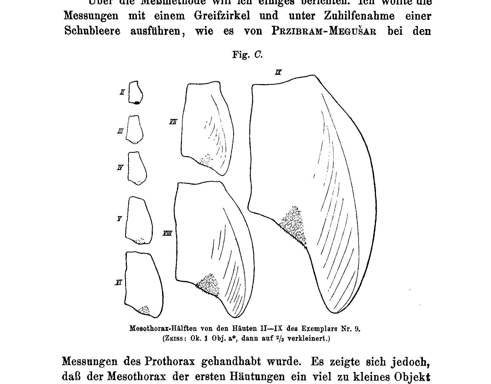
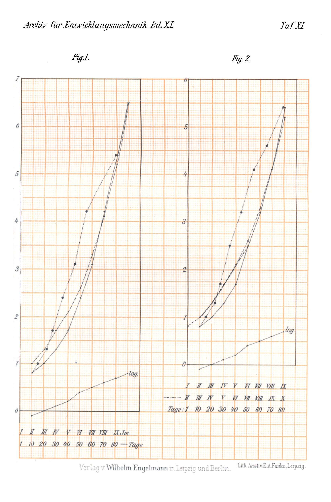
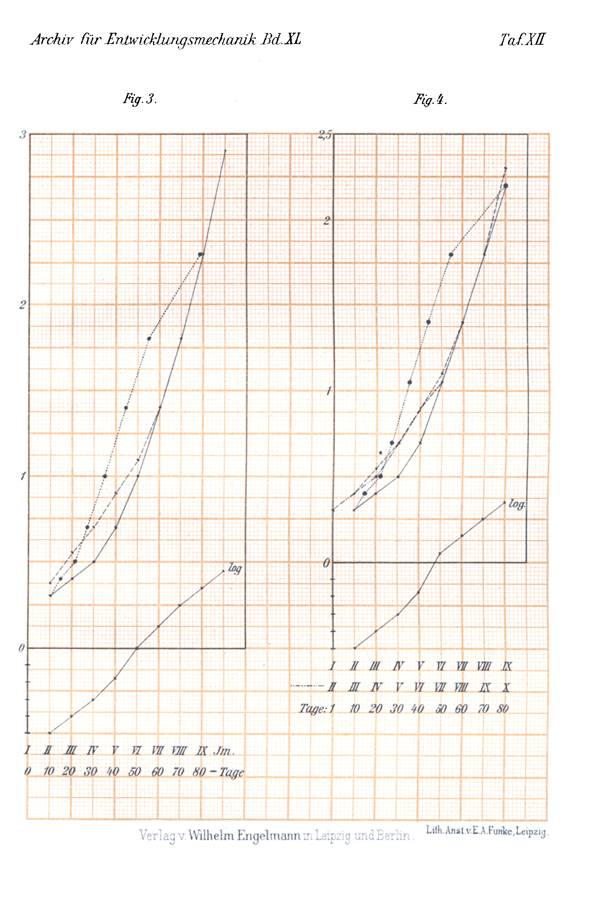
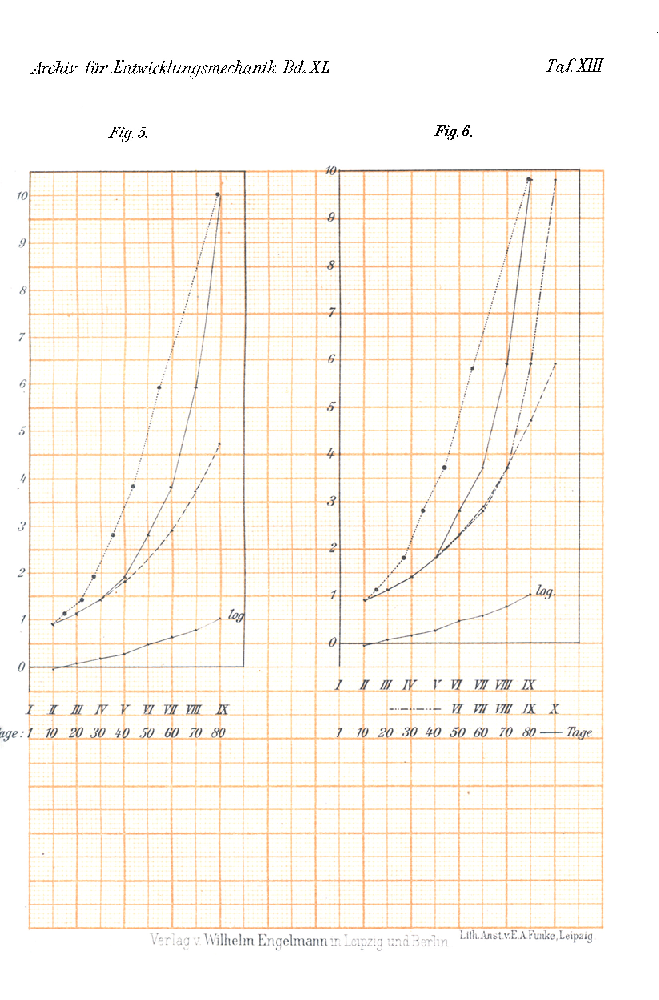
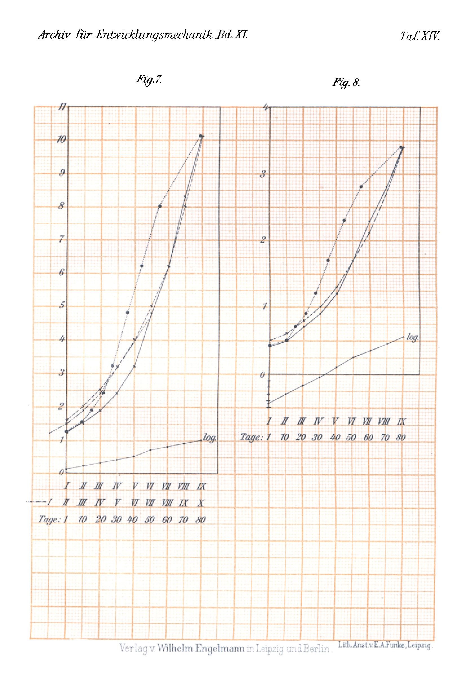
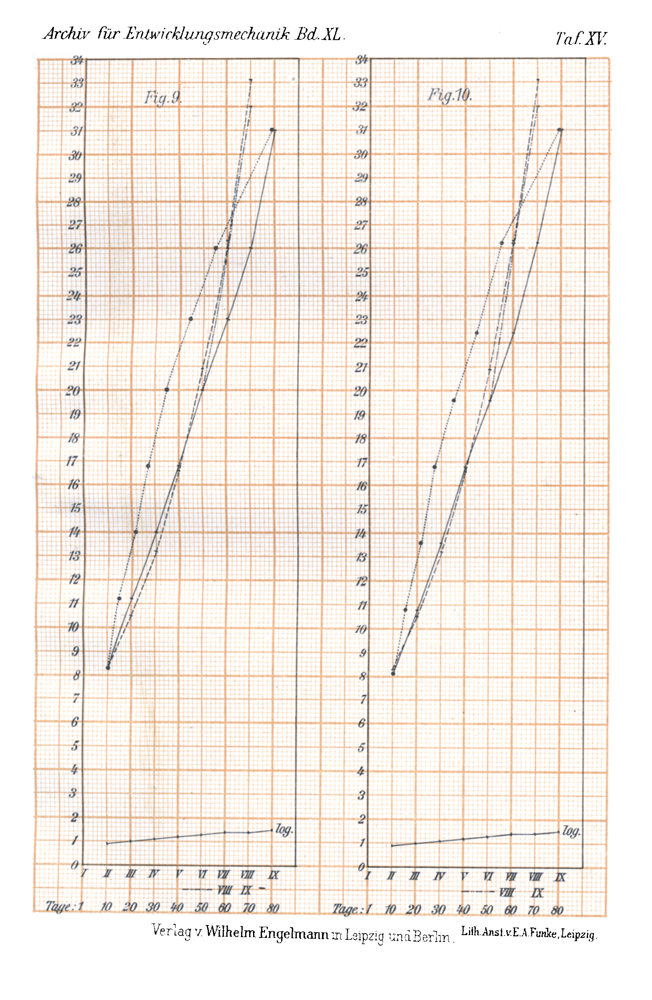
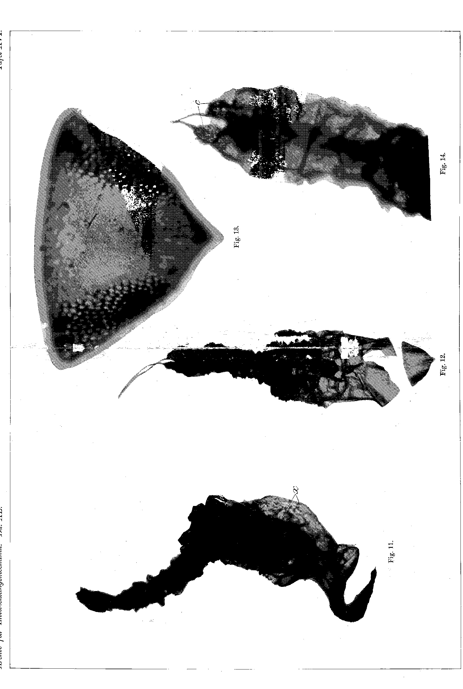
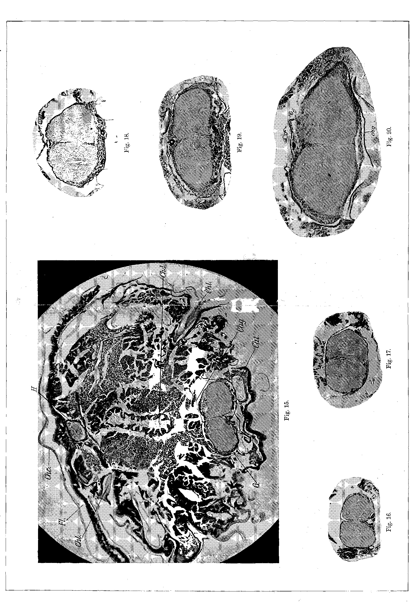
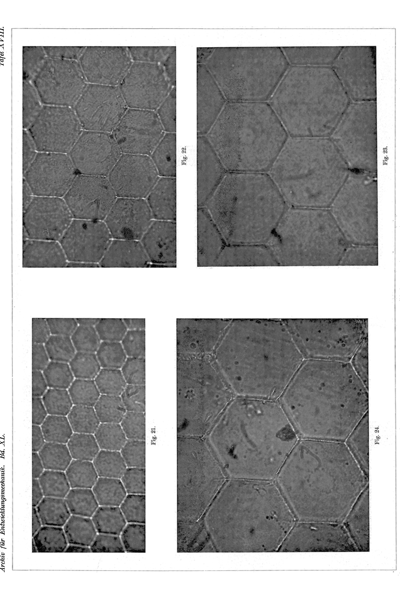

# Growth Measurements on Sphodromantis bioculata Burm.

## II. Length, Breadth, and Height.

### (At the same time: Rearing of the Praying Mantises. VI. Communication.)

By

Henryk Sztern (Warsaw).

From the Biological Experimental Institute of the Imperial Academy of Sciences in Vienna, Zoological Division.¹

With 5 figures in the text and Plates XI–XVIII.

Received on 22 June 1914.

*Archiv für Entwicklungsmechanik der Organismen*, vol. 40 (1914).

> **Full translation.** A complete English rendering of Sztern's growth measurements on *Sphodromantis bioculata* Burm., with the measurement tables and figure legends.

### Table of Contents.

|  | Page |
|---|---|
| 1. Introduction and Precise Statement of the Theme | 430 |
| 2. The First Moult | 433 |
| 3. General Methodology | 436 |
| 4. Counts of the Skin-epithelium and Measurements on the Ganglion Nuclei | 442 |
| 5. Measurements on the Mesothorax-Ganglion | 447 |
| 6. Measurements on the Mesothorax | 455 |
| 7. Measurements on the Prothorax | 463 |
| 8. Measurements on the Eye-facets | 465 |
| 9. Growth Curves | 467 |
| 10. Discussion of the Results | 473 |
| 11. Summary | 479 |
| 12. List of Literature | 481 |
| 13. Index of the Tables | 482 |
| 14. Index of the Curves | 494 |
| 15. Explanation of the Figures | 495 |

> ¹ An abstract of this work appeared under the title: Mitteilungen aus der Biologischen Versuchsanstalt der kaiserl. Akademie der Wissenschaften, Zoologische Abteilung, Director H. Przibram. 5. Wachstumsmessungen an *Sphodromantis bioculata* Burm. II. Länge, Breite und Höhe, by Henryk Sztern, in the Akademischer Anzeiger. Nr. XIV. 1914.

## 430

### 1. Introduction and Precise Statement of the Theme.

The long-familiar phenomenon of cell division, whereby a cell falls apart into two daughter cells, already prompted in earlier times the conjecture that the mass of the individual cell must double before division. The doubling, earlier assumed only conjecturally, was, however, only in recent times demonstrated for a whole series of animals by exact measurements and weighings — first in protozoa, then for the metazoa as well — discussed in detail in Przibram's Experimental-Zoologie (Vol. 4).

The results of these works led Przibram (1913) to the establishment of the following proposition: »The increase of living substance through growth indeed always proceeds in just such a way that the mass of each cell, before it falls apart in its division, doubles once more, *and that, in temporal relation, runs in parallel with the autocatalysis of dissolved chemical bodies«.*

The phenomenon of the doubling of the mass was pursued specially in the measurements and weighings, carried out by Przibram-Megušar (1912), on an Egyptian praying mantis, *Sphodromantis bioculata* Burm.

It turned out that the weight of the cast skins, as well as that of the just-moulted animals, exhibits a doubling from moult to moult. As Przibram further sets out, we may — given the regularity of growth that these animals show — set the masses proportional to the volumes and assume that the length [as also the breadth or the height¹] increases in the ratio of the cube root of the volume. The measurements of the prothorax also yielded that the length-increase from moult to moult corresponds on average to the cube root of two, i.e. to the increase-coefficient of the weight and respectively of the volume.

These results, which showed the doubling from moult to moult with especial clarity, led Przibram (1912) to a hypothesis, which essentially holds that in *Sphodromantis* — as perhaps in insects with incomplete metamorphosis generally — each moult corresponds to a »division step« in the body of the animal. If we assume that each cell of the body, having grown to its maximal size, divides into two daughter cells, and that thus, »upon the carrying-through of such a division step, the

> ¹ My remark.

## Growth Measurements on Sphodromantis bioculata Burm. II. 431

cuticula that has become too small is shed«, then we obtain precisely at each moult the doubling of the weight.

This hypothesis, as also many oral hints from Herr Professor Przibram, prompted the investigations here reproduced.

It was above all a matter of obtaining animals of *Sphodromantis* at various moulting stages, and then, if possible, of demonstrating nuclear-division figures that might be expected to occur in connection with the moultings. Since, however, no nuclear-division figures could be found, measurements of the cells — above all of the epithelial cells — were envisaged, in the hope of obtaining points of reference for the occurrence of the »division step«. The measurements of the epithelial cells turned out, owing to the unfavorableness of the material for technical treatment, to be quite difficult and laborious, so that I therefore applied another method, which will be discussed further on, by whose aid I was able to obtain some results pointing to the »division step«, which agree with the Przibram hypothesis.

Besides the skin-epithelial cells, ganglion cells too were drawn upon for investigation. It was not the cells themselves but the cell nuclei that were measured. Here too I was able to obtain results that can be interpreted in the sense of the Przibram hypothesis.

In connection with the last-mentioned measurements, the mesothorax-ganglion was measured on prepared paraffin sections at all moulting stages — (in animals on the day of the moult and in the intervals between the moults). These measurements yielded an important result. It was established that the division step, at least for the ganglion, takes place in the interval, and furthermore the approximate time-determination of the division step could even be ascertained.

The measurements on the ganglion, which brought the just-mentioned result, however confronted me with a question, to whose answering the following part of my work was devoted.

In the enlargement of the ganglion that sets in from moult to moult, there appeared arrests in the individual ganglion-dimensions, which occurred repeatedly and in a certain rhythm. This seemed to contradict the rule that had been found, according to which the mass, or respectively the volume, of *Sphodromantis* doubles from moult to moult and the individual dimensions (length of the pronotum) increase in the ratio of the cube root of 2.

## 432

### Henryk Sztern.

I was confronted with the question whether the arrests in the ganglion-dimensions are not matched by similar ones in other body parts or organs, or whether at least parallels to these arrests can be found in the enlargement of other body parts or organs.

This question led me to a series of measurements. Among individual body parts, the pro- and mesothorax, as well as the facets of the compound eyes, came up for measurement. Of internal organs, none was found for the present (apart from the already-measured ganglion) that might be suitable for measurement.

On the mesothorax, length- and breadth-measurements were taken on the cast skins, which are shed in almost unchanged size-proportions (cf. Przibram, 1906, 1909, 1912). In the method described in the following, where the skin was pressed under the cover-glass, any folds in the skin are also taken into account, so that the values obtained from the skins correspond to the actual sizes of the animals in the preceding moulting stage¹).

The prothorax-measurements, which concern the breadth and height of the prothorax, were carried out on the same individuals on which the ganglion-measurements were made, thus on animals at all moulting stages.

The above-mentioned facets were likewise measured on skins.

All these measurements, since they were taken on the same species, can be regarded as a supplement to the growth measurements of Przibram-Megušar (1912).

In all the measurements without exception, an agreement with the results ascertained by Przibram-Megušar could be established — so to speak by a purely mathematical route. Although very little material stood at my disposal, which often, especially at the last moulting stages, made itself felt in a disadvantageous way, I was able — thanks to the relatively great regularity of the growth of *Sphodromantis* (to which the automatically regulated constant temperature in the Biological Experimental Institute also contributed) — to establish the striking confirmation of the rule, namely the size-increase of the individual dimensions from one moult to another in the ra-

> ¹ As emerges from the measurements of Przibram-Megušar, the shed skin is by a negligible amount larger than the corresponding animal at the beginning of the preceding period.

## Growth Measurements on Sphodromantis bioculata Burm. II. 433

tio of the cube root of 2, with ease already at the first measurements.

The confirmation of this rule — which was indeed what was being sought — was a negative answer to the question raised above. The measurements furnished no point of reference for the explanation of the arrests in the enlargement of the ganglion. Here and there in these measurements, too, deviations from uniform growth did occur, but they could by no means be brought into connection with those of the ganglion, which occurred repeatedly.

It seems to me that I came closer to this problem through other measurements, which were taken on the mesothorax-skins. Besides the length and breadth of the mesothorax, I measured its »side-edge«, that stretch of the »larval« mesothorax out of which the forewing of the imago develops. From these measurements it emerged that the general rule here holds only for the first moults; at the last ones, continued deviations from uniform growth occurred.

In the discussion of the results I shall attempt to bring the deviations observed in measuring the »side-edge« of the mesothorax into connection with those of the ganglion.

After the measurements had been concluded, I illustrated the growth-course of the measured objects by curves; in doing so, in order to take account of the »parallels to the autocatalysis of inanimate chemisms«, I at the same time also represented curves with consideration of time (dotted).

### 2. The First Moult.

The life-history of the Egyptian praying mantis *Sphodromantis bioculata*, well known in the Biological Experimental Institute, has been presented in the earlier publications of Przibram (1906, 1909, 1912). Before I pass on to the description of my experiments, I will communicate a few things about the first moult of *Sphodromantis*.

The first moult takes place immediately upon the hatching of the animals out of the cocoon, and the cast skins remain hanging grape-like on a long cord — the rachis of the cocoon — (Taf. VI Fig. 1 in Przibram, 1909). Doubts were raised as to whether the grape-like hanging structure represents the skins of the just-hatched animals. By Herr Prof. Przibram the first skin was in-

## 434

### Henryk Sztern.

vestigated with respect to its chitin content, and the investigation confirmed that it consists of chitin (Przibram 1912, p. 703, footnote). I have made a whole series of total-preparations of these skins and examined them microscopically. A good preparation does not always succeed, since the skin is very small and brittle, and among numerous preparations I managed to make the ones depicted on Plate XVI, which are clear enough to furnish the proof that they represent a cast skin of the hatched animals.

A cast cuticula of the later moults is depicted in Fig. *H* in Przibram-Megušar (1912), and one sees at once that the first skin depicted by me exhibits a different position and shape. Fig. 11, Plate XVI, shows the natural position of the first skin, seen from the side; Fig. 12 shows the ventral side of the skin in the stretched-out condition, whereby the head-skin, being un-bent, has in consequence burst. The abdomen-skin in the natural position is curved arc-wise (Plate XVI Fig. 11); at its end the cerci appear clearly (Plate XVI Fig. 12 and Fig. 14 *c*), from which two thin strands go out, which connect with the common cord — the rachis of the cocoon — on which the skins hang.

The head-skin is especially conspicuous, as it exhibits a different position and shape than in the later moults; in contrast to the light-brown color of the whole skin, it is always colored deep dark-brown. Przibram (1909), in observing the larvae hatching slowly — in consequence of transfer into cold — perceives »in particular, at the transformation of the shape of the head, which within the egg-membrane is cone-shaped and elongated, into the broadly-triangular shape of the larva« (Fig. 36—38 in Przibram, 1909). The bursting of the first skin took place, just as at the later moultings, at the back of the thorax. The skin-place that burst open on the dorsal side at the first moulting is clearly to be seen in the illustration (Plate XVI Fig. 11 *x*: below, dark). Just as at the later moultings, the head-skin too bursts dorsally at the sides of the eyes, and, in keeping with the originally elongated shape of the head, the head-skin is drawn out lengthwise. At the sides of the head-skin one perceives a net-like marking (Plate XVI Fig. 13). This can only represent irregular, strongly lengthwise-drawn facet-impressions of the forming compound eyes.

Pagenstecher (1864) describes the first skin of *Mantis religiosa* and likewise interprets this net-like marking as impressions

## Growth Measurements on Sphodromantis bioculata Burm. II. 435

of the facet-eyes. Quite decidedly Pawlowa (1896) turns against this. She investigated embryos of a genus, not yet hatched and just then being determined, which she calls *Hierodula bioculata* Burm.¹) and maintains that she found, beneath the net-like marking, regular hexagons on the skin. This statement I can by no means confirm; rather, the net-like marking points all the more to facet-impressions, since now and then — closer to the middle of the skin — a regular hexagon can be found isolated among the irregular facets.

According to Pagenstecher (1864), the mouth-parts at the first skin of *Mantis* appear »in the form of a truncated cone-shaped tube, supported by several bent chitin-pieces that are connected at the base by a transverse-lying root-piece«, which he calls a »mouth-cone«. Pawlowa (1896), on the contrary, describes the »mouth-cone« as the upper lip (labrum) of the animal and adds that the remaining mouth-appendages on the cast skin »shrink together to the point of unrecognizability and become imperceptible«. On the first skin of *Sphodromantis* I could find only the »mouth-cone«-like chitin-structure, but not the remaining mouth-appendages.

Pawlowa studied the skin on the embryo itself, whereas Pagenstecher investigated only the cast skin. The authoress thereby explains the contradictions in her observations with Pagenstecher's data; however, the contradictions probably stem from the fact that, as the authoress herself says, the first skin corresponds not to the finished embryo but to »the embryo-forms of an earlier embryonal stage«. The embryo, ready to hatch within the first skin, is probably much further developed than the first skin shows.

In the same way one may perhaps explain the statement made by Pawlowa regarding the facets. Pawlowa stained the embryos with carmine, and thereupon the regular facets emerged with particular distinctness. It would be possible that the head of the embryo within the first skin shows regular eye-facets, whereas the first skin itself exhibits the facet-impressions of an earlier embryonal stage. In consequence of the carmine staining, through the thin chitin-skin the regular facets of the

> ¹ The genus *Sphodromantis* is also called *Hiërodula*; it appears, however, that this was a matter of a related species, not of embryos of *Sphodromantis bioculata*.

embryo emerged, and thus Pawlowa found two kinds of facets on one skin.

 In the illustration of the first skin in Pagenstecher (1864) — Pl. I Fig. 7 — the extremities and antennae are depicted as well developed. On the I. skin of *Sphodromantis*, as is evident from Pl. XVI Fig. 12, no antennae are to be found, and the extremities are not as distinctly perceptible as Pagenstecher draws them. They appear in the form of humps (the dark spots of the thoracic region in Fig. 12, Pl. XVI), which, owing to the shrinkage of the skin, become so small that this skin appears legless. This gives the skin a still more peculiar shape compared with the later skins.

The skins, examined under the microscope, show numerous spots with a cell-like pattern¹, as is evident from Fig. 14 Pl. XVI. Such spots are found, although to a lesser degree, on all the later cast skins as well. The numerous spines of the embryonic skin described by Pagenstecher and Pawlowa, to which a great importance in the hatching of the animals is attributed and which are found on the thorax and abdomen, I was able to observe on the I. skin of *Sphodromantis* only on the cerci.

The first skins, hanging on the cocoon, are, when stretched out, about 2½–3 mm long, measured from the bend of the head-skin to the cerci; the breadth amounts in the anterior parts to about 0.85 mm, in the abdominal parts to about 0.40 mm (measured under the microscope).

These measurements, however, are not to be regarded as the size-figures of the embryo ready to hatch — as, in the later moults, each cast skin shows approximately the size of the preceding stage — because the whole first skin, except for the head-skin, exhibits an uncommonly large number of folds (not only on the abdomen, as in the later skins). The embryo itself is larger than the numerously folded, cast-off skin.

> ¹ Whether what is involved here is really cell-imprints of the epithelium has not yet been investigated.

## 3. General Methodology.

As mentioned, very little material was at my disposal, and my investigations extended only to 19 animals. This lack of material arose because at that time [March 1913] the *Sphodromantis* cocoons from earlier breedings, which are otherwise deposited in large numbers, were no longer present at the Institute, and the new cocoon-shipment from Alexandria, which arrived on 3 March 1913, contained only two cocoons. From the one that was at my disposal, a number of young hatched on 31 March, of which, however, already on the very next day more than half died. Thus only the survivors, 20 in number, had to serve me as material.

This "natural" and then, brought about by the conserving, "artificial" selection — in which, above all, the weaker specimens and those that did not regularly take up nourishment came to be conserved — has shown good results insofar as, of the 20 animals, in the course of the experiments only one animal — namely specimen No. 15, in the II. moult (cf. Tab. A) — came to grief and had to be eliminated from the experimental series as a "cripple."

In accordance with the topic of my work specified in the first section — to obtain animals at various moult-stages — the moment of conserving was likewise chosen. This can be seen from Table A (excerpt from the protocol). Animals were conserved on the day of the completed moult and in the intervals between the moults.

The animals moult, as a rule, in the earliest morning hour, and for the most part they were found in the morning already after the completed moult. The time elapsed from the moment of the conclusion of the moult until conserving could therefore not be ascertained, and in order to express this, I chose the expression "on the day of the moult." In contrast to this, I designated as "immediately after the moult" those conserved animals which, at the completion of the moult — that is, partly were already in the new skin, while the animals themselves, by contrast, were still in the old skin. These animals too, which were not included in the experimental series, came to the histological investigation.

The choice of the animals from the intervals for the purpose of conserving was at first rather difficult. After, on 31 March — the day of hatching and thus the day of the first moult — specimen No. 1 (Tab. A) was conserved, the duration of the time-interval had to be assumed by estimate when conserving the next specimen, in order to choose the conserving-day. Also, when conserving the animals in the moult-intervals, I wished to determine the point in time more precisely.

For the interval I.–II. moult (Exempl. No. 2, Tab. A), its duration was assumed a priori as 14 days, after the data of Przibram-Megušar (1912), and specimen No. 2 was conserved on the 8th day after the I. moult. In Table B the time-intervals (in days) are compiled for all animals between each two consecutive moults, and we see that the time-mean of the I.–II. moult-interval amounts to 14.8 days. Thus, with the above assumption I came approximately to the correct value, and the stage of specimen No. 2 was entered in the protocol as "½ of the interval."

In further moult-intervals I tried, for the animal chosen for conserving, to determine its moult-date in advance from those of its fellow-sufferers.

In the II.–III. and III.–IV. moult-intervals (Tab. A, Exempl. No. 16 and 5) this was, however, not yet possible, since too few moult-data were available, and these animals were conserved without drawing on a comparison-date. However, from Table B it follows that the time-means for these moult-intervals amount to 8.8 and 8.3 days, and since the animals were conserved on the sixth day after the preceding moult, they correspond in their stage to about ²⁄₃ of the interval.

In the next five moult-intervals, the determination of the conserving-day was substantially easier. There I laid value on conserving animals "shortly before the moult," and indeed in such a way that, as the day for conserving, I chose those data of the comparison-animal whose two skins, with the same or similar preceding moult-data, I brought for comparison — which had already completed the moult to be expected for the specimen in question. The numbers of these comparison-animals are given in Table A at the specimens in question.

Even if, on the basis of this, the impending moult-date could not be determined with certainty, the comparison-animals nevertheless served me as points of reference in the conserving, whereby I was permitted to presuppose the regularity of the development, in spite of the (narrowly bounded) individual differences, at the constant temperature (25° C) and regular feeding (every second day feeding with flies and daily spraying by means of a fine atomizer).

Indeed, a comparison with the time-means given in Table B for each moult-interval confirms in essence the correctness of this comparison-method, and thereby the approximate correctness of the presupposition. This is illustrated by the following compilation:

| From Table B | | From Table A | |
|---|---|---|---|
| Moult-intervals | Time-mean (days) | Conserv. according to the preceding moult | Specimen |
| IV.–V. | 9.6 | on the 8th day | No. 20 |
| V.–VI. | 12.1 | „ 10. „ | „ 18 |
| VI.–VII. | 13.4 | „ 12. „ | „ 17 |
| VII.–VIII. | 17.2 | „ 16. „ | „ 11 |
| VIII.–IX. | 38 | „ 40. „ | „ 7 |

From this compilation it follows that all the specimens cited here were conserved "shortly before the moult" (cf. "Remarks," Tab. A) and that each of these specimens represents a stage of at any rate far more than ²⁄₃ of the corresponding interval.

In the two first moult-intervals coming into consideration here (Exempl. No. 20 and No. 18), the conservation is about two days before the impending moult; in the two next intervals (Exempl. No. 17 and No. 11) about one day before the moult took place; and in the last interval the conservation-day of the animal (No. 7) amounts to more than the corresponding time-mean, which, to be sure, was obtained only from three intervals (cf. Tab. B, last horizontal row).

> *Archiv f. Entwicklungsmechanik. XL.* — 29 In the last-named case, it concerned the impending IX. moult and — judging by the three animals developed to imago under equal conditions — the imaginal moult. All three animals that had become imago had undergone 9 moults, although they were all females¹. Unless we are precisely to assume that the animal would not have undergone the last, imaginal moult at all — for which there is no ground — we must assume that specimen No. 7 was probably conserved immediately before the IX. moult.

Thus, from each moult-stage two specimens were killed, namely one specimen on the day of the moult and one in the interval, whereby the first always came to conservation in the forenoon hours, the second in the late afternoon hours. This conservation-method is evident from the tables, where the "number" column is inserted (Tab. B, E, F, G, H, J). Thus, for example, it can be seen from Table B that, in the first moult-interval, the number of animals coming into question amounted to 18; in each next moult-interval the number of experimental animals is always two fewer, until finally, in the last moult-interval, there are unfortunately only three animals which must furnish the average value.

With the ever further shrinking number of experimental animals, I always had to fear that, in the event of the appearance of a new "cripple," or in the case of ten or more moult-stages, individual specimens would be lacking for the conclusion of the experimental series. However, at the end there still remained one animal, specimen No. 4 ♀, which was not conserved and was used for further breeding, after it had still rendered me good service as a measuring-object.

As conserving-fluid, picric-acid alcohol (conc.) was chosen, on the one hand in order to attain rapid penetration in spite of the chitinous cuticle, on the other hand in order to obtain a distinct plasma-staining with cell-borders, because I envisaged possible measurements of the cells right at the beginning of the work. The objects were then washed out in 75% alcohol and, rising up to absolute alcohol etc., embedded in paraffin. Although picric acid is as a rule easily and

> ¹ According to Przibram (1906, 1912) the ♀♀ possess, under otherwise equal conditions, more moults than the ♂♂; the number of the moults for the ♀♀, kept at 25° C, amounts as a rule to 10–12, for the ♂♂ 9–10.

thoroughly washed out, it could, for the larger objects, often [take] months before one could thoroughly remove the picric acid. For this reason I mostly applied, as staining-method, borax-carmine-picric acid, and only with those objects where I specifically expected nuclear-division figures were the prepared sections, after long washing-out of the objects in 75% alc., stained according to Heidenhain. With both staining-methods I obtained quite distinct images, insofar as the sections themselves were not torn apart.

As favorable as *Sphodromantis* is as an object for the study of growth (Przibram-Megušar 1912), so unfavorable does it prove, like almost all insects, as an object for technical treatment. Although the picric acid penetrates fairly quickly in spite of the chitin, the dissection of the objects into thin serial sections presents great difficulties. Often the cuticle, strongly hardened in consequence of the paraffin-warmth, tears at one place under the microtome knife, and a whole row of paraffin-sections following thereupon is destroyed. Especially with the animals in moult-intervals, in which the cuticle is very thick and hard, the cutting becomes particularly difficult. I have tried to make the chitin more pliable and softer with Eau de Javelle or Eau de Labarraque, yet I could attain no good results thereby. The chitin was indeed more pliable, but the epithelium — even in thick-skinned animals in the moult-intervals, under the most careful possible action — was always more or less attacked, and the cutting nevertheless proved difficult. A special difficulty in the staining of the sections consists in that quite flawless paraffin-sections, when one brings them into xylene to remove the paraffin, are torn apart by the chitin-strip surrounding each section, which loosens in the solvent-fluid and drags the whole section, or part of it, with it. Even sections firmly glued on with egg-white [albumen] often meet the same fate.

Despite all these difficulties, I nevertheless succeeded in producing a whole number of serial sections on which this study was possible. One of these more or less successful sections is depicted in Pl. XVII Fig. 15. It is a cross-section of specimen No. 18, an animal in the moult-interval V.–VI., met approximately at the end of the mesothorax. One sees the thick cuticle (Chc), depicted as inseparable from the horn-epithelium and the wing-folds (Fl), and the chitin-strips (Chl), which in the body of the animal again, and with the chitinous detachment of the inner organs, contribute to the technical difficulties.

> *Archiv f. Entwicklungsmechanik. XL.* — 29* The springing-off of the chitin is the rule in all sections: in Fig. 15 one sees the sprung-off chitin of the fore-gut (Chd) and of the tracheae (Cht).

About the methods of the further measurements carried out, I shall report at the relevant sections.

It may perhaps not be uninteresting that all the experimental animals serving me for the investigation were females. In Table A the sex is given only for those animals which have completed the VI. moult and were thereby large enough to allow the sex to be recognized with certainty without further investigation.

## 4. Counts of the skin-epithelium and measurements at ganglion-cores.

As already mentioned earlier, my investigations were directed at ascertaining the "division-step," that is, it was above all a matter of demonstrating nuclear-division figures. According to the results of Przibram-Megušar, it was given from the outset to seek these in connection with the moults.

In no moult-stage that came to investigation was I able to find nuclear-division figures. It may be that the unfavorableness of the material for histological investigation, and consequently the generally poor serial sections, are to blame for this; or that the nuclear-division figures occur so sparsely in the investigated stages that they were overlooked by me, in spite of attentive study, owing to the exceedingly great number of sections; or also that the investigated sections referred only to one body-part, the mesothorax (histological sections were prepared only of the mesothorax) — but I believe I can assert that none of these stages investigated by me contains the "division-step." Were this the case, then the cells in process of division, and thereby the nuclear-division figures, would have to be so numerous that none of the above-mentioned circumstances would come into consideration. They would also then not come into consideration if the division-step does not take place "synchronously," that is, in all body-parts at the same time, for then too the nuclear-division figures would have to appear exceedingly numerously, even if only in single organs. Whether the division-step everywhere takes place synchronously, and thus would really equal a "step," cannot for the present be decided. That it, however, takes place approximately in the same time-section, for that the various moult-stages may speak, of which none, in whatever organ, contains the "division-step." In order to procure for oneself the certainty of the latter, at least with regard to the skin-epithelium, it would presumably be the most obvious thing to undertake measurements of the skin-epithelial cells. Cells that find themselves immediately before the division would then have to be larger than cells in other stages. Since, however, I could distinguish no distinct cell-borders in the skin-epithelium, I have undertaken counts of the distinctly emerging skin-epithelial cores.

The cores were counted at a strong magnification under the microscope by help of a micrometer-ocular (Zeiss: Ok. 5, Obj. DD) on an equally large stretch, whereby in all stages the same section (that one which showed the largest ganglion-diameter in the mesothorax) and approximately the same epithelial place was chosen. The stretch amounted to 50 graduation-marks of the micrometer-ocular, equal to 120 µ.

The numbers of the epithelial cores that fell upon this stretch are entered in Table C at the corresponding specimen-numbers and moult-stages. One sees at the first glance that in all moult-stages the number of the skin-epithelial cores on the same stretch is approximately the same. It moves, namely, within the limits 12–14, and the average out of all stages "on the day of the moult" (Tab. C α-average) amounts to 13, the average out of all stages "in the moult-intervals" (Tab. C β-average) = 12.7. The agreement is evident.

If we wish to seek the explanation of this agreement, then we need only picture to ourselves the cell-division-process. In the text-figure A I have depicted the scheme of a cell-division. If we picture to ourselves two cells (a) on a certain stretch, which are then to multiply by division, then they reach a stage (b), where the core-division-figures appear, until they fall apart into four equally large daughter-cells (c). These four daughter-cells (a₁) reach in turn the stage of the core-division-figures (b₁), until they fall apart into eight equally large daughter-cells (c₁). The dashed lines, which designate the ever equally large stretch, show that within the limits of these lines the number of the cores, and thereby the number of the cells in the stages a-c-c₁, is the same, namely amounts to two cores and two cells. From this it follows that the moult-stages of *Sphodromantis* investigated by me correspond to the stages a-c-c₁ of the text-figure A. This is also confirmed by the fact that the by me geought, the various moult stages argue for this, of which none — in whichever organ — exhibits a "division step."

In order to obtain certainty about the latter with respect to the moults, regardless of the body parts, measurements, counts of the integumentary epithelium were undertaken. The cells, which must lie immediately above the division in the other stages, could in the integumentary epithelium be distinguished as distinct cell boundaries; thus the counts of the distinctly emerging integumentary epithelial cells were undertaken. The nuclei were counted under strong magnification under the microscope with the aid of a micrometer ocular (Zeiss: Ok. 5, Obj. DD) upon an equally large stretch, whereby in all stages the same section was chosen (namely that one which presented the greatest ganglion diameter in the mesothorax). The stretch amounted to 50 scale divisions of the micrometer ocular, equal to 139 μ.

The figures of the epithelial nuclei, which fell upon this stretch, are entered in Table C at the corresponding specimen-numbers and moult stages. The agreement of the figures is evident at all moult stages: the number of the integumentary epithelial nuclei upon the same stretch is approximately the same. It moves namely within the limits 12–14, and the average of all stages "on the days of the moult" (Tab. Cα average) amounts to 13, the average of all stages in the moult intervals (Tab. Cβ average) — 12.7. The agreement is at once evident.

When we now seek the explanation for this agreement, we are compelled to set before our eyes the schema of the cell-division process. In the text-figure A this schema is represented. As soon as two cells (a) at a certain stretch are present, the division (b) follows; through the division the cell mass doubled (b₁), so that thereby either reach the great daughter cells (c₁) or also the small ones the breadth and length of the original cells. These great daughter cells (c₁) divide again, by going through the stage of the moult divisions (b₁), so that anew equally great daughter cells fall apart (c₁). The dashed lines, which always indicate the same stretch, designate, just as in the foregoing, the number of the nuclei and thus the number of the cells upon this stretch as the same. The average a–c–c₁ of the nuclei upon this stretch amounts to 13. From this it follows that the moult stages of *Sphodromantis* correspond to the stages a–c–c₁ of the text-figure A. This is also confirmed by the fact that with me the gesought stages, the *b* and *b₁* of the text-figure A, where division figures would be found, could not be demonstrated in my sections.

In this way the probability-proof is furnished that none of the investigated moult stages — at least in the integumentary epithelium — contains the "division step."

But which stages are they

**Fig. A.** Schema of a cell division. *(figure not reproduced)*

with respect to the "division step"? From the text-figure A we perceive that the stage c is at the same time the a₁-stage, that is, the four cells coming into consideration can be regarded either as after the division that has taken place (after the stage b) or as such before the division to be expected (before the stage b₁). And each of the stages a, c and c₁, which, as we have seen, correspond to our moult stages, can be conceived in the same way. The solution of this dilemma I shall attempt in the 10th section, in the discussion of the results.

The counts of the integumentary epithelial nuclei just discussed stand — although they are unable to give a direct proof for the "division step" between the moults — in agreement with the hypothesis set up by Przibram (see p. 430).

Przibram sought to explain the doubling of the mass by the doubling of the number of cells from moult to moult, under the presupposition of a fixed cell size of all stages, which results as a consequence of the completion of one "division step" each by the individual cells from moult to moult.

Since the number of integumentary epithelial nuclei upon an equally large stretch is a constant one, it follows from this immediately that the epithelial cells of the integument exhibit a fixed size at all moult stages.

Furthermore, the same number of integumentary epithelial nuclei upon one and the same stretch in all moult stages is a clearer proof for the division process in connection with the moults than is the direct demonstration of the division figures. We thereby may presuppose that with our animals too the weight, or the volume, doubles as a rule from moult to moult, as was established with the experiments of Przibram-Megušar for *Sphodromantis*. If, however, the volume or the mass from moult to moult is to be doubled, and the counts of the integumentary epithelial nuclei point to division processes of the cells in all moult stages, so the number of the integumentary epithelial cells too would have to exhibit a doubling from one moult to the other.

These are conclusions which result from the counts of the epithelial nuclei.

The measurements of the ganglion nuclei stand again in agreement with the more often mentioned hypothesis.

There were undertaken in the sections of the mesothorax ganglion (Taf. XVII Fig. 16–20) measurements of the ganglion nuclei at all the moult stages drawn into the investigation, after the boundaries of the ganglion cells themselves could not be recognized distinctly enough and the cells therefore appeared unsuited for the measurement. The measurement was made by means of a micrometer ocular at strong magnification (Zeiss: Ok. 5, Obj. DD), whereby likewise in all stages that section was chosen which exhibited the greatest ganglion diameter. The nuclei were divided into "large" and "smaller" and under these rubrics are entered in Table C the values (in scale divisions of the micrometer ocular, whereby to one scale division 2.4 μ corresponds) at the corresponding moults and intervals, as for example designated above, entered.

Upon superficial survey of these figures it strikes one at once that they fluctuate only within narrow boundaries. The average shows with clearness these slight fluctuations of the nuclear size. The average of the nuclear sizes at animals on the day of the moult (Tab. Cα average) fluctuates between 2.1 and 4.2, the average at animals in the moult intervals (Tab. Cβ average) between 2.2 and 4.2.

The agreement is surprisingly great and thus we can say that at all observed stages of the metamorphosis the size of the ganglion nuclei moves within narrow limit-values.

So exhibits e.g. specimen Nr. 1 (Tab. Cα), a larva, conserved immediately after hatching from the cocoon, whose total length amounts to about 6 mm, the identical nuclear sizes as the specimen Nr. 3 (Tab. Cα), an animal already developed into the imago, of which one body part alone — the mesothorax — at the IX. moult was about 5½ mm long, (Tab. E IX. Htg. Nr. 3); the ganglion-length size of specimen Nr. 3 exceeds in the height dimension by more than the double, in the breadth- and length dimension by about the threefold (Tab. Dα I. Htg. Nr. 1 and IX. Htg. Nr. 3 = cf. Taf. XVII Fig. 16 and 20) the ganglion size of specimen Nr. 1.

This finding lets itself unite quite well with the above-mentioned, found by various researchers, both among botanists (Strasburger, Sachs, Amelung u. a.) and also among zoologists (Rabl, Levi, Boveri u. a.) "fixed cell size."

The intimate connection between cell- and nuclear size let, among others, Boveri (1905), Driesch (1898–1904) and Morgan (1895–1901) recognize through experiments made, above all on the sea-urchin egg. R. Hertwig's (1903, 1908) "kernplasm-relation" proves likewise this connection. We know that the doubling of the cell-parts and cell-nuclei does not always proceed proportionally, and Hertwig points to it that thereby the equilibrium-ratio between nucleus and cell is disturbed. Yet these disturbances relate to a fixed kernplasm-relation, and at their conclusion the normal kernplasm-relation is again established. And so it would surely not be excluded that, analog to the "fixed cell size," also the nucleus possesses at definite stages a fixed size, namely in the resting condition, and it is such stages that we are concerned with at the animals investigated by me (text-fig. A—a, c and c₁).

In the discussion of the results of the *Sphodromantis* work says Przibram (1913): "The weight-doubling from moult to moult and the thereby caused proportional length increase lets itself very well unite with our conception, as soon as we make the assumption that, with the division of the cells, as soon as they have reached a definite size, united¹), as soon as we accept that a moult then sets in when each cell of the whole body has grown again to its maximal measure."

So far the question of the fixed size of the epithelial cells, as also the found "fixed nuclear size," considered as analog to the fixed

> ¹) My underlining.

size of the ganglion cells¹) (which already could be adopted as very probable), is in no contradiction with the Przibram hypothesis, on the contrary, the latter finds therein its confirmation.

### 5. Measurements on the mesothorax ganglion.

From the counts of the integumentary epithelium and measurements on the ganglion nuclei in all investigated moult stages I could obtain no information about the temporal occurrence of the "division step." I hoped thereby to be able to come nearer to this question from the measurements of a definite organ.

As suited for these measurements seemed to me the mesothorax ganglion of the abdominal ganglion chain, whose situation a cross-section through the mesothorax illustrates (Taf. XVII Fig. 15 G). It is an organ whose form alters in the course of the development not inconsiderably.

A change of the form of the ganglion during the metamorphosis I could observe in the last moult stages over against the first ones. The change occurs about from the VI. moult on. In the Taf. XVII Fig. 16–20 is depicted the ganglion of the I., III., V., VII. and IX. moult of the animals which were conserved on the day of the moult (Tab. Dα), and one sees that at the two last moults the ganglion appears more pulled-out in the breadth, over against the more uniformly rounded form at the three first moults. This phenomenon let itself be observed at the animals which were conserved in the moult intervals. An analog observation, where the alteration of the form likewise took place from the VI. moult on, I made at the mesothorax, whereupon I shall point later.

Probably in consequence of the technical treatment the wrapping²) of the ganglion detaches from the ganglion mass (as already at the moult), as is also the case with the chitin present in the body)

> ¹) On the growth of the ganglion cells at the vertebrates cf. Allen (1912) and Plenk (1913).
> ²) It has the appearance that the ganglion as well as the issuing commissures consist of chitin, which in the first moult stages appears as a thin chitin-ring (Taf. XVII Fig. 15 Chg) and at the end of the metamorphosis reaches the thickness of the cuticula (cf. Taf. XVII Fig. 15 Che u. Fig. 20 Chg). Whether the wrapping of the ganglion really consists of chitin, was not yet investigated.

and draws the adjoining parts with it, as one sees this e.g. in the Fig. 17 and 20 Taf. XVII. This offers a certain difficulty with the measurement, insofar as the measurement boundaries are not always to be determined exactly.

An organ suited for the measurement seemed to me at first also the heart (Taf. XVII Fig. 15 H), however its form changes strikingly at different objects, and for this reason I have for the present renounced these measurements.

The measurements on the mesothorax ganglion are summarized in the Table D. They were undertaken in the three dimensions. In order to avoid misunderstandings, I will determine the latter exactly: I orient myself thereby according to the dimensions of the animal located in its natural position. As breadth I designate the transversal direction (after the Fig. 15), as height the dorsoventral direction (likewise after the Fig. 15) of the ganglion. The ganglion-length results from the length of the whole animal.

The breadth- and height measurements were carried out with the help of the micrometer ocular and these values are entered in the Table D, whereby to one scale division of the micrometer ocular 10.1 μ corresponds. The figures corresponding to the length dimension were calculated according to the sections making up the series. Since the thickness of all the sections made with the microtome amounted to 5 μ, in the figures of the length dimension 1 "Strich" = 5 μ corresponds.

Now the things lie so, that even sections made on the best microtomes, indeed at the most careful work possible, in reality do not always possess the desired thickness, especially when one makes a greater number of sections one after another. Rather the thickness of the section depends upon various circumstances, as upon the hardness of the object, the momentary sharpness of the microtome-knife etc. One best counters these chance occurrences by cutting "ribbons," which however, as is well known, does not always succeed. And although our sections were made on a good Leitz microtome, they are, with the various thickness and hardness of the chitin, not equally thick, which one can best notice at the various intensity of the staining, even with exactly the same duration of action of the dye — thus at sections on one and the same slide. However the errors which result from the various thickness of the sections are compensated by the series.

Let us now turn to the Table D, where the results of the measurements are summarized¹). When we consider the breadth-, height- and length-columns of the ganglion "on the day of the moult" (Tab. Dα), we see at once that the figures do not continuously enlarge, but rather that in the enlargement of the ganglion, continuously from one moult to another, standstills occur in the individual dimensions.

So is e.g. from the I. to the II. moult only the height enlarged (Tab. Dα, I. and II. Htg., Nr. 1 and 12), the breadth and length remained unchanged, from the II. up to the III. moult the height remained unchanged, however breadth and length enlarged (Tab. Dα, II. and III. Htg., Nr. 12 and 10). Such standstills in the individual dimensions let themselves recognize both from the comparison of the further moults, as also from the measurements of the ganglion at the animals in the moult intervals (Tab. Dβ).

After this we would have here to do with non-proportional growth; and, to judge by the enlargements or non-enlargements of the mesothorax ganglion, one could expect that also the whole animal, and thus its body parts, could exhibit these standstills in the dimensions concerned. That this is indeed the case we shall learn from the breadth- and height measurements of the prothorax at the individual animals (Tab. H) and from the measurements of the mesothorax at the cast-off skins, and thus we shall come back still more often to the standstills in the enlargement of the ganglion.

It lay near to me to investigate, whether at the individual stages, which exhibit an enlargement, there does not result an agreement in the breadth-, height- and length increase of the ganglion with the ratios found by Przibram-Megušar (1912).

In order to obtain clearer results, it was necessary to undertake corrections to the individual figures, which indeed change nothing at the ascertained total size of the mesothorax ganglion, the product from breadth, height and length. The corrected values are entered in brackets: ( ) at the corresponding dimension values, en-

> ¹) The figures concerned in the Table Dα for the breadth- and height dimensions of the specimens Nr. 1, 10, 19, 13 and 3 I controlled in the figures (Taf. XVII Fig. 16–20), in that the breadth- and height dimensions of the Table Dα and of the Fig. 16–20 proved to be in the same ratio to one another.

tered into the Table D¹). These corrections were so much the more necessary, as in this case, in consequence of the technical treatment, the form of the ganglion and thus the size of the individual dimensions only more or less suffers¹).

(... continuation beyond owned pages ...)

Apparently this became evident in specimen No. 11, preserved in the moult interval VII–VIII. As is recorded in the "Remarks" of the excerpt from the protocol (Tab. A), the object (mesothorax) was crushed through carelessness, and indeed the pressure occurred in the height-direction of the animal, so that the object was crushed almost flat. The ganglion of specimen No. 11 also shows, in the height dimension, a number improbably small at first glance, namely 28 (Tab. D β, No. 11 Height), whereas the length [shows] too large a number, namely 70 (Tab. D β, No. 11 Length), i.e. the length of the ganglion in a larva in the moult interval VII–VIII would then be greater than in the imago (e.g. in specimen No. 9, Tab. D β Length). It is clear that here, as a result of the pressure, the height was reduced in favour of the length, whereby the width remained almost unchanged. This change in height was also at once recognizable in the whole cross-section. But even there, where the displacements in the size of the individual dimensions did not become so obviously evident, an assumption of such [displacements] is more than justified, because, owing to the smallness of the objects, a greater or lesser pressure in one direction or another cannot be avoided in the technical processing.

Let us now compare the relevant stages that exhibit an enlargement. The agreement to be expected with the size-increase of the cervical shield [pronotum] ascertained by Przibram-Megušar would be that the dimension exhibiting an enlargement would increase by the cube root of 2, i.e. by about 1.26 times, as compared with the dimension of the preceding stage. In the columns marked with an asterisk (*) I have entered, for each enlarged dimension, a calculated — italicized — number, which was obtained from the multiplication of the corresponding (where applicable, corrected) dimension of the preceding stage by 1.26.

A comparison of the numbers in these (asterisked) columns with those standing to their left, i.e. with the

> ¹ It goes without saying that the regular change of the form of the ganglion mentioned earlier, from the VI moult onward, is not to be attributed to the technical processing.

ganglion dimensions that exhibit the enlargement — yields a quite considerable mutual agreement; and even when one substitutes the corrected — placed in brackets ( ) — values, the corresponding numbers are in many stages identical.

These measurements on the ganglion now give us an unambiguous disclosure about the temporal occurrence of the division-step, at least for this organ.

Let us compare the widths, heights and lengths of the ganglion in the animals on the day of the moult (Tab. D α) with those in the animals in the moult intervals (Tab. D β). That is, let us compare the horizontal rows of Table D, apart from the columns marked with an asterisk. We see that the dimensions of the first three horizontal rows of the one half (α) of the table almost exactly agree with those of the second half (β); likewise the last five horizontal rows of the one half (α) of the table [agree] with the corresponding five rows of the second half (β). An exception in the last-named five rows is formed only by specimen No. 17 (Tab. D β), and only in the width dimension; this, namely, already shows the size of the following stage, of the interval VII–VIII, the width dimension of specimen No. 11. It follows from this that between these two stages (VI–VII and VII–VIII) a standstill in the width dimension occurs, whose significance I shall take into further consideration.

Apart from this single exception, the great mutual agreement of these above-mentioned horizontal rows is evident, and when we take into account the corrected — placed in brackets — values, the corresponding numbers are identical in many stages.

In considering the horizontal rows of the two halves (α and β) of Table D, it strikes one at once that specimen No. 8, which attains the IV moult, exhibits an enlargement in the corresponding dimensions of the β-half [width, height and length in the β-half]. The width [in the β-half] gives, in the relevant horizontal row of the β-half, no enlargement. I have come to this through the following considerations.

Let us examine the specimens entered in the β-half of Table D, i.e. those which were preserved in the moult intervals, with regard to the moment of preservation within the interval. For this purpose we turn to Table A. There we find that the first three specimens of the β-half of Table D, the specimens No. 2, 16 and 5, are those which were preserved without a comparison-date, and, as we ascertained in the third section, specimen No. 2 was preserved in ½ of the interval, the specimens No. 16 and 5 in ⅔ of the interval, which is also recorded in Table A at these specimen-numbers in the "Remarks."

Animal No. 2, which was preserved in ½ of the I–II moult interval, shows the same ganglion dimensions as animal No. 1, whose preservation took place on the day of slipping, i.e. of the I moult (Tab. D αβ, first horizontal row); the animals No. 16 and 5, which were preserved in ⅔ of the II–III and III–IV moult intervals, likewise show in the corresponding ganglion dimensions the same as the animals No. 12 and 10, which are preserved on the day of the II and III moult (Tab. D αβ, second and third horizontal row).

From this it follows that the division-step in the ganglion is accomplished neither in ½ nor in ⅔ of the interval.

Something different results when we take into consideration the moment of preservation for the further specimens No. 20, 18, 17, 11 and 7. In Table A these specimens are recorded as preserved "shortly before" the moult to be expected. And precisely these specimens show in Table D ganglion dimensions that are identical with those of such specimens as have already accomplished the corresponding moult — which, in the former, is only to be expected.

So, for example, specimen No. 20, an animal that was preserved shortly before the V moult, shows the same ganglion dimensions as specimen No. 19, an animal preserved on the day of the already accomplished V moult (horizontal row: Tab. D β No. 20 and α No. 19); the specimen No. 6 preserved immediately after the VI moult (cf. Tab. A No. 6 "Remarks") possesses the same ganglion dimensions as specimen No. 19, an animal that was preserved about 2 days (see p. 439) before the VI moult (horizontal row: Tab. D α No. 6 and β No. 18). Still more clearly does this become evident in the comparison of the dimensions of specimen No. 7 with those of the specimens No. 9 and 3 (Tab. D α, last horizontal row, and β, last two horizontal rows); in all [of them] the width, height and length are almost the same. That is, that specimen No. 7, an animal which, as we ascertained in the 3rd section, was probably immediately, but at any rate "shortly before," the IX moult (Tab. A No. 7 "Remarks"), possessed a ganglion equally large as the imago-specimen No. 3 immediately after the IX moult (Tab. A No. 3), or as specimen No. 9, an animal preserved already one day after the imaginal moult (IX moult). (This specimen No. 9 was preserved only as a control, and it confirms, as we see, the dimensions of specimens No. 3 and 7.)

From this it follows that in animals whose moment of preservation lies "shortly before" the moult, the division-step to the next, not yet occurred moult has already taken place.

In conclusion we call once more to mind that all the animals which are preserved "shortly before" the moult, as we established in the 3rd section (see p. 439), at any rate represent far more than ⅔ of the corresponding interval, and were thus preserved about in the last third of the interval.

On the basis of the width and height measurements, the calculations of the length dimensions, and on the ground of all the considerations adduced above, I arrive at the following result:

The division-step for the mesothorax ganglion takes place in the moult interval, and indeed shortly before the moult to be expected, about in the last third of the interval.

This explains, too, why in the β-half of Table D the ganglion dimensions corresponding to the IV moult of the α-half are not present. Specimen No. 5 was preserved in ⅔ of the interval, thus we can say "shortly after" the III moult, when the division-step has not yet taken place; hence it also shows the dimensions of specimen No. 10, which is likewise found shortly after the III moult; the next animal that came to preservation in the moult interval was specimen No. 20, which, however, was killed shortly before the V moult, and indeed in the last third of the moult interval IV–V, where the division-step has already taken place. Therefore the last-named specimen also shows ganglion dimensions which correspond not to the IV, but to the impending V moult, thus the dimensions of specimen No. 19, whereby the stage corresponding to the IV moult, [represented by] specimen No. 8, of the ganglion size, was excluded from the preservation series of the moult stages. This accidental exclusion of the stage of the IV moult confirms most emphatically the correctness of the result presented above.

Let us once again consider Table D, which has already furnished us so much that is valuable.

A comparison of the horizontal rows of the α- and β-halves of this table yields the interesting fact that the standstills in the individual ganglion dimensions occur in a certain rhythm, in that the enlargements take place at all corresponding moult stages (α—β) as a rule in equal dimensions and in equal number of the dimensions.

That the enlargements as a rule occur in equal number, one sees from the comparison of the last column of the α-half with that of the β-half; the last number of these columns, the sum of the dimensions in which an enlargement takes place, amounts in both halves of the table to: 12, and proves with what regularity the ganglion enlarges itself when we take into account the whole duration of the metamorphosis. That the enlargements occur in the equal dimensions follows from the italicized, calculated numbers, which, in the comparison of the horizontal rows of the two halves of the table, are always found at the same corresponding dimensions. They had to be entered at these places because there always a 1.26-fold dimension-enlargement (in comparison with the dimension of the preceding stage) was found.

So, for example, in the α-half, in specimen No. 12, the italicized number is set only at the height dimension, and therefore the number of the enlarged dimensions (last column of the α-half) amounts only to 1; the same results in the corresponding specimen No. 16 of the β-half. In the comparison of all horizontal rows of the α- and β-halves the same can be established.

That this, however, is only the rule, but is not always the case, is shown by the specimen No. 17 in the β-half, already mentioned earlier as an exception, whose number of the enlarged dimensions amounts to 1, whereas in the corresponding specimen No. 13 this number is 0. The diversity of this and of the numbers following it (they are printed in bold in Table D) is brought about by the enlarged width dimension of specimen No. 17. This diversity in the bold-printed numbers of the α- and β-halves is, however, unable to change anything in the sum (12), because the specimens No. 14 and 11 (in the α- and β-half) again show the equal dimensions, and thus the sum of the bold-printed numbers of the α-half is the same as the sum of the bold-printed numbers of the β-half (in the α-half: 0 + 2 = 2, in the β-half: 1 + 1 = 2).

Accordingly the mentioned exception has no significance for the growth of the ganglion; it is, however, a clear indication that the rhythm too in the occurrence of the standstills can be disturbed.

By Przibram the VII moult was designated as that one which mostly exhibits a deviation from uniform growth (the deviation consisted in a quadrupling of the weight). We see in Table D, at the VII moult (No. 13 α-half), likewise a deviation, a standstill in all ganglion dimensions, which phenomenon also came to light frequently in the growth measurements of Przibram-Megušar. But that it need not unconditionally be the VII moult that exhibits such a standstill, is proved once again by specimen No. 17, where a standstill had most probably already set in during an earlier moulting period.

It may be mentioned here at once that, in the further measurements on other body parts, deviations from uniform growth were observed at moult stages other than at the VII moult.

If we now bring before our minds that all the results were obtained not from averages of several animals, but from individual specimens, then this, despite the deviations that occur, speaks for the great regularity of the growth of *Sphodromantis*.

## 6. Measurements on the Mesothorax.

After the first two specimens (cf. Tab. A No. 1 and No. 2) of the experimental series were preserved, all the remaining animals were isolated in individual cages. The skins cast off at each moult were likewise kept separately. Despite the number of skins shrinking ever more from moult to moult, which resulted from the preservation methodology, the sum of the cast-off skins was a rather large one, namely about 80.¹

> ¹ This is to be calculated from Tables E, F, G and J: the sum of each "Number" column of these tables yields about 80.

It seemed worthwhile to me to undertake measurements on these skins, which were intended to bring a confirmation of the size-increase ascertained by Przibram-Megušar for the length of the prothorax and by me for the individual dimensions of the mesothorax ganglion (namely for each dimension in the ∛2 = 1.26). I was all the more eager for the results of these measurements, as standstills in the enlargement of the individual ganglion dimensions had emerged, and I was anxious to know whether, in the measurements on the cast-off skins, analogous standstills — [in] individual specimens — could be found.

For this reason the mesothorax — corresponding to the mesothorax ganglion — was chosen, among the cast-off skins, for the measurements, and indeed length- and breadth-measurements were undertaken. (The height-measurements can be made on the cast-off skin only, if at all, with great inaccuracy.)

In the text-figure B I have sketched the mesothorax. The dashed line a-b shows the measured length and indicates at the same time the line where the splitting of the skin at the moult takes place. This [splitting] always occurs in the longitudinal direction of the animal, begins at the head and extends over the whole pro- and mesothorax; usually it ends in the middle of the metathorax, but often this [latter] too splits to the end, so that the splitting of the skin takes place from the head to the abdomen.¹ As I convinced myself in the course of measuring, the mesothorax splits almost with mathematical exactness in the middle, so that in the breadth-measurements it sufficed to measure only the half of the mesothorax-breadth, as the line a-d in text-figure B shows.

In the text-figure C the mesothorax-halves from the skins of specimen No. 9 are drawn in the sequence of the moults.

**Fig. B.** Mesothorax (from specimen No. 9, VII skin). a b length, a d ½ breadth, e f side-edge length. *(figure not reproduced)*

> ¹ The position of the meso- and metathorax can be seen from Fig. H in Przibram-Megušar (1912), where, however, meso- and metathorax are drawn not split open.

Only these halves came to measurement, for the above-mentioned reason, whereby, for greater certainty, the right and left halves of all the specimens were measured interchangeably. From the juxtaposition of text-figures B and C the length (a-b) and the breadth (a-d) of the measured objects result. About the measuring-method I will report a few things. I wished to carry out the measurements with a calliper and with the aid of a sliding gauge [Schublehre], as was done by Przibram-Megušar with the

**Fig. C.** Mesothorax-halves from the skins II–IX of specimen No. 9. (Zeiss: Oc. 1 Obj. a*, then reduced to ⅔.) *(figure not reproduced)* Only these halves came to measurement, for the reason mentioned above, whereby for greater certainty the right and left halves were taken from all specimens mixed together indiscriminately. From the juxtaposition of text-figs. B and C the length (a-b) and the width (a-d) of the measured objects result.

I should like to report a few things about the measurement method. I wanted to carry out the measurements with a caliper compass (Greifzirkel) and with the aid of a sliding caliper (Schublehre), as was done by PRZIBRAM-MEGUŠAR for the measurements of the prothorax.

**Fig. C.** Mesothorax halves from the skins II–IX of specimen No. 9. (ZEISS: Oc. 1, Obj. a*, then reduced to ⅔.)  *(figure not reproduced)*

It turned out, however, that the mesothorax of the first moults is far too small an object for accurate measurements to be carried out on it with a caliper compass, even under a strong magnifying glass. This first became possible with a certain degree of accuracy from the VI skin onward. The considerable difference in size of the mesothorax of the first moults as compared with the last moults is evident from text-fig. C. This argued for carrying out the measurements under the microscope; here, however, it turned out that, conversely, the skins of the last moults were too large to bring the whole image into the field of view of the microscope even at the weakest magnification. Therefore one had to apply the measuring rod of the micrometer eyepiece not as a whole, but only piece by piece, which resulted in an unavoidable inaccuracy. Nor could I carry out the measurements partly under the microscope and partly with the caliper compass, because then the measurements would not be of equal accuracy: in the former case the dimensions would be much more accurate than in the latter.

I decided in favour of the measurement under the microscope,¹) above all because the number of objects in the last moults is smaller than in the earlier ones, and the unavoidable inaccuracy in measuring the last moults was met by the fact that the same stretch was measured repeatedly. The values ascertained with the micrometer eyepiece for each individual skin were then converted into millimetres (to hundredths), corresponding to the microscope magnification, and it is in these values that they are entered in the tables, for each specimen separately.

A few words shall be said about the preparation of the specimens of the mesothorax skin suitable for microscopic measurement. Preparations were made on "wax dishes" (Wachsfüßchen). The half of the mesothorax skin that was to be measured was cut out of the skin under the magnifying glass with extremely fine handled scissors (Stielschere), and the little piece of chitin was brought onto the slide with great care. This care was all the more necessary because the whole cuticula (of the first moults), and still more the small piece of chitin, threatened to vanish from the field of view of the magnifying glass without a trace at the slightest breath; in preparing the specimens, mouth and nose were therefore covered with a cloth. Moreover, in the manipulation of cutting out, one is constantly in danger of destroying the cuticula in one way or another owing to its great brittleness. Despite these "dangers", it happened only once that the whole mesothorax skin was destroyed (Tab. E, F, G, Specimen No. 5 II), and in two cases the mesothorax skin was carelessly cut in two, so that the two measured halves did not yield quite exact values. These values are marked in tables E and G by ¹).

It should also be noted that, in preparing the wax-dish preparations, the skin was pressed under the cover glass, and this

> ¹) For this reason the values for length and width of the mesothorax ascertained by me are to be compared only relatively with those ascertained by PRZIBRAM-MEGUŠAR (1912) for the length of the prothorax, since these were measured with the caliper compass.

usually had the consequence that the folds appearing in the mesothorax skin of individual specimens were more or less smoothed out. The not quite straight line in text-fig. C, which constitutes the length of the mesothorax, is attributable to the more or less smoothed folds.¹)

Let us now consider tables E and F, where the lengths and widths are entered for the corresponding specimen numbers. The Roman numerals, which designate the skins, do not correspond to those in the earlier tables (C and D), because here the cast-off skins, and not the animals, are used as objects. Each cast-off skin represents the surface of the animal in the preceding moulting period. Thus the lengths and widths of the skins, e.g. for the specimens of the horizontal row designated IX in tables E and F, are the lengths and widths of these animals after the VIII moult. In order to complete the moulting series, I carried out, on the last specimen that remained alive, No. 4 (see p. 440), the most accurate possible measurements with a caliper compass of the lengths and widths under consideration. These values are entered in the last horizontal row (IX moult, Imago) of tables E and F, as a size stage following upon the dimensions of the horizontal rows designated IX.

In the penultimate column of Tab. E and F (apart from the last figure) the averages from the measurements of the lengths and widths are entered. The last column of these tables is calculated by continued division of the last figure (in Tab. E: 6.50, in Tab. F: 2.88) by ∛2 = 1.26. Continued division from the last figure onward was chosen here instead of continued multiplication from the first figure onward in order to avoid an error which arises with the first method in the final products.

A comparison of the two last columns of tables E and F shows that the length and width averages of all moults agree more or less with the corresponding calculated figures. The agreement becomes clearly apparent when we round off the figures of these columns, which are given in hundredths, to

> ¹) The drawing was made true to the image under the microscope; however, the dimensions of the last two skins (VIII and IX) turned out a little too large.

tenths, as was done in plotting the curves (9th section) and as is to be found in Tab. L, 1 and 2. The measurements on specimen No. 4 (Tab. E and F, last figure of the two last columns) were thus used as control values for the averages, and despite these measurements carried out with a compass (as against those made under the microscope, from which the averages are formed) they yield the agreement just mentioned.

From this it is evident that the increase in length and width of the mesothorax from one moult to the next takes place on average by the cube root of 2.

If we now let the justified assumption hold that in our animals too a doubling of the weight, or of the volume, takes place from moult to moult, then the increase in length and width of the mesothorax from moult to moult takes place on average by the cube root of the increase in weight, or in volume.

At the VI skin of tables E and F we see that the average figure of this moult corresponds not to the next, but to the second-next calculated figure. This is indicated in the last columns of the tables, at the calculated figures, by a connecting brace (}). The enlargement took place here not by the cube root of 2, but by the second power of the cube root of 2.

At some stages, in the increase in length and width of the mesothorax from one moult to the next, in place of an increase by the cube root of 2 there appears an increase by the second power of the cube root of 2

[(∛2)² = 1.26²].

Such an enlargement of a dimension, which here appears at the VI skin, that is, at the V moult, would correspond not to a doubling but to a quadrupling of the weight. And that such quadruplings of the weight occur in Sphodromantis, we know from the weighings of PRZIBRAM-MEGUŠAR. PRZIBRAM (1912) says about this: "In some cases, in place of the doubling of the weight from one moult to the next there appears a quadrupling (quotient 4), which can then be followed by a standstill (quotient 1) during a next moulting period." A standstill does not occur in our measurements after a 1.26²-fold increase, and that it does not always occur after a quadrupling of the weight is already evident from the wording of the sentence just quoted.

Neither in the averages nor in any single specimen do standstills appear in the increase in length or width of the mesothorax skins, not even where a 1.26²-fold increase might have led one to expect a standstill. This is in agreement with what was found in the weighings of the skins: "Standstills were nowhere observed at all in the skin weight, not even where they were clearly present in the whole animal, or where a quadrupling in the skin weight might have led one to expect a following standstill" (PRZIBRAM-MEGUŠAR 1912, p. 692).

Although this agreement is gratifying, the absence of any standstills, even in individual specimens, could give me no clue for the explanation of the standstills which appeared in individual dimensions in the measurements on the ganglion. From tables E and F the absence of standstills—corresponding to the growth standstills of the ganglion—cannot be demonstrated for each specimen under consideration, because only the cast-off skin to be expected from the particular killed specimen would correspond to the size stage in which the measurement on the ganglion was carried out.¹) However, the absence of any standstills, both in the lengths and in the widths, in each of the specimens, as far as the moults can be followed (Tab. E and F, the columns designated with numbers)—is surely sufficient proof that the standstills in the individual dimensions in the ganglion are not matched by any such in the whole animal or its body parts. This is also confirmed by the further prothorax measurements.

A clue for the explanation of these standstills in the mesothorax ganglion was provided by the further measurements made on the mesothorax skins.

The line e-f in text-fig. B designates the stretch that was measured on the mesothorax skins and that I call the "lateral margin" (Seitenrand) length of the mesothorax. These measurements were made in the same way (under the microscope) as the length and width measurements.

> ¹) Unfortunately I omitted to make on the animals measurements of the mesothorax analogous to those of the mesothorax skins, before sections were prepared from these objects. This omission is attributable to the fact that at the beginning of the work such measurements were not planned.

The lateral margin is that part of the mesothorax which then develops into the forewing of the sexually mature animal. It was interesting to follow the change in the form of the mesothorax in the course of metamorphosis, which we see in text-fig. C. In the first three skins (text-fig. C, II, III and IV) nothing at all is to be seen of the tip of the lateral margin, which forms the end point of the measured stretch, and in measuring one would be inclined to determine this end point as the place where a tuft of hairs appears; however, we see that the hairs, which always appear at the same place on the mesothorax, are not found at the tip of the lateral margin in the later skins, and therefore the end point in the II, III and IV skin is to be determined as lying to the right of the tuft of hairs. The tip of the lateral margin is not present here. In the next two skins (V and VI) the tip of the mesothorax is only weakly indicated, and in some skins, even in the VI skin, the tip cannot be clearly distinguished. Only in the VII skin does the tip emerge clearly in all skins, and at the same time the chitinous ridges indicating the wing appear, which then appear still more clearly in the VIII and IX skin. The clear change in form of the mesothorax thus begins at the VII skin, that is, in the animal from the VI moult onward, and from then on, as will be recalled, the form of the mesothorax ganglion also changes. Let us now keep firmly in mind these changes that appear, which will then serve us as pointers in the discussion of the deviations from uniform growth.

In table G the lateral-margin lengths of the mesothorax are compiled in a manner analogous to the lengths and widths (Tab. E and F); only here the last column was formed by continued multiplication from the first figure onward, for the reason given below.

If we mutually compare the figures of the two last columns up to the VI skin, which corresponds to the V moult of the animals, then we see that what was found for the length and width of the mesothorax is confirmed here too:

The increase in length of the lateral margin of the mesothorax from one moult to the next—up to the V moult—takes place on average by the cube root of 2.

At the VI skin of table G we see, just as at the VI skin of tables E and F, an increase in length by the second power of the cube root of 2, and if we compare the further averages of the lateral-margin lengths with the corresponding calculated figures, printed in italics, then we see that they do not correspond everywhere to one another. Rather, the increase takes place irregularly: the average of the VII skin, and still more the dimensions of the individual specimens, amount to more than the corresponding calculated figure: 3.55; individual specimens show lengths that come close to the next calculated figure. The average of the VIII skin corresponds again to a 1.26²-fold enlargement, and the average of the last, IX skin (10.01) corresponds to about the 1.26³-fold enlargement of the average of the VIII skin. The lateral margin of the mesothorax in an animal already developed into the imago agrees in its length (7.20) almost exactly with the calculated figure corresponding to this stage (7.09). It thus shows that only the lateral margin (wing), not the mesothorax, exhibits a deviating increase in length at the end of metamorphosis. (In order to show this clearly, the continued multiplication from the first figure onward was in fact chosen.) The unrolling of the wing at the imaginal moult is probably not to be regarded as growth; however, in the length of the forewing too, from the base to the tip, which is given in table G as 46.5 mm, an enlargement in the power of the cube root of 2 can be found. The increase in length of the forewing as compared with the length of the lateral margin of the IX skin corresponds to about a 1.26⁶-fold enlargement.

At the end of metamorphosis—roughly from the VI moult onward—the increase in length of the mesothorax lateral margin from one moult to the next takes place continuously in various powers of the cube root of 2.

I shall take the significance of this finding into consideration later.

## 7. Measurements on the Prothorax.

The length and width measurements on mesothorax skins yielded no parallels to the standstills in the individual dimensions of the mesothorax ganglion. These measurements on the skins did not permit the examination of these standstills for the individual specimens, and mesothorax measurements on the animals, as already mentioned, could no longer be carried out. Width and height measurements on the prothorax were therefore undertaken on the same specimens that came under consideration in the measurements on the ganglion. The whole preserved material was distributed in separate preservation jars (in each jar all the body parts of one specimen), so The breadth of the prothorax is shown by the line *a–b* of Text-fig. *D*, which is at the same time the strongest breadth-extension of the neck-shield of *Sphodromantis*. The measurements were made with a caliper-compass [Greifzirkel], in that the end-points were touched with the points of the compass and laid against the grasping-ends of a fine slide-gauge [Schublehre]. On the slide-gauge, tenths of a millimeter were read directly from the vernier [Nonius], the tenths being estimated, and thus the second decimal place possesses no reliability. The height-measurements were made with a drawing-pen [Reißfeder] modified for this purpose, whose ends were strongly bent.

> **Fig. D.** Prothorax. *a–b* breadth, *A* place of the greatest height-extension. *(figure not reproduced)*

The strongest height-extension is shown by the place of the prothorax designated with a cross (Text-fig. *D*, *h*). The ends of the drawing-pen were screwed together at this place far enough that the object, without being pressed in, was fixed firmly enough that it became possible to hold the drawing-pen together with the object freely in the air; thereupon the object thus fixed was taken out from below, where the height falls off, and the grasping-ends of the slide-gauge were fitted to the ends of the drawing-pen as exactly as possible under a strong magnifier [Lupe]. The reading from the vernier of the slide-gauge took place in the same manner as with the breadth-measurements of the neck-shield. By the repeated repetition of this procedure the correctness of the reading was checked.

Table H gives the breadth- and height-measurements. All values are given in millimeters. Here too the separation into specimens which were conserved on the day of the moult (Tab. H *α*) and those [conserved] in the moult-intervals (Tab. H *β*) was carried out. With each column that shows the measured values, a column was inserted which contains the figures, ascertained by calculation and printed in cursive, [that the previous column contains]. The calculated columns were formed by continued division of the last figure and so on.

We see, then, that the standstills [Stillstände] present in the breadth- and height-measurements at the moults [Häutung] are conserved here too, and were found on the days of the moult, as with the other body-parts. The rule found for the other body-parts finds here a full confirmation.

The breadth- and height-increase of the prothorax follows as a rule from one moult to the next by the cube-root of 2.

Here too, however, we find, alongside the regular increase of the prothorax by the cube-root of 2, namely [also] the deviation from the cube-root of 2, namely the 1.26-fold increase, which here too occurs at the VI. moult of specimen No. 6 and at the interval VI–VII of specimen No. 17, [places] where the corresponding figures of the deviation show it. These places are made evident in Table H by a connecting-bracket [Verbindungsklammer].

So we see here too that the breadth- and height-increase of the prothorax from one moult to the next, at the place of the deviation [for] certain stages, occurs by the cube-root of 2, [while in some] an increase by the second power of the cube-root of 2 enters.

Yet we find this deviation here at another moult-stage than before. At the V. moult (Tab. E, F, and G [at the] VI. skin) the deviation [from] the regular [increase appears], while it was the case that the specimens [were] no longer distinctly [spoken of as] inexact. As it shows, the deviation occurs at the prothorax — as the deviation regularly at the VI. moult (No. 6 and 17) — both at the breadths as well as at the heights; this deviation shows itself.

These deviations are not to be drawn here into further discussion [Erörterung].

## 8. Measurements on the eye-facets.

By the microscopic investigation of the cast-off skin [Haut] it showed itself that the eye-facets [Augenfazetten] of the cast-off skin let distinct facet-imprints [Fazettenabdrücke] be recognized. With the sharp contours of the facets the measuring is favorable, [and] the measurements proceed [vornehmen] as before. The corresponding place of the eye-facets was the same, and namely at the skins [Häuten] of the first moults it was hard to meet a fixed place.

A further difficulty forms the irregularity of the hexagon [Sechseck], which is often twisted [verzerrt] in length, similarly (although not so strongly) as at the ends of the length-measurement of the neck-shield, in their length. Here, in Plate XVIII Fig. 21–24, there are illustrations of the facets [Fazetten] of the III., V., VIII. and IX. skin of specimen No. 9 given. One sees, then, that with the appearing irregular hexagon also such [facets] are found that form the approximately regular hexagon.

> **Fig. E.** Eye-facet [Augenfazette]. *(figure not reproduced)*

The relevant place of the eye-spot [Augenfleck] was, in the same way as with the mesothorax-breadth, spread out on the entire skin and brought onto the object-carrier [Objektträger]. Then the preparations were fixed on "wax-feet" [Wachsfüßchen].

For measurement the stretch designated in Text-fig. *E* by the line *a–b* was reached, which forms the largest diameter of the hexagon; the short diagonals [were] designated [as] half the length of the hexagon. The measuring took place by means of the microscope at strong magnification (Zeiss: Ok. 5, Obj. DD), with participation of the micrometer-ocular. The facets show, even in small extent, various magnitudes, and so several of these facets were measured and from these values the average formed, whereby the largest and the smallest facet of a moult should no longer be reckoned in. In Table J these diameter-numbers, the single measurements for each specimen, are entered. The values are given in graduation-marks [Teilstrichen] of the micrometer-ocular, where each graduation-mark corresponds to 0.0024 mm. From these diameters a general-average is then formed, which again is to be found as the average of the foregoing column of Table J. The last column of Table J is then formed by continued multiplication¹).

> ¹) Here it had been, then — [instead of] the foregoing continued division — again the continued multiplication [that was] established, because there a standstill [Stillstand] arose, which in the last (VII.) skin had a strong deviation by the irregular increase of the average as a consequence.

The figures of the following column, ascertained by calculation and printed in cursive, correspond therefore in essence to the figures of the general-averages [Generaldurchschnitte] from these measurements. So far [Soweit], these measurements again repeat the found rule, that the length of the eye-facet from one moult to the next increases on average by the cube-root of 2.

A greater difference between the calculated figures and the figures of the general-averages we find here with the III. and IV. skin. This is to be attributed to the fact that we, with these measurements, with many specimens did not exactly, regularly make out [ausfindig] the hexagon; if, however, we without doubt compare the magnitude of single specimens of this and [those] horizontal-rows [Horizontalreihen] (III and IV) with the corresponding calculated figures, then we will observe still distinct, large deviation of the facets. Such irregular facets one sees also in Fig. 21 Plate XVIII at the III. skin.

The difference between the average from the VII. horizontal-row [Horizontalreihe] amounts to 23, and all the magnitudes of the single specimens are to be found in the proximity of this number. This number has no correspondence among the cube-root-numbers [Wurzelzahlen], so that it [stands] still distinctly here in the middle of the figures of the general-averages from the VI. and VIII. skin, and stands even partly [under] the 1.26-fold increase, which means a standstill [Stillstand]. This deviation we find here at the VII. skin, even at the VII. moult.

After the rule for the increase by the cube-root of 2 was found also for the length of the eye-facets, there arose the supposition that — in accordance with Przibram's hypothesis — the increase in the number of cells, which corresponds to each facet, might double from moult to moult. The single ommatidia [Ommen] at various moult-stages would have to be investigated. I have for the present undertaken no such investigations, and the possible statements relating thereto in the literature¹) have not become known to me.

> ¹) On the facet-number see the works of Hesse (1901, 1902, 1908).

## 9. Growth-curves.

We have, in all measurements, found an essential agreement with the length-increase of the neck-shield of *Sphodromantis* ascertained by Przibram-Megušar. It was, however, now interesting to obtain this agreement in figures. The ratio of the length of the prothorax of the I. moult to the various values of the I. moult, which we have obtained, would have to be the same as the ratio of the length of the prothorax of the last moult to our values of the last moult, if the growth of our investigation-objects [Untersuchungsobjekte] proceeded in the same measure as the growth of the neck-shield.

Let us turn to Table K, which is compiled after the measurements of Przibram-Megušar (1912). In the measuring of the stadium of the I. moult we had to do chiefly with the skins, not with the animals; only the prothorax-measurements of the stadium of the I. moult were made on animals. For this reason I have, in Table K, entered the lengths of the prothorax of the II. skin, which corresponds to the stadium of the I. moult, although the difference between the magnitude of the II. skin and that of the animal of the I. moult is only a minimal one; it also plays no role in the ratio of the II. skin to the animal of the I. moult (with the values for prothorax-breadth and -height), as we shall presently see. The measurements of the last stadium I have everywhere undertaken on animals, whereby it is to be taken into account that all our animals had merely 9 moults. I have also, in the last horizontal-row of Table K, entered only such prothorax-lengths as were ascertained by Przibram-Megušar on animals with 9 moults.

In Table K the average of the prothorax-lengths of the II. skin amounts to 2.30 mm, the average of the IX. moult (Imago) — 20.07. If we now draw on the corresponding values ascertained by us from Tables E, F, G and H¹), then the following agreement in the ratio-numbers [Verhältniszahlen] results:

| | | | |
|---|---|---|---|
| II. skin : II. skin | = 2.30 : 0.77 = 3.0 | } Proth.-length : Mesoth.-length | (from Tab. E and K), |
| IX. Htg. (Im.) : IX. Htg. (Im.) | = 20.07 : 6.50 = 3.1 | | |
| II. skin : II. skin | = 2.30 : 0.34 = 6.8 | } Proth.-length : Mesoth.-breadth | (from Tab. F and K), |
| IX. Htg. (Im.) : IX. Htg. (Im.) | = 20.07 : 2.88 = 7.0 | | |
| II. skin : II. skin | = 2.30 : 0.89 = 2.6 | } Proth.-length : Mesoth.-side-edge-length | (from Tab. G and K), |
| IX. Htg. (Im.) : IX. Htg. (Im.) | = 20.07 : 7.20 = 2.8 | | |
| II. skin : I. Htg. | = 2.30 : 1.15 = 2.0 | } Proth.-length : Proth.-breadth ²) | (from Tab. H *α* 1 and K), |
| IX. Htg. : IX. Htg. | = 20.07 : 10.10 = 2.0 | | |
| II. skin : I. Htg. | = 2.30 : 0.40 = 5.8 | } Proth.-length : Proth.-height ²) | (from Tab. H *α* 2 and K). |
| IX. Htg. : IX. Htg. | = 20.07 : 3.40 = 5.9 | | |

> ¹) The values for the eye-facets (Tab. J) I have not drawn upon for the comparison, because there a standstill [Stillstand] arose, which in the last (IX.) skin had a strong deviation as a consequence.

> ²) How small the often-mentioned difference between the magnitude of the skin and that of the animal in the preceding stadium is, is proved by the agreement in these ratio-numbers, although for the II. skin in relation to the I. moult the values of the animal were taken.

The agreement in the ratio-numbers is great; yet from the fact that the corresponding figures do not agree quite exactly, the unavoidable measurement-errors [Meßfehler] are to be seen.

After we have obtained the agreement with the results of Przibram-Megušar in figures, [we turn] to the corresponding curves which illustrate the growth-course [Wachstumsverlauf]. They are represented in Fig. 1–10 (Plates XI–XV), and the determination-points for all curves, together with the logarithms belonging to the measured values, are to be found in the Tables L and M. There the measured and the calculated values of the Tables E, F, G, H (1 and 2) and J are rounded to tenths, the logarithms to tenths and hundredths, in order to facilitate the drawing of the curves.

To the curves for the averages [Durchschnitte] I have added [those] for the single specimen No. 9, in order to show that the course [Verlauf] of the former is similar to [that] for a single *Sphodromantis*.

For the arrangement of the following moults of the skins, which are designated with Roman figures, we choose the abscissa-axis, in that we set as the zero-point the I. moult — which takes place with the hatching out of the cocoon — there, [and likewise] the I. skin, which is also stripped off at the hatching. The following moults or skins we plot on the abscissa-axis at equal intervals (for which ½ cm was chosen).

In all figures the curves really obtained by measurement were drawn out [solid], the calculated [ones] represented dashed. The latter correspond accordingly to a geometric progression whose exponent is the ³√2 = 1.26, and the logarithms of the ordinate-numbers of these curves, plotted over the corresponding abscissa-points, yield a straight line. These logarithm-curves [Logarithmenkurven], gained from the logarithms of the ordinate-numbers of the drawn-out curves, are everywhere designated with "log."

Let us compare the dashed with the drawn-out curves running beside them, first of all in Fig. 1–4 (Plates XI and XII, Tab. L 1, 2 — lengths and breadths of the mesothorax). We see above all that the drawn-out curves obtained by measurement show the steady course and find that, indeed, in the first moult-stages they diverge little from the dashed curves. This is caused by the observed deviation from the regular growth, namely by the increase of the lengths and breadths of the mesothorax at the VI. skin by [the square of] the cube-root of 2 (1.26²) in the second [power]. This deviation is most distinctly to be seen in the curve designated by "log," which does not give one straight line, but consists of two parts, of which each gives a straight line.

In order to illustrate how little the drawn-out curves diverge from the dashed ones if we [eliminate] the mentioned deviation of the growth, [we find] in the curves for the single specimen No. 9 (Fig. 2 and 4 Plates XI, XII) corrected dot-dash-curves [Punkt-Strich-Kurven] drawn in. The correction consists in that, between the two moult-stages which disturb the progression, I have inserted the corresponding calculated number (printed in bold in Tab. L and M). Thereby, in Fig. 2 and 4, the point designated with "log" of the abscissa-axis moves to the place of the I; the same happens with the further points of the abscissa-axis, which a second series of Roman figures in the figures designates, so that it has the appearance that the curves stem from animals which had 10 moults.

The corrected, i.e. the dot-dash-curve, follows also in the first moult-stages the dashed curve in the figures 2 and 4. Let us now consider the curves of Fig. 7 and 8 (Plate XIV), which result from the values for the breadth and height of the prothorax of the single animals "on the day of the moult" (Tab. M 4 and 5); then we see that here too the course of the drawn-out curves is a steady one, and if we insert the corrected curve in Fig. 7, then the dashed and the dot-dash-curve diverge only little. In Fig. 8 I have not drawn in the corrected curve, because the divergence of the curves ascertained by calculation and by measurement is anyhow small, which results from the in-themselves small values for the prothorax-heights [Prothoraxhöhen]. The curves designated with "log" of Fig. 7 and 8 also consist of two parts each, of which each forms a straight line.

Let us turn to Fig. 5, where curves are formed from the averages [Durchschnitten] of the breadth- and height-measurements [and] of the side-edge-lengths [Seitenrandlängen], and to Fig. 6, where curves are formed from the side-edge-lengths of specimen No. 9 (Plate XIII, Tab. L 3). The "log"-curves of these figures yield us, up to the point designated with "I" of the abscissa-axis, a straight line; the further course, by contrast, forms an irregular line. This corresponds also to [what we] found with the side-edge [Seitenrand] of the mesothorax, [namely] that the length of the side-edge, from about the apex of the I. moult onward, does not increase by the cube-root of 2 in the first [place]. On consideration of the drawn-out and dashed curves of Fig. 5 and 6, it results that the strong divergence begins again from the point V of the abscissa-axis. The corrected curve of Fig. 6 shows the growth-course [Wachstumsverlauf] if we remove the 1.26-fold increase at the VI. skin.

 In Fig. 9 there are curves of the general averages of the lengths of the eye-facets, and in Fig. 10 the average lengths of the eye-facets for the individual specimen No. 9, plotted (Plate XV, Tab. M 6). The dashed curves were here too formed from the values that resulted through continued multiplication, and therefore the drawn-out curves diverge from the dashed ones strongly in the first [moult-stages], and — as a consequence of the standstill that sets in — diverge little from one another in the last moult-stages. If we wish here to detach the moult-stage (VII) that forms the standstill from the sequence of the Roman numerals of the abscissa-axis, this is emphasized in Tab. M 6 by the bold-printed bracketed numbers. The corrected curve yields here a surprising result: in both Fig. 9 and 10 it follows almost exactly the dashed curve. The "log" curves of these figures give a straight line up to the VII. skin; the logarithms (rounded) form only between the VII. and VIII. point of the abscissa-axis a standstill, which less distinctly indicates that here, at the VII. skin, it is not a question of a pronounced standstill, but of a partial enlargement.

So we see that in all the figures (apart from Fig. 5 and 6), when we insert the corrected curves, the curves obtained by measurement follow the dashed ones. The divergence of these curves is to be attributed solely to occurring deviations from uniform growth.

If we now wish to take into consideration the "temporal properties of the developmental processes" (Wo. Ostwald, 1908), then we must draw the time-intervals between the successively following moult-stages into consideration. We find them compiled in Table B.

Let us first compare the time-means for each moult-interval of Table B with the corresponding data of Przibram-Megušar. According to these data, the praying mantises [needed] "for each of the first six moulting periods two weeks each." From the VII. to the VIII. moult we find in the general average 21 days, from the VIII. to the IX. 42, from the IX. to the X. 39 days (Przibram-Megušar 1912, p. 695). We see from Table B that the time-means for our animals deviate substantially from these data. Only the time-mean of the first moulting period: 14.8 days (Tab. B I—II) and that of the last: 38 days (Tab. B VIII—IX) agree with the data of Przibram-Megušar, in that we assume that the IX. moult of our animals is analogous to the X. moult of the experimental animals of the named authors. The strong deviation in the other data is not to be attributed to a different or irregular temperature, because this was the same (25° C) with my experimental animals, and indeed strictly constant. This deviation I should like to attribute to another factor. My experimental animals namely originate from a cocoon which was not laid by a female kept in captivity, and furthermore the animals had a richer food supply.

Our animals show a much more rapid development than the experimental animals of Przibram-Megušar. The highest average age of the animals in the experiments of the last-named amounted to 168 days; the highest age of our animals developed to the imago amounts to 122.2 days (Tab. B, last number, second-to-last column). Despite these deviations in the speed of growth, they show in essence the same "temporal properties of the developmental processes," in that here too the "parallels to the autocatalysis of inanimate chemisms," already mentioned in the 1st section, can be found.

Let us take the double length of the abscissa-axis from the zero-point (I. moult or I. skin) up to the point of the IX. moult or skin as the total duration of growth. Since the highest average age amounts to 122.2 days, we have to divide 40 mm + 40 mm = 80 mm by 122.2 in order to obtain the interval to be plotted for one day. This amounts to 0.65 mm. To one millimeter of the abscissa-axis there thus correspond 2 days, which the Arabic numerals of the abscissa-axis in the curve-figures denote.

The curves taking the time into consideration are drawn dotted in all figures (Plates XI—XV). The values for these curves result from the multiplication of the number 0.65 by the corresponding average age of each moulting period, and these values are contained in the last column of Table B. They were entered, rounded off, in the first column of Table M.

The dotted curves of Fig. 9 and 10 (Plate XV) show only a weakly pronounced S-form, which one would have to supplement [in thought] by the missing I. moult-stage. The dotted curves of all the remaining figures show a more or less pronounced S-shaped course. With many [of them] the S-form is strongly and distinctly pronounced, so e.g. in Fig. 8 (Plate XIV).

While, then, the temporal course of the growth-curves, comparable to the "autocatalysis of inanimate chemisms," corresponds to an S-shaped type, the curves of the growth-augmentation of single dimensions follow as a rule a geometric progression, since the exponent of the doubling of the volume (of the weight) — corresponding to [the doubling] from moult to moult — is the cubic root of 2 (1.26).

It may here be added that the curves just discussed (drawn-out and dotted) can throughout be compared with the corresponding ones of Przibram-Megušar (1912)¹).

> ¹) I should like to take this opportunity to correct a printing error, which is found on pp. 736 and 739 of the named work, in that there the Figures *Ba* and *Ga* have been interchanged.

## 10. Discussion of the Results.

As regards first the determination of the "dividing-step," the moult-stages that came to investigation were, according to what was set out in the 3rd section, the following:

1) animals, immediately after the completed moult;
2) animals, on the day of the completed moult;
3) one animal at ¹/₂ of the moult-interval;
4) animals at ²/₃ of the moult-interval,
5) animals shortly before the moult (about 1 and 2 days before the moult);
6) one animal probably immediately before the moult;
7) animals which find themselves in the moult.

As regards the first six groups, the 4th section furnished the proof that none of these stages, at least in the integument-epithelium, contains the "dividing-step," which is in accordance with the fact that nuclear-division figures were not found. However, the question arose: Which stages are they in regard to the dividing-step? The text-figure *A* illustrates to us, that the animals investigated either represent a stage after the completed cell-division (Text-fig. *A, c*) or one before the expected division (Text-fig. *A, a₁*).

As regards the first two (1 and 2) groups, the decision is not difficult. It is clear that they are to be regarded as [stages] before the expected dividing-step (*a—a₁*). For when we imagine the moult as a consequence of the cell-multiplication, whereby the cuticula that has become too small is cast off, then the cells of an animal that finds itself immediately or not long after the completed moult cannot have divided again immediately, before they have grown up to a certain maximal measure necessary for division.

Whether now the other five (3, 4, 5, 6 and 7) animal-groups find themselves before or after a dividing-step that concerns all organs of the animal cannot be decided with certainty, because we do not know whether the dividing-step takes place in all organs simultaneously. That, however, the nuclear-division processes (the dividing-step!) take place in all organs at approximately the same time, for this speaks, as already mentioned, the fact that none of the many stages, in whatever organ, shows nuclear-division figures. If we assume the simultaneous taking-place of the dividing-step, then, according to what was determined for the mesothorax-ganglion, it would be to conclude that also the two next animal-groups (3 and 4) are to be regarded as stages before the dividing-step (*a—a₁*), whereas the two next (5 and 6) as stages after the completed dividing-step (*c—c₁*).

The mesothorax-ganglion of the animals "in the moult" (7. group) was not compared at all with the corresponding stages of the ganglion of other animals, because the animals originated from another cocoon and were as a rule much larger than those investigated by us. As regards the last group, there thus offers itself no point of reference for the decision of the present question.

As regards the last two groups (6 and 7), I should like to exercise great caution and not assert that, with animals which find themselves immediately before the moult or in the moult, nuclear-division figures are nowhere to be found. The designation of these two groups is not quite exact. The animals "in the moult" were conserved after the bursting of the skin, at least in the mesothorax-region, had already taken place, and thus they can be inserted into the 1st group; the animal No. 7 of the 6th group is, after all, only probably conserved immediately before the moult (see p. 440).

Therein consists the difficulty, that no external symptoms are perceptible on an animal that proceeds to the moult.

As I further conjecture from the following reasons, at least in the integument-epithelium or in the epithelium of the gut, nuclear-division figures should be demonstrable, with animals which really find themselves immediately before or in the moult.

From the ganglion-measurements we know that an animal which finds itself shortly before the moult already possesses a ganglion whose size corresponds to that of an animal after such a moult. The mass of the ganglion is, shortly before the expected moult — although this finds itself after the completed dividing-step — strongly compressed as a consequence of the still narrow cuticula. The same may concern other organs. From this it would be explained why the measures of the cast-off cuticula are by an inconsiderable amount larger than [those of] the corresponding animal shortly after the previous moult; the mass of the organs, strongly compressed as a consequence of the dividing-step that has taken place, brings about a stretching of the cuticula, which is then, in a moment, through the intervention of a certain factor, brought to bursting.

As regards the last [point], I should like to express the following conjecture. When we compare the cross-section of an animal shortly after the moult with such of an animal in the interval, then we have the impression of two different pictures. The cross-section of an animal in the interval we see in Plate XVII Fig. 15. The cross-section of an animal shortly after the moult has an entirely different appearance. All organs appear densely crowded together at the periphery, surrounded outwardly by the integument-epithelium, inwardly by the gut, which forms a large circle. The lumen of the gut-canal¹) takes up almost ²/₃ of the whole cross-section. The gut-canal (fore- and end-gut) is co-moulted at each moult, and therewith at the same time its powerful expansion takes place, which is presumably to be attributed to the division of the cells in the gut-epithelium. It is clear that the organs are pushed to the periphery as a consequence of the expansion of the gut-canal, and that may have the bursting of the old skin as a consequence. The cells of the integument-epithelium would probably undergo the dividing-step at the same time as those of the gut-epithelium,

> ¹) As Przibram (1912) also states, "before the moult there takes place as a rule a complete emptying of the food-remains," so that the gut-canal of an animal right after the moult appears as a rule on the cross-section as an empty space.

and so the bursting of the cuticula would then be regarded as the immediate consequence of the dividing-step in the integument- and gut-epithelium. This naturally does not exclude that the dividing-step in other organs takes place in approximately the same time-section — at any rate shortly before the moult.

If we now take into consideration the occurring deviations from uniform growth-augmentation, which express themselves either in standstills or in a 1.26-fold augmentation, which corresponds to a quadrupling of the weight. To such deviations we have repeatedly pointed in the earlier sections.

Apart from the standstills of single dimensions of the ganglion for the time being, we had a pronounced standstill in all ganglion-dimensions at the VII. moult (Tab. *Dα* Nr. 13) and a standstill, or rather a partial augmentation, at the eye-facets of the VII. skin (Tab. J VII), that is, at the VI. moult of the animals. Then we had at the length and breadth of the mesothorax a pronounced 1.26²-fold augmentation at the V. moult (Tab. E, F VI. skin), and at the breadth and height of the prothorax a similar deviation at the VI. moult (Tab. *Hα* and *β*). From this it is to be concluded that deviations from uniform growth occur at different body-parts or organs in different moulting periods.

In this connection, together with a standstill at one body-part, even in the same moulting period, a 1.26²-fold augmentation may occur at another body-part. Thus we had at the VI. moult, at the prothorax-measurements, such an augmentation (Tab. H VI), whereby at the same moult (see above) the eye-facets exhibit a partial augmentation, which after all comes close to a standstill. We see from this that the deviations, even when they occur in one and the same moulting period, are by no means the same at the individual body-parts.

We also saw that the standstills in the ganglion-dimensions are opposed by a uniform, 1.26-fold augmentation in the growth of other body-parts: neither at the measurements at the meso- nor at the prothorax were any standstills found. Although the deviations from uniform growth do not appear to be restricted to a determinate moulting period, it is yet not to be mistaken that such are always to be encountered in the vicinity of the VI. moult. Przibram (1912) designates the VII. moult as that one, "which often ... exhibits a doubling of the normal weight-increase"; this deviation again falls upon a moulting period that lies in the vicinity of the VI. moult. From this moult on we have, as we recall, seen the change of the form of the ganglion and mesothorax; from this moult on, the external sex-organs also clearly emerge, which allow the sex to be distinguished with the naked eye. The irregular augmentation of the lateral-edge of the mesothorax likewise begins about from the VI. moult on. The conjecture suggests itself that with this (VI.) moult the changes in the body of the larva begin which, in the course of the next moulting periods, develop into the sexually-mature animal, and that the deviations from uniform growth stand in connection with these changes in the body of the animal.

As regards now the regularly occurring standstills in the ganglion, they apparently contradict the rule found, according to which the mass, with the volume of the *Sphodromantis*, doubles from moult to moult, and, accordingly, single dimensions increase by the cubic root of 2 from moult to moult. We know, however, that the enlargement of the single dimensions does not always take place in the cubic root of 2, but it can, as we see it at the lateral-edge of the mesothorax, take place continuously in powers of the cubic root of 2. If we now bring this continued occurrence of the powers of the cubic root of 2 into connection with the likewise continuously occurring standstills in the enlargement of the ganglion, then we gain a point of reference for the explanation of this appearance in regard to the volume-doubling, in that we assume that the differences in the growth-enlargements of single organs stand in correlation.

This may rest thereon, that equally large dimensions correlate in the growth-augmentation. If one dimension, e.g. the length of the lateral-edge, has enlarged itself in the third power of the cubic root of 2, [while] an enlargement of two equally large dimensions in other body-parts of the moult concerned does not take place at all, then the product of the breadth, height and length yields a doubling, despite these standstills of the augmentation in a power of the cubic root of 2 at single dimensions. Thus the augmentation of the length of the lateral-edge in different powers of the cubic root of 2 would be explained in the way that the growth of the lateral-edge takes place — corresponding to the unfolding of the wing-anlage towards the imaginal stage — at the cost of other body-parts.

In a similar way we can explain to ourselves the rhythmically occurring standstills in the ganglion-dimensions.

It may be remarked in passing that, with our measurements, we often had to do with equally large dimensional figures, and even with almost the same figures for different dimensions (cf. Tab. L 3 and 1, Tab. L 2 and Tab. M 5. — The breadth-dimension of the ganglion of the I. moult, Tab. *Dα*, amounts to 31 graduation-marks, i.e. 0.3 mm — cf. for this Tab. L 2, II. skin).

The correlation in the enlargement of the organs is more than probable, because not all organs are likely to grow equally uniformly. And if we imagine the simplest case, that an organ which exhibits equally large initial dimensions as the mesothorax-ganglion correlates with the latter in the enlargement of the same dimensions, then from the Table *Dα* there would result, for example for the I., II. and III. moult, the following compilation:

| Moult | 1) Mesothorax-ganglion (from Tab. *Dα*) — Breadth | 1) Mesothorax-ganglion — Height | 1) Mesothorax-ganglion — Length | 2) Organ with equally large initial dimensions — Breadth | 2) Organ with equally large initial dimensions — Height | 2) Organ with equally large initial dimensions — Length | V₁ + V₂ = V | Doubling of V₁, calculated by continued division of the last number by 2 |
|---|---|---|---|---|---|---|---|---|
| I | 31 | 19 | 20 | — 31 | — 19 | — 20 | 11,780 + 11,780 = **23,560** | **29,735** |
| II | 31 | 24 | 21 | (1,26²·31) = 49 | (1,26·19) = 24 | (1,26²·20) = 32 | 15,624 + 37,632 = **53,256** | **59,470** |
| III | 38 | 25 | 26 | (1,26·49) = 62 | (1,26²·24) = 38 | (1,26·32) = 40 | 24,700 + 94,240 = **118,940** | **118,940** |

 corresponding to the unfolding of the wing anlage against the imaginal stage, and takes place completely at the cost of all the other organs.

In a similar way one can also explain the rhythmically occurring standstills in the ganglion dimensions.

It must now be further mentioned that, according to our measurements, organs with equally large dimensional figures behave in roughly the same — indeed almost identical — way in each case (cf. Tab. L 3 and 1, Tab. L 2 and Tab. M 5. — The breadth dimension of the ganglion of the I. moult, Tab. D *c*, amounts to 31 thirtieth-marks, that of Tab. L 2, the II. moult, to 0.3 mm — cf. Tab. L 2, II. moult).

The correlation in the enlargement of the organs is here all the more probable, the more equally large dimensions grow. And if we now imagine the simplest case, namely that an organ whose equally large initial dimensions we wish to enlarge in the same way as the mesothorax ganglion grows together with the latter, correlatively, in the enlargement of these same dimensions — so that for it Table D *α* would serve as an example for the I., II. and III. moult — then the following compilation results:

| | 1) Mesothorax-ganglion of Tab. D *α* | | | 2) Organ with equally large initial dimensions | | | $V_1 + V_2 = V$ | Doubling of the $V_1$, computed by continued division of the last figure by 2 |
|---|---|---|---|---|---|---|---|---|
| Moult | Breadth | Height | Length | Breadth | Height | Length | | |
| I | 31 | 19 | 20 | — 31 | — 19 | — 20 | 11,780 + 11,780 = **23,560** | 29,735 |
| II | 31 | 24 | 21 | (1.26²·31 =) 49 | (1.26·19 =) 24 | (1.26·20 =) 25 | 15,624 + 37,632 = **53,256** | 59,470 |
| III | 38 | 25 | 26 | (1.26·49 =) 62 | (1.26²·24 =) 38 | (1.26·32 =) 40 | 24,700 + 94,240 = **118,940** | 118,940 |

A standstill in one dimension of the mesothorax ganglion would be brought about by a 1.26²-fold increase of an equally large dimension in another organ, provided that this organ (V-animal, body part) enlarges in the same way as the volume of the ganglion (V₁); then a doubling of the volume of the other organ (V₂) results from the enlargement, which gives the volume-doubling of the whole of both organs (V) from moult to moult.

Such correlations in the enlargement of the dimensions of the different organs would explain the standstills in the mesothorax ganglion with respect to the volume-doubling of the whole animal occurring from moult to moult.

Regarding the manner of cell division, these standstills permit a further explanation, in that the correlation could come about in the following way: In a division step, the direction of division of the individual cells undoubtedly plays a significant role. It may be that the cells of an organ have, at a division step, retained only the possibility of dividing in one direction, while all the divisions due in the other directions are suppressed. The enlargement in such an organ would in this case take place only along one dimension. In an analogous way, the cells of another organ could divide along only two directions, while the remaining cell divisions do not take place; here the enlargement of the organ would take place along only two dimensions. If now those cells which possess the possibility of dividing in each direction were to carry out the divisions along two or three directions at once, then we obtain, in the different powers of the cube root of 2, those values for these dimensions by which we — as pointed out above — can imagine the standstill in another organ to be made good correlatively, so that we obtain the same number of dimensions. The standstills in the ganglion dimensions appear so rhythmically because the correlation in the division-directions of the cells runs, in all the animals, according to a certain typus.

In this way it would be explained that the mass, with its volume from one moult to another — i.e. from one division step to another — exhibits a doubling despite the standstills in individual dimensions of the organs. These correlations then make possible the preservation of the weight-doubling of the whole animal, without each organ having to double its cell number exactly at all moult stages.

## 11. Summary.

In about 20 specimens of the Egyptian praying mantis, *Sphodromantis bioculata* Burm., growth measurements were carried out on the various body parts, which led to the following results:

1) The number of the epidermal-cell nuclei at all observed stages of the metamorphosis is, over an equally large stretch, approximately the same.

2) Therefore the epithelial cells of the skin exhibit a fixed size at all these stages.

3) The number of the epidermal cells must accordingly exhibit a doubling from one moult to another, since the volume, along with the mass, doubles from moult to moult.

4) The size of the ganglion nuclei at all observed stages of the metamorphosis moves within narrow limits.

5) In the enlargement of the mesothorax ganglion, standstills in individual dimensions occur, continuing from one moult to another.

6) The breadth-, height- and length-increase of the mesothorax ganglion from one moult to another takes place — when an increase occurs — in the cube root of 2 (= 1.26).

7) The division step for the mesothorax ganglion takes place within the moult interval, and indeed shortly before the moult to be expected, roughly in the last third of the interval.

8) The standstills in the enlargement of individual ganglion dimensions from one moult to another occur in a rhythm, in that the enlargements at particular moult stages take place as a rule in the same dimensions and in the same number of dimensions.

9) The length- and breadth-increase of the mesothorax from one moult to another takes place on average in the cube root of 2.

10) At some stages, in the length- and breadth-increase of the mesothorax from one moult to another, in place of an increase in the cube root of 2 there appears an increase in the second power of the cube root of 2 $\left[(\sqrt[3]{2})^2\right]$.

11) The length-increase of the mesothorax side-margin from one moult to another takes place — up to the V. moult — on average in the cube root of 2.

12) At the end of the metamorphosis — roughly from the VI. moult on — the length-increase of the mesothorax side-margin from one moult to another continues in different powers of the cube root of 2.

13) The breadth- and height-increase of the prothorax from one moult to another takes place on average in the cube root of 2.

14) At some stages, in the breadth- and height-increase of the prothorax from one moult to another, in place of an increase in the cube root of 2 there appears an increase in the second power of the cube root of 2.

15) The increase of the largest diameter of the eye-facets, too, takes place from one moult to another on average in the cube root of 2.

16) While the temporal course of the growth curves corresponds — comparable to the »autocatalysis of lifeless chemical processes« — to an S-shaped typus, the curves of the growth-increase of the individual dimensions follow as a rule a geometric progression, the exponent of which, corresponding to the doubling of the volume (weight) from moult to moult, is the cube root of 2.

17) Deviations from uniform growth appear at the various body parts or organs in different moult-periods; however, such deviations are always to be found in the vicinity of the VI. moult.

18) Deviations from uniform growth, even when they occur in the same moult-period, are by no means the same at the individual body parts.

## 12. Bibliography.

ALLEN, E., The Cessation of Mitosis in the Central Nervous System of the Albino Rat. *Journ. of Comparative Neurology.* Vol. 22. 6. 1912.

BOVERI, Th., Über die Abhängigkeit der Kerngröße und der Zellenzahl der Seeigellarve von der Chromosomenzahl der Ausgangszellen. *Jenaische Zeitschr. f. Naturw.* Bd. 39. 1905.

DRIESCH, H., Arch. f. Entw.-Mech. Bd. 2, 4, 6, 7, 10, 17. 1895—1903; Ergebn. d. Anat. u. Entw.-Gesch. Bd. 11, 14. 1901—1904.

HERTWIG, R., Über Korrelation der Kern- und Zellgröße und ihre Bedeutung für die geschlechtliche Differenzierung und die Teilung der Zelle. *Biolog. Zentralbl.* Bd. 23. 1903.

—— Über neue Probleme der Zellenlehre. *Arch. f. Zellforsch.* Bd. 1. 1. 1908.

HESSE, R., Untersuchungen über die Organe der Lichtempfindung bei niederen Tieren. VII. Von den Arthropodenaugen. *Zeitschr. f. wiss. Zool.* Bd. 70. 1901. VIII. Weitere Tatsachen. Allgemeines. Ebenda. Bd. 72. 1902.

—— Das Sehen niederer Tiere. Jena 1908.

MORGAN, T. H., Arch. f. Entw.-Mech. Bd. 2, 11. 1895, 1901.

OSTWALD, WO., Über die zeitlichen Eigenschaften der Entwicklungsvorgänge. ROUX' Vortr. u. Aufs. üb. Entw.-Mech. Heft 5. 1908.

PAGENSTECHER, A., Die Häutungen der Gespensterheuschrecke (*Mantis religiosa*). *Arch. f. Naturgesch.* Bd. 1. 1864.

PAWLOWA, M. J., Zur Frage der Metamorphose bei der Familie der Mantiden. (Aus dem Zoolog. Labor. d. Univ. Warschau.) 1896.

PLENK, H., Über Änderungen der Zellgröße im Zusammenhang mit dem Körperwachstum der Tiere. *Arb. aus d. Zoolog. Inst. d. Univ. Wien.* Bd. 19. 2. 1911.

PRZIBRAM, H., Experimental-Zoologie. IV. Vitalität. Leipzig u. Wien 1913.

—— Aufzucht, Farbwechsel und Regeneration einer ägyptischen Gottesanbeterin (*Sphodr. bioc. Burm.*). *Arch. f. Entw.-Mech.* Bd. 22. 1/2. 1906.

PRZIBRAM, H., Aufzucht, Farbwechsel und Regeneration der Gottesanbeterinnen (*Mantidae*). III. Temperatur- und Vererbungsversuche. *Arch. f. Entw.-Mech.* Bd. 28. 4. 1909.

PRZIBRAM, H., und MEGUŠAR, F., Wachstumsmessungen an Sphodromantis bioculata Burm. I. Länge und Masse. IV. Mitteil. Ebenda. Bd. 34. 4. 1912.

## 13. List of the Tables.

All the tables refer to *Sphodromantis bioculata* Burm.

| Table | | Description |
|---|---|---|
| Table | A. | Excerpt from the protocol. Year 1913. |
| — | B. | Time intervals between the moults. |
| — | C. | Counts of the skin-epithelium [nuclei] and measurements on ganglion nuclei in animals on the day of the moult and in the moult intervals. |
| — | D. | Breadth, height and length of the mesothorax ganglion in animals on the day of the moult and in the moult intervals. |
| — | E. | Mesothorax lengths, measured on individual moulted skins (Häuten). |
| — | F. | Mesothorax breadths, measured on individual moulted skins. |
| — | G. | Mesothorax side-margin lengths, measured on individual moulted skins. |
| — | H. | Prothorax breadths and heights in animals on the day of the moult and in the moult intervals. |
| — | J. | Averages from the measurements of the largest diameter of the eye-facets, measured on individual moulted skins. |
| — | K. | Prothorax lengths, compiled after PRZIBRAM-MEGUŠAR (1912), measured on the individual II. moulted skins and on the imagines with nine moults. |
| — | L. | Determination-points with the logarithms belonging to the measured values, for the curves (Fig. 1—6) of: 1) Mesothorax-lengths, 2) Mesothorax-breadths, 3) Mesothorax-side-margin-lengths. |
| — | M. | Values for all the curves (Fig. 1—10) with consideration of the time. Determination-points with the logarithms belonging to the measured values, for the curves (Fig. 7—10) of: 4) Prothorax-breadths, 5) Prothorax-heights, 6) Eye-facets. | **Table A.**

Excerpt from the protocol. Year 1913.

*(Date format: day. month. The "Hatched & I. moult" column gives the feeding/hatching date; subsequent columns give the dates of the II.–IX. moults; "Preserved" gives the day of death/preservation.)*

| Specimen No. | Hatched & I. moult | II. moult | III. moult | IV. moult | V. moult | VI. moult | VII. moult | VIII. moult | IX. moult | Preserved | Remarks |
|---|---|---|---|---|---|---|---|---|---|---|---|
| 1 | 31. III. | | | | | | | | | 31. III. | On the day of the I. moult. |
| 2 | 31. III. | | | | | | | | | 8. IV. | Int. I—II; without comparison date; time-interval assumed 14 days. ½ of the int. |
| 3 | 31. III. | 12. IV. | 21. IV. | 29. IV. | 9. V. | 22. V. | 4. VI. | 22. VI. | 29. VII. | 29. VII. | Immediately after the IX. moult. Imago-♀ |
| 4 | 31. III. | 12. IV. | 21. IV. | 30. IV. | 9. V. | 20. V. | 2. VI. | 19. VI. | 27. VII. | — | Not preserved. Imago-♀ |
| 5 | 31. III. | 12. IV. | 22. IV. | | | | | | | 28. IV. | Int. III—IV; without comparison date; about ⅔ of the interval. |
| 6 | 31. III. | 12. IV. | 23. IV. | 1. V. | 12. V. | 23. V. | | | | 23. V. | Immediately after the VI. moult. ♀ |
| 7 | 31. III. | 12. IV. | 20. IV. | 29. IV. | 19. V. | 2. VI. | 18. VI. | | | 28. VII. | Int. VIII—IX; shortly before the IX. moult; according to Nr. 4 and 9. |
| 8 | 31. III. | 12. IV. | 23. IV. | 2. V. | | | | | | 2. V. | On the day of the IV. moult. |
| 9 | 31. III. | 13. IV. | 21. IV. | 29. IV. | 8. V. | 18. V. | 2. VI. | 18. VI. | 27. VII. | 28. VII. | Preserved 1 day after the IX. moult. Imago-♀ |
| 10 | 31. III. | 13. IV. | 22. IV. | | | | | | | 22. IV. | On the day of the III. moult. |
| 11 | 31. III. | 14. IV. | 22. IV. | 30. IV. | 9. V. | 21. V. | 2. VI. | | | 18. VI. | Int. VII—VIII; shortly before the VIII. moult, according to Nr. 9 and 7. (gedrückt / compressed) |
| 12 | 31. III. | 14. IV. | | | | | | | | 14. IV. | On the day of the II. moult. |
| 13 | 31. III. | 14. IV. | 21. IV. | 29. IV. | 10. V. | 27. V. | 9. VI. | | | 9. VI. | On the day of the VII. moult. ♀ |
| 14 | 31. III. | 14. IV. | 23. IV. | 30. IV. | 9. V. | 21. V. | 4. VI. | 23. VI. | | 23. VI. | On the day of the VIII. moult. ♀ |
| 15 | 31. III. | 13. IV. | | | | | | | | — | Cripple (at the II. moult). |
| 16 | 31. III. | 16. IV. | | | | | | | | 22. IV. | Int. II—III; without comparison date; about ⅔ of the interval. |
| 17 | 31. III. | 19. IV. | 27. IV. | 5. V. | 14. V. | 26. V. | | | | 7. IV. | Int. VI—VII; shortly before the VII. moult, according to Nr. 14. |
| 18 | 31. III. | 21. IV. | 30. IV. | 8. V. | 17. V. | | | | | 27. V. | Int. V—VI; shortly before the VI. moult, according to Nr. 17. |
| 19 | 31. III. | 21. IV. | 30. IV. | 9. V. | 20. V. | | | | | 20. V. | On the day of the V. moult. |
| 20 | 31. III. | 22. IV. | 30. IV. | 9. V. | | | | | | 17. V. | Int. IV—V; shortly before the V. moult, according to Nr. 18. | **Table B.**

Time intervals.

Time intervals — in days — between each two successive moults. (Specimen No.)

*(Rightmost columns: number of [intervals]; mean time per moult-interval; average age at the time of the moults; and the average age of each moult multiplied by 0.65 [1 day = 0.65 mm].)*

| Moult interval | 3 | 4 | 5 | 6 | 7 | 8 | 9 | 10 | 11 | 12 | 13 | 14 | 15 | 16 | 17 | 18 | 19 | 20 | Number | Mean time per moult-interval | Average age at time of the moults | Average age × 0.65 (1 day = 0.65 mm) |
|---|---|---|---|---|---|---|---|---|---|---|---|---|---|---|---|---|---|---|---|---|---|---|
| I—II | 12 | 12 | 12 | 12 | 12 | 13 | 13 | 13 | 14 | 14 | 14 | 14 | 13 | 16 | 19 | 21 | 21 | 22 | 18 | 14,8 | 14,8 | 9,62 |
| II—III | 9 | 9 | 10 | 11 | 8 | 10 | 8 | 9 | 8 | | 7 | 9 | | | 8 | 9 | 9 | 8 | 15 | 8,8 | 23,6 | 15,34 |
| III—IV | 8 | 9 | | 8 | 9 | 9 | 8 | | 8 | | 8 | 7 | | | 8 | 8 | 9 | | 13 | 8,3 | 31,9 | 20,74 |
| IV—V | 10 | 9 | | 11 | 9 | | 9 | | 9 | | 11 | 9 | | | 9 | 9 | 11 | | 11 | 9,6 | 41,5 | 26,98 |
| V—VI | 13 | 11 | | 11 | 11 | | 10 | | 12 | | 17 | 12 | | | 12 | | | | 9 | 12,1 | 53,6 | 34,84 |
| VI—VII | 13 | 13 | | | 14 | | 15 | | 12 | | 13 | 14 | | | | | | | 7 | 13,4 | 67 | 43,55 |
| VII—VIII | 18 | 17 | | | 16 | | 16 | | | | | 19 | | | | | | | 5 | 17,2 | 84,2 | 54,73 |
| VIII—IX | 37 | 38 | | | | | 39 | | | | | | | | | | | | 3 | 38 | 122,2 | 79,43 | **Table C.**

Skin-epithelium and ganglion nuclei.

ZEISS: Tube-length 160 mm.

**α) On the day of the moult.**

*(Größe der Ganglienkerne im größten Durchmesser — size of the ganglion nuclei in the largest diameter; Ok. 5 Obj. DD — 1 scale-division (Teilstrich) = 2.4 μ. "Zahl der Kerne im Epithel d. Strecke: 50 Teilstriche = 120 μ" = number of nuclei in the epithelium over the stretch: 50 scale-divisions = 120 μ. "große" = larger; "kleinere" = smaller.)*

| Häutung (moult) | Specimen (Exemplar) | Nuclei in epithelium / 50 div. = 120 μ | Ganglion nuclei — larger | | | | Ganglion nuclei — smaller | | |
|---|---|---|---|---|---|---|---|---|---|
| I | Nr. 1 | 13 | 4 | 3,5 | 3 | 3 | 2,5 | 2,5 | 2 |
| II | — 12 | 13 | 3,5 | 3 | 3 | 3 | 2,5 | 2,5 | 2 |
| III | — 10 | 14 | 4,5 | 3,5 | 3 | 3 | 2 | 2 | 2 |
| IV | — 8 | 13 | 4 | 4 | 3,5 | 3 | 2,5 | 2 | 2 |
| V | — 19 | 12 | 5 | 4 | 4 | 3 | 3 | 2 | 2 |
| VI | — 6 | 13 | 4,5 | 4,5 | 3,5 | 3 | 2,5 | 2,5 | 2 |
| VII | — 13 | 14 | 5 | 4 | 4 | 3,5 | 3 | 2 | 2 |
| VIII | — 14 | 13 | 5 | 4,5 | 4,5 | 3,5 | 3 | 2,5 | 2 |
| IX | — 3 | 12 | 5 | 4 | 3,5 | 3 | 3 | 2,5 | 2 |
| **Average** | | 13 | 4,2 | | 3,3 | | 2,6 | | 2,1 |

**β) In the moult intervals.**

*(Same column meanings as panel α.)*

| Interval | Specimen (Exemplar) | Nuclei in epithelium / 50 div. = 120 μ | Ganglion nuclei — larger | | | | Ganglion nuclei — smaller | | |
|---|---|---|---|---|---|---|---|---|---|
| I—II | Nr. 2 | 12 | 4 | 3,5 | 3 | 3 | 2,5 | 2,5 | 2 |
| II—III | — 16 | 13 | 4 | 3,5 | 3 | 3 | 2,5 | 2,5 | 2 |
| III—IV | — 5 | 12 | 5 | 3,5 | 3,5 | 3 | 2,5 | 2,5 | 2 |
| IV—V | — 20 | 14 | 4,5 | 3 | 3 | 2 | 2 | 2 | 2 |
| V—VI | — 18 | 13 | 3,5 | 3,5 | 3,5 | 3 | 3 | 2,5 | 2 |
| VI—VII | — 17 | 13 | 6 | 5 | 5 | 4 | 3 | 3 | 2 |
| VII—VIII | — 11 | 12 | 4 | 4 | 3,5 | 3 | 3 | 2 | 2 |
| VIII—IX | — 7 | 12 | 5 | 4 | 4 | 3 | 2,5 | 2 | 2 |
| Day after the IX. | — 9 | 13 | 5 | 4 | 4 | 3 | 3 | 3 | 3 |
| **Average** | | 12,7 | 4,2 | | 3,4 | | 2,7 | | 2,2 |

## Table C.
### Skin epithelium and ganglion nuclei.
ZEISS: Tube length 160 mm.

**α) On the day of the moult**

| Moult | Specimen | Number of nuclei in the epithelium — Stretch: 50 graduation marks = 120 μ | Size of the ganglion nuclei in the largest diameter. Ok. 5 Obj. DD — 1 graduation mark = 2,4 μ — large |  |  |  | small |  |  |  |
|---|---|---|---|---|---|---|---|---|---|---|
| I | Nr. 1 | 13 | 4 | 3,5 | 3 | 3 | 2,5 | 2,5 | 2 | 2 |
| II | - 12 | 13 | 3,5 | 3 | 3 | 3 | 2,5 | 2,5 | 2 | 2 |
| III | - 10 | 14 | 4,5 | 3,5 | 3 | 3 | 2 | 2 | 2 | 2 |
| IV | - 8 | 13 | 4 | 4 | 3,5 | 3 | 2,5 | 2,5 | 2 | 2 |
| V | - 19 | 12 | 5 | 4 | 4 | 3 | 3 | 2,5 | 2,5 | 2 |
| VI | - 6 | 13 | 4,5 | 4,5 | 3,5 | 3 | 2,5 | 2 | 2 | 2 |
| VII | - 13 | 14 | 5 | 4 | 4 | 3,5 | 3 | 2,5 | 2,5 | 2 |
| VIII | - 14 | 13 | 5 | 4,5 | 4,5 | 3,5 | 3 | 3 | 2,5 | 2 |
| IX | - 3 | 12 | 5 | 4 | 3,5 | 3 | 3 | 2,5 | 2,5 | 2 |
| Average: | | 13 | 4,2 | | 3,3 | | 2,6 | | 2,1 | |

**β) In the moulting intervals**

| Interval | Specimen | Number of nuclei in the epithelium — Stretch: 50 graduation marks = 120 μ | Size of the ganglion nuclei in the largest diameter. Ok. 5 Obj. DD — 1 graduation mark = 2,4 μ — large |  |  |  | small |  |  |  |
|---|---|---|---|---|---|---|---|---|---|---|
| I—II | Nr. 2 | 12 | 4 | 3,5 | 3 | 3 | 2,5 | 2,5 | 2 | 2 |
| II—III | - 16 | 13 | 4 | 3,5 | 3 | 3 | 2,5 | 2,5 | 2 | 2 |
| III—IV | - 5 | 12 | 5 | 3,5 | 3,5 | 3 | 2,5 | 2,5 | 2 | 2 |
| IV—V | - 20 | 14 | 4,5 | 3 | 3 | 2,5 | 2 | 2 | 2 | 2 |
| V—VI | - 18 | 13 | 3,5 | 3,5 | 3,5 | 3 | 3 | 2,5 | 2,5 | 2 |
| VI—VII | - 17 | 13 | 6 | 5 | 5 | 4,5 | 3 | 3 | 3 | 2 |
| VII—VIII | - 11 | 12 | 4 | 4 | 3,5 | 3,5 | 3 | 3 | 2 | 2 |
| VIII—IX | - 7 | 12 | 5 | 4 | 4 | 3 | 3 | 2,5 | 2 | 2 |
| Day after the IX. | - 9 | 13 | 5 | 4 | 4 | 3,5 | 3 | 3 | 3 | 3 |
| Average: | | 12,7 | 4,2 | | 3,4 | | 2,7 | | 2,2 | |

## Table D.
### Mesothorax ganglion.
ZEISS: Tube length 160 mm.

**α) On the day of the moult**

Ok. 5 Obj. AA. 1 graduation mark = 10,1 μ; 1 stroke = 5 μ

| Moult | Specimen | Width | *) | Height | *) | Length | *) | Number of enlarged dimensions |
|---|---|---|---|---|---|---|---|---|
| I | Nr. 1 | 31 | — | 19 | — | 20 | — | — |
| II | - 12 | 31 | — | 24 | *23,9* | 21 | — | 1 |
| III | - 10 | 38 | *39,1* | 25 | — | 26 | *26,5* | 2 |
| IV | - 8 | 37 (39,9) | — | 27 (25) | — | 33 | *33,4* | 1 |
| V | - 19 | 47 (50) | *50,3* | 33 (31) | *31,5* | 34 | — | 2 |
| VI | - 6 | 55 (63,6) | *63,0* | 37 (32) | — | 44 | *42,8* | 2 |
| VII | - 13 | 64 | — | 32 | — | 45 | — | **0** |
| VIII | - 14 | 79 | *80,6* | 42 | *40,3* | 47 | — | 2 |
| IX | - 3 | 93 | *99,5* | 42 | — | 60 | *59,2* | 2 |
| | | — | — | — | — | — | — | Sum: 12 |

**β) In the moulting intervals**

Ok. 5 Obj. AA. 1 graduation mark = 10,1 μ; 1 stroke = 5 μ

| Interval | Specimen | Width | *) | Height | *) | Length | *) | Number of enlarged dimensions |
|---|---|---|---|---|---|---|---|---|
| I—II | Nr. 2 | 32 | — | 19 | — | 19 | — | — |
| II—III | - 16 | 32 | — | 23 | *23,9* | 19 | — | 1 |
| III—IV | - 5 | 37 (38,5) | *40,3* | 26 (25) | — | 24 | *23,9* | 2 |
| *since specimen Nr. 5 was preserved shortly after the III., specimen Nr. 20 shortly before the V. moult, the stage corresponding to the IV. moult is missing, which, according to Nr. 8, shows an enlargement in the height dimension* | | | | | | | | 1 |
| IV—V | Nr. 20 | 44 (50,9) | *50,3* | 37 (32) | *31,5* | 35 | — | 2 |
| V—VI | - 18 | 64 | *64,1* | 31 | — | 45 | *44,1* | 2 |
| VI—VII | - 17 | 80 | *80,6* | 32 | — | 45 | — | 1 |
| VII—VIII | - 11 | 79 | — | 28 (42) | *40,3* | 70 (46,7) | — | 1 |
| VIII—IX | - 7 | 95 (99,5) | *99,5* | 44 (42) | — | 59 | *58,8* | 2 |
| Day after the IX. | - 9 | 93 (99,6) | — | 45 (42) | — | 61 | — | 0 |
| | | | | | | | | Sum: 12 |

> *) The corresponding (where applicable, corrected) dimension of the preceding stage multiplied by ∛2 = 1,26.

## Table E.
### Mesothorax lengths (moults).

Millimeter lengths of the mesothorax measured at the individual moult — Specimen No.:

| Moult | 3 | 4 | 5 | 6 | 7 | 8 | 9 | 10 | 11 | 12 | 13 | 14 | 16 | 17 | 18 | 19 | 20 | Number | Average mesothorax lengths | Calculated by continued division of the last number by ∛2 = 1,26 |
|---|---|---|---|---|---|---|---|---|---|---|---|---|---|---|---|---|---|---|---|---|
| II | 0,76 | 0,77 | ? | 0,76 | 0,76 | 0,76 | 0,83 | 0,79 | 0,79 | 0,77 | 0,77 | 0,74 | 0,77 | 0,80 | 0,76 | 0,74 | 0,76 | 16 | 0,77 | *0,81* |
| III | 1,00 | 0,98 | 0,98 | 0,96 | 0,96 | 0,96 | 0,96 | 1,00 | 1,01 | | 1,00 | 1,00 | | 0,98 | 0,95 | 0,93¹) | 0,98 | 15 | 0,98 | *1,02* |
| IV | 1,31 | 1,27 | | 1,31 | 1,31 | 1,12¹) | 1,32 | | 1,27 | | 1,32 | 1,32 | | 1,20 | 1,27 | 1,20 | 1,32 | 13 | 1,27 | *1,29* |
| V | 1,72 | 1,69 | | 1,69 | 1,77 | | 1,72 | | 1,72 | | 1,72 | 1,77 | | 1,69 | 1,72 | 1,69 | | 11 | 1,72 | *1,63* |
| VI | 2,37 | 2,41 | | 2,32 | 2,58 | | 2,49 | | 2,53 | | 2,41 | 2,44 | | 2,41 | | | | 9 | 2,44 | *{ 2,06 / 2,59 }* |
| VII | 3,10 | 3,13 | | | 3,13 | | 3,20 | | 3,10 | | 3,10 | 2,92 | | | | | | 7 | 3,10 | *3,26* |
| VIII | 4,13 | 4,21 | | | 4,13 | | 4,13 | | | | | 4,30 | | | | | | 5 | 4,18 | *4,10* |
| IX | 5,47 | 5,38 | | | | | 5,38 | | | | | | | | | | | 3 | 5,41 | *5,16* |
| IX. moult (Imago) | | | | | | | | | | | | | | | | | | Specimen Nr. 4 — Mesothorax length: | 6,50 | 6,50 |

> ¹) Not reliable.

## Table F.
### Mesothorax widths (moults).

Millimeter widths of the halves of the mesothorax measured at the individual moult — Specimen No.:

| Moult | 3 | 4 | 5 | 6 | 7 | 8 | 9 | 10 | 11 | 12 | 13 | 14 | 16 | 17 | 18 | 19 | 20 | Number | Average mesothorax widths | Calculated by continued division of the last number by ∛2 = 1,26 |
|---|---|---|---|---|---|---|---|---|---|---|---|---|---|---|---|---|---|---|---|---|
| II | 0,36 | 0,34 | ? | 0,34 | 0,33 | 0,34 | 0,34 | 0,34 | 0,34 | 0,36 | 0,34 | 0,34 | 0,34 | 0,34 | 0,34 | 0,34 | 0,33 | 16 | 0,34 | *0,35* |
| III | 0,40 | 0,40 | 0,43 | 0,43 | 0,40 | 0,38 | 0,43 | 0,44 | 0,44 | | 0,43 | 0,44 | | 0,40 | 0,40 | 0,43 | 0,44 | 15 | 0,42 | *0,44* |
| IV | 0,52 | 0,52 | | 0,56 | 0,53 | 0,50 | 0,52 | | 0,52 | | 0,52 | 0,53 | | 0,52 | 0,56 | 0,53 | 0,53 | 13 | 0,53 | *0,56* |
| V | 0,71 | 0,69 | | 0,69 | 0,72 | | 0,69 | | 0,67 | | 0,71 | 0,71 | | 0,69 | 0,69 | 0,71 | | 11 | 0,70 | *0,71* |
| VI | 0,96 | 1,05 | | 0,95 | 1,00 | | 1,05 | | 1,00 | | 0,98 | 1,05 | | 0,96 | | | | 9 | 1,00 | *{ 0,90 / 1,14 }* |
| VII | 1,34 | 1,39 | | | 1,39 | | 1,38 | | 1,32 | | 1,32 | 1,34 | | | | | | 7 | 1,35 | *1,44* |
| VIII | 1,72 | 1,89 | | | 1,89 | | 1,81 | | | | | 1,89 | | | | | | 5 | 1,84 | *1,82* |
| IX | 2,32 | 2,32 | | | | | 2,23 | | | | | | | | | | | 3 | 2,29 | *2,29* |
| IX. moult (Imago) | | | | | | | | | | | | | | | | | | Specimen Nr. 4 — Mesothorax width: 5,75 mm — ½ mesothorax width: | 2,88 | 2,88 |

## Table G.
### Mesothorax lateral-margin lengths (moults).

Millimeter lengths of the mesothorax lateral margin measured at the individual moult — Specimen No.:

| Moult | 3 | 4 | 5 | 6 | 7 | 8 | 9 | 10 | 11 | 12 | 13 | 14 | 16 | 17 | 18 | 19 | 20 | Number | Average mesothorax lateral-margin lengths | Calculated by continued multiplication of the first number by ∛2 = 1,26 |
|---|---|---|---|---|---|---|---|---|---|---|---|---|---|---|---|---|---|---|---|---|
| II | 0,88 | 0,89 | ? | 0,86 | 0,88 | 0,88 | 0,91 | 0,91 | 0,91 | 0,89 | 0,89 | 0,86 | 0,89 | 0,88 | 0,89 | 0,86 | 0,89 | 16 | 0,89 | *0,89* |
| III | 1,12 | 1,12 | 1,12 | 1,14 | 1,10 | 1,10 | 1,12 | 1,12 | 1,14 | | 1,12 | 1,10 | | 1,08 | 1,10 | 1,07¹) | 1,12 | 15 | 1,11 | *1,12* |
| IV | 1,43 | 1,44 | | 1,41 | 1,43 | 1,31¹) | 1,43 | | 1,36 | | 1,44 | 1,44 | | 1,32 | 1,38 | 1,38 | 1,44 | 13 | 1,40 | *1,41* |
| V | 1,96 | 1,86 | | 1,90 | 1,98 | | 1,81 | | 1,82 | | 1,98 | 1,98 | | 1,77 | 1,81 | 1,86 | | 11 | 1,88 | *1,78* |
| VI | 2,75 | 2,79 | | 2,70 | 2,96 | | 2,84 | | 2,96 | | 2,84 | 2,75 | | 2,87 | | | | 9 | 2,83 | *{ 2,24 / 2,82 }* |
| VII | 3,70 | 3,78 | | | 3,96 | | 3,70 | | 3,96 | | 3,70 | 3,87 | | | | | | 7 | 3,81 | *3,55* |
| VIII | 6,10 | 6,02 | | | 5,76 | | 5,85 | | | | | 5,76 | | | | | | 5 | 5,90 | *4,17* |
| IX | 10,27 | 9,98 | | | | | 9,79 | | | | | | | | | | | 3 | 10,01 | *5,63* |
| IX. moult (Imago) | | | | | | | | | | | | | | | | | | Specimen Nr. 4 — Length of the right side of the mesothorax: | 7,20 | 7,09 |
| | | | | | | | | | | | | | | | | | | Specimen Nr. 4 — Imago ♀ — Length of the forewing from the base to the tip: | 46,5 mm | |

> ¹) Not reliable.

## Table H.
### Prothorax widths and heights (animals).

**α) On the day of the moult**

|  |  | 1) Width |  | 2) Height |  |
|---|---|---|---|---|---|
| Moult | Specimen | Measured on the individual animals (mm) | Calculated by continued division of the last number by ∛2 = 1,26 | Measured on the individual animals (mm) | Calculated by continued division of the last number by ∛2 = 1,26 |
| I. | Nr. 1 | 1,15 | *1,27* | 0,40¹) | *0,42* |
| II. | - 12 | 1,45 | *1,60* | 0,45¹) | *0,53* |
| III. | - 10 | 1,90 | *2,01* | 0,70 | *0,67* |
| IV. | - 8 | 2,35 | *2,53* | 0,90 | *0,85* |
| V. | - 19 | 3,15 | *3,19* | 1,15 | *1,07* |
| VI. | - 6 | 4,70 | *{ 4,02 / 5,06 }* | 1,70 | *{ 1,35 / 1,70 }* |
| VII. | - 13 | 6,25 | *6,37* | 2,25 | *2,14* |
| VIII. | - 14 | 8,30 | *8,02* | 2,80 | *2,70* |
| IX. | - 3 | 10,10 | 10,10 | 3,40 | 3,40 |

**β) In the moulting intervals**

|  |  | 1) Width |  | 2) Height |  |
|---|---|---|---|---|---|
| Interval | Specimen | Measured on the individual animals (mm) | Calculated by continued division of the last number by ∛2 = 1,26 | Measured on the individual animals (mm) | Calculated by continued division of the last number by ∛2 = 1,26 |
| I—II | Nr. 2 | 1,20 | *1,28* | 0,45¹) | *0,44* |
| II—III | - 16 | 1,50 | *1,61* | 0,60¹) | *0,56* |
| III—IV | - 5 | 1,85 | *2,03* | 0,75 | *0,71* |
| IV—V | - 20 | 2,40 | *2,56* | 1,00 | *0,89* |
| V—VI | - 18 | 3,15 | *3,23* | 1,25 | *1,12* |
| VI—VII | - 17 | 4,65 | *{ 4,07 / 5,13 }* | 1,80 | *{ 1,41 / 1,78 }* |
| VII—VIII | - 11 | 6,10 | *6,46* | 2,30 | *2,24* |
| VIII—IX | - 7 | 8,20 | *8,14* | 2,90 | *2,82* |
| Day after the IX. | - 9 | 10,25 | 10,25 | 3,55 | 3,55 |

> ¹) Not reliable.

## Table J.
### Eye facets (moults).

Averages, obtained from the individual measurements. Zeiss: Tube length 160 mm. Ok. 5 Obj. DD — 1 graduation mark = 0,0024 mm — Specimen No.:

| Moult | 3 | 4 | 5 | 6 | 7 | 8 | 9 | 10 | 11 | 12 | 13 | 14 | 16 | 17 | 18 | 19 | 20 | Number of averages | General average from the measurements | Calculated by continued multiplication of the first number by ∛2 = 1,26 |
|---|---|---|---|---|---|---|---|---|---|---|---|---|---|---|---|---|---|---|---|---|
| II | 8,4 | 8,6 | 8,4 | 8,2 | 8,8 | 8,8 | 8,2 | 8,4 | 8,8 | 8,2 | 7,8 | 8,2 | 8,2 | 8,8 | 8,2 | 7,3 | 8,2 | 17 | 8,3 | *8,3* |
| III | 12,2 | 10,6 | 11,8 | 10,8 | 11,4 | 10,4 | 10,8 | 11,8 | 11,6 | | 10,6 | 11,6 | | 11,6 | 11,2 | 10,6 | 10,8 | 15 | 11,2 | *10,5* |
| IV | 13,3 | 13,8 | | 13,4 | 14,6 | 13,5 | 13,6 | | 14,1 | | 13,8 | 14,8 | | 14,4 | 14,1 | 14,2 | 14,1 | 13 | 14,0 | *13,2* |
| V | 15,8 | 16,2 | | 16,2 | 17,7 | | 16,8 | | 17,6 | | 16,4 | 17,4 | | 17,3 | 17 | 16,2 | | 11 | 16,8 | *16,6* |
| VI | 19,4 | 19,6 | | 20,7 | 20,8 | | 19,6 | | 20,5 | | 20 | 20 | | 19,6 | | | | 9 | 20,0 | *20,9* |
| VII | 22,6 | 23,4 | | | 23,5 | | 22,4 | | 23 | | 23,2 | 23 | | | | | | 7 | 23,0 | — |
| VIII | 25,6 | 26,4 | | | 26 | | 26,2 | | | | | 26 | | | | | | 5 | 26,0 | *26,3* |
| IX | 31 | 31 | | | | | 31 | | | | | | | | | | | 3 | 31,0 | *33,1* |

## Table K.
### Prothorax lengths of *Sphodromantis bioculata* Burm.
(compiled from the measurements of Przibram-Megušar).

Millimeter length of the prothorax measured at the individual moult (Cf. Tab. A in Przibram-Megušar)

| | | | | | | | | | | | | | | | | | Number | Average |
|---|---|---|---|---|---|---|---|---|---|---|---|---|---|---|---|---|---|---|
| II. moult | 2,00 — 2,00 — 2,10 — 2,15 — 2,20 — 2,20 — 2,25 — 2,25 — 2,30 — 2,35 — 2,40 — 2,50 — 2,50 — 2,50 — 2,55 — 2,60 | | | | | | | | | | | | | | | | 16 | 2,30 |

Millimeter length of the prothorax measured on individual animals — imagines with 9 moults (Cf. Tab. C in Przibram-Megušar)

Specimen No. in Przibram-Megušar:

| | 2) | 3) | 4) | 14) | 15) | 17) | 19) | 22) | 28) | 31) | Number | Average |
|---|---|---|---|---|---|---|---|---|---|---|---|---|
| IX. moult (Imago) | 19,2 | 23,0 | 19,0 | 19,0 | 18,8 | 19,5 | 19,4 | 21,3 | 22,7 | 18,8 | 10 | 20,07 |

 **Table J.**

Eye-facets (skins [Häute]).

Averages, obtained from the individual measurements.

ZEISS: Tube-length 160 mm. Ok. 5 Obj. DD. — 1 scale-division (Teilstrich) = 0.0024 mm.

*(Skin [Haut] = moult stage. The wide central block gives, for each specimen number [Exemplar Nr.], the average facet diameter — in scale-divisions — at that stage. "Anzahl der Durchschnitte" = number of [single] averages; "General-Durchschnitt aus den Messungen" = general average from the measurements; the last column = "Berechnet durch fortgesetzte Multiplikation der ersten Zahl mit ∛2 = 1,26" — computed by continued multiplication of the first figure by ∛2 = 1.26. Empty cells are blank as printed.)*

| Skin (Haut) | 3 | 4 | 5 | 6 | 7 | 8 | 9 | 10 | 13 | 14 | 16 | 17 | Number of averages | General average from the measurements | Computed by continued multiplication of the first figure by ∛2 = 1.26 |
|---|---|---|---|---|---|---|---|---|---|---|---|---|---|---|---|
| II | 8,4 | 8,6 | 8,4 | 8,2 | 8,8 | 8,8 | 8,4 | 8,8 | 8,2 | 7,8 | 8,2 | 8,2 | 17 | 8,3 | 8,3 |
| III | 12,2 | 10,6 | 11,8 | 10,8 | 11,4 | 10,4 | 10,8 | 11,6 | 11,6 | 10,6 | 11,6 | 11,2 | 15 | 11,2 | 10,5 |
| IV | 13,3 | 13,8 | 13,4 | 14,6 | 13,5 | 13,6 | 14,1 | 14,8 | 14,4 | 14,1 | 14,1 | 14,1 | 13 | 14,0 | 13,2 |
| V | 15,8 | 16,2 | 16,2 | 17,7 | | 16,8 | 17,6 | 17,4 | 17,3 | 17 | 16,2 | | 11 | 16,8 | 16,6 |
| VI | 19,4 | 19,6 | 19,6 | 20,7 | 20,8 | 19,6 | 20,5 | 20 | 20 | 19,6 | | | 9 | 20,0 | 20,9 |
| VII | 22,6 | 23,4 | 23,4 | | 23,5 | 22,4 | 23 | 23,2 | 23 | | | | 7 | 23,0 | 26,3 |
| VIII | 25,6 | 26,4 | 26,4 | | 26 | 26,2 | | | 26 | | | | 5 | 26,0 | 33,1 |
| IX | 31 | 31 | | | 31 | | | | | | | | 3 | 31,0 | |

**Table K.**

Prothorax-lengths of *Sphodromantis bioculata* Burm.

(Compiled after the measurements of PRZIBRAM-MEGUŠAR.)

Millimeter-length of the prothorax, measured on the individual skin (Haut). (Cf. Tab. A in PRZIBRAM-MEGUŠAR.)

| | Lengths (mm) of the prothorax on the individual II. skins | Number | Average |
|---|---|---|---|
| **II. skin** | 2,00 — 2,00 — 2,10 — 2,15 — 2,20 — 2,20 — 2,25 — 2,25 — 2,30 — 2,35 — 2,40 — 2,50 — 2,50 — 2,50 — 2,55 — 2,60 | 16 | 2,30 |

Millimeter-length of the prothorax in individual animals — imagines with 9 moults — measured. (Cf. Tab. C in PRZIBRAM-MEGUŠAR.)

*(Top row = specimen number [Exemplar Nr.] in PRZIBRAM-MEGUŠAR.)*

| Specimen No. (Przibram-Megušar) | 3 | 4 | 14 | 15 | 17 | 19 | 22 | 28 | 31 | Number | Average |
|---|---|---|---|---|---|---|---|---|---|---|---|
| **IX. moult (Imago)** | 23,0 | 19,0 | 19,0 | 18,8 | 19,5 | 19,4 | 21,3 | 22,7 | 18,8 | 10 | 20,07 | **Table L**

furnishes the determination-points¹) for the curves: Fig. 1—6.

(Determination-points for the dotted curves see Tab. M.)

*(For each block: "Durchschnitte aus den Messungen" = averages from the measurements; "Berechnet durch fortgesetzte Division der letzten Zahl durch ∛2 = 1,26" = computed by continued division of the last figure by ∛2 = 1.26; "Exemplar Nr. 9" = specimen No. 9. Under each value its base-10 logarithm "log" is given; the rounded logarithm appears in parentheses below it. The determination-point obtained by computation for the corrected curve is printed in **bold** [fett gedruckt].)*

**1) Mesothorax-lengths** (cf. Tab. E) | **2) Mesothorax-breadths** (cf. Tab. F)

| Moult | Averages (mm) | log | Computed by cont. division ÷ ∛2 | log | Specimen No. 9 | log | Averages (mm) | log | Computed by cont. division ÷ ∛2 | log | Specimen No. 9 | log |
|---|---|---|---|---|---|---|---|---|---|---|---|---|---|
| II | 0,8 | — 0,903 (—0,9) | | | 0,8 | — 0,903 (—0,9) | 0,3 | — 0,477 (—0,5) | | | | |
| III | 1,0 | 0 (0) | 1,3 | 0,114 (0,1) | 1,0 | 0 | 0,4 | — 0,602 (—0,60) | | | | |
| IV | 1,3 | 0,114 (0,1) | 1,7 | | 1,3 | 0,114 (0,1) | 0,5 | — 0,699 (—0,70) | | | | |
| V | 1,7 | 0,230 | 2,1 | | 1,7 | 0,230 | 0,7 | — 0,845 | | | | |
| VI | 2,4 | 0,380 (0,4) | 2,6 | | 2,5 | 0,398 (0,4) | 1,0 | 0 | | | | |
| VII | 3,1 | 0,491 (0,5) | | | | | 1,4 | 0,146 (0,15) | | | | |
| VIII | | | | | | | 1,8 | 0,255 (0,25) | | | | |
| IX | 5,4 | 0,732 (0,7) | 5,2 | | 5,4 | 0,732 (0,7) | 2,3 | 0,362 (0,35) | | | | |
| Imago | 6,5 | 0,813 (0,8) | 6,5 | | | | 2,9 | 0,462 (0,45) | 2,9 | | | |

*(Footnote ¹) Die unter den Logarithmen in Klammern gesetzte Zahl entspricht der abgerundeten Logarithmenzahl. Der durch Berechnung ermittelte Bestimmungspunkt für die korrigierte Kurve ist fett gedruckt. — The figure set in parentheses under the logarithms corresponds to the rounded logarithm. The determination-point ascertained by computation for the corrected curve is printed in bold.)*

**3) Mesothorax-side-margin-lengths** (cf. Tab. G)

| Moult | Averages (mm) | log | Computed by cont. division ÷ ∛2 | log | Specimen No. 9 | log |
|---|---|---|---|---|---|---|
| II | | | 0,9 | — 0,954 (—0,95) | 0,9 | — 0,954 (—0,95) |
| III | 0,4 | — 0,609 (—0,60) | 1,1 | 0,041 (0,05) | 1,1 | 0,041 (0,05) |
| IV | 0,5 | — 0,699 (—0,70) | 1,4 | 0,146 (0,15) | 1,4 | 0,146 (0,15) |
| V | 0,7 | — 0,845 | 1,9 | 0,279 (0,30) | 1,8 | 0,255 |
| VI | 1,05 | 0,021 (0,05) | 2,8 | 0,447 (0,45) | 2,8 | 0,447 (0,45) |
| VII | 1,4 | 0,146 (0,15) | 3,7 | 0,568 (0,55) | 3,7 | 0,580 (0,60) |
| VIII | 1,8 | 0,255 (0,25) | | | | |
| IX | 2,2 | 0,342 (0,35) | 10,0 | 1,000 (1,00) | 9,8 | 0,991 (1,00) |

| Curves: | drawn-out (ausgezogen) | dashed (gestrichelt) | drawn-out | drawn-out | dashed | drawn-out |

*(Curve-key, mesothorax-lengths/breadths: 1 mm of the ordinate = 0,05 mm of the above columns / 0,025 mm of the above columns; for the side-margin-lengths: 1 mm of the ordinate = 0,1 mm of the above columns.)* **Table M**

furnishes the determination-points¹) for the curves: Fig. 7—10.

Values, with consideration of the time (abscissa-axis [Abszissenachse]), for the curves Fig. 7—10.

*("mit Berücksichtigung der Zeit" = with consideration of the time. For groups 4–6: "Messungen an einzelnen Tieren" = measurements on individual animals; "Berechnet durch fortgesetzte Division der letzten Zahl" = computed by continued division of the last figure; "Berechnet durch fortgesetzte Multiplikation der ersten Zahl mit ∛2 = 1,26" = computed by continued multiplication of the first figure by ∛2 = 1.26. The rounded logarithm appears in parentheses.)*

**4) Prothorax-breadths (rounded)** (cf. Tab. H 1) — for the curves Fig. 7

| Moult | Day (abscissa) | Measurements on individual animals (mm) | log | Computed by cont. division ÷ ∛2 | log |
|---|---|---|---|---|---|
| I | | 1,2 | 0,079 (0,1) | 1,6 | 0,204 (0,2) |
| II | 10 | 1,5 | 0,176 (0,2) | 2,0 | |
| III | | | | 2,5 | |

**5) Prothorax-heights** (cf. Tab. H 2) — Fig. 8

| Moult | Measurements on individual animals (mm) | log | Computed by cont. division ÷ ∛2 = 1,26 | log |
|---|---|---|---|---|
| I | 3,2 | 0,505 (0,5) | 4,0 | 0,602 (0,60) |

**6) Eye-facets** (cf. Tab. J) — Fig. 9 and Fig. 9 a. 10

| Moult | Day | General averages from the measurements (Fig. 9) | log | Computed by cont. multipl. of the first figure | log | Averages of specimen No. 9 (Fig. 10) | log |
|---|---|---|---|---|---|---|---|
| I | | 8,3 | 0,919 (0,9) | 8,3 | 0,919 (0,9) | 8,2 | 0,914 (0,9) |
| II | 10 | 1,2 / 10,5 | 1,225 (1,2) | — | — | — | — |
| III | 15 | 11,2 | 1,049 (1,0) | 10,5 | 1,021 (1,0) | 10,8 | 1,033 |
| IV | 21 | 14,0 | 1,146 (1,1) | 13,2 | 1,121 (1,1) | 13,6 | 1,134 (1,1) |
| V | 27 | 16,8 | 1,225 (1,2) | 16,6 | 1,220 (1,2) | 16,8 | 1,225 (1,2) |
| VI | 35 | 20,0 | 1,301 (1,3) | 20,9 | 1,320 (1,3) | 19,6 | 1,292 (1,3) |
| VII | 44 | 23,0 | 1,362 (1,35) | 26,3 | 1,420 (1,4) | 26,2 | 1,418 (1,4) |
| VIII | 55 | 26,0 | 1,415 (1,4) | 33,1 | 1,520 (1,5) | — | — |
| IX | 79 | 31,0 | 1,491 (1,5) | — | 31,0 | 1,491 (1,5) | |

| Curves: | | dotted (punktiert) | drawn-out (ausgezogen) | dashed (gestrichelt) | drawn-out | dashed | drawn-out |

*(Curve-key: 1 mm of the abscissa = 2 days; 1 mm of the ordinate = 0,1 mm / 0,05 mm / 0,2 of the numbers of the above columns.)*

*(Footnote ⁵) Vgl. Anmerkung zur Tabelle L. — Cf. the note to Table L.)*

## 14. List of the Curves.

Plate XI—XV.

All the figures refer to *Sphodromantis bioculata* Burm. In all figures the values obtained by measurement are drawn out [as solid lines], the computed ones dashed, the temporal ones dotted. The dot-dash curve is the corrected one, and "log" designates the logarithm-curve. The Roman numerals signify moults or skins, the Arabic ones on the abscissa-axis days.

**Fig. 1.** Curves of the average mesothorax-lengths. Cf. Tab. L, 1 and Tab. M, first column.

**Fig. 2.** Curves of the mesothorax-lengths for the single specimen No. 9. Cf. Tab. L, 1 and Tab. M, first column.

**Fig. 3.** Curves of the average mesothorax-breadths. Cf. Tab. L, 2 and Tab. M, first column.

**Fig. 4.** Curves of the mesothorax-breadths for the single specimen No. 9. Cf. Tab. L, 2 and Tab. M, first column.

**Fig. 5.** Curves of the average mesothorax-side-margin-lengths. Cf. Tab. L, 3 and Tab. M, first column.

**Fig. 6.** Curves of the mesothorax-side-margin-lengths for the single specimen No. 9. Cf. Tab. L, 3 and Tab. M, first column.

**Fig. 7.** Curves of the prothorax-breadths of the individual specimens on the day of the moult. Cf. Tab. M, 4 and first column.

**Fig. 8.** Curves of the prothorax-heights of the individual specimens on the day of the moult. Cf. Tab. M, 5 and first column.

**Fig. 9.** Curves of the general averages of the largest diameter of the eye-facets. Cf. Tab. M, 6 and first column.

**Fig. 10.** Curves of the averages of the largest diameter of the eye-facets for the single specimen No. 9. Cf. Tab. M, 6 and first column.

## 15. Explanation of the Illustrations.

Plate XVI—XVIII.

All the figures refer to *Sphodromantis bioculata* Burm. The illustrations are photomicrographic exposures.

**Fig. 11.** The I. skin, cast off at the I. moult, on hatching out of the cocoon; natural orientation, side view; *x* margins of the dorsally split-open skin. LEITZ: Ok. 1, Obj. 4.

**Fig. 12.** The same in the stretched-out state; natural orientation, ventral view. The curved head-skin has been bent straight and as a consequence has split open. ZEISS: Ok. 5, LEITZ: Obj. 1.

**Fig. 13.** The anterior part of the head-skin of the I. skin, strongly enlarged, in order to show the lengthwise-drawn facets. ZEISS: Komp.-Ok. 12, LEITZ: Obj. 3.

**Fig. 14.** The abdominal end of the I. skin, strongly enlarged, in order to show the cell-like pattern of the skin. Ventral view; *e* cerci with the two chitin-strands. ZEISS: Komp.-Ok. 12, Obj. AA.

**Fig. 15.** Cross-section (struck a little obliquely) through the mesothorax of specimen No. 18, moult-interval V—VI. *Chc* chitinous cuticula, *Chl* chitin-ridges [Chitinleisten], *Chd* chitinous lining of the gut-canal, *Cht* of the tracheae, *Chg* chitin envelope (?) of the ganglion, *G* mesothorax-ganglion, *Fl* wing-folds, *H* heart. ZEISS: Ok. 5, LEITZ: Obj. 2.

**Fig. 16—20.** Cross-sections through the mesothorax-ganglion of specimens No. 1, 10, 19, 13 and 3, which correspond to the ganglion-size of the I., III., V., VII. and IX. moult. In Fig. 10: *Chg* chitin envelope (?) of the ganglion. ZEISS: Komp.-Ok. 4, Obj. AA.

**Fig. 21—24.** Eye-facets from the III., V., VIII. and IX. skin of specimen No. 9. ZEISS: Komp.-Ok. 12, Obj. DD.

 *Archiv für Entwicklungsmechanik Bd. XL.* — Taf. XIV.

**Fig. 7.** [Growth-curve plate. Ordinate: scale values 1–10; abscissa "Tage" (days) marked 10 20 30 40 50 60 70; Roman numerals I II III IV V VI VII VIII IX along the abscissa denoting the moults/skins; logarithm-curve labeled "log."] *(figure not reproduced)*

**Fig. 8.** [Growth-curve plate. Ordinate: scale values 1–10; abscissa "Tage" (days) marked 10 20 30 40 50 60 70 80; Roman numerals I II III IV V VI VII VIII IX along the abscissa denoting the moults/skins; logarithm-curve labeled "log."] *(figure not reproduced)*

> Verlag v. Wilhelm Engelmann in Leipzig und Berlin. — Lith. Anst. v. E. A. Funke, Leipzig.

*Archiv für Entwicklungsmechanik Bd. XL.* — Taf. XV.

**Fig. 9.** [Growth-curve plate. Ordinate: scale values 1–33; abscissa "Tage" (days) marked 10 20 30 40 50 60 70 80; Roman numerals I II III IV V VI VII VIII IX along the abscissa denoting the moults/skins; logarithm-curve labeled "log."] *(figure not reproduced)*

**Fig. 10.** [Growth-curve plate. Ordinate: scale values 1–33; abscissa "Tage" (days) marked 10 20 30 40 50 60 70 80; Roman numerals I II III IV V VI VII VIII IX along the abscissa denoting the moults/skins; logarithm-curve labeled "log."] *(figure not reproduced)*

> Verlag v. Wilhelm Engelmann in Leipzig und Berlin. — Lith. Anst. v. E. A. Funke, Leipzig.

*Archiv für Entwicklungsmechanik. Bd. XL.* — Tafel XVI.

**Fig. 11.** *(photographic figure; not reproduced)*

**Fig. 12.** *(photographic figure; not reproduced)*

**Fig. 13.** *(photographic figure; not reproduced)*

**Fig. 14.** *(photographic figure; not reproduced)*

> Sztern.

> Verlag von Wilhelm Engelmann in Leipzig und Berlin.

*Archiv für Entwicklungsmechanik. Bd. XL.* — Tafel XVII.

**Fig. 15.** *(photographic figure; not reproduced)*

**Fig. 16.** *(photographic figure; not reproduced)*

**Fig. 17.** *(photographic figure; not reproduced)*

**Fig. 18.** *(photographic figure; not reproduced)*

**Fig. 19.** *(photographic figure; not reproduced)*

**Fig. 20.** *(photographic figure; not reproduced)*

> Sztern.

> Verlag von Wilhelm Engelmann in Leipzig und Berlin.

*Archiv für Entwicklungsmechanik. Bd. XL.* — Tafel XVIII.

**Fig. 21.** *(photographic figure; not reproduced)*

**Fig. 22.** *(photographic figure; not reproduced)*

**Fig. 23.** *(photographic figure; not reproduced)*

**Fig. 24.** *(photographic figure; not reproduced)*

> Sztern.

> Verlag von Wilhelm Engelmann in Leipzig und Berlin.

## Figures

**Fig. C.**

**Plate XI (Figs. 1 & 2)**

**Plate XII (Figs. 3 & 4)**

**Plate XIII (Figs. 5 & 6)**

**Plate XIV (Figs. 7 & 8)**

**Plate XV (Figs. 9 & 10)**

**Plate XVI (Figs. 13-17)**

**Plate XVII (Figs. 17-22)**

**Plate XVIII (Figs. 21-24)**

---

*Translator's note.* Extends the Przibram & Megušar growth-measurement programme on the mantis.
