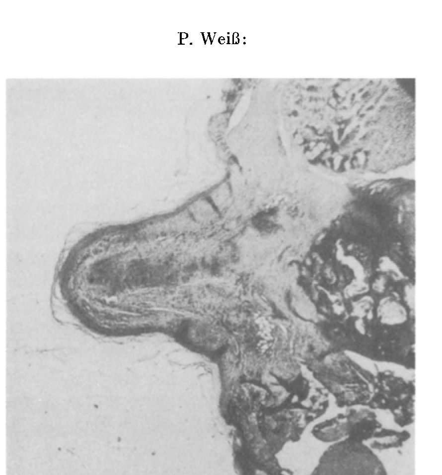
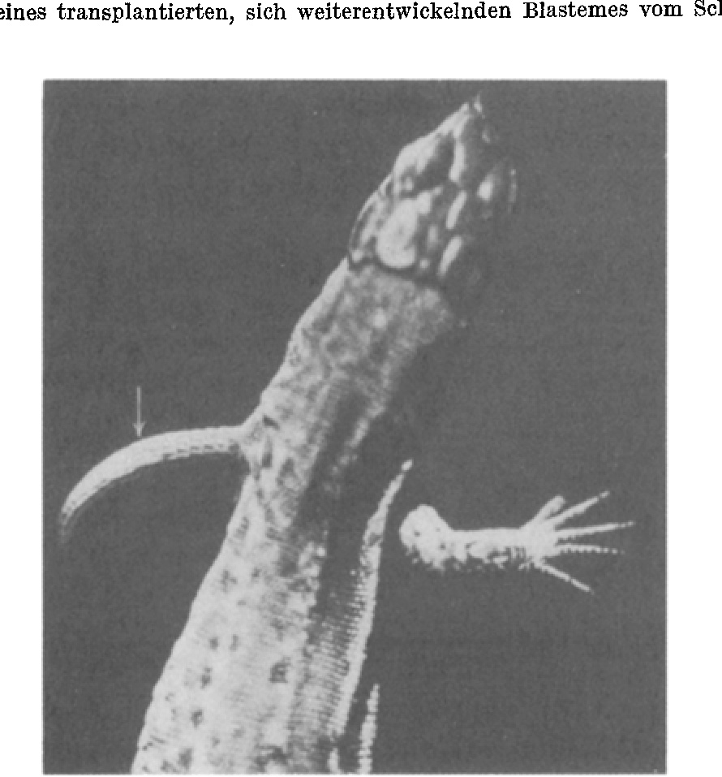
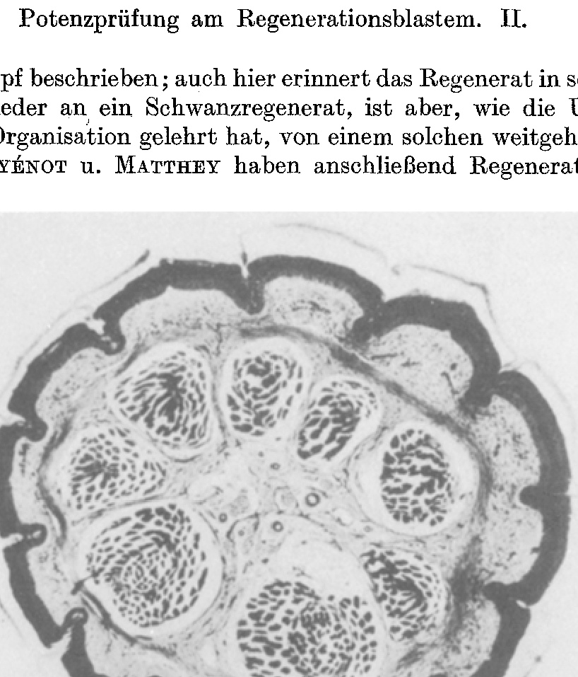
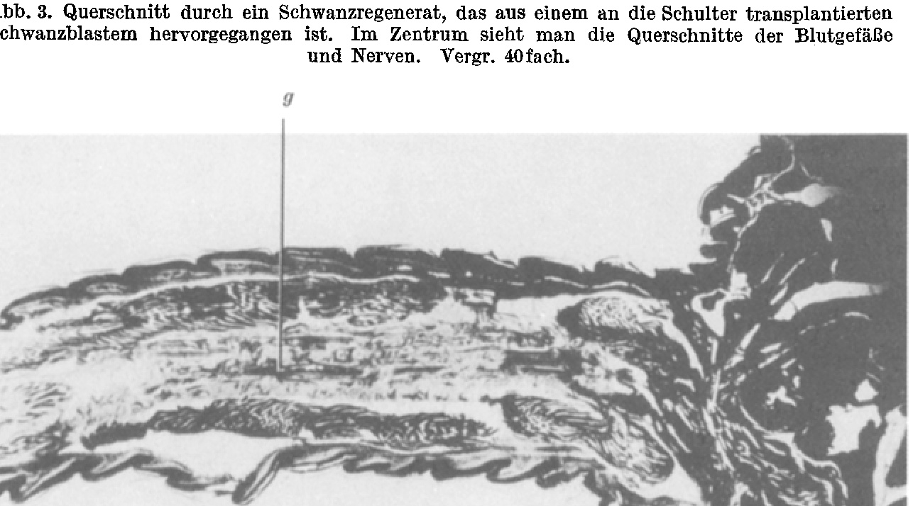
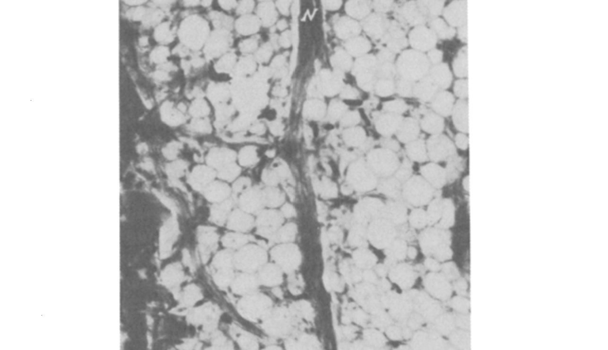
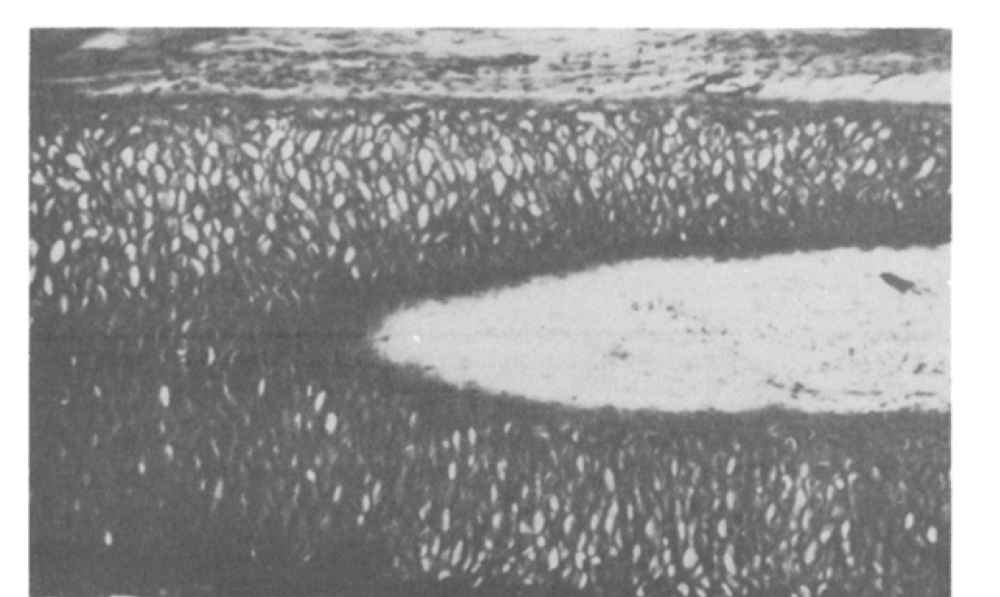
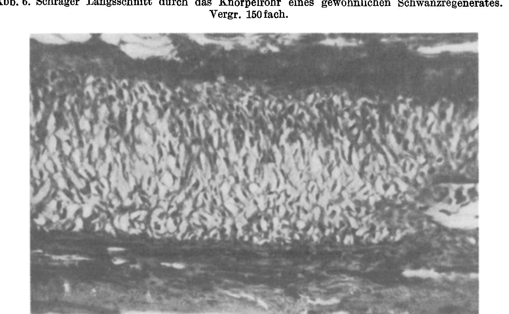

*(From the Biological Experimental Institute of the Academy of Sciences in Vienna, Zoological Division.)*¹

## POTENCY-TESTING ON THE REGENERATION BLASTEMA.

## II. THE BEHAVIOR OF THE TAIL BLASTEMA AFTER TRANSPLANTATION TO THE SITE OF THE FORELIMB IN LIZARDS (LACERTA).

By

PAUL WEISS

(Berlin-Dahlem).

With 9 text-figures.

*(Received 22 July 1929.)*

*Wilhelm Roux' Archiv für Entwicklungsmechanik der Organismen*, vol. 122 (1930).

> **Full translation.** A complete English rendering of Weiss's 1930 potency-testing on the regeneration blastema (*Triton*), with the figure legends.

The experiments described in what follows date from the summers of 1925 and 1926. I have reported briefly on their execution in 1926 (13) and on their results in 1927 (15).

Potency-testing on the regeneration blastema is intended to serve the purpose of demonstrating whether the developmental course from the blastema to the finished organ is prefigured in the blastema material from the outset, or is only gradually fixed. If the "morphogenetic potency" of the material (14) is *not* determined from the beginning, then one can further test its "*differentiation potency*," that is, the extent or the limitation of the ability of the material to react to determinative influences of varying kinds in the way that these influences demand.

The potency-testing on the tail blastema of *Triton* had been tested by transplanting the blastema into the limb field (14) and had led to the following result: blastemata older than about 2 weeks differentiate into formations which — viewed in gross-morphological terms — bear the character of small tails; it is to be emphasized that these little tails always remained rudimentary. From younger blastemata, in some cases *limb fragments* were obtained as regenerates, for whose actual derivation from the transplanted material there were good grounds, though admittedly indeed no absolutely certain proofs. Depending on the span of time which the blastema, before the transplan-

> ¹ A preliminary communication of the results of this work appeared under a similar title as Communication No. 134 from the Biological Experimental Institute of the Academy of Sciences in Vienna (Zool. Div., Director: H. PRZIBRAM) in the Akad. Anz. No. 9, 24. III. 1927.

tation, had spent at its site of accumulation, its later fate accordingly shifts.

According to the same scheme as this, potency-testing could now also be undertaken on the regeneration blastema of the lizard. The tail of the lizard regenerates, as is well known, abundantly; the *limbs*, by contrast, are incapable of regeneration; merely at the hind legs does there in some cases come about, after an injury, a regeneration of the most rudimentary kind upon removal [of the limb]. It might therefore in any case give information about the morphogenetic potency of the tail blastema in the limb region, in the event that limbs were indeed actually to regenerate there. Were that to fail [to occur], then either the necessary structural material, which makes possible the organized realization of the effect (the "limb field"), or the unspecific realization-conditions, was lacking.

As experimental animals there served *Lacerta muralis, agilis* and *serpa*.

The amputation of the limbs took place in the proximal third or distal of [it], that is, of the two autotomy planes running across [the limb], at any chosen site, by means of SLOTOPOLSKY's (10) knife at the latter end. So that the later flat lifting-off of the regeneration blastema could be carried out, an even cutting-through of the limb had as far as possible to be aimed at. The cut surface was then covered over with the wound-skin already loosened in advance.

In the course of the 2nd week, or at the beginning of the 3rd week following the amputation, the blastemata intended for transplantation were lifted off, under ether-narcosis, with a sharply-pointed, spatulate lancet. By cutting through the loosened tissues, the instrument cut the stump smoothly through. The blastema has at this time the form of a spherical cap, still without conical tapering. The boundary against the stump is striking, and one can judge exactly whether the lifted-off disk actually contains exclusively newly-formed blastema material. The carrying-along of old stump-tissue must, of course, be unconditionally avoided in a potency-test of the blastema. In order to be certain, I always skinned the part of the tail-stump bordering on the blastema before the lifting-off of the blastema; the blastema could then be cleanly separated from the old, differentiated tissue, whose boundary is always quite distinct.

For the transplants there was now prepared, at the site of one of the forelimbs, a bed. The relevant limb was cut off hard at its base, the humerus-head was for the most part lifted out of its socket from the wound-surface and extirpated, and then the skin in the circumference of the wound was bluntly undermined from the margin and lifted off the musculature. The blastema, which possessed a greater diameter than the wound-bed, was pushed with its margins under the skin-margins of the wound and stuck fast here, covering over the wound entirely.

When the amputation of the limb had been followed by a stronger bleeding, then first the standstill of this was awaited and, before the transplantation of the blastema, the thrombi were removed.

A great percentage of animals did not wake again from the narcosis. Also in the days after the operation many animals went under [died], so that numerical data have no sense. The material upon which the observations to be discussed in what follows rest is in any case only such as survived for many months after the transplantation.

Only in a few cases were the blastemata expelled. Mostly they healed under a thick scab of baked-together blood and sand. The crust let itself be removed after a few weeks cleanly, and one then found the former wound-surface overlaid with a tautly-stretched little skin. Usually the further fate was then this: that this little skin became coarser, formed scales and did not bulge out further. The configuration in these cases was thus rather similar to that after a mere amputation.

In a few cases there raised itself, in the middle of the scar, a tiny wart-shaped tissue-knob, a formation which probably corresponds to group b of the blastema-products observed in *Triton* (14, p. 329).

In a whole number of cases, however, of which until now [only those] more closely investigated [are concerned], the blastema, after the transplantation, developed further and finally differentiated into a considerable *tail*. Of these regenerates there is now to be a more detailed account:

As a first stage the blastema raises itself into a cone, which soon grows out into a roundish pigmented peg. Fig. 1 renders the longitudinal section through such a one: One recognizes sharply the boundary of the clear blastema-material against the old, differentiated shoulder-tissue, muscle, and skeleton. Infiltration from the old tissue into the blastema, or the reverse, is nowhere to be perceived. Out of the basal blastema-mass there now raises itself the said peg. Its epidermal covering is sharply set off against the mesenchyme. The interior of the peg falls distinctly into three regions: 1. an epidermis-underlying tissue-mantle, which evidently represents the cutis-anlage; 2. an axial strand of condensed mesenchyme, which is the anlage of the later skeleton; and between the two, 3. the anlage of the musculature.

These pegs have now, in six animals, differentiated further into formations of pronounced *tail*-character. Fig. 2 shows the outer appearance of these regenerates. They all hang relatively loosely on the body and lack entirely any active mobility; **Fig. 1.** Axial longitudinal section through an early developmental stage of a blastema from the tail transplanted to the site of the forelimb and developing further.  *(figure not reproduced)*

**Fig. 2.** Lizard W 322, *Lacerta agilis*, to which a 15-day-old tail blastema had been transplanted to the site of the left forelimb. The blastema has developed further into a tail regenerate. The arrow points to a site at which a scale-row appears forked on the convex side.  *(figure not reproduced)* they are merely dragged along as passive appendages. The scales stand arranged in segmental rows and are keeled; they have thoroughly the type of tail-scales. The distal terminal segment is a conical peg.

Striking is the fact that all these tails exhibit a strong *curvature*, in some cases even *torsion*. The length-difference of the convex side as against the concave side is in part made possible by the fact that the scale-rows are pushed more tightly into one another on the concave side; in some cases, however, one also sees isolated single scale-rows on the concave side split toward the convex side and become two separate scale-rows (cf. Fig. 2). Whether the direction of curvature of the regenerates stands in relation to the original axes of the blastema, I cannot say, because in these experiments I have not yet paid attention to the orientation of the blastemata at transplantation; further investigations will have to take this point into consideration. For the present it looks rather as if the curvature were conditioned not endogenously in the blastema, but by the effects of the location. For it is striking that among the six examined specimens there is not one in which the curvature is directed dorsalward. Rather, the concave side of the tail looks in three animals antero-ventralward, in two animals ventralward, and in one animal (Fig. 2) postero-ventralward. There thus borders, in all cases, the convex side on dorsal parts of the limb-base.

The length of the heterotopic tail regenerates was various. Since all specimens were preserved at a time-point at which they had already ceased further growth, their observed length is actually to be evaluated as final size. The following table gives the dimensions of the heterotopic regenerates and in part also of the orthotopic tail regenerates which arose at the [original] site after the removal of the blastemata. The measurement was carried out with the help of a thread; the length of the tails was averaged between the concave and convex side, the circumference determined by winding the thread several times around the tail at the base and dividing the measured thread-length by the number of windings.

| Prot.-No. | Orthotopic control regenerate — Length | Circumference | L/U | Number of segments | Heterotopic regenerate — Length | Circumference | L/U | Number of segments |
|---|---|---|---|---|---|---|---|---|
| E 1 | — | — | — | 47 | 7,2 | 3,5 | 2,1 | 20 |
| E 2 | 23,0 | 14,0 | 1,6 | 27 | 13,5 | 6,4 | 2,1 | 20 |
| E 4 | 51,0 | 8,0 | 6,4 | 48 | 8,0 | 4,0 | 2,0 | 21 |
| W 322 | — | — | — | 29 | 13,0 | 6,4 | 2,0 | 20 |
| E 6 | — | — | — | 29 | — | — | — | 19 |
| E 7 | — | — | — | 33 | — | — | — | 16 | It is striking in the table that the number of segments of the heterotopic regenerate is in all cases approximately the same (about 20), although the corresponding control regenerates at the tail exhibit segment-numbers deviating entirely and also — corresponding to the varying amputation height — fluctuating. As against the orthotopic [ones], the heterotopic regenerates are in all cases of lesser segment-number, thus hypotypically remained behind. Apart from the segment-number, the ratio of length to base-circumference is also, in the case of the heterotopic tails, in spite of their varyingly different absolute sizes, strikingly constant. This constancy of the proportions means that the individual formations are geometrically similar to one another. For the orthotopic tail-stump regenerates the same does not hold. The small number of cases naturally forbids regarding the observed proportionality as lawful and now already grounding further conclusions upon it.

The *pigmentation* of the heterotopic tails was always most intense on the convex side, but reached far over toward the anterior.

About the *inner organization* of the described formations the microscopic investigation has given information. It first delivered the unequivocal diagnosis of the regenerates as proper *tails*. This diagnosis, however, is of importance precisely because it permits the certainty to be attained that the regenerates actually proceeded from the blastema and are not, say, formations delivered by the location under the stimulus of the transplantation.

About the possibility of a regeneration from autochthonous transverse- or oblique-sections of the limb in lizards, there must at this point an interpolation be made. For one must, in order to be able to describe the appearance of such regenerates, also describe the deviating constitution of those occurring in our experiments more distinctly: There had by EGGER (1) in nature a lizard been described in which a hind-leg stump bore a long, scaled formation, which had to be addressed as a rudimentary regenerate. Nonetheless one in general let the limb of the lizard hold good as incapable of regeneration. MARCUCCI (7) and thereupon GUYÉNOT and MATTHEY (4) described quite analogous natural finds in detail. MARCUCCI's specimen bore on a short upper-thigh stump a thin, long-stretched formation, which outwardly makes the impression of a tail; it is covered with scales, which are arranged very similarly to tail-scales and in 22 segment-rows. The inner organization of the formation, however, deviates from that of a tail essentially: the musculature is not symmetrically distributed about the axis, but laid down without regularity, and the skeleton is not a continuous rod, but interrupted in several segment-like ways in the proximal part [and] rudimentarily formed. MARCUCCI then, in the conviction of having a regenerate before him, began testing the state of affairs experimentally (8): he was actually able to observe, after amputation of the hind legs in lizards, new formations, which in essentials resembled the described natural find. Later GUYÉNOT and MATTHEY (4) [reported] once again a natural find with regeneration at the hind-leg stump; here too the regenerate recalls in its outer appearance once again a tail regenerate, but is, as the investigation of its inner organization has taught, widely different from such a one. GUYÉNOT and MATTHEY too have subsequently [carried out] regeneration experiments

**Fig. 3.** Cross-section through a tail regenerate which proceeded from a tail blastema transplanted to the shoulder. In the center one sees the cross-sections of the blood-vessels and nerves. Magnification 40-fold.  *(figure not reproduced)*

**Fig. 4.** Longitudinal section through the same tail. *g* central vessel. Magnification 17-fold.  *(figure not reproduced)*

[*W. Roux' Archiv f. Entwicklungsmechanik Bd. 122.*  25]

[and they were able] again, from hind-leg stumps, to obtain some rudimentary regenerates, which agreed with the natural finds in this, that they exhibited no limb-character, but were outwardly — and indeed not in the interior! — rather similar to a tail; all these regenerates arose from *hind* legs. On the *fore*-extremity GUYÉNOT (3) was, after amputation, always able to observe only simple scarring, but not a trace even of rudimentary regeneration.

---

**Translation notes / ownership:** Owned pages are 1–7. The paragraph that runs off the foot of p.7 — "GUYÉNOT and MATTHEY too have subsequently [carried out] regeneration experiments…" — is finished above into its continuation on p.8 ("…not a trace even of rudimentary regeneration.") per the ownership rule. The subsequent paragraphs that *begin* on the unowned p.8 ("Die interessante Tatsache, daß die Hinterbeinregenerate…" and "Ist schon nach den Befunden von GUYÉNOT…") are not translated here. The leading partial sentence at the top of p.7 ("hind-leg stump described…") belongs to the paragraph that began on p.6 and is included where it runs. The figures (Figs. 1–5 referenced; Figs. 1–4 with captions on owned pages) are not reproduced; all captions on owned pages are translated. Page 4 is a plate page (Figs. 1–2). Source image files used: `/Users/eranhorowitz/Documents/Claude/Projects/BVA/translations_full/_work/img/52_Weiss_1930_Blastem-potency-test/p001.png` through `p008.png`.

The interesting fact that the *Hinterbein* [hind-leg]-regenerates display no extremity-character, but also no pronounced tail-character — rather, that they thoroughly disavow once again, in their construction, the *external* resemblance to a tail-regenerate — is at present still difficult to fit into known phenomena; for it is a matter neither of a mere *Hypotypie* [hypotypy], nor of a genuine Heteromorphosis or Homoeosis.

*[On p.386 the paragraph above runs continuously around the figure; the figure caption that interrupts it is placed below.]*

**Fig. 5.** Axial supporting tissue of the same tail in longitudinal section. *N* nerve-trunk. Magnification 180-fold.  *(figure not reproduced)*

If it is already, on the basis of the findings of Guyénot — according to which regeneration can be awakened only on the *Hinterbein* [hind-leg], but not on the *Vorderbein* [fore-leg] — probable that the tail-like-appearing formations which were obtained in our experiments at the site of the fore-leg do not represent regenerates of the locality, then through the investigation of their inner organization it is fully ensured that it is a matter of genuine tail-regenerates, that is, of formations that must have proceeded from the transplant.

A cross-section through the regenerate of Fig. 2 one finds reproduced in Fig. 3: The scale-keeling is at some places dis-

**Fig. 6.** Oblique longitudinal section through the cartilage-tube of an ordinary tail-regenerate. Magnification 150-fold.  *(figure not reproduced)*

**Fig. 7.** Oblique longitudinal section through the cartilage-tube of the heterotopic tail-regenerate of the lizard E 7. Magnification 297-fold.  *(figure not reproduced)* tinct. The symmetrical arrangement of the musculature, which is typical for the tail-regenerates, is at once striking. Upon the central symmetry is superimposed a bilateral one, which in most regenerates was already

**Fig. 8.** Regenerate that arose from the tail-blastema transplanted to the site of the left fore-extremity in lizard E 6, seen from ventral. Drawing at magnifying-glass enlargement.  *(figure not reproduced)*

externally distinctly perceptible. In the longitudinal section (Fig. 4) one recognizes the characteristic segmental feathering of the muscles. An axial skeleton is, remarkably, lacking in the present specimen. In its place, the middle of the regenerate is traversed along its whole length by a

**Fig. 9.** Tangential section through the regenerate depicted in Fig. 8. The construction of the regenerate out of two separate tails with their own axial organs is distinct under this manner of sectioning, by which the connecting tissue is not struck. Magnification 39-fold.  *(figure not reproduced)*

fairly powerful, wide-meshed, probably fat-bearing tissue (Fig. 5), whose central region is permeated by longitudinally running, strong nerve-trunks (*N*, Fig. 5) and blood-vessels (*G*, Fig. 4). In the other examined cases, however, there is always found a powerful axial cartilage-tube of wholly the same construction as that of the ordinary tail-regenerates (Fig. 6 and 7).

Noteworthy is still the regenerate E 6, which externally seems to consist of a clearly identifiable tail-part and a clumsy formation laterally fused with it (Fig. 8), but which, under microscopic investigation, reveals itself to consist of two complete tails fused with one another lengthwise (Fig. 9). We have here before us a *Reduplikation* [reduplication], which evidently occurred spontaneously, i.e. from a cause not comprehensible to us; that a *Proximalregeneration* [proximal regeneration] in the sense of Gräper and Przibram is present is, judging by the construction of the final formation, not probable, but of course cannot be excluded with certainty.

### Discussion of the Results

The transplantation of the tail-blastema, lifted off around the turn of the 2nd week after tail-amputation, to the site of one of the fore-extremities could, given good in-healing of the blastema, lead to three kinds of results: Either — in most cases! — the blastema overlaid itself with scales and remained a flat scar. Or the blastema yielded a small, structureless wart. Or, finally, the blastema grew powerfully and differentiated itself into a tail-regenerate typical in respect of outer and inner organization. It is presumably most unconstrainedly to be assumed that to these three kinds of results there corresponded three kinds of determination-states of the material at the time-point of the transplantation: that around the end of the 2nd week lies the critical time-point at which the determination from the side of the tail-stump has finally advanced so far that the determined blastema is from then on capable of *Selbstdifferenzierung* [self-differentiation]; material that was not yet quite so far advanced made a vain attempt at independent further development (wart-shaped formations!), and still younger material would be quite incapable of independent production of a tail at a foreign site. That young, undetermined blastema-material, on the other hand, was not guided to the production of an extremity, can rest either upon the fact that an active extremity-field no longer exists in the adult lizard, or else upon the fact that the material does not possess the differentiation-potencies that would be necessary for extremity-formation, and would not be in a position to yield to a field-influence that might perhaps be present. The latter is, however, improbable, not solely for the reason that the differentiations that can be demanded of the material would in the extremity-field be no such essentially different ones than in the tail-field, but above all because the new results of Marcucci and Guyénot & Matthey have indeed shown that the material proliferated by the extremity itself likewise builds up no extremity. Thus we are justified in concluding that the former alternative applies; that an active extremity-regeneration-field does not exist in the lizard.

Nevertheless, the development of the determined tail-blastemata at the site of the fore-extremity has evidently not proceeded entirely uninfluenced by the new locality. The *Krümmung* [curvature] or *Schraubung* [twisting] of the regenerates is, namely, a phenomenon which is otherwise never observed on normal tail-regenerates. This curvature comes about in that the regenerate grows constantly at greater speed on one of its sides; within the cross-section there is therefore not uniform distribution, but a *gradient* of the growth-intensity. The existence of such a difference within the cross-section is no characteristic of normal tail-regenerates, for these always grow entirely straight. With the curvatures it must therefore probably be a matter of an effect of local influences. The rudimentary regenerates observed by Marcucci and Guyénot & Matthey on the hind-leg-stump likewise display, judging by the figures, a certain curvature. It looks as though growth-promoting influences from the side of the body in the circumference of the extremity-base did not come into effect all around to an equal degree, but had an intensity-decline in direction (roughly) from dorsal to ventral; in our cases we had observed that the convex side of the curvature always shares in the dorsal sector of the wound-surface; if this is no accident, but should be confirmed in further experiments, then a predominance of the growth-promotion on the part of the dorsal neighborhood of the extremity-base would be demonstrated. In the same sense runs indeed also the curvature of the normal extremity in its development. Possibly with this state of affairs is also connected the influencing of transplanted leg-buds by their neighborhood, observed by Harrison (5), in urodele amphibians: it thereby turned out that (upon transplantation of the bud at the corresponding stage) always the side of the extremity-bud lying further dorsalward became the convex side of the arising extremity, even when this contradicted the developmental tendency proper to its origin; here, then, the influencing on the part of the body would lie wholly in the same sense as in our experiments (naturally, again, only under the presupposition that the latter were at all symptomatic and not accidental!).

Also the stronger pigmentation of the convex side on the heterotopic tail-regenerates of our experiments perhaps reflects an influence of the locality; yet here too a certain decision will be permitted only after procurement of a larger material.

In any case, the well-differentiated tails teach that the unspecific realization-conditions for regeneration are thoroughly favorable also in the extremity-region, that therefore the absence of extremity-regeneration is not to be ascribed to a lack of such [conditions].

Interesting is the contrast which exists, with respect to the development of determined tail-blastemata at an extremity-site, between the lizard on the one hand and *Triton* on the other: Here in the lizard we find the determined material develop itself unrestrainedly into a considerable tail. In *Triton*, by contrast, there has always been found, under the analogous conditions, only a quite miserable rudimentary formation, on which one could only barely, at a pinch, still detect its kinship with a tail. According to this, it has the appearance as though in *Triton* the unquestionably present extremity-field inhibited the formation of a tail within its region, even when the material per se were already capable of the formation of such a tail; a decision would easily be gained through transplantation of the tail-blastema into field-free districts.

In the transplantation of the blastemata, quite certainly no old material from the tail-stump was co-transplanted. The fact that nonetheless considerable and fully differentiated tails developed out of the blastemata proves unambiguously that, for the further differentiation of the once sufficiently far determined blastema, the further presence of its own old substratum is absolutely superfluous. There seems here to exist a fundamental contradiction to certain statements of de Giorgi with respect to extremity-regeneration in urodeles. De Giorgi (2) transplanted determined regeneration-blastemata of the extremity in salamander-larvae, at various differentiation-stages, onto the trunk-wall, and states that after the transplantation, although growth always proceeds, the *differentiation* however continues only when a disc of the old stump-tissue lying proximally before the regenerate had been co-transplanted, otherwise not. The fact is that, in contrast to this, Milojević (9) has described in *Triton* the further development and differentiation of a transplanted leg-regeneration-blastema on the trunk-wall even without the presence of old leg-tissue. The contradiction between the two statements is not yet resolved, although clarity would here be of fundamental importance; for it concerns indeed the question whether a determined regeneration-material is at all to be capable of self-differentiation or not. One will scarcely be permitted to assume that this question will find a different answer for different animal species. And that is the reason why the wholly clear finding on our lizards — according to which a determined tail-blastema is capable of the further and complete differentiation of a tail even without any substratum-underlay through old tail-tissue — deserves particular attention.

The heterotopically regenerated tails possess no *Rückenmark* [spinal cord], but are traversed lengthwise by the regenerated extremity-nerves.

We learn from this in any case that, for the formation of a tail-regenerate in the lizard, the presence of the *Rückenmark* [spinal cord] is not required. By contrast, we can say nothing at all about the necessity of the presence of nerves in general for tail-regeneration, since in our cases nerves were always present.

But one thing must be decidedly emphasized: If a nerve-influence is needful for tail-regeneration, then it is surely wholly *unspecific*. For the heterotopic tails in our experiments arose indeed with *Extremitäteninnervation* [extremity-innervation]. This particularly clear example must be brought forward all the more earnestly, as Piera Locatelli has recently once again, with much verve and few arguments, attempted to revive the old view of the *specificity* of the nerve-influence on regeneration (6). It has no point to enter into the not very profound expositions of the authoress in detail, for it suffices, naturally, to oppose to them a single conclusive counter-argument in order to prevent the relapse into that absolutely erroneous conception. Such a counter-argument is, for example, that I (1922) had, in salamander-larvae, obtained arm-regenerates on the pelvis, that is, with leg-innervation, and leg-regenerates on the shoulder, that is, with arm-innervation (11). To this are added the findings, described in the meantime by Milojević in *Triton* and by de Giorgi, of a leg-regeneration with trunk-innervation. These facts I had already once earlier opposed to the view of Locatelli (12), but these expositions have evidently remained hidden from the authoress. Here there is now added the new finding on the lizards: tail-regeneration with arm-innervation. The state of affairs is clear; of a specificity of the nerve-action on regeneration in the sense that the form-quality of the regenerate should somehow be dependent on nerve-influences, there can be no question; such a specificity is not only not proven, but refuted, and both amphibians and reptiles behave in this respect entirely alike.

### Summary

About 2-week-old regeneration-blastemata from the tail of the lizard were transplanted to the amputation-site of the fore-extremity. In most cases the transplants did not develop further; a few times they formed wart-shaped tissue-knobs. Evidently the material coming to accumulation at the cross-section after tail-amputation is not yet, from the outset, determined to a definite shaping. On the other hand, there is lacking in the lizard — as one must now probably conclude — an active extremity-field that could determine the material.

In 8 cases the transplanted blastemata developed further into considerable and fully differentiated tails. These tails are to be diagnosed as genuine tail-regenerates not only by their outer appearance, but by their whole inner organization.

The tails regenerated at the shoulder all display a considerable curvature or twisting, a character which is otherwise not observed on normal tail-regenerates and is evidently to be ascribed to an influence of the abnormal locality. Possibly a promotion of growth on the dorsal side is present, which would be in agreement with the normal curvature-tendency of an arising extremity.

The complete configurational and histological formation of the blastemata transplanted to the shoulder into finished tail-regenerates proves that the differentiation of an once-determined blastema is not bound to its further remaining at the old organ-stump; not merely the growth, but also the differentiation, continues in the originally adopted direction even without further underlay by similar old tissue.

The lack of *Rückenmark* [spinal cord] in the tails regenerated at the shoulder proves that the development of a tail-regenerate in the lizard is independent of the presence or absence of the *Rückenmark*. With nerves the regenerates were all well supplied, so that about the necessity or dispensability of a nerve-action on the tail-regeneration of the lizard nothing can be concluded from these experiments. But if such a nerve-influence should be at play, then it is undoubtedly wholly unspecific in respect of the configuration and differentiation of the regenerate, for otherwise tail-regenerates with arm-innervation could not indeed have arisen.

### List of the Cited Writings

1. **Egger, E.:** Ein Fall von Regeneration einer Extremität bei Reptilien. Arb. zool.-zootom. Inst. Würzburg **8**, 201 (1886). — 2. **de Giorgi, P.:** Les potentialités des régénérats chez *Salamandra maculosa*. Rev. suisse Zool. **31**, 1 (1924). — 3. **Guyénot, E.:** Territoire de régénération chez le Lézard (*Lacerta muralis*). C. r. Soc. Biol. **99**, 27 (1928). — 4. **Guyénot, E. u. Matthey, R.:** Les processus régénératifs dans la patte postérieure du Lézard. Roux' Arch. **113**, 520 (1928). — 5. **Harrison, R. G.:** On relations of symmetry in transplanted limbs. J. of exper. Zool. **32**, 1 (1921). — 6. **Locatelli, P.:** Der Einfluß des Nervensystems auf die Regeneration. Roux' Arch. **114**, 686 (1929). — 7. **Marcucci, E.:** La rigenerazione degli arti nei Rettili. Un caso di rigenerazione in *Lacerta muralis*. Boll. Soc. Natur. Napoli **38**, 8 (1926). — 8. Ricerche sperimentali sulla capacità rigenerativa degli arti nei Rettili. Ebenda **38**, 222 (1926). — 9. **Milojević, Bor. D.:** Beiträge zur Frage über die Determination der Regenerate. Arch. mikrosk. Anat. u. Entw.-mechan. **103**, 80 (1924). — 10. **Słotopolsky, B.:** Beiträge zur Kenntnis des Verstümmelungs- und Regenerationsvermögens am Lacertilierschwanz. Zool. Jb., Abt. f. Anat. u. Ontogen. **43**, 219 (1922). — 11. **Weiss, P.:** Regeneration an transplantierten Extremitäten entwickelter Amphibien. Akad. Anz. Wien 1922, Nr 22/23. — Arch. mikrosk. Anat. u. Entw.mechan. **102**, 673 (1924). — 12. Physiologie der Formbildung (Entwicklung und Regeneration). Jber. ges. Physiol. 1924. — 13. Morphodynamik. Abh. theor. Biol., herausgeg. von Schaxel 1926, H. 23. — 14. Potenzprüfung am Regenerationsblastem. I. Extremitätenbildung aus Schwanzblastem im Extremitätenfeld bei *Triton*. Roux' Arch. **111** (Festband für Driesch), 317 (1927). — 15. Potenzprüfung am Regenerationsblastem der Eidechsen. Sitzgsber. Akad. Wiss. Wien, Math.-naturwiss. Kl. vom 24. III. 1927; Akad. Anz. 1927, Nr 9.

### Addendum on the occasion of the page-proof correction:

A new communication by E. Marcucci has just appeared, in which he reports on the continuation of his regeneration-studies on reptile-extremities [Arch. Zool. Ital. **14**, 227 (1930)]. A more exact entry into these interesting data is not possible for me here. Yet let it be emphasized that M., in contrast to Guyénot & Matthey, has now also obtained rudimentary regeneration on the *fore*-extremity of the lizard; these regenerates too, however — although they were peg-shaped — showed only the strict tail-character which the formations described by me above, arisen from tail-material, possessed, so that a doubt about the actual origin of the latter from the transplanted material appears, as before, excluded.

## Figures

**Fig. 1.**

**Fig. 2.**

**Fig. 3.**

**Fig. 4.**

**Fig. 5.**

**Fig. 6.**

**Fig. 7.**

---

*Translator's note.* A later instalment of Weiss's blastema-potency work.
