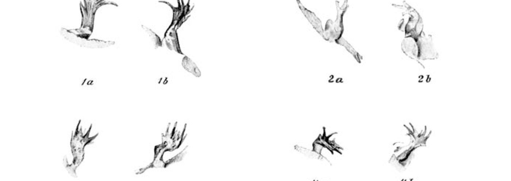
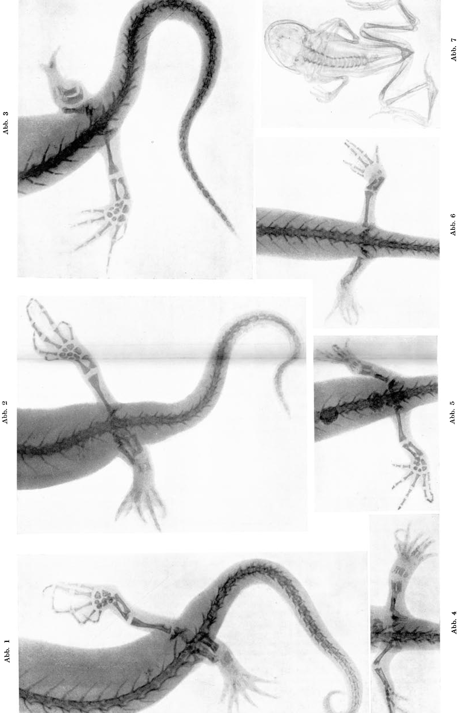

# Experiments on Polarity-Reversal in the Newt Leg.

By

**Oskar Kurz.**

(From the Biological Experimental Institute of the Academy of Sciences in Vienna [Zoological Division]¹).)

With 4 text-figures and Plate VII.

*(Received on 10 July 1920.)*

*Archiv für Entwicklungsmechanik der Organismen*, vol. 50 (1922).

> **Full translation.** A complete English rendering of Kurz's experiments on polarity-reversal in the newt leg, with the figure legends.

In a work published in 1912 in this Archive²), I reported, among other things, on experiments which set themselves the goal of the experimental production of fracture-three-fold-formations [Bruchdreifachbildungen]. By inverted implantation of the knee-piece [Kniestück] at the site of the leg amputated in the upper thigh, I had succeeded, in two animals, in obtaining via regeneration fully formed double-feet [Doppelfüße]. Although it could then not yet be excluded with certainty that chance underlay the experimental result, it nevertheless proved necessary to demonstrate the lawfulness of these multiple-formations and, in the polarity-reversal, to establish in a conclusive manner the cause of the abnormal formations.

Thus there arose the necessity of continuing the experiments; herein, in particular, the fixing of the experimental results by means of Röntgen-photography [X-ray photography] was not insignificantly facilitated, just because precisely along this path the winning of conclusive evidential material was to be hoped for. The new series of experiments, which was begun in the year 1912, did indeed lead before long to the expected results; the publication of these results, however, has unfortunately been delayed by several years owing to the war-service of the author³).

The operative method employed was the one described in the publication mentioned at the outset: the skin above the knee-joint, detached by a circular incision, was pushed back as far as possible upward [proximally],

> ¹) An excerpt of this work appeared under the title: Communications of the Biological Experimental Institute of the Academy of Sciences, Zoolog. Div., Director: H. Przibram, »Experiments on Polarity-Reversal in the Newt Leg«, in the Akad. Anzeiger, No. 16, 1920.

> ²) »The leg-forming potencies of developed newts.« Experimental studies. Arch. f. Entw.-Mech., Vol. 34, Part 4, p. 588 ff.

> ³) For the manifold support which was granted to him for this work, and in particular also for the preparation of the text-figures, I should like at this place to express my most sincere and warmest thanks to Herr Prof. Hans Przibram.

## 187

the leg was then cut off roughly at the middle of the upper-thigh [Oberschenkel] with a shearing stroke, and through a further incision the lowermost part of the lower-leg [Unterschenkel] together with the foot was removed. The leg-stump thus obtained (knee-piece [Kniestück]) was now, with its distal (lower-leg-)end foremost, pushed into the skin-sheath, which over the now distally lying femoral end was closed by the suture. Care was thereby taken that, in the implantation, the extensor and flexor sides should if possible remain in their normal orientation.

According to this method, from the end of March until the beginning of July 1912, 16 animals — all *Triton cristatus* [great crested newt; *Triturus cristatus*] — were operated. Of these, 7 (No. 1, 2, 4, 5, 8, 10, and 12 of the experimental protocol) perished in the first days following the operation. Two further (No. 11 and 15 of the experimental protocol) [perished] after 27 and 34 days respectively; these too without showing a result. With seven animals there resulted in part (No. 7, 14, and 16) a negative or at any rate no clear result — with one of these animals (No. 7) the falling-out of the implant is noted in the protocol — while with three newts (No. 3, 6, 13, and 17¹) of the experimental protocol) the expected double-foot appeared.

Concerning the origin of these double-feet, instructive information is given by the X-ray photographs, which were made about four months after the operation. (The exposures were made under ether-narcosis.) Since each individual animal exhibits particularly interesting details, it will above all be necessary to set forth in more exact detail both the findings ascertainable on the conserved animals and the röntgenologically fixed results of each individual case. (Since, however, the most important data of the experimental protocol are hereby communicated, I believe I may refrain from appending the original protocol.)

### Animal No. 3.

*(Triton cristatus ♂, large animal; operated on 19. VI. 1912; right hind-leg.)*

**X-ray photograph of 26. X. 1912.**

On the conserved animal a double-foot is clearly to be seen, whose two-toed portion lies more dorsalward and somewhat headward as well, than the four-toed, tailward-directed component. The position of the toes in two planes is here clearly to be gathered from the appended sketches: text-fig. 1*a* (from above) and 1*b* (from below).

Of this animal there exist three X-ray exposures, of which two appear reproduced on the appended plate.

> ¹) On the whole, as already mentioned above, 16 animals were operated by the same method. Animal No. 9 belonged to another series of experiments.

## 188

On the exposure with the strongly right-curved vertebral column (Plate VII, Fig. 1) one sees three bones, apparently abutting on the vertebral column: headward a larger one (femur), tailward two further: the implanted lower-leg-bones [Unterschenkelknochen], which here have not joined onto the femoral-remnant, but have come to lie beside the same. In the middle-foot [Mittelfuß] one sees three bones, of which the headward-lying one stands clearly in connection with the regenerated femoral-end. The regenerated foot is a double-foot with two — as can also be gathered from the X-ray image, and indeed from the differing shadow-intensity of the toes — toe-groups [Zehengruppen] lying in different planes, one two-fold and one four-fold.

On the exposure with the approximately median-positioned vertebral column (Plate VII, Fig. 2) one sees that the femur lies in its normal position, and that the lower-leg-bones do not join onto the vertebral column, but onto the pelvis. On this image only two middle-foot-bones [Mittelfußknochen] are to be seen, of which the headward-lying one is connected with the regenerated femoral-end. The position of the toes in two planes is more clearly to be seen from this image than from Fig. 1.

### Animal No. 6.

*(Triton cristatus ♀, large animal; operated on 20. VI. 1912; left hind-leg.)*

**X-ray photograph of 26. X. 1912.**

The operated left hind-leg shows, on the conserved animal, a peculiar form: the part lying nearest to the trunk is broadened to roughly double its normal girth. From the headward-lying portion of this thickened piece there springs an approximately normally thick leg-part, tapering toward the toes. The toes themselves — there are three present — stand opposed to one another claw-like. Two smaller ones lie dorsalward, a larger one lies ventralward. That this is a matter of toes lying in two different planes is clearly recognizable not only from the appended sketches, Fig. 2*a* (from above) and 2*b* (from below), but also from the pigmentation — the toes of the newt, as is well known, being more strongly pigmented on the back-side.

The cause of the thickening of the proximal leg-part is to be gathered from the X-ray photograph, Plate VII, Fig. 3: beside the femur, which is pushed forward toward the trunk and whose distal end shows distinct regeneration, lie, in the same direction, two bone-pieces (the inverted-implanted lower-leg-bones). The one lying nearer the femur shows strong regeneration at both ends, while the other has regenerated distinctly only distalward.

## 189

A leg-part tapering headward, with adjoining middle-foot-bones, can without doubt be addressed as a regenerate proceeding from the femur. The foot on the X-ray image appears to consist not of two, but of toes lying in quite different planes.

### Animal No. 13.

*(Triton cristatus ♀, smaller animal; operated on 26. VI. 1912; left hind-leg.)*

**X-ray photograph of 26. X. 1912.**

The regenerated left hind-leg shows (on the conserved animal) a

**Abb. 1—4.** *(text-figure: line-drawing sketches, with sub-figures 1a, 1b, 2a, 2b, 3a, 3b, 4a, 4b)*

nineteen-toed foot-regenerate. The transitional portion from middle-foot to foot is concave upward, so that the toes are for the greatest part directed upward. The toes lie in several planes: the four nearest to the trunk in one [plane], while the other five are not unambiguously determinable; they seem to be in part opposed to one another, and consequently themselves possibly to lie in different planes. [One may compare the sketches of 22. XI. 1912, Fig. 3*a* (from above) and 3*b* (from below).]

The two X-ray photographs (with the leg stretched out, Plate VII, Fig. 4, and with the leg drawn in, Fig. 5) show pretty much the same: the normal femur is here connected by a bone-bridge with the inverted-implanted lower-leg-bones. These regenerate distalward, and indeed three middle-foot-bones, from which a double-foot proceeds, whose toes — as the differing shadow-intensity on both X-ray images shows — lie in two different planes.

## 190

### Animal No. 17.

*(Triton cristatus ♀, small animal; operated on 4. VII. 1912; right hind-leg.)*

**X-ray photograph of 26. X. 1920.**

The right hind-leg of the conserved animal carries a seven-toed hind-foot [siebenzehigen Hinterfuß], whose toes, namely four and three each, lie in two different planes, as is to be gathered without doubt from the quite different position of both palmar surfaces [Handflächen] (pigmentation!). The arrangement of the toes can be seen from the sketches (made on 22. XI. 1912). [Text-fig. 4*a* (from above) and 4*b* (from below).]

On the X-ray image (Plate VII, Fig. 6) one sees a regenerate proceeding distally from the femoral-fracture-site, which seems to have taken up the remnants of the implant — perhaps to be inferred from its peculiar form. Middle-foot-bones are not to be seen, but indeed a double-foot, concerning whose toes, as regards their position, nothing can be stated from the X-ray image.

## Results and Conclusions.

From the above-communicated experiments on transformed *Triton cristatus* it emerges:

**1.** With the originally distal end implanted onto the transversely-branch-cut femur, the lower-leg-bones regenerate a foot at the now distally-lying, originally stumpward-directed surface. (Animals No. 3, 6, 13; Plate VII, Fig. 1, 2, 3, 4, 5.) There is consequently a polarity-reversal present.

**2.** Hereby a double-foot can arise, whose formation can perhaps be explained by the endeavour of each of the two lower-leg-bones to produce a foot. (Animal No. 13; Plate VII, Fig. 4 and Fig. 5.)

**3.** Where the implant has not grown together with the femoral-cut-surface, double-feet tend to be formed whose toes lie in two (or more) planes, and whose origin is to be explained by the simultaneous regeneration from femur and lower-leg-bones. (Animal No. 3, Plate VII, Fig. 1 and Fig. 2; Animal No. 6, Plate VII, Fig. 3.)

**4.** Also where only remnants of the implant appear taken up into the regenerate proceeding from the femur, it can come to the formation of a double-foot. (Animal No. 17; Plate VII, Fig. 6.)

**5.** Where no growing-together between femoral-cut-surface and implant has occurred, but the latter has been laid parallel to the femur, the implanted lower-leg-piece regenerates — when correspondingly favorable space-relations are present — toward both sides; that is to say, it

## 191

comes not only at the now distal end to the formation of a foot, but also at the originally distal end to a distinct beginning of regeneration. (Animal No. 6; Plate VII, Fig. 3.)

**6.** The multiple-formations of foot-parts naturally occurring in amphibians (also in anurans, e.g. in the fire-bellied toad [*Bombinator igneus*; *Bombina bombina*] caught in the Prater and depicted in Fig. 7) can be traced back to the capability of the leg-bones (in this toad, of the middle-foot) to regenerate on both sides the distal parts (in the present case the toes).

(For the respective literature and the theoretical evaluation of the phenomenon here treated, reference is made to the work by Hans Przibram appearing in the same Archive, »The Fracture-three-fold-formation in the Animal-realm« [»Die Bruchdreifachbildung im Tierreiche«], 1921.)

## Explanation of the figures.

### Plate VII.

*(All the figures show the animals from below at three-fold enlargement.)*

**Fig. 1.** *Triton cristatus ♂* (Animal No. 3). (Dorso-ventral X-ray exposure.) Regeneration of a double-foot from the upper preserved proximal femoral-portion and the inverted-implanted lower-leg-bones (*Re hi Bein* [right hind-leg]).

**Fig. 2.** The same animal as Fig. 1. (Dorso-ventral X-ray exposure with approximately median-positioned vertebral column.)

**Fig. 3.** *Triton cristatus ♀* (Animal No. 6). (Dorso-ventral X-ray exposure.) Regeneration of a double-foot from the upper femoral-portion and the inverted-implanted lower-leg-bones, of which one shows distinct regeneration toward both sides (*Li hi Bein* [left hind-leg]).

**Fig. 4.** *Triton cristatus ♀* (Animal No. 13). (Dorso-ventral X-ray exposure; the animal has the *li hi Bein* [left hind-leg] stretched out.)

**Fig. 5.** The same animal as Fig. 4. (Dorso-ventral X-ray exposure; the animal has the *li hi Bein* drawn in.) Figs. 4 and 5 show the regeneration of a double-foot from the inverted-implanted lower-leg-bones lying proximal of the femoral-piece.

**Fig. 6.** *Triton cristatus ♀* (Animal No. 17). (Dorso-ventral X-ray exposure.) Regeneration of a foot with over-numerous toes proceeding from the proximal femoral-piece (*Re hi Bein* [right hind-leg]).

**Fig. 7.** *Bombinator igneus* (from the Vienna Prater). (Dorso-ventral X-ray exposure.) Natural fracture-three-fold-formation on the right hind-leg.

---

The X-ray exposures were prepared in the X-ray institute of the hospital »Rudolfstiftung«. For the kind assistance which was granted to me by Frau Dr. Anna Schärf and Herrn Assistenten Dr. Julius Weil I am much indebted.

The photographic enlargements of the original exposures were prepared in the artistic-photographic atelier Bruno Reiffenstein in Vienna.

---

### Plate VII. *(figure plate)*

*Running head (top left):* Archiv für Entwicklungsmechanik Bd. 50 [Archive for Developmental Mechanics, Vol. 50]
*Running head (top right):* Tafel VII. [Plate VII.]
*Running foot (bottom left):* Kurz, Polaritätsumkehr am Tritonenbein. [Kurz, Polarity-Reversal in the Newt Leg.]
*Running foot (bottom right):* Verlag von Julius Springer in Berlin. [Published by Julius Springer in Berlin.]

The plate contains seven X-ray figures, labelled:
**Abb. 1.** *(figure)*
**Abb. 2.** *(figure)*
**Abb. 3.** *(figure)*
**Abb. 4.** *(figure)*
**Abb. 5.** *(figure)*
**Abb. 6.** *(figure)*
**Abb. 7.** *(figure)*

---

Translator's notes (for the editor; not part of the source):
- The printed source names the author as **"Oskar Kurz"** (title page and running heads of pp. 188, 189, 190). The assignment header gives "Wilhelm Kurz." The printed form "Oskar Kurz" has been followed.
- The text-figure on printed p. 189 is captioned **"Abb. 1—4."** and consists of line-drawing sketches with sub-figures 1a/1b, 2a/2b, 3a/3b, 4a/4b (referenced in the running text as "Textabb."). On p. 189 the visible sub-figures are 3a, 3b, 4a, 4b; sub-figures 1a–2b belong to the same composite figure.
- The reading "*Re hi Bein*" = right hind-leg ("rechtes hinteres Bein"), "*Li hi Bein*"/"*li hi Bein*" = left hind-leg ("linkes hinteres Bein"); these are the printed abbreviations in the figure-explanations and are retained with bracketed glosses.
- Nothing has been omitted.

## Figures

**Text-figures 1-4.**

**Plate VII.**

---

*Translator's note.* On the polarity of the regenerating urodele limb.
