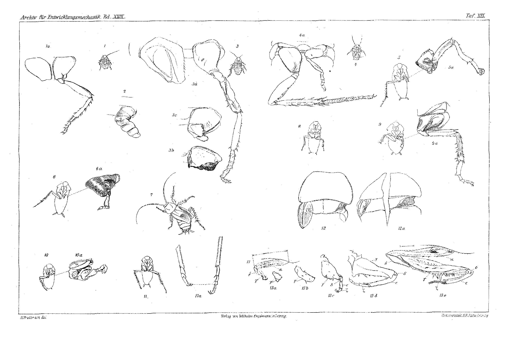
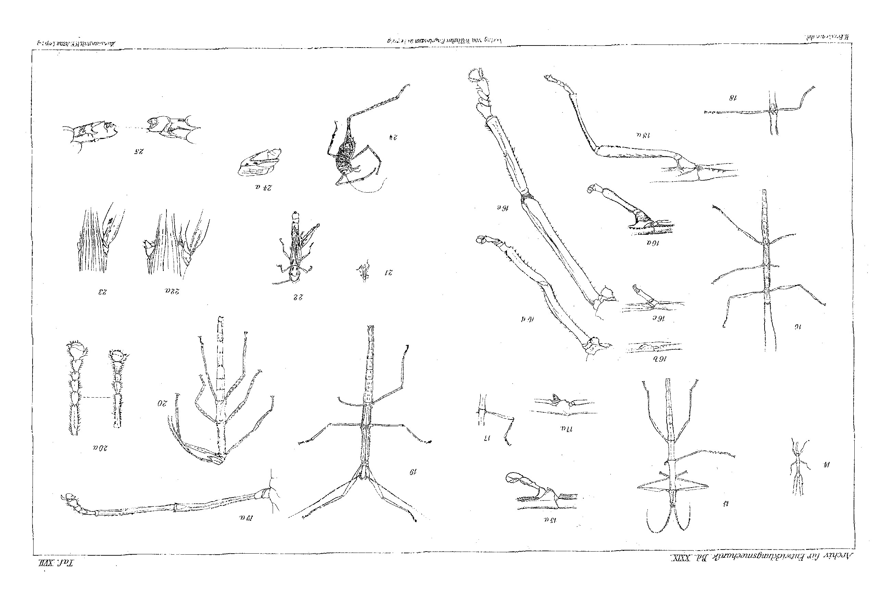
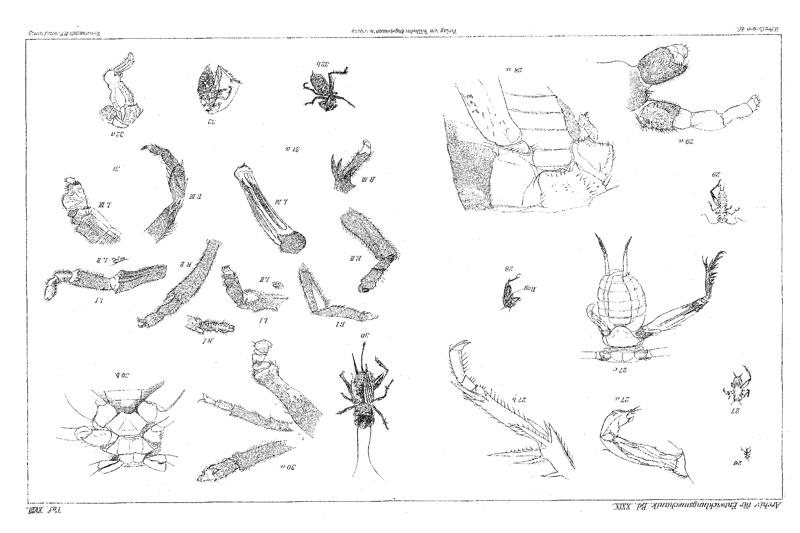

# Regeneration of the Grasping, Walking and Jumping Legs in the Rearing of Orthoptera.

By

## Franz Megušar.

*(From the Biologische Versuchsanstalt in Vienna.)*

With Plates XVI–XVIII.

Received on 4 April 1910.

*Archiv für Entwicklungsmechanik der Organismen*, vol. 29 (1910).

> **Full translation.** A complete English rendering of Megušar's study of the regeneration of the grasping, walking and jumping legs in the rearing of Orthoptera, with the tables and figure legends.

### Table of Contents

| | Page |
|---|---|
| I. Introduction and Statement of the Problem | 502 |
| II. *Orthoptera cursoria* | 503 |
| 1. Historical | 503 |
| 2. Regeneration in Blattidae | 504 |
| Procurement of material | 504 |
| Age of the operated animals and operative methods | 504 |
| Keeping of the operated animals and immediate accompanying phenomena after the operation | 505 |
| Experimental results | 506 |
| a) Regeneration of the hind leg after autotomy and amputation through the middle of the coxa, at various ages of the animals | 506 |
| α) Regeneration in very young larvae (body length about 6.5 to 8 mm) | 506 |
| Regeneration after autotomy | 506 |
| Regeneration after amputation, roughly through the middle of the coxa | 507 |
| Behaviour of the control animals with respect to the rate of moulting | 508 |
| β) Regeneration in older larvae (body length about 14 to 15 mm) | 509 |
| Autotomy of the left hind leg | 509 |
| Amputation of the left hind leg, roughly through the middle of the coxa | 509 |
| γ) Regeneration in larvae close to metamorphosis (body length about 20 mm) | 511 |
| Autotomy of the hind leg | 511 |
| Amputation of the hind leg | 511 |

Archiv f. Entwicklungsmechanik. XXIX.    33

| | Page |
|---|---|
| d) Regeneration after autotomy and simultaneous amputation of both hind legs in fairly full-grown larvae (body length as in γ) | 511 |
| e) Regeneration in the nymph | 512 |
| b) Regeneration after extirpation of the hind leg in medium-sized larvae (body length about 12 mm) | 512 |
| c) Regeneration after amputation of the tarsus of the hind leg in fairly well-grown larvae | 512 |
| d) Regeneration of the wings in the imago after cutting off the thoracic margins in larvae close to metamorphosis, and after extirpation of the named organs in the imago | 513 |
| III. *Orthoptera gressoria* | 513 |
| 1. Historical | 513 |
| 2. Regeneration in Mantidae and Phasmidae | 515 |
| A) Rearing and regeneration of the foreleg after amputation through the middle of the femur in *Mantis religiosa* L. | 515 |
| Procurement of material and rearing | 515 |
| Regeneration of the right foreleg from the middle of the femur | 516 |
| Keeping and care of the operated animals | 516 |
| Experimental result | 517 |
| B) Biology and regeneration in *Dixippus morosus* | 518 |
| Procurement of material and rearing | 518 |
| I. Experimental series: Amputation of the right middle leg through the coxa near the trochanter | 520 |
| Manner of the operation | 520 |
| Keeping and care of the operated animals | 520 |
| Experimental result | 520 |
| II. Experimental series | 521 |
| a) Repetition of the experiment described in experimental series I | 521 |
| b) Regeneration of the right middle leg after autotomy | |
| Experimental result | 523 |
| III. Experimental series | 524 |
| Regeneration after extirpation and autotomy of the left hind leg | 524 |
| a) Regeneration after extirpation | 524 |
| Manner of the operation | 524 |
| Keeping and care | 524 |
| Experimental result | 524 |
| b) Regeneration after autotomy | 525 |
| Experimental result | 525 |
| IV. *Orthoptera saltatoria* | 526 |
| Historical | 526 |
| A) Biology and regeneration in Acrididae (*Chorthippus biguttulus* L.) | 527 |
| Procurement of material and rearing | 527 |
| | Page |
|---|---|
| a) Regeneration after autotomy and amputation of the jumping leg, proximal to the autotomy site, in larvae about 7 mm long | 529 |
| α) Autotomy of the right hind leg (jumping leg) | 529 |
| Manner of the operation | 529 |
| Keeping and care of the operated animals | 529 |
| Experimental result | 529 |
| β) Amputation of the right hind leg, roughly through the middle of the coxa | 529 |
| Manner of the operation | 529 |
| Keeping and care of the operated animals | 530 |
| Experimental result | 530 |
| b) Regeneration after autotomy of the right hind leg in just-hatched larvae | 530 |
| Manner of the operation | 530 |
| Keeping and care of the operated animals | 531 |
| Experimental result | 531 |
| B) Biology and regeneration in Locustidae (*Troglophilus* Krauss) | 531 |
| Occurrence in nature and natural conditions | 531 |
| Methods of capture and the phenomenon of autotomy in the front two pairs of legs | 534 |
| Provisional accommodation and transport | 535 |
| Keeping in captivity | 535 |
| a) Regeneration after autotomy of the jumping leg | 536 |
| b) Regeneration after autotomy of the fore- and middle leg | 537 |
| C) Biology and regeneration in Gryllidae (*Gryllus campestris* L.) | 537 |
| Procurement of material together with some biological remarks | 537 |
| Rearing | 537 |
| a) Regeneration after autotomy of the hind leg | 541 |
| Manner of the operation and its immediate accompanying phenomena | 541 |
| Keeping and care of the operated animals | 541 |
| Experimental result | 542 |
| b) Regeneration after amputation of the hind leg proximal to the autotomy site | 543 |
| Manner of the operation and its immediate accompanying phenomena | 543 |
| Keeping and care | 543 |
| Experimental result | 544 |
| c) Regeneration after amputation of the right middle leg through the coxa | 544 |
| d) Occasional other cases of regeneration in *Gryllus campestris* L. | 545 |
| α) Imago ♀ shows new formations on all extremities of the right side of the body | 545 |
| β) Imago ♀ possesses distinct regenerates on all legs, with the exception of the right middle leg | 546 |
| γ) Larva standing before the nymphal stage, with regenerates on the right middle leg and both hind legs | 546 |

33*

| | Page |
|---|---|
| V. Excerpt from the experimental protocols | 548 |
| VI. Theoretical evaluation of the experimental results | 576 |
| VII. Summary of the most important experimental results | 579 |
| VIII. Bibliography | 580 |
| IX. Explanation of the plates | 583 |

## I. Introduction and Statement of the Problem.

The Orthoptera have for a long time and repeatedly been the object of far-reaching investigations with regard to their regenerative capacities. They have proved interesting in several respects. This holds in particular with regard to the restitutive capacity of the hind legs. Whereas in Phasmidae a high-grade regenerative capacity could be observed from the autotomy site (BORDAGE, GODELMANN), this same capacity was entirely lacking from the same sites in other related families, such as in Acrididae, Locustidae and Gryllidae (BORDAGE). The experiments carried out on Blattidae (BRINDLEY), Phasmidae (BORDAGE, GODELMANN), Acrididae, Locustidae and Gryllidae (BORDAGE) concerning regeneration after amputation proximal to the autotomy site yielded now negative results, now failed for lack of correct operative and care techniques. At present it has been possible only for PRZIBRAM, in the operative procedure just mentioned, to establish the regenerative capacity in Mantidae both at the front pair of legs and at the other two pairs.

The many negative experimental results can, however, by no means be regarded as conclusive and beyond reproach, since hitherto, as a rule, experiments in this direction have not been undertaken at the very youngest stages. And even where this was done, the experiments in question, on account of the early death of the experimental animals, were not carried through to the end, and hence can lay no claim to theoretical evaluation. For the reasons cited, a replacement of the extremities from the questionable sites does not appear to be excluded.

In order to be able to bring the questions still left open and important for the assessment of regeneration phenomena to a definitive solution, it seemed to me above all advisable to start from rearing, and thus, with the present experiments, besides the study of the biological peculiarities, I set myself principally the task of investigating the causes to which my predecessors owed their negative results. In addition, it interested me how the rudimentary wings in *Stylopyga* behave with respect to regeneration, and further, whether after a deep-reaching operation (extirpation) a further reduction of the tarsal segments takes place beyond the known one.

Into the scope of my investigations I drew representatives from all three main groups of the Orthoptera. Specifically, from the running Orthoptera [straight-winged insects] the cockroach (*Stylopyga orientalis*) was used as experimental object, and from the walking ones the praying mantis (*Mantis religiosa*) as well as a species of stick insect (*Dixippus morosus*). Of the jumping grasshoppers I had at first thought of placing larger species, such as *Decticus verrucivorus*, *Locusta viridissima*, *Locusta cantans*, etc., into the service of my experiments, and on excursions in the autumn of 1908 I procured myself abundant breeding material. All the imagines laid numerous eggs; their hatching, however, I did not witness up to the writing of these lines (end of March 1910), although the eggs are far advanced in development and the egg-membranes still harbour viable embryos. As a result of the unexpectedly long duration of development of the eggs—according to the statements of ROESEL (1749), GRABER (1867, 1868), TÜMPEL (1901, 1907) the duration of development of the eggs in the named grasshopper species should amount to no more than the period from autumn to the spring of the following year—I have so far been unable to carry through my experiments with these grasshopper species. During those preliminary experiments, and in part already earlier, I had however found another experimental material, although less suitable on account of its small size, which fully corresponded to the statement of the problem. These were, among the Acrididae, *Chorthippus biguttulus*, among the Locustidae *Troglophilus neglectus*, and among the Gryllidae *Gryllus campestris*.

## II. *Orthoptera cursoria* (Blattidae).

### 1. Historical.

The first experiments on regeneration in Blattidae stem from HEINECKEN (1829), who described the regeneration of the antennae. Experiments on the regeneration of the legs were conducted by MARSHALL (1844–45) and NEWPORT (1847). BRIOSUT DE BARNEVILLE (1848) observed, on specimens of various representatives of this group, such as *Kakerlac thoracica*, *K. americana*, *Blabera atropos*, *B. grossa*, *Blatta tomentosa*, *Panestia javanica*, etc., reduced extremities. Most of the experimental investigations in this field stem from BRINDLEY (1897, 1898). He established the regeneration of the antennae and legs in *Periplaneta americana*, *P. australasiae*, *Phyllodromia germanica* and *Stylopyga orientalis*, but was able to establish a replacement at the legs only when these were removed distal to the autotomy site. The most recent statements concerning biological peculiarities are found in TÜMPEL (1901, 1907).

### 2. Regeneration in Blattidae.

*Stylopyga orientalis.*

**Procurement of material.** The experimental animals were taken from the breeding box of cockroaches that I had set up years ago at the Biologische Versuchsanstalt in Vienna. The original animals stem from the Viennese stables.¹

> ¹ More detailed information on the breeding of cockroaches on a larger scale I have given under the title "Futterzuchten" ["Food cultures"], in the Zeitschrift für biologische Technik und Methodik, Vol. 1, Issue 4, pp. 355–367, Strasbourg 1909 ("Die Biologische Versuchsanstalt in Wien" ["The Biological Experimental Institute in Vienna"], compiled by PRZIBRAM).

**Age of the operated animals and operative methods.** For the experiments on the regeneration of the hind leg, larvae of various stages were used. The body length of the youngest larvae was about 6.5 mm, that of the oldest about 18 mm. Information about this is given in the experimental protocol appended to the work. The extirpation was carried out on larvae of about 12 mm body length, while into the experiment on wing regeneration larvae standing close to metamorphosis, and freshly metamorphosed imagines, were drawn.

The autotomy was effected in such a way that I lightly pressed the larvae in question on the femur by means of forceps, and meanwhile either let the animal crawl on the floor of the vessel or lifted it from the floor. In both cases the leg autotomized exceedingly rapidly. From other sites of the extremity, as when grasping the leg at the tarsus or tibia, the desired success repeatedly failed to occur; usually the leg tore at the place where it was held with the forceps. Sometimes I attempted to call forth the autotomy from these sites by traction, and instead of the leg detaching itself at the preformed site, as one would expect, it tore out of the body together with the coxa.

The amputation proximal to the autotomy site was carried out by means of small, sterilized scissors. This is, on the one hand, easy to perform, since the coxa is very long in this animal species; on the other hand, however, it is difficult, since the animals, as soon as one takes them in the hand, easily autotomize several legs.

With the same instrument and under the same precautionary measures the extirpation was carried out. The hind leg in question was cut out at the root of the coxa.

For the purpose of obtaining wing regeneration, in the grown larvae the margins of the 3 thoracic segments were cut off, and in the metamorphosed animals the wings of one side of the body were extirpated.

**Keeping of the operated animals and immediate accompanying phenomena after the operation.** The experimental animals, especially the severely operated ones, were kept for a few hours after the operation in freshly washed vessels, until the loss of blood diminished somewhat. Later the animals operated in the same way and of approximately the same stage were housed together in groups in round glass vessels spanned with organdy or wire netting. The latter measure is especially in order with older larvae and imagines, since in the full-grown state they acquire the ability to crawl on the glass, whereas younger larvae lack this ability. The floor of the vessel was covered with rough paper, in order to afford the animals a better hold at the time of moulting. In addition, small balled-up scraps of paper or wood shavings were placed in the containers as a means of hiding for them. All experimental containers thus arranged I placed in larger boxes, the lids of which were provided with a wire-netting window. The floor of these boxes was laid with sawdust and straw, in order to maintain the requisite and constant moisture. The floor-filling of the boxes was moistened daily as required by means of a water atomizer.

As food they were given daily (with few exceptions) a mixed fare, consisting of milk-soaked bread, boiled beef, turnips and other kinds of vegetables, served on a sheet of paper.

The temperature at which the experiments were conducted was about 25° C.

While the operation by autotomy resulted in an extremely slight loss of blood, the loss of blood with the more severe interventions — especially in the extirpation of the legs and wings as well as after the cutting off of the thoracic margins — was enormous. Immediately after the operation on the legs, the animals turned over and began to bite at the injured sites. This is probably connected with the staunching of the blood.

## Experimental Results.

### a) Regeneration of the hind leg after autotomy and amputation through the middle of the coxa, at various ages of the animals.

It would lead me too far afield to go into all the experimental results with these types of operation in greater detail. With the mass operation evident from the protocol I intended, besides the presentation of regeneration, in particular to study the laws of growth. This animal species, however, proved afterwards to be extremely unfavourable in that respect on account of the excessively great capacity for autotomy; for at one time I found the shed skins incomplete, at another it happened that the larvae at the time of measurement autotomized various legs. In this way it would ultimately come to an unbridgeable complexity, and for this reason I have refrained from further observations in this field. I shall therefore subject only the most necessary cases to a discussion and for the rest refer to the appended protocol.

#### α) Regeneration in quite young larvae (body length about 6.5–8 mm).

On 5 X 06 I amputated the left hind leg, approximately through the middle of the coxa, in a fairly large number of larvae whose body length was approximately 6.5–7 mm. On the same day I effected, in larvae of approximately the same age, the autotomy of the left hind leg, and at the same time placed some control animals alongside both experimental variations.

**Regeneration after autotomy.** With respect to this, the animals have already been investigated by Brindley (1897, 1898). For the purpose of comparing the regeneration phenomena with those after amputation proximal to the autotomy site, I should nevertheless like to send the most important point ahead.

Between 6 XI 05 and 18 I 06 the first moult after the operation occurred in the still-surviving specimens. The autotomized, missing left hind leg was, immediately after the first moult, replaced by a fairly large regenerate falling little short in size of the normal opposite leg (Fig. 1, 1a). The size relations of the regenerate and of the opposite leg are approximately as follows:

| | Coxa | Trochanter + Femur | Tibia | Tarsus |
|---|---|---|---|---|
| Regenerate 2 − | | 2.5 + | 3 − | 2 − |
| normal opposite leg 2 − | | 3 + | 3.5 − | 3 − |

The position of the regenerated little leg is normal. From the opposed opposite leg it differs especially through the somewhat lighter colouration, weaker hairiness, and through the 4-number of the tarsal segments.

After the following moults the regenerate became, with the exception of the constantly retained 4-number of the tarsal segments and a somewhat weaker hairiness and spination, almost equal to the normal opposite leg. The intervals between the individual moults amount in general to about 2 months.

**Regeneration after amputation, approximately through the middle of the coxa.** The first moults after the operation took place for the most part between 14 XI 05 and 9 I 06. Almost without exception there appeared at the amputated site, after the first moult, a regeneration bud, sometimes a cone with a faint indication of segmentation (Fig. 2). Only in one case was I able to ascertain an already laid-down, little-differentiated, exceedingly small little leg. But now I am not certain whether the animal in question had not already undergone an earlier moult without my having noticed it.

Only the second moult after the operation as a rule brought with it the miniature leg. The regenerates are at first glance easily distinguished from the normal opposite leg. The same are usually somewhat crippled, show a whitish colouration and weak differentiation of the individual parts (Fig. 4, 4a). In a few cases the regenerate has taken on fairly large dimensions and has also made greater progress in differentiation (Fig. 3, 3a, 3b, 3c).

Dimensions of larger regenerates and corresponding opposite legs are:

| | Coxa | Trochanter + Femur | Tibia | Tarsus |
|---|---|---|---|---|
| Regenerate 1 + | | 2 − | 2 + | 2 − |
| Opposite leg 2 + | | 4 − | 4 + | 3 + | The length measurements of smaller regenerates and the opposed opposite legs, on the other hand, behave as follows:

| | Coxa | Trochanter + Femur | Tibia | Tarsus |
|---|---|---|---|---|
| Regenerate 0.5 + | | 1.5 + | 0.5 + | 1 |
| Opposite leg 2 + | | 4 | 4 + | 3 + |

The difference in size and in degree of differentiation is probably to be sought in the unequal severity of the intervention: in the first case somewhat less, in the second somewhat more, was cut away from the coxa.

The tarsus is 4-segmented in all cases.

The interval between the individual successive moults is with this type of operation noticeably smaller, so that an acceleration of the moults is present in comparison with the animals in which the autotomy was carried out.

The animals were not in the habit of retaining their formed miniature little legs. On account of their delicacy they were soon lost after the moult or were automatically thrown off. Something similar is reported by Przibram (1907) of various arthropods, especially crustaceans. It frequently happened that the animal, as I took it in my hand for the purpose of carrying out the measurements or for inspection and pressed it halfway on the abdomen, had suddenly flung off the regenerate. Only very rarely did the animal retain the regenerate through two successive moults. This may also be the reason why Brindley could not observe the regeneration after amputation proximal to the autotomy site.

**Behaviour of the control animals with respect to the moulting tempo.** To keep control animals has been one of the greatest difficulties in the whole experiment; for, as I have already emphasized earlier, the animals lose their extremities through autotomy at the slightest occasion. In all, I succeeded in observing only three unobjectionable specimens for their moulting tempo. The same moulted between 7 I and 27 I 06 for the first time after the setting-up of the experiment. Furthermore, up to the conclusion of the experiment, I witnessed only one more moult in each specimen. It occurred between 12 IV and 27 V 06. In general one can say that the duration between the first and second moult amounts to about 3 months.

According to the latest data based on conjecture (Tümpel 1901, 1907), *Stylopyga* is supposed to undergo 5 moults during its whole development and, for the accomplishment of each moult, excepting the first after hatching, to require a whole year. On weighing the conditions under which *Stylopyga* chiefly lives, and according to my experimental results, it seems to me that the developmental duration is estimated far too long and the number of moults far too low. According to my observations the number of moults will lie between 7 and 10.

#### β) Regeneration in older larvae (body length about 14–15 mm).

**Autotomy of the left hind leg.** The animals operated on 16 X 06 accomplished their first moult after the operation, with few exceptions, between 9 I and 29 I 07. Immediately after the first moult there appeared in place of the autotomized leg a sizeable regenerate. To illustrate its size relation, as compared with the normal opposite leg, let the following example be selected:

| | Tibia | Tarsus |
|---|---|---|
| Regenerate | 3.5 + | 3.5 − |
| Opposite leg | 4 + | 4 − |

The regenerate has come very close to the opposite leg in size; it differs from it through a somewhat lighter colouration, through reduction in the hairiness and spination, as well as in the 4-number of the tarsal segments.

The specimen in question has undergone four moults since the setting-up of the experiment and has reached the imaginal stage. The regenerate has grown almost to the normal size and has also in other respects approached the normal opposite leg closely. The length relations of the two hind legs at the imago are:

| | Coxa | Trochanter + Femur | Tibia | Tarsus |
|---|---|---|---|---|
| Regenerate 7 − | | 7.5 − | 7.5 − | 7.5 − |
| Opposite leg 7 − | | 7.5 + | 8 − | 7.5 + |

**Amputation of the left hind leg, approximately through the middle of the coxa.** Simultaneously and in animals of approximately the same stage as in the autotomy, the left hind leg, approximately in the middle of the coxa, was cut through in the larvae. In the majority of the animals the first moult after the operation occurred between 12 XII 06 and 15 III 07.

After the first moult (reckoned from the time of operation) there arose almost without exception a regeneration bud. Only after the second moult was a reduced little leg formed, which is distinguished through its light colouration, slight differentiation, and through the diminished number of tarsal segments clearly from the normal opposite leg.

The dimensions of the two hind legs are:

| | Tibia | Tarsus |
|---|---|---|
| Regenerate | 1.5 | 1.5 − |
| Opposite leg | 5 | 5 − |

The specimen in question has become an imago and during its development has cast off the regenerate a couple of times. The size relations of the hind legs of interest to us are at the imago the following:

| | Coxa | Trochanter + Femur | Tibia | Tarsus |
|---|---|---|---|---|
| Regenerate 3 − | | 3 + | 2 + | 1.5 + |
| Opposite leg 6 + | | 8 − | 8.5 | 7 + |

At the same time the regenerate bears, between trochanter and coxa, a white, bud-like process, which probably represents the rudiment of a second little leg (double formation in progress?). The regenerate is, in comparison with the normal leg, more lightly coloured, bears only 4 tarsal segments and a slight hairiness and bristling. The length relation of the individual limb parts is also abnormal. The last tarsal segments are rolled up (Fig. 5, 5a).

The body of the imagines is, with this type of operation, always arched to the right (Fig. 7). The automatic shedding has also in this experimental case repeated itself with a certain regularity. In one specimen, which had likewise, since the time of operation, repeatedly cast off the regenerate, there came about at the time of development into the imago a peculiarly built miniature little leg. From the remaining part of the coxa springs an exceedingly small, almost completely naked and twisted little leg, which, however, instead of the usual 4-number of tarsal segments bears only two. The last tarsal segment shows distinctly laid-down claws (Fig. 6, 6a).

The moulting tempo is here, in comparison with the experimental animals under (α), at first a considerably slower one. Before the attainment of the imago stage, on the other hand, it is more accelerated, namely the developmental duration from the nymph to the imago amounts in the ♂ to about 2–3 weeks, whereas the same in the ♀ runs to about 4 weeks.

#### γ) Regeneration in larvae standing close to the transformation (body length about 20 mm).

On 15 IV 07 I amputated the left hind leg in two larvae of the said age, while one larva autotomized the corresponding hind leg.

**Autotomy of the hind leg.** The animal in question accomplished on 25 V 07 the first moult after the operation and attained the nymphal stage. Within this short time it has brought about a regenerate which falls little short of the normal opposite leg both in colouration and in size. It behaves divergently only with respect to the hairiness and number of the tarsal segments (Fig. 8).

The size relations of the two hind legs work out as follows:

| | Coxa | Trochanter + Femur | Tibia | Tarsus |
|---|---|---|---|---|
| Regenerate 4 + | | 5 + | 5 − | 3.5 + |
| Opposite leg 4 + | | 5 + | 5.5 + | 4.5 − |

**Amputation of the hind leg.** The surviving animal moulted on 20 V 07 for the first time after the operation. At this time there appeared in place of the amputated leg a regeneration bud. The animal reached the nymphal stage with this moult. On 25 IV 07 it moulted for the second time after the operation and became imago ♀. As imago it shows a stately regenerate. Its size relations and those of the opposite leg are:

| | Coxa | Trochanter + Femur | Tibia | Tarsus |
|---|---|---|---|---|
| Regenerate 3 − | | 4 | 3.5 + | 3.5 |
| Opposite leg 6.5 | | 8 − | 8 + | missing |

The regenerate distinguishes itself, as against the operated, normal leg, besides the slight size, through the lighter colouration, sparser hairiness and bristling, as well as through the 4-number of the tarsal segments (Fig. 9, 9a).

#### δ) Regeneration after autotomy and simultaneous amputation on both hind legs in fairly full-grown larvae (body length about 20 mm).

Of the two specimens operated on 15 IV 07, only one came off with its life. After the first moult, which occurred on 27 V 07, the right hind leg was replaced as a large regenerate, while the amputated left hind leg at this time was represented as a bud. Two days after the moult the animal lost the regenerated right hind leg through autotomy. On 30 VI 07 the animal became imago ♀. And while around this time the regenerate after amputation appeared as a fairly large little leg, the regeneration after autotomy failed to appear. In place of the autotomized right hind leg a small regeneration cone has grown back.

#### ε) Regeneration on the nymph.

The setting-up of the experiment took place on 15 IV 07. On 31 V 07 two animals transformed into imagines ♂. The place of the amputated leg was taken by a bud-like structure.

The animal set up for regeneration after autotomy perished before the attainment of the imaginal stage.

### b) Regeneration after extirpation of the hind leg in medium-sized larvae (body length about 12 mm).

On 12 III 07 five larvae of approximately the same stage came to operation. The only surviving animal sloughed off the first skin after the operation on 27 V 07. The others perished partly through loss of blood, partly in the moult. At the corresponding body site a white elevation was to be seen at the time of the first moult. On 2 VII 07 the larva divested itself of its skin for the second time, whereupon a completely white, naked and horn-like twisted miniature leg appeared. Its tarsus lets only two indistinctly separated segments be recognized and bears on the last segment a strongly developed claw (Fig. 10, 10a).

### c) Regeneration after amputation of the tarsus on the hind leg in fairly full-grown larvae.

Thereupon I operated on 1 III 07 on several larvae, but only a single specimen retained the remaining parts of the hind leg in question. On 16 V 07 the one animal became imago ♂ and replaced the tarsus in the 4-number of segments. The size relations of the parts in question are at both hind legs equally large, only the tarsi are different in size. The tarsus on the normal leg measures approximately 6 mm, while that on the regenerate possesses the length of 4.5 mm (Fig. 11, 11a).

On 26 III 07 I again operated on a specimen in this way. On 9 V 07 the animal became imago ♂ and bears, in place of the amputated 5-segmented tarsus, a regenerated 4-segmented one.

### d) Regeneration of the wings on the imago after cutting off the thoracic margins in larvae standing close to the transformation, and after extirpation of the said organs on the imago.

On 15 IV 07 I cut off in 10 specimens the thoracic margins of the right body side. Three animals of these reached the imaginal state between 20 VI and 30 VI 07. Of the developed animals, only 1 ♀ shows the forewing replaced in the form of a little wing (Fig. 12, 12a), while the remaining 2 specimens show only a wound-healing. In non-regenerating males a reduction of the wings of the counter-side was occasionally to be observed.

After extirpation of the wings on freshly transformed imagines of both sexes I could never, although I kept the animals alive for a long time, establish any new growth. The rudimentary flight organs of *Stylopyga* are thus less capable of regeneration than the wings of *Musca*, on which Kammerer (1907), and those of *Tenebrio*, on which Werber (1907), established the new formation after extirpation on the freshly transformed imago. Analogous results to mine — now on *Stylopyga*, earlier (Megušar 1907) on *Tenebrio* —, namely regeneration of the wings on the imago after the cutting off of the wing anlagen on the larva, were moreover obtained by Meisenheimer (1908) on butterflies and Janda (1909) on Odonata.

## III. Orthoptera gressoria.

### 1. Historical.

In Mantids the regenerative capacity has been investigated only in the most recent time, and indeed first by Bordage (1899) on various legs. He found in *Mantis prasina* and *pustulata* a much higher regenerative capacity as compared with the Blattids, yet this holds only for the walking legs, while the grasping leg was able to restore only the tarsus. Přibram (1906, 1907), in the course of his biological experiments on Mantids, subjected the results of Bordage to a re-examination, at first on *Sphodromantis bioculata*, whereby it turned out that *Sphodromantis* could replace the grasping leg even from the coxa. In order to escape the possible objection that *Sphodromantis* behaves differently with respect to the height of its regenerative potencies, he carried out in the next year experiments in the same direction on *Mantis religiosa*, which re-examination here too, on amputation of the grasping leg through the femur, yielded a very high regenerative capacity in proportion to the severity of the intervention.

The relevant literature on Phasmids goes far back. Already Müller (1837) and Westwood (1844) established the regenerative capacity of the legs in *Phasma*. The same is reported by Gray (1837) of *Bacteria mexicana*. Later, Giard (1897), Montrauzier (1855) and Desmarest (1859) ascertained the same appearance in Phasmids. Further, Fortnum (1844, 1845) observed in *Diura violascens*, Scudder (1869) in *Diapheromera*, the restitutive capacity of the legs. Duben (1876) reports to us negative results on *Bacillus gallicus*. According to Bordage (1897, 1898 and 1899), the legs regenerate in *Menandroptera inuncans*, *Raphiderus scabrosus*, *Anchiale*, *Acanthoderus*, *Lopaphus*, *Diapheromera*, *Bacteria mexicana* (confirmation of the results of Gray 1837), *Eurycantha horrida* and *Phyllium siccifolium*, and indeed both in the larval and in the nymphal stage. Finally Godelmann (1901) made comprehensive investigations in this direction on *Bacillus Rossii*. He observed the replacement capacity from the most varied sites of the legs, as well as from the last body segments. His experiments on amputation of the legs proximal to the autotomy site miscarried as a result of faulty operative technique.

Concerning the keeping and rearing, favorable successes were attained in Mantids only in the most recent period. Already Roesel (1761), Pagenstecher (1864), Taschenberg (1877), Fabre (1897) worked in this direction on *Mantis*, and Pawlowa (1896) on *Sphodromantis*. Yet no one up to Doubuisson (1905)¹ succeeded in maintaining all the developmental states *in continuo* in *Mantis*. At the same time Přibram (1906, 1907), through the application of especially favorable conditions, achieved brilliant successes in respect to rearing on *Mantis religiosa* and particularly on *Sphodromantis bioculata*. The latter species he has already carried through four generations.

Phasmids have especially been bred with success by Pagenstecher (1864, 1865) and Godelmann (1901).

> ¹ Doubuisson has not yet published his results on this. The same were made known by Přibram in 1906 in the note on p. 150.

## 2. Regeneration in Mantids and Phasmids.

### A. Rearing and regeneration of the foreleg (grasping leg) after amputation through the middle of the femur in Mantis religiosa L.

**Procurement of material and rearing.** In April 1909 I found in the open, in the surroundings of Helenental near Baden (Lower Austria), a still unhatched cocoon of *Mantis religiosa* L. The same had been glued to the sapwood of a completely dried-up, low pine stump, whose bark already stood off some centimeters from the sapwood. I took the stump together with the bark with me and adopted, for the purpose of rearing, the following measures. I chose a large terrarium (dimensions: 60 × 36 × 50), the bottom of which I layered with gravel and onto which I gave a mighty layer of earth. The lower part of the stump with the cocoon I sank some centimeters deep into the earth and sowed the ground with abundant grass seed. Finally I stuck into the earth some strongly branched dry twigs. The whole culture was kept fairly moist, except for the dry stump on which the cocoon was fastened. The terrarium stood in a room unheated at this time, at a window facing south. On 28 V 09 in the forenoon an uncommonly large number of little larvae hatched out. At the time of hatching they occupied the entire stump and the immediately adjoining part of the grass culture. At first they were whitish except for the brownish-red coloration of the eyes. Later they took on a brown color. After some hours they dispersed and occupied the grass culture offered to them and the dry twigs. In general they kept themselves more on the ground than in the heights. Most readily they kept themselves in the vicinity of the pine stump or on the grass. Also in Nature I have as a rule met with the larvae under similar conditions; hence it also comes about that they are so difficult to find in Nature, especially in quite young developmental conditions. They showed a great nimbleness and timidity. Scarcely had I opened the terrarium and the larvae caught sight of me, when they vanished among the grass or behind the bark. A few days afterwards an endless cannibalism began. From day to day there were beheaded and still more mutilated larvae on the ground. And in a short time, despite abundant feeding with plant-lice and small flies, the original number shrank substantially together. On 16 VI 09 I could find only 15 specimens more in an undamaged condition. Through this I was compelled to undertake the isolation beforehand and to set up the planned regeneration experiment. Three specimens I left back in the original breeding container, while I drew the remaining animals partly into the regeneration experiment, partly set them up as actual control animals. Of the three specimens kept in the large breeding container, all reached the imaginal stage in the period between 31 VII 09 and 23 VIII 09. And indeed I obtained two ♀, one brown and one green, and one brown-colored ♂.

Before I now pass on to the discussion of the experimental results concerning regeneration, I should like to point out yet a further appearance, which has already struck Přibram (1906), namely the lawful occurrence of the yellowish-brown coloration in captivity under forced rearing in winter. On 1 X 1909 I made, by order of the Biological Experiment Station, an excursion into the surroundings of Helenental, in order to collect and procure zoological material for a newly arrived scientific worker. Among other things I also caught about 12 imagines of *Mantis religiosa*, among which there were only 2 brown-colored specimens. From a green ♀, which had already been fertilized in Nature, I obtained on 19 X 09 a cocoon, which on 15 I 1910 yielded exclusively brown-colored little larvae. Likewise I observed a cocoon, which came to me through the mediation of Herr Dr. von Frisch and which in captivity, according to the report, was deposited on organtine in October 1909. This cocoon too yielded on 7 II 1910 only brown-colored larvae, of which the survivors still today show the same color.

**Regeneration of the right foreleg from the middle of the femur. — Manner of the operation.** On 16 VI 1909 I cut through, by means of an unsterilized scissors, the right foreleg of 8 little larvae in the middle of the femur. The little larvae were at this time already fairly far advanced in development; they were about 12 mm long (reckoned from the head to the abdominal end excluding the anal appendages). The amputation was accordingly carried out in the same region where Přibram had done it; with regard to the age of the animals, however, my experiment differs. In his corresponding experiment he used little larvae which had left the cocoon the day before.

**Keeping and care of the operated animals.** Some hours after the operation I kept the animals in a large porcelain dish, for the purpose of avoiding infection. The loss of blood was a considerable one.

The operated little larvae were kept at first all together, then only four together, in the organtine cages specially devised by Přibram (1910) for praying mantises. For the maintenance of the necessary moisture and for the granting of a more or less natural means of concealment, large flowerpots with grass culture were set up in the respective cages. The cages stood in the same room as the rearing terrarium. The same conditions I let 4 specimens enjoy as control animals. To the little larvae small flies were daily let into the cage. Since the animals proved very clumsy at catching, I had, in order not to abandon them to death by starvation, to offer them by means of a forceps quite small crushed flies and mealworms, by pressing the bloody part of the feeder-animal lightly to their mouth. Most animals, as soon as they had tasted of the blood, seized the crushed feeder-animal with the left foreleg and then ate further at it.

Of the 4 control animals, one after the other died, so that I obtained not a single one for comparison. The cause is probably to be sought in the fact that for the operation I selected the most vigorous, while for the control experiment I designated the weaker ones.

**Experimental result.** After about 2 days a black-brown colored wound scab appeared at the end of the femur left over (Fig. 13). Up to 20 VI 1909, except for one single specimen, all gradually died off, without my having noticed a moult. On 23 VI 1909 the surviving animal moulted for the first time after the operation. The earlier wound scab (Fig. 13a) gave place to a sparsely toothed regeneration stump (Fig. 13b). Now it was a matter of applying a double care with regard to the tending, in order to save the last animal from premature death. Not only did the animal have living food at its disposal daily, with the exception of days on which the moult was imminent, but it was fed further, at times twice in the day, with the forceps. On 17 VI 1909 the second moult after the operation took place. With this moult the animal brought forth a miniature little leg with inward-rolled tarsus. The femur already shows a multiplication of the little teeth and approaches the typical configuration of the normal grasping-leg femur, while the tibia appears cylindrical and still exhibits a slight differentiation. Likewise the tarsus is there in simple formation, but already shows distinctly 4 tarsal segments with the claw (Fig. 13c).

The third moult after the operation took place on 27 VII 1909. All parts of the regenerate have advanced considerably in formation and have grown. Above all, an abundant multiplication of the little teeth on the underside of the femur has taken place, and it has the appearance that the multiplication of these rows of little teeth advances centrifugally (Fig. 13d).

On 7 VIII 09 the animal divested itself for the fourth time of its old skin. It is a brown-colored ♂ and seems with this moult to have reached the nymphal stage. The regenerated little leg is, except for the number of segments at the tarsus and weaker spination, completely similar to the shape of the counter-leg and has almost reached the dimensions of the counter-leg (Fig. 13e). The following measurement values may awaken an idea of the size of the regenerate attained in comparison with the counter-leg. The measurement was taken on the pinned animal; therefore the values turn out somewhat lower than they actually were:

|  | Coxa | Femur + Trochanter | Tibia + Patella |
|---|---|---|---|
| Regenerate | about 8 mm | about 9 mm | about 4 mm |
| normal counter-leg | - 9.5 - | - 11.5 - | - 4.5 - |

From the measurement of the tarsus I had to refrain, since it appears incomplete at the regenerate, but at the normal grasping leg bent inwards. The total length of the animal amounts to about 35 mm, while the prothorax has reached the length of 11 mm.

After the fourth moult the animal became ever more sluggish, took less nourishment to itself and, with progressive blackening of the abdominal end, died on 13 VIII 1909. During this time it also lost the last tarsal segments.

Herewith my experiments have brought a further proof for the conjecture of Přibram (1906), that every larva of *Mantis* which has completed a certain number of moults after the operation is in a position to replace the grasping leg from the femur.

### B. Biology and regeneration in Dixippus morosus.

**Procurement of material and rearing.** On 8 IV 05 the Biological Experiment Station in Vienna received 14 larvae of *Dixippus* *morosus* sent from Schwerin. According to the information of the animal-dealer there (Voelschow), they originated from Madras. From that time on they multiplied in uncommonly large number. They reproduce the whole year through, so that one can have at one's disposal at any time animals of the most varied developmental stages. The reproduction proceeds for the most part by parthenogenetic ways. Copulation has indeed been observed by Přibram and also drawn after Nature, yet nothing has been published about the observations bearing on this.

The animals are kept in various containers (wooden boxes, preserving jars, sheet-metal boxes, etc.), several together. To keep too many together in a smaller container is disadvantageous, since under such circumstances the animals eat off each other's legs.

The bottom of the container consists of a several-centimeters-high layer of sand. As a rule they are offered bramble-twigs, and, in the absence of these, bean plants serve as food. The leaves of the first-named food plant they consume most preferably. In smaller containers the food plants are set up in the form of small twigs, stuck into narrow-necked flasks filled with water. When large containers are present, one usually places whole plant-stocks cultivated in pots into them. In order to prevent the seeping-through of the water when watering the plants in question, the flowerpots are placed on a saucer. The cultures have for years been kept at about 17° C and 25° C. They are very resistant against cold. When some years ago I set up experiments on the effect of temperature, moisture and dryness, light and darkness, which however I later, for lack of time, left to a gentleman working at our institution to continue, I observed that those animals which I kept in a cold antechamber, where in winter the temperature sinks to near the freezing point, throve quite well. The eggs laid in autumn overwintered, and only late in the spring did young, mostly green-colored larvae hatch out. Similar things about the great resistance to cold are reported also by Godelmann on *Bacillus Rossii*.

The animals furthermore tolerate a fair dryness. The necessary moisture is supplied to them daily by means of a fine atomizer. They are also very resistant against high moisture, yet by far not so as against the cold.

## I. Series of experiments.

### Amputation of the right middle leg through the coxa near the trochanter.

**Method of the operation.** On 5.IX.06 I amputated, by means of sterilized scissors, the right middle leg of 20 about 10–13 mm long larvae (Fig. 14) in the region indicated above. The operated animals were kept for some time in a clean Einsiedel glass [breeding jar] closed with Organtin. The loss of blood was a considerable one. In most specimens the body experienced a slight kinking at the injured site through the operation.

**Keeping and care of the operated animals.** The larvae were afterwards transferred by means of a moistened brush into a similarly arranged Einsiedel glass, as I have described for the rearing. The experimental container stood in a room of about 17° C. In the first period only quite young blackberry leaves were offered to them as food. Only once they had grown somewhat were they fed with older blackberry twigs.

**Result of the experiment.** About 4 days after the operation the wound closure took place by means of a fairly large wound scab, at first brownish-green, later becoming dark. Repeatedly I was able to find shed skins, but of regeneration there was no trace to be seen. Only after a longer time (9.I.07) did I find, among the four surviving specimens, one animal that bears an inconspicuous regenerate of yellowish-white colour (Fig. 15, 15 a). The delicate new formation is in all about 2 mm long, while the contralateral leg [Gegenbein] has at this time attained the length of 21.5 mm. The animal itself has attained the body length of about 51 mm. The miniature leg [Miniaturbeinchen] appeared in a quite undifferentiated form, but nonetheless already lets all the parts of an insect leg be recognized.

The tarsus is rolled in and 4-segmented. The animal was preserved in this stage.

The mortality was great only in the very earliest period after the operation.

## II. Series of experiments.

**a) Repetition of the experiment described in series of experiments I.** On the same day on which I had carried out the above-described series of experiments, with the aim of pursuing the regeneration into the further stages of development, I operated on the same number of larvae once more for the purpose of demonstration. I operated in the same way on 20 larvae, in order to bring about conditions similar to those of the first experiment, but in this series of experiments placed them only in a single room at about 25° C.

**Result of the experiment.** On 22.II.07 I found one specimen, the moulting of which had just taken place. On the shed skin (Fig. 16 b) nothing of the regeneration is to be noticed. But neither does it lie at the amputation site, [in] the wound scab otherwise always to be observed after the first moulting following the operation. Possibly the wound scab was shed prematurely, or the animal had already earlier undergone a moulting without it being noticed. The animal shows at the operation site an approximately 2 mm long stump leg (Fig. 16 c). On it 4 parts are to be recognized. The distal part is strongly browned and appears to be in the process of dying off. It probably corresponds to the laid-down tarsus and the tibia. On the day of the first observed moulting after the operation the animal lost through autotomy the right hind leg. The animal was from now on kept isolated. On 19.III.07 the second observed moulting after the operation took place. The animal has grown considerably and shows in this stage the length of about 45 mm (Fig. 16). The former stump leg has become a true miniature little leg, but possesses an embryonal character. Of the tarsal segments only 3 are indicated (Fig. 16 a). At this time the regrowth of the right hind leg — which was lost through autotomy after the first moulting — has also taken place. It represents a fully formed miniature little leg, whose tarsus, however, bears only 4 segments.

To make visible the growth rate of the regenerate after amputation through the coxa and after autotomy, and the size relations relative to the opposite leg, the following approximately correct measurement gauge may serve:

|  | Coxa + Trochanter | Femur | Tibia | Tarsus |
|---|---|---|---|---|
| **Regeneration after** | | | | |
| **Amputation** | | | | |
| through the coxa: | 0,5 — mm | 2 mm | 1 + mm | 1 — mm |
| Opposite leg [Gegenbein]: | 1,5 — | 8,5 | 7 | 3,5 |
| **Regeneration after** | | | | |
| Autotomy: | 1,5 + | 3,5 + | 3,5 — | 2,5 — |
| Opposite leg [Gegenbein]: | 2 — | 9 — | 8,5 + | 4,5 |

On 12.IV.07 the larva crawled out of the old skin for the third time after the operation. The regenerated middle leg is significantly advanced in its differentiation. The still somewhat in-rolled tarsus already has the claw segment clearly developed and is 4-segmented. The specimen exchanged its formerly greenish (or greenish-brown) coloured garb for a brown one. The next and at the same time last observed moulting took place on 4.V.07. Beside the further differentiated miniature little leg — very similar to the normal opposite leg [Gegenbein], still less hairy, 4-tarsed and yellowish-white coloured — there springs from the coxa a bud-like structure beset with fine bristles (Fig. 16 d), which perhaps represents the rudiment of a new little leg (double formation?). Whereas the previously shed skins were coloured yellowish-white, the colour of the skin shed at that time is grey-brown.

After this moulting the animal has become dark-coffee-brown.

On 4.VII.07 the regenerate was drawn for the last time (Fig. 16 e) and the measurement of the regenerated and opposed legs was undertaken. The size relations are at this time the following:

|  | Coxa + Trochanter | Femur | Tibia | Tarsus |
|---|---|---|---|---|
| **Regeneration after** | | | | |
| **Amputation** | | | | |
| through the coxa: | 1 — mm | 7 — mm | 6 mm | 3 mm |
| Opposite leg [Gegenbein]: | 1,5 + | 12,5 | 11 | 5,5 |
| **Regeneration after** | | | | |
| Autotomy: | 2 — | 12 + | 13,5 + | 5 + |
| Opposite leg [Gegenbein]: | 2 + | 13 + | 14 + | 6 + |

Apart from the stronger pilosity and size, the regenerate after amputation has not essentially changed in appearance. Only the colour has become somewhat darker; it still stands out, by its brownish-yellow [bräunlichgelbe] toning, from the rest of the normal legs. On the other hand the regenerate after autotomy has, as is apparent from the measurements, almost attained the size of the normal opposed extremity and has assumed the colour of the normal legs. The fourfold number of the tarsal segments has remained constant. On 7.VIII.07 I noticed that this animal had lost the tarsus. In order to preserve the interesting animal from further injuries, I preserved it three days afterwards.

Besides the specimen just considered, two others appeared in the same series of experiments which documented the course of the regeneration process after amputation of the leg through the coxa. And indeed I obtained on 19.III.07 among them one animal which shows at the amputation site a regeneration cone, but which unfortunately fell prey to [anheimfiel] degeneration (Fig. 17, 17 a). This animal too, likewise set up isolated in a half-dark tin box [Blechkasten], died the very next day. Soon afterwards I was again able to find a specimen in the experimental container that bore a bud-like structure sprouting out from the coxa. On the next day I wanted to isolate it, but could no longer find it.

### b. Regeneration after autotomy of the right middle leg.

At the same time as the previously discussed experiment, I set up the parallel experiment on the regeneration after autotomy. The operation I carried out in such a way that I grasped the little leg concerned about in the middle of the femur with the forceps and thereupon exerted a slight pressure. The little leg broke off, by this operation method, in a few seconds. Sometimes I tried to call forth the autotomy by pressure and pull on the tibia and tarsus. In these cases it succeeded more rarely. Often the little leg tore off at the place where I grasped it with the forceps. This happened especially in animals which I grasped at the tarsus. Not seldom, however, on pulling, the little leg tore out together with the coxa.

**Result of the experiment.** The operation was accompanied by only slight loss of blood. On 29.I.07 I obtained larvae which already showed reduced little legs [verkleinerte Beinchen] from the autotomy site. Of these animals one specimen was preserved on the same day, and a second set up isolated. The regenerate is, in comparison to the remaining normal legs, lighter coloured, lets all components of the normal leg be recognized, and distinguishes itself from the latter especially by size, sparser pilosity and the fourfold number of the tarsal segments. The tarsus shows a small inrolling. On 21.III.07 I observed the second moulting after the operation. The original regenerate is significantly grown, stretched, and very similar in every respect to the normal leg (Fig. 18, 18 a). The size relations of both middle legs behave in this stage as follows:

|  | Coxa + Trochanter | Femur | Tibia | Tarsus |
|---|---|---|---|---|
| Regenerate: | 1 + mm | 7,5 mm | 6 + mm | 3,5 mm |
| Opposite leg [Gegenbein]: | 1,5 + | 8,5 + | 8 — | 5 — |

The animal itself has at this time attained approximately the body length of 46 mm. On 24.III.07 the animal perished and was preserved.

## III. Series of experiments.

Regeneration after extirpation and autotomy of the left hind leg.

### a. Regeneration after extirpation.

The experiment in this direction I had already undertaken in the year 1906 with 20 specimens on the right middle leg. The mortality was an uncommonly great one. In the end only two specimens remained alive for me, which, however, produced nothing apart from good wound healing, although they had reached the imaginal stage [Imaginalstadium]. On 27.I.09 I repeated the experiment on the left hind leg, and this time with a very large number of larvae.

**Method of the operation.** I extirpated, from 60 about 2–3 day old larvae, the left hind leg by means of a very fine scissors, by cutting out the coxa at the root [Wurzel]. The loss of blood was an enormous one. All operated larvae showed after the operation a strong kinking [Knickung] of the body on the injured side, which kinking was retained for a long time after the operation.

**Keeping and care.** The operated animals were kept, for almost a day after the operation, in an Einsiedel glass well washed out with potassium permanganate [hypermangansaures Kali]. Finally they were transferred into a larger, half-dark tin cage [Blechkäfig]. The further treatment of the animals was the same as in the previous experiment.

**Result of the experiment.** The wound closure took place only late, under formation of a large, dark-green to brown coloured wound scab. In the freshly moulted specimens a bleeding was to be observed afterwards. In general the moulting proceeded very laboriously, and many animals perished merely in moulting distress [Häutungsnot]. Only after two months was I able to establish in a few specimens a good wound healing.

It consisted in the formation of a lightly coloured, delicate, occasionally somewhat bud-like raised little skin [Häutchen] at the operated site. Only on 16.IV.09 did I come into the possession of one animal which already shows a fairly large regenerate out of the extirpated site (Fig. 19, 19 a). The animal has attained the length of about 63 mm and is dark-coffee-brown coloured. The size relations of the regenerate and of the opposite leg behave as follows:

|  | Coxa + Femur | Femur | Tibia | Tarsus |
|---|---|---|---|---|
| Regenerate: | 0.5 — mm | 4 + mm | 3 + mm | 2 mm |
| Opposite leg [Gegenbein]: | 2 + | 11 — | 12 — | 5 |

The regenerate is coloured light yellow-brown from the body outward and looks very similar to the normal opposite leg. Only the individual little parts [Beinteile] are more or less naked and cylindrically built. The tarsus is fairly well differentiated out, but bears only 4 segments with the claw (Fig. 19, 19 a). The animal was preserved on the day of the appearance of the new formation. On the same day I broke off the experiment and preserved the two still surviving, likewise dark-brown coloured specimens, which however allowed no regrowth [Nachwuchs] of the extirpated leg to be established.

### b. Regeneration after autotomy.

On the same day on which I carried out the extirpation on the left hind leg, I set up, for purposes of comparison, the experiment on the regeneration after autotomy. For the operation 10 specimens were used, of the same stages as the animals in the extirpation. The operation method and other treatment were the same as I described in series of experiments II. The operated animals I held in a large Einsiedel glass.

**Result of the experiment.** Already on 26.II.09 I found in the experimental container 4 specimens which bore fairly large miniature little legs. On 16.IV.09, as I concluded the parallel experiment with extirpation, the animals had already attained the length of about 65 mm and showed regenerates grown almost to the normal size (Fig. 20). The following measurement values may make visible the size relations of the two hind legs:

|  | Coxa + Trochanter | Femur | Tibia | Tarsus |
|---|---|---|---|---|
| Regenerate: | 2 — mm | 11 — mm | 10,5 + mm | 5 mm |
| Opposite leg [Gegenbein]: | 2 + | 11 | 11,5 — | 5,5 — |

The regenerates lag, however, not only with respect to the size a little behind the normal opposed little legs, but received also a very similar differentiation and like colouring. They distinguish themselves from those [the normals] only through sparser pilosity and fourfold number of the tarsal segments. Especially striking is the phenomenon that the first tarsal segment on the regenerate is considerably longer than on the normal leg, as if it had enlarged at the expense of the absent tarsal segment (Fig. 20 a).

The experimental animals were in general greenish-yellow in colour until the end of the experiment. Only individual specimens became light-brown pigmented in later stages.

## IV. Orthoptera saltatoria.

### 1. Historical.

The regeneration capacity is here already known from various researchers. Thus GRABER (1867) established the regeneration of the antennae from the larvae of *Chrysochraon brachypterus*, *Thamnotrizon apterus*, *Locusta viridissima*, *Gryllus campestris*; the replacement capacity of the ovipositor [Legeröhre] of *Thamnotrizon apterus* and *Locusta viridissima* he demonstrated, and the regulation of the injured wing [Flügel] after a preceding excision [Ausschnitt] in *Decticus verrucivorus* he established, while he was not able to observe the restitution capacity of the tarsi in the last-named two species and *Chrysochraon brachypterus*. BORDAGE (1899, 1900) found, after the autotomy of the hind legs in *Acridium rubellum*, no regeneration; on the other hand he was able to establish, in the same species, replacement of the two anterior leg pairs (after tearing-off at femur and trochanter) in *Phylloptera laurifolia*, *Gonocephalus differens* and *Gryllus capensis*, and of the jumping legs removed from the end of the tibia onward. From the coxa he obtained only rudiments on the two anterior leg pairs. In connection with the experimental results I should like at this point to mention also the not-published results of PRZIBRAM, which he communicated to me at the time of the writing of my investigation results and explained by means of the preserved experimental objects. He autotomized, in fairly young larvae of various Acridid and Locustid species caught in the open, the jumping leg [Sprungbein], yet in all cases the regrowth failed to appear. On the other hand it had succeeded for him to establish, in one Acridid species, the regeneration of the anterior leg [Vorderbein]. Furthermore there have been made by GRIFFINI (1896) various natural finds which point to foregoing regeneration processes, but which up to the present have experienced no confirmation by experimental means. Of particular import is the specimen of *Oedipoda miniata* found by him in nature with reduced hind leg, and the specimen of *Tristes tuberosus* with diminutive, bristle-less, cylindrical hind leg, without the femur thickening present in the normal state. The discoverer of these animals, interesting in theoretical respect, surmised the reduced legs to be genuine regenerates, while the experimental investigations of BORDAGE (1899, 1905) brought negative results to light in this direction. The latter holds the named formations to be products of growth standstill [Wachstumsstillstand]. In the same sense PEYERIMHOFF (1896) expressed himself about it.

... but up to the present have not yet obtained any confirmation by the experimental route. Of especial significance is the specimen of *Oedipoda miniata* found by him in nature with a reduced hind leg, and the specimen of *Tristes tuberosus* with a diminished, bristleless, cylindrical hind leg, lacking the femoral thickening present in the normal condition. The discoverer, from a theoretical point of view, surmises in these interesting animals genuine regenerates in the reduced legs, whereas experimental investigations by Bordages (1899, 1905) brought negative results to light in this direction. The latter regards the named formations as products of a growth-standstill. In the same sense Peyerimhoff (1896) too expressed himself on the subject.

On the keeping, rearing and biological peculiarities of the springing locusts we find more exact information in Rösel (1749). Several of his biological observations, especially as concerns the number of moults, are however later declared incorrect by Graber (1867, 1868). Further to be mentioned would be Gerstaecker (1876) and Rodzianko, who report on the keeping and nutrition of the locustids. Tümpel (1901, 1907) has handed down to us in a larger work on the systematics and biology, with consideration of the keeping and preparation methods, at present in its 2nd edition. Finally Hamann (1896) too may be mentioned, who wrote a special work on the cave fauna.

### A. Regeneration and biology in the Acridier. (*Chorthippus biguttulus* L.)

**Procurement of material and rearing.** The animals were captured on 11. VI. 08 in the southerly-situated part of the garden of the Biological Experimental Station in Vienna, as larvae of an average size of about 7 mm. In order to take hold of the larvae undamaged, and in particular to prevent the early autotomy that occurs upon capture, I proceeded by means of a longer cylindrical glass, in that I held the catching-glass with the left hand over the plant in question, where the animal just happened to be sitting, dropped it down and quickly closed the opening with the right hand. Since the animals possess a strong positive heliotaxis and are distinguished by a very great nimbleness, it was necessary always to hold the little glass during catching in such a way that the bottom of the catching-glass was turned toward the sun. The larvae I then transferred provisionally into a small insectarium, whence I lodged them, 20 in number, in a large rearing-terrarium (dimensions: 60 × 36 × 30) with the following fitting-up. The bottom-filling consisted of coarse gravel of about 2–3 cm thickness, over which came a layer of earth about 4–5 cm thick of grassed-over earth (black garden soil), with a hill-arrangement. The terrarium I placed close to the window on the south side, namely in a room which is heated late in autumn and in winter to about 17° C., but otherwise the approximately usual fluctuating outside temperature prevailed. The arrangement was kept relatively dry up to the grassed-over spots. As nourishment the grass cultivated in the terrarium served them exclusively. As a rule I observed that the larvae, like the imagines, bit off the grass-blades about in the middle from the edge and grazed them toward the tip, so that repeatedly halved grass-blades remained behind. On 11. VIII. 08 the first imagines came to view. There were 30 ♂ and 1 ♀. A few days afterward the remaining larvae attained full development. End of August and middle of September the egg-laying began. About 14 days after the observed copulation I searched for the eggs in the terrarium. On the first day my search was in vain, and only as I carefully broke apart the earth-crumbs did I succeed in finding the eggs. They lay together in batches of 2–6 pieces in a yellow-brown, very resistant cocoon, embedded about 1.5 cm deep in the earth. To this cocoon there adhered all round small earth-crumbs, sometimes little stones and other foreign bodies, so that the whole at first glance had the appearance of an irregularly formed, about bean-sized earth-clumplet. After removal of these foreign bodies the egg-container appears egg-shaped. The eggs themselves are of yellow-brown colour, slightly curved, and possess a length of about 2.5–3.5 mm. On 23. IV. 09 the first little larvae slipped out. Despite many egg-cocoons there crept out in all only 16 little larvae in the rearing-container in question. They were about 4 mm long, of at first white colour; after a few hours they discoloured to yellow-brown. In about 2 months they reached, as operated animals (see protocol on the II. experimental series), after the absolvation of the five moults, the imaginal stage.

### a) Regeneration after autotomy and amputation of the hind leg, proximal of the autotomy-site, on about 7 mm long larvae.

#### α) Autotomy of the right hind leg (jumping leg).

**Mode of operation.** For this I used the about 7 mm large larvae (Fig. 21) which I had captured on 11. VI. 08 in the garden of the Biological Experimental Station. In order to take hold of the larvae undamaged, and in particular to prevent the early autotomy that occurs upon capture, I undertook the operation in freedom in the following manner, namely that, immediately after I had caught the animal with the catching-glass by the earlier-described method, I grasped the right hind leg with a very fine pincers in the glass, about at the middle of the femur. Thereupon I exerted a light pressure on the femur. After the execution of a few nodding movements of the animal, the little leg broke off within a few seconds at the autotomy-site. A bleeding was hardly to be remarked. On the second and third days after the operation there appeared at the break-site a dark, dot-sized blood-droplet. After this method I operated on the animals.

**Keeping and care of the operated animals.** Each of the 5 specimens I held in a separate insectarium (dimensions: 18 × 8½ × 10 cm), into which fresh grass as nourishment was set up daily in a small medicine-flask filled with water. Besides this the insectarium was sprayed a little daily. The experimental containers stood during the whole experimental time at a sunny window.

**Experimental result.** Of the 10 experimental animals a single specimen died during the whole experimental time. Between 12. VIII.—20. VIII. 08 all the rest came to full development. A regeneration of the autotomized hind legs was to be remarked in no specimen, although each animal had undergone about three moults (reckoned from the operation-day). In all specimens a strong growth-standstill was to be recognized at the coxa of the operated leg, as against the opposed counter-leg sitting at it (Fig. 23).

#### β) Amputation of the right hind leg, about through the middle of the coxa.

**Mode of operation.** On the same day on which I executed the autotomy, I cut off 10 larvae of about equal stage as in the previous experiment, by means of the sterilized scissors, the right hind leg proximal of the autotomy-site (about through the middle of the coxa). The operation caused a strong loss of blood.

**Keeping and care of the operated animals.** The little larvae were held under the same conditions as those on which the autotomy was performed.

**Experimental result.** A few days after the operation there appeared everywhere at the injured coxa a fairly large wound-scab. After the first moults, apart from a good healing-over of the wounded spots, nothing of regeneration was to be seen. Only on 11. VIII. 08, as the first little larva became imago — it was a female — was I able to establish on it, at the place of the removed coxal portion, a small regeneration-stump about 1 mm long (Fig. 22, 22a). The same is set distalward with a few little bristles and coloured dark brown, whereas the remaining leg-parts showed a considerably darker brown colouration. The other 4 surviving specimens developed somewhat later into imagines, but let no trace of regeneration be recognized.

### b) Regeneration after autotomy of the right hind leg on just-slipped little larvae.

On 23. IV. 09 there slipped out the first little larvae of the eggs described above. Some days after the slipping I undertook on 6 larvae the autotomy described above. Of the 12 little larvae raised the remainder were the controls. The over-half of the larvae I left back in the rearing-container, in order in the following days to establish the experiment with the amputation through the coxa. As more slipped out on the following days, the awaited operations were taken in hand. Unfortunately the searching-through of the rearing-containers brought to view only a single specimen. So unfortunately only a few of the larvae bred in the terrarium were to be had. Probably the other larvae fell victim to spiders that had crept in through the grating.

**Mode of operation.** The little larvae, springing about on the grass in the rearing-terrarium and still coloured light-yellow, I caught together by means of a cylindrical vessel and with the help of a soft brush, and then applied the same operation-method as in the first experimental series. The bleeding was here too an extremely slight one.

**Keeping and care of the operated animals.** On this there would be only to remark that the little larvae at first took up grass as food only with difficulty, as long as I kept the young grass isolated. In the rest, the keeping and care was no different than with the autotomized hind legs.

**Experimental result.** On the day after the operation there arose at the autotomized break-site a dot-sized wound-scab. Of the 3 specimens which between 17. VI. and 19. VI. 09 reached the imago-state, none had a trace of regeneration to show. The coxal members left back at the operation, with the trochanter, remained strongly behind in growth as against those of the counter-leg.

### B. Regeneration and biology in the Locustids. (*Troglophilus* Krauss.)

**Occurrence in nature and natural living conditions.** Middle of August of the previous year I undertook a research-journey into the cave-region of Krain, in order to get to know the natural living conditions of the cave fauna and to be able to achieve a successful keeping and rearing in captivity for various experimental purposes. During this time I came, among other things, in many places upon the two well-known cave-locusts *Troglophilus neglectus* and *T. cavicola*. Both representatives I found both in the actual cave-region of the Karst, as well as in some hitherto unsearched mountain-caves of Bohinj in Upper-Krain. — The most plentiful material thereof I could however procure in the Karst-region, and indeed less in the natural caves than in the earth-shafts dug out by the hand of man. Here *Troglophilus neglectus* is most frequent. As especially abundant find-sites the earth-shafts laid out along the South-railway stretch in the surroundings of Divača proved. These are about 2 m deep and of about 1 m breadth, in the earth partly with bricks, partly with limestones masoned out. They are well closable by means of a cover knocked together from strong wood-boards. The relative moisture-content of the air prevailing therein fluctuated at that time between 60—70%. The temperature amounts to 14—16° C. Here they hold themselves in company with *Gryllomorphus dalmatinus* in the joints present between bricks and limestones, singly or several together. Also on the underside of the wood-cover, and especially on the ledge on which the latter rests, one could repeatedly find them. Interestingly there were of the

> *Archiv f. Entwicklungsmechanik. XXIX.* 35 larva about 8 mm long up to the fully-formed animal all intermediate stages to find. They behave accordingly similarly to many other Orthopterans (*Stylopyga orientalis, Gryllus domesticus*, etc.). As further productive find-sites I should like still to mention the cave Triglarča in the immediate surroundings of the St. Kanzian grotto. The moisture-relations placed themselves here however over the same time a little higher, and the temperature-relations somewhat lower. I came upon them at cliff-walls in the half-shadow, and at times in complete darkness, sitting on the cliff-walls or hidden in the rock-clefts. The Adelsberg Grotte, although the terrain-relations appeared to me very favourable, proves in this respect very poor. A whole day's tour yielded me not more than 2 somewhat grown larvae; probably *Troglophilus* has, in consequence of many disturbances, partly emigrated from here, partly been exterminated.

Of the caves of Upper-Krain which harbour *Troglophilus*, there would be to mention »Ajdovska jama« (Heathen-cave) on the mountain »Babna gora« and a cave on the mountain »Junčenca«, which however bears no special name. Both mountains lie south of Triglav (Julian Alps) in the Wochein region, and indeed in the immediate vicinity of the village Češnjica, to whose inhabitants, especially the shepherds, both caves are well known.

The mountain »Babna gora« lies south-eastward, half an hour distant from Češnjica, and is densely grown up to the summit with deciduous trees, although in the higher regions larger rock-groups are present. In this rocky part the cave »Ajdovska jama«¹) is to be sought on the south-eastern side. Its entrance is imposing and leads to the right, under gradual narrowing and darkening, about 9 m far. The cave ends by means of a kind of natural niche, in which almost complete darkness prevails. On the ceiling of this niche and in its immediate surroundings *Troglophilus* holds itself, and indeed exclusively the greenish-brown coloured *Troglophilus neglectus* Krauss, now sitting freely on the cliff-wall, now hidden in the rock-clefts and holes. The floor and the cliff-walls are fairly moist and in places loamy.

> ¹) To this cave attaches itself the legend that there the last heathens withdrew before the persecutions and used the cave as a dwelling-place. The cave is said also to be interesting in a numismatic respect; for according to the statements of the inhabitants there, antique coins are said to have been repeatedly found in it.

The temperature- and moisture-relations behave on average as follows:

| | Temperature | Moisture |
|---|---|---|
| Entrance | 20° C. | 60% |
| Half-shadow | 16 - | 65 - |
| Complete darkness | 14 - | 70 - |

The given values hold for forenoon hours and at fine, sunny weather. The average outside temperature in the sun amounted at the time to 25° C.

As in Inner-Krain, I have here too found almost all larval stages at the same time, and at times encountered 2–3 close together. As co-inhabitants of this cave, spiders and small flies were to be seen.

The mountain »Junčenca«, which harbours the second cave investigated by me in that region, has a high-alpine appearance. On the south side of this mountain, near the summit, a small hole-like entrance is to be found. It leads about 4 m further like a gallery and opens into a more extensive, dome-like space. The way thither must be passed creepingly; for at some places it is so narrow that even a less corpulent person can scarcely work his way through.

The inner space is more or less round, about 3.5 m broad, about 5 m high, and bounded by fissured rocks. On the rocks a lichen-like, brown-black coloured plant creeps. At many places roots of the bushes growing above the cave penetrate in.

The floor is very muddy and carries all sorts of organic remains. The cave runs further and divides itself into two arms, of which the left soon ends blindly, while the right gradually narrows and is, without larger excavations and rock-blastings, not passable. By the judgement of the terrain-relations the dome-like space mentioned earlier must be fed by the right arm at times of strong precipitation with water and mud; for the further one creeps into the right arm, the wetter and muddier is the floor. It is not improbable that some metres further a small mountain-lake follows, which in the Julian Alps signifies nothing rare.

The measurement of the temperature and moisture yielded on average the following values:

> 35\*

| | Temperature | Humidity |
|---|---|---|
| Entrance | 20° C. | 58% |
| Half-shade | 16 - | 80 - |
| Total darkness | 12 - | 92 - |

The values hold for the first forenoon hours and fine, sunny weather. The external temperature in the sun amounted on average to about 27° C.

*Troglophilus* I found here only in the cavern-like space, sitting on the rocks or hidden in the crevices. Strikingly, I was able to find here only fully grown, brown-spotted specimens of *Troglophilus cavicola* Koll [Kollar]. In their company I was able to establish the presence of cave woodlice, ants (*Lasius umbratus* Nylander) and cave ground-beetles.

Capture methods and the manifestation of autotomy in the front two pairs of legs. For the search for cave-crickets, candlelight is best suited, since the animals are thereby not disturbed too strongly. Usually they crawl, under such illumination, somewhat more quickly than otherwise and try to hide themselves in the rock crevices. Under strong illumination (acetylene light) they become exceedingly restless and seek to save themselves by jumping. The animals sitting on the rock walls or otherwise sitting freely exposed or crawling are best caught by enclosing them by means of a long cylindrical glass or with the free hand; those that have crawled into the rock crevices, by means of a longer pair of forceps.

On the occasion of capturing I made the observation that not only the hind leg possesses a strong autotomy, but also the two front pairs of legs. The attempt thereupon I have lately repeated on the specimens kept in captivity. I grasped the animal at the femur of the front or middle leg with the forceps, then exerted a slight pressure on it and lifted the animal up from the ground. After a short time the animal sprang away after performing a few wriggling movements and left the leg in question behind in the forceps. Each time I carried out the experiment in this way, the leg broke off at a definite place, namely between the trochanter and the beginning of the femur.

This phenomenon would speak more or less for *Troglophilus* being one of the phylogenetically oldest Locustids; for only in the phylogenetically older Orthoptera (Blattids, Thysanurids [printed *Thasuriden*]) is autotomy developed in all the pairs of legs, whereas in the jumping locusts [Saltatoria] this phenomenon, apart from the jumping legs, has hitherto remained completely unknown.

The mechanism of autotomy in the front pairs of legs I will study on young, freshly moulted animals by preparing sections through the places in question of the legs, and I will report on this in another place.

Provisional housing and transport. Although the cave-crickets can do without food for several days, they are, with respect to other conditions of life, such as temperature and humidity, extremely demanding. The first attempts to convey the captured animals alive during the midday or afternoon hours out of their dwelling-region failed completely. They all lay, after the lapse of an hour, lifeless in the transport containers, for which I used wooden boxes lined with wet moss and larger sheet-metal boxes fitted with wire grating. After a few sad experiences I arranged it in such a way that I left the animals captured during the day in the transport containers at their places of finding until evening, only then carried them into my dwelling, and set them up in cool rooms (vegetable cellars). The further travel I always undertook at night, in order to protect the animals from the high temperature. And so I succeeded in bringing some 100 specimens alive into our institution.

Keeping in captivity. The animals are, for the purpose of rearing, kept together with several others in large, airy terraria. These contain a bottom-filling of gravel and on top an earth layer, on which rest larger stones, mostly brought from caves. The terraria stand in an extensive underground room set up especially for cave-animals, with the requisite humidity and temperature. Single pairs were, however, also housed in larger hermit-glasses [solitary jars] and sheet-metal boxes with earth and moss.

For food, grass was grown for them in the containers in question; pieces of yellow turnips stuck into the earth, living insects (flies, mealworms), wall-woodlice [*Oniscus murarius*] and decapitated mealworms were offered. On the day after the dispensing of this food I was able to observe in the afternoon several specimens feeding on the turnip. They had eaten whole holes into the turnip pieces. Of the grass-blades growing in the containers, which in a few days grew up into clover-dodder-like [dodder-like] formations and took on a reddish coloration, they took nothing in, probably; but I was able to observe that decapitated mealworms and dead flies were eaten. Of the predatory nature, which is stated for both species of cave-crickets (Hamann 1896, Tümpel 1901, 1907), I have to this day not been able to convince myself. Rather, according to my experiences hitherto, I am of the view that the animals nourish themselves in nature on vegetable and animal decomposition products. Already the circumstance that the animals in nature live more or less gregariously, and [that] I to this day, although I often keep several in different stages together in single hermit-glasses, have not noticed the slightest trace of cannibalism, would speak against the mentioned generally widespread view.

The animals sit quietly from early morning until afternoon on the stones or in the corners, hidden, in that they place the femora of the jumping legs obliquely, almost reaching up to the head. Only in the late afternoon hours do they become active, crawl about on the objects with groping movements of their exceedingly long feelers, and seek, feeling their way before them, their food.

On 25. XI. 09 I found a female that bore at the lower base of the ovipositor a spermatophore. The spermatophore represents a milky-white, strawberry-like body and is on the whole completely similar to that of the Locustids. An egg-laying I have not observed. I presume that the cave-crickets, in contrast to the above-ground ones, deposit their eggs in nature in general in spring and in summer.

### a) Regeneration after autotomy of the jumping leg.

When on 20. X. 09 I sorted the cave-crickets kept in captivity according to sex and age, I grasped two smaller specimens (body length about 10 mm) by the hind legs by mistake, [legs] which they instantly autotomized. They were the right hind legs. Since the two animals were very young, I placed them in a larger hermit-glass with the equipment described earlier and observed them with respect to regeneration. The loss of blood is rather strong.

After the involuntary operation thus performed, there formed within a few days at the place of separation of the trochanter and femur a broad, dark-colored wound-scab. The same is, on account of the white coloration of the coxa and trochanter, especially easy to remark.

On 29. I. 09 I examined both specimens more closely and found that in place of the wound-scab a small, white-colored regeneration-bud is growing (Fig. 25).

At the time of the writing-down of this work, on 26. II. 10 in the evening, I brought the animals up out of the cave-animal room for the purpose of a more exact and easier inspection, and let them stand overnight in my work-room. On this occasion I was able to convince myself anew of their unbelievable sensitivity to changes of temperature and humidity; for the next morning I found them all dead.

The examination showed that the autotomized jumping leg in both specimens had been laid down at the end of the cylindrical trochanter in the form of a small, naked and white-colored regeneration-bud.

### b) Regeneration after autotomy of the front and middle leg.

At the same time and on the same occasion as in the preceding experiment, a somewhat larger specimen (body length about 14 mm) autotomized the left front and the right middle leg. The animal was further kept in a suitably equipped hermit-glass closed with wire netting. The loss of blood was a considerable one, and at both autotomized legs the wound-closure occurred after a few days with the formation of a large, dark-colored wound-scab.

On 27. II. 10 the animal shows at the breaking-place of the left front leg an about 1 mm long, white-colored and indistinctly articulated regeneration-cone (Fig. 24a), while in place of the right middle leg a small, undifferentiated regeneration-bud appeared.

## C. Regeneration and biology in the Gryllids (*Gryllus campestris*).

Procurement of material together with some biological remarks. In the middle of April 1908 I obtained in the surroundings of Sparbach (Lower Austria) a larger number of larvae which were very near to transformation. Their abode was an extended meadow, situated between two strips of forest, gradually deepening toward the middle, cradle-like. While the sunny side of this meadow harbored crickets in masses, I succeeded on the opposite-lying side, despite manifold efforts, not, in getting a single animal to face. Also the animals were relatively rare, except in sunshine, [and] to be encountered outside their building [burrow]. The terrain in this respect is relatively dry, the grass-growth has been no especially luxuriant one. The animals from this finding-place show timidity and cautiousness in an extraordinarily high degree. Scarcely had I become noticed by the animal when it already slipped into the burrow. This especially conspicuous anxiety probably stems from repeated disturbances to which the animals are exposed. For along the meadow runs a road with rather lively traffic. Also the birds from the adjoining forest may contribute much to it.

On the first day I applied, in catching, the generally usual digging-out method, namely to tickle the crickets out of their burrow by means of a grass-stalk. It failed. Most of the animals withdrew far into the depth and returned only after a long time outward again, yet no longer so far out of the burrow as I had encountered [them] at the beginning of the catching attempt. The slight success and the relatively great distance from Vienna compelled me to devise a method that would be suitable for procuring abundant material in a relatively short time. On the following day I took along a larger number of light-shy animals (kitchen-cockroaches and mealworms). If I let 2 or 3 specimens of these animals into the cricket-burrow, the cricket felt itself uneasy there and within a few seconds was as a rule outside, or it turned the individual intruders out, with its head toward the inner end of the burrow, [and pushed them] outward. This it accomplished in such a way that it threw the bait-animals out with the hind legs. Utilizing the moment of [their] appearing, I slowly pushed a stalk or wire into the burrow and flung the cricket out of the hole with it. If I tried to lure the cricket out with only one bait-animal, it often happened that the inhabitant seized the disturber-of-rest with the mandibles and, devouring it, conveyed it outward or consumed it in the depth. This method has proved itself especially well, since with its help I obtained success at any time of day and weather, with the exception of the severe winter, when the animals keep their winter-sleep.

On one occasion I observed that, instead of the cricket, a *Staphylinus caesareus* ran out of the cricket-burrow. Since here the success with the light-shy animals failed to appear, I dug after [it] and found at the end of the burrow the cricket-larva bitten apart in a quite fresh state. That short-winged [beetle], however, I let run a few more times into other burrows, and the result was always assured, only with the difference that the cricket came forth out of the burrow with injuries. Self-evidently I could no longer use the animal further, since I needed only viable material. In any case, it emerges from these observations that the large *Staphylinus*-species belong to the enemies of the crickets and hold the counterweight to their otherwise massive multiplication. At the same time I should like here to point to another enemy, which makes itself known unfortunately very frequently in the rearing of crickets. It is a disease that in its accompanying phenomena resembles an epidemic often raging among the silkworms. The animals become from day to day more languid, fall in [collapse] or swell up, and a few days thereafter they are dead. If one takes them into the hand, they fall apart, and out of the body wells a brownish sap of extremely unpleasant smell. Regen (1906) reports that, on the one hand, many animals perish in the winter-sleep; on the other hand, he makes the mole responsible for the great decimation of the same. This he concluded from the fact that he, in the digging-outs undertaken in winter, found at the end of the passage either no animals at all or only their chitin-remains, or that he established, through the breaking-off at the end of the cricket-passage, a passage of the mole. Conclusions resting on this basis seem to me less correct: for just as well, and more probably, the missing animal could have been slain in autumn by another external enemy (bird, *Staphylinus*, etc.). Furthermore, it is not known to me that the mole devours only the soft [parts] of the insects and leaves the chitin-remains over. According to the statements, it is supposed to be an insatiable [creature] and can scarcely spend half a day without food (Brehm). I too have repeatedly undertaken digging-outs in winter in order to obtain experimental material early; but from this I soon desisted, since in this way one sacrifices very much time and reaps too slight a success. To the resting animal one can get only with great difficulty, since it is situated deep in the earth and its passage does not always run in the same way. And when one does reach the goal, one very often finds either no animal at all, or chitin-remains, or it is crushed by the pick-blows and by the pressure caused [thereby]. On this occasion I was able to observe repeatedly at the end of the cricket-passage chitin-remains. Almost always, however, I encountered, around the chitin-remains, numerous woodlice, which fed on the same. Frequently I already had, at the first pick-blows, through the shaking of the earth, scared the woodlice up out of the burrow. In the further digging-outs the woodlice came to my aid very well, for they announced to me beforehand the dying-off of the cricket and thereby spared me much trouble. As often as I dug further in such cases, I always struck upon chitin-remains of the cricket. It is not improbable that these woodlice fall upon the perished cricket and devour it; just as well, however, it is possible that they, in the winter-time, when scant fodder is at their disposal, overpower the winter-sleeping cricket. In contrast to the assertions of Regen, I hold the mole to be a hardly considerable enemy of the cricket, and this finally also from the simple ground that the mole in general prefers, with respect to humidity-conditions and the situation of the terrain, quite the opposite conditions [to those] which the cricket shares with it [in] the same earth. The mole prefers the moist soil to the dry [one] and settles itself by preference in fields, flat meadows, in gardens, etc.

Rearing. In order to be able to place quite young stages in the service of my experiments, I had to start from the rearing. I placed in a larger hermit-glass covered with lattice-netting, which was filled almost half-way with earth and planted with grass — the bottom of the glass was covered by an about 1 cm high gravel-layer — on 15. V. 09 a ripe, reared pair together. For nourishment grass served them, but they also received, besides, daily fresh fruit, small pieces of turnips and cut-up meal- or earthworms, served on a leaf of paper, in order to hinder the souring of the earth's surface through food-remains. As hiding-means small pieces of bark served them. The glass-terrarium was kept relatively dry. The temperature amounted in the room in question to about 25° C. On the same day I encountered the female with the spermatophore glued on at the base of the ovipositor. On the following days I was able to observe the actual copulation-act itself. Since the love-play and the copulation-act have already been described repeatedly and rather thoroughly elsewhere, I will refrain from a more detailed presentation of this process. I should like to remark in addition only that nowhere are the strong copulation-drive and the peculiar copulation-process emphasized to the degree in which it actually reveals itself. Very often it has happened before my eyes that the ripe female ran directly after the male and sought to climb onto it. If the male was ready for copulation, it remained standing quietly before the female, displaying the white spermatophore out of the genital opening, whereupon it was mounted by the female, and the latter received the spermatophore on the underside of the somewhat inclined ovipositor. It has hitherto been assumed that the male pushes its hind-body under the female, while the female holds itself more or less passively (Tümpel 1901, 1907). On 20. V. 09 I observed the first egg-laying, which in the following days often repeated itself. The first little larvae crawled out on 16. VI. 09.

### a) Regeneration after autotomy of the hind leg.

Type of operation and its immediate accompanying phenomena. In the larvae about 3 mm long (Fig. 26) that hatched on 16. VI. 09 (measured from the tip of the abdomen and the end of the head), I induced the autotomy of the left jumping leg by grasping the animals with a fine forceps near the middle of the femur, then exerting a light pressure and lifting them from the bottom of the vessel. As soon as the pressure acted on the femur, most animals carried out upward and downward movements and within a few seconds the little leg broke off at the preformed point of autotomy. Much more rapidly I could achieve this when, after lifting it, I let the animal crawl on a rough surface.

Cases occasionally occurred in which the little leg did not autotomize, but rather was torn out together with the coxa. The same phenomenon showed itself much more frequently when I grasped the little leg at the tarsus or at the tibia. In this case I could only seldom induce the autotomy. For the most part the little leg broke off at the relevant place where I grasped it, or tore out together with the coxa.

After completed autotomy the animals showed almost no unrest at all. The loss of blood was extremely slight. After a while almost every animal turned around and began to bite at the injured spot. The operated animals were kept for about an hour in a clean glass, in order to forestall possible infections.

40 larvae were taken for the operation.

Husbandry and care of the operated animals. The operated animals were kept in two large preserving-jars, about 20 together in each. The arrangement was the same as I have described in the rearing, only I provisioned the two glasses with larger, crumpled pieces of filter-paper, in order to offer them hiding-places and to forestall the cannibalism that becomes strongly rampant in the somewhat more advanced stages. In the glass, grass-culture was constantly provided for. Daily, they were besides this offered fruit, grated turnips, and chopped meal-worms on the paper. Yet they did not take up all the food-stuffs laid before them every day. Now they preferred the animal, now the vegetable fare. Often several days passed in which they lived on meal-worms, which they hollowed out. This was especially to be observed in the somewhat more advanced stages, while in the first days after hatching they lived more or less on turnips and fruit. Moisture- and temperature-conditions prevailed as in the normal rearing. The closing of the experiment-glasses was especially in place, since the quite small larvae often carried out springing movements and would thus easily have got over the rim of the glass.

Result of the experiment. One day after the operation, a very small, dark-coloured wound-scab appeared at the place of autotomy. After the course of a month I could establish nothing else than a good healing of the wound. Of moults I have obtained complete specimens only seldom. As a rule the animal eats up the skin even before complete colouration. In the opinion that perhaps after the individual moults the regenerate is cast off or remains stuck in the old skin, I carefully examined the skins that were found. Nowhere, however, was I able to observe formations resembling regenerates. Only after 2 months did I find, in one of the experiment-containers, an about 10 mm long larva which bears, in place of the autotomized jumping leg, a miniature little leg (Fig. 27). The animal was preserved on the same day. It may here be remarked that the individual animals behaved very differently with respect to their growth-rate. By that time most of the still-surviving animals were already considerably larger (15—17 mm). I could, however, scarcely count 5 animals of equal size.

The size-relations of the two jumping legs at this time stand as follows:

|  | Coxa + Trochanter | Femur | Tibia | Tarsus |
|---|---|---|---|---|
| Regenerate: | about 0.5 mm | 2 mm | 1.5 mm | not measurable with the compass |
| Normal opposite leg: | - 1 - | 5.5 - | 3.5 - | 2.5 mm |

The regenerate is coloured light brown and lacks the characteristic chaetotaxy of the normal leg (Fig. 27, 27a, 27b). The coxa is conspicuously reduced (Fig. 27a). Whether a tarsus is present at all does not clearly emerge from the regenerate. Perhaps the small egg-shaped appendage at the end of the tibia corresponds to the anlage of the tarsus (Fig. 27a).

Of all the remaining animals, none was able to produce similar formations, although I reared many animals up to the nymph-stage or close to the nymph-stage.

Later regeneration-results, concerning amputation through the coxa, set me in doubt whether the regenerate described above proceeded from the place of autotomy. These make it more probable that the operated animal, after the autotomy, bit off a part of the coxa and that from this place the regeneration of the jumping leg took place. For from this is also explained the enormous reduction of the coxa.

The mortality was extremely slight during the first period of the experiment. Only after about a month did an epidemic break out, which by 31. XII. 09 carried off all of them.

### b) Regeneration after amputation of the hind leg proximal to the place of autotomy.

Type of operation and its immediate accompanying phenomena. Here I already used larger (about 8 mm long) larvae, which I used at a temperature of about 35° C. On 3. II. 10 I cut off, in forty specimens, the right jumping leg about through the middle of the coxa. After the operation the animals were for a few hours wrapped in cotton-wool soaked in clean water and dabbed; the bleeding was thereby brought to a stop.

Also with this type of operation the animals turned around after the operation and bit on the remaining part of the coxa.

Husbandry and care. All 40 larvae were placed in a large glass-vessel and held, as with the first regenerationexperiment described; only with one difference, namely that the experiment-container stood in a room of about 35° C and a still stronger moisture was maintained therein.

Result of the experiment. Two days after the operation, a large, dark-coloured wound-scab showed itself at the end of the coxa-remnant. Already on 16. II. 10 I found an about 11 mm long animal which showed an uncommonly small little leg sprouting out from the remaining coxal part (Fig. 28, 28a). The same is still of light-brown colouration and already lets nearly all parts be recognized in quite undifferentiated condition. The femur is here still without characteristic thickening and chaetotaxy; only the tibia shows some spine-shaped bristles, on whose distal part it bears two claws, which probably indicate the last tarsal segment.

The size-relations of the two jumping legs are roughly the following:

|  | Coxa + Trochanter | Femur | Tibia | Tarsus |
|---|---|---|---|---|
| Regenerate: | all leg-parts together about 2 mm | | | |
| normal opposite leg: | 1.5 mm | 6 mm | 4 mm | 3 mm |

At this time and on 1. III. 10 many specimens showed regenerates which, under magnifying-glass magnification, appeared as small white regeneration-cones (Fig. 29a). Some show at the end of the regeneration-bud small wound-scabs, which indicate a loss of the regenerates.

The mortality was rather large in the first period. Today, i.e. on 3. III. 10, 26 specimens are still alive. The experiment runs further. Should something interesting result, I will report on it in a later place.

### c) Regeneration after amputation of the middle leg through the coxa.

In the previously discussed experiment I had, in some specimens, by chance cut off, simultaneously with the hind leg, the right middle leg through the coxa.

On 17. II. 10 I encountered an about 14 mm long specimen which already showed the middle leg as a fairly large miniature-little-leg (Fig. 29a). The regenerate has already laid down all the parts of the middle leg and is fairly far differentiated.

The size-relations of the two middle legs are the following:

|  | Coxa + Trochanter | Femur | Tibia | Tarsus |
|---|---|---|---|---|
| Regenerate: | — 1 mm | + 1 mm | — 1 mm | 0.5 mm |
| Normal opposite leg: | + 1 - | 2.5 - | + 2 - | 1.5 - |

This example is instructive in so far as it clearly indicates the dependence of the regeneration-potency on the height of differentiation of the organ. While the jumping leg, as a more highly differentiated body-appendage, in the same time and with the same type of operation has replaced itself only in the form of an uncommonly small, little-differentiated little-leg or in the shape of a regeneration-bud, the middle leg appears as an almost completely differentiated, fairly large regenerate.

### d) Occasional other cases of regeneration in *Gryllus campestris*, L.

On the occasion of my adaptation-experiments to darkness, various degrees of moisture and temperature, I came into possession of specimens that were quite interesting with respect to regeneration. As I have already brought forward, with the cricket-larvae, when they have already reached higher larval-stages and are kept together in great numbers, a quite unpleasant cannibalism gains the upper hand. The animals devour one another, especially at the time of the moulting-process, either eating each other up except for a few remnants, or biting off individual extremities from one another. Of the many I wish here to enter into only three of the most instructive cases, which display regenerates after such accidental losses.

α) Imago ♀ shows new-formations on all extremities of the right side of the body (Fig. 30, 30a, 30b).

The last-cast skin (nymph-skin), which could possibly furnish a sure proof that it is here actually a matter of regeneration-processes, I was unable to find. One can, however, conclude this on the basis of the experimental findings sent on before, namely from the diminution, the deviating pigmentation, from the enormous thickening, the relatively simple differentiation, and the reduction of the parts that have lagged behind. The last-named phenomenon I have nowhere yet observed so clearly as precisely in *Gryllus*. It has the appearance that the regenerates grow directly at the cost of the parts that have lagged behind. Of all these features coming into consideration, the pigmentation is not always to be taken up as a completely unobjectionable feature; for regenerates which have already maintained themselves through several moults and have perfected themselves in their formation finally attain the colouration of the completely normal legs.

Let us first take into view the size-relations of the regenerating and normal extremities:

|  | Coxa + Trochanter | Femur | Tibia | Tarsus |
|---|---|---|---|---|
| Regenerates: |  |  |  |  |
| right fore leg | 4.5 mm | 3.5 mm | 1.5 mm | 1 — mm |
| - middle leg | 2 - | 2 - | 2 + - | 1.5 + - |
| - jumping leg | 2.5 - | 9 - | 2 mm (Tib. + Tars.) | |
| Normal opposite legs: |  |  |  |  |
| left fore leg | 4.5 mm | 5 — mm | 4 mm | 3 mm |
| - middle leg | 3 - | 4.5 - | 4 - | 3.5 - |
| - hind leg | 2.5 - | 11 - | 6 - | (lacking) |

Accordingly, and by the markers otherwise applicable and characteristic of a regenerate, the right fore leg roughly from the second third of the tibia, the right middle leg from the coxa, and the jumping leg from the second third of the femur onward would be regarded as regenerates.

While the newly-laid-down tarsus on the right fore leg and the lost parts of the right hind leg are fairly far behind in differentiation, the middle leg is, in all respects with the exception of size, completely similar to the normal opposite leg, which circumstance points to an early loss of the middle leg. A strong reduction of the coxal segments has taken place only on the middle leg and hind leg, that is, where a greater loss is to be recorded.

β) Imago ♀ possesses distinct regenerates on all legs, with the exception of the right middle leg (Fig. 31).

Here it is a matter of restitutions which were already in the process of formation before the attainment of the imaginal stage, and which only experienced a perfecting in this developmental state. This is clearly evident from the nymph-skin that was found (Fig. 31a).

The regeneration in this case proceeded: from the end of the tibia (right fore leg), from an injured tibia (right middle leg and left fore leg), from the femur (left hind leg), and from the first tarsal segment (right hind leg). The left middle leg seems to have been lost only shortly before the nymph-moult.

γ) Larva standing before the nymph-stage, with regenerates on the right middle leg and on both hind legs (Fig. 32).

On the cast-off skin the corresponding leg-stumps, from which the regeneration took its starting-point, are to be seen (Fig. 32b). The measurements of the extremity-stumps on the skin and of the regenerates on the animal, with consideration of the normal left middle leg (set in brackets), behave as follows:

|  |  | Femur | Tibia | Tarsus |
|---|---|---|---|---|
| Skin | right middle leg | 3.5 mm | — mm | — mm |
| Skin | (norm. left middle leg | 4.5 - | 3.5 - | 3 -) |
| Skin | right hind leg | 8 - | 7 - | 3 - |
| Skin | left hind leg | 3 - |  |  |
| Animal | right middle leg | 3 + mm | 2 mm | 1.5 mm |
| Animal | (norm. opposite leg | 4.5 - | 4 - | 3 -) |
| Animal | right hind leg | 9 - | 8 - | 4.5 - |
| Animal | left hind leg | 3 + - | 2 — - | 0.5 - |

The regeneration-process began here, as is evident from the larval-skin, roughly at the half femur (right middle leg), at the first tarsal segment (right hind leg), and at the first third of the femur (left hind leg). The regenerates show in general a still quite embryonal character. This holds especially for the left hind leg, where on the regenerate the segmentation of the tarsus is not even indicated; rather, it is represented by a cone-shaped stump, even without an anlage of the claw (Fig. 32a).

[End of owned range. The text continues onto p.50, which is outside the assigned ownership range.]

## V. Extract from the experimental protocols.

### *Stylopyga orientalis.*

### a) Regeneration after amputation of the hind leg proximal to the autotomy site and after autotomy at different ages of the larvae.

| Designation of the experimental container | Date of setting up the experiment | Type of operation | Number of operated animals, possibly of control animals | Provenance and approximate body length of the experimental animals | Date of isolation | Date of the observed moults after the operation | Regenerated or not | Type of the regenerate | Number of tarsal segments on the regenerate | Death or conserved | Approximate body length of the animal after the individual moults | Length of the prothorax after the individual moults | Special remarks |
|---|---|---|---|---|---|---|---|---|---|---|---|---|---|
| 1 | 5. X. 1906 | Amputation of the left hind leg, roughly through the middle of the coxa by means of small sterilized scissors | 10 | Taken from the rearing box with *Stylopyga* at the Biological Experimental Station in Vienna. Body length about 6.5 mm | — | — | — | — | — | 6. X. 06 / 3 specimens † / 23. XI. 06 / 1 specimen † / 25. XII. 06 / 1 specimen † | — | — | Heavy blood loss after the operation; in 2–3 days formation of a large dark-coloured wound scab at the site of severance. |
| 1ᴵ | 5. X. 1906 | ditto | 1 | isolated from 1 | 23. XI. 1906 | 1. moult 23. XI. 06 / 2. - 14. I. 07 / 3. - 29. III. 07 / 4. - 24. V. 07 | reg. | Regeneration bud / Miniature leg / - / Regeneration bud | — / 4 / 4 / — | 5. XI. 07 conserv. | 7 + mm / 9 + - / 11 + - / 14 - | 2 + mm / 2.5 + - / 3 — - / 3.5 — - | Measurement of 14. I. 07:   C.¹) Tr.¹)+F.¹) Tb.¹) Trs.¹)   R.¹): 1+¹) 2 — 2 + 2 —   G.¹): 2 + 4 — 4 + 3 +   29. III. 07 the regenerate autotomized.   5. XI. 07 the regenerate shed again. |
| 1ᴵᴵ | 5. X. 1906 | ditto | 1 | ditto | 4. XII. 1906 | 1. moult 4. XII. 06 / 2. - 23. I. 07 | reg. | Regeneration bud / Miniature leg | — / 4 | 23. I. 07 † | 7.5 mm / 9.5 — - | 2.5 — mm / 3 — - | in moult perished. |
| 1ᴵᴵᴵ | 5. X. 1906 | ditto | 1 | ditto | 5. XII. 1906 | 1. moult 5. XII. 06 / 2. - 18. I. 07 / 3. - 2. IV. 07 / 4. - 26. V. 07 / 5. - 25. VI. 07 | reg. | Regeneration bud / Miniature leg / Regeneration bud / Miniature leg | — / 4 / — / 4 | 13. VIII. 07 conserv. | 7.5 mm / 8 + - / 9 - / 12.5 - / 14 + - | 2.5 + mm / 3 - - / 3.5 — - / 4 - / 4.5 + - | 26. VII. 07: tarsus on the regenerate lost.   13. VIII. 07: tarsus on the regenerate incomplete. |
| 1ᴵⱽ | 5. X. 1906 | ditto | 1 | ditto | 7. I. 1907 | 1. moult 7. I. 07 / 2. - 25. II. 07 / 3. - 12. IV. 07 / 4. - 16. VI. 07 | reg. | Regeneration bud / Miniature leg / Regeneration bud / Miniature leg | — / 4 / — / 4 | 16. VI. 07 conserv. | 7.5 mm / 9 - / 11 — - / 12 + - | 2.5 + mm / 3 - / 3.5 — - / 4 - | 25. II. 07 the regenerate shed. |
| 1ⱽ | 5. X. 1906 | ditto | 1 | ditto | 9. I. 1907 | 1. moult 9. I. 07 / 2. - 16. VI. 07 / 3. - 3. VII. 07 | reg. | Regeneration bud / — / Miniature leg | — / — / 4 | 5. XI. 07 conserv. | 9 + mm / 13 - / — | 3 + mm / 4 — - / — | 16. VI. 07 in place of the regenerate a wound scab.   3. VII. 07 the regenerate cast off.   5. XI. 07 the regenerate lost. |

> ¹) C. = Coxa, Tr. = Trochanter, F. = Femur, Tb. = Tibia, Trs. = Tarsus, R. = regenerated leg, G. = normal counter-leg. Size in mm.

| Designation of the experimental container | Date of setting up the experiment | Type of operation | Number of operated animals, possibly of control animals | Provenance and approximate body length of the experimental animals | Date of isolation | Date of the observed moults after the operation | Regenerated or not | Type of the regenerate | Number of tarsal segments on the regenerate | Death or conserved | Approximate body length of the animal after the individual moults | Length of the prothorax after the individual moults | Special remarks |
|---|---|---|---|---|---|---|---|---|---|---|---|---|---|
| 2 | 5. X. 1906 | Autotomy of the left hind leg brought about by pressure with forceps | 10 | Provenance and body length as in 1 | — | — | — | — | — | 10. X. 06 / 1 specimen † / 25. XI. 06 / 1 specimen † / 26. XI. 06 / 1 specimen † | — | — | Slight blood loss. The day after the operation wound closure by means of a small wound scab. 25. XI. 06 1 specimen got away. |
| 2ᴵ | 5. X. 1906 | ditto | 1 | isolated from 2 | 6. XI. 06 | 1. moult 6. XI. 06 | reg. | Miniature leg | 4 | 6. XI. 06 conserv. | 7.5 — mm | 3 — mm | — |
| 2ᴵᴵ | 5. X. 1906 | ditto | 1 | ditto | 29. XII. 06 | 1. moult 29. XII. 06 / 2. - 15. III. 07 / 3. - 3. V. 07 / 4. - 26. VI. 07 | reg. | Miniature leg / - / - / - | 4 / 4 / 4 / 4 | 30. XI. 07 conserv. | 7.5 + mm / 9 - / 9.5 - / 11.5 - | 2 + mm / 3 - - / 3.5 - / 4 — - | — |
| 2ᴵᴵᴵ | 5. X. 1906 | ditto | 1 | ditto | 9. I. 07 | 1. moult 9. I. 07 | reg. | Miniature leg | 4 | 9. I. 07 conserv. | 8 + mm | 3 + mm | Measurement on 9. I. 07:   C. Tr.+F. Tb. Trs.   R.: 2 — 2.5 + 3 — 2 —   G.: 2 — 3 + 3.5 + 3 — |
| 2ᴵⱽ | 5. X. 1906 | ditto | 1 | ditto | 18. I. 07 | 1. moult 18. I. 07 / 2. - 2. IV. 07 / 3. - 30. V. 07 / 4. - 16. VI. 07 | reg. | Miniature leg / - / - / - | 4 / 4 / 4 / 4 | 5. XI. 07 † | 7 + mm / 8 + - / 9.5 - / 12 — - | 2 + mm / 3 - - / 3 + - / 4 + - | — |
| 2ⱽ | 5. X. 1906 | ditto | 1 | ditto | 19. V. 07 | 1. moult 19. I. 07 | reg. | Miniature leg | 4 | — | 7.5 mm | 7.5 — mm | 19. I. 07 got away. |
| 2ⱽᴵ | 5. X. 1906 | ditto | 1 | ditto | 19. I. 07 | 1. moult 19. I. 07 | reg. | Miniature leg | 4 | 20. I. 07 † | 7.5 + mm | 3 mm | — |
| 3 | 14. X. 1906 | Amputation of the left hind leg, roughly through the middle of the coxa by means of sterilized scissors | 12 | Provenance as in 1. Body length about 7 mm | — | — | — | — | — | 15. X. 06 / 3 specimens † / 16. X. 06 / 2 specimens † / 21. XI. 06 / 1 specimen † / 22. XI. 06 / 2 specimens † | — | — | Accompanying phenomenon after the operation as in 1. 16. X. 06 1 specimen lost. |
| 3ᴵ | 14. X. 1906 | ditto | 1 | ditto | 14. XI. 06 | 1. moult 14. XI. 06 / 2. - 27. XII. 06 | reg. | Regeneration bud / Stump-leg | — / — | — | 7.5 + mm / 8 — - | 3 mm / 3.5 — - | 9. I. 07 got away. |
| 3ᴵᴵ | 14. X. 1906 | ditto | 1 | ditto | 22. XI. 06 | 1. moult 22. XI. 06 / 2. - 9. I. 07 / 3. - 8. III. 07 / 4. - 24. IV. 07 / 5. - 16. VI. 07 | reg. | Regeneration bud / Miniature leg / - / - / Regeneration bud | — / 4 / 4 / 4 / — | 5. XI. 07 conserv. | 7 + mm / 8 — - / 9 + - / 12 — - / 14 + - | 2.5 + mm / 2.5 + - / 3 + - / 3.5 — - / 4 + - | 28. IV. 07 the regenerate cast off. |
| Designation of the experimental container | Date of setting up the experiment | Type of operation | Number of operated animals, possibly of control animals | Provenance and approximate body length of the experimental animals | Date of isolation | Date of the observed moults after the operation | Regenerated or not | Type of the regenerate | Number of tarsal segments on the regenerate | Death or conserved | Approximate body length of the animal after the individual moults | Length of the prothorax after the individual moults | Special remarks |
|---|---|---|---|---|---|---|---|---|---|---|---|---|---|
| 3ᴵᴵᴵ | 14. X. 1906 | Amputation of the left hind leg, roughly through the middle of the coxa by means of sterilized scissors | 12 | Provenance as in 1. Body length about 7 mm | 1. XII. 06 | 1. moult 1. XII. 06 / 2. - 29. I. 07 | reg. | Regeneration bud / Miniature leg | — / 4 | 29. I. 07 conserv. | 7.5 + mm / 9 - - | 3 — mm / 3.5 — - | — |
| 4 | 14. X. 1906 | Autotomy of the left hind leg, brought about by pressure on the femur by means of forceps | 9 | Provenance as in 1. Body length as in 3 | — | — | — | — | — | 16. X. 06 / 1 specimen † / 5. XII. 06 / 2 specimens † / 1. I. 07 / 1 specimen † | — | — | Accompanying phenomena after the operation as in 2. 16. X. 06 1 specimen got away. |
| 4ᴵ | 14. X. 1906 | ditto | 1 | isolated from 4 | 2. I. 07 | 1. moult 2. I. 07 / 2. - 5. VI. 07 | reg. | Miniature leg / - | 4 / 4 | 16. VI. 07 conserv. | 7.5 mm | 2.5 + mm | — |
| 4ᴵᴵ | 14. X. 1906 | ditto | 1 | ditto | 3. I. 07 | 1. moult 3. I. 07 | reg. | Miniature leg | 4 | 4. I. 07 † | 7.5 + mm | 3 — mm | — |
| 4ᴵᴵᴵ | 14. X. 1906 | ditto | 1 | ditto | 4. I. 07 | 1. moult 4. I. 07 / 2. - 11. III. 07 / 3. - 31. V. 07 | reg. | Miniature leg / - / - | 4 / 4 / 4 | — | 7.5 + mm / 9 - - / 13 — - | 2.5 + mm / 3 + - / 4 — - | 31. V. 07 got lost. |
| 5 | 14. X. 1906 | Amputation of the left hind leg, roughly through the middle of the coxa by means of sterilized scissors | 10 | Provenance as in 1. Body length about 8 mm | — | — | — | — | — | 20. X. 06 / 1 specimen † / 21. XI. 06 / 1 specimen † | — | — | Accompanying phenomena after the operation as in 1. |
| 5ᴵ | 14. X. 1906 | ditto | 1 | isolated from 5 | 21. XI. 07 | 1. moult 21. XI. 07 / 2. - 5. I. 07 | reg. | Regeneration bud / Miniature leg | — / 4 | 5. I. 07 conserv. | 8.5 + mm / 9 + - | 2.5 + mm / 3 + - | Measurement on 5. I. 07:   C. Tr.+F. Tb. Trs.   R.: 0.5 + 1.5 + 0.5 + 1   G.: 2 + 4 4 + 3 + |
| 5ᴵᴵ | 14. X. 1906 | ditto | 1 | ditto | 21. XI. 07 | 1. moult 21. XI. 07 / 2. - 5. I. 07 | reg. | Regeneration bud / Miniature leg | — / 4 | 5. I. 07 † | 8.5 — mm / — | 3 — mm / — | 5. I. 07 perished in moult. |
| 5ᴵᴵᴵ | 14. X. 1906 | ditto | 1 | ditto | 7. I. 07 | 1. moult 7. I. 07 / 2. - 23. III. 07 / 3. - 16. VI. 07 | reg. | Regeneration bud / Miniature leg / - | — / 4 / 4 | 16. VI. 07 conserv. | 9 mm / 9.5 - / 13.5 + - | 3 mm / 3.5 - / 4 + - | Measurement on 23. III. 07:   Tb. Trs.   R.: 1.5 1.5   G.: 3.5 3.5 — |
| 5ᴵⱽ | 14. X. 1906 | ditto | 1 | ditto | 8. I. 07 | 1. moult 8. I. 07 / 2. - 19. V. 07 / 3. - 20. VI. 07 | reg. | Miniature leg / Regeneration bud / Miniature leg | 4 / — / 4 | 30. XI. 07 conserv. | 10 — mm / 11.5 - / 14 - | 3 + mm / 3.5 + - / 4 + - | 8. I. 07 regenerate shed.   20. VI. 07 tarsus on the regenerate lost.   30. XI. 07 the last 2 tarsal segments missing. |
| Designation of the experimental container | Date of setting up the experiment | Type of operation | Number of operated animals, possibly of control animals | Provenance and approximate body length of the experimental animals | Date of isolation | Date of the observed moults after the operation | Regenerated or not | Type of the regenerate | Number of tarsal segments on the regenerate | Death or conserved | Approximate body length of the animal after the individual moults | Length of the prothorax after the individual moults | Special remarks |
|---|---|---|---|---|---|---|---|---|---|---|---|---|---|
| 5ⱽ | 14. X. 1906 | Amputation of the left hind leg, roughly through the middle of the coxa by means of sterilized scissors | 1 | isolated from 5 | 9. I. 07 | 1. moult 9. I. 07 / 2. - 1 V. 07 | reg. | Regeneration bud / Miniature leg | — / | 16. VI. 07 conserv. | 9.5 + mm / 10.5 — - | 3.5 — mm / 4 — - | — |
| 5ⱽᴵ | 14. X. 1906 | ditto | 1 | ditto | 9. I. 07 | 1. moult 9. I. 07 | reg. | Regeneration bud | — | — | — | — | 9. I. 07 perished in moult. |
| 5ⱽᴵᴵ | 14. X. 1906 | ditto | 1 | ditto | 5. II. 07 | 1. moult 5. II. 07 / 2. - 2. VII. 07 | reg. | Miniature leg / Regeneration bud | 4 / — | 16. VII. 07 conserv. | 10 + mm / 14 + - | 3 + mm / 4.5 — - | Measurement on 5. II. 07:   Tb. Trs.   R.: 1.5 1   G.: 4 4 — |
| 5ⱽᴵᴵᴵ | 14. X. 1906 | ditto | 1 | ditto | 25. II. 07 | 1. moult 25. II. 07 / 2. - 21. IV. 07 / 3. - 25. V. 07 | reg. | Miniature leg / Regeneration bud / Miniature leg | 4 / — / 4 | 5. VII. 07 † | 9 + mm / 11.5 - / 12 + - | 3 — mm / 3.5 + - / 4 — - | 5. VII. 07 regenerate shed. |
| 6 | 14. X. 1906 | Autotomy of the left hind leg by pressure with forceps | 10 | Provenance and body length as in 5 | — | — | — | — | — | 1. XII. 06 / 1 specimen † / 12. XII. 06 / 1 specimen † | — | — | Accompanying phenomena after the operation as in 2. |
| 6ᴵ | 14. X. 1906 | ditto | 1 | isolated from 6 | 1. XII. 06 | 1. moult 1. XII. 06 / 2. - 16. III. 07 / 3. - 20. V. 07 | reg. | Miniature leg / - / - | 4 / 4 / 4 | 30. XI. 07 conserv. | 9 mm / 10 - / 14 - | 3 — mm / 3 + - / 4 — - | Measurements on 1. XII. 06:   Tb. Trs.   R.: 3 — 3 —   G.: 3.5 + 3.5 — |
| 6ᴵᴵ | 14. X. 1906 | ditto | 1 | ditto | 12. XII. 06 | 1. moult 12. XII. 06 | reg. | Miniature leg | 4 | 5. XI. 07 conserv. | 8 mm | 2.5 + mm | 12. XII. 06 tarsus of the right hind leg lost. |
| 6ᴵᴵᴵ | 14. X. 1906 | ditto | 1 | ditto | 22. XII. 06 | 1. moult 22. XII. 06 | reg. | Miniature leg | 4 | 13. I. 07 † | 8 + mm | 2.5 + mm | — |
| 6ᴵⱽ | 14. X. 1906 | ditto | 1 | ditto | 2. I. 07 | 1. moult 2. I. 07 / 2. - 5. III. 07 / 3. - 17. V. 07 | reg. | Miniature leg / - / - | 4 / 4 / 4 | — | 8.5 mm / 9.5 — - / 11 + - | 2.5 + mm / 3 + - / 3.5 — - | Measurements on 2. I. 07:   Tb. Trs.   R.: 2.5 + 2.5 —   G.: 3.5 + 3.5 —   17. V. 07 got away. |
| 6ⱽ | 14. X. 1906 | ditto | 1 | ditto | 8. I. 07 | 1. moult 8. I. 07 / 2. - 16. III. 07 / 3. - 19. V. 07 | reg. | Miniature leg / - / - | 4 / 4 / 4 | — | — | — | 28. VII. 07 regenerate lost through autotomy.   29. V. 07 the animal got lost. |
| 6ⱽᴵ | 14. X. 1906 | ditto | 1 | ditto | 14. I. 07 | 1. moult 14. I. 07 | reg. | Miniature leg | 4 | 5. XI. 07 conserv. | 11 mm | 3.5 + mm | Measurements on 14. I. 07:   Tb. Trs.   R.: 3 3 —   G.: 4 4 — |

| Designation of the experimental container | Date of setting up the experiment | Type of operation | Number of operated animals, possibly of control animals | Provenance and approximate body length of the experimental animals | Date of isolation | Date of the observed moults after the operation | Regenerated or not | Type of the regenerate | Number of tarsal segments on the regenerate | Death or conserved | Approximate body length of the animal after the individual moults | Length of the prothorax after the individual moults | Special remarks |
|---|---|---|---|---|---|---|---|---|---|---|---|---|---|
| 7 | 16. X. 1906 | Amputation of the left hind leg, roughly through the middle of the coxa by means of sterilized scissors | 5 | Provenance as in 1. Body length about 9.5 mm | — | — | — | — | — | 17. X. 06 / 2 specimens † / 9. I. 07 / 1 specimen † | — | — | Accompanying phenomena after the operation as in 1. |
| 7ᴵ | 16. X. 1906 | ditto | 1 | isolated from 7 | 26. XI. 06 | 1. moult 26. XI. 06 / 2. - 16. VI. 07 | reg. | Regeneration bud | — | 5. XI. 07 conserv. | 10 + mm / 12.5 + - | 3.5 — mm / 4 — - | 26. XI. 06 left middle leg autotomized. |
| 7ᴵᴵ | 16. X. 1906 | ditto | 1 | ditto | 9. I. 07 | 1. moult 9. I. 07 / 2. - 23. III. 07 / 3. - 16. VI. 07 | reg. | Regeneration bud / Miniature leg / Regeneration bud | 4 | 16. VI. 07 conserv. | 10.5 mm / 12 + - / 15 + - | 3.5 + mm / 4 — - / 4.5 — - | Measurements on 23. III. 07:   Tb. Trs.   R.: 2 2 —   G.: 4 4 — |
| 7ᴵᴵᴵ | 16. X. 1906 | ditto | 1 | ditto | 9. I. 07 | 1. moult 9. I. 07 / 2. - 14. III. 07 / 3. - 8. V. 07 / 4. - 16. VI. 07 / 5. - 6. VII. 07 | reg. | Miniature leg / Regeneration bud / Miniature leg / Regeneration bud | 4 / / 4 | 30. XI. 07 conserv. | 10 mm / 11.5 - / 12 — - / 14 - / 17 - | 3 mm / 3.5 — - / 3.5 + - / 4 - / 4.5 + - | 14. III. 07 the regenerate cast off.   16. VI. 07 the regenerate shed. |
| 8 | 16. X. 1906 | ditto | 3 | Provenance as in 1. Body length about 12 mm | — | — | — | — | — | 17. X. 06 / 2 specimens † | — | — | Accompanying phenomena as in 1. |
| 8ᴵ | 16. X. 1906 | ditto | 1 | isolated from 8 | 24. I. 07 | 1. moult 24. I. 07 / 2. - 23. III. 07 | reg. | Regeneration bud / Miniature leg | 4 | — | 13 mm / 15 + - | 4 mm / 4.5 — - | 23. III. 07 got away. |
| 9 | 16. X. 1906 | Autotomy of the left hind leg, brought about by pressure on the femur by means of forceps | 3 | Provenance and body length as in 8 | — | — | — | — | — | 14. I. 07 / 2 specimens † | — | — | Accompanying phenomena as in 2. |
| 9ᴵ | 16. X. 1906 | ditto | 1 | isolated from 9 | 14. I. 07 | 1. moult 14. I. 07 | reg. | Miniature leg | 4 | — | 13.5 mm | 4 + mm | Measurements on 14. I. 07:   Tb. Trs.   R.: 2.5 2.5 —   G.: 4.5 4.5 —   14. I. 07 got away. |
| 10ᵃ | 16. X. 1906 | ditto | 10 | Provenance as in 1. Body length about 13 mm | — | — | — | — | — | 20. X. 06 / 3 specimens † / 14. I. 07 / 2 specimens † | — | — | Accompanying phenomena as in 2. |
| Designation of the experimental container | Date of setting up the experiment | Type of operation | Number of operated animals, possibly of control animals | Provenance and approximate body length of the experimental animals | Date of isolation | Date of the observed moults after the operation | Regenerated or not | Type of the regenerate | Number of tarsal segments on the regenerate | Death or conserved | Approximate body length of the animal after the individual moults | Length of the prothorax after the individual moults | Special remarks |
|---|---|---|---|---|---|---|---|---|---|---|---|---|---|
| 10ᵃ_I | 16. X. 1906 | Autotomy of the left hind leg, brought about by pressure on the femur by means of the forceps | 1 | isolated from 10ᵃ | 15. I. 07 | 1. moult 15. I. 07 / 2. - 12. IV. 07 / 3. - 29. V. 07 / 4. - 27. VI. 07 / (Imago ♀) | reg. | Miniature leg / - / - / - | 4 / 4 / 4 / 4 | 28. VI. 07 conserv. | 13.5 mm / 15 + - / 16.5 - / 26 - | 4 mm / 4.5 + - / 5 + - / 6.5 - | Measurements on 15. I. 07:   Tb. Trs.   R.: 3.5 3.5 —   G.: 4 + 4 —   Measurements on 27. VI. 07:   C. Tr.+F. Tb. Trs.   R.: 7 — 7.5 — 7.5 + 7.5 —   G.: 7 — 7.5 + 8 — 7.5 + |
| 10ᵃ_II | 16. X. 1906 | ditto | 1 | ditto | 23. I. 07 | 1. moult 23. I. 07 / 2. - 16. VI. 07 / (Imago ♂) | reg. | Miniature leg | 4 | 16. VI. 07 conserv. | 13.5 mm / 24 - | 4 mm / 6 - | Measurements on 23. I. 07:   Tb. Trs.   R.: 3.5 3.5 —   G.: 4.5 4.5 — |
| 10ᵃ_III | 16. X. 1906 | ditto | 1 | ditto | 23. I. 07 | 1. moult 23. I. 07 | reg. | Miniature leg | 4 | 24. I. 07 † | 14 mm | 4 mm | — |
| 10ᵃ_IV | 16. X. 1906 | ditto | 1 | ditto | 16. II. 07 | 1. moult 16. II. 07 | reg. | Miniature leg | 4 | 20. II. 07 † | 15.5 mm | 4.5 — mm | — |
| 10ᵃ_V | 16. X. 1906 | ditto | 1 | ditto | 8. III. 07 | 1. moult 8. III. 07 | reg. | Miniature leg | 4 | — | 14 mm | 4.5 mm | 8. III. 07 got away. |
| 10ᵇ | 16. X. 1906 | ditto | 4 | Provenance as in 1. Body length about 14 mm | — | — | — | — | — | 21. X. 06 / 1 specimen † | — | — | Accompanying phenomena after the operation as in 2. |
| 10ᵇ_I | 16. X. 1906 | ditto | 1 | isolated from 10ᵇ | 9. I. 07 | 1. moult 9. I. 07 / 2. - 12. IV. 07 / 3. - 16. VI. 07 | reg. | Miniature leg / - / - | 4 / 4 / 4 | 30. XI. 07 conserv. | 14.5 mm / 17 - / 24 - | 5 — mm / 5.5 — - / 6 - | Measurements on 9. I. 07:   Tb. Trs.   R.: 4 4 —   G.: 5 3.5 —   (right hind leg as regenerate after autotomy).   Measurements on 16. VI. 07:   Tb. Trs.   R.: 4.5 + 4   G.: 4.5 + 4 |
| 10ᵇ_II | 16. X. 1906 | ditto | 1 | ditto | 16. I. 07 | 1. moult 16. I. 07 / 2. - 5. IV. 07 / 3. - 12. VI. 07 | reg. | Miniature leg / - / - | 4 / 4 / 4 | 30. XI. 07 conserv. | 14 mm / 17 - / 25 - | 4 + mm / 5.5 + - / 6 - | — |
| 10ᵇ_III | 16. X. 1906 | ditto | 1 | ditto | 29. I. 07 | 1. moult 29. I. 07 / 2. - 14. VI. 07 / (Imago ♂) | reg. | Miniature leg | 4 | 14. VI. 07 conserv. | 14 mm / 24 - | 4 mm / 6 - | — |
| 11ᵃ | 16. X. 1906 | Amputation of the left hind leg, roughly through the middle of the coxa | 10 | Provenance as in 1. Body length about 14 mm | — | — | — | — | — | 20. X. 06 / 1 specimen † / 26. X. 06 / 1 specimen † | — | — | Accompanying phenomena after the operation as in 1. |
| Designation of the experimental container | Date of setting up the experiment | Type of operation | Number of operated animals, possibly of control animals | Provenance and approximate body length of the experimental animals | Date of isolation | Date of the observed moults after the operation | Regenerated or not | Type of the regenerate | Number of tarsal segments on the regenerate | Death or conserved | Approximate body length of the animal after the individual moults | Length of the prothorax after the individual moults | Special remarks |
|---|---|---|---|---|---|---|---|---|---|---|---|---|---|
| 11ᵃ_I | 16. X. 1906 | Amputation of the left hind leg, roughly through the middle of the coxa | 1 | isolated from 10ᵃ | 12. XI. 06 | 1. moult 12. XI. 06 / 2. - 15. III. 07 / 3. - 9. V. 07 / 4. - 16. VI. 07 | reg. | Regeneration bud / Miniature leg / Regeneration bud / Miniature leg | 4 / / 4 | 5. XI. 07 conserv. | 14 mm / 15 - / 17 — - / 24 - | 4 mm / 4.5 + - / 5 + - / 6 + - | — |
| 11ᵃ_II | 16. X. 1906 | ditto | 1 | ditto | 13. XII. 06 | 1. moult 13. XII. 06 | reg. | Regeneration bud | — | 15. XII. 06 † | 13.5 mm | 3.5 + mm | — |
| 11ᵃ_III | 16. X. 1906 | ditto | 1 | ditto | 29. I. 07 | 1. moult 29. I. 07 / 2. - 16. VI. 07 / 3. - 2. VII. 07 / (Imago ♂) | reg. | Miniature leg / Regeneration bud | 4 | 2. VII. 07 conserv. | 14.5 mm / 24 - / 27 - | 4 mm / 5.5 + - / 6.5 - | 19. V. 07 regenerate autotomized. |
| 11ᵃ_IV | 16. X. 1906 | ditto | 1 | ditto | 5. II. 07 | 1. moult 5. II. 07 / 2. - 25. V. 07 / 3. - 16. VI. 07 / 4. - 29. VI. 07 / (Imago ♀) | reg. | Miniature leg / - / - / - | 4 / 4 / 4 / 4 | 29. VI. 07 conserv. | 13.5 mm / 15 - / 20 - / 24.5 - | 4 mm / 4.5 — - / 5 + - / 6.5 - | Measurements on 5. II. 07:   Tb. Trs.   R.: 1.5 1.5 —   G.: 5 5 —   Dimensions at the imago:   C. Tr.+F. Tb. Trs.   R.: 3 — 3 + 2 + 1.5 +   G.: 6 + 8 — 8.5 7 +   Between trochanter and coxa a white process to be seen. (Double formation?) |
| 11ᵃ_V | 16. X. 1906 | ditto | 1 | isolated from 11ᵃ | 12. III. 07 | 1. moult 12. III. 07 / 2. - 20. V. 07 / 3. - 5. XI. 07 | reg. | Miniature leg / Regeneration bud / Miniature leg | 4 / / 4 | 5. XI. 07 conserv. | 13 mm / 16 - | 3.5 + mm / 4.5 - | right hind leg autotomized on 13. III. 07.   5. XI. 07 regenerate automatically cast off. |
| 11ᵃ_VI | 16. X. 1906 | ditto | 1 | ditto | 15. III. 07 | 1. moult 15. III. 07 / 2. - 9. V. 07 / 3. - 14. VI. 07 / 4. - 16. VII. 07 / (Imago ♀) | reg. | Regeneration bud / Miniature leg / - / - | / 4 / 4 / 4 | 16. VII. 07 conserv. | 14 mm / 15.5 - / 17 - / 26 - | 4 — mm / 4.5 — - / 5 - / 6.5 - | — |
| 11ᵃ_VII | 16. X. 1906 | ditto | 1 | ditto | 15. III. 07 | 1. moult 15. III. 07 / 2. - 13. V. 07 | reg. | Regeneration bud / Miniature leg | 1 | — | 14 mm / 16.5 - | 4 — mm / 4.5 + - | 13. V. 07 got away. |
| 11ᵃ_VIII | 16. X. 1906 | ditto | 1 | ditto | 15. III. 07 | 1. moult 15. III. 07 / 2. - 3. V. 07 / 3. - 16. VI. 07 / 4. - 7. VII. 07 / (Imago ♂) | reg. | Miniature leg / Regeneration bud / Miniature leg / - | 4 / / 4 / 4 | 7. VII. 07 conserv. | 13.5 mm / 17 - | 4 — mm / 4.5 + - | Measurements on 15. III. 07:   Tb. Trs.   R.: 0.5 0.5 —   G.: 5 4 —   Corresponding measurements at the imago:   Tb. Trs.   R.: 2.5 1.5 —   G.: 7.5 6.5 | *(This page continues the large table — spanning the left page 562 and the facing right page 563 — documenting the regeneration of the left hindleg after amputation/exstirpation. The table header was given on the preceding spread; it is reconstructed here for legibility. Each row spans both facing pages.)*

**[Left-page columns (p. 562):]** Designation of the rearing container · Date of the setting-up of the experiment · Type of the operation · Number of the operated animals, possibly of the controls · Provenance and approximate body length of the experimental animals · Date of the isolation · Date of the observed moults after the operation · Regenerated or not
**[Right-page columns (p. 563):]** Type of the regenerate · Number of the tarsal segments on the regenerate · Death or preserved · Approximate body length of the animal after the individual moults · Length of the prothorax after the individual moults · Particular remarks

| Container | Date of setting-up | Type of operation | No. operated / controls | Provenance / approx. body length | Date of isolation | Observed moults after operation | Regen.? | Type of regenerate | Tarsal segments on regenerate | Death or preserved | Approx. body length after moults | Length of prothorax after moults | Particular remarks |
|---|---|---|---|---|---|---|---|---|---|---|---|---|---|
| 11ᵇ | 16. X. 1906 | Amputation of the left hindleg, about through the middle of the coxa | 7 | Provenance as in 1 / body length about 15 mm | — | — | — | — | — | 17. X. 06 3 Expl. †; 9. III. 07 1 Expl. † | — | — | Accompanying phenomena after the operation as in 1. |
| 11ᵇ_I | 16. X. 1906 | the same | 1 | isolated out of 10ᵇ | 28. I. 07 | 1. moult 28. I. 07 | reg. | Regeneration bud | — | 28. I. 07 preserved | 14.5 mm | 4 + mm | — |
| 11ᵇ_II | 16. X. 1906 | the same | 1 | the same | 8. III. 07 | 1. moult 8. III. 07; 2. — 20. IV. 07; 3. — 3. V. 07; 4. — 14. VI. 07 (Imago ♂) | reg. | Regeneration bud / Miniature leg / - / Regeneration bud | 4 / 4 | 14. VI. 07 preserved | 14 mm / 17 / 18 / 24 | 4 — mm / 5.5 / 5.5 + / 6 + | 19. V. 07 tarsus lost at the regenerate. 20. V. 07 regenerate autotomized. |
| 11ᵇ_III | 16. X. 1906 | the same | 1 | the same | 9. III. 07 | 1. moult 9. III. 07; 2. — 23. IV. 07; 3. — 4. V. 07; 4. — 14. VI. 07 (Imago ♂) | reg. | Regeneration bud / Miniature leg / Regeneration bud / Miniature leg | 4 / 4 | 20. VI. 07 preserved | 14.5 mm / 16 / 18 | 4 + mm / 4.5 / 5 | — |
| a₁ | 15. IV. 1907 | the same | 2 | Provenance as in 1 / body length about 20 mm | — | 1. moult 20. V. 07; 2. — 25. VI. 07 (Imago ♀) | reg. | Regeneration bud / Miniature leg | — | 16. IV. 07 1 Expl. †; 25. VI. 07 preserved | 26 + mm | 6.5 mm | Measurements on 25. VI. 07: [column headers] C. · Trs.+F. · Tb. · Trs.; R.: 3 — 3.4 3.5 3.5; G.: 6.5 6.8 — 8 + missing [fehlt]. |
| a₂ | 15. IV. 1907 | Autotomy of the left hindleg, brought about by pressure on the femur with forceps | 1 | the same | — | 1. moult 25. V. 07 | reg. | — | — | 25. VI. 07 preserved | 22 + mm | 5.5 + mm | Measurements on 25. VI. 07: [column headers] C. · Trs.+F. · Tb. · Tb.; R.: 4+ 5+ 5 — 3.5+; G.: 4+ 5+ 5.5+ 4.5 —. |
| a₃ | 15. IV. 1907 | Amputation of the left hindleg with simultaneous autotomy of the right hindleg | 2 | Provenance as in 1 / body length about 20 mm | — | 1. moult 27. V. 07; 2. — 30. VI. 07 (Imago ♀) | reg. | left hindleg as regeneration bud, right hindleg as miniature leg | 4 | 16. IV. 07 1 Expl. † | — | — | 29. V. 07 right hindleg (regenerate) autotomized. 30. VI. 07 left hindleg as miniature leg, right hindleg regeneration cone. |
| a₄ | 15. IV. 1907 | Amputation of the left hindleg, about through the middle of the coxa | 4 | Provenance as in 1 / about 24 mm (nymph) | — | 1. moult 31. V. 07; both specimens to Imago ♂ | reg. | Regeneration bud | — | 16. IV. 07 1 Expl. †; 17. IV. 07 1 Expl. † | — | — | — |

### b) Regeneration after exstirpation of the left hindleg

| Container | Date of setting-up | Type of operation | No. operated / controls | Provenance / approx. body length | Date of isolation | Observed moults after operation | Regen.? | Type of regenerate | Tarsal segments | Death or preserved | Approx. body length | Length of prothorax | Particular remarks |
|---|---|---|---|---|---|---|---|---|---|---|---|---|---|
| ∝ | 12. III. 1907 | Excision of the left hindleg at the root of the coxa by means of sterilized scissors | 5 | Provenance as in 1 / larvae about 12 mm long | — | 1. moult 27. V. 07; 2. — 2. VII. 07 | reg. | knob-like elevation / Miniature leg | — | 13. III. 07 2 Expl. †; 14. III. 07 1 Expl. †; 25. IV. 07 1 Expl. † | — | — | Enormous loss of blood. Miniature leg twisted horn-like, indistinct segmentation at the tarsus. | *(Right page 563 — the right-hand continuation of the spread that began on p. 562; its cells have been folded into the unified rows above so that each animal's left-page and right-page data appear together.)*

> *Archiv für Entwicklungsmechanik. XXIX.* — 37

## Mantis religiosa L.

### 1. Rearing.

*(Table spanning the left page 564 and facing right page 565.)*

**[Left-page columns (p. 564):]** No. of the rearing container · Provenance · Date of the setting-up of the rearing · Type of the container / Temperature and humidity conditions / Physiognomy of the surroundings / Feeding
**[Right-page columns (p. 565):]** Date of the hatching · Date of the imaginal stage · Sex · Death · Particular remarks

| No. of rearing container | Provenance | Date of setting-up of rearing | Type of container / Temperature and humidity / Physiognomy of surroundings / Feeding | Date of hatching | Date of imaginal stage | Sex | Death | Particular remarks |
|---|---|---|---|---|---|---|---|---|
| 1 | Cocoon found in April 1909 in the surroundings of Helenental near Baden (Lower Austria), attached to a dried-out pine [Föhren] stump at the sapwood. | April 1909 | Large, airy terrarium (dimensions: 60×36×50 cm). Room temperature at the season in question. Relatively moist ground. Grass growth, withered pine stump and dried-out branches. Plant lice [aphids], small vinegar flies [fruit flies], later larger flies. | 28. V. 09 | 31. VII. 09 / 4. VIII. 09 / 23. VIII. 09 | 1 ♀ / 1 ♂ / 1 ♀ | 16. X. 09 / 3. X. 09 / 15. X. 09 | At the moment of hatching all larvae were white, later brown. On 16. VI. 09 still 15 living; as imago 2 specimens brown (1 ♀ and 1 ♂) and 1 specimen green (♀). |

### 2. Regeneration of the right foreleg

*(after amputation through the middle of the coxa.)*

*(Table spanning the left page 564 and facing right page 565.)*

**[Left-page columns (p. 564):]** No. of the rearing container · Date of the setting-up of the rearing · Type of the operation · Provenance / Date of the isolation / Total length, possibly developmental stage · Number of the operated animals · Type of the container / Temperature and humidity conditions / Physiognomy of the surroundings / Feeding
**[Right-page columns (p. 565):]** Regenerated or not · Type of the regenerates after the operation (Regeneration stump / Miniature leg / Tarsus 4-segmented) · Number of the observed moults · Death or preserved · Particular remarks

| No. of rearing container | Date of setting-up of rearing | Type of operation | Provenance / Date of isolation / Total length, poss. developmental stage | No. operated | Container type / Temperature & humidity / Physiognomy / Feeding |
|---|---|---|---|---|---|
| 1 | 16. VI. 09 | Right foreleg (grasping leg [raptorial leg]) amputated in the middle of the femur by means of unsterilized scissors. | Cocoon found in April 1909 in the surroundings of Helenental near Baden (Lower Austria). Hatched 28. V. 1909; at the time of the operation the larvae about 12 mm long. | 4 | Organtin [gauze] cage after Przibram. Room temperature at the season in question. In the cage the setting-up of a flowerpot with grass culture, which was kept relatively moist, small flies, etc. |
| 2 | 16. VI. 09 | the same | the same | 4 | the same |
| 3 | 16. VI. 09 | — | the same | 4 | the same | *(Right page 565 — the right-hand continuation of the two tables that began on p. 564, completing each row. Headers given above. Running head: "religiosa L. zucht." [rearing]. Right-page cells of the "2. Regeneration of the right foreleg" table, row by row:)*

**[Right-page columns:]** Regenerated or not · Observed moults · Type of the regenerates after the operation (Regeneration stump / Miniature leg / Tarsus 4-segmented) · Death or preserved · Particular remarks

| No. | Regen.? | Observed moults | Type of regenerates after the operation | Death or preserved | Particular remarks |
|---|---|---|---|---|---|
| 1 | reg. / ? | 1. moult 23. VI. 09; 2. — 27. VI. 09; 3. — 27. VII. 09; 4. — 7. VIII. 09 | Regeneration stump / Miniature leg / - / Tarsus 4-segmented | 17. VI. 09 3 Expl. †; 13. VIII. 09 1 Expl. † | After the operation strong loss of blood. After 2–3 days formation of a wound scab. Little appetite [Geringe Freßlust]. |
| 2 | ? / ? | — | — | 18. VI. 09 2 Expl. †; 20. VI. 09 2 Expl. † | the same. |
| 3 | — / — | — | — | 17. VI. 09 2 Expl. †; 20. VI. 09 2 Expl. † | At the time of the setting-up of the experiment showing little vitality. |

> *Archiv für Entwicklungsmechanik. XXIX.* — 37*

## Franz Megušar — *Dixippus*

*(Table spanning the left page 566 and facing right page 567.)*

**[Left-page columns (p. 566):]** No. of the rearing container · Date of the setting-up of the experiment · Provenance · Date of the isolation · Type of the operation · Total length of the experimental animals, possibly developmental stage · Number of the operated animals
**[Right-page columns (p. 567):]** Temperature conditions · Number of the regenerated specimens / Date and type of the regeneration · Number of the non-regenerated specimens · Number of the tarsal segments on the regenerate · Observed moults · Death or preserved · Other remarks

### I. Experimental series

| No. of container | Date of setting-up of experiment | Provenance | Date of isolation | Type of operation | Total length of experimental animals, poss. developmental stage | No. operated |
|---|---|---|---|---|---|---|
| 1ᴵ | 5. IX. 06 | All experimental animals were taken from the rearing at the Biological Experimental Station [Biologische Versuchsanstalt] in Vienna. Stock animals sent from Schwerin. | — | Amputation of the right middle leg through the coxa near the trochanter by means of sterilized scissors. | on average 10–13 mm long (1–2 days after hatching). | 20 |

### II. Experimental series

| No. of container | Date of setting-up of experiment | Provenance | Date of isolation | Type of operation | Total length, poss. developmental stage | No. operated |
|---|---|---|---|---|---|---|
| 1ᴵᴵ | 9. I. 07 | the same | — | the same | the same | 20 |
| 1ᴵᴵₐ | 9. I. 07 | the same | 22. II. 07 the animal with the regeneration stump isolated out of 1ᴵᴵ | the same | the same | 1 |
| 1ᴵᴵᵦ | 9. I. 07 | the same | 19. III. 07 the specimen with the degenerating regeneration cone isolated. | the same | the same | 1 | *(Right page 567 — the right-hand continuation of the two tables that began on p. 566, completing each row. Running head: "Regeneration der Fang-, Schreit- und Sprungbeine usw. — *[Dixippus] morosus.* — 567". The body of the running head reads "…reihe." [series].)*

**[Right-page columns (p. 567):]** Temperature conditions · Number of the regenerated specimens / Date and type of the regeneration · Number of the non-regenerated specimens · Number of the tarsal segments on the regenerate · Observed moults · Death or preserved · Other remarks

For the **I. Experimental series** (right-page cells):

| Temperature | No. regenerated / Date & type of regeneration | No. non-regenerated | Tarsal segments on regenerate | Observed moults | Death or preserved | Other remarks |
|---|---|---|---|---|---|---|
| on average about 17° C. | 9. I. 07 1 specimen with little differentiation. Miniature leg found. Tarsus rolled up. | 19 | 4 | not noted | † 6. IX. 06 11 Expl.; † 7. IX. 06 4 Expl.; † 8. IX. 06 1 Expl.; 9. I. 07 4 Expl. preserved | Strong loss of blood. 4 days after the operation complete wound closure with the formation of a large brownish-green wound scab. |

For the **II. Experimental series** (right-page cells):

| Temperature | No. regenerated / Date & type of regeneration | No. non-regenerated | Tarsal segments on regenerate | Observed moults | Death or preserved | Other remarks |
|---|---|---|---|---|---|---|
| on average about 25° C. | 22. II. 07 1 specimen with stump leg; 19. III. 07 1 specimen with regeneration cone in degenerated state; 21. III. 07 1 specimen with regeneration bud. | 17 | — | the same | † 10. I. 07 10 Expl.; † 12. II. 07 6 Expl.; † 17. II. 07 1 Expl. | Accompanying phenomena after the operation similar to those in the I. experimental series. 22. III. 07 the animal with the regeneration bud went missing. |
| the same | 19. III. 07 miniature leg. 12. IV. 07 regenerate considerably grown. | — | 4 | 22. II. 07; 19. III. 07; 12. IV. 07; 4. V. 07 | 10. VIII. 07 preserved | 22. II. 07 right hindleg autotomized. 4. V. 07 the appearance of a bud beside the regenerate out of the coxa observed. |
| the same | 1 | — | — | — | † 20. III. 07 preserved | — |

## Franz Megušar — *Dixippus*

*(Table spanning the left page 568 and the facing right page 569; the right-hand portion lies on p. 569, which is outside the present assignment. The rows below are those beginning on p. 568.)*

**[Left-page columns (p. 568):]** No. of the rearing container · Date of the setting-up of the experiment · Provenance · Date of the isolation · Type of the operation · Total length of the experimental animals, possibly developmental stage · Number of the operated animals

| No. of container | Date of setting-up of experiment | Provenance | Date of isolation | Type of operation | Total length, poss. developmental stage | No. operated |
|---|---|---|---|---|---|---|
| 2ᴵᴵ | 9. I. 07 | All experimental animals were taken from the rearing at the Biological Experimental Station [Biologische Versuchsanstalt] in Vienna. Stock animals sent from Schwerin. | — | Autotomy of the right middle leg brought about by exerting pressure on the femur by means of forceps | on average 10–13 mm long (1–2 days after hatching) | 10 |
| 2ᴵᴵₐ | 9. I. 07 | the same | 29. I. 07 1 specimen isolated out of 2ᴵᴵ | the same | the same | 1 |

### III. Experimental series

| No. of container | Date of setting-up of experiment | Provenance | Date of isolation | Type of operation | Total length, poss. developmental stage | No. operated |
|---|---|---|---|---|---|---|
| 1ᴵᴵᴵ | 27. I. 09 | the same | — | Autotomy of the left hindleg by the method given before. | the same | 10 |
| 2ᴵᴵᴵ | 27. I. 09 | the same | — | Amputation of the left hindleg entirely at the base of the coxa by means of sterilized scissors. | the same | 60 | reihe.

The following rows complete the right-hand half of the table whose left-hand half stands on the facing page (p. 568–569). The first two rows below belong to the final entries of the **II. Versuchsreihe** (test animals 2^II and 2^II_a); the rows following the divider "reihe." belong to the **III. Versuchsreihe** (test animals 1^III and 2^III). The recto columns are: *Temperaturverhältnisse* (carried over from the left page) | *Zahl der reg. Exemplare, Datum und Art der Regeneration* | *Zahl der nicht reg. Exemplare* | *Zahl der Tarsalglieder am Reg.* | *Beobachtete Häutungen* | *Tod oder konserviert* | *Sonstige Bemerkungen*.

| Temperatur­verhältnisse | Number of regenerated specimens, date and kind of regeneration | Number of non-regenerated specimens | Number of tarsal segments on the regenerate | Observed moults | Death or conserved | Other remarks |
|---|---|---|---|---|---|---|
| on average about 25° C. | 29. I. 07 5 specimens with miniature legs. 26. II. 07 2 specimens with considerably larger regenerates | — | 4 | not noted | ✝ 29. I. 07 3 specimens. 29. I. 07 1 specimen conserved. ✝ 25. II. 07 2 specimens. ✝ 26. II. 07 3 specimens | Bleeding after the operation slight. Formation of the wound scab one day after the operation. 29. I. 07 2 specimens missing. |
| do. | 21. III. 07 the originally small regenerate grown considerably | — | 4 | 21. I. 07 / 21. III. 07 | ✝ 24. III. 07 | — |

reihe.

| Temperatur­verhältnisse | Number of regenerated specimens, date and kind of regeneration | Number of non-regenerated specimens | Number of tarsal segments on the regenerate | Observed moults | Death or conserved | Other remarks |
|---|---|---|---|---|---|---|
| do. | 26. II. 09 4 specimens with miniature legs | — | 4 | not noted | ✝ 8. I. 09 3 specimens. ✝ 25. II. 09 2 specimens. ✝ 26. II. 09 1 specimen. 16. IV. 09 4 specimens conserved | Accompanying phenomena after the operation similar to those of the II. Versuchsreihe No. 2^II. |
| do. | 16. IV. 09 1 specimen with miniature legs found | 59 | 4 | do. | ✝ 28. I. 09 16 specimens. ✝ 29. I. 09 7 specimens. ✝ 5. II. 09 9 specimens. ✝ 1. II. 09 4 specimens. ✝ 10. II. 09 2 specimens. ✝ 28. II. 09 6 specimens. ✝ 10. III. 09 5 specimens. ✝ 19. III. 09 3 specimens. ✝ 21. III. 09 1 specimen. ✝ 1. IV. 09 2 specimens. 16. IV. 09 2 specimens conserved | Accompanying phenomena after the operation similar to those of the Versuchsreihe I. 16. IV. 09 2 specimens missing. |

## *Chortippus* [*Chorthippus*] *biguttulus* L.

The following table forms a two-page spread: the columns *Nr. des Versuchstieres*, *Datum der Aufstellung des Versuches*, *Provenienz*, *Art der Operation*, *Totallänge des Versuchstieres, ev. Entwicklungsstadium*, *Zahl d. operiert. Exemplare ev. der Kontrolltiere* and *Temperaturverhältnisse* stand on the left (verso) page (p. 570, ), while the columns *Datum des Imago*, *Zahl der reg. Exemplare und Art der Regeneration*, *Zahl der nicht reg. Exemplare*, *Beobachtete Häutungen*, *Tod oder konserviert* and *Besondere Bemerkungen* stand on the right (recto) page (p. 571, ). They are merged here.

### I. Versuchsreihe.

| No. of test animal | Date of setting up the experiment | Provenance | Kind of operation | Total length of the test animal, poss. developmental stage | No. of operated specimens, poss. of the control animals | Temperature conditions | Date of imago | Number of regenerated specimens and kind of regeneration | Number of non-regenerated specimens | Observed moults | Death or conserved | Special remarks |
|---|---|---|---|---|---|---|---|---|---|---|---|---|
| 1^I | 11. VI. 08 | 11. VI. 08 caught as larvae in the garden of the Biologische Versuchsanstalt in Vienna | Amputation of the right hind leg, roughly through the middle of the coxa by means of sterilized scissors | About 8 mm, measured from the tip of the head to the end of the abdomen | 5 | on average about 20° C. | 12. VIII. 08 2 specimens | 12. VIII. 08 1 specimen as imago with a sparsely bristled regeneration stump | 1 | not noted | ✝ 12. VI. 08 3 specimens. 12. VIII. 08 2 specimens conserved | Heavy blood loss; two days after the operation a brown-black wound scab formed. |
| 2^I | 11. VI. 08 | do. | do. | do. | 5 | do. | 13. VIII. 08 2 specimens. 20. VIII. 08 1 specimen | 0 / 0 | 2 / 1 | do. | ✝ 13. VI. 08 1 specimen. ✝ 14. VI. 08 1 specimen. 13. VIII. 08 2 specimens conserved. 20. VIII. 08 1 specimen conserved | do. |
| 3^I | 11. VI. 08 | do. | Autotomy of the right hind leg brought about by pressure on the femur by means of small forceps | do. | 5 | do. | 11. VIII. 08 1 specimen. 12. VIII. 08 2 specimens. 19. VIII. 08 1 specimen | 0 / 0 / 0 | 1 / 2 / 1 | do. | ✝ 17. VII. 08 1 specimen. 11. VIII. 08 1 specimen conserved. 12. VIII. 08 2 specimens conserved | 19. VIII. 08 1 specimen emerged. |
| 4^I | 11. VI. 08 | do. | do. | do. | 5 | do. | 11. VIII. 08 1 specimen. 12. VIII. 08 1 specimen. 17. VIII. 08 1 specimen | 0 / 0 / 0 | 1 / 1 / 1 | do. | ✝ 14. VI. 08 2 specimens. 11. VIII. 08 1 specimen conserved. 12. VIII. 08 1 specimen conserved. 17. VIII. 08 1 specimen conserved | Slight blood loss. The day after the operation a punctiform blood clot at the wound site. |

### II. Versuchsreihe.

The left half of this Versuchsreihe begins at the foot of p. 570 ( row 1^II) and continues on p. 572 ( rows 2^II–8^II); the right half stands at the foot of p. 571 ( row 1^II) and continues on p. 573 ( rows 2^II–8^II).

| No. of test animal | Date of setting up the experiment | Provenance | Kind of operation | Total length of the test animal, poss. developmental stage | No. of operated specimens, poss. of the control animals | Temperature conditions | Date of imago | Number of regenerated specimens and kind of regeneration | Number of non-regenerated specimens | Observed moults | Death or conserved | Special remarks |
|---|---|---|---|---|---|---|---|---|---|---|---|---|
| 1^II | 23. IV. 09 | Reared (egg-laying end of September 1908, hatched 23. IV. 1909) | Autotomy of the right hind leg brought about by pressure on the femur by means of small forceps | About 3 mm, hatched 23. IV. 09 | 1 | on average about 20° C. | 19. VI. 09 | 0 | 1 | 8. V. 09 / 19. V. 09 / 28. V. 09 / 10. VI. 09 / 19. VI. 09 | 19. VI. 09 | Slight blood loss. The day after the operation a punctiform blood clot at the wound site. |
| 2^II | 23. IV. 09 | do. | Autotomy of the right hind leg brought about by pressure on the femur by means of forceps | do. | 1 | do. | — | 0 | — | — | ✝ 7. V. 09 | Slight blood loss. The day after the operation a punctiform blood clot at the wound site. |
| 3^II | 23. IV. 09 | do. | do. | do. | 1 | do. | — | 0 | — | — | — | 24. V. 09 emerged. |
| 4^II | 23. IV. 09 | do. | do. | do. | 1 | do. | 18. VI. 09 | 0 | — | 7. V. 09 / 19. V. 09 / 28. V. 09 / 11. VI. 09 / 18. VI. 09 | 19. VIII. 09 conserved | Slight blood loss. Wound closure one day after the operation with formation of a point-sized wound scab. |
| 5^II | 23. IV. 09 | do. | do. | do. | 1 | do. | 19. VI. 09 | 0 | — | 8. V. 09 / 16. V. 09 / 25. V. 09 / 14. VI. 09 | 20. VI. 09 conserved | do. |
| 6^II | 23. IV. 09 | do. | do. | do. | 1 | do. | — | 0 | — | — | ✝ 9. V. 09 | do. |
| 7^II | 23. IV. 09 | do. | Control animal | do. | 1 | do. | — | — | — | — | — | 24. IV. 09 emerged. |
| 8^II | 23. IV. 09 | do. | do. | do. | 1 | do. | — | — | — | — | ✝ 9. V. 09 | Like No. 1^II. |

> Note on the recto cells (p. 573): in the original the "Number of non-regenerated specimens" column is left blank for rows 2^II–6^II (rendered here as "—"); rows 7^II and 8^II are likewise blank. The "Observed moults" and "Death or conserved" columns are also blank ("—") where so indicated above.

## *Troglophilus neglectus* [Krauss]

For this two-page spread the left (verso) columns (p. 572, ) are: *Nr. des Versuchstieres*, *Datum der Versuchsaufstellung*, *Art der Operation*, *Provenienz, Totallänge der Versuchstiere, ev. Entwicklungsstadium*, *Zahl d. operiert. Tiere*, *Temperaturverhältnisse*, *Zahl der reg. Exemplare*, *Zahl der nicht reg. Exemplare*; the right (recto) columns (p. 573, ) are: *Beobachtete Häutungen*, *Datum und Art der Regeneration*, *Tod oder konserviert*, *Besondere Bemerkungen*. The genus name "*Troglophilus*" stands on the verso, the species name "*neglectus*" on the facing recto. Row 1 stands at the foot of p. 572/573; row 2 continues at the head of p. 574 ( ) and p. 575 ( ).

| No. of test animal | Date of setting up the experiment | Kind of operation | Provenance, total length of the test animals, poss. developmental stage | No. of operated animals | Temperature conditions | Number of regenerated specimens | Number of non-regenerated specimens | Observed moults | Date and kind of regeneration | Death or conserved | Special remarks |
|---|---|---|---|---|---|---|---|---|---|---|---|
| 1 | 20. X. 09 | Autotomy of the right hind leg, effected by finger pressure on the leg | Wochein (Upper Carniola) in the Ajdovekajama on Babnagora, about 10 mm long | 2 | 12—15° C. | 2 | — | No moult found | 27. II. 10 both specimens show, at the site of the right hind leg, small regeneration buds proceeding from the distal part of the coxa | ✝ 28. II. 10 | After the operation rather heavy blood loss. After 2 to 3 days the wound closure takes place by means of a large dark-colored wound scab. 29. I. 10 the one, 16. II. 10 the other specimen lost the left hind leg through autotomy. |
| 2 | 20. X. 09 | Autotomy of the left fore leg and the right middle leg | Provenance as in 1, about 14 mm long | 1 | 12—15° C. | 1 | — | No moult found | 27. II. 10 the right fore leg bears a rather long regeneration stump which showed at its distal part a small wound scab. Left middle leg with a regeneration bud at the coxa | ✝ 28. II. 10 | Accompanying phenomena as in 1. |

## *Gryllus campestris* [L.]

For this two-page spread the left (verso) columns (p. 574, ) are: *Nr. des Versuchstieres*, *Datum der Aufstellung des Versuches*, *Art der Operation*, *Totallänge der Versuchstiere, ev. Entwicklungsstadium*, *Zahl d. operiert. Tiere*, *Temperaturverhältnisse*; the right (recto) columns (p. 575, ) are: *Zahl der reg. Exemplare und Art der Regeneration*, *Zahl der nicht reg. Exemplare*, *Tod oder konserviert*, *Sonstige Bemerkungen*. The genus name "*Gryllus*" stands on the verso, the species name "*campestris*" on the facing recto.

| No. of test animal | Date of setting up the experiment | Kind of operation | Total length of the test animals, poss. developmental stage | No. of operated animals | Temperature conditions | Number of regenerated specimens and kind of regeneration | Number of non-regenerated specimens | Death or conserved | Other remarks |
|---|---|---|---|---|---|---|---|---|---|
| 1 | 16. VI. 09 | Autotomy of the left hind leg effected by the pressure exerted on the femur by means of the forceps | Reared larvae of about 3 mm length (egg-laying 20. V. 09, hatched 16. VI. 09) | 40 | on average about 25° C. | 16. VIII. 09 1 specimen shows miniature legs without distinctly developed tarsus | 39 | ✝ 3. VII. 09 9 specimens. ✝ 16. VII. 09 10 specimens. 16. VIII. 09 1 specimen conserved. Between 19. VII. 09 and 21. IX. 09 12 specimens. ✝ 15. XII. 09 5 specimens. ✝ 31. XII. 09 3 specimens | Shortly after the operation is carried out the animals turn around and begin to bite at the injured site. Blood loss extremely slight. The day after the operation a dark scab in the form of a tiny dot to be noticed at the autotomy site. |
| 2 | 3. II. 10 | Amputation of the right hind leg roughly through the middle of the coxa by means of sterilized scissors | Reared larvae of about 8 mm length | 40 | on average about 35° C. | 17. II. 10 1 specimen with a very small miniature leg, on the same day 7 specimens with regeneration bud found; 1. III. 09 3 specimens with regeneration bud | ?¹) | ✝ 4. II. 10 5 specimens. ✝ 9. II. 10 6 specimens. 17. II. 10 2 specimens conserved. 1. III. 09 3 specimens conserved | Heavy blood loss after the operation. Soon after the operation the animals begin to feed at the wound. After 2 days complete wound closure with formation of a large dark-colored wound scab. |

> ¹ The experiment continues to run, hence the number of non-regenerating specimens is questionable.

## VI. Theoretical Evaluation of the Experimental Results.

For a considerable time the Orthoptera have constituted an example in the scientific discussions between the adherents and the opponents of the explanation of regeneration through selection. The highly developed autotomy, and the regenerative capacity of the legs standing in relation to it in the case of the Phasmids, together with the supposed lack of regenerative capacity after amputation proximal to the autotomy site, had led many investigators (Bordage, Weismann, Godelmann, etc.) to explain regeneration as a secondary phenomenon, as a phenomenon of adaptation, and to assume a localization of the regenerative capacity at the autotomy site. The second conception, which in the course of time gained more and more in cogency on the basis of extensive experiments, abstracts from special cases and regards regeneration as a primary phenomenon, generally widespread among living beings, which stands in direct dependence on the degree and manner of differentiation. It was Przibram (1902) who was the first to point out the absurdity of the first-named conception, by holding up against it, as a counter-argument, the fact — at that time still holding in its entirety — that in the leaping grasshoppers, despite their great capacity for autotomy, precisely from the autotomy site no regeneration takes place. Later he demonstrated, through experiments on Mantids, that the non-autotomizing fore-leg possesses regenerative capacity, and that after loss proximalward of the preformed site, regenerates can be obtained on all the legs of *Sphodromantis*.

My experiments, carried out on the most diverse representatives of the Orthoptera [straight-winged insects], have in general shown that the regenerative capacity is nowhere bound to the autotomy site alone, but rather they have shown that in some forms, where the preformed site has attained a higher differentiation, this same site positively intervenes in an inhibiting manner in the regenerative processes. If we consider first the phylogenetically lowest-standing Orthoptera, the Blattids, we see a far-reaching regenerative capacity both after autotomy and after amputation of the legs proximal to the autotomy site, and indeed this same capacity decreases with increasing age and with the severity of the intervention. The negative results of Brindley surprised me all the more, since all my experimental animals proved capable of regeneration in every larval stage. That the observation of regeneration after proximal amputation of the legs escaped him was probably the fault of the rare control on the part of the experimenter. For, as I have already reported earlier, the animals operated upon in this manner are wont to throw off their regenerates automatically, and it is now possible that Brindley encountered the animals precisely in such a condition and, from the absence of a miniature little leg, inferred the lack of regenerative capacity.

Bordage recently, in a written communication to Przibram, expressed the supposition that the regenerative capacity of the grasping leg was in the process of becoming extinguished, and that probably not all specimens regenerated. My re-examination of the results of Bordage and Przibram was able to confirm fully the experimental findings of the latter, and broadened the insight into the regeneration phenomenon insofar as my experiments established, even in an older larva, a considerable regenerative capacity of the grasping leg, despite its high-grade differentiation compared with the remaining legs. On the basis of the experimental results of Przibram and of my own, I am of the opinion that every specimen which is operated upon at a sufficiently low developmental stage and which has undergone at least two moults (reckoned from the time of operation) is capable of restoring the grasping legs from the middle of the femur onward.

And how do the *Orthoptera saltatoria* now behave with respect to regeneration after amputation proximal to the autotomy site? According to the adaptation hypothesis one would, precisely after this kind of operation, expect no regeneration. The very opposite, however, turned out to be the case. Whereas in Acridids and Gryllids I was able to observe after autotomy no regeneration, or at least no unobjectionable regeneration, it was shown after amputation proximal to the autotomy site that all the forms thereupon examined revealed in lesser or higher degree a regenerative capacity. Remarkably, here the Acridids, although in the system they stand lower than the Gryllids, were less capable of regeneration than the latter. For whereas an Acridid larva, after several moults, was capable of replacing the jumping leg amputated through the coxa only in the form of a regeneration stump, the cricket larvae, even though already operated upon at higher stages, in a short time, still as larvae, yielded miniature little legs.

The reason that the regeneration also escaped Bordage in *Gryllus capensis* is probably to be found in the fact that the crickets too, similarly to the cockroaches, almost regularly throw off the regenerates formed after amputation proximal to the autotomy site. In Locustids (*Troglophilus*) I obtained regeneration even after breaking off the autotomizing legs from the preformed break site. The absence of regeneration after autotomy in Acridids and Gryllids lies probably in the entire arrangement of the preformed mechanism; for the site of injury is, in comparison with that of *Troglophilus*, an uncommonly small one, and the loss of blood after the breaking-off of the leg an exceedingly slight one. It is possible that, in consequence of the rapid closure of the wound and the small opening, the regenerate is deprived of every possibility for free unfolding.

Just as all my experimental results speak against the cogency of the adaptation theories, so too do these same results turn against the conception that the reduction in the number of tarsal segments in regenerates rests upon atavism. After repeated loss of the regenerate and after extirpation I was at times able to obtain miniature little legs with two-segmented tarsi. In accordance with the observations already made on Coleoptera (Megušar 1907), I am rather inclined to make mechanical causes responsible for the reduction in the number of tarsal segments.

Somewhat more complicated proved to be the Phasmids, which stand close to the Blattids in the system. Here the regenerative capacity after autotomy of the legs is developed almost to the same degree as in the family discussed earlier. With respect to the regeneration of the legs after amputation, however, the Phasmids behave essentially differently. They are capable of replacement only when they are operated upon as quite young, just-hatched larvae, and even then not all specimens regenerate. Wherein, properly, the reason for the slight regenerative capacity lies cannot be decided offhand. It can, however, be explained from the enormous loss of blood and the proportionately small but broad coxa. For I was frequently able to observe that the animals, after this kind of operation, were unable to strip off several moults smoothly, owing to the wound-scab formed by them immediately after the operation, and that on the occasion of the moult they again and again tore open their wound. If Bordage, in representatives of this family, after amputation of the legs proximal to the autotomy site, was unable to observe this, then the cause for this is to be sought solely and exclusively in the fact that he included too few and too old specimens in his experiments, whereas in the case of Godelmann, on the other hand, that he operated upon too few specimens thereupon.

In a quite different light appear, with respect to regeneration after autotomy, the leaping grasshoppers. As is well known, all experiments on regeneration after autotomy have been accompanied by a negative result. I too was able, in most of the forms examined — although I used, for example in the Acridids and Gryllids, just-hatched little larvae for the experiment — to observe no regeneration. In a single case among many autotomized specimens it succeeded for me, only in *Gryllus campestris*, to observe the appearance of a miniature little leg. And even this case cannot be regarded as unobjectionable, since it does not appear excluded that the animal in question injured the coxa; for, as I have mentioned earlier, the operated animals are wont, immediately after the operation, to bite at the wound site. An exception, however, I encountered in *Troglophilus*. The larvae of this species of cave-cricket showed, besides the peculiarity of the autotomy of the anterior leg-pairs, also a more or less developed regenerative capacity from the autotomy sites of the walking leg and the jumping leg. The entire autotomizing arrangement is, however, here too essentially more simply built than in the Acridids and other Locustids, and shows an essential similarity to the preformed sites in Phasmids. These facts, the simpler construction and the presence of the autotomy capacity in the anterior leg-pairs, document *Troglophilus* as a form phylogenetically more lowly organized in comparison with the other *Orthoptera saltatoria*, as Handlirsch had also already concluded on the basis of palaeontological facts.

## VII. Summary.

1) The Orthoptera with three walking legs (Blattidae: *Stylopyga orientalis*, L. [*Blatta orientalis*]; Phasmidae: *Dixippus morosus*, Br. [*Carausius morosus*]) can autotomize all legs and regenerate both from the autotomy site — the femur-trochanter suture — as well as from loss sites situated farther proximally.

2) The praying mantis (Mantidae: *Mantis religiosa*, L.), which possesses autotomizing walking legs only on the two posterior leg-pairs, whereas it has developed the anterior leg-pair into grasping legs which lack autotomy, was nevertheless able, despite this, to supplement this grasping leg, even at an older stage, still from the middle of the femur onward.

3) The *Orthoptera saltatoria* with hind legs differentiated for leaping (Acrididae: *Chorthippus biguttulus*, Burm.; Gryllidae: *Gryllus campestris*, L.), which on both anterior leg-pairs lack autotomy, regenerated all legs proximal to the femur-trochanter suture, but not the hind legs from the autotomy site.

4) The cave-cricket (Locustidae: *Troglophilus neglectus*, Krauss), although likewise belonging to the *Orthoptera saltatoria*, possesses on both anterior leg-pairs as well a typical autotomy, lacks on the hind legs the strong telescoping of the trochanter into the coxa, and began to regenerate both the walking legs and also the jumping legs from the autotomy site.

5) The hitherto negative experimental results concerning the regeneration of the hind legs of the *Orthoptera saltatoria* are explained partly by the use of species which possess trochanters strongly telescoped into the coxa, and by the use of autotomy as the experimental technique.

6) The hitherto negative experimental results concerning the regeneration of walking legs which had been cut off proximal to the autotomy site are explained partly by the use of experimental animals that were too old, partly by the overlooking of the often-occurring throwing-off of the miniature little legs.

7) The wings of the Blattids regenerated, after the cutting-off of the corresponding thoracic margins or of the already-laid-down little wings, sometimes *en miniature* (in the operation upon male nymphs and imagines this was not observed).

## VIII. Bibliography.

Bordage, E., Phénomènes d'autotomie obs. chez les nymphes de Menandroptera imunacans et de Rhaphiderus scabrosus. C. R. T. CXXIV. p. 210. 1897. Ann. nat. hist. Vol. XX. p. 473–475. 1897.

—, Phénomène d'autotomie obs. chez les Phasmides apparten. aux genres Menandroptera et Rhaphiderus. C. R. T. CXXIV. p. 378. 1897. Mg. nat. hist. Vol. XX. p. 476–478. 1897.

—, Sur la régén. tétramère du tarse des Phasmides. C. R. T. CXXIV. p. 1536. Ann. Mg. nat. hist. Vol. XX. p. 507–610. 1897.

—, Régénération chez les Phasmides. Ann. Soc. Ent. France. Vol. LXVII. p. 87–91. 1898.

Bordage, E., Sur les localisations des surfaces de régén. chez les Phasmides. C. R. Soc. Biol. Paris. T. V. p. 837–839. 1898. Ann. Mg. hist. nat. Vol. III. p. 117–119. 1899.

—, Sur le mode probable de formation de la soudure femerotrochant. chez les Arthropod. C. R. Soc. Biol. Paris. T. V. 839–842. 1898. Ann. Mg. nat. hist. Vol. III. p. 158–162. 1899.

—, Régénération des membres chez les Mantides et constance de la tétramerie etc. C. R. T. CXXVIII. p. 1593–1596. 1899. Ann. Mg. nat. hist. Vol. IV. p. 115–118. 1899.

—, Sur l'absence de régén. des membres postérieurs chez les Orthoptères sauteurs et ses causes probables. C. R. T. CXXIX. p. 120–122. 1899. Ann. Mg. N. H. (7). Vol. V. p. 314–316. 1900.

—, Régénération tarsienne et régén. de membres des deux paires antérieurs chez les Orthoptères sauteurs. C. R. T. CXXIX. p. 169–171. 1899. Ann. Mg. N. H. (7). Vol. V. p. 237–239. 1900.

—, Recherches anatomiques et biologiques sur l'Autotomie et Régénération chez divers Arthropodes. Bul. Scient. France Belgique. XXXIX. 307–454. 1 pl. 22 Fig. 1905. Dasselbe [The same]: Thèses Fac. Sciences. Paris. Série A. No. 494. No. d'ordre 1207. Lille Danel 1905.

Brindley, H. H., On the Regeneration of legs in Blattidae. Proceed. zool. Soc. London 1897. p. 903–916.

—, On certain Characters of Reproduced Appendages in Arthropoda, part. in th. Blattidae. Ebenda [Ibid.]. 1898. p. 924–958. pl. LVIII.

Briosut de Barneville, Ann. de la Soc. Entom. 1848. VI. Bull. p. 19–21.

Desmarest, siehe [see] Giard. 1897.

Dubuisson, siehe [see] Przibram. 1906. p. 150. Anmerkung [note].

Durieu, Notes sur quelques Orthoptères. Petites Nouvelles Entom. 1876. Nr. 158.

Fabre, J. H., Souvenirs entomologiques. Études sur l'instinct et les mœurs des Insectes. Paris. De Lagiave. 1897.

Fortman, Entomolog. Soc. Jan. 1. 1844. Ann. Mag. nat. hist. Vol. XVI. 1845. p. 273. Trans. Entom. Soc. London. 1845–1847. IV. p. 98.

Gerstaecker, A., Die Wanderheuschrecke (Oedipoda migratoria, Lin.) [The migratory locust]. Berlin. 1876. p. 37.

Giard, A., Sur les régénérations hypotypiques. C. R. Soc. Biol. T. IV. 1897. p. 315–317. 27. März [March].

Godelmann, R., Beitrag zur Kenntnis von Bacillus Rossii mit besonderer Berücksichtigung der Autotomie und Regeneration. Arch. f. Entw.-Mech. XII. 1901. S. 265–301. Heft 4.

Graber, V., Zur Entwicklungsgeschichte und Reproduktionsfähigkeit der Orthopteren. Sitzber. akad. Wiss. Wien. LV. Bd. I. Wien, 1867. S. 307, 321–322. Heft 1–4. 1867. Auch in [Also in] Ann. Mag. Nat. hist. XXX. S. 147.

—, Die Entwicklungs-Stadien der Orthoptera Saltatoria Latr. im allgemeinen und der Platycleis grisea insbesondere. Vukovaz. 1868. S. 1–20.

Gray, G. R., Description of some singularly formed Orthopterons. Charlesworths Mag. of. Nat. Hist. Vol. I. p. 141–145. 1837.

Griffini, A., Di un Pristes tuberosus anomalo. Boll. de Musei d. Z. e. A. Torino. XI. No. 234. 19. Mai [May]. 1–3. 1896.

—, Di dui Acrididi anomali. XI. No. 256. 1–3, Fig. 1–2. 12. Sept. 1896.

Hamann, O., Europäische Höhlenfauna. 1896. S. 143–144.

Handlirsch, Anton, Die fossilen Insekten und die Phylogenie der rezenten Formen. Ein Handbuch für Paläontologen und Zoologen. Leipzig 1906.

Heinecken, C., On the Regeneration of Membres in Spiders and Insects. Zool. Jour. 1829. IV. p. 284.

Janda, V., O regeneračnich dějich u členovců. Čásť II. Odonata. Vestnik král. České společnosti náuk v Praze. Prag 1910 (mit Résumé in deutscher Sprache) [with résumé in German].

Kammerer, P., Regeneration des Dipterenflügels am Imago. Arch. f. Entw.-Mech. Bd. XXV. Leipzig 1907.

Marshall, Entomol. Soc. Jan. 1. 1844. Ann. Mg. Nat. Hist. XVI. p. 274. 1845.

Meisenheimer, J., Über Flügelregeneration bei Schmetterlingen. Zool. Anz. Bd. XXXIII. 1908.

Megušar, Fr., Die Regeneration der Coleopteren. Arch. f. Entw.-Mech. Bd. XXV. Leipzig 1907.

Montrouzier, siehe [see] Giard. 1897.

Müller, J., Elemente der Physiologie. Bd. I. S. 183. 1837.

—, Elements of Physiology by Baly. Vol. I. p. 405. 1837.

Newport, G., On the Reproduction of Lose Parts in the articulata. Ann. Mg. No. 4 1847. XIX. p. 145–150. pl. VIII.

Pagenstecher, Alex., Die Häutungen der Gespenstheuschrecke Mantis religiosa. Archiv f. Naturgeschichte. XXX. S. 1–25. 1864.

—, Über die Entwicklung der Gespenstheuschrecke. Verh. Nat-hist. Vereines. Heidelberg. III. 1865.

Pawlowa, M. J., Zur Frage der Metamorphose bei der Familie der Mantiden. (Aus dem zool. Laborat. Univ. Warschau.) S. 155–182. 1896.

Peyrimhoff, Note sur l'atrophie des membres chez les Orthoptères. Miscellanea Entomologica. 1896. IV. p. 70.

—, Sur la Régénération etc. Miscell. Ent. 1897. V. No. 3. p. 39–40.

Przibram, H., Regeneration. Ergebnisse der Physiologie. 1. Jahrg. Wiesbaden 1902.

—, Aufzucht, Farbenwechsel und Regeneration einer ägyptischen Gottesanbeterin (Sphodromantis bioculata Burm.). Arch. f. Entw.-Mech. Bd. XXII. S. 147–206. 1906.

—, Aufzucht, Farbenwechsel und Regeneration unserer europäischen Gottesanbeterin (Mantis religiosa L.). Ebenda [Ibid.]. Bd. XXIII. S. 600–630. 1907.

—, Automatischer Abwurf mißgebildeter Regenerate bei Arthropoden. Ebenda [Ibid.]. S. 596–599.

—, Experimental-Zoologie. Bd. II. Regeneration. Leipzig und Wien 1909.

Regen, J., Untersuchungen über den Winterschlaf der Larven von Gryllus campestris L. Zool. Anzeiger. Bd. XXX. No. 5 vom 17. April 1906.

Rodzianko, W., Über die Ernährung der Heuschrecken aus der Gattung Locusta, Decticus und Platycleis. Kiew (russ.) 1894.

Roesel, Aug. Joh., Der monatlich herausgegebenen Insekten-Belustigung II. Teil. Nürnberg 1749. Vorbericht zu der Heuschrecken und Grillensammlung. S. 8, 81–88. IV. Teil. 12. Tabelle. S. 89–102. 1761.

Scudder, S. H., Proceed. Boston. Nat. hist. Soc. 1867. XII. p. 99.

Taschenberg, E. L., Die Insekten, Tausendfüßler und Spinnen. Brehms Tierleben. Große Ausgabe. Leipzig 1900.

> TÜMPEL, R., *Die Geradeflügler Mitteleuropas* [The Straight-Winged Insects of Central Europe]. Gotha 1901, 1907. Fasc. 11.

> WEISMANN, A., *Das Keimplasma* [The Germ-Plasm]. 1892. p. 208.

> —— *Tatsachen und Auslegungen in bezug auf Regeneration* [Facts and Interpretations Concerning Regeneration]. Jena, Fischer. Anat. Anz. Vol. XV. 1899.

> WEBER, J., Regeneration of the extirpated wings in the flour beetle (*Tenebrio molitor*). Arch. f. Entw.-Mech. Vol. XXV. Leipzig 1907.

> WERNER, F., Self-mutilation in grasshoppers. 7th ed., 15th year, pp. 58–60. 1892.

> WESTWOOD, J. O., Entom. Soc. Nov. 1840. Entom. Soc. 4 March 1844. Ann. Mag. Nat. Hist. XVI. 1845. p. 277.

## IX. Explanation of Plates.

### Plate XVI.

### *Stylopyga orientalis*, L.

### a) Regeneration of the hind leg after autotomy and amputation proximal to the autotomy site at differing ages of the larvae.

#### α) Regeneration in very young larvae.

**\* Autotomy of the hind leg.**

**Fig. 1.** Larva with the regenerate of the left hind leg seen from below. Natural size.  *(figure not reproduced)*

**Fig. 1a.** The regenerate and coxa of the opposite leg at higher magnification.  *(figure not reproduced)*

**\*\* Amputation of the hind leg, approximately through the middle of the coxa.**

**Fig. 2.** Regeneration cone with faintly indicated segmentation at the site of the amputated left hind leg after the first moult (counted from the day of the operation). Strongly magnified.  *(figure not reproduced)*

**Fig. 3.** Larva after the second moult with the regenerate of the left hind leg, viewed from below. Natural size.  *(figure not reproduced)*

**Fig. 3a.** The regenerate and the coxa of the normal opposite leg. Strongly magnified.  *(figure not reproduced)*

**Fig. 3b.** Coxal remnant on the first cast skin after the operation, from the larva depicted in Fig. 3. Strongly magnified.  *(figure not reproduced)*

**Fig. 3c.** Regenerate on the second cast skin from the very same animal. Strongly magnified.  *(figure not reproduced)*

**Fig. 4.** Larva with a somewhat more weakly differentiated regenerate after the second moult. Natural size.  *(figure not reproduced)*

**Fig. 4a.** The regenerate with the corresponding opposite leg at higher magnification.  *(figure not reproduced)*

#### β) Regeneration in older larvae.

**Fig. 5.** Imago ♂ with the regenerate of the left hind leg. (The larva in question repeatedly cast off the regenerated leg.) Natural size.  *(figure not reproduced)*

**Fig. 5a.** The regenerate, strongly magnified.  *(figure not reproduced)*

**Fig. 6.** Imago ♂ with the tiny regenerate of the left hind leg. (Note as for Fig. 9.) Natural size.  *(figure not reproduced)*

**Fig. 6a.** The regenerate at higher magnification.  *(figure not reproduced)*

**Fig. 7.** Imago ♂ viewed from above, in order to illustrate the position of the animal on which the amputation of the left hind leg was performed. Natural size.  *(figure not reproduced)*

#### γ) Regeneration in larvae close to metamorphosis. Autotomy of the hind leg.

**Fig. 8.** Nymph with the regenerate of the left hind leg, viewed from below. Natural size.  *(figure not reproduced)*

**Fig. 9.** Imago ♀ with the regenerate of the left hind leg.  *(figure not reproduced)*

**Fig. 9a.** The regenerate, strongly magnified.  *(figure not reproduced)*

### b) Regeneration after extirpation.

**Fig. 10.** Larva with the regenerate of the left hind leg, seen from the ventral side. Natural size.  *(figure not reproduced)*

**Fig. 10a.** The regenerate, strongly magnified. >< denotes the middle leg cut off on the specimen.  *(figure not reproduced)*

### c) Regeneration after amputation of the tarsus on the hind leg.

**Fig. 11.** Imago ♂ with the regenerated tarsus on the right hind leg. Natural size.  *(figure not reproduced)*

**Fig. 11a.** The two hind tarsi at higher magnification.  *(figure not reproduced)*

### d) Regeneration of the wings after cutting off the thoracal margins in animals close to metamorphosis.

**Fig. 12.** Pro- and mesothorax of the animal with the regenerated forewing of the right body side. Strongly magnified.  *(figure not reproduced)*

**Fig. 12a.** The corresponding part of the sloughed skin, in order to indicate the site of amputation.  *(figure not reproduced)*

### *Mantis religiosa*, L.

### Regeneration of the right grasping leg [raptorial leg] after amputation through the middle of the femur.

Designations for the individual parts of the grasping leg: α = coxa, β = trochanter, γ = femur, ϑ = patella, ε = tibia, ζ = tarsus.

**Fig. 13.** Parts of the right grasping leg left behind after the operation. Strongly magnified.  *(figure not reproduced)*

**Fig. 13a.** Appearance of the femur on the first skin cast off after the operation. Strongly magnified.  *(figure not reproduced)*

**Fig. 13b.** Appearance of the femur on the second skin cast off after the operation. Strongly magnified.  *(figure not reproduced)*

**Fig. 13c.** Appearance of the regenerated grasping leg on the third skin sloughed off after the operation. Strongly magnified.  *(figure not reproduced)*

**Fig. 13d.** Appearance of the regenerated grasping leg on the fourth skin sloughed off after the operation. Strongly magnified.  *(figure not reproduced)*

**Fig. 13e.** Appearance of the regenerated grasping leg on the animal after the fourth moult counted from the operation.  *(figure not reproduced)*

### Plate XVII.

### *Dixippus morosus*, Br.

### I. Series of experiments.

### Regeneration of the right middle leg after amputation through the coxa near the trochanter.

**Fig. 14.** Larva of the operated size.  *(figure not reproduced)*

**Fig. 15.** Fairly full-grown larva with the miniature leg at the site of amputation, viewed from above. Natural size.  *(figure not reproduced)*

**Fig. 15a.** The regenerate from the right side. Strongly magnified.  *(figure not reproduced)*

### II. Series of experiments.

### a) Regeneration of the right middle leg after amputation through the coxa near the trochanter.

**Fig. 16.** Fairly full-grown larva with the regenerate of the right middle leg after the second observed moult (counted from the operation), seen from the ventral side. At the same time the animal shows the regenerate of the right hind leg after autotomy. Natural size.  *(figure not reproduced)*

**Fig. 16a.** The regenerate with the corresponding piece of body after amputation. Strongly magnified.  *(figure not reproduced)*

**Fig. 16b.** Piece of skin of the corresponding body side on the first skin sloughed off after the operation. Strongly magnified.  *(figure not reproduced)*

**Fig. 16c.** Piece of skin of the operated body side from the second skin observed after the operation, with the stump leg. Strongly magnified.  *(figure not reproduced)*

**Fig. 16d.** Appearance of the regenerate on the fourth cast skin. From the coxa there grows a bud-like formation. (Perhaps a double formation in process!) Strongly magnified.  *(figure not reproduced)*

**Fig. 16e.** The appearance of the regenerate on the imago. Strongly magnified.  *(figure not reproduced)*

**Fig. 17.** The middle body part of a fairly full-grown larva from the same series of experiments, with the degenerating regeneration cone and the opposed opposite leg. Natural size.  *(figure not reproduced)*

**Fig. 17a.** The corresponding body side with the regeneration cone. Strongly magnified.  *(figure not reproduced)*

### b) Regeneration after autotomy of the right middle leg.

**Fig. 18.** Middle body part of a fairly full-grown larva with the regenerate of the right middle leg and the normal, opposed opposite leg. Natural size.  *(figure not reproduced)*

**Fig. 18a.** Beside it, the regenerate with the corresponding body part. Strongly magnified.  *(figure not reproduced)*

Larvae of a similar, often younger stage were used in all the following series of experiments.

### III. Series of experiments.

### a) Regeneration after extirpation of the right hind leg.

**Fig. 19.** Imago with the regenerate of the left hind leg, seen from below. Natural size.  *(figure not reproduced)*

**Fig. 19a.** Regenerate seen from below. Strongly magnified. (Hand lens.)  *(figure not reproduced)*

### b) Regeneration of the left hind leg after autotomy.

**Fig. 20.** Imago with the regenerate of the left hind leg, viewed from below. Natural size.  *(figure not reproduced)*

**Fig. 20a.** The tarsus of the regenerate and of the opposite leg, from below. Strongly magnified. (Hand lens.)  *(figure not reproduced)*

### *Chorthippus biguttulus*, L.

### Regeneration after amputation through the first third of the coxa.

**Fig. 21.** Larva of the operated size.  *(figure not reproduced)*

**Fig. 22.** Imago (♀) with regeneration stump at the site of the right jumping leg. Natural size.  *(figure not reproduced)*

**Fig. 22a.** The corresponding part at hand-lens magnification.  *(figure not reproduced)*

### Regeneration after autotomy of the right jumping leg.

**Fig. 23.** Posterior part of the imago (♂) at the site of the right hind leg (jumping leg), showing absence of regeneration and reduction of the coxa. Hand-lens magnification.  *(figure not reproduced)*

### *Troglophilus neglectus*, Krauss.

### Regeneration after autotomy of the foreleg.

**Fig. 24.** Fairly grown larva with the regeneration stump at the site of the autotomized left foreleg. Natural size.  *(figure not reproduced)*

**Fig. 24a.** The corresponding part of the coxa with the regenerate at hand-lens magnification.  *(figure not reproduced)*

### Regeneration after autotomy of the hind leg.

**Fig. 25.** Coxal segments of the two jumping legs of a still fairly young larva. On the right (on the animal: left) the coxal segment with the trochanter, the latter bearing a wound scab at its distal end; on the left (on the animal: right) the coxal segment together with the trochanter, from whose end a regeneration cone proceeds. Hand-lens magnification.  *(figure not reproduced)*

### Plate XVIII.

### *Gryllus campestris*, L.

### Regeneration after autotomy of the jumping leg.

**Fig. 26.** Larva of the operated size.  *(figure not reproduced)*

**Fig. 27.** Fairly young larva with the regenerate of the left hind leg. Natural size.  *(figure not reproduced)*

**Fig. 27a.** The regenerate microscopically magnified.  *(figure not reproduced)*

**Fig. 27b.** End of the tibia and of the tarsus of the leg opposed to the regenerate. Strongly magnified.  *(figure not reproduced)*

**Fig. 27c.** The corresponding part of the animal drawn in Fig. 27, with the regenerate and opposite leg, in order to illustrate the size differences of the coxal segments on the two hind legs. Strongly magnified.  *(figure not reproduced)*

### Regeneration after amputation of the right jumping leg, approximately through the middle of the coxa.

**Fig. 28.** Larva with the regenerate at the site of the right jumping leg. Natural size.  *(figure not reproduced)*

**Fig. 28a.** The corresponding part of the larva. Strongly magnified.  *(figure not reproduced)*

**Fig. 29.** A second, somewhat larger larva with regeneration bud at the site of the right hind leg. At the same time the larva shows regeneration of the right middle leg after amputation through the coxa. Natural size.  *(figure not reproduced)*

**Fig. 29a.** The two regenerates, strongly magnified.  *(figure not reproduced)*

### Some cases of regeneration in *Gryllus campestris*, L., observed on the reared animals.

**Fig. 30.** Imago (♀) with the regenerates of the right body side. Natural size.  *(figure not reproduced)*

**Fig. 30a.** The corresponding regenerates at hand-lens magnification.  *(figure not reproduced)*

**Fig. 30b.** Extremity part of the same animal from below, in order to show the size differences of the coxal segments on the regenerates as against the coxal segments on the corresponding opposite legs. Strongly magnified.  *(figure not reproduced)*

**Fig. 31.** Extremities of the imago, which permits restitutions to be demonstrated on all legs. Hand-lens magnification.  *(figure not reproduced)*

**Fig. 31a.** The corresponding extremities of the sloughed-off skin of the male animal. Hand-lens magnification.  *(figure not reproduced)*

**Fig. 32.** Larva standing close to the nymphal stage, with regenerates on the right middle leg and on both jumping legs. Natural size.  *(figure not reproduced)*

**Fig. 32a.** The regenerate of the left hind leg. Strongly magnified.  *(figure not reproduced)*

**Fig. 32b.** Sloughed-off skin of the same animal, showing the sites of loss on the corresponding legs.  *(figure not reproduced)* **Plate XVI.** *(Engraved figure plate; corner label "Taf. XVI.", running header "Archiv für Entwicklungsmechanik Bd. XXIX.", lithographer's imprint "Verlag von Wilhelm Engelmann, Leipzig". Bears the figure-number labels 1, 1a, 2, 3, 3a, 3b, 3c, 4, 4a, 5, 5a, 6, 6a, 7, 8, 9, 9a, 10, 10a, 11, 11a, 12, 12a, 13, 13a, 13b, 13c, 13d, 13e. Contains the figures whose legends are given in the Explanation of Plates above.)*  *(figure not reproduced)* **Plate XVII.** *(Engraved figure plate; corner label "Taf. XVII.", running header "Archiv für Entwicklungsmechanik Bd. XXIX.", lithographer's imprint. Bears the figure-number labels 14, 15, 15a, 16, 16a, 16b, 16c, 16d, 16e, 17, 17a, 18, 18a, 19, 19a, 20, 20a, 21, 22, 22a, 23. Contains the figures whose legends are given in the Explanation of Plates above.)*  *(figure not reproduced)* **Plate XVIII.** *(Engraved figure plate; corner label "Taf. XVIII.", running header "Archiv für Entwicklungsmechanik Bd. XXIX.", lithographer's imprint. Bears the figure-number labels 24, 24a, 25, 26, 27, 27a, 27b, 27c, 28, 28a, 29, 29a, 30, 30a, 30b, 31, 31a, 32, 32a, 32b. Contains the figures whose legends are given in the Explanation of Plates above.)*  *(figure not reproduced)*

## Figures

**Plate XII.**

**Plate XIII.**

**Plate XIV.**

---

*Translator's note.* A comparative leg-regeneration study in orthopteran insects.
