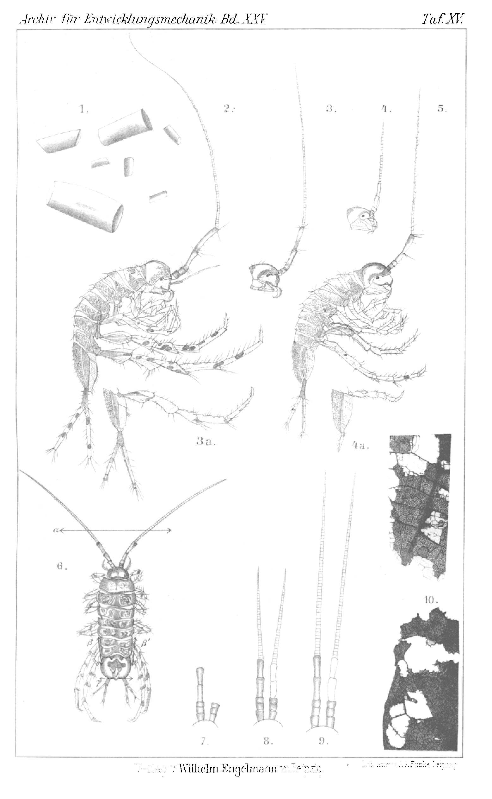
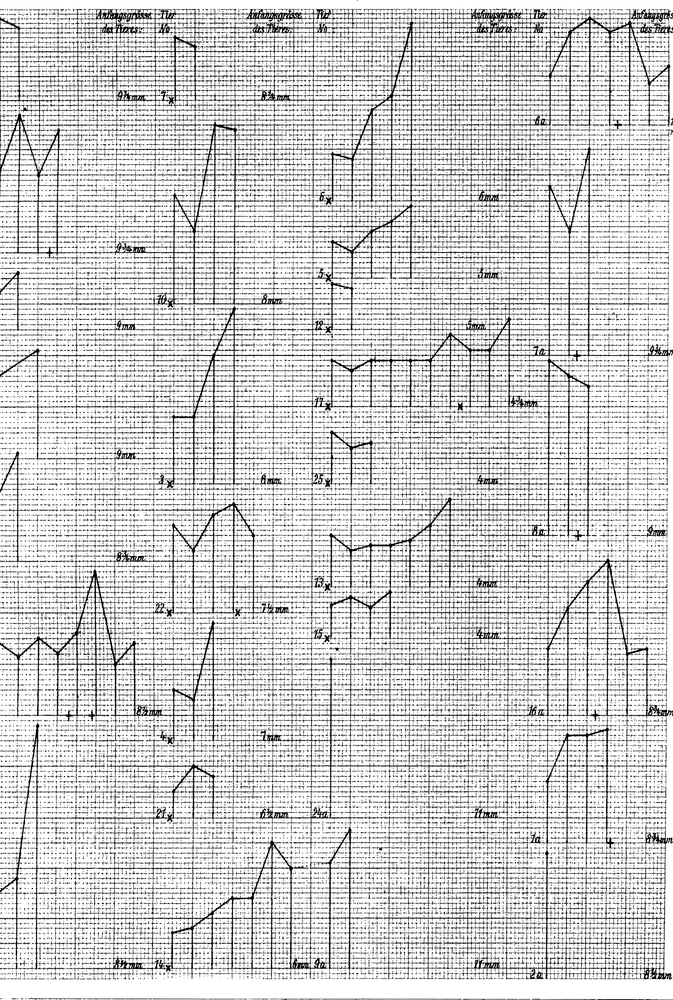

# Über den Einfluß der Regeneration auf die Wachstumsgeschwindigkeit von Asellus aquaticus L.

# On the Influence of Regeneration on the Growth Velocity of *Asellus aquaticus* L.

By

Dr. Margarete Zuelzer.

(From the Biologische Versuchsanstalt in Vienna.)

With Plates XV–XVII.

Received on 31 August 1907.

*Archiv für Entwicklungsmechanik der Organismen*, vol. 25 (1907).

> **Full translation.** A complete English rendering of Zuelzer's study of the influence of regeneration on the growth rate, with the tables and figure legends.

### Table of Contents

| | Page |
|---|---|
| A. Statement of the problem | 362 |
| B. Material | 362 |
| C. Arrangement of the experiments; technique; remarks on the use of the tables and curves | 364 |
| D. Results | 367 |
| &nbsp;&nbsp;*a.* Directly bearing on the theme | 367 |
| &nbsp;&nbsp;&nbsp;&nbsp;α. Behaviour of non-operated animals | 367 |
| &nbsp;&nbsp;&nbsp;&nbsp;&nbsp;&nbsp;1. Normal course of the moulting curve (progressive growth) | 367 |
| &nbsp;&nbsp;&nbsp;&nbsp;&nbsp;&nbsp;2. Irregularities in the moulting course of normal *Asellus* | 368 |
| &nbsp;&nbsp;&nbsp;&nbsp;&nbsp;&nbsp;3. Statistical treatment of normal cases | 369 |
| &nbsp;&nbsp;&nbsp;&nbsp;β. Influence of the amputations | 370 |
| &nbsp;&nbsp;&nbsp;&nbsp;&nbsp;&nbsp;1. Behaviour of the animals which were operated upon shortly after the first moult occurring in captivity | 370 |
| &nbsp;&nbsp;&nbsp;&nbsp;&nbsp;&nbsp;2. Influence of the operation on animals which were not operated upon immediately on being brought into captivity | 372 |
| &nbsp;&nbsp;&nbsp;&nbsp;&nbsp;&nbsp;2a. Influence of the time between moult and amputation | 373 |
| &nbsp;&nbsp;&nbsp;&nbsp;&nbsp;&nbsp;3. Influence of non-regeneration | 374 |
| &nbsp;&nbsp;&nbsp;&nbsp;&nbsp;&nbsp;4. Investigation as to whether a definite behaviour is characteristic of the operated animals with regard to the combination and the occurrence of delay and acceleration at the first or at the second moult following the amputation | 375 |
| &nbsp;&nbsp;*b.* Occasional other observations | 378 |
| &nbsp;&nbsp;&nbsp;&nbsp;α. Morphology of the regeneration | 378 |
| &nbsp;&nbsp;&nbsp;&nbsp;β. Influence of the site of section on the regeneration | 378 |
| | Page |
|---|---|
| &nbsp;&nbsp;&nbsp;&nbsp;γ. Influence of repeated regeneration | 380 |
| &nbsp;&nbsp;&nbsp;&nbsp;δ. Hypertrophic regeneration | 381 |
| E. Summary of the principal results | 382 |
| F. Explanation of the figures | 383 |
| G. Tables (experimental protocols) | 384 |

## A. Statement of the problem.

V. Emmel¹) carried out investigations into the influence of regeneration on the growth velocity of the lobster. He amputated limbs from the animals at definite time intervals after the last moulting date known to him, and found throughout a retardation of growth, which made itself noticeable through a delay of the moult following the amputation, after the completion of which the amputated limbs were regenerated. The moult was postponed all the more, the more time had elapsed between the last moulting date and the operation. Independently of these experiments, Ch. Zeleny²) experimented on the solution of the same question with various Crustacea. To his experimental animals he generally amputated a pair of chelae and the last pairs of legs. He varied his experiments in that, in the different experimental series, he amputated differing numbers of limbs. Throughout he found, in the animals operated upon by him, an acceleration of the moult with regeneration phenomena as compared with the control animals, and indeed an acceleration all the greater, the more body parts had been amputated. These statements by Emmel and Zeleny seemed to me irreconcilable. I therefore endeavoured to ascertain whether regeneration is at all capable of exerting a law-governed influence on the growth velocity, and of what nature this influence might be.

> ¹ Emmel, V., The Relation of Regeneration to the Molting Process in the Lobster. Annual Report of the Commissioners of Inland Fisheries of Rhode Island. XXXVI. No. 27. 1906. p. 258–313. 2 Taf., 3 Tab.

> ² Zeleny, Ch., The Relation of the Degree of Injury to the Rate of Regeneration. Journ. of Experim. Zoölogy. II. 1905.

## B. Material.

For the experiment I used the water-louse (*Asellus aquaticus* L.). The animals keep well and are undemanding. They were housed in ordinary drinking-glasses, and indeed only one animal in each glass. Oxygen was provided by duckweed (*Lemna*)

and waterweed (*Elodea canadensis*). It is harmful to expose the animals to the glaring sun. As nourishment, dried and then well-soaked leaves served; maple and oak were preferred. The animals ate the soft parts of the leaves and left the vascular bundles behind (Fig. 10). The excrements, these characteristically shaped little cylinders (Fig. 1), which are produced in large quantities. These remain lying on the bottom of the glass and form a healthy sludge, which neither clouds the water nor otherwise in any way forms noteworthy bacterial foci [colonies]. It was therefore scarcely necessary to change the water in which the animals lived during the whole duration of the experiment. It is to be noted here that with the *Elodea* small Entomostraca regularly reach the glasses, especially Ostracoda and Copepoda. They take part in the rendering-harmless of the Asellus excrement, and they also prevent the formation of bacterial skins [films]. Thus, through their feeding activity, they bring about a biological self-purification of the water. In conjunction with the *Asellus* itself, it is no doubt to their activity that the remaining-clear of the water is to be credited.

In arthropods, growth can be recognised by the regularly occurring moulting periods. *Asellus aquaticus* sheds its skin always in two parts. The old skin bursts transversely all around in the middle of the animal; then it [the animal] creeps out of the old skin; here it can shed either first the skin of the head-half with the first leg-pairs, or the skin of the rear body-half with legs and furca. Often the animal sheds only the old skin of the one body-half, and 1 to 2 days then pass before the other half follows (see Table I to V).

The shed skin is thin and yellowish-white. If it remains lying in the water, then in 6 to 8 days it is, no doubt as a result of the action of micro-organisms, entirely destroyed; it gradually disintegrates into small pieces, and these dissolve.

After each moult an increase in size of the animal concerned is to be ascertained. The animals are already sexually mature at about 6 mm body length; they grow and continue to moult, however, thereafter. The largest specimens that I observed were 14 mm long males. One can measure the living Asellus quite well by taking it along its length between the legs [arms] of a compass [dividers] that yields readily to any pressure, and then transferring the compass-opening onto a scale provided with a millimetre marking, and so reading off the measurement.

## C. Arrangement of the experiments; technique; remarks on the use of the tables and curves.

For the experiment I used *Asellus aquaticus* of various sizes, from 1¾ to 11 mm (Table I to V). The animals were kept isolated; each received a letter and a number; daily the glasses were inspected for moults and these were carefully removed from the glasses. From the day of their first moult in captivity onward, the animals were entered onto lists (Tables [I–V]) for every moult. Mostly the moults occurred at night (see Tab. I–V). Freshly moulted animals are lighter, poorer in pigment; those shortly before the moult stand darker, brown-green.

Amputations of limbs were carried out with annealed [red-hot] instruments. For the amputation the animals were brought into a flat bowl with water; the small specimens were operated upon under the dissecting-magnifier. The antennae [feelers] were generally cut off about at the middle with a bent pair of scissors. Amputations were always carried out only on the outer, long, second antennae of the Asellus. The animals lost little body-fluid [blood] during and after the operation. The wound healed over quickly. The animals were held firmly with a thin but blunt pair of forceps. Thereby regular autotomy occurred near the body. In most cases the last two pairs of legs were removed. If other legs were removed, this is expressly noted (Plate XV Fig. 5). The furca too was removed by being grasped with the forceps by means of autotomy. It is a mystery to me how Ost¹) can speak of the great fragility [frailty] of the water-louse following operative interventions, on account of which it would be unfavourable for regeneration purposes. There is, no doubt, as Przibram²) already learned, scarcely a more rewarding object for regeneration experiments than the water-louse.

At the beginning of my experiments I at first believed that equally large animals would be identical with equally old ones. The animals booked on Table I were therefore operated upon on the day of their first moult in captivity; the animals noted on Table II were set to [...] of the letter a, and which a collection

> ¹ Ost, J., Zur Kenntnis der Regeneration der Extremitäten bei den Arthropoden. Archiv f. Entw.-Mech. 1906. Bd. XXII. 3. Heft. S. 289–324. 3 Taf. 8 Fig.

> ² Przibram, Hans, Die Regeneration bei den Crustaceen. Arb. aus dem zoolog. Inst. Wien. 1899. Tom. XI. Heft 2. S. 163–234. 4 Taf.

resembling that of the large animals such as that which Table I exhibits, was to serve as a control of the moulting-velocity of normal animals. These specimens were therefore at first not operated upon, until the result was reached: the large specimens grew, the moults followed one another (see Table I and II); the larger animals could only be measured with imprecisions [allowing for an error] of about ½ mm. A part of these animals were then operated upon once or twice after full regeneration. Whether this took place on the day of the moult, or whether one operated earlier, is especially noted (Table VI). The number of the days by which the moult is delayed, and whether this delay enters at the moult during which the amputation phenomena are fully regenerated, are compiled in Table VII.

The animals which Table I exhibits and which were not operated upon were to serve as a control for those of Table II. Now, since the moults of equally large animals likewise differ from one another, so that here too the individual fluctuations of the intra-individual moulting periods make themselves felt by [the fact] that one and the same animal moults at unequal intervals, the larger animals also differentiate themselves from one another. Such individual differences, although they are smaller here, also enter in here. [Reading of this transitional sentence is uncertain.]

It must be expressly noted here that the moults of equally large animals differ from one another. Already from this it becomes apparent that equally large animals need not at all be of the same age; therefore, in determining the average duration of the moulting periods, only data of one and the same animal could be compared with one another. The unequal growth makes itself noticeable not only at the large, older animals, but also at the small, young ones; differently fast moulting- and regeneration-velocities are noticeable. [This paragraph's exact phrasing partly reconstructed; see authoritative image p.365.]

The fact that the duration of the moulting periods of equally large animals differs from one another, that equally large animals need not be of the same age, was already apparent. Most of the moults occurred at night; the amount of growth, and what time elapsed before the next, expected moult, [was noted]. Each moult was therefore noted [...] indeed of [...], so that [...], that [...] the first or second moult [...], that at the first operation it [...] the first moult [...]; at the following moult [...]. [This passage is partly reconstructed from p.365.] A special explanation is required by Table V. As is known, in the *Asellus* brood-pouch the developing animals are carried [guarded] by the female ventrally in the brood-pouch under the appendages [oostegites] of the breast-legs [thoracic legs], the brood-plates [Brutplatten]. Although the moult of the mother is delayed thereby, then yet under [the next] moulting the young, which are about 1¾ mm long, are set free. — Animal 24 (Table I and VI), isolated in captivity since the 10th XII, moulted itself on the 16th XII, and on this occasion released 48 young, which were about 1¾ mm long, free. These young showed themselves to be very little vital [weakly], and most of them quickly perished. Only half of the young [were] attacked by the water-fungus [Saprolegnia], that is, infected only by *Saprolegnia*. From these the young which were not operated upon proceeded, since one could not control [...] to serve as control for the moulting-velocity of the amputated young animals (Table V). Already at these young animals, just as also at the large, older ones, the unequal growth makes itself noticeable; differently fast moulting- and regeneration-velocities are noticeable. Animal 44 and 48, the longest living, were amputated. Because at these young animals the growth velocity [...], also here, in the data of the same animals, [the data] were drawn upon for comparison for the time-span of the moulting periods of one and the same animal; the data of various animals were only with caution compared with one another. The unequal growth [...] freely-released [...] young animals (Table I and II). Animal 18 stood isolated under my observation since the 26th [...], moulted itself on the 22nd February [reading of date uncertain]; first soon after the moult on the 30th January [it became noticeable] for the first time eggs in the brood-pouch of these animals; on the 23rd February those in development were engaged [grasped]. With 3a, also here it was isolated on the 18th November. Between the laying [of the eggs] and the beginning of the development there must also — as the animals were reared isolated the whole time — with these *Asellus* be a single time [...] (eggs), namely perhaps the possibility of parthenogenesis is not to be excluded. [Page 366 readings of dates and several clauses are uncertain; see authoritative image.]

By means of curves (Tab. XVI, XVII) I sought to make visible graphically the growth velocity in its dependence on the regeneration. The size of each *Asellus*, namely its body-size, was ordered, entered. The ordinates stand on the abscissa as the days which lie in the animals between each moult. Each square corresponds to one day. On the abscissa stand, with small asterisks [marks], the operation-dates. The distance of the operation-dates from the next square indicates whether the operation was undertaken on the day of the moult itself, or at what distance from the moulting day. (That an expected normal moulting interval is always reduced [shortened] by ½.) The length of the ordinate is also not so considerable [...]. The single moults proceeded between the single moulting periods. The end-points of the ordinates, connected one with another by the small marks, give the course of the curve, which indicates [...] connected, [...] from which I [...] the time-displacement of the moulting periods, that is, the number of the days between the moults, come more closely [...] (curves and Table VIII).

All possibilities for the succession-sequence of growth-retardation, [growth-acceleration] and equal-remaining [unchanged] growth are combined graphically and statistically with Table VIII; throughout it remains [...]. The course is more closely noted; here too it is [noted] under which combination, whether at the first operation (whether the section [cut] was at the [...] of Table I) —, or whether the [...], from which the average-time of the moults was known, was unfailingly [...] ¼, ½, ¾ of the time between the moults, whether the amputated animals begin to regenerate, and whether and how soon the amputated body-parts have been completely replaced [restored]. —

## D. Results.

### a. Directly bearing on the theme.

#### α. Behaviour of non-operated animals.

##### 1. Normal course of the moulting curve.

Normal *Asellus* (Table II and Curves), which in captivity were not operated upon, showed at progressive growth a uniform retardation of the moult-displacements [moulting intervals]. Animal 12a, the first egg-bearing female that was observed in confinement, moulted itself at first after 9 days, later then after 11 and then after 14 days; in the meantime it showed an enlargementincrease altogether of 1¾ mm. In Animal 17a the succession-sequence of the moults retarded; indeed at 4½ mm initial size it moulted itself first after 8, then after 9, 12, 12, 13, finally again after 13 days, and showed in the whole time almost 2 mm of size-increase. The same tendency to progressive retardation of growth-increase show further, with regard to its amputation, the Animals 11a, 13a, 15a, 21a, 25a, 10a, 6a, 3a, 1a, 16a, 9a, E, M, L, B, H, o, a, p; together with the already earlier excluded ones, 21 animals (see Table VIII and Curves).

##### 2. Irregularities in the moulting-tempo of normal *Asellus*.

Differently behaves itself Animal 8; it showed between the second and third moult in captivity no growth-retardation, but rather moulted itself the third time in the same interval as the second, after 11 days. After this third moult the animal was operated upon. Probably it shows, just as for example Animal 1a at the third and fourth, or Animal 13a at the fourth and fifth moult, the tendency to retardation, which however is subject to individual fluctuations and is not always clearly recognisable. Had I not operated upon Animal 8 after the third moult, but rather first awaited further moults, then no doubt the fourth moult would probably have entered [occurred] as normally retarded.

But also the ten animals 22a, 5a, 19a, 18a, 8a, 7a, C, V, f, i show the third moult in captivity NOT retarded as compared with the moulting-time between first and second moult; on the contrary, they showed an acceleration. Of these animals, the animals 18a, 8a, 7a, V, f were operated upon after the third moult, since I had at that time not yet paid attention to that fact. About the normal moulting-velocity of these animals it is further to be noted that Animal 5a indeed needed 20 days from the first to the second moult, and only 9 days to the third moult; but that for the following moults it required 11, 14 and then 16 days, so that from the third moult onward the normal tendency to retardation with rising growth again made itself noticeable. Likewise it is in principle with Animal 19a; it needs 12 days between first and second moult, only 11 days up to the third moult; but then the growth-retardation sets in again, in that the following moults take place after 13 and 14 days. Likewise, in Animal C the third moulting-period is accelerated as compared with the second, but the fourth moult then shows as compared with

### 2. Irregularities in the moulting tempo of normal isopods.

Specimen S behaved differently; between the second and third moult it showed no growth-slowing in captivity, but instead moulted for the third time in captivity, just as the second time, after 11 days. After this third moult the animal was operated upon. Probably it shows, just as for example Specimen 1a at the third and fourth, or Specimen 13a at the fourth and fifth moult, the tendency toward slowing, which however is subject to individual fluctuations and is not always clearly recognizable. Had I not operated upon Specimen S after the third moult but instead awaited further moults, the fourth moult would probably have appeared, in normal fashion, slowed.

But the ten specimens 22a, 5a, 19a, 18a, 8a, 7a, C, V, f, i too show the third moult in captivity not slowed compared with the moulting time between the first and second moult; on the contrary, they showed an acceleration. Of these animals, after the third moult the animals 18a, 8a, 7a, V, f were operated upon, since at that time I had not yet paid attention to that fact. Concerning the normal moulting velocity of these animals it is further to be remarked that Specimen 5a indeed required 20 days from the first to the second moult, and to the third moult only 9 days; but that for the following moults it needed 11, 14 and then 16 days, so that from the third moult onward the normal tendency toward slowing with increasing growth again became noticeable. The same holds in principle with Specimen 19a; between the first and second moult it requires 12 days, up to the third moult only 11 days; but then the growth-slowing sets in again, in that the following moults take place after 13 and 14 days. Likewise, in Specimen C the third moulting period is accelerated compared with the second, but the fourth moult then again shows, compared with the third, the normal slowing. As regards the two remaining specimens 22a and i, Specimen i is the only one that constantly exhibits strong irregularities in its growth curve, for which I know no reasons (Tables IV, VII, VIII and curves). Specimen 22a, after the acceleration from the second to the third moult (10 days against the preceding 11), again required twice 11 days up to the moult; at the second and fourth moult it had so slight an increase that I was unable to ascertain it in measuring. This animal, with its constant moulting velocity, behaves similarly to Specimen S.

There are thus seven cases that notoriously showed an acceleration of the moulting time with increasing moult number. As set out above, these are the specimens 22a, 7a, 18a, V, i, 8a and f (Table VIII); and of these too, five were amputated already after the third moult, so it must remain undecided whether in these too, just as in Specimens 5a, 13a and C, the tendency toward growth-retardation would not have set in again from the fourth moult onward.

Reasons for the moulting data of these unoperated isopods that deviate from the norm may lie in their introduction into captivity as such; also part of the blame may perhaps be ascribed to the change of diet going hand in hand with capture. Furthermore, the possibility is indeed to be considered that those animals had perhaps earlier — in free life — lost limbs and at the beginning of the observation period found themselves at the end of a regeneration period, of which externally nothing more was to be perceived.

But since, as was set out, 21 unoperated isopods had shown moulting-slowing and only seven, of which five are questionable, moulting-acceleration, I do not hesitate to regard the gradual slowing of the moulting velocity as the regularity normal for isopod growth.

### 3. Statistical treatment of normal cases.

In Table VIII one finds the cases mentioned hitherto statistically compiled; the curve-sections concerning the normal animals are thereby taken as the starting point.

> Archiv f. Entwicklungsmechanik. XXV. 24

## β. Influence of the amputations.

### 1. Behaviour of the animals which were operated upon shortly after the first moult occurring in captivity.

A number of isopods were operated upon on the day of their first moult in captivity or one day thereafter. In Tables I, III and V it is noted at each individual specimen what was amputated from it. This concerns the animals in Table I, 1 to 22, further P, Q, 44 and 48 in Tables III and V. Furthermore, Specimen R was operated upon 5 days after its first captivity-moult, Specimen G 6 days, the animals H and O 7 days, finally Specimen F 8 days after that moult. In the animals 1, 7, 8, 11, 12, 23, 24, F, G and H I observed growth no longer than up to the third moult after the amputation. Of the remaining animals — there are 20 of them, which were observed longer — 15 specimens had the time-span between the second and third moult, compared with that between the first and second moult, accelerated after amputation. These are the following experimental animals: 13, 25, 14, 5, 6, 4, 22, 10, 16, R, 17, O, P, Q and 48.

As a typical example of this, I refer to the growth curve of Specimen 13. This animal was 4 mm large, moulted, was amputated on the same day, moulted after 10 days, had in that time regenerated about ⅓ of the lost limbs, without showing any measurable body-increment. It now moulted again already after 7 days with ¼ mm body-increment, then after 8 and again after 8 days. After this fifth moult it had fully regenerated and during that time had increased in length by 1¾ mm. Now the animal moulted again after 9, 12 and then after 17 days. The second and third, and in this animal even the fourth, moulting period after the amputation is thus accelerated compared with the first; from the fifth onward the normal tendency toward slowing with increasing growth again becomes noticeable. In all 15 animals listed above the second moult after the amputation is accelerated compared with the first. All animals showed, after the first moult — reckoned from the amputation — regeneration phenomena; after the second or third moult these had fully replaced the lost body-parts. At the later moults the gradual normal growth-retardation then again becomes noticeable.

The animals 3 and 44, likewise amputated on the day of the moult, show the third moult after the same time as the second moult after the amputation. Specimen 3 moulted after 13, 13, 25 days; thereupon it had fully regenerated. The next moult followed after 34 days. This is probably an animal that even under normal circumstances moults quite slowly. And Specimen 44 moulted after 6, 6 and then after 9 days; thereupon it had fully regenerated. — The third moult slowed compared with the second, thus similarly to normal, unamputated animals, was shown by the five animals 15, 14, 21, 2 and 18. Specimen 18 also showed acceleration, but only after the fourth moult. This was accelerated compared with moults two and three after the amputation; it moulted after 16, 27 and 15 days; thereupon it had fully regenerated; the next moult followed, normally slowed, after a further 24 days. Specimen 15 too showed the acceleration only at the fourth moult. In these last-named animals, then, despite the retardation of the second moulting period, an absolute acceleration of the moulting velocity after the amputation, during the regeneration period, is to be recorded, so that only three animals with absolute growth-retardation after the amputation remain.

Is this acceleration now to be construed as a consequence of the amputation during the regeneration period? The affirmation of this question has much in its favour. For of 29 normal, unamputated animals, 21 had shown an increasing slowing of the moulting periods, one a constant moulting velocity, and only seven cases an acceleration of the same (Table VIII). In the animals operated upon on the first moulting day in captivity, or shortly thereafter, on the other hand, this relation is reversed. 15 animals show, after the amputation, at first an acceleration of their moulting tempo compared with the time between the first and second moult; only thereafter — with increasing regeneration — does moulting-slowing set in again, as the normal animals too have it of themselves. Two specimens at first exhibited a constancy of the moulting velocity; only three specimens, thus the considerable minority, showed, with the advance of the moulting stages, the steady slowing-tendency like unoperated isopods.

The view that, as a consequence of the injury, the moults and thereby at the same time — at least in many cases — also the growth of the isopod is accelerated, accordingly has much in its favour. But since the normal curves of their moults before the amputation are unknown to me for the isopods of this experimental series, just because the animals were

> 24* operated upon immediately after their first captivity-moult, I must here still leave open the question whether it is really a matter of an acceleration-tendency compared with the moults, unknown to me, that preceded the amputation, or only of a relative deviation from the normal, evident from the moulting periods after regeneration has fully set in.

### 2. Influence of the operation on animals that were not operated upon immediately on being brought into captivity.

For the reason stated at the end of the preceding section, it was desirable to operate upon animals whose normal moulting velocity was known at least in part (see Table II and curves). I therefore operated upon a number of isopods that had already moulted several times in captivity under my observation. On some, repeated amputation was carried out, but only when the preceding losses had already been fully replaced by regeneration. On the day of the moult, or at the latest 2 days after it, 13 animals were amputated. Of these, eight — these are the animals L, a, b, 5a, 25a, f (two amp.), B and 3a — showed the first moult after the amputation, under regeneration phenomena, accelerated in comparison with the moult before the amputation. Specimen 3a died after this moult. In the remaining seven animals it turns out that not only is the first moult after the amputation accelerated, with regeneration, compared with the normal moulting tempo, but the second moult too set in accelerated. — In Specimen x too the first moult after the amputation is accelerated under regeneration phenomena, but at the second a slight retardation, as with the increment of normal animals, already becomes noticeable. Normal moults of this animal after 9 and 17 days, then amputation; then (accelerated) after 12 days, then (relative, but no longer absolute acceleration) moult after 13 days.

A retardation of the moult following the amputation was shown by four animals: Specimen o, which slowed the moult following the amputation by 3 days and in which the moult following thereupon set in only after an equally long time. Specimens V, q and S let the first moult after the amputation occur slowed, but the two following ones accelerated (Table VII). Thus, of the 13 animals that had been amputated on the moulting day, only one animal (o) showed steady, progressive growth-retardation like normal, unamputated animals. In the remaining eleven — one died too early to permit observations in this respect — the tendency toward moulting-growth-acceleration after the amputation, under regeneration phenomena, always becomes clearly noticeable compared with the normal moulting periods.

### 2a. Influence of the time between moult and amputation.

As already remarked earlier, a number of animals were amputated at regular intervals of time after the moulting day; and indeed such animals whose normal curve of moulting velocity was already known. The animals 4a, 6a, 18a, C and g were amputated after the moult, within the first quarter of the time-span that the average time between their moults used to represent; the animals 4a, 6a, C and g indeed showed the first moult after the amputation retarded, under regeneration phenomena. The second moult, however, and in the animals 4a and 6a also the third moult, set in accelerated, under regeneration phenomena, compared with the preceding moults. Specimen 18a had both moults after the amputation more accelerated than the normal ones. The second moult after the amputation occurred even faster than the first.

The animals 21a, 22a, O and 48 were operated upon after the half of the average time-interval of the moults, reckoned from the moulting date. These four animals too showed regeneration phenomena already at the first moult. In Specimen 21a the first moult set in somewhat retarded, the two following it considerably accelerated. Specimen 22a, despite amputation and regeneration, slowed the two moults following the amputation; further moults were not observed. Specimen O showed the first moult after the second amputation accelerated and the second slowed. However, this slowing is only a relative one; in absolute terms it nevertheless signifies an acceleration in comparison with the moults before the amputation! Specimen 48, in which the moult following the (second) amputation had set in after the lapse of the same time as the last moult before the amputation, showed the second moult after the amputation somewhat accelerated. So here again the majority of the animals, three isopods of four, showed growth-acceleration after the amputation; and only one animal (22) a retardation of the moulting periods after the amputation. Of the five animals that had been operated upon after ¾ of the average moulting-interval reckoned from the day of the moult, four — the animals 12a, 16a, 16, 13a — showed, under regeneration phenomena, the first moult after the amputation retarded, but the two following ones not inconsiderably accelerated.

### 3. Influence of non-regeneration.

Differently from these five animals behaved Specimen U, likewise amputated after ¾ of the time of the average moulting-interval. It had moulted normally after 10 days; had then been amputated after 6 days and moulted already after a further 2 days, thus 8 days after the previous moult; this signifies an acceleration compared with the preceding time-interval. Of the other three animals, which had likewise been amputated at a ¾ moulting-time-interval, the first moult had shown itself clearly slowed in two, under regeneration phenomena. In Specimen U — and this seems here to be of decisive importance — no trace of regeneration was visible after this first moult, occurring 2 days after the amputation. The next moult followed, slowed, after 13 days under regeneration phenomena; the third after 19 days; thereupon the animal had fully regenerated all amputated limbs.

This animal is therefore of fundamental interest, because the situation with it is as with one described by V. EMMEL,¹) which let the first moult set in accelerated after the amputation performed shortly before it, without — and this seems to me the reason for the acceleration — regenerating. His (EMMEL's) animal, just like my Specimen U, had been operated upon too late, before the moult already preparing itself in the animal's body, to be able still to regenerate. The body of Specimen U had, through the amputation of ⅔ of the antennae, of the fifth and sixth pair of legs and of the furca, been diminished in mass by a quite considerable amount. The animal thereby had less consumption for the parts to be nourished through metabolism; thus the acceleration of the moulting-growth period going hand in hand with the non-regeneration is probably explicable. The animals E, 18 and 19a too were amputated very shortly before the expected moult; so shortly that all three animals were no longer in a position to regenerate. Specimen E had normally moulted after 10 and 13 days; 15 days after this moult

> ¹) EMMEL, V., The Relation of Regeneration to the Molting Process in the Lobster. Ann. Rep. of the Commissioners of Inland Fisheries of Rhode Island. XXXVI. No. 27. 1906. p. 258—313.

the animal was operated upon; it thus already showed normal growth-retardation; after a further 3 days, thus 18 days in all, the expected moult took place, with absolute growth-retardation, which here however need not be relative — this in contrast to Specimen U —; in which case likewise no regeneration phenomena came to light. The next moult followed somewhat accelerated after 17 days with regeneration; then this animal died. Specimen 18 had moulted after 15 days, had been amputated after a further 20 days, thus during normal growth-retardation; it now moulted already after 4 days, thus 24 days after the last moult, without regeneration; then it died.

Specimen 19a too showed the normally slowing growth curve; it moulted after 11, 13 and 14 days. After a further 14 days it was amputated; it now moulted after a further 3 days, thus 17 days in all, with absolute, but perhaps not relative, growth-retardation, without regeneration. The following moult was again retarded as in Specimen E; it followed after 24 days; thereupon the animal had largely regenerated, and the next moult then followed again accelerated, already after 17 days. This acceleration after the third moult is thus probably to be set in parallel with the acceleration of the second moult after the amputation in those animals which, already after the first moult occurring slowed in response to the amputation, let the second moult set in accelerated under regeneration phenomena.

### 4. Investigation of whether, for the operated animals, a definite behaviour with respect to the combination and the occurrence of retardation and acceleration at the first or the second moult following the amputation is characteristic.

The normal, unamputated isopods had, in the overwhelming majority, shown a slowing moulting tempo. The amputated animals, by contrast, had on average exhibited the tendency toward growth-acceleration after the amputation during the regeneration time. The acceleration is to be recognized differently during the various moulting-intervals; in this a regularity seems to prevail. Namely, if the isopods are amputated on the moulting day, they show, in the overwhelming majority, the first and second moult after the amputation accelerated under regeneration phenomena. The greater the time-distance from the moulting date at which the amputation was carried out, the more the animal had been operated on, it thus already showed normal growth retardation; after a further 3 days, that is, 18 days in all, the expected molt took place at absolute growth retardation, which here, however, need not be relative — this in contrast to Animal U ¹) — wherein likewise no regeneration phenomena came to light. The next molt took place somewhat accelerated after 17 days with regeneration; then this animal died.

Animal 18 had molted after 15 days, had been amputated after a further 20 days, that is, during normal growth retardation; it now molted already after 4 days, that is, 24 days after the last molt, without regeneration; then it died.

Animal 19a likewise showed the normally slowing growth curve; it molted after 11, 13, and 14 days. After a further 14 days it was amputated; it now molted after a further 3 days, that is, 17 days in all, at absolute, but perhaps not relative, growth retardation, without regeneration. The following molt was again retarded as in Animal E; it took place after 24 days; thereafter the animal had for the most part regenerated, and the next molt then took place accelerated again, already after 17 days. This acceleration after the third molt may therefore well be placed in parallel with the acceleration of the second molt after the amputation in those animals which, already after the first molt — which followed the amputation in slowed fashion — let the second molt set in accelerated under regeneration phenomena.

### 4. Investigation of whether, for the operated animals, a definite behavior with respect to the combination and the occurrence of retardation and acceleration is characteristic at the first or the second molt following the amputation.

The normal, non-amputated isopods had in the overwhelming majority shown a slowing molting tempo.

The amputated animals, on the contrary, had on average exhibited the tendency toward growth acceleration after the amputation during the regeneration period. The acceleration is to be discerned differently during the various molting intervals; and herein a regularity seems to prevail. Namely, if the isopods are amputated on the day of molting, then in the overwhelming majority they show the first and second molt after the amputation accelerated under regeneration phenomena. The greater the interval of time from the molting date at which the amputation was carried out, the more does the inclination make itself felt to let the first molt after the amputation set in retarded under regeneration phenomena, but then to let the two later molts set in accelerated.

It must yet be especially pointed out here that I wished to bring forward the non-regenerating animals separately. In this respect Animal U behaves quite peculiarly; for in its case neither the first nor the second molt following the amputation took place under regeneration phenomena. In this case the first molt following the amputation set in accelerated (Animal U), and indeed because, shortly before the molt expected after the amputation, the regenerate appeared, which then released the animal's normal growth rhythm. With Animal U the regeneration only set in after the third molt following the amputation.

Animal H and Animal 13 I wished, on account of their special behavior, to consider separately. Animal H formed after 6 days the first conspicuous regeneration bud, molted after 11 days without any regeneration phenomena, after a further 12 days with such. Animal 13 molted 8 days after the regeneration bud appeared; it had at this point already regenerated, after 9 days by the date of the molt that had last elapsed, but without regeneration; the next molt took place after 9 days without regeneration, when, however, regeneration buds came to light. Some further animals I include here under those which showed the first molt following the amputation already accelerated even before the regeneration buds came to light (cf. p. 370), since these too only regenerated after the third molt.

In general, in the regenerating animals there was, during the period of molting reduced by the amputation and thereupon regenerating, no retardation present. The isopods molt more rapidly than the normal ones, as long as less body mass is to be nourished, and indeed so long as the regenerates are still small. As soon as the isopods have small regenerates, then in the isopods with small regenerates only the small regenerate is built, since less body mass and less building material is consumed during the regeneration than where the whole animal grows ¹). Wherein indeed the molting acceleration is explicable; whereas, on the contrary, a longer time then comes to the benefit, so that the consumed replacement materials are reproduced complete; this is naturally the case in the first molt following the amputation, since in the first molting period regenerate is built up

> ¹ Cf. Przibram, Hans, Quantitative Wachstumstheorie der Regeneration. 1905. Centralbl. f. Physiologie. Bd. XIX. Nr. 18.

have. One animal (U), amputated a longer time after the molt, had until its first molt following the amputation regenerated nothing; in consequence the first molt after the amputation here too set in accelerated. The following molt is then also accelerated, because the animal, with its small regenerates, possesses less body mass than normal animals. This animal, reduced by the amputation, had had less mass to nourish; since in this case it had not used for the regenerate the replacement mass that forms through the regular metabolism, that mass could come to the benefit of its body growth; as is shown in the accelerated molt.

Hereby the contradiction in the results of V. Emmel and Zeleny now also becomes explicable. Emmel had, at a definite time reckoned from the molting date known to him, amputated lobster limbs, and found the next molting date pushed out the further, the later he had operated, in case the animals showed regeneration. These are thus the same phenomena which the isopods exhibited under the same amputation conditions. The animals of Emmel molted more rapidly than the normal animals, but this without showing regeneration. The same case as with my Animal U! Emmel never awaited the second molt in his animals; had he done so, he would probably then have observed a molting acceleration in his animals too.

Zeleny (l. c.) obtained throughout only an acceleration of the molt after amputation, which he carried out in various Crustacea — and indeed an acceleration so much the greater, the earlier he [carried out] the first molt at the animal. Zeleny had amputated arbitrary animals; the date of the last molt before the amputation was unknown to him. Thus he must by chance — and this does not surprise, since he set up all his experiments with the slowly molting decapods and at the same time of year — always have operated a longer time before the molt; therefore, with equally large experimental animals of his, the integument change set in so much the [later], the more recently their limbs had been [amputated]. Had the molting date of his experimental animals before the amputation been known to Zeleny, and had he placed the date of the operation differently in different animals, as Emmel did, he would probably then have reached a date with which a transitory growth- or molting acceleration would have set in with his animals too.

## b. Occasional other observations.

### α. Morphology of the regeneration.

Concerning the regeneration of *Asellus aquaticus* L. observations already exist from the year 1899 by Przibram ¹), which I can confirm in their entirety. Besides the regenerations described there, I observed in one case (Animal J) regeneration of the left half of the tail-shield with the left furca; during the four molts observed, the furca had been for the most part, but not yet to its original size, regenerated.

The water isopods always regenerate completely the removed members, and indeed they do this just as the young, freshly hatched ones 1½ mm long, so too the old, large animals of 13 mm length. In the latter, however, the molting period is mostly such a long one that I did not use such large specimens for my experiments on the growth velocity; yet, as said, those animals too completely regenerate the amputated extremities within two to three molts. The regenerate one already sees within the old skin, rolled up, shimmering brightly through. After the molting it becomes free and then rolls itself straight up. The regenerates are at first, even when they have already reached their definitive length, pigmentless and pale; until they take on the color of the rest of the isopod body, three to four molts may pass.

### β. Influence of the cut site on the regeneration.

The second antenna [feeler] of the isopod — it is the longer one, and only this one was amputated — consists of a short, five-segmented shaft and a long, many-ringed flagellum. If only the flagellum or parts of it were amputated, then it was already after one molt mostly completely regenerated. Amputations carried out at the boundary of the first and second shaft segments often required two molts for complete regeneration. After the first molt, all amputated parts are indeed re-formed, but reduced in size. If several shaft segments were amputated, then this took a longer time for regeneration.

If the antennae were not both amputated to an equal length, as quite by chance often happens in cutting (Plate XV Fig. 6), then in the majority of cases, at about 40% of the amputated

> ¹ Przibram, Hans, Die Regeneration bei den Crustaceen. Arbeiten aus den zoolog. Instituten d. Universität Wien. Tom. XI. 2. Heft. 1899. p. 177.

antennae, the regeneration proceeded at the two antennae unequally rapidly, e.g. in Animal 3, 5, 14, 10, 21, 22, 18; and indeed in such a way that at the first molt after the amputation the more strongly amputated antenna was not completely restored to the size of the more weakly amputated one, but rather, after this molt, was completely restored only at the two following molts (Plate XV Fig. 7). After the two following molts it was then completely restored to the same mass as the other antenna (Plate XV Fig. 8). This process I grasp as a regulatory compensation process. Why the same does not turn out equally with all unequally amputated [antennae], I am not aware, but I have become attentive to differences in the cut site. If now an entire flagellum is amputated, and from the other antenna the whole flagellum is cut off only two shaft segments away, then a compensatory regulation can set in; it is then in the other antenna the already regenerated flagellum that is built earlier, while indeed at the first molt the regenerate of the shaft segment and of the flagellum lie ahead reduced, until at the attainment of their definitive length they require only these two further molts. Differently from amputated flagella: the two molts following the amputation; both are already completely regenerated.

In Animal 15, for example, the right antenna was amputated at half [its length], on the left at a whole shaft; at the second molt the right antenna regenerated only the right antenna completely. Torn-out antennae regenerate considerably more slowly than cut-off ones: e.g. in Animal 23 the antennae regenerated only at the third molt; the four leg-pairs and the furca completely regenerated; only the antenna which had been torn out — it regenerates always more slowly, as antenna and as legs — was here first fully grown at the third [molt].

The legs were already regenerated at the first molt — naturally, except those belonging to the second leg-pair, which were not at all restored at the molting following the amputation — restored at a small number completely. They appear, however, still smaller and pale, pigmentless, come to light; just so the furca at first reduced. Concerning the morphology of these processes I refer to the figures 30 and 31 (Plate XVIII) of Przibram ¹).

I would here only point out further that on the regenerated end-segments of the antenna-flagellum more sense-bristles stand than on the normal end-segment. The form of the newly regenerated end-segments of the antenna-flagellum at first resembles that of newly hatched isopods, as I was able to compare on the young hatched in captivity from Animal 24. Thus, in the water isopod, ontogenetic stages are passed through during the regeneration ¹) ²).

Zeleny ³) emphasizes in his work on the regeneration of an American water isopod (*Mancasellus macrourus*) that the first period of regeneration is directed from the base toward the tip, the second from the tip toward the base; this was also the case in our water isopod. Przibram ¹) had at that time not paid attention to the first period. The direction of regeneration of the second regeneration period, however, he already emphasizes (l. c., pp. 172 & 177).

### γ. Influence of repeated regeneration.

A number of animals, which are compiled in Table VI, were amputated two or three times, after they had overcome by complete regeneration the operation previously carried out on them. Particularly noteworthy to me seems Animal 16, which had needed three molts to completely regenerate ½ antenna-pair, two molts to completely regenerate six leg-pairs and the totally amputated furca. The same animal, however, needed only one — and indeed an inconsiderably retarded — molt for the complete regeneration of the members removed at the second amputation. But since the amputation had taken place after half the molting interval, it had needed only half the time of this molting interval to regenerate for the second time. The second regeneration is accordingly considerably accelerated as compared with the first. Amputated for the third time, the animal then again needed one retarded and two considerably accelerated molts for complete regeneration.

> ¹ Przibram, H., Die Regeneration bei den Crustaceen. Arb. aus d. zool. Inst. Wien. Tom. XI. 2. Heft. Wien 1899. p. 177.
> ² Giard, A., Sur les régénérations hypotypiques. C. R. Soc. Biol. Paris. Vol. IV No. 1897.
> ³ Zeleny, The direction of differentiation in development. Archiv f. Entw.-Mech. Bd. XXIII. 2. Heft. 1907. pp. 324–345.

Animal O, amputated for the second time, showed — the first time after the second amputation — an acceleration of the molting-growth velocity, the second time a slight retardation, which, however, is to be drawn into comparison against the first amputation; [it] signifies, by the molting data after the first amputation, absolutely accelerated. With Animal Q even the three molting dates of the second amputation are accelerated, the first and second absolutely and relatively, the third as against the second indeed retarded, but absolutely still accelerated in relation to the molts before the second amputation. The regenerates were morphologically equal to the regenerates after the first amputation.

### δ. Hypertrophic regeneration.

Repeated amputations have, then, according to what was reported above, an increasing growth-elevation as after-effect. One further proof of the fact of the elevated growth in regeneration was furnished by Animal 14. This [animal] had, after four molts, completely regenerated the half-amputated feelers, namely the left second leg and the right third leg, the sixth leg-pair, and the furca. To my astonishment I noticed, after the further molts, that the regenerated feelers had grown further. They now had a considerable length, [greater] than normal feelers exhibit. It was then, instead of [normal] regeneration, hypertrophic regeneration (Plate XV Fig. 2) — because by "hypertrophy" one usually understands multiple formations, it is probably better to designate a case arising from this as "hypertrophic regeneration" — that Animal 13 exhibited. Usually the feelers regenerate the most rapidly, somewhat rapidly the furca; the legs require — probably because they are the most complicated structures — the longest time for their complete rebuilding. Here, even when the latter were entirely restored, I entered the animals in the tables (experiment protocols) as "completely regenerated," although feeler and furca were often already regrown at the first of the four molts. Animal 13a had needed 22 days up to a molt after the amputation, then 11 days; after [a further] 11 days the furca and feeler were completely regenerated. After a further 11 days the legs too required regeneration, [and] the animal had accordingly "completely regenerated." At the molt following 16 days thereafter, the renewed growth of the antenna was not, as otherwise with repeated regeneration, arrested, but rather it must have proceeded with the same velocity as during the regeneration. For the feelers indeed showed already in Animal 14, at one molt not inconsiderably retarded, the prolongation; in comparison to the length of this molt, the prolongation [was], in comparison to the slowly molting isopods, comparable. That now after the amputation the molting-accelerated growth at the half-amputated isopods [was] comparable, 9½ mm long, but it stopped before the completion of the regeneration of the hypertrophic regenerate. With non-operated isopods such an abnormal prolongation of individual body parts has not come into sight.

*(Paragraph completed; remainder of p.382 — section "E. Zusammenfassung der Hauptergebnisse" — begins a new paragraph on p.382 and is outside the owned pages 15–21.)*

## E. Summary of the Principal Results.

1) In normal, non-amputated specimens of the water-louse (*Asellus aquaticus* L.), the increase in body length occurs in time-segments that lengthen progressively from moult to moult.

2) Asellids whose body parts are amputated always regenerate these. In the majority of cases an acceleration of moulting appears during the period of regeneration; this manifests itself as a shortening of the time-interval between the individual moults compared with the time-span required before the operation.

3) The appearance of the moulting-acceleration is, however, dependent on the date of amputation:

a) If the animals are operated on the moulting-day or shortly thereafter, then usually the two moults following this moult are accelerated under regeneration phenomena.

b) The more time elapses between moult and amputation, the greater becomes the tendency to retardation of the first moult following the amputation; acceleration becomes evident only at the second and third moult, all three moults [proceeding] under regeneration phenomena.

c) If, however, the amputation is shifted to a point quite shortly before the expected moult, then this [moult] sets in immediately and indeed without regeneration; the next following moult is retarded, but already delivers regenerate, and only the third is accelerated, likewise with advanced regeneration.

d) If in one case the regeneration during the first moulting-period failed to occur even though the operation was not carried out so shortly before the expected moult, this [period] likewise showed itself accelerated.

4) The more simply a body part is built, the more rapidly it regenerates (antennae, furca); the more complicated it is, the more slowly its replacement occurs (legs).

5) Antennae amputated to unequal length on the two sides tend toward rapid equalization in length: through unequal regeneration velocity they restore the originally equal length (compensatory regulation) and then regenerate the piece still lacking at the normal length equally fast.

6) Amputations carried out several times in succession have as a consequence a moulting-acceleration occurring each time during the regeneration period; this [acceleration] can be heightened after the second amputation compared with the first.

7) Regenerated antennae and legs occasionally show hypertrophic regeneration.

## F. Explanation of the Figures.

### Plate XV.

**Fig. 1.** *Asellus aquaticus*, faecal pellet. 18-fold enlarged.  *(figure not reproduced)*

**Fig. 2.** Specimen with hypertrophic regenerates (antenna, hind legs, furca). 5-fold enlarged.  *(figure not reproduced)*

**Fig. 3.** Normal specimen, not operated, head. 5-fold enlarged.  *(figure not reproduced)*

**Fig. 3a.** The same, hind end. 5-fold enlarged.  *(figure not reproduced)*

**Fig. 4.** Specimen with non-hypertrophic regenerates (head). 5-fold enlarged.  *(figure not reproduced)*

**Fig. 4a.** The same (hind end) after the first moult. 5-fold enlarged.  *(figure not reproduced)*

**Fig. 5.** Specimen with non-hypertrophic regenerates (antennae, hind legs, furca) after the second moult. 5-fold enlarged.  *(figure not reproduced)*

Figs. 2–4 drawn lying on the left side, only the limbs of the right side drawn.

**Fig. 6.** Normal specimen from above with entry of the usual amputations ⟨←—→⟩, α, β, β', γ. 3-fold enlarged.  *(figure not reproduced)*

**Fig. 7.** Schematic representation of unequal antenna-amputation. About 5-fold enlarged.  *(figure not reproduced)*

**Fig. 8.** Compensatory regulation of the antenna-regenerate after the first moult of a specimen amputated as in Fig. 6. 5-fold enlarged.  *(figure not reproduced)*

**Fig. 9.** Further progress of the antenna-regeneration of the same animal after the second moult. 5-fold enlarged.  *(figure not reproduced)*

**Fig. 10.** Leaf-grazing [feeding damage on a leaf] by *Asellus aquaticus*. 2-fold enlarged.  *(figure not reproduced)*

### Plates XVI and XVII.

Curves of the moulting-velocities of *Asellus aquaticus*. Explanation see in the text (especially pp. 366, 367) and in the adjacent tables. The little crosses denote the operation-dates.

## G. Tables

### Tabelle I. [Table I.] Animals operated on the day after their first captivity-moult (Experimental protocols). [Tabelle I. Am Tage nach ihrer ersten Gefangenschaftshäutung operierte Tiere (Versuchsprotokolle).]

> Note on the table layout: this table is printed across two facing pages (printed pp. 384–385). Abbreviations: "ob reg." = "whether regenerated"; "total" = total [amputation]; "vord." = front [pair]; "h." = behind, "v." = in front (see footnote 1); "reg." = regenerated; "vollst. reg." = completely regenerated; "(÷ date)" / "(†)" denotes the animal died (on that date). Größe = size. The left columns (Nr.; date of 1st captivity-moult; date of 1st amputation; size; type of amputation; date and size of the 1st moult after amputation and whether regenerated) have been verified row-by-row against the page image and corrected here — the original table has **25 rows** (Nr. 1–25). The continuation columns (3rd–7th moult and Remarks, from the right-hand page p025) are faint; the cell values for moults beyond the first carry residual alignment uncertainty and should be spot-checked against the page images before publication.

| Nr. | Date of 1st captivity-moult | Date of 1st amputation | Größe mm | Art der Amputation [Type of amputation] | Date of 1st moult after amputation | Größe mm | ob reg. | Date of 2nd moult after amp. | Größe mm | ob reg. | Date of 3rd moult after amp. | Größe mm | ob reg. | Later moults / Bemerkungen [Remarks] |
|---|---|---|---|---|---|---|---|---|---|---|---|---|---|---|
| 1 | 20./21. XI. | 21. XI. Vm. | 8¾ | amp. Fühler ½; Beinpaar 2, 6; Furca total aut. [antenna ½; leg-pair 2, 6; furca total aut.] | h.¹) 3./4. XII., v.¹) 4./5. XII. | 9¾ | reg. | 24./25. XII. 25./26. XII. | 10⅛ | vollst. reg. | total 10./11. II. | 10⅛ | vollst. reg. | |
| 2 | 20./21. XI. | 21. XI. | 8½ | amp. Fühler r. ½, l. ¾; Beinpaar 2, 6; Furca total aut. [antenna r. ½, l. ¾; leg-pair 2, 6; furca total aut.] | total 5./6. XII. | 9¼ | reg. | total 23./24. XII. | 9¾ | reg. | h. 10./11. I. v. 11./12. I. | 9½ | vollst. reg. | total 13./14. II. |
| 3 | 20./21. XI. | 21. XI. | 8¾ | amp. Fühler r. ½, l. ¾; Bein r. 1, 6, l. 3, 6; Furca total aut. [antenna r. ½, l. ¾; leg r. 1, 6, l. 3, 6; furca total aut.] | total 3./4. XII. | 8¾ | reg. | h. 16./17. XII. v. 17./18. XII. | 9⅛ | reg. | total 31. XII./1. I. | 9 | vollst. reg.²) | |
| 4 | 20./21. XI. | 21. XI. | 7 | amp. Fühler ½; Bein r. 1, 6, l. 3, 6; Furca total aut. [antenna ½; leg r. 1, 6, l. 3, 6; furca total aut.] | total 1. XII. | 8 | reg. | h. 8./9. XII. v. 9./10. XII. | 8½ | reg. | total 13./14. XII. | 7¼ | reg. | total 24./25. XII. (8, reg.); total 7./8. I. (8¼, vollst. reg.); (÷ 13. I.) |
| 5 | h. 22./23. XI. | 23. XI. | 5 | amp. Fühler r. total, l. ½; Bein r. 1, 2, 3, 6, l. 3, 6; Furca total aut. [antenna r. total, l. ½; leg r. 1, 2, 3, 6, l. 3, 6; furca total aut.] | vord. 23./24. XI. | 5½ | — | total 29./30. XI. | 5¾ | reg. | h. 27./28. XII. v. 28./29. XII. (÷) | 7 | vollst. reg. | (÷ 7./8. II.); (z. 2. Male amputiert s. Tab. VI) [(amputated for the 2nd time, see Tab. VI)] |
| 6 | 22./23. XI. | 23. XI. | 6 | amp. Fühler ¾; Bein r. 2, 6, l. 3, 6; Furca total aut. [antenna ¾; leg r. 2, 6, l. 3, 6; furca total aut.] | h. 1./2. XII. v. 2./3. XII. | 6½ | reg. | 9./10. XII. 10./11. XII. | 6¾ | reg. | total 2./3. II. (÷ 1. I.) | | vollst. reg. | 8./9. III. (10); 8 Hypertroph. Reg. [hypertrophic regeneration] |
| 7 | 22./23. XI. | 23. XI. | 8¼ | amp. Fühler ½; Beinpaar 2, 6; Furca total aut. [antenna ½; leg-pair 2, 6; furca total aut.] | h. 5./6. XII. v. 6./7. XII. | 9 | reg. | h. 16./17. XII. v. 18./19. XII. | 9¾ | reg. | (†) | | | |
| 8 | 22./23. XI. | 23. XI. | 9 | amp. Fühler ¼; Beinpaar 2, 6; Furca total aut. [antenna ¼; leg-pair 2, 6; furca total aut.] | | | | | | | | | | |
| 9 | h. 23./24. XI. | 24. XI. | 10 | amp. r. Fühler total, l. ¼; Bein r. 2, 6, l. 3, 6; Furca total aut. [r. antenna total, l. ¼; leg r. 2, 6, l. 3, 6; furca total aut.] | vord. 25. XI. | | (÷ 11. XII.) | | | | | | | |
| 10 | 24./25. XI. | 25. XI. | 8 | amp. Fühler r. ½, l. ¾; Beinpaar 2, 6; Furca total aut. [antenna r. ½, l. ¾; leg-pair 2, 6; furca total aut.] | total 8./9. XII. | | reg. | h. 29./30. XII. v. 30./31. XII. | 8½ | reg. | | | | |
| 11 | 24./25. XI. | 25. XI. | 7½ | amp. Fühler ¾; Bein r. 4, 6, l. 2, 6; Furca total aut. [antenna ¾; leg r. 4, 6, l. 2, 6; furca total aut.] | total 3./4. XII. | | reg. | total 14./15. XII. | | reg. | total 4./5. XII. | 4 | reg. | total 12./13. XII. (6½, reg.) |
| 12 | 24./25. XI. | 25. XI. | 5 | amp. Fühler ½; Beinpaar 2, 6; Furca total aut. [antenna ½; leg-pair 2, 6; furca total aut.] | total 7./8. XII. | | reg. | total 12./13. XII. | | reg. | total 13./14. XII. | 4½ | reg. | total 23./24. XII. (10, reg.) |
| 13 | 27./28. XI. | 28. XI. | 4 | amp. Fühler ½; Beinpaar 2, 6; Furca total aut. [antenna ½; leg-pair 2, 6; furca total aut.] | total 4./5. XII. | | reg. | total 12./13. XII. | 4½ | reg. | h. 13./14. XII. | 9¾ | reg. | total 14./15. XII. (5¾, reg.) |
| 14 | 27./28. XI. | 28. XI. | 6 | amp. Fühler r. ½, l. ⅓; Bein r. 2, 6, l. 3, 6; Furca total aut. [antenna r. ½, l. ⅓; leg r. 2, 6, l. 3, 6; furca total aut.] | total 5./6. XII. | | reg. | total 7./8. XII. | 6 | reg. | total 19./20. XII. | | reg. | h. 14./15. I. v. 15./16. I. (10⅛, reg.) |
| 15 | 28./29. XI. | 29. XI. | 4 | amp. Fühler r. ¼, l. ½; Beinpaar 2, 6; Furca total aut. [antenna r. ¼, l. ½; leg-pair 2, 6; furca total aut.] | v. 12./13. XII. h. 13./14. XII. | 9¾ | reg. | h. 29./30. XII. v. 30./31. XII. | 8½ | reg. | total 8./9. I. | 8½ | vollst. reg.³) | 19./20. XII. (6¾) |
| 16 | 29./30. XI. | 30. XI. | 8½ | amp. Fühler ½; Beinpaar 2, 6; Furca total aut. [antenna ½; leg-pair 2, 6; furca total aut.] | total 7./8. XII. | 9¼ | reg. | h. 26./27. XII. v. 28./29. XII. | 9 | reg. | 17./18. I. | 9 | vollst. reg.⁴) | total 8./9. I. (reg.); total 2./3. I. (8, reg.) |
| 17 | 29./30. XI. | 30. XI. | 4¾ | amp. Fühler r. ¾, l. ¼; Bein l. 3, 4, 6, r. 3, 6; Furca tot. aut. [antenna r. ¾, l. ¼; leg l. 3, 4, 6, r. 3, 6; furca tot. aut.] | 18./19. XII. | 9¼ | reg. | total 5./6. I. | 5½ | reg. | h. 3./4. I. v. 4./5. I. | 9½ | reg. | 22./23. II. (7¼) |
| 18 | 2./3. XII. | 3. XII. | 9¾ | amp. Fühler r. ¾, l. ¼; Bein r. 3, 4, 6, l. 3, 6; Furca tot. aut. [antenna r. ¾, l. ¼; leg r. 3, 4, 6, l. 3, 6; furca tot. aut.] | (÷ 11. XII.) | | | total 19./20. XII. | 6¾ | | total 8./9. I. | 4¼ | reg. | (÷ 2. I.) |
| 19 | 2./3. XII. | 3. XII. | 5½ | amp. Fühler ½; Beinpaar 2, 3, 6; Furca total aut. [antenna ½; leg-pair 2, 3, 6; furca total aut.] | (÷) | | | total 6½ | | | | | | |
| 20 | 4./5. XII. | 5. XII. | 6 | amp. | (÷) | | | | | | | | | |
| 21 | 4./5. XII. | 5. XII. | 6½ | amp. Fühler r. ½, l. ¾; Bein r. 3, 4, 5, 6, l. 4, 5, 6; Furca total aut. [antenna r. ½, l. ¾; leg r. 3, 4, 5, 6, l. 4, 5, 6; furca total aut.] | total 9./10. XII. | 6½ | reg. | h. 16./17. XII. v. 18./19. XII. | 9¾ | reg. | h. 22./23. XII. v. 23./24. XII. | 5¼ | reg. | total 4./5. XII. (6½, reg.); total 24./25. XII. (8, reg.); total 7./8. I. (8¼, vollst. reg.); (÷ 13. I.) |
| 22 | 10./11. XII. | 11. XII. | 7½ | amp. Fühler r. ½, l. ⅓; Bein r. 5, 6, l. 4, 5, 6; Furca tot. aut. [antenna r. ½, l. ⅓; leg r. 5, 6, l. 4, 5, 6; furca tot. aut.] | total 27./28. XII. | | reg. | h. 16./17. XII. v. 18./19. XII. | 9¾ | reg. | h. 27./28. XI. v. 28./29. XII. | 7 | vollst. reg. | 27./28. I. (Furca reg.); 17./18. II. 18./19. II. |
| 23 | 15./16. XII. | 17. XII. | 9¼ | amp. Fühler l. total ausgerissen; Bein r. 4, 5, 6, l. 1, 2, 3; Furca total aut. [l. antenna torn out entirely; leg r. 4, 5, 6, l. 1, 2, 3; furca total aut.] | total 2./3. I. | | reg. | total 29./30. XI. | 9½ | reg. | total 23./24. XII. 24./25. XII. | | | total 22./23. II.; (z. 2. Male amp. s. Tab. VI) [(amputated for the 2nd time, see Tab. VI)] |
| 24 | 15./16. XII. | 17. XII. | 9 | amp. Fühler l. ½; Bein l. 1, 2, 3, r. 4, 5, 6; Furca total aut. [antenna l. ½; leg l. 1, 2, 3, r. 4, 5, 6; furca total aut.] | h. 23./24. XII. v. 24./25. XII. | | | h. 14./15. I. v. 15./16. I. | 10⅛ | reg. | (÷ 13. I.) | | | h. 16./17. I. v. 17./18. I. (5, vollst. reg.); (÷ 29. I.) |
| 25 | 22./23. XII. | 23. XII. | 4¼ | amp. Fühler ½; Bein r. 2, 5, 6, l. 5, 6; Furca total aut. [antenna ½; leg r. 2, 5, 6, l. 5, 6; furca total aut.] | total 1./2. I. | 4¼ | reg. | total 8./9. I. | 4½ | reg. | | | | |

> ¹) h. = hinten, v. = vorn. [behind = behind, v. = in front.]  ²) Nr. 4, Fühler nicht ganz gerade reg. [Nr. 4, antenna not regenerated quite straight.]  ³) Nr. 22, Furca abgebrochen, vom Tiere selbst. [Nr. 22, furca broken off, by the animal itself.]  ⁴) Nr. 23, vollst. reg., außer linkem Fühler; dieser nur zur Hälfte reg. [Nr. 23, completely reg., except for the left antenna; this one only regenerated to half.] *(The right-hand page of Table I — the columns for the 3rd–7th moults after amputation and the Remarks — has been incorporated into the single combined table above. Running footer of this page: "Archiv f. Entwicklungsmechanik. XXV." — page 25.)*

### Tabelle II. [Table II.] Normal control animals and amputations on the moulting-day or a definite number of days thereafter, after determination of the normal moulting-tempo. [Tabelle II. Normale Kontrolltiere und Amputationen am Häutungstage oder eine bestimmte Anzahl von Tagen darauf, nach Feststellung des normalen Häutungstempos.]

> Note: this table is printed across two facing pages (printed pp. 386–387). Abbreviations: h. = behind, v. = in front; total = total; reg. = regenerated; vollst. reg. / voll. reg. = completely regenerated; "(÷ date)" = died on that date; "(†)" = died. Größe = size. The columns "Reg." record whether the part regenerated. Where a cell is blank in the original, it is left blank here. The dense continuation columns (4th–10th moults and the Remarks, from the right-hand page p027) are faint and the row-to-cell mapping carries residual uncertainty; they should be spot-checked against the page images before publication.

| Nr. | Date of last moult before amp. | Date of 1st amp. | Art der Amputation [Type of amputation] | Date of 1st moult in captivity | Größe mm | Date of 2nd moult in captivity | Größe mm | Reg. | Date of 3rd moult in captivity | Größe mm | Reg. | Date of 4th moult in captivity | Größe mm | Reg. | Date of 5th moult in captivity | Größe mm | Reg. | Date of 6th moult in captivity | Größe mm | Reg. | Date of 7th moult (in captivity) | Größe mm | Reg. | Date of 8th moult | Reg. | Date of 9th moult | Reg. | Date of 10th moult | Größe mm | Bemerkungen [Remarks] |
|---|---|---|---|---|---|---|---|---|---|---|---|---|---|---|---|---|---|---|---|---|---|---|---|---|---|---|---|---|---|---|
| 1a | 10./11. II. 11./12. II. | 12. II. | amp. antenna ⅓; leg-pair 4, 5, 6; furca total aut. | 20./21. XI. | 8¾ | 7./8. XII. | 9¼ | | v. 28./29. XII. h. 30./31. XII. (÷ 26. III.) | 10⅛ | | h. 18./19. I. v. 19./20. I. | | | 10./11. II. | | | ¹) | | | | | | | | | | | | |
| 2a | | | | 29./30. XI. | 8½ | h. 24./25. XII. v. 25./26. XII. | 8¾ | | total 18./19. XII. | 9 | | 14./15. I. | 9⅛ | | h. 9./10. II. v. 10./11. II. | 9¼ | | 26./27. II. | | | total 26./27. II. | | voll. reg. | 14./15. III. | 9½ Hypertroph. Reg. | | | | |
| 3a | 9./10. II. 10./11. II. | 11. II. | | 21./22. XI. | 8 | 4./5. XII. | 8¾ | | h. 19./20. I. v. 20./21. I. | | | 3./4. I. | 9½ | | 1./2. III. | 8 | reg. | 16./17. III. | | reg. | 2./3. IV. | | reg. | | | | | | | |
| 4a | h. 8./9. II. v. 9./10. II. | 15. II. | amp. antenna r. ⅔, l. ½; leg-pair r. 5, 6, l. 4, 5, 6; furca total aut. | 26./27. XI. | 7 | 17./18. XII. | 7½ | | 25./26. XII. | 5¼ | | 14./15. XII. | 7¼ | | 19./20. I. | 6¼ | reg. | total 26./27. III. 5./6. II. | | reg. | (÷ 10. II.) | | | | | | | | | |
| 5a | v. 5./6. I. h. 6./7. I. | 7. I. | r. furca lost at moult | 26./27. XI. | 4¾ | 16./17. XII. | 5¼ | | h. 23./24. XII. v. 24./25. XII. 5./6. II. | 7¾ | | 4./5. I. | 9¼ | | 3./4. I. | 6½ | | total 10./11. I. (z. 2. Male amputiert 6. II., s. Tab. VI) [(amputated for the 2nd time 6. II., see Tab. VI)] | 6¾ | reg. | 26./27. III. 5./6. II. | | reg. | (÷ 12. II.) | | | | | |
| 6a | 2./3. II. | 9. II. | | v. 24./25. XI. h. 28./29. XI. | 6½ | 4./5. XII. 5./6. XII. | 7¼ | | h. 23./24. XII. v. 24./25. XII. 5./6. II. | 7¾ | | | | | | | | | | | | | | | | | | | |
| 7a | 5./6. II. | 15. II. | amp. antenna ½; leg-pair 5, 6; furca total | 10./11. XII. | 9¾ | 12./13. I. | 10½ | | h. 11./12. I. v. 12./13. I. (÷ 7./8. II.) | 8 | | (÷ 18. III.) | | | | | | | | | | | | | | | | | | |
| 8a | 3./4. II. | 16. II. | | 29./30. XI. total 30. XI./1. XII. | 9 | h. 21./22. I. v. 23./24. I. | 12¼ | | 3./4. I. | 9½ | | 3./4. II. | 10¼ | | 4./5. III. | | reg. | | | | | | | | | | | | | |
| 9a | | | | 30. XI./1. XII. | 11 | h. 25./26. XII. v. 26./27. XII. | 7 | | 17./18. II. 18./19. II. | | | (÷ 18. III.) | | | | | | | | | | | | | | | | | | |
| 10a | 2./3. II. | 15. II. | amp. antenna r. ½, l. total; leg-pair 5, 6; furca total aut. | 12./13. XII. | 6¼ | 8./9. XII. 9./10. XII. | 8½ | | 10./11. I. 11./12. I. | 7½ | | 2./3. II. | | | (÷ 31. III.) | | | | | | | | | | | | | | | |
| 11a | | | | 28./29. XII. | 5½ | h. 7./8. XII. v. 8./9. XII. | 6 | | 18./19. XII. | 6¾ | | 29./30. XII. | 7 | | | | | | | | | | | | | | | | | |
| 12a | 12./13. I. | 22. I. | amp. antenna l. total (r. Regener.); leg-pair 5, 6; furca total | h. 27./28. XI. | 6½ | 14./15. XII. | 9¼ | | 3./4. I. | 9½ | | 23./24. XII. 24./25. XII. | 6 | | 3./4. I. | 6½ | | v. 13./14. I. h. 14./15. I. | 7¼ | | 2./3. II. | | reg. | | | | | | | |
| 13a | 13./14. I. 14./15. I. | 22. I. | amp. antenna ½; leg r. 5, 6, l. 4, 5, 6; furca total | 27./28. XI. | 4 | 9./10. XII. | 4¾ | | 18./19. XII. | 5⅛ | | 30./31. XII. | 5½ | | 10./11. I. 11./12. I. | 5⅞ | | 23./24. I. 24./25. I. | 6 | | 13./14. III. | 7¾ | reg. | 26./27. II. | reg. | | | | |
| 14a | | | | 30. XI./1. XII. | 8 | 13./14. I. | 8½ | | 11./12. II. | | | total 1./2. III. | | reg. | 13./14. III. | 9¾ | reg. | 15./16. III. | 9¾ | reg. | (÷ 12. II.) | | | | | | | | |
| 15a | 14./15. I. | 22. I. | amp. antenna l. ½, r. ¾; leg-pair 5, 6; furca total | 30. XI./1. XII. | 7 | 15./16. XII. | 7½ | | 26./27. XII. | 8¼ | | 8./9. I. | 8¾ | | 22./23. I. 24./25. I. | 9 | | s./9. II. | | nicht reg. [not reg.] | total 26./27. II. | | voll. reg. | 14./15. III. | reg. | | | | |
| 16a | 30./31. I. | 15. II. | amp. antenna ⅔; leg r. 5, 6, l. 4, 5, 6; furca total aut. | 1./2. XII. | 6½ | (÷) | | | 23./24. XII. | 7¼ | | h. 3./4. I. v. 4./5. I. | 7¾ | | 16./17. I. 17./18. I. | 8½ | | h. 3./4. II. v. 4./5. II. | 8¾ | | 4./5. III. | 9½ | reg. | 21./22. III. | reg. | | | | Hypertroph. Reg. |
| 17a | | | | 1./2. XII. | 5½ | 10./11. XII. | 6½ | | 18./19. XII. | 6¾ | | 8./9. I. | 8¾ | | 22./23. I. 24./25. I. | 9 | | 8./9. II. | 6 | | reg. | | | | | | | | | |
| 18a | 11./12. II. | 15. II. | amp. antenna r. ⅔, l. ½; leg-pair 4, 5, 6; furca total aut. | 2./3. XII. | 9¾ | 11./12. II. | | | 16./17. I. | 11¾ | (antenna ½ reg.) | h. 11./12. I. v. 12./13. I. (÷ 7./8. II.) | 8 | | 23./24. II. | 9 | reg. | 4./5. III. | 9½ | reg. | 21./22. III. | | reg. | | | | | | | |
| 19a | 22./23. I. | 6. II. | amp. antenna ½; leg l. 4, 5, 6, r. 5, 6; furca total aut. | 3./4. XII. | 4½ | vord. 28./29. XII. | 4¾ | | 29./30. XII. | 6½ | | 22./23. II. | 7¼ | | 2./3. III. | | reg. | (÷ 31. I.) | | | | | | | | | | | | |
| 20a | | | | 4./5. XII. | 8 | 13./14. I. | 8½ | | 11./12. II. | | | total 1./2. III. | | reg. | 13./14. III. | 9¾ | reg. | 15./16. III. | 9¾ | reg. | (÷ 12. II.) | | | | | | | | |
| 21a | 3./4. II. 4./5. II. | 11. II. | amp. antenna r. ¾, l. ½; leg l. 5, 6, r. 4, 5, 6; furca total aut. | 4./5. XII. | 4¾ | 9./10. XII. | 4¾ | | 18./19. XII. | 5⅛ | | h. 3./4. I. v. 4./5. I. | 7¾ | | 8./9. I. | 8¾ | nicht [not] | h. 8./9. II. v. 9./10. II. | 6 | | reg. | | | | | | | | |
| 22a | 21./22. I. | 27. I. | amp. antenna ½; leg r. 3, l. 2; furca total aut. | 9./10. XII. | 9¾ | 12./13. I. | 10½ | | h. 11./12. I. v. 12./13. I. (÷ 2. I.) | 8 | | 22./23. I. 24./25. I. | 9 | | 21./22. I. 22./23. I. | 8½ | | 8./9. II. | 6 | | reg. | | | | | | | | |
| 23a | | | | 13./14. I. | 7¼ | 14./15. XII. | 7¼ | | h. 11./12. I. v. 12./13. I. (÷ 7./8. II.) | 8 | (antenna ½ reg.) | 16./17. I. 17./18. I. | 8½ | | 21./22. I. 22./23. I. | | | (÷ 30. I.) | | | | | | | | | | | |
| 24a | | | | 16./17. I. | 11 | 29./30. XII. | 6½ | | 22./23. II. | 7¼ | | | | | | | | | | | | | | | | | | | |
| 25a | 22./23. II. | 23. II. | amp. antenna r. ½, l. ⅓; leg-pair 5, 6; furca total aut. | 18./19. I. | 6 | 30./31. XII. | | | (÷ 2. I.) | | | | | | | | | | | | | | | | | | | | | |
| 26a | | | | 18./19. I. 19./20. I. | 4½ | 30./31. XII. | 4¾ | | | | | | | | | | | | | | | | | | | | | | | |

> ¹) After this moult, embryos became noticeable.

*(The right-hand page of Table II — the columns for the 4th–10th moults and the Remarks — has been incorporated into the combined table above. Running footer of this page: page 25*.)*

### Tabelle III. [Table III.] Duration of the moulting-intervals and in regard to the relation between operation-date and moulting-term. [Tabelle III. Zeitdauer der Häutungsintervalle und in bezug auf das Verhältnis zwischen Operationsdatum und Häutungstermin.]

> Note: this table is printed across two facing pages (printed pp. 388–389). Abbreviations: h. = behind, v. = in front; reg. = regenerated; nicht reg. = not regenerated; voll. reg. = completely regenerated; "(÷ date)" / "(† date)" = died on that date; "(abgerissen)" = torn off. Größe = size. The dense continuation columns (3rd–7th moults and the Remarks, from the right-hand page p029) are faint and carry residual alignment uncertainty; they should be spot-checked against the page images before publication.

| Nr. | Date of last moult before amp. | Date of 1st amp. | Art der Amputation [Type of amputation] | Date of 1st moult in captivity | Größe mm | Reg. | Date of 2nd moult in captivity | Größe mm | Reg. | Date of 3rd moult in captivity | Größe mm | Reg. | Date of 4th moult in captivity | Größe mm | Reg. | Date of 5th moult in captivity | Größe mm | Reg. | Date of 6th moult in captivity | Größe mm | Reg. | Date of 7th moult in captivity | Größe mm | Reg. | Bemerkungen [Remarks] |
|---|---|---|---|---|---|---|---|---|---|---|---|---|---|---|---|---|---|---|---|---|---|---|---|---|---|
| A | | | | | | | | | | | | | | | | | | | | | | | | | |
| B | 19./20. II. 20./21. II. | 21. II. | r. antenna ½, regenerate amp. l. antenna ¼; r. leg 4, 5, 6, l. 5, 6; furca total aut. | 25./26. XII. | 7¾ | | 15./16. I. | 7¾ | | v. 19./20. II. h. 20./21. II. | | | 4./5. III. | | | 14./15. III. | 9¼ | voll. reg. | 28./29. III. | | | | | | (z. 2. Male amputiert s. Tab. VI) [(amputated for the 2nd time, see Tab. VI)] |
| C | 30./31. I. | 5. II. | amp. antenna ⅓; leg-pair 5, 6; furca total aut. | 25./26. XII. | 6¼ | | 9./10. I. | 6½ | | 17./18. I. | 7 | | 30./31. I. | 7¾ | | 15./16. II. 16./17. II. | 8½ | reg. | 25./26. II. | 8¾ | voll. reg. | (z. 2. Male amputiert s. Tab. VI) [(amputated for the 2nd time, see Tab. VI)] | | | |
| D | | | | 28./29. XII. | 6½ | | 7./8. I. 8./9. I. | 6¾ | | 20./21. I. 22./23. I. | 7¼ | | 7./8. II. | | nicht reg. [not reg.] | 24./25. II. | 6¾ | reg. | (÷ 26. II.) | | | | | | |
| E | 20./21. I. | 5. II. | amp. antenna ⅓; leg-pair 5, 6; furca total aut. | 8./9. I. | 6½ | | 17./18. I. | | nicht reg. [not reg.] | 26./27. I. | | reg. | 3./4. II. | 7 | voll. reg. | (÷ 10. II.) | | | | | | | | | |
| F | 17./18. I. | 17. I. | amp. antenna ½; leg r. 3, l. 4; furca total aut. | 10./11. I. | 6¼ | | 24./25. I. | | reg. | 3./4. II. | 7 | reg. | h. 2./3. II. v. 3./4. II. | 7¾ | reg. | (÷ 8. II.) | | | | | | | | | |
| G | 10./11. I. | 17. I. | amp. antenna ½; leg r. 4, 5, 6, l. 5, 6; furca total aut. | 10./11. I. | 7 | | 21./22. I. | 7 | nicht reg. [not reg.] | 20./21. I. 22./23. I. | 7¼ | | h. 16./17. II. v. 17./18. II. | | reg. | 4./5. III. | 8¾ | reg. | 16./17. III. | | | | | | |
| H | 10./11. I. | 17. I. | amp. antenna r. ⅓, l. ½; leg r. 3, 4, 6, l. 5, 6; furca total aut. | 12./13. I. | 8 | reg. | 30./31. I. | 8 | reg. | 4./5. III. | | reg. | 11./12. III. | 8 | voll. reg. | 27./28. III. | | | 2./3. IV. | | | | | | |
| J | | | amp. antenna; tail-plate with left furca | 12./13. I. | 7½ | | (÷ 17. I.) | | | 14./15. II. | | reg. | 28. II./1. III. | 9¾ | reg. | 2./3. IV. | | | | | | | | | |
| K | 12./13. I. | 17. I. | amp. antenna l. ½, r. ⅓; leg-pair 5, 6; furca total aut. | 20./21. I. | 5 | | 31. I./1. II. | | | 5./6. II. | 7⅛ | reg. | 18./19. II. | | voll. reg. | (z. 2. Male amputiert s. Tab. VI) [(amputated for the 2nd time, see Tab. VI)] | | | | | | | | | |
| L | 18./19. II. | 20. II. | amp. antenna ¼; leg-pair 5, 6; furca total aut. | 20./21. I. | 7½ | | v. 31. I./1. II. h. 1./2. II. | 5¼ | | 4./5. II. | 7⅛ | voll. reg. | 24./25. III. | | | | | | | | | | | | (z. 2. Male amputiert s. Tab. VI) [(amputated for the 2nd time, see Tab. VI)] |
| M | 14./15. II. | 16. II. | amp. antenna ½; leg-pair 5, 6; furca total aut. | 17./18. I. | 9 | | 2./3. II. | 6⅜ | | h. 5./6. II. v. 6./7. II. | 7¾ | reg. | 18./19. II. 19./20. II. | 8½ | voll. reg. | 25./26. III. | | | | | | | | | (z. 2. Male amputiert s. Tab. VI) [(amputated for the 2nd time, see Tab. VI)] |
| N | 13./14. I. | 22. I. | amp. antenna ½; leg-pair 4, 5, 6; furca total aut. | 13./14. I. | 10½ | | (÷ 31. I.) | | | 6./7. II. | 6½ | reg. | 19./20. II. | | voll. reg. | 4./5. III. | 6¾ | reg. | 20./21. III. | | | | | | |
| O | 14./15. I. | 22. I. | amp. antenna ½; leg r. 5, 6, l. 4, 5, 6; furca total aut. | 14./15. I. | 7 | | 27./28. I. | | reg. | 11./12. II. | 5¾ | | 24./25. II. | 6½ | reg. | 4./5. III. | 6¾ | | | | | | | | |
| P | 15./16. I. | 17. I. | (antenna-regenerate l. ½); amp. leg r. 4, 5, 6, l. 5, 6; furca total aut. | 15./16. I. | 5¾ | | 28./29. I. | 6½ | reg. | h. 8./9. II. v. 9./10. II. | | nicht reg. [not reg.] | 21./22. II. | 6 | reg. | 12./13. III. | | | | | | | | | |
| Q | 15./16. I. | 17. I. | amp. antenna r. ½, l. ⅓; leg r. 3, 4, 5, 6, l. 6; furca total aut. | 15./16. I. | 7 | | h. 28./29. I. v. 29./30. I. | 7½ | reg. | 10./11. II. 11./12. II. 16./17. III. | | | 22./23. II. | 7 | | 1./2. III. | 7 | | 17./18. III. | | | | | | |
| R | 16./17. I. | 22. I. | amp. antenna ½; leg r. 3, 4, 5, 6, l. 5, 6; furca total aut. | 16./17. I. | 6 | | 27./28. I. | | reg. | 20./21. II. | 6½ | reg. | 4./5. III. | 7⅛ | reg. | 17./18. III. | | | | | | | | | |
| S | 11./12. II. | 12. II. | amp. antenna ½; leg r. 5, 6, l. [...]; furca total aut. | 20./21. I. | 5 | | 31. I./1. II. | | | | | | | | | | | | | | | | | | |
| T | | | | v. 21./22. I. h. 22./23. I. | | | 5./6. II. | | | | | | | | | | | | | | | | | | |
| U | 31. I./1. II. 1./2. II. | 7. II. | amp. antenna ⅓; leg-pair 5, 6; furca total aut. | 21./22. I. 22./23. I. | 5 | | v. 31. I./1. II. h. 1./2. II. | 5¼ | | | | | | | | | | | | | | | | | |
| V | 10./11. II. 11./12. II. | 12. II. | amp. antenna ⅔; leg-pair 4, 5, 6; furca total aut. | 22./23. I. 23./24. I. | 6¼ | | 2./3. II. | 6⅜ | | | | | | | | | | | | | | | | | |
| W | | | 25. II. | amp. antenna r. ⅓, l. ¾ (abgerissen [torn off]); leg-pair 5, 6; furca total aut. | 24./25. I. | 6 | | 21./22. II. | | | | | | | | | | | | | | | | | |
| X | 20./21. II. | 21. II. | amp. antenna ½; leg r. 4, 5, 6, l. 5, 6; furca total aut. | 25./26. I. | 6 | | 3./4. II. | | | 4./5. II. | | voll. reg. | (÷ 3. IV.) | | | | | | | | | | | | |
| Y | | | | 4./5. II. | | | 22./23. III. | | | | | | | | | | | | | | | | | | | *(The right-hand page of Table III — the columns for the 3rd–7th moults and the Remarks — has been incorporated into the combined table above. Running footer of this page: page 389.)*

---

**Translation / fidelity notes (file paths and caveats):**

- Page images read (authoritative): `/Users/eranhorowitz/Documents/Claude/Projects/BVA/translations_full/_work/img/61_Zuelzer_1907_Regeneration-growth-rate/p021.png` through `p029.png`.
- The leading partial paragraph at the top of p022 (printed p.382: "wiesen jetzt ebenso wie das erstemal … bei nicht operierten Aselln ist mir eine abnorme Verlängerung einzelner Körperteile nie zu Gesicht gekommen.") began on p021 and was therefore **skipped** per the ownership rule. Owned text begins at section **E. Zusammenfassung der Hauptergebnisse**.
- **Table I correction:** the left/identity columns of Table I (Nr.; date of first captivity-moult; date of first amputation; size; type of amputation; first moult after amputation) were verified row-by-row against p024. The table has **25 rows (Nr. 1–25)**. The continuation columns (3rd–7th moult and Remarks) come from the faint right-hand page p025; their cell-to-row alignment beyond the first moults carries residual uncertainty.
- Tables II and III are each printed as a two-page spread; the continuation (right-page) columns are faint and the row-to-cell mapping carries residual uncertainty and should be spot-checked against the page images before publication.
- Marginally truncated remarks at the right page edge were completed in brackets: "(z. 2. Male am[p.]…)" = "(amputated for the 2nd time…)"; "Hypertroph. Re[g.]" = "hypertrophic regeneration".
- Fig. 6 amputation symbols read as: ⟨←—→⟩, α, β, β′, γ.

**Tabelle III.** Duration of the molting intervals and increment in relation to the relationship between operation date and molting date.

*(Two-page spread: the row keys and columns through the 2nd molt appear on p. 388; the columns from the 3rd molt onward begin on p. 389. The two halves are combined into a single table below. The owned page (p. 389) carries the molt-3 through molt-7 columns; the left columns are reproduced from the facing page so each lettered row remains coherent.)*

| | Date of last molt before amp. | Date of 1st amp. | Kind of amputation | 1st molt in captivity | Size mm | Reg. | 2nd molt in captivity | Size mm | Reg. | 3rd molt in captivity | Size mm | Reg. | 4th molt in captivity | Size mm | Reg. | 5th molt in captivity | Size mm | Reg. | 6th molt in captivity | Size mm | Reg. | 7th molt in captivity | Size mm | Reg. |
|---|---|---|---|---|---|---|---|---|---|---|---|---|---|---|---|---|---|---|---|---|---|---|---|---|
| A | | | | | | | | | | | | | | | | | | | | | | | | |
| B | 19./20. II. / 20./21. II. | 21. II. | r. Fühler ½, Regenerat; amp. l. Fühler ¼; r. Bein 4, 5, 6, l. 5, 6; Furca total aut. | 25./26. XII. | 7¾ | | 15./16. I. | 7¾ | | v. 19./20. II. / h. 20./21. II. | | | 4./5. III. | | | 14./15. III. | 9¼ | voll. reg. | 28./29. III. | | | | | |
| C | 30./31. I. | 5. II. | amp. Fühler ⅓; Beinpaar 5, 6; Furca total aut. | 25./26. XII. | 6¼ | | 9./10. I. | 6½ | | 17./18. I. | 7 | | 30./31. I. | 7¾ | | 15./16. II. / 16./17. II. | 8½ | reg. | 25./26. II. | 8¾ | voll. reg. | (amputated a 2nd time, see Tab. VI) | | |
| D | | | | 25./26. XII. | 10½ | | | | | | | | | | | | | | | | | | | |
| E | 20./21. I. | 5. II. | amp. Fühler ⅓; Beinpaar 5, 6; Furca total aut. | 28./29. XII. | 6½ | | 7./8. I. / 8./9. I. | 6¾ | | 20./21. I. / 22./23. I. | 7¼ | | 7./8. II. | | nicht reg. | 24./25. II. | 6¾ | reg. | († 26. II.) | | | | | |
| F | 17./18. I. | 17. I. | amp. Fühler ½; Bein r. 3, l. 4; Furca total aut. | 8./9. I. | 6½ | | 17./18. I. | | nicht reg. | 26./27. I. | | reg. | | | | | | | | | | | | |
| G | 10./11. I. | 17. I. | amp. Fühler ½; Bein r. 4, 5, 6, l. 5, 6; Furca total aut. | 10./11. I. | 6¼ | | 24./25. I. | | reg. | 3./4. II. | 7 | voll. reg. | († 10. II.) | | | | | | | | | | | |
| H | 10./11. I. | 17. I. | amp. Fühler r. ⅓, l. 1½; Bein r. 3, 4, 6, l. 5, 6; Furca total aut. | 10./11. I. | 7 | | 21./22. I. | | nicht reg. | h. 2./3. II. / v. 3./4. II. | 7¾ | reg. | († 8. II.) | | | | | | | | | | | |
| J | | | amp. Fühler; Schwanzplatte mit linker Furca | 12./13. I. | 8 | reg. | 30./31. I. | 8 | reg. | h. 16./17. II. / v. 17./18. II. | | reg. | 4./5. III. | 8¾ | reg. | 16./17. III. | | reg. | | | | | | |
| K | 12./13. I. | 17. I. | amp. Fühler l. ½, r. ⅓; Beinpaar 5, 6; Furca total aut. | 12./13. I. | 7½ | | († 17. I.) | | | 4./5. III. | | reg. | 11./12. III. | 8 | voll. reg. | 27./28. III. | | | | | | | | |
| L | 18./19. II. | 20. II. | amp. Fühler ¼; Beinpaar 5, 6; Furca total aut. | 30./31. I. | 7½ | | 18./19. II. / 19./20. II. | 7¾ | | 14./15. II. | | | 28. II./1. III. | 9¾ | reg. | 2./3. IV. | | reg. | | | | | | |
| M | 14./15. I. | 16. II. | amp. Fühler ½; Beinpaar 5, 6; Furca total aut. | 17./18. I. | 9 | | 30./31. I. | 9 | | 4./5. II. | 7⅛ | voll. reg. | 24./25. III. | | | | | | | | | | | |
| N | 13./14. I. | 22. I. | amp. Fühler ½; Beinpaar 4, 5, 6; Furca total aut. | 13./14. I. | 10½ | | († 31. I.) | | | | | | | | | | | | | | | | | |
| O | 14./15. I. | 22. I. | amp. Fühler ½; Bein r. 5, 6; l. 4, 5, 6; Furca total aut. | 14./15. I. | 7 | | 27./28. I. | | reg. | 5./6. II. | 7⅛ | reg. | 18./19. II. | | voll. reg. | (amputated a 2nd time, see Tab. VI) | | | | | | | | |
| P | 15./16. I. | 17. I. | (Fühlerregenerat l. 1½); amp. Bein r. 4, 5, 6, l. 5, 6; Furca total aut. | 15./16. I. | 5¾ | | 28./29. I. | 6½ | reg. | 6./7. II. | 6½ | reg. | 19./20. II. | | voll. reg. | 25./26. III. | | | | | | | | |
| Q | 15./16. I. | 17. I. | amp. Fühler r. ½, l. 1½; Bein r. 3, 4, 6, l. 6; Furca total aut. | 15./16. I. | 7 | | h. 28./29. I. / v. 29./30. I. | 7½ | reg. | 11./12. II. | 5¾ | | 24./25. II. | 6½ | reg. | 4./5. III. | 6¾ | voll. reg. | († 3. IV.) | | | | | |
| R | 16./17. I. | 22. I. | amp. Fühler ½; Bein r. 3, 4, 5, 6, l. 5, 6; Furca total aut. | 16./17. I. | 6 | | 27./28. I. | | reg. | († 8. II.) | | | | | | | | | | | | | | |
| S | 11./12. II. | 12. II. | amp. Fühler ½; Bein r. 5, 6, l. 3, 4, 5, 6; Furca total aut. | 20./21. I. | 5 | | 31. I./1. II. | | | h. 8./9. II. / v. 9./10. II. | | nicht reg. | 21./22. II. | 6 | reg. | 12./13. III. | | voll. reg. | 26./27. III. | | | | | |
| T | v. 21./22. I. / h. 22./23. I. | | | | | | 5./6. II. | | | v. († 8. II.) / h. | | | 10./11. II. / 11./12. II. / 16./17. III. | | | 22./23. II. | 7 | | 1./2. III. | 7 | voll. reg. | 8./9. III. | | |
| U | 31. I./1. II. / 1./2. II. | 7. II. | amp. Fühler ⅓; Beinpaar 5, 6; Furca total aut. | 21./22. I. / 22./23. I. | 5 | | v. 31. I./1. II. / h. 1./2. II. | 5¼ | | h. 8./9. II. / v. 9./10. II. | | nicht reg. | 21./22. II. | 6 | reg. | 12./13. III. | | voll. reg. | 26./27. III. | | | | | |
| V | 10./11. II. / 11./12. II. | 12. II. | amp. Fühler ⅔; Beinpaar 4, 5, 6; Furca total aut. | 22./23. I. / 23./24. I. | 6¼ | | 2./3. II. | 6⅜ | | 10./11. II. / 11./12. II. / 16./17. III. | | | 22./23. II. | 7 | | 1./2. III. | 7 | voll. reg. | 8./9. III. | | | 20./21. III. | | |
| W | | 25. II. | amp. Fühler r. ⅓, l. ¾ (abgerissen); Beinpaar 5, 6; Furca total aut. | 21./22. I. | 6 | | 21./22. II. | | | | | | | | | | | | | | | | | |
| X | 20./21. II. | 21. II. | amp. Fühler ½; Bein r. 4, 5, 6, l. 5, 6; Furca total aut. | 25./26. I. | 6 | | 3./4. II. | | | 20./21. II. | 6½ | | 4./5. III. | 7⅛ | reg. | 17./18. III. | | reg. | | | | | | |
| Y | | | Furca total aut. | 4./5. II. | | | 22./23. III. | | | | | | | | | | | | | | | | | |

> Note on rows T and U: the printing groups the paired "v." (front) and "h." (rear) specimens; row T's 3rd-molt cell reads "v. († 8. II.) / h." and the rear specimen continues. The molt-date entries are reproduced exactly as printed.

## Tabelle IV. Duration of the molting intervals and increment in relation to the relationship between operation date and molting date.

*(Two-page spread: the left columns appear on p. 390, the columns from the 2nd molt onward on p. 391. They are combined below.)*

*(Full column structure, verified against the high-resolution scan: row letter | Date of last molt before 1st amp. | Date of 1st amp. | Kind of amputation | Date of 1st molt in captivity | Größe mm | Reg. | Date of 2nd molt in captivity | Größe mm | Reg. | Date of 3rd molt in captivity | Größe mm | Reg. | Date of 4th molt in captivity | Größe mm | Reg. | Date of 5th molt in captivity | Größe mm | Reg. The right-hand columns (from the 2nd molt on) are printed on p. 391 with many cells spanning several lines / merged across rows, so their exact alignment to the lettered rows carries residual uncertainty.)*

| Row | Date of last molt before 1st amputation | Date of 1st amp. | Kind of amputation | 1st molt in captivity | Size mm | Reg. | 2nd molt in captivity | Size mm | 3rd molt in captivity | Size mm | Reg. | 4th molt in captivity | Size mm | Reg. | 5th molt in captivity | Reg. |
|---|---|---|---|---|---|---|---|---|---|---|---|---|---|---|---|---|
| a | 27./28. II. / 28. II./1. III. | 1. III. | amp. Fühler ⅔; Beinpaar 5 u. 6; Furca total aut. | 20./21. I. | 5 | | 8./9. II. | 6½ | 27./28. III. | 5½ | reg. | 9./10. III. | 10./11. III. | reg. | 17./18. III. | reg. |
| b | 10./11. II. | 13. II. | (r. Fühl. fehlte); amp. l. ⅔; Beinp. 4, 5, 6; Furca total aut. | 21./22. I. | | | 19./20. I. | | 4./5. III. | 6 | reg. | 13./14. III. | 14./15. III. | voll. reg. | | reg. |
| c | 9./10. II. | 17. II. | amp. Fühler r. ½; Beinpaar 5 u. 6; Furca total aut. | 21./22. I. | | | 8./9. II. | | († 15. IV.) | | | († 15. IV.) | | | | |
| d | 4./5. II. / 5./6. II. | 25. II. | amp. Fühler r. ½, l. 1½; Beinpaar 5 u. 6; Furca total aut. | 22./23. I. / 23./24. I. | 5½ | | 10./11. II. | | (amputated a 2nd time, see Tab. VI) | | voll. reg. | (amputated a 2nd time, see Tab. VI) | | | | |
| e | 20./21. II. | 21. II. | amp. Beinpaar 4, 5 u. 6; Furca total aut. | 23./24. I. | | | († 22. II.) | | 12./13. III. | | | | | | | |
| f | 10./11. II. | 13. II. | amp. Fühler ⅔; Beinpaar 5 u. 6; Furca total aut. | h. 24./25. I. / v. 25./26. I. | | | 4./5. III. | | h. 25., 26. III. / v. 26./27. III. | | reg. | (amputated a 2nd time, see Tab. VI) | | | | |
| g | 14./15. II. | 16. II. | amp. Fühler ½; Beinpaar 5 u. 6; Furca total aut. | 25./26. I. | | | 14./15. III. | | 12./13. III. | | reg. | 16./17. III. | | | 27./28. III. | |
| h | 19./20. II. | 20. II. | amp. Fühler r. ½, l. 1½; Beinpaar 5 u. 6; Furca total aut. | 27./28. I. | 4½ | | 25./26. II. | 5½ | 9./10. III. / 10./11. III. | | reg. | 13./14. III. | | reg. | 13./14. III. | reg., voll. reg. |
| i | | | | 30./31. I. | 4½ | | 17./18. I. | | († 21. III.) | | reg. | (amputated a 2nd time, see Tab. VI) | | | | |
| k | | | | 30./31. I. | 4½ | | 12./13. I. | | († 15. III.) | | | | | | | |
| l | 25./26. II. | 26. II. | Fühler ganz abgerissen! amp. Beinp. 5 u. 6; Furca total aut. | 31. I./1. II. / 1./2. II. | 4½ | | 8./9. II. | 5 | 27./28. II. | | reg. | 27./28. III. | | | | |
| m | 17./18. II. | 20. II. | Fühl. ganz abgeriss.! amp. Bein r. 5 u. 6, l. 4, 5, 6; Furca tot. aut. | 1./2. II. | | | 17./18. III. | | († 21. II.) | | | | | | | |
| n | | | | 2./3. II. | | | 12./13. III. | | († 15. III.) | | | | | | | |
| o | 16./17. II. | 17. II. | amp. Fühler ½; Bein r. 4 u. 6; l. 2, 3 u. 6; Furca total aut. | 2./3. II. | | | 5./9. II. | 5 | 27./28. II. | 5½ | reg. | 10./11. III. | | voll. reg. († 15. III.) | | |
| p | | | | 2./3. II. | | | 15./16. III. | | | | | | | | | |
| q | 17. II. | | amp. Fühler ⅓; Bein r. 3, 4, 5 u. 6, l. 6; Furca total aut. | 3./4. II. | 4½ | | 16./17. III. | 5 | 1./2. III. | 6 | voll. reg. | 12./13. III. | | | 27./28. III. | |
| r | | | | 4./5. II. | 5 | | 1./2. II. | | | | | | | | | |

## Tabelle VI. Multiple amputations on one and the same experimental animal.

*(Two-page spread: the animal number and the columns through the 4th molt are printed on p. 390; the columns from the 5th molt onward on p. 391. The two halves are combined below. The 1st–4th-molt block was re-verified cell-by-cell against the high-resolution scan; the 5th-molt-onward block (p. 391) is printed with several cells spanning more than one line or merged across rows, so a few of its right-hand cells carry residual alignment uncertainty.)*

| Nr. | Date of last molt before 2nd amp. | Date of 2nd amputation | Kind of amputation | 1st molt in capt. | Size mm | 2nd molt in capt. | Size mm | Reg. | 3rd molt in capt. | Size mm | Reg. | 4th molt in capt. | Size mm | Reg. | 5th molt in capt. | Size mm | Reg. | 6th molt in capt. | Size mm | Reg. | 7th molt in capt. | Size mm | Reg. | 8th molt in capt. | Size mm | Reg. | 9th molt in capt. | Size mm | Reg. | 10th molt in capt. | Size mm | Reg. | 11th molt in capt. | Size mm | Reg. |
|---|---|---|---|---|---|---|---|---|---|---|---|---|---|---|---|---|---|---|---|---|---|---|---|---|---|---|---|---|---|---|---|---|---|---|---|
| 13 | 5./6. II. | 15. II. | amp. Fühler ⅔; Beinpaar 5 u. 6; Furca total aut. | 27./28. XI. | 4 | 7./8. XII. | 4 | reg. | 14./15. XII. | 4½ | reg. | 22./23. XII. | 5¼ | reg. | 30./31. XII. | 5¾ | voll. reg. | 8./9. I. | 6½ | | 20./21. I. | | | 5./6. II. | | | 2./3. III. | | reg. | (†) | | | | | |
| 16 | 19./20. I. | 27. I. | amp. Fühler ½; Beinpaar 5 u. 6; Furca total aut. | 29./30. XI. | 8½ | 12./13. XII. | 9¾ | reg. | 23./24. XII. | 10 | reg. | 7./8. I. | 10¼ | voll. reg. | 1./2. I. | 6½ | voll. reg. | 10./11. I. | 6¾ | | 19./20. I. | | | 2./3. II. / 3./4. II. | | | 13./14. II. | 8 | reg. | 24./25. II. | | | 13./14. III. | 8 | voll. reg. |
| 17 | 19./20. I. | 27. I. | amp. Fühler ⅓; Bein l. 4, 5, 6, r. 5, 6; Furca total aut. | 29./30. XI. | 4¾ | 7./8. XII. | 5 | reg. | 14./15. XII. | 5¾ | reg. | 23./24. XII. | 6 | reg. | 22./23. II. | | nicht reg. | († 24. II.) | | | | | | | | | | | | | | | | | |
| 18 | 29./30. I. | 19. II. | amp. Fühler in der Mitte des 1. Schaftglied.; Beinpaar 5 u. 6; Furca total aut. | 2./3. XII. | 9¾ | 18./19. XII. | 10 | reg. | 14./15. I. | 10 | reg. | 29./30. I. | 10½ | voll. reg. | 17./18. II. | | | 4./5. III. | 8 | reg. | 19./20. I. | 6¼ | reg. | 4./5. II. | 6¾ | voll. reg. | 19./20. II. | | reg. | 1./2. III. | 7 | voll. reg. | | | |
| 22 | 17./18. II. | 19. II. | amp. Fühler (am 3. Basalglied) ⅘; Beinp. 5 u. 6; Furca total aut. | 10./11. XII. | 7½ | 27./28. XII. | 8 | reg. | 8./9. I. | 8½ | voll. reg. | 27./28. I. | | Furca reg. | 15./16. II. | 8½ | reg. | 25./26. II. | 8¾ | voll. reg. | | | | | | | | | | | | | | | |
| 5a | 4./5. II. | 6. II. | amp. Fühler l. (am 3. Basalgl.) ⅘ (r. nicht); Beinpaar 4, 5 u. 6; Furca total aut. | 26./27. XI. | 4¾ | 16./17. XII. | 5¼ | | 25./26. XII. | 5¾ | | v. 5./6. I. / h. 6./7. I. | | | 28. II./1. III. | | reg. | 8./9. III. | 8½ | reg. | 17./18. III. | | voll. reg. | | | | | | | | | | | | |
| C | 25./26. II. | 26. II. | amp. Fühl. l. 1½ r. ½; Bein r. 6, l. 4, 5, 6; Furca total aut. | 26./27. XI. | 4¾ | 16./17. XII. | 5¼ | | 25./26. XII. | 5¾ | | v. 5./6. I. / h. 6./7. I. | | | 28. II./1. III. | 2 | Reg. sehr klein | 11./12. III. | 8 | reg. | 22./23. III. | | | | | | | | | | | | | | |
| Q | 18./19. II. | 20. II. | amp. Fühler ⅔; Beinpaar 5 u. 6; Furca total aut. | 25./26. XII. | 6¼ | 9./10. I. | 6½ | | 17./18. I. | 7 | | 30./31. I. | 7¾ | | 3./4. III. | | Reg. sehr klein | 8./9. III. / 9./10. III. | | voll. reg. | 19./20. III. | | | | | | | | | | | | | | |
| O | 18./19. I. | 25. II. | amp. Fühler r. ⅓, l. ½; Beinpaar 5 u. 6; Furca total aut. | 15./16. I. | 7 | 28./29. I. | 7½ | reg. | 5./6. II. | 7¾ | reg. | 18./19. II. | 8½ | voll. reg. | 1./2. II. | | | v. 8./9. II. / h. 9./10. II. | | | 16./17. II. | | | 25./26. II. | | reg. | (†) | | | | | | | | |
| f | 23./24. II. | 24. II. | amp. Fühler ⅓; Beinpaar 5 u. 6; Furca total aut. | 14./15. I. | 7 | 27./28. I. | 7 | reg. | 5./6. II. | 7⅛ | reg. | 18./19. II. | | voll. reg. | 30./31. I. | 3 | voll. reg. | 4./5. II. | | | 11./12. II. | | | 18./19. II. | | | 1./2. III. | | reg. | 7./8. III. | | voll. reg. | (†) | | |
| 44 | 16./17. II. | 21. II. | amp. Fühler ⅔; Beinpaar 4, 5, 6; Furca total aut. | 24./25. I. | | 4./5. II. | 4¾ | | 10./11. II. | | | 23./24. II. | | voll. reg. | | | | | | | | | | | | | | | | | | | | | |
| 45 | 19./20. II. | 22. II. | amp. Fühler ½; Bein r. 5 u. 6, l. 4, 5 u. 6; Furca total aut. | 4./5. I. | 2 | 10./11. I. | | reg. | 16./17. I. | | reg. | 25./26. I. | | voll. reg. | | | | | | | | | | | | | | | | | | | | | |
| [16] | 2./3. I. | | amp. Fühler ½; Bein r. 5 u. 6, l. 4, 5 u. 6 [see row 45 above]; | 2./3. I. | 2 | 7./8. I. | | | 14./15. I. | 2½ | | 23./24. I. | | reg. | | | | | | | | | | | | | | | | | | | | | |

> Note: rows 5a and C share the same first four molt-date/size entries in the printing (26./27. XI. 4¾; 16./17. XII. 5¼; 25./26. XII. 5¾; v. 5./6. I. h. 6./7. I.); the cells are reproduced as printed. The annotation "Reg. sehr klein" = "regeneration very small."

**[Sub-section: 3rd amputation]** — columns: Date of last molt before 3rd amp. / Date of 3rd amputation / Kind of amputation / molts as above (this row belongs to animal No. 16):

| Nr. | Date of last molt before 3rd amp. | Date of 3rd amputation | Kind of amputation | 1st molt in capt. | Size mm | 2nd molt in capt. | Size mm | Reg. | 3rd molt in capt. | Size mm | Reg. | 4th molt in capt. | Size mm | Reg. |
|---|---|---|---|---|---|---|---|---|---|---|---|---|---|---|
| 16 | 4./5. II. | 19. II. | amp. Fühler ⅓; Bein l. 5, 6, r. 4, 5, 6; Furca total aut. | 29./30. XI. | 8½ | 12./13. XII. | 9¾ | reg. | 23./24. XII. | 10 | reg. | 7./8. I. | 10¼ | voll. reg. |

## Tabelle V. Young of animal No. 24. Hatched on 16. XII, with only 5 pairs of legs; 1¾ mm long.

*(Two-page spread: left columns through the 2nd molt on p. 392; columns from the 3rd molt onward on p. 393. Combined below.)*

| Nr. | Isoliert | Date of molt before 1st amp. | Date of 1st amp. | Kind of amputation | 1st molt | Size mm | Reg. | 2nd molt | Size mm | Reg. | 3rd molt | Size mm | Reg. | 4th molt | Size mm | Reg. | 5th molt | Size mm | Reg. | 7th molt | Size mm | Reg. | 8th molt | Size mm | Reg. | 9th molt | Size mm | Reg. |
|---|---|---|---|---|---|---|---|---|---|---|---|---|---|---|---|---|---|---|---|---|---|---|---|---|---|---|---|---|
| 1 | 26. XII. | | 26. XII. | amp. Fühler ½; Beinpaar 5; Furca total aut. | | 1¾ | | († 5./6. I.) | | | (†9. I.) | | | | | | | | | | | | | | | | | | |
| 2 | 26. XII. | | 26. XII. | – – – Furca total aut. | 28./29. XII. | 1¾ | reg. | 8./9. I. | 2 | reg. | († 20./21. I.) | | | | | | | | | | | | | | | | | | |
| 3 | 26. XII. | | 26. XII. | – – – Beinpaar 5; Furca total aut. | 28./29. XII. | | | 7./8. I. | | | 16./17. I. | | reg. | 25./26. I. | | voll. reg. | 2./3. II. | | | († 6./7. II.) | | | | | | | | | |
| 4 | 26. XII. | | 26. XII. | – – – 4 u. 5; – | 28./29. XII. | 1¾ | | († 4./5. I.) | | | († 30. I.) | | | | | | | | | | | | | | | | | | |
| 5 | 26. XII. | | 26. XII. | – Bein r. 3 u. 5, l. 3, 4, 5; Furca tot. aut. | († 14. I.) | | | | | | 16./17. I. | 2½ | | († 17. I.) | | | | | | | | | | | | | | | |
| 6 | 26. XII. | | 26. XII. | –; Beinpaar 4 u. 5 | 30./31. I. | 1¾ | reg. | 7./8. I. | | reg. | 19./11. I. | | reg. | († 18. I.) | | | | | | | | | | | | | | | |
| 7 | 26. XII. | | 26. XII. | – – – | († 14. I.) | | | 7./8. I. | | | († 1./2. I.) | | | | | | | | | | | | | | | | | | |
| 8 | 26. XII. | | 26. XII. | | 28./29. XII. | 1¾ | reg. | 18./19. I. | | reg. | 17./18. I. | | reg. | (†21./22. I.) | | | | | | | | | | | | | | | |
| 9 | 26. XII. | | | | 30./31. I. | | | 7./8. I. | | | | | | | | | | | | | | | | | | | | |
| 10 | 26. XII. | | | | 8./9. I. | | | († 30. I.) | | | | | | | | | | | | | | | | | | | | |
| 11 | 26. XII. | | | | 30./31. I. | | | († 1./2. I.) | | | | | | | | | | | | | | | | | | | | |
| 12 | 26. XII. | | | | 20./21. I. | | | (†6. I.) | | | | | | | | | | | | | | | | | | | | |
| 13 | 26. XII., 27./28. XII. | | 28. XII. | amp. Fühler ½; Beinpaar 5 u. 6; Furca total aut. | 20./21. I. | 1¾ | | 27./28. XII. | 2 | | h. 17./18. I. / v. 18./19. I. | 1⅞ | | († 31. I.) | | | | | | | | | | | | | | | |
| 14 | 26. XII. | | | | 30./31. I. | | | | | | († 22. I.) | | | | | | | | | | | | | | | | | | |
| 15 | 26. XII. | | | | 30./31. I. | | | | | | | | | | | | | | | | | | | | | | | |
| 16 | 26. XII. | | | | 27./28. I. | | | († 9. I.) | | | | | | | | | | | | | | | | | | | | |
| 17 | 26. XII. | | 26. XII. | amp. Fühler ½; Beinpaar 4 u. 5; Furca total aut. | 29./30. XII. | 1¾ | | († 10./11. I.) | | reg. | 4./5. II. | | reg. | | | | | | | | | | | | | | | | |
| 18 | 26. XII. | | 26. XII. | | 5./6. I. | | | († 31. I.) | | | 16./17. I. | | reg. | († 4. II.) | | | | | | | | | | | | | | | |
| 19 | 26. XII. | | | | († 31. I.) | | | | | | | | | | | | | | | | | | | | | | | |
| 20 | 26. XII. | | | | 27./28. XII. | | | († 5./6. I.) | | | | | | | | | | | | | | | | | | | | |
| 21 | 26. XII. | | | | († 23. I.) | | | | | | | | | | | | | | | | | | | | | | | |
| 22 | 27. XII. | | | | († 28. XII.) | | | | | | 25./26. I. | | | († 26. I.) | | | | | | | | | | | | | | |
| 23 | 27. XII. | | 27. XII. | amp. Fühler ½; Beinpaar 4 u. 5; Furca total aut. | 29./30. XII. | | nicht reg. | 5./6. I. | | reg. | 16./17. I. ¹ | | reg. | 2½ | 25./26. I. | | voll. reg. | 1./2. II. | | voll. reg. | 16./17. II. | | (amputated a 2nd time, see Tab. VI) | | | | | |
| 24 | 27. XII. | | 27. XII. | | 1./2. I. | 1¾ | reg. | 9./10. I. | | voll. reg. | 16./17. I. ¹¹ | 2½ | | 25./26. I. | | | 3./4. II. | | | († 8. II.) | | | s. 9./10. I. | | | 8./9. II. | | | |
| 25 | 27. XII. | | 27. XII. | | († 28. XII.) | | | | | | 17./18. I. ¹⁵ | | | († 29. I.) | | | | | | | | | | | | | | | |
| 26 | 27. XII. | | 27. XII. | – – – 2 u. 5; – | († 28. XII.) | | | 4./5. II. | | reg. | († 10. II.) | | | | | | | | | | | | | | | | | | |
| 27 | 27. XII. | | 27. XII. | | | | | 16./17. I. | | reg. | († 4. II.) | | | | | | | | | | | | | | | | | | |
| 28 | 27. XII. | | 27. XII. | – – – – | | | | | | | | | | | | | | | | | | | | | | | | |
| 29 | 27. XII. | | 27. XII. | – – – – | | | | | | | | | | | | | | | | | | | | | | | | |
| 30 | 27. XII. | | 27. XII. | – – – | | | | | | | | | | | | | | | | | | | | | | | | |
| 31 | 27. XII. | | 27. XII. | – – – | | | | | | | | | | | | | | | | | | | | | | | | |
| 32 | 27. XII. | v. 27./28. I. / h. 28./29. I. | 12. II. | – total; 2 – 6(!) | 27./28. XII. | 1¾ | | 2./3. I. | | | 25./26. I. | | voll. reg. | 1./2. II. | | | s. 9./10. I. | | | 16./17. II. | | (amputated a 2nd time, see Tab. VI) | | | | | | |
| 33 | 27. XII. | | | | 2./3. I. | | | 13./14. I. ¹ | | | 2½/26. I. ¹ | | voll. reg. | 3./4. II. | | | († 6. I.) | | | | | | | | | | | |
| 34 | 27. XII. | | | | 28./29. XII. | | | 6./7. I. | | | 21./25. I. | | reg. | | | | | | | | | | | | | | | |
| 35 | 27. XII. | | | | 28./29. XII. | | | 3./4. I. ¹ | | | 25./26. I. ¹ | | voll. reg. | 4./5. I. | | | 11./12. II. | | | | | | | | | | |
| 36 | 27. XII. | | | | 27./28. XII. | | | 2./3. I. ¹ | | | | | | | | | | | | | | | | | | | | |
| 37 | 27. XII. | | | | 28./29. XII. | | | 4./5. I. | | | | | | | | | | | | | | | | | | | | |
| 38 | 27. XII. | | | | 30./31. XII. | | | 6./7. I. ¹ | | | | | | | | | | | | | | | | | | | | |
| 39 | 28. XII. | 3./4. I. | 4. I. | amp. Fühl. total; Beinpaar 3 u. 5; Furca total aut. | 3./4. I. | 1¾ | | († 5. I.) | | reg., Fühler nicht reg. | | | | | | | | | | | | | | | | | | |
| 40 | 25. XII. | 3./4. I. | 4. I. | – – – 4 – 5; – | 3./4. I. | 1¾ | | 11./15. I. | | reg., Fühler nicht reg. | | | | | | | | | | | | | | | | | | |
| 41 | 28. XII. | 3./4. I. | 4. I. | – – – | 3./4. I. | 1¾ | | 10./11. I. | | reg. | | | | | | | | | | | | | | | | | | |
| 42 | 28. XII. | 3./4. I. | 4. I. | – – – | 3./4. I. | | | († 4./5. I.) | | | | | | | | | | | | | | | | | | | | |
| 43 | 28. XII. | | | | h. 2./3. I. / v. 4./5. I. | | | 10./11. I. ¹·² | | | | | | | | | | | | | | | | | | | | |
| 44 | 28. XII. | 4./5. I. | 5. I. | amp. Fühl. total; Beinpaar 4 u. 5; Furca total aut. | 4./5. I. | 2 | | v. 10./11. I. / h. 11./12. I. | | reg. | | | | | | | | | | | | | | | | | | |
| 45 | 28. XII. | | | | 3./4. I. | | | († 9. I.) | | | | | | | | | | | | | | | | | | | | |
| 46 | 28. XII. | 7./8. I. | 8. I. | amp. Fühler ½; Beinpaar 4 u. 5; Furca total aut. | († 9. I.) | | | | | | | | | | | | | | | | | | | | | | | | |
| 47 | 4. I. | h. 8./9. I. / v. 9./10. I. | 10. I. | – total; – – | h. 8./9. I. / v. 9./10. I. | | | (†) | | | | | | | | | | | | | | | | | | | | |
| 48 | 28. XII. | 14./15. I. | 15. I. | – – – 5 – 6; – | 2./3. I. | | | 7./8. I. | | | | | | | | | | | | | | | | | | | | |

> Anmerkungen (footnotes to Table V):
> ¹⁾ Tier 32: 6. Beinpaar am 24. I. — Animal 32: 6th pair of legs on 24. I.
> ²⁾ Tier 33: 6. Beinpaar am 24. I. — Animal 33: 6th pair of legs on 24. I.
> ³⁾ Tier 35: 6. Beinpaar am 24. I. — Animal 35: 6th pair of legs on 24. I.
> ⁴⁾ Tier 36: 6. Beinpaar am 24. I. — Animal 36: 6th pair of legs on 24. I.
> ⁵⁾ Tier 37: 6. Beinpaar am 24. I. — Animal 37: 6th pair of legs on 24. I.
> ⁶⁾ Tier 38: 6. Beinpaar am 24. I. — Animal 38: 6th pair of legs on 24. I.
> ⁷⁾ Tier 40: 6. Beinpaar am 24. I. — Animal 40: 6th pair of legs on 24. I.
> ⁸⁾ Tier 41: 6. Beinpaar am 23. I. — Animal 41: 6th pair of legs on 23. I.
> ⁹⁾ Tier 43: 6. Beinpaar am 24. I. — Animal 43: 6th pair of legs on 24. I.
> ¹⁰⁾ Tier 44: 6. Beinpaar am 26. I. — Animal 44: 6th pair of legs on 26. I.
> ¹¹⁾ Tier 45: 6. Beinpaar am 26. I. — Animal 45: 6th pair of legs on 26. I.
> ¹²⁾ Tier 47: 6. Beinpaar am 19. I. — Animal 47: 6th pair of legs on 19. I.
> ¹³⁾ Tier 48: 6. Beinpaar am 15. I. — Animal 48: 6th pair of legs on 15. I.

## Tabelle VII. Molting intervals (animals of the individual experimental series, arranged by size).

*(This table is printed in landscape across the two-page spread p. 394 (left) and p. 395 (right). Columns: Nr. | Größe (size) mm | days from 1st to 2nd molt | from 2nd to 3rd | from 3rd to 4th | from 4th to 5th | from 5th to 6th | from 6th to 7th | from 7th to 8th | from 8th to 9th | from 9th to 10th | from 10th to 11th molt. Each interval cell gives the number of days, often followed by a regeneration annotation (reg. = regenerated; voll. reg. = fully regenerated; amp. = amputated [with the relevant series number]; nicht reg. = not regenerated; Furca reg.; Hypertroph. Reg. = hypertrophic regeneration). The animals are grouped by experimental series. Combining both halves of the spread, the table reads:)*

**Series I — not amputated (controls):**

| Nr. | Größe mm | 1.–2. | 2.–3. | 3.–4. | 4.–5. | 5.–6. | 6.–7. | 7.–8. | 8.–9. | 9.–10. | 10.–11. |
|---|---|---|---|---|---|---|---|---|---|---|---|
| 5 | 4 | (amp. O.) | 7 reg. ½ | 8 reg. ½ | 6 reg. O. | 9½ | | | | | |
| 3 | 4 | – | 10 – ½ | 7 – ¾ | 8 voll. reg. ½ | 9 | 3½ | 12 | 17 reg. ½ | | |
| 4 | 4 | – | 10 – ¼ | 7 – ¼ | 8 voll. reg. ½ | 9 | 3¾ | 9 | amp. ⁷ | 14 | reg. | 11 | reg. | 11 reg. | 17 voll. reg. |
| 7 | 4¾ | – | 9 – 0 | 8 – ¾ | 8 – ¾ | 9 | 9 | amp. ⁷ | 14 | reg. | 11 | reg. | 11 reg. | 17 voll. reg. |
| 2 | 5 | – | 7 – ½ | 1 – ½ | 9 reg. ½ | 11 reg. ¾ | 14 voll. reg. ¼ † | | | | |
| 6 | 5½ | – | 7 – ½ | 5 – 1 | 9 voll. reg. ½ | 18 voll. reg. ¼ | 21 voll. reg. ¼ | 26 | ½ | 20 Hypertroph. Reg. | |
| 6 | 6 | – | 7 – 0 | 8 – ¼ | 8 reg. ½ | 14 reg. ½ | 21 voll. reg. ⅛ | 36 | 1½ | | |
| 1 | 6 | – | 5 – 0 | 10 – ½ | 8 reg. ¼ | 14 voll. reg. ⅛ | 14 | 26 | ½ | | |
| 4 | 6½ | – | 10 – 1 | 11 – ½ | 23 – ½ | | | | | | |
| 1 | 7 | – | 14 – ¾ / 18 ½ † | | | | | | | | |
| 3 | 7½ | – | 17 – ½ / 12 voll. reg. ½ | 19 Furca reg. | 21 (amp. 1) | 15 | | | | | |
| 0 | 8 | – | 13 – ¾ | 13 reg. ⅜ | 25 voll. reg. ¾ | 34 | 1½ | | | | |
| 1 | 8 | – | 21 – ¼ | 4 – 0 | 35 voll. reg. ⅛ | 34 | | | | | |
| 1 | 8¼ | – | 21 – ¾ / 18 – ¾ | 48 voll. reg. ¾ | | | | | | | |
| 1 | 8½ | – | 14 – ¼ / 11 – ¼ | 15 – / 12 (amp. 7) | 16 voll. reg. (amp. 14) | 28 reg. ½ | 10 reg. ¾ | 15 voll. reg. | | | |
| 8 | 8½ | (amp. l) | 7 – 1 | 21 voll. reg. ¾ | | | | | | | |
| 24 | 9 | (amp.) | 13 – 1 | 27 – ½ | voll. reg. (amp. 26) | 24 nicht reg. † | | | | | |
| 23 | 9¼ | (amp.) | 17 – | 15 voll. reg. ¾ | | | | | | | |

**Series II — amputated young (the "a" series):**

| Nr. | Größe mm | 1.–2. | 2.–3. | 3.–4. | 4.–5. | 5.–6. | 6.–7. | 7.–8. | 8.–9. | 9.–10. | 10.–11. |
|---|---|---|---|---|---|---|---|---|---|---|---|
| 22a | 3½ | 11 | ¾ | 10 | ⅜ | 0 (amp. 5) | 18 reg. ¼ | 21 reg. | 11 reg. | 11 voll. reg. | 15 Hypertroph. Reg. |
| 3a | 4 | 11 | ¾ | 7 | ¾ | 11 | 10¾ (amp. 8) | 22 | reg. | 10 | reg. | 12 reg. |
| 7a | 4½ | 8 | ½ | 12 | ⅛ | 13 | 13 ¼ † | | | | |
| 5a | 4¾ | 20 | ½ | 9 | ¼ | 14 ¼ (amp. 9) | 18 | reg. (amp. 1) | 15 | 10 reg. ¼ | 10 reg. ¼ | |
| 2a | 5 | 10 | ½ | 11 | ¼ | 14 ½ (amp. 9) | 19 | reg. ½ | 14 | reg. | 12 reg. | |
| 15a | 5 | 7 | ¼ | 13 | ¼ | 13 ½ (amp. 7) | 19 | 20 reg. ¼ | reg. ¼ | 9 reg. | |
| 21a | 5½ | 6 | 1 | 13 | reg. ½ | 9 reg. O. | 35 reg. | | | | |
| 25a | 6 | 11 | reg. | 24 ¾ (amp. 12) | 21 reg. ½ | 35 reg. | | | | | |
| 10a | 6¼ | 13 | ¾ | 19 | ½ | 22 ½ (amp. 6) | 21 | 0 | 9 reg. | 12 | |
| 6a | 6½ | 21 | ½ | 14 | ¼ | (amp. 6) | 21 | reg. | reg. | | |
| 4a | 7 | 12 | ½ | (amp. 6) | 14 (amp. 14) | 17 nicht reg. | 24 | – | 17 | | |
| 9a | 7 | 12 | ½ | | 13 | reg. | | | | | |
| 26a | 7 | 12 † | | | | | | | | | |
| 23a | 7½ | 28 | ¾ † | ¼ | ¼ | | | | | | |
| 18a | 8 | 11 | ¾ | 16 | ¼ | 27 ¼ | 26 ¾ (amp. 1) | 16 reg. – ¾ | | | |
| 18a | 8 | 42 | ½ | 29 1¼ (amp. 3) | 18 | reg. | 14 reg. | | | | |
| 2a | 6½ | 35 | ¼ | + | | | | | | | |
| 1a | 8¾ | 17 | ½ | 21 | 7/6 | 22 – 1½ (amp. 1) | 21 | | | | |
| 16a | 8¾ | 12 | ½ | 21 | ¼ | 26 (amp. 12) | 29 | – | 12 | 13 reg. | |
| 8a | 9 | 33 | ⅜ | 35 | ⅛ | 30 (amp. 9) | 40 | – | | | |
| 7a | 9¾ | 33 | ¾ | 24 | ¼ | (amp. 9) | 28 † | | | | |
| 9a | 11 | 21 | 1¼ | 28 † | | | | | | | |
| 24a | 11 | 31 | ¾ | | | | | | | | |

**Series III — the lettered animals (cf. Tab. III):**

| Nr. | Größe mm | 1.–2. | 2.–3. | 3.–4. | 4.–5. | 5.–6. | 6.–7. | 7.–8. |
|---|---|---|---|---|---|---|---|---|
| S | 5 | 11 | (amp. 6) | 11 nicht reg. | 13 ¾ | 8 ¼ | | |
| U | 5 | 10 | (amp. 6) | 13 reg. ½ | 7 voll. reg. ⅜ | 9 reg. ½ | 14 | |
| P | 5¾ | (amp. l) | 13 reg. ¾ | 7 voll. reg. ¾ | 13 voll. reg. | | | |
| R | 6 | 11 (amp. 6) | 10 reg. | reg. | 11 | reg. | 11 voll. reg. | 16 Hypertroph. Reg. |
| W | 6 | 28 (amp. 6) | 23 | | | | | |
| X | 6 | 9 | 17 (amp. 0) | 12 (amp. 5) | 13 | reg. | 10 voll. r. (amp. 3) | reg. | 10 reg. | 10 reg. |
| C | 6½ | 15 | 13 reg. O. | 12 reg. ⅛ | 7 voll. reg. ⅛ | 7 | 12 | |
| G | 6¼ | (amp. 6) | reg. | 10 voll. reg. | | | | |
| V | 6½ | (amp. 8) | 11 reg. ⅛ | 8 (amp. 1) | 12 reg. | 7 voll. reg. | 7 | 12 |
| E | 6½ | (amp. 8) | 10 nicht r. | 13 | (amp. 15) | 18 nicht reg. | 17 reg. | † | |
| F | 6½ | (amp. 8) | 9 reg. | 12 | | | | |
| H | 7 | (amp. 7) | 11 reg. | 9 ⅛ | reg. ⅛ | volll. r. (amp. 6) | 10 | ? | 11 reg. | 11 |
| O | 7 | (amp. 7) | reg. | 9 reg. ½ | reg. ⅛ | reg. ½ | 10 | reg. | 16 | – | 9 voll. reg. |
| Q | 7 | (amp. 1) | 11 | 17 | (amp. 1) | 14 reg. | 16 | – | |
| L | 7½ | 17 | 19 | 35 | – | 12 voll. reg. | 14 | |
| B | 7¾ | 21 | 13 | 15 | – | 14 reg. ¾ | 34 | |
| M | 9 | 13 | 15 | 13 reg. ¾ | | | | |

**Series IV — the lowercase-lettered animals (cf. Tab. VI):**

| Nr. | Größe mm | 1.–2. | 2.–3. | 3.–4. | 4.–5. | 5.–6. | 6.–7. | 7.–8. | 8.–9. | 9.–10. | 10.–11. |
|---|---|---|---|---|---|---|---|---|---|---|---|
| a | | 16 | 22 | (amp. 3) | 18 reg. | 14 reg. | | | | | |
| b | | 20 | (amp. 2) | 16 reg. | 15 voll. reg. | reg. | | | | | |
| c | | 19 | (amp. 7) ↑ | + | | | | | | | |
| d | | 13 (amp. 20) | 22 + | | | | | | | | |
| e | | 13 | | | | | | | | | |
| f | | 11 | 6 (amp. 2) | 8 voll. r. (amp. 6) | 8 reg. | 5 voll. reg. | 11 | | | | |
| g | | 20 | (amp. 6) | 20 voll. reg. | 13 voll. reg. | | | | | | |
| h | | 20 | (amp. 9) | 20 voll. reg. | 13 | | | | | | |
| i | 4½ | 23 | (amp. 9) ↑ | | | | | | | | |
| k | | 31 | 18 | 6 | 9 | | | | | | |
| l | | 27 ↑ | | | | | | | | | |
| m | | 25 (amp. O.) | 12 reg. | | | | | | | | |
| n | | 16 ↑ | | | | | | | | | |
| o | | 10½ ↑ | 8 (amp. O.) | 11 reg. ¼ | 11 voll. reg. ↑ | | | | | | |
| p | | 6 | 26 | | | | | | | | |
| q | 4¾ | 15 | 12 (amp. 1) | 14 voll. reg. | 11 | 15 | | | | | |
| r | 5 | 16 ↑ | | | | | | | | | |

**Final rows — totally amputated young (cf. Tab. V):**

| Nr. | Größe mm | 1.–2. | 2.–3. | 3.–4. | 4.–5. | 5.–6. | 6.–7. | 7.–8. | 8.–9. | 9.–10. |
|---|---|---|---|---|---|---|---|---|---|---|
| 7 | | (amp.) | 8 | | 9 reg. | 9 voll. reg. | 8 | | | |
| 32 | 1¾ | 6 | 13 | (amp. 12) | 12 reg. | 9 voll. reg. | 7 | | 7 | 8 (amp. 4) | 9 reg. ↑ |
| 44 | 2 | (amp. O.) | 6 reg. | (amp. 6) | reg. | 7 | reg. | 7 | | |
| 47 | 1½ | 5 (amp. l) | 9 | 8 | – | | 7 | (amp. 3) | 7 | 6 voll. reg. ↑ |
| 48 | 2 | (amp. O.) | 9 reg. | 7 voll. reg. | 5 | | 7 | | | |

> The day-counts and regeneration annotations are reproduced as printed in the rotated original; where a fraction (e.g. ½, ¾, ⅛) follows a number it is given in the source as the increment notation, and the parenthetical "(amp. N)" entries reference the molt-number at which the further amputation was performed.

---

*(Table VIII begins on the following page, p. 396, which lies outside the assigned range and is therefore not included here.)*

---

**Translator's fidelity note on this section.** Tables III–VII are all printed as facing-page (or, for Table VII, landscape) spreads; the two halves of each spread have been combined here into single tables so every printed cell on the assigned pages (pp. 29–35) appears together with the row keys it belongs to. The owned pages carry: p. 29 = Table III, molt-3 through molt-7 columns (left columns carried over from p. 388 for coherence); p. 30 = left columns of Tables IV and VI; p. 31 = right columns of Tables IV and VI; p. 32 = Table V left; p. 33 = Table V right plus the thirteen "Anmerkungen" footnotes; pp. 34–35 = the rotated Table VII. The footnote dates (Anmerkungen 1–13) and the legible left-hand entries of Table III were re-verified against the page images; in particular footnotes 4 (Tier 36), 7 (Tier 40), 8 (Tier 41) and 11 (Tier 45) read 24., 24., 23. and 26. I. respectively, and row F of Table III reads "Bein r. 3, l. 4" and row K "amp. Fühler l. ½, r. ⅓" (the "l." denoting *links*, left). Tables IV and VI were subsequently re-verified cell-by-cell against 300-DPI (1800×2700) renders of pp. 390–391: their left-hand blocks (lettered/numbered rows, amputation dates, "Art der Amputation," and the 1st-molt — for Tab. VI the 1st-through-4th-molt — date/size columns) are now high-confidence, and the lettered row keys a–r (Tab. IV) and the numbered/lettered row keys 13, 16, 17, 18, 22, 5a, C, Q, O, f, 44, 45 plus the 3rd-amputation row for animal 16 (Tab. VI) have been restored. Their right-hand continuation columns (Tab. IV from the 2nd molt, Tab. VI from the 5th molt, both printed on p. 391) contain several cells that span multiple lines or are merged across rows in the original; these are reproduced as printed but carry residual alignment uncertainty. Many interior cells of Tables V and VII are faint, partly cropped at the gutter, or — in the rotated Table VII — too compressed to resolve unambiguously at the available scan resolution; such cells are transcribed as best determined from the authoritative page images and should be spot-checked against the originals before publication, rather than treated as certain. No printed cell, footnote, caption, or column has been omitted. Source image paths: `/Users/eranhorowitz/Documents/Claude/Projects/BVA/translations_full/_work/img/61_Zuelzer_1907_Regeneration-growth-rate/p028.png` through `p036.png`.

## Tabelle VIII. Graphische und statistische Darstellung aller Möglich-

*(Table VIII. Graphical and statistical representation of all possi-)*

*(title continues on the following page: ...keiten der Aufeinanderfolge von Häutungsbeschleunigung und -Verzögerung. — ...bilities of the sequence of molting acceleration and -delay.)*

The table spans the two-page spread (p.396 = left half, p.397 = right half). The row labels print only on the left half and apply across the whole table; they are repeated on the right half below for clarity. The second header band (the sub-columns) applies to section III ("Nicht sofort amputierte Tiere" / Not immediately amputated animals).

**Left half (p.396), sections I and II — three columns:**

| | Häutungsbeschleunigung (Molting acceleration) | Gleichbleibendes Häutungstempo (Unchanging molting tempo) | Verlangsamung d. Häutungsgeschwindigkeit (Slowing of the molting velocity) |
|---|---|---|---|
| | *(figure: line rising then falling — not reproduced)* | *(figure: flat-topped line — not reproduced)* | *(figure: line rising — not reproduced)* |
| **I. Nicht amput. Tiere: (Non-amputated animals)** | (10 − 3) = 7 \* | 1 | 21 |
| **II. Sofort amput. Tiere: (Immediately amputated animals)** | (20 − 5) = 15 \*\*\* | 2 | (5 − 2) = 3 \*\* |

**Left half (p.396), section III — three sub-columns:**

The first sub-column carries a two-part heading ("Verzögerung d. 1. Häutg. n. d. Amp." — "Beschleunigung d. 2. Häutg. n. d. Amp.") over a single data column whose figure shows a dashed rise (delay) to a peak and then a fall.

| | Verzögerung d. 1. Häutg. n. d. Amp. — Beschleunigung d. 2. Häutg. n. d. Amp. (Delay of the 1st molt after amp. — acceleration of the 2nd molt after amp.) | Gleichbleibendes Tempo der beiden auf die Amputation folgenden Häutungen (Unchanging tempo of the two molts following the amputation) | Verzögerung — Verzögerung der auf die Amputation folgenden Häutung (Delay — delay of the molt following the amputation) |
|---|---|---|---|
| | *(figure: dashed line rising to a peak, then falling — not reproduced)* | *(figure: flat-topped line — not reproduced)* | *(figure: rising line with two delay drops — not reproduced)* |
| **III. Nicht sofort amputierte Tiere: (Not immediately amputated animals)** | | | |
| Amputation am Tage der Häut. oder kurz danach: (Amputation on the day of the molt or shortly thereafter) | 3 | 0 | 0 |
| davon nicht regeneriert: (of these, not regenerated) | 0 | 0 | 0 |
| Amputation ¼ Anzahl der Tage nach der Häutung: (Amputation ¼ of the number of days after the molt) | 4 | 0 | 0 |
| davon nicht regeneriert: | 0 | 0 | 0 |
| Amputation ½ Anzahl der Tage nach der Häutung: (Amputation ½ of the number of days after the molt) | 1 | 0 | 0 |
| davon nicht regeneriert: | 0 | 0 | 0 |
| Amputation ¾ Anzahl der Tage nach der Häutung: (Amputation ¾ of the number of days after the molt) | 4 | 0 | 0 |
| davon nicht regeneriert: | 0 | 0 | 0 |
| Dicht vor der Häutung: (Close before the molt) | 2 | 0 | 0 |
| davon nicht regeneriert: | 2 | 0 | 0 |
| **(column totals)** | 14 | 0 | 0 |

**Summary statistics (under section III on p.396):**

| | |
|---|---|
| Zuerst Verzögerung: (First delay) | 22 |
| Zuerst Beschleunigung: (First acceleration) | 13 |
| Gleichbleiben: (Unchanging) | 2 |
| 2 mal Verzögerung: (Twice delay) | 3 |
| 2 mal Beschleunigung: (Twice acceleration) | 16 + 24 = 40 |
| 2 mal Gleichbleiben: (Twice unchanging) | 1 |

> \* Vgl. S. 368. (Cf. p. 368.)

> \*\* Vgl. S. 371. (Cf. p. 371.)

> \*\*\* Vgl. S. 370. (Cf. p. 370.)

**Über den Einfluß der Regeneration auf die Wachstumsgeschwindigkeit usw. 397**
*(On the influence of regeneration on the growth velocity, etc. 397)*

**keiten der Aufeinanderfolge von Häutungsbeschleunigung und -Verzögerung.**
*(Running header completing the table title: ...bilities of the sequence of molting acceleration and -delay.)*

**Right half (p.397) — continuation of the section-III sub-columns; the same rows as the left half (row labels reproduced here for clarity):**

| | Verzögerung der beiden auf die Amputation folgenden Häutungen und der Häut. vor d. Amp. (Delay of the two molts following the amputation and of the molt before the amp.) | Vor der Amputat. Verzögerung der Häutungskurve — Nach der Amputation Beschleunigung—Beschleunigung (Before the amputation: delay of the molting curve — after the amputation: acceleration—acceleration) | Beschleunigung—Beschleunigung—Verzögerung (Acceleration—acceleration—delay) | Gleichbleiben—Beschleunigung (Unchanging—acceleration) | Verzögerung—Gleichbleiben (Delay—unchanging) |
|---|---|---|---|---|---|
| *(figures over the columns)* | *(rising solid line with dashed segment — not reproduced)* | *(dashed rising line to a peak, then descending — not reproduced)* | *(dashed line, then a V — not reproduced)* | *(dashed flat-topped line — not reproduced)* | *(dashed rising line, then a flat-topped step — not reproduced)* |
| Amputation am Tage der Häut. oder kurz danach: | 0 | 7 | 1 | 0 | 1 |
| davon nicht regeneriert: | 0 | 0 | 0 | 0 | 0 |
| Amputation ¼ Anzahl der Tage nach der Häutung: | 0 | 1 | 0 | 0 | 0 |
| davon nicht regeneriert: | 0 | 0 | 0 | 0 | 0 |
| Amputation ½ Anzahl der Tage nach der Häutung: | 1 | 1 | 1 | 0 | 0 |
| davon nicht regeneriert: | 0 | 0 | 0 | 0 | 0 |
| Amputation ¾ Anzahl der Tage nach der Häutung: | 0 | 0 | 0 | 0 | 0 |
| davon nicht regeneriert: | 0 | 1 | 0 | 0 | 0 |
| Dicht vor der Häutung: | 1 | 0 | 0 | 0 | 0 |
| davon nicht regeneriert: | 1 | 0 | 0 | 0 | 0 |
| **(column totals)** | 2 | 10 | 2 | 0 | 1 | **Archiv für Entwicklungsmechanik Bd. XXV. Taf. XV.**
*(Archive for Developmental Mechanics, Vol. XXV, Plate XV.)*

**Plate XV.** *(full-page lithographic figure plate — not reproduced. The plate shows whole-animal and appendage figures with numeric labels 1–6 and a–b, plus inset details.)*

> Verlag von Wilhelm Engelmann in Leipzig. — Lith. Anst. v. Johannes Arndt, Jena.
> *(Published by Wilhelm Engelmann in Leipzig. — Lithographic establishment of Johannes Arndt, Jena.)* **Archiv für Entwicklungsmechanik Bd. XXV. Taf. XVII.**
*(Archive for Developmental Mechanics, Vol. XXV, Plate XVII.)*

**Plate XVII.** *(full-page lithographic figure plate of molting-velocity curves on graph paper — not reproduced. The plate's only text consists of figure-internal axis labels "Tier" / "Anfangsgröße des Tieres", per-animal numbers, and millimeter values that belong to the plate art.)*

> M. Zuelzer del. — Verlag von Wilhelm Engelmann in Leipzig. — Lith. Anst. v. Johannes Arndt, Jena.
> *(M. Zuelzer drew [this]. — Published by Wilhelm Engelmann in Leipzig. — Lithographic establishment of Johannes Arndt, Jena.)*

## Figures

**Plate XV.**

**Plate XVII.**

---

*Translator's note.* An early study linking regeneration and growth velocity.
