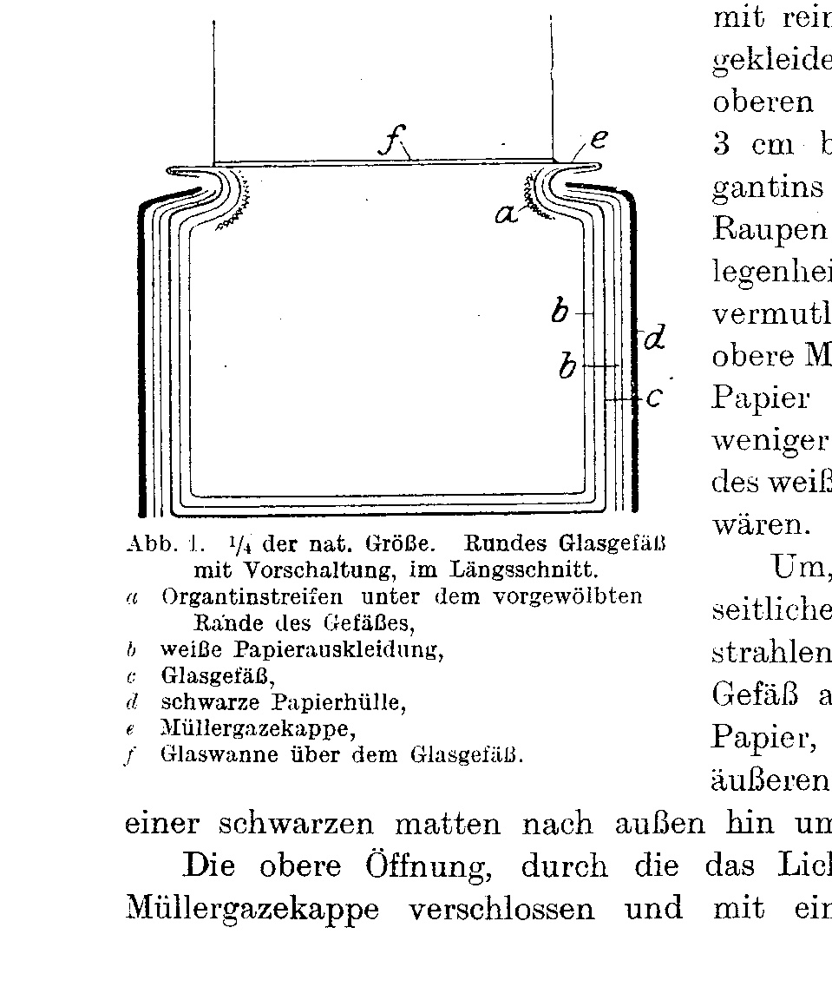
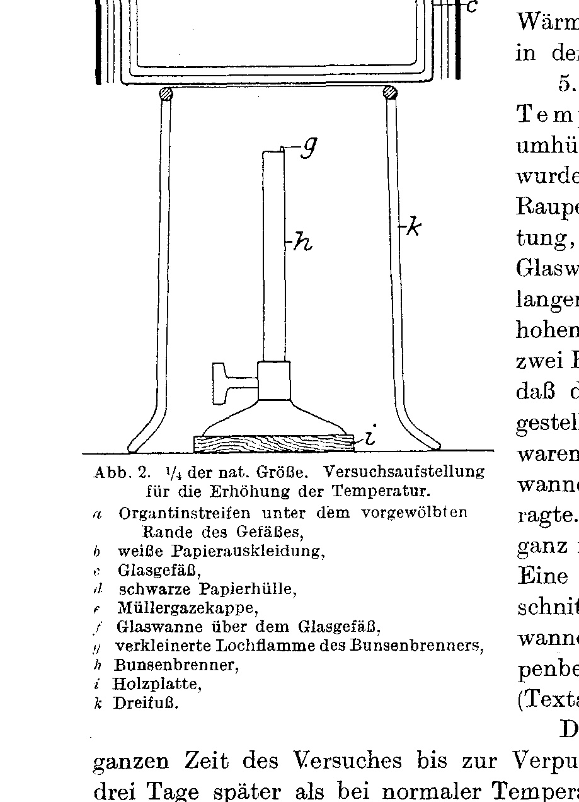
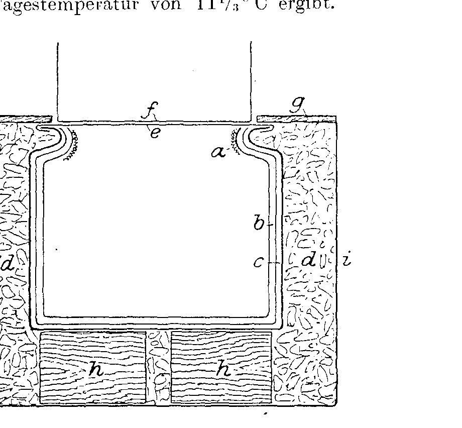
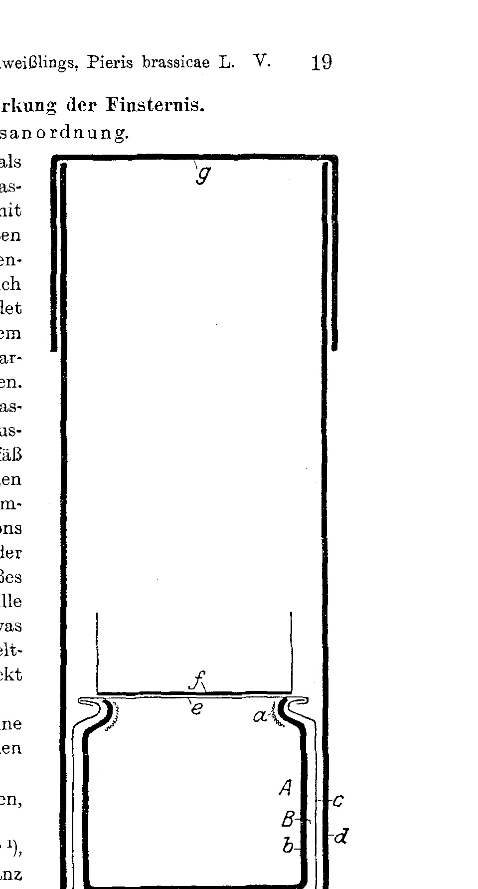
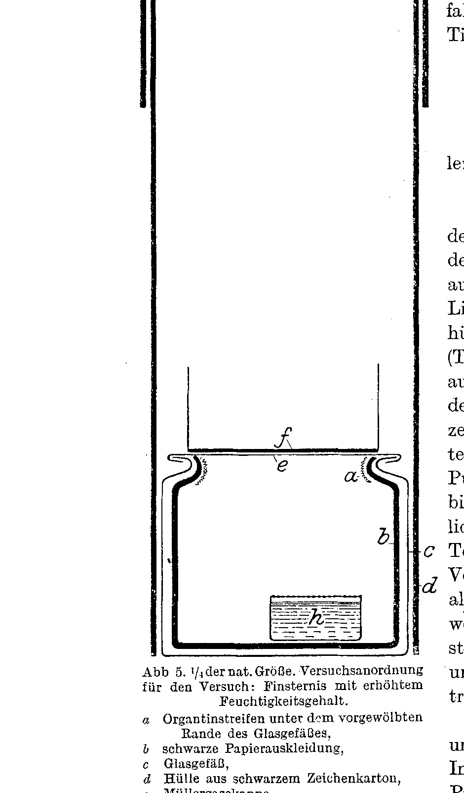

# Die Puppenfärbungen des Kohlweißlings. Pieris brassicae L.
## The Pupal Colourations of the Cabbage White. Pieris brassicae L.

### Fifth Part: Control experiments on the specific effect of the spectral regions in conjunction with other factors.

By

**Leonore Brecher.**

(From the Biological Experimental Institute of the Academy of Sciences in Vienna [Zoological Department].¹)

With Plate I and 5 text-figures.

*(Received on 9 October 1919.)*

*Archiv für Entwicklungsmechanik der Organismen*, vol. 48 (1921).

> **Full translation.** A complete English rendering of the fifth part of Brecher's study of the pupal colourations of the cabbage white (*Pieris brassicae* L.), with the tables and figure legends.

### Table of Contents.

|  | Page |
|---|---|
| Introduction and Programme | 2 |
| I. Examination of the effect of white surroundings | 6 |
| &nbsp;&nbsp;1. under normal light and temperature conditions |  |
| &nbsp;&nbsp;2. with exclusion of the ultrared rays&nbsp;&nbsp;&nbsp;a) Experimental arrangement | 6 |
| &nbsp;&nbsp;3. with lowering of the general light intensity&nbsp;&nbsp;&nbsp;b) Course of the experiment | 10 |
| &nbsp;&nbsp;4. at raised temperature&nbsp;&nbsp;&nbsp;c) Results of the experiment | 12 |
| &nbsp;&nbsp;5. at lowered temperature |  |
| II. Examination of the effect of darkness | 19 |
| &nbsp;&nbsp;1. under normal conditions&nbsp;&nbsp;&nbsp;a) Experimental arrangement | 19 |
| &nbsp;&nbsp;2. at raised temperature&nbsp;&nbsp;&nbsp;b) Course of the experiment | 20 |
| &nbsp;&nbsp;3. at lowered temperature&nbsp;&nbsp;&nbsp;c) Results of the experiment | 22 |
| &nbsp;&nbsp;4. at raised moisture content |  |
| III. Examination of the effect of the invisible rays in yellow surroundings | 27 |
| &nbsp;&nbsp;1. under normal conditions |  |
| &nbsp;&nbsp;2. with exclusion of the ultrared rays&nbsp;&nbsp;&nbsp;a) Experimental arrangement | 27 |
| &nbsp;&nbsp;3. with exclusion of the ultraviolet rays&nbsp;&nbsp;&nbsp;b) Course of the experiment | 28 |
| &nbsp;&nbsp;4. with lowering of the general light intensity&nbsp;&nbsp;&nbsp;c) Results of the experiment | 30 |
| IV. Effect of the ultraviolet and yellow rays on bled caterpillars | 34 |
| &nbsp;&nbsp;a) Experimental arrangement | 34 |
| &nbsp;&nbsp;b) Course of the experiment and results | 35 |
| V. Summary | 36 |
| VI. List of literature | 37 |
| VII. Tables | 38 |
| VIII. Explanation of the plate | 44 |

> ¹) An abstract of this work appeared with an identically worded title as Communication No. 40 of the Biolog. Experimental Institute of the Acad. of Sciences, Zool. Department, Director H. Przibram, in the Acad. Sitzungsanzeiger No. 18, 1919.

> *Archiv für Entwicklungsmechanik Bd. 48.*  1

## Introduction and Programme.

From the analysis, carried out so far (Brecher 1917 and 1919), of the influence of light upon the pupal colourations of *Pieris brassicae*, we have been able to establish a specific effect of the various spectral regions, namely: of the yellow rays upon the green colouration of the pupae; of the blue, violet and especially the ultraviolet rays — and through these also of black surroundings (1919)¹) — upon the «black»-colouration through increased melanin formation; and finally a role in the production of a particular colouration has also been ascribed to the ultrared rays, namely in the white colouration of the pupae, and the effect of white surroundings upon the production of nearly white pupae has been explained as due to a predominance of the ultrared rays (1919, p. 300).

As was set out more closely in the first part (1917) and in the factor-scheme (1919), the colouration of the cabbage-white pupa indeed rests upon the variously strong development — according to the acting light-rays — of three colours: 1. of the black colouring matter or melanin, around the pore-canaliculi connected with the oxygen of the air as well as the anastomosing horizontal canaliculi of the chitin (cf. Part I 1917, p. 91), conditioning both the patch-marking visible to the naked eye (Factor II) and also the more or less dark tone of the ground colour appearing diffusely to the naked eye (Factor III), whose increase or decrease depends upon the influence of ultraviolet or yellow rays respectively; 2. of the green colouring matter in the hypodermis (Factor IV), which shimmers through when the chitin casing is transparent and melanin-free, and which is favoured by yellow rays; and 3. of a white deposit in the chitin casing, which makes the latter appear white and opaque. Later investigations, belonging to the chemistry of colour-adaptation, are to report on the nature of this white. It might here be a matter either of uric-acid deposits, or of the tyrosine-like chromogen itself, or of an optical colour produced by an air-containing chitin layer. The stronger or weaker development of white in the casing makes the whole pupa appear, on the one hand, more or less opaque and whitish (Factor V); yet here a definite body-part shows itself, the dorsal region between the thoracic and abdominal halves, being favoured by the strong development of the white, so that it

> ¹) The continuation of the work was substantially furthered by the granting of a subvention for the year 1919 as well, on the part of the Academy of Sciences out of the Strohmayer bequest, for which I take leave to render at this place my most heartfelt thanks to the high mathematical-natural-science Class.

sets itself off as a white «saddle» from the rest of the pupa (Factor I). — This favouring is especially striking in the wholly green pupae, such as arise in yellow surroundings, since in these — apart from the white «saddle» — the chitin casing is completely transparent and lets the strongly developed green hypodermal pigment shimmer through.

All the pupae arising in light, from the brightest to the darkest, are distinguished — in contrast to those arising in complete darkness as well as those arising in light with exclusion of the ultrared rays (1919, p. 296) — by a whitish, chalky appearance and by the prominence of a white «saddle». After establishing the effectiveness of the other types of light-ray, it was natural to trace back this difference to the presence of the ultrared rays in light as opposed to the absence of any rays in darkness.

The effect of white surroundings upon the production of the brightest pupae should be connected with a predominance of the ultrared rays in white.

The nearly white colour of these pupae is conditioned:

1. by a very slight melanin formation, especially in regard to the pigment diffusely distributed in the ground colour, which appears developed only to a yellowish to light-brownish degree, with which there agrees also the tyrosine-rose-colouring property of the tyrosinase of the bright pupae (cf. Brecher, Puppenfärbungen, third part, p. 155);

2. by a very weak green colouring (stronger degreening);

3. by the strong development of white in the casing, out of which nevertheless the saddle region still sets itself off distinctly.

Whether all three, or which, of the factors here are directly dependent on the ultrared rays, and which perhaps on the strong light-intensity of other rays in white, were to be decided by further experiments. The experiments hitherto made with exclusion of the ultrared rays in white (1919) had indeed yielded less white, more greenish pupae with a vanishing «saddle», similarly as in darkness, but concerned too few pupae to be regarded as decisive.

It was therefore necessary, for the elucidation of the question of what contributes to the effectiveness of white surroundings, to test the effect of white surroundings both at full admission of light, and at exclusion of the ultrared rays, and further also at reduction of the general light-intensity.

For further examination of the role of the ultrared rays, yellow surroundings-colour was especially suitable, for the reason that the green pupae arising in yellow allow the emergence of the white transverse band, as the only opaque region, to be recognized especially sharply, so that a disappearance of the white from this favoured region too, upon exclusion of the ultrared rays, would be easier to recognize than in the uniformly bright opaque pupae such as arise in white. Since the interposition of liquids used for the exclusion of the ultrared rays also absorbs the ultraviolet rays to a certain degree, the effect of the complete exclusion of the ultraviolet rays by quinine sulphate had to be examined, as a control, for yellow surroundings too, similarly as earlier for other colours.

On the other hand it was natural to test whether also other warmth would act in the same sense as radiant warmth — in other words, whether the effect of white surroundings would be heightened by a raising of temperature, abolished by a lowering of temperature, and would come to equal the effect of white at exclusion of the ultrared rays, and further the effect of darkness.

For this, the effect of the raising or lowering of temperature respectively at any exclusion of the light-rays — that is, in darkness — had also to be ascertained.

Statements about the influence of warmth and cold upon the colouration of the pupae are, so far as they have become known to me, very scanty. These are the experiments, already cited in the previous section (1919), of Standfuß (1898) and of Countess Linden (1905) on Vanessa pupae. Standfuß had, by keeping caterpillars of *Vanessa urticae* and *cardui* at a raised temperature of 37° and 40° C respectively in white surroundings, obtained nearly white pupae such as do not occur at all in nature, while raised temperature with differently coloured surroundings did not have this effect, and just as little did white surroundings at ordinary temperature. v. Linden observed an extraordinarily great variation with respect to the development of the black pigment in pupae, according as they had been exposed to warmth or cold before pupation: by keeping pupation-ripe caterpillars of *Vanessa urticae* in the thermostat at a temperature of 32–35°, she obtained pupae which were distinguished by a complete lack of dark pigmentation and whose casings shimmered in the most beautiful mother-of-pearl colours. She obtained the darkest pupae at low temperature on cold autumn days.

A further indication for an effect of warmth acting in the same sense as that of white surroundings, at least in regard to melanin formation, we find in the changeability of the *Pieris* tyrosinase through warmth from a tyrosine-violet-colouring into a rose-colouring one (Brecher 1917, p. 171), such as is characteristic of the pupae arising in white surroundings normally, with which there also agrees the weak, only light-brownish developmental degree of the melanin in the ground colour of the bright pupae.

It was originally not intended to test the temperature factor on pupal colouration already now, since the temperature chambers present at the institute, which would allow one to work with constant temperatures, are not in operation owing to the war; yet, since their restoration appeared to lie still in the distant future, and since for the decision of the question of the role of the ultrared rays it was rather a matter of bringing in the direction of influence of warmth and cold as determinate degrees, I could content myself with allowing less strictly constant temperature conditions to prevail in the experiments.

As will be set out more closely in the experimental arrangement, the appropriately regulated perforated flame of a Bunsen burner set up beneath the experimental container yielded a nearly constant temperature of 34°, while for the production of cold, on the average 11½°, a twice-daily renewed encasement in ice was used.

But since, with the raising of the temperature in consequence of the warmth supplied, a greater dryness will also prevail in the experimental container than at normal temperature, and since at a lowering of the temperature the moisture content rises in consequence of the condensation of the water-vapour of the air on the cold walls of the experimental container, control experiments with raising of the moisture content at normal temperature had to be carried out, in order to be able to keep apart the effect of the warmth from that of the dryness, and of the cold from that of the moisture. This question is touched on by experiments of Dewitz (1917) on the influence of moisture and dryness upon the cocoons of certain butterfly pupae, according to which moisture colours the cocoons brown, while dryness leaves them white. It was now interesting to test whether the influence of moisture and dryness upon freely-lying pupae themselves likewise allows an analogous influence to be recognized.

Since all the previous experiments concerning the analysis of the influence of light permit the assumption of a specific effectiveness of the rays, it remained still to answer the question whether not yet another factor — e.g. the quantity of blood — is capable of influencing the assumption of the colouration. According to earlier experiments (1919), extirpation of the eyes, which was accompanied by a great loss of blood, had as its consequence an abolition of the effectiveness of the coloured surroundings, in that namely in yellow surroundings no green pigmentless pupae arose, whereas exclusion of the visual sense merely by varnishing the eyes allowed no difference to be recognized as opposed to normally-sighted caterpillars.

It was from the outset not excluded that the cause for the arising of non-green pigmented pupae from totally blinded caterpillars in yellow surroundings might be connected with the strong loss of blood suffered at the operation, or with an oxidation of the blood made possible by the injury. It had therefore to be tested how an equally great injury and an even stronger loss of blood, yet with the eyes remaining intact, would influence the colour-sensitivity of the caterpillars in regard to the effectiveness of yellow and, as a control, of black surroundings (ultraviolet rays). For this, pupation-ripe caterpillars bled by cutting off a leg for the purpose of obtaining tyrosinase (cf. Part VI) offered a favourable experimental material.

These considerations have yielded the programme of the present investigations, whose individual points may be taken in their order of sequence from the table of contents.

## I. Examination of the effect of white surroundings.

### a) Experimental arrangement.

As experimental containers there served, for the first series of experiments, round glass vessels of 17 cm diameter and 14 cm height, whose wall bulges somewhat inward at the top (Text-fig. 1). Inside, the glasses were

> **Fig. 1.**  ¼ of nat. size. Round glass vessel with interposed attachment, in longitudinal section.
> *a* Organtine strip under the bulged-in rim of the vessel,
> *b* white paper lining,
> *c* glass vessel,
> *d* black paper sheath,
> *e* Müller-gauze cap,
> *f* glass trough over the glass vessel.

lined with pure-white writing paper, over which, at the upper bulge (rim *a*), a 3 cm broad strip of white organtine was glued in, in order to give the caterpillars a place of fixation here, since otherwise they would presumably prefer the upper Müller-gauze cover to the smooth paper as a place of fixation, and would thus be exposed less directly to the influence of the white background.

In order, as I believed, to prevent any lateral penetration of light-rays, the vessel was also surrounded on the outside with two layers of paper, namely one white one lying against the outer glass wall and one black matte one toward the outside.

The upper opening, through which the light fell in, was closed with a Müller-gauze cap and covered with a thin round, either empty or correspondingly liquid-containing glass trough.

Such experimental containers, as the one just described, were set up under the following five experimental conditions:

1. As control experiment, white normal, i.e. at middle light- and temperature conditions, with interposition of an empty glass trough.

2. White with exclusion of the ultrared rays, as in the previous year (cf. work 1919, p. 302), by interposition of a 3 cm high layer of iron-vitriol–potassium-rhodanide solution (1 drop each of the concentrated solutions to 100 cm³ of distilled water). The freshly prepared solution has a weak yellowish colour with weak fluorescence. Unfortunately, on standing longer — about one day — the iron vitriol settles out in yellowish granules at the bottom. The solution was therefore renewed daily during the course of the experiment, namely up to the fixation of the caterpillars, three times in all.

3. White with lowering of the general light-intensity. In order to remove the objection that, in the interposition of the ultrared-absorbing liquid, it might be a matter of the effect of a general intensity reduction, and in order to see at all whether the effect of white surroundings might not perhaps be that of a strong light-intensity, a control experiment was set up with a correspondingly somewhat stronger reduction of the general light-intensity than that brought about by the interposition of potassium-rhodanide–iron-vitriol, by covering the interposed empty glass trough, whose height is 2½ cm, with one layer of tracing paper. The measurement by means of the blackening of photographic paper, which was fastened under the rim of the vessel at *d*, yielded for white normal the strongest, for white with interposition of potassium-rhodanide–iron-vitriol solution a somewhat lesser, and for white with covering of tracing paper a still lesser blackening.

These three experiments were set up at a room temperature of 20–21°. The measurement of the temperature in these, as in the following experiments, was carried out — like that of the light-strength — on the day before the introduction of the caterpillars. Here the thermometer was everywhere placed so that, with its mercury bulb, it projected into the experimental vessel at the height of the upper bulge at *a*. The thrice-daily reading yielded the average daily temperature stated here.

4. White at raised temperature. An analogous caterpillar container with interposition of an empty glass trough, as for white normal, was set up over a Bunsen burner on an asbestos underlay and tripod, and the correspondingly reduced perforated flame was [left burning, interrupted, two days before the introduction of the caterpillars, until after their pupation].¹)

> ¹) For this experiment the caterpillar container had not been surrounded on the outside with paper, since it was indeed set into a vessel that was in any case completely light-impermeable.

---

**Translator's notes.** The German on pp. 2–7 is clean, coherent scientific prose; there is no compositorial duplication or broken type in the original. The text of pp. 2–7 has been translated in full. The closing clause of the sentence beginning at the foot of p. 7 ("…the correspondingly reduced perforated flame was…") is completed in square brackets from the opening of p. 8 ("…left burning, interrupted, two days before the introduction of the caterpillars, until after their pupation") to give a readable sentence boundary; the remainder of p. 8 lies outside this chunk. "Ultraroten Strahlen" is rendered "ultrared rays" (the author's term for infrared). The footnote on the title page (printed at the foot of p. 1) and the figure-1 caption (printed within p. 6) are placed inline near their reference points.

By regulating the burner flame and the distance of the Bunsen burner from the vessel, the desired degree of 33½–34° was attained in the upper part of the vessel and, as one could ascertain from the readings of the thermometer projecting into the upper part of the vessel taken several times daily, two days before as well as immediately after the conclusion of the experiment, it was maintained nearly constant.

The caterpillars pupated much more rapidly in the warmth than under the other conditions.

5. White at lowered temperature, which was achieved by enclosure in ice. For this, a caterpillar container¹) analogous to the others, without any interposed [filter], i.e. covered only with an empty glass dish, was set up in a brown stoneware trough 33 cm long, 24 cm wide and 20 cm high, upon two wooden blocks, in such a way that the openings of the vessels placed one inside the other were at the same height and the covering glass dish projected out at its full height. The intervening space was filled completely with crushed ice. A wooden board with a round cut-out for the opening of the caterpillar container, covered above by the glass dish, covered the trough (Text-fig. 3).

The ice was renewed twice daily during the whole period of the experiment up to the pupation of the caterpillars — which occurred only

> ¹) For this experiment the caterpillar container had not been wrapped with paper on the outside, since it was after all placed inside a vessel that was in any case completely impervious to light.

**Abb. 2.** ¼ of natural size. Experimental set-up for the raising of the temperature.  *(figure not reproduced)*
> *a* Organtin strips beneath the bulging rim of the vessel,
> *b* white paper lining,
> *c* glass vessel,
> *d* black paper covering,
> *e* Müller-gauze cap,
> *f* glass dish over the glass vessel,
> *g* reduced burner flame of the Bunsen burner,
> *h* Bunsen burner,
> *i* wooden board,
> *k* tripod.

three days later than at normal temperature — namely at 8:30 in the morning and at 6:00 in the evening, after siphoning off the meltwater.

With this arrangement an average lowering of the daytime temperature to 11° C was attained, as is evident from the following readings, taken in the manner described above, one day before the bringing of the caterpillars into the experimental conditions:

| Ice put in | . . . . . | 10ʰ 30 a. m. | |
|---|---|---|---|
| thereupon temperature read | . . | 12ʰ | at noon 11° C |
| » » | | 6ʰ 15 | 14° » |
| thereupon fresh ice put in | . | 6ʰ 15 | |
| temperature read | . . . | 8ʰ | in the evening 9° » |

From which there results a mean daytime temperature of 11½° C.

By means of the experimental arrangements described here, conditions with a temperature difference of approximately 10 degrees both above and below the normal room temperature were thus achieved.

All the experimental vessels were set up in a top-lit passage on a table beneath a skylight, with the precaution that the experiment with the lowered or raised temperature was set up at a sufficient distance from the others.

The caterpillars used for this experimental series all came from a single egg-clutch²), which had also supplied the caterpillars for the experiments in darkness, carried out simultaneously and described in the next chapter.

In a repetition of the experiments with exclusion of the ultraviolet rays, for a reason to be discussed in connection with the discussion of the results, instead of the glass vessels which in the

**Abb. 3.** ¼ of natural size. Glass vessel with ice enclosure.  *(figure not reproduced)*
> *a* Organtin strips beneath the bulging rim of the glass vessel,
> *b* white paper lining,
> *c* glass vessel,
> *d* ice,
> *e* Müller-gauze cap,
> *f* glass dish,
> *g* wooden cover which, except for a round hole leaving the opening of the glass vessel free, covers the stoneware trough,
> *h* two wooden blocks,
> *i* stoneware trough.

> ²) On the rearing of the experimental object see Brecher 1917, p. 105.

previous work (1919, p. 293) were described as small prismatic wooden boxes lined on the inside with white, with light admission only from above and a glass-dish cover, were used, just as they had already been used in the first experiment with white surroundings and exclusion of the ultraviolet rays (see Brecher 1919, p. 302).

Besides the exclusion of the ultraviolet rays by rhodanium-potassium iron-vitriol solution — which in this experiment was freshly prepared only at the beginning and was no longer changed during the experiment, so as not to disturb the caterpillars that had fixed themselves on the dish — in this experimental series an attempt was also made, for the purpose of applying a colourless, water-clear interposed [filter], in the absence of the now hard-to-obtain potash-alum plates, which as is known absorb the ultraviolet rays, in one experiment to attain the same goal by interposing a saturated potash-alum solution, likewise in a layer 7 cm high.

As a control for this, an experiment was set up with the interposition of an equally high layer of pure water.

A control experiment for the rhodanium-potassium iron-vitriol interposition with lowering of the intensity by paper covering could be dispensed with this time.

### b) Course of the experiment.

In all the experiments the pupae had for the most part pupated above, beneath the bulge, on the organtin strip glued in for this purpose (in the experiments with glass vessels), but also otherwise on the wall; others had pupated on the ceiling, and a few were found lying below. In the registration, account was taken of the place of pupation, and those pupated at corresponding places were compared with one another across the different experiments; yet in general no differences according to the place of pupation are to be noted. Where such are present, they will be emphasized.

The pupae of all the experimental series were compared simultaneously, and the registration was carried out both by the usual designation of the types by means of letters, as it had also been employed up to now in the tables (see description of the colour types, Brecher 1917, Part I, p. 95, and 1919, Plate IX, with coloured pupal colour types¹)), and also by the designation of the degree of each individual

> ¹) For comparison the original plate was always used, with which unfortunately the reproduction (Plate IX, 1919) does not entirely agree, in that the green is here applied much too strongly; in particular the pale pupae (figs. 1–4), which are especially important for the present work, do not render the correct impression, since in reality they are much whiter.

individual, the factor co-determining the pupal colouration (see factor-scheme 1919, IV. Part, p. 305). This type of pupal colour was expressed in a formula. These detailed tables would, however, act too confusingly. In their place only some summary tables are given here, since the individual factors arise from each experiment, here together with the detailed tables given above, in that, in place of the formulae of the individual colour factors, the number is entered for each experiment that arose, and the summary table gives the same in the same way as in the preceding tables. This latter table makes it possible, on the basis of the dependence of each individual colour factor on the analysed influences, to assess them.

First experimental series with glass vessels (see Table A, ordinal number 1, white).

1. White normal egg [clutch] hatched directly: pale pupae 5d, but indeed not quite green like the ones from the first egg-clutch arisen later, with a greenish-white ground colour, but with weak, diffuse melanin in the husk, normal for the pale and middle ones, characteristic in its colour-marking, and with distinct "saddle".

2. White with exclusion of the ultraviolet rays, by interposition of iron-vitriol-rhodanium-potassium solution. The pupae arisen here show no difference compared with the normal pupae.

3. White with lowering of the general light intensity: egg [clutch] likewise pale pupae 5d, no distinction to be recognized compared with the normal types; husk-green, where it also occurs in the darkness pupae. All pupae have a distinct "saddle".

4. White at raised temperature: extremely pale pupae, paler than any that have ever occurred in white, of an almost entirely white ground colour that is only more or less, or weakly, greenish and opaque, entirely without diffuse black pigment in the husk and with a dazzling fleck-marking, or one only indicated by tiny dots, which is even slighter than in the palest pupae occurring in white described [above]. Since the whole pupa is white, one cannot really speak of a pure white. (1917, Part VI, fig. 1, renders the type approximately.)

5. White at lowered temperature. With the pupae arisen here there is a distinctly more abundant deposition of diffuse melanin in the ground colour, so that the greenish-white tone of the same is thereby covered and the pupa appears more brownish. These are no longer pale pupae, but middle ones. The saddle does not here come out distinctly. A [pupa] on the mussemuslin ceiling, which did not pupate immediately on the white substrate, is even a dark one. There also occur some more greenish pupae, half-green ones, similar to how they occur at raised intensity (see above) and otherwise in darkness, but in white normally do not occur.

Second experimental series with wooden boxes (see Table A, ordinal number 2.)

1. White normal had the same result as in the first experimental series.

2. White with exclusion of the ultraviolet rays. No distinct differences are to be recognized compared with the normal pupae, from the interposition of rhodanium-potassium iron-vitriol solution. Whereas the latter show the whitish- or greenish chalky tone of the ground colour and a distinct prominence of the "saddle", the likewise pale pupae from white with rhodanium-potassium iron-vitriol interposition are distinguished by a distinctly more yellowish-greenish, warmer and less opaque tone of the ground colour and a milder distribution of the same, i.e. without prominence of the saddle, similar to as with the pupae of the darkness. These are the same differences as the previous year's white experiment (1919) with interposition of rhodanium-potassium iron-vitriol also yielded.

Between [these] pupae and the normal ones, the pupae from the interposition of water and alum interpose themselves, with attenuation, as transitions, with respect to the increase of the greenish tone and the becoming less noticeable of the saddle.

### c) Experimental results.

In accordance with the questions posed in the introduction, the experimental results may be grouped:

A. concerning the role of the ultraviolet rays in white,
B. concerning the effect of the light intensity in white,
C. concerning the question, how it stands with the radiant warmth in white.

A. This year's experiments with exclusion of the ultraviolet rays in white, in which, for a reason to be mentioned further below, the second experimental series with wooden boxes comes into consideration, have been able fully to confirm the earlier experiments (1919, IV, p. 302); the differences that thus characterize them in comparison to the normal ones are a more yellowish-greenish, less opaque tone of the ground colour and a uniform distribution, or the distinct standing-out of the chitin in comparison to the whitish chalky tone with distinct prominence of the saddle in the pupae from white with unhindered admission of the ultraviolet rays. These differences in comparison to the normal ones here show those arisen from the interposition of rhodanium-potassium iron-vitriol solution. The alum solution likewise does not have the same effect as the alum plates; nevertheless the pupae arisen from this interposition too give the impression of lesser opacity and less distinct saddle than the normal ones, even if the difference is smaller than that of the rhodanium-potassium pupae. Likewise, even with the interposition of water, a weak effect in this direction is already to be noted.

On comparison of the pupae of the various experiments with one another, it turns out that they form a series from white normal, white water, white alum, white rhodanium-potassium iron-vitriol, such that to the gradual decrease of the ultraviolet rays according to the interposition used there would correspond a gradual decrease of the opacity and increase of the yellowish-greenish tone, and a disappearance of the "saddle". This impression, gained by Prof. Przibram and myself, was also confirmed by other observers remote from the experiments, who did not know the conditions, such as Herr v. Portheim. Arranged in this sequence, the pupae are also to be seen on Plate I (middle row, groups 2–4). To be sure, these are quite small differences of these colour factors, the opacity and the "saddle", evoked by these experimental variations, yet the experimental results are so uniform in each experiment and also agree with those of the previous year, so that a deception is probably not to be assumed. The differences come to our consciousness distinctly when one views the pupae in an altered sequence of the experiments. But if one switches out the pupae from the interposition of water and alum and lays the pupae from the interposition of rhodanium-potassium iron-vitriol solution next to the "normal" ones, then the difference already very distinctly recognizable before becomes still more distinct, because then the contrasts stand side by side.

That the greenish, less opaque tone of the pupae with interposition of rhodanium-potassium iron-vitriol solution in the second experiment is not perhaps connected with the weakly yellowish colour of the interposed rhodanium-potassium iron-vitriol solution, prepared only once for this experiment, as a result of the formation of a quite slight yellowish precipitate, will become evident further below from the experimental results of the analogous experiments with yellow surroundings.

That the effect of the interposition of ultraviolet-absorbing media is to be ascribed to the slight decrease of the light intensity conditioned by the interposition is, according to the results of the experiments with lowering of the light intensity to be discussed in the following, not to be assumed.

It thus only remains to explain the effect through the absence of the ultraviolet rays.

It thus appears to emerge from these experiments with exclusion of the ultraviolet rays in white surroundings, in agreement with the earlier results, that the formation of the uniform opacity — deposition of white — in the husk and preferentially in the saddle-region, especially in the pupae arisen in white surroundings, depends on the presence of the ultraviolet rays. On their absence — in white with the various ultraviolet-absorbing interpositions, and further in darkness — there occurs a decrease of the opacity, whereby, as a result of the shimmering-through of the deeper green tissues as well as of the greenish tone of the chitin, the warmer yellowish-greenish tone of these pupae is conditioned. Since here too the "saddle" does not stand out through white colour, thereby the uniform appearance of these pupae is achieved.

As regards now the pupae from the first experiment with interposition of rhodanium-potassium iron-vitriol, which do not let any differences be recognized compared with the pupae from white without interposition, the material of the experimental container used in this first experimental series — namely the glass walls — probably did not prevent the penetration of the ultraviolet rays, so that not all the ultraviolet rays were therefore switched out by the upper interposition. With the use of the wooden boxes this disadvantage fell away, and here we did indeed obtain differences too, just as in the previous year, in which the same boxes had been used. We shall further see, in the discussion of the darkness as well as of the yellow experiments, that there the black paper-covering of these glass containers was favourable for the penetration of the ultraviolet rays and otherwise brought about noticeable differences in the results.

### B. Effect of the light intensity in white.

The lowering of the general light intensity by paper covering has yielded no result analogous to the results of the rhodanium-potassium iron-vitriol interposition. We have here pupae with undiminished opacity and distinct saddle as also with the white normal ones. On the other hand, another difference of these pupae compared with the white normal ones, as well as compared with those of the other interpositions, is striking, namely that the results here are not uniform, but that, beside non-green, pale pupae, there have also arisen some of the green colour-type — half-green ones — such as otherwise do not occur in white. This is a result similar to the one known to us for the darkness effect — the occurrence of half-green beside non-green types. Through the lowering of the intensity, presumably the effect of the white is in part abolished — as is its degreening effect is concerned — abolished, and, as in the darkness, the tendency to stronger greening inherent in many caterpillars can evidently now also come to expression, without being degreened by white light.

*[Translation owned through page 14; the sentence running onto page 15 is completed here. Subsequent text on page 15 belongs to the next chunk.]*

### C. Effect of warmth other than radiant warmth in Weiß. (Warmth and cold.)

Warmth had as a consequence an enhancement of the normal Weißwirkung [white-effect], in that here extremely pale pupae arose. This effect of warmth in Weiß rests upon a prevention of melanin formation, which is even greater than in the pupae from Weiß at normal temperature; perhaps also upon an increase of the Weiß in the hull. With regard to the green, according to the results — to be discussed later — of the effect of warmth in Finsternis [darkness], it does not appear as though a de-greening effect is also to be ascribed to warmth. In Weiß, rather, the de-greening, as was already remarked above, is probably an effect of the strong light intensity. If the pupae from Weiß-warmth also show an even weaker green than those that arose under perfectly equal light intensity in Weiß normal, then this is to be attributed only to the proportional acceleration — conditioned by the increase of temperature — of the de-greening process in white light. *Pieris* [cabbage white] caterpillars of the spring generation in white surroundings have yielded pupae with a perfectly de-greened white ground colour, although the prevailing temperature was in any case lower than that in the experiment with artificial raising of the temperature (34°) in Weiß. On the other hand, in June the light intensity is probably stronger than in autumn. It thus also follows from this experiment that the de-greening in Weiß is connected with the strong light intensity. These pupae of the spring generation from white surroundings are much paler than those of the autumn generation from Weiß normal, not only through the complete de-greening; in accordance with this they are also much more opaque, whiter, and show an even lesser deposition of melanin. With respect to these two latter factors they stand between the pupae described here from Weiß normal of the autumn generation and the pupae from Weiß-warmth. The pupae of the autumn generation too were, in the first year, when the experiments had been set up around the middle of August, much paler, whiter in white surroundings (see 1917, Taf. VI Fig. 1, which corresponds almost to the warmth-pupae) than in this year's experiments, which had been set up in September, that is, at lower temperatures. These results show that the effectiveness of the white substratum upon the white-colouration of the pupae only came to the fore particularly well when sufficiently high temperatures also prevailed.

Lowering of the temperature in Weiß had the opposite effect, namely a darkening as a consequence. Through the cold-effect the Weißwirkung [white-effect] was abolished, in that the cold permitted a stronger formation of melanin. Here there arose no longer pale, but middling and even dark pupae. Cold also diminished the opacity and the distinctness of the saddle.

In favour of the abolition of the Weißwirkung through lowering of the temperature there speaks also the occurrence of some greenish types, similarly as with lowering of the intensity and Finsternis [darkness].

Also to be reckoned as an effect of a slight lowering of the temperature is the experiment set up in the open in the previous year (1919) with white surroundings, which, similarly as with elimination of the ultrared rays, had yielded less whitish pupae.

It is therefore also to be ascribed to the lower temperature when, in the experiments that were set up in a later season, no such pale pupae arose in Weiß.

According to these experiments, then, it seems that warmth other than radiant warmth also acts in the same direction in the sense of a lightening of the pupae, like the ultrared rays, but more strongly, in that, besides the increase of the Weiß, it also causes a more considerable inhibition of the melanin and thereby raises the white impression of the pupae. With the experimental arrangement employed, with elimination of the ultrared rays, we were able to establish only a diminution of the opacity and a less distinct saddle, and could therefore infer only the dependence of the opacity on the ultrared rays. On the other hand, the action of stronger degrees of warmth and cold influenced, besides the opacity, also the melanin formation.

If one places the pupae of the second rhodankalium experiment beside the normal ones of the first and second series, and in the third place the pupae from the Weiß-cold experiment, then the rhodankalium-pupae form the transition from the normal ones to the cold-pupae. On the other side of Weiß normal we find Weiß-warmth with almost white pupae. We thus have a series (cf. Taf. I, middle row) which, from Weiß with raising of the temperature, through Weiß at normal temperature, Weiß with elimination of the ultrared rays, to Weiß with lowering of the temperature, that is, in the direction of the decrease of warmth proceeds, and with an increase of the black pigment, a decrease of the whitish opaque appearance, and a strengthening of the greenish tone runs parallel.

The Weiß in the hull, which in the warmth-pupae from white surroundings alone predominates over all other colour factors, since the dark and green pigments are inhibited or, respectively, destroyed in their formation, is, in the pupae from Weiß at ordinary temperature (autumn days), recognizable through the opaque chalky tone of the pale-whitish-greenish ground colour and especially at the »saddle«. These two factors decrease as the warmth-rays decrease, whereby the yellowish colour of the chitin and the yellow-green colour of the deeper-lying tissues shimmering through condition the warmer yellowish-greenish, less opaque tone of the ground colour, as in the pupae from the interposition of rhodankalium; in order finally, with increasing cold, to become still more brownish, through increased deposition of diffuse black pigment, and to let the characteristic Weißwirkung [white-effect] no longer be recognized.

### Decrease of the warmth-rays.

| Weiß-warmth | Weiß normal | Weiß-water | Weiß-alum | Weiß-Rhodankalium-iron | Weiß-cold |
|---|---|---|---|---|---|
| extremely pale white pupae without black pigment, almost without green | pale pupae, whitish-greenish, colder tone of the ground colour with less prominent black pigment. Very little diffuse pigment in the hull, but normal spot-marking | pale pupae, increase of the greenish tone, less sharp prominence of the saddle | pale pupae between the foregoing and the following ones | pale pupae of a more yellowish-greenish, less opaque-appearing tone and a vanishing saddle | middling pupae, darker, more brownish tone of the ground colour through increase of the melanin. Vanishing saddle |

These experiments have thus accordingly confirmed the view that the white colouration of the pupae in white surroundings is to be traced back to the presence of the ultrared rays, since raised temperature in Weiß heightened the effect still further, in that it brought forth the whitest pupae, which are distinguished by a lack of the melanin, of the green, and by the predominance of the Weiß in the hull, whereas the elimination of the ultrared rays weakened it, in that it diminished the opacity, and higher degrees of cold could even abolish it, in that they brought about the appearance of darker pupae through an increase of the black pigment.

As regards the relation of the individual colour-components to the influences acting in white surroundings, it results from these experiments that the inhibition of melanin formation and the formation of the Weiß are connected with the warmth-rays (ultrared rays) reflected by Weiß in a heightened measure. As regards the de-greening, it has rather the appearance, according to the experiments with lowering of the intensity, as well as the stronger de-greening of the pupae of the spring generation than that of those exposed to a much higher temperature in Weiß, and finally according to the Finsternis [darkness] experiment to be discussed further below, in which an independence of the green-colouration from the warmth-factor was shown, as though it were connected with the strong light intensity in Weiß.

We can gather from the synoptic Table B (experiments with white surroundings) that with decreasing warmth in Weiß:

α) the formation of the Weiß in the hull, that is, I the saddle and V the opacity, decreases (so that the number of pupae with the grade 0 or, respectively, 1 becomes greater);

β) the formation of the black pigment, that is, II of the spot-marking and III of the melanin diffusely distributed in the hull, increases (the number of pupae enlarging in the direction from grade 0 for warmth towards grade 1¹);

γ) the formation of the green pigment increases. (The number of pupae increases proportionately from almost 0, that is, almost completely de-greened in the case of warmth, in the direction towards 1–2 or even 2.)

With lowering of the intensity too the number of the greenish types increases: an approximation to the effect of Finsternis [darkness].

According to these experiments of the analysis of the Weißwirkung [white-effect] there exists, then, the probability — which will still be confirmed by the experiments described in the following with other surroundings — that the pale colouration of the pupae in white surroundings is conditioned:

Firstly, by the ultrared rays reflected from Weiß — inhibition of the melanin formation and promotion of the opacity.

Secondly, by the strong light intensity prevailing in Weiß — de-greening.

> ¹ Where there are apparent exceptions, as with lowering of the intensity (2 or, respectively, 1 pupa with the grade 0) and cold (3 pupae with the grade 0–1), it is here a matter of pupae of the green type (half-green ones), which are always distinguished by a lesser spot-marking. (Inverse correlation between black and green pigment.)

## II. Examination of the effect of Finsternis [darkness].

### a) Experimental arrangement.

For these experiments there served as caterpillar-containers analogous round glass vessels such as were used in the first experimental series set up with white surrounding-colour, at the same time and with the same caterpillar-rearing as for the Finsternis [darkness] experiment. Cf. Section IIa) with the difference that they were lined on the inside with black matte paper. The glass troughs covering them on the upper side were likewise lined black. On the outside each vessel was very closely surrounded entirely with a stout, rough black paper (drawing-cardboard), whereby the ends of the cardboard still overlapped by about 8 cm. This black covering, which projected 36 cm beyond the height of the vessel, was covered above by a cap, reaching down somewhat further, of doubly-folded black paper (text-fig. 4).

Small dark-chambers prepared in this way were set up under the following four conditions:

1. Under normal conditions,
2. at raised temperature,
3. at lowered temperature¹,

in cases 2 and 3 under entirely the same experimental conditions and arrangement as in the experiment with white surroundings,

4. at raised humidity-content. This was achieved by setting up

**Fig. 4.** ⅔ of nat. size. Caterpillar-container for the Finsternis [darkness] experiment. *a* organtine strip under the projecting rim of the glass vessel, *b* black paper lining, *c* glass vessel, *d* covering of black drawing-cardboard, *e* miller's-gauze cap, *f* glass trough, *g* cap of doubly-folded black paper over the cardboard roll, *A* pupation-site of the caterpillars on the black paper, *B* pupation-site of the caterpillars on black paper between paper and glass wall.  *(figure not reproduced)*

> ¹ In this experiment the black covering was set up not around the vessel itself, which stood in the light-impermeable stoneware trough, but over the latter, around the glass trough, on the board which covered the trough.

a small water-filled glass vessel of 6 cm in diameter and 3 cm in height, covered with a muslin cap, in the caterpillar-container covered on the upper side by the glass trough, in that now in the interior of the latter a saturated atmosphere [filled] with water-vapour was reached. (Text-fig. 5.)

All these experiments were likewise set up freely on a table in the overhead-light passage.

**Fig. 5.** ⅔ of nat. size. Experimental arrangement for the experiment: Finsternis [darkness] with raised humidity-content. *a* organtine strip under the projecting rim of the glass vessel, *b* black paper lining, *c* glass vessel, *d* covering of black drawing-cardboard, *e* miller's-gauze cap, *f* glass trough, *g* cap of doubly-folded black paper over the cardboard roll, *h* glass vessel filled with water and covered with miller's-gauze.  *(figure not reproduced)*

### b) Course of the experiment.

(See Table A, ordinal-number 1 Finsternis [darkness].)

**1. Finsternis [darkness] normal (at middling temperature).**

Here there are to be distinguished:

A. Pupae which have pupated on the inner side — turned towards the vessel-space — of the black paper lining, that is, on a black substratum, shut off from the light by a double black paper covering (text-fig. 4, A). These pupae, to which one further pupated on the upper muslin cover is to be added, show the type characteristic of Finsternis [darkness]: they are middling pupae (d¹), d/f¹)) with a middling degree of formation of the melanin, of yellowish, greenish, or brownish tone of the ground colour and uniform distribution of the same. They thus lack, as usual in the dark, the white chalky tone of the pale to dark pupae arisen at the light, and the white saddle that stands out sharply in the latter.

B. Pupae which have pupated between glass and black paper. As a result of defective gluing of the paper to the wall of the vessel, some caterpillars between paper and

> ¹ that is, without saddle.

glass wall have crept and have fixed themselves on the outer side, that is, on the side of the paper lying against the glass wall (text-fig. 4, B). These pupae have thus arisen on a black substratum, shut off from the light merely by a single-layered black covering (stout paper). There exists a striking difference between these and the first-described pupae shut off from the light by a double covering on the inner side of the black paper: they are much darker, more blackish than these, that is, almost entirely dark — a dark-green one too is among them — as they also occur in the illuminated black, with much black pigment, with a distinctly prominent white saddle and a whitish tone of the ground colour.

**2. Finsternis [darkness] at raised temperature** yielded a considerable lightening of the pupae in comparison to the pupae from Finsternis [darkness] at ordinary temperature, in that they show a lesser formation of the melanin and therefore a pale tone of the ground colour; the white saddle too is to be noticed in them. Compared with the pupae from Weiß-warmth, they are not so pale and white as these: they exhibit a pronounced spot-marking and still somewhat diffuse melanin in the ground colour. They are pale pupae, b. Some are on the thoracic half greenish and less opaque (half-green), but only on the dorsal side, while the wing-sheaths and the ventral side are white. Such a sharp two-fold division of the ground colour into dorsal and laterally ventral I have until now never noticed in those pupated at normal temperature: when a pupa is greenish, so too are the wing-sheaths. — A single pupa deviates entirely, in that it is a typical blue-green one, which, apart from a narrow white »saddle«-stripe, possesses an entirely transparent as well as completely melanin-free hull.

**3. Finsternis [darkness] at lowered temperature** yielded, to be sure, no darkening of the pupae in comparison to Finsternis [darkness] at normal temperature — they are even in general a trace paler than these — yet the two characteristics that in general distinguish the Finsternis [darkness]-pupae from the light-pupae, namely the vanishing of the »saddle« and the uniform, more transparent warm impression of the ground colour through the absence of the whitish chalky tone, are proper to them in a heightened measure as to the cold-pupae:

They are middling pupae with a fairly small spot-marking, an entirely uniform distribution of the black diffuse pigment, of partly more or less greenish, partly grey ground colour without green, but all of a warmer tone in which the white chalky impression is completely lacking. The saddle too is completely lacking in them.

They are darker than the pupae from Weiß with lowering of the temperature. Also in the latter the vanishing of the saddle is not so distinctly noticeable.

**4. Finsternis [darkness] at raised humidity-content** has yielded a darkening — though only slight — in comparison to the pupae from Finsternis [darkness] normal (middling temperature)¹. In comparison to the cold-experiment, however, they are darker.

They are dark or fairly dark middling pupae (f or d/f). They likewise show the uniform distribution of the ground colour without Weiß, yet not in so heightened a measure as the cold-pupae.

> ¹ For a reason to be mentioned later, only those pupated at analogous places in Finsternis [darkness] normal, that is, in A, came into consideration for the comparison of the pupae from raising or, respectively, lowering of the temperature in Finsternis [darkness] with the pupae from Finsternis [darkness] normal, whereas the pupae attached in B between paper and glass wall arose under other conditions and are therefore not comparable.

**4. Darkness at elevated moisture content** has yielded, albeit only a slight, darkening compared with the pupae from darkness normal (medium temperature).¹ Compared with the cold experiment, however, they are darker.

> ¹ For a reason to be mentioned later, for the comparison of the pupae from elevation or lowering of the temperature in darkness with the pupae from darkness normal, only those pupated at analogous places in darkness normal, that is in A, came into consideration, whereas the pupae attached in B between paper and glass wall arose under other conditions and are therefore not comparable.

They are dark or fairly dark medium pupae (f or d/f). They likewise show the uniform distribution of the ground colour without white, though not to so heightened a degree as the cold pupae.

### e) Experimental results.
*(On this point compare also Table B: Darkness.)*

These experiments show:

α) an interesting incidental result regarding the permeability of black paper to ultraviolet rays;

β) the action of warmth and cold alone, independent of the influence of light, upon the pupal colouration;

γ) likewise the action of moisture.

α) **Permeability of black paper to ultraviolet rays.** As regards first of all the striking difference of the pupae arising in darkness normal, according to whether they were closed off from the light by two or by only one layer of black paper, there can be only one explanation for this, namely that the strong blackening of the latter — almost equalling the action of illuminated black — rests upon the action of ultraviolet rays which were able to penetrate through the one layer of black paper. The double envelope, on the other hand, formed a more complete light-protection, or else the ultraviolet rays that had perhaps still penetrated no longer sufficed to reach the threshold for the positive efficacy of the black, so that within the black paper lining of the vessel the pupae characteristic of darkness arose.

Just as in the previous year, in the analysis of the efficacy of black surroundings, the pupal colouration led us, as a very sensitive indicator, to a knowledge of the reflection of ultraviolet rays from black surfaces — which, as I learned subsequently, agrees with physical investigations (v. Hübl 1907 and others) — just so does this striking result now also direct our attention to the origin of dark pupae in the supposed darkness (in an experimental room that seems dark to us), as a self-evident explanation for this result, namely the possibility of the permeability of black paper to ultraviolet rays. In photography this has long since been taken into account by the use of red envelopes within the black paper in the case of especially sensitive plates and papers.

After the conclusion of the experiment I attached strips of photographic paper (ordinary celluloid-paper) at the corresponding pupation-places under the same conditions. After eight days' leaving in darkness only a quite minimal blackening had occurred, yet there were just still noticeable differences according to the place of attachment. Both Prof. Pribram and Mr. v. Portheim and I myself, after the paper strips had been shuffled — hence uninfluenced as regards their provenance — picked out in each case the one that appeared to us the most strongly coloured, which, as was evident from the inscription on the back, had been fastened on the outer side of the inner black lining of the vessel, in B. It is to be expected that measurements with more sensitive paper, just like the much more sensitive caterpillars, would yield clearer differences in the blackening, which would permit this question, interesting also from the physical standpoint, to be elucidated further.

For the comparison with the results cited in what follows, of the experiments with elevation or lowering of the temperature and with elevation of the moisture content, the dark pupae attached between paper and glass wall must, for the reason just set forth, be excluded, and the "inner" pupae, that is, those pupated at analogous places as in the other experiments, are to be taken into account as controls.

β) **Action of warmth and cold in darkness.** In darkness too the lightening action of warmth shows itself, yet since here it is not added to the action of white light, but on its own alone influences the pupal colouration, the resulting pupal colouration is not so extremely light as in the white-warmth pupae. Also, from the differences between the action of warmth alone, that is in darkness, and the action of warmth in white, the role properly belonging to warmth in the origin of light pupae can be analysed, and it can be recognised which of the three colouration-components show a dependence on the warmth-factor. These results of the action of warmth in darkness, together with the action of cold in darkness, therefore furnish us the insight as to which colouration-factors depend on the action of the warmth-rays in white, and which on the general light-intensity, and are therefore the necessary supplement and correction to the experiments carried out with white surroundings.

According to the results of the action of warmth in darkness, warmth effects:

Firstly, a diminution of melanin-formation.

Secondly, perhaps also an increase of opacity, of the white in the envelope, since here the pupae let the white saddle — otherwise vanishing in darkness — be clearly recognised, and are in general also more whitish than the pupae arising at normal temperature in darkness, especially on the lateral and ventral side. Yet this does not hold without exception, in that the more greenish pupae naturally, owing to the green pigment-layer deposited on the envelope, have formed no white at these places. According to the results of this experiment, therefore, the dependence of the white-formation (opacity) in the envelope on warmth is at all events still placed in question. If, despite this observation, I nevertheless believe I must assume the dependence of opacity on warmth, this has its ground in the action of cold on opacity, to be discussed shortly, which turned out entirely in the sense of the other experiments on the action of cold as well as the switching-off of the warmth-rays in white. We must keep before our eyes that between opacity and green-colouration there exists such a connection that, when the one factor fails to appear, the other takes its place, so that it is hard to decide which in this case is the positive characteristic. The in darkness on the one hand distinctly furthering, on the other hand failing, action of warmth on this factor I would explain as follows: in the non-green pupae, in which therefore the prerequisite for the formation of opacity is given, the formation of this factor is furthered by the action of warmth. In the greenish or green pupae arising in darkness from a cause unknown to us, the formation of the white at the green places is from the outset hindered, and here too the warmth is unable to effect the opacity.

Thirdly, the green-colouration, according to the results of the darkness-warmth-experiment, shows no dependence on warmth: warmth does not effect the de-greening, since in darkness at elevated temperature greenish types too have appeared. Warmth indeed also does not alter the green dye-stuff-extracts, since we obtained the green blood-dye-stuff-extract precisely by a process in which warming plays a part (cf. Przibram-Brecher 1919 as well as Brecher VI. Part: II, A a)).

It is thus that in this experiment the strong de-greening of the pupae in white is not to be ascribed to the action of the warmth-rays — for in darkness too, when the warmth alone is at work, and as was so distinctly the case with the action of cold in white, the light-factor is lacking, yet despite the in-acting warmth greenish pupae too can arise.

What we can therefore observe in the pupae from darkness-warmth is that the warmth was not in a position to suppress the individual tendencies in the pupal colouration, which otherwise too come to expression in darkness, and to lead them to a definite uniform type: there appear, as otherwise, non-green and more or less greenish pupae.

We can thus, also according to the results of this experiment, infer with certainty a suppressing action of warmth on melanin-formation. At the very least doubtful, however, now appears its furthering action on the formation of the white in the envelope, and especially the de-greening action of warmth (cf. Table B, darkness-experiments). On this point an experiment with yellow surroundings and elevation of the temperature might perhaps give us information, which this year, for lack of available material, could no longer be carried out. Experiments with pupa-kinds that have no green, but, corresponding to the green type of the other species, possess a colour-type with a translucent gold-shimmering envelope, such as e.g. *Vanessa urticae*, would, through their behaviour in darkness at elevated temperature, be able to give information as to whether the deposit that makes the envelope opaque depends on warmth.

The lightening action of warmth shows itself, moreover, also in the pupae of the spring generation. Even those pupated in darkness were lighter than under otherwise analogous conditions they had ever appeared in the autumn generation.

Cold in darkness did not result in darker pupae than darkness at normal temperature, as would have been to be expected, and as was so distinctly the case with the action of cold in white. Perhaps it is here to be taken into consideration that in the cold experiment the caterpillar-container was sunk into the completely light-impermeable stoneware trough, which guaranteed a better light-closure than, as we have seen, was the case with the black paper-envelope of the other experiments.

In any case there shows itself in the cold pupae a heightening of the two characteristics typical of the darkness-pupae, namely the absence of a white chalky tone in the ground colour and the disappearance of the saddle. This result would therefore after all point to the dependence of the white in the envelope on warmth, and would support the assumption that the characteristic appearance of the dark pupae, called forth by the disappearance of the saddle and the uniform, less opaque-appearing colouration, is to be traced back to the absence of the ultraviolet rays in darkness.

The experiments with elevation or lowering of the temperature in darkness have accordingly yielded the dependence:

1. of melanin-formation, which is suppressed by warmth, furthered by cold;

2. of the formation of the white in the envelope, which is probably furthered by warmth, diminished by cold;

3. the independence of the green-colouration from warmth.

According to these experiments, therefore, the role of the warmth-rays in white in the white-colouration of the pupae is restricted to the first two factors: suppression of the melanin and furthering of the opacity; the de-greening, on the other hand, must be ascribed to the strong light-intensity in white.

γ) Moisture effected a slight darkening of the pupae in comparison to the pupae from normal conditions in darkness, through an increase of the melanin, without however reaching the degree of blackening of those pupated in darkness normal between glass and paper. This action of moisture on darkening is in accord with the data — existing in the literature probably not for pupae but for cocoons — concerning the influence of moisture (cf. Dewitz, 1917).

The formation of opacity too is somewhat suppressed by moisture, but not so much as by cold.

In any case, therefore, the action of moisture can be kept distinct from the action of cold, in that moisture has effected

1. a somewhat stronger formation of the melanin, but, on the other hand,

2. a somewhat lesser diminution of the opacity than cold.

This experimental series in darkness thus confirms, like the white experiment too, that warmth and dryness are melanin-diminishing and perhaps opacity-increasing, cold and moisture melanin-increasing and opacity-diminishing.

When we view the pupae of these four different experiments in darkness side by side on a white sheet of paper and compare those pupated at analogous places with one another, we see that only warmth calls forth the most distinct differences over against the others, in that here the lightest and most greenish pupae appear, with proportionately the slightest melanin-formation and with a distinct white saddle. Between the other three experimental variations there are very slight differences; they are all medium pupae with fairly much diffuse black pigment, without saddle, without a whitish tone in the envelope, yet here too a distinct gradation of these characteristics is to be seen with regard to the formation of the dark dye-stuff, increasing in the direction from darkness-cold, darkness normal towards darkness moist; in the first two the order fluctuates; with regard to the formation of the white in the envelope and the visibility of the "saddle", decreasing in the order normal, moist, cold.

It is interesting to see how, in relation to the light- and colour-influence, the action of these factors — warmth, cold, moisture — on the pupal colouration is only an insignificant one.

Whereas already a slight difference in the pupation-place in the darkness-normal experiment, owing to the entry of slight light-traces, ultraviolet rays, was able to bring forth so striking a difference in the pupal colouration, this is the case to a far lesser degree with the other factors, with the exception of the extreme warmth-action.

Even warmth, moreover, is unable to suppress the tendencies coming to expression in the pupal colouration in darkness, which consist in the side-by-side occurrence of green to greenish as well as non-green types, whereas already a slight admixture of yellow or blue, violet or ultraviolet rays from the in-acting surroundings suffices to direct the pupal colouration in the one or the other direction and to give all the pupae a uniform stamping (cf. II. and IV. Part, 1917, 1919).

This shows us distinctly, what we can already gather from the similarity of the action in the spring and autumn generation — in that in the former a lightening action of the higher temperature is to be noticed only in white and darkness, but not the action of yellow and black surroundings altered — that it is mainly the light-factor, and indeed according to the wavelength of the light, that influences the pupal colouration, whereas the influence of the other external as well as internal factors here carries far less weight, but perhaps represents one of the causes for the occurrence of deviating types.

## III. Action of the invisible rays in yellow surroundings.

### a) Experimental arrangement.

Concerning the experimental arrangement there is here nothing special to say: there came into use caterpillar-containers analogous to the previous experimental series, yet, for the lining, only yellow satin-paper was used, which approximately had the colour-tone represented by the colour-mark on Table VII, 1917.

Two experimental series were carried out.

In the first the little wooden boxes came into application, and indeed under the following four experimental conditions:

1. Yellow normal, covered only with an empty glass trough.

2. Yellow with switching-off of the infra-red rays through interposition of a 3 cm high layer of rhodanium-potassium-iron-vitriol-solution; the solution was freshly prepared only at the beginning and then no longer renewed.

3. Yellow with switching-off of the ultraviolet rays through interposition of an equally high layer of chinin-sulphate-solution.

4. Yellow with reduction of the general light-intensity through gluing-in of one layer of tracing-paper into the glass trough at a height of 5½ cm.

In a second experimental series the glass-vessels were used. In place of the organtine-strip a yellow cloth-strip in the colour of the paper was glued in under the rim. Besides the inner yellow lining, analogously as in the experimental series with white lining, in order to prevent the lateral entry of light, each vessel was also surrounded on the outside firstly with yellow and over that with black matt paper.

In this experimental series there came up for arrangement, besides the four above-named experimental variations, also a vessel with interposition of potash-alum-solution. In this series the rhodanium-iron-solution was renewed daily up to the fixation of the caterpillars, and indeed during the first two days.

The light-intensity measurements carried out one day before the start of the experiment, by means of the blackening of photographic paper placed above on the wall or under the rim opposite the incident light, yielded in both experiments the strongest blackening in yellow normal, somewhat weaker with interposition of rhodanium-potassium-iron-vitriol, in third place came yellow with covering by tracing-paper, and the slightest blackening was shown by the paper under the interposition of chinin-sulphate-solution.

### b) Course of the experiment.

First experimental series with wooden boxes (see Table A, Ord.-number 3):

1. Yellow normal yielded, as always, typically green pupae without fleck-markings, whereby those pupated at the wall are more intensely green than those pupated at the glass side.

2. Yellow with switching-off of the infra-red rays through interposition of rhodanium-potassium-iron-vitriol-solution had a slight paling of the pupae as result: they show a somewhat weaker green and a somewhat more opaque envelope than the normal ones. As regards the white saddle, here in one out of five pupae a disappearance of it is to be noticed.

3. **Yellow with elimination of the ultraviolet rays by interposition of quinine sulfate solution** had a striking effect on the green colouration of the pupae: the pupae that arose here are considerably paler green than those that appeared under yellow normal and in the other experimental variations with white. Through the incorporation of much white into the integument they appear quite opaque, and the green has faded to a faint greenish white of the ground colour. These pupae therefore no longer belong to the green ones, but rather form the transition to the lightest pupae (somewhat greenish light ones). In so doing they lack completely, like all pupae that arose under yellow, the black pigment diffusely distributed in the ground integument, and likewise the fleck-marking. They are thus greenish light pupae without fleck-marking (s/h and c). Compared with the fleckless pupae from white–warmth, they are somewhat greener than these.

4. **Yellow with reduction of the intensity** yielded — as is also already known from earlier experiments (1917, slaughter-experiment, p. 136) — no difference in the effect of yellow; here too the same pupae arose as with undiminished access of light.

This is all the more remarkable in that the other interpositions, in which something of the quality of the light was removed, did yield differences.

**Second experimental series with glass vessels** (see Table A, Ord. No. 4).

1. **Yellow normal.** Here it was not throughout typical pigmentless green ones that appeared, but also somewhat more pigmented green ones.

2. **Yellow with admission of the ultrared rays.**

*α)* The interposition of alum solution yielded no differences as against yellow normal: typically green pupae arose. In those that pupated at the margin there is no white saddle, but rather a more yellowish one, which therefore vanishes more. (But throughout the whole experimental series the saddle is not very pronounced, but rather more or less blurred.)

*β)* The interposition of potassium rhodanide–iron vitriol solution likewise yielded the same green, somewhat pigmented pupae as yellow normal of this series. As regards the distinctness of the saddle, among the potassium-rhodanide pupae the majority are those with a vanishing saddle.

3. **Yellow with elimination of the ultraviolet rays by interposition of quinine sulfate** yielded the same differences as against the normal ones as in the first experimental series: the pupae show a considerable fading of the green and an opaque integument. From the pupae of the first series they differ, like all pupae of the experimental series with glasses, through the weak pigmentation, whereas the former are pigmentless. In some, this fleck-marking is in the developmental grade characteristic of the light pupae; these are thus somewhat greenish light pupae (greenish b); in most, however, it is slighter, about in the measure of the white–warmth pupae with fleck-marking, except that here the middle thoracic-callus flecks too are only indicated. As regards the degree of the ground colour, these pupae from yellow with quinine-sulfate interposition form the transition to the ordinary light pupae. Between these and the light pupae are inserted the pupae from white with interposition of potassium rhodanide–iron vitriol (second experimental series).

4. **Yellow with reduction of the intensity** yielded the same pupae as yellow normal.

Between the two experimental series there thus exists the following difference: With the use of wooden boxes, throughout, under all interpositions, green pupae without black pigmentation arose, both as regards the diffusely distributed [pigment] and as regards the development of fleck-marking; whereas with the use of the glass vessels enveloped on the outside with black, green pupae with a slight development of fleck-marking [arose].

As regards the effects of the individual interpositions, the results of the two experimental series agree.

### c) Experimental results.

The results of these experiments may be summarized:
1. as regards the effect of the ultrared rays,
2. as regards the effect of the ultraviolet rays;
and indeed they are far more interesting through their by-results, as regards the dependence of the green colouration of the pupae in yellow upon the presence of the ultraviolet rays, than through the results regarding the main question, which are namely directed at establishing the dependence of the saddle upon the ultrared rays.

If we first take this latter, then, as regards the main question, the results are not uniform enough to decide [the question] with certainty. With yellow (interposition of potassium rhodanide–iron vitriol) somewhat paler pupae arose, those with vanishing saddle; here, however, it is to be remarked that the saddle generally lies less distinctly in this green (2nd experimental series) and is more or less to be overlooked also in other experiments (yellow normal) where the saddle was likewise vanishing.

Whether this result is to be interpreted in our sense is, according to the few results, not to be decided.

By contrast, the arising of somewhat paler — that is, somewhat less green and more opaque — pupae upon interposition of potassium rhodanide–iron vitriol (1st experiment) than under normal light conditions or reduced intensity is suited to refute an objection which I myself also had to make, according to which the cause of the arising of greener and less whitish opaque pupae in white under this interposition (2nd experiment) might be the yellowish colour of the solution — prepared only once in both cases — owing to the formation of a faint yellowish precipitate. Here, in the experiment with yellow surroundings, the opposite effect — a slight fading and becoming-more-opaque — is indeed to be remarked; according to which the opposite properties as regards the transmitted coloured rays would have to be ascribed to the very same interposed liquid.

2. As an interesting by-result there is the dependence of the green, respectively white, in the integument upon the presence of ultraviolet rays in yellow. Upon elimination of the same by quinine sulfate solution, far paler (far less green and more opaque) pupae arose than under yellow under normal conditions, respectively reduced general light intensity.

The fading mentioned just above — though far slighter — upon interposition of potassium rhodanide is also to be explained hereby, since this solution to a certain degree absorbs the ultraviolet rays as well.

A faint fading of the pupae, already upon one-sided interposition of quinine sulfate in yellow (two-sided light access), was already remarked in last year's experimental results (1919, p. 293), yet no significance was attached to it.

How this connection between the green colouration of the pupae and the presence of the ultraviolet rays is to be explained is not yet quite clear to me. Further experiments on this must first be undertaken, which this year were no longer possible owing to lack of material.

The penetrability of black paper for ultraviolet rays (see darkness-experiments) also receives a confirmation through the experimental results with yellow, in that between the pupae of the two experimental series a difference in the development of the melanin of the fleck-marking is throughout to be remarked: all pupae from the experimental series using the glass vessels surrounded on the outside with black paper as caterpillar containers show a slight fleck-marking, as against those — distinguished by complete absence of the same — that arose in the wooden boxes.

To facilitate an insight into the results stated above regarding the connection of the colouration-factors with the presence of the invisible rays in yellow, I append the small tabular compilation that follows, which was obtained from the synoptic Table B (yellow-experiments) by drawing together the number of pupae distinguished by the same grade of a factor, from the analogous experimental conditions.

1. **Dependence on the ultrared rays.²**

> ² [The superscript marker stands on this heading in the original; the corresponding footnote is given at the foot of the table below.]

I. Saddle.

| I: | 0 | 2—0 | 2 |
|---|---|---|---|
| yellow normal | 1 | | |
| » reduced int. | | | 10 |
| » Alum | | | 7 |
| » Rhodank. | 5 | | 7 |
| » Quinine sulf. | | 7¹) | |

> ¹) Light pupae, hence it is more difficult to decide, because the saddle stands out less from the rest of the pupa.

2. **Dependence on the ultraviolet rays.**

Opacity V and Green IV show distinct dependence on the presence of ultraviolet rays:

V. Opacity increases with decrease of the ultraviolet rays.

| V: | 0 | 1 | 1—2 | 2 |
|---|---|---|---|---|
| yellow normal | 2 | 7 | | 1 |
| » reduced int. | | 10 | | |
| » Alum | | 7 | | |
| » Rhodank. | | 11 | 1 | |
| » Quinine sulf. | 1 | 7¹) | | |

> ¹) The pupae from the experiment with glass vessel, where some ultraviolet rays still penetrated; the wholly opaque ones arose in the little wooden box (also the »1«, at the wall).

IV. Green decreases with decrease of the ultraviolet rays.

| IV: | 1 | 1—2 | 2 |
|---|---|---|---|
| yellow normal | 1 | | 5 |
| » reduced int. | 1 | | 10 |
| » Alum | 1 | | 8 |
| » Rhodank. | 2 | | 8 |
| » Quinine sulf. | 1 | | 7 ... 7 (glass vessel) | Melanin formation:

II. Fleck-marking.

| II: | 0 | 0—1 | 1 |
|---|---|---|---|
| yellow normal | 7 | 2 | 1 |
| » reduced int. | 8 | 2 | |
| » Alum | 7 | | |
| » Rhodank. | 7 | 4 | 1 |
| » Quinine sulf. | 5 | 5¹) | 2¹) |

> ¹) Pupae from the experimental series with glass vessels enveloped in black. The arising of a slight fleck-marking in these pupae despite the interposition of quinine sulfate might perhaps be traced to the fact that the upper-side elimination of the ultraviolet rays would be compensated by [the rays] penetrating laterally through the black paper. Hence apparently the upper-side elimination suffices to let the pale green pupae arise.

Between the individual experimental variations there are, as regards the development of the fleck-marking, no differences worth mentioning.

On the other hand, in the comparison of the experimental series, according to whether wooden boxes or the glass vessels were used, distinct differences as regards the fleck-marking are shown:

| II: | 0 | 0—1 | 1 | |
|---|---|---|---|---|
| Wood | 13 | 2 | 1 | = somewhat more than ⅕ with fleck-marking |
| glasses enveloped in black | 21 | 11 | 3 | = more than half with fleck-marking |

III. Diffuse pigment in the integument.

| | 0 | 0—1 | 1 |
|---|---|---|---|
| yellow normal | 9 | | 1 |
| » reduced int. | 10 | | |
| » Alum | 7 | | |
| » Rhodank. | 11 | 1 | |
| » Quinine sulf. | 10 | 2 | |
| Wood | 15 | 1 | |
| Glass | 32 | 2 | 1 |

No increase of the diffusely distributed melanin upon use of the glass vessels, and also no difference according to the interpositions.

## IV. Effect of the ultraviolet and yellow rays on bled caterpillars.

(Control experiment to the experiments with total exstirpation of the eyes.)

These experiments serve also as a control for the experiments carried out with totally blinded caterpillars (see Brecher 1919, p. 279: exstirpation-experiments).

Whereas caterpillars whose two eyes had been painted over with black lacquer let exactly the same colour-influence be recognized as the caterpillars without intervention in the eye, this was not the case with the electro-cautery-blinded caterpillars, in that they yielded — namely in yellow — no green, but rather pigmented middle pupae, and likewise such ones also in the darkness, [and] grey and white. This behaviour would, on the one hand, allow the interpretation that not, indeed, the visual sensation¹), but rather the presence of the eye is necessary for the coming-about of the colour-adaptation. On the other hand, the reason for the different effect upon lacquering and electro-cautery blinding could lie in the kind of the intervention, in that in the latter, in consequence of the operation — which indeed also goes together with strong blood-loss — an open spot for the access of oxygen is created, and thus perhaps a stronger oxidation of the blood and a deposition of black pigment in the integument would be effected, also in the pupae arising in yellow surroundings. Control experiments with one-sided blinding and an analogous one-sided more strongly extended injury yielded, unfortunately, no settled results: only one [pupa] arose, and indeed a green pupa in yellow.

In order to decide this question — whether for the failure of the colour-adaptation in the totally blinded caterpillar the operation as such, or the removal of the eye, is decisive — it was therefore necessary to undertake further control experiments in which the eyes were to be left intact, while an equally deep injury was to be inflicted on the caterpillars at another part of the body.

For this, the caterpillars ready for pupation — or somewhat before pupation-ripeness — strongly bled by cutting off an abdominal leg for the tyrosinase-extraction (see VI Part), offered a very welcome experimental material.

> ¹) Although, according to the lacquering-experiments hitherto, it is not excluded that light striking through the skin reached the eyes from behind.

### a) Experimental arrangement.

For these experiments there were used both caterpillars ripe for pupation [that were] colouring red or green (cf. 1919, IV Part, p. 280) as well as caterpillars still in the condition following the last moult, [still] feeding (see VI Part, I A a).

By means of a scissors an abdominal-leg stump was cut off from the caterpillars at the tip, and the dripping-out blood (3—4 drops) was caught up in an epruvette [test-tube], in order then to be further worked up for the purpose of tyrosinase-extraction (see VI Part). But the bled caterpillars (which even then still bled on for a long time) were then exposed to the effect of yellow, respectively black, surroundings-colour. Here there were used partly the large prismatic wooden boxes lined yellow as well as black, partly small cardboard boxes 8 cm broad, 10 cm long, 6 cm high, lined inside with the coloured paper, [and] covered on top with a glass plate. The caterpillars were set up separately according to the rearing used and according to the stage, being always distributed in equal number over the two colours.

### b) Course of the experiment and results.

(For this, Table A, Ord. No. 5.)

Although after this operation too many perish before or during pupation by becoming stuck in the caterpillar-skin (see Tab. A) — whereby it showed itself that those operated in the feeding stage are more resistant than those bled in the red faecal stage (see Tab. A) — yet a sufficiently large number of pupae was obtained, which permits the question to be answered unequivocally. The pupae that arose from bled caterpillars are, in contrast to the curved [pupae] of the blinded caterpillars, for the most part well developed, yet only half as large as the normal pupae. They have the size of the pupae of *Pieris rapae*. Those from the caterpillars bled in the still-feeding stage are even somewhat smaller still.

It shows itself from these experiments that the caterpillars strongly bled by cutting off a leg let exactly the same colour-effect be recognized as the normal uninjured caterpillars, in contrast to the eyeless caterpillars:

In yellow they are throughout the pupae characteristic for yellow, typically green, transparent, without black pigmentation;

in black, by contrast, as always very dark pupae arose, through incorporation of very much diffuse black pigment in the opaque integument and strongly developed fleck-marking. A dark-green transparent one with large fleck-marking has also appeared here, just as they otherwise also appear sporadically in black.

It is therefore, according to these experimental results, [necessary] for the explanation of the non-influenceability of the caterpillars after total exstirpation of the eyes, to eliminate the cause presumed [to lie] in the operation itself.

3* It remains for further investigations — which are to be concerned with the path of the light influence and also with the colour sensations of the larvae — to ascertain the role of the eye in the colour-formation process.

## V. Summary.

1. When larvae were kept on a white background with the ultra-red rays excluded, there appeared pupae which were distinguished from those arising in white under normal light conditions by a lesser opacity and by the disappearance of the white saddle.

Reduction of light intensity did not have this effect.

When larvae on a white background were exposed to an elevated temperature, a strong lightening of the pupae set in. This lightening rests upon a complete inhibition of melanin formation and upon a strong white opacity.

Lowered temperature in white had the opposite effect.

Hence radiant heat too acts in the same sense as the ultra-red rays, as does heat other than radiant. The influence of a white environment upon the white-colouration of the pupae rests, accordingly, upon the presence of the heat rays, which bring about an inhibition of the melanin and a promotion of opacity. (Probably the strong degreening of these pupae is to be attributed to the strong white light intensity.)

Herewith all pupal colourations have now been traced back to specific radiation effects.

2. Heat and cold in darkness had effects analogous to those in white: heat acted to lighten, though not so strongly as with a white environment. Cold produced a weak darkening and a stronger decrease of opacity compared with the pupae arising at medium temperature in darkness.

Raising the moisture content in darkness resulted in a somewhat stronger darkening of the pupae than did lowered temperature.

3. On a yellow background, with the ultra-red rays excluded, there arose predominantly pupae with a less whitish saddle. Exclusion of the ultra-violet rays by quinine sulphate in yellow resulted in the appearance of paler green, more opaque pupae than otherwise arise in yellow. Hence the presence of the ultra-violet rays in yellow may have a role in the green-colouration of the pupae.

On the other hand, an envelopment with black paper proved insufficient to prevent the action of the penetrating ultra-violet rays.

4. When larvae ripe for pupation, bled by cutting off a leg, were brought into yellow or black surroundings respectively, there arose pupae which display the same characteristic colour effect as uninjured larvae.

The abolition of the characteristic colour effect in the earlier experiments under total extirpation of the eyes by means of the electrocautery can accordingly not be a consequence of the blood loss suffered.

## VI. List of literature.

Brecher, Leonore, The pupal colourations of the cabbage white, *Pieris brassicae* L. Part I: Description of the polymorphism. Part II: Examination of the light influence. Part III: Chemistry of the colour types. Arch. f. Entw.-Mech. der Organismen XLIII, 88. 1917.

— The pupal colourations of the cabbage white, *Pieris brassicae* L. Part IV: Effect of visible and invisible rays. Arch. f. Entw.-Mech. XLV, 273. 1919.

— The pupal colourations of the cabbage white, *Pieris brassicae* L. Part VI: Chemism of the colour adaptation. Arch. f. Entw.-Mech., this issue.

Dewitz, J., Once more on the origin of the brown colour of certain cocoons. Zool. Anz. XLIX, 169. 1917.

v. Hübl, A., Peculiar photographs. Wiener Mitteilungen aus dem Gebiete der Literatur, Kunst, Kartographie und Photographie, 155. 1907.

v. Linden, M., Physiological investigations on butterflies. Zeitschr. f. wissensch. Zoologie LXXXII, 411. 1905.

Standfuß, M., Handbook of the palaearctic macrolepidoptera. 2nd ed. Jena. 1896.

## VII. Tables.

**Table 1.**

| Serial number of the experiment | Date of setting up the experiment and of the course of the experiment, i.e. up to removal of the pupae | Kind of experimental vessel used | Surrounding colour | One-sided upper light admission with interposition of | Light intensity according to, by blackening of photograph. paper | Temperature | Moisture content | Designation of the larval rearing used | Number of larvae introduced | Number of pupae | Place of pupation |
|---|---|---|---|---|---|---|---|---|---|---|---|
| 1. | 8.–15. IX. 1918 | round glass vessels | White | normal, without interposition | · | room temperature (20–21°) | normal | B | je 10 | 3 | under the rim |
|  |  |  |  |  |  |  |  |  |  | 7 | wall |
|  | » | » | » | Eisenvitriol-Rhodankal. (3 cm high) | · | » | » | » |  | 9 | rim |
|  |  |  |  |  |  |  |  |  |  |  | below |
|  | » | » | » | reduced light intensity (interposition of one layer of tracing paper) | · | » | » | » |  | 10 | rim |
|  | 9.–15. IX. | » | » | without interposition | · | elevated temp. (34°) (gas flame) | corresponding to the conditions | » |  | 4 | rim |
|  |  |  |  |  |  |  |  |  |  | 1 ÷ |  |
|  |  |  |  |  |  |  |  |  |  | 2 | wall |
|  |  |  |  |  |  |  |  |  |  | 1 | below |
|  | 9.–18. IX. | » | » | without interposition | · | reduced temperature 11° average (ice) | » | » |  | 1 | above, muslin |
|  |  |  |  |  |  |  |  |  |  | 9 | rim |
|  | 8.–15. IX. | » | Darkness | · | · | room temperature (20–21°) | » | » | 10 | 1 | muslin cover |
|  |  |  |  |  |  |  |  |  |  | 5 | inside the vessel |
|  |  |  |  |  |  |  |  |  |  | 4 | between paper and glass |
|  | 9. IX. / 10.–15. IX. | » | » | · | · | elevated temperature (34°) | » | » | 3 | 3 | muslin cover |
|  |  |  |  |  |  |  |  |  | 7 | 5 | rim |
|  |  |  |  |  |  |  |  |  |  | 1 | middle of the wall |
|  | 9.–20. IX. | » | » | · | · | reduced temperature (11°) | » | » | 10 | 6 | muslin cover |
|  |  |  |  |  |  |  |  |  |  | 3 | rim |
|  |  |  |  |  |  |  |  |  |  | 1 | below |
|  | successively introduced 9.–14. IX., taken out 23. IX. | » | » | · | · | room temperature | moist (room saturated with water vapour) | » | 7 | 4 | muslin cover |
|  |  |  |  |  |  |  |  |  |  | 2 | rim |
|  |  |  |  |  |  |  |  |  |  | 1 | below |
|  |  |  |  |  |  |  |  |  |  |  | before pupation † | **Table A.**  — *Die Puppenfärbungen des Kohlweißlings, Pieris brassicae L. V.* (The pupal colourations of the cabbage white, *Pieris brassicae* L. V.)  — \* Without saddle.

Column key (groups and their letter-coded sub-columns):

**A. Light pupae** — A = extremely light without spots; a = extremely light with minimal spot markings, hitherto designated the lightest; b = light; c = light with fewer spots; b/d; c/d.
**B. Medium pupae** — d = ground colour grey; d/e; d/k; e = ground colour green; d/f = dark medium.
**C. Dark pupae** — f = dark; f/g; g = very dark.
**D. Green pupae** — h/c = pale green; h = yellow-green; i = blue-green; i/g = dark green; j = yellow-green with slight pigmentation; j/b = pale-green opaque with slight pigmentation, transition to the light ones; k = half-green; g/k = dark half-green.

The rows correspond, in order, to the condition rows of Table 1 (experiment 1).

| Row (condition) | A | a | b | c | b/d | c/d | d | d/e | d/k | e | d/f | f | f/g | g | h/c | h | i | i/g | j | j/b | k | g/k |
|---|---|---|---|---|---|---|---|---|---|---|---|---|---|---|---|---|---|---|---|---|---|---|
| normal, room temp. |  |  | 3, 7 |  |  |  |  |  |  |  |  |  |  |  |  |  |  |  |  |  |  |  |
| Eisenvitriol-Rhodankal. |  |  | 9, 1 |  |  |  |  |  |  |  |  |  |  |  |  |  |  |  |  |  |  |  |
| reduced light intensity |  |  | 5, 3 greenish | 1 greenish |  |  |  |  |  |  |  |  |  |  | 1 more opaque whitish |  |  |  |  |  |  |  |
| elevated temp. (34°) | 4, 2, 1 |  |  |  |  |  |  |  |  |  | 1 |  |  |  |  |  |  |  |  |  |  |  |
| reduced temp. 11° |  |  | 1\* |  |  |  |  | 5 |  |  |  |  |  |  |  |  |  |  |  |  | 3 |  |
| Darkness, room temp. |  |  |  |  |  |  |  | 4\* |  |  | 1\*, 1\* | 3 |  |  |  | 1 |  |  |  |  |  |  |
| Darkness, elevated temp. (34°) |  |  | 1 greenish; 1, 2 greenish | 2 greenish; 1 greenish |  |  |  | 1 |  |  |  |  |  |  |  | 1 |  |  |  |  |  |  |
| Darkness, reduced temp. (11°) |  |  |  |  |  |  |  | 4\* |  |  | 3\*, 1\* | 1\* |  | 3\*, 1\* |  |  | 1 |  |  |  |  |  | **Table 2.**

| Serial number of the experiment | Date of setting up the experiment and of its course up to removal of the pupae | Kind of experimental vessel used | Surrounding colour | One-sided upper light admission, interposition of | Light intensity according to, by blackening of photograph. paper | Temperature | Moisture content | Designation of the larval rearing used | Number of larvae introduced | Number of pupae | Place of pupation |
|---|---|---|---|---|---|---|---|---|---|---|---|
| 2. | 18.–26. IX. 1918 | small wooden boxes | White | without interposition (empty glass tray) | · | room temperature | normal | Z | je 10 | 8 | above on glass |
|  |  |  |  |  |  |  |  |  |  | 1 | wall (below) |
|  |  |  |  |  |  |  |  |  |  | 1 | lying below |
|  | » | » | » | Water (3 cm high layer) | · | » | » | » |  | 3 | above, glass |
|  |  |  |  |  |  |  |  |  |  | 6 | wall (above) |
|  |  |  |  |  |  |  |  |  |  | 1 | lying below |
|  | » | » | » | Alum solution (saturated) 3 cm high | · | » | » | » |  | 4 | glass cover |
|  |  |  |  |  |  |  |  |  |  | 5 | wall (above) |
|  |  |  |  |  |  |  |  |  |  | 1 | wall (below) |
|  | » | » | » | Eisenvitriol-Rhodankalium solution | · | » | » | » |  | 8 | glass cover |
|  |  |  |  |  |  |  |  |  |  | 1 | wall (above) |
|  |  |  |  |  |  |  |  |  |  | 1 | wall (below) |
| 3. | 12.–23. IX. 1918 | small wooden boxes | Yellow | without interposition | d | » | » | R | 4 | 2 | glass cover |
|  |  |  |  |  |  |  |  |  |  | 1 | wall |
|  |  |  |  |  |  |  |  |  |  | 1 ÷ |  |
|  | » | » | » | Eisenvitriol-Rhodankalium solution, 3 cm high layer | c | » | » | » | 5 | 5 | glass cover |
|  |  |  |  |  |  |  |  |  |  |  | wall |
|  | » | » | » | Quinine sulphate solution, 3 cm high layer | a | » | » | » | 5 | 4 | glass cover |
|  |  |  |  |  |  |  |  |  |  | 1 | wall |
|  | » | » | » | 1 layer of tracing paper (to reduce the light intensity) | b | » | » | » | 4 | 3 | glass cover |
|  |  |  |  |  |  |  |  |  |  | 1 ÷ | wall |
| 4. | 15.–23. IX. 1918 | round glass vessels | Yellow | without interposition | · | » | » | X | je 7 | 5 | above, muslin cover |
|  |  |  |  |  |  |  |  |  |  | 2 | rim |
|  | » | » | » | Eisenvitriol-Rhodankalium solution | · | » | » | » |  | 3 | muslin cover |
|  |  |  |  |  |  |  |  |  |  | 4 | rim |
|  | » | » | » | Quinine sulphate solution | · | » | » | » |  | 1 | muslin cover |
|  |  |  |  |  |  |  |  |  |  | 6 | rim |
|  | » | » | » | 1 layer of tracing paper | · | » | » | » |  | 7 | rim |
|  | » | » | » | Alum solution | · | » | » | » |  | 2 | muslin cover |
|  |  |  |  |  |  |  |  |  |  | 5 | rim | **Table A** (continued — *Die Puppenfärbungen des Kohlweißlings, Pieris brassicae L. V.*). Same column structure as on p. 39. The rows correspond, in order, to the condition rows of Tables 2, 3 and 4 (experiments 2, 3 and 4).

| Row (condition) | A | a | b | c | b/d | c/d | d | d/e | d/k | e | d/f | f | f/g | g | h/c | h | i | i/g | j | j/b | k | g/k |
|---|---|---|---|---|---|---|---|---|---|---|---|---|---|---|---|---|---|---|---|---|---|---|
| **Exp. 2** without interposition |  |  | 8, 1 |  |  |  | 1 |  |  |  |  |  |  |  |  |  |  |  |  |  |  |  |
| Water |  |  | 2, 5, 1\* greenish |  |  |  |  |  | 1 | 1 |  |  |  |  |  |  |  |  |  |  |  |  |
| Alum solution |  |  | 2, 1 } yellowish-greenish, 4 } almost without saddle; 1 |  |  |  | 1, 1. |  |  |  |  |  |  |  |  |  |  |  |  |  |  |  |
| Eisenvitriol-Rhodankalium |  |  | 6\* greenish, 1\* » |  |  |  |  |  |  |  |  |  |  |  |  |  | 1, 1\* greenish; 1\* |  |  |  |  |  |
| **Exp. 3** without interposition (d) |  |  |  |  |  |  |  |  |  |  | 1 |  |  | 3, 1 |  |  |  |  |  |  |  |  |
| Eisenvitriol-Rhodankalium (c) |  |  |  |  |  |  |  |  |  |  |  |  |  | 3 |  |  |  |  |  |  |  |  |
| Quinine sulphate (a) |  |  |  |  |  |  |  |  |  |  |  |  |  | 1 | 1 | 2 |  |  |  |  |  |  |
| 1 layer of tracing paper (b) |  |  |  |  |  |  |  |  |  |  |  |  |  | 1, 1\* |  |  |  |  |  |  |  |  |
| **Exp. 4** without interposition |  |  |  |  |  |  |  |  |  |  |  |  |  | 3 |  |  |  |  |  |  |  |  |
| Eisenvitriol-Rhodankalium |  |  |  |  |  |  |  |  |  |  |  |  |  | 1 | 1 | 2 |  |  |  |  |  |  |
| Quinine sulphate |  |  |  |  |  |  |  |  |  |  |  |  |  | 1, 1\* |  |  |  | 1 |  |  |  |  |
| 1 layer of tracing paper |  |  |  |  |  |  |  |  |  |  |  |  |  |  |  |  |  |  |  |  |  | 2\* somewhat paler |
| Alum solution |  |  |  |  |  |  |  |  |  |  |  |  |  |  |  |  |  |  |  |  |  | δ |

> Note: in the Green-pupae portion of this table several entries carry the marginal remark "**2\* etwas blasser**" (2\* somewhat paler) and the symbol "**δ**" in the right-hand columns; the rows for experiments 3 and 4 continue onto the following plates of Table A.

**Table 5.**

| Serial number of the experiment | Date of setting up the experiment and of its course up to removal of the pupae | Kind of experimental vessel used | Surrounding colour | (column 1, rotated) | (column 2, rotated) | Designation of the larval rearing used | Number of larvae introduced | Number of pupae | Place of pupation |
|---|---|---|---|---|---|---|---|---|---|
| 5. | 5. IX. 1918 / 10. IX. | large wooden boxes | Yellow | Effect of colours on bled larvae | larvae bled to obtain tyrosinase, see Table A, Part 6 | A / D | 4 / 9 | 4 | all on the wall |
|  | 10. IX. | » | Black |  |  | D | 8 | 2 |  |
|  | 18. IX. | small carton boxes | Yellow |  |  |  | 6 red w. | 1 |  |
|  | » | » | Black |  |  |  | 6 red w. | 3 |  |
|  | 12. u. 26. IX. | » | Yellow |  |  |  | 9 red w. | 5 |  |
|  | » | » | Black |  |  |  | 9 red w. | 3 |  |
|  | 21. IX. | large wooden boxes | Yellow |  |  |  | 5 feeding | 4 |  |
|  | » | » | Black |  |  |  | 5 feeding | 2 |  |
|  | » | » | Yellow |  |  |  | 5 red w. | 1 |  |
|  | » | » | Black |  |  |  | 5 red w. | 0 |  |

> The rotated label of the first sub-column reads "Wirkung der Farben auf entblutete Raupen" (Effect of colours on bled larvae); the rotated label of the second reads "zur Gewinnung von Tyrosinase entblutete Raupen s. Tabelle A, 6. Teil" (larvae bled for the production of tyrosinase, see Table A, Part 6). "red w." = red-warty (*rot warzig*); "feeding" = still feeding (*fressend*).

**Table** [B] — Development of white in the envelope.

| | I. ‹Saddle› 0 | I. ‹Saddle› 2-0 | I. ‹Saddle› 1 | I. ‹Saddle› 2 | V. Opacity 0 | V. Opacity 0\* | V. Opacity 0-1 | V. Opacity 1 | V. Opacity 1\*-2\* | V. Opacity 1-2 | V. Opacity 2 |
|---|---|---|---|---|---|---|---|---|---|---|---|
| White warmth glass | | | | 7 | | | | | | | 7 |
| White normal glass | | | | 10 | | | | | | | 10 |
| White normal wood | | | | 10 | | | | | | | 10 |
| White reduced intensity glass | | | | 10 | | | | 1 | | | 9 |
| White water wood | 1 | | | 9 | | | | | | 1 | 9 |
| White alum wood | | 5 | | 5 | | | | | | 5 | 5 |
| (White Rhodankalium glass) | | | | (10) | | | | | | | 10 |
| White Rhodankalium wood | 9 | | | 1 | | | | 1 | | 7 | 1 |
| White cold glass | 1 | | 3 | 6 | | | | 1 | | | 9 |
| Darkness warmth glass | | | | 9 | 1 | | | 2 | | | 6 |
| Darkness normal A inside glass | 6 | | | | | | | 2 | 4 | | 4 |
| Darkness normal B outside glass } (braced with the preceding row) | | | | | | | | | | | |
| Darkness moist glass | 6 | | | 4 | | | | 5 | 1, 8 | | 2 |
| Darkness cold glass | 10 | | | | | | | | | | |
| Yellow normal glass | | 6 | 1. | | 5 | | | 5 | | | 1 |
| Yellow reduced intensity glass | | 7 | | | 7 | | | 7 | | | |
| Yellow alum glass | | 7 | | | 7 | | | 7 | | | |
| Yellow Rhodankalium glass | | 3 | | | 3 | | | 7 | | | |
| Yellow Chininsulfat glass | | 3 | 1 | | 3 | | | 2 | | 7 | |
| Yellow normal wood | | 3 | | | 3 | | | 3 | | | |
| Yellow reduced intensity wood | | 4 | | | 4 | | | 4 | | 1 | |
| Yellow Rhodankalium wood | 1 | 5 | | | 5 | | | 1 | | | 4 |
| Yellow Chininsulfat wood | | | | | | | | | | | |

> Note on Table [B] (page 42 portion): the super-heading over the numeric columns is "Ausbildung von Weiß in der Hülle" (Development of white in the envelope), subdivided into "I. ‹Sattel›" (saddle, with degree columns 0, 2-0, 1, 2) and "V. Opazität" (opacity, with degree columns 0, 0\*, 0-1, 1, 1\*-2\*, 1-2, 2). A brace at the left groups the rows "Finsternis normal A innen Glas" and "Finsternis normal B außen Glas". The White-pupae rows and their values are transcribed with high confidence; for the Darkness ("Finsternis") and Yellow ("Gelb") rows the printed figures are faint and several values are stacked across two rows, so the exact column placement of individual figures in those lower rows is less certain. This summary table is itself headed only "Tabelle" and continues onto the following plate (section "B.": "Ausbildung der dunklen Farbstoff…" / "Ausbildung der grünen Farbstoff…"), which lies on p. 43 and is not part of the present assignment.

*(Page 43 contains only the running head "Die Puppenfärbungen des Kohlweißlings, Pieris brassicae L. V." and the right-hand and lower continuation of the large summary table that begins on page 42 — its title "Tabelle," its row labels, and its first column-groups all originate on page 42, while page 43 carries the further column-group headers (A. Helle Puppen, B. Mittlere Puppen, C. Dunkle, D. Grüne Puppen) and the lower portion (section B.) of the same table. As a leading partial that began on an earlier page, that table is reproduced in full at its origin page and is not repeated here.)*

## VIII. Explanation of the Plate.

### Plate I.

#### Coloured orthochromatic photograph.

The plate shows pupae from the experiments with exclusion of the invisible rays, or with alteration of temperature and humidity, from yellow or white surroundings, as well as from darkness.¹

The first horizontal row shows pupae from the experiments for testing the effect of the invisible rays in yellow surroundings.

On the left, by means of a schematic drawing, the experimental container with yellow lining and an interposed glass trough is depicted. Adjoining it from left to right are:

1. Group: two pale-green, fairly whitish opaque pupae from Yellow with interposition of quinine sulphate.
2. Group: two typically green pupae from Yellow without interposition. (Of these the one on the left, which had pupated on the yellow underlay, is much more intensely green than the other one, which pupated on the ceiling.)
3. Group: two typically green pupae from Yellow with interposition of alum solution. The saddle is somewhat blurred.
4. Group: two somewhat paler green pupae from Yellow with interposition of rhodanide-potassium–iron-vitriol [potassium thiocyanate–ferrous sulphate].
5. Group: two typically green pupae from Yellow with reduced intensity.

The second horizontal row shows pupae from the experiments with white surroundings.

On the left, a schematic representation of the experimental vessel with white lining and an interposed glass trough.

1. Group: two extremely white pupae entirely without spot-marking and without diffuse melanin, from White-Warmth.
2. Group: two light pupae with a distinct white saddle, from White without interposition.
3. Group: two light pupae from White with interposition of water. The distinctness of the saddle is less than in the previous group.
4. Group: two light pupae from White with interposition of alum solution. The ground colour shows less white, and the saddle too is more blurred in comparison with White without interposition.
5. Group: two light pupae from White with interposition of iron-vitriol–rhodanide-potassium [ferrous sulphate–potassium thiocyanate] solution. The ground colour is distinctly greener and entirely lacks the whitish tone characteristic of the light ones in White without interposition, as well as the emergence of the white in the saddle region. These pupae therefore make a more uniform impression. On the plate one sees fairly well the gradual decrease of these two characteristics, the white in the ground colour and especially at the saddle, in the sequence: White without interposition, White with interposition of water, alum solution, and rhodanide-potassium–iron-vitriol solution.

> ¹ The original model for this photograph, consisting of the living pupae, was prepared by mounting the pupae in analogy to their natural manner of attachment, by means of a white silk thread, on a white cardboard underlay.

6. Group: two less light, almost medium pupae, owing to the deposition of more diffuse melanin, from White-Cold. The pupae are likewise less whitish than those without interposition, and with a vanishing saddle.
7. Group: two light pupae from White with reduction of the intensity. The white saddle emerges distinctly, and otherwise too there is no essential difference compared with the pupae from White without interposition.

Third row: Pupation in darkness.

The schematic drawing represents the experimental arrangement of a single experiment. The glass vessel lined inside with black is covered with a likewise black-lined glass trough and surrounded by a dark cover [Dunkelsturz] of black paper. The caterpillars had attached themselves either on the inner side of the black paper lining of the glass vessel, that is, in A, or on the outer side of the same, between glass and paper, in B. In all the experiments they pupated in A, only in Darkness-normal at both places.

1. Group: two fairly light pupae, greenishly translucent on the thoracic half, with a distinct white saddle, from Darkness-Warmth.
2. Group: two medium pupae with a greenish tone and vanishing saddle, from Darkness at medium temperature, which had pupated at A in the interior of the vessel, of black paper, shut off from the light by a double black paper covering.
3. Group: two very dark pupae, which pupated in Darkness at medium temperature, on the outer side of the inner lining of black paper, in B, hence shut off from the light only by a single black paper wrapping.
4. Group: two medium pupae from Darkness-Cold. Their ground colour is greener, and the vanishing of the white saddle and of the whitish tone in the remaining ground colour is more complete than in the pupae from Darkness at normal temperature from A.
5. Group: two dark pupae from Darkness at increased humidity content. They are darker than those from the previous group and especially than those from Darkness-normal A.

## Figures

**Fig. 1.**

**Fig. 2.**

**Fig. 3.**

**Fig. A.**

**Fig. B.**

---

*Translator's note.* Another instalment of Leonore Brecher's pupal-colour series.
