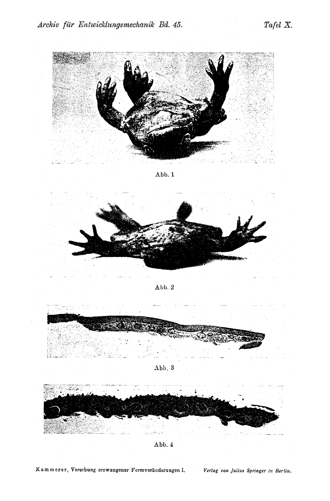

# Inheritance of Enforced Form-Changes.
## I. Communication:
## The Nuptial Pad of the Alytes Male from "Water-Eggs".
### (At the same time: Inheritance of Enforced Reproductive Adaptations, V. Communication.)

By

**Paul Kammerer.**

(From the Biological Experimental Institute of the Imperial Academy of Sciences in Vienna [Zoological Department].)¹⁾

With Plates X and XI.

*(Received on 23 July 1918.)*

*Archiv für Entwicklungsmechanik der Organismen*, vol. 45 (1919).

> **Full translation.** A complete English rendering of Kammerer's study of the inheritance of enforced form-changes, with the tables and figure legends. **Kammerer's inheritance claims are rendered exactly as he states them; this translation reports them, it does not endorse them** (later disputed).

### Table of Contents.

|  | Page |
|---|---|
| **A. Empirical Part** | 324 |
| I. Prehistory (including new breeding results since 1909) | 324 |
| 1. Normal reproduction of *Alytes obstetricans* | 324 |
| 2. Experimentally altered reproduction of *Alytes obstetricans* | 325 |
| a) Cultures in which the experimental conditions (warmth) continue to act on the following generations | 326 |
| b) Cultures in which the experimental conditions (warmth) do not continue to act on the following generations | 328 |
| II. Description of the Nuptial Pad | 330 |
| 1. The thumb-skin of the normal *Alytes* male | 330 |
| a) Macroscopic finding | 330 |
| b) Microscopic finding | 331 |
| 2. The thumb-skin of the experimentally altered *Alytes* male | 333 |
| a) Microscopic finding | 333 |
| b) Macroscopic finding | 336 |
| 3. The thumb-skin of the *Alytes* female | 337 |
| III. Developmental history of origin of the nuptial pad (tested by physiological auxiliary experiments) | 338 |
| 1. Direct effecting through the experimental milieu? | 339 |
| a) Temperature increase | 339 |
| b) Sojourn in water | 339 |
| 2. Effecting through inner secretion of the testis? | 341 |
| a) Castration | 341 |
| b) Injection | 342 |
| **B. Theoretical Part** | 343 |
| I. Change of form, color, instinct | 343 |
| II. Newly acquired character or atavism? | 345 |
| III. Modification or mutation? | 348 |

> ¹⁾ An abstract of this work appeared under the identical title as Communication No. 35 from the Biolog. Experimental Institute of the Imperial Academy of Sciences, Zool. Dept., Director H. Przibram, Academic Gazette [Akademischer Anzeiger] No. 17. 1918.

21* 324 &nbsp;&nbsp;&nbsp; Paul Kammerer:

|  | Page |
|---|---|
| **C. Polemical Part** | 354 |
| I. Reply to G. A. Boulenger | 355 |
| II. Reply to W. Bateson | 357 |
| 1. Voucher specimens | 357 |
| 2. Pad or mere accumulation of pigment | 359 |
| 3. Non-mention of the pad in the hybridization experiments | 359 |
| III. Reply to E. Baur | 360 |
| Summary of the factual results | 364 |
| I. Reproduction | 364 |
| II. Pad | 365 |
| Acknowledgment | 366 |
| Bibliography | 366 |
| Explanation of Plates | 369 |

## A. Empirical Part.

### I. Prehistory
### (including new breeding results since Kammerer 1909 A).

#### 1. Normal reproduction of *Alytes obstetricans*.

The midwife toad widespread in Western Europe, or "Fessler" [Fessler = "fetterer"] (*Alytes obstetricans*, Laur.), differs in its mode of procreation from all the other European frog-amphibians [anurans] in that copulation and embryonic development take place outside the water, the embryonic development accompanied by paternal brood-care.

A consequence of the land-copulation is that the gelatinous envelope surrounding the eggs — as in other amphibians — dries up instead of swelling, and in this way contributes to allowing the double cord, to which the eggs are joined by means of their gelatinous wrapping (fused out of one simple cord from each of the two oviducts), to be better fastened onto the hind-thighs of the male. The cord, where it is pushed up high by suitable movements of the copulating male, draws together into a very durable "fetter," which sometimes even leaves welts behind in the skin of its bearer. He himself can — when disturbed and forced to flee — strip it off without much difficulty; but whoever, for the sake of experiment, wishes to free a carrying *Alytes* male of its burden must often resort to the scissors.

A consequence of the brood-care is that the eggs are far fewer in number than in non-brood-caring anurans (e.g. *Rana temporaria* [common frog], 600 to 4000; *Bufo vulgaris* [common toad], 1200–6000 eggs according to v. Bedriaga): for *Alytes*, 18–86 are given; but according to my own counts I believe I may assume about 60 (according to Boulenger: 65) as the maximum, and may attribute the larger figures to the fact that one male in the course of the same spawning period occasionally renders "midwifery service" to two or three females. In inverse relation to the egg-quantity stands Inheritance of enforced form-changes. I. &nbsp;&nbsp;&nbsp; 325

the egg-size: their richness in yolk gives the eggs a diameter of 3½–4 mm; whereas, for example, the spawn-grain [Laichkorn] (without gelatinous envelope) of the about equally large fire-bellied toad *Bombinator igneus* [now *Bombina*] measures only 1.4 mm, that of the much larger pond-frog *Rana esculenta* [edible frog] up to 1.7 mm. The yolk-content of the *Alytes* egg furthermore gives it its bright-yellowish color and makes it possible for the germ to maintain itself therein up to a stage of development at which it is indeed still legless, but already in possession of a sculling-tail [Ruderschwanz] distinctly demarcated from the spherical trunk, fringed with a fin, and of inner gills. This in contrast to the hatching-stage of other European anurans, whose tadpoles already leave the egg before their organs of movement and respiration are differentiated out: only after becoming free does the tail here surround itself with a fin-fringe and set itself off from the trunk; as a rule it is likewise only afterward that external gill-tufts sprout, which are resorbed and make room for inner gills. Up to this stage, then, which by other batrachians is reached only in postembryonic development, the embryonic development lasts in *Alytes*.

The accustomed mode of life of the *Alytes* male undergoes no interruption whatever during the "brooding-time"; among other things it seeks out a body of water of an evening, regularly, for the purpose of moistening its skin. Probably driven to it specially only on the occasion of one or a few of these baths, and not by the wriggling of the embryos (as many observers state), the male finally casts off the eggs become ripe for hatching, whose hard, as-if-horny envelopes burst partly through the violent swimming-movements of the male, partly are gnawed through by the tadpoles — an activity that the softening-process going on in the water facilitates and accelerates.

#### 2. Experimentally altered reproduction of *Alytes obstetricans*.

The reproductive business of *Alytes*, just sketched — so far as seemed necessary for understanding of what follows — can be artificially altered in such a way that the differences as against the reproductive acts of the other tailless amphibians native to Europe vanish.

Toward such a goal it is a matter of transferring the amplexus of the sexes back again into the water. This happens simply through the stimulus of elevated temperature. *Alytes* — like most amphibians, especially nocturnal ones, rather loving the cool — seeks this [coolness] and protection from the drying-out of the skin in the water, as soon as the air becomes too warm. With the animals, mostly stemming from Appenzell (Switzerland) and the Harz (Germany), 25–30°C suffice to bring about that effect; on the other hand, Dähne observed, with pronouncedly moist warmth, even 326 &nbsp;&nbsp;&nbsp; Paul Kammerer:

two cases of the egg-loading [onto the thighs], and I myself convinced myself that the Spanish var. *Boscai* Lataste does not react likewise. Even at still higher temperatures it prefers to bury itself, doubtless seeking moisture there, in the earth, which it — scratching backward after the manner of the *Pelobates* species — works rapidly and skillfully.

If the animals — we speak again of forma typica and of as-yet-uninfluenced material, with which the experiment begins — had been at the height of their rut at that time when the temperature-increase sets in, then this [rut] no longer reverses so easily. Indeed, by the fact that so many crowd together in the water-basin of the terrarium, embraces are here triggered, which on their part lead to the emptying of the egg-cords. To fasten the cords onto its thighs is impossible for the male in the water; evidently because the gelatin — instead of drying up — swells and again and again glides down off the thigh-skin, become likewise slippery, of the toiling male. Finally the eggs come to lie in the water, where most of them indeed (in the first such egg-laying periods) perish, but a few nonetheless develop further. The liberation of the germ takes place — since the water decomposes the envelopes — already in the stage with external (instead of yet inner) gills, which undergo a series of tissue-adaptations in order to do justice to water-respiration.

If the pairing proceeds repeatedly under the influence of the temperature-elevation, then the reproductively capable toads are finally formally drilled to copulation and spawning in the water, as well as to leaving their eggs lying there: exactly as we know it from training-experiments with other, recently also invertebrate, animals; exactly as for example in those of Szymanski, cockroaches, which each time before seeking out their hiding-hole receive an electrical shock, unlearn from negative to positive phototaxis — so do *Alytes* unlearn their brood-care, so do "onset of the rut" and "positive hydrotaxis" associate themselves to them in such a way that finally the original warmth-stimulus may be dispensed with. The instinct-change is perhaps supported by the reawakening of atavistic habits, since indeed *Alytes* must descend from tailless amphibians [anurans] that originally spent their reproductive processes in the water.

Once the instinct-variation sits definitively fast, then it can be transferred onto the descendants: with respect to this, two parallel breeding-lines are to be distinguished.

a) Cultures in which the experimental conditions (warmth) continue to act on the following generations. — The test-means of the inheritance in this case is the heightening of the acquired characters from generation to generation. The gelatinous envelopes become thicker, Inheritance of enforced form-changes. I. &nbsp;&nbsp;&nbsp; 327

the spawn-grains smaller, because poorer in yolk; from the same ground they appear ever darker, likewise the hatched larvae, whose yolk-sac regresses, since no reservoir is any longer present from which it could derive itself. The gills grow out from one pair to three, but are for that shortened and coarsened. Just-transformed as well as full-grown toads are especially large; the latter move at the upper limits of the variation-breadth (40–47 mm trunk-length) or exceed it.

All these heightening-capable changes are — so far as then present — described in my treatise 1909 A, and must be looked up there in detail. The most remarkable distinguishing-mark of the "rearing from water-eggs" is offered by the fore-limbs of the male become sexually mature:

First I noticed in the F₃-(great-grandchild) generation that the first finger, on its upper and outer side as well as on the ball, was colored blackish-gray and at the same time somewhat thickened. The whole front extremity appeared more muscular and deviant in its posture, namely turned more inward. Made attentive only through the striking aberration in F₃, I afterward also discovered weaker beginnings of it in F₂ (the grandchildren, the grandparents being reckoned as the first experimentally influenced starting-exemplars): likewise roughnesses in the region of the thumb-skin, but without discoloration visible to the unarmed eye.

In 1909 A I had described only macroscopically, and depicted in sketch-form, the newly appeared thumb-callosity not present in the normal rut-male of *Alytes*. The interest in it seemed to me at that time provisionally exhausted with this presentation. Meanwhile circumstances have arisen which made it desirable to me to devote precisely to that mating-callosity more thorough investigations, which form the object of the work here presented. Before I now turn to a more exact description of the callosity, I supply some results of the breeding-experiments "from water-eggs" which have been gained since the appearance of the work 1909 A.

As regards first the cultures in which warmth continues to act uninterruptedly on all generations, they reached the F₆ generation. Essentially new findings were no longer raised in F₄–F₆ as against the last-described F₃. The breeding offers from F₃ on the aspect of qualitative constancy, even if its characters still continue to move quantitatively in an increasing direction. Semon's prediction, that from F₇–F₁₀ etc. further prospects would be offered (1912, p. 157), could unfortunately not be fulfilled, because the breeding-line died out with F₆. In return I was able to follow up a second suggestion of Semon's: the branching-off of a line held from F₄ on under normal 328 &nbsp;&nbsp;&nbsp; Paul Kammerer:

temperature-conditions — begun, as regards time, in January 1912. In April 1912 it comes for the first time to spawning at low temperature; the F₅ generation descending from it spawns already at the end of September 1913; and the F₆ generation growing up out of this spawn does indeed no longer attain to reproduction, but a male surviving in 1914 and entering puberty still gives occasion to perceive the evolution of its thumb-callosity, and indeed now already, without its having ever once activated its forelegs in the embrace of a female. One may therefore assert that this side-line — at least up to F₆, where epidemically appearing hand- and foot-edemas with rapidly spreading ulcerations eating right down to the bone likewise put a stop to it — has distinguished itself by complete constancy of the acquired characters.

In the next-following paragraph the talk is of cultures in which the transferring-back from warmth into coolness took place already with the F₁ (child) generation.

b) Cultures in which the experimental conditions (warmth) do not continue to act on the following generations. — The *Alytes* breeding-line taken out of the warmth-rooms and kept cool from then on could be followed in my earlier work up to the spring-spawning period 1909. Most of its lines — all those stemming from earlier spawning-periods, i.e. ones lying nearer to the experiment-beginning, of the parental starting-generation — distinguished themselves from the breeding-line under continuation of the experimental conditions by slow fading-away of the bred-in reproductive-adaptation, hence by gradual return to land-copulation and brood-care. Of the breeding-lines, however, which stemmed from later egg-laying periods of the influenced parents, it could not be predicted in 1909 whether the fading-away — so far as not at that time at first demonstrable — might not afterward set in nonetheless.

Today I can report on a line of this kind where this was at least not the case down into the F₄ generation: it is the line mentioned (1909 A, p. 51), whose parents had spawned from 27 Aug. to 2 Sept. 1907, whose F₁ descendants from 25–29 April 1909, and indeed "with all the marks of relinquished brood-care, and of conditions become equal to those of the non-brood-caring frog-amphibians." Of this, then, F₂ descendants spawned from 1–6 Oct. 1910, F₃ descendants from 8–14 April 1912. The F₄ descendants I regrettably no longer brought to spawning, despite manifold mounting-attempts on the part of the males, again because the already mentioned edemas and ulcers set a premature end to the breeding. Nevertheless several experienced their puberty in September 1913; and in Inheritance of enforced form-changes. I. &nbsp;&nbsp;&nbsp; 329

the males the callosity-formation of the innermost finger appeared here too, scarcely weaker than in the warmth-breeding. One may therefore assert that the acquired characters — after years-long, intensive expression in the P-generation brought in uninfluenced from free nature — have maintained themselves through four (experimentally no longer touched) descendant-generations in absolute, qualitative as well as quantitative purity.

For reasons that will only be discussed in later parts (p. 340 and 359), I further set up, in March 1909, a new experimental series (with fresh midwife toads obtained from the Harz). From the previous experimental series it distinguished itself methodically in that I let the warmth-stimulus, which is required in order to drive the already rutting animals into the water for the first time, act, at each rut, only so long until the spawning seemed concluded. During the rest of the year these animals were tended at the lower temperatures in which the control-breeding remains normal: in winter in the unheated room, which in summer is so cool and sunless that only exceptionally does it warm up to 20° and never above. The heat-wave during the spawning-days now suffices completely to call forth the same habit-changes which otherwise had set in with permanent temperature-elevation.

The springs of 1911 and 1912 demonstrated this likewise in the F₁ descendants, become meanwhile reproductively capable, and indeed regardless of whether they too had been brought into the warm-room at the height of the rut or had been left outside it permanently. The only difference in the results of permanent and intermittent warmth-action consists in this, that there [under permanent warmth] maturity is reached already within 1–1½ years, here at earliest in 2 years — a difference which touches only the tempo, not the character of the experimental course. From the fundamentally constant result, however, it emerges that the temperature most probably comes into consideration in all cultures with "water-eggs" only as a releasing-factor; not as a factor that specifically determines the changes obtained. These would only secondarily be the work of the learning-success: the morphological consequences and their inheritance set in only after the warmth-drill had previously altered the spawning-habits. The morphological phenomena are probably a consequence of the fact that the eggs are matured in the water instead of in the air; the total course — set rolling through its initial member, precisely through the reproductive-drive transferred into the water and impoverished of brood-care — happens further on under the dominion of a moisture- and density-factor, no longer of the temperature-factor. This holds, of course, with inclusion of the origin of a nuptial pad, to whose exact description we now pass over.

330 &nbsp;&nbsp;&nbsp; Paul Kammerer:

## II. Description of the Nuptial Pad.

### 1. The thumb-skin of the normal *Alytes* male.

#### a) Macroscopic finding.

Just as *Alytes* is the only frog of Europe that mates on land, so it is the only one whose male bears no mating-callosity. To be sure, Schreiber (p. 204) states of *Hyla arborea* as well: "A nuptial pad is not present"; but v. Bedriaga says (p. 223): "The males, moreover, possess — at least in the South — at rut-time a pink- or brownish-colored nuptial pad, which extends to the base of the penultimate member [phalanx]," and in this statement he refers to depictions in the work by Lessona.

On the free-living *Alytes* a callosity has indeed probably as yet been seen by no one. Here, to be sure, v. Bedriaga restrains himself (p. 350): "Fatio adds to this that in the male a weakly developed callosity-formation occasionally comes to appearance on the hand." But if one looks up Fatio himself, one finds (p. 363) the following passage: "Le mâle présentant peu ou pas de callosités à la main, il est fort probable que l'étreinte des deux sexes dure généralement peu de temps." On the contrary, p. 360, footnote: "Quelques individus mâles que j'ai pu observer tandis qu'ils portaient encore leurs œufs, ainsi donc bien après l'accouplement, ne m'ont offert de plaques rugueuses ou calleuses ni aux doigts ni au bras."

Fatio therefore surmises the short duration of the embrace as the cause of the lack of the callosity. If one consults the most recent free-land observations, carried out by Boulenger, which put that duration at 43 minutes (Dähne, on the basis of his terrarium-observations, speaks of 1½ hours), and if one compares it with the days-long, sometimes weeks-long embrace of, say, our *Rana*- and *Bufo*-species: then this seems to agree well with Fatio's assumption; especially since the same act in *Hyla*, which next to *Alytes* exhibits the weakest callosity-formation, can according to v. Bedriaga be accomplished within 6–10 hours. On the other hand, however, the tree-frog pairlet too can, in its embrace, swim about for 3–4 days; and conversely, Roesel von Rosenhof already knew how to relate the following about the fire-bellied toad [Unke], hence about a near relative of our *Alytes*: "But just as this toad-species is very nimble in all its functions, so the impregnation and the spawning likewise proceed swiftly, so that for both, in this pairing already ... it was accomplished within a time of three hours. During this time the impregnation took place at twelve different occasions." Now it is precisely the fire-bellied toads that are unusually richly furnished with callosity-formations, so that, in addition to the usual callosity of the inner finger, there are added still such ones at the other Inheritance of Enforced Form-Changes. I. &nbsp;&nbsp;&nbsp; 331

fingers, indeed on the forearm, and in *Bombinator pachypus* on the second, third, sometimes also fourth toe.

Accordingly, the circumstance might — at least to a great part — come into question, that the callosity-furnished genera embrace in the water, only the genus *Alytes*, which lacks the large [water-life], on land. I will not entirely deny a relation of the callosity-development to the mating-duration, because I observed that the water-matings of the *Alytes* subjected to the temperature-experiment take 4–5 hours, hence longer than those of the normal culture, where I have seen them drag out for over an hour. The function of the callosity — first assumed, and probably by Swammerdam, namely to ease for the male the holding-fast of the female — may indeed likewise have to do with the duration, in that the friction of the finger- and ball-skin, which one may think of as the responsible growth-stimulus, is then a longer and more ample one. In the dry state, however, that function can after all be brought into accord with the condition that the entire body-skin of an amphibian assumes according to its prevailing sojourn-medium: in the dry state its granular protuberances offer sufficient counter-hold for the clasping arm of the rutting male; in the water, on the contrary, even the coarsest-warted amphibian skin acts, as a result of copious mucus-secretion, so smoothly that only horny roughnesses that are higher than the mucus-layer, or that at least penetrate through it, can overcome this slipperiness and fulfill their task as barbs [Widerhäkchen].

#### b) Microscopic finding.

In the region of those places where the callosity is wont to appear, the skin was removed from the living, weakly etherized animal by means of a fine pair of scissors; the skin-piece was then fixed in Zenker's fluid, hardened in alcohols of increasing concentration, stained with hematoxylin and eosin, and finally cut, in the direction perpendicular to the phalangeal axis, into cross-sections of 4–6 μ thickness. All the sections (of all the comparison-series to be compared, as well as of the normal control-breeding) were prepared in 1913; and indeed all those stemming from rutting animals simultaneously in April — those from non-rutting animals naturally at other seasons of the year, which are in each case indicated upon description of the preparation. The disadvantage that, through this simultaneous procedure, animals of very unequal age come to stand side by side — e.g. the at least 4-years-younger F₄-generation next to the surviving great-grandparents of the [earlier] generation — carries no weight. For the callosity forms itself the more distinctly the older the animal becomes; if it nevertheless surpasses its ancestors through every later generation, then this general heightening must, over against 332 &nbsp;&nbsp;&nbsp; Paul Kammerer:

the individual one, only come the more unobjectionably into validity through the synchronous conservation-procedure. The method of skin-removal in the living animal — and indeed mostly from its right hand, whereas the left remained uninjured — had the, in case of material-scarcity invaluable, advantage that the breeding-stock is spared; the exemplars affected by the small operation are afterward left to their healing for about a week in an empty, clean glass vessel, whereby they regenerate any callosity by the next following rut-period at the latest.

Microscopic investigation of those skin-places of the normal male, where in later generations after experimental pre-treatment a callosity spreads itself out, recommended itself, in order to ascertain how far any rudiments of callosity-formation that escape the free eye might at sufficiently strong magnification nevertheless become visible. But even apart from the possibility of pre-existent beginnings, the comparison of the altered with the normal is always of value.

Fig. 1 on Plate XI shows a cross-section through the thumb-skin of the normal male outside the rut-time (end of June). The epidermis closes off outwardly with a thin, at most weakly undulating, two-layered horn-layer; it is somewhat sunk in where a gland-duct debouches. A five- to six-layered squamous epithelium [Plattenepithel] with round, or even in the transverse direction imperceptibly flattened, nuclei is, in the germ-layer, represented almost transitionlessly by the single-layered palisade-epithelium with longitudinally-oval nuclei. The boundaries between epidermis and corium run gently undulating, without papillae projecting into the epidermis. The connective-tissue layer of the corium is scarcely thicker than in the skin of other body-parts, pigment scarcely demonstrable. The glands — simple, acinous tubules — are a trifle larger and noticeably more frequent than in adjoining skin-regions, with a high, granular columnar epithelium. The granular content — in contrast to the homogeneity of the neighboring glands — suggests the conclusion that this is already a matter of genuine "thumb-callosity-glands," no longer of the ordinary mucus-glands of the amphibian skin; yet I would not let the decision of the question depend on the gland-content, which requires special conservation-methods in order to render the secretion recognizable and its constitution distinct. The acinous, instead of (as in the thumb-callosity-glands in the narrower sense) tubular, type, on the other hand, lets them be regarded rather as ordinary mucus-glands.

Fig. 2 shows, at the same magnification, a cross-section through the thumb-skin of the normal male within the rut-time (April). The outer boundary of the epidermis is not more uneven than Inheritance of Enforced Form-Changes. I. &nbsp;&nbsp;&nbsp; 333

outside the rut, the horn-layer in places perhaps a thought thicker. Likewise the epidermis itself has in general become higher by one cell-layer; and between the palisade-shaped cells of the innermost layer and the platelet-shaped cells of the outer layers a transition-row is created, which mediates between the longish-round nuclei of the former and the round ones of the latter. — The connective tissue of the cutis offers, as against the non-rut-time, something new insofar as the blood-vessels passing between the glands (struck crosswise on the section) are now at least accompanied by isolated melanophores; further, there is now the considerable size-growth of the glands, which, where they come to lie close to one another, press the connective tissue between them together into narrow side-flats [Kulissen] with a vertical instead of horizontal fiber-course. For this, the whole connective-tissue layer, like the epidermis, has gained in height; and thus there is given a general skin-thickening that has set in during the rut.

One may discern in this a "callosity-formation," which still entirely lacks the characteristic outer distinguishing marks of the anuran thumb-callosity — the epidermal protuberances [Epidermishöcker]; but which thereby, after all, in a certain sense, is the "rudiment" [Anlage] out of which the actual thumb-callosity of the experimentally influenced male finally grows forth.

### 2. The thumb-skin of the experimentally treated *Alytes* male.

#### a) Microscopic finding.

I begin this time with the histological description and let that of the callosity in situ follow only afterward, because in this way the presentation attaches better to what immediately precedes and lets itself be more vividly compared therewith.

Fig. 5 on Plate XI shows a cross-section through the thumb-skin of the male "from water-eggs," F₅-generation, outside the rut-time (July). The figure is to be compared first of all chiefly with Figs. 1 and 2; the condition in which the skin of the non-rutting "water-male" finds itself most resembles the skin-state of the rutting "land-male"; yet even as against the latter the wave-shaped unevennesses, both of the outer and especially of the inner epidermis-boundaries, point to a local heightening of the skin-growth. Of this, however, the giant, densely arranged glands and the correspondingly thickened — because forced to proliferate between the glands — cuticular connective tissue have quite especial share. The melanophores in the vicinity of vessels are not [only] more numerous, but also more extensive than in the dermis of the ordinary male.

A further, mighty heightening do all these characters experience at the rut-time (beginning of April) of the F₅-male "from water-eggs,"

334 &nbsp;&nbsp;&nbsp; Paul Kammerer:

cf. Fig. 7: already at first glance the thickness-increase and horn-formation of the epidermis is the most conspicuous, which at the highest places appears drawn out into bluntly pointed cones and pegs. The most developed of these cones are a little inclined inward — a position in which they come most into consideration as barbs [Widerhäkchen] during the holding-fast of the female. At the most advanced points one sees, further, that ever more epidermis-layers becoming horny at the surface are drawn into the peg-formation, so indeed that under the outermost, horny hollow-cone a second one, on which that one sits, is already prepared and steps into its place after the falling-off of the first.

The germ-layer of the epidermis shows, especially in comparison to Fig. 1, a reversal of the proportion between squamous- and palisade-epithelium: now this inner layer, which there consisted only of a single cell-row, has, as a result of intense proliferation, gained several cell-rows, which at their nuclei demonstrate gradual transitions between longish, round, and finally — in many places from above downward — flattened shapes. The group-formation of the nuclei in the deeper epidermis-layers betrays, as it were, the wave-going of these layers, their undulating folding, such as corresponds to the ample growth-process. The glands have for the most part attained the maximum of their extent; their excretory ducts, one of which is struck by the section, always debouch in the valley between the horn-warts [Spitzwärzchen]. Melanophores are sparsely to be seen in the preparation; the male from which the skin-piece was taken had evidently not yet found itself at the full height of its rut.

In contrast to this, the male from which the skin depicted in Fig. 8 originates has already descended further from its rut-height (May): the animal was in process of molting; therefore the stratum corneum detaches itself from the stratum mucosum, and with it the horn-warts [Spitzwarzen] fall away. Already now their direction of inclination indicates that their base — namely the horn-layer — no longer holds fast, and that they have been displaced together with it — with this loosened, lifting, and bulging-up envelope. Before the desquamation-process has advanced as far as in Fig. 8, one sees the deep-black points of the original callosity-sculpture still sitting in places, loosely and with little caps, upon the lighter cones lying beneath them, even when the connection of this outermost, most-foremost layer between point and point is already interrupted.

More distinctly than in Fig. 7 do, in the now-described preparation (Fig. 8), the melanophore-richness of the corium, and further the corium-papillae, come to view, which rise from the lower into the Inheritance of Enforced Form-Changes. I. &nbsp;&nbsp;&nbsp; 335

upper skin: where the section strikes their lumen belonging to the corium itself, their position is to be recognized thus by the nucleus-grouping in the stratum mucosum of the epidermis: the nuclei surround the papilla-summit in round form and nestle themselves to it, whereby their inner surface becomes concave, their outer surface correspondingly convex. The glands of the post-rut are in process of involution and decline; the connective tissue can therefore again spread itself out better between the glands and assume a horizontal fiber-course, whereas it forgoes increased gland-spreading.

The characteristic structures of the thumb-callosity remain preserved for the F₄- and F₅-generation (Fig. 9); indeed they experience, at the rut-time — the preparation was taken at the end of March — at least as far as the melanophore-deposition of the dermis is concerned, a further heightening. The transformation that the whole tissue has undergone in the course of five generations becomes especially evident from the comparison of the chromatin-richness of the nuclei, in comparing, say, the Fig. 9 here in question on the one hand, Figs. 1 and 2 on the other. In Fig. 9 there are, furthermore, again perceptible — as already in Fig. 8 and (probably only by chance) less pronouncedly in Fig. 7 — the nucleus-rosettes, which mark the culmination-points of the corium-papillae that are besides set off by a lighter color.

As already mentioned in the "Prehistory," it was first the black discoloration of the horny pointed protuberances that offered the possibility of finding the rut-callosity, and indeed first in the F₅-generation (Fig. 7); subsequent investigation, however, had given occasion to demonstrate, already in the F₂-generation, those roughnesses which there enclose as yet no pigment-deposits making them so conspicuous. Fig. 4 now shows a cross-section through the thumb-skin of this rutting grandchild "from water-eggs," and reveals a transition-stage between the normal rut-skin (Fig. 2) and its maximal callosity-unfolding in the later generations (Figs. 7, 9). The alternation of mountain and valley in the stratum corneum is greater than there, gentler than here; the horn-warts raise themselves for the time being quite little above the still smooth epidermis-margin, and, as said, they lack those masses of dark pigment which let them be set off so sharply, macroscopically, from non-callused neighboring regions of the skin. Size and number of the glands, as well as the melanophore-formation in the under-skin, show normal conditions, actually still scarcely a deviation; but the picture that the epidermis offers in the spatial proportion between palisade- and squamous-epithelium has already approached that in F₂.

If one compares the rut-callosity, as it has gradually formed itself in the course of the "water-generations" of *Alytes*, with the 336 &nbsp;&nbsp;&nbsp; Paul Kammerer:

homologous tissue that has hitherto been described in the literature for other species of tailless amphibians, then the following results. Above all, the horn-papillae of the epidermis in *Alytes* possess a simpler structure: they are blunter on the whole; and they lack the file-sculpture such as appears, in the horn-warts of *Rana* and *Bufo* (cf. Fig. 90a; in Harms 1914), pronounced through horn-points of second and third order. In *Alytes* these are lacking, [which are] as it were file-like rough; the individual projections of this file are smooth, and are — each for itself — again a file on a reduced scale. Further, the dense arrangement of the glands, their size and consequently the extension to which they press the connective tissues together, always remains behind the high-grade conditions such as come to light, for instance, through Fig. 99 in Harms and Fig. 129 in Gaupp.

If one compares the *Alytes*- with the *Bufo*-callosity (Harms, 1914, Fig. 104), then it results that the formation of the gland-summit involuntarily takes, in *Alytes*, the higher differentiation-stage. The glands are also more numerous than in *Bufo vulgaris* and probably (cf. the reservation, p. 332) thumb-callosity-glands, whereas on the other hand from *Bufo*, according to Harms, a clear distinction from the ordinary mucus-glands is to be maintained. The gland-duct is in *Bufo* united and prepared here, in *Alytes* unprepared as in *Rana*. Quite primitive is the behavior of the callosity-glands as regards the papillary body of the callosity-bumps: in developed connection one can in *Alytes*, to be sure — at its junction with the callosity-bumps —. The structures of the upper skin correspond to the corium-formation: corium-papillae and horn-bumps, inner and outer epidermis-surface run here almost strictly parallel in steep waves with ridges. In *Rana* likewise each epidermis-bump corresponds to the corium-papilla engaging beneath it into the epidermis, which, however, only foreshadows it, raising itself only little in an incomparably higher wave-valley. In *Alytes* the wave-valleys between the blunt thorns are broadly U-shaped; and the connection between them and the corium-papillae seems still to contradict the hard rule.

#### b) Macroscopic finding.

The rutting *Alytes* males I came across in their furnishing with nuptial pads possessed these as a sharply delimited, blackish-gray thickening of the upper and radial side of a finger. The resting finger shows, macroscopically and under magnifying-glass enlargement, no trace of the same formation; histologically I have unfortunately not examined it, although it would have been quite desirable, with regard to Boulenger's statement (cf. p. 356) that both inner fingers rub the genital region of the female.

The more males — especially of the F₄ and F₅ generation "from water-eggs" — entered into rut, the more frequently the experience forced itself upon me that the callosity did not always recur on the regions first occupied; rather, that it has at its disposal (inter- as well as intra-individually) a fairly wide area extending across the ball of the thumb over the whole inner side of the forearm up close to its bend, and that within this distribution-area it exhibits great variability of extent and arrangement. Indeed, asymmetries occur: for example, on the right only the ball of the thumb, on the left only a forearm patch, callous. Fig. 2 on Plate X shows a male of the F₅ generation in high rut, in which a mighty callosity extends over a large part of the radial forearm region and incidentally over the ball of the thumb, whereas it leaves the phalanges free.

Even in one and the same male the callosity-region does not remain unchangeably bound to the [original] patch; and here one can then well follow that the direction of the variation is a progressive one: in principle it gains in extent from rut to rut. If, for example, the first callosity-formation was present only at the fingertip, then the second has conquered the whole finger, the third additionally the ball, the fourth an adjoining piece of forearm. Thus the variation moves in the sense of increasing surface-area and at the same time in the direction from distal to proximal surfaces; which does not mean that it must actually pass through such stages in every male: sometimes an arm-callosity is already present in the first rut-period.

To the arm-callosity I ascribe special significance, because it is lacking in most batrachians, whereas it belongs to the aquatic relatives of the terrestrial *Alytes*, the Bombinators: the genus *Bombinator* belongs, like *Alytes*, to the family of the disc-tongued frogs (Discoglossids). I therefore surmise that in the further course of the "water-rearing" the arm-callosity would have appeared in all *Alytes* males and would perhaps still later — as is shown most beautifully by *Bombinator pachypus* (cf. Schreiber, Fig. 27c) — have divided itself into well-delimited portions, henceforth no longer so variable, or into individual callosity-pads.

### 3. The thumb-skin of the *Alytes* female.

Externally, no change whatever can be perceived on the hand of the female midwife toad [*Alytes obstetricans*], neither in the alternation of nuptial and postnuptial period nor in the experimentally treated breeding-lines as against the uninfluenced ones.

For comparison's sake, however, I did operate on a few female *Alytes* thumbs and had microtome sections cut from the skin detached there. Fig. 3 on Plate XI shows the cross-section through the thumb-skin of a normal female at pairing-time; Fig. 6 through the thumb-skin of a likewise rutting female of the F₅ generation "from water-eggs." Of any callosity-formation whatever — which indeed represents a secondary sexual attribute of the male — nothing is to be perceived, as was to be expected. But in extensive, vessel-accompanying melanophore-accumulations of the cutis the female of the "water-rearing" does keep up to a not insignificant degree with the corresponding male of like descent; indeed, in the depicted preparations — of which Fig. 7 furnishes the male counterpart to our Fig. 6 just now dealt with — the female has even outpaced the male by a good stretch. As was indicated at an earlier place, the pigment-poverty of the preparation Fig. 7 is, however, no regular occurrence.

In the quantity of its glands, and hence in the thickness of the connective tissue yielding between them, the normal female (Fig. 3) is surpassed by the altered one (Fig. 6); and the columnar epithelium of those glands, as well as the secretion accumulated in the gland-lumen (Fig. 3, right), is — so far as the conservation-method permits one to judge — granular, not homogeneous, hence constituted just as in the male; in this respect the pictures agree with one another, independently of sex, generation, and experimental series. Finally, the epidermis-cells, especially those of the deeper stratum mucosum, are more succulent, more chromatin-rich in the "water"-female than in the "land"-female.

If we wish to compare the developmental stages of the female thumb-skin in general among themselves and with the male, then we may state: the normal rutting female (Fig. 3) resembles therein roughly the normal, but non-rutting, male; and the experimentally altered rutting female (Fig. 6) such a male in turn, namely the male of the corresponding experimental series outside the rut, and further the normal male within the rut. The female has thus not remained unaffected by the share of growth-processes that play out in the thumb-skin of its respectively phylogenetically equal-ranking male.

### III. The cause of origin of the rut-callosity.
(examined by means of physiological side-experiments).

It was mentioned (p. 331) what forces itself upon one as the most probable cause of origin of the rut-callosity in the *Alytes* male: the embrace [during mating] in the water. For the male mating on land, the normal male, possesses no callosity. The copulation-medium may come to its aid in that the union of the sexes there requires double or threefold as much time as on firm land; for both moments [factors] heighten the exertion of the sexual act. The mucus-secretion of the amphibian skin taking place in the water raises the difficulty of the holding-fast and hence the intensity of the work performed thereby; but the necessity of holding the female fast there for a longer time besides also extends the synchronous function of the mating-apparatus and thus raises the duration of the work.

If the cause of origin is hereby correctly ascertained, then the rut-callosity qualifies as a functional adaptation: its demonstrable heritability would thereby gain in theoretical bearing. But there were at first still other possibilities to be thought of.

#### 1. Direct effecting through the experimental milieu?

The altered life-conditions may have offered occasion for the origin of the callosity immediately, not first through the mediation of altered use of the forelimbs:

a) the temperature-elevation originally driving toward water-copulation;

b) the increased water-sojourn —

could have been responsible for it. — Possibilities to which I was made attentive by Herr Prof. Steinach (orally). Their checking would have to take place very simply in this way: that keeping and rearing in the one case proceeded exclusively at high temperature, but the withdrawal of the basin prevented the accomplishment there of mating and development; while in the other case the experimental animals would have to accommodate themselves to exclusive water-sojourn at ordinary temperature, and the callosity would have to appear — after a water-sojourn carried through for perhaps years on end — in the very same individuals [in which the experiment is begun]. A breeding could here not take place at all, because the copulations presupposing it would in turn bring the functional moment into the foreground, or at least let it play a part.

The parallel-experiments aimed precisely at doing justice to the named eventualities, those, that is, which would have to run simultaneously with the others, for the sake of bringing about an equally long-lasting and thereby a certain decision: such ad hoc instituted heat- and water-experiments I have not carried out. The appearance of the rut-callosity came to me wholly unexpectedly; that this accompanying phenomenon of the varied reproduction would set in, was in no way foreseen in the original experimental plan. The pertinent control-experiments could therefore at most have been begun belatedly, and would even today not yet bring it to as many years' run as had been claimed up to the first-time appearance of the callosity in the main experiment.

I believe, however, that the new setting-up [of such experiments] becomes superfluous in another way; that the possible objection — that the rut-callosity arose not functionally through intensity and duration of the skin-friction during the amplexus, but directly through heat- and water-sojourn, or one of the two — can be met otherwise: namely, by the reference to completed experiments which lay partly ready already in 1909 A, without having been carried out for the purpose they are now to serve. Under III., 1a and IV., 4c there is found a heat-experiment with "eggs, laid on land and further treated on land" (hence investigation of the temperature-factor with exclusion of the moisture-factor); sub III., 3a there is found an experiment with "keeping wholly in water" (hence investigation of the moisture- with exclusion of the temperature-factor). Although these experiments either — like the last-named — do not advance as far as the offspring, or — like the first-named — do not bring it to so high a generation-number as, according to the experiences of the main experiment, is necessary for the production of the rut-callosity: wholly irrelevant for the question presently under discussion they nevertheless are not.

The high temperature, namely, would have had to act much more intensively in development without water, the water in permanent sojourn therein much more intensively, than in those experiments in which it really let the rut-callosity arise. One might therefore have expected that the callosity, were its origin actually to be credited to the warmth, or to the water-sojourn respectively, would here not have had to wait first for the grandchild-generation in order to come into appearance.

With greater probative force, however, the direct effecting through warmth and water can be excluded if one consults the cultures continued up to 1914, presented today (p. 328). For the callosity has indeed now also come about in a line where only the P-generation (only the parents) were subjected to the heat-stimulus and with its help held to copulating and spawning in the water; all later generations no longer. Indeed, the P-generation itself had — after the "drill" was accomplished — no longer needed the impulse of elevated temperature in that decisive spawning-period, from which the further, through-followed generations branch off. Let us add the experiment described on p. 329, where the warmth acts only intermittently and with great probability is recognized as an unspecific releasing-factor, whereas the deviant developmental course released by it must be regarded as the actually determining factor for the morphological developmental variants that have arisen —: then a direct influence of the temperature-factor on the rut-callosity could no longer seriously come into consideration.

The direct influence of the water, however, requires no further checking than that which fell to its share already in 1909 A: with uninterrupted water-sojourn one does not succeed in moving the animals to reproduction. Individually they bear it without difficulty, provided that the water-level is low and they need not swim; a rut-callosity does not thereby come to formation. But were one even to succeed in bringing about the pairing, then it would be — let this be emphasized once more — a copulation in water, and hence the same factor of functional self-shaping again introduced, which we precisely wished to avoid: further breeding would thus not even be of use here for the question concerning the direct influence of the water-sojourn.

To my concluding judgment yet another experience comes to aid: were water-sojourn as such, in a form that goes little into the water, capable of producing a rut-callosity, then conversely, in a form that goes much into the water, regression of its rut-callosity would be to be expected as soon as it is kept permanently on land. This I have now done for years with most anuran forms of Europe and many exotics, among the Europeans with the most nearly related genera *Discoglossus* and *Bombinator*, though wholly independently of the question here under discussion. In the room-hothouse it is especially the Bombinators — in nature almost exclusively water-dwellers — that readily and voluntarily accustom themselves to a predominantly terrestrial mode of life. In spite of this, the year-period of the most conspicuous male rut-character, precisely the mating-callosity, undergoes no interruption or suppression whatever.

#### 2. Effecting through inner secretion of the testicle?

Another possibility of non-functional callosity-origin was to be considered: the deviant developmental course could have somehow altered the testicle, so that its hormone — which in ordinary *Alytes* males does not bring about the secondary sex-character of a rut-callosity — has now gained the chemical aptitude for this. Could such an alteration of the male germ-gland be made probable, then the finding would be of positive significance also for the heredity-question concerning the "direct influencing of the germ-plasm" and the "parallel induction."

The control-experiments serving the investigation of the question are of two arrangements:

a) Castration. — Two F₄ males provided with rut-callosities were castrated bilaterally in May 1909. In spite of this, with the autumn-rut of 1909 the callosity came up again, and so on at half-year intervals; thus four times up to the summer of 1911, at which time I convinced myself by re-laparotomy that the removal of the testicles had been a total and definitive one. The testicle-less males showed exactly the same evolution and involution of the callosity as the testicle-bearing ones; at least so far as the macroscopic and simple lens-finding comes into question — microscopic investigation was omitted — no difference whatever in extent and strength of the callosity-formation is to be recognized between castrates and such males as are in possession of their testicles.

Through Steinach (1894, 1910), Halban, G. Smith, and Harms (1914, p. 134ff.) it is already established for *Rana* that the thumb-callosities of castrates, with good feeding, increase in size and gland-richness toward the rut-time — irrespective of whether the unmanned frogs receive testicle-extract injected or not. But the year-periodic swelling and subsiding of the callosity is, when left to itself, here nonetheless a weaker one than in the reproductively capable male; a weaker one also than when, in the castrate, it is supported by implantation or injection of germ-gland substances. In the callosity-bearing *Alytes* castrate, on the other hand (in the living object, to which the observation was restricted), not even that gradation-difference was to be noticed. The callosity-development and -regression, as well as its each-time renewed regeneration, is in *Alytes* independent of the hormone of the sex-gland.

Therewith not only does testicle-alteration drop out as cause of the callosity-origin, but moreover some light falls on the callosity as an acquired character: as a new acquisition from outside it has not yet come under the influence of the metabolic conditions which later hand it over to the internal-secretory dominion of the male puberty-gland. In *Rana* we evidently have before us the transition-stage from this independence to the later total dependence, such as confronts us for instance in the shape of the subsidiary sexual characters of the mammals, e.g. the vesiculae seminales and prostatae. The phylogenetic process begins precisely with the acquisition from the environment, in consequence of the action of its physical energies, and ends with the becoming-domestic, the chemical-physiological incorporation of the acquired into the inner world.

b) Injection. — An experiment, the stimulus for which came in a letter from Semon: three normal *Alytes* males (from the control-culture, without calluses) and three castrates of the same kind were treated with testicle-substance of other frog-amphibians. These — and indeed such species as exhibit a quite strong callosity-development (*Bufo vulgaris*, *viridis*; *Rana agilis*) — had their testicles taken out, cut up into small pieces or squeezed to a mush, and thereupon (according to the method first practiced by Nußbaum) introduced into the back-lymph-sac of the *Alytes* male. Somewhat below the neck-region one makes with the scalpel a small lengthwise incision, whose skin-edge is lifted off somewhat with the forceps (forceps in the left hand); finally the testicle-mush loaded somewhat onto the horn-spatula (spatula in the right hand) is pushed sterilely into the held-open skin-slit. The small operation, borne by the animals without protest, is repeated weekly.

I reasoned thus: is the callosity-development in *Alytes* a secondary consequence of a primary testicle-alteration (and not a functional self-shaping upon the embracing of the female in the water), then the *Alytes* testicle could in its chemism have become more similar to those batrachian-testicles which quite regularly bring a thumb-callosity to driving-out on their bearers by the inner-secretory path. That it is species-foreign gonad-substances which must be applied in *Alytes* cannot impair the result: Steinach (1910) has brought the thumb-callosity in *Rana esculenta*-castrates to bloom with testicle-secretion of *Rana fusca*; furthermore we know, for example from the experiments of Gudernatsch, Romeis, Laufberger, C. O. Jensen, and Kaufmann, that endocrine glands of mammals, fed to amphibian-larvae; indeed from the experiments of Hanko on *Asellus*, of Nowikoff on *Paramaecium*, that these administrations even in invertebrates and protists in principle produce homologous growth-effects as in the species-own body.

The result, however, did not stand in accord with these presuppositions: the bodies of *Alytes* males and castrates inundated with frog- or toad-testicles got at no time even the indication of a mating-callosity.

## B. Theoretical Part.

### I. Form-, color-, instinct-change.

Researches that occupied themselves with the transference of changes onto the descendants had in view either only physiological changes: metabolism-changes such as over the after-effect of immunity, anaphylaxis; over permanently altered virulence in bacteria — instinct-changes such as in Schroeder's (1903 A) experiments over nest-building insects and their fodder-plant-seeking [insects], my own experiments (1907 B, 1909 A) over reproductive-adaptations in amphibians. — Or those researches had indeed morphological changes for their object, yet quite predominantly such as expressed themselves in the coloration of the investigated organism. Hither belong the experiments of Standfuß, Fischer, Schroeder (1903 B), Pictet on butterflies, Tower on beetles, my own experiments on reptiles (1911 A) and amphibians (1912), in particular on the spotted coat of *Salamandra maculosa* [*Salamandra salamandra*] (1913 B).

[…research concerned with the transmission of changes to descendants] indeed had morphological changes as their subject, but very predominantly such as expressed themselves in the **coloration** of the investigated organism. To this category belong the experiments of Standfuß, Fischer, Schroeder (1903 B), Pictet on butterflies, Tower on beetles, my own experiments on reptiles (1911 A) and amphibians (1912), especially on the spotted coat of *Salamandra maculosa* [*Salamandra salamandra*] (1913 B).

More rarely have the transmission experiments extended to changes of **shape** in the narrower sense; nevertheless one may count here the mouse cultures of Sumner, the rat cultures of Przibram (1910), the *Daphnia* cultures of Woltereck, and, more remotely, a part of Jennings' *Paramaecium* cultures. In most of these the matter concerns altered growth rates and final sizes of particular or of all body parts, not altered detail structures.

The present work presents a case in which the histological constitution of a locally rather sharply delimited body region was subjected to alteration and was compelled to transmit the structural variation to descendants. To be sure, no exact boundary can be drawn between physiological and morphological, instinct, color, and form characters: the one brings the others with it or includes them from the outset. Thus in the case of interest to us here the structural character — the thumb pad — is at the same time a color character, for it conditions local pigment accumulations and to the unaided eye strikes one chiefly as a black spot. But it is conditioned, as the previous section in particular has endeavored to set forth, by the altered motor reactions of the male during the rutting clasp — by which means the character receives its character as a "functional adaptation"; and those motor variations in turn appear in consequence of an instinct variation that directs the reproductive drive to a site of its satisfaction hitherto foreign to it (into the water). The rutting pad of *Alytes* is thus form (structural), color, physiological, and so to speak psychological change all at once. The same or something similar could easily be demonstrated for the other cases as well, which, however, I do not wish to carry out in detail. I wish only to point to the one — actually self-evident — circumstance, namely that in particular every **color change** — to which field belong probably most of the investigations on "inheritance of acquired characters," and among them the classical ones — is at the same time a **structural change**; namely, one that alters the structure of the color-bearing tissue of the skin. In spite of this it seemed and seems to me desirable to augment the rich factual material relevant here and to the inherited instinct variations by cases in which, alongside the morphological changes of the intimate structures, changes of the overall outline join in. Such examples are now found, as by-results, namely of my experiments on inheritance of instinct variations, in fairly large number: I recall the gill changes of the *Salamandra* (1907 B) and *Alytes* larvae, the giant tadpoles, the volume shifts between yolk content and gelatinous envelope in the *Alytes* eggs (1909 A), among others.

One of the most probative, and at the same time most doubted, examples of this I have today singled out and worked through in exact analysis. If I regard it as of importance for the general problem touched upon in connection with it (the problem of the inheritance of acquired characters), I may in this appeal to the testimony of Bateson — that is (cf. polemical part, p. 357), one of my most decided opponents — who in two places (pp. 201, 202) states the following: »To my mind this is the critical observation. If it can be substantiated it would go far towards proving Kam­merer's case« .... »The systematists who have made a special study of Batrachia appear to be agreed that *Alytes* in nature **does not** have these structures; and **when individuals possessing them can be produced for inspection it will I think be time to examine the evidence for the inheritance of acquired characters more seriously**«¹). Even so abrupt a denier of the inheritance of acquired characters as Bateson is therefore inclined to weigh its possibility more seriously, if the existence of the thumb pad of *Alytes* can be proven.

> ¹) Letter-spaced emphasis mine!

## II. Newly acquired character or atavism?

In this inclination of his to regard the production and preservation of the rutting pad as an *experimentum crucis*, Bateson will, to be sure, be shaken if he recalls that *Alytes* — if indeed our descent-theoretical conceptions hold good at all — must necessarily descend from anuran genera that **already possessed** a mating pad. The pad would accordingly be a "new" character only relative to the surveyably short duration of our breeding sequence. On the contrary, it appears, to a more far-sighted reflection, to present itself as an old, hereditarily established character, whose germ-plasmic **disposition**, ever since the branching-off of the genus *Alytes* from the more original anuran stock, has merely lacked the somatic equivalent, because it was no longer developed. But the capacity for the unfolding of that disposition was never lost to the *Alytes* male, and was very soon exercised again, after circumstances had once more become favorable to it.

This could happen all the more readily inasmuch as the pad decidedly possesses a certain "selection value," represents a "purposive" character that raises the durability of its bearer. In its re-awakening, indeed — according to the whole disposition leading up to it, which left no choice and set up no distinction between pad-possessing and non-possessing males — selective processes are probably excluded. But the one-time suppression of the pad formation one can after all picture to oneself as having occurred by a selective route: through its "becoming superfluous," when the animals went over to embracing one another on firm land, the pad sank — down to its genotypic readiness — to a rudimentary, yet at any time reactivatable, organ.

With a little good will, such a conception could hold all the more readily inasmuch as it need not restrict itself to the hypothetical presupposition of a predisposition lying ready in the germ-plasm, but may even further support itself on somatically demonstrable remnants. The same skin region where, in the experimentally influenced male, the luxuriant pad develops, also exhibits, in the uninfluenced male, a swelling and subsiding of the gland tissue, an increase and decrease of the epidermis thickness, as well as correspondingly correlated transformations in the cell and nucleus shapes, in the fiber course, layering, and pigmentation of the underlying connective tissue of the corium [dermis]. Fundamentally taken, only slight, purely gradual additions are needed in order to raise those year-periodic fluctuations, at the steeper rutting wave, into a regular "pad."

The single addition that takes on a qualitative and not merely quantitative aspect is the sculpture of the horny, deep-black pointed tubercles into which the cuticle of the rutting "water male" jags out; wherein the folding of the whole epidermis serves it as a basis, which for its part enables the underlying skin [hypodermis] to send into each such elevation a (probably nerve- and vessel-bearing) connective-tissue plug. But the folding is only a sign of more tempestuous growth, hence again only **quantity**, not deviating **quality**, to which therefore the cuticular thorns, as mere apoplasmatic end-summits of the folding, do not even have any claim. Admittedly, every quality character, analyzed in such a way, would probably in the end resolve itself "merely" into quantity.

In the impression of the presence of a genotypic basis common to the entire *Alytes* stock — the unaltered as well as the altered — one is in any case strengthened by the fact that the female also has a share in it; that in particular the progress of the "water female" brings this female at least approximately up to that point where previously the land male — yet, be it noted, in the state of his high rut — had stopped short. For the rest, this is nothing more than a special case of the general phenomenon that each sex in the rudimentary state also calls its own the attributes of the respective other sex. Only, in the *Alytes* case we have before us a partial phenomenon hitherto, to my knowledge, unknown, insofar as a sexual attribute too, which was first bred up in the course of the experiment (be it even "new" only in the relative, not in the absolute sense), is reproduced in the heterologous sex.

The graduated character of the male *Alytes* pad according to place and extent, its as it were still uncertain groping after a fixed home district, and its **independence of the testicular hormone**, had temporarily strengthened me in the opinion that the pad, as we see it before us today, must after all be an absolutely newly acquired character; for a character prepared in disposition would probably, on its first reappearance, already not admit of such fluctuations in degree of development and distribution, but would in every respect be at once fixed, and on the other hand at once integrated into the internal-secretory dependencies of the organization in question. In the same direction points the finer structure of the pad still further, insofar as very **primitive** features can be discerned in it: the differentiation of the epidermis and the corresponding corium papillae, of the glands, etc., remains not inconsiderably behind that of other rutting pads already studied in their histology. Were the *Alytes* pad atavistic, that would constitute no ground for it to be backward as well; it could then, at a single stroke, regain the same degree of differentiation that the ancestors of *Alytes* had attained. To be sure, that degree need not be as high a one as the one we come to know in the recent forms.

Finally, the descent of the *Alytes*, padless in the natural state, from already pad-bearing frog amphibians need be no obstacle to the **newness** of a later-appearing *Alytes* pad: I thought of Dollo's law of the **non-reversibility** of phylogenetic processes, which in numerous cases belonging to paleozoology was able to show how like-constituted organs are indeed produced several times in the course of phylogeny, but each time from manifestly other germinal material, hence probably from other germinal dispositions. Also a thumb pad that arises today on a form descended from older pad-bearers would accordingly have to proceed, not from the same ancient, but might without further ado proceed from a newly produced disposition. The reversibility of recent developmental processes does, however, now make it appear advisable not to argue too decidedly with Dollo's "law of irreversibility."

As the first — so far as I see — I myself (1911 A), then Plate (p. 470), precisely in connection with my *Alytes* experiments, and recently v. Fejérváry in connection with my *Proteus* experiments, have pointed out that that "law" admits of exceptions. I have recommended speaking instead of an "**irreversion rule**": development is *potentia* reversible, but *actu* is usually not reversed. Accordingly, applied again to the *Alytes* pad, from the standpoint of reversibility, that view would still by far have the greater probability for itself which asserted the absolute newness of the pad formation.

But when I — taking, in these reflections, my point of departure from the **variability** of the pad — made the observation that this same variability apparently steers toward a **definite goal**; that the variants therefore need not be a symptom of the provisional, unconsolidated state, but that a pad configuration hovers before them as it were as an end state, which is already found typically in a most nearly related form, the mountain toad (*Bombinator pachypus*, Bonap.) [*Bombina variegata*]: then in me, after all, that other view at length again gained the upper hand, according to which the finger and arm pad of *Alytes* is nothing further than an **atavism**.

## III. Modification or mutation?

*(On prospects of demonstrating the pad "irreproachably" as an "acquired" character.)*

As an atavism the rutting pad is, with a certain matter-of-courseness, conceived also by Weismann, who was indeed the first to point to the **source of error** — to confuse what is old-inherited and re-awakened with what is newly arisen. Weismann expresses himself on this as follows (p. 74):

»But what here occurs is nothing newly acquired at all, but something quite old; it is, as Kammerer himself says, ›**the return to the original mode of reproduction of the toads**‹, which all, with the **sole** exception of *Alytes*, spawn in the water. The matter here therefore concerns a reversion to the mode of reproduction of far back-lying ancestors, which, abandoned probably many hundreds of generations ago, has yet not quite vanished as a disposition from the germ-plasm and, on the action of suitable stimuli, again enters into activity. Of a so-called ›direct adaptation‹ there can be no question, neither in the case of the drive to go into the water, nor in the case of the other modifications that show themselves earlier or later in connection with it, e.g. the reappearance of the ›thumb pads‹, such as appear at times in such *Alytes* males forced into the water, for these are a general possession of the toads and frogs that spawn in the water and were also proper to the ancestors of *Alytes*, indeed they have here not even always vanished in the animals living in free nature (Kammerer), a proof that their dispositions are even today still contained, at least in some individuals, in the germ-plasm, ready to become active when they are triggered in the right way.«

The bringing-forward of the phenomena appearing on breeding in water as a ground against inheritance of acquired characters was, in Weismann's case, not entirely justified insofar as all the remaining results on *Alytes* (Kammerer, 1909 A) — where the atavism objection does not apply and — if it is to hold for the water breeding — applies all the less, remained entirely undiscussed. Further, the expression that the pads "appear at times¹) in such *Alytes* males forced into the water" is not strictly correct, because it arouses the impression of occasional, scattered appearance, whereas, beginning from a definite generation onward, all the males — without any exception, even if not concordant according to degree — bore the pad and in this respect display an increase traceable from generation to generation, indeed (as is, to be sure, only now being made known) furthermore from rut to rut. If, finally, Weismann appeals to me in mentioning free-living *Alytes* with a trace of pad, this can only happen because I for my part had appealed to Fatio, at that time (1909 A, p. 516) however only after a citation by v. Bedriaga. We saw today (p. 330) that the original passage in Fatio reads far less favorably for the sporadic natural occurrence of pads in *Alytes* than in v. Bedriaga's rendering. But all this in passing.

> ¹) Letter-spaced emphasis mine!

As set forth in detail just above, I by no means object to accepting the pad of the *Alytes* "water male" as a reversion. Against the following sentence of Weismann (p. 75), on the other hand, I must lodge an objection: »With regard to *Alytes*, let attention only further be drawn to the contradiction that lies in this, that, although the water-spawning, once it was forced, transmits itself to the descendants, even if they are no longer driven into the water by high warmth, yet **the first experimental animals, whose ancestors did indeed spawn on land for uncounted generations, can be forced at once to give up this long-inherited habit**, and their descendants do not resume it again either, on the land and at normal temperature;«

It will seem to me that this theoretically uncommonly important sentence lays bare the whole, unphysical mode of thought of the preformation doctrine newly proceeding from Weismann; and that from it one recognizes how attempts to explain the change of species without inheritance of acquired characters, when logically carried through, lead back to the opposite of the change of species, to the doctrine of the constancy of species, or at least of dispositions. It would lead too far, within the framework of a special treatise, to enter upon this more closely; beginnings of the analysis necessary here sooner or later are found in my *General Biology* (1915, pp. 266, 283, 284). In the same place (p. 248) I also laid the ground for unmasking organic "**inheritance**" as a false image, taken from the inorganic-external passing-over of the inheritance into human possession, and therefore as a **pseudo-problem** that misleads one into regarding the continuous process of generation as a discontinuum. If one remains conscious of its uninterruptedness (but not of a merely one-sided "continuity of the germ-plasm"): then what Weismann finds so full of contradiction is no more contradictory than when a rolling ball — pushed out of its direction by a thrust, or even forced into rectilinear reversal — thereupon does not, say, of its own accord steer back into the old direction maintained for an arbitrarily long time, but rolls on, in the newly assumed direction (be this even only a backward run of the original), at once just as persistently. Reproduction of organisms, the production of "their like," is at least so far analogous to the inertia of moving bodies, as it likewise persists in its direction only so long until a force gives it another direction.

No less than for the inert body the duration of its course, so also for the inheriting organism the number of generations that precedes a **change of direction** is probably incidental. Repeated inheritance does not, after all, accumulate and consolidate any character; that is only a selectionist conception, today proven false by Mendelism and the biotype doctrine. The character (more exactly: its "reaction norm") transmits itself through reproduction always alike, produces precisely "its like" and, through itself alone, not in any heightened form. For that, driving influences would be needed, which in the last instance could always come only from without. And such a heightening would already be **change** as well, would be acquisition and new inheritance, which an already existing, however immemorially old inheritance would always find equally ready to strike out in this or that variation direction, or even only to continue the hitherto direction, but accelerated or retarded. Decisive for the success is chiefly the **acting force**, but only little its history.

Were it not so, that characters can be altered despite endlessly preceding generation sequences, then there would be no new arising of forms. And that no new forms arise is the demand in which ultraselectionism must, by its own logic, culminate. Therein Weismann's dictum touches in some measure on a sentence of Baur's to be combated later (p. 361); [remainder of sentence and paragraph continues on unowned p. 351] With this we are already moving within Baur's (1914) terminology and mode of thought. Many forms to which systematics grants the rank of "good species" are, in many or all of their traits, supposedly only standortsmodifications [locality-modifications]. They can then, of course, when one applies the external factors in correct combination, be brought close to one another or even merged into one another; but what was thereby accomplished is by no means a change of species [Artenwandel]. The two forms were in fact not at all different; their reaction-norms were equal and were only forced to confess their equality also under equal conditions. Our *Alytes*, for example, would, in important traits employed by natural history for generic distinction, be a standortsmodification: for the traits can be assimilated to those of other frog-amphibians [Froschlurche] when the circumstances under which *Alytes* lives are assimilated to those of the other frog-amphibians [Froschlurche].

It is clear that this method of speculating turns the presuppositions of the descent-doctrine [Abstammungslehre] on their head. The old descent-theory inferred thus: The species appear unchangeable. Certain comparative findings (palaeontology, comparative morphology) lead to the supposition that their constancy is only an apparent and relative one. If one succeeds in changing the species before our eyes, then the direct proof for our supposition is furnished. — The modern Genetics infers conversely: The species appear unchangeable. Certain negative experiences (non-inheritance of many acquired traits) compel the supposition that their changeability is only an apparent and a limited one. If one succeeds in changing the species experimentally, then this is a proof that our intervention (likewise like the diversities given numerously enough in Nature) affects only their temporally-perishable part (their individual Soma). Their inter-germ-plasmic [interkeimplasmatische] basis (the germ-plasm) remains untouched and shared; the species are equal. Thus from the changeability of the species follows their — Unchangeability.

The most remarkable thing and — considered purely theoretically — actually the genuinely decisive thing about the whole opposition against the inheritance of acquired traits comes to expression only therein, that one and the same change, which for Baur counts as a standortsvariation [locality-variation] or modification, is by another opponent, Johannsen (1911, p. 128; 1913, p. 459), taken into claim as a mutation. Both writers, agreeing only therein, namely in not recognizing inheritance of acquired traits, speak of the changes in *Alytes* in a — according to their own opinion — so irreconcilable sense! The mutation is heritable, the modification not. The result of a crossing between normal and changed *Alytes* follows the Mendelian rule (Kammerer, 1911 B): thereby Johannsen let himself be convinced that a genotypic change, a blastogenic variation, lay before. Then, however, it can be no somatogenic variation, no acquired trait, but only a mutation. Baur has ignored my crossing-experiments. For Baur, what I changed in *Alytes* is an **acquired trait and therefore not heritable**; for Johannsen it is **heritable and therefore no acquired trait**!

For me, who in another place (Kammerer, 1913 A) set forth that the concepts "mutation" and (heritable) "acquired trait" probably coincide, Johannsen's interpretation is more acceptable than Baur's. Let us therefore examine whether the changes in *Alytes* can be mutative. One thing speaks against it: the step-wise ascent from generation to generation and within the same generation from rutting-period [Brunftperiode] to rutting-period, as the mating-callus [Begattungsschwiele] again showed so beautifully in such cases; and that likewise gradual decrease, when the change had not yet been sufficiently fixed by the environmental conditions. According to the now usual conceptual determination of the mutation, such fluctuations are irreconcilable: in contrast to the (non-heritable) fluctuation, one demands of the mutation — beginning with its first appearance — the maximum of the formation and thereafter perfect constancy. Since there are mutants generally recognized as such (Towers's potato-leaf-beetle [Kartoffelblattkäfer]), which on the apostatic facets [Apostatfacetten] of the variation-sum-curve display each degree of formation according to the strength of the inducing external factor, that word-interpretation [Worterklärung] seems to me no longer to correspond to the wording at all, and so even the fluctuating of the changed traits in *Alytes* as well is no hindrance for their classification under the mutations; especially if one accepts the synthesis between mutation and the once mis-bent [mißliebige, i.e. one once deemed undesirable] "acquired trait."

Just as little does the probably atavistic character of those changes (insofar as they here concern us) offer a hindrance to their classification under the mutations: they would accordingly fall into the class of the "retrogressive" mutations. But if not already the mutative character in general, then the atavistic in particular clears thoroughly away with the legend of an "acquired trait"! By no means, if it can be shown, or even merely shown to be possible, that something somatic and without parallel-induction had preceded the blastogenic insertion (Roux's germ-forming, or here — in atavism — only germ-awakening induction toward the germ-forming insertion).

Such a proof of probability lets itself be carried out, if one takes into consideration, above all, the hitherto-said about the functional adaptation-character of the changes — now specifically of the thumb-callus [Daumenschwiele]. We saw in the empirical part of the treatise that the attempts to explain the coming-about of the callus by some direct, passive effect without mediation of arm- and skin-activity [Hauttätigkeit] concluded with a denying result. Also that the female shares a part of the changes furnishes no argument against it: the histologically examined specimen (Tab. XI, Fig. 6) — and only at the histological examination does the slight degree of its coming-along come to appearance — originated from the F₂-generation; the callus of the male, however, is already present in the F₁-generation (Tab. XI, Fig. 4). It is the general phenomenon that the traits of the one sex are inherited also by the other and in a stunted form onto the other: the callus acquired through the functions of the male is transferred, in particular weakening, at once also onto the female.

So there remains for the time being hardly anything else left, than to exclusively conclude, the rutting-callus [Brunftschwiele] be the work of indirect, active adaptation. Thereby it must be admitted that this diagnosis still offers great difficulties. It means, one must impute to the tissue reacting with the callus-formation a monstrous sensitivity, if one will presuppose that, in comparison to the whole rest of the year, the vanishingly brief activity of the male in the clasping of its female should suffice, in the most heavily stressed regions, to leave behind such lasting effects. Our physiological conceptions strive against such a presupposition; our experience, again, warns us against entrusting transmitted conceptions with all too much confidence. The brief duration of the rutting-periodic stress does indeed explain, after all, why among the rest of the changes precisely the callus requires three generations (with inclusion of the parental starting-generation [Ausgangsgeneration]), in order to become demonstrable; four generations (with inclusion of P), in order to appear in full distinctness.

Before therefore the supposition that the callus-formation happens through functional adaptation can be replaced by any better one, it remains the only acceptable one. The changed function of a welldelimited body-part is, however, doch wohl [yet surely] only with difficulty to be transposed by direct, parallel influencing into the germ-plasm. The external factors involved in the putting-into-operation of the changed organ-function — the warmth, from which the direct reachability of the germ-stocks [Keimstöcke] is sure, the water, from which this reachability is less probable — may indeed, through the body-covers, penetrate to the nuclei of the germ-cells: that they there set up the same transformations as on the outer surface through the use of an instrument specialized for this purpose, is with our biological experience in no way reconcilable in any remote way.

That the ancestors of *Alytes* already possessed rutting-calluses, which were lost to the populations copulating on the land, facilitates — as Semon (1911) sets forth for atavism in general — the rapid and complete making-good of the loss. Yes, this presumably helps us sufficiently over the difficulty, that a function lasting so briefly, restricted to a few hours in the year, should be accompanied by such far-reaching consequences; this explains why the callus, which only appears at the grandchildren as a shy beginning, comes to appearance in completion at the great-grandchildren. But from the re-acquisition (if indeed not new-acquisition) of the callus at the hand up to the re-awakening (if indeed not new-formation) of its disposition in the germ leads no other way than the middle-way of the Soma.

## C. Polemical Part

¹ I harbor a great aversion against discussions written specially for polemical purposes. This is the reason why I have, up to now, left unanswered the various attacks directed against the exactness of my results and against their theoretical interpretation. I wanted to postpone the rejoinders, until **not** the necessity of the rejoinder as such, but new results would justify, as their subject-matter, returning to it. With regard to the *Alytes*-experiments the occasion has today come.

Since from more than one side it was pointed out to me that the hitherto staying-away of my rejoinders has aroused in some specialist-colleagues the impression as though I had been defeated by the objections, I should like to send ahead one more general remark: certain objections are of such a quality that it makes it appear a waste of time to refute them still specially. This holds namely of the "remarks" of Werner, which, by the way, concern not the *Alytes*- but **Secerov's** and my salamander-experiments; everyone who is really informed about the investigations — and that one may fittingly of

> ¹ Spaced print [Sperrdruck] by me!

everyone who passes a judgment about them, demand —, will, on comparing our experimental arrangement with Werner's account, unbiasedly and independently arrive at that unambiguous insight through which a special exposition becomes superfluous. The same holds of the — at the Naturalists' Assembly [Naturforscherversammlung] in Vienna 1913 made — communications of a pitiable colleague, whose tragic fate (evident sufficiently from Przibram's [1917] obituary) actually already alone forbids dealing with him.

Quite generally it may be said: whoever's investigations strike at widespread theoretical preconceptions cannot always answer everything that is written against him. He might otherwise easily find himself placed before the necessity of neglecting his researches in favor of sterile polemical authorship.

### I. Rejoinder to G. A. Boulenger.

Boulenger is one of the few who at all undertook to actually verify my results on the object, before they condemned them. He took two (two!) males whose copulation he was able to follow, removed the freshly laid and fertilized eggs and threw them into the water. For this he used the water of a cattle-trough ("abreuvoir"), in which he had seen *Alytes*-larvae; he concluded therefrom this water must be especially suited for his undertaking: "Je voulais voir si, en opérant immédiatement après la ponte et avec de l'eau offrant *toutes les garanties désiderables*¹), je réussirais à répéter le fait obtenu plus d'une fois par M. Kammerer."

Boulenger had luck; for he saw the development apparently go on normally even 5–6 days. Only then did they die off. His material must have been really excellently suited for the experiment, in contrast to his supposition expressed on p. 579, that perhaps the midwife-toads [Geburtshelferkröten] of Belgium and France behave differently in this respect than those of Westphalia, with which I had first carried out the experiment. As I namely already in 1914 in a small essay took occasion to answer Boulenger, I had expected that the eggs under such "natural" conditions would within at most 24 hours be totally moulded-over [verpilzt]. And already in 1916, p. 69, I had spoken of my own difficulties in keeping the water-eggs free of Saprolegniaceae, and had recommended their as-far-as-possible sterile keeping. Boulenger does not take this passage into account when he (p. 579) writes: ". . . puisque Kammerer, opérant avec

> ¹ Spaced print [Sperrdruck] by me!

ceux-ci, ne semble avoir *aucune difficulté*¹) à contrarier ainsi l'ordre de la nature."

What for every physiologist would have been a matter of course, was not so for Boulenger, whose field of work understandably did not let him become familiar with the experimental methods (then he is all the more obliged to heed the technical prescriptions of his predecessor): even into **boiled-out, then artificially through-ventilated water** there still penetrate mould-germs from outside; every egg attacked by them must be carefully removed, cut out of the cluster (of the tangled cord) with a fine scissors, [and] the sterilization of the whole culture-vessel then renewed. Despite observance of all these precautionary measures, I had to throw away far more numerous egg-clusters, after the embryos contained therein had died off, than Boulenger ever probably used for his experiments — until I finally had success with a few eggs of a few egg-clusters. Later, indeed, the results improve visibly; in later generations of the animals with finished instinct-variation, the mortality of the water-eggs is hardly greater than that of other frog-amphibian-eggs [Froschlurcheier], which already normally are laid in the water. But up to there leads a long way! With a few occasional nature-observations and with a dish full of pond-water it does not let itself be skimmed over!

> ¹ Spaced print [Sperrdruck] by me!

The success of the rearing from water-eggs forms the precondition for rutting-males [Brunstmännchen] of later generations coming into possession of thumb-calluses [Daumenschwielen]. And since that rearing had failed for Boulenger, he at the same time also doubts straightaway the existence of the rutting-callus [Brunftschwiele]. Admittedly he brings yet a special reason into the field for this: I had in 1909 described and depicted the callus only on one (the innermost) finger; Boulenger, on the other hand, saw that at the amplexus — deviating from that of the frogs — not one, but two fingers come into contact with the shame-region [Schamregion] of the mated female. This finding is made on a single (!) copulating *Alytes*-pair, which Boulenger took into his hand. He thus means: if calluses had arisen in my water-copulating specimens, then they would consistently have had to arise on two and not merely on one finger.

Whence does Boulenger take the certainty that the position of the very timid animals, when he took them up for the purpose of exact inspection — and without taking them in hand such an inspection is not to be thought of —, had not shifted? Whence will Boulenger know whether both fingers — the correctness of his observation thus pre-supposed — were equally strongly involved in the contact? Whence — at the undoubted variability of *Alytes*-reproduction (cf. Dähne, who from his own observation stresses it [the variability] also for the copulation-position [Kopulationsstellung]) — does he take the right, his single observation to generalize, to extend its validity also onto the variants copulating in the water? I have indeed certainly seen more numerous copulations of *Alytes* — on the land and in the water — than Boulenger's three cases; and I laid great weight on seeing them in the terrarium beside me, instead of by the gleam of a pocket-lantern in the gutter [Rinnstein] of a village-street or at the crevassed threshold [Schwelle] of a farmhouse-ruin. I would, however, not trust myself to state anything thereabout, which regular behavior the (during the copula or from the underside of the female hidden) finger of the male brings to the light; in what number and surface they thereupon come into friction with the skin of the female. The manifoldness in extension and arrangement of the callus-cushion [Schwielenpolster], as it appears in the material lying before me, corresponds perhaps even to just as many modifications of the embracing-position and -strength.

Boulenger will, in the face of the proof now adduced, probably no longer doubt the callus; but from its gradations [Abstufungen] he will draw the further conviction, that conclusions from an ethological onto a morphological finding gained on a quite different occasion are yet to be drawn with greater caution.

### II. Rejoinder to W. Bateson.

Bateson criticizes three points: 1. (p. 202). I have shown him no *Alytes*-males with callus. 2. (p. 201). My figures — 1909, Tab. XVI, Figs. 26 and 26a — are quite inadequate, because they show only a dark fleck on the thumb; in contrast it must be stressed that the rutting-callus is not merely a pigmented swelling, but a cushion which bears numerous, tiny horn-spines [Hornstacheln]. 3. (p. 202, 203). I came, in describing my crossing-experiments — bastardization of normal with altered *Alytes* (1909 B; 1910; 1911 B) — to speak not one word more about those "calluses."

To 1: To send valuable voucher-specimens [Belegexemplare] abroad is not always easy and advisable. I will keep silent about what murky experiences I have at times had with such lending; evidently for that reason most public collections set it up as a rule, nothing outside the house to lend. Nevertheless I had the intention, a callused male to England to send. Scarcity of material, which always only with exact distress permits keeping-on-alive up to the respectively next-following generation, made me again and again hesitate.

On this occasion I wish to make a few remarks about the **preservation of voucher specimens**, which have long weighed on my conscience. Mostly one stands directly before the choice: either to preserve, at the risk of having to break off the experiment (so it went for me, for example, with the large-eyed cave-newts [*Proteus*]!); or to leave everything alive as far as possible, at the risk of in the end reaping only cadavers unfit for preservation. Especially in earlier years, when I had not yet met with so much skepticism, I therefore resolved only with great difficulty to kill an experimental animal, but rather strove to reach still further extreme stages with it. To this procedure alone — in a certain respect surely not unobjectionable — do I owe many of my breeding successes, when they hung by a hair's breadth on the survival of just one particularly fertile specimen. Against such dependence on individual specimens, even the richest material, such as always served me as a starting point, offers no unconditional protection.

The demand for "vouchers" has probably also been brought to bear upon me more often and with greater severity than upon other researchers: I know such researchers who never preserve anything and meet with no such obstinate disbelief. Driesch said to me on the occasion of his visit, and at our request that he donate results of his experiments to the developmental-mechanics Museum of our institution: "I have kept nothing; whoever doubts the findings should repeat them!" That this should at last happen with mine is my most ardent wish!

Bateson too visited the Biological Experimental Station at the beginning of September 1910, following the International Zoological Congress at Graz. He mentions it on p. 202: Why did I not show him any callus-*Alytes* at that time? Well, none were preserved, for the reasons set out; and in the living animals the callus is, as is well known, a feature that appears periodically (only during the rut). But this periodic term was at that time not yet due: a few weeks later the blackening and the growth of the horny papillae would already have been demonstrable! And of course there are experts enough who have seen the callus at such a time.

**On point 2:** The further point, contestable according to Bateson, seems to come down to this: that what I depicted in the (admittedly: non-probative) figures could be merely a local accumulation of pigment, but not a true thumb-callus pad with its internally glandular, externally file-like structure. This objection, at that time fully justified on the part of an outside assessor, was decisively co-responsible for my undertaking a histological investigation of the skin site in question: it forms the main content of the present treatise and will — together with the photographs on Pl. X, Figs. 2 and 4 — hopefully convince Bateson and others of the existence of the rutting callus. For me there had been no doubt at all, even in earlier times, as to the rutting-callus nature of the inner finger — such as could well arise in him from a mere inspection of my sketch-like figures — because magnification by lens *in situ* had shown me the pointed epidermal cones and the gland-openings emerging between them.

**On point 3:** The **non-mention of the callus in the hybridization experiments** (1909 B; 1910; 1911 B) has a reason as simple as it is plain: the males used there and appearing among the offspring possessed no calluses. The crosses hatched throughout from earlier generations than those in which calluses had become distinct: at the assembly of natural scientists in Salzburg in 1909 I could speak only of F₂; and my publications (1909 B and 1910, also 1911 B, which gives somewhat more detail) rest entirely on the lecture delivered at that assembly! The callus, however, becomes so conspicuous only in F₃ that an observer who had originally not thought of this result at all was able to see it.

Moreover the crossing experiments took place, as a matter of course, in normal, not elevated, temperature; in elevated temperature the normal specimens would not remain normal and would thus render the cross pointless. Under normal conditions, however, the callus was still entirely unknown to me even in 1911; I held it at that time to be a phenomenon attributable to the uninterrupted continued action of elevated temperature and peculiar to this experimental series. Only since 1913 do I know (cf. the present work, p. 329) that the development of the callus is not so much a consequence of the permanent heat-stimulus as of the becoming-constant — at first attained only there — of all the characters drawn in. And once this constancy was attained also in a culture set back under normal conditions, only then did it appear that the formation of the callus was independent of the temperature-elevation and dependent solely on the deviant course of reproduction and development. But this is, as said, a result of the relatively most recent time: for the hybridization results published in 1911 B I could not yet turn it to account.

Bateson's "surprise" at finding no mention of the callus there belongs, then, quite properly among those reproaches characterized at the beginning of this section, whose refutation is not worth the trouble and which on such grounds ought to have been spared the researcher. For it shows how little carefully my works were read. So long as Bateson (p. 202) must confess: "The ramifications of the experiments are, however, very difficult to follow, and as I am not sure that I always understood them ¹) I must refer the reader to the original" — so long has he no right to the surprise: "I notice with some surprise ¹) that in a later publication on the same subject no reference to the development of these structures is made." Unless as an admission of his own misunderstanding.

> ¹) Letterspacing by me!

## III. Rejoinder to E. Baur.

In the second edition, which appeared in 1914, of his well-known "Introduction to the Experimental Theory of Heredity," Baur has neglected to alter anything essential in his incorrect presentation of my experiments — a presentation corrected by Semon (1912) and by me (1913 B). The sole change consists in this: that he calls this latest "concluding publication" of mine and states of it only that, like the preceding ones, it is held "in a very summary manner." If it — with its 189 pages and 15 plates, its tables and exact numerical data of every experimental step — still gives too few details, then at any rate I declare myself incapable of a more detailed description.

But perhaps the catchword "summary," which makes a mood against me, applies rather to the manner in which Baur took cognizance of my thorough work and of Semon's deeply searching book (which he indeed even reviewed in 1912!); he dismisses it (p. 43) with the sentence: "A very detailed compilation of works of this kind (which seem to prove inheritance of modifications — the author [Verf.]) you will find in a treatise by Semon: The Problem of the Inheritance of 'Acquired Characters'." Baur's reporting on my experiments is, as I can infer from the peculiar form of various data, by no means distilled from the main works, but rather compiled from short — admittedly then "summary" — lecture-abstracts and essays; the consultation of the main works was apparently restricted to a superficial appraisal of the plates, and thus produced the utter absurdity of the passage on p. 58, where there is talk of after-effects of the paternal modification upon the offspring.

This I establish only in passing, for it refers to the "amply known *Salamandra*-experiments" (Baur, 1917). But what is one to think of the thoroughness and justification of a criticism which — heedless of the fact that from two sides (Semon, Kammerer) it had received the most comprehensive references to overlooked parallel experiments that radically shift the state of affairs — in a new edition copies out the same, long-refuted objections? Of course, not every reader can be a specialist of the field and know my special works in the original; he has in Baur a reliable guide and now knows for all time well enough: Kammerer's experiments are highly contestable and are presented even by their author only in a highly summary-schematic manner!

"Proved," says Baur (p. 57, 1914!) of my *Alytes*-experiments here recapitulated as "prehistory," "proved, however, is no inheritance even here, for here too the conditions which modified the parent animals also acted upon the next generation. **These animals indeed themselves passed through their first development under quite different conditions** than normal comparison animals; they were in the egg-stage under abnormally high temperatures, were deposited into the water as larvae with external gills, etc."

Against this Semon wrote (p. 156, 1912!): "How does the actual state of affairs stand over against these objections — the actual state to which I reckon, first, the careful control experiments communicated by Kammerer at the same time and, second, the continuation of the experiments through several successions of generations? The control experiments have shown that the influences in question during embryonic development, of which Baur speaks, are without influence for the calling-forth of the instinct-variations. For:

"1. Eggs of normal animals, which were taken from the brood-tending male, when matured in the water let animals with normal instinct issue from them (Kammerer, 1909 A, p. 501)";

"2. Eggs of animals in which the abandonment of brood-care had become habitual let animals without brood-care instincts issue, even when one let them pass through their development on land" (Kammerer, 1909 A, p. 513).

"Baur further objects that the eggs had been in the egg-stage under abnormal temperatures. Through a number of observations of Kammerer's (1909 A, pp. 504, 510, 534, 2b) it is now established that mere warming of the eggs during their maturation and deposition does not yet lead to the instinct-changes in question.

But quite apart from this, this objection can after all refer at most to those eggs from which the first offspring-generation (F₁) issued; it is pointless over against the second offspring-generation F₂, which issued from eggs of the F₁-generation, since the latter indeed grew up, developed its germ-substance and brought it to maturity under wholly normal conditions. And yet the F₂-generation issuing from these never-warmed germ-substances exhibited the instinct-change in the clearest manner during its first spawning-periods.

"No one who knows not merely arbitrary fragments, but the totality of these experiments of Kammerer's forming a well-considered whole, can dispute that through the influences exerted upon the parent-generation of *Alytes* an alteration was brought about not only of the germ-cells of these, but also of the germ-cells of the following generation."

This should now have become still more obvious through the **persistence of the bred-in reproductive habits down into as many as 4 no-longer-affected generations** — as I have today (admittedly again only summarily?) reported. The new — or, if one insists, old — reproductive habits would, from there on, probably always (i.e. until new alterations of the mode of life) have remained constant, had the culture not just died out, for secondary reasons, with the great-great-grandchild generation.

The untenability of Baur's objection can be grasped still more fundamentally than through the proof, just adduced, of his incomplete and incorrect information. I set down once more Baur's concluding and principal sentence, and now omit what, after the foregoing, is settled accessory matter:

"**These animals indeed themselves passed through their first development under quite different conditions** than normal **comparison animals**, they . . . were deposited into the water as larvae with external gills."

Now the deposition of the eggs in the water and the premature hatching of the larvae taking place there constitute features of the imprinted reproductive and developmental course: to switch them off would mean to destroy the very result which one had just gained; would mean to extinguish the property itself which one had after all called forth in order to test its heritability. Testing of heritability could then, according to Baur, only take place if one had first eliminated the property which otherwise (where it is present) might perhaps have been heritable: there it would indeed be impossible to approach the question of the inheritance of acquired characters at all!

Baur will, to be sure, again accuse me of "mere dialectic and of operating with blurred definitions," as in his review of my General Biology ¹) (1917; since in 1912 he reproaches Semon too with the same, I find myself in excellent company); but I do not see in how far his critique of concepts is superior to mine, and in how far I have exaggerated or distorted Baur's presentation. It means exactly what I only work out a trifle more sharply: it demands that one may **not raise an acquired character** if one wishes to demonstrate without objection the **inheritance of acquired characters**; for the conditions set by the property itself, by its mere existence, signify constant new induction and therefore individual, not inherited, experience.

A tadpole develops in the water. That is a component of its species-character. We are not able to detach it from the tadpole without annihilating it or profoundly altering its specific character. We must, after all, not argue thus: the spawning in the water and the larval development is — e.g. in *Hyla arborea* [European tree frog] — not heritable; for it is precisely the sojourn in the water that induces those instinctive and developmental phenomena anew in every generation! Only in *Alytes* did we arrive at so distorted an argumentation, because the same developmental course which in *Hyla* we acknowledge without further ado to be heritable, here includes a *novum*, one of the dreaded "acquired characters." Were we to make a terrestrial developmental course heritable in *Hyla* — which there succeeds in fact to the same degree as in *Alytes* (Kammerer, 1906 and 1907 A) —, then conversely the contact of the eggs and larvae with air would be the acquired thing, just as in *Alytes* it is the innate thing.

I mean, then, that we must of necessity agree on this: that everything that has become immanent to the developmental course of a form, everything that belongs to its manner and mode of adjusting itself in relation to the dwelling-medium, is to be charged no longer to the **induction-account** but to the **reaction-account**. Once the reaction-norm has

> ¹) About the unprejudicedness of this author one can form a picture if one looks up his assertion made there (1917) that half of my chapter on heredity is taken up by the salamander-experiments. In fact they fill scarcely 4 of the 31 pages of that chapter. — Further, it is said to be divided by me into the two sections "Inheritance of innate characters" and "Inheritance of acquired characters" — but I still see, after all, also the two preceding, coordinate sections "Theories of heredity," "Substance of heredity." Finally, I am supposed not to have cited Johannsen there, because his book does not please me (!): at the close of the chapter on "Heredity" I do, after all, refer to the entire literature for the next-following chapter on "Descent"; and here, where Johannsen's "Elements" seemed to me to fit better (at more than one place I cited no work at all), they do after all have the place due to them! — And Baur wishes to cast my data into doubt!

shifted, has it become "abnormal," it nevertheless returns into another equilibrium, into a new "norm." With the altering external conditions it has come to terms, and is therefore (up to their possible further alteration) itself no longer altered by them (Tietze). What was originally external effecting has, with this equalization, been taken over into the inner course; it is newly regulated reaction, but no longer induction. To reject this train of thought is — so far as I can survey it — equivalent to renouncing, in the whole problem, its solution. Whether this renunciation comes easy to a researcher, or whether he cannot resolve upon it, is a matter of his individual disposition and of taste.

### Summary of the actual results.

I. 1. *Alytes obstetricans* [midwife toad] copulates and spawns — deviating from other tailless amphibians [frogs and toads] of Europe — at a temperature of at most 25° C on land. The male carries the egg-cord until hatching on the thighs of the hind legs.

2. At temperatures higher than 25° — no matter whether the warmth acts uninterruptedly or only during the few reproduction-days — the sexes betake themselves into the water for mating, where the eggs cannot be fastened to the thighs, because the gelatinous envelope surrounding them does not dry on. Thereby the care-instinct of the carrying-brooder is gradually lost (already in the individuals first affected).

3. Once the loss of the brood-care habits has definitively set in, they likewise do not reappear in the offspring-generations; no matter whether the latter are still subjected to the — permanent or intermittent — heat-stimulus or not. The culture under continued action of the thermal experimental conditions (25–30°) brought it as far as F₆; the culture under switching-off of these conditions (winter-sleep; in the warm season on average 17°) as far as the F₄-generation.

4. The eggs thus develop in both parallel-running cultures under water (instead of in the air); their at first very great mortality decreases from spawning-period to spawning-period, from generation to generation. The remaining alterations, called forth by the deviant developmental course, increase in the same stages. Among these alterations (described in detail in 1909) is the rutting-callus of the male developed in the water and copulating in the water.

Vererbung erzwungener Formveränderungen. I. — 365

**II. 5a.** For in the natural state the male of *Alytes* [*Alytes obstetricans*, midwife toad] likewise possesses, even during the mating period [Paarungszeit], only a copulatory swelling [Kopulationsschwiele].

**5b.** Nonetheless, in the thumb-skin [Daumenhaut] of the normal *Alytes*-male a certain periodic swelling-up and swelling-down is unmistakable: the former — falling due at the mating period — consists in an increase in thickness of the (thereby remaining smooth) epidermis; in the insertion of a layer of transitional cells between the outer-lying, multilayered, low-celled plate-epithelium [Plattenepithel] and the deepest-lying, single-layered, tall-celled palisade-epithelium [Palisadenepithel]; in the enlargement and multiplication of the skin-glands [Hautdrüsen], which restrict the connective tissue of the corium [Lederhaut] to narrow septa, so that here they compel a vertical instead of a horizontal course of the fibers and a yielding into the depth, whereby the subcutis [Unterhaut] too gains in thickness.

**6a.** If one now teaches the *Alytes*-male to mate in the water like the other batrachians, then from the grandchild-generation onward there develops a mating-swelling [Begattungsschwiele] that increases from generation to generation, as from mating-period to mating-period, in the degree of its development as well as in its horizontal extent. At first restricted to the dorsal and radial side of the innermost finger, it progressively takes possession of the ball of the thumb [Daumenballen] and finally of the largest part of the inner surface of the forearm almost up to the bend of the upper arm [Oberarmbeuge].

**6b.** The epidermis of the swelling is folded at the mating time; the palisade-epithelium of the germinal layer has gained in number of layers at the cost of the plate-epithelium; between palisade- and plate-epithelium several layers of half-tall cells mediate; the horny layer raises itself above the epithelial fold-summits into moderately densely-standing and moderately tall, deep-black, blunt-cone-shaped thorns [Dornen]. Often the thorns are stuck into one another in two layers, because two epidermis-layers lying one above the other and becoming horny were transformed into spike-knobs [Spitzhöcker]; for the rest, however, they are not sculptured, their surface is smooth. The subcutis [Unterhaut], constricted by numerous large glands and thickened in compensation toward the depth, carries — namely in alignment with the blood vessels between the glands — mostly abundant pigment and bulges out below the horny cones in the shape of corium-papillae [Coriumpapillen] into the folds of the epidermis [Oberhautfalten].

**7.** The female of *Alytes* takes part in these changes in the finer structure of the thumb-skin: whereas in the ordinary female this skin, even at spawning time [Laichzeit], resembles only that of the non-rutting [nichtbrünstig] male, the skin of the rutting female in the F₁-water-generation corresponds to that of a normal male that has, however, entered its mating period. This again expresses itself in the form of the stronger epidermis, richer in transitions with respect to cell-heights [Zellenhöhen]; in the 366 — Paul Kammerer

form of the thicker, more gland- and pigment-rich corium [Cutis]. The fold- and spike-wart-formation [Falten- und Spitzwarzenbildung] of the male is lacking.

**8.** The mating-swelling [Brunftschwiele] of the *Alytes*-male is independent of the testicular hormone [Hodenhormon]: its periodic evolution and involution is continued in total bilateral castrates without any weakening whatever.

### Danksagung. [Acknowledgments]

By counsel and deed, in particular also the revision of the preparations and their comparison with the pictures, the following stood at my side during the composition of the present treatise: Herr Prof. Dr. Eugen Steinach, Prof. Dr. Heinrich Joseph (from him come the microphotographs, Pl. X, Figs. 3, 4), Prof. E. D. Congdon (Harvard University — from him comes the photograph of the swelling-bearing animal, Pl. X, Fig. 2), Prof. Dr. Hans Przibram. To Herr Prof. Dr. Richard Semon-Munich I owe — as indicated in the text at the respective places in each case — so many fruitful suggestions. The microtome sections were prepared in the most kindly manner by Fräulein Olga Kermauner, preparator in Prof. Steinach's physiological laboratory. The drawings were executed with accustomed great care by Herr University Lecturer Adolf Kasper in the II. Zoological Institute of the University of Vienna. To all those named, who contributed so essentially to the success of the work, I hereby say my warmest thanks!

### Literaturverzeichnis. [Bibliography]

Bateson, William, »Problems of Genetics«. New Haven-London-Oxford, Yale University Press. 1913.

Baur, Erwin, »Besprechung von Semon, Das Problem der Vererbung ›erworbener Eigenschaften‹«. Zeitschr. f. indukt. Abst.- u. Vererbungslehre. VIII. S. 337–339. 1912.

— »Einführung in die experimentelle Vererbungslehre«. Berlin, Borntraeger. 2. Aufl. 1914.

— Besprechung von Kammerer, »Allgemeine Biologie«. Zeitschr. f. indukt. Abst.- u. Vererbungslehre. XVII. S. 262, 263. 1917.

Bedriaga, Jaques de, »Die Lurchfauna Europas, I. Anura, Froschlurche«. Moskau, Universitätsbuchdruckerei, Separat aus dem Bull. de la Soc. Impér. des Naturalistes de Moscou, No. 2, 3. 1891.

Boulenger, G. A., »Observations sur l'accouplement et la ponte de l'Alyte accoucheur, ›Alytes obstetricans‹«. Bull. de l'Acad. roy. de Belgique (Classe des sciences), No. 9/10. S. 570–579. 1912.

Daehne, Curt, »Alytes obstetricans und seine Brutpflege«. Blätter für Aquarien- und Terrarienkunde. XXV. 13: S. 227–229. 1914.

Dollo, L., »La paléontologie éthologique«. Bull. Soc. Belge Géol., Paléont., Hydrol. XXIII. Bruxelles. 1909.

Vererbung erzwungener Formveränderungen. I. — 367

Fatio, Victor, »Faune des Vertébrés de la Suisse«. Vol. III. Genève et Bâle, H. Georg. 1872.

Fejérváry, G. J., Baron v., »Bionomische Beobachtungen über den Olm, mit besonderer Berücksichtigung des Dolloschen Gesetzes«. »Höhlenforschung«, Organ d. Spaeleol.-Abt. Kgl. ung. Geol. Ges., Budapest, Juli 1918.

Fischer, E., »Experimentelle Untersuchungen über die Vererbung erworbener Eigenschaften«. Allg. Zeitschr. f. Entom. VI. S. 365, 377. 1901.

Gaupp, Ernst, »A. Eckers und R. Wiedersheims Anatomie des Frosches«. 3. Abt., 2. Aufl. Braunschweig. Friedr. Vieweg u. Sohn. 1904.

Gudernatsch, J. F., »Feeding Experiments on Tadpoles«. American Journ. of Anat. XV. 431. 1915. und daselbst zitierte frühere Arbeiten.

Halban, Josef v., »Zur Lehre von der Menstruation«. Zentralbl. f. Gynäk. XXXV. Nr. 46. 1911.

Hanko, B., »Über den Einfluß einiger Lösungen auf die Häutung, Regeneration und das Wachstum von Asellus aquaticus«. Arch. f. Entw.-Mech. XXXIV. 477. 1912.

Harms, W., »Über das Auftreten von zyklischen, von den Keimdrüsen unabhängigen sekundären Sexusmerkmalen bei Rana fusca Rös.«. Zool. Anz. XLII. Nr. 9. S. 385–395. 1913 A.

— »Die Brunstschwielen von Bufo vulgaris und die Frage ihrer Abhängigkeit von den Hoden oder dem Bidderschen Organ; zugleich ein Beitrag zu der Bedeutung des Interstitiums«. Zool. Anz. XLII. Nr. 10. S. 462–473. 1913 B.

— »Experimentelle Untersuchungen über die innere Sekretion der Keimdrüsen«. Jena, G. Fischer. 1914.

Jennings, H. S., »Heredity, Variation and Evolution in Protozoa«. Journ. Exp. Zool. V. Nr. 3. S. 577–632. 1908.

Jensen, C. O., »Ved Thyreoidea-Praeparater fremkaldt Forwandling hos Axolotlen«. Kgl. Danske Videnskabernes selskabs Forhandlinger. No. 3. S. 251–268. 1916.

Johannsen, W., »Erblichkeitsforschung«. Abderhaldens Fortschritte der Naturwiss. Forschung. III. S. 71–136. 1911.

— »Elemente der exakten Erblichkeitslehre«. Jena, G. Fischer. 2. deutsche Ausgabe. 1913.

Kammerer, Paul, »Experimentelle Veränderung der Fortpflanzungstätigkeit bei Geburtshelferkröte (Alytes obstetricans) und Laubfrosch (Hyla arborea)«. Arch. f. Entw.-Mech. XXII. Heft 1/2. S. 48–140. 1906.

— »Erzwungene Fortpflanzungsveränderungen und deren Vererbung; Demonstration neuer Tierbastarde«. Zentralbl. f. Physiol. XXI. Nr. 8. S. 253–255. 1907 A.

— »Vererbung erzwungener Fortpflanzungsanpassungen I. u. II.: Die Nachkommen der spätgeborenen Salamandra maculosa und der frühgeborenen Salamandra atra«. Arch. f. Entw.-Mech. XXV. Heft 1/2. S. 7–51. 1907 B.

— »Vererbung erzwungener Fortpflanzungsanpassungen III.: Die Nachkommen der nicht brutpflegenden Alytes obstetricans«. Arch. f. Entw.-Mech. XXVIII. Heft 4. S. 447–545. 1909 A.

— »Vererbung erzwungener Farb- und Fortpflanzungsveränderungen bei Amphibien«. Natur. Heft 6 vom 12. Dezember. 1909 B.

— »Beweise für die Vererbung erworbener Eigenschaften durch planmäßige Züchtung«. 12. Flugschr. d. Deutsch. Ges. f. Züchtungskunde. Berlin. 1910. (Vergriffen.)

368 — Paul Kammerer

Kammerer, Paul, »Vererbung künstlicher Zeugungs- und Farbenveränderungen bei Reptilien«. Vortrag Internat. Physiol. Kongreß Wien. Umschau. XV. Nr. 7. S. 133–156. 1911 A.

— »Mendelsche Regeln und Vererbung erworbener Eigenschaften«. Verhandl. d. Naturforsch. Ver. Brünn. XLIX. (Mendel-Festband.) 1911 B.

— »Direkt induzierte Farbanpassungen und deren Vererbung«. Zeitschr. indukt. Abst.- u. Vererbungsl. IV. S. 279–288. 1911 und Verh. VIII. Internat. Zool.-Kongr. Graz. S. 263–271. 1912.

— »Überblick der modernen Variations- und Vererbungslehre«. Monatshefte f. d. naturwiss. Unterricht. VI. Heft 1. S. 44–62. 1913 A.

— »Vererbung erzwungener Farbveränderungen IV«. Arch. f. Entw.-Mech. XXXVI. Heft 1/2. S. 4–193. 1913 B.

— »Bemerkungen zum Laichgeschäft und der Brutpflege bei der Geburtshelferkröte (Alytes obstetricans)«. Blätter für Aquarien- u. Terrarienkunde. XXV. Nr. 15. S. 259–261. 1914.

— »Allgemeine Biologie«. Deutsche Verlagsanstalt Stuttgart und Berlin. 1915.

Kaufmann, Laura, »On the Metamorphosis of Amblystoma mexicanum Cope fed on Thyroidine«. Bull. de l'Acad. Scienc. Cracovie, Cl. math. et nat., Sér. B, Jänner-März. S. 54–56. 1917.

Laufberger, V., »O vzbuzení metamorfosy axolotlů krmením zlazov štítnou«. Biologické Listy. II, 1913.

Lessona, M., »Studi sugli Anfibi del Piemonte«. Atti Acad. Sc. Torino. 1877.

Megusar, Franz, »Über den Einfluß äußerer Faktoren und über Vererbung bei Crustaceen, Insekten, Mollusken und Amphibien«. Verh. Ges. Deutsch. Naturf. u. Ärzte, 85. Vers. Wien, 21.–28. Sept. 1913. 2. Teil. 1. Hälfte. S. 717–719. 1914.

Nowikoff, M., »Über die Wirkung des Schilddrüsenextraktes und einiger anderer Organstoffe auf Ciliaten«. Arch. f. Protistenk. XI. S. 309. 1908.

Nußbaum, M., »Hoden und Brunstorgane des braunen Landfrosches (Rana fusca)«. Pflügers Archiv für die ges. Physiologie. CXXVI. S. 519–574. 1909.

Pictet, Arnold, »Influence de l'alimentation et de l'humidité sur la variation des papillons«. Mém. de la Soc. de Phys. et hist. nat. Genève. XXV. S. 45–127. 1905.

Plate, Ludwig, »Selektionsprinzip und Probleme der Artbildung«. 4. Aufl. Leipzig und Berlin. W. Engelmann. 1913.

Przibram, Hans, »Übertragungen erworbener Eigenschaften bei Säugetieren und Versuche mit Hitzeratten«. Verh. Ges. Deutsch. Naturf. u. Ärzte, 81. Vers. Salzburg. 2. Teil, 1. Hälfte. S. 179–180. 1910.

— »Franz Megusar«. Arch. f. Entw.-Mech. XLIII. Heft 1/2. S. 222. 1910.

Roesel von Rosenhof, »Historia naturalis ranarum nostratium«. Nürnberg. 1758.

Romeis, B., »Der Einfluß verschiedenartiger Ernährung auf die Regeneration bei Kaulquappen«. Arch. f. Entw.-Mech. XXXVII. S. 183. 1913; auch ebenda XL. S. 571. 1914 und XLI. S. 57. 1915.

Roux, Wilhelm, »Über die bei der Vererbung von Variationen anzunehmenden Vorgänge«. Vorträge und Aufsätze über Entw.-Mech. Heft XIX. 2. Aufl. Leipzig und Berlin. W. Engelmann. 1913.

Schreiber, Egid, »Herpetologia Europaea«. 2. Aufl. Jena, G. Fischer. 1912.

Schroeder, Christian, »Über experimentell erzeugte Instinktvariationen«. Verh. Deutsch. Zool. Ges. S. 158–166. 1903 A.

— »Die Zeichnungsvariabilität von Abraxas grossulariata L.«. Allg. Zeitschr. f. Entom. VIII. Nr. 6–13. 1903 B.

Vererbung erzwungener Formveränderungen. I. — 369

Secerov, Slavko, »Über das Farbkleid von Feuersalamandern, deren Larven auf gelbem oder schwarzem Untergrunde gezogen waren«. Verh. serb. Akad. d. Wiss. 1912. (Serbisch.)

Semon, Richard, »Der Stand der Frage nach der Vererbung erworbener Eigenschaften«. Abderhaldens Fortschr. d. naturw. Forschung. II. S. 1 bis 82. 1911.

— »Das Problem der Vererbung ›erworbener Eigenschaften‹«. Leipzig. W. Engelmann. 1912.

Smith, Geoffrey and E. Schuster, »Studies in the Experimental Analysis of Sex. VIII. On the Effects of the Removal and Transplantation of the Gonad of the Frog«. Quarterley Journ. of Micr. Sc. LVII. Part 4. 1912.

Standfuß, M., »Experimentelle zoologische Studien an Lepidopteren«. Denkschr. Schweiz. Naturf. Ges. XXXVI. Heft 1. 1898.

Steinach, Eugen, »Untersuchungen zur vergleichenden Physiologie der männlichen Geschlechtsorgane«. Pflügers Arch. f. d. ges. Physiol. LVI. S. 304–338. 1894.

— »Geschlechtstrieb und echt sekundäre Geschlechtsmerkmale als Folge der innersekretorischen Funktion der Keimdrüsen«. Zentralbl. f. Physiol. XXIV. S. 551. 1910.

Sumner, Francis, »An experimental Study of Somatic Modifications and their Reappearance in the Offspring«. Arch. f. Entw.-Mech. XXX. 2. Teil. 1910.

Swammerdam, Jan, »Miraculum naturae, seu uteri muliebris fabrica«. Leiden. 1672.

Szymanski, J. S., »Änderung des Phototropismus bei Küchenschaben durch Erlernung«. Pflügers Arch. f. d. ges. Physiol. CXLIV. S. 132. 1912.

Tietze, Sigfried, »Vitalismus oder Mechanismus?«. Leipzig-Wien, Anzengruber Verlag, Brüder Suschitzky. 1918.

Tower, W. L., »An Investigation of Evolution in chrysomelid beetles of the Genus Leptinotarsa«. Carnegie Institution Publ. Nr. 48. Washington. 1906.

Weismann, August, »Vorträge über Deszendenztheorie«. 3. Aufl. II. Bd. Jena. G. Fischer. 1913.

Werner, Franz, »Einige Bemerkungen zu den Salamandra-Experimenten von Secerov und Kammerer«. Biol. Zentralbl. XXXV. S. 176–181. 1915.

Woltereck, Richard, »Transmutation und Präinduktion bei Daphnia«. Verh. Deutsch. Zool. Ges. 1911.

### Tafelerklärung. [Plate explanation]

#### Tafel X.

(Photographien, unretuschiert.) [Photographs, unretouched.]

Documentary specimens [Belegexemplare], section preparations [Schnittpräparate] (also the sections depicted in Pl. XI) and original negatives in the developmental-mechanics museum of the Biological Experimental Institute.

**Abb. 1.** Normal (uninfluenced) male of *Alytes obstetricans*, taken by R. Bimberg, photographic studio, Vienna I., Elisabethstr. 1, 1½-fold magnification.

**Abb. 2.** Experimentally altered male of the F₂-generation from »water-eggs« (with mating-swelling on the forearm), taken by Prof. Dr. E. D. Congdon (Harvard University), brought to 1½-fold magnification by R. Bimberg, Vienna.

370 — Paul Kammerer

**Abb. 3.** Cross-section through the ball of the thumb [Daumen] of the normal male, magnification ca. 25-fold, taken from Prof. Dr. H. Joseph (II. Zoological Institute of the University of Vienna). Equalized to the same total magnification as in Pl. XI, Fig. 8 (which has the stronger magnification).

**Abb. 4.** Cross-section through the ball of the thumb of the experimentally altered male, mating-swelling-bearing, from the F₂-generation, taken from Prof. Dr. H. Joseph. Equalized to the same total magnification as in Pl. XI, Fig. 9 (which has the stronger magnification).

#### Tafel XI.

(Drawings by Adolf Kasper, II. Zoological Institute Vienna.)

All illustrations cross-sections through the skin of the first (innermost) finger of the *Alytes obstetricans*-male. — All section-figures at 245-fold (Leitz, Obj. 7, Oc. 3) magnification; the choice of the sex-fields [Geschlechtsfelder] to be depicted was left to the draftsman; this was not restricted in such a way as to exclude any particularly characteristic places. Only Fig. 7 is to be excepted, the magnification at it being noted as 1255-fold magnification. — Where not otherwise indicated, the drawing-arrangement is to be taken in the named succession.

**Abb. 1.** Normales (unbeeinflußtes) Männchen außerhalb der Brunft, Ende-Juni 1913.
[Normal (uninfluenced) male outside the mating period, end of June 1913.]

**Abb. 2.** Normales (unbeeinflußtes) Männchen innerhalb der Brunft, April 1913.
[Normal (uninfluenced) male within the mating period, April 1913.]

**Abb. 3.** Normales (unbeeinflußtes) Weibchen innerhalb der Brunft, April 1913.
[Normal (uninfluenced) female within the mating period, April 1913.]

**Abb. 4.** Männchen der F₁-Generation aus Wassereiern, in der Brunft, April 1913.
[Male of the F₁-generation from water-eggs, in the mating period, April 1913.]

**Abb. 5.** Männchen der F₁-Generation aus Wassereiern, außer Brunft, April 1913.
[Male of the F₁-generation from water-eggs, outside the mating period, April 1913.]

**Abb. 6.** Weibchen der F₁-Generation aus Wassereiern, in der Brunft, April 1913.
[Female of the F₁-generation from water-eggs, in the mating period, April 1913.]

**Abb. 7.** Männchen der F₂-Generation aus Wassereiern, in der Brunft, April 1913.
[Male of the F₂-generation from water-eggs, in the mating period, April 1913.]

**Abb. 8.** Männchen der F₂-Generation vom Wassereiern, bald nach Brunft, Mai 1913.
[Male of the F₂-generation from water-eggs, soon after the mating period, May 1913.]

**Abb. 9.** Männchen der F₂-Generation aus Wassereiern, in der Brunft, Ende März 1913.
[Male of the F₂-generation from water-eggs, in the mating period, end of March 1913.] *Archiv für Entwicklungsmechanik Bd. 45.* **Tafel X.**

**Abb. 1.** *(photograph; figure label "Abb. 1"; figure not reproduced)*

**Abb. 2.** *(photograph; figure label "Abb. 2"; figure not reproduced)*

**Abb. 3.** *(photograph; figure label "Abb. 3"; figure not reproduced)*

**Abb. 4.** *(photograph; figure label "Abb. 4"; figure not reproduced)*

Kammerer, Vererbung erzwungener Formveränderungen I. — Verlag von Julius Springer in Berlin.

## Figures

**Plate X.**

---

*Translator's note.* Another paper in Kammerer's inheritance-of-acquired-characters series; claims rendered as claimed.
