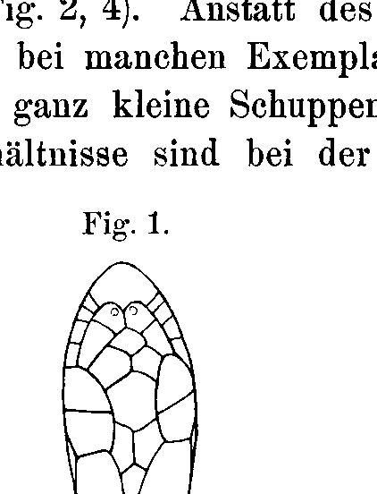
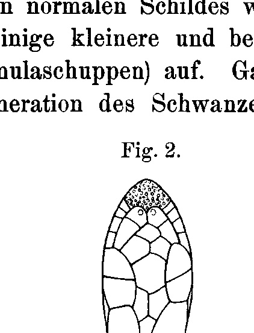
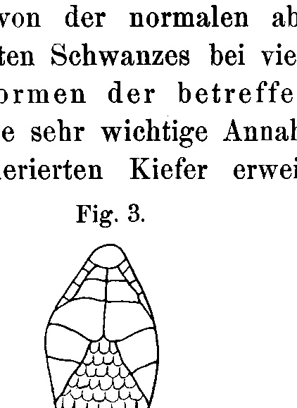
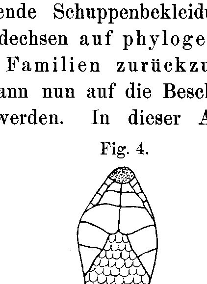

# Regeneration of the Jaws in the Lizard *Lacerta agilis*.

By

**Isaak Werber.**

*(From the Biological Experimental Institute in Vienna.)*

With 4 figures in the text.

Received on 7 December 1904.

*Archiv für Entwicklungsmechanik der Organismen*, vol. 19 (1905).

> **Full translation.** A complete English rendering of the running text of “Regeneration of the Jaws in the Lizard Lacerta agilis” (Isaak Werber, 1905), including all tables, figure and plate legends, and footnotes. Numbers and table cells were transcribed from the page images, not the noisy OCR.

In the great body of factual material available to us concerning the regenerative potencies of animals, several gaps are to be found which — judging from the observations made so far and from the results of the experiments hitherto undertaken — could in many cases easily be filled. For if "the regenerative potencies decrease the further the animal in question is removed from the simple structure of the unicellular organisms" (Fraisse 1885, Nussbaum 1886, Barfurth in the *Ergebnisse*, Loeb 1895/6, Przibram 1899), then every inference from the presence of a certain regenerative capacity in a certain animal to the assumption of the same in one standing lower in the system would have to be regarded as fully justified, in so far as the member in question does not perhaps exhibit a special specialization. Since, however, objections to this have been raised by Lessona, Weismann, and Bordage, who trace the regeneration of a particular member back to the probability of its loss, we may not be content with such inferences alone; we should rather not omit to fill the gaps mentioned, at least in those cases where this does not meet with insurmountable difficulties, as far as possible. Moreover, in many cases it is not solely the fact of regeneration to be established for the sake of which the experiments are worthwhile; it is also the results of the accompanying phenomena, often of far greater interest and significance than the facts of a regeneration taking place in and of itself, that are not to be underestimated.

## Regeneration of the Jaws in the Lizard *Lacerta agilis*. 249

The facts of beak regeneration in birds that have become known in recent years suggested investigating, by way of experiments, whether homologous body parts are able to regenerate in the reptiles, which stand close to the birds. For the experiments, which were first carried out on *Lacerta agilis*, animals of both sexes and of various ages were used, and it turned out that neither the sex nor the age of the animal is of significant influence on the regeneration. Of influence here might be only the nature of the operation performed, namely which parts of the jaw are removed. I performed the operation on some specimens only on the upper jaw, on all the rest on both jaws, because I expected possible differences in the quality and the duration of the eventual regeneration according to whether one or both jaws had been injured — which, however, was not the case. The operation was carried out by means of scissors, which after each cut were drawn through the flame, in order to avoid any possible infection. On all specimens I always removed the same part of the jaws, namely the intermaxillary on the upper jaw and the symphysial on the lower jaw. In doing so, however, I could not take care to cut out the said parts sharply along their boundaries, since the operation had to take place as quickly as possible in order to prevent heavy bleeding. The symphysial (resp. intermaxillary) was thus removed with two straight cuts, so that the removed piece looked like a more or less regular triangle. The animals were anesthetized before the operation with ether, brought after the operation into a glass tub, and, after they had recovered from the state of anesthesia, housed in cages. The cages, turned toward the sun, made of glass panes in iron or wood frames (one wall was of a wire mesh, so that the air in the cage would remain fresh), were bedded with a layer of gravel covered with moss, contained one or more plants and a few stones, under which these animals very gladly creep. The room temperature was +25° C. The animals were fed with larvae of the meal beetle or with houseflies. Quite often the cages were cleaned, in order to prevent the outbreak of an epidemic.

The course of the regeneration process can be seen from the following protocol:

## 250 Isaak Werber

### Series I.

#### A. Operation.

6. V. 1904. On 4 specimens the intermaxillary was cut out from the upper jaw. In one animal the cut was by chance led somewhat too deep, so that with the cut the left nostril too was removed.

#### B. Observations after the operation.

7. V. 1904. A wound scab has formed and the wound is already closed.

16. V. 1904. The gap arising in the jaw through removal of the intermaxillary is becoming ever smaller, the angle-arms of the gap come ever closer together.

21. V. 1904. The angle at the operated site is already very small; the gap on the jaw is disappearing.

26. V. 1904. Molting of one specimen. The gap arising through the operation has completely disappeared, since the intermaxillary is already regenerated. The regeneration is not yet complete; the scaling is still lacking. This animal was preserved in alcohol.

20. VI. 1904. On one specimen, in which during the operation the left nostril was cut away, the regenerate has emerged almost completely on the right side, on the left side however only weakly, but the formation of the nostril is clearly perceptible.

9. VIII. 1904. One specimen with a complete regenerate. In place of the single shield belonging to the removed part, many smaller scales (granular scales) are perceptible.

### Series II.

#### A. Operation.

7. V. 1904. On 12 specimens the symphysial was cut out from the lower jaw and the intermaxillary from the upper jaw.

#### B. Observations after the operation.

8. V. 1904. Wound scab and closure of the wound.

16. V. 1904. The gaps in the jaws arising through removal of the intermaxillary and symphysial are becoming ever smaller, the angle-arms of the gap in the intermaxillary come ever closer together; the lower jaw tapers to a point and grows after.

## Regeneration of the Jaws in the Lizard *Lacerta agilis*. 251

21. V. 1904. The gap on the upper jaw is already very small, the lower jaw has already almost completely regrown.

30. V. 1904. On a small (about 6 cm long) specimen, a regenerate was established on the upper jaw and on the lower jaw. On the regenerate of the lower jaw, which has not yet reached its normal length, one can already see by means of a magnifying glass the regenerated little teeth. The animal was isolated for the purpose of establishing whether the lower jaw will still reach its normal length.

14. VI. 1904. In the specimen isolated on 30. V. 1904, the scaling on the regenerate of the upper jaw is in the process of formation. It is entirely different from the primary scaling; in place of the single shield (Rostrale) belonging to the intermaxillary, several smaller granular scales are to be seen. The lower jaw has grown considerably.

20. VI. 1904. On a pregnant female (which had not yet been pregnant at the time of the operation) it was established: lower jaw completely regenerated, looks exactly like the normal one; upper jaw almost completely regenerated, covered with granular scales in the process of formation in place of the Rostrale.

4. VIII. 1904. Complete regenerates on 3 specimens. The scaling is on both jaws entirely different from the primary: granular scales. All 3 specimens preserved in alcohol.

### Series III.

#### A. Operation.

9. V. 1904. On 4 specimens, the symphysial was cut out from the lower jaw and the intermaxillary from the upper jaw.

#### B. Observations after the operation.

10. V. 1904. Wound scab and closure of the wound.

16. V. 1904. The gaps in the jaws arising through removal of the intermaxillary and symphysial are becoming ever smaller, the angle-arms of the gap in the intermaxillary come ever closer together; the lower jaw tapers to a point and grows after.

21. V. 1904. The gap on the upper jaw is now very small; the lower jaw has regrown considerably.

4. VIII. 1904. One specimen has completely regenerated lower jaw and upper jaw. On both jaws granular scales are perceptible. This animal was preserved in alcohol.

7. VIII. 1904. Likewise.

## 252 Isaak Werber

(Some — about 5–6 — specimens from all series died during the experimental period.)

The operation caused in the animals a very slight bleeding from the wound site, which was checked with ferric-chloride cotton wool. Very young specimens did not bleed at all. The closure of the wound margins took place rapidly, and was always already noticeable one day after the operation. A wound scab formed, after the casting-off of which the gap arising in the jaw through the operation always became smaller; the angle-arms of this gap moved ever closer to one another; the gap filled itself in, until it finally vanished entirely, and in its place a regenerate of the original size of the removed jaw part was to be established. That the somewhat more deeply lying parts are also able to regenerate is evident from the fact that in one specimen, in which the cut was by chance led somewhat more deeply, so that the left nostril too was cut away, this latter was again newly formed and a complete regenerate was achieved.

As regards the histological constitution of the regenerate, it must for the present only be emphasized that on cross-sections of the regenerated jaw parts, instead of bone tissue, typical cartilage tissue is to be established. On account of the unfavorable preservation of the objects examined, the section preparations were unsuited for a more precise investigation. In a forthcoming detailed work on the regeneration conditions in the reptiles, with which I am now occupied, this circumstance shall be taken into account. This interesting relationship, that bone tissue of the jaw is replaced through regeneration by cartilage tissue, and the long-known fact that the regenerated tails of the lizards contain no vertebrae but a cartilage rod (Perrault 1688), might perhaps justify a conjecture that bone substance in the reptiles (or at least in the lizards) is no longer regenerated as such. Yet it does not seem to me entirely excluded that the cartilage tissue of the regenerated tail (and possibly also that of the regenerated jaw parts) is, with increasing age of the regenerate, subject to an ossification — a circumstance that shall also still be taken into account.

Of great interest, too, is the scaling of the regenerate. The intermaxillary is, as is known, covered in the Lacertidae with a shield, namely the Rostrale (Fig. 1). Likewise, on the lower jaw the symphysial is assigned only a single shield (Fig. 3).

## Regeneration of the Jaws in the Lizard *Lacerta agilis*. 253

From this primary scaling that of the regenerate deviates entirely (Fig. 2, 4). Instead of the single normal shield, the regenerate in some specimens displays a few smaller scales and in others very many quite small scales (granular scales). Quite similar conditions are known in the regeneration of the tail of many

**Fig. 1.**  *(figure not reproduced)*

**Fig. 2.**  *(figure not reproduced)*

species of lizard, which, thoroughly investigated by Boulenger (1891), Lydekker, and Werner (1896), gave occasion for the assertion that the scale-covering of the regenerated tail, deviating from the normal, is in many lizards to be traced back to phylogenetically older forms of the families concerned. This very important assumption can now be extended to the scaling of the regenerated jaws. In this assumption

**Fig. 3.**  *(figure not reproduced)*

**Fig. 4.**  *(figure not reproduced)*

I agree entirely with Werner, in whom it is said at another place: "The original character of the head-covering with small scales for the lizards one must acknowledge as correct." The scale-covering of the regenerated jaws in the lizards is thus that which Werner aptly assumes to be the original one, even though this assumption of his rests merely on comparison and not on experimental proofs. The scaling of the regenerated jaws, deviating from the primary, which I

## 254 Isaak Werber

established in *Lacerta agilis*, is thus that of a phylogenetically older form of this family. We have therefore here, in my opinion, to do with an atavism, such as often emerges in the regeneration designated as "hypotypic."

If we now proceed to the solution of the problem posed at the outset, we see that we were able to predict the possibility of a regeneration of the jaw tips in lizards, once the regeneration of analogous body parts had become known in the birds, which stand close to the reptiles yet are more highly developed — on the assumption that the regeneration of an injured or lost body part depends on the level of organization and the age of the animal, but not on the probability of loss of the body part concerned. —

Let us now attempt to apply this same assumption also to the regeneration of the beak in birds. With regard to this latter case (beak regeneration), I should like to point to the expositions of Weismann, against which the present experiment and my observations regarding beak regeneration in the domestic fowl, which I shall discuss further on, might furnish a sufficient counter-proof. Weismann seeks, namely, to prove that the known cases of regeneration of the beak in birds are of an adaptive nature, and that consequently the regeneration in the fully formed animal is not to be referred to a general power of regeneration. And so we find in one of his writings (1899) the following passage:

> "... All this agrees with the principle set up, according to which the regenerative capacity of an animal or part is regulated through adaptation to the liability to loss and to the magnitude of the loss-damage. Against this conception there has so far seemed irreconcilable a case communicated by Kennel, already emphasized by me earlier, of the stork, whose upper beak had by chance broken off in the middle and whose lower beak was thereupon sawn off at the same place, and which regenerated both again completely.

> "That a breaking-off of the beak in birds should occur rather frequently one could at that time not assume, since no further observations about it were known, and so this case formed a difficulty for the theory; it seemed to indicate that the regenerative power of a part does not rest on a special adaptation of it to a high possibility of loss combined with a high biological value of the organ, but rather that it is a general adaptation, a regenerative power of the whole organism, which can come into activity up to a certain degree everywhere, where on the animal in question something is lost, even if this happens quite exceptionally.

> "This apparent contradiction against the adaptation theory of regeneration is now removed by the communications of Bordage, in that he on the island of Bourbon observed that injuries to the beak in cocks, which are used for the cock-fighting popular there, occur frequently and regularly lead to regeneration of the beak. He found that the beak of the cocks was damaged after the fight, but that afterwards a quite complete regeneration took place. The damages occur partly through beak-blows, partly also ›par un terrible coup de patte‹, but extend at most to the terminal third of the one or both jaws, ›ce qui représente, pour la mandibule supérieure le prémaxillaire ou intermaxillaire, os impair résultant de la soudure des intermaxillaires, et pour la mandibule inférieure, la partie triangulaire formée par la soudure des deux maxillaires, à leur extrémité terminale‹. These parts of the beak can be completely broken off, and then there follows a complete regeneration, which produces anew both the bones and the horn-covering of the same. ...

> "... Although these observations relate only to the man-induced fights of the cocks, they nevertheless have a greater significance, as the author rightly indicates. It is known that in numerous birds the males fight with one another at the time of reproduction, whereby naturally the beak forms the chief weapon. Of the storks precisely, Brehm already says that out of jealousy they frequently deliver deadly combats to one another. Thus one will no longer be able to regard Kennel's case as a contradiction against the view of the adaptive nature of regeneration, and thereby falls the sole observation which would give occasion to refer the regeneration in the fully formed animal to a **general** regenerative power."

--on the island of Bourbon observed that injuries to the beak occur frequently in cocks used for the cockfighting popular there, and regularly lead to regeneration of the beak. He found that the beak of the cocks was damaged after the fight, but that afterward a quite complete regeneration took place. The injuries are inflicted partly by beak-blows, partly also "par un terrible coup de patte" [by a terrible blow of the foot], but they extend at most to the terminal third of one or both jaws, "ce qui représente, pour la mandibule supérieure le prémaxillaire ou intermaxillaire, os impair résultant de la soudure des intermaxillaires, et pour la mandibule inférieure, la partie triangulaire formée par la soudure des deux maxillaires, à leur extrémité terminale" [which represents, for the upper jaw the premaxilla or intermaxilla, an unpaired bone resulting from the fusion of the intermaxillae, and for the lower jaw the triangular part formed by the fusion of the two maxillae, at their terminal end]. These portions of the beak can be completely broken off, and then a complete regeneration follows, which produces anew both the bones and the horny covering of the same....

"...Although these observations refer only to the fights of the cocks provoked by man, they nevertheless have a greater significance, as the author rightly indicates. It is known that in numerous birds the males fight with one another at the time of reproduction, in which the beak naturally forms the chief weapon. Precisely of the storks BREHM already says that out of jealousy they frequently deliver deadly combats. Thus one will no longer be able to regard the KENNEL case as a contradiction of the view of the adaptive nature of regeneration, and with that falls away the sole observation that would give occasion to refer regeneration in the fully developed animal to a **general** regenerative force."

As we now see, according to the cited view of WEISMANN the regenerative capacity of the beak in birds is presumably to be traced back to sexual selection and must accordingly belong chiefly to the male. This conclusion was, quite consistently, already drawn by WOLFF:

"The origin of the beak-regenerative capacity is thus traced back to sexual selection. According to the principles of sexual selection, the characters acquired in such jealousy-fights are in general wont to be restricted to the male individuals. The beak-replacement determinants would therefore have to possess a secondary sexual character of the male storks (resp. cocks).¹ But such an inferiority of the female beak as against the male — which a priori is probably not likely — can however be established. We would thus here have for once a selection-theoretical derivation which is, at least to some degree, accessible to empirical control: one would only need to saw off the beak of a hen-stork (resp. hen).¹"

> ¹ Remark of the reviewer [Referent].

Since up to now no such case is known, because experiments of this kind have not been undertaken, I will now point to my observations relating to this (beak regeneration in the hen). During my many-year stay in the country I had very frequently had occasion to notice that, in some especially voracious brood-hens, the beak-tip (on the lower beak and the upper beak) is cut off to a length of about 6—7 mm, in order to prevent them from eating up their own brood-eggs. Hens on which this operation was performed then often had to be fed artificially, until after a period of 3 to 4 weeks they completely regenerated the beak-tips. Unfortunately this phenomenon held for me no further interest at that time, when I made these observations still stemming from my boyhood, and therefore I am today not in a position to be able to indicate exactly the parts of the beak that were regenerated. But once the fact of the regeneration of the beak in female individuals of the fowl must now indeed be regarded as established, then there is surely no ground present for assuming that the regeneration here is restricted to a smaller part than in the male fowl. The same will now hold for all those bird species in which beak-regeneration is known in the male individuals. In his "Lectures on the Theory of Descent," the named researcher, on the occasion of the discussion of the regeneration-phenomena in the animal kingdom, comes back once more to the beak-regeneration of birds. He there speaks once again about the beak-regeneration in the stork and again gives expression to the opinion that we there have to do with a "special adaptation to a high possibility of loss at high biological worth of the organ." He enumerates several bird genera in which the possibility of loss of the beak is a high one, among others also the woodpecker (of which, however, it is admittedly hitherto not known that it regenerates the beak!). Now the question arises: does WEISMANN mean only the male woodpecker, which is supposed to regenerate the beak? That we surely cannot impute to him at all, since the mode of life in the female individual of the woodpecker is exactly the same as that in the male: the female uses the beak for seeking out nourishment in the bark of the trees just as well as the male. Then the possibility of loss of certain beak-parts in the female is thus exactly the same as in the male; consequently the regenerative capacity too would have to be the same. If we were to admit the latter case, then the beak-regenerative capacity in these birds absolutely cannot be traced back to sexual selection. The fact that the hen regenerates the beak just as well as the cock now makes the view of WEISMANN, with respect to those birds whose males fight out battles among themselves, appear just as unjustified: there one can speak neither of a "special adaptation to a high possibility of loss,"¹ and still less are such cases to be traced back to adaptation to consequences of sexual selection; we have here at most to do with a general adaptation, "a regenerative force of the whole organism, which can to a certain degree come into activity everywhere where something is lost on the animal concerned, even should this happen quite exceptionally." For this assumption there speaks also the fact discussed here, hitherto not known at all, of the regeneration of the jaws in the lizards, all the more as it is not known that the same would, in freedom, come into the position of losing certain jaw-parts, and as these animals stand quite close to the birds in the System.

In order not to meet a possible objection that the lizards might possibly possess a greater regenerative force than would be to be expected according to their phyletic position, I also undertook to examine whether the lizards are able to regenerate the extremities or at least parts of the same (toes). But my experiments relating to this yielded a negative result. Toward the middle of June² I amputated, on seven very young specimens, the second-lowest toe on the right hind-leg. The amputation yielded

> ¹ O. HÜBNER comes, in a writing on "Regeneration and its relations to adaptation-phenomena," to speak occasionally of the beak-regeneration in birds, and pronounces himself entirely in the WEISMANNian sense, in that he maintains that the known cases of beak-regeneration are to be conceived as adaptation-phenomena, since "such cases stand in close relation with the life-habits of the animal and with the loss-capacity of the body-part concerned." In this sense he also interprets a case known to him, where a goose, which lacked half the upper beak, did not regenerate the same. Although he himself admits that he cannot indicate with certainty the cause of the defect, he nevertheless draws the conclusion that a regeneration here was not possible, since the injury of the beak in these animals is a rare occurrence. This view can now in no way be regarded as warranted, for the adduced case surely cannot count as proof for this, that the goose cannot regenerate the beak. That in this case the expected regeneration of the upper beak failed to appear is surely to be ascribed only to the possibility of a morbid defect or to some other unfavorable circumstance, such as e.g. the advanced age of the animal, whereby, however, the conception of beak-regeneration in birds as an adaptation-phenomenon is not in the least justified.

> ² Since the results of this experiment were negative, I refrain from adducing the experiment-journal about it.

a very slight bleeding, the wound closed very rapidly and was quite healed within a few days; the stump of the amputated toe, however, was not regenerated and has up to now (middle of November) — that is, after a period of 5 months — remained unchanged. It is surely subject to no further doubt that the lizards are not able to regenerate the extremities.¹

## Literature index.

EGGER, A case of regeneration of an extremity in reptiles. Arb. zool. Inst. Würzburg. Bd. 8. 7. 1888.

HÜBNER, O., New experiments from the domain of regeneration and their relations to adaptation-phenomena. Fischer, Jena 1902.

PRZIBRAM, H., Regeneration in the Crustaceans. Arb. Zool. Inst. Wien. XI. 1899. p. 163.

— Regeneration. Ergeb. der Physiol. 1st year. Bergmann, Wiesbaden 1902.

WEISMANN, AUG., Facts and interpretations in regard to regeneration. Fischer, Jena 1899. p. 5.

— Lectures on the theory of descent. Fischer, Jena 1902.

WERNER, F., On the scale-covering of the regenerated tail in the lizards. Sitz.-Ber. kais. Ak. d. Wissensch. 1896.

— Phylogenetic studies on the homologies and changes of the head-shields in the snakes. Arb. Zool. Inst. Wien. Tom XI. Heft 2. 1899.

WOLFF, G., Developmental-physiological studies. II. Archiv f. Entw.-Mech. Bd. XII. 1901. p. 349.

> ¹ EGGER does indeed give a case where a lizard is said to have been found in the open with a mutilated hind-extremity that exhibited a quite deviant scaling, and he is inclined to address this case as a regeneration of the extremity. This case, however, is rather to be traced back to an injury in the embryonic state, since it is after all quite out of the question that a lizard should be in a condition to regenerate a whole extremity, if not even a toe can be regenerated on the fully developed animal.

## Figures

**Fig. 1.**

**Fig. 2.**

**Fig. 3.**

**Fig. 4.**

---

*Translator's note.* One of the Biologische Versuchsanstalt (Vienna Vivarium) papers flagged on the project site as a modern rediscovery target. Claims are rendered as stated in the original, not endorsed.
