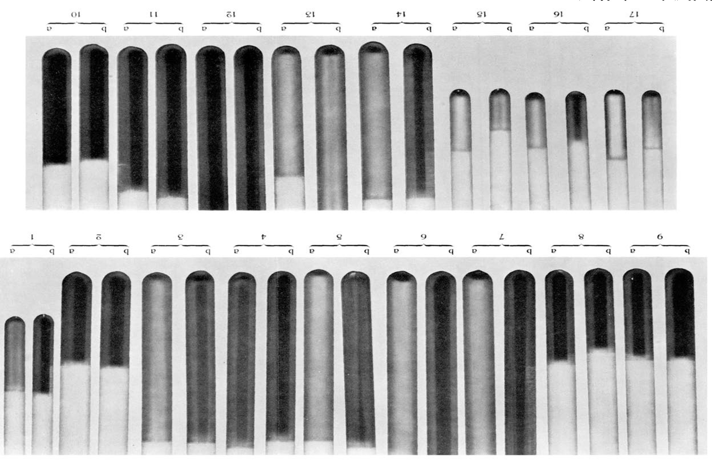
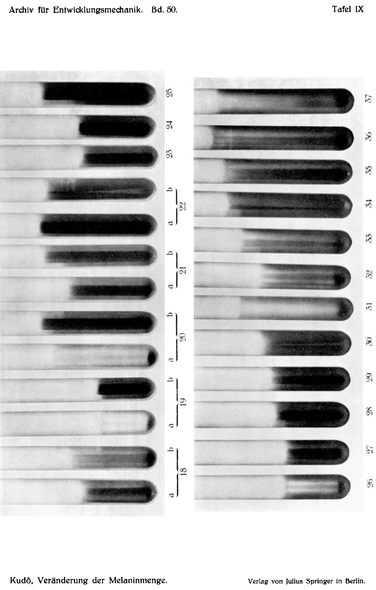
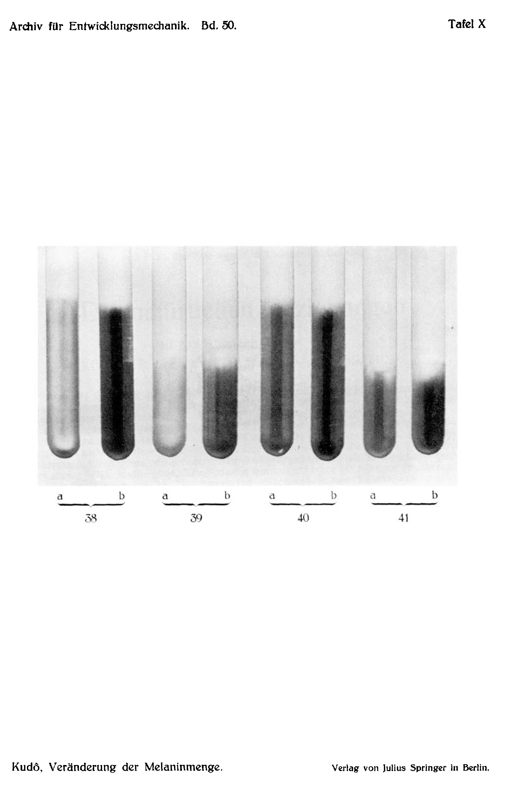

*Archiv für Entwicklungsmechanik der Organismen*, vol. 50 (1922).

> **Full translation.** A complete English rendering of the running text of “Change in the Quantity of Melanin in the Colour Change of Fishes (Esox, etc.)” (Kudo, 1922), including all tables, figure and plate legends, and footnotes. Numbers and table cells were transcribed from the page images, not the noisy OCR.

# Change in the Quantity of Melanin in the Colour Change of the Fishes Esox, Carassius, Phoxinus; Gobius; Nemachilus.

### (At the same time: Causes of tertiary colour adaptation. VIII.)¹

By

Prof. **Tokuyasu Kudō** (Niigata).

(From the Biological Experimental Institute of the Academy of Sciences in Vienna, Zoological Department.)

With 5 text figures.

*(Submitted on 7 July 1921.)*

### Table of Contents.

|  |  | Page |
|---|---|---:|
| I. | Statement of the problem . . . . . . . . . . . . . . . . . . . . . . . . . . . . . . . | 309 |
| II. | Material . . . . . . . . . . . . . . . . . . . . . . . . . . . . . . . . . . . . . . . . . . . . . . | 311 |
| III. | Experiments . . . . . . . . . . . . . . . . . . . . . . . . . . . . . . . . . . . . . . . . . . | 311 |
|  | 1. Production of the blackening . . . . . . . . . . . . . . . . . . . . . . . . . . . | 311 |
|  | 2. Detection of the fish-tyrosinase . . . . . . . . . . . . . . . . . . . . . . . . . . | 317 |
|  | 3. Investigation of the quantity of melanin . . . . . . . . . . . . . . . . . . . | 318 |
| IV. | Summary of the results . . . . . . . . . . . . . . . . . . . . . . . . . . . . . . . . . . | 320 |
| V. | Bibliography . . . . . . . . . . . . . . . . . . . . . . . . . . . . . . . . . . . . . . . . . . . . | 321 |
| VI. | Table from the protocols, at the same time explanation of the plate . . . | 322 |

## I. Statement of the problem.

In the endeavour to clarify experimentally the causes of animal colour-clothing [coloration], Hans Przibram and Leonore Brecher (1919) — as well as earlier the former (1919) — have, supported on the results of these experiments with tyrosinases in the test-tube [Eprouvette], given a theoretical discussion of the modification of animal colouration. According to this discussion, the colour change should rest not merely on expansion or contraction of chromatophores, but rather on the change in colour through formation, or through the disappearance, of pigment respectively. This thesis is, with the recognition of the valuable points of view, in fact brought forward against by Fischel (1914) in several treatises. His arguments rest partly, evidently, on misunderstandings, as when (p. 202) Przibram ascribes to him the view that the branched chromatophores should themselves be merely "precipitation figures of the chromogens," or, from Przibram's interpretation of the eye as a tyrosinase-sink [Tyrosinasesenke], the ab-

> ¹) An extract of this work appeared with the same title as Communication No. 61 from the Biolog. Versuchsanstalt der Akademie der Wissenschaften, Zoologische Abteilung, Vorstand H. Przibram, in the Akadem. Sitzungsanzeiger, Wien, No. 14, 1921.

310    Tokuyasu Kudō: Change in the Quantity of Melanin in the Colour Change

surd-leading conclusion is drawn (p. 205), namely that one would then have to suppose that the more intensively the eye acts as a tyrosinase-sink, the more strongly also its cells would have to be laden with pigment and accordingly would have to expand, the more pigment-poor the melanophores in the whole of the rest of the body would be, whereas according to Przibram (p. 249) the melanin-formation in the eye is to take place in the same sense, only with a head-start [Vorsprung] over the remaining body parts.

On the other hand, Fischel was fully justified, for the states of the chromatophores investigated by him, in rejecting an explanation in the sense of Przibram for the bleached vertebrates, so long as the latter is not in a position to bring forward a compelling proof for the asserted new-formation of the pigment — as, of course, is already touched upon in the case of the arthropods (stick-insect *Dixippus* — Przibram and Brecher 1919, p. 132; Przibram 1919, p. 250). This gap I had now to fill on my visit to the biological Experimental Institute (1920/21), and the statement of the problem had thereby been clearly set before me: "Can one demonstrate, in cold-blooded vertebrates, after such interventions or influences which bring about a blackening of the skin — which is ascribed by the customary conception to the expansion of melanophores — a clear increase of the pigment, or not?" Were no such [increase] demonstrable, then for this animal group at least Przibram's view would lose its justification; but is a clear increase to be ascertained, then it [Przibram's view] gains in probability. There are, in this connection, two possibilities: it could be a question of a division of the melanophores, that is, a new-formation of whole cells, or merely an accumulation of more pigment in already existing cells. For the decision between these alternatives, two experimental methods can be drawn upon, namely first the counting of the number of chromatophores upon an equally large area of the bright and the dark skin, and second the extraction of the pigment from equally large skin pieces. The increase of the melanophores is, as the consequence-state of their "expansion," described in the trout by Karl v. Frisch (1911), in the larva of the fire salamander by Paul Kammerer (1913), [and] in the axolotls by Babák (1913). In the young trout the increase is slight; in the fire salamander it requires a long time.

It is therefore little probable that such interventions, which lead rapidly to a strong colour change, e.g. blackening, are a question of division of cells, when one works in the cold season and only with short time-duration. Could one, then, under these experimental circumstances, with the second method — the der Fische Esox, Carassius, Phoxinus; Gobius; Nemachilus.    311

quantitative determination of the existing quantity of pigment — demonstrate a significant difference, then thereby also the second alternative, the dependence on more pigment or on more cells, would be decided.

I express here to my highly esteemed teacher, Mr. Prof. Dr. H. Przibram, for the statement of the problem and the never-grudging benevolent attention my heartiest thanks. Further I should like, for the support of my work, to express to Fräulein Dr. L. Brecher and to Mr. Dr. P. Kammerer my warmest thanks.

## II. Material.

As experimental objects, fishes were chosen, because according to earlier experiences at the institute, the amphibians and reptiles occurring in the European regions, at sufficient size, do not have a correspondingly pronounced colour change, in order to be able to be drawn with success into the intended melanin determinations. There stood at disposal the following freshwater fishes: 1. Hecht [pike], *Esox lucius*, 2. Karausche [crucian carp], *Carassius carassius*, 3. Elritze or Pfrille [minnow], *Phoxinus laevis*, 4. Gründling [gudgeon], *Gobius fluviatilis*, 5. Bartgrundel [stone loach], *Nemachilus*. The capacity for assuming a darker colouration is known in the *Hecht* [pike] through Mayerhofer (1909), in the Karausche and Elritze through Frisch (1911), in the Bartgrundel through Sečerov (1909). With the Gründling it is little pronounced, and one needed, as I have found, a longer time before it came into appearance. On the normal colouration, as well as on the changes in drawing and colouration of the rest of the body brought about through artificial conditions, one may consult in the cited treatises.

The experiments were carried out during the winter months and the early spring of 1921, during which time a low temperature prevailed in the laboratories and most fish took no food. The fish were kept partly in standing, partly in flowing water, which produced in their behaviour with regard to the blackening no difference.

## III. Experiments.

### 1. Production of the blackening.

For producing the blackening of the fishes I used the following methods:
I. Operative. 1. Blinding through a) optic-nerve transection [Optikusdurchschneidung], b) optic-nerve excision [Optikusexzision], c) eyeball enucleation [Augenenukleation]; 2. Sympathicus-transection [Sympathicusdurchschneidung] a) before the dorsal fin for the purpose of blackening of the anterior [body part], b) behind the dorsal fin for the purpose of blackening of the posterior body part.

312    Tokuyasu Kudō: Change in the Quantity of Melanin in the Colour Change

II. Chemical. 3. Air-exposure, a) of the left or right body halves, b) of the anterior or posterior; 4. Narcotics, a) through injection of alcohol, b) addition of chloroform or ether into the respiratory water.

III. Photic. Keeping a) on black background, b) in darkening.

IV. Killing.

### I. Operative (Dependence of the chromatophores on the nervous system).

Pouchet (1876) established first that the expansion of the chromatophores is governed by the Nervus sympathicus. After transection at particular places of the N. sympathicus he could observe darkening of the body parts innervated by it. Transection of the spinal cord [Rückenmark] behind the dorsal fin had no effect. The experiments were lastly repeated [and] confirmed again by Frisch (1911); the latter established that in the brain of the minnow a centre for the pigment-contraction is located at the front end of the elongated marrow [medulla oblongata]. From the brain the pigment-motoric nerve fibres run as far as the 15th vertebra; here they pass over into the sympathicus. Transection of the Opticus leads with certainty to blackening.

Also I could confirm the earlier-mentioned experiments at Elritze, Karausche, Gründling, Bartgrundel and Hecht, yet I can still deliver some contributions to the question of innervation.

If one transects the spinal cord [Rückenmark] at the same time as the sympathicus, then first the darkening of the area innervated by the sympathicus sets in. But after a time of about 24 hours other phenomena appear: e.g. when we transect the sympathicus and the spinal cord before the dorsal fin, then a blackening of the anterior body half appears. Then (1, 2 and 3 days later) sometimes the whole body blackens. Despite this the animals can remain longer time at life. Indeed, sometimes the darkened anterior body brightens again at such animals, in which the hinder body had remained bright, and that so that after some days the whole body has gradually returned almost to its normal bright colouration. When we transect at the height of the dorsal fin, then the posterior body half darkens; only later, however, the blackening proceeds gradually over also to the anterior body. In such specimens, where thus now the whole body has become black, it comes about that the body half behind the cut subsequently brightens up again. Then a reversal of the colour distribution has thus taken place: a distribution in which at first the forebody was bright and the hinder body dark has now given way to a distribution which leaves the forebody dark and the hinder body bright.

der Fische Esox, Carassius, Phoxinus; Gobius; Nemachilus.    313

The following supposition perhaps offers a clue for the explanation of this remarkable behaviour: the progressing of the darkening onto the anterior body explains itself through progressing degeneration of those nerve fibres by which the chromatophore apparatus is governed; the lastly-occurring brightening of the hinder body, however, would have to be traced back to its dying off (assumption of a corpse-colouration). For when the hinder body, despite transection of spinal cord, sympathicus and blood vessel, remains alive, then its dark colouration also remains maintained, even when the observation period extends up to 1½ months, in which case the blood vessels must have regenerated.

At transection of the spinal cord and sympathicus at and behind the dorsal fin there arises temporarily a bright zone on the otherwise darkened hinder body, indeed there can also a bright zone exist in the middle. Sometimes it comes about that the blackening, after transection of the sympathicus, again recedes, in which case at times black points remain behind. Also it comes about that in the black surface a white field exists.

I should like to give expression, with some reservation, to the supposition that, as in just those cases where a subsequent, more or less complete brightening of previously-blackened body parts takes place (a brightening which at the temporary corpse-colouration is clearly noticeable and is more nearly similar again to the normal colouration), we have to do with a corresponding healing-together of the through-cut sympathicus parts. It is not always with certainty to be judged whether the sympathicus alone has been cut through or the spinal cord co-injured; from control experiments, in which the spinal cord was intentionally likewise cut through (and indeed partly before, partly behind the dorsal fin), it sufficiently emerges that the described results are not essentially influenced by the drawing-in of the spinal cord into the operation.

In the case of Elritzen I cut through the N. opticus or removed a part of it, or extirpated the Bulbus. Blackening set in. After one month I cut through the N. sympathicus, before, through or behind the dorsal fin. As a consequence of this operation either the anterior or the posterior body half became still blacker than they already were through the blinding. After a few days the whole body became dark-black. After simple transection of the N. opticus the colour difference between anterior and posterior body half becomes clearer in the above operation. That too is probably to be traced back to a partial healing-together of the N. opticus. As a counterpart I cut through first the Sympathicus and then the 314    Tokuyasu Kudō: Change in the Quantity of Melanin in the Colour Change

N. opticus, which in the animal, as in the inverted experiment, led to the colour differences and then to the blackening of the whole body. In two Elritzen, treated as last described, a beautiful greenish-golden shimmer stepped forth over the whole body.

If Elritzen, in which the Sympathicus before or behind the dorsal fin was cut through, are set in glass-pans which on the outside are lined with white or with black paper, then this bright, or dark, background has no influence on that half (i.e. soon the anterior, soon the posterior) which has blackened in consequence of the sympathicus-transection. On the other hand, the normally-coloured body half remains accessible to the brightness-effects proceeding from the background: on the white ground that half becomes brighter, on the black ground it becomes more dismal [darker]. Yet this darkening, which appears indeed as an effect of the black floor on the normally-coloured body half, is none so deep as the blackening which appears as an effect of the sympathicus-transection on the other body half. Both body halves, although both are darkened in various degrees, therefore still always stand out clearly from one another. In the white out-lined pan the contrast between blackened and brightened body halves is of course especially great.

If one cuts through in the case of Hechte the N. trigeminus in the Orbita, then, in well-succeeded operations, a darkening sets in of those facial parts which are innervated by the trigeminus. Also in the cases where this darkening had taken place, after some days a return to the normal, bright colouration sets in. In one Hecht I had cut through the ventral orbital wall (the trigeminus together with the tissues and bones enveloping it): after about 15 minutes a blackening of the whole body set in; excepted was only a sharply circumscribed, long-oval place on the anterior dorsal-midline. After many days the whole body brightened up again, but precisely that oval dorsal-spot, which in the first reaction had remained bright, now became black. Only after about two weeks a slight brightening set in also of this subsequently discoloured dorsal zone. In several Elritzen and Karauschen the just-described operation was negative (without reaction).

II. Chemical influencing of the colour-clothing [colour pattern] of the fishes: Frisch (1911) observed that Pfrillen and Karauschen became deep-dark under narcosis with chloral hydrate. The same he also obtained through painting [Bepinselung] with 5% Kokain [cocaine].

With tyrosinase-injection in Elritzen I obtained no unambiguous results. In the first experiments in this regard there showed itself a clear blackening of the whole skin. In later experiments der Fische Esox, Carassius, Phoxinus; Gobius; Nemachilus.    315

I could no longer obtain the same. I have, the first time, injected into the orbital spaces of five Elritzen 2-day-old mushroom-tyrosinase [Halimaschtyrosinase]. After a few minutes all the operated animals were black (four animals died after about one hour, while one such still always lives [lived]). For control I injected physiological common-salt solution [Kochsalzlösung] (three specimens), caustic soda [Natronlauge] [¹/₈₀ normal solution] (three specimens) and ammonium-sulphate solution (three specimens), which were used in the preparation of the tyrosinase, at the same place, and likewise stabbed with the Pravatz syringe through the cornea. The results were, as expected, negative. I repeated the experiments four times with fresh mushroom-tyrosinase, in which case I also injected into the subcutaneous connective tissue, in the head, belly and tail parts, yet without positive results. Some Elritzen did indeed show, at the operated body part, a darkening which was probably caused through injury of the sympathetic nerves at the puncture. In the opinion that mushroom-tyrosinase acts harmfully (the animals died, with one exception, always soon after the operation), I attempted the injection with fish-tyrosinase from Karauschen, Elritzen and Hechten, in which case the animals remained unchanged, but the mortality was much lesser. I draw from this the conclusion that mushroom-tyrosinase, because it indeed was of course not purified of other mushroom-components, acts strongly poisonously on the fish.

In connection with the tyrosinase-ferment, of whose chemical structure we know nothing, I worked with simpler chemical substances, such as acids (HCl) and bases (NaOH) in various quantities and places, yet always without success. — On the other hand, the use of narcotics called forth the blackening of the skin. In the use of alcohol (30—50%) there shows itself, after a few minutes, a strong darkening of certain body parts. After injection into the orbital space the whole body surface darkened, in case of injection into the abdominal cavity especially the abdominal skin parts. After ½ to 1 hour a brightening again set in. The injection of alcohol into the subcutaneous tissue called forth the blackening of the whole body. On letting [the fish] swim in water mixed with alcohol, the blackening of the whole body likewise set in.

Just as alcohol, chloroform and ether act for the darkening of the fish. If one lets Elritzen swim for a few minutes in water mixed with chloroform or ether and brings them again into normal water, the blackening of the whole body sets in gradually, and after some minutes a deep blackening of the whole body showed itself, which after a varying time-span (3 minutes to 1 hour) brightens again. Injection of ether into the subcutaneous tissue did not call forth the darkening of the skin.

Excised pieces of skin that were placed in tyrosinase, tyrosine, physiological common-salt solution, n/80 NaOH solution, water, etc., turned black without distinction. This blackening is, however, to be attributed to the dying-off of the skin.

By keeping [the skin] dry I induced the darkening of the skin. For example, the fish lay with one half of its body on a board washed over by water, while the other side of the body projected out of the water. After about 1 day the half of the body that had been exposed to the air and dried out showed a fairly deep blackening. One can also let the underside of the fish, fixed in its normal position on a board, be washed over by water; the anterior or posterior half of the body was held fast with a cloth padded on the inside with cotton wool, while the other [half] remained dry.

### III. Photic Influencing of the Colour Dress of the Fishes.

I also carried out experiments on the colour changes of the fish species used, under Senebier bell-jars. Once again minnows and gudgeons were used.

In a preliminary experiment, in which I had placed six small, non-operated fishes each under yellow, blue, colourless, and — by means of a dark cover — darkened bell-jars, the two fish species did not behave entirely concordantly — apart from the fact that under the colourless control bell-jar, as was to be expected, neither of the two species departed from its original, normal colour pattern.

The minnows, beginning on the 3rd day, showed under the yellow bell-jar a slight yellowish tone; under the blue bell-jar no change at all resulted compared with the norm (observation period 1 month), although very bright overhead light (admittedly in winter) was available. Under the darkened bell-jar the minnows showed on the 3rd day a slight darkening, except for 2 individuals, which had still retained their initial coloration even then. But beginning from the 4th day the darkening extended to all specimens and had at the same time become a far more advanced one.

The gudgeons turned, and indeed only beginning from the 2nd day of exposure, under the yellow bell-jar slightly toward the yellowish, without the difference compared with the normal coloration being very distinct during the whole month of observation. The stay under the blue, as well as under the dark bell-jar, produced in gudgeons, at least during the one month, no change at all.

After the above-mentioned minnows and gudgeons had been observed for 1 month (3 February – 8 March 1921) without intervention, I performed sympathicus section on three of each of them; in the other three I performed right-sided eye extirpation [extirpations]; after the lapse of 4 days, during which I observed the effects of the one-sided extirpation, the second (left) eye was also extirpated.

The sympathicus section had, as already described above, throughout — even under the coloured bell-jars — the blackenings of those body regions as a consequence which were innervated by the sympathicus. The remaining body regions took on, under the yellow bell-jar, the yellowish tone mentioned earlier from the non-operated fishes. The sympathicus section thus here too hinders the coloured adaptation only in the region which was to be supplied by the severed sympathicus.

Minnows and gudgeons with a one-sidedly extirpated eye show a weak darkening of their whole body, but not so completely that one would not be able to perceive, under the yellow bell-jar, a certain admixture of the pigment formed there. Only the double-sided extirpation of the eyes destroys this approach to coloured adaptation, in that it lets total blackening of the whole body set in.

A further experiment was conducted in such a way that the fishes obtained no opportunity to adapt themselves coloured-wise already before the operation; but this time the operation was the first thing, and then the transfer under the coloured bell-jar followed at once. The result was the same: blackening of regions innervated by the severed sympathicus, yellow coloration of the remaining regions.

Minnows with the dead spawning-coloration on the ventral side lost this coloration entirely after the lapse of one day, if their sympathicus had been severed or if the eyeballs had been extirpated from them. I suspect that such operative interventions probably remove their sexual drive. But these observations, which relate to the passing-away of the spawning coloration, extend only to 2 specimens.

### IV. Killing.

If fishes (minnow, crucian carp) were killed by a blow or in another way, blackening of the whole body first set in, whereupon the post-mortal lightening then followed.

### 2. Demonstration of the Fish-Tyrosinase.

Fish-tyrosinase appears not to have been demonstrated hitherto. I have prepared it following the method of Fürth (1902), H. Przibram and L. Brecher (1919), and indeed obtained it from pike, crucian carp, and minnows. For example, I killed 6 crucian carp (5–10 cm long), quickly de-scaled and stripped off their skin, comminuted it, [and] triturated it with quartz sand and about 5 ccm 0.5% common-salt solution. The whole was put into a straining-cloth and pressed out. This yielded about 3 ccm of pressed-juice. To it an equal amount of saturated ammonium-sulphate solution was added and left to stand until the formation of a precipitate. Hereupon one filters or centrifuges and filters; the residue on the filter is washed once with ½-saturated ammonium-sulphate solution, and hereupon the residue is taken from the filter and dissolved in n/80 caustic soda. The tyrosinase dissolved in caustic soda is at once tested by the assay in which tyrosine is to be transformed into melanin, or this fish-tyrosinase can be sealed off air-free into a little glass tube. The sealed-in fish-tyrosinase is still active after 1 month.

By this method the fish-tyrosinase is not to be obtained in large amounts and is not so active as that of Halimasch [honey fungus, Armillaria]. The fish-tyrosinase discolours the tyrosine into melanin only after 4 days to 1 week. Later the still weak colour becomes darker, yet it does not attain the intense black of the Halimasch assay.

In minnows and pike I made tyrosinase from blinded and from normal animals; whether the tyrosinase had increased in the blinded animals could not always be clearly distinguished. For the quantitative determination of the tyrosinase is difficult to carry out, since too little tyrosinase can be obtained from fishes.

### 3. Investigation of the Quantity of Melanin.

I took fishes as equal in size as possible, quickly removed the skin, cut out equally heavy pieces of a dark and of a normal fish, heated the pieces of skin to 90°, in order to render the tyrosinase inactive, triturated them in 0.5% common-salt solution with quartz sand for about 5 minutes, and pressed out the whole in the straining-cloth. To the pressed-juice I added acid, in order to precipitate the melanin. The colour differences are then easy to recognize in the test-glass. By the addition of hydrochloric acid the differences in minnow, crucian carp, gudgeon, and loach are somewhat blurred; if, on the other hand, the extracts come from pike, then the acid addition has no appreciable influence on the amount of the precipitate and thus on the colour difference of the contents of the test-tubes. An excerpt from the experimental protocol follows in tabular survey (V).

From the protocol it is clearly to be seen that the amount of the melanin in the skin of a blackened fish is in fact greater than in the normal control fish. Further one sees that the results without heating of the piece of skin are uncertain, indeed even reverse themselves.

All pike were blackened by blinding (N. opticus section or partial removal of the N. opticus) and used a long time (28–47 days) after the operation, since the differences thereby become more distinct. In a minnow (Case 12), which had been blackened by eye extirpation and used 54 days after the operation, the difference compared with a control fish (Case 11) is distinct.

In crucian carp (Cases 13–17) I induced, by exposure to the air, the blackening of the right or left side of the body, or only of the upper part of the anterior or posterior half of the body. The method has already been mentioned (see 1. Production of the blackening). Even when the air exposure of the skin lasted only 1–3 days, the results nevertheless remain certain.

The sympathicus section in minnows (Cases 18–22) yields larger quantities of melanin in that half of the body which has blackened after the operation: thus, with section in front of the dorsal fin, more melanin in the anterior [half], with section behind the dorsal fin, more in the rearward half of the body.

The alcohol injections in minnows had, compared with the controls, an increase of the melanin as a consequence; the same was the case when the aquarium water in which the fishes (minnows) were kept was mixed with a little alcohol or ether (Cases 23–28). Killing by blows on the head likewise acts in the sense of an increase of the melanin (in minnows, Cases 29 to 30).

Loaches (*Nemachilus barbatulus*) were kept partly on a black background (in the light), partly under dark covers (thus in the dark). In both cases (Cases 34, 35 and Cases 36, 37) more melanin forms in the test-tube from the skin extraction than when the pieces of skin were obtained from uninfluenced control fishes (Cases 31–33). Here the difference in the fishes kept in the dark was smaller than in the fishes kept in the light but on a black background.

Microscopic investigation of the contents of the test-tubes, which harbour the melanin extracts, lets pigment granules be recognized which are in Brownian molecular movement. Among the smallest granules, which form the main mass, there are also found isolated larger granules. In these respects the extracts taken from the most diverse experimental cultures show no constant differences: the size of the granules and the relative frequency of the smallest and the larger ones always remains the same, whether the extract has been obtained from darkened or from light fish skin. What matters, therefore, is the density, hence the quantitative distribution of the pigment granules, not the size of the individual granules. The various fish species used, too (loach, minnow, gudgeon, pike, crucian carp), behave almost alike in this respect, as far as the observations hitherto allow one to recognize.

In any case, nowhere are star-shaped or branched forms visible, which would allow one to conclude a remaining-over of "expanded" chromatophores and thus a defect in the method employed. Therefore the difference in the size of the granules cannot be traced back to expansion or contraction either.

I have observed the increase of melanin formation both in the blackened fishes and in the normal ones, on the occasion of the preparation of fish-tyrosinase. The residue left behind in the filter paper during the filtering-off of tyrosinase was put into n/80 caustic soda. Thereupon, in the test-tube which still contains traces of the tyrosinase, a black-coloured precipitate resulted, which was considerably stronger when the tyrosinase had been obtained from doubly-blinded fishes than when it came from sighted fishes (as experimental fishes there served 1 pike, 1 crucian carp, 1 minnow each).

### IV. Summary.

1. Pressed-juices from the skin of fishes (Esox, Carassius, Phoxinus, Gobius, Nemachilus) blacken in the air.

2. By Fürth's method an active tyrosinase can be prepared from them, which blackens tyrosine in the test-tube.

3. Accordingly, the dark pigment of the fishes can be regarded as a melanin arisen by a fermentative route.

4. In order to decide the question whether the increase of the black coloration after blinding or otherwise various, equally-acting circumstances rests not merely on an expansion of the melanophores, but on a real increase of the quantity of melanin, normally-light and artificially-blackened fishes were investigated with respect to the melanin content of analogous pieces of skin.

5. It showed itself, upon extraction of the melanin from pressed-juices which, for the purpose of avoiding subsequent blackening in the air, had first been heated to 90° C and then precipitated by means of acid addition, that without exception the dark skins or skin areas yielded stronger, often very much stronger, melanin separation than lighter ones.

6. Artificial blackening of the fishes was produced in various ways, namely, firstly the blackening of the whole body by blinding, black background, keeping in the dark, narcosis, and killing; secondly, of parts of the body by means of sympathicus section or partial air exposure.

7. The precaution of heating proved itself justified, since in the case of a control carried out without heating, rather the reverse behaviour showed itself.

8. For the assumption of the dark coloration, according to these experiences, the expansion of the chromatophores alone cannot be decisive, but it must be a matter of the increase of the quantity of melanin itself.

9. Given the shortness of the experimental duration and the low temperature, it is little probable that in this the chromatophores themselves multiply by division, but it is likely to be in the main a matter of an increase of the melanin in the already-existing cells.

10. Neither in the extracts of the light-coloured nor of the blackened fishes are star-shaped or branched granules to be seen which would allow one to conclude a remaining-over of chromatophores in the expansion state. The extracts are distinguishable neither by size nor form, but merely by the density of the granules; in every extract there are present rounded granules of melanin of various size, the smaller of which show Brownian molecular movements.

### V. List of Literature.

Babák, E., Über den Einfluß des Lichtes auf die Vermehrung der Hautchromatophoren. Pflügers Arch. f. d. ges. Physiol., CXLIX, 462, 1913. — Fischel, A., Beiträge zur Biologie der Pigmentzelle. Anat. Hefte, 174, 1919. — Ders., Ursachen tierischer Farbkleidung. Arch. f. Entw.-Mech., XLVI, 202, 1920. — von Frisch, K., Beiträge zur Physiologie der Pigmentzellen in der Fischhaut. Pflügers Arch., CXXXVIII, 319, 1911. — Fürth, O., u. Schneider, H., Über tierische Tyrosinasen und ihre Beziehungen zur Pigmentbildung. Hofmeisters Beiträge zur chem. Physiol., I, 229, 1902. — Kammerer, P., Vererbung erzwungener Farbveränderungen IV. Arch. f. Entw.-Mech., XXXVI, Heft 1/2, 4, 1913. — Mayerhofer, F., Farbenwechselversuche am Hechte (Esox lucius L.) Arch. f. Entw.-Mech., XXVIII, 546, 1909. — Przibram, H., u. Leonore Brecher, Ursachen tierischer Farbkleidung. I. Vorversuche an Extrakten. Arch. f. Entw.-Mech., XLV, 83, 1919. — Dies., II., Theorie. Arch. f. Entw.-Mech., XLV, 199, 1919. — Przibram u. Dembowski, Konservierung der Tyrosinase durch Luftabschluß (zugleich: Ursachen tierischer Farbkleidung III.) Arch. f. Entw.-Mech., XLV, 260, 1919. — Przibram u. Leonore Brecher, Die Farbmodifikationen der Stabheuschrecke, Dixippus morosus Br. et Redt. (zugleich: Ursachen tierischer Farbkleidung VI). Akadem. Anz., Nr. 14, 1920. — Secerov, S., Farbwechselversuche an der Bartgrundel. Arch. f. Entw.-Mech., XXXIII, 629, 1909.

Archiv für Entwicklungsmechanik Bd. 50. 21

### VI. Table from the Protocols, at the same time Plate Explanation.

(The numbers in the table correspond to the numbers on the plates. The illustrations are direct exposures onto developing-paper, without negative.)

| Fishes | Treatment | Result | Date |
|---|---|---|---|
| **Case 1.** a) Normal pike, b) blinded pike. 28 days before, N. opticus partially removed | Piece of skin: 2.0 g, heated 10 sec to 90°, 0.5% NaCl-soln.: 15 ccm, pressed-juice: 10 ccm, 5% HCl: 2 ccm, 10% HCl: 1.0 ccm | distinct difference a) lighter, b) darker | 2 March |
| **Case 2.** a) Normal pike, b) blinded pike. 37 days before, N. opticus partially removed | Piece of skin: 1.62 g, heated 15 sec to 90°, 0.5% NaCl-soln.: 3 ccm, pressed-juice: 1.5 ccm, 10% HCl: 1.0 ccm | [same bracket as Case 1:] distinct difference a) lighter, b) darker | 11 March |
| **Case 3.** a) Normal pike, b) blinded pike. 46 days before, N. opticus section | Piece of skin: 1.65 g, heated 20 sec to 90°, 0.5% NaCl-solution: 5.0 ccm, pressed-juice: 3.0 ccm, 10% HCl: 1.0 ccm [this Treatment block is bracketed jointly to Case 3 and Case 4] | fairly distinct difference a) somewhat lighter, b) somewhat darker | 29 March |
| **Case 4.** a) Normal pike, b) blinded pike. 46 days before, N. opticus section | [same Treatment block as Case 3] | distinct difference a) lighter, b) darker | 29 March |
| **Case 5.** a) Normal pike | Piece of skin: 1 g, heated 15 sec to 90°, 0.5% NaCl-solution: 5 ccm, pressed-juice: 3.5 ccm, 10% HCl: 2.0 ccm [this Treatment block is bracketed jointly to Cases 5, 6, and 7] | distinct difference a) lighter, b) darker | 30 March |
| **Case 6.** b) blinded pike. 47 days before, N. opticus partially removed | [same Treatment block as Case 5] | [same bracket as Case 5] | |
| **Case 7.** a) Normal pike, b) blinded pike. 47 days before, N. opticus section | [same Treatment block as Case 5] | [same bracket as Case 5] | |
| **Case 8.** a) Normal pike, b) blinded pike. 37 days before, N. opticus section | The pieces of skin of the left half of the body: 1.0 g, heated 15 sec to 90°, 0.5% NaCl-soln.: 3.0 ccm, pressed-juice: 2.0 ccm, 10% HCl: 1.3 ccm | not very distinct difference a) lighter, b) darker | 10 March |

[Table continues on p. 323 with Cases 9 ff. — outside the present page range.]

## VI. Table from the protocols, at the same time explanation of the plates *(continued)*

| Fische [Fishes] | Behandlung [Treatment] | Resultat [Result] | Datum [Date] |
|---|---|---|---|
| **Case 9.** a) Normal pike like Case 8, b) blinded pike like Case 8 | The skin pieces of the right halves of the body: 1.0 g. Without heating. Otherwise treatment like Case 8 | rather distinct difference: a) lighter, b) darker | 10 March |
| **Case 10.** a) Normal pike, b) blinded pike. 33 days before, section of the N. opticus | Skin piece: 1.25 g, control: **without heating**, 0.5% NaCl solution: 5 ccm, expressed sap: 2.5 ccm, 10% HCl: 2.0 ccm | quite reversed: a) darker, b) lighter | 8 March |
| **Case 11.** a) Normal Elritze [minnow] | Skin piece: 0.7 g, 20 sec. heated at 90°, 0.5% NaCl solution: 4.0 ccm, expressed sap: 2.0 ccm, 10% HCl: 1.5 ccm | distinct difference: a) lighter, b) darker | (8 March) |
| **Case 12.** b) blinded Elritze. 54 days before, both eyes extirpated | *(treatment grouped with Case 11 above)* | *(grouped with Case 11)* | |
| **Case 13.** Karausche [crucian carp]. a) Left half of the body: normally light, b) right half of the body: exposed to the air for 2 days and coloured dark | Skin piece: 0.7 g, 20 sec. heated at 90°, 0.5% NaCl solution: 5.5 ccm, expressed sap: 2.5 ccm, 10% HCl: 1.5 ccm | distinct difference: a) lighter, b) darker | 31 March |
| **Case 14.** Karausche. a) Left half of the body: normally light, b) right half of the body: exposed to the air for 3 days and coloured dark | Skin piece: 0.7 g, 15 sec. heated at 90°, 0.5% NaCl solution: 4 ccm, expressed sap: 2.0 ccm, 10% HCl: 1.5 ccm | *(grouped with Case 13)* | |
| **Case 15, 16.** Karausche. a) Upper part of the posterior half of the body: normally light, b) upper part of the anterior half of the body, exposed to the air for 1 day: coloured dark | Skin piece: 0.5 g, 0.5% NaCl solution: 5 ccm, expressed sap: 1.0 ccm, 5% HCl: 0.5 ccm | **Case 15.** difference somewhat indistinct: a) somewhat lighter, b) somewhat darker | 9 April |
| **Case 17.** Karausche. a) Upper part of the anterior half of the body: normally light, b) upper part of the posterior half of the body, exposed to the air for 2 days: coloured dark | *(treatment grouped above)* | **Case 16.** Distinct difference: a) lighter, b) darker. **Case 17.** Rather distinct difference: a) lighter, b) darker | |
| Fische [Fishes] | Behandlung [Treatment] | Resultat [Result] | Datum [Date] |
|---|---|---|---|
| **Case 18.** Elritze [minnow] (normal). a) Anterior body, b) posterior body. | *(no treatment cell; result column applies)* | no difference between a) and b) | |
| **Case 19–21.** Elritze. By section of the Sympathicus behind the dorsal fin. a) Anterior body: normally light, b) posterior body: coloured dark. In Case 19 operated 51 days before, in Cases 20 and 21 40 days before. | Skin piece: 0.07 g, 10 sec. heated at 90°, 0.5% NaCl solution: 3 ccm, expressed sap: 2 ccm, HCl: 1.0 ccm | for Cases 19, 20 and 21 little distinct difference: a) somewhat lighter, b) somewhat darker | 26 April |
| **Case 22.** Elritze. By section of the Sympathicus in front of the dorsal fin. a) Anterior body: coloured dark, b) posterior body: normally light | *(grouped above)* | distinct difference: a) darker, b) lighter | |
| **Case 23.** Elritze (normal) | Skin piece: 0.3 g, 13 sec. heated at 90°, 0.5% NaCl solution: 3.0 ccm, expressed sap: 2.0 ccm, HCl: 1.0 ccm | distinct difference: **Case 23:** lighter, **Case 24, 25:** darker | 26 April |
| **Case 24.** Elritze. Injection of 50% alcohol into the subcutaneous tissue. Killed after 30 min. | *(grouped with Case 23 above)* | *(grouped above)* | |
| **Case 25.** Elritze. Swimming in alcohol-water | *(grouped above)* | *(grouped above)* | |
| **Case 26.** Elritze (normal) | Skin piece: 0.15 g, otherwise treatment likewise as Case 23 | distinct difference: **Case 26:** lighter, **Case 27–30:** darker | 26 April |
| **Case 27, 28.** Elritze. Swimming in ether-water | *(grouped with Case 26 above)* | *(grouped above)* | |
| **Case 29, 30.** Elritze. Fish killed by a blow. After 45 minutes the blackened skin pulled off | *(grouped above)* | *(grouped above)* | |
| Fische [Fishes] | Behandlung [Treatment] | Resultat [Result] | Datum [Date] |
|---|---|---|---|
| **Case 31–33.** Bartgrundel [stone loach] (normal) | Skin piece: 0.3 g, 0.5% NaCl solution: 3.0 ccm, expressed sap: 2.0 ccm, 5% HCl: 1.0 ccm | little distinct difference: **Case 31–33:** lighter; **34, 35:** darker | 26 April |
| **Case 34, 35.** Bartgrundel. Kept on a black background | *(grouped with Case 31–33 above)* | less difference: **Case 31:** lighter, **Case 36 and 37:** darker | |
| **Case 36, 37.** Bartgrundel. Kept under a dark cover | *(grouped above)* | *(grouped above)* | |
| **Case 38.** Pike | a) treated melanin suspension of the normal ones from Case 1–9 mixed together, b) treated melanin suspension of the blinded ones from Case 1–9 mixed together | distinct difference: a) lighter, b) darker | 7 May |
| **Case 39.** Karauschen [crucian carps] | a) treated melanin suspension of the normal ones from Case 13–17 mixed together, b) treated melanin suspension of the dark-coloured ones from Case 13–17 mixed together | *(grouped, distinct difference: a) lighter, b) darker)* | |
| **Case 40.** Elritzen [minnows] | a) treated melanin suspension of the normal ones from Case 11–12, 18–23 and 26 mixed together, b) treated melanin suspension of the dark-coloured ones from Case 11, 12, 18–22, 25 and 28 mixed together | *(grouped above)* | |
| **Case 41.** Bartgrundel [stone loach] | a) treated melanin suspension of the normal ones from Case 31–33 mixed together, b) treated melanin suspension of the dark-coloured ones from Case 34 to 36 mixed together | *(grouped above)* | | *Archiv für Entwicklungsmechanik. Bd. 50.* — **Tafel VIII** [Plate VIII]

**Figs. 1–17.** Photographs of the test tubes containing the melanin suspensions, corresponding to Cases 1–17 of the table above. Each figure pair is labelled **a** and **b** (a = the lighter / normal specimen, b = the darker specimen). Upper row: figures 9, 8, 7, 6, 5, 4, 3, 2, 1 (each with tubes b and a). Lower row: figures 17, 16, 15, 14, 13, 12, 11, 10 (each with tubes b and a). At the foot: *Kudó, Veränderung der Melaninmenge* [Kudó, Change in the Quantity of Melanin]. — *Verlag von Julius Springer in Berlin* [Published by Julius Springer in Berlin].  *(figure not reproduced)* *Archiv für Entwicklungsmechanik. Bd. 50.* — **Tafel IX** [Plate IX]

**Figs. 18–37.** Photographs of the test tubes containing the melanin suspensions, corresponding to Cases 18–37 of the table above. Upper row: figures 18, 19, 20, 21, 22 (each with tubes a and b), then figures 23, 24, 25 (single tubes). Lower row: figures 26, 27, 28, 29, 30, 31, 32, 33, 34, 35, 36, 37 (single tubes). At the foot: *Kudó, Veränderung der Melaninmenge* [Kudó, Change in the Quantity of Melanin]. — *Verlag von Julius Springer in Berlin* [Published by Julius Springer in Berlin].  *(figure not reproduced)* *Archiv für Entwicklungsmechanik. Bd. 50.* — **Tafel X** [Plate X]

**Figs. 38–41.** Photographs of the test tubes containing the melanin suspensions, corresponding to Cases 38–41 of the table above. Each figure has two tubes labelled **a** and **b**: figure 38 (a, b), figure 39 (a, b), figure 40 (a, b), figure 41 (a, b). At the foot: *Kudó, Veränderung der Melaninmenge* [Kudó, Change in the Quantity of Melanin]. — *Verlag von Julius Springer in Berlin* [Published by Julius Springer in Berlin].  *(figure not reproduced)*

## Figures

**Plate VIII.**

**Plate IX.**

**Plate X.**

---

*Translator's note.* One of the Biologische Versuchsanstalt (Vienna Vivarium) papers flagged on the project site as a modern rediscovery target. Claims are rendered as stated in the original, not endorsed.
