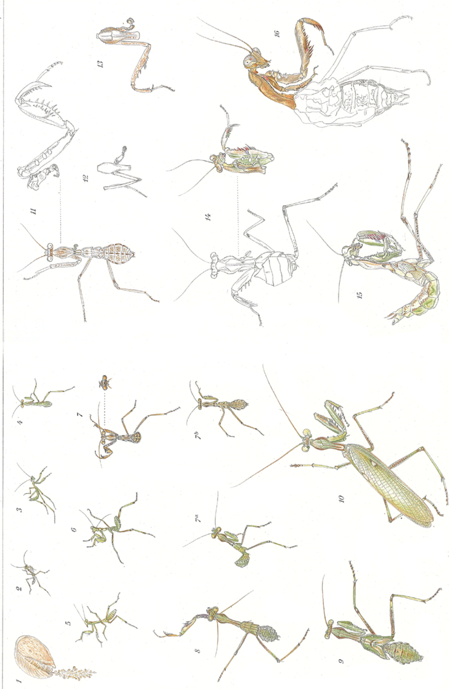
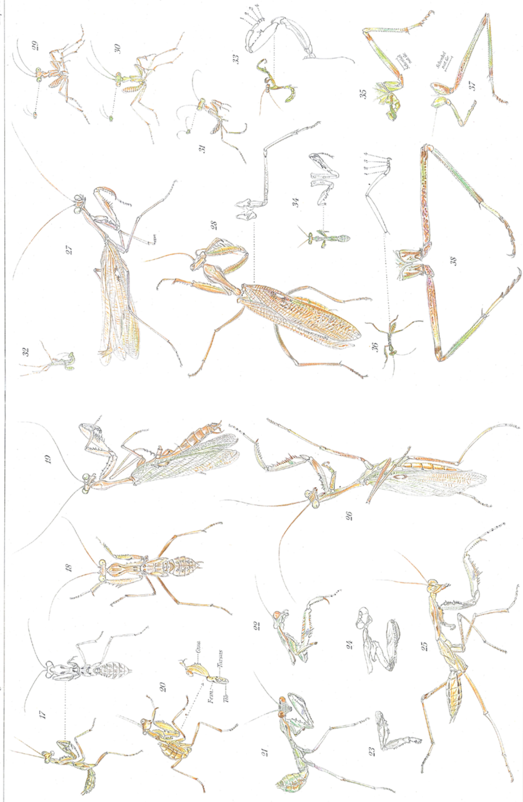
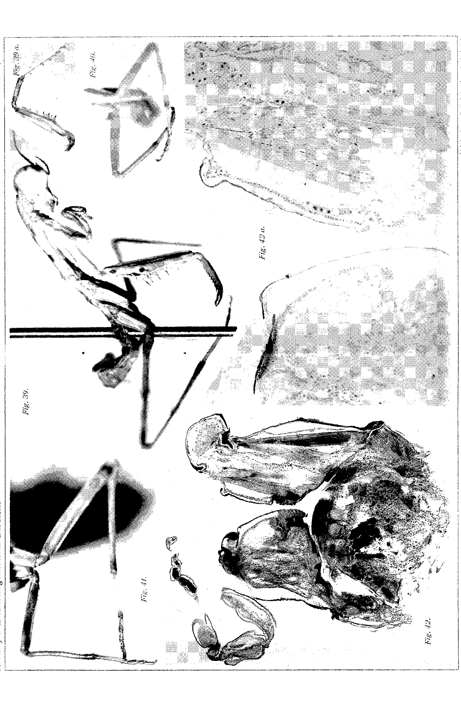
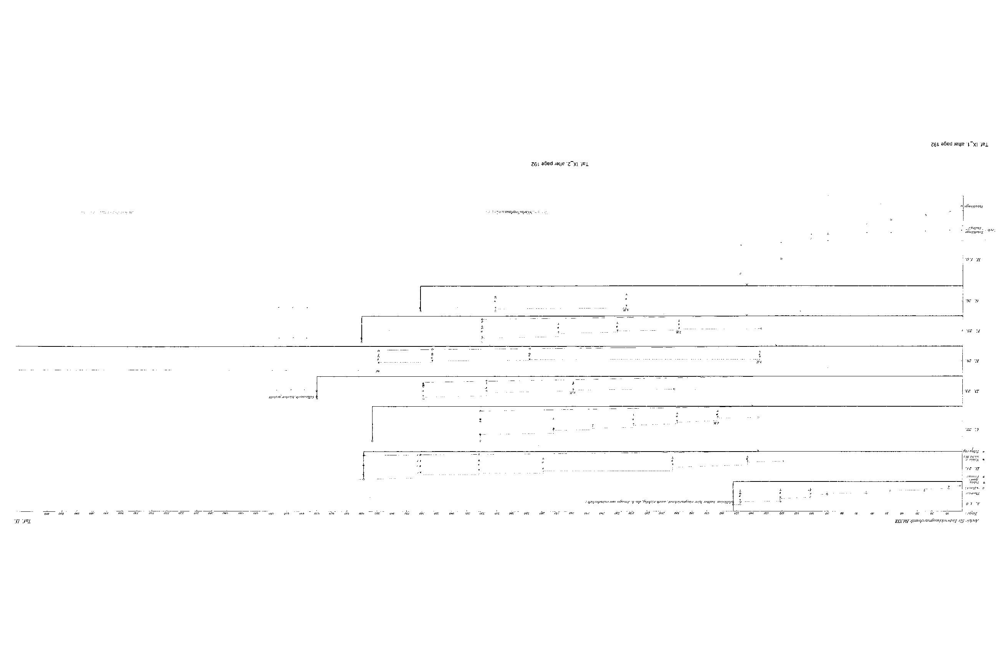

# Rearing, Colour Change and Regeneration of an Egyptian Praying Mantis (*Sphodromantis bioculata* Burm.)

By

**Hans Przibram,**

Privatdozent at the University of Vienna

(including some regeneration experiments by stud. phil. Isaak Werber).

(From the Biological Experimental Institute in Vienna.)

With Plates VI—IX.

Received on 24 May 1906.

*Archiv für Entwicklungsmechanik der Organismen*, vol. 22 (1906).

> **Full translation.** A complete English rendering of the running text of “Rearing, Colour Change and Regeneration of an Egyptian Praying Mantis (Sphodromantis)” (Grosser/Przibram, 1906), including all tables, figure and plate legends, and footnotes. Numbers and table cells were transcribed from the page images, not the noisy OCR.

### Table of Contents:

|  | | Page |
|---|---|---|
| I. | Material Procurement and Statement of the Problem | 149 |
| II. | Rearing | 152 |
| III. | Experiments on the Causes of Colouration | 161 |
| IV. | Regeneration Experiments | 170 |
| V. | Morphallactic Processes and their Histology | 177 |
| VI. | Measurements of Growth and Regeneration Rate | 181 |
| VII. | A Case of Partial Neoteny? | 187 |
| VIII. | Summary of the Principal Results | 190 |
| IX. | List of Literature | 191 |
| X. | Explanation of the Figures | 193 |

## I. Material Procurement and Statement of the Problem.

In the winter of 1903/4 several members of the Biological Experimental Institute in Vienna undertook a journey to Egypt and the Sudan, whose main purpose lay in obtaining living animal and plant material that, otherwise difficult to procure, might prove favourable for experiments.²

> ¹ Whoever is interested in the results of this journey, possibly as preparation for an excursion into these regions, will find them compiled in P. Kammerer, Eine Naturforscherfahrt durch Ägypten und den Sudan [A Naturalist's Journey through Egypt and the Sudan]. Braunschweig, Zickfeldt, 1906.

Through the support of the Imperial-Royal Austro-Hungarian Ministries of the Exterior, of the I.-R. Austrian Ministry of Education, of the numerous I.-R. Austro-Hungarian consular authorities, as well as of certain other corporations and private persons, to whom on this occasion I should like to express our warmest thanks, it was possible to bring back a series of interesting living experimental subjects and to cultivate them further here.

Among the animals (we had directed our attention only to the invertebrates and the lower vertebrates) one mantid in particular, the two-spotted praying mantis, proved to be a fortunate catch for biological experiments. Undemanding in nourishment and accustomed to the great temperature fluctuations of the desert region, it also readily lays [its eggs] even in captivity, and the eggs, kept safe in their dense cocoon, are still less sensitive than those of our native *Mantis religiosa*. While the possibility of rearing a foreign mantid¹ offered in itself a considerable interest, which was further heightened by surprises concerning the number of moults, it was actually two questions of a special kind that made this object appear valuable to me.

Firstly, the said praying mantis belongs to those forms which are caught now in green, now in brown specimens — which colourations have long been brought into relation, as "protective colouration," with the predominant natural colours: the green of the vegetation and the brown of the earth and of the wood. I had long ago set myself the task of testing experimentally whether the green colouration in many Orthoptera is fixed as something quite peculiar to the animal-plasm, or whether it can be induced through external factors such as light, chlorophyll-nourishment, and the like.

There has indeed, as is well known, been put forward a great number of hypotheses concerning the coming-about of the useful protective colouration; now a colour-photographic process (Wiener, 1895) was supposed to be the cause, now the colouring substances of the nourishment (Poulton, 1885, 1893; Maria Gräfin Linden, 1899), now "natural selection," which in Darwin's sense leads to the "survival of the fittest" (Weismann, 1876), indeed even a functional adaptation of Lamarckian kind (Piepers, 1903) may furnish the cause, in that the habit of seeing particular colours, thus a kind of "looking-out" [Verschauen], would be decisive.

The second question that engaged my interest in a general respect was that concerning the regeneration of the first (anterior) leg, or "raptorial leg" [Fangbein]. Bordage (1899) was able, namely, to establish in two African *Mantis* species (*Mantis prasina* and *pustulata*) only the regeneration of the tarsus on this extremity, whereas farther proximally no replacement was achieved, but rather all the animals perished. He believes that this is unavoidable, because the animals could catch nothing. In accordance with his views one would then have to assume that the more far-reaching regeneration is not developed at all, since it could not have been bred up from surviving injured individuals.¹ The regeneration experiments I had entrusted to Herr stud. phil. Isaak Werber, who took them up with commendable patience, but was later, owing to absence from Vienna precisely during the critical period, prevented from completing them. So I then carried these experiments further myself as well, in order not to forfeit the most interesting results, and also preferred to incorporate into the present report, with his consent, the results already obtained by Werber, so as not to disturb the consistent structure of the work.

The designation of our species is, according to Werner (p. 52), *Sphodromantis* (Stål) *bioculata* Burm. The genus is also called *Hierodula*.

In December and January this mantis was still found about on tamarisks and on acacias overgrown with climbing plants.²

> ¹ Against the extreme views of Bordage even Weismann himself takes a stand, in his "Tatsachen und Auslegungen der Regeneration" [Facts and Interpretations of Regeneration]. Anat. Anz. XV. 1899. In not every species, [he holds,] is regeneration newly arisen in connection with autotomy, but rather often inherited from ancestors, autotomy being the secondary phenomenon.

> ² Werner (1905) writes on p. 10: "In Egypt only a few species appear to have a definite time in the year in which imagines occur without larvae. Of most species I found, for example in July and August, larvae of various ages alongside the imagines, and of only a few indeed larvae but no imagines, or vice versa. Most striking is the simultaneity in: *Lapidura riparia* (simultaneously eggs, larvae of various stages, imagines), *Sphodromantis* (simultaneously freshly hatched as well as older larvae up to the last moult, imagines)."

Both green and brown specimens were captured in both sexes, often on the same day. A predominance of the one colour on a correspondingly coloured locality, or a preference of the animals to keep on objects coloured in agreement [with themselves], or to flee to such, could not be observed.¹ The first captured pair consisted of a green female and a brown male, which was making for the former.

Repeatedly egg-packets [oothecae] were found deposited on twigs, as also such deposited by the captured females during the journey onto the lid of the zinc-sheet cages in which they were kept isolated.

## II. Rearing.

Five egg-packets, whose deposition had taken place from the end of December to the beginning of February, hatched in Vienna between 16 April and 11 May 1904, by no means in the order of deposition (cf. Table 1).

In spring (and in the following winter) the rooms in which the praying mantises were housed were heated to about 25° C.; in summer there was no heating, so that now a somewhat lower, now a somewhat higher temperature prevailed.

Necessary for good thriving is a certain measure of moisture, which they receive in their homeland through the nocturnal dew — very heavy, as we were able to convince ourselves — and which must be replaced for them as well as for their egg-cocoons in the room by daily (single) spraying with a fine water-atomizer. As nourishment, on the journey mealworms (which we had brought along from Europe) had been used for the old animals. For the hatching little animals these are unusable on account of their size and hardness; aphids, on the contrary, furnish a suitable food (probably the natural one).²

> ¹ Werner (1905) writes on p. 53: "The assumption that the brown specimens of *Hierodula* or of any other mantid occurring in green and brown form are supposed to occur on dry, withered [plants], the green ones on the contrary on fresh, green plants, I have found, after many years of observation, to be completely unwarranted. Both forms occur side by side in all mantids of the palaearctic region that I was able to observe in the wild, under exactly the same conditions of life."

> ² As this [the mealworm] was used by Burmeister for the Argentine mantid, and as is often depicted for our native *Mantis*.

Since the metamorphosis of *Sphodromantis bioculata* is presumably not [yet] described, the first of the hatching packets was therefore at first used for a control culture. To what extent this same one later also served for other experiments may be seen from Table 2. The remaining packets were from the outset placed in the service of experiments, on which Tables 1 and 2 provide information.

### 1st Stage.

All egg-packets were found already hatched in the early morning, and it appears that the light-stimulus normally acts as the trigger for the moment of hatching. As a rule, namely, all the young had already crawled out by the time of the inspection, only once did it succeed to surprise the first little animals during the crawling-out (cf. Egg-packet III, Table 1). It was then done, when only three little animals had left the eggs, that the cage with the whole packet was placed in darkness. This had the consequence that only on the second-next day a further specimen hatched, on the 4th day thereafter two more, on the 6th day twelve more, and then seven more at various intervals from the 9th to the 14th day.

In doing so some [eggs] may have dried up without hatching, since the number of 25 young is a disproportionately small one: up to 160 eggs were counted in one packet (for data cf. Table 1). Immediately upon hatching the larvae cast off their first skin, so that the same is still found — mostly on a long cord, the rachis of the egg-packet — hanging on the cocoon (Fig. 1 Taf. VI). The first larval stage thus actually lasts only a moment, provided the larvae are not artificially (through darkness) hindered from leaving the cocoon. The colouration of the first skin is almost the same light brown as that of the cocoon. Its actual length is hard to give, owing to the shrivelled state after the moult of the larvae. A single one [Eifach] is about 7 mm long, 1—1½ mm broad (measured after the hatching of the little animals).

### 2nd Stage.

*(Fig. 2 Taf. VI.)*

The larva hatched from its first larval skin, which finds itself in the second, locomotory¹ stage, is an exceedingly

> ¹ The first stage is, to be sure, locomotory only in so far as it is, through the developing second stage, brought out of the cocoon (as a skin) along [with it].

agile creature of about 7 mm total length (reckoned from the frontal line connecting the eyes to the hind-body tip), of which about 3 mm fall to the neck-shield (Thorax).

Apart from wings, sexual characters and colouration, it already shows approximately the features of the imago.

The general colour (which for us, on account of the experiments coming into question, is of particular importance) was, in all hatched larvae (also of the remaining egg-packets),¹ a light Siena-brown: only the eyes, the middle of the femora, the tibiae [Schienen] and of the first tarsal segment on the middle and hind leg-pairs are pale yellow-green.

The little animals at once show negative geotaxis, which drives them up to the lid of the cage or up onto little flower-stocks or twigs placed inside. If these are infested with aphids, the larvae at once fall upon the aphids, in that they snatch them with the blow of a fore- or raptorial leg, and, clamped between the little teeth of the femur and the tibia, lead them to the mouth. Any wings [of the aphids] are not eaten along with [the rest].

As soon as the animals had begun to feed, a gradual green-colouration followed, whereby first the forehead and the fore-legs came in for it.

That it is not, say, the bare lapse of time, but the intake of nourishment, that is decisive for this colour change, a later experiment showed (Egg-packet III, Partie γ on Table 1): if, of larvae of the same egg-packet, the one [group] were fed, the others left without nourishment under otherwise like conditions (in particular, spraying!), then the latter did not take on the green-colouration up to their death (which possibly only occurred on the 25th day after entry into the first stage) (Fig. 29); whereas the nourished ones on the same day exhibited an almost complete green-colouration (Fig. 30 Taf. VII).

In doing so these animals all had an extraordinarily prolonged 1st stage, since they belonged to the discussed dark-culture: all the more clearly is the coincidence of the greening with the intake of nourishment to be seen. In the control culture hatched in the light, the second (plus the first!) stage lasted only nine days in the most rapidly developing individual; in the dark-cultures (with nourishment, Partie β) the first stage (in

> ¹ [Namely] of those [eggs] collected by us and laid by our *Sphodromantis*-females. Nevertheless there are also *Sph. bioculata* which hatch out green.

the egg held back!) lasted 6, the second 39 days, and only during the second stage (after the light-animals had already begun the next moult) did the complete greening set in.

That, on the other hand, the kind of nourishment is indifferent, will only emerge from the experiments on colour change.

Our larva of the 2nd stage grows under stretching of its skin and finally hangs itself, with the head downward, on a horizontal leaf or on the cage-lid (if the latter does not consist of smooth material), spread out with the two hind leg-pairs, and awaits the entry of the 2nd moult (Fig. 32 Taf. VII).

### 3rd Stage.

*(Fig. 3 Taf. VI.)*

The skin finally bursts along the middle suture of the thoracic shield, and the animal at first, clinging with the two hind leg-pairs, draws the head and the raptorial legs out of the skin-sheaths; then it hooks itself with the fore-legs either into the skin (or, especially in the later moults, onto the leaf or the cage-lid) and frees the hind-body, which at first hangs limply down, and finally the two hind leg-pairs out of their casings.

The total length of the stripped-off skin amounts to about 8 mm, that of the hatched animal of the 3rd stage about 10½ mm, of which about 4½ fall to the neck-shield.

The form is not strongly altered; in the colouration the green has emerged still more strongly, so that only a stripe between the eyes, most of the joints and a marking on the thorax have remained brown: to this is now added, however, an expansion of the brownish colour onto the upper eye-half, which on the preceding stage can already gradually come to appearance (cf. Fig. 30 Taf. VII).

The third stage probably already always lasts somewhat longer than the second does normally, about 14—16 days at the minimum.

### 4th—6th Stage.

*(Fig. 4—6 Taf. VI.)*

Concerning the 3rd—5th moults, which lead to the 4th—6th stages, nothing new is to be remarked. These stages are all very similar in form and colour, and at most the gradual sharpening of the brown thoracic marking can, [resembling] one of the bar-

[The final paragraph runs onto page 8 (outside the owned range) and is left unfinished here, as it began on page 7.]

## 7. Stage.
### (Fig. 7 *a* and *b* Pl. VI).

The 7th stage of the control rearing brought the first surprise: one specimen, which had previously been brown and was now captured anew at the window, projecting strikingly upward in size and form of the 7th stage, had a brown colouring!

The larvae that had at the same time remained in the control rearing were, on the other hand — although many had likewise entered the 7th stage — green coloured. The identity of the stages was recognizable not only by the size (about 25½ mm total length, 8½ mm thorax length) and the general habitus, but namely also by the fact that in this stage the wing-rudiments of both wing-pairs, lying one behind the other, had for the first time become visibly slightly projecting over the sides of the respective body-segments. For the rest, the colouring of the brown individuals copied all the drawings, which in the green showed the green rust-brown, in a dark grey: these are the lateral framings of the thorax, the frontal stripe and the upper half of the eye, the femora, a narrow ring before the tibial joint excepted, some drawings on the raptorial leg and on the hind body.

From the 7th stage onward, brown specimens later appeared in various cultures; this phenomenon can only be approached more closely and an interpretation attempted after presentation of the experiments concerning light, food and so forth. The 7th stage lasted sometimes only 11 days, and reached a total length of 25½ mm (thorax 8½ mm).

## 8. Stage.
### (Fig. 8 Pl. VI).

After surviving the 7th moult, the first specimen that had become green again displayed a back-colouring to green, while the remaining specimens (of the control rearing) had stayed green up to the 8th stage. Yet individual specimens displayed a number of different colours, the listing of which, given their variability, I consider superfluous; in the illustration the colouring of the individual, which had been brown and was now again becoming green, is reproduced.

The 8th stage lasted in this case about a month, reached a length of 28½ mm, the thorax one of 12½ mm; the wing-rudiments covered the respective body-segments, but did not yet project beyond one another; the cerci stood out clearly as pincer-shaped curved little pegs (these can already be visible in the 7th stage).

> ¹ As will be shown later, the number of moults is not constant, hence the measurements also do not always agree.

## 9. Stage.
### (Fig. 9 Pl. VI).

The 9th stage of the control-rearing animals, which were the first to complete their metamorphosis, must be addressed as a nymph or mobile pupa. The wing-rudiments no longer lie merely one behind the other, but the first pair already projects over the second toward the rear, drawn out at the sides into a long lappet. The colour of the wing-covers is, in contrast to the translucent light-green wings, dark-green, and the eye-spot responsible for the species characteristic appears in white colour, dark-bordered toward the front.

For the rest, the colouring behaves no differently than in the preceding and the following imago-stage.

The total length of the 9th stage was about 42 mm, the length of the thorax 13½ mm. The animal persisted in it about 17 days; in the last period it ceased eating — as food for the later stages predominantly flies were used, which the praying mantises, just like the plant-lice [aphids], know how to seize by a stroke of the raptorial leg.

## 10. Stage.
### (Fig. 10 Pl. VI).

On 11 September 1904 the first imago appeared, a male. Whereas the hind body in the earlier stages showed a broadly rhomboid form, it had now taken on the long-cylindrical form characteristic of the male of the mantids. The male copulatory apparatus, with the copulatory spine¹ curved from right to left, was well developed. The attempt

> ¹ The copulation, egg-laying and other biological observations on *Sphodromantis* and our native *Mantis religiosa* will be described in a later work.

to use the male for the impregnation of a female of our *Mantis religiosa* unfortunately failed because of the wildness of the latter.

A secondary sexual characteristic also yields here the greater length of the male's antennae and the generally more slender habitus. The wings are short after hatching, rolled up, and only later (similar to those of the butterflies) become, with wing-like movements, stretched out, finally crossed and folded together over the hind body. They then projected (in the depicted specimen) by 16 mm over the hind body; the total length of the animal was (this overhang deducted) 52 mm, the length of the neck-shield 15½ mm. The colours, through the opalescing tones of the wings and the multicoloured and beautifully patterned ornamentation of the raptorial legs, offer a magnificent impression. The colouring was in general a bluish green, eyes, coxae and tibiae of the raptorial legs yellowish-green, the other extremities likewise, but the tarsi from the end-part of the basal joint onward brown; the tibia-femur joint with brown rings, the femur brown-speckled; reddish-brown furthermore the framing and median line of the neck-shield, paler the antennae with exception of the base, the forehead between the eyes, the bordering of the outer wing-cover margin; almost white are the tarsi of the raptorial leg (at their ends, however, with one dark spot each), three raised pustules on the front margin of the coxa, and the dark-bordered eye-spot, lying sideways at the end of the first third of the wing-cover femora; the inner seam of the raptorial-leg femur is orange-coloured, interrupted by a blue band-spot in the direction of the longest grasping-teeth.

While the described specimen succumbed already 4 days after hatching from the nymph to the injuries inflicted by the female *Mantis religiosa*, other animals of the same egg-packet lived as imago up to 80 days (♂, cf. Table 2, experiment-animals Nos. 23, 25, 26). Despite the great longevity, it was nevertheless not possible to achieve a copulation of the *Hieroduli*, and there seems to have been present in the males a degeneration of the sexual glands. They showed altogether no copulatory drive. The females behaved here differently, but since at the time of their hatching no males of our *Mantis religiosa* were any longer alive, no hybridization either could be attempted. Thus the hope of rearing a second generation in captivity vanished for this time.

## More Stages.

One might have believed that, with the successful rearing of the Egyptian praying mantis up to the first imago-stages hatching, the number of stages was established and that the further animals would exhibit the same number of stages. Here, however, came the second surprise¹: those animals which did not complete their metamorphosis before the winter of 1904/5 — whatever the grounds for this may have been, of various nature — adopted over the winter an extraordinarily slowed growth-tempo, moulted at much longer, sometimes 2-month-long, intervals, and hatched only in the spring or summer months of the year 1905, in that here new (1–2) moults inserted themselves before the attainment of the imago-state! (cf. the Tables). It may also be mentioned that the size of the late-hatched imagos went beyond that of the early-hatched ones.

As far as the delay of growth in the winter months is concerned, this is indeed for our latitudes a well-known phenomenon, which is to be brought into connection with the cold. With the *Hierodula*, however, the temperature was rather higher than in summer (because of the heating). One might think of a »mnemic« phenomenon in the sense of SEMON, only this »remembrance« does not hold for the homeland of the *Hierodula*, since precisely in the winter months the sexually mature imagos drive about there. The direct influence of the weaker winter light is, according to the experiments to be discussed later with dark cultures and cultures in differently coloured light, likewise hardly to be ascribed any delay².

Probably the strong delay of growth, as well as the increase of the moult-number, is connected with the operations,

> ¹ Since the writing of this section, data on the variability of the moult-number in caterpillars have become known to me; cf. PICTET, 1905, p. 103, and KELLOGG, 1903, p. 747. In other insect-groups with long larval period not very strong fluctuations have been established according to F. HENNEGUY (1904, p. 497).

> ² Here it could also be mentioned that caterpillars reared from eggs of the same *Aretia caja* (Bärenspinner [garden tiger moth]) grew and developed significantly faster in the dark than in the light. In the same butterfly there occur, in one clutch, eggs which, cultivated in the warm room, develop into imagos still before the winter, while the others overwinter as caterpillars: unfortunately I have neglected to control the moult-number in both, so that new experiments are necessary.

which were undertaken for the purpose of regeneration experiments and for which in September all specimens not yet transformed had to be drawn upon, since only one such specimen had at all remained alive: should this interpretation be confirmed, then it would seem to reconcile the apparently contradictory data of NEWPORT, that caterpillars after strong operative interventions undertake the normal transformations more slowly, and of DEWITZ and GODELMANN, that operations bring about an acceleration of the moults (in *Ephemera*- and *Bacillus*-larvae respectively): in that indeed a moult sets in faster than normal, but the transformation could nevertheless be delayed by the insertion of further moults or of larger pauses.

In the Crustaceans (Decapods) ZELENY has unambiguously demonstrated that operated crabs moult faster than non-operated ones, and that the moulting-speed further increases with the degree of amputation of limbs, with which a correspondingly faster regeneration goes hand in hand¹). Since, however, in the Crustaceans no such sharply determined final stage occurs as the imago of the insects, but they rather continue to moult long beyond sexual maturity, it could so far not be determined whether the moults are inserted into the normal number, or whether merely faster-occurring moults follow the operations. In the insects the means are given to us to decide this, and it would surely be a worthwhile task to subject the findings, made on the *Hierodula* only incidentally and therefore without the necessary controls, to a suitable object for re-examination. Until then I should like to have the given interpretations accepted only with caution.

From the more occasional findings of the rearing we may now turn to the deliberately arranged experiments which were to ascertain the causes of the green or brown colouring of the praying mantis.

> ¹ Contrary to my earlier, negative findings on *Mysis* (Erg. der Physiol. p. 111) I can, according to new records made occasionally on still unpublished regeneration experiments on *Calianassa* and *Alpheus*, confirm ZELENY's findings! With this, however, it is by no means yet said that this must behave so in all animals and under all conditions.

## III. Experiments concerning the Causes of Colouring.

The arrangement of the experiment-series for the decision of the question whether the green colouring is inducible by external factors can be seen from Table 1. Expressly examined were the factors: light and darkness, colour of the incident light (Egg-packet II), chlorophyll-free (Egg-packet III) and etiolin-containing food (Egg-packet IV), colour of the reflected light (»surroundings«, Egg-packet V). The selection of these factors took place according to definite questions, while with regard to other factors (temperature, humidity, mechanical agents) no experiment-series specifically aimed at them were set up; a few experiments on electric stimulation were carried out on animals of the control-rearing. The results of the experiments nevertheless permit us to give an account of all these factors.

The first question ran: »Is the appearance of the green colouring in the praying mantises bound to the presence of light, as is mostly the case with the plant-chlorophyll?«

For the examination of this question the larvae of the II. Egg-packet were distributed, shortly after hatching, into eight equal parties of one small tin cage each, and fed with plant-lice [aphids]. These were offered to the one party (*β*) without plant-parts, to all the others (*α*) on the infested green plants. Party *α* and Party *β* were exposed to the normal daylight, while the remaining parties were covered with cardboard caps. Into the upper and front (light-facing) side a red, or respectively yellow, green, blue or violet glass-pane was inserted in the following parties, while the last party was kept completely darkened.

The comparison of parties *α* and *β* was indeed to disperse from the outset, on account of the structure of the body of the hatching larvae, the improbable misgiving that these might perhaps at first also nourish themselves on plant-food and condition their colouring directly by chlorophyll-grains. I did not, however, consider it superfluous to set up this experiment as well, because data of an initial plant-nourishment in *Mantis* had come to my ears. The rearing in the small metal cages turned out unfavourably. The individuals kept under yellow and green light, as well as those exposed without plant-parts to the daylight (Party *β*), did not reach the 1st moult; of the animals exposed to the daylight with plant-parts and those in the red light, several got beyond the 1st moult, which however was strongly delayed, of those kept in darkness beyond the 2nd moult, of those kept in violet light beyond the 3rd, finally one single specimen in blue light beyond the 4th moult (and developed up to the imago). All individuals had, as soon as they at all reached the respective normally green-becoming stage, adopted the green colouring, so namely also those in darkness. The direct uptake of chlorophyll-grains could still not be refuted by this experiment-series, because all animals of the party exposed to the daylight without plant-protection had perished before reaching the respective stage.

The later experiments, in which all precautions against the uptake of chlorophyll were taken, are occasionally to be discussed; the influence of the food makes the assumption of an initial plant-nourishment and its influence upon the green-colouring appear as altogether untenable. The perishing of the various parties in the tin cages goes back to the effect of too great a heating: this explains the premature dying-off, where plants were lacking, behind which the larvae could shield themselves from the direct heat-rays, in the yellow and green light, as well as in the red (the fact that here a somewhat more favourable result, despite the predominance of the heat-rays, may have rested upon the lesser permeability of the employed red panes for light-intensity), whereas the more favourable effect with heat-ray-screening violet and blue light, as well as in the dark, where however the stronger total heating of the inner space may have contributed unfavourably. That darkness in and of itself (the already discussed delay of hatching deducted) exerts no destructive influence upon the rearing, will be proven by the successful dark-cultures (from Egg-packet III and V) to be discussed later.

The answer to the first question can therefore be formulated: »The appearance of the green colouring in the praying mantises is not bound to the presence of light.«

Second question: »Is the appearance of the green colouring in the praying mantises bound to the uptake of chlorophyll-containing nourishment?«

The responsibility of chlorophyll for the green-colouring, already taken into consideration by POULTON for certain caterpillars, has more recently, through MARIA Countess LINDEN, in consequence of chemical investigations, been extended not only to the green colours of the Orthopterans, but even also to the differently-coloured wing-tones of the butterfly (*Vanessa urticae*) arising from chlorophyll-eating caterpillars. It must therefore be worthwhile to test experimentally to what extent the food is of influence upon the green-colouring of the brown-born praying mantises.

It seemed worthwhile, therefore, to test experimentally to what extent nutrition has an influence on the green colouration of the brown-born praying mantises [Gottesanbeterinnen].

Apparently the setting up of the experiment is made easier in the case of our subject by the fact that it takes animal food, not plant food.

Now, with this it is admittedly certain that no directly fresh, unaltered chlorophyll grains are taken up. Since, however, one could think not only of the unaltered use [of chlorophyll], but in particular of the reconstruction — assumed by Countess Linden — of the chlorophyll out of the breakdown stages formed during its digestion and resorption, the ordinary meat fare, namely aphids [Blattläuse], was suspect, since these animals belong precisely to those which are supposed to use the chlorophyll of plants for their own colouration [cf. Macchiati¹) on *Siphonophora malvae* Morley and *S. rosae* Koch], and a reconstruction could be claimed both after passage through the digestive tract of the aphids and through that of the mantis.

I therefore directed my attention to finding out an unsuspect food and tried a series of nutritional means which, without being chlorophyll-bearing, could be taken by the larvae. First I tried liquid food, which was offered on little pieces of sponge, since I had observed that the young larvae eagerly sucked up water from such. Meat extract, however, given in this form, was nevertheless spurned, and the larvae used all preferred to die rather than to have touched the sponges. By contrast, cane-sugar solution [Rohrzuckerlösung] had success in so far as it was readily sucked up by the larvae and, as was shown by the starvation experiment carried out on larvae of the same egg-packet (III), saved them thereby from death by starvation. Yet the little animals became feeble, so that further speedy remedy had to be sought. Fly maggots reared from carrion were spurned, probably on account of their penetrating smell (or taste?), for the larvae turned directly away from them; at small entomostracans (little mussel-shrimps and the like), which were still wriggling on wet filter-paper, the

> ¹) Macchiati seeks to counter the objection that this is not a matter of animal chlorophyll, but of the ingested plant chlorophyll, by pointing out that it is also present in those aphids which live on the coloured petals of flowers.

larvae did indeed strike, but could not grasp them. Finally there proved to be a suitable food in the moth-midge (*Psychoda*), whose larvae live in the dark and in carrion and which, even when caught in a cellar, presumably take no green plant food either; they also possess no green-coloured parts. Just like the aphids, these midges were snatched by the praying mantises even in the dark and devoured with the exception of the wings.

The larvae of the III egg-packet employed were divided into three parts for the experiments; the first (α) was kept in the light, the two others were left in the dark. Part β was otherwise reared analogously to the light culture, while γ was drawn upon for the starvation experiment already discussed. The renewed parallel experiment with the dark culture was intended to serve so that, in case chlorophyll should come to light despite all caution, this could be demonstrated, through its absence in the dark culture, as a substance behaving analogously to chlorophyll. This precaution proved to be justified, in so far as, while still under the pure cane-sugar nutrition, the animals of the light culture α first began to turn greenish at the forehead, and the greening steadily increased after receipt of the midge fare, and indeed first at the forelegs; even before the 2nd moult the hindbody [Hinterleib] had also become green; after the 2nd moult the animals were a beautiful blue-green and retained this colour through four further moults (only one specimen survived the 6th moult). Quite the same, however, was now also the case with the dark culture β: here too there appeared a greening that was finally just as complete as in the individuals kept in the light or on normal fare.

We therefore come to the answer of the second question: "The appearance of the green colouration in the praying mantises is not bound to the uptake of chlorophyll-bearing nutrition."

Third Question: "Is it possible, by employing etiolin in place of chlorophyll, to modify the greening of the praying mantises?"

Poulton (1893) achieved, on caterpillars of *Tryphaena pronuba*, which he fed (in the dark) instead of with cabbage leaves with the chlorophyll-free etiolated yellow cabbage leaves, brown or green colouration. Although, given the dispensability of all plant nutrition for the praying mantises, the dispensability of etiolin was thereby also implied, nevertheless the substitution of chlorophyll by etiolin was tested, so that complete parallels to Poulton's experiments would be drawn. If it is already difficult to obtain really chlorophyll-free fodder from plants, this difficulty was increased still further by the fact that the praying mantises took only animal fare (apart from the insufficient and etiolin-free cane-sugar solution). The substitution of chlorophyll by etiolin could therefore be undertaken only in such a way that aphids reared on etiolated plants were set before [them]; such [aphids] were found on plants which were grown from bulbs in a dark cistern of the Biological Experimental Institute for botanical purposes. Their colouration, in contrast to the green of the aphids kept in the light, was a pale yellow, apparently corresponding to etiolin. Since, however, these "etiolated" aphids could be obtained only in relatively small quantity, the praying mantises fed on them — cultivated, of course, in the dark in order to prevent later chlorophyll formation (egg-packet IV) — eked out a wretched existence. None managed to survive the 2nd moult; nevertheless the greening did begin at the forehead in the longest-surviving individuals (Fig. 31 Pl. VII).

Now it cannot be concealed, however, that completely green aphids were later also found on etiolated plants, so that it is indeed quite doubtful whether the pale colour has anything to do with etiolin, or even whether the green colour has anything to do with chlorophyll. The decision must first be reserved for the chemical investigation.

Since, however, only that which was chlorophyll or etiolin could be altered under our experimental conditions, there results, as a cautious answer to our third question: "The employment of etiolin in place of chlorophyll is not able to prevent the greening of the praying mantises."

Fourth Question: "Can the colour of the surroundings (the kind of light reflected from the surroundings) exert a modifying influence on the normal colouration of the praying mantises?"

The inhabitants of the last egg-packet (V) were, for the answering of the previously raised question, brought partly upon hatching into the [coloured cages], in order to heighten as far as possible any sensitivity to reflected light. After in all of them the 2nd moult had taken place with the assumption of the thoroughly green colouration, the half of the specimens (20) were reared on further as controls in the dark, while the others were brought, two at a time, into coloured cages. These consisted of wooden boxes, which on the inside, with the exception of one side and the upper surface, were lined with coloured paper. The one side was spanned with colourless organtin, which provided the ventilation; the side turned toward the light and the upper surface were fitted with colourless glass panes. On the upper surface there was set up, in addition, a board inclined at 45°, which, being lined on the underside with the same colour as the box concerned, could also reflect the light falling in through the upper surface, coloured, into the box. So as not to disturb the uniform surrounding colour, the green leaves were for the most part removed from the plants offered with the aphids, and as climbing aids for the young larvae little wooden sticks coloured the same as the box were used; these latter were, to be sure, scarcely necessary, since the animals soon learned to climb upward on the organtin and even on the smooth paper.

Ten different colours of the paper were employed: red, brown, orange, yellow, green, blue, violet, white, grey and black. Although in many boxes two further moults were observed (the animals were then preserved for other purposes), nowhere could a deviation be noticed from the green colouration, which in all the inhabitants of the egg-packet concerned had a somewhat yellowish tinge.

The assumption of the colours of their natural surroundings has, apart from in some caterpillars themselves, been observed namely at the pupation of the same (Lit.: Poulton). One might therefore be inclined to believe that, despite the lacking influence of the surrounding colours during the larval stage, perhaps the nymphal stage or the hatching imago of the Hierodulae would direct its raiment [Gewandung] according to the surroundings.

But this too may be regarded as highly improbable, in consequence of the forced rearing up to the imago in the dark, in blue transmitted light, and in the light in various surroundings (now [with], now [without] plants), since no corresponding regularity in the colour could be discerned.

"The colour of the surroundings, just like the normal colouration of the praying mantises, is thus unable to exert a modifying influence."

Fifth Question: "Are electrical or tactile stimuli able to call forth, in the praying mantises, a rapidly running colour change?"

The failure of all attempts to artificially induce a colouration in the praying mantises, on the one hand, and the spontaneous appearance of a colour change on the other, prompted me to consider whether perhaps, as is known for reptiles, amphibians, fishes and cephalopods, the colour change might be a physiological function and not a morphological change. To test this, green and brown specimens of the larvae were irritated by means of the Steinach induction-apparatus. The electrodes were thereby applied to various places, and the strength of the irritation was carried on up to motionlessness or even the death of the animals, but without the slightest change in the colouration being able to be noticed.

Since, for tree-frogs [Laubfrösche], according to Steinach, tactile stimuli of the surroundings are supposed to be decisive for the brown or green colouration, in that they assume the former colour on rough surfaces (hence also earth, bark, etc.), whereas they are green on smooth surfaces (hence also on green leaves, sticking to glass, etc.), it may here be pointed out that such an agreement could not be observed in the Hierodulae, although the housing of the various parts in cages of the most varied material, etc. (cf. Table 1) would have permitted this to be ascertained (incidentally, the phenomenon by no means occurs regularly in the tree-frog).

"Electrical or tactile stimuli are not able to call forth, in the praying mantises, a rapidly running colour change."

Sixth Question: "Can the various colourations of the praying mantises be derived from one of the hitherto known rules of heredity?"

If, in the case of the various colours of the praying mantises, we are dealing neither with a morphological change inducible by external factors, nor with a physiological reflex-act rapidly setting in upon irritation, then the alternative remains open that it is a matter of a series of colour-stages fixed from the outset for each individual, which has been handed down through "heredity".

In particular, the adherents of the neo-Darwinian school will have held this from the outset to be the most probable. But if we follow the course of the colour transformations in individual specimens, then quite considerable difficulties arise in the application of the rules of heredity known to us.

First of all, it is not a matter of a case such as, for example, in the hawk-moth caterpillars investigated by Weismann, where from a definite stage onward either a brown colouration sets in or the green colouration remains preserved, but rather it can also come to a second reconversion of the colour; furthermore, the later complete rearing of praying mantises (continued in connection with the regeneration experiments, cf. Table 2) has yielded the remarkable fact that such a change of colour can also take place even in the imago (Experiments No. 23, 26). Here, then, we are dealing not only with various-coloured stages, but also with changes after attainment of the definitive form.

Can we derive these modes of the colour change according to the hitherto known rules of heredity? Let us assume that originally there were green and brown praying mantises present, and that these cross with one another. If we apply the Galtonian rule of heredity, then either a uniform mixture (as for instance olive-brown specimens) will establish itself in the descendants ("regression", Pearson¹), or each descendant receives in some parts of the body characters of the one, in others of the other ancestor (thus for instance green and brown "piebalds"), or finally each descendant looks "exclusively similar" only to one ancestor ("exclusive or alternative heredity"). In the latter case, green and brown individuals would always arise again, as they are predominantly encountered in nature. In none of these cases, however, can our colour change be ranged! If we consider further the particular Mendelian rules of heredity, which to be sure should probably not be applicable at all to individuals of the same race, then these would all the more result in a falling-apart into purely brown and purely green specimens (eventually after the predominance of a hybrid generation). The assumption of a "mutation", finally, is contradicted by the whole nature of the colour change, which — as may here be expressly emphasised once more — proceeds mostly quite gradually: for it is indeed

> ¹) A brief compilation of the hitherto known rules of heredity I have attempted in my "Introduction to Experimental Morphology". Vienna, Deuticke, 1904 (12th chapter).

to be recognised neither in the larvae hatching out nor in any way how often they will later change colour, nor does another characteristic appear to be co-altered at the same time. If we wish to hold fast to the heredity of the phenomenon, then we must either make the supposition that, besides green and brown ones, there were always also such individuals which one after another are green and brown in various alternation, or else that there is a mode of heredity in which the young at various times (and indeed not bound, say, to definite stages) "appear similar" now to one ancestor, now to the other.

While an exclusion of the first alternative cannot strictly be given without extensive, almost impossible heredity experiments, the acceptance of which, however, would amount to a complete renunciation of any clarification, I am in a position to adduce, for the second alternative, an analogous case in which likewise a "successive" heredity of characters of the parents took place, namely in the eye-colour of young cats¹). Hitherto, however, to my knowledge, such a "change of the hereditary characters" has not yet been taken into consideration as a modality of heredity, on which account I must give, as the answer to our sixth question: "The various colourations of the praying mantises cannot be derived from one of the hitherto known rules of heredity."

Seventh Question: "Does the colour change observed in the praying mantises offer advantages for the operation of a 'natural selection'?"

By Cesnola a preliminary report on experiments on *Mantis religiosa* in Naples has been published, which establishes experimentally the favourable effect of the green or brown colour, according to the predominant colour of the background. When green and brown *Mantis* were tied up on green or brown shrubbery, those were spied out and snapped up by birds which sat on differently-coloured ground, while those on the same-coloured [ground] remained over. If, however, we now wish to transfer these results to the conditions in nature, in order to demonstrate the survival through natural selection, then we run into the following difficulties:

> ¹) The results are not yet published, since further generations are to be awaited.

1) The individuals of a definite colour do not remain sitting on the background in question.

2) They show no kind of endeavour to seek out the same-coloured surroundings on approaching danger (as I was also able to convince myself for *Mantis* in the Vienna region).

3) In a locality distinguished by a predominantly definite colour, the animals of the same colouration are not always more frequent than the differently-coloured ones.

4) A free intermixing of the two forms will therefore always take place, and hence the loss of animals caught on "differently-coloured ground" will be able to make no difference in any direction.

To all these difficulties is now added, moreover, the colour change observed in the Hierodulae, which, proceeding without connection with the coloured surroundings, can make the animal in the stage in question now more visible, now less visible. Were the animals to live at first even in a same-coloured locality and also not to leave it, then in a later stage — having become differently-coloured — they could nonetheless fall victim to enemies; still more: animals which as imago were protected in same-coloured surroundings can within a short time, remaining there, become unprotected. Now there come, to all complications, also the heredity-relations: a green pair, which on green surroundings escaped the enemies, would have descendants which at a definite stage would become brown, without the green surroundings changing, so that the descent from the green imagos would be of no use to them, who perhaps had also once gone through a brown stage, yet in brown surroundings!

"The colour change observed in the praying mantises offers no kind of advantage for the operation of a 'natural selection'."

## IV. Regeneration Experiments.

*(Cf. principally Tables 2, 3 b–f.)*

Our regeneration experiments were begun by I. Werber on animals of the 2nd, 3rd and 4th stage (on the 1st stage, which is closed off almost simultaneously with the hatching by a moult [Häutung], it could for this reason not be operated). First the extirpation of the one eye was tried, and indeed on 6 larvae of the 2nd stage; yet all died within 2 days, 1) The individuals of a particular colour do not remain sitting on the corresponding background.

2) They show no tendency whatsoever to seek out the similarly-coloured surroundings when danger approaches (as I was also able to convince myself for *Mantis* in the Vienna region).

3) In a locality predominantly distinguished by a particular colour, the animals of that same colouration are not always more frequent than those of other colours.

4) Hence a free intermixing of the two forms will always take place, and therefore the loss of animals caught "on a differently-coloured ground" cannot make a difference in any direction.

To all these difficulties there is now added the colour change observed in the Hierodulae, which, proceeding without any connection to the coloured surroundings, can make the animal in the relevant stage now more visible, now less visible.

Even if the animals were at first to live in a similarly-coloured locality and also not to leave it, they could nevertheless at a later stage — having become differently coloured — still fall victim to enemies; and even more: animals which as the imago were protected in similarly-coloured surroundings can, by remaining there, within a short time become unprotected. Now to all the complications there is added besides the matter of heredity: a green pair, which had escaped its enemies on green surroundings, would have offspring that at a certain stage would turn brown, without the green surroundings having changed; thus descent from the green imagos would be of no use to them — imagos which had perhaps at one time likewise passed through a brown stage, but had done so in brown surroundings!

"The colour change observed in the praying mantises offers no advantage whatsoever for the action of a 'natural selection'."

## IV. Regeneration experiments.

### (Cf. especially Tables 2, 3 b–f.)

Our regeneration experiments were begun by I. Werber on animals of the 2nd, 3rd, and 4th stages (the 1st stage, which is concluded almost simultaneously with hatching by a moult, could for this reason not be operated upon).

First the extirpation of the one eye was attempted, namely on 6 larvae of the 2nd stage; but all died within 2 days, since they could not survive the severe injury.¹ The operating technique for the small larvae was as follows: Since the animals in their juvenile stages displayed a very great nimbleness, and therefore, without being crushed, could be held neither with the hand nor with the finest forceps, I. Werber picked them up with the tip of a wet paintbrush and brought them with it onto a cork plate, where, by means of a very narrow strip of paper laid transversely across the back, which he had pinned down at both ends with needles, they were deprived of their freedom of movement. Thereupon one could proceed to the operation with a small pair of scissors. The operations on the three pairs of legs were tolerated very well. In the case of the middle and hind pair of legs this is little to be wondered at, since the extremities cut into at the femur were always cast off at an oblique suture in front of the femur–trochanter joint, where therefore a preformed breaking-point exists, as in so many other arthropods (Fig. 40 and 41). The foreleg, on whose regeneration we were most keenly intent on account of Bordage's statements, was in most series of experiments cut through in the middle of the very long coxa, which, in respect of the proportional length of the severed part, corresponds approximately to the autotomy at the femur of the other pairs of legs. In order, for the comparison of the regenerative capacity of the foreleg with the two hind legs, to be able to determine the value of the severed segments in an entirely analogous manner, in later series of experiments (Przibram, egg-packet V and No. 22) on the one hand, on a middle or hind extremity, the coxa was cut through (that is, proximal to the preformed breaking-point), and on the other hand a foreleg was cut through at the femur (Fig. 39a). In the latter case the cut surface, coming to lie approximately in the middle of the femur, did not of course correspond exactly to the preformed breaking-point on the other legs; but in the raptorial legs an autotomy is not present (which is in agreement with the older statements).

On the tibia and tarsus operations were not carried out, in order not to fragment the experimental material still further than was in any case necessitated by the many other experiments. Since the regeneration

> ¹ In the meantime I. Werber has succeeded in demonstrating the regenerative capacity of the insect eye on another object; cf. Regeneration of the extirpated antenna and eye in the mealworm beetle (*Tenebrio molitor*). Archiv f. Entw.-Mech. XIX. 1905. p. 259.

of the tarsus alone was observed by Bordage also in the raptorial legs of mantids, hardly anything essentially new could have come of it, except perhaps the unwelcome discovery that, on account of the autotomy that readily sets in at the two hind pairs of legs, the experiments would only have repeated those following loss at the preformed breaking-point.

Only a few animals succumbed to the consequences of the operations. Even those deprived of one raptorial leg showed only slight bleeding. They could catch prey as before, by making use of the remaining second raptorial leg. This is not surprising, since even normally they often do not strike with both raptorial legs at once, but rather catch the prey between femur and tibia by means of a single raptorial leg.

The regeneration process took, in all cases, the course typical for the hexapods: at first the dark wound-scab formed at the amputation site, with which the visible process had reached its end until the next moult. Only with the casting-off of the old skin did the regenerate come to light. In all cases, both in the middle (Fig. 40) and hind (Fig. 41) legs and also in the fore (Fig. 39) legs, a proper new formation of the severed part had come about (however far that part had extended — whether over a part of the femur or still further into the coxa).

"The young larvae of the praying mantises are capable of regenerating the raptorial leg."

Bordage had, in all those cases in which a regeneration came about in his experiments, almost always found in the regenerated legs a number deviating from the normal tarsal number 5, and indeed mostly the lower number 4 — a behaviour which proved to be the same in the remaining Orthoptera examined for this purpose.¹ All our regenerates in the *Hierodula* too showed the tarsal number 4, whereas this praying mantis normally likewise possesses a five-segmented tarsus on all legs. It must here be anticipated that regenerates obtained at all later stages as well always showed this "hypotypy" (Giard; or still fewer segments), and that specimens reared up to the imago with regenerates no longer re-established the normal number of five, al-

> ¹ Bibliographical compilation: Erg. der Physiol. I. 1902. H. Przibram, Regeneration [discussed on pp. 97, 98, 115, 116].

though the regenerate did indeed grow up almost to the size of the counterpart (cf. e.g. Fig. 38, in agreement with the observations of Brindley on Blattidae). Apart from the deviating tarsal number, the form of the regenerated limbs showed no great deviations from the normal; naturally the newly-formed parts were, like all regenerates, softer and more turgescent, hence of a more rounded form than the old ones, this also being the case for the armature with thorns, humps, and so forth, which was less strongly pronounced. Strikingly variable was the colouration of the regenerates, in that they mostly did not show the colour which just at the time of the becoming-visible of the newly-formed parts prevailed on the relevant segment, but rather that of a stage passed through earlier: thus the regenerates on the original brown stage (2) of operated [larvae], among larvae that had meanwhile turned green, showed yellow-brown tones (Fig. 33, 36), whereas the regenerates of larvae operated later, but then secondarily turned brown, showed green tones (Fig. 11, 17, 18); the various shadings of green too followed the rise and fall of the stages passed through (cf. Fig. 14, 20, 34, 35, 37). Finally, however — always once the imago state had been reached — the colour of the regenerate caught up with that of the counterpart (which harmonized with the overall colouration of the animal), even when these could not by far reach the size of the same (Fig. 13, 16, 19, 22, 26–38). The majority of the cases of the latter observations relate already to the larvae operated at much later times, which are now to be discussed.

For the examination of the question of whether a gradual diminution of the regenerative power with advancing development could finally, even before the imago state, lead to the complete absence of regenerates on the foreleg, I undertook amputations in the middle of the coxa of the raptorial leg on specimens at the 6th–8th stage.¹ Unfortunately, in September, when the relevant stages lay ready at the same time, so that comparative operations could be undertaken, only a small number were still alive, thanks to the many experiments already set up; from the 5th stage there were no longer any present at the same time, so that the regeneration-quality of this stage could be indicated only by interpolation, which was admittedly not of great importance either, because, as we shall see, even later stages regenerated well.

> ¹ An operation carried out at the ninth stage gave, in consequence of the premature death of the specimen (No. 27), no result.

Four larvae of the 6th and 7th stages (Nos. 21, 22, 24, 25) were deprived, on September 7, of the right raptorial leg by a scissor-cut in the middle of the coxa. After the first following moult, in not one case was a regenerate visible; the amputation stump had, however, not remained standing with the unchanged cut surface, but had rounded itself off into a cone. Only after two- to fourfold moulting did a distinctly recognizable regenerate appear, which, however, still did not yet show that formation which appears in the first stages already after the first moult following the amputation. The lesser differentiation expressed itself in the compressed shape of all the present segments, in the lacking armature of the same, and in the deficient articulation of the tarsal segments: there were only 1–3 segments and mostly no claws recognizable. In contrast to the constancy of the once-appearing four-segmented regeneration-tarsus, the number of segments did, however, increase with the following moults and finally reached, when only a sufficient number of moults could still be completed, the number four. In one case (No. 25) the imaginal moult followed as the next one after the regeneration-moult, and the tarsus then brought only two rudimentary segments (Fig. 26).

One example, which was operated at the 8th stage and which after two further moults became the imago, regenerated the foreleg no more (No. 26, Fig. 27); rather, the cone-shaped healing-over of the coxal stump persisted throughout life (the animal lived as an imago still 80 days). Although the cases cited are sparse, there is nevertheless clearly expressed in the whole regeneration-course the gradual diminution of the regeneration-quality with advancing approximation to the regeneration-incapable imaginal stage.

It is of interest to point out here that in the case of the praying mantises it is not the absolute age that determines the regeneration-quality, for at the same age as the larvae still standing at the 6th and 7th stage in September, [other] specimens had long since developed into the totally regeneration-incapable imagos, before those [larvae] had even begun to prepare the regenerate.

It might be surprising that here precisely the opposite emerged from what P. Kammerer (p. 174) ascertained for Anuran larvae, namely: "neotenic (two- or multi-summered) Anuran larvae, still standing at the same stage at which normal (single-summered) larvae completely regenerate the hind extremities, are no longer able to renew these," and "neotenic Urodele larvae, still standing at the same stage at which normal larvae regenerate very rapidly, show just as small a regeneration-speed as same-aged, metamorphosed specimens." On more precise investigation, the two cases prove of course to be entirely different: whereas the neotenic Amphibian larvae had grown beyond the body-mass usually bound up with metamorphosis, and had probably entered a stage of lesser growth-energy, in the present case the individuals concerned are the "over-summered" *Hierodula*-larvae, which expended their growth-energy more slowly than those which had already completed their metamorphosis by the end of the summer, and there still stands at their disposal that growth-energy which they need for the attainment of the "fixed" imaginal size: as already mentioned earlier, the individuals with a longer metamorphosis do nevertheless finally show no greater imaginal size than those with a shorter one.¹

In the diminution of the regenerative capacity of the raptorial leg of the praying mantises there lies the explanation of the finding of Bordage, that — unless the death of his larvae set in altogether too early, so that there was no time at all for regeneration — he may have operated at too late stages² to obtain more than a regeneration of the tarsus.

The less that is cut off, the more readily can the regeneration accomplish what is concerned than with larger parts. One larva, whose right foreleg had been amputated at the 7th stage in the middle of the femur (No. 23), regenerated after two moults the distal parts, all of them already differentiated just as well as those individuals which had been operated in the coxa at the very earliest stages (Fig. 17–19).

The regenerate showed at once armature and four well-formed tarsal segments, and, when after two further moults the imago hatched, had already almost reached the length of the counterpart, whereas the forelegs operated at similar stages in the coxa

> ¹ Cf. the subsequently added Section VII (Neoteny)!

> ² One might of course object that the Mantidae examined by Bordage (*Mantis prasina* and *pustulosa*) perhaps behave differently from our *Hierodula*: whoever raises this objection has the obligation to show that the larvae hatched from the eggs of the *Mantis*-species named show no regeneration of the foreleg. These species are not at our disposal, but I shall endeavour to repeat the experiments on *Mantis religiosa* too.

always remained very considerably behind the counterpart at the imago.

Also the amputation of a left middle leg carried out in one case by autotomy at the 7th stage regenerated in a similar way, and indeed already after the next moult (No. 26, Fig. 27). That the regeneration is gradually attained also at the walking-legs is shown by a nymph deprived of a middle leg at the 9th stage in the middle of the coxa, which no longer replaced it at the imago (No. 28, Fig. 28). It is not entirely superfluous to mention once again expressly that the imagos, despite their often several-months-long life-duration, no longer formed onward severed pieces, whether only at the tarsi, nor existing amputation-stumps or regeneration-beginnings.

In contrast, in one individual (No. 23) a middle leg autotomized during the 9th moult had regenerated after the 10th [imaginal] moult to about half size. Better regeneration after autotomy than after other losses has been observed more often, by Bordage and by Godelmann on *Bacillus* as well.

Hierodula-larvae operated at the middle or hind leg in the 3rd or 4th stage in the coxa regenerated more slowly than such as had been deprived of an analogous leg by autotomy on the same days (cf. my experiments Nos. 11–17, Fig. 35–38). One is admittedly inclined to set this behaviour, by analogy with the autotomy-less foreleg, to the account of the deeper cut-line in the non-autotomized legs; if the phenomenon had to do, besides, directly with the adaptation to autotomy, then distally severed parts too would have to regenerate more incompletely than autotomized ones; this is, however, contradicted by the easy regenerative capacity of the tarsi, which indeed even up to the nymph stage, and, according to Bordage's own statements, even at the forelegs, regenerate.

Bordage was able to observe, in *Mantis prasina* and *pustulata*, neither a regeneration of the foreleg (apart from the tarsus) nor such a one of the remaining legs, when these had been amputated proximal to the autotomy site. This is supposed to be traced back to the law of Lessona, according to which only such parts are regeneration-capable whose loss made an easier replacement necessary for the preservation of the species (after the scheme of natural selection). Bordage is now of the view that, after the loss of the forelegs, the animals must perish from food-shortage [continuation, paragraph completion]: and therefore no regeneration could have been "acquired".

---

The continuation paragraph that began on p.28 ("Bordage konnte bei *Mantis prasina*...") concludes its first sentence on p.29 with the clause rendered above ("...daher keine Regeneration »erworben« werden konnte."). The remainder of that paragraph on p.29 ("Es ist unverständlich, warum gerade immer beide Vorderbeine zugleich verloren werden sollen..."), the footnote, and the following Section "V. Morphallaktische Vorgänge und deren Histologie" begin fresh on p.29 and are outside my ownership.

**Authoritative source:** page images `p022.png`–`p029.png` in `/Users/eranhorowitz/Documents/Claude/Projects/BVA/translations_full/_work/img/68_GrosserPrzibram_1906_Egyptian-mantis/`. Note: printed page numbers run 170–177 (offset +148 from the source-file page numbers 22–29). Footnotes appear on p.23 (¹), p.24 (¹), p.25 (¹), and p.27 (two: ¹ and ²); the journal restarts footnote numbering on each page. All are translated and placed after their paragraphs. No tables or figure captions fall within the body text of pp.22–28 (figures are referenced by number only, e.g. Fig. 39a, 40, 41).

have had to occur, hence no regeneration could be "acquired". It is incomprehensible why precisely both prothoracic legs should always be lost at the same time; but if only one is lost, then, as we have seen, the animal is quite well able to snatch prey, and indeed, if the animal's stage permits it, regeneration can in fact set in. On the posterior legs, according to Bordage, no regeneration should follow after cuts that do not trigger autotomy, since this [autotomy] always comes about in the case of the natural injuries. This too is refuted by our findings. How artificial the classification of the regeneration-facts into Lessona's law is, is fully proven by the non-regeneration of the jumping-legs in *Orthoptera saltatoria*, indicated by Bordage himself. Here autotomy is present, and so it must be assumed that, despite a special arrangement for injury, those thus mutilated could not maintain themselves to sexual maturity. The inability to molt properly, adduced by Bordage, can again refer only to grasshoppers (locusts) robbed of both hind legs, for those robbed of one hind leg develop into imagos completely regularly (according to my not-yet-published experiments).

## V. Morphallactic Processes and their Histology.

Whereas after autotomy the remaining members of the autotomized leg apparently grow on at a similar¹) tempo together with the corresponding ones of the opposite side and accomplish the regeneration through a sprouting-process confined to the distal end of the stump, upon severance of the hip-member (coxa) more deeply-reaching transformations take place.

In this case there must first occur a completion [Komplettierung] of the hip-member and then a new formation of all other (distal) members of the extremity.

In those cases where the miniature regeneration of the whole leg did not appear immediately after the next molt, but only after further molts (or where such a [miniature regeneration] failed to appear at all), a temporal separation of these two processes can be demonstrated.

The completion of the hip-member now mostly does not set in

> ¹) Yet not entirely the same, but rather somewhat delayed; cf. especially Fig. 41.

before the new formation of the whole leg. Instead of the growing-out of the distal half, a cone-shaped rounding of the stump and a general reshaping of the same into a reduced whole coxa is observed. This process is, so to speak, a "morphallaxis" playing itself out on a single member alone, as Morgan calls the phenomenon of the reshaping of a small piece into a whole (reduced) animal.

The further growth and the differentiation of the hip-member, too, keep to the proportions of a uniformly-reduced coxa, so that often that spot which corresponds to the line of severance is no longer recognizable at all.

These relations hold equally for the two (posterior) pairs of walking-legs as for the (anterior) prothoracic leg. In the latter case the accommodation to the new conditions is especially distinct. The coxa of the prothoracic leg possesses, namely, at its anterior margin three larger teeth, which are continued onto the inner surface as a roundish white spot each. If the coxa is now cut through, mostly one of these teeth with its associated spot remains behind. Were a true sprouting regeneration now to take place, a strong difference in size and differentiation of this first tooth and spot relative to the further ones would be expected, once the member had undergone its completion. This, however, is usually not the case: either the first tooth and spot also diminish in distinctness, or several equally distinct teeth and spots appear (Fig. 34).

For the reshaping of the whole member, the coloration of the same also speaks. As we have seen, the regenerate often has the color of an earlier stage of the individual in question. This color, deviating from the rest of the body-coloration, now extends, in the "morphallactic" cases, also to those parts of the coxa that had not been removed at all (Figs. 33, 35, 37).

In one case (Fig. 11), in which the distal part was distinctly set off, the coloration of the regenerate also extended only as far as this line of separation; likewise the regenerate of the prothoracic leg amputated in the middle of the femur behaved at first (Fig. 17). In order to be able to ascertain the changes that had taken place in the interior of the morphallactic coxa, sections were prepared¹).

> ¹) For the trouble taken in this I am grateful to Dr. phil. Franz Megušar. The animals killed by ether were fixed for 8 hours in Perényi's fluid and stained with iron-haematoxylin after Heidenhain. The chitin-covering makes the production of these [sections] difficult, as in most insects, to a high degree. Yet it succeeded at least in obtaining a few very usable series of sections. The best series of sections concerns a regeneration of the right middle leg, amputated proximal to the autotomy site, roughly in the middle of the coxa (Figs. 42, 42a).

The section goes transversely through the second metathoracic segment and strikes the coxa of the right and of the left side along [their] length; from the right side the further regenerate too is struck along [its] length, while of the normal legs only the trochanter is included in the cut, since the remaining members are no longer situated in the same plane and, moreover, do not come into consideration for our question.

Let us compare the inner anatomy of the normal (left) coxa with that of the regenerate (the right one).

In the normal coxa well-formed muscle-tracts run from the proximal articulation of the coxa up to its distal end and to the trochanter-joint (Fig. 42). Apart from these, only little mesoderm is present in the interior. Along the strong cuticula the epithelium of the epidermis runs, distinctly set off toward the inside.

In the coxa of the regenerate nothing of the sharply-formed muscle-tracts is to be seen (Fig. 42). The slight muscle-layers are present only indifferently in the mesoderm and are in places covered by epithelial proliferations. Of sharp cessation, of remnants of the old muscles, nothing at all is to be seen. The epithelium of the epidermis is not set off toward the inside in that sharp manner as in the normal coxa.

At stronger magnification (150 linear, Fig. 42a), in the sections of the normal coxa the cross-striation of the muscle-fibres and the in-places two-layered epithelial arrangement are distinctly recognizable. By contrast, in the yellowish mesoderm-masses of the other coxa no cross-striation is recognizable, and the epithelial arrangement does not appear to be separated into two layers. The dark-stained cell-nuclei are, in this coxa, on the same surface area much more frequent than in the normal coxa. A difference in size of the individual nuclei, however, is on average not to be ascertained.

The same histological characteristics which mark the morphallactic coxa are found also in the further regenerated members, in which, in this respect, the uniformity of the whole process comes to expression.

A distinct separation of the epidermal epithelium and of the muscle-anlagen is almost everywhere to be noticed. Whether originally, as Reed and Morgan have most recently asserted for the little hermit-crab, the new muscle-anlage arises from the epidermis itself, can admittedly not be directly refuted.

Later, also in the coxa of the regenerate, muscle-tracts form themselves again, which restore the normal arrangement. The series of sections in question stems from a regeneration of the right hind leg amputated in the middle of the coxa. I refrain from giving illustrations of this, since the almost complete symmetry offers nothing new compared with the normal case. That the hind extremity does not perhaps distinguish itself at first from the middle one through immediate formation of muscle-tracts or the like, is proven by a third series of sections, which contains longitudinal sections through the hind extremity and the opposite-side regenerate. Here that earlier stage too is still caught, where in the regenerate no formed muscle-tracts are yet distinct.

I should like to lay weight on the utilization of the histological material only insofar as it serves for the proof that the reordering-processes already made probable by the form-relations [take place] also in those parts which had not been left behind proximal to the section-site.

The combination of this "morphallactic" process with the further sprouting of the remaining members allows one to conclude the essential identity of both kinds of regeneration.

The second point which seems to me worth mentioning is the occurrence of the "morphallactic" processes in an animal standing so high as an insect is. Hereby a more general significance can be ascribed to the phenomenon hitherto observed only in lower animals.

Finally it is still of interest that in those cases where morphallaxis has to set in, a longer time elapses until the appearance of the regenerate and the attainment of a definite length of the same, than in the other cases (after autotomy or after severance of the prothoracic leg at an analogous site). To this I shall come back in the following section.

## VI. Measurements on Growth- and Regeneration-velocity.

*(To this, Table 3a–g and Diagrams Fig. A–H.)*

In order to be able to come closer to the growth- and regeneration-problem in a quantitative manner, the Hierodulae are in several respects a suitable material: their easy rearing, the considerable size, the distinct demarcation of their individual parts, and the casting-off of the skin in a piece that remains splayed-out are advantages for measuring experiments. If I therefore attempt, on the basis of measurements on seven specimens, to give a few [figures] for growth-relations and the regeneration-quality [Regenerationsgüte] closely linked therewith, it is these named advantages alone that have made it possible to utilize so meager a material with sufficient accuracy.

The measurements were taken with a [pair of] compasses [Zirkel] and read off against a scale; always only the free eye was used for measuring, and accurate only to half a millimetre¹). As a rule the cast-off skins and the pinned imagos served as measuring-object (in the diagrams the points marked without a circle around them); only there, where either the skin could not be used in consequence of fragmentation at the molt, or — in the case of regenerates — an unstretchable inrolling had occurred, were numbers taken directly from the living animals with the compasses or ascertained from the drawings made with the measuring-compasses. The measurements were carried out on the seven specimens for the length of the thorax, the femur, the tibia and the tarsi on the left and right prothoracic legs; for the first individual, a specimen of the control rearing, measurements for the length of the whole body, reckoned from the middle of the forehead between the eyes to the tip of the abdomen, are also entered in the table. These numbers, however, cannot be used with the reliability of the values for the individual members, since [the body length] depends on the state of extension of the abdomen, which — dependent on the momentary nutritional- and excitation-state of the living animal — fluctuates to a fairly considerable degree, while in the empty skin, pushed together, it cannot be properly measured at all. Therefore in the other cases this measurement was dispensed

> ¹) If therefore several [decimal] places are often given for the derived numbers, this was done merely so that the provenance of the numbers could be checked, which would be made much more difficult if the rounded-off numbers were given.

with. Incidentally, it emerged, on drawing up the diagram for the total length (*H*) of the control specimen, how exceedingly unevenly the total length increases in relation to the thorax-length alone, which is to be put down to the abdomen, which is at first (before food-intake) disproportionately small and later (in consequence of the ripening of the genital products) disproportionately long: only the ratio of total length to thorax-length yields approximately a uniformly ascending straight line.

If we designate as growth-velocity the quotient of the size-increase attained at the end of a growth-period, divided by the growth-period, then we can measure it if we ascertain the growth-period in days and form, as size-increase, the difference between the length measured at the end of the growth-period (in mm) minus the length of the same part measured at the beginning of the growth-period in question (in mm). The control specimen needed, from the day of hatching to the day of transformation, 148 days, measured at the end of the metamorphosis (= transformation-time)¹) 52 mm total length, with an initial total length of about 7 mm; hence the size-increase is 45 mm, and the growth-velocity for the total length: 45 : 148 = 0.304 (mm per day). In an analogous manner there results for the neck-shield alone only a growth-velocity of 0.085, for the femur of the right or left prothoracic leg 0.074, for the analogous tibiae 0.044 (mm per day). This is the mathematical expression of the fact that the extremities, which on the young larva appear spider-like long, fall more and more behind in growth later on, that the tibia comes off too short compared with the imposing raptorial femur of the imago. Let me here recall the variously rapid growth of individual organs in various species studied by Meinert on embryos ("caenogenesis"). That the relations measured on the control animal are not perhaps accidental ones is proven by the analogous numbers for the other investigated specimens.

These are the praying-mantises listed in Table 2 under the experiment-numbers 21—26, on which the right prothoracic leg was severed either in the coxa or (only Nr. 23) in the femur.

However variously large the growth-velocity also turns out

> ¹) The embryonic growth is here nowhere co-reckoned.

to be in consequence of the so greatly fluctuating duration of the metamorphosis (cf. the corresponding column in Tables 3a–g), the proportional growth-velocities of the individual parts of an individual specimen keep within so much narrower limits relative to one another. The following little compilation elucidates this:

| Specimen: | 0 | 21 | 22 | 23 | 24¹) | 25 | 26 |
|---|---|---|---|---|---|---|---|
| Growth-velocity of the thorax : Growth-velocity of the femur of the left prothoracic leg = | 1.1 | 1.2 | 1.1 | 1.2 | (0.9) | 1.2 | 1.2 |
| Growth-velocity of the thorax : Growth-velocity of the tibia of the left prothoracic leg = | 1.9 | 2.0 | 2.3 | 2.4 | (2.3) | 2.2 | 2.1 |
| Growth-velocity of the femur : Growth-velocity of the tibia of the left prothoracic leg = | 1.7 | 1.7 | 2.2 | 2.1 | (2.6) | 1.9 | 1.8 |

It would be interesting to ascertain, through further extensive experiments, whether the — albeit slight — lagging-behind of the growth-velocity of the left, non-operated prothoracic leg (namely of the tibia), in the right-operated cases 21—26, behind that of the normal case, perhaps stands in connection with the replacement-work (hypertrophy) to be performed at the homologous extremity of the opposite side ("compensatory hypotrophy?"), or whether merely a chance result (few cases!) is present.

In general it emerges from the diagrams *B—F* that the growth of each of the well-measurable pieces, namely thorax-length, femur and tibia (the latter measured up to the articulation of the tarsi), is a quite uniform one, only — naturally — broken stair-wise at the molting-dates: neither a slackening of the general growth-velocity (best measured by the thorax-length) nor an increase of the same after the operations is to be ascertained. Rather, all the points measured on the living animals or on the skins lie approximately each on a straight line (similarly it behaves with tibia and femur; in the latter case, however, with the exception of Nr. 22, which during the last stages underwent a disproportionately large increase of femur-growth, and moreover was unable to undergo the molts properly).

The larvae of the praying-mantises, which need a long time for the metamorphosis, thus increase in size at a certain (set since their hatch-

> ¹) With reference to this specimen, whose last molt delivered no imago, cf. further below Section VII (Neoteny).

ing?) tempo and, in a certain time-segment of the metamorphosis, cover the aliquot part of the length-increase (of their thorax, their tibia, etc.).

hatching) tempo, increase in size, and lay down, in a certain time-segment of the metamorphosis, the aliquot part of the increase in length (of their thorax, their tibia, etc.).

In this, the moults need neither follow upon the elapsing of a definite absolute time, nor upon a definite time-segment of the metamorphosis measured relative to the changing total duration of the metamorphosis; rather, after the attainment of a definite absolute size (the relative size being settled, according to these findings and to the presupposition of equiform growth-velocity, by it) they set in. From this follows the certainly most remarkable fact that the moults are not influenced by the absolute time of the metamorphosis (apart from the occasioning of stepwise increments [Absätze]); this admittedly contributes to the understanding of the possibility of an alteration of the moult-number when (as with amputations) the entry of a prematurely-induced moult intervenes. Otherwise, the rapidly developing individuals behave just as the compressed course of metamorphosis does in a steep rise of the developmental velocity toward its end, which expresses itself therein.

For our control animal (Diagram A) the growth-velocities are, e.g., in the nymph-stage 0,129 (mm per day) for the thorax, 0,149 for the femur, 0,055 for the tibia; in the preceding larval stage 0,075, resp. 0,100 and 0,025, against the average 0,085, resp. 0,074 and 0,044. A slight increase of the growth-velocity also at the imaginal moult is, moreover, to be remarked.

While the values for the left fore-leg of all the measured praying mantises could be determined for the growth-velocity, for the right fore-leg of those specimens in which the limb was amputated and began to regenerate, the values for ascertaining the regeneration-velocity must take their place.

Let us first consider the simpler case, the regeneration after section through the middle of the thigh [Schenkel] (No. 23, d, D). Here we obtain the increment of the femur brought about through regeneration if we diminish the regenerated limb measured on the imago by the originally stationary remnant [stehengebliebenen Rest] (2 mm) and divide this difference by the "regeneration"-time elapsing from the operation to the imaginal moult. We obtain 8,5 : 213 = 0,040 (mm per day).

For the tibia of the same raptorial leg [Fangbeines] we have no remnant: we must therefore content ourselves with the division of the regeneration-length attained at the imaginal stage by the duration during which the tibia grew at all: this is at most the time from the entry into that stage whose conclusion by moulting allows the emergence of the regenerate to be recognized. In our case we obtain 6 : 167 = 0,036 (mm per day); since the denominator gives the maximum of a probable value, we must remain mindful that the quotient is probably still given too small (since the growth-velocity during the nymph-stage, 1,5 : 42, is likewise equal to 0,036, no great error is likely to have been made in the concrete case).

The same consideration for the determination of the initial zero-point as with the tibia in the first case, we must apply with the others, where it is always a matter of limbs that appear at all only later and without remnant. We have seen, on the occasion of the discussion of the morphallactic processes in the coxa, that a reshaping of the coxa-remnant precedes the regeneration of the remaining limbs, and it is this period which, up to the first appearance

| Specimen: | | | 0 | 21 | 22 | 23 | 24²⁾ | 25 | 26 |
|---|---|---|---|---|---|---|---|---|---|
| avg. growth-velocity of the right (reg.) fore- **Femur** | { | from the operation day . . . | | 0,013 | 0,050 | 0,040 | 0,021 | 0,023 | 0 |
| | { | from the anlage of the limb on . | | 0,018¹⁾ | 0,089 | — | 0,054 | 0,044 | 0 |
| avg. growth-velocity of the right (reg.) fore- **Tibia** | { | from the operation day . . . | | 0,011 | 0,017 | 0,028 | 0,011 | 0,011 | 0 |
| | { | from the anlage of the limb on . | | 0,015¹⁾ | 0,029 | 0,036 | 0,029 | 0,022 | 0 |
| avg. growth-velocity of the (left) non-op. fore- **Femur** | | | 0,074 | 0,035 | 0,059 | 0,029 | 0,036 | 0,038 | 0,037 |
| — — — **Tibia** | | | 0,045 | 0,021 | 0,027 | 0,014 | 0,014 | 0,020 | 0,021 |
| Growth-acceleration of the regenerating Femur . . . . . | | | | —¹⁾ | 1,7 | 1,4 | 1,5 | 1,2 | |
| of the regenerating Tibia . . . . . | | | | —¹⁾ | 1,1 | 2,5 | 2,1 | 1,1 | |
| as against the corresponding limb of the other side | | | | | | | | | |

> ¹⁾ The animal No. 21, which died before the attainment of the imaginal state, and indeed from unknown causes, shows a considerably smaller regeneration-velocity than the other, healthy animals. It seems to have been a matter of a pathological condition.
> ²⁾ Concerning this animal compare further below, Section VII (Neoteny).

of the further limb-anlagen, must have elapsed. Were we to include this period in our regeneration-duration, we would obtain wholly incorrect values, namely much too small ones (compare the compilation on the preceding page).

If we compare the growth-velocity of the non-operated side with the velocities of the analogous regenerates, then the regeneration-growth in the observed cases (with one exception?) presents itself as an albeit slight acceleration of the (approximately normal) growth of the opposite side (these slight accelerations are still to be regarded as accidental, as there is hardly a ground for it, since, as set out above, we have in the regeneration-velocities already to do with minimal numbers).

In order to see whether the slightness of the acceleration is perhaps dependent on the late stage at the operation time, I determined, for one of the regeneration-experiments carried out by Werber at the 2nd stage (Table 2, Catalogue-No. 1), the corresponding number from photographs which afterward permitted good measurements of the enlargement following that stage. There resulted for the femur 1,4, for the tibia 1,6, thus no values either, for the later-operated animals, deviating strongly in a definite direction. Should this result allow of generalization through further experiments, then it would signify that the weaker regeneration at later stages would not rest upon a decrease of the regeneration-acceleration in the praying mantis, but rather thereon, that sufficient time can still elapse up to the end of the metamorphosis (the conclusion of growth), so that the (normal) size of the opposite side can be attained. This time becomes, at those operations after which the morphallactic reshaping of a more remotely-lying limb must take place, still further lowered, and thus there explains itself the (disproportionately?) slighter regeneration up to the average of the coxa, than up to the average of the femur (or of autotomy in the analogous cases at the middle and hinder extremity).

Hitherto I have spoken of the absolute growth-increment and its velocity. But really, in the comparison of specimens of differing size, this growth-increment must be divided by the (initial-)size, in order to obtain comparable relative growth-increments and their velocities. Since the absolute increment-velocity during the larval development remains approximately equal, but the size always increases, the quotient must thereby, i.e. the relative growth-velocity, become ever smaller with increasing age. The same holds for the analogously formed relative regeneration-velocity ¹⁾.

If we now nonetheless obtain a constant regeneration-acceleration, this points to a causal, directly proportional linkage of the respective growth- and regeneration-velocities.

Upon the general relations, expressible through formulae, I do not wish to enter here, since I shall present the same later in connection with my other regeneration-theories.

Also the extension of the experiments over the colour-change to other objects and the chemical investigation of the pigments will form the content of a further treatise.

New experiments on heredity and bastardization are in progress.

> ¹⁾ Compare the footnote in Zeleny, p. 14.

## VII. A Case of partial Neoteny?

When already all the other *Sphodromantis* had transformed themselves, and the present work had already been written down, there still remained alive up to 6 January 1906 one specimen, namely No. 24 of the tables. The animal originated from the dark-culture III β and had, after the 6th moult on 7 September 1904, by means of a scissor-cut been deprived of half the coxa of the right raptorial leg, and had regenerated the same with the 8th moult that took place on 18 February 1905 (Fig. 20). Two further moults followed with simultaneous growth of the regenerate on 24 April and 30 May of the same year. Apparently the nymph-stage had been reached, in that distinct wing-anlagen were present, and I expected to see the imago hatch in about a month's time. But the summer and the autumn of 1905 passed without the animal changing further, although it was of good appetite and constantly devoured the offered mealworms. Thus the animal survived the new year 1906 as well, and was then on 7 January d. J. found dead in its container, unfortunately already strongly gnawed by the mealworms given as food. The specimen had lived 610 days since its hatching, and while it had passed through 10 moults in the first 389 days, thus on the average requiring 389/9 = 43²/₉ days¹⁾ for one moult, it persisted the further 201 days without reaching a further stage, and died apparently of a natural death, without having attained the imaginal stage.

Although the specimen, as mentioned, was strongly damaged by the food-animals that had got at it after its death, fortunately those documentary pieces which were to be used for the measurement remained fully preserved. An exception was formed by the regenerate of the right raptorial leg, of which only the coxa was preserved. Incidentally, the tarsus of the regenerate had during the summer of 1905 again got into loss (the exact date I cannot give, on account of my vacation-absence) and had in the first days of the year 1906, when I controlled the specimen for the last time alive, in no way been replaced. The measurement of the thorax-length, of the components of the left normal raptorial leg, as well as of the coxa of the right regenerate, now yielded on the day after death (7/I. 06) exactly the same values which had been measured on the last moult on the living animal (30/V. 1905) and recorded in Fig. 22. There had thus taken place no growth whatever during the moult-less time. It cannot

> ¹⁾ Since the first moult coincides with the hatching from the cocoon, only nine moult-intervals are to be counted, thus to divide by 9 instead of by 10.

be regarded as the unconditional consequence of the moult-lessness, since the praying mantises, as stated above, grow noticeably even between the moults through stretching [Dehnung]. Therefore the unchanged size speaks for it, that in a certain sense there was no longer even the intention toward a further growth and thus also no readiness for transformation. For this, still numerous other grounds are to be adduced: the size already attained falls within the values occurring for the imagos; it had reached, with the last (10th) moult, a considerable leap as against the earlier increments, such as ordinarily characterizes the last (otherwise = imaginal) moult. Further, the renewed loss of the tarsus would have had to accelerate the moult, had such still been possible at all. And on the other hand, the failure of the regeneration of the tarsus confirms that the growth-capacity had altogether expired.

The animal had thus reached a final state, without [having undergone] the characteristic transformation of the imago of this kind. The persistence at a larval state at a time when otherwise the metamorphosis is concluded was designated by Kollmann as **Neoteny**. The same is, however, only complete when sexual maturity sets in at the larval stage. Whether this can occur in the praying mantis cannot be decided according to our case, for, firstly, the abdomen was almost completely gnawed apart, and, secondly, the metamorphosed *Sphodromantis* reared in captivity have hitherto proved infertile. If, for instance, one wished to infer the form of the hind-body from the sexual maturity, then, according to the rhomboid, flat appearance of the same in the neotenic specimen (in any case a female), no sexual characters would have been present. But this form of the hind-body corresponds to the larva, and for it no change at the abdomen needed to occur, with sexual maturity just as with the other characters, in the neotenic state.

The particular interest of this case, of an albeit only partial, neoteny lies therein, that related genera possess wingless imaginal stages, or such with rudimentary wings, and that among the stick-insects [Stabheuschrecken] the wingless forms even for the most part propagate themselves parthenogenetically, so that here therefore sexually mature larvae, which no longer enjoy the imaginal sexual drive at all, occur.

As regards now the causes of the neoteny in our *Sphodromantis*, these are naturally, according to the single case, not with certainty to be judged. The specimen was, throughout its life, kept fully in the dark and in a relatively small tin cage (20 cm length, 12 cm height and breadth each), besides having been deprived of its right raptorial leg. (The temperature was never far from 25° C.)

These conditions, unfavourable for the growth, may bear a certain blame, though on the other hand it is to be added thereto that the food-intake was not unfavourable and the minimum measure of a *Sphodromantis*-imago had already been exceeded. The specimen had, after the 8th moult, changed its brownish colour with the 9th moult into a light green and retained a very pale green up to its death. I adduce these colourations here particularly because they confirm that the assumption and retention of the green colour is independent of the exclusion of light, of the offered food (mealworms, which are fed with bran, sawdust, lemon-pieces, certainly contain no chlorophyll!). It will perhaps be possible to set the brightness of the colour in place of the darkness hindering the pigment-formation, for which, however, no further experiments are necessary. This lighter colouration would then not be to be conceived in the sense of the chlorophyll-etiolement of green plants, but rather as bleaching-phenomena, such as e.g. of the cave-animals (*Proteus, Niphargus*).

In conclusion, let reference still be made, through our neoteny-case, to the confirmation of the remarks made concerning the behaviour of the regeneration toward absolute age on the one hand and toward developmental stage on the other (p. 174). I have there expressed that the apparent contradiction in the behaviour of the *Sphodromantis* and of the amphibians in respect of regeneration upon delayed transformation is to be traced thereto, that the former owe to a slower expenditure of the growth-energy the delay, whereby they however therefore remain capable of regeneration, while the latter have already reached the normal growth-measure and therefore have also correspondingly less capacity for regeneration. In the neotenic *Sphodromantis* we now see in fact, just as in the neotenic amphibians, no more regeneration set in: it has, just with the attainment of the growth-limit, also forfeited the regeneration-capacity in corresponding manner.

## VIII. Summary.

1) *Sphodromantis bioculata* Burm. occurs in green and brown specimens at one and the same locality.

2) The number of the moults is different in different specimens; the colouration of one and the same specimen can in the course of time vary several times between green and brown.

3) The appearance of the green colouration in the brown¹⁾-hatching larvae is bound neither to light (dark-cultures) nor to chlorophyll-containing or etiolin-containing food (cane-sugar- and *Psychoda*-feeding), nor to the colour of the surroundings (coloured boxes); the colour-change is, however, also no²⁾ sudden (electric stimu-

> ¹⁾ There are also green-hatching young (addendum 1906).
> ²⁾ Through experiments on *Mantis religiosa* a certain restriction of this word to: "not always" is likely to result.

**4)** The "raptorial leg" (*Fangbein*; 1st pair of legs) of the praying mantis is just as capable of regeneration as the other legs, and indeed all the legs regenerate more rapidly when they are amputated at the site marked by autotomy in the two posterior pairs of legs than when the coxa (*Hüfte*) was severed farther proximally.

**5)** After severing of the coxa, namely, there first takes place a reshaping of the remnant into a reduced whole-formation (a "morphallactic" process), whereby the already-developed muscle remnants are replaced by less differentiated tissue, and the colouring of the regenerate — repeating an earlier stage of the individual in question — extends over the whole coxa.

**6)** The absolute growth velocity of the thorax, of the femur and of the tibia appears, during postembryonic development, to be a constant for each individual, which however may vary among different individuals by more than twofold; the absolute regeneration velocity appears to run parallel to the absolute growth velocity, so that the acceleration of the latter through regeneration again yields a constant. These two constants imply that the relative growth and regeneration velocities decrease uniformly up to the attainment of the imaginal state, since the size of the animal increases uniformly, while the size increment per unit time remains the same.

**7)** In one case an animal remained for its entire life at a developmental stage preceding the imaginal state (partial neoteny), although it had by far attained the greatest age of all the specimens.

## IX. Literaturverzeichnis [Bibliography].

Bordage, E., Régénération des membres chez les Mantides. Compt. Rend. Acad. Paris. Bd. 128. p. 1593–1596. 1899. [Also: Annals and Mag. Nat. Hist. London. (7.) 4.]

— Recherches anatomiques et biologiques sur l'Autotomie et la Régénération chez divers Arthropodes. Thèses Fac. Sciences Paris. Sér. A. No. 494. No. ordre 1207. 1905.

Brindley, H. H., On the regeneration of legs in Blattidae. Proceed. Zoolog. Soc. London. 1897. p. 903.

— On certain characters etc. Das. [ibid.] 1898. p. 924.

Burmeister, H., Handbuch der Entomologie. Bd. II. Berlin 1838. [cited after Werner, p. 17.]

Cesnola, A. P., Preliminary note on the protective value of colour in Mantis religiosa. Biometrika. III. 1904. p. 58.

Dewitz, H., Einige Beobachtungen betr. d. geschloss. Tracheensystems bei Insektenlarven. Zool. Anz. XIII. 1890. S. 500–525.

Giard, A., Sur les régénérations hypotypiques. C. R. Soc. Biol. Paris. Bd. 4. (10.) 1897. p. 315–317.

Godelmann, R., Beitrag zur Kenntnis v. Bacillus Rossii. Arch. f. Entw.-Mech. XII. 1901. S. 265–301.

Henneguy, L. F., Les Insectes. Morphologie, Reproduction, Embryogénie. Paris, Masson, 1904. [p. 497.]

Kammerer, P., Über die Abhängigkeit des Regenerationsvermögens der Amphibienlarven von Alter, Entwicklungsstadium und spezifischer Größe. Arch. f. Entw.-Mech. XIX. 1905. S. 148.

Kellogg, V. L., Variations induced in Larval, Pupal and Imaginal Stages of Bombyx mori by controlled varying food supply. Science. 11. XII. 1903. p. 741–748.

Kollmann, J., Das Überwintern von europäischen Frosch- und Tritonlarven und die Umwandlung des mexikanischen Axolotl. Verhandl. d. naturforsch. Gesellsch. in Basel. 7. Bd. (1883.) S. 387 ff.

Linden, M. v., Farben und Farbenverteilung im Tierreich. Die Woche. Berlin. 11. Nov. 1899. [Grüne Heuschreckenfarbe (green grasshopper colour).]

— Die Flügelzeichnung der Insekten. Biol. Centralbl. XXI. 1901. S. 623, 657, 753.

— Die gelben und roten Farbstoffe der Vanessen. Biol. Centralbl. XXIII. 1903. S. 777, 821.

Macchiati, L., La Clorofilla negli Afidi. Bullet. Soc. entomol. Ital. XV. 1883. p. 163–164.

Mehnert, E., Kainogenesis. Jena, Fischer, 1897.

Morgan, T. H., Experimental studies of the Regeneration of Planaria maculata. Arch. f. Entw.-Mech. VII. 1898. S. 364.

— Growth and Regeneration in Planaria lugubris. Arch. f. Entw.-Mech. XIII. 1902. S. 179. [S. 181.]

Newport, On the reproduction of lost parts in the Articulata. Ann. and Mag. Nat. hist. Lond. (1.) XIX. 1847. p. 145.

Pictet, A., Influence de l'Alimentation et de l'Humidité sur la variation des Papillons. Mém. Soc. de Physique et d'histoire naturelle de Genève. Vol. XXXV. Fasc. 1. 1. VI. 1905.

Piepers, M. C., Mimikry, Selektion, Darwinismus. Leyden, Brill, 1903.

Poulton, E. B., The essential nature of the colouring of Phytophagous Larvae etc. Proceed. Roy. Soc. Lond. XXXVIII. 1885. p. 269. [Tb.: Spektra (Plate: Spectra).]

— An enquiry into the cause and extent of a special colour-relation between certain exposed Lepidopt. pupae etc. Phil. Trans. Vol. 178. 1887. p. 310.

— The colours of animals. Internat. sc. Ser. LXVIII. 1890.

— The experimental proof that the colours of certain Lepidopt. larvae are largly due to modified Plant Pigments, derived from food. Proceed. Roy. Soc. Lond. LIV. 1893. p. 41.

Przibram, H., Regeneration. Ergebnisse d. Physiologie. I. 1902.

Semon, R., Die Mneme. Leipzig, Engelmann, 1904.

**Tafel VI.** *(figure not reproduced)* — Running header: "Archiv für Entwicklungsmechanik. Bd. XXII." / "Taf. VI." (All figures refer to *Sphodromantis bioculata* Burm.; see the explanation of figures, Figs. 1–16, below.)

**Tafel VII.** *(figure not reproduced)* — Running header: "Archiv für Entwicklungsmechanik. Bd. XXII." / "Taf. VII." (Figs. 17–38.)

**Tafel VIII.** *(figure not reproduced)* — Running header: "Archiv für Entwicklungsmechanik. Bd. XXII." / "Taf. VIII." (Photographs; Figs. 39, 39 a, 40, 41, 42, 42 a.) Plate footer: "Hintzberger phot. — Verlag von Wilhelm Engelmann in Leipzig. — Lichtdruck von C. G. Röder G. m. b. H. Leipzig."

**Tafel IX.** *(figure not reproduced)* — A graph plate ("Archiv für Entwicklungsmechanik. Bd. XXII." / "Taf. IX.") with the abscissa labelled "Tage" (days) and curves A. 1.0 / B. 21. / C. 22. / D. 23. / E. 24. / F. 25. / G. 26. / H. 1.0., with the legend symbols "Thorax", "»Häutung« (moult)", "Tibia", "Femur", and the annotations "Tibia r. nicht reg. (right tibia not regenerated)", "Tibia reg. (tibia regenerated)", and the ordinate marks "Totallänge — Teillänge" (total length — partial length). An italic note beside curve A reads: "[the line] stands still (it ought to have been drawn in here, and is also correct, since in the Imago it remains unchanged):". A further marginal note at curve D reads: "folgenweise höher gestellt (set higher in the sequence)."

Steinach, E., cf. the relevant literature in: Ecker-Wiedersheim, Anatomie des Frosches. 3. Aufl. 1898.

Weismann, A., Studien zur Deszendenztheorie. II. Über die letzten Ursachen der Transmutationen. Leipzig, Engelmann, 1876. [Sphingidenraupen (sphingid caterpillars): S. 83–86.]

— Tatsachen und Auslegungen in bezug auf Regeneration. Anatom. Anz. XV. 1899.

Werber, I., Regeneration des exstirpierten Fühlers und Auges beim Mehlkäfer. Arch. f. Entw.-Mech. XIX. 1905. S. 259.

Werner, F., Orthopterenfauna Ägyptens. Sitzber. Ak. Wiss. Wien. CXIV. Abt. 1. 1. V. 1905. S. 1.

Wiener, O., Farbenphotographie durch Körperfarben u. mechan. Farbenanpassung. Ann. d. Physik u. Chem. N. F. LV. S. 225. 1895.

Zeleny, Ch., Compensatory Regulation. Journ. of Experim. Zoöl. II. 1905. p. 1.

— The Relation of the Degree of Injury to the Rate of Regeneration. Das. [ibid.] p. 347. [Preliminary communication on this: Science, 2 June 1905.]

## X. Erklärung der Abbildungen [Explanation of the Figures].

### Tafel VI—IX.

*(All figures refer to* Sphodromantis bioculata *Burm.)*

| Taf. | Fig. | | Katalog-Nr. des Tieres [Catalogue no. of the animal] | Vgl. Tabelle [cf. Table] | Vgl. Seite [cf. page] | Vergrößerung [Magnification] |
|---|---|---|---|---|---|---|
| VI | 1 | Egg cocoon (*Eikokon*) with adhering "first" moults (*Häuten*) | — | — | 153 | 1 |
| | 2 | Larva, 2nd stage (control culture) | — | 3 a | 153, 154 | - |
| | 3 | " 3. " | — | - | 155 | - |
| | 4 | " 4. " | — | - | 155, 156 | - |
| | 5 | " 5. " | — | - | - | - |
| | 6 | " 6. " | — | - | - | - |
| | 7 | " 7. " — brown | 0 | - | 156 | - |
| | 7 a | " " — green | — | - | - | - |
| | 7 b | " " — transitional colouring | — | - | - | - |
| | 8 | " 8. " (control culture) | 0 | - | 156, 157 | - |
| | 9 | " 9. " = Nymph | - | - | 157 | - |
| | 10 | " 10. " = Imago, ♂ | - | - | 157, 158 | - |
| | 11 | Larva, 9th stage, regeneration of right raptorial leg | 21 | 3 b | 173, 179 | |
| | 12 | the same, 10. " | - | - | 173, 179 | |
| | 13 | " 11. " (= Nymph?), regeneration of right raptorial leg | - | - | 173 | |
| | 14 | Larva, 10th stage, regeneration of right raptorial leg | 22 | 3 c | - | |
| | 15 | the same, 11th stage = Nymph, regeneration of right raptorial leg | - | - | 173 | |
| | 16 | the same, 12th stage = Imago, ♀, regeneration of right raptorial leg | - | - | 174 | |
| Taf. | Fig. | | Katalog-Nr. des Tieres [Catalogue no. of the animal] | Vgl. Tabelle [cf. Table] | Vgl. Seite [cf. page] | Vergrößerung [Magnification] |
|---|---|---|---|---|---|---|
| VII | 17 | Larva, 9th stage, regeneration of femur of right raptorial leg | 23 | 3 d | 173, 179 | |
| | 18 | the same, 10th stage = Nymph, regeneration of femur of right raptorial leg | - | - | 173, 175 | |
| | 19 | the same, 11th stage = Imago, ♂, regeneration of femur of right raptorial leg | - | - | 174, 175 | |
| | 20 | Larva, 9th stage, regeneration of right raptorial leg | 24 | 3 e | 173 | |
| | 21 | the same, 10th stage, | - | - | 173 | |
| | 22 | the same, 11. " — drawn 30./V. 05, regeneration of right raptorial leg | - | - | 174 | |
| | 23 | the same, 11th stage, drawn 30./V. 05, regeneration of right raptorial leg | - | - | 174 | 2 |
| | 24 | the same, 11th stage, drawn 7./I. 06, (no regeneration of right raptorial leg) | - | - | 174 | 1 |
| | 25 | Larva, 10th stage = Nymph, regeneration of right raptorial leg | 25 | 3 f | 174 | - |
| | 26 | the same, 11th stage = Imago, ♂, regeneration of right raptorial leg | - | - | 174 | - |
| | 27 | Larva, 10th stage = Imago, ♂, right raptorial leg: not regenerated | 26 | 3 g | 174, 175 | - |
| | 28 | Larva, 9th stage = Imago, ♂, right middle leg: not regenerated | 28 | 2 | 176 | - |
| | 29 | Larva surviving 14 days after hatching without nourishment | — | 1 (III γ) | 154 | - |
| | 30 | Larva fed with cane sugar and *Psychoda* (14 days) | — | 1 (III α) | 154 | - |
| | 31 | Larva fed with etiolated aphids (in the dark) (23 days) | — | 1 (IV) | 165 | - |
| | 32 | Larva during the 2nd moult (2nd/3rd stage) | — | — | 154, 155 | - |
| | 33 | Larva, 4th stage, regeneration of right raptorial leg | 4 | 2 (I) | 173, 178 | |
| | 34 | Larva, 5th (6th?) stage, | 4a | - | 173, 178 | |
| | 35 | Larva, 5th stage, regeneration of right middle leg cut off proximal to the autotomy site | 14 | 2 (V) | 178 | |
| | 36 | Larva, 5th stage, regeneration of right hind leg | 16 | - | 173, 176 | |
| | 37 | Larva, 5th stage, regeneration of right hind leg cut off proximal to the autotomy site | 12 | - | 173, 178 | |
| | 38 | Larva, 6th stage, regeneration of right hind leg | 17 | - | 173, 176 | |
| | | (Photographs:) | | | | |
| VIII | 39 | Larva, 3rd stage, regeneration of right raptorial leg | 1 | 2 (I) | 172 | 14 |
| | 39 a | the same, 2nd stage, the amputated right raptorial leg | - | - | 171 | - |

Notes on table conventions (faithful to the original): the long dash "—" in the *Katalog-Nr.* column marks animals without a catalogue number; the short dash "-" in the *Vgl. Tabelle*, *Vgl. Seite* and *Vergrößerung* columns marks a repeated/"ditto" or absent entry; "0" appears as the catalogue number for Figs. 7 and 8. In the description column, a leading dash repeats the word "Larve" (Larva) from the line above, and a repeated "-" after a stage number repeats the preceding wording.

### X. Explanation of the Figures (continued)

#### Plate VII–IX (continued)

*(All figures refer to Sphodromantis bioculata Burm.)*

| Plate | Fig. | Description | Cat. No. of the animal | Cf. Table | Cf. Page | Magnif. |
|---|---|---|---|---|---|---|
| VII | 17 | Larva, 9th stage, regenerate a. r. raptorial-leg femur | 23 | 3 d | 173, 179 | — |
|  | 18 | the same, 10th stage = nymph, regeneration a. r. raptorial-leg femur | — | — | 173, 175 | — |
|  | 19 | the same, 11th stage = imago, ♂, regeneration a. r. raptorial-leg femur | — | — | 174, 175 | — |
|  | 20 | Larva, 9th stage, regenerate raptorial leg r. | 24 | 3 e | 173 | — |
|  | 21 | the same, 10th stage, " | — | — | 173 | — |
|  | 22 | the same, 11th stage, drawn 30/V.05, regeneration raptorial leg r. | — | — | 174 | — |
|  | 23 | the same, 11th stage, drawn 30/V.05, regeneration raptorial leg r. | — | — | 174 | 2 |
|  | 24 | the same, 11th stage, drawn 7/I.06, (no regeneration raptorial leg r.) | — | — | 174 | 1 |
|  | 25 | Larva, 10th stage = nymph, regeneration raptorial leg r. | 25 | 3 f | 174 | — |
|  | 26 | the same, 11th stage = imago, ♂, regeneration raptorial leg r. | — | — | 174 | — |
|  | 27 | Larva, 10th stage = imago, ♂, raptorial leg r. not regenerated | 26 | 3 g | 174, 175 | — |
|  | 28 | Larva, 9th stage = imago, ♂, middle leg r. not regenerated | 28 | 2 | 176 | — |
|  | 29 | larva surviving 14 days after hatching without food | — | 1 (IIIγ) | 154 | — |
|  | 30 | larva fed with cane sugar and *Psychoda* (14 days) | — | 1 (IIIα) | 154 | — |
|  | 31 | larva fed with etiolated aphids (in darkness) (23 days) | — | 1 (IV) | 165 | — |
|  | 32 | larva during the 2nd moult (2nd/3rd stage) | — | — | 154, 155 | — |
|  | 33 | Larva, 4th stage, regenerate raptorial leg r. | 4 | 2 (I) | 173, 178 | — |
|  | 34 | Larva, 5th (6th?) stage, " | 4a | — | 173, 178 | — |
|  | 35 | Larva, 5th stage, regenerate prox. autot.-severed middle leg r. | 14 | 2 (V) | 178 | — |
|  | 36 | Larva, 5th stage, regenerate hind leg r. | 16 | — | 173, 176 | — |
|  | 37 | Larva, 5th stage, regenerate prox. autot.-severed hind leg r. | 12 | — | 173, 178 | — |
|  | 38 | Larva, 6th stage, regenerate hind leg r. | 17 | — | 173, 176 | — |
|  |  | *(Photographs:)* | | | | |
| VIII | 39 | Larva, 3rd stage, regenerate raptorial leg r. | 1 | 2 (I) | 172 | 14 |
|  | 39 a | the same, 2nd stage, the amputated right raptorial leg | — | — | 171 | — |
| Plate | Fig. | Description | Cat. No. of the animal | Cf. Table | Cf. Page | Magnif. |
|---|---|---|---|---|---|---|
|  | 40 | Larva, 3rd stage, regenerate middle leg r. | 2 | 2 (I) | 171 | 14 |
|  | 41 | "    "    "    "    hind leg " | 3 | — | 171, 178 | — |
|  | 42 | Section through the larva Fig. 35 (transverse section through the trunk and longitudinal section through the coxae and the regenerate) | 14 | 2 (V) | 179 | 45 |
|  | 42 a | the same section, only the inner part of the coxae | — | — | 179 | 150 |
| IX | 43 | Growth diagrams: | | | | |
|  | A | " | 0 | 3 a | 181 ff. | |
|  | B | " | 21 | 3 b | — | |
|  | C | " | 22 | 3 c | — | |
|  | D | " | 23 | 3 d | — | |
|  | E | " | 24 | 3 e | — | |
|  | F | " | 25 | 3 f | — | |
|  | G | " | 26 | 3 g | — | |
|  | H | " | 0 | 3 a | — | |

13*

## Table 1.

*This table is printed across the two-page spread pp. 196–197. The left/middle half (egg-packet provenance, rearing conditions, cage, food, hatching) is on p. 196; the right half (the observed dates of moults 2.–11., the first imago date with colour, and the death of the last specimen) is on p. 197. The two halves are merged here row-by-row.*

**Column headers (p. 196):** Egg-packet No. | Provenance | Mother ♀ colour | captured | egg-laying | Number of young | Illumination | Surroundings | Cage [Material | Height cm | Length cm | Breadth cm] | Food | hatched and 1. (= 1st moult)

**Column headers (p. 197):** Observed start of the moults [2. | 3. | 4. | 5. | 6. | 7. | 8. | 9. | 10. | 11.] | First imago date (colour) | Last specimen died

### Table 1 — left/middle half (p. 196)

| Egg-packet No. | Provenance | Mother ♀ colour | captured | egg-laying | No. of young | Illumination | Surroundings | Cage Material | H. cm | L. cm | B. cm | Food | hatched, and 1. |
|---|---|---|---|---|---|---|---|---|---|---|---|---|---|
| I. | Kawa | . | 31./XII. 1903 | before 4./II. 1904 | over 50 | Daylight | Green plants | Glass terrarium | 80 | 100 | 60 | Aphids, later flies, mealworms | 16./IV. 04 |
| II. | Kawa | . | . | before 31./XII. 1903 | about 20 each | — | — | Zinc sheet | 10 | 15 | 10 | — | 20./IV. 04 |
| — α | . | . | . | . | . | . | — | — | — | — | — | — | 20./IV. 04 |
| — β | . | . | . | . | . | . | Without plants | — | — | — | — | — | 20./IV. 04 |
| — γ | . | . | . | . | . | transmitted red | Green plants | — | — | — | — | — | 20./IV. 04 |
| — δ | . | . | . | . | . | - yellow | — | — | — | — | — | — | 20./IV. 04 |
| — ε | . | . | . | . | . | - green | — | — | — | — | — | — | 20./IV. 04 |
| — ϑ | . | . | . | . | . | - blue | — | — | — | — | — | — | 20./IV. 04 |
| — η | . | . | . | . | . | - violet | — | — | — | — | — | — | 20./IV. 04 |
| — ζ | . | . | . | . | . | completely dark | — | — | — | — | — | — | 20./IV. 04 |
| III. | Duem | . | 30./I. 1904 | 30./IV. 1904 | ( 3 | Daylight, hatched completely in the dark, (then egg-packet placed in the dark) | Without plants | Wood with wire | 28 | 12 | 12 | Cane sugar, later Diptera (from 20./V. flies) | 30./IV. 04 |
| — α | . | . | . | . | 1 | hatched in the dark / Daylight | . | . | . | . | . | . | 2./V. 04 |
| — | . | . | . | . | 2 | completely dark | — | — | — | — | — | — | 4./V. 04 |
| — β | . | . | . | . | ( 6 / 6 | - - | — | Zinc sheet | 12 | 20 | 12 | — | 6./V. 04 |
| — γ | . | . | . | . | 7 | — | — | — | 10 | 8 | 8 | Without food | 9.(–14.)/V. 1904 |
| IV. | Kawa | green | . | 31./XII. 1903 | ( 21¹⁾ / 20 ) | — | — | — | 26 | 20 | 14 | Etiolated aphids | 11./V. 04 |
| — | . | . | . | . | (20) | — | — | — | 26 | 20 | 14 | — | 11./V. 04 |
| V. | Möris | . | 19./I. 1904 | 5./II. 1905 | about 20 | — | Green plants | Wood with wire and glass | 30 | 24 | 20 | Aphids, later flies, worms etc. | 24./IV. 04 |
| — α | . | . | . | . | . | . | . | . | . | . | . | . | 24./IV. 04 |
| — β | . | . | . | . | 2 | hatched in the dark, from 4./VI. reflected l. red | Plants (with cut-off leaves) | Wood with wire and Organtine | 50 | 30 | 20 | — | 24./IV. 04 |
| — γ | . | . | . | . | 2 | - brown | — | — | — | — | — | — | — |
| — δ | . | . | . | . | 2 | - orange | — | — | — | — | — | — | — |
| — ε | . | . | . | . | 2 | - yellow | — | — | — | — | — | — | — |
| — ϑ | . | . | . | . | 2 | - green | — | — | — | — | — | — | — |
| — η | . | . | . | . | 2 | - blue | — | — | — | — | — | — | — |
| — ζ | . | . | . | . | 2 | - violet | — | — | — | — | — | — | — |
| — ι | . | . | . | . | 2 | - white | — | — | — | — | — | — | — |
| — ϰ | . | . | . | . | 2 | - grey | — | — | — | — | — | — | — |
| — λ | . | . | . | . | 2 | - black | — | — | — | — | — | — | — |

> ¹) Used for regeneration experiments by I. Werber, housed in cages bedded with moss made of wood and wire- or Organtine-mesh; food: aphids.

### Table 1 — right half (p. 197) — Observed start of the moults

*(Rows in the same order as the left half. A dot · means no entry; θ = no moulting reached; = means no further moult occurred.)*

| Row | 2. | 3. | 4. | 5. | 6. | 7. | 8. | 9. | 10. | 11. | First imago date (colour) | Last specimen died |
|---|---|---|---|---|---|---|---|---|---|---|---|---|
| I. | 25./IV. | 11./V. | 3./VI. | 19./VI. | 23./VI. | 26./VII. | 12./VIII. | 11./IX. | = | . | 11./IX. (green) | 21./VI. 05 |
| II. | 1./VI. | θ | . | . | . | . | . | . | . | . | . | 1./VI. 04 |
| — α | θ | . | . | . | . | . | . | . | . | . | . | 4./V. 04 |
| — | 27./V. | θ | . | . | . | . | . | . | . | . | . | 27./V. 04 |
| — β | θ | . | . | . | . | . | . | . | . | . | . | 2./V. 04 |
| — | θ | . | . | . | . | . | . | . | . | . | . | 21./V. 04 |
| — γ | 6./V. | 27./V. | 2./VII. | 3./IX. | 30./IX. | 27./X. | 25./XI. | 22./XII. | 17./I. 1905 | 7./III. = 7./III. | (brown) | 18./V. 05 |
| — δ | 6./V. | 1./VI. | 26./VII. | θ | . | . | . | . | . | . | . | 15./VII. 04 |
| — ε | 6./V. | 1./VI. | θ | . | . | . | . | . | . | . | . | 22./VI. 04 |
| — | 3./VI. | 21./VI. | 6./VII. | 1./VIII. | 6./VIII. | 18./VIII. | 15./IX. | 30./X. | = | . | 30./X. (greenish-brown) | 22./I. 05 |
| III. | 14./VI. | 2./VII. | 15./VII. | 5./VIII. | 18./VIII. | 15./IX. | 18./II. 1905 | 24./IV. | 30./V. | . | ohne weitere Htg. (green) [= no further moult] | 6./I. 06 |
| — α | θ | . | . | . | . | . | . | . | . | . | . | 25./V. 04 |
| — | θ | . | . | . | . | . | . | . | . | . | . | 6./VI. 04 |
| — β | θ | . | . | . | . | . | . | . | . | . | . | 13./VI. 04 |
| — γ | 27./V. | 22./VI. | 4./VIII. | 21./VIII. | 14./IX. | 3./XI. | 28./I. 1905 | 12./III. | 22./IV. | . | θ (Imago) | 28./V. 05 |
| IV. | 27./V. | 27./VI. | θ | . | . | . | . | . | . | . | . | 15./VII. 04 |
| — | . | 11./VI. | θ | . | . | . | . | . | . | . | . | 15./VII. 04 |
| — | . | 27./VI. | 24./VIII. | θ | . | . | . | . | . | . | . | 3./IX. 04 (preserved) |
| — | . | 11./VI. | 8./IX. | θ | . | . | . | . | . | . | . | 9./IX. 04 (mounted) |
| — | . | 27./VI. | 31./VIII. | θ | . | . | . | . | . | . | . | 3./IX. 04 (preserved) |
| — | . | 11./VI. | 21./VIII. | θ | . | . | . | . | . | . | . | 9./IX. 04 (mounted) |
| — | . | 15./VII. | 21./VIII. | θ | . | . | . | . | . | . | . | 31./IX. 04 (preserved) |
| V. | . | 27./VI. | 0 | . | . | . | . | . | . | . | . | 15./VII. 04 (before) |
| — | . | 11./VI. | θ | . | . | . | . | . | . | . | . | 15./VII. 04 |
| — | . | θ | . | . | . | . | . | . | . | . | . | 15./VII. 04 |

> *(Footnote 1 continues at the foot of p. 197:)* …housed in cages bedded with moss made of wood and wire- or Organtine-mesh; food: aphids.

## Table 2.

*This table is printed across the two-page spread pp. 198–199 (Regeneration). The left half (specimen, observer, operation, operated leg) is on p. 198; the right half (course of the regenerate through the moults, imago, death) is on p. 199. Merged here row-by-row.*

**Column headers (p. 198):** Egg-packet No. | Number used | Observer | Cat. No. of the experiment | Moult | Time of the operation 1904 | Operated leg [Side | Segment] | Type of operation | After [2. | 3. | 4.]

**Column headers (p. 199):** Moult No. [5. | 6. | 7. | 8. | 9. | 10. | 11.]  — *[R means regenerate, 0 means no regenerate]* — | Imago | Death

| Egg-packet | No. used | Observer | Cat. No. exp. | Moult | Time of operation 1904 | Side | Segment | Type of operation | After 2. | 3. | 4. | 5. | 6. | 7. | 8. | 9. | 10. | 11. | Imago | Death |
|---|---|---|---|---|---|---|---|---|---|---|---|---|---|---|---|---|---|---|---|---|
| IV. | 7 | W. | 1 | after 1. | 16./V. | r. | Coxa | ½ scissor-cut | 11./VI. R. | . | . | . | . | . | . | . | . | . | . | . | kons. 11./VI. [preserved] |
| — | — | — | 2 | — | — | 2. | . | Autotomy | — | . | . | . | . | . | . | . | . | . | . | . | - |
| — | — | — | 3 | — | — | 3. | . | - | — | . | . | . | . | . | . | . | . | . | . | . | - |
| I. | 7 | { W. | 4 | 2. | 30./IV. | 1. | Coxa | ½ scissor-cut | . | 30./V. R. | . | . | . | . | . | . | . | . | . | . | (P. kons. 8./VIII.) [preserved] |
| — | — | { — | 4a | — | — | 1. | - | Autotomy | . | 1./VI. R. | . | . | . | . | . | . | . | . | . | . | weiter s. Versuch 23 [continued, see exp. 23] |
| — | — | — | 5 | — | — | 2. | . | - | . | 27./V. R. | . | . | . | . | . | . | . | . | . | . | vor 4. Häutung (15./VII.) [before 4th moult] |
| — | — | — | 6 | — | — | 3. | . | . | . | . | . | . | . | . | . | . | . | . | . | . | . |
| — | 5 | — | 7 | 3. | 6./VI. | 1. | Femur | ½ scissor-cut | . | . | . | . | . | . | . | . | . | . | . | . | weiter s. Versuch 10 [continued, see exp. 10] |
| — | — | — | 8 | — | 21./V. | - | Coxa | - | . | 19./VI. R. | . | . | . | . | . | . | . | . | . | . | ohne Häut. 15./VII. [without moult] |
| — | — | — | 9 | — | — | 2. | . | Autotomy | . | - | . | . | . | . | . | . | . | . | . | . | kons. 3./IX. [preserved] |
| — | 7 | — | 10 | — | — | 3. | . | - | . | 11./VI. R. | . | . | . | . | . | . | . | . | . | . | ohne Häut. 15./VII. [without moult] |
| V. | 1 | P. | 11 | 2. | 27./VI. | 2. | Coxa ᵖ | proximal autot.-segment amp. | . | 15./VII. 0 | 21./VIII. R. | 21./VIII. R. | . | . | . | . | . | . | . | . | kons. 3./IX. [preserved] |
| — | — | — | 12 | 3. | 2./VII. | 3. | . | - | . | . | . | . | . | . | . | . | . | . | . | . | gesteckt 9./IX. [mounted] |
| — | 2 | — | 13 | 3. | 2./VII. | 1. | Femur | ½ scissor-cut | . | . | . | . | . | . | . | . | . | . | . | . | kons. 3./IX. [preserved] |
| — | 1 | — | 14 | — | — | 2. | Coxa ᵖ | proximal autot.-segment amp. | . | . | . | . | . | . | . | . | . | . | . | . | gesteckt 9./IX [mounted] |
| — | — | — | 15 | — | — | - | - | - | . | . | . | . | . | . | . | . | . | . | . | . | ohne Häut. 15./VII. [without moult] |
| — | — | — | 16 | — | — | 3. | . | - | . | . | . | . | . | . | . | . | . | . | . | . | - |
| — | 2 | — | 17 | — | — | - | . | ½ scissor-cut | . | . | . | . | . | . | . | . | . | . | . | . | - |
| — | 1 | — | 18 | — | 27./V. | 2. | Coxa ᵖ | - | . | . | . | . | . | . | . | . | . | . | . | . | - |
| — | — | — | 19 | — | — | 3. | . | - | . | . | . | . | . | . | . | . | . | . | . | . | - |
| — | — | — | 20 | — | — | - | . | - | . | . | . | . | . | . | . | . | . | . | . | . | - |
| — | — | — | 21 A | 5. | 7./IX. | 1. | Coxa ¹ | Autotomy | . | . | . | . | 21./VIII. | 14./IX. 0 | 3./XI. 0 | 28./I. R. | 12./III. R. | 22./IV. R. | . | . | vor Im. H. 28./V. [before imago moult] |
| II. | — | — | 22 C | - | 7./IX. | - | Femur | ½ scissor-cut | . | . | . | 3./IX. | 30./IX. 0 | 27./X. 0 | 25./XI. 0 | 1./I. R. | 28./II. R. | 11./IV. R. | 7./III. R. = Imago | 18./V. |
| I. | — | — | 23 F | 6. | 9./IX. | - | Femur | proximal autot.-segment amp. | . | . | . | . | 25./X. 0 | 18./II. R. | 24./IV. R. | 30./V. R. | ohne weitere Häutung 6./I. 06 [no further moult] | = | Imago | 21./VI. |
| III. | — | — | 24 B | - | 7./IX. | - | Coxa | - | . | . | . | . | 18./II. 0 | 18./II. R. | 2./XII. 0 | 20./I. R. | 12./III. | = | Imago | 31./V. |
| I. | — | — | 25 D | - | — | - | . | - | . | . | . | 28./VIII. | 21./X. R. | vor 3./IX. R. [before] | . | . | . | . | . | . | . |
| — | — | — | 26 E | { - | 17./VIII. | 2. | 1. | Autotomy | . | . | . | . | 26./XI. 0 | 21./II. 0 | . | . | . | = | Imago | 12./V. |
| — | — | — | { - | 7. | 7./IX. | 1. | r. | Coxa ᵖ | ½ scissor-cut | . | . | . | . | . | 30./XII. 0 | . | . | . | = | Imago | vor Häutg. 22./I. [before moult] |
| — | — | — | 27 G | 8. | 9./IX. | 2. | - | - | . | . | . | . | . | . | . | . | . | . | . | . | . |
| III α. | — | — | 28 F | - | 17./IX. | 2. | . | - | . | . | . | . | . | . | . | . | . | . | . | . | . |

## Table 3a.

**Measurements before the moults (Body, head, and legs of the Egyptian form.)**
*(Column marked h. = measurements of the shed skins.)*

*This is a sideways-printed fold-out measurement table on p. 200 for a single individual, the control animal (egg-packet I., ♀, Cat. No. of the experimental specimen 0). All measurements are in mm. A dot · indicates no measurement. The shed-skin (h.) values are given alongside the corresponding living-animal values where present.*

**Stub (row) headers (left edge):** Egg-packet No. | Sex | Cat. No. of the experimental specimen | (Control animal)

**Right-edge summary columns:** Imago | Duration of the transformation in days and growth rates ³) | Day of death, lifespan

### Moult/column dates

| | 1. (1h.) | 2. (2h.) | 3. (3h.) | 4. (4h.) | 5. (5h.) | 6. (6h.) | 7. (7h.) | 8. (8h.) | 9. (9h.) | 10. (10h.) | 11. (11h.) | Imago | Duration / growth rate ³) | Day of death, lifespan |
|---|---|---|---|---|---|---|---|---|---|---|---|---|---|---|
| Date of the moult | 16./IV. | 25./IV. | 11./V. | 3./VI. | 19./VI. | 15./VII. | 26./VII. | 15./VIII. | 11./IX. | — | — | = - | 148 | 15./IX. 1905 |
| Total length approx. mm | ? ? | 7 8 | 10½ 9 | 13 11 | 16 15 | 18½ 19 | 25½ 24 | 28½ 36 | 42 43 | . | . | 52 + 16¹⁾ | 0,304 | 152 |
| Length of the pronotum (Halsschild) | . | 3 3½ | 4½ | 5½ | 6½ | 7½ | 8½ ? 11 | 8 11 | 10½ 13½ 12 | . | . | 15½ | 0,085 | . |

### 1st (fore- or raptorial-) leg — right (rechts)

| Segment | 1. | 2. | 3. | 4. | 5. | 6. | 7. | 8. | 9. | 10. | 11. | Imago | growth rate ³) |
|---|---|---|---|---|---|---|---|---|---|---|---|---|---|
| Coxa | . | 3 | . | . | . | . | 5½ | 8 | 10 | . | . | 14 | 0,074 |
| Femur | . | 1½ | . | . | . | . | 5 | 6 | 6½ | . | . | 8 | 0,044 |
| Tibia | . | . | . | . | . | . | 6 | 8 | 10 | . | . | 12 | . |
| Tarsus Glied 1 | . | . | . | . | . | . | 3 | 4 | 5 | . | . | 6 | . |
| — 2 | . | . | . | . | . | . | { 3 | { 4 | 1½ | . | . | 2 − | . |
| — 3 | . | . | . | . | . | . | { | { | 1 | . | . | 1 + | . |
| — 4 | . | . | . | . | . | . | { | { | 1 | . | . | 1 + | . |
| — 5 | . | . | . | . | . | . | { | { | 1½ | . | . | 2 − | . |

### 1st (fore- or raptorial-) leg — left (links)

| Segment | 1. | 2. | 3. | 4. | 5. | 6. | 7. | 8. | 9. | 10. | 11. | Imago | growth rate ³) |
|---|---|---|---|---|---|---|---|---|---|---|---|---|---|
| Coxa | . | 3 | . | . | . | . | 5½ | 8 | 10 | . | . | 14 | 0,074 |
| Femur | . | 1½ | . | . | . | . | 5 | 6 | 6½ | . | . | 8 | 0,045 |
| Tibia | . | . | . | . | . | . | 6 | 8 | 10 | . | . | 10²⁾ | . |
| Tarsus Glied 1 | . | . | . | . | . | . | 3 | 4 | 5 | . | . | 6 | . |
| — 2 | . | . | . | . | . | . | { 3 | { 4 | 1½ | . | . | { 4²⁾ | . |
| — 3 | . | . | . | . | . | . | { | { | 1 | . | . | { | . |
| — 4 | . | . | . | . | . | . | { | { | 1 | . | . | { | . |
| — 5 | . | . | . | . | . | . | { | { | 1½ | . | . | { | . |

### Bottom rows

| | 1. | 2. | 3. | 4. | 5. | 6. | 7. | 8. | 9. | 10. | 11. | Imago |
|---|---|---|---|---|---|---|---|---|---|---|---|---|
| Coloration in general | . | brown | green | green | green | green | brown | green | green | . | . | green |
| Figure (Abbildung Fig.) | 1. | 2. | 3. | 4. | 5. | 6. | 7. | 8. | 9. | . | . | 10. |

> ¹) Wing overhang.
> ²) Did not moult well.
> ³) Quotient of the difference of the final length (column Imago) minus the initial length (column »2«) divided by the transformation time.

## Tabelle 3b. [Table 3b.]

### Measurements before the moults
*(Column with **h** = measurements of the shed skins)*

**Egg packet:** V.α. — **Sex:** ♀ — **Catalogue No.:** 21

In the column headings, "1. 1h." means "1[st instar]. 1[st] moult", and so on; "h" denotes the shed skin (Haut). Dimensions are in mm. A dot (·) marks a cell left empty in the original. The right-hand columns are: **Imago**; **Duration of metamorphosis & growth**; **Day of death / lifespan**.

| Measurement | 1. 1h. 24./IV. | 2. 2h. | 3. 3h. | 4. 4h. | 5. 5h. 21./VIII. | 6. 6h. 14./IX. | 7. 7h. 3./XI. | 8. 8h. 28./I. | 9. 9h. 12./III. | 10. 10h. 20./IV. | 11. 11h. | Imago | Duration of metamorphosis & growth | Day of death / Lifespan |
|---|---|---|---|---|---|---|---|---|---|---|---|---|---|---|
| Date of moult | 24./IV. | · | · | · | 21./VIII. | 14./IX. | 3./XI. | 28./I. | 12./III. | 20./IV. | · | (before imag. moult †) | · | 28./V. 1905 |
| Total length approx. mm | · | · | · | · | · | · | · | · | · | · | · | · | [361]²⁾ | 399 |
| Length of pronotum mm | · | · | · | · | · | 6+ | 8½− | 11 | 12 | —¹⁾ | 18½ | · | 0,043 | · |
| **Right** Coxa (½ amput. 7./IX.) | · | · | · | · | · | (3+) | − | − | − | · | 7 | · | · | · |
| Femur | · | · | · | · | · | 6 | 0 | 0 | 2 | · | 3 | · | 0,037³⁾ | · |
| Tibia | · | · | · | · | · | 3½ | 0 | 0 | 2 | · | 2½ | · | 0,030³⁾ | · |
| Tarsus, Segment 1 | · | · | · | · | · | 4½+ | 0 | 0 | 2½+ | · | 2? | · | · | · |
| Segment 2 | · | · | · | · | · | 2½ | · | · | 1½− | · | — | · | · | · |
| Segment 3 | · | · | · | · | · | · | · | · | · | · | — | · | · | · |
| Segment 4 | · | · | · | · | · | {2+ | · | · | 1+ | · | — | · | · | · |
| Segment 5 | · | · | · | · | · | · | · | · | · | · | — | · | · | · |
| **Left** Coxa | · | · | · | · | · | − | − | − | 9 | · | 12½ | · | 0,035 | · |
| Femur | · | · | · | · | · | 5½ | 6½ | 7½ | 9 | · | 15½ | · | 0,021 | · |
| Tibia | · | · | · | · | · | 3½ | 4½ | 5 | 6 | · | 9 | · | · | · |
| Tarsus, Segment 1 | · | · | · | · | · | 4½ | 6½ | 7½ | 9½ | · | 6 | · | · | · |
| Segment 2 | · | · | · | · | · | 2½ | 3½ | 4 | 5 | · | 2½ | · | · | · |
| Segment 3 | · | · | · | · | · | · | 1½ | 2 | 2 | · | 2 | · | · | · |
| Segment 4 | · | · | · | · | · | {2 | 1½ | 1 | 1 | · | 2+ | · | · | · |
| Segment 5 | · | · | · | · | · | · | 1½ | 1½ | 0 | · | ?¹⁾ | · | · | · |
| Colouration in general | braun [brown] | braun, dann grün [brown, then green] | graugrün [grey-green] | graugrün [grey-green] | · | · | grün [green] | grau u. rosa [grey and pink] | blaugrün, grün [blue-green, green] | · | fleischfarben, bräunl. gesprenkelt [flesh-coloured, brownish speckled] | · | · | · |
| — of the regenerate | · | · | · | · | · | · | · | · | blaugrün [blue-green] | · | · | · | · | · |
| Figure no. | · | · | · | · | · | · | · | · | 11. | 12. | 13. | · | · | · |

> For the moult column 11. 11h., the right Tarsus carries the bracketed note "1. etwas länger als die übrigen" ("1[st] somewhat longer than the others").

> ¹⁾ Moult miscarried, torn off in pieces.

> ²⁾ Up to the tenth moult; the data of this [animal] taken for [computing] the [growth] rate.

> ³⁾ Regeneration rate: size of regenerate divided by the difference of the duration of metamorphosis (in days) minus the age at the beginning of that moulting period at whose end the regenerate first became visible. Since in this particular case the imaginal moult was not reached, the tenth moult is taken as the closing date: the figures therefore also lack the regularity of the following cases.

## Tabelle 3c. [Table 3c.]

### Measurements before the moults
*(Column with **h** = measurements of the shed skins)*

**Egg packet:** II.δ. — **Sex:** ♀ — **Catalogue No.:** 22

| Measurement | 1. 1h. 20./IV. | 2. 2h. | 3. 3h. | 4. 4h. | 5. 5h. 3./IX. | 6. 6h. 30./IX. | 7. 7h. 27./X. | 8. 8h. 25./XI. | 9. 9h. 22./XII. | 10. 10h. 17./I. | 11. 11h. 7./III. | Imago | Duration of metamorphosis & growth | Day of death / Lifespan |
|---|---|---|---|---|---|---|---|---|---|---|---|---|---|---|
| Date of moult | 20./IV. | · | · | · | 3./IX. | 30./IX. | 27./X. | 25./XI. | 22./XII. | 17./I. | 7./III. | · | · | 18./V. 1905 |
| Total length approx. mm | · | · | · | · | · | · | · | · | · | · | · | · | 321 | 333 |
| Length of pronotum mm | · | · | · | · | · | 7 | 9½ | 11½ | ? | 14½ | ? | 23 | 0,062 | · |
| **Right** Coxa (½ amput. 7./IX.) | · | · | · | · | · | (4 | − | − | − | − | (unvollst. gehäut., nicht erhalten) [moulted incompletely, not preserved] | 8 | 0,120 | · |
| Femur | · | · | · | · | · | 6 | 0 | 0 | 0 | 0 | · | 9 | 0,040 | · |
| Tibia | · | · | · | · | · | 3½ | 0 | 0 | 0 [Häutg. nicht erhalten — moult not preserved] | 0 | · | 3 | · | · |
| Tarsus, Segment 1 | · | · | · | · | · | 4½−0 | 0 | 0 | · | 0 | · | 5½? | · | · |
| Segment 2 | · | · | · | · | · | 2½ | · | · | · | · | · | 3 | · | · |
| Segment 3 | · | · | · | · | · | · | · | · | · | · | · | · | · | · |
| Segment 4 | · | · | · | · | · | {2 | · | · | · | · | · | · | · | · |
| Segment 5 | · | · | · | · | · | · | · | · | · | · | · | · | · | · |
| **Left** Coxa | · | · | · | · | · | − | − | − | · | − | · | 16 | · | · |
| Femur | · | · | · | · | · | 6 | 7 | 9 | · | 15 | · | 19 | 0,059 | · |
| Tibia | · | · | · | · | · | 3½ | 5 | 5½ | · | 8½ | · | 10 | 0,027 | · |
| Tarsus, Segment 1 | · | · | · | · | · | 4½ | 6½ | 4 | · | etwa 12 [about 12] | · | 8 | · | · |
| Segment 2 | · | · | · | · | · | 2½ | 3½ | 8 | · | 2− | · | 2 | · | · |
| Segment 3 | · | · | · | · | · | · | 2 | · | · | 1½− | · | · | · | · |
| Segment 4 | · | · | · | · | · | · | 3 | · | · | 1− | · | · | · | · |
| Segment 5 | · | · | · | · | · | · | {3½ | · | · | 1½− | · | · | · | · |
| Colouration in general | · | · | · | · | grün [green] | lauchgrün [leek-green] | do. [ditto] | blaugrün [blue-green] | · | blaugrün [blue-green] | blaugrün [blue-green] | 21./I. gelbbraun, 7./III. sienabraun [21./I. yellow-brown, 7./III. sienna-brown] | · | · |
| — of the regenerate | · | · | · | · | · | · | · | · | · | gelbgrün [yellow-green] | hellgrün [light green] | · | · | · |
| Figure no. | · | · | · | · | · | · | · | · | · | 14. | 15. | 16. | · | · |

> In the right-Tarsus block, the note "abgebrochen, Maß nach Zeichnung 2½" ("broken off, measurement according to drawing 2½") applies; for the left-Tarsus lower segments the note "desgl. abgebrochen 5" ("likewise broken off 5") applies.

## Tabelle 3d. [Table 3d.]

### Measurements before the moults
*(Column with **h** = measurements of the shed skins)*

**Egg packet:** I. [w.] — **Sex:** ♂ — **Catalogue No.:** 23

| Measurement | 1. 1h. 16./IV. | 2. 2h. | 3. 3h. | 4. 4h. | 5. 5h. | 6. 6h. | 7. 7h. 25./X. | 8. 8h. 1./I. | 9. 9h. 28./II. | 10. 10h. 11./IV. | 11. 11h. | Imago | Duration of metamorphosis & growth | Day of death / Lifespan |
|---|---|---|---|---|---|---|---|---|---|---|---|---|---|---|
| Date of moult | 16./IV. | · | · | · | · | · | 25./X. | 1./I. | 28./II. | 11./IV. | · | · | · | 21./VI. 1905 |
| Total length approx. mm | · | · | · | · | · | · | · | · | · | · | · | · | 359 | 430 |
| Length of pronotum mm | · | · | · | · | · | · | 8½ | 9½ | 13 | · | 15 | · | 0,034 | · |
| **Right** Coxa (½ amput. 9./XI.) | · | · | · | · | · | · | − | − | − | − | · | 10½ | · | · |
| Femur | · | · | · | · | · | · | (4) [Häutungen nicht erhalten — moults not preserved] | 0 | 3 | 5 | · | 10 | 0,040¹⁾ | · |
| Tibia | · | · | · | · | · | · | 3½ | 0 | 3 | 4½ | · | 6 | 0,036²⁾ | · |
| Tarsus, Segment 1 | · | · | · | · | · | · | 5½ | 0 | 4 | 5½ | · | − | · | · |
| Segment 2 | · | · | · | · | · | · | 2½ | 2 | 2½ | 2 | · | 5 | · | · |
| Segment 3 | · | · | · | · | · | · | · | 3 [in roughly equal parts] | 2 [in unequal parts] | 2½ [in nearly equal parts] | · | · | · | · |
| Segment 4 | · | · | · | · | · | · | · | · | 0 [z. ung. gl. Teil] | · | · | · | · | · |
| Segment 5 | · | · | · | · | · | · | · | · | 0 | · | 0 [abgebrochen — broken off] | · | · | · |
| **Left** Coxa | · | · | · | · | · | · | · | − | − | − | · | 10½ | · | · |
| Femur | · | · | · | · | · | · | · | 5½ | 8 | 10 | · | 13½ | 0,029 | · |
| Tibia | · | · | · | · | · | · | · | 4½ | 5 | 6½ | · | 6½ | 0,014 | · |
| Tarsus, Segment 1 | · | · | · | · | · | · | · | 8½− | 10− | 11− | · | (abgebrochen — broken off) | · | · |
| Segment 2 | · | · | · | · | · | · | · | 3½− | 3½ | 4½ | · | · | · | · |
| Segment 3 | · | · | · | · | · | · | · | 1½ | 2− | 2 | · | · | · | · |
| Segment 4 | · | · | · | · | · | · | · | 1 | 1½ | 1½ | · | · | · | · |
| Segment 5 | · | · | · | · | · | · | · | 1 | 1½ | 1½− | · | · | · | · |
| Colouration in general | · | braun [brown] | braun, dann grün [brown, then green] | · | · | · | ab 3./IX. braun, 19./X. grünl., 2./XI. grün [from 3./IX. brown, 19./X. greenish, 2./XI. green] | · | · | hellbraun [light brown] | · | hellbraun ohne grün [light brown without green] | 20./V. m. grünen Flügeln und Augen [20./V. with green wings and eyes] | · |
| — of the regenerate | · | · | · | · | · | · | · | · | · | brl.-grün [brownish-green] | gelbl.-grünl. [yellowish-greenish] | · | · | · |
| Figure no. | · | · | · | · | · | · | · | · | · | 17. | 18. | 19. | · | · |

> ¹⁾ Regeneration rate: difference of the final size of the regenerate minus the size of the segments that remained (4/5 = 2 mm) divided by the regeneration duration (213 days).

> ²⁾ Regeneration rate to be determined as in the preceding cases, since no part of the tibia came to light right at the 1st moult.

## Tabelle 3e. [Table 3e.]

### Measurements before the moults
*(Column with **h** = measurements of the shed skins)*

**Egg packet:** III. (β.) — **Sex:** [none given] — **Catalogue No.:** 24

In this table the row otherwise headed "Länge des Halsschildes" is printed as "Länge des **Hals­schnittes** mm" (length of the pronotal section mm); reproduced as printed. The annotation "(Maß n. Abb.)" = "(measurement according to figure)" appears beside the columns 9. 9h., 10. 10h. and 11. 11h. Where the original prints two values side by side in one moult column, both are reproduced separated by a comma. The right-hand column heading reads: **Day of death / Measurements**, with "6./I. 06 (weißlich-grün)" = "6./I. 1906 (whitish-green)".

| Measurement | 1. 1h. 6./V. | 2. 2h. | 3. 3h. | 4. 4h. | 5. 5h. | 6. 6h. | 7. 7h. 18./IX. | 8. 8h. 18./II. | 9. 9h. 24./IV. | 10. 10h. 30./V. | 11. 11h. | Imago | Duration of metam. & growth | Day of death / Measurements |
|---|---|---|---|---|---|---|---|---|---|---|---|---|---|---|
| Date of moult | 6./V. | · | · | · | · | · | 18./IX. | 18./II. (Abb.) | 24./IV. (Abb.) | 30./V. (Abb.) | · | ohne weitere Häutung [without further moult] | · | 6./I. 06 (weißlich-grün) |
| Total length approx. mm | · | · | · | · | · | · | · | · | · | · | · | · | · | · |
| Length of pronotal section ("Hals­schnitt") mm | · | · | · | · | · | · | 7 | 8½ | 9½ (Maß n. Abb.) | 10½ (Maß n. Abb.) | 15½ (Maß n. Abb.) | · | · | 15½ |
| **Right** Coxa (½ amput. 7./IX.) | · | · | · | · | · | · | 3½− | · | 5 | 5½ | · | · | · | 7½ |
| Femur | · | · | · | · | · | · | 6 | 0 | 2½ | 4 | 5½ | · | · | (— ; Tarsus see note) |
| Tibia | · | · | · | · | · | · | 4 | 0 | 1½ | 2 | 3 | · | · | (—) |
| Tarsus, Segment 1 | · | · | · | · | · | · | 6 | 0 | ⅓− | 1− | 1½+ [ungef. gleich groß — approx. equally large] | · | · | (—) |
| Segment 2 | · | · | · | · | · | · | 3 | · | · | · | · | · | · | · |
| Segment 3 | · | · | · | · | · | · | {3 [Glieder nicht ausgebildet — segments not developed (9h, 10h)] | · | · | · | 0 | · | · | · |
| Segment 4 | · | · | · | · | · | · | · | · | · | · | · | · | · | · |
| Segment 5 | · | · | · | · | · | · | · | · | · | · | · | · | · | · |
| **Left** Coxa | · | · | · | · | · | · | − | − | 9½, − | 9, − | 11½ | · | · | 11½ |
| Femur | · | · | · | · | · | · | 6 | 6½ | 9½(?), 8 | 12½(?), 9 | 17−(?) | · | · | 17 |
| Tibia | · | · | · | · | · | · | 4 | 5 | 5, 5 | 5½, 6 | 7− | · | · | 7 |
| Tarsus, Segment 1 | · | · | · | · | · | · | 6 | 6½ | 7, — | 8+, 8− | 8 | · | · | 8 |
| Segment 2 | · | · | · | · | · | · | 3 | 3½ | 3½, 3½ | 4+, 3½ | 4 | · | · | 4 |
| Segment 3 | · | · | · | · | · | · | {3 | {3 | 3, 3½ | 4 [+1+] | {4 | · | · | {4 |
| Segment 4 | · | · | · | · | · | · | · | · | 3½ | 1 | · | · | · | · |
| Segment 5 | · | · | · | · | · | · | · | · | 4 | 1+ | · | · | · | · |
| Colouration in general | braun, ab 24./V. Stirn grünl., 8./VI. grün, 2./VII. bläul.-grün, 7./IX. gelbgrün [brown, from 24./V. forehead greenish, 8./VI. green, 2./VII. bluish-green, 7./IX. yellow-green] | · | · | · | · | · | · | · | oliv [olive] | bläul.-grün [bluish-green] | do. [ditto] | · | · | · |
| — of the regenerate | · | · | · | · | · | · | · | · | gelbl.-grün [yellowish-green] | − | − | · | · | · |
| Figure no. | · | · | · | · | · | · | · | · | 20. | 21. | 22 [u.23] | · | · | 24 |

> In the "Day of death / Measurements" column, spanning the right-leg tarsus rows, stands the note: "zw. 30./V. u. 5./IX. Tarsus wieder verloren und nicht mehr erneuert" ("between 30./V. and 5./IX. the tarsus was lost again and not renewed any more").

## Tabelle 3f. [Table 3f.]

### Measurements before the moults
*(Column with **h** = measurements of the shed skins)*

**Egg packet:** I. — **Sex:** ♂ — **Catalogue No.:** 25

Where the original prints two values side by side in one moult column (column 9. 9h.), both are reproduced separated by a comma.

| Measurement | 1. 1h. 16./IV. | 2. 2h. | 3. 3h. | 4. 4h. | 5. 5h. | 6. 6h. 28./VIII. | 7. 7h. 21./X. | 8. 8h. 2./XII. | 9. 9h. 20./I. | 10. 10h. 12./III. | 11. 11h. | Imago | Duration of metam. & growth | Day of death / Lifespan |
|---|---|---|---|---|---|---|---|---|---|---|---|---|---|---|
| Date of moult | 16./IV. | · | · | · | · | 28./VIII. | 21./X. | 2./XII. | 20./I. | 12./III. | · | · | · | 31./V. 1905 |
| Total length approx. mm | · | · | · | · | · | · | · | · | · | · | · | · | 320 | 400 |
| Length of pronotum mm | · | · | · | · | · | 8 | 9½ | 10½ | 14½, 13½ | · | · | 17 | 0,044 | · |
| **Right** Coxa (½ amput. 7./IX.) | · | · | · | · | · | (4) | − | − | − | 6½ | · | 8 | · | · |
| Femur | · | · | · | · | · | 7½ | 0 | 0 | 0 | 4 | · | 4 | 0,078 | · |
| Tibia | · | · | · | · | · | 4 | 0 | 0 | 0 | 2 | · | 2 | 0,039 | · |
| Tarsus, Segment 1 | · | · | · | · | · | 3 | 0 | 0 | 0 [Reg. nicht meßbar — regenerate not measurable] | 1− [(Reg. meß…)] | · | 1− [zwei Glieder — two segments] | · | · |
| Segment 2 | · | · | · | · | · | {3 | · | · | · | · | · | · | · | · |
| Segment 3 | · | · | · | · | · | · | · | · | [Glieder noch nicht ausgebildet — segments not yet developed] | · | · | 0 | · | · |
| Segment 4 | · | · | · | · | · | · | · | · | · | · | · | 0 | · | · |
| Segment 5 | · | · | · | · | · | · | · | · | · | · | · | 0 | · | · |
| **Left** Coxa | · | · | · | · | · | − | − | − | 14, − | · | · | 11 | · | · |
| Femur | · | · | · | · | · | 6 | 7½ | 8 | 14, 10½ | · | · | 15 | 0,038 | · |
| Tibia | · | · | · | · | · | 3½ | 5 | 5½ | 10, 7 | · | · | 8 | 0,020 | · |
| Tarsus, Segment 1 | · | · | · | · | · | 6+ | 8 | 10+ | 10½, 13+ | · | · | 15− | · | · |
| Segment 2 | · | · | · | · | · | 3 | 4− | 4½ | 4, 5½ | · | · | 6 | · | · |
| Segment 3 | · | · | · | · | · | {3+ | {4+ | 2− | {6½, 2− | · | · | 2½ | · | · |
| Segment 4 | · | · | · | · | · | · | · | 1+ | 2− | · | · | 2 | · | · |
| Segment 5 | · | · | · | · | · | · | · | 1+, 1½ | 2− | · | · | 2+ | · | · |
| Colouration in general | · | braun, dann grün; später blaugrün, ab 10./I. gelb und grau, 20./I. grünl.-gelb und bräunl., ab 11./III. Flügeldecken grün [brown, then green; later blue-green, from 10./I. yellow and grey, 20./I. greenish-yellow and brownish, from 11./III. wing-covers green] | · | · | · | · | · | · | · | · | · | · | · | · |
| — of the regenerate | · | · | · | · | · | · | · | · | gelb und grau [yellow and grey] | · | · | grünl.-gelb u. bräunl. [greenish-yellow and brownish] | · | · |
| Figure no. | · | · | · | · | · | · | · | · | 25. | · | · | 26. | · | · |

## Tabelle 3g. [Table 3g.]

### Measurements before the moults
*(Column with **h** = measurements of the shed skins)*

**Egg packet:** I. — **Sex:** ♂ — **Catalogue No.:** 26

| Measurement | 1. 1h. 16./IV. 1904 | 2. 2h. | 3. 3h. | 4. 4h. | 5. 5h. | 6. 6h. | 7. 7h. | 8. 8h. 26./XI. | 9. 9h. 21./II. | 10. 10h. | 11. 11h. | Imago | Duration of metam. & growth | Day of death / Lifespan |
|---|---|---|---|---|---|---|---|---|---|---|---|---|---|---|
| Date of moult | 16./IV. 1904 | · | · | · | · | · | · | 26./XI. | 21./II. | · | · | · | · | 12./V. 1905 |
| Total length approx. mm | · | · | · | · | · | · | · | · | · | · | · | · | 311 | 361 |
| Length of pronotum mm | · | · | · | · | · | · | · | 13 | 14½ | · | · | 16½ | 0,044 | · |
| **Right** Coxa (½ amput. 7./IX.) | · | · | · | · | · | · | · | (5½) | − | · | · | 6½ | · | · |
| Femur | · | · | · | · | · | · | · | 11¹⁾ | 0 | · | · | 0 | − | · |
| Tibia | · | · | · | · | · | · | · | 6 | 0 | · | · | 0 | − | · |
| Tarsus, Segment 1 | · | · | · | · | · | · | · | 4 | 0 | · | · | 0 | · | · |
| Segment 2 | · | · | · | · | · | · | · | · | · | · | · | · | · | · |
| Segment 3 | · | · | · | · | · | · | · | · | · | · | · | · | · | · |
| Segment 4 | · | · | · | · | · | · | · | · | · | · | · | · | · | · |
| Segment 5 | · | · | · | · | · | · | · | · | · | · | · | · | · | · |
| **Left** Coxa | · | · | · | · | · | · | · | − | − | · | · | 12 | · | · |
| Femur | · | · | · | · | · | · | · | 9¹⁾ | 10¹⁾ | · | · | 14½ | 0,037 | · |
| Tibia | · | · | · | · | · | · | · | 6 | 7 | · | · | 8 | 0,021 | · |
| Tarsus, Segment 1 | · | · | · | · | · | · | · | 8 | 11 | · | · | 12½ | · | · |
| Segment 2 | · | · | · | · | · | · | · | 4 | 5 | · | · | 6 | · | · |
| Segment 3 | · | · | · | · | · | · | · | 2− | 2 | · | · | 2 | · | · |
| Segment 4 | · | · | · | · | · | · | · | 2− | 2½ | · | · | 2 | · | · |
| Segment 5 | · | · | · | · | · | · | · | 1− | 1 | · | · | {2½ | · | · |
| Colouration in general | · | braun, dann grün [brown, then green] | · | · | · | · | · | · | · | · | · | 21./XI. noch schön grün; brl. oliv; ab 22.XII. hell-rostbraun, do. Flügel grünl.; 12./V. vorherrsch. hellgrün [21./XI. still beautifully green; brownish olive; from 22.XII. light rust-brown, ditto wings greenish; 12./V. predominantly light green] | · | · |
| — of the regenerate | · | · | · | · | · | · | · | · | · | · | · | · | · | · |
| Figure no. | · | · | · | · | · | · | · | · | · | · | · | 27. | · | · |

> ¹⁾ Femur withdrawn at the base at the moult, therefore measured too small.

## Figures

**Taf. VII.**

**Taf. VIII.**

**Taf. (Bd. XXII)**

**Taf. IX.**

---

*Translator's note.* One of the Biologische Versuchsanstalt (Vienna Vivarium) papers flagged on the project site as a modern rediscovery target. Claims are rendered as stated in the original, not endorsed.
