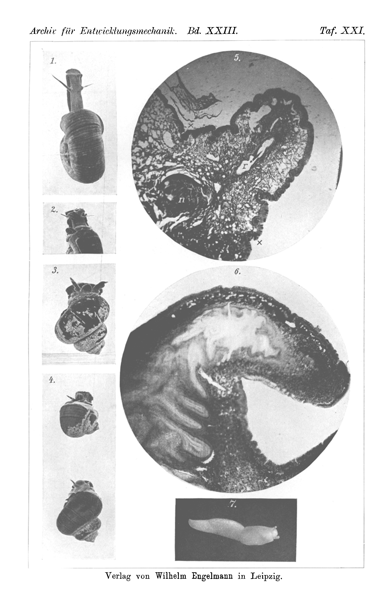

# Experiments on Regeneration in Freshwater and Slug Snails.

By

Adolf Černý.

(From the Biological Experimental Institute in Vienna.)

With Plate XXI.

Received on 23 February 1907.

*Archiv für Entwicklungsmechanik der Organismen*, vol. 23 (1907).

> **Full translation.** A complete English rendering of the running text of “Experiments on Regeneration in Freshwater and Slug Snails” (Czerny, 1907), including all tables, figure and plate legends, and footnotes. Numbers and table cells were transcribed from the page images, not the noisy OCR.

The fact that freshwater snails are able to repair injured shells [verletzte Gehäuse zu reparieren] has long been known. Bunker (1)¹) established this in a North American mud snail [Schlammschnecke], *Limnaea elodes*. In a few of our freshwater snails (*Limnaea stagnalis*, *Planorbis corneus*, *Paludina vivipara*) I have repeatedly observed that the shell, after an injury, is completed from the mantle rim outward, and that in this both the conchiolin and the carbonate lime [kohlensaure Kalk] re-form. The foot of many freshwater snails too is regenerated, as Morgan [2] reports for the genera: *Physa*, *Limnaea*, and *Planorbis*. Through this the supposition of Carrière [3], that these snails are little or not at all capable of regeneration, appears refuted. In his experiments on the regeneration of the tentacle in *Limnaea auricularis* and *Planorbis carinatus*, this researcher saw the animals perish soon after the operation, and it seems to him »as if these animals possessed the capacity for regeneration either not at all or only in a very insignificant degree«. These experiments were already repeated by me in 1904 on the great ramshorn snail [Tellerschnecke] (*Planorbis corneus*) and the common river snail [Sumpfdeckelschnecke] (*Paludina vivipara*), and I have already reported on this in this Archive in a short communication [4]. Since then I have not only

> ¹) The bracketed numbers refer to the literature index.

Archiv f. Entwicklungsmechanik. XXIII.    33 504    Adolf Černý

continued these experiments, but also extended them to other species, and I therefore wish to treat them in the following somewhat more thoroughly than was done earlier, and in their context. Since it is of great importance for the course of the regeneration under what life-conditions the animals are kept, I will communicate something about this. The containers in which the experimental snails live should not be all too small and not too densely populated, so that the excretory products of the animals do not act as »self-poisons« [»Selbstgifte«], inhibiting the growth of the regenerating parts. An excessively large aquarium, on the other hand, is impractical, because one cannot observe the animals as precisely as in a smaller basin, where they, creeping on the plants and on the glass walls, can easily be examined with the magnifying glass [Lupe]. Best suited is a quadrangular glass trough [Glaswanne] of medium size, whose floor is covered with quartz sand and into which a few small pots with aquatic plants (*Elodea*, *Myriophyllum*, *Ceratophyllum* etc.) are placed. For luxuriantly thriving plants in the aquarium one takes care anyway, since they provide abundant nourishment for the good and the rapid success of the experiments. Therefore one must also place the containers in a spot as bright as possible, where they are fully exposed to the daylight, in order to offer the plants the assimilation-light [Assimilation nötige Licht] necessary for this. One must, however, also see to it that the decomposition-products of the cadaver do not poison the other healthy animals.

### I. Experiments on the Ramshorn Snail [Tellerschnecke] (*Planorbis corneus* [L.] Pfeiff.).

In order to operate on the snails, they were placed individually in a not-too-large glass dish, and during the creeping the right tentacle was cut off with a quickly and surely executed scissor-stroke, while the other feeler [Fühler] was left uninjured for comparison of the size. The animals now drew themselves vigorously back into their shell, but soon afterward crept on again. They survived the operation very well. Only a few died within the next days, in any case as a result of wound-infection through the microbes living in the water. The operation was performed on fairly grown specimens on the 10th of June, and already after 14 days a small, pointed cone was noticeable at the amputation site, whose base was smaller than the wound surface and which gradually grew into a feeler of normal appearance (Fig. 1). Among the numerous ramshorn snails [Tellerschnecken] which I caught for my experiments in the Experiments on Regeneration in Freshwater and Slug Snails.    505

waters and pools, individuals with a forked tentacle were now and then to be found among them as well. Similar forked formations [Gabelbildungen] have already been repeatedly observed and described in other animals (e.g. the lizard's tail [Eidechsenschwanz]) and are to be traced back to regeneration. They arise then, when through the wounding the organ in question is not completely cut through, but only partly cut into [angebrochen], and so a double wound-surface arises. In most cases the wound-rims indeed grow together again, but if the wound remains gaping, then each of the two wound-surfaces strives to let a regenerate proceed from itself, [a regenerate] which stands perpendicular to the cut-edge [Schnittebene], and so in the most favorable case a threefold formation [Dreifachbildung] arises. When, however, both regenerates mutually inhibit each other in their growth, it then comes about that the one to which a more abundant sap-stream [Saftstrom] flows from the animal-body suppresses the regenerate of the other wound-surface completely, or grows together with it into a unitary structure. In both cases double-formations [Doppelbildungen] arise, in which, in our case (*Planorbis*-feeler), the regenerated part is usually characterized as such by lesser size and weaker pigmentation. Since such double- and threefold-formations have also been produced experimentally in various animals, the genesis of these »supernumerary« [»überzähligen«] formations, which one was earlier much inclined to regard as »discontinuous variations« [»diskontinuierliche Variationen«], is now clarified.

In a ramshorn snail [Tellerschnecke] which I operated on, the cut did not sever the feeler completely, whereby a double, gaping wound-surface arose, out of which, according to the laws set forth above, a lateral regenerate grew, so that a double-formation emerged as result (Fig. 2).

### II. Do the Tentacles Regenerate in the Mud Snail [Schlammschnecke] (*Limnaea stagnalis* [L.] Lam.)?

While in the ramshorn snail [Tellerschnecke] the experimental results were very favorable, I have so far striven in vain, despite all pains, to obtain the same results also in the mud snail [Schlammschnecke], although the two species stand phylogenetically quite close and therefore a similar behavior with respect to regeneration was to be expected. The operation of the animals proceeded similarly as in *Planorbis*. The animals draw themselves back into their shell, do not, however, as Carrière [3] states, lie withdrawn for a long time at the bottom of the basin,

33* 506    Adolf Černý

but creep on again merrily after a short time. Of a regeneration, however, nothing was to be noticed even after 3 months, and although I repeated these experiments at various seasons of the year, they always remained equally unsuccessful. Nevertheless I do not believe that I may ascribe this circumstance to too little regenerative power of the feelers of this snail.

In the cave-olm [Grottenolm] (*Proteus*), in which Goette [5] saw a leg regenerate only after 1½ years, it has emerged that the cause of this slow course of the regeneration is a wound-infection, against which other urodele amphibians are immune, and that an elevated temperature is able greatly to accelerate the new formation of the lost leg [6]. Perhaps in the mud snail [Schlammschnecke] we have a similar case before us.

K. Semper [7] has found that the growth in *Limnaea stagnalis* is at first a slow one, whereupon, in the 4th–5th week after hatching from the egg [aus dem Ei], a period of the most rapid growth follows, until finally the animal grows ever more slowly with increasing age. Through too small a water-volume in which the animals live, and too low a temperature, the growth-velocity is inhibited. It is to be expected that in sufficiently young animals, during the period of rapid growth and under favorable life-conditions (not too small a water-volume, temperature-optimum), the regeneration of the feelers will after all be achievable.

### III. Regeneration in the River Snail [Sumpfdeckelschnecke] (*Paludina vivipara* Lam.).

This separate-sexed [getrenntgeschlechtliche] snail possesses, besides the circumstance that the young are retained in the uterus until full development and only then are born, also the peculiarity that in the male the right feeler is transformed into a copulation-organ. It has the form of a club [Keule], which, at its free end, somewhat displaced to the side, bears a cone-shaped papilla, the mouth of the penis [die Mündung des Penis] (Fig. 3). In my earlier experiments I used grown, sexually mature males and females of the river snail [Sumpfdeckelschnecke]. The animals which here after the operation withdrew into their shell-house [Gehäuse] did not, however, as was the case in *Planorbis* and *Limnaeus*, lie withdrawn at the bottom of the basin, but lay only for a short time in this state. The mortality after amputation of the right feeler in the male was a quite consider- Experiments on Regeneration in Freshwater and Slug Snails.    507

able one (about 40 %), which, in view of the circumstance that together with the feeler the penis too had been cut away, could not surprise. Of the equally large females, not so many died after the operation. It lasted 2–3 months until, at the place of the cut-off feeler, a small, pointed regeneration-cone became noticeable, which slowly grew on, until the regenerate reached about half the length of the normal feeler. The club-shaped thickening, however, was lacking on the regrown tentacle, and the males at this stage were outwardly not to be distinguished from the female experimental animals. During this time the number of the males decreased, despite the most possibly favorable life-conditions, ever more and more, until finally the last one too had died. Of this perhaps the circumstance too may have been at fault, that the animals could not satisfy their sexual drive [Geschlechtstrieb], the more so as the same is, in snails — as J. Carrière [3, p. 32] has observed in land-snails — a very vehement one. The regenerating females remained alive for a very long time, brought young into the world, and their final death seems to have been a physiological one. In later experiments (end of May 1906) on the regeneration of the copulation-feeler I used younger males, which had evidently not yet attained sexual maturity. After one month, beginnings of regeneration were to be seen, and 3 months after the operation (August 1906) the newly formed feeler was already distinctly pronounced (Fig. 4). It was of slender, cone-shaped form, and it lacked the characteristic club-like form of the normal copulation-feeler. This tapered form the feeler still had when, in December 1906 (that is, 7 months after the operation), I conserved a few animals. The microscopic investigation on sections showed that the cut-off part of the feeler had also regenerated in the interior of the feeler, though still [as] a blindly closed sack [blindgeschlossener Sack] with cells of embryonal character (Fig. 5). While the other part of the feeler formed first and grew more rapidly, the regenerated part of the penis remained without an outlet-opening [Ausmündungsöffnung], which would probably have broken through only at a later regeneration-stage. Only then would the feeler too transform into the club-like copulation-organ. This question, as well as the one of whether the males with the newly formed feeler become capable of copulation, I will study in a new series of experi- 508    Adolf Černý

ments, as soon as suitable material is again at my disposal.

### IV. Regeneration of the Eye-bearers [Augenträger] in Slug Snails [Nacktschnecken].

Already since long ago, numerous and thorough experiments and investigations have been carried out on regeneration in land-snails [Landschnecken]. Spallanzani [8] cut off, in various land-snails, the eye-bearing feelers, in others the whole head [Kopf], and established constantly that the animals renew the eye-bearing feelers. To this result also Schäffer [9] arrived two years later. In the year 1879, the findings made by Spallanzani were anew and very precisely investigated by J. Carrière [3], whereby it emerged that various *Helix*-species regenerate not [merely] the feeler, but, with non-injury of the swallowing-ring [Schlundring], the whole head [Kopf] anew. With slug snails [Nacktschnecken], the named researcher had no satisfactory success, which he ascribes to the greater difficulty of keeping these animals in captivity under somewhat normal conditions. The operated land-snails always thrived, without showing distinct regeneration-appearances. I have therefore repeated these experiments more frequently, in order to be able, in the agreeable position [angenehmen Lage], to report in the following on their favorable results; but I never found that slug snails [Nacktschnecken] are in the long run more difficult to keep than any other land-pulmonates [Landpulmonaten]. They proved themselves, on the contrary, to be fairly tolerant [anspruchslos], and I could even bring them to reproduction [Fortpflanzung] in smaller containers. These containers consisted of quadrangular little cases [Kästchen] of zinc sheet [Zinkblech] (dimensions: 11 × 12 × 19 cm), whose walls were perforated and provided with a net of zinc-wire [Zinkdraht], so that the air had free entry. Upon the floor of these little cases earth was heaped, and upon it loose moss-turf [Moosrasen] was laid. For the necessary, not excessive moisture, care was taken through frequent spraying with an atomizer [Zerstäuber]. As food the snails were given the well-known lettuce- or cabbage-leaves [Salat- oder Kohlblätter], which were renewed daily. On the 2nd of October I operated on 24 pieces of *Limax arborum* Bouch. The animals were first brought onto a glass-plate and, through tapping of the back-side with a needle, spurred to more rapid locomotion, whereby they stretched out the tentacles far. In this instant, with a quick scissor-stroke, the one feeler was cut through in the middle with the eye. The snails drew the tentacle-stump in and did not stretch it out again until the eye was regenerated, which took 3 to 4 weeks. At the same time the tentacle also grew in Experiments on Regeneration in Freshwater and Slug Snails.    509

length (Fig. 7). The regeneration did not proceed equally rapidly in all animals, indeed not even in one and the same individual. Thus I noticed in one specimen, in which on the 13th of November the two long feelers had been cut off, that on the 20th of December the one tentacle had grown again and was fully stretched out and let the eye be distinctly recognized at its tip as a black point, while the other feeler still remained drawn in and thus evidently was not yet at the same advanced regeneration-stage.

Through the fact emerging from these experiments, that slug snails [Nacktschnecken] are able to renew cut-off feelers, the original statements of Spallanzani are thus confirmed anew.

### Literature Index.

1) R. Bunker, Can snails mend their shells? American Naturalist. 14. 1880.

2) T. H. Morgan, Regeneration. p. 104. New York, Macmillan, 1901.

3) Justus Carrière, Studien über die Regenerations-Erscheinungen bei den Wirbellosen. I. Regeneration bei den Pulmonaten. Würzburg 1880.

4) Adolf Černý, Versuche über Regeneration bei Süßwasserschnecken. (Erste Mitteilung.) Archiv f. Entw.-Mech. Bd. XIX. 1905.

5) A. Goette, Entwicklung und Regeneration des Gliedmaßenskelets der Molche. Leipzig, Voß, 1879.

6) P. Kammerer, Die angeblichen Ausnahmen von der Regenerationsfähigkeit bei den Amphibien. Vortrag geh. i. d. Morph.-Physiol. Gesellsch. zu Wien. Referat im Centralbl. f. Physiol. Bd. XIX. 1905. Heft 18.

7) K. Semper, Über die Wachstumsbedingungen des Lymnaeus stagnalis. Arbeiten aus d. Zool.-Zootom. Institut in Würzburg. 1874. Bd. I.

8) Spallanzani, Prodomo di un opera ad impremersi sopra le riproduzioni animali. Modena 1768.

9) Jakob Christian Schäffers erstere und fernere Versuche mit Schnecken nebst einem Nachtrage. Zweite Auflage. Regensburg 1770.

### Explanation of the Figures.

#### Plate XXI.

Fig. 1. *Planorbis corneus*. The right feeler is regenerated (2 months after the operation).

Fig. 2. *Planorbis corneus*. Supernumerary [Überzählige] formation at the right feeler (regenerate), in addition 1 month after the operation.

Fig. 3. *Paludina vivipara*, normal male not yet attained to full size. The right, distinctly visible feeler [transformed] into the copulation-organ, the cone-tip [Spitze] at its end.

Fig. 4. *Paludina vivipara*. Two little snails with the regenerated right feeler (3 months after the operation).

510    A. Černý, Experiments on Regeneration in Freshwater and Slug Snails.

Fig. 5. Longitudinal section through a regenerated tentacle of *Paludina vivipara* ♂ (7 months after the operation). The object was fixed with Perényi's fluid, embedded in paraffin, and cut 10 µ thick. The staining was carried out with Delafield's hematoxylin.
*r* regenerated part of the penis (cut obliquely), *n* uninjured-remaining part of the penis (struck almost transversely), ×....× designates approximately the section-line at the operation.

Fig. 6. Longitudinal section through a normal tentacle of *Paludina vivipara* ♂. Treatment the same as indicated at Fig. 5.
One sees the obliquely cut-into penis, whose inner, folded wall is lined with high, cylindrical ciliated epithelium [Flimmerepithel].

Fig. 7. *Limax arborum* Bouch. Regeneration of the right eye-bearer [Augenträger], 4 weeks after the operation.

The Figs. 1–4 and 7 are photographed at approximately natural size, Figs. 5 and 6 are microphotograms. Magnification: 50 linear.

**Plate XXI** — *Archiv für Entwicklungsmechanik. Bd. XXIII. Taf. XXI.*

Plate bearing figures 1–4 (left column, photographs of *Planorbis* and *Paludina* snails), figures 5 and 6 (microphotograms of tentacle longitudinal sections), and figure 7 (small photograph of *Limax arborum*). Imprint at foot: "Verlag von Wilhelm Engelmann in Leipzig."  *(figure plate not reproduced)*

## Figures

**Taf. XXI.**

---

*Translator's note.* One of the Biologische Versuchsanstalt (Vienna Vivarium) papers flagged on the project site as a modern rediscovery target. Claims are rendered as stated in the original, not endorsed.
