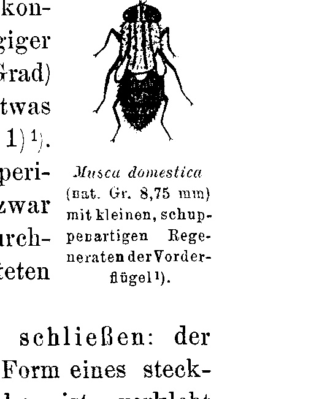
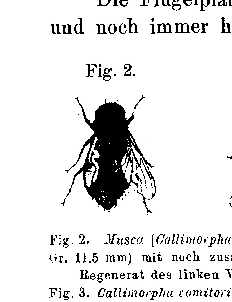
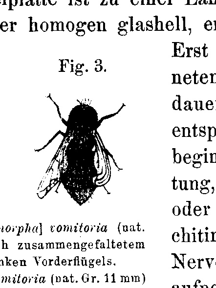
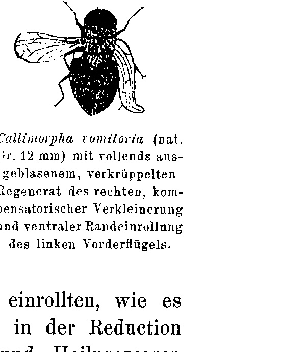

# Regeneration of the Dipteran Wing in the Imago.

By

Dr. phil. Paul Kammerer.

*(From the Biologische Versuchsanstalt in Vienna.)*

With 4 Figures in the Text.

Received on 31 August 1907.

*Archiv für Entwicklungsmechanik der Organismen*, vol. 25 (1907).

> **Full translation.** A complete English rendering of the running text of “Regeneration of the Dipteran Wing in the Imago” (Kammerer, 1907), including all tables, figure and plate legends, and footnotes. Numbers and table cells were transcribed from the page images, not the noisy OCR.

### Table of Contents.

|  | Page |
|---|---|
| I. Occasion of the experiments . . . . . . . . . . . . . . . . . . . . . . . . . . . . | 349 |
| II. Husbandry and operation technique . . . . . . . . . . . . . . . . . . . . . . . | 350 |
| III. Experimental course . . . . . . . . . . . . . . . . . . . . . . . . . . . . . . . . | 352 |
| 1. Amputation . . . . . . . . . . . . . . . . . . . . . . . . . . . . . . . . . . . | 352 |
| 2. Extirpation . . . . . . . . . . . . . . . . . . . . . . . . . . . . . . . . . . . | 353 |
| IV. Theoretical and literary remarks . . . . . . . . . . . . . . . . . . . . . . . . | 356 |
| V. Result . . . . . . . . . . . . . . . . . . . . . . . . . . . . . . . . . . . . . . . . | 359 |
| VI. List of literature . . . . . . . . . . . . . . . . . . . . . . . . . . . . . . . . . . | 360 |

## I. Occasion of the Experiments.

Already in the time of my grammar-school studies, during which I occupied myself eagerly with the care and breeding of the most varied animals, the following phenomenon had struck me: to small, clumsy newts I had made their favourite food — house-flies (*Musca domestica* L.) freshly crept out of the barrel-shaped pupae — more easily accessible, in that I tore off the wings of these insects, which otherwise strive upward too rapidly [4, p. 260].¹ Often such flies, robbed of their organs of flight, escaped through the cracks of the badly-closing doors of the newt-cages in question and thereby withdrew themselves from their pursuers. For several days one could then see wingless flies crawling about everywhere in the room.

> ¹ The figures standing in square brackets refer to the list of literature.

After a few further days these flies had then regularly vanished, without my noticing their cadavers; in compensation I encountered flies which, during their running-up on vertical walls, produced a buzzing sound, but apparently did not want to take off in flight, and, when they nevertheless ventured a leap, after a short curve fell back onto their support. I still remember, on closer inspection, having noticed conspicuously small, intensely glittering wings on the animals thus behaving so abnormally. Finally, after many vain attempts, they did nevertheless manage to raise themselves to a longer, laborious, noisy flight, which at first seemed aimless and awkward, but little by little was no longer to be distinguished from that of other flies. Now all at once there were also no more flies in the room that would have been in any way deviant with respect to the degree of their wing-development.

Since I was then by no means in a position to suspect a connection existing between the phases described, still less to appreciate the importance of what was observed, I did not pursue the matter further, so that it then also half and half fell into oblivion, not without occasionally, with rare tenacity and fidelity, surfacing again in the current consciousness.

With particular force this happened, comprehensibly, when, after so many years, suddenly in early spring 1906, the gentleman working with us in the institute, Herr WERBER, and indeed likewise on the occasion of feeding [them] to other animals, made, in the mealworm beetle (*Tenebrio molitor* L.), the unexpected discovery that it is capable, in the imaginal stage, of regenerating the extirpated wings and wing-covers! Now the childhood observations arose again in a new light (which observations, since one had taken them up with fresh, unburdened senses, had on the whole often shown an astonishing degree of reliability), and without delay I set about repeating those [observations], this time, if possible, on the basis of methodically arranged experiments with surely isolated experimental animals.

## II. Husbandry and Operation Technique.

When I now had before my eyes that which, in the chance observation, had so to speak come about of itself, then in the deliberate experiment too a corresponding success was by no means to be expected. I encountered at first great difficulties and many a disappointment, which led me hand in hand thereto to negative results, insofar as the Muscidae robbed of their wings in various combinations — used were house-flies (*Musca domestica* L.) and blue blow-flies (*Musca* = *Callimorpha* *vomitoria* L.) — did indeed withstand the operation itself, namely showed no great mortality immediately after it, but on the other hand exhibited only a short life-span of a few days to at most a week, which did not even suffice for the beginning of a regeneration process.

The flies were kept in broad Einsiedel- (so-called marmalade-) jars closed off with organtin, on a substrate of weakly moist horse-dung or moist sawdust. As fodder, pieces of cheese, meat, fruit and sugar were offered, which the flies then diligently licked off and felt over with the tongue. These jars were set up in rooms where flies otherwise also occurred and multiplied, where therefore favourable life-conditions might be presupposed. This was in particular a very warm room, where a herd of tortoises richly deposited their strong-smelling excrements, and which in consequence took shape virtually as the source for our winter supply of feeder-flies. After all the flies had several times perished, I tried to keep them in very roomy terraria, since possibly the small jar might bear the blame for their short-livedness. The result, however, was here if anything still worse than there.

Later, with the best success, my colleague F. MEGUŠAR set up his own fly-breedings on a large scale, whither I then transferred my fly-jars. These rooms too were kept richly warm (on average 20 degrees C.).

But since again and again, after the lapse of several days, during which the flies, operated and normal control animals, seemed to enjoy the best well-being, a mass-dying occurred, I hit upon the thought of whether the animals could not be kept alive longer in cooler rooms. VERHOEFF too, in his experiments on the reparation of injured dorsal plates, kept the ground-beetles used for this in cool places, in order to reduce the number of respirations [13]. I accordingly set up the experiment in a dark, dry-lying cistern of our institute, where year in, year out, a temperature of 12 degrees C. prevails. Actually the flies did remain alive for several weeks, but since, as is well known, low temperature at the same time slows growth, here too no clear result would come to the fore. Nevertheless I was able to perceive, on a blow-fly housed in the cistern (see later and Fig. 1), beginnings of regeneration of both wings.

Finally I returned to housing the experimental jars in the rooms of the large breedings, and by working through a material probably numbering in the thousands I attained, in a few specimens, a positive result. The initial failures would perhaps not have occurred to such a degree had I not at first caught and operated on any [flies] at hand, mostly already older flies. Only the establishment of the mentioned large breedings, however, offered me ample opportunity to make use of imagines freshly crept out of the pupa, still softer and more extensible.

Two kinds of operations were carried out:

1) Cutting-through of one or both wings with the aid of fine scissors, so that a wing-remnant still remained standing (amputation).

2) Tearing-out of the whole wing or of both wings with the aid of forefinger and thumb or of a finely-tapering forceps (extirpation). In the latter [case] one must take care to grasp the wing right from the start near the base, in order with one short tear to remove everything and not to have to pluck away small remnants additionally afterward. Thereby the tear must not be all too violent, because otherwise, in the tearing-out, too large a wound arises, from which the animal bleeds to death.

## III. Experimental Course.

### 1. The Amputation of wing-pieces remained always without result: not the smallest new-formation showed itself on the tissue, which emerged best from the abrupt cessation of the cut-off wing-veining at the cut-edge.

If proportionately small portions of the wings, at most the half, had been removed, then the fly learned to fly quite well with the aid of the remnant. At first the flight-path was a circular or spiral one, and opposite to the side where the uninjured, and therefore more amply working, wing stood. Little by little, however, the insect succeeded in apportioning the distribution of force in its wing-movements in such a way that the flight-direction henceforth was again a straight one, or one at the animal's pleasure.

Not a little may have contributed to this a regularly observed, compensatory diminution of the non-operated wing, of which there shall still be talk later.

2) The Extirpation yielded altogether, in five specimens — one specimen of *Musca domestica* and four of *Callimorpha vomitoria* — a positive result.

One specimen of the last-named species, kept in the drying-cistern at 12 degrees C., was, after a 24-day experimental duration, found dead and showed, at the spot where the fore-wings had stood, on each [side] a semicircular, glass-clear, un-veined little scale, which has great similarity to the cover-scales of the halteres and would perhaps have been addressed by me as such [a thing], that had grown in place of the wings, accordingly as a heteromorphosis, had not other experiments taught me about this, that wing-regeneration always sets in with this formation, and that it in the further course grows out into the wing.

Since with the dead-found blow-fly it did not keep well, but shrivelled up to unrecognizability, I conserved a house-fly, which after a 20-day experimental duration, in the warm fly-breeding (20 degrees), showed approximately the same, here more elliptical (already somewhat more advanced) regeneration-stage (Fig. 1)¹.

**Fig. 1.** *Musca domestica* (nat. size 8.75 mm) with small, scale-like regenerates of the fore-wings. *(figure not reproduced)*

The remaining specimens, with which the experiment succeeded, were again blow-flies and indeed kept in the fly-breeding — naturally isolated — at on average 20 degrees C. They permitted a rather precise following of the process.

The First [thing] is that the wound-edges close: the blood-exit, which with correct operation is always to be perceived in the form of a pin-head-sized, yellowish little droplet, glues up the opening at first and stiffens into a thin membrane, which provides, as it were, the bridge upon which now the wound-edges grow toward one another and produce a tender, translucent little skin, which under the influence of the respiratory movements, vigorously pulsing, raises and lowers itself. Evidently the unceasing stretchings connected therewith bring about [that] the epithelial wound-closure does not thicken, but bulges outward

> ¹ The figures were drawn in commendable manner by Herr stud. phil. Josef Klintz.

Archiv f. Entwicklungsmechanik. XXV. &nbsp;&nbsp; 23 and only now in truth presents to the air-stream issuing from the neighbouring tracheal branch a broad surface. In similar manner, as the primary wing, after the leaving of the pupa-envelope, has first to be blown up to its full size, there arises also the already-mentioned scale-like little miniature-wing, through the pressing-in from the tracheal system, into a sac-like out-turning comparable to a wind-blown sail, of the scar-tissue covering the wound. In that this [tissue] is pushed ever further forward from the former wound-edges, but at the same time, uninterruptedly, through the in- and out-streaming of the air, is further extended, there arise, through the mutually furthering interaction of respiration-mechanism and growth, thin-remaining, surface-wise extended plates, which, in that the initial little scale soon receives a tip and from then on increases both in length and in breadth, already approach the norm-correct form of the dipteran wing. The contact-surfaces of the widely extended wound-healing-tissue *adhere*, lay themselves then closely to one another, in which position they grow together, instead of retaining the initial form of a sac — at times — with the in-streaming of air — taut, at times — with the out-streaming — slack.

The wing-plate has reached a length of 2 to 2½ mm and [is] still always homogeneously glass-clear, thus still lacks the veining. Only after the reaching of the indicated length, which corresponds to an experimental duration of about 3 weeks (at 20°), there appear, beginning from the wing-base in relatively rapid spreading, the ridges, current under the name "veins" or "ribs," more strongly chitinized, which take up into themselves nerves, tracheae and blood-fluid. After a further 10 to 18 days the wing-veins have assumed the course and the distribution of those of normal wings, insofar as one can decide this with certainty, given the bendings and cripplings which always set in, in the cases observed by me, with further increase in size.

**Fig. 2.** *Musca [Callimorpha] vomitoria* (nat. size 11.5 mm) with still-folded regenerate of the left fore-wing. *(figure not reproduced)*

**Fig. 3.** *Callimorpha vomitoria* (nat. size 11 mm) with folded regenerate of the right [fore-wing], compensatory diminution and ventral marginal in-rolling of the left fore-wing. *(figure not reproduced)*

Fig. 2 presents such a regenerate of the left, Fig. 3 of the right fore-wing, which regenerates (especially still in Fig. 2)

exhibit a quite similar folding as the normal wings shortly after the leaving of the pupa-skin, before those are properly blown up. It is probable that this further blowing-up and therewith the reaching of the definitive form would also still have taken place in the two mentioned cases, had the animals not died too early or been killed.

In a last case (Fig. 4) a further blowing-up has actually taken place, but has nevertheless yielded only a crippled wing. Since exactly the same cripplings occur frequently with flies that are bred in narrow spaces, it appears questionable whether the crippling of the regenerate may be conceived as a consequence of the regeneration-process.

On the very same specimen, as well as on the one presented in Fig. 3, we finally observe still one phenomenon, which struck me also with other flies operated on only one side (even when no re-growth had taken place, but only wound-healing): namely a *Reduction of the uninjured wing of the opposite side*. If it should here again be obvious to assume a shortening as a consequence of the captivity, then it is nevertheless to be pointed out that uninjured [flies], reared for the purpose of control in just such jars, do indeed sometimes damage their wings at the edge, but never, even when they had slipped out of the pupa in the jars, [are] proportionally diminished and in the characteristic manner in-rolled at the edge ventralward, as is evident from Fig. 3 and 4. There must accordingly, in the Reduction of the non-operated wing upon injury and healing-processes at the other wing, a *compensatory Regulation* be perceived.

**Fig. 4.** *Callimorpha vomitoria* (nat. size 12 mm) with fully blown-up, crippled regenerate of the right [wing], compensatory diminution and ventral marginal in-rolling of the left fore-wing. *(figure not reproduced)*

Astonishing in this is: how little the richness in apoplasms, firm chitinous constituents, in comparison to the poverty in soft-fluid, formation-capable protoplasm-substance, hinders the necessary re-differentiation processes. The same capacity-for-melting-down of apparently definitively stiffened parts emerges also from some experiments of Megušar, e.g. the compensatory hypotypy of one beetle-mandible upon regeneration of the other [5]; further from an experiment of Graber [2], who, on a left hind-wing of the grasshopper *Decticus verrucivorus* at the second-to-last larval stage,

23* A renewed molt of the imago, such as WERBER [15] obtained in the mealworm beetle, I have not observed in connection with the wing regeneration in flies, and I can scarcely have overlooked it. Since a good part of the newly formed wing is to be set down to the account of the stretching of the integument through the entry of air, the molt also appears not to be necessary for the restoration of the structure.

On the whole it is to be established that the regeneration process of the wing shows much in common with its embryonic development. In contrast to earlier statements, the agreement between ontogenetic and regenerative development has indeed also been correctly recognized by ZELENY [16].

## IV. Theoretical and Literary Remarks.

The incapacity of the insect imago to regenerate anything beyond small tissue defects (VERHOEFF, GRABER, HOPE [2] — reparation of pierced-through elytra in *Colymbetes*!) already counted as an established fact, so that WERBER's discovery and mine — that under favorable circumstances they can even replace a larger morphological unit after loss — was bound to surprise even us, the observers, not a little. That, on the contrary, it is precisely the wings which still preserve this capacity in the imaginal state, somewhat mitigates the striking character of the newly discovered fact, since the wings — by virtue of their developmental-historical origin from tracheal gills — according to GEGENBAUR — or from lateral processes of the back-plates — according to FRITZ MÜLLER — (cited after CLAUS-GROBBEN [1]) and by virtue of their conformation as skin-duplicatures, may pass for essentially simpler, less highly differentiated organs than, e.g., the extremities, which in the imago certainly no longer regenerate.

The achievement of positive results in two such different, widely separated orders of the hexapods, as the coleopterans and the dipterans are, permits one to conclude a general distribution of the wing regeneration of the insect imago — which, to be sure, probably always sets in only under especially favorable external factors. By extension of WERBER's and my experiments to other insect orders, especially lepidopterans, important insights of a generally biological, especially phylogenetic nature (e.g. seasonal and sexual dimorphism) could probably be obtained. Since the wing amputations in the imago would probably yield too small a percentage of distinct regenerates for the treatment of those questions, the operation of the corresponding parts at earlier stages — as has already been proved by the experiments of MEGUŠAR [5] and GRABER [2] — would certainly be worth drawing upon with success.

That, furthermore, the wings regenerate fully even in the most highly organized insect order, the dipterans, points to the **longer preservation of the regenerative capacity in well-functioning body parts**, which, in accordance with their lively employment, are subject to a brisker metabolism and partake of a stronger inflow of nutrition, and which therefore forfeit their growth capacity later than other organs. Thus their capacity for re-growth is also explained, without the assumption of selection processes becoming necessary for understanding it. Here it is to be recalled especially that the flies, as I have already indicated at the outset and later found confirmed, maintain their still stump-shaped wings, during the regeneration, in a long-lasting, swinging, whirring motion, as though they wished to train themselves for the return of flight capacity, to make the new flight-organs supple. For minutes at a time one therefore hears uninterruptedly the buzzing, which proceeds from the flies sitting quietly on the spot or running up the wall.

The circumstance that the wings, in the folded state in which they find themselves when the full fly has just left the pupa, undoubtedly regenerate more easily than later — my experiments yielded, after all, evidence only for the first case at all — speaks **against the conception of this regeneration as an adaptation phenomenon**, because the wings of the freshly metamorphosed fly, which moreover lives quite withdrawn before the hardening of its integument, are exposed to a much smaller probability of loss than the large, easily torn-off wings of the final stage. Still more easily, of course — as emerges from MEGUŠAR's experiments on cockroaches (*Stylopyga orientalis*) and mealworm beetles (*Tenebrio molitor*) [5] — the wings regenerate when one removes the body parts in question already on the larva. Once again, then, we must turn away from WEISMANN's interpretations of the facts of regeneration [14] and toward that view which assumes a general, primary regenerative force, to be traced back to growth acceleration (PRZIBRAM [6, 7]).

As to the fact that in insects, under certain circumstances (or, in some forms, as a rule), body growth is not yet entirely concluded with the attainment of the imaginal stage and documents its continuation also in a further molt, there already exist some older statements, which, however, have apparently become little known. Relatively widespread, and evidently recognized as a fact, is that the ephemerids always molt once more after leaving the larva-like nymphal envelope. Thus it is said in TASCHENBERG [12]: »The larvae of all members of the family live in flowing water, namely in holes of the muddy banks, and breathe through lateral, feathered gill-lappets. When their time has come, they release the insect, which in a manner of speaking rises out of the water, then molts once more **including the wings**¹⁾ and now flies about in the evening in order to mate.« — Thus it is said further in the Cambridge Natural History [11, p. 470] of the bee: »When the last skin of the larva of a bee or of a beetle is thrown off, it is, in fact, the imago that is revealed; the form thus displayed, though colourless and soft, is that of the perfect Insect; what remains to be done is a little shrinking of some parts and expansion of others, the development of the colour, the hardening of certain parts. The colour appears quite gradually and in a regular course, the eyes being usually the first parts to darken. After the coloration is more or less perfected — according to the species — a delicate pellicle is shed or rubbed off¹⁾, and the bee or beetle assumes its final form, though usually it does not become active till after a farther period of repose.«

That the wing tissue in particular is capable of regenerative processes, we learn through the supernumerary formations found in nature, of which especially in butterflies a whole series have become known [8, 9]. But also — and this is especially interesting for the present work — a housefly was described which bore a third wing on the right side of the prothorax [10]. To be sure, in these cases the injury, which most probably triggered the superregenerations in question, may have occurred already in earlier stages, not first in the imago. By cutting away the parts in question of the meso-

> ¹⁾ Not printed spaced-out [emphasized] in the original.

and metathorax on *Tenebrio* larvae in the stage before the last molt, MEGUŠAR [5], as already cited, likewise obtained, in the pupa, shortened wings with the character of regenerates.

## V. Results.

1) The fore-wings of *Musca domestica* and *Callimorpha vomitoria* are still capable of regeneration under favorable conditions, if they are extirpated in the freshly metamorphosed full insect.

2) Mere amputation, as well as any operation on older imagos, yielded no regeneration, but only wound healing.

3) The regeneration process takes place without a renewed molt, such as was observed by WERBER in the wing regeneration of the full beetle; rather, in the flies it comes about only through two physiological processes of a different kind, supporting each other:

a) Formation of a thin skin over the wound.

b) Expansion of this skin through the pumping-in of air from the tracheal system.

The sac thus created grows together into a unitary wing-plate, in that the two surfaces of the skin-duplicature, as soon as the latter has attained a certain extension, adhere and finally fuse.

4) The initial stage of the wing regeneration possesses great similarity to the covering-scales of the halteres. The newly formed wing is at first homogeneously glass-clear and obtains its veins only later.

5) In one-sidedly amputated flies, the uninjured wing — regardless of whether the operation on the opposite side leads to regeneration or only to wound healing — shows a compensatory reduction, which expresses itself in two characteristics:

a) Proportionate diminution of the whole wing.

b) Inrolling of the wing margins.

6) At an advanced stage of regeneration, the newly formed wing is folded together like the young wing after leaving the pupal skin. Also in other respects a great agreement expresses itself between regenerative and ontogenetic development of the muscid wing.

7) The finished, fully inflated regenerate is prone to malformations, which occur in the same way more often when the flies are reared in narrow confinement, or when their maggots have been insufficiently nourished.

## VI. Bibliography.

1) CLAUS-GROBBEN, Lehrbuch der Zoologie. 7th ed. Marburg i. H. 1905. p. 516.

2) GRABER, VITUS, Zur Entwicklungsgeschichte und Reproductionsfähigkeit der Orthopteren. Sitzungsber. d. math.-naturw. Kl. d. Kais. Akad. d. Wiss. Wien. Bd. LV. 1. Abt. 1867. pp. 307–324. 4 Taf.; esp. p. 322 (Figur!) and 323.

3) HOPE, F. W., in der Entomol. Soc. Febr. 1840 and May 1845. Ann. Mag. Nat. History. XVIII. 1846. p. 353.

4) KAMMERER, PAUL, Neuere Erfahrungen in der Lurchpflege. Blätter f. Aqu.- u. Terrarienkunde. XII. Jahrg. Magdeburg 1901. Nr. 17–21, especially p. 260, 4th paragraph.

5) MEGUŠAR, FRANZ, Die Regeneration der Coleopteren. Archiv f. Entw.-Mech. Bd. XXV. 1./2. Heft. 1907.

6) PRZIBRAM, HANS, Quantitative Wachstumstheorie der Regeneration. Centralblatt f. Physiol. Bd. XIX. Wien u. Leipzig 1905. Heft 18; in den Verhandl. d. morph.-physiol. Gesellsch., Sitzung v. 21. Nov. 1905.

7) — Die Regeneration als allgemeine Erscheinung in den drei Reichen. Vortrag auf d. 78. Versamml. deutscher Naturforscher u. Ärzte in Stuttgart. Naturwissenschaftl. Rundsch. XXI. Jahrg. Nr. 47–49. 1906.

8) RÖBER, J., Eine Monstrosität von Limenitis populi. Korrespondenzbl. des Entomologischen Vereins Iris. Nr. 2. p. 31. 1884.

9) ROGENHOFER, A., Eine fünfflügelige Zygaena minos. Sitzungsber. d. K. k. zoolog.-botan. Ges. in Wien. Bd. XXXII. 1882. p. 34. Mit Fig. u. Literatur.

10) RUDOW, F., Eine Mißbildung von Musca domestica. KRAATZ' entomolog. Nachrichten. VII. Jahrg. 1881. p. 84.

11) SHARP, DAVID, in der Cambridge Natural History (edited by S. S. HARMER and A. E. SHIPLEY). Vol. V. Insects. Part I. p. 170.

12) TASCHENBERG, E. L., Praktische Insektenkunde. IV. Teil: Die Zweiflügler, Netzflügler u. Kaukerfe. Bremen 1880. p. 179.

13) VERHOEFF, C., Über Wundheilung bei Carabus. Zoolog. Anzeiger. Bd. XIX. Leipzig 1896. pp. 72–74.

14) WEISMANN, AUGUST, Tatsachen und Auslegungen in bezug auf Regeneration. Anatom. Anzeiger. Bd. XV. 1899. Nr. 23.

15) WERBER, J., Regeneration der exstirpierten Flügel beim Mehlkäfer (*Tenebrio molitor*). Archiv f. Entw.-Mech. Bd. XXV. 1./2. Heft. 1907.

16) ZELENY, CHARLES, The direction of differentiation in development. I. The antennule of Mancasellus macrourus. Arch. f. Entw.-Mech. Bd. XXIII. Leipzig 1907. 2. Heft. pp. 324–343. Taf. VI–XII.

## Figures

**Fig. 1.**

**Fig. 2.**

**Fig. 3.**

**Fig. 4.**

---

*Translator's note.* One of the Biologische Versuchsanstalt (Vienna Vivarium) papers flagged on the project site as a modern rediscovery target. Claims are rendered as stated in the original, not endorsed.
