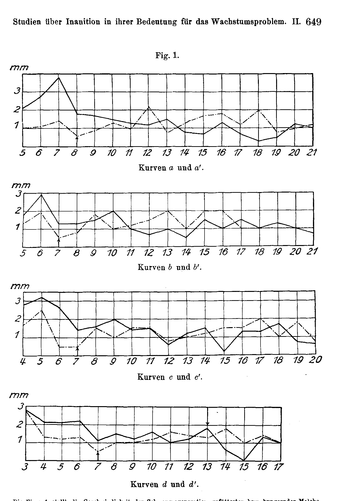
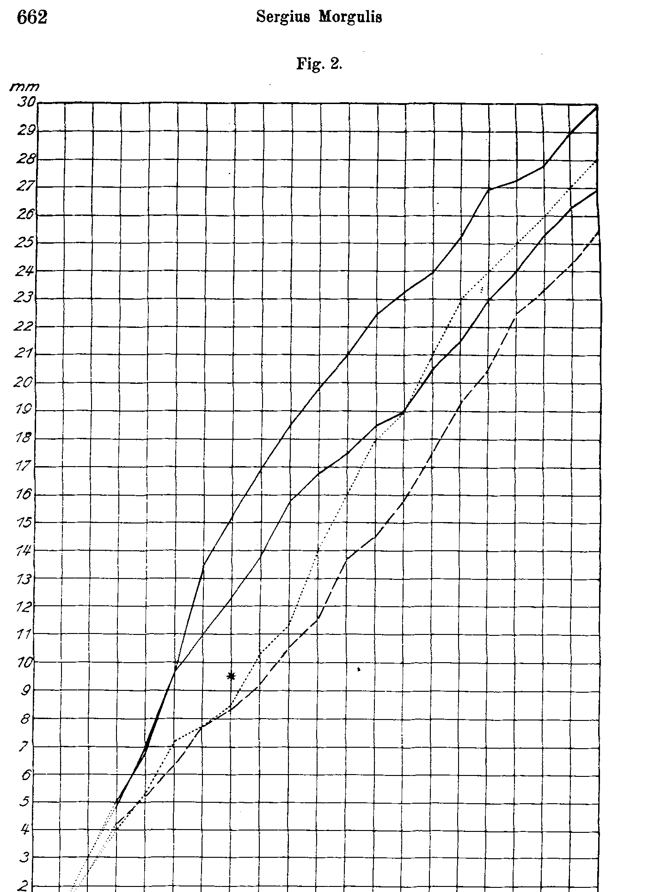
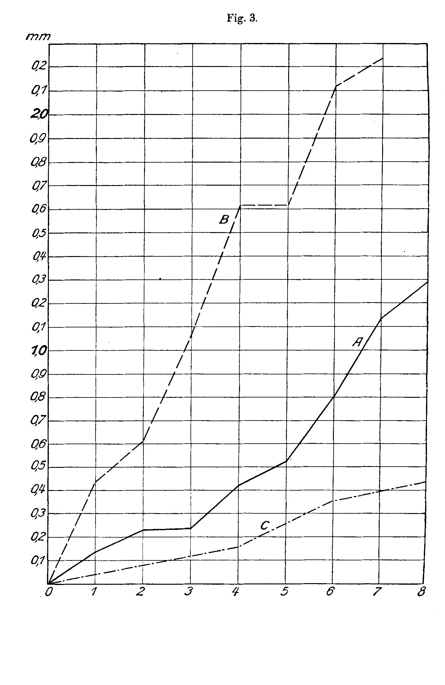
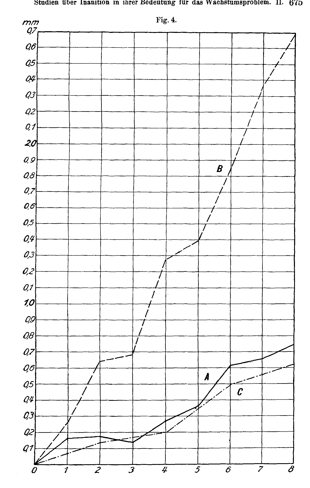

# Studies on Inanition in its Significance for the Growth Problem.

## II. Experiments on *Triton cristatus*¹⁾.

By

### Dr. Sergius Morgulis,

Frederick Sheldon Fellow of Harvard University.

(From the Biologische Versuchsanstalt in Vienna.)

With 4 figures in the text and 30 tables.

Received 18 March 1912.

*Archiv für Entwicklungsmechanik der Organismen*, vol. 34 (1912).

> **Full translation.** A complete English rendering of the running text of “Studies on Inanition in its Significance for the Growth Process” (Morgulis, 1912), including all tables, figure and plate legends, and footnotes. Numbers and table cells were transcribed from the page images, not the noisy OCR.

### Table of Contents.

|  | Page |
|---|---|
| 1. Introduction . . . . . . . . . . . . . . . . . . . . . . . . . . . . . | 618—620 |
| 2. Description of the experiments. Material . . . . . . . . . . . . . . . | 620—663 |
| &nbsp;&nbsp;&nbsp;A. Control series . . . . . . . . . . . . . . . . . . . . . . . . . | 622—623 |
| &nbsp;&nbsp;&nbsp;B. Hunger series . . . . . . . . . . . . . . . . . . . . . . . . . . | 623—634 |
| &nbsp;&nbsp;&nbsp;C. Series fed with interruption . . . . . . . . . . . . . . . . . . | 634—642 |
| &nbsp;&nbsp;&nbsp;D. Regenerating series . . . . . . . . . . . . . . . . . . . . . . . | 642—651 |
| &nbsp;&nbsp;&nbsp;E. Regenerating-hungering series . . . . . . . . . . . . . . . . . . | 651—663 |
| 3. The effect of long-lasting starvation and subsequent re-feeding on growth . . | 663—668 |
| 4. The effect of intermittent feeding on growth and a comparison of the A-, B- and C-series . . . . . . . . . . . . . . . . . . . . . . . . . . | 669—678 |
| 5. Literature references . . . . . . . . . . . . . . . . . . . . . . . . | 678—679 |

### 1. Introduction.

Our understanding of the growth problem has undergone a complete transformation since the application of the energetic point of view, which indeed forms the basis of all modern physiology,

> ¹⁾ To Harvard University, U.S.A., I owe the possibility of being able to pursue my investigations abroad. To Dr. Hans Przibram I wish to express my best thanks for the kindness of having placed at my disposal the working opportunities in the Biologische Versuchsanstalt in Vienna. To the assistant Dr. F. Megušar, who was always ready to lend help, I likewise express my thanks for this.

and this new application we owe to M. Rubner, whose name is most intimately bound up with the energetic theory in the field of biology. Apart from the position which one might adopt with respect to Rubner's various hypotheses and calculations of the growth process, the principal standpoint — namely, that not the quantity of building material supplied to the organism, but particularly the growth-drive, is the factor that determines the final result — is of great and fundamental significance. External factors — in all their manifold variety — can only favor or suppress the achievements, or condition or underlie them; in a similar manner they can disturb the inner factors, that is, alter the corresponding proportions of the various growing parts of the body against one another, and thereby augment or diminish the total effect of the innate growth-tendency. The behavior of the growing body toward nutrition strongly reminds us of the behavior of the organism toward oxygen. It is well known that the body uses up for its respiration only a small portion of the oxygen which is sufficient for it to maintain a particular performance-state. The speed of the uptake of the oxygen is then wholly independent of its supply, since the quantity is principally regulated by the demand of the cells, and the rich offering of oxygen — whether a pure or strongly condensed gas — cannot influence it. Still more striking is the analogous phenomenon of heat-development at fermenting-yeasts, which — within wide limits — does not depend on the supply, that is, on the density, that is, the dilution of the sugar.

The growth-drive of the organism is no constant quantity. We can recognize it, in order to attain it, whether the total body weight, size, or volume is considered, as that which is characteristic of the species, although within each group certain fluctuations can occur. The fitting explanation of the autonomy of this drive is found in re-fed, hungered animals. If one compares the regeneration-process in two animal groups, of which one was fully fed, the other allowed to hunger, then one recognizes above all that the two exhibit similar levels, which are distinguished by particular intensity of regeneration. Likewise, if one wishes to study the regeneration in various body regions, a similar gradation of the growth-intensity is discovered, namely according as the level of the cut lies more or less distal, a gradation that also is independent of the circumstance whether the animals are nourished or not.

It appears not inappropriate, in this connection, to remark that an essential difference exists between the influence of hunger on regenerating animals and the regenerating-on of hungering animals. In the former case, as we have already shown earlier, the intensity of the regeneration-processes is in general suppressed; nevertheless the regeneration-process remains in its outstanding properties uninfluenced. If, on the contrary, the feeding of animals that have already regenerated for some time is suspended, then an effect comes about, in that the regeneration at once diminishes or entirely ceases. This effect is, however, of short duration, and after 2 weeks, as we can take from curve *d* of Fig. 1, the regeneration-velocity that existed before the withdrawal of the nourishment will have been re-established.

Although we do not wish here either to describe the whole problem or to anticipate it, it can nonetheless here, more correctly perhaps, be remarked that the importance of the re-feeding emerges still more strongly in the version in which the animals underwent a long, persisting, fully sustained inanition.

The investigation of the increase in weight and length of the body, however, offers us not the use of the nutritive substances under certain circumstances, to carry beyond the customary boundaries → over.

## 2. Description of the experiments. Material.

In the autumn of 1911 I caught in a pond in the surroundings of Vienna a number of *Triton* larvae, which were used exclusively for this investigation. The larvae were brought into the laboratory and kept until the end of the metamorphosis, but, since they left the water, retained as water-dwellers, fed. Although young animals can endure inanition just as poorly as the others, it appeared, also as far as the inanition itself is concerned, even valuable to experiment on young animals, because they are very precious, and were at this very age and indeed in a period of the greatest growth-capacity.

For better handling of the animals the *Tritons* were each series divided into four groups with four individuals each and the corresponding groups of the various five series united under the same external conditions, in order to be able to compare them. Each *Triton* found itself in a special single-vessel and each animal was designated with the letter of its series (A, B, C, D or E) and a serial number (1—16), which determined its affiliation to one of the four groups. The protocols were kept on individual cards, on each of which the designation of an animal stood. On these cards was noted everything which concerned the animal.

The glasses, in which the newts were kept, were spacious and filled about a third of their depth with earth. Under the earth was a layer of gravel, which held back the considerable quantity of water, spread out, in order to prevent too quick a drying-out. Every 2 or 3 days the interior of the glasses was sprayed by means of an atomizer, in order to keep the atmosphere always moist, but there was no other water present for drinking.

The animals were ordinarily fed once a week, but at times the intervals were two-, three- or four-fold as long; in many investigations the animals were weighed on each feeding-day. The newts were first cleaned of any adhering foreign objects; then they were placed in a small dish of definite weight. The weighing was always undertaken on the chemical balance up to a ten-thousandth gram, yet the weights are given in the tables only with three decimal places.

The newts were fed with small pieces of earthworms, which were finely pinched in the middle, so that nothing further of feed remained in the glasses. The feed quantity was ordinarily not measured and the animals ate ad libitum, so that the animals ate as much as they would. One could therefore in particular cases, where the quantity was to be regulated, weigh the feed quite precisely on the chemical balance. In order, however, to avoid certain accidental errors which the swallowing of foreign bodies together with the feed could occasion, the animals were weighed both immediately before and directly after the feedings, and the difference between the two weights compared with the help of the foregoing feeding-quantities.

The measurements of the length were obtained with the help of a compass, and the distance between the tips read off on a millimeter-rule. It would be easier to make the measurements correct, that is to obtain, to anesthetize the *Tritons* for this purpose, yet a more frequently repeated narcotizing would influence the results of the experiments; furthermore the skin glands are thereby stimulated to the secretion of large quantities of secretions, which again could condition significant losses in weight. For these reasons the etherizing was entirely omitted. It was possible to measure the animals quite precisely enough, in that they were held fast between the fingers and the ends of the compass laid against the section of the body to be measured.

### A. Control series.

As already mentioned before, each series consists of four groups of four animals each, and the corresponding groups must, in all five experimental series, be studied together. In the following section of the work the control groups are described and only the most important facts considered here. The discussion of other questions, especially those to which separate sections are dedicated, will be reserved for later.

The first group of the control series was set up on 3 November and the data are protocolled in Table I. Each of the four newts was weighed and both its body length (the distance between the nose-tip and the notch behind the cloaca) as well as the tail length (the distance between the notch and the tail-tip) measured. The weighing was done nearly every week and the body- and tail-lengths were likewise determined regularly. The animals received their feed (earthworms) always ad libitum. In the 15th column of Table I are found the reports on the mean increase in weight per day during each week of the whole experiment, which fluctuated between 0,008—0,057 g. The percentage increase in weight for successive weeks shows little regularity, although the largest percentages of the weight increase are found in the first half of the experiment. At the conclusion of the experiment, on 6 April, the mean weight of the animals had increased by 353,5 percent, or in other words: the animals had become 4½ times heavier.

The body and tail also grew considerably in length. At the end of the 10th week the former had lengthened from 36 to 44,3 mm (i.e. 0,83 mm per week), while the latter lengthened by only 0,68 mm per week. At the end of the experiment the body reached a length of 54 mm and the tail one of 36,5 mm, so that the body had become 1,5 times, the tail only 1,4 times as long as at the beginning of the experiment. The average increase in body length per week is always somewhat greater than in the tail length, but an overview of columns 16, 19 and 21 of Table I shows that between the increase in length and the body-weight-changes no closer connection exists.

The reports on animals 2 and 4 of this group are recorded here only for the first 10 weeks (3 Nov. to 12 Jan.), because they were subjected to a hunger-regime after this time. In the following Table II are found the data regarding these two specimens; they will be discussed more thoroughly in the section on the influence of protracted hunger.

The second group (Table III) differs almost not at all from the first. The average increase per day fluctuates from 0,002 to 0,040 g, and accordingly the growth-velocity for various weeks shows no regularity, just as we also established in the first group. Yet the larger percentages of the increase again occur within the first half of the experimental period, if we take into account that the 24 and 28,6 percent, which we find recorded in the second half, indicate the weight increase for 4 weeks. In the 21 weeks of the experiment the mean body-weight increased by 254,4 percent, i.e. 3½ times. Measurements of the body- and tail-length show again the same proportions as in the earlier group, namely that the body grows more than the tail.

The study of the third and fourth control-group (Tables IV and V) lets no deviations from the foregoing be recognized in any essential point.

### B. Hunger series.

For each group of the control-series there exists a corresponding group, whose animals were some weeks without feed. In the following analysis of the results we are striving to determine whether during the hungering the decrease in weight is regular; how the hunger influences the weight and length of the animals, and especially the course of the reconvalescence after the effect of the hunger. It is herewith also attempted to solve the problem of the influence of repeated hunger-periods. All reports on this series

### Table I. *Triton cristatus*. Control animals. Series A.

| Datum [Date] | Nr. 1 Körpergewicht in g [Body weight in g] | Nr. 1 Körpergröße in mm [Body size in mm] | Nr. 1 Schwanzlänge in mm [Tail length in mm] | Nr. 2 Körpergewicht in g | Nr. 2 Körpergröße in mm | Nr. 2 Schwanzlänge in mm | Nr. 3 Körpergewicht in g | Nr. 3 Körpergröße in mm | Nr. 3 Schwanzlänge in mm | Nr. 4 Körpergewicht in g | Nr. 4 Körpergröße in mm | Nr. 4 Schwanzlänge in mm | Mittleres Körpergewicht in g [Mean body weight in g] | Mittlere Zunahme im Körpergewicht pro Tag [Mean increase in body weight per day] | Zu- oder Abnahme im Körpergewicht in % pro Woche [Increase or decrease in body weight in % per week] | Zunahme im Körpergewicht in % [Increase in body weight in %] | Mittlere Körpergröße in mm [Mean body size in mm] | Zunahme in Körpergröße pro Woche [Increase in body size per week] | Mittlere Schwanzlänge in mm [Mean tail length in mm] | Zunahme in Schwanzlänge pro Woche [Increase in tail length per week] |
|---|---|---|---|---|---|---|---|---|---|---|---|---|---|---|---|---|---|---|---|---|
| Nov. 3 | 0,910 | 35 | 25 | 0,884 | 38 | 27 | 0,885 | 36 | 25 | 0,957 | 35 | 25,5 | 0,909 | - | - | - | 36 | - | 25,6 | - |
| – 10 | 0,986 | - | - | 0,979 | - | - | 1,025 | - | - | 1,137 | - | - | 1,032 | 7 × 0,018 | + 13,5 | 13,5 | - | - | - | - |
| – 17 | 1,144 | - | - | 1,085 | - | - | 1,167 | - | - | 1,172 | - | - | 1,142 | 7 × 0,016 | + 10,7 | 25,6 | - | - | - | - |
| – 24 | 1,186 | - | - | 1,169 | - | - | 1,166 | - | - | 1,258 | - | - | 1,195 | 7 × 0,008 | + 4,7 | 31,5 | - | - | - | - |
| Dez. 1 | 1,314 | - | - | 1,228 | - | - | 1,295 | - | - | 1,313 | - | - | 1,288 | 7 × 0,013 | + 7,8 | 41,7 | - | - | - | - |
| – 8 | 1,433 | - | - | 1,273 | - | - | 1,397 | - | - | 1,423 | - | - | 1,382 | 7 × 0,012 | + 7,3 | 52,0 | - | - | - | - |
| – 15 | 1,769 | - | - | 1,680 | - | - | 1,543 | - | - | 1,568 | - | - | 1,640 | 7 × 0,037 | + 18,7 | 80,4 | - | - | - | - |
| – 22 | 2,103 | - | - | 1,927 | - | - | 1,877 | - | - | 1,850 | - | - | 1,939 | 7 × 0,043 | + 18,2 | 113,3 | - | - | - | - |
| – 29 | 2,234 | - | - | 2,185 | - | - | 1,947 | - | - | 1,959 | - | - | 2,081 | 7 × 0,020 | + 7,3 | 128,9 | - | - | - | - |
| Jan. 5 | 2,217 | - | - | 2,219 | - | - | 2,002 | - | - | 2,117 | - | - | 2,139 | 7 × 0,008 | + 2,8 | 135,3 | - | - | - | - |
| – 12 | 2,423 | 44 | 32 | 2,482 | 46 | 34 | 2,247 | 44 | 31 | 2,307 | 43 | 32,5 | 2,365 | 7 × 0,032 | + 10,6 | 160,2 | 44,3 | 10 × 0,83 | 32,4 | 10 × 0,68 |
| – 26 | 2,720 | - | - | | | | 2,267 | - | - | | | | 2,494 | 14 × 0,009 | + 5,5 | 174,4 | - | - | - | - |
| Feb. 9 | 3,110 | 48 | 34 | | | | 2,732 | 45 | 31,5 | | | | 2,921 | 14 × 0,031 | + 17,1 | 221,3 | 46,5 | 4 × 0,55 | 32,8 | 4 × 0,1 |
| – 23 | 3,893 | 51 | 35 | | | | 3,057 | 47 | 32 | | | | 3,475 | 14 × 0,040 | + 18,9 | 282,3 | 49 | 2 × 1,25 | 33,5 | 2 × 0,35 |
| März 2 | 4,287 | 52 | 35,5 | | | | 3,162 | 48 | 32 | | | | 3,725 | 7 × 0,036 | + 7,2 | 309,8 | 50 | 1 × 1,0 | 33,8 | 1 × 0,3 |
| – 9 | 4,482 | 52,5 | 36 | | | | 3,067 | 48 | 32,5 | | | | 3,775 | 7 × 0,007 | + 1,3 | 315,3 | 50,3 | 1 × 0,3 | 34,3 | 1 × 0,5 |
| – 16 | 4,950 | 53,5 | 36,5 | | | | 3,367 | 49 | 33 | | | | 4,159 | 7 × 0,055 | + 10,2 | 357,5 | 51,3 | 1 × 1,0 | 34,8 | 1 × 0,5 |
| – 23 | 4,596 | 55 | 37,5 | | | | 3,393 | 49 | 33 | | | | 3,995 | 7 × 0,023 | – 4,0 | 339,5 | 52 | 1 × 0,7 | 35,3 | 1 × 0,5 |
| – 30 | 5,068 | 57 | 39 | | | | 3,040 | 50 | 33 | | | | 4,054 | 7 × 0,008 | + 1,5 | 346,0 | 53,5 | 1 × 1,5 | 36 | 1 × 0,7 |
| Apr. 6 | 4,859 | 57 | 39 | | | | 3,385 | 51 | 34 | | | | 4,122 | 7 × 0,010 | + 1,8 | 353,5 | 54 | 1 × 0,5 | 36,5 | 1 × 0,5 |

### Table II. *Triton cristatus*. Control animals. Series A.

| Datum [Date] | Nr. 2 Körpergewicht in g [Body weight in g] | Nr. 2 Körpergröße in mm [Body size in mm] | Nr. 2 Schwanzlänge in mm [Tail length in mm] | Nr. 4 Körpergewicht in g | Nr. 4 Körpergröße in mm | Nr. 4 Schwanzlänge in mm | Mittleres Körpergewicht in g [Mean body weight in g] | Mittlere Zunahme im Körpergewicht pro Tag [Mean increase in body weight per day] | Zu- oder Abnahme im Körpergewicht in % pro Woche [Increase or decrease in body weight in % per week] | Zunahme im Körpergewicht in % [Increase in body weight in %] | Mittlere Körpergröße in mm [Mean body size in mm] | Zunahme in Körpergröße pro Woche [Increase in body size per week] | Mittlere Schwanzlänge in mm [Mean tail length in mm] | Zu- oder Abnahme in Schwanzlänge pro Woche [Increase or decrease in tail length per week] |
|---|---|---|---|---|---|---|---|---|---|---|---|---|---|---|
| Nov. 3 | 0,884 | 38 | 27 | 0,957 | 35 | 25,5 | 0,920 | - | - | - | 36,5 | - | 26,3 | - |
| – 10 | 0,979 | - | - | 1,137 | - | - | 1,058 | 7 × 0,020 | + 15,0 | 15,0 | - | - | - | - |
| – 17 | 1,085 | - | - | 1,172 | - | - | 1,129 | 7 × 0,010 | + 6,7 | 22,7 | - | - | - | - |
| – 24 | 1,169 | - | - | 1,258 | - | - | 1,214 | 7 × 0,012 | + 7,5 | 32,0 | - | - | - | - |
| Dez. 1 | 1,228 | - | - | 1,313 | - | - | 1,270 | 7 × 0,008 | + 4,6 | 38,0 | - | - | - | - |
| – 8 | 1,273 | - | - | 1,423 | - | - | 1,348 | 7 × 0,011 | + 6,1 | 46,5 | - | - | - | - |
| – 15 | 1,680 | - | - | 1,568 | - | - | 1,624 | 7 × 0,040 | + 20,5 | 76,5 | - | - | - | - |
| – 22 | 1,927 | - | - | 1,850 | - | - | 1,889 | 7 × 0,038 | + 16,3 | 105,3 | - | - | - | - |
| – 29 | 2,185 | - | - | 1,959 | - | - | 2,072 | 7 × 0,028 | + 10,2 | 125,2 | - | - | - | - |
| Jan. 5 | 2,219 | - | - | 2,117 | - | - | 2,168 | 7 × 0,014 | + 4,6 | 135,6 | - | - | - | - |
| – 12 | 2,482 | 46 | 34 | 2,307 | 43 | 32,5 | 2,395 | 7 × 0,032 | + 10,5 | 160,3 | 44,5 | 10 × 0,8 | 32,5 | 10 × 0,7 |
| – 19 | 2,257 | - | - | 2,037 | - | - | 2,147 | 7 × 0,036 | – 10,3 | 133,3 | - | - | - | - |
| – 26 | 2,249 | - | - | 2,017 | - | - | 2,133 | 7 × 0,001 | – 0,7 | 131,9 | - | - | - | - |
| Feb. 2 | 2,093 | - | - | 1,917 | - | - | 2,005 | 7 × 0,018 | – 6,0 | 118,0 | - | - | - | - |
| – 9 | 2,072 | 46 | 33 | 1,858 | 43 | 32 | 1,965 | 7 × 0,006 | – 2,0 | 113,6 | 44,5 | 4 × 0,0 | 32,5 | 4 × 0,0 |
| – 16 | 2,034 | 46 | 33 | 1,827 | 43 | 32 | 1,930 | 7 × 0,005 | – 1,7 | 109,8 | 44,5 | 1 × 0,0 | 32,5 | 1 × 0,0 |
| März 2 | 1,911 | 46 | 33 | 1,709 | 43 | 31,5 | 1,810 | 14 × 0,009 | – 6,2 | 96,7 (– 24,5) | 44,5 | 2 × 0,0 | 32,3 | 2 × 0,1 |
| – 9 | 2,311 | 47,5 | 34 | 2,056 | 44 | 32,5 | 2,185 | 7 × 0,054 | + 20,7 | 137,5 | 45,8 | 1 × 1,3 | 33,3 | 1 × 1,0 |
| – 16 | 2,497 | 48 | 35 | 2,200 | 44,5 | 33,5 | 2,348 | 7 × 0,023 | + 7,5 | 155,2 | 46,3 | 1 × 0,5 | 34,3 | 1 × 1,0 |
| – 23 | 3,246 | 49 | 35 | 2,729 | 44,5 | 33,5 | 2,988 | 7 × 0,091 | + 27,3 | 226,9 | 46,8 | 1 × 0,5 | 34,3 | 1 × 0,0 |
| – 30 | 3,249 | 50 | 36 | 2,708 | 45 | 33,5 | 2,978 | 7 × 0,001 | – 0,4 | 226,0 | 47,5 | 1 × 0,7 | 34,8 | 1 × 0,5 |
| Apr. 6 | 3,470 | 51 | 36 | 2,911 | 46 | 34,5 | 3,190 | 7 × 0,070 | + 7,1 | 249,0 | 48,5 | 1 × 1,0 | 35,3 | 1 × 0,5 |

## Tabelle II. *Triton cristatus.* Control animals. Series A.

| Datum | Nr. 2 — Body weight in g | Nr. 2 — Body size in mm | Nr. 2 — Tail length in mm | Nr. 4 — Body weight in g | Nr. 4 — Body size in mm | Nr. 4 — Tail length in mm | Mean body weight in g | Mean increase or decrease in body weight per day | Increase or decrease in body weight in % per week | Increase in body weight in % | Mean body size in mm | Increase in body size per week | Mean tail length in mm | Increase or decrease in tail length per week |
|---|---|---|---|---|---|---|---|---|---|---|---|---|---|---|
| Nov. 3 | 0,884 | 38 | 27 | 0,957 | 35 | 25,5 | 0,920 | – | – | – | 36,5 | – | 26,3 | – |
| – 10 | 0,979 | – | – | 1,137 | – | – | 1,058 | 7×0,020 | + 15,0 | 15,0 | – | – | – | – |
| – 17 | 1,085 | – | – | 1,172 | – | – | 1,129 | 7×0,010 | + 6,7 | 22,7 | – | – | – | – |
| – 24 | 1,169 | – | – | 1,258 | – | – | 1,214 | 7×0,012 | + 7,5 | 32,0 | – | – | – | – |
| Dez. 1 | 1,228 | – | – | 1,313 | – | – | 1,270 | 7×0,008 | + 4,6 | 38,0 | – | – | – | – |
| – 8 | 1,273 | – | – | 1,423 | – | – | 1,348 | 7×0,011 | + 6,1 | 46,5 | – | – | – | – |
| – 15 | 1,680 | – | – | 1,568 | – | – | 1,624 | 7×0,040 | + 20,5 | 76,5 | – | – | – | – |
| – 22 | 1,927 | – | – | 1,850 | – | – | 1,889 | 7×0,038 | + 16,3 | 105,3 | – | – | – | – |
| – 29 | 2,185 | – | – | 1,959 | – | – | 2,072 | 7×0,028 | + 10,2 | 125,2 | – | – | – | – |
| Jan. 5 | 2,219 | – | – | 2,117 | – | – | 2,168 | 7×0,014 | + 4,6 | 135,6 | – | – | – | – |
| – 12 | 2,482 | 46 | 34 | 2,307 | 43 | 32,5 | 2,395 | 7×0,032 | + 10,5 | 160,3 | 44,5 | 10×0,8 | 33,3 | 10×0,7 |
| – 19 | 2,257 | – | – | 2,037 | – | – | 2,147 | 7×0,036 | − 10,3 | 133,3 | – | – | – | – |
| – 26 | 2,249 | – | – | 2,017 | – | – | 2,133 | 7×0,001 | − 0,7 | 131,9 | – | – | – | – |
| Feb. 2 | 2,093 | – | – | 1,917 | – | – | 2,005 | 7×0,018 | − 6,0 | 118,0 | – | – | – | – |
| – 9 | 2,072 | 46 | 33 | 1,858 | 43 | 32 | 1,965 | 7×0,006 | − 2,0 | 113,6 | 44,5 | 4×0,0 | 32,5 | 4×0,18 |
| – 16 | 2,034 | 46 | 33 | 1,827 | 43 | 32 | 1,930 | 7×0,005 | − 1,7 | 109,8 | 44,5 | 1×0,0 | 32,5 | 1×0,0 |
| März 2 | 1,911 | 46 | 33 | 1,709 | 43 | 31,5 | 1,810 | 14×0,009 | − 6,2 | 96,7 (−24,5) | 44,5 | 2×0,0 | 32,3 | 2×0,1 |
| – 9 | 2,311 | 47,5 | 34 | 2,056 | 44 | 32,5 | 2,185 | 7×0,054 | + 20,7 | 137,5 | 45,8 | 1×1,3 | 33,3 | 1×1,0 |
| – 16 | 2,482 | 48 | 35 | 2,200 | 44,5 | 33,5 | 2,348 | 7×0,023 | + 7,5 | 155,2 | 46,3 | 1×0,5 | 34,3 | 1×1,0 |
| – 23 | 3,246 | 49 | 36 | 2,729 | 44,5 | 33,5 | 2,988 | 7×0,091 | + 27,3 | 226,9 | 46,8 | 1×0,5 | 34,3 | 1×0,0 |
| – 30 | 3,249 | 50 | 36 | 2,708 | 45 | 33,5 | 2,978 | 7×0,001 | − 0,4 | 226,0 | 47,5 | 1×0,7 | 34,8 | 1×0,5 |
| Apr. 6 | 3,470 | 51 | 36 | 2,911 | 46 | 34,5 | 3,190 | 7×0,070 | + 7,1 | 249,0 | 48,5 | 1×1,0 | 35,3 | 1×0,5 |

## Tabelle III. *Triton cristatus.* Control animals. Series A.

| Datum | Nr. 5 — Body weight in g | Nr. 5 — Body size in mm | Nr. 5 — Tail length in mm | Nr. 6 — Body weight in g | Nr. 6 — Body size in mm | Nr. 6 — Tail length in mm | Nr. 7 — Body weight in g | Nr. 7 — Body size in mm | Nr. 7 — Tail length in mm | Nr. 8 — Body weight in g | Nr. 8 — Body size in mm | Nr. 8 — Tail length in mm | Mean body weight in g | Mean increase in body weight per day | Increase or decrease in body weight in % per week | Increase in body weight in % | Mean body size in mm | Increase in body size per week | Mean tail length in mm | Increase in tail length per week |
|---|---|---|---|---|---|---|---|---|---|---|---|---|---|---|---|---|---|---|---|---|
| Nov. 8 | 1,067 | 35 | 24 | 1,138 | 36 | 27 | 1,175 | 38 | 27 | 0,966 | 37 | 25 | 1,087 | – | – | – | 37 | – | 26,3 | – |
| – 15 | 1,222 | – | – | 1,241 | – | – | 1,328 | – | – | 1,269 | – | – | 1,265 | 7×0,025 | + 16,4 | 16,4 | – | – | – | – |
| – 22 | 1,274 | – | – | 1,200 | – | – | 1,325 | – | – | 1,317 | – | – | 1,279 | 7×0,002 | + 1,1 | 17,7 | – | – | – | – |
| – 29 | 1,285 | – | – | 1,284 | – | – | 1,430 | – | – | 0,927 | – | – | 1,232 | 7×0,007 | − 3,7 | 13,4 | – | – | – | – |
| Dez. 6 | 1,504 | – | – | 1,479 | – | – | 1,574 | – | – | 0,946 | – | – | 1,376 | 7×0,017 | + 11,7 | 26,6 | – | – | – | – |
| – 13 | 1,609 | – | – | 1,564 | – | – | 1,613 | – | – | 1,119 | – | – | 1,476 | 7×0,014 | + 7,3 | 35,8 | – | – | – | – |
| – 20 | 1,813 | – | – | 1,865 | – | – | 1,975 | – | – | 1,363 | – | – | 1,754 | 7×0,040 | + 12,1 | 61,4 | – | – | – | – |
| – 27 | 1,869 | – | – | 1,911 | – | – | 2,008 | – | – | 1,402 | – | – | 1,798 | 7×0,006 | + 2,5 | 65,4 | – | – | – | – |
| Jan. 3 | 1,979 | – | – | 1,894 | – | – | 2,112 | – | – | 1,504 | – | – | 1,897 | 7×0,014 | + 5,5 | 74,5 | – | – | – | – |
| – 10 | – | – | – | 2,210 | – | – | 2,337 | – | – | 1,750 | – | – | 2,099 | 7×0,029 | + 10,6 | 93,1 | – | – | – | – |
| – 17 | – | – | – | 2,408 | 43 | 32 | 2,712 | 46 | 34 | 1,997 | 43 | 30 | 2,372 | 7×0,039 | + 13,0 | 118,2 | 44 | 10×0,7 | 32 | 10×0,57 |
| Feb. 14 | – | – | – | – | – | – | 3,287 | 51 | 36 | 2,597 | 47 | 31 | 2,942 | 28×0,020 | + 24,0 | 170,7 | 49 | 4×1,25 | 33,5 | 4×0,37 |
| März 14 | – | – | – | – | – | – | 4,223 | 53 | 38 | 3,336 | 51 | 35 | 3,780 | 28×0,030 | + 28,6 | 247,8 | 52 | 4×0,75 | 36,5 | 4×0,75 |
| – 28 | – | – | – | – | – | – | 4,409 | 54 | 39 | 3,309 | 53 | 37 | 3,859 | 14×0,006 | + 2,1 | 255,0 | 53,5 | 2×0,75 | 38 | 2×0,75 |
| Apr. 4 | – | – | – | – | – | – | 4,467 | 56 | 40 | 3,281 | 53 | 37 | 3,874 | 7×0,002 | + 0,4 | 256,4 | 54,5 | 1×1,0 | 38,5 | 1×0,5 |

## Tabelle IV. *Triton cristatus.* Control animals. Series A.

| Datum | Nr. 9 — Body weight in g | Nr. 9 — Body size in mm | Nr. 9 — Tail length in mm | Nr. 10 — Body weight in g | Nr. 10 — Body size in mm | Nr. 10 — Tail length in mm | Nr. 11 — Body weight in g | Nr. 11 — Body size in mm | Nr. 11 — Tail length in mm | Nr. 12 — Body weight in g | Nr. 12 — Body size in mm | Nr. 12 — Tail length in mm | Mean body weight in g | Mean increase in body weight per day | Increase or decrease in body weight in % per week | Increase in body weight in % | Mean body size in mm | Increase in body size per week | Mean tail length in mm | Increase in tail length per week |
|---|---|---|---|---|---|---|---|---|---|---|---|---|---|---|---|---|---|---|---|---|
| Nov. 14 | 1,198 | 36 | 25 | 0,994 | 36 | 23 | 0,904 | 37 | 25 | 0,937 | 38 | 25 | 1,008 | – | – | – | 36,7 | – | 24,5 | – |
| – 21 | 1,137 | – | – | 1,074 | – | – | 1,176 | – | – | 1,032 | – | – | 1,105 | 7×0,014 | + 9,6 | 9,6 | – | – | – | – |
| – 28 | 1,265 | – | – | 1,137 | – | – | 1,154 | – | – | 1,100 | – | – | 1,164 | 7×0,008 | + 5,3 | 15,5 | – | – | – | – |
| Dez. 5 | 1,379 | – | – | 1,196 | – | – | 1,343 | – | – | 1,214 | – | – | 1,283 | 7×0,017 | + 10,2 | 17,4 | – | – | – | – |
| – 12 | 1,496 | – | – | 1,349 | – | – | 1,443 | – | – | 1,308 | – | – | 1,399 | 7×0,017 | + 9,0 | 38,8 | – | – | – | – |
| – 19 | 1,633 | – | – | 1,599 | – | – | 1,707 | – | – | 1,494 | – | – | 1,608 | 7×0,030 | + 15,0 | 59,5 | – | – | – | – |
| Jan. 2 | 1,889 | – | – | 2,011 | – | – | 2,001 | – | – | 1,700 | – | – | 1,900 | 14×0,021 | + 18,2 | 88,4 | – | – | – | – |
| – 16 | 2,394 | – | – | 2,340 | – | – | 2,277 | – | – | 1,999 | – | – | 2,252 | 14×0,025 | + 18,5 | 123,4 | – | – | – | – |
| – 30 | 2,647 | 46 | 32 | 2,337 | 43 | 30 | 2,598 | 48 | 32 | 2,387 | 46 | 31 | 2,492 | 14×0,017 | + 10,7 | 147,2 | 45,7 | 11×0,82 | 31,3 | 11×0,62 |
| Feb. 13 | 2,948 | 48 | 33 | – | – | – | 2,740 | 49 | 33 | 2,297 | 46 | 31 | 2,662 | 14×0,012 | + 6,9 | 164,1 | 47,7 | 2×1,0 | 32,3 | 2×0,5 |
| – 27 | 3,215 | 50 | 34 | – | – | – | 2,880 | 50 | 34 | 2,722 | 48 | 32 | 2,939 | 14×0,020 | + 10,4 | 191,6 | 49,3 | 2×0,8 | 33,3 | 2×0,5 |
| März 13 | 3,536 | 51 | 35 | – | – | – | 3,000 | 51 | 34 | 2,996 | 50 | 33 | 3,177 | 14×0,017 | + 8,1 | 215,2 | 50,7 | 2×0,7 | 34 | 2×0,35 |
| – 27 | 3,115 | 51 | 35 | – | – | – | 3,430 | 52 | 35 | 3,310 | 52 | 34 | 3,285 | 14×0,008 | + 3,4 | 225,9 | 51,7 | 2×0,5 | 34,7 | 2×0,35 |
| Apr. 3 | 3,688 | 51 | 35 | – | – | – | 3,529 | 53 | 36 | 3,426 | 53 | 35 | 3,548 | 7×0,023 | + 5,0 | 252,0 | 52,3 | 1×0,6 | 35,3 | 1×0,6 |

## Tabelle V. *Triton cristatus.* Control animals. Series A.

| Datum | Nr. 13 — Body weight in g | Nr. 13 — Body size in mm | Nr. 13 — Tail length in mm | Nr. 14 — Body weight in g | Nr. 14 — Body size in mm | Nr. 14 — Tail length in mm | Mean body weight in g | Mean increase in body weight per day | Increase or decrease in body weight in % per week | Increase in body weight in % | Mean body size in mm | Increase in body size per week | Mean tail length in mm | Increase in tail length per week |
|---|---|---|---|---|---|---|---|---|---|---|---|---|---|---|
| Nov. 30 | 1,129 | 38 | 23 | 1,036 | 36 | 25 | 1,083 | – | – | – | 37 | – | 24 | – |
| Dez. 7 | 1,141 | – | – | 1,074 | – | – | 1,113 | 7×0,004 | + 2,8 | 2,8 | – | – | – | – |
| – 14 | 1,423 | – | – | 1,285 | – | – | 1,354 | 7×0,034 | + 21,6 | 25,0 | – | – | – | – |
| – 21 | 1,744 | – | – | 1,585 | – | – | 1,664 | 7×0,044 | + 22,9 | 53,7 | – | – | – | – |
| – 28 | 1,777 | – | – | 1,717 | – | – | 1,747 | 7×0,012 | + 5,0 | 61,3 | – | – | – | – |
| Jan. 4 | 1,809 | – | – | 1,823 | – | – | 1,816 | 7×0,010 | + 4,0 | 67,7 | – | – | – | – |
| – 11 | 1,967 | – | – | 2,010 | – | – | 1,989 | 7×0,025 | + 9,5 | 83,7 | – | – | – | – |
| – 25 | 2,402 | – | – | 2,501 | – | – | 2,452 | 14×0,033 | + 23,3 | 126,4 | – | – | – | – |
| Feb. 8 | 2,581 | 48 | 30 | – | 44 | 31 | 2,581 | 14×0,009 | + 5,3 | 138,3 | 46 ⎱ / 48 ⎰ | 10×0,9 / 10×1,0 | 30,5 ⎱ / 30 ⎰ | 10×0,65 / 10×0,6 |
| – 22 | 3,292 | 50,5 | 31 | – | – | – | 3,292 | 14×0,051 | + 27,6 | 204,0 | 50,5 | 2×1,25 | 31 | 2×0,5 |
| März 8 | 3,704 | 51,5 | 32 | – | – | – | 3,704 | 14×0,029 | + 12,5 | 242,0 | 51,5 | 2×0,5 | 32 | 2×0,5 |
| – 22 | 3,734 | 54 | 34 | – | – | – | 3,734 | 14×0,002 | + 0,8 | 244,8 | 54 | 2×1,25 | 34 | 2×1,0 |
| – 29 | 3,642 | 54 | 34 | – | – | – | 3,642 | 7×0,013 | − 2,5 | 236,3 | 54 | 1×0,0 | 34 | 1×0,0 |
| Apr. 5 | 3,916 | 55 | 35 | – | – | – | 3,916 | 7×0,039 | + 7,5 | + 261,6 | 55 | 1×1,0 | 35 | 1×1,0 |

> Note on the Feb. 8 row of Table V: in the original the "Mean body size in mm" cell shows the two values **46** and **48** joined by a brace, with the corresponding "Increase in body size per week" entries **10×0,9** and **10×1,0**; likewise the "Mean tail length in mm" cell shows **30,5** and **30** joined by a brace, with "Increase in tail length per week" entries **10×0,65** and **10×0,6**.

[The opening partial sentence on this page — "...are contained in Tables VI to IX, and we shall now discuss each table separately." — belongs to a paragraph that began on the preceding page and is therefore not reproduced here.]

The first group (Table VI) was begun on 3 November and was controlled with the corresponding group of Series A (Table I). In column 11 of Table VI the mean body weights determined for each week are recorded. The mean initial weight of the newts of this group (0,830 g) is somewhat smaller than that of the control (0,909 g), but the size of the animals, as one finds by comparing their body and tail length, is almost the same. The newts were starved for 7 weeks, and during this period they lost 24,4 percent of their initial weight. The average decrease in body weight per day (0,005—0,002 g) is strikingly small if one compares it with the average increase per day of the control animals during this same period (0,043—0,008 g). The percentage of the loss for each week, except for the 5th week, is more or less the same and varies from 3,6 to 5,1 percent.

After the animals had lost approximately ¼ of their weight, they were again fed *ad libitum*. The body weight rises again with an astonishing rapidity, and this occurrence will be described more fully in a later part of this paper. The average increase per day was (0,092 to 0,016 g; in the control 0,040 to 0,007 g during the same period), and within 8 weeks the newts grew much faster than in the control. The greatest increase in body weight occurs in the first week after the starving, since the animals gained 43,2 percent in weight, and the loss which the fifty-day fast had caused was fully made good again. Apart from 2 weeks, during one of which an insignificant loss of 0,2 percent occurred, and during the other of which a gain of only 3,6 percent ensued, the body weight grew in every week of the remaining 6 weeks 3-fold and 4-fold as high as in the control, so that the total growth of the body for 7 weeks — let us leave out of consideration the 8th week, in which an extraordinarily great increase took place — amounted to 223,4 percent, which corresponds to the growth of the control for 14 weeks (3 Nov. to 9 Feb., 221,3%). This shows how far a preceding starvation experience strengthens the growth capacity of the organism.

After the 8 weeks of renewed feeding the newts were once more subjected to a starvation regime. The exceedingly great decrease in weight during the first week (21,8%) is conditioned by the fact that the digestive system was freed of the undigested matter that had accumulated in it during the immediately preceding week of *ad libitum* feeding. In the next week the percentage of the decrease was lower, as in the first starvation experiments. The insignificant increase in weight which we observe in the sixth week must be ascribed to some inaccuracy, either in the weighing or in the recording, since in any case it is so slight as to be of no importance. Only in the seventh or last week did the animals lose 11,7 percent of their weight. The total loss of body weight for these 7 starvation weeks — 33,3% — must be regarded as too high. If we take the mean of the weights of 9 Feb. (2,028 g) and 16 Feb. (2,673 g) as the more nearly correct weight of the animals before they took up the load of the undigested matter (2,350 g), then only 24,1 percent of the initial weight was lost, and this corresponds quite exactly to the loss in body weight during the first 7 starvation weeks.

The investigation of the influence which the starving exerts upon the size of the animal reveals the interesting fact that the body length, which at the beginning and end of the fasting averaged 36 mm, remained unchanged. The tail became 2 mm shorter, so that the rate of decrease was about 0,3 mm per week. The remarkable stability of the body, insofar as its length is concerned, is especially to be emphasized, since the animals in the same period had lost ¼ of their body weight. This leads to the conclusion that the hard skeleton was little affected by the starving, but of this matter we shall speak later. We possess no measurements of the body- and tail length on the control animals at the end of 7 weeks, but we can approximately calculate these figures, since during the first 10 weeks the body grew on average 0,83 mm and the tail 0,68 mm per week; therefore the former gained 5,8 mm, the latter 4,8 mm, in 7 weeks.

The effect of the return to normal diet evidently reveals itself also in a rapid lengthening of the body and tail, and the lengthening of the former was somewhat greater. During 8 weeks of the renewed feeding the body length increased by 10 mm and the tail length by 7 mm; the increase per week was therefore on the average 1,25 and 0,9 mm respectively. If we bring this lengthening after the fast into comparison with the mean increase in body- and tail growth of the control animals for the first 10 weeks of the experiment, we find a mean growth surplus of the body and tail of 0,42 and 0,22 mm respectively.

When the animals began to starve again, the body ceased to lengthen and remained unchanged during the whole period of 7 weeks. The tail, on the contrary, at first still grew on, but then it too ceased.

The second group of the starving animals (Table VII) fasted 8 weeks and lost 25,2 percent of its initial weight. The average loss per day varied from 0,007 to 0,005 g, and accordingly the rate of loss varied scarcely at all from week to week. If we leave aside the single case in which the decrease in body weight amounted to only 1 percent, the animals lost about 4,5 percent of their weight weekly, and this figure may be taken as the mean expenditure of the body for its maintenance in the absence of its food supply. During the first weeks of the renewed feeding, when fodder was supplied *ad libitum*, the newts grew uncommonly rapidly, and the average increase per day varied from 0,061 to 0,013 g (in one case only 0,004 g), while at the same time in the control it amounted to only 0,039 to 0,005 g. Already at the end of the first week the pre-fasting weight (on 8 Nov.) was almost restored again, and the animals continuously increased much faster than in the control (cf. Table III). As a consequence, after 8 weeks the body weight had increased by 269,4 percent, that is by 13 percent more than the body weight of the control newts within 21 weeks.

When the starvation experiment was later repeated for 5 weeks, a loss in body weight ensued which was somewhat greater than in the first experiment. The heaviest loss, which occurred in the first week, must have been caused by the body's discharge of the surplus undigested matter, and this fact is responsible for the very high percentage — 26,6% — of the total loss (the calculated loss of 20,4% is more nearly correct). The length of the body and of the tail underwent the same alterations as in the first group, but body and tail suffered during the first starving only a very slight decrease (0,06 and 0,11 mm per week respectively). In the feeding period the body again lengthened by 10 mm, while the tail grew only 6 mm. The average increase per week for body and tail — 1,25 and 0,75 mm respectively — is greater than that of the control group for the first 14 weeks of the experiment (8 Nov. to 14 Feb.) at 0,50 and 0,24 mm respectively. The length growth of the body and of the tail, which was stimulated by the renewed feeding, continued still a short while after the animals had again been left without food. The body then remained unchanged, but the tail became once more 1 mm shorter.

[The next paragraph, "In der dritten Gruppe dieser Serie (Tabelle VIII)...", begins on this page (p.15) and lies outside the assigned page range; it is therefore not reproduced here.] In the third group of this series (Table VIII), the total loss in body weight for 7 starvation weeks was 19.2 percent, which self-evidently was too low, although the mean decrease per day, which varied from 0.008 to 0.003 g, was just as one would expect. The gain in weight, when the animals were brought into a new regime, was likewise not distinguished by the otherwise characteristic magnitude. Nevertheless, in this case too the weight deficit, which had been acquired in 7 weeks of inanition, was made good almost within one week internally. After 6 weeks of the renewed feeding undertaken, the body increased in weight on average by 117.2 percent, while in the control group (Table IV), after a period of 13 weeks (14 Nov. to 30 Jan.), the body had grown only by 147.2 percent, and in 11 weeks by 123.4 percent. When the animals were again allowed to starve, they suffered, in the first 5 weeks, a loss in body weight of 19.4 percent, which is approximately normal; only in the first week of the repeated starving, in which period the body sheds the undigested materials retained in the gut, is the weight loss a very considerable one (10.7%).

Body and tail had become reduced only very slightly after the first starvation period. During the subsequent feeding they, on the contrary, grew rapidly, and the body increased by 5.5 mm, or on average 0.9 mm per week, while the tail increased by 3.1 mm, or nearly 0.5 mm per week. The control animals increased in body and tail length during the first 13 weeks of the experiment by 0.85 mm and 0.6 mm per week respectively. The starved animals of this group thus did not increase more rapidly than those in the control, but, as was the case in the other groups, the lengthening of body and tail continued for a while after the food supply had been interrupted.

The decrease in body weight that the last group (Table IX) suffered — 24.8% — is just what we ought to have expected in 7 fast-weeks, during which an animal usually loses ¼ of its initial body weight. The average diminution of weight per day, which varied from 0.012 to 0.005 g, is greater than in the preceding experiments, and is probably to be referred to the greater initial weight of the animals of this group. The percentage of the decrease for successive weeks evidently could exhibit little regularity, as we were also able to ascertain in the other cases.

The growth of the newts, when one supplies them with a normal diet, is remarkably rapid; already in 2 weeks the loss that had been produced by acute starvation for 50 days is completely made good. Compared with their growth in relation to the control animals, the velocity is several times greater, and after 6 weeks of renewed feeding the body weight increased by 163.5 percent. If we now take the increase in body weight of the animals of the corresponding control group (Table V) on 15 February as 151 percent, then it turns out that almost twice as much time (11 weeks) was needed for the controls to attain the same increment in weight. If we further take the mean values of body weight on 11 and 25 Jan. (2.222 g), and those of body weight on 22 Feb. resp. 8 March (3.498 g) as the approximate weights of the animals on 18 Jan. resp. 1 March, then the increase of the control animals in weight for these 6 weeks amounts to 57.4 percent, which is very considerably smaller than the increase in weight of the starving animals from 18 Jan. to 1 March (163.5%).

The animals were again allowed to starve, and, as in every earlier example, they suffered the greatest loss in weight (12.5%) during the first week; this for the reason that the digestive organs had discharged the unused materials. The large total loss at the end of the 4 starvation weeks (22.8%) may be attributed to the same cause, the excessive initial losses of body weight, on which account the calculated decrease (17.2%) must be regarded as the more correct.

During the first fasting, body and tail, as is evident from the four last columns in Table IX, lost only very little in length. When the feeding was again continued, body and tail, at first slowly, but after the third week somewhat faster, began to lengthen, and this lengthening also continued in the second starvation experiment. In the 6 feeding-weeks the body increased by nearly 6 mm (1 mm per week) and the tail by 4.3 mm (0.7 mm per week), which increase corresponds to the growth of the control animals. The slight lengthening of the animals, which had already taken place during the second starving, will be discussed fully in a later division of this work.

Newts 2 and 4 of the A-series (see Table II), which had gained 160.3 percent in body weight during 70 days of an uninterrupted feeding, were kept for 7 weeks without food, in which period they lost 24.5 percent of their weight at the beginning of the starvation experiment. The greatest loss (10.3%) occurred in the first week, but in the following weeks the percentage of the decrease differs from that of the second experiment in the corresponding group of the starvation series. Although the mean decrease per day (0.018 to 0.005 g) is much greater than in series B, yet in the two groups the same final result obtains, namely the loss of a quarter of the initial weight as a consequence of a 7-week fasting. When we recall that in the first group of the B-series the weight decrease was likewise calculated at 24.1 percent, then it is found that in all 3 cases of 7-week starvation there is a loss of the body which presents the nearly uniform value of 24.5, 24.4, resp. 24.1 percent. The average loss per day for animals 2 and 4 for the whole starvation period (0.012 g) is three times as great as the daily loss of the B-series (0.004 g), and this difference may probably be ascribed to the different body weights at the beginning of the starving (2.395 resp. 0.830 g), which likewise stand to one another in the ratio of 3 : 1.

### C. Series fed with interruption.

The foregoing analysis of the findings on animals which were allowed to starve for a longer span of time could not fail to bring out the surprising fact that, in spite of the reduction caused by starving, which brings the body down to a fraction of its initial weight, the inanition exerts a rejuvenating influence on the organism, which expresses itself in an extremely rapid growth upon the renewed supply of an abundant diet.

**Tabelle VI. *Triton cristatus.* Hungertiere. Serie B.**
(Table VI. *Triton cristatus.* Starving animals. Series B.)

| Datum (Date) | Nr. 2 Körpergewicht in g | Nr. 2 Körpergröße in mm | Nr. 2 Schwanzlänge in mm | Nr. 3 Körpergewicht in g | Nr. 3 Körpergröße in mm | Nr. 3 Schwanzlänge in mm | Nr. 4 Körpergewicht in g | Nr. 4 Körpergröße in mm | Nr. 4 Schwanzlänge in mm | Mittleres Körpergewicht in g | Mittlere Ab- oder Zunahme im Körpergewicht pro Tag | Ab- oder Zunahme in Körpergewicht in % pro Woche | Ab- oder Zunahme in Körpergewicht in % | Mittlere Körpergröße in mm | Ab- oder Zunahme in Körpergröße pro Woche | Mittlere Schwanzlänge in mm | Ab- oder Zunahme in Schwanzlänge pro Woche |
|---|---|---|---|---|---|---|---|---|---|---|---|---|---|---|---|---|---|
| Nov. 3 | 0,824 | 35 | 25 | 0,910 | 36 | 26 | 0,756 | 32 | 22 | 0,830 | - | - | - | 36 | - | 26 | - |
| - 10 | 0,772 | - | - | 0,889 | - | - | 0,739 | - | - | 0,800 | 7×0,004 | − 3,6 | − 3,6 | - | - | - | - |
| - 17 | 0,748 | - | - | 0,834 | - | - | 0,710 | - | - | 0,764 | 7×0,005 | − 4,5 | 8,0 | - | - | - | - |
| - 24 | 0,715 | - | - | 0,776 | - | - | 0,714 | - | - | 0,735 | 7×0,004 | − 3,8 | 11,5 | - | - | - | - |
| Dez. 1 | - | - | - | 0,739 | - | - | 0,664 | - | - | 0,701 | 7×0,005 | − 4,7 | 15,5 | - | - | - | - |
| - 8 | - | - | - | 0,750 | - | - | 0,630 | - | - | 0,690 | 7×0,002 | − 1,6 | 16,9 | - | - | - | - |
| - 15 | - | - | - | 0,691 | - | - | 0,631 | - | - | 0,661 | 7×0,004 | − 4,2 | 21,6 | - | - | - | - |
| - 22 | - | - | - | 0,631 | 36 | 24 | 0,624 | 31,5 | 21 | 0,627 | 7×0,005 | − 5,1 | − 24,4 | 36 | 7×0,0 | 24 | 7×0,3 |
| - 29 | - | - | - | 0,898 | - | - | - | - | - | 0,898 | 7×0,039 | + 43,2 | + 43,2 | - | - | - | - |
| Jan. 5 | - | - | - | 1,011 | - | - | - | - | - | 1,011 | 7×0,016 | + 12,6 | 61,2 | - | - | - | - |
| - 12 | - | - | - | 1,294 | 37 | 25,5 | - | - | - | 1,294 | 7×0,040 | + 28,0 | 106,4 | 37 | 3×0,33 | 25,5 | 3×0,5 |
| - 19 | - | - | - | 1,640 | 38,5 | 26,5 | - | - | - | 1,640 | 7×0,050 | + 27,1 | 161,6 | 38,5 | 1×1,5 | 26,5 | 1×1,0 |
| - 26 | - | - | - | 1,636 | 40 | 27 | - | - | - | 1,636 | 7×0,001 | − 0,2 | 160,9 | 40 | 1×1,5 | 27 | 1×0,5 |
| Feb. 2 | - | - | - | 1,957 | 42,5 | 29 | - | - | - | 1,957 | 7×0,046 | + 20,0 | 212,1 | 42,5 | 1×2,5 | 29 | 1×2,0 |
| - 9 | - | - | - | 2,028 | 44 | 30 | - | - | - | 2,028 | 7×0,010 | + 3,6 | 223,4 | 44 | 1×1,5 | 30 | 1×1,0 |
| - 16 | - | - | - | 2,673 | 46 | 31 | - | - | - | 2,673 | 7×0,092 | + 31,8 | + 326,3 | 46 | 1×2,0 | 31 | 1×1,0 |
| - 23 | - | - | - | 2,090 | - | - | - | - | - | 2,090 | 7×0,083 | − 21,8 | − 21,8 | - | - | - | - |
| März 2 | - | - | - | 2,031 | 46 | 32 | - | - | - | 2,031 | 7×0,008 | − 2,8 | 24,0 | 46 | - | 32 | 2×0,5 |
| - 9 | - | - | - | 2,007 | 46 | 32 | - | - | - | 2,007 | 7×0,004 | − 1,2 | 24,9 | 46 | - | 32 | - |
| - 16 | - | - | - | 2,003 | 46 | 32 | - | - | - | 2,003 | 7×0,001 | − 0,2 | 25,0 | 46 | - | 32 | - |
| - 23 | - | - | - | 2,003 | 46 | 32 | - | - | - | 2,003 | 0 | - | 25,0 | 46 | - | 32 | - |
| - 30 | - | - | - | 2,020 | 46 | 32 | - | - | - | 2,020 | 7×0,002 | + 0,8 | 24,4 | 46 | - | 32 | - |
| Apr. 6 | - | - | - | 1,783 | 46 | 32 | - | - | - | 1,783 | 7×0,034 | − 11,7 | − 33,3 | 46 | - | 32 | - | **Tabelle VII. *Triton cristatus.* Hungertiere. Serie B.**
(Table VII. *Triton cristatus.* Starving animals. Series B.)

| Datum (Date) | Nr. 5 Körpergewicht in g | Nr. 5 Körpergröße in mm | Nr. 5 Schwanzlänge in mm | Nr. 6 Körpergewicht in g | Nr. 6 Körpergröße in mm | Nr. 6 Schwanzlänge in mm | Nr. 7 Körpergewicht in g | Nr. 7 Körpergröße in mm | Nr. 7 Schwanzlänge in mm | Nr. 8 Körpergewicht in g | Nr. 8 Körpergröße in mm | Nr. 8 Schwanzlänge in mm | Mittleres Körpergewicht in g | Mittlere Ab- oder Zunahme im Körpergewicht pro Tag | Ab- oder Zunahme in % pro Woche | Ab- oder Zunahme im Körpergewicht in % | Mittlere Körpergröße in mm | Ab- oder Zunahme in Körpergröße pro Woche | Mittlere Schwanzlänge in mm | Ab- oder Zunahme in Schwanzlänge pro Woche |
|---|---|---|---|---|---|---|---|---|---|---|---|---|---|---|---|---|---|---|---|---|
| Nov. 8 | 0,892 | 36 | 24 | 1,028 | 37 | 26 | 1,064 | 37 | 25 | 0,961 | 36 | 25 | 0,986 | - | - | - | 36,5 | - | 25 | - |
| - 15 | 0,804 | - | - | 1,015 | - | - | 1,049 | - | - | 0,927 | - | - | 0,949 | 7×0,005 | − 3,8 | − 3,8 | - | - | - | - |
| - 22 | 0,804 | - | - | 0,994 | - | - | 1,055 | - | - | 0,914 | - | - | 0,942 | 7×0,001 | − 0,7 | 4,5 | - | - | - | - |
| - 29 | 0,758 | - | - | 0,969 | - | - | 1,005 | - | - | 0,901 | - | - | 0,908 | 7×0,005 | − 3,6 | 7,9 | - | - | - | - |
| Dez. 6 | 0,735 | - | - | 0,937 | - | - | 0,946 | - | - | 0,835 | - | - | 0,864 | 7×0,006 | − 4,8 | 12,4 | - | - | - | - |
| - 13 | 0,685 | - | - | 0,936 | - | - | 0,890 | - | - | 0,815 | - | - | 0,829 | 7×0,005 | − 4,0 | 15,9 | - | - | - | - |
| - 20 | 0,667 | - | - | 0,855 | - | - | 0,839 | - | - | 0,798 | - | - | 0,790 | 7×0,006 | − 4,7 | 19,9 | - | - | - | - |
| - 27 | 0,687 | - | - | 0,875 | - | - | 0,838 | - | - | 0,728 | - | - | 0,782 | 7×0,001 | − 1,0 | 20,7 | - | - | - | - |
| Jan. 3 | 0,631 | 36 | 23 | 0,820 | 36 | 26 | 0,755 | 37 | 23,5 | 0,747 | 35 | 24 | 0,738 | 7×0,006 | − 5,6 | − 25,2 | 36 | 8×0,06 | 24,1 | 8×0,11 |
| - 10 | 1,001 | - | - | 0,870 | - | - | 1,011 | - | - | 0,847 | - | - | 0,932 | 7×0,028 | + 26,3 | + 26,3 | - | - | - | - |
| - 17 | 1,227 | 37,5 | 23 | 1,160 | 38 | 26 | 1,227 | 38 | 24 | - | - | - | 1,215 | 7×0,039 | + 29,3 | 64,6 | 37,8 | 2×0,9 | 24,7 | 2×0,3 |
| - 24 | 1,310 | - | - | 1,167 | - | - | 1,261 | - | - | - | - | - | 1,246 | 7×0,004 | + 2,6 | 68,9 | - | - | - | - |
| - 31 | 1,780 | 39 | 26 | 1,542 | 39 | - | 1,705 | 40 | 25 | - | - | - | 1,676 | 7×0,061 | + 34,5 | 127,1 | 39,3 | 2×0,75 | 25,8 | 2×0,55 |
| Feb. 7 | 1,748 | 40 | 27 | 1,667 | 40 | - | 1,892 | 41 | 26 | - | - | - | 1,769 | 7×0,013 | + 5,6 | 139,7 | 40,3 | 1×1,2 | 27 | 1×1,2 |
| - 14 | 2,167 | 43 | 29 | 1,991 | 41 | - | 2,147 | 43 | 26 | - | - | - | 2,102 | 7×0,048 | + 18,8 | 184,8 | 42,3 | 1×2,0 | 28 | 1×1,0 |
| - 21 | 2,440 | 45 | 30 | 2,432 | 44 | - | 2,575 | 44 | 28 | - | - | - | 2,482 | 7×0,054 | + 18,5 | 236,3 | 44,3 | 1×2,0 | 29,2 | 1×1,2 |
| - 28 | 2,759 | 46 | 30,5 | 2,479 | 45 | - | 2,939 | 46 | 29 | - | - | - | 2,726 | 7×0,035 | + 9,8 | + 269,4 | 45,7 | 1×1,4 | 30,2 | 1×1,0 |
| März 7 | 2,401 | 46 | 31,5 | 2,307 | 45 | - | 2,519 | 47 | 29 | - | - | - | 2,409 | 7×0,045 | − 11,7 | − 11,7 | 46 | 1×0,3 | 30,8 | 1×0,6 |
| - 14 | 2,366 | 46 | 32 | 2,237 | 46 | - | 2,424 | 47 | 29,5 | - | - | - | 2,342 | 7×0,010 | − 2,8 | 14,1 | 46,3 | 1×0,3 | 31,2 | 1×0,4 |
| - 21 | 2,213 | 46 | 32 | 2,163 | 46 | - | 2,500 | 47 | 29 | - | - | - | 2,292 | 7×0,007 | − 2,1 | 15,9 | 46,3 | - | 30,8 | 1×0,4 |
| - 28 | 2,168 | 46 | 31 | 2,107 | 46 | - | 2,287 | 47 | 29 | - | - | - | 2,187 | 7×0,015 | − 4,6 | 19,8 | 46,3 | - | 30,3 | 1×0,5 |
| Apr. 4 | 1,939 | 46 | 31 | 1,880 | 46 | - | 2,183 | 47 | - | - | - | - | 2,001 | 7×0,027 | − 8,5 | − 26,6 | 46,3 | - | 30,3 | - | **Tabelle VIII. *Triton cristatus.* Hungertiere. Serie B.**
(Table VIII. *Triton cristatus.* Starving animals. Series B.)

| Datum (Date) | Nr. 9 Körpergewicht in g | Nr. 9 Körpergröße in mm | Nr. 9 Schwanzlänge in mm | Nr. 10 Körpergewicht in g | Nr. 10 Körpergröße in mm | Nr. 10 Schwanzlänge in mm | Nr. 11 Körpergewicht in g | Nr. 11 Körpergröße in mm | Nr. 11 Schwanzlänge in mm | Mittleres Körpergewicht in g | Mittlere Ab- oder Zunahme im Körpergewicht pro Tag | Ab- oder Zunahme im Körpergewicht in % pro Woche | Ab- oder Zunahme im Körpergewicht in % | Mittlere Körpergröße in mm | Ab- oder Zunahme in Körpergröße pro Woche | Mittlere Schwanzlänge in mm | Ab- oder Zunahme in Schwanzlänge pro Woche |
|---|---|---|---|---|---|---|---|---|---|---|---|---|---|---|---|---|---|
| Nov. 14 | 1,208 | 38 | 27 | 0,972 | 35 | 25 | 1,140 | 39 | 27 | 1,107 | - | - | - | 37,3 | - | 26,3 | - |
| - 21 | 1,205 | - | - | 0,935 | - | - | 1,103 | - | - | 1,081 | 7×0,004 | − 2,4 | − 2,4 | - | - | - | - |
| - 28 | 1,124 | - | - | 0,907 | - | - | 1,036 | - | - | 1,022 | 7×0,008 | − 5,5 | 7,7 | - | - | - | - |
| Dez. 5 | 1,117 | - | - | 0,903 | - | - | 1,018 | - | - | 1,013 | 7×0,001 | − 0,9 | 8,5 | - | - | - | - |
| - 19 | 1,109 | - | - | 0,873 | - | - | 0,935 | - | - | 0,972 | 14×0,006 | − 4,0 | 12,2 | - | - | - | - |
| Jan. 2 | 1,067 | 38 | 27 | 0,734 | 34 | 24,5 | 0,882 | 39 | 25,5 | 0,894 | 14×0,006 | − 8,0 | − 19,2 | 37 | 7×0,04 | 25,7 | 7×0,09 |
| - 9 | 1,308 | - | - | 0,789 | - | - | 1,037 | - | - | 1,045 | 7×0,022 | + 16,9 | + 16,9 | - | - | - | - |
| - 16 | 1,399 | 38,5 | 28,5 | 0,867 | 34 | 24,5 | 1,263 | 39 | 25,5 | 1,176 | 7×0,019 | + 12,5 | 31,5 | 37,2} 38,8} | 2×0,1 | 26,2} 27,0} | 2×0,25 |
| - 23 | 1,558 | - | - | - | - | - | 1,352 | - | - | 1,455 | 7×0,028 | + 62,7 | 62,7 | - | - | - | - |
| - 30 | 1,740 | 41 | 29 | - | - | - | 1,617 | 40 | 26 | 1,679 | 7×0,032 | + 9,3 | 87,8 | 40,5 | 2×0,85 | 27,5 | 2×0,25 |
| Feb. 6 | 1,932 | 42 | 30 | - | - | - | 1,638 | 41 | 26,5 | 1,785 | 7×0,022 | + 15,4 | 99,7 | 41,5 | 1×1,0 | 28,3 | 1×0,8 |
| - 13 | 2,250 | 43 | 31 | - | - | - | 1,631 | 42 | 26,5 | 1,940 | 7×0,022 | + 8,7 | + 117,0 | 42,5 | 1×1,0 | 28,8 | 1×0,5 |
| - 20 | 1,997 | - | - | - | - | - | 1,467 | - | - | 1,732 | 7×0,030 | − 10,7 | − 10,7 | - | - | - | - |
| - 27 | 1,942 | 43 | 33 | - | - | - | 1,441 | 42 | 26,5 | 1,691 | 7×0,006 | − 2,4 | 12,8 | 42,5 | 2×0,0 | 29,8 | 2×0,5 |
| März 6 | 1,951 | 43 | 32 | - | - | - | 1,422 | 41 | 26,5 | 1,686 | 7×0,001 | − 0,3 | 13,1 | 42 | 1×0,5 | 29,3 | 1×0,5 |
| - 13 | 1,943 | 44 | 32 | - | - | - | 1,261 | 40,5 | 25,5 | 1,602 | 7×0,012 | − 5,0 | 17,4 | 42 | 1×0,3 | 28,8 | 1×0,5 |
| - 20 | 1,958 | 44 | 32 | - | - | - | 1,168 | 40 | 25,5 | 1,563} 1,958} | 7×0,016 | − 2,6 | − 19,4 | 42 } 44 } | 1×0,3 | 28,8} 32,0} | 1×0,0 |
| - 27 | 1,872 | 44 | 32 | - | - | - | - | - | - | 1,872 | 7×0,012 | − 4,4 | - | 44 | - | 32 | - |
| Apr. 3 | 1,849 | 44 | 32 | - | - | - | - | - | - | 1,849 | 7×0,003 | − 1,2 | - | 44 | - | 32 | - | **Tabelle IX. *Triton cristatus.* Hungertiere. Serie B.**
(Table IX. *Triton cristatus.* Starving animals. Series B.)

| Datum (Date) | Nr. 13 Körpergewicht in g | Nr. 13 Körpergröße in mm | Nr. 13 Schwanzlänge in mm | Nr. 14 Körpergewicht in g | Nr. 14 Körpergröße in mm | Nr. 14 Schwanzlänge in mm | Nr. 15 Körpergewicht in g | Nr. 15 Körpergröße in mm | Nr. 15 Schwanzlänge in mm | Nr. 16 Körpergewicht in g | Nr. 16 Körpergröße in mm | Nr. 16 Schwanzlänge in mm | Mittleres Körpergewicht in g | Mittlere Ab- oder Zunahme im Körpergewicht pro Tag | Ab- oder Zunahme im Körpergewicht in % pro Woche | Ab- oder Zunahme im Körpergewicht in % | Mittlere Körpergröße in mm | Ab- oder Zunahme in Körpergröße pro Woche | Mittlere Schwanzlänge in mm | Ab- oder Zunahme in Schwanzlänge pro Woche |
|---|---|---|---|---|---|---|---|---|---|---|---|---|---|---|---|---|---|---|---|---|
| Nov. 30 | 1,251 | 41 | 27 | 1,117 | 37 | 29 | 1,045 | 37 | 25 | 1,171 | 37 | 25 | 1,146 | - | - | - | 38 | - | 26,5 | - |
| Dez. 7 | 1,126 | - | - | 1,018 | - | - | 0,987 | - | - | 1,123 | - | - | 1,064 | 7×0,012 | − 7,2 | − 7,2 | - | - | - | - |
| - 14 | 1,073 | - | - | 0,975 | - | - | 0,957 | - | - | 0,993 | - | - | 1,000 | 7×0,009 | − 6,0 | 12,8 | - | - | - | - |
| - 21 | 0,988 | - | - | 0,938 | - | - | 0,967 | - | - | 0,975 | - | - | 0,967 | 7×0,005 | − 3,3 | 15,6 | - | - | - | - |
| - 28 | 0,967 | - | - | 0,902 | - | - | 0,904 | - | - | 0,938 | - | - | 0,928 | 7×0,006 | − 4,0 | 19,0 | - | - | - | - |
| Jan. 11 | 0,877 | - | - | 0,818 | - | - | 0,839 | - | - | 0,865 | - | - | 0,850 | 14×0,006 | − 8,4 | 25,9 | - | - | - | - |
| - 18 | 0,889 | 39 | 26 | 0,826 | 37 | - | 0,887 | 36 | 25 | 0,846 | 36,5 | 24 | 0,862 | 7×0,002 | + 1,4 | − 24,8 | 37,1 | 7×0,13 | 26 | 7×0,07 |
| - 25 | 1,020 | 40 | 26 | 1,090 | 38 | - | 1,146 | 37 | 25 | 1,184 | 36,5 | 25 | 1,110 | 7×0,036 | + 28,8 | + 28,8 | 37,9 | 1×0,8 | 26,3 | 1×0,3 |
| Feb. 1 | 1,120 | - | - | 1,243 | - | - | 1,200 | - | - | 1,197 | - | - | 1,190 | 7×0,011 | + 7,2 | 38,1 | - | - | - | - |
| - 8 | 1,393 | 40 | 27 | 1,631 | 39 | - | 1,636 | 39 | 26 | 1,382 | 38 | 25 | 1,510 | 7×0,046 | + 27,0 | 75,2 | 39 | 2×0,55 | 27 | 2×0,35 |
| - 15 | 1,613 | 41 | 28 | 1,943 | 42 | - | 1,979 | 41 | 27,5 | 1,594 | 39 | 26 | 1,832 | 7×0,046 | + 21,3 | + 112,5 | 40,8} 41,3} | 1×1,8 | 27,9} 28,8} | 1×0,9 |
| - 22 | 1,770 | 43 | 28 | 2,166 | 43 | - | 2,172 | 43 | 29 | - | - | - | 2,036 | 7×0,029 | + 11,2 | 136,2 | 43 | 1×2,0 | 29,5 | 1×0,7 |
| März 1 | 1,767 | 43 | 28 | 2,281 | 43 | - | 2,766 | 43 | 30 | - | - | - | 2,271 | 7×0,034 | + 11,6 | + 163,5 | 43 | 1×0,0 | 30,3 | 1×0,8 |
| - 8 | 1,632 | 43 | 28 | 2,089 | 45 | - | 2,241 | 44 | 31 | - | - | - | 1,987 | 7×0,012 | − 12,5 | − 12,5 | 44 | 1×1,0 | 31 | 1×0,7 |
| - 15 | 1,537 | 42 | 27,5 | 2,004 | 45 | - | 2,151 | 45 | 31 | - | - | - | 1,897 | 7×0,013 | − 4,5 | 16,5 | 44 | 1×1,0 | 30,8 | 1×0,2 |
| - 22 | 1,412 | 42 | 27,5 | 1,928 | 45 | - | 2,126 | 45 | 31 | - | - | - | 1,822 | 7×0,011 | − 3,9 | 19,8 | 44 | 1×0,0 | 30,8 | 1×0,0 |
| - 29 | 1,312 | 41,5 | 27 | 1,914 | 45 | - | 2,033 | 45 | 31 | - | - | - | 1,753} 1,973} | 7×0,010 | − 3,8 | − 22,8 | 43,8} 45 } | 1×0,2 | 30,5} 32,3} | 1×0,3 |
| Apr. 5 | - | - | - | 1,832 | 45 | - | 1,842 | 45 | 31 | - | - | - | 1,837 | 7×0,024 | − 8,4 | - | 45 | 1×0,0 | 32 | 1×0,3 | The question now arose whether the growth-energy of the organism could or could not be increased through a regime of nutrition with interruption, which is intended to make use of the advantageous influence of a preceding fast upon the later body-growth, and at the same time to avoid the extreme exhaustion that sets in through the prolonged withdrawal of nutrition. The present series of experiments strives for a solution of this problem.

The first animal group of Series C, which was set up for the experiment on 4 Nov., was under observation for 20 weeks, and during this time the newts received food only every other week. In the earlier half of the experiment (see Table X) the animals were weighed every 7 days, after the fasting and the feeding; in the second half the weighings were carried out only once in 2 weeks, and only after a feeding-week. In the 13th column of the table are to be found the increases and decreases in weight for successive weeks (expressed in percentages), from which we may infer that in general the velocity of loss is approximately half as great as the preceding velocity of gain. This, however, cannot be confirmed as a fixed rule. If the percentages of the increase in body-weight after each 2-weekly period, one half of which was spent in fasting, are calculated, then the following series results:

7.4%; 7.8%; 16.9%; 6.2%; 25.4%; 7.1%; 11.5%; 13.2%; 1.7%; 3.3%.

On surveying this series one does not succeed in discovering any regularity, apart from the fact that a period of rapid growth alternates with periods of slow growth. It is to be regretted that we are not in a position to set out a similarly complete series of the percentages of the body-weight decrease, since even the series for the first 10 weeks — 8.4%; 8.0%; 14.3%; 11.0%; 13.2% — lacks any regularity. The total increase of the mean body-weight for 20 weeks was only 152.2 percent, or the animals had become 2½ times heavier, but the control animals gained 339.5 percent over the same period. The increase of the control animals during the first 10 weeks of the experiment — 160.2% — is thus only insignificantly greater than that of the animals nourished with interruption during 20 weeks, and the increase of the former for 6 weeks (80.4%) corresponds to that of the latter for 10 weeks (80.2%).

The influence of a feeding with interruption reveals itself also in the retarded growth of the body and of the tail. In the control, during 22 weeks of the experiment, the body in the mean increased by 0.82 mm, the tail by 0.5 mm per week, whereas in the C-series the body and tail grew only 0.45 or 0.33 mm per week. The difference in growth-velocity is indeed more pronounced in the first 10 weeks, since the body-length increased by 0.83 or 0.68 mm and the tail-length by 0.42 or 0.30 mm per week. Exactly as the body had become only 2½-fold heavier in weight instead of 4½-fold, as in the control, so too in length the body had become 1.1-fold larger, but in the control 1.4-fold larger. The total amount of the lengthening of the body and tail in the first group of the C-series corresponds for 20 weeks to the lengthening of the control animals for 12 weeks, if we take into consideration the fact that the initial body- and tail-length were almost the same in these two groups.

The second group (Table XI) was begun on 8 Nov., and in the first division of the experiment the tritons were fed every other week, and the weight was determined regularly every 7 days. The average decrease in weight per day during the successive fasting-times, which varied from 0.025 to 0.013 g, is strikingly large. Also the daily increase during the feeding-weeks, which varied from 0.085 to 0.030 g, is much greater than in the animals nourished without interruption, in which the mean weight-increase per day was only 0.40 to 0.002 g.

From 17 January to 1 February the animals were fed continuously; then they were left to starve for 14 days (to 14 Feb.) and their weight determined. From 14 February to 14 March the animals received food for 1 week at the beginning and at the end of this period, while during the 2 intervening weeks they starved. The salamanders were weighed only once, on 14 March. During the following 14 days food was again withdrawn from them for the first week. In the 10 last weeks, of which 5 were starvation-weeks, the mean body-weight of the newts increased by 37.8 percent, while the control animals during the same period (see Table III, 17 Jan. to 28 March) had gained 62.8 percent. The total increase in weight for 20 weeks was 188.1 percent, which corresponds to the increase of the control animals for about 15 weeks. (The weight increased in 14 weeks by 170.7 percent.)

The body and tail of the animals nourished with interruption remained shorter than in the control experiment. In the first half of the experiment the body and tail lengthened on average by 0.52 or 0.45 mm per week. Over the whole period of 20 weeks the average increase of the body- and tail-length was 0.5 or 0.39 mm per week. In the control the length increased by 0.70 or 0.57 mm in the first half, and by 0.95 or 0.60 mm per week in the second half of the experiment, while for the whole experimental duration of 20 weeks the average increase per week for body and tail was 0.83 or 0.58 mm. In every case we observe that the control animals grew almost 1½ times faster.

The third group of newts (Table XII) was 19 weeks under my observation and was at first fed every other week, as in the previous two groups; but as the expected effect did not come about and the growth-processes were not accelerated, but on the contrary were prevented by this handling, the alternating periods of fasting and of feeding were enlarged to 2 weeks each. The new regime began with the sixth week and lasted 14 weeks. The average increase per day during this time fluctuated from 0.041 to 0.026 g, and is considerably greater than in the control, in which the increase was 0.025 to 0.008 g per day. The daily loss (0.019 to 0.011 g) is just as great as the loss usually setting in during long-lasting starving; yet the change of regime did not help to bring about a more rapid increase in weight, and at the end of the experiment, on 27 March, the mean body-weight had increased after 19 weeks by only 139.7 percent, which corresponds almost to that of the control animals for 10 weeks (123.4% in 9 weeks).

The body- and tail-length likewise enlarges more slowly than in the control group. In the first 11 weeks the difference of the increase per week was 0.12 and 0.22 mm in body or tail respectively, in favor of the control animals. Also during the following four periods of 14 days, the control animals grew more, as one can readily gather from the survey of the records. Up to 13 March, that is for 17 weeks, the average increase in body- or tail-length was 0.58 or 0.37 mm per week, which amounts to only ⅔ of the increase of the control animals (0.82 or 0.56 mm) for the same period of time. The results of the study of this group are therefore similar to those of the preceding.

The fourth and last group (Table XIII) was treated somewhat differently than the first three groups, and since 16 December the alternating feeding and fasting was continued for 21 days at a time. In the later part of the experiment the animals were weighed twice during each hunger- and feeding-period, ordinarily at the end of the first and third week. The average gain and loss in body-weight per day was extremely great, yet the total increase at the close of the experiment was only 150.1 percent, against 261.6 percent in the control (Table V). If we are now to assume that on 15 February the control animals had increased their weight 1½-fold (8 Feb. 138.3%), then we find that the newts fed with interruption needed 7 weeks more in order to achieve the same increase.

The velocity of the length-growth was here similar to that in the preceding groups and was considerably smaller than in the control. In the first 11 weeks the body- and tail-length increased on average by 0.46 or 0.30 mm, and in the remaining 7 weeks by 0.70 or 0.40 mm per week. During the whole duration of the experiment the body increased by 0.56 mm and the tail by 0.35 mm per week. In the control group, on the contrary, the mean increase per week during the whole experimental period was 1.0 and 0.61 mm in body or tail, that is, almost twice as much as in the above-mentioned group.

### D. Regenerating Series.

In the preceding experiments the problem of the relation of feeding to the growth-processes of the normal animals was studied. But there is yet another problem, namely how feeding or fasting may influence a localized growth — regeneration — to whose solution this and the following series are devoted. In this section of the chapter we shall describe the experiments with regenerating animals that were constantly fed, and shall attempt to solve the question whether the regeneration of a single part accelerates the growth of the whole body, in weight as well as in length. We shall further follow the regeneration-velocity of the amputated tails in the successive weeks during the whole experimental period.

In the first group (Table XIV) the animals were weighed every seventh day, and after the third week the length was **Table X.** *Triton cristatus.* Animals nourished with interruption. Series C.

| Datum | Nr. 2 Körpergewicht in g | Nr. 2 Körpergröße in mm | Nr. 2 Schwanzlänge in mm | Nr. 3 Körpergewicht in g | Nr. 3 Körpergröße in mm | Nr. 3 Schwanzlänge in mm | Nr. 4 Körpergewicht in g | Nr. 4 Körpergröße in mm | Nr. 4 Schwanzlänge in mm | Mittleres Körpergewicht in g | Mittlere Ab- oder Zunahme im Körpergewicht pro Tag | Ab- oder Zunahme im Körpergewicht in % pro Woche | Zunahme im Körpergewicht in % | Mittlere Körpergröße in mm | Zunahme in Körpergröße pro Woche | Mittlere Schwanzlänge in mm | Zunahme in Schwanzlänge pro Woche |
|---|---|---|---|---|---|---|---|---|---|---|---|---|---|---|---|---|---|
| Nov. 4 | 1,064 | 36 | 26 | 1,356 | 37,5 | 25 | 0,964 | 36 | 27 | 1,128 | - | - | - | 36,5 | - | 26 | - |
| - 11 | 0,945 | - | - | 1,264 | - | - | 0,890 | - | - | 1,033 | 7 × 0,014 | − 8,4 | − 8,4 | - | - | - | - |
| - 18 | 1,195 | - | - | 1,404 | - | - | 1,034 | - | - | 1,211 | 7 × 0,025 | + 17,2 | + 7,4 | - | - | - | - |
| - 25 | 1,044 | - | - | 1,370 | - | - | 0,929 | - | - | 1,114 | 7 × 0,014 | − 8,0 | − 1,2 | - | - | - | - |
| Dez. 2 | 1,184 | - | - | 1,474 | - | - | 1,258 | - | - | 1,305 | 7 × 0,027 | + 17,1 | + 15,7 | - | - | - | - |
| - 9 | 0,906 | - | - | 1,398 | - | - | 1,060 | - | - | 1,121 | 7 × 0,026 | − 14,3 | − 0,6 | - | - | - | - |
| - 16 | 1,475 | - | - | 1,657 | - | - | 1,446 | - | - | 1,526 | 7 × 0,058 | + 36,1 | + 35,3 | - | - | - | - |
| - 23 | 1,410 | - | - | 1,527 | - | - | 1,138 | - | - | 1,358 | 7 × 0,024 | − 11,0 | + 20,4 | - | - | - | - |
| - 30 | 1,627 | - | - | 1,764 | - | - | 1,473 | - | - | 1,621 | 7 × 0,038 | + 19,5 | + 44,1 | - | - | - | - |
| Jan. 6 | 1,364 | - | - | 1,600 | - | - | 1,257 | - | - | 1,407 | 7 × 0,031 | − 13,2 | + 24,7 | - | - | - | - |
| - 13 | 1,881 | 40 | 28 | 2,354 | 41,5 | 29 | 1,864 | 40,5 | 30 | 2,033 | 7 × 0,090 | + 44,5 | + 80,2 | 40,7 | 10 × 0,42 | 29 | 10 × 0,3 |
| - 27 | 2,000 | - | - | 2,474 | - | - | 2,057 | - | - | 2,177 | 14 × 0,010 | + 7,1 | + 93,0 | - | - | - | - |
| Feb. 10 | - | - | - | 2,807 | 43 | 30 | 2,049 | 42 | 30 | 2,428 | 14 × 0,018 | + 11,5 | + 115,2 | 42,5 | 4 × 0,45 | 30 | 4 × 0,25 |
| - 24 | - | - | - | 3,010 | - | - | 2,486 | - | - | 2,748 | 14 × 0,023 | + 13,2 | + 143,6 | - | - | - | - |
| März 10 | - | - | - | 3,049 | 45 | 32 | 2,538 | 44 | 32 | 2,793 | 14 × 0,003 | + 1,7 | + 147,6 | 44,5 | 4 × 0,5 | 32 | 4 × 0,5 |
| - 24 | - | - | - | 3,048 | 46 | 32 | 2,642 | 45 | 33 | 2,845 | 14 × 0,006 | − 3,3 | + 152,2 | 45,5 | 2 × 0,5 | 32,5 | 2 × 0,25 | **Table XI.** *Triton cristatus.* Animals nourished with interruption. Series C.

| Datum | Nr. 5 Körpergewicht in g | Nr. 5 Körpergröße in mm | Nr. 5 Schwanzlänge in mm | Nr. 6 Körpergewicht in g | Nr. 6 Körpergröße in mm | Nr. 6 Schwanzlänge in mm | Nr. 7 Körpergewicht in g | Nr. 7 Körpergröße in mm | Nr. 7 Schwanzlänge in mm | Nr. 8 Körpergewicht in g | Nr. 8 Körpergröße in mm | Nr. 8 Schwanzlänge in mm | Mittleres Körpergewicht in g | Mittlere Ab- oder Zunahme im Körpergewicht pro Tag | Ab- oder Zunahme im Körpergewicht in % pro Woche | Zunahme im Körpergewicht in % | Mittlere Körpergröße in mm | Zunahme in Körpergröße pro Woche | Mittlere Schwanzlänge in mm | Zunahme in Schwanzlänge pro Woche |
|---|---|---|---|---|---|---|---|---|---|---|---|---|---|---|---|---|---|---|---|---|
| Nov. 8 | 0,889 | 35 | 22 | 0,990 | 36 | 23 | 0,984 | 35 | 26 | 1,035 | 35 | 23 | 0,975 | - | - | - | 35,3 | - | 23 | - |
| - 15 | 0,669 | - | - | 0,966 | - | - | 0,940 | - | - | 0,971 | - | - | 0,887 | 7 × 0,013 | − 9,0 | − 9,0 | - | - | - | - |
| - 22 | 0,964 | - | - | 1,114 | - | - | 1,090 | - | - | 1,169 | - | - | 1,109 | 7 × 0,046 | + 36,3 | + 24,0 | - | - | - | - |
| - 29 | 0,885 | - | - | 1,029 | - | - | 0,896 | - | - | 1,020 | - | - | 0,958 | 7 × 0,022 | − 13,6 | − 1,8 | - | - | - | - |
| Dez. 6 | 1,167 | - | - | 1,234 | - | - | 1,120 | - | - | 1,146 | - | - | 1,167 | 7 × 0,030 | + 21,8 | + 19,7 | - | - | - | - |
| - 13 | 1,023 | - | - | 1,170 | - | - | 1,017 | - | - | 1,052 | - | - | 1,066 | 7 × 0,014 | − 8,7 | 9,3 | - | - | - | - |
| - 20 | 1,423 | - | - | 1,590 | - | - | 1,495 | - | - | 1,306 | - | - | 1,454 | 7 × 0,055 | + 36,4 | 49,1 | - | - | - | - |
| - 27 | 1,213 | - | - | 1,403 | - | - | 1,258 | - | - | 1,228 | - | - | 1,276 | 7 × 0,025 | − 12,3 | 30,9 | - | - | - | - |
| Jan. 3 | 1,470 | - | - | 1,726 | - | - | 1,637 | - | - | 1,492 | - | - | 1,581 | 7 × 0,044 | + 24,0 | 60,1 | - | - | - | - |
| - 10 | 1,471(?) | - | - | 1,490 | - | - | 1,434 | - | - | 1,367 | - | - | 1,441 | 7 × 0,020 | − 8,9 | 47,8 | - | - | - | - |
| - 17 | 2,180 | 43 | 28 | 2,116 | 41 | 27 | 2,123 | 39 | 30 | 1,733 | 39 | 27 | 2,038 | 7 × 0,085 | + 41,4 | 109,0 | 40,5 | 10 × 0,52 | 28 | 10 × 0,45 |
| Feb. 14 | 1,750 | 44 | 29 | 1,819 | 43 | 27 | 1,858 | 42 | 31 | 1,577 | 41 | 27,5 | 1,751 | 28 × 0,010 | − 14,1 | 79,6 | 42,5 | 4 × 0,5 | 28,6 | 4 × 0,15 |
| März 14 | 2,769 | 45 | 32 | - | - | - | 2,397 | 44 | 32 | 2,294 | 43 | 29 | 2,520 | 28 × 0,027 | + 43,8 | 158,5 | 44 | 4 × 0,4 | 31 | 4 × 0,6 |
| - 28 | 3,105 | 47 | 32 | - | - | - | 2,783 | 45 | 33 | 2,540 | 44 | 29 | 2,809 | 14 × 0,021 | + 11,5 | 188,1 | 45,3 | 2 × 0,65 | 31,3 | 2 × 0,15 |
| Apr. 4 | 3,367 | 48 | 33 | - | - | - | 3,023 | 46 | 34 | 2,637 | 45 | 30 | 3,009 | 7 × 0,029 | + 7,1 | 208,6 | 46,3 | 1 × 1,0 | 32,3 | 1 × 1,0 | **Table XII.** *Triton cristatus.* Animals nourished with interruption. Series C.

| Datum | Nr. 9 Körpergewicht in g | Nr. 9 Körpergröße in mm | Nr. 9 Schwanzlänge in mm | Nr. 12 Körpergewicht in g | Nr. 12 Körpergröße in mm | Nr. 12 Schwanzlänge in mm | Mittleres Körpergewicht in g | Mittlere Ab- oder Zunahme im Körpergewicht pro Tag | Ab- oder Zunahme im Körpergewicht in % pro Woche | Zunahme im Körpergewicht in % | Mittlere Körpergröße in mm | Zunahme in Körpergröße pro Woche | Mittlere Schwanzlänge in mm | Zunahme in Schwanzlänge pro Woche |
|---|---|---|---|---|---|---|---|---|---|---|---|---|---|---|
| Nov. 14 | 1,059 | 37 | 26 | 1,144 | 33 | 23 | 1,101 | - | - | - | 35 | - | 24,5 | - |
| - 21 | 1,050 | - | - | 1,090 | - | - | 1,070 | 7 × 0,004 | − 2,8 | − 2,8 | - | - | - | - |
| - 28 | 1,061 | - | - | 1,197 | - | - | 1,129 | 7 × 0,008 | + 5,5 | + 1,6 | - | - | - | - |
| Dez. 5 | 0,916 | - | - | 1,169 | - | - | 1,042 | 7 × 0,012 | − 7,7 | − 5,4 | - | - | - | - |
| - 12 | 1,108 | - | - | 1,308 | - | - | 1,208 | 7 × 0,024 | + 15,9 | + 9,7 | - | - | - | - |
| - 19 | 1,058 | - | - | 1,328 | - | - | 1,193 | 7 × 0,002 | − 1,2 | + 8,3 | - | - | - | - |
| Jan. 2 | 1,537 | - | - | 1,708 | - | - | 1,623 | 14 × 0,031 | + 36,0 | + 47,4 | - | - | - | - |
| - 16 | 1,399 | - | - | 1,540 | - | - | 1,469 | 14 × 0,011 | − 9,5 | + 33,4 | - | - | - | - |
| - 30 | 1,761 | 42 | 28,5 | 1,917 | 43 | 29,5 | 1,839 | 14 × 0,026 | + 25,2 | + 67,0 | 42,5 | 11 × 0,7 | 29 | 11 × 0,4 |
| Feb. 13 | 1,418 | 42 | 28,5 | 1,737 | 43 | 30 | 1,578 | 14 × 0,019 | − 14,0 | + 43,3 | 42,5 | 2 × 0,0 | 29,3 | 2 × 0,15 |
| - 27 | 1,558 | 42,5 | 29 | 2,527 | 45 | 31 | 2,041 | 14 × 0,033 | + 29,3 | + 85,4 | 43,8 | 2 × 0,62 | 30 | 2 × 0,35 |
| März 13 | 1,463 | 42,5 | 29 | 2,167 | 47 | 32,5 | 1,815 | 14 × 0,016 | − 11,1 | + 64,9 | 44,8 ⎫ 47,0 ⎭ | 2 × 0,5 | 30,8 ⎫ 32,5 ⎭ | 2 × 0,4 |
| - 27 | - | - | - | 2,742 | 49 | 33,5 | 2,742 | 14 × 0,041 | + 26,5 | + 139,7 | 49 | 2 × 1,0 | 33,5 | 2 × 0,5 |

### Tabelle XIII. *Triton cristatus.* Animals fed with interruption. Series C.

| Date | Nr. 13 Body weight in g | Nr. 13 Body size in mm | Nr. 13 Tail length in mm | Nr. 15 Body weight in g | Nr. 15 Body size in mm | Nr. 15 Tail length in mm | Nr. 16 Body weight in g | Nr. 16 Body size in mm | Nr. 16 Tail length in mm | Mean body weight in g | Mean decrease or increase in body weight per day | Decrease or increase in body weight in % per week | Increase in body weight in % | Mean body size in mm | Increase in body size per week | Mean tail length in mm | Increase in tail length per week |
|---|---|---|---|---|---|---|---|---|---|---|---|---|---|---|---|---|---|
| Dec. 2 | 1,145 | 38 | 27 | 1,150 | 37 | 28 | 1,133 | 37 | 26 | 1,143 | − | − | − | 37,3 | − | 27 | − |
| - 9 | 1,083 | - | - | 1,031 | - | - | 1,043 | - | - | 1,052 | 7 × 0,013 | − 8,0 | − 8,0 | - | - | - | - |
| - 16 | 1,387 | - | - | 1,397 | - | - | 1,309 | - | - | 1,364 | 7 × 0,045 | + 29,7 | + 19,3 | - | - | - | - |
| Jan. 6 | 1,184 | - | - | 1,137 | - | - | 1,077 | - | - | 1,133 | 21 × 0,011 | − 16,9 | − 0,9 | - | - | - | - |
| - 13 | 1,788 | - | - | 1,467 | - | - | 1,627 | - | - | 1,627 | 7 × 0,071 | + 43,6 } +70,6% | + 42,4 | - | - | - | - |
| - 27 | 2,163 | - | - | 1,670 | - | - | 1,967 | - | - | 1,933 | 14 × 0,022 | + 18,8 } | 69,1 | - | - | - | - |
| Feb. 1 | 1,917 | - | - | 1,620 | - | - | 1,712 | - | - | 1,750 | 5 × 0,037 | − 9,5 } −13,2% | 53,1 | - | - | - | - |
| - 15 | 1,847 | 43 | 31 | 1,570 | 42 | 30 | 1,618 | 42 | 30 | 1,678 | 14 × 0,005 | − 4,1 } | 46,8 | 42,3 | 11 × 0,46 | 30,3 | 11 × 0,3 |
| - 22 | 2,129 | - | - | 1,867 | - | - | 1,993 | - | - | 1,996 | 7 × 0,045 | + 19,0 } +67,7% | 74,6 | - | - | - | - |
| März 8 | 3,045 | 47 | 33 | 2,912 | 45 | 33 | 2,492 | 44 | 31 | 2,816 | 14 × 0,059 | + 41,1 } | 146,4 | 45,3 | 3 × 1,0 | 32,3 | 3 × 0,67 |
| - 15 | 2,537 | - | - | 2,328 | - | - | 2,189 | - | - | 2,351 | 7 × 0,066 | − 16,5 } −21,7% | 105,7 | - | - | - | - |
| - 22 | 2,332 | 47 | 34,5 | 2,176 | 45 | 33,5 | 2,109 | 44 | 31 | 2,206 | 7 × 0,021 | − 6,2 } | 93,0 | 45,3 | 2 × 0,0 | 33 | 2 × 0,35 |
| - 29 | 2,613 | 49 | 34,5 | 2,556 | 45 | 34,5 | 2,447 | 45 | 31 | 2,339 | 7 × 0,019 | + 6,0 } +29,6% | 104,6 | 46,3 | 1 × 1,0 | 33,3 | 1 × 0,3 |
| Apr. 5 | 3,074 | 50 | 34,5 | 2,848 | 46 | 34,5 | 2,654 | 46 | 31 | 2,859 | 7 × 0,074 | + 22,2 } | + 150,1 | 47,3 | 1 × 1,0 | 33,3 | 1 × 0,0 | We do not find, in the whole series of measurements, what one might regard as a striking deviation from the norm — such as we took from the control experiment (Table I); and the growth of the body, as far as its weight is concerned, is for a longer period the same in both experiments. In the first 5 weeks the increase in body weight was 52.0 and 52.9 percent respectively, but thereafter the difference between regenerating and non-regenerating animals increases steadily, and after 20 weeks the former already show an increase of 265.1 and the latter one of 339.5 percent. After the 21st week the difference is almost 100 percent. Nevertheless, the conclusion that the regeneration of the tail retards the growth processes of the body would not be justified, because the results from the other groups do not agree with this conclusion. Moreover, if instead of the percentage of the average increase in weight we compare with one another the percentages of increase of each individual animal, we find that A₁ has increased by approximately 434%, A₃ by 283%, D₃ by 242% and D₄ by 347%; in other words: the difference in body growth in series A and D (from the standpoint of weight) during the later part of the experiment is of no fundamental importance, but rather is conditioned by individual fluctuations in the growth impulse of the newts.

The growth of the body in length is slower than in the control, as was likewise found in both groups. In this group the animals were 50 mm at the end of the experiment, almost 4 mm less than in the corresponding control group, while the initial length in both cases — 36 mm and 35.9 mm respectively — may be regarded as equal. During the first 10 weeks the average increase per week was 0.71 mm for the former, and 0.83 mm for the latter; during the second period of 10 weeks — 0.65 and 0.77 mm respectively. For the whole duration of the experiment the average elongation of the control animals and of the regenerating animals was 0.82 and 0.67 mm per week respectively. This slowed growth of the body in length is probably to be explained by the fact that the materials which are used for the building-up of the new tail and its skeleton are withdrawn from the body, which therefore lacks the possibility of increasing its length to a normal degree. The explanation appears very plausible if one bears in mind that 30 mm of tail were regenerated, while at the same time only 11 mm were added to the tail length of the control animals.

The regeneration of the tail, measured by the increases per week, offers some quite interesting points. The compilation of Table XIV is to be compared with curve *a* of Figure 1. This is so constructed that the ordinates represent the average increase in millimeters from one week to the next, while the segments along the abscissa correspond to periods of one week. The rate of regeneration, which can be judged from the magnitude of the weekly increases, grows up to the seventh week, in which time therefore the maximal regeneration took place; thereupon it begins to sink rapidly. In the later time the rate fluctuates ever again up and down, yet on the whole it sinks continuously. This agrees perfectly with my earlier observations on the regeneration of *Podarka obscura*, in which it was likewise established that the water content of the tissues changes accordingly; for a more detailed treatment of these facts the reader is referred to the original work.

The second group (Table XV) differs only little from the first group of the regenerating animals, but the percentage of the average increase in body weight at the end of the experiment is in this case greater than in the corresponding control group (Table III). In the first weeks of the experiment there is, as we also observed in the earlier group (Table XIV), almost no difference between the regenerating and non-regenerating animals in the rate of their increase, and after 8 weeks both have increased by 71 and 74.5 percent respectively. But in a later time the percentage of increase of the regenerating animals begins to exceed that of the control animals, so that at the close of the experiment the former have gained 338.5, while the latter only 256.4 percent. The daily increase in the two groups fluctuated from 0.040 to 0.002 g in the regenerating and from 0.038 to 0.003 g in the normal animals, and we thus lost every ground for the assumption that the relatively greater increase which we found in the second group of Series D was the consequence of the general growth capacity of the organisms.

The growth in length (15.3 mm within 21 weeks) was somewhat smaller than in the control (17.5 mm), and the increase **Fig. 1.** *(figure not reproduced)*

**Kurven a und a'.** [Curves a and a'.]
**Kurven b und b'.** [Curves b and b'.]
**Kurven c und c'.** [Curves c and c'.]
**Kurven d und d'.** [Curves d and d'.]

Figure 1 represents the rate of tail regeneration of fed and starving newts (black and dotted line respectively). The segments of the abscissa correspond each to one week and those of the ordinate to one millimeter. Curves *a* and *a'* belong to the two first groups of the D- and E-series, *b* and *b'* to the second groups, etc. The arrows indicate the moment at which the E-newts are fed up [given full feeding] and from which onward the D-newts were left to starve.

per week is therefore 0.73 and 0.83 mm respectively. The regenerated tails have reached an average length of 27 mm, but, as the overview of curve *b* of text-figure 1 shows us, the rate of increase for successive weeks is subject to the same variations as in the first group; it reaches its highest point between the fifth and sixth week after the operation, then it begins to decrease.

In the third group (Table XVI) the increase in body weight (239%) is almost the same as in the control (Table IV; 252%). Up to the seventh week there is no difference present in the total increase in weight, and the percentages of the gain for successive weeks are actually quite similar in the regenerating and non-regenerating animals. The body length has nevertheless not grown as much as in the control animals (14.4 and 15.6 mm respectively), and the average weekly increase is likewise smaller than in the controls (0.77 and 0.82 mm in the first 11 weeks; 0.72 and 0.78 mm within the whole experimental period). The regeneration of the tail proceeds in the same way as in the two previously described groups, as one can gather from curve *c* of Figure 1.

The fourth group (Table XVII) is of quite special interest, since the feed was withdrawn from these animals after 13 weeks, and it shows how the influence of the feed expresses itself on the regeneration process. The body length increases more slowly than in the control (Table V); in 13 weeks the body of the regenerating animals lengthened by 10.3 mm, or that of the normal animals by 14 mm, that is, on average by 0.8 and 1.07 mm per week respectively.

The regeneration of the tail was already in the phase of decrease when the animals were left to starve. The body soon stopped growing (we leave out of account the fact that one of the animals still lengthened by 1 mm in the first week), and in the fourth week precisely a small shortening of 0.4 mm took place. The regeneration of the tail too was soon drawn into sympathy [affected as well], and whereas in the earlier 7 weeks the increase from one week to another fluctuated from 1.8 to 1.1 mm, it came down in the first week of starving to 0.6 mm, [and] in the next week the regeneration then failed entirely. Yet the new tail grew 1.3 and 1.0 mm in the third and fourth week respectively; in other words: the normal rate of regeneration was restored. The decrease of the body, which we have here observed already early, is probably brought about by the fact that, in the absence of nutrition, the regenerate withdraws the necessary building material from the old body — a very significant fact, when we consider that the body in acute inanition shows a remarkable stability and only after 7 or 8 weeks suffers a slight loss. This fact will appear still much more important when we consider the findings of the investigation of the regenerating and at the same time starving animals. The inanition exerted a short-lasting influence on the regeneration of the tail, which was inhibited for 2 weeks. But this effect soon disappeared again and the tails began to regenerate once more at the usual rate. When the newts were left to starve immediately after the cutting-off of the tail, the tail at first regenerated quite normally, only the rate of regeneration is considerably slower than in the well-fed newts. In the following [section] we shall treat this matter more thoroughly.

### E. Regenerating-starving series.

The preceding Series D intended to solve the problem of the influence of localized growth on the general growth activity of the organism. The present Series E pursues a similar task, namely to determine the influence of an intensive localized growth on the body weight. But beyond this problem still other questions will be discussed which are connected with it, as for example the effect of a protracted starving and of a later renewed feeding-up on the regeneration process.

The tails of these animals were cut off close at the base (in the area of the post-cloacal notch). In the first experiment (Table XVIII), which had been set up on the 4th of November, the newts were subjected to a starving lasting 8 weeks, in order to be fed up [given food] at the end of each week. Without tail, the animals weighed at the beginning of the experiment 0.782 g on the average, but at the close of the starving they weighed only 0.569 g, that is, they had in this period lost 27.2 percent of body weight. The average decrease per day (we leave the seventh week out of consideration) fluctuated from 0.002 to 0.009 g and is strikingly different from the daily decrease of starving but non-regenerating newts. This fact nevertheless lacks any

### Tabelle XIV. *Triton cristatus.* Regenerating animals. Series D.

| Date | Nr. 1 Body weight in g | Nr. 1 Body size in mm | Nr. 1 Tail length in mm | Nr. 2 Body weight in g | Nr. 2 Body size in mm | Nr. 2 Tail length in mm | Nr. 3 Body weight in g | Nr. 3 Body size in mm | Nr. 3 Tail length in mm | Nr. 4 Body weight in g | Nr. 4 Body size in mm | Nr. 4 Tail length in mm | Mean body weight in g | Mean increase in body weight per day | Decrease or increase in body weight in % per week | Increase in body weight in % | Mean body size in mm | Increase in body size per week | Mean length of the regenerated tail in mm | Increase in length of the regenerated tail per week |
|---|---|---|---|---|---|---|---|---|---|---|---|---|---|---|---|---|---|---|---|---|
| Nov. 4 | 0,886 | 36 | 27 | 0,947 | 36 | 23,5 | 0,983 | 38 | 27 | 0,675 | 33,5 | 23 | 0,873 | − | − | − | 35,9 | − | 25,1 | − |
| - 11 | 1,036 | - | - | 1,160 | - | - | 1,167 | - | - | 0,974 | - | - | 1,084 | 7 × 0,030 | 24,2 | 24,2 | - | - | - | - |
| - 18 | 1,095 | - | - | 1,157 | - | - | 1,217 | - | - | 0,976 | - | - | 1,111 | 7 × 0,004 | 2,5 | 27,3 | - | - | - | - |
| - 25 | 1,194 | - | - | 1,278 | - | - | 1,247 | - | - | 1,034 | - | - | 1,188 | 7 × 0,011 | 7,0 | 36,1 | - | - | - | - |
| Dez. 2 | 1,241 | - | 4,5 | 1,434 | - | 5 | 1,358 | - | 6 | 1,066 | - | 4 | 1,275 | 7 × 0,012 | 7,3 | 46,1 | - | - | 4,9 | − |
| - 9 | - | - | 6 | 1,473 | - | 7 | 1,366 | - | 8 | 1,166 | - | 7 | 1,335 | 7 × 0,009 | 4,7 | 52,9 | - | - | 7,0 | 1 × 2,1 |
| - 16 | - | - | - | - | - | 8,5 | 1,484 | - | 11 | 1,288 | - | 9,5 | 1,386 | 7 × 0,007 | 3,0 | 58,8 | - | - | 9,7 | 1 × 2,7 |
| - 23 | - | - | - | - | - | - | 1,673 | - | 15 | 1,467 | - | 12 | 1,570 | 7 × 0,023 | 13,3 | 79,9 | - | - | 13,5 | 1 × 3,8 |
| - 30 | - | - | - | - | - | - | 1,770 | 43 | 17 | 1,507 | 39 | 13,5 | 1,638 | 7 × 0,010 | 4,3 | 87,6 | 41 | 8 × 0,64 | 15,3 | 1 × 1,8 |
| Jan. 6 | - | - | - | - | - | - | 1,794 | - | 19 | 1,532 | - | 15 | 1,663 | 7 × 0,004 | 1,5 | 90,5 | - | - | 17 | 1 × 1,7 |
| - 13 | - | - | - | - | - | - | 1,914 | 45 | 21 | 1,631 | 41 | 16 | 1,772 | 7 × 0,016 | 6,6 | 103,0 | 43 | 2 × 1,0 | 18,5 | 1 × 1,5 |
| - 20 | - | - | - | - | - | - | 2,113 | - | 23 | 2,013 | - | 16,5 | 2,063 | 7 × 0,042 | 16,4 | 136,3 | - | - | 19,8 | 1 × 1,3 |
| - 27 | - | - | - | - | - | - | 2,445 | 46 | 24 | 2,145 | 41,5 | 18 | 2,294 | 7 × 0,033 | 11,2 | 162,8 | 43,8 | 2 × 0,4 | 21 | 1 × 1,2 |
| Feb. 3 | - | - | - | - | - | - | 2,307 | 46,5 | 26 | 1,923 | 42 | 19 | 2,115 | 7 × 0,026 | − 7,9 | 142,3 | 44,3 | 1 × 0,5 | 22,5 | 1 × 1,5 |
| - 10 | - | - | - | - | - | - | 2,502 | 47 | 27 | 2,082 | 42 | 19,5 | 2,292 | 7 × 0,025 | 8,4 | 162,5 | 44,5 | 1 × 0,2 | 23,3 | 1 × 0,8 |
| - 17 | - | - | - | - | - | - | 2,751 | 48 | 28 | 2,247 | 44 | 20 | 2,499 | 7 × 0,030 | 9,0 | 186,3 | 46 | 1 × 1,5 | 24 | 1 × 0,7 |
| - 24 | - | - | - | - | - | - | 2,789 | 49 | 29,5 | 2,666 | 46 | 21 | 2,728 | 7 × 0,033 | 9,2 | 212,5 | 47,5 | 1 × 1,5 | 25,3 | 1 × 1,3 |
| März 3 | - | - | - | - | - | - | 2,882 | 49 | 31 | 2,907 | 47 | 23 | 2,894 | 7 × 0,024 | 6,1 | 231,5 | 48 | 1 × 0,5 | 27 | 1 × 0,7 |
| - 10 | - | - | - | - | - | - | 2,972 | 50 | 31 | 2,934 | 47 | 23,5 | 2,953 | 7 × 0,008 | 2,0 | 238,3 | 48,5 | 1 × 0,5 | 27,3 | 1 × 0,3 |
| - 17 | - | - | - | - | - | - | 3,156 | 50 | 31,5 | 2,747 | 48 | 24 | 2,952 | 0 | 0 | 238,3 | 49 | 1 × 0,5 | 27,8 | 1 × 0,5 |
| - 24 | - | - | - | - | - | - | 3,359 | 51 | 32 | 3,015 | 48 | 26 | 3,187 | 7 × 0,034 | 8,0 | 265,1 | 49,5 | 1 × 0,5 | 29 | 1 × 1,2 |
| - 31 | - | - | - | - | - | - | 3,153 | 51 | 33 | 2,963 | 49 | 27 | 3,058 | 7 × 0,018 | − 8,0 | 261,7 | 50 | 1 × 0,5 | 30 | 1 × 1,0 |

## Tabelle XV. *Triton cristatus.* Regenerierende Tiere. Serie D.

**Table XV. *Triton cristatus.* Regenerating animals. Series D.**

| Date | Nr. 5 Body weight in g | Nr. 5 Body size in mm | Nr. 5 Tail length in mm | Nr. 7 Body weight in g | Nr. 7 Body size in mm | Nr. 7 Tail length in mm | Nr. 8 Body weight in g | Nr. 8 Body size in mm | Nr. 8 Tail length in mm | Mean body weight in g | Mean increase in body weight per day | Increase in body weight in % per week | Increase in body weight in % | Mean body size in mm | Increase in body size per week | Mean length of the regenerated tail in mm | Increase in length of the reg. tail per week |
|---|---|---|---|---|---|---|---|---|---|---|---|---|---|---|---|---|---|
| Nov. 8 | 0,854 | 34 | 24 | 0,874 | 35 | 25 | 0,685 | 35 | 25 | 0,804 | – | – | – | 34,7 | – | 24,7 | – |
| – 15 | 0,914 | – | – | 1,047 | – | – | 0,734 | – | – | 0,898 | 7×0,013 | 11,7 | 11,7 | – | – | – | – |
| – 22 | 0,911 | – | – | 1,152 | – | – | 0,767 | – | – | 0,943 | 7×0,006 | 5,0 | 17,3 | – | – | – | – |
| – 29 | 0,986 | – | – | 1,136 | – | – | 0,786 | – | – | 0,966 | 7×0,003 | 2,4 | 20,2 | – | – | – | – |
| Dez. 6 | 0,973 | – | 5 | 1,193 | – | 5,5 | 0,870 | – | 4,5 | 1,012 | 7×0,007 | 4,8 | 25,9 | – | – | 5 | – |
| – 13 | 1,098 | – | 6,5 | 1,345 | – | 8 | 1,001 | – | 6 | 1,148 | 7×0,019 | 13,4 | 42,8 | – | – | 6,8 | 1×1,8 |
| – 20 | 1,383 | – | 10 | – | – | 10 | 1,159 | – | 9 | 1,271 | 7×0,018 | 10,8 | 58,1 | – | – | 9,7 | 1×2,9 |
| – 27 | – | – | 11 | – | – | 11 | – | – | 11 | – | – | – | – | – | – | 11 | 1×1,3 |
| Jan. 3 | 1,480 | 38 | 12,5 | – | – | – | 1,270 | 39 | 12 | 1,375 | 14×0,007 | 8,2 | 71,0 | 38,5 | 8×0,6 | 12,3 | 1×1,3 |
| – 10 | – | – | 14 | – | – | – | – | – | 13,5 | – | – | – | – | – | – | 13,8 | 1×1,5 |
| – 17 | 2,007 | 39 | 16 | – | – | – | 1,568 | 40 | 15,5 | 1,787 | 14×0,029 | 30,0 | 122,3 | 39,5 | 2×0,5 | 15,8 | 1×2,0 |
| – 24 | – | 40 | 17 | – | – | – | – | 41 | 16,5 | – | – | – | – | 40,5 | 1×1,0 | 16,8 | 1×1,0 |
| – 31 | 2,324 | 41,5 | 18 | – | – | – | 1,862 | 42 | 17 | 2,093 | 14×0,022 | 17,1 | 160,3 | 41,8 | 1×1,3 | 17,5 | 1×0,7 |
| Feb. 7 | 2,379 | 42,5 | 19,5 | – | – | – | 2,077 | 42 | 17,5 | 2,228 | 7×0,019 | 6,5 | 177,1 | 42,3 | 1×0,5 | 18,5 | 1×1,0 |
| – 14 | 2,621 | 43,5 | 20 | – | – | – | 2,202 | 42,5 | 18 | 2,411 | 7×0,026 | 8,2 | 200,0 | 43 | 1×0,7 | 19 | 1×0,5 |
| – 21 | 3,032 | 45 | 21 | – | – | – | 2,277 | 43,5 | 20 | 2,655 | 7×0,035 | 10,1 | 230,2 | 44,3 | 1×1,3 | 20,5 | 1×1,5 |
| – 28 | 3,297 | 46 | 22 | – | – | – | 2,548 | 44 | 21 | 2,922 | 7×0,038 | 10,0 | 263,4 | 45 | 1×0,7 | 21,5 | 1×1,0 |
| März 7 | 3,577 | 48 | 24 | – | – | – | 2,704 | 45 | 22 | 3,140 | 7×0,031 | 7,5 | 290,6 | 46,5 | 1×1,5 | 23 | 1×1,5 |
| – 14 | 3,607 | 49 | 25 | – | – | – | 2,678 | 46 | 23 | 3,143 | 0 | 0,1 | 290,9 | 47,5 | 1×1,0 | 24 | 1×1,0 |
| – 21 | 3,802 | 49 | 27 | – | – | – | 2,777 | 47 | 23,5 | 3,289 | 7×0,021 | 4,7 | 309,1 | 48 | 1×0,5 | 25,3 | 1×1,3 |
| – 28 | 3,757 | 50 | 28 | – | – | – | 2,897 | 48 | 24,5 | 3,327 | 7×0,005 | 1,1 | 313,8 | 49 | 1×1,0 | 26,3 | 1×1,0 |
| Apr. 4 | 3,955 | 51 | 29 | – | – | – | 3,098 | 49 | 25 | 3,526 | 7×0,028 | 6,0 | +339,8 | 50 | 1×1,0 | 27 | 1×0,7 |

## Tabelle XVI. *Triton cristatus.* Regenerierende Tiere. Serie D.

**Table XVI. *Triton cristatus.* Regenerating animals. Series D.**

| Date | Nr. 10 Body weight in g | Nr. 10 Body size in mm | Nr. 10 Tail length in mm | Nr. 11 Body weight in g | Nr. 11 Body size in mm | Nr. 11 Tail length in mm | Nr. 12 Body weight in g | Nr. 12 Body size in mm | Nr. 12 Tail length in mm | Mean body weight in g | Mean increase or decrease in body weight per day | Increase or decrease in body weight in % per week | Increase in body weight in % | Mean body size in mm | Increase in body size per week | Mean length of the regenerated tail in mm | Increase in length of the reg. tail per week |
|---|---|---|---|---|---|---|---|---|---|---|---|---|---|---|---|---|---|
| Nov. 15 | 0,916 | 39 | 26 | 1,024 | 39 | 27 | 0,972 | 37 | 21 | 0,971 | – | – | – | 38,3 | – | 24,7 | – |
| – 22 | 1,084 | – | – | 1,111 | – | – | 1,156 | – | – | 1,117 | 7×0,021 | +15,0 | +15,0 | – | – | – | – |
| – 29 | 1,106 | – | – | 1,148 | – | – | 1,087 | – | – | 1,114 | 7×0,001 | −0,2 | 14,8 | – | – | – | – |
| Dez. 6 | 1,220 | – | 4 | 1,245 | – | 4 | 1,125 | – | 3 | 1,197 | 7×0,012 | +7,5 | 23,3 | – | – | 3,7 | – |
| – 13 | 1,296 | – | 7,5 | 1,278 | – | 6 | 1,330 | – | 6 | 1,301 | 7×0,015 | +8,7 | 34,0 | – | – | 6,5 | 1×2,8 |
| – 20 | 1,461 | – | 10 | 1,478 | – | 10 | 1,524 | – | 9 | 1,488 | 7×0,027 | +14,4 | 53,2 | – | – | 9,7 | 1×3,2 |
| – 27 | – | – | 12 | – | – | 14 | – | – | 11 | – | – | – | – | – | – | 12,3 | 1×2,6 |
| Jan. 3 | 1,712 | 43 | 14 | 1,594 | 43 | 15 | 1,644 | 44 | 12 | 1,650 | 14×0,012 | +10,9 | 70,0 | 43,3 | 7×0,7 | 13,7 | 1×1,4 |
| – 10 | – | – | 15 | – | – | 17 | – | – | 14 | – | – | – | – | – | – | 15,3 | 1×1,6 |
| – 17 | – | – | 17 | – | – | 19 | – | – | 16 | – | – | – | – | – | – | 17,3 | 1×2,0 |
| – 24 | – | – | 18,5 | – | – | 20,5 | – | – | 17 | – | – | – | – | – | – | 18,7 | 1×1,4 |
| – 31 | 2,187 | 47 | 20,5 | 2,087 | 46 | 22 | 2,151 | 47 | 18 | 2,142 | 28×0,018 | +29,8 | 120,6 | 46,7 | 4×0,85 | 20,2 | 1×1,5 |
| Feb. 7 | 2,267 | 48 | 21 | 2,369 | 46 | 23 | 2,278 | 47 | 18,5 | 2,305 | 7×0,023 | +7,6 | 137,4 | 47 | 1×0,3 | 20,8 | 1×0,6 |
| – 14 | 2,223 | 48 | 22 | 2,368 | 47,5 | 25 | 2,154 | 48 | 19 | 2,248 | 7×0,008 | −2,5 | 131,5 | 47,8 | 1×0,8 | 22,0 | 1×1,2 |
| – 21 | 2,517 | 49 | 22,5 | 2,430 | 48 | 27 | 2,517 | 48 | 21 | 2,488 | 7×0,034 | +10,7 | 156,2 | 48,3 | 1×0,5 | 23,5 | 1×1,5 |
| – 28 | 2,830 | 50 | 23 | 2,512 | 48,5 | 27 | 2,819 | 49 | 21 | 2,608 | 7×0,017 | +4,8 | 168,6 | 49,1 | 1×0,8 | 23,7 | 1×0,2 |
| März 7 | 2,972 | 51 | 25 | 2,587 | 49 | 28 | 2,819 | 50 | 22 | 2,793 | 7×0,026 | +7,1 | 187,6 | 50,0 | 1×0,9 | 25,0 | 1×1,3 |
| – 14 | 3,071 | 52 | 26 | 2,747 | 50 | 29 | 2,797 | 51 | 24 | 2,872 | 7×0,011 | +2,8 | 195,8 | 51,0 | 1×1,0 | 26,3 | 1×1,3 |
| – 21 | 3,157 | 52 | 27 | 2,913 | 51 | 31 | 3,022 | 52 | 26 | 3,031 | 7×0,023 | +5,6 | 212,2 | 51,7 | 1×0,7 | 28,0 | 1×1,7 |
| – 28 | 3,170 | 52 | 28 | 2,837 | 51 | 32 | 3,244 | 52 | 26 | 3,084 | 7×0,008 | +1,8 | 217,6 | 51,7 | 0 | 28,7 | 1×0,7 |
| Apr. 4 | 3,546 | 53 | 29 | 2,960 | 52 | 32 | 3,369 | 53 | 27 | 3,292 | 7×0,030 | +6,7 | 239,0 | 52,7 | 1×1,0 | 29,3 | 1×0,6 |

## Tabelle XVII. *Triton cristatus.* Regenerierende Tiere. Serie D.

**Table XVII. *Triton cristatus.* Regenerating animals. Series D.**

| Date | Nr. 13 Body weight in g | Nr. 13 Body size in mm | Nr. 13 Tail length in mm | Nr. 14 Body weight in g | Nr. 14 Body size in mm | Nr. 14 Tail length in mm | Nr. 15 Body weight in g | Nr. 15 Body size in mm | Nr. 15 Tail length in mm | Nr. 16 Body weight in g | Nr. 16 Body size in mm | Nr. 16 Tail length in mm | Mean body weight in g | Mean increase or decrease in body weight per day | Increase or decrease in body weight in % per week | Increase in body weight in % | Mean body size in mm | Increase in body size per week | Mean length of the regenerated tail in mm | Increase in length of the reg. tail per week |
|---|---|---|---|---|---|---|---|---|---|---|---|---|---|---|---|---|---|---|---|---|
| Dez. 2 | 0,803 | 34 | 23 | 0,983 | 37 | 26 | 0,894 | 36 | 25 | 1,037 | 38 | 24 | 0,929 | – | – | – | 36,3 | – | 24,5 | – |
| – 16 | 1,131 | – | 3 | 1,280 | – | 2,5 | 1,117 | – | 2 | 1,273 | – | 1,5 | 1,200 | 14×0,019 | +29,2 | +29,2 | – | – | 2,3 | – |
| – 23 | – | – | 5,5 | – | – | 6 | – | – | 4,5 | – | – | 4,5 | – | – | – | – | – | – | 5,1 | 1×2,8 |
| Jan. 6 | – | – | 9,5 | – | – | 9,5 | – | – | 9 | – | – | 9 | – | – | – | – | – | – | 9,3 | 2×2,1 |
| – 13 | – | – | 12 | – | – | 12 | – | – | 11 | – | – | 11 | – | – | – | – | – | – | 11,5 | 2×1,1 |
| – 20 | 1,612 | 38,5 | 12,5 | 1,997 | 43 | 13 | 1,732 | 42 | 13 | 1,798 | 43 | 12 | 1,785 | 35×0,017 | +48,8 | 92,1 | 41,6 | 7×0,46 | 12,6 | 1×1,1 |
| – 27 | 1,640 | 39,5 | 13 | 2,290 | 44 | 14 | 1,987 | 43 | 15 | 2,197 | 43 | 14,5 | 2,029 | 7×0,035 | +13,7 | 118,4 | 42,4 | 1×0,8 | 14,1 | 1×1,5 |
| Feb. 3 | – | 40 | 14,5 | – | 45 | 16,5 | – | 43 | 16 | – | 44 | 15,5 | – | – | – | – | 43 | 1×0,6 | 15,3 | 1×1,2 |
| – 10 | 1,791 | 40,5 | 16 | 2,588 | 46 | 17,5 | 1,797 | 44 | 17 | 2,094 | 45 | 17 | 2,068 | 14×0,003 | +1,9 | 122,6 | 43,9 | 1×0,9 | 16,9 | 1×1,6 |
| – 17 | 2,020 | 42 | 16,5 | 2,687 | 48 | 19 | 2,157 | 44 | 18 | 2,669 | 46 | 18 | 2,383 | 7×0,045 | +15,2 | 156,5 | 45 | 1×1,1 | 17,9 | 1×1,0 |
| – 24 | 2,120 | 43 | 18 | 2,716 | 49 | 20 | 2,517 | 45 | 20 | 2,416 | 46 | 18,5 | 2,442 | 7×0,008 | +2,5 | 162,8 | 45,8 | 1×0,8 | 19,1 | 1×1,2 |
| März 3 | 2,260 | 43,5 | 19,5 | 2,928 | 50 | 21 | 2,573 | 46 | 22 | 2,884 | 47 | 21 | 2,661 | 7×0,031 | +9,0 | 186,4 | 46,6 | 1×0,8 | 20,9 | 1×1,8 |
| – 10 | 2,107 | 43,5 | 20 | 2,796 | 50 | 22 | 2,507 | 46 | 22 | 2,760 | 48 | 22 | 2,543 | 7×0,017 | −4,5 | 173,7 | 46,9 | 1×0,3 | 21,5 | 1×0,6 |
| – 17 | 1,973 | 43,5 | 20 | 2,717 | 50 | 22 | 2,358 | 46 | 22 | 2,557 | 48 | 22 | 2,401 | 7×0,020 | −5,6 | 168,5 | 46,9 | 0 | 21,5 | 0 |
| – 24 | 1,917 | 43 | 20 | 2,659 | 50 | 23 | 2,351 | 47 | 24 | 2,340 | 48 | 24 | 2,317 | 7×0,012 | −3,5 | 149,4 | 47 | 1×0,1 | 22,8 | 1×1,3 |
| – 31 | 1,903 | 43 | 21 | 2,530 | 49,5 | 25 | 2,338 | 47 | 25 | 2,340 | 47 | 24 | 2,278 | 7×0,041 | −12,1 | +118,3 (−23,8) | 46,6 | 1×0,4 | 23,8 | 1×1,0 |

> *Note on Table XVII: The table records 16 measurement dates — Dez. 2, 16, 23; Jan. 6, 13, 20, 27; Feb. 3, 10, 17, 24; März 3, 10, 17, 24, 31. The cumulative figure "+118,3 (−23,8)" in the last row's "Increase in body weight in %" column is reproduced exactly as printed.* [The page opens with the final clause of a sentence that began on an earlier (non-owned) prose page: "…of what essential significance, when the data of all 4 groups of regenerating and starving newts are compared with the corresponding groups of the B-series." — leading partial, begun before the assigned range, given here only for context.]

When normal feeding *ad libitum* is resumed, the tritons grow extraordinarily quickly, so that even after 2 weeks they have become almost 10 percent heavier than at the beginning of the starvation. The weight increase in the first 2 weeks is especially high and amounts to 68 percent, but even during the following weeks the rate of increase of the body remains rather large. In 13 weeks the newts have become 381 percent heavier, and, if the slight decrease of the last week is neglected, the gain in body weight for 12 weeks can be calculated at 410 percent. In other words: the newts have become 5 times as heavy as before, while the control animals (Table I), in which incidentally the highest percentage of body-weight increase was observed, gained only 174 percent within a similar period of 12 weeks, and 353 percent for the whole experimental duration of 22 weeks; that is, the animals have become 4½ times as heavy.

The condition of the body and of the tail is especially important. In the B-series we noted that in the course of a protracted starvation the body length undergoes almost no changes, and that the average decrease per week varies from 0 to 0,13 mm. In the E-series the decrease in body length was much greater. In the present experiment (Table XVIII) it amounted to 0,3 mm per week, or 2,5 mm during the whole starvation. It must not be overlooked that the diminution of the body is combined with a reconstructive process at the hind end, and that 8,3 mm of tail were regenerated while 2,5 mm of body substance were lost. If we may assume that during the starvation the body of the newt loses about 0,5 mm in length in 7 to 8 weeks, we must conclude that the remaining 2 mm were used in building up the 8,3 mm of the new tail.

The regeneration of the tail was also influenced by the starvation. As early as 4 weeks after the operation we find that the average length of the regenerate is 0,7 mm shorter than in the D-series (Table XIV), and in the later stages the effect of the inanition is expressed still more clearly. By the end of the second month the difference between the two regenerating groups — with and without nutrition — is already 7 mm (15,3—8,3), but the regenerative capacity improves very markedly when the animals are re-fed. Nevertheless, the improvement does not manifest itself immediately upon the resumption of feeding, but appears only gradually. Apart from the positive and negative fluctuations in the rate of regeneration, the regenerates lengthened during the re-feeding period by 1,4 mm (on average) per week, whereas the weekly increment in the corresponding group of the D-series was 1,2 mm for the same duration of 12 weeks.

The growth of the body length likewise proceeded much more rapidly than in the fed group, since the increase for 13 weeks was 13,7 mm (1,05 mm per week), whereas the salamanders of the D-series gained only 9 mm (0,7 mm per week).

It would be unnecessary to describe the remaining 3 groups of this Series E at length, because the results do not differ in any essential respect from those of the first group, and the facts which we established in the foregoing are further confirmed in the examination of the data contained in the 3 appended tables.

The regeneration of the tail proceeds very similarly to what we described for the animals of the D-series; yet, as is visible in Figure 1, it shows some peculiarities. The magnitude of the weekly increments in length of the regenerating tail is smaller in all 4 groups than in the well-fed regenerating animals. The curve, however, shows in a similar way a highest point at a certain stage of the regeneration process. The effect of the return to an abundant diet soon makes itself noticeable in a new rise of the curve, which, slight at first, gradually increases. The secondary acceleration of the regeneration process, which strives to make good again the deficient regeneration of the first 7 to 8 weeks of the experiment, corresponds in time to the descending phase in well-fed animals; this is why, under the influence of re-feeding, the tails regenerate much faster than in the control, whereas during the first part of the experiment, under the influence of the inanition, the rate of regeneration was decidedly slower than in the control.

The data of the first 2 groups of the D- and E-series are represented diagrammatically in Figure 2, not on the basis of the magnitude of the increase per week, but of the actual length of the regene-[continued on a later page beyond the assigned range]

## Tabelle XVIII. *Triton cristatus.* Regenerierend-hungernde Tiere. Serie E.

**Table XVIII. *Triton cristatus.* Regenerating–starving animals. Series E.**

| Date | Nr. 1 Body weight in g | Nr. 1 Body size in mm | Nr. 1 Tail length in mm | Nr. 2 Body weight in g | Nr. 2 Body size in mm | Nr. 2 Tail length in mm | Nr. 3 Body weight in g | Nr. 3 Body size in mm | Nr. 3 Tail length in mm | Mean body weight in g | Mean decrease or increase in body weight per day | Decrease or increase in body weight in % per week | Decrease or increase in body weight in % | Mean body size in mm | Decrease or increase in body size per week | Mean length of the regenerated tail in mm | Increase in length of the reg. tail per week |
|---|---|---|---|---|---|---|---|---|---|---|---|---|---|---|---|---|---|
| Nov. 4 | 0,934 | 36,5 | 25,5 | 0,747 | 35 | 23,5 | 0,766 | 37,5 | 25,5 | 0,782 | – | – | – | 36,3 | – | 24,8 | – |
| – 11 | 0,911 | – | – | 0,719 | – | – | 0,647 | – | – | 0,759 | 7×0,003 | −3,0 | −3,0 | – | – | – | – |
| – 18 | 0,917 | – | – | 0,705 | – | – | 0,620 | – | – | 0,747 | 7×0,002 | −1,6 | 4,5 | – | – | – | – |
| – 25 | 0,817 | – | – | 0,664 | – | – | 0,615 | – | – | 0,699 | 7×0,007 | −6,5 | 10,6 | – | – | – | – |
| Dez. 2 | 0,794 | – | 4,5 | 0,617 | – | 4 | 0,545 | – | 4 | 0,652 | 7×0,007 | −6,7 | 16,6 | – | – | 4,2 | – |
| – 9 | 0,728 | – | 5,5 | 0,578 | – | 5 | 0,506 | – | 5 | 0,604 | 7×0,007 | −7,4 | 22,6 | – | – | 5,2 | 1×1,0 |
| – 16 | – | – | 6,5 | 0,573 | – | 6,5 | 0,508 | – | 6 | 0,540 | 7×0,009 | −10,6 | 30,9 | – | – | 6,3 | 1×1,1 |
| – 23 | 0,699 | – | 8 | 0,547 | – | 7,5 | 0,449 | – | 7,5 | 0,565 | 7×0,004 | +4,6 | 27,8 | – | – | 7,7 | 1×1,4 |
| – 30 | 0,709 | 35 | 9 | 0,540 | 33 | 8 | 0,457 | 33,5 | 8 | 0,569 | 7×0,006 | +0,7 | −27,2 | 33,8 | 8×0,3 | 8,3 | 1×0,6 |
| Jan. 6 | 0,899 | – | 9,5 | 0,787 | – | 9 | 0,563 | – | 9 | 0,740 | 7×0,024 | +30,1 | +30,1 | – | – | 9,2 | 1×0,9 |
| – 13 | 1,150 | 37 | 11 | 0,937 | 36 | 10 | 0,788 | 34 | 10 | 0,958 | 7×0,031 | +29,5 | 68,4 | 35,7 | 2×0,95 | 10,5 | 1×1,3 |
| – 20 | 1,290 | – | 12 | 1,087 | – | 11 | 0,866 | – | 11,5 | 1,081 | 7×0,018 | +12,8 | 90,0 | – | – | 11,5 | 1×1,0 |
| – 27 | 1,492 | 39 | 14 | 1,197 | 38,5 | 13 | 1,098 | 37 | 14 | 1,262 | 7×0,026 | +18,9 | 121,8 | 38,2 | 2×1,25 | 13,7 | 1×2,2 |
| Feb. 3 | 1,467 | 39,5 | 14,5 | 1,201 | 39 | 14 | 1,063 | 37 | 15 | 1,244 | 7×0,003 | −1,4 | 118,6 | 38,5 | 1×0,3 | 14,5 | 1×0,8 |
| – 10 | 1,701 | 41 | 15,5 | 1,455 | 40 | 15 | 1,401 | 39 | 17 | 1,519 | 7×0,039 | +22,1 | 167,0 | 40 | 1×1,5 | 15,8 | 1×1,3 |
| – 17 | 1,732 | 41,5 | 17 | 1,667 | 42 | 17 | 1,573 | 41 | 18,5 | 1,657 | 7×0,020 | +9,1 | 187,7 | 41,5 | 1×1,5 | 17,5 | 1×1,7 |
| – 24 | – | – | – | 1,990 | 43,5 | 18 | 2,028 | 43 | 20,5 | 2,009 | 7×0,050 | +21,2 | 253,1 | 43,3 | 1×1,8 | 19,3 | 1×1,8 |
| März 3 | – | – | – | 1,992 | 44,5 | 19 | 2,067 | 44 | 22 | 2,029 | 7×0,003 | +1,0 | 256,6 | 44,3 | 1×1,0 | 20,5 | 1×1,2 |
| – 10 | – | – | – | 2,126 | 45 | 20 | 2,386 | 45,5 | 25 | 2,256 | 7×0,032 | +11,2 | 296,5 | 45,3 | 1×1,0 | 22,5 | 1×2,0 |
| – 17 | – | – | – | 2,157 | 45 | 21 | 2,512 | 46,5 | 25,5 | 2,340 | 7×0,012 | +3,7 | 311,2 | 45,8 | 1×0,5 | 23,3 | 1×0,8 |
| – 24 | – | – | – | 2,637 | 46 | 21,5 | 3,167 | 48 | 27 | 2,902 | 7×0,080 | +24,0 | 410,0 | 47 | 1×1,2 | 24,3 | 1×1,0 |
| – 31 | – | – | – | 2,205 | 46 | 22 | 3,257 | 49 | 29 | 2,731 | 7×0,024 | −5,9 | +381,0 | 47,5 | 1×0,5 | 25,5 | 1×1,2 |

## Tabelle XIX. *Triton cristatus.* Regenerierend-hungernde Tiere. Serie E.

**Table XIX. *Triton cristatus.* Regenerating–starving animals. Series E.**

| Date | Nr. 5 Body weight in g | Nr. 5 Body size in mm | Nr. 5 Tail length in mm | Nr. 6 Body weight in g | Nr. 6 Body size in mm | Nr. 6 Tail length in mm | Nr. 8 Body weight in g | Nr. 8 Body size in mm | Nr. 8 Tail length in mm | Mean body weight in g | Mean decrease or increase in body weight per day | Decrease or increase in body weight in % per week | Decrease or increase in body weight in % | Mean body size in mm | Decrease or increase in body size per week | Mean length of the regenerated tail in mm | Increase in length of the reg. tail per week |
|---|---|---|---|---|---|---|---|---|---|---|---|---|---|---|---|---|---|
| Nov. 8 | 0,805 | 36 | 26 | 1,006 | 38 | 28 | 0,669 | 33 | 24 | 0,827 | – | – | – | 35,7 | – | 26 | – |
| – 15 | 0,800 | – | – | 0,974 | – | – | 0,667 | – | – | 0,814 | 7×0,002 | −1,6 | −1,6 | – | – | – | – |
| – 22 | 0,781 | – | – | 0,934 | – | – | 0,615 | – | – | 0,777 | 7×0,005 | −4,6 | 6,0 | – | – | – | – |
| – 29 | 0,705 | – | – | 0,904 | – | – | 0,594 | – | – | 0,734 | 7×0,006 | −5,5 | 11,2 | – | – | – | – |
| Dez. 6 | 0,703 | – | 4 | 0,855 | – | 5,5 | 0,545 | – | 2,5 | 0,700 | 7×0,010 | −8,9 | 15,4 | – | – | – | – |
| – 13 | 0,700 | – | 5 | 0,823 | – | 7 | 0,516 | – | 4 | 0,680 | 7×0,003 | −2,9 | 17,8 | – | – | 5,3 | 1×1,3 |
| – 20 | 0,644 | – | 7 | 0,773 | – | 9 | 0,484 | – | 5,5 | 0,634 | 7×0,007 | −6,8 | 23,4 | – | – | 7,2 | 1×1,9 |
| – 27 | – | – | 7,5 | – | – | 9,5 | – | – | 6 | – | – | – | – | – | – | 7,7 | 1×0,5 |
| Jan. 3 | 0,621 | 33 | 8,5 | 0,747 | 36 | 10 | 0,429 | 31 | 7 | 0,599 ⎫ 0,684 ⎬ | 14×0,003 | −5,6 | −27,6 | 33,3 | 8×0,3 | 8,5 | 1×0,8 |
| – 10 | 0,712 | – | 9,5 | 0,963 | – | 11 | | | | 0,838 | 7×0,021 | +22,6 | +22,6 | – | – | 10,3 | 1×0,8 |
| – 17 | 0,887 | 34 | 10,5 | 1,120 | 38 | 12 | | | | 1,004 | 7×0,024 | +20,0 | 46,8 | 36 | 2×1,35 | 11,3 | 1×1,0 |
| – 24 | 0,940 | 35 | 11 | 1,277 | 38 | 14 | | | | 1,108 | 7×0,015 | +10,3 | 62,0 | 36,5 | 1×0,5 | 12,5 | 1×1,2 |
| – 31 | 1,049 | 36 | 12 | 1,711 | 40 | 16 | | | | 1,380 ⎫ 1,711 ⎬ | 7×0,039 | +24,6 | 111,8 | 38 ⎫ 40 ⎬ | 1×1,5 | 14 ⎫ 16 ⎬ | 1×1,5 |
| Feb. 7 | | | | 1,957 | 41 | 18 | | | | 1,957 | 7×0,035 | +14,3 | 162,0 | 41 | 1×1,5 | 18 | 1×2,0 |
| – 14 | | | | 2,037 | 42 | 19 | | | | 2,037 | 7×0,011 | +4,1 | 172,7 | 42 | 1×1,0 | 19 | 1×1,0 |
| – 21 | | | | 2,438 | 44 | 21 | | | | 2,438 | 7×0,057 | +19,6 | 226,4 | 44 | 1×2,0 | 21 | 1×2,0 |
| – 28 | | | | 2,674 | 45 | 23 | | | | 2,674 | 7×0,034 | +9,7 | 258,0 | 45 | 1×1,0 | 23 | 1×2,0 |
| März 7 | | | | 2,957 | 46 | 24 | | | | 2,957 | 7×0,040 | +10,6 | 295,9 | 46 | 1×1,0 | 24 | 1×1,0 |
| – 14 | | | | 2,827 | 47 | 25 | | | | 2,827 | 7×0,019 | −4,4 | 578,5 | 47 | 1×1,0 | 25 | 1×1,0 |
| – 21 | | | | 3,298 | 48 | 26 | | | | 3,298 | 7×0,067 | +16,7 | 341,5 | 48 | 1×1,0 | 26 | 1×1,0 |
| – 28 | | | | 3,290 | 49 | 27 | | | | 3,290 | 7×0,001 | −0,3 | 340,5 | 49 | 1×1,0 | 27 | 1×1,0 |
| Apr. 4 | | | | 3,648 | 50 | 28 | | | | 3,648 | 7×0,051 | +10,9 | 388,4 | 50 | 1×1,0 | 28 | 1×1,0 |

> *Note on the braces (⎫⎬) in Table XIX: In the original, the "Mean body weight" column shows two values bracketed together at Jan. 3 (0,599 and 0,684) and at Jan. 31 (1,380 and 1,711), and the "Mean body size" and "Mean length of the regenerated tail" columns likewise show bracketed pairs at Jan. 31 (38 / 40 and 14 / 16). These reflect the change in the averaging group as animals die off: animal Nr. 8 is last recorded on Jan. 3, and animal Nr. 5 is last recorded on Jan. 31, after which only Nr. 6 remains. The first value of each bracketed pair is the mean of the larger group (including the animal recorded for the last time), the second the mean of the surviving animal(s); the bracket spans the interval to which the adjacent "14×…" or "7×…" daily-change figure applies. The value "578,5" in the "Decrease or increase in body weight in %" column at März 14 is an apparent idiosyncrasy of the original and is reproduced verbatim.*

---

**Notes for the orchestrator (not part of the translation):**
- Source pages 36–42 correspond to printed pages 653–659. All five large landscape tables on these pages (XV, XVI, XVII, XVIII, XIX) and the running prose on pp. 656–657 (source pp. 39–40) are translated in full.
- The first clause at the top of source p.39 ("…of what essential significance…") is a leading partial belonging to a paragraph that began before the assigned range (the preceding pages 36–38 are entirely tables); per ownership rules it is shown only bracketed for context.
- The paragraph beginning on source p.40 ("The data of the first 2 groups…") runs past the end of p.40 ("…actual length of the regene-") and continues on a prose page beyond p.43; its continuation is not in the assigned range (pages 41–43 are tables XVIII, XIX, XX). Translated up to the p.40 page break.
- p.43 (printed p.660) begins a new table, **Tabelle XX** (Serie E, Nr. 10/11…), which begins outside the owned range and is therefore not translated. Tabelle XIX is complete on p.42.
- The original contains apparent idiosyncrasies reproduced verbatim: the lone "+" sign on the final cumulative value in Table XV (+339,8); the sign placements and the anomalous value **578,5** (März 14) in Table XIX's "Decrease or increase in body weight in %" column; and the parenthetical "+118,3 (−23,8)" in the last cell of Table XVII's same column. These are copied exactly as printed, not corrected.
- File paths of the authoritative page images used: `/Users/eranhorowitz/Documents/Claude/Projects/BVA/translations_full/_work/img/71_Morgulis_1912_Inanition-growth/p036.png` through `p042.png` (with `p035.png` and `p043.png` consulted for continuity).

### Table XX. *Triton cristatus*. Regenerating–hungering animals. Series E.

| Datum [Date] | Nr. 10 Körpergewicht in g [Body weight in g] | Nr. 10 Körpergröße in mm [Body size in mm] | Nr. 10 Schwanzlänge in mm [Tail length in mm] | Nr. 11 Körpergewicht in g [Body weight in g] | Nr. 11 Körpergröße in mm [Body size in mm] | Nr. 11 Schwanzlänge in mm [Tail length in mm] | Mittleres Körpergewicht in g [Mean body weight in g] | Mittlere Abnahme oder Zunahme im Körpergewicht pro Tag [Mean decrease or increase in body weight per day] | Ab- oder Zunahme im Körpergewicht in % pro Woche [Decrease or increase in body weight in % per week] | Ab- oder Zunahme im Körpergewicht in % [Decrease or increase in body weight in %] | Mittlere Körpergröße in mm [Mean body size in mm] | Ab- oder Zunahme in Körpergröße pro Woche [Decrease or increase in body size per week] | Mittlere Länge des regener. Schwanzes in mm [Mean length of the regenerated tail in mm] | Zunahme in Länge des reg. Schwanzes pro Woche [Increase in length of the regen. tail per week] |
|---|---|---|---|---|---|---|---|---|---|---|---|---|---|---|
| Nov. 15 | 0,689 | 35 | 24 | 0,875 | 37 | 27 | 0,782 | - | - | - | 36 | - | 25,5 | - |
| – 22 | 0,687 | - | - | 0,870 | - | - | 0,778 | 7 × 0,001 | – 0,5 | – 0,5 | - | - | - | - |
| – 29 | 0,660 | - | - | 0,819 | - | - | 0,740 | 7 × 0,005 | – 4,9 | 5,4 | - | - | - | - |
| Dez. 6 | 0,637 | - | 3 | 0,769 | - | 2,5 | 0,703 | 7 × 0,005 | – 5,0 | 10,1 | - | - | 2,8 | - |
| – 13 | 0,592 | - | 4,5 | 0,768 | - | 4,5 | 0,680 | 7 × 0,003 | – 3,3 | 13,0 | - | - | 4,5 | 1 × 1,7 |
| – 20 | 0,579 | - | 7 | 0,715 | - | 7 | 0,647 | 7 × 0,005 | – 4,9 | 17,3 | - | - | 7 | 1 × 2,5 |
| Jan. 3 | 0,567 | 33 | 8 | 0,630 | 34 | 8 | 0,598 | 14 × 0,004 | – 7,6 | – 23,5 | 33,5 | 7 × 0,36 | 8 | 1 × 1,0 |
| – 10 | 0,765 | - | 9,5 | 0,890 | - | 9,5 | 0,828 | 7 × 0,033 | + 38,5 | + 38,5 | - | - | 9,5 | 1 × 1,5 |
| – 17 | 0,780 | - | 10 | 0,987 | - | 11 | 0,884 | 7 × 0,008 | + 6,8 | 47,8 | - | - | 10,5 | 1 × 1,0 |
| – 24 | 0,882 | - | 11,5 | 1,300 | - | 12,5 | 1,091 | 7 × 0,030 | + 23,4 | 82,4 | - | - | 12 | 1 × 1,5 |
| – 31 | 1,030 | 35 | 13 | 1,506 | 39 | 14 | 1,268 | 7 × 0,025 | + 16,2 | 112,0 | 37 | 4 × 0,88 | 13,5 | 1 × 1,5 |
| Feb. 7 | 1,202 | 36 | 13,5 | 1,600 | 40 | 15 | 1,401 | 7 × 0,019 | + 10,5 | 134,3 | 38 | 1 × 1,0 | 14,3 | 1 × 0,8 |
| – 14 | 1,097 | 36 | 14,5 | 1,573 | 41 | 16 | 1,335 | 7 × 0,009 | – 4,7 | 123,3 | 38,5 | 1 × 0,5 | 15,3 | 1 × 1,0 |
| – 21 | 1,400 | 38 | 15 | 1,779 | 42 | 18 | 1,589 | 7 × 0,036 | + 19,1 | 165,7 | 40 | 1 × 1,5 | 16,5 | 1 × 1,2 |
| – 28 | 1,567 | 39 | 16 | 2,039 | 43 | 20 | 1,803 | 7 × 0,030 | + 13,5 | 201,5 | 41 | 1 × 1,0 | 18 | 1 × 1,5 |
| März 7 | 1,787 | 41 | 17 | 2,270 | 44 | 22 | 2,029 | 7 × 0,032 | + 12,5 | 239,3 | 42,5 | 1 × 1,5 | 19,5 | 1 × 1,5 |
| – 14 | 2,013 | 43 | 19 | 2,566 | 46 | 24 | 2,289 | 7 × 0,037 | + 12,8 | 282,8 | 44,5 | 1 × 2,0 | 21,5 | 1 × 2,0 |
| – 21 | 2,119 | 44 | 20 | 2,548 | 47 | 25 | 2,334 | 7 × 0,006 | + 2,0 | 290,3 | 45,5 | 1 × 1,0 | 22,5 | 1 × 1,0 |
| – 28 | 2,266 | 45 | 21,5 | 2,820 | 48 | 27 | 2,543 | 7 × 0,030 | + 8,9 | 325,3 | 46,5 | 1 × 1,0 | 24,3 | 1 × 0,8 |
| Apr. 4 | 2,506 | 46 | 22 | 2,841 | 49 | 28 | 2,673 | 7 × 0,019 | + 5,1 | + 346,0 | 47,5 | 1 × 1,0 | 25 | 1 × 0,7 |

### Table XXI. *Triton cristatus*. Regenerating–hungering animals. Series E.

| Datum [Date] | Nr. 13 Körpergewicht in g [Body weight in g] | Nr. 13 Körpergröße in mm [Body size in mm] | Nr. 13 Schwanzlänge in mm [Tail length in mm] | Nr. 14 Körpergewicht in g [Body weight in g] | Nr. 14 Körpergröße in mm [Body size in mm] | Nr. 14 Schwanzlänge in mm [Tail length in mm] | Nr. 15 Körpergewicht in g [Body weight in g] | Nr. 15 Körpergröße in mm [Body size in mm] | Nr. 15 Schwanzlänge in mm [Tail length in mm] | Mittleres Körpergewicht in g [Mean body weight in g] | Mittlere Abnahme oder Zunahme im Körpergewicht pro Tag [Mean decrease or increase in body weight per day] | Ab- oder Zunahme im Körpergewicht in % pro Woche [Decrease or increase in body weight in % per week] | Ab- oder Zunahme im Körpergewicht pro Woche [Decrease or increase in body weight per week] | Mittlere Körpergröße in mm [Mean body size in mm] | Ab- oder Zunahme in Körpergröße pro Woche [Decrease or increase in body size per week] | Mittlere Länge des reg. Schwanzes in mm [Mean length of the regen. tail in mm] | Zunahme in Länge des reg. Schwanzes pro Woche [Increase in length of the regen. tail per week] |
|---|---|---|---|---|---|---|---|---|---|---|---|---|---|---|---|---|---|
| Dez. 2 | 0,869 | 36 | 24 | 0,884 | 35 | 28 | 0,913 | 38 | 27 | 0,889 | - | - | - | 36,3 | - | 26,3 | - |
| – 16 | 0,849 | - | 1,5 | 0,725 | - | 1,5 | 0,875 | - | 1,5 | 0,816 | 14 × 0,005 | – 8,2 | – 8,2 | - | - | 1,5 | 1 × 2,7 |
| – 23 | - | - | 4,5 | - | - | 4 | - | - | 4 | - | - | - | - | - | - | 4,2 | 2 × 1,25 |
| Jan. 6 | - | - | 7,5 | - | - | 6 | - | - | 6,5 | - | - | - | - | - | - | 6,7 | 1 × 1,3 |
| – 13 | - | - | 9 | - | - | 7 | - | - | 8 | - | - | - | - | - | - | 8 | 1 × 0,5 |
| – 20 | 0,767 | 35 | 9,5 | 0,590 | 33 | 7 | 0,782 | 36,5 | 9 | 0,713 | 35 × 0,003 | – 12,6 | – 19,8 | 34,8 | 7 × 0,21 | 8,5 | 1 × 0,5 |
| – 27 | 1,047 | 36,5 | 10,5 | 0,776 | 34,5 | 8 | 0,777 | 36,5 | 10 | 0,867 | 7 × 0,022 | + 21,6 | + 21,6 | 35,8 | 1 × 1,0 | 9,5 | 1 × 1,0 |
| Feb. 3 | - | 36,5 | 12 | - | 34,5 | 9 | - | 36,5 | 10,5 | - | - | - | - | 35,8 | 0 | 10,5 | 1 × 1,0 |
| – 10 | 1,231 | 37,5 | 13,5 | 0,902 | 35,5 | 10 | 1,067 | 37 | 11,5 | 1,073 | 14 × 0,015 | + 23,8 | 47,7 | 36,7 | 1 × 0,9 | 11,7 | 1 × 1,2 |
| – 17 | 1,491 | 38,5 | 16 | 0,976 | 35,5 | 11 | 1,324 | 38 | 13 | 1,264 | 7 × 0,026 | + 17,8 | 77,3 | 37,3 | 1 × 0,6 | 13,3 | 1 × 1,6 |
| – 24 | 1,793 | 41 | 17 | 1,306 | 37,5 | 13 | 1,609 | 40 | 14 | 1,569 | 7 × 0,044 | + 24,1 | 120,1 | 39,5 | 1 × 2,2 | 14,7 | 1 × 1,4 |
| März 3 | 1,900 | 42 | 18 | 1,496 | 38,5 | 14,5 | 1,886 | 41,5 | 15,5 | 1,761 | 7 × 0,027 | + 12,3 | 148,2 | 40,7 | 1 × 1,2 | 16,0 | 1 × 1,3 |
| – 10 | 2,336 | 43 | 20 | 1,751 | 40 | 16,5 | 2,045 | 42 | 17 | 2,044 | 7 × 0,040 | + 16,1 | 186,7 | 41,7 | 1 × 1,0 | 17,8 | 1 × 1,8 |
| – 17 | 2,543 | 44 | 21,5 | 2,003 | 41,5 | 17 | 2,245 | 44 | 18 | 2,264 | 7 × 0,033 | + 10,8 | 217,5 | 43,2 | 1 × 1,5 | 18,8 | 1 × 1,0 |
| – 24 | 2,633 | 44 | 22,5 | 2,016 | 42,5 | 18 | 2,406 | 45 | 20 | 2,352 | 7 × 0,013 | + 3,4 | 230,0 | 43,8 | 1 × 0,6 | 20,2 | 1 × 1,4 |
| – 31 | 2,682 | 45 | 23,5 | 2,288 | 44 | 19 | 2,491 | 47 | 21,5 | 2,487 | 7 × 0,019 | + 5,8 | + 248,8 | 45,3 | 1 × 1,5 | 21,3 | 1 × 1,1 | **Fig. 2.** The tail regeneration of the first two groups of the D-series (———) and of the E-series (·····, — — — first and second group respectively) over the course of 21 weeks. The asterisk (\*) denotes the moment when the hungering animals were fed up. The maximal regeneration takes place between the 5th and 7th week, but the E-animals show, after the restoration by food, a second maximal increase and now regenerate altogether more rapidly than the D-animals. *(figure not reproduced)* …rate in the subsequent weeks. The 2 curves in solid lines belong to the first and second group of the D-series, while the curves in dashed and dotted lines belong to the corresponding 2 groups of the E-series. The ordinates give the actual mean length in millimeters which the regenerates have attained in the various weeks, which are indicated by the equal divisions of the abscissas. We observe that all 4 curves at first run in a more or less similar manner, although those of the D-series are higher. The asterisks denote the moment at which the newts began to receive food, and we can notice the rising of the curve upward from this point. We observe further that, while the width between the D- and E-curves is at its maximum at the end of the inanition period, the curves run together more closely toward the close of the experiment. In the case of the second group (D₁), where the regeneration velocity had begun to sink earlier than in the first, we find that after 14 weeks the formerly hungering newts have already caught up with the constantly fed ones and have finally even attained a greater length.

The Figure 2 is worthy of special interest, because the curves are of that S-shaped type which, as characteristic for autocatalytic reactions, gave the occasion for the hypothesis that every phenomenon following these curves represents an autocatalytic reaction (Loeb, Robertson, Ostwald). It must, however, be mentioned that, as long as this biochemical hypothesis is based only on the simple analogy of the growth curves and the autocatalytic reactions, and as long as the chemical factors of the two processes have not been completely identified with one another, it can only count as an interesting conjecture, which upon closer investigation may not in the least correspond to the truth.

## 3. The effect of long-lasting starving and subsequent feeding-up on growth.

In the first communication of these studies on inanition (1911) I showed the importance of the period after the starving for the investigation of the growth process. A long-lasting starving seems, despite the exhaustion it causes, nevertheless to exert a rejuvenating influence upon the organism, which strives to restore itself with wonderful velocity as soon as it is fed again. It was further shown there that the weight increase of the animals does not correspond to the quantity of the ingested food, but rather can also be greater, which one must ascribe to the circumstance that the animals absorb water from the surroundings. Because inanition brings about a proportionally greater decrease of the dry substance than of the water, it turns out that a renewed feeding brings about a proportionally greater increase of the water content than of the dry substance (l. c. p. 213). I had the opportunity, in this investigation, to gather more material about this same matter, which at any rate corroborates my earlier observations in the most important points. In the following Table XXII all the data about the body weight of 8 newts, as well as the exactly determined quantity of the food which they ate during 7 to 14 days after the starving, are compiled. The feeding-up after about 7 to 8 weeks of starving does not always happen with success, because the animals often perish already on the third or fourth day. Yet much more frequently it occurs that for a time they refuse the food, and in consequence decrease again in weight.

The experiments proved in a striking manner the independence of the growth velocity from the available quantity of food, but still more the opposite, namely the utilization of the food in the body according to the needs of the tissues and their cells. The growth drive plays the decisive role, not the quantity of the food brought into the digestive organs, and in this respect growth after a starving is very similar to embryonic growth. Food in and of itself offers only better or worse opportunities for the growth-restitution of the organism, and like so many other conditions it can increase or diminish their effect. It is doubtless that the reduction of the size of the cells, or rather the lowered relation between cell body and nucleus (since during starving the nucleus shrinks much less than the other elements of the cell), stands in connection with the observed intensive growth processes. The rejuvenescence of the organism, which stands in intimate connection with the diminished nuclear-plasma relation, recalls the condition in the embryo, where the cell body too is small in relation to the nucleus. There is certainly more than merely a superficial similarity between the two growth phenomena from the standpoint of protein metabolism. Already in the eighties Kahan observed that a

### Table XXII.

| Tier [Animal] / Tag der Auffütterung [Day of feeding-up] | B₃ Körpergewicht in g [Body weight in g] | B₃ Futter in g [Food in g] | B₅ Körpergewicht in g | B₅ Futter in g | B₇ Körpergewicht in g | B₇ Futter in g | B₉ Körpergewicht in g | B₉ Futter in g | B₁₁ Körpergewicht in g | B₁₁ Futter in g | B₁₃ Körpergewicht in g | B₁₃ Futter in g | B₁₄ Körpergewicht in g | B₁₄ Futter in g | B₁₅ Körpergewicht in g | B₁₅ Futter in g |
|---|---|---|---|---|---|---|---|---|---|---|---|---|---|---|---|---|
|  | 0,910 |  | 0,892 |  | 1,064 |  | 1,208 |  | 1,140 |  | 1,251 |  | 1,117 |  | 1,045 |  |
| 0. | 0,631 | 0,0450 | 0,631 | 0,1020 | 0,755 | 0,1125 | 1,067 | 0,0580 | 0,882 | 0,0480 | 0,889 | 0,0870 | 0,826 | 0,0920 | 0,887 | 0,1300 |
| 1. | 0,679 | 0,0368 | 0,749 | 0,0790 | 0,865 | 0,0565 | 1,093 | 0,0620 | 0,917 | 0,0610 | 1,077 | — | 0,967 | 0,1460 | 1,084 | — |
| 2. | 0,729 | 0,0535 | 0,872 | 0,0490 | 0,959 | 0,0590 | 1,102 | 0,0910 | 1,025 | — | 0,977 | — | 1,169 | — | 0,978 | — |
| 3. | 0,780 | 0,1215 | 0,897 | 0,0590 | 0,973 | — | 1,207 | 0,0570 | 0,988 | 0,0625 | 0,937 | 0,1450 | 1,122 | 0,1270 | 0,909 | — |
| 4. | 0,922 | 0,0920 | 0,977 | 0,0520 | 0,923 | 0,0525 | 1,231 | 0,0655 | 1,041 | 0,0690 | 1,109 | — | 1,206 | — | — | — |
| 5. | 1,077 | — | — | — | — | — | 1,251 | 0,0690 | 1,104 | 0,0540 | 0,887 | 0,1210 | 1,146 | — | 0,864 | 0,1520 |
| 6. | 0,941 | — | 0,961 | 0,0725 | 0,919 | 0,0740 | — | 0,0960 | — | — | 0,978 | 0,0890 | 1,140 | — | 1,063 | 0,1070 |
| 7. | 0,898 | — | 1,001 | 0,1100 | 1,011 | 0,0930 | 1,308 | 0,0800 | 1,037 | 0,1000 | 1,020 | — | 1,090 |  | 1,146 |  |
| 9. | - |  | - | 0,0770 | - | 0,1170 | - | 0,1070 | - | 0,0980 | - |  | - |  | - |  |
| 11. | - |  | 0,937 | 0,0700 | 1,107 | 0,0665 | - | 0,1030 | - | 0,0870 | - |  | - |  | - |  |
| 12. | - |  | - | — | - | — | 1,351 | — | 1,157 | 0,0780 | - |  | - |  | - |  |
| 13. | - |  | - | 0,1580 | - | 0,1270 | - | — | - | — | - |  | - |  | - |  |
| 14. | 1,011 | ? | 1,227 |  | 1,227 |  | 1,399 |  | 1,263 |  | 1,120 | ? | 1,243 |  | 1,200 |  | rabbit — after 17 days of starving (after a decrease of 30,9 %) — had gained 56 percent in weight, and that indeed on a diet that was even less sufficient than the one which had scarcely been able to keep the animal in equilibrium before the starving. The retention of the protein as building material of the cells is greater than usual, and parallel with it goes the retention of water, and perhaps also of oxygen, so that the inequality between the quantity of ingested food and the increase in body weight is not very astonishing.

If the growth of the body with respect to weight increase were to correspond to the quantity of food ingested at this time, then the growth quotient would always be the same, and we could designate this constant as a unit with 1. According as, however, a greater or smaller part of the food were actually converted into body substance, i.e. found employment for growth, the quotient would fluctuate from 0 to 1. And where, in addition, the increase of the animal in weight even exceeded the quantity of the consumed food, there the quotient must accordingly be greater than 1. In the following 5 Tables XXIII to XXVII are found reports about the body weight on consecutive days, the quantity of the digested nourishment which corresponds to the weight change, and the growth quotient.

As was already mentioned in an earlier section of this work, the newts were weighed before and immediately after the feeding, and the quantity of the eaten food could be determined very exactly by subtraction of the former weight from the latter. After 24 hours the animals were usually weighed again, and the difference between this weight and the weight of the preceding day indicated the growth for the 24-hour period. In some cases the increase in weight is only a fraction of the quantity of the food which the animals have received; nevertheless it frequently occurs that it is greater than this quantity. In the 5 newts, whose protocols are given in the Tables XXIII to XXVII, we find, in 11 of 18 determinations, such an excess of body growth over the quantity of the food. It is interesting to note that this was especially the case in animals which had previously suffered a greater decrease in substance in consequence of the inanition. Thus the newt B₅ (Table XXVI), which had lost only 11,7 percent, has a strikingly low growth quotient, when it [is compared] with that of the other 4 animals

### Tabelle XXIII (B₃).

| Auf­fütterungs­tag | Körper­gewicht in g | Differenz | Futter­menge in g | Wachstums­quotient |
|---|---|---|---|---|
|  | 0,631 | — 30,6 % |  |  |
| 1. | 0,679 | + 0,048 | 0,0450 | 1,07 |
| 2. | 0,729 | + 0,050 | 0,0368 | 1,36 |
| 3. | 0,780 | + 0,051 | 0,0535 | 0,95 |
| 4. | 0,922 | + 0,142 | 0,1215 | 1,17 |
| 5. | 1,077 | + 0,155 | 0,0920 | 1,68 |
| 1.—7. | 0,898 | + 0,267 | 0,3488 | 0,77 |

### Tabelle XXIV (B₅).

| Auf­fütterungs­tag | Körper­gewicht in g | Differenz | Futter­menge in g | Wachstums­quotient |
|---|---|---|---|---|
|  | 0,631 | — 29,3 % |  |  |
| 1. | 0,749 | + 0,118 | 0,1020 | 1,16 |
| 2. | 0,872 | + 0,123 | 0,0790 | 1,56 |
| 3. | 0,897 | + 0,025 | 0,0490 | 0,51 |
| 4. | 0,977 | + 0,080 | 0,0590 | 1,36 |
| 5. | — | — | 0,0520 | ? |
| 6. | 0,961 | — 0,016(?) | — | — |
| 7. | 1,001 | + 0,040 | 0,0725 | 0,56 |
| 1.—7. | 1,001 | + 0,370 | 0,4135 | 0,89 |
| 8.—14. | 1,227 | + 0,226 | 0,4150 | 0,55 |
| 1.—14. | 1,227 | + 0,596 | 0,8285 | 0,72 |

### Tabelle XXV (B₇).

| Auf­fütterungs­tag | Körper­gewicht in g | Differenz | Futter­menge in g | Wachstums­quotient |
|---|---|---|---|---|
|  | 0,755 | — 29,0 % |  |  |
| 1. | 0,865 | + 0,110 | 0,1125 | 0,98 |
| 2. | 0,959 | + 0,094 | 0,0565 | 1,67 |
| 3. | 0,973 | + 0,014 | 0,0590 | 0,24 |
| 4. | 0,923 | — 0,050 | — | — |
| 5. | — | — | 0,0525 | ? |
| 6. | 0,919 | — 0,004 | — | — |
| 7. | 1,011 | + 0,092 | 0,0740 | 1,28 |
| 1.—7. | 1,011 | + 0,256 | 0,3545 | 0,72 |
| 8.—14. | 1,227 | + 0,216 | 0,4045 | 0,53 |
| 1.—14. | 1,227 | + 0,472 | 0,7590 | 0,62 |

### Tabelle XXVI (B₉).

| Auf­fütterungs­tag | Körper­gewicht in g | Differenz | Futter­menge in g | Wachstums­quotient |
|---|---|---|---|---|
|  | 1,067 | — 11,7 % |  |  |
| 1. | 1,093 | + 0,026 | 0,0580 | 0,45 |
| 2. | 1,102 | + 0,009 | 0,0620 | 0,15 |
| 3. | 1,207 | + 0,105 | 0,0910 | 1,16 |
| 4. | 1,231 | + 0,024 | 0,0570 | 0,42 |
| 5. | 1,251 | + 0,020 | 0,0655 | 0,31 |
| 6. | — | — | 0,0690 | ? |
| 7. | 1,308 | + 0,057 | — | ? |
| 1.—7. | 1,308 | + 0,241 | 0,4025 | 0,6 |
| 8.—14. | 1,399 | + 0,091 | 0,3860 | 0,24 |
| 1.—14. | 1,399 | + 0,332 | 0,7885 | 0,42 |

### Tabelle XXVII (B₁₁).

| Auf­fütterungs­tag | Körper­gewicht in g | Differenz | Futter­menge in g | Wachstums­quotient |
|---|---|---|---|---|
|  | 0,882 | — 22,7 % |  |  |
| 1. | 0,917 | + 0,035 | 0,0480 | 0,73 |
| 2. | 1,025 | + 0,108 | 0,0610 | 1,77 |
| 3. | 0,988 | — 0,037 | — | — |
| 4. | 1,041 | + 0,053 | 0,0625 | 0,85 |
| 5. | 1,104 | + 0,063 | 0,0690 | 0,91 |
| 6. | — | — | 0,0540 | ? |
| 7. | 1,037 | — 0,067 | — | ? |
| 1.—7. | 1,037 | + 0,155 | 0,2945 | 0,53 |
| 8.—14. | 1,263 | + 0,226 | 0,3630 | 0,62 |
| 1.—14. | 1,263 | + 0,381 | 0,6575 | 0,58 | The growth quotients for the first and second period of 7 days, and for the whole 14 days of the feeding-up, give, ordered according to their magnitude, the following series:

Period I — 0,53, 0,60, 0,72, 0,77, 0,89, on average 0,70
Period II — 0,24, 0,53, 0,55, 0,62, — , " 0,49
Period I + II — 0,42, 0,58, 0,62, 0,72, — , " 0,59

these show us that the greatest growth activity occurs in the first week, since 70 percent of the food was retained as body substance, while in the second week only 49 percent was utilized. During the two weeks together, 59 percent of the total amount of the consumed food was added to the organism by its growth processes.

These data acquire a particular importance when we compare them with similar protocols of the normal and continuously nourished animals. Unfortunately I have at my disposal only a very few such protocols. For the newts A₁, A₂, A₃ and A₄ it was found that an average food quantity of 0,045 g per day was not sufficient to keep the animals in a state of equilibrium, and on this diet they lost 0,027 g daily; whereas with an average ration of 0,078 g per day they deposited 0,02 g daily, and the growth quotient was 0,26, that is, only about 26 percent of the nutrient material was used for the building-up of the body substance.

But if we now study the last 4 columns in Tables VI to IX, in which the measurements of the body length and tail length are recorded, then we find that in the 2 weeks of feeding-up the growth of the animals with respect to length was very slow, and we must therefore conclude that at this time mainly the internal organs are repaired, whereas the muscles and the skeleton only afterwards begin to enlarge.

## 4. The effect of an intermittent feeding upon the growth and a comparison of the series A, B and C.

In an earlier section of this work we had the occasion to prove that the newts which were fed intermittently did not become as heavy, nor as long, as the control animals; that is, that their growth with respect to the increase in weight or length was hindered. The agreement of the results of the two determinations, of the weight and of the body length, confirms the conclusion that a treatment which consists in often-repeated starvation acts very unfavorably upon the vital force of the organism. In this respect my deduction agrees with that of von Kahan, who already in the year 1886 let pigeons starve 2 or 3 times and then fed them abundantly in the intervening periods. He discovered that the resistance is lowered with every new hunger experience: »The organism, fed up after a preceding starvation with unrestricted food intake, shows the consequences of the earlier food deprivation, … and with repeated food deprivation it deteriorates more rapidly than the healthy one« (p. 277). Quite opposite findings were made by v. Seeland (1888) in his experiments with hens. He waited until the hens had reached the state of equilibrium, and then suspended the feeding for 1 to 2 days. Then they were fed again, and he discovered thereby that the hens which were starved from time to time had become heavier than the controls. Thus 2 hens, which in all had remained 26 and 23 days respectively without food, gained in weight 10,12 and 9,19 percent respectively. In another series the birds fasted somewhat less, 12 to 24 hours, but the results were the same as before. The increase took place although in the hunger period the hens had received less food than in the period before the starvation (2844 and 3411 g of wheat daily respectively). According to v. Seeland's statement, the increase is not to be attributed to a deposition of fat, but rather to an accumulation of protein, and furthermore the starvation occurring from time to time is supposed to make the body heavier, stronger and denser. As interesting as these experiments are, one cannot accept them without reservation as valid, because they were carried out with insufficient material, and v. Seeland's claim concerning a quantitative increase of the protein content would require verification by actual chemical analysis.

A comparison of the 3 series A, B and C is very instructive.

In the foregoing we have seen that, after a long-lasting starvation — when therefore about ¼ of the body weight is lost — growth proceeds very intensively, and the percentage of the consumed food which is converted into the substance of the organism is almost 2½ times as great as in the controls, i.e. the continuously fed newts. We have there directed attention to the fact that the growth velocity is in high degree independent of the amount of food, which is merely necessary as building material. The growth impulse determines the magnitude of the food assimilation, but the amount of the consumed food does not determine the magnitude of the growth, since the growth velocity is regulated by the special state of the cells of the organism and most probably by the relationship of the nucleus to the rest of the cell body. We will now attempt to confirm this point further by comparing the results of the 3 differently treated series with one another. The data contained in the following 3 tables are so compiled as to make the number of feedings of the newts of the B- or C-series just equal to half the number of feedings of the control animals within a definite period of time. We employ the number of feedings, which we were able to take from the protocols of each animal, as an indication of the approximate quantity of the consumed food, since the actual food amounts — with only a few exceptions — were not directly determined. It is self-evident that animals which are fed ad libitum do not always eat equal amounts, nor is it probable that different animals consume equal amounts. Nevertheless, in the course of some weeks the positive and negative fluctuations will probably balance out, and a fairly constant average value, usable for all experimental animals, will result. As regards the previously starved newts, to which an abundant diet was given, the actually consumed amount of food would rather be smaller than we have assumed, since the strongly emaciated animals are not able to take in such large quantities of food as the normal animals do, at any rate not for some time after the setting-in of the diet ad libitum. We can therefore regard the number of feedings which the animals received as a measure of the total amount of nourishment consumed in a certain period of time. Moreover, in order to make the body weights of the different animals comparable with one another, all the numbers were converted to 1 g initial weight per animal.

### Tabelle XXVIII.

| Gruppe | Ununterbrochen gefütterte Tiere (A) — Zahl der Fütte­rungen | Ununterbrochen gefütterte Tiere (A) — Körper­gewicht in g (Anfangs­gewicht = 1 g) | Ununterbrochen gefütterte Tiere (A) — Ansatz im Körper­gewicht pro Tag | Nach langdauerndem Hungern aufgefütterte Tiere (B) — Ansatz im Körper­gewicht pro Tag | Nach langdauerndem Hungern aufgefütterte Tiere (B) — Körper­gewicht in g (Anfangs­gewicht = 1 g) | Nach langdauerndem Hungern aufgefütterte Tiere (B) — Zahl der Fütte­rungen | Verhältnis zwischen A und B — Zahl der Fütte­rungen A = 1 | Verhältnis zwischen A und B — Ansatz pro Tag A = 1 | Verhältnis zwischen A und B — Körper­gewicht A = 1 |
|---|---|---|---|---|---|---|---|---|---|
| I | 96 | 3,823 | 0,029 | 0,068 | 4,265 | 48 | 1 : 0,5 | 1 : 2,35 | 1 : 1,116 |
| II | 96 | 3,092 | 0,022 | 0,056 | 3,694 | 48 | 1 : 0,5 | 1 : 2,55 | 1 : 1,194 |
| III | 72 | 2,557 | 0,022 | 0,033 | 2,170 | 36 | 1 : 0,5 | 1 : 1,50 | 1 : 0,849 |
| IV | 72 | 3,040 | 0,028 | 0,046 | 2,635 | 36 | 1 : 0,5 | 1 : 1,64 | 1 : 0,867 |

In Table XXVIII we give the data of the 4 starving groups of the B-series, as well as the corresponding data of the control A-series. The first 2 groups are compared at the end of 112 days, during which time the A-animals were fed 96 times and the B-animals (after 7 to 8 weeks of complete inanition) only 48 times. The relationship between the numbers of their feedings is 1 : 0,5, for which reason we assume that in 112 days the A-animals consumed twice as much food as the B-animals. The body weight at the end of the 112 days (the body weight on the first day of the feeding everywhere being taken as 1 gram) is 3,823 and 4,265 g respectively (group I) and 3,092 and 3,694 g respectively (group II); and the increase in weight per day is 0,029 and 0,022 g respectively in the A-series and 0,068 and 0,056 g respectively in the B-series. The relationship between the final weights of the animals is 1 : 1,116 (I.) and 1 : 1,194 (II.), and between the daily increases 1 : 2,35 (I.) and 1 : 2,55 (II.). If we now take the mean for the two groups, we find 1 : 1,165 as the relationship between the body weights after 112 days and 1 : 2,45 as the relationship between the daily increase in the control- and starving-animals respectively.

If we now compare the results of the third and fourth group of the A- and B-series, in which within 84 days the control animals were fed 72 times and the starving animals only 36 times, then we meet with the same results. The relationship between the food rations here remains as before 1 : 0,5, while the average relationship of the body weights of these animals is 1 : 0,858 and that for the daily increase amounts to 1 : 1,57, or, expressed otherwise, the newts of the B-series have, although it is not proportional to the quantity of the food, nevertheless grown more. The fact that, in the case of the last 2 groups, the starving animals did not reach the same weight as the corresponding controls, whereas in the earlier 2 groups they had become precisely ⅙ heavier than the controls, must be attributed to the shorter duration of the feeding-up of these animals. We find, then, that an inanition experience puts the organism into a position to reach almost the same body weight (and even a greater weight) as the organisms which had not had the experience, only with half of its nutritional quantity, because the growth velocity after the acute starvation is much greater.

We can now in a similar manner proceed to compare the effect of a continuing and of an intermittent nourishment upon the growth of the body. The data are contained in Table XXIX.

### Tabelle XXIX.

| Gruppe | Ununterbrochen gefütterte Tiere (A) — Zahl der Fütte­rungen | Ununterbrochen gefütterte Tiere (A) — Körper­gewicht in g (Anfangs­gewicht = 1 g) | Ununterbrochen gefütterte Tiere (A) — Ansatz im Körper­gewicht pro Tag | Mit Unterbrechung gefütterte Tiere (C) — Ansatz im Körper­gewicht pro Tag | Mit Unterbrechung gefütterte Tiere (C) — Körper­gewicht in g (Anfangs­gewicht = 1 g) | Mit Unterbrechung gefütterte Tiere (C) — Zahl der Fütte­rungen | Verhältnis zwischen A und C — Zahl der Fütte­rungen A = 1 | Verhältnis zwischen A und C — Ansatz pro Tag A = 1 | Verhältnis zwischen A und C — Körper­gewicht A = 1 |
|---|---|---|---|---|---|---|---|---|---|
| I | 120 | 4,395 | 0,028 | 0,025 | 2,520 | 60 | 1 : 0,5 | 1 : 0,89 | 1 : 0,573 |
| II | 120 | 3,550 | 0,022 | 0,032 | 2,885 | 60 | 1 : 0,5 | 1 : 1,45 | 1 : 0,813 |
| III | 120 | 3,520 | 0,021 | 0,025 | 2,490 | 60 | 1 : 0,5 | 1 : 1,19 | 1 : 0,708 |
| IV | 108 | 3,616 | 0,024 | 0,028 | 2,501 | 54 | 1 : 0,5 | 1 : 1,17 | 1 : 0,692 |

(The numbers are) calculated and likewise converted to the initial weight of 1 gram per animal, so that one can compare them with one another. As in the earlier table, the relationship between the feeding-numbers for the A- and C-series is 1 : 0,5, that is, the intermittently nourished animals received (most probably) only half as much food as the controls within the same period. Yet their body weight did not become 0,5 times the weight of the control animals at the end of this period, but rather 0,57 to 0,81; in other words: the animals have grown somewhat more than the control animals would have done with an equal amount of food. The daily growth measure is only in a single case (I) ¹⁄₁₄ less than in the corresponding control, but in the remaining 3 groups it is 1,2 to almost 1,5 greater. If we now take the average from all 4 groups, then it turns out that the C-animals (fed with interruption) reach, with half the food quantity, somewhat more than ⅔ of the body weight of the A-animals (fed without interruption).

We can summarize the results of the comparison of the weight increases of starving, normal and intermittently fed newts in the following formulas, by always designating the values of the normal animals with »1«.

| | A | B | C | |
|---|---|---|---|---|
| 1. | 1 | 0,5 | 0,5 | Amount of food for a certain time, |
| 2. | 1 | 2,01 | 1,18 | daily increase of the weight, |
| 3. | 1 | 1,007 | 0,697 | body weight reached after a certain time. |

In Table XXX we give a similar, comparative overview of the relationships of the completely starving (B) and the from-time-to-time starving (C) tritons.

### Tabelle XXX.

| Gruppe | Nach langdauerndem Hungern aufgefütterte Tiere (B) — Zahl der Fütte­rungen | Nach langdauerndem Hungern aufgefütterte Tiere (B) — Körper­gewicht in g (Anfangs­gewicht = 1 g) | Nach langdauerndem Hungern aufgefütterte Tiere (B) — Ansatz im Körper­gewicht pro Tag | Mit Unterbrechung gefütterte Tiere (C) — Ansatz im Körper­gewicht pro Tag | Mit Unterbrechung gefütterte Tiere (C) — Körper­gewicht in g (Anfangs­gewicht = 1 g) | Mit Unterbrechung gefütterte Tiere (C) — Zahl der Fütte­rungen | Verhältnis zwischen B und C — Zahl der Fütte­rungen B = 1 | Verhältnis zwischen B und C — Ansatz pro Tag B = 1 | Verhältnis zwischen B und C — Körper­gewicht B = 1 |
|---|---|---|---|---|---|---|---|---|---|
| I | 48 | 4,265 | 0,068 | 0,025 | 2,520 | 60 | 1 : 1,25 | 1 : 0,37 | 1 : 0,59 |
| II | 48 | 3,694 | 0,056 | 0,032 | 2,885 | 60 | 1 : 1,25 | 1 : 0,57 | 1 : 0,78 |
| III | 36 | 2,170 | 0,033 | 0,025 | 2,490 | 60 | 1 : 1,67 | 1 : 0,76 | 1 : 1,15 |
| IV | 36 | 2,635 | 0,046 | 0,028 | 2,501 | 54 | 1 : 1,50 | 1 : 0,61 | 1 : 0,95 |

The growth from the standpoint of the weight change under different modes of nutrition is moreover illustrated by Figures 3 and 4, which represent the growth curves of the 2 first groups of the series A, B and C. The initial weight of all animals is taken as a whole, and the further body weight changes converted to this unit. The 3 curves (simple line — control series; broken line — hunger series; dot-and-dash line — intermittently starving series) all start from the same point, which corresponds to the beginning of the feeding. The divisions of the abscissae each correspond to one week, and those of the vertical ordinate represent grams, and their subdivisions tenths … **Fig. 3.** *(figure not reproduced)*
*(vertical axis: mm; horizontal axis: 0–8 [weeks]; curves labeled A, B, C)* **Fig. 4.** *(figure not reproduced)*
*(vertical axis: mm; horizontal axis: 0–8 [weeks]; curves labeled A, B, C)* My findings are evidently different from those of v. SEELAND, who found that his intermittently starved hens fared better than the continuously fed ones. The difference between our results may, of course, arise from the circumstance that the starvation period of my newts was somewhat long (1 to 3 weeks; also in KAHAN's experiments with pigeons it lasted from 1½ to nearly 2 weeks), whereas v. SEELAND's hens had starved only from 12 hours up to a maximum of 2 days each. Why does an intermittent feeding act so inhibitingly upon the increase of body weight? Before we attempt to answer this question, we may again point out, as has already been mentioned on earlier occasions, that these animals utilize a larger part of the nutritive substances for the building up of their body than the normally fed newts, and that the rate of increase is almost 1 2/10 greater. As regards the general condition of the animals, judged by their mortality, it was the same in the continuously fed as in the intermittently fed, and even in the starving animals, and I observed nothing, apart from the smaller length and the lighter weight, that could serve as proof that the newts fasting from time to time had become somewhat weaker than the normal animals. v. SEELAND's assertion that his hens had become stronger and more muscular may also be correct, although his proof does not seem sufficiently convincing and the matter would first have to be studied with modern methods of investigation. Unfortunately I myself have made no analysis and can for the present say nothing concerning this problem. Yet in the newts starving from time to time we note two opposite phenomena. On the one hand we have observed, and measured directly in a number of individuals, the deficient growth in weight and length; on the other hand we ascertained that the growth activity had not only not decreased, but was somewhat greater than in the normal Tritons, as we must assume from the fact that they can convert a larger percentage of the food into body substance than the normal animals. In the first communication of these studies I demonstrated that the water content of the organism is increased by 4 percent when the salamanders are refed after a protracted starvation. It is to be assumed that the water content sinks back to the usual level as soon as the animals have risen to the normal condition; but several weeks were necessary for this. In the intermittently fed Tritons this was probably not the case, since the starvation was repeated too soon, before the animals had overcome the effect of the preceding inanition. When we recall that the percentage of the water content of the organism of starving animals is likewise somewhat raised in comparison with the normal (1.5%), it becomes very probable that water is accumulated in the tissues of intermittently fasting animals to such a degree that it creates an obstacle to growth. We express this hypothesis merely as a conjecture, the correctness of which can very easily be tested, for an investigation of the quantity of water in the organism would not fail to illuminate this question.

Strong starvation has a quite dissimilar influence. For a certain time it may exhaust the organism, yet so long as no degeneration has set in — the degenerative changes usually appear only in the advanced stages of starvation — the inanition can act so invigoratingly upon the organism as is found in a similar way only in embryonic growth. The temporary relief which the digestive organs thereby obtain may contribute much to the improvement of their efficiency, yet the rejuvenescence of the organism is a composite effect of the activity of all its cells. The foremost cause of the invigoration of the organism lies in the heightened need of the cells for nourishment. The cells become "greedy for food," if this figurative expression may be permitted, which is very probably to be attributed to the relatively greater increase of the nucleus in the cell organization.

From the foregoing the conclusion may be drawn that intermittent starvation is more harmful to the organism than a strong starvation followed by an unrestricted refeeding. In the former case the organism sinks below the level of the normally fed animals; in the other case, on the contrary (provided that the inanition was not carried too far), the restoration process may even pass beyond the limits attainable under normal conditions. From the standpoint of practical application this conclusion is evidently of importance, because it sets before those who occupy themselves with the task of social welfare the great danger which, in the more frequently occurring and more widespread chronic inanition and undernourishment, especially of the not yet adult generation, lurks for human health and strength.

### List of References

ARON, HANS. 1911. Nutrition and Growth. I. The Philippine Journal of Science. Vol. 6. No. 1. Section B. Medical Sciences. p. 1–51.

BÖHTLINGK, R. R. 1903. Contribution à l'étude des variations du poids de certains organes au cours de l'inanition complète. Arch. des sciences biolog. St. Pétersb. Vol. 9. p. 397–409.

HARMS, W. 1909. Über den Einfluß des Hungerns auf die Wirbelsäule der Tritonen. Verhandl. d. Deutsch. Zool. Gesellsch. 19. Vers. S. 307–312.

HEIDKAMP, H. 1909. Über die Einwirkung des Hungerns auf weibliche Tritonen. Arch. f. d. ges. Physiol. Bd. 128. S. 226–237.

JAROTSKY, A. J. 1899. Über die Veränderungen in der Größe und im Bau der Pancreaszellen bei einigen Arten der Inanition. Virchows Arch. Bd. 156. S. 409–450.

KAHAN, J. A. 1885. Der Einfluß des Hungerns auf das Körpergewicht bei der Auffütterung von Tieren mit einer beschränkten Nahrungsmenge nach einem überstandenen Hunger. Russ. Medizin. Nr. 17–19.

— — 1886. Mit Auffütterung abwechselnde akute experimentelle Inanition. St. Petersburger med. Wochenschr. Nr. 30. S. 275–277.

LASAREW, N. 1897. Das tägliche Sinken des Körpergewichts und der Körpertemperatur bei hungernden Tieren zu verschiedenen Perioden des Hungerns. Russkij Archiv Patologii, klinitscheskoi Mediciny i bakteriologii. Bd. 3. Nr. 4. S. 399.

LINDEN, M. VON. 1907. Die Veränderung des Körpergewichts bei hungernden Schmetterlingen. Biol. Centralbl. Bd. 27. S. 449–457.

MORGULIS, S. 1909. Contribution to the physiology of regeneration. I. Experiments on Podarke obscura. Journ. Exp. Zool. Vol. 7. p. 595–642.

— — 1911. IV. Regulation of the water content in regeneration. Journ. Exp. Zool. Vol. 10. p. 321–348.

— — 1911. Studies of Inanition in its Bearing upon the Problem of Growth. I. Arch. f. Entw.-Mech. Bd. 32. S. 169–268. 3 Tafeln.

MORPURGO, B. 1888. Sur la nature des atrophies par inanition. Arch. ital. de Biol. Tom. 12. p. 333–338.

NOË, JOSEPH. 1902. Rapport comparatif du poids des organes au poids total chez le hérisson à l'état normal et après l'inanition. C. R. de la soc. de la Biol. Tom. 54. p. 1106–1108.

— — 1903. Influence de la croissance sur la résistance à l'inanition. C. R. de la soc. de la Biol. Tom. 55. p. 601–603.

OSTWALD, W. 1908. Über die zeitlichen Eigenschaften der Entwicklungsvorgänge. Vorträge u. Aufsätze über Entwicklungsmechanik d. Organismen. Hft. 5. 71 S. Leipzig, W. Engelmann.

POLIMANTI, O. 1904. Sur les variations de poids des marmottes en hibernation. Arch. ital. Biol. Tom. 42. p. 341–367.

PELLEGRIN, J. 1894. Durée de la vie et perte de poids chez les ophidiens en inanition. C. R. de la soc. de Biol. Tom. 46. p. 119–120.

RICHET, CH. 1906. Expériences sur les alternances de jeûne et d'alimentation chez les lapins. C. R. de la soc. de la Biol. Tom. 61. p. 546–548.

ROBERTSON, T. B. 1908. On the normal rate of growth of individual and its Biochemical significance. Arch. f. Entw.-Mech. Bd. 25. S. 581–614.

RUBNER, M. 1908. Das Problem der Lebensdauer und seine Beziehungen zu Wachstum und Ernährung. VIII u. 208 S. Berlin, R. Oldenbourg.

SEDLMAIR, A. C. 1898. Die Abnahme der Organe, insbesondere der Knochen, beim Hungern. Zeitschr. f. Biol. Bd. 37. S. 25–58.

v. SEELAND. 1887. Über die Nachwirkung der Nahrungsentziehung auf die Ernährung. Biol. Centralbl. Bd. 7. S. 145–158, 184–192, 214–224, 246–256, 271–281.

UGRIUMOFF, P. K. 1904. Über die chemischen Veränderungen im Organismus der Tiere, die von durch Hunger heruntergekommenen Eltern erzeugt sind. Russkij Wratsch. Nr. 2. S. 41.

VOIT, E. 1904. Die Abnahme des Skelets und der Weichteile bei Hunger. Zeitschr. f. Biologie. Bd. 46. S. 167–197.

WALLENGREN, H. 1902. Inanitionserscheinungen der Zellen. Zeitschr. f. allgem. Physiol. Bd. 1. S. 67–129.

WEISKE, H. 1897. Über den Einfluß der Nahrungsentziehung auf das Gewicht und die Zusammensetzung der Organe, insbesondere der Knochen und Zähne. Zeitschr. f. Physiol. Chemie. Bd. 22. S. 485–499.

ZUELZER, MARGARETE. 1908. Über den Einfluß der Regeneration auf die Wachstumsgeschwindigkeit von Asellus aquaticus. Arch. f. Entw.-Mech. Bd. 25. S. 361–397.

## Figures

**Fig. 1.**

**Fig. 2.**

**Fig. 3.**

**Fig. 4.**

---

*Translator's note.* One of the Biologische Versuchsanstalt (Vienna Vivarium) papers flagged on the project site as a modern rediscovery target. Claims are rendered as stated in the original, not endorsed.
