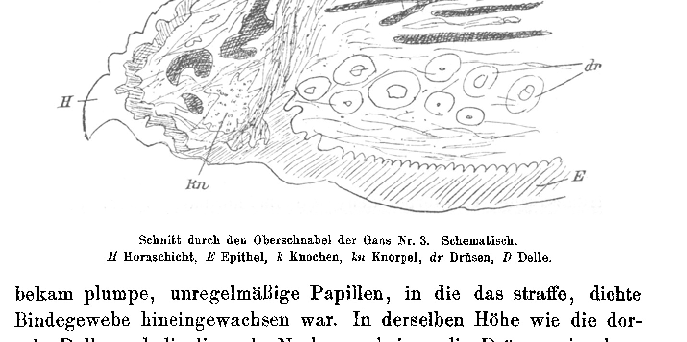

# Regeneration of the Beak in the Domestic Goose (Anser cinereus) and in the Domestic Duck (Anas boschas).

By

Dr. phil. **E. I. Werber** and stud. med. **W. Goldschmidt**,
Demonstrator at the First Anatomical Teaching Chair, Vienna.

(From the Biological Experimental Station in Vienna.)

With 1 figure in the text and Plate XXIV.

Received on 13 July 1909.

*Archiv für Entwicklungsmechanik der Organismen*, vol. 28 (1909).

> **Full translation.** A complete English rendering of the running text of “Regeneration of the Beak in the Domestic Goose (Anser cinereus)” (Werber/Goldschmidt, 1909), including all tables, figure and plate legends, and footnotes. Numbers and table cells were transcribed from the page images, not the noisy OCR.

### Table of Contents.

|  | Page |
|---|---|
| 1. Introduction; Purpose of the Experiments | 661 |
| 2. General and Technical Matters Concerning the Experiments | 663 |
| 3. Course of the Regeneration Process | 664 |
| 4. Histological Findings | 668 |
| 5. Older Data on the Regenerative Capacity of the Bird's Beak | 670 |
| 6. General Matters | 674 |
| 7. Summary of the Results | 675 |
| 8. Bibliography | 675 |
| 9. Explanation of the Figures and of Plate XXIV | 676 |

## 1. Introduction; Purpose of the Experiments.

The present work is to be regarded as a continuation of my earlier works (1905, 1906), in which I endeavored to demonstrate by means of experiments that the regenerative capacity of a body part or organ in an animal does not depend on a greater or lesser possibility of its loss, but rather on the position of the animal in question within the system, provided that the missing (amputated or in some other way lost) organ exhibits no particular specialization.

Together with other researchers, it is, as is well known, in the first place AUGUST WEISMANN who makes the regenerative capacity of an organ in an animal dependent on its probability of loss and on the height of its biological value for the animal. The view of other researchers (FRAISSE 1885, NUSSBAUM 1886, LOEB 1895/6, PRZIBRAM 1899, among others), that regenerative capacity is a general phenomenon which accrues to all animals, but always all the more diminished the higher the animal is placed in the system, is combated by WEISMANN and his adherents; and as proof of the correctness of his view he adduces the cases of beak regeneration in birds that became known some years ago. Against these objections I now entered in my earlier works (1905, 1906). It succeeded for me in demonstrating experimentally that even amphibians, urodeles and anurans, and reptiles (lizards) are able to regenerate the jaw tips up to the boundary of the nasal openings. I also pointed out a hitherto unknown fact, that even the female hen is capable of regenerating amputated beak tips.

Thereby I believe to have proved that the view of BORDAGES and WEISMANN, that the regenerative capacity of the beak in cocks—and probably also in the males of other birds—is to be traced back to sexual selection, since they fight battles with one another at the time of reproduction, in which the beak forms the principal weapon, appears entirely unjustified. Through my experiments I believe to have shown as evidence that the regenerative capacity of the bird's beak is nothing surprising, that it could rather have been guessed, since the reptiles, systematically closely related to the birds, are able to regenerate the body part (jaw) corresponding to the beak. It follows from my hitherto existing experiments to a sufficient degree that the regenerative capacity of the jaw tips in amphibians and reptiles and of the beak in birds is not to be regarded as an adaptation phenomenon, but rather as a degree, corresponding to the systematic position of these animals, of that general regenerative capacity which accrues to all animals in a variously high degree (each according to the systematic position). In apparent contradiction to this assumption stands a case given by HÜBNER (1902), according to which a goose, which lacked half of the upper beak, did not regenerate the same. I have already pointed out in one of my earlier publications that from this case it is absolutely not yet permissible to conclude that the goose is unable to regenerate the beak, since for the absence of the regeneration in this one case a possibly present diseased defect or advanced age would have to be made responsible.

I now believe to have been quite right with my conjectures at that time. This namely emerges sufficiently from the experiments on the goose and on the duck, about which I shall report in the following.

## 2. General and Technical Matters Concerning the Experiments.

When I proceeded to the setting-up of the experiments on the goose, I had no doubt at all that the same would yield a positive result. I did not originally wish to undertake the experiments on the goose, but then decided to extend them simultaneously to the duck, in order then not to encounter a possible objection that the goose occupies a special position with regard to the regenerative capacity of the beak which would permit no further-reaching conclusions. I performed the amputations on the upper and lower beak of young birds with very sharp scissors, which, for the sake of asepsis, were passed through the flame before each cut. I also employed a local anesthesia with ether, so that the animals would not suffer too greatly under the painful operation, which moreover could have given occasion to violent movements of the same and consequently to a great loss of blood—a circumstance which seemed problematic for the thriving of the animals. The amputation was always carried out by means of two cuts. After the operation, the animals were brought into clean-washed, disinfected containers, where they remained for about 8 days. After this time, when the wounds of the operated animals had long since healed completely, so that there was no longer any danger of infection, and after the young animals had grown so far that they could be brought into water without thereby drowning, they were brought into one of the basins located in the courtyard of the Biological Experimental Station, specially built for larger vertebrates. So that these animals (waterfowl) would have sufficient water here, a cemented basin was set up, about 1 m long and likewise broad and about 60–70 cm deep. This basin was filled with fresh water, which was changed for fresh every couple of days. — The feeding caused me some worry at first, since the animals, with their wounded beaks, could take nothing solid and yet needed abundant nourishment if they were not to perish. I tried it with milk. I gave the animals several hours after the operation nothing at all, neither to eat nor to drink, in order not to disturb the process of the wound-closure through abrasion. Only the day thereafter did I place into the containers one or two flat vessels filled with milk each. On this day the animals received no solid food yet. Their hunger was stilled with milk, which they drank very eagerly. From the next day on, until their transfer into the large containers in the courtyard of the institution, I fed them with milk and bread-crumbs softened in it. This kind of nourishment proved itself as quite suitable. The animals for the most part felt very well and rapidly increased in size and weight. After the animals had then been brought into the stall, they were henceforth fed with a mixture prepared from bread or potatoes with water and bran. Chopped grass, mixed with bran, was also given to the animals, which they relished just as well. On a small but completely sufficient grazing patch the animals lacked for nothing. In the large

container, which is surrounded on three sides by scagliola walls and whose fourth wall forms a thin, very loosely woven wire net, grain kernels had by chance been scattered quite near the basin. The proximity of the basin, out of which the animals always splashed much water when leaving it, had as a consequence that the grain seed accidentally scattered there soon yielded an excellent grazing place for the geese and ducks. With grain kernels the animals were fed once they had already grown fairly large and could use their once-wounded beaks for this somewhat more difficult task.

## 3. Course of the Regeneration Process.

### A. Goose (*Anser cinereus domesticus*).

For the experiments, wholly young, three-week-old animals were used, which, as experience shows, are so far advanced. On 14 July 1906 I amputated the upper beak of three geese at the nasal openings and a likewise large piece on the lower beak. The amputated pieces were preserved in formol-alcohol. Despite my anticipatory hope that positive results were to be expected, I nevertheless also feared the possibility that for these animals a deep-reaching operation might be not quite easily withstood. For the sake of certainty, on 18 July 1906 I drew in two more geese of the same birth date for the experiments. This time I amputated still much smaller pieces (about 4 mm at the longest place) on the upper and lower beak. This operation was much easier because not so deep-reaching, and it was to be expected that the animals would well survive its consequences, so that at least a handle would be given as to whether the goose's beak is regeneration-capable at all. And this handle I would have lacked if the three animals more heavily operated on 14 July had perished prematurely. In order, in the course of time, to be able to prevent a possible confusion of the animals operated to quantitatively different extents, I marked the three more heavily operated animals with a red little band, which I tied to a leg of each animal. In the experiment journal¹) I designated these three specimens as Series 1 and the two later operated specimens as Series 2. I will now enter into Series 1, in order then only briefly to come back to Series 2, since the course of the regeneration process exhibits no essential differences between the two series.

The amputation resulted in the animals in a very heavy bleeding from the wound margins, which was successfully staunched by means of iron-chloride cotton wool. I then left the animals in the container without food until the next day, because otherwise a renewed bleeding or an infection would have been to be feared. On the next day the wound margins were indeed still not dry, but yet already closed so far that it was beyond doubt that the wound healing had already begun. As already mentioned, I gave the animals on the first days liquid food (milk), which they took up very eagerly. In the course of the next two to three days the wounds were already closed in all three specimens and showed at their margins a dry blackish wound scab. I then fed the animals in the manner already given in the previous paragraph. In the next days I observed that in two specimens the wound scab became ever narrower and was displaced by a light whitish tissue. Thus the wound-healing process was concluded in the two specimens. The growth of the beak now proceeded, like that of the whole animals, very rapidly. Already on 25 July, i.e. 11 days after the amputation, I could observe

> ¹) I do not publish the experiment journal separately here, because it is almost entirely contained in the text.

that the beak in each of the two animals had grown back relatively considerably (over 2 mm) from the cut site, which was very well recognizable and measurable on the light, whitish, regenerated epithelium. The growth of the regenerate, which rounded itself off ever more in arch shape, proceeded very rapidly. On 22 August the regenerate had thriven so far that perhaps still only 1.5–2 mm were lacking to the full length of the beak. In this condition I conserved one of the two animals, in order to have a transitional stage during the regeneration process as a voucher for my experiments¹). In this stage (Plate XXIV Fig. 1 and 1a) a small end-part of the pincers still protrudes uncovered. The second animal I conserved on 16 Sept., when the beak had already nearly reached its normal length and was absolutely not to be distinguished from a normal beak (Plate XXIV Fig. 2 and 2a). In the third animal of this series the regeneration process proceeded much more slowly. The bleeding was here much stronger than in the other animals, since the cut had accidentally been conducted somewhat deeper. The first provisional wound closure (wound scab) occurred indeed only about one day later than in the other animals, but the wound margins were much thicker and the wound scab was still to be seen at a time when in the other two animals fairly large regenerates could already be established. The outer view of the beak gave the impression that in this animal, as a consequence of the amputation undertaken at a somewhat deeper place, the bones of the jaws had been very badly injured (possibly splintered in places), which had considerably delayed the wound healing and the regeneration process. On 5 August the wound scab in this animal had still not entirely disappeared. Only 7 days later, i.e. on 12 August, were the wound margins clothed with young, whitish epithelium. Noteworthy is that the animal, despite this so long-persisting defect, could take up nourishment unhindered at the beak and otherwise thrived just as well as the others. After the wound was clothed with regenerated epithelium, the regeneration of the missing beak pieces also proceeded, though relatively very slowly. I let the animal remain alive still for a long time and conserved it only on 14 November, i.e. almost 2 months later than one

> ¹) The voucher material is located in the developmental-mechanics collection of the Biological Experimental Station in Vienna.

of the two other animals, which had completely regenerated the amputated beak pieces. Nonetheless the regeneration process here was still far from concluded, even though a considerable piece had grown back on the upper and lower beak (Plate XXIV Fig. 3). The tongue of this animal, which was also histologically examined, protruded very far because it was uncovered. And as a consequence of so long a duration of the beak defect, the outer horn layer of the tongue hypertrophied from the place where it was uncovered, so that its end-tip [grew] very considerably and made, especially at its end part, the impression of a thick, pointed, horny nail. This hypertrophy, through which the tongue was protected from total drying-out, shows an adaptive capacity of the otherwise covered and moist-kept tongue to the dryness which was caused by the lack of the beak pieces¹).

In Series 2 there were two three-week-old geese, which were operated on 18 July. In these animals I amputated only very small pieces (about 4 mm at the longest place). The wound here was already closed with a scab on the next day, which on the fourth day was no longer to be seen. The missing beak pieces grew back very rapidly, rounded themselves off ever more in arch shape, until the beaks had reached their original form. On 12 August, i.e. on the 25th day after the amputation, I already established complete regenerates in both animals. On the beaks it was macroscopically absolutely impossible to recognize that the end piece had ever been lacking. I conserved the head of one of these animals still on the same day, while the second animal remained alive some weeks longer. I must add here that, although I had expected positive results of my experiments, I was nevertheless very astonished that I could record them already after such a short time. These results perhaps testify best that the beak is still regeneration-capable to a relatively very high degree. Only here, as is also the case with many other animals, do youthful age, suitable feeding, and other favorable living conditions seem to favor the regeneration process quite especially.

> ¹) An analogous case, in which however the cause of the (upper-)beak defect was not known, was described by LARCHER (1873) in his treatise to be discussed later on p. 27 and depicted on Plate III.

## B) Domestic Ducks (*Anas boschas domestica*).

Here I have essentially the same results to record as with the domestic geese. For the experiments I used about three weeks old ducks and amputated from them beak end-pieces of about 8 to 10 mm in length (as with the geese), and indeed in three exemplars smaller beak pieces (as in Serie 2 of the geese). The former are designated here as Serie I, the latter as Serie II.

In the ducks of Serie I, the beak bled rather strongly; nevertheless the wound margins here too closed already after about two days through a dry [wound] scab. Unfortunately, I had here, just as already with the geese on 13 and 14 July, thus on the third and fourth day after the operation, to record the loss of three animals. These animals probably perished, despite all precautionary measures, from an [infection] that occurred during the food intake. The two other animals that remained alive thrived excellently, grew very rapidly, and already after a month [had] complete regenerates. On 12 August one of these animals was killed and its scab preserved. Its beak is hardly to be distinguished from a normal duck-beak (Taf. XXIV Fig. 4 and 4*a*). The second animal was preserved 14 days later and its head likewise mounted as proof material. — In the ducks of Serie II the bleeding was very strong, but the wound closure (wound scab) ensued already after one day. The amputated beak end-pieces grew back rapidly, and the beaks reached their normal length and form already after 4 weeks. On 8 August I preserved one of them, while the two other animals were killed somewhat later.

So it was, then, that the result, as I obtained it with the ducks, was completely equivalent to that of the geese. Here too, as with the geese, the regenerative capacity of the beak is present in high degree to the same extent in both sexes. I may add at this place that the operated animals were both males and females. The regenerative capacity was the same for both sexes.

## 4. Histological Findings.

For histological investigation, the three geese of Serie I and two ducks of Serie I came under consideration. With these, the upper beak pieces had been excised, and indeed the upper beak too as well as the lower beak in such a way that the beak came to histological treatment through a median-sagittal cut in two halves, and one of these halves in turn. The objects were decalcified in saltpetre-ether, embedded in celloidin, [cut] in sagittal direction, and stained in Hämalaun-Eosin.

The first goose of Serie I had still been killed before completion of the regeneration. On the microscopic sections one sees that epithelium, connective tissue and bone continue without continuity-disturbance into the regenerate. At the lingual beak-side the horn layer appears not yet so broadly developed as was the case at the amputated piece, while the dorsal side had no difference to show. At the epithelium itself nothing special is to be emphasized; the bone too shows a normal character, reaches up to the beak tip, and possesses richly blood vessels. The connective tissue appears denser, especially at the lingual side, and is likewise richly supplied with blood vessels. There, where the connective tissue begins to grow denser, the glands cease; peripheral from this place no more glands can be detected. The height of the thickening in the connective tissue, furthermore the simultaneous disappearance of the glands and the thinning of the horn layer, are at this object the only marks which permit an inference upon the former amputation site.

Herbst's tactile corpuscles, which in the normal beak are very numerous to be seen, show themselves here only quite singly. The preparations which stem from the second goose and from the two ducks yield that the findings for both animals, upper and lower beak, are concordant. Here too epithelium, bone and connective tissue continue distally smoothly. In the goose and one of the ducks a broad horn layer has also already re-formed (Taf. XXIV Fig. 5). In the connective tissue the densification recedes or restricts itself only to small islands, especially there where the bone does not quite reach the beak tip. At the second duck one sees in the vicinity of the front end of the bone still a small cartilage remnant. (Here be it mentioned that I have seen such a one also at one of the amputated beak end-pieces, which is probably to be attributed to the youth of the animals chosen for the experiment.) At these objects the Herbst's tactile corpuscles are represented much more numerously, although not in the same measure as at normal exemplars, especially on the beak tip, where they are to be seen only singly at the regenerates.

One can, however, find them again both in the bone marrow and in the cutis.

Glands appear, in these animals too, not to have reappeared.

With the third goose the conditions lie somewhat differently. Here the former amputation site can easily be detected. A deep dent remained on the dorsal surface of the beak; the same, however, is lined by epithelium and horn layer without continuity-disturbance. At the lingual side there developed at the operation wound a pronounced scar tissue. The cutis

**Fig. (text-figure).** Section through the upper beak of goose Nr. 3. Schematic. *H* horn layer, *E* epithelium, *k* bone, *kn* cartilage, *dr* glands, *D* dent.  *(figure not reproduced)*

received clumsy, irregular papillae, into which the firm, dense connective tissue had grown. At the same height as the dorsal dent and the lingual scar, the glands appear as if cut off (see text-figure). Distally from this plane, fresh bone has formed; it shows, however, an irregular structure, pervaded by abundant connective tissue and numerous blood vessels. A larger cartilage island too is still to be seen. Herbst's corpuscles are visible only quite singly in the regenerate; glands have not reappeared.

## 5. Older Reports on the Regenerative Capacity of the Bird-beak.

Besides the cases of regeneration of the bird-beak discussed by Weismann and Bordage in their writings, there is also a fairly large number of older reports, which are to be found in a work by Larcher (1873). Larcher discusses in this work, alongside his own observations, the older reports of earlier researchers, most of whom go so far beyond, that the bird-beak possesses regenerative potencies in higher degree. I will here in the following give some of these reports after Larcher, which refer to deformities of various kinds, regenerative double-formations (superregeneration) and typical regeneration, because the same have for a long time gone forgotten and have been found again only in most recent time (cf. Przibram 1909).

According to these reports, a great number of observations are said to have brought to light the fact that especially the upper beak of many birds, and indeed predominantly that of the birds of prey, shows in its appearance, its structure and its relations to the under beak, characteristics which are wholly alien to the species to which the bird belongs. So one is said, for instance, to have observed in various birds of prey that the more or less jagged side-margins of the upper beak by far overhang the corresponding margins of the under beak, while normally in birds of the same species and the same age, upper and under beak always touch in a straight line. Furthermore cases are said to have been observed where the upper beak was considerably lengthened and either bent in at its free end or laterally (which Larcher has observed in several cases in hens) or also bent off from the base, so that the upper beak crossed the under beak and touched it at only one point or even at no point at all. So Doebner¹) reports of a raven (*Corvus frugilegus* L.), whose upper beak overhung the under beak by three Zoll [inches] in length and one Zoll [inch] in breadth.

> ¹) Cited after Larcher.

Moricand¹) reports of a raven found in the collections of the Natural-historical Museum of Geneva, whose upper beak was so lengthened and bent downwards that it exceeded the normal length of the upper beak by at least about 1½ Zoll [inch], while the under beak was normal.

In a reed-bunting (*Emberiza schoeniclus*) Moricand likewise saw the upper beak narrower and longer than normal, ending in a bow, without deviation to the right or left being seen. Larcher recalls at this place also the peculiar structure of the beak in the crossbill, whose upper and under beak, instead of touching one another at the margin, cross at their ends. This has been regarded as crippling (inherited??). According to the reports of Brehm (1853), one finds in the young in the nest no crossed beak. This deformation of the straight beak into the typical crossbill-form, which the adult animals show, takes place only first then, and arrives indeed gradually, and indeed already with Brehm it is to be looked upon as an adaptation-appearance to the living-conditions of these birds, namely that their hook-shaped, mutually crossed jaw-bones serve them for the splitting open of the seeds under the scales of the pine-cones, when this forms the nourishment¹).

> ¹) If these observations of Brehm are correct, then we would have in the crossbill-case a classical example of inheritance of acquired functional properties.

Larcher reports further of cases where the upper beak was thickened, bent away from the under beak from below upwards, lengthened and not seldom even spirally rolled in. In a parrot-female, which Geoffroy St. Hilaire²) observed and which he has preserved in the Natural-historical Museum of Paris, the upper beak is considerably lengthened, rolled in from right to left, and describes two regular spiral-windings. There are said further, after Owen³), also cases to have come to observation where the upper beak is overhung by a second upper beak, which for its part can be wholly and entirely normally formed¹). »Finally it« (i.e. the upper beak), it says further in Larcher, »can either in consequence of abnormal development of some small part, or in consequence of a partial division, evoke at first look the false appearance of a double-formation, or sometimes its front end can be three-fold forked.« So Perrault²) reports of a turkey which had a beak three-fold divided at the end, »as if there were three beaks joined with one another.«

> ¹) Cited after Larcher.
> ²) The Museum of the Surgical-school in London is said to possess such an exemplar from a vulture-beak.
> ³) Cited after Larcher.

In these cases it must in any event be a matter of double- or triple-formations, which are of regenerative nature (superregeneration), and that which evokes the »false appearance« of double- (resp. triple-)

formations, rests in any event at first look upon the error which, as a consequence of the deficient knowledge of the pertinent facts at the time of the publication of his work, [Larcher] cannot be reproached with.

According to Larcher, deformities are said to occur much more seldom at an upper beak than at an under beak. Nevertheless such cases are said to be restricted in which this deformity appears equally even at the under beak. So has, for instance, Geoffroy St. Hilaire⁴) observed at a bullfinch an abnormal lengthening of the under beak, while the upper beak was normal. — In a magpie, Jäckel (1848)¹) saw an under beak that exceeded the upper beak by 3 mm. Schmidt (1866)¹) reports of a parrot, whose under beak considerably exceeded the normal upper beak in length.

> ¹) Cited after Larcher.

Larcher cites further only some similar cases which concern the deformities while the upper beak was normal. These cases, however, are rare, though they do not seldom occur. More frequently are cases said to appear where the deformity occurs at both parts of the beak. So indeed is in such cases the anomaly of the one beak a consequence of the deformity of the other, but then the deformities of both beak-halves may also have arisen regularly and independently of each other. As an example for that latter case may be regarded those deformities at the beak of various birds which remarkably recall the normal beak-formation of crossbills' beak (Walter 1864)¹). Here too, as in the crossbill, the skull and the movement-muscles are said to be more strongly developed at that side toward which the tip protrudes.

Larcher says further, cases of beak-deformities at both parts of the beak are also said to have been observed, where the upper- and under-beak not only crossed, but rather either both were bent over hook-shaped, or also had other anomalies. So Neubert (1866)¹) reports of a parrot (*Melopsittacus undulatus*), whose upper beak, in consequence of a fall, was bent inward and (with further growth) had gripped into the under beak. The under beak is then said to have grown comparatively further, so that it considerably exceeded the upper beak in length. Moricand¹) reports also of a great tit (*Parus major*), whose under- and upper-beak are said to have been considerably lengthened, the upper beak being bent off leftwards from the base and spirally wound.

> ¹) Cited after Larcher.

Remarkable are the remarks of Larcher at the conclusion of his work. According to his view, the discussed deformities are said to be either congenital or traumatic or even morbid, or deformities form themselves in consequence of changes of growth, which are to be regarded equally in relation to both beak-halves. The birds are said to have the inclination to slough off the deformities, and methodical experiments are said to have shown that a removal of the same is without effect, because the removed part is regenerated. Finally Larcher adduces cases in which normal beaks have regenerated after sloughing-off, and indeed in a heron (*Ardea purpurea*) after Jäckel, and in a great spotted woodpecker (*Picus major*) after Büchele.

## 6. General Conclusions.

From the reports here adduced after Larcher, it is to be seen that the beak in birds in any event reacts to external, mechanical influences, such as for instance injuries, with regenerative formations. It can be a matter either of deformity-formations of various kinds, or also (in some cases) of typical regenerations. There thus pertains to this organ of the bird the regenerative capacity in a relatively still very high degree. With these older reports, the results of my experiments here undertaken in the domestic goose and in the domestic duck are in complete agreement. The results of my experiments show that the beak of these birds possesses regenerative potencies in very high degree; in both animals regeneration of fairly large, amputated beak-pieces is to be obtained, when the amputations are undertaken at an early age and when one's care of the animals corresponds to favourable living-conditions.

These results are, in my view, again a proof for it that the regenerative capacity of an organ in an animal is not to be regarded as an adaptation-appearance to its greater or lesser injury-possibility. Neither of the domestic goose nor of the domestic duck is it known that these animals ever came into the situation of being deprived of their beak end-parts. Rather, in them the beak is normally exposed to very small injury-dangers. The injury-danger of the beak in other birds, which is conditioned through their mode of nourishment and through the fights carried out by the males, is present neither in the domestic goose nor in the domestic duck. With the mode of nourishment of the domestic goose and of the domestic duck, an injury of the beak in the course of the food intake is highly improbable. Also it is not known that the goose-males or duck-males should carry out fights with one another at the time of sexual maturity. And even if this were the case, still no further-reaching conclusions therefrom would be admissible, since, as emerges from my experiments, female geese and ducks regenerate amputated beak end-pieces just as well as male ones.

The capacity of these animals to regenerate the beak is thus to be construed neither as adaptation to a general loss-possibility, nor to one conditioned through breeding-selection. This capacity is, in my view, rather a degree corresponding to the systematic position of the birds, of that general regeneration-force which pertains to all animals and which diminishes the more, the further the animal in question removes itself from the structure of the unicellular ones.

## 7. Summary of the Results.

I. The beak of the domestic goose is in high degree capable of regeneration. Beak-parts amputated almost up to the boundary of the nostril-holes in young geese of both sexes are completely regenerated already after 5—6 weeks.

II. Equally high is the regenerative capacity of the beak in the domestic duck. In young animals, smaller and larger pieces (about 8—10 mm long) amputated at the upper- and under-beak are completely regenerated already after a period of 4—6 weeks. Here too regenerates have been obtained in animals of both sexes.

III. The histological investigation of the regenerates showed that epithelium, bone- and connective tissue, likewise nervous elements (Herbst's tactile corpuscles), have reappeared, while glands do not appear to have regenerated.

## 8. Literature-Index.

Brehm, L., Die Kreuzschnäbel (in Naumannia. Bd. II. S. 189. Stuttgart 1853).

Doebner (de Aschaffenburg), Abnorme Schnabel- und Zahnmißbildung. Zoolog.

Garten. Bd. VI. S. 116. 1865.

Fraisse, P., Die Regeneration von Geweben und Organen bei den Wirbeltieren, besonders Reptilien und Amphibien. Cassel und Berlin, Fischer, 1885.

Hüsner, O., Neue Versuche aus dem Gebiete der Regeneration und ihre Beziehungen zu Anpassungserscheinungen. Jena, Fischer, 1902.

Jäckel, J., Beiträge zur Ornithologie Frankens. Oken's Isis. Bd. XLI. S. 25, Taf. VII Fig. 4. S. 31, Taf. VII Fig. 3. S. 32, Taf. VII Fig. 1 u. 2. Leipzig 1848.

— Über Schnabelmißbildungen verschiedener Vögel. Zoolog. Garten. Bd. VI. S. 134, 137. 1865.

— Über Schnabelmißbildungen. Zoolog. Garten. Bd. VII. S. 335. 1866.

Larcher, O., Mémoire sur les difformités du bec chez les oiseaux. In: Mélanges de Pathologie comparée et de la tératologie (p. 25—41). Paris 1873.

Loeb, J., Bemerkungen über Regeneration. Arch. f. Entw.-Mech. Bd. II. 1895/96.

Nussbaum, M., Über die Teilbarkeit der lebenden Materie. I. Arch. f. mikr. Anat. Bd. XXVI. 1886.

Przibram, H., Die Regeneration bei den Crustaceen. Arb. Zool. Inst. Wien. Bd. XI. S. 163. 1899.

— Regeneration. Ergebn. der Physiologie. 1. Jahrg. Wiesbaden, Bergmann, 1902.

— Die Regeneration als allgemeine Erscheinung in den drei Reichen. Naturwissensch. Rundschau. Bd. XXI. Nr. 47—49. 1906.

— Experimentalzoologie. II. Regeneration. Wien u. Leipzig, F. Deuticke, 1909.

Schmidt, Über Schnabelmißbildungen bei Papageien. Zoolog. Garten. Bd. VII. S. 116, 132. 1866.

Walter, H., Eine Rabenkrähe mit Kreuzschnabelbildung. Zoolog. Garten. Bd. V. S. 283. 1869.

Weismann, Aug., Tatsachen und Auslegungen in bezug auf Regeneration. Jena, Fischer, 1899. S. 5.

— Vorträge über Deszendenztheorie. Jena, Fischer, 1902.

Werber, E. I., Regeneration der Kiefer bei der Eidechse Lacerta agilis. Arch. f. Entw.-Mech. Bd. XIX. 2. Heft. 1905.

— Regeneration der Kiefer bei Reptilien und Amphibien. Arch. f. Entw.-Mech. Bd. XXII. 1. u. 2. Heft. 1906.

## 9. Explanation of the Figures.

### Plate XXIV.

Fig. 1. Regeneration-stage from 22 August 1906 of the upper beak in a goose, on which on 14 July 1906 an end-piece reaching almost up to the nostril-holes had been amputated; from above.

Fig. 1a. Regeneration-stage at the under beak of the same animal, at the same time; from below.

Fig. 2. Complete regenerate from 16 September 1906 of the upper beak in a goose, in which an end-piece reaching almost up to the nostril-holes had been amputated on 14 July 1906; from above.

Fig. 2a. Under beak of the same goose, at the same time, with complete regenerate; from below.

## Figures

**Fig. (Text-figure)**

---

*Translator's note.* One of the Biologische Versuchsanstalt (Vienna Vivarium) papers flagged on the project site as a modern rediscovery target. Claims are rendered as stated in the original, not endorsed.
