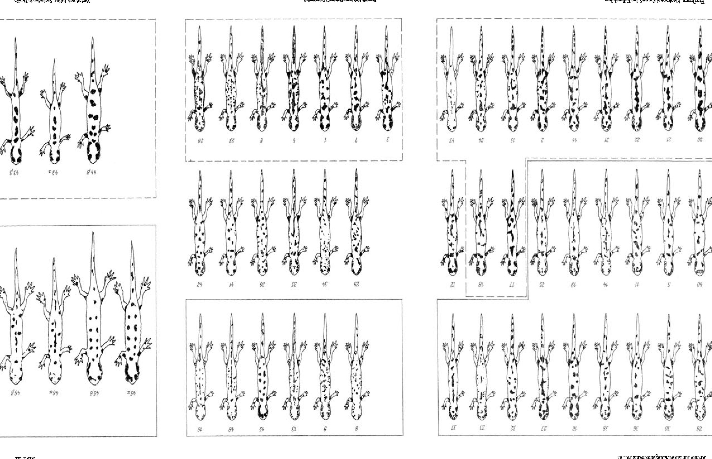
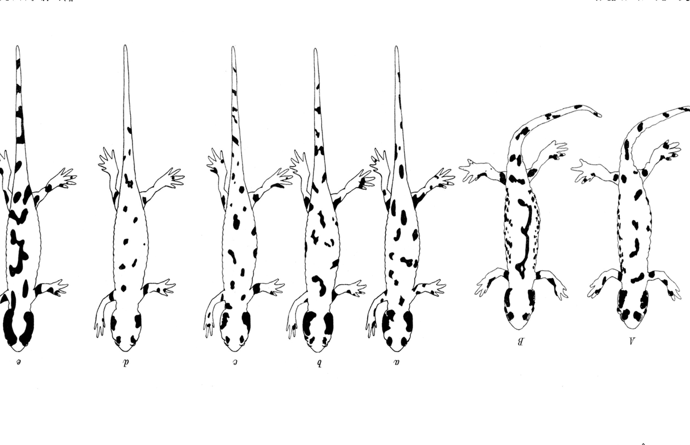
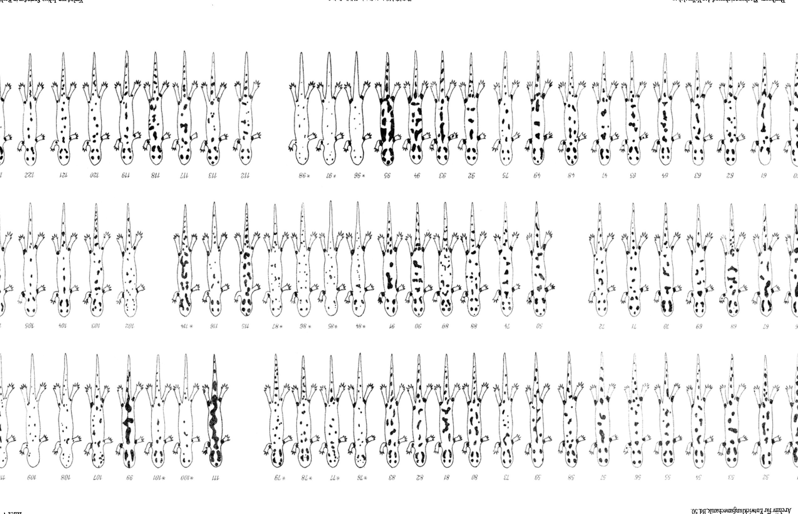

# The Influence of Yellow and Black Surroundings of the Larva on the Spot-Marking of the Full-grown Newt of *Salamandra maculosa* Laur. forma typica

(at the same time: Causes of Animal Colour Dress. V).

By

Hans Przibram

(with the collaboration of Jan Dembowski).

(From the Biological Experimental Institute of the Academy of Sciences in Vienna [Zoological Division].)¹⁾

With Plates III–V.

(Received 10 July 1920.)

*Archiv für Entwicklungsmechanik der Organismen*, vol. 50 (1922).

> **Full translation.** A complete English rendering of the running text of “The Influence of Yellow and Black Surroundings of the Larva on the Colour” (Przibram/Dembowski, 1922), including all tables, figure and plate legends, and footnotes. Numbers and table cells were transcribed from the page images, not the noisy OCR.

### Table of Contents

| | Page |
|---|---|
| I. Introduction: Purpose of the present treatise | 109 |
| II. Own experiments | 110 |
| &nbsp;&nbsp;1. Arrangement of the experiments on the influence of yellow and black surroundings at high light intensity | 110 |
| &nbsp;&nbsp;2. A. Results of the experiment with larvae from mother A | 112 |
| &nbsp;&nbsp;&nbsp;&nbsp;&nbsp;B. Results of the experiment with larvae from mother B | 113 |
| &nbsp;&nbsp;3. Further rearing of full-grown newts in coloured surroundings | 114 |
| &nbsp;&nbsp;&nbsp;&nbsp;&nbsp;A. Further rearing of full-grown newts on yellow | 114 |
| &nbsp;&nbsp;&nbsp;&nbsp;&nbsp;B. Further rearing of full-grown newts on black | 115 |
| &nbsp;&nbsp;4. Conclusions from the own experiments | 116 |
| III. Experiments of J. Dembowski | 118 |
| &nbsp;&nbsp;1. Arrangement of the experiments with various light intensities, darkness and dazzling | 118 |
| &nbsp;&nbsp;2. Results of the experiments | 120 |
| IV. Discussion of the work of Herbst on the influence of yellow and black surroundings on *Salamandra maculosa* forma *taeniata* | 123 |
| &nbsp;&nbsp;1. Experimental method | 123 |
| &nbsp;&nbsp;2. Experimental results | 124 |
| &nbsp;&nbsp;3. Herbst's critique of Kammerer's experiments | 126 |
| &nbsp;&nbsp;4. Comparison of the results of Kammerer, Herbst and other authors | 127 |
| &nbsp;&nbsp;5. Critique of the objections of Herbst | 127 |
| &nbsp;&nbsp;6. Unconscious confirmations of Kammerer's statements by Herbst | 135 |
| &nbsp;&nbsp;7. Deficiencies of Herbst's work | 137 |
| &nbsp;&nbsp;8. Interpretation of Herbst's results as failures owing to deviating conditions | 139 |
| V. Outlook on a chemical explanation of the salamander colour-adaptation | 141 |
| VI. Summary | 142 |
| VII. Bibliography | 143 |
| VIII. Explanation of the Plates | 144 |

> ¹⁾ An abstract of this work under an identical title appeared in the Akademischer Anzeiger of the Academy of Sciences, Vienna, No. 14, 1920.

*Influence of yellow and black surroundings of the larva on the spot-marking etc.* 109

## I. Introduction.

### Purpose of the present treatise.

Among the most peculiar phenomena of our native animal world belongs the spotted earth-newt or fire-salamander, *Salamandra maculosa* Laur. Not only does it distinguish itself among all amphibians by a glaringly yellow and black colouration, but these colours are, in the *forma typica* occurring in the Vienna Woods, also asymmetrical and, as it appears, distributed in the various individuals quite planlessly over the body. This asymmetry is less pronounced in the *forma taeniata* occurring in other places, e.g. in Westphalia, in which there are present either two longitudinal rows of yellow spots distributed more or less regularly over both sides of the body, or yellow longitudinal stripes formed from the confluence of these. These two forms *typica* and *taeniata* were formerly regarded as given constant subspecies, about whose connection one gave no further thought, just as one had also formed no conception about the causes of the differing extension of the yellow and black on the individual specimens, but merely regarded it as innate in some manner.

It was Paul Kammerer who first observed changes in the marking of the individuals, which he related to the influence of the surroundings (1904) and made the starting point of extended experimental investigations at our institute, whose results were published in detail in 1913. The changes observed by Kammerer on the metamorphosed salamanders proceeded slowly, so that only in the course of several years was a distinct difference of full-grown newts kept on yellow or black ground achieved. This long duration of experiment appeared to me unfavourable for the verification of the results, since few researchers reconcile themselves to a long experimental duration, and also a certain danger for the reliable reproduction of the result could lie in the fluctuation of the illumination circumstances. In order to arrive at a quicker and more reliable experimental method, to demonstrate Kammerer's starting point — "that the colour dress of the salamander can be influenced at all by the colour of the surroundings" (quotation from Herbst 1919, p. 4) — I proposed to Kammerer and several other young researchers working at our institute in 1911 (Megušar, Sečerov, Frisch) to expose, not first the metamorphosed salamanders, but already the freshly deposited larvae, or those freed from the mother animal, to the coloured surroundings. At the same time I myself also set up a few such experiments, to report on which is one purpose of the present work; on the 110 &nbsp;&nbsp; Hans Przibram: The Influence of Yellow and Black Surroundings

results of the other named experimenters too will be pointed out at the appropriate place. Various circumstances have hitherto hindered the continuation of these experiments on a larger scale, which, [though] repeatedly taken up again during the World War, so in 1916–1918 in community with Jan Dembowski, could not be brought to the desired conclusion. Kammerer (1919) himself came round only in the foregoing year to occupying himself again with salamander experiments. Only in the most recent time, however, has a relevant work appeared by the highly esteemed experimental zoologist Curt Herbst, which now offers sufficient documentary material to draw entirely reliable conclusions. To be sure, Herbst believes that his experimental results stand in abrupt opposition to Kammerer's data. It is now the further purpose of my exposition to demonstrate the almost complete agreement of the results of Herbst, Kammerer and the other researchers out of his own work. If I thereby perhaps come forward sometimes somewhat sharply, I hope that Herbst will not regard this as an impermissible procedure, since he himself has indeed dealt with Kammerer no differently, and this had to give me occasion to take the experiments carried out at our institute under protection against precipitate accusations. I should like thereby to remark expressly that it does not occur to me to hold myself responsible for the views of Kammerer in respect to heredity. I have always stood on the standpoint that every researcher has the right to bring forward his own ideas and interpretations, even when he works at an institute whose director is of a different opinion. Thus often, in the publications of the biological experimental institute, differing views on the same question are represented. But a strict separation of the observed facts from the conclusions drawn from them I have everywhere looked to, both in my own [works] and in the works which have been handed over to me for publication in our archive-issues. Interpretations and views can be shown to be erroneous through critical discussions; the experimentally observed phenomena themselves, however, can be confirmed or not confirmed only through re-examination of the experiments. May some others too follow these principles: much useless dispute could then be avoided and much working power turned to more useful things!

## II. Own experiments.

### 1. Arrangement of the experiments on the influence of yellow and black surroundings at high light intensity.

In order to be able to work as far as possible with uniformly equal material and at the same time to set up many larvae simultaneously, highly *the larva on the spot-marking of the full-grown newt etc.* 111

pregnant female salamanders from the Vienna Woods were opened and the removed embryos from one and the same female distributed over the breeding glasses of a single experiment. For if one wished to wait for the natural deposition of the larvae, one could often not set up the experiment on a single day, since not always are all the larvae born in the course of the same day. In addition, in nature many larvae perish in the last period of the pregnancy (cf. Kammerer 1904), whereby the experimental material would be diminished in an unwished-for manner. The containers were wide-necked preserving jars (cf. Przibram 1913, p. 22 and Fig. 14 b) of 1 [litre] capacity, into each of which no more than 6 larvae went. By "black" surroundings I designated those breeding glasses whose walls had black paper glued on inside, and outside the same papers were also placed against the glasses. Analogously proceeded the use of yellow papers for the "yellow" glasses. The little containers were therefore in black or yellow surroundings. As wished-for influence of the paper enveloping the breeding glasses, just the colour of the light could come into consideration, since I left the other circumstances of the surroundings the same. The influence of the light — apart from the heat transmitted with it under certain circumstances, which is practically negligible — could not be excluded. Inside, white porcelain dishes were covered over with small pebbles (river-bed ground). The sunken breeding glasses thus received light reflected from the floors with light-yellow, reddish and dark stones, while from the walls of the porcelain dishes only the same finally white pebbles fell off. The full-grown newts grew up between the entirely black or even yellow enveloped walls. The higher light intensity of the control containers was not an intended one, but proved favourable for the decision of the question whether an accelerated effect of yellow surroundings rests on the higher light intensity in comparison with black. The dishes were filled to the half with high-spring-water. As soon as, on the larvae, the metamorphosis announced itself through beginning reduction of the gills and the appearance of yellow spots, the glasses were emptied, under slight inclination, in such a way that only a part of the floor remained covered with water, the other, however, could serve the transformed animals as "land-stay." The water was always changed by lifting off and slow refilling, 112 &nbsp;&nbsp; Hans Przibram: The Influence of Yellow and Black Surroundings

as soon as it [the water] began to grow turbid. As food for the larvae served *Tubifex*; the full-grown newts were also given mealworms and lumbricids [earthworms]. To the transformed salamanders, in all containers, a small moss cushion was assigned as resting place.

The two experimental series carried out were set up on 31 October 1911 and concluded before the end of 1913. The set-up place was the same room in which already Kammerer's experiments in earlier years had been set up, namely the so-called cold terrarium-passage of the biological experimental institute (cf. Przibram 1910, Fig. 9, Room 20 b and Plate VIII, Fig. 22). In order to keep also the same illumination, the same distance from the overhead lights was maintained. The control of [the marking] beyond the metamorphosis [occurred] in such a way that the spots of the just-transformed newt in the various surroundings [were] entered with pencil into the appropriate scheme. This registration was repeated, in the case of newts which were kept beyond the metamorphosis, again and again [each time anew]. Each newt which transformed received a continuous number. The breeding glasses were designated with the letter of the mother (A or B) and 1 to 3 for black, 4 to 6 for yellow, 7 to 8 for neutral surroundings. The transformation data are noted in the appended explanation of plates, in which A means provenance of the larvae from mother A, B from mother B, and the indices in the figures (Plates III and IV) are applied beneath the corresponding [description] of the mothers; the continuous transformation data are designated with Nr., and the animals kept on the same ground are enclosed in each case by a like framing-line; a strongly drawn-out one means black, a broken one yellow, and a weakly drawn-out one neutral ground. All salamanders of these two plates are on the same stage, that of the just-consummated metamorphosis; on the contrary, they are of differing age, namely the older, the higher the ordering-number designated by Nr. is. From these figures and then still some of ten young newts are united on a Plate C, which were also observed further. Hereby several figures, provided with the same Nr.+Number, refer to differing periods of life.

### 2. Results of own experiments.

A. For the first experimental series served the young from one salamander mother, which possessed relatively little yellow (Fig. A). At the laparotomy 38 larvae were found, which were distributed at random over 7 glasses, and indeed 3 glasses with black envelope and 3 glasses with yellow envelope received 6 larvae each, while the still-remaining 2 larvae were given into a control vessel. Up to the *the larva on the spot-marking of the full-grown newt etc.* 113

transformation 27 larvae could be reared, and indeed 15 in black, 11 in yellow surroundings, and 1 larva of the control; the rest perished still as larvae, before the marking of the full-grown newt had become distinct. Since thus ²/₃ of all larvae reached the full-grown-newt stage, possible marking-differences in the various surrounding-colours will not be attributable to a destructive selection through these. If we compare the control specimen Nr. 12 (cf. container A₇) with the mother animal, so the marking on the head is quite similar; on the contrary, there are found on the back more, but for this smaller, yellow spots than on the mother. It is to be noted that of course mother and child display quite differing age-stages at the time of the figure; nevertheless the general experimental result is not a strongly differing one in respect to the area-magnitude.

If one regards now the full-grown newts which had lived as larvae in black surroundings (Plate III, black-bordered group), so they have throughout less yellow than the control animal and also than the mother. The reduction of the yellow expresses itself mostly both in the number and the size of the yellow spots, sometimes merely in one of these relations.

The full-grown newts originating in yellow surroundings show in the majority (Plate III, broken-bordered group) an increase of the yellow spots going far beyond the yellow of the control or the mother, namely as far as the size is concerned, while their number can be diminished through confluence of several to larger complexes.

Only in three cases are the animals reared in yellow surroundings only insignificantly yellower (Nr. 24 from A₅) or not at all yellower (Nr. 18 from A₅) or finally even substantially less yellow (Nr. 43 from A₄) than the control.

We come now to the discussion of the further rearing as full-grown newts, and indeed of both cases.

This first experiment thus proves doubtless on the whole that it has yielded yellower full-grown newts after yellow surroundings of the larvae, blacker ones after black, in comparison with the control and with the mother.

B. Since neither the appearance of the mother at the time of her transformation, nor the colouration of the father or other ascendance, was known, so there could after all still exist doubts about the general meaning of experiment A, especially as merely one control animal remained alive. Experiment B removes this latter deficiency. In mother B, 44 embryos were found, of which again 6 each came into breeding-glasses B₁—B₃ with black, B₄—B₆ with yellow paper envelope; furthermore 6 into the control container B₇ and the remaining 2 into

> Archiv für Entwicklungsmechanik Bd. 50. 8 114 &nbsp;&nbsp; Hans Przibram: The Influence of Yellow and Black Surroundings

a second control container B₈. There developed into full-grown newts, in black surroundings 6, in yellow 7, and in the control 6 specimens. The numerical rearing result was here much less favourable than in A; but the result of experiment A excludes from the outset that an analogous result here rests on destructive selection. The controls (Plate IV, not-bordered group) have all of them less yellow than the mother, in which a row of back-spots has flowed together into an E-shaped back-stripe, but for this there are still more individual little spots present.

The "black"-animals (black-bordered) have decidedly less yellow than the controls and consequently still much less yellow than the mother; but they are, as a rule, strewn over with small yellow points and little spots (Herbst 1919 has called this "sprayed"). In one newt (Nr. 45 from B₁), whose transformation was not observed and which for that reason was not figured at the same time, the spots appear, after [their] number, significantly diminished, but for this enlarged and arranged in two rows; in proportion to the mother less yellow is present, in comparison to the controls this is, however, doubtful. To this animal too I shall return in the discussion of the further-keeping.

The "yellow"-animals (broken-bordered) have decidedly more yellow than the controls and mostly also more than the mother. The increase can consist both in multiplication of the spots and in confluence to larger ones. The E-shaped back-marking of the mother has nowhere appeared. In one specimen (Nr. 23 from B₆) it appears questionable whether, despite the much more numerous yellow points, the relation of yellow and black has been shifted in comparison with the controls, since larger spots are entirely lacking, and also no confluences are to be seen.

In general, however, the second experiment confirms that black surroundings of the larvae bring with them an increase of the black, yellow [surroundings] one of the yellow area on the upper side of the full-grown newts, as against control animals of the same litter.

### 3. Results of the further keeping of individual full-grown newts in coloured surroundings.

A. Since it was not originally intended in the experiments described above to follow the influence of coloured surroundings on already transformed salamanders, most of the experimental animals were conserved immediately after the metamorphosis. Only when, at the transformation, by way of exception a blacker specimen from the yellow surroundings (Nr. 43 from A₄) appeared, did I let it remain alive, since the suspicion lay at hand that the colour-formation of the full-grown-newt-dress might not yet be even approximately completed.

Nr. 43 (from A₆) showed, half a year after the metamorphosis, a very considerable increase of the yellow colour, which had concentrated itself into a few large patches (Pl. V, 43α). At the death of the animal, ³/₄ years after the metamorphosis, a further increase of the yellow could be ascertained (43β): in particular the parotid patch of the right side, which already at the earlier registration had appeared frequently strongly indented, had grown out into a longer, entirely ragged-edged streak, and the second dorsal patch had enlarged almost twofold. Although the specimen, as mentioned, had at the metamorphosis exhibited much less yellow than the control animal and the mother, it now showed comparatively much more yellow than the control animal, but did not however reach the latter in the increase of yellow, which had likewise grown so strongly during the same period. We wish moreover to point out that, had one observed this animal at a still later stage, this separation of the dorsal patches would perhaps not have been ascertained, since the black also had increased; certainly, however, in the yellow it had — already with our young animals reared further on yellow ground, in which the metamorphosis in the yellow rearing developed abnormally far behind — been surpassed.

Nr. 44 (from A₄) is a specimen of the yellow-rearing which already at the metamorphosis surpassed the control and the mother in yellow. It was conserved on the death-day of the previous one, hence at the same age. Here too an increase of the yellow is to be ascertained, which though by far not so striking as in the previous animal, although the salamander, in comparison to the control and the mother, shows more yellow area than Nr. 43. The increase of the yellow rests on the enlargement of the patches, which partly melt into one another, so that their number is reduced. On the back, between head and tail-root, instead of 11 there are now only 8 to be counted (Pl. V, 44β).

B. The increase of the yellow area observed on both the further-reared specimens from the yellow-rearing is opposed in entirely analogous manner by its decrease in full-newts which were held further on black.

Nr. 45 (from B₁) was, at the transformation for the black surroundings, unusually strongly yellow, and this colouring remained almost unchanged over the next 2 months (Pl. V, 45α). After ³/₄ years however (Pl. V, 45β) the patches are caught in the process of melting-away; the right parotid patch, which earlier hung together with the eye-patch, has loosened its connection, and this complex disintegrates further; the first patch on the trunk near the neck has been reduced to half its size; also most of the others have decreased in size. The animal now has, over against most of the controls and at any rate the mother, less yellow.

Nr. 46 (from B₄) was at the metamorphosis already not very yellow, but had many of its patterning-elements hanging together by means of connecting-lines. After 2 months (Pl. V, 46c) the connections were in the process of breaking through; of the scattered yellow points many had united into larger yellow patches. When ³/₄ years had passed since the transformation (Pl. V, 46β), one noticed a further separation of the dorsal patches, which now also melted into one another, although the decrease of the yellow as against the earlier registrations does not appear considerable. The animal now had approximately the same colour-relation as the controls at the transformation, but had nonetheless become much less yellow than the mother-animal.

### 4. Conclusions from our own experiments.

Both the comparison of salamanders of the typical form reared up to the metamorphosis in yellow and in black surroundings, as well as their comparison with the controls reared on »neutral« ground and with the mother-animals, from which all the larvae had been taken, show unambiguously and throughout an increase of the yellow area on the full-newt's coat in yellow surroundings, of the black in black surroundings. Mostly this already appears immediately at the transformation of the pre-treated larvae on the full-newts; exceptionally one must wait a longer time after the metamorphosis before these differences become manifest. Thereby these specimens change still much more strongly in the direction of yellow, or black, than do simultaneously-transformed newts which already at the transformation had exhibited the corresponding intensification of the one colour. The two salamanders which showed the delay of the colouring-out belonged to the most slowly metamorphosed specimens. It is near at hand to think of an illness which on the one hand delayed the transformation, on the other hand hindered the normal colour-formation; according to the blinding-experiments of Dembowski and Fischel reported later, it might be a matter of an affection of the eyes running its course in the larva, conditioned by a pathological state, which causes the delay of the colouring-out. For if finally, after a nonetheless happily carried-through metamorphosis, the eye had attained full function and had now exerted the normal influence on the colour-adaptation according to the surroundings-colour. Since both the larval-influencing as well as the continuing action of the same surroundings-colour in both directions — increase of yellow on yellow, decrease of yellow on black — proceeds, it is not possible to trace the changes of the colour-distribution proceeding on the full-newt back merely to the natural developmental course, as the controls would exhibit it and as the end-stage would approximately represent the mother-animal. From the two communicated experiments, however, it cannot be seen whether the change during the further holding of the full-newts rests on an after-effect of the larval surroundings or on an influence during the full-newt-holding. To decide this, experiments would have to be set up in which the colour-influenced larvae are brought at the transformation into neutral surroundings and observed further there. This experimental-combination, so far as known to me, lies as yet before in no publication ¹).

If I must therefore leave this gap still open, my experimental-arrangement nonetheless permits another conclusion in a different respect. The use of white porcelain-bowls for the »neutral« surroundings raised the light-intensity in the containers above that in the »yellow« and naturally also the »black« ones. Since in the experiments the increase of yellow proceeds in the »yellow« containers, but not in the »neutral« ones, the light-intensity cannot be made decisive for the result, but rather the colour. Otherwise the lighter »control«-containers would have to yield the more yellow full-newts. Also the increase of the black against yellow can accordingly not be ascribed to the lower light-intensity; we shall moreover hear later that on black ground at decreasing intensity the blackening decreases. Both the influence of yellow and also that of black must therefore rest on a positive action of specific light-rays. With the yellow surroundings it is self-evidently chiefly the rays of middle wavelength; but for me it is, after our experiments on other objects (cf. L. Brecher 1919, 1921), also of no doubt that it is the ultraviolet rays in black surroundings which bring forth the positive effect. This radiation-class of smallest wavelengths is indeed otherwise too known for its strong chemical action and in particular for the blackening of the skin in the vertebrates. For the »scorching« of the white man in the high mountains rests upon the richness of the lighting there in ultraviolet rays, as the numerous irradiation-

> ¹) Since the writing-down of these lines I have, through the kindness of Herr Professor v. Frisch, been able to inspect the manuscript of his work (1920), in which this experiment appears to be carried out with the success expected by me (*S. maculosa f. taeniata*).

trials with artificial ultraviolet-light have proved. While all other radiation-ranges of the sunlight are absorbed by black surfaces, a part of the ultraviolet is reflected and may now, through its counteracting action, be able to bring its specific effect alone to validity. If we transfer to this the conclusion won in the experiment concerning the relation of yellow light to the increase of yellow in the appearance of the fire-salamander in the open, then we find the proposition set up by Kammerer justified, that on yellower ground yellow, on blacker ground blacker animals are to be met with. This holds exactly likewise, whether the larval-surroundings be decisive for the definitive colour-coat or whether also the full-newt remains influenceable: the influencing runs in the same direction. We can now also understand the *Salamandra taeniata* living on the »red« Westphalian earth, with its very much yellow, if we consider that the minium-red earth acts predominantly by means of the yellow rays, since red light appears to be without influence. This holds not only from our experiments on other objects, but also emerges from Kammerer's newest experiments on the influence of the through-falling light and the fire-salamanders thereby transformed, in which in the Sennebier glasses the orange-red potassium-bichromate-solution acts in like sense with the greenish-yellow picric-acid-solution. On the contrary, moist, dark-brown humus- or loam-earth would act more strongly through the ultraviolet component of the light. In this way the contradiction can be cleared up which Megušar (1914) sought to construe. Comparing the full-newts arisen in our experiments after yellow-influencing of the larva with young *taeniata*, we find that the latter can be equalled in yellow-value. Black-influenced *taeniata* can even yield essentially blacker full-newts than normal *typica*. The likewise-transformed *typica* and *taeniata* pass over completely into one another, and at later stages it is also often not possible to distinguish, without knowledge of their origin, the descendants of the two local-races from one another.

## III. Experiments of Dembowski (1916–1918).

### 1. Purpose and Arrangement.

The specific actions of the surroundings-colours observed by Frl. Dr. Brecher and myself on butterfly-pupae had made desirable the renewed examination of the action of various light-intensity in the same surroundings-colours on the salamander-colour-coat.

At the same time the interest had still to turn to the behaviour of blinded animals, since with the pupae, despite the apparently quite direct action of various spectral-ranges on the chemism, total blinding had nevertheless led to the extinguishing of the colour-adaptation. The experiments on *Salamandra* were set up by Dr. Jan Dembowski, who also took over the care and registration. His notes and figures handed over to me on his departure for Warsaw I use in the following for the presentation of the results.

The arrangement of the experiments was this:

### Serie A.

On 27 October 1916, 4 gravid females were relieved of their embryos and these were put, 4 at a time, into preserving-jars of the broad type. 6 jars each were then set up one behind another in troughs of wood. The wooden boxes were lined with coloured paper, namely one each with white, blue, yellow and black. The slanted lid could be set at various angles of inclination by means of a cord running through eyelets. The sides of the angle were protected against the penetration of lateral light by raising the coloured lining. On the underside the lid was covered with the same colour. This arrangement permitted, therefore, to bring various light-intensities to action in each colour, and indeed the innermost jar was designated with I, the outermost, standing at the opening of the »trough«, with VI. Jars I to VI therefore enjoyed increasing amounts of light. The greatest light-intensity here did not reach those intensities used by Kammerer, since on the one hand the trough withdrew light even from jar VI, and on the other hand in the course of the experiments the setting-up of the troughs, which had originally been planned at the staging-height used by Kammerer, had at increasing temperature to take place at a deeper place less accessible to the sun-irradiation, since too great a mortality of the salamander-larvae from heat had made itself felt. For control there were furthermore

| 27. X. 1916 Schlucht [Trough]: | weiß [white] — Glas [Jar]: I II III IV V VI; | blau [blue]: I II III IV V VI; | gelb [yellow]: I II III IV V VI; | schwarz [black]: I II III IV V VI; | (Finst.) [(Darkn.)]: I II III | (Fink.) w., bl., g., s., F. — einzelne Gläser mit Geblendeten [single jars with blinded ones] |
|---|---|---|---|---|---|---|
| a | 4 (I) · 4 (IV) | 4 (I) · 4 (IV) | 4 (I) · 4 (IV) | 4 (I) · 4 (IV) | 4 (I) | w.: 4 |
| b | 4 (II) | 4 (II) | 4 (II) | 4 (II) | 4 (II) | w.: 4 |
| c | 4 (V) | 4 (V) | 4 (V) | 4 (V) | 4 (III) | bl.: 4 ; g.: 4 ; s.: 4 |
| d | 4 (III) · 4 (VI) | 4 (III) · 4 (VI) | 4 (III) · 4 (VI) | 4 (III) · 4 (VI) | — | F.: 4 |

*(Marginal schematic of Serie A, dated 27. X. 1916. It is printed sideways in the left margin. Each »4« denotes 4 larvae in the jar of the indicated number I–VI within the respective colour-trough (Schlucht); the lettered sub-rows a–d distribute the offspring of the four females a–d across the jars in a staircase device, so that within every colour-trough — white, blue, yellow and black — each of the six jars I–VI held 4 larvae. The Darkness-trough (Finst.) comprised only jars I, II, III, each with 4 larvae. The rightmost column lists the single jars with blinded larvae: white 4 + 4, blue 4, yellow 4, black 4, Darkness [F.] 4.)* jars with dark wrapping set up in a gloomy crate. The manipulation, however, took place not in a dark-chamber, so that light-traces were not excluded. The tending, feeding and registration took place exactly as in my earlier experiments, which also refers itself to the further series.

Since from one salamander-female embryos could not be obtained for all the jars of one experiment, the following division was made, whereby 4 ♀♀ came into use: a held 44, b 24, c 32 and d 37 young. They were all weakly-spotted mother-animals of the *forma typica* from the Vienna Woods.

### Serie B.

Larvae of various provenance between 24 V and 30 V 1917 were set up partly in white porcelain-bowls, partly in yellow-coated jars, partly in glass-troughs over a horizontally lying mirror. Under the same external conditions blinded larvae were kept on both sides.

### Serie C.

Superfluous larvae of the earlier Serie A were set up in coloured-wrapped jars, besides moreover the young taken from ♀ c in November 1916. This last female is a much yellower animal than the ♀♀ a–d.

### Serie D.

On 21 III 1917, 40 larvae were taken from two gravid females g and h in 43 hours, and set up in boxes lined yellow-green analogously to the other troughs, with 5 jars, and indeed jars I, II and V each held 4 young from g, jars III and IV young from h. The remaining embryos were set up on 7 IV 1917 in open, on the outside white, respectively black wrapped jars and in darkness, partly with eyes, partly blinded.

### Serie E.

Larvae, taken from 4 gravid females A–D, were set up in glass-troughs, and indeed with black or yellow wrapping, on 27 IV 1918. This series could, on account of his departure, not be observed to the end by Dembowski.

### 2. Results of the Experiments of Dembowski.

Serie A yielded 29 metamorphosed salamanders, which in all jars exhibited spotting similar to the mother-animals. From the comparison of all full-newts of the same surroundings-colour it appears that on White and Yellow the spreading of the yellow patterning inclines to increase with higher light-intensity, on the contrary with Blue and Black it rather diminishes; unfortunately the inmates of jars I and II in white are wholly lacking, and those from jar I yellow are rather less yellow than those from jar I of the blue and black surroundings. Weakly spotted are the salamanders from Darkness; they can even be undercut by black-held siblings, cf. jar IV Black over against Darkness ♀a and jar II Black against Darkness ♀b; the most weakly yellow young from ♀c had unfortunately no comparison-animal from black surroundings.

If we take into consideration in yellow colour only the young of the same female, then it becomes still clearer that with rising light-intensity in Blue and Black the yellow patterning is reduced, cf. the two newts Blue jar I with IV, both from ♀a; less distinctly III and 3 specimens of IV from ♀d; 3 specimens Black jar I with IV from ♀a; Black III with IV from ♀a. The surroundings-colours, on the contrary, show the two animals from White jar VI a small increase against III, both from ♀d; likewise the two animals from Yellow jar IV behave against jar I from ♀a.

All these differences are nevertheless smaller than those in the experiments brought forward by me earlier, which likewise, as in Kammerer's experiments, enjoyed higher light-intensities on the full-newts. If we take into consideration the mentioned gap-faultiness of the White- and Yellow-culture, then from Dembowski's Serie A there can nonetheless be drawn the conclusion that Blue and still more Black acted reducingly on the yellow full-newt-patterning, and indeed the latter still more than Darkness, and that only then, when too little light-intensity had been allotted to the Black. With the slight differences in the colour-distribution at the mother-animals, an essential cross-breeding of the colour-adaptation through the inherited qualities was neither to be expected nor occurred.

Serie B yielded 23 full-newts, among them 11 blinded. Although here various females had supplied the embryos, the result is a very uniform one: the blinded animals are, both after transformation on yellow ground, as well as on a mirror or in a white porcelain-bowl, much less spotted than the seeing ones. Among the seeing ones a through-going difference according to the surroundings was not to be ascertained; yet those specimens from the mirror- and porcelain-experiment which metamorphosed only one year after those from yellow surroundings are more strongly yellow. And again the simultaneously-transformed ones among the blinded form the »Negative« to this, in that the strongest reduction of the yellow patches occurred on porcelain, the next-strongest on the mirror, while on yellow the ones transformed one year later let no decrease, indeed rather an increase against the earlier-transformed ones, be recognized.

Serie C [Series C] yielded 13 transformed salamanders, among them blinded pieces reared in darkness. These are, however, not appreciably less yellow-spotted than some of those reared at the same time in white or black surroundings, which thus appears to stand in contradiction to the previous series. If, however, we compare only the Molche [newts] derived from the same female, we find that the siblings — reared in blue or in darkness — of the blinded ones are quite considerably more strongly yellow-marked, which corresponds to the strong yellow colouration of the mother. Thus in this example, on account of the cross-interference of the experimental results by the inherited tendencies, it cannot be clearly recognized whether blinding in darkness acts in a less depigmenting manner than in the light.

Serie D [Series D] brought 12 Vollmolche [fully-developed newts] to maturity, among them again one reared as a blinded one in darkness. Black, White and yellow-green had — as Kammerer had foreseen, given the low light-intensity — no effect on the colour-distribution; indeed perhaps the ones reared on black were even the yellowest. The Darkness-animals too were not deviantly patterned. Interestingly, however, the animal reared as a blinded one in darkness is strongly yellow, indeed even yellower than the uninjured one reared in darkness, of the same mother ♀. Thus the disappearance of the yellow spots after blinding is bound up with the presence of light, whereas in darkness blinding is even capable of yielding an increase of the yellow of the blinded newts as against other surroundings. Similar, even further-reaching results — namely total blackening after blinding in the light and stronger yellow-becoming after blinding in darkness — were observed simultaneously by Fischel (1919). We arrived only in the course of the experimental procedure, mutually, at the knowledge of the analogous experimental arrangement and results.

Serie E [Series E], which is no longer exactly registered, has contained further pertinent examples, whose detailed presentation, in view of Fischel's larger work, would in any case have had no special value.

Dembowski has further attempted to determine the relative light-intensity in all the glasses of experimental series A. The method of the photographic papers was applied; however the available bromide-silver and celloidin papers were only such as are blackened far more strongly by the chemically-acting rays of the violet spectral-end than by the others. The following table contains the calculation of the relative blackening-intensities, as well as a further column with analogous measurements in Sennebier bell-jars, which were filled with coloured solutions and later served for experiments with through-falling light (butterfly-pupae — Brecher 1919, VIII; salamander-larvae — Kammerer 1920).

| Glas [glass] | I | II | III | IV | V | VI |
|------|---|----|----|-----|-----|------|
| weiß [white] | 2 | 5 | 9 | 13 | 39 | 125 |
| gelb [yellow] | 0 | 0,5 | 2 | 3,8 | 17,5 | 58,6 |
| blau [blue] | 0 | 0,5 | 2 | 8,9 | 30,7 | 62,5 |
| schwarz [black] | 0 | 1,5 | 6 | 7,1 | 14,5 | 62,5 |

| Glocke [bell-jar] | Füllung [filling] | gemessen [measured] | bezogen auf ähnl. Lichtfülle mit *Glas* VI [referred to a similar light-abundance as *Glass* VI] |
|--------|--------|--------|--------|
| farblos [colourless] | ohne [without] | 11 + | > 125 |
| gelb [yellow] | Pikrinsäure [picric acid] | 6 — | < 68,2 |
| blau [blue] | Kupferoxyd-ammoniak [copper-oxide ammonia] | 5 + | > 56,8 |
| grün [green] | aus beid. vorigen gemischt [mixed from both of the foregoing] | 2 | 22,7 |
| orange | Kalium-bichromat [potassium bichromate] | 1 | 11,4 |

It turned out that the photographic light-intensity in glass VI was approximately equal for Yellow, Blue and Black, but for White twice as great. The differences of the colour-coats of the salamanders could therefore be traced back only to intensity-differences of the "chemically"-acting light if White, as against the three other colours, had yielded a deviating result. That, however, as we saw, is not the case. The very rapid intensity-fall of the light in the glasses bearing the lower numbers makes it understandable that soon no noteworthy differences of the colouration arise at all. Whether the difference of the decline-pattern in the various reflection-colours possesses a more general significance, or whether it is merely a matter of chance occurrences, only further series of measurements will have to teach, such as it is also already planned to undertake, employing kinds of paper with sensitivity for the less refrangible spectral-regions (Eder's leuco-bases) and for ultraviolet (Schall's paraphenylenediamine).

## IV. Discussion of C. Herbst's work on the influence of yellow, white and black surroundings on *Salamandra maculosa* forma *taeniata*.

Curt Herbst has, in the 7th Abhandlung [treatise] of the Heidelberger Akademie der Wissenschaften, Stiftung Lazarus, "Beiträge zur Entwicklungsphysiologie der Färbung und Zeichnung der Tiere" ["Contributions to the developmental physiology of the colouration and marking of animals"], 1. Der Einfluß gelber, weißer und schwarzer Umgebung auf die Zeichnung von *Salamandra maculosa* ["The influence of yellow, white and black surroundings on the marking of *Salamandra maculosa*"] (received 1 January 1919), published [results] which afford a valuable supplement to our experiments, in that they were carried through on the *forma taeniata*.

### 1. Experimental method.

a) The contributions first contain (S. [p.] 5) a short series of experiments on the influence of black surroundings with larval material that had been caught at Heidelberg. The animals transformed in late summer and were then reared on further in black bowls illuminated from above.

b) All the remaining experimental series are conducted on larvae, and indeed such of them from known mothers from Heidelberg, which are more black, and from Holzminden, which are very strongly yellow, distributed over the various colours.

α) Glass tubs lacquered black or postyellow on the outside served as surroundings in most of the experiments (S. [p.] 8).

β) Besides this there came into use dark earthen vessels and white porcelain bowls (S. [p.] 23).

γ) In a single experimental series (S. [p.] 22) Yellow, Black and White were used at the same time. "Since, according to Kammerer's information, an abundant supply of light is necessary for the success of his experiments with coloured grounds, so" Herbst "especially emphasizes that" his "cultures were set up in the brightest room of the zoological Institut at Heidelberg, which received light from two sides through meter-high windows. Since the experimental vessels stood near the windows, they received not only lateral, but also light falling in from above" (S. [p.] 105).

In order to test whether not the quality of the light-colours, but [rather] the intensity acted upon the colour-coat of the salamander, experiments were further conducted with smoke-glass blackened to various degrees, which let through the ⅕, resp. ¹⁄₁₀ and ¹⁄₁₀₀ of the total light-intensity (S. [p.] 34).

c) "The colour-marking was", in all experiments, "entered into schemata according to the procedure of Kammerer" (S. [p.] 10). "The drawings were prepared, for the smaller part by Frau Prof. Pockels, for the greater part by" Herbst's "Privatassistent Dr. Josef Spek" (S. [p.] 62). "Beside the drawing, photography too was used", after Herbst, through "Spemann, had got to know a simple knack for eliminating the many disturbing reflexes of the glossy salamander-skin. The animals were simply photographed under water" (S. [p.] 11).

### 2. Experimental results of Herbst.

a) The salamanders brought into black surroundings only after the metamorphosis let distinctly recognize a reduction of the yellow, so that Herbst himself, when he "for the first time saw the reduction of the yellow on black ground, believed ... to have before him a confirmation of the Kammererian result" (S. [p.] 8). Beside the reduction of the yellow there appear sometimes new yellow spots (S. [p.] 55, Taf. [Plate] V, Abb. [Fig.] 43 *a*–*c*, stages of one specimen).

b) α) In larvae too, with black- and yellow-lacquered bowls, there resulted throughout, after the metamorphosis, correspondingly to the ground, a stronger black- or a stronger yellow-Vollmolche [fully-developed newts], and indeed they went, to judge by the figures, the yellow ones sometimes beyond the mother-animal, whereas the black ones for the most part did not reach the extension of the yellow of the same.

On further rearing on the same ground the differences indeed remained still preserved; the black, however, increased somewhat in the animals that had become yellow, so that they became more similar to the mother and even surpassed it in blackness, [while] in the black-animals the yellow increased somewhat, but after 1½ years in no way approached the yellowness of the mother. "There is thus not only a reduction of the yellow in yellow surroundings, but, beside reduction, also an increase of the yellow in black surroundings" (S. [p.] 47; cf. however Taf. [Plate] V, Abb. [Fig.] 43 *a*–*c*, S. [p.] 55), whereby admittedly at other places a significant decrease of the yellow is to be ascertained. In single cases there could, "with the yellow-cultures, also a slight increase of the yellow be observed, in so far as — what occurs quite seldom —

two spots lying already beforehand quite close together united themselves, or, on the same spot, at one place an increase of the yellow, at another a melting-down took place. It is characteristic that just such occurrences were to be ascertained on such individuals as had acquired comparatively little yellow during their metamorphosis, as this is the case with the two individuals depicted in Abb. [Fig.] 16 *e* and *f*. That, moreover, an enlargement of the yellow spots can go hand in hand with the general growth of the animals is no special problem, but a self-evidence, as Werner has already remarked" (S. [p.] 55).

β) The salamanders brought as larvae onto white or dark ground likewise showed differences at the onset of the metamorphosis, in that the yellow there occupied more, here less room. The differences are sometimes smaller (3. Vers. [Experiment], Abb. [Fig.] 27 *a*–28 *f*) than at the Black-Yellow-experiments; the yellow goes scarcely beyond that of the mother-animal (5. Vers. [Experiment], Abb. [Fig.] 34 *a*–34 *g*) or else the black-culture too surpasses the mother-animal in yellow (4. Vers. [Experiment], Abb. [Fig.] 39 *a* to 39 *e*). Quite small are the differences with the use of brown vessels instead of black ones (Vers. [Experiment] 2, Abb. [Fig.] 23–24 *c*): the white-culture is here but a trace yellower than the mother, the brown-culture but little

misleading, for if one had all the animals out of Yellow and White before oneself, then the latter had by no means less yellow. That means, admittedly, still not that the extremest yellow ones were just as yellow as those depicted out of Yellow.

Various light-intensity up to total darkness had no changes whatever at the marking as a consequence. With decreasing light-strength the tone of the yellow became, however, less reddish and paler (S. [p.] 41). With transformed Feuersalamandern [fire-salamanders, *Salamandra*] too there could, arbitrarily by the application of stronger or of weaker illumination, a more vigorous orange-yellow or a paler sulphur-yellow be attained.

c) The successes of the schematic drawing-in are problematic; in Abb. [Fig.] 2 *b* the marking of the left hind-foot has, by [the author's own] admission, been quite forgotten (S. [p.] 6, note); good are the photographs of the transformed salamanders, on which one, for example with Abb. [Fig.] 36 and 37, sees before oneself the character of the *forma typica*, although the animals demonstrably descend from a double-rowed-spotted *taeniata*; most distinctly is this on Abb. [Fig.] 44, which represents a Vollmolch [fully-developed newt] exposed to black surroundings only from the metamorphosis onward.

### 3. Herbst's criticism of Kammerer's experiments.

In the following sections a division of the text according to small Latin and Greek letters is carried through, which is to facilitate the finding of passages that extend onto analogous relations to the preceding section.

a) Herbst rejects the criticism of Boulenger and Werner with regard to the open-air occurrence of the colour-races, in that he grants Kammerer's argument quite right that, in one and the same region, the individuals can have had various illumination-conditions; he holds Megušar's statements on the inexactitude of Kammerer's experiments "for questionable" (S. [p.] 4) and says (S. [p.] 19 and) S. [p.] 61: "In the changes of the colour-coat of the growing-up salamanders on yellow, white and black ground there is manifested the normal course of the marking-change during the postlarval life. In this respect I quite agree with Megušar and Franz Werner." And "My previous results stand, on the other hand, in glaring contradiction to the statements of Kammerer."

b) α) "Kammerer may not adduce the result from Šećerov, v. Frisch and me — that the larvae which are reared in yellow surroundings yield, on the average, yellower young salamanders than those larvae which underwent their transformation in black bowls — as confirmation of his experiments with transformed salamanders, since the material in his and my experiments is not identical. The larvae possess physiological colour-change, which has an influence on the morphological [one], whereas the transformed ones do not let the physiological colour-change be recognized" (Herbst S. [p.] 61). "As an explanation of the fact that Kammerer has seen nothing of the reduction of the yellow, namely in the middle region of the back on yellow ground, one might perhaps still point thereto, that I [first] reared the larvae in yellow surroundings, but reared them up in neutral [ones]; yet to this it is to be replied that more yellow than later stages exhibit can be formed by the animals not only in yellow, but also in neutral, indeed sometimes even in black surroundings, and that this reduction of the yellow then takes place only later, with further rearing on all grounds" (S. [p.] 59). "If we now ask ourselves further, why Kammerer has observed nothing of the increase of the yellow ascertained by me, the occasional melting-together and new arising of yellow spots on black ground, then that is only to be explained by [the fact] that he did not control his experimental material exactly enough" (S. [p.] 61).

β) Herbst further denies the specific influence of the yellow rays postulated by Kammerer, for "the further rearing of the young salamanders which, as larvae, had been reared in white bowls, yields, in white and damp surroundings, quite the same changes at the colour-coat as the further rearing on yellow ground" (S. [p.] 61).

γ) Inattentiveness at the control Herbst further casts up to Kammerer with regard to the heeding of the colour-tone. "The same holds also for the overlooking of the tone-change of the yellow in darkness or matt illumination, for it is surely not to be assumed that the Vienna salamanders behave in this respect otherwise than the Heidelberg ones" (S. [p.] 59). "The further rearing on White has, in my experiments, in opposition to the Kammererian statements, yielded no fading-out of the yellow spots up to almost white colour" (S. [p.] 61).

c) Herbst finds fault with Kammerer's results with damp-cultures, since he could not confirm an increase of little yellow spots with dampness, in spite of the high wetness, in his experiments.

### 4. Comparison of the results of Kammerer, Herbst and other authors on the influence of light on the salamander-colour-coat.

In order to avoid prolixities and repetitions, I present overleaf this section in the form of a table.

### 5. Anti-criticism of the work of Herbst with regard to Kammerer.

a) In the renewed approximation of the colour-distribution — in the salamanders colour-influenced as larvae — to one another after the metamorphosis and **Vergleichende Tabelle** [Comparative Table] *(spanning pages 128–129)*

The object-header reads **Objekt** [object]: *Sal. mac.* — *forma typica* / *taeniata*, where "*taeniata*" is set over columns I–III and "*forma typica*" over columns IV–VII; **Beobachter** [observer] and **Veröffentlichung** [publication] across the seven observer-columns I–VII.

| | I. Šećerov 1914 | II. Herbst 1919 | III. Frisch 1920 | IV. Kammerer 1913 | V. Przibram-Dembowski 1920 | VI. [Przibram-Dembowski] 1920 | VII. Fischel 1919 |
|---|---|---|---|---|---|---|---|
| **Versuchsumstände [experimental circumstances]:** | | | | | | | |
| **A. Exemplare mit Augen.** [Specimens with eyes.] | | | | | | | |
| **a) Larven nicht beeinflußt, entweder neutral aufgezogen** [Larvae not influenced, reared either neutrally] **oder unempfindlich\* (vorübergehend augenkrank?** [or insensitive\* (temporarily eye-diseased?]) | | | | | | | |
| Vollmolche auf Schwarz [Fully-developed newts on Black] | kein Versuch [no experiment] | Gelbabnahme [yellow-decrease] | Gelbabnahme [yellow-decrease] | Gelbabnahme [yellow-decrease] | Gelbabnahme\* (Ex. 45) [yellow-decrease\* (Ex. 45)] | kein Versuch [no experiment] | kein Versuch [no experiment] |
| » » Gelb [» » Yellow] | » » | Gelbzunahme\* [yellow-increase\*] | Gelbzunahme [yellow-increase] | Gelbzunahme [yellow-increase] | Gelbzunahme\* (Ex. 43) [yellow-increase\* (Ex. 43)] | » » | » » |
| » » Weiß [» » White] | » » | kein Versuch [no experiment] | Gelbzunahme [yellow-increase] | Gelb unverändert später Mittelstellung [yellow unchanged, later intermediate position] | kein Versuch [no experiment] | » » | » » |
| **b) Larven schon beeinflußt, liefern Vollmolche gegenüber** [Larvae already influenced, yield fully-developed newts as compared with] **anderer Umgebung oder neutr. Kontrolle† oder Mutter††** [other surroundings or neutral control† or mother††] | | | | | | | |
| α) bei Verwandlung auf Schwarz [α) at transformation onto Black] | weniger Gelb†† [less yellow††] | weniger Gelb†† [less yellow††] | weniger Gelb [less yellow] | weniger Gelb [less yellow] | weniger Gelb† [less yellow†] | weniger Gelb [less yellow] | kein Versuch [no experiment] |
| » » Gelb [» » Yellow] | mehr Gelb†† [more yellow††] | mehr Gelb†† [more yellow††] | mehr Gelb [more yellow] | mehr Gelb [more yellow] | mehr Gelb† [more yellow†] | mehr Gelb [more yellow] | » » |
| α′) bei Weiterhaltung auf Schwarz [α′) at continued keeping on Black] | kein Versuch [no experiment] | teils Ab-, teils Zunahme (aber nicht gegen ††) [partly decrease, partly increase (but not as against ††)] | weniger Gelb [less yellow] | kein Versuch [no experiment] | Gelbabnahme (Ex. 46) [yellow-decrease (Ex. 46)] | » » | mehr Gelb (aber nicht als ††) [more yellow (but not as ††)] |
| » » Gelb [» » Yellow] | » » | eher Abnahme (aber nicht gegen ††) [rather decrease (but not as against ††)] | mehr Gelb [more yellow] | » » | Gelbzunahme (Ex. 44) [yellow-increase (Ex. 44)] | mehr Gelb [more yellow] | Abnahme (Richtung auf ††) [decrease (direction towards ††)] |
| α″) nach Verwandlung auf Grau [α″) after transformation onto Grey] | » » | kein Versuch [no experiment] | werden ganz gleich [become quite alike] | kein Versuch [no experiment] | kein Versuch [no experiment] | » » | kein Versuch [no experiment] |
| β) bei Verwandlung auf Weiß [β) at transformation onto White] | » » | mehr Gelb (aber nicht als ††) [more yellow (but not as ††)] | wie α″ [as α″] | mehr Gelb [more yellow] | » » | mehr Gelb [more yellow] | » » |
| β′) bei Weiterhaltung auf Weiß [β′) at continued keeping on White] | » » | Abnahme (Richtung auf ††) [decrease (direction towards ††)] | kein Versuch [no experiment] | kein Versuch [no experiment] | » » | kein Versuch [no experiment] | mehr Gelb, Ton inkonstant [more yellow, tone inconstant] |
| γ) bei Verwandlung in besonders großer Lichtfülle [γ) at transformation in especially great light-abundance] | kein Versuch [no experiment] | kein Versuch [no experiment] | Gelb mittelstark, jedoch Ton weißl. [yellow medium-strong, tone however whitish] | » » | » » | mehr Gelb, Ton inkonstant [more yellow, tone inconstant] | Gelb mittelstark, Ton inkonstant [yellow medium-strong, tone inconstant] |
| » » » wenig Licht [» » » little light] | » » | mehr Gelb (aber nicht als ††) [more yellow (but not as ††)] | Gelb mittelstark, Ton inkonstant [yellow medium-strong, tone inconstant] | » » | » » | kein Versuch [no experiment] | kein Versuch [no experiment] |
| » » » Dunkelheit [» » » Darkness] | » » | Abnahme [decrease] | » » | » » | » » | » » | weniger Gelb, Ton blässer, weniger rötlich [less yellow, tone paler, less reddish] |
| **B. Exemplare nach Entfernung der Augen.** [Specimens after removal of the eyes.] **Gelb unverändert auf allen verschiedenen Umgebungsfarben.** [Yellow unchanged on all the various surrounding-colours.] | | | | | | | |
| **a) Larven nicht operiert, neutral; Vollmolche geblendet;** [Larvae not operated [upon], neutral; fully-developed newts blinded;] **ab) Larven nicht operiert, neutral, gleich bei Metamorphose geblendet;** [ab) Larvae not operated [upon], neutral, blinded right at metamorphosis;] | | | | | | | |
| b) Larven geblendet in weißem Licht [b) Larvae blinded in white light] | kein Versuch [no experiment] | kein Versuch [no experiment] | schwärzer [blacker] | kein Versuch [no experiment] | auf Schwarz und Gelb selbst als sehende Tiere auf Schwarz [on Black and Yellow even as seeing animals on Black] | weniger Gelb† [less yellow†] | fast ganz schwarz [almost entirely black] |
| » » wenig Licht [» » little light] | » » | kein Versuch [no experiment] | » » | » » | kein Versuch [no experiment] | Gelb mittelstark† [yellow medium-strong†] | kein Versuch [no experiment] |
| » » Dunkelheit [» » Darkness] | » » | » » | » » | » » | » » | mehr Gelb† [more yellow†] | mehr Gelb [more yellow] | *[The following synoptic table spans the facing pages 128–129. Page 128 (the preceding page, reproduced here for the columns of page 129 to remain intelligible) carries the row-labels (Object / Observer / Publication) and the first two data-columns, **I. Sečerov 1914** and **II. Herbst 1919**; page 129 (the page actually owned here) carries data-columns **III–VII**. Over the columns run bracketed group-headings: **Sal. mac. forma taeniata** over columns I–III (Sečerov, Herbst, Frisch), and **forma typica** over columns IV–VII (Kammerer, Przibram-Dembowski, Przibram-Dembowski, Fischel). In the body of the table, **»** is the German ditto-mark (= "same as the entry above"). Footnote symbols as printed: **\*** = insensitive (temporarily eye-diseased?); **†** = as against neutral control; **††** = as against mother. Every cell is given as printed.]*

| Object: — Observer / Publication: | **I.** Sečerov 1914 | **II.** Herbst 1919 | **III.** Frisch 1920 | **IV.** Kammerer 1913 | **V.** Przibram-Dembowski 1920 | **VI.** Przibram-Dembowski 1920 | **VII.** Fischel 1919 |
|---|---|---|---|---|---|---|---|
| *(group heading)* | *Sal. mac. forma taeniata* → | | | *forma typica* → | | | |
| **A. Specimens with eyes.** | | | | | | | |
| *(Experimental conditions:)* | | | | | | | |
| **a) Larvae not influenced, either reared neutral or insensitive\* (temporarily eye-diseased?).** | | | | | | | |
| Adult newts on Black | no experiment | yellow-decrease | yellow-decrease | yellow-decrease | yellow-decrease\* (Ex. 45) | no experiment | no experiment |
| »   » on Yellow | » | yellow-increase\* | yellow-increase | yellow-increase | yellow-increase\* (Ex. 43) | » | » |
| »   » on White | » | no experiment | yellow-increase, later intermediate position | yellow unchanged | no experiment | » | » |
| **b) Larvae already influenced, yield adult newts as against differing surroundings or neutral control† or mother††.** | | | | | | | |
| α) at transformation on Black | less yellow†† | less yellow†† | less yellow | less yellow | less yellow† | less yellow | no experiment |
| »   » on Yellow | more yellow†† | more yellow†† | more yellow | more yellow | more yellow† | more yellow | » |
| α′) at continued keeping on Black | no experiment | partly decrease, partly increase (but not against ††) | no experiment | less yellow | yellow-decrease (Ex. 46) | no experiment | » |
| »   » on Yellow | » | rather decrease (but not against ††) | more yellow | » | yellow-increase (Ex. 44) | » | » |
| α″) after transformation on Grey | » | no experiment | become quite alike | no experiment | no experiment | » | » |
| β) at transformation on White | » | more yellow (but not as ††) | more yellow | more yellow | » | more yellow | more yellow (††?) |
| β′) at continued keeping on White | » | decrease (direction toward ††) | like α″ | » | » | no experiment | no experiment |
| γ) at transformation in especially great abundance of light | » | no experiment | no experiment | yellow medium-strong, however tone whitish | » | more yellow, tone inconstant | » |
| »   » in little light | » | yellow medium-strong, however tone paler, less reddish | » | yellow medium-strong, tone inconstant | » | yellow medium-strong, tone inconstant | » |
| »   » in darkness | » | » | » | » | » | » | less yellow, tone paler, less reddish |
| **B. Specimens after removal of the eyes.** | | | | | | | |
| Yellow unchanged on all the various surrounding colours. | | | | | | | |
| a) Larvae not operated, neutral; adult newts blinded; / ab) Larvae not operated, neutral, blinded right at metamorphosis: |  |  | blacker | no experiment | *on Black and Yellow, as seeing animals too on Black.* | | |
| b) Larvae blinded — in white light | no experiment | no experiment | no experiment | » | no experiment | less yellow† | almost entirely black |
| »   » in little light | » | » | » | » | » | yellow medium-strong† | no experiment |
| »   » in darkness | » | » | » | » | » | more yellow† | more yellow |

> *Archiv für Entwicklungsmechanik Bd. 50.*  9\* to the characteristic marking of the mother animal there may assert itself the normal course of the colour-change: in the race *taeniata* used by Herbst this consists namely in the symmetric two-rowed spot arrangement. Incompatible with this explanation, however, is the postlarval decrease of the yellow in Herbst's preliminary experiments and the postlarval increase of the yellow in the specimens little influenced as larvae by the yellow surroundings, for these too already had the characteristic yellow valence of their mother at the transformation, hence no occasion whatever — unlike the black-kept ones — to augment their yellow. It remains incomprehensible to me where the "harsh contrast with Kammerer" is supposed to come out, since both the black-experiments and the yellow-experiments yielded postlarval influence.

**b) α)** When Herbst wishes to forbid Kammerer to draw upon the experiments of Sečerov, Frisch¹ and Herbst as evidence for his assertion of the influenceability of the salamanders by the substratum, because the other authors, in contrast to Kammerer, already subjected the larvae to the light-influences, then Herbst ought, for the same reason, first of all not to bring forward his own experiments as proofs against Kammerer. It would not even be at all excluded that salamanders already adapted as larvae to a particular environment would now, as full newts, be less sensitive to the external factor and would therefore in fact, as full newts, keep more to the originally inherited course of the marking-development: Kammerer, in other experiments (on lizards, 1910), made pertinent observations, namely that specimens from such localities as are exposed to a higher temperature change their colour less easily through heat-influence than those from more northerly, colder regions. It is, on the other hand, questionable whether Herbst's results in this point have more general significance, for in my (unfortunately only four) postlarvally further-reared fire salamanders of the *forma typica* the direction of influence was maintained. Since Kammerer, in very strongly yellow salamanders, could no longer observe a considerable increase of the yellow under postlarval keeping on Yellow, so the use of the yellow-strong *taeniata* by Herbst may also bear the blame for his apparently divergent result. The continuation in time of his experiments too, which Herbst (p. 60) holds in prospect, can therefore not have the decisive significance postulated by him, so long as he uses only *taeniata*.

> ¹ In the meantime, Frisch has, by the way, also published experiments on full newts with the same positive result.

**β)** Herbst sees a deep contrast between Kammerer's and his own findings in the fact that the former ascribes a physiological colour-change not merely to the larva, but also to the full newt of *Salamandra*. Kammerer's statements on this Herbst declares insufficient¹, without however himself having carried out experiments thereon. Herbst himself draws upon, for the explanation of the difference in the areal size of yellow and black after light-influence on the larvae, the "Babák thesis," according to which long-expanded chromatophores tend to multiply, contracted ones to disappear. Exactly the same explanation had Kammerer adopted, and he documents it in his newest work, not yet known to Herbst, in which he has carried out the count of the pigment cells set up by Herbst (p. 28) as an "insurmountable difficulty." Herbst reproaches Kammerer (p. 22) that he "in this latter way attempts to explain the recolouration of his salamanders on black and yellow ground, but that the consequence of this manner of explanation has completely escaped him, namely that, supposing the correctness of the latter, a white surrounding would have to act just as a yellow one, for the melanophores of the salamander larvae contract on white substratum all the more: so on white grounds too the black would have to be reduced and the yellow increased. Kammerer, however, claims to have found that the extension of the yellow spots on white grounds . . . does not change, but that the yellow colour bleaches out, that after 1½ years, without the contrast of the white substratum and on inexact looking, it really appears white." Unfortunately Herbst overlooks the consequence contained "all the more" in his own words, that on white ground a far stronger increase of the yellow would have to appear than on yellow, since indeed the white ground is supposed to call forth a stronger contraction of the larval melanophores than the yellow one. Now, however, the only Herbstian experiment (p. 22) which, besides Black, tests Yellow and White, even if one is more inclined to give credence to Herbst's assurance than to his figures, in no way speaks for a stronger increase of the yellow area on White compared with Yellow². Incidentally, Herbst leaves it undecided in another place (p. 39) whether really the intensity of the light alone, or rather a specific action of yellow rays, is decisive: it would have to be, "now that it has been established that white and black surroundings act as different qualities, further investigated whether White and Yellow too do not, as such, intervene in the colour-change, or whether they act on the chromatophores only according to their brightness-value by way of the eyes. My experiments speak at first only for the latter alternative, yet it would perhaps be advisable to set up still more experiments in white,

> ¹ Frisch, on the contrary, declares this probable according to his own experiments.
> ² According to Frisch's experiments, Yellow likewise evidently acts more strongly than White.

yellow and black dishes simultaneously with experimental material from the same mother."

**γ)** Herbst has namely found — just as Kammerer had stated for the full newts — in larval-influence, that the light-intensity within wide limits exerts no influence on the colour-dress at the transformation. The difference between white and black surroundings can accordingly not rest on the low light-strength of the latter, but must be ascribed to a positive factor in the "Black." On this Herbst remarks (p. 37): "We have thus arrived at the result that incident light plus more or less reflected light acts differently from incident light of different intensity alone. As strange as the result may seem, it does not stand alone" and he refers to the similar results of Pouchet, Keeble and Gamble, V. Baur on crustaceans and Babák on axolotl larvae. He then continues: "And if we now finally draw in even ourselves too as an object of comparison, we find that the crustaceans, axolotl and salamander larvae behave no differently toward a black and white surrounding than we do, and that this comparison at the same time furnishes us the understanding for the experimental results of the named investigators and of myself. For upon us, a white- or black-painted room makes, at every degree of illumination, a different impression too, provided that the light-intensity falling in through the window does not sink below the threshold value, so that these 'colours' can be distinguished at all. We said 'colours,' for in fact all psychologists probably agree in this, that White and Black mean for our sense-life not different quantities but different qualities . . . Accordingly a white and black surrounding would thus act upon the salamander larvae and the other above-named experimental objects not like a quality of different intensity, but like two different qualities. Psychological phenomena would accordingly play a part in the adaptation to light and dark substratum by means of the physiological colour-change. It is a consequence of this conception that this kind of adaptation must then be mediated through the eyes and the central nervous system. And that is indeed the case," etc. During the publication, Herbst received (p. 39, note 4) knowledge of our experiments (Przibram and Brecher, Arch. f. Entw.-Mech., Vol. 45, Parts 1 and 2, 1919) on the effectiveness of yellow and black on butterfly pupae, and now added that it would still have to be investigated "whether, just as in the pupating cabbage-white caterpillars, also in salamander larvae the qualitatively different action in white and black surroundings might perhaps be explained by the content of light reflected from a black surface in ultraviolet, and of light thrown back from a white one in ultrared rays?" The newest experiments on pupae (Brecher 1920, *Pieris*, *Vanessa*) and salamander larvae (Kammerer 1920) will probably convince Herbst that there is no difference in the action of transmitted or reflected light, but that on the contrary the action of the black surroundings does in fact rest on ultraviolet rays. Probably the black, as a positive sensation of our visual sense, is also to be explained in no other way, as I will set out further in a treatise of my own. It remains noteworthy that Herbst, even before he knew of our experiments — which open up a parallel between black-sensation and black-adaptation — likewise assumed such a one on the basis of more general considerations. The chemism influenced by various kinds of light, in seeing animals by the detour over the eye (cf. Przibram 1919, p. 240), evidently brings forth differences in the morphological colour-change which do not rest merely on the physiological contraction-state of the chromatophores, so that precisely the consideration of the latter alone is unable to sketch a satisfactory total picture¹.

> ¹ This may also still be remarked against Fischel (1920). Cf. Przibram and Brecher (1920), Kudo (1921 and Arch. f. Entw.-Mech., this Part).

**c)** Although Herbst himself (p. 10) emphasizes that Kammerer declares a rich supply of light necessary for the success of his experiments on coloured grounds, Herbst nevertheless contented himself with the side-windows that happened to be available (also p. 54) and excluded direct sun (p. 9). But even metre-high side-windows cannot replace overhead-lights in intensity of illumination. It can therefore be no wonder if Herbst, at the lower light-intensity employed, obtained no great difference between White and Yellow and also could not observe the bleaching of the yellow tone seen by Kammerer at the highest light-abundance². Indeed, Herbst (p. 42) himself admits: "so it may after all be correct, if Kammerer states that in the course of a spring and summer he achieved a fading of the yellow spots, when he exposed the animals daily for some time to the action of the direct sun-rays under the open sky, for it is very well possible that an increase of the light-intensity beyond a certain measure has the same effect as a reduction to 1/10 or less." To be sure,

> ¹ [reproduced above]
> ² This holds also for Frisch's set-up, for the north-windows used, of the zoological institute in Munich, had first to be brought, by the fitting of mirrors, to an intensity at all sufficient for the colour-experiments.

it is not stated by Kammerer whether the bleaching led to a whitish or to a light lemon-yellow tone," etc. In reality, however, Kammerer spoke of a "palest yellowish-white." In Herbst's summary (p. 61) this argument is entirely forgotten and it is sharply emphasized that "further-rearing on White, in contrast to Kammerer's statements, gave no bleaching of the yellow spots to white colour." For this, Herbst now remembers that it is a matter of assumption of a whitish tone!

Further, Herbst sets out (p. 42) that Kammerer's statements do not suffice "for the decision of the question whether the various colour-tones of the yellow spots of the fire salamander rest simply on a different saturation of the fat-droplets with one and the same pigment, or on different pigments whose formation is dependent on the light, or finally on the alteration of the one lemon-yellow pigment by the light. This can be decided only by future special investigations directed to this point." The same objection, however, one can make to Herbst himself, for he has not at all investigated on what the saturation of the orange-coloured tone — decreasing in his hands with sinking light-intensity — rests; indeed has not even established whether it is a matter here of identical histological objects, which Kammerer in his observations through the microscope decided to the effect that "the pigment-granules . . . represent themselves quite unchanged." In the matter itself, a bleaching of the pigment at high light-intensity seems to me very probable, since the lipochromes — and to these belongs, as Herbst too (p. 25) knows, the salamander-yellow — are eminently light-perishable (cf. Przibram and Brecher 1919). On the other hand, our latest investigations on pupal lipochromes (Brecher, Fifth Part, 1921) have demonstrated the necessity of a small amount of ultraviolet light for the becoming-complete of the here glaring-green colour; it is therefore very possible that in fact certain light-quantities are also necessary for the attainment of the full orange-coloured salamander-yellow. The bleaching in the dark, observed besides by Herbst also by Fischel, would then be traceable to the impossibility of physiological regeneration of the yellow. Incidentally, Dembowski has, precisely in a dark-animal, also observed strikingly reddish yellow and likewise such differences of the yellow at equal light-intensity, so that Kammerer was indeed justified in giving no constant relations regarding the tone of the yellow. Here race-differences certainly play a role, and for this speaks also the occurrence of strikingly red mutations (cf. e.g. Schweizerbart in Kammerer 1913, with literature). Herbst was evidently so fortunate as to operate with only one colour-race, in which a crossing of the surrounding-action by congenital differences of the tone did not occur, whereas Kammerer, precisely because of the far more extensive experiments, has observed material of varied kind. Of an overlooking of the difference in the tone there can, for this very reason, be no talk in Kammerer's case, since he indeed mentions its inconstancy.

In the course of varied dryness- and moisture-experiments, Kammerer had, at a high degree of the latter, observed the appearance of many small yellow spots. To these experiments, in which the salamanders were daily watered abundantly with the watering-can, Herbst sets his own parallel, but in which the moisture was produced merely by a small water-layer at the deepest place of the obliquely-standing container (pp. 5 and 9). Nevertheless he observed, though inconstantly, the appearance of small, whitish spots on the belly. Certainly, in this set-up, despite covering of the container with glass plates, there did not prevail the moisture of 95–100% supposed by Herbst (p. 42); measurements of the moisture he does not give. Such high air-humidities I have found only in vessels closed tightly on all sides.

## 6. Unconscious confirmation of Kammererian statements by Herbst.

**a)** Boulenger (cf. Kammerer 1913, p. 165) had criticized, on a figure of Kammerer's, "that the two yellow stripes or spot-rows in the younger stage are much farther apart from one another than in the older, and this is an alteration of which one can hardly grasp that it has taken place on one and the same individual." Let one now compare Herbst's Figs. 43a–c, in which on the same specimen a diverging-apart of the spot-rows occurs, likewise in Figs. 42a and b. The tracing-back of the various distances to tension-states of the skin is found in Herbst (p. 11) just as in Kammerer.

**b)** Incidentally, Boulenger regards the *forma taeniata* as a subspecies entirely different from *typica* and holds an artificial change-over of the one into the other to be impossible. He therefore proves that a form adduced in Kammerer's experiments as a descendant of *typica*, evidently belonging to *taeniata*, corresponds to the fact, and believes in a confusion. Among the experimental animals of Herbst, who worked only with *taeniata*, there are now, however, many which one would, without knowledge of the descent, surely designate as *typica*, so namely his Figs. 38, 37(g), 36(h), wherein I deliberately do not cite the younger stages, because these, according to Herbst, represent in their irregularity a biogenetic recapitulation of the *forma typica*. In our own experiments, carried out exclusively with *typica*, there are again, as counterparts, some which strive to arrange the yellow of the spots in two rows and to become similar to *taeniata*, e.g. 45, 48, 72, 95.

136 &nbsp;&nbsp; Hans Przibram: The Influence of Yellow and Black Surroundings

Experiments are again found as counterparts, some which strive to arrange the yellow of the spots in two rows and to become similar to *taeniata*, e.g. 45, 48, 72, 95. Bateson (1913) had, together with Boulenger, examined the collection of fire-salamanders in the British Museum and, with one exception from Lausanne, found no transitions between *typica* and *taeniata*. In the Vienna Woods, that is, deep in the distribution-area of the *typica*, however, large specimens are not rarely to be found which cannot with certainty be distinguished from *taeniata*.

β) Herbst confirms the view of Kammerer about the occurrence of yellower salamanders on yellow, blacker ones on black ground; for this phenomenon in the natural surroundings would indeed not depend on whether the greater [proportion of] yellow was acquired from the larva or from the full-grown newt, but only on the fact that the larva too was exposed to the yellower surroundings.

Herbst confirms that black acts as quality and not as lowering of intensity: since it is here a question of the action of a physical factor (as our experiments on pupae have proved), it is thereby again indifferent whether larvae or full-grown newts are reared. Herbst himself thereby places metamorphosed crabs and salamander-larvae in a single row.

γ) Herbst confirms that metamorphosed salamanders too undergo changes of the colour-dress, whereby at least the tone reacts to an external factor. Is Herbst quite sure that this tone does not also hang together with chromatophore-states, that is, with physiological colour-change in the full-grown newt? I myself do not indeed hold it for very probable, but Herbst would still have to think of it, since he draws upon the "Babákian theses" for the explanation of the colour-states.

ε) Furthermore Herbst confirms the growth-relations of the fire-salamanders, as emerges from Kammerer's and Herbst's diagrams of the age-stages. Unfortunately I miss in Herbst the statement as to which magnitude of the illustrations is to be regarded as the natural one; I assume that the drawings are natural size, the photographs reductions.

The increase of yellow in the normal course of development, which Herbst asserts against Kammerer, has also been stated by Kammerer (p. 91): a very young salamander is thus always blacker than the grown one, unless it undergoes a reduction of the yellow pigment conditioned by counter-induction, so to speak "contrary to nature." And Kammerer then warned particularly against false conclusions on the ground of this behaviour (p. 92)! Finally Herbst has come to know the disturbing reflexes in the photographing of the gleaming salamander-skin, which Kammerer der Larve auf die Fleckenzeichnung des Vollmolches usw. &nbsp;&nbsp; 137

had adduced, in a reply to Baur¹), as excuse for a retouching that had been undertaken.

## 7. Deficiencies of Herbst's work.

a) Herbst's work shares those deficiencies with Kammerer's and our experiments which concern the non-use of pure lines. Whereas through Kammerer this error was later partly made good by the demonstration of the crossing-successes between *maculosa forma typica* and *taeniata*, Herbst, despite knowledge of the objections raised by the "exact heredity-doctrine" against Kammerer's experiments, did not assure himself of the purity of his experimental material. That, to be sure, would not have been possible at all within the short time used for his experiments: but then he ought not to pride himself on having established more within this time than Kammerer in his many years' experience! Incidentally, Herbst should at least have indicated, in the title of the work, their exclusive bearing on *taeniata*, so that the appearance might not be evoked as though the races used had been identical with those of the Kammerian experiments.

b) α) Not only the difficult-to-carry-out control of the purity of race, but also the controls for the individual experiments are quite inadequate in Herbst: nowhere are there found in the same experiment, besides the special surrounding-colours, rearings on "neutral" ground, which would be the first prerequisite for a sure establishment of a specific surrounding-effect. There are also entirely lacking control-experiments on the behaviour of the colour-influenced larvae after the metamorphosis on "neutral" ground, which, as already mentioned, would be necessary for the decision of the question raised by Herbst of the sole

> ¹) I have no occasion to enter further into this controversy, since the work of Kammerer on which Baur's attack rested did not appear in the issues published by us from the biological experimental institute. It may, however, on this occasion find mention that a re-examination, with the drawing-in of Kammerer's original objects, by several specialist colleagues from the Vienna University took place, and that nothing was thereby found which could be laid to Kammerer's charge. The accusations of Baur and of some other gentlemen have proved untenable. Therewith also fall away those objections of Johannsen which rest upon the Baurian reproaches. — Werner (1915) demanded the use of photographs instead of schematic drawing-in by Kammerer; the same reproach would have to be made to Herbst; photographic series are, incidentally, brought by the work of Frisch (1920) and confirm Kammerer. On Werner's opinion after perusal of Herbst's work cf. further below, 8th section, note 1.

138 &nbsp;&nbsp; Hans Przibram: The Influence of Yellow and Black Surroundings

attribution of the full-grown-newt dress to an influencing of the larva would be necessary¹).

β) Herbst's presentation of the connection between the play of the chromatophores and their increase awakens the appearance as though Babák were the originator of this thesis. In fact, however, this view, which had already been set up earlier for crabs, is found expressed and documented in the work, proceeding from my institute, of Frisch (1911) on the colour-change of fishes, and in Kammerer (1913) for salamanders, whereas Babák first published the pertinent experiments on salamander-larvae in 1913, and in an earlier work of this author (1910) there is no mention of it.

γ) A remarkable contradiction seems to me to be contained in the following two passages of Herbst's work: "Were the de-pigmenting of the epidermis over the yellow spots to occur independently of the latter, then in the experimental case the enlarged yellow back-spots would have to lie in part under pigmented epidermis." This, however, since in reality, if the carrying-out of the young salamander is consummated, is not the case, so the causal dependence of the one process on the other is proved." (p. 27) and a few lines further: "the yellow spots can namely be laid down under pigmented epidermis and then first bring the epidermis-pigment lying over them and the epithelial pigment-layer to disappearance." (p. 28) For the dependent differentiation demanded by Herbst, then, in the case of the full-grown newt the non-occurrence of yellow spots under the black pigment, in the case of the larva the occurrence of such spots, is the proof! The contradiction resolves itself easily if it is just not a question of dependent differentiation, but of the dependence of both processes, the becoming-yellow and the de-blackening, on the same event (possibly an acidification under the influence of external factors) (concerning which experiments are in progress). In no case can a proof of a dependent differentiation be allowed to count as already furnished by Herbst.

ε) Herbst has indeed taken up the suspicion against Kammerer by means of the unfortunate Megušar, without, however, mentioning thereby that the results which the latter claims to have obtained with salamanders also stand in complete contradiction to Herbst's experiments. We read in Megušar (p. 118) the following about the influence of the ground-colour: "Larvae of *Salamandra maculosa* Laur. do not copy yellow and white ground. On white ground I as a rule met with them very dark. Were these larvae, transformed,

> ¹) Underneath, this experiment of Frisch with a result favourable for Kammerer has been published.

der Larve auf die Fleckenzeichnung des Vollmolches usw. &nbsp;&nbsp; 139

kept on white, black and yellow ground, they did not take on the colour of the milieu concerned. It showed itself rather that animals which were kept on indifferent ground displayed more yellow pigment than those on yellow ground, and animals on yellow ground more than those on black ground." This denial of like-directed colouration in larvae and full-grown newts stands opposed, at the least, by Herbst's positive experiments on the influenced larvae. The statements of Megušar referred to experiments which were set up with insufficient illumination, as I can well remember. As regards Megušar's coming-forward against Kammerer, I believed that in the obituary devoted to Megušar (Arch. f. Entw.-Mech. 1917) I had pointed clearly enough to the abnormal mental state of Megušar. His lecture before the Assembly of Natural Researchers no one else from the institute had been able to attend, because at the same time we were demonstrating these [results] to the participants in the congress. When the lecture reached us in print, neither Kammerer nor I could resolve to a subsequent rejection of the attacks of a mentally ill man, since meanwhile the illness had come to open outbreak (on the occasion of a session of the Academy). I do not hold it for right, in a scientific treatise, to enter further into the experiments of a sick man or into his case-history, but am ready to give further information by letter about this history, designated by Herbst with right as "unedifying." The treatises submitted by Megušar to the Academy concerning the salamander-colour had in any case already been rejected as unsuited for publication.

## 8. Interpretation of Herbst's results as failures owing to deviating conditions.

The lack of necessary controls in most of Herbst's experiments, and the slight differences which white and yellow surroundings yielded him, make the suspicion near at hand that Herbst had mostly not seen at all the specific influence of yellow rays on the fire-salamanders, but rather regarded the middle state of the colour-race used as a yellow-effect, in that he could compare the result merely with that of black surroundings. Herbst's expositions about the striking-in of the normal developmental direction through the metamorphosed newts agree with this. There prevails here full agreement with what Kammerer wrote about the normal colour-development of the *forma typica*. This form, namely, just as Herbst describes for *taeniata*, has at the transformation less yellow than later. The yellow thus increases also on indifferent ground, to be sure only on yellow ground 140 &nbsp;&nbsp; Hans Przibram: The Influence of Yellow and Black Surroundings

beyond the colouration of the mother, which Herbst only seldom saw. Herbst now traces the reduction observed in the back-middle of *taeniata* back to the fact that only on a *typica* biogenetically recapitulating stage does the two-rowed arrangement of the *taeniata* follow. This consideration, however, cannot be applied to *typica*: why does a reduction of the yellow take place here too, on black ground, after the metamorphosis? Here, then, that direction toward the equalization of the larvally acquired states does not in fact appear which, lying in the particularity of the *taeniata*-race, has misled Herbst.

In consequence of the not-yet-completed development of the yellow-spotted full-grown-newt dress at the metamorphosis, yellow spots will appear subsequently in black surroundings too, and in consequence of the decrease of the new-formation-capacity at increasing age, a decrease of the yellow spots will be ascertainable in yellow surroundings too, as can already be gathered from Kammerer's illustrations and text¹). But that does not prevent the full-grown newts kept on black ground, even when the larvae were already exposed to the influence of the same, from remaining blacker than their mother was, and conversely the ones kept on yellow ground [from remaining] yellower than their mother (cf. Herbst, yellow-white-black-experiment 4, Pl. IV, Figs. 29–31)!

If the mothers were, in consequence of surrounding-influence, blacker than corresponds to the race concerned, then the not-specially-influenced offspring will become yellower than the mother indicates; there is then feigned an influencing of the colour-dress in the direction toward yellow, where in reality it is a question of the attainment of a middle state. In this case the result of white and yellow ground at insufficient light-intensity will also feign a like increasing effect on yellow, whereas on black substrate the lesser yellow will come out as in the mother. The increase of the yellow through a definite ground-colour can therefore only be demonstrated unobjectionably when the mother is not under the suspicion of a somatic blackening and the young have become yellow even beyond the measure of the mother. With an extremely black-become mother, even black-influenced young will remain yellower than the mother was (cf. Herbst's 5th exp., Pl. II, Figs. 15–17, white-black; 3rd exp., Pl. II, Figs. 9–11, yellow-black). Extremely yellow-influenced mothers will, with further keeping of the young on non-counteracting surroundings, also yield, on yellow, young not going beyond the extreme (cf. Herbst's 4th exp., Pl. II, Figs. 12–14).

> ¹) e.g. decrease of the yellow on yellow Pl. IX, 4. V., 8. X. 1911; 10. V. 1912. Increase of the yellow on black Pl. VIII, s. v. 6. X. 1910.

der Larve auf die Fleckenzeichnung des Vollmolches usw. &nbsp;&nbsp; 141

A weighty misgiving against Herbst's (p. 8, 56–57) interpretation of his results in the sense of a relieving of phylogenetically older stages by younger ones, proceeding "without regard to the environment"¹), must be aroused still by the newest experiments on the influence of dazzling in the light and in the darkness. According to Fischel, namely, the dazzling-results obtained through influencing of the larva persist even after attainment of the full-grown-newt stage, and indeed the retention of the almost complete blackening of dazzled newts in the light was observed up to 3 months after the transformation, as long as these were kept alive at all, and there were no indications that this would change with longer keeping. The light-factor thus governs the colour-dress of the full-grown newt in the dazzled specimens still further completely: a running-off of the normal spot-formation does not make itself felt. One could now, in order "to rescue" Herbst's assumption, declare the full-grown-newt dress of the dazzled salamanders to be a happening independent of the physiological colour-change, which stands in no connection with the colour-adaptation of the seeing ones, hence also cannot be brought into nexus with the transitory effect on the seeing larvae. But Fischel has precisely particularly emphasized that the blackening of the dazzled salamanders in the light comes about through the expansion and probably the increase, following thereupon, of the black chromatophores — thus through that process which Herbst, in leaning on (Frisch, Kammerer and) Babák, assumes for the seeing ones on black ground. Conversely, the strongly yellow-spotted eyeless salamanders arise in the darkness through contraction of the black, expansion of the yellow chromatophores. Why then, with these, has so rapid a relieving of the biogenetic stages, or even a mighty retardation, taken place? Why indeed has the state acquired through physiological colour-change held on unchanged at all after the metamorphosis?

## V. Outlook on a chemical explanation of the salamander colour-adaptation.

We have drawn an often-into-the-detail-going parallel between the modification of transforming butterfly caterpillars and sala-

> ¹) Franz Werner, from whose earlier remarks (1915) on Kammerer's experiments Herbst had taken the passage standing (p. 57) in quotation-marks, has incidentally, after perusal of Herbst's work, come to the view that it confirms Kammerer's experiments, and has authorized me to communicate to Kammerer that he has reconciled himself with the latter's experimental results and must now hold his observations in general for correct, even if he in the particular still holds a quite frequent re-examination for desirable.

142 &nbsp;&nbsp; Hans Przibram: The Influence of Yellow and Black Surroundings

mander-larvae with regard to the colour-dress laid on in the pupae and in the full-grown newts respectively. The similarity extends on the one side to the building-materials used for the manufacture of the same, namely melanin and lipochrome, as well as the presence of colour-forming ferments, the "tyrosinases," on the other side to the action of various radiation-districts, which are able to act, in un-operated specimens, by the roundabout way over the eye, but in the dazzled ones directly. I have indeed in an earlier work of the present series (1919 II.) explained more closely how we are able to grasp these quite complicated relations uniformly. The meanwhile-effected establishment that the black walls act by means of ultraviolet rays has certainly furnished a new support in favour of a chemical explanation of the colour-adaptation (cf. Brecher 1919–21). As we have succeeded in tracing back the whole course of the colour-adaptation in the butterfly-pupae to chemical processes, so it should be only a question of relatively short time to clear up the analogous colour-transformations of the fire-salamander likewise and thereby to convince the last doubters of the reality of these adaptation-processes.

## VI. Summary.

1. If fire-salamanders (*Salamandra maculosa* Laur.) of the *forma typica* are exposed as larvae, at high light-intensity, to yellow or black ground, then the former lay on at the metamorphosis a yellow, the latter a blacker dress than otherwise corresponds to their colour-race and than the uninfluenced mother as well as the siblings reared on neutral ground show after the transformation.

2. This colour-change, in such specimens as (perhaps because of a transitory eye-disease, cf. point 4) just after the metamorphosis are not yet nearly fully coloured-out, takes place, with continued keeping in the same surrounding-colour, only after the transformation.

3. The action of yellow surroundings on the larvae is seldom attained, let alone surpassed, by mixed light even of higher intensity.

4. If larvae of the *forma typica* are kept at less high light-intensities in differing surrounding-colours, then the freshly metamorphosed animals approach the more closely a middle colour-distribution the lesser the intensity of the light is, so that those reared in darkness represent this middle state.

5. If, however, the larvae are dazzled through removal of both eyes, then the full-grown newts show themselves the less yellow-marked the higher the light-intensity had been, so that in the 6. Reflected or transmitted light exert on salamander larvae, with respect to the colouration of the adult newt, one and the same effect, as soon as the type of radiation and intensity are analogous.

7. From all these experimentally established premises the conclusion must be drawn that the influence of variously coloured surroundings on the acquisition of the adult-newt garb of *Salamandra maculosa forma typica* represents a specific effect of light of differing wavelength (exactly as also in the case of the caterpillar of many butterflies transforming into a pupa).

8. The correctness of the experiments employed has been confirmed not only on the same form by Frisch and Fischel, but also for the *forma taeniata* by Sečerov, Frisch and Herbst. For this form, therefore, the same conclusion holds.

9. A contradiction between the experimental results of Kammerer and Herbst does not exist: the differences emphasised by the latter are to be traced back to differences in the conditions (light intensity, stage, colour-breed).

10. In particular, Herbst's experiments likewise confirm that on yellow ground stronger yellow, on black or brown ground less yellow adult newts come into being, as well as that the markings of *forma taeniata* and *f. typica* are not absolutely fixed and can be brought over into one another through external influences.

11. The positive, blackening effect of black surroundings can, in contrast to the ineffectiveness of darkness (just as in the case of the butterfly pupae), be traced back to ultraviolet rays reflected on the black walls.

12. In general, the far-reaching parallel between the colour adaptation of transforming butterfly caterpillars and salamander larvae with respect to the colour garb of the nearest stage (melanin, lipochrome, tyrosinase; specific colour influence; role of the eye) suggests, for the salamander as well, that a similar explanation be sought as the one that has been provided for the pupal adaptation through the uncovering of the light-sensitive enzymes and the chemistry thereby given.

## VII. Literaturverzeichnis [Bibliography]

Babák, E., Zur chromatischen Hautfunktion der Amphibien. Archiv f. d. ges. Physiol., CXXXI, 87, 1910. — Ders., Über den Einfluß des Lichtes auf die Vermehrung der Hautchromatophoren. Ebenda CXLIX, 462, 1913. Archiv f. d. ges. Physiol., CXLIX, 462, 1913. — Bateson, W., Problems of Genetics. New Haven & London, [207] 1913. — Baur, Bemerkungen zu Kammerers Abhandlung. Arch. f. Entw.-Mech., XXXVIII, 682, 1914. — Boulenger, E. G., A Contribution to the Study of the Variations of the spotted Salamander (*Salamandra maculosa*). Proceedings Zoological Society London, 323, 1911. — Brecher, L., Die Puppenfärbungen des Kohlweißlings, *Pieris brassicae* L. I.—III. Teil. Archiv f. Entw.-Mech. XLIII, 88, 1917. — Dies., IV., das. XLV, 1912. — Dies., V., das. XLVIII, 1, 1921. — Dies., VI., das. XLVIII, 46, 1921. — Dies., VII. Akad. Anz. Wien Nr. 14, 1920. [Dembowski vgl. Przibram u. Dembowski 1919 u. 1920 u. vorläg. Arbeit.] — Fischel, Beiträge zur Biologie der Pigmentzelle. Anat. Hefte LVIII, 174, 1919. — Frisch (vgl. Kammerer 1913 S. 153), 1911. — Ders., Über den Einfluß der Bodenfarbe auf die Fleckenzeichnung des Feuersalamanders, Biol. Zentralbl. XL, 390, 1920. — Herbst, K., Beiträge zur Entwicklungsphysiologie der Färbung und Zeichnung der Tiere. 1. Der Einfluß gelber, weißer und schwarzer Umgebung auf die Zeichnung von *Salamandra maculosa*. Abhandl. Heidelberger Akademie d. Wissensch., Stiftung H. Lanz, math.-naturw. Kl., 7. Abh. 1919. — Johannsen, W., Elemente der exakten Erblichkeitslehre. 2. Aufl., S. 424 ff., 1913. — Ders., Arvelig-hud i historisk y experimental Beleging, (dänisch) 1914 auch deutsch. — Kammerer, P., Beitrag zur Erkenntnis der Verwandtschaftsverhältnisse von *Salamandra atra* und *maculosa*. Arch. f. Entw.-Mech., XVII, 165, 1904. — Ders., Direkt induzierte Farbanpassungen und deren Vererbung. Zeitschr. f. induktive Abstammungs- u. Vererbungslehre, IV, 279, 1911. — Ders., Vererbung erzwungener Farbveränderungen. IV. Das Farbkleid des Feuersalamanders. Arch. f. Entw.-Mech., XXXVI, 1, 1913. — Ders., Aufklärung zu vorstehenden Bemerkungen des Herrn Professor Baur. Arch. f. Entw.-Mech. XXXVIII, 684, 1914. — Ders., Die Zeichnung von *Sal. mac.* im durchfallenden farbigen Lichte, Akad. Anz. Wien, Nr. 19, 1920. — Kudo, T., Veränderung der Melaninmenge beim Farbwechsel der Fische (Ursachen tier. Farbkleidung VIII), Akad. Anz. Wien, Nr. 14, 1921. — Megušar, F., Über den Einfluß äußerer Faktoren auf und über Vererbung bei Krustazeen, Insekten, Mollusken und Amphibien (mit Demonstrationen und Lichtbildern), Verhandl. d. Gesellsch. Deutsch. Naturforscher u. Ärzte, 85. Vers., II/1, 717, 1913. — Przibram, H., und L. Brecher, Ursachen tierischer Farbkleidung. I. Vorversuche an Extrakten. Arch. f. Entw.-Mech., XLV, 83, 1919. — Dies., II. Theorie. Daselbst, 199, 1919. — Dies., VI. Die Farbmodifikationen der Stabheuschrecke. ~~Akad. Anz. Wien~~, Nr. 14, 1920.¹ — Przibram, H., und J. Dembowski, Konservierung der Tyrosinase durch ›Luftabschluß‹ (zugleich: Ursachen tierischer Farbkleidung III). Arch. f. Entw.-Mech., XLV, 260, 1919. — Sečerov, S., Über das Farbkleid von Feuersalamandern, deren Larven auf gelbem oder schwarzem Untergrunde gezogen waren.) Verhandl. serb. Akad. d. Wiss. (serbisch). 1912. — Ders., Über das Farbkleid usf. Biolog. Zentralbl., XXXIV, 339 (deutsch). 1914. — Werner, F., Einige Bemerkungen zu den *Salamandra*-Experimenten von Sečerov und Kammerer. Biolog. Zentralbl., XXXV, 176, 1915.

> ¹ In the Przibram & Brecher entry VI ("Die Farbmodifikationen der Stabheuschrecke"), the printed "Akad. Anz. Wien," is struck through in ink; a handwritten editorial correction is inserted after "Nr. 14, 1920." but is illegible.

## VIII. Tafelerklärung [Plate Explanation]

### Tafel III.

Offspring of the salamander mother A (cf. Tafel IV, Fig. A) reared on black ground (heavily bordered), neutral ground (not bordered) and yellow ground (bordered with a broken line) and drawn immediately after completed transformation. The numbers refer to the sequence of metamorphosis of all the young of this one and of the mother B (cf. Tafel IV, Fig. B), for which entirely the same holds as for the offspring of A. All ³/₄ nat. size and from above.

| Rearing glass | Date of transf. | No. | Rearing glass | Date of transf. | No. |
|---|---|---|---|---|---|
| B₅ | 27. III. 1912 | 1 | A₅ | 15. V. 1912 | 24 |
| A₅ | 16. IV. » | 2 | A₈ | » » » | 25 |
| B₄ | 24. » » | 3 | B₆ | 17. » » | 26 |
| B₅ | » » » | 4 | A₂ | » » » | 27 |
| A₃ | » » » | 5 | A₁ | » » » | 28 |
| B₅ | » » » | 6 | B₇ | 22. » » | 29 |
| B₁ | 1. V. » | 7 | A₁ | 23. » » | 30 |
| B₁ | 2. » » | 8 | A₄ | 28. » » | 31 |
| B₁ | » » » | 9 | A₂ | » » » | 32 |
| B₂ | » » » | 10 | A₂ | 31. » » | 33 |
| A₃ | » » » | 11 | B₇ | 3. VI. » | 34 |
| A₇ | » » » | 12 | B₇ | 7. » » | 35 |
| A₂ | 3. » » | 13 | A₁ | 14. » » | 36 |
| A₅ | » » » | 14 | A₂ | 17. » » | 37 |
| A₅ | 7. » » | 15 | A₁ | 18. » » | 38 |
| A₃ | » » » | 16 | B₇ | 20. VII. » | 39 |
| A₄ | 10. » » | 17 | A₂ | » » » | 40 |
| A₄ | » » » | 18 | B₇ | 24. » » | 41 |
| A₄ | » » » | 19 | B₈ | 9. IX. » | 42 |
| B₆ | 13. » » | 20 | A₆ | 12. » » | 43 |
| A₅ | » » » | 21 | A₄ | 15. X. » | 44 |
| A₃ | » » » | 22 | B₁ | (?) II. 1913 | 45 |
| B₆ | 15. » » | 23 | B₁ | 13. IV. » | 46 |

Further stages of 4 offspring of the mothers A and B (all ³/₄ natural size and from above), namely:

| | | | | | | | |
|---|---|---|---|---|---|---|---|
| A₄ | α) 17. XII. 1913 | 44 | 17. XII. 1913 | B₁ | α) 14. IV. | β) 17. XII. 1913 | 45 |
| A₆ | α) 14. IV. | 43 | 17. XII. 1913 | B₁ | α) 19. VI. | β) 17. XII. 1913 | 46 |

### Tafel IV.

*Salamandra maculosa f. typica* from the Vienna Woods, ³/₄ natural size, from above.

A mother of the series A₁₋₇ from Tafel III,
B mother of the series B₁₋₈ from Tafel III,
Salamander mothers *a—e* for Dembowski's experiments, all ³/₄ natural size and from above.

### Tafel V.

Freshly transformed salamanders from Dembowski's experiments, all ⁷/₉ natural size and from above.

The nine vertical rows

left: Effect of differing light intensity, rising in the glasses I—VI, with use of variously coloured »gorges«; series A white, blue, yellow, black.

middle: Effect of darkness, series A, and of blinding¹) on differing ground and controls, series B yellow, mirror, white porcelain.

right: Effect of darkness and blinding¹) on differing ground and controls, series C blue, yellowgreen, white, yellow, black.

> ¹) The blinded salamanders are marked with an asterisk.

### Tafel V. (Table)

*(running header: 146   Hans Przibram: Der Einfluß gelber und schwarzer Umgebung usw.)*

| Fig. No. | Surroundings Colour | Glass [light intens.] | Series Demb. | Mother ♀ | Transf. Date | Fig. No. | Surroundings Colour | Glass [light intens.] | Series Demb. | Mother ♀ | Transf. Date | Fig. No. | Surroundings Colour | Eyes | Series Demb. | Mother ♀ | Transf. Date |
|---|---|---|---|---|---|---|---|---|---|---|---|---|---|---|---|---|---|
| 47 | weiß | III | A | d | Juni 1917 | 73 | Finsternis | 0 | A | a | 16. VIII. 18 | 99 | blau | norm. | C | e | ? 1918 |
| 48 | » | IV | » | a | » » | 74 | » | » | » | b | 6. » » | 100 | Finsternis | *) | » | » | Juni 1917 |
| 49 | » | VI | » | d | Juli 1917 | 75 | » | » | » | c | Juni 1917 | 101 | » | *) | » | a | » » |
| 50 | » | » | » | a | » » | 76 | gelb | *) | B | div. | Aug. 1917 | 102 | weiß | norm. | » | b | » » |
| 51 | blau | I | » | a | » » | 77 | » | *) | » | » | » » | 103 | » | » | » | » | » » |
| 52 | » | » | » | » | Mai 1918 | 78 | » | *) | » | » | Mai 1918 | 104 | » | » | » | » | » » |
| 53 | » | III | » | » | Juni 1918 | 79 | » | *) | » | » | » » | 105 | » | » | » | » | » » |
| 54 | » | IV | » | a | Juni 1917 | 80 | » | norm. | » | » | Juli 1917 | 106 | » | » | » | » | Mai 1918 |
| 55 | » | V | » | c | » » | 81 | » | » | » | » | » » | 107 | schwarz | » | » | d | Juni 1917 |
| 56 | » | » | » | » | » » | 82 | » | » | » | » | » » | 108 | » | » | » | » | ? 1918 |
| 57 | » | VI | » | d | » » | 83 | » | » | » | » | » » | 109 | » | » | » | » | » » |
| 58 | » | » | » | » | » » | 84 | Spiegel | *) | » | » | » » | 110 | » | » | » | » | » » |
| 59 | » | » | » | » | Juni 1918 | 85 | » | *) | » | » | » » | 111 | Finsternis | » | » | e | Juni 1917 |
| 60 | gelb | I | » | a | Juni 1917 | 86 | » | *) | » | » | » » | 112 | gelbgrün | » | D | g | Mai 1918 |
| 61 | » | » | » | » | Mai 1918 | 87 | » | *) | » | » | Mai 1918 | 113 | » | » | » | h | Juli 1918 |
| 62 | » | III | » | d | Juli 1917 | 88 | » | norm. | » | » | Juli 1917 | 114 | Finsternis | *) | » | g | Juni 1918 |
| 63 | » | IV | » | a | Juni 1917 | 89 | » | » | » | » | Juni 1918 | 115 | » | norm. | » | » | » » |
| 64 | » | » | » | » | Mai 1918 | 90 | » | » | » | » | » » | 116 | » | » | » | h | » » |
| 65 | » | V | » | c | Juli 1917 | 91 | » | » | » | » | » » | 117 | schwarz | » | » | h | Mai bis |
| 66 | schwarz | I | » | a | Juni 1917 | 92 | Porzellan | » | » | » | Juni 1917 | 118 | » | » | » | g | Juni 1918 |
| 67 | » | » | » | » | » » | 93 | » | » | » | » | » » | 119 | weiß | » | » | h | » » |
| 68 | » | » | » | » | Juli 1917 | 94 | » | » | » | » | Mai 1918 | 120 | » | » | » | » | » » |
| 69 | » | II | » | b | Juni 1917 | 95 | » | » | » | » | » » | 121 | » | » | » | » | » » |
| 70 | » | III | » | d | Juli 1917 | 96 | » | *) | » | » | » » | 122 | » | » | » | g | » » |
| 71 | » | IV | » | a | Mai 1918 | 97 | » | *) | » | » | Aug. 1917 | 123 | » | » | » | » | » » |
| 72 | » | VI | » | d | Juni 1918 | 98 | » | *) | » | » | Mai 1918 | | | | | | |

> *) = Eyes blinded.

**Tafel III.** *(plate; salamander figures, numbered drawings — figure not reproduced)*

*Margin imprints:* "Archiv für Entwicklungsmechanik Bd. 50" (left margin); "Tafel III" (upper right); "Przibram, Fleckenzeichnung der Vollmolche" (lower left); "Verlag von Julius Springer in Berlin" (lower right).

**Tafel IV.** *(plate; salamander figures A, B and a–e — figure not reproduced)*

*Margin imprints:* "Archiv für Entwicklungsmechanik Bd. 50" (left margin); "Tafel IV" (upper right); "Przibram, Fleckenzeichnung der Vollmolche" (lower left); "Verlag von Julius Springer in Berlin" (lower right).

**Tafel V.** *(plate; numbered salamander figures in vertical rows — figure not reproduced)*

*Margin imprints:* "Archiv für Entwicklungsmechanik Bd. 50" (left margin); "Tafel V" (upper right); "Przibram, Fleckenzeichnung der Vollmolche" (lower left); "Verlag von Julius Springer in Berlin" (lower right).

## Figures

**Taf. III.**

**Taf. IV.**

**Taf. V.**

---

*Translator's note.* One of the Biologische Versuchsanstalt (Vienna Vivarium) papers flagged on the project site as a modern rediscovery target. Claims are rendered as stated in the original, not endorsed.
