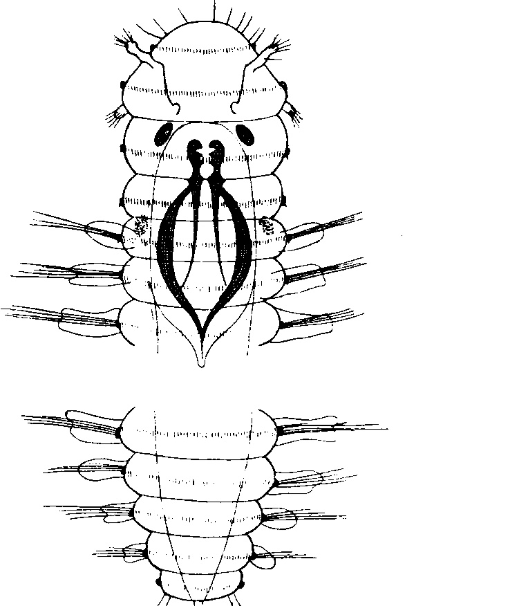
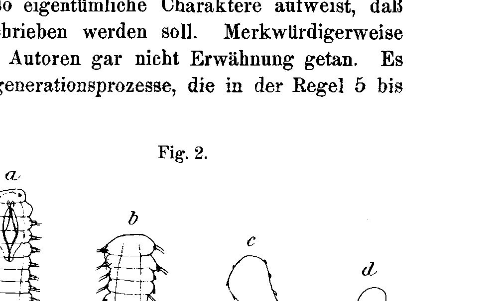
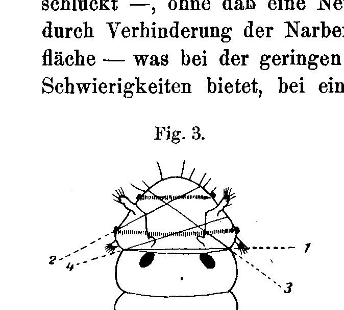
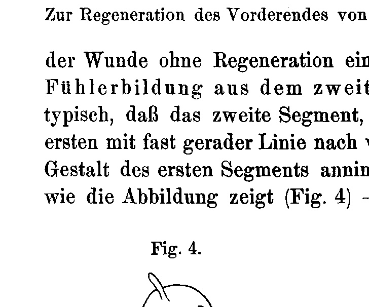
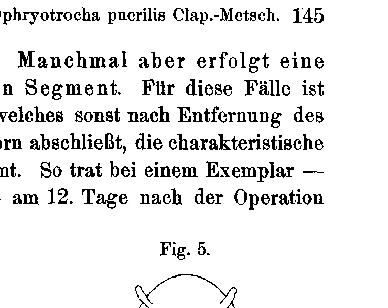
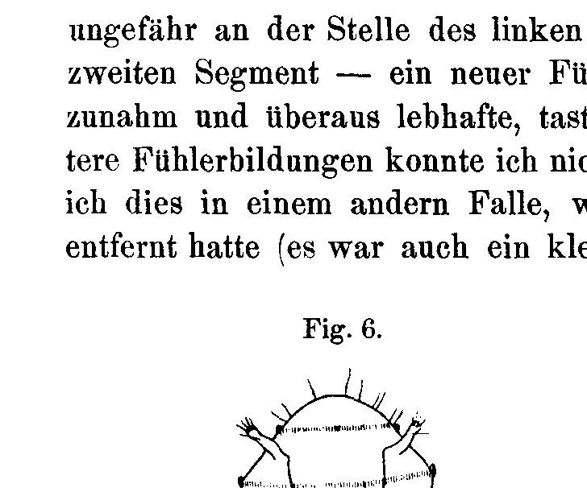
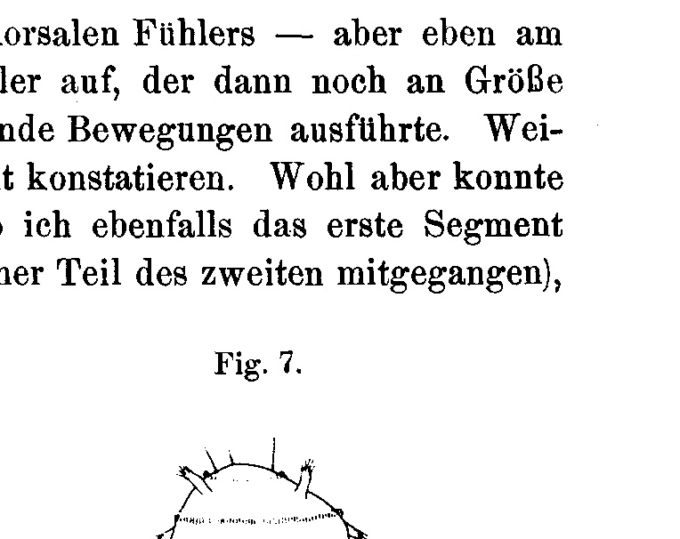

## Zur Regeneration des Vorderendes von Ophryotrocha puerilis Clap.-Metsch.

# On the Regeneration of the Anterior End of *Ophryotrocha puerilis* Clap.-Metsch.

By

**Richard Czwiklitzer.**

(From the Biologische Versuchsanstalt in Wien [Biological Experimental Institute in Vienna].)

With 7 Figures in the Text.

Received on 7 December 1904.

*Archiv für Entwicklungsmechanik der Organismen*, vol. 19 (1905).

> **Full translation.** A complete English rendering of the running text of “On the Regeneration of the Anterior End of Ophryotrocha puerilis” (Czwiklitzer, 1905), including all tables, figure and plate legends, and footnotes. Numbers and table cells were transcribed from the page images, not the noisy OCR.

In the winter of the year 1903 I undertook a re-examination of the results obtained up to now for the regeneration of the anterior end of *Ophryotrocha puerilis*. If I now see myself prompted to a brief communication of my results, this happens because through them the views held hitherto regarding the regeneration capacity of the Annelid in question seem to me to be modified in some respects. For whereas Rievel comes to the conclusion: »The headless rear ends were not able to form a new head. However many attempts I made in this respect, I always arrived at a negative result; I must therefore, also in accordance with the data of Braem, declare myself in complete agreement that the headless rear ends of *Ophryotrocha* are unable to form a new head« — it will be shown that nevertheless the anterior end of *Ophryotrocha* is by no means to be denied all regenerative potencies.

A description going into detail of the polychaete belonging to the family of the Euniciden, to which our object belongs, I may well spare myself. For this let reference be made to the data of Claparède and Metschnikoff, Braem, Korschelt, and Rievel. Let only the anterior segments be more precisely set forth here (Fig. 1). The first is distinguished by the possession of three ciliary wreaths, of which, however, the foremost does not seem to continue onto the dorsal side. Furthermore we find here the four antennae provided with tactile hairs, a larger pair lying more toward the front and dorsal, and a smaller pair lying further back and ventral. At the point of origin of the dorsal antennae there adjoins a groove running backward, into which the antennae can be sheltered and which itself terminates in a ciliated pit. Between this [segment] and the segment that now follows lies, on the ventral side, the mouth opening. The second segment itself bears the eyes. The third shows no special feature; it merely lacks the parapodia as yet. The fourth, at the same time the first parapodia-bearing segment, exhibits two large, granular pigment spots. To it there adjoin then the remaining parapodia-bearing [segments] and finally the parapodia-less anal segment, provided with cirri.

Concerning the nomenclature of the individual segments, let me now still be permitted a remark. One speaks namely of »head«-regeneration, and by the designation »head« one means sometimes the first two segments (Braem), sometimes only the first segment (Korschelt). (According to Korschelt's terminology, the assertion that *Ophryotrocha* does not regenerate its »head« could then, as the following communications will show, scarcely be maintained any longer.) In doing so, however, one naturally has in view not only the regeneration of the first

> **Fig. 1.**  Anterior and posterior end of the animal. Dorsal view.  *(figure not reproduced)*

or of the first two segments, but also that of the jaw apparatus, which extends as far as the sixth segment. It therefore appears to me advisable to eliminate altogether the expression »head«, which is subject to such different interpretation, and (with Hatschek) to speak only of prostomium (first segment), metastomium (second segment), and the trunk segments following upon these, of which one may still split off the first, the parapodia-less one, as a neck segment. —

The experimental animals, which originated from Triestine seawater, were placed in a glass basin (at room temperature), where they fed on Ulvae. They kept themselves extraordinarily well and showed — at least in the winter months — a quite enormous propagation. They were attached almost exclusively to the walls of the vessel and let one recognize so remarkable a heliotactic behavior that it is surely worth going into it with a few words. At first all the animals kept themselves, by the hundreds densely crowded and distributed in like manner over the four walls of the vessel, at the very top of the water's edge, where they also remained for a long time. One day, now, I found that all of them had fled to the bottom of the glass vessel: this had been exposed for some hours directly to the rays of the sun, which the animals were evidently seeking to avoid. Now there presented itself a most interesting phenomenon. On the very next day, namely, the animals had again crept up a stretch on all four walls and continued this upward movement also on the following days. In doing so the individual densely crowded individuals formed a mass about 1 cm broad, which appeared to be attached as a band to the glass. This band was everywhere equidistant from the water's edge — a relation that even during the forward movement itself — which proceeded scarcely perceptibly — was not changed. Only at the edges of the vessel could one observe an upward bending of the band with subsequent symmetrical downward turning. Unfortunately I had to break off the observation at this stage and could later no longer take it up, since the animals no longer left the lower edge of their vessel, to which they had meanwhile gone back. In another glass basin again, which stood quite at the window, the animals kept to the wall turned away from the light and avoided the other walls almost entirely.

Before, however, I now present the individual regeneration phenomena themselves, let me first briefly recall the operation technique. In doing so, above all, care was taken to avoid an infection of the operated animal by bacteria, which seems always to have set in with Rievel's experiments — in which I also thoroughly succeeded in most cases. For this purpose I brought the animal, fetched out of the glass vessel with a pipette, onto a glass slide, removed as much as possible of the seawater that had come with it, added fresh, filtered seawater, and repeated this procedure on a second glass slide. Only then did I proceed to the operation, which was carried out under the magnifying lens with a carefully cleaned, so-called eye-meter [ocular micrometer]. The control followed under the microscope, with whose aid the drawings too were prepared. After the operation the animals came singly into glass dishes filled with filtered seawater, of about 5 cm diameter and 2 cm height, in which they kept themselves quite excellently for weeks and months.

In the predominating majority of the operated animals there now came to light a phenomenon which — first observed by Przibram, but not published — exhibits such peculiar characters that it shall be described here in more detail. Remarkably enough, no mention whatsoever is made of it by the other authors. It concerns thereby degeneration processes which, as a rule, set in 5 to 10 days (sometimes also later)

> **Fig. 2.**  *(figure not reproduced)*

after the undertaking of the operative intervention (removal of one or several anterior segments) — and — often only after many weeks — led to the death of the animal. The usual course of such a degeneration *(Fig. 2 a–d)* is the following: It begins at the posterior body end, where one recognizes the onset by the disappearance of the cirri of the anal segment. Then follows the failure [loss] of the setae and a re-formation of the parapodia running from back to front. At the same time the differentiations of the anterior body end disappear and the individual segments pass more and more into one another. Now the body has completely assumed the shape of a tube, on which, however, the ciliation is still clearly visible, but it continually loses in size and finally forms a barely visible, externally undifferentiated little lump. In this condition it is able to remain for days, and meanwhile gives clear signs of life through rapidly successive muscle contractions. Finally it disintegrates into a granular mass.

The degeneration did not always proceed in this way. Sometimes it began simultaneously at the rear and the front end and continued toward the middle of the body. Sometimes too, before its onset, a segment-multiplication could be established. A particularly interesting course resulted in the following case: With one specimen the first segment had been removed (13 Nov.). In the course of the next six weeks (until 26 Dec.) the degeneration had advanced so far that the cirri, the setae, all on the right and a few parapodia on the left, were missing. At this point, however, there occurred not only a standstill of the back-formation processes, but it also showed itself that a week later (2 January) the complete differentiation, that is, a re-formation through »regeneration«, of all parts back-formed through degeneration had taken place.

That the degeneration phenomena occur as a consequence of the operative intervention, namely of this, and not also as a consequence of infection by bacteria, is certain. For they could also be established in cases where not even the trace of an infection was to be observed. —

A brief presentation of the regeneration achievements obtained may now first be preceded by the negative results. It thereby proved in fact impossible, upon removal of the first two or more segments, to observe any regeneration phenomena whatsoever; namely, every injury to the elaborately constructed jaw apparatus is answered with its expulsion — sometimes it is also swallowed — without a new formation setting in. Also the attempt, through prevention of scar formation, that is, holding open of the wound surface — which, given the slight size of the animals, admittedly offers technical difficulties, but with some practice can nevertheless be carried out with a

> **Fig. 3.**  *(figure not reproduced)*

fine needle point — to promote the regeneration, failed. Quite young animals, which possessed only four to five segments, could not be tested for regeneration capacity, since they always perished a short time after the operation was carried out. Eyes too are, to all appearance, not regenerated.

In contrast I observed the following: If one removes the first segment with the four antennae by a single cut *(Fig. 3 cut 1)*, then admittedly in almost all cases scarring of the wound without regeneration occurs. Sometimes, however, a antenna-formation out of the second segment follows. For these cases it is typical that the second segment, which otherwise, upon removal of the first, terminates toward the front with an almost straight line, assumes the characteristic shape of the first segment. Thus there appeared in one specimen —

> **Fig. 4.**  *(figure not reproduced)*
>
> **Fig. 5.**  *(figure not reproduced)*

as the illustration shows *(Fig. 4)* — on the 12th day after the operation, approximately at the place of the left dorsal antenna — but precisely on the second segment — a new antenna, which then still increased in size and carried out exceedingly lively, groping movements. Further antenna-formations I could not establish. But I was indeed able to [observe] this in another case, where I had likewise removed the first segment (a small part of the second had also come away with it), and where six weeks afterward, under simultaneous transformation of the shape of the segment to the shape of the first, all four antennae showed themselves on the second segment *(Fig. 5)*. This [segment] had thus, as it were, taken over the function of the first.

> **Fig. 6.**  *(figure not reproduced)*
>
> **Fig. 7.**  *(figure not reproduced)*

A high regeneration capacity, finally, the first segment itself displays. If one removes one of the four antennae together with the segment part belonging to it by an oblique cut *(Fig. 3 cut 2)*, then within a few days complete replacement of the lost part follows. The same happens upon removal of approximately the left or right antenna-pair *(Fig. 3 cut 3 and Fig. 6)*. In one case, in which I had removed almost the entire first segment with three antennae — only the left ventral one remained attached — *(Fig. 3 cut 4 and Fig. 7)*, the regeneration was complete after three days. In doing so, the new formation was in almost all cases so complete that it could not be distinguished from the original either by shape or by size.

All these observations show that *Ophryotrocha puerilis*, even though its regeneration capacity — at least as far as the anterior end is concerned — is not a complete one, nevertheless answers operative interventions, provided that these do not go too far, with regulation processes.

### Regenerationstabelle. [Regeneration Table.]

| Art der Operation [Type of operation] | An­zahl [Number] | Tag der Operation [Day of operation] | Kontrolliert [Checked] | Zu­grunde gegang. [Perished] | Nicht rege­neriert [Not regenerated] | Rege­ne­riert [Regenerated] | Regenerierter Teil [Regenerated part] |
|---|---|---|---|---|---|---|---|
| Entfernung des ersten Segments (s. Fig. 3 Schnitt 1) [Removal of the first segment (see Fig. 3 cut 1)] | 9 | 13. XI. 03 | jeden 2. Tag, spät. in größer. Intervall. bis 24. XII. [every 2nd day, later at larger intervals, until 24. XII.] | 6 | 2 | 1 | 4 Fühler aus dem zweiten Segment heraus (s. Fig. 5) [4 antennae out of the second segment (see Fig. 5)] |
| Entfernung des ersten Segments (s. Fig. 3 Schnitt 1) [Removal of the first segment (see Fig. 3 cut 1)] | 6 | 5. II. 04 | 12. II. / 17. II. | 1 | 5 / 4 | 0 / 1 | 1 Fühler aus d. zweiten Segm. heraus (s. Fig. 4) [1 antenna out of the second segment (see Fig. 4)] |
| Entfernung von 3 Fühlern des ersten Segm. (s. Fig. 3 Schnitt 4) [Removal of 3 antennae of the first segment (see Fig. 3 cut 4)] | 1 | 29. IV. 04 | 2. V. | 0 | 0 | 1 | alle 3 Fühler mit den entsprechend. Segmentteilen (s. Fig. 7) [all 3 antennae with the corresponding segment parts (see Fig. 7)] |
| Entfernung der beiden rechten Fühler (s. Fig. 3 Schnitt 3) [Removal of the two right antennae (see Fig. 3 cut 3)] | 1 | 19. VI. 04 | 26. VI. | 0 | 0 | 1 | die beiden Fühler mit den entsprechend. Segmentteilen (s. Fig. 6) [the two antennae with the corresponding segment parts (see Fig. 6)] |
| Entfernung von 2 Fühlern derselben Seite (rechts oder links) [Removal of 2 antennae of the same side (right or left)] | 4 | 21. VI. 04 | 26. VI. / 2. VII. / 7. VII. | 0 / 0 / 0 | 3 / 1 / 0 | 1 / 3 / 4 | die beiden Fühler / je ein ventraler Fühler / die beiden Fühler [the two antennae / one ventral antenna each / the two antennae] |
| Entfernung eines dorsalen Fühlers (s. Fig. 3 Schnitt 2) [Removal of a dorsal antenna (see Fig. 3 cut 2)] | 3 | 26. VI. 04 | 30. VI. 04 | 0 | 0 | 3 | der dorsale Fühler [the dorsal antenna] |

Die Versuche mit vollständig negativen Resultaten, wie sie sich bei Entfernung des ersten oder mehrerer vorderer Segmente zum Teil bei stetem Offenhalten der Wunde ergaben, sind in der Tabelle nicht angeführt.

The experiments with completely negative results, as they arose in part upon removal of the first or of several anterior segments with constant holding-open of the wound, are not listed in the table.

## Literaturverzeichnis. [Bibliography.]

Claparède und Metschnikoff, *Ophryotrocha puerilis*. Zeitschr. f. wiss. Zool. 1869. Bd. XIX. S. 184.

Braem, Zur Entwicklungsgeschichte von *Ophryotrocha puerilis*. Zeitschr. f. wiss. Zool. 1894. Bd. LVII. S. 187.

Korschelt, *Ophryotrocha puerilis*. Zeitschr. f. wiss. Zool. 1894. Bd. LVII. S. 224.

Rievel, Die Regeneration des Vorderdarmes und Enddarmes bei einigen Anneliden. Zeitschr. f. wiss. Zool. 1897. Bd. LXII. S. 289.

For the rest, reference is made to the detailed bibliographical references in Rievel.

## Figures

**Fig. 1.**

**Fig. 2.**

**Fig. 3.**

**Fig. 4.**

**Fig. 5.**

**Fig. 6.**

**Fig. 7.**

---

*Translator's note.* One of the Biologische Versuchsanstalt (Vienna Vivarium) papers flagged on the project site as a modern rediscovery target. Claims are rendered as stated in the original, not endorsed.
