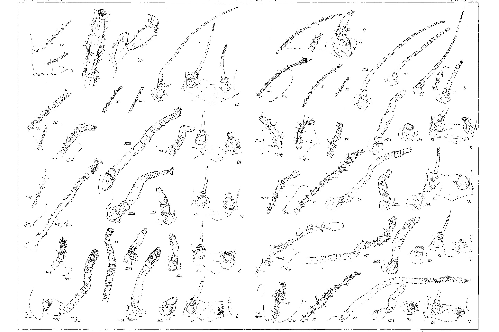
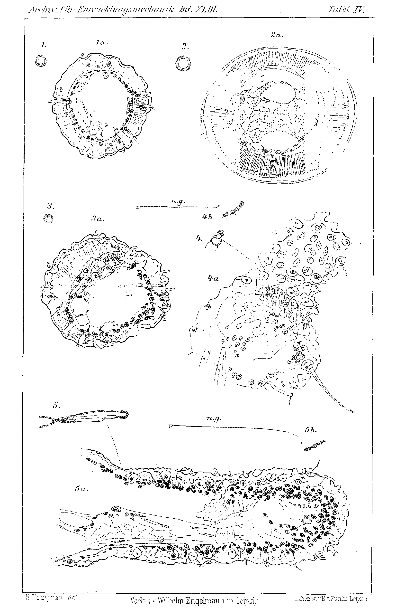
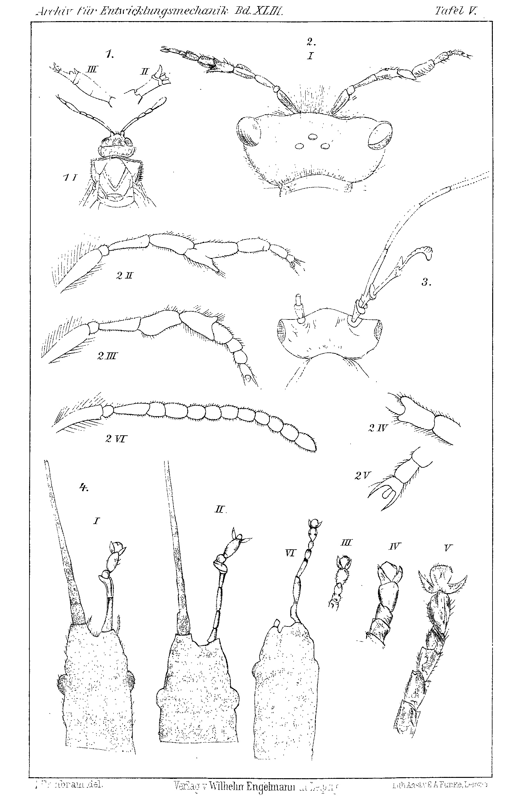

# Antenna Regeneration in Half-grown Sphodromantis Larvae.

## (At the same time: Rearing of the Praying Mantises, IX. Communication, and: Homoeosis in Arthropods, III. Communication.)

By

**Hans Przibram.**

(From the Biological Experimental Institute of the Imperial Academy of Sciences in Vienna [Zoological Department].)¹⁾

With 1 figure in the text and Plates III—V.

Received on 3 July 1916.

*Archiv für Entwicklungsmechanik der Organismen*, vol. 43 (1917).

> **Full translation.** A complete English rendering of the running text of “Antenna Regeneration in Half-grown Sphodromantis Larvae” (Przibram, 1917), including all tables, figure and plate legends, and footnotes. Numbers and table cells were transcribed from the page images, not the noisy OCR.

### Table of Contents.

|  | Page |
|---|---|
| Introduction | 63 |
| Experiments. A. Setup | 67 |
| B. Course (experimental table and morphological description) | 69 |
| C. Histological examination | 76 |
| D. Physiological examination | 77 |
| Correction of previously formulated rules for cases of homoeosis | 78 |
| Tabular survey of the cases of homoeosis in arthropods that have become known to me since 1910 | 80 |
| Conclusion | 81 |
| Summary | 82 |
| Bibliography | 83 |
| Explanation of the plate illustrations | 85 |

### Introduction.

In my first communication on homoeosis in arthropods I expressed the principle that substitutive homoeosis, in which in place of one body appendage an appendage belonging to another seg-

> ¹⁾ An abstract of this work appeared, with an identically worded title, as Communication No. 18 from the Biol. Experimental Institute of the Imperial Academy of Sciences, Zool. Dept., in the Akademischer Anzeiger No. XXVI, 1915.

ment appears, is in all probability to be traced back to regeneration in all cases.

I have furthermore pointed out that, in carrying out experiments to verify this proposition, the choice of the object may be very important, since in certain species particular homoeotic formations are found more frequently. Hence that species would form the most favourable starting point on which the homoeosis to be investigated had been found by chance.

These suggestions have fallen on favourable ground and have already led in several cases to the successes I had expected. In our institution, Janda (1913) was able to furnish the proof that in insects too (Stylopyga and Tenebrio) the eye is replaced — just as in decapod crustaceans — by an antenna-like formation when the optic ganglia are destroyed along with it; the result was confirmed by Krizenecky (1913 Tenebrio). The species used here had been drawn upon for the experiments at random, on account of their easy procurement; as I subsequently realize, however, in Tenebrio an antenna regeneration had already accidentally yielded a claw-shaped formation in Tornier (1901), and Stylopyga (= Panesthia) figures among the cases of homoeosis known from nature, although in the case described by Shelford (1907) it is a matter of the replacement of a maxilla by a mandible, that is, of other segments.

These and some other supplements to the literature, to be discussed later, I owe to the work of Schmit-Jensen (1913) on heteromorphotic regeneration of antennae in the Indian stick insect Dixippus (= Carausius) morosus.

Schmit-Jensen had found, in a culture of Dixippus weakened by cannibalism, a specimen in which, as in the case described by him, the antenna is replaced by a leg-segment with claws. My work intervened, used the same species for the verification of the artificial production of homoeotic heteromorphoses.

In sectioning within the two first antennal segments, homoeotic heteromorphoses did indeed come about, which consisted of tarsal segments with claws, sometimes also of a tibial piece. Out of 110 partial sections, only in 20 cases did the leg-like formation appear at the operated larvae, while in all the rest either normal antennae or no regeneration at all occurred.

In response to my written inquiry, Mr. Schmit-Jensen was so kind as to send three of his voucher specimens to our developmental-mechanics museum, to answer several questions that seemed to me desirable as a supplement to his printed communication, to enclose a German abstract of his treatise written in Danish, and to consent to the further elaboration in our institution of the theme he had so happily begun, since he himself would not be in a position to return to it within the foreseeable future. For his kindness I take the liberty of expressing here to Mr. Schmit-Jensen our thanks.

Lack of time and space had prevented Schmit-Jensen from isolating the specimens operated at various points within the first two antennal segments, so that, as he repeatedly emphasizes, he is not in a position to trace the heteromorphoses that occur back to definite section-placements; in his treatise he does indeed refer to Herbst's findings on the necessity of the ganglion for the normal regeneration of the eyes of decapod crayfish, but according to his written communication nothing is known to him about the nerves or ganglia of the Dixippus antennae.

Since in the meantime we too had succeeded, in insects, in demonstrating heteromorphotic regenerates after destruction of the optic ganglion, I thought it promising to pursue the theme further in this direction. On the ganglia of Dixippus I have before me a brief communication by Kühnle (1913), who on p. 259 writes: "Of the deutocerebrum, the well-set-off, somewhat lateral olfactory lobe with its olfactory glomerulus appears to surpass the ventral accessory olfactory mass in size." Kühnle thus seems to place the antennal ganglion, at least its main mass, in the head of Dixippus, and not, say, in the antenna itself. This corresponds to the situation in insects in general. Besides this ganglion designated as the "olfactory mass" (rightly?), there lie, according to the concordant investigations of many authors, groups of ganglion cells in the antennal flagellum that follows the two first segments known as the "scape" (cf. Kraepelin 1883).

If these ganglion cells were of significance for the unchanged antenna regeneration, we could understand that after sectioning within the scape-segments heteromorphoses should come about. Schmit-Jensen's experiments left it undecided whether perhaps only the deepest sections had yielded heteromorphoses, while in the other cases a piece of the ganglionbearing segments had remained preserved, as he himself states, having carried out no inspection with the dissecting magnifier. In parenthesis I must mention that in decapod crustaceans the same ganglia are found in the antennal flagellum, but that the antennae themselves regenerate unchanged even after total extirpation (cf. Przibram 1901).

The programme for the continuation of the experiments therefore had to consist of the following points:

a) Exact control of the section-placement with variation of the same;

b) Ascertainment of the ganglion relations for the experimental object;

c) Extension of the experiments to other objects for the purpose of generalizing the result or demonstrating the causes of differing behaviour.

Since at first no Dixippus cultures were available to me, and usable material could not be obtained either, I took refuge in the Egyptian praying mantises that were in rearing.

I must note that in my long-standing acquaintance with this species, Sphodromantis bioculata Burm., as little as in other mantids, never a case of homoeosis had occurred to me.

In the literature I find, besides in Dixippus, one nature-find each in the sawfly Cimbex axillaris (Kraatz 1876) and the bee Andrena clarkella (Wagner 1915). To this there is also added, judging by the figure, the Tenthredopsis nassata with a supernumerary antennal branch described by Jacobs 1881. On Plate V I have reproduced the figures in question, since the places of publication may not always be easily accessible to experimental zoologists.

Nevertheless, given the similarity of antennal structure between phasmids and mantids, I expected to obtain in the latter too the leg-bearing regenerates. I will anticipate at once that, with an experimental stock of 87 specimens, of which 44 were reared up to the imago, I obtained not a single case of a distinct foot-formation on the regenerating antennae, although nowhere did regeneration fail to occur at all.

Hence the section-placement alone — which, as I shall describe, had been varied from total extirpation down to the sectioning of the half antennal flagellum — cannot, despite the absence of the ganglion cells to be ascertained histologically in the antennal flagellum in Sphodromantis, as we shall see, be responsible for the homoeosis.

There thus arise further programme points in the search for the conditions of the "foot-bearing" antennae. Since Schmit-Jensen reared together, intermixed, just-hatched and half-grown experimental animals, the age or the developmental state might play a role. In future the following points will still be investigated:

d) Extension of the experiments to different developmental stages of the same objects;

e) Destruction of the large olfactory lobe situated in the head as the main ganglion of the antenna;

f) Effect of external factors: low temperature, etc.

This singling out of an external factor looks arbitrary, but is grounded on the favouring effect that low temperature exerted on the — admittedly quite different in kind and hereditary — monstrosities in the fruit fly Drosophila, namely an increase of leg parts up to entire legs in the experiments of Mildred Hoge. Elevated temperature has already been tested in my experiments on Sphodromantis, since a part of the specimens had been reared at 35° C; it in no case calls forth homoeosis more readily than the mean temperature of 25° C.

## Experiments.

### A. Setup.

As experimental material there served exclusively larvae of Sphodromantis bioculata Burm., descendants of a single female designated in earlier treatises as ♀ O. 13 (in the treatise of Sztern as No. 4), which itself had been reared at 25° C.

The larvae belonged partly to the I. egg packet, which had been kept at 25° C, partly to the II. egg packet kept at 35°, and were reared at that temperature at which the embryonic development too had taken place.

The operations were all performed shortly after the 5th moult, namely in Lot I three days, in Lot II two days after the shedding of the old skin. The difference had been chosen in order to bring the larvae developing at higher temperature, that is, more rapidly (cf. Przibram 1915, Rearing, VIII. Comm.), to

---

**Note on source pages 3–5:** In this scanned copy, the leaves bearing the printed page images p003, p004, and p005 are full-page lithographic plates (running heads: *Archiv für Entwicklungsmechanik* Bd. XLIII / Bd. XLIII / Bd. XLII; "Tafel III", "Tafel IV", "Tafel V"; imprint "Verlag von Wilhelm Engelmann in Leipzig"). They are figure plates physically bound into the volume and contain no running body text of this paper; they bear only figure-number labels (Arabic numerals and roman numerals) and the printer's/publisher's imprint lines — no German prose sentences, footnotes, tables, or captions of the Przibram Sphodromantis article (whose own figure captions appear in its "Explanation of the plate illustrations" section, p. 85, outside the assigned pages). No translatable prose of the assigned paper occurs on these three plate pages.

There thus arise further programmatic points in the search for the conditions of the "foot-bearing" antennae. Since Schmitt-Jensen reared just-hatched and half-grown experimental animals mixed together, the age or the developmental state might play a role. In future the following points are still to be investigated:

d) Extension of the experiments to various developmental stages of the same object;

e) Destruction of the large olfactory lobe lying in the head, as the principal ganglion of the antenna;

f) Action of external factors: low temperature and the like.

This singling out of an external factor looks arbitrary, but is founded on the favouring effect which low temperature exerted upon the admittedly quite differently constituted and hereditary monstrosities of the fruit-fly *Drosophila*, namely a multiplication of the leg-parts up to whole legs, in the experiments of Mildred Hoge. Elevated temperature has already been tested in my experiments on *Sphodromantis*, since a part of the specimens had been reared at 35° C; it in no way calls forth homoeosis more easily than the mean temperature of 25° C.

### Experiments.

#### A. Arrangement.

As experimental material there served exclusively larvae of *Sphodromantis bioculata* Burm., descendants of a single female designated in earlier papers as ♀ O.13 (in Sztern's paper as No. 4), which had itself been reared at 25° C.

The larvae belonged partly to the 1st egg-packet, which had been kept at 25° C, partly to the 2nd egg-packet kept at 35°, and were reared at the same temperature at which the embryonic development too had taken place.

The operations were all carried out shortly after the 5th moult, namely in batch I three days, and in batch II two days, after the shedding of the old skin. The difference was chosen in order to encounter the larvae developing at higher temperature, and thus more rapidly (cf. Przibram 1915, Rearing, VIII. communication), at approximately the same state of hardening as those at lower temperature.

As animals for one and the same operation-mode at equal temperature, specimens were chosen which had completed the 5th moult on the same day. Each of these groups, which where possible comprised 10 specimens, was placed in a special cage; later, when fights set in among the animals, these were

isolated still further. Control groups with intact antennae on both sides were not specially run, since the operations were performed only on one antenna, and indeed always on the right one, so that the left could serve as a comparison-object, while on the other hand many quite normal sibling specimens were also being reared for other investigations.

The operations were performed without anaesthesia, by one — only in the case of total extirpation by two — cuts with a small "eye"-scissors. The blood-drop that appeared soon hardened into a dark wound-scab. The operations were all very well tolerated, so that scarcely any losses had to be attributed to this account.

The cutting was carried out in five variations, which I put together briefly here under the various group designations, and which are designated by small Latin letters on the following table and in the text-figure, namely:

a) Total extirpation: excision of the 1st antenna- or scape-member;

b) Section of the antenna within the 1st scape-member, where possible at the middle;

c) Section of the antenna at the end of the 1st scape-member, thus between first and second scape-member;

d) Section of the antenna at the end of the 2nd scape-member, thus between second scape-member and base of the flagellum (a section within the second scape-member could, on account of its slight magnitude, not be carried out with certainty);

e) Section of the antenna within the flagellum, where possible at the middle.

The success of the cutting was controlled with the magnifying-glass; poorly succeeded cuts were improved, assigned to another operation-mode, or excluded.

### B. Course.

#### Table of Experiments.

Descendants of the ♀ O.13 (= 4th paper, Sztern), which was reared at 25°.
I. Egg-cocoon kept at 25°, hatched 13. IX. 13.
II. Egg-cocoon kept at 35°, hatched 1. XI. 13.
(Ex. designates the individual larvae, Im. the imagines).

| | Reared at 25° C. — Ia. Total extirpation of the right antenna 24. XI. 13. | Reared at 35° C. — IIa. Total extirpation of the right antenna 28. XI. 13. |
|---|---|---|
| 5. Moult: | 10 Ex. 21. XI. 13. | 10 Ex. 26. XI. 13. |
| 6. - | 9 - 4.—8. XII. | 9 - 3.—10. XII. |
| 7. - | 7 - 16.—24. XII. | { 5 - 9.—18. XII. |
| | | { 1 Im. 26. XII. ♂ Nr. 130. |
| 8. - | 7 - 28. XII. 13—26. I. 14. | { 1 Ex. 18. XII. |
| | | { 2 Im. 29. XII. ♂♂ Nr. 55, 131, Taf. III Fig. 7. |
| 9. - | { 4 - 13. I.—31. I. 14. | 1 Im. 14. I. 14. ♀ Nr. 129. |
| | { 1 Im. 10. III. 14. ♂ Nr. 114. | |
| 10. - | 4 Im. 19. II.—1. IV. 14. | |
| | ♀♀ Nr. 76, Taf. III Fig. 1. 101, 106, 121. | |
| Ib. Section of the r. A. within the 1st scape-member 24. XI. 13. | IIb. Section of the r. A. within the 1st scape-member 30. XI. 13. |
|---|---|
| 5. Moult: 10 Ex. 21. XI. 13. | 5. Moult: 10 Ex. 28. XI. 13. |
| 6. - 10 - 2.—9. XII. | 6. - 5 - 5.—7. XII. |
| 7. - 10 - 13.—31. XII. | 7. - 4 - 15.—19. XII. |
| 8. - 8 - 30. XII. 13—19. I. 14. | 8. - { 3 - 20.—25. XII. |
| 9. - { 1 - 18. I. 14. | { 1 Im. 17. I. 14. ♂ Nr. 124. |
| { 6 Im. 3. II.—8. III. 14: | 9. - 3 - 5. I.—14. I. 14. |
| ♂♂ Nr. 70, Taf. III Fig. 2. 72, 73, 113. | ♀♀ Nr. 128, Taf. III Fig. 8. 132, 133. |
| ♀♀ Nr. 54, 60. | |
| 10. - 1 Im. 24. II. 14. ♀ Nr. 92. | |

| Ic. Section of the r. A. at the end of the 1st scape-mbr. 24. XI. 13. | IIc. Section of the r. A. at the end of the 1st scape-mbr. 1. XII. 13. |
|---|---|
| 5. Moult: 10 Ex. 21. XI. 13. | 5. Moult: 8 Ex. 29. XI. 13. |
| 6. - 10 - 3.—5. XII. | 6. - 6 - 8.—9. XII. |
| 7. - 10 - 14.—18. XII. | 7. - 2 - 14.—19. XII. |
| 8. - 9 - 30. XII. 13—8. I. 14. | 8. - 2 - { 29. XII. 13. Nr. 134, Taf. III Fig. 9. |
| 9. - { 4 - 16.—20. XII. 13. | { 1. I. 14. |
| { 5 Im. 20. II.—1. III. 14. | 9. - 1 - 14. I. 14. |
| ♂♂ Nr. 71, 78, 80, 100, 104. | 10. - 1 Im. 28. I. 14. ♂ Nr. 123. |
| 10. - 4 Im. 27. I.—27. II. 14. | |
| ♀♀ Nr. 66, 75, 97, 98, Taf. III Fig. 3. | |

| Id. Section of the r. A. at the end of the 2nd scape-mbr. 25. XI. 13. | IId. Section of the r. A. at the end of the 2nd scape-mbr. 1. XII. 13. |
|---|---|
| 5. Moult: 9 Ex. 22. XI. 13. | 5. Moult: 7 Ex. 29. XI. 13. |
| 6. - 9 - 3.—7. XII. | 6. - 5 - 5.—8. XII. |
| 7. - 9 - 15.—22. XII. | 7. - 4 - 15.—19. XII. |
| 8. - 7 - 3.—13. I. 14. | 8. - { 1 - 25. XII. |
| 9. - 7 Im. 5.—23. II. 14. | { 1 Im. 28. XII. ♂ Nr. 127, Taf. III Fig. 10. |
| ♂♂ Nr. 65, 77, 89, 108, Taf. IV Fig. 3. | 9. - 1 - 9. I. 14. ♀ Nr. 47. |
| ♀♀ Nr. 56, Taf. III Fig. 4. 59, Taf. III Fig. 4 a. 67. | |

| Ie. Section of the r. A. within the flagellum 27. resp. 28. XI. 13. | IIe. Section of the r. A. within the flagellum 30. XI. 13. |
|---|---|
| 5. Moult: { 5 Ex. 24. XI. 13. | 5. Moult: 5 Ex. 28. XI. 13. |
| { 3 - 25. XI. 13. | 6. - 4 - 3.—7. XII. |
| 6. - 6 - 5.—8. XII. | 7. - 3 - 8.—15. XII. |
| 7. - 5 - 16.—22. XII. | 8. - 3 - 17.—30. XII. |
| 8. - 4 - 29. XII. 13—11. I. 14. | 9. - 2 Im. { 30. XII. 13. ♂ Nr. 50. |
| 9. - { 1 - 18. I. 14. | { 5. I. 14. ♀ Nr. 43, Taf. III Fig. 11. |
| { 2 Im. 11.—16. II. 14. | |
| ♂♂ Nr. 62, 68. | |
| 10. - 1 Im. 17. II. 14. ♀ Nr. 69, Taf. III Fig. 5. | | The course of regeneration was observed in all specimens from moult to moult on the living objects with the aid of a dissecting- or telescope-lens, and fleeting sketches were drawn. After operations a to c the regenerates, which at the latest after the 7th moult exhibited a tripartite structure, seemed to want to set foot-like endings upon themselves at the later moults; namely, peculiar thickenings appeared on the third part of the regenerate, the part homologous to the flagellum, which again issued in several thinner members with a special ending. Once even two claws seemed to be present (Taf. III Fig. 9, Larva Nr. 134).

After operation e, where only a part of the flagellum had been cut off, this was regenerated unchanged; one single time its end-member was misshapenly thickened in the imago (Taf. III Fig. 5 Im.), yet clearly recognizable as an antenna-flagellum-end-member by the peculiar sense-organ that still continued the end. Operation d took an intermediate position, in that deviating regenerates did indeed occur, but not in that degree as in a to c; once the antenna was completely normally regenerated up to the imago (Nr. 47 at 35°). By the appearance, then, Schmitt-Jensen's supposition that normal structures regenerate at a flagellum-section, but heteromorphic structures at deeper sections, would seem to be confirmed, for the partly normal regeneration after the d-operation could have been attributed to the remaining-behind of a small piece of the antenna-flagellum, which has so much the more probability for it, since the following members of the antenna are somewhat sunk into the preceding ones.

But in the course of the moults the endings of the apparently foot-like regenerates did not become any more similar to a foot; many suffered, at unlucky moults, a loss of members, a phenomenon which recalls the shedding of malformed regenerates that I have described earlier (Przibram 1896, 1899, 1907). Twistings and cripplings occurred, such as Schmitt-Jensen too describes for his homoeotic regenerates, but no end-claws or distinct foot-members. Nevertheless, the best-developed of the formations still had, in the imago, a superficial resemblance to foot-ends, if only the magnifying-glass was brought to aid.

When, however, I began to investigate at stronger magnifications under the microscope, it showed itself that nowhere a typically formed foot-member was present. Even the antenna apparently furnished with claws proved to be a double-formation of an antenna-tip. At first I still inclined to the view that throughout it was a matter of the subsequent removal of the foot-end at unlucky moults, to which the mutilated appearance of many regenerates contributed. The question could be decided if we could subsequently subject the preceding developmental stages of the regenerate to a microscopic examination at stronger magnification. Fortunately this is possible, since I keep all the cast-off skins sorted and preserved.

On the skins the course of regeneration for individual specimens can be examined and drawn subsequently with just the same certainty, and — owing to the immobility of the object — more conveniently than during the life of the praying-mantis.

I have therefore put together on Plate III typical or otherwise interesting examples of the course of regeneration, from drawings on skins and conserved animals; the figures of the uppermost horizontal row correspond to operation-mode a, those of the second to operation-mode b, those of the third to c, the fourth to d, the fifth to e; the lowest row contains normal comparison-objects, namely on the left normal antenna-parts, on the right also normal foot-members. The whole left half of the plate is devoted to specimens of the 25°-rearing, the right half to those of the 35°-rearing.

As a rule, all the skins following the operation, as well as the imaginal stage (the latter designated with Im.), are arranged in one horizontal row each of every plate-half, so that the equally-numbered moults of the specimens at equal temperature stand under one another in vertical rows.

If we consider the first vertical row of each plate-half, the figures present to us the foreheads — of the skin cast off at the VI. moult, seen from the front between the eyes — in that state which the animals exhibited shortly after the operation. We can thus see afterwards whether the cutting was an apt one.

In operation-mode a (Fig. 1 and 7 Taf. III) we see indeed, after the total extirpation, no remnants of an antenna-member on the skin, but only the wound covered by the dark scab.

In operation-mode b (Fig. 2 and 8 Taf. III) we behold the half-cut-off first scape-member ending in the scab at its cut-edge, and in operation-mode c (Fig. 3 and 9 Taf. III) the wound-scab is to be recognized at the end of the entirely standing-remained first scape-member.

In Fig. 4 Taf. III of operation-mode d, the projecting wound-scab at the end of the second member leaves room for the supposition that beneath it a small piece of the flagellum might still have remained concealed; in Fig. 10 Taf. III, belonging to the same operation-mode, this would seem not to be the case.

Operation-mode e (Fig. 5 and 11 Taf. III) is unmistakable by the blood-scab inhering in the end-members of the half standing-remained flagellum.

At the following stage — everywhere designated VII on the plate, which, being the skin cast off at the 7th moult, represents the state after the 6th moult — the wound-scab has everywhere disappeared and a regeneration-bud has appeared. Only in the case of the flagellum-regeneration (Fig. 5 and 11 Taf. III) is nothing of such a thing to be seen; rather, merely a lengthening of the flagellum by newly-grown members, with a slight thickening of the whole flagellum, is to be observed.

The regeneration-bud, despite the variously deep cutting, looks essentially the same after operations b to d in the culture at 25° — again a proof that regeneration proceeds the more rapidly the more of an organ has been removed (cf. Przibram 1915, VII. communication). Only after the total extirpation is a delay yet noticeable.

The regeneration is essentially further advanced at the same moult at 35°: the three essential parts of the antenna are recognizable, except after total extirpation, where the division of the shaft into two members is indistinct.

Just so, the skins cast off at the VIII. moult by the specimens at 35° show a yet further advanced state compared with those at 25°, although the latter are already superior in degree of development and especially in length to the skins cast off at the VII. moult at 35°.

With the casting-off of the skin at the VIII. moult we must now leave the common consideration of the regenerates and turn to individual specimens, since now a great diversity of the malformations appears, which constitutes the result of our experimental series that interests us.

Taf. III Fig. 1. Specimen Nr. 76 as type after total extirpation at 25°. In the skin cast off at the IX. moult, at the end of the flagellum a shrunken, darker-coloured part running in zigzag is to be recognized, which, cast off stretched out at the X. moult, reveals four to five members springing from a thickening of the flagellum and armed with strong bristles resembling foot-thorns. The first member following the thickening possesses a widening recalling the distal widening of the normal foot-members (cf. Fig. 12 Taf. III), the last an ending resembling the "foot-pad" standing between the claws of a normal foot, without, however, a homologization being able to be carried out with certainty. During the X. moult the foot-member-like formations are torn off, so that in the imago only an indistinctly segmented bud follows upon the thickened member.

Taf. III Fig. 2. Specimen No. 70, as a type after severing in the half of the first shaft-segment. The skin shed at the IX. moult is kinked several times, at the end a typical antennal terminal organ [Fühlerendorgan]. In the imago the end is torn and the plasma spread out into an elongated plate; this was directly observed. Several of the flagellar segments [Geißelglieder] are substantially longer, more irregular than antennal segments [Fühlerglieder], and beset with strong bristles such as occur on normal legs.

Taf. III Fig. 3. Specimen No. 98, as a type after severing at the end of the first shaft-segment. Only the skin shed during the X. moult shows a distinct abnormality, which consists in a twisting [Verdrillung] of the end, a thickening, and a constricting-off [Abgliederung] of a small end-segment [Endglied] that is half light-colored. In the living state the light portion looked claw-shaped bent. In the imago this end-part is torn and in its place a roundish brown-red disc appears, which has superficial similarity to a foot-pad [Fußballen], such as the *Dixippus*-heteromorphoses display.

Taf. III Fig. 4. Specimen No. 56, as a type after severing of both shaft-segments. The end, probably torn off before the IX. moult, is in the imago replaced by an end-segment [Endglied] similar to the one previously described. In the imago No. 59 depicted in Fig. 4 a, likewise belonging to this operation-variation, the tearing-off [Abriß] is still distinctly preserved; the two last remaining segments of the flagellum [Geißel] have projections [Vorragungen] at their base. Upon superficial consideration these lend the structure a similarity to a tarsus; in reality, however, in the tarsal segments the projections stand at the end of each segment, so that here certainly no homology is present.

Taf. III Fig. 5. Specimen No. 69 represents, in the moults up to Fig. 10, the type of flagellar regeneration [Geißelregeneration] after severing in its middle; in contrast, the imago — as the only one in this operation-group — had a thickening at the end of the regenerated flagellum [Geißel], which, as already mentioned above, runs out into the typical sense-organs of the antenna.

Taf. III Fig. 6. Specimen No. 2 gives us here, as a quite normal control-animal [Kontrolltier], the condition typical in the imago even after severing of the half flagellum [Geißel]. The outermost end-tip of the normal antenna cannot be distinguished with certainty at the chosen magnification.

We now turn to Group II, the larvae reared at 35°, and find here too similar conditions.

Taf. III Fig. 7. Specimen No. 131 shows, in the imago — which already issued from the VIII. moult — thickened, dark-colored end-segments [Endglieder], just as did Specimen No. 76 of Group I belonging to the same operation-type a. Yet an arming [Bewehrung] and stretching of the segments is not present.

Taf. III Fig. 8. Specimen No. 128, as the skin shed during the IX. moult, looks just like the animal No. 70 of Group I belonging to the same operation-type b. Yet the end-tip appears once more to have been lost. In the imago the regenerating antenna ends in a long segment beset with warts at its end, which is borne cuff-like by a short segment similar to the first tarsal segments.

Taf. III Fig. 9. Specimen No. 134 is that larva which apparently showed a division of the end into two claws; the figure designated *La* of the animal conserved as a larva after the VIII. moult lets it be clearly recognized that here it is not a matter of two claws [Krallen], but of a forking [Gabelung] of the last segment, which is club-shaped swollen at the base. Apart from the forking, the formation here too corresponds to that of an equivalent stage of the animal No. 98 of the 25°-group belonging to the same operation-type c.

Taf. III Fig. 10. Specimen No. 127. Broadenings at the base of the last regenerate-segments appearing in the imago recall Fig. 4 a, No. 59, of the analogous operation-type d.

Taf. III Fig. 11. Specimen No. 43. Fully normal regeneration of the flagellum [Geißel] severed in the half.

About the length-relations of the regenerates on the imago, in comparison to the normal antenna of the opposite side [Gegenseite], the figures designated *n. G.* and *No.* give information. The repeated tearing-off [Abriß] makes all more exact data illusory. Since at the higher temperature absolutely fewer moults are passed through, the relative length of the regenerate is often less than at the middle temperature.

The conditions of the regenerates described as typical are not to be regarded as those occurring exclusively after each individual operation-variation; somewhat thoroughgoing [einigermaßen durchgreifend] is only the regeneration of an entirely normal antenna-tip after halving of the flagellum [Geißel] (Operation e); over against this [stand] the abnormal structures in the other variations after severing in front of [i.e., proximal to] the flagellum.

### C. Histological Investigation.

In order to discover possible differences of the malformed antenna-regenerate from normal antennae in their intimate structures, several antenna-regenerates all belonging throughout to the imaginal stage, together with normal antennae, were cut up into section-series. For this there served, from operation-type b, the animals No. 72 and 13; as c, No. 100; from d, No. 108; and of normal ones, both antennae of the animal No. 84.

Of normal antennae, cross-sections through the shaft-segments (Taf. IV Fig. 2) and the flagellum [Geißel] (Taf. IV Fig. 1), as well as longitudinal sections through the flagellar segments [Geißelglieder] (Taf. IV Fig. 5), were prepared. Of the malformed antenna-regenerate, only sections through the flagellum [Geißel] were made (Taf. IV Fig. 3 cross-, Fig. 4 longitudinal section), since indeed, in the specimens that came to the histological processing, normal parts of the shaft-segments had been left over, so that no deviations of interest to us were to be expected there.

While the wall of the shaft-segments exhibits an uninterrupted contour, the flagellar segments [Geißelglieder] are normally marked by the flask-shaped sense-organs, which interrupt the contour, so that flask-shaped organs and adjoining ganglion-cells lie close together, as has been described in more detail by earlier researchers for a great number of other insects. At many places, the surface of the flagellar segments is also broken through by the passage of stiff bristles.

Quite the same conditions as in the normal ones we also encounter in the histological figures of the malformed antenna-regenerate: the flask-shaped sense-organs, ganglion-cells, through-borings for the bristles, in the cross-section the antenna-like contour. Yet the beset-ness with sense-organs is, in the strongly malformed regenerate, namely after the deeper operation-variations, less than otherwise, so that also the contour of the flagellar segments is less toothed, more approaching the entirely round appearance of the shaft-segments.

### D. Physiological Investigation.

The antenna is now usually conceived as a smell-organ [Geruchsorgan] (cf. Przibram, Exp. Zool. Bd. 5); I have not been able to convince myself of the correctness of this assumption in our object; a brush [Pinsel] dipped in ether was only perceived upon contact, and fly-extract [Fliegenextrakt] too triggered no scent-reaction [Witterungsbewegung]. Females in little wooden boxes did not attract the males.

The cause for the slight reaction-capability may lie in the fact that the mantids are hardly to be brought to reactions at all upon visual, tactile, and shaking sensations. The morphological structure of their antenna is, correspondingly, similar to that of other predatory insects, in which the antenna too plays no leading role in the sense-life. Thus Nagel, in running and swimming beetles [Lauf- und Schwimmkäfern], could discover, after severing of the antenna and palp [Taster], no decrease of their scent-capability [Witterungsfähigkeit]. After severing of both antennae of a *Sphodromantis*-male I observed a heightened irritability together with a simultaneous inability to carry out the normal copulation [Kopula]; yet further experiments would first have to clarify the meaning of this condition.

Given the slight role of the smell-sense for the life of the *Sphodromantis*, it is not surprising that specimens with abnormal antenna-regenerate, in which I severed the other normal antenna at the base, behaved with respect to nutrition and to the females exactly as did quite normal specimens.

A communicable experience, however, I was able to make in the irritation of the antennae through tactile and electrical stimuli on normal and regenerated objects.

Upon mechanical irritation, namely the application of the not-through-streamed electrodes of an induction coil [Induktorium], normal antennae give a momentary deflection [Ausschlag]. It is herein indifferent whether the touching of the flagellum [Geißel] follows from the front, the back, above, or below; the magnitude of the deflection, however, increases the further toward the antennal tip the touch was made. The malformed regenerates (the imagines ♂♂ 72, 100, 108, 113 and ♀♀ 54, 101 served for the testing), which generally appeared little mobile, reacted indeed upon touch from the front and behind, but not from above and below. In contrast to the normal antennae, the deflections [Ausschläge] were only distinct when [the electrode] had not been applied far toward the end of the regenerate.

When now the normal antenna was electrically irritated at a coil-distance [Rollenabstand] of 80 mm, tetanic twitches [Zuckungen] of the same set in. After cessation of the through-streaming, the regenerated antenna too showed itself more strongly sensitive to mechanical irritation. Now touches with the not-through-streamed needles also from above and below released deflections [Ausschläge]. Touch toward the tip likewise effected a reaction, but toward the one or the other [side] only a weak one.

Direct through-streaming of the regenerate had an evasive [ausweichende] twitch [Zuckung] of the same as its result. After the through-streaming both antennae were strongly sensitive to the mechanical irritation; only the outermost end of the malformed regenerate remained insensitive [unempfindlich].

Upon repetition of the through-streaming at the normal antenna, the deflections upon subsequent mechanical irritation were no longer stronger than after the first time.

The antenna-regenerate of the females showed slighter reactions than those of the males. In one male (No. 62 imago) the behavior of a normally regenerated antenna could be investigated; here the regenerated antenna reacted upon mechanical irritation indeed more weakly than the non-regenerated one, yet in equal manner from above and below as from front and behind, and the deflections [Ausschläge] increased toward the tip. Electrical irritation of the uninjured left antenna heightened, in this case too, the sensitivity of the not-directly-irritated regenerated right antenna toward touch with the not-through-streamed electrodes.

### Correction of Rules Earlier Set Up for Homoeosis-cases.

In the summary of the first communication about Homoeosis I set up, on the basis of the factual material then before me, the principle that Replacement-homoeosis [Ersatzhomoeosis] follows the rule »that in the place of something more highly differentiated, always something less differentiated steps in. With the articulated appendages of the Arthropods this entails — as a consequence of the decrease of the differentiation-height of the limbs [Gliedmaßen] from front toward backward — that the homoeotically altered limb looks similar to the normal one of a following segment. With the wings [Flügeln] the sequence is reversed.« This rule is followed by the regeneration, become known since then, of the insect-eye [Insektenauge] as an antenna-like appendage (Janda 1913, Krizenecky 1913), to which also the replacement of an eye by an antenna in a hoverfly [Schwebfliege], *Syrphus arcuatus* Fallén, described by Osborn (1908), will belong; further the replacement of an antennula by a mandible [Mandibel] in an *Asellus* (Bateson 1900), of antennae by feet [Füße] in *Dixippus* (Schmit-Jensen 1913), and the assumption of individual foot-characters [Fußcharaktere] on the part of the antenna-regenerates of the *Sphodromantis*; further the transient swimming-foot-similarity [Schwimmfußähnlichkeit] of the totally extirpated *Gelasimus*-chelae [Scheren] (Przibram 1915).

Over against this there now lie those several cases which, according to the order-sequence of the appendages, breach the rule; these are: replacement of a maxilla [Maxille] by a mandible in *Panesthia sinuata* (Shelford 1907), of a leg [Bein] belonging to the third thoracic segment by a chela [Schere] in *Cancer pagurus* L. (Calman 1913), and of a first abdominal leg of a male crayfish *Astacus* by a thoracic leg [Thorakalbein] (Briot 1908).

In analogy with the wings one might think herein that it is a matter of the differentiation-height of the enumerated appendages increasing from front toward backward: in fact the mandible can be regarded as less differentiated, with respect to sense-physiological elaboration, than the maxilla; and the thoracic leg, too, might appear less elaborated over against the first abdominal leg, since the latter is a matter of an abdominal leg transformed into a male copulation-organ. The greatest difficulty, however, is presented by the replacement of the second thoracic walking-leg by a chela, when on the other side we have addressed the chela as sense-physiologically more highly differentiated, because we have addressed gripping limb-members [Gliedmaße] set up for gripping, which on their part can be replaced by a walking-leg (cf. Haseman, P., Homoeosis 1. Mitt. S. 604). Of course this difficulty would be removed again if the chela-similarity of regenerating chelae always represented only a transient stage, as I found it for *Gelasimus* (just as the walking-leg-like formations in place of crustacean maxillipeds [Kruster-Maxillipeden]), and were not really homologous to walking-legs. Cause of this similarity is the analogy, emphasized by Haseman, of the development with the normal leg-regenerates, namely the abscission-direction proceeding from the base toward the tip, while appendages regenerating at once as chelae, just as chelae otherwise first abscind dactylus and propodus [Daktylo- und Propodit] at the tip and from **Ergänzungen zur tabellarischen Übersicht der mir 1910 bekannten Homoeosisfälle bei Arthropoden bis 1915.** [Supplements to the tabular overview of the Homoeosis-cases known to me in 1910 among Arthropods up to 1915.]

| Einzuschalten in die Tabelle 1910 an der Stelle [To be inserted into the 1910 table at the position] | Segment oder Anhang, an dem das abnorm gestellte Gebilde auftrat [Segment or appendage on which the abnormally placed structure appeared] | Morphologischer Wert des abnorm gestellten Gebildes [Morphological value of the abnormally placed structure] | Ersatz-, Zusatz- oder Versatz-Homoeosis [Replacement-, Addition- or Displacement-Homoeosis] | Gattung, bei der aufgetreten, und Anzahl der in der Natur gefundenen Exemplare [Genus in which it appeared, and number of specimens found in nature] | Erzeugung durch Regenerationsversuche [Production by regeneration experiments] | Bleibend oder vorübergehend [Permanent or transient] | Atavistische Erklärung zulässig [Atavistic explanation admissible] | Literatur (vgl. das Literaturverzeichnis) [Literature (cf. the bibliography)] |
|---|---|---|---|---|---|---|---|---|
| I A | Auge [Eye] | Antenne [Antenna] | Ersatz | *Syrphus* 1 | *Stylopyga, Tenebrio* | bleibend, da Imago! [permanent, since imago!] | nein [no] | Osborn, Janda, Krizenecky 1913, Tornier |
| I B | Antennula | Mandibel [Mandible] | - | *Asellus* 1 | — | wahrscheinl. bleibend [probably permanent] | nein [no] | Bateson 1900 |
| III A | Antenne [Antenna] | Fuß [Foot] | - | *Dixippus* 1, *Andrena* 1 | *Dixippus* bei Amputation im Schafte [*Dixippus* at amputation in the shaft] | bleibend, da Imago [permanent, since imago] | nein [no] | Schmit-Jensen, A. C. W. Wagner |
| III B | Maxille [Maxilla] | Mandibel [Mandible] | - | *Panesthia* 1 | — | bleibend, da Imago [permanent, since imago] | ? | Shelford |
| VII A | Schere [Chela] | Schreitbein [Walking leg] | - | — | *Gelasimus* | vorübergehend [transient] | nein [no] | Przibram 1915 |
| VII B | - | Schwimmfuß [Swimming foot] | - | — | Nach Totalexstirpation b. *Gelasimus* [After total extirpation in *Gelasimus*] | — | ja [yes] | — |
| XIV A | 2. Thorakalbein (= 3. Thorakalanhang) [2nd thoracic leg (= 3rd thoracic appendage)] | Schere (= 1. Thor.-Anhang) [Chela (= 1st thor. appendage)] | - | *Cancer* 1 | — | wahrscheinl. bleibend [probably permanent] | ? | Calman |
| XVI A | 1. Abdominalbein (♂ Kopulationsbein) [1st abdominal leg (♂ copulation leg)] | Thorakalbein [Thoracic leg] | - | *Astacus* 1 | — | wahrscheinl. bleibend [probably permanent] | ? | Briot | By this conjecture it would then be possible to regard the chela as the phylogenetically and ontogenetically earlier, hence lower developmental state, and the walking leg as the one differentiated out of the chela, which can therefore replace the latter (*Cancer* — Calman).

But this conception again acquires much that is forced, in that we then see the abdominal split-leg [biramous appendage], as the lowest developmental state, replaced by a thoracic leg (*Astacus* — Briot).

We must therefore, for the time being, regard the various leg-forms as mutually replaceable and leave them outside our rule.

Considered as a whole group, they do, however, fit into the rule insofar as hitherto only the replacement of a typical sense-organ, namely of the antenna by the leg, and the replacement of a leg by a simple tuft of hairs, has been known, but not conversely cases of the replacement of legs by sense-organs, or of simpler structures by legs (at least if we leave the uncertain wing-leg cases out of consideration; cf. Homoeosis, 1st communication, pp. 591 and 596).

In order to make possible a rapid survey of the cases of homoeosis that have become known to me since 1910, I have registered these in the table on p. 80, which supplements the one given in the 1st communication (pp. 602–603).

### Conclusion.

In conclusion, a few remarks may again find place concerning the particular predisposition of certain genera to homoeosis. *Cancer pagurus*, already known from nature with 5 cases, is recently represented again.

Whereas Schmit-Jensen, at once in his first experimental series on *Dixippus*, obtained legs in place of antennae, after he had observed a spontaneous case of similar homoeosis in this species, with *Sphodromantis* I have succeeded only in producing malformations on the antenna-regenerates which show, in quite isolated instances, characters of feet, although I certainly carried out analogous operations as well, and Schmit-Jensen, at least for half [his material], had used half-grown specimens just as I had. Of mantids, however, no cases of homoeosis are known to me.

The different position of the ganglia does not seem to constitute the difference here, although it has the appearance as if, for the quite normal restitution of the antennal flagellum, the ganglion cells¹ lying within it and adjoining the flask-shaped organs were necessary, since with complete removal of the flagellum no quite normal antenna-ends appeared, whereas when a remnant of the flagellum was present normal antennae are the rule; perhaps the non-appearance of typical foot-segments is connected with the regeneration of the flagellar ganglion cells that I established histologically.

The frequent tearing-off of the ends in *Sphodromantis* may be connected with the much thinner and more delicate constitution of the flagellum as compared with *Dixippus*; perhaps this has something to do with the removal of the foot-like antennal thickenings, which pass only with difficulty through the antennal skin at the moults?

It is also not inconceivable that after operations at certain developmental stages there arise merely transient, at others lasting, cases of homoeosis, and that intervening stages partly exhibit homoeotic characters.

Further experiments on *Sphodromantis* and *Dixippus* are to give information about this.

Perhaps Hymenoptera would furnish favourable conditions for the production of leg-antennae, since all three natural finds described in the literature belong to this order of insects.

> ¹ Whether these are really ganglion cells appears, moreover, still questionable, as Prof. C. Grobben has drawn to my attention.

### Summary.

1) The antenna of *Sphodromantis bioculata* Burm. consists of two scape-segments and the long, ringed flagellum, which is equipped with peculiar flask-shaped sense-organs and with ganglion cells adjoining these (histological investigation)¹).

2) When in half-grown larvae (at 25°, three days; at 35°, two days after the 5th moult) an antenna was amputated in front of the flagellar insertion, malformations resulted on the regenerates, and indeed always on the end-portions of the newly formed flagellum.

3) When, on the contrary, a part of the flagellum was left standing, the flagellum could be normally regenerated up to its termination.

4) The mentioned malformations consist in thickenings, twistings, bendings, elongations, spine-armature, and cufflike articulations of segments, as well as in the replacement of the normal flagellar end by spherical, elliptical, or claw-like structures, which have at least a superficial resemblance to foot-characters, yet can nowhere be clearly homologized with such.

5) The swellings pass with difficulty through the skin at the moults, and tearing-off occurs, which prevents a further development of the malformations.

6) On the flagellar pieces of the malformations, histologically regenerated sense-organs together with the adjoining ganglia can be established.

7) On being touched, the malformed regenerates prove to be little sensitive, in that, touched from above or below, they give no [response] at all, touched from in front or behind, a lesser deflection than normal or normally regenerated antennae, and further toward the antenna-tip react, precisely in contrast to these, less.

8) The sensitivity of the malformed regenerates to touch from above and below can, however, be restored to a certain degree if the non-regenerated antenna of the opposite side is once electrically stimulated; yet the malformed regenerate-end remains insensitive even then.

9) The rules previously set up concerning the occurrence of homoeosis have partly experienced a further confirmation through the taking-note of further cases (replacement-homoeosis of regenerative origin; predisposition of certain genera; ganglion-influence?; lower sense-physiological grade of differentiation of replacing organs as compared with the replaced ones), and have partly required a correction (mutual replaceability of the crustacean leg-forms).

### Bibliography.

(Cf. also the bibliography of the 1st communication, p. 613.)

Bateson, W., On a Case of Homoeosis in a Crustacean of the Genus Asellus. — Antennule replaced by a Mandible. Proceedings Zoological Society London. 268. 1900.

Briot, A., Anomalie d'une Patte copulatrice chez une Écrevisse, Astacus fluviatilis. Comptes Rendus Société Biologie. LXIV. 1182. 1908.

Calman, W. T., Two Cases of Abnormal Appendages in Crabs. Annals and Magazine of Natural History (8). XI. 399. April 1913.

Hoge, M. A., The Influence of Temperature on the Development of a Mendelian Character. Journal of Experimental Zoology. XVIII. 241. 1915.

Jacobs, J. C., Antenne complémentaire chez le Tenthredopsis nassata. Comptes rendus Société Entomolog. Belg. XXV. 96. 1881.

Janda, V., Fühlerähnliche Heteromorphosen an Stelle von Augen bei Stylopyga orientalis und Tenebrio molitor (Experimentelle Studie). Archiv für Entwicklungsmechanik. XXXVI. 1. 22. April 1913.

Kraepelin, K., Über die Gewebsorgane der Gliedertiere. Programm der Realschule des Johanneums in Hamburg. Schuljahr 1882–1883. 1. 1883.

Krizenecky, Jar., Über die Homoeosis bei Coleopteren. Einige Bemerkungen zu Przibrams Studie »Die Homoeosis bei Arthropoden«. Zoologischer Anzeiger. XXXIX. 579. 1912. [Contains an erroneous interpretation, which is corrected in:]

— Über die Homoeosis und Doppelbildungen bei Arthropoden. Zoologischer Anzeiger. XLII. 20. 1913.

— Über Restitutionserscheinungen an Stelle von Augen bei Tenebriolarven nach Zerstörung der optischen Ganglien. Archiv f. Entwicklungsmechanik. XXXVII. 629. 1913.

Kühnle, K. F., Vergleichende Untersuchungen über das Gehirn, die Kopfnerven und die Kopfdrüsen des gemeinen Ohrwurms (Forficula auricularia L.) mit Bemerkungen über die Gehirne und Kopfdrüsen eines Springschwanzes (Tomocerus flavescens Tullb.), einer Termitenarbeiterin (Eutermes peruanus f. aequatorianus Holmgr.) und der indischen Stabheuschrecke (Dixippus morosus). Jenaische Zeitschrift für Naturwissenschaft. L (n. F. XLIII). 147. 1913.

Osburn, R. C., The Replacement of an Eye by an Antenna in an Insect. Science (N. S.) XXVII. 67. 1908. [Cited after Schmit-Jensen.]

Przibram, Hans, Regeneration bei den niederen Crustaceen. Zoologischer Anzeiger. Nr. 514. 1896.

— Die Regeneration bei den Crustaceen. Arbeiten i. Zoologischen Institute. Wien. XI. 163. 1899.

— Automatischer Abwurf mißbildeter Regenerate bei Arthropoden. Archiv für Entwicklungsmechanik. XXIII. 596. 1907.

— Versuche an den Scheren der Winkerkrabbe (Gelasimus). Verhandlungen der morphol.-physiol. Gesellsch. Wien, in: Zentralblatt für Physiologie. XXII. Nr. 9. 1908.

— Die Homoeosis bei Arthropoden [1. Mitteilung]. Archiv für Entwicklungsmechanik. XXIX. 587. 1910.

— Experimentalzoologie. 5. Funktion [Kap. VIII]. Leipzig u. Wien, F. Deuticke. 1914.

— Transitäre Scherenformen der Winkerkrabbe, Gelasimus, zugleich: Exper. Studien über Regeneration, V., und Homoeosis bei Arthropoden, II. Mitteilung. Archiv für Entwicklungsmechanik. Dieser Band. 1917. [Abstract in the Anzeiger der Akademie d. Wiss. Wien, Nr. XXVI, 1915.]

— Wachstumsmessungen an Sphodromantis bioculata Burm. III. Länge regenerierender und normaler Schreitbeine. (Zugleich: Aufzucht der Gottesanbeterinnen. VII. Mitteilung.) Dieser Band. 1917. [Abstract in the Anzeiger der Akademie d. Wiss. Wien, Nr. XIII, 1915.]

— Temperaturquotienten für Lebenserscheinungen der Sphodromantis bioculata Burm. (Zugleich: Aufzucht der Gottesanbeterinnen. VIII. Mitteilung.) Dieser Band. 1917. [Abstract Akad. Anz. Nr. XVIII, 1915.] Schmit-Jensen, H. O., Homoeotisk Regeneration af Antennen hos en Phasmide, Carausius (Dixippus) morosus. Vidensk. Meddel. Dansk naturh. Foren. LXV. 113. 15. März 1913.

Shelford, R., A Case of Homoeotic Variation in a Cockroach. Transactions Entomological Society London. Proceedings p. XXXIII–XXIV. 1907. [Cited after Schmit-Jensen.]

Tornier, G., Bein- und Fühlerregeneration bei Käfern und ihre Begleiterscheinungen. Zoologischer Anzeiger. XXIV. 645 u. 649. 1901.

Wagner, A. C. W., Eine Biene mit »Beinfühlern«. Zeitschrift für wissenschaftliche Insektenbiologie. XI. 218. 1915.

### Explanation of the Plate Figures.

#### Plate III.

Figs. 1 to 11. Growth of the antenna of *Sphodromantis bioculata* Burm. after section at various sites and normal; magnification Zeiss ocular 1, objective a3 with the tube drawn out, except for the objects marked with n.G. (= natural size). Roman numerals designate the moults at which the dry-preserved and drawn skins had been cast off; Im. designates the moist-preserved and drawn imaginal-, La. the larval stage. In the case of the VI. skins, the frontal part of the skin is [drawn] from in front with the articulation-points of both antennae; in the case of the VII. and VIII. skins, only the right antenna; in the case of the IX. or X. skin and the imago, mostly only end-portions of the right antenna are drawn. No. designates the normal antenna of the left side.

All figures of the left half of the plate refer to the culture at 25° C, those of the right half to the culture at 35° C, descendants of ♀ O, 13 (= 4th treatise, Sztern).

Fig. 1. Specimen No. 76. Total extirpation of the right antenna 3 days after the 5th moult.

Fig. 2. Specimen No. 70. Section of the right antenna within the first scape-segment.

Fig. 3. Specimen No. 98. Section of the right antenna at the end of the first scape-segment.

Fig. 4. Specimen No. 56. Section of the right antenna at the end of the second scape-segment.

Fig. 4a. Specimen No. 59. Section of the right antenna at the end of the second scape-segment.

Fig. 5. Specimen No. 69. Section of the right antenna within the flagellum.

Fig. 6. Specimen No. 2. Right antenna of an uninjured control animal (skin cast off in the IX. moult).

Fig. 7. Specimen No. 131. Total extirpation of the right antenna 2 days after the 5th moult.

Fig. 8. Specimen No. 128. Section of the right antenna within the first scape-segment.

Fig. 9. Specimen No. 134. Section of the right antenna at the end of the first scape-segment.

Fig. 10. Specimen No. 127. Section of the right antenna at the end of the second scape-segment.

Fig. 11. Specimen No. 43. Section of the right antenna within the flagellum.

Fig. 12. Specimen No. 127. End-segments of the normal right middle leg, drawn from the outside and from above for comparison with the malformed antennal segments.

#### Plate IV.

Figs. 1 to 5. Histological pictures of normal and regenerated antennae of *Sphodromantis bioculata* Burm. n.G. (natural size) whole objects. Other magnification Zeiss Ok. 1, Obj. a3 for the sections without letter-designation, Zeiss Comp. Ok. 4, Reichert Obj. 6b for those with a, Zeiss telescope-loupe = 12 for the objects designated with b.

Fig. 1. Specimen No. 84. Cross-section through the flagellum of a normal antenna.

Fig. 2. Specimen No. 84. Cross-section through the scape of a normal antenna.

Fig. 3. Specimen No. 108. Cross-section through the flagellum of a regenerated antenna; somewhat obliquely struck.

Fig. 4. Specimen No. 108. Longitudinal section through the tip of the same antenna.

Fig. 5. Specimen No. 84. Longitudinal section through the flagellum of a normal antenna.

The sections were prepared by Miss Olga Kermauner. The freshly cut-off antennae were warmed for ¼ hour in concentrated alcoholic sublimate solution at 60° C, then macerated for several days in 0.02 [%] chromic acid and after-fixed in 10% formol. The embedding was done in paraffin (mastix-collodium).

The staining was carried out partly with haematoxylin-eosin, partly after Van Gieson; in one case thionin was also used (Fig. 3).

#### Plate V.

Reproduction of the leg-antennae [»Beinfühler«] that have become known hitherto.

Fig. 1. *Cimbex axillaris*.

I. Head and forebody from above, the left antenna bears at its end a claw-segment;

II. End of the left antenna from in front, and

III. the same from above, more strongly magnified.

(Kraatz. 1876. Drawing of a natural find.)

Fig. 2. *Andrena clarkella* K.

I. Head from above with »leg-antennae« on both sides;

II. right antenna of the same specimen from above, more strongly magnified; further, likewise:

III. left antenna of the same specimen, from in front;

IV. 4th–6th segment of this antenna from above;

V. tip of the right antenna from in front;

VI. normal antenna of a normal specimen of *Andrena clarkella* K.

(A. C. W. Wagner. 1915. Drawings after specimens in the collection of S. Brauns in the Hamburg Natural History Museum; in any case a natural find.)

Fig. 3. *Tenthredopsis nassata*, head from above with foot-like addition to the right antenna. (J. C. Jacobs. 1881. Drawing of a natural find.)

Fig. 4. *Carausius* (*Dixippus morosus*).

I. Head from above, larva with heteromorphically developed right antenna;

II. the same specimen after a later moult;

III. heteromorphically regenerated antenna of another specimen, from above;

IV. leg-segment of a larva;

V. normal tarsus of a *Carausius*-imago.

VI. Head of a *Carausius*-larva with right antenna completely replaced by a leg.

(H. O. Schmit-Jensen. 1913. Photographs, I and II of [an individual] from a culture greatly weakened by cannibalism, III to VI from deliberate experiments for the eliciting of the »leg-antennae«.)

## Figures

**Taf. III.**

**Plate IV.**

**Plate V.**

---

*Translator's note.* One of the Biologische Versuchsanstalt (Vienna Vivarium) papers flagged on the project site as a modern rediscovery target. Claims are rendered as stated in the original, not endorsed.
