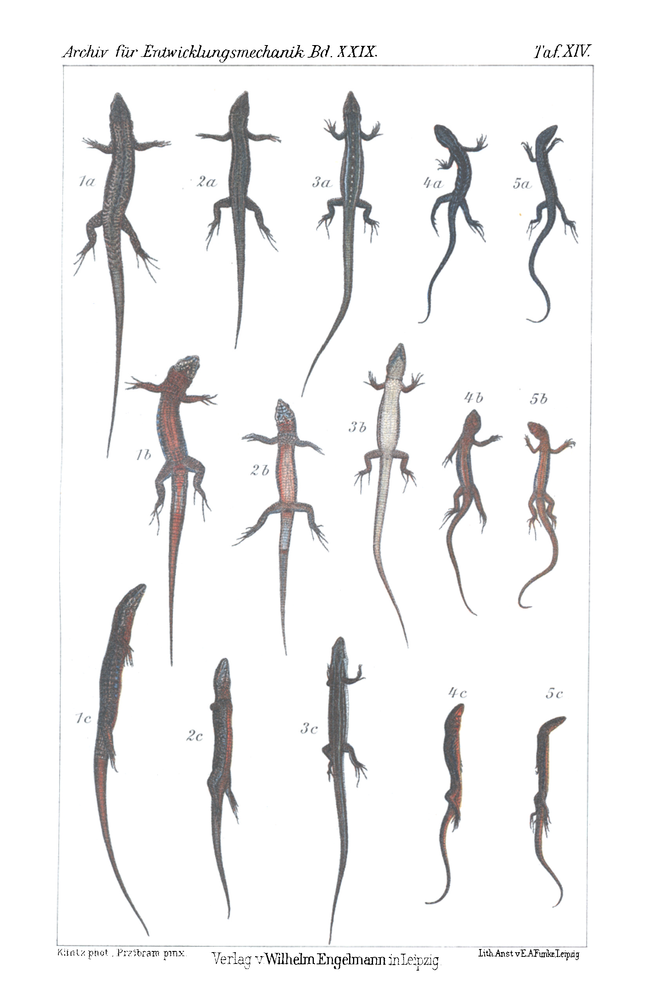

# Inheritance of Enforced Colour Changes.

### First and Second Communication: Induction of female dimorphism in *Lacerta muralis*, of male dimorphism in *Lacerta fiumana*.

By

**Paul Kammerer.**

*(From the Biological Experimental Institute in Vienna.)*

With Plates XIV and XV.

Received on 4 April 1910.

*Archiv für Entwicklungsmechanik der Organismen*, vol. 29 (1910).

> **Full translation.** A complete English rendering of the running text of “Inheritance of Enforced Colour Changes” (Kammerer, 1910), including all tables, figure and plate legends, and footnotes. Numbers and table cells were transcribed from the page images, not the noisy OCR.

### Table of Contents.

|  | Page |
|---|---|
| Introduction | 456 |
| I. Female dimorphism in *Lacerta muralis* | 459 |
| II. Male dimorphism in *Lacerta fiumana* | 474 |
| III. Abolition of the sexual difference in *Lacerta viridis* and *agilis* | 486 |
| IV. Is one of the dimorphic sexual forms a castrate? | 489 |
| Summary | 493 |
| Bibliography | 496 |
| Explanation of the figures | 498 |

### Introduction.

In repeated preliminary communications and demonstrations (1906, 1907, 1909) I have reported on my experiments to render various animals, namely reptiles, melanotic by experimental means. Some time will probably yet elapse before the detailed publication of these experiments, since beforehand I wish to bring to completion the most important breeding series, which afford a more or less conclusive overview.

Thus today, too, it is only an incidental result that I am bringing to attention, and which, because it stands only in loose connection with the main problem, is also better suited to be published separately.

The factor by which the artificial melanism was at first and chiefly brought about, and with which we have to reckon exclusively in the present communication, is the elevated temperature. Of the breeding series, which contain animals of the same kind, origin, and other condition, there is in each case one parallel culture in heated rooms, namely one room at 25° C., one at 37° C., as well as in unheated rooms, where, corresponding to life in the open, the temperature in summer can sometimes likewise become quite high through direct sunshine, but in winter often amounts to only a few degrees above zero and on average is deep enough to produce a hibernation that is, as it were, interrupted.

Particular care was taken to make all the other, non-thermal conditions as equal as possible, and this holds especially of the moisture, which would after all be lower in the hot cages than in the cool ones if no special precautions were taken to prevent this unevenness. The variation of the moisture hand in hand with the intended variation of the temperature is a defect which attaches to many relevant experiments, such as those of Berne and, by his own admission, those of Susmun. In my experiments this difficulty is not throughout eliminated with the desirable accuracy, yet at least so far that I can hold the temperature responsible for the achieved alterations, which will interest us today. The construction of experimental chambers of strictly constant temperature and moisture, which would permit the control of the separation and combination of these two important factors also in quantitative respect, is being planned at the Biological Experimental Institute for the near future.

Of the quite numerous species of the genus wall lizard [*Lacerta*], which were subjected to the melanism-inducing conditions, those showed themselves not at all uniformly inclined toward the black coloration: the breeding of the totally melanistic of these noble forms did succeed, just as in nature too the melanistic local races form, namely in the meadow lizard (*Lacerta serpa*, Raf.), the Balearic lizard (*L. balearica*, De Bedr.), the mountain lizard (*L. vivipara*, Jacq.), the pointed-headed lizard (*L. oxycephala*, Dum. Bibr.) and the wall lizard (*L. muralis*, Laur.), of which the last named occurs as a hitherto undescribed black variety on the cliffs of Lake Garda, but also occasionally as an individually occurring aberration, in singlely mingled black specimens among the normal type, is found.

Next to them, in regard to the transformability into Nigrinos of those species, ranked the local-variety-forming and likewise not yet black-found, experimentally examined kinds: the meadow lizard (*Lacerta fiumana*, Wern.), the Jonian lizard (*Lacerta jonica*, Lehrs), the Taurian lizard (*L. taurica*, Pall.), the Greek lizard (*L. graeca*, Bedr.), the Mosor lizard (*L. mosoriensis*, Kolomb.), the Bedriaga lizard (*L. reticulata*, Bedr. = Bedriagae, Cam.).

Still less amenable to transformation proved, remarkably, those species which, as far as known, likewise form no melanistic local races and at the same time also experimentally yielded no Nigrinos: the green lizard (*L. viridis*, Laur.) and the sand lizard (*L. agilis*, L.); just as scarcely at last among them are the desert saurians indicated as far as their occurrence goes: the glade lizard (*L. laevis*, Gray) and the spectacled lizard (*L. perspicillata*, Dum. Bibr.), as well as those that nevertheless belong to the Lacertidae in their occurrence: *Acanthodactylus*, *Eremias*, *Tropidosaura*, and the family of the Scincoidea.

In the present treatise I shall now have to do only with two *Lacerta* species, on which the one or the other of the alterations attainable on the lightly melanism-susceptible kinds was carried out; and indeed in such a manner that the one of them, with respect to its receptivity toward the factors, displayed the melanism only in slightly more conspicuous degree than the others (*Lacerta muralis*); the other indeed, on its part, with respect to its receptivity toward the factors, displayed the melanism well marked (*Lacerta fiumana*). Both species — *Lacerta muralis*, however, as measured by it, only the southern populations — proved themselves to be forms which through a resistance capacity against the considered transformation factors, namely strong against the cool, and through their susceptibility, permit yet another transformation, interesting from the standpoint of descent theory — a variation which in its larger or smaller intensity was, over and beyond the factors so indicated toward melanism, formed or definitively fixed.

## I. Induction of female dimorphism in the wall lizard (*Lacerta muralis*, Laurenti).

The wall lizard — let it be said with regard to the confusion in the systematic nomenclature of the Lacertidae, that throughout this treatise I understand under the name *Lacerta muralis* = *fusca* De Bedr., *forma typica* — discolors itself, that is to say, becomes melanistic quite susceptibly toward the melanism-promoting factors, in proportion to the climatic conditions of the find-spot, on which the susceptibility establishes itself. While Lower-Austrian specimens (Mödling, Baden, Vöslau) and such from North Tyrol (Jenbach in the Inntal — newer find-spot!) in the 37°-room hardly became melanistic in fifteen weeks, the wall lizards living in the open at more strongly exposed places again discolored much more strongly, where the most strongly exposed pigment again darkened slowly and gradually, exactly as more southern specimens, in which the original normal coloration began only much later likewise to darken slowly; while the North-Italian specimens, already on constant residence in the 25°-room within a year and a day, darkened so far that one constantly noted no further variation over 3 years.

So it was, at least, when on the fleeting passing-by at its habitat-cage one caught sight, in its otherwise widely outspread upper sides, of one that made a completely normal impression. Despite that, however, an examination of the same animal's bare upper side, a genuine control, which on 2 March 1907 brought the case to light, presented the case with the underside of a female animal. The inmates of the terrarium were namely in full rut, and one could, on the named plates of the same, daily observe matings. So one noted on the named day, in the morning, a female seized in the nape by its colored mate, and on the same day, at noon, seized in the nape and on the same moss, then the male, on the moss. And there shimmered under its belly side, towards me, which, as in the male, was red!

It is now, as we shall at once glean from the descriptions of the systematic literature, always confirmed by the females that passed through my hand, the underside of the normal *Lacerta muralis*-females never red in the wall lizards, but reddish, or with green, yellow-green or bluish flush. Red is, on the contrary, the normal color of the lower parts in the typical *L. muralis*-male.

I soon convinced myself that here it was not, say, an exceptional case of gynandromorphism that presented itself, but that all those reared southern find-spot specimens of the 25°-culture, which had little to do with the melanism of the more northern specimens, exhibited that variation and had on their underside assumed the brick-red ground-coloration otherwise accruing only to the male.

The now-following more exact examination yielded that indeed the males, although they went along in the rare splendor of their color-marks, in principle remained unaltered, and therefore bore on display the type of the male *Lacerta muralis* sharply expressed, the females on the contrary exhibited yet other variations, which made them similar to the males, while in yet again other characters they had remained true to the external sexual type of the female. Not over all secondary sexual characters, not even over all the characters pertaining to coloration and marking, had the elevated temperature exercised the same power as precisely over the ground-color of the underside. This represents the most labile of those characters, as is already to be recognized from the fact that the intensity of its red is subject to manifold fluctuations even in male animals, most saturated at the time of rut (spring), and faded, as it were, at another time. I have now experienced with the *Lacerta muralis*-species that the coloration of the underside can be quite white outside the rut-time and become red at the rut-period; a trace of the yellow-red pigment must be present at any season if the ventral side is to become red at mating time, and specimens with a quite uncolored ventral side are thus not at all whitish. The lack of red — also greenish and bluish — coloration of the belly-shields is therefore the only sexual character that, in the *Lacerta muralis*-species, indeed distinguishes the never red, but at most faintly or apparently whitish — instead of saturated and dirty-white appearing — males. The red thus arises, according to my experiences, not through a periodic new formation or transformation out of other pigments, but only through multiplication of its own kind — apart of course from the very first appearance, its expression at the becoming-sexually-mature of the young and its calling-forth through a late factor, of which last manner of origination we are just communicating a case here.

Let us now cite above all else the description of the secondary sexual characters by which male and female *Lacerta muralis*, according to the descriptions of systematic herpetology, distinguish themselves from one another.

Schreiber (pp. 413, 414) expresses himself as follows: »Quite young pieces [specimens] are on the back always single-colored, lighter or darker, olive-grey or brownish; on both sides of the body there is found a very distinct and mostly also rather sharply set-off dark band, which, springing from the nostril, continues through the eye and the temple region onto the trunk, and loses itself at the tail-root... This marking, characteristic for the young, remains in the female sex not seldom in existence even through the whole of life, although here, namely in the midline of the back, more rarely over its entire surface, at times now more, now fewer dark spots appear, which show a decided tendency to arrange themselves in longitudinal rows... In the males, on the contrary, the dark side-band as a rule soon dissolves itself, in that the white spots occurring at its edge with increasing age more or less encroach into the same, spread themselves ever more, and finally dissolve the at first coherent stripe into a band consisting of irregular dark spots, which is variously interspersed by the whitish scroll-spots that have penetrated in between. Also there is found in this sex the back almost always marked with dark spots, which namely like to form a band drawn over its midline, which moreover is subject to manifold alterations in form and breadth. The underside is here frequently colored yellowish or even vividly brick-red, the sides of the belly-shields provided with blackish and bluish spots, which latter indeed also occur in the females, yet there never appear so distinct and sharply set off as in the male sex; likewise also the breast and the underside of the head are almost always marked by blackish points and speckles, which not seldom even extend over the whole belly-surface.« (p. 412): »The femoral pores, very distinctly set off in the male, but on the contrary only little prominent in the female, are present in roughly the number of 15—20.«

Although Schreiber (p. 414, beginning of paragraph 2) expressly remarks that his description up to that place refers only to the basic form, by which he just means *Muralis fusca typica*, I yet wish to cite here still the description of another author, since Schreiber embraces under *Muralis* a whole crowd of forms apart from the first-named one, e.g. also the green forms *Lacerta serpa*, *fiumana* etc. So Werner (1897, p. 40) describes the »*Lacerta muralis* subsp. *fusca forma typica*« as follows: »Upper side mostly olive-grey or brownish-grey, with a dark, broad longitudinal band, which runs from the eyes to the attachment point of the hind-leg and becomes indistinct toward the tail-side. This longitudinal band is in the adult male unevenly bordered, on the edges with single dark spots, but in the same is dotted, i.e. provided with dark points which form a longitudinal zone either alone or in pairs along the back. Little shields on the breast blue, underside of the entire body bluish-grey, intermixed with dark points; the throat can be blackish, the tail-upper-side whitish-grey or reddish. The somewhat smaller female one distinguishes from the male by the single-colored, gradually bordered, not white-spotted, frequently above by a white line bordered longitudinal band, under which a dark longitudinal band lies. Also the head- and back-zone is found not darkly dotted, but quite single-colored light-grey, the underside white.«

Two things appear in these descriptions too little or not exactly enough emphasized: firstly the one or other dark side-band which is to be seen, in adult illumination, given the inadequate dark coloration on the upper side, also in *Muralis fusca*: yet this character concerns us here no further, I mention it only with regard to the agreement of the description with our colored figures, on which that shimmer is naturally brought to expression, and so that no one makes the objection that I have not correctly identified the figures. Secondly, however, it is in Schreiber partly, in Werner not at all sharply enough emphasized that of the typical form of *Lacerta muralis fusca* there are indeed also white-bellied males¹), and indeed otherwise — I emphasize this once more — quite typical males that do not already belong to the variety *maculiventris* Wern. and *Brüggemanni* De Bedr., in which the lack of the

> ¹ In 1895 (p. 132) Werner mentions the occurrence of yellow-, instead of red-bellied *Muralis*-males from Milan.

red smoke-coloration also in the male sex is expressly mentioned, [forms which] distinguish themselves from the true *forma typica*, var. *maculiventris* outwardly through the taking-over of the black mottling on the underside, var. *Brüggemanni* outwardly through the taking-over of the green coloration on the upper side. Only in the broader and intensified blue-mottling of the belly-edge scales, as well as in the attainment of the highest dissolution-stage of the dorsal band, is the typical white-bellied male wont to set itself off still otherwise from the typical red-bellied male.

We see now, in the comparison with the descriptions of Schreiber and Werner, which in general agree among themselves, that our find-spot examples — Fig. 1 *a*, *b* and *c* of our Plate XIV represents a male of the 25°-room, which agrees with its sex-companions of the normal control culture, and exhibits its characters in most pronounced development — Fig. 3 *a*, *b* and *c* a female of the normal control culture, which likewise agrees in the best way with the description literally cited above.

Fig. 3 *a*, *b* and *c* represents a female of the 25°-room, which differs from the in every respect generally applicable description of the females of both cultures in several points, and in just these points approaches the males of both cultures (the normal as well as that at elevated temperature). In the remaining points it has preserved the agreement with the female sex.

Let us discuss beforehand the characters that have remained unaltered. Here belong above all two characters, which concern no color- but form-characters: firstly the femoral pores are unexpressed in the altered females, just as in some females, while the comb-like set-off pore-rows on the thighs of the males at once fall into the eye.

Secondly, the size-difference mentioned in Werner (1897, p. 40) is not bridged. In that abrupt form in which the large females and small males given by him are represented, it is indeed not always presented, yet is everywhere, in all the cultures, the average of the males larger than the average of the females.

Further, the blackish speckling of the underside adduced by Schreiber l. c., namely of the throat and breast, which distinguishes the male animal, is found in the altered females Let us now examine our voucher specimens in comparison with the descriptions of Schreiber and Werner, which are accurate on the whole. Fig. 1*a*, *b* and *c* of Plate XIV is a male of the 25°-room, which agrees with its sex-companions of the normal control culture, but displays all the marks of its sex in the most pronounced development. Fig. 3*a*, *b* and *c* is a female of the normal control culture, which likewise agrees in the best way with the description quoted verbatim above.

Fig. 2*a*, *b* and *c*, finally, represents a female of the 25°-room, which differs from the female sex-companions of the normal control breeding in several points and, in just these points, approaches the males of both cultures (the normal one as well as that at elevated temperature). In the remaining points it has preserved its agreement with the normal female.

Let us first discuss the characters that have remained unchanged. To these belong above all two characters, which concern not colour but form characters: first, the femoral pores are unpronounced, as in the normal female, whereas the comb-like raised rows of pores on the thighs of the male catch the eye at once.

Second, the size difference mentioned by Werner (1897, p. 40) is not bridged. In that abrupt form in which it appears in the specimens selected for the illustration on another, particular ground to be given further below, it is, however, not constant: there are larger females and smaller males than are represented by the figured specimens, yet everywhere, in all cultures, the average of the males is larger than the average of the females.

Furthermore, the blackish sprinkling of the underside cited by Schreiber l. c., namely of the throat and breast, which distinguishes the male animal, has in the altered female passed over only onto the throat: we see the throat of both sexes bluish-white speckled and black dotted; little black flecks, however, continue onto the rest of the underside only in the male.

We now pass on to the more strongly altered female characters. The most striking and most valuable is, as said, the red colouration of the ventral side, otherwise never occurring in the female of *Lacerta muralis*, which in its intensity and extent scarcely falls short of that of the male. Once it has appeared, this colouration, as likewise already said, has remained permanently preserved, as long as the temperature conditions inducing it remain permanently preserved. It thus does not, say, represent a breeding character which makes itself noticeable only during the mating period, in order afterwards to disappear again and to yield the place to the earlier white; rather, from then on, in the 25°-room the underside of the females, like that of the males, was red; and only in intensity does this red — now in both sexes — reach its peak during the mating season. In summer, autumn and winter reddish-yellow, the tone deepens in February to brick-red, rust-red, copper-red, appears in March and April fiery red, in order from May on to pass over again, by way of rust-red, into yellow-red and reddish-yellow.

Another character, with respect to which the females of the 25°-room decidedly emulate the males, is the blue flecking of the flanks. Our normal female (Fig. 3*b*, *c*) shows not a trace of this. Our normal male (Fig. 1*b*, *c*) possesses very distinct and large blue rectangular scales at the boundary between the dorsal and ventral side, interrupted by rust-coloured scales adorned partly with uniform, partly with dark-edged white eye-spots. The female of the 25°-room (Fig. 2*b*, *c*) likewise possesses such blue flecks, but of lesser size and distinctness. — Now I must remark that I venture to state the value of this character only in consideration of the large number of experimental animals observed (40 in each culture), since quite decidedly all warm-kept females possess more, larger, and — through the interposition of differently coloured intervening spaces — more distinctly set-off blue flecks, whereas in specimens freshly caught from nature they are indeed not always lacking, as in the figured normal specimen, but on the average are much sparser, smaller, more blurred, and remain so in the cold room. In any case this character is less valuable than the previous one, since in normal females blue flecking does after all occur, but red belly colouration never. Red-bellied females are altered qualitatively as compared with normal ones, relatively strongly blue-flecked ones only quantitatively.

Somewhat lower still do I rate the significance of the third, modified character, which we have to look for on the dorsal side. All authors do indeed agree that the wholly entire-margined, continuous dorsal bands of the female could be constantly distinguished from the emarginate, jagged ones of the male, broken through in many places by lighter elements of the pattern. As against this I found, especially in southern districts of the range, that already in the young, and still more in full-grown females, the jaggedness of the longitudinal bands running on the dorsal side was just as much in progress as in the males, and only by degree is the dissolution of the male dorsal pattern in animals of the same age always a more advanced one. The sides of the back therefore always appear darker in the female, always better separated from the median zone of the back, than in the male of the same age.

That, however, this difference becomes the less considerable the farther toward the south one goes, is yet again a good confirmation of the correctness of my observation, that the females of the temperate room become more similar to the males in respect of their dorsal longitudinal pattern. The normal female of the cold room (Fig. 3*a*) has unjagged, sharply and entire-margined contoured dorsal bands. In the male (Fig. 1*a*) these are so interspersed by the ground colour and by grey and bluish-white ocelli that little more remained of a pronounced longitudinal band. In the female of the 25°-room the band is clearly to be seen, but, namely at the medial margin (Fig. 2*a*), notched in many places by the brown ground colour and, at the lateral margin (Fig. 2*c*), as it were beset by light-grey flecks and narrowed at intervals, all of which, however, happened more regularly than in the male, so that the altered female longitudinal bands now almost make the impression of wavy lines. This holds not only for the figured specimens, but is to be found with fine constancy throughout in the cultures concerned.

Within the female form of *Lacerta muralis* a pronounced dimorphism has thus arisen: a red-bellied one, provided with blue flank scales and emarginate dorsal longitudinal bands, the warm form, and a white-bellied form of the wavering, rather cool temperature, mostly with entire-margined dorsal longitudinal bands and without blue flank scales.

This experimentally produced dimorphism of the female ranges itself alongside the dimorphism of the male already existing within the species *Lacerta muralis* anyway, of which, besides the red-bellied specimens — which usually also retain the dorsal bands in better-pronounced form — there occur such specimens whose dorsal bands fell prey to entire dissolution and whose undersides, while indeed in clear distinction from those of the corresponding females black-flecked, appear without a trace of red, that is, white. The blue flank scales too are larger and more brilliant in the white-bellied male form than in the red-bellied one; so it appears, at least on the ground of the material to hand before me.

To the result obtained experimentally in the female there seems to contradict the fact that the red-bellied males are to be found predominantly in the northern, the white- and only black-fleck-bellied males — which then occur constantly in some races (var. *maculiventris* Wern. and *Brüggemanni* de Bedr.) and bring about no red-bellied specimens at all any more — predominantly in the southern districts of the range. As I shall set forth in detail elsewhere, the efficacy of the external factors is, however, on account of the exceedingly complex manner of their influence in nature, extremely difficult to judge, and most often leads to contradictions. For the acquisition of the red-belliedness in the males of *Lacerta muralis* advanced toward the north, the principle of the contrast effect, set forth in that same place and already in 1909, may have come into play: while the wall lizards in the south are simply omnipresent, in cooler climates they restrict themselves to spots that are particularly well exposed to the warming rays of the sun, to bare rocks and masonry. On their way to the north they had to accustom themselves to harsher weather conditions, but were then again — at the end-points of their migration, that is, at the warmest spots projecting island-like out of the cooler land — particularly receptive to this warming, and therefore particularly inclined to react to it with changes of the colour dress.

From this digression into the realm of uncertain speculation we return to the domain of exact developmental mechanics. To transfer white-bellied males into red-bellied ones by means of high temperature or another factor has succeeded for me just as little as to make red-bellied males white-bellied by means of low temperature or other influences. The males in this experiment retained their initial colouration much more stubbornly than the females, and behave accordingly in the reverse manner from what some temperature experiments on butterflies (Standfuss, Fischer, Schröder) have demonstrated. Other, decidedly in the minority, butterfly experiments (Standfuss [1898, p. 8] on *Parnassius Apollo*, cold experiment: "strongly darkened form, especially the ♀♀"; — Frings [p. 34] on *Cosmotriche potatoria*: "... especially the ♀") have, to be sure, likewise yielded a stronger experimental variability of the females, and indeed evidently everywhere there where the male form was already by nature differentiated to such a far-reaching degree that this could no longer be outdone by the artificially altered conditions. For this reason the males of such species showed themselves to a high degree fixed with respect to those conditions — exactly as in our wall lizard. The aberrant white-belliedness of the typically red-bellied male is altogether not simply to be explained and is probably genetically fundamentally different from the typical white-belliedness of the female. We shall come back to this in Part II, where the experiments on *Lacerta fiumana* are described.

The specimens figured in Fig. 1 and 2, the male and the altered female, were selected for the illustration with deliberation: for at the same time they show the regularity appearing, in respect of the colours, upon regeneration of the tail. The breaking-off of the tail and its re-growth was, to be sure, in these two cases not intended and did not take place from the same date; but for the control of the phenomenon to be emphasized at once, I also carried out this operation deliberately and simultaneously, and obtained in this way tail regenerates of the same age, which in male and female always showed themselves distinguishable in the same sense:

The tail regenerate of the male (Fig. 1*a*, *b*), whose underside is indeed always red, is likewise red and is only simplified in respect of the still almost-lacking dark fleck- and sprinkle-pattern. The tail regenerate of the female, on the other hand, which had acquired the red colouration only under the influence of the experimental conditions (Fig. 2*b*), repeats once more the normal colour, the white passing over more and more into blue-green toward the end of the tail; and only on the contact zone between the regenerate and the primary tail stump, which had remained standing in the accident, do we see the red of the rest of the underside already on the point of passing over onto the distal, regenerated tail portion; on the other hand, an adjoining district of the primary tail too, there forming a broad blue-white ring, has been secondarily impregnated from the regenerate with the deviating colour of the latter.

A corresponding thing I observed, be it remarked in passing, in natural as well as in artificial lizard-Nigrinos which regenerated the tail in normal colour; in the melanistic local races occurring in nature it darkened afterwards later, in the Nigrinos of the experiment it remained light. Lightened natural melanics, on the other hand, regenerated a tail which was at first light-coloured and afterwards became as dark as in the melanotic stock form. For the judgment of the colouration, however, only fairly well-grown regenerates can be used, since all the still very small, stump-shaped tail regenerates of the lizards are black. Something analogous Przibram experienced with the praying mantises (Mantids), where brown specimens, which in an earlier period of their individual existence had been green, replaced lost limbs in greenish colour, and conversely; and where the regenerate too only gradually took on the present colour of its bearer.

To an interpretation of this phenomenon as atavism there stands opposed the fact that it would most often be a matter merely of the repetition of an ontogenetic stage: in the experimentally produced changes this is self-evident; but even the young of melanotic lizard forms freshly crept out of the egg are not so dark as their begetters, and let all the pattern elements be clearly recognized.

Instructive now was the exchange of specimens out of the 25°-culture into the non-temperate one and conversely. It showed that newly acquired characters, especially when they fall into the progressive line in which the organism concerned is just orthogenetically striving to change, often offer more stubborn resistance to counter-working factors than do innate, original and unchanged characters. To be sure, the experimental animals in which this comes to appearance have in the meantime always already grown older and have certainly thereby too lost a part of their plasticity. But that the first-mentioned circumstance plays a part is seen from the inheritance, where quite young, that is to say quite plastic animals nevertheless retain the newly induced character.

Every female that newly came from the unheated room into the heated one attained within about a year (e. g. 10. IV. 06 — 2. III. 07) the red belly colouration, which otherwise distinguishes only the male; in the second year (e. g. up to 5. VIII. 07) it acquired more, larger, and more sharply set-off blue flecks at the sides, and more strongly articulated longitudinal bands on the back, even if up to then these had been completely entire-margined.

On the other hand, every female transferred back from the heated room into the unheated one had, after the lapse of a year (e. g. 1. IX. 07 — 1. IX. 08), still always retained its characters approximated to those of the male. Only in the second year (control: 1. XII. 08) is a distinct fading of the red ventral side to saffron-yellow to be noted, in the third year (control: 1. XII. 09) to green-yellow; the red colour is at this time, to be sure, still also present, but no longer so evenly distributed over the whole underside, but rather appears more in the form of flecks on a greenish-yellow ground, and keeps to the breast and belly parts neighbouring the flanks. The red has finally (last control: 6. II. 1910) disappeared entirely, the belly side once again almost uniformly white with a greenish tinge.

The two remaining characters, on the other hand, which concern the blue flank pattern and the dark dorsal pattern, have no longer been reduced (last control: 6. II. 1910). If they are less well usable for distinguishing the male and the female than the colouration of the belly side, they now prove valuable in their quality as more stable characters, which change with more difficulty, but, once changed, also allow themselves to be reduced again with more difficulty.

This was revealed most clearly in the young of the specimens transferred back into the low temperature. The breeding of the lizards offers no particular difficulties, let itself be carried out, with each individual, arbitrarily selected pair, with greater certainty and in smaller containers than for example with *Salamandra*. Only one thing the lizards demand, on which one need take no regard in the setting-up of amphibian terraria: direct sun-rays. Without several hours' insolation the *Lacerta* species do not thrive, and even when they put up with little sun for their own existence for a long time, they certainly give no further generation the life.

The following crossings had been set up:

A. Artificially red-bellied female (♀) with red-bellied male (♂).

B. White-bellied ♀ with red-bellied ♂.

C. Artificially red-bellied ♀ with white-bellied ♂.

D. White-bellied ♀ with white-bellied ♂.

(Let it be recalled once more that, of these forms, only the red-bellied female is experimentally induced, whereas the white-bellied females and the dimorphic males derive from Nature, and that of these the latter showed their particular characteristics fixed to a perfect degree against the experimental conditions.)

All combinations — even if only 1–3 pairs out of the 6–10 housed in isolation — yielded offspring, which appear compiled in the foregoing table:

| Versuchsreihe (Test series) | Kreuzung (Crossing) P. ♂ × P. ♀ | Summe aller aufgezogenen Nachkommen (Total of all reared offspring) | Davon (Of which): rotbäuchige ♂ | rotbäuchige ♀ | weißbäuchige ♂ | weißbäuchige ♀ | Paar (Pair) | Gelege (Clutch) | Auffindung des Geleges (Datum) (Finding of the clutch (Date)) | Anzahl d. Eier im Gelege (Number of eggs in the clutch) | Anzahl aufgezogener Nachkommen (Number of reared offspring) | Davon (Of which): rotbäuchige ♂ | rotbäuchige ♀ | weißbäuchige ♂ | weißbäuchige ♀ |
|---|---|---|---|---|---|---|---|---|---|---|---|---|---|---|---|
| A | Rotbäuch. ♂ × rotbäuch. ♀ | 25 | 13 | 12 | 0 | 0 | I. | 1 | 11. VI. 07 | 8 | 8 | 4 | 4 | 0 | 0 |
|  |  |  |  |  |  |  |  | 2 | 18. VI. 08 | 8 | 7 | 4 | 3 | 0 | 0 |
|  |  |  |  |  |  |  | II. | 1 | 30. V. 07 | 7 | 5 | 2 | 3 | 0 | 0 |
|  |  |  |  |  |  |  |  | 2 | 28. V. 08 | 9 | 5 | 3 | 2 | 0 | 0 |
| B | Rotbäuch. ♂ × weißbäuch. ♀ | 28 | 13 | 0 | 0 | 15 | I. | 1 | 12. VI. 07 | 7 | 3 | 2 | 0 | 0 | 1 |
|  |  |  |  |  |  |  |  | 2 | 14. VI. 08 | 8 | 5 | 2 | 0 | 0 | 3 |
|  |  |  |  |  |  |  |  | 3 | 12. VI. 09 | 9 | 5 | 3 | 0 | 0 | 2 |
|  |  |  |  |  |  |  | II. | 1 | 18. VI. 07 | 9 | 8 | 3 | 0 | 0 | 5 |
|  |  |  |  |  |  |  |  | 2 | 26. VI. 08 | 9 | 7 | 3 | 0 | 0 | 4 |
| C | Weißbäuch. ♂ × rotbäuch. ♀ | 31 | 9 (Taf. XIV Fig. 4 a—c) | 4 (Taf. XIV Fig. 5 a—c) | 8 | 10 | I. | 1 | 21. VI. 07 | 6 | 5 | 1 | 1 | 1 | 2 |
|  |  |  |  |  |  |  |  | 2 | 27. VI. 08 | 8 | 4 | 1 | 0 | 2 | 1 |
|  |  |  |  |  |  |  | II. | 1 | 26. V. 07 | 6 | 6 | 1 | 2 | 2 | 1 |
|  |  |  |  |  |  |  |  | 2 | 2. VI. 08 | 8 | 6 | 2 | 1 | 2 | 1 |
|  |  |  |  |  |  |  |  | 3 | 31. V. 09 | 8 | 5 | 1 | 0 | 1 | 3 |
|  |  |  |  |  |  |  | III. | 1 | 13. V. 08 | 8 | 5 | 3 | 0 | 0 | 2 |
| D | Weißbäuch. ♂ × weißbäuch. ♀ | 24 | 6 | 0 | 8 | 10 | I. | 1 | 12. V. 07 | 4 | 3 | 1 | 0 | 1 | 1 |
|  |  |  |  |  |  |  |  | 2 | 17. VII. 07 | 5 | 2 | 0 | 0 | 1 | 1 |
|  |  |  |  |  |  |  |  | 3 | 29. VI. 08 | 9 | 5 | 1 | 0 | 2 | 2 |
|  |  |  |  |  |  |  |  | 4 | 15. V. 09 | 10 | 4 | 1 | 0 | 1 | 2 |
|  |  |  |  |  |  |  | II. | 1 | 24. VI. 07 | 7 | 6 | 1 | 0 | 3 | 2 |
|  |  |  |  |  |  |  |  | 2 | 19. VI. 08 | 8 | 4 | 2 | 0 | 0 | 2 |

Concerning this table the following is to be noted:

1) The dates do not give the exact date of the laying; this proceeds underground, in passages which the animals dig into the sandy floor of the terrarium, and can scarcely be monitored without disturbing the process. The dates therefore give us only the day on which I had found the clutch. Yet both dates are likely to lie only a few days apart, and often to coincide as well, since it is exceedingly easy to find the once-deposited clutch: it is regularly laid beneath the drinking dish, where the sand, owing to the spilling of water, is always moister than in the rest of the container, and where therefore the dug passages do not collapse so quickly; on the other hand, a certain moisture seems indispensable for the development of the eggs, and is therefore deliberately sought out by the maternal animals.

2) The difference between the number of eggs laid and that of the young reared to sexual maturity is explained chiefly by the fact that almost always some eggs were addled, unfertilized. Alongside this, the perishing of fertilized eggs before hatching and the mortality of hatched young that fell ill during rearing play a much smaller role.

3) Within one year, reckoned from hatching, the lizards became capable of reproduction in my experiments. It may be that this represents a precocity as compared with life in freedom, such as is not uncommonly observed as an accompanying phenomenon of domestication (cf. e.g. Russ). The judgement of whether one has before one a male or a female, and whether the sexes belong to the red- or the white-bellied race, is possible even at an age of as little as 8–9 months, so that I was still able to include in the results the young hatched from the eggs laid in 1909.

4) The egg-laying takes place only once a year, mostly in May or June. In test series D, pair I (the pairs were kept isolated), two layings came about in 1907 at relatively very short intervals. Presumably this is only an apparent exception, and the female in question merely did not, as is otherwise the rule, release at one go its store of eggs destined for laying in that year, but in two instalments. This is indicated too by the small number of eggs in each of these instalments, which, added together, give exactly the number usual in a clutch for that female, a particularly large and strong animal.

5) The other characters, which distinguish male and female not so absolutely as the belly-colouring but rather relatively — the blue spotting and the marginal condition of the dorsal bands — have been left out of account in the table, so as not to overburden it and thereby make it confusing; but they can now be added very easily in a single sentence: the white-bellied male always possesses the most strongly broken-up dorsal bands and the largest, most numerous, bluest flank-spots; in this respect the red-bellied male follows it, and this one the red-bellied female, which bears dorsal bands clearly set off from their surroundings but emarginate, and small, indistinct lateral blue spots. In the last place stands the white-bellied female, with entirely entire-margined, sharply set-off dorsal bands and mostly entirely absent blue spots.

6) "Red-bellied male" and "red-bellied female" mean, in the parental generation, always complete red-belliedness: all parts of the underside — throat, breast, belly and tail — are covered with red. By contrast, this colouring appeared in the offspring more often only in the form of a red mottling upon the otherwise white underside. Unfortunately it has not always been possible to keep this mottling distinct from uniform colouring, and in the former its various degrees distinct from one another, because the animals, which in the past year were more poorly tended than usual, all had to be preserved owing to outbreaks of epidemics, in many cases before the coloured plates (Fig. 4 a—c, 5 a—c) had been made. And the red colour withstood no preservation; it faded, however, not uniformly over the whole underside, but only in stretches, and thus did indeed still permit the determination of which specimens belonged in the category of the red-bellied, but not always with certainty which specimens were uniformly coloured and which had been mottled already by nature, not merely as artefacts of the preservation. With regard to these inconveniences I have also given, of my experimental F₁ generation, only a few illustrations (Fig. 4, 5, a—c). The unquestionably genuine mottled ones were, moreover, all males; and one more thing can be emphasized: where the red did not uniformly cover the whole underside, but only in the form of spots, these spots were spread over all parts; there was not a single specimen which had, say, only a red or red-spotted throat, or only a red tail, as was often the case in the species to be discussed in the second part, in Lacerta fiumana. And one further circumstance is to be borne in mind at once, now that we are considering the influence of preservation on the red colour: it was quite striking, and can be no coincidence, that the red-bellied females, although in life lagging behind the males not at all or only slightly in respect of colour-saturation, faded much more quickly in alcohol than the males. I trace this back to the fact that the character of red-belliedness has in the females been acquired only for so short a time, and that it was therefore — even if to the eye quite or almost as pronounced as in the male — in reality nonetheless weaker.

The following facts are to be drawn directly from the table:

a. The acquired property of red belly-colouring in the female is heritable. Red-bellied females arose only from such broods where a red-bellied female was among the parents (A, C), but on the other hand also even when the male was white-bellied (C). The red-bellied male had, in its crossing with a white-bellied female, among its offspring red-bellied individuals of the male sex only, never a red-bellied female. It is therefore to be assumed that the red-bellied offspring of the female sex which proceeded from the crossing of the red-bellied male with the red-bellied female (A) are to be traced back to the heritable potency of the artificially red-bellied mother. And even should one still wish to doubt this, the culture C would nonetheless furnish the irrefutable proof of that heritable potency of the induced colour-character.

b. In the decrease of the red-bellied females with each clutch there is mirrored the sinking-back of the acquired character, which is weakened to the same degree as the red colouring of the belly diminishes also in the directly influenced mothers. If alcohol preservation permitted it, one would probably be able to perceive also a decrease in the intensity of the red, alongside the decrease in red-coloured animals altogether.

c. The number of descendants from each clutch is — especially under consideration of the misfortune emphasized above under point 6 — too small to discover any regularity in the numerical arrangement of red- and white-bellied specimens. And in addition they cannot be fitted into any of the known rules of inheritance, because indeed only the first offspring generation (F₁) is present, whereas for the assessment of the rule of inheritance at least the second offspring generation (F₂) would be required. The F₂ generation, however — since of F₁ no specimen still lives — is not obtainable without re-establishing the whole experimental series.

d. A point of reference, that the racial characters of white- and red-belliedness probably follow MENDEL's rule of segregation, and indeed the acquired red-belliedness of the female just as much as the innate one of the male, can nonetheless be gained from the fact that red with red gives no white, whereas white with white gives also red. According to this one would have to suspect in white the dominant, in red the recessive character.

## II. Induction of male dimorphism in the Karst lizard (Lacerta fiumana, Werner).

If already in Lacerta muralis [common wall lizard] the confusion prevailing in the herpetological literature had confronted me as an obstacle to making precise the characters that come into account for us with respect to their occurrence and their value, then this difficulty holds all the more in Lacerta fiumana. It would be extremely desirable if v. MÉHELY's "Materials toward a systematics and phylogeny of the Muralis-like lizards" — that masterly and careful treatment, in whose nomenclature I have followed — would have its second part, announced by the author, appear soon, so that we might at last have the possibility of really finding our way among the interesting wealth of forms of the genus Lacerta.

What WERNER (1894, 1897) described as "var. fiumana" of "Lacerta muralis subsp. neapolitana DE BEDR." was, as the author himself surmised in 1894 and states with certainty in 1897 under "Corrections" p. 161, only the male of that form; and since the description of 1897, p. 42 reads: "Underside of the female white, of the adult male vividly fiery red, the belly-margin scutes blue," it is thereby actually expressed that white-bellied males occur, for the supposed females were here precisely males. The corresponding female is, in the same place — 1897, p. 42 — originally described as "var. striata" and bears, with regard to the body parts of interest to us, the note: "Underside pure white, no blue belly-margin scutes."

LEHRS lists the form thus belonging together as male (fiumana) and female (striata), already fused under the name "litoralis" proposed by WERNER (1897, p. 161), and as an independent species: "On the underside, by contrast, there always asserts itself an impure white, which is heightened through all degrees from brownish, yellowish, orange up to glaring brick-red, the latter especially in sexually mature males."

In 1905 WERNER (p. 65) withdraws the name "litoralis" for reasons of priority in favour of the name "fiumana," now regards the form likewise as a species, and characterizes it as follows: "L. fiumana occurs in Dalmatia in three principal forms, to which a fourth is added in the Herzegovina. 1. The typical, green, spotted (♂) or, respectively, striped (♀) form. Males with fiery-red underside. — 2. The olivacea-form with uniformly olive-green colouring above; underside of the ♂ as in the preceding form; size smaller. 3. The var. lissana Wern., upperside light grey-brown, without a trace of green; underside of the ♀ more brick-red." (A misprint for ♂ — Ref.)

SCHERER says of this "var. lissana" (p. 174): "The underside appears mostly pure white, but shows at times black spotting and a reddish-brown sheen."

For our purposes all these descriptions are too imprecise. This is not meant as a reproach to the cited authors; the form is simply still little known. I therefore used in my breeding series, in order to avoid sources of error, always only specimens from one quite definite and spatially restricted locality, and must attempt to characterize the forms that come into account, with regard to their secondary sexual characters, myself in the following lines.

Among the external sexual characters I leave entirely aside the blue, black-bordered axillary ocellus, which is given in most descriptions as the property of the male, in some of the female. It really occurs in both sexes and can be absent in both, although in the male it is wont to be more frequent and more distinct.

Of relative characters, for the diagnosing of which one must call comparative material to aid, and which extend mostly to the (by a practised eye indeed easily usable) form of the head as well as to the length of the limbs and of the tail in relation to the trunk, I likewise make no use; I mention only that in Fiumana too, as in Muralis, of individuals of the same age the male is always the larger one. Under the influence of the experimental factors these relative characters have in any case not changed.

The surest character of body-form, likewise not experimentally influenceable, is, as in Muralis, the comb-like projecting skin-fold at the underside of the thigh in the male, which fold bears the femoral pores opening upon papillae.

As regards the colouring, with respect to the upperside the statements emphasized in the literature suffice — that the male is spotted upon the green or brown ground in all gradations (Plate XV Fig. 7a), the female sharply striped (Fig. 8a). Besides this, however, there is, sometimes mixed in among the typical, patterned form, sometimes appearing dominant as a local race, the Olivacea-form with almost uniformly green or brown upperside, where that distinguishing character fails.

The blue belly-margin scutes are found, in the fairly rich material before me, always only in the male (Fig. 7c), and thus furnish, should this finding prove generally valid, a more constant distinguishing character in Fiumana than in Muralis. They are mostly not interrupted by scutes of a different colour, as in Lacerta muralis, but abut one another without a gap and so form a narrow blue band along the flanks, at the boundary between upperside and underside.

The underside can in both sexes be white or coloured; in the former case it appears fairly uniformly white, in the latter yellow (♀) or red (♂). During the mating season both the colourlessness and the colouredness are most sharply expressed: the white is purified, loses its otherwise frequent greenish or greyish tinge and becomes a snowy, gleaming porcelain-white; the yellow of the female becomes an intense saffron-yellow, the red of the male a minium-, cherry- or morello-red. A seasonal colour-change from white to yellow or red was never observed by me; I may probably exclude its occurrence, as in Lacerta muralis, so also in L. fiumana. Only fluctuations of intensity are to be perceived, but no periodic appearance of a colour not visible during the rest of the year.

In one and the same find-region the sexes are, as I gather from my quite considerable material, constant with regard to their ventral coloration; yet males and females coloured and uncoloured on the underside combine in all combinations: from Kobljaglava on the Babaplanina (Herzegovina, 1115 m above sea level) I owe to Herr Reinhold Oeser (29.IX.1903) numerous specimens which in the male sex have a red, in the female sex a white ventral side. The specimens from Grgovac (South Dalmatian Karst, near Cattaro [Kotor], roughly equal sea-level height — leg. Oberleutnant Max Wiedemann) are constituted likewise. From Komisa on Lissa [Vis] I received through Dr. Egon Galvagni on 29.VIII.1907, and collected myself on the 24th and 27.VI.1909, numerous typical and *olivacea* specimens, in which the males bear a dirty-white, the females a pale-yellow underside. In the var. *lissana* from the same place the males are red-bellied, the females white-bellied. On the Austrian Riviera (Fiume [Rijeka] to Moschenizze [Mošćenice]) I caught in September 1901 a typical *Fiumana* population whose males are spot-backed [gefleckrückig] and red-bellied, whose females are streak-backed [streifrückig] and yellow-bellied. The *Olivacea* form was, as I expressly note, not among them; they were all caught along the road running by the coast. The *Olivacea* form is indeed not lacking near Fiume, but it occurs not at the seashore, rather far separated from the littoral form, high up in the Karst (Kasten) [Kras].

Enough of these examples, which could easily be multiplied many times over. The *Fiumana* population from which I obtained the actual experimental material was finally laid down as a breeding-culture; it is the same that I took into my possession nine years ago and that I have come to know so thoroughly that I know above all exactly that over two years, under possibly natural conditions, if one sets its descendants reared back into the terrarium, the young, undisturbed by external factors, remain unchanged from the typical form and colour.¹

¹ *Fiumana* lizards of various provenance, in particular from Komisa on Lissa, were exposed to the experimental conditions (temperature extremes), some of them already taken into observation before that, some of them until shortly before, yet yielded no unambiguous result and likewise no clear result of the inheritance experiments.

These too — from the series of typical *Lacerta fiumana* that I had identified earlier as received on 29.VIII.07 from Herr Dr. Galvagni from Komisa — I retained for a long time, a few of them. I will therefore anticipate at once the little I have to say about the behaviour of this series in my present treatise. In the cool temperatures it died out; at 25 degrees it remained normal [males white-, females yellow-bellied]; at over 30 degrees it took on, relatively more quickly than its conspecifics, the character of advanced transitional stages towards melanism [males dark iron-grey, females chocolate-brown], before anything had changed in the secondary sexual characters.

The main experiment remaining after deduction of the Komisa series (Istrian series) is set up exactly as the experiment with *Lacerta muralis* described in Part I: one culture each in fluctuating, mostly cool temperature (in winter down to near 0 degrees), in 25 degrees and in 37 degrees.

In the fairly constant mean temperature there occurred — apart from relatively slight fluctuations of intensity in causal connection with the rutting period — no change at all in the animals: the males remained red-bellied (Fig. 7b) and spot-backed (Fig. 7a), the females yellow-bellied (Fig. 8b) and streak-backed (Fig. 8a), the ground colour of the upper side a rich dark green, the drawing of the upper side simple in the contours, blackish-brown. Likewise the descendants.

In the fluctuating low temperature the back-coloration became brighter, the ground colour of the back a lively leek-green to yellow-green, the drawing reduced and a fairly light brown. The underside took on, in both sexes, a unicolorous but matte or faintly glossy, not entirely pure white. The blue belly-margin shields remained restricted to the male and lost nothing of their intensity. The change took place within about 1½ years: setup on 19.V.1904, concluding revision on 20.XI.1905.

In the very high temperature the back-coloration became (Fig. 6a) darker, the ground colour of the back brown-grey to chocolate-brown, the drawing-spots [Zeichnungsflecke] deep-black, very extended and richly articulated, or, with still stronger darkening of the ground colour, already unrecognizable (transition to melanism). — The belly-side of the females remained unchanged, saffron-yellow with reddish tail-underside. The belly-side of the males (Fig. 6b), however, lost its red coloration and took on a unicolorous and pure, strongly glossy ivory- or porcelain-white. The otherwise dark cobalt-blue belly-marginal-spots (Fig. 6c) remained restricted to the male but lost intensity even in it, so that they now appeared a light turquoise- or sky-blue. The changes of the male took place within somewhat shorter time than in the previous experiment, again within one year: setup, as there, on 19.V.1905, concluding revision on 20.VI.1906.

Surprisingly, yet in agreement with the butterfly experiments (e.g. Standfuss, Fischer), the upper temperature extreme had exerted a similar effect to the lower one — here on both sexes, there only on the male. But the white coloration that arose from the multicoloured state through temperature elevation differs from that gained through temperature lowering by greater gloss and greater purity. The white-belliedness in the cool is identical with that of the female, which here, with regard to this character, becomes like the male; the white-belliedness in the heat is something different from it, pertaining to the male alone.

If we make a common application of this finding not only to *Lacerta fiumana* but also to our results on *L. muralis* described in Part I, then with increasing warmth there results a graded sequence from white-belliedness to red-belliedness and from this again to yellow-belliedness, whereby, however, between the first and second and likewise between the second and third stage, one transitional stage in the form of yellow-belliedness is interposed. Such forms are — at least in *L. fiumana* — not transitional stages in this sense, produced by the action of external factors, but arise through hybridization. If we call the lowest stage "cold-white-belliedness," the highest "warmth-white-belliedness," then the sexual forms of *L. muralis* and *fiumana* can be ordered as follows:

1) The male of *Muralis* occupies the lowest stage, that of cold-white-belliedness, and both *Fiumana* sexes can be brought back to that same point through temperature lowering. The cold-white-belliedness is, in some districts of distribution, also taken in nature still by females of *Lacerta fiumana* (higher mountains of Dalmatia and of Herzegovina).

2) The male of *Muralis* occupies, in northern districts of its home, the second stage, that of red-belliedness, and to that same point the corresponding female can be brought up through temperature elevation.

Also the *Fiumana* male occupies predominantly the same stage in nature.

3) The *Fiumana* female asserts an intermediate stage of yellow-belliedness, whether in transition to red- or to warmth-white-belliedness remaining undecided at the natural find-places as well as through the experiment; it cannot be influenced here by temperature elevation, but indeed by temperature lowering (thus probably transition from cold-white-belliedness to red-belliedness), and it is probably not everywhere of equal value there.

4) The male of *Muralis* occupies, in southern districts of its home, either the yellow-bellied transitional stage towards warmth-white-belliedness (Werner's, 1895, Milanese specimens) or already this highest stage itself, and to that same point the *Fiumana* male can be brought up through strong temperature elevation.

5) The *Fiumana* female can, even in nature, already possess the highest stage, that of warmth-white-belliedness.

On 1 July 1907 the transfer-back of one part each of the cold- and of the heat-culture into the room of mean temperature (25 degrees) took place, where the stock-culture, at the same time control-culture, had remained normal. The white-belliedness acquired in the cold by the female, and the white-belliedness acquired in both extreme cultures by the male, were now indeed again much harder to abolish than they had originally been to induce; and the care continued for 2½ years [provisionally last control: 1.II.1910] under those mean, normal conditions has given back to the uncoloured undersides hardly more than a yellowish (♀) and reddish (♂) shimmer. But this is indeed sufficient to exclude the suspicion that, in the appearance of white-bellied animals under application of the opposite extremes of the same experimental factor, one was dealing only with manifestations from the wild of impure races that had come in — a suspicion that was indeed plausible, because white-bellied males, as already stated earlier, actually occur in nature, even if, within the find-region of the material chosen for the experiment, separated spatially far from the latter.

At any rate the experiment has, in distinction from the analogous experiment with *Lacerta muralis* — where, in the shape of the red-bellied female, a form not occurring at all in nature was produced — here, in *L. fiumana*, allowed only such forms to arise out of the normal type as are also found in the wild. And correspondingly the outcome here was the, though little striking, yet decidedly positive outcome of the control-experiment just indicated, of particular value, of greater value than the reversal of the induced female dimorphism in *Lacerta muralis*. Accordingly I further proceeded with particular caution in setting up the breeding experiments for testing inheritance, and arranged the following crossings, which therefore now all take place in the 25-degree room, the room of the normally remaining stock-culture:

A. Red-bellied ♂ with yellow-bellied ♀ (normal culture).

B. Red-bellied ♂ with artificially white-bellied-made ♀ (cold-white-belliedness).

C. White-bellied-made ♂ (cold-white-belliedness) with yellow-bellied ♀.

**Table** *(p.481; rotated column headers translated as printed)*

| Versuchsreihe (Experiment series) | Kreuzung (Crossing) P. ♂ × P. ♀ | Summe aller aufgezogenen Nachkommen (Sum of all reared descendants) | Davon: Rotbäuchige ♂ (Of these: Red-bellied ♂) | Gelbbäuchige ♀ (Yellow-bellied ♀) | Weißbäuchige ♂ (White-bellied ♂) | Weißbäuchige ♀ (White-bellied ♀) | Paar (Pair) | Gelege (Clutch) | Auffindung des Geleges (Datum) (Finding of the clutch [Date]) | Anzahl d. Eier im Gelege (Number of eggs in the clutch) | Anzahl ausgekrochener Nachkommen (Number of hatched descendants) | Davon: Rotbäuchige ♂ (Of these: Red-bellied ♂) | Gelbbäuchige ♀ (Yellow-bellied ♀) | Weißbäuchige ♂ (White-bellied ♂) | Weißbäuchige ♀ (White-bellied ♀) |
|---|---|---|---|---|---|---|---|---|---|---|---|---|---|---|---|
| A | Rotbäuch. ♂ × gelbbäuch. ♀ (Red-bellied ♂ × yellow-bellied ♀) | 39 | 22 | 17 | 0 | 0 | I. | 1 | 15. VI. 08 | 9 | 8 | 5 | 3 | 0 | 0 |
| | | | | | | | | 2 | 31. V. 09 | 10 | 7 | 3 | 4 | 0 | 0 |
| | | | | | | II. | 1 | 29. VI. 07 | 8 | 7 | 5 | 2 | 0 | 0 |
| | | | | | | | 2 | 26. VI. 08 | 9 | 8 | 4 | 4 | 0 | 0 |
| | | | | | | | 3 | 17. VI. 09 | 11 | 9 | 5 | 4 | 0 | 0 |
| B | Rotbäuch. ♂ × weißb. ♀ (Kälte-Weißbäuchigk.) (Red-bellied ♂ × white-bellied ♀ [Cold-white-belliedness]) | 13 | 6 | 3 | 1 | 3 | I. | 1 | 23. VI. 08 | 8 | 6 | 2 | 1 | 1 | 2 |
| | | | | | | | 2 | 30. V. 09 | 7 | 7 | 4 | 2 | 0 | 1 |
| C | Weißbäuch. ♂ (Kälte-Weißbäuchigkeit) × gelbbäuch. ♀ (White-bellied ♂ [Cold-white-belliedness] × yellow-bellied ♀) | 13 | 3 | 7 | 3 | 0 | I. | 1 | 1. VII. 08 | 6 | 6 | 1 | 3 | 2 | 0 |
| | | | | | | | 2 | 16. VI. 09 | 8 | 7 | 2 | 4 | 1 | 0 |
| E | Weißbäuch. ♂ (Wärme-Weißbäuchigkeit) × gelbbäuch. ♀ (White-bellied ♂ [Warmth-white-belliedness] × yellow-bellied ♀) | 49 | 10 (Taf. XV Fig. 10 a–c, 11 a–c) | 23 (Fig. 12 a–c, 13 a–c) | 16 | 0 | I. | 1 | 20. VI. 08 | 6 | 6 | 0 | 2 | 4 | 0 |
| | | | | | | | 2 | 2. VI. 09 | 8 | 8 | 0 | 2 | 4 | 0 |
| | | | | | | II. | 1 | 24. VI. 08 | 8 | 7 | 0 | 3 | 4 | 0 |
| | | | | | | | 2 | 5. VI. 09 | 12 | 10 | 3 | 4 | 3 | 0 |
| | | | | | | III. | 1 | 21. VI. 09 | 9 | 7 | 1 | 4 | 2 | 0 |
| | | | | | | | 2 | 1. VI. 09 | 12 | 11 | 4 | 4 | 3 | 0 |
| F | Weißbäuch. ♂ (Wärme-Weißbäuch.) × weißbäuch. ♀ (Kälte-Weißbäuchigk.) (White-bellied ♂ [Warmth-white-belliedness] × white-bellied ♀ [Cold-white-belliedness]) | 5 | 1 | 0 | 3 | 1 | I. | 1 | 14. VI. 08 | 9 | 5 | 1 | 0 | 3 | 1 | D. White-bellied-made ♂ (cold-white-belliedness) with white-bellied ♀ (cold-white-belliedness).

E. White-bellied-made ♂ (warmth-white-belliedness) with yellow-bellied ♀.

F. White-bellied-made ♂ (warmth-white-belliedness) with white-bellied ♀ (cold-white-belliedness).

The combination D yielded no young animals. Of all the others I obtained, from the 6–8 isolated set-up little pairs, descendants, which are compiled in overview in the table on p. 481. The fewest descendants are everywhere where breeding-animals stemming from the cold-culture are used; this is connected with the fact that this culture — because the lizards possess little resistance against low temperatures — was the least healthy. To this table the following is to be remarked:

1) The remarks 1–3 of the previous table (p. 470) apply unchanged.

2) The marks that distinguish males and females besides the belly-coloration — the blue-flecking of the belly-margin shields and the constitution of the back-drawing (spot-flecking in the male, streaking in the female) — were left unconsidered in the table in order not to overload it. The blue-flecking, however, binds itself constantly only to the male, pale-blue in the white-, saturated-blue in the red-bellied male.

3) The back-flecking of the males and back-streaking of the females is, however, besides in the parents, still distinct only in one part of the descendants, namely in all cold-white-bellied males and females, where moreover the ground colour is light and the drawing likewise light and little extended, as well as in all entirely red-bellied males; another part of the descendants, namely some of the males with only partly red underside, in advanced degree the warmth-white-bellied males (Fig. 9a), are not so far advanced that one could not still everywhere recognize the streaking, the entirely (Fig. 13a) or partly (Fig. 12a) yellow-bellied females having passed over to the *Olivacea* form with a uniform grey-green to iron-grey back-coloration. Again, as already noted earlier with respect to white-belliedness, the suspicion is near at hand that the parent-animals represented an impure race with which the *Olivacea* race occurring also in the wild — though far separated from my find-place — had become mixed and that now through splitting [Aufspaltung] the *Olivacea* form already inherent therein from nature had come to the fore. But this is most probably not so: in the control-culture and the cold-cultures no *Olivacea* forms came out, whereas plenty did in all the heat-cultures, as transitional stages towards melanism. We therefore have to grasp the appearance of olivaceous specimens in the descendancy of drawn [patterned] specimens as a phenomenon induced by the factors of domestication (temperature elevation and equalization).

4) The differences indicated earlier between the white belly-coloration produced in the cold and that produced in the warmth (there a dirty, matte white, here a pure, glossy white) are, in the mixture — when both parents were white-bellied (experiment series F) — not sharply enough to be kept apart to permit, in the young, a statement about whether their white underside bears warmth- or cold-character. If one knew whether pure splitting takes place and not rather, as appears more likely to be the case, mixture and varied combination of the marks, then in the olivaceous back-coloration of some specimens we would be given a mark, since this, as is evident from other experiment series, comes about only in warmth-white-bellied specimens, whereas cold-white-bellied specimens always preserve the typical back-drawing. Likewise such a mark would be given in the pale- instead of dark-blue coloration of the belly-marginal scales recurring in some male descendants (in the parents induced by heat).

5) By "white-bellied" males or females are to be understood only those whose entire underside is white (Fig. 9b); by "red-bellied" males and "yellow-bellied" females, on the contrary, are to be understood all those whose underside is coloured red resp. yellow either entirely (Fig. 11b) or also only partly, e.g. only on the tail-underside, or together with the anal region and hind-legs, or the throat (Fig. 10b, 12b, 13b). This manner of designation was chosen for the sake of the clarity of the table, and it is left to a separate, immediately following table to detail the extent of the red and yellow coloration. In *Lacerta fiumana* this is easily possible, since the descendants, in contrast to *L. muralis*, remained alive, except for a few, which however could still be depicted in colour in good time. Besides such a distribution of the colours over body-regions (piebald-spotting [Scheckung]), there occurs in

*Archiv f. Entwicklungsmechanik. XXIX.* 32 rare cases also a superposition of the colours, and thereby a mixed colour comes about for the eye: thus I remember with certainty, in a culture not used here, which perished entirely and whose colours fell victim to the conservation, having seen a male of the first descendant-generation with a rose-coloured underside — a belly-coloration which Lehrs gives for the male of the *Lacerta jonica* first described by him, and which I have also perceived in *Lacerta serpa* from Verona, likewise in a single male.

From both tables the following facts are to be taken immediately:

a. The acquired property of the white belly-coloration is heritable, whether it be now as a consequence of lowered temperature in both sexes, or as a consequence of elevated temperature

**Table** *(second table, continuing onto this page; rotated headers translated as printed)*

| Kreuzung (Crossing) P. ♂ × P. ♀ | Paar (Pair) | Gelege (Clutch) | ♂ ganz rotbäuchig (Fig. 10a) (♂ entirely red-bellied) | ♂ nur Schwanzunterseits¹) rot (Fig. 9a–c) (♂ only tail-underside¹) red) | ♂ nur Kehle rot (♂ only throat red) | Summe der rotbäuchigen ♂ (Sum of the red-bellied ♂) | ♀ ganz gelbbäuchig (♀ entirely yellow-bellied) | ♀ gelbbäuchig, Schwanz¹) rot (Fig. 12a–c) (♀ yellow-bellied, tail¹) red) | ♀ Kehle gelb, Schwanz¹) rot (Fig. 11a–c) (♀ throat yellow, tail¹) red) | Summe der gelbbäuchigen ♀ (Sum of the yellow-bellied ♀) |
|---|---|---|---|---|---|---|---|---|---|---|
| Rotbäuchiges ♂ × gelbbäuchiges ♀ (Red-bellied ♂ × yellow-bellied ♀) | I. | 1 | 5 | 0 | 0 | 5 | 2 | 1 | 0 | 3 |
| | | 2 | 3 | 0 | 0 | 3 | 3 | 1 | 0 | 4 |
| | II. | 1 | 5 | 0 | 0 | 5 | 2 | 0 | 0 | 2 |
| | | 2 | 4 | 0 | 0 | 4 | 2 | 2 | 0 | 4 |
| | | 3 | 5 | 0 | 0 | 5 | 4 | 0 | 0 | 4 |
| Rotbäuch. ♂ × weißb. ♀ (Kälte-Weißbäuchigkeit) (Red-bellied ♂ × white-bellied ♀ [Cold-white-belliedness]) | I. | 1 | 0 | 1 | 1 | 2 | 0 | 0 | 1 | 1 |
| | | 2 | 1 | 2 | 1 | 4 | 0 | 1 | 1 | 2 |
| Weißbäuch. ♂ (Kälte-Weißbäuchigkeit) × gelbbäuch. ♀ (White-bellied ♂ [Cold-white-belliedness] × yellow-bellied ♀) | I. | 1 | 0 | 1 | 0 | 1 | 1 | 1 | 1 | 3 |
| | | 2 | 0 | 2 | 0 | 2 | 1 | 2 | 1 | 4 |
| Weißbäuch. ♂ (Wärme-Weißbäuchigkeit) × gelbbäuch. ♀ (White-bellied ♂ [Warmth-white-belliedness] × yellow-bellied ♀) | I. | 1 | 0 | 0 | 0 | 0 | 1 | 2 | 1 | 4 |
| | | 2 | 0 | 0 | 0 | 0 | 0 | 2 | 2 | 4 |
| | II. | 1 | 0 | 0 | 0 | 0 | 0 | 1 | 2 | 3 |
| | | 2 | 1 | 2 | 0 | 3 | 1 | 1 | 2 | 4 |
| | III. | 1 | 0 | 0 | 0 | 0 | 0 | 2 | 2 | 4 |
| | | 2 | 0 | 2 | 0 | 2 | 0 | 2 | 2 | 4 |
| Weißbäuch. ♂ (Wärme-Weißb.) × weißbäuch. ♀ (Kälte-Weißbäuchigkeit) (White-bellied ♂ [Warmth-white-belliedness] × white-bellied ♀ [Cold-white-belliedness]) | I. | 1 | 0 | 0 | 1 | 1 | 0 | 0 | 0 | 0 |

> ¹) Together with the surroundings of the anus and the ventral surfaces of the rearward extremity. (Fig. 10b, 12b and 13b on Taf. XV.)

From both tables the following facts may be drawn directly:

a. The acquired property of the white belly-colouration is heritable, whether it arose as a consequence of lowered temperature in both sexes, or as a consequence of raised temperature only in the male. In all animals used for breeding, these properties had been artificially induced, and white-bellied offspring issued only from those broods in which one white-bellied animal was among the parents (B, C, E, F), and indeed both when a white-bellied father was crossed with a yellow-bellied mother (C, E), and when a white-bellied mother was crossed with a red-bellied father (B).

**Table.**

| Cross (P. ♂ × P. ♀) | Pair | Clutch | ♂ wholly red-bellied (Fig. 10a) | ♂ only tail underside¹) red (Fig. 9a—c) | ♂ only throat red | Sum of red-bellied ♂ | ♀ wholly yellow-bellied | ♀ yellow-bellied, tail¹) red (Fig. 12a—c) | ♀ throat yellow, tail¹) red (Fig. 11a—c) | Sum of yellow-bellied ♀ |
|---|---|---|---|---|---|---|---|---|---|---|
| Red-bellied ♂ × yellow-bellied ♀ | I. | 1 | 5 | 0 | 0 | 5 | 2 | 1 | 0 | 3 |
|  | I. | 2 | 3 | 0 | 0 | 3 | 3 | 1 | 0 | 4 |
|  | II. | 1 | 5 | 0 | 0 | 5 | 2 | 0 | 0 | 2 |
|  | II. | 2 | 4 | 0 | 0 | 4 | 2 | 2 | 0 | 4 |
|  | II. | 3 | 5 | 0 | 0 | 5 | 4 | 0 | 0 | 4 |
| Red-bellied ♂ × white-bellied ♀ (cold-white-belliedness) | I. | 1 | 0 | 1 | 1 | 2 | 0 | 0 | 1 | 1 |
|  | I. | 2 | 1 | 2 | 1 | 4 | 0 | 1 | 1 | 2 |
| White-bellied ♂ (cold-white-belliedness) × yellow-bellied ♀ | I. | 1 | 0 | 1 | 0 | 1 | 1 | 1 | 1 | 3 |
|  | I. | 2 | 0 | 1 | 1 | 2 | 2 | 1 | 1 | 4 |
| White-bellied ♂ (warmth-white-belliedness) × yellow-bellied ♀ | I. | 1 | 0 | 0 | 0 | 0 | 1 | 1 | 2 | 4 |
|  | I. | 2 | 0 | 2 | 0 | 2 | 2 | 0 | 2 | 4 |
|  | II. | 1 | 0 | 0 | 0 | 0 | 0 | 2 | 1 | 3 |
|  | II. | 2 | 1 | 2 | 0 | 3 | 1 | 2 | 1 | 4 |
|  | III. | 1 | 0 | 1 | 0 | 1 | 1 | 1 | 2 | 4 |
|  | III. | 2 | 0 | 3 | 1 | 4 | 0 | 2 | 2 | 4 |
| White-bellied ♂ (warmth-white-belliedness) × white-bellied ♀ (cold-white-belliedness) | I. | 1 | 0 | 0 | 1 | 1 | 0 | 0 | 0 | 0 |

> ¹) Together with the surroundings of the anus and the ventral surfaces of the hind limb. Fig. 10b, 12b and 13b on Plate XV.

b. With nearly every later clutch the acquired character diminishes: in the number of white-bellied offspring, in extent and — this is not to be seen from the table, but only on the living animal — in purity of the white colouration.

c. The number of descendants from each clutch — especially when one takes into account the mottling that comes in as a complication — is too small to allow any regularity in the numerical arrangement of red- and white-bellied specimens to be established. And besides, they cannot be fitted into any of the known rules of inheritance, because only the F₁ generation is at hand, whereas for the assessment of the rule of inheritance at least the F₂ generation would still be required. Yet the latter will, since many specimens of the P as well as of the F₁ generation are still alive and healthy, hopefully be obtainable.

d. A clue that the racial characters of the differing belly-colouration probably follow MENDEL's rule of segregation, and indeed independently of whether the colouration in question is congenital or acquired, may however be drawn from the fact that red with yellow yielded no white, whereas white with white yielded also red (perhaps only by chance — see the offspring-poor brood F — no yellow).

e. The white-bellied male, crossed with a yellow-bellied female (C), transmitted the colourlessness of its underside only to members of its own sex; the white-bellied female, however, crossed with a red-bellied male (B), possesses among its offspring also a — admittedly only a single — white-bellied son. From the last-mentioned cross (B) there issue further also yellow-bellied daughters, which are probably to be ascribed to the hereditary potency of the red-bellied father, since red and yellow are genetically certainly closely related and a white-bellied mother with a white-bellied father (F) produced no yellow-bellied female.

## III. Abolition of the sex difference in the green lizard (Lacerta viridis, Laur.) and the sand lizard (L. agilis, L.).

By way of appendix, I should now like to communicate a few results, analogous to those reported in Parts I and II, of which, however, I have as yet achieved no inheritance, and which are perhaps not even so sharply expressed as those described and figured in Lacerta muralis and fiumana.

In the introduction I mentioned two species of the genus collared lizard (Lacerta), likewise native to us, namely the green lizard (L. viridis) and the sand lizard (L. agilis), and ranked them among those forms which yield only last of all to the melanism-promoting factors by assuming a black scaly dress. One should accordingly expect that their pigments or, failing that, other characters, find time meanwhile, under the influence of a considerably raised temperature, to complete other changes. And that is indeed the case. Similarly to Lacerta muralis and fiumana, which offer only a middling resistance to the melanism-producing factors, those provisional changes move in the direction of the equalisation of the secondary sexual characters, in so far as these manifest themselves as colour characters.

### 1) Experiment with the sand lizard (Lacerta agilis L.).

The male of the typical sand lizard differs in respect of its colouration from the female chiefly by one character: the flanks, beginning from a now broader, now narrower dorsal zone whose brown stands out sharply from them, down to the marginal belly-shields, are vividly grass-green, yellow-green or blue-green; in the females, by contrast, the whole upper side is grey-brown or dove-grey, without one's being able to distinguish a dorsal zone from a flank zone.

But while, in respect of the most striking male colour character in Lacerta muralis and fiumana, I was able to assert — and a communication from Herr Prof. F. WERNER-Vienna confirms this view of mine on 8 February 1910 — that that character, namely the red belly-colouration, persists year in, year out, I can, in respect of the green flank-colouration of Lacerta agilis, just as definitely assert that it appears anew every year at the rutting season, only to disappear again entirely afterward until before the renewed onset of the mating-urge, or at least to become very indistinct. I have observed this change too often in sand lizards kept captive for years, as well as in the open, to be mistaken about it.

The experiments with the sand lizard and the green lizard were set up exactly as those with the wall lizard and the karst lizard: each in a room of fluctuating low, of more constant middling (25 degrees), and of quite high temperature (above 30, often 37 degrees). In the first room the green colouration of the sides of the male sand lizard persisted, that is, at the mating time, in spring. In the two others, the more highly tempered rooms, it disappeared already in the first year and did not return. The induced dimorphism thus consists only in this, that the males of the cool culture at least for a part of the year wear green, but those of the warmer cultures at no season of the year.

I have, as already mentioned, as yet obtained no offspring from these latter cultures, and have also seen no mating attempts of any kind. It could therefore be that the green colouration failed to appear here merely because the males simply no longer came into rut. Offspring and observation of copulations are admittedly also lacking from the cool culture, and dissected males of all three cultures differ in nothing from one another and from freshly caught ones in respect of the development of their sexual organs. I have extended the investigation also to the female sexual organs, because it would have been conceivable that these might show any changes that had set in more strongly than the male ones. But here too no indication of a possible warmth-castration was to be obtained.

The motive that led me to search for such things I drew from the temperature experiments of STANDFUSS and FRINGS on butterflies, to which I shall return in a special section (IV).

### 2) Experiments with the green lizard (Lacerta viridis, Laur.).

The secondary sexual characters of this lizard species are described by WERNER (1895, p. 132) in the following words: "Lacerta viridis is, in the male sex, to my knowledge never longitudinally striped, as is so often the case in the female, and mostly altogether without pronounced markings. The throat of the male is beautifully blue or rose-red, that of the female coloured white or pale blue or pale rose-red (but in the Dalmatian-Greek one, in both sexes, yellow-green; in this form: var. major Blngr. they differ only by the size of the head)."

The convergence of the viridis sexes in my experiments relates solely and exclusively to the throat-colouration, and indeed my material belonged exclusively to the race that, according to LEYDIG, is much more frequently blue-throated in the male sex (Cyanolaema, Glückselig = mento-coerulea, Bonap.) of the typical Lacerta viridis. A very high value of this character, the blue-throatedness, for experimental purposes I cannot acknowledge, all the less since there is also no lack of statements according to which it applies just as often to the female as to the male (v. BEDRIAGA 1874, p. 13 and 1876, p. 14). According to my experiences, I must indeed concur with LEYDIG's view, at least for the Lower Austrian, Tyrolean and Swiss Lacerta viridis forma typica, and furthermore the stronger intensity of the blue on the male throat, emphasised by WERNER 1896, remains in any case untouched.

In the lizard culture at fluctuating low temperature (in winter often near to 0 degrees) the sex difference of my green lizards — for the most part originating from Bozen, Riva (South Tyrol) and Locarno (Canton Ticino) — persisted: the males all with azure-blue throats, the females with a yellowish colour at the same body site. A few, which there had shown a faint blue tinge, I excluded out of caution.

In the culture at 25° all the females got vividly blue throats, scarcely inferior in colour-saturation to those of the males, although a deepening of the blue had taken place also in these, so that now therefore all the throats fairly shone in the colour of copper vitriol.

Yet again different was the convergence of the sexes in the hottest culture, at far above 30 (mostly 37)°. Here the otherwise only pale-yellowish or even whitish throat of the female became like the colour on the rest of the underside, namely straw-yellow, pure or with a green tinge. And the males did not retain the blue tone of their throat region, but lost it entirely in favour of that very same straw- or green-yellow as also prevails in them over the whole rest of the belly side and as the females had already adopted earlier. Accordingly, in the middling constant temperature the female has hastened after the male, but in the quite high temperature, conversely, the male has reverted to the female. Yet the actual point of convergence, at which the throat-colouration of both sexes came to complete agreement, falls neither into the range of variation of the normal female nor of the normal male, but somewhat to one side of it, into a colour character which belongs to a new plane of variation and which makes the male as well as the female of the forma typica now resemble the south-oriental subsp. major of Lacerta viridis.

## IV. Is one of the dimorphic sexual forms a castrate?

Linking up directly with the result obtained last with Lacerta viridis, there is first to be cited the observation of TANDLER and KELLER, who, in the Murboden domestic cattle — a race in which cows too are wont to be castrated — established a convergence of the male and female castrate, not simply in a straight line toward one another, but into a plane of variation somewhat shifted from the pure mean. Since the behaviour of my Lacerta viridis, precisely under the strongest influence of the experimental factor in respect of the transformation of properties, is an analogous one, it would further be worth considering whether perhaps, through the excessive heat, a damage to the sexual organs has occurred.

Although I, as already mentioned earlier, have as yet achieved no offspring from these experiments, I believe I can answer the question in the negative. For I see almost daily, even throughout the whole winter, how those green lizards mate, and the males in particular display an unusually lustful behaviour. This is admittedly not yet proof of the absence of warmth-castration, for on the one hand one has observed rutting phenomena and even the consummation of coitus in castrates too, and besides, the remaining ineffectual of so many matings since 6 October 1908 — so long has this experiment now lasted (last revision: 8 February 1910) — actually speaks for the sterility of the animals. But also the anatomical finding of both sexes, as well as that, already discussed in the previous section, in Lacerta agilis, points, in comparison with freshly caught specimens, only to normal development of all the genitalia.

There still remains the discussion, already announced before, of the butterfly experiments of FRINGS and STANDFUSS, in so far as they are analogous to mine. That it was precisely among the butterflies that the only cases of analogy hitherto known from the animal kingdom for the experimental abolition of the external sex difference were ascertained, is in so far no accident, as hitherto otherwise almost no other animals had been subjected to experiments of this kind. Had this happened, then certainly equivalent results would lie before us in greater number and would demonstrate their general possibility and conformity to law. STANDFUSS (1896, p. 240 and 210, footnote) had conferred upon the female of the lemon butterfly (Rhodocera rhamni, L.), through a longer action of high temperature on the pupa, the darker yellow wing-colouration of the male, and reports (1898, p. 6, 1st footnote) of a case where the converse had succeeded, namely to give the male, through cold-action on the pupa, the pale-yellow dress of the female. Further, STANDFUSS (1896, p. 8), in the Apollo butterfly (Parnassius Apollo, L.), whose female, according to BERGE-REBEL (p. 6), is always darker and more completely marked, and of which (p. 7) there exists a climatic race (var. brittingeri Rbl. and Rghfr. from Upper Austria and Styria) whose males likewise appear more strongly dusted with grey, produced, through cold-action, this variety approximated in the male sex to the female form — indeed surpassed it; finally STANDFUSS (ibid.), through warmth-action, lightened the female type of the Apollo into the male one. "Here," says FRINGS (p. 34), "in regard to the experiments on Rhodocera and Parnassius, according to STANDFUSS (not to be found in STANDFUSS's writings, private communication to FRINGS? — Ref.), it is to be assumed that it is not a matter of phylogenetic, but of physiological processes, of a correlation between the colouration and the genital organs. Through the warmth-experiment, namely, in many female individuals a damage and atrophy of the germ-glands is called forth, and with this the transformation of the female colour-type appears to stand in direct connection."

FRINGS himself (p. 34 and 35) brought about, in the spinner Cosmotriche potatoria, L., through a six-week lowering of the temperature to 6° C, a convergence of the two sexes, which met one another halfway in respect of the wing-colouration: the males approach the light ochre-yellow female through a corresponding lightening of their otherwise dark violet-brown wings, the ochre-yellow colour of the females passed, in some specimens, more into violet, in others more into brown. "If one holds the two sexes of these butterflies side by side, then the whole great colour-dimorphism appears entirely vanished, that is, the sexes have become completely alike in their colour. Individual butterflies, and indeed especially females, even go still beyond the middle of the colour-distance and appear in a dress quite similar to the normal male one," which also occurs as a great rarity in nature.

The author further conjectures that the genital products, or rather the germinal material destined for them, were used up as reserve substances on account of the long pupal rest — a view to which, however, in my opinion the following stand opposed: the metabolism lowered in correspondence with the prolongation of the pupal rest; the analogous regression of the genitalia in Standfuss's warmth-experiments; and furthermore the circumstance that, according to Schultz's reduction-experiments, it is precisely the germ-cells that resist most stubbornly the dissolution in favour of other body-cells, and that withstand starvation-reduction the longest. — For the sake of completeness, let it further be reported from Frings's interesting temperature-experiments (p. 44) that analogous trials with the oak eggar (*Lasiocampa quercus*, L.) remained without result, because in nature this species overwinters as a pupa and is consequently already too much accustomed to low temperatures to react to them in the way that the related *Cosmotriche potatoria* does.

In my experiments with *Lacerta agilis* and *viridis* there might after all be present a kind of warmth-castration, or at least an inhibition of the sexual drive; the anatomical finding, to be sure, does not yet speak for this, and even in Frings it is not unobjectionably conclusive. The eggs of the butterflies, reduced in number, might possibly have been capable of development. That my experiments on *Lacerta muralis* and *fiumana* do not fall into this category of the abolition of sexual differences is sufficiently proven by the uninterruptedly proceeding copulations and fertile egg-layings. Here the "hastening-after" of the female into the higher-standing form of the male (*Lacerta muralis*), the "hastening-ahead" of the male (*Lacerta fiumana*), and the sinking-back of both sexes into a more simply coloured form, perceived in the same species, are to be interpreted as the expression of the life-energy, which is strengthened with increasing warmth and diminished with decreasing temperature. The increase of metabolic turnover allows the lower-organized female to catch up with its male in splendour of colour; in the other case, where female and male were from the outset not so fundamentally different, it allows the latter, by virtue of its greater life-energy, to take a new, stronger run-up and to outstrip the former; the lowering of metabolic turnover brings either one or both of the two sexes back again to an earlier stage of the colour-dress.

It would be tempting to use this opportunity — the production of a dimorphism, released by external factors, within one and the same sex, whereby the altered sex becomes similar to the other — for yet a further reference: for a reference to certain female dimorphisms occurring in nature, in which one part of the females is like the males, another part strongly different from them, but for that very reason similar to another related species. "Such polymorphism in the female sex has been observed in the Malayan Papilionidae (*P. memnon, pammon, ormenus*) and is in part connected with mimicry. In *P. memnon*, for example, one series of female forms resembles the male, while another series of females looks like *Papilio coon* (mimicry). Whether the dimorphic females of some *Hydroporus* and *Dytiscus* species, as well as of the dragonfly genus *Neurothemis*, are to be judged from the same point of view, appears questionable" (Claus-Grobben, p. 33). Standfuss, in his Handbook of the Palaearctic Macrolepidoptera, pp. 208–211, 226–228 and other passages, enumerates a large number of pertinent cases and, with respect to the coming-into-being of such polymorphisms, already advocates the view which, on the basis of my experiments, I likewise make my own through the following lines.

It would far exceed the scope of the present treatise were I to analyse each of these cases individually; this, moreover, could be done too little on the basis of experiments and would therefore for the most part have to proceed along speculative paths. So then, in conclusion, let only a general remark point to the cases indicated. It is more than probable that in all cases in which a closely related "mimicry" stands here at the side of the female, no selectively-originated one is present; rather, one part of the females was raised by an external factor, by warmth, to the differentiation-level of the male, while another part, offering greater resistance, remained faithful to the original gestalt.

That now this more original gestalt resembles a third form, one or several closely related forms, is to be explained without constraint by mimicry: it is the gestalt common to those forms, into which the females of the first species have receded; it is, phyletically, the older, lower-standing one; thus the forms with which that gestalt extends to both sexes are nearer to the main stem, more similar to the primal form, from which the individual representatives of the group in question have branched off, hence more original than that one to which now one part of the females, or even only one part of the female individuals, has advanced, while another part has preserved the old character, in which the rest of the females and even the males have remained behind. The bringing-about [Geschehen] of this advance, of this acquisition of newer characters favoured by external factors, [occurs] not in all females uniformly, but rather they follow in stages from the males, so there results from this the dimorphism or polymorphism, in that the individual links of the chain — which together give the path entered upon by the advancing development — remain visible for a longer time side by side.

### Summary.

#### A. *Lacerta muralis*.

1) *Lacerta muralis* (the race used for the experiment) possesses in the female sex normally two entire-edged, sharply delimited, dark longitudinal bands on the dorsal side and a white, unspotted ventral side; in the male sex the dorsal bands are dissolved through the in-growing of the greyish-brown ground-colour into single parts; the ventral side is red (in southern exemplars sometimes yellow or white), always black-speckled, and a part of the lateral abdominal-edge shields is blue.

2) Through temperature-elevation it is possible to transfer the female colour-type into the male one, in such manner that now also the females acquire dissolved dorsal-bands, blue (though in number, size and intensity lesser) spots on the abdominal-edge shields, and a red ventral side. The speckling, just as the male carries it on the underside, remains absent in the females.

3) The growing-up tail-regenerate of the male is on the underside red, the same-aged one of the red-bellied-made female, however, normally coloured (white, toned too dark toward the tip).

4) Set back into a cooler temperature, the red ventral colouration of the female disappears on the same individuals. The condition of the dorsal bands and lateral spots induced by warmth remains in existence.

5) Nevertheless this acquired red colouration, like the rest of the colour-changes, is persistent so long as it can persist, inheritable. The acquired properties diminish in the descendants in the measure in which they sink back, all just as in the immediately influenced mothers.

6) In the crossing of white-bellied with red-bellied individuals it results, no matter whether the red-belliedness was acquired or innate, that red with red [gives] no white, white with white however [gives] also red, which then in the descendants, besides in the original single-colouredness, can also appear in the form of red spots distributed over all parts of the underside.

#### B. *Lacerta fiumana*.

7) *Lacerta fiumana* (the race used in the experiments) possesses in the female sex normally sharply set-off dark-brown longitudinal stripes on the dark-green dorsal side and a yellow ventral side; in the male sex the dark-brown is mottled, on the rest of the green dorsal side, a red ventral side, and blue marginal shields on the flanks.

8) Through temperature-lowering the upper side of both sexes is lightened: the ground-colour from dark- to bright-green, the restricted drawing from dark- to bright-brown. The underside of both sexes takes on an impure, lustreless or dull-glossy white. The abdominal-edge shields retain their former colour-saturation.

9) Through temperature-elevation the upper side of both sexes is darkened: the ground-colour from green to brown and grey, the extended drawing from brown to black. The underside changes only in the male: it becomes white-bellied, the white is pure and strongly glossy. The abdominal-edge shields become, instead of dark-blue, pale-blue.

10) Set back into a middling temperature, the ventral sides that have become white in the coolness in both sexes, and in the heat in the male, get back at least in the form of a shimmer or hint the earlier colours. The marking of the dorsal mottling in the male, of the dorsal stripe-pattern in the female, was, in no experimental series, modified either in coolness or in warmth.

11) The acquired property of the white belly-colouration, whether it appeared as a consequence of lowered or of elevated temperature, is inheritable. In the descendants one cannot recognize, from the constitution of the white, whether it was induced by means of the positive or the negative temperature-extreme. The induced property diminishes with each later laying, namely in the number of white-bellied descendants, in the extension and purity of the white colouration.

12) In the crossing of white- and red-, respectively yellow-bellied individuals, red with yellow [gives] no white, white with white however [gives] also red, which, just like the yellow in place of its original single-colouredness, can appear as a speckling, which however does not extend over all parts of the underside, but admitted only the following combinations: tail-underside including anal-region and inner thigh-surfaces red; throat red, the rest of the underside in both cases white; tail-underside including anal-region and inner thigh-surfaces red, the rest of the underside yellow; throat yellow, breast and abdomen white, tail-underside together with anal-region and inner thigh-surfaces red.

13) Whereas the sex-difference concerning the dorsal drawing appeared abolished by no factor in the paternal generation, this [drawing] has, in a part of the descendants from high temperature, disappeared in favour of a unicolored green- to iron-grey colouration (*forma olivacea*).

#### C. Other lizards.

14) *Lacerta agilis* (the race used for this experiment too) possesses in the male sex, at mating-time, green sides standing off from the brown back-zone, while in the female these are brown or grey like the back. In high temperature the breeding-character of the lateral green colouration remains absent even during the mating-period, so that both sexes now appear year in, year out in a dull colouration. In this experiment, however, no other breeding-phenomenon either, and no further copulation, was observed.

15) *Lacerta viridis* (the race chosen for the experiment) possesses in the male sex an azure-blue throat contrasting with the straw-yellow remaining underside, in the female sex a yellow or whitish throat. At a constant temperature of 25°, which corresponds to an average moderate temperature-elevation, the throats of the females likewise become blue.

16) At a substantially stronger temperature-elevation, the throats in both sexes lose the blue colouration and become herein equal to the rest, yellow underside. This last re-colouration signifies an approach to the south-eastern subspecies *subsp. major* of *Lacerta viridis*.

17) In both experiments on *Lacerta viridis*, the warmth- as well as the heat-experiment, continued breeding-symptoms and copulations were observed, which however remained ineffective. The anatomical finding allows, neither in *L. viridis* nor in *L. agilis*, any conclusion as to whether the convergence of the sexes that set in in the experiments concerned is to be attributed to warmth-castration. In the rest of the *Lacertae* examined (*muralis* and *fiumana*), however, it is self-evidently sufficiently proven, through the many successful rearings of the descendants, that they are not castrates, but rather find themselves in full possession of their reproductive capacity.

---

### Bibliography.

Bedriaga, Jaques de, Über die Entstehung der Farben bei den Eidechsen. 40 pp., 1 colour plate. Jena, Hermann Dabis. **1874.**

—— Die Faraglione-Eidechse und die Entstehung der Farben bei den Eidechsen. 21 pp. Heidelberg, Carl Winter. **1876.**

Beebe, C. William, Geographic Variation in Birds with especial Reference to the Effects of Humidity. Zoologica, Scientific Contributions of the New-York Zoological Society. Vol. I. No. 1. pp. 1–41. 25. IX. **1907.**

Berge's Schmetterlingsbuch, nach dem gegenwärtigen Stande der Lepidopterologie. Newly revised and edited by Hans Rebel. 9th ed. Stuttgart, Schweizerbart'sche Verlagshandlung. **1909.**

Claus, C., Lehrbuch der Zoologie. Newly revised by Karl Grobben, Marburg i. H. Elwert'sche Verlagshandlung. **1902.** Fischer, E., Lepidopterologische Experimental-Forschungen. I–III. 1 Fig. and 55 plate-illustrations. Allg. Zeitschr. f. Entomolog. V., VI., VIII. Bd. **1900, 1901, 1903.**

Frings, Carl, Bericht über Temperatur-Experimente in den Jahren 1905–1907. Societas Entomologica. XXIII. Nr. 1–5. pp. 1–2, 9–11, 19–21, 26–27, 44–46. 1 April 1908 to 1 April **1909.**

Kammerer, Paul, Künstlicher Melanismus bei Eidechsen. Zentralbl. f. Physiologie. Bd. XX. Heft 8. pp. 261–263. **1906.**

—— Über künstliche Tiernigrinos. Verhandl. d. Zool.-bot. Gesellsch. in Wien. LVII. Bd. pp. 134–137. **1907.**

—— Coluber longissimus im Böhmerwald, Zamenis gemonensis im Böhmerwald, Wienerwald, den kleinen Karpathen, Südsteiermark und Kärnten. Zoolog. Jahrbücher. Abt. f. Syst., Geogr. u. Biol. XXVII. Bd. Heft 6. pp. 647 to 660. **1909.**

Leers, Philipp, Zur Kenntnis der Gattung Lacerta und einer verkannten Form, Lacerta jonica. Zoolog. Anzeiger. XXV. Bd. Nr. 666. pp. 225–237. **1902.**

Leydig, Franz, Die in Deutschland lebenden Arten der Saurier. Tübingen. **1872.**

Méhely, Ludwig von, Materialien zu einer Systematik und Phylogenie der Muralis-ähnlichen Lacerten. 16 plates, 8 Fig. Annales Musei nationalis Hungarici. VII. Bd. pp. 409–621. Budapest. **1909.**

Przibram, Hans, Aufzucht, Farbwechsel und Regeneration einer ägyptischen Gottesanbeterin (Sphodromantis bioculata, Burm). Arch. f. Entw.-Mech. XXII. Bd. Heft 1/2. pp. 149–206, esp. p. 173. **1906.**

Russ, Karl, Der Wellensittich. Seine Naturgeschichte, Pflege und Zucht. pp. 31 and 73. 3rd ed. Magdeburg, Creutz'sche Verlagshandlung. **1893.**

Schreer, Josef, "Lacerta var. lissana forma melisellensis B. und ihre Stammform Lacerta litoralis var. lissana W." Blätter f. Aquarien- u. Terrarienkunde. XV. Bd. Heft 13. pp. 193–195. 1 colour plate. Magdeburg. **1904.**

Schreiber, Egid, Herpetologia Europaea. Eine systematische Beschreibung der Amphibien und Reptilien, welche bisher in Europa aufgefunden sind. Braunschweig, Verlag Vieweg. **1875.**

Schröder, Christian, Die Zeichnungs-Variabilität von Abraxas grossulariata L. (Lep.), gleichzeitig ein Beitrag zur Descendenz-Theorie. Allg. Zeitschr. f. Entomol. VIII. Bd. Nr. 6–13. pp. 105–118, 145–157, 177–192, 228–233. 100 Fig. **1903.**

Schultz, Eugen, Über Reductionen. II. Über Hungererscheinungen bei Hydra fusca L. Arch. f. Entw.-Mech. XXI. Bd. 4. Heft. pp. 703–726. Plate IX. **1906.**

Standfuss, M., Handbuch der paläarktischen Groß-Schmetterlinge. 2nd ed. Jena. G. Fischer. **1896.**

—— Experimentelle zoologische Studien an Lepidopteren. Denkschr. d. Schweizer Naturforsch. Gesellsch. Bd. XXXVI. 1. Heft. Basel, Verlag Georg. **1898.**

Sumner, Francis B., Some Effects of External Conditions upon the White Mouse. Journal of Experimental Zoölogy. Vol. VII. Nr. 1. pp. 97–155. August **1909.**

Tandler, J., und Keller, Über die Körperform des weiblichen Kastraten beim Rind. Lecture in the morph.-physiol. Ges. Wien, on 31. I. 1910. Centralbl. f. Physiol. XXIV. Bd. (Will appear in detail in the Arch. f. Entw.-Mech.) **1910.**

Werner, Franz, Die Reptilien- und Batrachierfauna der Jonischen Inseln. Verh. Zool.-bot. Ges., Wien. XLIV. Bd. **1894.** Werner, Franz, Über sekundäre Geschlechtsunterschiede bei Reptilien. Biolog. Centralbl. Bd. XV. Nr. 4. pp. 125–140. 15. Febr. **1895.**

—— Die Reptilien und Amphibien Österreich-Ungarns und der Okkupationsländer. Wien, Verlag A. Pichler. **1897.**

—— Die Eidechsen Dalmatiens. Blätter f. Aquarien- u. Terrarienkunde. XVI. Bd. pp. 64–66, 73–74. Magdeburg **1905.**

### Explanation of the Illustrations.

All figures are in half natural size, photographed by Herr Dr. Joseph H. Klintz and coloured by Herr Dr. Hans Przibram. Reference-material in the developmental-mechanical collection of the Biologische Versuchsanstalt in Vienna.

#### Plate XIV.

(Wall lizard, *Lacerta muralis*.)

Fig. 1a. Normal male, dorsal side, with regenerated tail.

Fig. 1b. The same animal, ventral side.

Fig. 1c. The same animal, lateral view.

Fig. 2a. Female, owing to elevated temperature (25° C.) approximated to the male, dorsal view, with regenerated tail.

Fig. 2b. The same animal, ventral view.

Fig. 2c. The same animal, lateral view.

Fig. 3a. Normal female, dorsal side.

Fig. 3b. The same animal, ventral view.

Fig. 3c. The same animal, lateral view.

Fig. 4a. Young male (8 months old) from experimental series C, crossing of white-bellied male with red-bellied-made female. (See Table p. 470.) Dorsal view.

Fig. 4b. The same animal, ventral view.

Fig. 4c. The same animal, lateral view.

Fig. 5a. Young female, from the same culture as the previous animal, equally old, dorsal view.

Fig. 5b. The same, ventral view.

Fig. 5c. The same, lateral view.

#### Plate XV.

(Karst lizard, *Lacerta fiumana*.)

Fig. 6a. Male, owing to elevated temperature (37°) altered, dorsal view.

Fig. 6b. The same animal, ventral view.

Fig. 6c. The same, lateral view.

Fig. 7a. Normal male, dorsal view.

Fig. 7b. The same, ventral view.

Fig. 7c. The same, lateral view.

Fig. 8a. Normal female, dorsal view.

Fig. 8b. The same, ventral view.

Fig. 8c. The same, lateral view.

Fig. 9a–13. Five 1-year-old descendants from experimental series E, crossing of warmth-white-bellied male with yellow-bellied (normal) female, II. pair, 2nd laying (see Tables pp. 481 and 484). a) Dorsal-, b) Ventral-, c) Lateral views. Fig. 9, 10, 11 of male, 12 and 13 of female sex.

**Plate XIV.** *(figure not reproduced)*

**Plate XV.** *(figure not reproduced)*

## Figures

**Taf. XIV.**

---

*Translator's note.* One of the Biologische Versuchsanstalt (Vienna Vivarium) papers flagged on the project site as a modern rediscovery target. Claims are rendered as stated in the original, not endorsed.
