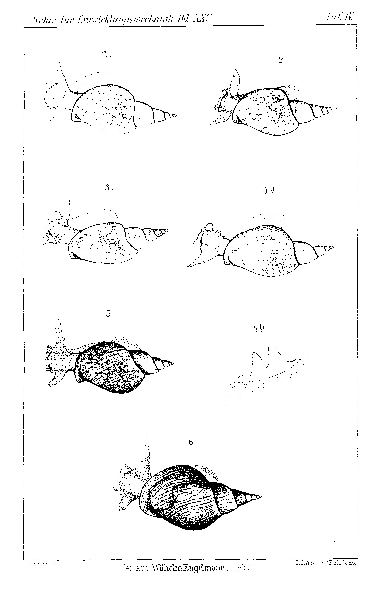

# Regeneration of the Tentacle and Eye in the Pond Snail (Limnaea stagnalis L.)

By

**Dr. Franz Megušar.**

*(From the Biologische Versuchsanstalt in Vienna.)*

With Plate IV.

Received on 31 August 1907.

*Archiv für Entwicklungsmechanik der Organismen*, vol. 25 (1907).

> **Full translation.** A complete English rendering of the running text of “Regeneration of the Tentacle and Eye in the Pond Snail (Limnaea)” (Megusar, 1907), including all tables, figure and plate legends, and footnotes. Numbers and table cells were transcribed from the page images, not the noisy OCR.

### Contents.

|  | Page |
|---|---|
| I. Historical | 135 |
| II. Experimental conditions | 136 |
| III. Operative methods | 138 |
| IV. Description of the individual regenerates | 139 |
| &nbsp;&nbsp;&nbsp;&nbsp;*a.* Amputation each time of a 2 mm long terminal tip of both tentacles | 139 |
| &nbsp;&nbsp;&nbsp;&nbsp;*b.* Amputation of a 3 mm long distal piece of the left tentacle | 139 |
| &nbsp;&nbsp;&nbsp;&nbsp;*c.* Amputation of the left tentacle near the base with simultaneous removal of the eye | 140 |
| &nbsp;&nbsp;&nbsp;&nbsp;*d.* Amputation of the whole right tentacle at the base with simultaneous removal of the eye and of the surrounding parts of the body | 140 |
| V. Survey of the results | 141 |
| VI. Theoretical remarks | 141 |
| VII. List of references | 143 |
| VIII. Explanation of the figures | 143 |

## I. Historical.

The question of the regenerative capacity of *Limnaea* is of quite recent date. Černy (1907) was the first, in his work on the regeneration of fresh-water and land snails, to be able to take up the view previously stated by Carrière (1880) and to subject it to closer examination. Köhler (1880) reports concerning his negative experiments on *Limnaea stagnalis* (namely on the eye): »Various attempts to make the eyes regenerate (it was for me also a matter of just 3 months to be able to observe this, and nevertheless these attempts to that 136 &nbsp;&nbsp;&nbsp;&nbsp; Franz Megušar

extent — which I repeated at various times of the year — always remained equally unsuccessful.« Supported by Morgan (1901), positive results obtained in related kinds came up for discussion — on *Physa*, *Limnaea* and *Planorbis* (eye regeneration); and the regeneration of the tentacle on *Planorbis*, *Paludina* and *Limnaea* had become known through observations of Carrière. The failure of regeneration in this mud-snail one will hardly be allowed to ascribe to the lack of regenerative potencies, but rather to the failure of the wound to heal up. Furthermore, the causes established by Kammerer (1905) experimentally for the appearance — yet otherwise so wondrous — of an increased regenerative capacity of *Proteus* [olm] (darkness, temperature minimum, restricted nutrition, slight injury, etc.) seem here too to come into question. Indeed, however much I have, in the later representations, allowed presumption rather than confidence to enter into the regeneration, in my experiments the influence of strongly advanced points was nonetheless evident. They demonstrated the relevant speed of growth at every point. That one of these young animals had the operation carried out on it only 3 months after its own hatching may here be incidentally remarked, and nonetheless these animals 3 weeks after the operation already possessed quite considerable regenerates; in some I cut them off, and a few weeks later, in a small glass dish, prepared the regenerate for the preparator, while she meanwhile deposited spawn.

## II. Experimental conditions.

### [Experimental setup on 27. VI. 07.]

Only by a happy chance did I come to test the regenerative capacity for the pond snail on this occasion. Already a long time before, I had observed, for the purpose of being able to study them, the life and activity of several larger and smaller mud-snails selected in the extensive stone basins of the cold plant-house of the Biologische Versuchsanstalt, and the *Hydrophilus*-larvae lying in wait for them. Days warm and sunny, when the animals came forth full of life — somewhat sluggish, it is true, but munching all the more cheerfully — they crept around, and only at a certain illumination did they betray, soon at the surface of the water, soon in the deep, the heightened agility. I made use of the opportunity and operated on these animals under, in my opinion, the most favorable conditions, which one must in narrower vessels Regeneration of the Tentacle and Eye in the Pond Snail. &nbsp;&nbsp;&nbsp;&nbsp; 137

be able to offer, and they would, if there be lodged in them even so slight a degree of regenerative capacity, manifest it. So much the more would my confidence in the regenerative capacity, awakened on the grounds of many positive results in related kinds, have been heightened, had I, before setting up the experiment, gained knowledge of the observation communicated by M. Ziegler (1906) — that he had come upon *Limnaea*e with »irregularly lobed tentacles« in nature; for most probably we have in this case to do with a regenerative multiple formation, such as is wont to occur precisely so often in snails.

At present, double formations on the tentacles of water-snails have become known through M. Ziegler (*Physa acuta*, *Planorbis contortus*, *Limnaea*), W. Köhler (*Ampullaria gigas* Spix) and Černy (*Planorbis corneus* — until my experiments the only experimental case!). I myself have found in the open a double formation on *Limnaea stagnalis* (Fig. 5).

The cause of this phenomenon — namely of the frequent superregenerates — is to be sought chiefly in the easy vulnerability of the delicate feelers. Injuries to this kind of snail (*Limnaea stagnalis*) must often occur, since it serves the larvae of the large water-beetles (*Hydrophilus piceus* and *aterrimus*) almost as exclusive food, and it not seldom happens that the attacked snails tear themselves loose from the enemy and, drawn into the shell, fall like a lifeless heavy body to the bottom of the water, in which struggle they can easily carry off injuries. The water-beetle larvae usually do not swim after such snails, but seek out a new victim for themselves.

The basin in question, in which I found the snails mentioned, showed a downright enchanting vegetation, which kept the water always clear. At the surface floated *Pontederia* (*Eichornia*) *crassipes* and *Lemna minor*; the whole basin was enmeshed in all directions by *Cladophora*, through whose thicket the long-stalked *Elodea densa*, etiolating in its lower parts, strove to force its way to the light.

The temperature of the water during the experimental period was always a high one and often rose above 25° C. The illumination was not intense; indeed, in the depths there even prevailed a half-darkness, so that perhaps the animals, in consequence of the slight illumination, bleached out, like the *Elodea* rooted in the depth, for they are pale and almost transparent. Only here and there do they show a dark- or light- 138 &nbsp;&nbsp;&nbsp;&nbsp; Franz Megušar

gray pigment, either in the form of longer or broader, irregularly branched flecks, or the individual flecks of this pigment flow together and form larger meshy pigment-portions (Fig. 1 to 4). Similarly, the pigmentation of *Spirostomum* already led, in a quite somber basin, to a reddish color-tone; *Physa fontinalis*, *Limnaea ovata*, *Planorbis corneus*, all rather darkly colored, are repeatedly to be met with by us in the large, somber dusky-colored fresh-water basins of our institute.

The mentioned basin I left to the snails until 25. VII. 1907. On this day I had to determine that, in this same basin, the *Hydrophilus*-larvae living there had become considerably fewer in number, and the valuable operated animals could in part not be found at all; for this reason I had to transfer all the snails into a medium-sized glass tank standing in the same room, since especially much algae vegetated there.

## III. Operative methods.

The first two snails I operated upon in the water by means of a fine, finely-pointed scissors — which manner [of working] is otherwise not customary in the usual regeneration experiments (although it already in itself, like the regeneration experiments, conforms to a habit of usage) — without a previous fixing of the animal, by cutting out the inner part of the left tentacle to an extent of about 2 mm in the longitudinal axis of the tentacle (indeed, in one animal I cut off the left tentacle to an extent of 3 mm). The operated animals showed, after the operation, lively flinching back into the housing, since they could hardly have inflicted damage on themselves through twofold doubled lacerations far in the front. The other two animals I operated upon out on land: thus the water was the obstacle to a deeply engaging operation in a barely noticeable manner. Scarcely had I let the snails [touch] the water-surface when the scissor-points cut firmly, scarcely so that one could follow it, on the ground that the tentacles are not seen at all there. I then turned to a quite by chance found method, which proved itself as expedient: I observed the snails as I held them up exactly to the sun's rays, took note, and saw that the tentacles showed themselves there against the sun, as they crept. I now sat down again to the operated animal so punctually that I [could] guide the scissors and within a few minutes worked far up to the snout-opening.

Regeneration of the Tentacle and Eye in the Pond Snail. &nbsp;&nbsp;&nbsp;&nbsp; 139

By this method I severed through, on the one animal, the right tentacle on the body, while it sprang back, completely alongside the eye-fleck. The cut-surface fell off arched. On the second animal nothing remained except the curve. The course was somewhat strong. Each operated animal then drew itself back into the basin again. After it was thereupon drawn back again into its element, I by no means held the snails wedged in their housing, but they bound themselves quietly upward and soon onto the water-plants again, and only with a certain hastening upward to the water-mirror.

## IV. Description of the individual regenerates.

### (up to 31. VII. 07.)

### *a.* Amputation each time of a 2 mm long terminal tip of both tentacles.

The housing of this animal afflicted with the regenerate possessed, at the time of setting up the experiment (27. VI. 07), a length of about 30 mm (measurement of the shell from the in-curved fore-end up to the tip). By the date of the cut, on 31. VII. 1907, it had reached an actual length of about 31½ mm.

The regeneration process was — and indeed not only in this one, but also in all the others to be examined in the experimental variations — somewhat thus, as one could recognize on such regenerates (somewhat in the housing): the wound was healed over, and a delicate skinlet had closed it. Both tentacle-stumps showed at their ends little small set-on small formations of the tentacle-tips of about 1 mm in length. These were, by the lighter coloration, easy to distinguish from the other part of the tentacle, [from] the rest of the tentacle. On the smaller stump the regenerate is the smaller (Fig. 1).

### *b.* Amputation of a 3 mm long distal piece of the left tentacle.

The housing of this animal showed at the time of the operation (27. VI.) a length of about 34 mm and would by then [be grown by] about one mm further. The left tentacle bears a pronounced regenerate, which sits at the upper [part] in the same and, in the position corresponding to the cut-surface, distinguishes itself in nothing from the foregoing. As a result 140 &nbsp;&nbsp;&nbsp;&nbsp; Franz Megušar

of the oblique cut-surface it is posited perpendicular to the same and therefore somewhat inclined toward the inside. It already possesses a length of about 2 mm (Fig. 2).

### *c.* Amputation of the left tentacle near the base with simultaneous removal of the eye.

The shell of the test-animal was 32 mm long at the time of operation (27. VI.) and reached by the time (31. VII.) a length of about 33 mm. Out of the residual cut-remnant of the tentacle there raised itself a delicate little tentacle, as the body up to here [forms] a small disc; therein lay plainly visible the reddish, curled eye-fleck running out in lighter coloration. It possesses (measured from the tip to the base) a length of about 4 mm and presents itself in lighter coloration. The regeneration of the eye, which was at the same time amputated, is here going forward only weakly, corresponding to the foregoing example (Fig. 3). It is however to be emphasized that in this experimental variation the coming-into-being of the whole regenerate was incomparably smaller than in the foregoing, the cause of which is the much smaller tentacle-portion.

### *d.* Amputation of the whole right tentacle at the base with simultaneous removal of the eye and of the surrounding parts of the body.

The test-animal showed at the time of setting up the experiment a length of about 34½ mm and would today let an increase of about 1½ mm be noted. There sits even at the distal end of the old tentacle a double tentacle and a new eye. The double formation has reached an upper height of about 2½ mm, the new eye thus a position about 1 mm [from there]. The two branches of the winged tentacles join together at the third quarter, while there at this place a separate brightish, light coloration sets on, easy to distinguish from the rest of the tentacle. The double formation showed, besides a similar form-equipment, also still a shape deviating in itself from the habitus of the normal eye. It is conically built (eye-stalk) and possesses at the tip a small pigment-fleck (eye-fleck). Besides, there runs from the forward side a fine pigment-street from the base of the eye-stalk to the pigment-fleck, which pigment-street the normal eye knows nothing of. Compared to the normal eye, the regenerated eye is conspicuous (Fig. 4).

Regeneration of the Tentacle and Eye in the Pond Snail. &nbsp;&nbsp;&nbsp;&nbsp; 141

## V. Survey of the results.

1) *Limnaea stagnalis* is able to restitute both parts of the tentacle and whole tentacles together with the eye.

2) The regeneration is introduced with the formation of a pale, delicate little skin, which was already laid down after a few days.

3) Three weeks after the operation all operated animals possessed distinct regenerates, which set themselves off distinctly from the left-over tentacle-stumps and lacked the beading characteristic of the normal tentacle.

4) Small pieces of the tentacle grow back more slowly than the whole tentacle, for the regenerated tip-piece is, in comparison with the circumference that the whole new tentacle has attained in the same time, considerably smaller. The cause of this phenomenon lies in any case therein, that to the tentacle-stump, with weak injury, a smaller surplus of nutriment destined for the reparation streams in than with stronger injury (Przibram).

5) After the extirpation of the tentacle together with the eye, both organs replaced themselves, and indeed the tentacle in double form. The regenerated miniature-eye departs from the normal eye already in the distinct setting-off that it shows toward the tentacle, and in its form. It is conical, runs out very pointed, and bears at the distal end a single pigment-fleck. Besides, it possesses, in contrast to the normal eye, on the forward side a narrow pigment-street, which extends from the pigment-fleck up to the base of the eye-stalk.

## VI. Theoretical remarks.

The supposition of Carrière, that the regenerative capacity belongs to the *Limnaea*e »either not at all or only in a very inconsiderable way,« is refuted according to my experimental results. Also Černy goes amiss when he means that to older individuals no regenerative power belongs, since of my test-animals three were already quite close to sexual maturity, and one specimen at the time of setting up the experiment had that size which a sexually mature animal possesses. Actually there was, as already mentioned at the outset, spawn deposited. Accordingly it is certain that the regenerative capacity here does not come to a standstill even with the attainment of sexual maturity, but still goes on operating further. This I can assert all the more surely since the egg-laying observed in the cases under consideration certainly already points to a still further-progressing growth of the regenerate.

Every complete failure of the regenerative potencies in this snail genus would be all the more remarkable, since phyletically very closely related genera have been credited with a high degree of regenerative capacity, and indeed all molluscs hitherto investigated experimentally in this direction have likewise been credited with a regenerative capacity generally distributed over their body — facts which speak for the relatively simple differentiation of the molluscan body. In particular, the extraordinarily high regenerative capacities in the shell-bearing snails also furnish us with clear proof that the regenerative capacity of these animals does **not** depend on the degree of probability of injury, and hence is not a product of natural selection, but is a general phenomenon which distinguishes all organisms in a greater or lesser measure, according to the kind of differentiation. What contradictions the adaptation theory of regeneration harbors within itself — for this *Limnaea* is now an instructive example: precisely in *Limnaea*, which, as noted in Section II (on the "experimental conditions"), is exposed to manifold injuries despite its shell — for the shell is very fragile, and even with complete withdrawal into it a broad surface of the sole of the foot still remains exposed to the attacker —, precisely in it the existence of a regenerative capacity escaped the observers the longest. And precisely in those molluscs in which special protective measures, such as a simple shell or a shell with a locking device, effectively defend the animal against external injuries, a regenerative capacity nearly equaling that of the worms has long been established experimentally. For in this group of snails there are replaced not only simple (tentacle) and more complicated (eye) external appendages, but even whole parts of the trunk, such as the head (Spallanzani, 1768, Schäffer, 1770, Carrière, 1880) and the foot (Morgan, 1901).

## VII. Bibliography.

Carrière, J., *Studien über die Regenerationserscheinungen bei den Wirbellosen.* I. Regeneration bei den Pulmonaten. Würzburg 1880.

Černý, A., *Versuche über Regeneration bei Süßwasser- und Nacktschnecken.* Arch. f. Entw.-Mech. Bd. XXIII. 4. Heft. S. 505–506. 1 Tafel. 1907.

Kammerer, P., *Die angeblichen Ausnahmen von der Regenerationsfähigkeit bei den Amphibien.* Lecture delivered in the Morphological-Physiological Society at Vienna. Centralbl. f. Phys. Bd. XIX. 18. Heft. S. 684–687. 1905.

Köhler, Walter, *Fußnote zu einem Aufsatz von Dr. Wilhelm Roth, Doppelte Regeneration eines Bartfadens bei einem Panzerwelse.* Blätter f. Aquarien- u. Terrarienkunde. Bd. XVI. 41. Heft. S. 408. 1905.

— *Regenerieren Süßwasserschnecken verloren gegangene Fühler?* Blätter f. Aquarien- u. Terrarienkunde. Bd. XVII. 5. Heft. S. 49. 1906.

Morgan, T. H., *Regeneration.* New York, Macmillan, 1901. p. 104.

Przibram, Hans, *Quantitative Wachstumstheorie der Regeneration.* Centralbl. f. Physiol. Bd. XIX. 18. Heft. S. 682–684. 1906.

Spallanzani, *Prodromo di un opera ad imprimersi sopra le riproduzioni animali.* Modena 1768.

*Jacob Christian Schäffers erstere und fernere Versuche mit Schnecken nebst einem Nachtrag.* Second edition. Regensburg 1770.

Ziegeler, Mathilde, *Regenerieren Schnecken verloren gegangene Fühler?* Blätter f. Aquarien- u. Terrarienkunde. Jahrg. XVII. 10. Heft. S. 100. Magdeburg 1906.

## VIII. Explanation of the Figures.

### Plate IV.

**Fig. 1.** Regeneration of an approximately 2 mm long terminal tip on each of the two tentacles. (The specimen is of strikingly pale color owing to its sojourn in a dark tank.) Natural size.  *(figure not reproduced)*

**Fig. 2.** Regeneration after amputation of an approximately 3 mm long distal section on the left tentacle. (This specimen too is bleached as a result of life in the dark.) Natural size.  *(figure not reproduced)*

**Fig. 3.** Regeneration after amputation of the left tentacle close to its base, with simultaneous removal of the eye (pigmentation as in Figs. 1, 2). Natural size.  *(figure not reproduced)*

**Fig. 4.** a Regeneration after amputation of the right tentacle right at its base and of the surrounding body skin (pigmentation as in Figs. 1–3). Natural size. b Regenerate somewhat enlarged.  *(figure not reproduced)*

**Fig. 5.** The double-formation found in nature. (This specimen at the same time shows the characteristic normal coloration of *Limnaea stagnalis* under the ordinary conditions of life, in particular light conditions.)  *(figure not reproduced)*

**Fig. 6** (addendum at the time of proof-correction). Regeneration of the left tentacle after operation on a "full-grown" (over-aged, idiometric) specimen. The cut made approximately through the middle of the tentacle. This regenerate was obtained only after the conclusion of the present work and therefore was no longer taken into account in the text.  *(figure not reproduced)*

## Figures

**Taf. IV.**

---

*Translator's note.* One of the Biologische Versuchsanstalt (Vienna Vivarium) papers flagged on the project site as a modern rediscovery target. Claims are rendered as stated in the original, not endorsed.
